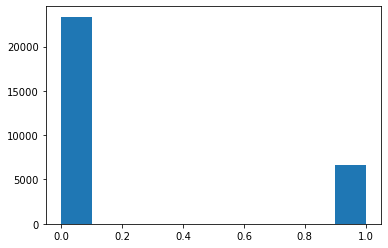
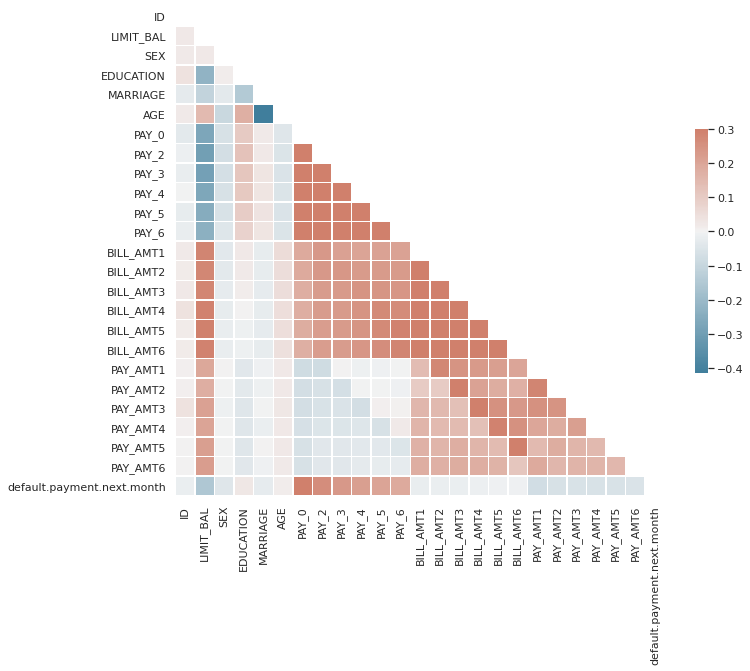
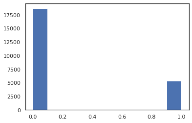
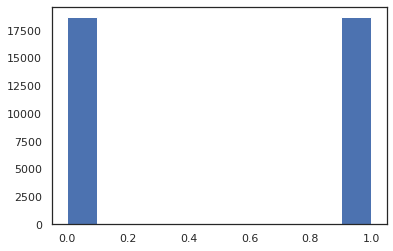
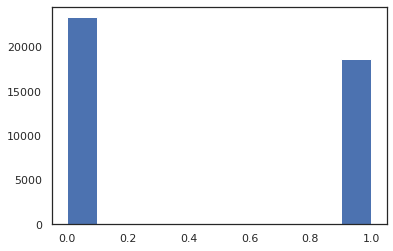

# 0. Introduction 
This notebook demonstrates the techniques to handle the class imbalance problem 
* <b>Stratification</b> 
* <b>Upsampling & Undersampling</b> 

# 1. Read Data & Preprocessing


```python
import numpy as np 
import pandas as pd 
```

### Download Data set [here](https://www.kaggle.com/uciml/default-of-credit-card-clients-dataset)


```python
# load the dataset
df = pd.read_csv('../../DATA/kaggle/default-cc-fraud/UCI_Credit_Card.csv')

```


```python
df.head()
```


<div>
<style scoped>
    .dataframe tbody tr th:only-of-type {
        vertical-align: middle;
    }

    .dataframe tbody tr th {
        vertical-align: top;
    }

    .dataframe thead th {
        text-align: right;
    }
</style>
<table border="1" class="dataframe">
  <thead>
    <tr style="text-align: right;">
      <th></th>
      <th>ID</th>
      <th>LIMIT_BAL</th>
      <th>SEX</th>
      <th>EDUCATION</th>
      <th>MARRIAGE</th>
      <th>AGE</th>
      <th>PAY_0</th>
      <th>PAY_2</th>
      <th>PAY_3</th>
      <th>PAY_4</th>
      <th>...</th>
      <th>BILL_AMT4</th>
      <th>BILL_AMT5</th>
      <th>BILL_AMT6</th>
      <th>PAY_AMT1</th>
      <th>PAY_AMT2</th>
      <th>PAY_AMT3</th>
      <th>PAY_AMT4</th>
      <th>PAY_AMT5</th>
      <th>PAY_AMT6</th>
      <th>default.payment.next.month</th>
    </tr>
  </thead>
  <tbody>
    <tr>
      <th>0</th>
      <td>1</td>
      <td>20000.0</td>
      <td>2</td>
      <td>2</td>
      <td>1</td>
      <td>24</td>
      <td>2</td>
      <td>2</td>
      <td>-1</td>
      <td>-1</td>
      <td>...</td>
      <td>0.0</td>
      <td>0.0</td>
      <td>0.0</td>
      <td>0.0</td>
      <td>689.0</td>
      <td>0.0</td>
      <td>0.0</td>
      <td>0.0</td>
      <td>0.0</td>
      <td>1</td>
    </tr>
    <tr>
      <th>1</th>
      <td>2</td>
      <td>120000.0</td>
      <td>2</td>
      <td>2</td>
      <td>2</td>
      <td>26</td>
      <td>-1</td>
      <td>2</td>
      <td>0</td>
      <td>0</td>
      <td>...</td>
      <td>3272.0</td>
      <td>3455.0</td>
      <td>3261.0</td>
      <td>0.0</td>
      <td>1000.0</td>
      <td>1000.0</td>
      <td>1000.0</td>
      <td>0.0</td>
      <td>2000.0</td>
      <td>1</td>
    </tr>
    <tr>
      <th>2</th>
      <td>3</td>
      <td>90000.0</td>
      <td>2</td>
      <td>2</td>
      <td>2</td>
      <td>34</td>
      <td>0</td>
      <td>0</td>
      <td>0</td>
      <td>0</td>
      <td>...</td>
      <td>14331.0</td>
      <td>14948.0</td>
      <td>15549.0</td>
      <td>1518.0</td>
      <td>1500.0</td>
      <td>1000.0</td>
      <td>1000.0</td>
      <td>1000.0</td>
      <td>5000.0</td>
      <td>0</td>
    </tr>
    <tr>
      <th>3</th>
      <td>4</td>
      <td>50000.0</td>
      <td>2</td>
      <td>2</td>
      <td>1</td>
      <td>37</td>
      <td>0</td>
      <td>0</td>
      <td>0</td>
      <td>0</td>
      <td>...</td>
      <td>28314.0</td>
      <td>28959.0</td>
      <td>29547.0</td>
      <td>2000.0</td>
      <td>2019.0</td>
      <td>1200.0</td>
      <td>1100.0</td>
      <td>1069.0</td>
      <td>1000.0</td>
      <td>0</td>
    </tr>
    <tr>
      <th>4</th>
      <td>5</td>
      <td>50000.0</td>
      <td>1</td>
      <td>2</td>
      <td>1</td>
      <td>57</td>
      <td>-1</td>
      <td>0</td>
      <td>-1</td>
      <td>0</td>
      <td>...</td>
      <td>20940.0</td>
      <td>19146.0</td>
      <td>19131.0</td>
      <td>2000.0</td>
      <td>36681.0</td>
      <td>10000.0</td>
      <td>9000.0</td>
      <td>689.0</td>
      <td>679.0</td>
      <td>0</td>
    </tr>
  </tbody>
</table>
<p>5 rows × 25 columns</p>
</div>


```python
df.columns
```


    Index(['ID', 'LIMIT_BAL', 'SEX', 'EDUCATION', 'MARRIAGE', 'AGE', 'PAY_0',
           'PAY_2', 'PAY_3', 'PAY_4', 'PAY_5', 'PAY_6', 'BILL_AMT1', 'BILL_AMT2',
           'BILL_AMT3', 'BILL_AMT4', 'BILL_AMT5', 'BILL_AMT6', 'PAY_AMT1',
           'PAY_AMT2', 'PAY_AMT3', 'PAY_AMT4', 'PAY_AMT5', 'PAY_AMT6',
           'default.payment.next.month'],
          dtype='object')


```python
df.info()
```

    <class 'pandas.core.frame.DataFrame'>
    RangeIndex: 30000 entries, 0 to 29999
    Data columns (total 25 columns):
    ID                            30000 non-null int64
    LIMIT_BAL                     30000 non-null float64
    SEX                           30000 non-null int64
    EDUCATION                     30000 non-null int64
    MARRIAGE                      30000 non-null int64
    AGE                           30000 non-null int64
    PAY_0                         30000 non-null int64
    PAY_2                         30000 non-null int64
    PAY_3                         30000 non-null int64
    PAY_4                         30000 non-null int64
    PAY_5                         30000 non-null int64
    PAY_6                         30000 non-null int64
    BILL_AMT1                     30000 non-null float64
    BILL_AMT2                     30000 non-null float64
    BILL_AMT3                     30000 non-null float64
    BILL_AMT4                     30000 non-null float64
    BILL_AMT5                     30000 non-null float64
    BILL_AMT6                     30000 non-null float64
    PAY_AMT1                      30000 non-null float64
    PAY_AMT2                      30000 non-null float64
    PAY_AMT3                      30000 non-null float64
    PAY_AMT4                      30000 non-null float64
    PAY_AMT5                      30000 non-null float64
    PAY_AMT6                      30000 non-null float64
    default.payment.next.month    30000 non-null int64
    dtypes: float64(13), int64(12)
    memory usage: 5.7 MB


### Check missing Values


```python
df.isnull().sum()
```


    ID                            0
    LIMIT_BAL                     0
    SEX                           0
    EDUCATION                     0
    MARRIAGE                      0
    AGE                           0
    PAY_0                         0
    PAY_2                         0
    PAY_3                         0
    PAY_4                         0
    PAY_5                         0
    PAY_6                         0
    BILL_AMT1                     0
    BILL_AMT2                     0
    BILL_AMT3                     0
    BILL_AMT4                     0
    BILL_AMT5                     0
    BILL_AMT6                     0
    PAY_AMT1                      0
    PAY_AMT2                      0
    PAY_AMT3                      0
    PAY_AMT4                      0
    PAY_AMT5                      0
    PAY_AMT6                      0
    default.payment.next.month    0
    dtype: int64


<b>There is no missing values</b>

## Check Label Distribution


```python
df['default.payment.next.month'].unique()
```


    array([1, 0])


```python
dist_target = df['default.payment.next.month'].sum() / len(df['default.payment.next.month'])
print(dist_target)
```

    0.2212


```python
import matplotlib.pyplot as plt 
plt.hist(df['default.payment.next.month'])
```


    (array([23364.,     0.,     0.,     0.,     0.,     0.,     0.,     0.,
                0.,  6636.]),
     array([0. , 0.1, 0.2, 0.3, 0.4, 0.5, 0.6, 0.7, 0.8, 0.9, 1. ]),
     <BarContainer object of 10 artists>)


    

    


<b>Data have imbalance problem. The data is binary, only 0 or 1 label. But only 22% of the data belong to the 1 and the rest belong to 0.</b>


```python
df['default.payment.next.month'].value_counts()
```


    0    23364
    1     6636
    Name: default.payment.next.month, dtype: int64


## Features Selection 

The data have imbalance data problem. We will take care  of this problem later. 


First, we look for features that has <b>high</b> corretation with the label (payment next month), so we use <b>matrix correlation.</b>


```python
corr = df.corr()
corr
```


<div>
<style scoped>
    .dataframe tbody tr th:only-of-type {
        vertical-align: middle;
    }

    .dataframe tbody tr th {
        vertical-align: top;
    }

    .dataframe thead th {
        text-align: right;
    }
</style>
<table border="1" class="dataframe">
  <thead>
    <tr style="text-align: right;">
      <th></th>
      <th>ID</th>
      <th>LIMIT_BAL</th>
      <th>SEX</th>
      <th>EDUCATION</th>
      <th>MARRIAGE</th>
      <th>AGE</th>
      <th>PAY_0</th>
      <th>PAY_2</th>
      <th>PAY_3</th>
      <th>PAY_4</th>
      <th>...</th>
      <th>BILL_AMT4</th>
      <th>BILL_AMT5</th>
      <th>BILL_AMT6</th>
      <th>PAY_AMT1</th>
      <th>PAY_AMT2</th>
      <th>PAY_AMT3</th>
      <th>PAY_AMT4</th>
      <th>PAY_AMT5</th>
      <th>PAY_AMT6</th>
      <th>default.payment.next.month</th>
    </tr>
  </thead>
  <tbody>
    <tr>
      <th>ID</th>
      <td>1.000000</td>
      <td>0.026179</td>
      <td>0.018497</td>
      <td>0.039177</td>
      <td>-0.029079</td>
      <td>0.018678</td>
      <td>-0.030575</td>
      <td>-0.011215</td>
      <td>-0.018494</td>
      <td>-0.002735</td>
      <td>...</td>
      <td>0.040351</td>
      <td>0.016705</td>
      <td>0.016730</td>
      <td>0.009742</td>
      <td>0.008406</td>
      <td>0.039151</td>
      <td>0.007793</td>
      <td>0.000652</td>
      <td>0.003000</td>
      <td>-0.013952</td>
    </tr>
    <tr>
      <th>LIMIT_BAL</th>
      <td>0.026179</td>
      <td>1.000000</td>
      <td>0.024755</td>
      <td>-0.219161</td>
      <td>-0.108139</td>
      <td>0.144713</td>
      <td>-0.271214</td>
      <td>-0.296382</td>
      <td>-0.286123</td>
      <td>-0.267460</td>
      <td>...</td>
      <td>0.293988</td>
      <td>0.295562</td>
      <td>0.290389</td>
      <td>0.195236</td>
      <td>0.178408</td>
      <td>0.210167</td>
      <td>0.203242</td>
      <td>0.217202</td>
      <td>0.219595</td>
      <td>-0.153520</td>
    </tr>
    <tr>
      <th>SEX</th>
      <td>0.018497</td>
      <td>0.024755</td>
      <td>1.000000</td>
      <td>0.014232</td>
      <td>-0.031389</td>
      <td>-0.090874</td>
      <td>-0.057643</td>
      <td>-0.070771</td>
      <td>-0.066096</td>
      <td>-0.060173</td>
      <td>...</td>
      <td>-0.021880</td>
      <td>-0.017005</td>
      <td>-0.016733</td>
      <td>-0.000242</td>
      <td>-0.001391</td>
      <td>-0.008597</td>
      <td>-0.002229</td>
      <td>-0.001667</td>
      <td>-0.002766</td>
      <td>-0.039961</td>
    </tr>
    <tr>
      <th>EDUCATION</th>
      <td>0.039177</td>
      <td>-0.219161</td>
      <td>0.014232</td>
      <td>1.000000</td>
      <td>-0.143464</td>
      <td>0.175061</td>
      <td>0.105364</td>
      <td>0.121566</td>
      <td>0.114025</td>
      <td>0.108793</td>
      <td>...</td>
      <td>-0.000451</td>
      <td>-0.007567</td>
      <td>-0.009099</td>
      <td>-0.037456</td>
      <td>-0.030038</td>
      <td>-0.039943</td>
      <td>-0.038218</td>
      <td>-0.040358</td>
      <td>-0.037200</td>
      <td>0.028006</td>
    </tr>
    <tr>
      <th>MARRIAGE</th>
      <td>-0.029079</td>
      <td>-0.108139</td>
      <td>-0.031389</td>
      <td>-0.143464</td>
      <td>1.000000</td>
      <td>-0.414170</td>
      <td>0.019917</td>
      <td>0.024199</td>
      <td>0.032688</td>
      <td>0.033122</td>
      <td>...</td>
      <td>-0.023344</td>
      <td>-0.025393</td>
      <td>-0.021207</td>
      <td>-0.005979</td>
      <td>-0.008093</td>
      <td>-0.003541</td>
      <td>-0.012659</td>
      <td>-0.001205</td>
      <td>-0.006641</td>
      <td>-0.024339</td>
    </tr>
    <tr>
      <th>AGE</th>
      <td>0.018678</td>
      <td>0.144713</td>
      <td>-0.090874</td>
      <td>0.175061</td>
      <td>-0.414170</td>
      <td>1.000000</td>
      <td>-0.039447</td>
      <td>-0.050148</td>
      <td>-0.053048</td>
      <td>-0.049722</td>
      <td>...</td>
      <td>0.051353</td>
      <td>0.049345</td>
      <td>0.047613</td>
      <td>0.026147</td>
      <td>0.021785</td>
      <td>0.029247</td>
      <td>0.021379</td>
      <td>0.022850</td>
      <td>0.019478</td>
      <td>0.013890</td>
    </tr>
    <tr>
      <th>PAY_0</th>
      <td>-0.030575</td>
      <td>-0.271214</td>
      <td>-0.057643</td>
      <td>0.105364</td>
      <td>0.019917</td>
      <td>-0.039447</td>
      <td>1.000000</td>
      <td>0.672164</td>
      <td>0.574245</td>
      <td>0.538841</td>
      <td>...</td>
      <td>0.179125</td>
      <td>0.180635</td>
      <td>0.176980</td>
      <td>-0.079269</td>
      <td>-0.070101</td>
      <td>-0.070561</td>
      <td>-0.064005</td>
      <td>-0.058190</td>
      <td>-0.058673</td>
      <td>0.324794</td>
    </tr>
    <tr>
      <th>PAY_2</th>
      <td>-0.011215</td>
      <td>-0.296382</td>
      <td>-0.070771</td>
      <td>0.121566</td>
      <td>0.024199</td>
      <td>-0.050148</td>
      <td>0.672164</td>
      <td>1.000000</td>
      <td>0.766552</td>
      <td>0.662067</td>
      <td>...</td>
      <td>0.222237</td>
      <td>0.221348</td>
      <td>0.219403</td>
      <td>-0.080701</td>
      <td>-0.058990</td>
      <td>-0.055901</td>
      <td>-0.046858</td>
      <td>-0.037093</td>
      <td>-0.036500</td>
      <td>0.263551</td>
    </tr>
    <tr>
      <th>PAY_3</th>
      <td>-0.018494</td>
      <td>-0.286123</td>
      <td>-0.066096</td>
      <td>0.114025</td>
      <td>0.032688</td>
      <td>-0.053048</td>
      <td>0.574245</td>
      <td>0.766552</td>
      <td>1.000000</td>
      <td>0.777359</td>
      <td>...</td>
      <td>0.227202</td>
      <td>0.225145</td>
      <td>0.222327</td>
      <td>0.001295</td>
      <td>-0.066793</td>
      <td>-0.053311</td>
      <td>-0.046067</td>
      <td>-0.035863</td>
      <td>-0.035861</td>
      <td>0.235253</td>
    </tr>
    <tr>
      <th>PAY_4</th>
      <td>-0.002735</td>
      <td>-0.267460</td>
      <td>-0.060173</td>
      <td>0.108793</td>
      <td>0.033122</td>
      <td>-0.049722</td>
      <td>0.538841</td>
      <td>0.662067</td>
      <td>0.777359</td>
      <td>1.000000</td>
      <td>...</td>
      <td>0.245917</td>
      <td>0.242902</td>
      <td>0.239154</td>
      <td>-0.009362</td>
      <td>-0.001944</td>
      <td>-0.069235</td>
      <td>-0.043461</td>
      <td>-0.033590</td>
      <td>-0.026565</td>
      <td>0.216614</td>
    </tr>
    <tr>
      <th>PAY_5</th>
      <td>-0.022199</td>
      <td>-0.249411</td>
      <td>-0.055064</td>
      <td>0.097520</td>
      <td>0.035629</td>
      <td>-0.053826</td>
      <td>0.509426</td>
      <td>0.622780</td>
      <td>0.686775</td>
      <td>0.819835</td>
      <td>...</td>
      <td>0.271915</td>
      <td>0.269783</td>
      <td>0.262509</td>
      <td>-0.006089</td>
      <td>-0.003191</td>
      <td>0.009062</td>
      <td>-0.058299</td>
      <td>-0.033337</td>
      <td>-0.023027</td>
      <td>0.204149</td>
    </tr>
    <tr>
      <th>PAY_6</th>
      <td>-0.020270</td>
      <td>-0.235195</td>
      <td>-0.044008</td>
      <td>0.082316</td>
      <td>0.034345</td>
      <td>-0.048773</td>
      <td>0.474553</td>
      <td>0.575501</td>
      <td>0.632684</td>
      <td>0.716449</td>
      <td>...</td>
      <td>0.266356</td>
      <td>0.290894</td>
      <td>0.285091</td>
      <td>-0.001496</td>
      <td>-0.005223</td>
      <td>0.005834</td>
      <td>0.019018</td>
      <td>-0.046434</td>
      <td>-0.025299</td>
      <td>0.186866</td>
    </tr>
    <tr>
      <th>BILL_AMT1</th>
      <td>0.019389</td>
      <td>0.285430</td>
      <td>-0.033642</td>
      <td>0.023581</td>
      <td>-0.023472</td>
      <td>0.056239</td>
      <td>0.187068</td>
      <td>0.234887</td>
      <td>0.208473</td>
      <td>0.202812</td>
      <td>...</td>
      <td>0.860272</td>
      <td>0.829779</td>
      <td>0.802650</td>
      <td>0.140277</td>
      <td>0.099355</td>
      <td>0.156887</td>
      <td>0.158303</td>
      <td>0.167026</td>
      <td>0.179341</td>
      <td>-0.019644</td>
    </tr>
    <tr>
      <th>BILL_AMT2</th>
      <td>0.017982</td>
      <td>0.278314</td>
      <td>-0.031183</td>
      <td>0.018749</td>
      <td>-0.021602</td>
      <td>0.054283</td>
      <td>0.189859</td>
      <td>0.235257</td>
      <td>0.237295</td>
      <td>0.225816</td>
      <td>...</td>
      <td>0.892482</td>
      <td>0.859778</td>
      <td>0.831594</td>
      <td>0.280365</td>
      <td>0.100851</td>
      <td>0.150718</td>
      <td>0.147398</td>
      <td>0.157957</td>
      <td>0.174256</td>
      <td>-0.014193</td>
    </tr>
    <tr>
      <th>BILL_AMT3</th>
      <td>0.024354</td>
      <td>0.283236</td>
      <td>-0.024563</td>
      <td>0.013002</td>
      <td>-0.024909</td>
      <td>0.053710</td>
      <td>0.179785</td>
      <td>0.224146</td>
      <td>0.227494</td>
      <td>0.244983</td>
      <td>...</td>
      <td>0.923969</td>
      <td>0.883910</td>
      <td>0.853320</td>
      <td>0.244335</td>
      <td>0.316936</td>
      <td>0.130011</td>
      <td>0.143405</td>
      <td>0.179712</td>
      <td>0.182326</td>
      <td>-0.014076</td>
    </tr>
    <tr>
      <th>BILL_AMT4</th>
      <td>0.040351</td>
      <td>0.293988</td>
      <td>-0.021880</td>
      <td>-0.000451</td>
      <td>-0.023344</td>
      <td>0.051353</td>
      <td>0.179125</td>
      <td>0.222237</td>
      <td>0.227202</td>
      <td>0.245917</td>
      <td>...</td>
      <td>1.000000</td>
      <td>0.940134</td>
      <td>0.900941</td>
      <td>0.233012</td>
      <td>0.207564</td>
      <td>0.300023</td>
      <td>0.130191</td>
      <td>0.160433</td>
      <td>0.177637</td>
      <td>-0.010156</td>
    </tr>
    <tr>
      <th>BILL_AMT5</th>
      <td>0.016705</td>
      <td>0.295562</td>
      <td>-0.017005</td>
      <td>-0.007567</td>
      <td>-0.025393</td>
      <td>0.049345</td>
      <td>0.180635</td>
      <td>0.221348</td>
      <td>0.225145</td>
      <td>0.242902</td>
      <td>...</td>
      <td>0.940134</td>
      <td>1.000000</td>
      <td>0.946197</td>
      <td>0.217031</td>
      <td>0.181246</td>
      <td>0.252305</td>
      <td>0.293118</td>
      <td>0.141574</td>
      <td>0.164184</td>
      <td>-0.006760</td>
    </tr>
    <tr>
      <th>BILL_AMT6</th>
      <td>0.016730</td>
      <td>0.290389</td>
      <td>-0.016733</td>
      <td>-0.009099</td>
      <td>-0.021207</td>
      <td>0.047613</td>
      <td>0.176980</td>
      <td>0.219403</td>
      <td>0.222327</td>
      <td>0.239154</td>
      <td>...</td>
      <td>0.900941</td>
      <td>0.946197</td>
      <td>1.000000</td>
      <td>0.199965</td>
      <td>0.172663</td>
      <td>0.233770</td>
      <td>0.250237</td>
      <td>0.307729</td>
      <td>0.115494</td>
      <td>-0.005372</td>
    </tr>
    <tr>
      <th>PAY_AMT1</th>
      <td>0.009742</td>
      <td>0.195236</td>
      <td>-0.000242</td>
      <td>-0.037456</td>
      <td>-0.005979</td>
      <td>0.026147</td>
      <td>-0.079269</td>
      <td>-0.080701</td>
      <td>0.001295</td>
      <td>-0.009362</td>
      <td>...</td>
      <td>0.233012</td>
      <td>0.217031</td>
      <td>0.199965</td>
      <td>1.000000</td>
      <td>0.285576</td>
      <td>0.252191</td>
      <td>0.199558</td>
      <td>0.148459</td>
      <td>0.185735</td>
      <td>-0.072929</td>
    </tr>
    <tr>
      <th>PAY_AMT2</th>
      <td>0.008406</td>
      <td>0.178408</td>
      <td>-0.001391</td>
      <td>-0.030038</td>
      <td>-0.008093</td>
      <td>0.021785</td>
      <td>-0.070101</td>
      <td>-0.058990</td>
      <td>-0.066793</td>
      <td>-0.001944</td>
      <td>...</td>
      <td>0.207564</td>
      <td>0.181246</td>
      <td>0.172663</td>
      <td>0.285576</td>
      <td>1.000000</td>
      <td>0.244770</td>
      <td>0.180107</td>
      <td>0.180908</td>
      <td>0.157634</td>
      <td>-0.058579</td>
    </tr>
    <tr>
      <th>PAY_AMT3</th>
      <td>0.039151</td>
      <td>0.210167</td>
      <td>-0.008597</td>
      <td>-0.039943</td>
      <td>-0.003541</td>
      <td>0.029247</td>
      <td>-0.070561</td>
      <td>-0.055901</td>
      <td>-0.053311</td>
      <td>-0.069235</td>
      <td>...</td>
      <td>0.300023</td>
      <td>0.252305</td>
      <td>0.233770</td>
      <td>0.252191</td>
      <td>0.244770</td>
      <td>1.000000</td>
      <td>0.216325</td>
      <td>0.159214</td>
      <td>0.162740</td>
      <td>-0.056250</td>
    </tr>
    <tr>
      <th>PAY_AMT4</th>
      <td>0.007793</td>
      <td>0.203242</td>
      <td>-0.002229</td>
      <td>-0.038218</td>
      <td>-0.012659</td>
      <td>0.021379</td>
      <td>-0.064005</td>
      <td>-0.046858</td>
      <td>-0.046067</td>
      <td>-0.043461</td>
      <td>...</td>
      <td>0.130191</td>
      <td>0.293118</td>
      <td>0.250237</td>
      <td>0.199558</td>
      <td>0.180107</td>
      <td>0.216325</td>
      <td>1.000000</td>
      <td>0.151830</td>
      <td>0.157834</td>
      <td>-0.056827</td>
    </tr>
    <tr>
      <th>PAY_AMT5</th>
      <td>0.000652</td>
      <td>0.217202</td>
      <td>-0.001667</td>
      <td>-0.040358</td>
      <td>-0.001205</td>
      <td>0.022850</td>
      <td>-0.058190</td>
      <td>-0.037093</td>
      <td>-0.035863</td>
      <td>-0.033590</td>
      <td>...</td>
      <td>0.160433</td>
      <td>0.141574</td>
      <td>0.307729</td>
      <td>0.148459</td>
      <td>0.180908</td>
      <td>0.159214</td>
      <td>0.151830</td>
      <td>1.000000</td>
      <td>0.154896</td>
      <td>-0.055124</td>
    </tr>
    <tr>
      <th>PAY_AMT6</th>
      <td>0.003000</td>
      <td>0.219595</td>
      <td>-0.002766</td>
      <td>-0.037200</td>
      <td>-0.006641</td>
      <td>0.019478</td>
      <td>-0.058673</td>
      <td>-0.036500</td>
      <td>-0.035861</td>
      <td>-0.026565</td>
      <td>...</td>
      <td>0.177637</td>
      <td>0.164184</td>
      <td>0.115494</td>
      <td>0.185735</td>
      <td>0.157634</td>
      <td>0.162740</td>
      <td>0.157834</td>
      <td>0.154896</td>
      <td>1.000000</td>
      <td>-0.053183</td>
    </tr>
    <tr>
      <th>default.payment.next.month</th>
      <td>-0.013952</td>
      <td>-0.153520</td>
      <td>-0.039961</td>
      <td>0.028006</td>
      <td>-0.024339</td>
      <td>0.013890</td>
      <td>0.324794</td>
      <td>0.263551</td>
      <td>0.235253</td>
      <td>0.216614</td>
      <td>...</td>
      <td>-0.010156</td>
      <td>-0.006760</td>
      <td>-0.005372</td>
      <td>-0.072929</td>
      <td>-0.058579</td>
      <td>-0.056250</td>
      <td>-0.056827</td>
      <td>-0.055124</td>
      <td>-0.053183</td>
      <td>1.000000</td>
    </tr>
  </tbody>
</table>
<p>25 rows × 25 columns</p>
</div>


### Plot Correlation Matrix as Heatmap


```python
import seaborn as sns
sns.set_theme(style="white")

# Generate a mask for the upper triangle
mask = np.triu(np.ones_like(corr, dtype=bool))

# Set up the matplotlib figure
f, ax = plt.subplots(figsize=(11, 9))

# Generate a custom diverging colormap
cmap = sns.diverging_palette(230, 20, as_cmap=True)

# Draw the heatmap with the mask and correct aspect ratio
sns.heatmap(corr, mask=mask, cmap=cmap, vmax=.3, center=0,
            square=True, linewidths=.5, cbar_kws={"shrink": .5})
```


    <AxesSubplot:>


    

    


```python
corr_target = abs(corr['default.payment.next.month'])
```


```python
type(corr_target)
```


    pandas.core.series.Series


```python
corr_target.sort_values()
```


    BILL_AMT6                     0.005372
    BILL_AMT5                     0.006760
    BILL_AMT4                     0.010156
    AGE                           0.013890
    ID                            0.013952
    BILL_AMT3                     0.014076
    BILL_AMT2                     0.014193
    BILL_AMT1                     0.019644
    MARRIAGE                      0.024339
    EDUCATION                     0.028006
    SEX                           0.039961
    PAY_AMT6                      0.053183
    PAY_AMT5                      0.055124
    PAY_AMT3                      0.056250
    PAY_AMT4                      0.056827
    PAY_AMT2                      0.058579
    PAY_AMT1                      0.072929
    LIMIT_BAL                     0.153520
    PAY_6                         0.186866
    PAY_5                         0.204149
    PAY_4                         0.216614
    PAY_3                         0.235253
    PAY_2                         0.263551
    PAY_0                         0.324794
    default.payment.next.month    1.000000
    Name: default.payment.next.month, dtype: float64


### Select High Correlation feature 
select all features with correlation more than <b>0.01</b>. (my own threshold) 


```python
features_colums = corr_target[corr_target>0.01]
features_colums.index
```


    Index(['ID', 'LIMIT_BAL', 'SEX', 'EDUCATION', 'MARRIAGE', 'AGE', 'PAY_0',
           'PAY_2', 'PAY_3', 'PAY_4', 'PAY_5', 'PAY_6', 'BILL_AMT1', 'BILL_AMT2',
           'BILL_AMT3', 'BILL_AMT4', 'PAY_AMT1', 'PAY_AMT2', 'PAY_AMT3',
           'PAY_AMT4', 'PAY_AMT5', 'PAY_AMT6', 'default.payment.next.month'],
          dtype='object')


```python
features_ = df[features_colums.index]
labels = features_['default.payment.next.month']
features = features_.drop(['default.payment.next.month'],axis=1)
features.head()
```


<div>
<style scoped>
    .dataframe tbody tr th:only-of-type {
        vertical-align: middle;
    }

    .dataframe tbody tr th {
        vertical-align: top;
    }

    .dataframe thead th {
        text-align: right;
    }
</style>
<table border="1" class="dataframe">
  <thead>
    <tr style="text-align: right;">
      <th></th>
      <th>ID</th>
      <th>LIMIT_BAL</th>
      <th>SEX</th>
      <th>EDUCATION</th>
      <th>MARRIAGE</th>
      <th>AGE</th>
      <th>PAY_0</th>
      <th>PAY_2</th>
      <th>PAY_3</th>
      <th>PAY_4</th>
      <th>...</th>
      <th>BILL_AMT1</th>
      <th>BILL_AMT2</th>
      <th>BILL_AMT3</th>
      <th>BILL_AMT4</th>
      <th>PAY_AMT1</th>
      <th>PAY_AMT2</th>
      <th>PAY_AMT3</th>
      <th>PAY_AMT4</th>
      <th>PAY_AMT5</th>
      <th>PAY_AMT6</th>
    </tr>
  </thead>
  <tbody>
    <tr>
      <th>0</th>
      <td>1</td>
      <td>20000.0</td>
      <td>2</td>
      <td>2</td>
      <td>1</td>
      <td>24</td>
      <td>2</td>
      <td>2</td>
      <td>-1</td>
      <td>-1</td>
      <td>...</td>
      <td>3913.0</td>
      <td>3102.0</td>
      <td>689.0</td>
      <td>0.0</td>
      <td>0.0</td>
      <td>689.0</td>
      <td>0.0</td>
      <td>0.0</td>
      <td>0.0</td>
      <td>0.0</td>
    </tr>
    <tr>
      <th>1</th>
      <td>2</td>
      <td>120000.0</td>
      <td>2</td>
      <td>2</td>
      <td>2</td>
      <td>26</td>
      <td>-1</td>
      <td>2</td>
      <td>0</td>
      <td>0</td>
      <td>...</td>
      <td>2682.0</td>
      <td>1725.0</td>
      <td>2682.0</td>
      <td>3272.0</td>
      <td>0.0</td>
      <td>1000.0</td>
      <td>1000.0</td>
      <td>1000.0</td>
      <td>0.0</td>
      <td>2000.0</td>
    </tr>
    <tr>
      <th>2</th>
      <td>3</td>
      <td>90000.0</td>
      <td>2</td>
      <td>2</td>
      <td>2</td>
      <td>34</td>
      <td>0</td>
      <td>0</td>
      <td>0</td>
      <td>0</td>
      <td>...</td>
      <td>29239.0</td>
      <td>14027.0</td>
      <td>13559.0</td>
      <td>14331.0</td>
      <td>1518.0</td>
      <td>1500.0</td>
      <td>1000.0</td>
      <td>1000.0</td>
      <td>1000.0</td>
      <td>5000.0</td>
    </tr>
    <tr>
      <th>3</th>
      <td>4</td>
      <td>50000.0</td>
      <td>2</td>
      <td>2</td>
      <td>1</td>
      <td>37</td>
      <td>0</td>
      <td>0</td>
      <td>0</td>
      <td>0</td>
      <td>...</td>
      <td>46990.0</td>
      <td>48233.0</td>
      <td>49291.0</td>
      <td>28314.0</td>
      <td>2000.0</td>
      <td>2019.0</td>
      <td>1200.0</td>
      <td>1100.0</td>
      <td>1069.0</td>
      <td>1000.0</td>
    </tr>
    <tr>
      <th>4</th>
      <td>5</td>
      <td>50000.0</td>
      <td>1</td>
      <td>2</td>
      <td>1</td>
      <td>57</td>
      <td>-1</td>
      <td>0</td>
      <td>-1</td>
      <td>0</td>
      <td>...</td>
      <td>8617.0</td>
      <td>5670.0</td>
      <td>35835.0</td>
      <td>20940.0</td>
      <td>2000.0</td>
      <td>36681.0</td>
      <td>10000.0</td>
      <td>9000.0</td>
      <td>689.0</td>
      <td>679.0</td>
    </tr>
  </tbody>
</table>
<p>5 rows × 22 columns</p>
</div>


```python
labels.head()
```


    0    1
    1    1
    2    0
    3    0
    4    0
    Name: default.payment.next.month, dtype: int64


## Split Data into Train and Test data

### Try with Stratify

If you are not familiar wth stratification, you may check this [post](https://towardsdatascience.com/what-is-stratified-cross-validation-in-machine-learning-8844f3e7ae8e)


```python
from sklearn.model_selection import train_test_split
X_train1, X_test1, y_train1, y_test1 = train_test_split(features, labels,stratify=labels.values, test_size=0.2)
```


```python
print('proportion on Training Data :  {}'.format(y_train1.sum() / len(y_train1)))
print('proportion on Training Data :  {}'.format(y_test1.sum() / len(y_test1)))

```

    proportion on Training Data :  0.22120833333333334
    proportion on Training Data :  0.22116666666666668


We got the <b>same portion</b> for training and testing! 


```python
X_train1.count()
```


    ID           24000
    LIMIT_BAL    24000
    SEX          24000
    EDUCATION    24000
    MARRIAGE     24000
    AGE          24000
    PAY_0        24000
    PAY_2        24000
    PAY_3        24000
    PAY_4        24000
    PAY_5        24000
    PAY_6        24000
    BILL_AMT1    24000
    BILL_AMT2    24000
    BILL_AMT3    24000
    BILL_AMT4    24000
    PAY_AMT1     24000
    PAY_AMT2     24000
    PAY_AMT3     24000
    PAY_AMT4     24000
    PAY_AMT5     24000
    PAY_AMT6     24000
    dtype: int64


```python
y_train1.count()
```


    24000


```python
plt.hist(y_train1)
```


    (array([18691.,     0.,     0.,     0.,     0.,     0.,     0.,     0.,
                0.,  5309.]),
     array([0. , 0.1, 0.2, 0.3, 0.4, 0.5, 0.6, 0.7, 0.8, 0.9, 1. ]),
     <BarContainer object of 10 artists>)


    

    


<b> Only stratify </b> is not enough!

### Upsampling with SMOTE 
SMOTE = Synthetic Minority Over-sampling Technique 
If you are not familiar with SMOTE, you may check this [reference](https://arxiv.org/abs/1106.1813).


```python
from collections import Counter
from imblearn.over_sampling import SMOTE

print(Counter(labels))
smote = SMOTE()
X_sm, y_sm = smote.fit_resample(features, labels)
# summarize the new class distribution
counter = Counter(y_sm)
print(counter)
```

    Counter({0: 23364, 1: 6636})
    Counter({1: 23364, 0: 23364})


### Combine SMOTE with Statify


```python
# create training and testing vars
X_train_sm, X_test_sm, y_train_sm, y_test_sm = train_test_split(X_sm, y_sm,stratify=y_sm, test_size=0.2)
```


```python
plt.hist(y_train_sm)
```


    (array([18691.,     0.,     0.,     0.,     0.,     0.,     0.,     0.,
                0., 18691.]),
     array([0. , 0.1, 0.2, 0.3, 0.4, 0.5, 0.6, 0.7, 0.8, 0.9, 1. ]),
     <BarContainer object of 10 artists>)


    

    


```python
print('proportion on Training Data :  {}'.format(y_train_sm.sum() / len(y_train_sm)))
print('proportion on Training Data :  {}'.format(y_test_sm.sum() / len(y_test_sm)))
```

    proportion on Training Data :  0.5
    proportion on Training Data :  0.5


# 2 . Build Model 
For simplifity, we will build Decission Tree Classifier 


```python
from sklearn.tree import DecisionTreeClassifier
from sklearn.metrics import accuracy_score, make_scorer

def decisiontree(X_train,y_train,X_test,y_test):
    classifier = DecisionTreeClassifier(max_depth=10, random_state=14) 
    # training the classifier
    classifier.fit(X_train, y_train)
    # do our predictions on the test
    predictions = classifier.predict(X_test)
    # see how good we did on the test
    prob = classifier.predict(X_test)
    return accuracy_score(y_true = y_test, y_pred = predictions), predictions, prob

from sklearn.metrics import confusion_matrix
from sklearn.metrics import recall_score
from sklearn.metrics import precision_score
from sklearn.metrics import f1_score

def classification_performance(y_true,y_pred):
    
    print("Confusion Matrix\n")
    print(confusion_matrix(y_true, y_pred))
    # Recall
    print("\nRecall Score\n")
    print(recall_score(y_true, y_pred, average=None))
    # Precision
    print("\nPrecision Score\n")
    print(precision_score(y_true, y_pred, average=None))
    # Method 1: sklearn
    print("\n F1 Score\n")
    print(f1_score(y_true, y_pred, average=None))
    
```


```python
score,predictions_sm, prob1 = decisiontree(X_train_sm,y_train_sm,X_test_sm,y_test_sm)

print("Decision Tree Prediction Score : ", score )
print("Classification Performance \n")

classification_performance(y_test_sm,predictions_sm)
```

    Decision Tree Prediction Score :  0.7567943505242885
    Classification Performance 
    
    Confusion Matrix
    
    [[3710  963]
     [1310 3363]]
    
    Recall Score
    
    [0.79392253 0.71966617]
    
    Precision Score
    
    [0.73904382 0.77739251]
    
     F1 Score
    
    [0.76550088 0.74741638]


## Combining SMOTE with random Under-Sampling


```python
from imblearn.pipeline import Pipeline
#from imblearn.over_sampling import SMOTE
from imblearn.under_sampling import RandomUnderSampler

# define pipeline
over = SMOTE(sampling_strategy=0.8)
under = RandomUnderSampler(sampling_strategy=0.8)
steps = [('o', over), ('u', under)]
pipeline = Pipeline(steps=steps)
# transform the dataset
X_sm2, y_sm2 = pipeline.fit_resample(features, labels)
```


```python
plt.hist(y_sm2)
```


    (array([23363.,     0.,     0.,     0.,     0.,     0.,     0.,     0.,
                0., 18691.]),
     array([0. , 0.1, 0.2, 0.3, 0.4, 0.5, 0.6, 0.7, 0.8, 0.9, 1. ]),
     <BarContainer object of 10 artists>)


    

    


```python
y_sm2.sum() / len(y_sm2)
```


    0.444452370761402


```python
X_sm2.head()
```


<div>
<style scoped>
    .dataframe tbody tr th:only-of-type {
        vertical-align: middle;
    }

    .dataframe tbody tr th {
        vertical-align: top;
    }

    .dataframe thead th {
        text-align: right;
    }
</style>
<table border="1" class="dataframe">
  <thead>
    <tr style="text-align: right;">
      <th></th>
      <th>ID</th>
      <th>LIMIT_BAL</th>
      <th>SEX</th>
      <th>EDUCATION</th>
      <th>MARRIAGE</th>
      <th>AGE</th>
      <th>PAY_0</th>
      <th>PAY_2</th>
      <th>PAY_3</th>
      <th>PAY_4</th>
      <th>...</th>
      <th>BILL_AMT1</th>
      <th>BILL_AMT2</th>
      <th>BILL_AMT3</th>
      <th>BILL_AMT4</th>
      <th>PAY_AMT1</th>
      <th>PAY_AMT2</th>
      <th>PAY_AMT3</th>
      <th>PAY_AMT4</th>
      <th>PAY_AMT5</th>
      <th>PAY_AMT6</th>
    </tr>
  </thead>
  <tbody>
    <tr>
      <th>0</th>
      <td>10953</td>
      <td>340000.0</td>
      <td>2</td>
      <td>1</td>
      <td>1</td>
      <td>41</td>
      <td>0</td>
      <td>0</td>
      <td>0</td>
      <td>0</td>
      <td>...</td>
      <td>325371.0</td>
      <td>326867.0</td>
      <td>322454.0</td>
      <td>275928.0</td>
      <td>25034.0</td>
      <td>11000.0</td>
      <td>10000.0</td>
      <td>10000.0</td>
      <td>10000.0</td>
      <td>10000.0</td>
    </tr>
    <tr>
      <th>1</th>
      <td>26594</td>
      <td>380000.0</td>
      <td>1</td>
      <td>1</td>
      <td>2</td>
      <td>32</td>
      <td>0</td>
      <td>0</td>
      <td>0</td>
      <td>0</td>
      <td>...</td>
      <td>387851.0</td>
      <td>349973.0</td>
      <td>689643.0</td>
      <td>334456.0</td>
      <td>13070.0</td>
      <td>13000.0</td>
      <td>26000.0</td>
      <td>20095.0</td>
      <td>11000.0</td>
      <td>11000.0</td>
    </tr>
    <tr>
      <th>2</th>
      <td>26672</td>
      <td>150000.0</td>
      <td>1</td>
      <td>1</td>
      <td>1</td>
      <td>28</td>
      <td>0</td>
      <td>0</td>
      <td>0</td>
      <td>0</td>
      <td>...</td>
      <td>145728.0</td>
      <td>145240.0</td>
      <td>148755.0</td>
      <td>133414.0</td>
      <td>5002.0</td>
      <td>6009.0</td>
      <td>3259.0</td>
      <td>149.0</td>
      <td>1866.0</td>
      <td>0.0</td>
    </tr>
    <tr>
      <th>3</th>
      <td>9187</td>
      <td>100000.0</td>
      <td>1</td>
      <td>2</td>
      <td>1</td>
      <td>35</td>
      <td>-1</td>
      <td>-1</td>
      <td>-1</td>
      <td>-1</td>
      <td>...</td>
      <td>1131.0</td>
      <td>291.0</td>
      <td>291.0</td>
      <td>291.0</td>
      <td>291.0</td>
      <td>291.0</td>
      <td>291.0</td>
      <td>291.0</td>
      <td>502.0</td>
      <td>80.0</td>
    </tr>
    <tr>
      <th>4</th>
      <td>10814</td>
      <td>290000.0</td>
      <td>2</td>
      <td>1</td>
      <td>2</td>
      <td>29</td>
      <td>0</td>
      <td>0</td>
      <td>0</td>
      <td>0</td>
      <td>...</td>
      <td>41435.0</td>
      <td>30229.0</td>
      <td>9020.0</td>
      <td>-77.0</td>
      <td>1690.0</td>
      <td>3000.0</td>
      <td>0.0</td>
      <td>8200.0</td>
      <td>205000.0</td>
      <td>6000.0</td>
    </tr>
  </tbody>
</table>
<p>5 rows × 22 columns</p>
</div>


### Move the features into the same Scale


```python
from sklearn.preprocessing import StandardScaler
sc = StandardScaler()
X_sm2 = sc.fit_transform(X_sm2)
```


```python
X_sm2[:5,:5]
```


    array([[-0.46821039,  1.45122494,  0.95156847, -1.05302921, -0.91505272],
           [ 1.37374251,  1.76728269, -1.05089653, -1.05302921,  1.01860021],
           [ 1.38292813, -0.0500494 , -1.05089653, -1.05302921, -0.91505272],
           [-0.67618232, -0.44512159, -1.05089653,  0.28858768, -0.91505272],
           [-0.48457965,  1.05615274,  0.95156847, -1.05302921,  1.01860021]])


```python
# create training and testing vars
X_train_sm2, X_test_sm2, y_train_sm2, y_test_sm2 = train_test_split(X_sm2, y_sm2,stratify=y_sm2, test_size=0.2)
```


```python
print('proportion on Training Data :  {}'.format(y_train_sm2.sum() / len(y_train_sm2)))
print('proportion on Training Data :  {}'.format(y_test_sm2.sum() / len(y_test_sm2)))
```

    proportion on Training Data :  0.4444609577029397
    proportion on Training Data :  0.4444180240161693


```python
score,predictions_sm2,prob2 = decisiontree(X_train_sm2,y_train_sm2,X_test_sm2,y_test_sm2)

print("Decision Tree Prediction Score : ", score )
print("Classification Performance \n")

classification_performance(y_test_sm2,predictions_sm2)
```

    Decision Tree Prediction Score :  0.7620972535964808
    Classification Performance 
    
    Confusion Matrix
    
    [[3821  852]
     [1149 2589]]
    
    Recall Score
    
    [0.81767601 0.69261637]
    
    Precision Score
    
    [0.76881288 0.75239756]
    
     F1 Score
    
    [0.79249196 0.72127037]


just slightly imporve from <b>0.75</b> to <b>0.76</b>

## Build Random Forest and Grid Search


```python
from sklearn.model_selection import GridSearchCV
from sklearn.ensemble import RandomForestClassifier
#rfc=RandomForestClassifier(random_state=42)
```


```python
#param_grid = { 
#    'n_estimators': [100, 200],
#    'max_features': ['auto', 'sqrt', 'log2'],
#    'max_depth' : [8,12,16,20,24,32,40],
#    'criterion' :['gini', 'entropy']
#}
```


```python
#CV_rfc = GridSearchCV(estimator=rfc, param_grid=param_grid, cv= 5)
#CV_rfc.fit(X_train_sm2, y_train_sm2)
```


```python
#CV_rfc.best_params_
```


```python
rfc1=RandomForestClassifier(random_state=0, max_features=5, n_estimators= 200, max_depth=40, criterion='gini')
rfc1.fit(X_train_sm2, y_train_sm2)
```


    RandomForestClassifier(max_depth=40, max_features=5, n_estimators=200,
                           random_state=0)


```python
pred=rfc1.predict(X_test_sm2)
```


```python
print("Accuracy for Random Forest on CV data: ",accuracy_score(y_test_sm2,pred))
```

    Accuracy for Random Forest on CV data:  0.8330757341576507


With higher complexity Random Forest accuracy improve quite significant, from <b>0.76</b> to <b>0.83</b>


```python

```
