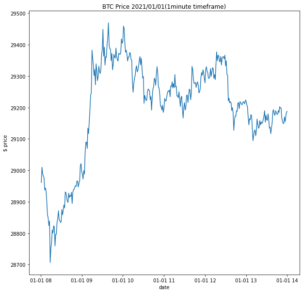
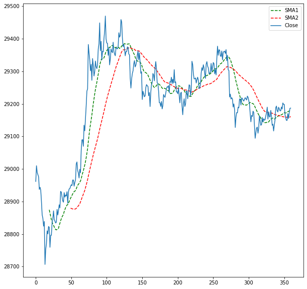
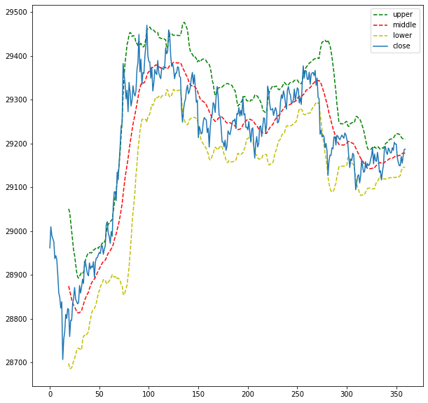

```python

```

# Basic Coins / Stock / Forex Visualization 
1. Read The Data
2. Check Missing Values
3. Visualize 
    1. Simple Moving Average (SMA)    
    2. Bollinger Bands (BB)

# Read The Data


```python
import numpy as np 
import pandas as pd 
from datetime import datetime
df = pd.read_csv('../../DATA/kaggle/btc-price/main.csv')
df['Open Time'] = df['Open Time'] // 1000
df['Open Time'] = df['Open Time'].apply(datetime.fromtimestamp)
df['Close Time'] = df['Close Time'] // 1000
df['Close Time'] = df['Close Time'].apply(datetime.fromtimestamp)
df.head()
```


<div>
<style scoped>
    .dataframe tbody tr th:only-of-type {
        vertical-align: middle;
    }

    .dataframe tbody tr th {
        vertical-align: top;
    }

    .dataframe thead th {
        text-align: right;
    }
</style>
<table border="1" class="dataframe">
  <thead>
    <tr style="text-align: right;">
      <th></th>
      <th>Open Time</th>
      <th>Open</th>
      <th>High</th>
      <th>Low</th>
      <th>Close</th>
      <th>Volume</th>
      <th>Close Time</th>
      <th>Quote asset volume</th>
      <th>Number of trades</th>
      <th>Taker buy base asset volume</th>
      <th>Taker buy quote asset volume</th>
    </tr>
  </thead>
  <tbody>
    <tr>
      <th>0</th>
      <td>2021-01-01 08:00:00</td>
      <td>28923.63</td>
      <td>28961.66</td>
      <td>28913.12</td>
      <td>28961.66</td>
      <td>27.457032</td>
      <td>2021-01-01 08:00:59</td>
      <td>7.943820e+05</td>
      <td>1292</td>
      <td>16.777195</td>
      <td>485390.826825</td>
    </tr>
    <tr>
      <th>1</th>
      <td>2021-01-01 08:01:00</td>
      <td>28961.67</td>
      <td>29017.50</td>
      <td>28961.01</td>
      <td>29009.91</td>
      <td>58.477501</td>
      <td>2021-01-01 08:01:59</td>
      <td>1.695803e+06</td>
      <td>1651</td>
      <td>33.733818</td>
      <td>978176.468202</td>
    </tr>
    <tr>
      <th>2</th>
      <td>2021-01-01 08:02:00</td>
      <td>29009.54</td>
      <td>29016.71</td>
      <td>28973.58</td>
      <td>28989.30</td>
      <td>42.470329</td>
      <td>2021-01-01 08:02:59</td>
      <td>1.231359e+06</td>
      <td>986</td>
      <td>13.247444</td>
      <td>384076.854453</td>
    </tr>
    <tr>
      <th>3</th>
      <td>2021-01-01 08:03:00</td>
      <td>28989.68</td>
      <td>28999.85</td>
      <td>28972.33</td>
      <td>28982.69</td>
      <td>30.360677</td>
      <td>2021-01-01 08:03:59</td>
      <td>8.800168e+05</td>
      <td>959</td>
      <td>9.456028</td>
      <td>274083.075142</td>
    </tr>
    <tr>
      <th>4</th>
      <td>2021-01-01 08:04:00</td>
      <td>28982.67</td>
      <td>28995.93</td>
      <td>28971.80</td>
      <td>28975.65</td>
      <td>24.124339</td>
      <td>2021-01-01 08:04:59</td>
      <td>6.992262e+05</td>
      <td>726</td>
      <td>6.814644</td>
      <td>197519.374888</td>
    </tr>
  </tbody>
</table>
</div>


# Check missing values


```python
#df.count()
df.isnull().sum()
```


    Open Time                       0
    Open                            0
    High                            0
    Low                             0
    Close                           0
    Volume                          0
    Close Time                      0
    Quote asset volume              0
    Number of trades                0
    Taker buy base asset volume     0
    Taker buy quote asset volume    0
    dtype: int64


# Visualize The Data


```python
import matplotlib.pyplot as plt
# Volume Plain plot
df = df[:360]
plt.figure(figsize=(10,10))
plt.plot(df['Close Time'], df['Close'])
plt.xlabel("date")
plt.ylabel("$ price")
plt.title("BTC Price 2021/01/01(1minute timeframe)")
```


    Text(0.5, 1.0, 'BTC Price 2021/01/01(1minute timeframe)')


    

    


**Only take 360 first instances**

## Calculate Simple Moving Average 

Moving average 5,20,50,200 are the most commonly use in technical analysis


```python
df['SMA1'] = df['Close'].rolling(window=20).mean()
df['SMA2'] = df['Close'].rolling(window=50).mean()
#df['SMA'].head(10)
```

**Plot the moving averange**

Show


```python
plt.figure(figsize=(10,10))
plt.plot(df['SMA1'],'g--',label="SMA1")
plt.plot(df["SMA2"], 'r--', label="SMA2")
plt.plot(df["Close"], label="Close")
plt.legend()
plt.show()
```


    

    


**We can see some golden cross and death cross**

## Calculate Bollinger Bands Indicator 

More detail about [Bollinger Bands](https://en.wikipedia.org/wiki/Bollinger_Bands)


```python
df['middle_band'] = df['Close'].rolling(window=20).mean()
df['upper_band'] = df['Close'].rolling(window=20).mean() + df['Close'].rolling(window=20).std()*2
df['lower_band'] = df['Close'].rolling(window=20).mean() - df['Close'].rolling(window=20).std()*2
```

### shows Bollinger Bands


```python
plt.figure(figsize=(10,10))
plt.plot(df['upper_band'], 'g--', label="upper")
plt.plot(df['middle_band'], 'r--', label="middle")
plt.plot(df['lower_band'], 'y--', label="lower")
plt.plot(df['Close'], label="close")
plt.legend()
plt.show()
```


    

    


*Thank you for your attention. *


