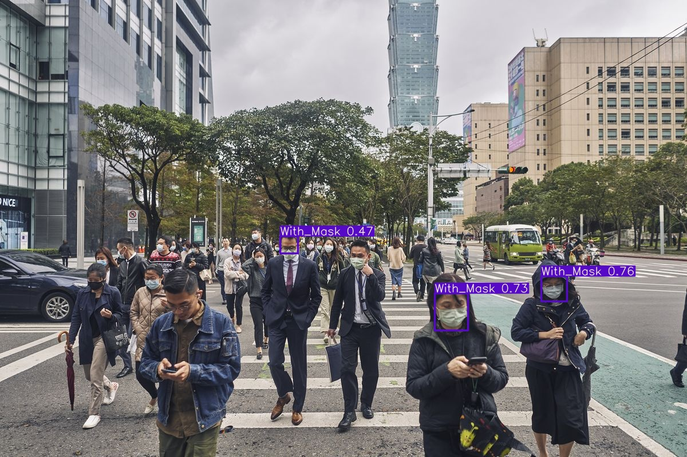

# Face Mask Detection With Yolo

* We need the yolov5 implementation and zero model to do Transfer Learning. Please refer to [this project](https://github.com/rkuo2000/yolov5).
* Dataset can be downloaded in [Kaggle](https://www.kaggle.com/andrewmvd/face-mask-detection)
* We need pytorch and related libraries to do the transfer learning.

## Preparation


```python
!mkdir -p Dataset/FaceMask/Images
!mkdir -p Dataset/FaceMask/Labels
```


```python
# copy image files
!cp -rf /media/commlab/TenTB/home/jan/DATA/kaggle/face-mask/images/* Dataset/FaceMask/Images
```


```python
!mkdir -p Dataset/images Dataset/labels
```


```python
import os
import numpy as np
from pathlib import Path
from xml.dom.minidom import parse
from shutil import copyfile
```


```python
FILE_ROOT = "/media/commlab/TenTB/home/jan/DATA/kaggle/face-mask/"
IMAGE_PATH = FILE_ROOT + "images"  
ANNOTATIONS_PATH = FILE_ROOT + "annotations"

DATA_ROOT = "Dataset/"
LABELS_ROOT = DATA_ROOT + "FaceMask/Labels"
IMAGES_ROOT = DATA_ROOT + "FaceMask/Images"  

DEST_IMAGES_PATH = "images"
DEST_LABELS_PATH = "labels" 
```


```python
classes = ['with_mask', 'without_mask', 'mask_weared_incorrect']
```

### convert annotations (from COCO .xml to YOLO format .txt)


```python
def cord_converter(size, box):
    """
    convert xml annotation to darknet format coordinates
    :param size： [w,h]
    :param box: anchor box coordinates [upper-left x,uppler-left y,lower-right x, lower-right y]
    :return: converted [x,y,w,h]
    """
    x1 = int(box[0])
    y1 = int(box[1])
    x2 = int(box[2])
    y2 = int(box[3])

    dw = np.float32(1. / int(size[0]))
    dh = np.float32(1. / int(size[1]))

    w = x2 - x1
    h = y2 - y1
    x = x1 + (w / 2)
    y = y1 + (h / 2)

    x = x * dw
    w = w * dw
    y = y * dh
    h = h * dh
    return [x, y, w, h]

def save_file(img_jpg_file_name, size, img_box):
    save_file_name = LABELS_ROOT + '/' + img_jpg_file_name + '.txt'
    print(save_file_name)
    file_path = open(save_file_name, "a+")
    for box in img_box:

        cls_num = classes.index(box[0])

        new_box = cord_converter(size, box[1:])

        file_path.write(f"{cls_num} {new_box[0]} {new_box[1]} {new_box[2]} {new_box[3]}\n")

    file_path.flush()
    file_path.close()
    
def get_xml_data(file_path, img_xml_file):
    img_path = file_path + '/' + img_xml_file + '.xml'
    print(img_path)

    dom = parse(img_path)
    root = dom.documentElement
    img_name = root.getElementsByTagName("filename")[0].childNodes[0].data
    img_size = root.getElementsByTagName("size")[0]
    objects = root.getElementsByTagName("object")
    img_w = img_size.getElementsByTagName("width")[0].childNodes[0].data
    img_h = img_size.getElementsByTagName("height")[0].childNodes[0].data
    img_c = img_size.getElementsByTagName("depth")[0].childNodes[0].data
    # print("img_name:", img_name)
    # print("image_info:(w,h,c)", img_w, img_h, img_c)
    img_box = []
    for box in objects:
        cls_name = box.getElementsByTagName("name")[0].childNodes[0].data
        x1 = int(box.getElementsByTagName("xmin")[0].childNodes[0].data)
        y1 = int(box.getElementsByTagName("ymin")[0].childNodes[0].data)
        x2 = int(box.getElementsByTagName("xmax")[0].childNodes[0].data)
        y2 = int(box.getElementsByTagName("ymax")[0].childNodes[0].data)
        # print("box:(c,xmin,ymin,xmax,ymax)", cls_name, x1, y1, x2, y2)
        img_jpg_file_name = img_xml_file + '.jpg'
        img_box.append([cls_name, x1, y1, x2, y2])
    # print(img_box)

    # test_dataset_box_feature(img_jpg_file_name, img_box)
    save_file(img_xml_file, [img_w, img_h], img_box)
```


```python
files = os.listdir(ANNOTATIONS_PATH)
for file in files:
    print("file name: ", file)
    file_xml = file.split(".")
    get_xml_data(ANNOTATIONS_PATH, file_xml[0])
```


## Split Into Train Val and Test set


```python
from sklearn.model_selection import train_test_split
image_list = os.listdir('Dataset/FaceMask/Images')
train_list, test_list = train_test_split(image_list, test_size=0.2, random_state=7)
val_list, test_list = train_test_split(test_list, test_size=0.5, random_state=8)

print('total =',len(image_list))
print('train :',len(train_list))
print('val   :',len(val_list))
print('test  :',len(test_list))
```

    total = 853
    train : 682
    val   : 85
    test  : 86


```python
def copy_data(file_list, img_labels_root, imgs_source, type):

    root_file = Path(DATA_ROOT + DEST_IMAGES_PATH + '/' + type)
    if not root_file.exists():
        print(f"Path {root_file} is not exit")
        os.makedirs(root_file)

    root_file = Path(DATA_ROOT + DEST_LABELS_PATH + '/' + type)
    if not root_file.exists():
        print(f"Path {root_file} is not exit")
        os.makedirs(root_file)

    for file in file_list:
        img_name = file.replace('.png', '')
        img_src_file = imgs_source + '/' + img_name + '.png'
        label_src_file = img_labels_root + '/' + img_name + '.txt'

        # print(img_sor_file)
        # print(label_sor_file)
        # im = Image.open(rf"{img_sor_file}")
        # im.show()

        # Copy image
        DICT_DIR = DATA_ROOT + DEST_IMAGES_PATH + '/' + type
        img_dict_file = DICT_DIR + '/' + img_name + '.png'

        copyfile(img_src_file, img_dict_file)

        # Copy label
        DICT_DIR = DATA_ROOT + DEST_LABELS_PATH + '/' + type
        img_dict_file = DICT_DIR + '/' + img_name + '.txt'
        copyfile(label_src_file, img_dict_file)
```


```python
copy_data(train_list, LABELS_ROOT, IMAGES_ROOT, "train")
copy_data(val_list,   LABELS_ROOT, IMAGES_ROOT, "val")
copy_data(test_list,  LABELS_ROOT, IMAGES_ROOT, "test")
```


## Create data/facemask.yaml

Please read the original github project how to do transfer learning on Yolov5


```python
!echo "train: Dataset/images/train" >> data/facemask.yaml
!echo "val:   Dataset/images/val" >> data/facemask.yaml
!echo "nc : 3" >> data/facemask.yaml
!echo "names: ['With_Mask', 'Without_Mask', 'Incorrect_Mask']" >> data/facemask.yaml

!cat data/facemask.yaml
```

    train: Dataset/images/train
    val:   Dataset/images/val
    nc : 3
    names: ['With_Mask', 'Without_Mask', 'Incorrect_Mask']
    train: Dataset/images/train
    val:   Dataset/images/val
    nc : 3
    names: ['With_Mask', 'Without_Mask', 'Incorrect_Mask']


## Train YOLOv5


```python
!python train.py --img 320 --batch 42 --epochs 30 --data data/facemask.yaml --cfg models/yolov5s.yaml --weights yolov5s.pt
```

    Using torch 1.7.1+cu101 CUDA:0 (GeForce RTX 2080 Ti, 11019MB)
                            CUDA:1 (GeForce RTX 2080 Ti, 11019MB)
                            CUDA:2 (GeForce RTX 2080 Ti, 11019MB)
                            CUDA:3 (GeForce RTX 2080 Ti, 11019MB)
                            CUDA:4 (GeForce RTX 2080 Ti, 11019MB)
                            CUDA:5 (GeForce RTX 2080 Ti, 11019MB)
                            CUDA:6 (GeForce RTX 2080 Ti, 11019MB)
    
    Namespace(adam=False, batch_size=42, bucket='', cache_images=False, cfg='models/yolov5s.yaml', data='data/facemask.yaml', device='', epochs=30, evolve=False, exist_ok=False, global_rank=-1, hyp='data/hyp.scratch.yaml', image_weights=False, img_size=[320, 320], local_rank=-1, log_artifacts=False, log_imgs=16, multi_scale=False, name='exp', noautoanchor=False, nosave=False, notest=False, project='runs/train', rect=False, resume=False, save_dir='runs/train/exp17', single_cls=False, sync_bn=False, total_batch_size=42, weights='yolov5s.pt', workers=8, world_size=1)
    Start Tensorboard with "tensorboard --logdir runs/train", view at http://localhost:6006/
    2021-05-19 21:17:52.080829: I tensorflow/stream_executor/platform/default/dso_loader.cc:49] Successfully opened dynamic library libcudart.so.10.1
    Hyperparameters {'lr0': 0.01, 'lrf': 0.2, 'momentum': 0.937, 'weight_decay': 0.0005, 'warmup_epochs': 3.0, 'warmup_momentum': 0.8, 'warmup_bias_lr': 0.1, 'box': 0.05, 'cls': 0.5, 'cls_pw': 1.0, 'obj': 1.0, 'obj_pw': 1.0, 'iou_t': 0.2, 'anchor_t': 4.0, 'fl_gamma': 0.0, 'hsv_h': 0.015, 'hsv_s': 0.7, 'hsv_v': 0.4, 'degrees': 0.0, 'translate': 0.1, 'scale': 0.5, 'shear': 0.0, 'perspective': 0.0, 'flipud': 0.0, 'fliplr': 0.5, 'mosaic': 1.0, 'mixup': 0.0}
    Overriding model.yaml nc=80 with nc=3
    
                     from  n    params  module                                  arguments                     
      0                -1  1      3520  models.common.Focus                     [3, 32, 3]                    
      1                -1  1     18560  models.common.Conv                      [32, 64, 3, 2]                
      2                -1  1     19904  models.common.BottleneckCSP             [64, 64, 1]                   
      3                -1  1     73984  models.common.Conv                      [64, 128, 3, 2]               
      4                -1  1    161152  models.common.BottleneckCSP             [128, 128, 3]                 
      5                -1  1    295424  models.common.Conv                      [128, 256, 3, 2]              
      6                -1  1    641792  models.common.BottleneckCSP             [256, 256, 3]                 
      7                -1  1   1180672  models.common.Conv                      [256, 512, 3, 2]              
      8                -1  1    656896  models.common.SPP                       [512, 512, [5, 9, 13]]        
      9                -1  1   1248768  models.common.BottleneckCSP             [512, 512, 1, False]          
     10                -1  1    131584  models.common.Conv                      [512, 256, 1, 1]              
     11                -1  1         0  torch.nn.modules.upsampling.Upsample    [None, 2, 'nearest']          
     12           [-1, 6]  1         0  models.common.Concat                    [1]                           
     13                -1  1    378624  models.common.BottleneckCSP             [512, 256, 1, False]          
     14                -1  1     33024  models.common.Conv                      [256, 128, 1, 1]              
     15                -1  1         0  torch.nn.modules.upsampling.Upsample    [None, 2, 'nearest']          
     16           [-1, 4]  1         0  models.common.Concat                    [1]                           
     17                -1  1     95104  models.common.BottleneckCSP             [256, 128, 1, False]          
     18                -1  1    147712  models.common.Conv                      [128, 128, 3, 2]              
     19          [-1, 14]  1         0  models.common.Concat                    [1]                           
     20                -1  1    313088  models.common.BottleneckCSP             [256, 256, 1, False]          
     21                -1  1    590336  models.common.Conv                      [256, 256, 3, 2]              
     22          [-1, 10]  1         0  models.common.Concat                    [1]                           
     23                -1  1   1248768  models.common.BottleneckCSP             [512, 512, 1, False]          
     24      [17, 20, 23]  1     21576  models.yolo.Detect                      [3, [[10, 13, 16, 30, 33, 23], [30, 61, 62, 45, 59, 119], [116, 90, 156, 198, 373, 326]], [128, 256, 512]]
    Model Summary: 283 layers, 7260488 parameters, 7260488 gradients
    
    Transferred 362/370 items from yolov5s.pt
    Optimizer groups: 62 .bias, 70 conv.weight, 59 other
    Scanning 'Dataset/labels/train.cache' for images and labels... 682 found, 0 miss
    Scanning 'Dataset/labels/val.cache' for images and labels... 85 found, 0 missing
    Scanning 'Dataset/labels/val.cache' for images and labels... 85 found, 0 missing
    Scanning 'Dataset/labels/val.cache' for images and labels... 85 found, 0 missing
    Scanning 'Dataset/labels/val.cache' for images and labels... 85 found, 0 missing
    
    Scanning 'Dataset/labels/val.cache' for images and labels... 85 found, 0 missing
    anchors/target = 4.42, Best Possible Recall (BPR) = 0.9965
    Image sizes 320 train, 320 test
    Using 8 dataloader workers
    Logging results to runs/train/exp17
    Starting training for 30 epochs...
    
         Epoch   gpu_mem       box       obj       cls     total   targets  img_size
    Scanning 'Dataset/labels/val.cache' for images and labels... 85 found, 0 missing
    Scanning 'Dataset/labels/val.cache' for images and labels... 85 found, 0 missing
    Scanning 'Dataset/labels/val.cache' for images and labels... 85 found, 0 missing
          0/29    0.455G    0.1242     0.104   0.03573    0.2639       135       320
                   Class      Images     Targets           P           R      mAP@.5
                     all          85         355           0           0    0.000163    2.65e-05
    
         Epoch   gpu_mem       box       obj       cls     total   targets  img_size
          1/29    0.558G    0.1178    0.1147   0.03051     0.263        75       320
                   Class      Images     Targets           P           R      mAP@.5
                     all          85         355           0           0     0.00279    0.000431
    
         Epoch   gpu_mem       box       obj       cls     total   targets  img_size
          2/29      0.6G    0.1108    0.1123   0.02593    0.2491        61       320
                   Class      Images     Targets           P           R      mAP@.5
                     all          85         355      0.0336      0.0261      0.0131     0.00205
    
         Epoch   gpu_mem       box       obj       cls     total   targets  img_size
          3/29      0.6G    0.1024    0.1096   0.02344    0.2354        68       320
                   Class      Images     Targets           P           R      mAP@.5
                     all          85         355       0.024       0.184      0.0265      0.0049
    
         Epoch   gpu_mem       box       obj       cls     total   targets  img_size
          4/29      0.6G   0.09116    0.1105   0.02075    0.2224       133       320
                   Class      Images     Targets           P           R      mAP@.5
                     all          85         355      0.0259       0.365       0.064      0.0114
    
         Epoch   gpu_mem       box       obj       cls     total   targets  img_size
          5/29      0.6G   0.08118    0.1043   0.02049     0.206        75       320
                   Class      Images     Targets           P           R      mAP@.5
                     all          85         355      0.0565         0.4       0.137       0.039
    
         Epoch   gpu_mem       box       obj       cls     total   targets  img_size
          6/29    0.602G   0.07494    0.1027    0.0211    0.1987       123       320
                   Class      Images     Targets           P           R      mAP@.5
                     all          85         355      0.0524       0.402       0.155      0.0403
    
         Epoch   gpu_mem       box       obj       cls     total   targets  img_size
          7/29    0.602G   0.07026    0.1011   0.02074    0.1922        61       320
                   Class      Images     Targets           P           R      mAP@.5
                     all          85         355      0.0511       0.391       0.163      0.0562
    
         Epoch   gpu_mem       box       obj       cls     total   targets  img_size
          8/29    0.602G   0.06806   0.09943   0.01964    0.1871        83       320
                   Class      Images     Targets           P           R      mAP@.5
                     all          85         355      0.0642       0.467       0.207      0.0621
    
         Epoch   gpu_mem       box       obj       cls     total   targets  img_size
          9/29    0.602G   0.06692   0.09669   0.01951    0.1831        60       320
                   Class      Images     Targets           P           R      mAP@.5
                     all          85         355      0.0724       0.426       0.173      0.0534
    
         Epoch   gpu_mem       box       obj       cls     total   targets  img_size
         10/29    0.602G   0.06226   0.09677    0.0192    0.1782       144       320
                   Class      Images     Targets           P           R      mAP@.5
                     all          85         355      0.0804       0.482       0.254       0.103
    
         Epoch   gpu_mem       box       obj       cls     total   targets  img_size
         11/29    0.602G   0.06123   0.09214   0.01964     0.173       105       320
                   Class      Images     Targets           P           R      mAP@.5
                     all          85         355      0.0684       0.471       0.171      0.0527
    
         Epoch   gpu_mem       box       obj       cls     total   targets  img_size
         12/29    0.602G   0.05902   0.09707      0.02    0.1761       122       320
                   Class      Images     Targets           P           R      mAP@.5
                     all          85         355      0.0864       0.474       0.231      0.0819
    
         Epoch   gpu_mem       box       obj       cls     total   targets  img_size
         13/29    0.602G   0.05725   0.09423    0.0186    0.1701       119       320
                   Class      Images     Targets           P           R      mAP@.5
                     all          85         355      0.0764       0.509       0.271       0.111
    
         Epoch   gpu_mem       box       obj       cls     total   targets  img_size
         14/29    0.602G   0.05492   0.08616   0.01915    0.1602        58       320
                   Class      Images     Targets           P           R      mAP@.5
                     all          85         355       0.112       0.439       0.291        0.12
    
         Epoch   gpu_mem       box       obj       cls     total   targets  img_size
         15/29    0.602G   0.05448   0.09387   0.01763     0.166        93       320
                   Class      Images     Targets           P           R      mAP@.5
                     all          85         355       0.109       0.432       0.302        0.11
    
         Epoch   gpu_mem       box       obj       cls     total   targets  img_size
         16/29    0.602G    0.0536   0.08829   0.01752    0.1594        56       320
                   Class      Images     Targets           P           R      mAP@.5
                     all          85         355       0.121       0.507       0.348       0.137
    
         Epoch   gpu_mem       box       obj       cls     total   targets  img_size
         17/29    0.602G    0.0503   0.09052   0.01632    0.1571        76       320
                   Class      Images     Targets           P           R      mAP@.5
                     all          85         355       0.146       0.493       0.356       0.158
    
         Epoch   gpu_mem       box       obj       cls     total   targets  img_size
         18/29    0.602G   0.04851   0.08381   0.01469     0.147        48       320
                   Class      Images     Targets           P           R      mAP@.5
                     all          85         355       0.133       0.512       0.317       0.128
    
         Epoch   gpu_mem       box       obj       cls     total   targets  img_size
         19/29    0.602G   0.04969   0.08767   0.01367     0.151       102       320
                   Class      Images     Targets           P           R      mAP@.5
                     all          85         355       0.148        0.51       0.339       0.155
    
         Epoch   gpu_mem       box       obj       cls     total   targets  img_size
         20/29    0.602G   0.04631   0.08837   0.01424    0.1489        72       320
                   Class      Images     Targets           P           R      mAP@.5
                     all          85         355       0.164       0.506       0.415       0.191
    
         Epoch   gpu_mem       box       obj       cls     total   targets  img_size
         21/29    0.602G   0.04597   0.08166   0.01353    0.1412        67       320
                   Class      Images     Targets           P           R      mAP@.5
                     all          85         355       0.167       0.497       0.411       0.192
    
         Epoch   gpu_mem       box       obj       cls     total   targets  img_size
         22/29    0.602G   0.04514   0.08961    0.0132    0.1479       124       320
                   Class      Images     Targets           P           R      mAP@.5
                     all          85         355       0.189       0.509       0.449       0.219
    
         Epoch   gpu_mem       box       obj       cls     total   targets  img_size
         23/29    0.602G   0.04384   0.08595   0.01264    0.1424        55       320
                   Class      Images     Targets           P           R      mAP@.5
                     all          85         355        0.21       0.499       0.453       0.203
    
         Epoch   gpu_mem       box       obj       cls     total   targets  img_size
         24/29    0.602G   0.04255   0.08382   0.01203    0.1384        75       320
                   Class      Images     Targets           P           R      mAP@.5
                     all          85         355       0.235       0.493       0.465       0.221
    
         Epoch   gpu_mem       box       obj       cls     total   targets  img_size
         25/29    0.602G   0.04108   0.08056   0.01123    0.1329        86       320
                   Class      Images     Targets           P           R      mAP@.5
                     all          85         355       0.208       0.525       0.444       0.217
    
         Epoch   gpu_mem       box       obj       cls     total   targets  img_size
         26/29    0.602G   0.04085   0.08453    0.0118    0.1372        73       320
                   Class      Images     Targets           P           R      mAP@.5
                     all          85         355       0.216        0.52       0.455       0.227
    
         Epoch   gpu_mem       box       obj       cls     total   targets  img_size
         27/29    0.602G   0.03948   0.08469   0.01103    0.1352       112       320
                   Class      Images     Targets           P           R      mAP@.5
                     all          85         355       0.203       0.526       0.454       0.232
    
         Epoch   gpu_mem       box       obj       cls     total   targets  img_size
         28/29    0.602G   0.03955    0.0839   0.01149    0.1349        72       320
                   Class      Images     Targets           P           R      mAP@.5
                     all          85         355       0.251        0.52       0.479       0.258
    
         Epoch   gpu_mem       box       obj       cls     total   targets  img_size
         29/29    0.602G   0.03866   0.08007   0.01051    0.1292        87       320
                   Class      Images     Targets           P           R      mAP@.5
                     all          85         355       0.284       0.514       0.483       0.229
    Optimizer stripped from runs/train/exp17/weights/last.pt, 14.7MB
    Optimizer stripped from runs/train/exp17/weights/best.pt, 14.7MB
    30 epochs completed in 0.072 hours.
    


### Take the best model and copy


```python
# save trained weights for detection
!cp runs/train/exp17/weights/best.pt weights
```

## Test YOLOv5

### detect facemask


```python
!python detect.py --source Dataset/images/test --img-size 320 --conf 0.4 --weights weights/best.pt 
```

    Namespace(agnostic_nms=False, augment=False, classes=None, conf_thres=0.4, device='', exist_ok=False, img_size=320, iou_thres=0.45, name='exp', project='runs/detect', save_conf=False, save_txt=False, source='Dataset/images/test', update=False, view_img=False, weights=['weights/best.pt'])
    Using torch 1.7.1+cu101 CUDA:0 (GeForce RTX 2080 Ti, 11019MB)
                            CUDA:1 (GeForce RTX 2080 Ti, 11019MB)
                            CUDA:2 (GeForce RTX 2080 Ti, 11019MB)
                            CUDA:3 (GeForce RTX 2080 Ti, 11019MB)
                            CUDA:4 (GeForce RTX 2080 Ti, 11019MB)
                            CUDA:5 (GeForce RTX 2080 Ti, 11019MB)
                            CUDA:6 (GeForce RTX 2080 Ti, 11019MB)
    
    Fusing layers... 
    Model Summary: 232 layers, 7251912 parameters, 0 gradients
    image 1/86 /media/commlab/TenTB/home/jan/kaggle/facemask-yolo/Dataset/images/test/maksssksksss110.png: 224x320 12 With_Masks, 12 Without_Masks, Done. (0.011s)
    image 2/86 /media/commlab/TenTB/home/jan/kaggle/facemask-yolo/Dataset/images/test/maksssksksss116.png: 192x320 5 With_Masks, Done. (0.009s)
    image 3/86 /media/commlab/TenTB/home/jan/kaggle/facemask-yolo/Dataset/images/test/maksssksksss122.png: 224x320 1 With_Masks, Done. (0.009s)
    image 4/86 /media/commlab/TenTB/home/jan/kaggle/facemask-yolo/Dataset/images/test/maksssksksss123.png: 256x320 2 With_Masks, Done. (0.009s)
    image 5/86 /media/commlab/TenTB/home/jan/kaggle/facemask-yolo/Dataset/images/test/maksssksksss140.png: 224x320 2 With_Masks, Done. (0.009s)
    image 6/86 /media/commlab/TenTB/home/jan/kaggle/facemask-yolo/Dataset/images/test/maksssksksss150.png: 320x256 1 With_Masks, Done. (0.009s)
    image 7/86 /media/commlab/TenTB/home/jan/kaggle/facemask-yolo/Dataset/images/test/maksssksksss157.png: 192x320 8 With_Masks, 1 Without_Masks, Done. (0.009s)
    image 8/86 /media/commlab/TenTB/home/jan/kaggle/facemask-yolo/Dataset/images/test/maksssksksss158.png: 224x320 12 With_Masks, Done. (0.009s)
    image 9/86 /media/commlab/TenTB/home/jan/kaggle/facemask-yolo/Dataset/images/test/maksssksksss164.png: 160x320 8 With_Masks, 3 Without_Masks, Done. (0.009s)
    image 10/86 /media/commlab/TenTB/home/jan/kaggle/facemask-yolo/Dataset/images/test/maksssksksss169.png: 320x256 1 With_Masks, Done. (0.009s)
    image 11/86 /media/commlab/TenTB/home/jan/kaggle/facemask-yolo/Dataset/images/test/maksssksksss177.png: 256x320 2 With_Masks, Done. (0.009s)
    image 12/86 /media/commlab/TenTB/home/jan/kaggle/facemask-yolo/Dataset/images/test/maksssksksss19.png: 192x320 4 With_Masks, 2 Without_Masks, Done. (0.009s)
    image 13/86 /media/commlab/TenTB/home/jan/kaggle/facemask-yolo/Dataset/images/test/maksssksksss193.png: 320x256 2 With_Masks, Done. (0.009s)
    image 14/86 /media/commlab/TenTB/home/jan/kaggle/facemask-yolo/Dataset/images/test/maksssksksss207.png: 224x320 4 With_Masks, Done. (0.009s)
    image 15/86 /media/commlab/TenTB/home/jan/kaggle/facemask-yolo/Dataset/images/test/maksssksksss208.png: 160x320 2 With_Masks, Done. (0.011s)
    image 16/86 /media/commlab/TenTB/home/jan/kaggle/facemask-yolo/Dataset/images/test/maksssksksss216.png: 256x320 4 With_Masks, 2 Without_Masks, Done. (0.009s)
    image 17/86 /media/commlab/TenTB/home/jan/kaggle/facemask-yolo/Dataset/images/test/maksssksksss218.png: 320x256 1 Without_Masks, Done. (0.009s)
    image 18/86 /media/commlab/TenTB/home/jan/kaggle/facemask-yolo/Dataset/images/test/maksssksksss225.png: 320x256 1 With_Masks, Done. (0.008s)
    image 19/86 /media/commlab/TenTB/home/jan/kaggle/facemask-yolo/Dataset/images/test/maksssksksss234.png: 192x320 1 With_Masks, Done. (0.009s)
    image 20/86 /media/commlab/TenTB/home/jan/kaggle/facemask-yolo/Dataset/images/test/maksssksksss248.png: 320x256 1 Without_Masks, Done. (0.009s)
    image 21/86 /media/commlab/TenTB/home/jan/kaggle/facemask-yolo/Dataset/images/test/maksssksksss256.png: 224x320 11 With_Masks, Done. (0.010s)
    image 22/86 /media/commlab/TenTB/home/jan/kaggle/facemask-yolo/Dataset/images/test/maksssksksss260.png: 256x320 47 With_Masks, Done. (0.009s)
    image 23/86 /media/commlab/TenTB/home/jan/kaggle/facemask-yolo/Dataset/images/test/maksssksksss268.png: 320x192 1 With_Masks, 1 Without_Masks, Done. (0.009s)
    image 24/86 /media/commlab/TenTB/home/jan/kaggle/facemask-yolo/Dataset/images/test/maksssksksss271.png: 320x256 1 With_Masks, Done. (0.009s)
    image 25/86 /media/commlab/TenTB/home/jan/kaggle/facemask-yolo/Dataset/images/test/maksssksksss279.png: 224x320 1 With_Masks, Done. (0.008s)
    image 26/86 /media/commlab/TenTB/home/jan/kaggle/facemask-yolo/Dataset/images/test/maksssksksss280.png: 224x320 12 With_Masks, Done. (0.010s)
    image 27/86 /media/commlab/TenTB/home/jan/kaggle/facemask-yolo/Dataset/images/test/maksssksksss306.png: 320x256 1 With_Masks, Done. (0.009s)
    image 28/86 /media/commlab/TenTB/home/jan/kaggle/facemask-yolo/Dataset/images/test/maksssksksss309.png: 320x224 1 With_Masks, Done. (0.009s)
    image 29/86 /media/commlab/TenTB/home/jan/kaggle/facemask-yolo/Dataset/images/test/maksssksksss330.png: 256x320 4 With_Masks, Done. (0.009s)
    image 30/86 /media/commlab/TenTB/home/jan/kaggle/facemask-yolo/Dataset/images/test/maksssksksss334.png: 256x320 3 With_Masks, 1 Without_Masks, Done. (0.008s)
    image 31/86 /media/commlab/TenTB/home/jan/kaggle/facemask-yolo/Dataset/images/test/maksssksksss343.png: 320x256 1 Without_Masks, Done. (0.009s)
    image 32/86 /media/commlab/TenTB/home/jan/kaggle/facemask-yolo/Dataset/images/test/maksssksksss35.png: 224x320 2 With_Masks, Done. (0.011s)
    image 33/86 /media/commlab/TenTB/home/jan/kaggle/facemask-yolo/Dataset/images/test/maksssksksss365.png: 192x320 3 With_Masks, Done. (0.009s)
    image 34/86 /media/commlab/TenTB/home/jan/kaggle/facemask-yolo/Dataset/images/test/maksssksksss366.png: 192x320 2 With_Masks, Done. (0.008s)
    image 35/86 /media/commlab/TenTB/home/jan/kaggle/facemask-yolo/Dataset/images/test/maksssksksss367.png: 224x320 1 With_Masks, Done. (0.009s)
    image 36/86 /media/commlab/TenTB/home/jan/kaggle/facemask-yolo/Dataset/images/test/maksssksksss372.png: 192x320 2 With_Masks, Done. (0.008s)
    image 37/86 /media/commlab/TenTB/home/jan/kaggle/facemask-yolo/Dataset/images/test/maksssksksss385.png: 224x320 2 With_Masks, Done. (0.008s)
    image 38/86 /media/commlab/TenTB/home/jan/kaggle/facemask-yolo/Dataset/images/test/maksssksksss388.png: 192x320 10 With_Masks, 6 Without_Masks, Done. (0.008s)
    image 39/86 /media/commlab/TenTB/home/jan/kaggle/facemask-yolo/Dataset/images/test/maksssksksss393.png: 320x320 2 With_Masks, Done. (0.009s)
    image 40/86 /media/commlab/TenTB/home/jan/kaggle/facemask-yolo/Dataset/images/test/maksssksksss395.png: 224x320 1 With_Masks, Done. (0.009s)
    image 41/86 /media/commlab/TenTB/home/jan/kaggle/facemask-yolo/Dataset/images/test/maksssksksss398.png: 288x320 1 With_Masks, Done. (0.009s)
    image 42/86 /media/commlab/TenTB/home/jan/kaggle/facemask-yolo/Dataset/images/test/maksssksksss403.png: 320x256 1 With_Masks, Done. (0.009s)
    image 43/86 /media/commlab/TenTB/home/jan/kaggle/facemask-yolo/Dataset/images/test/maksssksksss410.png: 224x320 14 With_Masks, Done. (0.009s)
    image 44/86 /media/commlab/TenTB/home/jan/kaggle/facemask-yolo/Dataset/images/test/maksssksksss448.png: 192x320 5 With_Masks, Done. (0.009s)
    image 45/86 /media/commlab/TenTB/home/jan/kaggle/facemask-yolo/Dataset/images/test/maksssksksss454.png: 224x320 1 With_Masks, Done. (0.009s)
    image 46/86 /media/commlab/TenTB/home/jan/kaggle/facemask-yolo/Dataset/images/test/maksssksksss468.png: 320x256 1 With_Masks, Done. (0.009s)
    image 47/86 /media/commlab/TenTB/home/jan/kaggle/facemask-yolo/Dataset/images/test/maksssksksss490.png: 320x256 1 With_Masks, Done. (0.008s)
    image 48/86 /media/commlab/TenTB/home/jan/kaggle/facemask-yolo/Dataset/images/test/maksssksksss518.png: 192x320 30 With_Masks, Done. (0.009s)
    image 49/86 /media/commlab/TenTB/home/jan/kaggle/facemask-yolo/Dataset/images/test/maksssksksss528.png: 320x256 1 Without_Masks, Done. (0.009s)
    image 50/86 /media/commlab/TenTB/home/jan/kaggle/facemask-yolo/Dataset/images/test/maksssksksss530.png: 320x256 1 Without_Masks, Done. (0.008s)
    image 51/86 /media/commlab/TenTB/home/jan/kaggle/facemask-yolo/Dataset/images/test/maksssksksss540.png: 320x256 1 Without_Masks, Done. (0.010s)
    image 52/86 /media/commlab/TenTB/home/jan/kaggle/facemask-yolo/Dataset/images/test/maksssksksss543.png: 192x320 2 With_Masks, 2 Without_Masks, Done. (0.008s)
    image 53/86 /media/commlab/TenTB/home/jan/kaggle/facemask-yolo/Dataset/images/test/maksssksksss559.png: 224x320 13 With_Masks, 3 Without_Masks, Done. (0.008s)
    image 54/86 /media/commlab/TenTB/home/jan/kaggle/facemask-yolo/Dataset/images/test/maksssksksss569.png: 192x320 1 With_Masks, Done. (0.008s)
    image 55/86 /media/commlab/TenTB/home/jan/kaggle/facemask-yolo/Dataset/images/test/maksssksksss586.png: 224x320 2 With_Masks, Done. (0.008s)
    image 56/86 /media/commlab/TenTB/home/jan/kaggle/facemask-yolo/Dataset/images/test/maksssksksss597.png: 224x320 2 With_Masks, Done. (0.008s)
    image 57/86 /media/commlab/TenTB/home/jan/kaggle/facemask-yolo/Dataset/images/test/maksssksksss598.png: 320x256 1 With_Masks, Done. (0.009s)
    image 58/86 /media/commlab/TenTB/home/jan/kaggle/facemask-yolo/Dataset/images/test/maksssksksss610.png: 192x320 3 With_Masks, Done. (0.008s)
    image 59/86 /media/commlab/TenTB/home/jan/kaggle/facemask-yolo/Dataset/images/test/maksssksksss62.png: 320x256 1 With_Masks, Done. (0.009s)
    image 60/86 /media/commlab/TenTB/home/jan/kaggle/facemask-yolo/Dataset/images/test/maksssksksss630.png: 320x256 1 With_Masks, Done. (0.008s)
    image 61/86 /media/commlab/TenTB/home/jan/kaggle/facemask-yolo/Dataset/images/test/maksssksksss631.png: 192x320 11 With_Masks, Done. (0.008s)
    image 62/86 /media/commlab/TenTB/home/jan/kaggle/facemask-yolo/Dataset/images/test/maksssksksss635.png: 320x256 1 With_Masks, Done. (0.009s)
    image 63/86 /media/commlab/TenTB/home/jan/kaggle/facemask-yolo/Dataset/images/test/maksssksksss639.png: 192x320 3 With_Masks, Done. (0.008s)
    image 64/86 /media/commlab/TenTB/home/jan/kaggle/facemask-yolo/Dataset/images/test/maksssksksss640.png: 192x320 10 With_Masks, Done. (0.008s)
    image 65/86 /media/commlab/TenTB/home/jan/kaggle/facemask-yolo/Dataset/images/test/maksssksksss642.png: 320x224 2 With_Masks, Done. (0.008s)
    image 66/86 /media/commlab/TenTB/home/jan/kaggle/facemask-yolo/Dataset/images/test/maksssksksss666.png: 256x320 3 With_Masks, Done. (0.009s)
    image 67/86 /media/commlab/TenTB/home/jan/kaggle/facemask-yolo/Dataset/images/test/maksssksksss686.png: 320x256 1 With_Masks, Done. (0.009s)
    image 68/86 /media/commlab/TenTB/home/jan/kaggle/facemask-yolo/Dataset/images/test/maksssksksss689.png: 192x320 1 With_Masks, Done. (0.008s)
    image 69/86 /media/commlab/TenTB/home/jan/kaggle/facemask-yolo/Dataset/images/test/maksssksksss696.png: 224x320 4 With_Masks, 1 Without_Masks, Done. (0.009s)
    image 70/86 /media/commlab/TenTB/home/jan/kaggle/facemask-yolo/Dataset/images/test/maksssksksss698.png: 288x320 4 With_Masks, 2 Without_Masks, Done. (0.009s)
    image 71/86 /media/commlab/TenTB/home/jan/kaggle/facemask-yolo/Dataset/images/test/maksssksksss706.png: 224x320 18 With_Masks, Done. (0.008s)
    image 72/86 /media/commlab/TenTB/home/jan/kaggle/facemask-yolo/Dataset/images/test/maksssksksss709.png: 320x256 1 With_Masks, Done. (0.009s)
    image 73/86 /media/commlab/TenTB/home/jan/kaggle/facemask-yolo/Dataset/images/test/maksssksksss723.png: 192x320 5 With_Masks, 1 Without_Masks, Done. (0.008s)
    image 74/86 /media/commlab/TenTB/home/jan/kaggle/facemask-yolo/Dataset/images/test/maksssksksss747.png: 320x256 1 With_Masks, Done. (0.009s)
    image 75/86 /media/commlab/TenTB/home/jan/kaggle/facemask-yolo/Dataset/images/test/maksssksksss749.png: 320x224 2 With_Masks, Done. (0.009s)
    image 76/86 /media/commlab/TenTB/home/jan/kaggle/facemask-yolo/Dataset/images/test/maksssksksss769.png: 192x320 4 With_Masks, Done. (0.008s)
    image 77/86 /media/commlab/TenTB/home/jan/kaggle/facemask-yolo/Dataset/images/test/maksssksksss795.png: 256x320 20 With_Masks, 2 Without_Masks, Done. (0.009s)
    image 78/86 /media/commlab/TenTB/home/jan/kaggle/facemask-yolo/Dataset/images/test/maksssksksss805.png: 192x320 8 With_Masks, 1 Without_Masks, Done. (0.008s)
    image 79/86 /media/commlab/TenTB/home/jan/kaggle/facemask-yolo/Dataset/images/test/maksssksksss807.png: 224x320 7 With_Masks, Done. (0.008s)
    image 80/86 /media/commlab/TenTB/home/jan/kaggle/facemask-yolo/Dataset/images/test/maksssksksss81.png: 192x320 3 With_Masks, Done. (0.008s)
    image 81/86 /media/commlab/TenTB/home/jan/kaggle/facemask-yolo/Dataset/images/test/maksssksksss821.png: 224x320 1 With_Masks, 1 Without_Masks, Done. (0.008s)
    image 82/86 /media/commlab/TenTB/home/jan/kaggle/facemask-yolo/Dataset/images/test/maksssksksss822.png: 192x320 10 With_Masks, 1 Without_Masks, Done. (0.009s)
    image 83/86 /media/commlab/TenTB/home/jan/kaggle/facemask-yolo/Dataset/images/test/maksssksksss825.png: 192x320 4 With_Masks, Done. (0.008s)
    image 84/86 /media/commlab/TenTB/home/jan/kaggle/facemask-yolo/Dataset/images/test/maksssksksss830.png: 320x224 1 With_Masks, Done. (0.009s)
    image 85/86 /media/commlab/TenTB/home/jan/kaggle/facemask-yolo/Dataset/images/test/maksssksksss852.png: 320x224 1 With_Masks, Done. (0.008s)
    image 86/86 /media/commlab/TenTB/home/jan/kaggle/facemask-yolo/Dataset/images/test/maksssksksss97.png: 320x256 1 With_Masks, Done. (0.009s)
    Results saved to runs/detect/exp5
    Done. (2.419s)


```python
# display detected images
from IPython.display import Image
```


```python
from glob import glob
import matplotlib.pyplot as plt
testfiles = glob('runs/detect/exp5/*')

img = plt.imread(testfiles[8]) 
plt.imshow(img)    
plt.show
```


    <function matplotlib.pyplot.show(close=None, block=None)>


    

    


## Test for arbitrary image from internet


```python
!python detect.py --source 1200x800.jpg --img-size 320 --conf 0.4 --weights weights/best.pt 
```

    Namespace(agnostic_nms=False, augment=False, classes=None, conf_thres=0.4, device='', exist_ok=False, img_size=320, iou_thres=0.45, name='exp', project='runs/detect', save_conf=False, save_txt=False, source='1200x800.jpg', update=False, view_img=False, weights=['weights/best.pt'])
    Using torch 1.7.1+cu101 CUDA:0 (GeForce RTX 2080 Ti, 11019MB)
                            CUDA:1 (GeForce RTX 2080 Ti, 11019MB)
                            CUDA:2 (GeForce RTX 2080 Ti, 11019MB)
                            CUDA:3 (GeForce RTX 2080 Ti, 11019MB)
                            CUDA:4 (GeForce RTX 2080 Ti, 11019MB)
                            CUDA:5 (GeForce RTX 2080 Ti, 11019MB)
                            CUDA:6 (GeForce RTX 2080 Ti, 11019MB)
    
    Fusing layers... 
    Model Summary: 232 layers, 7251912 parameters, 0 gradients
    image 1/1 /media/commlab/TenTB/home/jan/kaggle/facemask-yolo/1200x800.jpg: 224x320 3 With_Masks, Done. (0.010s)
    Results saved to runs/detect/exp7
    Done. (0.066s)


```python
Image('runs/detect/exp7/1200x800.jpg')
```


    

    


```python
!python detect.py --source a_coronavirus-taiwan-02062020-1.jpg --img-size 320 --conf 0.4 --weights weights/best.pt 
```

    Namespace(agnostic_nms=False, augment=False, classes=None, conf_thres=0.4, device='', exist_ok=False, img_size=320, iou_thres=0.45, name='exp', project='runs/detect', save_conf=False, save_txt=False, source='a_coronavirus-taiwan-02062020-1.jpg', update=False, view_img=False, weights=['weights/best.pt'])
    Using torch 1.7.1+cu101 CUDA:0 (GeForce RTX 2080 Ti, 11019MB)
                            CUDA:1 (GeForce RTX 2080 Ti, 11019MB)
                            CUDA:2 (GeForce RTX 2080 Ti, 11019MB)
                            CUDA:3 (GeForce RTX 2080 Ti, 11019MB)
                            CUDA:4 (GeForce RTX 2080 Ti, 11019MB)
                            CUDA:5 (GeForce RTX 2080 Ti, 11019MB)
                            CUDA:6 (GeForce RTX 2080 Ti, 11019MB)
    
    Fusing layers... 
    Model Summary: 232 layers, 7251912 parameters, 0 gradients
    image 1/1 /media/commlab/TenTB/home/jan/kaggle/facemask-yolo/a_coronavirus-taiwan-02062020-1.jpg: 224x320 11 With_Masks, 1 Without_Masks, Done. (0.010s)
    Results saved to runs/detect/exp8
    Done. (0.035s)


```python
Image('runs/detect/exp8/a_coronavirus-taiwan-02062020-1.jpg')
```


    

    


```python
!python detect.py --source aneua2_1579932400.jpg --img-size 320 --conf 0.4 --weights weights/best.pt 
```

    Namespace(agnostic_nms=False, augment=False, classes=None, conf_thres=0.4, device='', exist_ok=False, img_size=320, iou_thres=0.45, name='exp', project='runs/detect', save_conf=False, save_txt=False, source='aneua2_1579932400.jpg', update=False, view_img=False, weights=['weights/best.pt'])
    Using torch 1.7.1+cu101 CUDA:0 (GeForce RTX 2080 Ti, 11019MB)
                            CUDA:1 (GeForce RTX 2080 Ti, 11019MB)
                            CUDA:2 (GeForce RTX 2080 Ti, 11019MB)
                            CUDA:3 (GeForce RTX 2080 Ti, 11019MB)
                            CUDA:4 (GeForce RTX 2080 Ti, 11019MB)
                            CUDA:5 (GeForce RTX 2080 Ti, 11019MB)
                            CUDA:6 (GeForce RTX 2080 Ti, 11019MB)
    
    Fusing layers... 
    Model Summary: 232 layers, 7251912 parameters, 0 gradients
    image 1/1 /media/commlab/TenTB/home/jan/kaggle/facemask-yolo/aneua2_1579932400.jpg: 224x320 5 With_Masks, 1 Without_Masks, Done. (0.010s)
    Results saved to runs/detect/exp9
    Done. (0.049s)


```python
Image('runs/detect/exp9/aneua2_1579932400.jpg')
```


    

    


```python
!python detect.py --source 1580426169277.jpg --img-size 320 --conf 0.4 --weights weights/best.pt 
```

    Namespace(agnostic_nms=False, augment=False, classes=None, conf_thres=0.4, device='', exist_ok=False, img_size=320, iou_thres=0.45, name='exp', project='runs/detect', save_conf=False, save_txt=False, source='1580426169277.jpg', update=False, view_img=False, weights=['weights/best.pt'])
    Using torch 1.7.1+cu101 CUDA:0 (GeForce RTX 2080 Ti, 11019MB)
                            CUDA:1 (GeForce RTX 2080 Ti, 11019MB)
                            CUDA:2 (GeForce RTX 2080 Ti, 11019MB)
                            CUDA:3 (GeForce RTX 2080 Ti, 11019MB)
                            CUDA:4 (GeForce RTX 2080 Ti, 11019MB)
                            CUDA:5 (GeForce RTX 2080 Ti, 11019MB)
                            CUDA:6 (GeForce RTX 2080 Ti, 11019MB)
    
    Fusing layers... 
    Model Summary: 232 layers, 7251912 parameters, 0 gradients
    image 1/1 /media/commlab/TenTB/home/jan/kaggle/facemask-yolo/1580426169277.jpg: 192x320 3 With_Masks, Done. (0.010s)
    Results saved to runs/detect/exp10
    Done. (0.034s)


```python
Image('runs/detect/exp10/1580426169277.jpg')
```


    

    


```python
!python detect.py --source F0x0.jpg --img-size 320 --conf 0.4 --weights weights/best.pt 
```

    Namespace(agnostic_nms=False, augment=False, classes=None, conf_thres=0.4, device='', exist_ok=False, img_size=320, iou_thres=0.45, name='exp', project='runs/detect', save_conf=False, save_txt=False, source='F0x0.jpg', update=False, view_img=False, weights=['weights/best.pt'])
    Using torch 1.7.1+cu101 CUDA:0 (GeForce RTX 2080 Ti, 11019MB)
                            CUDA:1 (GeForce RTX 2080 Ti, 11019MB)
                            CUDA:2 (GeForce RTX 2080 Ti, 11019MB)
                            CUDA:3 (GeForce RTX 2080 Ti, 11019MB)
                            CUDA:4 (GeForce RTX 2080 Ti, 11019MB)
                            CUDA:5 (GeForce RTX 2080 Ti, 11019MB)
                            CUDA:6 (GeForce RTX 2080 Ti, 11019MB)
    
    Fusing layers... 
    Model Summary: 232 layers, 7251912 parameters, 0 gradients
    image 1/1 /media/commlab/TenTB/home/jan/kaggle/facemask-yolo/F0x0.jpg: 224x320 5 With_Masks, 1 Without_Masks, Done. (0.011s)
    Results saved to runs/detect/exp11
    Done. (0.060s)


```python
Image('runs/detect/exp11/F0x0.jpg')
```


    

    


```python

```
