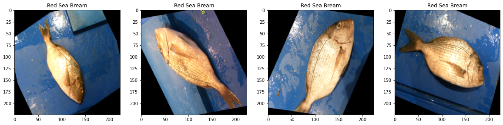

```python
import os
import platform
import numpy as np
import pandas as pd
import random as python_random
import matplotlib.pyplot as plt
from IPython.display import clear_output

os.environ['PYTHONHASHSEED'] = '73'
python_random.seed(73)
np.random.seed(73)

# Check Platform 
print(platform.platform())
%matplotlib inline
```

    Linux-4.15.0-142-generic-x86_64-with-glibc2.10
    

# Check Available GPU


```python
import tensorflow as tf
tf.random.set_seed(73)
!nvidia-smi   
#clear_output()
print("Tensorflow version " + tf.__version__)
```

    Fri May 14 13:45:35 2021       
    +-----------------------------------------------------------------------------+
    | NVIDIA-SMI 460.73.01    Driver Version: 460.73.01    CUDA Version: 11.2     |
    |-------------------------------+----------------------+----------------------+
    | GPU  Name        Persistence-M| Bus-Id        Disp.A | Volatile Uncorr. ECC |
    | Fan  Temp  Perf  Pwr:Usage/Cap|         Memory-Usage | GPU-Util  Compute M. |
    |                               |                      |               MIG M. |
    |===============================+======================+======================|
    |   0  GeForce RTX 208...  Off  | 00000000:1D:00.0 Off |                  N/A |
    | 30%   35C    P0    51W / 250W |      0MiB / 11019MiB |      0%      Default |
    |                               |                      |                  N/A |
    +-------------------------------+----------------------+----------------------+
    |   1  GeForce RTX 208...  Off  | 00000000:1E:00.0 Off |                  N/A |
    |  0%   38C    P0    54W / 300W |      0MiB / 11019MiB |      0%      Default |
    |                               |                      |                  N/A |
    +-------------------------------+----------------------+----------------------+
    |   2  GeForce RTX 208...  Off  | 00000000:1F:00.0 Off |                  N/A |
    | 29%   33C    P0    56W / 250W |      0MiB / 11019MiB |      0%      Default |
    |                               |                      |                  N/A |
    +-------------------------------+----------------------+----------------------+
    |   3  GeForce RTX 208...  Off  | 00000000:21:00.0 Off |                  N/A |
    | 29%   34C    P0    58W / 250W |      0MiB / 11019MiB |      0%      Default |
    |                               |                      |                  N/A |
    +-------------------------------+----------------------+----------------------+
    |   4  GeForce RTX 208...  Off  | 00000000:22:00.0 Off |                  N/A |
    | 29%   34C    P0    53W / 250W |      0MiB / 11019MiB |      1%      Default |
    |                               |                      |                  N/A |
    +-------------------------------+----------------------+----------------------+
    |   5  GeForce RTX 208...  Off  | 00000000:23:00.0 Off |                  N/A |
    | 30%   34C    P0    60W / 250W |      0MiB / 11019MiB |      1%      Default |
    |                               |                      |                  N/A |
    +-------------------------------+----------------------+----------------------+
    |   6  GeForce RTX 208...  Off  | 00000000:24:00.0 Off |                  N/A |
    | 34%   35C    P0    33W / 250W |      0MiB / 11019MiB |      0%      Default |
    |                               |                      |                  N/A |
    +-------------------------------+----------------------+----------------------+
                                                                                   
    +-----------------------------------------------------------------------------+
    | Processes:                                                                  |
    |  GPU   GI   CI        PID   Type   Process name                  GPU Memory |
    |        ID   ID                                                   Usage      |
    |=============================================================================|
    |  No running processes found                                                 |
    +-----------------------------------------------------------------------------+
    Tensorflow version 2.4.1
    

# DATASET Location 


```python
DataDir = '../../DATA/kaggle/Fish_Dataset/Fish_Dataset'
os.listdir(DataDir)
```


    ['Segmentation_example_script.m',
     'Hourse Mackerel',
     'Striped Red Mullet',
     'Red Sea Bream',
     'Sea Bass',
     'Gilt-Head Bream',
     'Trout',
     'Shrimp',
     'Red Mullet',
     'license.txt',
     'Black Sea Sprat',
     'README.txt']


# Fish Categories 


```python
import cv2
import time
import imageio
import imgaug.augmenters as iaa
import imgaug as ia
from tqdm import tqdm
ia.seed(73)

IMG_SIZE = 224
ColorCh = 3

CATEGORIES = []
for list_ in os.listdir(DataDir):
    if not '.' in list_:
        CATEGORIES.append(list_)

print(CATEGORIES)
```

    ['Hourse Mackerel', 'Striped Red Mullet', 'Red Sea Bream', 'Sea Bass', 'Gilt-Head Bream', 'Trout', 'Shrimp', 'Red Mullet', 'Black Sea Sprat']
    

# Data Preprocessing


```python
def isValid(text):
    """
    Function to check valid image. only PNG, JPG and JPEG
    """
    supported_types = ['.png', '.jpg', '.jpeg']
    for img_type in supported_types:
        if img_type in text:
            return True
        else:
            return False

import random
random.seed(73)

def prepareData(Dir, split_ratio):
    X = []
    y = []
    Frame = []
    
    # some augmentation
    flip = iaa.Fliplr(1.0)
    zoom = iaa.Affine(scale=1)
    random_brightness = iaa.Multiply((1, 1.2))
    rotate = iaa.Affine(rotate=(-20, 20))
    
    for i, category in enumerate(CATEGORIES): # for each category
        path = os.path.join(Dir, category, (category))  # get directory path for each category       
        if not os.path.isdir(path):
            pass
        
        else:
            class_num = CATEGORIES.index(category) # class number / text label => numeric label 
            limit = 500 # images from each class / get 500 images for each class
            img_list = os.listdir(path)[0:limit] # get images path from the list 
            random.shuffle(img_list) # shuffle the list 
            
            for img in tqdm(img_list): # tqdm for progress bar
                if isValid(img):
                    # read the image
                    orig_img = cv2.imread(os.path.join(path,img) , cv2.IMREAD_COLOR)
                    # start image augmentation
                    image_aug = cv2.resize(orig_img, (IMG_SIZE, IMG_SIZE), 
                                           interpolation = cv2.INTER_CUBIC) # resize image using bicubic interpolation
                    
                    image_aug = flip(image = image_aug) # flip image
                    image_aug = random_brightness(image = image_aug) # change brightness 
                    image_aug = zoom(image = image_aug) # zoom image 
                    image_aug = rotate(image = image_aug) # rotate image 
                    
                    # convert from RGB to BGR, adapt with VGG pretrained and also the format of the keras/TF/Deep learning Model
                    image_aug = cv2.cvtColor(image_aug, cv2.COLOR_BGR2RGB) 
                    X.append(image_aug)
                    y.append(class_num)
                else:
                    pass
 
    if len(X) > 0:
        train_len = int(len(X) * split_ratio)
        
        features = pd.DataFrame((np.array(X)).reshape(-1, IMG_SIZE * IMG_SIZE * ColorCh))
        labels = pd.DataFrame({'label': y})
        
        Frame = pd.concat([features, labels], axis=1).sample(frac = 1, random_state=73)     
        train_df, test_df = Frame[train_len:], Frame[:train_len]
        
        return train_df, test_df
```


```python
train_df, test_df = prepareData(DataDir, split_ratio=0.2)
```

    100%|██████████| 500/500 [00:05<00:00, 98.42it/s] 
    100%|██████████| 500/500 [00:05<00:00, 92.50it/s]
    100%|██████████| 500/500 [00:05<00:00, 97.27it/s] 
    100%|██████████| 500/500 [00:05<00:00, 98.38it/s] 
    100%|██████████| 500/500 [00:05<00:00, 95.43it/s]
    100%|██████████| 500/500 [00:05<00:00, 99.77it/s] 
    100%|██████████| 500/500 [00:05<00:00, 93.13it/s]
    100%|██████████| 500/500 [00:05<00:00, 91.53it/s]
    100%|██████████| 500/500 [00:05<00:00, 99.12it/s] 
    

# Check Sample Image


```python
import matplotlib.pyplot as plt

def print_images(samples):
    images = samples.drop(["label"],axis = 1).to_numpy()
    labels = samples['label'].to_numpy()
    
    fig=plt.figure(figsize=(20, 8))
    columns = 4
    rows = 1
    
    for i, image in enumerate(images):
        fig.add_subplot(rows,columns,i + 1)
        title = '{}'.format(CATEGORIES[labels[i]])
        Sample_image = image.reshape(IMG_SIZE, IMG_SIZE, ColorCh)
        plt.imshow(Sample_image, cmap='gray')
        plt.title(title)
        
    plt.show()
        
label_count = pd.Series(test_df['label'].values.ravel()).value_counts()
for label in list(label_count.index.values):
    samples = (test_df[test_df['label']==int(label)].iloc[0:4])
    print_images(samples)

%matplotlib inline
```


    

    


    

    


    

    


    

    


    

    


    

    


    

    


    

    


    

    


## Data Size


```python
print('> DataFrame shape: ',train_df.shape)
print('> {} image data '.format(train_df.shape[0]))
print('> {} --> ({} * {} * {}) pixels + 1 label for each image (1d scaled)\n'.format(train_df.shape[1], IMG_SIZE,IMG_SIZE, ColorCh))

label_count_train = pd.Series(train_df['label'].values.ravel()).value_counts()
n_classes = len(label_count_train)
print('> Total Classes: {}'.format(n_classes))
```

    > DataFrame shape:  (3600, 150529)
    > 3600 image data 
    > 150529 --> (224 * 224 * 3) pixels + 1 label for each image (1d scaled)
    
    > Total Classes: 9
    

## Check categories / labels


```python
print('> label count for train')
for i in range(len(label_count_train)):
    print('> {} : {}'.format(CATEGORIES[i], label_count_train[i]))
```

    > label count for train
    > Hourse Mackerel : 405
    > Striped Red Mullet : 405
    > Red Sea Bream : 390
    > Sea Bass : 397
    > Gilt-Head Bream : 399
    > Trout : 390
    > Shrimp : 396
    > Red Mullet : 406
    > Black Sea Sprat : 412
    

## check number of samples for each category


```python
print('> label count for test')
label_count_test = pd.Series(test_df['label'].values.ravel()).value_counts()
for i in range(len(label_count_test)):
    print('> {} : {}'.format(CATEGORIES[i], label_count_test[i]))
```

    > label count for test
    > Hourse Mackerel : 95
    > Striped Red Mullet : 95
    > Red Sea Bream : 110
    > Sea Bass : 103
    > Gilt-Head Bream : 101
    > Trout : 110
    > Shrimp : 104
    > Red Mullet : 94
    > Black Sea Sprat : 88
    

## Create "features" and "label"


```python
X_train = train_df.drop(["label"],axis = 1).to_numpy().reshape(-1,IMG_SIZE,IMG_SIZE,ColorCh).astype(np.float32) / 255.0
y_train = train_df['label']

X_test = test_df.drop(["label"],axis = 1).to_numpy().reshape(-1,IMG_SIZE,IMG_SIZE,ColorCh).astype(np.float32) / 255.0
y_test = test_df['label']
```


```python
print('> {} train images'.format(X_train.shape[0]))
print('> {} test images'.format(X_test.shape[0]))

input_shape = X_train.shape[1:]
print('> input shape:', input_shape)
```

    > 3600 train images
    > 900 test images
    > input shape: (224, 224, 3)
    

# Build Model


```python
from tensorflow.keras.layers import Dense, Dropout, Activation, Flatten, Add
from tensorflow.keras.layers import InputLayer, Input, Conv2D, MaxPooling2D, AveragePooling2D, GlobalAveragePooling2D, Activation, MaxPool2D, ZeroPadding2D
from keras.layers.normalization import BatchNormalization
from tensorflow.keras.models import Model, Sequential
from keras import activations
from keras import regularizers

kernel_regularizer = regularizers.l2(0.0001)
final_activation = 'softmax' ## Final activation function 
entropy = 'sparse_categorical_crossentropy' ## loss function 
```

## Define the function to build model


```python
def vgg_block(num_convs, num_channels):
    """
    VGG Block builder
    """
    block = tf.keras.models.Sequential()
    for _ in range(num_convs):
        block.add(Conv2D(filters=num_channels, kernel_size = (3,3), padding="same"))
        block.add(BatchNormalization())
        block.add(Activation('relu'))
        
    block.add(MaxPooling2D(pool_size=2, strides=2))
    return block

def VGG_MODEL(n_layers):
    """
    Create VGG Model
    """
    supported_layers = [11, 13, 16, 19]
    
    if not n_layers in supported_layers:
        print('not supported')
        return
    
    if n_layers == 11:
        conv_arch = ((1, 64), (1, 128), (2, 256), (2, 512), (2, 512))

    if n_layers == 13:
        conv_arch = ((2, 64), (2, 128), (2, 256), (2, 512), (2, 512))
        
    if n_layers == 16: # VGG 16
        conv_arch = ((2, 64), (2, 128), (3, 256), (3, 512), (3, 512))
    
    if n_layers == 19:
        conv_arch = ((2, 64), (2, 128), (4, 256), (4, 512), (4, 512))
    
    
    vgg_model = Sequential()
    vgg_model.add(Input(shape=input_shape))
    
    for (num_convs, num_channels) in conv_arch:
        vgg_model.add(vgg_block(num_convs, num_channels))
    
    vgg_model.add(Flatten())
    
    vgg_model.add(Dense(units=4096))
    vgg_model.add(BatchNormalization())
    vgg_model.add(Activation('relu'))
    vgg_model.add(Dropout(0.5, seed=73))
    
    vgg_model.add(Dense(units=4096))
    vgg_model.add(BatchNormalization())
    vgg_model.add(Activation('relu'))
    vgg_model.add(Dropout(0.5, seed=73))
    
    vgg_model.add(Dense(units=n_classes, activation=final_activation))
    
    return vgg_model
```

## Some Function to show the Model Results


```python
### **Print Model Results**

def print_graph(item, index, history):
    train_values = history.history[item][0:index]
    plt.plot(train_values)
    test_values = history.history['val_' + item][0:index]
    plt.plot(test_values)
    plt.legend(['training','validation'])
    plt.title('Training and validation '+ item)
    plt.xlabel('epoch')
    plt.show()


def get_best_epoch(test_loss, history):
    for key, item in enumerate(history.history.items()):
        (name, arr) = item
        if name == 'val_loss':
            for i in range(len(arr)):
                if round(test_loss, 2) == round(arr[i], 2):
                    return i
        

def model_summary(model, history):
    print('---'*30)
    test_loss, test_accuracy = model.evaluate(X_test, y_test, verbose=0)

    if history:
        index = get_best_epoch(test_loss, history)
        print('Best Epochs: ', index)

        train_accuracy = history.history['accuracy'][index]
        train_loss = history.history['loss'][index]

        print('Accuracy on train:',train_accuracy,'\tLoss on train:',train_loss)
        print('Accuracy on test:',test_accuracy,'\tLoss on test:',test_loss)
        print_graph('loss', index, history)
        print_graph('accuracy', index, history)
        print('---'*30)

```

## Some Callback Functions


```python
## **Call Backs**
from tensorflow.keras.callbacks import Callback, ModelCheckpoint, LearningRateScheduler, TensorBoard, EarlyStopping, ReduceLROnPlateau
          
EPOCHS = 50
patience = 5

start_lr = 0.00001
min_lr = 0.00001
max_lr = 0.00005
batch_size = 16

rampup_epochs = 5
sustain_epochs = 0
exp_decay = .8

def lrfn(epoch):
    if epoch < rampup_epochs:
        return (max_lr - start_lr)/rampup_epochs * epoch + start_lr
    elif epoch < rampup_epochs + sustain_epochs:
        return max_lr
    else:
        return (max_lr - min_lr) * exp_decay**(epoch-rampup_epochs-sustain_epochs) + min_lr

    
class myCallback(Callback):
    def on_epoch_end(self, epoch, logs={}):
        if ((logs.get('accuracy')>=0.999) | (logs.get('loss') <= 0.01)):
            print("\nLimits Reached cancelling training!")
            self.model.stop_training = True

            
            
end_callback = myCallback()

lr_plat = ReduceLROnPlateau(patience = 2, mode = 'min')

lr_callback = LearningRateScheduler(lambda epoch: lrfn(epoch), verbose=False)

early_stopping = EarlyStopping(patience = patience, monitor='val_loss',
                                 mode='min', restore_best_weights=True, 
                                 verbose = 1, min_delta = .00075)


checkpoint_filepath = 'Fish_Weights.h5'

model_checkpoints = ModelCheckpoint(filepath=checkpoint_filepath,
                                        save_weights_only=True,
                                        monitor='val_loss',
                                        mode='min',
                                        verbose = 1,
                                        save_best_only=True)

import datetime
log_dir="logs/fit/" + '_' + datetime.datetime.now().strftime("%Y%m%d-%H%M%S")  
tensorboard_callback = TensorBoard(log_dir = log_dir, write_graph=True, histogram_freq=1)

callbacks = [end_callback, lr_callback, model_checkpoints, tensorboard_callback, early_stopping, lr_plat]

```

## Compile and Training Function


```python
def CompileModel(model):
    model.summary()
    model.compile(optimizer='adam', loss=entropy,metrics=['accuracy'])
    return model


def FitModel(model, name):

    history = model.fit(X_train,y_train,
                              epochs=EPOCHS,
                              callbacks=callbacks,
                              batch_size = batch_size,
                              validation_data = (X_test, y_test),
                              )
    
    model.load_weights(checkpoint_filepath)

    final_accuracy_avg = np.mean(history.history["val_accuracy"][-5:])

    final_loss = history.history["val_loss"][-1]
  
    group = {history: 'history', name: 'name', model: 'model', final_accuracy_avg:'acc', final_loss:'loss'}

    clear_output()
    model.summary()

    print('\n')
    print('---'*30)
    print(name,' Model')
    print('Total Epochs :', len(history.history['loss']))
    print('Accuracy on train:',history.history['accuracy'][-1],'\tLoss on train:',history.history['loss'][-1])
    print('Accuracy on val:', final_accuracy_avg ,'\tLoss on val:', final_loss)
    print('---'*30)

    return model, history
```

## Train the Model


```python
skip_training = False

mode = 'proMode'

def BuildModel():    
    prepared_model = VGG_MODEL(16)
    compiled_model = CompileModel(prepared_model)
    return compiled_model

compiled_model = BuildModel()
model, history = FitModel(compiled_model, 'vgg')
model_summary(model, history)
```

    Model: "sequential"
    _________________________________________________________________
    Layer (type)                 Output Shape              Param #   
    =================================================================
    sequential_1 (Sequential)    (None, 112, 112, 64)      39232     
    _________________________________________________________________
    sequential_2 (Sequential)    (None, 56, 56, 128)       222464    
    _________________________________________________________________
    sequential_3 (Sequential)    (None, 28, 28, 256)       1478400   
    _________________________________________________________________
    sequential_4 (Sequential)    (None, 14, 14, 512)       5905920   
    _________________________________________________________________
    sequential_5 (Sequential)    (None, 7, 7, 512)         7085568   
    _________________________________________________________________
    flatten (Flatten)            (None, 25088)             0         
    _________________________________________________________________
    dense (Dense)                (None, 4096)              102764544 
    _________________________________________________________________
    batch_normalization_13 (Batc (None, 4096)              16384     
    _________________________________________________________________
    activation_13 (Activation)   (None, 4096)              0         
    _________________________________________________________________
    dropout (Dropout)            (None, 4096)              0         
    _________________________________________________________________
    dense_1 (Dense)              (None, 4096)              16781312  
    _________________________________________________________________
    batch_normalization_14 (Batc (None, 4096)              16384     
    _________________________________________________________________
    activation_14 (Activation)   (None, 4096)              0         
    _________________________________________________________________
    dropout_1 (Dropout)          (None, 4096)              0         
    _________________________________________________________________
    dense_2 (Dense)              (None, 9)                 36873     
    =================================================================
    Total params: 134,347,081
    Trainable params: 134,322,249
    Non-trainable params: 24,832
    _________________________________________________________________
    
    
    ------------------------------------------------------------------------------------------
    vgg  Model
    Total Epochs : 20
    Accuracy on train: 0.9941666722297668 	Loss on train: 0.016988568007946014
    Accuracy on val: 0.980222225189209 	Loss on val: 0.03146433085203171
    ------------------------------------------------------------------------------------------
    ------------------------------------------------------------------------------------------
    Best Epochs:  14
    Accuracy on train: 0.9958333373069763 	Loss on train: 0.01371457427740097
    Accuracy on test: 0.995555579662323 	Loss on test: 0.018673431128263474
    


    

    


    

    


    ------------------------------------------------------------------------------------------
    

## Store the model


```python
model.save('fish_model.h5')
```

# Model Evaluation


```python
import seaborn as sns
from sklearn import metrics

def test_set_results(pred_value, X, y):    
    corr_pred = metrics.confusion_matrix(y, pred_value)
    
    fig=plt.figure(figsize=(10, 8))
    sns.heatmap(corr_pred,annot=True, fmt="d",cmap="Blues")
    plt.show()
```


```python
from sklearn.metrics import roc_curve, roc_auc_score, plot_roc_curve, accuracy_score, classification_report, confusion_matrix

def printResults(model, X, y):  
    predictions = model.predict(X, batch_size=4)
    pred = np.argmax(predictions, axis=1)
    pred = [CATEGORIES[k] for k in pred]
    
    target_names = ['negative','positive']
    print(classification_report(y, predictions.argmax(axis=1), target_names=CATEGORIES))
    test_set_results(predictions.argmax(axis=1), X, y)
```


```python
def eval_model(model, X, y, name):
    test_loss, test_accuracy = model.evaluate(X, y, verbose=0)
    print('Final Accuracy on {}:'.format(name),test_accuracy,'\tLoss on {}:'.format(name),test_loss)
    print('---'*30)

path = 'fish_model.h5'
print('\nloading at {}'.format(path))

if os.path.exists(path):
    model = tf.keras.models.load_model(path)
    print('---'*30)
    eval_model(model, X_test, y_test, 'test')
    printResults(model, X_test, y_test)
```

    
    loading at fish_model.h5
    ------------------------------------------------------------------------------------------
    Final Accuracy on test: 0.995555579662323 	Loss on test: 0.018673431128263474
    ------------------------------------------------------------------------------------------
                        precision    recall  f1-score   support
    
       Hourse Mackerel       1.00      0.99      0.99        95
    Striped Red Mullet       0.99      0.99      0.99        95
         Red Sea Bream       1.00      0.99      1.00       110
              Sea Bass       1.00      0.99      1.00       103
       Gilt-Head Bream       0.99      1.00      1.00       101
                 Trout       1.00      1.00      1.00       110
                Shrimp       1.00      1.00      1.00       104
            Red Mullet       1.00      1.00      1.00        94
       Black Sea Sprat       0.98      1.00      0.99        88
    
              accuracy                           1.00       900
             macro avg       1.00      1.00      1.00       900
          weighted avg       1.00      1.00      1.00       900
    
    


    

    


```python

```


```python

```


```python

```
