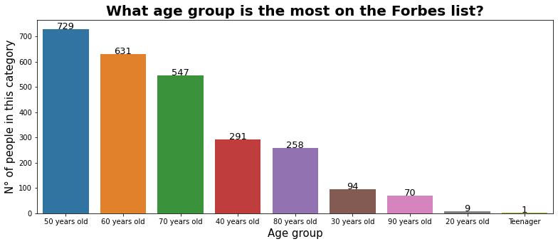

# Forbes Billionaires 2021 

# 💰 About 
This repository contains the Exploratory Data Analysis (EDA) on Forbes Billionaires 2021 Data.

There are many Interesting stuff in the notebook. 😜

-   Who is the youngest Billionaire? 
    <table border="1" class="dataframe">
      <thead>
        <tr style="text-align: right;">
          <th></th>
          <th>Name</th>
          <th>NetWorth</th>
          <th>Country</th>
          <th>Source</th>
          <th>Rank</th>
          <th>Age</th>
          <th>Residence</th>
          <th>Citizenship</th>
          <th>Status</th>
          <th>Children</th>
          <th>Education</th>
          <th>Self_made</th>
          <th>age_group</th>
        </tr>
      </thead>
      <tbody>
        <tr>
          <th>940</th>
          <td>Kevin David Lehmann</td>
          <td>3.3</td>
          <td>Germany</td>
          <td>drugstores</td>
          <td>925</td>
          <td>18.0</td>
          <td>NaN</td>
          <td>Germany</td>
          <td>NaN</td>
          <td>NaN</td>
          <td>NaN</td>
          <td>False</td>
          <td>Teenager</td>
        </tr>
      </tbody>
    </table>
    

-   Age Group Billionaires
    