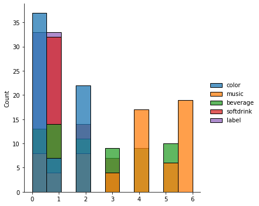

```python
import numpy as np # linear algebra
import pandas as pd # data processing, CSV file I/O (e.g. pd.read_csv)
```

## Read The Data


```python
df = pd.read_csv('../../DATA/kaggle/gender-classification/Transformed Data Set - Sheet1.csv')
df.head()
```


<div>
<style scoped>
    .dataframe tbody tr th:only-of-type {
        vertical-align: middle;
    }

    .dataframe tbody tr th {
        vertical-align: top;
    }

    .dataframe thead th {
        text-align: right;
    }
</style>
<table border="1" class="dataframe">
  <thead>
    <tr style="text-align: right;">
      <th></th>
      <th>Favorite Color</th>
      <th>Favorite Music Genre</th>
      <th>Favorite Beverage</th>
      <th>Favorite Soft Drink</th>
      <th>Gender</th>
    </tr>
  </thead>
  <tbody>
    <tr>
      <th>0</th>
      <td>Cool</td>
      <td>Rock</td>
      <td>Vodka</td>
      <td>7UP/Sprite</td>
      <td>F</td>
    </tr>
    <tr>
      <th>1</th>
      <td>Neutral</td>
      <td>Hip hop</td>
      <td>Vodka</td>
      <td>Coca Cola/Pepsi</td>
      <td>F</td>
    </tr>
    <tr>
      <th>2</th>
      <td>Warm</td>
      <td>Rock</td>
      <td>Wine</td>
      <td>Coca Cola/Pepsi</td>
      <td>F</td>
    </tr>
    <tr>
      <th>3</th>
      <td>Warm</td>
      <td>Folk/Traditional</td>
      <td>Whiskey</td>
      <td>Fanta</td>
      <td>F</td>
    </tr>
    <tr>
      <th>4</th>
      <td>Cool</td>
      <td>Rock</td>
      <td>Vodka</td>
      <td>Coca Cola/Pepsi</td>
      <td>F</td>
    </tr>
  </tbody>
</table>
</div>


### Features :
- Fav Color
- Fav Music genre
- Fev Beverage
- Fav Soft
- Gender (label)

## Rename Columns 


```python
df.columns = ['color', 'music','beverage','softdrink','label']
df.columns
```


    Index(['color', 'music', 'beverage', 'softdrink', 'label'], dtype='object')


## Inspect the Data


```python
df.count()
```


    color        66
    music        66
    beverage     66
    softdrink    66
    label        66
    dtype: int64


**Only 6 rows**

## Check Missing Values


```python
df.isnull().sum()
```


    color        0
    music        0
    beverage     0
    softdrink    0
    label        0
    dtype: int64


**No missing Values**


## Encode the Data


```python
from sklearn.preprocessing import LabelEncoder
le_color = LabelEncoder()
data = df
data['color'] = le_color.fit_transform(df.color.values)
le_music = LabelEncoder()
data['music'] = le_music.fit_transform(df.music.values)
le_beverage = LabelEncoder()
data['beverage'] = le_beverage.fit_transform(df.beverage.values)
le_softdrink = LabelEncoder()
data['softdrink'] = le_softdrink.fit_transform(df.softdrink.values)
le_label = LabelEncoder()
data['label'] = le_label.fit_transform(df.label.values)
data.head()
```


<div>
<style scoped>
    .dataframe tbody tr th:only-of-type {
        vertical-align: middle;
    }

    .dataframe tbody tr th {
        vertical-align: top;
    }

    .dataframe thead th {
        text-align: right;
    }
</style>
<table border="1" class="dataframe">
  <thead>
    <tr style="text-align: right;">
      <th></th>
      <th>color</th>
      <th>music</th>
      <th>beverage</th>
      <th>softdrink</th>
      <th>label</th>
    </tr>
  </thead>
  <tbody>
    <tr>
      <th>0</th>
      <td>0</td>
      <td>6</td>
      <td>3</td>
      <td>0</td>
      <td>0</td>
    </tr>
    <tr>
      <th>1</th>
      <td>1</td>
      <td>2</td>
      <td>3</td>
      <td>1</td>
      <td>0</td>
    </tr>
    <tr>
      <th>2</th>
      <td>2</td>
      <td>6</td>
      <td>5</td>
      <td>1</td>
      <td>0</td>
    </tr>
    <tr>
      <th>3</th>
      <td>2</td>
      <td>1</td>
      <td>4</td>
      <td>2</td>
      <td>0</td>
    </tr>
    <tr>
      <th>4</th>
      <td>0</td>
      <td>6</td>
      <td>3</td>
      <td>1</td>
      <td>0</td>
    </tr>
  </tbody>
</table>
</div>


```python
import seaborn as sns 
import matplotlib.pyplot as plt

sns.displot(data)

plt.show()
```


    

    


```python
data['label'].value_counts()
```


    0    33
    1    33
    Name: label, dtype: int64


**Balanced Data**

## Split Data into Train and Test


```python
from sklearn.model_selection import train_test_split
Y = data['label']
X = data.drop(['label'],axis=1)
#X.head()
X_train, X_test,Y_train, Y_test = train_test_split(X,Y,test_size=0.2, random_state=42) # Split 20% test data
```


## Build Model 

### Logistic Regression


```python
from sklearn.linear_model import LogisticRegression

model = LogisticRegression(random_state=42)
model.fit(X_train, Y_train)
```


    LogisticRegression(random_state=42)


## Check on Training Data 


```python
from sklearn.metrics import classification_report, confusion_matrix
p_train_pred = model.predict_proba(X_train)
y_train_pred = model.predict(X_train)

conf_m_train = confusion_matrix(Y_train, y_train_pred)
report_train = classification_report(Y_train, y_train_pred)
print(report_train)
```

                  precision    recall  f1-score   support
    
               0       0.55      0.62      0.58        26
               1       0.57      0.50      0.53        26
    
        accuracy                           0.56        52
       macro avg       0.56      0.56      0.56        52
    weighted avg       0.56      0.56      0.56        52
    
    


## Evaluate on Test Data


```python
p_test_pred = model.predict_proba(X_test)
y_test_pred = model.predict(X_test)

conf_m_train = confusion_matrix(Y_test, y_test_pred)
report_train = classification_report(Y_test, y_test_pred)
print(report_train)
```

                  precision    recall  f1-score   support
    
               0       0.75      0.43      0.55         7
               1       0.60      0.86      0.71         7
    
        accuracy                           0.64        14
       macro avg       0.68      0.64      0.63        14
    weighted avg       0.67      0.64      0.63        14
    
    

## Try Random Forest Classifier 


```python
from sklearn.ensemble import RandomForestClassifier
from sklearn import metrics

#Create a Gaussian Classifier
clf=RandomForestClassifier(n_estimators=5,random_state=42)
clf.fit(X_train, Y_train)


y_pred=clf.predict(X_train)
print("Accuracy:",metrics.accuracy_score(Y_train, y_pred))
```

    Accuracy: 0.9230769230769231
    

### Try RF on Test Data


```python
y_pred=clf.predict(X_test)
print("Accuracy:",metrics.accuracy_score(Y_test, y_pred))
```

    Accuracy: 0.2857142857142857
    

# Notes
1. The data is too small. Only 66 instances. 
2. The data is balance and no need many preprocessing steps.


