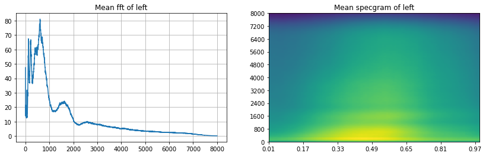

```python
import os
from os.path import isdir, join
from pathlib import Path
import pandas as pd

# Math
import numpy as np
from scipy.fftpack import fft
from scipy import signal
from scipy.io import wavfile
import librosa

from sklearn.decomposition import PCA

# Visualization
import matplotlib.pyplot as plt
import seaborn as sns
import IPython.display as ipd
import librosa.display

import plotly.offline as py
py.init_notebook_mode(connected=True)
import plotly.graph_objs as go
import plotly.tools as tls
import pandas as pd
```


<script type="text/javascript">
window.PlotlyConfig = {MathJaxConfig: 'local'};
if (window.MathJax) {MathJax.Hub.Config({SVG: {font: "STIX-Web"}});}
if (typeof require !== 'undefined') {
require.undef("plotly");
requirejs.config({
    paths: {
        'plotly': ['https://cdn.plot.ly/plotly-latest.min']
    }
});
require(['plotly'], function(Plotly) {
    window._Plotly = Plotly;
});
}
</script>


## Read The Data


```python
train_audio_path = '../../DATA/kaggle/tensorflow-speech-recognition-challenge/train/audio/'
filename = '/yes/0a7c2a8d_nohash_0.wav'
sample_rate, samples = wavfile.read(str(train_audio_path) + filename)
```

A spectrogram is a visual representation of the spectrum of frequencies of a signal as it varies with time. When applied to an audio signal, spectrograms are sometimes called sonographs, voiceprints, or voicegrams. When the data are represented in a 3D plot they may be called waterfalls.


Define a function that calculates spectrogram.

Note, that we are taking logarithm of spectrogram values. It will make our plot much more clear, moreover, it is strictly connected to the way people hear. We need to assure that there are no 0 values as input to logarithm.


```python
def log_specgram(audio, sample_rate, window_size=20,
                 step_size=10, eps=1e-10):
    nperseg = int(round(window_size * sample_rate / 1e3))
    noverlap = int(round(step_size * sample_rate / 1e3))
    freqs, times, spec = signal.spectrogram(audio,
                                    fs=sample_rate,
                                    window='hann',
                                    nperseg=nperseg,
                                    noverlap=noverlap,
                                    detrend=False)
    return freqs, times, np.log(spec.T.astype(np.float32) + eps)
```

Frequencies are in range (0, 8000) according to [Nyquist](https://en.wikipedia.org/wiki/Nyquist_rate) theorem.

Let's plot it:


```python
freqs, times, spectrogram = log_specgram(samples, sample_rate)

fig = plt.figure(figsize=(14, 8))
ax1 = fig.add_subplot(211)
ax1.set_title('Raw wave of ' + filename)
ax1.set_ylabel('Amplitude')
ax1.plot(np.linspace(0, sample_rate/len(samples), sample_rate), samples)

ax2 = fig.add_subplot(212)
ax2.imshow(spectrogram.T, aspect='auto', origin='lower', 
           extent=[times.min(), times.max(), freqs.min(), freqs.max()])
ax2.set_yticks(freqs[::16])
ax2.set_xticks(times[::16])
ax2.set_title('Spectrogram of ' + filename)
ax2.set_ylabel('Freqs in Hz')
ax2.set_xlabel('Seconds')
```


    Text(0.5, 0, 'Seconds')


    

    


If we use spectrogram as an input features for NN, we have to remember to normalize features. (We need to normalize over all the dataset, here's example just for one, which doesn't give good mean and std!)


```python
mean = np.mean(spectrogram, axis=0)
std = np.std(spectrogram, axis=0)
spectrogram = (spectrogram - mean) / std
spectrogram.shape
```


    (99, 161)


## Mel Frequency Cepstral Coefficient (MFCC)
If you want to get to know some details about MFCC take a look at [this](http://practicalcryptography.com/miscellaneous/machine-learning/guide-mel-frequency-cepstral-coefficients-mfccs/) great tutorial. MFCC explained You can see, that it is well prepared to imitate human hearing properties.

You can calculate Mel power spectrogram and MFCC using for example librosa python package.


```python
# From this tutorial
# https://github.com/librosa/librosa/blob/master/examples/LibROSA%20demo.ipynb
samples, sample_rate = librosa.load(str(train_audio_path)+filename)

S = librosa.feature.melspectrogram(samples, sr=sample_rate, n_mels=128)

# Convert to log scale (dB). We'll use the peak power (max) as reference.
log_S = librosa.power_to_db(S, ref=np.max)

plt.figure(figsize=(12, 4))
librosa.display.specshow(log_S, sr=sample_rate, x_axis='time', y_axis='mel')
plt.title('Mel power spectrogram ')
plt.colorbar(format='%+02.0f dB')
plt.tight_layout()
```

    c:\users\tro\.conda\envs\ml\lib\site-packages\librosa\display.py:974: MatplotlibDeprecationWarning:
    
    The 'basey' parameter of __init__() has been renamed 'base' since Matplotlib 3.3; support for the old name will be dropped two minor releases later.
    
    c:\users\tro\.conda\envs\ml\lib\site-packages\librosa\display.py:974: MatplotlibDeprecationWarning:
    
    The 'linthreshy' parameter of __init__() has been renamed 'linthresh' since Matplotlib 3.3; support for the old name will be dropped two minor releases later.
    
    


    

    


```python
mfcc = librosa.feature.mfcc(S=log_S, n_mfcc=13)

# Let's pad on the first and second deltas while we're at it
delta2_mfcc = librosa.feature.delta(mfcc, order=2)

plt.figure(figsize=(12, 4))
librosa.display.specshow(delta2_mfcc)
plt.ylabel('MFCC coeffs')
plt.xlabel('Time')
plt.title('MFCC')
plt.colorbar()
plt.tight_layout()
```


    

    


In classical, but still state-of-the-art systems, MFCC or similar features are taken as the input to the system instead of spectrograms.

However, in end-to-end (often neural-network based) systems, the most common input features are probably raw spectrograms, or mel power spectrograms. For example MFCC decorrelates features, but NNs deal with correlated features well. Also, if you'll understand mel filters, you may consider their usage sensible.a

It is your decision which to choose!

## Silence removal
Let's listen to that file


```python
ipd.Audio(samples, rate=sample_rate)
```


<audio  controls="controls" >
    <source src="data:audio/wav;base64,UklGRmisAABXQVZFZm10IBAAAAABAAEAIlYAAESsAAACABAAZGF0YUSsAAAuAAMAzf/V/wAAIQAjAP3/0//S//b/JwBKAEUAJAAEAPb/+f8JACEANgAtAAUA4//i/wUAMQA+AB4A6P+7/7b/2v8EAA8A6P+i/3T/gP+0/+r////e/6D/g/+n//H/JwAiAOn/p/+H/6T/+f9KAFQAGgDf/8j/2f8VAGIAdgA+APb/0//j/xMARABOACgA7//M/9L/9v8ZABsA8v/B/7P/wP/R/+P/7P/f/83/0//t//z/+f/3//3/9v/f/8v/yf/U/9//3P/M/8f/2f/o/+D/1P/a/+f/7//s/9v/zf/Q/9z/7/8IABgAEQD9/+z/8/8aAEkAYABYAD8AKwAwAEsAaAB3AG8AVAA6ACgAHAAbACgAOAA0AB0ABQD6/wQAIwA6AD4AOwAxACEAJQA/AFAAVABPADMAFAAZADgASAA8ACIABADj/8//1//u/wIADwAPAAUAAwD//+j/2P/k/+z/3P/X/+r//P////v/+v/8/wAAAAD6//X/8P/v//r/CgASAAkA+P/p/+b/8f8BAAoAAADc/7b/r//O//P/+v/q/9j/yv/H/+D/BwAWAPz/yP+a/5X/yf8NADEAJQD6/8P/qf/L/w0ALgANAL//c/9g/5j/7P8eABcA5f+y/63/2v8WAD4APwAXAO3/6P8LAEgAfgCCAEkAAwDt/w0ASwB7AHwAVAAkAAcABAAVACcAIgD6/8b/rv/C//f/IAAeAAAA6//j/97/5v8AABEABwDl/73/qf++//D/CgD2/9X/zP/X/+P/8P/8//v/6P/Q/8n/2v/z/wQABwABAP///P/0//D/9v8EABwAJgAUAAAAAAALACMAQwBUAE4APgAuADEATwBsAHEAYgBDAB4AFQAtAEUARAAuABIAAAD9////CAAYACAAHAAYABoAHAAcACQALAAhAAwAAQD8//v/CQAgACYAEgD3/+X/4P/m//L//P/8//P/4v/W/+L///8OAAoAAwD9//P/8P/8/wsAEwAMAP3/8//7/woADwAHAPj/5//b/97/8/8JABEACgD9/+b/2P/h/+n/3f/M/8H/sv+h/5z/qf/I/+v/+v/v/9n/zf/Q/9f/1P/O/8n/xf/J/9v/9f8AAO//0v/O/+X/+/8DAAEA9P/j/+f///8PABEADAAHAAEA+v/9/wsAFQAaACAAIgAbABYAEgARABcAGwARAAIA+f/s/+b/BQA/AFQAKgDv/9j/8v8jAEoASwAjAO7/1f/9/04AigB9ACYAwf+a/9H/OgCRAJIALwCz/3b/nP8RAJkAyABxAOX/i/+a/xAAmwDMAIwAHQDQ/97/QgCkALgAeAAGAK7/uf8WAGsAdgA8AO3/xv/b/wEAEgAMAAAA9f/1/wkAIgAfAPb/xf+0/87/9f/+/+X/vP+a/5b/wP8AACUADgDG/4X/jP/U/yEAQQAiANP/jv+O/8r/BgAYAPT/sf94/2//m//b////7f+1/4P/gP+i/8T/1//h/9n/wP+4/9b//P8HAP7/5//H/7j/0//4/wEAAAD8//H/7f/8/wsADgANAA0AFQAmADQAOAAxACEAFwAmAEYAWwBNACQAAwAHACYAPAA3ABsA+f/l//f/LABcAE8AAwC2/6X/5/9ZAKYAiwAfALf/nv/s/2wAuQCQAAwAi/9i/7T/SwCrAIAA+f96/13/0P+LAO8ArgAIAHL/Uv/D/2sAxACQAPr/c/9r/+n/hADBAG4Aw/9B/07/0/9dAI4ASgC9/1D/Yv/k/24AlAAvAIj/Kv9d//X/igC2AFEAs/9c/3z/8P9sAJcASwDJ/3z/of8kAKMAtABXAOv/u//a/zQAlACvAGcA+f++/93/LwBtAGUAGQDG/6P/v////zIAKADm/6v/q//h/yQASAAxAO3/tP+3/+n/GQAtABsA5f+t/6P/yf/+/yEAJQAJAOX/z//O/9X/3//1/xIAFAD1/9z/4f/1/wQACgAFAP7/8P/d/9X/2//e/93/3v/e/97/1/+7/5T/gP+e/+f/KQAyAPz/q/+A/6j/DQBrAIUASwDk/5H/j//z/3oAqwBkAPn/sv+q/+r/QwBcACMA3P/C/+L/HwBLAD8A+v+z/6j/2f8VACcA7P+P/23/pv8NAFcAQwDd/4T/gv/O/z4AjwCGACsAy/+3/wwAiwDNAKoAPQDH/5//5P9RAIsAeQA0AOf/x//7/1kAfwBHAPX/0/8AAFoAkQBiAO3/k/+T/+H/QgBvADgAwf94/6n/LwCiAKgAPgC+/4f/vv8+AKQAjAD7/2D/Ov+l/z8AjgBZAMb/Sf9c/+j/WQBYAPP/c/9M/7D/OgB2AEYAxv9R/2D/7v96AKAAUADN/4H/qv8RAFwAVgAHAKn/iv/S/0sAmACCACIAx/+1/+//PABkAEwAEQDy/wMAKABAADUA+v+r/4T/nv/S//r/BwDw/7r/iv+C/6H/1/8AAPj/xv+l/7r/+P9AAHEAawA2AP3/5P8AAEcAggByABgAuf+T/7//HQBuAHUAKQDC/5D/uv8iAIkAowBbAPb/vv/N/xcAZwB7AE4ADgDb/9T/DQBZAHAASAAPAOj/3//3/x0ALQAaAAIA//8HABEAGAAOAO//zv/N//H/FAATAPP/y/+t/6//2/8PACAAAADS/8f/7P8jAEUALQDl/6n/o//D/+v/AADv/8D/of+x/93/9//p/8T/pv+j/8T/7v8AAAAABQAEAPj/8P/0//z/AQAEAPz/4v/B/7P/yf/9/ygAJQD//9z/1f/s/wsADwD5/+b/3P/U/+b/CAANAPD/2v/s/yAAUQBLAA8A2f/W//z/IAAwACkAEQD//w0AMgBLAE4ANwD8/8X/zP8AACwAPwA1AAwA6//0/wsAFQAeACgAHAAHAAYAFwAiAB4AEgAKAAsAEgAbAB8AGAATABQAFQAXABwAFAD8/+X/5P/8/xYAEQD2/+f/9P8LABsAHQAVAAcA/f8JADkAbwBtACEAzP+6//L/OABPACgA9f/o//P/8v/x/xAAOQA5AA8A6v/W/83/6/87AHoAYAAAAJ//ef+v/yAAdgBmAP3/j/90/7v/KgBtAE8A7v+l/67/7/8rADcACwDN/7r/8v9AAFgAJQDR/4z/gv/D/x4ATwA7APD/n/+O/8T/AQAbAAMAvf9x/2b/uf8vAGIAHwCm/1j/Wv+j/xMAawBiAPn/hP9Y/5H//f9EAEUAHADq/8T/xf/w/yoAVwBVAB4A4//E/8D/0//u//z/CQAXAAwA8P/o////KABKAEAADgDe/8T/u//B/9r/9f/0/9X/xv/b//r//v/q/+f/DgA7AEUAQABGAFIAcACkAMkAvQCFAEYAMQBaAJ8AtwBzAPv/pv+k/+P/MgBZADYA9f/U/+T/BwAeABEA4v+4/8X/FAB0AJAANQCa/0f/i/8wALgAtwAqAIT/Pv+H/zIAzADcAE8AmP9O/67/ZQDoANQAMQB9/0T/kP8DAE0AQQDh/3r/af+7/yQAPwDt/3b/SP+H//3/TwBJAPL/hf9X/5n/EQBTACoAuP9Y/2f/3v9KAE4A+v+a/3f/rv8fAGwAVAAKAOP/8P8hAF4AdABKAAkA8f8UAFkAgwBnABEAw//C/wUAOgAzAAAAvf+b/8P/EQBBAD0ACwDA/5n/yP8dAEgAMQD+/9f/0v/s/xQAMwAoAO7/p/+O/7j/+v8cABMA5v+o/4j/pP/g/wcAAQDV/6f/m/+p/8X/8P8XABMA5v+8/7j/2f8KAC8ALgAQAPT/5P/o/wwASAByAG0AOwACAO3/+/8YADsASAAsAAQA8f/6/yQATQA5APb/zf/X/wAALQBJADsAFQD8//7/FQBCAGUAVAAUAN3/zP/x/0IAhQB4ACsA3//J//P/KQBBADkACgC5/5D/xP8sAHwAdQACAG//Lv9j/+D/VwBrAP7/dv9Y/7j/OAB5AFcA7/+Q/5L/7/9DAEwAHwDk/7n/wv/9/zEAMgAGAN3/3f/+/xsAHAD7/9H/z//7/xwAGQAVACQALAAYAPH/zv/S/xEAZQCDAFoA/v+Y/3f/zv9SAIwAUwDf/5H/sP8fAH4AiwBBAND/g/+X//n/UgBkADkABwD2/wYAIwAmAAoA8v/3/xAALQA/ADgADgDZ/8L/2v/6/wMAAAD+//7/BAAHAO7/wf+t/8X/7/8AAOn/uf+a/6n/2f8BAA8ACAD1/+P/6P8BABcAGgAFAOb/2f/s/wAA9//f/9j/6f8AAAUA7v/J/7X/wv/v/ygANQD+/8n/1v8CAB8AJwAbAPz/4P/e//f/DwAOAAAA9v/p/+b/BgAxADwALQAkAC4APQAzAAEAyP+0/9D///8aAA8A5P+2/6v/2P8ZADoAIgDf/5X/gP/D/zgAiABvAAIAmf93/7X/NACaAJMAKQCu/3L/p/8ZAGUAXQAVAMD/pf/t/2EAsQCuAFAAzP95/4z//v+CAKsAVgDS/4D/kv8AAHkAoQBVAMb/Vf9b/9n/bACuAH8ACwCY/2v/sv9DAKUAgwD3/1n/Gv+D/1EA4gDVAEAAiv8w/3j/MADTAOAARgB8/yT/hP9ZABABHQFmAHD/9/5U/zoABwEtAZgAs/8S/yT/4/+/AA0BrQD8/2b/Rf+y/1sAyQC/AEQApv9S/3r/6v9NAGcALADM/4n/iP/F/xYAPwApAPf/xf+Z/4v/u/8HAC4AHADp/7L/l/+0//v/QQBaAC8A3/+v/8P/9P8UACMAHwD5/8j/u//U//X/DgAOAO3/0P/R/9//9/8XABkA7//H/8D/2f8JAC0AKAAIAOX/0f/i/wYAIQAuAB0A6f/D/9j/EgBAADkABQDc/9r/9f8cADwAQAAzAB0A/v/0/xgATQBtAHEAWQAuABEAGwA+AFwAYwBRACkA///r//D/+v8KABsAFAD+//X/7//a/87/4P8NAEcAYwA8AO7/tv+w/93/KQBWADAA3P+e/5v/0f8TACwAEQDb/57/hP+k/9//DQAhABoABwD5/+X/z//S//T/JgBSAFQAJwD3/+j//v8vAFsAXwA2APL/rf+k/+v/QgBgADwA9/+7/6//3P8ZACgA8/+p/5T/vv/8/ysAMAAAAMD/r//d/yEAQgAgANT/nf+k/9r/CwAXAPL/nP9C/zn/l/8EACcA7/+L/03/ZP+5/xMAQgAdALv/Y/9W/6f/JABsAFQA//+c/2n/of8YAGgAbAAxAMz/fv+Q//3/eACuAIIAHwDI/67/6P9WAKkAqgBgAP7/vP/A/wEAVQCJAIAASwANAOD/4P8YAGQAhwBwADYA///q/wsAUwCPAI8ATQDo/5b/k//r/2MApQB4APP/e/9n/77/TQCzAIsA6f9V/zv/qP9gAOYAvgAAAET/D/96/z0A1ADHAAkAIP++/jj/PgAdATcBfACC//v+Qv8jAAABPgG0AL7/BP8K/8T/pQAaAccA2v8L/+7+dv9CAOEA6gBaAKj/VP+G/xEAnAC/AFkAvP9i/3v/3P9FAHIAOADG/3v/iP/Q/yMASgAkAMj/gv+N/9X/HABCAD0ADwDc/87/8f8uAF0ASgD3/6f/k/+4//r/MwBIAC4A8/+6/7T/5v8dACoA//+5/53/vf/q/wIABQDp/7b/nv+7/+//DwALAPT/2/+//67/wP/r/xIALQAtAA0A5P/I/8j/8P80AF0AQwAFAM//sf/J/x4AcQB1ACEArP9p/5f/DgBpAGUABgCI/0z/jP8WAIMAjQAvAKf/Vv+C/wkAgQCgAGIA9f+b/5//DwCnAPgAvgAkAKr/rv8rAMQA/ACeAAAApv+x/wAAZACYAGAA5P+F/4j/5v9SAHIAJwCt/2D/gv/5/2UAfQA4AMf/ff+O/+j/TQB8AEQAwv9e/2b/y/85AGcAPgDl/6D/o//d/xwAMwAUAOT/3f8JAEMAXQA2AN3/pf/N/y8AhwCRACYAgP80/5b/bQAlATUBjACp/zH/gP9sAEYBUAF5AGv/5f5B/zMAAAEWAXUAmP8Z/1j/HwDEAMwASQCm/0v/cf/w/2AAewA8ANj/n/+5//r/HgAMANj/sf+4/97/+v/+//P/5v/d/9j/0v/L/9P/6P/y/+r/6P/o/9r/2P/y/w4AEwD8/9b/xP/e/woAHwAKANT/nf+P/8P/IQBmAFcA+v+X/4n/3/9NAIIAYQD4/4P/XP+g/xEAUgAvAMv/ff+F/9r/NABJAA8Ayf+x/9j/JgBgAEoA+f+2/8H/DwBhAHUAOwDX/5D/ov/+/1UAWwAHAJ3/b/+O/9j/JwBMACQA1v+f/6H/3P8wAFgANQDm/5r/hv/A/xwAXABjACMAwP+a/9j/NABjAEMA4v+K/4b/3/9lAMgAsgAmAIP/Pv+d/28ABQHNAPj/Nv8d/83/1gBxARwBFQAq/xX/4v/hAEkB5AAPAGn/bv8YANUACwGaAOT/c/+V/xkAjACWADUAvf+N/8X/KgBmAEwA9f+q/6n/9/9MAFkAFAC3/4L/mf/o/y0AQAAmAPn/0P/E/9z/AAAPAAIA6//o/woAOABEACsAEAACAPz/AAAJAPz/2f/K/+D/DAAzADAA+f+1/5//yv8VAEQANgD//8n/uP/b/yAATAA4APL/n/9r/3H/r//3/wwA5v+3/63/vf/G/7//sv+1/9P/7f/m/8L/mv+U/8//LwBwAFsA+f+H/1b/hP/q/0AAVAAWALD/df+c/wQAXgBtACoAx/+J/4j/r//f//z/9P/j/+r/9v/z/+f/4f/y/ygAYwBjACYA5P/J//f/agDhAAYByABUAPL/4f8kAIQAvwC1AHQALwAHAP3/CwAzAFkAZABJAAQAsP+L/7z/HgBoAG8AOQDq/67/rP/w/2YA0ADcAHcA9v+1/9L/NQCnANYAmQAgALr/ov/q/18AngB2AAsAp/95/5T/3P8XAB8A9v+4/47/mf/M//T/9//d/7b/m/+d/7P/y//W/9H/0//q/wIADwAOAAEA+P8EACYAQwBEAB8A5//F/9f/BwArAC0AFgD2/9r/yf/I/9f/4f/Y/83/0f/Z/+L/9f8KABcAEwD3/9j/3f8DACUAJAAAANv/0v/j//f/BgAJAPb/1P/D/9f//P8JAPL/0f/I/9z/AAAhACQACADk/9P/4/8MAC0AIgDy/7j/nP+//w8AUABVACAA0v+e/6//9/9BAF0APQD//83/yf8AAFAAdgBUABIA3f/G/97/GQBEADUABQDo/+n/AAAgADQALQAdABIAGAA1AFAARQAiAA0ABgAIABsAKwAdAAIA9v///xYAKgAuACkAHQACAOX/3P/s/wAACAD9/+P/zf/I/87/1P/R/9D/1P/P/8D/xf/l/wAABAD+//n/AQAHAPf/4//k//H/+f/5//D/7P/y//P/6//k/+b/8f/9/wAA/f///wAA/f8AAA8AIAAkABYA+v/f/97//f8mADsAKAAAAOz/8v/8/wMAEwAdABYACAD8//f/DAAxAEMAOQAoABcAAAD3/wMAHgA8AEwAPgAdAAMA/f8HACIAOgA1AAgAzf+p/7P/3f8EAAsA8v/P/7n/sf/B/+z/CQD+/9z/xv/I/+j/DQAYABEAEwAPAPn/6P/r//f/CgAYABEACAAOAAwA/P/4/wgAGQAWAPL/uf+Y/67/4v8AAPP/zf+1/8D/5P8PAC0AKQAEANf/v//W/xcAUgBTACUA+v/5/x4ASwBaAEIAFADs/+D/9f8VAC4ANAAbAPX/6P/8/x4AOgA5ABcAAwAeAE8AcABtAEUAIgAoAE8AdwCAAFMAFAD6//3/AgAXADQALwAIAO7/8f8EABQADgDr/8X/wP/e/wsAJwAPANH/ov+f/7j/2f/u/+j/0v+6/6n/rv/G/93/3v/O/8D/zf/w/wkADgAVACMAJQAcABUADAAAAPD/4f/X/9j/4v/0//7/6v/I/7f/s/+6/9j/+/8CAPP/1f+8/9D/CgAxAC0AFQD7/+//9v/9///////n/7//t//X//z/EQATAP//5f/f/+j/9f8BAAgAAwD9////AgAEAAwAGgAXAAIA7P/a/9H/1//s//z/+//w/+3/9P8CABcAJQAcAAoAAAAAAAAABQARAB4AHgAOAAMACwAbABkA///k/+b/+f8EAAsAFwAhABoABwD+/wcAEgANAPv/5//m/wQALQBCAD8AMQAhACEAOwBcAGMASgAoAA4AAQALADEAVgBXADYADQD3/wAAHwA0ACsAFgANABAAFQAZACgAQABIADgAJwAnACwAMAA5AD4ANwAsACIAGAAcACwANAAxACQACwDx/+H/2f/X/93/4P/X/8X/sf+f/5f/oP+1/8P/wP+4/7D/n/+R/6L/zP/j/9r/zv/P/9z/+v8YAB4ADgD4/9//yf/C/8T/y//W/9v/z/+8/7n/zP/l//P/8v/p/+H/5//6/xAAIgAhAA8AAAD9/wAADAAfACAADQAIABoAJgAdAA0ABAAAAP//BAAPAA8ABgACAAMACQAaACgAHQAHAPr/7f/n//L/+v/v/+L/4v/m/+j/6v/v//f/+//y/+T/6P///w0ABwD5/+T/1f/X/9r/y//A/8L/u/+r/7H/zv/l/+n/8P/9/wQADwAlACoAEwACABAAKAA6AEIARgBRAFsATgA0ACoAMgA3ADkARQBaAGYAWwBMAEwATgBHAD0AMgAqACsAMwA7AEUARgAuABEACAAKAAUAAAABAAMAAAAFABoAMQA7ADcALAAbAAIA7f/r//f/+v/6////AAD5//L/7P/a/8P/u//F/9T/4P/q/+7/6f/l/+z/9P/v/+D/1P/V/9f/zv/K/9b/3f/T/8X/wv/O/+P/8P/v//D/+/8JABcAHgATAAQAAAABAAYAEwAhAB0ABADs/+D/3P/a/9X/yv/G/9n/8f/9/wEAAwD9/+z/1v/F/73/wv/N/9r/4f/b/9P/3P/v//r/+v/1/+r/4f/n//X///8GAAwADAAGAAAAAQALABQAEQAHAAIAAAD+//7/AAAAAP3/+P/2//X/+f8CAAQAAAALACQAMgA3ADsANAArACYAHQAVABMADwARAB8AJAAcABsAHQAVAAQA9f/u//L/+f8EABQAFQAIAAMACwAXACQAIQAMAP3/+P/z//T/AgAIAAMAAAAEAA0AGAAYAA0ACQAPABkAKgA7AD4ANAAmAB0AJQA3ADcAJQAZABcAIwA8AE4ASwBDAEUASABHAEAAMwAsADcATQBRADwAKQAlACYAHAAPAAoACwAGAPn/8v/0//H/7P/v//f//v/+//n/9v/2//L/6//i/9P/vf+v/63/sv+7/8X/xv+9/7D/pP+c/6D/rP+0/7D/pv+j/7D/xP/K/8X/wv+//7j/uP/H/9b/1f/N/9P/4//o/+j/7f/v/+j/5P/n/+n/8f8AAAkABgAAAAAAAQAHAAIA8P/e/9f/1P/V/9v/3v/b/9T/xv+5/7n/wP/H/9X/7P/+/wAAAAAGAA0AEgAYABwAIAAwAD4AMgAZABMAHwApACoAJgAiACUAJQAYABEAGgAlACsAMAArACIALABBAE4AVQBTAEYAPwBIAFIAVwBcAF0ATgA5AC8AMwA/AE4AVwBVAEUAMgApACkAKQArADAAKAATAA8AIAAlABkAGAAdABEAAAD//xEAKAA6AEQAQgAyAB4AEgAPABMAHQAqAC0AIwAPAPf/4P/X/93/6//6//7/8f/i/+L/5//u//3/BgD8/+T/1P/N/8//2f/m/+7/8v/5//b/4//T/9T/2v/Z/9X/0P/I/7//uv+3/7v/xP/J/8b/yf/N/8n/yf/X/+X/6//v/+3/6P/r/+7/8f/6/wAA/v/+/wMAAAD8/wAAAgDx/9n/0P/W/9X/z//S/9v/4f/t//n/+P/3//3/AQAJABcAGQARABQAIAAmACMAHQAbABwAGgAXABcAGwAaABQADwAJAAEA+v/3/wAAEAAgACcAIgAUABAAEwAPAAcABgAHAA8AHwAnACUAJgArADEAOAA1ACgAHgAXABEAEwAaABsAGAAZABYACQD//wQADgAWACAALQA0ADAAJwAdABgAFAAOAAYAAAAAAAUACgAJAAMAAAACAAIA9//o/+L/3//X/83/x//F/8b/yP/J/8L/u/+//8f/yP/G/8T/v/+7/8L/z//c/+j/7f/o/+T/4v/c/9P/1f/m//n/AQADAAYABQD///r/+v/4//b//f8GAAsADQAUABwAGgAPAAYA+v/n/+T/9v8BAAAABAATACoAOgAvABUACgAGAPr/7P/i/+P/+f8QABUAEwAOAAMA+//1/+n/5P/q/+v/7P/8/wYAAQAHABEACQD//wAAAgAOACAAGgAKAA0AEQAHAAAAAAAAAAEA/f/y//P/+//9/wAABQAFAP//+v/9/wAA/f/9/wYACQADAAAA///9/wAAAAABABUAMAA+AEMARQBCADkAKgAXABcAMABFAEgATABaAGEATwAwAB4AFwANAAMA/v/2//n/AQD+//n/AgAGAAAABAAKAAAA+v/5//b/+P8AAPb/4P/b/+P/3f/H/7f/sv+s/6T/n/+h/6r/tf+8/8b/2//u/+v/4P/i/+//+f/9/wEABgAFAPz/7f/l/+n/8//7//7/AAAAAAAAAAACAAYABAAAAAgAGgAeABUAEAARAAwACQAXACkALQAwADwAPAArABoADwAFAAAAAwAJAA4AFwAlAC4AKgAgABUABAD3//j/+f/2//j/+//6/wAAAADo/87/w/+9/73/yf/Q/9L/4//7/wAA+P/q/9X/x//H/8//3//2/wAAAgAOABwAEwAAAPb/8//1//j/8//z//z//v/9/wAA+v/h/9j/5v/w/+//8//8/wAABQAKAAkAAQABAAYABgABAAAAAgAFAAgAEQAkADkAQQA5ADIANwA/AEAARwBTAFYAUwBVAFUAUQBNAEoARQA9ADQAMQA2ADcALQAfAA4A//8AAAsADAADAAAACQAVABYABwAAAAYACgAGAAgADwAQAAsA/v/l/9L/yv/E/73/vv/G/87/1f/a/9T/xP+7/8D/wv+9/8L/zP/J/8D/vv/G/9L/1//S/83/xf+7/77/xP+8/7f/wP/J/9H/3v/l/+b/8f8CAAYA+v/w//T//f8EAAgADAAVACQAKwAmACYAMgAyACIAGAAZABMADgAWACEAIgAaAAgA+P/4/wMACAADAAAAAgAEAAIAAAAAAAQAFAAiABsADgAOAAsABgARABsAFgAZACwANwA9AEUAOgAnACgAJQAMAPz/BAAQABoAJgAqACkAJwAdAAcA7//k/+z/+f8AAAUAEgAlADUANwArAB8AFwASABEAEQAPAA0ADgAQABUAGQAbACMAJgAcABQAGQAZABAACwAFAPn/7//t/+n/5P/f/9z/4f/w/wAABQD9//P/8P/v/+//8v/y/+3/8P/7//r/6v/e/9//4v/c/9L/0P/V/9T/zf/M/8z/w/+5/7v/y//U/83/wv+7/7D/of+c/5//pP+x/8T/0P/b/+P/4f/c/9n/0f/J/9H/4P/p//D/9v/2//b/9P/o/9z/3//r//f/AAAMABsAKgA2ADoAMQAkACEAKQAuADAANgA2ADMANgA6ADoAOgAxABwADQANAAwABQD///3/AAAGAAYABQANABYAEQAFAAQADAAWACUAMQAwACwAMAAvACYAIAAdABsAIAArADIALAAfABcAEgAEAPX/6v/g/9//7//+/wAAAAAAAAAAAAD4/+f/4f/o/+f/5P/s//j/AwAMABAAEwAWABgAHwAqAC0AMAA6AEAAPQA7ADcAMgA0AD0APQAtABUABgABAAAA+v/5/wEACgAJAAEAAAAAAP//AwAGAAQABAAHAAMAAAACAAMAAAAAAAAA/P/y/+X/2v/X/9v/4//q//X//f/7//r/AgAAAOr/2v/X/9f/4f/u//D/8P/y/+n/3P/V/9D/0f/X/9b/3v/1//v/6//q//v/AAAAAAYADQANAA0ADgAMAAoACwAUACMAJgAXAA8AGgAfABwAIwAtADAAMAAqABcABgACAAAA+//2//D/6P/o/+X/0f+8/7z/vf+z/7b/y//V/9D/zv/V/+X/9/8AAAgAGQAnACsALQAtACwALQAnAB8AIQAfAA0AAgAGAAUAAAAAAAAAAAAFAAcAAAD2//D/7//1//n/9f/y//L/7v/n/+T/4f/g/+j/9v8AAAAAAAAAAAAAAAAAAAAAAQAGAAsADwAeACgAHQAPAA8AEAAKAAoABwD//wMAGQAlAB4ADAD7/+r/2//X/+D/6v/z/wAABwAAAPn//P/8//r/+v/5//r/BgATABMADQAEAPf/7v/s/+r/6P/s//L/8//y//P/9P/5//7//f///wkAEQAPAAoABAD9//X/7v/i/9X/1f/o//r//v/+/wcADQAHAAAA/P/y/+b/5v/w//r/BAARABsAGgAVABQAFQATAA8ACgAGAAcABQAAAAQAEQAYABEAAwD6//P/6//m/9//z//G/87/0//S/93/7f/z//n/AgAHAA0AEQAZACsANwAvAB0ADgACAAAABAADAAUADwAYABYADwAIAAMA/v/0/+r/4P/V/87/1//v//7//P/8/wEA/f/6//7/9f/p//P///8AAAUACgAKABQAHwAfACIAJgAcABUAIQAvADMAMQAmABIAAgD//wAAAwAHAA4AFgAgADAAQgBEADcAMAAwAC0ALAAsACgAJQAmAB0ADQAIABAAFAAOAAoACgAKAA8AFAANAAYABwAEAAUAFgAdAAcA9f/z/+3/4f/e/9z/2f/h/+X/2//Y/97/3P/b/+X/6f/k/+j/7P/m/+L/6v/v/+P/1P/Q/83/vf+r/6z/vv/N/9H/1P/a/+X/7f/p/+L/5P/o/+3/+P/9//b/+f8EAAwAEwAgACoALAAmABUABQAHABcAGwASABMAHQAcABMADAACAPz/AAAHAAIA9//5/wAA/f/2//X/+P/7/wAAAAABAAgACwADAP//AAAAAAAAAAD6//H/8P/4//r/8//n/93/3P/j/+n/7//6/wQABwAMAA8ADAAKAAoACgAQABsAGwAVABUAFQAQAA0ACgACAAAA///y/+P/4f/Z/8z/1//w//n/9v/5//7/AAD///v//f8AAPz/+/8GAA8AEwAUAAwABAALAA0A/f/u//H//P8GAAwACQADAAUADgAYABwAGQAYAB4AJAAdABAAEgAaABUAFAAeABkACwAMABYAGAAYABgAFQAUABEACAAIAA4ACQD4/+r/6f/1/wMADAAKAAYACQAJAP3/8P/w//f/AAALABQAJAA9AEUALwAYAA0AAgD9/wEAAQD8////BgAGAAsAFgAXAA0ABwACAP3//v/+//X/7P/s/+3/5//f/97/4P/j/+n/5P/M/8H/0v/e/9r/3P/e/9f/3v/3/wAA+v/9/wsAEgAKAPX/1f+9/7X/r/+n/6j/sf+0/7H/tP/E/9P/0f/T/+T/6v/d/9b/2//i//b/BgABAPv/AAAAAAUAHAAmAB8AIQApAB8ADgAKAAsACQAMABMAGgAmADcARABKAFEAVQBPAEQAPwA9ADgANAA6AEEAPQA1ADAAMQAzADAAJwAnACwALAAmAB0ACwD9////AwAHABAAFQAXACMAKwAcAAkAAgD///3//f/9/wMAEgAdACAAIgAeABEAAQD6//n/+f/6//j/5v/U/9P/0P/D/77/v/+9/8T/0v/X/9f/3//s//j/+/8AAAwAEQAHAAAA9v/l/93/4f/l/+X/3v/O/8r/2f/m/+L/4P/j/+X/5P/n/+3/8v/5/wAAAAD9//7/AAAAAAAAAAD8//r/+v/4//L/8f/4/////f/3//j//v/9////BwAGAAAAAAD+//P/7f/r/+3/9//9//X/6//p/+j/6f/r//D/9/8CAA4AFQATABQAHAAgAB4AHAAXABIAEQAOAAsAEAAUAAwA///0/+z/7f/y//f//v8EAAgADQASAA4ACQAKAAwADwARAAkAAgAEAAoAFAAmADYAPQBAAEIAPgAtABUAAwAAAAIABAACAAAABQALAAAA8//4//3/9P/u//D/6//n/+3/7v/o/+v/+f8LABoAHwAdABcAEQASAA0A+v/r//L/+//8/wQAFQAfAB4AEAD+//n/AQADAAMABgACAPn/9v/3//L/6P/e/97/5//s/+v/8v/+/wAA/v/5/+r/2P/X/+n/AAAPABMADgAHAAEA/v/+/wUADwAQAAkACgAcAC4ALQAfABkAIQArACwAHAAEAPz/AwAFAPr/7//m/93/1//Q/8X/xv/H/8H/xv/d/+f/4f/j/+3/8//6/wMABwAKABoALwA2AC8ALgA4AD8APAAzACoAHQAMAAMABgACAPX/7P/o/+T/6P/o/9//3//o/+r/8P/+/wUACgAOAAcA+//x/+v/6//s/+z/9P/8//r/9f/y//j/DwAkAB8AEAAOAA0ABwAJAA8ACwACAAAAAAD+//j/9v/5//f/6P/c/+P/9P/+/wQACgAGAAMABgAFAAEABAAKAA4AEQAJAPf/6P/f/93/6P/5/wAAAAACAAIAAAADAA0ACwAAAAIAFgAeABYAFAASAAYAAQAFAPz/7P/q/+//8//2//b/9v/z/+r/6f/x/+f/1P/b//L/AwATAB4AGwAVABMACwADAAIAAwADAAMABAAHAAMA9f/r/+3/8v/3//r/9f/0//7/BAAAAP//AwAHAAgAFgAqACgAEwAJABEAHgAoACYAHgAjAC4AMAAwACkAEgAAAAIABQAAAPz/8//k/+P/8P/4//v//v/6//X/+f/4/+b/2P/X/9f/3f/n/+L/0f/P/+H/7//o/+D/6v/6//r//P8KAA8A/v/t/+z/7P/s/+r/2//O/9n/6v/k/9X/zv/J/8n/1v/e/9T/0v/p////AQD4//H/+v8KAA8ADQAQABQAFAAVABUADwAHAAMABQAKAAgAAwALABMAEQAWACkAMQAsADQARgBPAEsAPgAyADUAQwBAAC4AJQAoACoAKAAmACYAJAAjACMAHQAYAB4AHAAKAAMADwASAAgA/f/x//H//v8AAPf/7//m/93/5v/y//P//f8NAAsAAwAMABIADQAKAAcAAQD5/+3/5P/l/+P/3P/Y/8//vv+6/8D/sf+Z/5n/rv+6/8H/0P/X/9H/1v/t//3///8DAAcABAADAAkACgACAAAADAAnADkANwArACAAHAAbABQACwAMABIAGgAqADIALAAtADkANwAmABEAAAD0//L/9v8AAA8AGgAeAB4AFQALAAsADgANAA0ADwAZACkALwAlACIALAAzADMAJgAMAPv/8v/g/9f/4v/o/+j/8v/6//T/7v/r//D/AAAQABUAFAASABAADAD//+j/2f/X/9v/4f/m/+X/4f/a/9L/0v/Z/9r/2//k/+z/7P/u//X/9v/y//f/AAD///b/9f/2//H/7f/m/9//5v/y/+7/6f/y//b/7f/j/9n/0v/O/8n/w//A/7//xf/J/8j/yf/P/9T/2P/X/9f/4v/u/+//8v/x/+L/4f/1/wQAGAA5AEIAMAArADEALgAxADgAMAAoADAALwAgACYAQQBLAEYASQBKAEUATQBdAFsAUQBQAE4APwAsACYAKwAtACcAIgAiACQAKgAyADcANgAzADMANAAtACAAEwAGAPz//P/8//H/4f/b/9v/2f/a/9//4f/e/9L/zP/c//L/9//3//7/AwAFAAYAAwD9//7/AQAAAP//BQAKAAUAAgALABUAFgAOAAQAAAAGAAsAAADx/+z/4//P/8P/wf++/8H/z//e/+H/1//M/8//1//S/8//2v/h/97/3//h/+P/6f/l/9r/4v/v/+7/6//x//D/6P/r//v/BgAGAAoAEwAYACEAKgAlACMAMAAwABwAFAAUAA4AEgAZAAwAAgAWACUAEgABAAwAGAAVAAwAAQADAB0AMAAqAB8AGgAVABUAGAAPAAIA/P/x/+j/9f8EAPj/5f/o/+H/wv+v/63/p/+q/7r/vf+t/5v/iP9z/1r/O/8c/w7/Dv8L//7+9f7v/uj+7P4A/xT/HP8U/w7/Hf81/0T/U/9d/1//c/+N/5b/rP/T/+j//f8gADwAXwCTALEAywARAVIBbgGgAesBHgJTAqQC5AITA2ADrQPSA/oDOARkBIMEuwTuBAEFFAUxBTkFPgVRBU0FKgUIBdwEnQRrBCwEwQNfAxIDmQIBAnsB7ABHAKr/Af9E/pf97/wr/G/70Pox+ob53vgz+JD3EPel9jX2zfVu9QT1pPR39F/0NfQa9Cf0PfRb9Jb00/QO9Wb11fVG9sr2ZvcC+Kn4c/lW+j37KPwX/Q/+H/9MAJAB1gIIBDIFhgYKCIMJzAoADE0Nxw5bENgRFhMSFPQU7RXvFsIXWRi+GOcY8Bj2GL0YFhhAF3AWlBWMFCQTPBEeDyENMwsrCe0GWgSbAQv/mvz++Un3qfQc8qzvY+0c67noYuZf5NDihuFE4Pzevd243DTcDtzo29zbHdyW3E/dPd4K3+XfOOHO4pTktua/6IXqnuz57ljxI/T89mH5LPyg/8oCvAWyCEILMg4UEpQVahiJG1cehyAtI+cl7icGKiQsfi2vLucvOTDnL7Qvgy9EL7wuQy0EK6QoRSbnI1QhTR45Gw8YPRQ+EHwMUQgKBGUAtfzT+Gr1lvHd7OToB+YN40Dg+d1f297YX9fm1f7TA9ME09fS39K603nU5tTv1VbX2th627re9uDJ4lbl5udh6n7thfAo82X2qvne++n9XwB+ApkEWgfsCcQLVQ10Dg0PGRDNESYT5xOfFDwVfRWYFZIVVxVmFfQVPxbuFXAVyhTyE4QTfBM0E9YSfRKHEVcQyA84DzMOdw3oDO0L9QrsCTAIfAaLBbAEngOjAmEBvf9T/i79EvxC+7D64fni+Bj4evfK9hz2tfWj9b/15fXO9U712vT69Hv1CvaW9tf2tfa69iH3h/ff91n4vvj++GD5pPlf+Qz5OfmV+ez5Pvrz+Qn5g/hu+Cj4/vf091j3gvYZ9rr1C/Vp9Bb06vPM8+Lz1fM38yXzevTY9dP2PfhA+R36nvx//60B+wRlCEIKBw3UEBUTjhWOGYQc2h4jIkMkzSQPJtonESkTKsAqaioyKdAnfya1JLMiPiFPHzAcJhn8Fc4RGg5uC0gI6gThAfP9TfmJ9a7y7+8w7ZLq+ucd5V7iROAs3kbc+9s63DbbO9rw2TbZXdk725LcT93h3vTfVeAI4ljkA+Ys6ITqsOu/7HHune+T8J7y2/T59aH2L/f39gf3jPjt+WD6NPuW+5b6TPoX+4D70vyV/1UB2gF8Ai0DzwQ8CAEMdg/WEjQV8RZiGfsbtx6rIqomMSkPK3EsTyyGK7grtyysLRsu6yySKcAl6yJKIIkdfxtCGbQVzxGjDVAInwP7AH3+k/t4+er2vPKQ7kzr9ehB6CHo1uY05fTjY+I14Q/hMOFB4qzkAuZ65Y7l6+Zf6Evq5ewR7+HwqPJr857zLPWr9zP5o/nU+TD62/ot+z/63fic+Pv4NfiM9oH1xvSY84fyjPGk8MrwgvAy7nDtqvAp9FL1s/Qu82L0Hfo5/58BSgWhCRYM4w5vEl8VSBrMIGQkjyaSKgctLiwyLIgutDFTNZQ21jJqLkUt6St8KEomKyWgImgfGhtFFA8OsAp0B0IEGwMpAXL7DfQg7oTrDeww7I7pGOaY4/nhrOCn3hDdb9594BTg3t8b4Wzg7N4K4Prh/OPm5wLqfudk5pnpT+s56urqLO2k7iHwKfCv7CXq2Ot27S/tDO5+7hPsNurJ6ofrOuzJ7ALsD+378tj4n/jr9Oj0JvtJBL8LLA8TEJASkhciHAsgTSWwKtUutjK0NeA2Tzf7Nlk2lTgsPZo+6Tp2NRgxdy7tLIwqrSYdI/0fBhsWFA4NEAdXA/gB7P82+1H1ie926jfn0OUa5bXjr+Co3afcD9zP2vja3Nub29bcPuAD4QffiN+X4gblk+dO6qnqNuoo7CXuf+1P7cDv5fH+8RzxRu927e3t+u5A7hru+u557cPqQ+oE6wfsD+0n7PTrgPGe+HT5pPWl9Dj6PgTHDEIQvxFKFRUa+R3SIWUnJy7tMw83BTg3Ofk6bTpJOMM5yj7AQIE8KjXmLt0rlyqfJwIjaB8mHHQWKA7ABSUA5f0w/Bz5ZvWG8KrpVOMu4CzgvuGf4djdztny2GvZM9lU2ZHaedyF3uvfKuAn4L7hL+UP6KbpNOwQ72rvt+5878TwOPKW9Pb13fQJ877xgvDJ747wb/H57zrt7utQ6xnq0emM6gDrneuV62LqOezW8if4vfem9Xn4EQE2CuUPuhKlFHQYiR9yJdQnISxJM3A3Rjl4PL09pjsIO8U8fj6FQEFArjmlMcEuhy1IKakkViH9HIMXhhGuCTkBIvzC+kP5SvWQ7wzpMeNM4PTfod+l3tHcddpQ2tXbudra2Mfa+t0B4B7jjeVe5NDjSucK69js8+5k8Szy6/EU8jXylfJ69Dr2CPUk8i3wEu+67krvX+5g6/vpfera6MnlROUp5k3mJ+ev59Llp+aN7g/27vRe8NvyOP0nCFUPexNpFVkXwx0AJ6ssxTBMOAQ+eD75QOxFD0UCQdpBUUVsRxFICkMGOOYw9i+ELG4mZyMnH8EVdA2+B5z/OPhY9d7ws+nc5ozlY9421qjTttOD07vTJdP50TTSetIJ0mPTmdYm2hLe2OCt4dLjaefJ6K3p2u298v30CvU988PxyfTC+fX5EPY580nyJfKh8nDyXfB27YLrjuox6S7ohem86kzpxuj86cDooehI8DP64vzt+fD5XgFkDOwUMRtYIZMlMCmnL7E1wTlOQcdJ6kqOSWpNgU8tSrRFwkZESKdHe0OOOXkv1Sr7JXUdRBfSEz4NEwRK+yvyjuoB51TjRtwP13jW/9N9zI/GQsbex/LIPsoOy5zLzc2Q0IHSTtYJ3eTiEuY66fDt+/Lb9iv5fvv8/0QFUQcUBYIBTAAKA5cGWwWI/7z6iPiK9hv1yPT88sfui+rb52fm2uUW5v7l7ORN5aDnLebt4JHjzPFv/e77WvUa9/ECjQ+oFtMbWCJCKMktlzMwN2o7i0RcS0BKo0p0UGlQxEebQa9C9EVLRdk8uDAgKQAkVBsnE4gOJAgqAIn6GvMS6LffHtoY1JPSGtbb1LzMz8XQwwPG0MruzR7PRNNt2FrZEdok38Hk0ulx8ST4afqS/Hf/O/+y/y4FkgluCNYFXQNxAPj/gQCH/Nv1m/Hl7pzs7esd6hvleOBy3W3arNld2xTbEdr026rdet183RLcitxo6Sj+3gbl/tH3bv81EFketChgMy07kT3KPwhD50XETvVbE191Wv5cPl/6U35HD0byR2dId0Z4OnspYCDjF3oIBADAAZz9K/Kj6DjextLszSrLrMTzw+7KY8ttw6m+tb51wFPG480K04zZzuAH4nPhYefB7531dPwsBLgIVwvsDMsKDQhhCp4OCg5ICQ8FwQJ8ABL8/PQX7YXnKuYq517maeLz3BfXWtIm0VTTpNbk2FrY1tYo2DXbIt1w3pXeFeBk7SsFVBH1B5n9LwXyGLYsrzxRRnlIV0mqTXZSsldkYVxqL2pPZgtndGUcWtVMv0VIQ6VCfz4oMJcd6RARBov4lu8o7IrlmtvQ01fMo8LCut63rrf8uNu9OcMUwgW+e8FiyvfP7NT33jDqWPKr+Nv8QP4jAUYJPxN0Gd4bhhy2GRAUjhGMErAQTwvPBfr+bfff8x3xjucW29DUH9SE1MfUmtF/yYnDtMRnyKjKMc2u0NnSB9T31xPeW+EX5Nfr7/K/9GD8kQ+CH58fqRiVHEYvZ0IHTDFSx1gAXPRci13DXVdjJ22rbRZkK13WWB1P80EnNlAucSyhKEMYfgO+94LufN/21MTUHtMAyyrDkbsPs/Cwj7W3uKW7k8MPy4XMBM1s0qrbTOXZ7nD6dwd+EFQScxFAFJ4bGCRrKjMs6ShrI08dixViD/cNnApoANf1Tu3a4fLWtdIX0NDJfcM7vxG7pLgrumO88Lyav4XFYMlxyi7OUNVZ3PThiea87LL1dPwkALQEvwWFBIcS8y7kPas1USoSLHQ6m0x+WVlfgmDxXvddSFyDV0RYJmCHXvlR8EuvSbQ7KyfqGBoSThDdDWcCX/Gm5Anb1c9ux0PGw8g9ysbIKsQXwXTE48jMyM7MLNsM6Zbu7PHZ9vr7gQJ1CeMOuxZgImUqdymrIwQgpB+pHjAdpx6oH20Z8gy6/4b0zexU6Pvigtq40k3Ng8V9um6yga8Ir/ywobTatm64S7tVvjbCHskC0qHaleJ46g/y7Pfn+y3/eQLcBwsQLBdcGzocUhbKD+IYNzAAP+o4HCulKLszmEH1TLBUc1T3TgxMtEoOShZOi1BySFE8pzYENRst4xvOCw0GkQQu/3/3fu/+5X/c/dUk1BLWrdhc2pPaOtl82sTgTua05z7qkPED+t/+UwEFBqMLMg2LDDMOThHhE0YVbRQcEtYPVwzoBXr+mPpZ+i743/LY7ATk79l71CLQDspfyQzLM8WLvRa71bk3u/fASsOhwvrGQc6D1Fnb1ODr40zpMvE8+P3/2Ai9DOUJrQebCvsP8hW+GWIXARQ8FDcQPwoBFF0qNDQyKj4e2B/uK/E3rUGLSIdIUUdsSUpF5j5DRQZMSkMoOj46sTaVLNggXRNPC5YMKQufAtz7nfZp7cbkxuEU4h/kM+cD5wHk8uTy6CrpvedS6hnvtPOM+C77uvqh+tj6Jfma+DT88/9j/8/7s/dZ89vvpe9a8lTzqO/P65PrSuom5rzkkOTL4AvfQuLB4qXfbt212EHRp88u1VXam9ub2ifZHNjZ12XZQd6G5kvvT/R99aD2g/gL+uv7t/0vAJEFRAnOBrIDSAJw/5T/awLB/d33pgLLGUooqCRLGGAVAiIVNPdGSVmQYPFdOF1zWn1VCl2SaD9kmFq4WI5UBUntOCokExWEEvgOYAU4/9r3iufF1xvPU8kcyTnQPdMpzrHM2dCg0L3Nw9DG16Pe0+Vf7D3yhPcg+Gz0N/Iw9Jv89wmMEBALVAMAAMX+y/1b/TT+gf7r+pP2mfT671vocuK+2xLWzNlE4CLdodQCzv3IFcjpy1XPzNO93BXjvOCM3NreyeWN7B/07vzBAsIEhwTVAN783P12AD0BAwLBAVIAlf4r+rj4B/0C+ADtWfgtGGkvrTJqJnEbVCbgPNpN8GCscHxxBHMJcppfTlpIbMpphVYOV19XCkT8MekdRgEv9rP5ffDr5DHjQtkfxvC5IrP5sNO6t8XexBrEpczz0ffOQNAd2hXmC/JI+63+SgO4C2sNegmjDJQUlxgCGp4XRhABDdwMQwQ2+fH2yPTB6/3j3d6f2BLV6dHJyKLBjMP1xpjIW8vNzMHOjdNh08vQNdmf5w7wavR39LHv8PD9+Jf9sgBWBgcJ9gZGAx8BVALUApoBbQM1BTIFUwiKCI8D9gSsBnT/NAQ+H0w3Djz8Nbgy1zpqScpW9GQtb+xwWnPQca9iLVmcXf9W1UMEO6M4tSwHGW0Cyevz3NrXfNQVzjPJIMgXwyi4irJ/tgm+asbuzB/Sm92s6b3qK+zS+NQD6wazCTEOthfwJOElFRq1E3wUIxXIFZsR+wjjBFz9MuuO30Pfy9nRz3rKA8V0wAzC6b/LttO1+7/zx0TKEM2b0jHaMOD34HDirOvc9+T/yAJjAWn/ZQCVAQwC2AR7BxwGZwLa/x8BzgPJAdP8jPo3+yH+yv+K/SX/KgM7/db5hAw1Jq8ywDUUNpM4tkN/VL1kxG/ocQpzQ3ahbuJhrmBEXRVLhzt2M94lXhXZBWjwJ9qPzi3KlsQBv129jry1uC62S7nkvyTJL9OS2TDhru5G+W7+VwXUClcN3RViIIghLx7VHuUglB65FnUPpwvEA2P5nvQt7Sjg7NoM1+vI8MB6xK/A/riSu+K/M8Dew4nJQc862cXjdenu7d/1DwCFBrsGWQfaC/4OpA9PD1QL0AWIA8gBfP4p/AD5n/Lj7G3r6uwg7mztjey57brvsvDT8gH5uP5+/QT97QvCJpA7A0NzRJFItFGwXSxrB3g9f/9/4XtvcKxhbFkcUwhEjTHZI+gVGAPs7iDchcvRvhm2ebD4rtGxG7YOuT+6F7x+w2/Q29sg5UnyqgDACioTchovH44lFyrOI2saHRuhIT0jPx2wEdsDKPYk6kHivt0Y2gzXjtCCxBe9676Fv8e8Hb+hxTbMX9SJ2y7fMeUT78X1vPhX/jYHoQ7wEVcRBw8QDmMO2wxWCLMC3/1m+mP39PMi8DjrmeXV4qvjH+Q+45njg+Ur6PXrNfHe9hT7Ef9zBC4GZwUyEw0zy0wOU2xTvFdYXatkym69d3B8A3yJdVFpJ1o3TP8+mSzRFs0HlP4D8ObbHspvu0OvMalDqXitlrUCvu7DmsrI0m/buucY9Vr+zgoEHpEqiyyeL7M0bzS9LxgpOCEIG8EVkQ46Bmj7oeyo3aDPxcLIvUPAPb9dugm67bs6u/W8+cOczKHW9uFW6mvwOvnVAv0HKAo5DdUQqBNAFooYzRjhFfAQ0wugBjgBaPxD98Hwo+sL6tfoX+WO4bXewNsN2nXcUeHx5J7noepm7RvxzfaT/DMCGwcvBzIHvRUvMzxM61O/UZVSdFiAXyhoxXGOdi103mqpWU1HlDwdM7AgOwp5+WXtPd9lzinA6bX8reqqUa1vspG8ocpC1LvaneWU82QBDg37E6wcmSsSNgU57zzcPFwxJSPAGf0SnAwjBFr48Opf3FzP7cU9uxKxva9FspWxILX5vp7Fbsmx0TLdxOi29XwD3A4vF3AeriTVJ8Un+yXfIu0eIhujF3ITfAyGAo/4fe8d5jneDdl/1MrQJNAK0qnUNden2Ubcjd925G/qeO9p9B76xP7nA40KwA2bDQUOuguuCtsZrjYeTDZR402jSmNLMVL5XVtnGGgEZHRdck8VP8M1SyuVFlQBOvNm5u3YUM+vyDHB1bkotum2vbvQxS/Tst6j6I70fwAVClMTEhzuIrgpsC/OMeMx8jCjKu8eMRO6CFn+QPWE7Yjlr92d1uXOjsZHwWHBHMQ9x4/MENQb27/h6OjM75z2kv2wA/QIMA1nEB8UXBaqE70OnwnMAaH6//iu+BP2NfPI7lboOuS54TjduNk52obc9N9b5aPqIu6w8NnxyfAa8GzygfZh+tz8b/2//g8B1/73+U36ePuH+aoCeRwPNFo9C0CSQqlF2kxMWUxk82fYZ0NnwV7GTHQ+zDRiIrELQ/6E8zPkN9n30onIrb5UvJa7/rq5wuHRKt+i6VX29AP6DpsY5yDBJmQt4zSrOHQ5JjezLponjSZJHuwJgfaO6TLhv93d2UjRRMdyvKuykq91shK6YcV1y8/MUNWF4dToX/E2/DwCZwdpD3IUEBdhG4IcJRaRDSoJhggYCCQHBAXM/rr1cu446WblWeQ/44vfJd674VjlYubR5V3jguE3467lCOhJ7UXyFfQ690P6VPgc+Dn9iv6v/usM7ybCOm9C10VUSiZQgVhTYp1n4GctaOJjlVRaRNU7ZzD4G/4IQ/vp7O7f1NeTzxfGO8HQvwm+y8EQzyXe/Omk9SIBNwu9Fkkitig8LOswGTPeMOUvnzAzK4IdkA0j/4ryPehu3qDSLsdov5C57bO7sUu0BLeEuHa9gMY20Enb7edL8kb7LQa2DzYV+BlbHrcf4B7SHLcYsRNbDzsLkAY4AYf7QvZC8aHr/uUE4t7fdt5Q3VTczNth3YPhmeUD6Erpg+lF6Snqg+2p8yf5rvqi+3T9/Pyd/l8EywRzA28PDiPqL7s4+UEqSRxQdFjuX/1k72WtY3pfUVZsTLBHBz1RJlQS0wTU8wHktds10/vI28Mbwu+/m8GDyqbVvN3M5vb1lAVrD0wXByAVJmkpUS3nMIcwdStOJBMcbBFqBn39JfLk4TrTI8lUwDi7l7yWvSG6q7i/uwO/b8QS0Gvc5+TT7m370gQ4DDMVyBrrGrMboh2DHM0ZQBe8EvAMWAgDBG7+YviK8h7sNuW031ncOtqj2dTaPtye3aXf/+Ap4ULiQOUH6SXt/vGf9o75n/uz/bD+nv95AHv8LfjrAtIcfDQcQU1GhUh+TK9Ugl6tZ5duJnBGap5dA1AoSAdB4jDtGsgGbvOC4CnSHMj6v/K6frimtbK1tL6ZzLbXmOK98Ar/RQ5PH0MrEjB5MhwzeTOLNtw3VjJDJpYVuAUv+hjvZuNH2OzKYr74ty60/LICuE28Grw8v8TGGc8+2+Dp3fTJ/dMHQhDJFaYa1R4AIPAdhxotFgMR9wy6CcoEtv7w+NnyFu3f6Erl8eG735Xe6t2X3crd9d4l4TLj1OMM5N7lIOg26VHrUe8D80n20Pig+aj7dv7l/ID8bAn7IQU5TEbzSwpRglhDYQ9rDHK8cZttMWe2W+VRtE0ZQxsteBX6/wjsI93O0RPGc7zhtqyztrMeuWrDmc9t2tHkCPIiAVAPnxzxKEEy5jbWNjY1CTYeN8cxQCQSE1IDCved7JLhHNZKy+fA8Lexsu2xn7SxuFW828CHyDTSGNyn5lnxg/odAlcIBg10EegVFhjcFqYTtA8HC9UFeAF9/l77jffl8yHwZuw16b3kJt/f2yTbwduM3s7hrePC5RvnS+bC5qPpAOxs7T3v2vK9+D7+AgKaA24A6v7/C7ck6DpiSURR5FV7XeRn5m8rdIdzwGw/YjVWCExcRr49jivMFf8AwevI2ZvNPMPCuj6397bfuH+/fMq41a/eLecV8gL/egyKGl8niTAPN7s6ITmQNRI0GC9kIZIQ1QIg+ELwJ+oB4ZbTk8bEvJm1crL5tNy56rxiwFfI+tI73Ubnvu8x9QH7swKHCHgM0hF7FhcXGBWJEbwLpwXkACv8jveg9CXzrvH27tjqiuZC4gneANzB3Pbe0OJ75v3mgOfH6lLtyu4d8ZvxCPGC87X3Rf2ZBMYGTQNLBvQUhSnvPGNIMUx3UO5X5WAzasduIGyqZOVWJUacPKw3ki32HmcNjPjf5sTa9s6ExIy/Vb5Fv9zD2MyQ2Gfj6uvD82X75wM0Dx0aeSFhKIcvvjI8Mhcx0y0kJXIXGgiG+i7xWOwJ6PTfA9YPzi/H4MD6vQu+Ub63vy7Evss91g7i9usC85r4u/1vAhoGlwjnCmoNOg91D7wNmwqbBj8BVfu89obzAvKE8q3xku2g6U3nU+XA5DzldeTN403ljeco6XPqduwq7/vvRu4+7VnuovEt9xX7wPu5AFgPNiMLNuRDtkukUOxV6Fz7ZdVt2W8Ga4tf+U9YQ2I7aDEeIlEQA/6d7J/eQ9SZy6LEAcFAwJzBYsdU0gzeX+eV7wb45ADwCboR/xe2HvslESuxLPUsfS1UK4AidhRXBi37fvMP7o3oseJW3QDXQs9oyefGM8WlwhPB/8OozFXY4ONm7cHzPPig+0b8EP3/ASUHfAlSCxcL8AjjCPsGUQAS+9P2wvCV7ozvSu6B7mLvZevb55rnFOW/4rXjleN+407m7Oi86zDwTPLZ8fvylPVd92n4mPwpCo4g5DVTQzdL5VH2WJlgymY9aHZlV2DPViJKvkGBPT410ybXFJgAJ+7C4JjVgsuNxdHDM8Rkxx7PT9ru5Cfsl/H995P/igdRDwsWaxuRHwMiGCNBJLwkoiG+Gs8S8QqXAon6c/NT7BblN9/o2j/XQNSk0VjOOstUypTLfM7M01ba2t8a5Wfrt/Eu90L7r/xP/Hj8I/1N/Wj97P0s/t/8pflI9jX0mvJA8QPxU/G18QXzefQZ9H/yQ/HD78ntce367gvwRfAu8UHzd/aT+aX5ZvdN+ugIvB58L1Q3Zz4JSdlTDV62ZvJoeWRbXJ9Qw0SgPuQ63DFII2sTSgRd9nfqnuBQ12zOacigxh3J59C73OvnLPBV99n+jQU+CgwOMBLHFUsYaRoCHOAc3xyWGpkVXQ9FCDMAj/hQ8gXtKuiD42bfqty92svX/tOF0QTRq9G904PXXNwp4vHnX+us7H7ubfFD9Ev22fZR9TDy7u5a7STu6+/L8DzwBe9W7h/vfvG49PX3Ovpf+jX5TPnT+gb8Mfwr+pL1nvFy8EHxHfQi97n2k/aw/i0PmCCdLOoyADhYPy1JNFTpXC1gdV6gV3tM5EP+QGU89TDgIfwRSgJ/9aXsZ+Wa3knZ8NTV0GnQUdYt3tLjTukl8B/3Qv/5CP8QoxUoGHkYUBZkFEgV4xYuFRMQkQo3BjMDAAHp/Af1zusj5Eje/tpJ29/cxNyw2+PboN0y4CLjWuVX5tjnK+vK7lvxQPPU8/PxY+4q6jHmo+SO5fLlF+Xr5CXm0OjY7BjxEfUH+T/8Wf55ALcDfwdgCREIMwW4AXr9GPpv+IP3M/cm9jTzGfSF/2sRPR/xJPUniS5yOGJC0UqbUDJTxVLITa5F/UABQMg6fC6sH7QROQUl+v7vTOcr4QvdUNmG1rXXX90T49DlEuiI7MDyt/kOAU8IsA5IE+kVoxfdGWochRwDGP0Q0gokBoQCSv/S+tz01+766GjjCOCC38XfNN9w3snez+Az5OTnqOo37APt9ezR63jq0ek26ZXnPOUL4xLhbt+v3rzeit+t4a/k2uci7N7xk/cR/NT+SwBGAtkEHwb6BR8FoQPdAoYDPQTfBFIFggNkAC8BHAnXFVQhxScZLIAyhjpNQndICkvdSQNGnj9yOYo3YjeMMicobxxjEiMKUQJT+aHvN+ju4wvg0twZ3rvikeUf5lTnm+pi8Av3I/vg/O//UQWSCioOlhGjFSMXLRQFEAcNewoDCLUDtvvH8yrvEOtD5jHjQOFb3kvbsdlJ2v7cOuDD4SDhmOAh4hHktuTE5evnD+m66AfoM+fs5uHnLemN6iztm/Db8rTzwfTT9kr5SPu+/Df+cv8SADgBDgNDBGUFvAZhBg8FnwTPA6UDEQjNEIgaXSK7JiAqIy94NF46tkBmQ8tCJEK6P288xzvhOSEzuyoUIgoZLRGZCWwBGfqY8xPuMuoW57TlMubG5OzhGOLi5LnoJO5b81f32ftKACADiQXJCO0LkAwdCt0H5ActCGIHjgX2ASf94Pca8aPpIeRA4MLbw9ay01bUmNfQ2r7cv92F3pHfieBu4cjj2OdY6x3tgu4R8fn0sviE+m36DfkW9/L1tfWR9X72CfjR9w331/f1+HL69/wn/uf9mP4bAM4CIQcPCksLQg53EzsaHyF9JOMlAyrpLncyGDduO7k8DzxVORc1OjMoM1kwciq/I1kdVxcoEeYKLAVp/y35nfKH7Ivp3+my6S/oi+cA6IDpYevP60Xt2vJa+Yr9sP8+APIBNwaUCMcH6gajBDcAe/zF+Hz1UPU89MHuA+kh5JDe4Nq02OnVkNXx10PZFtuJ31Xkx+h+7KLtTe7y8Jjzn/X996n5Tfsd/uT/DgA2AOL+rPtN+R340/cG+V75BvhQ+Kv6Uf0WAKsB2gEGA5cElAXfB9EKGw15ELkUoxjrHH8g/yLzJrIrES+jMYkyAjF3LyAu8yu8Kk4qDSglJMsfRRsvFxkTNg4kCfoDQP7D+Lv0EPNL86vyQPC57k/vl/CV8cDxw/Gk84X22vd4+LP5gvpz+kL5xfZc9XD1yPOl8Ibu0uxm62Tqe+ej49vhLuB13dzcSt6s35jhVOPy49XlRemp643tWPDZ8p70Q/Z69wX5pfsd/Vj8+/vx/Ob9R/+DAK3/hv6//h7+kf1UAAUEsAWYBtMGjQb/B9oJVwr4C58OoA9xEO8RnRLFFAYZnxp9GckZIBvmHJwgrSP/I/gj7yKcH1YeASAcIOketB2IGrwXpBd0FqMTJhFnDHkGLwMAAIH85/uA+jP20vNV8xTz3fTC9dXzQvP08qfwxfBQ82b0E/V19Ozwye7I7lPt4ev86vnnv+RV44Hi/uJh5EHk4uNa5HfkzuUF6WPr3ezi7uvwJ/N99Qr33fiC+lD56vbL9hv4OPlv+pn7W/xg/F77SPuQ/c3/BAHIAxUHTAdxBnkIJAz0DscPsg1zC9MLewxCDo0TzxUAEr4Pmw/FDd4N9g4kDboM6AyzCcoKjhEIFNgTMhUoExIRRRSKFu0WaRn8GEoVWBX/FmcW/xWuEwYN6AYlA1z/T/1O/a77Zfn/+A/4kPbe9wX5R/Zt83HyKfGi8TH0mPQj9JL0BPLL7v3v0PDt7YDrN+mE5onnR+pl60PuCfGe7s3r1uyf7p7xFfVQ8xfwwPJ79nr3pPqD/nD+AP0c+0/4oPkM/oz+nf0x/3v/zP/DAz8GzwUxBzIHDQPRAEYCFwWACUwLqQgFCpoPBBCPDYEOoA7oC/QJ8AjwCRkN+QzUCmsMrA3/CwANtg4qDLsJRAolC5ILuApUCtENwg9wDM0LAQ/WDhgMXwn4BhwITQksBWoCQASUBBwEWgPo/pj8RP4q+x/2lfY791j1S/Tj8j3zk/bU9NvuZO4A8fPwYPDt7lrtxPAx9RT0HvLR8y72IvYf8jDuzfH39pfz1u+G85z25vYt+FX3HPcf+oj39PKf9kL5FvjN/GD+ffmf/fMDNwGyAfADEQAaAjsF3P7rAXoOhw3UCJ8LdgluCbgRahC5CdELBAufBRUH7Qj+CNYM1AqmAlwCIwdbCRQLXQnvBGgFRwcdB4EKBQ8tD/8MHgoeCRMLKwopCEkJGAb5AKIDUgS7/uH/GgOn/yn+Zvzu9iz7qgJv/Xv4hvvx+yT+5AGk/Pj6hgLJ/7D3wPr3/Ij5TPwx/nr5o/hk+IT0NPmpAYf9evZQ+Mn4ZvYw+cX6Hvrt/rf++vQg9P/6Hfvf/FIAF/iw8l764vuF+f//1P/V+NH7JPwn9tD97wXb/jf9swB6+1v/jQnqArz+swfBA5L8egNgA3UArQnPBkn7IQHdA8/8ygMSB0X97gDkA435FgCADDsGXAZMDBsDIgPTDfoGLwNXDvwJB/8CA8oEMQWnDbQInfvx/0YElPxs/qwDsv1J/Pb9mfah+QcH6AKj+fj9GPx99qb/agOF/DYCeQWw+OH2p/84AKEDXgUF+Ljzdf4R/gf5IP3u/a78df6c+CP0q/2bBJ4AUv5I/j/8G/5zA/UEegRABicFQQHFA8kGMQEpADcGVwMz/zQCHP/E/W4FXwEF+7oD6AF3+WEF3QcX+LH+jQlx/8QCdglo94n3ygzpAyP2BgIUAqf6BQT+/cHvJQDxCX/2vfYJBnL/If0jB9/9JvdEB70IBvtb/gEDFf62A5IHmv6G/1AE9/zg/IcDeP78+03/mflR+sQDhf/7+Yr9Tfqy/LoGkfw98+wANAO6/BAFS/8Y87QD9gqD+jP+UgLH9eABQA3i9+f47wxt/6L3rAmcBKT85ApDBH73uQgYDIT6YAJ7DV0CjwEeCHAA1P8rCKgD4f1fASIDjwMiAhD7//ppAxAFyQBZ/Wv7xv9rBHf/C/29Ap8Bff2SAZ8BkfvO/hkDd/3i/PgAVPtt+vQCO/0E9dj+3wB0+Eb/df7h7l751Qnq++n19wCF+Rj2xgSYAt37HATU/jX1dAHyBez4OPkR/+n5b/pW/wX66vhsAa//hPnk/rD/iPiV/vQFdv8W/5kDZP7+/ggE1AAsBBEGk/sAAbQJxvoV/LwOXQV8/WgI9f26+YIRkQ2K+mwGjwoU/ioHAwwz/7wDnQmq/p0BrAuxA5D/BQfEA2P+fARVBO77WQB3ByL9L/ezAu0Dl/3DBBQCRvP++ysJw/73+lUC//zU+yMD3/7b/cIF6wHq+8H9jPuk+zEBmwAg//X9OPgg+u0Awf9y/+z+U/eJ+CkBs/+H/Ez/aQD//5X9m/rW/dMA7P6J/Dn43Pjh/8f8cfhkAF8BLfyy/tr53PUCBckKlP1/+AX6bv0bBzYGXf7hAa0CuP3EAWkE1AG0A78DYALEAqL/NAJFBzECZQZWD3MAl/jxCSUK+wHGCxQHJPtMByIJJ/5vC+MPJvzW/tsIxf4bAuMK7f24+94FWP6a/FAHqADw+Gf+DPwm/KsFgf/r9cH9AgD6+Lz9rQE/+R/4rv99/DT0PvgSANn9BvoC+/f5g/g9+of9gwN1Aqv2/vbHAPj7n/pMBgsBMfbm/XQAmvvxAJ3/ZPsdA/H99/JQ/pQDGvqh/zgCefcR+67/dPmf/q4BS/m6/jAF9/zO/IIC/AJHBx4F1fxqAPsCbwMTDW4GOvkFCPkNb/x+AUoKS/8zBtMLUPfG/K4RQAN2+iUJKwTa/QcGtf83/akIWwOC/gcGtP5B+6EINgdO/w0BWgBHBPkDWfhcAzcNXPef/CYQUvam8tURc/8X8IcK6Pp66xoOLAM86XcLUQeG41MDZQ4i6Xf+tg3J5zj6xRTL67PuwxTp+dPuhw2s+f3q0wwQBr7wIwaOAkHwCgrIDZfuD/waEWH5x/WADq0Cf+8pAzkMpPg2/osN3vm78uIMRwes8iUFsQl589wD6xIQ+Fn8aRQbAPb6ohTEAjfxyA83EBj2NAZjDs325QIdFMD4sPQCEjMHO/LtA50H1/VvAvAOXfsR980FIAGT/KQFRwJY/jAHpQFs9WAAWAzhAcn5EAK8Aw35rfuNCE0AevSSAWoCHe+g+KgFVvQk+vYLVvJp660K7/vr6S0OwAix4E38txAd62P3XBfX9MDq1Qy2+//tGxA8BTbqiQenCq7pkv0zEXH1MPqHDaXyGfCZEUsCt+0ZDYQLIOZd/lcawvLY8BkdHwG441UWHBcj5fwCvRrW7oL+wB2T8KHxhR8v/2DtPBj1BULrThCpC67tKwhPDEHzuwgEDtLvPwASEy33ufUiDRcEnvq3Amb+g/t0BfYGhQDS+/X7RQMCBRL/Tf+pAIsC2QcH/jr1eQhPDgb4HfkLBnL9uf4IBgn4ZvhBCDP+iPNH/Az8n/3QBc/4avDMAHgD0ftpAdD+0Pr7BXQAGfQaBZMM9Pi5+7UHjfrI+XUJXAIZ+3IE9f8B+vkBP/8E/l8Hh/yE9X4JGwYZ8+j/ngU/+cwILw287pDy3AzoBcYB+wZn9dz4MxHUAeb0Hgx4Bmz2EgwMB5/qrwQKGxX7Jvb3CKj5U/z0Esr8KfCfDawFPfAFCRsLH+9r/zEOTfZl/OMMmfWT9LUPwQOt8kwBdQEF+Y8FIwa1+CL8wv/f+0QEmAgg+yb2Mv+e/ub47gEJB7b1kvITCMwC0e6r/5cLwPYN/HILH/S38MUOqAYU9qYHuAG+74wE/Aia9sQIxgqi6dj76xN78PXzHRvP/BDmAg2hBNfpDg00EkTuJf8iDJ3wbwHfGYv75vQ/D/gCqPW3CAwJ2P6CCagF/PJn/cQP8AVF/EAE+QGr+YgChQfH/SoC8gsPAOb3yAL9Ayv/ogbtBMH4U//fCIf8t/e7B14I/Pkb/DkBLfzuAtUHPvlg++oI2vj28XQLUQoH+LIAGP1+8FUIdg6M8Ef61A7j9ivzlArA/FjyegkeBbfxD/1dAtL4UwIzBjX3gfl3A3b7+/nWBkAFnvnX/N0CPPn+9g4JYQqj9vf3rwBh9ykCVxTH+jDsJglKBSTxRwlAC/btCwH5D23xlvqVEEn1u/kyF9v4CesrD74CXu+KEGEL6+oMARENxPVfACoMWf0YBF0FafBc/nIUVgUu/E4AhPr9AJYJhv8B/qQD5/8gAaH+r/ewBPwKEvu3/TsIXf2m+lsEcASrBi4FePjA/CMIVQEt/yQFlgBK/q7+z/r0ARUHj/01/roAGvZh/MkKEQDT91ABJP+J+eIBOwSE/YD+RACk+rX7sgTdAdL7wASMAu/z3AA8DOv5vf74ClD0gvoUErz0z/LBGl7+iuZWEgoCQeHgFhAX7NqR/Vgb4ugM+cAeQvHR7w4dlPq/5d4WjQ3K6IIGbRFZ8Rv9sw9h+Ez5PRL7Aj7xAwZzBzTyuAXdFmjxiOuCFeYGTerLDY0OCeYFBAEX/ORH9l0hq/GO538bpv175JcXkgbz3+kRzxQv4ikE2hfL58n/viH/7mbufRvT+lLrJxavABfm2hASCh/jZAZ5Etrm5vrmFSPw2PQyE/Dxx+0QFm7+ausiEssC5eJUC7oSHeqc/tgQZO7C+f8UbPff8mYPDP7G8UEL5wRB85ECZgSZ+XIGiAfC9HP5cghmBOv+8wIyA4v9Hv2PA+sEagJiA+z84/jRCOsJ8fUTADMPPfmL+CYRCQDE8uMOLAg68CEHHgte8aEE/A9m8NT6uA9A89r4bBaJ9wPsWREEAsftZA88CC7sQggCDYbyewVKCULxwgnqEUrulP7xEKTu9PkCGXT6dvGLCKX1L/eGFa39o+0PCtX+tvKjDoEAB+8lEswEwOBNDI0a6ua++t8aAe428u0b2PMs6LcdVv+V2zEX9hAK1wsIJR+P3c36ayci40royyzF9MLbLStAB/zNOhxkHWnTbwziJsjW4fhdK6XiPu7cMNrwvd2sJsn889aFIl4RT9XWD+gWNNdrBWsk1+IF99cjrOtN6hEg/vnv5+cbOwWG5N0PFAvx5k4I1RKY8N4BuQ6b7+v6xxOS/Lf1MwpEAXb1SQEABIT9NACNAcn8lvsb/8kACgHLBAQDmPjK+NsBUwPQBUYG7fke+TQFBwEb/VkIfwZ2+xX9nf+U//YBPP8d/94DXgHE/nT8lffQAsIMhf3y+ZcEMvl6+CkOvwV49AUBjQPm+KkBugYo/+D+Z/3C/kMG//75+wMIN//U9bcHBQcv970CMQY0+KQDlAje9GD95gur+rT7bgms9/X4PRFB/Yru6Q1pB5XsuweOD5DvB/+IDSDxYQLDF+Dr8u5CHksAruiAEQ8ESumFEXULFeJVBx0ZleqN+XwW4vI89vgV2fhI8pYTpvy77O4QNwWi7IUOCwsi41P+ixe+9d31IwvB9vn3Mw/M+WfxIw/iAQ3s+QpFEIPuHPquDxL8f/xfDn77qPOcCgsD6PWbCeEEWu5rAigQy/bK+FEMIv1H9SgGrAMQ/tUExvrj9jEIAwMI+JMHswTV8Av+jgtp/Uz8FAPt+8H/hga7/Bf7nAC5APgJiQYS8JL5mQ4Z/2j6Ygtf/bPyxgZyA173UwXuAQr27gWMBAbzxADsBs33lgOcCjn0qfcrCTX/P/0uCcQAcvgs/kT+ZAE2CM//vPfb/jQExgEr/y7+iABBAwMBJP7U/30C4AD4/tsBlQDx+X/++QcqAwP8nv0d/aL+KwWVAVb88QIGAqP4O/9lB8X+A/79BW7/ov37BCD6GPsLE3QEpuxmCesNSOkkACsdofSC7rIRI/2L8U8PMv+N8uIR9P7B5VsPQxHp6VcCzBEx6z346xl8+0ztlQ2DBavu9wRwCwryRP+JEiL0Eu7EEjYHBO2WBx8JkuwEBgESh+q9+nMa+vOk7lAWK/0v6g8UjwkG5s0EJw647DMBWBV98BzyZhNR/Vzu3g6jB6js3AYZEY/uxPbyEX/+evggDJT7SPPaDfADoPF0C1UK1ewb/yUQZvep+h8On/sb9GcJygSa9a4AeQip/zD+Q/5V+KgB3Q9GAnzzXwKrBf/0ngFNEDL6PfZlCov+3vO6B9IHPPzZAqn7VPRQB68FTfbyBwUL1O7b92MPMP4g9yoL4wKs9KsB0ABq+ngMLgZg7t4DEhED8Wn3QBOI/dH3LQ5u937wChUABMzriQ5dCZnpuwYVDI/sZQjTFKjp5fazEVPz3/paGIL54O8rDLv9VvfmDmT/ffbwDkz/Ae4fCTUHwPSgCP0IvvGg/GME5vhpBHoIxPcf/3YE3fOW/tcPBv0r9hYIhgGP9UMCNAa8/SMCtwHi+Nf/9wPo+TsBNQuZ+0z46AXk+jn4qxH/B0HungHbCb3yXQKjEu/zr/NfD3v/d/WlB236KPajEiwEwOv1A6kGtPNdCMILQfH//rsK1fQiACgSTPqd8xcF8gDr/qkFmP4j/UoAOvzbATsDuPyyBW8BGPJMBBgKa/KxArIRwPIb+Q4RdfUg9qIVkvsk7g4QHQEq7ZcNpQgY7lcE+AZ58qUGQQp1870CcQf58j8FrAt58RgEpBAk7An3nBUF+q/15w+D+9Dywgfx+lD9IxI+95jxtQ9x+4z05BOA+THtjBufBvzi7QclBlrybRjqB8Tfuww+EHbi5grwHDvoK/2TEyfkK/rDI+f2x/HJFN/y4uweGYgDc+9QEF8A7+l8D14Mjuj8AyYWNPJz9YoPIvtm8j0NYgj/9WkCDAKN81QFkg0K9Y371Q1P+fD27gtB/Ez2wA32AKr1OQqt+2fwxg8qBaLv9Q5gBvbj2gWPEsju8QK1E+juGPZDDHD30gEhE6vy9/K+D/P7bvNlDbsDLPYpBocA3fWnBXsEHfjzBNcHRPa7/BMM5v1v8uQE8Qtz+aj5kAjf/nj26QZ/BtL15/2QCKj9LPoOAkgC3/+r/7gBegJB+mT8+wvZA5n0ZQHXBLn4uAQaCSP2h/wJB/j3lvt6BzD8iQA/B/XxIPtUFNz58+4iEM4D0u1MCd8F+O5PCk4Kt+oyByUTAug/+/QaQ/H58GsZTvt16r4QmQS38gMPgACj6oYN6Awn74cFOAwB8bcAYg1a9i3/sA2M+bb59AaG/CQCow2+9uXx4w0yB+vxqwNrCyH12v05Ds719vTvFAcDx+ssCXIIMvLADL8GBOO1C5Ucy+Iz+Msgs+qP7ackhPmP5wwcjfut4xId4gS4398YeAqa17sThR172dn9fCC66KL2IxyF8MDx7xZz91XxtRL3/Gn0xQ8D/D3yHQ/s/07xVA3WBTPykgRxA0T4NAckATz2sAZhALv0ZAdwA5P1uwYoBfD1ggK7Ayr7RgSe/d35JAx6/67xcQkzBaXz2Ac+BYrvSwRTD1D3TPZZBU0Gvf8e+9oDQwMK8nIDlxRA86jylRJD/Sv0PxBD/ffzFRF++rftzxRBA4bsJxEiAB7kahXcEYLiKgdtEhDhjQCKINrsQPGeGE317+7kGNQAZOpiDTIG4e4rCpYKpPAaBG0Lr/Ad/hURA/kO914Nof+K8pYFfQb7+OMC9QRu9f39HgqV/Kn9IgnM94v0Hw3fA+PyzwY7Bz7z6QBDCIz3UQHhCkH5GPtsBkr8o/0oCJ/+8flWAY7+AwGaCW3+MPYQBCcDdfcmBoYL7vN1+pANjffd9+EZjgLn5OwKihIX7VP9BhEJ9yD9pA479jn2Sg35/SX5uA3z/PPuJwvmCNLt7gBvEpL5QPbOBKX50v5pEaz9UfN4B1z83fNbEOsIpfAkBukG2eocAaEXBPtw9BcJzACV9Tj/oQRFBBYDOv4f/fn78fldAvoI/wGM/a3+bPs3/UgGsgRK/FMApgUU/YH5RAJuA9AAywSKAPT3QP32Ai3/0wEaB7L+q/Rf+xkHYwS//TUAAvzJ9Q0EUArE+c7/YgtS87zyqxKYA8ruoQunCVTsUP91CW72gAa/CMnuDwRMDE/oif8XGzjvKvOMGwv1guRZGWMNC+dvBmIPtexR+tgPYvx9/C4KBfte91AD/fszA4MRBveV8F0RzwBt6/kQ4A296SYFeQ8M7EL+zBFM+bcBfgWO7eEEdQ+k7yME0xF66yX+hhbq6/r03B5e/n/tgQxP/tDvSgxGC2v38v/8AG/2xwGpCVL7DvxGCjX9xvHaCMEJJfOjBLoMOe0F/RIYTfRl8FgVQP8e78UNpP+/760PvAWe7DkGsgdf9R8IAAWL9LwIdQJe8JQN3Qv663EETRLa8ev5Wg7j+y75/QYqA4D+KPp1/LwJcACI9hsHuQMS9toCTQUB/RgBz/1AA6wKCPMa97UTKPsj848WqPwf5wYVBwdz41gSXRQu4ZP/SRTl6ov/rhde7lf46RNY7h/2wRts9dXtgBia9pvk1x76Cc7Zvw2TGkziWflZGh72uPffDvL2OflYEPr8FPe4CF38OvdwCVMF5vmy+137jgGSCBb+7viIAtQDI/zP+UUDrAxI//3v0P+VDGv9xfoSBln+AfomBTYAq/n1BdoDRPgqA7kGm/ja/vQHZfzy+4IE6P8hAFQC8fkQ/koIEgBA+qQBLgHQ/BUCTAUT/ef5+ANpA6D55wIVCCH4kfslBz79SgFwB870kP4vENnzKfYsGXX7TeL7DTcTYvIbAOsHePPu/gAJNPnfAuULevMk9QIOBgKy9E4FZgIL94wFgAIA9tYIfQQy7+4L8Q8k5AH8dB/V9G/u5hWDAWXvJQbkAzUDRwaF7w8AfBc88j7zBBe09+LtVhjVA//pjgqBBgPwfQdjDVf4u/kEAtQEYAD5+CoITApN8PD8shG191H1WQ6uAjP4Bv/D+40HIgjl744CFRHp6iX3WB3D+Vzpfg3GAk/1wgvY/Qfx5QnzBLP3qAS7/gr7hAfR+f74Ng7p/RL1UgtV/hv0IAuK/xz0/wzyAabxRgqKAufxtwxRB53w1AYiBbbyewqpBQ/vrwwUDAvq3QIKDkjwOwULEIjrPPtuEQj0UvyoDxLyTPjQEmT4QfT0Div+T/ZlCrH8TPiYDaD8k/JNDo8DQe8lCboIxe5zA+8OaPPL/DIOU/RS9swSCv9u74ALQwfA7xADLguy8+v8LQ5w/Pn3oQUK/RH7IAl5/nX2Fwt9BTDsvf8QFkf6s/C0DmwGU+3+BGER5PMh+QQQ+fsM9IUKmgN1+RkGZf0S90UL1AVA9rEBvQES/ZEIu/4T+KcL3f/M75sKBg1G9YH+9wRV/GIB5f1nAFcM+vR/8aIUZQFp7KYRUQZm6PEMNgtS6zYNBAz95FIJzhKr5YMFnRdk5Oj+zx0V5K/yQCeG8iDlPSDL/3rf0xUKDm/llQksD2HoCABfE5b2pPxGCJ7zff+GEV73zvO8Dt4CrO58AVkMUvsQ+80G1PsS9VEIywkB9qj7sAcZ+475KAjDAwb7BgBNACL9XwGDA9P/f/1T/0sAc/4/AlMEtfqI+5UF+f4C/zkKUfr48scNSQbl7eYHPRD960L46hWD++rxuwx8An/1Swbm/tL3Kw3BAvHvwQUVB2n2agjgBJbubQllD1PqCP6EFobxEfXSF0H9ge1FCnAFJ/ksA777vf5yDOr2rvSyEfkBjO8ACIsGPvYsBFkAIfagC4IHV/DFAJoIkPdrA6gIhfQw/3YJYfYWAaMNi/Gx95AUKPqB7jYSVAbW7MMIxAik7JIGQBRZ76v1TBEh/MP0CAsHAQP4EAi//YXz8gxqCt/ryPv5FHj7nu88DKUFZ+2jBV8RBfFW+LsQn/eg9tIUpPlC6ogVMAZP4iQPAhaf4d7/TyC/6p/tjh0e/p7t2xHy/lfwsBLc/qzoxRNEDMTkVQfmE3/p5/y4Ga/0nu/oEHUDFPRABiIDjPi2BcgEtPclAckH6fqt+0AHNwEb+twB3gM5/nf+2P9iA0cFKvnU+KEMwAWn8XUBowvv9Vf67A6h/77yEQMxBAz7IwUeBcD11Pw9CaH9A/npBZ0DzfkE/lQB2P/lAfP/2f43A0MAjfuz/aj/kgMpBHX8hP0HAL/62wJZBpz4MgHbB7Hyy/4REpHzrfSSFQj87e8KERr89e1aGdkFj+FPDpMQyeQLCFYYAeak+hYdO/LZ8ooXK/Za7AEYLwXK6scKwARc7TIOQw3h5j8CQReR7XL1jxn4+bPt8xRyA+vmdQxvEYzqQv7BFfX1nvXJDWn6f/hYEqD9hO4uDBIF6PA2CtAGZOtkBvgSgu+O9zYOOfk2+ZMKFP1m/XsF6fMk/qwRiPhE9fsNvvyX9ckPef546nkLJhKY82/5cAnU+uH2jgjPB8b4X/0SBo35l/h0Cn0CwPeuCIMClvFuB/QJQfGZBA4RjPLz+mENj/JD/BMbOvkh6q0QFgR77BYOJQ0n608Avw2A8bn++xIa95T1xw2J/cD1ugx/BN30vgN6BaL5GwD9Ai39cwIvBIb7VPoEAYgDOABFAJ4B8/pB/VII3v1k93gJzwE78WwGawlU9BMBiAOR89gKHAxz6tMBsBKL6oX6Uhzs89bu2xZn/HPrHBJuBprtNwkdByzviAR4C4v15P6eBvf4rQGNBu/25QCpCl/26fqIDpT83PRhCyQDevS6BosE4PRZB6EJsfLt/1ILx/Y8/6oNfff29rsHk/wEAqwMBPB/9BoYI/4l6rYSBwv/5QcENhP272j8PBPR9aHzbg0Q/sv4jA+z/obtuAdFCUn2hQWzByvxcf49DWn5tvxPDPf3RvW5ESYGAO27AEoMjvdz/skPs/nl750LhQen8BwGNxAT8V350hGM917zVhQRA2XtVgi3B1fztQJFBMX3RQgECOv0d/0KAi78owcABBz3TgHRAZj67AJS/u785AtF/b/z/wwxAS3rVAmtDyn0/f+sBr/z2gCMCTr4ogBFB6343P7LAML28gZHB37yfAO+Cl7w1P0BDgj0RP2UE5L1MPNDEtX6s+5FFjMG2uJMDGYZTOTV9VgjQfYf4vgcUQ7b2wsJJBtS4b37kiZB6l3ppCnI937V2CRxFH/RRQ9lIVfWNf3GKk3iU+z9LLbyGd9GKOsDAtP0GiUb4tSQBFAolN5F6YQtov102YwZAROP2eACRiOz7FnwKB3l9wnkrxfPDbDnCQvkEpjn6vvcFYHzCPm0FYf3z/HCEzn8OOjiEA4Q+e1uAWULKu28+Q4V3v4J8kwG3wRx+UH/e/4m/QkJiwWp93v9LALt+bgB8wth/WX1AQN7BHv8BQHYAoP9df/TAK7/WAKu/tX8cQXbAD34MwTrBAf1Tv5PCpf8afvEBKL6ifrqCNsCB/uaAD39+P3wB3IAS/o0BJ7/xflPBr0CKvh/BYQF6/X/AawHevQb/6IP3Pn09C0IiQAr/cUI5vp1+igP8PvD8KUQDQal68IJzQwn614EBhZf7Ar1vxnU+pfsWBPyBunnQQU+Erjyq/iGDHj4vvZeD8T/Ou4yCbwKxO00/VcSBfx/95MHhfsP+xkN0fzs804OmwQz62QFghJg8Zn19RJxAvnxfgPFAGT2cAqkCjXv//icDxL9iPEDCdcKcfV7+fsGowDU/HUCQf89/tsDkv1u+4YI0wIR9UcDyQja9p/+swvO+hX5zQbC/dT++Aqu+fvyYwlGB0H6oAE0/7v44QNmBTX8Dv/iAnD+G/qn/4QK4AC489oE0gdp8sQC1BDU8Sz34hLE+Tr1HhPy+BTrPhhnCsTi9QaqE87q+fxZGM72cvJXDcb9gvcoDg7/m/DBDb4Klul3/poYF/fc7SMTzgUs6K4I2BIz7BD6JRTI9iX4CBPK9mXwAxfKAv7nHQ7xECnqWvtfFdb9Q/K7A7oGcv5C/lwAsv6UAO0DXfsL+iULowL77ckE4BB/8Lv29RMp/n7xOwowBGn2BwU8A1z6tQWMAVb2wgOcCOX57/q/BYIBIftBAg8E3PeU/HgMNv9Z88gGbgYe9sEClgTH9WsFUghO8TwB5g7w8oj5JBJZ+8vy0wquAt72fQVzA2b5yP/bAo0CMwDt+SMDDQfp9mr97gp2+wD7xAif+8/5hggk/pv88geA+Fz6Cw8w+2DzpA7B/+Dvhg5MB4HsvAULC9XxbQPfChryjQAECyXxpv9wFVP2l+8UDjgGHvRIAWoGAfzp/Q4GuAKf+DX8EgeZAqj/lgIx93T8dA6++lX1+RIV/GPmpRXHDlDfsAZqGermvv0KGgvoSPW+IFj0h+3fGQ/5iOqTGPEAtuhIFVcG3OJEDn0SoOYfAkoWye5F+N4TwfnP9BQJF/36/RIMRPgH9aYLhQDV9s4JhgRY9p0A9AAd/McGMAO7+OD/HwG9/HID1gKY/CQAUQF+/n/+jP9+BEoB3vcoAxkJLfXh+hcPCv4R9kYJdP9u9a8JXQVK9dgDfQa698EA7ggo/Tf6+wIDCP//z/NPABIP1fx49YMGcwDy+AAF+v+H/MgGEvvL+rMLbfVt8RQa3QVZ4jkMkhLb4yoARB958oTvWRPD/Trv+gptCXb7OQFm+5H51Ah6AuX0pQGXCGb5ufn0CPUA1vKhAvQN5vsN+SAFLftR+XkLEgVD9owABAVQ+ir8vAQABDr+Bvwo/0//Kv4IAlgATf7mA+j9yvhFBcwAJfcbCREGLu/GANwMrfWP/cYMPfh0+k8K4vhO+/wPcfsd8YsNUwkj8gz/AAjN+mQBlApI+533CAUZAsz/EQl0/FTxnwjaC8jywf3HDcL34/cVDrL/CvRVBrEDdPjDBPIDy/TG/hAMO/539oMHugZx8ksAeRNP9xzwphRsB/TncgUfEWzymf5jD7n2RvgWC3z+BfwuCMP8QvYPBlQIcPhL+KoLQgeT73r+6hCR9u/2wRDV+v318xGT9t3tJB3gApfeThSeE4jdiQL0HIvtjvYfEoL3Gv2gDifyA/f3EgP+SvP8CIADUfYb/hQE9QQAANf4RAHkBF75KP0OB/EBof46/XX5kAH8Bnr+nP2zATr9DvyOAaMF0QLJ9+T5QgorA7z0ugTpCYL0A/v6DBkALPmEAvP9MP45BqL/Q/8VBLr53vsPB7H+8v7fB9L7jfj7Atn+4QIPCSP5VPrzBmX7qv4rC5L5NfrRDND7GfbJCiL/rPa7CngBTPOZBYIErvV/BNgJoPYy+rYK0QHV9RcBPQi0/KP8JQZf/tb6rQUr/8L5CAqoA97wqgMXDqvymPaSEs0Bze5eBQkJtfWwAMgKp/tT/C0CIfu3A4QHt/eQ/nAI7fp2/6IFPvVeAOgP8Pde9aAJtfxi+IgK6P8x9WoENQQX+Dv8NAYLBaf4fPpxCgf/3vHZCGMKvPKQARoO1PWw96wMDAMq+ZUBqAFb/SgAGwEY/lj+LwEQ/5z+VQP+/Ij5mweXA/L2sQWJBFHxdwMzDrH2OP0DCLHy2vs4E0v+ifAcBMoG5vmG/c8IUgBS8bYDeRKu82DxDhVDBJPrhQipC3Dxnv1pChkAEgAR/tv6IgWiBLr9UQF/AC/+bgBEAnkGZv+G9wwGcgVw+VcLMQMN5UwIkB6Z7eHyWhcX9XDwuRq9AX/sWw6T/8jrHxPIDZnpVQI/DYnxAwEIENv3PPueB9D4vACpDLD2W/g8DRz8v/N2C4ID2u8aArgKafl4/YgE0Pa0+9YLUwGd+XsCaPtY+PcJSAcC+Fj9WAEvAoIIvvgs8sAPxAmy7H8G0BHr6av1LBim/+L2JQpT9cf0uxN1/p3vcQ/BAbHrsAobBoTu4gv1Bzrp1wtPEbvi5gDdHhjrzu+wGyD5cu16FvP+ZujVEWENLurR/mwNifu0/oIAR/iJBVcGzvRH/5IJJ/lR+4AIY/1X+3QHc/3I+E4ICQLa+JEHrAGb8oEGtAxU9pD9Iggf96H+dA4q+kn2GQs1Aaz3oQZ7/6n3UAtkBMfvugOEDJj1lf8ODi33mvg4DPP6sfehDXH/HvS1B5oBefjGBhz/kPuFCjr4w/XgFZf+A+d5EZIN8+ayBaASDuww+6UTMPp194IGrP6gAP8BBPk4A/YCX/UDBL8JKPcT/OwD3/ofAW0GaPwS/Ob+YwAqA8n5t/1bDvP74e7DCfEHovUECE8FE++2BGwNffNB/pwKJPYS/5IMife1+tsHA/iCAEoOBPUa+OsPFvsp9bQMCgBc+I0Ii/tm+QANjfum9HMPmAU+9OkCWgI8/bQEDv0kAeoL6/ZV9vsPPwOd9TQFzwGt/JwH1v5I9/sCFQR7Am4DEvre+x8FLgGAAnAE3fl2/GEFTf4r/CoDbgNcAWv7sPjMBJwEC/eRAfgKi/ZT9hMNNAHL8fkHzQqH9icCMwUy8LADmxLx83b9kRKf7iDzPBiL97Hx0x37+pbghRO9Bnjp9xVDCsfg5gddDTjsYQpNCurpWwvGC+LjyAV+EmDqxAPJEw3rovqqEGv0KP4rDRL2Rv75Bt30WAI2CX74nQPPAKfz4wpbBNHvrQvGBIzr2Q7FCgvl3wYWEa/v3AclCebn/gkREbbnOgZyFBHoAgDRFcPr8fswGXr2afbFCk/34P8kDvj2If/8CoTwM/3mFu/5cfEFDRcDvfKtAv8J6/8u+bP6bAbZCd36Z/a1Az4H8/wm/MgGEwGY8gQCJxIc+qvvPQpuCu/1wfsPBMIBCQQ3/TX6KwYb/sz1MQs4CvjyGfwQB9/97AKrAxH5EwIoBP36qAW2ADnyagofD2zwy/z2CynzlP32EVr33PYDDdT5rvegDYr8cPeyDd/9gvJpCMQCVPpgCJz8uPfgDmgAT+48CVYJLPK1A+oLNfYA+/ADJPxABtUHv/OK+zQJOvmq+Q4MfwJI9SP+7AF+/5ACX/4G+4wD8QF+95r+Ogio/kz54AK8A4j8BP0r/wYA9QMxA/T8SPysAeMCrv2VABwJVf1R8iEHZQua8lj9Zw8j+UL5hguH9lH2ERKKACX24Qna9VXznheh/9bryxU2BD7iOBD8ECHmIAlIFVDpAf/ZENPvJQXyE9bslf6KE/XtEf4QGcbva/WwGNH2ffF9FLj67O0hEdIEuPDpBtsCxvFQA+cM5v8X+e76FAEJA4ABwwNc/ff7bAdi/Lf1cw3HBK/wuQgsB2bvqQUzBgfxKxFSDVnf9gENG2DtOP5dF8TprPgOHaDuvfAQHNn1c/AQHIL1weWGGZ8BA+sLGZ0ASN8xEyIOiOUKDYEQ2eYJBYMPJOrXBNoUAu3J+9IRM/S4+7YMWfXy//cOffM7+zUOpvSJ+KwPj/3u+joFcvJD/V0SAfeT9CUPVPti8ZAK6ADf9wsKp/wW9C4MvgBT8YALAgdR8CcGzQkw8ckBYQx49U0CEw8X8cT2CxPf/aj0oQ3hAJHy/AjYA9/0LQpVB6nv/wIRDnvzk/mYDwQAxvdPBo8AlPkGBQ8D6ft5Bf0Dg/Vc/F8KigLT+SAAbAEt/fAAcwGj/EwBJAPy+Rn9xgbb/p75EgSBA4z7YACmAYj7KwH0Bb/9wvwqA5H/SPzAAlQEbP7l/AL/zf+fAEcAIP/9ACUCMP+I/YT+fADkAyICwPz//7UBePpPACoK+v2x+G4GXwBR9msFgwcA+gkAsQFj+YAEDgbe95kCpwgj94f96ges+bX/Egvd+FD6Dwun+5L3BwviAJH2DwikAhPx1wBJDpb+kfarAAkDLvzx/QwE1wDR/qsBEvwd/NwGtQG3+oME9AAr+BsE5wOL+D4E0we++G79jgO5++4CdgeQ+vz7agL1/SEDYgTf91j8yQcVAmf9E/7A/BMCGgVPACD/XfzZ+0QFcQQ+/RcBif1M+Q8H6wVF98sAVgYm+IH9JAfO/A/9MQMm/Pb/BAcA/VP7AAMaAKwAlQNl/Rn+igGv/UkCWgU9/Cj+0gPL/awASwUj/IX9awUq/3b+kAOA/ZL9PQNH/8gAtAIy+Nv62gd2Akz7t/+F/j39VgNsAx7+yvxAANUEKQLK+yL+RgPoAhAB4P6L/mMBkQFxAOT/Af68AMEDV/5H/J4A/gB3AeAA0vxVAPABvPscAlQHUvqa+nwG9f9u/IwDBv1F/DoHJ/82+KwEJwIf+UIEiwQr95r/4AfQ++P8owUZ/MT7LQiM/7X3oQQPA+r5EwRXA8z3QwIKBoT4dwAsCMj5FP1lB/D7Ef3xBhH7SPvACJj8E/cpCBsCQvZfA+0DW/h6ARcG0/vt/bEAnvwbBI8F4/lJ/ugFVP0g/zIHiP3d+r0FyQHR/JwDw/8g/BEF7gDi+ZEEXwOg9zwBRwd9+47+3ANc+VP+cgkU/t36VQWy/aT6Jgh+Afb2OwQIBj75aP8VBbz8GQD9BDL9VP7VA5f+vf4iAz3/kwDcBFH+PPwJAnUA+QAeBrH/U/lt//wBPwAEA5IAP/zZACkCaf0z/+0Avv6HAg8DovpH+54CxwCf/yMDSP5c+gEBAQLx/LUA0QPn/Rz9UwGQ/jT9ZgP4Akz8dv54AmP++f4PBNX/6P0HBAP/ovijAvMF5/yY/+sCQ/tz/Y4EDQGm/8v/wPsLATsFzPsL/N8F4AGN++3+bQBkAHEBNADfAMX/1ftIABQEE/5O/isCeP0X/isDKv4V/fcD0QAb/EoAuv8F/egBuALd/a7+QQDB/iwB6ALx/qv+aAI5AF/9OgFyAtr+PwDvATD+2v5aAvr/IAApA3r+DfwoAkgCPf4ZAAkB9f9YAAX+6f6TA6r/q/xdAq3/k/sRBG0Dqvnh/8oFef0y/qsD1v06/kwFMgDr+nQATAOFALX+cv9eAtIAFfyB/98D2P9I/psATv+Y/4cBlACuANH/2P36AHMB2v0lAcYBH/xVAHAD5fvs/wwH9Ptv+I8FnwVl/Wj+Yf79/bAC8wEi/4cA4f4g/54DBQEE/kwBAQBU/8UEcAGj+sH/1APp/0QA8ABz/OH8MQEeAUAAtv9s/LL8CwKhAXr8A/9jA4r9r/lQAbQEBwA0/73+V/2ZAtwDTfwx/SkEKgJY/g7/Rf/FAL4BVv/XANgC/v2K/OkA3wBsAG8CFP/4+ywAQwJU/7L/GgI9AAH9aP7pAWcB4f9sAVAAqPzG/pMCyABh/8cAbf+m/UX/hQGYAh4B7P05/6UCYQAb/5gDVALM/N7/7gLl/cH+VgQCAM/7QgDO//T8/QHdAg79D/7NAD7/FgEpApX+WP+NASMALgFYAYD+ewCcAZf+2QBtAaf8DQAkA0H9Vv/cA2H+pQCJBYz78forB0kCZ/tBA+oAxfqLAxkEavtHAHEDD/2b/8MBIPyC/wUEsP6O/lYBT/3n/vkDZQDK/msB+/2X/YoDOgL9/SwABAEG/zEAjgBV/uL+FgFiAGP+5v5aAIH/3/7y/zn/1P4eAUwA4vww/W7/fwHYAt3/I/07/2X/4/41Ar8AU/x3/4EBUf1X/nMCtwGaAIz/zP3u/+cAQP4eAD8Ctf4e/oj/Hv0ZAB4G0AAO+kP+HQE0/yUCSQKA/I3/1gUzAKP7ZwE5A1gB2gKl/jz69gGOBZz98fxCASb/7P8MAnv9iP7aBDYBmPvo/ZwAygItBC4AnP6yASAA1v31/iT+ygBAB7IDpPrK+gsAoQK2AsYAdf+E/zD/dgCYAHr9SgBXBkwCLPxH/jb/pP6WA3cEKv6P/HL+t/3U/34DHgG3/Vv/3wCS/xb/xf+bAMkBvADV/cP+yAGCANr+tABlAIf+EQAZAJb9h/9FAoQAe/8H/+f8X/9HA2QAb/44Adn/+/3oAFwA3/5MA0kD0P0P/6IBkv+UAewDpf9O/uAArf/p/z4CIgDJ/wgDwgBV/bv/MgExABYBvgAg/xgAXACf/oH/4AHhAZoANf/n/cn+VwExAjgBxf/C/c39tgCJAJL9ef/zAskAif02/O/6sv7VBcIERf2M+cv6AQCPBZMD2v17/QT/a/4k/5UA5AAqArcCRP8Y+6j7bwCgAzIC7f4d/Nr6S/09ATsCVwHu/8f8Bft9/dgAxwJIA/wAg/21/I/+ZQELBCIEWgF5/gT9m/3jAGkEfwRAAYv9J/yX/qwCNQTmAvgAXP47/On9nAHvAr8CwAHQ/eH62v32AdwCMAP/AUn9hvr9/BABvATXBScBNPsN+zX/2gIjBO8CQgH//3L9Sfz4/0AE9QTSAvH9H/pb/d0CiAO5Ai0C//4T/cj+1v+bAScFmgPt/Wj8IP7x/y8DUQTdAFX+U/7p/bn+QwH6AaoAM/+N/Zr8Nf6XAVoD8gG+//39cfzv/aQC2ATmAqH/Nvzl+z8AawO+AigBsf6p/Nb9dv9kAJECrAKd/7/98Pw8/ZIB4gTTAaD9OPx1/HT/HgNwAmj/Dv6W/Xv9Zf6N/6cAKAG//3f9v/x+/rgBfwPHAa3+WP14/oEAPgHJAMsARgCw/nb+Z/8aAPYBVAPoAJ39Fv2g/ksB6wJ/Adj/af+s/nH/sQHUAeMAFgCn/eT85f9JAXIA1wDz/3/9Nv6pAC0BQAE9AbL/hv4l//T/cwCIAf4Brv/B/L399ADWAc0BDgKm/xH92/6rAT4CTwI1Ad3+uf4HACsA1gAlAsYBiQCD/5v+Sv9GAegBzAAw/yn+rv4QADEBhAE9ACz/NgAeAMf+1QABA7UA/f4x/wD+lP8xAyIBI/4dAAIA1v1BAO0Btf9XAMkBWP+p/msBVQL6AewBIgCR/tD/WgGjAVsBmf9t/e/9//+sAAgAfP40/X3+mv98/a78hv7O/Z38Rf6l/b/7a/5yAGv+e/5x/0H+LQBPA58BWQA3AhsC3QE5AwcCKwGkA68DZgG7AecB1QDjARwCyf+P/6MAsv9j/zUALf8h/hj/d/+W/mH+b/4M/jP+xf6m/i/+Ev74/QD+o/42/3j/HwBFAA3/sv5DAB4BeAArANv/Ff/b/6EBhAFsAJQArwDT/3f/uf8BAJ4AugC5/xj/pf+QACYB3QDo/3D/yf90AOkAqQBUAIIAPgDY/6UAagEHAQEBZAHkAHIA8QBGAfwA0QDbAGAAnP8MAD4B0QB7/3P/gv/8/sL/jABl/8P+qP+N//v+mv/T/0b/bf9v/9f+R/8qAP7/6v9dAPn/mv9kAM4AkADjAMwA9f9bAKcB9QGJAdAAAABHACABBwF3AP//qf/3//v/RP+e/40ATQDq/6r/2v5t/yYB3gCk/9b/IAA2AP4ACQE8ADsARwCR/zv/gv/T/wIApP/e/ob+2v61/08Avv8A/z//Zf8E/zf/uP+x/6T/yf+W/zz/Vf/G/+n/m/9b/0f/O/91/9r/7f/O/97/HQBEAPb/rf8aAH4ASAAmAOL/Yf/8//4AgQC9/xsASwAHAEwAewAQAN7/EQAwAAkA1v/u/wAA6v9LAJkAEwAWANMAjADm/w4A4f+M/yAAVQC+/63/wP+C/8j/HAC+/2X/f/+d/37/df/z/xsAP//2/tz/SQBAAHIACACL/+X/9f+q/+j/2P+T/wwAHgCX/wcAswCDAIIAqwBXAHUA4ACJAD4AmADJANAA0ABeAB8AjgC3AGsAXwBiAB8A6P/i/wMARQCMAJ8AFgBf/6P/WwBSAFAAnAALAG//2//z/5f//f8SAE//Pv+c/37/4v+JAA0AT/9w/7X/1P8uADwAsP9H/2n/nv+a/6D/r/+f/77/2/92/2H/JgBtAMv/g/+//yEA2QAvAZkAKwBXAGMALQD3//P/PQBgADkAQgA7AAEAIwA5AMr/oP/s/xkAPwA2ANX/0f8GAMj/q//V/3f/LP+M/57/Y/+r/9L/hf+c/83/jv+g/xcAJQADACoAOgAoADsARgBMAHoAigBMAB4ANQBVAFIARgAnANP/lP+y/8//sf+m/67/kf+H/7f/6f8BABUAGgDs/6T/n//z/1sAmQB0ACgASwCVAJMAvwACAaIAGADy/+P/LgDBAJkAFQApAEwAQgBwAFIA8/8aADEAv//E/0kAVQAoAB4AzP+k/zIAhwAxAAUA+P+0/+n/UwAoADsArAA/AKT/8v8mABQAdwBvAOP/+/80ABYAYACAAO7/sv+3/1f/Tf+T/2r/W/+K/2H/ZP/X/wcACQARALj/W/+T//X/EQAJAPH/3f8BAEsASwDo/7H/y/+v/5X/1v/N/4z/0P/7/6r/wv8AALf/sv8GAO3/3v8HANX/8/+EAEoAwP///yMA3/8MACMAsP+l//7/AgAMAFIAcwB2AE0A6f+9/+j/DwAmABcA1/+4/+7/VgCVAGIAEQDi/5P/a/+W/4v/lv///83/Uv+m/+f/rP/v/+//Mv9G/wAAOACWAAgBrgBuAK8AjwCHAOcAsQAaAPH/6f/v/zUAXQBOADkAFAAAAP3/+/82AGkAIwDe/93/2P8MAGEAQAADAAMA4P/a/yoALADq/+P/5v/x/ycANgAzADcA6f+h/7j/tP+1//f/1/+T/8D/wP+I/8L/9v/h/wIADwDn/wwANwAlACkACwDe/wYABgDd/yQAQQDp/+j/8/+1/+L/FgDV/97/4/9g/0//ov95/5D/CwDs/6n/2f/z/x4AZwAtAOD/+/8AABoAbgBvAFkAawAuAAcARwBOAE0AdQAdAMP/BgAdAAMASwBQAAAA/P/m/7r/+/8cAAEALwAuAAAASwBrACIAPgBVAP//BAAoAO//CQBMACMAMgB9AFsASwB8AFMAGQAeAAQA7//5/9b/xf/X/6L/df+t/9f/2f/6//r/rP9n/2P/hf+j/7D/wP/E/6j/pf/a/w0AHwAdAAcA9v8QAFMAiACLAHMATQAJANH/5P8hAEoAYQBIAPr/4P8SACwALgA4ABkA9v8CAPD/zP8AACwA/P/h/+3/+P9EAH8AMQDo/+v/0v/X/xkAEgABADMAHQDm/wwAGAD8/zMANQDM/8L/7f/T/+T/+v+i/3f/pf+a/4j/qP+L/1D/T/9e/2f/ef+A/33/ff+G/5j/h/9k/4P/tP+v/6//yf/q/xoAJgAHAAsAFAAAABkALAD6/+j/AADu/+3/HwBDAGAAdgBhAE8ASQAcAAEAIwBEAEwARgA1ADgATwBoAH0AYgASANX/tP+n/9P/BgASABsADQDu/xQARQAqABEA8v+i/6v/CgApADYATQAYAPf/KwBGAGAAkgBmABsAFwAIAAsAVwBpAEYATgAyAA8APABKAC8AVQBPAAcACgAjABIAKQA+ACoANgA1ABMAIwApAPv/9P/z/9H/6/8XAAMA6//J/4//of/u/x4ANAAYAN//3v/s//L/MwBTACgAQgB3AF0AZwCNAF4AQwBTAC8ANgB3AGAAKQAOAMH/lf/W//3/9//z/8r/vP/z/wwAHQA7AA0A6f8RAAcA/f9MAFEA+v/p/+H/uv/z/ywA8//L/+L/3f/g//L/2P/A/8D/i/9J/1P/ev99/2f/R/8n/yD/Of9N/zz/Jv8m/yD/K/9m/4j/af9U/03/MP88/3H/fP+E/63/r/+e/7//3//q/wYAFQAXADAANgAuAFUAeQBkAFIAVwBkAIQAlQCBAHcAewB0AHQAdQBoAGAAVgA8ACkAKQA2AEUAOgApADAAGQDu/wEAOQBWAHAAgQCAAJsAtQCiAJIAhgBQACcAOABUAGwAjgCpALcArgCQAIQAjACNAI8AggBEAAYA/v8QAB0AFADx/83/o/9s/2z/s//g/9X/xv+0/5X/iP+F/4b/nv+r/6P/yv8MABcACQAQAAIA7P/9/xMAGQAyAFUAaABtAFAAKgA0AEIAGwD2/+7/4f/h//P/3P+r/5z/of+1/9///P8dAFwAaQA7ADcATAA2ABsAAADJ/7L/yv/U/93/7v/i/83/vf+m/6T/r/+e/4v/kP+l/9D/8P/1/wcAAgDB/5P/gv9g/2b/g/9Z/zL/TP9N/0H/Wv9W/1D/gP99/z//T/+K/4z/if+m/7r/yf/a/9f/2P/+/ywAQABMAGgAewBhADQAKQA+AFYAYgBlAFoAMQD6/+r///8IABYAOgBIAEYAWQBgAE8AVwBwAGwAWABZAHAAhwCKAIkAkwChAK0AqQCJAHoAlQCeAIAAaQBJAB8AIgAsAAAA3P/p/+j/1f/h//j///8EAAUA8//S/8f/4v/6/+f/zf/N/9j/3v/k//7/LwBAACMAIwBGAEYAOwBPAFQALAAHAAkAGgAeABkAFgADAOv/9v8PABQAEQAEAPP/DQA1AC0AKQA6ACAA+P/+/wQA+v8FAAwA9P/z/xoANAArACAAHwAcABUAFwAjADkAXABxAFsAOAAeAPz/0/+z/5b/h/+P/5H/g/+A/33/Xf8//0X/Tf9A/1H/h/+e/5f/qv/K/83/wP+y/5b/cv9S/zn/Nv9S/3v/p//L/+D/9/8fADkAIgD6/+n/7P/v//L//P8UADUAOAAbAA0AEgAJAPv///8CAP3/+f/6//j/+/8DAP//6f/e/+7/CAArAFEAaQB5AIUAbwA1AAUA8P/k/9z/4v/3/wkAFAAxAGMAcwBVADIADADY/7X/sf++/+D/AwASADYAcwB1ADwAJwArAAcA7/8JABEAAAAUACsAFgAbAE4ATQAcAC4AdACKAIcApwC6AKUAkgB9AFoATABSAFMAWABWAD8AMAAoABQABwAFAP7/+//z/9v/1//m/+D/3v/z//3/AAAYACQADgADABEAGgAbABsAFAABAO7/4v/g/+T/9f8WACgADwDw/+z/4//H/8n/2//M/8P/6f8EAAMADQAEANf/vP+0/5v/lP+2/8v/0f/3/ykANQAVAPv/AAAHAPr//v8kADkALAAoADcAQgA8ACwAKQAzAB8A//8IABgABgAGACcAIwADAAEABgD6//z/DQAKAP//9//Z/57/X/8u/wv/+f74/hT/Q/9f/2X/cv95/2L/Uv9g/3T/h/+r/9b/9P8MACUANAA3ADgANAAfAP//7P/s/+X/0v/E/7j/pf+Z/5P/g/9r/13/Zv+D/6D/wf/v/wwAEQARAAAA4v/e/+z/7P/7/y4AZgCRAKoAqAChAK0AtgCwALQAuQCkAJEAogCmAHUASQBEAEIAPwBSAGEAVQBFADwAJgAAAOn/8v/4/97/zf/o/wAAAwAEAP7/6f/h/+L/2v/a/+f/8f/4/wQAHAA6ADwAJAAcACQAHwAXABkAEgAHAAgAHQBEAFwASAAtACYAIAAUAAgAAQAWADMAKwAPAPf/1//J/9f/1//W//H/9//f/9P/t/+N/5X/tv/C/9/////7/wUALgA7ADsAUQBfAGMAZgBCAAwACwA0AFYAawB1AHIAZABBABQA8v/Q/7X/xv/x//v/6//p/+v/1f+7/7z/yf/K/9D/8P8QABsAJwA+AEAAFADY/8L/2//9/wcAAQD6//n/9f/o/9z/3f/s//b/4//G/7//t/+b/47/mf+d/5z/mP+O/4n/hf93/3v/kv+h/7n/0v+1/4H/fv+N/3v/aP9s/3j/jP+t/9H/+P8gADYAMgAkAB4AJQAyADcAMgAvADEAOQBGAEYAOQBKAHIAcgBLADIAIQAMAAMA+v/b/8j/0P/f/+3/8//x/wkAMQAwABwAKgA/AEcAZQCJAIcAfgCFAHsAYABeAG8AdgCHAK8AyQCyAJoApgCbAFEAFAASACMAKAAqADEAUgCCAIMAWgBBAC8ABwD6/xUAFwAAABYASgBWAEsATwBHAC0AJgA4AEAALQAbACYALAAVAAgAFAAIAOL/x/+u/4//jP+e/63/xf/u/w4AGgAYAA0A/P/Y/6P/dv9o/2j/Xf9X/2n/hf+V/5r/kv9+/2n/U/86/yz/NP9P/3X/k/+l/7v/x/+z/5b/kf+g/7P/x//h/wAADwARAB0AMgA8ADQAHQD9/+T/4P/p/+z/4//Y/9v/6f/w/+n/4P/k//T/8v/Y/8D/vv/B/8r/6v8AAPr/+P/9//P//P8gAC0AIgAqADoARQBUAFQAOQATAP7/AAAOABAAFQAwAEwAYQBzAHIAaQB0AHIARQAmADsATABAAEQAWABUAEYATABFACUACwD8/+X/3//6/w8AEAAYACUAHwAeAD8AUgA8ADgAXgByAGsAcABvAFUARAA8ACAAAAD5//r/9v/5/wQABADv/9P/vv+m/4j/gv+W/5z/m/+8/+b/+/8KABMADAAFAPj/3//Q/7n/lf+b/7n/uv/E/9v/yv+7/9H/yv+m/6L/qv+m/6z/qP+d/7///f8aAB4AHAAUABUAIQAfAAsAAAAIABoALwA1ABkAAgAWACwAIQAOAAYAAAADAAwAGQA0AEcAOAApAC4AKAAYABsAMABGAE8ASgBCAEUARQAxABYABADs/8z/zv/0/wQA/v8IAA4A/v/8/wAA5//G/7T/nf+L/4z/iv+A/4f/oP+x/6H/g/+H/5v/kv+M/5//pP+s/9///v/j/9b/5//m/+n//f/5//j/IAA3ACUAHAAVAP//BgAwAD8ANwA+AFAAWwBYAE0AUQBqAHwAdQBhAFoAYABpAHoAjQCBAGMAbQCYAKoAlwB+AGkAVwBBAB8AAQAAACAAUABpAFQAOABCAFAANAAEAPP//v/2/8j/q//G/+n/9v8FAAwA9v/k/+T/0f+z/7z/6f8OABUADQAOACIAOAAwAAIAy/+l/6L/vf/K/7n/vf/V/8j/o/+V/5P/kv+f/6z/sf+2/7D/pP+q/7z/yf/Q/9X/0//K/8X/0P/k/+7/9P/5//T/7v/w//T//P8LABQAHgA8AFYAUwBBAC4AFQD///f/8v/w//n/+f/m/9//8P/4/+3/6P/l/9b/0f/h/+b/5v/x/+H/uf+4/9z/8f/1//b/9v8FABsAFQACAAAABgAVADIAOwAbAAAACQAVAA8ADQAPAAoAAADx/9b/w/+w/43/ev+i/+P/BgAOABIAFAARAAMA8P/w/wIAAQD2/xQAPAAuABUAGQAfAB4AIQAaABkALwBBAEgAVQBNACkAEgAZACkAMAAbAPT/5P/l/9j/zf/m/w4AHwAjAEUAfgCYAIEAVwA5ADEALgAgABsAMgBOAGEAbgBnAFEAPwAZAO3/5v/4/woAJQApAA0ADAAmACsAIwAWAPT/3//t//j/9v/6/wIADAAZACAAGwANAPr/4//V/9n/4f/i/+7/9f/f/8r/xf+r/4X/ff97/2f/Yv91/5r/1f8IABUAEgAMAPf/4v/j/+3/7//0/wAADgAYAB0AHgAaABAA+P/U/8L/zv/Z/8//yf/X/+T/5P/h/+T/7P/z//H/6v/o/+X/6f8EACEAHAANABAADQD+//T/7f/r//n/AgDz/+r/9//8/+//5v/S/6n/kv+d/63/uf/H/8n/xv/T/+X/6v/o/+X/5P/l/+n/+/8eADoANQAXAAAADAAqACYAGAArADYAHwAbACkAGQADAPr/1v+0/8z/9P/8/wQAGwAlAB4ABQDo/+z/DgAlADQAVQB+AKEAwgDaANgAqABjAEYAUABMAEIAUQBkAHMAiACTAH0AUwAzAC0ALQAVAPj/8//8/wQAGQA1ADgAFwAHACoATQA+ACMAKQA6ADUAGQD0/9X/wP+4/8b/4v/n/9H/wf++/7f/q/+w/8r/4P/r////EgALAPv/+//9//T/6f/k/+T/7P/v/+P/1P/B/6L/kf+b/6L/pP+1/8X/y//V/9r/3P/q/+n/zv/U/wEAGAASAAkAAAAAAA0ADwAAAAQAGgAsAEUAZABgAD0AOwBaAFYAKwAAANf/o/92/1z/U/9k/4H/i/+Q/6T/pv+G/3v/k/+c/5L/n/++/9j/7f8CACIAQABEAD8ATwBbAFAARQA5ABsA///9/wAA6f/U/9z/5f/e/+b/7f/V/8f/3v/u/+n/6//2//r/+f/+/w8AJAA3AEYAOwAUAP3/AAD6/+P/3v/v//7/FgBAAFwAVwBTAFkATwA8AC0AFgABAP7//f8FACIANwA6ACsAAQDV/87/zv+x/5z/tv/m/wcAHQA1ADwAJAD+/9j/v//R//n////2/wwAKgA1AEAARQAzACIAKQA2ADEAKgA+AGEAbQBmAGwAeQB8AG8AWQBXAGcAVQAsACkAMgAaAAQAAAD0//b/BgD0/8//yf/W//D/GwAuABkAHABOAHsAgQB0AHYAgwB9AGgAWABGACwAGQAFAOX/y//B/7f/s/+//8//2f/V/7r/o/+v/7//u/+1/7L/p/+j/6L/lf+X/7T/x//T//b/CAD0/+T/4//K/67/vv/d/+X/7f8CAA8ABQDy/+X/5//v/+7/5//k/+v/8//q/9b/0f/S/8L/x//5/yEAKQAoABcA/v/5//D/0f/K/9r/0/++/8D/0P/a/+H/8v8BAAAABAAaAB4AGQAzAEQAJQACAPH/4P/i//7/EwAUAAAA7P/y//v/5v/W/9P/vP+s/8H/2f/n//r/AAAGACgARwBBADUAKgADAN//5P/9/xUANgBaAHQAhAB/AFoAMgAoADIAKAASACEARABAACMAGAAUAAcA+P/h/8n/wv/C/8X/0v/h//D//f/w/9D/zf/n//f//f8IAAgABgAeADsAMgAXABkAMQBCAEAAJQAAAPP/8//m/9r/5f/s/9z/yP/L/93/6v/m/+D/4//l/+n/+f8BAP3/CgAjABcA+/8BABcAGwASAPr/1P+//6//jP93/3T/WP9G/23/mf+u/9X/8P/W/8//+f8JAO7/3v/d/9z/1v/G/7//2v/8/wkAFQAaABoANQBXAFMAQABBAEsAUgBXAFYAWgBlAGQAUgBCAC4AIgA3AEsAMgAPAAAA8P/v/w8AJgAfABgAHwA2AFEAUgA3AB4ACgADABAAFwAQACQATQBeAFoAVwBEACcAEQD0/8z/uP+9/9j/CgAsACIAEQALAPn/8/8GAAUA5P/G/7T/rP+y/6z/k/+X/8P/7f8FABQAEgARACoASgBTAFgAbwB9AHwAewBpAEgAOwA0AB0AEAAUAAwACAAeACsAHQASABUADwAEAAAA8//d/9b/1v/M/8X/vv+e/4T/iv+R/5D/of+7/9H/7/8HAA8AHQAyAEMAUQBLACsAFQANAO7/w/+z/7T/rf+e/4f/d/93/3H/Yf9m/4v/sf+//7T/o/+g/67/yf/o//f/7P/d/9z/5f/2/wEAAwAOACQAJgASAAUAAgAEAAkADQAhAFYAjwCqAKcAnQCSAHwAXABGAEUASwBTAGMAagBbAD4AIQAKAP///f/+/wMAEQAZABMAEwAeABoACQAHAAsABgADAAMA9f/j/+3/BAAJAAYAEgAcABIABwAAAO3/0f+7/6v/o/+U/3//ff+D/3L/Xv9a/1r/af+J/5P/jf+V/5L/ev9u/3j/jP+x/9n/7/8AABUAGwATAAwA+v/l//P/EgAbACoAWgCFAJUAmwCVAH0AZwBXAEkAQQA5ADQAOgBBAD8APQA0AB4AHQBAAG4AiQB/AF0ATABKAC0AAAD0/wcAHAAuAEoAbAB6AHMAdQCDAHQAUABSAGUASwAgACIAMgAqACsARwBbAFsAUgA6ABgABAAFAAYADgAxAGIAdgBkAE0AOwAfAP3/7P/x//z/AgABAPX/2//F/7z/q/+C/1r/Sv9I/1j/jf/E/9D/w//F/9P/2P/U/8r/uv++/+//IwArABkACQD+//r/9v/h/9H/1P/O/7T/nf+V/5b/m/+p/8n/3v/Q/73/u/+1/7H/yv/m/+b/2f/R/9D/0//Q/8b/yP/b/+P/3P/a/9j/x/+3/7z/wf+3/7H/sv+p/5X/g/92/3P/ff+Q/6//1//s/+P/3P/e/9D/xv/S/8z/r/+w/8H/tP+q/8L/0P/L/9f/4//X/9j/9P8AAPz/EwA5ADgAHAAcADQAMQANAPn/EwBDAFMAUABvAKMAtACpAKYAnQCNAKQA3gD+APkA9gDuAMgAmgCBAHIAZABcAFUATgBUAGEAVQAvAB8AMQA9ADkASABgAFoAVAByAI0AhgB1AGkAXgBMADAAJgA5AEAAMAArACAABQAHABoADwD8//j/6f/P/7z/qf+f/6P/p/+q/7b/v//D/8j/wv+x/6r/q/+p/7H/wP+1/5z/qf/Q/9P/vf+3/8D/xv/J/8f/xf+7/5b/a/9n/3v/h/+a/7f/yv/S/9P/0P/a/+r/6//t//3////2//3/AwD3/+z/6f/m/+v/9//9//3//f8FABoAJgAQAO//6v8CACMAQABaAGsAaABbAEkAKQAFAOz/zv+4/8n/5//h/9P/6/8NAA8A/P/2/wYAHQAvAEMAVgBTAEEAOgAzABUA+v8CABcADgD9/wwAMQA/ADMAJAAmADwAUABOAEsAXwBvAFsAOQAeAA4AEgAZAAUA4P/Q/9v/4v/X/8z/1//u/wEAGAAtACsAHAAYABYABADv/+j/5v/f/+f/+f/t/9L/2P/d/7T/kP+W/5T/fv+D/5//qv+d/5D/mf+r/7P/wf/V/8//uP+3/8X/2P/w////AwAIAAIA/v8LABUAFwA1AFkAVwBDAD4ANQAdABEAFQAQAPP/1//T/87/u/+z/7v/t/+y/77/1v/2/w4ADQAMACgAOAArADMAVwB0AJIAqQCVAGkAVgBWAFMARwA4ADQAPgBLAFIATQA4ACwALgAjABwAMgA/ADAAKQAoABYADQAYAB0AFAAGAP3/BwAYAA0A/v8GACAARgB0AIoAiwCRAIIATwAlABcACgABAAMA/f/4/wkAFQAJAAIABgAAAPn/8v/R/7L/uv/A/5//hf+L/4b/dP9z/27/V/9Y/3n/iv90/2H/bf+B/4b/iv+V/5j/l/+b/5v/mf+b/6T/uf/a//X/CQAdACUAHgAXAA0ABgAPABQACwASACsAKwAbABgAEwAEAAwAIwAmABwAEgD///L/AAAFAPH/4//v//3/AAAFABIAHQAtAEAARQBCAFIAZgBZAD8ARQBlAHIAZQBRADsAKQAvADgAKwAiACgAGgAAAAEABADv/97/3//o/wIAKQA5ADAAFwDz/+L/7f/p/9L/1//y/wEACwANAAIAAwAOAP3/2P/E/7P/lf+G/5v/wv/b/+H/4v/g/9T/zP/Q/9P/2P/o//D/6P/o//X/+f/w/+v/+f8MAA8ABAAAAAoAJAAzACQAHQAyADEAGQAkAEcAVQBTAFcAXgBgAFIAPQA0ACcAFQAlAE8AWgBCACkAGQAZACkAKAAOAP7///8AAP3///8CAAMAAAD9//b/4//O/8T/yP/Z/+3/6P/R/9D/4P/e/8v/u/+3/8j/3f/f/+L/+v8FAPL/4f/l/+//+v8GAAsA+f/Z/9X/8f/1/9v/0//a/8r/uv/F/9z/7f8CABoAKQAzADcALAAUAAsAIwBHAF4AZABnAGUAUwA8AC4AIgAXABwAKgAqAB4AEgAFAAAAAAD0/+b/6f/l/9P/yv++/6H/lv+p/7f/vP/K/9T/2v/y/xMALABBAFAATAA3ABkA9f/U/8n/zv/c/+v/8f/o/9b/v/+r/6X/ov+a/5z/sv/F/83/0//J/7b/uv/E/7P/nP+T/47/qf/g//L/7P/9//r/0P/G/+L/7P/z/wsAFgAUAB0AIAAZABoAHwAiAC8APQBCAD8APwBKAFgAWgBbAGQAawBqAGcAZABrAH8AhgCBAIMAiQCXALkAywC2AKUAtQDBAK4AigBfADUAHAAZAB4AHwAcABcAEgAKAP///P/8/+X/vf+r/67/tf/L/+//AAD2/+T/4//x//L/2f+8/7X/wv/L/9D/2//b/8L/q/+p/57/hf+B/43/mP+j/6X/nv+X/4n/g/+d/7j/tv+4/8v/0P/Q/9n/3v/l//b//f/u/9X/vv+5/8f/2P/k/+z/5//e/9//1v+x/4//jf+g/73/2v/h/9j/2v/u/w0AKgA0ADkASgBNADwANAA3ADMAKgAiAB8ALQBHAFYAUQA2ABIAAQD8/+b/yv/B/9H/8/8RAB0AKQA7AEUARQBEAEUAVQB4AIsAdgBVAEwATwA+ACQAJgA5AEUATABPAEsAPwArABQACQAAAPP/8f/7//T/8P8LACYAKQAwAEAAOgArADkAUgBBAB0AJwBYAHQAeQCCAIsAiQCDAGQAKQD7/+//7v/r/+j/3P/I/6//jP9p/1r/Yv9//67/4v8QADUAQAArAAoA8f/d/8z/v/+1/7f/0//w//f/8v/q/87/rP+V/3//a/9u/3n/df9x/3b/hf+a/5z/hP+F/6j/x//b/+b/1//F/9r/+/8KABcAJgA2AEwAVQBAACYAFwAEAOr/0P+//8L/3/8AAA0ADwARAA4ACQALAAkABgAHAAQAAAAHAA8ADAAcADYANwAsADQASwBpAH0AcgBaAFAAQgArACUANAA+ADYAJAAfADAARgBLADUAEwD8//H/7v/1//P/6P/y/wQA+//v/wMAHgAmABYA/P/z//3/9P/h/+r/AAAGABIALQA/AEgAVABSAEEARgBfAF0AQQAzAC8AIwAQAPX/1//X/+f/5v/e/97/3P/W/8v/tf+p/7r/yv/D/8X/4v/8/wEABwANAPn/2f/W/+T/3//X/+X/7P/f/9r/4//n//D/CAAcACAAJwApABMADAAmADIAHwATAAwA6/+9/6r/wP/h/9//v/+r/6v/rv+u/6n/pv+q/6b/nv+w/8z/zv/F/9X/8v8AAP//AAABAPf/7v/8/wwACgACAAgAEgASAAYA/f8BAAgACgAXAC0ALgAZAAsACwAJAAQABgARABsAHgAhACsANQA5ADUAKQAiACIAFwAHAA8AKQBAAEEAHAD2//n/BwABAAEAAgDf/8H/2v/7//f/7v/5/wUAAwD3/+n/4//h/9n/1P/X/9r/4f/w//j/+/8CAPX/zv/C/9X/4f/n/+//6f/b/+T/+v/+//f/+v8DAAwAEgASAAYA/f/9//7//P/9//r/9v8FACIANQA8ADQAGQAIABcALAA3ADkAMQAjABwAFgAMAAcAAAD4//z/9P/X/9b/8//0/97/5P/3//f/+f8WAD4AWABfAFMAOwA0AEEAUABVAEcAKAAeADEAQABCAEIAPAA3AD4APwAuABsAGgAzAF0AdwB1AGoAYQBaAFkAVgA/ACkANAA/ABoA7v/o/+P/yv/P//L/AAAAAPv/2v+z/63/tv+5/8f/1v/K/7n/uP+z/7P/yv/i/+H/1P/Q/9X/4f/k/9f/0//o//3/AAAAAPv/5f/N/8r/zP+5/5v/i/+O/5X/n/+3/8//yf+3/7j/uv+v/7j/2f/p/+f/8/8EAAgA/v/y/+3/5v/b/9r/5P/t//P/7v/f/9v/4v/i/+L/6//y//7/EQAYABkAJwAjAAAA6f/n/83/pf+m/8v/2f/G/8P/1//X/8H/u//J/83/xv/J/9T/5f8HAEMAfwCfAJ8AiABoAFMARgAxAB4AIAA7AF8AbgBlAGYAcgBsAGsAiQCnAKMAkQCNAI4AhgB9AHYAaQBeAE4ALwAhAB8AAwD8/ycAPwBDAF0ASAA=" type="audio/wav" />
    Your browser does not support the audio element.
</audio>


I consider that some VAD (Voice Activity Detection) will be really useful here. Although the words are short, there is a lot of silence in them. A decent VAD can reduce training size a lot, accelerating training speed significantly. Let's cut a bit of the file from the beginning and from the end. and listen to it again (based on a plot above, we take from 4000 to 13000):


```python
samples_cut = samples[4000:13000]
ipd.Audio(samples_cut, rate=sample_rate)
```


<audio  controls="controls" >
    <source src="data:audio/wav;base64,UklGRnRGAABXQVZFZm10IBAAAAABAAEAIlYAAESsAAACABAAZGF0YVBGAAA8ADwAKwAaAA8ABQAAAAMACQAOABcAJQAuACoAIAAVAAQA9//4//n/9v/4//v/+v8AAAAA6P/O/8P/vf+9/8n/0P/S/+P/+/8AAPj/6v/V/8f/x//P/9//9v8AAAIADgAcABMAAAD2//P/9f/4//P/8//8//7//f8AAPr/4f/Y/+b/8P/v//P//P8AAAUACgAJAAEAAQAGAAYAAQAAAAIABQAIABEAJAA5AEEAOQAyADcAPwBAAEcAUwBWAFMAVQBVAFEATQBKAEUAPQA0ADEANgA3AC0AHwAOAP//AAALAAwAAwAAAAkAFQAWAAcAAAAGAAoABgAIAA8AEAALAP7/5f/S/8r/xP+9/77/xv/O/9X/2v/U/8T/u//A/8L/vf/C/8z/yf/A/77/xv/S/9f/0v/N/8X/u/++/8T/vP+3/8D/yf/R/97/5f/m//H/AgAGAPr/8P/0//3/BAAIAAwAFQAkACsAJgAmADIAMgAiABgAGQATAA4AFgAhACIAGgAIAPj/+P8DAAgAAwAAAAIABAACAAAAAAAEABQAIgAbAA4ADgALAAYAEQAbABYAGQAsADcAPQBFADoAJwAoACUADAD8/wQAEAAaACYAKgApACcAHQAHAO//5P/s//n/AAAFABIAJQA1ADcAKwAfABcAEgARABEADwANAA4AEAAVABkAGwAjACYAHAAUABkAGQAQAAsABQD5/+//7f/p/+T/3//c/+H/8P8AAAUA/f/z//D/7//v//L/8v/t//D/+//6/+r/3v/f/+L/3P/S/9D/1f/U/83/zP/M/8P/uf+7/8v/1P/N/8L/u/+w/6H/nP+f/6T/sf/E/9D/2//j/+H/3P/Z/9H/yf/R/+D/6f/w//b/9v/2//T/6P/c/9//6//3/wAADAAbACoANgA6ADEAJAAhACkALgAwADYANgAzADYAOgA6ADoAMQAcAA0ADQAMAAUA///9/wAABgAGAAUADQAWABEABQAEAAwAFgAlADEAMAAsADAALwAmACAAHQAbACAAKwAyACwAHwAXABIABAD1/+r/4P/f/+///v8AAAAAAAAAAAAA+P/n/+H/6P/n/+T/7P/4/wMADAAQABMAFgAYAB8AKgAtADAAOgBAAD0AOwA3ADIANAA9AD0ALQAVAAYAAQAAAPr/+f8BAAoACQABAAAAAAD//wMABgAEAAQABwADAAAAAgADAAAAAAAAAPz/8v/l/9r/1//b/+P/6v/1//3/+//6/wIAAADq/9r/1//X/+H/7v/w//D/8v/p/9z/1f/Q/9H/1//W/97/9f/7/+v/6v/7/wAAAAAGAA0ADQANAA4ADAAKAAsAFAAjACYAFwAPABoAHwAcACMALQAwADAAKgAXAAYAAgAAAPv/9v/w/+j/6P/l/9H/vP+8/73/s/+2/8v/1f/Q/87/1f/l//f/AAAIABkAJwArAC0ALQAsAC0AJwAfACEAHwANAAIABgAFAAAAAAAAAAAABQAHAAAA9v/w/+//9f/5//X/8v/y/+7/5//k/+H/4P/o//b/AAAAAAAAAAAAAAAAAAAAAAEABgALAA8AHgAoAB0ADwAPABAACgAKAAcA//8DABkAJQAeAAwA+//q/9v/1//g/+r/8/8AAAcAAAD5//z//P/6//r/+f/6/wYAEwATAA0ABAD3/+7/7P/q/+j/7P/y//P/8v/z//T/+f/+//3///8JABEADwAKAAQA/f/1/+7/4v/V/9X/6P/6//7//v8HAA0ABwAAAPz/8v/m/+b/8P/6/wQAEQAbABoAFQAUABUAEwAPAAoABgAHAAUAAAAEABEAGAARAAMA+v/z/+v/5v/f/8//xv/O/9P/0v/d/+3/8//5/wIABwANABEAGQArADcALwAdAA4AAgAAAAQAAwAFAA8AGAAWAA8ACAADAP7/9P/q/+D/1f/O/9f/7//+//z//P8BAP3/+v/+//X/6f/z////AAAFAAoACgAUAB8AHwAiACYAHAAVACEALwAzADEAJgASAAIA//8AAAMABwAOABYAIAAwAEIARAA3ADAAMAAtACwALAAoACUAJgAdAA0ACAAQABQADgAKAAoACgAPABQADQAGAAcABAAFABYAHQAHAPX/8//t/+H/3v/c/9n/4f/l/9v/2P/e/9z/2//l/+n/5P/o/+z/5v/i/+r/7//j/9T/0P/N/73/q/+s/77/zf/R/9T/2v/l/+3/6f/i/+T/6P/t//j//f/2//n/BAAMABMAIAAqACwAJgAVAAUABwAXABsAEgATAB0AHAATAAwAAgD8/wAABwACAPf/+f8AAP3/9v/1//j/+/8AAAAAAQAIAAsAAwD//wAAAAAAAAAA+v/x//D/+P/6//P/5//d/9z/4//p/+//+v8EAAcADAAPAAwACgAKAAoAEAAbABsAFQAVABUAEAANAAoAAgAAAP//8v/j/+H/2f/M/9f/8P/5//b/+f/+/wAA///7//3/AAD8//v/BgAPABMAFAAMAAQACwANAP3/7v/x//z/BgAMAAkAAwAFAA4AGAAcABkAGAAeACQAHQAQABIAGgAVABQAHgAZAAsADAAWABgAGAAYABUAFAARAAgACAAOAAkA+P/q/+n/9f8DAAwACgAGAAkACQD9//D/8P/3/wAACwAUACQAPQBFAC8AGAANAAIA/f8BAAEA/P///wYABgALABYAFwANAAcAAgD9//7//v/1/+z/7P/t/+f/3//e/+D/4//p/+T/zP/B/9L/3v/a/9z/3v/X/97/9/8AAPr//f8LABIACgD1/9X/vf+1/6//p/+o/7H/tP+x/7T/xP/T/9H/0//k/+r/3f/W/9v/4v/2/wYAAQD7/wAAAAAFABwAJgAfACEAKQAfAA4ACgALAAkADAATABoAJgA3AEQASgBRAFUATwBEAD8APQA4ADQAOgBBAD0ANQAwADEAMwAwACcAJwAsACwAJgAdAAsA/f///wMABwAQABUAFwAjACsAHAAJAAIA///9//3//f8DABIAHQAgACIAHgARAAEA+v/5//n/+v/4/+b/1P/T/9D/w/++/7//vf/E/9L/1//X/9//7P/4//v/AAAMABEABwAAAPb/5f/d/+H/5f/l/97/zv/K/9n/5v/i/+D/4//l/+T/5//t//L/+f8AAAAA/f/+/wAAAAAAAAAA/P/6//r/+P/y//H/+P////3/9//4//7//f///wcABgAAAAAA/v/z/+3/6//t//f//f/1/+v/6f/o/+n/6//w//f/AgAOABUAEwAUABwAIAAeABwAFwASABEADgALABAAFAAMAP//9P/s/+3/8v/3//7/BAAIAA0AEgAOAAkACgAMAA8AEQAJAAIABAAKABQAJgA2AD0AQABCAD4ALQAVAAMAAAACAAQAAgAAAAUACwAAAPP/+P/9//T/7v/w/+v/5//t/+7/6P/r//n/CwAaAB8AHQAXABEAEgANAPr/6//y//v//P8EABUAHwAeABAA/v/5/wEAAwADAAYAAgD5//b/9//y/+j/3v/e/+f/7P/r//L//v8AAP7/+f/q/9j/1//p/wAADwATAA4ABwABAP7//v8FAA8AEAAJAAoAHAAuAC0AHwAZACEAKwAsABwABAD8/wMABQD6/+//5v/d/9f/0P/F/8b/x//B/8b/3f/n/+H/4//t//P/+v8DAAcACgAaAC8ANgAvAC4AOAA/ADwAMwAqAB0ADAADAAYAAgD1/+z/6P/k/+j/6P/f/9//6P/q//D//v8FAAoADgAHAPv/8f/r/+v/7P/s//T//P/6//X/8v/4/w8AJAAfABAADgANAAcACQAPAAsAAgAAAAAA/v/4//b/+f/3/+j/3P/j//T//v8EAAoABgADAAYABQABAAQACgAOABEACQD3/+j/3//d/+j/+f8AAAAAAgACAAAAAwANAAsAAAACABYAHgAWABQAEgAGAAEABQD8/+z/6v/v//P/9v/2//b/8//q/+n/8f/n/9T/2//y/wMAEwAeABsAFQATAAsAAwACAAMAAwADAAQABwADAPX/6//t//L/9//6//X/9P/+/wQAAAD//wMABwAIABYAKgAoABMACQARAB4AKAAmAB4AIwAuADAAMAApABIAAAACAAUAAAD8//P/5P/j//D/+P/7//7/+v/1//n/+P/m/9j/1//X/93/5//i/9H/z//h/+//6P/g/+r/+v/6//z/CgAPAP7/7f/s/+z/7P/q/9v/zv/Z/+r/5P/V/87/yf/J/9b/3v/U/9L/6f///wEA+P/x//r/CgAPAA0AEAAUABQAFQAVAA8ABwADAAUACgAIAAMACwATABEAFgApADEALAA0AEYATwBLAD4AMgA1AEMAQAAuACUAKAAqACgAJgAmACQAIwAjAB0AGAAeABwACgADAA8AEgAIAP3/8f/x//7/AAD3/+//5v/d/+b/8v/z//3/DQALAAMADAASAA0ACgAHAAEA+f/t/+T/5f/j/9z/2P/P/77/uv/A/7H/mf+Z/67/uv/B/9D/1//R/9b/7f/9////AwAHAAQAAwAJAAoAAgAAAAwAJwA5ADcAKwAgABwAGwAUAAsADAASABoAKgAyACwALQA5ADcAJgARAAAA9P/y//b/AAAPABoAHgAeABUACwALAA4ADQANAA8AGQApAC8AJQAiACwAMwAzACYADAD7//L/4P/X/+L/6P/o//L/+v/0/+7/6//w/wAAEAAVABQAEgAQAAwA///o/9n/1//b/+H/5v/l/+H/2v/S/9L/2f/a/9v/5P/s/+z/7v/1//b/8v/3/wAA///2//X/9v/x/+3/5v/f/+b/8v/u/+n/8v/2/+3/4//Z/9L/zv/J/8P/wP+//8X/yf/I/8n/z//U/9j/1//X/+L/7v/v//L/8f/i/+H/9f8EABgAOQBCADAAKwAxAC4AMQA4ADAAKAAwAC8AIAAmAEEASwBGAEkASgBFAE0AXQBbAFEAUABOAD8ALAAmACsALQAnACIAIgAkACoAMgA3ADYAMwAzADQALQAgABMABgD8//z//P/x/+H/2//b/9n/2v/f/+H/3v/S/8z/3P/y//f/9//+/wMABQAGAAMA/f/+/wEAAAD//wUACgAFAAIACwAVABYADgAEAAAABgALAAAA8f/s/+P/z//D/8H/vv/B/8//3v/h/9f/zP/P/9f/0v/P/9r/4f/e/9//4f/j/+n/5f/a/+L/7//u/+v/8f/w/+j/6//7/wYABgAKABMAGAAhACoAJQAjADAAMAAcABQAFAAOABIAGQAMAAIAFgAlABIAAQAMABgAFQAMAAEAAwAdADAAKgAfABoAFQAVABgADwACAPz/8f/o//X/BAD4/+X/6P/h/8L/r/+t/6f/qv+6/73/rf+b/4j/c/9a/zv/HP8O/w7/C//+/vX+7/7o/uz+AP8U/xz/FP8O/x3/Nf9E/1P/Xf9f/3P/jf+W/6z/0//o//3/IAA8AF8AkwCxAMsAEQFSAW4BoAHrAR4CUwKkAuQCEwNgA60D0gP6AzgEZASDBLsE7gQBBRQFMQU5BT4FUQVNBSoFCAXcBJ0EawQsBMEDXwMSA5kCAQJ7AewARwCq/wH/RP6X/e/8K/xv+9D6MfqG+d74M/iQ9xD3pfY19s31bvUE9aT0d/Rf9DX0GvQn9D30W/SW9NP0DvVm9dX1RvbK9mb3Avip+HP5Vvo9+yj8F/0P/h//TACQAdYCCAQyBYYGCgiDCcwKAAxNDccOWxDYERYTEhT0FO0V7xbCF1kYvhjnGPAY9hi9GBYYQBdwFpQVjBQkEzwRHg8hDTMLKwntBloEmwEL/5r8/vlJ96n0HPKs72PtHOu56GLmX+TQ4obhROD83r3duNw03A7c6Nvc2x3cltxP3T3eCt/l3zjhzuKU5Lbmv+iF6p7s+e5Y8SP0/PZh+Sz8oP/KArwFsghCCzIOFBKUFWoYiRtXHocgLSPnJe4nBiokLH4try7nLzkw5y+0L4MvRC+8LkMtBCukKEUm5yNUIU0eORsPGD0UPhB8DFEICgRlALX80/hq9Zbx3ezk6AfmDeNA4PndX9ve2F/X5tX+0wPTBNPX0t/SutN51ObU79VW19rYetu63vbgyeJW5ebnYep+7YXwKPNl9qr53vvp/V8AfgKZBFoH7AnEC1UNdA4NDxkQzREmE+cTnxQ8FX0VmBWSFVcVZhX0FT8W7hVwFcoU8hOEE3wTNBPWEn0ShxFXEMgPOA8zDncN6AztC/UK7AkwCHwGiwWwBJ4DowJhAb3/U/4u/RL8Qvuw+uH54vgY+Hr3yvYc9rX1o/W/9eX1zvVO9dr0+vR79Qr2lvbX9rX2uvYh94f33/dZ+L74/vhg+aT5X/kM+Tn5lfns+T768/kJ+YP4bvgo+P739PdY94L2Gfa69Qv1afQW9OrzzPPi89XzN/Ml83r02PXT9j34QPkd+p78f/+tAfsEZQhCCgcN1BAVE44VjhmEHNoeIyJDJM0kDybaJxEpEyrAKmoqMinQJ38mtSSzIj4hTx8wHCYZ/BXOERoObgtICOoE4QHz/U35ifWu8u/vMO2S6vrnHeVe4kTgLN5G3PvbOtw22zva8Nk22V3ZO9uS3E/d4d7031XgCOJY5APmLOiE6rDrv+xx7p3vk/Ce8tv0+fWh9i/39/YH94z47flg+jT7lvuW+kz6F/uA+9L8lf9VAdoBfAItA88EPAgBDHYP1hI0FfEWYhn7G7ceqyKqJjEpDytxLE8shiu4K7csrC0bLusskinAJesiSiCJHX8bQhm0Fc8Row1QCJ8D+wB9/pP7ePnq9rzykO5M6/XoQegh6NbmNOX042PiNeEP4TDhQeKs5ALmeuWO5evmX+hL6uXsEe/h8Kjya/Oe8yz1q/cz+aP51Pkw+tv6Lfs/+t34nPj7+DX4jPaB9cb0mPOH8ozxpPDK8ILwMu5w7arwKfRS9bP0LvNi9B36Of+fAUoFoQkWDOMObxJfFUgazCBkJI8mkioHLS4sMiyILrQxUzWUNtYyai5FLekrfChKJisloCJoHxobRRQPDrAKdAdCBBsDKQFy+w30IO6E6w3sMOyO6RjmmOP54azgp94Q3W/efeAU4N7fG+Fs4OzeCuD64fzj5ucC6n7nZOaZ6U/rOerq6iztpO4h8Cnwr+wl6tjrdu0v7Qzufu4T7DbqyeqH6zrsyewC7A/t+/LY+J/46/To9Cb7SQS/CywPExCQEpIXIhwLIE0lsCrVLrYytDXgNk83+zZZNpU4LD2aPuk6djUYMXcu7SyMKq0mHSP9HwYbFhQODRAHVwP4Aez/NvtR9Ynvduo359DlGuW146/gqN2n3A/cz9r42tzbm9vW3D7gA+EH34jfl+IG5ZPnTuqp6jbqKOwl7n/tT+3A7+Xx/vEc8Ubvdu3t7fruQO4a7vruee3D6kPqBOsH7A/tJ+z064Dxnvh0+aT1pfQ4+j4ExwxCEL8RShUVGvkd0iFlJycu7TMPNwU4Nzn5Om06STjDOco+wECBPCo15i7dK5cqnycCI2gfJhx0FigOwAUlAOX9MPwc+Wb1hvCq6VTjLuAs4L7hn+HY3c7Z8thr2TPZVNmR2nnchd7r3yrgJ+C+4S/lD+im6TTsEO9q77fufO/E8DjylvT29d30CfO+8YLwye+O8G/x+e867e7rUOsZ6tHpjOoA653rleti6jns1vIn+L33pvV5+BEBNgrlD7oSpRR0GIkfciXUJyEsSTNwN0Y5eDy9PaY7CDvFPH4+hUBBQK45pTHBLoctSCmpJFYh/RyDF4YRrgk5ASL8wvpD+Ur1kO8M6THjTOD036Hfpd7R3HXaUNrV27na2tjH2vrdAeAe443lXuTQ40rnCuvY7PPuZPEs8uvxFPI18pXyevQ69gj1JPIt8BLvuu5K71/uYOv76X3q2ujJ5UTlKeZN5ifnr+fS5afmje4P9u70XvDb8jj9JwhVD3sTaRVZF8MdACerLMUwTDgEPng++UDsRQ9FAkHaQVFFbEcRSApDBjjmMPYvhCxuJmcjJx/BFXQNvgec/zj4WPXe8LPp3OaM5WPeNtao07bTg9O70yXT+dE00nrSCdJj05nWJtoS3tjgreHS42nnyeit6drtvfL99Ar1PfPD8cn0wvn1+RD2OfNJ8iXyofJw8l3wdu2C647qMeku6IXpvOpM6cbo/OnA6KHoSPAz+uL87fnw+V4BZAzsFDEbWCGTJTAppy+xNcE5TkHHSepKjklqTYFPLUq0RcJGREinR3tDjjl5L9Uq+yV1HUQX0hM+DRMESvsr8o7qAedU40bcD9d41v/TfcyPxkLG3sfyyD7KDsucy83NkNCB0k7WCd3k4hLmOunw7fvy2/Yr+X77/P9EBVEHFAWCAUwACgOXBlsFiP+8+oj4ivYb9cj0/PLH7ovq2+dn5trlFub+5ezkTeWg5y3m7eCR48zxb/3u+1r1GvfxAo0PqBbTG1giQijJLZczMDdqO4tEXEtASqNKdFBpUMRHm0GvQvRFS0XZPLgwICkAJFQbJxOIDiQIKgCJ+hrzEui33x7aGNST0hrW29S8zM/F0MMDxtDK7s0ez0TTbdha2RHaJN/B5NLpcfEk+Gn6kvx3/zv/sv8uBZIJbgjWBV0DcQD4/4EAh/zb9Zvx5e6c7O3rHeob5Xjgct1t2qzZXdsU2xHa9Nuq3XrdfN0S3IrcaOko/t4G5f7R927/NRBZHrQoYDMtO5E9yj8IQ+dFxE71WxNfdVr+XD5f+lN+Rw9G8kdnSHdGeDp7KWAg4xd6CAQAwAGc/Svyo+g43sbS7M0qy6zE88PuymPLbcOpvrW+dcBTxuPNCtOM2c7gB+Jz4WHnwe+d9XT8LAS4CFcL7AzLCg0IYQqeDgoOSAkPBcECfAAS/Pz0F+2F5yrmKude5mni89wX11rSJtFU06TW5Nha2NbWKNg12yLdcN6V3hXgZO0rBVQR9QeZ/S8F8hi2LK88UUZ5SFdJqk12UrJXZGFcai9qT2YLZ3RlHFrVTL9FSEOlQn8+KDCXHekQEQaL+JbvKOyK5Zrb0NNXzKPCwrret663/LjbvTnDFMIFvnvBYsr3z+zU994w6ljyq/jb/ED+IwFGCT8TdBneG4YcthkQFI4RjBKwEE8LzwX6/m333/Md8Y7nFtvQ1B/UhNTH1JrRf8mJw7TEZ8ioyjHNrtDZ0gfU99cT3lvhF+TX6+/yv/Rg/JEPgh+fH6kYlRxGL2dCB0wxUsdYAFz0XItdw11XYydtq20WZCtd1lgdT/NBJzZQLnEsoShDGH4DvveC7nzf9tTE1B7TAMsqw5G7D7PwsI+1t7ilu5PDD8uFzATNbNKq20zl2e5w+ncHfhBUEnMRQBSeGxgkayozLOkoayNPHYsVYg/3DZwKaADX9U7t2uHy1rXSF9DQyX3DO78Ru6S4K7pjvPC8mr+FxWDJccouzlDVWdz04YnmvOyy9XT8JAC0BL8FhQSHEvMu5D2rNVEqEix0OptMfllZX4Jg8V73XUhcg1dEWCZgh175UfBLr0m0Oysn6hgaEk4Q3Q1nAl/xpuQJ29XPbsdDxsPIPcrGyCrEF8F0xOPIzMjOzCzbDOmW7uzx2fb6+4ECdQnjDrsWYCJlKncpqyMEIKQfqR4wHaceqB9tGfIMuv+G9M3sVOj74oLauNJNzYPFfbpusoGvCK/8sKG02rZuuEu7Vb42wh7JAtKh2pXieOoP8uz35/st/3kC3AcLECwXXBs6HFIWyg/iGDcwAD/qOBwrpSi7M5hB9UywVHNU904MTLRKDkoWTotQckhRPKc2BDUbLeMbzgsNBpEELv9/937v/uV/3P3VJNQS1q3YXNqT2jrZfNrE4E7mtOc+6pDxA/rf/lMBBQajCzINiwwzDk4R4RNGFW0UHBLWD1cM6AV6/pj6Wfou+N/y2OwE5O/Ze9Qi0A7KX8kMyzPFi70Wu9W5N7v3wErDocL6xkHOg9RZ29Tg6+NM6TLxPPj9/9gIvQzlCa0Hmwr7D/IVvhliFwEUPBQ3ED8KARRdKjQ0Mio+Htgf7ivxN61Bi0iHSFFHbElKReY+Q0UGTEpDKDo+OrE2lSzYIF0TTwuWDCkLnwLc+532ae3G5MbhFOIf5DPnA+cB5PLk8ugq6b3nUuoZ77TzjPgu+7r6ofrY+iX5mvg0/PP/Y//P+7P3WfPb76XvWvJU86jvz+uT60rqJua85JDky+AL30LiweKl327dtdhB0afPLtVV2pvbm9on2RzY2ddl2UHehuZL70/0ffWg9oP4C/rr+7f9LwCRBUQJzgayA0gCcP+U/2sCwf3d96YCyxlKKKgkSxhgFQIiFTT3RklZkGDxXThdc1p9VQpdkmg/ZJhauFiOVAVJ7TgqJBMVhBL4DmAFOP/a94rnxdcbz1PJHMk50D3TKc6xzNnQoNC9zcPQxtej3tPlX+w98oT3IPhs9DfyMPSb/PcJjBAQC1QDAADF/sv9W/00/oH+6/qT9pn0+u9b6HLivtsS1szZROAi3aHUAs79yBXI6ctVz8zTvdwV47zgjNza3snljewf9O78wQLCBIcE1QDe/Nz9dgA9AQMCwQFSAJX+K/q4+Af9AvgA7Vn4LRhpL60yaiZxG1Qm4DzaTfBgrHB8cQRzCXKaX05aSGzKaYVWDldfVwpE/DHpHUYBL/az+X3w6+Qx40LZH8bwuSKz+bDTurfF3sQaxKXM89H3zkDQHdoV5gvySPut/koDuAtrDXoJowyUFJcYAhqeF0YQAQ3cDEMENvnx9sj0wev9493en9gS1enRyciiwYzD9caYyFvLzczBzo3TYdPL0DXZn+cO8Gr0d/Sx7/Dw/fiX/bIAVgYHCfYGRgMfAVQC1AKaAW0DNQUyBVMIigiPA/YErAZ0/zQEPh9MNw48/DW4Mtc6aknKVvRkLW/scFpz0HGvYi1ZnF3/VtVDBDujOLUsBxltAsnr89za13zUFc4zySDIF8MouIqyf7YJvmrG7swf0pvdrOm96ivs0vjUA+sGswkxDrYX8CThJRUatRN8FCMVyBWbEfsI4wRc/TLrjt9D38vZ0c96ygPFdMAMwum/y7bTtfu/88dEyhDNm9Ix2jDg9+Bw4qzr3Pfk/8gCYwFp/2UAlQEMAtgEewccBmcC2v8fAc4DyQHT/Iz6N/sh/sr/iv0l/yoDO/3W+YQMNSavMsA1FDaTOLZDf1S9ZMRv6HEKc0N2oW7iYa5gRF0VS4c7djPeJV4V2QVo8Cfaj84typbEAb9dvY68tbgutku55L8kyS/Tktkw4a7uRvlu/lcF1ApXDd0VYiCIIS8e1R7lIJQeuRZ1D6cLxANj+Z70Le0o4OzaDNfryPDAesSvwP64krvivzPA3sOJyUHPOtnF43Xp7u3f9Q8AhQa7BlkH2gv+DqQPTw9UC9AFiAPIAXz+KfwA+Z/y4+xt6+rsIO5s7Y3sue2677Lw0/IB+bj+fv0E/e0LwiaQOwNDc0SRSLRRsF0sawd4PX//f+F7b3CsYWxZHFMIRI0x2SPoFRgD7O4g3IXL0b4Ztnmw+K7RsRu2Drk/uhe8fsNv0NvbIOVJ8qoAwAoqE3IaLx+OJRcqziNrGh0boSE9Iz8dsBHbAyj2JOpB4r7dGNoM147QgsQXveu+hb/HvB2/ocU2zF/Uidsu3zHlE+/F9bz4V/42B6EO8BFXEQcPEA5jDtsMVgizAt/9Zvpj9/TzIvA465nl1eKr4x/kPuOZ44PlK+j16zXx3vYU+xH/cwQuBmcFMhMNM8tMDlNsU7xXWF2rZMpuvXdwfAN8iXVRaSdaN0z/Ppks0RbNB5T+A/Dm2x7Kb7tDrzGpQ6l4rZa1Ar7uw5rKyNJv27rnGPVa/s4KBB6RKossni+zNG80vS8YKTghCBvBFZEOOgZo+6HsqN2gz8XCyL1DwD2/XboJuu27Orv1vPnDnMyh1vbhVupr8Dr51QL9BygKOQ3VEKgTQBaKGM0Y4RXwENMLoAY4AWj8Q/fB8KPrC+rX6F/ljuG13sDbDdp13FHh8eSe56HqZu0b8c32k/wzAhsHLwcyB70VLzM8TOtTv1GVUnRYgF8oaMVxjnYtdN5qqVlNR5Q8HTOwIDsKefll7T3fZc4pwOm1/K3qqlGtb7KRvKHKQtS72p3llPNkAQ4N+xOsHJkrEjYFOe883DxcMSUjwBn9EpwMIwRa+PDqX9xcz+3FPbsSsb2vRbKVsSC1+b6exW7JsdEy3cTotvV8A9wOLxdwHq4k1SfFJ/sl3yLtHiIboxdyE3wMhgKP+H3vHeY53g3Zf9TK0CTQCtKp1DXXp9lG3I3fduRv6njvafQe+sT+5wONCsANmw0FDroLrgrbGa42Hkw2UeNNo0pjSzFS+V1bZxhoBGR0XXJPFT/DNUsrlRZUATrzZubt2FDPr8gxwdW5KLbptr270MUv07Leo+iO9H8AFQpTExIc7iK4KbAvzjHjMfIwoyrvHjETughZ/kD1hO2I5a/dndblzo7GR8FhwRzEPcePzBDUG9u/4ejozO+c9pL9sAP0CDANZxAfFFwWqhO9Dp8JzAGh+v/4rvgT9jXzyO5W6DrkueE43bjZOdqG3PTfW+Wj6iLusPDZ8cnwGvBs8oH2Yfrc/G/9v/4PAdf+9/lN+nj7h/mqAnkcDzRaPQtAkkKpRdpMTFlMZPNn2GdDZ8Fexkx0Psw0YiKxC0P+hPMz5DfZ99KJyK2+VLyWu/66ucLh0SrfoulV9vQD+g6bGOcgwSZkLeM0qzh0OSY3sy6aJ40mSR7sCYH2juky4b/d3dlI0UTHcryrspKvdbISumHFdcvPzFDVheHU6F/xNvw8AmcHaQ9yFBAXYRuCHCUWkQ0qCYYIGAgkBwQFzP669XLuOOlm5VnkP+OL3yXeu+FY5WLm0eVd44LhN+Ou5QjoSe1F8hX0OvdD+lT4HPg5/Yr+r/7rDO8mwjpvQtdFVEomUIFYU2KdZ+BnLWjiY5VUWkTVO2cw+Bv+CEP76ezu39TXk88XxjvB0L8JvsvBEM8l3vzppPUiATcLvRZJIrYoPCzrMBkz3jDlL58wMyuCHZANI/+K8j3obt6g0i7HaL+Que2zu7FLtAS3hLh2vYDGNtBJ2+3nS/JG+y0Gtg82FfgZWx63H+Ae0hy3GLETWw87C5AGOAGH+0L2QvGh6/7lBOLe33beUN1U3MzbYd2D4ZnlA+hK6YPpRekp6oPtqfMn+a76ovt0/fz8nf5fBMsEcwNvDw4j6i+7OPlBKkkcUHRY7l/9ZO9lrWN6X1FWbEywRwc9USZUEtME1PMB5LXbNdP7yNvDG8Lvv5vBg8qm1bzdzOb29ZQFaw9MFwcgFSZpKVEt5zCHMHUrTiQTHGwRagZ9/SXy5OE60yPJVMA4u5e8lr0huqu4v7sDv2/EEtBr3Ofk0+5t+9IEOAwzFcga6xqzG6IdgxzNGUAXvBLwDFgIAwRu/mL4ivIe7DbltN9Z3Drao9nU2j7cnt2l3//gKeFC4kDlB+kl7f7xn/aO+Z/7s/2w/p7/eQB7/C346wLSHHw0HEFNRoVIfkyvVIJerWeXbiZwRmqeXQNQKEgHQeIw7RrIBm7zguAp0hzI+r/yun64prWytbS+mcy215jivfAK/0UOTx9DKxIweTIcM3kzizbcN1YyQyaWFbgFL/oY72bjR9jsymK++LcutPyyArhNvBq8PL/ExhnPPtvg6d30yf3TB0IQyRWmGtUeACDwHYcaLRYDEfcMugnKBLb+8PjZ8hbt3+hK5fHhu9+V3urdl93K3fXeJeEy49TjDOTe5SDoNulR61HvA/NJ9tD4oPmo+3b+5fyA/GwJ+yEFOUxG80sKUYJYQ2EPawxyvHGbbTFntlvlUbRNGUMbLXgV+v8I7CPdztETxnO84bass7azHrlqw5nPbdrR5AjyIgFQD58c8ShBMuY21jY2NQk2HjfHMUAkEhNSAwr3neyS4RzWSsvnwPC3sbLtsZ+0sbhVvNvAh8g00hjcp+ZZ8YP6HQJXCAYNdBHoFRYY3BamE7QPBwvVBXgBff5e+4335fMh8GbsNem95Cbf39sk28HbjN7O4a3jwuUb50vmwuaj6QDsbO0979ryvfg+/gICmgNuAOr+/wu3JOg6YklEUeRVe13kZ+ZvK3SHc8BsP2I1VghMXEa+PY4rzBX/AMHryNmbzTzDwro+t/e237h/v3zKuNWv3i3nFfIC/3oMihpfJ4kwDze7OiE5kDUSNBgvZCGSENUCIPhC8CfqAeGW05PGxLyZtXKy+bTcueq8YsBXyPrSO91G577vMfUB+7MChwh4DNIRexYXFxgViRG8C6cF5AAr/I73oPQl867x9u7Y6ormQuIJ3gDcwdz23tDie+b95oDnx+pS7cruHfGb8QjxgvO190X9mQTGBk0DSwb0FIUp7zxjSDFMd1DuV+VgM2rHbiBsqmTlViVGnDysN5It9h5nDYz43+bE2vbOhMSMv1W+Rb/cw9jMkNhn4+rrw/Nl++cDNA8dGnkhYSiHL74yPDIXMdMtJCVyFxoIhvou8VjsCej03wPWD84vx+DA+r0LvlG+t78uxL7LPdYO4vbrAvOa+Lv9bwIaBpcI5wpqDToPdQ+8DZsKmwY/AVX7vPaG8wLyhPKt8ZLtoOlN51PlwOQ85XXkzeNN5Y3nKOlz6nbsKu/770buPu1Z7qLxLfcV+8D7uQBYDzYjCzbkQ7ZLpFDsVehc+2XVbdlvBmuLX/lPWENiO2gxHiJREAP+neyf3kPUmcuixAHBQMCcwWLHVNIM3l/nle8G+OQA8Am6Ef8Xth77JRErsSz1LH0tVCuAInYUVwYt+37zD+6N6LHiVt0A10LPaMnnxjPFpcITwf/DqMxV2ODjZu3B8zz4oPtG/BD9/wElB3wJUgsXC/AI4wj7BlEAEvvT9sLwle6M70ruge5i72Xr2+ea5xTlv+K145XjfuNO5uzovOsw8Ezy2fH78pT1Xfdp+Jj8KQqOIOQ1U0M3S+VR9liZYMpmPWh2ZVdgz1YiSr5BgT0+NdMm1xSYACfuwuCY1YLLjcXRwzPEZMcez0/a7uQn7Jfx/feT/4oHUQ8LFmsbkR8DIhgjQSS8JKIhvhrPEvEKlwKJ+nPzU+wW5Tff6No/10DUpNFYzjrLVMqUy3zOzNNW2trfGuVn67fxLvdC+6/8T/x4/CP9Tf1o/ez9LP7f/KX5SPY19JryQPED8VPxtfEF83n0GfR/8kPxw+/J7XHt+u4L8EXwLvFB83f2k/ml+Wb3TfroCLwefC9UN2c+CUnZUw1etmbyaHlkW1yfUMNEoD7kOtwxSCNrE0oEXfZ36p7gUNdszmnIoMYdyefQu9zr5yzwVffZ/o0FPgoMDjASxxVLGGkaAhzgHN8clhqZFV0PRQgzAI/4UPIF7Srog+Nm36rcvdrL1/7ThdEE0avRvdOD11zcKeLx51/rrOx+7m3xQ/RL9tn2UfUw8u7uWu0k7uvvy/A88AXvVu4f737xuPT19zr6X/o1+Uz50/oG/DH8K/qS9Z7xcvBB8R30Ive59pP2sP4tD5ggnSzqMgA4WD8tSTRU6VwtYHVeoFd7TORD/kBlPPUw4CH8EUoCf/Wl7Gflmt5J2fDU1dBp0FHWLd7S407pJfAf90L/+Qj/EKMVKBh5GFAWZBRIFeMWLhUTEJEKNwYzAwAB6fwH9c7rI+RI3v7aSdvf3MTcsNvj26DdMuAi41rlV+bY5yvryu5b8UDz1PPz8WPuKuox5qPkjuXy5Rfl6+Ql5tDo2OwY8RH1B/k//Fn+eQC3A38HYAkRCDMFuAF6/Rj6b/iD9zP3JvY08xn0hf9rET0f8ST1J4kucjhiQtFKm1AyU8VSyE2uRf1AAUDIOnwurB+0ETkFJfr+70znK+EL3VDZhta111/dE+PQ5RLoiOzA8rf5DgFPCLAOSBPpFaMX3RlqHIUcAxj9ENIKJAaEAkr/0vrc9Nfu+uho4wjggt/F3zTfcN7J3s/gM+Tk56jqN+wD7fXs0et46tHpNumV5zzlC+MS4W7fr9683orfreGv5NrnIuze8ZP3EfzU/ksARgLZBB8G+gUfBaED3QKGAz0E3wRSBYIDZAAvARwJ1xVUIcUnGSyAMoY6TUJ3SApL3UkDRp4/cjmKN2I3jDInKG8cYxIjClECU/mh7zfo7uML4NLcGd674pHlH+ZU55vqYvAL9yP74Pzv/1EFkgoqDpYRoxUjFy0UBRAHDXsKAwi1A7b7x/Mq7xDrQ+Yx40DhW95L27HZSdr+3Drgw+Eg4ZjgIeIR5LbkxOXr5w/puugH6DPn7Obh5y3pjeos7Zvw2/K088H00/ZK+Uj7vvw3/nL/EgA4AQ4DQwRlBbwGYQYPBZ8EzwOlAxEIzRCIGl0iuyYgKiMveDReOrZAZkPLQiRCuj9vPMc74TkhM7sqFCIKGS0RmQlsARn6mPMT7jLqFue05TLmxuTs4Rji4uS56CTuW/NX99n7SgAgA4kFyQjtC5AMHQrdB+QHLQhiB44F9gEn/eD3GvGj6SHkQODC28PWstNW1JjX0Nq+3L/dhd6R34ngbuHI49jnWOsd7YLuEfH59LL4hPpt+g35Fvfy9bX1kfV+9gn40fcN99f39fhy+vf8J/7n/Zj+GwDOAiEHDwpLC0IOdxM7Gh8hfSTjJQMq6S53Mhg3bju5PA88VTkXNTozKDNZMHIqvyNZHVcXKBHmCiwFaf8t+Z3yh+yL6d/psukv6IvnAOiA6WHrz+tF7dryWvmK/bD/PgDyATcGlAjHB+oGowQ3AHv8xfh89VD1PPTB7gPpIeSQ3uDatNjp1ZDV8ddD2Rbbid9V5Mfofuyi7U3u8vCY85/1/fep+U37Hf7k/w4ANgDi/qz7Tfkd+NP3Bvle+Qb4UPir+lH9FgCrAdoBBgOXBJQF3wfRChsNeRC5FKMY6xx/IP8i8yayKxEvozGJMgIxdy8gLvMrvCpOKg0oJSTLH0UbLxcZEzYOJAn6A0D+w/i79BDzS/Or8kDwue5P75fwlfHA8cPxpPOF9tr3ePiz+YL6c/pC+cX2XPVw9cjzpfCG7tLsZutk6nvno+Pb4S7gdd3c3ErerN+Y4VTj8uPV5UXpqeuN7Vjw2fKe9EP2evcF+aX7Hf1Y/Pv78fzm/Uf/gwCt/4b+v/4e/pH9VAAFBLAFmAbTBo0G/wfaCVcK+AufDqAPcRDvEZ0SxRQGGZ8afRnJGSAb5hycIK0j/yP4I+8inB9WHgEgHCDpHrQdiBq8F6QXdBajEyYRZwx5Bi8DAACB/Of7gPoz9tLzVfMU8930wvXV80Lz9PKn8MXwUPNm9BP1dfTs8MnuyO5T7eHr/Or557/kVeOB4v7iYeRB5OLjWuR35M7lBelj693s4u7r8CfzffUK9934gvpQ+er2y/Yb+Dj5b/qZ+1v8YPxe+0j7kP3N/wQByAMVB0wHcQZ5CCQM9A7HD7INcwvTC3sMQg6NE88VABK+D5sPxQ3eDfYOJA26DOgMswnKCo4RCBTYEzIVKBMSEUUUihbtFmkZ/BhKFVgV/xZnFv8VrhMGDegGJQNc/0/9Tv2u+2X5//gP+JD23vcF+Uf2bfNx8inxovEx9Jj0I/SS9ATyy+7979Dw7e2A6zfphOaJ50fqZetD7gnxnu7N69bsn+6e8RX1UPMX8MDye/Z696T6g/5w/gD9HPtP+KD5DP6M/p39Mf97/8z/wwM/Bs8FMQcyBw0D0QBGAhcFgAlMC6kIBQqaDwQQjw2BDqAO6Av0CfAI8AkZDfkM1AprDKwN/wsADbYOKgy7CUQKJQuSC7gKVArRDcIPcAzNCwEP1g4YDF8J+AYcCE0JLAVqAkAElAQcBFoD6P6Y/ET+Kvsf9pX2O/dY9Uv04/I985P21PTb7mTuAPHz8GDw7e5a7cTwMfUU9B7y0fMu9iL2H/Iw7s3x9/aX89bvhvOc9ub2LfhV9xz3H/qI9/Tyn/ZC+Rb4zfxg/n35n/3zAzcBsgHwAxEAGgI7Bdz+6wF6DocN1AifC3YJbgm4EWoQuQnRCwQLnwUVB+0I/gjWDNQKpgJcAiMHWwkUC10J7wRoBUcHHQeBCgUPLQ//DB4KHgkTCysKKQhJCRgG+QCiA1IEu/7h/xoDp/8p/mb87vYs+6oCb/17+Ib78fsk/uQBpPz4+oYCyf+w98D69/yI+Uz8Mf56+aP4ZPiE9DT5qQGH/Xr2UPjJ+Gb2MPnF+h767f63/vr0IPT/+h373/xSABf4sPJe+uL7hfn//9T/1fjR+yT8J/bQ/e8F2/43/bMAevtb/40J6gK8/rMHwQOS/HoDYAN1AK0JzwZJ+yEB3QPP/MoDEgdF/e4A5AON+RYAgAw7BlwGTAwbAyID0w36Bi8DVw78CQf/AgPKBDEFpw20CJ378f9GBJT8bP6sA7L9Sfz2/Zn2ofkHB+gCo/n4/Rj8ffam/2oDhfw2AnkFsPjh9qf/OAChA14FBfi483X+Ef4H+SD97v2u/HX+nPgj9Kv9mwSeAFL+SP4//Bv+cwP1BHoEQAYnBUEBxQPJBjEBKQA3BlcDM/80Ahz/xP1uBV8BBfu6A+gBd/lhBd0HF/ix/o0Jcf/EAnYJaPeJ98oM6QMj9gYCFAKn+gUE/v3B7yUA8Ql/9r32CQZy/yH9Iwff/Sb3RAe9CAb7W/4BAxX+tgOSB5r+hv9QBPf84PyHA3j+/PtN/5n5UfrEA4X/+/mK/U36svy6BpH8PfPsADQDuvwQBUv/GPO0A/YKg/oz/lICx/XgAUAN4vfn+O8Mbf+i96wJnASk/OQKQwR+97kIGAyE+mACew1dAo8BHghwANT/KwioA+H9XwEiA48DIgIQ+//6aQMQBckAWf1r+8b/awR3/wv9vQKfAX39kgGfAZH7zv4ZA3f94vz4AFT7bfr0Ajv9BPXY/t8AdPhG/3X+4e5e+dUJ6vvp9fcAhfkY9sYEmALd+xwE1P419XQB8gXs+Dj5Ef/p+W/6Vv8F+ur4bAGv/4T55P6w/4j4lf70BXb/Fv+ZA2T+/v4IBNQALAQRBpP7AAG0Ccb6Ffy8Dl0FfP1oCPX9uvmCEZENivpsBo8KFP4qBwMMM/+8A50Jqv6dAawLsQOQ/wUHxANj/nwEVQTu+1kAdwci/S/3swLtA5f9wwQUAkbz/vsrCcP+9/pVAv/81PsjA9/+2/3CBesB6vvB/Yz7pPsxAZsAIP/1/Tj4IPrtAMH/cv/s/lP3ifgpAbP/h/xM/2kA//+V/Zv61v3TAOz+ifw5+Nz44f/H/HH4ZABfAS38sv7a+dz1AgXJCpT9f/gF+m79Gwc2Bl3+4QGtArj9xAFpBNQBtAO/A2ACxAKi/zQCRQcxAmUGVg9zAJf48QklCvsBxgsUByT7TAciCSf+bwvjDyb81v7bCMX+GwLjCu39uPveBVj+mvxQB6gA8Phn/gz8JvyrBYH/6/XB/QIA+vi8/a0BP/kf+K7/ffw09D74EgDZ/Qb6Avv3+YP4PfqH/YMDdQKr9v72xwD4+5/6TAYLATH25v10AJr78QCd/2T7HQPx/ffyUP6UAxr6of84Ann3Efuu/3T5n/6uAUv5uv4wBff8zvyCAvwCRwceBdX8agD7Am8DEw1uBjr5BQj5DW/8fgFKCkv/MwbTC1D3xvyuEUADdvolCSsE2v0HBrX/N/2pCFsDgv4HBrT+QfuhCDYHTv8NAVoARwT5A1n4XAM3DVz3n/wmEFL2pvLVEXP/F/CHCuj6eusaDiwDPOl3C1EHhuNTA2UOIul3/rYNyec4+sUUy+uz7sMU6fnT7ocNrPn96tMMEAa+8CMGjgJB8AoKyA2X7g/8GhFh+cf1gA6tAn/vKQM5DKT4Nv6LDd75u/LiDEcHrPIlBbEJefPcA+sSEPhZ/GkUGwD2+qIUxAI38cgPNxAY9jQGYw7N9uUCHRTA+LD0AhIzBzvy7QOdB9f1bwLwDl37EffNBSABk/ykBUcCWP4wB6UBbPVgAFgM4QHJ+RACvAMN+a37jQhNAHr0kgFqAh3voPioBVb0JPr2C1byaeutCu/76+ktDsAIseBN/LcQHetj91wX1/TA6tUMtvv/7RsQPAU26okHpwqu6ZL9MxFx9TD6hw2l8hnwmRFLArftGQ2ECyDmXf5XGsLy2PAZHR8BuONVFhwXI+X8Ar0a1u6C/sAdk/Ch8YUfL/9g7TwY9QVC604QqQuu7SsITwxB87sIBA7S7z8AEhMt97n1Ig0XBJ76twJm/oP7dAX2BoUA0vv1+0UDAgUS/03/qQCLAtkHB/469XkITw4G+B35CwZy/bn+CAYJ+Gb4QQgz/ojzR/wM/J/90AXP+GrwzAB4A9H7aQHQ/tD6+wV0ABn0GgWTDPT4ufu1B436yPl1CVwCGftyBPX/Afr5AT//BP5fB4f8hPV+CRsGGfPo/54FP/nMCC8NvO6Q8twM6AXGAfsGZ/Xc+DMR1AHm9B4MeAZs9hIMDAef6q8EChsV+yb29wio+VP89BLK/Cnwnw2sBT3wBQkbCx/va/8xDk32ZfzjDJn1k/S1D8EDrfJMAXUBBfmPBSMGtfgi/ML/3/tEBJgIIPsm9jL/nv7m+O4BCQe29ZLyEwjMAtHuq/+XC8D2DfxyCx/0t/DFDqgGFPamB7gBvu+MBPwImvbECMYKounY++sTe/D18x0bz/wQ5gINoQTX6Q4NNBJE7iX/Igyd8G8B3xmL++b0Pw/4Aqj1twgMCdj+ggmoBfzyZ/3ED/AFRfxABPkBq/mIAoUHx/0qAvILDwDm98gC/QMr/6IG7QTB+FP/3wiH/Lf3uwdeCPz5G/w5AS387gLVBz75YPvqCNr49vF0C1EKB/iyABj9fvBVCHYOjPBH+tQO4/Yr85QKwPxY8noJHgW38Q/9XQLS+FMCMwY194H5dwN2+/v51gZABZ751/zdAjz5/vYOCWEKo/b3968AYfcpAlcUx/ow7CYJSgUk8UcJQAv27QsB+Q9t8Zb6lRBJ9bv5Mhfb+AnrKw++Al7vihBhC+vqDAERDcT1XwAqDFn9GARdBWnwXP5yFFYFLvxOAIT6/QCWCYb/Af6kA+f/IAGh/q/3sAT8ChL7t/07CF39pvpbBHAEqwYuBXj4wPwjCFUBLf8kBZYASv6u/s/69AEVB4/9Nf66ABr2YfzJChEA0/dQAST/ifniATsEhP2A/kQApPq1+7IE3QHS+8AEjALv89wAPAzr+b3++ApQ9IL6FBK89M/ywRpe/ormVhIKAkHh4BYQF+zakf1YG+LoDPnAHkLx0e8OHZT6v+XeFo0NyuiCBm0RWfEb/bMPYfhM+T0S+wI+8QMGcwc08rgF3RZo8YjrghXmBk3qyw2NDgnmBQQBF/zkR/ZdIavxjud/G6b9e+SXF5IG89/pEc8UL+IpBNoXy+fJ/74h/+5m7n0b0/pS6ycWrwAX5toQEgof42QGeRLa5ub65hUj8Nj0MhPw8cftEBZu/mrrIhLLAuXiVAu6Eh3qnP7YEGTuwvn/FGz33/JmDwz+xvFBC+cEQfORAmYEmflyBogHwvRz+XIIZgTr/vMCMgOL/R79jwPrBGoCYgPs/OP40QjrCfH1EwAzDz35i/gmEQkAxPLjDiwIOvAhBx4LXvGhBPwPZvDU+rgPQPPa+GwWifcD7FkRBALH7WQPPAgu7EIIAg2G8nsFSglC8cIJ6hFK7pT+8RCk7vT5Ahl0+nbxiwil9S/3hhWt/aPtDwrV/rbyow6BAAfvJRLMBMDgTQyNGurmvvrfGgHuNvLtG9jzLOi3HVb/ldsxF/YQCtcLCCUfj93N+msnIuNK6MssxfTC2y0rQAf8zTocZB1p028M4ibI1uH4XSul4j7u3DDa8L3drCbJ/PPWhSJeEU/V1g/oFjTXawVrJNfiBffXI6zrTeoRIP757+fnGzsFhuTdDxQL8eZOCNUSmPDeAbkOm+/r+scTkvy39TMKRAF29UkBAASE/TQAjQHJ/Jb7G//JAAoBywQEA5j4yvjbAVMD0AVGBu35Hvk0BQcBG/1ZCH8GdvsV/Z3/lP/2ATz/Hf/eA14BxP50/JX30ALCDIX98vmXBDL5evgpDr8FePQFAY0D5vipAboGKP/g/mf9wv5DBv/++fsDCDf/1PW3BwUHL/e9AjEGNPikA5QI3vRg/eYLq/q0+24JrPf1+D0RQf2K7ukNaQeV7LsHjg+Q7wf/iA0g8WECwxfg6/LuQh5LAK7ogBEPBErphRF1CxXiVQcdGZXqjfl8FuLyPPb4Fdn4SPKWE6b8u+zuEDcFouyFDgsLIuNT/osXvvXd9SMLwfb59zMPzPln8SMP4gEN7PkKRRCD7hz6rg8S/H/8Xw5++6jznAoLA+j1mwnhBFruawIoEMv2yvhRDCL9R/UoBqwDEP7VBMb64/YxCAMDCPiTB7ME1fAL/o4Laf1M/BQD7fvB/4YGu/wX+5wAuQD4CYkGEvCS+ZkOGf9o+mILX/2z8sYGcgNe91MF7gEK9u4FjAQG88QA7AbN95YDnAo59Kn3Kwk1/z/9LgnEAHL4LP5E/mQBNgjP/7z32/40BMYBK/8u/ogAQQMDAST+1P99AuAA+P7bAZUA8fl//vkHKgMD/J79Hf2i/isFlQFW/PECBgKj+Dv/ZQfF/gP+/QVu/6L9+wQg+hj7CxN0BKbsZgnrDUjpJAArHaH0gu6yESP9i/FPDzL/jfLiEfT+weVbD0MR6elXAswRMes9+OsZfPtM7ZUNgwWr7vcEcAsK8kT/iRIi9BLuxBI2BwTtlgcfCZLsBAYBEofqvfpzGvrzpO5QFiv9L+oPFI8JBubNBCcOuOwzAVgVffAc8mYTUf1c7t4Ooweo7NwGGRGP7sT28hF//nr4IAyU+0jz2g3wA6DxdAtVCtXsG/8lEGb3qfofDp/7G/RnCcoEmvWuAHkIqf8w/kP+VfioAd0PRgJ8818CqwX/9J4BTRAy+j32ZQqL/t7zugfSBzz82QKp+1T0UAevBU328gcFC9Tu2/djDzD+IPcqC+MCrPSrAdAAavp4DC4GYO7eAxIRA/Fp90ATiP3R9y0Obvd+8AoVAATM64kOXQmZ6bsGFQyP7GUI0xSo6eX2sxFT89/6WhiC+eDvKwy7/Vb35g5k/3328A5M/wHuHwk1B8D0oAj9CL7xoPxjBOb4aQR6CMT3H/92BN3zlv7XDwb9K/YWCIYBj/VDAjQGvP0jArcB4vjX//cD6Pk7ATULmftM+OgF5Po5+KsR/wdB7p4B2wm98l0CoxLv86/zXw97/3f1pQdt+ij2oxIsBMDr9QOpBrTzXQjCC0Hx//67CtX0IgAoEkz6nfMXBfIA6/6pBZj+I/1KADr82wE7A7j8sgVvARjyTAQYCmvysQKyEcDyG/kOEXX1IPaiFZL7JO4OEB0BKu2XDaUIGO5XBPgGefKlBkEKdfO9AnEH+fI/BawLefEYBKQQJOwJ95wVBfqv9ecPg/vQ8sIH8fpQ/SMSPveY8bUPcfuM9OQTgPkx7Ywbnwb84u0HJQZa8m0Y6gfE37sMPhB24uYK8Bw76Cv9kxMn5Cv6wyPn9sfxyRTf8uLsHhmIA3PvUBBfAO/pfA9eDI7o/AMmFjTyc/WKDyL7ZvI9DWII//VpAgwCjfNUBZINCvWN+9UNT/nw9u4LQfxM9sAN9gCq9TkKrftn8MYPKgWi7/UOYAb249oFjxLI7vECtRPo7hj2Qwxw99IBIROr8vfyvg/z+27zZQ27Ayz2KQaHAN31pwV7BB348wTXB0T2u/wTDOb9b/LkBPELc/mo+ZAI3/549ukGfwbS9ef9kAio/Sz6DgJIAt//q/+4AXoCQfpk/PsL2QOZ9GUB1wS5+LgEGgkj9of8CQf495b7egcw/IkAPwf18SD7VBTc+fPuIhDOA9LtTAnfBfjuTwpOCrfqMgclEwLoP/v0GkPx+fBrGU77deq+EJkEt/IDD4AAo+qGDegMJ++HBTgMAfG3AGINWvYt/7ANjPm2+fQGhvwkAqMNvvbl8eMNMgfr8asDawsh9dr9OQ7O9fb07xQ=" type="audio/wav" />
    Your browser does not support the audio element.
</audio>


We can agree that the entire word can be heard. It is impossible to cut all the files manually and do this basing on the simple plot. But you can use for example webrtcvad package to have a good VAD.

Let's plot it again, together with guessed alignment of 'y' 'e' 's' graphems


```python
freqs, times, spectrogram_cut = log_specgram(samples_cut, sample_rate)

fig = plt.figure(figsize=(14, 8))
ax1 = fig.add_subplot(211)
ax1.set_title('Raw wave of ' + filename)
ax1.set_ylabel('Amplitude')
ax1.plot(samples_cut)

ax2 = fig.add_subplot(212)
ax2.set_title('Spectrogram of ' + filename)
ax2.set_ylabel('Frequencies * 0.1')
ax2.set_xlabel('Samples')
ax2.imshow(spectrogram_cut.T, aspect='auto', origin='lower', 
           extent=[times.min(), times.max(), freqs.min(), freqs.max()])
ax2.set_yticks(freqs[::16])
ax2.set_xticks(times[::16])
ax2.text(0.06, 1000, 'Y', fontsize=18)
ax2.text(0.17, 1000, 'E', fontsize=18)
ax2.text(0.36, 1000, 'S', fontsize=18)

xcoords = [0.025, 0.11, 0.23, 0.49]
for xc in xcoords:
    ax1.axvline(x=xc*16000, c='r')
    ax2.axvline(x=xc, c='r')
```


    

    


## Resampling - dimensionality reduction

Another way to reduce the dimensionality of our data is to resample recordings.

You can hear that the recording don't sound very natural, because they are sampled with 16k frequency, and we usually hear much more. However, [the most speech related frequencies are presented in smaller band](https://en.wikipedia.org/wiki/Voice_frequency). That's why you can still understand another person talking to the telephone, where GSM signal is sampled to 8000 Hz.

Summarizing, we could resample our dataset to 8k. We will discard some information that shouldn't be important, and we'll reduce size of the data.

We have to remember that it can be risky, because this is a competition, and sometimes very small difference in performance wins, so we don't want to lost anything. On the other hand, first experiments can be done much faster with smaller training size.

We'll need to calculate FFT (Fast Fourier Transform). Definition:


```python
def custom_fft(y, fs):
    T = 1.0 / fs
    N = y.shape[0]
    yf = fft(y)
    xf = np.linspace(0.0, 1.0/(2.0*T), N//2)
    vals = 2.0/N * np.abs(yf[0:N//2])  # FFT is simmetrical, so we take just the first half
    # FFT is also complex, to we take just the real part (abs)
    return xf, vals
```

Let's read some recording, resample it, and listen. We can also compare FFT, Notice, that there is almost no information above 4000 Hz in original signal.


```python
filename = '/happy/0b09edd3_nohash_0.wav'
new_sample_rate = 8000

sample_rate, samples = wavfile.read(str(train_audio_path) + filename)
resampled = signal.resample(samples, int(new_sample_rate/sample_rate * samples.shape[0]))
```


```python
ipd.Audio(samples, rate=sample_rate)
```


<audio  controls="controls" >
    <source src="data:audio/wav;base64,UklGRiR9AABXQVZFZm10IBAAAAABAAEAgD4AAAB9AAACABAAZGF0YQB9AAAAAPn/5v/3/x8AEwAAAO3/9/8EAPT/9//w/wQAAgAEABMA7f/5//f/DAD8/+T/GAD+/+3//v8QABwABwDr//7/FQD+/xUAEwAAAAQA6P8MAAIA6P8MAAAADADt/wIAJgDh/+H/2v/+/zcABAAHAAAA4f8EAPf/3/8HAAAAGAAoAO3//v/w/wQAIQD3/wAA9/8AABAA9//5/xAAFQAVAAkA8v/+//7/EAACANX/9/8HAB8ADgDt/wQA6P8EAPT/3//3/+H/DgD8/wkABAD0/zcA8v8OABUA8P8oAPT/8v/3/9j/GgAYAPT/9//k/wkAEADo//D//P8QABwA/P/5/wQA+f8YAPT/8P8cAO3/AAD3/+T/DAD8/xwAEwDk//7/9//5/wQA8v/+//n/+f8EAOv/9P8JAAIAAAAAAAIA7f/t/wAAAAAAAP7/DgAaAAwADAAAAAwAJgAQAAwA/P/3/wwAAAAQABUA/v8TAAkA+f8MAPf/AgAMAO3/EAACANX/7f/8/xwAGAD0/wAA+f/5/wwADAAEAP7/AgD5/9j/9P8EAP7/AgAEABoA8v/h//L//P/8/+b/+f8MAAIA+f/c/+b/DADy/+H//P8CAPD/2P/r//T/AAAYAAcA9P/r/+H/AgAQAPT/BwDw//n/FQD8/wwA+f/3/xUADAAVAAkA/P8JAAAABwAHAPz/CQAAAAcABADy/wQABAAEAA4AAAAAAAIA9P/8/wQAAAAJAPn//P8HAPL/BAAJAOv/8P/r//f/BAD+/wcADAACAPf/8v/0/+v/5P/+/xUAGAD+/+b/5v/3/xUADgAJAAcA7f/t/wQADgACAAkABAD+/wkABAD0//n/EAAkABMAAAAAAAAAAgD3//z/AgD+/wIA9//w/wQADgACAP7/BwAMAAkADgDy/+H/9P/y/wQABwDy/wQADgACAPf/+f8JAAIA/v8CAP7/CQAEAP7/CQACAAcA+f/8/y0AIQD8/+v/6/8OABAABAAhACYAHwDy/+b/EwAHAAQACQDw/wAA+f/w/wQA3//r/xAABwAOAPn/8P/+/wAA/v8JAAcA9P/0/+v/6/8HAAIAAgDw/+H/BAAMABMACQD5/xMAGAAHAO3/5P/8/wkACQAMAAQA/v8OABoABwDt/+T//P/8/9r/1f/V/9//BAD+/+3/9P/3/wwA/v/Y/+v//v8JAPL/6P/8/9j/+f8TAPf//v8AAAQADAACAAAABwACAAIA9//8/wwAAAAQABAADgAcAAkAEwAaAAIABwAEAAIAGgD3/wkAIQAAABAABwAEAAcA/v8CAP7/AAAEAB8AHAAEAPf/8P8HAAQABAAYABUAGAAVABAA9P/f/wwAEwD+/wAA/v8CAPT//P8JAAIAAAD3//7/4f/h/wkABwAMAAIA/v8CAPf//P8MAPz/6P/m//f/DgD5/+b/+f8CAP7/BAAYAP7/6P/a/+T/JAAwABwA9//f//z/EwD+//f/AAAHAPf/0//r/wAA/v8JAAIAAAD8/+b//P/8/+T/AAAVABUAAADV//z/DADm//7/+f/t/wAA9//r/9r/5v8JAAwACQAMAPn/8P/0//z/BADt/+H//P8CAAAAAAAAAAAAAAAHABUABwD0//z/BwATABoABAAAAPn/5v/8/wIAAAD+/xAAEwD3//7/+f/8/wIA/v8JAAwAAgAAAAcACQAYAAAA7f/3/+b/+f8JAAQA9//w//7/AAAAAPf/AgAOAAIAAAACAPT//P/5/+3/DgAYABgABwDr/+H/9/8TABgAGgACABAAAgDY//T/EAAhABgA9//w/wcA/v/w//T/CQAoABoADgACAPT/AAAaABUAEAD8/9j/9P/y//L/DgAAAAkABAD0//T/+f8JAAwAAgD3//D/AAAAAP7/AgD0//n/AgD+/wIA9//8/wIAAAACAPD/5P/w//z/AgAAAP7/EwAJAP7/8v/h//z/AgD+/wkAAAAHAAkA6P/3/wwAEwAaAAQA/v8EACEAFQD+/wIA/P8QAAwA9P/8/wkAAgD+/wkABAD3/+b/9/8JAAwABADr//f/AgD+/wIA9P/5/wwACQAMAPn/8v/3//L//v8CAPf/6P/t/wQAFQAOAAIA/v8QABoADAATABoAFQAVABUADgACAPn//P8JAA4A9/8AABAABwAVABAAAAAJAAIABwD+/+b/7f/8/wAA9//8/wwA+f/w/wcADgAEAPT//v/5/+3/AgDt/+T/6P/t/wcADgACAPf//P8JAAkABAD3//L//P8MAAwAAgD3/+j/9/8HAOv/5v/w//z/DADw//T/BAD+/wwA+f/m//n/CQACAPf/8v/y//7/AAAHABMAEAACAPf/9P/a/+j/AAAOABwADAAMAPn/8P/0//n/AgAHAAQAAAAAAAAACQAOAPn/8P/+/wAAAAAAAAIA9//y//7/AAAHAAQA/v8AAAkA/P/w//f/6P/m/+3/BAAOAPf/8P8HAAIADgAfAAIABADk/+H/GAD+/+3/BwAQACsAIQACAPn/5v8AABgAFQAHAP7/AgD3/+b/9/8CAAQAEAAAAAIA9//+/zAAGAAHAAcA/P8MAPn/+f8JAAkABAD+/wkAAgD+/wcAEwAJAOj/AAATAPf/+f8QABoABwD0//L//v8CAP7/AgD3/+v/2P/r//z/2P/0/wIADAAfAAQA8P/V/+b/HAAVAAIA9//3/wwA+f/5/wQA9P/8/wwAAgACAPf//P/5/+3/BwAEAP7/AAAAAAAAAAAAAAcABAD0//z/AAAEAAwAAAAAAP7/EAAJAPT/7f/h//z/AAAAAAIA/P8TAAcADgATAAIAIQAMAPz/DAACAPn/3P/c/xAAEAAJAAQA/P8MAPD/9P8OAPf//P8CAP7/AgD3/+j/5v/y//T/+f8MAAQA9P/+//n/9/8JAAkADAD8/+b/8v/y/wQAEAAEACEAEADk/wIADAAQABwAAgAHAAQABAAEAP7/AgD+/wkAAgAEABoABAACABUADAAEAOv/9/8TABUAEwDk/9r//v8AAAAAAAAAAAkACQAVAP7/7f/0//D/BwD8//f/DgD5//L//v8EABUAEAD3//z/AgAAAAAAAAAAAP7/BwAMAAQA9//w/wAAAAAHAAIABAAQAPf/+f8CAP7/BwAMAAQA9P/r/+b/+f8MAAcAEADy/+v/BADr/+3/AAAHABUABAD+//n/6P/m/+b/7f8HAA4ADAAEAPT//v/3//z/+f/5/wkADAAHAPT//v/5//D/9P/y//7/AAAAAAAAAAAAAAAAAAAAAAcAFQAJAO3/5P/5/xAAGAAYABUAGgD3/9P/9P8CAAAA9//3/xMAGAAHAPf/6P/w//z/EAAaAAcA9P/o/+3//v8HAA4ADAACAAcABAD+/wAABwAOAAIAAAAAAAAAAAAJAAQA/P8MAPz/8P8AAAAABwAMAAIAAAAHAA4AAgD3//L/9P/8/wIA+f/m/wkAHAAEAPn/6P/t/wwAGgAOAPn/+f8MAAIA9//y//T/8v/8/wwA+f/5/wIABAAYAAwAGAD3/9D/5v/t/wQADgAHABUACQD0//z/AgD3//L/BAAMABMACQD0//f/6//t/wcABAD+/wAAAAACAAAABwAOAAIAAAD5/+j/6P/w/wQABAD8/wwA/P/w//T//P8JAAQA9//o/+T/8P/8/xAAEAAAAAcADAAEAPf/8v/y//z/CQAMAAQA9P/5/wkAAgAEAA4AAAAAAPf/+f8MAAIABwAMABAAHAD8/+3//v8AAAIA+f/y//T//P8AAAAAAAAAAPf/8v/8/wcABwDr//n/AgD8/wwA/P/o/+b/9/8MAPf/8P/0/+v/7f8AAP7/BAAYAAIADgAMAPz/BADt/+v/BAATABgAEAD3/wIABwACABoABAAEAAcA/P8TABAAAAAAAP7/CQAMAAQA/v8QABgAGAAQAAAAAgDt//f/DAAQABMAAgD3//n/BADt/+v/EAAYABgACQD3/+v/5v/o//n/BADt/+v/AAD3//D//v8AAAAA8P/0/xUABwD8/wkA+f/5/wIA/P8QABAA/v8HAAwABwAYAAcAAAD5/+3/DgAJAPz/AgD+/wIA9//y//7/AAAAAAAAAAD5/+v/2v/o/wAABwAEAP7/AgD+/wkA+f/t/wcAAgAAAAAAAAD5/+T/+f/8/+b/6P/k//n/CQAAAAIA9//y//7/AAAAAAcAFQAOAAkA/P/t/wAA+f/w//f/6P/3/wwAAgD3/+b/7f8HAAwAAAAAAAAAAAD3//D/BAAVABAA+f/8/wIA/v8AAAAAAAAHAAwADAAEAPf/8P8CABUADgACAO3/9P8JABMAEAAAAAAABwAMAAQA6//3/wQA/P8TABoAAgAJAPz//P8CAAIAJAAfAA4A/P/k//L/6//r/wcABAD0//L/7f/c/9P/9P8JAAkABAD0//z/AAAEAAcA8v/0//T/8v/3/9z/5v8CAP7/AAAAAAAABwAVABoADAAMAAQA/v8CAP7/EAAYABMAHADy/+T/6P/r/wcABAD+/wIAAAAAAP7/CQAEAP7/BwAVAAkA6P/3/wkACQAMAAIAAAD3//L/9P/8/wIAAAAAAAkABAD+/wIAAAAJAAcA9P/y//z/AgD3//L/9P/y//7/+f/5/wkAAgD+/wcACQAMAAIA/P8QABMA9//y//z/EAAaAP7/8P/+/wkABAAAAPf/AAAQAP7/EAAaAAIAAgD+/xAAGgACAAkA/P/w//z/EwAQAAkA/v+e/9z/YgBPACQA+f/r/+T/AAAOAAIAHADm/9r/9//3/xUAEAACAPn/8v8AAP7/CQAMAAkADgDy/+b/5v8AABgAFQAYABUAGgAAAOb/7f8EAA4AAgD5/+v/8P/+/wIA9//5/xMAEAD5/+b/7f8AAPf/8P/8/wIA9//y//7/AgD3/+b/9/8JAAwABAD+/wAA9P/8/wIAAAAAAAAABwAMAAIAAAAJAAIA/v8AAAQADAAAAAIA9//o/+b/7f8QAAkA/v8CAAAA8v/k//z/CQACAP7/AgDw/+T/5v/3/w4AAAAYADQAHAAMAAIA/v8CAP7/BwAVAA4AAgD+/xAAEAD+/w4AIQAmABMAAAAHAAkACQACAAAAAAD+/wIA9//8/wIA/v8AAPf/8v/8/wIA+f/o/+3/AAD5//L//P8AAAcADAAMAAAAEAAJAPz/BADr//D/9P/5/wQA9P/8/wkAEwAaAAQA7f/h//z/DAD5//D/6/8AABAABwAEAPz/CQAEAPT/9P/o/+3//v8QABMA/v8CAPn/6P/w//z/EwAQAAAAAAD+/wAA9P8CAAcA8v/8/wIA/v/5/+3//v8EAOv/9/8CAAcAEAACAAAAAAAAAAAA/v8AAAAAAAAJAAIABAAVABgADgAAAAcADAACAPf//v8CAP7/CQACAAAAAAAAAAAA/v8HAAIABAACAAQABwD0//L//P8JAAQA/v8JAAwAAgAAAAAAAAAAAAIA+f/w/wQADAAMAAQA/v8JAAIAAAAAAAQAEwAkABwAAgAAAPf/6P/y//L//P8AAP7/AgD3//L//P8TABAAAgDw/+T/8v/y//z/AgD+/xMACQD+//n/+f8CAP7/CQACAP7/AgD+/wcADAAHAAwAAgD0//L/8v/8/wAABAAOAAQA9P/y//L//v8AAAAACQAEAP7/9//5/wIAAAD5/+j/5v/m/+j/5v/5/wIA/v8AAAAA+f/o/+b/8P/5/wcADgACAAAAAAAAAAAABAAVAAcA/P8JAAkAEAAkABUA/v8HAA4AAAAAAPn/8P8HAAwACQAHAPT//P8CAP7/AAAAAAAAAAAAAAAAAAAJAAIABwAHAPT/8v/+/wAAAAAAAP7/CQD8/+b/+f8CAP7/AgD+/wIA9//o//D/AAAAAAAACQAEAP7/AgAAAAAAAAAAAAQAFQAOAAcADgDy/+H//v8AAA4AHAACAAQADgACAAIA/v8HABAA9/8CAAcA/v8EAPT//P8JAAwABAD0//7/AgAAAAAA+f/o//n/BwD0//T/6//k//n/AAAAAAAAAAAAAAAAAAAAAAAA/v8HAAwACQAAAAAA9//m//n/AgAEAA4ACQACAAcABAAEAA4ACQAMAAQA/v8JAAQA9P/+/wAABAAMAAAAAAAAAAcABAD+/wAAAAAAAAAAAAAAAAcADgAAAAcACQAQABwA8v/y/wwACQAEAPz/EwAQAAAAAAD+/wIA7f/k//n/DAACAP7/BADt/+T/5v/5/wQA9P/+/wIAAAAAAP7/AgD3//n/CQAEAPT//v8AAA4AJAAmABMAAAACAPf/+f8MAAIAAAAAAAAA+f/w//z/AgD0//D//v8AAAAA9//w//7/AgD5/+b/AAAYAAIAAAD3//z/AgD+/wIA9//o//D//v8CAAAAEAAcAAQA/v8CAPT//v/5//n/BADt//D/9P/5/wIA/v/5//L/6//3/wQA9//o//f/AgAAAAAAAAAAAP7/BwAMAAkADAAAAAcADgACAAAAAAAHAAwACQAJAAwADAACAP7/EAAYABUAGAAJAPT/8v/8/wIA9//o//n/AgAAAPf/+f8CAP7/CQAMAAwABwDt/+b/8P/8/wkABAD+/wAABwAMAAwAAgAAAAAAAAD3//n/DAD5//D/8v/5/wwABAD+/wAAAAAAAAAAAAAAAAAAAAAAAPf/8P/0//z/AgD5/+v/5P/5/wIA9//r/+T/+f8CAPf/6P/k/+j/5P/3/wkAAgAAAPf/8v/t/+b/6/8OAAwA/v8CAAAAAgD3/wAADgAJAAIA/v8AAAAAAAAAAAAACQAMAAkACQAMAAIABwAMAAIAAAAAAAAAAAAAAAAAAAAAAP7/BwAEAP7/AAAAAAAAAAD+/wcADAAAAAAAAAAAAAAAAAAAAAAAAAAAAAAAAAAAAAAAAAAAAAAAAAAAAAAAAgDt/+3/8P/r/wIA9//8/wQA8v/+//n/8v/r/+T/6P/t//7/AAAAAAAAAAAAAAcADAAJAAQA9//y//z/AAAAAAAAAAAAAAAAAAAAAPf//P8AAP7/AAAAAAAAAAAHAAwABAD3/+j/5v/m/+3//v8HAAkADAACAPT/8v/y/wQABAD+/wIA/v8AAAAABwAVABgADgAAAAAAAAAHAA4AAgAAAAAABwAEAPT//v8AAAAAAAAAAAkABwD0//z/CQAMAAwA+f/w/wAA/v8HAA4AAgAAAPf//P8EAP7/AAAHAAQAAAD3//n/AgAAAAIAAAAAAAAAAAAAAAAAAAAQAAkA/P8CAP7/AgAAAAAAAAAAAAAAAAAAAAAAAgD3//L/9P/y//7/AAAAAPf/8P/+/wIAAAACAPf//v8CAP7/BwAEAP7/AAAAAAAAAAAAAAAAAAAAAAAAAAAAAAAABwATABoABwDy//7/AAAHAAIABAAEAP7/AgD+/wcADAACAAIA+f/y//7/AAAAAAAAAAAAAP7/BwAMAAIAAAAAAAAAAAAAAPn/8v/0//z/AAAAAAAAAAAAAAAAAAAAAAAAAAAAAAAAAAAAAAAA9//8/wIAAAACAPf/8v/8/wIA/v8AAAAAAAAEAO3/9P8EAAQAFQAYAA4AAgAHAAQA/v8CAAAAAAAAAAAAEAAQAAAAAgD+/wcABAD+/wAA/v8CAO3/6/8AAAAAAAAAAAAACQAEAP7/AAAHAAwAAgD0//z/AgD0//z/AgD+/wAAAAAAAAAAAAAAAAAAAAAAAP7/AgDw/+H//P/3//n/BAD+/wIAAAAJAA4AAgD+/wAA9//y//T/8v/+//n/8P/+/wAAAAAAAAAAAAAAAAAABwAEAP7/BwATAAcA/P8JAAwACQAVAA4ACQAMAAAAAAAAAAAAAAAAAAAAAAAAAPf/8v/0//z/AgAAAAAAAAAAAAAAAAAAAAAAAAAAAAAABAAYAAcA/v8EAPT//P8CAAAA+f/m//L/7f/h//z/+f/5/wQA/v8CAPf/8v/+/wIAAAD+/wcADgACAAAA9//w//T/8P/8/wkABAD0//L//P8HAAIA/v8AAAAAAAAAAAAAAAAAAP7/CQAEAAAAAgAAAAcADAAMAAIAAAD+/xMACQD8/wkAAgAAAPf//P8CAP7/AAD+/wkABAD+/wcADAAJAAkACQAMAAQA/v8JAAwACQAOAAIABwAMANP/2v/w/8n/8P8EAAIAEwD3//L/9P/y//7/AAAHAA4ACQAEAPf/8v/y//L//P8TABAA/v8JAAQA/v8HAAkAFQAHAAQACQDy//T/9P/o//D/6//r/wAABwAMABMAGAAOAAcAFQAOAAcAGAAOAAkACQAHAO3/7f/3/+b/+f/8//n/AgAAAPn/8v/t/+T/8P/3/9//0P/Y/9X/2v/J/+T/BADf//D/BAD+//n/AgAJAPn/EwATAPD/2v/M/xAAGADH/8n/AAAfAN//1f8OABoAx/+0/xUAKwArAPn/6P/y/9P/r/+L/4H/O/8h/y3/Xf9z/7H/wv9d/4j/df8hAKz/ygD4BEID8QGgAykCIwH0/3UA6wDC/yMBlwBR/xr/yf1R/YP9Nf7q/kX/iP8hADAAW/+q/+H/yf+EAMoAmQAnAVcBuQBMAM7/i/9w//L/lwBlALsAlwB3/8X+jP5s/oL+bv9KAJAAZwDk/5v/Jv/P/hL/oP+LAF8BlAGIATYBkAA0AOH/3/9PAJ4ADQEsAdYAaQDM/1H/O/9i/9D/MABpAHUAKAC2/0z/8/79/nf/wP/3/yYADADk/6j/cP93/7b/+f9UAMoA9wDKAKUAfwAhAPn/GgA5AGAAcQCQAGwAAgDc/7H/gf9r/4j/3/8JABAANwA5APz/8P8CABMAPABlAIsAuwC0AIYAaQAOAPL/BAAYAFgAYgBzAGwAIQDw/8z/pf+0/8n/0//T/7b/qP+G/2L/Vv9H/4H/rP/J//L/6//r/8D/sf+4/6j/wv/f//D//v/3//T/2v+o/6D/o/+j/57/x//h/73/0P/T/73/uP+Z/5T/l/+X/5v/tv/J/8L/uP+X/6D/iP+e/8f/7f8aAPD/tgCeAP7/YAAmAP7/nv8hAGkA3/9UAAAAuP+G/zb/Z/9z/9D/9P8TACQA3P/Q/7T/tP/a/xUAQwBiAHgAXQA+APf//v8EACYAZwBpAJ4AbgBYADIA6P/r/+T/BAATADwAWwAkAPz/3//C/6//zP/r/xgAPABKAEwAHAAcAOv/IQBlAEwApQBnAGUAWwA3AC0Ayf8kAEAANwAtAAAAJgAMAPT/6//+/xoAEwAYACEAGADw/+H/DAAcAAwACQAaADwARQAtABMABwAkAEMANAA8AEUAOQAVAAcADgD5//7/5P/Q/9r/6P/5/+v/0P/c/+3/5P/y//7/AAAJAP7/8P8AAAIA6//3/wkAFQAAAO3/AAAAAAAA9//o//L/6//w/+3/5v/o//D/8P/O/9//4f/T/9j/3//0/+3/2v/T/+H/8P/0//L//P8JAAIABwD+/+v/AAD5//D//v/3//7/+f/w//f/6P/t//T//P8CAPf/8P8EABAA+f/5/wkADAACAP7/AgD+/wwAAgD8/wwA+f8CAAcABAAYAA4AAgD+/wcABAD+/wAAAAAAAAAAAAAAAAAAAAAAAAAAAAAJAAIABwD+/+3//v8AAAAAAAACAP7/BwAVAA4AFQD+//D/6//0/wwAAAAAAAQADAACAP7/CQD5//L/8v/8/wAAAAAAAAAAAAD0//7/+f/8/wIA/P8JAAQA/v8CAP7/CQAMAAwADgACAAAA+f/y//z/AAAAAAAAAAAAAAAA9//5/xAAGgAOAAIAAAAAAAAAAAACAPf//P8CAP7/DgAaAA4AAAAQAAkA/P8EAPf//v/8//D/9P/8/wIA/v8JAAwAAAAAAP7/BwAEAP7/DAACAAcADgAAAAcADAAJAAQA/v8HAAQA9P/+/wIAAAACAPf//P8CAP7/AAACAPf//P8CAP7/AAAAAAAAAAAAAAAAAAAAAAAAAAAAAPn/5v/3/xoAKAAOAN//8P8fACsA+f/f//z/CQAOAPn/+f8CAAAA9/8CAAcA8v/t/+H/AgAAAOv/CQACAAcABwD0//7/AAAHAA4AAgD3//n/CQACAP7/BwAEAP7/AgD+/wIAAgDt//f/DAAVAAkA/v8CAP7/AAD3//z/AgD+/wIA9//w//7/AgD3//L/8v/8//n/5v/o/+b/+f8EAPf/9P/w//z/AgAAAAAAAAACAPf/+f8JAAIAAAAAAAAAAAAAAAAAAAAJAAIA/v8AAAAAAAAAAAAAAAACAPf//P8CAPz/EwAJAP7/AAAEABgABwAAAAIAAAAEAPL/DAATAAcAGAAEAAcAAgAOAAwA8P/+//7/CQACAAcADgAHABUAAgAJAPT/DgD+//L/BAC9/x8A1f/o/xMAwv+EAMf/AgAQAKX/fwCo/xwADgDf/1sAqP8rAPf/2v8HAMD/HwD+/wkABADw/xgAFQATAP7/FQACABoAGgDy//z/wv/t//7/BAAhAAcAEwDh/+j/8P/y/xUAHwAyAB8AEwAHAP7/8v/a/8L/xP/A/8L/2P/J/+j/+f/+/x8AMAAhAAIAAAAAABAAHwA5ADIACQAYAPT/2P/E/6//tv+X/7j/4f8QADcALQBAADkAEwACAP7/DAA5ADQAPAA8AAwA3P+g/5L/i/+I/7b/2P8HAEAAVABWAEwASABgAJUAiQBlABgAm/9C/+L+3f7q/kX/9P9xAN8AAwHaAIkAGgDY/6r/qP/M//f/SgBlAC0A1f9u/wv/If+7/0UA0wBEAVcBCAFuAM7/O//R/pX+w/5W//z/fwCqALEAmQCXAKUAgQBMANP/jf+o/2v/Av+m/tT+iP80AK0AqgBMAPn/FQB/AAEBWgFHAfUApQDw/+7+wf65/tb+fP8CAKMAbgDY/0f/zf42/0r/IQA2AfQB6AEnAcsBqP+z/ab+kf6D/7YAbwGDAS0ADv+d/v/+1P4o/5sBKgN6AuYAtP8Y/j78p/0cABIB4wH5ARoCogGx/6T+Nf4k/sn/3gE0A60CXQD2/lL+I/1g/JP8ov0V/6oA5ALCA68CkQGU/+P9Bf7b/vD/wADlAdMCiQLBAbb/Bv2O/I39If82AUkB+f+y/u/9qf56/8D/NP8D/qH+aQDiAFUBZgE9AdIBwACS/5H+g/2k/iEAjAFvAeb/tP+J/pT9wf7O/3gA5gD1AEkB1wGAAbv/uv2l/Sr/cQCDARMCdwEzAU0CJAIQANH+kf40/68AMQGBAAT/lf5k/5L/o/+C/iP9df1x/sT/uwAsAfYBOwM4A7gBGQFbAOT/VABKAOQALwHrABoAQf5R/eP93/9CA+gFrgZ5Bv8Cuf7A/LP7YPxs/Bn97P4X/2D+IvxA+8D83P1e/nX/wwJSBlAIWAcQBcsDQwAF/Gb5l/hO+13/eAKuA+oB/P9lAG0BbAJ8AU//KgGaBIQEfQBo+/z4kfmw/H3+cv2o/Jb9cwCRA0kGagZsBGoC6/9S/mz8Dft6+vf6j/3O/+EBfwA//hX/zgDsBHAFfQJrAXP/NgHKBOoD2AJ1AB3+Hv+d/nz9yPw7/WUAJQEnATsBuP8q/zD80fg2+aP6SPy//Yb/bARvCG8G3QLq/hz9tADVA1oF+gRHAyECDQGlAB/+X/ut+kX64vp8+yX9Rf+R/g/+Zf4TACQEcgWPBbEDVv9b/ygAtwJcBskD5gCZ/7H9kfuy90H3EPpR/XcDSASxAEMAOQCXAngEqwSzAxX/MPxG/Hz9I/9BAlADVQFEAXH8dPcr+AP5ov3yAIAE2AlJCHMHcQQj/3MAVwHoA50GpwOb/zz6Y/cf+ir9/f4wAmkDiQIWAaH8wvjo9rL3nPwyAhwFmwgyCVMFRgLI/FD7CP1v/Lv/OgQoBxsITgVL/vz2XvUQ+kgCewY7B18FqgBlADD8EfUb9ZT44f9NBHIDPgJ6/8YBqQa8BnUH0wcEB4gH6AFI+qP2ZvSH93T3WfM29D/17/n2/hb+ZgFcCBcOQxLvD68J+gLU/Cn8n/xp/RUAkf78/P/88v3+/1YATQK5AlYCRQVRB4sFo/+/+7r7AfsF/LH73fhE+Xr6iv0yArkE7gAl+yv8ngCeCR0PxgySB5H+1fug+2f6JPwn+br5L/2D/ZT/U/25/h4DiAOSB7YHDQOy/kv5u/gB/TgBXQMZAU3+p/0F/EP8Kf4M/tP/lAMlCDwJKAW5ALn6C/ht+eX7U/8DASYC9QD5/Sr9pvwN/e7+UP7z/jn/nf4YAvMCjgKqALL83P9mAxAF0gi7Bx0GowWmAtP/WfqA9wn6R/sB/az/tAChAH8AUwGPA8oEJQXABHADZAMXA5sBMv/i/Hn5//fp+Aj7YAAJAsQBXwGU/xIBigNrBa8FmgIOAi0CBv8M/H33S/Xv97P7hgBmA0sELAbuBqYGUghRCbQJRAhEA3r9Ovda9Kv1M/eW+dr9iP+8AfYDYgLc/cr3c/xrBScKxAwzCIYCQfw59CzyAvHq8uL85AIcB9UKnQhNBh4DXwFNAgEDlAUiCMYGDgJq/o/7VPqj+jX6M/mL+Pb5zPwfADoE4AbyBxkK6wkECRwFxQAL/z78VP5N/ET3bPN28Nr0Vvit/MgBFwVjCNEJAwpRB+8DwAAj/7X+vv5v/HP2BfVV9Jv0xvc5+nEARQfHC/gPuxBwDrYMkAdqAuT/pvpz9hvyL++97xvwTfX2+0QBbwYXBw0I5AdBBjkHiQZyCOQLogpMB60A5/cc8Rvsm+tn7yP2Of++BmILBQtMBzgDEP8e/d/9GQFjBCgFlANiAJb7+PdG9zf4d/so/7YDbgfDBrAEVgI2AXoCugNlBPwCeADF/uz8qPxF/VH/JwHaAH0C/gAH/nr9bPza/Wf/UAE8BL8FzgVBAgT98fd39JT2OfpS/hgECgQbBEgEpQDpABIBKQQeChML2wsjCp0DTP1u9njztvYj+3oA/wITAlICugGhAEUA8f5W/yABpwMsBqYEGQGA/qP8RPuL+pH5D/lC+dH60/0J/ysAUAG5AkgEiQLA/3z9TPuW+7b9wv9PAtQB5v0B+6H4dfha++j9WQLgBkMHVwbFApT9rfqr+Sn8n/7f/ev6ZfdC9oX3XfpJ/aj/jgLhBeYHaApqC/UHVQP7/Sr9aQCEAlYFjgZABdsEAAQGAef+kPyZ/doDsQfjCiILTweHBtsEgQOWA7gBrQKnBc8IDw0xDxcOeQwsCOsCYgBY/bD87fuS+lX78PoO/Cb8xvs2/T/+dwHABIMFmQXoAxsB0/8Z/U75ofW08c/wYPHW8c/ze/X39o34Tvl9+n36H/pA+3/8Of25/Of6XfgF9dbxIvDn7tXvRPKe9Av4wvoW/swAZgEkAj4CGALDAvkD8QSaBNIB9/2j+i34B/i++nH+DAIGBaoFIAbVBWgGZQtSEWQXtRoxGgoYnBSeEGsMjwgVBZAEVQaWCsQOEA6ICiwGWAVvBk4IZQvpDTsT0xWlFdEQ8/xo4nbKvsP+1DzqJPzKBvYICQuHCGcCs/3Z+X3+GgtuF0sfnBsAD2oCZ/iQ83Xxx++p8HfyY/Xx+SP91P5N/gP7tfdF9J3y3PR294z5rvuI/bQApAGM/jH70/ZV9EH1CPc2+739ffxF+un1ZPJz8Z/wZfFm8vvy0PTK9Z725PYR9fDzPPVc+er+SASACKwK8QpkCssKwQqoCRQIgAasB6cKvg0vEKcRVxQ/GKMbrRsmGb4WABZuFxsYNhf5E0UO0gh4BFABMv+P/TH99ves6fHV68IZwD7P/edJA3gULh2vIKgdGxjUD/UHbAfGDFQUmhgBE/EGQvli7V/m4uE64AXjKumW8tH8mAR9CZoLBAySDLcNuxDMFOoWZxRzB3bzx+E22RvcceEW5cDo8+x/89L5dvzF/Av9df+HBlgO+xHUD+cG3fzD9cHwKu3O6IPk1eIQ5HXoz+7X9KL5Ff2GAOMFwwu8D54Qmw6IDMEKSQpnC5sMoAzKCQwG1ARbB6IMchUZHpYlRSv/KKchVxbFDeANWxCVEhUScBDeD1YOpwFP39uv3YvHkDe9ifE3FPgdux5nJKIo8SEaEMf/cwK1GMQwmjjfJ4MKuPKf5Xzfy9eOzh3MgdRZ5eT24gKKCAEK3QmUCtENJhRAHDIi1yMgIfEYmwiB7ybWFMk2yw/Vx92+4/HpEfAH9U/4Z/oz/hEGlxJ+Hlwh0hhKCXH6TfGY7KPoQORz4fXhFOWW6cPu/PO393X6Of9pB28RSBnfG/EYkhJSCy8FngBH/eH7wv2gAwcNARjyIPokMiQDIbsbfxfPFv0Y9hzjHEgb6RnfFeMPwgUk847Rz6YlinyS57xK70ESYR+QIh4lMCYVIJYR3AWyCcQegjYXPqMtJw+c8+3ijNnCz2fGtMTxzvzhxvRjAa8HAQpIC1cNdBF0GG0hISksLDcpVx+LDtr2xdy3yA/AVMMzzC3WX+Cm6rb07/sJACwD4AhFEnAcOSI/H4IUZQYA+kjxE+rN4n3ca9nb2lPgYeeZ7YjyV/fK/vAJkxa4IMQjyh+cFygO0AXE/WX3WPRL9zICaRASHC8gmh3dGZgYPhuMH40ioSTeJXklGSHqFgsMVwSlACf5UN7EskKMWIdVrALhmgmGG7cfNCV1K24pcxt+CskHoRkSM60/YTNuFVT4EuZ32wDRfsWPwErI6Nl+7TL81gShCSUMvA3dEKAX/SEXLHwwQC4wJtEbUhF/An3soc94tq2t1LUVyHfZZOaS8d/6UwOnCvgPPhQnGF8cTyBzIJkZMQw2+5XqDt3909rPrtBq1Z3ckeUh71T4/P9GBhkMkBKeGdcetCBqHcwUFApsAEL7v/sY/s0B9gaoC0kR9BWMGIoa8BmgGpMfkCSIJ5AmOyPEIEoeXxq0FEYIQ+oQvVuS14PNnF7I7PD6CXoVCyAeJ5klFhobCm0GrhV2L8BCcEDXKjEP2fe95lrXMclSwWLEYNEG4s3wrfpIAJoCKAO4BaAMrhj2JZYuHTHPLT4nRh89Ex8CoerR0X3BUrzCwkDNPtYV3xfmvu4B+bsCHgyOEvQXxhydH44fvRlODqz/l/Gx5qrfq9yz2wfcrN2W4Gnmiu0T9Yr9fAXpDa4VpBqtG1MXHxAMCUQDC/9I/LT6Hvtg/sgEOw7wFNEWJBbsFBsYZR2/IeYleyhKKw0skCn1JA0eAxZdDPQBg+lsvzyUAYCxl5PFnO/xCC4RNhqrISoj3RtCDpALZxlFMphFEETaLkQRwfcK5fvV3co3xgvL7tVg4RbsDfRd+gH99vv1/E4DORLEI/ovgjQKMewqriOXGU0LEvk05kPW8cwTyjTNAdIO1nvaM9575Tjw3fyDCLUPfhWMGmseIB+gGgoRagSl+A3wl+pu5nfiit523NzdrOKu6TTxE/gx/ToCdgi6D88UNRRdEHsL3wdBBoAEpgITAOD+8gCxBYIL7w/VE6cVNhc9GgIgOyc/KtgrRSsxKv4nECK0G2gTTwuxAK7peMPhm4SNRqOkytbqBvulA0kPIRtZH2MYAQ5jDY8aqy9CPmw9HC7HF6sCM/Bd4YzXa9S71kPaQd5m5OnsXfTd9XnyofHt+FAI5xjlI9kooyneKFsm1B+hFkAMZgM3/Pby8OjI3oPXVNN1z8LNFc/w1hnkD/JJ/e0DfghADPoQOxXWFvQVuRLtDusJkAK8+RvwmOfM4Qff8N+l4k/m0eoT7wLzw/U4+Vf+8gNWCRgN9A5JD+kNbAvDCCAGUwV1B4oMWxJ7FCUTBBCpDXAOHhGuFbAaWR/IIXMgYx9pHh4cxRa2ELcNswzVDAEDDOiKxVCwCLegzTviX+0I9KH+4QohEgQQbQgnBGMIBBVJI7YrHyv8IjoWIQcz+fLvtOzW7FLsQepG6ifu8fIS9A/wG+wB7YP0m/9zCQgRMxaNGRMbVRolGJQVzhJFDkQGZfxw9MLvNu0y6kvlzt863MXc2eB35t7refAd9bn6rQCeBSEJrApLCnMJcwnHCY8IAQVw/xb5PfTk8RrxMfDn7qzt3eyS7envnfLC9B33MPqb/YABvwX4CJgKFgsdC8ALYA1wEO8TdRWOFFkSCxCgDloO/A6vEKUTcBeeGzwf8CBrHhkYHRKgDhYNRwxPC/sD7vHu3PjRpNU43qTjd+ZG6g7xCfih/Nz9mvw7+0/8HwLNCvQRQhVrFTETBg6oB/ACVAAf/rv6G/eA9XX2c/jy+Eb3BfUR80LyTfOV9Xr4rvsm/+oBTgPqAycEAgQXA2sBf/9v/qH+yP4P/ov8WPse+1D7B/wS/fH+WgHKAlsC3//J/cL9n/7o/xYBDAB1/eP7ofwH/uL8wvoa+sz6Z/o4+WP5pfiC9//3rfgN+R362fuI/aH+Sv+e/43/jf+U/2T/zv/OALwBagKJAlQCXgKrAggDRwN1A+0D2wS9BVkGagYuBmMGmgZ9BuEFOwUhBVoFpQXCBbgF3AX3BegFMwY6BiQGKQYIBvQFvQWsBcQF6wX0BaoFIQVvBOgDdQMUA7sCggKSAn0CZwI3ArwBeQEnAfcA/ADCAHgAWABzAGcASgAVAMf/bv8Q/+D+wf65/rz+tf6E/iz+9/3t/ff9LP5s/p/+w/76/hz/Hv/n/nj+Kf70/cb95v1L/m/+t/7//hD/Kv8E/8r+av7y/dP9Bf6A/jv/mf98/yj/0f5x/hH+Nf6Y/v3+U/9w/zb/z/5U/v790P2//fv9Cv5N/rz+8/7d/m/+Lv7m/br91/3t/RP+OP5B/i7+J/4M/vL93P3G/dr9+f0H/g/+UP6J/rn+1P7n/vP+wf7N/tH+yv76/gn/L/9n/2L/X/85/8/+pv7b/jb/iP+o/8z/7f8EACYASABlAGcAhgCXAJIAgQB1AKoA2gDaAMIAngCEAIEAhABxAGwArQAWAWEBZgFJAUIBTgEzAQ8BAQEKAUIBZgFcATEBAQHRAKMAhABuAHEAcwCtAOsACAHrAKgAjQBYAEgAWAB1AJcAwgDwAN8AsQBsAEUAMAAaABMAKAA+AEAAQwA3AC0AMgAyABwALQBsAJUAjQB4AGUAYgBgAGUATwA8AEwAYAB4AGcANAAOABAAHwA5AFYAZQB6AJkAtAC7ALsAqACLAGcAUQBIADAAPgAyABAABAD0//T/3//T/9D/x//V/+v/AAAAAPT/vf+Z/5T/mf/C/73/nv9w/0z/W/9p/1j/Sv9b/13/Z/9n/0r/Lf8m/yb/Of9R/13/i/+Z/3//bv9i/2f/c/+Z/5L/af9u/1P/T/9b/1//Z/9p/3//fP+S/6j/qv+g/4b/c/9w/5n/qv/V//f/3P/O/8n/zv+9/8z/5v/m/+j/2v/Y/87/0P/c/7v/mf+e/6D/tP/O//7/EAAAAPn/5v/r/9P/u//H/9D/5v/Q/9r/9P/o/9z/wv+4/8n/yf/H/+H/6P/t/+3/2v/O/8n/yf/O/8D/uP/Q/8z/6P/k/8n/u/+e/6r/wP/h/+j/7f/0//L/9P8AACsAIQACAPn/5P/+/yQAJAA5AEwATABWAF0AUQBMAE8ATwBMAF0AfwCGAHgAfwB/AGcAcwCBAIEAkACJAJUAmQCZAJkAkgCLAHUAeABsAGcAcwB4AHgAdQCBAIEAlwCjAJwAoQCcALEAvgCvALEAnAB9AGUASABAAEoAWABdAFsAZwBlAEUAQABDAD4ASgBiAH8AhgCEAH0AWwA0ACgAJAAmACQAJgAmABwAEwAVACgALQAkACYALQAoADkAOQAtADQAMAAyADIAHwAMAAQA9//f/8L/u//H/8z/zP/Q/+v//v8QACEALQA8AEoAUQBKAFsAVABFADwAEwAMAOv/u/+9/7v/u/+9/7v/x//M/9D/7f/0//n/FQAQAAwAAgD+/wkA+f/8//T/0P+0/7b/tv+v/7H/pf+g/6P/rP+7/9D/0P/Q/9r/4f/y//L//P8CAP7/AgD5/9z/zP/C/7H/sf+v/6z/uP+9/8T/1f/a/8T/uP/E/9//6P/w//f/6//k/+j/3P/V/+b/3P/V/9X/4f/o/9j/4f/o/+3/9P/y//T/8v/t/+b/6P/o/9r/4f/t/9r/2P/V/+H/7f/T/8f/0//V/+H/6//k//D/BAAMAAkAAgAAAPf/AgAQAAAAAAAAAPT//P/5/+j/6P/t//7/AAAAAAAABAAVABgAGAAOAAkADAAJAAwADAAJAAkACQAHABUADgAEABwAJgAaAAwADAAMAAIABwAEAAAA+f/w//T/9P/0//f/9P/y//L//v8AAAcABwDy/wQABAD+/wIA/v8JAAIAAAD5//D/+f/f/8z/zP/T/9j/0//k/+j/5v/r/9r/0//k/+j/5v/o/+b/6P/o/+b/8P/r/+b/5v/o/+j/5v/r/9j/6P/3//L/9P/w//7/+f/8/wQA9P/0//L/8v/+//f/8v/0//L/6//m//L/9P/0//L/8v/8/wkACQAJABMAGAAYAA4AEAAYABUADgAJAA4AAgAAAAAAAAAAAPf//P8CAP7/AAAOABoAFQAYAAwABwAJAAkAFQAOAAkABAD+/wAAAgD5//D//v8AAAcADgAJAAwADAAJAAkADAAJAAwACQAJAAwAAAAHAAwADAD8//D/9P/0//T//v8CAAAABwAMAAkACQAMAAkADAAMAAkADAACAAAAAAAAAPn/8P/+/wAAEAAcAA4ADAATACEAJAAkACYAJAAmACYAGgAVAA4AAgAAAAcADAAJAAkADAAMAAwADAAJAAwACQAHABMAGAAVABUAFQAYAAwACQAOAAIA/v8AAAAAAAAAAAAAAAAAAAAAAAAAAAAAAAAAAAAAAAAHAAwADAACAP7/AAAAAAAAAAAAAAAAAAAAAAAA9//y/+v/5P/o//D/9P/0//L/8v/+//n/8P/3//L/9P/y//L/9P/r/+b/5v/w/+3/5P/y//L/8v/+/wAAAAD3//7/+f/5/wIA/v8CAAAAAAAAAAAAAAAAAAAAAAAAAAAAAAD3//z/AgD+/wAAAAAAAAAAAAAAAAAAAAAAAAAAAAAAAAAAAAAAAAAAAAAAAP7/EAATAAcAFQAOAAcAFQAOAAkADAAJAAwAEwAQAAAAAAAHAAQA/v8AAAkAAgAAAPf/8v/y//z/CQACAAAAAAAAAAIAAAAHAAQAAAAAAAAA+f/y//7/AAD3//D//P8EAPT//v/w/+T/8v/y//7/9//5/wIA/v8AAAAAAAAAAAIA9P/w//7/+f/w//T/8v/0//7/AAAHAAIAAAD5//L//v8CAP7/BwAMAPz/8P/0//L/8v/+//D/5P/r//D/9P/8/wIAAAAAAPf/8v/r/+3/9P/8//n/6P/w//f/6//m/+b/5v/m/+b/6P/m/9z/0//Y/9X/4f/0/+j/8v/h/9D/6P/Y/+H/3//Q/+3/7f/r//n/6//a/+v/4f/f/9//4f/c/+3/FQDa/8n//v8kABoAHwAoAAkA+f/Y/87/5v/w//T/8P/8/wkACQAMAAcAEwAaAAQABwAJABMAHwA8AEUAMgA+AC0ANwA0ACQAUQB6AHgASgA8AFYAZQBxAIsAoQCZAH8AbABlAIkAngCoALQAhAB9AHoAhgCqAMcA7gDyAOYAzADRANYA5gD+AA0BPQE9ARIBCAEbAUcBUwFCAWEBbwFfAWEBTgE2AS8BTgF+AYgBeQFyAVUBWgGYAZgBrgHLAbUBqQHBAdQBwQG/AZYB3gEYAgUCGAICAhECCQITAkoCZwI8AisCPAJgAmoC0QLpAqsCYgJ2Ah4DcwIeAzUCogMUAZb7PAITBG79Uvk2+y/4fvT5+Ln6o//yAMr+pf9F/6T+kPz0+z76CPmb+zX8lP0JAE////xC+UX2dPX09gf4cffM+Jb5efn29+323PQL8uH0G/Ue9NL0UvND817wCe3K8b32M/VB88PzifPT8Yfz+PXH9h75vPf09GD19Pbz9wb5df34AjQF/ABV+XjzmfFx9b78XgQ0CbUILAPO+if1iPYW/CQCCwccCRUHHQKY/oj9yf+TBKAHJAl0CtMJcwf4BOsCnQO4BfsI7QzWDYMM5QgqBWAEtwYdC2cOEQ/iDfsMfAyyC44L0gyfD2kS9BNnFM0TlRKMEboR6BPgFuUYeBk0GQ0YoRYTFgMW+BYcGb8abhmVFtsUDhQYFFQUvRUbFoUTKhFQD8cOtQ36C2AL1wrlCswJVQjaBbQCmQAt/4//lP9i/+39i/rW9wT2k/Wh9fH1YvbK9az0lfPV8ojygPLo8r7z2/Oa81TzU/Iw8TPwKvDe8GLxSvHd787tOuwA7GTtte6Q78LvVe4X7a3sUe2M7p7vBPHA8b3yBfM98jbyg/LM82z1KfeB+P/3Wvbt9Hj1zvaB+Az60PnC+Bb3APcK+Yn6IPsS+0/6cfqL/P/+PgCl/zn/c/8rAB8CWQQWBj4FDASGBeEHLAq2CQUGRwNbAh8E6wUyBV0D7/2D+Vz52Pr5+xr6Y/ee9FTzMPU99wX3HPaN9vP3A/km+vX83P3A/ED9lQB1AwQDHAOxA8sD1QPPBD8GcAXdBEIFEwSQAqEC6gMbBLIC/QExAbj/0f6D/+QAMgD3/cb7XPvo+8H76vu9+/P6N/pl+nz71ftw+4z7mvw//hAAMwF0AVwBdwGmAsMElQYTB74GfQZGBpUGEAdRB1YH2QZEBiMFJwQzBJ8EpgSnA9MCYAK4AbUB6gHTAmQDowLwAskD9QQIBvcFOAZbB9cIgAjhB10JsArLCloKNwvwC+oKEQuVC3YL2wuiDMgNlw6KD5wQbhDxD8gPuw6TC28IjQeNB1MHUQWcArkAd/05+o/5ofoP+wH5zPbE9gz39/Z79/X4EPp7+Xz4GfkU+5T7DvyR/m4AWwC9/8AAZQJgAjwCFAPmA3QEUgSzAx0CDgDO/xkBoQIkAmf/ePyi+UD45PhW+mH7vPme9or05/OW9Cv1w/WS9sn2jfZf9n33tPjd+Aj58fnB+zr8TPua+mf6M/sk/Hz9yv4R/kH8ufos+zT9YP7b/mz+Vf1I/KD7YPxy/eP9a/03/Lr7zftN/B79uP35/cb90/12/oj/eADWAAEBEgFaAfkBqAJMA+YDAgQTBOIEQAVmBaMFuAVVBjgG/gWTBv8GXwfIBocG3QfICNwIPQhpB3wHWgjYCTcLHQsxChAJqQhVCuMKIAhTA0r/AgAeA9YEYQOt/k/6Sffr9p35yPwS/Sr5xfVC9ob4RvkU+dn5G/vX++r7yvyP/W/8v/tI/uIC5wTpAkoASv/t/wwC9QSyBo0FTwIcAN8A3wJPBCQESAIYAC7+hv0M/n3+Hf4k/Pb5JfkS+Vf5Vfny+Lb4QPhn+Mf4zPgl+XL5GPoB++X7bPy1+9P6CPtg/C7+NP/2/gz+O/1k/bf+HACEAMf/of70/UT+U/8mANz/+P6H/j/+AP73/eb9zv2P/XL9Sf3s/I789PtB/CP9zv1q/k3+G/4H/qn+eADcAU8ClwKoAu4CYQMnBL8FdAYYBqUFQQZdB/0GsAYJB7QHwwj8CQwLGwrDCGIJ+QqiDFQNKgwbCrwITQnFCzMNUwxrCn8J8QjyA0n9Vf3+Az4HEgFK+tD5AvqI9sv0MvrF/pb5zPHQ8l/5EPrd9Zn2JvxR/T/5fPhg/E3+DvxU/AUCgQVNAtX98/6UA78FjQWgBVEF4gKZAHoC7gZCCKQEoQA+ADMBkAB//w4ADgDz/ND5Avrt+077YPhS95f4FPmk94v2UvcT+Kb3z/eb+dP6sPlM+DH5s/sl/RD9Qv2//Y/9Mf3+/SYASwF6ALH/3/+EAKgAXQCVALEAVADM/7T/6P9d/2r++f2O/g7/Nf7u/Ej8cfzd/CP9Tv0v/WP89PvK/Cz+/f5U/qr9Wf6U/9EAnQEkAn0CrQKnA/oEgQUyBQEFswUTB7wIegkyCTIJqAlLChgLcgyHDeMMMQyQDeUPvBECEqcOiQm4B/IJMgu2B+YDtgMoA/b+A/vN+wj9Y/kn9WT2m/ma983ya/Li9Qj3e/XD9fP3sPdU9Xz2p/sj/+P93Pv6/HP/vgC6Ab0DTAXxBBsE1gTNBuEHiAeIB7EHUgaHBLcEiQY/BqECAgAfABUAq/4x/YL80/oL+En3pfjh+Kr2cvTh9Jn25PYV9r71BPYj9rH23/hm+6X76vmi+e/7jP64/8L/sf+0/xwAkQFMA5sDSgL8ADEBrQJ1A8ACugHaABgA0//t//7/df/5/Q39iv3V/Sr9Lvzj+178b/wp/C78Nfw1/JP8af1e/rf+PP70/cX+eABgAqcD3AOKAwAEKgUbBjIHYwi1CEQISQgfCfcJUAq6ClQLkAs+C8sKfQu4DOMM3QuwChoLDA0kDSoIkgCe/TUC/gfbBvD/Xfoj+Eb38/d5+0j+bvqk8lXwqPWo+sT5i/Y79rX3B/jO+Gj7//wG+1X5tPyEAv4D+f/F/Hj+2ALjBZ8GlwXPAkoAKgHwBeYJbwhTA9//iwD4AnYEqARhAyEAV/y4+53+uQAj/077/Pjd+Pn4g/mj+pr6fPiB9mH3pPlp+m/59fgk+mT7zfs1/Ab9TP31/Mb98P82ATwApv6w/iYAogFDAh8COwGG/5H+2v83AtECAQG3/uH9of7h/5wAWADz/hD9OvwV/ZP+of7a/YH9Kv0S/TH9mf1G/oT+PP4k/ur+u/+s/3D/wv85ANEAvAGVAucC1gIGA6ADmgSPBQAG1wWnBfkFhwY7B5kHhgdnB3oH1Qe8CPAJFAooCZ0IDwrXDD4OVQySB6cDjwM1BgoI4galAyYAev1z/DT9cf7m/fz6Ofj/9075p/mj+Pv3Ffgv+D74wviF+U75vfin+Vf8D/5C/QX8Wfwi/gcAXAERAl8B3P/0/x0CkwQqBeMDbgL9AXgCKgO2A9oD6QL3AIH/Uf8OAGIAg//L/Uj8p/t0+4X7lvsZ+0r6k/mA+TX6ofpN+uX5Cfq5+lj7vfsH/Df8W/wG/W/+kv+D/1L+v/3z/uIAMAIyAjMBMgDt/8oALQLTAiYCegBr//D/FAF0AX0AF/88/kv+Av96/xz/4/3M/Mj8iP1S/jz+df3p/C39MP4L/3r/WP/Z/vj+HABmARMCegI3ArEANwCQApQFdAa5BPwCAQN1AycEzgUOBzwG4QPAAlsEPwYABgsFIwVmBVEFiwWmBtEHZwcXB94IBgqSB4MDZQKeBWoI4gbhA6IBi//t/R/+1gBZAvr+Ofoe+QP7Z/wF/Gv7qfvF+q/42Pj3+iL8kfu5+o/7Bv2j/MH7b/wA/iH/5/6a/i3/Gv/I/hwAPALrAp0BEABWAJsBGgJiAlsCRwHm/wv/W/9UAFYAg/+a/oH9pvxj/K38C/28/NL7DfvF+t36dPsC/M37UPv/+jH7NfwV/X790/2l/VH94f0t/zAAOQDA/9z/tABcAVMBMQEzATgBCAExAcgBfAFKAKX/OQAUAd8A1f8+/xf/wf6Y/tT+2/4d/iP9Ff2//R/+B/6//bP9y/0R/ib/mQAqAYEAAADWAHoCigOuA8YDkQPHAtMCiQQiBp4FlAOhArgDvARnBNUD3gOdA38CAAI9AxsE/AKgAaABjgKmAtwBFQIsA1MDSgKiAecCrQTABIEDqwIqA+0D5gM0AyMDvQMjA18BygBBApwCcQD//uj/wABY/4j9Bf4Q/0T+n/y5/O/9Kv1w+3T7xfz//O37rvtX/GP87fsY/Fj9MP5f/Xb8Ev10/gn/zf4V/5n/Hv81/pr+QADOAKr/tf4q/7b/Ff92/ir/GgBd/7H9Ev3y/YT+Fv7L/ar9//wA/P77Gf35/Wv9KfwO/Ab92v3a/WT9qv17/s3+C/+s/8D/Sv87/wIA9wD6ADkAzP8OAGkAngC7AM4ArwBdAH0A3QDmAHUAWwDiAPUAygCxAJUAxQDrAJIAeADmAO4ANADE/10A9wC0AFgACgHNAXIB0QBCAWACoQLEAUkBIQJqAqABugGyAtYC5QHaAAgB/QFKAisCKQIhAtcBugGJAoUDWgN9Ag4CtwLXA1sEHwR+Aw0DZgNsBAsFnwSWA/gCDQOnAxgEnQM8AuQAuwAbAfUAHwAV/1D+zv2b/WT9EP12/Nf7uvug+1/7Kvss+zv7UPto+0L7IPtV++H7MPxG/If8tPz6/I39DP5s/p3+yv5C/9D/EADk/+T/WwCGAC0AAADf/6//yf8CAOv/Sv9j/jP+8/5u/xf/aP4f/lD+cf6r/vr+1v4u/hP+pP4O/xX/of6O/gv/Yv9T/0//1f9IACYAOQD1ABsBowDOAHwBCQKFAZIA0QCUAUsBuQC2ALEAqgBMAPf/LQBRAAAAEACGAGkAzP8j//z/dAFLAUwAwv+P/wIANgGgAR4BYgD5/5IAiAEOAgwC1AFHAZkAYQHuAn4DzwKbASUBjwE8AsUC1gIpAvIAVgAGAdAB7QGFAcIAMAATANYA7QEdAjgBJgB9AAcC0QI3AhQBzAC4AfACVQNeAgoBqgCUAa8C6QL2AVQAoP91AKcBzQGXABz/jv7W/o3/2v8E/3X9Y/zP/NX9Tf7G/WD8C/sb+7D83/2b/Tr8U/uz+1v8Lf3h/bb9rfxz/Hz9Uv5c/p79X/1l/gb/wf65/hz/9v46/ln+1f/3AEUAuf4D/uL++f8yAB8Anv9U/rj98f5dAEUAzf7t/UH+7v4AAJUA6P++/mj+fP8ZAacBxwDH/6z/cQAlAYgBxgFLAcUAngCQAPcA2QHLAa8AVgCvAFUBmwHOANr/AgAjASUBAACU/0gAYAAJAI0AwgClAIYAMgA5AKQBagIeAagAzgBXAQQDLwMWAUUAbwE8Al4C9AE2AdMAPgB4AN4BnQGhACYAtv/AAKQBTABA//L/DQGiAY0Abv9iABkBegCGAD8BuAGpARIB6wCMASkCnAJBAm8B4QGOAgACvgBbAJYBlQKYAaX/Bv/m/x8A0P9bAAkAFv5H/b7+HwBf/+b9xv0W/sn9RP42/yH/A/7g/GT9uf4V/+7+vP4//uv9qf60/5v/z/6E/hL/m/9i/y3/Kv/i/oz+vP4t/8P+Wf54/jr+yf2K/Vn+T/8n/pP87Pxg/kr/4P7V/bj9gv7U/h7/sf+l/2n/T/+D/0wAuQCQAMUAFAG0ACsAegDhAcMCpwErABgA1gCDAQ4CvAFdAJT/oQD2ATYBsf+9/7kAwgAmAM7/af82/wAABgFbALz+b/5r/8IATgEoALX+n/4mAJgBLwGg/z7/SAANAekA0QD3AEgA+f8ZAd4BkQG5ANr/NwAnAaQBpwGeAEX/iP94AJ4AowAVAF//C//K/l3/gQDOAGf/LP4O/wYBoAGoACYAXQBzAAoBlQLMAhQB9P+BANABGAIBAT4AcwChAMcAlwDO/4v/fP+I/3EA8AA5AMT/g/+N/4EAwgDYAPoAOQD+/0gAEAACAFQAKwDE/1P/t/5v/sH+O/9d/wL/aP5x/jb/r/+L/5f/qP8JALEAaQCj/y3/Yv8cAEwAXf8n/mT9j/28/m7/vP5T/ZX8iP02/z4AmQDC/0v+sv67AB8CxAFuAOb/MABIADAAQABUAN//Rf/n/r7+KP/o/yEApf9//8n/EwD+AHkBdQDT/4EAhQFVAd//NP/C/x8AKABbAAcAQP8C/6//dQClAHEAMgBlALsA8gD3AOkAlwBlAK0AYgDo/08AlwC7//r++P6e/3gAhgCZ/w7/u/9IAEgAngBcAeIAzP8oADgBjwH+AHUAYABPAHoAbwGdARwAF/+q//oAigEZAY0AtP/2/hgAEQJeAvoAPv8X/8IA1AFmAdgASADT/xUA1gBOAWUAUf+D/8f/d/9W/7j/7f/q/gD+Of+XAAQACf+5/g7/xP8oAIEAiwBu/4T+Sv+xAPoAEABH/0X/nv/f/4QADQGxANj/W/8fAEkBUwFuAPD/9P/0/87/j/8X/6b+cf5c/mX+A/5T/Vj9XP4h/yP/5f6r/u7+EABXAeEBWgFIABUA+gDGAUcBZQAJAJf/8f6R/ij/gf/W/in++f2A/l//9/+B/wb/3P+XAG4AAgAEAIYApQBPAPn/2v8hABUAm/93/8D/uP+I/9j/wP80/xX/3//FAEMAR/+L/1YAiQAkALv/r/8CAGUANADa/73/wv/r//T/BADo/4v/oP8QABUA8v+XACABTwBP/xgA8QHhAVgA5P/HAGMBxQB1AKMA5gDpAPL/ev9xAFoB0QCg/zn/gf+l/yYAJwFxAJX+yv45APIAwgBbAEAAQwBMALYAAgKtAqIBzP9k/1ABsgIHArQAkv9A/+T/kAD6AGUAKP/Z/n///ACMAfz/uf5n/9MAiAH1AAQAhv/F/tH+eABLAbv/7/2b/Qf+yv64//7/mf+D/1//Of8rALwBCAPwAgMBFQAeATUCuQJgAhYBZP97/ij/wgB+AaP/Gf3w/J/+/P88AJT/dv48/hr/3P/8/8f/0//+/7v/Ff/B/j7/GAA3AGf/jP5x/ij/BAB4AF0Ai/8h/1QAmwGkAcwA9/8cAPUASQFlAEf/C/+P/87/Z//4/gX+cP0M/ir/IQBz/+/9vf28/iYAHgG2AKX/Xf+9/6oAUwENAQ0B2AD5/5L/GgD1AHcB9wBr/5X+Lf9KAA0BdQAc/4n+Cf+x/6D/wP8mAC3/5v1l/tr/bgDk/2T/tP8TABgAfwAUARsBiwBgAAMBEgFDAPD/XQCxAHoAAABz/yH/f/8QAFQAhABKAFj/rf5P/4kA6QBMAIv/HP/b/s/+r//1AOQAL//t/dT+rwBvAS8B3wAcAGf/DACwAbsCGAJzACj/c/+tAG8BYQGEAEL/eP7b/sf/dQDrAJcAI/84/jT/0QA/AV0Aev+q/zwANwC2/3f/0/85AN8AIAFbAJT/hv99ANQBdgK/AYYA9//V//7/ygBhAaUAIf/v/fT9bv/FAIkAiP/9/mn/DABsACMBaAGNALb/0P+QAOYAuQCcAPT/HP8c/zIAJwGjAMz/j/9k/4j/NwBiAMz/BP+3/m7/EwBT/4n+Cf+7//L/+f8cAB8A0/8EAK0A0QBnAEUAVADf/1v/df/8/x8AqP8L/wn/zv9DABUA2P+j/4//sf8yAJwAeACb/3j+hP6U/1QASgCv/+X+q/5Y/24A9QDMAH0AHABDANYARAE2AV0Apf/w/9gAFAH5/8r+pv45/6D/2v88ADwAm/8a/4H/kgBTAW0BMwH3AJAAFQBKANoA/gCoACYA4f/E/57/j/+s/4//Vv+X/8L/Pv+8/rX+Kv98/7j/EAAEAK//i/8rAEcBzQF5AdoAowDmADYBQgHwAHgAzv8J/9b+F/9R/2f/Pv97/uH9jP4AANoAVABr/27/BwCJAMUA9wDMAAIAgf+v/xUA/v91/0L/oP+o/yP/vv76/rT/WwCGACgA8P8CAIYAEgFmAbUBUAF6APD/SgADAfAAQwCI/xL/1P7P/l//FQA0AKD/BP8G/0L/kv9FALsAMAB8/3f/qP/V/2IA9wANAccAxQAIATYBbwGYAWEB2ABFAPD/8P/O//b+Fv66/Zb9qv3v/UT+RP44/s/+qP8QAB8AlQBJAY8BoAGRAU4B6wCxAM4A8gDRAAwAWP8Q/xX/jf+g/5f/rP9r/wv/L/8EALkAuwA5APD/EABiAKMAwACSABwA5P/w/wwAKwBIAPD/TP8t/8n/SgDy/4b/0/9DAAIAtv8hAH8AQwDf/xUAhABDAJn/fP8oAJwANwC4/9D/BwAJACQAVABiADwAKAAMAPT/PAA+AOb/u/+U/0z/EP8c/1H/af9//3z/l//r/0AAiQC5ADgBmAFQAQ0BFgEjARQB+gCvAAcAYv8t/zT/Lf8Q/xL/If8L/y3/kv/y//7/OQDpACMB9wD6AEkBVQGqAC0AeACZABwAlP9F/xX/8f7b/g7/Hv+w/o7+4P53/87/tv+v/87/QABxAGAAfwB6AHoAngCNAF0ALQAmAE8AGgDm//f/HAAcANP/mf+q//n/GAArAGIAJgDQ//T/NwBYAFYAQABFADIABAAEAA4A/P/V/7v/2v/3/9//u/+s/8f/CQAoABwADAATABoAEAA0AFEATABIACgA5P/k//7/0P/Q/9z/u/+g/6D/qP9w/1b/a/9w/4//o/+N/3f/d/+L/73/3P+7/5f/o//O//T/IQBdAFsAHADf/+T/HwBsALQApQBYAA4A8v8AACsAKADk/87/rP+q/+T/1f+7/9//GgAyABwAHAA+AIkAwgDMAK8AdQBPAB8AJgAyAOv/pf9u/zv/Ff8E/0L/nv/Q/9X/qv+7/ysAqgD1AMUAegBRAFQAiQB/AC0Ayf+g/5L/af8v///+F/9Y/43/oP+g/7b/HACEAKgAuQC5AM4ACAHyAK0AUQDm/9P/0P/M/6j/c/9d/3r/i/91/6X/9/9MAKgA0wClACsAHABpAHEAVAAyAAQAtv+j/9P/yf+U/3r/x/8VAA4ABAAoACsANABYAGcAYgBRAEoAWwAtAKz/nv/f/+j/+f8HAA4A8P/m/ysAZwBsAGIAowDHAJ4AbABPADQA/v/h/wQA7f+Z/1j/X/+9/7v/tv8AABwATABpAHMAiwCoALkAqACXAHMAZwBPADAAGgDt/+T/8v/a/57/lP+G/2n/c/+X/7j/vf/E/+b/GgArAF0AqACxAKoAwADYAL4AygDWAJUAXQAfAOT/r/93/1b/Rf9P/0f/U/9b/y//If9K/4//uP/M/+3/AgAkAEoASgCBAJUAUQAyAD4APAAVAPT/CQArAP7/wP/E/8L/uP/H/9D/mf9z/6D/0//A/5L/zP8OANX/lP+x/7v/i/+S/8z/2v/Q/7v/2P/t/9D/zv/w//D/zv/r/yEAFQDr/wIANAAYAOv//v8MANr/tv/0/xAA2P/5/xwA9//O/87/6P/A/6//3//w/7T/oP/J/73/xP/V/+H/6//0/zIAWABsAJAAnACvAJIAcwB6AFsANAAwADQACQDE/6r/hv9n/0f/Qv8+/xf/R/96/7T/+f8EACgAPABlAJIAowDKAPIAIAEgAQ8B4gCeAGAAAgDJ/7j/qv+e/2T/Qv8h//H+8/7//jT/a/+e/+H/GgA8AEwAXQB6AJ4AzgDRALQArwCeAH8AUQArAAwA7f/E/3r/U/9P/0f/Sv9b/2n/X/9u/4P/jf+x/9P/6/8OACQAKwBFAFQAOQAmACgABADQ/8T/6P/3//L/9//f/8z/zP/Q//T/GgBAAG4AeABuAE8ANAAyACYAJAAaABUACQDt/8z/i/9R/yP/Av8J/w7/Ff8q/1v/j/+o/8z/4f/+/zwAbAChALkAzADOANgA3QC+AKgAgQBlADQABwDm/6z/lP+v/87/5P/c/9z/8v/5/w4APABzAK8AxwDOANgAwgCvAJ4AhAB6AGcANAAMAMn/l/+L/5L/xP/f/wAAKwAaAPn/1f/M/+v/JACGAN0A/gD+AOIAsQBMABMAJAArAFYAiwChAH0APAAJALb/fP+L/6//9/8rAE8AbABRABAA6//c/8z/3P8MAC0AMAAyABoA3P+g/4b/g/+P/6j/x//T/+T/6P/a/9X/1f/h//D/DAArAD4AOQAtACgAGAAYABUADgD8/9X/tv+s/8T/zP/J/87/yf/Y/8D/nv+s/7b/zv/t//z/BwAMAPL/0P+7/5v/iP+D/4P/kv+N/27/Yv9d/1//af9f/3D/g/+X/7j/xP/f/wIAFQAoADQAKAATAAIA4f/a/wkAOQBDAFsAcQBMACQA+f/r/+j//v8+AFsAZQBgAEgAJADy/9D/tv+2/7v/2v/3//7/9P/E/6D/f/9//5v/tP/Q/+3/AAD5/9r/l/9r/3X/f/+g/8z/+f/8/+v/1f+x/6//tv/a/wIAGgBFAE8ATwA0AAQAAAD3//n/AgACACgANAAaABUADAATABAADgArADkAXQB4AH0AnACcAIQAhgBuAGcAbgBKAD4ANwAwABAA3/+4/6//o/9//27/Yv9R/0//Uf9P/1v/Xf91/6//3P8CABwAOQBKAFYAcQB6AGwAXQBdAFEARQA0ACgAHAD8//T/2P+9/7v/2v/h/7v/xP/M/9D/5P8AACEAKwBWAI0AkgCcAJ4AqgClAKUAzADfAO4A6QDYAMwAwgCGAHEAcwBIADcAGgAmACYAAAACAPn/3P/f//z/AAD+/xAAJAAwACsAJAAmACQAGgAOAAIABAAfACgAGgAQAPz/3P/M/8D/u/+9/8T/zv+4/6P/o/+Z/4v/ev93/3f/f/+P/57/tv+9/8T/zP/M/8D/xP/C/8T/zv/H/9X/0/+9/8f/0P+2/6//r//H/+j/5v/y/+3/2P/k/9//zv/A/8T/zv/H/8z/wP+0/6//sf+l/57/pf+I/5f/qP+X/5T/lP+e/57/f/91/4P/g/+S/5f/kv+o/7v/x//M/9P/0//H/8z/1f/O/9r/8v/0/9//3//r/+3/9P/8/wAAAAAAAAcADAAJAAwAEAAhADAAMAA+ADkALQAyADAAMgA+AEAASgBPAEgAKwArADQAJgAtAB8AGgAwADIAMAA+ADcAOQBPAEoAZQBpAHEAfwCQAJ4AngCtAJ4AkACGAJUAkgBzAIsAjQBiAFsAXQBbAGAASgBIAEUAUQBiAFgAYABbAFQATABMAGAAbABsAFYAUQBzAHoAbABlAGIASgBAAEUANAAoABoAGAAHAPT/9P/o/+j/2v/c//z/AAAAAAAAAAAAAPf/8v/0//L/8v/0/+v/2v/O/8D/xP/O/73/tP+o/5T/qv+q/4v/hv9z/2f/a/91/27/a/9b/0z/Xf9R/1v/Vv9M/13/X/9d/2f/Yv9b/2L/U/9P/0r/Pv9Y/1b/Sv9W/zn/Of9b/1P/TP9b/1//Xf9n/2v/af9p/3P/g/+D/5L/mf+G/4//l/+Z/6//sf+l/6r/uP/a/+H/0//Y/+T/1f/O/+b/8P/y//z/AAAHAAwACQAQACQAJAAwACsAJAArADkATwA3ADkAPAArADwAVgBWAEAAQwBIAFgAZwBnAHMAdQCLAJkAgQCNAJUAowDFAL4AuQC0AKoAuQC5ALsAsQC0ANEA3wDuAPIA8ADyAPAA9QDiAOsA9QDkAOIA2ADdANgA2gDwAPAA8gDpANMA3QDkANgA1gDMAMoAvgDCAMwAuwC5ALkAwgDMAL4ArwC5ALYAowCVAJwAnACEAIQAhAB4AHgAbABpAFQASgBKACYAPAA5ACsANAAmACsAEAAQABoACQAVAAQABwD+/+3/9//o/+v/yf+2/8z/wP+7/8n/wv+x/6//qv+L/3z/bv9p/3f/Z/9k/2f/Xf9C/yb/Hv8c/wb/Bv8Q/wL///72/vr+Av/4/tv+0f7U/tT+1P7W/s/+vP7N/tH+yP6+/sP+w/6t/q3+sP6t/rf+uf7K/uf+2f7d/u7+/f4L/xX/Jv8a/yr/NP87/0//T/9Y/2n/d/9u/3r/kv+o/6j/sf/A/7j/vf/E/9//9//r/+3/AAAAAAcADAATABgAIQAcABMAGAAVABUAIQAoACQALQBAAEMAQwBAAEAAQwBAAEAASABbAF0AWwBnAGkAZwBxAIEAegB4AG4AcQB6AH8AhACBAIEAgQCQAJcAnACcAH0AcwCBAIEAmQCZAIQAfwCNAKoApQCeAKEAqAClAJ4AmQCSAJcAhgB4AHUAdQB4AG4AYABbAGcAbABiAFEATwBDAEAARQAtACQAHAATABgAFQAaAA4AAgD3//D/9P/r//D/9//r/9r/1f/Y/9X/zv/H/9P/1f/O/8z/yf/V/8D/qv+9/7b/oP+9/9D/x//O/8D/sf+2/8f/zP/J/8z/x//T/+b/3P/V/9j/1f/k/+j/5v/o/+3//v/+/wcAGAATACsAKAAkABwACQAcACQAOQA5ADcASABIAE8AVgBdAGAASgBIAFEASgBYAF0AXQBgAFEATABRAEMAQABAAEAASgBPAEwATABbAEoARQBdAFQARQBFADAAGAAYAA4ACQAMAAkADAACAAAAAAAHABUAGAAYABgAFQAYABMAGAAYABUAIQAcABwAMAAyAB8AEwAaABMAKwA0ACgAJAAkACgAEAAJAPz/8P8AAPn/6P/c/87/wP+9/7H/uP+2/6P/oP+g/6P/mf+U/43/ev96/4H/fP93/27/c/96/4H/iP+D/4b/kv+X/5T/lP+X/4j/d/+N/5n/kv+X/5T/l/+X/5T/l/+U/6D/m/+S/6D/oP+s/6j/lP+X/5v/tv+9/7v/x//M/9P/2P/h/+v/5P/5/wIA/v8JAAQA/v8JAAwACQAHABwAKAAaABUAGAAfAC0AQAA0ADwASAA0ADAAMAA8AEwAUQBDAEgASgA0ADAAMAA+AEUAQABAAEMAQwBAAEMALQAhACYAJgAaAB8AKAAkACgAEwAJAAwACQAMAAkACQAJAAkACQAOAAwAAAAAAAAABwAEAP7/AAAAAAAAAAAHAA4ACQAMAAkABwAVAAcABAAOABMAGgAVABgAHwAmACQAJAAmACQALQAoACEAMAAmAC0AKAArADQAMAAyACYAJAAmACQAJgAmABwAFQAQAAcAEwAkABwAFQAYAB8AJgAmABMABwAOAAkACQAVAAQADAAfAAwADAAMAAAABAAMAAkADAAJAAkAFQAQAAIA+f/y//L//P8CAPT/+f8EAPf/8v/0//L//v/5//D/9P/y//7/AgD3//L/8v/0//L/9P/r/9r/1f/Y/9j/xP/E/8L/xP/E/7j/wP+7/73/vf+9/8f/0//Y/9X/2P/Y/87/0//a/9P/1f/k/+j/8P/t/+b/6P/m/+j/5v/w//f/6//k//z/+f/w//T//P8EAPf//P8AAAAAAAD3//T/8v/+//n/7f8HAAwACQAMAAkACQAJAAwAEwAaAAcA/v8JAAIABwAHAP7/AgD+/wQAHwAaAB8AHAATABgAFQAYABUAIQAmACEAMAArACEAJgAkACsAMgAwADAAMgAwAD4ATwBPAE8ATABbAFEAVABgAEgAPgBMAE8ATABRAEMAVABYADQAPABDAEAANwAwADIAJgAkACYAJgAaABMAIQAoABoAGAAaAA4ADAAEAPT/9P/3//L/8v/3/+H/yf/T/9j/2P/Q/8n/wv+4/8D/u//H/8n/yf/O/7b/r/+v/8L/0P+9/7v/vf+0/6//sf+o/5n/lP+b/6z/sf+v/7H/r/+x/7j/u//E/8z/zP/A/7v/sf+0/73/u/+7/7v/vf+0/7b/wP+0/6z/wv/M/8n/zP/J/8n/zP/J/8z/zP/J/9//6P/k/+j/5v/m//D/8v/5/wkADAAHAAkADAAJABAAGAAVAB8AMAAoACQAJgAtADQALQA8AEwAQwBKAFEAWABgAFsAYgB1AG4AZwBpAHEAgQB6AHUAfwCEAIQAhACGAHgAfwCEAIEAhAB6AHgAeAB4AHUAeABsAGUAcwB1AH8AcQBlAGkAZwBpAGcAaQBWAEoATwBPAEUAQAA3ACYALQAoACQAFQD+/wkADAAAAAAA7f/t//f/6//c/8z/zP/A/7v/rP+Z/7H/qP+g/6X/jf+D/4b/iP9z/2n/a/9p/2v/X/9d/1P/WP9i/1P/Rf9C/0X/Rf9F/zn/Pv9H/0D/R/85/x7/Kv80/z7/O/8o/yj/L/80/y//Pv9R/0f/Qv9H/0L/Vv9p/2v/Yv9b/2f/a/9z/3z/a/91/3r/f/+S/4v/gf+Z/7j/tP/C/9D/yf/M/9D/5v/m//D/8v/8/wIA/v8QABgAIQAfABUADgAaAD4AQwBAAEgAWwBdAGUAbABnAGcAcQCNAJUAkgCZAJ4AoQCeAKgArwCvAK0AtgDHAMcA0wDOAM4A4gDWANoA5ADWANMA3wDaANMAzADRANYA3QDiAOkA8gDmAN0A8AD1AN0A0wDTAN0A0QDMANgAvgDCANYAzgC0AKoArwCtAKMAlwCcAJkAiQBuAHEAegB1AHgAeABuAF0ASgAyADAAMAAyAB8ADAAOAAQAAAAAAAIA+f/y/+v/7f/t/9r/2P/O/8f/1f/O/8z/wv+x/6//r/+x/6P/r/+g/4b/hv+B/4//l/+b/6P/oP+Z/5T/lP+b/6j/jf+B/5L/lP+X/5T/lP+U/5T/oP+g/6z/sf+s/7j/tv+v/7H/u/+7/8f/zv/J/9P/2P/V/+H//P8CAAAA7f/3/wQABAAHAPL/8v/+/wAABwAMAAQA7f/t/+3/4f/r/9D/sf+4/7b/r/+l/6r/tP+v/6X/oP+j/6P/pf+Z/5T/l/+I/5L/jf96/3f/gf9//3X/g/+D/4//mf+G/5T/g/9z/4b/fP91/3r/bv9z/4H/f/93/43/mf+I/4P/hv+G/4P/j/+X/4j/g/+D/5L/i/+N/5v/hv+D/4b/gf+b/5v/pf+2/6P/qv+x/6z/uP+7/8f/2P/C/8L/2P/V/9X/6//0//D//P8CAP7/CQATABgAFQAMABwAHwAmADQAPABFAEoASABIAE8ATABPAEwAWwBUAEgAYgBpAGUAaQBdAGIAcwB1AHUAfQCSAJIAnAChAJUAmQChAJwAngCqAKMAqACxAKoAuQCxAK0AuQC7AL4ApQClALsAuQC7AK0AwADFAKMAqACxALYAvgC5ALkAwACeAJcAowCSAJ4AlwCZAKMAnAChAJ4AoQChAJUAnACZAJIAiQB/AH0AZwBxAIEAegB4AGwAcwBuAGUAaQBpAFYATABPAEUANAAwAD4ANwAwACgAJAAcABUAEwD3//L/6//t/+3/1f/V/87/x//V/9j/zv/H/8n/zv/A/87/yf+2/73/u/+s/5L/nv+o/5T/qv+o/57/qP+N/4H/hv+P/5f/lP+L/4H/kv+Z/3z/i/+Z/5v/m/+S/5f/i/+B/5L/l/+U/5n/f/98/5L/mf+I/4H/kv+X/5T/iP+N/5n/l/+I/4//mf+U/5n/iP+D/4b/g/+G/3r/f/9//3P/gf+I/3r/gf+G/4b/hv+D/4//mf+X/4j/kv+D/3P/g/+G/3//d/+B/4b/j/+X/5f/gf93/2f/WP9r/2L/ZP91/3f/ev9w/2f/df96/3f/fP9u/3P/g/+N/6r/tP+j/6z/qP+e/6z/u/+2/6P/qv+4/8z/wv/M/9r/0P/t/+3/6/8AAAAA9//8//n/7f/+/wkADAAVABUAHwAmACsAQABDAEoATwBMAE8AWABgAFEASgBlAFsARQBlAGkAZwBsAF0AZQBpAGcAaQBnAGkAXQBuAHoAcwB4AHUAegBlAGAAeABpAGkAYABbAF0AVgBzAGUAYABpAHEAegBsAGcAWwBuAHEAYAB6AJAAiQB4AH8AlwCtALQAygDAALYAxwC7AMIAzADRANgAzADOANYA0wDTAOsA/gD8APUA8AD1AOQA3QDwAOkA3wDkANgAygDHAL4AuQC7ALkAxQDMANEAzgC0AKEAqgCeAIQAcQBlAGkAYgBPAFsAVABDAEwARQBDAC0AHwAmACQAGgAVABAAAgD3//D/BwD+/9j/4f/o/9P/vf+7/73/tP+v/6j/nv+v/6//r/+7/6r/qv+o/7H/uP+j/5f/nv+Z/57/nv+G/4b/fP91/4P/hv98/27/Xf9n/2T/W/9r/2L/X/9W/0z/X/9K/0D/Rf9C/0L/R/82/yr/Kv8S/x7/If8X/xD/Ff8V/wL/+P7n/uX+5f7n/tn+3f7n/uz+8/7u/v3+Av///v/+Cf8G//H+BP8a/xr/If8m/yj/Hv8j/yj/I/87/1H/T/9b/2f/bv9p/3X/j/+U/6r/qP+x/8L/r/+4/8D/wv/h//L/6P/0/wkACQAJAB8AHAAcADIALQBAADcAKwBIAE8AYABpAHMAbgBuAHoAcQCLAJ4AngCqAK0AuQCxALEAxwDRAOIA2ADdAOQA1gDdAOQA6wD1AO4A8gDyAOIA6wDkAPIAAwH3AAoB/gAGAQYB8gD1AOQA3wDiANgAzADHANMA0QC5AL4AngCQAJ4AlQCcAIsAgQBgAD4ANwA5AEgANAAoABwADAACAP7/AAAAAPf/9P/h/8n/zP/C/7v/wP+0/5n/m/+j/6P/jf+B/4b/g/+D/4b/g/+B/5v/mf+e/5v/kv+Z/3r/l/+L/2v/m/+j/6D/o/+g/6//pf+g/6P/rP+0/6//r/+4/73/u//H/8z/zP/A/7v/u//O/+b/6P/m/+b/5v/a/9P/1f/t/+3/5v/m/+3/9//a/9P/2v/V/9j/4f/y//T/6//m/+j/6P/w/wQADgAHABMAGgAYAA4ACQAJABAAJAAmACQAJAAtACsAIQAmACYAGgATACQAHAAMABUADgAQABgAEwAYABUAGAAYABUAFQAVABgADgAJAAwACQAMAAIAAAAAAAAAAgD5/+v/6P/o/+b/6P/o/9z/1f/O/8n/zP/M/8L/uP+7/7v/sf+v/7H/pf+g/6P/qv+4/8n/wv/E/87/yf/O/8D/u//A/7j/yf/A/8T/zv/J/87/wP/O/9r/0//k/+v/2v/h/+b/8P/3//L//v8CAAAAAAAOABoAFQAYABgAFQAhACYAJAAmACQALQA0ACYAJgAmACQAMAAyADIAKAAkACYAJAAtADAAMAAyADAAPgA3AC0AMgAyACgALQAyAC0AMgAyADIANAAoACsANAAmACsAQAA0AC0ANAAmAC0AMAAtAD4AQwBAAEMAQwA3ADAAMAA+AEMAQABMAFEARQBAAEMANAAwAD4ARQA0ACYAKAAYACgALQAhACYAJAAkACYAJAArADIAJgAtACsAJAAmACEAMAAfABMAJAAkACYAGgATACQAJgAkABwAFQAYABUAGAAVAA4AEwAYABUADgAJAAQAAAAAAAAA+f/o/+3/9P/o/+b/6P/o/+b/8P/t/+T/6P/m/+b/6P/Y/+H/1f/H/8z/x//V/9X/1f/Q/73/uP/Q/9r/1f/Y/8z/yf/M/9P/2P/h//L/8v/0//L//P8EAPT//P8CAAAA+f/o/+b/8P/+/wAABwAMAAkADAAJABMAIQAmACQAJgAkACQAJgAaAB8AGgAfACgAGAAVACEAJgAmACYALQA0ACYAJAAoABoAFQAYAB8AKAAaABUAIQAmABwADgACAAAA/v8CAO3/5P/r/9j/6P/5//D/9//r/9j/5P/V/8f/zv/H/87/tv+s/7T/o/+q/7T/o/+j/5v/f/93/3D/c/96/4H/fP9//4b/kv+L/4H/iP98/3f/d/96/27/c/9z/1//Vv9P/1H/WP9i/13/Xf9n/2v/af9i/13/Xf9w/3r/f/+I/4P/hv+D/4b/g/+P/5n/g/+Z/6X/qv+7/7v/x//M/8n/zP/T/9j/1f/k//T/3P/m/wAABAAHAP7/BwAhABoAIQAcABoAMgAmADkANwA3AE8ATABMAFYAXQBYAG4AegBzAHgAdQB9AIYAdQCSAKgAhgCQAIsAfQCSAJIAnACXAJcArwCjAKoAsQCeAKoArwC0AMcAzAC+ALYAxQDCALYAxwDKALsAuQC5AMUAvgC2ALsAtgC0AJcAkgCJAH8AkACJAH8AfQB4AGcAYgBiAFgAWwBxAHEAZwBiAFEAQwBAAEAAQwBAAEMANwAkADAAMAA8ADkAJAAkACQAJAAoABoAEwAkABAAEAATAAcADgAJAAwADAAMAAQA9//y//L/9P/0//T/6//o/9z/0//a/87/wP+7/7v/x//A/8T/vf+e/7b/wP+o/6P/oP+v/57/j/+j/43/g/+G/4H/iP96/3f/fP9u/2n/a/9i/1//X/9k/3X/ev96/3r/bv9r/2L/Z/9d/0r/Xf9i/0r/Sv9T/0//Uf9b/1//X/9T/1j/X/9k/3X/ev93/3f/d/+B/5L/l/+g/5n/m/+l/57/tv/J/8z/yf/Q/9j/0//t//T/+f8MAAAABwAMAAkADAAHABwAJgAkAC0APABMAEgAQABDAEAASgBbAGAAUQBUAGkAVABKAFEANAA5AEUAQABFAEMAQwBDAEMANwAmADAAMAAwADAAMgA0ABoAKwAhACYAOQAkADAAMgAyACgAKwA0ACgAJAAtADIAKAAhADwASAAyADwAQwBAAEMANAAwADAAPgBDAEAARQAtACQAJgAkAC0AMgAwADAAPgBDAEMANwAwADAAPABMAEwATABDAFQAYABRAEUAQABAAEAATABFAEAAQwBDAEAAQwBDADwAVgBUAEMANwAtADQAHAAfAB8AEwAaAAwADAAVABgAGgAHAP7/AAAAAAIA9//y//T/8v/r/+T/6//a/9//3P/J/9X/2v/O/8n/zv+2/6r/u/+0/7j/vf+7/7b/oP+q/73/tP+v/6//r/+7/7T/r/+0/6//uP+9/7v/vf+9/73/u//A/7v/x//M/8n/zv+2/7T/vf/H/8z/zP/M/8n/zP/M/9P/0P/J/8n/0//V/+H/6//m/9r/0P/Y/9X/2v/V/+H/7f/Y/+v/9//w//T/6//k//L/9P/w//7/+f/o/+T/8P/0//L/8v/w/wQABAD+/wAABwAMAAkACQAVAA4ACQATABUAJAAcABUAFQAhABoAHAAoABgAGAAMABAAFQAhAB8ABwAfACgAFQAfACYAJAAmACQAJAAkADAALQAaABUAFQAfACYAJAAkACQAJgAtADIAMgAmAC0AMAAwADAAMgAyACgALQAoADcASABAADQAPAA5ADAAMgAwADIAJgArADQAMAAoACEAJgAkAC0AQAA3ADIAHwAQABoAFQAYABUADAAJAAwACQAMAAkACQAMAAIA/v8JAAIA/v8JAAkACQACAP7/AgD5//L/6//m/+b/6P/a/+H/7f/a/9X/2P/V/9j/4f/r/+b/2v/h/9//1f/O/9D/2v/h/+v/5v/c/9X/2P/V/9X/4f/o/+b/6P/o/+j/5v/o/+j/6P/r/9D/0P/Y/+H/6P/k/+j/5v/o/9j/3//r/9j/2P/Y/9j/5P/y//T/6//m/+b/8P8AAAAAAAAAAAAAAAAAAAkABAAAAPf/+f8CAAAAAgD+/wcADAAJAAwACQAMAAwACQAMAAkADAAJAAkACQACAA4AGAATACEAKAAaAA4ACQAEAAAAAAAAAAAAAAAAAAAA/v/+/xAACQD8/wAABwAEAP7/AAAHAAwACQAMAAQA8v/8/wIA6//5//z/8v/t/+3/9//w//T/6//m/+j/5v/o/+T/8P/t/9j/4f/o/+b/6P/m/+j/6P/m/+b/8v/0/+v/2v/T/+T/5v/w/+3/5v/o/9r/1f/O/8f/wv+4/7v/x//C/7j/tP+4/73/uP+9/7j/zv/a/9X/2P/M/9P/2v/V/9j/1f/O/8z/zP/Q/+T/6P/m//D//v8AAAkA+f/t//f/8v/0//D/BAAOAAkADAAHABMAGAAVACEAKAAkACYAJAAkAC0AMgAyACgAJAAhADkASAA0ADIAMAAwADIAMAAyADIAMAA+AEUANAAwADAAPABFAD4AQABDAEAASgBPAEwAWABdAGUAaQBnAGIAWwBbAGUAaQB6AH0AcwBuAHEAegB1AHUAgQB6AHUAaQB4AIkAfwCSAIkAfwCEAIEAhACEAHoAfwCEAIEAfQBpAGcAaQBnAGkAXQBbAF0AUQBMAEUAQAA3ACgAGgAMAAwADAAMAAQA8P/Y/9j/zP/J/87/wP+0/6j/mf+I/3//bv9p/3f/a/9z/1//Sv9M/zT/Lf8e/w7/Dv/6/uf+2/7K/rz+xf7B/rn+vv6w/rf+tf6r/rn+sv6k/p/+of6h/p3+rf6m/rD+t/6f/p/+qf6w/qv+t/65/sP+1P7R/uz+6v7z/gb/BP8h/zL/Mv8+/0z/X/+B/4P/jf+q/8T/4f/y//z/DgAhACgAUQBpAHEAgQCJALEAuwDTAPIA6wAGAQ8BDwE7AU4BVwFoAXkBlAGUAaQBvAHBAd4B5QHhAe8B+wEAAv0BDAIFAvsBAgL0AfkBCQIYAhUC+QHjAe8B6gHeAeUBzQG/AbMBnQGUAYoBeQFtAW0BTgE/AT0BGwESAfcA4gDiANgAzgCtAJUAfwB/AGwAQwA5ACQAHAAHAPf/9//c/9j/xP+x/57/hv+D/3//bv9f/2n/Uf8+/0f/NP8q/xX/Av8C///+Av/4/uf+7v72/u7+/f4J/xD/BP/z/v/+7v7s/ur+9v76/uz+//4C///+Av8G/w7/F/8Q/xL/Hv8L/xf/Hv8X/yj/Ev8L/xf/I/8o/y3/Rf8y/yP/Kv8v/zb/Pv9F/0z/Sv9A/0L/TP9R/0//W/9d/2f/ZP9Y/2n/a/9p/3X/ev96/27/cP+G/4P/hv+G/4H/mf+j/6r/tP+j/6D/rP+7/7T/rP+4/8n/wv/E/9X/4f/r/9r/6P8AAPf/8v/0//L//P8HAAwADAAJABMADgAQACEAMAAfABMAFQAfADkAQwBDAD4AVABRAEoATwBMAGUAYABlAGIAWABgAFsAWwBnAGAAYAB1AHgAeAB4AHUAdQB9AIYAeAB1AHgAdQB/AH0AcwB4AHUAeAB4AGwAcQB6AHMAfwCGAHgAgQBxAGUAZQBYAHMAcQBbAGAAUQBWAGcAZwBzAGUAVgBgAFsAXQBgAEgASABUAEwATwBMAEwAWwBUAEwATwBMAE8ATABMAEgANAAtADwAQwA0ACsANAAcABMAJAAaAB8AKAAmABAABwAMAAkADAAMAAkAAgD0/+v/6P/a/+T/3P/h/9//zP/E/7H/r/+v/6//pf+e/6//qP+X/57/m/+U/5f/l/+I/4//oP+j/6P/mf+U/5T/nv+Z/5f/g/91/3z/df+P/6D/oP+j/6D/l/+S/6D/o/+s/7H/tv/J/8n/yf/J/8n/yf/T/+T/8P/+/wIA/v8JAAkAFQAYABwAQAAtADIASAA8AFYAYABKAEAATABIAEoATwBKAFEASgBdAHUAbgBUAEgAYgBgAFsAXQBbAF0AWwBdAFEAVABnAGcAZwBnAGkAZwBpAFYAQABMAEUAQwA3AC0AMgAtADQAHAAQACYAGgAVAA4ACQAMAAwACQAEAPD/2P/k/9//1f/T/7v/x//O/73/x//C/7b/yf/C/6//xP/C/8T/x/+o/6D/o/+g/6D/r/+o/5f/l/+e/6P/oP+q/7H/r/+x/6//r/+x/6X/o/+Z/5n/r/+x/7H/pf+s/7T/r/+x/6P/tP/C/7H/sf+4/7T/qv+4/73/vf+7/7v/vf+7/8n/wP/C/87/x//V/9r/0//m/9r/3//3/9P/zv/a/8z/x//f/+j/5v/o/+j/5v/Y/+j/9//5//n/8P/0//7/AAAHAAwABwAVABUAFQAVAB8AJgAkACYAJAAwACgAKABAAEMAQwBAAD4ASgBRAEwATwBYAF0AZQBpAGcAYABiAGwAZwBpAGkAXQBiAGkAZwBnAGcAcwB4AHUAbgBlAHMAeAB1AHgAbABnAGkAYABRAEwAWABlAGkAaQBWAEoAWABgAEgASgA+ACsAQABAADQAKAAkACYAGAAfACYAJAAoABgAFQAQAAAABwAMAAIAAAAAAPf/8v/0//T/3//f/+3/3P/O/8n/zP/A/7j/vf+x/6//uP+9/7v/u//J/8L/u/+9/7v/vf+0/7b/vf/E/8z/zP/A/7v/u//E/9j/zv/J/8z/wv+4/8f/zP/H/9X/zv/T/9D/vf+9/73/u//H/8z/zP/O/8n/0//Y/9j/zv/J/8z/x//V/87/x//Y/9D/yf/V/9r/xP/E/9D/vf/E/8z/yf/M/73/x//C/7v/vf+7/73/xP/M/9D/5v/c/8n/1f/O/9P/0/+9/8f/1f/Y/9j/1f/h//L/6//m//L/8v/8/wAABwAHAP7/CQAMAAcAHwAoACQAMgArACEALQAwADIAMgAoACQALQA+AEMAPgBAAEMANAA5AEwARQBAAEMAQABAAEMAQABAAEMANwAyADIAPABFADQAMAA+AEMAQwA0AC0AMgAwADIAMAAwADIAKAAkABwAFQAYABUAGAAVABgADgAAAAkAAgAEAAwADAACAPz/AAAAAAAA9//y//L//v8CAAAAAAAAAAAABwAMAAkADAAJAAwAAAAHAAwADAAJAAkAEwAMABMAEAAQABMABwAVABgAFQAYAA4ABAAAAAAAAAAAAAAAAAAAAAAA9//y//T/9P/r//D/9P/y//7/AAAAAAAA/v8AAPT/8v/3/9z/4f/r/+b/6//Y/+T/3//V/9D/x//V/9X/1f/Y/9X/2P/Y/87/x//T/9j/1f/k/+v/0P/J/8n/0//a/9X/5P/c/8n/zP/J/8n/1f/O/8f/0//Y/9X/1f/V/9X/2P/O/8f/0//k/+j/2v/V/9j/1f/Y/9X/2P/Y/9X/4f/r/9r/0//r//T/8v/y//z/AgD+/wAAAAAAAAAABwAMAAkADAAJABMAGAAfACYAJAAmACYAJgAmACYAJAAkADAAJgAkACYAJAAmAC0APgA3AC0AMgA8AEMAQAA3ADAAMABFAFQAQwBAAEMAQwBDAEAAQwA0AC0AMAAwADIAMAAyADAAMgAoACQAKAAmACYAGgAVACEAJgAmACQAJgAcABUAGAAVABgAFQAVABgADgACAP7/CQAOAAIAAAAAAAkABAD+/wAAAAAAAAAAAAD3//L/8v/y//T/9P/r/+b/6P/o/+j/6P/m/+j/6P/c/9X/1f/h//L/6//m/+b/8P/3/+j/5v/o//D/9P/y//T/8v/r/+b/6P/m/+b/6P/w//f/6P/w//T/6P/w/+3/5v/o//D/9//o/+b/6P/m/+b/8v/t/+3/9P/y/w==" type="audio/wav" />
    Your browser does not support the audio element.
</audio>


```python
ipd.Audio(resampled, rate=new_sample_rate)
```


<audio  controls="controls" >
    <source src="data:audio/wav;base64,UklGRqQ+AABXQVZFZm10IBAAAAABAAEAQB8AAIA+AAACABAAZGF0YYA+AAD8/+z/FAACAPL/AADv/wwAAAD6//z//v/9//7/FgD3/wUAEwADAP3/+/8BAP//BwD4/9r/JgD///f/8v/3/xwAAQD0/xQA9f8GAP3/CQAZAPX/CAD5/+z/HQD3//r/8//n/wAAAgAJABEABAAPAPD/8f8VAOn/BQD1//r/GAD1/woA+/8DAPn/8f8LAAsA7v8BAPb////2//r/AwACAPH/+/8AAAwAEwACAB4ACAD7/woADQALAAIAAAAAAAUA5v/+/xkA8P8GAAMACQDr//P///8OAPf/7f/4//X/CQDg//3/6//+/9//9P8RAPb/6f8LAPf///8JAPv/CgATAAAABgADAAMABQD8/wUACAAAAPr/AAADAPz///8AAOr/9/8DAAgA+f/w/+n/FAAAAOP/EAALAPP//f8OAP//CgD0/xIAFQD9/wAA+f8EAPT/AgAGAAIAEQDz/+r/AwD8/woA+f8EAAAAAgADAAUAAAAGACQA5P8KAA0AKwD3/wEACwD4//v/8v/v/xEA+f/5/wMABADv//D/CQDs//z/EwAAABgA7f/3/xAAAAAQAAcA5//6/8v/6v/8//D/BQDk//r//f/j//v/AAD//wkAAQAEAPr/AwAMABQAEwASAAMACQAHABAADAAEAAMA/P8MABoA9v/+/w0AFQAbAPH/AAAJAPv//f8AAAQA7//s/woABQD7/wAA/P/m/wYA7f///wcABgDS/x4AGwDm/woA+f8DAN//+f8HAP7/8//y//7/FQDl/wEA8f/7//P/4P/+/xMA9v/4//v/6////wIA/P8NAAUA+v8UAA0A8f/5/wAADQAAAPn///8IAAQABQAQAPT/7P8GAPf/+v///wAACAD8//n/9v8aAAUA4f8TABMACwDl/xAAFQDz/wAA8f8lAA0A+v8SABEA4//1/wAACwD1//3/CwD3//r/AgD3/wAA/v/7/wQA8P/s/wIAAQAPAOr/9/8CAAYAAAD0/xoABQAKABgA+f8OAPv/AwACAAQA6f8JAAAA8/8EAPX/CAAHAPT/9f8BAOj/BAAPAAEAFgASABkAFAACAP3/CgD9/xQACwAGAAMA7v/2///////7/wgA/v/1//n/5P/y/wwA+f8GAAQA8f8LAAEA7v/9/+X////5//z/BwDr/wYA9//0/wEAEQAGAOr/5/8SABIA+v/y/wIABQD+/wsA/f/3/wMA/f/1/wIAAwABAP//7v/n/wEA///5/xUACwDq/wAA+/8RACgA6v8EABIABADy//T/CAAHAPf/IQAKAAMA/f8EAAYAAgACAA0A+P8FAP7/FwD2//v/AwD1/+D/7v/r/xUACADZ/w8ABwD3/wQA9v8CAAIA///y/wEAAAABAP//BwD5/wAABwD//woA+v/k/wQA+/8OAAgAFgAJAAkA8P/n/xMAAwD///r/AAD9/wAA6v/s/wAAAwD4//z/DQD6/+v/AgAUAAoA9f8bAAYABwAAAAIAAAANAAgADwAAAPX/HwDo//P/BAD//xEA///v//7/AAD+//j/FQD9/wAAAQD//wcABADy/wQAAwAIAPj/BAAIAPn/5f8NAAIA9v/w//z/EAD+/+z/5P8DAA4A+P/8//b/CAADAPn/9P/0/wEA//8BAP7/CwAHAOT/EAAZABMA3v8CAPX/DwAKAOj//v8YAPT/7f8JAAoABQAAAAYABwD9/wUAAgADAPX/AwAIAAIACwD4//T/AADw/xgA8//y/xgA/v8DAPz/7f8AAP3/AAARAA8A2v/x/wsADwD8//3/9v8OAAkA7v/0/wUA/v8CAAUACQDz/+r//v8GAPv/8/8GAPn/4f8BAAwABgAEAPD//f8MAPj/AwAGAAYA9v8HAAMAGAD///f/AgDy//v/AQD+//T/BAD3//v/CADo//j//v/s//L/AAAOAAkABQDv/wAAGwD+/wYADgAGAAIAEQD6/wwAAQAPABcABwDx/wkADwD7//n/9P8ZAAsA5//u//r/8v/2//z/+//7/wwA/v/8/wIADQACABAACwD1/wQAAgAAAPn/+f8CAP//6f/l/wsA/P8GAPf///8CAP7/7v/3/+L/+P8HAPb/+/8BABIABwD0//v/7f/5/wYA5v8EAAMAAQD1/wMAEAD4/wMA/f8IAAsA+P///xUA7P8LAAwAAQAJAPb/+/8SAAsAAAD9/x8ADwDr/+v////8/+b/2/8GAAMA9/8IAPb/9f/t/+j/BAD8/wsAFgALAP//AwAXABIA4v/z/wQAAAD//wUAAQARAPP/AwALAP7/8v/8/wEABQAAAAMABADy/wAA8P/4//n/BAAAAAwAAAANAP7/+v8YAO//DAD6/wQABgAWAPz/EgAKAP7/9f8iANf/6v9hAPL/8P8HAAsA3P8DAA8A+f/6/wgADgD2/+b/FgAWABYA6f8BAAcA6f////f/DwD6/+3/+v/4//v/+v/4//H/EQD7//3//P8DAAMACQAAAAMAAAAKAPH/6f8CAAkA9//x/wAABwDr/+z/AAAfACEAAgD9/wsADAAEAAsADQAmAAMACgADAP/////6/wMA9P/+//b/7//8//b/CgAIAAoAAwDx//P////6/xgABADl/wgA6/8AAAoAAAAEAO7/7/8OAAcA9f/u/w8ABgD8//7////7////9P/+//L/DQAEAAAAAAD//wMAAwATAA8ABAAFAPj/BwAAAAIA/f8GAAAACQD1//7/BAAGAAYA/v8DAPf/AAAOAAAABwD8/xkAGQD+/+3/9P///wAA8v8QAAIA5v/2////DAAAAPn/BAACAAAABAANAAAA8f/4/wkAAwDw//v/AwAFAPf/AQD3/+T/5v/1/wIA/f/t/+r/CgADAAAAAAAPAAAADAAcAAgABgAAAPT/EAAAAP3///8BAP7/AgACAAoA9f/9//7/BQD3//X/AQABAPX/7/8CAAQAAQAAAAAABwASAAMA6v8FABIABgAGAAAACQD+/wYA9v8JAAIA+v8EAPP/9//+/+b/9v8BAAAAAAAAAAAACgAEAPP/8/8LAAcABQAGAA4AAgAGAPv/AAAIAAAABQAAAP//AQAAAAwAAAAZAPr/BAAEAAwABQAAAO//9f8KAPr/5v/0/wAA/P8EAPr/AAABAPn/EQAlAAMA+/8CAAMA/P/2//3/8/8CAPX//f/2//z/DwDz/wQA+//w//b/CwAQAAMA9//+//j/8v/3/wQA6v/8//T/9v8BAAAA//8NAAUACQADAAIACQAMAAcABAAVABgA9f/+//X/9v8AAPj/AwAMAAMA5f/+/wUA//8OAAIAAAD5/wMA8P/9/wYA/v8BAP//AAD+//H//f/5/+b/AgDm//j/+P/i/+n/BAAAAPH/5v8EAAUAAAD9/wgABQD9/wEAAAANAAgACAAGAAIA/v8CAP7/AwACAAAA//8BAAcAAAAAAAAAAAAAAAAAAAAAAAAAAAD0/+r/+v/8//z/9//r/+T//f8AAAAABAANAPb/+/8AAAAAAAD///n/AQD+/wMACQD5/+D/8f8EAA0A8//4/wIAAAD+/woAFwADAAAADAD+/wcA+f8BAP7/CQD4/wgABwD0/wAACwD9//3/AAAFAP//+f8DAAAAAQD+/wUACQD9/wIA//8BAP//AgD4//H//P////L/AwD+//3/AgAEAP//AQAAAAAAAAAAAAcAGAD3/wIAAwAEAP7/BwAGAPn/+v8CAP7/AgAHAAEA//8AAPL//P8AAAAAAAAAAAAAAAAAAPv/AAAAAPP/AQD+/wMA9P///xUADwADAAIAAAAAAAwABgD//wYA/f/+/+z/BQD8/woA/P8LAAAA/P/6////AAAAAAAAAAAAAPz/6f/6////AQAIAAcA+//0//T/+v/3/wQA/f8DAAEABQAKAAQACAATAAoABQD9/wIA/v8AAO///////wIA/v8CAP7/AwANAAUA9/8DAPX/7P/q//v///8AAPP/AwD+/w4A+//1/+//CQD0//3/AgD//wAAAAD//wUAAgABAA0AAgAEAAoAAQAAAPn/AQAAAAYAAgANAAgABwADAA4ABwD+/9X/4v/5/w8A7P/7//z/EgD+//b/7/8RAAMABgABABQAAwD+/+v/7//r/wwADwAVAAgAFQAKAA4A8P/x//D/AQD8//b/5P/0/8//2f/P//X/7P8FAPv/CgALANX/AQDg//D/+//z/+v/4/9HAMr/9/9m/2r/8P68/1//xP9M/+oBugOzAl4BDwDLAEwA4P4k/Tr+Lv8TAKX/uP9lAOYAMwFTAHT/8f+wAF4A1P5L/l7/ogDu/yT/8v6cAKoBNgElAO7/sAAwAWEAVf9f/zUAbgC8/+v+Yf8AABMAn/91//3/xADmAGoACgA0AIgAXgDa/3r/jv8GADIADAD2/0EAkgC/AFYA+P8gAHIAYADz/6j/x//M/6H/X/9O/6f/6v/h/7D/sP/X////7f+z/5X/rf/M/87/v/+f/4v/o/+9/7r/hP+q/9r/RgB9ADkA8P///0AA+v98/0P/yv8RAPf/p//h/0AAfQAyAPb/LQCCAIAAJwDg//7/PwAzANL/uf/m/0MAQwAOABcAgQByAGMACgASAEIAEgAQAOv/FAAbABMA5/8dAAUAQAAtAA8AOQBBADcACAAEAOL/1//1/9b/5v/u/wcA+v/+//L/CAADAPb/AwDo//L/5v/u/+T/2v/W/+H/7f/R//D/8v8HAAEA9//3//j/+//1/+v/9f/+//f/CAD7/wwA/f8FAAIAAgAAAA0ADgAAAAQA/v8BAAAAAAAAAAEACAD7//j/AwD//wgAFQAAAOr/BAABAAgAAgD9//D/AQD/////9////wAABwD8/wkACwAIAPX//P///wIA/P/+/xgABAAAAAEA/P/9/w8AEAAHAAQA+v/6//L/AQAFAAYA/f8IAAAADQABAA4AAAAHAPj/AwD9//3/AAAAAPn/AwD9/wMA/f8CAP//+f/y/y8A3/8iAPv/9v8KAPv//v8CAPX/6//9//z/CgD6/wEACwD5/wMAAQAFAP3/BADx/woACwD+//7/+v8DAPb/+//6//H/+v/f//z/+P/0////AgD8//7/BAAAAAAAAAAEAAAA//8BAP///v/7/w8A/v8LAAoAAAD//wQAFAAHAAgABQD3/wcABQAQAAgAAAADAOv/8f/p/wwAFADk/xMA8f8YAPX/AQDd/wMAAwABABQACwALABgA4f/l/wwAFwDs/+z/DQAxAA8AAgDV/8D/wf/Y/+//IgAfAP7/DwA2ABoA+P++/6n/rf8XADcAOgD7/xgAOgA5ANX/i/+M/9r/OgBdAEkAkQBmAKT/4f7o/t7/7QDeACcAov/L/z0AQgBR/y7/RABSAQsB0f+8/sD++P+9AJkArgA4AKD/Y/+k/nT/uQBKABQACwFYAZMAGf+W/m//iwDk/9z+bv8nAQ0C/wBv/nv+2QBDATv/hf6+/80CawGC/an9SQEqAmkBnP43/vsBmALx/iv9W/wc/7QCQwNS//v90//4AdYCif9G/Gz/RAGX/n/+zf8m/hoAXQGAAf4AMv6J/nEBZABe/nH+tADeAP8BoP+O/agAzwGmAfIBu/5X/zIBJv8V/5r/Kf18/pcAPwIrA/AAGwBoADsB9f8x/QwAAQZYBgT/uvtp/Iv+Mf4z++P9bP+/Bn8HiwMd/IH4Pf+vAw0A1QEJAUkBzQQn+7j5F/6m/E0AZwbFBBAAXvwy+j/9nQGI/mABhgWGAK4BtQQZAK3+gf1z/YwBpwD6/uT4n/pF/Z0EUQd5/lIAxwVKA4kB8/1O+oD6Pv3a/iH+zAPKBSAAOQCJBV4BpP0I+CL5AgO1AUEAxgQaA1r8Uf3RAbQCF/wN9xn9TAXTCZcDrf92BGsE1/lw+br/OQPYAGX46feoAcAITAY8/c77y/+kBzkF//bN+WcHiQTR/9/1a/h+BD8BSgLAB4kHGweg+uf0u/aU8lz64v7lB8ISDApx/U78P/9F/b/9RAErAogFZwW2+6f7x/rN+Lf9YQTB+ygBTg/9BkD7jftd+Vf8d/4D/xoFZAci/qP4ewFfAcP8pvwr/skDegnz/z34sfuVAZEA4Pwr/fv+gP6mAaAC+v3TAloIswZMA1b62vh8/Y4AngBjA3YFywMOA2D/fflW+Kj/VgLW/8gDRQUaAsL/DPdT91sA9gTpBkQIRQqGA0X3f/Q++mX/MgTe/PH7xguPCMz7bvBS9MsCiQotBtQBUgMSCKYCRPtV+v/4ivmMANEGIAoECSUBRf0Y/FXyl/P6/HQFUArQB5wAFf+e+xP04fRu+jsHEhDYD8AHLP/29fPuPfBn+yIGGAhIBxMHiAuXB+j3leuc7hj/kAvcBwL/8v1SBOUDe/u/9h/77wNuBx4CmAJDBOAAw/yH/aoACQKZ/pf8W/8jBOEF2/yg9PP5DwOqBJ8BPQFmCV4MawQJ9uf1XADLAo0BFgAb/zgExQRK/kj7WPkS+V39KwAGA+QC8vyL+xcAsQFp+qH4Hv6QBnMG3v2Z+Xn+l/rx9Qz67v+UBfkKhwhR/qv/oAXNBdoDZf4a/o4I0Ao7BiMENAJ7BV0NJA9OCM7/ffzP+ir76/uk/IUBKQa+A5P/PfmT8YbwR/O19ln5Mfru+jL9t/q79DLvau9d9N36cgA2AjgCJASbBAn+6Pdn+kUCKQbjBVoLWhgzG2YVzAydBYAGGQ+hCnoFqAgwD4cWhBDt4LzC+ukOBhULEgMf+r4KVyDVD3D4kvD/7zn1Mv35/UP3d/I29zn7nQAC/4j2bPTp+uD8jvWK8OHwzPKN9Tj2qPP5+JwE4woMCwQLSQjFB3wOMhJKGZYckBf7FzYYzQ62BOz+5fxJ6VXB+szHApMeMB8GEHIHXxXmE7n4U+VG34HodvzxCWQMcQ47FfMUFfNI2FDgkecz83n8uvyeBvsSMgct9XDsruMZ4xzuafmmACcMHBHWDMEKHA00CtEEpA3uHm0sZCIJD+MQ1hJiEKgBeKwBjZ7x1R5pJUQjDQAzGX06FQv65CTWP8pc5BgDPgoEC+AUdiM4ItoIz9RIyaTc6Ojd9Bv6fgZIH90ZLvr16z/j3+DP6HPzb/qNB1AarxnrC2QA//t6Ax4ZCCYxIigYehrlHZEaTxC18qKjc44U728gjSbnIEUGnR9wQI8PKOLtzarCuuCmATwK6g09GasqfyoaD4bbBL5KyjffMvQWACAJjB1cIKkGoPDn4ejXS9/m7Cf3KQrZIeIg1w7A/eLzEAIjHageqRlhIBQmoSZGGCMEx/i3r62D799HHGEmEyvmCmwa4UFiFgjlWc9DvrXY7vsQCiMOohhfLe4v1RztArzNnKrnxdjlrPrzCusUfh1/IagMy+lw0vbOddt97hIAeAx4GswhwBVZAFn7BAJnDHoWJxvaGyAmoicPIkwbTAiCugGAxsauCecgOSfMCjIWA0VoLK733dUfv6nPM/BLAGEDJw0gJ88yvygvFLvp6r57wELVUeWI+EwM2hjuIJgawP+s5V/bxNq538PsR/1kDsMbLBhJCRb/hvpE/mAOAxjWFV8e0iblLBsrKR+ADZ7ov48Ck/bvbxIWIwAc+QsLNMJGzREg5LjIPsl14OPzq/ye/L4SEjLOMuwkoQtF5fDKRsvq1DjdpO+HCC8Wlh+DG7YEXO+25TrdwNzI6Mv3LwJeECQVzgtdBpgC+f7VBeAQUhZjG+wnai2LKxQkvRPrANvA5omayNr6oA91IKsOnBuMQJEvsQI24P7S8dhl49/zIfK1+LgZKSpvKhQhwAy9+wfoHdYWzl3NF+MN/a4IixHQF3ATOApm+dPm8t2i4ezpe/L2+EYEaw3jD8kLiAaVB/YSpRODDooRCxxVIswgqxzKEVkNDgNVwwK0hOGR83wLbRBIBLIVVC0rJIMHRe9B7Hrpi+2F81nrI/TyCeUWFRzpGJQTbwb685TsV+QH27jfI+vJ9J4AeQmwCroJAAk5/wD0XvB67hjsYu9k9Of5owFHCW8LJAwHEVMW0xJWD1YPgBRmHDMi/hgUDwMNxgPx26nTEONO6ff3o/0S+ykCnxIpFqEO4AI0/qb2T/aH+K70x/E79Yz7+AEBBDUEXQF//q7+gPzR+uj74f75AvD/b/0yAOH/6vuc/eD6L/qQ+R34p/fz+JP7uf5y/6T/YP/QAHYCeQK3Am0DCQQHBo4GoAauBnoFhQX6BQEGQwZlBmEGGwbnBRsG5gWWBJwDzgKhAnsC4wEsAf0AgABsAE8Axf8O/7X+s/5z/uP97P1Y/sD+E//b/hP+wv0e/rX+Df8F/1L+u/1//pD/Jf9c/hv+Af9e/8z+3/3D/ff9r/7L/hL+sv3c/SX+JP78/cT9x/30/Tf+sv7a/s3+uf7q/ij/bv8d/6T+Kf+x/+H/LwBcAI4AkwCHANkAzQCGAIkAcAAiAXEBTwFCAQQBTAFpAQgBqwBzAIAA8QD1AIEAUwByANIA6AB2ACwAGQA8AEMAMwAtADMAmAB6AGYAYgBEAGUAagAPACQAUwCDALYAwwCNAFUAOwAxAAAA8P/R/8v/5/8GAL7/i/+5/5v/S/9f/0f/XP9b/yr/H/9I/37/hv9V/3v/h/9e/0v/W/9n/3//oP+e/2z/i//V/+X/wv/I/9j/7f/K/9v/tP+Z/6z//f8CAO7/zv/D/9r/3P/t/8H/wf/N/+j/6//L/8v/vv/E/+H/z/+e/8H/6f/y//T/IgAKAOn/HAA6AFYAWQBUAE0AZgCIAIAAdQB/AJIAlgCjAJYAggBuAHUAfACAAJsApgCmAMEAsQCHAEkATwBeAGkAUAA/AFAAfgCNAFwAKAAmACgAHQAYAC4AJQAyADgAMgA1ACEAAgDe/7j/zP/P/wEAHgBCAE4AWwBJACEA4/+2/7r/u//K/+T/AgASAAQAAAD9/9H/rv+y/6H/oP+6/9H/1f/w//n/BADz/8z/sf+s/7H/x//T/7n/2P/y/+z/4f/b/9z/1v/j/93/8P/y//L/6P/j/+H/4P/T/+f/xf/a/+L/8/8LAAQA+v8LAP///P/0/+j/+v8BAAUAHAANAAwACgAMAAcAEQAMACUADgAKAAQAAQDw//b/9P/0//n/CAD6/wUA/f8IAPz/+P/e/8r/1P/e/+v/2f/e/+n/5f/o/+r/6f/k/+r/3f/z//H/+f/+//v/7//7//L/8v/m//j/7v8AAAcAFAAVABMAFAANAAQAAAD9//3///8NABsADQAIABIACgAAAAAA9P8BAAwACwAKAAoACwAKAAQACwD+/+//+f///wgACgALAAoADQADAAAA+f/3/xMAEgATACgAJAApAB0ADQAAAAwACQANAAoACwAKABgAFQAWAAoABgD9/wIA/v8CAP7/AgD+/wMACgAFAP3/AwD+/wMA/P/0/+H/8v/x//f/9v/0//H/9f/p/+n/6v/t//X/AAD7//v//v8CAP//AQD//wEAAAD7//7/AQD//wEA//8BAP//AQAAAAAAAgASAA0AEAAOAAoADQAPAP//BgD+/wkA8//3/wEABAD9/wYAAAAEAPX////1//v//f/v/+v//P/4/wMA/P8FAPP/+//y//T/+f8IAPz/+f/9/wkA/f/w//b/8v/l//n//v8BAO3/8P/3//H/7v/q/+H/6v/h/9f/1P/w/+j/2//c/9v/4P/1/+f/4v/h/9n/9//n/+7/LwAVAP//xv/7/+f/EQAAABwAAwAQABwATQAsAEEAJgCFAEoAWgBxAKwAfAB3AJwAtwBzAJoAxgAKAckA8ADxAFMBEgE5AUsBdgFnAWcBKwGYAXgBfQF4AeIBqAHuAbgB4AHzAU4C6AFqAjACjQITAkIDTQIyAzICAQRu/zMB9v6P+I32z/oMAZL+IP+l+jf6rfv9/3/8UPYE9jv4nfjA+GDzHvTZ8xf0x+468Yz1b/KZ8qD0q/jy9H32E/n2Aj8BnvJD9VcETwly+hj2ZQI+CYsCXv1oBNIJDQoNBX0DoAl1DjEJYQSQC38Pew0lDFINBRMdFTwTbxKZF34a3Bi5FvYXYxuzF5wUchV1FsYRGQ+3DD4LZgrgBZAAQf96/4H6s/VJ9eb1WPRS8hnyG/NW88/xvu828MvwF+1u6xvuAu9q7KzsHu908VryrvFA8wP3pve89HD2vvlQ+N72Zvq0+nL62/7j/zH/SAL3BYcEQQjjCTgDMATiBfL9xPjl+7L2fvNV9lP2CvfV+hT90v3OApADpgNGBcQFFQXrAsYDNgPzAPn+qAD7/RL77fte+y/6EvuD+0r8KwBxAZ4B0wR5B4AG9QZ3B00HLgVrBKgE/wLcARgCVAPgAl0FFAbVB74IfglNC1AL/QtnC6kMzQ2OELUQmxDUC9sHSgcrAyX9cvmc+sv2kfZQ9635c/ht+m/8HgAYAAoCnALqA6kEAQLP/58Cl/9j+ZL4F/tk9ozzx/Q09iL2LPev+ND5HPxG+v36dP0i/oL6/vzC/lb9f/tr/S/9mPso/LT9rP1z/mwADAFkAcsC6ANqBGoFxwVkBlwGUQcVB90HXgmUB88IXgupChMJUwsuAwIACAXr/sr2ivmj/LD1APgM+c76A/wn/dn7rQJlA+r+aAKwBqUCkwC6BDkCUv7C/R7+tfn9+PD4e/j999D4DPkB+wL85PoO/GD/u/2Q/d7/BQCg/Y//of+f/sn9Bv5L/Wn9Ffxe/JH9jv6o/agAPAINAycDKQYFBs0GJgdlB+UIbwsOCaALZg3hCj4JOg4sCqAJ2fyNBOcAtfnw9TP6QPlv8tf5OfZT/fv3bP4O/PYFhv3pA3QF2AVIAI8HZgSaADYAZACb/BL63fo396P4cfaR97/3avo3+Fb7Nf11/UH97f/KAKb/3ABaAI0Ag/+R/7r9J/+h/IX82Pw7/aD7YP4U/mj+pgBrAqgCRwU5BREGwAjuCZIJBgxPDWMNxw8oE2gJ0QqVByQEl/7r+/r4MPZE9+vxyPZT9Xr3/vVC/5D7of+PAcEF8ANYB5QHJwh1BPIGtgIVAJj+Xfze91H4VfZ89Jf2ZfW79bH4Z/t0+X7+w/+w/5gBygP0AMcC5gLcAMT/FADl/V79HP29+1/86/sy/Dr9vf7M/Z4AnAPsAwcFvwfDCM8IGApPC8gLeQvZDI4MOgvlDUoAngLOBl76vvaV+wL68+9X+ln2RPei+Mv8LfmNAhEAXP4nBrYFTQAkBsMI4/8KA90EDACf+8AANvtz+GX5VPpG9mH5Nvnk+a774/zq/OD/TACT/rYBNgKD/9X/9gKe/qD+mwDq/hn8af7e/SH9A/1D/h3+5P62/6T/9QCUAgkDsAPOBQUGLAZxB98HogcuCVwKAwk0DcgMxQN1BhwHKwBG/HP+wfrC9175t/fj95P4A/mK+eH97fsC/oMBVgHx/78EAQQaAj0D/gMKAUr/ZwC5/XD7aPvy+lP5+Pkj+tD5M/ve+0P8VP59/6399QA2Aj4AwQAHA20A+f9xARr/NP6E/8b9rfw0/nD9BP0n/yD/KP8yAcwCmwCwApMGPgOFA/wFdAbrAmAGRgWmBasFCwhtB2AKigPZBUYHlAHK/esABf+7+F78S/uJ+nb4N/xp+u78ifsh/rj+I//L/lQCmAFgAEkCVALi/2X/XQB6/o/8kfyc/N76vfrL+yT7Hvvs/LX9Sv0c/z0A3f9kAToBOAFPAYMBof8bAeD/Av+O/tL+DP2s/eX9r/32/a0AdQD1AIoD/gPWAroEwAXUAs8EEASeA0ACGQS+AZECEQInA3IC4QIbBZQCSgQdAwQERwFhAn8A5P9Q/+X9OP6d/Cz9JfsK/VH7hPzA+0b+K/yT/p/+t/8C/lwAiv8///L+P/9C/xf9XP7B/dv82/vi/RT86vy4/Z39zv6I/2D/8P8XAbX/iACrAMQAagACAUkANgFuAA4BZgAZAQ0AhACTADEBZgFsAY8ClgFIAuMB7AL0APABVQIgAugBggOpAroCoQR9A6cDGwXYAw8DVQQ1As0A9wAV/7j9WP1L/Iv7Pvvz+jX7D/s1+w38Vvzw/Pn9j/48/wcA8f+DAPT/wv/z/0f/Iv50/1D+QP6c/s/+7P0x/3b+H/8q//D/FgD6ALAAowFzAeYAZwGfAK8ACwA4ACMAagBJ/zYBiwBv/zcBKwEQAHoBRQIfAYIBnAO3AYwB7wIjAnkA0AGUASUA5AAyAjQAAQJaAsUAHANrArgAygL2Aav/rgGoAGf+oP/m/mL8qf3B/dX6jfx4/Tz7P/zB/a78QP1O/l798/6t/u7+R/4GAZv+2/5JAHj/x/1MAOP+Cf4JAPH/Tf4sAckAtf8uAbwB2wCdAMEB/ACKAL4Byf8gARsAFQBGAMYAZwCOACoClwDDAfECbABqAuUBzQCSAPcBnP8iAToA/f9kAeb/vgC7AKoBTQFXAd4CdAG/ApEA3AFmAUv/5P9vABH+pf5s/4v9+P35/gH+Mv1C/3X+Gf5y//T+4f6U/+r+uP7Z/ob+EP6i/fX+uPw0/tv+oP3q/nv/eP+M/64A0QC5AJMArgJcALcANwJTAK4AVAGU/wkBd/+S/5gALf8H/50BW/56AOUAhf/MAB8BLAAXAaQBAAAMAbgBX/9mAH8Alf+Y/rMAO/8r/4cBPgB1AIkCVAFnADoCKQDdAF8Alf+f/+IAo//J/8oA1AALAC8AIQDt/5L+xv5H/3f+A//B/4T/uACT/3n/MgAh/n/9a/8w/Wn9awCQ/7T+NwJ5ACkAMQBUADP/1f60//L/Z/9LAV0AqwAqAVn/CgBcAD7/p/+uAEMAsgAYAY8AnQALAIEA4f7I/0oAVv////cAqgBHAH0BoAArAIkBLQCj/5UBgAAb//oB/gAv/8sB3ADX/+8AZQBo/4P/u//d/gz/TQB0/tX/fACF/xv/KwEa/7j/XQDrADX/aQFlAAUAtP80/zb+dv4l/VH+G/+r/vT/FAIyAB4BSgEDAOL+DP/0/sj9fv9s/8L/jQD0/8cA1/8wAJn/rv+i/7P/Ff+tAGX/SQAmALf/SQD3/6f/HwCv/9X/3//JACsAPwDqAdf/egFEADkBxf+RAMMAP/+r//QA7f73//EAKgBXAAACuAFw/88CjgBu/3kAjQB//kMB5f9v/3IBOgCj/mkA8P85/Qr/wf+Y/y//7AHEAkYARgJzAmH/Jf9lATb9Zv5bAGn+A/8FAMb/xf+p/h8AXP9r/gEATQA9/5wByAAtADwBWv9q/5X/4P36/fv/Ff6Q/i8Bo//d/ykBJQEFAAoAigF//wP/IwEO/wj/sf/u/xD+rf8BAI7/RAD7ALQA1QCIACAAvQA3/53/SABTAJz+lABCACb/uf4GASH/yv6KAcEAjf+fAUcCHP+vAGkBRP+4/qUAZQBc/rMAewCJ/1UAWf9wAPIAsP9oAJgCiQDe/7EA4wCc/Z7/ZgAp/9D/VAF8AOr/1gCiAA7/PAC8AGb/o/9mAOT+fP9V/+D+CwAGAPX/iACZACcAeP/g/7P/AP9NAML/m/8dAI0Adf6A/1kA1/5V/wMBagBOAFUBYwDt/xYBw/4s/+L/OwAQ/5gAdQEBASMA2QCsAOH/nf+c/2r/pv+6/hL/xv8FAIf/TgGEAa4AOgELAbT/2f5G/y//1/0AAFcAX/+RAPkAFACg/wMAO/+u/6X+wf91APj/dwCXAUkBBgDsAFoA9/7f/v7/tv/V/sX/gQC0/3T/hgD8AN4AOgGtAdQABQCn/yX+a/33/Rz+0/4DAJ4AqgGTAf4AygDVAEj/Lv+U/6T/Bv/9/8UA6P9tALsANADX/0oA1P9A/yoApP8eANr/awD2/3EAqP8VAFQAq/8xADIAZwDq/0cA5/+U/wL/Uv9m/6n/LgDnAHcBOgEQAR0B8v83/xH/Hv/1/p//9f/pAAABWgG1AGkAMgAy/+n+//66/s3+0P+f/zoAdgB7AJ4AXgAzAB8A8f8bAJj/6f9DACMA6f9kAEMANAD9/wMAtv/6/7D/0v8hABUAEQA0AFkAHgDj/+T/xv+s/47/Xf9s/5//b/+R/87/nv/A/zAAVgDn/xkAuQBcAPL/JQD4/6P/1//B/xcAIwBDAMcAtgBFACwA8/9j/w3/Nf/Z/6X/KwD2AH8AXwCCAM3/i/8m/wz/jf+X/xoAuAC8AAcBtwDw/9D/of9d/3//m/9aANAARwBLAHEA6P+6/7b/jv/8/xsAIgBiAFgAZAASAKj/6v8NAOr/LABsAKIArABPAAIA+P+c/2D/x//h/1wAbwC2AKwAgQBOABQA5v/X/4b/cf+K/8X/3f9BAJIAyQDDAOAAmgAnAKH/Wf83/1r/JP9K/7H/7P8gAGYAgQBDADAABQATANn/rP/X/4n/p/+v/8//2v+f/5v/tv/V/8r/4f/b/+f/BgAIABQADADq/9v/7f8EAPL/1f/B/9T/xP+s/8//1v8FAFMAlQCnAIcAVwA2AAcAn/9j/zf/Jf9v//P/HwBuAKsA/wAtAeoAWQDL/6n/af8Q/+b+Kf+h/xYAUwB6ANMAwAClAFMAEAC4/1L/QP9U/2D/ef+r//L/HgBJAD8AIQDX/9z//f/c/8j/8P9IAH0AUwAuACQAFADx/4r/GP/9/g7/U/+t/93/OQCkANAA4QDLAIgAOgDb/5b/zP/f/+r/EgB4ANIA1wC5AIsAaAAEAJf/k//j/x8A/v/F/zAA2gAQAaYAIQAuAJAAgwD//4D/sP8tAGgAGwDQ/+P/KAA0AN3/fv+P/77/5f/a/9X/8P8tADwAJgAWABAA0/+t/8v/yP/P/6T/tf/o/woA8v+0/4X/g/+G/1n/Xf9e/37/r//g/xkAMQAZAOD/BQBRAGYAKgDg/woAXABlACAAz/+u/9r////J/3n/l//N/wIA0P9u/3r/zf/+/8//qP/Z/yEAVwAxAPv/+f8MADAAEgARABQAQgB3AJoAlAB0AGkAPgAyAN7/qv+B/1j/SP9M/1j/pv8EADYAYAB6AGUAVAA5ABgA7v++/9D/y/+//+v/FABhAJoAqQCpAM4A9ADlALoAewBRACQAHgD//+P/8v8FACIAMAAjAB8AAAAdACAA+P/J/7f/xf+4/5r/if9u/33/nP++/8f/xP+//8n/zv/G/8T/rf/C//L/4//i/8v/wv/K/77/q/+o/5P/lv+X/5P/lP9y/4b/jv+i/8b/zv/M/8r/3//u/9//7v/7/wAABgALABMALwA8ADQAMgA8AE4ARQArADEAHwArADgAOwBJAGMAdwCSAKwAogCSAI8AiQB0AFgAYwBCAFoAXgBiAEoAZgBoAF4AegBqAFAAQgAqABQA+P/s/9r/9P8CAAAA+f/w//T/6v/K/8L/wv+e/6L/kf9s/2b/bf9U/07/Uv9M/1n/XP9a/1D/QP9I/0//Nv9I/07/Vv9h/2T/bf+G/47/if+c/6z/pf/V/9j/2v/U/+7/+f8IAAsAIAAvACcAPABGADIAQwBWAEIAXABuAH8AlwCMALEAyAC3ALsAwAC8AOwA9wD9APQA9QDwAOMA4ADzAPoA4wDmAN0AywDMAMUAwQDOALwAuQCfAJwAhgCCAHEAXQA/ADcANAAsABkAEgAQAAMA9P/t/8z/uv/D/7r/rv+K/2r/aP9j/1P/JP8M/wH//P7v/vX+2P7D/tD+vP7B/rz+t/6n/qL+pv7E/tX+4f4E/xb/H/86/0j/Zf9t/43/qf+4/7n/3v/x//j/CQARACAAFwAVACEAKQA+AEYAQwBDAE0AYQBmAG8AfwB8AHMAhgCFAIkAngCbAHgAjwCaAIUAqgCnAKwApQCbAI0AdwB9AGMAaQBnAEwARwAzABsAFgAZAAEA8v/t//P/2v/W/8v/z//N/8z/v/+v/67/xf/L/6//w//J/8j/3//W/9f/5//n//n/CAAcACwAGQAYADcAPgBMAFoAXgBLAFQAXwBgAFAASgA/AE0AUABVAE8AWQBAACEADQAMAAgAAAAHABsAFgAZABQAHQAcAC8AJAASACsALQAkABoA9//9/+n/zf+1/7X/pP+c/5n/hf91/3r/af93/3//hf+Q/5T/gf+E/5X/j/+V/4//mv+S/6L/of+Q/6//vf/J/9n/5f/0/wUAAgAIAAkAGgAiABMANAA7AEQALwBBAE8ASgA7ADIARwBBAEcAPgAnACQAHwArABYACQALAAkACQAOAAIAAQAEAP//AAAGAA4ACAAQAAYAFgAXACAAJgAlACsAKAAtACsAMwAxACUAJwAlABcACwAgABcAIAAkAAkADQALABAAFAAGAAUADAAJABIABQDw//z/+v/+//P/9f/6/+///v/5//D/9f/o/9T/0/+//8T/uf+8/7j/xv/U/9b/0P/V/9X/6//q/+j/4//x/+r/9P/0//v//f/+/wAA8v/6//b/CwALAAkADgAVAAEABwAEAP//CQAhABoAFwAWACAAKQArACQALQA0ADAAQQBTAFMAWgBYAEYAUgBNAFQARAA/AD4ALAApACIAGgAkABoAEgACAPP/9f/v/9D/0//S/7z/u//A/83/tf+w/8f/uf+y/6v/l/+Y/7D/q/+x/7n/yv+//7H/tv+7/7X/t/+x/7r/zP/G/8r/x//O/+T/5f/n//P/BQALAAgAEgAYACwAJgAuADUASABMAF0AYAB0AGwAdwCBAH8AjQCEAIQAhwCCAHkAfgBvAHQAfwBsAGsAbgBbAE4ATAA1ACwAJAAEAAoA+v/v/+z/zP/C/6f/o/+l/4v/gf9z/2H/Zv9R/1b/Tv87/0D/Nv88/z3/Hv8u/zH/IP8r/zb/SP83/1P/Y/9a/2b/c/9p/4P/gv+W/7n/yP/K/9//7v/7/wMAGgAgABAAOABIAFYAbQBoAHsAmACfAKQArgC0AL0A0wDXAN8A5gDfAOMA2wDXAOMA9ADuAPQA7ADYAOAAzwDRANEAsgCyAKAAnQB4AHoAfABzAEkAMQAvABEABQAAAPr/7P/p/9L/yv/Q/73/rP+q/6b/if9//5T/nf+W/5H/nP+B/5P/kP+R/5j/qf+u/7P/rf++/8f/0v/V//n//f/0/woA9f/6/wgAAwDn/+z/y/+y/6v/p/+t/5z/ov+Y/43/i/96/3f/d/+C/5D/hv94/3n/bv9x/3j/hf+M/3v/h/+L/4L/hf+P/4b/fv+P/6f/p/+q/7H/yP/H/8v/3f/u//z/AAAUABQAGAApAD8ASwBNAE8AVQBVAF4AbwBhAHQAewCRAKIAnwCiAKYArQCxALsAtQDGAK8AvAC9AMMAtQCzAMMAwQCuAJwAoQCfAKcApAClAJ0AmgCDAHQAfQB9AG8AcQBkAFYAQwA3ADkAKgAeAA4A7v/u/9r/yv/Q/9D/w//K/7//vP+l/5f/nv+i/5z/fv+M/4//g/+N/4P/nP+P/4r/hP+b/3n/jv+E/4z/jv+L/5H/if+X/4b/gP9//3b/d/98/33/gP+E/5H/jv97/3v/e/94/43/kP9u/1v/Xv9s/3P/Zv91/3L/bf+R/6v/pf+g/7X/pf+2/8j/0P/l//L////5//T/BgAUAB4AMABJAE4AVgBbAFgAWwBdAHIAZABsAGwAaABvAH0AegBvAG4AcABaAGcAaQBrAHsAZwBsAHAAjQCDAJYAxQDFAMcAyADcANYA2gDfAAUB/gD3AOoA9ADkANgAwQDDAMYA3gC4AK4AiQBtAGIAWQBMAEsALwAkAB0ADwD1/wAA5P/f/8D/t/+r/6D/rP+y/6T/sP+j/5T/m/+J/3X/ff94/13/Xf9f/1j/Tf9J/zj/Qf8x/xv/E/8S/wn/AP/b/t/+0P7d/uX+8v73/v3+8f4K/xr/Hf8a/yP/Q/9W/2X/cf+Y/6f/uP+x/8r/6f/3/wsAGAAjADcAOABAAGUAcgB2AH0AoACuALsAuwDcAOQA5gDjAPYA+gD3AOwA/AAKAQ0BCwH3AOoA3wDRANYAuACdAJ4AlgBiADcARAAqAA4A/v8AAO//z/++/7v/m/+e/43/fP+C/33/j/+c/4//iv9+/4r/o/+e/6b/nf+y/6v/vP+//83/sv/R/+X/6f/W/9r/6//o/+3/1f/U/+L/8//m/+j/AQAOABgAEQAIACIAJgArACgAIgAaABwADgAUABUAGAAXABYAFQALAAsABAD//wEA7P/m/+f/3v/K/8v/v/+3/7H/qv+e/6f/w//D/83/v/+6/7//xf/J/8b/0f/i/9//5v/0//z/AQAMABwAFAAiACUAKQAxACcAKAA1ACsAJAAuADIANgA5ADAAMAAvADQAMwAxACwAMwA5AC8ALAA1AEIARwA5ADQARABNAEwAPgA3AEMAKgAiACoAJQAlACgALgAtACYAKQAhAB4AJwAWACoAGwAYABYAEwAVABIAAQACAPX/7f/s/+T/6v/q/+X/5v/e/9P/xf/Q/9X/vf/I/9v/yP/M/9X/8P/w//3/+v8AAPf/5v/7/wcACwALACAAKAAkACYAGgAkABsAIAAnAC8ALAAkABYAIQAeAB4AIQAAAAIA8P/h/+b/+f/m/9z/yf/K/7j/p/+o/6b/kv9w/2//ev97/4r/gv95/3L/b/9p/1D/Sv9a/1j/Z/9b/1v/df+A/4H/f/+L/4v/nv+1/8L/yv/O/9v/5//o/wcAAAAaAB8AIAAyADgASgBUAFsAcAB8AHwAgwCTAJ4AhgCVAJsApQCuALIAqgDDAMwAxQDEAMwAxQDCAMYAvgC2AJIAjACNAIAAbwBgAGQAdABiAEgAQgBGADcAKgA+ACkAJQAkABoAGAAOAAsACwALAPn/8f/1/+z/3P/S/8L/tv/I/6//sf+q/6D/nv+R/4T/fv97/2//aP9c/1v/a/95/2j/Y/9S/1P/TP9G/07/WP9T/1b/b/9z/3T/i/+a/5j/o//C/8z/0f/n////BQAKAAkAGQAqADwAUAA9AFMAWwBeAFwASAA7AEkAQwBJADUALwAxADUAJQAnAC4AMQAvADAAKgAvACkAOQBAAEAARAAvAD4ARgA0ACIAMAAxAD4ARQAwAD8AUQBLAF4ASQBBAEsARABFAEMARwBVADgALgAeABsADgAUABgA/v8CAPf/8//r/+P/2//R/9L/zf+2/6//t/+5/6T/s/+t/6//s/+s/7X/uv+6/7r/vP/K/8T/sv/E/8v/x//N/83/yf/V/+n/2P/T/9X/4P/i//H/8P/o//L/+v/r/+z/8//0/wUA//8MAAsAEgAOACMAFgAeAB4AIQALABwAGAAbACAAIgApACIAMAAeABYAJgAkACgAMwAsADAAMgAzACkAOwBDADkANgAxAC0AMQAtACEAMwA8ACEAFAAaAAwADAAJAAwAAgAEAAEACwACAAAA8f/n/+H/4v/f/9H/2v/m/9//2//O/9b/6f/b/9T/1v/n/+b/6f/k/+z/0//W/+X/5//i/97/3v/S/+X/8//k//H/AQAAAAAABgAAAPn/AwAAAAwACgAMAAoACwAKAAcADAAbACQAEgACAAAA//8BAP3/CwAAAAQAAAAEAA8AAAD6//b/9//u//L/8f/n/+b/6P/o/9z/6v/k/+n/5f/2/9f/3//s/+r/2v/N/7z/u//A/7H/uv+2/8n/2f/N/9f/1P/P/8f/4f/n//z/AwDy//L/9f8MAAkAEAAbACYAJwAlADYAKQApAEMAMwAxADQAMQBAADoAMgBFAEEARwBPAFkAaQBqAGAAZAB+AHgAdgB7AIEAeAB5AJAAjACGAIgAggCHAH8AaQBuAGIAXgBOAEMAKgAOAA0AAgDb/8z/x/+y/5T/d/9m/2//WP8//yP/Cv/y/s3+tv61/q3+qP6m/qX+kv6V/pj+p/6Y/pr+pf6u/sX+2f7t/gL/KP80/2D/gf+k/9////8dAFAAegCTAMkA7wALASMBWQFzAZ0BsgHcAfIBAAIRAhgCFAIIAhwCJQL5Af0B7AHSAa0BlwF8AWIBPAEbAeoA5gCxAIwAaQA4ABgA/P/g/8X/lv9//2n/Wv8+/zP/Cv/4/vX+5f7l/vX+Av/z/ub+5P7r/vL++P7+/gr/Df8L/xP/Fv8I/xb/Lv8s/x//MP8//0L/PP9J/1H/X/9a/2P/b/9y/27/g/9+/4//rP+g/6v/sf+2/8T/0f/l/+b////s/wAACAAQAAwAJAAjABIAOgBEAFAAUQBUAGkAYgBfAGEAZgByAIAAdgCEAH8AeQCBAHsAewB5AHMAfwCEAIEAaQBnAHEAWwBbAHAAaQBcAGQATwBRAFAAUwBYAE8AUQBPADkAOgA9ACgAHQAcACoAFAAIAAwACQD2/+P/3f/g/87/sf+s/6P/pP+c/5T/lP+I/5n/n/+Q/5j/kP9z/3n/mf+h/5P/mf+o/7f/yf/G/8n/4P/+/wAADgAYADQANwBLAFoASQBLAFEATABkAHAAUABnAFsAYwBaAFwAbABqAG4AWQBHAEcALgA3AB4AHgAXAAoADQABAN7/3//J/8L/xf+7/8D/tv/D/7z/nv+e/6b/mf+X/6P/qv+v/6r/qP+T/6r/qv+p/67/qP+3/7L/r/+y/7z/t/++/8H/xf/S/9j/3//k/9P/y//Y/+r/5f/e//P/+f/y/wUABgAUABQAIQAlACoAKgA9AEYAQgBTAFIAYwBrAGYAagBvAGQAawBpAHYAeQBsAHwAdwBtAGIAUABpAGgAUwBdAEcAOABAACwAIQAfACgAHQAMAAUABwD7//b/7P/i/97/xv/C/7L/sf+2/77/wP+5/7j/s//D/8n/tv/G/9D/xf+8/8f/zf/R/8D/uP/D/8z/yf/X/83/yP/N/83/zv/R/8v/w//D/8n/wv+//7j/vP/I/9//z//R/8r/xP/Y/9X/7f/p//T/AAAGAAQAEQAlAC8AJwAzADEAJwA9AEUAPgA/AEsAQgBFAEIARAAyAEAAOQA8AEUALwA1ADAAMwAjABkAFgAZAA0AAwAHAAoA/f8BAPf/8/8CAP//AgAKAAwABwAGAAwACwARABEAEAARABoADQAAAAAAAAAAAPj/8v/w//D//f8AAAAA+P/u/9//6//d/9//yv/R/9T/1//S/8v/0v/j/9X/xv/Y/9z/z//E/9H/yP/X/9H/2P/K/9P/5P/V/9T/1v/T/+L/2//k//b/+P8DAP3/BAAJAAwADwAjACUAKQAmACcAKgApACMAMwA5ADIARgA4ADYAUQBCAEYARAA6AC4ANQAxADMAJAAsABoAIQAnACUAFwAZABUAGAAAAAkABAACAAUA/v8BAP7/8v/z//L/5v/o/+f/5//d/9P/7//j//H/6v/o//P/8//r/+b/5f/v/+//7v/u/+f/7//t/+P/6v/u//D/" type="audio/wav" />
    Your browser does not support the audio element.
</audio>


Almost no difference!


```python
xf, vals = custom_fft(samples, sample_rate)
plt.figure(figsize=(12, 4))
plt.title('FFT of recording sampled with ' + str(sample_rate) + ' Hz')
plt.plot(xf, vals)
plt.xlabel('Frequency')
plt.grid()
plt.show()
```


    

    


```python
xf, vals = custom_fft(resampled, new_sample_rate)
plt.figure(figsize=(12, 4))
plt.title('FFT of recording sampled with ' + str(new_sample_rate) + ' Hz')
plt.plot(xf, vals)
plt.xlabel('Frequency')
plt.grid()
plt.show()
```


    

    


This is how we reduced dataset size twice!

## Features extraction steps

I would propose the feature extraction algorithm like that:

1. Resampling
2. VAD
3. Maybe padding with 0 to make signals be equal length
4. Log spectrogram (or MFCC, or PLP)
5. Features normalization with mean and std
6. Stacking of a given number of frames to get temporal information

It's a pity it can't be done in notebook. It has not much sense to write things from zero, and everything is ready to take, but in packages, that can not be imported in Kernels.

## Dataset investigation

### Number of records


```python
dirs = [f for f in os.listdir(train_audio_path) if isdir(join(train_audio_path, f))]
dirs.sort()
print('Number of labels: ' + str(len(dirs)))
```

    Number of labels: 31
    


```python
# Calculate
number_of_recordings = []
for direct in dirs:
    waves = [f for f in os.listdir(join(train_audio_path, direct)) if f.endswith('.wav')]
    number_of_recordings.append(len(waves))

# Plot
#dirs
#number_of_recordings
plt.bar(dirs,number_of_recordings,align='center') # A bar chart
plt.xlabel('Bins')
plt.ylabel('Frequency')
plt.show()
```


    

    


Dataset is balanced except of background_noise, but that's the different thing.

## Deeper into recordings

There's a very important fact. Recordings come from very different sources. As far as I can tell, some of them can come from mobile GSM channel.

Nevertheless, <b>it is extremely important to split the dataset in a way that one speaker doesn't occur in both train and test sets.</b> Just take a look and listen to this two examlpes:


```python
filenames = ['on/004ae714_nohash_0.wav', 'on/0137b3f4_nohash_0.wav']
for filename in filenames:
    sample_rate, samples = wavfile.read(str(train_audio_path) + filename)
    xf, vals = custom_fft(samples, sample_rate)
    plt.figure(figsize=(12, 4))
    plt.title('FFT of speaker ' + filename[4:11])
    plt.plot(xf, vals)
    plt.xlabel('Frequency')
    plt.grid()
    plt.show()
```


    

    


    

    


Even better to listen:


```python
print('Speaker ' + filenames[0][4:11])
ipd.Audio(join(train_audio_path, filenames[0]))
```

    Speaker 04ae714
    


<audio  controls="controls" >
    <source src="data:audio/wav;base64,UklGRgZdAABXQVZFZm10IBAAAAABAAEAgD4AAAB9AAACABAAZGF0YeJcAADH/6z/yf+u/7D/tv/F/9n/tv+2/7T/m/+o/7P/xf/P/6//n/+8/7H/ff+5//b/w/+m/5r/nv/L/83/tP+p/6H/n/+1/7L/lf+w/9b/3//p/8n/rP+8/7T/zf+//6v/vP+8/9D/sf+k/8P/0v/H/8H/zv/F/7v/kv+o/9z/tv/C/6P/kP+8/6n/tP+V/4L/qf/V/9z/kP+S/9L/uP+i/6r/wf/j/8P/rf+h/7n/tP+c/6//mv+4/8v/yP+1/4H/jv+l/63/rv+v/6T/sv/G/6j/l/+T/4z/qv+Q/2j/jf+q/8b/u/+X/5T/qP+7/7L/of+D/4n/tf/C/6z/j/+s/67/nf++/7j/nf+Q/7f/3//H/7r/oP+f/6//pP+u/7b/wf+p/6v/r/+h/67/sf+x/77/xP+t/4b/o/+l/5P/1v+//7X/tf+3/8T/jv+Z/7//4f+s/37/wv/S/8T/tP+o/5X/mf/N/6T/lP/Z/3//P//m/28AHQDF/5j/P/9O/9n/lgAQALb+P/97ALD/B/+s/zAATABr/+L+BgCRAET/1f6G/wMAPgC1/z3/zf/w/0z/a//C/5n/T/+K/wkA2P9i/33/rf9U/1b/lv/B/xkAlv/k/jb/uf/Q/3r/Z//t/0wAv//X/sj+iv82AP//cf+J/xQACABi/zP/o//A/47/jP+Z/7T/vf+O/2v/mf+5/5j/kv/L/6z/TP9d/6z/vP+R/4n/q//D/6X/Xv9V/6H/8//a/47/if+t/6j/gv97/5T/pf+E/4P/n/+Z/3n/kf+g/4X/mv+A/23/df+M/7z/tP+k/4v/ff+j/5H/hf+//7//mP91/4z/tf+B/27/rP+s/3X/gv+q/5H/lf/b/7D/Yv+V/8L/qP9//3z/iv+f/6r/oP+Q/4j/lf+p/5r/jv+2/5v/dP+V/7z/wf+B/2//i/+H/6v/jP9g/2f/m/+7/4r/hP9+/57/qf+J/4j/ZP9s/5P/jv9v/1L/Wf9a/1r/gf9+/2X/p/+q/2j/S/9O/3D/Yv94/53/gf9M/2L/gv+Q/7P/if9v/4r/h/9R/0f/e/+J/3j/df9y/2v/ev+E/2f/lP+//4j/d/9x/4X/nv92/2//hf+g/4D/bf+h/5//if+a/5n/Y/+L/6v/eP95/2//YP+d/8X/hf9V/5P/n/9q/3D/ef9r/3n/h/94/1z/hf+K/23/iP+h/8b/hf9Z/2v/g/+G/2//ev+M/6H/hv9n/43/of9e/3//sf+n/3f/WP+X/5n/pf+O/2P/j/+q/5b/jv+F/5H/bv9O/6j/lP+M/7f/uP+d/3P/nv+k/5H/mv+W/4z/mv+5/5L/gP+Q/5X/kP9//5f/jv+c/6L/hP+w/7b/nP+h/5X/kf+L/4v/fv+A/6P/j/+c/67/kv98/4f/lf+M/4v/f/+U/63/mf92/37/m/+g/5z/gv+N/5b/gf98/3//mf/O/8T/if98/4j/ov+N/5n/n/+l/5//Y/9+/4r/nP+E/4D/s/+l/4b/Xv93/33/Y/9w/3r/e/+Q/5X/cv+H/4n/bv+N/6n/jv9//4j/hf9u/2L/Zv97/33/ef+Z/4b/cP9+/4f/if90/3b/pv+L/2n/c/98/4j/cP96/2j/Vf9t/2r/Zf+E/2f/Uf9g/2z/gv9V/1P/WP9i/4f/XP9K/2//gP9w/0D/Sf9x/37/a/9q/3z/WP9e/2f/Qf9f/3//WP9H/0P/Zv9m/1P/Yf95/33/Kf9T/5b/bf9P/0j/Vv9A/1H/ZP9u/4L/Vf9R/2v/gv+C/1//Yf9//3j/Tv9J/33/jv9l/13/af9o/13/Y/9p/2b/hP96/1D/cf9w/13/hP+T/2f/R/95/3//Zf9a/0b/aP9+/3z/iP+I/3r/gv+B/3v/gv+L/37/f/+N/4T/jv9r/2j/Zv9l/3X/df9//1P/ZP9r/2r/cf97/4r/Xv9//6z/aP86/4z/mf9X/2f/k/95/2z/gv9d/5P/k/9p/43/iP+M/2//Xf91/6L/kf9r/4D/hP+Q/5H/gv+j/7X/cf96/7L/t/+k/3v/jv+N/6b/uP+Z/63/qP+U/4j/kf/A/7v/iv99/7f/1f+D/33/qf+q/8H/uP+l/3X/kv+0/4//p/+p/7L/jv93/5H/rP+5/5H/j/+n/6z/m/+c/6D/lf9+/5v/uP+N/47/dv9r/57/t/+y/5n/kf+Z/5L/hP+O/67/lv9y/2z/a/+F/4r/iP+W/43/hv+X/4L/gP+c/3T/hP90/0//sP/R/6H/i/+D/4T/qv+e/3n/dP+F/47/Xv9j/3z/if+S/5f/gv+U/5T/cP+k/7D/gf9D/3z/tv+A/2//f/+e/37/aP+F/33/f/+R/7X/g/85/2r/fv9o/1v/W/9s/2P/b/+G/37/d/+G/4j/V/9f/3z/bv9j/1b/fP+D/1r/T/9Y/2T/Y/9Z/2H/hv94/3X/Zf9q/2v/PP9t/4r/k/9l/0//d/9Z/2v/c/97/3r/QP9c/3T/W/9d/0b/Of9Y/3P/dv9s/1v/Zf+P/6P/c/9S/2n/bf+H/3z/T/9d/3n/W/9i/3P/bv+Q/3n/SP9Q/4D/gv9o/1v/Wv9o/2n/Y/9l/2n/Vf9s/3D/af9p/2P/fP9//3n/WP9r/4r/Z/9Z/2H/Xv9z/3X/fv+C/13/Yf93/3X/e/98/3L/VP9j/4r/cP9p/2b/dP94/4L/kf9h/2P/bv+H/5T/fP+B/3z/f/+E/3f/k/+2/3X/a/+Z/4f/cf9m/4P/if99/4X/lf+j/33/Uv92/7D/qP+S/47/jP9z/3P/oP+x/4T/W/9z/5H/hv9f/2f/fv+O/2z/Vf92/2b/X/+E/5v/mv+K/3j/lP+k/5j/iv9t/5b/0P/H/63/qv/A/8L/qv+g/7n/yP+//63/j/+N/53/qv+8/8r/rf+F/5r/vP+4/53/kv+l/7b/iv96/77/tf+b/6D/jv+m/6j/kf+U/4j/hP+T/63/q/+N/2r/kP+r/4v/lf+b/73/qf+f/5n/gf+g/47/if+j/7X/r/+a/4z/ev+J/4X/mf/G/6P/e/+O/5n/bv9h/4r/oP+r/4H/Uf+P/6T/g/99/3v/kv+I/3L/av91/6L/nv+K/4b/b/9h/2b/gv+A/1P/Yv95/4L/d/9o/3//jf+I/0n/Tf+M/33/Zf9k/3v/i/+C/3f/df9d/2r/jf9z/2r/Z/9w/5D/h/9k/4L/iv9x/3z/dP+G/4P/bP+F/2P/SP+G/3X/Xv+d/4b/Y/+J/5L/X/9J/4b/fP9U/3X/hf9y/1T/cf+Z/37/fv+K/4j/bf9l/6L/gf9n/4L/ff+Q/3n/f/+S/2v/Uv9z/4f/Rf9W/3L/hP+G/1T/iv9z/0H/ef+J/1P/R/9o/33/v/++/4f/Xf9m/5X/g/+A/3X/R/+a/9n/iv+b/6P/r/+4/0D/Bv8//5D/q/9g/1T/uf/q/83/jv9p/2L/d/+i/6b/h/9+/6j/zP+S/5v/t/+h/6r/pP95/17/l//L/7P/jP+D/6H/tP+a/3z/Zv+l/9L/rv+F/2H/hP+l/5j/kv+W/5n/0v/t/5n/Yf+N/7D/n/+R/4b/uf/k/6v/df+b/8L/i/9r/2v/lv+8/2z/kP+w/3z/mv+z/6z/jv+H/5T/pf+e/4//hf90/4//2v+o/3H/y//g/7T/gv+K/6H/o/+6/6T/iv+i/73/wf/H/5//if+N/5b/lP+K/8b/pv+B/7b/w/+W/4D/pf+o/4j/bf+O/53/nP+c/3v/mP+j/23/dP+R/5v/f/9s/5//pv+V/37/d/+K/4f/nP+c/4D/cf92/5v/y/+R/1b/kv+r/47/e/9n/3D/j/+H/2j/Y/+C/4f/rP/N/5r/W/9p/5b/lP+W/5P/hP+m/5z/dv+V/4T/n/+0/57/tP94/3T/nv98/37/s//J/4X/aP+U/53/jP+b/6D/n/+0/5f/kP+E/3//hP9a/2//jf94/3H/cf+d/7T/hf+C/5n/kf+E/6X/uf+a/37/gv+S/3j/Zf9s/5X/1f+u/4//jf99/2v/kv/P/7L/nf+i/7X/lP9y/4v/rP/L/6//o/+h/67/rv92/5P/ov+j/6D/mf+u/5b/vP/L/6n/p/+b/5D/g/+F/47/rv/Q/6b/pv+U/2r/tf+4/53/w//N/8L/pP+h/9P/uP+V/8T/v/++/7z/nv++/7P/of/W/9X/sP+9/9j/r/+O/5f/x//c/63/nP+v/8n/oP+c/9z/1/+k/67/1P+0/5X/t//s/9T/of/A/8L/yP/B/8b/3P+//8f/x//B/9D/2//A/87/tf+e/8j/uf/b/8v/u/8AANb/sf/Q/8n/t/+v/8f/6f/n/8T/sv+9/8L/sf+Y/8P/2P/D/7D/of/g/9v/nP+p/7P/tf/B/7X/pv+c/4j/uv/e/7T/uv/F/83/rf+C/7j/uP+6/9n/sf+w/83/xv+n/5P/pv/R/7v/lv/E/7n/o/+w/5//oP+t/8H/sv+Q/7n/2v+9/7L/kf+I/7T/z/+s/4L/wf/D/4T/pf+8/6//sP+X/6f/wP/J/8j/wf/T/7r/r/+7/87/sP/C/9j/t//i/87/vP/M/8L/0P/H/7z/xf/Q/8v/2f/Z/8X/v/+e/7b/yv/Y/+//zv+p/6L/x//K/8n/4P/o/7P/w//7/9j/5f/P/7z/pf/I/+T/1v8VAAMAzP+//+v/4P+v/73/v//Q//z/8P/R/8L/nv+7/+D/6P/1/6f/qv/j/+T/yf/H/+//6P/Y/7n/yf/m/9z/zf/o/wIA2//K/9v//v/f/9b/8v/P/8///v8LAN//wf+9//P/8f/V//H/2//m//X/CwD4/77/0//w/+//2v/r/wAA+//x/+T/5//i/9//+P/3/+3/IQD6/+j/EQDi/9X/1f/k/+j/DwAvAOT/+f8LAAkAFgAIAPf/+f/s/93/FQASACAADADy/+r/9P/9/+v/DQD8//L/DgA0ACoAAgD4/wYAEgAXAPv/4P/6/zoAGwDb/xoA9/8BAB4A8P/4//v/HgATAPn/9v/8/xgA+f/j/xEAFgABAPz/7f/o////7P/p/xYACAAAAO//8P/2/wcAEgDb//f//f/r//v/4//3////7P8AAP3//f8UABAA+f/5/wkA+P/r/9r/7v8KAN3/7P8HAPT/AwDx/+v//v/6/wsAHQD+/+f/+v8AAO//0f/h/+b/6//z/+T/6P/g//D/BAD1/+n/0v/S/+z/6f/y//H/3f/1/9T/qf/d/wYABQDq//v/+//j/+b/t/+7/wAA9f/2//L/1P8CANj/wP/i/9b/0//o/w4A5f/E/+7/+v8AAPr/uv/i/wwA2//M/9r/7//2//j/4v/Y/+D/8f/v/+T/BADg/+j/+v+1/+P/BQDk/9r/3f/4/9z/vP/l/w4A+//n/wgAAQDg/+r/6f/l//L//v/3/9v/4//4//r/8P/h//n/CQDw/+P/9P8DAPf/1v/a/wgAAADx//n/6//z//f/3//Z/wUAHQD7/9T//f8BAN7/9//3/wYACgAKANf/zP8KABoA9//3/wUA7P8DAPr/DwAYAPD/7//k/wEAAQD1/wYA+P8EABEA9f/q/xMAIwAaACoAPAAhAOn/6v8hADUAHgAnAEMAFwD9/xgAAwAEAAQAAABCAEwAAQDm//r/GgAiAPn/BQALAAUAJADv/9P/AgAhABUA4P/v/w4A/P/4/wEA/f8HAA0A7P/V/+r/FgAfAPz/3v8GABsA/P/7/w4ALgAbAAgAFgAiAB8AAgDs//D/CAAIAAwADAAAAAYA/v8IABsADgAFAPn/AgD2/9n/8/8OABUACgAiADcAHAALABsAHgDq//X/GgARAPj/GwAiAAIAFwAQACcAQQAVAPX/6P/4/xwA/v/w//v//v8IAAIA4f/t/+b/6v8LAOL/8v/s/+f/8P/z/xcA9v/Y/63/wv8KAP7/0P/M/+H/6f/z/73/z/8LAPP/8v/X/9j/BAD//+X/+v/u/73/1f/N/8T/2v/S/+b/6P+6/8j/+f/o/9H/1//u//P/1//r/+b/zP/X/9j/zf/M/8r/z//t/9j/1v/4/+7/7P/w/8H/zf/4/+r/2P/N/93/3f/u/+f/4P/p/8v/w//e//b/2f/Q/9L/2v/x/9L/6P/w/7X/u//U/8v/2v/g/9v/2P/D//D/9f+x/+n/GgDu/+z/zv/U/+7/7//k/8L/6//0/9b/1P/1//T/3f/t/+X/2P/f/+b/5//O/83/8//I/83/AwDj/9P//P/x/9v/7v/u/+7/5f/s/+7/1f/V/+X/4v/a/9f/5P8AAO7/3P/M/9j//P/p/9j/4//7/+//2v/e/9z/2f/S/+v/CADW/6b/z//v/97/z//R/9n/1v/T/9n/3P/2////3v+//7n/yv/a//L/7f/O/83/4P/a/9T/8f8AAOr/3//O/9v/5//P/9T/wP/O/+3/9f8JAPD/xv/C/9f/x/+7/+H/5v/G/9H/6P/u//L/1P/N/8b/xv/O/9j/3v+w/6X/q/+e/7z/2P+u/7X/sv+a/8L/ov+M/8v/3P+j/4n/yP/F/5r/of+v/7j/rv/G/9n/z/+i/4H/l/+9//P/wP+o/7D/lf+0/8L/wv+2/4r/k//B/6//ev+N/5r/jf+i/6D/mf+Q/3//jf+Y/37/gf+W/3H/dv+T/4f/dP95/4j/d/+f/3f/bf+c/2j/if+S/6T/pP9y/3z/jv+U/4j/p/+V/4f/nf+2/6D/dP+U/4r/jv92/3r/u/+r/6b/tP+q/4X/kf+i/3T/kv+t/4v/c/+Y/7r/dv+B/4f/df+3/5f/d/96/2r/mv+c/4v/g/96/7D/q/+K/4b/i/+h/4//j/9//4X/pP+i/5v/if+i/5H/ef+V/4j/bv+V/8f/pv+S/6D/pP+V/4D/if+W/77/m/93/6j/sf+o/5z/sv+5/57/ef+S/7P/nP+f/47/fP+D/6z/x/+u/5H/mv+j/6X/sv+d/4H/m/+0/6T/rP+3/6//p/+n/7D/sP+o/6H/sf/W/6n/dv+P/7b/vP/T/6v/sv/L/5D/qf+m/7r/u/98/37/tP+8/5X/df90/5T/sP+l/4f/rf+o/3T/eP+c/7b/pf+S/4X/sP+Z/3b/iv9+/5z/n/+k/7T/tf+g/4f/e/+I/7f/rf+d/5z/oP+H/2n/kP+c/4v/ev9//7D/n/9h/1z/jf+v/7b/j/9i/5//vP9v/3P/of+H/4T/qf+W/3r/gv+X/6T/Zv9s/7T/nf9u/2v/jP+m/4P/cP+C/33/ev+K/7D/qf+X/2f/af+1/5L/av9k/3L/of9b/zT/dP+J/27/bv+N/2z/c/+G/1z/Tf9U/2b/Yv9l/3//Xf8x/yb/WP+W/2H/TP99/3T/Wf8y/4L/tv9R/2T/mf9J/z7/ef91/3P/XP9n/4X/YP8+/1X/nP+D/y7/Yf+g/2n/K/9H/4j/Rf8j/4T/lP9z/y7/Hv9R/23/r/+5/3v/G/9R/5r/P/85/1n/Xf+F/1z/GP9S/3n/Zv+L/3j/Of9X/63/fP8G/wX/MP9u/2v/TP9d/3f/b/9F/zn/Q/9t/3P/Sf9C/1T/b/+I/3T/a/9+/0H/X/+U/1D/Mv8r/1z/ff9j/03/W/9z/2P/Tv9Y/5X/gP8k/yH/cv9k/xL/Jv9j/5b/fP9U/1v/Iv9A/5P/a/9I/zn/WP+T/4X/Tv8w/03/dP9k/zP/Ff82/3r/af8J/+X+Tf9p/zb/bP9Y/yP/E/8q/y//DP9X/0T/Gf9H/13/QP/8/h//Xf9V/0z/Pv8v/0v/Sf9U/2b/I/84/1b/Df8Z/0D/JP8n/zv/NP8s/zH/Hv8L/zz/K/8O/0n/IP/6/iv/KP8b/xD/Ov9n/yv/9v4J/xP/Gf80/xv/Ev8k/wH/9P4q/xn/9/4m/1j/Sf8k/yr/Iv8o/yX/Ef8m/0f/Rv8m/xP/Mv9X/zX/Jf8v/zj/Lv8F/0r/ZP8q/y//GP8e/z7/Ff8R/zL/Kv8u/0X/W/9n/y7/Dv9Q/0T/K/8Q/wP/Rv89/zT/MP8R/y3/N/8p/xv/Iv8k/y//Uv9c/1H/If8h/xT/+f4X/xH/EP8n/xf/Jf9Y/0n/Mf89/zT/Mf8e/w7/Kv82/1z/Wv8p/yz/Iv8e/x7/Rf9L/yH/PP9C/z7/Lf84/zT/FP9J/zn/Dv8j/zj/DP8E/zT/Pf9N/0H/UP9L/zT/JP8V/0X/TP81/zb/ZP9h/zD/Lv88/0z/Pf86/0P/Tf8e/wr/Nf8x/zr/Pv9I/zj/Kv8j/xH/Pf9L/zL/FP8a/y3/L/8p/y7/Mv8c/1n/av8y/yD/G/80/z3/B/8M/yz/Nf9V/0b/KP8e/0D/VP84/yb/Jv8x/yL/JP8m/yj/Jv8k/17/Rv8R/yD/NP8i/yn/Wv9G/xf/E/9P/yv/Ev9H/0T/YP9C/xn/Mf8s/yn/Q/9K/0j/WP9b/1n/Qv8v/zr/Xv9d/0P/WP9K/1f/X/82/0z/lf+P/0P/Kv9F/2j/cv9S/0D/Rv9D/4v/V/8N/2n/df9q/0n/N/9p/3b/Yv9W/1f/cP9z/1X/M/8z/3L/hP92/1r/Sv9V/2n/Vv86/1r/Wv97/4v/SP9F/13/Tv9V/3//e/84/zn/e/+L/1P/Rv+J/4P/XP9N/2P/ZP8y/1z/jf9v/1H/Wf9Q/zf/OP8t/0P/cP9k/0f/Nf9H/0f/N/9Q/1n/Wf9E/0H/U/9C/zn/NP9I/zz/R/9W/y3/OP8w/1P/Zf89/0D/L/8q/zz/Tf9H/zr/Mf8s/yz/Kv8n/y3/QP9H/zf/Lv84/zj/KP9F/0P/Cf8p/zT/JP8i/yj/O/8n/zD/Uf9b/zX/M/81/xv/H/8U/yP/RP8r/wf/Lv8u/x//M/8l/y3/Qv85/zD/I/8R/yr/UP9Y/zz/If8q/0b/Lv8g/0P/M/8f/wj/D/8m/0D/cf87/zf/Qf8a/2z/e/9X/2f/Yv9Z/z//Of9e/3D/Vf9L/3P/h/8//yv/Vf9g/2D/Uf9r/zn/I/9b/2D/WP87/3j/df9C/zr/RP+C/1H/MP86/0r/VP9F/0v/Yv9r/0T/Rf9S/0z/Nf9e/3H/Jf8x/1r/bv9V/zf/VP9q/3H/Z/9b/1n/dv+J/3L/T/98/23/TP9s/3X/af9W/53/ev9T/3v/hf+u/7X/ZP9b/6n/qP+Q/3n/cP92/3v/ff+L/3v/h/+m/3f/fP95/2r/h/+Q/5n/of95/2b/bf+I/6H/af9z/67/ov9u/4b/ov9y/3n/hP+U/63/g/9y/4X/ef+G/5T/kv+a/3f/gf+B/1P/jv+0/6//wP+c/3f/d/9q/2z/fP+C/5b/lf96/4P/kf90/3v/ef9w/5b/hv9O/1r/mv+z/5v/fP96/5H/kP+I/3v/WP9T/23/hv+O/6H/tP+p/6j/sf/G/8H/tP+v/5f/of+5/8n/uf+W/6P/tf+//7n/ov/E/77/uf/A/6L/ov+x/7L/ov/G/6f/s//r/8X/t/+e/7L/x/+6/6v/t//y/9X/lf+Q/5r/xv/b/6j/jv+n/9T/zP+o/5T/of/B/8H/s/+3/83/u/98/4//yf+o/5P/uf/S/7r/nv90/3j/nP+q/8b/tf+F/4f/uv/G/4n/if/B/7r/n/9x/3H/kf+n/7H/oP+u/9j/5P+j/3v/nP+x/4v/jv/D/7H/jf+Q/6z/yP+q/63/yP+y/5b/dv+c/8b/tv+c/8H/wv+j/8H/of+c/7b/u//I/63/gv+J/7v/sP+o/7z/r//c/9P/uv/H/6f/p/+j/5n/pP+e/7b/3/+O/3H/tP/S/8T/oP+z/7n/rv+1/9z/7v/X/87/xP/E/9j/2v/T/93/1f/R/8P/zP/w/+b/5//r/+b/5P/z/+z/6P/z/9T/+v8MAM//2P/u/9//6v/+//P/4v/b/9X/4v/p//n//f/4/wEA4//O/+D/8P8BAP3/4f/n//L/5//e/9//9f/t/93/6v/9//f/4v/i//f///8YACkA4f/k/yQAFQDn//P/KgAMANn/8/8QAA8ACgD5//X/AQACAPr/AgDy/+3/GAAXAOv/2v/5/xUA5P/S/+b/7/8UAAUA8v/p/+L/+f8LAAwA5v/g//3/6v/q//z/BADs/9L/9P/6//L/8v/n/+7/9f/7/wYA9P/s//f/AQAKAPX/5//1/w0AEgDr/9n/5//m/9T/7f8KAOr/7f/Y/7v/0P/Z//X/4f+u/8v/DAADAML/tP/K/9z/+v/p/+H/2//D/+T/xf+p/9f/CADi/7H/wP/o/+r/vv+8/9P/7f/F/8z/3v/K/9z/z//G/+H/9f/Y/9f/1//O/+j/2//S/9v/0//R/8P/w//O/9D/4//e/9v/4f/g/8r/p//T//D/xv+x/8D/4P/Y/7L/4P/5/+D/zv/a/9r/pP/A/+T/2P/W/87/yf++/7D/uf+y/9P/6P+0/7j/1P/J/9n/uf+e/9P/1P/F/87/wv/a/+H/uP+4/8P/2v/D/6H/2f++/5//t//I/9L/z//m/wEA6P/I/+j/9f/v/+P/6v/P/9j/CADf/8//7//1/9r/1//0//7/7P/6/wkA2v/h/woAAgDt/+3/DgAFAN//xf/L/+v/0P/b//X/0P8BACsA8//1/w4A8P/r/+b/6f8AAAIA9f/9//P/5v/Z/9X/DAAFAN3/z//U/+v/AQDo/7H/uv/p/xAA8v/S/+j/9f/s//b/BgDd/8f/4//o/9r/zv/Q//X/1f/a/wcA6P/g/9T/9f8AAMf/u//3/wsAzf/G/+j/BwD2/8n/6P/y/9v/1v/N/9z/5P/M/8T/1v/R/7j/wf/c/wAA+P/C/73/z//M/6f/sf/i/+3/4v/d/9r/0//K/8r/1v/i/+//4v+1/6r/5v/3/7r/mf/V/wAAw/+Z/7//3v/N/7P/qv+2/8T/sf+6/6T/nv/r/+3/rf+K/63/w/+a/4z/vf/W/7j/dP93/8X/1v+2/5v/pf/I/9r/r/+L/6T/wv+u/3L/mP/l/8f/of+i/8b/4v/I/6n/mP+W/67/s/+r/97/0f+9/9v/s/+o/77/uv+0/5f/nv/D/7z/j/+F/7v/1f+4/5f/m//C/8n/uv++/7L/sv+0/6f/0P/O/6X/vP/T/8n/wP+4/8v/+//m/5r/if+1/+D/w/+H/7T/wv+6/8//rP+m/7f/wP+8/8z/xv/Y/8n/lP+l/77/6v/p/+P/wP+M/6//1v/L/7L/m//f/wwAt/+R/6X/xv/U/8r/vf/m/+n/0f/N/7D/u/+9/7//sv+t/7X/kv+3/wYA2v/M/+P/2v/2/9//zP/F/87/4//u/wYA3/+x/6v/2P/h/8v/3P/H/9b/uv+i/9X/4f/q/8r/wv/z/8r/rf/V/7n/0P/t/7T/r//N/9n/5v/g/9b/8v/3/+b/1//J/+b/1v/K/wAA3/+g/8X/4v/X/9D/tP/m/wEAyP/J/9f/5/+5/5z/5f/V/7X/zf/H/73/z//D/7r/xv+S/5P/u//G/7z/p//M/9b/xf/M/+j/6f/a/+r/v/+3/+n/x/+c/4n/qv/Y/7v/lf/B/9D/nf+Z/6j/wv+//5f/pv+5/6f/tP+t/8H/0P+x/6v/pf+m/5n/mP9//3D/s//E/4z/ff+T/5T/i/+Q/63/j/+N//D/CQDW/97//f/3/9T/nP+d/6P/Z/9D/1j/dv+K/57/wP/V/9r/2P/j/9L/o/+r/6//lv99/2X/df+E/4L/jf+W/7r/q/+H/3z/ef+M/2L/JP82/1b/HP8b/3n/1//4/wAANgBlAGoAEwDC/5j/Yf86/xb/4f7Y/if/aP+n/+b/FwBDAFEAcQBeAOn/k/+q/5H/Yf9L/yf/fv+2/5//of+j/7r/rP9b//3+EP8Q/w//Sv8w/0j/dP+r/73/0f9iALUArwA0AOj/BQDJ/xH/jP7I/uf+rv6v/in/uv8kADEAOQB9ALsArAA2ANv/fP+M/3P/If9H/2f/sf/r//z/9f/R/8v/rP9e/xT/1f7e/vT+L/+g/6//4P97AK8APQDC/9T/1P9U/9P+mf4v/83/m/9w/+T/eQCJAEYA/f8DAAYAqv87/w//Vv+d/8r/0v8QAI4AhgAtAAoAFQDw/67/bf9o/2r/Wv+V/8T/1f/Y/8j/tv+h/6b/X/8l/1T/Zv9n/1z/aP+i/7v/bv9N/1n/Pf9x/5H/2v9TAHYAewBiAFsAFQCE/y7/Df/O/m7+Y/7f/or///8XABoAqQAjAc8ARQD//wcA4P9l/z7/Q/9s/+H//P/p////DwAOANf/Zf8k/wb//v4U/0b/jf+a//L/WgBGAAsA/f8AALb/Jf+r/qj+z/64/qH+wv4X/4T/nv+b/7P/3P/3//X/TwB2ADEAJAAjAAEAvf9z/1r/W/8q/wn/Ef9H/8P/0f/D/w0AmQC/AEgA9v/b//X/3f9k/y3/aP+e/4n/Yf98/7T/wf+O/yP/2/7T/sr+lv6E/t7+Rv9h/1v/Vf9Y/zz/tf5D/1YBSwKNAE7/iQFnA4MARvzP/HcASwDf+0j63v2BAYAB1f74/b0BAAXUAif/0P4PAQgCQP+e/EH+SgD5/z//Mf///+wAqwC+/6X/Uv87/iz+A/8T/3/+iv42ADMCtwHx/z0AxwGBAXj/8f0n/jv/IP92/dX8j/5/AFcAFf9y/0kB6wF/AGn/vv9XAPT/yf5y/ij/0f+P/x3/kf98AJYA3P+l/z4AggCR/8n+Pf/Z/8b/T/9T/0MA8ABHAIn/+P/NAJwAbv/r/oT/xP8t/7r++P6y//f/sf+V/8n/QgBCAMj/cP+H/4//Ov/p/s7++P70/vP+H//o/qT+of6z/qf/pwGhAhkBFQBbAhME+wDU/L795gCm/9367fkR/hYBggAX/g7+RwIdBaYCif/T/wECLgID/+P8e/4aAI3/Iv9i/7P/hwCyAAEAvv8Q/yf+cv4H/5r+Af6L/pcAggJjAV//lQCpAt0Ba//0/XT+ov/X/pr8M/yo/p0A4f+y/pX/wgHpASIAIv+g/x4AUP/r/ZL9T/72/kH/NwCkAcQBbwHkAVcCDgGe/rj9rf6V/nv8jPtQ/fv//ADq/3H/ngHAA+UCcAAr/w0A1AAR/+/8Pf2t/oH/iv8n/17/hgD1ACEAQP+S/lL+fP5l/u396v2O/pT/UQDZ/0z/vf9fANf/Sf6C/Xz/SgIsAfb9KP+kA78Dkv7f+2b/ZQLN/gT6Cft2/74B2/+c/Ef+8wMfBfIAXf6FAGsD6AGq/dT8Tv86AFb/g/7y/ocADAEBAGD/3/9w/1v+kv5J//D+1v2g/jABDAKOALj/HgEiAggB2f6j/Zr+ef8c/hr8w/xX/woA1f5d/tn/cAHHACT/3P5n/1b/K/7p/WMAqgIcAVH/OQIABSUCFf0h/VQBhQBx+k/4b/zRAMwA8/xe/EsC/AY+BDz/x/9CBN8Ea/+I++P9qADK/3D9svzl/jsBagDG/mD/LAC4/yn/Cv9S/yT/9f45AHoBqABk/xAATwHMAMr+cf3u/Rr/jv54/CX8Fv6T/8r+of3u/2cEyQQNAZ4AoQREBdz/hPu8/WEBZ/66+Cv5jP4FAtH/7Ps4/ukEPwYRAQv+NwHOBHICKP2k/CMAZgGB/8z9l/4BAUwBLf9X/lP/Wf8j/uL9zP4S/47+Nf9HATYCwQDJ/zoBYwL5AHL+WP2f/pX/wf2O+0T83v68/zv+VP08/0oBfgDn/kMApAPNA5YA/f9LAwcEFv9m+07+TwHh/ez4k/nW/toB+/5R+1r+RQUNBrQADv6lAYQF4gJH/bP8MQAzAdr+yfyN/VUA+ACn/q39Cv+S/wn/xv7l/iT/HP+5/zcBYQHh/7v/MQF0Ae3/Bf6p/e3+GP///GP74vw9/1T/wf2C/cj/JgHV/73+qQCuA3sDQQDi/6cDDgSL/vj6b/50AWf9Sfhw+Tr/RwLk/if7zP6CBfIFtAAS/gUC1wWdAuX8wfxZAFgB3/42/Cj9dgD/AMf+1P3v/tD/bP/O/tj+Kf8o/9L/PwH7AJv/HACKAVkBzP8T/gz+ev/8/qf8uvs8/Rz/D/+R/d79UgBGAd3/uf7w/xsDLwTWAJH+CALfBJUAB/t9/JABaAAe+rn4xP30AYsAe/z0/NoCAAZaAmH+XQDLBPoD5f4x/dT/TQGD/1f9nP2M/z4A5/4o/jD/pv/W/rf+n/8WADb/4P60AO8BiwA+/1sAvAHnAK7+pf26/qH/Vv52/I/8qP6p/2H+f/3X/qUALwC+/p/+EACAAkgD9gDU//wCOQWhAer8of1kAUQAPvqY+Lj8BABs/3v8sfy1AWIFjQNhADABSARABJcAHP7M/pH/z/7X/WP9HP6u/+T/Vv+M/5P/Vv+F/9n/Nv8z/pb+kAB+Af7/Jf/iAGACVAGG/8z+p/9eAKz+Svw3/DT+Ev/O/Qj9lv7ZANcAbf8y/9//WQDa/4X+Z/+WAgEDNADW/1cDRgSW/zj8+/6JAaH9w/jZ+Yj+wAAO/lT74/4eBYkF/wA5//UC9QVoAkn9M/0AAE0Aov2U+yf9YwCqAGP+3f2//6EAgf9f/uD+jf8r/zf/RgCZAAYAZQA0AS8BfQCI//T+aP8J/z79evx2/aD+ev6c/Rf+MAA1AVcAfP9z/+n/CgDq/uL9kP8tAkICewBqAPICtQMxAPP8Rf4IAJH99Pnj+YX9MgCY/sH8vv9BBOEEKwKFAIUCLwSxAQb+h/3z/vH+pf2V/Jz9l//u/2P/jv8iADAAwf+J/6f/dv/z/mL/iABcAIj/qf+oAEsBagDs/un+3v9r/8r9Iv3y/df+vf7i/Rz+s/+1ACQADP9f/44AJwAJ/jD92v7aABUBuP/P/4cCUgQgAqL+xf6BAQABKPxL+QT8Vf+x/hf8FPwvAMQD3QKYAP4AqQOfBKEBu/4+/1AAbP/C/Rf9r/3f/ln/Lf8u/0X/k/8QACcASf+X/i3/cQDjAI//nf4+AOUBFQFF/9X+IADTAD//I/1H/e3+R/8D/iv9dv5bAEQAJP9M/2gAoQCF/xD+/f0K/5L/KADnAAQBCgFpApkDrQHo/vv+agBK/4z76/nj+xj+TP6t/Jj8RgDQAx4DpwDLAIADXARBAUv+V/6g/7n/pP2W+678Pv+7/0L+u/39/n0AygBU/zn+9P6TADEBjv8j/l7/LwH6AFD/iP5K/2kA4//H/ej8F/42/1H+2/xY/Tv/8v8W/67+k/9fAPP/Av9m/mj+WP40/o3/TAFuACX/QAHiAyUCHf7+/TUB7gDt+yn5xPtO/wT/aPvB+gQAdgRxAsb+8v+TBHUF5QB+/en+TgGGAOP8zPou/RwAKf+9/D79tf/GAM3/s/6v/ov/gAA3AAr/if6W/84AcABR/9r+bv83ANX/KP4s/Rn+BP9k/t/86fy8/oP/yP4W/un+TgBfAP7+BP6W/kj/h/8kALcASQBkADYCvwIxACr+bf8aAaP+ifpa+mj9Mv9I/dD6efxyAZ8DLQFE/68BLAVnBEMAKf6x/y8BzP9i/D774P2l/zD+YfwO/Z3/1gDU/3r+o/5/AIcBcADg/g3/1QBuAcr/Vf67/hcAXwCU/vr8pP1Y/zn/Tv3Q/H7+AQB2/y3+kv46AOIAev9G/qL+Lf+s/uD9Xv+QARMBmv/sAM4D3ALI/jz+nAGXAWP8+Ph5+5r/C/91+s751/9nBAMCEP7Q/3sFlQY8AYj95v8AA0oBI/wf+sX9twBa/lb7qPwiAPIAGf86/mn/yQD0ABYAY/93/0QAyQASAD//DP9W//b/x/8t/ij9Bf5U/8D+6vwK/Rz/QgAj/w3+6/6KAMYA+v6t/Xf+RP+v/gn/ugCVAKz/IQGyA2ECQ/6u/moCuQH++x35UPwmAA//IPpx+b3/ZQRqAfr8Mv+TBasG8gA5/cL/YgMoAo388vnw/Y0BBf//+rb7oP9DATf/E/0R/rEAqgEhAFT+2v73AKYB2f9Y/tD+PADjAEH/9/xG/VX/v//m/Sj8TP3l/ysAFv5G/TT/MwF9AAX+h/0j/6r/MP6W/XX/WQH7AP//lgGTA8oBEf9LAHQC6v/g+hP60P2+/zv8lPh++4YBZwJq/mP9fQL/BiwE3v48/0YD2AMu/yb79/yrAKb/evvR+kT+rgAZ/+X8Gv6UACIB4f9K/xMA2gD1AG8A8P+p/6H/AAAyACH/jP2y/SX/Iv8u/S38EP4cAED/Zf3U/UUAZAGU/4z9Of4HAFv/e/1E/hkBuQELAMQAewMQA8v/cP/8ATYBuvxh+qL8cv+n/Uv5uPmU/9UCnv+h/FoARwbgBYAAzf68AnsFQQKZ/Ab8lQDCAdP8fPlb/D4Aj/8x/OH7Qf+tAccA9P5Q/5EB0wKqASMANwDxAN4AIAD5/rD90P24/m7+8Pz1+2j9hP8n/6T9Af5JALoBfwCm/vz+jwACAPr9Z/7iAFABj/+n/2MC3wLO//z+ywFWAir+8/rd/CcAMv93+mX5pv5kArn/Q/zK/ogEXgXBAKX+RAKFBR8Dpf2v/KQA1gGh/Sv6SfzG/0z/IPyL+6H+6QAeANr+jf+IAW0COQFxAPoALQHbAGAAiv+J/ir+lf6v/of9TPzp/Lz+//5t/UD9nP9vAWUAh/4T//wAvwAn/of9pwCUAjcAGf7vABEEhAHy/Xr/rwIHAfv7q/p0/rEA9Pzz+Hn77gB+AT39UvzSAcUFzALC/i0AXgSdBAUAt/w//1ACwv8++yr7lv6a/xX9Xvsm/Y3/jf+N/gX/iACWAW4B9wBMAVUB5AD5APcAdv8K/kz+8v4f/jb80Pu8/RP/rf1h/BD+3AAJAff+b/6VALsBev9U/Q3/PwLPAZT+ef6zAjQEwf8X/bwAywMCAJX6YPsnAM8AvPvb+Br9QAKwAPn7H/1CA3EFPwGL/oYB/wSiAw7/2P3vAD0CxP53++P8pf/S/hf87PtS/pP/ov4o/lr/xwAPAcoADQGQAU0B3wBVAW0Bpv80/uj+if8U/vb7fvx4/mz+mfxH/Nr+zgDB/yD+If+TAV8BwP5d/lIBEwOyAD7+vgBBBOsBUf2Z/uEC4QFq/Gn6c/6DAR7+V/kE+/wARAKG/aX77ABxBewCrf7g/1IEGwWvAEP9zv8cA+QALPzd+2D/GwD3/C/7U/25/yf/kf0u/kgAJAGgAIwAVQGfARcBJgGCAZcAKv8j//T/I//g/C/87/39/kT9i/s2/SQAFwDi/dj9wgAvAvP/kv0H/7cC+QI5//39VwIdBdcAyvzo/w0EIQE/+/n61/+LAaL81/gy/JEB1QAN/EP8DgLWBIIBwP4PAbcEHAQXAGP+OwElA+n/bPxV/dP/Jf9S/L/70f32/v/9cf2C/tn/UgBZAN0AZgElASIB9QEBAj4AL/87AJ8Ad/4t/PD85v47/qb7WvtG/iUAjv7N/Hv+cgEqASr+hf3QAFEDlAFg/n3/GgQgBNj+Xv0yAhkEwP4X+pL8PgHJ/0X6QPkl/noBeP4d+yn+kQOfA8v/M/+pAtIEtAJG/3L/ewJ3ApX+qfy7/iYABv7g+6D8N/41/lD9ZP2U/rr/8/8PALsAKAEiAacBdwKgAej/LgBhAWQAsP2e/DH+EP8I/Qn7Rfwb/0r/2/yo/M3/rAGO/1n9EP+oAjYDHADC/lsCjwU1Aqv9sP8qBFcCL/zW+vT+GgHm/MT4X/s0ABIAEvzl+wIBCASIAR7/LAGABFwEUgFi/zkBaAMPAaj9Af4iAJf/3vzv+179Vv6V/Sb9/f3X/lL/4f+MABIBFAFSAXkCtgIBAS8AcgG/Aa//Yf2r/Wv/oP7U+237JP6p/5v9svsR/mYBrAD8/Rb+2wBUAjwB4v+HAOMCDgTbARf/YQBXAycCvv0J/KP+jAAQ/nD6CPvu/jYAWf3C+zv/EAM2An3/2P/WAmkEzALu//f/xALUAk//ev1H/68A3v5o/H78BP6A/s79KP3G/Ub/JQDi/6T/MAA4AXcCYALKAIgAFAJBAgEAFv7I/hoA3/5P/ND71/0k/1r9tft+/SwAAwDB/en9VQBXAcsAdAAoAScCDAPjAuUALwBKAvUC5P/v/Kr9AwBl/8D7Kfoe/eL/IP5i+yP9mAGLAtL/KP/rAV4ExQPYAOX/jAL3A90AwP3c/h4BCwDX/An83f3f/rr9avwS/br+e/8z/xb///8QAccBDQJoAQkBBQKXAiMBVP9U/1EA1v9g/e77Ff2n/u799/t+/AT/6P9e/rH9Zv+eADcAJABiAT0C+QFgArgCeAHXADgCeALh/4/9Nv7o/+3+qPvZ+sX9ev8+/Vv7B/7oAdgBT/9p/4oCkQQcAwcARgC4AxcEAADg/RsAxAGE/zz8j/wI/zf/w/y0+679rP84/9v9nf7QAI4B6QARAbkBGAJdAvwBywDz/yUATwBH/5P9MP0k/kb+7fwN/GX9MP/V/mX9rv2f/4sAIAAzAGYBgwLeAikDUwI/AYQCrgNtAVr+Qf48AA0Ae/x4+uj8bf/D/d/6QfzFAN0B+v5R/nYBTgS4A9YAJABVAwcFtwGd/sv/SAJCAX/9R/x2/r//r/2L+7T8Ef8k/7n9zf2+//kAowChAGABAAKBAnYChgHJAMwAKQG0ALn+jf1s/hP/iv2r+2z8m/7l/h39ivyb/lcAhP/f/sAA5ALVAhQChAKfAqkCcwOXAkIAHv/X/2gAaf6j++z7fP7B/s773fo8/ikB9f/X/ZP/PQPxA5ABHAAuAt4EnAMQAHP/AQKxAlv/nvwc/mUAG/8G/Kr7ZP6l/8z9nfw0/oMApwCz/xsAbAFLAlkCwgEkAUMB+QG7Ae3/ZP7G/qn/uf6H/D78Ff6w/hr92/t7/Yr/7/6f/f/+SwLxAu0APAHCA8YDHwJCAu8C7gHG/zH/NQAf/3n8O/z6/Qv+8/tq+03+bADa/qf97P+4Ao4C0wCKAKQCawSQAvT/tgDpAhwC0f6+/bn/YwDk/cD76vwG/5r+h/xx/Pj+MgAj/8f+PACuAbABfgGqAbkBzgHJASkB9P9Y/5n/iv9g/vL8Iv1R/gz+YPwQ/MD9s/6j/Tf9gv8aAp8BUQBDAicE9QIMAvUCXQOJAZr/PQD8AL/+Rfze/H7+zv1l+5L73f4jAAD+fv1WAHwC5wFcAMgATAMLBMgBTADgATIDgQHw/vP+tAD3/0/9tPxz/iv/mf1M/IL9ev8R/wj+Hv/cADwB1wARAcYBEwLAAX8BewHDAOj/CwDy/7P+t/0+/sb+tP12/Or8Tv5h/hn9bP1uAB4CUwDs/xUDPwRQAtMBZwPVA5sB6f8QAY0BFf8G/cv9LP/p/YP7e/yn/6v/XP3V/bQAEQLtAOX/MAFtA2EDIQGhAJUCRgMTASb/KgBwAQgA2f3J/ST/M/+T/ff8SP4p/4T+O/6P/1cACwBGADMBqgE3AUwB/wGpAY0AXQDDAF0ABv8s/tj+If+9/aj8aP2q/vH9bfyg/bQAYgFN/6n/OwPVA1ABbQG0A7QDCAGw/4oB+QHd/gP9pP7c/639gvtB/eT/+/7t/Aj+4ACEAfD/WP9PAS4DHwJOAP0A+gLZAl4ATf/VALAB1f+u/Wf+5f8W/0H9Nf3H/iz/B/7l/Uv/FgDd/wYAwQANAd4AQQHDAScBWgCWAAkBXAAN/9X+ov9f/8r97vwF/uT+aP1X/Af+ogBmAGn+HgBNA7ECwgDRAfQDGwNwAFQAfQK/AVX+pf2n/+v/V/0a/IL+NABh/vH8zv7zALcAZP+q/5MBbAJJAVcAtQEHA9gBDwBJALkBWgFR/3f+iv8eANz+nf0m/nT/C//R/Uj+lP/i/3//vv+GANsAnQDWADcB4ACuAPcA9AAUAEf/nv8DADH/7f0B/v3+gP71/P78R//aAF//VP4XAXQDiQEkAFICEwRLAsb/8QD7AkcBVP6z/rsACgBX/f78zP+QABT+rv0WAFMBewCb/z8A7AFEAugAxQAxApACLAEzAP8AqgHLAH//bv88ACcA3v41/hf/pP8D/3L+Iv8XAN7/kP8YAOsA8ACnABkBWQHXAHQA6gAkAYAA9f8mAFYAbf9c/qT+X/+p/l39wP3e/9AAJP/d/vIB/AK4AJkAEwPKA1wBzP/aAfUCFgAU/rT/EgFa/wn9Ev7OAAgAlP1M/qwAAwGe/1b/sgABAokBUwD6AGACLwK5AFAAUwGUAWYAUv+j/2wABQDW/oL+VP+M/6P+WP4p/8L/bf9a/xMATQAPAFkA3ADvAFAALgDeAKEAx/+p/x0ADQDz/mX+Df/5/tv9T/2D/nMA8P9c/hUAWgI0AR0AvgEzA9EBx//UAKEC7ABY/hP/uQDA/4X9kP3d/yMA5/21/ff/twCG/xX/OgCFAU0BIAA/ALUBFALaAAYAwQCqAdIASP9z/4MAOwD2/nH+KP/E/wf/Jv68/q3/kf8m/2X/PQCQAAkA3v9YAJQAVwBeAHsANAAtADMA6P88/87+Sf9F/0j+ef3l/Yv/VgDX/pH+bwFAAhQADAB/Ai4D5ACp/9gB8wInACr+1v8aAT//EP0s/qoA1f93/VL+ugC5ADL/7f6XAMwB3QCx/3oAFwLFAU0ACgAeAbEBWwAV/6X/wAAzANf+t/6N/+H/v/4j/i//7f96/9L+Wf9BADAA5P8HAGQAdQBjAGIAOAAIAC8ATQDF/yv/Nv9+/wH/Bv72/RH/OQDN/13+p/8rAlsBqf/NACADcgLu/ycAdgLnAaD+if7eAN8AWP4//Wf/0AD4/mr9Qv8jATMA6/50/wYBbgFEANn/HgHpAQoBCQBVAE8BLAHq/3z/RAB4AH//sP4k/9T/TP+g/sj+cf+Z/yb/Mf+q/xQA6P/D/xcAKwDv/wEAWAArAOX/EAAEAJL/K/8//0v/e/7V/Xf+x/8lAMH+x/44AagBAwAgABgCZQIYAIT/jAEDApv/ZP4cALUA0P6O/fr+agA3/7r92/6WAAsA7/4y/zkAswAWAHn/WQBrAboAqv/g/8sA8AC2//3+9f9mAEX/iP7t/m7/Gf80/lH+LP9z/+P+tv5E/8f/t/8N/3j/LQDR/2z/df/E/7z/kf+C/1L/PP/q/tf+vf4E/tH9jf57/23/fv5i/x8BfACF/5sADAI2AYL/GQDXAdgATf6x/qsACACO/ZT93v9LACX+ev2X/6YAVv+C/qb/tgB0AJ7/hf+6AFUBTAB8/yoACwFrABf/Lv9SADcAzv5u/l//v//p/iT+p/5Z/zj/1P7H/j3/sv9y/wD/dv/y/8f/bv9T/6j/3v/N/2D/Cv8p/0T/4f4q/hz+l/6K/6z/YP72/v8AxACm/0MAmwFrAbb/q/9pATIB8v57/i0AHgAb/p79Tv9BAM3+mf3t/pQAwv+E/jb/TQCoAPL/Uv9jAFcBggB6//7/7QCGAC3//v4wAE8AAv9V/jT/1v/Y/gP+nf6G/2L/jv6U/oT/xP81/xL/hP/q/6//Tv+W/9//lv9W/3D/j/9H/+T+mv5K/jv+Xv4M/8v/0v5k/nIA5wB8/7H/MAGWAQgAQP/LAIABfv81/sr/jACJ/oL9Cf8cABf/r/1c/kwAJQBq/n7+HgC6ALr/6P7E/x0BvAA1/1v/0QDQAFL/of7f/7oAVP8j/u7+BgAm/8b9Wv5w/1b/ZP4M/vT+q//9/nH+Bf+q/3b/8f4w/43/g/82/xj/WP9L//b+3P6d/hf+Ev6A/if/PP9Y/iX/gQCm/zn/ZgA+AYEAOv/N/0UBgABD/oD+lwDR/239yf3o/83/+P3Q/WX/bQAl/+n9Pf+xABUA1P4g/3gAzQCJ/7z+FwBEAfr/TP4o/8AAEwBL/jH+qf8HAGH+hP0L/8b/rP7w/Zr+pf9f/5L+vP6H/5//GP/s/lv/lf8r//z+Nv9m//f+gP6S/l/+M/5P/hP/q/+w/qH+SABsAGz/6f/aALMA6P95/1QAyABJ/1r+q/9QADr+hv1x/wgAqv7q/b/+/f8DAHr+bf4gAIgAVP/j/h8ArgD5/z//k//bANQA8f60/qUAmwCZ/jz+qf82AAj/y/1y/t7/hP8E/kP+2v/U/5z+ff5c/9T/bf/s/jj/5f+m//r+K/+n/3b/wv7C/uD+jf5o/p3+h/+4/9P+Qf+CADgAqP9wACMBUQCm/zkAfwAKABL/6/4mALH/0/19/jMAcP/2/Vf+pf8GADL/n/6D/4oA4/+s/mb/3ACPAET/K/9vAN8Aif9+/pX//QD1/+L9hP5XAKD/vP3i/ZD/1v9n/qz9Av8mAOn+zf3+/kYAh/9m/sv+tf/E//H+mP5J/67/5v4i/rv+Ef82/s/93v7X/93+e/7P/1AA0/+f/0MAnQAAAM7/BgDk/6X/Ef9C//j/rv65/TD/3f9+/vT9Gf+9/z3/lP6l/rP/AwAE/8T+2P+xANL/wP6q//EADwCI/vP+cgBZAJ7+If6K/xYAmP6N/aj+4v8f/5T96f3T/8T/1f0E/u//BgCZ/jj+NP/i/1b/jf6i/pj/jf80/jL+I/+m/p/9Jv61/2r/SP46/zkAHwCy/73/bAAnAMD/3f+m/8z/jP+2/kL/ZP8p/mD+m/9Z/2P+xf5z/1//LP/p/kX/3/+E/wP/gv8tAAsAi/8d/wAA2ACT/5b+yv+rAFL/Lf4U/yUALf/N/Vj+W/8+/1z++f34/uv/7f7A/fP+QQBK/y3+2/7w/7L/wP63/nT/uP/g/jP+xf4f/0P+sP1L/0EAsP53/tb/YAAwALL/9P+JAEsAGACj/4L/JABz/7b+Yf9M/5D+D/+e/+r+mv4b/33/hP8v/x7/z//s/xj/TP8nABkAmf9+//D/UAAMAEX/SP8hAAcA4f6P/sv/+f9V/tv9If+r/8f+8P2P/tD/Wv8h/o3+/f/l/4H+ZP6X/wQABP90/j7/+f8r/+P9Ef4v/73+bP29/lYANf+R/pr/MAAzAPr/EAA9ADcAjgDT/+T+5v9DANL+mP5z/1f/6v4V/yL///4t/1v/a/9T/0P/hP+c/1b/iv8RAAMAiv9p/+b/JwDs/6z/jP/U/x0AeP/B/jb/tv8I/z3+vv5t/+r+L/5r/oj/mv9U/nv+xv/W/8n+Wv4y/9X/Mv+F/t3+bf8r/yn+zf2g/t/+Sf7O/n//CP8G/4H/9P9JAA8ACADV/9//kwDG/7r+u/8OANf+V/4I/6n/Ov+m/sf+Q/9O/+z+Ev9J/1P/hP9e/zD/iP8WAND/Qf+k/ygA7f9q/2T/5f/r/27/Mf8t/0L/Uv/B/kL+2f5C/8H+Sv62/ob/Uf9W/qT+yf+J/6D+yv6n/6T/zv60/jv/UP/C/jn+K/6Q/sH+zv4j/w3/WP/g/4T/qf9HAG4A5v9H/xgAlwBj/w3/6/+2/8P+g/4//6D/Hf/o/hv/T/9e/zT/LP9M/3//wv9m/w//sv81AKD/Sv/6/5IACgBP/7//OgDK/0H/WP+F/1j/BP+o/qP+9P47/+v+eP73/rL/Tv+C/gL/CAB4/3n+Qv8YAIH/xP75/mD/Fv99/jL+Of52/qD/1v+P/i3/eAAPAID/4v8CAcAANv/J/9cAzf8U/6v/7P9W/8P+Sv/E/3P/Lv9M/33/fv+s/4j/Uf9//9n/sP88/9j/cgD//1f/2v/JAFUAi//N/zwA0f9D/yn/VP9T//H+wv7c/vn+Hf/2/q3+zf5s/4T/8f4C/6T/pv/m/uT+gP9n/9D+5P42/9r+U/4t/nr+Wv/y/xf/2f7q/3UAPwC1/wYAzAAXAJv/AwC3/6D/0P9v/1X/T/80/3X/ff9A/1L/jP9f/3z/pv9o/zj/b/+b/2X/of8OABIAs/+0/0AAGgCh/9X/JQC6/y7/Yv+O/z//5/7Y/hT/0/6I/uz+H//6/hz/X/9S/xX/PP+J/0D/7v5b/3P/AP/i/gX/sf4U/kH++f7A/2v/jv6g/20A0v/z/10AjwAnAKj/NQATAE//nf/u/1X/8f5J/8r/q/9L/2H/nv+5/3L/eP/H/5L/gf+r/4D/s/80ACAA0f8AAIcAPQCR/8H/IQD+/zz/L/+p/2D/9f7Q/hD/HP/M/un+Uv9Y/0z/Rv8v/3P/nf+D/1T/Xv9w/y//Gf8a/yn/4f5F/mX+Nf8FAJH/uv7F/7kALwAKAIoA6gAkAH3/aACYAI7/b/8FANv/TP8h/6j/FwC7/4P/v/+5/6//6f/a/7b/4v8CALT/v/+yANoAyP+x/8YA5wCq/2//egB7AH3/GP+g/7v/Ff+x/h3/mv86/xn/XP+E/8P/r/9q/3L/5f+p/xj/c/+4/4//Kv85/4n/+/5D/mT+9v+cAAf/pv6aACEB2P/e/+0ALwHp/6//uABeAKT/zv8VAOP/ef9U/7D/9P/e/7X/ov/W/wEA5/+i/7P/UgBEAJT/+/8cAcoAzf8YAPMAlwCE/7L/iwAhADP/L/+k/7L/D//H/i//av9l/1v/Qf90/83/fv9K/8j/5/9t//v+b//e/xP/dv67/hL/mf6E/jMArgAP/xr/swAXAVIA0P+AAOoAKADS/wYAGgA0ANP/JP9h////8/9o/z3/9/91AJf/9/7//4cAW/8m/3oApgDQ/9f/nwDXADoA9P9YAEYA3f+z/5D/pP+b/w//uP4h/2H//P7h/jr/lf9z/w7/df/6/2v/6/6c////X//n/j//r/8m/2L+af69/kP/UgAkAAb/kv+4AJsADABPAMcATQCT/xUAQACI/83/HgDX/4T/nP8hAB8AcP9z/00AEgBr/8f/DwDY/9T/NABcAGkApAB4AFUAkQC3AGkA+v/9/yIAuv86/3T/h/82/wL/CP9b/4j/ZP92/3T/i//Y/6X/Wv+P/+X/jf8o/13/r/9T/6b+jP7P/iD/6v94AIf/Sf+XAAQBcAA/AMAA8gArAO3/lQBeAA8ALgDY/6f/0/8xAGYADQDW/wUAGgDl/9v/IAD3//n/dQBqAHQA6QDVAGgAbQDDANcAVAC+/8X/3P+p/0f/A/9a/5n/Hf/D/k7/7P+x/0H/Yf/R/8n/QP8q/63/CgCQ//T+F/97/xD/Qf5M/oj/8wAZAK7+0v9qAdkAn/8vAHkB8ABa/3v/jQCJAAAAn/+//10APgCo/93/cQCXANz/Wf8GALUAAAAq/x8AQgG9ANb/fgCoASMB9v/5/6wAxQCX/8j+x/94AHL/QP7O/i0Avv97/u/+YwA/ANX+3/4fAGIAO/+C/nr/MQBe/4H+y/6E/yf/+f2J/hQBJgG4/tT+IwGlAQgAVv9/ADABEgA5/6//hACzALL/Dv/l/9EATgBs/7P/iQBqAHL/Rf9aAIQAc/+B/8YASAGpAE4AwAArAbsAEAAOAIAAEwAP/x7/sP+X/+L+u/5//7D/Bv8F/9T/FgCR/z3/af+9/6j/Iv8S/3z/mv/y/nL+tf79/i7/MgDRALX/X/9yAAQBfQANAGcAdQAAAOL/EQAMABcAGgDC/7T/MQB5ABMACAA/ABIA4//b/1gANgCk/xsA3wDcAJ0A3QBhAVkBpQAsACAAkABBADP/Zf8mAOX/x/56/p3/PwBD/6v+w/+IAMf/0P49/xcA2f8G/9n+pv/h/wP/cf7S/lv/ov8OAEEAq//K/8MArwAyAFYAtACJAMH/y/98AF4AFwADAOD///9JAEAACQBRAIgACgBp/+v/2ABMAF7/6/84AWUBdQBXADgBmQHzAMb/5v/1AJcACP+u/vn/agAr/1D+Y/96ALD/sv5C/2QARABO//T+if8zALf/v/78/tT/pv+l/i3+A/+FABgB0//h/icAYQGOAJD/OwA/AYsATP+7/6kA1gBXAJv/v/+QAL0AFAC2/2oAywDq/z//7f/fAFkAgP9KAIkBYAF9AFMAKAGRAaEAg/+5/78ADACr/hP/LwDm/5n+zf77/wMAV/9L/9L/BQDC/07/Kf+k/9f/N//U/mH/h/+3/lT++P5jAOAArv8A/xMAPwG1AI7/z//8ALoAQP9I/58AAgEaAFP/mf+YAM4Axf+A/18AxQDk/+r+gP/4AMkAe//q/3cBpwFmAAsAJAGgAZAAV/+2/6oAAADR/vj++P/j/63+uv7l/wUAOv8X/7b/6f9o//3+Pf/l/9z/AP+r/ln/jP+V/un9E/8lAfgAy/6y/u8AXwHK/w3/HABOATgAx/5h/70AMgH8/8j+wf9BAdkARP84/7sA/QCY/8T+3/89AaMAo/9iAIIBaAFoADAAMAF6AVsARf/L/2kAfP/Z/lr/5f+S/w7/Uv/Y/+T/a/9E/7T/8/+P//z+Mf/1/7n/v/6j/k7/Tv9t/o/+iwBsAXX/j/58AL0BoQA3/7j/LAEQAWD/3f5oAH0BiADj/jf/FAFTAbj/Ff9zAFUBQwD6/mz/2QAZAW8AfQBAAZkBDQGCAMQATwG/AHP/nf9ZAN//JP9K/8j/hf8h/2n/z//3/7X/jv+r/73/yP+H/1H/of+4/yD/5f72/sf+s/7C/0MBlwDT/lX/MAEdAeT/zv+PANsA//9m/+v/owDKAOn/Sv8sADEBjwB0/6v/nACaAIj/bf+ZAEIBtgA4ALUAfwGcAc8AnQAhAfMA9f9h/+j/+v96/z7/bP+a/0f/Lv9l/6j/vP+w/4r/aP+a/6j/if9t/5T/Rf/E/uP+n/55/oD/0wCrAPj+9P63AAcB9v9o/wkAnwAsAH7/tv9kAIwA9/9D/7X/xQDGAOL/g/8QAHkA5v9A/wQA8wDRAF0AdQAeAWEB7AB/AL0AywAoAIn/j/+0/2v/RP9Q/0P/N/9M/1H/WP97/5L/df9N/33/gf9F/x7/Ff8u/w//pv5W/pX+pP/JADEAnP72/swAMAGz/yj/dgALAQcA+v6k/90AmABg///+FQDeAGYAdf+G/18AfQCr/yf/bACQAeAA+P+VAKQBWgGLAIQA/ADbAM3/Q/+0/7T/K/8H/1L/dv+G/3z/Vv9p/53/g/94/6P/gP9Q/0H/Qv9F/w//xf5f/if+AP+HAO0AQv92/ioAPAFxAFP/4P8OAZcAT/8P/24A/AAEAO3+Qf+YALgAzf8j/+j/vwANADf/0P9HAWwBIAAJAHMBAQIcAUIAhgAXAYUAVv8p/87/9P9R/zD/hf/Z////e/97//D/4P+//4//lv/m/7r/LP/n/i//OP+c/jr+3P5zAAIBg//i/mQAjwGIAEv/8f8QAccATv80/6YANgEmAPH+P/+OAOUAwP8u/xEAsQAhAFX/5v9jAXcBTQBHAKsBBALXAEUA4AA4AV0ANv9G/xUA3/8S/wr/k//P/4f/Xv+d/+7/3/+H/1r/gP/G/5n/+P7Y/hr/1/5E/ib+H/+RAKgAIP+j/i8APgFtAFr/6f8MAaEANP8W/3QAAQHe/7n+Mf9+AI4AX//0/ur/pAAlAEv/xv9NAVQBDAA4AGsBsQG5AOX/YACfAAcAM//9/qb/o//w/tj+Yv/J/7v/Y/9U/6L/yf+A/zf/Vv+c/3j/7P6h/rb+gv45/pn+vf+RAKb/lv5y/+gA6ACQ/yL/LwCTALr/Bf+l/5IAPgAJ/6/+y/+pACEALf9V/08AeACQ/1L/pQCgAcAAr/9PAHwBMwH7/9z/ogB2AI7/+v5o/w4A1v9e/zP/vP8BAIL/Ov9X/6v/v/9L/wX/Ov9X/xr/i/57/q7+n/7e/sr/fgDK//H+if+qAIEAff9Q/xAATAC0/yz/i/9TAEIAc//+/sz/ogBFAHL/jf9VAHgAAgCq/10AEQG+AFEAcAALAeYANAAFADMAXQDl/4f/wv/d/+D/vP+8/8P/4f/j/3D/T/+L/6f/R/8a/z3/Uf8h/6X+mP7F/tf+JP8LAFsAkf9F/+7/ggA1AI7/ff/5/xUAlf9M/7j/PgAIAGj/a/8dAHUAEgCm/xUAgQAqAOb/JQCiAJQAMQBFAJkA0gCPABUAGgBLACYAzP+Q/6T/5f/h/7//xf/7/9j/l/+H/3f/df9K/y7/Jv8W/wf/5v7C/qv+hP7B/qj/XAD0/xH/RP9IAIgAxP87/67/DQCl/zP/T//w/y4Amf8w/5X/UgBBALT/ov8sAJAABgCb//X/fgB0ABUAAABzAK8AMwDg/+D/LgAoAHL/QP+x/wcA1f9j/3n/pP94/zH/HP9J/0j/EP/0/u/++v7c/o/+dv51/qz+av8YANf/G/82/x0AQQBr/wT/ff/F/2n/E/8//+T///9t/wf/d/8hAPf/e/+S/zgAWQDQ/5//GQB3AD4Azv/+/7sAvQAOAHb/oP8bAO3/c/82/5b/0f+D/07/aP/W/8T/Of///jf/av8k/7H+tv7+/tz+cf5F/mz+0f66/xQAfv8i/5H/SAABAB//F//D//H/Qv/1/pD/EADT/17/Pf+c/y4A5/+F/8D/GQAdAMf/y/9UAJoALADU/xcAxAC5APn/mv/+/xcAk/9h/4f/5v+v/3L/Yv9x/8//o/9Z/0H/Vv9K/xb/7P7x/vr+pf5m/kH+Af8cAB0Aev8a/7X/cgASAE7/bf8BAN3/BP/T/qH/OQDP/yT/Rv8gAJcAAwCB/9H/bwA0AHn/yv+pALMA3f+1/5YA5wBSAJv/0/9TAP3/df9G/5//6f+N/x7/S//F/7//Vf8G/07/gf8B/+D+Jf8a/6v+TP5I/tb+eP/L/8P/Yf98////GwDD/27/pf/d/3H/9P4i//X/IwCE/z//hv9JAGsAwf/D/0sAWwC7/5X/MACbAFwAzP/b/1MAawD7/63/4//s/47/cP+T/5D/iv+G/0b/Uf94/zz/Kv85/0X/Gv+1/tj+/f7E/mz+Fv6N/mz/sv81/7n+OP/p/8r/S/8V/4P/jf/V/qH++v6H/5n//P7e/oT/AwCk/1T/0f8yANP/Tf9r////LACy/3v/xP8bAP//p/+A/2X/dP9m/zz/D/8g/zX/Jf8+/z3/Nv8H/8z+yv7f/rD+kP5+/k7+P/4x/oj+Tf90/0f/M/8v/8H/0/9d/yL/Qf+Z/z7/5f4E/1L/i/8c/wj/kv/7/+X/k/+b/97/AADF/5H/tv8OAAIAzv/3/+z/1v+a/3//qP+Z/3r/Jf8n/yz/OP9n///+5v45/0f/+P6s/rX+6/7R/m7+VP5l/qT+Hv9q/y7/LP9d/3z/lf9I/1r/jv9n/wH/9P4j/0T/ef8z/xj/m//d/9f/wf+K/wkAQwDC/43/zf8AAPH/6v/P/+v/9//c/77/d/9y/5r/ef8x/w3/Rf9d/w//Ev9V/zf/+P4G/xH/CP/K/nD+gf6g/uX+ZP94/zP/K/+U//T/nf9W/4z/wP+a/xr/Ef9e/4H/Zf8m/1n/4v8fANz/mf/H/xAAMQCm/3v/DwAcAMj/a//L/zAAzP+r/6n/vv+Z/z3/G/8Z/0X/Sf86/yv/Fv8c/yb/8P7C/uX+z/6V/n7+vP55/5T/BP/t/oH/EQDJ/y//ff/6/8X/Kv/x/pf/0f+l/2T/ZP/t/yYA5/+e/9z/IgAAAIn/gP/k/xMA1v+L//3/DACq/7H/rv+5/5n/V/85/zL/af9g/0D/IP8U/1D/QP8L/+H+yP67/p3+nv44/9T/WP+6/un+tP/n/0z/Ov+M/67/Vf8Q/0j/o//F/1T/KP+Z/xoAGwC0/8D/BQAXAMj/jf/M/wUA3f9q/43/4f++/4v/WP9Q/3//Zf8y/0n/WP8u/xD/Hv8Z/xn/Dv/Y/rX+x/49/9T/qf8a/yT/tP/5/5T/TP+X/+D/hP8s/2L/tP/F/2j/Jf9g/7T/vf+e/4z/sP/p/7v/h/+2/+3/2P+U/5D/3//V/13/N/+S/6b/Sv8a/yT/Rf87/wn/6P4L/zT/+P7Z/un+x/4I/4n/g/8v/yP/jv/g/5b/Nv9X/7X/o/9D/z//gf+2/4b/Tv+Q/7b/s/+g/4v/u//f/7r/gf+Y/+D/3f+V/3j/of+8/7D/hP9m/3z/hP9b/xv/Jf9n/2n/FP/h/vz+K/8J/6/+2v55/83/ff8H/zn/3v/I/07/Sf92/73/h/8T/2n/5v/u/5X/cP/V/w4A//+7/8j/BgACAMn/jv/D/xQA/P+Q/6T/BwAWANr/iP+h/83/nv9w/0z/VP+L/4H/Uv81/03/Uv8d/xL/T//T/wUAuf9g/4L/+//n/5r/gf+l/+j/i/8t/8H/+/+l/5P/pv/Q//r/7f+0/6X/2P8HAMT/r//W//7/3v+U/7b/zP/G/5T/kP+m/3H/V/88/1X/jf91/0L/Ov9J/yn/7v7N/vr+Mv+U/9L/g/9b/2//s//E/4X/gP/D/9z/Z/9P/6H/u/+l/4P/o//M/9X/3//f/+r/8//g/7T/q//Z/w8ABACm/5j/tv/D/53/fP94/3//c/9C/13/U/9g/zn//v40/1v/LP/F/t3+IP+p/+H/eP9J/4v/9//G/4T/hP+p/63/YP9c/6T/6//w/73/tP/8/0sAQQAOAAUAJQAXAAAA8f/7/yoA7f/S//j/DwATAOD/wP+1/5//jP9//37/mf+f/2//Sf9u/5j/Xv8w/2n/QP9g/+X/zf98/3n/HgAHAIr/vf/1//H/mv9+/9L/8v/u/+T/nv/r/yEA4/8TABoALABDABAAHgAXABYAFADm//D/CQApAAQAt//b//f/5v/V/53/nf+n/5X/d/93/7b/n/9p/1X/Uf97/87/4/+X/5b/v//1//v/yv/d/+H/8v/a/57/xP8bACQA3f/m/xwARgA7AP3/BQBJAG4AMADh/wcAVgA2APH/BwBkAGEA9//U//3/KADr/8T/xf+r/8//1v+M/4D/3P/u/6P/U/9a/5r/mP/E/+T/1P8LABEA8f/k/93//v/s/7X/0f8KAAoA8P/n//L/DwAkAA0ADwAMACYAQQAUAAYA/v8oACQA8f8AAAoABQDp/+D/7v/b/6T/mf+3/77/vv+i/5z/rf+m/4v/U/9V/3f/eP94/6L/5f/U/7r/wf/h/9P/zf/t/+P/3/+1/8f/yP/a/wsA4f/V/9X/4f8DABIAFgD8//P/EwAHAAkAAQDm//n/5f/T//X/3v+8/7b/m/+m/5r/hf+Q/5v/p/+d/5P/Xf89/2r/fv9g/1r/kP+u/63/i/+R/9v/zP+y/7r/tv/O/6r/cP+W/7L/4P/n/7f/5/8TAAcA4v/p/x0AFwD9/+//+f8MAPP/5v/q/97/1//R/8D/qv+n/6b/lP+W/37/dv90/4D/wv+b/zf/Tv+Q/57/mv+6/8v/j/9e/5X/7f/m/5j/lP/B/8j/uf+l/7P/+P8SAMb/uP/l/xQADwDd/x0AMQADAP//3P8DACcA+/8KADcAAgDF/9T/zv/o/+H/yP+2/8H/5P/J/6D/jP/C/9H/lP9u/5P/sP+O/5D/rf+6/63/y//k/8X/7//1/+z/8v/q/wcA9//h/+z/7f/U//b/CAAFABoAAwANADEAKgAMADkATQAXABcAFgAUACAA4v/s/wsA7P/X/8//5//f/6r/hP+h/9//0f+S/7T/xv+l/5L/kv+p/5n/u/+2/5H/m/+q/7D/pP+Y/5L/zf/b/+j/2P/P/+v/zP/r//3/9//5//L/9f/3//7/9P8IACsA+f/o/+r/DAAwAOX/yP/r/wAA1v+e/7P/zv/c/7f/oP/I/7j/q/+G/47/pv+l/6X/f/99/47/rv+V/4H/j/+X/33/bf/M/+j/sv+w/9j/6f+2/6z/yv/k/+L/tf/D//r/+P/D/9//GgAQAAIA7v/a/87/3//z/wIA+v/U/8r/wf/a/8b/hf+g/9L/uf+M/4n/hf+I/5f/h/9x/3D/lf+t/53/h/96/3//lf+Z/3n/d/+W/5//uP/T/6f/hP+k/7b/tP+7/8X/4P/W/7D/xP/3/+D/2v/8/+b/8f/w/7X/5f8EAOb/7P8=" type="audio/wav" />
    Your browser does not support the audio element.
</audio>


```python
print('Speaker ' + filenames[1][4:11])
ipd.Audio(join(train_audio_path, filenames[1]))
```

    Speaker 137b3f4
    


<audio  controls="controls" >
    <source src="data:audio/wav;base64,UklGRiR9AABXQVZFZm10IBAAAAABAAEAgD4AAAB9AAACABAAZGF0YQB9AAAAAAIAAgACAAIAAgACAP//AQAAAP7/////////AAABAAIAAQD//wIAAgD///////////////////////////////////////8CAAIAAgACAAIAAgACAAIAAgACAAIAAQACAAIAAgACAAIAAgACAAIAAgACAAIAAgACAAIAAgACAAIAAgACAAIAAgACAAIAAgADAAIAAgACAAIAAgACAAIAAgACAP7//v/9///////+/////////////////wIAAgD//wIAAAD/////////////////////////////////////AQD///////8CAAIAAgACAAIAAgACAAMAAgAAAAIA/////wIA/v8BAAIA/////wIAAgACAP///////////////////v///wAAAAAAAP//////////AgACAAEA//////7/AQACAP7//v/+////AAAAAAEA//8BAAIAAQABAAIAAQAAAAIAAwACAAIAAgACAAIAAgACAAIAAwACAAIAAgACAAIAAgACAAIAAgACAAIAAgACAAEAAgACAAEAAwACAAEAAQABAP7///8BAP//AQACAAEA/v/8//3//f/8//3//f/8//z//P/9//3//f8BAAEA/f/9//z//P/9//z//v8CAPz//P8BAP3//P8AAAEAAAACAAEAAQACAAEAAgACAAIAAQACAAIAAQACAAIAAgACAAIAAgACAAIAAgACAAIAAgACAAIAAgD//wIAAwACAAEAAgACAP///v/////////+//////////////////7///////////////7//f/+//7////+/////////////v8AAP////8BAAIAAgACAAMAAgACAAIAAgACAAMAAgADAAIAAQAAAP//AQD///////////////////7//////////////wIAAwACAAMAAwACAAEAAAACAAIA//8AAAEA/////////////////////////////////////wEAAQACAAMAAgACAAIAAgACAAIAAgACAAIAAwADAAIAAgADAAIAAgADAAIAAgADAAIAAgABAAIAAgAAAAIAAAD/////AgADAAAAAAD//////v///wEA////////////////AAABAP////8CAAIAAAD//////v///wEA/////////v////////8BAAIAAgACAAIAAgACAAIAAgACAAIAAgABAAIAAgACAAEAAQACAAIAAQABAAEAAQD///7//v/+//7//////////////wAA///+//7//v////////8BAP///v/+//7/////////AgACAP7/AgACAP///////wEA//8AAAIAAQACAAEAAgACAAIAAgACAAIAAgADAAIAAgACAAIAAQAAAAIAAgACAAEA/////////////wAA///+////AAD///7//P///wAA/f8AAAIAAAD+//z//f/9//3//v/9//3//f/+//3//f/+//3//f/9/wEAAQD///7//f8AAP7/AAAAAP3/AAABAAAA/////wEAAgACAAIAAgACAAIAAQACAAAA/////wIA///+/wEAAQD///7/AgACAP//AgACAAEAAQD///7//v8AAAIAAgD+/wAAAgACAP////8CAAMAAgACAAIAAgD/////AwACAP//AwADAAAA///+////AAAAAP//////////////////AwADAAAAAAADAAMAAgACAAIAAgABAAMAAwACAAAA//8CAAIA//8AAAEAAwACAP//AAACAP///////wAA////////////////////////AgACAP7///8CAAIAAQACAAIAAgABAP//AQAAAP////////7//P/9//7//f/9//3//v/9//v//f/9//3//f/9//7///8CAAMAAgD+//7/AgACAP7/AgACAP7//f/+/wIA////////AwACAP7/AAD///3///8CAAIA/////wEAAgD/////AQD+////AgACAP////8CAAEAAAD/////////////////////AAACAAIA/////wEAAAAAAAAA///////////+/////v///////////wAA/v/+//7//v8AAP7//v////7//v///////////////v//////AAABAAEAAQABAAEAAAABAAIAAgABAAEAAQABAAIA///+/wEA/v/+/wIAAgACAAIAAgACAAIAAQACAAMAAgACAAIAAgADAAEAAgACAAIAAgACAAIAAgACAAIAAgACAAIAAQABAAIAAgD+////AgACAP///////wEA/////wIA/////wMAAgD+//3//v/9//3//f/9//3//f/9//3//f/8//z//f8CAAMAAgACAAIAAgACAAIAAQACAAIAAgACAAEAAgACAAIAAgACAAIAAgACAAEAAgACAAIAAgACAAMAAgACAAMAAgD//////////////////////////////////////////////v////7//v/////////////////+//7//////////////////v///////////////////////////////////////////wIAAAD//////v///////////////v8AAAEAAAABAAIAAgACAAIAAgACAAAAAgACAAIAAgACAAEA/v///wIAAgD/////AQD///////////////////////////7////+//3//f/9//3//f/9/wIAAgD+/wEAAQD//wIAAQACAAIA//8CAAMAAgACAAIAAgACAAMAAwACAAIAAwACAP3///8AAAIAAgACAAIA/////wIAAgACAAIAAgD/////AgACAAIAAgACAAEAAgACAAEAAgACAAIAAgACAAEAAgACAAIAAwACAAIAAgD/////////////////////AQABAAIAAQD//wIAAQACAAIAAQABAAEAAQABAAEAAQABAAEAAQACAAIAAgACAAIAAgACAP////////7///8CAAIAAgACAAEAAQACAAIAAgACAAEAAgACAAIAAgADAAIAAgACAAIAAgADAAIAAgACAAIAAwACAAIAAwADAAIAAgD/////AgACAAIAAgACAP/////+////AQD////////+/////v///////v/9//3//f/9//3//f/9//3//P/8//3//f/9//3//f/9//3//f/9//7//f/9//3//f/9//3//f/9//7//f/+////AAD/////////////AAACAAAAAQACAAIAAwACAP////8CAAIAAgADAAIAAQD//////////////v///////v///////v///wEAAQABAP////8BAAIAAgABAP////8CAAIAAgACAAAA/////wEAAgACAAAA//////////////7///////////////7/AAACAAIAAgAAAP//AAABAAIAAgACAAMAAgACAAIAAgACAAIAAwACAAIAAwACAAIAAgACAAIAAgACAAIAAgAAAAEAAgD+/wAAAQAAAAIAAwABAP//AQAAAP7///8CAAIAAgACAAIAAQD/////////////AAD+//7/AgD+//7////9////AAABAP7//v////7//v/9//7//f/9//3//f/8//7//f/+/wEA///8////AgD///7/AAD//////////////////////////////////////////////////wEAAgACAAIAAAD/////AAACAAIA//8AAAIAAgACAAIAAgADAAIAAgACAAEAAgACAAIAAgACAAIAAgACAAEAAQACAAEAAQD//////v8AAAEA/v/+/wEA/v///wIAAgACAAIA/////wEA//8CAAEA//8CAP7//v8CAAEAAQABAP/////+//7/AgD//wEAAgD+////AgD/////AgACAAIAAgACAAIAAgACAAIAAgACAAIAAgACAAIAAgACAAIAAgACAAIAAgACAAIAAgACAAIAAgACAAIAAgACAP///f//////AAACAAIA///9//3/////////AQD///3//f///wIAAgACAP/////9//3////+//3//P/8//3//v/+//7////+/////////wEAAgACAAIAAgACAAIAAgACAAIAAgACAAIAAgACAAIAAgACAAIAAgACAAIAAgACAAIAAwACAP//////////AAABAP///////////////////////////v///////////////////////////////////////v///wEA//////////////////////////////////////////8BAP////////////////7////////////+////AgD/////AQD//////v///////////////v/+//7//v//////////////AQACAAIAAAD//////////////f/9//3//f8AAAIAAAACAAIAAgACAAIAAgACAAMAAgACAAIAAgACAAIAAgACAAIAAQACAAIAAQACAAIAAgACAAIAAgACAAEAAgACAAEAAQACAAIAAgACAAIAAgACAAIAAQACAAMAAgACAAIAAgACAAIAAgACAAIAAgAAAAIAAwABAAMAAQAAAAMA//8CAAEA//8CAP///v///////v/+///////////////+//7///8BAP///v8BAP//AAABAP7///8BAP//AQADAAIAAgABAP//AQACAAEAAQABAAIAAgABAAEAAgD//wAAAgD//////v///wEA//////7//v///////v///////v/+//////////////8BAAAA/v8BAAEAAAABAAAA/////wAAAgACAAIAAgACAAIAAgACAAIAAQAAAAAA//8BAP3/AQADAP///////wAA/////wAAAgAAAP/////9//3//f/9//3//f/9//3//f/8//3//v/8/wEAAwD///7//v///////v///////v8CAAIA//8CAAIAAgABAAAAAgACAAIAAQABAAEA//8BAAIA/v///wIAAAD+/////v/////////////////+//7/AAABAP//AQADAAIAAgACAAIAAwACAAIAAgACAAIAAgADAAAA//8AAP//////////AQD/////////////AgACAP7/AQACAAEAAAAAAAIAAwACAAIAAwACAAEAAgACAAIAAgACAAIAAAACAAMAAgACAAMAAwABAAAAAAACAAIAAAACAAEA//8BAP//AgACAAEAAQD//////v////7///////7//v///wAA/v/+//3//P/9//3//f/8//3//f/8//3//f/9//3//v/9//3/AQD9//3/AgD+/////////wEA/////wIAAQD9//3////+//7//v/+//7////+//7////+//7////+/wAAAQABAAIAAQACAAIAAgABAAIAAgACAAIAAQACAAMAAgACAAIAAwACAAIAAgADAAIAAgACAAAAAQD///7///////7//v////7//v/+////AQD+////AAAAAAEAAAABAAEAAQABAAIAAgACAAIAAgACAAIAAgABAP//AAD///3//v8BAAEAAQABAAEAAQABAAIAAQABAAEA/////wIAAQACAAIAAQACAAIAAQD///////////////8CAAEAAgACAAIAAgACAAEAAQACAAEAAgABAP7///////7////+//////////7//v/9//7////+/wAAAgADAAIAAgACAAAAAgADAAIAAgACAAIAAgACAP3//f/9//z//v/9//3//f/9//3//P/////////+//7//////////v///////////////v///wAA/////wAAAgACAAIAAQACAAIAAAABAAIAAgACAAEA///////////////////////////+//7/AQD//wIAAQD//wIAAQABAAAAAgADAAIAAgADAAIAAwADAAIAAwACAAIAAwADAAIAAgADAAMAAgADAAMAAwACAAMAAwACAAAA////////AgACAAIAAgD///////////7/AQAAAP7/AQD///7//////wIA/////wIA///+//7////+//7///8AAP7//v/+//7//v/+/wAAAgABAAEAAwACAAIAAwABAP///v8CAAIAAQD+//3/AQD+//3//f/9//3//f/+//3//P/+//3//P/9//3//f/8//3/AQACAP3/AgACAP7/AQACAP////8BAAAAAgABAP//AgACAP7///8BAAEAAQABAAIAAgABAAIAAgABAAIAAgABAAMAAQABAAMAAQACAAMAAgACAAIAAgACAAIAAwADAAIAAgACAAIAAQACAAMAAgACAAIA/v/+/wIA/////wEAAAD+//7/AQD+/wAAAgD//wEAAwABAAEAAwACAAAAAwACAAEAAgACAP7///8BAP//AgACAP////8BAP////8BAP/////+//7///8BAP///v/+/////v/+/////v/+//7//v8CAAEA/v///wEA////////AAACAAIAAQABAAIAAAAAAAEA/v///////v8AAAIAAQD+//3//v/9//3////+//7///////7/AgABAP7/AgACAP7/AgABAP//AwACAP7///8BAP7//v8CAP///f8BAP7//v8CAAEA//8CAAIA//8CAAIA///+/wIA/v///wIA/////wIA/////wIA/v///wMA/v///wIA/////wIAAQAAAAIAAQAAAAMAAgD+/wAAAgD//wAAAgD/////AQD/////AwABAP//AgD/////AwACAAAA//8AAP////////////////7/AAADAP//AgADAAIAAwACAAIAAwACAAMAAwACAAIAAgADAAIAAgACAAIAAgADAAIAAgADAAEA//8AAAIA//8AAAIA//8AAAIA/////wIA/////wIA///+/wEAAAD+/wEAAgD+//7/AwD+//7/AwD///7/AgD///7/AgADAP7//v8CAP3//v8DAP3//v8BAP7//f/9//3//P/9//3//P/9//7//f/9//7//f///wMA/v/8//3//f/9//3//v///////////wAAAQACAAIAAQACAAIAAgACAAIAAgACAAMAAgACAAIAAgACAAIAAgACAAIAAgACAAEAAgACAAEAAgACAAEAAgACAAEAAQACAAEAAgACAAEAAgACAAEAAgACAAEAAgACAAIA///+/wIAAQACAAEA//8BAAAAAQABAAEAAgACAAIAAQD//////v///wEA/////////v///wIA//////////////7////+////AgAAAAIAAAD+/wIAAgACAAIAAgACAAIAAgACAAIAAgACAAIAAgACAP////8CAAIA/////wAA/////wIAAAD+/wAA////////AAD////////9//3//v/8//3/AgD9//3/AgD///////////3//f////3/AAACAP////8CAAIAAgACAAIAAgACAAIAAgADAAIAAgACAAMAAgACAAIAAgACAAIAAgACAAIAAgD//////////////v//////AAABAAIAAgACAAIAAgACAAAA////////////////////////AAABAAAAAgACAAIAAwACAAIAAgACAAIAAgAAAAIAAgD//////////wEAAgACAAIAAgACAAIAAgACAAIAAgACAAIAAgACAAIAAgACAAIAAgACAAIAAgACAAIAAgABAAAA////////////////////////////////////////AAD//////////////////////////wIA/////wIA//////////////////////////////3///8BAP7/AQD9/wIAAgD+/wIA/f/9//3//f/9//3//f/9//z//f/9//3//f/9//3//f/+/wIAAgD//wIAAQACAAIA//8BAP////8AAP////8CAAIAAgACAAIAAwADAAIAAgACAAMAAgACAAIAAQACAAIAAgACAAIAAgACAAIAAgACAAIAAgACAAIAAgACAAIAAgACAAIAAgACAAIAAgACAAIAAgACAAEAAAACAAIA/////wIAAgACAAIAAgACAAIAAwACAAAAAgABAP////8CAAIA/v///wIAAgACAAIAAgACAAIAAgACAAIAAgACAAIA//8CAAIA//8CAAIAAgACAAIAAgACAAIAAgACAAIAAgACAP//AgACAP//AgACAAIA//8CAAIAAgACAAIAAgAAAAIAAgD/////AgACAP//AQAAAPz/AAABAP7//v///wIA/////wIA/f/9//////8CAAIA//8CAP////8CAP////////3//f8AAP3///8CAP//AgD//wIAAgD//wAA//////////8CAP////8CAAIAAgACAAIAAgACAAAA//////////8CAAIAAgD////////////////////////////////+////AQACAAIAAQD///7///////////////7//v//////AQACAAEA//////////8BAAAAAQACAAIAAwACAAIAAgACAAIAAgACAAIAAgACAAIAAgACAAIAAgACAAIAAgACAAIAAgACAAIAAgACAAIAAgACAAIAAQD//wEA////////////////AAD////////////////////////////////////////////////9//3//f/9//3//f/9//3//f/9//3//f/9//3//f/9//3//f/9//3//f/9/////f/9//3//f/9//3//f/9////////////////////////////////////AgD//wEAAgAAAAIAAgACAAIAAwACAAIAAgACAAIAAgACAAEAAgACAAEAAgACAAIAAgACAAIAAgACAAIAAgACAAIAAQACAAIAAgACAAIAAgACAAIAAgACAAIAAgACAAIAAgACAAIAAgACAAIAAgACAAIAAgACAAIAAgACAAIAAgACAAIAAgACAAIAAQACAAEA//////////////////////////////////////////////////////////////////////////////////////////////////////////////////////////8AAP////////7////+/////f/9//3//f/9//3//f/9//3//f/9//3//f/9//3//v////7////////////////////////////////////////////////////////////////////////////////////////////////////+////AQD//wEAAgACAAIAAgACAAIA//////////////////////////8AAAEA//8BAAIAAQACAAIAAgACAAIAAgACAAIAAgACAAIAAgACAAIAAgACAAIAAgACAAIAAgACAAIAAgACAAIAAgACAAIAAgACAAIAAgACAAIAAQD////////////////////////////////////////////////////////+//////////////////////////7//f/9//3//f/+//7//f/9//3//v////////////////////3//f/+/////v/9//3/AAACAP7/+//7//v/+//9//3//f/9//3///////3//f/9////AQACAAIABAAEAAQABAAGAAUABAACAAIA/////////////wIAAgACAAIAAgACAAIAAgD///3////9//3//f///wIAAgD///3//P/8//3//f/6//v//P/9/wAAAgAEAAUABAAIAAkADQARABAADgAIAAUAAgD///n/7//p/+X/5v/q/+z/7//z//z/BQAKAA0ADwARABMAEwARAA8ADwARABUAGQAYABgAFwAVABIABQD6//L/7v/u/+7/7v/1/woAGwAhABwADAD9/+v/zP+K/z3/CP/5/hT/OP9c/5H/8f92AP8AZgGiAcUB2AHUAZkBKgGjACkAxv9q/xP/yv6k/q/+2/4U/z3/Yv+S/8L/6//3/+j/0P+7/6//pf+X/4n/hv+Z/7v/5v8RAEEAewDBAAkBOwFSAVwBXwFXASwB3gCFADAA7v+y/3j/TP81/zv/Uv9o/3X/h/+f/7X/wv+6/6b/lP+I/4P/f/+B/4n/mv+2/9j/AwAvAFkAfACZALAAwADLAMkAugChAIcAbQBRADIAEAD0/9v/zf/E/77/vv+7/7v/v//G/8v/yf+//7b/tf+0/7L/qv+k/6j/tP/G/93/8v8MAC8AUABnAHcAfgCCAIQAewBpAFAANQAmABcABwD8//b/9v/0//H/7f/l/97/1v/P/8f/vv+2/7D/q/+r/7T/wP/J/9P/2//i/+n/7f/3////BQARABkAIwAuADgAQABEAEUASABHAEEANQApACEAHAAcABQABwD3/+r/5f/e/9T/w/+1/7T/s/+2/7X/vv/P/+L/9v8EABYAIAAqAC4AJgAfABQADgAHAAIABAAEAAQACQAOABIAFgAbAB4AGwAcABwAGwAVAAwA///r/9//1v/U/9f/2P/X/9b/1f/V/9r/4P/h/+T/6P/w//n/AwAPABsALAA6AEAAPgA4ADgANgApABsACgD1/+r/5v/j/+b/5//p/+z/6f/w//n//f/8//r/AAAEAAUABgAFAAYACwAQABAACQABAAIAAAD7//v/9v/z//T/+P/6//j/+//8//z//f/9////AAAAAP/////+/wEAAgABAAEAAwAEAAQABAADAAYABwAAAPj/+f/4//X/9v/t/+r/8f/8/wIA+//8/wcAFAAWABIAEgARABMAEgAMAAEA+v/////////7//f/AQAJAAkAAQD5//r//f////z/+v/5//r//f/8//3//f8CAAkACQAKAAgABwAHAAcABwAEAAUABQAFAAQABQAHAAMAAAAAAPz//v8AAP7//v8AAAcABQAFAAcABQAFAAUABAABAAIAAQADAAIA//8CAAIAAQD//////f/+/wIA///+/////////wAA///8/wIAAwACAAIA/P8CAAIAAgD9//z//f/+/wMA+/8AAP//AgACAAAABAD//wQA//8BAP//+//9//3//v/6//r/+//8//3//P/8//7/+//7//3//v8BAAAAAQABAP//AAAGAAYABQAEAAQABAADAAEAAQAAAP///v/5//f/9v/3//b/9//4//n/+f/3//v//P8AAAUAAwACAAMAAgAEAAIAAAAAAAAAAwABAAAAAQACAAIAAwABAPr/+v/9/////v/+//z//P/9//z/+//7//z/+v/8//3//P/8/wAAAwADAAIA//8EAAQAAgACAP7///8AAP///v/9//////8CAAMA//8CAAQA//8DAAIAAwADAP//BQAEAAMAAwAAAAEA/////wEA/v8BAAEAAAABAAEAAgABAAIA//8AAAAAAQACAAAAAgAAAAAA/////wIAAAACAAEAAQABAAAAAAABAAEAAgACAAAAAAABAAEAAgACAAIAAgACAAEAAgABAP7////+/wAA///9/////////////////wIAAgD/////AAACAAMAAgADAAMAAgADAAIAAgACAAIAAgD//////////////v8AAP7///8BAP//AgACAAEAAgACAAIAAQABAAIAAQACAP///v/+//z//P/7//z//P/7//z//P/7//z/AgD9//z//f/8/wEA/f/8//z//P8BAP3///8CAAEAAgACAAIAAgACAAIAAgACAAEAAQACAAIAAwABAAIAAwACAAIAAgACAAIAAgACAAIAAgACAAMAAgABAAIAAgACAAIAAgD//////////////////////v////7///////7/AgABAP//AwABAAEAAwACAAIAAgACAAIAAgABAAIAAgACAP////8BAAAA////////////////AAACAP//AgADAP7///8AAAEAAAAAAP/////////////+////AAD///////8CAAQAAgAEAAMAAgAEAAMAAgADAAIAAgACAAIAAwABAP//AgACAP//AQACAAIAAQABAAEAAgACAAEAAQD///7//v////////8DAAEA/f8AAP7//P/8//z//P/8//z//P/9//v//v8CAP3//f/9//3//P/6//z//P/+//z///8CAAIAAgACAAIAAQAAAP//AAD///////8AAP////8AAP//AAD///////////////8CAAMAAwACAAIAAgACAAEA//8AAP7//v////7///////7/AQD//wEAAgD//wIAAgABAAMAAgACAAIAAQACAAIAAgACAAEAAQD////////+//7//v/+//7//v/+/////v///////////////////wIAAAABAAAA//8CAAAAAgACAAIAAgD//wIAAgD//wIAAQACAAMA//8DAAEA//8CAP//AgD/////AgD//wEAAAD+/wMA/////wIA//8CAAAA/v8DAAEAAAD//wIAAgD//wIAAgACAAIAAQADAAEA//8CAPz//P/8//z/AQD8//z//P/8//z//P/8//z//P/8//7//P8CAAIAAgABAP3/AgACAAIA/f/8/////f8CAP//AQADAP//AwABAAIAAgD//wIAAAACAAAA/v8CAAIAAgD//////v8AAAIAAAABAAMAAgACAAIAAQACAAIAAQABAP7/AAABAP//AQACAAIAAgACAAEAAgADAAIAAgABAAIAAAD//wMAAgD//wAAAwACAP////////7/AAD/////////////AAABAAEAAwACAAIAAgD//////v//////////////AAD//////////wIAAgACAAIAAgADAAIAAgADAAIAAgACAAEAAgADAAEAAAACAP//AAACAP//AgACAP7///8CAAMAAgACAAMAAwACAP///v8AAP////////////////3//P/8//z//P/7//z/+//8/////f////z//f8CAP3//P/9//z//f/6//z/AgACAAIA/P8CAAIA/f8CAP3///8AAP//AgD//////////wAA////////////////AAD//wIAAwABAAIAAQACAAIA////////AAACAAIAAgACAAIAAgACAAMAAgABAAIAAgADAAIAAgACAAIAAgACAAIAAgACAAEA/////wEAAgACAAMAAQACAAEAAQACAAIAAgADAAIAAwACAAIAAwACAAIAAgACAAEA//////7/////////AgABAAIAAgD//wIA////////AQACAP//AQAAAAEAAAACAAIA//8CAAIAAgACAP//AgD/////AgD//wIA///+/////////////////wEAAQACAAMAAgACAAIAAQACAAEA/P/8//z//P/9//z//f/8//z//P/9//z//f8BAPz//P8CAAAAAgD/////AgAAAAEAAAABAP///v/8//z/AgACAAIAAgACAAMAAgABAAIAAQACAAMAAgABAAEAAAD///////8BAAIAAwACAAAA/v8AAAEAAAABAAEAAQAAAAEAAgD///////8CAAIAAgABAP///v///////////////////////////////////wIAAgACAAIA//8AAAIAAgACAAIAAwACAAAA//////////////////8AAP//////////AgABAAAAAgACAAIAAgACAAIAAgABAAIAAwACAAIAAQABAAIAAgACAAIAAgACAAIAAQABAAIAAgACAP////8CAAIAAQD//wEAAgABAAEAAQD//////v////////////7//v/9//z//P/9//3//f/9//z//f/8//3//f/9//3//f/9//z//f/8//7//v/8//7//f/9//3//f/+//3//f/+//7///////7///////////////7///8CAP//////////AAD//////////wIAAgACAAIAAgACAAIAAQD//wAAAwD/////AgD/////AwACAP///////////////////////wAAAgACAP///v///////////////v/9//7//v///wEAAQABAAEAAgACAAIAAgACAAIAAQABAAIAAQABAAIAAgACAAIAAgACAAIAAgACAAEAAgACAAEAAgACAAIAAgACAAIAAgACAAIAAgACAAEAAgABAAEA///////////+////AQABAAEAAQACAAEAAAABAP///v////7///////7//v/+//3//f/9//z//f/9//3//f/9//3//P/9//3//f/9//3//f/9//3//P///////f/+//7//////wEAAQACAAEAAQABAAIAAgACAAIAAQACAAIAAgABAAIAAQACAAIAAgACAAIAAgACAAIAAgACAAIAAgABAAIAAQACAAIAAgACAAIAAQABAAIAAgD/////AgACAAIAAgD/////AgD//wIAAgD/////AgABAP7//////////v//////AAD///////8AAP////8AAAIAAgACAAIA/////wIAAgD//wIA/////wIA////////AQACAAIAAwACAAAAAgADAAIAAgACAAAAAgACAAIAAAD/////AAACAAIA//8AAAEAAAABAAAA/v8AAAEAAAD///////////////////////////////////7//v/9//7/AgACAAMAAgACAAIAAgACAAIAAwACAAMAAgACAAMAAgACAAIAAQACAAIA/v/9//3//f/9//3//f//////AQD///7/AQACAAIAAQACAAEAAQD/////AgACAAIAAgACAAIAAgACAAIAAgACAAIAAgACAAIA/////wMAAQD//wIAAAAAAP////////7///8CAP//AAACAAAAAgD////////////////////////+//7//v/9//7////+//7/AAD///////////////////7//////////////wEAAgACAAEAAQACAAEAAgACAAEAAgACAAIAAgACAAIAAgACAAEAAgACAAIAAgACAAIAAwACAAIAAgACAAIAAgABAAIAAgACAAIAAQACAAIAAgD/////AgACAP//AQACAAIAAQD///3//v////7//v//////AQACAAIAAgABAP7//f/9//3//f/9//3//f/9//3//f/8//7/AgD9//3//f/8//7///////////////////////////////////8CAAIA//8AAP///////////////////////wEAAAABAAIAAgACAAIAAgACAAIAAgACAAIAAgACAAIAAgACAAIAAgACAAIAAgACAAIAAgACAAIAAgACAAIAAgD/////////////AAD/////AgD//wIAAgD//wIAAAD/////////////AAD//wAAAAD/////AAAAAAAAAAD/////AAD//wAAAgACAAIAAgACAAIA//8CAAIAAgACAAIAAgACAAMAAgACAAMAAgACAAIAAwACAAIAAgACAAIAAAAAAP/////////////+//7//f/8//3//P/8//3//f/8//3//f/9//3//f/9//3///////3//f/+//3//v/+//3//f/+//3//f/9//3//////////////////v/+///////+//////////7///////7//v////////////////8BAAEAAgACAAIAAAD//////v/+//7///8BAAIA/////wEAAAABAAIAAgACAAEAAgACAAIAAQD////////+////AQABAAEAAQABAAEAAQACAAMAAwACAAMAAwACAAEAAgACAAEAAgACAAEAAAACAAEAAQABAAIAAgABAAIAAgACAAIAAgACAAIAAgACAAIAAgACAAMAAgACAAIAAQACAAIAAgACAAIAAwADAAIAAgACAAIAAgACAAIA//8CAAEA/v8CAP////8CAAEAAQD//////f/8//3//f/9//3//f/9//3/AAD9//3/AAD9//z//v/8//7/AQAAAP7///8BAP3//v8CAP///f/9/wIAAQD+/wEA/////////v/+/wAA///+///////////////////////////////+////AgACAAIAAgACAAIAAgABAAIAAgACAAIAAwACAAEAAQABAAIAAQACAAMAAgACAAIAAgACAAEAAgACAAIAAgACAAEAAgACAAIAAgD//////////wAAAgACAAAA////////AAAAAP////8AAP//AAAAAAAAAAACAAMA//////////8AAP//////////////////AgACAP//AgABAP//AgD///7//////wMAAQD//wIAAgABAAIAAwACAP7///8BAAIAAgABAAIAAgACAAEA/////wEA//8BAAEAAQD+//z///////////////3//f/9//3//P/9//3//f/9//3//f/9//7//v/9//3//f/9//7/AgADAAIA//8AAAAA/////wIAAgACAAIAAgACAAIAAgACAAAAAQD////////+///////////////+//////////7//v////7/////////AQACAAEAAgADAAIAAQABAAIAAgABAAEAAgACAAIAAgABAAIAAQAAAAEAAQD+//3//v///wEAAQD////////////////////////+//7//v/+/////v8CAAEAAAABAAEAAQABAAIAAQACAAIAAQACAAIAAQAAAAEAAAD//wAAAgADAAIAAwABAAAAAQAAAP////8BAAAA/v////////////////8BAAEAAwACAAEAAgACAAIAAgACAP3//f8AAP////////7//f/9//3//f/9//7//v/+//3//f/9//3//f/8//z//P/8//3//f/8//z//f/8//z//v/////////+////AQD//wEAAgACAAIAAgACAAIAAgACAAMAAgACAAIAAwACAAIAAwACAAIAAwACAAIAAgACAAMAAwACAAMAAQD//wIAAgACAAIAAgACAAIAAgADAAIAAgACAP7///8BAAIAAgACAAIAAgACAAIAAgACAAMAAAD///////8AAP///////wAA/////wAA////////////////AAAAAP////////////////////////7//////wIAAgACAAMAAgACAAIAAgACAAIAAgACAAIA///+/////////////////wAAAQACAAIAAwACAAAAAQADAAIAAgACAAIAAgACAAIAAgACAAIAAgACAAEAAgADAAAA/v8BAP7//P/+//3//v/9//3//v/9//3//v////7//f/9//3//v//////////////AAACAAIAAQACAAIAAgD//wAAAgABAAIAAQACAAIAAgACAAIAAgACAAIAAgACAAEAAgACAAIAAgACAAIAAgACAAIAAgACAAIAAgACAAIA/////wIA///+///////////////+//7////+//3//v/+//7///////7///8AAP//AgACAAIAAgAAAAIAAgACAAIA//////////8AAP////////7//v/+//7///8BAAIAAQACAAIAAgABAAIAAgACAAIAAgACAAMAAwADAAQAAwADAAQAAwADAAMAAwADAAMAAwADAAMAAwADAAQAAwAAAP////8AAP//////////////////AQAAAP//AAABAP///v////////8CAAIA///9//3//f/9//3//f/9//3//f/9//3//P/8//3//v/+//7//v/+//7//v/+//7//v/+/////v//////////////AAABAAIAAwACAAMAAwACAAIAAgADAAIAAgACAAIAAgACAAMAAwACAAIAAwADAAMAAgACAAIAAwACAP//AQACAAEAAQABAAEAAQABAP///v////7//v/+//7//v/9//7/AQABAAEAAgACAAIAAgACAAIAAgACAAMAAgAAAAAAAAAAAAAA///////////+///////+//7//v/+//7//v/9//3//f/9//z/+//9//7//v/9//7//v/9/wAAAAACAAIAAwAEAAMABQAGAAUABgAEAAYABgAEAAcABgAHAAYABQAHAAQABQADAAAABAAFAAIAAQD/////+//9//z/+f/6//j//P/8//v/+v/6//z/+f/1//P/8//x/+//8P/x//T/9P/0//b/9P/2//b/9f/z//L/8//y//f/+f/3//r/+/8AAAIA/f/+/////v/5//T/7//r/+//6f/l/+n/6f/p/+r/7v/y/+7/6f/r/+n/3v/e/9v/2v/l/+D/2P/N/8b/0v/K/7j/vP/L/83/z//q////EQAmADQAXgB/AJIAwQDtACwBTQFsAZ8BoQGOAWIBQgH+AJoAQwDq/5r/Xv8a/+b+zP7o/h3//P4h/4H/q//L//T/KwAcAOv/+P/q/z8ANgDLAOQAYgK2BG0FJwfOBxcKxAqFCugIUgYTBfMBCv+++Rv39PQP8wXy5vDe8SjzxvXh9zn6Jfxi/sT/rQCDAWcBuQDQ/+j/xf9X/4j+7P6v/24AMQHIAAIBdgG8ATUBfAAWAGn/z/4q/h7+WP0H/Yn9MP7b/i3/o/8oAOsAKwFHAcQAAQE+AQcBzgCEAI4AYACpALoAEgE0AZ4BbgKuAi0DMwMKAzADNgPdAj8CDwL6AQQC9gEwAroCIgOzAx8EsgQYBW4FcQVVBTMF/ARSBFEDGAOGAsUB8QBfABgAlP86/wf/Tv+g//X/DwBBALkAuQCNAE0AfwCKAHAAZgB4AOEAMAG0AQoC3gLbA4oE/AQ2BYMFZwXeBAcEPANGAmABVgBH/2f+sv0A/UT85vtX+8L6KPrd+Xr5A/nG+If4ovjL+Bf5ffnx+Xr6APt1+877AfwN/Av8FfzQ+3P7Bvub+kf6kvk2+dz4q/iO+Cj4Nfga+IX48vgH+Yj54vm1+if7g/uh+4X7HPwP/BP8pPuh+8j7wvsa/Cr8xfxx/ZX+zP+zARoEQgdmC1gR9xgEIDAnTC6bNb06lTxEO/I3VDOdK+kg3ROfBwj8QfD25JLbYdWS0Q7Qq9DO0+/YEt+q5SXtF/UI/JsBlAYNDJkQQROkFAcWpRcJGOYW7hTeEqcQZw0bCbAEwv92+rv0vO9T6wXnfeNO4evhb+Od5YToA+1R80r5QP5lAqYGPAo7DGEMmQtJCmQI/QU4A48AMv5Y/DH79foe+6j7Zvyd/f7+r/+T/+7+hf7R/af8T/sr+on59/ii+MT4/vhx+Rr69voW/L78Av1A/cP9Pv7//Vj9Cv0Q/dH8Hvxv+/v6vvpt+qv5/fhP+LP3N/d89lH2H/ZV9qf22fbG94L47/kR++H8tP+0A/kIew7TFYkeoijOMZI5k0CDRtRJhUh5Qz08PTMJJ7UXGwcH+Bnq7dxc0VDJhsWJxLvFS8kh0LHYbeH66Ubzy/z1BCwLahDJFTAadxxJHRYezx5MHuUbrxh1FWUR9wtHBVL+8/cP8fzpqOP03v3b9tm72drbPeDA5TnsQ/PD+rUC/QjdDXcR4BMLFRgUrhEWDlUKXQZPAi/+rvqw+Gr34fbo9nH3cfjF+bz6Z/uZ+4X7Kvtq+tr5VfnT+Gn4dPir+GT5A/qb+mb7Hfwe/Yv9t/30/UX+pf6X/lf+Wv5S/vz9eP2X/NP7/vrh+Yf4N/co9uL0wfO68mvyZ/KX8k/zPvS+9Wj3F/nn+kv97f8nAxcH4AuXEQoY2x+fKGQxUDk6QPRFHErsSshHVUG4OOgtIyA+EJr/ePCw4hbWtMuoxKbB5sFvxKLJXdGs2qfkZe5R+OABIApsEKsVahrVHWofYx8YH3QesByIGVQV+hBFDIUG2f/u+Pfy9ewg50viEd++3Wrd494e4g7ny+zr8lD5xf/GBVQKPQ0lDxcQUg9BDfsJngYnA53/ivw++uz4KPgo+MT4MPqS+3z8TP3+/Vb+w/1t/Ov6q/l6+Br31vUT9RL1lfUY9tX26/cv+af6zvvG/FH9oP0K/gr+yv3+/Dz8iPvf+j36Gvkb+Ej3YfaQ9Wn0WvOd8hnyBvJA8gHzCPTK9dn3T/rq/Hb/aALrBU0KMQ+bFP0anyIxK9IzXjtPQrhHoEtGTB9J/EIAOhEv4CANEUMAm/Bp4njV/Mp4w/q/1r+NwpvHRs+Q2Jniyezg9lwAsQh0DwsV2RkjHdseOx8XH6EeLR1qGtIW5xKlDn0JSANy/OX1aO9B6dbjit/Y3HXbP9zj3v/i9+fY7YP0R/uiAT8G1wmGDB8ODw5ADLIJCwdlBF0Blf5r/ED70vr7+oT7dPxx/Tn+mf6V/vn9iPy/+rT4+vZQ9cjzlfIN8lPyEvML9Cn1x/at+Hb6D/wx/Q/+0/5W/0L/v/4o/oD9xPzY+/L6jPko+Oz2tvV59BHzNPLG8fPxUPIL8zz0zPXh97X5zPsU/roAvQM2B9kLEREWFyseiCbvL6U4bUD/RkFMbU97TqBJZkFUN5oq+RrMCcL4eOlj2xjPkMXwvxS+V78Qw3TJOtI83IHm4PAe+4gEkQy0EhoYrBzUHx0hUSFMIbAg9h7PG+wXwxMCDyEJZAJS+7L0Me7x52niX94f3Hnbo9wj3z/jiuir7vb0FPthAOIEkQjmCsELGQuiCZ4HagXVAmsAgf59/QX9+/xl/QT+yf4o/2D/Gv88/gX9q/sw+mn4s/Y49R/0m/Ns87fzYfRU9c/2Qviy+Rb7ePxd/Qn+xP4V/zL/7v6r/iD+R/0n/L76H/lz9wL2cvT58gfyoPG28UryevP+9CL3bfnE+0H+5gD0AyAH6QpdD/UU8xoOIjMq3DLZOt1B9Ec/TCFOzEtaRt89bDMAJvoV8gSb9APmW9jJzEbEzL+kvmnAysS2y5/UhN6d6MvyrPxvBacMThJLFzsbWh3NHbUdoh3EHJIagxfuE0wQ8QtWBgEAlfmp83ztv+e+4kvffd0/3bTeeOGU5afqd/Bt9uz7agAHBJ0GQgheCCsHWQVAAwABpP7K/FX7kvpp+u765PvJ/K/9ev77/vb+c/5+/Sv8qvr6+EP3tPWC9MLzUvNp89vziPSU9cX20fei+FT5//lp+q36jvpg+ir61vkt+W/4zPck99b2bvY09gT2RPbG9p33dPhe+cv6O/z2/Xn/iQHmA/AGpgoLD80UEhuXIqoqUjPAO+JC90j2TB9Pik1kSBVAYDW0KHYZAwk4+DLp19uI0HPHtMHdv0XBMcUOy0fT9txE5/fwafo9AyILPxG7FZoZWRz4Hf0deR2tHDkb6RhYFaURkQ2qCL4CWvx99q/wN+v+5TXi+99H39Lfp+Ex5dnpN++F9JX5PP47AuQEjgbTBj0GCQUGA9gAuf4S/fD7X/uE+zf8Of1y/pD/pQBAAWkB7AAHAOn+U/2C+275tvdd9mH1kfQN9P7zhvRN9e31g/Ya98n3HfhC+PP3pfdS9/D2f/a09UD1zvS59Lv0HfWe9U/2U/dl+Mr5rvrr+8/8Jf5y//IAtALnBJQIhAwoEmgYNSDHKNEx0DprQiVJR02dTwROMkkgQSI2RSnEGZIJDvkH6prce9H8yMPDAsJsw5/Hws3A1bjeguje8ab6WwIjCdYO9BIqFkIYohkiGhgarxmMGNQWVxQTEXsN8wi4A9D9xPfu8fvr7+Z54tXfo94S3/jgAeSt6NjtQPNB+ML8jgB6A/cEbgXKBM8DXAKaABP/uv1W/SD9nv2c/vL/fgHEAr0DIgQXBD8DoAGQ/2n9Cvt4+Pj15fOk8trxm/Gz8VvyiPOn9Hz1NfbH9gX3D/fa9oL26vU09Xr03vNn8/LyrvLF8nHzWfRd9YH2FPjQ+Vb7evya/cr+LQDHAasDsQbYCpoQCBcuH0UoIzLTO2ZE3kuFUBxTZFGNTBJEzDgzKwobWQpn+R7qO9y+0CTIJsOCwSvDgscGzl7WnN9J6XzyPPtiApYIiA1/EZwUhRY4GHIZfhoLG6QafhlgF4oUcBAKC78Emf2P9jzvjujC4nHeLNx32yDdcuB/5WHr1vGd+PT+IwShBwYKEgvHCvQIRwYyA18A5v2l+wT6lPlL+oD7Rv3y/tIAgwKWA8gDIgMTAnMAU/4A/NH5tvfo9ZP09vPA8xD0vfSd9ef2TviM+R/6e/p/+jP6hvmP+G73NPYq9e7zw/LG8Svx7PAG8XPxDfLz8iL0WvVe9hT38Pcb+Zv6dvwL/9QC5geJDoUWBiCGKqk1akAISrBRhlboVxBVWU6yQ0E2GCY/FBMCm/AW4ezTwskTwyLAjMAgxPTJz9HZ2mHksO1t9rj+ywXkCxsRiRUOGeUb+B01H+Qfsx9uHvIbYRgGFE8OYweb/1X3c++Y58XgdttD2HPX1diO3A/ie+nD8Vj6ZgKGCVAPHxPXFKcU4xKaD3oLwwYqAsv9WPrv94f2UfY+9zv5Ufuk/cX/qAHmAicDoQJxAeH/+f3A+2D5hvc99ob1JPVQ9cT1sPbp99j4rvkr+pb6pPpo+t/5I/lP+Fz3cPaX9a/0xPPt8gLyQvF48Ofvbu8t71HvvO+I8JnxFPPf9Cv36flJ/WQBhgbwDGkUKB3PJiIxUzuTRERMdVG0U1RSUk3ZRDA5yip1Gi0JLPhg6DXays5wxsjBl8A7wpvGQc3E1TTfGunn8jH8rwQ5DHcSYhc+G/8dqB9BIDEgSB92HdsaeRf5EmMN/gbI/+v3ou/o56ngptqu1tPUldXA2Hze6uXU7nH47wFpCkwRhRZCGasZzxdEFE8PtgnQAz/+M/lX9fLyxvEI8nzzHva0+Jb7LP4wADoBVwHBAEX/i/2O+7j51Pew9v/10PU69gr3aPit+Q77F/yp/Lv8YPzD+9L6vPna+Ar4QPfk9oP2AvZH9bD02fPI8sPxpPDl72rvVe+V71XwdvEh8yD1fPeS+ln+rQIgCJMOXha+H7gpgjSFPs1HBk+gU9RUB1IfTFtC6TV5JoMVOARx8xXkidb3y9/EQ8HfwCzD/sdZz+fXYuHD6l30hv25BfEMyxIHGOAb6B6vILUhECJpIaAfhhykGGMT+gwwBaH81fMC67ni4tuW1onTQdNc1UDaUeFn6if0ff4cCD0QnBZWGgocLxs7GGUTwg1zB4MB+/tq90L0YfI98uDyzfQq99r5Jfwl/oj/BwDo//j+zP1F/Ar7wvnF+En4GvhP+JL45/hU+dn5NPpg+j36xPlO+eH4hPgW+Af4Mfhs+K34o/h6+C/4tffJ9oH1EfSP8ubwWu9B7jXuh+6e7zTxS/NA9kj5DP09AZ4GCg2rFIcddCciMqg8O0YpTpJTa1WdU5NNVkTvN9Io6xdMBoX1D+av2NjNOcY8wpDBesPLx0zObdZl30zoOfHM+YgBYghMDpUTGhjJG6QetyBBIuUi4yFvH8sbpBYqEBsI/P5l9aPrsOLF2ufUa9G40OfScteU3mXnL/E0+9UEVA3bEwQY1xmcGdQXhhQHEOwK2AUlAer8oPls9272LvaI9kb3JfgI+cD5OPqy+vj6Bfvf+qn6lvp/+nf6bfpY+k36fPqP+nf6Yfpq+nf6cfpN+g36CvpC+nf6hPp4+m76T/ot+uL5Vfmi+OL3Avcb9v/0uvNz8kPxXfCy73bvl+918Mjx9POP9kz6af/0BQoOlRfRInguLjqbRJZN3VPTVnZVsk9kRrU5lioBGT8HP/Yn5zna08/cyEbFI8Vmx6LLr9ER2ZrgQOiY7872p/3GA4AJ4A5YFE8ZlR33IMAjcSV4JV8jHR9AGc0R9wi9/vnz3+l24OjYO9NU0M/QX9M+2ZHg8umz8yf98AW0DM0SLhb3F1AXgBUCE/UPSwxKCNgEvQGz/2n9u/sV+nz57fho+N73Svdh91P3wfcT+C756fnd+rX7mvxn/Sn9zvwg/JH7v/qu+Yr4Afjr9x/4f/jW+Fz58vlO+lf6Ffqy+Tf5jfit97H27fX+9Bn0SfOy8kHywPGm8a7xovJv88j0mPa3+Nn7If/tA0kJoxBfGZMjiy42OapDA0woUn9URFOSTVpE6zcSKbcY1gc++NjpVN4i1RzP1csRy3PMVc/D0+XYbt7X4wPqA/Bj9s78cgOZCgUSkxnqH4ElXCnJK3UrQSgBI0Ub6RFXB5D81PEn6P3fSNqe1pDVH9dc2uzfJebO7ej0rPvtAZ4G/ArwDW0QKhFTEWwROhFcEMIO0Qx6Cj8I9ARmAU/9NvpP9+r0GfPh8evx/vHh8hr07/Wx9wf5Wvr4+838Cf3m/HH8efx1/Fz89/sX/Hn8cvwt/H773vru+dH4mvd99nP15/S39Mj0VvXY9XL2n/aj9jH2cfUc9MnyCvIQ8WLwYPAc8VHySfTg9wb9jgNGDKYWPSK9Lg875kV5TQpSH1NwT5xHuDx/L5AgNRF3Aij1+Ok04f/auNZY1M/TxNMW1IzVuddr2qvdNeJv6HDvv/cHAZgKcRTNHb4lyirPLbYuAiw5JlUeORUgC9oAW/e87o7njuIU387cMdwu3TTfbuGa5LXoz+xn8UH2Lfz0AbUHwg1HEl4WeRh2GYkYoRWbEgEObgi9Ahv+Jvrq9tf01vN48x70JvWT9bD10PU99nP11vQh9ZX1cPaj93r5b/tX/WX/tAACARoBuQBt/2f9w/tV+hj5lfhQ+ID4u/hd+en50/m9+VH5IPg19p301fIw8drvLu+C77PvQvGE8gz0I/Zi+N37CwBbBp8OvhiZJPsw+Tw8R3JOR1LgUZ5NmUVVOhUtyx4FEcMDsfd/7Zfl69/E20zYntWu057SDdIH0kjT7dW/2hPhSelh82b+uQlxFNIdZiWnKkIt6yy2KcAkcB4TF2sP5wfHAHz62/T/75frMOfl44PhAOCj3w3gB+JZ5V3q+O/L9SX8MAJZCAoNfxCOEhwT/hLDEZ8PwQyTCQcH6wTqAgwBJv8Q/tj8l/ux+RT3AvX58rnx1fBe8ATxRPIr9EH2I/i1+dP64/tC/EX8Ofz0+/n7DPx9/EP98P2w/j//ev98/9v+x/1Y/Mb6Fvle96D1CvTA8rLxOfHH8K3w9PA/8e7x5PIT9Jr1qvcH+1sAKQg1Emwd9iiGNAo/5UYES8VKIUdWQX454C+LJPoYjg9/BzsAOfmc8lftuOgf5K7e2diz0zTQfM5sznHQZdSK2gHj5uwQ96QAYwkjEVMXpxsfHvAeWx4tHacbpxlKF1oU9hBtDbcJZAVDAJz6N/Vp8Pzr6efo5Jzjo+PY5MfmV+lZ7FLvLPJw9GP2V/hm+n38Rv5OALICVgU2CLYKkAydDSUOCQ7xDBsL3wiFBi8EMQKJAEj/Yf6b/eb8JvxT+xT6Jfjr9dfzHvLK8PnvzO9A8GHx3vKG9Dj28fe++U/7sfzQ/Z7+Uf/w/5AAEwF+AaABfgE3AWsAhf+u/qz9lfxU+0b6tfl++bP5i/qy/HAAEgV+CZgNpRGmFegYdhrGGsEaMRsSHK4c/hyfHXweQR+SH+4e+hz5GQsWPxHkC9gFqP/L+f/0ovEy72Dt+Osl69HquOqp6jbqzumq6Zrp/+mC6oPrGu1A70byr/Uu+Wv8S/8rAvwEZwcCCWkJdgnNCTUKiwpbCloKEAvgC0wMbQvmCY8IfQeIBq8EQgICAET+5vxA+4X5J/hX9yL3L/cQ94H24fVU9ff0z/Sj9F70AfQo9Kv0U/Xe9Sz2rvZY9zj4Evm2+T76DPsg/Bf99v1t/rL+9v7+/uT+Tv6T/e38JfyM+9z6JPpw+Yn4o/fY9kD2jPWM9MzzGfQQ9sH5f/6oA5UJ5g+aFc8ZNhzaHUIfkSDNIY8ieSMIJcUmcCiEKegpNyn9Jqgj9h7MGM4Riwq9A+L9x/hm9JvwWe3W6oXo6+UF4wjgMN2Q2o3YO9fK1s/XbdqI3nLjy+hq7in00/nm/vgCBga6CHcLHA4SECURgRL8E5UVKhdWF+oWphXYE8MRUA6nCu4GPgM0AB79QPqU9xX1nfOD8rrxdPFV8WTxgvHp8ZryOPP08yf1PvY09yj4vfhe+ej5qfqb+yL87vy8/Yf+cf8YAJgAywDUAJoA5v/2/g/+LP1D/Lf7gvsq+6H63/kD+RP4Vfe79u71HvV69ET0AvQA9CD0O/QO9tH56f4aBA4J6w1pEu4WWxomHOgcpB0EHzcgKCEuIvki6yMOJaUlACXQIpQfTRtmFjIRUgszBav/Uvv89wz1bfIO8IPtYuuM6enmt+Or4EvehNyb29Lbe9w83oLht+U96rDuHvM59z37jP+eA5QGJwk8DCEPBxKfFB4WEBeVF+IXgherFUITsxAADisL9gdnBGoAuvyh+Yb2w/OB8X/vGO6f7bnt7+007sbu0u8W8VvyifNp9HH18PZ4+NP5AvtC/K79K/+0AKoBSALsAlUDfQM1A8sCGwIVAUMAVP8B/sX8gfsk+g75BPjU9qv1wPQ+9MTzPfO78gPy3PHo8ir1zPh6/aUCPAjuDVcTQBjQGwsekx/eIPghviJgI9gjniSYJVMmaSYyJdQibB8FGwMWehCQCqMEQ/8I+4r3r/Ru8mDws+4w7YDrc+k15yvleuMf4mLhiOE04sDjhOai6dTsD/BQ8+D2i/ow/kYB4AN5BuQISAvADVgQsxIFFAkVxxWaFTUV5xOGEQEPWQy/CcAGLQO8/578/vnv9+z10vMq8ifxffAB8LXvsu/K7yzwyfB+8ZLyy/N99Tv3/PhF+wT9f/7q/+wA4wGIAuMC5wKeAmcC/QEaASMAKf8G/sv8kvtX+gf56/f19gH2/PQf9HzzwfJR8hXyB/Lj8hr12fhu/TwCTQdfDHsRbRZqGhodxx5XIPwhRiNjJDklsyVdJggnBCfCJfUiKx+dGpQVWRCECn0EEf+B+qv2efPB8C/u0uvl6RXoD+br4xLi4OBo4LTgpeEl42nlXOi06xXvifIe9oL5zPzN/yYC4AOQBZYHvAmXCxsNaQ6ND7cQexGOESwRWRAODzINyQrkB5sEcgGm/hX8wvnb90z2zfTM8xrzS/KW8drwcvBg8H/wwfAG8bbx/vLH9Jn2efic+pn8Zf4PAHsBewIkA6YD0wOsA4cDMgN2Ap8BsABw/8b9FfyW+gf5ofee9pz1bvSK8wnzevIr8o/ykfOZ9Qn5Gv0OAScFoQlRDu8SOBfBGgEdqx55IAsiPiMWJIYk0CQvJTolDSRrIRkeOxrEFQERugslBskAHfxI+Oz05fEx77LsgurF6OrmsuSn4kLhnODf4PnhXeNc5XHoTeyV8Pj0Lfn+/Pr/PAIyBKAFGwfiCFkKjwvjDAQOfw67DooOsw1+DPYK9AhcBqADNAHg/q389fps+SD4TveK9qP1yvQh9GDznfJH8jfygvIu8wr0KPVQ9qX3EPk8+nn71fz4/fL+0v94AP0AdgH/AUoCWAKBAmIC5wEDAa7/MP6Q/D/7N/oO+Rz4e/cK96z2ZPY/9hz2nfYX+D76Dv0WAAID8QVtCakNARKFFlkb1R8OI0oktyMuIo0gWx9cHl4dwhxAHFYblBnOFkAT3A4NCgoFqv8p+vb0ePDj7KrqpukZ6aLoTOgM6Inn+OZm5uTlJOaI5+jp+ezP8C/1jfm7/cwBSgXUB7cJ4Ap9C/wLkAwtDYEN7w1HDuINCg2OC1cJvwbpA98Ajf10+hn4Mva29KHztfIG8onxIPGk8C3wDPBW8PzwKvLy8/X1F/hP+k387P1h/5sAVwHdAUkCbQKTAtUCAAMEA94CcQKWAVIA4P6E/Tb8HPtH+oz5Cfmx+FH47feh96b3Efj7+HD6Rvyc/j0B6AORBgUJigtcDpkRCxXtFzkaBRw6HfQdNR4YHq0dIx17HHobAhrsF0IVVRI+D+ILMAgoBPn/E/y1+Ov1fPMp8TLvzO3i7DfssuuI6xfsYe3l7g/w5PDp8SfzzvTv9hX5Uvu5/TkAfQIkBEEF3QU0BnoGjwYbBgMFrwNrAoYB7AAjAA3/wP14/CT7pvkC+Dz2ufSG84fyrfH78MzwH/Hq8fXyHvRp9bz2XvgC+j37R/wE/cj9yP66/6YAXwHIAQ8CLwIoAgYC0gGFAQoBjADc/wj/Ov5u/eL8xvwY/Zj9dv6m/y8BTwOnBfIHCgoiDGMOzhAeE/AUchbUF/wYuRnJGT4ZjBjXFyEXKRajFK8SbhD1DVULeAhqBVwCW/94/LX5DPeW9JzyQ/Fj8MfvQu/x7hTvs+9d8MTwIPGQ8TryOfOB9A/2/fdP+rz8+v7eAFICTAPfA1sEjwRtBDQEyANEA6kC8AEGAeP/1/7X/bX8kftg+gz5p/dR9hP19vNH8xnzO/PJ8570cfVf9n73pvip+Zn6avsZ/PX86f2u/kH/qv/t/yEAbAC1AOcA8gD1AAAB3QCUAEkAHAAZADwAeQCrAO0AhgGFAtcDYAUPB9wIdArHCxwNfQ7sD2cR3hIRFAYV1BUcFtwVVRXEFC0UVBNKEuoQMw9PDTQL8wibBj4EzAE0/538Jvrf98717/Nj8jLxgfBy8MPwKvGS8fzxM/JU8rTyQvMC9E31B/f1+P768Pyx/iYAZwFlAuYCCwP+AtwCnQIvApYB1gAeAIz/8v5M/pH9p/yr+7v61fnP+Lb30PZG9hP2I/Zq9t/2aff995T4E/l3+dL5SvrW+ln75/uJ/DD93v2T/h7/Xv93/47/rf/m/yYAZAClAPQAVQGsAfYBRgKwAk0D8gOgBIIFnAbjBy8JaAqWC9QMOg6UD6wQmhGDElUT3BP3E7YTMROGEtYRBhHcD1UOrwzxChIJCwfCBHYCQwAT/uj7s/mh9+D1ZvRO88jy0PI487jzAvQC9N/zv/O88+XzT/Qg9Vj25veE+QT7WPx8/Zn+fP8HAEMAMgD0/6f/WP/3/pb+R/4T/vL9sv1M/c/8Pvyh+wv7VvqJ+fr4pviI+KT46/hX+c75M/p4+pf6pPrN+hX7Zfvj+5j8bP0u/sf+O/+H/77/4v8HACcASwCCAMYADgFTAZABuAHnATMCnQIjA6QDGASaBGgFnAbSB+II+wkTCzAMVA0ZDoEO9w6xD3sQzxDAEHkQCxCnDxkPIA7LDFkL8wlqCKIGyAT6Ai8Bgf8E/n/8+fqQ+W74wveN98738/eQ9932K/ah9Sv18PT/9G31UvZg90349Phv+QH6ofpW+xT8c/yT/LH8zfzR/L38q/yT/JT8uvzd/Ln8Pvyt+yb7j/ry+V35yvhk+Fj4ifi5+Pn4a/nS+fz5C/os+nP67PqN+0b8Dv3s/eD+jP/I/+X/HwBdAKIACAFvAbsB9gFDAosCwwIdA4gDzAMKBF8EoQTXBEIFBAYQB0AIdQmPCmcLNwz0DDoNHA0NDVUNqg3QDbQNSA3oDLoMYAyOC3YKXgk0COsGbQXIAzoCzACe/63+x/38/FT8z/uJ+5X7h/v7+gP6C/ld+O33xPe59933c/hF+ef5Hfog+kz6o/r9+jr7TPtP+1b7S/sb+8/6oPqV+pr6lvpt+hr6tvlb+Qb5tvhQ+Or3pveK96T3+fd0+Pr4mflC+s/6Kftx+9z7c/w8/SX+//6r/yAAbwCNAJgAuQDlABwBYAGZAdQBFgJqAsICAgMvA0EDUgNnA3ADqQOiBPMGPwo/DbEONA55DLcKiQmxCDkIQQjaCO8J1goHC4QKvQlICQIJbwhKB3oFdAO6AZYA4v9f/zD/TP+S/9L/vv8e/x/+IP03/Gn7nfri+Yz5xvmA+l/7JPzE/E79w/30/cX9Wf35/O38Jv10/bz90f2n/UP9tvwU/G371/pp+kn6X/ps+mL6WvpR+jb6/fmT+SP50fil+K743Pgw+b35Uvrs+ov7A/yD/C398P2q/kb/o//A/83/2v/z/zEAngA0AdgBawLXAhoDQgNqA4oDjwOHA3YDZANXA1YDgQPoA24E7ARRBacFBwZuBtgGPQeZB+cHCgj5B9sH0QfnByEIcQjECPkIAgnfCJAIIwiuBzYHvAZFBsUFGgVCBGADfwKfAcMA6/8p/27+tP3y/CL8d/sF+7H6ZPoV+tv5tPmt+c758Pke+kL6Z/qL+qP6x/rY+vH6GftT+477mPuL+1/7J/v5+uT66Prg+tX6zfrZ+u368frt+uH67/oK+yL7IvsP+xj7PvuN+/z7cvze/Dj9l/30/U3+q/4e/6z/OQC2ADYBtwFIAvsCqwNHBL4EEgVQBZQF6AUwBmIGewZ/BooGoQakBpgGggZ4BoQGlQatBqEGggZzBmIGVgZQBkYGKwYLBv4F+AXeBa8FcgUlBcYEYgT8A38D/gJ7Au8BWAGpAP3/VP+8/jj+u/1Z/e38hvw4/Oz7sftv+zT7A/vM+q/6mPqQ+qH6rPqz+rr6v/rA+sj64vr1+gD7Hvsy+zn7Uft1+577w/vp+wX8/fvt++P71vvb+9/77Pv++w78J/w9/Gn8pfzk/CX9Xv2f/d79If5k/qr+C/9///b/bwDjAFEB1gFdAtYCPgOOA9YDBQQuBE8EYAR9BKkE0wTtBPsEAQUJBSgFRwVGBS0FEAX+BPsE+QT5BAMFEQUQBf4EzASHBE0EIAQHBO0DywOiA2cDHgPRAnwCGALJAXIBCwGeACUAs/9B/+v+qf5l/ij+5P2i/WT9JP3X/Iv8SfwK/Nz7wPu9+9b79Psb/EX8ZvyI/Lj85/z7/Ab9Gv0s/UT9av2L/Zv9pv2t/a/9p/2Z/Y/9gP17/X/9g/18/WH9Xv1r/Wz9dP2Y/b393v0C/jT+cv6x/gn/YP+3/w4AVQCRAMUABQFPAYkBxgETAlQCiwK5AuoCFgNDA3kDmQOwA8kD5AP9AwoEHQQlBAsE8gPWA7gDmwODA3MDVwNFAyAD1gKJAkYCIgIPAvQB3gG2AX4BUQEfAewArwB4AF8AQAAeAP7/1P+v/6T/lf+I/3z/bf9l/0T/If/7/sP+kP5w/mj+W/5H/jD+Ev7u/dv90v26/bX9rf2Y/Yn9bf1S/T39OP1C/Uf9Y/14/Xn9f/1+/YL9m/24/dr9Bv4k/j/+WP50/pH+pf7M/vn+K/9j/6H/1//3/x0AQABhAH4AjwCoAMYA6wAIARYBJgEuAToBVgFnAXsBnQHLAfsBEwIeAhACCwIVAiACKgIfAhkCFAIgAjYCOQIzAioCJgIhAgsC5QHEAbIBtwG5AZwBfwFaASQB6gDRAMMAowCXAJAAeABIABEA5f/A/6v/l/97/2T/T/8+/yn/Gf8Z/xb/B//5/vz+//7y/uP+1P7E/sf+0/7P/sL+wP67/qb+kP5//mj+WP5r/on+if6L/pP+kv6U/pT+k/6S/pX+qv6+/sD+z/7r/gT/IP82/1X/c/+G/6b/x//X/+//AwAMACIAQwBkAHEAiwCwAMMA3gD/ABsBMQFKAWYBcAFrAW4BawFeAVYBUgFMAT0BPgEzAQwB5ADGALAAlgB/AG4AWwBGADIAIAATABEAGQAjAC0AOAA+AD8ANwA1ADEAHQAPAAsA/P/x//T/5P/K/7z/vf+p/4n/gP+A/3b/Zf9X/0P/Nv8z/zz/Pv8w/zP/PP8+/0b/Sv9F/0z/Wf9Y/07/SP9H/0b/RP9D/0T/Tv9O/1n/av9r/33/lP+d/6r/vf/D/8X/xv/E/8L/vv/C/8H/xf/L/9P/3v/o/+//9v8CABUAMABHAGoAlAC2ANoA+QAQASQBOAFOAVgBWAFaAUwBPgEuASEBEwHzANIAuACaAIUAcgBbAEkAOAAvACAAEgAMAP//8f/p/+j/6P/m/+P/5f/h/9b/1v/W/9P/1v/Q/8P/u/+2/7D/qf+v/6z/pP+q/6v/r/+y/7T/x//U/9z/7P/1//7/CAAWAB4AHwAnACwAKgAiABYAEgAWABgAEgAGAAIA+f/x/+P/0P/E/7T/qv+y/7r/wP/L/8z/zP/J/8f/yv/M/9r/6f/1/wkAIgAzAD0AOgA6AEcASQBJAFAATwBKAEoARABBAEEAPQBAAEAAQwBJAE8ATQBJAEkASABCAD0AOgAqABsADAAFAAEA+P/6//T/6P/e/9n/2P/U/9n/3f/X/9r/4f/k/+P/4v/o//X/8//w//P/6v/e/9P/1f/X/9X/2f/Y/9b/2//V/8//2v/e/+b/6//0/wEAAQAIABAAFQATABQAHwAkACUANgBCAD4ARwBLAEYAOQAyADIAJwAeAB8AIgAYAA0ADAAHAPj/5P/W/8b/vv/E/8H/u/+1/6n/of+c/5T/jv+I/4X/if+K/4X/i/+Y/5b/n/+0/7z/w//P/9//5//r//z/CwAXACIALwBCAEkAUwBkAGgAYwBpAG0AYQBWAFoAVwBMAEcAPAAxACgAHAATAAIA+P/4//D/5//s/+//7P/0//X/9//2//T/7v/j/+b/6//q/+n/7f/3/wkACQAFABQAFAARABYAFwATABEAEQARABMAFAASABYAEgAOAA4ADQAGAAUAAAD3//X/8v/y//b/8//s/+n/4f/l/+b/5f/t/+7/8P/w//D/8v/t/+n/8P/w//H/7//y//X/8//5//z/9f/z/+3/5v/o/+X/5//g/+X/6v/j/+f/7P/2//v/+P/6//3/9f/5//v/9P/u/+7/+P/4//3/BgAKAAUAAwAOAAgA/v8AAP////8FABAAGAAWABEAEQAVABEAFAAYABQAFwAUABQAFgAVABUAEgASABEAEAAUABQAFQAWABMAFQATABEAEQAPAAwACAAKAAoACAALAAoACAAKAAcABQABAP7/AwAKAAsACwAPABAADQAKABAABAABAAgAAAD+//7/+v/5//r/+f/4//X/9//y/+7/7//x//T/9f/3//f/+P/0//f/8f/r//D/7P/p/+v/8//6//P/9v/7//P/7v/0/wIAAgAEAA4ADAALAAoABgAGAAQABAAEAP7/AwAGAP//AAAKAAoABAAOABMAEgASABQAGwAcABkAHgAiAB0AIQAwADMANQA6ADsAMwApACcAIQAhAB8AHAAcABgAFwAQAAYAAgABAP///f/8//n/+f/x/+v/7P/p/+X/5f/j/+D/5P/m/+r/5v/j/9z/1//Z/9j/3f/d/9//4//f/+T/6//r/+7/8v/0//L/7//r/+v/8P/0//b/9f/z//L/8f/s/+v/8f/u/+n/6f/t/+n/6v/t/+3/7P/k/+P/4//k/+X/6P/s/+7/8P/n/+j/5v/i/+z/5//s//P/8f/u/+r/6P/p/+n/5f/o/+r/7P/s/+//8//z//f/+P/8//3//f8BAAQAAQAIAA4ADgAPAA4AEgAVABcAGgAaABcAFgAXABcAFgAVABUAFgAWABQAFwATABEAFAATABEAEwAPAAsAEgAQAA8ACgAFAAgABAAFAAUABAAEAAUABQAFAAQABQAFAAUABQAFAAUABgAGAAUABQAEAAUABgADAAMAAwACAAAAAQD///7////+////AAD//////P/z//T/9//0//n/+f/6//v/+v/7//v//P/7//z//P/8//7//v8BAAEA///9////AAD/////AAAAAAAAAAADAAIAAQAFAAIAAQD//wMACwAKAAYABAAEAAUABgAFAAUABQADAAMAAQACAAUABgAFAAQABgAGAAcABwAHAAYAAQADAAQAAQACAAMABAADAAIAAgADAAQAAwAEAAMABAADAAQAAwAEAAQAAQAAAAEAAQABAAEAAQABAAAAAAABAAEAAQABAAEAAQABAAEAAQABAAEA/v/9//7////9//7//f/8//7//f/9/wAA/v8AAAYAAwADAAMAAgACAAIAAgABAAAA//8CAAMAAgACAAAAAAAAAAAA/v///wEAAQACAAEA/v/+/////v/+//v/9//2//b/+//9//f/9//3//j//P/9//3//f/8//3//f/+//z//P//////AAD/////AgADAAIAAwAEAAMABAADAAMAAwADAAMABAAEAAMAAgABAAEAAQD///v/+f/5//j/+f/4//j/+f/5//j/+f/5//n/+//8//v//P/+//z//v////7/////////AQABAAEAAgACAAIAAgACAAIAAQACAAIAAgADAAIAAgACAAIAAgD/////AgD/////AwADAAEAAgACAAIAAwAAAAAAAgAAAP//////////AAD//////////wEA/////wEAAgACAAEAAgABAAIAAgD/////AgACAAIAAgADAAIA//8AAAIAAwACAAIAAwADAAMAAwACAAMAAwADAAIAAQACAAIAAgACAAIAAgACAAIAAgACAAIAAQACAAIAAgABAAEAAgACAAIAAAABAAMAAgACAAIAAgACAAAAAAD/////////////////////AAD///7///////////////7//v/+/////////////v//////AQACAAIAAgACAAMAAgACAAIAAgADAP///f8CAAAA/v/9//z//P/9//z//P/9//z//f/8//z//P/8//z//P/9///////+//7//v////7///////7///8BAP//AgACAP7/AgACAAEAAgACAAIAAgADAAMAAgADAAMAAwACAAMAAwACAAMAAwADAAIAAgACAAIAAQABAAIAAgACAAEAAgACAAIAAgABAAEAAwABAP/////+//3//f/9//3//f/+//7//v////////8AAAIAAgACAAIAAgACAAEAAgACAAIAAgACAAIAAgACAAIAAgACAAIAAgACAAIAAgACAAIAAgACAAIAAgACAAIAAgACAAAA//////////8AAP/////////////////////////////////////////////////////+//z//P/8//z//P/8//z//P/8//z/+//7//v/+//7//z/+//8//z/+//8//z//P/8//z//P/8//z//P/8//z//v////7////+////AQD///7//v/+//////////////////////////////////////8BAAIAAgACAAIAAgACAAIAAgACAAIAAgACAAIAAgACAAIAAgACAAIAAQABAAIAAgACAAIAAgACAAIAAgACAAIAAgACAAIAAgADAAMAAwADAAMAAwADAAMAAwADAAMAAwADAAIAAwADAAMAAwADAAMAAwADAAMAAgACAAIAAgACAAIAAgACAAIAAgACAAIAAgACAAIAAgACAAIAAgACAAIAAQABAAEAAQABAAIAAgABAAIAAgABAAEAAQD///7//v/+//7//v////////////7//P/7//z/+//7//z/+//8//z//P/8//v//P/8//v//P8BAAMAAgACAAIAAgACAAIAAgACAAIAAgACAAIAAgACAAIAAgACAAIAAgACAAIAAgACAAIAAgACAAIAAgACAAIAAQACAAIAAgACAAIAAgACAAIAAQD///////////////////////////////////7////////////////////////////////////////////+//7//v/+///////+////////////////////////////AAD//////////wAA////////////////AgACAAAA/////////////////////////////wAAAgACAAIAAwACAP///////////////////////wAAAgACAAIAAgACAAIAAgACAAIAAgACAAIAAgACAAIAAgAAAAIAAgACAP///////////////////////wIAAAD//wIAAgACAP//AAD///z////8//v//P/8/////////////////////////wAA/////////////////////////////////v/+//7//////////v////////8BAP///v////////////////////////8BAAIAAgACAAIAAgACAAIA//8AAAIA//8CAAAA/v////7/AgD/////AgABAAEAAAACAAIAAgACAP//AgACAP7/////////////////////////AgD/////AQACAAIA//8BAAIA/v/////////+////AQAAAAEAAAABAAIAAQADAAEAAgABAP//AAD//wEAAAD+//////8AAP7///8BAP//AQD/////AgD///z///////3//P/8//z//P/8//z//P/8//z//P/8//z//P/8//v//P8CAP///P/8//z//P/8//z//P/8//z/////////AgACAAIAAgACAAIAAgACAAIAAgACAAIAAgACAAIAAgACAP///////////////wEAAgACAAIAAgACAAIAAgACAAIAAgACAAIAAgACAAIAAgACAAIAAgACAAIAAgACAAIAAgADAAEAAAACAAIAAgD/////AgACAAIAAAACAAIAAgADAAIAAgADAAIAAQABAAEAAQABAAEAAQABAAEAAQABAP7/AQABAP///v/+/wIAAQD//////////////v/+//////////7//v/+/////////wEAAgACAP///v/////////+//////////7////+///////+/////v/+//7//P/8//z//P/8//z//P/8//z//f/9//3//P/8//z//P/8//z//P/7//z//P/8//z//P/8//z//P/8//z//P/+//////////////////////////////////////////////8BAP7//v8BAP/////+///////////////+//7//v/+//7////+//7//v/+//7//////wEAAgABAAIAAgABAAEAAQD///////////////////////////////////////8CAAIAAgACAAIAAwADAAMAAgACAAIAAgACAAIAAgACAAIAAgACAAIAAgACAAIAAgACAAIAAgACAAIAAgACAAMAAgACAAMAAgACAAIAAgACAAIAAgABAAIAAgACAAIAAgACAAIAAgACAAEAAgACAP//AQACAAEAAgACAAIAAQD//wEAAgACAAIA///8//z//////////////wIA//8BAAMA//8AAP///f/8//z//P/9//3//P/9//3//P/9/////////////////wEAAAABAAIAAQADAAEAAAACAAAA//////////////////8AAAIAAwACAAIAAgACAAIAAwACAAIAAgACAAIAAgACAAIAAgACAAIAAgADAAMAAgACAAIAAgACAAEAAgACAAEAAQABAAEAAQAAAP7////+//7/AQD///////////////////7///8AAP///////wIAAgD///////8AAP7//v///////v////////8AAAMAAgAAAAAA//8AAP//////////AAAAAP7////+////AgABAAEAAQD//////////////////////////wAA///+//7////+//3/AgACAAIAAgD9//z//P/9//z//P/8//z//P/7//v//P/8/wEA/v/8/wAA/v/8//z//P/8//z//v/8//v/AQD///7////+/wEAAQAAAAEA/////wAA/////////////////v////////8AAP//AwABAP///v//////AAACAAIA///////////+/////////////////wIAAQACAAIAAAACAAEAAQACAAIAAwADAAIAAgADAAMAAgADAAMAAwACAAAA////////AwADAAAA//8BAAMAAgADAAAA//8AAAAAAQAAAP////8CAP///v8BAP////////7/////////AAD/////AAD///7//v//////AAD///7///8AAP//////////AAD//////v/+//7///8BAAIAAQD//wEAAwABAAAA/v/9/wEAAAD8//z/+//8//7/+//8//z//P8BAAIAAAAAAP//////////+//8//7//v/+//////8AAAEAAAABAAIAAgACAAIA/////wAA//8AAAEAAgACAAAA////////AgACAP////8BAAMAAAD///////8AAAAA//8AAAAA/////wAAAQACAAIAAgABAAEAAAADAAMAAgACAAIAAgADAAIAAgACAAIAAgABAAEAAgABAP7///8BAAEAAQADAAIAAQACAAIAAgACAAAA/v////////8BAAIA/v/+/wEA///+//7//v8BAP///v/+/////v/+/wEA/v///wEA//////7/AAD//wEAAwACAAEA/////////v///////v/+/wAA/////wEAAAABAAIAAwACAAEAAgACAAEAAgABAAIAAgACAAIA/P/9/wEA/P/9/wIAAgD8//3/AgD8//z//P/8//z//P/8//z/+//8/wEA/f/7//z//P/8//7/AQABAAEA/////////v///////v8AAP///v///////v/+/////v8AAP///v/////////+//7/AQACAAIAAQD//wIAAgD+/wEA/////wEA///+//7////+////AQD//wEAAgABAAIAAgACAAEAAgACAP////8AAAIAAwAAAAEAAwAAAAAAAgACAAEAAgACAAEAAgD////////+/wAAAAAAAAEAAgABAAAAAgACAAIAAgAAAAIAAgD///7///8AAP////8BAAMAAwAAAAAAAgAAAP///v////7/AQABAAAAAgABAP//AAACAAEA/////wEAAgABAAAA/v/+////AQD/////AgD+//z//v/8//7//v/9//7///////3/AAD/////AgD8//z//P/7//z//P/7//z/+//8//3//f/7//z/AwD9//z/AAD//////v//////AAACAAIAAQACAAMAAgABAAIAAwABAAEAAgACAAIAAgACAAEAAgACAAIAAgACAAIAAgADAAIAAQACAAEAAwADAAEAAgACAAIAAgD/////AQADAAMAAAABAAEA//////7////+///////+//3//f/+//7//f8BAAIAAgADAAMAAwADAAIAAQACAAAAAQADAAEAAgABAP7////+//7////+/wEA//////7///8DAP///v8AAAAAAAD///////8CAAMAAgACAAIAAgAAAP7///8AAP////////////////////////////8CAAIA//8BAAMAAAABAAIA/f/+/////f/8//z//P/7//z/+//8//3//f///wAA/P8CAAEA/P8AAPz/+////////v8CAAIAAAABAAAA/v////7///8BAP//AAACAAEAAQADAAIA//8CAAEA/v/////////+///////+////AgACAP7///8CAP///v///wAAAAD+/wIAAgD//wIAAQD//wIAAgD+////AgABAAIAAQD//////////wAAAgABAAIAAgAAAP7/AAACAAIAAgACAAMAAwACAAQABAACAAMAAwACAAEAAgAAAP///////wAA/v///wAA//8AAP///f////7/////////AwACAAAA///+///////+///////+/////v/+////////////AAABAP/////+//7/AQACAAIAAgACAP//AQACAAEAAgABAP///v/+//z/+//8//3//f8BAP///v/+//z//f///////f/8//z//P/8/////f///wEA//8CAAEAAAAAAP3//P/9/////v///wAAAAABAP///v8BAAIAAAACAAIAAgACAAEAAQAAAP7////+/wAAAwADAP//AgADAAAA///+///////+////AQD//wIAAwAAAAMAAgABAAEAAgACAP///////wAAAQABAAIAAgAAAAEAAQABAAAAAQACAAAAAQACAAEAAgABAAIAAgACAAMAAgABAAEAAgACAAEAAQACAAIAAQABAP///v/+//7/AQABAAEAAgABAP///v/+//////////////////7/////////AgABAAIAAAD+//////8BAP7/////////AQABAAIAAgD//////////////////wAAAAD///z//P/9/wIAAgD9//3//f/8//z//f/9///////8//3//P/8//z//P8BAAMAAgACAAEAAgACAAEAAAACAAIAAgACAAIAAQABAAEAAgACAAEAAgACAAIAAgADAAIAAgACAAIAAgADAAIA/////////v///wEAAgACAAIA/////////////////////////////////v//////////////AgAAAPz//v////7//v///wAAAAD/////AQD/////AAD//wAA/////////////////////wMAAgD///7///////////8AAAEA//8CAAIA/v8AAAIAAgACAAIAAwADAAMAAgACAAIAAgADAAMAAgACAAIAAwACAAEAAgADAAMAAgACAAIAAgACAAIAAQABAAEAAQABAAIAAQABAAIAAgABAAIAAQACAAIAAQD8//z////////////+////AwACAPz/+//7//z//f/8//z//f/8//v//P/8//3/AQD9//z//////////v//////////////AQACAAIAAQABAAIAAgACAAIAAgACAAIAAgACAAEAAgACAAIAAgABAAEAAgACAAIAAgACAAIAAgACAAEAAQACAAIAAgACAAAAAQABAAIAAgACAP////8BAAAAAQABAAIAAgABAP//AQACAP7/AgACAP//AQAAAP//AAABAAAAAgD///7/AgD//////v////////////7////////////+//7//////////////////v8DAAIA////////AAD/////AAAAAP//AgADAAAA//8AAAIA///+//////8BAP//AQACAAEAAAACAAIAAgACAP///f/+//v//f8BAP3/AQADAAIAAgABAAEA/f8BAAIAAAABAAIAAgABAPz//P8CAP3/+//8//z//f/9//z//P/8//7///////7//v///////v///////v////////////////8BAP//AQADAAIAAQACAAIAAgABAP7/AQACAP//AgACAP/////////////+////AgACAAIAAwABAP//AQABAP////8BAAAA//////7///////////8CAAIAAAACAP//AgADAAIAAwADAAIAAQACAP///v////////////7////////////+////AgACAAIAAgABAP////8BAP//////////////////////////AgABAAEAAgABAP//AgACAP//AgAAAAAAAwABAP7////+//7////+/////////wEAAQACAAEAAQD///////////7//f/+//z/+//8//z//P/8/wIAAAD+//////8DAAEA//8CAAAA//8AAP///f/8//3/AAD//wAAAgACAAIAAgADAAIAAAACAAMAAQABAAIAAQD//////////////v////////8CAAIA//8CAAIAAgACAAIAAQACAAEA/////wAAAAD//wAAAAD///////8AAAIAAgACAAIAAQACAAIAAgABAAIAAgABAP7//f/+//3//v///////////wIAAgACAAIAAQABAAEAAQABAAEAAQD///7//v/+//7////+/wAAAQD//wEA//8BAAIAAQADAAIAAgACAAEAAAD///////////7///////////////////8AAAEAAgACAAIAAgACAAEAAQACAAIAAgACAAIAAgABAAIAAgACAAMAAgD8//3/AwD///7/////////AgACAPz/+//8//z//P/9//z//P/8//z/AQD8//z/AgABAP///v////7///8CAAEA//8BAAIAAgABAAIAAgABAAIAAQABAP///v/+//7//v////7//v/+////AQD//wIAAwACAAIAAgACAAIA/////////////////////////////////v///////v/+/////v/+/////v///wAA//////////////////8BAP////8CAAIAAwACAAIAAwACAAMAAgAAAAIAAAD///////8AAP///////////////////////wEAAgACAAIAAgABAP///////////////wEAAAD//wEAAgADAAIAAgACAAEAAQADAAEA//8BAP7///////7//v/+/////v/8//v//v/8//z//P/8//z//P/8//z//P/8//z///////////////////8AAAIAAgACAAMAAwACAAIAAgACAAIAAgACAAIAAgACAAIAAQACAAIAAgACAAIAAgACAAIAAgACAAMAAgACAAIAAgACAAIAAgABAAEAAgACAAIAAgACAAIAAgACAAIAAgACAAEAAgABAP//AgADAAEAAgACAAIAAQACAAIAAgACAAIAAQABAAEAAgACAAEAAQABAAEAAQABAAIAAgACAP////8CAAMAAgACAAIA////////////////AAAAAP//////////////////////////////////////////////////////////////////////////////////////////////////AAACAAIAAgACAAIAAgACAAIAAgD8//z//f/8//3//P/8/wEA//8CAAIA/P/8//z//P/8//z//P/8/wIA/////wIAAgACAAIAAgAAAP//////////AQD//wIAAwD//wMAAgD/////////////////////AgD//wAAAgD//wIAAAD+//////////////////////////////////////////////8AAAEAAgACAAIAAgACAAIAAgACAAIAAgACAAIAAgACAAEAAgABAAIAAgACAAIAAgACAAIAAgACAAIAAgACAA==" type="audio/wav" />
    Your browser does not support the audio element.
</audio>


There are also recordings with some weird silence (some compression?):


```python
filename = '/yes/01bb6a2a_nohash_1.wav'
sample_rate, samples = wavfile.read(str(train_audio_path) + filename)
freqs, times, spectrogram = log_specgram(samples, sample_rate)

plt.figure(figsize=(10, 7))
plt.title('Spectrogram of ' + filename)
plt.ylabel('Freqs')
plt.xlabel('Time')
plt.imshow(spectrogram.T, aspect='auto', origin='lower', 
           extent=[times.min(), times.max(), freqs.min(), freqs.max()])
plt.yticks(freqs[::16])
plt.xticks(times[::16])
plt.show()
```


    

    


It means, that we have to prevent overfitting to the very specific acoustical environments.

## Recordings length
Find if all the files have 1 second duration:


```python
num_of_shorter = 0
for direct in dirs:
    waves = [f for f in os.listdir(join(train_audio_path, direct)) if f.endswith('.wav')]
    for wav in waves:
        sample_rate, samples = wavfile.read(train_audio_path + direct + '/' + wav)
        if samples.shape[0] < sample_rate:
            num_of_shorter += 1
print('Number of recordings shorter than 1 second: ' + str(num_of_shorter))
```

    <ipython-input-50-8bdfc220b067>:5: WavFileWarning:
    
    Chunk (non-data) not understood, skipping it.
    
    

    Number of recordings shorter than 1 second: 6469
    

That's suprising, and there is a lot of them. We can pad them with zeros.

## Mean spectrograms and FFT
Let's plot mean FFT for every word


```python
to_keep = 'yes no up down left right on off stop go'.split()
dirs = [d for d in dirs if d in to_keep]

print(dirs)

for direct in dirs:
    vals_all = []
    spec_all = []

    waves = [f for f in os.listdir(join(train_audio_path, direct)) if f.endswith('.wav')]
    for wav in waves:
        sample_rate, samples = wavfile.read(train_audio_path + direct + '/' + wav)
        if samples.shape[0] != 16000:
            continue
        xf, vals = custom_fft(samples, 16000)
        vals_all.append(vals)
        freqs, times, spec = log_specgram(samples, 16000)
        spec_all.append(spec)

    plt.figure(figsize=(14, 4))
    plt.subplot(121)
    plt.title('Mean fft of ' + direct)
    plt.plot(np.mean(np.array(vals_all), axis=0))
    plt.grid()
    plt.subplot(122)
    plt.title('Mean specgram of ' + direct)
    plt.imshow(np.mean(np.array(spec_all), axis=0).T, aspect='auto', origin='lower', 
               extent=[times.min(), times.max(), freqs.min(), freqs.max()])
    plt.yticks(freqs[::16])
    plt.xticks(times[::16])
    plt.show()
```

    ['down', 'go', 'left', 'no', 'off', 'on', 'right', 'stop', 'up', 'yes']
    


    

    


    

    


    

    


    

    


    

    


    

    


    

    


    

    


    

    


    

    


## Gaussian Mixtures modeling

We can see that mean FFT looks different for every word. We could model each FFT with a mixture of Gaussian distributions. Some of them however, look almost identical on FFT, like stop and up... But wait, they are still distinguishable when we look at spectrograms! High frequencies are earlier than low at the beginning of stop (probably s).

That's why temporal component is also necessary. There is a [Kaldi](http://kaldi-asr.org/) library, that can model words (or smaller parts of words) with GMMs and model temporal dependencies with [Hidden Markov Models](https://github.com/danijel3/ASRDemos/blob/master/notebooks/HMM_FST.ipynb).

We could use simple GMMs for words to check what can we model and how hard it is to distinguish the words. We can use [Scikit-learn](https://scikit-learn.org/stable/) for that, however it is not straightforward and lasts very long here, so I abandon this idea for now.

## Frequency components across the words


```python
def violinplot_frequency(dirs, freq_ind):
    """ Plot violinplots for given words (waves in dirs) and frequency freq_ind
    from all frequencies freqs."""

    spec_all = []  # Contain spectrograms
    ind = 0
    for direct in dirs:
        spec_all.append([])

        waves = [f for f in os.listdir(join(train_audio_path, direct)) if
                 f.endswith('.wav')]
        for wav in waves[:100]:
            sample_rate, samples = wavfile.read(
                train_audio_path + direct + '/' + wav)
            freqs, times, spec = log_specgram(samples, sample_rate)
            spec_all[ind].extend(spec[:, freq_ind])
        ind += 1

    # Different lengths = different num of frames. Make number equal
    minimum = min([len(spec) for spec in spec_all])
    spec_all = np.array([spec[:minimum] for spec in spec_all])

    plt.figure(figsize=(13,7))
    plt.title('Frequency ' + str(freqs[freq_ind]) + ' Hz')
    plt.ylabel('Amount of frequency in a word')
    plt.xlabel('Words')
    sns.violinplot(data=pd.DataFrame(spec_all.T, columns=dirs))
    plt.show()
```


```python
violinplot_frequency(dirs, 20)
```


    

    


```python
violinplot_frequency(dirs, 50)
```


    

    


```python
violinplot_frequency(dirs, 120)
```


    

    


## Anomaly detection

We should check if there are any recordings that somehow stand out from the rest. We can lower the dimensionality of the dataset and interactively check for any anomaly. We'll use PCA for dimensionality reduction:


```python
fft_all = []
names = []
for direct in dirs:
    waves = [f for f in os.listdir(join(train_audio_path, direct)) if f.endswith('.wav')]
    for wav in waves:
        sample_rate, samples = wavfile.read(train_audio_path + direct + '/' + wav)
        if samples.shape[0] != sample_rate:
            samples = np.append(samples, np.zeros((sample_rate - samples.shape[0], )))
        x, val = custom_fft(samples, sample_rate)
        fft_all.append(val)
        names.append(direct + '/' + wav)

fft_all = np.array(fft_all)

# Normalization
fft_all = (fft_all - np.mean(fft_all, axis=0)) / np.std(fft_all, axis=0)

# Dim reduction
pca = PCA(n_components=3)
fft_all = pca.fit_transform(fft_all)

def interactive_3d_plot(data, names):
    scatt = go.Scatter3d(x=data[:, 0], y=data[:, 1], z=data[:, 2], mode='markers', text=names)
    data = go.Data([scatt])
    layout = go.Layout(title="Anomaly detection")
    figure = go.Figure(data=data, layout=layout)
    py.iplot(figure)
    
interactive_3d_plot(fft_all, names)
```

    c:\users\tro\.conda\envs\ml\lib\site-packages\plotly\graph_objs\_deprecations.py:31: DeprecationWarning:
    
    plotly.graph_objs.Data is deprecated.
    Please replace it with a list or tuple of instances of the following types
      - plotly.graph_objs.Scatter
      - plotly.graph_objs.Bar
      - plotly.graph_objs.Area
      - plotly.graph_objs.Histogram
      - etc.
    
    
    


<div>                            <div id="97a49119-b51f-45ce-b794-7800fb4aaf26" class="plotly-graph-div" style="height:525px; width:100%;"></div>            <script type="text/javascript">                require(["plotly"], function(Plotly) {                    window.PLOTLYENV=window.PLOTLYENV || {};                                    if (document.getElementById("97a49119-b51f-45ce-b794-7800fb4aaf26")) {                    Plotly.newPlot(                        "97a49119-b51f-45ce-b794-7800fb4aaf26",                        [{"mode": "markers", "text": ["down/00176480_nohash_0.wav", "down/004ae714_nohash_0.wav", "down/00b01445_nohash_0.wav", "down/00b01445_nohash_1.wav", "down/00f0204f_nohash_0.wav", "down/0132a06d_nohash_0.wav", "down/0132a06d_nohash_1.wav", "down/0132a06d_nohash_2.wav", "down/0132a06d_nohash_3.wav", "down/0132a06d_nohash_4.wav", "down/0137b3f4_nohash_0.wav", "down/0137b3f4_nohash_1.wav", "down/0137b3f4_nohash_2.wav", "down/0137b3f4_nohash_3.wav", "down/0137b3f4_nohash_4.wav", "down/014f9f65_nohash_0.wav", "down/016e2c6d_nohash_0.wav", "down/016e2c6d_nohash_1.wav", "down/016e2c6d_nohash_2.wav", "down/019fa366_nohash_0.wav", "down/01b4757a_nohash_0.wav", "down/01bb6a2a_nohash_0.wav", "down/01bb6a2a_nohash_1.wav", "down/01bb6a2a_nohash_2.wav", "down/01bb6a2a_nohash_3.wav", "down/01bcfc0c_nohash_0.wav", "down/01d22d03_nohash_0.wav", "down/022cd682_nohash_0.wav", "down/02746d24_nohash_0.wav", "down/02746d24_nohash_1.wav", "down/030ec18b_nohash_0.wav", "down/030ec18b_nohash_1.wav", "down/035de8fe_nohash_0.wav", "down/037c445a_nohash_0.wav", "down/03cf93b1_nohash_0.wav", "down/03cf93b1_nohash_1.wav", "down/0447d7c1_nohash_0.wav", "down/0447d7c1_nohash_1.wav", "down/0447d7c1_nohash_2.wav", "down/0474c92a_nohash_0.wav", "down/05739450_nohash_0.wav", "down/05b2db80_nohash_0.wav", "down/05b2db80_nohash_1.wav", "down/05b2db80_nohash_2.wav", "down/05cf43ef_nohash_0.wav", "down/06076b6b_nohash_0.wav", "down/06076b6b_nohash_1.wav", "down/06076b6b_nohash_2.wav", "down/063d48cf_nohash_0.wav", "down/063d48cf_nohash_1.wav", "down/063d48cf_nohash_2.wav", "down/069ab0d5_nohash_0.wav", "down/069ab0d5_nohash_1.wav", "down/06a79a03_nohash_0.wav", "down/079dfce3_nohash_0.wav", "down/07c5129e_nohash_0.wav", "down/0819edb0_nohash_0.wav", "down/0819edb0_nohash_1.wav", "down/0819edb0_nohash_2.wav", "down/0819edb0_nohash_3.wav", "down/08ab8082_nohash_0.wav", "down/08ab8082_nohash_1.wav", "down/096456f9_nohash_0.wav", "down/099d52ad_nohash_0.wav", "down/099d52ad_nohash_1.wav", "down/099d52ad_nohash_2.wav", "down/099d52ad_nohash_3.wav", "down/099d52ad_nohash_4.wav", "down/0a7c2a8d_nohash_0.wav", "down/0a9f9af7_nohash_0.wav", "down/0a9f9af7_nohash_1.wav", "down/0a9f9af7_nohash_2.wav", "down/0ab3b47d_nohash_0.wav", "down/0ab3b47d_nohash_1.wav", "down/0b09edd3_nohash_0.wav", "down/0b40aa8e_nohash_0.wav", "down/0b77ee66_nohash_0.wav", "down/0b77ee66_nohash_1.wav", "down/0b77ee66_nohash_2.wav", "down/0bde966a_nohash_0.wav", "down/0c2ca723_nohash_0.wav", "down/0c40e715_nohash_0.wav", "down/0c5027de_nohash_0.wav", "down/0c5027de_nohash_1.wav", "down/0cd323ec_nohash_0.wav", "down/0d393936_nohash_0.wav", "down/0d393936_nohash_1.wav", "down/0e17f595_nohash_0.wav", "down/0e5193e6_nohash_0.wav", "down/0e5193e6_nohash_1.wav", "down/0ea0e2f4_nohash_0.wav", "down/0f250098_nohash_0.wav", "down/0f250098_nohash_1.wav", "down/0f3f64d5_nohash_0.wav", "down/0f3f64d5_nohash_1.wav", "down/0f3f64d5_nohash_2.wav", "down/0f7205ef_nohash_0.wav", "down/0f7205ef_nohash_1.wav", "down/0fa1e7a9_nohash_0.wav", "down/0ff728b5_nohash_0.wav", "down/0ff728b5_nohash_1.wav", "down/0ff728b5_nohash_2.wav", "down/0ff728b5_nohash_3.wav", "down/0ff728b5_nohash_4.wav", "down/102192fd_nohash_0.wav", "down/10467b06_nohash_0.wav", "down/105e72bb_nohash_0.wav", "down/105e72bb_nohash_1.wav", "down/10627519_nohash_0.wav", "down/106a6183_nohash_0.wav", "down/106a6183_nohash_1.wav", "down/106a6183_nohash_2.wav", "down/106a6183_nohash_3.wav", "down/106a6183_nohash_4.wav", "down/10ace7eb_nohash_0.wav", "down/10ace7eb_nohash_1.wav", "down/10ace7eb_nohash_2.wav", "down/10ace7eb_nohash_3.wav", "down/10ace7eb_nohash_4.wav", "down/11321027_nohash_0.wav", "down/122c5aa7_nohash_0.wav", "down/122c5aa7_nohash_1.wav", "down/122c5aa7_nohash_2.wav", "down/122c5aa7_nohash_3.wav", "down/122c5aa7_nohash_4.wav", "down/12529547_nohash_0.wav", "down/12529547_nohash_1.wav", "down/126a31d2_nohash_0.wav", "down/126a31d2_nohash_1.wav", "down/126a31d2_nohash_2.wav", "down/129c7d8d_nohash_0.wav", "down/129c7d8d_nohash_1.wav", "down/130d9a87_nohash_0.wav", "down/1365dd89_nohash_0.wav", "down/13d7b8c9_nohash_0.wav", "down/13d7b8c9_nohash_1.wav", "down/14587ff0_nohash_0.wav", "down/14587ff0_nohash_1.wav", "down/146d97db_nohash_0.wav", "down/14775481_nohash_0.wav", "down/14872d06_nohash_0.wav", "down/14df1e28_nohash_0.wav", "down/151bfb79_nohash_0.wav", "down/152491bc_nohash_0.wav", "down/1528225c_nohash_0.wav", "down/15c371c7_nohash_0.wav", "down/15c563d7_nohash_0.wav", "down/15c563d7_nohash_1.wav", "down/15c563d7_nohash_2.wav", "down/15c563d7_nohash_3.wav", "down/15c563d7_nohash_4.wav", "down/15f04ff8_nohash_0.wav", "down/1625acd8_nohash_0.wav", "down/1625acd8_nohash_1.wav", "down/1625acd8_nohash_2.wav", "down/1626bc5a_nohash_0.wav", "down/1626bc5a_nohash_1.wav", "down/1657c9fa_nohash_0.wav", "down/16db1582_nohash_0.wav", "down/171b56dc_nohash_0.wav", "down/171b56dc_nohash_1.wav", "down/172dc2b0_nohash_0.wav", "down/172dc2b0_nohash_1.wav", "down/173ae793_nohash_0.wav", "down/1746d7b6_nohash_0.wav", "down/179a61b7_nohash_0.wav", "down/179a61b7_nohash_1.wav", "down/179a61b7_nohash_2.wav", "down/179a61b7_nohash_3.wav", "down/179a61b7_nohash_4.wav", "down/17c94b23_nohash_0.wav", "down/17c94b23_nohash_1.wav", "down/17cc40ee_nohash_0.wav", "down/17f0e206_nohash_0.wav", "down/17f0e206_nohash_1.wav", "down/1816b768_nohash_0.wav", "down/1816b768_nohash_1.wav", "down/1851e33b_nohash_0.wav", "down/187af8be_nohash_0.wav", "down/18a8f03f_nohash_0.wav", "down/18a8f03f_nohash_1.wav", "down/190821dc_nohash_0.wav", "down/190821dc_nohash_1.wav", "down/190821dc_nohash_2.wav", "down/190821dc_nohash_3.wav", "down/190821dc_nohash_4.wav", "down/1942abd7_nohash_0.wav", "down/19e246ad_nohash_0.wav", "down/19f9c115_nohash_0.wav", "down/1a4259c3_nohash_0.wav", "down/1a4259c3_nohash_1.wav", "down/1a4259c3_nohash_2.wav", "down/1a4259c3_nohash_3.wav", "down/1a5b9ca4_nohash_0.wav", "down/1a5b9ca4_nohash_1.wav", "down/1a673010_nohash_0.wav", "down/1a6eca98_nohash_0.wav", "down/1a892463_nohash_0.wav", "down/1a9afd33_nohash_0.wav", "down/1aeef15e_nohash_0.wav", "down/1b459024_nohash_0.wav", "down/1b459024_nohash_1.wav", "down/1b4c9b89_nohash_0.wav", "down/1b4c9b89_nohash_1.wav", "down/1b4c9b89_nohash_2.wav", "down/1b4c9b89_nohash_3.wav", "down/1b4c9b89_nohash_4.wav", "down/1b63157b_nohash_0.wav", "down/1b755c65_nohash_0.wav", "down/1b88bf70_nohash_0.wav", "down/1ba20be2_nohash_0.wav", "down/1ba20be2_nohash_1.wav", "down/1ba20be2_nohash_2.wav", "down/1bc45db9_nohash_0.wav", "down/1c1060b1_nohash_0.wav", "down/1c3f4fac_nohash_0.wav", "down/1cb788bc_nohash_0.wav", "down/1cb788bc_nohash_1.wav", "down/1cb788bc_nohash_2.wav", "down/1cbcc7a7_nohash_0.wav", "down/1cc80e39_nohash_0.wav", "down/1d1fe0a0_nohash_0.wav", "down/1d1fe0a0_nohash_1.wav", "down/1d1fe0a0_nohash_2.wav", "down/1d919a90_nohash_0.wav", "down/1d919a90_nohash_1.wav", "down/1daa5ada_nohash_0.wav", "down/1daa5ada_nohash_1.wav", "down/1daa5ada_nohash_2.wav", "down/1dce06e8_nohash_0.wav", "down/1df483c0_nohash_0.wav", "down/1df483c0_nohash_1.wav", "down/1e4064b8_nohash_0.wav", "down/1e4064b8_nohash_1.wav", "down/1e412fac_nohash_0.wav", "down/1e412fac_nohash_1.wav", "down/1e412fac_nohash_2.wav", "down/1e9b215e_nohash_0.wav", "down/1e9b215e_nohash_1.wav", "down/1e9b215e_nohash_2.wav", "down/1e9b215e_nohash_3.wav", "down/1ecfb537_nohash_0.wav", "down/1ecfb537_nohash_1.wav", "down/1ecfb537_nohash_2.wav", "down/1ecfb537_nohash_3.wav", "down/1ecfb537_nohash_4.wav", "down/1eddce1d_nohash_0.wav", "down/1eddce1d_nohash_1.wav", "down/1f653d27_nohash_0.wav", "down/1fd85ee4_nohash_0.wav", "down/1fe4c891_nohash_0.wav", "down/1fe4c891_nohash_1.wav", "down/1fe4c891_nohash_2.wav", "down/1ffd513b_nohash_0.wav", "down/1ffd513b_nohash_1.wav", "down/1ffd513b_nohash_2.wav", "down/1ffd513b_nohash_3.wav", "down/20174140_nohash_0.wav", "down/20174140_nohash_1.wav", "down/20d3f11f_nohash_0.wav", "down/210f3aa9_nohash_0.wav", "down/211ccd2e_nohash_0.wav", "down/2151b09a_nohash_0.wav", "down/2151b09a_nohash_1.wav", "down/215699ff_nohash_0.wav", "down/215699ff_nohash_1.wav", "down/2167c2ed_nohash_0.wav", "down/21832144_nohash_0.wav", "down/21832144_nohash_1.wav", "down/21832144_nohash_2.wav", "down/21832144_nohash_3.wav", "down/21832144_nohash_4.wav", "down/2197f41c_nohash_0.wav", "down/2275edbb_nohash_0.wav", "down/2296b1af_nohash_0.wav", "down/2296b1af_nohash_1.wav", "down/229978fd_nohash_0.wav", "down/229978fd_nohash_1.wav", "down/229978fd_nohash_2.wav", "down/229978fd_nohash_3.wav", "down/229978fd_nohash_4.wav", "down/2335770e_nohash_0.wav", "down/234ab0fb_nohash_0.wav", "down/234ab0fb_nohash_1.wav", "down/23abe1c9_nohash_0.wav", "down/23abe1c9_nohash_1.wav", "down/23abe1c9_nohash_2.wav", "down/23ad12d8_nohash_0.wav", "down/23ad12d8_nohash_1.wav", "down/23ad12d8_nohash_2.wav", "down/24694eb6_nohash_0.wav", "down/24b82192_nohash_0.wav", "down/24b82192_nohash_1.wav", "down/24b82192_nohash_2.wav", "down/24befdb3_nohash_0.wav", "down/24befdb3_nohash_1.wav", "down/24befdb3_nohash_2.wav", "down/24befdb3_nohash_3.wav", "down/24befdb3_nohash_4.wav", "down/24c9f572_nohash_0.wav", "down/24ed94ab_nohash_0.wav", "down/25040e85_nohash_0.wav", "down/2510c044_nohash_0.wav", "down/25132942_nohash_0.wav", "down/25132942_nohash_1.wav", "down/25132942_nohash_2.wav", "down/25132942_nohash_3.wav", "down/25132942_nohash_4.wav", "down/2579e514_nohash_0.wav", "down/257e17e0_nohash_0.wav", "down/258f4559_nohash_0.wav", "down/258f4559_nohash_1.wav", "down/264f471d_nohash_0.wav", "down/264f471d_nohash_1.wav", "down/264f471d_nohash_2.wav", "down/264f471d_nohash_3.wav", "down/264f471d_nohash_4.wav", "down/26b28ea7_nohash_0.wav", "down/26b28ea7_nohash_1.wav", "down/26e517a4_nohash_0.wav", "down/26e573a9_nohash_0.wav", "down/274c008f_nohash_0.wav", "down/2796ac50_nohash_0.wav", "down/27b03931_nohash_0.wav", "down/27b03931_nohash_1.wav", "down/27b03931_nohash_2.wav", "down/27b9a84f_nohash_0.wav", "down/27b9a84f_nohash_1.wav", "down/27c30960_nohash_0.wav", "down/27c30960_nohash_1.wav", "down/283d7a53_nohash_0.wav", "down/283d7a53_nohash_1.wav", "down/28460a60_nohash_0.wav", "down/28ce0c58_nohash_0.wav", "down/28ce0c58_nohash_1.wav", "down/28ce0c58_nohash_2.wav", "down/28ce0c58_nohash_3.wav", "down/28ce0c58_nohash_4.wav", "down/28e47b1a_nohash_0.wav", "down/28e47b1a_nohash_1.wav", "down/28e47b1a_nohash_2.wav", "down/28e47b1a_nohash_3.wav", "down/28e47b1a_nohash_4.wav", "down/28ed6bc9_nohash_0.wav", "down/28ed6bc9_nohash_1.wav", "down/28ed6bc9_nohash_2.wav", "down/28ed6bc9_nohash_3.wav", "down/28ed6bc9_nohash_4.wav", "down/28ef2a01_nohash_0.wav", "down/28ef2a01_nohash_1.wav", "down/2903efb3_nohash_0.wav", "down/299c14b1_nohash_0.wav", "down/29fb33da_nohash_0.wav", "down/29fb33da_nohash_1.wav", "down/29fb33da_nohash_2.wav", "down/29fb33da_nohash_3.wav", "down/29fb33da_nohash_4.wav", "down/2a0b413e_nohash_0.wav", "down/2ad772d6_nohash_0.wav", "down/2aec99ec_nohash_0.wav", "down/2b715941_nohash_0.wav", "down/2bdbe5f7_nohash_0.wav", "down/2bdbe5f7_nohash_1.wav", "down/2bdbe5f7_nohash_2.wav", "down/2bdbe5f7_nohash_3.wav", "down/2bdbe5f7_nohash_4.wav", "down/2be08ce4_nohash_0.wav", "down/2be08ce4_nohash_1.wav", "down/2bfe70ef_nohash_0.wav", "down/2c6d3924_nohash_0.wav", "down/2c7c33e8_nohash_0.wav", "down/2c7c33e8_nohash_1.wav", "down/2cec1d47_nohash_0.wav", "down/2cec1d47_nohash_1.wav", "down/2cf28b70_nohash_0.wav", "down/2d3c8dcb_nohash_0.wav", "down/2d3c8dcb_nohash_1.wav", "down/2d82a556_nohash_0.wav", "down/2d82a556_nohash_1.wav", "down/2d92f18b_nohash_0.wav", "down/2d92f18b_nohash_1.wav", "down/2d92f18b_nohash_2.wav", "down/2d92f18b_nohash_3.wav", "down/2da58b32_nohash_0.wav", "down/2da58b32_nohash_1.wav", "down/2da58b32_nohash_2.wav", "down/2da58b32_nohash_3.wav", "down/2da58b32_nohash_4.wav", "down/2dcb6848_nohash_0.wav", "down/2e0d80f7_nohash_0.wav", "down/2e73212b_nohash_0.wav", "down/2f0a410b_nohash_0.wav", "down/2f666bb2_nohash_0.wav", "down/2f813234_nohash_0.wav", "down/30065f33_nohash_0.wav", "down/3006c271_nohash_0.wav", "down/3006c271_nohash_1.wav", "down/30137d34_nohash_0.wav", "down/30137d34_nohash_1.wav", "down/305776dd_nohash_0.wav", "down/30802c5d_nohash_0.wav", "down/30802c5d_nohash_1.wav", "down/31267b59_nohash_0.wav", "down/31267b59_nohash_1.wav", "down/31270cb2_nohash_0.wav", "down/3143fdff_nohash_0.wav", "down/3143fdff_nohash_1.wav", "down/31d31fa0_nohash_0.wav", "down/31d31fa0_nohash_1.wav", "down/31e686d2_nohash_0.wav", "down/3209ec42_nohash_0.wav", "down/3209ec42_nohash_1.wav", "down/324210dd_nohash_0.wav", "down/324210dd_nohash_1.wav", "down/324210dd_nohash_2.wav", "down/324210dd_nohash_3.wav", "down/324210dd_nohash_4.wav", "down/32561e9e_nohash_0.wav", "down/327289eb_nohash_0.wav", "down/329eab8a_nohash_0.wav", "down/329eab8a_nohash_1.wav", "down/32a19ecf_nohash_0.wav", "down/33246bc2_nohash_0.wav", "down/33246bc2_nohash_1.wav", "down/333784b7_nohash_0.wav", "down/333784b7_nohash_1.wav", "down/333784b7_nohash_2.wav", "down/333784b7_nohash_3.wav", "down/333784b7_nohash_4.wav", "down/3367cff6_nohash_0.wav", "down/3389305e_nohash_0.wav", "down/33903159_nohash_0.wav", "down/33903159_nohash_1.wav", "down/33903159_nohash_2.wav", "down/33903159_nohash_3.wav", "down/33f60c62_nohash_0.wav", "down/3402e488_nohash_0.wav", "down/3402e488_nohash_1.wav", "down/3402e488_nohash_2.wav", "down/340c8b10_nohash_0.wav", "down/340c8b10_nohash_1.wav", "down/3411cf4b_nohash_0.wav", "down/34263ab3_nohash_0.wav", "down/34263ab3_nohash_1.wav", "down/3477fab6_nohash_0.wav", "down/34ba417a_nohash_0.wav", "down/34ba417a_nohash_1.wav", "down/34e8c726_nohash_0.wav", "down/353b4d33_nohash_0.wav", "down/3565ca83_nohash_0.wav", "down/35c8fa78_nohash_0.wav", "down/35d1b6ee_nohash_0.wav", "down/35d1b6ee_nohash_1.wav", "down/35d1b6ee_nohash_2.wav", "down/35d1b6ee_nohash_3.wav", "down/35d1b6ee_nohash_4.wav", "down/36050ef3_nohash_0.wav", "down/36050ef3_nohash_1.wav", "down/36050ef3_nohash_2.wav", "down/36050ef3_nohash_3.wav", "down/36050ef3_nohash_4.wav", "down/363c6bad_nohash_0.wav", "down/363c6bad_nohash_1.wav", "down/364c0853_nohash_0.wav", "down/364c0853_nohash_1.wav", "down/364f979f_nohash_0.wav", "down/365531e2_nohash_0.wav", "down/36746d7f_nohash_0.wav", "down/370844f7_nohash_0.wav", "down/3777c08e_nohash_0.wav", "down/377e916b_nohash_0.wav", "down/377e916b_nohash_1.wav", "down/37bd115d_nohash_0.wav", "down/37d38e44_nohash_0.wav", "down/37d38e44_nohash_1.wav", "down/37d38e44_nohash_2.wav", "down/37dca74f_nohash_0.wav", "down/37dca74f_nohash_1.wav", "down/37dca74f_nohash_2.wav", "down/37dca74f_nohash_3.wav", "down/37dca74f_nohash_4.wav", "down/37e8db82_nohash_0.wav", "down/37fc5d97_nohash_0.wav", "down/380abbad_nohash_0.wav", "down/380abbad_nohash_1.wav", "down/3847619e_nohash_0.wav", "down/3847619e_nohash_1.wav", "down/3852fca2_nohash_0.wav", "down/38c388bc_nohash_0.wav", "down/38c388bc_nohash_1.wav", "down/38d78313_nohash_0.wav", "down/38d78313_nohash_1.wav", "down/38d78313_nohash_2.wav", "down/38d78313_nohash_3.wav", "down/38d78313_nohash_4.wav", "down/3903b558_nohash_0.wav", "down/39543cfd_nohash_0.wav", "down/39543cfd_nohash_1.wav", "down/39a12648_nohash_0.wav", "down/39a12648_nohash_1.wav", "down/39a12648_nohash_2.wav", "down/39a12648_nohash_3.wav", "down/39a12648_nohash_4.wav", "down/39a45230_nohash_0.wav", "down/39a6b995_nohash_0.wav", "down/39a6b995_nohash_1.wav", "down/39dce8cc_nohash_0.wav", "down/3a182c98_nohash_0.wav", "down/3a182c98_nohash_1.wav", "down/3a182c98_nohash_2.wav", "down/3a70ab7f_nohash_0.wav", "down/3a789a0d_nohash_0.wav", "down/3a789a0d_nohash_1.wav", "down/3aa6f4e2_nohash_0.wav", "down/3aa6f4e2_nohash_1.wav", "down/3ac2e76f_nohash_0.wav", "down/3ae5c04f_nohash_0.wav", "down/3b7f817e_nohash_0.wav", "down/3b8406c0_nohash_0.wav", "down/3b852f6f_nohash_0.wav", "down/3bc21161_nohash_0.wav", "down/3bc21161_nohash_1.wav", "down/3bc21161_nohash_2.wav", "down/3bc21161_nohash_3.wav", "down/3bc21161_nohash_4.wav", "down/3bdf05d3_nohash_0.wav", "down/3bfd30e6_nohash_0.wav", "down/3bfd30e6_nohash_1.wav", "down/3bfd30e6_nohash_2.wav", "down/3bfd30e6_nohash_3.wav", "down/3bfd30e6_nohash_4.wav", "down/3c165869_nohash_0.wav", "down/3c1e12cf_nohash_0.wav", "down/3c257192_nohash_0.wav", "down/3c257192_nohash_1.wav", "down/3c257192_nohash_2.wav", "down/3c257192_nohash_3.wav", "down/3c257192_nohash_4.wav", "down/3c6d55b3_nohash_0.wav", "down/3c8836dc_nohash_0.wav", "down/3c8dc702_nohash_0.wav", "down/3ca784ec_nohash_0.wav", "down/3cdecb0b_nohash_0.wav", "down/3d3ddaf8_nohash_0.wav", "down/3d53244b_nohash_0.wav", "down/3d53244b_nohash_1.wav", "down/3d53244b_nohash_2.wav", "down/3d53244b_nohash_3.wav", "down/3d53244b_nohash_4.wav", "down/3d6bee47_nohash_0.wav", "down/3d6bee47_nohash_1.wav", "down/3d6bee47_nohash_2.wav", "down/3d9200b9_nohash_0.wav", "down/3da7f617_nohash_0.wav", "down/3da7f617_nohash_1.wav", "down/3dfd6c23_nohash_0.wav", "down/3dfd6c23_nohash_1.wav", "down/3e2ba5f7_nohash_0.wav", "down/3e2ba5f7_nohash_1.wav", "down/3e2ba5f7_nohash_2.wav", "down/3e31dffe_nohash_0.wav", "down/3e31dffe_nohash_1.wav", "down/3e31dffe_nohash_2.wav", "down/3e31dffe_nohash_3.wav", "down/3e31dffe_nohash_4.wav", "down/3e3b65eb_nohash_0.wav", "down/3e3b65eb_nohash_1.wav", "down/3e3fa7fd_nohash_0.wav", "down/3e3fa7fd_nohash_1.wav", "down/3e549219_nohash_0.wav", "down/3ea77ede_nohash_0.wav", "down/3ec05c3d_nohash_0.wav", "down/3ed3e49a_nohash_0.wav", "down/3efa7ec4_nohash_0.wav", "down/3efef882_nohash_0.wav", "down/3f170018_nohash_0.wav", "down/3f2b358d_nohash_0.wav", "down/3f2b358d_nohash_1.wav", "down/3f339c33_nohash_0.wav", "down/408de0a4_nohash_0.wav", "down/40b60ae9_nohash_0.wav", "down/40b60ae9_nohash_1.wav", "down/412c675c_nohash_0.wav", "down/412c675c_nohash_1.wav", "down/413bcfe1_nohash_0.wav", "down/413bcfe1_nohash_1.wav", "down/41474817_nohash_0.wav", "down/41dce6f5_nohash_0.wav", "down/421ed23f_nohash_0.wav", "down/422d3197_nohash_0.wav", "down/4249c833_nohash_0.wav", "down/4254621e_nohash_0.wav", "down/4290ca61_nohash_0.wav", "down/42beb5eb_nohash_0.wav", "down/42beb5eb_nohash_1.wav", "down/42c6fff1_nohash_0.wav", "down/42ccb57a_nohash_0.wav", "down/437455be_nohash_0.wav", "down/437455be_nohash_1.wav", "down/437455be_nohash_2.wav", "down/439c84f4_nohash_0.wav", "down/439c84f4_nohash_1.wav", "down/439c84f4_nohash_2.wav", "down/439c84f4_nohash_3.wav", "down/439c84f4_nohash_4.wav", "down/43b85b64_nohash_0.wav", "down/43f57297_nohash_0.wav", "down/4422e51d_nohash_0.wav", "down/44260689_nohash_0.wav", "down/44b5720d_nohash_0.wav", "down/44bc77f7_nohash_0.wav", "down/44c201dd_nohash_0.wav", "down/44dad20e_nohash_0.wav", "down/44dad20e_nohash_1.wav", "down/45864319_nohash_0.wav", "down/45864319_nohash_1.wav", "down/459345ea_nohash_0.wav", "down/46114b4e_nohash_0.wav", "down/4620dc14_nohash_0.wav", "down/462e1919_nohash_0.wav", "down/462e1919_nohash_1.wav", "down/46a153d8_nohash_0.wav", "down/46a153d8_nohash_1.wav", "down/46a153d8_nohash_2.wav", "down/46a153d8_nohash_3.wav", "down/46a153d8_nohash_4.wav", "down/471a0925_nohash_0.wav", "down/471a0925_nohash_1.wav", "down/471a0925_nohash_2.wav", "down/471a0925_nohash_3.wav", "down/471a0925_nohash_4.wav", "down/483e2a6f_nohash_0.wav", "down/4845bb10_nohash_0.wav", "down/4845bb10_nohash_1.wav", "down/48a8a69d_nohash_0.wav", "down/48a8a69d_nohash_1.wav", "down/48bfde8e_nohash_0.wav", "down/48bfde8e_nohash_1.wav", "down/48bfde8e_nohash_2.wav", "down/48bfde8e_nohash_3.wav", "down/48bfde8e_nohash_4.wav", "down/493392c6_nohash_0.wav", "down/493392c6_nohash_1.wav", "down/493392c6_nohash_2.wav", "down/4954abe8_nohash_0.wav", "down/49af4432_nohash_0.wav", "down/49af4432_nohash_1.wav", "down/49af4432_nohash_2.wav", "down/49af4432_nohash_3.wav", "down/49af4432_nohash_4.wav", "down/49f30eed_nohash_0.wav", "down/4a0e2c16_nohash_0.wav", "down/4a1e736b_nohash_0.wav", "down/4a1e736b_nohash_1.wav", "down/4a1e736b_nohash_2.wav", "down/4a1e736b_nohash_3.wav", "down/4a1e736b_nohash_4.wav", "down/4a803e67_nohash_0.wav", "down/4a803e67_nohash_1.wav", "down/4b25f620_nohash_0.wav", "down/4b39347d_nohash_0.wav", "down/4bb1244f_nohash_0.wav", "down/4beff0c5_nohash_0.wav", "down/4c432947_nohash_0.wav", "down/4c77947d_nohash_0.wav", "down/4c77947d_nohash_1.wav", "down/4c841771_nohash_0.wav", "down/4c841771_nohash_1.wav", "down/4cb874bb_nohash_0.wav", "down/4cb874bb_nohash_1.wav", "down/4d4e17f5_nohash_0.wav", "down/4d9e07cf_nohash_0.wav", "down/4def68db_nohash_0.wav", "down/4def68db_nohash_1.wav", "down/4def68db_nohash_2.wav", "down/4e8c5516_nohash_0.wav", "down/4ec7d027_nohash_0.wav", "down/4f086393_nohash_0.wav", "down/4f256313_nohash_0.wav", "down/4f2ab70c_nohash_0.wav", "down/4f2ab70c_nohash_1.wav", "down/4f5c0b28_nohash_0.wav", "down/4f781a59_nohash_0.wav", "down/4f781a59_nohash_1.wav", "down/4fd4d073_nohash_0.wav", "down/4fe01997_nohash_0.wav", "down/4fe01997_nohash_1.wav", "down/4fe01997_nohash_2.wav", "down/4fe01997_nohash_3.wav", "down/50a7d406_nohash_0.wav", "down/50a8ef27_nohash_0.wav", "down/50a8ef27_nohash_1.wav", "down/50d1c8e3_nohash_0.wav", "down/50ed8a7b_nohash_0.wav", "down/50f55535_nohash_0.wav", "down/51055bda_nohash_0.wav", "down/51055bda_nohash_1.wav", "down/51055bda_nohash_2.wav", "down/51055bda_nohash_3.wav", "down/51055bda_nohash_4.wav", "down/512dc91a_nohash_0.wav", "down/5165cf0a_nohash_0.wav", "down/518588b6_nohash_0.wav", "down/518588b6_nohash_1.wav", "down/5188de0d_nohash_0.wav", "down/5188de0d_nohash_1.wav", "down/5188de0d_nohash_2.wav", "down/51f4d5b0_nohash_0.wav", "down/520b2c17_nohash_0.wav", "down/520b2c17_nohash_1.wav", "down/520e8c0e_nohash_0.wav", "down/520e8c0e_nohash_1.wav", "down/5236848b_nohash_0.wav", "down/528f9242_nohash_0.wav", "down/528f9242_nohash_1.wav", "down/528f9242_nohash_2.wav", "down/529eda42_nohash_0.wav", "down/529eda42_nohash_1.wav", "down/52e228e9_nohash_0.wav", "down/52e228e9_nohash_1.wav", "down/531a5b8a_nohash_0.wav", "down/53578f4e_nohash_0.wav", "down/538e1856_nohash_0.wav", "down/53d5b86f_nohash_0.wav", "down/53eb0a88_nohash_0.wav", "down/53fd1780_nohash_0.wav", "down/53fd1780_nohash_1.wav", "down/540d8427_nohash_0.wav", "down/541120c7_nohash_0.wav", "down/541120c7_nohash_1.wav", "down/541120c7_nohash_2.wav", "down/54d9ccb5_nohash_0.wav", "down/54d9ccb5_nohash_1.wav", "down/553f1a79_nohash_0.wav", "down/553f1a79_nohash_1.wav", "down/5588c7e6_nohash_0.wav", "down/5588c7e6_nohash_1.wav", "down/5628d7b7_nohash_0.wav", "down/563aa4e6_nohash_0.wav", "down/563aa4e6_nohash_1.wav", "down/563aa4e6_nohash_2.wav", "down/563aa4e6_nohash_3.wav", "down/563aa4e6_nohash_4.wav", "down/5677ec77_nohash_0.wav", "down/56cd307a_nohash_0.wav", "down/56eb74ae_nohash_0.wav", "down/56eb74ae_nohash_1.wav", "down/56eb74ae_nohash_2.wav", "down/56eb74ae_nohash_3.wav", "down/56eb74ae_nohash_4.wav", "down/5705a0f9_nohash_0.wav", "down/571c044e_nohash_0.wav", "down/571c044e_nohash_1.wav", "down/57376a4c_nohash_0.wav", "down/5744b6a7_nohash_0.wav", "down/5744b6a7_nohash_1.wav", "down/57b38f48_nohash_0.wav", "down/57b68383_nohash_0.wav", "down/5828dfa2_nohash_0.wav", "down/5828dfa2_nohash_1.wav", "down/5828dfa2_nohash_2.wav", "down/587f3271_nohash_0.wav", "down/587f3271_nohash_1.wav", "down/589bce2c_nohash_0.wav", "down/590750e8_nohash_0.wav", "down/590750e8_nohash_1.wav", "down/59fe87e6_nohash_0.wav", "down/5a0bc987_nohash_0.wav", "down/5a0bc987_nohash_1.wav", "down/5a3712c9_nohash_0.wav", "down/5a3712c9_nohash_1.wav", "down/5a9f7324_nohash_0.wav", "down/5a9f7324_nohash_1.wav", "down/5ab63b0a_nohash_0.wav", "down/5b09db89_nohash_0.wav", "down/5b09db89_nohash_1.wav", "down/5b09db89_nohash_2.wav", "down/5b09db89_nohash_3.wav", "down/5b09db89_nohash_4.wav", "down/5b1db3ee_nohash_0.wav", "down/5ba724a7_nohash_0.wav", "down/5be23def_nohash_0.wav", "down/5c237956_nohash_0.wav", "down/5c237956_nohash_1.wav", "down/5c39594f_nohash_0.wav", "down/5c39594f_nohash_1.wav", "down/5c39594f_nohash_2.wav", "down/5c39594f_nohash_3.wav", "down/5c39594f_nohash_4.wav", "down/5c8af87a_nohash_0.wav", "down/5c8af87a_nohash_1.wav", "down/5c8af87a_nohash_2.wav", "down/5c8af87a_nohash_3.wav", "down/5c8af87a_nohash_4.wav", "down/5d0ab165_nohash_0.wav", "down/5d9bb361_nohash_0.wav", "down/5d9bb361_nohash_1.wav", "down/5db0e146_nohash_0.wav", "down/5e1b34a6_nohash_0.wav", "down/5e3dde6b_nohash_0.wav", "down/5e3dde6b_nohash_1.wav", "down/5e3dde6b_nohash_2.wav", "down/5e3dde6b_nohash_3.wav", "down/5e3dde6b_nohash_4.wav", "down/5efb758c_nohash_0.wav", "down/5f1b1051_nohash_0.wav", "down/5f814c23_nohash_0.wav", "down/5f8e50a0_nohash_0.wav", "down/5fadb538_nohash_0.wav", "down/5fadb538_nohash_1.wav", "down/5fadb538_nohash_2.wav", "down/5fadb538_nohash_3.wav", "down/5fadb538_nohash_4.wav", "down/5fb88f4c_nohash_0.wav", "down/5fe4a278_nohash_0.wav", "down/5ff3f9a1_nohash_0.wav", "down/6021f08b_nohash_0.wav", "down/60472d26_nohash_0.wav", "down/60472d26_nohash_1.wav", "down/605ed0ff_nohash_0.wav", "down/6071a214_nohash_0.wav", "down/6094340e_nohash_0.wav", "down/6094340e_nohash_1.wav", "down/611d2b50_nohash_0.wav", "down/611d2b50_nohash_1.wav", "down/611d2b50_nohash_2.wav", "down/611d2b50_nohash_3.wav", "down/611d2b50_nohash_4.wav", "down/617de221_nohash_0.wav", "down/617de221_nohash_1.wav", "down/617de221_nohash_2.wav", "down/617de221_nohash_3.wav", "down/617de221_nohash_4.wav", "down/61e50f62_nohash_0.wav", "down/61e50f62_nohash_1.wav", "down/6205088b_nohash_0.wav", "down/62581901_nohash_0.wav", "down/625fd898_nohash_0.wav", "down/62641b88_nohash_0.wav", "down/6272b231_nohash_0.wav", "down/627c0bec_nohash_0.wav", "down/627c0bec_nohash_1.wav", "down/627c0bec_nohash_2.wav", "down/62ef962d_nohash_0.wav", "down/62ff07ef_nohash_0.wav", "down/6301e683_nohash_0.wav", "down/6301e683_nohash_1.wav", "down/638548d5_nohash_0.wav", "down/638685f2_nohash_0.wav", "down/63996b7c_nohash_0.wav", "down/6414258b_nohash_0.wav", "down/64220627_nohash_0.wav", "down/64220627_nohash_1.wav", "down/64f83f0e_nohash_0.wav", "down/64f83f0e_nohash_1.wav", "down/64f83f0e_nohash_2.wav", "down/65040d9b_nohash_0.wav", "down/65079685_nohash_0.wav", "down/65079685_nohash_1.wav", "down/651d108f_nohash_0.wav", "down/651d108f_nohash_1.wav", "down/651d108f_nohash_2.wav", "down/65d14087_nohash_0.wav", "down/65d14087_nohash_1.wav", "down/65d844fc_nohash_0.wav", "down/66276b0e_nohash_0.wav", "down/66276b0e_nohash_1.wav", "down/66774579_nohash_0.wav", "down/66774579_nohash_1.wav", "down/66aa0f29_nohash_0.wav", "down/66aa0f29_nohash_1.wav", "down/66cbe2b3_nohash_0.wav", "down/6727b579_nohash_0.wav", "down/6727b579_nohash_1.wav", "down/6727b579_nohash_2.wav", "down/6727b579_nohash_3.wav", "down/6727b579_nohash_4.wav", "down/6736bc64_nohash_0.wav", "down/6794a793_nohash_0.wav", "down/67961766_nohash_0.wav", "down/67c7fecb_nohash_0.wav", "down/67c7fecb_nohash_1.wav", "down/67fcdb05_nohash_0.wav", "down/6823565f_nohash_0.wav", "down/6846af18_nohash_0.wav", "down/686d030b_nohash_0.wav", "down/686d030b_nohash_1.wav", "down/686d030b_nohash_2.wav", "down/686d030b_nohash_3.wav", "down/686d030b_nohash_4.wav", "down/68c2a1bf_nohash_0.wav", "down/68dd409e_nohash_0.wav", "down/68effe85_nohash_0.wav", "down/692a88e6_nohash_0.wav", "down/692a88e6_nohash_1.wav", "down/692a88e6_nohash_2.wav", "down/692a88e6_nohash_3.wav", "down/692a88e6_nohash_4.wav", "down/6940f7f3_nohash_0.wav", "down/695c2127_nohash_0.wav", "down/6982fc2a_nohash_0.wav", "down/69953f48_nohash_0.wav", "down/69f609ec_nohash_0.wav", "down/6a014b29_nohash_0.wav", "down/6a2fb9a5_nohash_0.wav", "down/6a497f80_nohash_0.wav", "down/6a700f9d_nohash_0.wav", "down/6a861f21_nohash_0.wav", "down/6a861f21_nohash_1.wav", "down/6aafb34f_nohash_0.wav", "down/6ac35824_nohash_0.wav", "down/6adb8ad9_nohash_0.wav", "down/6adb8ad9_nohash_1.wav", "down/6af4aa07_nohash_0.wav", "down/6af4aa07_nohash_1.wav", "down/6af4aa07_nohash_2.wav", "down/6b7d5101_nohash_0.wav", "down/6b7d5101_nohash_1.wav", "down/6b81fead_nohash_0.wav", "down/6b81fead_nohash_1.wav", "down/6c0f6493_nohash_0.wav", "down/6c0f6493_nohash_1.wav", "down/6c0f6493_nohash_2.wav", "down/6c0f6493_nohash_3.wav", "down/6c0f6493_nohash_4.wav", "down/6c2dd2d5_nohash_0.wav", "down/6c429c7b_nohash_0.wav", "down/6c429c7b_nohash_1.wav", "down/6c429c7b_nohash_2.wav", "down/6c429c7b_nohash_3.wav", "down/6c6aa323_nohash_0.wav", "down/6c6aa323_nohash_1.wav", "down/6c968bd9_nohash_0.wav", "down/6c968bd9_nohash_1.wav", "down/6c968bd9_nohash_2.wav", "down/6c968bd9_nohash_3.wav", "down/6c968bd9_nohash_4.wav", "down/6cb6eee7_nohash_0.wav", "down/6cc28ce5_nohash_0.wav", "down/6cf5459b_nohash_0.wav", "down/6cf5459b_nohash_1.wav", "down/6d0ad764_nohash_0.wav", "down/6d2d3b0d_nohash_0.wav", "down/6d2d3b0d_nohash_1.wav", "down/6d2d3b0d_nohash_2.wav", "down/6d818f6c_nohash_0.wav", "down/6e41a77e_nohash_0.wav", "down/6e41a77e_nohash_1.wav", "down/6e74c582_nohash_0.wav", "down/6e74c582_nohash_1.wav", "down/6e8b9b7b_nohash_0.wav", "down/6ef76186_nohash_0.wav", "down/6ef76186_nohash_1.wav", "down/6ef76186_nohash_2.wav", "down/6ef76186_nohash_3.wav", "down/6f1ffef6_nohash_0.wav", "down/6f2c6f7e_nohash_0.wav", "down/6f2f57c1_nohash_0.wav", "down/6f2f57c1_nohash_1.wav", "down/6f2f57c1_nohash_2.wav", "down/6f2f57c1_nohash_3.wav", "down/6f342826_nohash_0.wav", "down/6f689791_nohash_0.wav", "down/6f689791_nohash_1.wav", "down/6f689791_nohash_2.wav", "down/6f9088d7_nohash_0.wav", "down/6fca237d_nohash_0.wav", "down/6fca237d_nohash_1.wav", "down/7081436f_nohash_0.wav", "down/708a9569_nohash_0.wav", "down/708b8d51_nohash_0.wav", "down/7096522d_nohash_0.wav", "down/70a00e98_nohash_0.wav", "down/70a00e98_nohash_1.wav", "down/70a00e98_nohash_2.wav", "down/70a00e98_nohash_3.wav", "down/70a00e98_nohash_4.wav", "down/7106d229_nohash_0.wav", "down/7106d229_nohash_1.wav", "down/712e4d58_nohash_0.wav", "down/712e4d58_nohash_1.wav", "down/712e4d58_nohash_2.wav", "down/712e4d58_nohash_3.wav", "down/712e4d58_nohash_4.wav", "down/71904de3_nohash_0.wav", "down/7192fddc_nohash_0.wav", "down/7192fddc_nohash_1.wav", "down/7195ffa6_nohash_0.wav", "down/7195ffa6_nohash_1.wav", "down/7195ffa6_nohash_2.wav", "down/71aa5b54_nohash_0.wav", "down/71aa5b54_nohash_1.wav", "down/71bf8f48_nohash_0.wav", "down/71e6ab20_nohash_0.wav", "down/71e6ab20_nohash_1.wav", "down/71f6fed7_nohash_0.wav", "down/71f9bba8_nohash_0.wav", "down/7211390b_nohash_0.wav", "down/7211390b_nohash_1.wav", "down/7211390b_nohash_2.wav", "down/7211390b_nohash_3.wav", "down/7211390b_nohash_4.wav", "down/72320401_nohash_0.wav", "down/72320401_nohash_1.wav", "down/723efc4c_nohash_0.wav", "down/7257420c_nohash_0.wav", "down/7257420c_nohash_1.wav", "down/72be9202_nohash_0.wav", "down/72be9202_nohash_1.wav", "down/72be9202_nohash_2.wav", "down/73124b26_nohash_0.wav", "down/7318280c_nohash_0.wav", "down/735845ab_nohash_0.wav", "down/735845ab_nohash_1.wav", "down/735845ab_nohash_2.wav", "down/735845ab_nohash_3.wav", "down/735845ab_nohash_4.wav", "down/73af0c50_nohash_0.wav", "down/73cccfaf_nohash_0.wav", "down/73cccfaf_nohash_1.wav", "down/73dda36a_nohash_0.wav", "down/742d6431_nohash_0.wav", "down/742d6431_nohash_1.wav", "down/742d6431_nohash_2.wav", "down/742d6431_nohash_3.wav", "down/742d6431_nohash_4.wav", "down/74551073_nohash_0.wav", "down/74551073_nohash_1.wav", "down/745a8e32_nohash_0.wav", "down/748cb308_nohash_0.wav", "down/74b73f88_nohash_0.wav", "down/750e3e75_nohash_0.wav", "down/750e3e75_nohash_1.wav", "down/75b631ff_nohash_0.wav", "down/763188c4_nohash_0.wav", "down/763188c4_nohash_1.wav", "down/763188c4_nohash_2.wav", "down/763188c4_nohash_3.wav", "down/763188c4_nohash_4.wav", "down/76424fa5_nohash_0.wav", "down/76424fa5_nohash_1.wav", "down/765ffccb_nohash_0.wav", "down/76b58705_nohash_0.wav", "down/76e53db9_nohash_0.wav", "down/77655bdf_nohash_0.wav", "down/778a4a01_nohash_0.wav", "down/77f185d3_nohash_0.wav", "down/78030270_nohash_0.wav", "down/7846fd85_nohash_0.wav", "down/7846fd85_nohash_1.wav", "down/7846fd85_nohash_2.wav", "down/7846fd85_nohash_3.wav", "down/7846fd85_nohash_4.wav", "down/784e281a_nohash_0.wav", "down/784e281a_nohash_1.wav", "down/78622c2b_nohash_0.wav", "down/78622c2b_nohash_1.wav", "down/78622c2b_nohash_2.wav", "down/794cdfc5_nohash_0.wav", "down/794cdfc5_nohash_1.wav", "down/7a5530c9_nohash_0.wav", "down/7ab5b8f7_nohash_0.wav", "down/7bf801d1_nohash_0.wav", "down/7c1d8533_nohash_0.wav", "down/7c1d8533_nohash_1.wav", "down/7c1d8533_nohash_2.wav", "down/7c1d8533_nohash_3.wav", "down/7c1d8533_nohash_4.wav", "down/7cb5c0b7_nohash_0.wav", "down/7cbf645a_nohash_0.wav", "down/7cbf645a_nohash_1.wav", "down/7cf14c54_nohash_0.wav", "down/7cf14c54_nohash_1.wav", "down/7cfb1618_nohash_0.wav", "down/7e1054e7_nohash_0.wav", "down/7e1054e7_nohash_1.wav", "down/7e2d5caf_nohash_0.wav", "down/7e2d5caf_nohash_1.wav", "down/7e4fa1d8_nohash_0.wav", "down/7e556a2c_nohash_0.wav", "down/7e556a2c_nohash_1.wav", "down/7e6bd776_nohash_0.wav", "down/7e6bd776_nohash_1.wav", "down/7ea032f3_nohash_0.wav", "down/7ea032f3_nohash_1.wav", "down/7ea032f3_nohash_2.wav", "down/7ea032f3_nohash_3.wav", "down/7ea032f3_nohash_4.wav", "down/7eee5973_nohash_0.wav", "down/7f74626f_nohash_0.wav", "down/7f74626f_nohash_1.wav", "down/7f74626f_nohash_2.wav", "down/7f74626f_nohash_3.wav", "down/7f74626f_nohash_4.wav", "down/7fd25f7c_nohash_0.wav", "down/7fd25f7c_nohash_1.wav", "down/7fd25f7c_nohash_2.wav", "down/7fd25f7c_nohash_3.wav", "down/7fd25f7c_nohash_4.wav", "down/7ff085e1_nohash_0.wav", "down/7ff085e1_nohash_1.wav", "down/7ff4fc72_nohash_0.wav", "down/8012c69d_nohash_0.wav", "down/8012c69d_nohash_1.wav", "down/8012c69d_nohash_2.wav", "down/8012c69d_nohash_3.wav", "down/8012c69d_nohash_4.wav", "down/8056e897_nohash_0.wav", "down/8056e897_nohash_1.wav", "down/80b8eab4_nohash_0.wav", "down/80c45ed6_nohash_0.wav", "down/80c45ed6_nohash_1.wav", "down/80f056c0_nohash_0.wav", "down/8134f43f_nohash_0.wav", "down/8134f43f_nohash_1.wav", "down/8134f43f_nohash_2.wav", "down/8134f43f_nohash_3.wav", "down/8134f43f_nohash_4.wav", "down/815f0f03_nohash_0.wav", "down/815f0f03_nohash_1.wav", "down/81a345a3_nohash_0.wav", "down/825f450d_nohash_0.wav", "down/826268f8_nohash_0.wav", "down/826268f8_nohash_1.wav", "down/8281a2a8_nohash_0.wav", "down/8281a2a8_nohash_1.wav", "down/8281a2a8_nohash_2.wav", "down/8281a2a8_nohash_3.wav", "down/8281a2a8_nohash_4.wav", "down/82b99576_nohash_0.wav", "down/82c6d220_nohash_0.wav", "down/82e7204d_nohash_0.wav", "down/82e7204d_nohash_1.wav", "down/8335f893_nohash_0.wav", "down/8335f893_nohash_1.wav", "down/833a0279_nohash_0.wav", "down/833a0279_nohash_1.wav", "down/834f03fe_nohash_0.wav", "down/834f03fe_nohash_1.wav", "down/834f03fe_nohash_2.wav", "down/834f03fe_nohash_3.wav", "down/834f03fe_nohash_4.wav", "down/83f9c4ab_nohash_0.wav", "down/840c366d_nohash_0.wav", "down/840eab5a_nohash_0.wav", "down/840eab5a_nohash_1.wav", "down/840eab5a_nohash_2.wav", "down/8442ea62_nohash_0.wav", "down/8442ea62_nohash_1.wav", "down/8494fba8_nohash_0.wav", "down/84999496_nohash_0.wav", "down/84999496_nohash_1.wav", "down/84d1e469_nohash_0.wav", "down/8523766b_nohash_0.wav", "down/857366dd_nohash_0.wav", "down/8601f33b_nohash_0.wav", "down/8625475c_nohash_0.wav", "down/86402da1_nohash_0.wav", "down/86402da1_nohash_1.wav", "down/86402da1_nohash_2.wav", "down/86478fab_nohash_0.wav", "down/86b89661_nohash_0.wav", "down/86cb59b2_nohash_0.wav", "down/86f12ac0_nohash_0.wav", "down/87014d40_nohash_0.wav", "down/87728a88_nohash_0.wav", "down/87728a88_nohash_1.wav", "down/8781f4c1_nohash_0.wav", "down/87c62767_nohash_0.wav", "down/88120683_nohash_0.wav", "down/881583a6_nohash_0.wav", "down/881583a6_nohash_1.wav", "down/8830e17f_nohash_0.wav", "down/8830e17f_nohash_1.wav", "down/8830e17f_nohash_2.wav", "down/8830e17f_nohash_3.wav", "down/8830e17f_nohash_4.wav", "down/8843b25f_nohash_0.wav", "down/884ae8e1_nohash_0.wav", "down/884ae8e1_nohash_1.wav", "down/888a0c49_nohash_0.wav", "down/888a0c49_nohash_1.wav", "down/888a0c49_nohash_2.wav", "down/888a0c49_nohash_3.wav", "down/888a0c49_nohash_4.wav", "down/88a487ce_nohash_0.wav", "down/88a487ce_nohash_1.wav", "down/88e90bc1_nohash_0.wav", "down/88e90bc1_nohash_1.wav", "down/88f3719f_nohash_0.wav", "down/88f8a99c_nohash_0.wav", "down/890e4ee2_nohash_0.wav", "down/890e4ee2_nohash_1.wav", "down/8910e5ef_nohash_0.wav", "down/8931f494_nohash_0.wav", "down/89865a6f_nohash_0.wav", "down/89ed36ab_nohash_0.wav", "down/89ed36ab_nohash_1.wav", "down/89ed36ab_nohash_2.wav", "down/8a0457c9_nohash_0.wav", "down/8a194ee6_nohash_0.wav", "down/8a194ee6_nohash_1.wav", "down/8a194ee6_nohash_2.wav", "down/8a194ee6_nohash_3.wav", "down/8a325749_nohash_0.wav", "down/8a5acefd_nohash_0.wav", "down/8a5acefd_nohash_1.wav", "down/8aa35b0c_nohash_0.wav", "down/8bf6acb9_nohash_0.wav", "down/8c3c4715_nohash_0.wav", "down/8c7b691a_nohash_0.wav", "down/8c7c9168_nohash_0.wav", "down/8c888bbb_nohash_0.wav", "down/8d4cdc60_nohash_0.wav", "down/8d4cdc60_nohash_1.wav", "down/8d8d9855_nohash_0.wav", "down/8d8d9855_nohash_1.wav", "down/8d9cc260_nohash_0.wav", "down/8d9cc260_nohash_1.wav", "down/8dd24423_nohash_0.wav", "down/8dd24423_nohash_1.wav", "down/8dd788d8_nohash_0.wav", "down/8dd788d8_nohash_1.wav", "down/8dd788d8_nohash_2.wav", "down/8e05039f_nohash_0.wav", "down/8e05039f_nohash_1.wav", "down/8e05039f_nohash_2.wav", "down/8e05039f_nohash_3.wav", "down/8e05039f_nohash_4.wav", "down/8e884ec4_nohash_0.wav", "down/8ea22de7_nohash_0.wav", "down/8eb4a1bf_nohash_0.wav", "down/8eb4a1bf_nohash_1.wav", "down/8eb4a1bf_nohash_2.wav", "down/8eb4a1bf_nohash_3.wav", "down/8eb4a1bf_nohash_4.wav", "down/8ec6dab6_nohash_0.wav", "down/8ec6dab6_nohash_1.wav", "down/8ec6dab6_nohash_2.wav", "down/8ed25ef8_nohash_0.wav", "down/8ed25ef8_nohash_1.wav", "down/8ed25ef8_nohash_2.wav", "down/8f0d3c27_nohash_0.wav", "down/8f3f252c_nohash_0.wav", "down/8f3f252c_nohash_1.wav", "down/8f4c551f_nohash_0.wav", "down/8f4c551f_nohash_1.wav", "down/8f4c551f_nohash_2.wav", "down/8f4c551f_nohash_3.wav", "down/8f4c551f_nohash_4.wav", "down/8fe52b97_nohash_0.wav", "down/8ff44869_nohash_0.wav", "down/8ff44869_nohash_1.wav", "down/8ff44869_nohash_2.wav", "down/9080f6d3_nohash_0.wav", "down/9080f6d3_nohash_1.wav", "down/9080f6d3_nohash_2.wav", "down/90b0b91a_nohash_0.wav", "down/90b94017_nohash_0.wav", "down/91223b83_nohash_0.wav", "down/918a2473_nohash_0.wav", "down/918a2473_nohash_1.wav", "down/918a2473_nohash_2.wav", "down/918a2473_nohash_3.wav", "down/918a2473_nohash_4.wav", "down/9190045a_nohash_0.wav", "down/924c1a04_nohash_0.wav", "down/924c1a04_nohash_1.wav", "down/924c1a04_nohash_2.wav", "down/92a9c5e6_nohash_0.wav", "down/92a9c5e6_nohash_1.wav", "down/92a9c5e6_nohash_2.wav", "down/92a9c5e6_nohash_3.wav", "down/92a9c5e6_nohash_4.wav", "down/92b0a735_nohash_0.wav", "down/92e17cc4_nohash_0.wav", "down/9385508d_nohash_0.wav", "down/94b5b397_nohash_0.wav", "down/94de6a6a_nohash_0.wav", "down/94de6a6a_nohash_1.wav", "down/94de6a6a_nohash_2.wav", "down/94de6a6a_nohash_3.wav", "down/94de6a6a_nohash_4.wav", "down/94e6864f_nohash_0.wav", "down/951cac20_nohash_0.wav", "down/95218ce8_nohash_0.wav", "down/95299b6c_nohash_0.wav", "down/953fe1ad_nohash_0.wav", "down/953fe1ad_nohash_1.wav", "down/953fe1ad_nohash_2.wav", "down/953fe1ad_nohash_3.wav", "down/953fe1ad_nohash_4.wav", "down/95ba4996_nohash_0.wav", "down/95ba4996_nohash_1.wav", "down/95ba4996_nohash_2.wav", "down/96105282_nohash_0.wav", "down/962f27eb_nohash_0.wav", "down/9637f43f_nohash_0.wav", "down/9637f43f_nohash_1.wav", "down/964e8cfd_nohash_0.wav", "down/964e8cfd_nohash_1.wav", "down/964e8cfd_nohash_2.wav", "down/964e8cfd_nohash_3.wav", "down/964e8cfd_nohash_4.wav", "down/96a48d28_nohash_0.wav", "down/96a48d28_nohash_1.wav", "down/96a48d28_nohash_2.wav", "down/96a48d28_nohash_3.wav", "down/96a48d28_nohash_4.wav", "down/96ab6565_nohash_0.wav", "down/96ab6565_nohash_1.wav", "down/96ab6565_nohash_2.wav", "down/96ab6565_nohash_3.wav", "down/96ab6565_nohash_4.wav", "down/96c66ab7_nohash_0.wav", "down/96c66ab7_nohash_1.wav", "down/96c67073_nohash_0.wav", "down/96cd0255_nohash_0.wav", "down/96cd0255_nohash_1.wav", "down/96d5276f_nohash_0.wav", "down/96d5276f_nohash_1.wav", "down/9712cce0_nohash_0.wav", "down/9735764a_nohash_0.wav", "down/977a3be4_nohash_0.wav", "down/977a3be4_nohash_1.wav", "down/9785931e_nohash_0.wav", "down/9799379a_nohash_0.wav", "down/97addd88_nohash_0.wav", "down/97f493b9_nohash_0.wav", "down/97f493b9_nohash_1.wav", "down/97f493b9_nohash_2.wav", "down/97f4c236_nohash_0.wav", "down/97f4c236_nohash_1.wav", "down/97f4c236_nohash_2.wav", "down/97f4c236_nohash_3.wav", "down/97f4c236_nohash_4.wav", "down/98447c43_nohash_0.wav", "down/98582fee_nohash_0.wav", "down/9886d8bf_nohash_0.wav", "down/9886d8bf_nohash_1.wav", "down/9886d8bf_nohash_2.wav", "down/9886d8bf_nohash_3.wav", "down/9886d8bf_nohash_4.wav", "down/997867e7_nohash_0.wav", "down/997867e7_nohash_1.wav", "down/99e6cab8_nohash_0.wav", "down/9a356ab9_nohash_0.wav", "down/9a356ab9_nohash_1.wav", "down/9a3f97f8_nohash_0.wav", "down/9a3f97f8_nohash_1.wav", "down/9a43b64b_nohash_0.wav", "down/9a4d12fd_nohash_0.wav", "down/9a69672b_nohash_0.wav", "down/9a69672b_nohash_1.wav", "down/9a69672b_nohash_2.wav", "down/9a69672b_nohash_3.wav", "down/9a69672b_nohash_4.wav", "down/9a7c1f83_nohash_0.wav", "down/9a7c1f83_nohash_1.wav", "down/9a7c1f83_nohash_2.wav", "down/9a7c1f83_nohash_3.wav", "down/9a8d8d34_nohash_0.wav", "down/9aa21fa9_nohash_0.wav", "down/9aa21fa9_nohash_1.wav", "down/9aa21fa9_nohash_2.wav", "down/9aa21fa9_nohash_3.wav", "down/9aa21fa9_nohash_4.wav", "down/9aa5439d_nohash_0.wav", "down/9aa5439d_nohash_1.wav", "down/9ab86dd0_nohash_0.wav", "down/9ab86dd0_nohash_1.wav", "down/9ab86dd0_nohash_2.wav", "down/9b3ea809_nohash_0.wav", "down/9b5815cd_nohash_0.wav", "down/9b5815cd_nohash_1.wav", "down/9b5815cd_nohash_2.wav", "down/9b5815cd_nohash_3.wav", "down/9b5815cd_nohash_4.wav", "down/9bea2ac7_nohash_0.wav", "down/9c06a3f3_nohash_0.wav", "down/9c59dd28_nohash_0.wav", "down/9cde5de8_nohash_0.wav", "down/9ce7a419_nohash_0.wav", "down/9d32f10a_nohash_0.wav", "down/9d4bab4f_nohash_0.wav", "down/9db2bfe9_nohash_0.wav", "down/9db2bfe9_nohash_1.wav", "down/9db2bfe9_nohash_2.wav", "down/9dc1889e_nohash_0.wav", "down/9dc1889e_nohash_1.wav", "down/9e075bf1_nohash_0.wav", "down/9e2ce5e3_nohash_0.wav", "down/9e2ce5e3_nohash_1.wav", "down/9e42ae25_nohash_0.wav", "down/9e6bb505_nohash_0.wav", "down/9e6bb505_nohash_1.wav", "down/9efe5140_nohash_0.wav", "down/9efe5140_nohash_1.wav", "down/9efe5140_nohash_2.wav", "down/9f22307d_nohash_0.wav", "down/9f63152b_nohash_0.wav", "down/9f6fbdb4_nohash_0.wav", "down/9f7079fe_nohash_0.wav", "down/9f7079fe_nohash_1.wav", "down/9ff1b8b6_nohash_0.wav", "down/9ff2d2f4_nohash_0.wav", "down/9ff2d2f4_nohash_1.wav", "down/9ff2d2f4_nohash_2.wav", "down/9ff2d2f4_nohash_3.wav", "down/9ff2d2f4_nohash_4.wav", "down/a0a8d759_nohash_0.wav", "down/a0a8d759_nohash_1.wav", "down/a0f93943_nohash_0.wav", "down/a108341b_nohash_0.wav", "down/a108341b_nohash_1.wav", "down/a1533da4_nohash_0.wav", "down/a1533da4_nohash_1.wav", "down/a16b3102_nohash_0.wav", "down/a19452d5_nohash_0.wav", "down/a19452d5_nohash_1.wav", "down/a19452d5_nohash_2.wav", "down/a1cff772_nohash_0.wav", "down/a1cff772_nohash_1.wav", "down/a1cff772_nohash_2.wav", "down/a1cff772_nohash_3.wav", "down/a1cff772_nohash_4.wav", "down/a1dd919f_nohash_0.wav", "down/a243fcc2_nohash_0.wav", "down/a243fcc2_nohash_1.wav", "down/a24582a0_nohash_0.wav", "down/a24cf51c_nohash_0.wav", "down/a24cf51c_nohash_1.wav", "down/a2b16113_nohash_0.wav", "down/a2b16113_nohash_1.wav", "down/a2fefcb4_nohash_0.wav", "down/a2fefcb4_nohash_1.wav", "down/a3255f5c_nohash_0.wav", "down/a3255f5c_nohash_1.wav", "down/a3502f15_nohash_0.wav", "down/a3fc7884_nohash_0.wav", "down/a3fc7884_nohash_1.wav", "down/a40c62f1_nohash_0.wav", "down/a40c62f1_nohash_1.wav", "down/a40c62f1_nohash_2.wav", "down/a40c62f1_nohash_3.wav", "down/a42a88ff_nohash_0.wav", "down/a4b21cbc_nohash_0.wav", "down/a4b21cbc_nohash_1.wav", "down/a4baac4e_nohash_0.wav", "down/a4baac4e_nohash_1.wav", "down/a4baac4e_nohash_2.wav", "down/a4ca3afe_nohash_0.wav", "down/a4e8a997_nohash_0.wav", "down/a4e8a997_nohash_1.wav", "down/a50a98d2_nohash_0.wav", "down/a50a98d2_nohash_1.wav", "down/a518d1cf_nohash_0.wav", "down/a518d1cf_nohash_1.wav", "down/a527cb3c_nohash_0.wav", "down/a583c5b0_nohash_0.wav", "down/a5b24175_nohash_0.wav", "down/a6285644_nohash_0.wav", "down/a6285644_nohash_1.wav", "down/a6d586b7_nohash_0.wav", "down/a6d586b7_nohash_1.wav", "down/a6d586b7_nohash_2.wav", "down/a6d586b7_nohash_3.wav", "down/a6d586b7_nohash_4.wav", "down/a709ddd3_nohash_0.wav", "down/a709ddd3_nohash_1.wav", "down/a74f3917_nohash_0.wav", "down/a74f3917_nohash_1.wav", "down/a7545b9f_nohash_0.wav", "down/a759efbc_nohash_0.wav", "down/a7dd45cf_nohash_0.wav", "down/a84dee7b_nohash_0.wav", "down/a84dee7b_nohash_1.wav", "down/a879a2c3_nohash_0.wav", "down/a879a2c3_nohash_1.wav", "down/a8cb6dda_nohash_0.wav", "down/a8cb6dda_nohash_1.wav", "down/a8cf01bc_nohash_0.wav", "down/a8e25ebb_nohash_0.wav", "down/a8ee11c7_nohash_0.wav", "down/a8f45bdc_nohash_0.wav", "down/a8f45bdc_nohash_1.wav", "down/a902ce9b_nohash_0.wav", "down/a902ce9b_nohash_1.wav", "down/a902ce9b_nohash_2.wav", "down/a97017df_nohash_0.wav", "down/a996cf66_nohash_0.wav", "down/a996cf66_nohash_1.wav", "down/a9abc695_nohash_0.wav", "down/a9f38bae_nohash_0.wav", "down/a9f38bae_nohash_1.wav", "down/a9f38bae_nohash_2.wav", "down/aa109cfb_nohash_0.wav", "down/aa233654_nohash_0.wav", "down/aa233654_nohash_1.wav", "down/aa48c94a_nohash_0.wav", "down/aa62fdad_nohash_0.wav", "down/aa753bb9_nohash_0.wav", "down/ab353673_nohash_0.wav", "down/ab3f0c1b_nohash_0.wav", "down/ab5ae445_nohash_0.wav", "down/ab5ae445_nohash_1.wav", "down/ab5ae445_nohash_2.wav", "down/ab5b211a_nohash_0.wav", "down/ab5d7179_nohash_0.wav", "down/ab71c9a7_nohash_0.wav", "down/ab71c9a7_nohash_1.wav", "down/ab76ac76_nohash_0.wav", "down/ab7b5acd_nohash_0.wav", "down/ab7b5acd_nohash_1.wav", "down/ab7b5acd_nohash_2.wav", "down/ab7b5acd_nohash_3.wav", "down/ab81c9c8_nohash_0.wav", "down/ac652c60_nohash_0.wav", "down/ac7840d8_nohash_0.wav", "down/acde7e73_nohash_0.wav", "down/ad340ed7_nohash_0.wav", "down/ad5aeec2_nohash_0.wav", "down/ad63d93c_nohash_0.wav", "down/ad63d93c_nohash_1.wav", "down/ad63d93c_nohash_2.wav", "down/ad63d93c_nohash_3.wav", "down/ad63d93c_nohash_4.wav", "down/ad6a46f1_nohash_0.wav", "down/ad89eb1e_nohash_0.wav", "down/ad89eb1e_nohash_1.wav", "down/ad89eb1e_nohash_2.wav", "down/adb45ef2_nohash_0.wav", "down/adebe223_nohash_0.wav", "down/adebe223_nohash_1.wav", "down/adec6a94_nohash_0.wav", "down/aeb99b1c_nohash_0.wav", "down/aeb99b1c_nohash_1.wav", "down/aeb99b1c_nohash_2.wav", "down/af130f12_nohash_0.wav", "down/af130f12_nohash_1.wav", "down/af130f12_nohash_2.wav", "down/af30314d_nohash_0.wav", "down/af405b69_nohash_0.wav", "down/af405b69_nohash_1.wav", "down/af8b2f2c_nohash_0.wav", "down/af8b2f2c_nohash_1.wav", "down/afabfa0e_nohash_0.wav", "down/afabfa0e_nohash_1.wav", "down/afb9e62e_nohash_0.wav", "down/afbec28d_nohash_0.wav", "down/afe0b87d_nohash_0.wav", "down/aff582a1_nohash_0.wav", "down/aff582a1_nohash_1.wav", "down/aff582a1_nohash_2.wav", "down/aff582a1_nohash_3.wav", "down/aff582a1_nohash_4.wav", "down/b00c4c53_nohash_0.wav", "down/b00dff7e_nohash_0.wav", "down/b06c19b0_nohash_0.wav", "down/b0bad4a9_nohash_0.wav", "down/b0c0197e_nohash_0.wav", "down/b0f24c9b_nohash_0.wav", "down/b12bef84_nohash_0.wav", "down/b12bef84_nohash_1.wav", "down/b1426003_nohash_0.wav", "down/b1426003_nohash_1.wav", "down/b17f5ba0_nohash_0.wav", "down/b19f7f5f_nohash_0.wav", "down/b19f7f5f_nohash_1.wav", "down/b1df80c0_nohash_0.wav", "down/b25b6065_nohash_0.wav", "down/b26343e9_nohash_0.wav", "down/b2e2773a_nohash_0.wav", "down/b2fbe484_nohash_0.wav", "down/b36c27c2_nohash_0.wav", "down/b3bb4dd6_nohash_0.wav", "down/b3bb4dd6_nohash_1.wav", "down/b3bb4dd6_nohash_2.wav", "down/b3bdded5_nohash_0.wav", "down/b41a92a3_nohash_0.wav", "down/b43de700_nohash_0.wav", "down/b487da60_nohash_0.wav", "down/b49caed3_nohash_0.wav", "down/b49caed3_nohash_1.wav", "down/b49caed3_nohash_2.wav", "down/b49caed3_nohash_3.wav", "down/b49caed3_nohash_4.wav", "down/b4aa9fef_nohash_0.wav", "down/b4aa9fef_nohash_1.wav", "down/b4aa9fef_nohash_2.wav", "down/b4aa9fef_nohash_3.wav", "down/b4aa9fef_nohash_4.wav", "down/b4bef564_nohash_0.wav", "down/b4bef564_nohash_1.wav", "down/b52bd596_nohash_0.wav", "down/b52bd596_nohash_1.wav", "down/b544d4fd_nohash_0.wav", "down/b5552931_nohash_0.wav", "down/b5552931_nohash_1.wav", "down/b5552931_nohash_2.wav", "down/b5552931_nohash_3.wav", "down/b5552931_nohash_4.wav", "down/b55a09be_nohash_0.wav", "down/b55a09be_nohash_1.wav", "down/b575b5fb_nohash_0.wav", "down/b575b5fb_nohash_1.wav", "down/b5935410_nohash_0.wav", "down/b5935410_nohash_1.wav", "down/b5935410_nohash_2.wav", "down/b59fa113_nohash_0.wav", "down/b59fa113_nohash_1.wav", "down/b59fe16d_nohash_0.wav", "down/b59fe16d_nohash_1.wav", "down/b6091c84_nohash_0.wav", "down/b665723d_nohash_0.wav", "down/b665723d_nohash_1.wav", "down/b6ebe225_nohash_0.wav", "down/b6ebe225_nohash_1.wav", "down/b7016c27_nohash_0.wav", "down/b7a0754f_nohash_0.wav", "down/b7a0754f_nohash_1.wav", "down/b7a0754f_nohash_2.wav", "down/b7a0754f_nohash_3.wav", "down/b7a0754f_nohash_4.wav", "down/b7a6f709_nohash_0.wav", "down/b80d6c5e_nohash_0.wav", "down/b80d6c5e_nohash_1.wav", "down/b83c1acf_nohash_0.wav", "down/b83c1acf_nohash_1.wav", "down/b83c1acf_nohash_2.wav", "down/b83c1acf_nohash_3.wav", "down/b83c1acf_nohash_4.wav", "down/b843de62_nohash_0.wav", "down/b87bdb22_nohash_0.wav", "down/b87bdb22_nohash_1.wav", "down/b87bdb22_nohash_2.wav", "down/b87bdb22_nohash_3.wav", "down/b87bdb22_nohash_4.wav", "down/b8872c20_nohash_0.wav", "down/b8897f1c_nohash_0.wav", "down/b8c48ffb_nohash_0.wav", "down/b8c48ffb_nohash_1.wav", "down/b93528e3_nohash_0.wav", "down/b93528e3_nohash_1.wav", "down/b9515bf3_nohash_0.wav", "down/b9515bf3_nohash_1.wav", "down/b9515bf3_nohash_2.wav", "down/b9515bf3_nohash_3.wav", "down/b959cd0c_nohash_0.wav", "down/b959cd0c_nohash_1.wav", "down/b959cd0c_nohash_2.wav", "down/b959cd0c_nohash_3.wav", "down/b959cd0c_nohash_4.wav", "down/b97c9f77_nohash_0.wav", "down/b97c9f77_nohash_1.wav", "down/b97c9f77_nohash_2.wav", "down/b97c9f77_nohash_3.wav", "down/b97c9f77_nohash_4.wav", "down/b9cccd01_nohash_0.wav", "down/b9db6e42_nohash_0.wav", "down/b9f46737_nohash_0.wav", "down/b9f46737_nohash_1.wav", "down/b9f46737_nohash_2.wav", "down/b9f46737_nohash_3.wav", "down/b9f46737_nohash_4.wav", "down/ba676390_nohash_0.wav", "down/bab36420_nohash_0.wav", "down/bab36420_nohash_1.wav", "down/bab36420_nohash_2.wav", "down/bab36420_nohash_3.wav", "down/bab36420_nohash_4.wav", "down/baeac2ba_nohash_0.wav", "down/baf01c1f_nohash_0.wav", "down/bb31b82b_nohash_0.wav", "down/bbbf4fbd_nohash_0.wav", "down/bbd0bbd0_nohash_0.wav", "down/bbd0bbd0_nohash_1.wav", "down/bbd0bbd0_nohash_2.wav", "down/bbd0bbd0_nohash_3.wav", "down/bbd0bbd0_nohash_4.wav", "down/bc065a17_nohash_0.wav", "down/bc196f81_nohash_0.wav", "down/bc196f81_nohash_1.wav", "down/bca56796_nohash_0.wav", "down/bd061bef_nohash_0.wav", "down/bd061bef_nohash_1.wav", "down/bd11a2e7_nohash_0.wav", "down/bd11c654_nohash_0.wav", "down/bdb26021_nohash_0.wav", "down/bdb90d38_nohash_0.wav", "down/bdb90d38_nohash_1.wav", "down/bdb90d38_nohash_2.wav", "down/bdb90d38_nohash_3.wav", "down/bdee441c_nohash_0.wav", "down/bdee441c_nohash_1.wav", "down/bdee441c_nohash_2.wav", "down/bdee441c_nohash_3.wav", "down/bdee441c_nohash_4.wav", "down/be7a5b2d_nohash_0.wav", "down/be7a5b2d_nohash_1.wav", "down/be7a5b2d_nohash_2.wav", "down/be7a5b2d_nohash_3.wav", "down/be7a5b2d_nohash_4.wav", "down/be91a00a_nohash_0.wav", "down/be91a00a_nohash_1.wav", "down/beb49c22_nohash_0.wav", "down/beb49c22_nohash_1.wav", "down/beb49c22_nohash_2.wav", "down/becd5a53_nohash_0.wav", "down/bed06fac_nohash_0.wav", "down/bf4af1af_nohash_0.wav", "down/bf5d409d_nohash_0.wav", "down/bf70feda_nohash_0.wav", "down/bf70feda_nohash_1.wav", "down/bf8d5617_nohash_0.wav", "down/bf8d5617_nohash_1.wav", "down/bf8d5617_nohash_2.wav", "down/bfbd0e6b_nohash_0.wav", "down/c0445658_nohash_0.wav", "down/c0445658_nohash_1.wav", "down/c0445658_nohash_2.wav", "down/c0445658_nohash_3.wav", "down/c0445658_nohash_4.wav", "down/c08585c1_nohash_0.wav", "down/c08585c1_nohash_1.wav", "down/c099668c_nohash_0.wav", "down/c099668c_nohash_1.wav", "down/c0c0d87d_nohash_0.wav", "down/c0c0d87d_nohash_1.wav", "down/c0c701f1_nohash_0.wav", "down/c0e0f834_nohash_0.wav", "down/c0e0f834_nohash_1.wav", "down/c0e8f5a1_nohash_0.wav", "down/c0e8f5a1_nohash_1.wav", "down/c120e80e_nohash_0.wav", "down/c120e80e_nohash_1.wav", "down/c120e80e_nohash_2.wav", "down/c120e80e_nohash_3.wav", "down/c120e80e_nohash_4.wav", "down/c120e80e_nohash_5.wav", "down/c120e80e_nohash_6.wav", "down/c120e80e_nohash_7.wav", "down/c120e80e_nohash_8.wav", "down/c137814b_nohash_0.wav", "down/c1d39ce8_nohash_0.wav", "down/c1d39ce8_nohash_1.wav", "down/c1d39ce8_nohash_2.wav", "down/c1d39ce8_nohash_3.wav", "down/c1d39ce8_nohash_4.wav", "down/c1d39ce8_nohash_5.wav", "down/c1d39ce8_nohash_6.wav", "down/c1d39ce8_nohash_7.wav", "down/c1e0e8e3_nohash_0.wav", "down/c1e0e8e3_nohash_1.wav", "down/c1e0e8e3_nohash_2.wav", "down/c1e0e8e3_nohash_3.wav", "down/c1e0e8e3_nohash_4.wav", "down/c1eebc0b_nohash_0.wav", "down/c205e625_nohash_0.wav", "down/c22d3f18_nohash_0.wav", "down/c22d3f18_nohash_1.wav", "down/c22d3f18_nohash_2.wav", "down/c22d3f18_nohash_3.wav", "down/c22d3f18_nohash_4.wav", "down/c245d3d7_nohash_0.wav", "down/c245d3d7_nohash_1.wav", "down/c24d96eb_nohash_0.wav", "down/c256377f_nohash_0.wav", "down/c25a032b_nohash_0.wav", "down/c2bc4489_nohash_0.wav", "down/c2bc4489_nohash_1.wav", "down/c2d15ea5_nohash_0.wav", "down/c2d15ea5_nohash_1.wav", "down/c2df23b2_nohash_0.wav", "down/c2e08f08_nohash_0.wav", "down/c33682f0_nohash_0.wav", "down/c44d2a58_nohash_0.wav", "down/c4500713_nohash_0.wav", "down/c4500713_nohash_1.wav", "down/c4500713_nohash_2.wav", "down/c4533c47_nohash_0.wav", "down/c4533c47_nohash_1.wav", "down/c4cfbe43_nohash_0.wav", "down/c4e1f6e0_nohash_0.wav", "down/c4e1f6e0_nohash_1.wav", "down/c4f875a9_nohash_0.wav", "down/c50225fa_nohash_0.wav", "down/c518d1b1_nohash_0.wav", "down/c53b335a_nohash_0.wav", "down/c53b335a_nohash_1.wav", "down/c5570933_nohash_0.wav", "down/c578beb0_nohash_0.wav", "down/c5c60d8d_nohash_0.wav", "down/c634a189_nohash_0.wav", "down/c634a189_nohash_1.wav", "down/c634a189_nohash_2.wav", "down/c634a189_nohash_3.wav", "down/c634a189_nohash_4.wav", "down/c6389ab0_nohash_0.wav", "down/c661be6e_nohash_0.wav", "down/c661be6e_nohash_1.wav", "down/c661be6e_nohash_2.wav", "down/c661be6e_nohash_3.wav", "down/c6ee87a7_nohash_0.wav", "down/c6ee87a7_nohash_1.wav", "down/c6ee87a7_nohash_2.wav", "down/c6ee87a7_nohash_3.wav", "down/c6ee87a7_nohash_4.wav", "down/c7124b73_nohash_0.wav", "down/c7124b73_nohash_1.wav", "down/c79159aa_nohash_0.wav", "down/c79159aa_nohash_1.wav", "down/c79159aa_nohash_2.wav", "down/c79159aa_nohash_3.wav", "down/c79159aa_nohash_4.wav", "down/c7aa72e6_nohash_0.wav", "down/c7aa72e6_nohash_1.wav", "down/c7aaad67_nohash_0.wav", "down/c7aaad67_nohash_1.wav", "down/c7aaad67_nohash_2.wav", "down/c7b4049e_nohash_0.wav", "down/c7b4049e_nohash_1.wav", "down/c842b5e4_nohash_0.wav", "down/c84f9b5c_nohash_0.wav", "down/c8771f88_nohash_0.wav", "down/c8db14a8_nohash_0.wav", "down/c8db14a8_nohash_1.wav", "down/c90c0105_nohash_0.wav", "down/c93d5e22_nohash_0.wav", "down/c93d5e22_nohash_1.wav", "down/c93d5e22_nohash_2.wav", "down/c93d5e22_nohash_3.wav", "down/c93d5e22_nohash_4.wav", "down/c948d727_nohash_0.wav", "down/c948d727_nohash_1.wav", "down/c948d727_nohash_2.wav", "down/c948d727_nohash_3.wav", "down/c948d727_nohash_4.wav", "down/c9b653a0_nohash_0.wav", "down/c9b653a0_nohash_1.wav", "down/c9b653a0_nohash_2.wav", "down/c9b653a0_nohash_3.wav", "down/c9b653a0_nohash_4.wav", "down/ca48dc76_nohash_0.wav", "down/ca4eeab0_nohash_0.wav", "down/ca4eeab0_nohash_1.wav", "down/ca58a8c6_nohash_0.wav", "down/ca58a8c6_nohash_1.wav", "down/caa4779f_nohash_0.wav", "down/caa4779f_nohash_1.wav", "down/caa7feaf_nohash_0.wav", "down/cab100c9_nohash_0.wav", "down/caedb73a_nohash_0.wav", "down/caf1803e_nohash_0.wav", "down/caf1803e_nohash_1.wav", "down/cb2929ce_nohash_0.wav", "down/cb2929ce_nohash_1.wav", "down/cb2929ce_nohash_2.wav", "down/cb2929ce_nohash_3.wav", "down/cb2929ce_nohash_4.wav", "down/cb2929ce_nohash_5.wav", "down/cb5d2c6e_nohash_0.wav", "down/cb5d2c6e_nohash_1.wav", "down/cb8f8307_nohash_0.wav", "down/cb8f8307_nohash_1.wav", "down/cb8f8307_nohash_2.wav", "down/cb8f8307_nohash_3.wav", "down/cb8f8307_nohash_4.wav", "down/cb8f8307_nohash_5.wav", "down/cb8f8307_nohash_6.wav", "down/cb8f8307_nohash_7.wav", "down/cc3d1613_nohash_0.wav", "down/cc6bae0d_nohash_0.wav", "down/cc6bae0d_nohash_1.wav", "down/cc6ee39b_nohash_0.wav", "down/cc6ee39b_nohash_1.wav", "down/cc6ee39b_nohash_2.wav", "down/cc6ee39b_nohash_3.wav", "down/cc6ee39b_nohash_4.wav", "down/cc71bada_nohash_0.wav", "down/ccb1266b_nohash_0.wav", "down/cce17a61_nohash_0.wav", "down/ccea893d_nohash_0.wav", "down/ccea893d_nohash_1.wav", "down/ccf418a5_nohash_0.wav", "down/ccfd721c_nohash_0.wav", "down/ccfd721c_nohash_1.wav", "down/cd3331a6_nohash_0.wav", "down/cd7f8c1b_nohash_0.wav", "down/cd7f8c1b_nohash_1.wav", "down/cd7f8c1b_nohash_2.wav", "down/cd7f8c1b_nohash_3.wav", "down/cd7f8c1b_nohash_4.wav", "down/cd85758f_nohash_0.wav", "down/cd85758f_nohash_1.wav", "down/cd85758f_nohash_2.wav", "down/cd85758f_nohash_3.wav", "down/cd85758f_nohash_4.wav", "down/cd911ace_nohash_0.wav", "down/cd911ace_nohash_1.wav", "down/cdbd6969_nohash_0.wav", "down/cdbd6969_nohash_1.wav", "down/ce49cb60_nohash_0.wav", "down/ce7a8e92_nohash_0.wav", "down/ce7a8e92_nohash_1.wav", "down/ce9410da_nohash_0.wav", "down/ced4e2a1_nohash_0.wav", "down/ced835d3_nohash_0.wav", "down/ced835d3_nohash_1.wav", "down/ced835d3_nohash_2.wav", "down/ced835d3_nohash_3.wav", "down/ced835d3_nohash_4.wav", "down/cf68fad2_nohash_0.wav", "down/cf87b736_nohash_0.wav", "down/cfde27ba_nohash_0.wav", "down/d069e6ff_nohash_0.wav", "down/d0858dce_nohash_0.wav", "down/d0ce2418_nohash_0.wav", "down/d0faf7e4_nohash_0.wav", "down/d0faf7e4_nohash_1.wav", "down/d0faf7e4_nohash_2.wav", "down/d0faf7e4_nohash_3.wav", "down/d0faf7e4_nohash_4.wav", "down/d103dd6e_nohash_0.wav", "down/d103dd6e_nohash_1.wav", "down/d107dc42_nohash_0.wav", "down/d1214f15_nohash_0.wav", "down/d1453a87_nohash_0.wav", "down/d1453a87_nohash_1.wav", "down/d197e3ae_nohash_0.wav", "down/d197e3ae_nohash_1.wav", "down/d197e3ae_nohash_2.wav", "down/d197e3ae_nohash_3.wav", "down/d197e3ae_nohash_4.wav", "down/d1a4fb3f_nohash_0.wav", "down/d1d3e64d_nohash_0.wav", "down/d2f4f431_nohash_0.wav", "down/d31d8dd7_nohash_0.wav", "down/d33df435_nohash_0.wav", "down/d37e4bf1_nohash_0.wav", "down/d37e4bf1_nohash_1.wav", "down/d37e4bf1_nohash_2.wav", "down/d3a18257_nohash_0.wav", "down/d3badc9a_nohash_0.wav", "down/d3badc9a_nohash_1.wav", "down/d3f22f0e_nohash_0.wav", "down/d430b3cc_nohash_0.wav", "down/d430b3cc_nohash_1.wav", "down/d430b3cc_nohash_2.wav", "down/d55aa56c_nohash_0.wav", "down/d57febf0_nohash_0.wav", "down/d5a9020e_nohash_0.wav", "down/d5ca80c6_nohash_0.wav", "down/d5ca80c6_nohash_1.wav", "down/d6360b32_nohash_0.wav", "down/d6360b32_nohash_1.wav", "down/d6360b32_nohash_2.wav", "down/d6b155a5_nohash_0.wav", "down/d71ad617_nohash_0.wav", "down/d71ad617_nohash_1.wav", "down/d750966e_nohash_0.wav", "down/d750966e_nohash_1.wav", "down/d7529c0c_nohash_0.wav", "down/d7559b2d_nohash_0.wav", "down/d7559b2d_nohash_1.wav", "down/d7559b2d_nohash_2.wav", "down/d78858d9_nohash_0.wav", "down/d7a58714_nohash_0.wav", "down/d7c60815_nohash_0.wav", "down/d84829e0_nohash_0.wav", "down/d8521ea0_nohash_0.wav", "down/d8521ea0_nohash_1.wav", "down/d85270c1_nohash_0.wav", "down/d85270c1_nohash_1.wav", "down/d8a5ace5_nohash_0.wav", "down/d8a5ace5_nohash_1.wav", "down/d8a5ace5_nohash_2.wav", "down/d8c314c0_nohash_0.wav", "down/d8c52371_nohash_0.wav", "down/d8ed3745_nohash_0.wav", "down/d8ee4734_nohash_0.wav", "down/d8ee4734_nohash_1.wav", "down/d90b4138_nohash_0.wav", "down/d90b4138_nohash_1.wav", "down/d90b4138_nohash_2.wav", "down/d90b4138_nohash_3.wav", "down/d90b4138_nohash_4.wav", "down/d91a159e_nohash_0.wav", "down/d926bb17_nohash_0.wav", "down/d933bf5e_nohash_0.wav", "down/d94eb94f_nohash_0.wav", "down/d94eb94f_nohash_1.wav", "down/d952a17e_nohash_0.wav", "down/d98f6043_nohash_0.wav", "down/d9b50b8b_nohash_0.wav", "down/d9b8fab2_nohash_0.wav", "down/d9b8fab2_nohash_1.wav", "down/d9d6559e_nohash_0.wav", "down/d9d6559e_nohash_1.wav", "down/d9d6559e_nohash_2.wav", "down/d9d6559e_nohash_3.wav", "down/d9d6559e_nohash_4.wav", "down/da15e796_nohash_0.wav", "down/da15e796_nohash_1.wav", "down/da15e796_nohash_2.wav", "down/da1d320c_nohash_0.wav", "down/da1d320c_nohash_1.wav", "down/da2c5f1b_nohash_0.wav", "down/da4ef063_nohash_0.wav", "down/da584bc0_nohash_0.wav", "down/da584bc0_nohash_1.wav", "down/da584bc0_nohash_2.wav", "down/da584bc0_nohash_3.wav", "down/da584bc0_nohash_4.wav", "down/da7689f1_nohash_0.wav", "down/da76aa58_nohash_0.wav", "down/da8fa823_nohash_0.wav", "down/dabd70c2_nohash_0.wav", "down/dabd70c2_nohash_1.wav", "down/dabf67d9_nohash_0.wav", "down/daf230ac_nohash_0.wav", "down/daf230ac_nohash_1.wav", "down/db43cd03_nohash_0.wav", "down/db4cf12f_nohash_0.wav", "down/db72a474_nohash_0.wav", "down/db7c95b0_nohash_0.wav", "down/db7c95b0_nohash_1.wav", "down/db7c95b0_nohash_2.wav", "down/db8a3397_nohash_0.wav", "down/db8a3397_nohash_1.wav", "down/db9cd41d_nohash_0.wav", "down/db9cd41d_nohash_1.wav", "down/db9cd41d_nohash_2.wav", "down/db9cd41d_nohash_3.wav", "down/db9d52d2_nohash_0.wav", "down/dbaf8fc6_nohash_0.wav", "down/dbb40d24_nohash_0.wav", "down/dbb40d24_nohash_1.wav", "down/dbb40d24_nohash_2.wav", "down/dbb40d24_nohash_3.wav", "down/dbb40d24_nohash_4.wav", "down/dc2222d7_nohash_0.wav", "down/dc2222d7_nohash_1.wav", "down/dc269564_nohash_0.wav", "down/dc269564_nohash_1.wav", "down/dca2797e_nohash_0.wav", "down/dca2797e_nohash_1.wav", "down/dca2797e_nohash_2.wav", "down/dca2797e_nohash_3.wav", "down/dca2797e_nohash_4.wav", "down/dca6b373_nohash_0.wav", "down/dcc012ec_nohash_0.wav", "down/dce05676_nohash_0.wav", "down/dce5041a_nohash_0.wav", "down/dd6c6806_nohash_0.wav", "down/dd6c6806_nohash_1.wav", "down/de040337_nohash_0.wav", "down/de08912f_nohash_0.wav", "down/de4f7798_nohash_0.wav", "down/de4f7798_nohash_1.wav", "down/de6eb27c_nohash_0.wav", "down/de6eb27c_nohash_1.wav", "down/dea820ce_nohash_0.wav", "down/dea820ce_nohash_1.wav", "down/dea820ce_nohash_2.wav", "down/dea820ce_nohash_3.wav", "down/dea820ce_nohash_4.wav", "down/dec73123_nohash_0.wav", "down/dedc7fab_nohash_0.wav", "down/dedc7fab_nohash_1.wav", "down/dedc7fab_nohash_2.wav", "down/df038de4_nohash_0.wav", "down/df038de4_nohash_1.wav", "down/df1d5024_nohash_0.wav", "down/df1d5024_nohash_1.wav", "down/df1d5024_nohash_2.wav", "down/df1d5024_nohash_3.wav", "down/df1d5024_nohash_4.wav", "down/df280250_nohash_0.wav", "down/dfb6450b_nohash_0.wav", "down/e0315cf6_nohash_0.wav", "down/e0315cf6_nohash_1.wav", "down/e0315cf6_nohash_2.wav", "down/e0315cf6_nohash_3.wav", "down/e0315cf6_nohash_4.wav", "down/e0322f2c_nohash_0.wav", "down/e0344f60_nohash_0.wav", "down/e04d7130_nohash_0.wav", "down/e04d7130_nohash_1.wav", "down/e0611c84_nohash_0.wav", "down/e0611c84_nohash_1.wav", "down/e07dd7d4_nohash_0.wav", "down/e0a7c5a0_nohash_0.wav", "down/e10e2cbb_nohash_0.wav", "down/e1469561_nohash_0.wav", "down/e1469561_nohash_1.wav", "down/e1469561_nohash_2.wav", "down/e1469561_nohash_3.wav", "down/e1469561_nohash_4.wav", "down/e14a99a5_nohash_0.wav", "down/e14d3db8_nohash_0.wav", "down/e2362167_nohash_0.wav", "down/e2362167_nohash_1.wav", "down/e269bac0_nohash_0.wav", "down/e3b64217_nohash_0.wav", "down/e3e49931_nohash_0.wav", "down/e3e49931_nohash_1.wav", "down/e41a903b_nohash_0.wav", "down/e41a903b_nohash_1.wav", "down/e41a903b_nohash_2.wav", "down/e41a903b_nohash_3.wav", "down/e41a903b_nohash_4.wav", "down/e4200516_nohash_0.wav", "down/e48a80ed_nohash_0.wav", "down/e53139ad_nohash_0.wav", "down/e53139ad_nohash_1.wav", "down/e53139ad_nohash_2.wav", "down/e53139ad_nohash_3.wav", "down/e53139ad_nohash_4.wav", "down/e54a0f16_nohash_0.wav", "down/e54a0f16_nohash_1.wav", "down/e54a0f16_nohash_2.wav", "down/e54a0f16_nohash_3.wav", "down/e54a0f16_nohash_4.wav", "down/e55a2b20_nohash_0.wav", "down/e5afa9b0_nohash_0.wav", "down/e5c48e53_nohash_0.wav", "down/e5dadd24_nohash_0.wav", "down/e5dadd24_nohash_1.wav", "down/e62056e2_nohash_0.wav", "down/e62056e2_nohash_1.wav", "down/e63b69c5_nohash_0.wav", "down/e63b69c5_nohash_1.wav", "down/e649aa92_nohash_0.wav", "down/e652590d_nohash_0.wav", "down/e6be0830_nohash_0.wav", "down/e6db3894_nohash_0.wav", "down/e6db3894_nohash_1.wav", "down/e6e29c47_nohash_0.wav", "down/e7117d00_nohash_0.wav", "down/e71b4ce6_nohash_0.wav", "down/e71b4ce6_nohash_1.wav", "down/e72aa705_nohash_0.wav", "down/e7d0eb3f_nohash_0.wav", "down/e7ea8b76_nohash_0.wav", "down/e7ea8b76_nohash_1.wav", "down/e7ea8b76_nohash_2.wav", "down/e7ea8b76_nohash_3.wav", "down/e7ea8b76_nohash_4.wav", "down/e7ea8b76_nohash_5.wav", "down/e900b652_nohash_0.wav", "down/e9287461_nohash_0.wav", "down/e9287461_nohash_1.wav", "down/e96a5020_nohash_0.wav", "down/e96a5020_nohash_1.wav", "down/e96a5020_nohash_2.wav", "down/e9901cf0_nohash_0.wav", "down/e9b61425_nohash_0.wav", "down/ea1f888c_nohash_0.wav", "down/ea7ca285_nohash_0.wav", "down/ead2934a_nohash_0.wav", "down/eb0676ec_nohash_0.wav", "down/eb0676ec_nohash_1.wav", "down/eb0676ec_nohash_2.wav", "down/eb0676ec_nohash_3.wav", "down/eb0676ec_nohash_4.wav", "down/eb3d8eb1_nohash_0.wav", "down/eb3f7d82_nohash_0.wav", "down/eb3f7d82_nohash_1.wav", "down/eb3f7d82_nohash_2.wav", "down/eb3f7d82_nohash_3.wav", "down/eb3f7d82_nohash_4.wav", "down/eb609143_nohash_0.wav", "down/eb609143_nohash_1.wav", "down/eb609143_nohash_2.wav", "down/eb67fcbc_nohash_0.wav", "down/eb67fcbc_nohash_1.wav", "down/eb6dab4a_nohash_0.wav", "down/eb6dab4a_nohash_1.wav", "down/eb76bc68_nohash_0.wav", "down/eb76bc68_nohash_1.wav", "down/ec201020_nohash_0.wav", "down/ec201020_nohash_1.wav", "down/ec201020_nohash_2.wav", "down/ec201020_nohash_3.wav", "down/ec201020_nohash_4.wav", "down/ec21c46b_nohash_0.wav", "down/ec545975_nohash_0.wav", "down/ec74a8a5_nohash_0.wav", "down/ec74a8a5_nohash_1.wav", "down/ec7d1151_nohash_0.wav", "down/ec7d1151_nohash_1.wav", "down/ec7d1151_nohash_2.wav", "down/ece1a95a_nohash_0.wav", "down/ece1a95a_nohash_1.wav", "down/ece1a95a_nohash_2.wav", "down/ed0720f1_nohash_0.wav", "down/ed3c2d05_nohash_0.wav", "down/edd8bfe3_nohash_0.wav", "down/edd8bfe3_nohash_1.wav", "down/edd8bfe3_nohash_2.wav", "down/ee07dcb9_nohash_0.wav", "down/ee07dcb9_nohash_1.wav", "down/ee07dcb9_nohash_2.wav", "down/ee483d85_nohash_0.wav", "down/ee483d85_nohash_1.wav", "down/ee4a907f_nohash_0.wav", "down/eee5e541_nohash_0.wav", "down/eefd26f3_nohash_0.wav", "down/ef2578c0_nohash_0.wav", "down/ef2a3cfb_nohash_0.wav", "down/f00180d0_nohash_0.wav", "down/f0ac2522_nohash_0.wav", "down/f0ebef1b_nohash_0.wav", "down/f15a354c_nohash_0.wav", "down/f15a354c_nohash_1.wav", "down/f15a354c_nohash_2.wav", "down/f17be97f_nohash_0.wav", "down/f17be97f_nohash_1.wav", "down/f17be97f_nohash_2.wav", "down/f17be97f_nohash_3.wav", "down/f17be97f_nohash_4.wav", "down/f192e6b4_nohash_0.wav", "down/f19c1390_nohash_0.wav", "down/f19c1390_nohash_1.wav", "down/f19c1390_nohash_2.wav", "down/f19c1390_nohash_3.wav", "down/f19c1390_nohash_4.wav", "down/f19d1738_nohash_0.wav", "down/f1b35ace_nohash_0.wav", "down/f1d36c53_nohash_0.wav", "down/f1d36c53_nohash_1.wav", "down/f216055e_nohash_0.wav", "down/f21893dc_nohash_0.wav", "down/f264e0df_nohash_0.wav", "down/f264e0df_nohash_1.wav", "down/f297e878_nohash_0.wav", "down/f2a90886_nohash_0.wav", "down/f2dd248e_nohash_0.wav", "down/f3210686_nohash_0.wav", "down/f33660af_nohash_0.wav", "down/f34e6f44_nohash_0.wav", "down/f3957e23_nohash_0.wav", "down/f3957e23_nohash_1.wav", "down/f3957e23_nohash_2.wav", "down/f3cee168_nohash_0.wav", "down/f3cee168_nohash_1.wav", "down/f428ca69_nohash_0.wav", "down/f4386675_nohash_0.wav", "down/f4386675_nohash_1.wav", "down/f4386675_nohash_2.wav", "down/f4504600_nohash_0.wav", "down/f47d644e_nohash_0.wav", "down/f4cae173_nohash_0.wav", "down/f4f59743_nohash_0.wav", "down/f4f59743_nohash_1.wav", "down/f5496439_nohash_0.wav", "down/f550b7dc_nohash_0.wav", "down/f5733968_nohash_0.wav", "down/f5733968_nohash_1.wav", "down/f5733968_nohash_2.wav", "down/f5733968_nohash_3.wav", "down/f5733968_nohash_4.wav", "down/f59d0771_nohash_0.wav", "down/f59d0771_nohash_1.wav", "down/f59d0771_nohash_2.wav", "down/f5c3de1b_nohash_0.wav", "down/f5c3de1b_nohash_1.wav", "down/f5e5e8b0_nohash_0.wav", "down/f5e5e8b0_nohash_1.wav", "down/f618568f_nohash_0.wav", "down/f638a812_nohash_0.wav", "down/f638a812_nohash_1.wav", "down/f63a6479_nohash_0.wav", "down/f6617a86_nohash_0.wav", "down/f6af2457_nohash_0.wav", "down/f7879738_nohash_0.wav", "down/f7879738_nohash_1.wav", "down/f7b43563_nohash_0.wav", "down/f804cbb3_nohash_0.wav", "down/f810e799_nohash_0.wav", "down/f810e799_nohash_1.wav", "down/f816db77_nohash_0.wav", "down/f816db77_nohash_1.wav", "down/f839238a_nohash_0.wav", "down/f839238a_nohash_1.wav", "down/f839238a_nohash_2.wav", "down/f852895b_nohash_0.wav", "down/f852895b_nohash_1.wav", "down/f864cd4a_nohash_0.wav", "down/f875f965_nohash_0.wav", "down/f8ad3941_nohash_0.wav", "down/f8f60f59_nohash_0.wav", "down/f8f60f59_nohash_1.wav", "down/f8f60f59_nohash_2.wav", "down/f8f60f59_nohash_3.wav", "down/f8f60f59_nohash_4.wav", "down/f9273a21_nohash_0.wav", "down/f92e49f3_nohash_0.wav", "down/f92e49f3_nohash_1.wav", "down/f92e49f3_nohash_2.wav", "down/f92e49f3_nohash_3.wav", "down/f92e49f3_nohash_4.wav", "down/f953e1af_nohash_0.wav", "down/f953e1af_nohash_1.wav", "down/f953e1af_nohash_2.wav", "down/f953e1af_nohash_3.wav", "down/f953e1af_nohash_4.wav", "down/f9bdf10e_nohash_0.wav", "down/f9bdf10e_nohash_1.wav", "down/f9f9751d_nohash_0.wav", "down/f9f9751d_nohash_1.wav", "down/fa446c16_nohash_0.wav", "down/fa44fcf5_nohash_0.wav", "down/fac74f6a_nohash_0.wav", "down/fac7deca_nohash_0.wav", "down/facd97c0_nohash_0.wav", "down/facd97c0_nohash_1.wav", "down/fad7a69a_nohash_0.wav", "down/fad7a69a_nohash_1.wav", "down/fafe8101_nohash_0.wav", "down/fb7cfe0e_nohash_0.wav", "down/fb7cfe0e_nohash_1.wav", "down/fbdc07bb_nohash_0.wav", "down/fbdc07bb_nohash_1.wav", "down/fbe51750_nohash_0.wav", "down/fbe51750_nohash_1.wav", "down/fc2411fe_nohash_0.wav", "down/fc28c8d8_nohash_0.wav", "down/fc94edb0_nohash_0.wav", "down/fcb25a78_nohash_0.wav", "down/fce65496_nohash_0.wav", "down/fce96bac_nohash_0.wav", "down/fd32732a_nohash_0.wav", "down/fd32732a_nohash_1.wav", "down/fd395b74_nohash_0.wav", "down/fd395b74_nohash_1.wav", "down/fd395b74_nohash_2.wav", "down/fd395b74_nohash_3.wav", "down/fd395b74_nohash_4.wav", "down/fda46b78_nohash_0.wav", "down/fda46b78_nohash_1.wav", "down/fde2dee7_nohash_0.wav", "down/fde2dee7_nohash_1.wav", "down/fe291fa9_nohash_0.wav", "down/fe291fa9_nohash_1.wav", "down/fe5c4a7a_nohash_0.wav", "down/fe5c4a7a_nohash_1.wav", "down/feb1d305_nohash_0.wav", "down/feb1d305_nohash_1.wav", "down/feb1d305_nohash_2.wav", "down/ff21fb59_nohash_0.wav", "down/ff63ab0b_nohash_0.wav", "down/ffa76c4a_nohash_0.wav", "down/ffd2ba2f_nohash_0.wav", "down/ffd2ba2f_nohash_1.wav", "down/ffd2ba2f_nohash_2.wav", "down/ffd2ba2f_nohash_3.wav", "down/ffd2ba2f_nohash_4.wav", "go/004ae714_nohash_0.wav", "go/004ae714_nohash_1.wav", "go/00b01445_nohash_0.wav", "go/00f0204f_nohash_0.wav", "go/00f0204f_nohash_1.wav", "go/012c8314_nohash_0.wav", "go/012c8314_nohash_1.wav", "go/012c8314_nohash_2.wav", "go/0132a06d_nohash_0.wav", "go/0132a06d_nohash_1.wav", "go/0132a06d_nohash_2.wav", "go/0132a06d_nohash_3.wav", "go/0132a06d_nohash_4.wav", "go/0137b3f4_nohash_0.wav", "go/0137b3f4_nohash_1.wav", "go/0137b3f4_nohash_2.wav", "go/0137b3f4_nohash_3.wav", "go/0137b3f4_nohash_4.wav", "go/014f9f65_nohash_0.wav", "go/016e2c6d_nohash_0.wav", "go/016e2c6d_nohash_1.wav", "go/016e2c6d_nohash_2.wav", "go/016e2c6d_nohash_3.wav", "go/01bb6a2a_nohash_0.wav", "go/01bb6a2a_nohash_1.wav", "go/01bb6a2a_nohash_2.wav", "go/01bb6a2a_nohash_3.wav", "go/01bb6a2a_nohash_4.wav", "go/01bcfc0c_nohash_0.wav", "go/01d22d03_nohash_0.wav", "go/01d22d03_nohash_1.wav", "go/01d22d03_nohash_2.wav", "go/022cd682_nohash_0.wav", "go/022cd682_nohash_1.wav", "go/023a61ad_nohash_0.wav", "go/023a61ad_nohash_1.wav", "go/023a61ad_nohash_2.wav", "go/026290a7_nohash_0.wav", "go/026290a7_nohash_1.wav", "go/02746d24_nohash_0.wav", "go/02fcd241_nohash_0.wav", "go/030ec18b_nohash_0.wav", "go/030ec18b_nohash_1.wav", "go/035de8fe_nohash_0.wav", "go/035de8fe_nohash_1.wav", "go/0362539c_nohash_0.wav", "go/037c445a_nohash_0.wav", "go/0397ecda_nohash_0.wav", "go/0397ecda_nohash_1.wav", "go/03c96658_nohash_0.wav", "go/042186b8_nohash_0.wav", "go/0447d7c1_nohash_0.wav", "go/0474c92a_nohash_0.wav", "go/0487ba9b_nohash_0.wav", "go/05b2db80_nohash_0.wav", "go/05cf43ef_nohash_0.wav", "go/05d18852_nohash_0.wav", "go/06076b6b_nohash_0.wav", "go/0616de09_nohash_0.wav", "go/06a79a03_nohash_0.wav", "go/06a79a03_nohash_1.wav", "go/070b49af_nohash_0.wav", "go/07363607_nohash_0.wav", "go/07363607_nohash_1.wav", "go/07363607_nohash_2.wav", "go/079d1020_nohash_0.wav", "go/07ad9b59_nohash_0.wav", "go/07c5129e_nohash_0.wav", "go/07c5129e_nohash_1.wav", "go/07c5129e_nohash_2.wav", "go/093f65a1_nohash_0.wav", "go/093f65a1_nohash_1.wav", "go/096456f9_nohash_0.wav", "go/096456f9_nohash_1.wav", "go/099d52ad_nohash_0.wav", "go/099d52ad_nohash_1.wav", "go/099d52ad_nohash_2.wav", "go/099d52ad_nohash_3.wav", "go/099d52ad_nohash_4.wav", "go/09ddc105_nohash_0.wav", "go/0a9f9af7_nohash_0.wav", "go/0a9f9af7_nohash_1.wav", "go/0ab3b47d_nohash_0.wav", "go/0ab3b47d_nohash_1.wav", "go/0ac15fe9_nohash_0.wav", "go/0ac15fe9_nohash_1.wav", "go/0b56bcfe_nohash_0.wav", "go/0b77ee66_nohash_0.wav", "go/0b77ee66_nohash_1.wav", "go/0bde966a_nohash_0.wav", "go/0c2ca723_nohash_0.wav", "go/0c2ca723_nohash_1.wav", "go/0c2ca723_nohash_2.wav", "go/0c2d2ffa_nohash_0.wav", "go/0c40e715_nohash_0.wav", "go/0c40e715_nohash_1.wav", "go/0c5027de_nohash_0.wav", "go/0cd323ec_nohash_0.wav", "go/0d2bcf9d_nohash_0.wav", "go/0d393936_nohash_0.wav", "go/0d393936_nohash_1.wav", "go/0d53e045_nohash_0.wav", "go/0d53e045_nohash_1.wav", "go/0e5193e6_nohash_0.wav", "go/0ea0e2f4_nohash_0.wav", "go/0ea0e2f4_nohash_1.wav", "go/0eb48e10_nohash_0.wav", "go/0eb48e10_nohash_1.wav", "go/0eb48e10_nohash_2.wav", "go/0f250098_nohash_0.wav", "go/0f7dc557_nohash_0.wav", "go/0f7dc557_nohash_1.wav", "go/0fa1e7a9_nohash_0.wav", "go/0fa1e7a9_nohash_1.wav", "go/0ff728b5_nohash_0.wav", "go/0ff728b5_nohash_1.wav", "go/0ff728b5_nohash_2.wav", "go/0ff728b5_nohash_3.wav", "go/0ff728b5_nohash_4.wav", "go/102192fd_nohash_0.wav", "go/10467b06_nohash_0.wav", "go/10467b06_nohash_1.wav", "go/105e72bb_nohash_0.wav", "go/10627519_nohash_0.wav", "go/106a6183_nohash_0.wav", "go/106a6183_nohash_1.wav", "go/106a6183_nohash_2.wav", "go/106a6183_nohash_3.wav", "go/106a6183_nohash_4.wav", "go/10ace7eb_nohash_0.wav", "go/10ace7eb_nohash_1.wav", "go/10ace7eb_nohash_2.wav", "go/10ace7eb_nohash_3.wav", "go/10ace7eb_nohash_4.wav", "go/10f2bb12_nohash_0.wav", "go/11099149_nohash_0.wav", "go/11099149_nohash_1.wav", "go/11321027_nohash_0.wav", "go/118261a9_nohash_0.wav", "go/118261a9_nohash_1.wav", "go/118261a9_nohash_2.wav", "go/11860c84_nohash_0.wav", "go/11a022ba_nohash_0.wav", "go/11a022ba_nohash_1.wav", "go/11a022ba_nohash_2.wav", "go/122c5aa7_nohash_0.wav", "go/122c5aa7_nohash_1.wav", "go/122c5aa7_nohash_2.wav", "go/122c5aa7_nohash_3.wav", "go/122c5aa7_nohash_4.wav", "go/12529547_nohash_0.wav", "go/126403d4_nohash_0.wav", "go/126a31d2_nohash_0.wav", "go/126a31d2_nohash_1.wav", "go/129c7d8d_nohash_0.wav", "go/12c206ea_nohash_0.wav", "go/12c206ea_nohash_1.wav", "go/12c206ea_nohash_2.wav", "go/1338a799_nohash_0.wav", "go/135c6841_nohash_0.wav", "go/1365dd89_nohash_0.wav", "go/14587ff0_nohash_0.wav", "go/14587ff0_nohash_1.wav", "go/14587ff0_nohash_2.wav", "go/146d97db_nohash_0.wav", "go/14872d06_nohash_0.wav", "go/14872d06_nohash_1.wav", "go/14872d06_nohash_2.wav", "go/151bfb79_nohash_0.wav", "go/152491bc_nohash_0.wav", "go/15b0c947_nohash_0.wav", "go/15b0c947_nohash_1.wav", "go/15b0c947_nohash_2.wav", "go/15c563d7_nohash_0.wav", "go/15c563d7_nohash_1.wav", "go/15c563d7_nohash_2.wav", "go/15c563d7_nohash_3.wav", "go/15c563d7_nohash_4.wav", "go/15d83b54_nohash_0.wav", "go/15f04ff8_nohash_0.wav", "go/1625acd8_nohash_0.wav", "go/1626bc5a_nohash_0.wav", "go/1657c9fa_nohash_0.wav", "go/1678e6f1_nohash_0.wav", "go/1678e6f1_nohash_1.wav", "go/16d41d07_nohash_0.wav", "go/16db1582_nohash_0.wav", "go/16db1582_nohash_1.wav", "go/171b56dc_nohash_0.wav", "go/171b56dc_nohash_1.wav", "go/171b56dc_nohash_2.wav", "go/172dc2b0_nohash_0.wav", "go/173ae793_nohash_0.wav", "go/173ae793_nohash_1.wav", "go/173ce2be_nohash_0.wav", "go/173ce2be_nohash_1.wav", "go/173e6bbf_nohash_0.wav", "go/173e6bbf_nohash_1.wav", "go/179a61b7_nohash_0.wav", "go/179a61b7_nohash_1.wav", "go/179a61b7_nohash_2.wav", "go/179a61b7_nohash_3.wav", "go/179a61b7_nohash_4.wav", "go/17c94b23_nohash_0.wav", "go/17c94b23_nohash_1.wav", "go/17c94b23_nohash_2.wav", "go/1851e33b_nohash_0.wav", "go/1887fe04_nohash_0.wav", "go/1887fe04_nohash_1.wav", "go/18a1aab9_nohash_0.wav", "go/18c54a68_nohash_0.wav", "go/190821dc_nohash_0.wav", "go/190821dc_nohash_1.wav", "go/190821dc_nohash_2.wav", "go/190821dc_nohash_3.wav", "go/190821dc_nohash_4.wav", "go/1942abd7_nohash_0.wav", "go/1942abd7_nohash_1.wav", "go/19785c4e_nohash_0.wav", "go/19785c4e_nohash_1.wav", "go/19785c4e_nohash_2.wav", "go/1995cf9e_nohash_0.wav", "go/1995cf9e_nohash_1.wav", "go/199da2bf_nohash_0.wav", "go/19e246ad_nohash_0.wav", "go/19e98e89_nohash_0.wav", "go/1a4259c3_nohash_0.wav", "go/1a5b9ca4_nohash_0.wav", "go/1a5b9ca4_nohash_1.wav", "go/1a673010_nohash_0.wav", "go/1a6eca98_nohash_0.wav", "go/1aed7c6d_nohash_0.wav", "go/1aeef15e_nohash_0.wav", "go/1b459024_nohash_0.wav", "go/1b459024_nohash_1.wav", "go/1b4c9b89_nohash_0.wav", "go/1b4c9b89_nohash_1.wav", "go/1b4c9b89_nohash_2.wav", "go/1b4c9b89_nohash_3.wav", "go/1b4c9b89_nohash_4.wav", "go/1b63157b_nohash_0.wav", "go/1b835b87_nohash_0.wav", "go/1ba20be2_nohash_0.wav", "go/1ba20be2_nohash_1.wav", "go/1ba20be2_nohash_2.wav", "go/1bb574f9_nohash_0.wav", "go/1bb574f9_nohash_1.wav", "go/1bb6ed89_nohash_0.wav", "go/1bb6ed89_nohash_1.wav", "go/1bc45db9_nohash_0.wav", "go/1bc45db9_nohash_1.wav", "go/1c1060b1_nohash_0.wav", "go/1c6e5447_nohash_0.wav", "go/1c6e5447_nohash_1.wav", "go/1c6e5447_nohash_2.wav", "go/1cc80e39_nohash_0.wav", "go/1cc80e39_nohash_1.wav", "go/1cc80e39_nohash_2.wav", "go/1cec8d71_nohash_0.wav", "go/1cec8d71_nohash_1.wav", "go/1d1fe0a0_nohash_0.wav", "go/1d919a90_nohash_0.wav", "go/1e31353f_nohash_0.wav", "go/1e412fac_nohash_0.wav", "go/1e412fac_nohash_1.wav", "go/1e9b215e_nohash_0.wav", "go/1e9b215e_nohash_1.wav", "go/1e9b215e_nohash_2.wav", "go/1e9b215e_nohash_3.wav", "go/1e9b215e_nohash_4.wav", "go/1ecfb537_nohash_0.wav", "go/1ecfb537_nohash_1.wav", "go/1ecfb537_nohash_2.wav", "go/1ecfb537_nohash_3.wav", "go/1ecfb537_nohash_4.wav", "go/1ed557b9_nohash_0.wav", "go/1f3bece8_nohash_0.wav", "go/1fd85ee4_nohash_0.wav", "go/1fd85ee4_nohash_1.wav", "go/1ffd513b_nohash_0.wav", "go/20174140_nohash_0.wav", "go/20174140_nohash_1.wav", "go/20d3f11f_nohash_0.wav", "go/2167c2ed_nohash_0.wav", "go/21832144_nohash_0.wav", "go/21832144_nohash_1.wav", "go/21832144_nohash_2.wav", "go/21832144_nohash_3.wav", "go/21832144_nohash_4.wav", "go/2197f41c_nohash_0.wav", "go/21e8c417_nohash_0.wav", "go/21e8c417_nohash_1.wav", "go/21e8c417_nohash_2.wav", "go/2275edbb_nohash_0.wav", "go/2275edbb_nohash_1.wav", "go/2296b1af_nohash_0.wav", "go/229978fd_nohash_0.wav", "go/229978fd_nohash_1.wav", "go/229978fd_nohash_2.wav", "go/229978fd_nohash_3.wav", "go/229978fd_nohash_4.wav", "go/2313e093_nohash_0.wav", "go/2313e093_nohash_1.wav", "go/2335770e_nohash_0.wav", "go/2335770e_nohash_1.wav", "go/23abe1c9_nohash_0.wav", "go/23abe1c9_nohash_1.wav", "go/23ad12d8_nohash_0.wav", "go/24632875_nohash_0.wav", "go/24694eb6_nohash_0.wav", "go/24ad3ebe_nohash_0.wav", "go/24b82192_nohash_0.wav", "go/24befdb3_nohash_0.wav", "go/24befdb3_nohash_1.wav", "go/24befdb3_nohash_2.wav", "go/24befdb3_nohash_3.wav", "go/24befdb3_nohash_4.wav", "go/25040e85_nohash_0.wav", "go/25040e85_nohash_1.wav", "go/25040e85_nohash_2.wav", "go/2510c044_nohash_0.wav", "go/25132942_nohash_0.wav", "go/25132942_nohash_1.wav", "go/25132942_nohash_2.wav", "go/25132942_nohash_3.wav", "go/25132942_nohash_4.wav", "go/257251e0_nohash_0.wav", "go/257251e0_nohash_1.wav", "go/2579e514_nohash_0.wav", "go/2579e514_nohash_1.wav", "go/257e17e0_nohash_0.wav", "go/2589f361_nohash_0.wav", "go/258f4559_nohash_0.wav", "go/25c14394_nohash_0.wav", "go/264f471d_nohash_0.wav", "go/264f471d_nohash_1.wav", "go/264f471d_nohash_2.wav", "go/264f471d_nohash_3.wav", "go/264f471d_nohash_4.wav", "go/26b28ea7_nohash_0.wav", "go/26b28ea7_nohash_1.wav", "go/26b28ea7_nohash_2.wav", "go/26e573a9_nohash_0.wav", "go/26e573a9_nohash_1.wav", "go/26e573a9_nohash_2.wav", "go/26e9ae6b_nohash_0.wav", "go/26e9ae6b_nohash_1.wav", "go/274c008f_nohash_0.wav", "go/2796ac50_nohash_0.wav", "go/2796ac50_nohash_1.wav", "go/27b9a84f_nohash_0.wav", "go/28460a60_nohash_0.wav", "go/28497c5b_nohash_0.wav", "go/28612180_nohash_0.wav", "go/28ce0c58_nohash_0.wav", "go/28ce0c58_nohash_1.wav", "go/28ce0c58_nohash_2.wav", "go/28ce0c58_nohash_3.wav", "go/28ce0c58_nohash_4.wav", "go/28ce0c58_nohash_5.wav", "go/28ce0c58_nohash_6.wav", "go/28e47b1a_nohash_0.wav", "go/28e47b1a_nohash_1.wav", "go/28e47b1a_nohash_2.wav", "go/28e47b1a_nohash_3.wav", "go/28e47b1a_nohash_4.wav", "go/28ed6bc9_nohash_0.wav", "go/28ed6bc9_nohash_1.wav", "go/28ed6bc9_nohash_2.wav", "go/28ed6bc9_nohash_3.wav", "go/28ed6bc9_nohash_4.wav", "go/28ef2a01_nohash_0.wav", "go/28ef2a01_nohash_1.wav", "go/2903efb3_nohash_0.wav", "go/2903efb3_nohash_1.wav", "go/29b81b73_nohash_0.wav", "go/29fb33da_nohash_0.wav", "go/29fb33da_nohash_1.wav", "go/29fb33da_nohash_2.wav", "go/29fb33da_nohash_3.wav", "go/29fb33da_nohash_4.wav", "go/2a89ad5c_nohash_0.wav", "go/2aec99ec_nohash_0.wav", "go/2aec99ec_nohash_1.wav", "go/2bd2cad5_nohash_0.wav", "go/2bd2cad5_nohash_1.wav", "go/2bdbe5f7_nohash_0.wav", "go/2bdbe5f7_nohash_1.wav", "go/2bdbe5f7_nohash_2.wav", "go/2bdbe5f7_nohash_3.wav", "go/2bdbe5f7_nohash_4.wav", "go/2be08ce4_nohash_0.wav", "go/2bfe70ef_nohash_0.wav", "go/2c7c33e8_nohash_0.wav", "go/2ce7534c_nohash_0.wav", "go/2ce7534c_nohash_1.wav", "go/2cf28b70_nohash_0.wav", "go/2cf28b70_nohash_1.wav", "go/2d3c8dcb_nohash_0.wav", "go/2d82a556_nohash_0.wav", "go/2d92f18b_nohash_0.wav", "go/2da58b32_nohash_0.wav", "go/2da58b32_nohash_1.wav", "go/2da58b32_nohash_2.wav", "go/2da58b32_nohash_3.wav", "go/2da58b32_nohash_4.wav", "go/2dce72b3_nohash_0.wav", "go/2df590cd_nohash_0.wav", "go/2e73212b_nohash_0.wav", "go/2f0a410b_nohash_0.wav", "go/2f0a410b_nohash_1.wav", "go/2f813234_nohash_0.wav", "go/2f813234_nohash_1.wav", "go/2f813234_nohash_2.wav", "go/2fa39636_nohash_0.wav", "go/30065f33_nohash_0.wav", "go/30065f33_nohash_1.wav", "go/30137d34_nohash_0.wav", "go/30137d34_nohash_1.wav", "go/30137d34_nohash_2.wav", "go/30802c5d_nohash_0.wav", "go/30802c5d_nohash_1.wav", "go/30a09789_nohash_0.wav", "go/30f31e42_nohash_0.wav", "go/30f31e42_nohash_1.wav", "go/31270cb2_nohash_0.wav", "go/31270cb2_nohash_1.wav", "go/3143fdff_nohash_0.wav", "go/31583d30_nohash_0.wav", "go/31583d30_nohash_1.wav", "go/31d31fa0_nohash_0.wav", "go/31d31fa0_nohash_1.wav", "go/31e686d2_nohash_0.wav", "go/31e686d2_nohash_1.wav", "go/3209ec42_nohash_0.wav", "go/3209ec42_nohash_1.wav", "go/3209ec42_nohash_2.wav", "go/324210dd_nohash_0.wav", "go/324210dd_nohash_1.wav", "go/324210dd_nohash_2.wav", "go/324210dd_nohash_3.wav", "go/324210dd_nohash_4.wav", "go/32561e9e_nohash_0.wav", "go/325a0c39_nohash_0.wav", "go/327289eb_nohash_0.wav", "go/329eab8a_nohash_0.wav", "go/32a19ecf_nohash_0.wav", "go/32a19ecf_nohash_1.wav", "go/32a19ecf_nohash_2.wav", "go/32efce64_nohash_0.wav", "go/333784b7_nohash_0.wav", "go/333784b7_nohash_1.wav", "go/333784b7_nohash_2.wav", "go/333784b7_nohash_3.wav", "go/333784b7_nohash_4.wav", "go/3389305e_nohash_0.wav", "go/338a40d6_nohash_0.wav", "go/338dacf5_nohash_0.wav", "go/33903159_nohash_0.wav", "go/33f60c62_nohash_0.wav", "go/3402e488_nohash_0.wav", "go/3402e488_nohash_1.wav", "go/3402e488_nohash_2.wav", "go/3402e488_nohash_3.wav", "go/340c8b10_nohash_0.wav", "go/34263ab3_nohash_0.wav", "go/34263ab3_nohash_1.wav", "go/34881b10_nohash_0.wav", "go/34ba417a_nohash_0.wav", "go/34e8c726_nohash_0.wav", "go/35d1b6ee_nohash_0.wav", "go/35d1b6ee_nohash_1.wav", "go/35d1b6ee_nohash_2.wav", "go/35d1b6ee_nohash_3.wav", "go/35d1b6ee_nohash_4.wav", "go/36050ef3_nohash_0.wav", "go/36050ef3_nohash_1.wav", "go/36050ef3_nohash_2.wav", "go/36050ef3_nohash_3.wav", "go/36050ef3_nohash_4.wav", "go/363c6bad_nohash_0.wav", "go/364f979f_nohash_0.wav", "go/364f979f_nohash_1.wav", "go/364f979f_nohash_2.wav", "go/364f979f_nohash_3.wav", "go/36de13e1_nohash_0.wav", "go/36de13e1_nohash_1.wav", "go/370844f7_nohash_0.wav", "go/370844f7_nohash_1.wav", "go/370844f7_nohash_2.wav", "go/3777c08e_nohash_0.wav", "go/37b03ab1_nohash_0.wav", "go/37b03ab1_nohash_1.wav", "go/37dca74f_nohash_0.wav", "go/37dca74f_nohash_1.wav", "go/37dca74f_nohash_2.wav", "go/37dca74f_nohash_3.wav", "go/37dca74f_nohash_4.wav", "go/37e8db82_nohash_0.wav", "go/37e8db82_nohash_1.wav", "go/37fc5d97_nohash_0.wav", "go/3847619e_nohash_0.wav", "go/3847619e_nohash_1.wav", "go/3852fca2_nohash_0.wav", "go/3852fca2_nohash_1.wav", "go/38c30a4a_nohash_0.wav", "go/38c388bc_nohash_0.wav", "go/38d78313_nohash_0.wav", "go/38d78313_nohash_1.wav", "go/38d78313_nohash_2.wav", "go/38d78313_nohash_3.wav", "go/38d78313_nohash_4.wav", "go/3903b558_nohash_0.wav", "go/3903b558_nohash_1.wav", "go/39543cfd_nohash_0.wav", "go/39543cfd_nohash_1.wav", "go/3983ba0d_nohash_0.wav", "go/3983ba0d_nohash_1.wav", "go/3983ba0d_nohash_2.wav", "go/39999a0f_nohash_0.wav", "go/39999a0f_nohash_1.wav", "go/39a12648_nohash_0.wav", "go/39a12648_nohash_1.wav", "go/39a12648_nohash_2.wav", "go/39a12648_nohash_3.wav", "go/39a12648_nohash_4.wav", "go/39a45230_nohash_0.wav", "go/39a6b995_nohash_0.wav", "go/39a6b995_nohash_1.wav", "go/39c13eed_nohash_0.wav", "go/3a182c98_nohash_0.wav", "go/3a182c98_nohash_1.wav", "go/3a70ab7f_nohash_0.wav", "go/3a789a0d_nohash_0.wav", "go/3aa6f4e2_nohash_0.wav", "go/3aa6f4e2_nohash_1.wav", "go/3b852f6f_nohash_0.wav", "go/3b853f44_nohash_0.wav", "go/3bc21161_nohash_0.wav", "go/3bc21161_nohash_1.wav", "go/3bc21161_nohash_2.wav", "go/3bc21161_nohash_3.wav", "go/3bc21161_nohash_4.wav", "go/3bdf05d3_nohash_0.wav", "go/3bdf05d3_nohash_1.wav", "go/3bfd30e6_nohash_0.wav", "go/3bfd30e6_nohash_1.wav", "go/3bfd30e6_nohash_2.wav", "go/3bfd30e6_nohash_3.wav", "go/3bfd30e6_nohash_4.wav", "go/3c165869_nohash_0.wav", "go/3c165869_nohash_1.wav", "go/3c1e12cf_nohash_0.wav", "go/3c257192_nohash_0.wav", "go/3c257192_nohash_1.wav", "go/3c257192_nohash_2.wav", "go/3c257192_nohash_3.wav", "go/3c257192_nohash_4.wav", "go/3c6d55b3_nohash_0.wav", "go/3c6d55b3_nohash_1.wav", "go/3c6d55b3_nohash_2.wav", "go/3c8836dc_nohash_0.wav", "go/3c8836dc_nohash_1.wav", "go/3c8836dc_nohash_2.wav", "go/3ca784ec_nohash_0.wav", "go/3cdecb0b_nohash_0.wav", "go/3cfc6b3a_nohash_0.wav", "go/3d53244b_nohash_0.wav", "go/3d53244b_nohash_1.wav", "go/3d53244b_nohash_2.wav", "go/3d53244b_nohash_3.wav", "go/3d53244b_nohash_4.wav", "go/3d6bee47_nohash_0.wav", "go/3d6bee47_nohash_1.wav", "go/3d9200b9_nohash_0.wav", "go/3da7f617_nohash_0.wav", "go/3df9a3d4_nohash_0.wav", "go/3df9a3d4_nohash_1.wav", "go/3e31dffe_nohash_0.wav", "go/3e31dffe_nohash_1.wav", "go/3e31dffe_nohash_2.wav", "go/3e31dffe_nohash_3.wav", "go/3e31dffe_nohash_4.wav", "go/3e3fa7fd_nohash_0.wav", "go/3e3fa7fd_nohash_1.wav", "go/3e549219_nohash_0.wav", "go/3e549219_nohash_1.wav", "go/3e549219_nohash_2.wav", "go/3eb8764c_nohash_0.wav", "go/3ed3e49a_nohash_0.wav", "go/3efa7ec4_nohash_0.wav", "go/3efa7ec4_nohash_1.wav", "go/3f2b358d_nohash_0.wav", "go/3f2b358d_nohash_1.wav", "go/3f2b358d_nohash_2.wav", "go/3f2b358d_nohash_3.wav", "go/3f339c33_nohash_0.wav", "go/3fb8c268_nohash_0.wav", "go/3fb8c268_nohash_1.wav", "go/3ffa3457_nohash_0.wav", "go/40115b19_nohash_0.wav", "go/40115b19_nohash_1.wav", "go/409c962a_nohash_0.wav", "go/40b60ae9_nohash_0.wav", "go/40b60ae9_nohash_1.wav", "go/41285056_nohash_0.wav", "go/412c675c_nohash_0.wav", "go/413997c1_nohash_0.wav", "go/413bcfe1_nohash_0.wav", "go/41474817_nohash_0.wav", "go/41474817_nohash_1.wav", "go/41777abb_nohash_0.wav", "go/418e7158_nohash_0.wav", "go/418e7158_nohash_1.wav", "go/421ed23f_nohash_0.wav", "go/421ed23f_nohash_1.wav", "go/422d3197_nohash_0.wav", "go/4249c833_nohash_0.wav", "go/4249c833_nohash_1.wav", "go/4254621e_nohash_0.wav", "go/4254621e_nohash_1.wav", "go/4290ca61_nohash_0.wav", "go/4290ca61_nohash_1.wav", "go/4290ca61_nohash_2.wav", "go/4290ca61_nohash_3.wav", "go/42c6fff1_nohash_0.wav", "go/42ccb57a_nohash_0.wav", "go/42ccb57a_nohash_1.wav", "go/434a267c_nohash_0.wav", "go/434a267c_nohash_1.wav", "go/439c84f4_nohash_0.wav", "go/439c84f4_nohash_1.wav", "go/439c84f4_nohash_2.wav", "go/439c84f4_nohash_3.wav", "go/439c84f4_nohash_4.wav", "go/43b85b64_nohash_0.wav", "go/43fc47a7_nohash_0.wav", "go/44260689_nohash_0.wav", "go/44260689_nohash_1.wav", "go/44b5720d_nohash_0.wav", "go/44b5720d_nohash_1.wav", "go/44dad20e_nohash_0.wav", "go/44dad20e_nohash_1.wav", "go/44dad20e_nohash_2.wav", "go/44f68a83_nohash_0.wav", "go/45864319_nohash_0.wav", "go/459345ea_nohash_0.wav", "go/45adf84a_nohash_0.wav", "go/45adf84a_nohash_1.wav", "go/460f2bad_nohash_0.wav", "go/46114b4e_nohash_0.wav", "go/4620dc14_nohash_0.wav", "go/462e1919_nohash_0.wav", "go/4634529e_nohash_0.wav", "go/46a153d8_nohash_0.wav", "go/46a153d8_nohash_1.wav", "go/46a153d8_nohash_2.wav", "go/46a153d8_nohash_3.wav", "go/46a153d8_nohash_4.wav", "go/471a0925_nohash_0.wav", "go/471a0925_nohash_1.wav", "go/471a0925_nohash_2.wav", "go/471a0925_nohash_3.wav", "go/471a0925_nohash_4.wav", "go/47565088_nohash_0.wav", "go/47565088_nohash_1.wav", "go/47565088_nohash_2.wav", "go/47565088_nohash_3.wav", "go/479e64cc_nohash_0.wav", "go/483e2a6f_nohash_0.wav", "go/483e2a6f_nohash_1.wav", "go/483e2a6f_nohash_2.wav", "go/4845bb10_nohash_0.wav", "go/48463cbc_nohash_0.wav", "go/48463cbc_nohash_1.wav", "go/48463cbc_nohash_2.wav", "go/48a8a69d_nohash_0.wav", "go/48bdc11c_nohash_0.wav", "go/48bdc11c_nohash_1.wav", "go/48bfde8e_nohash_0.wav", "go/48e8b82a_nohash_0.wav", "go/4954abe8_nohash_0.wav", "go/49af4432_nohash_0.wav", "go/49af4432_nohash_1.wav", "go/49af4432_nohash_2.wav", "go/49af4432_nohash_3.wav", "go/49af4432_nohash_4.wav", "go/49f30eed_nohash_0.wav", "go/4a1e736b_nohash_0.wav", "go/4a1e736b_nohash_1.wav", "go/4a1e736b_nohash_2.wav", "go/4a1e736b_nohash_3.wav", "go/4a1e736b_nohash_4.wav", "go/4a294341_nohash_0.wav", "go/4a4e28f1_nohash_0.wav", "go/4a4e28f1_nohash_1.wav", "go/4abb2400_nohash_0.wav", "go/4abefdf5_nohash_0.wav", "go/4b25f620_nohash_0.wav", "go/4b39347d_nohash_0.wav", "go/4bba14ce_nohash_0.wav", "go/4beff0c5_nohash_0.wav", "go/4c13fe25_nohash_0.wav", "go/4c4d2526_nohash_0.wav", "go/4c4d2526_nohash_1.wav", "go/4c77947d_nohash_0.wav", "go/4cb874bb_nohash_0.wav", "go/4cb874bb_nohash_1.wav", "go/4def68db_nohash_0.wav", "go/4ec7d027_nohash_0.wav", "go/4ec7d027_nohash_1.wav", "go/4f086393_nohash_0.wav", "go/4f2ab70c_nohash_0.wav", "go/4f2ab70c_nohash_1.wav", "go/4f2be90f_nohash_0.wav", "go/4f5c0b28_nohash_0.wav", "go/4f5c0b28_nohash_1.wav", "go/4f781a59_nohash_0.wav", "go/4f781a59_nohash_1.wav", "go/4fd4d073_nohash_0.wav", "go/4fd4d073_nohash_1.wav", "go/4fd4d073_nohash_2.wav", "go/4fe01997_nohash_0.wav", "go/4fe01997_nohash_1.wav", "go/50033893_nohash_0.wav", "go/50928b05_nohash_0.wav", "go/50a7d406_nohash_0.wav", "go/50a8ef27_nohash_0.wav", "go/50d1c8e3_nohash_0.wav", "go/50d1c8e3_nohash_1.wav", "go/50ed8a7b_nohash_0.wav", "go/50f55535_nohash_0.wav", "go/50f55535_nohash_1.wav", "go/51055bda_nohash_0.wav", "go/51055bda_nohash_1.wav", "go/51055bda_nohash_2.wav", "go/51055bda_nohash_3.wav", "go/51055bda_nohash_4.wav", "go/5184ed3e_nohash_0.wav", "go/5195f0ec_nohash_0.wav", "go/51995cea_nohash_0.wav", "go/51f4d5b0_nohash_0.wav", "go/520b2c17_nohash_0.wav", "go/520b2c17_nohash_1.wav", "go/52bfbce8_nohash_0.wav", "go/52e228e9_nohash_0.wav", "go/530306f5_nohash_0.wav", "go/530306f5_nohash_1.wav", "go/531a5b8a_nohash_0.wav", "go/53458368_nohash_0.wav", "go/53458368_nohash_1.wav", "go/53578f4e_nohash_0.wav", "go/538e1856_nohash_0.wav", "go/53d5b86f_nohash_0.wav", "go/541120c7_nohash_0.wav", "go/541e4079_nohash_0.wav", "go/551e42e8_nohash_0.wav", "go/551e42e8_nohash_1.wav", "go/551e42e8_nohash_2.wav", "go/553f1a79_nohash_0.wav", "go/553f1a79_nohash_1.wav", "go/553f1a79_nohash_2.wav", "go/553f1a79_nohash_3.wav", "go/5588c7e6_nohash_0.wav", "go/55d3725a_nohash_0.wav", "go/5628d7b7_nohash_0.wav", "go/5628d7b7_nohash_1.wav", "go/5628d7b7_nohash_2.wav", "go/563aa4e6_nohash_0.wav", "go/563aa4e6_nohash_1.wav", "go/563aa4e6_nohash_2.wav", "go/563aa4e6_nohash_3.wav", "go/563aa4e6_nohash_4.wav", "go/5677ec77_nohash_0.wav", "go/569455ff_nohash_0.wav", "go/569455ff_nohash_1.wav", "go/56eab10e_nohash_0.wav", "go/56eab10e_nohash_1.wav", "go/56eab10e_nohash_2.wav", "go/56eb74ae_nohash_0.wav", "go/56eb74ae_nohash_1.wav", "go/56eb74ae_nohash_2.wav", "go/56eb74ae_nohash_3.wav", "go/56eb74ae_nohash_4.wav", "go/56f8a100_nohash_0.wav", "go/56f8a100_nohash_1.wav", "go/5705a0f9_nohash_0.wav", "go/571c044e_nohash_0.wav", "go/571c044e_nohash_1.wav", "go/57376a4c_nohash_0.wav", "go/57b68383_nohash_0.wav", "go/5828dfa2_nohash_0.wav", "go/5828dfa2_nohash_1.wav", "go/589bce2c_nohash_0.wav", "go/589bce2c_nohash_1.wav", "go/590750e8_nohash_0.wav", "go/590750e8_nohash_1.wav", "go/590750e8_nohash_2.wav", "go/591d32f3_nohash_0.wav", "go/59fe87e6_nohash_0.wav", "go/59fe87e6_nohash_1.wav", "go/5a0bc987_nohash_0.wav", "go/5a0bc987_nohash_1.wav", "go/5a3712c9_nohash_0.wav", "go/5a9f7324_nohash_0.wav", "go/5aac2efa_nohash_0.wav", "go/5ac04a92_nohash_0.wav", "go/5b09db89_nohash_0.wav", "go/5b09db89_nohash_1.wav", "go/5b09db89_nohash_2.wav", "go/5b09db89_nohash_3.wav", "go/5b1db3ee_nohash_0.wav", "go/5b26c81b_nohash_0.wav", "go/5b26c81b_nohash_1.wav", "go/5ba724a7_nohash_0.wav", "go/5ba724a7_nohash_1.wav", "go/5be23def_nohash_0.wav", "go/5c237956_nohash_0.wav", "go/5c39594f_nohash_0.wav", "go/5c39594f_nohash_1.wav", "go/5c39594f_nohash_2.wav", "go/5c39594f_nohash_3.wav", "go/5c39594f_nohash_4.wav", "go/5c8af87a_nohash_0.wav", "go/5c8af87a_nohash_1.wav", "go/5c8af87a_nohash_2.wav", "go/5c8af87a_nohash_3.wav", "go/5c8af87a_nohash_4.wav", "go/5d0ab165_nohash_0.wav", "go/5de8f2f0_nohash_0.wav", "go/5e033479_nohash_0.wav", "go/5e1b34a6_nohash_0.wav", "go/5e3dde6b_nohash_0.wav", "go/5e3dde6b_nohash_1.wav", "go/5e3dde6b_nohash_2.wav", "go/5e3dde6b_nohash_3.wav", "go/5e3dde6b_nohash_4.wav", "go/5eb5fc74_nohash_0.wav", "go/5eb5fc74_nohash_1.wav", "go/5efb758c_nohash_0.wav", "go/5efb758c_nohash_1.wav", "go/5f1b1051_nohash_0.wav", "go/5f8e50a0_nohash_0.wav", "go/5f8e50a0_nohash_1.wav", "go/5fadb538_nohash_0.wav", "go/5fadb538_nohash_1.wav", "go/5fadb538_nohash_2.wav", "go/5fadb538_nohash_3.wav", "go/5fadb538_nohash_4.wav", "go/5fe4a278_nohash_0.wav", "go/5ff3f9a1_nohash_0.wav", "go/5ff3f9a1_nohash_1.wav", "go/6021f08b_nohash_0.wav", "go/6021f08b_nohash_1.wav", "go/60472d26_nohash_0.wav", "go/60472d26_nohash_1.wav", "go/6071a214_nohash_0.wav", "go/6071a214_nohash_1.wav", "go/6071a214_nohash_2.wav", "go/6078eb0d_nohash_0.wav", "go/611d2b50_nohash_0.wav", "go/611d2b50_nohash_1.wav", "go/611d2b50_nohash_2.wav", "go/611d2b50_nohash_3.wav", "go/611d2b50_nohash_4.wav", "go/6166ae21_nohash_0.wav", "go/617de221_nohash_0.wav", "go/617de221_nohash_1.wav", "go/617de221_nohash_2.wav", "go/617de221_nohash_3.wav", "go/617de221_nohash_4.wav", "go/61d3e51e_nohash_0.wav", "go/61d3e51e_nohash_1.wav", "go/61e50f62_nohash_0.wav", "go/61e50f62_nohash_1.wav", "go/6205088b_nohash_0.wav", "go/6205088b_nohash_1.wav", "go/6205088b_nohash_2.wav", "go/620ff0fa_nohash_0.wav", "go/620ff0fa_nohash_1.wav", "go/625fd898_nohash_0.wav", "go/625fd898_nohash_1.wav", "go/62641b88_nohash_0.wav", "go/62641b88_nohash_1.wav", "go/6272b231_nohash_0.wav", "go/62ef962d_nohash_0.wav", "go/62ef962d_nohash_1.wav", "go/62ff07ef_nohash_0.wav", "go/62ff07ef_nohash_1.wav", "go/637c702a_nohash_0.wav", "go/63996b7c_nohash_0.wav", "go/63996b7c_nohash_1.wav", "go/63996b7c_nohash_2.wav", "go/6414258b_nohash_0.wav", "go/64220627_nohash_0.wav", "go/64220627_nohash_1.wav", "go/64574a99_nohash_0.wav", "go/64574a99_nohash_1.wav", "go/64da5281_nohash_0.wav", "go/64f83f0e_nohash_0.wav", "go/65040d9b_nohash_0.wav", "go/653a48f5_nohash_0.wav", "go/659b7fae_nohash_0.wav", "go/659b7fae_nohash_1.wav", "go/65c73b55_nohash_0.wav", "go/65d14087_nohash_0.wav", "go/65d844fc_nohash_0.wav", "go/65ec06e5_nohash_0.wav", "go/66041c69_nohash_0.wav", "go/66774579_nohash_0.wav", "go/66774579_nohash_1.wav", "go/66a412a7_nohash_0.wav", "go/66a412a7_nohash_1.wav", "go/66aa0f29_nohash_0.wav", "go/66cff190_nohash_0.wav", "go/66cff190_nohash_1.wav", "go/6727b579_nohash_0.wav", "go/6727b579_nohash_1.wav", "go/6727b579_nohash_2.wav", "go/6727b579_nohash_3.wav", "go/6727b579_nohash_4.wav", "go/67c7fecb_nohash_0.wav", "go/67fcdb05_nohash_0.wav", "go/6823565f_nohash_0.wav", "go/682e1687_nohash_0.wav", "go/686d030b_nohash_0.wav", "go/686d030b_nohash_1.wav", "go/686d030b_nohash_2.wav", "go/686d030b_nohash_3.wav", "go/686d030b_nohash_4.wav", "go/68dd409e_nohash_0.wav", "go/68dd409e_nohash_1.wav", "go/68dd409e_nohash_2.wav", "go/69086eb0_nohash_0.wav", "go/69086eb0_nohash_1.wav", "go/692a88e6_nohash_0.wav", "go/692a88e6_nohash_1.wav", "go/692a88e6_nohash_2.wav", "go/692a88e6_nohash_3.wav", "go/692a88e6_nohash_4.wav", "go/69953f48_nohash_0.wav", "go/69953f48_nohash_1.wav", "go/69f609ec_nohash_0.wav", "go/69f609ec_nohash_1.wav", "go/6a014b29_nohash_0.wav", "go/6a014b29_nohash_1.wav", "go/6a203e0e_nohash_0.wav", "go/6a27a9bf_nohash_0.wav", "go/6a497f80_nohash_0.wav", "go/6a861f21_nohash_0.wav", "go/6aafb34f_nohash_0.wav", "go/6ac35824_nohash_0.wav", "go/6adb8ad9_nohash_0.wav", "go/6adb8ad9_nohash_1.wav", "go/6adb8ad9_nohash_2.wav", "go/6add0595_nohash_0.wav", "go/6af4aa07_nohash_0.wav", "go/6af4aa07_nohash_1.wav", "go/6af4aa07_nohash_2.wav", "go/6b7d5101_nohash_0.wav", "go/6b81fead_nohash_0.wav", "go/6b889021_nohash_0.wav", "go/6b889021_nohash_1.wav", "go/6c0f6493_nohash_0.wav", "go/6c0f6493_nohash_1.wav", "go/6c0f6493_nohash_2.wav", "go/6c0f6493_nohash_3.wav", "go/6c0f6493_nohash_4.wav", "go/6c2dd2d5_nohash_0.wav", "go/6c429c7b_nohash_0.wav", "go/6c429c7b_nohash_1.wav", "go/6c429c7b_nohash_2.wav", "go/6c429c7b_nohash_3.wav", "go/6c429c7b_nohash_4.wav", "go/6c968bd9_nohash_0.wav", "go/6c968bd9_nohash_1.wav", "go/6c968bd9_nohash_2.wav", "go/6c968bd9_nohash_3.wav", "go/6c968bd9_nohash_4.wav", "go/6cc28ce5_nohash_0.wav", "go/6cf5459b_nohash_0.wav", "go/6cf5459b_nohash_1.wav", "go/6cf5459b_nohash_2.wav", "go/6d0ad764_nohash_0.wav", "go/6d1dcca6_nohash_0.wav", "go/6d2d3b0d_nohash_0.wav", "go/6d2d3b0d_nohash_1.wav", "go/6d818f6c_nohash_0.wav", "go/6d818f6c_nohash_1.wav", "go/6dfff95a_nohash_0.wav", "go/6e2ef3d5_nohash_0.wav", "go/6e2ef3d5_nohash_1.wav", "go/6e41a77e_nohash_0.wav", "go/6e916de8_nohash_0.wav", "go/6f2c6f7e_nohash_0.wav", "go/6f2c6f7e_nohash_1.wav", "go/6f2f57c1_nohash_0.wav", "go/6f342826_nohash_0.wav", "go/6f3458b3_nohash_0.wav", "go/6f5b4d3d_nohash_0.wav", "go/6f7724f5_nohash_0.wav", "go/6f9088d7_nohash_0.wav", "go/6f9088d7_nohash_1.wav", "go/6fca237d_nohash_0.wav", "go/7081436f_nohash_0.wav", "go/7081436f_nohash_1.wav", "go/708b8d51_nohash_0.wav", "go/70a00e98_nohash_0.wav", "go/70a00e98_nohash_1.wav", "go/70a00e98_nohash_2.wav", "go/70a00e98_nohash_3.wav", "go/70a00e98_nohash_4.wav", "go/712e4d58_nohash_0.wav", "go/712e4d58_nohash_1.wav", "go/712e4d58_nohash_2.wav", "go/712e4d58_nohash_3.wav", "go/712e4d58_nohash_4.wav", "go/71904de3_nohash_0.wav", "go/7192fddc_nohash_0.wav", "go/7192fddc_nohash_1.wav", "go/7195ffa6_nohash_0.wav", "go/71aa5b54_nohash_0.wav", "go/71bf8f48_nohash_0.wav", "go/71e6ab20_nohash_0.wav", "go/71e6ab20_nohash_1.wav", "go/7211390b_nohash_0.wav", "go/7211390b_nohash_1.wav", "go/7211390b_nohash_2.wav", "go/7211390b_nohash_3.wav", "go/7211390b_nohash_4.wav", "go/72198b96_nohash_0.wav", "go/721f767c_nohash_0.wav", "go/721f767c_nohash_1.wav", "go/721f767c_nohash_2.wav", "go/721f767c_nohash_3.wav", "go/7257420c_nohash_0.wav", "go/726382d6_nohash_0.wav", "go/726382d6_nohash_1.wav", "go/72aa7259_nohash_0.wav", "go/72aa7259_nohash_1.wav", "go/72aa7259_nohash_2.wav", "go/72be9202_nohash_0.wav", "go/72d75d96_nohash_0.wav", "go/7303215d_nohash_0.wav", "go/7303215d_nohash_1.wav", "go/735845ab_nohash_0.wav", "go/735845ab_nohash_1.wav", "go/735845ab_nohash_2.wav", "go/735845ab_nohash_3.wav", "go/735845ab_nohash_4.wav", "go/73cccfaf_nohash_0.wav", "go/73dda36a_nohash_0.wav", "go/742d6431_nohash_0.wav", "go/742d6431_nohash_1.wav", "go/742d6431_nohash_2.wav", "go/742d6431_nohash_3.wav", "go/742d6431_nohash_4.wav", "go/743edf9d_nohash_0.wav", "go/743edf9d_nohash_1.wav", "go/743edf9d_nohash_2.wav", "go/743edf9d_nohash_3.wav", "go/74551073_nohash_0.wav", "go/747e69fd_nohash_0.wav", "go/747e69fd_nohash_1.wav", "go/748cb308_nohash_0.wav", "go/74b73f88_nohash_0.wav", "go/74b73f88_nohash_1.wav", "go/74b73f88_nohash_2.wav", "go/763188c4_nohash_0.wav", "go/763188c4_nohash_1.wav", "go/763188c4_nohash_2.wav", "go/763188c4_nohash_3.wav", "go/763188c4_nohash_4.wav", "go/765ffccb_nohash_0.wav", "go/765ffccb_nohash_1.wav", "go/76b58705_nohash_0.wav", "go/76b58705_nohash_1.wav", "go/76b58705_nohash_2.wav", "go/76e53db9_nohash_0.wav", "go/772db621_nohash_0.wav", "go/778a4a01_nohash_0.wav", "go/778a4a01_nohash_1.wav", "go/778a4a01_nohash_2.wav", "go/7799c9cd_nohash_0.wav", "go/77def3ee_nohash_0.wav", "go/78102205_nohash_0.wav", "go/782c1305_nohash_0.wav", "go/7846fd85_nohash_0.wav", "go/7846fd85_nohash_1.wav", "go/7846fd85_nohash_2.wav", "go/7846fd85_nohash_3.wav", "go/7846fd85_nohash_4.wav", "go/784e281a_nohash_0.wav", "go/784e281a_nohash_1.wav", "go/78884794_nohash_0.wav", "go/7910d292_nohash_0.wav", "go/794cdfc5_nohash_0.wav", "go/794cdfc5_nohash_1.wav", "go/794cdfc5_nohash_2.wav", "go/798f702a_nohash_0.wav", "go/798f702a_nohash_1.wav", "go/7ab5b8f7_nohash_0.wav", "go/7b2e879e_nohash_0.wav", "go/7bae88ed_nohash_0.wav", "go/7be5a0f3_nohash_0.wav", "go/7be9f58a_nohash_0.wav", "go/7bf801d1_nohash_0.wav", "go/7bf801d1_nohash_1.wav", "go/7c1d8533_nohash_0.wav", "go/7c1d8533_nohash_1.wav", "go/7c1d8533_nohash_2.wav", "go/7c1d8533_nohash_3.wav", "go/7c1d8533_nohash_4.wav", "go/7c1d8533_nohash_5.wav", "go/7c1d8533_nohash_6.wav", "go/7c2a3fa4_nohash_0.wav", "go/7c2a3fa4_nohash_1.wav", "go/7c75a504_nohash_0.wav", "go/7cbf645a_nohash_0.wav", "go/7cbf645a_nohash_1.wav", "go/7cf14c54_nohash_0.wav", "go/7cf14c54_nohash_1.wav", "go/7cf14c54_nohash_2.wav", "go/7cfb1618_nohash_0.wav", "go/7d149b38_nohash_0.wav", "go/7d149b38_nohash_1.wav", "go/7d5f87c8_nohash_0.wav", "go/7d86b703_nohash_0.wav", "go/7dc50b88_nohash_0.wav", "go/7dc50b88_nohash_1.wav", "go/7de97453_nohash_0.wav", "go/7e2d5caf_nohash_0.wav", "go/7e2d5caf_nohash_1.wav", "go/7e4fa1d8_nohash_0.wav", "go/7e556a2c_nohash_0.wav", "go/7e6bd776_nohash_0.wav", "go/7e783e3f_nohash_0.wav", "go/7e783e3f_nohash_1.wav", "go/7ea032f3_nohash_0.wav", "go/7ea032f3_nohash_1.wav", "go/7ea032f3_nohash_2.wav", "go/7ea032f3_nohash_3.wav", "go/7ea032f3_nohash_4.wav", "go/7f74626f_nohash_0.wav", "go/7f74626f_nohash_1.wav", "go/7f74626f_nohash_2.wav", "go/7f74626f_nohash_3.wav", "go/7f74626f_nohash_4.wav", "go/7fa5fa1f_nohash_0.wav", "go/7fd25f7c_nohash_0.wav", "go/7fd25f7c_nohash_1.wav", "go/7fd25f7c_nohash_2.wav", "go/7fd25f7c_nohash_3.wav", "go/7fd25f7c_nohash_4.wav", "go/7ff4fc72_nohash_0.wav", "go/8012c69d_nohash_0.wav", "go/8012c69d_nohash_1.wav", "go/8012c69d_nohash_2.wav", "go/8012c69d_nohash_3.wav", "go/8012c69d_nohash_4.wav", "go/8056e897_nohash_0.wav", "go/8056e897_nohash_1.wav", "go/8056e897_nohash_2.wav", "go/80c17118_nohash_0.wav", "go/80f056c0_nohash_0.wav", "go/80fe1dc7_nohash_0.wav", "go/8134f43f_nohash_0.wav", "go/8134f43f_nohash_1.wav", "go/8134f43f_nohash_2.wav", "go/8134f43f_nohash_3.wav", "go/8134f43f_nohash_4.wav", "go/813b82a6_nohash_0.wav", "go/813b82a6_nohash_1.wav", "go/823353e5_nohash_0.wav", "go/823353e5_nohash_1.wav", "go/824e8ce5_nohash_0.wav", "go/825f450d_nohash_0.wav", "go/825f450d_nohash_1.wav", "go/8281a2a8_nohash_0.wav", "go/8281a2a8_nohash_1.wav", "go/8281a2a8_nohash_2.wav", "go/8281a2a8_nohash_3.wav", "go/8281a2a8_nohash_4.wav", "go/8335f893_nohash_0.wav", "go/834f03fe_nohash_0.wav", "go/834f03fe_nohash_1.wav", "go/834f03fe_nohash_2.wav", "go/834f03fe_nohash_3.wav", "go/834f03fe_nohash_4.wav", "go/837f7378_nohash_0.wav", "go/84999496_nohash_0.wav", "go/850e2222_nohash_0.wav", "go/85834399_nohash_0.wav", "go/85834399_nohash_1.wav", "go/85834399_nohash_2.wav", "go/85b877b5_nohash_0.wav", "go/85b877b5_nohash_1.wav", "go/8601f33b_nohash_0.wav", "go/86402da1_nohash_0.wav", "go/86402da1_nohash_1.wav", "go/86478fab_nohash_0.wav", "go/86648261_nohash_0.wav", "go/86f12ac0_nohash_0.wav", "go/86fa2dcd_nohash_0.wav", "go/87728a88_nohash_0.wav", "go/87728a88_nohash_1.wav", "go/8781f4c1_nohash_0.wav", "go/87c62767_nohash_0.wav", "go/87c62767_nohash_1.wav", "go/87eff300_nohash_0.wav", "go/88120683_nohash_0.wav", "go/881583a6_nohash_0.wav", "go/881583a6_nohash_1.wav", "go/8830e17f_nohash_0.wav", "go/8830e17f_nohash_1.wav", "go/8830e17f_nohash_2.wav", "go/8830e17f_nohash_3.wav", "go/8830e17f_nohash_4.wav", "go/884ae8e1_nohash_0.wav", "go/888a0c49_nohash_0.wav", "go/888a0c49_nohash_1.wav", "go/888a0c49_nohash_2.wav", "go/888a0c49_nohash_3.wav", "go/888a0c49_nohash_4.wav", "go/890e4ee2_nohash_0.wav", "go/8931f494_nohash_0.wav", "go/8931f494_nohash_1.wav", "go/89d6d11e_nohash_0.wav", "go/89d6d11e_nohash_1.wav", "go/89e59d18_nohash_0.wav", "go/89e59d18_nohash_1.wav", "go/89e59d18_nohash_2.wav", "go/89f3ab7d_nohash_0.wav", "go/89f680f3_nohash_0.wav", "go/8a0457c9_nohash_0.wav", "go/8a194ee6_nohash_0.wav", "go/8a1c449e_nohash_0.wav", "go/8a28231e_nohash_0.wav", "go/8a744054_nohash_0.wav", "go/8b39e36f_nohash_0.wav", "go/8bf6acb9_nohash_0.wav", "go/8c3c4715_nohash_0.wav", "go/8c3c4715_nohash_1.wav", "go/8c7b691a_nohash_0.wav", "go/8c7c9168_nohash_0.wav", "go/8c888bbb_nohash_0.wav", "go/8d9cc260_nohash_0.wav", "go/8db999cf_nohash_0.wav", "go/8dc26a15_nohash_0.wav", "go/8dd24423_nohash_0.wav", "go/8dd24423_nohash_1.wav", "go/8e05039f_nohash_0.wav", "go/8e05039f_nohash_1.wav", "go/8e05039f_nohash_2.wav", "go/8e05039f_nohash_3.wav", "go/8e05039f_nohash_4.wav", "go/8eb4a1bf_nohash_0.wav", "go/8eb4a1bf_nohash_1.wav", "go/8eb4a1bf_nohash_2.wav", "go/8eb4a1bf_nohash_3.wav", "go/8eb4a1bf_nohash_4.wav", "go/8f0d3c27_nohash_0.wav", "go/8f0d3c27_nohash_1.wav", "go/8f4c551f_nohash_0.wav", "go/8f4c551f_nohash_1.wav", "go/8f4c551f_nohash_2.wav", "go/8f4c551f_nohash_3.wav", "go/8f4c551f_nohash_4.wav", "go/8fce59ff_nohash_0.wav", "go/8ff44869_nohash_0.wav", "go/902258bb_nohash_0.wav", "go/9080f6d3_nohash_0.wav", "go/90b0b91a_nohash_0.wav", "go/90b0b91a_nohash_1.wav", "go/90b0b91a_nohash_2.wav", "go/90b94017_nohash_0.wav", "go/91223b83_nohash_0.wav", "go/91223b83_nohash_1.wav", "go/91223b83_nohash_2.wav", "go/918a2473_nohash_0.wav", "go/918a2473_nohash_1.wav", "go/918a2473_nohash_2.wav", "go/918a2473_nohash_3.wav", "go/918a2473_nohash_4.wav", "go/919d3c0e_nohash_0.wav", "go/919d3c0e_nohash_1.wav", "go/919d3c0e_nohash_2.wav", "go/91bed2e0_nohash_0.wav", "go/92037d73_nohash_0.wav", "go/9229bff9_nohash_0.wav", "go/92a9c5e6_nohash_0.wav", "go/92a9c5e6_nohash_1.wav", "go/92a9c5e6_nohash_2.wav", "go/92a9c5e6_nohash_3.wav", "go/92a9c5e6_nohash_4.wav", "go/92b2bf59_nohash_0.wav", "go/92b2bf59_nohash_1.wav", "go/92b2bf59_nohash_2.wav", "go/93ec8b84_nohash_0.wav", "go/93f30cc4_nohash_0.wav", "go/94de6a6a_nohash_0.wav", "go/94de6a6a_nohash_1.wav", "go/94de6a6a_nohash_2.wav", "go/94de6a6a_nohash_3.wav", "go/94de6a6a_nohash_4.wav", "go/94e6864f_nohash_0.wav", "go/94e6864f_nohash_1.wav", "go/95218ce8_nohash_0.wav", "go/95299b6c_nohash_0.wav", "go/953fe1ad_nohash_0.wav", "go/953fe1ad_nohash_1.wav", "go/953fe1ad_nohash_2.wav", "go/953fe1ad_nohash_3.wav", "go/953fe1ad_nohash_4.wav", "go/9587481f_nohash_0.wav", "go/95ba4996_nohash_0.wav", "go/96105282_nohash_0.wav", "go/96105282_nohash_1.wav", "go/9637f43f_nohash_0.wav", "go/9637f43f_nohash_1.wav", "go/9637f43f_nohash_2.wav", "go/964e8cfd_nohash_0.wav", "go/964e8cfd_nohash_1.wav", "go/964e8cfd_nohash_2.wav", "go/964e8cfd_nohash_3.wav", "go/964e8cfd_nohash_4.wav", "go/96a48d28_nohash_0.wav", "go/96a48d28_nohash_1.wav", "go/96a48d28_nohash_2.wav", "go/96a48d28_nohash_3.wav", "go/96a48d28_nohash_4.wav", "go/96ab6565_nohash_0.wav", "go/96ab6565_nohash_1.wav", "go/96ab6565_nohash_2.wav", "go/96ab6565_nohash_3.wav", "go/96ab6565_nohash_4.wav", "go/96c67073_nohash_0.wav", "go/96c67073_nohash_1.wav", "go/96c67073_nohash_2.wav", "go/96cd0255_nohash_0.wav", "go/9712cce0_nohash_0.wav", "go/9735764a_nohash_0.wav", "go/977a3be4_nohash_0.wav", "go/97ae8b25_nohash_0.wav", "go/97ae8b25_nohash_1.wav", "go/97e0c576_nohash_0.wav", "go/97f493b9_nohash_0.wav", "go/97f493b9_nohash_1.wav", "go/97f4c236_nohash_0.wav", "go/97f4c236_nohash_1.wav", "go/97f4c236_nohash_2.wav", "go/97f4c236_nohash_3.wav", "go/97f4c236_nohash_4.wav", "go/982babaf_nohash_0.wav", "go/98582fee_nohash_0.wav", "go/98582fee_nohash_1.wav", "go/9886d8bf_nohash_0.wav", "go/9886d8bf_nohash_1.wav", "go/9886d8bf_nohash_2.wav", "go/9886d8bf_nohash_3.wav", "go/9886d8bf_nohash_4.wav", "go/988e2f9a_nohash_0.wav", "go/988e2f9a_nohash_1.wav", "go/989a2213_nohash_0.wav", "go/989a2213_nohash_1.wav", "go/99081f4d_nohash_0.wav", "go/99081f4d_nohash_1.wav", "go/997867e7_nohash_0.wav", "go/997867e7_nohash_1.wav", "go/99a9b015_nohash_0.wav", "go/99fad6a0_nohash_0.wav", "go/9a3f97f8_nohash_0.wav", "go/9a43b64b_nohash_0.wav", "go/9a43b64b_nohash_1.wav", "go/9a4d12fd_nohash_0.wav", "go/9a4d12fd_nohash_1.wav", "go/9a69672b_nohash_0.wav", "go/9a69672b_nohash_1.wav", "go/9a69672b_nohash_2.wav", "go/9a69672b_nohash_3.wav", "go/9a69672b_nohash_4.wav", "go/9a7c1f83_nohash_0.wav", "go/9a7c1f83_nohash_1.wav", "go/9a7c1f83_nohash_2.wav", "go/9a7c1f83_nohash_3.wav", "go/9a7c1f83_nohash_4.wav", "go/9aa21fa9_nohash_0.wav", "go/9aa21fa9_nohash_1.wav", "go/9aa21fa9_nohash_2.wav", "go/9aa21fa9_nohash_3.wav", "go/9aa21fa9_nohash_4.wav", "go/9aa5439d_nohash_0.wav", "go/9acd0254_nohash_0.wav", "go/9acd0254_nohash_1.wav", "go/9b027ecf_nohash_0.wav", "go/9b027ecf_nohash_1.wav", "go/9b027ecf_nohash_2.wav", "go/9b027ecf_nohash_3.wav", "go/9b402bc2_nohash_0.wav", "go/9b6c08ba_nohash_0.wav", "go/9bea2ac7_nohash_0.wav", "go/9beccfc8_nohash_0.wav", "go/9beccfc8_nohash_1.wav", "go/9c06a3f3_nohash_0.wav", "go/9d171fee_nohash_0.wav", "go/9d171fee_nohash_1.wav", "go/9d171fee_nohash_2.wav", "go/9d7036f9_nohash_0.wav", "go/9d8ac38b_nohash_0.wav", "go/9db2bfe9_nohash_0.wav", "go/9db2bfe9_nohash_1.wav", "go/9dcfba4b_nohash_0.wav", "go/9e075bf1_nohash_0.wav", "go/9e46cfa1_nohash_0.wav", "go/9e6bb505_nohash_0.wav", "go/9e6bb505_nohash_1.wav", "go/9efe5140_nohash_0.wav", "go/9efe5140_nohash_1.wav", "go/9f4098cb_nohash_0.wav", "go/9f4098cb_nohash_1.wav", "go/9f63152b_nohash_0.wav", "go/9f63152b_nohash_1.wav", "go/9f63152b_nohash_2.wav", "go/9f6fbdb4_nohash_0.wav", "go/9f869f70_nohash_0.wav", "go/9ff1b8b6_nohash_0.wav", "go/9ff2d2f4_nohash_0.wav", "go/9ff2d2f4_nohash_1.wav", "go/9ff2d2f4_nohash_2.wav", "go/9ff2d2f4_nohash_3.wav", "go/9ff2d2f4_nohash_4.wav", "go/a0f93943_nohash_0.wav", "go/a0f93943_nohash_1.wav", "go/a0f93943_nohash_2.wav", "go/a108341b_nohash_0.wav", "go/a13e0a74_nohash_0.wav", "go/a13e0a74_nohash_1.wav", "go/a13e0a74_nohash_2.wav", "go/a1533da4_nohash_0.wav", "go/a1a59b72_nohash_0.wav", "go/a1c63f25_nohash_0.wav", "go/a1cff772_nohash_0.wav", "go/a1cff772_nohash_1.wav", "go/a1cff772_nohash_2.wav", "go/a1cff772_nohash_3.wav", "go/a1cff772_nohash_4.wav", "go/a1dd919f_nohash_0.wav", "go/a243fcc2_nohash_0.wav", "go/a24582a0_nohash_0.wav", "go/a2473d62_nohash_0.wav", "go/a24cf51c_nohash_0.wav", "go/a2b16113_nohash_0.wav", "go/a2fefcb4_nohash_0.wav", "go/a331d9cb_nohash_0.wav", "go/a3502f15_nohash_0.wav", "go/a3502f15_nohash_1.wav", "go/a3502f15_nohash_2.wav", "go/a3502f15_nohash_3.wav", "go/a3fc7884_nohash_0.wav", "go/a3fc7884_nohash_1.wav", "go/a4b21cbc_nohash_0.wav", "go/a4ca3afe_nohash_0.wav", "go/a50a98d2_nohash_0.wav", "go/a518d1cf_nohash_0.wav", "go/a518d1cf_nohash_1.wav", "go/a527cb3c_nohash_0.wav", "go/a591c2ea_nohash_0.wav", "go/a5d485dc_nohash_0.wav", "go/a5d485dc_nohash_1.wav", "go/a60a09cf_nohash_0.wav", "go/a6d586b7_nohash_0.wav", "go/a6d586b7_nohash_1.wav", "go/a6d586b7_nohash_2.wav", "go/a6d586b7_nohash_3.wav", "go/a6d586b7_nohash_4.wav", "go/a709ddd3_nohash_0.wav", "go/a709ddd3_nohash_1.wav", "go/a74f3917_nohash_0.wav", "go/a74f3917_nohash_1.wav", "go/a7545b9f_nohash_0.wav", "go/a759efbc_nohash_0.wav", "go/a759efbc_nohash_1.wav", "go/a7dd45cf_nohash_0.wav", "go/a84dee7b_nohash_0.wav", "go/a879a2c3_nohash_0.wav", "go/a879a2c3_nohash_1.wav", "go/a879a2c3_nohash_2.wav", "go/a8cb6dda_nohash_0.wav", "go/a8cf01bc_nohash_0.wav", "go/a8e25ebb_nohash_0.wav", "go/a8ee11c7_nohash_0.wav", "go/a8ee11c7_nohash_1.wav", "go/a902ce9b_nohash_0.wav", "go/a996cf66_nohash_0.wav", "go/a9abc695_nohash_0.wav", "go/a9abc695_nohash_1.wav", "go/a9b574b3_nohash_0.wav", "go/a9f38bae_nohash_0.wav", "go/aa233654_nohash_0.wav", "go/aa233654_nohash_1.wav", "go/ab353673_nohash_0.wav", "go/ab5b211a_nohash_0.wav", "go/ab76ac76_nohash_0.wav", "go/ab7b5acd_nohash_0.wav", "go/ab81c9c8_nohash_0.wav", "go/aba19127_nohash_0.wav", "go/aba19127_nohash_1.wav", "go/abbfc3b4_nohash_0.wav", "go/ac4b3fc3_nohash_0.wav", "go/ac4b3fc3_nohash_1.wav", "go/ac652c60_nohash_0.wav", "go/ac7840d8_nohash_0.wav", "go/ac7840d8_nohash_1.wav", "go/ac899eb7_nohash_0.wav", "go/ac899eb7_nohash_1.wav", "go/ac899eb7_nohash_2.wav", "go/acde7e73_nohash_0.wav", "go/acde7e73_nohash_1.wav", "go/ad1429cf_nohash_0.wav", "go/ad1429cf_nohash_1.wav", "go/ad1429cf_nohash_2.wav", "go/ad340ed7_nohash_0.wav", "go/ad5aeec2_nohash_0.wav", "go/ad63d93c_nohash_0.wav", "go/ad63d93c_nohash_1.wav", "go/ad63d93c_nohash_2.wav", "go/ad63d93c_nohash_3.wav", "go/ad63d93c_nohash_4.wav", "go/adebe223_nohash_0.wav", "go/adec6a94_nohash_0.wav", "go/ae04cdbe_nohash_0.wav", "go/ae04cdbe_nohash_1.wav", "go/ae927455_nohash_0.wav", "go/ae927455_nohash_1.wav", "go/ae927455_nohash_2.wav", "go/ae927455_nohash_3.wav", "go/aef8dcf5_nohash_0.wav", "go/af130f12_nohash_0.wav", "go/af405b69_nohash_0.wav", "go/af7a8296_nohash_0.wav", "go/af8b2f2c_nohash_0.wav", "go/af8b2f2c_nohash_1.wav", "go/afabfa0e_nohash_0.wav", "go/afd53389_nohash_0.wav", "go/afd53389_nohash_1.wav", "go/afd53389_nohash_2.wav", "go/aff582a1_nohash_0.wav", "go/aff582a1_nohash_1.wav", "go/aff582a1_nohash_2.wav", "go/aff582a1_nohash_3.wav", "go/aff582a1_nohash_4.wav", "go/b01c8f61_nohash_0.wav", "go/b06c19b0_nohash_0.wav", "go/b087aa0e_nohash_0.wav", "go/b087aa0e_nohash_1.wav", "go/b087aa0e_nohash_2.wav", "go/b0bad4a9_nohash_0.wav", "go/b0f24c9b_nohash_0.wav", "go/b0f24c9b_nohash_1.wav", "go/b1114e4f_nohash_0.wav", "go/b1114e4f_nohash_1.wav", "go/b12bef84_nohash_0.wav", "go/b12bef84_nohash_1.wav", "go/b1426003_nohash_0.wav", "go/b15fc37d_nohash_0.wav", "go/b16f2d0d_nohash_0.wav", "go/b16f2d0d_nohash_1.wav", "go/b19f7f5f_nohash_0.wav", "go/b1df80c0_nohash_0.wav", "go/b1edd209_nohash_0.wav", "go/b1f8326d_nohash_0.wav", "go/b1f8326d_nohash_1.wav", "go/b1f8326d_nohash_2.wav", "go/b25b6065_nohash_0.wav", "go/b25b6065_nohash_1.wav", "go/b2fbe484_nohash_0.wav", "go/b36c27c2_nohash_0.wav", "go/b3bb4dd6_nohash_0.wav", "go/b3bdded5_nohash_0.wav", "go/b3bdded5_nohash_1.wav", "go/b41a92a3_nohash_0.wav", "go/b41a92a3_nohash_1.wav", "go/b433332a_nohash_0.wav", "go/b433332a_nohash_1.wav", "go/b43c8f2f_nohash_0.wav", "go/b43de700_nohash_0.wav", "go/b43de700_nohash_1.wav", "go/b43de700_nohash_2.wav", "go/b4604db4_nohash_0.wav", "go/b4604db4_nohash_1.wav", "go/b46e8153_nohash_0.wav", "go/b487da60_nohash_0.wav", "go/b487da60_nohash_1.wav", "go/b49caed3_nohash_0.wav", "go/b49caed3_nohash_1.wav", "go/b49caed3_nohash_2.wav", "go/b49caed3_nohash_3.wav", "go/b49caed3_nohash_4.wav", "go/b4aa9fef_nohash_0.wav", "go/b4aa9fef_nohash_1.wav", "go/b4aa9fef_nohash_2.wav", "go/b4aa9fef_nohash_3.wav", "go/b4aa9fef_nohash_4.wav", "go/b52bd596_nohash_0.wav", "go/b544d4fd_nohash_0.wav", "go/b544d4fd_nohash_1.wav", "go/b5552931_nohash_0.wav", "go/b5552931_nohash_1.wav", "go/b5552931_nohash_2.wav", "go/b5552931_nohash_3.wav", "go/b5552931_nohash_4.wav", "go/b55a09be_nohash_0.wav", "go/b575b5fb_nohash_0.wav", "go/b59fa113_nohash_0.wav", "go/b59fe16d_nohash_0.wav", "go/b5aacf2c_nohash_0.wav", "go/b6091c84_nohash_0.wav", "go/b63fea9e_nohash_0.wav", "go/b65f6015_nohash_0.wav", "go/b7016c27_nohash_0.wav", "go/b737ee80_nohash_0.wav", "go/b737ee80_nohash_1.wav", "go/b737ee80_nohash_2.wav", "go/b7a0754f_nohash_0.wav", "go/b7a0754f_nohash_1.wav", "go/b7a0754f_nohash_2.wav", "go/b7a0754f_nohash_3.wav", "go/b7a0754f_nohash_4.wav", "go/b7a6f709_nohash_0.wav", "go/b83c1acf_nohash_0.wav", "go/b83c1acf_nohash_1.wav", "go/b83c1acf_nohash_2.wav", "go/b83c1acf_nohash_3.wav", "go/b83c1acf_nohash_4.wav", "go/b843de62_nohash_0.wav", "go/b84f83d2_nohash_0.wav", "go/b87bdb22_nohash_0.wav", "go/b87bdb22_nohash_1.wav", "go/b87bdb22_nohash_2.wav", "go/b87bdb22_nohash_3.wav", "go/b87bdb22_nohash_4.wav", "go/b8872c20_nohash_0.wav", "go/b8872c20_nohash_1.wav", "go/b8b8cb52_nohash_0.wav", "go/b93528e3_nohash_0.wav", "go/b9515bf3_nohash_0.wav", "go/b9515bf3_nohash_1.wav", "go/b9515bf3_nohash_2.wav", "go/b9515bf3_nohash_3.wav", "go/b959cd0c_nohash_0.wav", "go/b959cd0c_nohash_1.wav", "go/b959cd0c_nohash_2.wav", "go/b959cd0c_nohash_3.wav", "go/b959cd0c_nohash_4.wav", "go/b97c9f77_nohash_0.wav", "go/b97c9f77_nohash_1.wav", "go/b97c9f77_nohash_2.wav", "go/b97c9f77_nohash_3.wav", "go/b97c9f77_nohash_4.wav", "go/b9f46737_nohash_0.wav", "go/b9f46737_nohash_1.wav", "go/b9f46737_nohash_2.wav", "go/b9f46737_nohash_3.wav", "go/b9f46737_nohash_4.wav", "go/ba676390_nohash_0.wav", "go/ba770f9b_nohash_0.wav", "go/ba770f9b_nohash_1.wav", "go/ba770f9b_nohash_2.wav", "go/bab36420_nohash_0.wav", "go/bab36420_nohash_1.wav", "go/bab36420_nohash_2.wav", "go/bab36420_nohash_3.wav", "go/bab36420_nohash_4.wav", "go/baeac2ba_nohash_0.wav", "go/baeac2ba_nohash_1.wav", "go/baeac2ba_nohash_2.wav", "go/baf01c1f_nohash_0.wav", "go/bbaa7946_nohash_0.wav", "go/bbbf4fbd_nohash_0.wav", "go/bbd0bbd0_nohash_0.wav", "go/bbd0bbd0_nohash_1.wav", "go/bbd0bbd0_nohash_2.wav", "go/bbd0bbd0_nohash_3.wav", "go/bbd0bbd0_nohash_4.wav", "go/bc065a17_nohash_0.wav", "go/bc065a17_nohash_1.wav", "go/bd11a2e7_nohash_0.wav", "go/bd11c654_nohash_0.wav", "go/bd11c654_nohash_1.wav", "go/bd2db1a5_nohash_0.wav", "go/bd8412df_nohash_0.wav", "go/bd8412df_nohash_1.wav", "go/bdb90d38_nohash_0.wav", "go/bdb90d38_nohash_1.wav", "go/bdee441c_nohash_0.wav", "go/bdee441c_nohash_1.wav", "go/bdee441c_nohash_2.wav", "go/bdee441c_nohash_3.wav", "go/bdee441c_nohash_4.wav", "go/be7a5b2d_nohash_0.wav", "go/be7a5b2d_nohash_1.wav", "go/be7a5b2d_nohash_2.wav", "go/be7a5b2d_nohash_3.wav", "go/be7a5b2d_nohash_4.wav", "go/be7fa0a3_nohash_0.wav", "go/be91a00a_nohash_0.wav", "go/be91a00a_nohash_1.wav", "go/becd5a53_nohash_0.wav", "go/bf4af1af_nohash_0.wav", "go/bf8d5617_nohash_0.wav", "go/bf90a57a_nohash_0.wav", "go/bf90a57a_nohash_1.wav", "go/bfa63751_nohash_0.wav", "go/bfaf2000_nohash_0.wav", "go/bfb10243_nohash_0.wav", "go/bfbd0e6b_nohash_0.wav", "go/c013fe4d_nohash_0.wav", "go/c0445658_nohash_0.wav", "go/c0445658_nohash_1.wav", "go/c0445658_nohash_2.wav", "go/c0445658_nohash_3.wav", "go/c0445658_nohash_4.wav", "go/c08585c1_nohash_0.wav", "go/c08585c1_nohash_1.wav", "go/c08e5058_nohash_0.wav", "go/c0c0d87d_nohash_0.wav", "go/c0c0d87d_nohash_1.wav", "go/c0c701f1_nohash_0.wav", "go/c0c701f1_nohash_1.wav", "go/c0e0f834_nohash_0.wav", "go/c0f8f4df_nohash_0.wav", "go/c103a2d5_nohash_0.wav", "go/c120e80e_nohash_0.wav", "go/c120e80e_nohash_1.wav", "go/c120e80e_nohash_2.wav", "go/c120e80e_nohash_3.wav", "go/c120e80e_nohash_4.wav", "go/c120e80e_nohash_5.wav", "go/c120e80e_nohash_6.wav", "go/c120e80e_nohash_7.wav", "go/c1b7c224_nohash_0.wav", "go/c1d39ce8_nohash_0.wav", "go/c1d39ce8_nohash_1.wav", "go/c1d39ce8_nohash_2.wav", "go/c1d39ce8_nohash_3.wav", "go/c1d39ce8_nohash_4.wav", "go/c1d39ce8_nohash_5.wav", "go/c1d39ce8_nohash_6.wav", "go/c1d39ce8_nohash_7.wav", "go/c1d39ce8_nohash_8.wav", "go/c1d39ce8_nohash_9.wav", "go/c1e0e8e3_nohash_0.wav", "go/c1e0e8e3_nohash_1.wav", "go/c1e0e8e3_nohash_2.wav", "go/c1e0e8e3_nohash_3.wav", "go/c1e0e8e3_nohash_4.wav", "go/c1eebc0b_nohash_0.wav", "go/c1eebc0b_nohash_1.wav", "go/c205e625_nohash_0.wav", "go/c205e625_nohash_1.wav", "go/c22d3f18_nohash_0.wav", "go/c22d3f18_nohash_1.wav", "go/c22d3f18_nohash_2.wav", "go/c22d3f18_nohash_3.wav", "go/c22d3f18_nohash_4.wav", "go/c245d3d7_nohash_0.wav", "go/c245d3d7_nohash_1.wav", "go/c245d3d7_nohash_2.wav", "go/c245d3d7_nohash_3.wav", "go/c245d3d7_nohash_4.wav", "go/c24d96eb_nohash_0.wav", "go/c256377f_nohash_0.wav", "go/c25a032b_nohash_0.wav", "go/c25a032b_nohash_1.wav", "go/c25a032b_nohash_2.wav", "go/c2aeb59d_nohash_0.wav", "go/c2bc4489_nohash_0.wav", "go/c2bc4489_nohash_1.wav", "go/c2d15ea5_nohash_0.wav", "go/c2d15ea5_nohash_1.wav", "go/c2d15ea5_nohash_2.wav", "go/c2e08f08_nohash_0.wav", "go/c33682f0_nohash_0.wav", "go/c3538de1_nohash_0.wav", "go/c38720cb_nohash_0.wav", "go/c38720cb_nohash_1.wav", "go/c38720cb_nohash_2.wav", "go/c4500713_nohash_0.wav", "go/c4500713_nohash_1.wav", "go/c4533c47_nohash_0.wav", "go/c4533c47_nohash_1.wav", "go/c4cfbe43_nohash_0.wav", "go/c4cfbe43_nohash_1.wav", "go/c4cfbe43_nohash_2.wav", "go/c4e1f6e0_nohash_0.wav", "go/c4f875a9_nohash_0.wav", "go/c4f875a9_nohash_1.wav", "go/c4f875a9_nohash_2.wav", "go/c50225fa_nohash_0.wav", "go/c50225fa_nohash_1.wav", "go/c518d1b1_nohash_0.wav", "go/c518d1b1_nohash_1.wav", "go/c53b335a_nohash_0.wav", "go/c5570933_nohash_0.wav", "go/c5570933_nohash_1.wav", "go/c578beb0_nohash_0.wav", "go/c5e3817f_nohash_0.wav", "go/c5e3817f_nohash_1.wav", "go/c5e3817f_nohash_2.wav", "go/c634a189_nohash_0.wav", "go/c634a189_nohash_1.wav", "go/c634a189_nohash_2.wav", "go/c634a189_nohash_3.wav", "go/c634a189_nohash_4.wav", "go/c6389ab0_nohash_0.wav", "go/c661be6e_nohash_0.wav", "go/c68cf200_nohash_0.wav", "go/c68cf200_nohash_1.wav", "go/c6ca5d01_nohash_0.wav", "go/c6ee87a7_nohash_0.wav", "go/c6ee87a7_nohash_1.wav", "go/c6ee87a7_nohash_2.wav", "go/c6ee87a7_nohash_3.wav", "go/c6ee87a7_nohash_4.wav", "go/c7124b73_nohash_0.wav", "go/c781f251_nohash_0.wav", "go/c79159aa_nohash_0.wav", "go/c79159aa_nohash_1.wav", "go/c79159aa_nohash_2.wav", "go/c79159aa_nohash_3.wav", "go/c79159aa_nohash_4.wav", "go/c7aa72e6_nohash_0.wav", "go/c7aa72e6_nohash_1.wav", "go/c7aa72e6_nohash_2.wav", "go/c7aaad67_nohash_0.wav", "go/c7aaad67_nohash_1.wav", "go/c84f9b5c_nohash_0.wav", "go/c86d4fd4_nohash_0.wav", "go/c8771f88_nohash_0.wav", "go/c8771f88_nohash_1.wav", "go/c90c0105_nohash_0.wav", "go/c93d5e22_nohash_0.wav", "go/c93d5e22_nohash_1.wav", "go/c93d5e22_nohash_2.wav", "go/c93d5e22_nohash_3.wav", "go/c93d5e22_nohash_4.wav", "go/c948d727_nohash_0.wav", "go/c948d727_nohash_1.wav", "go/c948d727_nohash_2.wav", "go/c948d727_nohash_3.wav", "go/c948d727_nohash_4.wav", "go/c9b653a0_nohash_0.wav", "go/c9b653a0_nohash_1.wav", "go/c9b653a0_nohash_2.wav", "go/c9b653a0_nohash_3.wav", "go/c9b653a0_nohash_4.wav", "go/ca48dc76_nohash_0.wav", "go/ca48dc76_nohash_1.wav", "go/ca58a8c6_nohash_0.wav", "go/caa4779f_nohash_0.wav", "go/caa4779f_nohash_1.wav", "go/caa7feaf_nohash_0.wav", "go/caa7feaf_nohash_1.wav", "go/cab100c9_nohash_0.wav", "go/cb164eea_nohash_0.wav", "go/cb164eea_nohash_1.wav", "go/cb164eea_nohash_2.wav", "go/cb2929ce_nohash_0.wav", "go/cb2929ce_nohash_1.wav", "go/cb2929ce_nohash_2.wav", "go/cb2929ce_nohash_3.wav", "go/cb2929ce_nohash_4.wav", "go/cb2929ce_nohash_5.wav", "go/cb2929ce_nohash_6.wav", "go/cb5d2c6e_nohash_0.wav", "go/cb802c63_nohash_0.wav", "go/cb802c63_nohash_1.wav", "go/cb8f8307_nohash_0.wav", "go/cb8f8307_nohash_1.wav", "go/cb8f8307_nohash_2.wav", "go/cb8f8307_nohash_3.wav", "go/cb8f8307_nohash_4.wav", "go/cb8f8307_nohash_5.wav", "go/cb8f8307_nohash_6.wav", "go/cb8f8307_nohash_7.wav", "go/cc2f1a85_nohash_0.wav", "go/cc2f1a85_nohash_1.wav", "go/cc554de3_nohash_0.wav", "go/cc554de3_nohash_1.wav", "go/cc6bae0d_nohash_0.wav", "go/cc6ee39b_nohash_0.wav", "go/cc6ee39b_nohash_1.wav", "go/cc6ee39b_nohash_2.wav", "go/cc6ee39b_nohash_3.wav", "go/cc6ee39b_nohash_4.wav", "go/cc71bada_nohash_0.wav", "go/cc71bada_nohash_1.wav", "go/ccb1266b_nohash_0.wav", "go/ccea893d_nohash_0.wav", "go/ccea893d_nohash_1.wav", "go/ccf418a5_nohash_0.wav", "go/ccf418a5_nohash_1.wav", "go/ccf418a5_nohash_2.wav", "go/cd3331a6_nohash_0.wav", "go/cd68e997_nohash_0.wav", "go/cd68e997_nohash_1.wav", "go/cd7f8c1b_nohash_0.wav", "go/cd7f8c1b_nohash_1.wav", "go/cd7f8c1b_nohash_2.wav", "go/cd7f8c1b_nohash_3.wav", "go/cd7f8c1b_nohash_4.wav", "go/cd85758f_nohash_0.wav", "go/cd85758f_nohash_1.wav", "go/cd85758f_nohash_2.wav", "go/cd85758f_nohash_3.wav", "go/cd85758f_nohash_4.wav", "go/cd8b1781_nohash_0.wav", "go/cd911ace_nohash_0.wav", "go/cd911ace_nohash_1.wav", "go/cdbd6969_nohash_0.wav", "go/cdbd6969_nohash_1.wav", "go/cdbd6969_nohash_2.wav", "go/ce9410da_nohash_0.wav", "go/ceaadb24_nohash_0.wav", "go/ced4e2a1_nohash_0.wav", "go/ced835d3_nohash_0.wav", "go/ced835d3_nohash_1.wav", "go/ced835d3_nohash_2.wav", "go/ced835d3_nohash_3.wav", "go/ced835d3_nohash_4.wav", "go/cee22275_nohash_0.wav", "go/cee22275_nohash_1.wav", "go/cf8d91cf_nohash_0.wav", "go/d0426d63_nohash_0.wav", "go/d0858dce_nohash_0.wav", "go/d0f7bef5_nohash_0.wav", "go/d0faf7e4_nohash_0.wav", "go/d0faf7e4_nohash_1.wav", "go/d0faf7e4_nohash_2.wav", "go/d0faf7e4_nohash_3.wav", "go/d0faf7e4_nohash_4.wav", "go/d103dd6e_nohash_0.wav", "go/d1453a87_nohash_0.wav", "go/d1453a87_nohash_1.wav", "go/d197e3ae_nohash_0.wav", "go/d197e3ae_nohash_1.wav", "go/d197e3ae_nohash_2.wav", "go/d197e3ae_nohash_3.wav", "go/d197e3ae_nohash_4.wav", "go/d1a17cbe_nohash_0.wav", "go/d1a17cbe_nohash_1.wav", "go/d1a17cbe_nohash_2.wav", "go/d1a4fb3f_nohash_0.wav", "go/d1d3e64d_nohash_0.wav", "go/d2eae23d_nohash_0.wav", "go/d2f4f431_nohash_0.wav", "go/d312f481_nohash_0.wav", "go/d31d8dd7_nohash_0.wav", "go/d31d8dd7_nohash_1.wav", "go/d33df435_nohash_0.wav", "go/d33df435_nohash_1.wav", "go/d3a18257_nohash_0.wav", "go/d3a18257_nohash_1.wav", "go/d3badc9a_nohash_0.wav", "go/d3f22f0e_nohash_0.wav", "go/d4082f3e_nohash_0.wav", "go/d430b3cc_nohash_0.wav", "go/d430b3cc_nohash_1.wav", "go/d486fb84_nohash_0.wav", "go/d4d898d7_nohash_0.wav", "go/d5356b9a_nohash_0.wav", "go/d53e25ba_nohash_0.wav", "go/d55aa56c_nohash_0.wav", "go/d55aa56c_nohash_1.wav", "go/d55aa56c_nohash_2.wav", "go/d5c41d6a_nohash_0.wav", "go/d5c41d6a_nohash_1.wav", "go/d5c41d6a_nohash_2.wav", "go/d5c41d6a_nohash_3.wav", "go/d5c41d6a_nohash_4.wav", "go/d5ca80c6_nohash_0.wav", "go/d5ca80c6_nohash_1.wav", "go/d6360b32_nohash_0.wav", "go/d6b155a5_nohash_0.wav", "go/d6b155a5_nohash_1.wav", "go/d71ad617_nohash_0.wav", "go/d7467392_nohash_0.wav", "go/d750966e_nohash_0.wav", "go/d7529c0c_nohash_0.wav", "go/d7559b2d_nohash_0.wav", "go/d78858d9_nohash_0.wav", "go/d78858d9_nohash_1.wav", "go/d78858d9_nohash_2.wav", "go/d7a58714_nohash_0.wav", "go/d8521ea0_nohash_0.wav", "go/d85270c1_nohash_0.wav", "go/d874a786_nohash_0.wav", "go/d8c314c0_nohash_0.wav", "go/d8c314c0_nohash_1.wav", "go/d8c314c0_nohash_2.wav", "go/d8c52371_nohash_0.wav", "go/d8d12371_nohash_0.wav", "go/d90b4138_nohash_0.wav", "go/d90b4138_nohash_1.wav", "go/d90b4138_nohash_2.wav", "go/d90b4138_nohash_3.wav", "go/d90b4138_nohash_4.wav", "go/d91a159e_nohash_0.wav", "go/d926bb17_nohash_0.wav", "go/d933bf5e_nohash_0.wav", "go/d933bf5e_nohash_1.wav", "go/d9462202_nohash_0.wav", "go/d9462202_nohash_1.wav", "go/d9462202_nohash_2.wav", "go/d94eb94f_nohash_0.wav", "go/d9ae8983_nohash_0.wav", "go/d9d6559e_nohash_0.wav", "go/da15e796_nohash_0.wav", "go/da15e796_nohash_1.wav", "go/da1d320c_nohash_0.wav", "go/da2c5f1b_nohash_0.wav", "go/da584bc0_nohash_0.wav", "go/da584bc0_nohash_1.wav", "go/da584bc0_nohash_2.wav", "go/da584bc0_nohash_3.wav", "go/da584bc0_nohash_4.wav", "go/da5dadb9_nohash_0.wav", "go/da7689f1_nohash_0.wav", "go/da7689f1_nohash_1.wav", "go/da76aa58_nohash_0.wav", "go/da76aa58_nohash_1.wav", "go/da76aa58_nohash_2.wav", "go/da8fa823_nohash_0.wav", "go/da8fa823_nohash_1.wav", "go/dabd70c2_nohash_0.wav", "go/dabd70c2_nohash_1.wav", "go/dabd70c2_nohash_2.wav", "go/dabd70c2_nohash_3.wav", "go/dabf67d9_nohash_0.wav", "go/daf230ac_nohash_0.wav", "go/db43cd03_nohash_0.wav", "go/db43cd03_nohash_1.wav", "go/db43cd03_nohash_2.wav", "go/db7c95b0_nohash_0.wav", "go/db7c95b0_nohash_1.wav", "go/db8a3397_nohash_0.wav", "go/db8a3397_nohash_1.wav", "go/db9cd41d_nohash_0.wav", "go/dbaf8fc6_nohash_0.wav", "go/dbaf8fc6_nohash_1.wav", "go/dbb40d24_nohash_0.wav", "go/dbb40d24_nohash_1.wav", "go/dbb40d24_nohash_2.wav", "go/dbb40d24_nohash_3.wav", "go/dbb40d24_nohash_4.wav", "go/dbb40d24_nohash_5.wav", "go/dbb7723a_nohash_0.wav", "go/dc269564_nohash_0.wav", "go/dc6e9c04_nohash_0.wav", "go/dc75148d_nohash_0.wav", "go/dc75148d_nohash_1.wav", "go/dc7ec25b_nohash_0.wav", "go/dca2797e_nohash_0.wav", "go/dca2797e_nohash_1.wav", "go/dca2797e_nohash_2.wav", "go/dca2797e_nohash_3.wav", "go/dca2797e_nohash_4.wav", "go/dca6b373_nohash_0.wav", "go/dcc012ec_nohash_0.wav", "go/dce05676_nohash_0.wav", "go/dce5041a_nohash_0.wav", "go/de040337_nohash_0.wav", "go/de08912f_nohash_0.wav", "go/de6eb27c_nohash_0.wav", "go/dea820ce_nohash_0.wav", "go/dea820ce_nohash_1.wav", "go/dea820ce_nohash_2.wav", "go/dea820ce_nohash_3.wav", "go/dea820ce_nohash_4.wav", "go/dec73123_nohash_0.wav", "go/df038de4_nohash_0.wav", "go/df038de4_nohash_1.wav", "go/df1d5024_nohash_0.wav", "go/df1d5024_nohash_1.wav", "go/df1d5024_nohash_2.wav", "go/df1d5024_nohash_3.wav", "go/df1d5024_nohash_4.wav", "go/dff327c5_nohash_0.wav", "go/dff327c5_nohash_1.wav", "go/e0315cf6_nohash_0.wav", "go/e0315cf6_nohash_1.wav", "go/e0315cf6_nohash_2.wav", "go/e0315cf6_nohash_3.wav", "go/e0315cf6_nohash_4.wav", "go/e0322f2c_nohash_0.wav", "go/e0344f60_nohash_0.wav", "go/e0611c84_nohash_0.wav", "go/e07dd7d4_nohash_0.wav", "go/e0a7c5a0_nohash_0.wav", "go/e0a7c5a0_nohash_1.wav", "go/e0a7c5a0_nohash_2.wav", "go/e0ff1e9c_nohash_0.wav", "go/e102119e_nohash_0.wav", "go/e10e2cbb_nohash_0.wav", "go/e10e2cbb_nohash_1.wav", "go/e1469561_nohash_0.wav", "go/e1469561_nohash_1.wav", "go/e1469561_nohash_2.wav", "go/e1469561_nohash_3.wav", "go/e1469561_nohash_4.wav", "go/e14d3db8_nohash_0.wav", "go/e14d3db8_nohash_1.wav", "go/e1aa22e4_nohash_0.wav", "go/e20be42a_nohash_0.wav", "go/e20be42a_nohash_1.wav", "go/e2362167_nohash_0.wav", "go/e269bac0_nohash_0.wav", "go/e32ff49d_nohash_0.wav", "go/e32ff49d_nohash_1.wav", "go/e32ff49d_nohash_2.wav", "go/e3411931_nohash_0.wav", "go/e3411931_nohash_1.wav", "go/e3b64217_nohash_0.wav", "go/e41a903b_nohash_0.wav", "go/e41a903b_nohash_1.wav", "go/e41a903b_nohash_2.wav", "go/e41a903b_nohash_3.wav", "go/e41a903b_nohash_4.wav", "go/e41e41f7_nohash_0.wav", "go/e41e41f7_nohash_1.wav", "go/e41e41f7_nohash_2.wav", "go/e4200516_nohash_0.wav", "go/e4200516_nohash_1.wav", "go/e4a2cf79_nohash_0.wav", "go/e53139ad_nohash_0.wav", "go/e53139ad_nohash_1.wav", "go/e53139ad_nohash_2.wav", "go/e53139ad_nohash_3.wav", "go/e53139ad_nohash_4.wav", "go/e54a0f16_nohash_0.wav", "go/e54a0f16_nohash_1.wav", "go/e54a0f16_nohash_2.wav", "go/e54a0f16_nohash_3.wav", "go/e54a0f16_nohash_4.wav", "go/e57abea3_nohash_0.wav", "go/e57d35bc_nohash_0.wav", "go/e5dadd24_nohash_0.wav", "go/e5e54cee_nohash_0.wav", "go/e62056e2_nohash_0.wav", "go/e62056e2_nohash_1.wav", "go/e63b69c5_nohash_0.wav", "go/e6515415_nohash_0.wav", "go/e6515415_nohash_1.wav", "go/e6be0830_nohash_0.wav", "go/e6be0830_nohash_1.wav", "go/e6be0830_nohash_2.wav", "go/e6be0830_nohash_3.wav", "go/e6be0830_nohash_4.wav", "go/e6be0830_nohash_5.wav", "go/e6db3894_nohash_0.wav", "go/e6e29c47_nohash_0.wav", "go/e72aa705_nohash_0.wav", "go/e7334395_nohash_0.wav", "go/e7d0eb3f_nohash_0.wav", "go/e7ea8b76_nohash_0.wav", "go/e7ea8b76_nohash_1.wav", "go/e7ea8b76_nohash_2.wav", "go/e7ea8b76_nohash_3.wav", "go/e7ea8b76_nohash_4.wav", "go/e7ea8b76_nohash_5.wav", "go/e7ea8b76_nohash_6.wav", "go/e7ea8b76_nohash_7.wav", "go/e7ebf59c_nohash_0.wav", "go/e7ebf59c_nohash_1.wav", "go/e805a617_nohash_0.wav", "go/e82914c0_nohash_0.wav", "go/e9287461_nohash_0.wav", "go/e95c70e2_nohash_0.wav", "go/e95c70e2_nohash_1.wav", "go/e95c70e2_nohash_2.wav", "go/e96a5020_nohash_0.wav", "go/e96a5020_nohash_1.wav", "go/e9901cf0_nohash_0.wav", "go/e9901cf0_nohash_1.wav", "go/e99d36c8_nohash_0.wav", "go/e9a76b2f_nohash_0.wav", "go/e9a76b2f_nohash_1.wav", "go/e9a76b2f_nohash_2.wav", "go/e9a76b2f_nohash_3.wav", "go/ea1f888c_nohash_0.wav", "go/ea356919_nohash_0.wav", "go/ea356919_nohash_1.wav", "go/ea356919_nohash_2.wav", "go/ea9f8e11_nohash_0.wav", "go/ea9f8e11_nohash_1.wav", "go/eb0676ec_nohash_0.wav", "go/eb0676ec_nohash_1.wav", "go/eb0676ec_nohash_2.wav", "go/eb0676ec_nohash_3.wav", "go/eb0676ec_nohash_4.wav", "go/eb3d8eb1_nohash_0.wav", "go/eb3f7d82_nohash_0.wav", "go/eb3f7d82_nohash_1.wav", "go/eb3f7d82_nohash_2.wav", "go/eb3f7d82_nohash_3.wav", "go/eb3f7d82_nohash_4.wav", "go/eb609143_nohash_0.wav", "go/eb6dab4a_nohash_0.wav", "go/ec201020_nohash_0.wav", "go/ec201020_nohash_1.wav", "go/ec201020_nohash_2.wav", "go/ec201020_nohash_3.wav", "go/ec201020_nohash_4.wav", "go/ec201020_nohash_5.wav", "go/ec5ab5d5_nohash_0.wav", "go/ec74a8a5_nohash_0.wav", "go/ec74a8a5_nohash_1.wav", "go/ec7d1151_nohash_0.wav", "go/ec7d1151_nohash_1.wav", "go/ecef25ba_nohash_0.wav", "go/ed3c2d05_nohash_0.wav", "go/edc53350_nohash_0.wav", "go/eee9b9e2_nohash_0.wav", "go/eee9b9e2_nohash_1.wav", "go/f00180d0_nohash_0.wav", "go/f0ac2522_nohash_0.wav", "go/f0ac2522_nohash_1.wav", "go/f0ae7203_nohash_0.wav", "go/f0ebef1b_nohash_0.wav", "go/f104f742_nohash_0.wav", "go/f15a354c_nohash_0.wav", "go/f174517e_nohash_0.wav", "go/f174517e_nohash_1.wav", "go/f17be97f_nohash_0.wav", "go/f17be97f_nohash_1.wav", "go/f17be97f_nohash_2.wav", "go/f17be97f_nohash_3.wav", "go/f17be97f_nohash_4.wav", "go/f192e6b4_nohash_0.wav", "go/f192e6b4_nohash_1.wav", "go/f19c1390_nohash_0.wav", "go/f19c1390_nohash_1.wav", "go/f19c1390_nohash_2.wav", "go/f19c1390_nohash_3.wav", "go/f19c1390_nohash_4.wav", "go/f19d1738_nohash_0.wav", "go/f19d1738_nohash_1.wav", "go/f1b35ace_nohash_0.wav", "go/f1b35ace_nohash_1.wav", "go/f21893dc_nohash_0.wav", "go/f264e0df_nohash_0.wav", "go/f264e0df_nohash_1.wav", "go/f292725f_nohash_0.wav", "go/f297e878_nohash_0.wav", "go/f2b8fc18_nohash_0.wav", "go/f2b8fc18_nohash_1.wav", "go/f33660af_nohash_0.wav", "go/f34e6f44_nohash_0.wav", "go/f3cee168_nohash_0.wav", "go/f3cee168_nohash_1.wav", "go/f3d06008_nohash_0.wav", "go/f428ca69_nohash_0.wav", "go/f42e234b_nohash_0.wav", "go/f4504600_nohash_0.wav", "go/f4c77b26_nohash_0.wav", "go/f4c77b26_nohash_1.wav", "go/f4c77b26_nohash_2.wav", "go/f4c77b26_nohash_3.wav", "go/f4cae173_nohash_0.wav", "go/f4cae173_nohash_1.wav", "go/f4cae173_nohash_2.wav", "go/f550b7dc_nohash_0.wav", "go/f550b7dc_nohash_1.wav", "go/f550b7dc_nohash_2.wav", "go/f550b7dc_nohash_3.wav", "go/f5733968_nohash_0.wav", "go/f5733968_nohash_1.wav", "go/f5733968_nohash_2.wav", "go/f5733968_nohash_3.wav", "go/f5733968_nohash_4.wav", "go/f59d0771_nohash_0.wav", "go/f5c3de1b_nohash_0.wav", "go/f5c3de1b_nohash_1.wav", "go/f5d09ebd_nohash_0.wav", "go/f5e44d34_nohash_0.wav", "go/f632210f_nohash_0.wav", "go/f638a812_nohash_0.wav", "go/f63a6479_nohash_0.wav", "go/f6581345_nohash_0.wav", "go/f6617a86_nohash_0.wav", "go/f7b43563_nohash_0.wav", "go/f804cbb3_nohash_0.wav", "go/f804cbb3_nohash_1.wav", "go/f839238a_nohash_0.wav", "go/f839238a_nohash_1.wav", "go/f839238a_nohash_2.wav", "go/f84762e5_nohash_0.wav", "go/f852895b_nohash_0.wav", "go/f852895b_nohash_1.wav", "go/f864cd4a_nohash_0.wav", "go/f864cd4a_nohash_1.wav", "go/f864cd4a_nohash_2.wav", "go/f875f965_nohash_0.wav", "go/f8f60f59_nohash_0.wav", "go/f8f60f59_nohash_1.wav", "go/f8f60f59_nohash_2.wav", "go/f8f60f59_nohash_3.wav", "go/f8f60f59_nohash_4.wav", "go/f9273a21_nohash_0.wav", "go/f92e49f3_nohash_0.wav", "go/f92e49f3_nohash_1.wav", "go/f92e49f3_nohash_2.wav", "go/f92e49f3_nohash_3.wav", "go/f92e49f3_nohash_4.wav", "go/f9318c93_nohash_0.wav", "go/f953e1af_nohash_0.wav", "go/f953e1af_nohash_1.wav", "go/f953e1af_nohash_2.wav", "go/f953e1af_nohash_3.wav", "go/f953e1af_nohash_4.wav", "go/f9af0887_nohash_0.wav", "go/f9af823e_nohash_0.wav", "go/f9bdf10e_nohash_0.wav", "go/f9ebdba0_nohash_0.wav", "go/f9ebdba0_nohash_1.wav", "go/fa446c16_nohash_0.wav", "go/fa446c16_nohash_1.wav", "go/fa44fcf5_nohash_0.wav", "go/fa7895de_nohash_0.wav", "go/fa7895de_nohash_1.wav", "go/fac74f6a_nohash_0.wav", "go/fac74f6a_nohash_1.wav", "go/fac7deca_nohash_0.wav", "go/facd97c0_nohash_0.wav", "go/fad7a69a_nohash_0.wav", "go/fafe8101_nohash_0.wav", "go/fb01a182_nohash_0.wav", "go/fb24c826_nohash_0.wav", "go/fb24c826_nohash_1.wav", "go/fb2f3242_nohash_0.wav", "go/fb7c9b3b_nohash_0.wav", "go/fb7c9b3b_nohash_1.wav", "go/fb7cfe0e_nohash_0.wav", "go/fb7cfe0e_nohash_1.wav", "go/fb9d6d23_nohash_0.wav", "go/fb9d6d23_nohash_1.wav", "go/fbdc07bb_nohash_0.wav", "go/fc28c8d8_nohash_0.wav", "go/fc94edb0_nohash_0.wav", "go/fc94edb0_nohash_1.wav", "go/fcb25a78_nohash_0.wav", "go/fce65496_nohash_0.wav", "go/fce65496_nohash_1.wav", "go/fce96bac_nohash_0.wav", "go/fd32732a_nohash_0.wav", "go/fd395b74_nohash_0.wav", "go/fd395b74_nohash_1.wav", "go/fd395b74_nohash_2.wav", "go/fd395b74_nohash_3.wav", "go/fd395b74_nohash_4.wav", "go/fde2dee7_nohash_0.wav", "go/fde2dee7_nohash_1.wav", "go/fe1916ba_nohash_0.wav", "go/fe5c4a7a_nohash_0.wav", "go/fe5c4a7a_nohash_1.wav", "go/feb1d305_nohash_0.wav", "go/ffa76c4a_nohash_0.wav", "go/ffd2ba2f_nohash_0.wav", "go/ffd2ba2f_nohash_1.wav", "go/ffd2ba2f_nohash_2.wav", "go/ffd2ba2f_nohash_3.wav", "go/ffd2ba2f_nohash_4.wav", "left/00176480_nohash_0.wav", "left/004ae714_nohash_0.wav", "left/00b01445_nohash_0.wav", "left/00f0204f_nohash_0.wav", "left/012c8314_nohash_0.wav", "left/0132a06d_nohash_0.wav", "left/0132a06d_nohash_1.wav", "left/0132a06d_nohash_2.wav", "left/0132a06d_nohash_3.wav", "left/0132a06d_nohash_4.wav", "left/0135f3f2_nohash_0.wav", "left/0137b3f4_nohash_0.wav", "left/0137b3f4_nohash_1.wav", "left/0137b3f4_nohash_2.wav", "left/0137b3f4_nohash_3.wav", "left/0137b3f4_nohash_4.wav", "left/01648c51_nohash_0.wav", "left/016e2c6d_nohash_0.wav", "left/019fa366_nohash_0.wav", "left/01b4757a_nohash_0.wav", "left/01bb6a2a_nohash_0.wav", "left/01bb6a2a_nohash_1.wav", "left/01bb6a2a_nohash_2.wav", "left/01bb6a2a_nohash_3.wav", "left/0227998e_nohash_0.wav", "left/022cd682_nohash_0.wav", "left/022cd682_nohash_1.wav", "left/023a61ad_nohash_0.wav", "left/023a61ad_nohash_1.wav", "left/026290a7_nohash_0.wav", "left/026290a7_nohash_1.wav", "left/030ec18b_nohash_0.wav", "left/035de8fe_nohash_0.wav", "left/035de8fe_nohash_1.wav", "left/0397ecda_nohash_0.wav", "left/0397ecda_nohash_1.wav", "left/0397ecda_nohash_2.wav", "left/03c96658_nohash_0.wav", "left/03c96658_nohash_1.wav", "left/042186b8_nohash_0.wav", "left/042ea76c_nohash_0.wav", "left/042ea76c_nohash_1.wav", "left/0474c92a_nohash_0.wav", "left/0474c92a_nohash_1.wav", "left/0487ba9b_nohash_0.wav", "left/05739450_nohash_0.wav", "left/05739450_nohash_1.wav", "left/05d18852_nohash_0.wav", "left/060cd039_nohash_0.wav", "left/060cd039_nohash_1.wav", "left/0616de09_nohash_0.wav", "left/063d48cf_nohash_0.wav", "left/063d48cf_nohash_1.wav", "left/0685264e_nohash_0.wav", "left/069ab0d5_nohash_0.wav", "left/069ab0d5_nohash_1.wav", "left/06a79a03_nohash_0.wav", "left/06a79a03_nohash_1.wav", "left/07ad9b59_nohash_0.wav", "left/0819edb0_nohash_0.wav", "left/08ab8082_nohash_0.wav", "left/08ab8082_nohash_1.wav", "left/093f65a1_nohash_0.wav", "left/096456f9_nohash_0.wav", "left/096456f9_nohash_1.wav", "left/099d52ad_nohash_0.wav", "left/099d52ad_nohash_1.wav", "left/099d52ad_nohash_2.wav", "left/099d52ad_nohash_3.wav", "left/099d52ad_nohash_4.wav", "left/09bcdc9d_nohash_0.wav", "left/09bcdc9d_nohash_1.wav", "left/0a7c2a8d_nohash_0.wav", "left/0a7c2a8d_nohash_1.wav", "left/0a9f9af7_nohash_0.wav", "left/0ac15fe9_nohash_0.wav", "left/0b09edd3_nohash_0.wav", "left/0b56bcfe_nohash_0.wav", "left/0c2ca723_nohash_0.wav", "left/0c2d2ffa_nohash_0.wav", "left/0c5027de_nohash_0.wav", "left/0d393936_nohash_0.wav", "left/0d393936_nohash_1.wav", "left/0d393936_nohash_2.wav", "left/0d53e045_nohash_0.wav", "left/0d53e045_nohash_1.wav", "left/0e5193e6_nohash_0.wav", "left/0e5193e6_nohash_1.wav", "left/0ea0e2f4_nohash_0.wav", "left/0f7205ef_nohash_0.wav", "left/0ff728b5_nohash_0.wav", "left/0ff728b5_nohash_1.wav", "left/0ff728b5_nohash_2.wav", "left/0ff728b5_nohash_3.wav", "left/0ff728b5_nohash_4.wav", "left/102192fd_nohash_0.wav", "left/10467b06_nohash_0.wav", "left/105a0eea_nohash_0.wav", "left/105a0eea_nohash_1.wav", "left/105e72bb_nohash_0.wav", "left/105e72bb_nohash_1.wav", "left/10627519_nohash_0.wav", "left/106a6183_nohash_0.wav", "left/106a6183_nohash_1.wav", "left/106a6183_nohash_2.wav", "left/106a6183_nohash_3.wav", "left/106a6183_nohash_4.wav", "left/10ace7eb_nohash_0.wav", "left/10ace7eb_nohash_1.wav", "left/10ace7eb_nohash_2.wav", "left/10ace7eb_nohash_3.wav", "left/10ace7eb_nohash_4.wav", "left/10c6d873_nohash_0.wav", "left/11099149_nohash_0.wav", "left/11321027_nohash_0.wav", "left/11321027_nohash_1.wav", "left/11321027_nohash_2.wav", "left/11379f4d_nohash_0.wav", "left/11379f4d_nohash_1.wav", "left/11a022ba_nohash_0.wav", "left/11b1df78_nohash_0.wav", "left/11b1df78_nohash_1.wav", "left/122c5aa7_nohash_0.wav", "left/122c5aa7_nohash_1.wav", "left/122c5aa7_nohash_2.wav", "left/122c5aa7_nohash_3.wav", "left/122c5aa7_nohash_4.wav", "left/12529547_nohash_0.wav", "left/12529547_nohash_1.wav", "left/126403d4_nohash_0.wav", "left/126403d4_nohash_1.wav", "left/126a31d2_nohash_0.wav", "left/12c206ea_nohash_0.wav", "left/130d9a87_nohash_0.wav", "left/130d9a87_nohash_1.wav", "left/1338a799_nohash_0.wav", "left/1338a799_nohash_1.wav", "left/135c6841_nohash_0.wav", "left/1365dd89_nohash_0.wav", "left/13d7b8c9_nohash_0.wav", "left/14587ff0_nohash_0.wav", "left/14587ff0_nohash_1.wav", "left/14775481_nohash_0.wav", "left/14775481_nohash_1.wav", "left/14872d06_nohash_0.wav", "left/14872d06_nohash_1.wav", "left/151bfb79_nohash_0.wav", "left/152491bc_nohash_0.wav", "left/1528225c_nohash_0.wav", "left/15b0c947_nohash_0.wav", "left/15c371c7_nohash_0.wav", "left/15c563d7_nohash_0.wav", "left/15c563d7_nohash_1.wav", "left/15c563d7_nohash_2.wav", "left/15c563d7_nohash_3.wav", "left/15c563d7_nohash_4.wav", "left/15d83b54_nohash_0.wav", "left/15d83b54_nohash_1.wav", "left/15d83b54_nohash_2.wav", "left/15f04ff8_nohash_0.wav", "left/161fcca8_nohash_0.wav", "left/1706c35f_nohash_0.wav", "left/171b56dc_nohash_0.wav", "left/172dc2b0_nohash_0.wav", "left/173ae793_nohash_0.wav", "left/173ce2be_nohash_0.wav", "left/173ce2be_nohash_1.wav", "left/173e6bbf_nohash_0.wav", "left/179a61b7_nohash_0.wav", "left/179a61b7_nohash_1.wav", "left/179a61b7_nohash_2.wav", "left/179a61b7_nohash_3.wav", "left/179a61b7_nohash_4.wav", "left/17f0e206_nohash_0.wav", "left/17f0e206_nohash_1.wav", "left/1816b768_nohash_0.wav", "left/187af8be_nohash_0.wav", "left/1887fe04_nohash_0.wav", "left/1890e5c3_nohash_0.wav", "left/1890e5c3_nohash_1.wav", "left/18a1aab9_nohash_0.wav", "left/18a1aab9_nohash_1.wav", "left/18a8f03f_nohash_0.wav", "left/18c54a68_nohash_0.wav", "left/190821dc_nohash_0.wav", "left/190821dc_nohash_1.wav", "left/190821dc_nohash_2.wav", "left/190821dc_nohash_3.wav", "left/190821dc_nohash_4.wav", "left/1942abd7_nohash_0.wav", "left/19785c4e_nohash_0.wav", "left/19785c4e_nohash_1.wav", "left/1995cf9e_nohash_0.wav", "left/1995cf9e_nohash_1.wav", "left/19e246ad_nohash_0.wav", "left/19e98e89_nohash_0.wav", "left/19f9c115_nohash_0.wav", "left/19f9c115_nohash_1.wav", "left/1a073312_nohash_0.wav", "left/1a4259c3_nohash_0.wav", "left/1a5b9ca4_nohash_0.wav", "left/1a6eca98_nohash_0.wav", "left/1a6eca98_nohash_1.wav", "left/1a892463_nohash_0.wav", "left/1a9afd33_nohash_0.wav", "left/1afd49bf_nohash_0.wav", "left/1b4c9b89_nohash_0.wav", "left/1b4c9b89_nohash_1.wav", "left/1b4c9b89_nohash_2.wav", "left/1b4c9b89_nohash_3.wav", "left/1b4c9b89_nohash_4.wav", "left/1b63157b_nohash_0.wav", "left/1b835b87_nohash_0.wav", "left/1b88bf70_nohash_0.wav", "left/1bb574f9_nohash_0.wav", "left/1bb6ed89_nohash_0.wav", "left/1c1060b1_nohash_0.wav", "left/1c1060b1_nohash_1.wav", "left/1c1060b1_nohash_2.wav", "left/1c3f50ad_nohash_0.wav", "left/1cb788bc_nohash_0.wav", "left/1cbcc7a7_nohash_0.wav", "left/1cbcc7a7_nohash_1.wav", "left/1cc80e39_nohash_0.wav", "left/1cec8d71_nohash_0.wav", "left/1d1fe0a0_nohash_0.wav", "left/1d919a90_nohash_0.wav", "left/1d919a90_nohash_1.wav", "left/1daa5ada_nohash_0.wav", "left/1daa5ada_nohash_1.wav", "left/1daa5ada_nohash_2.wav", "left/1dce06e8_nohash_0.wav", "left/1df99a8a_nohash_0.wav", "left/1e31353f_nohash_0.wav", "left/1e412fac_nohash_0.wav", "left/1e412fac_nohash_1.wav", "left/1ecfb537_nohash_0.wav", "left/1ecfb537_nohash_1.wav", "left/1ecfb537_nohash_2.wav", "left/1ecfb537_nohash_3.wav", "left/1ecfb537_nohash_4.wav", "left/1ed557b9_nohash_0.wav", "left/1ed557b9_nohash_1.wav", "left/1ed557b9_nohash_2.wav", "left/1eddce1d_nohash_0.wav", "left/1eddce1d_nohash_1.wav", "left/1eddce1d_nohash_2.wav", "left/1f3bece8_nohash_0.wav", "left/1f3bece8_nohash_1.wav", "left/1f3bece8_nohash_2.wav", "left/1fe4c891_nohash_0.wav", "left/20174140_nohash_0.wav", "left/20d779bf_nohash_0.wav", "left/211ccd2e_nohash_0.wav", "left/2151b09a_nohash_0.wav", "left/215699ff_nohash_0.wav", "left/215699ff_nohash_1.wav", "left/215699ff_nohash_2.wav", "left/215699ff_nohash_3.wav", "left/2167c2ed_nohash_0.wav", "left/21832144_nohash_0.wav", "left/21832144_nohash_1.wav", "left/21832144_nohash_2.wav", "left/21832144_nohash_3.wav", "left/21832144_nohash_4.wav", "left/2197f41c_nohash_0.wav", "left/2197f41c_nohash_1.wav", "left/21cbe292_nohash_0.wav", "left/21e8c417_nohash_0.wav", "left/2250f5f2_nohash_0.wav", "left/2275edbb_nohash_0.wav", "left/2296b1af_nohash_0.wav", "left/229978fd_nohash_0.wav", "left/229978fd_nohash_1.wav", "left/229978fd_nohash_2.wav", "left/229978fd_nohash_3.wav", "left/229978fd_nohash_4.wav", "left/23059a35_nohash_0.wav", "left/23059a35_nohash_1.wav", "left/2313e093_nohash_0.wav", "left/23abe1c9_nohash_0.wav", "left/23abe1c9_nohash_1.wav", "left/24694eb6_nohash_0.wav", "left/24694eb6_nohash_1.wav", "left/24694eb6_nohash_2.wav", "left/24b82192_nohash_0.wav", "left/24befdb3_nohash_0.wav", "left/24befdb3_nohash_1.wav", "left/24befdb3_nohash_2.wav", "left/24befdb3_nohash_3.wav", "left/24befdb3_nohash_4.wav", "left/24c9f572_nohash_0.wav", "left/24c9f572_nohash_1.wav", "left/24ed94ab_nohash_0.wav", "left/2510c044_nohash_0.wav", "left/25132942_nohash_0.wav", "left/25132942_nohash_1.wav", "left/25132942_nohash_2.wav", "left/25132942_nohash_3.wav", "left/25132942_nohash_4.wav", "left/257251e0_nohash_0.wav", "left/2579e514_nohash_0.wav", "left/2579e514_nohash_1.wav", "left/2579e514_nohash_2.wav", "left/257e17e0_nohash_0.wav", "left/2589f361_nohash_0.wav", "left/2589f361_nohash_1.wav", "left/258f4559_nohash_0.wav", "left/264f471d_nohash_0.wav", "left/264f471d_nohash_1.wav", "left/264f471d_nohash_2.wav", "left/264f471d_nohash_3.wav", "left/264f471d_nohash_4.wav", "left/26b28ea7_nohash_0.wav", "left/26e573a9_nohash_0.wav", "left/270bfa52_nohash_0.wav", "left/274c008f_nohash_0.wav", "left/2796ac50_nohash_0.wav", "left/2796ac50_nohash_1.wav", "left/2796ac50_nohash_2.wav", "left/27b03931_nohash_0.wav", "left/27c30960_nohash_0.wav", "left/27c30960_nohash_1.wav", "left/283d7a53_nohash_0.wav", "left/283d7a53_nohash_1.wav", "left/28497c5b_nohash_0.wav", "left/28612180_nohash_0.wav", "left/28612180_nohash_1.wav", "left/28612180_nohash_2.wav", "left/28ce0c58_nohash_0.wav", "left/28ce0c58_nohash_1.wav", "left/28ce0c58_nohash_2.wav", "left/28ce0c58_nohash_3.wav", "left/28ce0c58_nohash_4.wav", "left/28ce0c58_nohash_5.wav", "left/28e47b1a_nohash_0.wav", "left/28e47b1a_nohash_1.wav", "left/28e47b1a_nohash_2.wav", "left/28e47b1a_nohash_3.wav", "left/28e47b1a_nohash_4.wav", "left/28ed6bc9_nohash_0.wav", "left/28ed6bc9_nohash_1.wav", "left/28ed6bc9_nohash_2.wav", "left/28ed6bc9_nohash_3.wav", "left/28ed6bc9_nohash_4.wav", "left/28ef2a01_nohash_0.wav", "left/28ef2a01_nohash_1.wav", "left/29b81b73_nohash_0.wav", "left/29fb33da_nohash_0.wav", "left/29fb33da_nohash_1.wav", "left/29fb33da_nohash_2.wav", "left/29fb33da_nohash_3.wav", "left/29fb33da_nohash_4.wav", "left/2a0b413e_nohash_0.wav", "left/2a0b413e_nohash_1.wav", "left/2a89ad5c_nohash_0.wav", "left/2aa787cf_nohash_0.wav", "left/2ad772d6_nohash_0.wav", "left/2aec99ec_nohash_0.wav", "left/2b3f509b_nohash_0.wav", "left/2b3f509b_nohash_1.wav", "left/2b42e7a2_nohash_0.wav", "left/2b42e7a2_nohash_1.wav", "left/2b42e7a2_nohash_2.wav", "left/2b42e7a2_nohash_3.wav", "left/2b42e7a2_nohash_4.wav", "left/2b715941_nohash_0.wav", "left/2b715941_nohash_1.wav", "left/2bd2cad5_nohash_0.wav", "left/2bdbe5f7_nohash_0.wav", "left/2bdbe5f7_nohash_1.wav", "left/2bdbe5f7_nohash_2.wav", "left/2bdbe5f7_nohash_3.wav", "left/2bdbe5f7_nohash_4.wav", "left/2be08ce4_nohash_0.wav", "left/2bfe70ef_nohash_0.wav", "left/2c6d3924_nohash_0.wav", "left/2c7c33e8_nohash_0.wav", "left/2ce7534c_nohash_0.wav", "left/2ce7534c_nohash_1.wav", "left/2cf28b70_nohash_0.wav", "left/2d3c8dcb_nohash_0.wav", "left/2d82a556_nohash_0.wav", "left/2da58b32_nohash_0.wav", "left/2da58b32_nohash_1.wav", "left/2da58b32_nohash_2.wav", "left/2da58b32_nohash_3.wav", "left/2da58b32_nohash_4.wav", "left/2dcb6848_nohash_0.wav", "left/2dce72b3_nohash_0.wav", "left/2df590cd_nohash_0.wav", "left/2df590cd_nohash_1.wav", "left/2df590cd_nohash_2.wav", "left/2e30f9a5_nohash_0.wav", "left/2e73212b_nohash_0.wav", "left/2f666bb2_nohash_0.wav", "left/2f666bb2_nohash_1.wav", "left/2f813234_nohash_0.wav", "left/2f813234_nohash_1.wav", "left/2fa39636_nohash_0.wav", "left/30065f33_nohash_0.wav", "left/305776dd_nohash_0.wav", "left/305776dd_nohash_1.wav", "left/30802c5d_nohash_0.wav", "left/30a09789_nohash_0.wav", "left/30aabd44_nohash_0.wav", "left/30f31e42_nohash_0.wav", "left/30f31e42_nohash_1.wav", "left/311fde72_nohash_0.wav", "left/31267b59_nohash_0.wav", "left/31270cb2_nohash_0.wav", "left/31270cb2_nohash_1.wav", "left/3143fdff_nohash_0.wav", "left/31583d30_nohash_0.wav", "left/31d31fa0_nohash_0.wav", "left/31e686d2_nohash_0.wav", "left/324210dd_nohash_0.wav", "left/324210dd_nohash_1.wav", "left/324210dd_nohash_2.wav", "left/324210dd_nohash_3.wav", "left/324210dd_nohash_4.wav", "left/325a0c39_nohash_0.wav", "left/325a0c39_nohash_1.wav", "left/32a19ecf_nohash_0.wav", "left/32a19ecf_nohash_1.wav", "left/33246bc2_nohash_0.wav", "left/333784b7_nohash_0.wav", "left/333784b7_nohash_1.wav", "left/333784b7_nohash_2.wav", "left/333784b7_nohash_3.wav", "left/333784b7_nohash_4.wav", "left/3367cff6_nohash_0.wav", "left/338dacf5_nohash_0.wav", "left/338dacf5_nohash_1.wav", "left/33903159_nohash_0.wav", "left/33903159_nohash_1.wav", "left/33903159_nohash_2.wav", "left/33903159_nohash_3.wav", "left/3402e488_nohash_0.wav", "left/3402e488_nohash_1.wav", "left/3402e488_nohash_2.wav", "left/3402e488_nohash_3.wav", "left/3402e488_nohash_4.wav", "left/3411cf4b_nohash_0.wav", "left/3411cf4b_nohash_1.wav", "left/34263ab3_nohash_0.wav", "left/3477fab6_nohash_0.wav", "left/34ba417a_nohash_0.wav", "left/34ba417a_nohash_1.wav", "left/34e8c726_nohash_0.wav", "left/35d1b6ee_nohash_0.wav", "left/35d1b6ee_nohash_1.wav", "left/35d1b6ee_nohash_2.wav", "left/35d1b6ee_nohash_3.wav", "left/35d1b6ee_nohash_4.wav", "left/36050ef3_nohash_0.wav", "left/36050ef3_nohash_1.wav", "left/36050ef3_nohash_2.wav", "left/36050ef3_nohash_3.wav", "left/36050ef3_nohash_4.wav", "left/363c6bad_nohash_0.wav", "left/363c6bad_nohash_1.wav", "left/363c6bad_nohash_2.wav", "left/363c6bad_nohash_3.wav", "left/365531e2_nohash_0.wav", "left/370844f7_nohash_0.wav", "left/370844f7_nohash_1.wav", "left/3777c08e_nohash_0.wav", "left/3777c08e_nohash_1.wav", "left/37b03ab1_nohash_0.wav", "left/37bd115d_nohash_0.wav", "left/37dca74f_nohash_0.wav", "left/37dca74f_nohash_1.wav", "left/37dca74f_nohash_2.wav", "left/37dca74f_nohash_3.wav", "left/37dca74f_nohash_4.wav", "left/37e8db82_nohash_0.wav", "left/3824c00e_nohash_0.wav", "left/3824c00e_nohash_1.wav", "left/3824c00e_nohash_2.wav", "left/3847619e_nohash_0.wav", "left/3852fca2_nohash_0.wav", "left/38c30a4a_nohash_0.wav", "left/38c388bc_nohash_0.wav", "left/38d78313_nohash_0.wav", "left/38d78313_nohash_1.wav", "left/38d78313_nohash_2.wav", "left/38d78313_nohash_3.wav", "left/38d78313_nohash_4.wav", "left/3903b558_nohash_0.wav", "left/3903b558_nohash_1.wav", "left/3983ba0d_nohash_0.wav", "left/3983ba0d_nohash_1.wav", "left/39999a0f_nohash_0.wav", "left/39a12648_nohash_0.wav", "left/39a12648_nohash_1.wav", "left/39a12648_nohash_2.wav", "left/39a12648_nohash_3.wav", "left/39a12648_nohash_4.wav", "left/39c13eed_nohash_0.wav", "left/39ec87ac_nohash_0.wav", "left/3a182c98_nohash_0.wav", "left/3a789a0d_nohash_0.wav", "left/3a789a0d_nohash_1.wav", "left/3a7d8872_nohash_0.wav", "left/3ac2e76f_nohash_0.wav", "left/3ae5c04f_nohash_0.wav", "left/3ae5c04f_nohash_1.wav", "left/3b8406c0_nohash_0.wav", "left/3b8406c0_nohash_1.wav", "left/3bc21161_nohash_0.wav", "left/3bc21161_nohash_1.wav", "left/3bc21161_nohash_2.wav", "left/3bc21161_nohash_3.wav", "left/3bc21161_nohash_4.wav", "left/3bdf05d3_nohash_0.wav", "left/3bfd30e6_nohash_0.wav", "left/3bfd30e6_nohash_1.wav", "left/3bfd30e6_nohash_2.wav", "left/3bfd30e6_nohash_3.wav", "left/3bfd30e6_nohash_4.wav", "left/3c165869_nohash_0.wav", "left/3c1e12cf_nohash_0.wav", "left/3c1e12cf_nohash_1.wav", "left/3c1e12cf_nohash_2.wav", "left/3c257192_nohash_0.wav", "left/3c257192_nohash_1.wav", "left/3c257192_nohash_2.wav", "left/3c257192_nohash_3.wav", "left/3c257192_nohash_4.wav", "left/3c8dc702_nohash_0.wav", "left/3c8dc702_nohash_1.wav", "left/3c8dc702_nohash_2.wav", "left/3ca784ec_nohash_0.wav", "left/3cdecb0b_nohash_0.wav", "left/3cdecb0b_nohash_1.wav", "left/3d3ddaf8_nohash_0.wav", "left/3d3ddaf8_nohash_1.wav", "left/3d3ddaf8_nohash_2.wav", "left/3d3ddaf8_nohash_3.wav", "left/3d53244b_nohash_0.wav", "left/3d53244b_nohash_1.wav", "left/3d53244b_nohash_2.wav", "left/3d53244b_nohash_3.wav", "left/3d53244b_nohash_4.wav", "left/3d6bee47_nohash_0.wav", "left/3d9200b9_nohash_0.wav", "left/3d9200b9_nohash_1.wav", "left/3df9a3d4_nohash_0.wav", "left/3dfd6c23_nohash_0.wav", "left/3e2ba5f7_nohash_0.wav", "left/3e31dffe_nohash_0.wav", "left/3e31dffe_nohash_1.wav", "left/3e31dffe_nohash_2.wav", "left/3e31dffe_nohash_3.wav", "left/3e31dffe_nohash_4.wav", "left/3e3b65eb_nohash_0.wav", "left/3e3fa7fd_nohash_0.wav", "left/3e3fa7fd_nohash_1.wav", "left/3e3fa7fd_nohash_2.wav", "left/3ea77ede_nohash_0.wav", "left/3ec05c3d_nohash_0.wav", "left/3ec05c3d_nohash_1.wav", "left/3ed3e49a_nohash_0.wav", "left/3ed3e49a_nohash_1.wav", "left/3efa7ec4_nohash_0.wav", "left/3efef882_nohash_0.wav", "left/3efef882_nohash_1.wav", "left/3efef882_nohash_2.wav", "left/3f2b358d_nohash_0.wav", "left/3f2b358d_nohash_1.wav", "left/3f6ba067_nohash_0.wav", "left/3fb8c268_nohash_0.wav", "left/3ff840aa_nohash_0.wav", "left/40115b19_nohash_0.wav", "left/408de0a4_nohash_0.wav", "left/408de0a4_nohash_1.wav", "left/409c962a_nohash_0.wav", "left/40b60ae9_nohash_0.wav", "left/40b60ae9_nohash_1.wav", "left/412c675c_nohash_0.wav", "left/412c675c_nohash_1.wav", "left/413997c1_nohash_0.wav", "left/413bcfe1_nohash_0.wav", "left/413bcfe1_nohash_1.wav", "left/41474817_nohash_0.wav", "left/41474817_nohash_1.wav", "left/421ed23f_nohash_0.wav", "left/421ed23f_nohash_1.wav", "left/422d3197_nohash_0.wav", "left/422f8cf1_nohash_0.wav", "left/422f8cf1_nohash_1.wav", "left/422f8cf1_nohash_2.wav", "left/4254621e_nohash_0.wav", "left/4290ca61_nohash_0.wav", "left/42beb5eb_nohash_0.wav", "left/42c6fff1_nohash_0.wav", "left/42c6fff1_nohash_1.wav", "left/42c6fff1_nohash_2.wav", "left/42ccb57a_nohash_0.wav", "left/42ccb57a_nohash_1.wav", "left/42ccb57a_nohash_2.wav", "left/435f9f9e_nohash_0.wav", "left/437455be_nohash_0.wav", "left/439c84f4_nohash_0.wav", "left/439c84f4_nohash_1.wav", "left/439c84f4_nohash_2.wav", "left/439c84f4_nohash_3.wav", "left/439c84f4_nohash_4.wav", "left/43b85b64_nohash_0.wav", "left/43f57297_nohash_0.wav", "left/43fc47a7_nohash_0.wav", "left/4407ba92_nohash_0.wav", "left/44260689_nohash_0.wav", "left/44b5720d_nohash_0.wav", "left/44b5720d_nohash_1.wav", "left/44b5720d_nohash_2.wav", "left/44b5720d_nohash_3.wav", "left/44bc77f7_nohash_0.wav", "left/44c201dd_nohash_0.wav", "left/44c201dd_nohash_1.wav", "left/45adf84a_nohash_0.wav", "left/45adf84a_nohash_1.wav", "left/45adf84a_nohash_2.wav", "left/460f2bad_nohash_0.wav", "left/460f2bad_nohash_1.wav", "left/460f2bad_nohash_2.wav", "left/460f2bad_nohash_3.wav", "left/46114b4e_nohash_0.wav", "left/4620dc14_nohash_0.wav", "left/462e1919_nohash_0.wav", "left/4634529e_nohash_0.wav", "left/4634529e_nohash_1.wav", "left/46a153d8_nohash_0.wav", "left/46a153d8_nohash_1.wav", "left/46a153d8_nohash_2.wav", "left/46a153d8_nohash_3.wav", "left/46a153d8_nohash_4.wav", "left/471a0925_nohash_0.wav", "left/471a0925_nohash_1.wav", "left/471a0925_nohash_2.wav", "left/471a0925_nohash_3.wav", "left/471a0925_nohash_4.wav", "left/47565088_nohash_0.wav", "left/47565088_nohash_1.wav", "left/479e64cc_nohash_0.wav", "left/47d01978_nohash_0.wav", "left/483e2a6f_nohash_0.wav", "left/4845bb10_nohash_0.wav", "left/4845bb10_nohash_1.wav", "left/48a8a69d_nohash_0.wav", "left/48a8a69d_nohash_1.wav", "left/48a9f771_nohash_0.wav", "left/48bdc11c_nohash_0.wav", "left/48e8b82a_nohash_0.wav", "left/493392c6_nohash_0.wav", "left/4954abe8_nohash_0.wav", "left/49af4432_nohash_0.wav", "left/49af4432_nohash_1.wav", "left/49af4432_nohash_2.wav", "left/49af4432_nohash_3.wav", "left/49af4432_nohash_4.wav", "left/4a0e2c16_nohash_0.wav", "left/4a0e2c16_nohash_1.wav", "left/4a1e736b_nohash_0.wav", "left/4a1e736b_nohash_1.wav", "left/4a1e736b_nohash_2.wav", "left/4a1e736b_nohash_3.wav", "left/4a1e736b_nohash_4.wav", "left/4a294341_nohash_0.wav", "left/4a294341_nohash_1.wav", "left/4a294341_nohash_2.wav", "left/4a294341_nohash_3.wav", "left/4a803e67_nohash_0.wav", "left/4abb2400_nohash_0.wav", "left/4abefdf5_nohash_0.wav", "left/4abefdf5_nohash_1.wav", "left/4b39347d_nohash_0.wav", "left/4beff0c5_nohash_0.wav", "left/4beff0c5_nohash_1.wav", "left/4c432947_nohash_0.wav", "left/4c4d2526_nohash_0.wav", "left/4c4d2526_nohash_1.wav", "left/4c4d2526_nohash_2.wav", "left/4c62312c_nohash_0.wav", "left/4c841771_nohash_0.wav", "left/4ca37738_nohash_0.wav", "left/4ca37738_nohash_1.wav", "left/4d9e07cf_nohash_0.wav", "left/4d9e07cf_nohash_1.wav", "left/4d9e07cf_nohash_2.wav", "left/4ec7d027_nohash_0.wav", "left/4ec7d027_nohash_1.wav", "left/4ec7d027_nohash_2.wav", "left/4f086393_nohash_0.wav", "left/4f086393_nohash_1.wav", "left/4f086393_nohash_2.wav", "left/4f256313_nohash_0.wav", "left/4f256313_nohash_1.wav", "left/4f2be90f_nohash_0.wav", "left/4f5c0b28_nohash_0.wav", "left/4f8ef132_nohash_0.wav", "left/50a7d406_nohash_0.wav", "left/50ed8a7b_nohash_0.wav", "left/50f55535_nohash_0.wav", "left/51055bda_nohash_0.wav", "left/51055bda_nohash_1.wav", "left/51055bda_nohash_2.wav", "left/51055bda_nohash_3.wav", "left/51055bda_nohash_4.wav", "left/512dc91a_nohash_0.wav", "left/512dc91a_nohash_1.wav", "left/512dc91a_nohash_2.wav", "left/5165cf0a_nohash_0.wav", "left/518588b6_nohash_0.wav", "left/518588b6_nohash_1.wav", "left/5188de0d_nohash_0.wav", "left/5195f0ec_nohash_0.wav", "left/51995cea_nohash_0.wav", "left/51eefcc6_nohash_0.wav", "left/51f4d5b0_nohash_0.wav", "left/520e8c0e_nohash_0.wav", "left/5236848b_nohash_0.wav", "left/52bfbce8_nohash_0.wav", "left/52e228e9_nohash_0.wav", "left/530306f5_nohash_0.wav", "left/531a5b8a_nohash_0.wav", "left/531a5b8a_nohash_1.wav", "left/53458368_nohash_0.wav", "left/53458368_nohash_1.wav", "left/53458368_nohash_2.wav", "left/538e1856_nohash_0.wav", "left/53d5b86f_nohash_0.wav", "left/53eb0a88_nohash_0.wav", "left/53fd1780_nohash_0.wav", "left/53fd1780_nohash_1.wav", "left/540d8427_nohash_0.wav", "left/541e4079_nohash_0.wav", "left/54412eae_nohash_0.wav", "left/551e42e8_nohash_0.wav", "left/553f1a79_nohash_0.wav", "left/5588c7e6_nohash_0.wav", "left/55d3725a_nohash_0.wav", "left/5628d7b7_nohash_0.wav", "left/563aa4e6_nohash_0.wav", "left/563aa4e6_nohash_1.wav", "left/563aa4e6_nohash_2.wav", "left/563aa4e6_nohash_3.wav", "left/563aa4e6_nohash_4.wav", "left/56eab10e_nohash_0.wav", "left/56eb74ae_nohash_0.wav", "left/56eb74ae_nohash_1.wav", "left/56eb74ae_nohash_2.wav", "left/56eb74ae_nohash_3.wav", "left/56eb74ae_nohash_4.wav", "left/56f8a100_nohash_0.wav", "left/5705a0f9_nohash_0.wav", "left/5705a0f9_nohash_1.wav", "left/571c044e_nohash_0.wav", "left/571c044e_nohash_1.wav", "left/57376a4c_nohash_0.wav", "left/5744b6a7_nohash_0.wav", "left/5744b6a7_nohash_1.wav", "left/57b38f48_nohash_0.wav", "left/57b38f48_nohash_1.wav", "left/57b38f48_nohash_2.wav", "left/57cb3575_nohash_0.wav", "left/57cb3575_nohash_1.wav", "left/57cb3575_nohash_2.wav", "left/5828dfa2_nohash_0.wav", "left/587f3271_nohash_0.wav", "left/587f3271_nohash_1.wav", "left/58df33b5_nohash_0.wav", "left/591d32f3_nohash_0.wav", "left/591d32f3_nohash_1.wav", "left/591d32f3_nohash_2.wav", "left/591d32f3_nohash_3.wav", "left/59c3a7f2_nohash_0.wav", "left/59c3a7f2_nohash_1.wav", "left/59fe87e6_nohash_0.wav", "left/59fe87e6_nohash_1.wav", "left/59fe87e6_nohash_2.wav", "left/59fe87e6_nohash_3.wav", "left/5a3712c9_nohash_0.wav", "left/5a3712c9_nohash_1.wav", "left/5a3712c9_nohash_2.wav", "left/5aac2efa_nohash_0.wav", "left/5aac2efa_nohash_1.wav", "left/5ac04a92_nohash_0.wav", "left/5ac04a92_nohash_1.wav", "left/5ac04a92_nohash_2.wav", "left/5b09db89_nohash_0.wav", "left/5b09db89_nohash_1.wav", "left/5b09db89_nohash_2.wav", "left/5b09db89_nohash_3.wav", "left/5b09db89_nohash_4.wav", "left/5b1db3ee_nohash_0.wav", "left/5be23def_nohash_0.wav", "left/5c39594f_nohash_0.wav", "left/5c39594f_nohash_1.wav", "left/5c39594f_nohash_2.wav", "left/5c39594f_nohash_3.wav", "left/5c39594f_nohash_4.wav", "left/5c8af87a_nohash_0.wav", "left/5c8af87a_nohash_1.wav", "left/5c8af87a_nohash_2.wav", "left/5c8af87a_nohash_3.wav", "left/5c8af87a_nohash_4.wav", "left/5d0ab165_nohash_0.wav", "left/5d9bb361_nohash_0.wav", "left/5db0e146_nohash_0.wav", "left/5db0e146_nohash_1.wav", "left/5de8f2f0_nohash_0.wav", "left/5e033479_nohash_0.wav", "left/5e1b34a6_nohash_0.wav", "left/5e3b7a84_nohash_0.wav", "left/5e3dde6b_nohash_0.wav", "left/5e3dde6b_nohash_1.wav", "left/5e3dde6b_nohash_2.wav", "left/5e3dde6b_nohash_3.wav", "left/5e3dde6b_nohash_4.wav", "left/5eb5fc74_nohash_0.wav", "left/5efb758c_nohash_0.wav", "left/5f1b1051_nohash_0.wav", "left/5f1b1051_nohash_1.wav", "left/5f47fdf9_nohash_0.wav", "left/5f814c23_nohash_0.wav", "left/5f814c23_nohash_1.wav", "left/5f814c23_nohash_2.wav", "left/5f8e50a0_nohash_0.wav", "left/5f8e50a0_nohash_1.wav", "left/5fadb538_nohash_0.wav", "left/5fadb538_nohash_1.wav", "left/5fadb538_nohash_2.wav", "left/5fadb538_nohash_3.wav", "left/5fadb538_nohash_4.wav", "left/5fc3ed24_nohash_0.wav", "left/6021f08b_nohash_0.wav", "left/60472d26_nohash_0.wav", "left/6071a214_nohash_0.wav", "left/6071a214_nohash_1.wav", "left/6078eb0d_nohash_0.wav", "left/6094340e_nohash_0.wav", "left/611d2b50_nohash_0.wav", "left/611d2b50_nohash_1.wav", "left/611d2b50_nohash_2.wav", "left/611d2b50_nohash_3.wav", "left/611d2b50_nohash_4.wav", "left/6166ae21_nohash_0.wav", "left/6166ae21_nohash_1.wav", "left/617de221_nohash_0.wav", "left/617de221_nohash_1.wav", "left/617de221_nohash_2.wav", "left/617de221_nohash_3.wav", "left/617de221_nohash_4.wav", "left/61bcb275_nohash_0.wav", "left/61bcb275_nohash_1.wav", "left/61bcb275_nohash_2.wav", "left/61d3e51e_nohash_0.wav", "left/61d3e51e_nohash_1.wav", "left/61d3e51e_nohash_2.wav", "left/620ff0fa_nohash_0.wav", "left/625fd898_nohash_0.wav", "left/62605293_nohash_0.wav", "left/62641b88_nohash_0.wav", "left/626e323f_nohash_0.wav", "left/6272b231_nohash_0.wav", "left/6272b231_nohash_1.wav", "left/637c702a_nohash_0.wav", "left/64da5281_nohash_0.wav", "left/64da5281_nohash_1.wav", "left/64f83f0e_nohash_0.wav", "left/64f83f0e_nohash_1.wav", "left/65040d9b_nohash_0.wav", "left/65040d9b_nohash_1.wav", "left/65040d9b_nohash_2.wav", "left/65040d9b_nohash_3.wav", "left/650daf8e_nohash_0.wav", "left/650daf8e_nohash_1.wav", "left/656e8bb3_nohash_0.wav", "left/656e8bb3_nohash_1.wav", "left/656e8bb3_nohash_2.wav", "left/659b7fae_nohash_0.wav", "left/659b7fae_nohash_1.wav", "left/659b7fae_nohash_2.wav", "left/65c73b55_nohash_0.wav", "left/65c73b55_nohash_1.wav", "left/65c73b55_nohash_2.wav", "left/65d14087_nohash_0.wav", "left/65d81c54_nohash_0.wav", "left/66041c69_nohash_0.wav", "left/66aa0f29_nohash_0.wav", "left/66cbe2b3_nohash_0.wav", "left/6727b579_nohash_0.wav", "left/6727b579_nohash_1.wav", "left/6727b579_nohash_2.wav", "left/6727b579_nohash_3.wav", "left/6727b579_nohash_4.wav", "left/6736bc64_nohash_0.wav", "left/67961766_nohash_0.wav", "left/67961766_nohash_1.wav", "left/67961766_nohash_2.wav", "left/67c7fecb_nohash_0.wav", "left/67fcdb05_nohash_0.wav", "left/6823565f_nohash_0.wav", "left/6823565f_nohash_1.wav", "left/6823565f_nohash_2.wav", "left/682e1687_nohash_0.wav", "left/6846af18_nohash_0.wav", "left/6846af18_nohash_1.wav", "left/686d030b_nohash_0.wav", "left/686d030b_nohash_1.wav", "left/686d030b_nohash_2.wav", "left/686d030b_nohash_3.wav", "left/686d030b_nohash_4.wav", "left/68dd409e_nohash_0.wav", "left/68dd409e_nohash_1.wav", "left/68effe85_nohash_0.wav", "left/69086eb0_nohash_0.wav", "left/69086eb0_nohash_1.wav", "left/692a88e6_nohash_0.wav", "left/692a88e6_nohash_1.wav", "left/692a88e6_nohash_2.wav", "left/692a88e6_nohash_3.wav", "left/692a88e6_nohash_4.wav", "left/692a88e6_nohash_5.wav", "left/6940f7f3_nohash_0.wav", "left/695c2127_nohash_0.wav", "left/695c2127_nohash_1.wav", "left/69f609ec_nohash_0.wav", "left/6a014b29_nohash_0.wav", "left/6a27a9bf_nohash_0.wav", "left/6a2fb9a5_nohash_0.wav", "left/6a497f80_nohash_0.wav", "left/6a497f80_nohash_1.wav", "left/6a700f9d_nohash_0.wav", "left/6aafb34f_nohash_0.wav", "left/6ac35824_nohash_0.wav", "left/6adb8ad9_nohash_0.wav", "left/6add0595_nohash_0.wav", "left/6af4aa07_nohash_0.wav", "left/6b7d5101_nohash_0.wav", "left/6b81fead_nohash_0.wav", "left/6b889021_nohash_0.wav", "left/6c0f6493_nohash_0.wav", "left/6c0f6493_nohash_1.wav", "left/6c0f6493_nohash_2.wav", "left/6c0f6493_nohash_3.wav", "left/6c0f6493_nohash_4.wav", "left/6c429c7b_nohash_0.wav", "left/6c429c7b_nohash_1.wav", "left/6c429c7b_nohash_2.wav", "left/6c429c7b_nohash_3.wav", "left/6c429c7b_nohash_4.wav", "left/6c9223bd_nohash_0.wav", "left/6c968bd9_nohash_0.wav", "left/6c968bd9_nohash_1.wav", "left/6c968bd9_nohash_2.wav", "left/6c968bd9_nohash_3.wav", "left/6c968bd9_nohash_4.wav", "left/6cc28ce5_nohash_0.wav", "left/6cc28ce5_nohash_1.wav", "left/6cc28ce5_nohash_2.wav", "left/6cc28ce5_nohash_3.wav", "left/6d0ad764_nohash_0.wav", "left/6dfff95a_nohash_0.wav", "left/6dfff95a_nohash_1.wav", "left/6e2ef3d5_nohash_0.wav", "left/6e41a77e_nohash_0.wav", "left/6e41a77e_nohash_1.wav", "left/6e74c582_nohash_0.wav", "left/6e74c582_nohash_1.wav", "left/6e74c582_nohash_2.wav", "left/6ef76186_nohash_0.wav", "left/6f1ffef6_nohash_0.wav", "left/6f1ffef6_nohash_1.wav", "left/6f2c6f7e_nohash_0.wav", "left/6f342826_nohash_0.wav", "left/6f3458b3_nohash_0.wav", "left/6f689791_nohash_0.wav", "left/6f7724f5_nohash_0.wav", "left/6f7724f5_nohash_1.wav", "left/6f9088d7_nohash_0.wav", "left/7081436f_nohash_0.wav", "left/7081436f_nohash_1.wav", "left/708b8d51_nohash_0.wav", "left/708b8d51_nohash_1.wav", "left/7096522d_nohash_0.wav", "left/70a00e98_nohash_0.wav", "left/70a00e98_nohash_1.wav", "left/70a00e98_nohash_2.wav", "left/70a00e98_nohash_3.wav", "left/70a00e98_nohash_4.wav", "left/7106d229_nohash_0.wav", "left/7106d229_nohash_1.wav", "left/712e4d58_nohash_0.wav", "left/712e4d58_nohash_1.wav", "left/712e4d58_nohash_2.wav", "left/712e4d58_nohash_3.wav", "left/712e4d58_nohash_4.wav", "left/716757ce_nohash_0.wav", "left/716757ce_nohash_1.wav", "left/71904de3_nohash_0.wav", "left/7192fddc_nohash_0.wav", "left/71aa5b54_nohash_0.wav", "left/71aa5b54_nohash_1.wav", "left/71bf8f48_nohash_0.wav", "left/71f6fed7_nohash_0.wav", "left/71f6fed7_nohash_1.wav", "left/71f9bba8_nohash_0.wav", "left/71f9bba8_nohash_1.wav", "left/7211390b_nohash_0.wav", "left/7211390b_nohash_1.wav", "left/7211390b_nohash_2.wav", "left/7211390b_nohash_3.wav", "left/7211390b_nohash_4.wav", "left/72198b96_nohash_0.wav", "left/72320401_nohash_0.wav", "left/7257420c_nohash_0.wav", "left/726382d6_nohash_0.wav", "left/73124b26_nohash_0.wav", "left/7318280c_nohash_0.wav", "left/735845ab_nohash_0.wav", "left/735845ab_nohash_1.wav", "left/735845ab_nohash_2.wav", "left/735845ab_nohash_3.wav", "left/735845ab_nohash_4.wav", "left/73af0c50_nohash_0.wav", "left/73dda36a_nohash_0.wav", "left/73dda36a_nohash_1.wav", "left/73dda36a_nohash_2.wav", "left/742d6431_nohash_0.wav", "left/742d6431_nohash_1.wav", "left/742d6431_nohash_2.wav", "left/742d6431_nohash_3.wav", "left/742d6431_nohash_4.wav", "left/743edf9d_nohash_0.wav", "left/743edf9d_nohash_1.wav", "left/743edf9d_nohash_2.wav", "left/74551073_nohash_0.wav", "left/745a8e32_nohash_0.wav", "left/745a8e32_nohash_1.wav", "left/745a8e32_nohash_2.wav", "left/748cb308_nohash_0.wav", "left/748cb308_nohash_1.wav", "left/74b73f88_nohash_0.wav", "left/74b73f88_nohash_1.wav", "left/74fc51e5_nohash_0.wav", "left/74fc51e5_nohash_1.wav", "left/763188c4_nohash_0.wav", "left/763188c4_nohash_1.wav", "left/763188c4_nohash_2.wav", "left/763188c4_nohash_3.wav", "left/763188c4_nohash_4.wav", "left/76b58705_nohash_0.wav", "left/76b58705_nohash_1.wav", "left/76e53db9_nohash_0.wav", "left/76e53db9_nohash_1.wav", "left/772db621_nohash_0.wav", "left/77655bdf_nohash_0.wav", "left/778a4a01_nohash_0.wav", "left/778a4a01_nohash_1.wav", "left/77def3ee_nohash_0.wav", "left/77f185d3_nohash_0.wav", "left/77f185d3_nohash_1.wav", "left/77f185d3_nohash_2.wav", "left/78030270_nohash_0.wav", "left/782c1305_nohash_0.wav", "left/7846fd85_nohash_0.wav", "left/7846fd85_nohash_1.wav", "left/7846fd85_nohash_2.wav", "left/7846fd85_nohash_3.wav", "left/7846fd85_nohash_4.wav", "left/78622c2b_nohash_0.wav", "left/78622c2b_nohash_1.wav", "left/7910d292_nohash_0.wav", "left/7985e718_nohash_0.wav", "left/7a5530c9_nohash_0.wav", "left/7a5530c9_nohash_1.wav", "left/7a5530c9_nohash_2.wav", "left/7ab5b8f7_nohash_0.wav", "left/7b2e879e_nohash_0.wav", "left/7b2e879e_nohash_1.wav", "left/7be5a0f3_nohash_0.wav", "left/7be9f58a_nohash_0.wav", "left/7c1d8533_nohash_0.wav", "left/7c1d8533_nohash_1.wav", "left/7c1d8533_nohash_2.wav", "left/7c1d8533_nohash_3.wav", "left/7c1d8533_nohash_4.wav", "left/7c1d8533_nohash_5.wav", "left/7c2a3fa4_nohash_0.wav", "left/7c9b43f0_nohash_0.wav", "left/7ca023e2_nohash_0.wav", "left/7ca023e2_nohash_1.wav", "left/7cb5c0b7_nohash_0.wav", "left/7cb5c0b7_nohash_1.wav", "left/7cb5c0b7_nohash_2.wav", "left/7cbf645a_nohash_0.wav", "left/7cbf645a_nohash_1.wav", "left/7cbf645a_nohash_2.wav", "left/7cf14c54_nohash_0.wav", "left/7cf14c54_nohash_1.wav", "left/7cf14c54_nohash_2.wav", "left/7cf14c54_nohash_3.wav", "left/7cfb1618_nohash_0.wav", "left/7cfb1618_nohash_1.wav", "left/7d149b38_nohash_0.wav", "left/7d8babdb_nohash_0.wav", "left/7dc50b88_nohash_0.wav", "left/7dc50b88_nohash_1.wav", "left/7de97453_nohash_0.wav", "left/7e556a2c_nohash_0.wav", "left/7e556a2c_nohash_1.wav", "left/7e6bd776_nohash_0.wav", "left/7e783e3f_nohash_0.wav", "left/7e843da8_nohash_0.wav", "left/7e843da8_nohash_1.wav", "left/7e843da8_nohash_2.wav", "left/7e843da8_nohash_3.wav", "left/7ea032f3_nohash_0.wav", "left/7ea032f3_nohash_1.wav", "left/7ea032f3_nohash_2.wav", "left/7ea032f3_nohash_3.wav", "left/7ea032f3_nohash_4.wav", "left/7eee5973_nohash_0.wav", "left/7f17667c_nohash_0.wav", "left/7f17667c_nohash_1.wav", "left/7f74626f_nohash_0.wav", "left/7f74626f_nohash_1.wav", "left/7f74626f_nohash_2.wav", "left/7f74626f_nohash_3.wav", "left/7f74626f_nohash_4.wav", "left/7fc74fbe_nohash_0.wav", "left/7fd25f7c_nohash_0.wav", "left/7fd25f7c_nohash_1.wav", "left/7fd25f7c_nohash_2.wav", "left/7fd25f7c_nohash_3.wav", "left/7fd25f7c_nohash_4.wav", "left/7ff4fc72_nohash_0.wav", "left/8012c69d_nohash_0.wav", "left/8012c69d_nohash_1.wav", "left/8012c69d_nohash_2.wav", "left/8012c69d_nohash_3.wav", "left/8012c69d_nohash_4.wav", "left/8056e897_nohash_0.wav", "left/80c17118_nohash_0.wav", "left/80c17118_nohash_1.wav", "left/80c45ed6_nohash_0.wav", "left/80c45ed6_nohash_1.wav", "left/80f056c0_nohash_0.wav", "left/8134f43f_nohash_0.wav", "left/8134f43f_nohash_1.wav", "left/8134f43f_nohash_2.wav", "left/8134f43f_nohash_3.wav", "left/8134f43f_nohash_4.wav", "left/813b82a6_nohash_0.wav", "left/824e8ce5_nohash_0.wav", "left/825f450d_nohash_0.wav", "left/825f450d_nohash_1.wav", "left/825f450d_nohash_2.wav", "left/825f450d_nohash_3.wav", "left/8281a2a8_nohash_0.wav", "left/8281a2a8_nohash_1.wav", "left/8281a2a8_nohash_2.wav", "left/8281a2a8_nohash_3.wav", "left/8281a2a8_nohash_4.wav", "left/82c6d220_nohash_0.wav", "left/8335f893_nohash_0.wav", "left/8335f893_nohash_1.wav", "left/833a0279_nohash_0.wav", "left/833a0279_nohash_1.wav", "left/834f03fe_nohash_0.wav", "left/834f03fe_nohash_1.wav", "left/834f03fe_nohash_2.wav", "left/834f03fe_nohash_3.wav", "left/834f03fe_nohash_4.wav", "left/83957201_nohash_0.wav", "left/83957201_nohash_1.wav", "left/83c9e7e6_nohash_0.wav", "left/83f9c4ab_nohash_0.wav", "left/83f9c4ab_nohash_1.wav", "left/83f9c4ab_nohash_2.wav", "left/840c366d_nohash_0.wav", "left/840c366d_nohash_1.wav", "left/840eab5a_nohash_0.wav", "left/840eab5a_nohash_1.wav", "left/8442ea62_nohash_0.wav", "left/8442ea62_nohash_1.wav", "left/850e2222_nohash_0.wav", "left/85834399_nohash_0.wav", "left/8601f33b_nohash_0.wav", "left/8625475c_nohash_0.wav", "left/863880b7_nohash_0.wav", "left/86cb59b2_nohash_0.wav", "left/86cb59b2_nohash_1.wav", "left/86cb59b2_nohash_2.wav", "left/86fa2dcd_nohash_0.wav", "left/86fa2dcd_nohash_1.wav", "left/86fa2dcd_nohash_2.wav", "left/876c84d6_nohash_0.wav", "left/8781f4c1_nohash_0.wav", "left/8781f4c1_nohash_1.wav", "left/87eff300_nohash_0.wav", "left/87eff300_nohash_1.wav", "left/88053e92_nohash_0.wav", "left/88053e92_nohash_1.wav", "left/88120683_nohash_0.wav", "left/88120683_nohash_1.wav", "left/88120683_nohash_2.wav", "left/8830e17f_nohash_0.wav", "left/8830e17f_nohash_1.wav", "left/8830e17f_nohash_2.wav", "left/8830e17f_nohash_3.wav", "left/8830e17f_nohash_4.wav", "left/884ae8e1_nohash_0.wav", "left/888a0c49_nohash_0.wav", "left/888a0c49_nohash_1.wav", "left/888a0c49_nohash_2.wav", "left/888a0c49_nohash_3.wav", "left/888a0c49_nohash_4.wav", "left/88a487ce_nohash_0.wav", "left/88e90bc1_nohash_0.wav", "left/88f3719f_nohash_0.wav", "left/890e4ee2_nohash_0.wav", "left/890e4ee2_nohash_1.wav", "left/8910e5ef_nohash_0.wav", "left/89e59d18_nohash_0.wav", "left/89ed36ab_nohash_0.wav", "left/89ed36ab_nohash_1.wav", "left/89f680f3_nohash_0.wav", "left/89f680f3_nohash_1.wav", "left/8a194ee6_nohash_0.wav", "left/8a1c449e_nohash_0.wav", "left/8a1c449e_nohash_1.wav", "left/8a5acefd_nohash_0.wav", "left/8a5acefd_nohash_1.wav", "left/8a5acefd_nohash_2.wav", "left/8a744054_nohash_0.wav", "left/8aa35b0c_nohash_0.wav", "left/8aa35b0c_nohash_1.wav", "left/8aa35b0c_nohash_2.wav", "left/8b775397_nohash_0.wav", "left/8c7c9168_nohash_0.wav", "left/8c7c9168_nohash_1.wav", "left/8c7c9168_nohash_2.wav", "left/8c7f81df_nohash_0.wav", "left/8d4cdc60_nohash_0.wav", "left/8d8d9855_nohash_0.wav", "left/8d9cc260_nohash_0.wav", "left/8dd24423_nohash_0.wav", "left/8dd24423_nohash_1.wav", "left/8dd788d8_nohash_0.wav", "left/8e05039f_nohash_0.wav", "left/8e05039f_nohash_1.wav", "left/8e05039f_nohash_2.wav", "left/8e05039f_nohash_3.wav", "left/8e05039f_nohash_4.wav", "left/8e884ec4_nohash_0.wav", "left/8ea22de7_nohash_0.wav", "left/8eb4a1bf_nohash_0.wav", "left/8eb4a1bf_nohash_1.wav", "left/8eb4a1bf_nohash_2.wav", "left/8eb4a1bf_nohash_3.wav", "left/8eb4a1bf_nohash_4.wav", "left/8f0d3c27_nohash_0.wav", "left/8f0d3c27_nohash_1.wav", "left/8f4c551f_nohash_0.wav", "left/8f4c551f_nohash_1.wav", "left/8f4c551f_nohash_2.wav", "left/8f4c551f_nohash_3.wav", "left/8f4c551f_nohash_4.wav", "left/8fce59ff_nohash_0.wav", "left/9080f6d3_nohash_0.wav", "left/91223b83_nohash_0.wav", "left/918a2473_nohash_0.wav", "left/918a2473_nohash_1.wav", "left/918a2473_nohash_2.wav", "left/918a2473_nohash_3.wav", "left/918a2473_nohash_4.wav", "left/9190045a_nohash_0.wav", "left/919d3c0e_nohash_0.wav", "left/919d3c0e_nohash_1.wav", "left/91bed2e0_nohash_0.wav", "left/91bed2e0_nohash_1.wav", "left/91bed2e0_nohash_2.wav", "left/91bed2e0_nohash_3.wav", "left/9229bff9_nohash_0.wav", "left/924c1a04_nohash_0.wav", "left/92a9c5e6_nohash_0.wav", "left/92a9c5e6_nohash_1.wav", "left/92a9c5e6_nohash_2.wav", "left/92a9c5e6_nohash_3.wav", "left/92a9c5e6_nohash_4.wav", "left/92b0a735_nohash_0.wav", "left/92e17cc4_nohash_0.wav", "left/92e17cc4_nohash_1.wav", "left/936de313_nohash_0.wav", "left/937b433e_nohash_0.wav", "left/93ec8b84_nohash_0.wav", "left/93ec8b84_nohash_1.wav", "left/94de6a6a_nohash_0.wav", "left/94de6a6a_nohash_1.wav", "left/94de6a6a_nohash_2.wav", "left/94de6a6a_nohash_3.wav", "left/94de6a6a_nohash_4.wav", "left/94e6864f_nohash_0.wav", "left/951cac20_nohash_0.wav", "left/95218ce8_nohash_0.wav", "left/95299b6c_nohash_0.wav", "left/953fe1ad_nohash_0.wav", "left/953fe1ad_nohash_1.wav", "left/953fe1ad_nohash_2.wav", "left/953fe1ad_nohash_3.wav", "left/953fe1ad_nohash_4.wav", "left/9587481f_nohash_0.wav", "left/95ba4996_nohash_0.wav", "left/95ba4996_nohash_1.wav", "left/96105282_nohash_0.wav", "left/96105282_nohash_1.wav", "left/96105282_nohash_2.wav", "left/962f27eb_nohash_0.wav", "left/9637f43f_nohash_0.wav", "left/9637f43f_nohash_1.wav", "left/9637f43f_nohash_2.wav", "left/964e8cfd_nohash_0.wav", "left/964e8cfd_nohash_1.wav", "left/964e8cfd_nohash_2.wav", "left/964e8cfd_nohash_3.wav", "left/964e8cfd_nohash_4.wav", "left/96a48d28_nohash_0.wav", "left/96a48d28_nohash_1.wav", "left/96a48d28_nohash_2.wav", "left/96a48d28_nohash_3.wav", "left/96a48d28_nohash_4.wav", "left/96ab6565_nohash_0.wav", "left/96ab6565_nohash_1.wav", "left/96ab6565_nohash_2.wav", "left/96ab6565_nohash_3.wav", "left/96ab6565_nohash_4.wav", "left/96c66ab7_nohash_0.wav", "left/96c66ab7_nohash_1.wav", "left/96cd0255_nohash_0.wav", "left/96cd0255_nohash_1.wav", "left/96d5276f_nohash_0.wav", "left/9735764a_nohash_0.wav", "left/9735764a_nohash_1.wav", "left/977a3be4_nohash_0.wav", "left/9785931e_nohash_0.wav", "left/9799379a_nohash_0.wav", "left/9799379a_nohash_1.wav", "left/97ae8b25_nohash_0.wav", "left/97e0c576_nohash_0.wav", "left/97f4c236_nohash_0.wav", "left/97f4c236_nohash_1.wav", "left/97f4c236_nohash_2.wav", "left/97f4c236_nohash_3.wav", "left/97f4c236_nohash_4.wav", "left/9886d8bf_nohash_0.wav", "left/9886d8bf_nohash_1.wav", "left/9886d8bf_nohash_2.wav", "left/9886d8bf_nohash_3.wav", "left/9886d8bf_nohash_4.wav", "left/989a2213_nohash_0.wav", "left/989a2213_nohash_1.wav", "left/997867e7_nohash_0.wav", "left/997867e7_nohash_1.wav", "left/99a9b015_nohash_0.wav", "left/99fad6a0_nohash_0.wav", "left/9a3f97f8_nohash_0.wav", "left/9a69672b_nohash_0.wav", "left/9a69672b_nohash_1.wav", "left/9a69672b_nohash_2.wav", "left/9a69672b_nohash_3.wav", "left/9a69672b_nohash_4.wav", "left/9a7c1f83_nohash_0.wav", "left/9a7c1f83_nohash_1.wav", "left/9a7c1f83_nohash_2.wav", "left/9a7c1f83_nohash_3.wav", "left/9a7c1f83_nohash_4.wav", "left/9a8d8d34_nohash_0.wav", "left/9a8d8d34_nohash_1.wav", "left/9aa21fa9_nohash_0.wav", "left/9aa21fa9_nohash_1.wav", "left/9aa21fa9_nohash_2.wav", "left/9aa21fa9_nohash_3.wav", "left/9aa21fa9_nohash_4.wav", "left/9aa5439d_nohash_0.wav", "left/9ab86dd0_nohash_0.wav", "left/9ab86dd0_nohash_1.wav", "left/9ab86dd0_nohash_2.wav", "left/9acd0254_nohash_0.wav", "left/9b3ea809_nohash_0.wav", "left/9b3ea809_nohash_1.wav", "left/9b6c08ba_nohash_0.wav", "left/9bea2ac7_nohash_0.wav", "left/9c06a3f3_nohash_0.wav", "left/9c59dd28_nohash_0.wav", "left/9c59dd28_nohash_1.wav", "left/9c59dd28_nohash_2.wav", "left/9cde5de8_nohash_0.wav", "left/9cde5de8_nohash_1.wav", "left/9cde5de8_nohash_2.wav", "left/9ce7a419_nohash_0.wav", "left/9d050657_nohash_0.wav", "left/9d050657_nohash_1.wav", "left/9d050657_nohash_2.wav", "left/9d171fee_nohash_0.wav", "left/9d4bab4f_nohash_0.wav", "left/9d7036f9_nohash_0.wav", "left/9d8ac38b_nohash_0.wav", "left/9d8ac38b_nohash_1.wav", "left/9d8ac38b_nohash_2.wav", "left/9db2bfe9_nohash_0.wav", "left/9db2bfe9_nohash_1.wav", "left/9db2bfe9_nohash_2.wav", "left/9db2bfe9_nohash_3.wav", "left/9db2bfe9_nohash_4.wav", "left/9dc1889e_nohash_0.wav", "left/9dc1889e_nohash_1.wav", "left/9dc1889e_nohash_2.wav", "left/9e075bf1_nohash_0.wav", "left/9e42ae25_nohash_0.wav", "left/9e42ae25_nohash_1.wav", "left/9e46cfa1_nohash_0.wav", "left/9e46cfa1_nohash_1.wav", "left/9e46cfa1_nohash_2.wav", "left/9e46cfa1_nohash_3.wav", "left/9f4098cb_nohash_0.wav", "left/9f4098cb_nohash_1.wav", "left/9f6fbdb4_nohash_0.wav", "left/9f6fbdb4_nohash_1.wav", "left/9f7079fe_nohash_0.wav", "left/9f7079fe_nohash_1.wav", "left/9f7079fe_nohash_2.wav", "left/9f869f70_nohash_0.wav", "left/9ff1b8b6_nohash_0.wav", "left/9ff2d2f4_nohash_0.wav", "left/9ff2d2f4_nohash_1.wav", "left/9ff2d2f4_nohash_2.wav", "left/9ff2d2f4_nohash_3.wav", "left/9ff2d2f4_nohash_4.wav", "left/a0a8d759_nohash_0.wav", "left/a0a8d759_nohash_1.wav", "left/a0f93943_nohash_0.wav", "left/a13e0a74_nohash_0.wav", "left/a1533da4_nohash_0.wav", "left/a19452d5_nohash_0.wav", "left/a19452d5_nohash_1.wav", "left/a1c63f25_nohash_0.wav", "left/a1cff772_nohash_0.wav", "left/a1cff772_nohash_1.wav", "left/a1cff772_nohash_2.wav", "left/a1cff772_nohash_3.wav", "left/a1cff772_nohash_4.wav", "left/a1dd919f_nohash_0.wav", "left/a243fcc2_nohash_0.wav", "left/a24582a0_nohash_0.wav", "left/a24582a0_nohash_1.wav", "left/a2473d62_nohash_0.wav", "left/a2473d62_nohash_1.wav", "left/a2473d62_nohash_2.wav", "left/a2b16113_nohash_0.wav", "left/a3255f5c_nohash_0.wav", "left/a3502f15_nohash_0.wav", "left/a3fc7884_nohash_0.wav", "left/a40c62f1_nohash_0.wav", "left/a4b21cbc_nohash_0.wav", "left/a4b21cbc_nohash_1.wav", "left/a4baac4e_nohash_0.wav", "left/a5d485dc_nohash_0.wav", "left/a5d485dc_nohash_1.wav", "left/a60a09cf_nohash_0.wav", "left/a60a09cf_nohash_1.wav", "left/a6d586b7_nohash_0.wav", "left/a6d586b7_nohash_1.wav", "left/a6d586b7_nohash_2.wav", "left/a6d586b7_nohash_3.wav", "left/a6d586b7_nohash_4.wav", "left/a709ddd3_nohash_0.wav", "left/a709ddd3_nohash_1.wav", "left/a74f3917_nohash_0.wav", "left/a7545b9f_nohash_0.wav", "left/a7545b9f_nohash_1.wav", "left/a7545b9f_nohash_2.wav", "left/a827e3a1_nohash_0.wav", "left/a879a2c3_nohash_0.wav", "left/a8cf01bc_nohash_0.wav", "left/a8cf01bc_nohash_1.wav", "left/a8cf01bc_nohash_2.wav", "left/a8cf01bc_nohash_3.wav", "left/a8e25ebb_nohash_0.wav", "left/a8ee11c7_nohash_0.wav", "left/a8f45bdc_nohash_0.wav", "left/a9abc695_nohash_0.wav", "left/a9b574b3_nohash_0.wav", "left/a9f38bae_nohash_0.wav", "left/aa233654_nohash_0.wav", "left/aa48c94a_nohash_0.wav", "left/aa753bb9_nohash_0.wav", "left/aa753bb9_nohash_1.wav", "left/aac5b7c1_nohash_0.wav", "left/ab00c4b2_nohash_0.wav", "left/ab00c4b2_nohash_1.wav", "left/ab1299bb_nohash_0.wav", "left/ab5b211a_nohash_0.wav", "left/ab71c9a7_nohash_0.wav", "left/ab76ac76_nohash_0.wav", "left/ab76ac76_nohash_1.wav", "left/ab7b5acd_nohash_0.wav", "left/ab7b5acd_nohash_1.wav", "left/ab81c9c8_nohash_0.wav", "left/abbfc3b4_nohash_0.wav", "left/ac4b3fc3_nohash_0.wav", "left/ac4b3fc3_nohash_1.wav", "left/ac7840d8_nohash_0.wav", "left/ac899eb7_nohash_0.wav", "left/acfd3bc3_nohash_0.wav", "left/ad5aeec2_nohash_0.wav", "left/ad63d93c_nohash_0.wav", "left/ad63d93c_nohash_1.wav", "left/ad63d93c_nohash_2.wav", "left/ad63d93c_nohash_3.wav", "left/ad63d93c_nohash_4.wav", "left/ad89eb1e_nohash_0.wav", "left/ad89eb1e_nohash_1.wav", "left/adb45ef2_nohash_0.wav", "left/adb45ef2_nohash_1.wav", "left/adc216c5_nohash_0.wav", "left/adebe223_nohash_0.wav", "left/adec6a94_nohash_0.wav", "left/ae04cdbe_nohash_0.wav", "left/ae71797c_nohash_0.wav", "left/ae927455_nohash_0.wav", "left/ae927455_nohash_1.wav", "left/ae927455_nohash_2.wav", "left/aeb99b1c_nohash_0.wav", "left/aeb99b1c_nohash_1.wav", "left/aef8dcf5_nohash_0.wav", "left/af7a8296_nohash_0.wav", "left/af7a8296_nohash_1.wav", "left/afb9e62e_nohash_0.wav", "left/aff582a1_nohash_0.wav", "left/aff582a1_nohash_1.wav", "left/aff582a1_nohash_2.wav", "left/aff582a1_nohash_3.wav", "left/aff582a1_nohash_4.wav", "left/b00dff7e_nohash_0.wav", "left/b01c8f61_nohash_0.wav", "left/b087aa0e_nohash_0.wav", "left/b0c0197e_nohash_0.wav", "left/b0f24c9b_nohash_0.wav", "left/b1114e4f_nohash_0.wav", "left/b11a05d2_nohash_0.wav", "left/b1426003_nohash_0.wav", "left/b1426003_nohash_1.wav", "left/b15fc37d_nohash_0.wav", "left/b16f2d0d_nohash_0.wav", "left/b19f7f5f_nohash_0.wav", "left/b19f7f5f_nohash_1.wav", "left/b1df80c0_nohash_0.wav", "left/b1df80c0_nohash_1.wav", "left/b1f8326d_nohash_0.wav", "left/b1f8326d_nohash_1.wav", "left/b21f0fa4_nohash_0.wav", "left/b21f0fa4_nohash_1.wav", "left/b25b6065_nohash_0.wav", "left/b2e2773a_nohash_0.wav", "left/b2e2773a_nohash_1.wav", "left/b2e2773a_nohash_2.wav", "left/b2fbe484_nohash_0.wav", "left/b3327675_nohash_0.wav", "left/b3327675_nohash_1.wav", "left/b36c27c2_nohash_0.wav", "left/b3849d6e_nohash_0.wav", "left/b3849d6e_nohash_1.wav", "left/b3bb4dd6_nohash_0.wav", "left/b41a92a3_nohash_0.wav", "left/b41a92a3_nohash_1.wav", "left/b43de700_nohash_0.wav", "left/b46e8153_nohash_0.wav", "left/b46e8153_nohash_1.wav", "left/b49caed3_nohash_0.wav", "left/b49caed3_nohash_1.wav", "left/b49caed3_nohash_2.wav", "left/b49caed3_nohash_3.wav", "left/b49caed3_nohash_4.wav", "left/b4aa9fef_nohash_0.wav", "left/b4aa9fef_nohash_1.wav", "left/b4aa9fef_nohash_2.wav", "left/b4aa9fef_nohash_3.wav", "left/b4aa9fef_nohash_4.wav", "left/b52bd596_nohash_0.wav", "left/b544d4fd_nohash_0.wav", "left/b5552931_nohash_0.wav", "left/b5552931_nohash_1.wav", "left/b5552931_nohash_2.wav", "left/b5552931_nohash_3.wav", "left/b5552931_nohash_4.wav", "left/b55a09be_nohash_0.wav", "left/b575b5fb_nohash_0.wav", "left/b575b5fb_nohash_1.wav", "left/b59fa113_nohash_0.wav", "left/b59fa113_nohash_1.wav", "left/b5aacf2c_nohash_0.wav", "left/b6091c84_nohash_0.wav", "left/b665723d_nohash_0.wav", "left/b7a0754f_nohash_0.wav", "left/b7a0754f_nohash_1.wav", "left/b7a0754f_nohash_2.wav", "left/b7a0754f_nohash_3.wav", "left/b7a0754f_nohash_4.wav", "left/b83c1acf_nohash_0.wav", "left/b83c1acf_nohash_1.wav", "left/b83c1acf_nohash_2.wav", "left/b83c1acf_nohash_3.wav", "left/b83c1acf_nohash_4.wav", "left/b843de62_nohash_0.wav", "left/b84f83d2_nohash_0.wav", "left/b87bdb22_nohash_0.wav", "left/b87bdb22_nohash_1.wav", "left/b87bdb22_nohash_2.wav", "left/b87bdb22_nohash_3.wav", "left/b87bdb22_nohash_4.wav", "left/b8872c20_nohash_0.wav", "left/b8b8cb52_nohash_0.wav", "left/b8b8cb52_nohash_1.wav", "left/b8b8cb52_nohash_2.wav", "left/b9515bf3_nohash_0.wav", "left/b9515bf3_nohash_1.wav", "left/b9515bf3_nohash_2.wav", "left/b9515bf3_nohash_3.wav", "left/b959cd0c_nohash_0.wav", "left/b959cd0c_nohash_1.wav", "left/b959cd0c_nohash_2.wav", "left/b959cd0c_nohash_3.wav", "left/b959cd0c_nohash_4.wav", "left/b97c9f77_nohash_0.wav", "left/b97c9f77_nohash_1.wav", "left/b97c9f77_nohash_2.wav", "left/b97c9f77_nohash_3.wav", "left/b97c9f77_nohash_4.wav", "left/b9cccd01_nohash_0.wav", "left/b9f46737_nohash_0.wav", "left/b9f46737_nohash_1.wav", "left/b9f46737_nohash_2.wav", "left/b9f46737_nohash_3.wav", "left/b9f46737_nohash_4.wav", "left/ba59cab3_nohash_0.wav", "left/ba676390_nohash_0.wav", "left/ba676390_nohash_1.wav", "left/bab36420_nohash_0.wav", "left/bab36420_nohash_1.wav", "left/bab36420_nohash_2.wav", "left/bab36420_nohash_3.wav", "left/baeac2ba_nohash_0.wav", "left/baf01c1f_nohash_0.wav", "left/baf01c1f_nohash_1.wav", "left/bb31b82b_nohash_0.wav", "left/bb31b82b_nohash_1.wav", "left/bbaa7946_nohash_0.wav", "left/bbaa7946_nohash_1.wav", "left/bbbf4fbd_nohash_0.wav", "left/bbd0bbd0_nohash_0.wav", "left/bbd0bbd0_nohash_1.wav", "left/bbd0bbd0_nohash_2.wav", "left/bbd0bbd0_nohash_3.wav", "left/bbd0bbd0_nohash_4.wav", "left/bc196f81_nohash_0.wav", "left/bca56796_nohash_0.wav", "left/bcdaa7a9_nohash_0.wav", "left/bd2db1a5_nohash_0.wav", "left/bd8412df_nohash_0.wav", "left/bd8412df_nohash_1.wav", "left/bd8412df_nohash_2.wav", "left/bdb90d38_nohash_0.wav", "left/bdb90d38_nohash_1.wav", "left/bdee441c_nohash_0.wav", "left/bdee441c_nohash_1.wav", "left/bdee441c_nohash_2.wav", "left/bdee441c_nohash_3.wav", "left/bdee441c_nohash_4.wav", "left/bdee441c_nohash_5.wav", "left/be7a5b2d_nohash_0.wav", "left/be7a5b2d_nohash_1.wav", "left/be7a5b2d_nohash_2.wav", "left/be7a5b2d_nohash_3.wav", "left/be7a5b2d_nohash_4.wav", "left/be7fa0a3_nohash_0.wav", "left/be91a00a_nohash_0.wav", "left/beb49c22_nohash_0.wav", "left/becd5a53_nohash_0.wav", "left/becd5a53_nohash_1.wav", "left/becd5a53_nohash_2.wav", "left/bed06fac_nohash_0.wav", "left/bf5d409d_nohash_0.wav", "left/bf8d5617_nohash_0.wav", "left/bfa63751_nohash_0.wav", "left/bfaf2000_nohash_0.wav", "left/bfaf2000_nohash_1.wav", "left/bfb10243_nohash_0.wav", "left/bfb10243_nohash_1.wav", "left/bfbd0e6b_nohash_0.wav", "left/bfbd0e6b_nohash_1.wav", "left/bfdb9801_nohash_0.wav", "left/c0445658_nohash_0.wav", "left/c0445658_nohash_1.wav", "left/c0445658_nohash_2.wav", "left/c0445658_nohash_3.wav", "left/c0445658_nohash_4.wav", "left/c08585c1_nohash_0.wav", "left/c099668c_nohash_0.wav", "left/c0c0d87d_nohash_0.wav", "left/c0c0d87d_nohash_1.wav", "left/c0e0f834_nohash_0.wav", "left/c0e8f5a1_nohash_0.wav", "left/c0e8f5a1_nohash_1.wav", "left/c103a2d5_nohash_0.wav", "left/c120e80e_nohash_0.wav", "left/c120e80e_nohash_1.wav", "left/c120e80e_nohash_2.wav", "left/c120e80e_nohash_3.wav", "left/c120e80e_nohash_4.wav", "left/c120e80e_nohash_5.wav", "left/c1d39ce8_nohash_0.wav", "left/c1d39ce8_nohash_1.wav", "left/c1d39ce8_nohash_2.wav", "left/c1d39ce8_nohash_3.wav", "left/c1d39ce8_nohash_4.wav", "left/c1d39ce8_nohash_5.wav", "left/c1d39ce8_nohash_6.wav", "left/c1d39ce8_nohash_7.wav", "left/c1e0e8e3_nohash_0.wav", "left/c1e0e8e3_nohash_1.wav", "left/c1e0e8e3_nohash_2.wav", "left/c1e0e8e3_nohash_3.wav", "left/c1e0e8e3_nohash_4.wav", "left/c1eebc0b_nohash_0.wav", "left/c1eebc0b_nohash_1.wav", "left/c22d3f18_nohash_0.wav", "left/c22d3f18_nohash_1.wav", "left/c22d3f18_nohash_2.wav", "left/c22d3f18_nohash_3.wav", "left/c22d3f18_nohash_4.wav", "left/c24d96eb_nohash_0.wav", "left/c256377f_nohash_0.wav", "left/c256377f_nohash_1.wav", "left/c256377f_nohash_2.wav", "left/c25a032b_nohash_0.wav", "left/c2aeb59d_nohash_0.wav", "left/c2bc4489_nohash_0.wav", "left/c2bc4489_nohash_1.wav", "left/c2e08f08_nohash_0.wav", "left/c2e08f08_nohash_1.wav", "left/c2e08f08_nohash_2.wav", "left/c3538de1_nohash_0.wav", "left/c3538de1_nohash_1.wav", "left/c37a72d3_nohash_0.wav", "left/c37a72d3_nohash_1.wav", "left/c37a72d3_nohash_2.wav", "left/c37a72d3_nohash_3.wav", "left/c38720cb_nohash_0.wav", "left/c392e01d_nohash_0.wav", "left/c392e01d_nohash_1.wav", "left/c392e01d_nohash_2.wav", "left/c4533c47_nohash_0.wav", "left/c4cfbe43_nohash_0.wav", "left/c5570933_nohash_0.wav", "left/c578beb0_nohash_0.wav", "left/c578beb0_nohash_1.wav", "left/c5c60d8d_nohash_0.wav", "left/c5e3817f_nohash_0.wav", "left/c634a189_nohash_0.wav", "left/c634a189_nohash_1.wav", "left/c634a189_nohash_2.wav", "left/c634a189_nohash_3.wav", "left/c634a189_nohash_4.wav", "left/c6389ab0_nohash_0.wav", "left/c6389ab0_nohash_1.wav", "left/c692524d_nohash_0.wav", "left/c6ca5d01_nohash_0.wav", "left/c6ee87a7_nohash_0.wav", "left/c6ee87a7_nohash_1.wav", "left/c6ee87a7_nohash_2.wav", "left/c6ee87a7_nohash_3.wav", "left/c6ee87a7_nohash_4.wav", "left/c7124b73_nohash_0.wav", "left/c7124b73_nohash_1.wav", "left/c71e3acc_nohash_0.wav", "left/c79159aa_nohash_0.wav", "left/c79159aa_nohash_1.wav", "left/c79159aa_nohash_2.wav", "left/c79159aa_nohash_3.wav", "left/c79159aa_nohash_4.wav", "left/c7aaad67_nohash_0.wav", "left/c7b4049e_nohash_0.wav", "left/c842b5e4_nohash_0.wav", "left/c86d4fd4_nohash_0.wav", "left/c86d4fd4_nohash_1.wav", "left/c8771f88_nohash_0.wav", "left/c885a039_nohash_0.wav", "left/c885a039_nohash_1.wav", "left/c90c0105_nohash_0.wav", "left/c93d5e22_nohash_0.wav", "left/c93d5e22_nohash_1.wav", "left/c93d5e22_nohash_2.wav", "left/c93d5e22_nohash_3.wav", "left/c93d5e22_nohash_4.wav", "left/c948d727_nohash_0.wav", "left/c948d727_nohash_1.wav", "left/c948d727_nohash_2.wav", "left/c948d727_nohash_3.wav", "left/c948d727_nohash_4.wav", "left/c9b653a0_nohash_0.wav", "left/c9b653a0_nohash_1.wav", "left/c9b653a0_nohash_2.wav", "left/c9b653a0_nohash_3.wav", "left/c9b653a0_nohash_4.wav", "left/ca48dc76_nohash_0.wav", "left/ca48dc76_nohash_1.wav", "left/ca48dc76_nohash_2.wav", "left/ca48dc76_nohash_3.wav", "left/ca4eeab0_nohash_0.wav", "left/ca58a8c6_nohash_0.wav", "left/ca58a8c6_nohash_1.wav", "left/ca58a8c6_nohash_2.wav", "left/caedb73a_nohash_0.wav", "left/caf9fceb_nohash_0.wav", "left/cb164eea_nohash_0.wav", "left/cb2929ce_nohash_0.wav", "left/cb2929ce_nohash_1.wav", "left/cb2929ce_nohash_2.wav", "left/cb2929ce_nohash_3.wav", "left/cb2929ce_nohash_4.wav", "left/cb2929ce_nohash_5.wav", "left/cb2929ce_nohash_6.wav", "left/cb5d2c6e_nohash_0.wav", "left/cb5d2c6e_nohash_1.wav", "left/cb8f8307_nohash_0.wav", "left/cb8f8307_nohash_1.wav", "left/cb8f8307_nohash_2.wav", "left/cb8f8307_nohash_3.wav", "left/cb8f8307_nohash_4.wav", "left/cb8f8307_nohash_5.wav", "left/cb8f8307_nohash_6.wav", "left/cb8f8307_nohash_7.wav", "left/cc2f1a85_nohash_0.wav", "left/cc3d1613_nohash_0.wav", "left/cc554de3_nohash_0.wav", "left/cc592808_nohash_0.wav", "left/cc6ee39b_nohash_0.wav", "left/cc6ee39b_nohash_1.wav", "left/cc6ee39b_nohash_2.wav", "left/cc6ee39b_nohash_3.wav", "left/cc6ee39b_nohash_4.wav", "left/cc71bada_nohash_0.wav", "left/ccb1266b_nohash_0.wav", "left/cce17a61_nohash_0.wav", "left/ccf418a5_nohash_0.wav", "left/ccfd721c_nohash_0.wav", "left/cd3331a6_nohash_0.wav", "left/cd3331a6_nohash_1.wav", "left/cd7f8c1b_nohash_0.wav", "left/cd7f8c1b_nohash_1.wav", "left/cd7f8c1b_nohash_2.wav", "left/cd7f8c1b_nohash_3.wav", "left/cd7f8c1b_nohash_4.wav", "left/cd85758f_nohash_0.wav", "left/cd85758f_nohash_1.wav", "left/cd85758f_nohash_2.wav", "left/cd85758f_nohash_3.wav", "left/cd85758f_nohash_4.wav", "left/cd8b1781_nohash_0.wav", "left/cd911ace_nohash_0.wav", "left/cd911ace_nohash_1.wav", "left/cd911ace_nohash_2.wav", "left/cdfbbe75_nohash_0.wav", "left/ce49cb60_nohash_0.wav", "left/ce7a8e92_nohash_0.wav", "left/ce9410da_nohash_0.wav", "left/ceaadb24_nohash_0.wav", "left/ced4e2a1_nohash_0.wav", "left/ced4e2a1_nohash_1.wav", "left/ced4e2a1_nohash_2.wav", "left/ced835d3_nohash_0.wav", "left/ced835d3_nohash_1.wav", "left/ced835d3_nohash_2.wav", "left/ced835d3_nohash_3.wav", "left/ced835d3_nohash_4.wav", "left/cee22275_nohash_0.wav", "left/cee22275_nohash_1.wav", "left/cee22275_nohash_2.wav", "left/cf68fad2_nohash_0.wav", "left/cf87b736_nohash_0.wav", "left/cf87b736_nohash_1.wav", "left/cf8d91cf_nohash_0.wav", "left/cfde27ba_nohash_0.wav", "left/d0426d63_nohash_0.wav", "left/d0426d63_nohash_1.wav", "left/d0426d63_nohash_2.wav", "left/d069e6ff_nohash_0.wav", "left/d0858dce_nohash_0.wav", "left/d0ce2418_nohash_0.wav", "left/d0ce2418_nohash_1.wav", "left/d0ce2418_nohash_2.wav", "left/d0faf7e4_nohash_0.wav", "left/d0faf7e4_nohash_1.wav", "left/d0faf7e4_nohash_2.wav", "left/d0faf7e4_nohash_3.wav", "left/d0faf7e4_nohash_4.wav", "left/d0faf7e4_nohash_5.wav", "left/d107dc42_nohash_0.wav", "left/d197e3ae_nohash_0.wav", "left/d197e3ae_nohash_1.wav", "left/d197e3ae_nohash_2.wav", "left/d197e3ae_nohash_3.wav", "left/d197e3ae_nohash_4.wav", "left/d1a17cbe_nohash_0.wav", "left/d1a17cbe_nohash_1.wav", "left/d1a17cbe_nohash_2.wav", "left/d1a4fb3f_nohash_0.wav", "left/d1a4fb3f_nohash_1.wav", "left/d2eae23d_nohash_0.wav", "left/d312f481_nohash_0.wav", "left/d31d8dd7_nohash_0.wav", "left/d31d8dd7_nohash_1.wav", "left/d33df435_nohash_0.wav", "left/d37e4bf1_nohash_0.wav", "left/d37e4bf1_nohash_1.wav", "left/d37e4bf1_nohash_2.wav", "left/d3f22f0e_nohash_0.wav", "left/d3f22f0e_nohash_1.wav", "left/d4082f3e_nohash_0.wav", "left/d4082f3e_nohash_1.wav", "left/d4082f3e_nohash_2.wav", "left/d430b3cc_nohash_0.wav", "left/d430b3cc_nohash_1.wav", "left/d486fb84_nohash_0.wav", "left/d4d898d7_nohash_0.wav", "left/d4d898d7_nohash_1.wav", "left/d5356b9a_nohash_0.wav", "left/d5356b9a_nohash_1.wav", "left/d53e25ba_nohash_0.wav", "left/d53e25ba_nohash_1.wav", "left/d55aa56c_nohash_0.wav", "left/d5ca80c6_nohash_0.wav", "left/d6360b32_nohash_0.wav", "left/d6360b32_nohash_1.wav", "left/d71ad617_nohash_0.wav", "left/d71ad617_nohash_1.wav", "left/d71ad617_nohash_2.wav", "left/d7467392_nohash_0.wav", "left/d7467392_nohash_1.wav", "left/d7a58714_nohash_0.wav", "left/d7c60815_nohash_0.wav", "left/d7ca14ef_nohash_0.wav", "left/d84829e0_nohash_0.wav", "left/d8521ea0_nohash_0.wav", "left/d85270c1_nohash_0.wav", "left/d874a786_nohash_0.wav", "left/d8a5ace5_nohash_0.wav", "left/d8a5ace5_nohash_1.wav", "left/d8c314c0_nohash_0.wav", "left/d8c314c0_nohash_1.wav", "left/d8c52371_nohash_0.wav", "left/d8ed3745_nohash_0.wav", "left/d8ee4734_nohash_0.wav", "left/d90b4138_nohash_0.wav", "left/d90b4138_nohash_1.wav", "left/d90b4138_nohash_2.wav", "left/d90b4138_nohash_3.wav", "left/d91a159e_nohash_0.wav", "left/d94eb94f_nohash_0.wav", "left/d98f6043_nohash_0.wav", "left/d9ae8983_nohash_0.wav", "left/d9d6559e_nohash_0.wav", "left/d9e9f554_nohash_0.wav", "left/da1d320c_nohash_0.wav", "left/da1d320c_nohash_1.wav", "left/da584bc0_nohash_0.wav", "left/da584bc0_nohash_1.wav", "left/da584bc0_nohash_2.wav", "left/da584bc0_nohash_3.wav", "left/da584bc0_nohash_4.wav", "left/da5dadb9_nohash_0.wav", "left/da7689f1_nohash_0.wav", "left/daf230ac_nohash_0.wav", "left/db43cd03_nohash_0.wav", "left/db43cd03_nohash_1.wav", "left/db72a474_nohash_0.wav", "left/db72a474_nohash_1.wav", "left/db8a3397_nohash_0.wav", "left/db9cd41d_nohash_0.wav", "left/db9d52d2_nohash_0.wav", "left/dbaf8fc6_nohash_0.wav", "left/dbaf8fc6_nohash_1.wav", "left/dbb40d24_nohash_0.wav", "left/dbb40d24_nohash_1.wav", "left/dbb40d24_nohash_2.wav", "left/dbb40d24_nohash_3.wav", "left/dbb40d24_nohash_4.wav", "left/dbb40d24_nohash_5.wav", "left/dbb7723a_nohash_0.wav", "left/dbb7723a_nohash_1.wav", "left/dc2222d7_nohash_0.wav", "left/dc2222d7_nohash_1.wav", "left/dc6e9c04_nohash_0.wav", "left/dc6e9c04_nohash_1.wav", "left/dc6e9c04_nohash_2.wav", "left/dc6e9c04_nohash_3.wav", "left/dc75148d_nohash_0.wav", "left/dc75148d_nohash_1.wav", "left/dc7ec25b_nohash_0.wav", "left/dca2797e_nohash_0.wav", "left/dca2797e_nohash_1.wav", "left/dca2797e_nohash_2.wav", "left/dca2797e_nohash_3.wav", "left/dca2797e_nohash_4.wav", "left/dca6b373_nohash_0.wav", "left/dca6b373_nohash_1.wav", "left/dcc012ec_nohash_0.wav", "left/dcc012ec_nohash_1.wav", "left/dcc012ec_nohash_2.wav", "left/dce05676_nohash_0.wav", "left/dce5041a_nohash_0.wav", "left/dd6c6806_nohash_0.wav", "left/de040337_nohash_0.wav", "left/de040337_nohash_1.wav", "left/de08912f_nohash_0.wav", "left/de08912f_nohash_1.wav", "left/de41f895_nohash_0.wav", "left/de41f895_nohash_1.wav", "left/de4f7798_nohash_0.wav", "left/de650823_nohash_0.wav", "left/de6eb27c_nohash_0.wav", "left/de6eb27c_nohash_1.wav", "left/dea820ce_nohash_0.wav", "left/dea820ce_nohash_1.wav", "left/dea820ce_nohash_2.wav", "left/dea820ce_nohash_3.wav", "left/dea820ce_nohash_4.wav", "left/dec73123_nohash_0.wav", "left/dec73123_nohash_1.wav", "left/df038de4_nohash_0.wav", "left/df1d5024_nohash_0.wav", "left/df1d5024_nohash_1.wav", "left/df1d5024_nohash_2.wav", "left/df1d5024_nohash_3.wav", "left/df1d5024_nohash_4.wav", "left/df6bd83f_nohash_0.wav", "left/dfb6450b_nohash_0.wav", "left/dfb6450b_nohash_1.wav", "left/dff327c5_nohash_0.wav", "left/dff327c5_nohash_1.wav", "left/e0315cf6_nohash_0.wav", "left/e0315cf6_nohash_1.wav", "left/e0315cf6_nohash_2.wav", "left/e0315cf6_nohash_3.wav", "left/e0315cf6_nohash_4.wav", "left/e0322f2c_nohash_0.wav", "left/e0322f2c_nohash_1.wav", "left/e0344f60_nohash_0.wav", "left/e0344f60_nohash_1.wav", "left/e0611c84_nohash_0.wav", "left/e07dd7d4_nohash_0.wav", "left/e0a7c5a0_nohash_0.wav", "left/e0a7c5a0_nohash_1.wav", "left/e0ff1e9c_nohash_0.wav", "left/e0ff1e9c_nohash_1.wav", "left/e102119e_nohash_0.wav", "left/e102119e_nohash_1.wav", "left/e102119e_nohash_2.wav", "left/e102119e_nohash_3.wav", "left/e10e2cbb_nohash_0.wav", "left/e1469561_nohash_0.wav", "left/e1469561_nohash_1.wav", "left/e1469561_nohash_2.wav", "left/e1469561_nohash_3.wav", "left/e1469561_nohash_4.wav", "left/e14a99a5_nohash_0.wav", "left/e14d3db8_nohash_0.wav", "left/e2286c18_nohash_0.wav", "left/e269bac0_nohash_0.wav", "left/e32ff49d_nohash_0.wav", "left/e32ff49d_nohash_1.wav", "left/e3b64217_nohash_0.wav", "left/e41a903b_nohash_0.wav", "left/e41a903b_nohash_1.wav", "left/e41a903b_nohash_2.wav", "left/e41a903b_nohash_3.wav", "left/e41a903b_nohash_4.wav", "left/e41e41f7_nohash_0.wav", "left/e41e41f7_nohash_1.wav", "left/e41e41f7_nohash_2.wav", "left/e41e41f7_nohash_3.wav", "left/e4a2cf79_nohash_0.wav", "left/e4a2cf79_nohash_1.wav", "left/e4b02540_nohash_0.wav", "left/e4b02540_nohash_1.wav", "left/e53139ad_nohash_0.wav", "left/e53139ad_nohash_1.wav", "left/e53139ad_nohash_2.wav", "left/e53139ad_nohash_3.wav", "left/e53139ad_nohash_4.wav", "left/e54a0f16_nohash_0.wav", "left/e54a0f16_nohash_1.wav", "left/e54a0f16_nohash_2.wav", "left/e54a0f16_nohash_3.wav", "left/e54a0f16_nohash_4.wav", "left/e55a2b20_nohash_0.wav", "left/e57abea3_nohash_0.wav", "left/e57abea3_nohash_1.wav", "left/e57d35bc_nohash_0.wav", "left/e57d35bc_nohash_1.wav", "left/e57d35bc_nohash_2.wav", "left/e5afa9b0_nohash_0.wav", "left/e5c48e53_nohash_0.wav", "left/e5dadd24_nohash_0.wav", "left/e5dadd24_nohash_1.wav", "left/e5e54cee_nohash_0.wav", "left/e5e54cee_nohash_1.wav", "left/e62056e2_nohash_0.wav", "left/e63b69c5_nohash_0.wav", "left/e649aa92_nohash_0.wav", "left/e649aa92_nohash_1.wav", "left/e6515415_nohash_0.wav", "left/e6e29c47_nohash_0.wav", "left/e72aa705_nohash_0.wav", "left/e77d88fc_nohash_0.wav", "left/e7d0eb3f_nohash_0.wav", "left/e7d0eb3f_nohash_1.wav", "left/e7d0eb3f_nohash_2.wav", "left/e7ea8b76_nohash_0.wav", "left/e7ea8b76_nohash_1.wav", "left/e7ea8b76_nohash_2.wav", "left/e7ea8b76_nohash_3.wav", "left/e7ea8b76_nohash_4.wav", "left/e7ebf59c_nohash_0.wav", "left/e805a617_nohash_0.wav", "left/e82914c0_nohash_0.wav", "left/e82914c0_nohash_1.wav", "left/e82914c0_nohash_2.wav", "left/e8c3c5ca_nohash_0.wav", "left/e8c3c5ca_nohash_1.wav", "left/e8c3c5ca_nohash_2.wav", "left/e8e960fd_nohash_0.wav", "left/e8e960fd_nohash_1.wav", "left/e900b652_nohash_0.wav", "left/e95c70e2_nohash_0.wav", "left/e96a5020_nohash_0.wav", "left/e96a5020_nohash_1.wav", "left/e96a5020_nohash_2.wav", "left/e98cb283_nohash_0.wav", "left/e9901cf0_nohash_0.wav", "left/ea356919_nohash_0.wav", "left/ea7ca285_nohash_0.wav", "left/ea7ca285_nohash_1.wav", "left/ea9f8e11_nohash_0.wav", "left/eb0676ec_nohash_0.wav", "left/eb0676ec_nohash_1.wav", "left/eb0676ec_nohash_2.wav", "left/eb0676ec_nohash_3.wav", "left/eb0676ec_nohash_4.wav", "left/eb3d8eb1_nohash_0.wav", "left/eb3d8eb1_nohash_1.wav", "left/eb3f7d82_nohash_0.wav", "left/eb3f7d82_nohash_1.wav", "left/eb3f7d82_nohash_2.wav", "left/eb3f7d82_nohash_3.wav", "left/eb3f7d82_nohash_4.wav", "left/eb609143_nohash_0.wav", "left/eb67fcbc_nohash_0.wav", "left/eb76bc68_nohash_0.wav", "left/ec201020_nohash_0.wav", "left/ec201020_nohash_1.wav", "left/ec201020_nohash_2.wav", "left/ec201020_nohash_3.wav", "left/ec201020_nohash_4.wav", "left/ec21c46b_nohash_0.wav", "left/ec21c46b_nohash_1.wav", "left/ec545975_nohash_0.wav", "left/ec545975_nohash_1.wav", "left/ec74a8a5_nohash_0.wav", "left/ec74a8a5_nohash_1.wav", "left/ece1a95a_nohash_0.wav", "left/ecef25ba_nohash_0.wav", "left/ed0720f1_nohash_0.wav", "left/ed0720f1_nohash_1.wav", "left/ed0720f1_nohash_2.wav", "left/ed3142fa_nohash_0.wav", "left/edd8bfe3_nohash_0.wav", "left/ee483d85_nohash_0.wav", "left/ee4a907f_nohash_0.wav", "left/ee4a907f_nohash_1.wav", "left/eee5e541_nohash_0.wav", "left/eee9b9e2_nohash_0.wav", "left/eee9b9e2_nohash_1.wav", "left/eefd26f3_nohash_0.wav", "left/eefd26f3_nohash_1.wav", "left/ef2578c0_nohash_0.wav", "left/ef2578c0_nohash_1.wav", "left/ef2a3cfb_nohash_0.wav", "left/efbc3952_nohash_0.wav", "left/efbc3952_nohash_1.wav", "left/f06190c1_nohash_0.wav", "left/f0ae7203_nohash_0.wav", "left/f0edc767_nohash_0.wav", "left/f104f742_nohash_0.wav", "left/f15a354c_nohash_0.wav", "left/f15a354c_nohash_1.wav", "left/f17be97f_nohash_0.wav", "left/f17be97f_nohash_1.wav", "left/f17be97f_nohash_2.wav", "left/f17be97f_nohash_3.wav", "left/f17be97f_nohash_4.wav", "left/f19c1390_nohash_0.wav", "left/f19c1390_nohash_1.wav", "left/f19c1390_nohash_2.wav", "left/f19c1390_nohash_3.wav", "left/f19c1390_nohash_4.wav", "left/f19d1738_nohash_0.wav", "left/f1d36c53_nohash_0.wav", "left/f216055e_nohash_0.wav", "left/f21893dc_nohash_0.wav", "left/f264e0df_nohash_0.wav", "left/f292725f_nohash_0.wav", "left/f2b8fc18_nohash_0.wav", "left/f2b8fc18_nohash_1.wav", "left/f2b8fc18_nohash_2.wav", "left/f3210686_nohash_0.wav", "left/f33660af_nohash_0.wav", "left/f33660af_nohash_1.wav", "left/f34e6f44_nohash_0.wav", "left/f35eedd7_nohash_0.wav", "left/f3957e23_nohash_0.wav", "left/f3d06008_nohash_0.wav", "left/f3d06008_nohash_1.wav", "left/f3d06008_nohash_2.wav", "left/f3d06008_nohash_3.wav", "left/f428ca69_nohash_0.wav", "left/f428ca69_nohash_1.wav", "left/f428ca69_nohash_2.wav", "left/f428ca69_nohash_3.wav", "left/f4386675_nohash_0.wav", "left/f44f440f_nohash_0.wav", "left/f47d644e_nohash_0.wav", "left/f4c77b26_nohash_0.wav", "left/f4cae173_nohash_0.wav", "left/f4f59743_nohash_0.wav", "left/f4f59743_nohash_1.wav", "left/f5496439_nohash_0.wav", "left/f550b7dc_nohash_0.wav", "left/f550b7dc_nohash_1.wav", "left/f5733968_nohash_0.wav", "left/f5733968_nohash_1.wav", "left/f5733968_nohash_2.wav", "left/f5733968_nohash_3.wav", "left/f5733968_nohash_4.wav", "left/f59d0771_nohash_0.wav", "left/f5e5e8b0_nohash_0.wav", "left/f632210f_nohash_0.wav", "left/f638a812_nohash_0.wav", "left/f638a812_nohash_1.wav", "left/f63a6479_nohash_0.wav", "left/f6581345_nohash_0.wav", "left/f6581345_nohash_1.wav", "left/f6617a86_nohash_0.wav", "left/f6617a86_nohash_1.wav", "left/f6617a86_nohash_2.wav", "left/f6af2457_nohash_0.wav", "left/f7b43563_nohash_0.wav", "left/f7b43563_nohash_1.wav", "left/f7b43563_nohash_2.wav", "left/f7b43563_nohash_3.wav", "left/f810e799_nohash_0.wav", "left/f816db77_nohash_0.wav", "left/f816db77_nohash_1.wav", "left/f84762e5_nohash_0.wav", "left/f852895b_nohash_0.wav", "left/f852895b_nohash_1.wav", "left/f864cd4a_nohash_0.wav", "left/f864cd4a_nohash_1.wav", "left/f875f965_nohash_0.wav", "left/f8ad3941_nohash_0.wav", "left/f8f60f59_nohash_0.wav", "left/f8f60f59_nohash_1.wav", "left/f8f60f59_nohash_2.wav", "left/f8f60f59_nohash_3.wav", "left/f8f60f59_nohash_4.wav", "left/f9273a21_nohash_0.wav", "left/f92e49f3_nohash_0.wav", "left/f92e49f3_nohash_1.wav", "left/f92e49f3_nohash_2.wav", "left/f92e49f3_nohash_3.wav", "left/f92e49f3_nohash_4.wav", "left/f9318c93_nohash_0.wav", "left/f953e1af_nohash_0.wav", "left/f953e1af_nohash_1.wav", "left/f953e1af_nohash_2.wav", "left/f953e1af_nohash_3.wav", "left/f953e1af_nohash_4.wav", "left/f9af0887_nohash_0.wav", "left/f9af0887_nohash_1.wav", "left/f9af823e_nohash_0.wav", "left/f9bdf10e_nohash_0.wav", "left/f9ebdba0_nohash_0.wav", "left/fa446c16_nohash_0.wav", "left/fa446c16_nohash_1.wav", "left/fa44fcf5_nohash_0.wav", "left/fa7895de_nohash_0.wav", "left/fa7895de_nohash_1.wav", "left/fac74f6a_nohash_0.wav", "left/fac74f6a_nohash_1.wav", "left/fac7deca_nohash_0.wav", "left/fafe8101_nohash_0.wav", "left/fafe8101_nohash_1.wav", "left/fafe8101_nohash_2.wav", "left/fb2f3242_nohash_0.wav", "left/fb7c9b3b_nohash_0.wav", "left/fb9d6d23_nohash_0.wav", "left/fbdc07bb_nohash_0.wav", "left/fbe51750_nohash_0.wav", "left/fc2411fe_nohash_0.wav", "left/fc2411fe_nohash_1.wav", "left/fc28c8d8_nohash_0.wav", "left/fc28c8d8_nohash_1.wav", "left/fce96bac_nohash_0.wav", "left/fce96bac_nohash_1.wav", "left/fce96bac_nohash_2.wav", "left/fd32732a_nohash_0.wav", "left/fd32732a_nohash_1.wav", "left/fd395b74_nohash_0.wav", "left/fd395b74_nohash_1.wav", "left/fd395b74_nohash_2.wav", "left/fd395b74_nohash_3.wav", "left/fd395b74_nohash_4.wav", "left/fda46b78_nohash_0.wav", "left/fde2dee7_nohash_0.wav", "left/fde2dee7_nohash_1.wav", "left/fe1916ba_nohash_0.wav", "left/fe5c4a7a_nohash_0.wav", "left/feb1d305_nohash_0.wav", "left/ff21fb59_nohash_0.wav", "left/ff63ab0b_nohash_0.wav", "left/ffa76c4a_nohash_0.wav", "left/ffa76c4a_nohash_1.wav", "left/ffb86d3c_nohash_0.wav", "left/ffbb695d_nohash_0.wav", "left/ffd2ba2f_nohash_0.wav", "left/ffd2ba2f_nohash_1.wav", "left/ffd2ba2f_nohash_2.wav", "left/ffd2ba2f_nohash_3.wav", "left/ffd2ba2f_nohash_4.wav", "no/012c8314_nohash_0.wav", "no/0132a06d_nohash_0.wav", "no/0132a06d_nohash_1.wav", "no/0132a06d_nohash_2.wav", "no/0132a06d_nohash_3.wav", "no/0132a06d_nohash_4.wav", "no/0137b3f4_nohash_0.wav", "no/0137b3f4_nohash_1.wav", "no/0137b3f4_nohash_2.wav", "no/0137b3f4_nohash_3.wav", "no/0137b3f4_nohash_4.wav", "no/01648c51_nohash_0.wav", "no/01648c51_nohash_1.wav", "no/019fa366_nohash_0.wav", "no/01bb6a2a_nohash_0.wav", "no/01bb6a2a_nohash_1.wav", "no/01bcfc0c_nohash_0.wav", "no/01bcfc0c_nohash_1.wav", "no/01d22d03_nohash_0.wav", "no/01d22d03_nohash_1.wav", "no/0227998e_nohash_0.wav", "no/026290a7_nohash_0.wav", "no/02746d24_nohash_0.wav", "no/0362539c_nohash_0.wav", "no/0362539c_nohash_1.wav", "no/0362539c_nohash_2.wav", "no/0362539c_nohash_3.wav", "no/0362539c_nohash_4.wav", "no/037c445a_nohash_0.wav", "no/0397ecda_nohash_0.wav", "no/03c96658_nohash_0.wav", "no/03cf93b1_nohash_0.wav", "no/03cf93b1_nohash_1.wav", "no/03cf93b1_nohash_2.wav", "no/042ea76c_nohash_0.wav", "no/060cd039_nohash_0.wav", "no/063d48cf_nohash_0.wav", "no/06a79a03_nohash_0.wav", "no/06a79a03_nohash_1.wav", "no/06a79a03_nohash_2.wav", "no/06a79a03_nohash_3.wav", "no/070b49af_nohash_0.wav", "no/070b49af_nohash_1.wav", "no/079d1020_nohash_0.wav", "no/079dfce3_nohash_0.wav", "no/07ad9b59_nohash_0.wav", "no/07c5129e_nohash_0.wav", "no/07c5129e_nohash_1.wav", "no/0819edb0_nohash_0.wav", "no/08ab8082_nohash_0.wav", "no/08ab8082_nohash_1.wav", "no/093f65a1_nohash_0.wav", "no/095847e4_nohash_0.wav", "no/096456f9_nohash_0.wav", "no/096456f9_nohash_1.wav", "no/099d52ad_nohash_0.wav", "no/099d52ad_nohash_1.wav", "no/099d52ad_nohash_2.wav", "no/099d52ad_nohash_3.wav", "no/099d52ad_nohash_4.wav", "no/09bcdc9d_nohash_0.wav", "no/09ddc105_nohash_0.wav", "no/0a9f9af7_nohash_0.wav", "no/0a9f9af7_nohash_1.wav", "no/0ab3b47d_nohash_0.wav", "no/0b40aa8e_nohash_0.wav", "no/0b56bcfe_nohash_0.wav", "no/0b77ee66_nohash_0.wav", "no/0bd689d7_nohash_0.wav", "no/0bd689d7_nohash_1.wav", "no/0bde966a_nohash_0.wav", "no/0bde966a_nohash_1.wav", "no/0bde966a_nohash_2.wav", "no/0c2ca723_nohash_0.wav", "no/0c2d2ffa_nohash_0.wav", "no/0c2d2ffa_nohash_1.wav", "no/0c40e715_nohash_0.wav", "no/0c5027de_nohash_0.wav", "no/0c5027de_nohash_1.wav", "no/0cd323ec_nohash_0.wav", "no/0cd323ec_nohash_1.wav", "no/0d2bcf9d_nohash_0.wav", "no/0d97f020_nohash_0.wav", "no/0e17f595_nohash_0.wav", "no/0e5193e6_nohash_0.wav", "no/0ea0e2f4_nohash_0.wav", "no/0f3f64d5_nohash_0.wav", "no/0f3f64d5_nohash_1.wav", "no/0f7205ef_nohash_0.wav", "no/0f7205ef_nohash_1.wav", "no/0f7dc557_nohash_0.wav", "no/0f7dc557_nohash_1.wav", "no/0f7dc557_nohash_2.wav", "no/0ff728b5_nohash_0.wav", "no/0ff728b5_nohash_1.wav", "no/0ff728b5_nohash_2.wav", "no/0ff728b5_nohash_3.wav", "no/0ff728b5_nohash_4.wav", "no/10467b06_nohash_0.wav", "no/105e72bb_nohash_0.wav", "no/105e72bb_nohash_1.wav", "no/10627519_nohash_0.wav", "no/106a6183_nohash_0.wav", "no/106a6183_nohash_1.wav", "no/106a6183_nohash_2.wav", "no/106a6183_nohash_3.wav", "no/106a6183_nohash_4.wav", "no/1093c8e7_nohash_0.wav", "no/10ace7eb_nohash_0.wav", "no/10ace7eb_nohash_1.wav", "no/10ace7eb_nohash_2.wav", "no/10ace7eb_nohash_3.wav", "no/10ace7eb_nohash_4.wav", "no/10f2bb12_nohash_0.wav", "no/11379f4d_nohash_0.wav", "no/11379f4d_nohash_1.wav", "no/11860c84_nohash_0.wav", "no/11a022ba_nohash_0.wav", "no/11b1df78_nohash_0.wav", "no/122c5aa7_nohash_0.wav", "no/122c5aa7_nohash_1.wav", "no/122c5aa7_nohash_2.wav", "no/122c5aa7_nohash_3.wav", "no/122c5aa7_nohash_4.wav", "no/126403d4_nohash_0.wav", "no/1338a799_nohash_0.wav", "no/135c6841_nohash_0.wav", "no/135c6841_nohash_1.wav", "no/135c6841_nohash_2.wav", "no/135c6841_nohash_3.wav", "no/1365dd89_nohash_0.wav", "no/14587ff0_nohash_0.wav", "no/14587ff0_nohash_1.wav", "no/14587ff0_nohash_2.wav", "no/14587ff0_nohash_3.wav", "no/146d97db_nohash_0.wav", "no/14775481_nohash_0.wav", "no/14775481_nohash_1.wav", "no/14872d06_nohash_0.wav", "no/14872d06_nohash_1.wav", "no/14df1e28_nohash_0.wav", "no/151bfb79_nohash_0.wav", "no/152491bc_nohash_0.wav", "no/152491bc_nohash_1.wav", "no/1528225c_nohash_0.wav", "no/1528225c_nohash_1.wav", "no/15574821_nohash_0.wav", "no/15b0c947_nohash_0.wav", "no/15c563d7_nohash_0.wav", "no/15c563d7_nohash_1.wav", "no/15c563d7_nohash_2.wav", "no/15c563d7_nohash_3.wav", "no/15c563d7_nohash_4.wav", "no/15d83b54_nohash_0.wav", "no/161fcca8_nohash_0.wav", "no/161fcca8_nohash_1.wav", "no/1625acd8_nohash_0.wav", "no/1626bc5a_nohash_0.wav", "no/1626bc5a_nohash_1.wav", "no/1657c9fa_nohash_0.wav", "no/1657c9fa_nohash_1.wav", "no/1657c9fa_nohash_2.wav", "no/1678e6f1_nohash_0.wav", "no/16d41d07_nohash_0.wav", "no/16db1582_nohash_0.wav", "no/1706c35f_nohash_0.wav", "no/1706c35f_nohash_1.wav", "no/171b56dc_nohash_0.wav", "no/171b56dc_nohash_1.wav", "no/171b56dc_nohash_2.wav", "no/172dc2b0_nohash_0.wav", "no/173ae793_nohash_0.wav", "no/173ce2be_nohash_0.wav", "no/173e6bbf_nohash_0.wav", "no/1746d7b6_nohash_0.wav", "no/179a61b7_nohash_0.wav", "no/179a61b7_nohash_1.wav", "no/179a61b7_nohash_2.wav", "no/179a61b7_nohash_3.wav", "no/179a61b7_nohash_4.wav", "no/17c94b23_nohash_0.wav", "no/17c94b23_nohash_1.wav", "no/17cc40ee_nohash_0.wav", "no/17cc40ee_nohash_1.wav", "no/17f0e206_nohash_0.wav", "no/1816b768_nohash_0.wav", "no/1851e33b_nohash_0.wav", "no/1851e33b_nohash_1.wav", "no/1851e33b_nohash_2.wav", "no/187af8be_nohash_0.wav", "no/187af8be_nohash_1.wav", "no/1890e5c3_nohash_0.wav", "no/1890e5c3_nohash_1.wav", "no/18a1aab9_nohash_0.wav", "no/18a1aab9_nohash_1.wav", "no/18a8f03f_nohash_0.wav", "no/18a8f03f_nohash_1.wav", "no/18a8f03f_nohash_2.wav", "no/18c54a68_nohash_0.wav", "no/18c54a68_nohash_1.wav", "no/190821dc_nohash_0.wav", "no/190821dc_nohash_1.wav", "no/190821dc_nohash_2.wav", "no/190821dc_nohash_3.wav", "no/190821dc_nohash_4.wav", "no/1942abd7_nohash_0.wav", "no/1993db46_nohash_0.wav", "no/1995cf9e_nohash_0.wav", "no/1995cf9e_nohash_1.wav", "no/1995cf9e_nohash_2.wav", "no/1995cf9e_nohash_3.wav", "no/199da2bf_nohash_0.wav", "no/19b05529_nohash_0.wav", "no/19e246ad_nohash_0.wav", "no/19e246ad_nohash_1.wav", "no/19e98e89_nohash_0.wav", "no/19f9c115_nohash_0.wav", "no/19f9c115_nohash_1.wav", "no/1a073312_nohash_0.wav", "no/1a4259c3_nohash_0.wav", "no/1a5b9ca4_nohash_0.wav", "no/1a673010_nohash_0.wav", "no/1a892463_nohash_0.wav", "no/1a9afd33_nohash_0.wav", "no/1aed7c6d_nohash_0.wav", "no/1b459024_nohash_0.wav", "no/1b459024_nohash_1.wav", "no/1b4c9b89_nohash_0.wav", "no/1b4c9b89_nohash_1.wav", "no/1b4c9b89_nohash_2.wav", "no/1b4c9b89_nohash_3.wav", "no/1b4c9b89_nohash_4.wav", "no/1ba20be2_nohash_0.wav", "no/1ba20be2_nohash_1.wav", "no/1bb574f9_nohash_0.wav", "no/1bb574f9_nohash_1.wav", "no/1bb6ed89_nohash_0.wav", "no/1bb6ed89_nohash_1.wav", "no/1bb6ed89_nohash_2.wav", "no/1bc45db9_nohash_0.wav", "no/1c1060b1_nohash_0.wav", "no/1c3f50ad_nohash_0.wav", "no/1c3f50ad_nohash_1.wav", "no/1c6e5447_nohash_0.wav", "no/1c6e5447_nohash_1.wav", "no/1cb788bc_nohash_0.wav", "no/1cb788bc_nohash_1.wav", "no/1cc80e39_nohash_0.wav", "no/1cec8d71_nohash_0.wav", "no/1daa5ada_nohash_0.wav", "no/1dce06e8_nohash_0.wav", "no/1df483c0_nohash_0.wav", "no/1df483c0_nohash_1.wav", "no/1df483c0_nohash_2.wav", "no/1df99a8a_nohash_0.wav", "no/1e31353f_nohash_0.wav", "no/1e4064b8_nohash_0.wav", "no/1e4064b8_nohash_1.wav", "no/1e8044b4_nohash_0.wav", "no/1e9b215e_nohash_0.wav", "no/1ecfb537_nohash_0.wav", "no/1ecfb537_nohash_1.wav", "no/1ecfb537_nohash_2.wav", "no/1ecfb537_nohash_3.wav", "no/1ecfb537_nohash_4.wav", "no/1eddce1d_nohash_0.wav", "no/1eddce1d_nohash_1.wav", "no/1f3bece8_nohash_0.wav", "no/1fd85ee4_nohash_0.wav", "no/1fd85ee4_nohash_1.wav", "no/1fe4c891_nohash_0.wav", "no/1ffd513b_nohash_0.wav", "no/2039b9c1_nohash_0.wav", "no/2039b9c1_nohash_1.wav", "no/20d3f11f_nohash_0.wav", "no/20d3f11f_nohash_1.wav", "no/20d779bf_nohash_0.wav", "no/20d779bf_nohash_1.wav", "no/21307344_nohash_0.wav", "no/21307344_nohash_1.wav", "no/2151b09a_nohash_0.wav", "no/215699ff_nohash_0.wav", "no/215699ff_nohash_1.wav", "no/21832144_nohash_0.wav", "no/21832144_nohash_1.wav", "no/21832144_nohash_2.wav", "no/21832144_nohash_3.wav", "no/21832144_nohash_4.wav", "no/2197f41c_nohash_0.wav", "no/2250f5f2_nohash_0.wav", "no/229978fd_nohash_0.wav", "no/229978fd_nohash_1.wav", "no/229978fd_nohash_2.wav", "no/229978fd_nohash_3.wav", "no/229978fd_nohash_4.wav", "no/23059a35_nohash_0.wav", "no/2335770e_nohash_0.wav", "no/234ab0fb_nohash_0.wav", "no/238c112c_nohash_0.wav", "no/238c112c_nohash_1.wav", "no/238c112c_nohash_2.wav", "no/24632875_nohash_0.wav", "no/24632875_nohash_1.wav", "no/24ad3ebe_nohash_0.wav", "no/24befdb3_nohash_0.wav", "no/24befdb3_nohash_1.wav", "no/24befdb3_nohash_2.wav", "no/24befdb3_nohash_3.wav", "no/24befdb3_nohash_4.wav", "no/24c9f572_nohash_0.wav", "no/25040e85_nohash_0.wav", "no/25040e85_nohash_1.wav", "no/2510c044_nohash_0.wav", "no/2510c044_nohash_1.wav", "no/25132942_nohash_0.wav", "no/25132942_nohash_1.wav", "no/25132942_nohash_2.wav", "no/25132942_nohash_3.wav", "no/25132942_nohash_4.wav", "no/257251e0_nohash_0.wav", "no/257e17e0_nohash_0.wav", "no/257e17e0_nohash_1.wav", "no/2589f361_nohash_0.wav", "no/2589f361_nohash_1.wav", "no/2589f361_nohash_2.wav", "no/2589f361_nohash_3.wav", "no/258f4559_nohash_0.wav", "no/258f4559_nohash_1.wav", "no/2643992f_nohash_0.wav", "no/264f471d_nohash_0.wav", "no/264f471d_nohash_1.wav", "no/264f471d_nohash_2.wav", "no/264f471d_nohash_3.wav", "no/264f471d_nohash_4.wav", "no/26b28ea7_nohash_0.wav", "no/26e9ae6b_nohash_0.wav", "no/26e9ae6b_nohash_1.wav", "no/270bfa52_nohash_0.wav", "no/270bfa52_nohash_1.wav", "no/2796ac50_nohash_0.wav", "no/2796ac50_nohash_1.wav", "no/27c30960_nohash_0.wav", "no/27c30960_nohash_1.wav", "no/283d7a53_nohash_0.wav", "no/283d7a53_nohash_1.wav", "no/283d7a53_nohash_2.wav", "no/28460a60_nohash_0.wav", "no/28497c5b_nohash_0.wav", "no/28497c5b_nohash_1.wav", "no/28612180_nohash_0.wav", "no/28ce0c58_nohash_0.wav", "no/28ce0c58_nohash_1.wav", "no/28ce0c58_nohash_2.wav", "no/28ce0c58_nohash_3.wav", "no/28ce0c58_nohash_4.wav", "no/28ce0c58_nohash_5.wav", "no/28ce0c58_nohash_6.wav", "no/28ce0c58_nohash_7.wav", "no/28e47b1a_nohash_0.wav", "no/28e47b1a_nohash_1.wav", "no/28e47b1a_nohash_2.wav", "no/28e47b1a_nohash_3.wav", "no/28e47b1a_nohash_4.wav", "no/28ed6bc9_nohash_0.wav", "no/28ed6bc9_nohash_1.wav", "no/28ed6bc9_nohash_2.wav", "no/28ed6bc9_nohash_3.wav", "no/28ed6bc9_nohash_4.wav", "no/28ef2a01_nohash_0.wav", "no/28ef2a01_nohash_1.wav", "no/2903efb3_nohash_0.wav", "no/299c14b1_nohash_0.wav", "no/29b81b73_nohash_0.wav", "no/29b81b73_nohash_1.wav", "no/29fb33da_nohash_0.wav", "no/29fb33da_nohash_1.wav", "no/29fb33da_nohash_2.wav", "no/29fb33da_nohash_3.wav", "no/29fb33da_nohash_4.wav", "no/2a0b413e_nohash_0.wav", "no/2a89ad5c_nohash_0.wav", "no/2ad772d6_nohash_0.wav", "no/2b42e7a2_nohash_0.wav", "no/2b715941_nohash_0.wav", "no/2bdbe5f7_nohash_0.wav", "no/2bdbe5f7_nohash_1.wav", "no/2bdbe5f7_nohash_2.wav", "no/2bdbe5f7_nohash_3.wav", "no/2bdbe5f7_nohash_4.wav", "no/2bfe70ef_nohash_0.wav", "no/2bfe70ef_nohash_1.wav", "no/2c6d3924_nohash_0.wav", "no/2d82a556_nohash_0.wav", "no/2d92f18b_nohash_0.wav", "no/2da58b32_nohash_0.wav", "no/2da58b32_nohash_1.wav", "no/2da58b32_nohash_2.wav", "no/2da58b32_nohash_3.wav", "no/2da58b32_nohash_4.wav", "no/2dcb6848_nohash_0.wav", "no/2dcb6848_nohash_1.wav", "no/2dce72b3_nohash_0.wav", "no/2df590cd_nohash_0.wav", "no/2e0d80f7_nohash_0.wav", "no/2e0d80f7_nohash_1.wav", "no/2e0d80f7_nohash_2.wav", "no/2e30f9a5_nohash_0.wav", "no/2e73212b_nohash_0.wav", "no/2f666bb2_nohash_0.wav", "no/2f813234_nohash_0.wav", "no/2f813234_nohash_1.wav", "no/2fa39636_nohash_0.wav", "no/2fa39636_nohash_1.wav", "no/300384f0_nohash_0.wav", "no/30065f33_nohash_0.wav", "no/30065f33_nohash_1.wav", "no/30065f33_nohash_2.wav", "no/3006c271_nohash_0.wav", "no/30aabd44_nohash_0.wav", "no/30f31e42_nohash_0.wav", "no/31267b59_nohash_0.wav", "no/31270cb2_nohash_0.wav", "no/31270cb2_nohash_1.wav", "no/31583d30_nohash_0.wav", "no/31d31fa0_nohash_0.wav", "no/31d68957_nohash_0.wav", "no/3209ec42_nohash_0.wav", "no/324210dd_nohash_0.wav", "no/324210dd_nohash_1.wav", "no/324210dd_nohash_2.wav", "no/324210dd_nohash_3.wav", "no/324210dd_nohash_4.wav", "no/32561e9e_nohash_0.wav", "no/33246bc2_nohash_0.wav", "no/333784b7_nohash_0.wav", "no/333784b7_nohash_1.wav", "no/333784b7_nohash_2.wav", "no/333784b7_nohash_3.wav", "no/333784b7_nohash_4.wav", "no/3389305e_nohash_0.wav", "no/338a40d6_nohash_0.wav", "no/338dacf5_nohash_0.wav", "no/33903159_nohash_0.wav", "no/33f60c62_nohash_0.wav", "no/3402e488_nohash_0.wav", "no/3402e488_nohash_1.wav", "no/34263ab3_nohash_0.wav", "no/3477fab6_nohash_0.wav", "no/34805883_nohash_0.wav", "no/34ba417a_nohash_0.wav", "no/34ba417a_nohash_1.wav", "no/35c8fa78_nohash_0.wav", "no/35d1b6ee_nohash_0.wav", "no/35d1b6ee_nohash_1.wav", "no/35d1b6ee_nohash_2.wav", "no/35d1b6ee_nohash_3.wav", "no/35d1b6ee_nohash_4.wav", "no/36050ef3_nohash_0.wav", "no/36050ef3_nohash_1.wav", "no/36050ef3_nohash_2.wav", "no/36050ef3_nohash_3.wav", "no/36050ef3_nohash_4.wav", "no/363c6bad_nohash_0.wav", "no/364f979f_nohash_0.wav", "no/364f979f_nohash_1.wav", "no/365531e2_nohash_0.wav", "no/36de13e1_nohash_0.wav", "no/3777c08e_nohash_0.wav", "no/3777c08e_nohash_1.wav", "no/37a3cd33_nohash_0.wav", "no/37d38e44_nohash_0.wav", "no/37d38e44_nohash_1.wav", "no/37dca74f_nohash_0.wav", "no/37dca74f_nohash_1.wav", "no/37dca74f_nohash_2.wav", "no/37dca74f_nohash_3.wav", "no/37dca74f_nohash_4.wav", "no/37e8db82_nohash_0.wav", "no/37e8db82_nohash_1.wav", "no/37e8db82_nohash_2.wav", "no/37e8db82_nohash_3.wav", "no/380abbad_nohash_0.wav", "no/3824c00e_nohash_0.wav", "no/3824c00e_nohash_1.wav", "no/3852fca2_nohash_0.wav", "no/38c30a4a_nohash_0.wav", "no/38c30a4a_nohash_1.wav", "no/38d78313_nohash_0.wav", "no/38d78313_nohash_1.wav", "no/38d78313_nohash_2.wav", "no/38d78313_nohash_3.wav", "no/38d78313_nohash_4.wav", "no/39025b21_nohash_0.wav", "no/39543cfd_nohash_0.wav", "no/3983ba0d_nohash_0.wav", "no/3983ba0d_nohash_1.wav", "no/39a12648_nohash_0.wav", "no/39a12648_nohash_1.wav", "no/39a12648_nohash_2.wav", "no/39a12648_nohash_3.wav", "no/39a12648_nohash_4.wav", "no/39c13eed_nohash_0.wav", "no/39dce8cc_nohash_0.wav", "no/39dce8cc_nohash_1.wav", "no/39ec87ac_nohash_0.wav", "no/3a182c98_nohash_0.wav", "no/3a33d3a4_nohash_0.wav", "no/3a70ab7f_nohash_0.wav", "no/3a70ab7f_nohash_1.wav", "no/3a70ab7f_nohash_2.wav", "no/3aa6f4e2_nohash_0.wav", "no/3ab9ba07_nohash_0.wav", "no/3ac2e76f_nohash_0.wav", "no/3b7f817e_nohash_0.wav", "no/3b8406c0_nohash_0.wav", "no/3b8406c0_nohash_1.wav", "no/3b8406c0_nohash_2.wav", "no/3bc21161_nohash_0.wav", "no/3bc21161_nohash_1.wav", "no/3bc21161_nohash_2.wav", "no/3bc21161_nohash_3.wav", "no/3bc21161_nohash_4.wav", "no/3bfd30e6_nohash_0.wav", "no/3bfd30e6_nohash_1.wav", "no/3bfd30e6_nohash_2.wav", "no/3bfd30e6_nohash_3.wav", "no/3bfd30e6_nohash_4.wav", "no/3c165869_nohash_0.wav", "no/3c165869_nohash_1.wav", "no/3c257192_nohash_0.wav", "no/3c257192_nohash_1.wav", "no/3c257192_nohash_2.wav", "no/3c257192_nohash_3.wav", "no/3c257192_nohash_4.wav", "no/3c8dc702_nohash_0.wav", "no/3ca784ec_nohash_0.wav", "no/3ca784ec_nohash_1.wav", "no/3cbd76a3_nohash_0.wav", "no/3cfc6b3a_nohash_0.wav", "no/3d53244b_nohash_0.wav", "no/3d53244b_nohash_1.wav", "no/3d53244b_nohash_2.wav", "no/3d53244b_nohash_3.wav", "no/3d53244b_nohash_4.wav", "no/3d6bee47_nohash_0.wav", "no/3df9a3d4_nohash_0.wav", "no/3dfd6c23_nohash_0.wav", "no/3e2ba5f7_nohash_0.wav", "no/3e31dffe_nohash_0.wav", "no/3e31dffe_nohash_1.wav", "no/3e31dffe_nohash_2.wav", "no/3e31dffe_nohash_3.wav", "no/3e31dffe_nohash_4.wav", "no/3e3b65eb_nohash_0.wav", "no/3e3fa7fd_nohash_0.wav", "no/3e3fa7fd_nohash_1.wav", "no/3ea77ede_nohash_0.wav", "no/3ec05c3d_nohash_0.wav", "no/3efa7ec4_nohash_0.wav", "no/3efa7ec4_nohash_1.wav", "no/3efef882_nohash_0.wav", "no/3efef882_nohash_1.wav", "no/3f170018_nohash_0.wav", "no/3f2b358d_nohash_0.wav", "no/3f2b358d_nohash_1.wav", "no/3f2b358d_nohash_2.wav", "no/3f2b358d_nohash_3.wav", "no/3f2b358d_nohash_4.wav", "no/3f339c33_nohash_0.wav", "no/3fb8c268_nohash_0.wav", "no/3ff840aa_nohash_0.wav", "no/402e2977_nohash_0.wav", "no/408de0a4_nohash_0.wav", "no/409c962a_nohash_0.wav", "no/40b60ae9_nohash_0.wav", "no/40b60ae9_nohash_1.wav", "no/41285056_nohash_0.wav", "no/41285056_nohash_1.wav", "no/412c675c_nohash_0.wav", "no/413997c1_nohash_0.wav", "no/413bcfe1_nohash_0.wav", "no/41474817_nohash_0.wav", "no/41777abb_nohash_0.wav", "no/421ed23f_nohash_0.wav", "no/422d3197_nohash_0.wav", "no/422d3197_nohash_1.wav", "no/422f8cf1_nohash_0.wav", "no/4249c833_nohash_0.wav", "no/4254621e_nohash_0.wav", "no/42beb5eb_nohash_0.wav", "no/435f9f9e_nohash_0.wav", "no/43691f67_nohash_0.wav", "no/43691f67_nohash_1.wav", "no/4394fc7c_nohash_0.wav", "no/439c84f4_nohash_0.wav", "no/439c84f4_nohash_1.wav", "no/439c84f4_nohash_2.wav", "no/439c84f4_nohash_3.wav", "no/439c84f4_nohash_4.wav", "no/43b85b64_nohash_0.wav", "no/43f57297_nohash_0.wav", "no/4407ba92_nohash_0.wav", "no/4407ba92_nohash_1.wav", "no/4422e51d_nohash_0.wav", "no/44715c1c_nohash_0.wav", "no/44bc77f7_nohash_0.wav", "no/44bc77f7_nohash_1.wav", "no/44c201dd_nohash_0.wav", "no/45864319_nohash_0.wav", "no/45864319_nohash_1.wav", "no/45864319_nohash_2.wav", "no/459345ea_nohash_0.wav", "no/45adf84a_nohash_0.wav", "no/4634529e_nohash_0.wav", "no/46a153d8_nohash_0.wav", "no/46a153d8_nohash_1.wav", "no/46a153d8_nohash_2.wav", "no/46a153d8_nohash_3.wav", "no/46a153d8_nohash_4.wav", "no/471a0925_nohash_0.wav", "no/471a0925_nohash_1.wav", "no/471a0925_nohash_2.wav", "no/471a0925_nohash_3.wav", "no/471a0925_nohash_4.wav", "no/479e64cc_nohash_0.wav", "no/47d01978_nohash_0.wav", "no/47d01978_nohash_1.wav", "no/483e2a6f_nohash_0.wav", "no/483e2a6f_nohash_1.wav", "no/48463cbc_nohash_0.wav", "no/48bdc11c_nohash_0.wav", "no/48bdc11c_nohash_1.wav", "no/48bfde8e_nohash_0.wav", "no/48e8b82a_nohash_0.wav", "no/48e8b82a_nohash_1.wav", "no/49af4432_nohash_0.wav", "no/49af4432_nohash_1.wav", "no/49af4432_nohash_2.wav", "no/49af4432_nohash_3.wav", "no/49af4432_nohash_4.wav", "no/49f30eed_nohash_0.wav", "no/49f30eed_nohash_1.wav", "no/4a1e736b_nohash_0.wav", "no/4a1e736b_nohash_1.wav", "no/4a1e736b_nohash_2.wav", "no/4a1e736b_nohash_3.wav", "no/4a1e736b_nohash_4.wav", "no/4a294341_nohash_0.wav", "no/4a294341_nohash_1.wav", "no/4abb2400_nohash_0.wav", "no/4b39347d_nohash_0.wav", "no/4bb1244f_nohash_0.wav", "no/4bb1244f_nohash_1.wav", "no/4bb1244f_nohash_2.wav", "no/4bba14ce_nohash_0.wav", "no/4beff0c5_nohash_0.wav", "no/4beff0c5_nohash_1.wav", "no/4c432947_nohash_0.wav", "no/4c432947_nohash_1.wav", "no/4c4d2526_nohash_0.wav", "no/4c841771_nohash_0.wav", "no/4ca37738_nohash_0.wav", "no/4cb874bb_nohash_0.wav", "no/4d4e17f5_nohash_0.wav", "no/4d4e17f5_nohash_1.wav", "no/4def68db_nohash_0.wav", "no/4f256313_nohash_0.wav", "no/4f256313_nohash_1.wav", "no/4f2ab70c_nohash_0.wav", "no/4f2ab70c_nohash_1.wav", "no/4f5c0b28_nohash_0.wav", "no/4f5c0b28_nohash_1.wav", "no/4f781a59_nohash_0.wav", "no/4fd4d073_nohash_0.wav", "no/4fe01997_nohash_0.wav", "no/4fe01997_nohash_1.wav", "no/50928b05_nohash_0.wav", "no/50a8ef27_nohash_0.wav", "no/50a8ef27_nohash_1.wav", "no/50b86bf8_nohash_0.wav", "no/50d1c8e3_nohash_0.wav", "no/50d1c8e3_nohash_1.wav", "no/50d1c8e3_nohash_2.wav", "no/50d1c8e3_nohash_3.wav", "no/50f55535_nohash_0.wav", "no/50f55535_nohash_1.wav", "no/51055bda_nohash_0.wav", "no/51055bda_nohash_1.wav", "no/51055bda_nohash_2.wav", "no/51055bda_nohash_3.wav", "no/51055bda_nohash_4.wav", "no/512dc91a_nohash_0.wav", "no/5188de0d_nohash_0.wav", "no/5188de0d_nohash_1.wav", "no/5195f0ec_nohash_0.wav", "no/520b2c17_nohash_0.wav", "no/520e8c0e_nohash_0.wav", "no/520e8c0e_nohash_1.wav", "no/520e8c0e_nohash_2.wav", "no/520e8c0e_nohash_3.wav", "no/5236848b_nohash_0.wav", "no/52bfbce8_nohash_0.wav", "no/530306f5_nohash_0.wav", "no/531a5b8a_nohash_0.wav", "no/531a5b8a_nohash_1.wav", "no/533c6564_nohash_0.wav", "no/533c6564_nohash_1.wav", "no/53458368_nohash_0.wav", "no/53578f4e_nohash_0.wav", "no/538e1856_nohash_0.wav", "no/538e1856_nohash_1.wav", "no/53d5b86f_nohash_0.wav", "no/53d5b86f_nohash_1.wav", "no/53eb0a88_nohash_0.wav", "no/53fd1780_nohash_0.wav", "no/53fd1780_nohash_1.wav", "no/540d8427_nohash_0.wav", "no/541120c7_nohash_0.wav", "no/541120c7_nohash_1.wav", "no/541e4079_nohash_0.wav", "no/541e4079_nohash_1.wav", "no/541e4079_nohash_2.wav", "no/541e4079_nohash_3.wav", "no/5588c7e6_nohash_0.wav", "no/55d3725a_nohash_0.wav", "no/55d3725a_nohash_1.wav", "no/5628d7b7_nohash_0.wav", "no/5628d7b7_nohash_1.wav", "no/563aa4e6_nohash_0.wav", "no/563aa4e6_nohash_1.wav", "no/563aa4e6_nohash_2.wav", "no/563aa4e6_nohash_3.wav", "no/563aa4e6_nohash_4.wav", "no/5677ec77_nohash_0.wav", "no/5677ec77_nohash_1.wav", "no/569455ff_nohash_0.wav", "no/56cd307a_nohash_0.wav", "no/56cd307a_nohash_1.wav", "no/56eab10e_nohash_0.wav", "no/56eb74ae_nohash_0.wav", "no/56eb74ae_nohash_1.wav", "no/56eb74ae_nohash_2.wav", "no/56eb74ae_nohash_3.wav", "no/56eb74ae_nohash_4.wav", "no/56f8a100_nohash_0.wav", "no/56f8a100_nohash_1.wav", "no/571c044e_nohash_0.wav", "no/571c044e_nohash_1.wav", "no/573cdb8a_nohash_0.wav", "no/573cdb8a_nohash_1.wav", "no/573cdb8a_nohash_2.wav", "no/5744b6a7_nohash_0.wav", "no/57b38f48_nohash_0.wav", "no/57b38f48_nohash_1.wav", "no/57b38f48_nohash_2.wav", "no/57cb3575_nohash_0.wav", "no/5828dfa2_nohash_0.wav", "no/589bce2c_nohash_0.wav", "no/589bce2c_nohash_1.wav", "no/589bce2c_nohash_2.wav", "no/58df33b5_nohash_0.wav", "no/59fe87e6_nohash_0.wav", "no/5a0bc987_nohash_0.wav", "no/5a0bc987_nohash_1.wav", "no/5aac2efa_nohash_0.wav", "no/5ab63b0a_nohash_0.wav", "no/5ab63b0a_nohash_1.wav", "no/5af0ca83_nohash_0.wav", "no/5b09db89_nohash_0.wav", "no/5b09db89_nohash_1.wav", "no/5b09db89_nohash_2.wav", "no/5b09db89_nohash_3.wav", "no/5b09db89_nohash_4.wav", "no/5b1db3ee_nohash_0.wav", "no/5b34ad80_nohash_0.wav", "no/5ba724a7_nohash_0.wav", "no/5ba724a7_nohash_1.wav", "no/5be23def_nohash_0.wav", "no/5c237956_nohash_0.wav", "no/5c237956_nohash_1.wav", "no/5c237956_nohash_2.wav", "no/5c39594f_nohash_0.wav", "no/5c39594f_nohash_1.wav", "no/5c39594f_nohash_2.wav", "no/5c39594f_nohash_3.wav", "no/5c39594f_nohash_4.wav", "no/5c8af87a_nohash_0.wav", "no/5c8af87a_nohash_1.wav", "no/5c8af87a_nohash_2.wav", "no/5c8af87a_nohash_3.wav", "no/5c8af87a_nohash_4.wav", "no/5db0e146_nohash_0.wav", "no/5de8f2f0_nohash_0.wav", "no/5e1b34a6_nohash_0.wav", "no/5e1b34a6_nohash_1.wav", "no/5e3dde6b_nohash_0.wav", "no/5e3dde6b_nohash_1.wav", "no/5e3dde6b_nohash_2.wav", "no/5e3dde6b_nohash_3.wav", "no/5e3dde6b_nohash_4.wav", "no/5efb758c_nohash_0.wav", "no/5efb758c_nohash_1.wav", "no/5f1b1051_nohash_0.wav", "no/5f449e17_nohash_0.wav", "no/5f814c23_nohash_0.wav", "no/5fadb538_nohash_0.wav", "no/5fadb538_nohash_1.wav", "no/5fadb538_nohash_2.wav", "no/5fadb538_nohash_3.wav", "no/5fadb538_nohash_4.wav", "no/5fb88f4c_nohash_0.wav", "no/5fb88f4c_nohash_1.wav", "no/5fc3ed24_nohash_0.wav", "no/5fe4a278_nohash_0.wav", "no/5fe4a278_nohash_1.wav", "no/5ff3f9a1_nohash_0.wav", "no/6021f08b_nohash_0.wav", "no/60472d26_nohash_0.wav", "no/60472d26_nohash_1.wav", "no/6071a214_nohash_0.wav", "no/6078eb0d_nohash_0.wav", "no/6078eb0d_nohash_1.wav", "no/6094340e_nohash_0.wav", "no/611d2b50_nohash_0.wav", "no/611d2b50_nohash_1.wav", "no/611d2b50_nohash_2.wav", "no/611d2b50_nohash_3.wav", "no/611d2b50_nohash_4.wav", "no/617de221_nohash_0.wav", "no/617de221_nohash_1.wav", "no/617de221_nohash_2.wav", "no/617de221_nohash_3.wav", "no/617de221_nohash_4.wav", "no/61a0d340_nohash_0.wav", "no/61a9f72a_nohash_0.wav", "no/61bcb275_nohash_0.wav", "no/61e50f62_nohash_0.wav", "no/625fd898_nohash_0.wav", "no/62605293_nohash_0.wav", "no/62641b88_nohash_0.wav", "no/62641b88_nohash_1.wav", "no/6272b231_nohash_0.wav", "no/627c0bec_nohash_0.wav", "no/627c0bec_nohash_1.wav", "no/627c0bec_nohash_2.wav", "no/627c0bec_nohash_3.wav", "no/62ff07ef_nohash_0.wav", "no/62ff07ef_nohash_1.wav", "no/6366f61a_nohash_0.wav", "no/6366f61a_nohash_1.wav", "no/6366f61a_nohash_2.wav", "no/6366f61a_nohash_3.wav", "no/6414258b_nohash_0.wav", "no/6414258b_nohash_1.wav", "no/64da5281_nohash_0.wav", "no/64da5281_nohash_1.wav", "no/64da5281_nohash_2.wav", "no/64f83f0e_nohash_0.wav", "no/64f83f0e_nohash_1.wav", "no/65040d9b_nohash_0.wav", "no/650daf8e_nohash_0.wav", "no/651d108f_nohash_0.wav", "no/651d108f_nohash_1.wav", "no/653a48f5_nohash_0.wav", "no/65c73b55_nohash_0.wav", "no/65d14087_nohash_0.wav", "no/65d81c54_nohash_0.wav", "no/65d844fc_nohash_0.wav", "no/65ec06e5_nohash_0.wav", "no/66041c69_nohash_0.wav", "no/66a412a7_nohash_0.wav", "no/66a412a7_nohash_1.wav", "no/66aa0f29_nohash_0.wav", "no/66cbe2b3_nohash_0.wav", "no/66cbe2b3_nohash_1.wav", "no/66cbe2b3_nohash_2.wav", "no/66cff190_nohash_0.wav", "no/6727b579_nohash_0.wav", "no/6727b579_nohash_1.wav", "no/6727b579_nohash_2.wav", "no/6727b579_nohash_3.wav", "no/6727b579_nohash_4.wav", "no/6736bc64_nohash_0.wav", "no/6736bc64_nohash_1.wav", "no/6794a793_nohash_0.wav", "no/67961766_nohash_0.wav", "no/67961766_nohash_1.wav", "no/67fcdb05_nohash_0.wav", "no/682e1687_nohash_0.wav", "no/6846af18_nohash_0.wav", "no/6846af18_nohash_1.wav", "no/686d030b_nohash_0.wav", "no/686d030b_nohash_1.wav", "no/686d030b_nohash_2.wav", "no/686d030b_nohash_3.wav", "no/686d030b_nohash_4.wav", "no/68dd409e_nohash_0.wav", "no/68effe85_nohash_0.wav", "no/69086eb0_nohash_0.wav", "no/692a88e6_nohash_0.wav", "no/692a88e6_nohash_1.wav", "no/692a88e6_nohash_2.wav", "no/692a88e6_nohash_3.wav", "no/692a88e6_nohash_4.wav", "no/6940f7f3_nohash_0.wav", "no/6940f7f3_nohash_1.wav", "no/6940f7f3_nohash_2.wav", "no/695c2127_nohash_0.wav", "no/695c2127_nohash_1.wav", "no/6982fc2a_nohash_0.wav", "no/6982fc2a_nohash_1.wav", "no/69f609ec_nohash_0.wav", "no/6a014b29_nohash_0.wav", "no/6a27a9bf_nohash_0.wav", "no/6a2fb9a5_nohash_0.wav", "no/6a497f80_nohash_0.wav", "no/6a497f80_nohash_1.wav", "no/6a861f21_nohash_0.wav", "no/6aafb34f_nohash_0.wav", "no/6ac35824_nohash_0.wav", "no/6ac35824_nohash_1.wav", "no/6add0595_nohash_0.wav", "no/6af4aa07_nohash_0.wav", "no/6b7d5101_nohash_0.wav", "no/6b81fead_nohash_0.wav", "no/6c0f6493_nohash_0.wav", "no/6c0f6493_nohash_1.wav", "no/6c0f6493_nohash_2.wav", "no/6c0f6493_nohash_3.wav", "no/6c0f6493_nohash_4.wav", "no/6c429c7b_nohash_0.wav", "no/6c429c7b_nohash_1.wav", "no/6c429c7b_nohash_2.wav", "no/6c429c7b_nohash_3.wav", "no/6c429c7b_nohash_4.wav", "no/6c9223bd_nohash_0.wav", "no/6c968bd9_nohash_0.wav", "no/6c968bd9_nohash_1.wav", "no/6c968bd9_nohash_2.wav", "no/6c968bd9_nohash_3.wav", "no/6c968bd9_nohash_4.wav", "no/6cb6eee7_nohash_0.wav", "no/6cc28ce5_nohash_0.wav", "no/6d1dcca6_nohash_0.wav", "no/6d1dcca6_nohash_1.wav", "no/6d2d3b0d_nohash_0.wav", "no/6d2d3b0d_nohash_1.wav", "no/6d2d3b0d_nohash_2.wav", "no/6d818f6c_nohash_0.wav", "no/6d818f6c_nohash_1.wav", "no/6d818f6c_nohash_2.wav", "no/6d818f6c_nohash_3.wav", "no/6e41a77e_nohash_0.wav", "no/6e41a77e_nohash_1.wav", "no/6e41a77e_nohash_2.wav", "no/6e74c582_nohash_0.wav", "no/6e916de8_nohash_0.wav", "no/6e916de8_nohash_1.wav", "no/6e916de8_nohash_2.wav", "no/6f1ffef6_nohash_0.wav", "no/6f1ffef6_nohash_1.wav", "no/6f1ffef6_nohash_2.wav", "no/6f2f57c1_nohash_0.wav", "no/6f3458b3_nohash_0.wav", "no/6f3458b3_nohash_1.wav", "no/6f5b4d3d_nohash_0.wav", "no/6f5eea74_nohash_0.wav", "no/6f689791_nohash_0.wav", "no/6f7724f5_nohash_0.wav", "no/7014b07e_nohash_0.wav", "no/7061c7d1_nohash_0.wav", "no/7061c7d1_nohash_1.wav", "no/7061c7d1_nohash_2.wav", "no/7081436f_nohash_0.wav", "no/708a9569_nohash_0.wav", "no/708a9569_nohash_1.wav", "no/708b8d51_nohash_0.wav", "no/7096522d_nohash_0.wav", "no/70a00e98_nohash_0.wav", "no/70a00e98_nohash_1.wav", "no/70a00e98_nohash_2.wav", "no/70a00e98_nohash_3.wav", "no/70a00e98_nohash_4.wav", "no/7117fb6d_nohash_0.wav", "no/7117fb6d_nohash_1.wav", "no/7117fb6d_nohash_2.wav", "no/712e4d58_nohash_0.wav", "no/712e4d58_nohash_1.wav", "no/712e4d58_nohash_2.wav", "no/712e4d58_nohash_3.wav", "no/712e4d58_nohash_4.wav", "no/716757ce_nohash_0.wav", "no/7195ffa6_nohash_0.wav", "no/7195ffa6_nohash_1.wav", "no/71aa5b54_nohash_0.wav", "no/71aa5b54_nohash_1.wav", "no/71aa5b54_nohash_2.wav", "no/71e6ab20_nohash_0.wav", "no/7211390b_nohash_0.wav", "no/7211390b_nohash_1.wav", "no/7211390b_nohash_2.wav", "no/7211390b_nohash_3.wav", "no/7211390b_nohash_4.wav", "no/721f767c_nohash_0.wav", "no/72320401_nohash_0.wav", "no/723efc4c_nohash_0.wav", "no/723efc4c_nohash_1.wav", "no/7257420c_nohash_0.wav", "no/7303215d_nohash_0.wav", "no/7318280c_nohash_0.wav", "no/735845ab_nohash_0.wav", "no/735845ab_nohash_1.wav", "no/735845ab_nohash_2.wav", "no/735845ab_nohash_3.wav", "no/735845ab_nohash_4.wav", "no/73af0c50_nohash_0.wav", "no/73cccfaf_nohash_0.wav", "no/73cccfaf_nohash_1.wav", "no/73dda36a_nohash_0.wav", "no/73dda36a_nohash_1.wav", "no/742d6431_nohash_0.wav", "no/742d6431_nohash_1.wav", "no/742d6431_nohash_2.wav", "no/742d6431_nohash_3.wav", "no/742d6431_nohash_4.wav", "no/742d6431_nohash_5.wav", "no/743edf9d_nohash_0.wav", "no/745a8e32_nohash_0.wav", "no/747e69fd_nohash_0.wav", "no/747e69fd_nohash_1.wav", "no/748cb308_nohash_0.wav", "no/750e3e75_nohash_0.wav", "no/75915c90_nohash_0.wav", "no/75915c90_nohash_1.wav", "no/75b631ff_nohash_0.wav", "no/75b631ff_nohash_1.wav", "no/763188c4_nohash_0.wav", "no/763188c4_nohash_1.wav", "no/763188c4_nohash_2.wav", "no/763188c4_nohash_3.wav", "no/763188c4_nohash_4.wav", "no/765ffccb_nohash_0.wav", "no/765ffccb_nohash_1.wav", "no/765ffccb_nohash_2.wav", "no/765ffccb_nohash_3.wav", "no/76e53db9_nohash_0.wav", "no/772db621_nohash_0.wav", "no/772db621_nohash_1.wav", "no/778a4a01_nohash_0.wav", "no/77f185d3_nohash_0.wav", "no/78030270_nohash_0.wav", "no/78102205_nohash_0.wav", "no/782c1305_nohash_0.wav", "no/7846fd85_nohash_0.wav", "no/7846fd85_nohash_1.wav", "no/7846fd85_nohash_2.wav", "no/7846fd85_nohash_3.wav", "no/7846fd85_nohash_4.wav", "no/784e281a_nohash_0.wav", "no/78884794_nohash_0.wav", "no/78884794_nohash_1.wav", "no/78884794_nohash_2.wav", "no/789e4ee7_nohash_0.wav", "no/798f702a_nohash_0.wav", "no/7ab5b8f7_nohash_0.wav", "no/7b2e879e_nohash_0.wav", "no/7b301939_nohash_0.wav", "no/7b301939_nohash_1.wav", "no/7bae88ed_nohash_0.wav", "no/7be5a0f3_nohash_0.wav", "no/7be9f58a_nohash_0.wav", "no/7bf801d1_nohash_0.wav", "no/7c1d8533_nohash_0.wav", "no/7c1d8533_nohash_1.wav", "no/7c1d8533_nohash_2.wav", "no/7c1d8533_nohash_3.wav", "no/7c1d8533_nohash_4.wav", "no/7c9b43f0_nohash_0.wav", "no/7c9b43f0_nohash_1.wav", "no/7cb5c0b7_nohash_0.wav", "no/7cb5c0b7_nohash_1.wav", "no/7cf14c54_nohash_0.wav", "no/7cf14c54_nohash_1.wav", "no/7cf14c54_nohash_2.wav", "no/7cf14c54_nohash_3.wav", "no/7d5f87c8_nohash_0.wav", "no/7d5f87c8_nohash_1.wav", "no/7d86b703_nohash_0.wav", "no/7d8babdb_nohash_0.wav", "no/7dc50b88_nohash_0.wav", "no/7dc95912_nohash_0.wav", "no/7e1054e7_nohash_0.wav", "no/7e2d5caf_nohash_0.wav", "no/7e4fa1d8_nohash_0.wav", "no/7e556a2c_nohash_0.wav", "no/7e783e3f_nohash_0.wav", "no/7e783e3f_nohash_1.wav", "no/7ea032f3_nohash_0.wav", "no/7ea032f3_nohash_1.wav", "no/7ea032f3_nohash_2.wav", "no/7ea032f3_nohash_3.wav", "no/7ea032f3_nohash_4.wav", "no/7eee5973_nohash_0.wav", "no/7f74626f_nohash_0.wav", "no/7f74626f_nohash_1.wav", "no/7f74626f_nohash_2.wav", "no/7f74626f_nohash_3.wav", "no/7f74626f_nohash_4.wav", "no/7fd25f7c_nohash_0.wav", "no/7fd25f7c_nohash_1.wav", "no/7fd25f7c_nohash_2.wav", "no/7fd25f7c_nohash_3.wav", "no/7fd25f7c_nohash_4.wav", "no/7ff4fc72_nohash_0.wav", "no/8012c69d_nohash_0.wav", "no/8012c69d_nohash_1.wav", "no/8012c69d_nohash_2.wav", "no/8012c69d_nohash_3.wav", "no/8012c69d_nohash_4.wav", "no/8056e897_nohash_0.wav", "no/80f056c0_nohash_0.wav", "no/80fe1dc7_nohash_0.wav", "no/8134f43f_nohash_0.wav", "no/8134f43f_nohash_1.wav", "no/8134f43f_nohash_2.wav", "no/8134f43f_nohash_3.wav", "no/8134f43f_nohash_4.wav", "no/815f0f03_nohash_0.wav", "no/81a345a3_nohash_0.wav", "no/82305c3a_nohash_0.wav", "no/824e8ce5_nohash_0.wav", "no/825f450d_nohash_0.wav", "no/8281a2a8_nohash_0.wav", "no/8281a2a8_nohash_1.wav", "no/8281a2a8_nohash_2.wav", "no/8281a2a8_nohash_3.wav", "no/8281a2a8_nohash_4.wav", "no/82b99576_nohash_0.wav", "no/82b99576_nohash_1.wav", "no/82b99576_nohash_2.wav", "no/82c6d220_nohash_0.wav", "no/82e7204d_nohash_0.wav", "no/833a0279_nohash_0.wav", "no/834f03fe_nohash_0.wav", "no/834f03fe_nohash_1.wav", "no/834f03fe_nohash_2.wav", "no/834f03fe_nohash_3.wav", "no/834f03fe_nohash_4.wav", "no/837f7378_nohash_0.wav", "no/837f7378_nohash_1.wav", "no/83957201_nohash_0.wav", "no/83c9e7e6_nohash_0.wav", "no/840eab5a_nohash_0.wav", "no/8442ea62_nohash_0.wav", "no/8494fba8_nohash_0.wav", "no/8494fba8_nohash_1.wav", "no/84999496_nohash_0.wav", "no/84bf12ff_nohash_0.wav", "no/84bf12ff_nohash_1.wav", "no/84d1e469_nohash_0.wav", "no/84d1e469_nohash_1.wav", "no/84d1e469_nohash_2.wav", "no/850e2222_nohash_0.wav", "no/8523766b_nohash_0.wav", "no/8523766b_nohash_1.wav", "no/8549f25d_nohash_0.wav", "no/8549f25d_nohash_1.wav", "no/85834399_nohash_0.wav", "no/85834399_nohash_1.wav", "no/85834399_nohash_2.wav", "no/8625475c_nohash_0.wav", "no/863880b7_nohash_0.wav", "no/863880b7_nohash_1.wav", "no/86478fab_nohash_0.wav", "no/86b89661_nohash_0.wav", "no/86cb59b2_nohash_0.wav", "no/86cb59b2_nohash_1.wav", "no/86cb59b2_nohash_2.wav", "no/86cb59b2_nohash_3.wav", "no/86f12ac0_nohash_0.wav", "no/86f12ac0_nohash_1.wav", "no/86fa2dcd_nohash_0.wav", "no/86fa2dcd_nohash_1.wav", "no/87014d40_nohash_0.wav", "no/87014d40_nohash_1.wav", "no/876c84d6_nohash_0.wav", "no/876c84d6_nohash_1.wav", "no/876c84d6_nohash_2.wav", "no/87728a88_nohash_0.wav", "no/8781f4c1_nohash_0.wav", "no/88053e92_nohash_0.wav", "no/88053e92_nohash_1.wav", "no/88120683_nohash_0.wav", "no/881583a6_nohash_0.wav", "no/881583a6_nohash_1.wav", "no/881583a6_nohash_2.wav", "no/8830e17f_nohash_0.wav", "no/8830e17f_nohash_1.wav", "no/8830e17f_nohash_2.wav", "no/8830e17f_nohash_3.wav", "no/8830e17f_nohash_4.wav", "no/884ae8e1_nohash_0.wav", "no/884ae8e1_nohash_1.wav", "no/888a0c49_nohash_0.wav", "no/888a0c49_nohash_1.wav", "no/888a0c49_nohash_2.wav", "no/888a0c49_nohash_3.wav", "no/888a0c49_nohash_4.wav", "no/88a487ce_nohash_0.wav", "no/88a487ce_nohash_1.wav", "no/88f3719f_nohash_0.wav", "no/88f8a99c_nohash_0.wav", "no/88f8a99c_nohash_1.wav", "no/890e4ee2_nohash_0.wav", "no/8910e5ef_nohash_0.wav", "no/8910e5ef_nohash_1.wav", "no/8931f494_nohash_0.wav", "no/89d6d11e_nohash_0.wav", "no/89d6d11e_nohash_1.wav", "no/89ed36ab_nohash_0.wav", "no/89f3ab7d_nohash_0.wav", "no/89f3ab7d_nohash_1.wav", "no/89f680f3_nohash_0.wav", "no/89f680f3_nohash_1.wav", "no/8a194ee6_nohash_0.wav", "no/8a194ee6_nohash_1.wav", "no/8a1c449e_nohash_0.wav", "no/8a1c449e_nohash_1.wav", "no/8a28231e_nohash_0.wav", "no/8a325749_nohash_0.wav", "no/8a5acefd_nohash_0.wav", "no/8a744054_nohash_0.wav", "no/8b775397_nohash_0.wav", "no/8bbd98d0_nohash_0.wav", "no/8bf6acb9_nohash_0.wav", "no/8c3c4715_nohash_0.wav", "no/8c4854bc_nohash_0.wav", "no/8c7b691a_nohash_0.wav", "no/8c7c9168_nohash_0.wav", "no/8c7f81df_nohash_0.wav", "no/8c7f81df_nohash_1.wav", "no/8d4cdc60_nohash_0.wav", "no/8d9cc260_nohash_0.wav", "no/8d9cc260_nohash_1.wav", "no/8dc26a15_nohash_0.wav", "no/8dc26a15_nohash_1.wav", "no/8dd24423_nohash_0.wav", "no/8dd788d8_nohash_0.wav", "no/8dd788d8_nohash_1.wav", "no/8e05039f_nohash_0.wav", "no/8e05039f_nohash_1.wav", "no/8e05039f_nohash_2.wav", "no/8e05039f_nohash_3.wav", "no/8e05039f_nohash_4.wav", "no/8e884ec4_nohash_0.wav", "no/8eb4a1bf_nohash_0.wav", "no/8eb4a1bf_nohash_1.wav", "no/8eb4a1bf_nohash_2.wav", "no/8eb4a1bf_nohash_3.wav", "no/8eb4a1bf_nohash_4.wav", "no/8ec6dab6_nohash_0.wav", "no/8ec6dab6_nohash_1.wav", "no/8ec6dab6_nohash_2.wav", "no/8ed25ef8_nohash_0.wav", "no/8ed25ef8_nohash_1.wav", "no/8f3f252c_nohash_0.wav", "no/8f4c551f_nohash_0.wav", "no/8f4c551f_nohash_1.wav", "no/8f4c551f_nohash_2.wav", "no/8f4c551f_nohash_3.wav", "no/8f4c551f_nohash_4.wav", "no/8fe52b97_nohash_0.wav", "no/8fe52b97_nohash_1.wav", "no/8ff44869_nohash_0.wav", "no/8ff44869_nohash_1.wav", "no/902258bb_nohash_0.wav", "no/90804775_nohash_0.wav", "no/9080f6d3_nohash_0.wav", "no/90b0b91a_nohash_0.wav", "no/90b0b91a_nohash_1.wav", "no/90b0b91a_nohash_2.wav", "no/90b0b91a_nohash_3.wav", "no/90b94017_nohash_0.wav", "no/90b94017_nohash_1.wav", "no/918a2473_nohash_0.wav", "no/918a2473_nohash_1.wav", "no/918a2473_nohash_2.wav", "no/918a2473_nohash_3.wav", "no/918a2473_nohash_4.wav", "no/9190045a_nohash_0.wav", "no/919d3c0e_nohash_0.wav", "no/919d3c0e_nohash_1.wav", "no/91d5933a_nohash_0.wav", "no/92037d73_nohash_0.wav", "no/9229bff9_nohash_0.wav", "no/924c1a04_nohash_0.wav", "no/92a9c5e6_nohash_0.wav", "no/92a9c5e6_nohash_1.wav", "no/92a9c5e6_nohash_2.wav", "no/92a9c5e6_nohash_3.wav", "no/92a9c5e6_nohash_4.wav", "no/92b2bf59_nohash_0.wav", "no/93ec8b84_nohash_0.wav", "no/93ec8b84_nohash_1.wav", "no/93f30cc4_nohash_0.wav", "no/94de6a6a_nohash_0.wav", "no/94de6a6a_nohash_1.wav", "no/94de6a6a_nohash_2.wav", "no/94de6a6a_nohash_3.wav", "no/94de6a6a_nohash_4.wav", "no/951cac20_nohash_0.wav", "no/951cac20_nohash_1.wav", "no/951cac20_nohash_2.wav", "no/951cac20_nohash_3.wav", "no/953fe1ad_nohash_0.wav", "no/953fe1ad_nohash_1.wav", "no/953fe1ad_nohash_2.wav", "no/953fe1ad_nohash_3.wav", "no/953fe1ad_nohash_4.wav", "no/9587481f_nohash_0.wav", "no/9587481f_nohash_1.wav", "no/96105282_nohash_0.wav", "no/962f27eb_nohash_0.wav", "no/962f27eb_nohash_1.wav", "no/9637f43f_nohash_0.wav", "no/9637f43f_nohash_1.wav", "no/9637f43f_nohash_2.wav", "no/964e8cfd_nohash_0.wav", "no/964e8cfd_nohash_1.wav", "no/964e8cfd_nohash_2.wav", "no/964e8cfd_nohash_3.wav", "no/964e8cfd_nohash_4.wav", "no/96a48d28_nohash_0.wav", "no/96a48d28_nohash_1.wav", "no/96a48d28_nohash_2.wav", "no/96a48d28_nohash_3.wav", "no/96a48d28_nohash_4.wav", "no/96ab6565_nohash_0.wav", "no/96ab6565_nohash_1.wav", "no/96ab6565_nohash_2.wav", "no/96ab6565_nohash_3.wav", "no/96ab6565_nohash_4.wav", "no/96c67073_nohash_0.wav", "no/96c67073_nohash_1.wav", "no/96c67073_nohash_2.wav", "no/96cd0255_nohash_0.wav", "no/96d5276f_nohash_0.wav", "no/96d5276f_nohash_1.wav", "no/9712cce0_nohash_0.wav", "no/977a3be4_nohash_0.wav", "no/9785931e_nohash_0.wav", "no/9785931e_nohash_1.wav", "no/9785931e_nohash_2.wav", "no/9799379a_nohash_0.wav", "no/9799379a_nohash_1.wav", "no/97ae8b25_nohash_0.wav", "no/97f493b9_nohash_0.wav", "no/97f493b9_nohash_1.wav", "no/97f4c236_nohash_0.wav", "no/97f4c236_nohash_1.wav", "no/97f4c236_nohash_2.wav", "no/97f4c236_nohash_3.wav", "no/97f4c236_nohash_4.wav", "no/981e2a16_nohash_0.wav", "no/981e2a16_nohash_1.wav", "no/9886d8bf_nohash_0.wav", "no/9886d8bf_nohash_1.wav", "no/9886d8bf_nohash_2.wav", "no/9886d8bf_nohash_3.wav", "no/9886d8bf_nohash_4.wav", "no/988e2f9a_nohash_0.wav", "no/988e2f9a_nohash_1.wav", "no/988e2f9a_nohash_2.wav", "no/989a2213_nohash_0.wav", "no/997867e7_nohash_0.wav", "no/99a9b015_nohash_0.wav", "no/99a9b015_nohash_1.wav", "no/99fad6a0_nohash_0.wav", "no/9a356ab9_nohash_0.wav", "no/9a3f97f8_nohash_0.wav", "no/9a3f97f8_nohash_1.wav", "no/9a43b64b_nohash_0.wav", "no/9a43b64b_nohash_1.wav", "no/9a69672b_nohash_0.wav", "no/9a69672b_nohash_1.wav", "no/9a69672b_nohash_2.wav", "no/9a69672b_nohash_3.wav", "no/9a69672b_nohash_4.wav", "no/9a7c1f83_nohash_0.wav", "no/9a7c1f83_nohash_1.wav", "no/9a7c1f83_nohash_2.wav", "no/9a7c1f83_nohash_3.wav", "no/9a7c1f83_nohash_4.wav", "no/9a7c1f83_nohash_5.wav", "no/9a8d8d34_nohash_0.wav", "no/9a8d8d34_nohash_1.wav", "no/9aa21fa9_nohash_0.wav", "no/9aa21fa9_nohash_1.wav", "no/9aa21fa9_nohash_2.wav", "no/9aa21fa9_nohash_3.wav", "no/9aa21fa9_nohash_4.wav", "no/9acd0254_nohash_0.wav", "no/9acd0254_nohash_1.wav", "no/9b3ea809_nohash_0.wav", "no/9b402bc2_nohash_0.wav", "no/9b5815cd_nohash_0.wav", "no/9b6c08ba_nohash_0.wav", "no/9bea2ac7_nohash_0.wav", "no/9beccfc8_nohash_0.wav", "no/9c59dd28_nohash_0.wav", "no/9c59dd28_nohash_1.wav", "no/9cde5de8_nohash_0.wav", "no/9d050657_nohash_0.wav", "no/9d171fee_nohash_0.wav", "no/9d32f10a_nohash_0.wav", "no/9d32f10a_nohash_1.wav", "no/9d8ac38b_nohash_0.wav", "no/9db2bfe9_nohash_0.wav", "no/9db2bfe9_nohash_1.wav", "no/9db2bfe9_nohash_2.wav", "no/9dcfba4b_nohash_0.wav", "no/9dcfba4b_nohash_1.wav", "no/9dcfba4b_nohash_2.wav", "no/9e075bf1_nohash_0.wav", "no/9e2ce5e3_nohash_0.wav", "no/9e2ce5e3_nohash_1.wav", "no/9e2ce5e3_nohash_2.wav", "no/9efe5140_nohash_0.wav", "no/9f6fbdb4_nohash_0.wav", "no/9f6fbdb4_nohash_1.wav", "no/9f7079fe_nohash_0.wav", "no/9f869f70_nohash_0.wav", "no/9ff1b8b6_nohash_0.wav", "no/9ff2d2f4_nohash_0.wav", "no/9ff2d2f4_nohash_1.wav", "no/9ff2d2f4_nohash_2.wav", "no/9ff2d2f4_nohash_3.wav", "no/9ff2d2f4_nohash_4.wav", "no/a0a8d759_nohash_0.wav", "no/a13e0a74_nohash_0.wav", "no/a1533da4_nohash_0.wav", "no/a16b3102_nohash_0.wav", "no/a19452d5_nohash_0.wav", "no/a1a59b72_nohash_0.wav", "no/a1c63f25_nohash_0.wav", "no/a1c63f25_nohash_1.wav", "no/a1c63f25_nohash_2.wav", "no/a1cff772_nohash_0.wav", "no/a1cff772_nohash_1.wav", "no/a1cff772_nohash_2.wav", "no/a1cff772_nohash_3.wav", "no/a1cff772_nohash_4.wav", "no/a1dd919f_nohash_0.wav", "no/a1dd919f_nohash_1.wav", "no/a2473d62_nohash_0.wav", "no/a2473d62_nohash_1.wav", "no/a2473d62_nohash_2.wav", "no/a24cf51c_nohash_0.wav", "no/a24cf51c_nohash_1.wav", "no/a24cf51c_nohash_2.wav", "no/a2b16113_nohash_0.wav", "no/a2fefcb4_nohash_0.wav", "no/a3fc7884_nohash_0.wav", "no/a40c62f1_nohash_0.wav", "no/a40c62f1_nohash_1.wav", "no/a4b21cbc_nohash_0.wav", "no/a4b21cbc_nohash_1.wav", "no/a4baac4e_nohash_0.wav", "no/a4baac4e_nohash_1.wav", "no/a4baac4e_nohash_2.wav", "no/a4c938ce_nohash_0.wav", "no/a4ca3afe_nohash_0.wav", "no/a4ca3afe_nohash_1.wav", "no/a4e8a997_nohash_0.wav", "no/a50a98d2_nohash_0.wav", "no/a527cb3c_nohash_0.wav", "no/a5609cce_nohash_0.wav", "no/a583c5b0_nohash_0.wav", "no/a591c2ea_nohash_0.wav", "no/a5b24175_nohash_0.wav", "no/a5b24175_nohash_1.wav", "no/a5b24175_nohash_2.wav", "no/a5b24175_nohash_3.wav", "no/a60a09cf_nohash_0.wav", "no/a60a09cf_nohash_1.wav", "no/a6285644_nohash_0.wav", "no/a6d586b7_nohash_0.wav", "no/a6d586b7_nohash_1.wav", "no/a6d586b7_nohash_2.wav", "no/a6d586b7_nohash_3.wav", "no/a6d586b7_nohash_4.wav", "no/a74f3917_nohash_0.wav", "no/a74f3917_nohash_1.wav", "no/a7dd45cf_nohash_0.wav", "no/a7dd45cf_nohash_1.wav", "no/a827e3a1_nohash_0.wav", "no/a827e3a1_nohash_1.wav", "no/a84dee7b_nohash_0.wav", "no/a8688b67_nohash_0.wav", "no/a8688b67_nohash_1.wav", "no/a8cf01bc_nohash_0.wav", "no/a8ee11c7_nohash_0.wav", "no/a8ee11c7_nohash_1.wav", "no/a8ee11c7_nohash_2.wav", "no/a8f45bdc_nohash_0.wav", "no/a902ce9b_nohash_0.wav", "no/a97017df_nohash_0.wav", "no/a97017df_nohash_1.wav", "no/a97017df_nohash_2.wav", "no/a996cf66_nohash_0.wav", "no/a9b574b3_nohash_0.wav", "no/aa109cfb_nohash_0.wav", "no/aa233654_nohash_0.wav", "no/aa62fdad_nohash_0.wav", "no/aa753bb9_nohash_0.wav", "no/ab00c4b2_nohash_0.wav", "no/ab00c4b2_nohash_1.wav", "no/ab3f0c1b_nohash_0.wav", "no/ab3f0c1b_nohash_1.wav", "no/ab5b211a_nohash_0.wav", "no/ab5b211a_nohash_1.wav", "no/ab71c9a7_nohash_0.wav", "no/ab76ac76_nohash_0.wav", "no/ab7b5acd_nohash_0.wav", "no/ab81c9c8_nohash_0.wav", "no/aba19127_nohash_0.wav", "no/aba19127_nohash_1.wav", "no/aba19127_nohash_2.wav", "no/abbfc3b4_nohash_0.wav", "no/abbfc3b4_nohash_1.wav", "no/ac4b3fc3_nohash_0.wav", "no/ac652c60_nohash_0.wav", "no/ac652c60_nohash_1.wav", "no/ac7840d8_nohash_0.wav", "no/ac7840d8_nohash_1.wav", "no/ac899eb7_nohash_0.wav", "no/ad1429cf_nohash_0.wav", "no/ad340ed7_nohash_0.wav", "no/ad5aeec2_nohash_0.wav", "no/ad5aeec2_nohash_1.wav", "no/ad5aeec2_nohash_2.wav", "no/ad63d93c_nohash_0.wav", "no/ad63d93c_nohash_1.wav", "no/ad63d93c_nohash_2.wav", "no/ad63d93c_nohash_3.wav", "no/ad63d93c_nohash_4.wav", "no/ad89eb1e_nohash_0.wav", "no/adc216c5_nohash_0.wav", "no/adec6a94_nohash_0.wav", "no/adec6a94_nohash_1.wav", "no/ae82c78c_nohash_0.wav", "no/ae82c78c_nohash_1.wav", "no/aeb99b1c_nohash_0.wav", "no/aeb99b1c_nohash_1.wav", "no/aeb99b1c_nohash_2.wav", "no/af130f12_nohash_0.wav", "no/af130f12_nohash_1.wav", "no/af30314d_nohash_0.wav", "no/af405b69_nohash_0.wav", "no/af405b69_nohash_1.wav", "no/af405b69_nohash_2.wav", "no/af7a8296_nohash_0.wav", "no/af7a8296_nohash_1.wav", "no/af8b2f2c_nohash_0.wav", "no/af8b2f2c_nohash_1.wav", "no/afb9e62e_nohash_0.wav", "no/afb9e62e_nohash_1.wav", "no/afbec28d_nohash_0.wav", "no/afbec28d_nohash_1.wav", "no/afbec28d_nohash_2.wav", "no/afbec28d_nohash_3.wav", "no/afe0b87d_nohash_0.wav", "no/aff582a1_nohash_0.wav", "no/aff582a1_nohash_1.wav", "no/aff582a1_nohash_2.wav", "no/aff582a1_nohash_3.wav", "no/aff582a1_nohash_4.wav", "no/b00dff7e_nohash_0.wav", "no/b00dff7e_nohash_1.wav", "no/b06c19b0_nohash_0.wav", "no/b06c19b0_nohash_1.wav", "no/b087aa0e_nohash_0.wav", "no/b0bad4a9_nohash_0.wav", "no/b0c0197e_nohash_0.wav", "no/b0c0197e_nohash_1.wav", "no/b1114e4f_nohash_0.wav", "no/b1426003_nohash_0.wav", "no/b1426003_nohash_1.wav", "no/b15fc37d_nohash_0.wav", "no/b15fc37d_nohash_1.wav", "no/b16f2d0d_nohash_0.wav", "no/b16f2d0d_nohash_1.wav", "no/b17f5ba0_nohash_0.wav", "no/b19f7f5f_nohash_0.wav", "no/b19f7f5f_nohash_1.wav", "no/b1df80c0_nohash_0.wav", "no/b1df80c0_nohash_1.wav", "no/b21f0fa4_nohash_0.wav", "no/b21f0fa4_nohash_1.wav", "no/b25b6065_nohash_0.wav", "no/b26343e9_nohash_0.wav", "no/b26343e9_nohash_1.wav", "no/b26343e9_nohash_2.wav", "no/b26343e9_nohash_3.wav", "no/b2e2773a_nohash_0.wav", "no/b2fbe484_nohash_0.wav", "no/b31ad508_nohash_0.wav", "no/b36c27c2_nohash_0.wav", "no/b3849d6e_nohash_0.wav", "no/b3bdded5_nohash_0.wav", "no/b433332a_nohash_0.wav", "no/b43c8f2f_nohash_0.wav", "no/b43c8f2f_nohash_1.wav", "no/b43de700_nohash_0.wav", "no/b49caed3_nohash_0.wav", "no/b49caed3_nohash_1.wav", "no/b49caed3_nohash_2.wav", "no/b49caed3_nohash_3.wav", "no/b49caed3_nohash_4.wav", "no/b4aa9fef_nohash_0.wav", "no/b4aa9fef_nohash_1.wav", "no/b4aa9fef_nohash_2.wav", "no/b4aa9fef_nohash_3.wav", "no/b4aa9fef_nohash_4.wav", "no/b4bef564_nohash_0.wav", "no/b4bef564_nohash_1.wav", "no/b5552931_nohash_0.wav", "no/b5552931_nohash_1.wav", "no/b5552931_nohash_2.wav", "no/b5552931_nohash_3.wav", "no/b5552931_nohash_4.wav", "no/b5935410_nohash_0.wav", "no/b59fa113_nohash_0.wav", "no/b59fa113_nohash_1.wav", "no/b5aacf2c_nohash_0.wav", "no/b5d1e505_nohash_0.wav", "no/b6091c84_nohash_0.wav", "no/b6091c84_nohash_1.wav", "no/b63fea9e_nohash_0.wav", "no/b65f6015_nohash_0.wav", "no/b6ebe225_nohash_0.wav", "no/b7a0754f_nohash_0.wav", "no/b7a0754f_nohash_1.wav", "no/b7a0754f_nohash_2.wav", "no/b7a0754f_nohash_3.wav", "no/b7a0754f_nohash_4.wav", "no/b7a6f709_nohash_0.wav", "no/b7a6f709_nohash_1.wav", "no/b80d6c5e_nohash_0.wav", "no/b83c1acf_nohash_0.wav", "no/b83c1acf_nohash_1.wav", "no/b83c1acf_nohash_2.wav", "no/b83c1acf_nohash_3.wav", "no/b83c1acf_nohash_4.wav", "no/b843de62_nohash_0.wav", "no/b843de62_nohash_1.wav", "no/b843de62_nohash_2.wav", "no/b84f83d2_nohash_0.wav", "no/b87bdb22_nohash_0.wav", "no/b87bdb22_nohash_1.wav", "no/b87bdb22_nohash_2.wav", "no/b87bdb22_nohash_3.wav", "no/b87bdb22_nohash_4.wav", "no/b8872c20_nohash_0.wav", "no/b8872c20_nohash_1.wav", "no/b8872c20_nohash_2.wav", "no/b8b8cb52_nohash_0.wav", "no/b8c48ffb_nohash_0.wav", "no/b8c48ffb_nohash_1.wav", "no/b8c48ffb_nohash_2.wav", "no/b9515bf3_nohash_0.wav", "no/b9515bf3_nohash_1.wav", "no/b9515bf3_nohash_2.wav", "no/b9515bf3_nohash_3.wav", "no/b959cd0c_nohash_0.wav", "no/b959cd0c_nohash_1.wav", "no/b959cd0c_nohash_2.wav", "no/b959cd0c_nohash_3.wav", "no/b959cd0c_nohash_4.wav", "no/b97c9f77_nohash_0.wav", "no/b97c9f77_nohash_1.wav", "no/b97c9f77_nohash_2.wav", "no/b97c9f77_nohash_3.wav", "no/b97c9f77_nohash_4.wav", "no/b9cccd01_nohash_0.wav", "no/b9f46737_nohash_0.wav", "no/b9f46737_nohash_1.wav", "no/b9f46737_nohash_2.wav", "no/b9f46737_nohash_3.wav", "no/b9f46737_nohash_4.wav", "no/ba59cab3_nohash_0.wav", "no/ba770f9b_nohash_0.wav", "no/bab36420_nohash_0.wav", "no/bab36420_nohash_1.wav", "no/bab36420_nohash_2.wav", "no/bab36420_nohash_3.wav", "no/bab36420_nohash_4.wav", "no/baeac2ba_nohash_0.wav", "no/baf01c1f_nohash_0.wav", "no/baf01c1f_nohash_1.wav", "no/bbb2eb5b_nohash_0.wav", "no/bbb2eb5b_nohash_1.wav", "no/bbb2eb5b_nohash_2.wav", "no/bbbf4fbd_nohash_0.wav", "no/bbbf4fbd_nohash_1.wav", "no/bbd0bbd0_nohash_0.wav", "no/bbd0bbd0_nohash_1.wav", "no/bbd0bbd0_nohash_2.wav", "no/bbd0bbd0_nohash_3.wav", "no/bbd0bbd0_nohash_4.wav", "no/bc065a17_nohash_0.wav", "no/bc196f81_nohash_0.wav", "no/bca56796_nohash_0.wav", "no/bca56796_nohash_1.wav", "no/bcdaa7a9_nohash_0.wav", "no/bd061bef_nohash_0.wav", "no/bd061bef_nohash_1.wav", "no/bd061bef_nohash_2.wav", "no/bd11a2e7_nohash_0.wav", "no/bd11a2e7_nohash_1.wav", "no/bd8412df_nohash_0.wav", "no/bd8412df_nohash_1.wav", "no/bdb90d38_nohash_0.wav", "no/bdee441c_nohash_0.wav", "no/bdee441c_nohash_1.wav", "no/bdee441c_nohash_2.wav", "no/bdee441c_nohash_3.wav", "no/bdee441c_nohash_4.wav", "no/bdee441c_nohash_5.wav", "no/be7a5b2d_nohash_0.wav", "no/be7a5b2d_nohash_1.wav", "no/be7a5b2d_nohash_2.wav", "no/be7a5b2d_nohash_3.wav", "no/be7a5b2d_nohash_4.wav", "no/be7fa0a3_nohash_0.wav", "no/be7fa0a3_nohash_1.wav", "no/be91a00a_nohash_0.wav", "no/be91a00a_nohash_1.wav", "no/beb49c22_nohash_0.wav", "no/bf4af1af_nohash_0.wav", "no/bf4af1af_nohash_1.wav", "no/bf4af1af_nohash_2.wav", "no/bf8d5617_nohash_0.wav", "no/bf8d5617_nohash_1.wav", "no/bf8d5617_nohash_2.wav", "no/bf8d5617_nohash_3.wav", "no/bf90a57a_nohash_0.wav", "no/bf90a57a_nohash_1.wav", "no/bf90a57a_nohash_2.wav", "no/bfa63751_nohash_0.wav", "no/bfa63751_nohash_1.wav", "no/bfaf2000_nohash_0.wav", "no/bfaf2000_nohash_1.wav", "no/bfb10243_nohash_0.wav", "no/bfbd0e6b_nohash_0.wav", "no/bfdb9801_nohash_0.wav", "no/bfdb9801_nohash_1.wav", "no/c013fe4d_nohash_0.wav", "no/c0445658_nohash_0.wav", "no/c0445658_nohash_1.wav", "no/c0445658_nohash_2.wav", "no/c0445658_nohash_3.wav", "no/c0445658_nohash_4.wav", "no/c08585c1_nohash_0.wav", "no/c08585c1_nohash_1.wav", "no/c08585c1_nohash_2.wav", "no/c08585c1_nohash_3.wav", "no/c08585c1_nohash_4.wav", "no/c099668c_nohash_0.wav", "no/c0c0d87d_nohash_0.wav", "no/c0c0d87d_nohash_1.wav", "no/c0e0f834_nohash_0.wav", "no/c0e8f5a1_nohash_0.wav", "no/c0f8f4df_nohash_0.wav", "no/c0fb6812_nohash_0.wav", "no/c103a2d5_nohash_0.wav", "no/c103a2d5_nohash_1.wav", "no/c120e80e_nohash_0.wav", "no/c120e80e_nohash_1.wav", "no/c120e80e_nohash_2.wav", "no/c120e80e_nohash_3.wav", "no/c120e80e_nohash_4.wav", "no/c137814b_nohash_0.wav", "no/c1b7c224_nohash_0.wav", "no/c1d39ce8_nohash_0.wav", "no/c1d39ce8_nohash_1.wav", "no/c1d39ce8_nohash_2.wav", "no/c1d39ce8_nohash_3.wav", "no/c1d39ce8_nohash_4.wav", "no/c1d39ce8_nohash_5.wav", "no/c1d39ce8_nohash_6.wav", "no/c1d39ce8_nohash_7.wav", "no/c1d39ce8_nohash_8.wav", "no/c1d39ce8_nohash_9.wav", "no/c1e0e8e3_nohash_0.wav", "no/c1e0e8e3_nohash_1.wav", "no/c1e0e8e3_nohash_2.wav", "no/c1e0e8e3_nohash_3.wav", "no/c1e0e8e3_nohash_4.wav", "no/c1eebc0b_nohash_0.wav", "no/c1eebc0b_nohash_1.wav", "no/c22d3f18_nohash_0.wav", "no/c22d3f18_nohash_1.wav", "no/c22d3f18_nohash_2.wav", "no/c22d3f18_nohash_3.wav", "no/c22d3f18_nohash_4.wav", "no/c24d96eb_nohash_0.wav", "no/c256377f_nohash_0.wav", "no/c25a032b_nohash_0.wav", "no/c25a032b_nohash_1.wav", "no/c2bc4489_nohash_0.wav", "no/c2d15ea5_nohash_0.wav", "no/c2d15ea5_nohash_1.wav", "no/c2df23b2_nohash_0.wav", "no/c33682f0_nohash_0.wav", "no/c37a72d3_nohash_0.wav", "no/c38720cb_nohash_0.wav", "no/c392e01d_nohash_0.wav", "no/c4500713_nohash_0.wav", "no/c4a7a867_nohash_0.wav", "no/c4cfbe43_nohash_0.wav", "no/c4cfbe43_nohash_1.wav", "no/c4e1f6e0_nohash_0.wav", "no/c4e1f6e0_nohash_1.wav", "no/c4e1f6e0_nohash_2.wav", "no/c4e1f6e0_nohash_3.wav", "no/c518d1b1_nohash_0.wav", "no/c53b335a_nohash_0.wav", "no/c5570933_nohash_0.wav", "no/c5570933_nohash_1.wav", "no/c5c60d8d_nohash_0.wav", "no/c634a189_nohash_0.wav", "no/c634a189_nohash_1.wav", "no/c634a189_nohash_2.wav", "no/c634a189_nohash_3.wav", "no/c634a189_nohash_4.wav", "no/c6389ab0_nohash_0.wav", "no/c6389ab0_nohash_1.wav", "no/c661be6e_nohash_0.wav", "no/c661be6e_nohash_1.wav", "no/c661be6e_nohash_2.wav", "no/c68cf200_nohash_0.wav", "no/c68cf200_nohash_1.wav", "no/c692524d_nohash_0.wav", "no/c692524d_nohash_1.wav", "no/c6a23ff5_nohash_0.wav", "no/c6ee87a7_nohash_0.wav", "no/c6ee87a7_nohash_1.wav", "no/c6ee87a7_nohash_2.wav", "no/c6ee87a7_nohash_3.wav", "no/c6ee87a7_nohash_4.wav", "no/c71e3acc_nohash_0.wav", "no/c79159aa_nohash_0.wav", "no/c79159aa_nohash_1.wav", "no/c79159aa_nohash_2.wav", "no/c79159aa_nohash_3.wav", "no/c79159aa_nohash_4.wav", "no/c7aa72e6_nohash_0.wav", "no/c7aa72e6_nohash_1.wav", "no/c7aaad67_nohash_0.wav", "no/c7aaad67_nohash_1.wav", "no/c7aaad67_nohash_2.wav", "no/c7b4049e_nohash_0.wav", "no/c842b5e4_nohash_0.wav", "no/c84f9b5c_nohash_0.wav", "no/c8771f88_nohash_0.wav", "no/c885a039_nohash_0.wav", "no/c8db14a8_nohash_0.wav", "no/c8db14a8_nohash_1.wav", "no/c90c0105_nohash_0.wav", "no/c93d5e22_nohash_0.wav", "no/c93d5e22_nohash_1.wav", "no/c93d5e22_nohash_2.wav", "no/c93d5e22_nohash_3.wav", "no/c93d5e22_nohash_4.wav", "no/c948d727_nohash_0.wav", "no/c948d727_nohash_1.wav", "no/c948d727_nohash_2.wav", "no/c948d727_nohash_3.wav", "no/c948d727_nohash_4.wav", "no/c9b653a0_nohash_0.wav", "no/c9b653a0_nohash_1.wav", "no/c9b653a0_nohash_2.wav", "no/c9b653a0_nohash_3.wav", "no/c9b653a0_nohash_4.wav", "no/caa4779f_nohash_0.wav", "no/caa4779f_nohash_1.wav", "no/caa4779f_nohash_2.wav", "no/caa7feaf_nohash_0.wav", "no/caa7feaf_nohash_1.wav", "no/cab100c9_nohash_0.wav", "no/cab100c9_nohash_1.wav", "no/cae62f38_nohash_0.wav", "no/caf1803e_nohash_0.wav", "no/caf9fceb_nohash_0.wav", "no/cb164eea_nohash_0.wav", "no/cb2929ce_nohash_0.wav", "no/cb2929ce_nohash_1.wav", "no/cb2929ce_nohash_2.wav", "no/cb2929ce_nohash_3.wav", "no/cb2929ce_nohash_4.wav", "no/cb2929ce_nohash_5.wav", "no/cb802c63_nohash_0.wav", "no/cb8f8307_nohash_0.wav", "no/cb8f8307_nohash_1.wav", "no/cb8f8307_nohash_2.wav", "no/cb8f8307_nohash_3.wav", "no/cb8f8307_nohash_4.wav", "no/cb8f8307_nohash_5.wav", "no/cb8f8307_nohash_6.wav", "no/cc3d1613_nohash_0.wav", "no/cc554de3_nohash_0.wav", "no/cc592808_nohash_0.wav", "no/cc6bae0d_nohash_0.wav", "no/cc6ee39b_nohash_0.wav", "no/cc6ee39b_nohash_1.wav", "no/cc6ee39b_nohash_2.wav", "no/cc6ee39b_nohash_3.wav", "no/cc6ee39b_nohash_4.wav", "no/cc71bada_nohash_0.wav", "no/cc71bada_nohash_1.wav", "no/cc71bada_nohash_2.wav", "no/cc71bada_nohash_3.wav", "no/ccb1266b_nohash_0.wav", "no/ccb1266b_nohash_1.wav", "no/cce17a61_nohash_0.wav", "no/cce17a61_nohash_1.wav", "no/ccf418a5_nohash_0.wav", "no/cd68e997_nohash_0.wav", "no/cd68e997_nohash_1.wav", "no/cd7f8c1b_nohash_0.wav", "no/cd7f8c1b_nohash_1.wav", "no/cd7f8c1b_nohash_2.wav", "no/cd7f8c1b_nohash_3.wav", "no/cd7f8c1b_nohash_4.wav", "no/cd85758f_nohash_0.wav", "no/cd85758f_nohash_1.wav", "no/cd85758f_nohash_2.wav", "no/cd85758f_nohash_3.wav", "no/cd85758f_nohash_4.wav", "no/cd8b1781_nohash_0.wav", "no/cd911ace_nohash_0.wav", "no/cdbd6969_nohash_0.wav", "no/cdfbbe75_nohash_0.wav", "no/cdfbbe75_nohash_1.wav", "no/cdfbbe75_nohash_2.wav", "no/ceaadb24_nohash_0.wav", "no/ced4e2a1_nohash_0.wav", "no/ced835d3_nohash_0.wav", "no/ced835d3_nohash_1.wav", "no/ced835d3_nohash_2.wav", "no/ced835d3_nohash_3.wav", "no/ced835d3_nohash_4.wav", "no/cee22275_nohash_0.wav", "no/cee22275_nohash_1.wav", "no/cee22275_nohash_2.wav", "no/cf68fad2_nohash_0.wav", "no/cf87b736_nohash_0.wav", "no/cf87b736_nohash_1.wav", "no/cf8d91cf_nohash_0.wav", "no/cf8d91cf_nohash_1.wav", "no/cf8d91cf_nohash_2.wav", "no/cfde27ba_nohash_0.wav", "no/d0426d63_nohash_0.wav", "no/d0ce2418_nohash_0.wav", "no/d0f7bef5_nohash_0.wav", "no/d0f7bef5_nohash_1.wav", "no/d0faf7e4_nohash_0.wav", "no/d0faf7e4_nohash_1.wav", "no/d0faf7e4_nohash_2.wav", "no/d0faf7e4_nohash_3.wav", "no/d0faf7e4_nohash_4.wav", "no/d1214f15_nohash_0.wav", "no/d197e3ae_nohash_0.wav", "no/d197e3ae_nohash_1.wav", "no/d197e3ae_nohash_2.wav", "no/d197e3ae_nohash_3.wav", "no/d197e3ae_nohash_4.wav", "no/d1a17cbe_nohash_0.wav", "no/d2eae23d_nohash_0.wav", "no/d31d8dd7_nohash_0.wav", "no/d31d8dd7_nohash_1.wav", "no/d430b3cc_nohash_0.wav", "no/d430b3cc_nohash_1.wav", "no/d430b3cc_nohash_2.wav", "no/d486fb84_nohash_0.wav", "no/d4d898d7_nohash_0.wav", "no/d5356b9a_nohash_0.wav", "no/d5356b9a_nohash_1.wav", "no/d53e25ba_nohash_0.wav", "no/d55aa56c_nohash_0.wav", "no/d57febf0_nohash_0.wav", "no/d5c41d6a_nohash_0.wav", "no/d5c41d6a_nohash_1.wav", "no/d5ca80c6_nohash_0.wav", "no/d6360b32_nohash_0.wav", "no/d6b155a5_nohash_0.wav", "no/d7467392_nohash_0.wav", "no/d750966e_nohash_0.wav", "no/d7559b2d_nohash_0.wav", "no/d7559b2d_nohash_1.wav", "no/d78858d9_nohash_0.wav", "no/d7a58714_nohash_0.wav", "no/d7a58714_nohash_1.wav", "no/d7ca14ef_nohash_0.wav", "no/d84829e0_nohash_0.wav", "no/d8521ea0_nohash_0.wav", "no/d85270c1_nohash_0.wav", "no/d85270c1_nohash_1.wav", "no/d874a786_nohash_0.wav", "no/d8a5ace5_nohash_0.wav", "no/d8c314c0_nohash_0.wav", "no/d8c314c0_nohash_1.wav", "no/d8c52371_nohash_0.wav", "no/d8ed3745_nohash_0.wav", "no/d8ee4734_nohash_0.wav", "no/d8ee4734_nohash_1.wav", "no/d90b4138_nohash_0.wav", "no/d90b4138_nohash_1.wav", "no/d90b4138_nohash_2.wav", "no/d90b4138_nohash_3.wav", "no/d90b4138_nohash_4.wav", "no/d91a159e_nohash_0.wav", "no/d91a159e_nohash_1.wav", "no/d926bb17_nohash_0.wav", "no/d933bf5e_nohash_0.wav", "no/d94eb94f_nohash_0.wav", "no/d94eb94f_nohash_1.wav", "no/d952a17e_nohash_0.wav", "no/d952a17e_nohash_1.wav", "no/d952a17e_nohash_2.wav", "no/d98f6043_nohash_0.wav", "no/d9ae8983_nohash_0.wav", "no/d9ae8983_nohash_1.wav", "no/d9ae8983_nohash_2.wav", "no/d9b50b8b_nohash_0.wav", "no/d9d6559e_nohash_0.wav", "no/da15e796_nohash_0.wav", "no/da15e796_nohash_1.wav", "no/da2c5f1b_nohash_0.wav", "no/da4ef063_nohash_0.wav", "no/da584bc0_nohash_0.wav", "no/da584bc0_nohash_1.wav", "no/da584bc0_nohash_2.wav", "no/da584bc0_nohash_3.wav", "no/da5dadb9_nohash_0.wav", "no/dabd70c2_nohash_0.wav", "no/db72a474_nohash_0.wav", "no/db7c95b0_nohash_0.wav", "no/db8a3397_nohash_0.wav", "no/dbaf8fc6_nohash_0.wav", "no/dbb40d24_nohash_0.wav", "no/dbb40d24_nohash_1.wav", "no/dbb40d24_nohash_2.wav", "no/dbb40d24_nohash_3.wav", "no/dbb40d24_nohash_4.wav", "no/dc6e9c04_nohash_0.wav", "no/dc6e9c04_nohash_1.wav", "no/dc75148d_nohash_0.wav", "no/dca2797e_nohash_0.wav", "no/dca2797e_nohash_1.wav", "no/dca2797e_nohash_2.wav", "no/dca2797e_nohash_3.wav", "no/dca2797e_nohash_4.wav", "no/dca6b373_nohash_0.wav", "no/dca6b373_nohash_1.wav", "no/dce05676_nohash_0.wav", "no/dce5041a_nohash_0.wav", "no/dce5041a_nohash_1.wav", "no/dce5041a_nohash_2.wav", "no/dd086776_nohash_0.wav", "no/dd6c6806_nohash_0.wav", "no/de08912f_nohash_0.wav", "no/de08912f_nohash_1.wav", "no/de41f895_nohash_0.wav", "no/de41f895_nohash_1.wav", "no/de4f7798_nohash_0.wav", "no/de4f7798_nohash_1.wav", "no/de650823_nohash_0.wav", "no/dea820ce_nohash_0.wav", "no/dea820ce_nohash_1.wav", "no/dea820ce_nohash_2.wav", "no/dea820ce_nohash_3.wav", "no/dea820ce_nohash_4.wav", "no/dec73123_nohash_0.wav", "no/df038de4_nohash_0.wav", "no/df1d5024_nohash_0.wav", "no/df1d5024_nohash_1.wav", "no/df1d5024_nohash_2.wav", "no/df1d5024_nohash_3.wav", "no/df1d5024_nohash_4.wav", "no/df280250_nohash_0.wav", "no/df6bd83f_nohash_0.wav", "no/dfb6450b_nohash_0.wav", "no/e0315cf6_nohash_0.wav", "no/e0315cf6_nohash_1.wav", "no/e0315cf6_nohash_2.wav", "no/e0315cf6_nohash_3.wav", "no/e0315cf6_nohash_4.wav", "no/e0322f2c_nohash_0.wav", "no/e04d7130_nohash_0.wav", "no/e04d7130_nohash_1.wav", "no/e0611c84_nohash_0.wav", "no/e0611c84_nohash_1.wav", "no/e0a7c5a0_nohash_0.wav", "no/e10e2cbb_nohash_0.wav", "no/e1469561_nohash_0.wav", "no/e1469561_nohash_1.wav", "no/e1469561_nohash_2.wav", "no/e1469561_nohash_3.wav", "no/e1469561_nohash_4.wav", "no/e14a99a5_nohash_0.wav", "no/e14d3db8_nohash_0.wav", "no/e1aa22e4_nohash_0.wav", "no/e1aa22e4_nohash_1.wav", "no/e2008f39_nohash_0.wav", "no/e20be42a_nohash_0.wav", "no/e2362167_nohash_0.wav", "no/e269bac0_nohash_0.wav", "no/e269bac0_nohash_1.wav", "no/e32ff49d_nohash_0.wav", "no/e32ff49d_nohash_1.wav", "no/e32ff49d_nohash_2.wav", "no/e3b64217_nohash_0.wav", "no/e3b64217_nohash_1.wav", "no/e3e49931_nohash_0.wav", "no/e41a903b_nohash_0.wav", "no/e41a903b_nohash_1.wav", "no/e41a903b_nohash_2.wav", "no/e41a903b_nohash_3.wav", "no/e41a903b_nohash_4.wav", "no/e41e41f7_nohash_0.wav", "no/e41e41f7_nohash_1.wav", "no/e4200516_nohash_0.wav", "no/e48a80ed_nohash_0.wav", "no/e48a80ed_nohash_1.wav", "no/e4a2cf79_nohash_0.wav", "no/e4a2cf79_nohash_1.wav", "no/e4a2cf79_nohash_2.wav", "no/e4b02540_nohash_0.wav", "no/e53139ad_nohash_0.wav", "no/e53139ad_nohash_1.wav", "no/e53139ad_nohash_2.wav", "no/e53139ad_nohash_3.wav", "no/e53139ad_nohash_4.wav", "no/e54a0f16_nohash_0.wav", "no/e54a0f16_nohash_1.wav", "no/e54a0f16_nohash_2.wav", "no/e54a0f16_nohash_3.wav", "no/e54a0f16_nohash_4.wav", "no/e55a2b20_nohash_0.wav", "no/e55a2b20_nohash_1.wav", "no/e55a2b20_nohash_2.wav", "no/e57d35bc_nohash_0.wav", "no/e57d35bc_nohash_1.wav", "no/e57d35bc_nohash_2.wav", "no/e5afa9b0_nohash_0.wav", "no/e5c48e53_nohash_0.wav", "no/e5c48e53_nohash_1.wav", "no/e5dadd24_nohash_0.wav", "no/e5e54cee_nohash_0.wav", "no/e5e54cee_nohash_1.wav", "no/e63b69c5_nohash_0.wav", "no/e649aa92_nohash_0.wav", "no/e649aa92_nohash_1.wav", "no/e6515415_nohash_0.wav", "no/e6515415_nohash_1.wav", "no/e6be0830_nohash_0.wav", "no/e6db3894_nohash_0.wav", "no/e7117d00_nohash_0.wav", "no/e71b4ce6_nohash_0.wav", "no/e72aa705_nohash_0.wav", "no/e77d88fc_nohash_0.wav", "no/e77d88fc_nohash_1.wav", "no/e7d0eb3f_nohash_0.wav", "no/e7ea8b76_nohash_0.wav", "no/e7ea8b76_nohash_1.wav", "no/e7ea8b76_nohash_2.wav", "no/e7ea8b76_nohash_3.wav", "no/e7ea8b76_nohash_4.wav", "no/e7ea8b76_nohash_5.wav", "no/e82914c0_nohash_0.wav", "no/e8c3c5ca_nohash_0.wav", "no/e8c3c5ca_nohash_1.wav", "no/e8d562ca_nohash_0.wav", "no/e8d562ca_nohash_1.wav", "no/e8e960fd_nohash_0.wav", "no/e900b652_nohash_0.wav", "no/e900b652_nohash_1.wav", "no/e9287461_nohash_0.wav", "no/e9287461_nohash_1.wav", "no/e95c70e2_nohash_0.wav", "no/e95c70e2_nohash_1.wav", "no/e96a5020_nohash_0.wav", "no/e96a5020_nohash_1.wav", "no/e96a5020_nohash_2.wav", "no/e98cb283_nohash_0.wav", "no/e99d36c8_nohash_0.wav", "no/e99d36c8_nohash_1.wav", "no/ea1f888c_nohash_0.wav", "no/ea7ca285_nohash_0.wav", "no/ea9f8e11_nohash_0.wav", "no/eb0676ec_nohash_0.wav", "no/eb0676ec_nohash_1.wav", "no/eb0676ec_nohash_2.wav", "no/eb0676ec_nohash_3.wav", "no/eb0676ec_nohash_4.wav", "no/eb3d8eb1_nohash_0.wav", "no/eb3f7d82_nohash_0.wav", "no/eb3f7d82_nohash_1.wav", "no/eb3f7d82_nohash_2.wav", "no/eb3f7d82_nohash_3.wav", "no/eb3f7d82_nohash_4.wav", "no/eb67fcbc_nohash_0.wav", "no/eb67fcbc_nohash_1.wav", "no/eb67fcbc_nohash_2.wav", "no/eb6dab4a_nohash_0.wav", "no/ec201020_nohash_0.wav", "no/ec201020_nohash_1.wav", "no/ec201020_nohash_2.wav", "no/ec201020_nohash_3.wav", "no/ec201020_nohash_4.wav", "no/ec21c46b_nohash_0.wav", "no/ec21c46b_nohash_1.wav", "no/ec21c46b_nohash_2.wav", "no/ec545975_nohash_0.wav", "no/ec74a8a5_nohash_0.wav", "no/ec74a8a5_nohash_1.wav", "no/ec7d1151_nohash_0.wav", "no/ecef25ba_nohash_0.wav", "no/ecef25ba_nohash_1.wav", "no/ed0720f1_nohash_0.wav", "no/edc53350_nohash_0.wav", "no/edd8bfe3_nohash_0.wav", "no/ee07dcb9_nohash_0.wav", "no/ee07dcb9_nohash_1.wav", "no/ee4a907f_nohash_0.wav", "no/ef2a3cfb_nohash_0.wav", "no/efa16ffd_nohash_0.wav", "no/efbc3952_nohash_0.wav", "no/f0ac2522_nohash_0.wav", "no/f0ac2522_nohash_1.wav", "no/f0ae7203_nohash_0.wav", "no/f0ebef1b_nohash_0.wav", "no/f0edc767_nohash_0.wav", "no/f0edc767_nohash_1.wav", "no/f104f742_nohash_0.wav", "no/f15a354c_nohash_0.wav", "no/f174517e_nohash_0.wav", "no/f17be97f_nohash_0.wav", "no/f17be97f_nohash_1.wav", "no/f17be97f_nohash_2.wav", "no/f17be97f_nohash_3.wav", "no/f17be97f_nohash_4.wav", "no/f192e6b4_nohash_0.wav", "no/f19c1390_nohash_0.wav", "no/f19c1390_nohash_1.wav", "no/f19c1390_nohash_2.wav", "no/f19c1390_nohash_3.wav", "no/f19c1390_nohash_4.wav", "no/f19d1738_nohash_0.wav", "no/f216055e_nohash_0.wav", "no/f21893dc_nohash_0.wav", "no/f292725f_nohash_0.wav", "no/f2a90886_nohash_0.wav", "no/f2dd248e_nohash_0.wav", "no/f2dd248e_nohash_1.wav", "no/f3210686_nohash_0.wav", "no/f3210686_nohash_1.wav", "no/f35eedd7_nohash_0.wav", "no/f3cee168_nohash_0.wav", "no/f3cee168_nohash_1.wav", "no/f3d06008_nohash_0.wav", "no/f428ca69_nohash_0.wav", "no/f42e234b_nohash_0.wav", "no/f4386675_nohash_0.wav", "no/f4386675_nohash_1.wav", "no/f4504600_nohash_0.wav", "no/f4504600_nohash_1.wav", "no/f4504600_nohash_2.wav", "no/f4cae173_nohash_0.wav", "no/f4cae173_nohash_1.wav", "no/f4f59743_nohash_0.wav", "no/f550b7dc_nohash_0.wav", "no/f5733968_nohash_0.wav", "no/f5733968_nohash_1.wav", "no/f5733968_nohash_2.wav", "no/f5733968_nohash_3.wav", "no/f5733968_nohash_4.wav", "no/f59d0771_nohash_0.wav", "no/f5e5e8b0_nohash_0.wav", "no/f5e5e8b0_nohash_1.wav", "no/f618568f_nohash_0.wav", "no/f632210f_nohash_0.wav", "no/f632210f_nohash_1.wav", "no/f638a812_nohash_0.wav", "no/f638a812_nohash_1.wav", "no/f63a6479_nohash_0.wav", "no/f63a6479_nohash_1.wav", "no/f63a6479_nohash_2.wav", "no/f6581345_nohash_0.wav", "no/f6581345_nohash_1.wav", "no/f6617a86_nohash_0.wav", "no/f6617a86_nohash_1.wav", "no/f804cbb3_nohash_0.wav", "no/f804cbb3_nohash_1.wav", "no/f810e799_nohash_0.wav", "no/f816db77_nohash_0.wav", "no/f84762e5_nohash_0.wav", "no/f84762e5_nohash_1.wav", "no/f875f965_nohash_0.wav", "no/f8ad3941_nohash_0.wav", "no/f8f60f59_nohash_0.wav", "no/f8f60f59_nohash_1.wav", "no/f8f60f59_nohash_2.wav", "no/f8f60f59_nohash_3.wav", "no/f8f60f59_nohash_4.wav", "no/f9273a21_nohash_0.wav", "no/f92e49f3_nohash_0.wav", "no/f92e49f3_nohash_1.wav", "no/f92e49f3_nohash_2.wav", "no/f92e49f3_nohash_3.wav", "no/f92e49f3_nohash_4.wav", "no/f9318c93_nohash_0.wav", "no/f953e1af_nohash_0.wav", "no/f953e1af_nohash_1.wav", "no/f953e1af_nohash_2.wav", "no/f953e1af_nohash_3.wav", "no/f953e1af_nohash_4.wav", "no/f9af823e_nohash_0.wav", "no/f9af823e_nohash_1.wav", "no/fa446c16_nohash_0.wav", "no/fa446c16_nohash_1.wav", "no/fa44fcf5_nohash_0.wav", "no/fa7895de_nohash_0.wav", "no/fac74f6a_nohash_0.wav", "no/fac74f6a_nohash_1.wav", "no/fac74f6a_nohash_2.wav", "no/facd97c0_nohash_0.wav", "no/fafe8101_nohash_0.wav", "no/fb01a182_nohash_0.wav", "no/fb01a182_nohash_1.wav", "no/fb24c826_nohash_0.wav", "no/fb7cfe0e_nohash_0.wav", "no/fb9d6d23_nohash_0.wav", "no/fbf3dd31_nohash_0.wav", "no/fbf3dd31_nohash_1.wav", "no/fbf3dd31_nohash_2.wav", "no/fbf3dd31_nohash_3.wav", "no/fc94edb0_nohash_0.wav", "no/fcb25a78_nohash_0.wav", "no/fcb25a78_nohash_1.wav", "no/fd395b74_nohash_0.wav", "no/fd395b74_nohash_1.wav", "no/fd395b74_nohash_2.wav", "no/fd395b74_nohash_3.wav", "no/fd395b74_nohash_4.wav", "no/fe1916ba_nohash_0.wav", "no/fe291fa9_nohash_0.wav", "no/fe291fa9_nohash_1.wav", "no/fe5c4a7a_nohash_0.wav", "no/fe5c4a7a_nohash_1.wav", "no/feb1d305_nohash_0.wav", "no/ff21fb59_nohash_0.wav", "no/ff63ab0b_nohash_0.wav", "no/ff63ab0b_nohash_1.wav", "no/ff63ab0b_nohash_2.wav", "no/ffa76c4a_nohash_0.wav", "no/ffb86d3c_nohash_0.wav", "no/ffd2ba2f_nohash_0.wav", "no/ffd2ba2f_nohash_1.wav", "no/ffd2ba2f_nohash_2.wav", "no/ffd2ba2f_nohash_3.wav", "no/ffd2ba2f_nohash_4.wav", "no/fffcabd1_nohash_0.wav", "off/00176480_nohash_0.wav", "off/004ae714_nohash_0.wav", "off/004ae714_nohash_1.wav", "off/00b01445_nohash_0.wav", "off/0132a06d_nohash_0.wav", "off/0132a06d_nohash_1.wav", "off/0132a06d_nohash_2.wav", "off/0132a06d_nohash_3.wav", "off/0132a06d_nohash_4.wav", "off/0137b3f4_nohash_0.wav", "off/0137b3f4_nohash_1.wav", "off/0137b3f4_nohash_2.wav", "off/0137b3f4_nohash_3.wav", "off/0137b3f4_nohash_4.wav", "off/014f9f65_nohash_0.wav", "off/014f9f65_nohash_1.wav", "off/01648c51_nohash_0.wav", "off/01648c51_nohash_1.wav", "off/01648c51_nohash_2.wav", "off/01b4757a_nohash_0.wav", "off/01bb6a2a_nohash_0.wav", "off/01bb6a2a_nohash_1.wav", "off/01bb6a2a_nohash_2.wav", "off/01bb6a2a_nohash_3.wav", "off/01bb6a2a_nohash_4.wav", "off/01bcfc0c_nohash_0.wav", "off/01d22d03_nohash_0.wav", "off/0227998e_nohash_0.wav", "off/0227998e_nohash_1.wav", "off/023a61ad_nohash_0.wav", "off/026290a7_nohash_0.wav", "off/02746d24_nohash_0.wav", "off/02e85b60_nohash_0.wav", "off/030ec18b_nohash_0.wav", "off/035de8fe_nohash_0.wav", "off/035de8fe_nohash_1.wav", "off/03c96658_nohash_0.wav", "off/03cf93b1_nohash_0.wav", "off/042186b8_nohash_0.wav", "off/042186b8_nohash_1.wav", "off/0474c92a_nohash_0.wav", "off/05739450_nohash_0.wav", "off/05b2db80_nohash_0.wav", "off/05b2db80_nohash_1.wav", "off/05b2db80_nohash_2.wav", "off/05cf43ef_nohash_0.wav", "off/05cf43ef_nohash_1.wav", "off/069ab0d5_nohash_0.wav", "off/070b49af_nohash_0.wav", "off/079dfce3_nohash_0.wav", "off/093f65a1_nohash_0.wav", "off/093f65a1_nohash_1.wav", "off/096456f9_nohash_0.wav", "off/096456f9_nohash_1.wav", "off/099d52ad_nohash_0.wav", "off/099d52ad_nohash_1.wav", "off/099d52ad_nohash_2.wav", "off/099d52ad_nohash_3.wav", "off/099d52ad_nohash_4.wav", "off/09bcdc9d_nohash_0.wav", "off/09bcdc9d_nohash_1.wav", "off/0ab3b47d_nohash_0.wav", "off/0ab3b47d_nohash_1.wav", "off/0b09edd3_nohash_0.wav", "off/0b09edd3_nohash_1.wav", "off/0b40aa8e_nohash_0.wav", "off/0bd689d7_nohash_0.wav", "off/0bd689d7_nohash_1.wav", "off/0c2ca723_nohash_0.wav", "off/0c2d2ffa_nohash_0.wav", "off/0c40e715_nohash_0.wav", "off/0c40e715_nohash_1.wav", "off/0c40e715_nohash_2.wav", "off/0c40e715_nohash_3.wav", "off/0c5027de_nohash_0.wav", "off/0cd323ec_nohash_0.wav", "off/0d2bcf9d_nohash_0.wav", "off/0d393936_nohash_0.wav", "off/0d53e045_nohash_0.wav", "off/0d53e045_nohash_1.wav", "off/0d53e045_nohash_2.wav", "off/0e17f595_nohash_0.wav", "off/0f250098_nohash_0.wav", "off/0f7205ef_nohash_0.wav", "off/0f7205ef_nohash_1.wav", "off/0fa1e7a9_nohash_0.wav", "off/0ff728b5_nohash_0.wav", "off/0ff728b5_nohash_1.wav", "off/0ff728b5_nohash_2.wav", "off/0ff728b5_nohash_3.wav", "off/0ff728b5_nohash_4.wav", "off/102192fd_nohash_0.wav", "off/102192fd_nohash_1.wav", "off/10467b06_nohash_0.wav", "off/10467b06_nohash_1.wav", "off/105a0eea_nohash_0.wav", "off/105e72bb_nohash_0.wav", "off/106a6183_nohash_0.wav", "off/106a6183_nohash_1.wav", "off/106a6183_nohash_2.wav", "off/106a6183_nohash_3.wav", "off/106a6183_nohash_4.wav", "off/10ace7eb_nohash_0.wav", "off/10ace7eb_nohash_1.wav", "off/10ace7eb_nohash_2.wav", "off/10ace7eb_nohash_3.wav", "off/10ace7eb_nohash_4.wav", "off/10f2bb12_nohash_0.wav", "off/10f2bb12_nohash_1.wav", "off/11099149_nohash_0.wav", "off/11321027_nohash_0.wav", "off/11379f4d_nohash_0.wav", "off/11860c84_nohash_0.wav", "off/122c5aa7_nohash_0.wav", "off/122c5aa7_nohash_1.wav", "off/122c5aa7_nohash_2.wav", "off/122c5aa7_nohash_3.wav", "off/122c5aa7_nohash_4.wav", "off/12529547_nohash_0.wav", "off/12529547_nohash_1.wav", "off/126a31d2_nohash_0.wav", "off/126a31d2_nohash_1.wav", "off/129c7d8d_nohash_0.wav", "off/129c7d8d_nohash_1.wav", "off/12c206ea_nohash_0.wav", "off/135c6841_nohash_0.wav", "off/135c6841_nohash_1.wav", "off/135c6841_nohash_2.wav", "off/135c6841_nohash_3.wav", "off/14587ff0_nohash_0.wav", "off/14775481_nohash_0.wav", "off/14775481_nohash_1.wav", "off/14775481_nohash_2.wav", "off/151bfb79_nohash_0.wav", "off/151bfb79_nohash_1.wav", "off/152491bc_nohash_0.wav", "off/15c371c7_nohash_0.wav", "off/15c563d7_nohash_0.wav", "off/15c563d7_nohash_1.wav", "off/15c563d7_nohash_2.wav", "off/15c563d7_nohash_3.wav", "off/15c563d7_nohash_4.wav", "off/15d83b54_nohash_0.wav", "off/15d83b54_nohash_1.wav", "off/15f04ff8_nohash_0.wav", "off/1626bc5a_nohash_0.wav", "off/1626bc5a_nohash_1.wav", "off/16db1582_nohash_0.wav", "off/16db1582_nohash_1.wav", "off/171b56dc_nohash_0.wav", "off/172dc2b0_nohash_0.wav", "off/173ce2be_nohash_0.wav", "off/173ce2be_nohash_1.wav", "off/173ce2be_nohash_2.wav", "off/173ce2be_nohash_3.wav", "off/173e6bbf_nohash_0.wav", "off/173e6bbf_nohash_1.wav", "off/173e6bbf_nohash_2.wav", "off/179a61b7_nohash_0.wav", "off/179a61b7_nohash_1.wav", "off/179a61b7_nohash_2.wav", "off/179a61b7_nohash_3.wav", "off/179a61b7_nohash_4.wav", "off/17c94b23_nohash_0.wav", "off/17cc40ee_nohash_0.wav", "off/17f0e206_nohash_0.wav", "off/187af8be_nohash_0.wav", "off/187af8be_nohash_1.wav", "off/1887fe04_nohash_0.wav", "off/18a8f03f_nohash_0.wav", "off/18a8f03f_nohash_1.wav", "off/18a8f03f_nohash_2.wav", "off/190821dc_nohash_0.wav", "off/190821dc_nohash_1.wav", "off/190821dc_nohash_2.wav", "off/190821dc_nohash_3.wav", "off/190821dc_nohash_4.wav", "off/19785c4e_nohash_0.wav", "off/19785c4e_nohash_1.wav", "off/19785c4e_nohash_2.wav", "off/1995cf9e_nohash_0.wav", "off/19b05529_nohash_0.wav", "off/19b05529_nohash_1.wav", "off/19b05529_nohash_2.wav", "off/19e98e89_nohash_0.wav", "off/1a073312_nohash_0.wav", "off/1a4259c3_nohash_0.wav", "off/1a4259c3_nohash_1.wav", "off/1a673010_nohash_0.wav", "off/1a673010_nohash_1.wav", "off/1a673010_nohash_2.wav", "off/1a673010_nohash_3.wav", "off/1a673010_nohash_4.wav", "off/1aed7c6d_nohash_0.wav", "off/1aed7c6d_nohash_1.wav", "off/1afd49bf_nohash_0.wav", "off/1afd49bf_nohash_1.wav", "off/1b459024_nohash_0.wav", "off/1b459024_nohash_1.wav", "off/1b4c9b89_nohash_0.wav", "off/1b4c9b89_nohash_1.wav", "off/1b4c9b89_nohash_2.wav", "off/1b4c9b89_nohash_3.wav", "off/1b4c9b89_nohash_4.wav", "off/1b63157b_nohash_0.wav", "off/1b755c65_nohash_0.wav", "off/1b88bf70_nohash_0.wav", "off/1b88bf70_nohash_1.wav", "off/1ba20be2_nohash_0.wav", "off/1bb574f9_nohash_0.wav", "off/1bb6ed89_nohash_0.wav", "off/1c3f4fac_nohash_0.wav", "off/1c3f50ad_nohash_0.wav", "off/1c45ceb2_nohash_0.wav", "off/1c6e5447_nohash_0.wav", "off/1c6e5447_nohash_1.wav", "off/1cb788bc_nohash_0.wav", "off/1cbcc7a7_nohash_0.wav", "off/1cbcc7a7_nohash_1.wav", "off/1cc80e39_nohash_0.wav", "off/1cc80e39_nohash_1.wav", "off/1d1fe0a0_nohash_0.wav", "off/1d919a90_nohash_0.wav", "off/1d919a90_nohash_1.wav", "off/1d919a90_nohash_2.wav", "off/1df483c0_nohash_0.wav", "off/1df99a8a_nohash_0.wav", "off/1e4064b8_nohash_0.wav", "off/1e4064b8_nohash_1.wav", "off/1e412fac_nohash_0.wav", "off/1ecfb537_nohash_0.wav", "off/1ecfb537_nohash_1.wav", "off/1ecfb537_nohash_2.wav", "off/1ecfb537_nohash_3.wav", "off/1ecfb537_nohash_4.wav", "off/1ed557b9_nohash_0.wav", "off/1eddce1d_nohash_0.wav", "off/1eddce1d_nohash_1.wav", "off/1fd85ee4_nohash_0.wav", "off/1fd85ee4_nohash_1.wav", "off/1ffd513b_nohash_0.wav", "off/20174140_nohash_0.wav", "off/2039b9c1_nohash_0.wav", "off/20d3f11f_nohash_0.wav", "off/20d779bf_nohash_0.wav", "off/210f3aa9_nohash_0.wav", "off/211ccd2e_nohash_0.wav", "off/21307344_nohash_0.wav", "off/21307344_nohash_1.wav", "off/214ccb20_nohash_0.wav", "off/214ccb20_nohash_1.wav", "off/2151b09a_nohash_0.wav", "off/2151b09a_nohash_1.wav", "off/2151b09a_nohash_2.wav", "off/215699ff_nohash_0.wav", "off/21832144_nohash_0.wav", "off/21832144_nohash_1.wav", "off/21832144_nohash_2.wav", "off/21832144_nohash_3.wav", "off/21832144_nohash_4.wav", "off/2197f41c_nohash_0.wav", "off/2197f41c_nohash_1.wav", "off/2275edbb_nohash_0.wav", "off/2296b1af_nohash_0.wav", "off/2296b1af_nohash_1.wav", "off/2296b1af_nohash_2.wav", "off/229978fd_nohash_0.wav", "off/229978fd_nohash_1.wav", "off/229978fd_nohash_2.wav", "off/229978fd_nohash_3.wav", "off/229978fd_nohash_4.wav", "off/22aa3665_nohash_0.wav", "off/22aa3665_nohash_1.wav", "off/2313e093_nohash_0.wav", "off/2313e093_nohash_1.wav", "off/2335770e_nohash_0.wav", "off/234ab0fb_nohash_0.wav", "off/234ab0fb_nohash_1.wav", "off/23abe1c9_nohash_0.wav", "off/23abe1c9_nohash_1.wav", "off/23ad12d8_nohash_0.wav", "off/24694eb6_nohash_0.wav", "off/24694eb6_nohash_1.wav", "off/24ad3ebe_nohash_0.wav", "off/24befdb3_nohash_0.wav", "off/24befdb3_nohash_1.wav", "off/24befdb3_nohash_2.wav", "off/24befdb3_nohash_3.wav", "off/24befdb3_nohash_4.wav", "off/24c9f572_nohash_0.wav", "off/24ed94ab_nohash_0.wav", "off/24ed94ab_nohash_1.wav", "off/25040e85_nohash_0.wav", "off/25132942_nohash_0.wav", "off/25132942_nohash_1.wav", "off/25132942_nohash_2.wav", "off/25132942_nohash_3.wav", "off/25132942_nohash_4.wav", "off/2579e514_nohash_0.wav", "off/2589f361_nohash_0.wav", "off/2589f361_nohash_1.wav", "off/258f4559_nohash_0.wav", "off/258f4559_nohash_1.wav", "off/258f4559_nohash_2.wav", "off/25c14394_nohash_0.wav", "off/25c14394_nohash_1.wav", "off/264f471d_nohash_0.wav", "off/264f471d_nohash_1.wav", "off/264f471d_nohash_2.wav", "off/264f471d_nohash_3.wav", "off/264f471d_nohash_4.wav", "off/26b28ea7_nohash_0.wav", "off/26e9ae6b_nohash_0.wav", "off/270bfa52_nohash_0.wav", "off/270bfa52_nohash_1.wav", "off/2796ac50_nohash_0.wav", "off/27b03931_nohash_0.wav", "off/27b03931_nohash_1.wav", "off/27c30960_nohash_0.wav", "off/283d7a53_nohash_0.wav", "off/28460a60_nohash_0.wav", "off/28460a60_nohash_1.wav", "off/28ce0c58_nohash_0.wav", "off/28ce0c58_nohash_1.wav", "off/28ce0c58_nohash_2.wav", "off/28ce0c58_nohash_3.wav", "off/28ce0c58_nohash_4.wav", "off/28e47b1a_nohash_0.wav", "off/28e47b1a_nohash_1.wav", "off/28e47b1a_nohash_2.wav", "off/28e47b1a_nohash_3.wav", "off/28e47b1a_nohash_4.wav", "off/28ed6bc9_nohash_0.wav", "off/28ed6bc9_nohash_1.wav", "off/28ed6bc9_nohash_2.wav", "off/28ed6bc9_nohash_3.wav", "off/28ed6bc9_nohash_4.wav", "off/28ef2a01_nohash_0.wav", "off/299c14b1_nohash_0.wav", "off/29fb33da_nohash_0.wav", "off/29fb33da_nohash_1.wav", "off/29fb33da_nohash_2.wav", "off/29fb33da_nohash_3.wav", "off/29fb33da_nohash_4.wav", "off/2a89ad5c_nohash_0.wav", "off/2aa787cf_nohash_0.wav", "off/2aa787cf_nohash_1.wav", "off/2ad772d6_nohash_0.wav", "off/2aec99ec_nohash_0.wav", "off/2b3f509b_nohash_0.wav", "off/2b3f509b_nohash_1.wav", "off/2b42e7a2_nohash_0.wav", "off/2b42e7a2_nohash_1.wav", "off/2b715941_nohash_0.wav", "off/2bdbe5f7_nohash_0.wav", "off/2bdbe5f7_nohash_1.wav", "off/2bdbe5f7_nohash_2.wav", "off/2bdbe5f7_nohash_3.wav", "off/2bdbe5f7_nohash_4.wav", "off/2be08ce4_nohash_0.wav", "off/2be08ce4_nohash_1.wav", "off/2c6446f7_nohash_0.wav", "off/2c6d3924_nohash_0.wav", "off/2cec1d47_nohash_0.wav", "off/2cec1d47_nohash_1.wav", "off/2cf28b70_nohash_0.wav", "off/2da58b32_nohash_0.wav", "off/2da58b32_nohash_1.wav", "off/2da58b32_nohash_2.wav", "off/2da58b32_nohash_3.wav", "off/2da58b32_nohash_4.wav", "off/2dcb6848_nohash_0.wav", "off/2dce72b3_nohash_0.wav", "off/2e73212b_nohash_0.wav", "off/2f666bb2_nohash_0.wav", "off/2f813234_nohash_0.wav", "off/2fa39636_nohash_0.wav", "off/2fa39636_nohash_1.wav", "off/300384f0_nohash_0.wav", "off/300384f0_nohash_1.wav", "off/3006c271_nohash_0.wav", "off/3006c271_nohash_1.wav", "off/30137d34_nohash_0.wav", "off/30137d34_nohash_1.wav", "off/305776dd_nohash_0.wav", "off/30802c5d_nohash_0.wav", "off/30802c5d_nohash_1.wav", "off/30802c5d_nohash_2.wav", "off/30f31e42_nohash_0.wav", "off/311fde72_nohash_0.wav", "off/31267b59_nohash_0.wav", "off/31270cb2_nohash_0.wav", "off/31270cb2_nohash_1.wav", "off/3143fdff_nohash_0.wav", "off/3143fdff_nohash_1.wav", "off/31583d30_nohash_0.wav", "off/31d31fa0_nohash_0.wav", "off/31d68957_nohash_0.wav", "off/31d68957_nohash_1.wav", "off/3209ec42_nohash_0.wav", "off/324210dd_nohash_0.wav", "off/324210dd_nohash_1.wav", "off/324210dd_nohash_2.wav", "off/324210dd_nohash_3.wav", "off/324210dd_nohash_4.wav", "off/32561e9e_nohash_0.wav", "off/32561e9e_nohash_1.wav", "off/32561e9e_nohash_2.wav", "off/32561e9e_nohash_3.wav", "off/32561e9e_nohash_4.wav", "off/327289eb_nohash_0.wav", "off/327289eb_nohash_1.wav", "off/327289eb_nohash_2.wav", "off/329eab8a_nohash_0.wav", "off/329eab8a_nohash_1.wav", "off/32a19ecf_nohash_0.wav", "off/32a19ecf_nohash_1.wav", "off/32a19ecf_nohash_2.wav", "off/32a19ecf_nohash_3.wav", "off/33246bc2_nohash_0.wav", "off/33246bc2_nohash_1.wav", "off/333784b7_nohash_0.wav", "off/333784b7_nohash_1.wav", "off/333784b7_nohash_2.wav", "off/333784b7_nohash_3.wav", "off/333784b7_nohash_4.wav", "off/3367cff6_nohash_0.wav", "off/3367cff6_nohash_1.wav", "off/3389305e_nohash_0.wav", "off/338a40d6_nohash_0.wav", "off/338dacf5_nohash_0.wav", "off/33b5516a_nohash_0.wav", "off/33f60c62_nohash_0.wav", "off/33f60c62_nohash_1.wav", "off/3402e488_nohash_0.wav", "off/3402e488_nohash_1.wav", "off/3402e488_nohash_2.wav", "off/3402e488_nohash_3.wav", "off/340c8b10_nohash_0.wav", "off/340c8b10_nohash_1.wav", "off/340c8b10_nohash_2.wav", "off/3411cf4b_nohash_0.wav", "off/34263ab3_nohash_0.wav", "off/34881b10_nohash_0.wav", "off/34e8c726_nohash_0.wav", "off/353b4d33_nohash_0.wav", "off/353b4d33_nohash_1.wav", "off/353b4d33_nohash_2.wav", "off/3565ca83_nohash_0.wav", "off/35d1b6ee_nohash_0.wav", "off/35d1b6ee_nohash_1.wav", "off/35d1b6ee_nohash_2.wav", "off/35d1b6ee_nohash_3.wav", "off/35d1b6ee_nohash_4.wav", "off/36050ef3_nohash_0.wav", "off/36050ef3_nohash_1.wav", "off/36050ef3_nohash_2.wav", "off/36050ef3_nohash_3.wav", "off/36050ef3_nohash_4.wav", "off/364c0853_nohash_0.wav", "off/364f979f_nohash_0.wav", "off/36de13e1_nohash_0.wav", "off/36de13e1_nohash_1.wav", "off/370844f7_nohash_0.wav", "off/377e916b_nohash_0.wav", "off/377e916b_nohash_1.wav", "off/37a3cd33_nohash_0.wav", "off/37b03ab1_nohash_0.wav", "off/37b03ab1_nohash_1.wav", "off/37bd115d_nohash_0.wav", "off/37d38e44_nohash_0.wav", "off/37dca74f_nohash_0.wav", "off/37dca74f_nohash_1.wav", "off/37dca74f_nohash_2.wav", "off/37dca74f_nohash_3.wav", "off/37dca74f_nohash_4.wav", "off/37e8db82_nohash_0.wav", "off/37e8db82_nohash_1.wav", "off/380abbad_nohash_0.wav", "off/3847619e_nohash_0.wav", "off/3847619e_nohash_1.wav", "off/3852fca2_nohash_0.wav", "off/38d78313_nohash_0.wav", "off/38d78313_nohash_1.wav", "off/38d78313_nohash_2.wav", "off/38d78313_nohash_3.wav", "off/38d78313_nohash_4.wav", "off/39025b21_nohash_0.wav", "off/39543cfd_nohash_0.wav", "off/3983ba0d_nohash_0.wav", "off/39999a0f_nohash_0.wav", "off/39a12648_nohash_0.wav", "off/39a12648_nohash_1.wav", "off/39a12648_nohash_2.wav", "off/39a12648_nohash_3.wav", "off/39a12648_nohash_4.wav", "off/39a6b995_nohash_0.wav", "off/39c13eed_nohash_0.wav", "off/39dce8cc_nohash_0.wav", "off/39dce8cc_nohash_1.wav", "off/39dce8cc_nohash_2.wav", "off/39ec87ac_nohash_0.wav", "off/3a182c98_nohash_0.wav", "off/3a33d3a4_nohash_0.wav", "off/3a70ab7f_nohash_0.wav", "off/3a70ab7f_nohash_1.wav", "off/3a789a0d_nohash_0.wav", "off/3a789a0d_nohash_1.wav", "off/3aa6f4e2_nohash_0.wav", "off/3ac2e76f_nohash_0.wav", "off/3b7f817e_nohash_0.wav", "off/3b8406c0_nohash_0.wav", "off/3b852f6f_nohash_0.wav", "off/3b852f6f_nohash_1.wav", "off/3b853f44_nohash_0.wav", "off/3b853f44_nohash_1.wav", "off/3bc21161_nohash_0.wav", "off/3bc21161_nohash_1.wav", "off/3bc21161_nohash_2.wav", "off/3bc21161_nohash_3.wav", "off/3bc21161_nohash_4.wav", "off/3bdf05d3_nohash_0.wav", "off/3bdf05d3_nohash_1.wav", "off/3bdf05d3_nohash_2.wav", "off/3bdf05d3_nohash_3.wav", "off/3bdf05d3_nohash_4.wav", "off/3bfd30e6_nohash_0.wav", "off/3bfd30e6_nohash_1.wav", "off/3bfd30e6_nohash_2.wav", "off/3bfd30e6_nohash_3.wav", "off/3bfd30e6_nohash_4.wav", "off/3c1e12cf_nohash_0.wav", "off/3c257192_nohash_0.wav", "off/3c257192_nohash_1.wav", "off/3c257192_nohash_2.wav", "off/3c257192_nohash_3.wav", "off/3c257192_nohash_4.wav", "off/3c6d55b3_nohash_0.wav", "off/3c8836dc_nohash_0.wav", "off/3cdecb0b_nohash_0.wav", "off/3cdecb0b_nohash_1.wav", "off/3cfc6b3a_nohash_0.wav", "off/3cfc6b3a_nohash_1.wav", "off/3cfc6b3a_nohash_2.wav", "off/3d3ddaf8_nohash_0.wav", "off/3d53244b_nohash_0.wav", "off/3d53244b_nohash_1.wav", "off/3d53244b_nohash_2.wav", "off/3d53244b_nohash_3.wav", "off/3d53244b_nohash_4.wav", "off/3d6bee47_nohash_0.wav", "off/3da7f617_nohash_0.wav", "off/3e2ba5f7_nohash_0.wav", "off/3e2ba5f7_nohash_1.wav", "off/3e2ba5f7_nohash_2.wav", "off/3e31dffe_nohash_0.wav", "off/3e31dffe_nohash_1.wav", "off/3e31dffe_nohash_2.wav", "off/3e31dffe_nohash_3.wav", "off/3e31dffe_nohash_4.wav", "off/3e3b65eb_nohash_0.wav", "off/3e3b65eb_nohash_1.wav", "off/3e549219_nohash_0.wav", "off/3e549219_nohash_1.wav", "off/3e549219_nohash_2.wav", "off/3eb8764c_nohash_0.wav", "off/3efa7ec4_nohash_0.wav", "off/3efef882_nohash_0.wav", "off/3efef882_nohash_1.wav", "off/3efef882_nohash_2.wav", "off/3f170018_nohash_0.wav", "off/3f2b358d_nohash_0.wav", "off/3f2b358d_nohash_1.wav", "off/3f2b358d_nohash_2.wav", "off/3fb8c268_nohash_0.wav", "off/3ff840aa_nohash_0.wav", "off/3ffa3457_nohash_0.wav", "off/3ffa3457_nohash_1.wav", "off/3ffa3457_nohash_2.wav", "off/402e2977_nohash_0.wav", "off/408de0a4_nohash_0.wav", "off/40b60ae9_nohash_0.wav", "off/41285056_nohash_0.wav", "off/41285056_nohash_1.wav", "off/412c675c_nohash_0.wav", "off/413997c1_nohash_0.wav", "off/413997c1_nohash_1.wav", "off/413997c1_nohash_2.wav", "off/413bcfe1_nohash_0.wav", "off/41474817_nohash_0.wav", "off/41777abb_nohash_0.wav", "off/41777abb_nohash_1.wav", "off/41dce6f5_nohash_0.wav", "off/421ed23f_nohash_0.wav", "off/421ed23f_nohash_1.wav", "off/422d3197_nohash_0.wav", "off/42c6fff1_nohash_0.wav", "off/42c6fff1_nohash_1.wav", "off/42e3f068_nohash_0.wav", "off/434a267c_nohash_0.wav", "off/435f9f9e_nohash_0.wav", "off/43691f67_nohash_0.wav", "off/437455be_nohash_0.wav", "off/439c84f4_nohash_0.wav", "off/439c84f4_nohash_1.wav", "off/439c84f4_nohash_2.wav", "off/439c84f4_nohash_3.wav", "off/439c84f4_nohash_4.wav", "off/43b85b64_nohash_0.wav", "off/4422e51d_nohash_0.wav", "off/4422e51d_nohash_1.wav", "off/44260689_nohash_0.wav", "off/44260689_nohash_1.wav", "off/44715c1c_nohash_0.wav", "off/44b5720d_nohash_0.wav", "off/44c201dd_nohash_0.wav", "off/44c201dd_nohash_1.wav", "off/44dad20e_nohash_0.wav", "off/44f68a83_nohash_0.wav", "off/44fb4274_nohash_0.wav", "off/45864319_nohash_0.wav", "off/45864319_nohash_1.wav", "off/45864319_nohash_2.wav", "off/459345ea_nohash_0.wav", "off/45adf84a_nohash_0.wav", "off/45adf84a_nohash_1.wav", "off/45adf84a_nohash_2.wav", "off/460f2bad_nohash_0.wav", "off/4620dc14_nohash_0.wav", "off/4620dc14_nohash_1.wav", "off/4620dc14_nohash_2.wav", "off/4634529e_nohash_0.wav", "off/4634529e_nohash_1.wav", "off/46a153d8_nohash_0.wav", "off/46a153d8_nohash_1.wav", "off/46a153d8_nohash_2.wav", "off/46a153d8_nohash_3.wav", "off/46a153d8_nohash_4.wav", "off/471a0925_nohash_0.wav", "off/471a0925_nohash_1.wav", "off/471a0925_nohash_2.wav", "off/471a0925_nohash_3.wav", "off/471a0925_nohash_4.wav", "off/479e64cc_nohash_0.wav", "off/479e64cc_nohash_1.wav", "off/479e64cc_nohash_2.wav", "off/47d01978_nohash_0.wav", "off/47d01978_nohash_1.wav", "off/483e2a6f_nohash_0.wav", "off/483e2a6f_nohash_1.wav", "off/483e2a6f_nohash_2.wav", "off/4845bb10_nohash_0.wav", "off/4845bb10_nohash_1.wav", "off/48463cbc_nohash_0.wav", "off/48a9f771_nohash_0.wav", "off/48bdc11c_nohash_0.wav", "off/48bdc11c_nohash_1.wav", "off/48bdc11c_nohash_2.wav", "off/48bfde8e_nohash_0.wav", "off/48bfde8e_nohash_1.wav", "off/493392c6_nohash_0.wav", "off/4954abe8_nohash_0.wav", "off/4954abe8_nohash_1.wav", "off/49af4432_nohash_0.wav", "off/49af4432_nohash_1.wav", "off/49af4432_nohash_2.wav", "off/49af4432_nohash_3.wav", "off/49af4432_nohash_4.wav", "off/49f30eed_nohash_0.wav", "off/4a0e2c16_nohash_0.wav", "off/4a1e736b_nohash_0.wav", "off/4a1e736b_nohash_1.wav", "off/4a1e736b_nohash_2.wav", "off/4a1e736b_nohash_3.wav", "off/4a1e736b_nohash_4.wav", "off/4a294341_nohash_0.wav", "off/4a294341_nohash_1.wav", "off/4a803e67_nohash_0.wav", "off/4a803e67_nohash_1.wav", "off/4abb2400_nohash_0.wav", "off/4abefdf5_nohash_0.wav", "off/4b25f620_nohash_0.wav", "off/4b25f620_nohash_1.wav", "off/4b25f620_nohash_2.wav", "off/4c13fe25_nohash_0.wav", "off/4c13fe25_nohash_1.wav", "off/4c4d2526_nohash_0.wav", "off/4c62312c_nohash_0.wav", "off/4c841771_nohash_0.wav", "off/4ca37738_nohash_0.wav", "off/4cb874bb_nohash_0.wav", "off/4cb874bb_nohash_1.wav", "off/4d9e07cf_nohash_0.wav", "off/4def68db_nohash_0.wav", "off/4f256313_nohash_0.wav", "off/4f2ab70c_nohash_0.wav", "off/4f2be90f_nohash_0.wav", "off/4f781a59_nohash_0.wav", "off/4fd4d073_nohash_0.wav", "off/50033893_nohash_0.wav", "off/50928b05_nohash_0.wav", "off/50a7d406_nohash_0.wav", "off/50a7d406_nohash_1.wav", "off/50a8ef27_nohash_0.wav", "off/50a8ef27_nohash_1.wav", "off/50d1c8e3_nohash_0.wav", "off/50d1c8e3_nohash_1.wav", "off/50d1c8e3_nohash_2.wav", "off/51055bda_nohash_0.wav", "off/51055bda_nohash_1.wav", "off/51055bda_nohash_2.wav", "off/51055bda_nohash_3.wav", "off/51055bda_nohash_4.wav", "off/51055bda_nohash_5.wav", "off/512dc91a_nohash_0.wav", "off/5165cf0a_nohash_0.wav", "off/518588b6_nohash_0.wav", "off/5188de0d_nohash_0.wav", "off/5195f0ec_nohash_0.wav", "off/5195f0ec_nohash_1.wav", "off/51995cea_nohash_0.wav", "off/51995cea_nohash_1.wav", "off/51eefcc6_nohash_0.wav", "off/51f4d5b0_nohash_0.wav", "off/5236848b_nohash_0.wav", "off/52e228e9_nohash_0.wav", "off/52e228e9_nohash_1.wav", "off/52e228e9_nohash_2.wav", "off/530306f5_nohash_0.wav", "off/533c6564_nohash_0.wav", "off/53458368_nohash_0.wav", "off/538e1856_nohash_0.wav", "off/538e1856_nohash_1.wav", "off/53d5b86f_nohash_0.wav", "off/541e4079_nohash_0.wav", "off/551e42e8_nohash_0.wav", "off/553f1a79_nohash_0.wav", "off/553f1a79_nohash_1.wav", "off/55d3725a_nohash_0.wav", "off/55d3725a_nohash_1.wav", "off/5628d7b7_nohash_0.wav", "off/563aa4e6_nohash_0.wav", "off/563aa4e6_nohash_1.wav", "off/563aa4e6_nohash_2.wav", "off/563aa4e6_nohash_3.wav", "off/563aa4e6_nohash_4.wav", "off/569455ff_nohash_0.wav", "off/569455ff_nohash_1.wav", "off/569455ff_nohash_2.wav", "off/56eab10e_nohash_0.wav", "off/56eb74ae_nohash_0.wav", "off/56eb74ae_nohash_1.wav", "off/56eb74ae_nohash_2.wav", "off/56eb74ae_nohash_3.wav", "off/56eb74ae_nohash_4.wav", "off/56f8a100_nohash_0.wav", "off/56f8a100_nohash_1.wav", "off/571c044e_nohash_0.wav", "off/571c044e_nohash_1.wav", "off/573cdb8a_nohash_0.wav", "off/573cdb8a_nohash_1.wav", "off/57b38f48_nohash_0.wav", "off/57b68383_nohash_0.wav", "off/57b68383_nohash_1.wav", "off/57cb3575_nohash_0.wav", "off/587f3271_nohash_0.wav", "off/589bce2c_nohash_0.wav", "off/589bce2c_nohash_1.wav", "off/58df33b5_nohash_0.wav", "off/58df33b5_nohash_1.wav", "off/590750e8_nohash_0.wav", "off/59fe87e6_nohash_0.wav", "off/59fe87e6_nohash_1.wav", "off/5a0bc987_nohash_0.wav", "off/5a3712c9_nohash_0.wav", "off/5a9f7324_nohash_0.wav", "off/5a9f7324_nohash_1.wav", "off/5aac2efa_nohash_0.wav", "off/5ab63b0a_nohash_0.wav", "off/5ac04a92_nohash_0.wav", "off/5b09db89_nohash_0.wav", "off/5b09db89_nohash_1.wav", "off/5b09db89_nohash_2.wav", "off/5b09db89_nohash_3.wav", "off/5b09db89_nohash_4.wav", "off/5ba724a7_nohash_0.wav", "off/5ba724a7_nohash_1.wav", "off/5ba724a7_nohash_2.wav", "off/5be23def_nohash_0.wav", "off/5c237956_nohash_0.wav", "off/5c237956_nohash_1.wav", "off/5c39594f_nohash_0.wav", "off/5c39594f_nohash_1.wav", "off/5c39594f_nohash_2.wav", "off/5c39594f_nohash_3.wav", "off/5c39594f_nohash_4.wav", "off/5c8af87a_nohash_0.wav", "off/5c8af87a_nohash_1.wav", "off/5c8af87a_nohash_2.wav", "off/5c8af87a_nohash_3.wav", "off/5c8af87a_nohash_4.wav", "off/5d9bb361_nohash_0.wav", "off/5db0e146_nohash_0.wav", "off/5de3f6cc_nohash_0.wav", "off/5e033479_nohash_0.wav", "off/5e033479_nohash_1.wav", "off/5e033479_nohash_2.wav", "off/5e033479_nohash_3.wav", "off/5e3b7a84_nohash_0.wav", "off/5e3b7a84_nohash_1.wav", "off/5e3dde6b_nohash_0.wav", "off/5e3dde6b_nohash_1.wav", "off/5e3dde6b_nohash_2.wav", "off/5e3dde6b_nohash_3.wav", "off/5e3dde6b_nohash_4.wav", "off/5f1b1051_nohash_0.wav", "off/5f47fdf9_nohash_0.wav", "off/5f8e50a0_nohash_0.wav", "off/5fadb538_nohash_0.wav", "off/5fadb538_nohash_1.wav", "off/5fadb538_nohash_2.wav", "off/5fadb538_nohash_3.wav", "off/5fadb538_nohash_4.wav", "off/5fe4a278_nohash_0.wav", "off/5fe4a278_nohash_1.wav", "off/5fe4a278_nohash_2.wav", "off/5fe4a278_nohash_3.wav", "off/5ff3f9a1_nohash_0.wav", "off/605ed0ff_nohash_0.wav", "off/6071a214_nohash_0.wav", "off/6071a214_nohash_1.wav", "off/6078eb0d_nohash_0.wav", "off/6094340e_nohash_0.wav", "off/6094340e_nohash_1.wav", "off/611d2b50_nohash_0.wav", "off/611d2b50_nohash_1.wav", "off/611d2b50_nohash_2.wav", "off/611d2b50_nohash_3.wav", "off/611d2b50_nohash_4.wav", "off/6166ae21_nohash_0.wav", "off/617de221_nohash_0.wav", "off/617de221_nohash_1.wav", "off/617de221_nohash_2.wav", "off/617de221_nohash_3.wav", "off/617de221_nohash_4.wav", "off/61a9f72a_nohash_0.wav", "off/61bcb275_nohash_0.wav", "off/61d3e51e_nohash_0.wav", "off/6205088b_nohash_0.wav", "off/6205088b_nohash_1.wav", "off/6205088b_nohash_2.wav", "off/620ff0fa_nohash_0.wav", "off/62581901_nohash_0.wav", "off/62581901_nohash_1.wav", "off/625fd898_nohash_0.wav", "off/625fd898_nohash_1.wav", "off/62641b88_nohash_0.wav", "off/62641b88_nohash_1.wav", "off/626e323f_nohash_0.wav", "off/627c0bec_nohash_0.wav", "off/62ef962d_nohash_0.wav", "off/62ff07ef_nohash_0.wav", "off/6301e683_nohash_0.wav", "off/6366f61a_nohash_0.wav", "off/6366f61a_nohash_1.wav", "off/6366f61a_nohash_2.wav", "off/638548d5_nohash_0.wav", "off/638548d5_nohash_1.wav", "off/63996b7c_nohash_0.wav", "off/64220627_nohash_0.wav", "off/64220627_nohash_1.wav", "off/64574a99_nohash_0.wav", "off/64da5281_nohash_0.wav", "off/64f83f0e_nohash_0.wav", "off/65079685_nohash_0.wav", "off/651d108f_nohash_0.wav", "off/652b3da7_nohash_0.wav", "off/652b3da7_nohash_1.wav", "off/653a48f5_nohash_0.wav", "off/653a48f5_nohash_1.wav", "off/653a48f5_nohash_2.wav", "off/656e8bb3_nohash_0.wav", "off/659b7fae_nohash_0.wav", "off/659b7fae_nohash_1.wav", "off/659b7fae_nohash_2.wav", "off/65d14087_nohash_0.wav", "off/65d81c54_nohash_0.wav", "off/65d844fc_nohash_0.wav", "off/65d844fc_nohash_1.wav", "off/65ec06e5_nohash_0.wav", "off/65f2531f_nohash_0.wav", "off/66041c69_nohash_0.wav", "off/66276b0e_nohash_0.wav", "off/66a412a7_nohash_0.wav", "off/66cbe2b3_nohash_0.wav", "off/66cbe2b3_nohash_1.wav", "off/6727b579_nohash_0.wav", "off/6727b579_nohash_1.wav", "off/6727b579_nohash_2.wav", "off/6727b579_nohash_3.wav", "off/6727b579_nohash_4.wav", "off/6736bc64_nohash_0.wav", "off/6794a793_nohash_0.wav", "off/67961766_nohash_0.wav", "off/67961766_nohash_1.wav", "off/67c7fecb_nohash_0.wav", "off/6823565f_nohash_0.wav", "off/682e1687_nohash_0.wav", "off/6846af18_nohash_0.wav", "off/686d030b_nohash_0.wav", "off/686d030b_nohash_1.wav", "off/686d030b_nohash_2.wav", "off/686d030b_nohash_3.wav", "off/686d030b_nohash_4.wav", "off/6889b21f_nohash_0.wav", "off/6889b21f_nohash_1.wav", "off/68dd409e_nohash_0.wav", "off/68dd409e_nohash_1.wav", "off/68dd409e_nohash_2.wav", "off/68effe85_nohash_0.wav", "off/69086eb0_nohash_0.wav", "off/692a88e6_nohash_0.wav", "off/692a88e6_nohash_1.wav", "off/692a88e6_nohash_2.wav", "off/692a88e6_nohash_3.wav", "off/692a88e6_nohash_4.wav", "off/6940f7f3_nohash_0.wav", "off/6940f7f3_nohash_1.wav", "off/6982fc2a_nohash_0.wav", "off/69f609ec_nohash_0.wav", "off/69f609ec_nohash_1.wav", "off/6a014b29_nohash_0.wav", "off/6a203e0e_nohash_0.wav", "off/6a203e0e_nohash_1.wav", "off/6a27a9bf_nohash_0.wav", "off/6a27a9bf_nohash_1.wav", "off/6a497f80_nohash_0.wav", "off/6a700f9d_nohash_0.wav", "off/6a700f9d_nohash_1.wav", "off/6aafb34f_nohash_0.wav", "off/6adb8ad9_nohash_0.wav", "off/6adb8ad9_nohash_1.wav", "off/6add0595_nohash_0.wav", "off/6add0595_nohash_1.wav", "off/6af4aa07_nohash_0.wav", "off/6b7d5101_nohash_0.wav", "off/6b81fead_nohash_0.wav", "off/6b889021_nohash_0.wav", "off/6c0f6493_nohash_0.wav", "off/6c0f6493_nohash_1.wav", "off/6c0f6493_nohash_2.wav", "off/6c0f6493_nohash_3.wav", "off/6c0f6493_nohash_4.wav", "off/6c429c7b_nohash_0.wav", "off/6c429c7b_nohash_1.wav", "off/6c429c7b_nohash_2.wav", "off/6c429c7b_nohash_3.wav", "off/6c429c7b_nohash_4.wav", "off/6c6aa323_nohash_0.wav", "off/6c6aa323_nohash_1.wav", "off/6c6aa323_nohash_2.wav", "off/6c968bd9_nohash_0.wav", "off/6c968bd9_nohash_1.wav", "off/6c968bd9_nohash_2.wav", "off/6c968bd9_nohash_3.wav", "off/6c968bd9_nohash_4.wav", "off/6cb6eee7_nohash_0.wav", "off/6cb6eee7_nohash_1.wav", "off/6cc28ce5_nohash_0.wav", "off/6ceeb9aa_nohash_0.wav", "off/6d0ad764_nohash_0.wav", "off/6d1dcca6_nohash_0.wav", "off/6e2ef3d5_nohash_0.wav", "off/6e2ef3d5_nohash_1.wav", "off/6e41a77e_nohash_0.wav", "off/6e74c582_nohash_0.wav", "off/6e8b9b7b_nohash_0.wav", "off/6ef76186_nohash_0.wav", "off/6ef76186_nohash_1.wav", "off/6f2c6f7e_nohash_0.wav", "off/6f2c6f7e_nohash_1.wav", "off/6f3458b3_nohash_0.wav", "off/6f5b4d3d_nohash_0.wav", "off/6f689791_nohash_0.wav", "off/6f689791_nohash_1.wav", "off/6f7724f5_nohash_0.wav", "off/6f7724f5_nohash_1.wav", "off/6f9088d7_nohash_0.wav", "off/6f9088d7_nohash_1.wav", "off/6fca237d_nohash_0.wav", "off/6fca237d_nohash_1.wav", "off/6fca237d_nohash_2.wav", "off/7081436f_nohash_0.wav", "off/7081436f_nohash_1.wav", "off/708a9569_nohash_0.wav", "off/708b8d51_nohash_0.wav", "off/7096522d_nohash_0.wav", "off/7096522d_nohash_1.wav", "off/70a00e98_nohash_0.wav", "off/70a00e98_nohash_1.wav", "off/70a00e98_nohash_2.wav", "off/70a00e98_nohash_3.wav", "off/70a00e98_nohash_4.wav", "off/7106d229_nohash_0.wav", "off/7117fb6d_nohash_0.wav", "off/7117fb6d_nohash_1.wav", "off/712e4d58_nohash_0.wav", "off/712e4d58_nohash_1.wav", "off/712e4d58_nohash_2.wav", "off/712e4d58_nohash_3.wav", "off/716757ce_nohash_0.wav", "off/71904de3_nohash_0.wav", "off/7195ffa6_nohash_0.wav", "off/71aa5b54_nohash_0.wav", "off/71bf8f48_nohash_0.wav", "off/71bf8f48_nohash_1.wav", "off/71f9bba8_nohash_0.wav", "off/7211390b_nohash_0.wav", "off/7211390b_nohash_1.wav", "off/7211390b_nohash_2.wav", "off/7211390b_nohash_3.wav", "off/7211390b_nohash_4.wav", "off/72198b96_nohash_0.wav", "off/72198b96_nohash_1.wav", "off/72198b96_nohash_2.wav", "off/721f767c_nohash_0.wav", "off/723efc4c_nohash_0.wav", "off/7257420c_nohash_0.wav", "off/726382d6_nohash_0.wav", "off/72aa7259_nohash_0.wav", "off/72be9202_nohash_0.wav", "off/72ca6a6d_nohash_0.wav", "off/72d75d96_nohash_0.wav", "off/72d75d96_nohash_1.wav", "off/73124b26_nohash_0.wav", "off/73124b26_nohash_1.wav", "off/735845ab_nohash_0.wav", "off/735845ab_nohash_1.wav", "off/735845ab_nohash_2.wav", "off/735845ab_nohash_3.wav", "off/735845ab_nohash_4.wav", "off/73af0c50_nohash_0.wav", "off/73af0c50_nohash_1.wav", "off/73cccfaf_nohash_0.wav", "off/73f0c1f7_nohash_0.wav", "off/742d6431_nohash_0.wav", "off/742d6431_nohash_1.wav", "off/742d6431_nohash_2.wav", "off/742d6431_nohash_3.wav", "off/742d6431_nohash_4.wav", "off/74551073_nohash_0.wav", "off/74551073_nohash_1.wav", "off/74551073_nohash_2.wav", "off/745a8e32_nohash_0.wav", "off/745a8e32_nohash_1.wav", "off/747e69fd_nohash_0.wav", "off/748cb308_nohash_0.wav", "off/74b73f88_nohash_0.wav", "off/75915c90_nohash_0.wav", "off/75b631ff_nohash_0.wav", "off/75b631ff_nohash_1.wav", "off/763188c4_nohash_0.wav", "off/763188c4_nohash_1.wav", "off/763188c4_nohash_2.wav", "off/763188c4_nohash_3.wav", "off/763188c4_nohash_4.wav", "off/76424fa5_nohash_0.wav", "off/765ffccb_nohash_0.wav", "off/76b58705_nohash_0.wav", "off/772db621_nohash_0.wav", "off/772db621_nohash_1.wav", "off/772db621_nohash_2.wav", "off/778a4a01_nohash_0.wav", "off/778a4a01_nohash_1.wav", "off/77f185d3_nohash_0.wav", "off/77f185d3_nohash_1.wav", "off/78102205_nohash_0.wav", "off/78102205_nohash_1.wav", "off/78102205_nohash_2.wav", "off/7846fd85_nohash_0.wav", "off/7846fd85_nohash_1.wav", "off/7846fd85_nohash_2.wav", "off/7846fd85_nohash_3.wav", "off/7846fd85_nohash_4.wav", "off/78622c2b_nohash_0.wav", "off/78884794_nohash_0.wav", "off/789e4ee7_nohash_0.wav", "off/789e4ee7_nohash_1.wav", "off/7910d292_nohash_0.wav", "off/794cdfc5_nohash_0.wav", "off/794cdfc5_nohash_1.wav", "off/794cdfc5_nohash_2.wav", "off/798f702a_nohash_0.wav", "off/7ab5b8f7_nohash_0.wav", "off/7add4c5f_nohash_0.wav", "off/7add4c5f_nohash_1.wav", "off/7b2e879e_nohash_0.wav", "off/7b2e879e_nohash_1.wav", "off/7b301939_nohash_0.wav", "off/7b301939_nohash_1.wav", "off/7b301939_nohash_2.wav", "off/7b301939_nohash_3.wav", "off/7b301939_nohash_4.wav", "off/7bae88ed_nohash_0.wav", "off/7be9f58a_nohash_0.wav", "off/7c1d8533_nohash_0.wav", "off/7c1d8533_nohash_1.wav", "off/7c1d8533_nohash_2.wav", "off/7c1d8533_nohash_3.wav", "off/7c1d8533_nohash_4.wav", "off/7cb5c0b7_nohash_0.wav", "off/7cf14c54_nohash_0.wav", "off/7cf14c54_nohash_1.wav", "off/7cf14c54_nohash_2.wav", "off/7cf14c54_nohash_3.wav", "off/7d149b38_nohash_0.wav", "off/7d149b38_nohash_1.wav", "off/7d149b38_nohash_2.wav", "off/7d5f87c8_nohash_0.wav", "off/7d86b703_nohash_0.wav", "off/7d86b703_nohash_1.wav", "off/7d8babdb_nohash_0.wav", "off/7d8babdb_nohash_1.wav", "off/7d8babdb_nohash_2.wav", "off/7dc50b88_nohash_0.wav", "off/7dc50b88_nohash_1.wav", "off/7de97453_nohash_0.wav", "off/7de97453_nohash_1.wav", "off/7de97453_nohash_2.wav", "off/7de97453_nohash_3.wav", "off/7de97453_nohash_4.wav", "off/7e2d5caf_nohash_0.wav", "off/7e4fa1d8_nohash_0.wav", "off/7e4fa1d8_nohash_1.wav", "off/7e6bd776_nohash_0.wav", "off/7e843da8_nohash_0.wav", "off/7e843da8_nohash_1.wav", "off/7e843da8_nohash_2.wav", "off/7ea032f3_nohash_0.wav", "off/7ea032f3_nohash_1.wav", "off/7ea032f3_nohash_2.wav", "off/7ea032f3_nohash_3.wav", "off/7ea032f3_nohash_4.wav", "off/7eee5973_nohash_0.wav", "off/7eee5973_nohash_1.wav", "off/7f74626f_nohash_0.wav", "off/7f74626f_nohash_1.wav", "off/7f74626f_nohash_2.wav", "off/7f74626f_nohash_3.wav", "off/7f74626f_nohash_4.wav", "off/7fa5fa1f_nohash_0.wav", "off/7fc74fbe_nohash_0.wav", "off/7fc74fbe_nohash_1.wav", "off/7fc74fbe_nohash_2.wav", "off/7fd25f7c_nohash_0.wav", "off/7fd25f7c_nohash_1.wav", "off/7fd25f7c_nohash_2.wav", "off/7fd25f7c_nohash_3.wav", "off/7fd25f7c_nohash_4.wav", "off/7ff085e1_nohash_0.wav", "off/7ff085e1_nohash_1.wav", "off/8012c69d_nohash_0.wav", "off/8012c69d_nohash_1.wav", "off/8012c69d_nohash_2.wav", "off/8012c69d_nohash_3.wav", "off/8012c69d_nohash_4.wav", "off/8056e897_nohash_0.wav", "off/80c45ed6_nohash_0.wav", "off/8134f43f_nohash_0.wav", "off/8134f43f_nohash_1.wav", "off/8134f43f_nohash_2.wav", "off/8134f43f_nohash_3.wav", "off/8134f43f_nohash_4.wav", "off/815f0f03_nohash_0.wav", "off/81a345a3_nohash_0.wav", "off/81a345a3_nohash_1.wav", "off/81dc4a94_nohash_0.wav", "off/81dc4a94_nohash_1.wav", "off/81dc4a94_nohash_2.wav", "off/82305c3a_nohash_0.wav", "off/825f450d_nohash_0.wav", "off/825f450d_nohash_1.wav", "off/8281a2a8_nohash_0.wav", "off/8281a2a8_nohash_1.wav", "off/8281a2a8_nohash_2.wav", "off/8281a2a8_nohash_3.wav", "off/8281a2a8_nohash_4.wav", "off/82b99576_nohash_0.wav", "off/82c6d220_nohash_0.wav", "off/82c6d220_nohash_1.wav", "off/82c6d220_nohash_2.wav", "off/82c6d220_nohash_3.wav", "off/82e7204d_nohash_0.wav", "off/82e7204d_nohash_1.wav", "off/82e7204d_nohash_2.wav", "off/834f03fe_nohash_0.wav", "off/834f03fe_nohash_1.wav", "off/834f03fe_nohash_2.wav", "off/834f03fe_nohash_3.wav", "off/834f03fe_nohash_4.wav", "off/837f7378_nohash_0.wav", "off/83f9c4ab_nohash_0.wav", "off/840c366d_nohash_0.wav", "off/840eab5a_nohash_0.wav", "off/840eab5a_nohash_1.wav", "off/8494fba8_nohash_0.wav", "off/84999496_nohash_0.wav", "off/84bf12ff_nohash_0.wav", "off/84bf12ff_nohash_1.wav", "off/84d1e469_nohash_0.wav", "off/84d1e469_nohash_1.wav", "off/84d1e469_nohash_2.wav", "off/84d1e469_nohash_3.wav", "off/8549f25d_nohash_0.wav", "off/8549f25d_nohash_1.wav", "off/857366dd_nohash_0.wav", "off/857366dd_nohash_1.wav", "off/85b877b5_nohash_0.wav", "off/85b877b5_nohash_1.wav", "off/85b877b5_nohash_2.wav", "off/85b877b5_nohash_3.wav", "off/8601f33b_nohash_0.wav", "off/8625475c_nohash_0.wav", "off/86402da1_nohash_0.wav", "off/86402da1_nohash_1.wav", "off/86402da1_nohash_2.wav", "off/86478fab_nohash_0.wav", "off/86b89661_nohash_0.wav", "off/86b89661_nohash_1.wav", "off/86b89661_nohash_2.wav", "off/86b89661_nohash_3.wav", "off/86cb59b2_nohash_0.wav", "off/86cb59b2_nohash_1.wav", "off/86cb59b2_nohash_2.wav", "off/86f12ac0_nohash_0.wav", "off/87014d40_nohash_0.wav", "off/87c62767_nohash_0.wav", "off/88053e92_nohash_0.wav", "off/88053e92_nohash_1.wav", "off/88120683_nohash_0.wav", "off/88120683_nohash_1.wav", "off/881583a6_nohash_0.wav", "off/8830e17f_nohash_0.wav", "off/8830e17f_nohash_1.wav", "off/8830e17f_nohash_2.wav", "off/8830e17f_nohash_3.wav", "off/8830e17f_nohash_4.wav", "off/884ae8e1_nohash_0.wav", "off/884ae8e1_nohash_1.wav", "off/888a0c49_nohash_0.wav", "off/888a0c49_nohash_1.wav", "off/888a0c49_nohash_2.wav", "off/888a0c49_nohash_3.wav", "off/888a0c49_nohash_4.wav", "off/88a487ce_nohash_0.wav", "off/88f8a99c_nohash_0.wav", "off/8910e5ef_nohash_0.wav", "off/8910e5ef_nohash_1.wav", "off/8910e5ef_nohash_2.wav", "off/8931f494_nohash_0.wav", "off/89865a6f_nohash_0.wav", "off/89d6d11e_nohash_0.wav", "off/89e59d18_nohash_0.wav", "off/89ed36ab_nohash_0.wav", "off/89f3ab7d_nohash_0.wav", "off/89f3ab7d_nohash_1.wav", "off/89f3ab7d_nohash_2.wav", "off/89f680f3_nohash_0.wav", "off/8a194ee6_nohash_0.wav", "off/8a194ee6_nohash_1.wav", "off/8a194ee6_nohash_2.wav", "off/8a194ee6_nohash_3.wav", "off/8a325749_nohash_0.wav", "off/8a56f36e_nohash_0.wav", "off/8aa35b0c_nohash_0.wav", "off/8b39e36f_nohash_0.wav", "off/8b39e36f_nohash_1.wav", "off/8b39e36f_nohash_2.wav", "off/8b775397_nohash_0.wav", "off/8bf6acb9_nohash_0.wav", "off/8bf6acb9_nohash_1.wav", "off/8c4854bc_nohash_0.wav", "off/8c7b691a_nohash_0.wav", "off/8c7f81df_nohash_0.wav", "off/8c7f81df_nohash_1.wav", "off/8c888bbb_nohash_0.wav", "off/8d5d076d_nohash_0.wav", "off/8d5d076d_nohash_1.wav", "off/8d9cc260_nohash_0.wav", "off/8dc26a15_nohash_0.wav", "off/8dc26a15_nohash_1.wav", "off/8dc26a15_nohash_2.wav", "off/8dc26a15_nohash_3.wav", "off/8dd788d8_nohash_0.wav", "off/8e05039f_nohash_0.wav", "off/8e05039f_nohash_1.wav", "off/8e05039f_nohash_2.wav", "off/8e05039f_nohash_3.wav", "off/8e05039f_nohash_4.wav", "off/8ea22de7_nohash_0.wav", "off/8eb4a1bf_nohash_0.wav", "off/8eb4a1bf_nohash_1.wav", "off/8eb4a1bf_nohash_2.wav", "off/8eb4a1bf_nohash_3.wav", "off/8eb4a1bf_nohash_4.wav", "off/8ec6dab6_nohash_0.wav", "off/8ed25ef8_nohash_0.wav", "off/8f0d3c27_nohash_0.wav", "off/8f4c551f_nohash_0.wav", "off/8f4c551f_nohash_1.wav", "off/8f4c551f_nohash_2.wav", "off/8f4c551f_nohash_3.wav", "off/8f4c551f_nohash_4.wav", "off/8fce59ff_nohash_0.wav", "off/8fce59ff_nohash_1.wav", "off/8fce59ff_nohash_2.wav", "off/8fe52b97_nohash_0.wav", "off/8ff44869_nohash_0.wav", "off/902258bb_nohash_0.wav", "off/902258bb_nohash_1.wav", "off/90804775_nohash_0.wav", "off/9080f6d3_nohash_0.wav", "off/90b0b91a_nohash_0.wav", "off/90b94017_nohash_0.wav", "off/918a2473_nohash_0.wav", "off/918a2473_nohash_1.wav", "off/918a2473_nohash_2.wav", "off/918a2473_nohash_3.wav", "off/918a2473_nohash_4.wav", "off/919d3c0e_nohash_0.wav", "off/91cdef62_nohash_0.wav", "off/924c1a04_nohash_0.wav", "off/924c1a04_nohash_1.wav", "off/928cc2ef_nohash_0.wav", "off/92a9c5e6_nohash_0.wav", "off/92a9c5e6_nohash_1.wav", "off/92a9c5e6_nohash_2.wav", "off/92a9c5e6_nohash_3.wav", "off/92a9c5e6_nohash_4.wav", "off/92b0a735_nohash_0.wav", "off/92b2bf59_nohash_0.wav", "off/92b2bf59_nohash_1.wav", "off/92e17cc4_nohash_0.wav", "off/936de313_nohash_0.wav", "off/937b433e_nohash_0.wav", "off/94de6a6a_nohash_0.wav", "off/94de6a6a_nohash_1.wav", "off/94de6a6a_nohash_2.wav", "off/94de6a6a_nohash_3.wav", "off/94de6a6a_nohash_4.wav", "off/951cac20_nohash_0.wav", "off/951cac20_nohash_1.wav", "off/95218ce8_nohash_0.wav", "off/95218ce8_nohash_1.wav", "off/953fe1ad_nohash_0.wav", "off/953fe1ad_nohash_1.wav", "off/953fe1ad_nohash_2.wav", "off/953fe1ad_nohash_3.wav", "off/953fe1ad_nohash_4.wav", "off/95ba4996_nohash_0.wav", "off/9637f43f_nohash_0.wav", "off/964e8cfd_nohash_0.wav", "off/964e8cfd_nohash_1.wav", "off/964e8cfd_nohash_2.wav", "off/964e8cfd_nohash_3.wav", "off/964e8cfd_nohash_4.wav", "off/96a48d28_nohash_0.wav", "off/96a48d28_nohash_1.wav", "off/96a48d28_nohash_2.wav", "off/96a48d28_nohash_3.wav", "off/96a48d28_nohash_4.wav", "off/96ab6565_nohash_0.wav", "off/96ab6565_nohash_1.wav", "off/96ab6565_nohash_2.wav", "off/96ab6565_nohash_3.wav", "off/96ab6565_nohash_4.wav", "off/96c66ab7_nohash_0.wav", "off/96c66ab7_nohash_1.wav", "off/96c67073_nohash_0.wav", "off/96cd0255_nohash_0.wav", "off/97101ef3_nohash_0.wav", "off/9712cce0_nohash_0.wav", "off/9712cce0_nohash_1.wav", "off/9712cce0_nohash_2.wav", "off/9712cce0_nohash_3.wav", "off/9735764a_nohash_0.wav", "off/97addd88_nohash_0.wav", "off/97f4c236_nohash_0.wav", "off/97f4c236_nohash_1.wav", "off/97f4c236_nohash_2.wav", "off/97f4c236_nohash_3.wav", "off/97f4c236_nohash_4.wav", "off/98447c43_nohash_0.wav", "off/98447c43_nohash_1.wav", "off/98582fee_nohash_0.wav", "off/9886d8bf_nohash_0.wav", "off/9886d8bf_nohash_1.wav", "off/9886d8bf_nohash_2.wav", "off/9886d8bf_nohash_3.wav", "off/9886d8bf_nohash_4.wav", "off/989a2213_nohash_0.wav", "off/989a2213_nohash_1.wav", "off/989a2213_nohash_2.wav", "off/99081f4d_nohash_0.wav", "off/99a9b015_nohash_0.wav", "off/99a9b015_nohash_1.wav", "off/99a9b015_nohash_2.wav", "off/99b05bcf_nohash_0.wav", "off/99e6cab8_nohash_0.wav", "off/99fad6a0_nohash_0.wav", "off/9a43b64b_nohash_0.wav", "off/9a43b64b_nohash_1.wav", "off/9a4d12fd_nohash_0.wav", "off/9a4d12fd_nohash_1.wav", "off/9a4d12fd_nohash_2.wav", "off/9a69672b_nohash_0.wav", "off/9a69672b_nohash_1.wav", "off/9a69672b_nohash_2.wav", "off/9a69672b_nohash_3.wav", "off/9a69672b_nohash_4.wav", "off/9a7c1f83_nohash_0.wav", "off/9a7c1f83_nohash_1.wav", "off/9aa21fa9_nohash_0.wav", "off/9aa21fa9_nohash_1.wav", "off/9aa21fa9_nohash_2.wav", "off/9aa21fa9_nohash_3.wav", "off/9aa21fa9_nohash_4.wav", "off/9aa5439d_nohash_0.wav", "off/9aa5439d_nohash_1.wav", "off/9aa5439d_nohash_2.wav", "off/9ab86dd0_nohash_0.wav", "off/9acd0254_nohash_0.wav", "off/9acd0254_nohash_1.wav", "off/9b027ecf_nohash_0.wav", "off/9b027ecf_nohash_1.wav", "off/9b027ecf_nohash_2.wav", "off/9b3ea809_nohash_0.wav", "off/9b402bc2_nohash_0.wav", "off/9b5815cd_nohash_0.wav", "off/9b5815cd_nohash_1.wav", "off/9bea2ac7_nohash_0.wav", "off/9c06a3f3_nohash_0.wav", "off/9cde5de8_nohash_0.wav", "off/9ce7a419_nohash_0.wav", "off/9ce7a419_nohash_1.wav", "off/9ce7a419_nohash_2.wav", "off/9d171fee_nohash_0.wav", "off/9d171fee_nohash_1.wav", "off/9d171fee_nohash_2.wav", "off/9d4bab4f_nohash_0.wav", "off/9d8ac38b_nohash_0.wav", "off/9db2bfe9_nohash_0.wav", "off/9db2bfe9_nohash_1.wav", "off/9dc1889e_nohash_0.wav", "off/9dc1889e_nohash_1.wav", "off/9e075bf1_nohash_0.wav", "off/9e075bf1_nohash_1.wav", "off/9e2ce5e3_nohash_0.wav", "off/9e2ce5e3_nohash_1.wav", "off/9e46cfa1_nohash_0.wav", "off/9efe5140_nohash_0.wav", "off/9f6fbdb4_nohash_0.wav", "off/9f6fbdb4_nohash_1.wav", "off/9f6fbdb4_nohash_2.wav", "off/9f7079fe_nohash_0.wav", "off/9f869f70_nohash_0.wav", "off/9f869f70_nohash_1.wav", "off/9ff2d2f4_nohash_0.wav", "off/9ff2d2f4_nohash_1.wav", "off/9ff2d2f4_nohash_2.wav", "off/9ff2d2f4_nohash_3.wav", "off/9ff2d2f4_nohash_4.wav", "off/a0a8d759_nohash_0.wav", "off/a108341b_nohash_0.wav", "off/a13e0a74_nohash_0.wav", "off/a16b3102_nohash_0.wav", "off/a16b3102_nohash_1.wav", "off/a16b3102_nohash_2.wav", "off/a1a59b72_nohash_0.wav", "off/a1c63f25_nohash_0.wav", "off/a1cff772_nohash_0.wav", "off/a1cff772_nohash_1.wav", "off/a1cff772_nohash_2.wav", "off/a1cff772_nohash_3.wav", "off/a1cff772_nohash_4.wav", "off/a24582a0_nohash_0.wav", "off/a2473d62_nohash_0.wav", "off/a24cf51c_nohash_0.wav", "off/a2b16113_nohash_0.wav", "off/a2b16113_nohash_1.wav", "off/a2fefcb4_nohash_0.wav", "off/a2fefcb4_nohash_1.wav", "off/a3255f5c_nohash_0.wav", "off/a3502f15_nohash_0.wav", "off/a3fc7884_nohash_0.wav", "off/a42a88ff_nohash_0.wav", "off/a4b21cbc_nohash_0.wav", "off/a4c938ce_nohash_0.wav", "off/a4ca3afe_nohash_0.wav", "off/a50a98d2_nohash_0.wav", "off/a50a98d2_nohash_1.wav", "off/a518d1cf_nohash_0.wav", "off/a527cb3c_nohash_0.wav", "off/a591c2ea_nohash_0.wav", "off/a591c2ea_nohash_1.wav", "off/a5b24175_nohash_0.wav", "off/a5d485dc_nohash_0.wav", "off/a60a09cf_nohash_0.wav", "off/a6285644_nohash_0.wav", "off/a6285644_nohash_1.wav", "off/a6d586b7_nohash_0.wav", "off/a6d586b7_nohash_1.wav", "off/a6d586b7_nohash_2.wav", "off/a6d586b7_nohash_3.wav", "off/a6d586b7_nohash_4.wav", "off/a709ddd3_nohash_0.wav", "off/a74f3917_nohash_0.wav", "off/a7545b9f_nohash_0.wav", "off/a759efbc_nohash_0.wav", "off/a759efbc_nohash_1.wav", "off/a827e3a1_nohash_0.wav", "off/a827e3a1_nohash_1.wav", "off/a827e3a1_nohash_2.wav", "off/a827e3a1_nohash_3.wav", "off/a84dee7b_nohash_0.wav", "off/a8688b67_nohash_0.wav", "off/a8cb6dda_nohash_0.wav", "off/a8cf01bc_nohash_0.wav", "off/a8cf01bc_nohash_1.wav", "off/a8e25ebb_nohash_0.wav", "off/a8f45bdc_nohash_0.wav", "off/a8f45bdc_nohash_1.wav", "off/a8f45bdc_nohash_2.wav", "off/a902ce9b_nohash_0.wav", "off/a902ce9b_nohash_1.wav", "off/a902ce9b_nohash_2.wav", "off/a97017df_nohash_0.wav", "off/a9abc695_nohash_0.wav", "off/a9b574b3_nohash_0.wav", "off/aa48c94a_nohash_0.wav", "off/aa62fdad_nohash_0.wav", "off/aac5b7c1_nohash_0.wav", "off/ab1299bb_nohash_0.wav", "off/ab353673_nohash_0.wav", "off/ab353673_nohash_1.wav", "off/ab3f0c1b_nohash_0.wav", "off/ab5b211a_nohash_0.wav", "off/ab76ac76_nohash_0.wav", "off/ab76ac76_nohash_1.wav", "off/ab7b5acd_nohash_0.wav", "off/ab81c9c8_nohash_0.wav", "off/ab81c9c8_nohash_1.wav", "off/ab81c9c8_nohash_2.wav", "off/aba19127_nohash_0.wav", "off/ac652c60_nohash_0.wav", "off/ac652c60_nohash_1.wav", "off/ac899eb7_nohash_0.wav", "off/ad1429cf_nohash_0.wav", "off/ad63d93c_nohash_0.wav", "off/ad63d93c_nohash_1.wav", "off/ad63d93c_nohash_2.wav", "off/ad63d93c_nohash_3.wav", "off/ad63d93c_nohash_4.wav", "off/ad89eb1e_nohash_0.wav", "off/adb45ef2_nohash_0.wav", "off/adebe223_nohash_0.wav", "off/ae04cdbe_nohash_0.wav", "off/ae71797c_nohash_0.wav", "off/ae927455_nohash_0.wav", "off/aeb99b1c_nohash_0.wav", "off/aef8dcf5_nohash_0.wav", "off/af130f12_nohash_0.wav", "off/af130f12_nohash_1.wav", "off/af30314d_nohash_0.wav", "off/af30314d_nohash_1.wav", "off/af405b69_nohash_0.wav", "off/af7a8296_nohash_0.wav", "off/afb9e62e_nohash_0.wav", "off/afd53389_nohash_0.wav", "off/afd53389_nohash_1.wav", "off/aff582a1_nohash_0.wav", "off/aff582a1_nohash_1.wav", "off/aff582a1_nohash_2.wav", "off/aff582a1_nohash_3.wav", "off/aff582a1_nohash_4.wav", "off/b00c4c53_nohash_0.wav", "off/b00c4c53_nohash_1.wav", "off/b00c4c53_nohash_2.wav", "off/b0c0197e_nohash_0.wav", "off/b0f24c9b_nohash_0.wav", "off/b1114e4f_nohash_0.wav", "off/b11a05d2_nohash_0.wav", "off/b11a05d2_nohash_1.wav", "off/b12bef84_nohash_0.wav", "off/b12bef84_nohash_1.wav", "off/b15fc37d_nohash_0.wav", "off/b16f2d0d_nohash_0.wav", "off/b16f2d0d_nohash_1.wav", "off/b16f2d0d_nohash_2.wav", "off/b17f5ba0_nohash_0.wav", "off/b17f5ba0_nohash_1.wav", "off/b19f7f5f_nohash_0.wav", "off/b1f8326d_nohash_0.wav", "off/b21f0fa4_nohash_0.wav", "off/b21f0fa4_nohash_1.wav", "off/b25b6065_nohash_0.wav", "off/b26343e9_nohash_0.wav", "off/b31ad508_nohash_0.wav", "off/b31ad508_nohash_1.wav", "off/b3327675_nohash_0.wav", "off/b433332a_nohash_0.wav", "off/b43c8f2f_nohash_0.wav", "off/b43c8f2f_nohash_1.wav", "off/b43c8f2f_nohash_2.wav", "off/b43de700_nohash_0.wav", "off/b43de700_nohash_1.wav", "off/b43de700_nohash_2.wav", "off/b43de700_nohash_3.wav", "off/b43de700_nohash_4.wav", "off/b4604db4_nohash_0.wav", "off/b487da60_nohash_0.wav", "off/b487da60_nohash_1.wav", "off/b49caed3_nohash_0.wav", "off/b49caed3_nohash_1.wav", "off/b49caed3_nohash_2.wav", "off/b49caed3_nohash_3.wav", "off/b49caed3_nohash_4.wav", "off/b4aa9fef_nohash_0.wav", "off/b4aa9fef_nohash_1.wav", "off/b4aa9fef_nohash_2.wav", "off/b4aa9fef_nohash_3.wav", "off/b4aa9fef_nohash_4.wav", "off/b4bef564_nohash_0.wav", "off/b5552931_nohash_0.wav", "off/b5552931_nohash_1.wav", "off/b5552931_nohash_2.wav", "off/b5552931_nohash_3.wav", "off/b5552931_nohash_4.wav", "off/b575b5fb_nohash_0.wav", "off/b5935410_nohash_0.wav", "off/b59fa113_nohash_0.wav", "off/b59fa113_nohash_1.wav", "off/b59fe16d_nohash_0.wav", "off/b59fe16d_nohash_1.wav", "off/b5aacf2c_nohash_0.wav", "off/b665723d_nohash_0.wav", "off/b665723d_nohash_1.wav", "off/b6ebe225_nohash_0.wav", "off/b7016c27_nohash_0.wav", "off/b7016c27_nohash_1.wav", "off/b72e58c9_nohash_0.wav", "off/b72e58c9_nohash_1.wav", "off/b737ee80_nohash_0.wav", "off/b7669804_nohash_0.wav", "off/b7a0754f_nohash_0.wav", "off/b7a0754f_nohash_1.wav", "off/b7a0754f_nohash_2.wav", "off/b7a0754f_nohash_3.wav", "off/b7a0754f_nohash_4.wav", "off/b7a6f709_nohash_0.wav", "off/b7a6f709_nohash_1.wav", "off/b83c1acf_nohash_0.wav", "off/b83c1acf_nohash_1.wav", "off/b83c1acf_nohash_2.wav", "off/b83c1acf_nohash_3.wav", "off/b83c1acf_nohash_4.wav", "off/b84f83d2_nohash_0.wav", "off/b87bdb22_nohash_0.wav", "off/b87bdb22_nohash_1.wav", "off/b87bdb22_nohash_2.wav", "off/b87bdb22_nohash_3.wav", "off/b87bdb22_nohash_4.wav", "off/b8897f1c_nohash_0.wav", "off/b8c48ffb_nohash_0.wav", "off/b9515bf3_nohash_0.wav", "off/b9515bf3_nohash_1.wav", "off/b9515bf3_nohash_2.wav", "off/b9515bf3_nohash_3.wav", "off/b959cd0c_nohash_0.wav", "off/b959cd0c_nohash_1.wav", "off/b959cd0c_nohash_2.wav", "off/b959cd0c_nohash_3.wav", "off/b959cd0c_nohash_4.wav", "off/b97c9f77_nohash_0.wav", "off/b97c9f77_nohash_1.wav", "off/b97c9f77_nohash_2.wav", "off/b97c9f77_nohash_3.wav", "off/b97c9f77_nohash_4.wav", "off/b9cccd01_nohash_0.wav", "off/b9cccd01_nohash_1.wav", "off/b9db6e42_nohash_0.wav", "off/b9db6e42_nohash_1.wav", "off/b9f46737_nohash_0.wav", "off/b9f46737_nohash_1.wav", "off/b9f46737_nohash_2.wav", "off/b9f46737_nohash_3.wav", "off/b9f46737_nohash_4.wav", "off/ba59cab3_nohash_0.wav", "off/bab36420_nohash_0.wav", "off/bab36420_nohash_1.wav", "off/bab36420_nohash_2.wav", "off/bab36420_nohash_3.wav", "off/bab36420_nohash_4.wav", "off/baeac2ba_nohash_0.wav", "off/baeac2ba_nohash_1.wav", "off/baf01c1f_nohash_0.wav", "off/bb31b82b_nohash_0.wav", "off/bb31b82b_nohash_1.wav", "off/bbaa7946_nohash_0.wav", "off/bbb2eb5b_nohash_0.wav", "off/bbd0bbd0_nohash_0.wav", "off/bbd0bbd0_nohash_1.wav", "off/bbd0bbd0_nohash_2.wav", "off/bbd0bbd0_nohash_3.wav", "off/bbd0bbd0_nohash_4.wav", "off/bca56796_nohash_0.wav", "off/bcdaa7a9_nohash_0.wav", "off/bd11a2e7_nohash_0.wav", "off/bd2db1a5_nohash_0.wav", "off/bd2db1a5_nohash_1.wav", "off/bdb26021_nohash_0.wav", "off/bdb26021_nohash_1.wav", "off/bdb26021_nohash_2.wav", "off/bdb90d38_nohash_0.wav", "off/bdb90d38_nohash_1.wav", "off/bdee441c_nohash_0.wav", "off/bdee441c_nohash_1.wav", "off/bdee441c_nohash_2.wav", "off/bdee441c_nohash_3.wav", "off/bdee441c_nohash_4.wav", "off/bdee441c_nohash_5.wav", "off/bdee441c_nohash_6.wav", "off/be7a5b2d_nohash_0.wav", "off/be7a5b2d_nohash_1.wav", "off/be7a5b2d_nohash_2.wav", "off/be7a5b2d_nohash_3.wav", "off/be7a5b2d_nohash_4.wav", "off/be91a00a_nohash_0.wav", "off/bf4af1af_nohash_0.wav", "off/bf5d409d_nohash_0.wav", "off/bf5d409d_nohash_1.wav", "off/bf5d409d_nohash_2.wav", "off/bf5d409d_nohash_3.wav", "off/bf90a57a_nohash_0.wav", "off/bfa63751_nohash_0.wav", "off/bfaf2000_nohash_0.wav", "off/bfaf2000_nohash_1.wav", "off/bfb10243_nohash_0.wav", "off/bfb10243_nohash_1.wav", "off/bfdb9801_nohash_0.wav", "off/c013fe4d_nohash_0.wav", "off/c0445658_nohash_0.wav", "off/c0445658_nohash_1.wav", "off/c0445658_nohash_2.wav", "off/c0445658_nohash_3.wav", "off/c0445658_nohash_4.wav", "off/c08585c1_nohash_0.wav", "off/c08585c1_nohash_1.wav", "off/c08e5058_nohash_0.wav", "off/c099668c_nohash_0.wav", "off/c0c0d87d_nohash_0.wav", "off/c0e0f834_nohash_0.wav", "off/c0e0f834_nohash_1.wav", "off/c120e80e_nohash_0.wav", "off/c120e80e_nohash_1.wav", "off/c120e80e_nohash_2.wav", "off/c120e80e_nohash_3.wav", "off/c120e80e_nohash_4.wav", "off/c120e80e_nohash_5.wav", "off/c120e80e_nohash_6.wav", "off/c120e80e_nohash_7.wav", "off/c120e80e_nohash_8.wav", "off/c137814b_nohash_0.wav", "off/c1d39ce8_nohash_0.wav", "off/c1d39ce8_nohash_1.wav", "off/c1d39ce8_nohash_2.wav", "off/c1d39ce8_nohash_3.wav", "off/c1d39ce8_nohash_4.wav", "off/c1d39ce8_nohash_5.wav", "off/c1d39ce8_nohash_6.wav", "off/c1d39ce8_nohash_7.wav", "off/c1d39ce8_nohash_8.wav", "off/c1d39ce8_nohash_9.wav", "off/c1e0e8e3_nohash_0.wav", "off/c1e0e8e3_nohash_1.wav", "off/c1e0e8e3_nohash_2.wav", "off/c1e0e8e3_nohash_3.wav", "off/c1e0e8e3_nohash_4.wav", "off/c205e625_nohash_0.wav", "off/c205e625_nohash_1.wav", "off/c22d3f18_nohash_0.wav", "off/c22d3f18_nohash_1.wav", "off/c22d3f18_nohash_2.wav", "off/c22d3f18_nohash_3.wav", "off/c22d3f18_nohash_4.wav", "off/c24d96eb_nohash_0.wav", "off/c24d96eb_nohash_1.wav", "off/c24d96eb_nohash_2.wav", "off/c25a032b_nohash_0.wav", "off/c2aeb59d_nohash_0.wav", "off/c2aeb59d_nohash_1.wav", "off/c2bc4489_nohash_0.wav", "off/c2bc4489_nohash_1.wav", "off/c2bc4489_nohash_2.wav", "off/c2d74084_nohash_0.wav", "off/c2e08f08_nohash_0.wav", "off/c2e08f08_nohash_1.wav", "off/c33682f0_nohash_0.wav", "off/c38720cb_nohash_0.wav", "off/c392e01d_nohash_0.wav", "off/c4cfbe43_nohash_0.wav", "off/c4cfbe43_nohash_1.wav", "off/c4f875a9_nohash_0.wav", "off/c50225fa_nohash_0.wav", "off/c50225fa_nohash_1.wav", "off/c50225fa_nohash_2.wav", "off/c50225fa_nohash_3.wav", "off/c53b335a_nohash_0.wav", "off/c53b335a_nohash_1.wav", "off/c578beb0_nohash_0.wav", "off/c5e3817f_nohash_0.wav", "off/c634a189_nohash_0.wav", "off/c634a189_nohash_1.wav", "off/c634a189_nohash_2.wav", "off/c634a189_nohash_3.wav", "off/c634a189_nohash_4.wav", "off/c6389ab0_nohash_0.wav", "off/c6389ab0_nohash_1.wav", "off/c661be6e_nohash_0.wav", "off/c68cf200_nohash_0.wav", "off/c692524d_nohash_0.wav", "off/c692524d_nohash_1.wav", "off/c692524d_nohash_2.wav", "off/c692524d_nohash_3.wav", "off/c6ca5d01_nohash_0.wav", "off/c6ca5d01_nohash_1.wav", "off/c6ee87a7_nohash_0.wav", "off/c6ee87a7_nohash_1.wav", "off/c6ee87a7_nohash_2.wav", "off/c6ee87a7_nohash_3.wav", "off/c6ee87a7_nohash_4.wav", "off/c7124b73_nohash_0.wav", "off/c727b558_nohash_0.wav", "off/c727b558_nohash_1.wav", "off/c79159aa_nohash_0.wav", "off/c79159aa_nohash_1.wav", "off/c79159aa_nohash_2.wav", "off/c79159aa_nohash_3.wav", "off/c79159aa_nohash_4.wav", "off/c7aaad67_nohash_0.wav", "off/c842b5e4_nohash_0.wav", "off/c84f9b5c_nohash_0.wav", "off/c86d4fd4_nohash_0.wav", "off/c86d4fd4_nohash_1.wav", "off/c8771f88_nohash_0.wav", "off/c8771f88_nohash_1.wav", "off/c8771f88_nohash_2.wav", "off/c885a039_nohash_0.wav", "off/c885a039_nohash_1.wav", "off/c93d5e22_nohash_0.wav", "off/c93d5e22_nohash_1.wav", "off/c93d5e22_nohash_2.wav", "off/c93d5e22_nohash_3.wav", "off/c948d727_nohash_0.wav", "off/c948d727_nohash_1.wav", "off/c948d727_nohash_2.wav", "off/c948d727_nohash_3.wav", "off/c948d727_nohash_4.wav", "off/c9b653a0_nohash_0.wav", "off/c9b653a0_nohash_1.wav", "off/c9b653a0_nohash_2.wav", "off/c9b653a0_nohash_3.wav", "off/c9b653a0_nohash_4.wav", "off/ca48dc76_nohash_0.wav", "off/ca4eeab0_nohash_0.wav", "off/ca4eeab0_nohash_1.wav", "off/ca58a8c6_nohash_0.wav", "off/caa4779f_nohash_0.wav", "off/caa7feaf_nohash_0.wav", "off/cab100c9_nohash_0.wav", "off/cae62f38_nohash_0.wav", "off/caedb73a_nohash_0.wav", "off/caedb73a_nohash_1.wav", "off/caf1803e_nohash_0.wav", "off/caf9fceb_nohash_0.wav", "off/cb2929ce_nohash_0.wav", "off/cb2929ce_nohash_1.wav", "off/cb2929ce_nohash_2.wav", "off/cb2929ce_nohash_3.wav", "off/cb2929ce_nohash_4.wav", "off/cb2929ce_nohash_5.wav", "off/cb2929ce_nohash_6.wav", "off/cb2929ce_nohash_7.wav", "off/cb802c63_nohash_0.wav", "off/cb8f8307_nohash_0.wav", "off/cb8f8307_nohash_1.wav", "off/cb8f8307_nohash_2.wav", "off/cb8f8307_nohash_3.wav", "off/cb8f8307_nohash_4.wav", "off/cb8f8307_nohash_5.wav", "off/cb8f8307_nohash_6.wav", "off/cc2f1a85_nohash_0.wav", "off/cc2f1a85_nohash_1.wav", "off/cc3d1613_nohash_0.wav", "off/cc3d1613_nohash_1.wav", "off/cc592808_nohash_0.wav", "off/cc6bae0d_nohash_0.wav", "off/cc6ee39b_nohash_0.wav", "off/cc6ee39b_nohash_1.wav", "off/cc6ee39b_nohash_2.wav", "off/cc6ee39b_nohash_3.wav", "off/cc6ee39b_nohash_4.wav", "off/cc71bada_nohash_0.wav", "off/cce17a61_nohash_0.wav", "off/ccea893d_nohash_0.wav", "off/ccea893d_nohash_1.wav", "off/ccf418a5_nohash_0.wav", "off/cd7f8c1b_nohash_0.wav", "off/cd7f8c1b_nohash_1.wav", "off/cd7f8c1b_nohash_2.wav", "off/cd7f8c1b_nohash_3.wav", "off/cd7f8c1b_nohash_4.wav", "off/cd85758f_nohash_0.wav", "off/cd85758f_nohash_1.wav", "off/cd85758f_nohash_2.wav", "off/cd85758f_nohash_3.wav", "off/cd85758f_nohash_4.wav", "off/cd8b1781_nohash_0.wav", "off/cdbd6969_nohash_0.wav", "off/cdfbbe75_nohash_0.wav", "off/ce49cb60_nohash_0.wav", "off/ce7a8e92_nohash_0.wav", "off/ce7a8e92_nohash_1.wav", "off/ce7a8e92_nohash_2.wav", "off/ced835d3_nohash_0.wav", "off/ced835d3_nohash_1.wav", "off/ced835d3_nohash_2.wav", "off/ced835d3_nohash_3.wav", "off/ced835d3_nohash_4.wav", "off/cee22275_nohash_0.wav", "off/cf8d91cf_nohash_0.wav", "off/d0426d63_nohash_0.wav", "off/d0426d63_nohash_1.wav", "off/d056d4d8_nohash_0.wav", "off/d0ce2418_nohash_0.wav", "off/d0f7bef5_nohash_0.wav", "off/d0faf7e4_nohash_0.wav", "off/d0faf7e4_nohash_1.wav", "off/d0faf7e4_nohash_2.wav", "off/d0faf7e4_nohash_3.wav", "off/d0faf7e4_nohash_4.wav", "off/d107dc42_nohash_0.wav", "off/d1453a87_nohash_0.wav", "off/d197e3ae_nohash_0.wav", "off/d197e3ae_nohash_1.wav", "off/d197e3ae_nohash_2.wav", "off/d197e3ae_nohash_3.wav", "off/d197e3ae_nohash_4.wav", "off/d1a4fb3f_nohash_0.wav", "off/d312f481_nohash_0.wav", "off/d31d8dd7_nohash_0.wav", "off/d33df435_nohash_0.wav", "off/d3a18257_nohash_0.wav", "off/d430b3cc_nohash_0.wav", "off/d5356b9a_nohash_0.wav", "off/d55aa56c_nohash_0.wav", "off/d55aa56c_nohash_1.wav", "off/d55aa56c_nohash_2.wav", "off/d57febf0_nohash_0.wav", "off/d57febf0_nohash_1.wav", "off/d5ca80c6_nohash_0.wav", "off/d5ca80c6_nohash_1.wav", "off/d5ca80c6_nohash_2.wav", "off/d6360b32_nohash_0.wav", "off/d6b155a5_nohash_0.wav", "off/d71ad617_nohash_0.wav", "off/d7467392_nohash_0.wav", "off/d7467392_nohash_1.wav", "off/d750966e_nohash_0.wav", "off/d750966e_nohash_1.wav", "off/d7529c0c_nohash_0.wav", "off/d7529c0c_nohash_1.wav", "off/d7529c0c_nohash_2.wav", "off/d7559b2d_nohash_0.wav", "off/d7a58714_nohash_0.wav", "off/d7c60815_nohash_0.wav", "off/d7ca14ef_nohash_0.wav", "off/d7ca14ef_nohash_1.wav", "off/d874a786_nohash_0.wav", "off/d8ed3745_nohash_0.wav", "off/d90b4138_nohash_0.wav", "off/d90b4138_nohash_1.wav", "off/d90b4138_nohash_2.wav", "off/d90b4138_nohash_3.wav", "off/d90b4138_nohash_4.wav", "off/d933bf5e_nohash_0.wav", "off/d9462202_nohash_0.wav", "off/d9462202_nohash_1.wav", "off/d9462202_nohash_2.wav", "off/d94eb94f_nohash_0.wav", "off/d94eb94f_nohash_1.wav", "off/d952a17e_nohash_0.wav", "off/d98f6043_nohash_0.wav", "off/d98f6043_nohash_1.wav", "off/d9b8fab2_nohash_0.wav", "off/d9b8fab2_nohash_1.wav", "off/d9e9f554_nohash_0.wav", "off/da1d320c_nohash_0.wav", "off/da2c5f1b_nohash_0.wav", "off/da2c5f1b_nohash_1.wav", "off/da4ef063_nohash_0.wav", "off/da584bc0_nohash_0.wav", "off/da584bc0_nohash_1.wav", "off/da584bc0_nohash_2.wav", "off/da584bc0_nohash_3.wav", "off/da584bc0_nohash_4.wav", "off/da5dadb9_nohash_0.wav", "off/da5dadb9_nohash_1.wav", "off/da76aa58_nohash_0.wav", "off/da8fa823_nohash_0.wav", "off/da8fa823_nohash_1.wav", "off/da8fa823_nohash_2.wav", "off/dabf67d9_nohash_0.wav", "off/daf230ac_nohash_0.wav", "off/daf230ac_nohash_1.wav", "off/db4cf12f_nohash_0.wav", "off/db72a474_nohash_0.wav", "off/db7c95b0_nohash_0.wav", "off/db7c95b0_nohash_1.wav", "off/db8a3397_nohash_0.wav", "off/db9cd41d_nohash_0.wav", "off/db9d52d2_nohash_0.wav", "off/db9d52d2_nohash_1.wav", "off/dbb40d24_nohash_0.wav", "off/dbb40d24_nohash_1.wav", "off/dbb40d24_nohash_2.wav", "off/dbb40d24_nohash_3.wav", "off/dbb40d24_nohash_4.wav", "off/dc269564_nohash_0.wav", "off/dc269564_nohash_1.wav", "off/dc6e9c04_nohash_0.wav", "off/dc6e9c04_nohash_1.wav", "off/dc75148d_nohash_0.wav", "off/dc75148d_nohash_1.wav", "off/dc75148d_nohash_2.wav", "off/dc7ec25b_nohash_0.wav", "off/dc7ec25b_nohash_1.wav", "off/dca2797e_nohash_0.wav", "off/dca2797e_nohash_1.wav", "off/dca2797e_nohash_2.wav", "off/dca2797e_nohash_3.wav", "off/dca2797e_nohash_4.wav", "off/dca6b373_nohash_0.wav", "off/dcc012ec_nohash_0.wav", "off/dd086776_nohash_0.wav", "off/dd086776_nohash_1.wav", "off/dd6c6806_nohash_0.wav", "off/dd6c6806_nohash_1.wav", "off/de08912f_nohash_0.wav", "off/de08912f_nohash_1.wav", "off/de4f7798_nohash_0.wav", "off/de6eb27c_nohash_0.wav", "off/dea820ce_nohash_0.wav", "off/dea820ce_nohash_1.wav", "off/dea820ce_nohash_2.wav", "off/dea820ce_nohash_3.wav", "off/dea820ce_nohash_4.wav", "off/dec73123_nohash_0.wav", "off/dedc7fab_nohash_0.wav", "off/df038de4_nohash_0.wav", "off/df038de4_nohash_1.wav", "off/df1d5024_nohash_0.wav", "off/df1d5024_nohash_1.wav", "off/df1d5024_nohash_2.wav", "off/df1d5024_nohash_3.wav", "off/df1d5024_nohash_4.wav", "off/df280250_nohash_0.wav", "off/df280250_nohash_1.wav", "off/df6bd83f_nohash_0.wav", "off/dfb6450b_nohash_0.wav", "off/e0315cf6_nohash_0.wav", "off/e0315cf6_nohash_1.wav", "off/e0315cf6_nohash_2.wav", "off/e0315cf6_nohash_3.wav", "off/e0315cf6_nohash_4.wav", "off/e0322f2c_nohash_0.wav", "off/e0344f60_nohash_0.wav", "off/e07dd7d4_nohash_0.wav", "off/e07dd7d4_nohash_1.wav", "off/e0a7c5a0_nohash_0.wav", "off/e0ff1e9c_nohash_0.wav", "off/e1469561_nohash_0.wav", "off/e1469561_nohash_1.wav", "off/e1469561_nohash_2.wav", "off/e1469561_nohash_3.wav", "off/e1469561_nohash_4.wav", "off/e14d3db8_nohash_0.wav", "off/e14d3db8_nohash_1.wav", "off/e1aa22e4_nohash_0.wav", "off/e2008f39_nohash_0.wav", "off/e20be42a_nohash_0.wav", "off/e20be42a_nohash_1.wav", "off/e2286c18_nohash_0.wav", "off/e269bac0_nohash_0.wav", "off/e269bac0_nohash_1.wav", "off/e32ff49d_nohash_0.wav", "off/e32ff49d_nohash_1.wav", "off/e32ff49d_nohash_2.wav", "off/e3b64217_nohash_0.wav", "off/e3e49931_nohash_0.wav", "off/e3e49931_nohash_1.wav", "off/e41a903b_nohash_0.wav", "off/e41a903b_nohash_1.wav", "off/e41a903b_nohash_2.wav", "off/e41a903b_nohash_3.wav", "off/e41a903b_nohash_4.wav", "off/e41e41f7_nohash_0.wav", "off/e48a80ed_nohash_0.wav", "off/e4a2cf79_nohash_0.wav", "off/e4a2cf79_nohash_1.wav", "off/e4a2cf79_nohash_2.wav", "off/e53139ad_nohash_0.wav", "off/e53139ad_nohash_1.wav", "off/e53139ad_nohash_2.wav", "off/e53139ad_nohash_3.wav", "off/e53139ad_nohash_4.wav", "off/e54a0f16_nohash_0.wav", "off/e54a0f16_nohash_1.wav", "off/e54a0f16_nohash_2.wav", "off/e54a0f16_nohash_3.wav", "off/e55a2b20_nohash_0.wav", "off/e57abea3_nohash_0.wav", "off/e57abea3_nohash_1.wav", "off/e57d35bc_nohash_0.wav", "off/e57d35bc_nohash_1.wav", "off/e5d2e09d_nohash_0.wav", "off/e5dadd24_nohash_0.wav", "off/e5e54cee_nohash_0.wav", "off/e649aa92_nohash_0.wav", "off/e649aa92_nohash_1.wav", "off/e6515415_nohash_0.wav", "off/e652590d_nohash_0.wav", "off/e652590d_nohash_1.wav", "off/e652590d_nohash_2.wav", "off/e7117d00_nohash_0.wav", "off/e71b4ce6_nohash_0.wav", "off/e71b4ce6_nohash_1.wav", "off/e7d0eb3f_nohash_0.wav", "off/e7ea8b76_nohash_0.wav", "off/e7ea8b76_nohash_1.wav", "off/e7ea8b76_nohash_2.wav", "off/e7ea8b76_nohash_3.wav", "off/e7ea8b76_nohash_4.wav", "off/e7ea8b76_nohash_5.wav", "off/e7ebf59c_nohash_0.wav", "off/e7ebf59c_nohash_1.wav", "off/e82914c0_nohash_0.wav", "off/e82914c0_nohash_1.wav", "off/e82914c0_nohash_2.wav", "off/e82914c0_nohash_3.wav", "off/e8b6f6fe_nohash_0.wav", "off/e8c3c5ca_nohash_0.wav", "off/e8c3c5ca_nohash_1.wav", "off/e8c3c5ca_nohash_2.wav", "off/e8d562ca_nohash_0.wav", "off/e8d562ca_nohash_1.wav", "off/e8d562ca_nohash_2.wav", "off/e8e960fd_nohash_0.wav", "off/e8e960fd_nohash_1.wav", "off/e9287461_nohash_0.wav", "off/e95c70e2_nohash_0.wav", "off/e96a5020_nohash_0.wav", "off/e96a5020_nohash_1.wav", "off/e98cb283_nohash_0.wav", "off/e98cb283_nohash_1.wav", "off/ea1f888c_nohash_0.wav", "off/ea356919_nohash_0.wav", "off/ea356919_nohash_1.wav", "off/ead2934a_nohash_0.wav", "off/eb0676ec_nohash_0.wav", "off/eb0676ec_nohash_1.wav", "off/eb0676ec_nohash_2.wav", "off/eb0676ec_nohash_3.wav", "off/eb0676ec_nohash_4.wav", "off/eb3d8eb1_nohash_0.wav", "off/eb3f7d82_nohash_0.wav", "off/eb3f7d82_nohash_1.wav", "off/eb3f7d82_nohash_2.wav", "off/eb3f7d82_nohash_3.wav", "off/eb3f7d82_nohash_4.wav", "off/eb609143_nohash_0.wav", "off/eb609143_nohash_1.wav", "off/eb67fcbc_nohash_0.wav", "off/eb76bc68_nohash_0.wav", "off/ec201020_nohash_0.wav", "off/ec201020_nohash_1.wav", "off/ec201020_nohash_2.wav", "off/ec201020_nohash_3.wav", "off/ec201020_nohash_4.wav", "off/ec21c46b_nohash_0.wav", "off/ec21c46b_nohash_1.wav", "off/ec21c46b_nohash_2.wav", "off/ec5ab5d5_nohash_0.wav", "off/ec74a8a5_nohash_0.wav", "off/ecbd8d66_nohash_0.wav", "off/ecef25ba_nohash_0.wav", "off/ecef25ba_nohash_1.wav", "off/edc53350_nohash_0.wav", "off/edd8bfe3_nohash_0.wav", "off/ee483d85_nohash_0.wav", "off/ee483d85_nohash_1.wav", "off/eee5e541_nohash_0.wav", "off/ef2578c0_nohash_0.wav", "off/ef2578c0_nohash_1.wav", "off/f06190c1_nohash_0.wav", "off/f06190c1_nohash_1.wav", "off/f0ae7203_nohash_0.wav", "off/f0ae7203_nohash_1.wav", "off/f0ebef1b_nohash_0.wav", "off/f0ebef1b_nohash_1.wav", "off/f0edc767_nohash_0.wav", "off/f17be97f_nohash_0.wav", "off/f17be97f_nohash_1.wav", "off/f17be97f_nohash_2.wav", "off/f17be97f_nohash_3.wav", "off/f17be97f_nohash_4.wav", "off/f192e6b4_nohash_0.wav", "off/f19c1390_nohash_0.wav", "off/f19c1390_nohash_1.wav", "off/f19c1390_nohash_2.wav", "off/f19c1390_nohash_3.wav", "off/f19c1390_nohash_4.wav", "off/f19d1738_nohash_0.wav", "off/f1b35ace_nohash_0.wav", "off/f1d36c53_nohash_0.wav", "off/f216055e_nohash_0.wav", "off/f21893dc_nohash_0.wav", "off/f264e0df_nohash_0.wav", "off/f292725f_nohash_0.wav", "off/f297e878_nohash_0.wav", "off/f297e878_nohash_1.wav", "off/f2a90886_nohash_0.wav", "off/f2b8fc18_nohash_0.wav", "off/f2b8fc18_nohash_1.wav", "off/f2dd248e_nohash_0.wav", "off/f33660af_nohash_0.wav", "off/f35eedd7_nohash_0.wav", "off/f3957e23_nohash_0.wav", "off/f3957e23_nohash_1.wav", "off/f3cee168_nohash_0.wav", "off/f3cee168_nohash_1.wav", "off/f3d06008_nohash_0.wav", "off/f428ca69_nohash_0.wav", "off/f428ca69_nohash_1.wav", "off/f44f440f_nohash_0.wav", "off/f44f440f_nohash_1.wav", "off/f44f440f_nohash_2.wav", "off/f4504600_nohash_0.wav", "off/f47d644e_nohash_0.wav", "off/f47d644e_nohash_1.wav", "off/f4c77b26_nohash_0.wav", "off/f4c77b26_nohash_1.wav", "off/f4cae173_nohash_0.wav", "off/f4cae173_nohash_1.wav", "off/f4f59743_nohash_0.wav", "off/f5496439_nohash_0.wav", "off/f550b7dc_nohash_0.wav", "off/f550b7dc_nohash_1.wav", "off/f5733968_nohash_0.wav", "off/f5733968_nohash_1.wav", "off/f5733968_nohash_2.wav", "off/f5733968_nohash_3.wav", "off/f5733968_nohash_4.wav", "off/f5c3de1b_nohash_0.wav", "off/f5c3de1b_nohash_1.wav", "off/f5e5e8b0_nohash_0.wav", "off/f5e5e8b0_nohash_1.wav", "off/f6af2457_nohash_0.wav", "off/f6af2457_nohash_1.wav", "off/f6af2457_nohash_2.wav", "off/f7879738_nohash_0.wav", "off/f7879738_nohash_1.wav", "off/f7b43563_nohash_0.wav", "off/f7b43563_nohash_1.wav", "off/f7b43563_nohash_2.wav", "off/f7b43563_nohash_3.wav", "off/f7b43563_nohash_4.wav", "off/f7b43563_nohash_5.wav", "off/f804cbb3_nohash_0.wav", "off/f816db77_nohash_0.wav", "off/f839238a_nohash_0.wav", "off/f875f965_nohash_0.wav", "off/f88f97a7_nohash_0.wav", "off/f8ad3941_nohash_0.wav", "off/f8ad3941_nohash_1.wav", "off/f8f60f59_nohash_0.wav", "off/f8f60f59_nohash_1.wav", "off/f8f60f59_nohash_2.wav", "off/f8f60f59_nohash_3.wav", "off/f8f60f59_nohash_4.wav", "off/f9273a21_nohash_0.wav", "off/f9273a21_nohash_1.wav", "off/f92e49f3_nohash_0.wav", "off/f92e49f3_nohash_1.wav", "off/f92e49f3_nohash_2.wav", "off/f92e49f3_nohash_3.wav", "off/f92e49f3_nohash_4.wav", "off/f953e1af_nohash_0.wav", "off/f953e1af_nohash_1.wav", "off/f953e1af_nohash_2.wav", "off/f953e1af_nohash_3.wav", "off/f953e1af_nohash_4.wav", "off/f9af823e_nohash_0.wav", "off/f9af823e_nohash_1.wav", "off/f9bdf10e_nohash_0.wav", "off/f9ebdba0_nohash_0.wav", "off/fac74f6a_nohash_0.wav", "off/fac7deca_nohash_0.wav", "off/fad7a69a_nohash_0.wav", "off/fb01a182_nohash_0.wav", "off/fb01a182_nohash_1.wav", "off/fb01a182_nohash_2.wav", "off/fb24c826_nohash_0.wav", "off/fb7c9b3b_nohash_0.wav", "off/fb7cfe0e_nohash_0.wav", "off/fbe51750_nohash_0.wav", "off/fbe51750_nohash_1.wav", "off/fcb25a78_nohash_0.wav", "off/fcb25a78_nohash_1.wav", "off/fcb25a78_nohash_2.wav", "off/fcb25a78_nohash_3.wav", "off/fce96bac_nohash_0.wav", "off/fd395b74_nohash_0.wav", "off/fd395b74_nohash_1.wav", "off/fd395b74_nohash_2.wav", "off/fd395b74_nohash_3.wav", "off/fd395b74_nohash_4.wav", "off/fda46b78_nohash_0.wav", "off/fda46b78_nohash_1.wav", "off/fe1916ba_nohash_0.wav", "off/fe5c4a7a_nohash_0.wav", "off/fe5c4a7a_nohash_1.wav", "off/ff21fb59_nohash_0.wav", "off/ff63ab0b_nohash_0.wav", "off/ffa76c4a_nohash_0.wav", "off/ffa76c4a_nohash_1.wav", "off/ffa76c4a_nohash_2.wav", "off/ffbb695d_nohash_0.wav", "off/ffd2ba2f_nohash_0.wav", "off/ffd2ba2f_nohash_1.wav", "off/ffd2ba2f_nohash_2.wav", "off/ffd2ba2f_nohash_3.wav", "off/ffd2ba2f_nohash_4.wav", "off/fffcabd1_nohash_0.wav", "off/fffcabd1_nohash_1.wav", "off/fffcabd1_nohash_2.wav", "off/fffcabd1_nohash_3.wav", "on/004ae714_nohash_0.wav", "on/004ae714_nohash_1.wav", "on/00b01445_nohash_0.wav", "on/0132a06d_nohash_0.wav", "on/0132a06d_nohash_1.wav", "on/0132a06d_nohash_2.wav", "on/0132a06d_nohash_3.wav", "on/0132a06d_nohash_4.wav", "on/0135f3f2_nohash_0.wav", "on/0137b3f4_nohash_0.wav", "on/0137b3f4_nohash_1.wav", "on/0137b3f4_nohash_2.wav", "on/0137b3f4_nohash_3.wav", "on/0137b3f4_nohash_4.wav", "on/01648c51_nohash_0.wav", "on/01648c51_nohash_1.wav", "on/01648c51_nohash_2.wav", "on/016e2c6d_nohash_0.wav", "on/019fa366_nohash_0.wav", "on/01b4757a_nohash_0.wav", "on/01bb6a2a_nohash_0.wav", "on/01bb6a2a_nohash_1.wav", "on/01bb6a2a_nohash_2.wav", "on/01bb6a2a_nohash_3.wav", "on/01bcfc0c_nohash_0.wav", "on/01bcfc0c_nohash_1.wav", "on/0227998e_nohash_0.wav", "on/0227998e_nohash_1.wav", "on/0227998e_nohash_2.wav", "on/0227998e_nohash_3.wav", "on/022cd682_nohash_0.wav", "on/023a61ad_nohash_0.wav", "on/02e85b60_nohash_0.wav", "on/02e85b60_nohash_1.wav", "on/037c445a_nohash_0.wav", "on/037c445a_nohash_1.wav", "on/0397ecda_nohash_0.wav", "on/03c96658_nohash_0.wav", "on/042ea76c_nohash_0.wav", "on/0447d7c1_nohash_0.wav", "on/0474c92a_nohash_0.wav", "on/0474c92a_nohash_1.wav", "on/05739450_nohash_0.wav", "on/05b2db80_nohash_0.wav", "on/06076b6b_nohash_0.wav", "on/06076b6b_nohash_1.wav", "on/06076b6b_nohash_2.wav", "on/060cd039_nohash_0.wav", "on/0616de09_nohash_0.wav", "on/063d48cf_nohash_0.wav", "on/063d48cf_nohash_1.wav", "on/070b49af_nohash_0.wav", "on/070b49af_nohash_1.wav", "on/07363607_nohash_0.wav", "on/07363607_nohash_1.wav", "on/079d1020_nohash_0.wav", "on/079d1020_nohash_1.wav", "on/079dfce3_nohash_0.wav", "on/079dfce3_nohash_1.wav", "on/07ad9b59_nohash_0.wav", "on/07c5129e_nohash_0.wav", "on/0819edb0_nohash_0.wav", "on/093f65a1_nohash_0.wav", "on/093f65a1_nohash_1.wav", "on/096456f9_nohash_0.wav", "on/099d52ad_nohash_0.wav", "on/099d52ad_nohash_1.wav", "on/099d52ad_nohash_2.wav", "on/099d52ad_nohash_3.wav", "on/099d52ad_nohash_4.wav", "on/09bcdc9d_nohash_0.wav", "on/09ddc105_nohash_0.wav", "on/09ddc105_nohash_1.wav", "on/0a7c2a8d_nohash_0.wav", "on/0a9f9af7_nohash_0.wav", "on/0a9f9af7_nohash_1.wav", "on/0ac15fe9_nohash_0.wav", "on/0ac15fe9_nohash_1.wav", "on/0ac15fe9_nohash_2.wav", "on/0b09edd3_nohash_0.wav", "on/0b09edd3_nohash_1.wav", "on/0b40aa8e_nohash_0.wav", "on/0b56bcfe_nohash_0.wav", "on/0c2ca723_nohash_0.wav", "on/0c2d2ffa_nohash_0.wav", "on/0c5027de_nohash_0.wav", "on/0cd323ec_nohash_0.wav", "on/0cd323ec_nohash_1.wav", "on/0d2bcf9d_nohash_0.wav", "on/0d2bcf9d_nohash_1.wav", "on/0d393936_nohash_0.wav", "on/0e17f595_nohash_0.wav", "on/0e5193e6_nohash_0.wav", "on/0ea0e2f4_nohash_0.wav", "on/0f3f64d5_nohash_0.wav", "on/0f3f64d5_nohash_1.wav", "on/0f7205ef_nohash_0.wav", "on/0f7205ef_nohash_1.wav", "on/0fa1e7a9_nohash_0.wav", "on/0ff728b5_nohash_0.wav", "on/0ff728b5_nohash_1.wav", "on/0ff728b5_nohash_2.wav", "on/0ff728b5_nohash_3.wav", "on/0ff728b5_nohash_4.wav", "on/102192fd_nohash_0.wav", "on/105a0eea_nohash_0.wav", "on/105a0eea_nohash_1.wav", "on/106a6183_nohash_0.wav", "on/106a6183_nohash_1.wav", "on/106a6183_nohash_2.wav", "on/106a6183_nohash_3.wav", "on/106a6183_nohash_4.wav", "on/1093c8e7_nohash_0.wav", "on/10ace7eb_nohash_0.wav", "on/10ace7eb_nohash_1.wav", "on/10ace7eb_nohash_2.wav", "on/10ace7eb_nohash_3.wav", "on/10ace7eb_nohash_4.wav", "on/10c6d873_nohash_0.wav", "on/11099149_nohash_0.wav", "on/11321027_nohash_0.wav", "on/118261a9_nohash_0.wav", "on/118261a9_nohash_1.wav", "on/122c5aa7_nohash_0.wav", "on/122c5aa7_nohash_1.wav", "on/122c5aa7_nohash_2.wav", "on/122c5aa7_nohash_3.wav", "on/122c5aa7_nohash_4.wav", "on/126403d4_nohash_0.wav", "on/126a31d2_nohash_0.wav", "on/12c206ea_nohash_0.wav", "on/12c206ea_nohash_1.wav", "on/130d9a87_nohash_0.wav", "on/130d9a87_nohash_1.wav", "on/13199b79_nohash_0.wav", "on/13199b79_nohash_1.wav", "on/13199b79_nohash_2.wav", "on/13199b79_nohash_3.wav", "on/13199b79_nohash_4.wav", "on/13d7b8c9_nohash_0.wav", "on/140a0fdc_nohash_0.wav", "on/14775481_nohash_0.wav", "on/14872d06_nohash_0.wav", "on/14872d06_nohash_1.wav", "on/15574821_nohash_0.wav", "on/15b0c947_nohash_0.wav", "on/15b0c947_nohash_1.wav", "on/15c563d7_nohash_0.wav", "on/15c563d7_nohash_1.wav", "on/15c563d7_nohash_2.wav", "on/15c563d7_nohash_3.wav", "on/15c563d7_nohash_4.wav", "on/15d83b54_nohash_0.wav", "on/15d83b54_nohash_1.wav", "on/15f04ff8_nohash_0.wav", "on/1625acd8_nohash_0.wav", "on/1626bc5a_nohash_0.wav", "on/1626bc5a_nohash_1.wav", "on/1657c9fa_nohash_0.wav", "on/1657c9fa_nohash_1.wav", "on/1657c9fa_nohash_2.wav", "on/16d41d07_nohash_0.wav", "on/16db1582_nohash_0.wav", "on/16db1582_nohash_1.wav", "on/173ce2be_nohash_0.wav", "on/173e6bbf_nohash_0.wav", "on/1746d7b6_nohash_0.wav", "on/179a61b7_nohash_0.wav", "on/179a61b7_nohash_1.wav", "on/179a61b7_nohash_2.wav", "on/179a61b7_nohash_3.wav", "on/179a61b7_nohash_4.wav", "on/17c94b23_nohash_0.wav", "on/17f0e206_nohash_0.wav", "on/1851e33b_nohash_0.wav", "on/187af8be_nohash_0.wav", "on/18a1aab9_nohash_0.wav", "on/18a8f03f_nohash_0.wav", "on/18a8f03f_nohash_1.wav", "on/18c54a68_nohash_0.wav", "on/190821dc_nohash_0.wav", "on/190821dc_nohash_1.wav", "on/190821dc_nohash_2.wav", "on/190821dc_nohash_3.wav", "on/190821dc_nohash_4.wav", "on/1942abd7_nohash_0.wav", "on/1995cf9e_nohash_0.wav", "on/19e246ad_nohash_0.wav", "on/19e246ad_nohash_1.wav", "on/19e98e89_nohash_0.wav", "on/19e98e89_nohash_1.wav", "on/19f9c115_nohash_0.wav", "on/1a073312_nohash_0.wav", "on/1a073312_nohash_1.wav", "on/1a4259c3_nohash_0.wav", "on/1a4259c3_nohash_1.wav", "on/1a5b9ca4_nohash_0.wav", "on/1a5b9ca4_nohash_1.wav", "on/1a673010_nohash_0.wav", "on/1a892463_nohash_0.wav", "on/1a892463_nohash_1.wav", "on/1a9afd33_nohash_0.wav", "on/1aed7c6d_nohash_0.wav", "on/1aed7c6d_nohash_1.wav", "on/1aeef15e_nohash_0.wav", "on/1aeef15e_nohash_1.wav", "on/1afd49bf_nohash_0.wav", "on/1afd49bf_nohash_1.wav", "on/1afd49bf_nohash_2.wav", "on/1b459024_nohash_0.wav", "on/1b459024_nohash_1.wav", "on/1b4c9b89_nohash_0.wav", "on/1b4c9b89_nohash_1.wav", "on/1b4c9b89_nohash_2.wav", "on/1b4c9b89_nohash_3.wav", "on/1b4c9b89_nohash_4.wav", "on/1b63157b_nohash_0.wav", "on/1b755c65_nohash_0.wav", "on/1b755c65_nohash_1.wav", "on/1b755c65_nohash_2.wav", "on/1b755c65_nohash_3.wav", "on/1b835b87_nohash_0.wav", "on/1b835b87_nohash_1.wav", "on/1b835b87_nohash_2.wav", "on/1b88bf70_nohash_0.wav", "on/1ba20be2_nohash_0.wav", "on/1bb574f9_nohash_0.wav", "on/1bc45db9_nohash_0.wav", "on/1bc45db9_nohash_1.wav", "on/1c1060b1_nohash_0.wav", "on/1cbcc7a7_nohash_0.wav", "on/1cbcc7a7_nohash_1.wav", "on/1cc80e39_nohash_0.wav", "on/1cec8d71_nohash_0.wav", "on/1d1fe0a0_nohash_0.wav", "on/1d1fe0a0_nohash_1.wav", "on/1daa5ada_nohash_0.wav", "on/1daa5ada_nohash_1.wav", "on/1dce06e8_nohash_0.wav", "on/1df99a8a_nohash_0.wav", "on/1df99a8a_nohash_1.wav", "on/1e31353f_nohash_0.wav", "on/1e412fac_nohash_0.wav", "on/1e412fac_nohash_1.wav", "on/1e9b215e_nohash_0.wav", "on/1ecfb537_nohash_0.wav", "on/1ecfb537_nohash_1.wav", "on/1ecfb537_nohash_2.wav", "on/1ecfb537_nohash_3.wav", "on/1ecfb537_nohash_4.wav", "on/1f3bece8_nohash_0.wav", "on/1f653d27_nohash_0.wav", "on/1f653d27_nohash_1.wav", "on/1fd85ee4_nohash_0.wav", "on/1fe4c891_nohash_0.wav", "on/20174140_nohash_0.wav", "on/2039b9c1_nohash_0.wav", "on/210f3aa9_nohash_0.wav", "on/210f3aa9_nohash_1.wav", "on/211ccd2e_nohash_0.wav", "on/214ccb20_nohash_0.wav", "on/2151b09a_nohash_0.wav", "on/21832144_nohash_0.wav", "on/21832144_nohash_1.wav", "on/21832144_nohash_2.wav", "on/21832144_nohash_3.wav", "on/21832144_nohash_4.wav", "on/2197f41c_nohash_0.wav", "on/21e8c417_nohash_0.wav", "on/21e8c417_nohash_1.wav", "on/229978fd_nohash_0.wav", "on/229978fd_nohash_1.wav", "on/229978fd_nohash_2.wav", "on/229978fd_nohash_3.wav", "on/229978fd_nohash_4.wav", "on/22aa3665_nohash_0.wav", "on/22aa3665_nohash_1.wav", "on/2313e093_nohash_0.wav", "on/2335770e_nohash_0.wav", "on/2335770e_nohash_1.wav", "on/2335770e_nohash_2.wav", "on/2335770e_nohash_3.wav", "on/238c112c_nohash_0.wav", "on/238c112c_nohash_1.wav", "on/23abe1c9_nohash_0.wav", "on/23ad12d8_nohash_0.wav", "on/24632875_nohash_0.wav", "on/24632875_nohash_1.wav", "on/24694eb6_nohash_0.wav", "on/24b82192_nohash_0.wav", "on/24b82192_nohash_1.wav", "on/24befdb3_nohash_0.wav", "on/24befdb3_nohash_1.wav", "on/24befdb3_nohash_2.wav", "on/24befdb3_nohash_3.wav", "on/24befdb3_nohash_4.wav", "on/24c9f572_nohash_0.wav", "on/24c9f572_nohash_1.wav", "on/24ed94ab_nohash_0.wav", "on/25040e85_nohash_0.wav", "on/25040e85_nohash_1.wav", "on/25132942_nohash_0.wav", "on/25132942_nohash_1.wav", "on/25132942_nohash_2.wav", "on/25132942_nohash_3.wav", "on/25132942_nohash_4.wav", "on/2579e514_nohash_0.wav", "on/257e17e0_nohash_0.wav", "on/257e17e0_nohash_1.wav", "on/257e17e0_nohash_2.wav", "on/258f4559_nohash_0.wav", "on/25c14394_nohash_0.wav", "on/2643992f_nohash_0.wav", "on/264f471d_nohash_0.wav", "on/264f471d_nohash_1.wav", "on/264f471d_nohash_2.wav", "on/264f471d_nohash_3.wav", "on/264f471d_nohash_4.wav", "on/26e573a9_nohash_0.wav", "on/270bfa52_nohash_0.wav", "on/270bfa52_nohash_1.wav", "on/27b03931_nohash_0.wav", "on/27b9a84f_nohash_0.wav", "on/27b9a84f_nohash_1.wav", "on/27c30960_nohash_0.wav", "on/283d7a53_nohash_0.wav", "on/283d7a53_nohash_1.wav", "on/28460a60_nohash_0.wav", "on/28ce0c58_nohash_0.wav", "on/28ce0c58_nohash_1.wav", "on/28ce0c58_nohash_2.wav", "on/28ce0c58_nohash_3.wav", "on/28ce0c58_nohash_4.wav", "on/28e47b1a_nohash_0.wav", "on/28e47b1a_nohash_1.wav", "on/28e47b1a_nohash_2.wav", "on/28e47b1a_nohash_3.wav", "on/28e47b1a_nohash_4.wav", "on/28ed6bc9_nohash_0.wav", "on/28ed6bc9_nohash_1.wav", "on/28ed6bc9_nohash_2.wav", "on/28ed6bc9_nohash_3.wav", "on/28ed6bc9_nohash_4.wav", "on/2903efb3_nohash_0.wav", "on/299c14b1_nohash_0.wav", "on/29fb33da_nohash_0.wav", "on/29fb33da_nohash_1.wav", "on/29fb33da_nohash_2.wav", "on/29fb33da_nohash_3.wav", "on/29fb33da_nohash_4.wav", "on/2a0b413e_nohash_0.wav", "on/2a89ad5c_nohash_0.wav", "on/2a89ad5c_nohash_1.wav", "on/2a89ad5c_nohash_2.wav", "on/2ad772d6_nohash_0.wav", "on/2b1dffa7_nohash_0.wav", "on/2b3f509b_nohash_0.wav", "on/2b42e7a2_nohash_0.wav", "on/2bd2cad5_nohash_0.wav", "on/2bd2cad5_nohash_1.wav", "on/2bdbe5f7_nohash_0.wav", "on/2bdbe5f7_nohash_1.wav", "on/2bdbe5f7_nohash_2.wav", "on/2bdbe5f7_nohash_3.wav", "on/2bdbe5f7_nohash_4.wav", "on/2be08ce4_nohash_0.wav", "on/2bfe70ef_nohash_0.wav", "on/2bfe70ef_nohash_1.wav", "on/2c6446f7_nohash_0.wav", "on/2c6d3924_nohash_0.wav", "on/2c7c33e8_nohash_0.wav", "on/2c7c33e8_nohash_1.wav", "on/2ce7534c_nohash_0.wav", "on/2cf28b70_nohash_0.wav", "on/2d3c8dcb_nohash_0.wav", "on/2d92f18b_nohash_0.wav", "on/2da58b32_nohash_0.wav", "on/2da58b32_nohash_1.wav", "on/2da58b32_nohash_2.wav", "on/2da58b32_nohash_3.wav", "on/2da58b32_nohash_4.wav", "on/2df590cd_nohash_0.wav", "on/2df590cd_nohash_1.wav", "on/2e0d80f7_nohash_0.wav", "on/2e0d80f7_nohash_1.wav", "on/2e0d80f7_nohash_2.wav", "on/2e30f9a5_nohash_0.wav", "on/2f0a410b_nohash_0.wav", "on/2f666bb2_nohash_0.wav", "on/2f813234_nohash_0.wav", "on/2f813234_nohash_1.wav", "on/2fa39636_nohash_0.wav", "on/300384f0_nohash_0.wav", "on/3006c271_nohash_0.wav", "on/30137d34_nohash_0.wav", "on/305776dd_nohash_0.wav", "on/30802c5d_nohash_0.wav", "on/30a09789_nohash_0.wav", "on/30f31e42_nohash_0.wav", "on/31267b59_nohash_0.wav", "on/31267b59_nohash_1.wav", "on/31e686d2_nohash_0.wav", "on/3209ec42_nohash_0.wav", "on/3209ec42_nohash_1.wav", "on/3209ec42_nohash_2.wav", "on/324210dd_nohash_0.wav", "on/324210dd_nohash_1.wav", "on/324210dd_nohash_2.wav", "on/324210dd_nohash_3.wav", "on/324210dd_nohash_4.wav", "on/325a0c39_nohash_0.wav", "on/325a0c39_nohash_1.wav", "on/327289eb_nohash_0.wav", "on/329eab8a_nohash_0.wav", "on/32efce64_nohash_0.wav", "on/33246bc2_nohash_0.wav", "on/333784b7_nohash_0.wav", "on/333784b7_nohash_1.wav", "on/333784b7_nohash_2.wav", "on/333784b7_nohash_3.wav", "on/333784b7_nohash_4.wav", "on/338dacf5_nohash_0.wav", "on/33903159_nohash_0.wav", "on/33903159_nohash_1.wav", "on/33903159_nohash_2.wav", "on/3402e488_nohash_0.wav", "on/340c8b10_nohash_0.wav", "on/340c8b10_nohash_1.wav", "on/340c8b10_nohash_2.wav", "on/3411cf4b_nohash_0.wav", "on/34263ab3_nohash_0.wav", "on/34881b10_nohash_0.wav", "on/34e8c726_nohash_0.wav", "on/34e8c726_nohash_1.wav", "on/34e8c726_nohash_2.wav", "on/34e8c726_nohash_3.wav", "on/3565ca83_nohash_0.wav", "on/3565ca83_nohash_1.wav", "on/3565ca83_nohash_2.wav", "on/35c8fa78_nohash_0.wav", "on/35c8fa78_nohash_1.wav", "on/35d1b6ee_nohash_0.wav", "on/35d1b6ee_nohash_1.wav", "on/35d1b6ee_nohash_2.wav", "on/35d1b6ee_nohash_3.wav", "on/35d1b6ee_nohash_4.wav", "on/36050ef3_nohash_0.wav", "on/36050ef3_nohash_1.wav", "on/36050ef3_nohash_2.wav", "on/36050ef3_nohash_3.wav", "on/36050ef3_nohash_4.wav", "on/364c0853_nohash_0.wav", "on/364c0853_nohash_1.wav", "on/36de13e1_nohash_0.wav", "on/370844f7_nohash_0.wav", "on/370844f7_nohash_1.wav", "on/377e916b_nohash_0.wav", "on/37a3cd33_nohash_0.wav", "on/37b03ab1_nohash_0.wav", "on/37dca74f_nohash_0.wav", "on/37dca74f_nohash_1.wav", "on/37dca74f_nohash_2.wav", "on/37dca74f_nohash_3.wav", "on/37dca74f_nohash_4.wav", "on/37e8db82_nohash_0.wav", "on/37fc5d97_nohash_0.wav", "on/380abbad_nohash_0.wav", "on/3847619e_nohash_0.wav", "on/3852fca2_nohash_0.wav", "on/3852fca2_nohash_1.wav", "on/38c388bc_nohash_0.wav", "on/38c388bc_nohash_1.wav", "on/38d78313_nohash_0.wav", "on/38d78313_nohash_1.wav", "on/38d78313_nohash_2.wav", "on/38d78313_nohash_3.wav", "on/38d78313_nohash_4.wav", "on/3903b558_nohash_0.wav", "on/39543cfd_nohash_0.wav", "on/39543cfd_nohash_1.wav", "on/3983ba0d_nohash_0.wav", "on/39999a0f_nohash_0.wav", "on/39999a0f_nohash_1.wav", "on/39a12648_nohash_0.wav", "on/39a12648_nohash_1.wav", "on/39a12648_nohash_2.wav", "on/39a12648_nohash_3.wav", "on/39a12648_nohash_4.wav", "on/39a6b995_nohash_0.wav", "on/39a6b995_nohash_1.wav", "on/39c13eed_nohash_0.wav", "on/39dce8cc_nohash_0.wav", "on/39dce8cc_nohash_1.wav", "on/3a33d3a4_nohash_0.wav", "on/3a33d3a4_nohash_1.wav", "on/3a789a0d_nohash_0.wav", "on/3a7d8872_nohash_0.wav", "on/3a7d8872_nohash_1.wav", "on/3aa6f4e2_nohash_0.wav", "on/3ab9ba07_nohash_0.wav", "on/3ab9ba07_nohash_1.wav", "on/3ab9ba07_nohash_2.wav", "on/3ac2e76f_nohash_0.wav", "on/3ae5c04f_nohash_0.wav", "on/3ae5c04f_nohash_1.wav", "on/3b7f817e_nohash_0.wav", "on/3b852f6f_nohash_0.wav", "on/3b852f6f_nohash_1.wav", "on/3bc21161_nohash_0.wav", "on/3bc21161_nohash_1.wav", "on/3bc21161_nohash_2.wav", "on/3bc21161_nohash_3.wav", "on/3bc21161_nohash_4.wav", "on/3bdf05d3_nohash_0.wav", "on/3bdf05d3_nohash_1.wav", "on/3bfd30e6_nohash_0.wav", "on/3bfd30e6_nohash_1.wav", "on/3bfd30e6_nohash_2.wav", "on/3bfd30e6_nohash_3.wav", "on/3bfd30e6_nohash_4.wav", "on/3c165869_nohash_0.wav", "on/3c165869_nohash_1.wav", "on/3c1e12cf_nohash_0.wav", "on/3c257192_nohash_0.wav", "on/3c257192_nohash_1.wav", "on/3c257192_nohash_2.wav", "on/3c257192_nohash_3.wav", "on/3c257192_nohash_4.wav", "on/3c8836dc_nohash_0.wav", "on/3ca784ec_nohash_0.wav", "on/3cdecb0b_nohash_0.wav", "on/3cfc6b3a_nohash_0.wav", "on/3d3ddaf8_nohash_0.wav", "on/3d53244b_nohash_0.wav", "on/3d53244b_nohash_1.wav", "on/3d53244b_nohash_2.wav", "on/3d53244b_nohash_3.wav", "on/3d53244b_nohash_4.wav", "on/3d9200b9_nohash_0.wav", "on/3da7f617_nohash_0.wav", "on/3da7f617_nohash_1.wav", "on/3df9a3d4_nohash_0.wav", "on/3dfd6c23_nohash_0.wav", "on/3e2ba5f7_nohash_0.wav", "on/3e2ba5f7_nohash_1.wav", "on/3e31dffe_nohash_0.wav", "on/3e31dffe_nohash_1.wav", "on/3e31dffe_nohash_2.wav", "on/3e31dffe_nohash_3.wav", "on/3e31dffe_nohash_4.wav", "on/3e3fa7fd_nohash_0.wav", "on/3e549219_nohash_0.wav", "on/3ea77ede_nohash_0.wav", "on/3ed3e49a_nohash_0.wav", "on/3ed3e49a_nohash_1.wav", "on/3f2b358d_nohash_0.wav", "on/3f2b358d_nohash_1.wav", "on/3f2b358d_nohash_2.wav", "on/3f339c33_nohash_0.wav", "on/3fb8c268_nohash_0.wav", "on/3fdafe25_nohash_0.wav", "on/3fdafe25_nohash_1.wav", "on/3ffa3457_nohash_0.wav", "on/40115b19_nohash_0.wav", "on/408de0a4_nohash_0.wav", "on/408de0a4_nohash_1.wav", "on/408de0a4_nohash_2.wav", "on/408de0a4_nohash_3.wav", "on/409c962a_nohash_0.wav", "on/409c962a_nohash_1.wav", "on/40b60ae9_nohash_0.wav", "on/40b60ae9_nohash_1.wav", "on/412c675c_nohash_0.wav", "on/413bcfe1_nohash_0.wav", "on/413bcfe1_nohash_1.wav", "on/41474817_nohash_0.wav", "on/41777abb_nohash_0.wav", "on/418e7158_nohash_0.wav", "on/41dce6f5_nohash_0.wav", "on/422d3197_nohash_0.wav", "on/4290ca61_nohash_0.wav", "on/42beb5eb_nohash_0.wav", "on/42c6fff1_nohash_0.wav", "on/42ccb57a_nohash_0.wav", "on/42e3f068_nohash_0.wav", "on/435f9f9e_nohash_0.wav", "on/437455be_nohash_0.wav", "on/439c84f4_nohash_0.wav", "on/439c84f4_nohash_1.wav", "on/439c84f4_nohash_2.wav", "on/439c84f4_nohash_3.wav", "on/439c84f4_nohash_4.wav", "on/43b85b64_nohash_0.wav", "on/43f57297_nohash_0.wav", "on/43f57297_nohash_1.wav", "on/4407ba92_nohash_0.wav", "on/4422e51d_nohash_0.wav", "on/44260689_nohash_0.wav", "on/44dad20e_nohash_0.wav", "on/44dad20e_nohash_1.wav", "on/44dad20e_nohash_2.wav", "on/44f68a83_nohash_0.wav", "on/44f68a83_nohash_1.wav", "on/44f68a83_nohash_2.wav", "on/45864319_nohash_0.wav", "on/45864319_nohash_1.wav", "on/45864319_nohash_2.wav", "on/459345ea_nohash_0.wav", "on/459345ea_nohash_1.wav", "on/460f2bad_nohash_0.wav", "on/460f2bad_nohash_1.wav", "on/4634529e_nohash_0.wav", "on/46a153d8_nohash_0.wav", "on/46a153d8_nohash_1.wav", "on/46a153d8_nohash_2.wav", "on/46a153d8_nohash_3.wav", "on/46a153d8_nohash_4.wav", "on/471a0925_nohash_0.wav", "on/471a0925_nohash_1.wav", "on/471a0925_nohash_2.wav", "on/471a0925_nohash_3.wav", "on/471a0925_nohash_4.wav", "on/479e64cc_nohash_0.wav", "on/47d01978_nohash_0.wav", "on/483e2a6f_nohash_0.wav", "on/4845bb10_nohash_0.wav", "on/48463cbc_nohash_0.wav", "on/48a9f771_nohash_0.wav", "on/48bdc11c_nohash_0.wav", "on/4954abe8_nohash_0.wav", "on/4954abe8_nohash_1.wav", "on/49af4432_nohash_0.wav", "on/49af4432_nohash_1.wav", "on/49af4432_nohash_2.wav", "on/49af4432_nohash_3.wav", "on/49af4432_nohash_4.wav", "on/49f30eed_nohash_0.wav", "on/4a0e2c16_nohash_0.wav", "on/4a1e736b_nohash_0.wav", "on/4a1e736b_nohash_1.wav", "on/4a1e736b_nohash_2.wav", "on/4a1e736b_nohash_3.wav", "on/4a1e736b_nohash_4.wav", "on/4a4e28f1_nohash_0.wav", "on/4abb2400_nohash_0.wav", "on/4b25f620_nohash_0.wav", "on/4b39347d_nohash_0.wav", "on/4b39347d_nohash_1.wav", "on/4c4d2526_nohash_0.wav", "on/4c77947d_nohash_0.wav", "on/4c7c95de_nohash_0.wav", "on/4c7c95de_nohash_1.wav", "on/4c841771_nohash_0.wav", "on/4c841771_nohash_1.wav", "on/4cb874bb_nohash_0.wav", "on/4d4e17f5_nohash_0.wav", "on/4d4e17f5_nohash_1.wav", "on/4d4e17f5_nohash_2.wav", "on/4d9e07cf_nohash_0.wav", "on/4def68db_nohash_0.wav", "on/4def68db_nohash_1.wav", "on/4def68db_nohash_2.wav", "on/4e8c5516_nohash_0.wav", "on/4f086393_nohash_0.wav", "on/4f086393_nohash_1.wav", "on/4f256313_nohash_0.wav", "on/4f2be90f_nohash_0.wav", "on/4f2be90f_nohash_1.wav", "on/4f2be90f_nohash_2.wav", "on/4f5c0b28_nohash_0.wav", "on/4f5c0b28_nohash_1.wav", "on/4f5c0b28_nohash_2.wav", "on/4f781a59_nohash_0.wav", "on/4f8ef132_nohash_0.wav", "on/4f8ef132_nohash_1.wav", "on/4f8ef132_nohash_2.wav", "on/50928b05_nohash_0.wav", "on/50a7d406_nohash_0.wav", "on/50a8ef27_nohash_0.wav", "on/50d1c8e3_nohash_0.wav", "on/50ed8a7b_nohash_0.wav", "on/50ed8a7b_nohash_1.wav", "on/50f55535_nohash_0.wav", "on/51055bda_nohash_0.wav", "on/51055bda_nohash_1.wav", "on/51055bda_nohash_2.wav", "on/51055bda_nohash_3.wav", "on/51055bda_nohash_4.wav", "on/512dc91a_nohash_0.wav", "on/5184ed3e_nohash_0.wav", "on/5184ed3e_nohash_1.wav", "on/518588b6_nohash_0.wav", "on/5195f0ec_nohash_0.wav", "on/5195f0ec_nohash_1.wav", "on/51995cea_nohash_0.wav", "on/51eefcc6_nohash_0.wav", "on/51f4d5b0_nohash_0.wav", "on/520e8c0e_nohash_0.wav", "on/520e8c0e_nohash_1.wav", "on/5236848b_nohash_0.wav", "on/529eda42_nohash_0.wav", "on/52bfbce8_nohash_0.wav", "on/52bfbce8_nohash_1.wav", "on/52e228e9_nohash_0.wav", "on/52e228e9_nohash_1.wav", "on/531a5b8a_nohash_0.wav", "on/533c6564_nohash_0.wav", "on/538e1856_nohash_0.wav", "on/53eb0a88_nohash_0.wav", "on/53fd1780_nohash_0.wav", "on/541120c7_nohash_0.wav", "on/54412eae_nohash_0.wav", "on/54412eae_nohash_1.wav", "on/54412eae_nohash_2.wav", "on/54d9ccb5_nohash_0.wav", "on/551e42e8_nohash_0.wav", "on/5588c7e6_nohash_0.wav", "on/55d3725a_nohash_0.wav", "on/55d3725a_nohash_1.wav", "on/563aa4e6_nohash_0.wav", "on/563aa4e6_nohash_1.wav", "on/563aa4e6_nohash_2.wav", "on/563aa4e6_nohash_3.wav", "on/563aa4e6_nohash_4.wav", "on/569455ff_nohash_0.wav", "on/56cd307a_nohash_0.wav", "on/56eab10e_nohash_0.wav", "on/56eb74ae_nohash_0.wav", "on/56eb74ae_nohash_1.wav", "on/56eb74ae_nohash_2.wav", "on/56eb74ae_nohash_3.wav", "on/56eb74ae_nohash_4.wav", "on/56f78b7e_nohash_0.wav", "on/56f8a100_nohash_0.wav", "on/56f8a100_nohash_1.wav", "on/56f8a100_nohash_2.wav", "on/56f8a100_nohash_3.wav", "on/571c044e_nohash_0.wav", "on/571c044e_nohash_1.wav", "on/571c044e_nohash_2.wav", "on/573cdb8a_nohash_0.wav", "on/57b38f48_nohash_0.wav", "on/57cb3575_nohash_0.wav", "on/57cb3575_nohash_1.wav", "on/57cb3575_nohash_2.wav", "on/587f3271_nohash_0.wav", "on/587f3271_nohash_1.wav", "on/589bce2c_nohash_0.wav", "on/589bce2c_nohash_1.wav", "on/58df33b5_nohash_0.wav", "on/58df33b5_nohash_1.wav", "on/590750e8_nohash_0.wav", "on/590750e8_nohash_1.wav", "on/590750e8_nohash_2.wav", "on/591d32f3_nohash_0.wav", "on/591d32f3_nohash_1.wav", "on/59b98a22_nohash_0.wav", "on/59c3a7f2_nohash_0.wav", "on/59fe87e6_nohash_0.wav", "on/5a0bc987_nohash_0.wav", "on/5a3712c9_nohash_0.wav", "on/5a3712c9_nohash_1.wav", "on/5a3712c9_nohash_2.wav", "on/5aac2efa_nohash_0.wav", "on/5aac2efa_nohash_1.wav", "on/5aac2efa_nohash_2.wav", "on/5ab63b0a_nohash_0.wav", "on/5ab63b0a_nohash_1.wav", "on/5ac04a92_nohash_0.wav", "on/5af0ca83_nohash_0.wav", "on/5af0ca83_nohash_1.wav", "on/5b09db89_nohash_0.wav", "on/5b09db89_nohash_1.wav", "on/5b09db89_nohash_2.wav", "on/5b09db89_nohash_3.wav", "on/5b09db89_nohash_4.wav", "on/5b1db3ee_nohash_0.wav", "on/5b26c81b_nohash_0.wav", "on/5ba724a7_nohash_0.wav", "on/5ba724a7_nohash_1.wav", "on/5ba724a7_nohash_2.wav", "on/5be23def_nohash_0.wav", "on/5be23def_nohash_1.wav", "on/5c39594f_nohash_0.wav", "on/5c39594f_nohash_1.wav", "on/5c39594f_nohash_2.wav", "on/5c39594f_nohash_3.wav", "on/5c39594f_nohash_4.wav", "on/5c8af87a_nohash_0.wav", "on/5c8af87a_nohash_1.wav", "on/5c8af87a_nohash_2.wav", "on/5c8af87a_nohash_3.wav", "on/5c8af87a_nohash_4.wav", "on/5d0ab165_nohash_0.wav", "on/5d0ab165_nohash_1.wav", "on/5db0e146_nohash_0.wav", "on/5db0e146_nohash_1.wav", "on/5de3f6cc_nohash_0.wav", "on/5de3f6cc_nohash_1.wav", "on/5de3f6cc_nohash_2.wav", "on/5de8f2f0_nohash_0.wav", "on/5de8f2f0_nohash_1.wav", "on/5de8f2f0_nohash_2.wav", "on/5de8f2f0_nohash_3.wav", "on/5e033479_nohash_0.wav", "on/5e3dde6b_nohash_0.wav", "on/5e3dde6b_nohash_1.wav", "on/5e3dde6b_nohash_2.wav", "on/5e3dde6b_nohash_3.wav", "on/5e3dde6b_nohash_4.wav", "on/5eb5fc74_nohash_0.wav", "on/5eb5fc74_nohash_1.wav", "on/5efb758c_nohash_0.wav", "on/5efb758c_nohash_1.wav", "on/5f1b1051_nohash_0.wav", "on/5f1b1051_nohash_1.wav", "on/5f1b1051_nohash_2.wav", "on/5f47fdf9_nohash_0.wav", "on/5f814c23_nohash_0.wav", "on/5f8e50a0_nohash_0.wav", "on/5fadb538_nohash_0.wav", "on/5fadb538_nohash_1.wav", "on/5fadb538_nohash_2.wav", "on/5fadb538_nohash_3.wav", "on/5fadb538_nohash_4.wav", "on/5fb88f4c_nohash_0.wav", "on/5fb88f4c_nohash_1.wav", "on/5fb88f4c_nohash_2.wav", "on/5fe4a278_nohash_0.wav", "on/5fe4a278_nohash_1.wav", "on/5ff3f9a1_nohash_0.wav", "on/5ff3f9a1_nohash_1.wav", "on/6021f08b_nohash_0.wav", "on/6021f08b_nohash_1.wav", "on/6021f08b_nohash_2.wav", "on/605ed0ff_nohash_0.wav", "on/605ed0ff_nohash_1.wav", "on/605ed0ff_nohash_2.wav", "on/605ed0ff_nohash_3.wav", "on/605ed0ff_nohash_4.wav", "on/6078eb0d_nohash_0.wav", "on/6094340e_nohash_0.wav", "on/611d2b50_nohash_0.wav", "on/611d2b50_nohash_1.wav", "on/611d2b50_nohash_2.wav", "on/611d2b50_nohash_3.wav", "on/611d2b50_nohash_4.wav", "on/6166ae21_nohash_0.wav", "on/617de221_nohash_0.wav", "on/617de221_nohash_1.wav", "on/617de221_nohash_2.wav", "on/617de221_nohash_3.wav", "on/617de221_nohash_4.wav", "on/61a9f72a_nohash_0.wav", "on/61a9f72a_nohash_1.wav", "on/61a9f72a_nohash_2.wav", "on/61a9f72a_nohash_3.wav", "on/61d3e51e_nohash_0.wav", "on/61d3e51e_nohash_1.wav", "on/61d3e51e_nohash_2.wav", "on/61e50f62_nohash_0.wav", "on/61e50f62_nohash_1.wav", "on/620ff0fa_nohash_0.wav", "on/620ff0fa_nohash_1.wav", "on/625fd898_nohash_0.wav", "on/625fd898_nohash_1.wav", "on/625fd898_nohash_2.wav", "on/62605293_nohash_0.wav", "on/62605293_nohash_1.wav", "on/62641b88_nohash_0.wav", "on/626e323f_nohash_0.wav", "on/627c0bec_nohash_0.wav", "on/62ff07ef_nohash_0.wav", "on/6301e683_nohash_0.wav", "on/6301e683_nohash_1.wav", "on/6301e683_nohash_2.wav", "on/6366f61a_nohash_0.wav", "on/637c702a_nohash_0.wav", "on/63996b7c_nohash_0.wav", "on/6414258b_nohash_0.wav", "on/6414258b_nohash_1.wav", "on/64220627_nohash_0.wav", "on/64574a99_nohash_0.wav", "on/64da5281_nohash_0.wav", "on/64f83f0e_nohash_0.wav", "on/64f83f0e_nohash_1.wav", "on/651d108f_nohash_0.wav", "on/651d108f_nohash_1.wav", "on/652b3da7_nohash_0.wav", "on/652b3da7_nohash_1.wav", "on/653a48f5_nohash_0.wav", "on/659b7fae_nohash_0.wav", "on/65c73b55_nohash_0.wav", "on/65d14087_nohash_0.wav", "on/65d14087_nohash_1.wav", "on/65d844fc_nohash_0.wav", "on/65ec06e5_nohash_0.wav", "on/65f2531f_nohash_0.wav", "on/66276b0e_nohash_0.wav", "on/66276b0e_nohash_1.wav", "on/66774579_nohash_0.wav", "on/66cff190_nohash_0.wav", "on/6727b579_nohash_0.wav", "on/6727b579_nohash_1.wav", "on/6727b579_nohash_2.wav", "on/6727b579_nohash_3.wav", "on/6727b579_nohash_4.wav", "on/6794a793_nohash_0.wav", "on/6794a793_nohash_1.wav", "on/6794a793_nohash_2.wav", "on/67961766_nohash_0.wav", "on/67fcdb05_nohash_0.wav", "on/67fcdb05_nohash_1.wav", "on/6846af18_nohash_0.wav", "on/6846af18_nohash_1.wav", "on/686d030b_nohash_0.wav", "on/686d030b_nohash_1.wav", "on/686d030b_nohash_2.wav", "on/686d030b_nohash_3.wav", "on/686d030b_nohash_4.wav", "on/68dd409e_nohash_0.wav", "on/69086eb0_nohash_0.wav", "on/692a88e6_nohash_0.wav", "on/692a88e6_nohash_1.wav", "on/692a88e6_nohash_2.wav", "on/692a88e6_nohash_3.wav", "on/692a88e6_nohash_4.wav", "on/695c2127_nohash_0.wav", "on/6982fc2a_nohash_0.wav", "on/6982fc2a_nohash_1.wav", "on/6982fc2a_nohash_2.wav", "on/69953f48_nohash_0.wav", "on/69f609ec_nohash_0.wav", "on/6a014b29_nohash_0.wav", "on/6a014b29_nohash_1.wav", "on/6a014b29_nohash_2.wav", "on/6a1908f8_nohash_0.wav", "on/6a203e0e_nohash_0.wav", "on/6a27a9bf_nohash_0.wav", "on/6a2fb9a5_nohash_0.wav", "on/6a497f80_nohash_0.wav", "on/6a497f80_nohash_1.wav", "on/6a700f9d_nohash_0.wav", "on/6a700f9d_nohash_1.wav", "on/6a861f21_nohash_0.wav", "on/6a861f21_nohash_1.wav", "on/6aafb34f_nohash_0.wav", "on/6aafb34f_nohash_1.wav", "on/6ac35824_nohash_0.wav", "on/6af4aa07_nohash_0.wav", "on/6b889021_nohash_0.wav", "on/6c0f6493_nohash_0.wav", "on/6c0f6493_nohash_1.wav", "on/6c0f6493_nohash_2.wav", "on/6c0f6493_nohash_3.wav", "on/6c0f6493_nohash_4.wav", "on/6c2dd2d5_nohash_0.wav", "on/6c2dd2d5_nohash_1.wav", "on/6c2dd2d5_nohash_2.wav", "on/6c429c7b_nohash_0.wav", "on/6c429c7b_nohash_1.wav", "on/6c429c7b_nohash_2.wav", "on/6c429c7b_nohash_3.wav", "on/6c429c7b_nohash_4.wav", "on/6c9223bd_nohash_0.wav", "on/6c9223bd_nohash_1.wav", "on/6c9223bd_nohash_2.wav", "on/6c968bd9_nohash_0.wav", "on/6c968bd9_nohash_1.wav", "on/6c968bd9_nohash_2.wav", "on/6c968bd9_nohash_3.wav", "on/6c968bd9_nohash_4.wav", "on/6ceeb9aa_nohash_0.wav", "on/6cf5459b_nohash_0.wav", "on/6cf5459b_nohash_1.wav", "on/6d0ad764_nohash_0.wav", "on/6d0ad764_nohash_1.wav", "on/6d0ad764_nohash_2.wav", "on/6d2d3b0d_nohash_0.wav", "on/6d2d3b0d_nohash_1.wav", "on/6d818f6c_nohash_0.wav", "on/6dfff95a_nohash_0.wav", "on/6e41a77e_nohash_0.wav", "on/6e916de8_nohash_0.wav", "on/6e916de8_nohash_1.wav", "on/6f2c6f7e_nohash_0.wav", "on/6f2c6f7e_nohash_1.wav", "on/6f2f57c1_nohash_0.wav", "on/6f3458b3_nohash_0.wav", "on/6f3458b3_nohash_1.wav", "on/6f5b4d3d_nohash_0.wav", "on/6f5b4d3d_nohash_1.wav", "on/6f5b4d3d_nohash_2.wav", "on/6f689791_nohash_0.wav", "on/6f689791_nohash_1.wav", "on/6f9088d7_nohash_0.wav", "on/6fca237d_nohash_0.wav", "on/7061c7d1_nohash_0.wav", "on/708a9569_nohash_0.wav", "on/708b8d51_nohash_0.wav", "on/7096522d_nohash_0.wav", "on/70a00e98_nohash_0.wav", "on/70a00e98_nohash_1.wav", "on/70a00e98_nohash_2.wav", "on/70a00e98_nohash_3.wav", "on/70a00e98_nohash_4.wav", "on/7106d229_nohash_0.wav", "on/7117fb6d_nohash_0.wav", "on/7117fb6d_nohash_1.wav", "on/712e4d58_nohash_0.wav", "on/712e4d58_nohash_1.wav", "on/712e4d58_nohash_2.wav", "on/712e4d58_nohash_3.wav", "on/712e4d58_nohash_4.wav", "on/716757ce_nohash_0.wav", "on/716757ce_nohash_1.wav", "on/7192fddc_nohash_0.wav", "on/71f9bba8_nohash_0.wav", "on/7211390b_nohash_0.wav", "on/7211390b_nohash_1.wav", "on/7211390b_nohash_2.wav", "on/7211390b_nohash_3.wav", "on/7211390b_nohash_4.wav", "on/723efc4c_nohash_0.wav", "on/723efc4c_nohash_1.wav", "on/7257420c_nohash_0.wav", "on/726382d6_nohash_0.wav", "on/726382d6_nohash_1.wav", "on/72aa7259_nohash_0.wav", "on/72aa7259_nohash_1.wav", "on/72be9202_nohash_0.wav", "on/72ca6a6d_nohash_0.wav", "on/72d75d96_nohash_0.wav", "on/7303215d_nohash_0.wav", "on/7318280c_nohash_0.wav", "on/7318280c_nohash_1.wav", "on/7329545b_nohash_0.wav", "on/735845ab_nohash_0.wav", "on/735845ab_nohash_1.wav", "on/735845ab_nohash_2.wav", "on/735845ab_nohash_3.wav", "on/735845ab_nohash_4.wav", "on/73cccfaf_nohash_0.wav", "on/73cccfaf_nohash_1.wav", "on/73cccfaf_nohash_2.wav", "on/73cccfaf_nohash_3.wav", "on/73dda36a_nohash_0.wav", "on/73f0c1f7_nohash_0.wav", "on/73f0c1f7_nohash_1.wav", "on/742d6431_nohash_0.wav", "on/742d6431_nohash_1.wav", "on/742d6431_nohash_2.wav", "on/742d6431_nohash_3.wav", "on/742d6431_nohash_4.wav", "on/742d6431_nohash_5.wav", "on/743edf9d_nohash_0.wav", "on/743edf9d_nohash_1.wav", "on/745a8e32_nohash_0.wav", "on/747e69fd_nohash_0.wav", "on/747e69fd_nohash_1.wav", "on/74b73f88_nohash_0.wav", "on/74b73f88_nohash_1.wav", "on/74fc51e5_nohash_0.wav", "on/750e3e75_nohash_0.wav", "on/750e3e75_nohash_1.wav", "on/75915c90_nohash_0.wav", "on/75915c90_nohash_1.wav", "on/763188c4_nohash_0.wav", "on/763188c4_nohash_1.wav", "on/763188c4_nohash_2.wav", "on/763188c4_nohash_3.wav", "on/763188c4_nohash_4.wav", "on/76424fa5_nohash_0.wav", "on/76424fa5_nohash_1.wav", "on/76424fa5_nohash_2.wav", "on/765ffccb_nohash_0.wav", "on/76e53db9_nohash_0.wav", "on/772db621_nohash_0.wav", "on/772db621_nohash_1.wav", "on/77655bdf_nohash_0.wav", "on/77655bdf_nohash_1.wav", "on/778a4a01_nohash_0.wav", "on/7799c9cd_nohash_0.wav", "on/77def3ee_nohash_0.wav", "on/78030270_nohash_0.wav", "on/78102205_nohash_0.wav", "on/782c1305_nohash_0.wav", "on/782c1305_nohash_1.wav", "on/782c1305_nohash_2.wav", "on/7846fd85_nohash_0.wav", "on/7846fd85_nohash_1.wav", "on/7846fd85_nohash_2.wav", "on/7846fd85_nohash_3.wav", "on/7846fd85_nohash_4.wav", "on/784e281a_nohash_0.wav", "on/78884794_nohash_0.wav", "on/789e4ee7_nohash_0.wav", "on/789e4ee7_nohash_1.wav", "on/7910d292_nohash_0.wav", "on/794cdfc5_nohash_0.wav", "on/7a5530c9_nohash_0.wav", "on/7add4c5f_nohash_0.wav", "on/7b2e879e_nohash_0.wav", "on/7b301939_nohash_0.wav", "on/7bae88ed_nohash_0.wav", "on/7bae88ed_nohash_1.wav", "on/7be5a0f3_nohash_0.wav", "on/7be9f58a_nohash_0.wav", "on/7be9f58a_nohash_1.wav", "on/7c1d8533_nohash_0.wav", "on/7c1d8533_nohash_1.wav", "on/7c1d8533_nohash_2.wav", "on/7c1d8533_nohash_3.wav", "on/7c1d8533_nohash_4.wav", "on/7c1d8533_nohash_5.wav", "on/7c2a3fa4_nohash_0.wav", "on/7c9b43f0_nohash_0.wav", "on/7c9b43f0_nohash_1.wav", "on/7ca023e2_nohash_0.wav", "on/7cb5c0b7_nohash_0.wav", "on/7cb5c0b7_nohash_1.wav", "on/7cbf645a_nohash_0.wav", "on/7cbf645a_nohash_1.wav", "on/7cf14c54_nohash_0.wav", "on/7cf14c54_nohash_1.wav", "on/7cf14c54_nohash_2.wav", "on/7cf14c54_nohash_3.wav", "on/7cfb1618_nohash_0.wav", "on/7cfb1618_nohash_1.wav", "on/7d149b38_nohash_0.wav", "on/7d8babdb_nohash_0.wav", "on/7d8babdb_nohash_1.wav", "on/7dc50b88_nohash_0.wav", "on/7dc50b88_nohash_1.wav", "on/7dc95912_nohash_0.wav", "on/7de97453_nohash_0.wav", "on/7e4fa1d8_nohash_0.wav", "on/7e783e3f_nohash_0.wav", "on/7e783e3f_nohash_1.wav", "on/7e783e3f_nohash_2.wav", "on/7e783e3f_nohash_3.wav", "on/7e843da8_nohash_0.wav", "on/7e843da8_nohash_1.wav", "on/7ea032f3_nohash_0.wav", "on/7ea032f3_nohash_1.wav", "on/7ea032f3_nohash_2.wav", "on/7ea032f3_nohash_3.wav", "on/7ea032f3_nohash_4.wav", "on/7eee5973_nohash_0.wav", "on/7eee5973_nohash_1.wav", "on/7eee5973_nohash_2.wav", "on/7eee5973_nohash_3.wav", "on/7f74626f_nohash_0.wav", "on/7f74626f_nohash_1.wav", "on/7f74626f_nohash_2.wav", "on/7f74626f_nohash_3.wav", "on/7f74626f_nohash_4.wav", "on/7fa5fa1f_nohash_0.wav", "on/7fc74fbe_nohash_0.wav", "on/7fc74fbe_nohash_1.wav", "on/7fd25f7c_nohash_0.wav", "on/7fd25f7c_nohash_1.wav", "on/7fd25f7c_nohash_2.wav", "on/7fd25f7c_nohash_3.wav", "on/7fd25f7c_nohash_4.wav", "on/7ff4fc72_nohash_0.wav", "on/8012c69d_nohash_0.wav", "on/8012c69d_nohash_1.wav", "on/8012c69d_nohash_2.wav", "on/8012c69d_nohash_3.wav", "on/8012c69d_nohash_4.wav", "on/8056e897_nohash_0.wav", "on/8056e897_nohash_1.wav", "on/80b8eab4_nohash_0.wav", "on/80c17118_nohash_0.wav", "on/80c45ed6_nohash_0.wav", "on/80f056c0_nohash_0.wav", "on/8134f43f_nohash_0.wav", "on/8134f43f_nohash_1.wav", "on/8134f43f_nohash_2.wav", "on/8134f43f_nohash_3.wav", "on/8134f43f_nohash_4.wav", "on/815f0f03_nohash_0.wav", "on/81a345a3_nohash_0.wav", "on/81dc4a94_nohash_0.wav", "on/81dc4a94_nohash_1.wav", "on/823353e5_nohash_0.wav", "on/826268f8_nohash_0.wav", "on/826268f8_nohash_1.wav", "on/8281a2a8_nohash_0.wav", "on/8281a2a8_nohash_1.wav", "on/8281a2a8_nohash_2.wav", "on/8281a2a8_nohash_3.wav", "on/8281a2a8_nohash_4.wav", "on/82e7204d_nohash_0.wav", "on/82e7204d_nohash_1.wav", "on/8335f893_nohash_0.wav", "on/833a0279_nohash_0.wav", "on/834f03fe_nohash_0.wav", "on/834f03fe_nohash_1.wav", "on/834f03fe_nohash_2.wav", "on/834f03fe_nohash_3.wav", "on/834f03fe_nohash_4.wav", "on/837f7378_nohash_0.wav", "on/837f7378_nohash_1.wav", "on/837f7378_nohash_2.wav", "on/83f9c4ab_nohash_0.wav", "on/840c366d_nohash_0.wav", "on/840c366d_nohash_1.wav", "on/8442ea62_nohash_0.wav", "on/84d1e469_nohash_0.wav", "on/84d1e469_nohash_1.wav", "on/850e2222_nohash_0.wav", "on/8549f25d_nohash_0.wav", "on/8549f25d_nohash_1.wav", "on/8549f25d_nohash_2.wav", "on/857366dd_nohash_0.wav", "on/857366dd_nohash_1.wav", "on/85834399_nohash_0.wav", "on/85b877b5_nohash_0.wav", "on/85b877b5_nohash_1.wav", "on/8601f33b_nohash_0.wav", "on/8625475c_nohash_0.wav", "on/863880b7_nohash_0.wav", "on/863880b7_nohash_1.wav", "on/86402da1_nohash_0.wav", "on/86648261_nohash_0.wav", "on/86b89661_nohash_0.wav", "on/86b89661_nohash_1.wav", "on/86f12ac0_nohash_0.wav", "on/86fa2dcd_nohash_0.wav", "on/86fa2dcd_nohash_1.wav", "on/87014d40_nohash_0.wav", "on/876c84d6_nohash_0.wav", "on/87728a88_nohash_0.wav", "on/87eff300_nohash_0.wav", "on/88120683_nohash_0.wav", "on/8830e17f_nohash_0.wav", "on/8830e17f_nohash_1.wav", "on/8830e17f_nohash_2.wav", "on/8830e17f_nohash_3.wav", "on/8830e17f_nohash_4.wav", "on/888a0c49_nohash_0.wav", "on/888a0c49_nohash_1.wav", "on/888a0c49_nohash_2.wav", "on/888a0c49_nohash_3.wav", "on/888a0c49_nohash_4.wav", "on/88a487ce_nohash_0.wav", "on/88e90bc1_nohash_0.wav", "on/88e90bc1_nohash_1.wav", "on/88f8a99c_nohash_0.wav", "on/8910e5ef_nohash_0.wav", "on/8910e5ef_nohash_1.wav", "on/8911b8d2_nohash_0.wav", "on/8931f494_nohash_0.wav", "on/89d6d11e_nohash_0.wav", "on/89d6d11e_nohash_1.wav", "on/89d6d11e_nohash_2.wav", "on/89e59d18_nohash_0.wav", "on/89e59d18_nohash_1.wav", "on/89e59d18_nohash_2.wav", "on/89ed36ab_nohash_0.wav", "on/89ed36ab_nohash_1.wav", "on/8a0457c9_nohash_0.wav", "on/8a0457c9_nohash_1.wav", "on/8a0457c9_nohash_2.wav", "on/8a194ee6_nohash_0.wav", "on/8a28231e_nohash_0.wav", "on/8a5acefd_nohash_0.wav", "on/8aa35b0c_nohash_0.wav", "on/8b775397_nohash_0.wav", "on/8bbd98d0_nohash_0.wav", "on/8bf6acb9_nohash_0.wav", "on/8bf6acb9_nohash_1.wav", "on/8c3c4715_nohash_0.wav", "on/8c4854bc_nohash_0.wav", "on/8c7f81df_nohash_0.wav", "on/8c7f81df_nohash_1.wav", "on/8c888bbb_nohash_0.wav", "on/8c888bbb_nohash_1.wav", "on/8d8d9855_nohash_0.wav", "on/8d9cc260_nohash_0.wav", "on/8dc26a15_nohash_0.wav", "on/8dd788d8_nohash_0.wav", "on/8dd788d8_nohash_1.wav", "on/8e05039f_nohash_0.wav", "on/8e05039f_nohash_1.wav", "on/8e05039f_nohash_2.wav", "on/8e05039f_nohash_3.wav", "on/8e05039f_nohash_4.wav", "on/8e884ec4_nohash_0.wav", "on/8eb4a1bf_nohash_0.wav", "on/8eb4a1bf_nohash_1.wav", "on/8eb4a1bf_nohash_2.wav", "on/8eb4a1bf_nohash_3.wav", "on/8eb4a1bf_nohash_4.wav", "on/8ec6dab6_nohash_0.wav", "on/8ed25ef8_nohash_0.wav", "on/8f0d3c27_nohash_0.wav", "on/8f0d3c27_nohash_1.wav", "on/8f0d3c27_nohash_2.wav", "on/8f4c551f_nohash_0.wav", "on/8f4c551f_nohash_1.wav", "on/8f4c551f_nohash_2.wav", "on/8f4c551f_nohash_3.wav", "on/8f4c551f_nohash_4.wav", "on/8fe52b97_nohash_0.wav", "on/8fe52b97_nohash_1.wav", "on/918a2473_nohash_0.wav", "on/918a2473_nohash_1.wav", "on/918a2473_nohash_2.wav", "on/918a2473_nohash_3.wav", "on/918a2473_nohash_4.wav", "on/919d3c0e_nohash_0.wav", "on/91bed2e0_nohash_0.wav", "on/91cdef62_nohash_0.wav", "on/92037d73_nohash_0.wav", "on/92037d73_nohash_1.wav", "on/924c1a04_nohash_0.wav", "on/92a9c5e6_nohash_0.wav", "on/92a9c5e6_nohash_1.wav", "on/92a9c5e6_nohash_2.wav", "on/92a9c5e6_nohash_3.wav", "on/92a9c5e6_nohash_4.wav", "on/92b2bf59_nohash_0.wav", "on/937b433e_nohash_0.wav", "on/9385508d_nohash_0.wav", "on/93ec8b84_nohash_0.wav", "on/93ec8b84_nohash_1.wav", "on/93f30cc4_nohash_0.wav", "on/94de6a6a_nohash_0.wav", "on/94de6a6a_nohash_1.wav", "on/94de6a6a_nohash_2.wav", "on/94de6a6a_nohash_3.wav", "on/94de6a6a_nohash_4.wav", "on/951cac20_nohash_0.wav", "on/951cac20_nohash_1.wav", "on/95218ce8_nohash_0.wav", "on/95218ce8_nohash_1.wav", "on/95299b6c_nohash_0.wav", "on/95299b6c_nohash_1.wav", "on/953fe1ad_nohash_0.wav", "on/953fe1ad_nohash_1.wav", "on/953fe1ad_nohash_2.wav", "on/953fe1ad_nohash_3.wav", "on/953fe1ad_nohash_4.wav", "on/95ba4996_nohash_0.wav", "on/96105282_nohash_0.wav", "on/96105282_nohash_1.wav", "on/96105282_nohash_2.wav", "on/9637f43f_nohash_0.wav", "on/9637f43f_nohash_1.wav", "on/964e8cfd_nohash_0.wav", "on/964e8cfd_nohash_1.wav", "on/964e8cfd_nohash_2.wav", "on/964e8cfd_nohash_3.wav", "on/964e8cfd_nohash_4.wav", "on/96a48d28_nohash_0.wav", "on/96a48d28_nohash_1.wav", "on/96a48d28_nohash_2.wav", "on/96a48d28_nohash_3.wav", "on/96a48d28_nohash_4.wav", "on/96ab6565_nohash_0.wav", "on/96ab6565_nohash_1.wav", "on/96ab6565_nohash_2.wav", "on/96ab6565_nohash_3.wav", "on/96ab6565_nohash_4.wav", "on/96c66ab7_nohash_0.wav", "on/96c66ab7_nohash_1.wav", "on/96c67073_nohash_0.wav", "on/96cd0255_nohash_0.wav", "on/96d5276f_nohash_0.wav", "on/96d5276f_nohash_1.wav", "on/96d5276f_nohash_2.wav", "on/97101ef3_nohash_0.wav", "on/9735764a_nohash_0.wav", "on/977a3be4_nohash_0.wav", "on/977a3be4_nohash_1.wav", "on/977a3be4_nohash_2.wav", "on/9785931e_nohash_0.wav", "on/9785931e_nohash_1.wav", "on/9799379a_nohash_0.wav", "on/97addd88_nohash_0.wav", "on/97addd88_nohash_1.wav", "on/97ae8b25_nohash_0.wav", "on/97e0c576_nohash_0.wav", "on/97f4c236_nohash_0.wav", "on/97f4c236_nohash_1.wav", "on/97f4c236_nohash_2.wav", "on/97f4c236_nohash_3.wav", "on/97f4c236_nohash_4.wav", "on/982babaf_nohash_0.wav", "on/982babaf_nohash_1.wav", "on/98447c43_nohash_0.wav", "on/9886d8bf_nohash_0.wav", "on/9886d8bf_nohash_1.wav", "on/9886d8bf_nohash_2.wav", "on/9886d8bf_nohash_3.wav", "on/9886d8bf_nohash_4.wav", "on/988e2f9a_nohash_0.wav", "on/99081f4d_nohash_0.wav", "on/99081f4d_nohash_1.wav", "on/99081f4d_nohash_2.wav", "on/99a9b015_nohash_0.wav", "on/99a9b015_nohash_1.wav", "on/99b05bcf_nohash_0.wav", "on/9a356ab9_nohash_0.wav", "on/9a43b64b_nohash_0.wav", "on/9a69672b_nohash_0.wav", "on/9a69672b_nohash_1.wav", "on/9a69672b_nohash_2.wav", "on/9a69672b_nohash_3.wav", "on/9a69672b_nohash_4.wav", "on/9a7c1f83_nohash_0.wav", "on/9a7c1f83_nohash_1.wav", "on/9a7c1f83_nohash_2.wav", "on/9a7c1f83_nohash_3.wav", "on/9a7c1f83_nohash_4.wav", "on/9a7c1f83_nohash_5.wav", "on/9a7c1f83_nohash_6.wav", "on/9a8d8d34_nohash_0.wav", "on/9a8d8d34_nohash_1.wav", "on/9a8d8d34_nohash_2.wav", "on/9aa21fa9_nohash_0.wav", "on/9aa21fa9_nohash_1.wav", "on/9aa21fa9_nohash_2.wav", "on/9aa21fa9_nohash_3.wav", "on/9aa21fa9_nohash_4.wav", "on/9ab86dd0_nohash_0.wav", "on/9ab86dd0_nohash_1.wav", "on/9b027ecf_nohash_0.wav", "on/9b402bc2_nohash_0.wav", "on/9b6c08ba_nohash_0.wav", "on/9bea2ac7_nohash_0.wav", "on/9c06a3f3_nohash_0.wav", "on/9c06a3f3_nohash_1.wav", "on/9c59dd28_nohash_0.wav", "on/9c59dd28_nohash_1.wav", "on/9cde5de8_nohash_0.wav", "on/9d050657_nohash_0.wav", "on/9d171fee_nohash_0.wav", "on/9d4bab4f_nohash_0.wav", "on/9d7036f9_nohash_0.wav", "on/9db2bfe9_nohash_0.wav", "on/9db2bfe9_nohash_1.wav", "on/9db2bfe9_nohash_2.wav", "on/9db2bfe9_nohash_3.wav", "on/9dcfba4b_nohash_0.wav", "on/9e075bf1_nohash_0.wav", "on/9e2ce5e3_nohash_0.wav", "on/9e42ae25_nohash_0.wav", "on/9e42ae25_nohash_1.wav", "on/9f4098cb_nohash_0.wav", "on/9f4098cb_nohash_1.wav", "on/9f869f70_nohash_0.wav", "on/9f869f70_nohash_1.wav", "on/9ff2d2f4_nohash_0.wav", "on/9ff2d2f4_nohash_1.wav", "on/9ff2d2f4_nohash_2.wav", "on/9ff2d2f4_nohash_3.wav", "on/9ff2d2f4_nohash_4.wav", "on/a13e0a74_nohash_0.wav", "on/a16b3102_nohash_0.wav", "on/a16b3102_nohash_1.wav", "on/a16b3102_nohash_2.wav", "on/a1a59b72_nohash_0.wav", "on/a1c63f25_nohash_0.wav", "on/a1c63f25_nohash_1.wav", "on/a1cff772_nohash_0.wav", "on/a1cff772_nohash_1.wav", "on/a1cff772_nohash_2.wav", "on/a1cff772_nohash_3.wav", "on/a1cff772_nohash_4.wav", "on/a1dd919f_nohash_0.wav", "on/a243fcc2_nohash_0.wav", "on/a2fefcb4_nohash_0.wav", "on/a2fefcb4_nohash_1.wav", "on/a3255f5c_nohash_0.wav", "on/a3255f5c_nohash_1.wav", "on/a331d9cb_nohash_0.wav", "on/a331d9cb_nohash_1.wav", "on/a3502f15_nohash_0.wav", "on/a3502f15_nohash_1.wav", "on/a42a88ff_nohash_0.wav", "on/a4b21cbc_nohash_0.wav", "on/a4c938ce_nohash_0.wav", "on/a4c938ce_nohash_1.wav", "on/a4e8a997_nohash_0.wav", "on/a50a98d2_nohash_0.wav", "on/a583c5b0_nohash_0.wav", "on/a583c5b0_nohash_1.wav", "on/a60a09cf_nohash_0.wav", "on/a60a09cf_nohash_1.wav", "on/a6d586b7_nohash_0.wav", "on/a6d586b7_nohash_1.wav", "on/a6d586b7_nohash_2.wav", "on/a6d586b7_nohash_3.wav", "on/a6d586b7_nohash_4.wav", "on/a74f3917_nohash_0.wav", "on/a7545b9f_nohash_0.wav", "on/a7dd45cf_nohash_0.wav", "on/a827e3a1_nohash_0.wav", "on/a827e3a1_nohash_1.wav", "on/a827e3a1_nohash_2.wav", "on/a827e3a1_nohash_3.wav", "on/a8688b67_nohash_0.wav", "on/a8cf01bc_nohash_0.wav", "on/a8e25ebb_nohash_0.wav", "on/a8e25ebb_nohash_1.wav", "on/a8e25ebb_nohash_2.wav", "on/a8ee11c7_nohash_0.wav", "on/a8ee11c7_nohash_1.wav", "on/a8f45bdc_nohash_0.wav", "on/a8f45bdc_nohash_1.wav", "on/a97017df_nohash_0.wav", "on/a996cf66_nohash_0.wav", "on/a996cf66_nohash_1.wav", "on/a9b574b3_nohash_0.wav", "on/a9b574b3_nohash_1.wav", "on/a9f38bae_nohash_0.wav", "on/aa109cfb_nohash_0.wav", "on/aa233654_nohash_0.wav", "on/aa48c94a_nohash_0.wav", "on/aa62fdad_nohash_0.wav", "on/aa753bb9_nohash_0.wav", "on/aa753bb9_nohash_1.wav", "on/aac5b7c1_nohash_0.wav", "on/ab00c4b2_nohash_0.wav", "on/ab1299bb_nohash_0.wav", "on/ab353673_nohash_0.wav", "on/ab5ae445_nohash_0.wav", "on/ab5b211a_nohash_0.wav", "on/ab5b211a_nohash_1.wav", "on/ab5d7179_nohash_0.wav", "on/ab71c9a7_nohash_0.wav", "on/ab7b5acd_nohash_0.wav", "on/aba19127_nohash_0.wav", "on/abbfc3b4_nohash_0.wav", "on/ac4b3fc3_nohash_0.wav", "on/ac652c60_nohash_0.wav", "on/ac7840d8_nohash_0.wav", "on/ac7840d8_nohash_1.wav", "on/ac7840d8_nohash_2.wav", "on/ac899eb7_nohash_0.wav", "on/acde7e73_nohash_0.wav", "on/acde7e73_nohash_1.wav", "on/ad1429cf_nohash_0.wav", "on/ad1429cf_nohash_1.wav", "on/ad1429cf_nohash_2.wav", "on/ad340ed7_nohash_0.wav", "on/ad5aeec2_nohash_0.wav", "on/ad63d93c_nohash_0.wav", "on/ad63d93c_nohash_1.wav", "on/ad63d93c_nohash_2.wav", "on/ad63d93c_nohash_3.wav", "on/ad63d93c_nohash_4.wav", "on/ad6a46f1_nohash_0.wav", "on/ad6a46f1_nohash_1.wav", "on/ad9de4dd_nohash_0.wav", "on/adb45ef2_nohash_0.wav", "on/adc216c5_nohash_0.wav", "on/adc216c5_nohash_1.wav", "on/adc216c5_nohash_2.wav", "on/adec6a94_nohash_0.wav", "on/ae04cdbe_nohash_0.wav", "on/ae82c78c_nohash_0.wav", "on/aef8dcf5_nohash_0.wav", "on/af405b69_nohash_0.wav", "on/af8b2f2c_nohash_0.wav", "on/afabfa0e_nohash_0.wav", "on/afbec28d_nohash_0.wav", "on/afe0b87d_nohash_0.wav", "on/afe0b87d_nohash_1.wav", "on/aff582a1_nohash_0.wav", "on/aff582a1_nohash_1.wav", "on/aff582a1_nohash_2.wav", "on/aff582a1_nohash_3.wav", "on/aff582a1_nohash_4.wav", "on/b06c19b0_nohash_0.wav", "on/b087aa0e_nohash_0.wav", "on/b0bad4a9_nohash_0.wav", "on/b0bad4a9_nohash_1.wav", "on/b0bad4a9_nohash_2.wav", "on/b11a05d2_nohash_0.wav", "on/b11a05d2_nohash_1.wav", "on/b11a05d2_nohash_2.wav", "on/b12bef84_nohash_0.wav", "on/b15fc37d_nohash_0.wav", "on/b16f2d0d_nohash_0.wav", "on/b17f5ba0_nohash_0.wav", "on/b19f7f5f_nohash_0.wav", "on/b21f0fa4_nohash_0.wav", "on/b26343e9_nohash_0.wav", "on/b2e2773a_nohash_0.wav", "on/b2fbe484_nohash_0.wav", "on/b31ad508_nohash_0.wav", "on/b31ad508_nohash_1.wav", "on/b36c27c2_nohash_0.wav", "on/b3849d6e_nohash_0.wav", "on/b3849d6e_nohash_1.wav", "on/b3bdded5_nohash_0.wav", "on/b41a92a3_nohash_0.wav", "on/b433332a_nohash_0.wav", "on/b433332a_nohash_1.wav", "on/b43c8f2f_nohash_0.wav", "on/b43de700_nohash_0.wav", "on/b43de700_nohash_1.wav", "on/b43de700_nohash_2.wav", "on/b4604db4_nohash_0.wav", "on/b46e8153_nohash_0.wav", "on/b49caed3_nohash_0.wav", "on/b49caed3_nohash_1.wav", "on/b49caed3_nohash_2.wav", "on/b49caed3_nohash_3.wav", "on/b49caed3_nohash_4.wav", "on/b4aa9fef_nohash_0.wav", "on/b4aa9fef_nohash_1.wav", "on/b4aa9fef_nohash_2.wav", "on/b4aa9fef_nohash_3.wav", "on/b4aa9fef_nohash_4.wav", "on/b4bef564_nohash_0.wav", "on/b52bd596_nohash_0.wav", "on/b544d4fd_nohash_0.wav", "on/b544d4fd_nohash_1.wav", "on/b5552931_nohash_0.wav", "on/b5552931_nohash_1.wav", "on/b5552931_nohash_2.wav", "on/b5552931_nohash_3.wav", "on/b5552931_nohash_4.wav", "on/b575b5fb_nohash_0.wav", "on/b575b5fb_nohash_1.wav", "on/b5935410_nohash_0.wav", "on/b5935410_nohash_1.wav", "on/b59fe16d_nohash_0.wav", "on/b5aacf2c_nohash_0.wav", "on/b5aacf2c_nohash_1.wav", "on/b5d1e505_nohash_0.wav", "on/b63fea9e_nohash_0.wav", "on/b665723d_nohash_0.wav", "on/b665723d_nohash_1.wav", "on/b6ebe225_nohash_0.wav", "on/b7016c27_nohash_0.wav", "on/b7669804_nohash_0.wav", "on/b7a0754f_nohash_0.wav", "on/b7a0754f_nohash_1.wav", "on/b7a0754f_nohash_2.wav", "on/b7a0754f_nohash_3.wav", "on/b7a0754f_nohash_4.wav", "on/b80d6c5e_nohash_0.wav", "on/b80d6c5e_nohash_1.wav", "on/b83c1acf_nohash_0.wav", "on/b83c1acf_nohash_1.wav", "on/b83c1acf_nohash_2.wav", "on/b83c1acf_nohash_3.wav", "on/b83c1acf_nohash_4.wav", "on/b83c1acf_nohash_5.wav", "on/b843de62_nohash_0.wav", "on/b843de62_nohash_1.wav", "on/b843de62_nohash_2.wav", "on/b87bdb22_nohash_0.wav", "on/b87bdb22_nohash_1.wav", "on/b87bdb22_nohash_2.wav", "on/b87bdb22_nohash_3.wav", "on/b87bdb22_nohash_4.wav", "on/b8872c20_nohash_0.wav", "on/b8872c20_nohash_1.wav", "on/b8897f1c_nohash_0.wav", "on/b8897f1c_nohash_1.wav", "on/b8b8cb52_nohash_0.wav", "on/b8c48ffb_nohash_0.wav", "on/b9515bf3_nohash_0.wav", "on/b9515bf3_nohash_1.wav", "on/b9515bf3_nohash_2.wav", "on/b9515bf3_nohash_3.wav", "on/b959cd0c_nohash_0.wav", "on/b959cd0c_nohash_1.wav", "on/b959cd0c_nohash_2.wav", "on/b959cd0c_nohash_3.wav", "on/b959cd0c_nohash_4.wav", "on/b97c9f77_nohash_0.wav", "on/b97c9f77_nohash_1.wav", "on/b97c9f77_nohash_2.wav", "on/b97c9f77_nohash_3.wav", "on/b97c9f77_nohash_4.wav", "on/b9cccd01_nohash_0.wav", "on/b9cccd01_nohash_1.wav", "on/b9db6e42_nohash_0.wav", "on/b9db6e42_nohash_1.wav", "on/b9f46737_nohash_0.wav", "on/b9f46737_nohash_1.wav", "on/b9f46737_nohash_2.wav", "on/b9f46737_nohash_3.wav", "on/b9f46737_nohash_4.wav", "on/ba676390_nohash_0.wav", "on/bab36420_nohash_0.wav", "on/bab36420_nohash_1.wav", "on/bab36420_nohash_2.wav", "on/bab36420_nohash_3.wav", "on/bab36420_nohash_4.wav", "on/bb31b82b_nohash_0.wav", "on/bb31b82b_nohash_1.wav", "on/bbaa7946_nohash_0.wav", "on/bbaa7946_nohash_1.wav", "on/bbb2eb5b_nohash_0.wav", "on/bbbf4fbd_nohash_0.wav", "on/bbd0bbd0_nohash_0.wav", "on/bbd0bbd0_nohash_1.wav", "on/bbd0bbd0_nohash_2.wav", "on/bbd0bbd0_nohash_3.wav", "on/bbd0bbd0_nohash_4.wav", "on/bc065a17_nohash_0.wav", "on/bc065a17_nohash_1.wav", "on/bc196f81_nohash_0.wav", "on/bcdaa7a9_nohash_0.wav", "on/bcdaa7a9_nohash_1.wav", "on/bd061bef_nohash_0.wav", "on/bd061bef_nohash_1.wav", "on/bd11a2e7_nohash_0.wav", "on/bd11a2e7_nohash_1.wav", "on/bd11c654_nohash_0.wav", "on/bd11c654_nohash_1.wav", "on/bd2db1a5_nohash_0.wav", "on/bd8412df_nohash_0.wav", "on/bdee441c_nohash_0.wav", "on/bdee441c_nohash_1.wav", "on/bdee441c_nohash_2.wav", "on/bdee441c_nohash_3.wav", "on/bdee441c_nohash_4.wav", "on/be7a5b2d_nohash_0.wav", "on/be7a5b2d_nohash_1.wav", "on/be7a5b2d_nohash_2.wav", "on/be7a5b2d_nohash_3.wav", "on/be7a5b2d_nohash_4.wav", "on/be91a00a_nohash_0.wav", "on/becd5a53_nohash_0.wav", "on/bf4af1af_nohash_0.wav", "on/bf5d409d_nohash_0.wav", "on/bf8d5617_nohash_0.wav", "on/bfa63751_nohash_0.wav", "on/bfa63751_nohash_1.wav", "on/bfb10243_nohash_0.wav", "on/bfbd0e6b_nohash_0.wav", "on/c0445658_nohash_0.wav", "on/c0445658_nohash_1.wav", "on/c0445658_nohash_2.wav", "on/c0445658_nohash_3.wav", "on/c0445658_nohash_4.wav", "on/c099668c_nohash_0.wav", "on/c0c0d87d_nohash_0.wav", "on/c0e0f834_nohash_0.wav", "on/c0e8f5a1_nohash_0.wav", "on/c0e8f5a1_nohash_1.wav", "on/c0f8f4df_nohash_0.wav", "on/c0f8f4df_nohash_1.wav", "on/c0f8f4df_nohash_2.wav", "on/c0f8f4df_nohash_3.wav", "on/c0fb6812_nohash_0.wav", "on/c103a2d5_nohash_0.wav", "on/c11c1587_nohash_0.wav", "on/c120e80e_nohash_0.wav", "on/c120e80e_nohash_1.wav", "on/c120e80e_nohash_2.wav", "on/c120e80e_nohash_3.wav", "on/c120e80e_nohash_4.wav", "on/c120e80e_nohash_5.wav", "on/c120e80e_nohash_6.wav", "on/c120e80e_nohash_7.wav", "on/c137814b_nohash_0.wav", "on/c137814b_nohash_1.wav", "on/c1b7c224_nohash_0.wav", "on/c1b7c224_nohash_1.wav", "on/c1d39ce8_nohash_0.wav", "on/c1d39ce8_nohash_1.wav", "on/c1d39ce8_nohash_2.wav", "on/c1d39ce8_nohash_3.wav", "on/c1d39ce8_nohash_4.wav", "on/c1d39ce8_nohash_5.wav", "on/c1d39ce8_nohash_6.wav", "on/c1d39ce8_nohash_7.wav", "on/c1d39ce8_nohash_8.wav", "on/c1d39ce8_nohash_9.wav", "on/c1e0e8e3_nohash_0.wav", "on/c1e0e8e3_nohash_1.wav", "on/c1e0e8e3_nohash_2.wav", "on/c1e0e8e3_nohash_3.wav", "on/c1e0e8e3_nohash_4.wav", "on/c205e625_nohash_0.wav", "on/c22d3f18_nohash_0.wav", "on/c22d3f18_nohash_1.wav", "on/c22d3f18_nohash_2.wav", "on/c22d3f18_nohash_3.wav", "on/c22d3f18_nohash_4.wav", "on/c245d3d7_nohash_0.wav", "on/c245d3d7_nohash_1.wav", "on/c245d3d7_nohash_2.wav", "on/c24d96eb_nohash_0.wav", "on/c24d96eb_nohash_1.wav", "on/c256377f_nohash_0.wav", "on/c256377f_nohash_1.wav", "on/c25a032b_nohash_0.wav", "on/c2aeb59d_nohash_0.wav", "on/c2df23b2_nohash_0.wav", "on/c2e08f08_nohash_0.wav", "on/c2e08f08_nohash_1.wav", "on/c33682f0_nohash_0.wav", "on/c37a72d3_nohash_0.wav", "on/c38720cb_nohash_0.wav", "on/c4533c47_nohash_0.wav", "on/c4533c47_nohash_1.wav", "on/c4e1f6e0_nohash_0.wav", "on/c4f875a9_nohash_0.wav", "on/c50225fa_nohash_0.wav", "on/c518d1b1_nohash_0.wav", "on/c5570933_nohash_0.wav", "on/c578beb0_nohash_0.wav", "on/c5c60d8d_nohash_0.wav", "on/c5e3817f_nohash_0.wav", "on/c5e3817f_nohash_1.wav", "on/c634a189_nohash_0.wav", "on/c634a189_nohash_1.wav", "on/c634a189_nohash_2.wav", "on/c634a189_nohash_3.wav", "on/c634a189_nohash_4.wav", "on/c692524d_nohash_0.wav", "on/c6a23ff5_nohash_0.wav", "on/c6ca5d01_nohash_0.wav", "on/c6ee87a7_nohash_0.wav", "on/c6ee87a7_nohash_1.wav", "on/c6ee87a7_nohash_2.wav", "on/c6ee87a7_nohash_3.wav", "on/c6ee87a7_nohash_4.wav", "on/c71e3acc_nohash_0.wav", "on/c79159aa_nohash_0.wav", "on/c79159aa_nohash_1.wav", "on/c79159aa_nohash_2.wav", "on/c79159aa_nohash_3.wav", "on/c79159aa_nohash_4.wav", "on/c7aa72e6_nohash_0.wav", "on/c7aa72e6_nohash_1.wav", "on/c7aaad67_nohash_0.wav", "on/c7b4049e_nohash_0.wav", "on/c842b5e4_nohash_0.wav", "on/c842b5e4_nohash_1.wav", "on/c885a039_nohash_0.wav", "on/c8db14a8_nohash_0.wav", "on/c93d5e22_nohash_0.wav", "on/c93d5e22_nohash_1.wav", "on/c93d5e22_nohash_2.wav", "on/c93d5e22_nohash_3.wav", "on/c93d5e22_nohash_4.wav", "on/c948d727_nohash_0.wav", "on/c948d727_nohash_1.wav", "on/c948d727_nohash_2.wav", "on/c948d727_nohash_3.wav", "on/c948d727_nohash_4.wav", "on/c9b653a0_nohash_0.wav", "on/c9b653a0_nohash_1.wav", "on/c9b653a0_nohash_2.wav", "on/c9b653a0_nohash_3.wav", "on/c9b653a0_nohash_4.wav", "on/caa4779f_nohash_0.wav", "on/cae62f38_nohash_0.wav", "on/cae62f38_nohash_1.wav", "on/caedb73a_nohash_0.wav", "on/cb2929ce_nohash_0.wav", "on/cb2929ce_nohash_1.wav", "on/cb2929ce_nohash_2.wav", "on/cb2929ce_nohash_3.wav", "on/cb2929ce_nohash_4.wav", "on/cb2929ce_nohash_5.wav", "on/cb2929ce_nohash_6.wav", "on/cb802c63_nohash_0.wav", "on/cb802c63_nohash_1.wav", "on/cb8f8307_nohash_0.wav", "on/cb8f8307_nohash_1.wav", "on/cb8f8307_nohash_2.wav", "on/cb8f8307_nohash_3.wav", "on/cb8f8307_nohash_4.wav", "on/cb8f8307_nohash_5.wav", "on/cb8f8307_nohash_6.wav", "on/cb8f8307_nohash_7.wav", "on/cc6ee39b_nohash_0.wav", "on/cc6ee39b_nohash_1.wav", "on/cc6ee39b_nohash_2.wav", "on/cc6ee39b_nohash_3.wav", "on/cc6ee39b_nohash_4.wav", "on/cce17a61_nohash_0.wav", "on/cce17a61_nohash_1.wav", "on/ccea893d_nohash_0.wav", "on/ccea893d_nohash_1.wav", "on/ccf418a5_nohash_0.wav", "on/ccf418a5_nohash_1.wav", "on/cd3331a6_nohash_0.wav", "on/cd3331a6_nohash_1.wav", "on/cd68e997_nohash_0.wav", "on/cd68e997_nohash_1.wav", "on/cd7f8c1b_nohash_0.wav", "on/cd7f8c1b_nohash_1.wav", "on/cd7f8c1b_nohash_2.wav", "on/cd7f8c1b_nohash_3.wav", "on/cd7f8c1b_nohash_4.wav", "on/cd85758f_nohash_0.wav", "on/cd85758f_nohash_1.wav", "on/cd85758f_nohash_2.wav", "on/cd85758f_nohash_3.wav", "on/cd85758f_nohash_4.wav", "on/cd8b1781_nohash_0.wav", "on/cd8b1781_nohash_1.wav", "on/cd911ace_nohash_0.wav", "on/cdbd6969_nohash_0.wav", "on/cdfbbe75_nohash_0.wav", "on/ce49cb60_nohash_0.wav", "on/ce9410da_nohash_0.wav", "on/ceaadb24_nohash_0.wav", "on/ced4e2a1_nohash_0.wav", "on/ced835d3_nohash_0.wav", "on/ced835d3_nohash_1.wav", "on/ced835d3_nohash_2.wav", "on/ced835d3_nohash_3.wav", "on/ced835d3_nohash_4.wav", "on/cf68fad2_nohash_0.wav", "on/cf68fad2_nohash_1.wav", "on/cf87b736_nohash_0.wav", "on/cf8d91cf_nohash_0.wav", "on/d069e6ff_nohash_0.wav", "on/d069e6ff_nohash_1.wav", "on/d0858dce_nohash_0.wav", "on/d0f7bef5_nohash_0.wav", "on/d0f7bef5_nohash_1.wav", "on/d0faf7e4_nohash_0.wav", "on/d0faf7e4_nohash_1.wav", "on/d0faf7e4_nohash_2.wav", "on/d0faf7e4_nohash_3.wav", "on/d0faf7e4_nohash_4.wav", "on/d0faf7e4_nohash_5.wav", "on/d103dd6e_nohash_0.wav", "on/d1214f15_nohash_0.wav", "on/d1214f15_nohash_1.wav", "on/d197e3ae_nohash_0.wav", "on/d197e3ae_nohash_1.wav", "on/d197e3ae_nohash_2.wav", "on/d197e3ae_nohash_3.wav", "on/d197e3ae_nohash_4.wav", "on/d1a17cbe_nohash_0.wav", "on/d1a17cbe_nohash_1.wav", "on/d1a17cbe_nohash_2.wav", "on/d1d3e64d_nohash_0.wav", "on/d1d3e64d_nohash_1.wav", "on/d1d3e64d_nohash_2.wav", "on/d2f4f431_nohash_0.wav", "on/d312f481_nohash_0.wav", "on/d312f481_nohash_1.wav", "on/d31d8dd7_nohash_0.wav", "on/d31d8dd7_nohash_1.wav", "on/d33df435_nohash_0.wav", "on/d33df435_nohash_1.wav", "on/d37e4bf1_nohash_0.wav", "on/d3badc9a_nohash_0.wav", "on/d3f22f0e_nohash_0.wav", "on/d430b3cc_nohash_0.wav", "on/d430b3cc_nohash_1.wav", "on/d486fb84_nohash_0.wav", "on/d4d898d7_nohash_0.wav", "on/d55aa56c_nohash_0.wav", "on/d5c41d6a_nohash_0.wav", "on/d5c41d6a_nohash_1.wav", "on/d6360b32_nohash_0.wav", "on/d6360b32_nohash_1.wav", "on/d6b155a5_nohash_0.wav", "on/d6b155a5_nohash_1.wav", "on/d7467392_nohash_0.wav", "on/d7467392_nohash_1.wav", "on/d7467392_nohash_2.wav", "on/d7529c0c_nohash_0.wav", "on/d7529c0c_nohash_1.wav", "on/d7ca14ef_nohash_0.wav", "on/d7ca14ef_nohash_1.wav", "on/d84829e0_nohash_0.wav", "on/d874a786_nohash_0.wav", "on/d874a786_nohash_1.wav", "on/d8c52371_nohash_0.wav", "on/d8c52371_nohash_1.wav", "on/d8d12371_nohash_0.wav", "on/d8ed3745_nohash_0.wav", "on/d8ed3745_nohash_1.wav", "on/d8ee4734_nohash_0.wav", "on/d90b4138_nohash_0.wav", "on/d90b4138_nohash_1.wav", "on/d90b4138_nohash_2.wav", "on/d90b4138_nohash_3.wav", "on/d90b4138_nohash_4.wav", "on/d91a159e_nohash_0.wav", "on/d926bb17_nohash_0.wav", "on/d926bb17_nohash_1.wav", "on/d9462202_nohash_0.wav", "on/d94eb94f_nohash_0.wav", "on/d98f6043_nohash_0.wav", "on/d9ae8983_nohash_0.wav", "on/d9b50b8b_nohash_0.wav", "on/d9b50b8b_nohash_1.wav", "on/d9b50b8b_nohash_2.wav", "on/d9b8fab2_nohash_0.wav", "on/d9e9f554_nohash_0.wav", "on/d9e9f554_nohash_1.wav", "on/d9e9f554_nohash_2.wav", "on/d9e9f554_nohash_3.wav", "on/da15e796_nohash_0.wav", "on/da1d320c_nohash_0.wav", "on/da1d320c_nohash_1.wav", "on/da4ef063_nohash_0.wav", "on/da4ef063_nohash_1.wav", "on/da584bc0_nohash_0.wav", "on/da584bc0_nohash_1.wav", "on/da584bc0_nohash_2.wav", "on/da584bc0_nohash_3.wav", "on/da584bc0_nohash_4.wav", "on/da5dadb9_nohash_0.wav", "on/da5dadb9_nohash_1.wav", "on/dabd70c2_nohash_0.wav", "on/dabd70c2_nohash_1.wav", "on/daf230ac_nohash_0.wav", "on/db43cd03_nohash_0.wav", "on/db43cd03_nohash_1.wav", "on/db4cf12f_nohash_0.wav", "on/db4cf12f_nohash_1.wav", "on/db79a764_nohash_0.wav", "on/db9cd41d_nohash_0.wav", "on/db9d52d2_nohash_0.wav", "on/db9d52d2_nohash_1.wav", "on/dbaf8fc6_nohash_0.wav", "on/dbb40d24_nohash_0.wav", "on/dbb40d24_nohash_1.wav", "on/dbb40d24_nohash_2.wav", "on/dbb40d24_nohash_3.wav", "on/dbb40d24_nohash_4.wav", "on/dbb7723a_nohash_0.wav", "on/dbb7723a_nohash_1.wav", "on/dc2222d7_nohash_0.wav", "on/dc269564_nohash_0.wav", "on/dc7ec25b_nohash_0.wav", "on/dc7ec25b_nohash_1.wav", "on/dca2797e_nohash_0.wav", "on/dca2797e_nohash_1.wav", "on/dca2797e_nohash_2.wav", "on/dca2797e_nohash_3.wav", "on/dca2797e_nohash_4.wav", "on/dca6b373_nohash_0.wav", "on/dca6b373_nohash_1.wav", "on/dcc012ec_nohash_0.wav", "on/dcc012ec_nohash_1.wav", "on/dce05676_nohash_0.wav", "on/dce05676_nohash_1.wav", "on/dce5041a_nohash_0.wav", "on/dd086776_nohash_0.wav", "on/dd6c6806_nohash_0.wav", "on/dd6c6806_nohash_1.wav", "on/de040337_nohash_0.wav", "on/de08912f_nohash_0.wav", "on/de08912f_nohash_1.wav", "on/de41f895_nohash_0.wav", "on/de41f895_nohash_1.wav", "on/de41f895_nohash_2.wav", "on/de650823_nohash_0.wav", "on/de650823_nohash_1.wav", "on/de6eb27c_nohash_0.wav", "on/dea820ce_nohash_0.wav", "on/dea820ce_nohash_1.wav", "on/dea820ce_nohash_2.wav", "on/dea820ce_nohash_3.wav", "on/dea820ce_nohash_4.wav", "on/df038de4_nohash_0.wav", "on/df038de4_nohash_1.wav", "on/df1d5024_nohash_0.wav", "on/df1d5024_nohash_1.wav", "on/df1d5024_nohash_2.wav", "on/df1d5024_nohash_3.wav", "on/df1d5024_nohash_4.wav", "on/df6bd83f_nohash_0.wav", "on/dff327c5_nohash_0.wav", "on/e0315cf6_nohash_0.wav", "on/e0315cf6_nohash_1.wav", "on/e0315cf6_nohash_2.wav", "on/e0315cf6_nohash_3.wav", "on/e0315cf6_nohash_4.wav", "on/e0322f2c_nohash_0.wav", "on/e0344f60_nohash_0.wav", "on/e0344f60_nohash_1.wav", "on/e0611c84_nohash_0.wav", "on/e0611c84_nohash_1.wav", "on/e07dd7d4_nohash_0.wav", "on/e0a7c5a0_nohash_0.wav", "on/e0ff1e9c_nohash_0.wav", "on/e0ff1e9c_nohash_1.wav", "on/e0ff1e9c_nohash_2.wav", "on/e102119e_nohash_0.wav", "on/e10e2cbb_nohash_0.wav", "on/e1469561_nohash_0.wav", "on/e1469561_nohash_1.wav", "on/e1469561_nohash_2.wav", "on/e1469561_nohash_3.wav", "on/e1469561_nohash_4.wav", "on/e14a99a5_nohash_0.wav", "on/e14d3db8_nohash_0.wav", "on/e14d3db8_nohash_1.wav", "on/e14d3db8_nohash_2.wav", "on/e2008f39_nohash_0.wav", "on/e20be42a_nohash_0.wav", "on/e20be42a_nohash_1.wav", "on/e2286c18_nohash_0.wav", "on/e2362167_nohash_0.wav", "on/e2362167_nohash_1.wav", "on/e2362167_nohash_2.wav", "on/e32ff49d_nohash_0.wav", "on/e32ff49d_nohash_1.wav", "on/e3411931_nohash_0.wav", "on/e3411931_nohash_1.wav", "on/e3b64217_nohash_0.wav", "on/e3b64217_nohash_1.wav", "on/e3e49931_nohash_0.wav", "on/e41a903b_nohash_0.wav", "on/e41a903b_nohash_1.wav", "on/e41a903b_nohash_2.wav", "on/e41a903b_nohash_3.wav", "on/e41a903b_nohash_4.wav", "on/e4200516_nohash_0.wav", "on/e4b02540_nohash_0.wav", "on/e53139ad_nohash_0.wav", "on/e53139ad_nohash_1.wav", "on/e53139ad_nohash_2.wav", "on/e53139ad_nohash_3.wav", "on/e53139ad_nohash_4.wav", "on/e54a0f16_nohash_0.wav", "on/e54a0f16_nohash_1.wav", "on/e54a0f16_nohash_2.wav", "on/e54a0f16_nohash_3.wav", "on/e54a0f16_nohash_4.wav", "on/e55a2b20_nohash_0.wav", "on/e55a2b20_nohash_1.wav", "on/e55a2b20_nohash_2.wav", "on/e57abea3_nohash_0.wav", "on/e57abea3_nohash_1.wav", "on/e57abea3_nohash_2.wav", "on/e57d35bc_nohash_0.wav", "on/e57d35bc_nohash_1.wav", "on/e5c48e53_nohash_0.wav", "on/e5c48e53_nohash_1.wav", "on/e5d2e09d_nohash_0.wav", "on/e5d2e09d_nohash_1.wav", "on/e5dadd24_nohash_0.wav", "on/e5dadd24_nohash_1.wav", "on/e5e54cee_nohash_0.wav", "on/e62056e2_nohash_0.wav", "on/e63b69c5_nohash_0.wav", "on/e63b69c5_nohash_1.wav", "on/e649aa92_nohash_0.wav", "on/e6515415_nohash_0.wav", "on/e6db3894_nohash_0.wav", "on/e6db3894_nohash_1.wav", "on/e6db3894_nohash_2.wav", "on/e71b4ce6_nohash_0.wav", "on/e7334395_nohash_0.wav", "on/e77d88fc_nohash_0.wav", "on/e77d88fc_nohash_1.wav", "on/e7ea8b76_nohash_0.wav", "on/e7ea8b76_nohash_1.wav", "on/e7ea8b76_nohash_2.wav", "on/e7ea8b76_nohash_3.wav", "on/e7ea8b76_nohash_4.wav", "on/e7ebf59c_nohash_0.wav", "on/e805a617_nohash_0.wav", "on/e82914c0_nohash_0.wav", "on/e855b8f1_nohash_0.wav", "on/e8b6f6fe_nohash_0.wav", "on/e8d562ca_nohash_0.wav", "on/e8d562ca_nohash_1.wav", "on/e95c70e2_nohash_0.wav", "on/e96a5020_nohash_0.wav", "on/e96a5020_nohash_1.wav", "on/e96a5020_nohash_2.wav", "on/e9901cf0_nohash_0.wav", "on/e9901cf0_nohash_1.wav", "on/e9a76b2f_nohash_0.wav", "on/e9a76b2f_nohash_1.wav", "on/ea1f888c_nohash_0.wav", "on/ea356919_nohash_0.wav", "on/ea9f8e11_nohash_0.wav", "on/ead2934a_nohash_0.wav", "on/eb0676ec_nohash_0.wav", "on/eb0676ec_nohash_1.wav", "on/eb0676ec_nohash_2.wav", "on/eb0676ec_nohash_3.wav", "on/eb0676ec_nohash_4.wav", "on/eb3d8eb1_nohash_0.wav", "on/eb3f7d82_nohash_0.wav", "on/eb3f7d82_nohash_1.wav", "on/eb3f7d82_nohash_2.wav", "on/eb3f7d82_nohash_3.wav", "on/eb3f7d82_nohash_4.wav", "on/eb609143_nohash_0.wav", "on/eb609143_nohash_1.wav", "on/eb76bc68_nohash_0.wav", "on/ec201020_nohash_0.wav", "on/ec201020_nohash_1.wav", "on/ec201020_nohash_2.wav", "on/ec201020_nohash_3.wav", "on/ec201020_nohash_4.wav", "on/ec21c46b_nohash_0.wav", "on/ec545975_nohash_0.wav", "on/ec74a8a5_nohash_0.wav", "on/ec74a8a5_nohash_1.wav", "on/ecbd8d66_nohash_0.wav", "on/ece1a95a_nohash_0.wav", "on/ecef25ba_nohash_0.wav", "on/ed3c2d05_nohash_0.wav", "on/ed3c2d05_nohash_1.wav", "on/edc53350_nohash_0.wav", "on/edc53350_nohash_1.wav", "on/edc53350_nohash_2.wav", "on/edd8bfe3_nohash_0.wav", "on/ee4a907f_nohash_0.wav", "on/eee5e541_nohash_0.wav", "on/eefd26f3_nohash_0.wav", "on/efa16ffd_nohash_0.wav", "on/efa16ffd_nohash_1.wav", "on/efa16ffd_nohash_2.wav", "on/efbc3952_nohash_0.wav", "on/f0ac2522_nohash_0.wav", "on/f0ac2522_nohash_1.wav", "on/f0ae7203_nohash_0.wav", "on/f0ae7203_nohash_1.wav", "on/f104f742_nohash_0.wav", "on/f15a354c_nohash_0.wav", "on/f15a354c_nohash_1.wav", "on/f174517e_nohash_0.wav", "on/f174517e_nohash_1.wav", "on/f17be97f_nohash_0.wav", "on/f17be97f_nohash_1.wav", "on/f17be97f_nohash_2.wav", "on/f17be97f_nohash_3.wav", "on/f17be97f_nohash_4.wav", "on/f192e6b4_nohash_0.wav", "on/f19c1390_nohash_0.wav", "on/f19c1390_nohash_1.wav", "on/f19c1390_nohash_2.wav", "on/f19c1390_nohash_3.wav", "on/f19c1390_nohash_4.wav", "on/f19d1738_nohash_0.wav", "on/f19d1738_nohash_1.wav", "on/f1b35ace_nohash_0.wav", "on/f1d36c53_nohash_0.wav", "on/f216055e_nohash_0.wav", "on/f21893dc_nohash_0.wav", "on/f264e0df_nohash_0.wav", "on/f292725f_nohash_0.wav", "on/f297e878_nohash_0.wav", "on/f2a90886_nohash_0.wav", "on/f2dd248e_nohash_0.wav", "on/f34e6f44_nohash_0.wav", "on/f3957e23_nohash_0.wav", "on/f3957e23_nohash_1.wav", "on/f3957e23_nohash_2.wav", "on/f3d06008_nohash_0.wav", "on/f3d06008_nohash_1.wav", "on/f3d06008_nohash_2.wav", "on/f3d06008_nohash_3.wav", "on/f428ca69_nohash_0.wav", "on/f44f440f_nohash_0.wav", "on/f44f440f_nohash_1.wav", "on/f47d644e_nohash_0.wav", "on/f4c77b26_nohash_0.wav", "on/f5496439_nohash_0.wav", "on/f5496439_nohash_1.wav", "on/f5496439_nohash_2.wav", "on/f5733968_nohash_0.wav", "on/f5733968_nohash_1.wav", "on/f5733968_nohash_2.wav", "on/f5733968_nohash_3.wav", "on/f5733968_nohash_4.wav", "on/f57469fb_nohash_0.wav", "on/f59d0771_nohash_0.wav", "on/f5d09ebd_nohash_0.wav", "on/f5e44d34_nohash_0.wav", "on/f5e44d34_nohash_1.wav", "on/f5e44d34_nohash_2.wav", "on/f618568f_nohash_0.wav", "on/f632210f_nohash_0.wav", "on/f632210f_nohash_1.wav", "on/f632210f_nohash_2.wav", "on/f6617a86_nohash_0.wav", "on/f7879738_nohash_0.wav", "on/f810e799_nohash_0.wav", "on/f816db77_nohash_0.wav", "on/f839238a_nohash_0.wav", "on/f875f965_nohash_0.wav", "on/f88f97a7_nohash_0.wav", "on/f8ad3941_nohash_0.wav", "on/f8ad3941_nohash_1.wav", "on/f8ad3941_nohash_2.wav", "on/f8f60f59_nohash_0.wav", "on/f8f60f59_nohash_1.wav", "on/f8f60f59_nohash_2.wav", "on/f8f60f59_nohash_3.wav", "on/f8f60f59_nohash_4.wav", "on/f9273a21_nohash_0.wav", "on/f9273a21_nohash_1.wav", "on/f9273a21_nohash_2.wav", "on/f92e49f3_nohash_0.wav", "on/f92e49f3_nohash_1.wav", "on/f92e49f3_nohash_2.wav", "on/f92e49f3_nohash_3.wav", "on/f92e49f3_nohash_4.wav", "on/f953e1af_nohash_0.wav", "on/f953e1af_nohash_1.wav", "on/f953e1af_nohash_2.wav", "on/f953e1af_nohash_3.wav", "on/f953e1af_nohash_4.wav", "on/f97e1fcd_nohash_0.wav", "on/f9af0887_nohash_0.wav", "on/f9bdf10e_nohash_0.wav", "on/f9ebdba0_nohash_0.wav", "on/f9ebdba0_nohash_1.wav", "on/fa446c16_nohash_0.wav", "on/fa446c16_nohash_1.wav", "on/fa44fcf5_nohash_0.wav", "on/fac74f6a_nohash_0.wav", "on/fac74f6a_nohash_1.wav", "on/fac74f6a_nohash_2.wav", "on/fac7deca_nohash_0.wav", "on/fac7deca_nohash_1.wav", "on/facd97c0_nohash_0.wav", "on/facd97c0_nohash_1.wav", "on/fad7a69a_nohash_0.wav", "on/fb24c826_nohash_0.wav", "on/fb2f3242_nohash_0.wav", "on/fb7c9b3b_nohash_0.wav", "on/fb7c9b3b_nohash_1.wav", "on/fb7cfe0e_nohash_0.wav", "on/fb9d6d23_nohash_0.wav", "on/fbdc07bb_nohash_0.wav", "on/fbf3dd31_nohash_0.wav", "on/fbf3dd31_nohash_1.wav", "on/fbf3dd31_nohash_2.wav", "on/fbf3dd31_nohash_3.wav", "on/fc2411fe_nohash_0.wav", "on/fc28c8d8_nohash_0.wav", "on/fc94edb0_nohash_0.wav", "on/fcb25a78_nohash_0.wav", "on/fce65496_nohash_0.wav", "on/fce65496_nohash_1.wav", "on/fce65496_nohash_2.wav", "on/fce96bac_nohash_0.wav", "on/fd32732a_nohash_0.wav", "on/fd395b74_nohash_0.wav", "on/fd395b74_nohash_1.wav", "on/fd395b74_nohash_2.wav", "on/fd395b74_nohash_3.wav", "on/fd395b74_nohash_4.wav", "on/fde2dee7_nohash_0.wav", "on/fe1916ba_nohash_0.wav", "on/feb1d305_nohash_0.wav", "on/ffa76c4a_nohash_0.wav", "on/ffbb695d_nohash_0.wav", "on/ffd2ba2f_nohash_0.wav", "on/ffd2ba2f_nohash_1.wav", "on/ffd2ba2f_nohash_2.wav", "on/ffd2ba2f_nohash_3.wav", "on/ffd2ba2f_nohash_4.wav", "right/00b01445_nohash_0.wav", "right/012c8314_nohash_0.wav", "right/012c8314_nohash_1.wav", "right/0132a06d_nohash_0.wav", "right/0132a06d_nohash_1.wav", "right/0132a06d_nohash_2.wav", "right/0132a06d_nohash_3.wav", "right/0132a06d_nohash_4.wav", "right/0135f3f2_nohash_0.wav", "right/0135f3f2_nohash_1.wav", "right/0135f3f2_nohash_2.wav", "right/0137b3f4_nohash_0.wav", "right/0137b3f4_nohash_1.wav", "right/0137b3f4_nohash_2.wav", "right/0137b3f4_nohash_3.wav", "right/0137b3f4_nohash_4.wav", "right/016e2c6d_nohash_0.wav", "right/01bb6a2a_nohash_0.wav", "right/01bb6a2a_nohash_1.wav", "right/01bb6a2a_nohash_2.wav", "right/01bb6a2a_nohash_3.wav", "right/01d22d03_nohash_0.wav", "right/01d22d03_nohash_1.wav", "right/0227998e_nohash_0.wav", "right/023a61ad_nohash_0.wav", "right/02fcd241_nohash_0.wav", "right/035de8fe_nohash_0.wav", "right/0362539c_nohash_0.wav", "right/0362539c_nohash_1.wav", "right/037c445a_nohash_0.wav", "right/0397ecda_nohash_0.wav", "right/03c96658_nohash_0.wav", "right/042186b8_nohash_0.wav", "right/042186b8_nohash_1.wav", "right/042ea76c_nohash_0.wav", "right/0447d7c1_nohash_0.wav", "right/0474c92a_nohash_0.wav", "right/0474c92a_nohash_1.wav", "right/05739450_nohash_0.wav", "right/05b2db80_nohash_0.wav", "right/05b2db80_nohash_1.wav", "right/05b2db80_nohash_2.wav", "right/05d18852_nohash_0.wav", "right/06076b6b_nohash_0.wav", "right/06076b6b_nohash_1.wav", "right/06076b6b_nohash_2.wav", "right/060cd039_nohash_0.wav", "right/063d48cf_nohash_0.wav", "right/069ab0d5_nohash_0.wav", "right/069ab0d5_nohash_1.wav", "right/069ab0d5_nohash_2.wav", "right/06a79a03_nohash_0.wav", "right/06a79a03_nohash_1.wav", "right/070b49af_nohash_0.wav", "right/07363607_nohash_0.wav", "right/079d1020_nohash_0.wav", "right/07ad9b59_nohash_0.wav", "right/07ad9b59_nohash_1.wav", "right/07ad9b59_nohash_2.wav", "right/07c5129e_nohash_0.wav", "right/0819edb0_nohash_0.wav", "right/093f65a1_nohash_0.wav", "right/093f65a1_nohash_1.wav", "right/093f65a1_nohash_2.wav", "right/095847e4_nohash_0.wav", "right/096456f9_nohash_0.wav", "right/099d52ad_nohash_0.wav", "right/099d52ad_nohash_1.wav", "right/099d52ad_nohash_2.wav", "right/099d52ad_nohash_3.wav", "right/099d52ad_nohash_4.wav", "right/09bcdc9d_nohash_0.wav", "right/0a7c2a8d_nohash_0.wav", "right/0a7c2a8d_nohash_1.wav", "right/0a9f9af7_nohash_0.wav", "right/0ab3b47d_nohash_0.wav", "right/0ac15fe9_nohash_0.wav", "right/0ac15fe9_nohash_1.wav", "right/0b09edd3_nohash_0.wav", "right/0b40aa8e_nohash_0.wav", "right/0bd689d7_nohash_0.wav", "right/0bde966a_nohash_0.wav", "right/0c2ca723_nohash_0.wav", "right/0c40e715_nohash_0.wav", "right/0c40e715_nohash_1.wav", "right/0c5027de_nohash_0.wav", "right/0c5027de_nohash_1.wav", "right/0d2bcf9d_nohash_0.wav", "right/0d2bcf9d_nohash_1.wav", "right/0d2bcf9d_nohash_2.wav", "right/0d393936_nohash_0.wav", "right/0d53e045_nohash_0.wav", "right/0e17f595_nohash_0.wav", "right/0e17f595_nohash_1.wav", "right/0e5193e6_nohash_0.wav", "right/0ea0e2f4_nohash_0.wav", "right/0f250098_nohash_0.wav", "right/0f250098_nohash_1.wav", "right/0f7dc557_nohash_0.wav", "right/0f7dc557_nohash_1.wav", "right/0fa1e7a9_nohash_0.wav", "right/0ff728b5_nohash_0.wav", "right/0ff728b5_nohash_1.wav", "right/0ff728b5_nohash_2.wav", "right/0ff728b5_nohash_3.wav", "right/0ff728b5_nohash_4.wav", "right/102192fd_nohash_0.wav", "right/106a6183_nohash_0.wav", "right/106a6183_nohash_1.wav", "right/106a6183_nohash_2.wav", "right/106a6183_nohash_3.wav", "right/106a6183_nohash_4.wav", "right/10ace7eb_nohash_0.wav", "right/10ace7eb_nohash_1.wav", "right/10ace7eb_nohash_2.wav", "right/10ace7eb_nohash_3.wav", "right/10ace7eb_nohash_4.wav", "right/10c6d873_nohash_0.wav", "right/10f2bb12_nohash_0.wav", "right/10f2bb12_nohash_1.wav", "right/10f2bb12_nohash_2.wav", "right/10f2bb12_nohash_3.wav", "right/11099149_nohash_0.wav", "right/11099149_nohash_1.wav", "right/11099149_nohash_2.wav", "right/11321027_nohash_0.wav", "right/11321027_nohash_1.wav", "right/11379f4d_nohash_0.wav", "right/118261a9_nohash_0.wav", "right/118261a9_nohash_1.wav", "right/11860c84_nohash_0.wav", "right/11a022ba_nohash_0.wav", "right/11a022ba_nohash_1.wav", "right/122c5aa7_nohash_0.wav", "right/122c5aa7_nohash_1.wav", "right/122c5aa7_nohash_2.wav", "right/122c5aa7_nohash_3.wav", "right/122c5aa7_nohash_4.wav", "right/129c7d8d_nohash_0.wav", "right/129c7d8d_nohash_1.wav", "right/12c206ea_nohash_0.wav", "right/13199b79_nohash_0.wav", "right/1338a799_nohash_0.wav", "right/1365dd89_nohash_0.wav", "right/13d7b8c9_nohash_0.wav", "right/151bfb79_nohash_0.wav", "right/152491bc_nohash_0.wav", "right/1528225c_nohash_0.wav", "right/15c371c7_nohash_0.wav", "right/15c563d7_nohash_0.wav", "right/15c563d7_nohash_1.wav", "right/15c563d7_nohash_2.wav", "right/15c563d7_nohash_3.wav", "right/15c563d7_nohash_4.wav", "right/15f04ff8_nohash_0.wav", "right/161fcca8_nohash_0.wav", "right/1657c9fa_nohash_0.wav", "right/1657c9fa_nohash_1.wav", "right/1678e6f1_nohash_0.wav", "right/16db1582_nohash_0.wav", "right/16db1582_nohash_1.wav", "right/16db1582_nohash_2.wav", "right/173ae793_nohash_0.wav", "right/173ae793_nohash_1.wav", "right/179a61b7_nohash_0.wav", "right/179a61b7_nohash_1.wav", "right/179a61b7_nohash_2.wav", "right/179a61b7_nohash_3.wav", "right/179a61b7_nohash_4.wav", "right/17cc40ee_nohash_0.wav", "right/17f0e206_nohash_0.wav", "right/1816b768_nohash_0.wav", "right/1851e33b_nohash_0.wav", "right/1887fe04_nohash_0.wav", "right/190821dc_nohash_0.wav", "right/190821dc_nohash_1.wav", "right/190821dc_nohash_2.wav", "right/190821dc_nohash_3.wav", "right/190821dc_nohash_4.wav", "right/1942abd7_nohash_0.wav", "right/1942abd7_nohash_1.wav", "right/1993db46_nohash_0.wav", "right/19b05529_nohash_0.wav", "right/19b05529_nohash_1.wav", "right/19e246ad_nohash_0.wav", "right/19e246ad_nohash_1.wav", "right/19e98e89_nohash_0.wav", "right/19f9c115_nohash_0.wav", "right/1a073312_nohash_0.wav", "right/1a073312_nohash_1.wav", "right/1a892463_nohash_0.wav", "right/1a9afd33_nohash_0.wav", "right/1aed7c6d_nohash_0.wav", "right/1aed7c6d_nohash_1.wav", "right/1aed7c6d_nohash_2.wav", "right/1aeef15e_nohash_0.wav", "right/1aeef15e_nohash_1.wav", "right/1b459024_nohash_0.wav", "right/1b459024_nohash_1.wav", "right/1b4c9b89_nohash_0.wav", "right/1b4c9b89_nohash_1.wav", "right/1b4c9b89_nohash_2.wav", "right/1b4c9b89_nohash_3.wav", "right/1b4c9b89_nohash_4.wav", "right/1b88bf70_nohash_0.wav", "right/1bb6ed89_nohash_0.wav", "right/1bc45db9_nohash_0.wav", "right/1bc45db9_nohash_1.wav", "right/1c3f4fac_nohash_0.wav", "right/1c3f50ad_nohash_0.wav", "right/1c45ceb2_nohash_0.wav", "right/1cbcc7a7_nohash_0.wav", "right/1cc80e39_nohash_0.wav", "right/1d1fe0a0_nohash_0.wav", "right/1d1fe0a0_nohash_1.wav", "right/1daa5ada_nohash_0.wav", "right/1df483c0_nohash_0.wav", "right/1df99a8a_nohash_0.wav", "right/1e4064b8_nohash_0.wav", "right/1e4064b8_nohash_1.wav", "right/1e4064b8_nohash_2.wav", "right/1e9b215e_nohash_0.wav", "right/1ecfb537_nohash_0.wav", "right/1ecfb537_nohash_1.wav", "right/1ecfb537_nohash_2.wav", "right/1ecfb537_nohash_3.wav", "right/1ecfb537_nohash_4.wav", "right/1ed557b9_nohash_0.wav", "right/1ed557b9_nohash_1.wav", "right/1eddce1d_nohash_0.wav", "right/1eddce1d_nohash_1.wav", "right/1eddce1d_nohash_2.wav", "right/1eddce1d_nohash_3.wav", "right/1f653d27_nohash_0.wav", "right/1f653d27_nohash_1.wav", "right/1fe4c891_nohash_0.wav", "right/1fe4c891_nohash_1.wav", "right/1ffd513b_nohash_0.wav", "right/20174140_nohash_0.wav", "right/210f3aa9_nohash_0.wav", "right/214ccb20_nohash_0.wav", "right/214ccb20_nohash_1.wav", "right/215699ff_nohash_0.wav", "right/2167c2ed_nohash_0.wav", "right/2167c2ed_nohash_1.wav", "right/21832144_nohash_0.wav", "right/21832144_nohash_1.wav", "right/21832144_nohash_2.wav", "right/21832144_nohash_3.wav", "right/21832144_nohash_4.wav", "right/2197f41c_nohash_0.wav", "right/21cbe292_nohash_0.wav", "right/21cbe292_nohash_1.wav", "right/21e8c417_nohash_0.wav", "right/2275edbb_nohash_0.wav", "right/2275edbb_nohash_1.wav", "right/2296b1af_nohash_0.wav", "right/229978fd_nohash_0.wav", "right/229978fd_nohash_1.wav", "right/229978fd_nohash_2.wav", "right/229978fd_nohash_3.wav", "right/229978fd_nohash_4.wav", "right/22aa3665_nohash_0.wav", "right/2313e093_nohash_0.wav", "right/2335770e_nohash_0.wav", "right/234ab0fb_nohash_0.wav", "right/234ab0fb_nohash_1.wav", "right/238c112c_nohash_0.wav", "right/238c112c_nohash_1.wav", "right/23ad12d8_nohash_0.wav", "right/24632875_nohash_0.wav", "right/24694eb6_nohash_0.wav", "right/24694eb6_nohash_1.wav", "right/24694eb6_nohash_2.wav", "right/24b82192_nohash_0.wav", "right/24b82192_nohash_1.wav", "right/24befdb3_nohash_0.wav", "right/24befdb3_nohash_1.wav", "right/24befdb3_nohash_2.wav", "right/24befdb3_nohash_3.wav", "right/24befdb3_nohash_4.wav", "right/24ed94ab_nohash_0.wav", "right/24ed94ab_nohash_1.wav", "right/24ed94ab_nohash_2.wav", "right/25040e85_nohash_0.wav", "right/25132942_nohash_0.wav", "right/25132942_nohash_1.wav", "right/25132942_nohash_2.wav", "right/25132942_nohash_3.wav", "right/25132942_nohash_4.wav", "right/2579e514_nohash_0.wav", "right/25c14394_nohash_0.wav", "right/2643992f_nohash_0.wav", "right/264f471d_nohash_0.wav", "right/264f471d_nohash_1.wav", "right/264f471d_nohash_2.wav", "right/264f471d_nohash_3.wav", "right/264f471d_nohash_4.wav", "right/26b28ea7_nohash_0.wav", "right/26b28ea7_nohash_1.wav", "right/26b28ea7_nohash_2.wav", "right/26e9ae6b_nohash_0.wav", "right/26e9ae6b_nohash_1.wav", "right/26e9ae6b_nohash_2.wav", "right/270bfa52_nohash_0.wav", "right/2796ac50_nohash_0.wav", "right/27b9a84f_nohash_0.wav", "right/283d7a53_nohash_0.wav", "right/283d7a53_nohash_1.wav", "right/28460a60_nohash_0.wav", "right/28ce0c58_nohash_0.wav", "right/28ce0c58_nohash_1.wav", "right/28ce0c58_nohash_2.wav", "right/28ce0c58_nohash_3.wav", "right/28ce0c58_nohash_4.wav", "right/28ce0c58_nohash_5.wav", "right/28e47b1a_nohash_0.wav", "right/28e47b1a_nohash_1.wav", "right/28e47b1a_nohash_2.wav", "right/28e47b1a_nohash_3.wav", "right/28e47b1a_nohash_4.wav", "right/28ed6bc9_nohash_0.wav", "right/28ed6bc9_nohash_1.wav", "right/28ed6bc9_nohash_2.wav", "right/28ed6bc9_nohash_3.wav", "right/28ed6bc9_nohash_4.wav", "right/2903efb3_nohash_0.wav", "right/299c14b1_nohash_0.wav", "right/29b81b73_nohash_0.wav", "right/29b81b73_nohash_1.wav", "right/29b81b73_nohash_2.wav", "right/29fb33da_nohash_0.wav", "right/29fb33da_nohash_1.wav", "right/29fb33da_nohash_2.wav", "right/29fb33da_nohash_3.wav", "right/29fb33da_nohash_4.wav", "right/2a0b413e_nohash_0.wav", "right/2a0b413e_nohash_1.wav", "right/2aa787cf_nohash_0.wav", "right/2ad772d6_nohash_0.wav", "right/2b715941_nohash_0.wav", "right/2bd2cad5_nohash_0.wav", "right/2bdbe5f7_nohash_0.wav", "right/2bdbe5f7_nohash_1.wav", "right/2bdbe5f7_nohash_2.wav", "right/2bdbe5f7_nohash_3.wav", "right/2bdbe5f7_nohash_4.wav", "right/2be08ce4_nohash_0.wav", "right/2be08ce4_nohash_1.wav", "right/2bfe70ef_nohash_0.wav", "right/2c6446f7_nohash_0.wav", "right/2c6d3924_nohash_0.wav", "right/2ce7534c_nohash_0.wav", "right/2ce7534c_nohash_1.wav", "right/2cec1d47_nohash_0.wav", "right/2cf28b70_nohash_0.wav", "right/2cf28b70_nohash_1.wav", "right/2d3c8dcb_nohash_0.wav", "right/2d82a556_nohash_0.wav", "right/2d82a556_nohash_1.wav", "right/2d92f18b_nohash_0.wav", "right/2da58b32_nohash_0.wav", "right/2da58b32_nohash_1.wav", "right/2da58b32_nohash_2.wav", "right/2da58b32_nohash_3.wav", "right/2da58b32_nohash_4.wav", "right/2e30f9a5_nohash_0.wav", "right/2e30f9a5_nohash_1.wav", "right/2e73212b_nohash_0.wav", "right/2e73212b_nohash_1.wav", "right/2e73212b_nohash_2.wav", "right/2f666bb2_nohash_0.wav", "right/2f666bb2_nohash_1.wav", "right/2f813234_nohash_0.wav", "right/2f813234_nohash_1.wav", "right/2fa39636_nohash_0.wav", "right/300384f0_nohash_0.wav", "right/3006c271_nohash_0.wav", "right/30137d34_nohash_0.wav", "right/305776dd_nohash_0.wav", "right/30f31e42_nohash_0.wav", "right/30f31e42_nohash_1.wav", "right/311fde72_nohash_0.wav", "right/31267b59_nohash_0.wav", "right/31583d30_nohash_0.wav", "right/31d68957_nohash_0.wav", "right/31e686d2_nohash_0.wav", "right/3209ec42_nohash_0.wav", "right/324210dd_nohash_0.wav", "right/324210dd_nohash_1.wav", "right/324210dd_nohash_2.wav", "right/324210dd_nohash_3.wav", "right/324210dd_nohash_4.wav", "right/32561e9e_nohash_0.wav", "right/325a0c39_nohash_0.wav", "right/33246bc2_nohash_0.wav", "right/33246bc2_nohash_1.wav", "right/333784b7_nohash_0.wav", "right/333784b7_nohash_1.wav", "right/333784b7_nohash_2.wav", "right/333784b7_nohash_3.wav", "right/333784b7_nohash_4.wav", "right/3367cff6_nohash_0.wav", "right/338dacf5_nohash_0.wav", "right/338dacf5_nohash_1.wav", "right/33903159_nohash_0.wav", "right/33903159_nohash_1.wav", "right/33903159_nohash_2.wav", "right/33f60c62_nohash_0.wav", "right/33f60c62_nohash_1.wav", "right/3402e488_nohash_0.wav", "right/3402e488_nohash_1.wav", "right/3402e488_nohash_2.wav", "right/340c8b10_nohash_0.wav", "right/3411cf4b_nohash_0.wav", "right/34263ab3_nohash_0.wav", "right/34263ab3_nohash_1.wav", "right/34805883_nohash_0.wav", "right/34881b10_nohash_0.wav", "right/34ba417a_nohash_0.wav", "right/34ba417a_nohash_1.wav", "right/34ba417a_nohash_2.wav", "right/34e8c726_nohash_0.wav", "right/34e8c726_nohash_1.wav", "right/34e8c726_nohash_2.wav", "right/353b4d33_nohash_0.wav", "right/3565ca83_nohash_0.wav", "right/35d1b6ee_nohash_0.wav", "right/35d1b6ee_nohash_1.wav", "right/35d1b6ee_nohash_2.wav", "right/35d1b6ee_nohash_3.wav", "right/35d1b6ee_nohash_4.wav", "right/36050ef3_nohash_0.wav", "right/36050ef3_nohash_1.wav", "right/36050ef3_nohash_2.wav", "right/36050ef3_nohash_3.wav", "right/36050ef3_nohash_4.wav", "right/364c0853_nohash_0.wav", "right/364f979f_nohash_0.wav", "right/365531e2_nohash_0.wav", "right/36746d7f_nohash_0.wav", "right/370844f7_nohash_0.wav", "right/377e916b_nohash_0.wav", "right/377e916b_nohash_1.wav", "right/37a3cd33_nohash_0.wav", "right/37a3cd33_nohash_1.wav", "right/37a3cd33_nohash_2.wav", "right/37b03ab1_nohash_0.wav", "right/37b03ab1_nohash_1.wav", "right/37bd115d_nohash_0.wav", "right/37d38e44_nohash_0.wav", "right/37dca74f_nohash_0.wav", "right/37dca74f_nohash_1.wav", "right/37dca74f_nohash_2.wav", "right/37dca74f_nohash_3.wav", "right/37dca74f_nohash_4.wav", "right/37dca74f_nohash_5.wav", "right/37fc5d97_nohash_0.wav", "right/37fc5d97_nohash_1.wav", "right/37fc5d97_nohash_2.wav", "right/37fc5d97_nohash_3.wav", "right/380abbad_nohash_0.wav", "right/3847619e_nohash_0.wav", "right/3847619e_nohash_1.wav", "right/38d78313_nohash_0.wav", "right/38d78313_nohash_1.wav", "right/38d78313_nohash_2.wav", "right/38d78313_nohash_3.wav", "right/38d78313_nohash_4.wav", "right/3903b558_nohash_0.wav", "right/3903b558_nohash_1.wav", "right/39543cfd_nohash_0.wav", "right/3983ba0d_nohash_0.wav", "right/39999a0f_nohash_0.wav", "right/39a12648_nohash_0.wav", "right/39a12648_nohash_1.wav", "right/39a12648_nohash_2.wav", "right/39a12648_nohash_3.wav", "right/39a12648_nohash_4.wav", "right/39a6b995_nohash_0.wav", "right/39dce8cc_nohash_0.wav", "right/3a33d3a4_nohash_0.wav", "right/3a33d3a4_nohash_1.wav", "right/3a33d3a4_nohash_2.wav", "right/3a70ab7f_nohash_0.wav", "right/3a789a0d_nohash_0.wav", "right/3a7d8872_nohash_0.wav", "right/3ac2e76f_nohash_0.wav", "right/3ac2e76f_nohash_1.wav", "right/3ac2e76f_nohash_2.wav", "right/3ae5c04f_nohash_0.wav", "right/3b7f817e_nohash_0.wav", "right/3b8406c0_nohash_0.wav", "right/3b8406c0_nohash_1.wav", "right/3b852f6f_nohash_0.wav", "right/3bc21161_nohash_0.wav", "right/3bc21161_nohash_1.wav", "right/3bc21161_nohash_2.wav", "right/3bc21161_nohash_3.wav", "right/3bc21161_nohash_4.wav", "right/3bdf05d3_nohash_0.wav", "right/3bfd30e6_nohash_0.wav", "right/3bfd30e6_nohash_1.wav", "right/3bfd30e6_nohash_2.wav", "right/3bfd30e6_nohash_3.wav", "right/3bfd30e6_nohash_4.wav", "right/3c165869_nohash_0.wav", "right/3c165869_nohash_1.wav", "right/3c1e12cf_nohash_0.wav", "right/3c257192_nohash_0.wav", "right/3c257192_nohash_1.wav", "right/3c257192_nohash_2.wav", "right/3c257192_nohash_3.wav", "right/3c257192_nohash_4.wav", "right/3c6d55b3_nohash_0.wav", "right/3c6e33df_nohash_0.wav", "right/3c8836dc_nohash_0.wav", "right/3c8836dc_nohash_1.wav", "right/3c8dc702_nohash_0.wav", "right/3cbd76a3_nohash_0.wav", "right/3cdecb0b_nohash_0.wav", "right/3cfc6b3a_nohash_0.wav", "right/3d3ddaf8_nohash_0.wav", "right/3d53244b_nohash_0.wav", "right/3d53244b_nohash_1.wav", "right/3d53244b_nohash_2.wav", "right/3d53244b_nohash_3.wav", "right/3d53244b_nohash_4.wav", "right/3d6bee47_nohash_0.wav", "right/3d9200b9_nohash_0.wav", "right/3da7f617_nohash_0.wav", "right/3df9a3d4_nohash_0.wav", "right/3dfd6c23_nohash_0.wav", "right/3e2ba5f7_nohash_0.wav", "right/3e31dffe_nohash_0.wav", "right/3e31dffe_nohash_1.wav", "right/3e31dffe_nohash_2.wav", "right/3e31dffe_nohash_3.wav", "right/3e31dffe_nohash_4.wav", "right/3e3b65eb_nohash_0.wav", "right/3ed3e49a_nohash_0.wav", "right/3efef882_nohash_0.wav", "right/3efef882_nohash_1.wav", "right/3efef882_nohash_2.wav", "right/3f170018_nohash_0.wav", "right/3f170018_nohash_1.wav", "right/3f2b358d_nohash_0.wav", "right/3f2b358d_nohash_1.wav", "right/3f2b358d_nohash_2.wav", "right/3fb8c268_nohash_0.wav", "right/40115b19_nohash_0.wav", "right/40115b19_nohash_1.wav", "right/408de0a4_nohash_0.wav", "right/409c962a_nohash_0.wav", "right/409c962a_nohash_1.wav", "right/40b60ae9_nohash_0.wav", "right/41285056_nohash_0.wav", "right/41285056_nohash_1.wav", "right/412c675c_nohash_0.wav", "right/413bcfe1_nohash_0.wav", "right/41474817_nohash_0.wav", "right/41777abb_nohash_0.wav", "right/418e7158_nohash_0.wav", "right/418e7158_nohash_1.wav", "right/418e7158_nohash_2.wav", "right/418e7158_nohash_3.wav", "right/418e7158_nohash_4.wav", "right/41dce6f5_nohash_0.wav", "right/41dce6f5_nohash_1.wav", "right/422d3197_nohash_0.wav", "right/422d3197_nohash_1.wav", "right/422f8cf1_nohash_0.wav", "right/422f8cf1_nohash_1.wav", "right/4254621e_nohash_0.wav", "right/42ccb57a_nohash_0.wav", "right/434a267c_nohash_0.wav", "right/435f9f9e_nohash_0.wav", "right/435f9f9e_nohash_1.wav", "right/439c84f4_nohash_0.wav", "right/439c84f4_nohash_1.wav", "right/439c84f4_nohash_2.wav", "right/439c84f4_nohash_3.wav", "right/439c84f4_nohash_4.wav", "right/43b85b64_nohash_0.wav", "right/43fc47a7_nohash_0.wav", "right/4422e51d_nohash_0.wav", "right/44715c1c_nohash_0.wav", "right/44715c1c_nohash_1.wav", "right/44bc77f7_nohash_0.wav", "right/44c201dd_nohash_0.wav", "right/44fb4274_nohash_0.wav", "right/45864319_nohash_0.wav", "right/459345ea_nohash_0.wav", "right/460f2bad_nohash_0.wav", "right/4620dc14_nohash_0.wav", "right/4620dc14_nohash_1.wav", "right/4634529e_nohash_0.wav", "right/46a153d8_nohash_0.wav", "right/46a153d8_nohash_1.wav", "right/46a153d8_nohash_2.wav", "right/46a153d8_nohash_3.wav", "right/46a153d8_nohash_4.wav", "right/471a0925_nohash_0.wav", "right/471a0925_nohash_1.wav", "right/471a0925_nohash_2.wav", "right/471a0925_nohash_3.wav", "right/471a0925_nohash_4.wav", "right/479e64cc_nohash_0.wav", "right/47d01978_nohash_0.wav", "right/483e2a6f_nohash_0.wav", "right/48a9f771_nohash_0.wav", "right/48a9f771_nohash_1.wav", "right/48bfde8e_nohash_0.wav", "right/48bfde8e_nohash_1.wav", "right/48bfde8e_nohash_2.wav", "right/493392c6_nohash_0.wav", "right/49af4432_nohash_0.wav", "right/49af4432_nohash_1.wav", "right/49af4432_nohash_2.wav", "right/49af4432_nohash_3.wav", "right/49af4432_nohash_4.wav", "right/4a0e2c16_nohash_0.wav", "right/4a1e736b_nohash_0.wav", "right/4a1e736b_nohash_1.wav", "right/4a1e736b_nohash_2.wav", "right/4a1e736b_nohash_3.wav", "right/4a1e736b_nohash_4.wav", "right/4a4e28f1_nohash_0.wav", "right/4abefdf5_nohash_0.wav", "right/4abefdf5_nohash_1.wav", "right/4b39347d_nohash_0.wav", "right/4bb1244f_nohash_0.wav", "right/4bb1244f_nohash_1.wav", "right/4bb1244f_nohash_2.wav", "right/4beff0c5_nohash_0.wav", "right/4beff0c5_nohash_1.wav", "right/4c13fe25_nohash_0.wav", "right/4c7c95de_nohash_0.wav", "right/4c7c95de_nohash_1.wav", "right/4cb874bb_nohash_0.wav", "right/4d4e17f5_nohash_0.wav", "right/4d4e17f5_nohash_1.wav", "right/4d4e17f5_nohash_2.wav", "right/4d4e17f5_nohash_3.wav", "right/4e8c5516_nohash_0.wav", "right/4f086393_nohash_0.wav", "right/4f256313_nohash_0.wav", "right/4f2ab70c_nohash_0.wav", "right/4f2be90f_nohash_0.wav", "right/4f2be90f_nohash_1.wav", "right/4f5c0b28_nohash_0.wav", "right/4f8ef132_nohash_0.wav", "right/4f8ef132_nohash_1.wav", "right/4fe01997_nohash_0.wav", "right/50033893_nohash_0.wav", "right/50033893_nohash_1.wav", "right/50928b05_nohash_0.wav", "right/50a7d406_nohash_0.wav", "right/50a7d406_nohash_1.wav", "right/50a7d406_nohash_2.wav", "right/50ed8a7b_nohash_0.wav", "right/50ed8a7b_nohash_1.wav", "right/51055bda_nohash_0.wav", "right/51055bda_nohash_1.wav", "right/51055bda_nohash_2.wav", "right/51055bda_nohash_3.wav", "right/51055bda_nohash_4.wav", "right/512dc91a_nohash_0.wav", "right/5165cf0a_nohash_0.wav", "right/5165cf0a_nohash_1.wav", "right/5184ed3e_nohash_0.wav", "right/5188de0d_nohash_0.wav", "right/5195f0ec_nohash_0.wav", "right/51995cea_nohash_0.wav", "right/51eefcc6_nohash_0.wav", "right/51eefcc6_nohash_1.wav", "right/51eefcc6_nohash_2.wav", "right/528f9242_nohash_0.wav", "right/529eda42_nohash_0.wav", "right/529eda42_nohash_1.wav", "right/52bfbce8_nohash_0.wav", "right/530306f5_nohash_0.wav", "right/530306f5_nohash_1.wav", "right/531a5b8a_nohash_0.wav", "right/531a5b8a_nohash_1.wav", "right/533c6564_nohash_0.wav", "right/533c6564_nohash_1.wav", "right/53458368_nohash_0.wav", "right/538e1856_nohash_0.wav", "right/53fd1780_nohash_0.wav", "right/53fd1780_nohash_1.wav", "right/541120c7_nohash_0.wav", "right/54412eae_nohash_0.wav", "right/54412eae_nohash_1.wav", "right/551e42e8_nohash_0.wav", "right/551e42e8_nohash_1.wav", "right/5525ff66_nohash_0.wav", "right/5588c7e6_nohash_0.wav", "right/563aa4e6_nohash_0.wav", "right/563aa4e6_nohash_1.wav", "right/563aa4e6_nohash_2.wav", "right/563aa4e6_nohash_3.wav", "right/563aa4e6_nohash_4.wav", "right/5677ec77_nohash_0.wav", "right/569455ff_nohash_0.wav", "right/569455ff_nohash_1.wav", "right/56cd307a_nohash_0.wav", "right/56eab10e_nohash_0.wav", "right/56eb74ae_nohash_0.wav", "right/56eb74ae_nohash_1.wav", "right/56eb74ae_nohash_2.wav", "right/56eb74ae_nohash_3.wav", "right/56eb74ae_nohash_4.wav", "right/56f78b7e_nohash_0.wav", "right/56f8a100_nohash_0.wav", "right/571c044e_nohash_0.wav", "right/57376a4c_nohash_0.wav", "right/5744b6a7_nohash_0.wav", "right/5744b6a7_nohash_1.wav", "right/57b38f48_nohash_0.wav", "right/57b68383_nohash_0.wav", "right/57cb3575_nohash_0.wav", "right/587f3271_nohash_0.wav", "right/587f3271_nohash_1.wav", "right/587f3271_nohash_2.wav", "right/58df33b5_nohash_0.wav", "right/591d32f3_nohash_0.wav", "right/59c3a7f2_nohash_0.wav", "right/59c3a7f2_nohash_1.wav", "right/59fe87e6_nohash_0.wav", "right/59fe87e6_nohash_1.wav", "right/5a0bc987_nohash_0.wav", "right/5a3712c9_nohash_0.wav", "right/5a3712c9_nohash_1.wav", "right/5aac2efa_nohash_0.wav", "right/5aac2efa_nohash_1.wav", "right/5aac2efa_nohash_2.wav", "right/5b09db89_nohash_0.wav", "right/5b09db89_nohash_1.wav", "right/5b09db89_nohash_2.wav", "right/5b09db89_nohash_3.wav", "right/5b09db89_nohash_4.wav", "right/5b1db3ee_nohash_0.wav", "right/5b26c81b_nohash_0.wav", "right/5b26c81b_nohash_1.wav", "right/5ba724a7_nohash_0.wav", "right/5ba724a7_nohash_1.wav", "right/5be23def_nohash_0.wav", "right/5be23def_nohash_1.wav", "right/5c39594f_nohash_0.wav", "right/5c39594f_nohash_1.wav", "right/5c39594f_nohash_2.wav", "right/5c39594f_nohash_3.wav", "right/5c39594f_nohash_4.wav", "right/5c8af87a_nohash_0.wav", "right/5c8af87a_nohash_1.wav", "right/5c8af87a_nohash_2.wav", "right/5c8af87a_nohash_3.wav", "right/5c8af87a_nohash_4.wav", "right/5d0ab165_nohash_0.wav", "right/5d9bb361_nohash_0.wav", "right/5db0e146_nohash_0.wav", "right/5db0e146_nohash_1.wav", "right/5db0e146_nohash_2.wav", "right/5de3f6cc_nohash_0.wav", "right/5e033479_nohash_0.wav", "right/5e033479_nohash_1.wav", "right/5e1b34a6_nohash_0.wav", "right/5e3b7a84_nohash_0.wav", "right/5e3dde6b_nohash_0.wav", "right/5e3dde6b_nohash_1.wav", "right/5e3dde6b_nohash_2.wav", "right/5e3dde6b_nohash_3.wav", "right/5e3dde6b_nohash_4.wav", "right/5eb5fc74_nohash_0.wav", "right/5f814c23_nohash_0.wav", "right/5f814c23_nohash_1.wav", "right/5f814c23_nohash_2.wav", "right/5fadb538_nohash_0.wav", "right/5fadb538_nohash_1.wav", "right/5fadb538_nohash_2.wav", "right/5fadb538_nohash_3.wav", "right/5fadb538_nohash_4.wav", "right/5fb88f4c_nohash_0.wav", "right/5fb88f4c_nohash_1.wav", "right/5ff3f9a1_nohash_0.wav", "right/60472d26_nohash_0.wav", "right/6071a214_nohash_0.wav", "right/611d2b50_nohash_0.wav", "right/611d2b50_nohash_1.wav", "right/611d2b50_nohash_2.wav", "right/611d2b50_nohash_3.wav", "right/611d2b50_nohash_4.wav", "right/6166ae21_nohash_0.wav", "right/6166ae21_nohash_1.wav", "right/617de221_nohash_0.wav", "right/617de221_nohash_1.wav", "right/617de221_nohash_2.wav", "right/617de221_nohash_3.wav", "right/617de221_nohash_4.wav", "right/61a0d340_nohash_0.wav", "right/61a0d340_nohash_1.wav", "right/61bcb275_nohash_0.wav", "right/61bcb275_nohash_1.wav", "right/61bcb275_nohash_2.wav", "right/61d3e51e_nohash_0.wav", "right/61d3e51e_nohash_1.wav", "right/61e50f62_nohash_0.wav", "right/61e50f62_nohash_1.wav", "right/61e50f62_nohash_2.wav", "right/620ff0fa_nohash_0.wav", "right/620ff0fa_nohash_1.wav", "right/620ff0fa_nohash_2.wav", "right/62581901_nohash_0.wav", "right/62581901_nohash_1.wav", "right/62581901_nohash_2.wav", "right/62605293_nohash_0.wav", "right/62641b88_nohash_0.wav", "right/626e323f_nohash_0.wav", "right/6272b231_nohash_0.wav", "right/6272b231_nohash_1.wav", "right/6272b231_nohash_2.wav", "right/627c0bec_nohash_0.wav", "right/627c0bec_nohash_1.wav", "right/62ef962d_nohash_0.wav", "right/62ff07ef_nohash_0.wav", "right/6301e683_nohash_0.wav", "right/6366f61a_nohash_0.wav", "right/6366f61a_nohash_1.wav", "right/6366f61a_nohash_2.wav", "right/637c702a_nohash_0.wav", "right/638548d5_nohash_0.wav", "right/638548d5_nohash_1.wav", "right/64574a99_nohash_0.wav", "right/64da5281_nohash_0.wav", "right/65040d9b_nohash_0.wav", "right/65079685_nohash_0.wav", "right/650daf8e_nohash_0.wav", "right/650daf8e_nohash_1.wav", "right/651d108f_nohash_0.wav", "right/651d108f_nohash_1.wav", "right/652b3da7_nohash_0.wav", "right/653a48f5_nohash_0.wav", "right/656e8bb3_nohash_0.wav", "right/65c73b55_nohash_0.wav", "right/65d14087_nohash_0.wav", "right/65d81c54_nohash_0.wav", "right/65d844fc_nohash_0.wav", "right/65ec06e5_nohash_0.wav", "right/66041c69_nohash_0.wav", "right/66041c69_nohash_1.wav", "right/66276b0e_nohash_0.wav", "right/66a412a7_nohash_0.wav", "right/66aa0f29_nohash_0.wav", "right/66cbe2b3_nohash_0.wav", "right/66cff190_nohash_0.wav", "right/66cff190_nohash_1.wav", "right/6727b579_nohash_0.wav", "right/6727b579_nohash_1.wav", "right/6727b579_nohash_2.wav", "right/6727b579_nohash_3.wav", "right/6727b579_nohash_4.wav", "right/6736bc64_nohash_0.wav", "right/6736bc64_nohash_1.wav", "right/6736bc64_nohash_2.wav", "right/67961766_nohash_0.wav", "right/67c7fecb_nohash_0.wav", "right/67fcdb05_nohash_0.wav", "right/686d030b_nohash_0.wav", "right/686d030b_nohash_1.wav", "right/686d030b_nohash_2.wav", "right/686d030b_nohash_3.wav", "right/686d030b_nohash_4.wav", "right/68dd409e_nohash_0.wav", "right/68effe85_nohash_0.wav", "right/69086eb0_nohash_0.wav", "right/692a88e6_nohash_0.wav", "right/692a88e6_nohash_1.wav", "right/692a88e6_nohash_2.wav", "right/692a88e6_nohash_3.wav", "right/692a88e6_nohash_4.wav", "right/6982fc2a_nohash_0.wav", "right/6982fc2a_nohash_1.wav", "right/69953f48_nohash_0.wav", "right/69f609ec_nohash_0.wav", "right/69f609ec_nohash_1.wav", "right/6a014b29_nohash_0.wav", "right/6a1908f8_nohash_0.wav", "right/6a1908f8_nohash_1.wav", "right/6a700f9d_nohash_0.wav", "right/6a861f21_nohash_0.wav", "right/6a861f21_nohash_1.wav", "right/6ac35824_nohash_0.wav", "right/6ac35824_nohash_1.wav", "right/6adb8ad9_nohash_0.wav", "right/6adb8ad9_nohash_1.wav", "right/6add0595_nohash_0.wav", "right/6add0595_nohash_1.wav", "right/6b7d5101_nohash_0.wav", "right/6b81fead_nohash_0.wav", "right/6b889021_nohash_0.wav", "right/6b889021_nohash_1.wav", "right/6c0f6493_nohash_0.wav", "right/6c0f6493_nohash_1.wav", "right/6c0f6493_nohash_2.wav", "right/6c0f6493_nohash_3.wav", "right/6c0f6493_nohash_4.wav", "right/6c429c7b_nohash_0.wav", "right/6c429c7b_nohash_1.wav", "right/6c429c7b_nohash_2.wav", "right/6c429c7b_nohash_3.wav", "right/6c429c7b_nohash_4.wav", "right/6c6aa323_nohash_0.wav", "right/6c968bd9_nohash_0.wav", "right/6c968bd9_nohash_1.wav", "right/6c968bd9_nohash_2.wav", "right/6c968bd9_nohash_3.wav", "right/6c968bd9_nohash_4.wav", "right/6cb6eee7_nohash_0.wav", "right/6ceeb9aa_nohash_0.wav", "right/6ceeb9aa_nohash_1.wav", "right/6ceeb9aa_nohash_2.wav", "right/6cf5459b_nohash_0.wav", "right/6d818f6c_nohash_0.wav", "right/6d818f6c_nohash_1.wav", "right/6e41a77e_nohash_0.wav", "right/6e41a77e_nohash_1.wav", "right/6e74c582_nohash_0.wav", "right/6e74c582_nohash_1.wav", "right/6e8b9b7b_nohash_0.wav", "right/6e916de8_nohash_0.wav", "right/6e916de8_nohash_1.wav", "right/6e916de8_nohash_2.wav", "right/6f342826_nohash_0.wav", "right/6f689791_nohash_0.wav", "right/6f7724f5_nohash_0.wav", "right/6f9088d7_nohash_0.wav", "right/6fca237d_nohash_0.wav", "right/6fca237d_nohash_1.wav", "right/7014b07e_nohash_0.wav", "right/7061c7d1_nohash_0.wav", "right/7061c7d1_nohash_1.wav", "right/7081436f_nohash_0.wav", "right/7081436f_nohash_1.wav", "right/708a9569_nohash_0.wav", "right/70a00e98_nohash_0.wav", "right/70a00e98_nohash_1.wav", "right/70a00e98_nohash_2.wav", "right/70a00e98_nohash_3.wav", "right/70a00e98_nohash_4.wav", "right/7117fb6d_nohash_0.wav", "right/712e4d58_nohash_0.wav", "right/712e4d58_nohash_1.wav", "right/712e4d58_nohash_2.wav", "right/712e4d58_nohash_3.wav", "right/712e4d58_nohash_4.wav", "right/716757ce_nohash_0.wav", "right/716757ce_nohash_1.wav", "right/716757ce_nohash_2.wav", "right/71904de3_nohash_0.wav", "right/71904de3_nohash_1.wav", "right/7192fddc_nohash_0.wav", "right/7192fddc_nohash_1.wav", "right/7192fddc_nohash_2.wav", "right/7195ffa6_nohash_0.wav", "right/7195ffa6_nohash_1.wav", "right/7195ffa6_nohash_2.wav", "right/7195ffa6_nohash_3.wav", "right/71e6ab20_nohash_0.wav", "right/71f6fed7_nohash_0.wav", "right/71f9bba8_nohash_0.wav", "right/7211390b_nohash_0.wav", "right/7211390b_nohash_1.wav", "right/7211390b_nohash_2.wav", "right/7211390b_nohash_3.wav", "right/7211390b_nohash_4.wav", "right/72198b96_nohash_0.wav", "right/72198b96_nohash_1.wav", "right/721f767c_nohash_0.wav", "right/721f767c_nohash_1.wav", "right/72320401_nohash_0.wav", "right/723efc4c_nohash_0.wav", "right/7257420c_nohash_0.wav", "right/72aa7259_nohash_0.wav", "right/72d75d96_nohash_0.wav", "right/7303215d_nohash_0.wav", "right/73124b26_nohash_0.wav", "right/7318280c_nohash_0.wav", "right/7318280c_nohash_1.wav", "right/7318280c_nohash_2.wav", "right/735845ab_nohash_0.wav", "right/735845ab_nohash_1.wav", "right/735845ab_nohash_2.wav", "right/735845ab_nohash_3.wav", "right/735845ab_nohash_4.wav", "right/73af0c50_nohash_0.wav", "right/73af0c50_nohash_1.wav", "right/73af0c50_nohash_2.wav", "right/73af0c50_nohash_3.wav", "right/73dda36a_nohash_0.wav", "right/73f0c1f7_nohash_0.wav", "right/73f0c1f7_nohash_1.wav", "right/742d6431_nohash_0.wav", "right/742d6431_nohash_1.wav", "right/742d6431_nohash_2.wav", "right/742d6431_nohash_3.wav", "right/742d6431_nohash_4.wav", "right/743edf9d_nohash_0.wav", "right/743edf9d_nohash_1.wav", "right/74551073_nohash_0.wav", "right/74551073_nohash_1.wav", "right/74551073_nohash_2.wav", "right/745a8e32_nohash_0.wav", "right/747e69fd_nohash_0.wav", "right/74b73f88_nohash_0.wav", "right/74fc51e5_nohash_0.wav", "right/750e3e75_nohash_0.wav", "right/75915c90_nohash_0.wav", "right/75915c90_nohash_1.wav", "right/763188c4_nohash_0.wav", "right/763188c4_nohash_1.wav", "right/763188c4_nohash_2.wav", "right/763188c4_nohash_3.wav", "right/763188c4_nohash_4.wav", "right/76424fa5_nohash_0.wav", "right/76424fa5_nohash_1.wav", "right/77655bdf_nohash_0.wav", "right/778a4a01_nohash_0.wav", "right/778a4a01_nohash_1.wav", "right/77def3ee_nohash_0.wav", "right/77def3ee_nohash_1.wav", "right/77def3ee_nohash_2.wav", "right/77def3ee_nohash_3.wav", "right/77f185d3_nohash_0.wav", "right/77f185d3_nohash_1.wav", "right/78030270_nohash_0.wav", "right/7846fd85_nohash_0.wav", "right/7846fd85_nohash_1.wav", "right/7846fd85_nohash_2.wav", "right/7846fd85_nohash_3.wav", "right/7846fd85_nohash_4.wav", "right/784e281a_nohash_0.wav", "right/78622c2b_nohash_0.wav", "right/789e4ee7_nohash_0.wav", "right/789e4ee7_nohash_1.wav", "right/7910d292_nohash_0.wav", "right/798f702a_nohash_0.wav", "right/7a5530c9_nohash_0.wav", "right/7a5530c9_nohash_1.wav", "right/7a5530c9_nohash_2.wav", "right/7ab5b8f7_nohash_0.wav", "right/7add4c5f_nohash_0.wav", "right/7add4c5f_nohash_1.wav", "right/7b2e879e_nohash_0.wav", "right/7b2e879e_nohash_1.wav", "right/7b2e879e_nohash_2.wav", "right/7b301939_nohash_0.wav", "right/7bae88ed_nohash_0.wav", "right/7be5a0f3_nohash_0.wav", "right/7be9f58a_nohash_0.wav", "right/7bf801d1_nohash_0.wav", "right/7c1d8533_nohash_0.wav", "right/7c1d8533_nohash_1.wav", "right/7c1d8533_nohash_2.wav", "right/7c1d8533_nohash_3.wav", "right/7c1d8533_nohash_4.wav", "right/7c1d8533_nohash_5.wav", "right/7c75a504_nohash_0.wav", "right/7ca023e2_nohash_0.wav", "right/7ca023e2_nohash_1.wav", "right/7cbf645a_nohash_0.wav", "right/7cbf645a_nohash_1.wav", "right/7cf14c54_nohash_0.wav", "right/7cf14c54_nohash_1.wav", "right/7cf14c54_nohash_2.wav", "right/7cf14c54_nohash_3.wav", "right/7cf14c54_nohash_4.wav", "right/7d149b38_nohash_0.wav", "right/7d5f87c8_nohash_0.wav", "right/7d5f87c8_nohash_1.wav", "right/7d8babdb_nohash_0.wav", "right/7dc50b88_nohash_0.wav", "right/7dc50b88_nohash_1.wav", "right/7dc50b88_nohash_2.wav", "right/7de97453_nohash_0.wav", "right/7de97453_nohash_1.wav", "right/7e1054e7_nohash_0.wav", "right/7e2d5caf_nohash_0.wav", "right/7e2d5caf_nohash_1.wav", "right/7e2d5caf_nohash_2.wav", "right/7e4fa1d8_nohash_0.wav", "right/7e556a2c_nohash_0.wav", "right/7e783e3f_nohash_0.wav", "right/7e783e3f_nohash_1.wav", "right/7e783e3f_nohash_2.wav", "right/7e7f0ed6_nohash_0.wav", "right/7e843da8_nohash_0.wav", "right/7e843da8_nohash_1.wav", "right/7ea032f3_nohash_0.wav", "right/7ea032f3_nohash_1.wav", "right/7ea032f3_nohash_2.wav", "right/7ea032f3_nohash_3.wav", "right/7ea032f3_nohash_4.wav", "right/7f17667c_nohash_0.wav", "right/7f17667c_nohash_1.wav", "right/7f74626f_nohash_0.wav", "right/7f74626f_nohash_1.wav", "right/7f74626f_nohash_2.wav", "right/7f74626f_nohash_3.wav", "right/7f74626f_nohash_4.wav", "right/7fd25f7c_nohash_0.wav", "right/7fd25f7c_nohash_1.wav", "right/7fd25f7c_nohash_2.wav", "right/7fd25f7c_nohash_3.wav", "right/7fd25f7c_nohash_4.wav", "right/8012c69d_nohash_0.wav", "right/8012c69d_nohash_1.wav", "right/8012c69d_nohash_2.wav", "right/8012c69d_nohash_3.wav", "right/8012c69d_nohash_4.wav", "right/80c17118_nohash_0.wav", "right/80c17118_nohash_1.wav", "right/80f056c0_nohash_0.wav", "right/80f056c0_nohash_1.wav", "right/80fe1dc7_nohash_0.wav", "right/8134f43f_nohash_0.wav", "right/8134f43f_nohash_1.wav", "right/8134f43f_nohash_2.wav", "right/8134f43f_nohash_3.wav", "right/8134f43f_nohash_4.wav", "right/815f0f03_nohash_0.wav", "right/815f0f03_nohash_1.wav", "right/81dc4a94_nohash_0.wav", "right/824e8ce5_nohash_0.wav", "right/824e8ce5_nohash_1.wav", "right/8281a2a8_nohash_0.wav", "right/8281a2a8_nohash_1.wav", "right/8281a2a8_nohash_2.wav", "right/8281a2a8_nohash_3.wav", "right/8281a2a8_nohash_4.wav", "right/82e7204d_nohash_0.wav", "right/834f03fe_nohash_0.wav", "right/834f03fe_nohash_1.wav", "right/834f03fe_nohash_2.wav", "right/834f03fe_nohash_3.wav", "right/834f03fe_nohash_4.wav", "right/83957201_nohash_0.wav", "right/83f9c4ab_nohash_0.wav", "right/840c366d_nohash_0.wav", "right/8442ea62_nohash_0.wav", "right/8494fba8_nohash_0.wav", "right/8494fba8_nohash_1.wav", "right/84bf12ff_nohash_0.wav", "right/850e2222_nohash_0.wav", "right/850e2222_nohash_1.wav", "right/8523766b_nohash_0.wav", "right/8523766b_nohash_1.wav", "right/8523766b_nohash_2.wav", "right/8549f25d_nohash_0.wav", "right/857366dd_nohash_0.wav", "right/857366dd_nohash_1.wav", "right/85834399_nohash_0.wav", "right/85b877b5_nohash_0.wav", "right/8601f33b_nohash_0.wav", "right/8625475c_nohash_0.wav", "right/863880b7_nohash_0.wav", "right/863880b7_nohash_1.wav", "right/86478fab_nohash_0.wav", "right/86478fab_nohash_1.wav", "right/86b89661_nohash_0.wav", "right/86f12ac0_nohash_0.wav", "right/86f12ac0_nohash_1.wav", "right/86fa2dcd_nohash_0.wav", "right/87014d40_nohash_0.wav", "right/87014d40_nohash_1.wav", "right/8781f4c1_nohash_0.wav", "right/8781f4c1_nohash_1.wav", "right/87eff300_nohash_0.wav", "right/88120683_nohash_0.wav", "right/881583a6_nohash_0.wav", "right/8830e17f_nohash_0.wav", "right/8830e17f_nohash_1.wav", "right/8830e17f_nohash_2.wav", "right/8830e17f_nohash_3.wav", "right/8830e17f_nohash_4.wav", "right/888a0c49_nohash_0.wav", "right/888a0c49_nohash_1.wav", "right/888a0c49_nohash_2.wav", "right/888a0c49_nohash_3.wav", "right/888a0c49_nohash_4.wav", "right/88a487ce_nohash_0.wav", "right/88e90bc1_nohash_0.wav", "right/88f3719f_nohash_0.wav", "right/88f8a99c_nohash_0.wav", "right/890e4ee2_nohash_0.wav", "right/8910e5ef_nohash_0.wav", "right/8910e5ef_nohash_1.wav", "right/8931f494_nohash_0.wav", "right/8931f494_nohash_1.wav", "right/8931f494_nohash_2.wav", "right/89865a6f_nohash_0.wav", "right/89e59d18_nohash_0.wav", "right/89ed36ab_nohash_0.wav", "right/89ed36ab_nohash_1.wav", "right/89ed36ab_nohash_2.wav", "right/89f3ab7d_nohash_0.wav", "right/8a0457c9_nohash_0.wav", "right/8a1c449e_nohash_0.wav", "right/8a1c449e_nohash_1.wav", "right/8a1c449e_nohash_2.wav", "right/8a28231e_nohash_0.wav", "right/8a28231e_nohash_1.wav", "right/8a28231e_nohash_2.wav", "right/8a56f36e_nohash_0.wav", "right/8b39e36f_nohash_0.wav", "right/8b39e36f_nohash_1.wav", "right/8b775397_nohash_0.wav", "right/8bf6acb9_nohash_0.wav", "right/8bf6acb9_nohash_1.wav", "right/8c4854bc_nohash_0.wav", "right/8c4854bc_nohash_1.wav", "right/8c7c9168_nohash_0.wav", "right/8c7f81df_nohash_0.wav", "right/8c7f81df_nohash_1.wav", "right/8d8d9855_nohash_0.wav", "right/8dc26a15_nohash_0.wav", "right/8dd24423_nohash_0.wav", "right/8dd788d8_nohash_0.wav", "right/8e05039f_nohash_0.wav", "right/8e05039f_nohash_1.wav", "right/8e05039f_nohash_2.wav", "right/8e05039f_nohash_3.wav", "right/8e05039f_nohash_4.wav", "right/8e884ec4_nohash_0.wav", "right/8ea22de7_nohash_0.wav", "right/8eb4a1bf_nohash_0.wav", "right/8eb4a1bf_nohash_1.wav", "right/8eb4a1bf_nohash_2.wav", "right/8eb4a1bf_nohash_3.wav", "right/8eb4a1bf_nohash_4.wav", "right/8ed25ef8_nohash_0.wav", "right/8f3f252c_nohash_0.wav", "right/8f4c551f_nohash_0.wav", "right/8f4c551f_nohash_1.wav", "right/8f4c551f_nohash_2.wav", "right/8f4c551f_nohash_3.wav", "right/8f4c551f_nohash_4.wav", "right/8fe52b97_nohash_0.wav", "right/8fe52b97_nohash_1.wav", "right/8ff44869_nohash_0.wav", "right/8ff44869_nohash_1.wav", "right/90804775_nohash_0.wav", "right/90804775_nohash_1.wav", "right/9080f6d3_nohash_0.wav", "right/9080f6d3_nohash_1.wav", "right/90b0b91a_nohash_0.wav", "right/90b0b91a_nohash_1.wav", "right/90b94017_nohash_0.wav", "right/90b94017_nohash_1.wav", "right/91223b83_nohash_0.wav", "right/918a2473_nohash_0.wav", "right/918a2473_nohash_1.wav", "right/918a2473_nohash_2.wav", "right/918a2473_nohash_3.wav", "right/918a2473_nohash_4.wav", "right/9190045a_nohash_0.wav", "right/91bed2e0_nohash_0.wav", "right/91bed2e0_nohash_1.wav", "right/91cdef62_nohash_0.wav", "right/91d5933a_nohash_0.wav", "right/9229bff9_nohash_0.wav", "right/9229bff9_nohash_1.wav", "right/924c1a04_nohash_0.wav", "right/92a9c5e6_nohash_0.wav", "right/92a9c5e6_nohash_1.wav", "right/92a9c5e6_nohash_2.wav", "right/92a9c5e6_nohash_3.wav", "right/92a9c5e6_nohash_4.wav", "right/92b0a735_nohash_0.wav", "right/92e17cc4_nohash_0.wav", "right/937b433e_nohash_0.wav", "right/937b433e_nohash_1.wav", "right/93ec8b84_nohash_0.wav", "right/93ec8b84_nohash_1.wav", "right/93f30cc4_nohash_0.wav", "right/93f30cc4_nohash_1.wav", "right/94de6a6a_nohash_0.wav", "right/94de6a6a_nohash_1.wav", "right/94de6a6a_nohash_2.wav", "right/94de6a6a_nohash_3.wav", "right/94de6a6a_nohash_4.wav", "right/95218ce8_nohash_0.wav", "right/95218ce8_nohash_1.wav", "right/95299b6c_nohash_0.wav", "right/95299b6c_nohash_1.wav", "right/953fe1ad_nohash_0.wav", "right/953fe1ad_nohash_1.wav", "right/953fe1ad_nohash_2.wav", "right/953fe1ad_nohash_3.wav", "right/953fe1ad_nohash_4.wav", "right/9587481f_nohash_0.wav", "right/9587481f_nohash_1.wav", "right/95ba4996_nohash_0.wav", "right/964e8cfd_nohash_0.wav", "right/964e8cfd_nohash_1.wav", "right/964e8cfd_nohash_2.wav", "right/964e8cfd_nohash_3.wav", "right/964e8cfd_nohash_4.wav", "right/96a48d28_nohash_0.wav", "right/96a48d28_nohash_1.wav", "right/96a48d28_nohash_2.wav", "right/96a48d28_nohash_3.wav", "right/96a48d28_nohash_4.wav", "right/96ab6565_nohash_0.wav", "right/96ab6565_nohash_1.wav", "right/96ab6565_nohash_2.wav", "right/96ab6565_nohash_3.wav", "right/96ab6565_nohash_4.wav", "right/96c66ab7_nohash_0.wav", "right/96cd0255_nohash_0.wav", "right/97101ef3_nohash_0.wav", "right/97101ef3_nohash_1.wav", "right/9712cce0_nohash_0.wav", "right/9735764a_nohash_0.wav", "right/9735764a_nohash_1.wav", "right/977a3be4_nohash_0.wav", "right/97addd88_nohash_0.wav", "right/97addd88_nohash_1.wav", "right/97ae8b25_nohash_0.wav", "right/97ae8b25_nohash_1.wav", "right/97ae8b25_nohash_2.wav", "right/97e0c576_nohash_0.wav", "right/97e0c576_nohash_1.wav", "right/97f493b9_nohash_0.wav", "right/97f493b9_nohash_1.wav", "right/97f4c236_nohash_0.wav", "right/97f4c236_nohash_1.wav", "right/97f4c236_nohash_2.wav", "right/97f4c236_nohash_3.wav", "right/981e2a16_nohash_0.wav", "right/982babaf_nohash_0.wav", "right/982babaf_nohash_1.wav", "right/982babaf_nohash_2.wav", "right/98447c43_nohash_0.wav", "right/98447c43_nohash_1.wav", "right/98447c43_nohash_2.wav", "right/9886d8bf_nohash_0.wav", "right/9886d8bf_nohash_1.wav", "right/9886d8bf_nohash_2.wav", "right/9886d8bf_nohash_3.wav", "right/9886d8bf_nohash_4.wav", "right/988e2f9a_nohash_0.wav", "right/988e2f9a_nohash_1.wav", "right/989a2213_nohash_0.wav", "right/989a2213_nohash_1.wav", "right/997867e7_nohash_0.wav", "right/997867e7_nohash_1.wav", "right/99b05bcf_nohash_0.wav", "right/99e6cab8_nohash_0.wav", "right/99e6cab8_nohash_1.wav", "right/99fad6a0_nohash_0.wav", "right/9a43b64b_nohash_0.wav", "right/9a4d12fd_nohash_0.wav", "right/9a69672b_nohash_0.wav", "right/9a69672b_nohash_1.wav", "right/9a69672b_nohash_2.wav", "right/9a69672b_nohash_3.wav", "right/9a69672b_nohash_4.wav", "right/9a7c1f83_nohash_0.wav", "right/9a7c1f83_nohash_1.wav", "right/9a7c1f83_nohash_2.wav", "right/9a7c1f83_nohash_3.wav", "right/9a7c1f83_nohash_4.wav", "right/9a7c1f83_nohash_5.wav", "right/9a7c1f83_nohash_6.wav", "right/9a7c1f83_nohash_7.wav", "right/9a8d8d34_nohash_0.wav", "right/9aa21fa9_nohash_0.wav", "right/9aa21fa9_nohash_1.wav", "right/9aa21fa9_nohash_2.wav", "right/9aa21fa9_nohash_3.wav", "right/9aa21fa9_nohash_4.wav", "right/9aa5439d_nohash_0.wav", "right/9aa5439d_nohash_1.wav", "right/9aa5439d_nohash_2.wav", "right/9ab86dd0_nohash_0.wav", "right/9acd0254_nohash_0.wav", "right/9b027ecf_nohash_0.wav", "right/9b027ecf_nohash_1.wav", "right/9b402bc2_nohash_0.wav", "right/9b6c08ba_nohash_0.wav", "right/9cde5de8_nohash_0.wav", "right/9d050657_nohash_0.wav", "right/9d171fee_nohash_0.wav", "right/9d32f10a_nohash_0.wav", "right/9d32f10a_nohash_1.wav", "right/9d4bab4f_nohash_0.wav", "right/9d7036f9_nohash_0.wav", "right/9db2bfe9_nohash_0.wav", "right/9db2bfe9_nohash_1.wav", "right/9db2bfe9_nohash_2.wav", "right/9db2bfe9_nohash_3.wav", "right/9dcfba4b_nohash_0.wav", "right/9e46cfa1_nohash_0.wav", "right/9efe5140_nohash_0.wav", "right/9f4098cb_nohash_0.wav", "right/9f4098cb_nohash_1.wav", "right/9f4098cb_nohash_2.wav", "right/9f63152b_nohash_0.wav", "right/9f869f70_nohash_0.wav", "right/9ff1b8b6_nohash_0.wav", "right/9ff1b8b6_nohash_1.wav", "right/9ff2d2f4_nohash_0.wav", "right/9ff2d2f4_nohash_1.wav", "right/9ff2d2f4_nohash_2.wav", "right/9ff2d2f4_nohash_3.wav", "right/9ff2d2f4_nohash_4.wav", "right/a0a8d759_nohash_0.wav", "right/a0f93943_nohash_0.wav", "right/a108341b_nohash_0.wav", "right/a108341b_nohash_1.wav", "right/a13e0a74_nohash_0.wav", "right/a1533da4_nohash_0.wav", "right/a1a59b72_nohash_0.wav", "right/a1c63f25_nohash_0.wav", "right/a1cff772_nohash_0.wav", "right/a1cff772_nohash_1.wav", "right/a1cff772_nohash_2.wav", "right/a1cff772_nohash_3.wav", "right/a1cff772_nohash_4.wav", "right/a1dd919f_nohash_0.wav", "right/a1dd919f_nohash_1.wav", "right/a243fcc2_nohash_0.wav", "right/a24582a0_nohash_0.wav", "right/a2473d62_nohash_0.wav", "right/a24cf51c_nohash_0.wav", "right/a24cf51c_nohash_1.wav", "right/a24cf51c_nohash_2.wav", "right/a3255f5c_nohash_0.wav", "right/a331d9cb_nohash_0.wav", "right/a331d9cb_nohash_1.wav", "right/a3fc7884_nohash_0.wav", "right/a40c62f1_nohash_0.wav", "right/a40c62f1_nohash_1.wav", "right/a4b21cbc_nohash_0.wav", "right/a4baac4e_nohash_0.wav", "right/a4c938ce_nohash_0.wav", "right/a4ca3afe_nohash_0.wav", "right/a4ca3afe_nohash_1.wav", "right/a4e8a997_nohash_0.wav", "right/a50a98d2_nohash_0.wav", "right/a50a98d2_nohash_1.wav", "right/a50a98d2_nohash_2.wav", "right/a518d1cf_nohash_0.wav", "right/a518d1cf_nohash_1.wav", "right/a527cb3c_nohash_0.wav", "right/a5609cce_nohash_0.wav", "right/a5609cce_nohash_1.wav", "right/a5609cce_nohash_2.wav", "right/a583c5b0_nohash_0.wav", "right/a591c2ea_nohash_0.wav", "right/a5b24175_nohash_0.wav", "right/a5d485dc_nohash_0.wav", "right/a60a09cf_nohash_0.wav", "right/a6d586b7_nohash_0.wav", "right/a6d586b7_nohash_1.wav", "right/a6d586b7_nohash_2.wav", "right/a6d586b7_nohash_3.wav", "right/a6d586b7_nohash_4.wav", "right/a7545b9f_nohash_0.wav", "right/a759efbc_nohash_0.wav", "right/a827e3a1_nohash_0.wav", "right/a84dee7b_nohash_0.wav", "right/a84dee7b_nohash_1.wav", "right/a84dee7b_nohash_2.wav", "right/a8cb6dda_nohash_0.wav", "right/a8cb6dda_nohash_1.wav", "right/a8cb6dda_nohash_2.wav", "right/a8e25ebb_nohash_0.wav", "right/a97017df_nohash_0.wav", "right/a996cf66_nohash_0.wav", "right/a9abc695_nohash_0.wav", "right/a9b574b3_nohash_0.wav", "right/a9b574b3_nohash_1.wav", "right/a9f38bae_nohash_0.wav", "right/a9f38bae_nohash_1.wav", "right/aa109cfb_nohash_0.wav", "right/aa233654_nohash_0.wav", "right/aa233654_nohash_1.wav", "right/aa48c94a_nohash_0.wav", "right/aa48c94a_nohash_1.wav", "right/aa48c94a_nohash_2.wav", "right/aa62fdad_nohash_0.wav", "right/aa62fdad_nohash_1.wav", "right/aa753bb9_nohash_0.wav", "right/ab00c4b2_nohash_0.wav", "right/ab353673_nohash_0.wav", "right/ab353673_nohash_1.wav", "right/ab3f0c1b_nohash_0.wav", "right/ab5ae445_nohash_0.wav", "right/ab5b211a_nohash_0.wav", "right/ab5d7179_nohash_0.wav", "right/ab76ac76_nohash_0.wav", "right/ab7b5acd_nohash_0.wav", "right/ab7b5acd_nohash_1.wav", "right/ab81c9c8_nohash_0.wav", "right/aba19127_nohash_0.wav", "right/abbfc3b4_nohash_0.wav", "right/ac4b3fc3_nohash_0.wav", "right/ac652c60_nohash_0.wav", "right/ac652c60_nohash_1.wav", "right/ac899eb7_nohash_0.wav", "right/ac899eb7_nohash_1.wav", "right/acfd3bc3_nohash_0.wav", "right/ad1429cf_nohash_0.wav", "right/ad63d93c_nohash_0.wav", "right/ad63d93c_nohash_1.wav", "right/ad63d93c_nohash_2.wav", "right/ad63d93c_nohash_3.wav", "right/ad63d93c_nohash_4.wav", "right/ad6a46f1_nohash_0.wav", "right/ad6a46f1_nohash_1.wav", "right/adb45ef2_nohash_0.wav", "right/adec6a94_nohash_0.wav", "right/ae04cdbe_nohash_0.wav", "right/ae71797c_nohash_0.wav", "right/ae82c78c_nohash_0.wav", "right/ae927455_nohash_0.wav", "right/aeb99b1c_nohash_0.wav", "right/af30314d_nohash_0.wav", "right/af30314d_nohash_1.wav", "right/af405b69_nohash_0.wav", "right/af405b69_nohash_1.wav", "right/afd53389_nohash_0.wav", "right/afe0b87d_nohash_0.wav", "right/afe0b87d_nohash_1.wav", "right/aff582a1_nohash_0.wav", "right/aff582a1_nohash_1.wav", "right/aff582a1_nohash_2.wav", "right/aff582a1_nohash_3.wav", "right/aff582a1_nohash_4.wav", "right/b00c4c53_nohash_0.wav", "right/b00dff7e_nohash_0.wav", "right/b06c19b0_nohash_0.wav", "right/b06c19b0_nohash_1.wav", "right/b0bad4a9_nohash_0.wav", "right/b0bad4a9_nohash_1.wav", "right/b0c0197e_nohash_0.wav", "right/b0c0197e_nohash_1.wav", "right/b1114e4f_nohash_0.wav", "right/b11a05d2_nohash_0.wav", "right/b11a05d2_nohash_1.wav", "right/b12bef84_nohash_0.wav", "right/b12bef84_nohash_1.wav", "right/b12bef84_nohash_2.wav", "right/b12bef84_nohash_3.wav", "right/b15fc37d_nohash_0.wav", "right/b16f2d0d_nohash_0.wav", "right/b16f2d0d_nohash_1.wav", "right/b16f2d0d_nohash_2.wav", "right/b19f7f5f_nohash_0.wav", "right/b19f7f5f_nohash_1.wav", "right/b1df80c0_nohash_0.wav", "right/b1f8326d_nohash_0.wav", "right/b21f0fa4_nohash_0.wav", "right/b25b6065_nohash_0.wav", "right/b31ad508_nohash_0.wav", "right/b3327675_nohash_0.wav", "right/b36c27c2_nohash_0.wav", "right/b3849d6e_nohash_0.wav", "right/b3bb4dd6_nohash_0.wav", "right/b3bb4dd6_nohash_1.wav", "right/b3bdded5_nohash_0.wav", "right/b433332a_nohash_0.wav", "right/b43c8f2f_nohash_0.wav", "right/b43de700_nohash_0.wav", "right/b4604db4_nohash_0.wav", "right/b4604db4_nohash_1.wav", "right/b4604db4_nohash_2.wav", "right/b49caed3_nohash_0.wav", "right/b49caed3_nohash_1.wav", "right/b49caed3_nohash_2.wav", "right/b49caed3_nohash_3.wav", "right/b49caed3_nohash_4.wav", "right/b4aa9fef_nohash_0.wav", "right/b4aa9fef_nohash_1.wav", "right/b4aa9fef_nohash_2.wav", "right/b4aa9fef_nohash_3.wav", "right/b4aa9fef_nohash_4.wav", "right/b4bef564_nohash_0.wav", "right/b4bef564_nohash_1.wav", "right/b544d4fd_nohash_0.wav", "right/b544d4fd_nohash_1.wav", "right/b5552931_nohash_0.wav", "right/b5552931_nohash_1.wav", "right/b5552931_nohash_2.wav", "right/b5552931_nohash_3.wav", "right/b5552931_nohash_4.wav", "right/b55a09be_nohash_0.wav", "right/b575b5fb_nohash_0.wav", "right/b575b5fb_nohash_1.wav", "right/b5935410_nohash_0.wav", "right/b5935410_nohash_1.wav", "right/b59fe16d_nohash_0.wav", "right/b59fe16d_nohash_1.wav", "right/b59fe16d_nohash_2.wav", "right/b5d1e505_nohash_0.wav", "right/b6091c84_nohash_0.wav", "right/b6091c84_nohash_1.wav", "right/b65f6015_nohash_0.wav", "right/b665723d_nohash_0.wav", "right/b6ebe225_nohash_0.wav", "right/b7016c27_nohash_0.wav", "right/b7016c27_nohash_1.wav", "right/b71ebf79_nohash_0.wav", "right/b71ebf79_nohash_1.wav", "right/b72e58c9_nohash_0.wav", "right/b737ee80_nohash_0.wav", "right/b737ee80_nohash_1.wav", "right/b7a0754f_nohash_0.wav", "right/b7a0754f_nohash_1.wav", "right/b7a0754f_nohash_2.wav", "right/b7a0754f_nohash_3.wav", "right/b7a0754f_nohash_4.wav", "right/b80d6c5e_nohash_0.wav", "right/b83c1acf_nohash_0.wav", "right/b83c1acf_nohash_1.wav", "right/b83c1acf_nohash_2.wav", "right/b83c1acf_nohash_3.wav", "right/b83c1acf_nohash_4.wav", "right/b87bdb22_nohash_0.wav", "right/b87bdb22_nohash_1.wav", "right/b87bdb22_nohash_2.wav", "right/b87bdb22_nohash_3.wav", "right/b87bdb22_nohash_4.wav", "right/b8872c20_nohash_0.wav", "right/b8897f1c_nohash_0.wav", "right/b8c48ffb_nohash_0.wav", "right/b8c48ffb_nohash_1.wav", "right/b93528e3_nohash_0.wav", "right/b9515bf3_nohash_0.wav", "right/b9515bf3_nohash_1.wav", "right/b9515bf3_nohash_2.wav", "right/b9515bf3_nohash_3.wav", "right/b9515bf3_nohash_4.wav", "right/b959cd0c_nohash_0.wav", "right/b959cd0c_nohash_1.wav", "right/b959cd0c_nohash_2.wav", "right/b959cd0c_nohash_3.wav", "right/b959cd0c_nohash_4.wav", "right/b97c9f77_nohash_0.wav", "right/b97c9f77_nohash_1.wav", "right/b97c9f77_nohash_2.wav", "right/b97c9f77_nohash_3.wav", "right/b97c9f77_nohash_4.wav", "right/b9cccd01_nohash_0.wav", "right/b9f46737_nohash_0.wav", "right/b9f46737_nohash_1.wav", "right/b9f46737_nohash_2.wav", "right/b9f46737_nohash_3.wav", "right/b9f46737_nohash_4.wav", "right/ba59cab3_nohash_0.wav", "right/ba59cab3_nohash_1.wav", "right/ba676390_nohash_0.wav", "right/ba676390_nohash_1.wav", "right/ba770f9b_nohash_0.wav", "right/bab36420_nohash_0.wav", "right/bab36420_nohash_1.wav", "right/bab36420_nohash_2.wav", "right/bab36420_nohash_3.wav", "right/bab36420_nohash_4.wav", "right/baeac2ba_nohash_0.wav", "right/bbb2eb5b_nohash_0.wav", "right/bbb2eb5b_nohash_1.wav", "right/bbbf4fbd_nohash_0.wav", "right/bbbf4fbd_nohash_1.wav", "right/bbd0bbd0_nohash_0.wav", "right/bbd0bbd0_nohash_1.wav", "right/bbd0bbd0_nohash_2.wav", "right/bbd0bbd0_nohash_3.wav", "right/bbd0bbd0_nohash_4.wav", "right/bc065a17_nohash_0.wav", "right/bc196f81_nohash_0.wav", "right/bcdaa7a9_nohash_0.wav", "right/bcdaa7a9_nohash_1.wav", "right/bcdaa7a9_nohash_2.wav", "right/bcdaa7a9_nohash_3.wav", "right/bd11a2e7_nohash_0.wav", "right/bd11a2e7_nohash_1.wav", "right/bd11a2e7_nohash_2.wav", "right/bd11c654_nohash_0.wav", "right/bd11c654_nohash_1.wav", "right/bd2db1a5_nohash_0.wav", "right/bdee441c_nohash_0.wav", "right/bdee441c_nohash_1.wav", "right/bdee441c_nohash_2.wav", "right/bdee441c_nohash_3.wav", "right/bdee441c_nohash_4.wav", "right/be7a5b2d_nohash_0.wav", "right/be7a5b2d_nohash_1.wav", "right/be7a5b2d_nohash_2.wav", "right/be7a5b2d_nohash_3.wav", "right/be7a5b2d_nohash_4.wav", "right/be91a00a_nohash_0.wav", "right/be91a00a_nohash_1.wav", "right/beb49c22_nohash_0.wav", "right/becd5a53_nohash_0.wav", "right/bf5d409d_nohash_0.wav", "right/bf5d409d_nohash_1.wav", "right/bf8d5617_nohash_0.wav", "right/bf90a57a_nohash_0.wav", "right/bfa63751_nohash_0.wav", "right/bfb10243_nohash_0.wav", "right/bfbd0e6b_nohash_0.wav", "right/bfdb9801_nohash_0.wav", "right/c0445658_nohash_0.wav", "right/c0445658_nohash_1.wav", "right/c0445658_nohash_2.wav", "right/c0445658_nohash_3.wav", "right/c0445658_nohash_4.wav", "right/c08e5058_nohash_0.wav", "right/c0c0d87d_nohash_0.wav", "right/c0c701f1_nohash_0.wav", "right/c0e8f5a1_nohash_0.wav", "right/c0fb6812_nohash_0.wav", "right/c11c1587_nohash_0.wav", "right/c120e80e_nohash_0.wav", "right/c120e80e_nohash_1.wav", "right/c120e80e_nohash_2.wav", "right/c120e80e_nohash_3.wav", "right/c120e80e_nohash_4.wav", "right/c120e80e_nohash_5.wav", "right/c120e80e_nohash_6.wav", "right/c137814b_nohash_0.wav", "right/c137814b_nohash_1.wav", "right/c1b7c224_nohash_0.wav", "right/c1b7c224_nohash_1.wav", "right/c1d39ce8_nohash_0.wav", "right/c1d39ce8_nohash_1.wav", "right/c1d39ce8_nohash_2.wav", "right/c1d39ce8_nohash_3.wav", "right/c1d39ce8_nohash_4.wav", "right/c1d39ce8_nohash_5.wav", "right/c1d39ce8_nohash_6.wav", "right/c1d39ce8_nohash_7.wav", "right/c1e0e8e3_nohash_0.wav", "right/c1e0e8e3_nohash_1.wav", "right/c1e0e8e3_nohash_2.wav", "right/c1e0e8e3_nohash_3.wav", "right/c1e0e8e3_nohash_4.wav", "right/c1eebc0b_nohash_0.wav", "right/c1eebc0b_nohash_1.wav", "right/c1eebc0b_nohash_2.wav", "right/c1eebc0b_nohash_3.wav", "right/c205e625_nohash_0.wav", "right/c22d3f18_nohash_0.wav", "right/c22d3f18_nohash_1.wav", "right/c22d3f18_nohash_2.wav", "right/c22d3f18_nohash_3.wav", "right/c22d3f18_nohash_4.wav", "right/c245d3d7_nohash_0.wav", "right/c24d96eb_nohash_0.wav", "right/c2aeb59d_nohash_0.wav", "right/c2d15ea5_nohash_0.wav", "right/c3538de1_nohash_0.wav", "right/c3538de1_nohash_1.wav", "right/c3538de1_nohash_2.wav", "right/c37a72d3_nohash_0.wav", "right/c37a72d3_nohash_1.wav", "right/c392e01d_nohash_0.wav", "right/c44d2a58_nohash_0.wav", "right/c44d2a58_nohash_1.wav", "right/c44d2a58_nohash_2.wav", "right/c4500713_nohash_0.wav", "right/c4533c47_nohash_0.wav", "right/c4a7a867_nohash_0.wav", "right/c4e1f6e0_nohash_0.wav", "right/c4f875a9_nohash_0.wav", "right/c53b335a_nohash_0.wav", "right/c5570933_nohash_0.wav", "right/c578beb0_nohash_0.wav", "right/c5c60d8d_nohash_0.wav", "right/c634a189_nohash_0.wav", "right/c634a189_nohash_1.wav", "right/c634a189_nohash_2.wav", "right/c634a189_nohash_3.wav", "right/c634a189_nohash_4.wav", "right/c6389ab0_nohash_0.wav", "right/c6389ab0_nohash_1.wav", "right/c661be6e_nohash_0.wav", "right/c661be6e_nohash_1.wav", "right/c68cf200_nohash_0.wav", "right/c68cf200_nohash_1.wav", "right/c68cf200_nohash_2.wav", "right/c692524d_nohash_0.wav", "right/c692524d_nohash_1.wav", "right/c6a23ff5_nohash_0.wav", "right/c6a23ff5_nohash_1.wav", "right/c6a23ff5_nohash_2.wav", "right/c6ee87a7_nohash_0.wav", "right/c6ee87a7_nohash_1.wav", "right/c6ee87a7_nohash_2.wav", "right/c6ee87a7_nohash_3.wav", "right/c6ee87a7_nohash_4.wav", "right/c7124b73_nohash_0.wav", "right/c7124b73_nohash_1.wav", "right/c79159aa_nohash_0.wav", "right/c79159aa_nohash_1.wav", "right/c79159aa_nohash_2.wav", "right/c79159aa_nohash_3.wav", "right/c7aa72e6_nohash_0.wav", "right/c7aaad67_nohash_0.wav", "right/c7aaad67_nohash_1.wav", "right/c842b5e4_nohash_0.wav", "right/c84f9b5c_nohash_0.wav", "right/c8771f88_nohash_0.wav", "right/c885a039_nohash_0.wav", "right/c885a039_nohash_1.wav", "right/c8db14a8_nohash_0.wav", "right/c8db14a8_nohash_1.wav", "right/c90c0105_nohash_0.wav", "right/c93d5e22_nohash_0.wav", "right/c93d5e22_nohash_1.wav", "right/c93d5e22_nohash_2.wav", "right/c93d5e22_nohash_3.wav", "right/c93d5e22_nohash_4.wav", "right/c948d727_nohash_0.wav", "right/c948d727_nohash_1.wav", "right/c948d727_nohash_2.wav", "right/c948d727_nohash_3.wav", "right/c948d727_nohash_4.wav", "right/c9b653a0_nohash_0.wav", "right/c9b653a0_nohash_1.wav", "right/c9b653a0_nohash_2.wav", "right/c9b653a0_nohash_3.wav", "right/c9b653a0_nohash_4.wav", "right/caa4779f_nohash_0.wav", "right/caa4779f_nohash_1.wav", "right/caa7feaf_nohash_0.wav", "right/cae62f38_nohash_0.wav", "right/caedb73a_nohash_0.wav", "right/caf1803e_nohash_0.wav", "right/cb164eea_nohash_0.wav", "right/cb2929ce_nohash_0.wav", "right/cb2929ce_nohash_1.wav", "right/cb2929ce_nohash_2.wav", "right/cb2929ce_nohash_3.wav", "right/cb2929ce_nohash_4.wav", "right/cb2929ce_nohash_5.wav", "right/cb2929ce_nohash_6.wav", "right/cb2929ce_nohash_7.wav", "right/cb2929ce_nohash_8.wav", "right/cb5d2c6e_nohash_0.wav", "right/cb5d2c6e_nohash_1.wav", "right/cb5d2c6e_nohash_2.wav", "right/cb802c63_nohash_0.wav", "right/cb802c63_nohash_1.wav", "right/cb802c63_nohash_2.wav", "right/cb802c63_nohash_3.wav", "right/cb8f8307_nohash_0.wav", "right/cb8f8307_nohash_1.wav", "right/cb8f8307_nohash_2.wav", "right/cb8f8307_nohash_3.wav", "right/cb8f8307_nohash_4.wav", "right/cb8f8307_nohash_5.wav", "right/cb8f8307_nohash_6.wav", "right/cc2f1a85_nohash_0.wav", "right/cc554de3_nohash_0.wav", "right/cc554de3_nohash_1.wav", "right/cc592808_nohash_0.wav", "right/cc6ee39b_nohash_0.wav", "right/cc6ee39b_nohash_1.wav", "right/cc6ee39b_nohash_2.wav", "right/cc6ee39b_nohash_3.wav", "right/cc6ee39b_nohash_4.wav", "right/cc71bada_nohash_0.wav", "right/ccb1266b_nohash_0.wav", "right/cce17a61_nohash_0.wav", "right/ccea893d_nohash_0.wav", "right/ccea893d_nohash_1.wav", "right/ccf418a5_nohash_0.wav", "right/ccfd721c_nohash_0.wav", "right/cd7f8c1b_nohash_0.wav", "right/cd7f8c1b_nohash_1.wav", "right/cd7f8c1b_nohash_2.wav", "right/cd7f8c1b_nohash_3.wav", "right/cd7f8c1b_nohash_4.wav", "right/cd85758f_nohash_0.wav", "right/cd85758f_nohash_1.wav", "right/cd85758f_nohash_2.wav", "right/cd85758f_nohash_3.wav", "right/cd85758f_nohash_4.wav", "right/cd8b1781_nohash_0.wav", "right/cd8b1781_nohash_1.wav", "right/cd911ace_nohash_0.wav", "right/cdbd6969_nohash_0.wav", "right/cdfbbe75_nohash_0.wav", "right/ce49cb60_nohash_0.wav", "right/ce7a8e92_nohash_0.wav", "right/ce7a8e92_nohash_1.wav", "right/ced4e2a1_nohash_0.wav", "right/ced4e2a1_nohash_1.wav", "right/ced4e2a1_nohash_2.wav", "right/ced835d3_nohash_0.wav", "right/ced835d3_nohash_1.wav", "right/ced835d3_nohash_2.wav", "right/ced835d3_nohash_3.wav", "right/ced835d3_nohash_4.wav", "right/cf68fad2_nohash_0.wav", "right/cf68fad2_nohash_1.wav", "right/cf8d91cf_nohash_0.wav", "right/cfde27ba_nohash_0.wav", "right/cfde27ba_nohash_1.wav", "right/d0426d63_nohash_0.wav", "right/d0426d63_nohash_1.wav", "right/d069e6ff_nohash_0.wav", "right/d069e6ff_nohash_1.wav", "right/d069e6ff_nohash_2.wav", "right/d0858dce_nohash_0.wav", "right/d0ce2418_nohash_0.wav", "right/d0ce2418_nohash_1.wav", "right/d0ce2418_nohash_2.wav", "right/d0f7bef5_nohash_0.wav", "right/d0f7bef5_nohash_1.wav", "right/d0faf7e4_nohash_0.wav", "right/d0faf7e4_nohash_1.wav", "right/d0faf7e4_nohash_2.wav", "right/d0faf7e4_nohash_3.wav", "right/d0faf7e4_nohash_4.wav", "right/d0faf7e4_nohash_5.wav", "right/d1214f15_nohash_0.wav", "right/d197e3ae_nohash_0.wav", "right/d197e3ae_nohash_1.wav", "right/d197e3ae_nohash_2.wav", "right/d197e3ae_nohash_3.wav", "right/d197e3ae_nohash_4.wav", "right/d1a17cbe_nohash_0.wav", "right/d1a17cbe_nohash_1.wav", "right/d1a4fb3f_nohash_0.wav", "right/d1d3e64d_nohash_0.wav", "right/d1d3e64d_nohash_1.wav", "right/d2eae23d_nohash_0.wav", "right/d2f4f431_nohash_0.wav", "right/d2f4f431_nohash_1.wav", "right/d31d8dd7_nohash_0.wav", "right/d31d8dd7_nohash_1.wav", "right/d3a18257_nohash_0.wav", "right/d3f22f0e_nohash_0.wav", "right/d3f22f0e_nohash_1.wav", "right/d4082f3e_nohash_0.wav", "right/d430b3cc_nohash_0.wav", "right/d430b3cc_nohash_1.wav", "right/d430b3cc_nohash_2.wav", "right/d486fb84_nohash_0.wav", "right/d5356b9a_nohash_0.wav", "right/d5356b9a_nohash_1.wav", "right/d53e25ba_nohash_0.wav", "right/d55aa56c_nohash_0.wav", "right/d5c41d6a_nohash_0.wav", "right/d5c41d6a_nohash_1.wav", "right/d5c41d6a_nohash_2.wav", "right/d71ad617_nohash_0.wav", "right/d71ad617_nohash_1.wav", "right/d71ad617_nohash_2.wav", "right/d7467392_nohash_0.wav", "right/d7467392_nohash_1.wav", "right/d750966e_nohash_0.wav", "right/d7529c0c_nohash_0.wav", "right/d7c60815_nohash_0.wav", "right/d84829e0_nohash_0.wav", "right/d8521ea0_nohash_0.wav", "right/d8a5ace5_nohash_0.wav", "right/d8c314c0_nohash_0.wav", "right/d8c52371_nohash_0.wav", "right/d8ed3745_nohash_0.wav", "right/d90b4138_nohash_0.wav", "right/d90b4138_nohash_1.wav", "right/d90b4138_nohash_2.wav", "right/d90b4138_nohash_3.wav", "right/d90b4138_nohash_4.wav", "right/d91a159e_nohash_0.wav", "right/d933bf5e_nohash_0.wav", "right/d933bf5e_nohash_1.wav", "right/d9462202_nohash_0.wav", "right/d94eb94f_nohash_0.wav", "right/d9b50b8b_nohash_0.wav", "right/d9b50b8b_nohash_1.wav", "right/d9b8fab2_nohash_0.wav", "right/d9e9f554_nohash_0.wav", "right/d9e9f554_nohash_1.wav", "right/da15e796_nohash_0.wav", "right/da1d320c_nohash_0.wav", "right/da1d320c_nohash_1.wav", "right/da2c5f1b_nohash_0.wav", "right/da4ef063_nohash_0.wav", "right/da584bc0_nohash_0.wav", "right/da584bc0_nohash_1.wav", "right/da584bc0_nohash_2.wav", "right/da584bc0_nohash_3.wav", "right/da584bc0_nohash_4.wav", "right/da5dadb9_nohash_0.wav", "right/da7689f1_nohash_0.wav", "right/da7689f1_nohash_1.wav", "right/da8fa823_nohash_0.wav", "right/da8fa823_nohash_1.wav", "right/dabf67d9_nohash_0.wav", "right/dabf67d9_nohash_1.wav", "right/dabf67d9_nohash_2.wav", "right/daf230ac_nohash_0.wav", "right/db72a474_nohash_0.wav", "right/db7c95b0_nohash_0.wav", "right/db8a3397_nohash_0.wav", "right/db8a3397_nohash_1.wav", "right/db8a3397_nohash_2.wav", "right/db9cd41d_nohash_0.wav", "right/db9d52d2_nohash_0.wav", "right/dbaf8fc6_nohash_0.wav", "right/dbaf8fc6_nohash_1.wav", "right/dbaf8fc6_nohash_2.wav", "right/dbb40d24_nohash_0.wav", "right/dbb40d24_nohash_1.wav", "right/dbb40d24_nohash_2.wav", "right/dbb40d24_nohash_3.wav", "right/dbb40d24_nohash_4.wav", "right/dbb7723a_nohash_0.wav", "right/dbb7723a_nohash_1.wav", "right/dc269564_nohash_0.wav", "right/dc269564_nohash_1.wav", "right/dc269564_nohash_2.wav", "right/dc6e9c04_nohash_0.wav", "right/dc6e9c04_nohash_1.wav", "right/dc6e9c04_nohash_2.wav", "right/dc75148d_nohash_0.wav", "right/dc7ec25b_nohash_0.wav", "right/dca2797e_nohash_0.wav", "right/dca2797e_nohash_1.wav", "right/dca2797e_nohash_2.wav", "right/dca2797e_nohash_3.wav", "right/dca2797e_nohash_4.wav", "right/dce05676_nohash_0.wav", "right/dce5041a_nohash_0.wav", "right/dce5041a_nohash_1.wav", "right/dd2a9deb_nohash_0.wav", "right/dd2a9deb_nohash_1.wav", "right/dd2a9deb_nohash_2.wav", "right/dd6c6806_nohash_0.wav", "right/dd6c6806_nohash_1.wav", "right/dd6c6806_nohash_2.wav", "right/de040337_nohash_0.wav", "right/de08912f_nohash_0.wav", "right/de4f7798_nohash_0.wav", "right/de650823_nohash_0.wav", "right/de650823_nohash_1.wav", "right/de650823_nohash_2.wav", "right/de6eb27c_nohash_0.wav", "right/dea820ce_nohash_0.wav", "right/dea820ce_nohash_1.wav", "right/dea820ce_nohash_2.wav", "right/dea820ce_nohash_3.wav", "right/dea820ce_nohash_4.wav", "right/dec73123_nohash_0.wav", "right/dec73123_nohash_1.wav", "right/dedc7fab_nohash_0.wav", "right/dedc7fab_nohash_1.wav", "right/df1d5024_nohash_0.wav", "right/df1d5024_nohash_1.wav", "right/df1d5024_nohash_2.wav", "right/df1d5024_nohash_3.wav", "right/df1d5024_nohash_4.wav", "right/df280250_nohash_0.wav", "right/df5457dc_nohash_0.wav", "right/dfb6450b_nohash_0.wav", "right/dff327c5_nohash_0.wav", "right/dff327c5_nohash_1.wav", "right/e0315cf6_nohash_0.wav", "right/e0315cf6_nohash_1.wav", "right/e0315cf6_nohash_2.wav", "right/e0315cf6_nohash_3.wav", "right/e0315cf6_nohash_4.wav", "right/e0322f2c_nohash_0.wav", "right/e0344f60_nohash_0.wav", "right/e0344f60_nohash_1.wav", "right/e04d7130_nohash_0.wav", "right/e0611c84_nohash_0.wav", "right/e07dd7d4_nohash_0.wav", "right/e10e2cbb_nohash_0.wav", "right/e1469561_nohash_0.wav", "right/e1469561_nohash_1.wav", "right/e1469561_nohash_2.wav", "right/e1469561_nohash_3.wav", "right/e1469561_nohash_4.wav", "right/e14a99a5_nohash_0.wav", "right/e14a99a5_nohash_1.wav", "right/e2008f39_nohash_0.wav", "right/e2286c18_nohash_0.wav", "right/e2286c18_nohash_1.wav", "right/e2286c18_nohash_2.wav", "right/e32ff49d_nohash_0.wav", "right/e3b64217_nohash_0.wav", "right/e3b64217_nohash_1.wav", "right/e41a903b_nohash_0.wav", "right/e41a903b_nohash_1.wav", "right/e41a903b_nohash_2.wav", "right/e41a903b_nohash_3.wav", "right/e41a903b_nohash_4.wav", "right/e41e41f7_nohash_0.wav", "right/e4a2cf79_nohash_0.wav", "right/e4a2cf79_nohash_1.wav", "right/e4b02540_nohash_0.wav", "right/e4b02540_nohash_1.wav", "right/e53139ad_nohash_0.wav", "right/e53139ad_nohash_1.wav", "right/e53139ad_nohash_2.wav", "right/e53139ad_nohash_3.wav", "right/e53139ad_nohash_4.wav", "right/e54a0f16_nohash_0.wav", "right/e54a0f16_nohash_1.wav", "right/e54a0f16_nohash_2.wav", "right/e54a0f16_nohash_3.wav", "right/e55a2b20_nohash_0.wav", "right/e57d35bc_nohash_0.wav", "right/e5d2e09d_nohash_0.wav", "right/e63b69c5_nohash_0.wav", "right/e649aa92_nohash_0.wav", "right/e6515415_nohash_0.wav", "right/e652590d_nohash_0.wav", "right/e652590d_nohash_1.wav", "right/e6be0830_nohash_0.wav", "right/e6be0830_nohash_1.wav", "right/e6be0830_nohash_2.wav", "right/e6be0830_nohash_3.wav", "right/e6e29c47_nohash_0.wav", "right/e6e29c47_nohash_1.wav", "right/e72aa705_nohash_0.wav", "right/e77d88fc_nohash_0.wav", "right/e7d0eb3f_nohash_0.wav", "right/e7ea8b76_nohash_0.wav", "right/e7ea8b76_nohash_1.wav", "right/e7ea8b76_nohash_2.wav", "right/e7ea8b76_nohash_3.wav", "right/e7ea8b76_nohash_4.wav", "right/e7ea8b76_nohash_5.wav", "right/e8c3c5ca_nohash_0.wav", "right/e8d562ca_nohash_0.wav", "right/e8d562ca_nohash_1.wav", "right/e8d562ca_nohash_2.wav", "right/e8e960fd_nohash_0.wav", "right/e91d173e_nohash_0.wav", "right/e91d173e_nohash_1.wav", "right/e9287461_nohash_0.wav", "right/e95c70e2_nohash_0.wav", "right/e95c70e2_nohash_1.wav", "right/e96a5020_nohash_0.wav", "right/e96a5020_nohash_1.wav", "right/e96a5020_nohash_2.wav", "right/e96a5020_nohash_3.wav", "right/e96a5020_nohash_4.wav", "right/e98cb283_nohash_0.wav", "right/e9a76b2f_nohash_0.wav", "right/ea1f888c_nohash_0.wav", "right/ea1f888c_nohash_1.wav", "right/ea356919_nohash_0.wav", "right/ea7ca285_nohash_0.wav", "right/ea9f8e11_nohash_0.wav", "right/ea9f8e11_nohash_1.wav", "right/eb0676ec_nohash_0.wav", "right/eb0676ec_nohash_1.wav", "right/eb0676ec_nohash_2.wav", "right/eb0676ec_nohash_3.wav", "right/eb0676ec_nohash_4.wav", "right/eb3d8eb1_nohash_0.wav", "right/eb3d8eb1_nohash_1.wav", "right/eb3f7d82_nohash_0.wav", "right/eb3f7d82_nohash_1.wav", "right/eb3f7d82_nohash_2.wav", "right/eb3f7d82_nohash_3.wav", "right/eb3f7d82_nohash_4.wav", "right/eb609143_nohash_0.wav", "right/eb609143_nohash_1.wav", "right/eb67fcbc_nohash_0.wav", "right/eb76bc68_nohash_0.wav", "right/ec201020_nohash_0.wav", "right/ec201020_nohash_1.wav", "right/ec201020_nohash_2.wav", "right/ec201020_nohash_3.wav", "right/ec201020_nohash_4.wav", "right/ec21c46b_nohash_0.wav", "right/ec21c46b_nohash_1.wav", "right/ec21c46b_nohash_2.wav", "right/ec545975_nohash_0.wav", "right/ec545975_nohash_1.wav", "right/ec545975_nohash_2.wav", "right/ec545975_nohash_3.wav", "right/ec5ab5d5_nohash_0.wav", "right/ec5ab5d5_nohash_1.wav", "right/ec7d1151_nohash_0.wav", "right/ece1a95a_nohash_0.wav", "right/edc53350_nohash_0.wav", "right/edd8bfe3_nohash_0.wav", "right/ee483d85_nohash_0.wav", "right/eee5e541_nohash_0.wav", "right/eee5e541_nohash_1.wav", "right/eee5e541_nohash_2.wav", "right/eee5e541_nohash_3.wav", "right/eee9b9e2_nohash_0.wav", "right/eee9b9e2_nohash_1.wav", "right/eee9b9e2_nohash_2.wav", "right/eee9b9e2_nohash_3.wav", "right/eee9b9e2_nohash_4.wav", "right/ef2578c0_nohash_0.wav", "right/ef2578c0_nohash_1.wav", "right/ef2a3cfb_nohash_0.wav", "right/ef2a3cfb_nohash_1.wav", "right/efa16ffd_nohash_0.wav", "right/efbc3952_nohash_0.wav", "right/efbc3952_nohash_1.wav", "right/f00180d0_nohash_0.wav", "right/f00180d0_nohash_1.wav", "right/f00180d0_nohash_2.wav", "right/f06190c1_nohash_0.wav", "right/f06190c1_nohash_1.wav", "right/f0ac2522_nohash_0.wav", "right/f0ac2522_nohash_1.wav", "right/f0ae7203_nohash_0.wav", "right/f0ae7203_nohash_1.wav", "right/f0ae7203_nohash_2.wav", "right/f0ebef1b_nohash_0.wav", "right/f104f742_nohash_0.wav", "right/f104f742_nohash_1.wav", "right/f174517e_nohash_0.wav", "right/f174517e_nohash_1.wav", "right/f17be97f_nohash_0.wav", "right/f17be97f_nohash_1.wav", "right/f17be97f_nohash_2.wav", "right/f17be97f_nohash_3.wav", "right/f17be97f_nohash_4.wav", "right/f19c1390_nohash_0.wav", "right/f19c1390_nohash_1.wav", "right/f19c1390_nohash_2.wav", "right/f19c1390_nohash_3.wav", "right/f19c1390_nohash_4.wav", "right/f1b35ace_nohash_0.wav", "right/f1b35ace_nohash_1.wav", "right/f216055e_nohash_0.wav", "right/f216055e_nohash_1.wav", "right/f21893dc_nohash_0.wav", "right/f292725f_nohash_0.wav", "right/f292725f_nohash_1.wav", "right/f297e878_nohash_0.wav", "right/f2a90886_nohash_0.wav", "right/f2b8fc18_nohash_0.wav", "right/f2dd248e_nohash_0.wav", "right/f2dd248e_nohash_1.wav", "right/f2dd248e_nohash_2.wav", "right/f3210686_nohash_0.wav", "right/f3210686_nohash_1.wav", "right/f33660af_nohash_0.wav", "right/f35eedd7_nohash_0.wav", "right/f3cee168_nohash_0.wav", "right/f428ca69_nohash_0.wav", "right/f42e234b_nohash_0.wav", "right/f4386675_nohash_0.wav", "right/f44f440f_nohash_0.wav", "right/f47d644e_nohash_0.wav", "right/f4f59743_nohash_0.wav", "right/f550b7dc_nohash_0.wav", "right/f5733968_nohash_0.wav", "right/f5733968_nohash_1.wav", "right/f5733968_nohash_2.wav", "right/f5733968_nohash_3.wav", "right/f5733968_nohash_4.wav", "right/f5c3de1b_nohash_0.wav", "right/f5d09ebd_nohash_0.wav", "right/f5d09ebd_nohash_1.wav", "right/f5e44d34_nohash_0.wav", "right/f5e5e8b0_nohash_0.wav", "right/f618568f_nohash_0.wav", "right/f618568f_nohash_1.wav", "right/f618568f_nohash_2.wav", "right/f632210f_nohash_0.wav", "right/f632210f_nohash_1.wav", "right/f638a812_nohash_0.wav", "right/f63a6479_nohash_0.wav", "right/f6581345_nohash_0.wav", "right/f6581345_nohash_1.wav", "right/f6581345_nohash_2.wav", "right/f6af2457_nohash_0.wav", "right/f7879738_nohash_0.wav", "right/f7b43563_nohash_0.wav", "right/f810e799_nohash_0.wav", "right/f810e799_nohash_1.wav", "right/f816db77_nohash_0.wav", "right/f839238a_nohash_0.wav", "right/f852895b_nohash_0.wav", "right/f852895b_nohash_1.wav", "right/f852895b_nohash_2.wav", "right/f875f965_nohash_0.wav", "right/f88f97a7_nohash_0.wav", "right/f8ad3941_nohash_0.wav", "right/f8ad3941_nohash_1.wav", "right/f8f60f59_nohash_0.wav", "right/f8f60f59_nohash_1.wav", "right/f8f60f59_nohash_2.wav", "right/f8f60f59_nohash_3.wav", "right/f8f60f59_nohash_4.wav", "right/f92e49f3_nohash_0.wav", "right/f92e49f3_nohash_1.wav", "right/f92e49f3_nohash_2.wav", "right/f92e49f3_nohash_3.wav", "right/f92e49f3_nohash_4.wav", "right/f953e1af_nohash_0.wav", "right/f953e1af_nohash_1.wav", "right/f953e1af_nohash_2.wav", "right/f953e1af_nohash_3.wav", "right/f953e1af_nohash_4.wav", "right/f9af0887_nohash_0.wav", "right/f9bdf10e_nohash_0.wav", "right/f9f9751d_nohash_0.wav", "right/fa44fcf5_nohash_0.wav", "right/fa44fcf5_nohash_1.wav", "right/fa44fcf5_nohash_2.wav", "right/fac74f6a_nohash_0.wav", "right/fac74f6a_nohash_1.wav", "right/fac74f6a_nohash_2.wav", "right/fac7deca_nohash_0.wav", "right/fad7a69a_nohash_0.wav", "right/fad7a69a_nohash_1.wav", "right/fafe8101_nohash_0.wav", "right/fafe8101_nohash_1.wav", "right/fafe8101_nohash_2.wav", "right/fb24c826_nohash_0.wav", "right/fb2f3242_nohash_0.wav", "right/fb7c9b3b_nohash_0.wav", "right/fb7cfe0e_nohash_0.wav", "right/fbdc07bb_nohash_0.wav", "right/fbe51750_nohash_0.wav", "right/fbe51750_nohash_1.wav", "right/fc2411fe_nohash_0.wav", "right/fc2411fe_nohash_1.wav", "right/fc94edb0_nohash_0.wav", "right/fce65496_nohash_0.wav", "right/fce65496_nohash_1.wav", "right/fd32732a_nohash_0.wav", "right/fd32732a_nohash_1.wav", "right/fd395b74_nohash_0.wav", "right/fd395b74_nohash_1.wav", "right/fd395b74_nohash_2.wav", "right/fd395b74_nohash_3.wav", "right/fd395b74_nohash_4.wav", "right/fda46b78_nohash_0.wav", "right/fda46b78_nohash_1.wav", "right/fde2dee7_nohash_0.wav", "right/fe1916ba_nohash_0.wav", "right/feb1d305_nohash_0.wav", "right/feb1d305_nohash_1.wav", "right/feb1d305_nohash_2.wav", "right/ff21fb59_nohash_0.wav", "right/ff63ab0b_nohash_0.wav", "right/ffa76c4a_nohash_0.wav", "right/ffb86d3c_nohash_0.wav", "right/ffbb695d_nohash_0.wav", "right/ffd2ba2f_nohash_0.wav", "right/ffd2ba2f_nohash_1.wav", "right/ffd2ba2f_nohash_2.wav", "right/ffd2ba2f_nohash_3.wav", "right/ffd2ba2f_nohash_4.wav", "right/fffcabd1_nohash_0.wav", "stop/004ae714_nohash_0.wav", "stop/012c8314_nohash_0.wav", "stop/0132a06d_nohash_0.wav", "stop/0132a06d_nohash_1.wav", "stop/0132a06d_nohash_2.wav", "stop/0132a06d_nohash_3.wav", "stop/0132a06d_nohash_4.wav", "stop/0135f3f2_nohash_0.wav", "stop/0135f3f2_nohash_1.wav", "stop/0137b3f4_nohash_0.wav", "stop/0137b3f4_nohash_1.wav", "stop/0137b3f4_nohash_2.wav", "stop/0137b3f4_nohash_3.wav", "stop/0137b3f4_nohash_4.wav", "stop/014f9f65_nohash_0.wav", "stop/014f9f65_nohash_1.wav", "stop/01648c51_nohash_0.wav", "stop/019fa366_nohash_0.wav", "stop/019fa366_nohash_1.wav", "stop/01b4757a_nohash_0.wav", "stop/01b4757a_nohash_1.wav", "stop/01b4757a_nohash_2.wav", "stop/01bb6a2a_nohash_0.wav", "stop/01bb6a2a_nohash_1.wav", "stop/01bb6a2a_nohash_2.wav", "stop/01bcfc0c_nohash_0.wav", "stop/01bcfc0c_nohash_1.wav", "stop/01d22d03_nohash_0.wav", "stop/0227998e_nohash_0.wav", "stop/0227998e_nohash_1.wav", "stop/0227998e_nohash_2.wav", "stop/0227998e_nohash_3.wav", "stop/022cd682_nohash_0.wav", "stop/023a61ad_nohash_0.wav", "stop/023a61ad_nohash_1.wav", "stop/026290a7_nohash_0.wav", "stop/02e85b60_nohash_0.wav", "stop/030ec18b_nohash_0.wav", "stop/030ec18b_nohash_1.wav", "stop/035de8fe_nohash_0.wav", "stop/0362539c_nohash_0.wav", "stop/03c96658_nohash_0.wav", "stop/03c96658_nohash_1.wav", "stop/03cf93b1_nohash_0.wav", "stop/0447d7c1_nohash_0.wav", "stop/05739450_nohash_0.wav", "stop/05739450_nohash_1.wav", "stop/05739450_nohash_2.wav", "stop/05cf43ef_nohash_0.wav", "stop/06076b6b_nohash_0.wav", "stop/060cd039_nohash_0.wav", "stop/063d48cf_nohash_0.wav", "stop/070b49af_nohash_0.wav", "stop/07363607_nohash_0.wav", "stop/07363607_nohash_1.wav", "stop/079dfce3_nohash_0.wav", "stop/07ad9b59_nohash_0.wav", "stop/07ad9b59_nohash_1.wav", "stop/07ad9b59_nohash_2.wav", "stop/08ab8082_nohash_0.wav", "stop/093f65a1_nohash_0.wav", "stop/093f65a1_nohash_1.wav", "stop/095847e4_nohash_0.wav", "stop/095847e4_nohash_1.wav", "stop/099d52ad_nohash_0.wav", "stop/099d52ad_nohash_1.wav", "stop/099d52ad_nohash_2.wav", "stop/099d52ad_nohash_3.wav", "stop/09ddc105_nohash_0.wav", "stop/09ddc105_nohash_1.wav", "stop/0ab3b47d_nohash_0.wav", "stop/0ac15fe9_nohash_0.wav", "stop/0b40aa8e_nohash_0.wav", "stop/0b56bcfe_nohash_0.wav", "stop/0b56bcfe_nohash_1.wav", "stop/0bd689d7_nohash_0.wav", "stop/0bd689d7_nohash_1.wav", "stop/0bd689d7_nohash_2.wav", "stop/0bde966a_nohash_0.wav", "stop/0c2d2ffa_nohash_0.wav", "stop/0c40e715_nohash_0.wav", "stop/0c40e715_nohash_1.wav", "stop/0cd323ec_nohash_0.wav", "stop/0cd323ec_nohash_1.wav", "stop/0d2bcf9d_nohash_0.wav", "stop/0d2bcf9d_nohash_1.wav", "stop/0e17f595_nohash_0.wav", "stop/0e17f595_nohash_1.wav", "stop/0e5193e6_nohash_0.wav", "stop/0ea0e2f4_nohash_0.wav", "stop/0f3f64d5_nohash_0.wav", "stop/0f3f64d5_nohash_1.wav", "stop/0f7dc557_nohash_0.wav", "stop/0fa1e7a9_nohash_0.wav", "stop/0fa1e7a9_nohash_1.wav", "stop/0fa1e7a9_nohash_2.wav", "stop/0ff728b5_nohash_0.wav", "stop/0ff728b5_nohash_1.wav", "stop/0ff728b5_nohash_2.wav", "stop/0ff728b5_nohash_3.wav", "stop/0ff728b5_nohash_4.wav", "stop/102192fd_nohash_0.wav", "stop/105a0eea_nohash_0.wav", "stop/105e72bb_nohash_0.wav", "stop/105e72bb_nohash_1.wav", "stop/10627519_nohash_0.wav", "stop/106a6183_nohash_0.wav", "stop/106a6183_nohash_1.wav", "stop/106a6183_nohash_2.wav", "stop/106a6183_nohash_3.wav", "stop/106a6183_nohash_4.wav", "stop/10ace7eb_nohash_0.wav", "stop/10ace7eb_nohash_1.wav", "stop/10ace7eb_nohash_2.wav", "stop/10ace7eb_nohash_3.wav", "stop/10ace7eb_nohash_4.wav", "stop/10c6d873_nohash_0.wav", "stop/10c6d873_nohash_1.wav", "stop/10f2bb12_nohash_0.wav", "stop/11099149_nohash_0.wav", "stop/11321027_nohash_0.wav", "stop/11321027_nohash_1.wav", "stop/11379f4d_nohash_0.wav", "stop/118261a9_nohash_0.wav", "stop/11860c84_nohash_0.wav", "stop/11860c84_nohash_1.wav", "stop/11860c84_nohash_2.wav", "stop/11a022ba_nohash_0.wav", "stop/11b1df78_nohash_0.wav", "stop/122c5aa7_nohash_0.wav", "stop/122c5aa7_nohash_1.wav", "stop/122c5aa7_nohash_2.wav", "stop/122c5aa7_nohash_3.wav", "stop/122c5aa7_nohash_4.wav", "stop/12529547_nohash_0.wav", "stop/126403d4_nohash_0.wav", "stop/12c206ea_nohash_0.wav", "stop/12c206ea_nohash_1.wav", "stop/130d9a87_nohash_0.wav", "stop/135c6841_nohash_0.wav", "stop/135c6841_nohash_1.wav", "stop/1365dd89_nohash_0.wav", "stop/13d7b8c9_nohash_0.wav", "stop/146d97db_nohash_0.wav", "stop/146d97db_nohash_1.wav", "stop/14872d06_nohash_0.wav", "stop/14872d06_nohash_1.wav", "stop/151bfb79_nohash_0.wav", "stop/1528225c_nohash_0.wav", "stop/1528225c_nohash_1.wav", "stop/15c371c7_nohash_0.wav", "stop/15c563d7_nohash_0.wav", "stop/15c563d7_nohash_1.wav", "stop/15c563d7_nohash_2.wav", "stop/15c563d7_nohash_3.wav", "stop/15c563d7_nohash_4.wav", "stop/15d83b54_nohash_0.wav", "stop/15f04ff8_nohash_0.wav", "stop/161fcca8_nohash_0.wav", "stop/1657c9fa_nohash_0.wav", "stop/1706c35f_nohash_0.wav", "stop/1706c35f_nohash_1.wav", "stop/171b56dc_nohash_0.wav", "stop/173ae793_nohash_0.wav", "stop/173ae793_nohash_1.wav", "stop/1746d7b6_nohash_0.wav", "stop/1746d7b6_nohash_1.wav", "stop/179a61b7_nohash_0.wav", "stop/179a61b7_nohash_1.wav", "stop/179a61b7_nohash_2.wav", "stop/179a61b7_nohash_3.wav", "stop/179a61b7_nohash_4.wav", "stop/17cc40ee_nohash_0.wav", "stop/17cc40ee_nohash_1.wav", "stop/17f0e206_nohash_0.wav", "stop/1816b768_nohash_0.wav", "stop/1816b768_nohash_1.wav", "stop/1816b768_nohash_2.wav", "stop/1816b768_nohash_3.wav", "stop/1851e33b_nohash_0.wav", "stop/187af8be_nohash_0.wav", "stop/1887fe04_nohash_0.wav", "stop/1890e5c3_nohash_0.wav", "stop/1890e5c3_nohash_1.wav", "stop/18a8f03f_nohash_0.wav", "stop/190821dc_nohash_0.wav", "stop/190821dc_nohash_1.wav", "stop/190821dc_nohash_2.wav", "stop/190821dc_nohash_3.wav", "stop/190821dc_nohash_4.wav", "stop/1993db46_nohash_0.wav", "stop/199da2bf_nohash_0.wav", "stop/19b05529_nohash_0.wav", "stop/19e246ad_nohash_0.wav", "stop/19e98e89_nohash_0.wav", "stop/1a073312_nohash_0.wav", "stop/1a4259c3_nohash_0.wav", "stop/1a673010_nohash_0.wav", "stop/1a673010_nohash_1.wav", "stop/1a6eca98_nohash_0.wav", "stop/1a892463_nohash_0.wav", "stop/1a9afd33_nohash_0.wav", "stop/1a9afd33_nohash_1.wav", "stop/1aed7c6d_nohash_0.wav", "stop/1afd49bf_nohash_0.wav", "stop/1afd49bf_nohash_1.wav", "stop/1b459024_nohash_0.wav", "stop/1b4c9b89_nohash_0.wav", "stop/1b4c9b89_nohash_1.wav", "stop/1b4c9b89_nohash_2.wav", "stop/1b4c9b89_nohash_3.wav", "stop/1b4c9b89_nohash_4.wav", "stop/1b755c65_nohash_0.wav", "stop/1b755c65_nohash_1.wav", "stop/1b835b87_nohash_0.wav", "stop/1b835b87_nohash_1.wav", "stop/1b88bf70_nohash_0.wav", "stop/1b88bf70_nohash_1.wav", "stop/1b88bf70_nohash_2.wav", "stop/1c1060b1_nohash_0.wav", "stop/1c1060b1_nohash_1.wav", "stop/1c3f4fac_nohash_0.wav", "stop/1c45ceb2_nohash_0.wav", "stop/1c45ceb2_nohash_1.wav", "stop/1c45ceb2_nohash_2.wav", "stop/1c6e5447_nohash_0.wav", "stop/1c6e5447_nohash_1.wav", "stop/1cbcc7a7_nohash_0.wav", "stop/1cec8d71_nohash_0.wav", "stop/1cec8d71_nohash_1.wav", "stop/1d919a90_nohash_0.wav", "stop/1d919a90_nohash_1.wav", "stop/1d919a90_nohash_2.wav", "stop/1dce06e8_nohash_0.wav", "stop/1dce06e8_nohash_1.wav", "stop/1e31353f_nohash_0.wav", "stop/1e31353f_nohash_1.wav", "stop/1e31353f_nohash_2.wav", "stop/1e412fac_nohash_0.wav", "stop/1e9b215e_nohash_0.wav", "stop/1e9b215e_nohash_1.wav", "stop/1ecfb537_nohash_0.wav", "stop/1ecfb537_nohash_1.wav", "stop/1ecfb537_nohash_2.wav", "stop/1ecfb537_nohash_3.wav", "stop/1ecfb537_nohash_4.wav", "stop/1ed557b9_nohash_0.wav", "stop/1eddce1d_nohash_0.wav", "stop/1eddce1d_nohash_1.wav", "stop/1eddce1d_nohash_2.wav", "stop/1eddce1d_nohash_3.wav", "stop/1f653d27_nohash_0.wav", "stop/1fd85ee4_nohash_0.wav", "stop/1fe4c891_nohash_0.wav", "stop/1fe4c891_nohash_1.wav", "stop/1ffd513b_nohash_0.wav", "stop/20174140_nohash_0.wav", "stop/21307344_nohash_0.wav", "stop/214ccb20_nohash_0.wav", "stop/21832144_nohash_0.wav", "stop/21832144_nohash_1.wav", "stop/21832144_nohash_2.wav", "stop/21832144_nohash_3.wav", "stop/21832144_nohash_4.wav", "stop/21e8c417_nohash_0.wav", "stop/21e8c417_nohash_1.wav", "stop/2250f5f2_nohash_0.wav", "stop/2275edbb_nohash_0.wav", "stop/2296b1af_nohash_0.wav", "stop/2296b1af_nohash_1.wav", "stop/229978fd_nohash_0.wav", "stop/229978fd_nohash_1.wav", "stop/229978fd_nohash_2.wav", "stop/229978fd_nohash_3.wav", "stop/229978fd_nohash_4.wav", "stop/22aa3665_nohash_0.wav", "stop/22aa3665_nohash_1.wav", "stop/2313e093_nohash_0.wav", "stop/2313e093_nohash_1.wav", "stop/2313e093_nohash_2.wav", "stop/234ab0fb_nohash_0.wav", "stop/238c112c_nohash_0.wav", "stop/24632875_nohash_0.wav", "stop/24632875_nohash_1.wav", "stop/24694eb6_nohash_0.wav", "stop/24694eb6_nohash_1.wav", "stop/24befdb3_nohash_0.wav", "stop/24befdb3_nohash_1.wav", "stop/24befdb3_nohash_2.wav", "stop/24befdb3_nohash_3.wav", "stop/24befdb3_nohash_4.wav", "stop/24c9f572_nohash_0.wav", "stop/24c9f572_nohash_1.wav", "stop/24ed94ab_nohash_0.wav", "stop/24ed94ab_nohash_1.wav", "stop/24ed94ab_nohash_2.wav", "stop/2510c044_nohash_0.wav", "stop/25132942_nohash_0.wav", "stop/25132942_nohash_1.wav", "stop/25132942_nohash_2.wav", "stop/25132942_nohash_3.wav", "stop/25132942_nohash_4.wav", "stop/257251e0_nohash_0.wav", "stop/257251e0_nohash_1.wav", "stop/2579e514_nohash_0.wav", "stop/2579e514_nohash_1.wav", "stop/257e17e0_nohash_0.wav", "stop/25c14394_nohash_0.wav", "stop/2643992f_nohash_0.wav", "stop/264f471d_nohash_0.wav", "stop/264f471d_nohash_1.wav", "stop/264f471d_nohash_2.wav", "stop/264f471d_nohash_3.wav", "stop/264f471d_nohash_4.wav", "stop/26b28ea7_nohash_0.wav", "stop/26e573a9_nohash_0.wav", "stop/26e573a9_nohash_1.wav", "stop/26e9ae6b_nohash_0.wav", "stop/270bfa52_nohash_0.wav", "stop/274c008f_nohash_0.wav", "stop/2796ac50_nohash_0.wav", "stop/27b9a84f_nohash_0.wav", "stop/27b9a84f_nohash_1.wav", "stop/27c30960_nohash_0.wav", "stop/27c30960_nohash_1.wav", "stop/28460a60_nohash_0.wav", "stop/28612180_nohash_0.wav", "stop/28ce0c58_nohash_0.wav", "stop/28ce0c58_nohash_1.wav", "stop/28ce0c58_nohash_2.wav", "stop/28ce0c58_nohash_3.wav", "stop/28ce0c58_nohash_4.wav", "stop/28e47b1a_nohash_0.wav", "stop/28e47b1a_nohash_1.wav", "stop/28e47b1a_nohash_2.wav", "stop/28e47b1a_nohash_3.wav", "stop/28e47b1a_nohash_4.wav", "stop/28ed6bc9_nohash_0.wav", "stop/28ed6bc9_nohash_1.wav", "stop/28ed6bc9_nohash_2.wav", "stop/28ed6bc9_nohash_3.wav", "stop/28ed6bc9_nohash_4.wav", "stop/28ef2a01_nohash_0.wav", "stop/28ef2a01_nohash_1.wav", "stop/2903efb3_nohash_0.wav", "stop/2903efb3_nohash_1.wav", "stop/299c14b1_nohash_0.wav", "stop/299c14b1_nohash_1.wav", "stop/29fb33da_nohash_0.wav", "stop/29fb33da_nohash_1.wav", "stop/29fb33da_nohash_2.wav", "stop/29fb33da_nohash_3.wav", "stop/29fb33da_nohash_4.wav", "stop/2a89ad5c_nohash_0.wav", "stop/2a89ad5c_nohash_1.wav", "stop/2aa787cf_nohash_0.wav", "stop/2ad772d6_nohash_0.wav", "stop/2ad772d6_nohash_1.wav", "stop/2b3f509b_nohash_0.wav", "stop/2b42e7a2_nohash_0.wav", "stop/2b42e7a2_nohash_1.wav", "stop/2b715941_nohash_0.wav", "stop/2bd2cad5_nohash_0.wav", "stop/2bd2cad5_nohash_1.wav", "stop/2bdbe5f7_nohash_0.wav", "stop/2bdbe5f7_nohash_1.wav", "stop/2bdbe5f7_nohash_2.wav", "stop/2bdbe5f7_nohash_3.wav", "stop/2bdbe5f7_nohash_4.wav", "stop/2bfe70ef_nohash_0.wav", "stop/2bfe70ef_nohash_1.wav", "stop/2bfe70ef_nohash_2.wav", "stop/2c6446f7_nohash_0.wav", "stop/2c6446f7_nohash_1.wav", "stop/2c6d3924_nohash_0.wav", "stop/2ce7534c_nohash_0.wav", "stop/2ce7534c_nohash_1.wav", "stop/2ce7534c_nohash_2.wav", "stop/2cf28b70_nohash_0.wav", "stop/2da58b32_nohash_0.wav", "stop/2da58b32_nohash_1.wav", "stop/2da58b32_nohash_2.wav", "stop/2da58b32_nohash_3.wav", "stop/2da58b32_nohash_4.wav", "stop/2dcb6848_nohash_0.wav", "stop/2dcb6848_nohash_1.wav", "stop/2dce72b3_nohash_0.wav", "stop/2e0d80f7_nohash_0.wav", "stop/2e0d80f7_nohash_1.wav", "stop/2e30f9a5_nohash_0.wav", "stop/2f0a410b_nohash_0.wav", "stop/2f666bb2_nohash_0.wav", "stop/2f666bb2_nohash_1.wav", "stop/2f666bb2_nohash_2.wav", "stop/2fa39636_nohash_0.wav", "stop/2fa39636_nohash_1.wav", "stop/300384f0_nohash_0.wav", "stop/3006c271_nohash_0.wav", "stop/3006c271_nohash_1.wav", "stop/305776dd_nohash_0.wav", "stop/305776dd_nohash_1.wav", "stop/305776dd_nohash_2.wav", "stop/30802c5d_nohash_0.wav", "stop/30a09789_nohash_0.wav", "stop/30a09789_nohash_1.wav", "stop/30aabd44_nohash_0.wav", "stop/30f31e42_nohash_0.wav", "stop/311fde72_nohash_0.wav", "stop/311fde72_nohash_1.wav", "stop/311fde72_nohash_2.wav", "stop/311fde72_nohash_3.wav", "stop/311fde72_nohash_4.wav", "stop/3143fdff_nohash_0.wav", "stop/31d68957_nohash_0.wav", "stop/31e686d2_nohash_0.wav", "stop/31e686d2_nohash_1.wav", "stop/3209ec42_nohash_0.wav", "stop/324210dd_nohash_0.wav", "stop/324210dd_nohash_1.wav", "stop/324210dd_nohash_2.wav", "stop/324210dd_nohash_3.wav", "stop/324210dd_nohash_4.wav", "stop/32561e9e_nohash_0.wav", "stop/325a0c39_nohash_0.wav", "stop/327289eb_nohash_0.wav", "stop/327289eb_nohash_1.wav", "stop/327289eb_nohash_2.wav", "stop/327289eb_nohash_3.wav", "stop/32a19ecf_nohash_0.wav", "stop/32efce64_nohash_0.wav", "stop/33246bc2_nohash_0.wav", "stop/33246bc2_nohash_1.wav", "stop/333784b7_nohash_0.wav", "stop/333784b7_nohash_1.wav", "stop/333784b7_nohash_2.wav", "stop/333784b7_nohash_3.wav", "stop/333784b7_nohash_4.wav", "stop/3367cff6_nohash_0.wav", "stop/3389305e_nohash_0.wav", "stop/3389305e_nohash_1.wav", "stop/3389305e_nohash_2.wav", "stop/338dacf5_nohash_0.wav", "stop/33903159_nohash_0.wav", "stop/33f60c62_nohash_0.wav", "stop/33f60c62_nohash_1.wav", "stop/3402e488_nohash_0.wav", "stop/3402e488_nohash_1.wav", "stop/3402e488_nohash_2.wav", "stop/340c8b10_nohash_0.wav", "stop/340c8b10_nohash_1.wav", "stop/340c8b10_nohash_2.wav", "stop/34805883_nohash_0.wav", "stop/353b4d33_nohash_0.wav", "stop/35c8fa78_nohash_0.wav", "stop/35d1b6ee_nohash_0.wav", "stop/35d1b6ee_nohash_1.wav", "stop/35d1b6ee_nohash_2.wav", "stop/35d1b6ee_nohash_3.wav", "stop/35d1b6ee_nohash_4.wav", "stop/36050ef3_nohash_0.wav", "stop/36050ef3_nohash_1.wav", "stop/36050ef3_nohash_2.wav", "stop/36050ef3_nohash_3.wav", "stop/36050ef3_nohash_4.wav", "stop/363c6bad_nohash_0.wav", "stop/364c0853_nohash_0.wav", "stop/364f979f_nohash_0.wav", "stop/365531e2_nohash_0.wav", "stop/365531e2_nohash_1.wav", "stop/36746d7f_nohash_0.wav", "stop/370844f7_nohash_0.wav", "stop/3777c08e_nohash_0.wav", "stop/3777c08e_nohash_1.wav", "stop/377e916b_nohash_0.wav", "stop/37a3cd33_nohash_0.wav", "stop/37b03ab1_nohash_0.wav", "stop/37bd115d_nohash_0.wav", "stop/37bd115d_nohash_1.wav", "stop/37bd115d_nohash_2.wav", "stop/37d38e44_nohash_0.wav", "stop/37d38e44_nohash_1.wav", "stop/37dca74f_nohash_0.wav", "stop/37dca74f_nohash_1.wav", "stop/37dca74f_nohash_2.wav", "stop/37dca74f_nohash_3.wav", "stop/37dca74f_nohash_4.wav", "stop/37e8db82_nohash_0.wav", "stop/37fc5d97_nohash_0.wav", "stop/37fc5d97_nohash_1.wav", "stop/37fc5d97_nohash_2.wav", "stop/380abbad_nohash_0.wav", "stop/3824c00e_nohash_0.wav", "stop/3847619e_nohash_0.wav", "stop/3852fca2_nohash_0.wav", "stop/38c388bc_nohash_0.wav", "stop/38d78313_nohash_0.wav", "stop/38d78313_nohash_1.wav", "stop/38d78313_nohash_2.wav", "stop/38d78313_nohash_3.wav", "stop/38d78313_nohash_4.wav", "stop/3903b558_nohash_0.wav", "stop/39543cfd_nohash_0.wav", "stop/39999a0f_nohash_0.wav", "stop/39a12648_nohash_0.wav", "stop/39a12648_nohash_1.wav", "stop/39a12648_nohash_2.wav", "stop/39a12648_nohash_3.wav", "stop/39a12648_nohash_4.wav", "stop/39a45230_nohash_0.wav", "stop/39a6b995_nohash_0.wav", "stop/39ec87ac_nohash_0.wav", "stop/3a182c98_nohash_0.wav", "stop/3a182c98_nohash_1.wav", "stop/3a33d3a4_nohash_0.wav", "stop/3a33d3a4_nohash_1.wav", "stop/3a33d3a4_nohash_2.wav", "stop/3a789a0d_nohash_0.wav", "stop/3a7d8872_nohash_0.wav", "stop/3aa6f4e2_nohash_0.wav", "stop/3aa6f4e2_nohash_1.wav", "stop/3ac2e76f_nohash_0.wav", "stop/3ac2e76f_nohash_1.wav", "stop/3b7f817e_nohash_0.wav", "stop/3b7f817e_nohash_1.wav", "stop/3bc21161_nohash_0.wav", "stop/3bc21161_nohash_1.wav", "stop/3bc21161_nohash_2.wav", "stop/3bc21161_nohash_3.wav", "stop/3bc21161_nohash_4.wav", "stop/3bdf05d3_nohash_0.wav", "stop/3bfd30e6_nohash_0.wav", "stop/3bfd30e6_nohash_1.wav", "stop/3bfd30e6_nohash_2.wav", "stop/3bfd30e6_nohash_3.wav", "stop/3bfd30e6_nohash_4.wav", "stop/3c1e12cf_nohash_0.wav", "stop/3c1e12cf_nohash_1.wav", "stop/3c257192_nohash_0.wav", "stop/3c257192_nohash_1.wav", "stop/3c257192_nohash_2.wav", "stop/3c257192_nohash_3.wav", "stop/3c257192_nohash_4.wav", "stop/3ca784ec_nohash_0.wav", "stop/3ca784ec_nohash_1.wav", "stop/3ca784ec_nohash_2.wav", "stop/3ca784ec_nohash_3.wav", "stop/3cdecb0b_nohash_0.wav", "stop/3cfc6b3a_nohash_0.wav", "stop/3d3ddaf8_nohash_0.wav", "stop/3d3ddaf8_nohash_1.wav", "stop/3d53244b_nohash_0.wav", "stop/3d53244b_nohash_1.wav", "stop/3d53244b_nohash_2.wav", "stop/3d53244b_nohash_3.wav", "stop/3d53244b_nohash_4.wav", "stop/3d9200b9_nohash_0.wav", "stop/3da7f617_nohash_0.wav", "stop/3da7f617_nohash_1.wav", "stop/3df9a3d4_nohash_0.wav", "stop/3df9a3d4_nohash_1.wav", "stop/3dfd6c23_nohash_0.wav", "stop/3e31dffe_nohash_0.wav", "stop/3e31dffe_nohash_1.wav", "stop/3e31dffe_nohash_2.wav", "stop/3e31dffe_nohash_3.wav", "stop/3e31dffe_nohash_4.wav", "stop/3e3fa7fd_nohash_0.wav", "stop/3ec05c3d_nohash_0.wav", "stop/3ed3e49a_nohash_0.wav", "stop/3f170018_nohash_0.wav", "stop/3f2b358d_nohash_0.wav", "stop/3f2b358d_nohash_1.wav", "stop/3f339c33_nohash_0.wav", "stop/3ff840aa_nohash_0.wav", "stop/3ffa3457_nohash_0.wav", "stop/3ffa3457_nohash_1.wav", "stop/409c962a_nohash_0.wav", "stop/413997c1_nohash_0.wav", "stop/41474817_nohash_0.wav", "stop/41777abb_nohash_0.wav", "stop/41777abb_nohash_1.wav", "stop/418e7158_nohash_0.wav", "stop/418e7158_nohash_1.wav", "stop/41dce6f5_nohash_0.wav", "stop/421ed23f_nohash_0.wav", "stop/4249c833_nohash_0.wav", "stop/4254621e_nohash_0.wav", "stop/4290ca61_nohash_0.wav", "stop/42c6fff1_nohash_0.wav", "stop/434a267c_nohash_0.wav", "stop/434a267c_nohash_1.wav", "stop/434a267c_nohash_2.wav", "stop/43691f67_nohash_0.wav", "stop/437455be_nohash_0.wav", "stop/439c84f4_nohash_0.wav", "stop/439c84f4_nohash_1.wav", "stop/439c84f4_nohash_2.wav", "stop/439c84f4_nohash_3.wav", "stop/439c84f4_nohash_4.wav", "stop/43fc47a7_nohash_0.wav", "stop/43fc47a7_nohash_1.wav", "stop/43fc47a7_nohash_2.wav", "stop/4407ba92_nohash_0.wav", "stop/44715c1c_nohash_0.wav", "stop/44b5720d_nohash_0.wav", "stop/44bc77f7_nohash_0.wav", "stop/44bc77f7_nohash_1.wav", "stop/44dad20e_nohash_0.wav", "stop/44f68a83_nohash_0.wav", "stop/45864319_nohash_0.wav", "stop/45adf84a_nohash_0.wav", "stop/46114b4e_nohash_0.wav", "stop/46114b4e_nohash_1.wav", "stop/4620dc14_nohash_0.wav", "stop/462e1919_nohash_0.wav", "stop/462e1919_nohash_1.wav", "stop/462e1919_nohash_2.wav", "stop/4634529e_nohash_0.wav", "stop/4634529e_nohash_1.wav", "stop/46a153d8_nohash_0.wav", "stop/46a153d8_nohash_1.wav", "stop/46a153d8_nohash_2.wav", "stop/46a153d8_nohash_3.wav", "stop/471a0925_nohash_0.wav", "stop/471a0925_nohash_1.wav", "stop/471a0925_nohash_2.wav", "stop/471a0925_nohash_3.wav", "stop/471a0925_nohash_4.wav", "stop/47565088_nohash_0.wav", "stop/47565088_nohash_1.wav", "stop/479e64cc_nohash_0.wav", "stop/479e64cc_nohash_1.wav", "stop/47d01978_nohash_0.wav", "stop/483e2a6f_nohash_0.wav", "stop/48463cbc_nohash_0.wav", "stop/48463cbc_nohash_1.wav", "stop/48a8a69d_nohash_0.wav", "stop/48a9f771_nohash_0.wav", "stop/48a9f771_nohash_1.wav", "stop/48a9f771_nohash_2.wav", "stop/48bdc11c_nohash_0.wav", "stop/48bfde8e_nohash_0.wav", "stop/48e8b82a_nohash_0.wav", "stop/48e8b82a_nohash_1.wav", "stop/48e8b82a_nohash_2.wav", "stop/48e8b82a_nohash_3.wav", "stop/493392c6_nohash_0.wav", "stop/4954abe8_nohash_0.wav", "stop/49af4432_nohash_0.wav", "stop/49af4432_nohash_1.wav", "stop/49af4432_nohash_2.wav", "stop/49af4432_nohash_3.wav", "stop/49af4432_nohash_4.wav", "stop/49f30eed_nohash_0.wav", "stop/4a1e736b_nohash_0.wav", "stop/4a1e736b_nohash_1.wav", "stop/4a1e736b_nohash_2.wav", "stop/4a1e736b_nohash_3.wav", "stop/4a1e736b_nohash_4.wav", "stop/4a4e28f1_nohash_0.wav", "stop/4abb2400_nohash_0.wav", "stop/4abefdf5_nohash_0.wav", "stop/4abefdf5_nohash_1.wav", "stop/4b25f620_nohash_0.wav", "stop/4b39347d_nohash_0.wav", "stop/4b39347d_nohash_1.wav", "stop/4bb1244f_nohash_0.wav", "stop/4bb1244f_nohash_1.wav", "stop/4bba14ce_nohash_0.wav", "stop/4c13fe25_nohash_0.wav", "stop/4c13fe25_nohash_1.wav", "stop/4c432947_nohash_0.wav", "stop/4c432947_nohash_1.wav", "stop/4c77947d_nohash_0.wav", "stop/4c77947d_nohash_1.wav", "stop/4c77947d_nohash_2.wav", "stop/4d4e17f5_nohash_0.wav", "stop/4d9e07cf_nohash_0.wav", "stop/4e8c5516_nohash_0.wav", "stop/4ec7d027_nohash_0.wav", "stop/4f2ab70c_nohash_0.wav", "stop/4f2ab70c_nohash_1.wav", "stop/4f781a59_nohash_0.wav", "stop/4f781a59_nohash_1.wav", "stop/4f8ef132_nohash_0.wav", "stop/4f8ef132_nohash_1.wav", "stop/4fd4d073_nohash_0.wav", "stop/4fe01997_nohash_0.wav", "stop/50033893_nohash_0.wav", "stop/50a8ef27_nohash_0.wav", "stop/50a8ef27_nohash_1.wav", "stop/51055bda_nohash_0.wav", "stop/51055bda_nohash_1.wav", "stop/51055bda_nohash_2.wav", "stop/51055bda_nohash_3.wav", "stop/51055bda_nohash_4.wav", "stop/512dc91a_nohash_0.wav", "stop/5165cf0a_nohash_0.wav", "stop/5184ed3e_nohash_0.wav", "stop/5184ed3e_nohash_1.wav", "stop/5184ed3e_nohash_2.wav", "stop/5188de0d_nohash_0.wav", "stop/5188de0d_nohash_1.wav", "stop/5195f0ec_nohash_0.wav", "stop/5195f0ec_nohash_1.wav", "stop/51eefcc6_nohash_0.wav", "stop/51eefcc6_nohash_1.wav", "stop/51f4d5b0_nohash_0.wav", "stop/520b2c17_nohash_0.wav", "stop/5236848b_nohash_0.wav", "stop/528f9242_nohash_0.wav", "stop/529eda42_nohash_0.wav", "stop/529eda42_nohash_1.wav", "stop/529eda42_nohash_2.wav", "stop/52e228e9_nohash_0.wav", "stop/52e228e9_nohash_1.wav", "stop/531a5b8a_nohash_0.wav", "stop/531a5b8a_nohash_1.wav", "stop/533c6564_nohash_0.wav", "stop/53458368_nohash_0.wav", "stop/53458368_nohash_1.wav", "stop/53fd1780_nohash_0.wav", "stop/540d8427_nohash_0.wav", "stop/541120c7_nohash_0.wav", "stop/541120c7_nohash_1.wav", "stop/54d9ccb5_nohash_0.wav", "stop/54d9ccb5_nohash_1.wav", "stop/54d9ccb5_nohash_2.wav", "stop/54d9ccb5_nohash_3.wav", "stop/551e42e8_nohash_0.wav", "stop/55d3725a_nohash_0.wav", "stop/5628d7b7_nohash_0.wav", "stop/563aa4e6_nohash_0.wav", "stop/563aa4e6_nohash_1.wav", "stop/563aa4e6_nohash_2.wav", "stop/563aa4e6_nohash_3.wav", "stop/563aa4e6_nohash_4.wav", "stop/5677ec77_nohash_0.wav", "stop/5677ec77_nohash_1.wav", "stop/569455ff_nohash_0.wav", "stop/56cd307a_nohash_0.wav", "stop/56cd307a_nohash_1.wav", "stop/56eb74ae_nohash_0.wav", "stop/56eb74ae_nohash_1.wav", "stop/56eb74ae_nohash_2.wav", "stop/56eb74ae_nohash_3.wav", "stop/56eb74ae_nohash_4.wav", "stop/57376a4c_nohash_0.wav", "stop/57376a4c_nohash_1.wav", "stop/57376a4c_nohash_2.wav", "stop/573cdb8a_nohash_0.wav", "stop/573cdb8a_nohash_1.wav", "stop/573cdb8a_nohash_2.wav", "stop/57b38f48_nohash_0.wav", "stop/57b68383_nohash_0.wav", "stop/57cb3575_nohash_0.wav", "stop/587f3271_nohash_0.wav", "stop/589bce2c_nohash_0.wav", "stop/58df33b5_nohash_0.wav", "stop/58df33b5_nohash_1.wav", "stop/59b98a22_nohash_0.wav", "stop/59c3a7f2_nohash_0.wav", "stop/59c3a7f2_nohash_1.wav", "stop/59fe87e6_nohash_0.wav", "stop/59fe87e6_nohash_1.wav", "stop/5a0bc987_nohash_0.wav", "stop/5a9f7324_nohash_0.wav", "stop/5a9f7324_nohash_1.wav", "stop/5a9f7324_nohash_2.wav", "stop/5ac04a92_nohash_0.wav", "stop/5ac04a92_nohash_1.wav", "stop/5ac04a92_nohash_2.wav", "stop/5af0ca83_nohash_0.wav", "stop/5af0ca83_nohash_1.wav", "stop/5b09db89_nohash_0.wav", "stop/5b09db89_nohash_1.wav", "stop/5b09db89_nohash_2.wav", "stop/5b09db89_nohash_3.wav", "stop/5b09db89_nohash_4.wav", "stop/5b26c81b_nohash_0.wav", "stop/5b26c81b_nohash_1.wav", "stop/5ba724a7_nohash_0.wav", "stop/5ba724a7_nohash_1.wav", "stop/5c39594f_nohash_0.wav", "stop/5c39594f_nohash_1.wav", "stop/5c39594f_nohash_2.wav", "stop/5c39594f_nohash_3.wav", "stop/5c39594f_nohash_4.wav", "stop/5c8af87a_nohash_0.wav", "stop/5c8af87a_nohash_1.wav", "stop/5c8af87a_nohash_2.wav", "stop/5c8af87a_nohash_3.wav", "stop/5c8af87a_nohash_4.wav", "stop/5d9bb361_nohash_0.wav", "stop/5e033479_nohash_0.wav", "stop/5e1b34a6_nohash_0.wav", "stop/5e3dde6b_nohash_0.wav", "stop/5e3dde6b_nohash_1.wav", "stop/5e3dde6b_nohash_2.wav", "stop/5e3dde6b_nohash_3.wav", "stop/5e3dde6b_nohash_4.wav", "stop/5eb5fc74_nohash_0.wav", "stop/5efb758c_nohash_0.wav", "stop/5f1b1051_nohash_0.wav", "stop/5f1b1051_nohash_1.wav", "stop/5f814c23_nohash_0.wav", "stop/5f8e50a0_nohash_0.wav", "stop/5fadb538_nohash_0.wav", "stop/5fadb538_nohash_1.wav", "stop/5fadb538_nohash_2.wav", "stop/5fadb538_nohash_3.wav", "stop/5fadb538_nohash_4.wav", "stop/5fc3ed24_nohash_0.wav", "stop/5fc3ed24_nohash_1.wav", "stop/5fc3ed24_nohash_2.wav", "stop/5fe4a278_nohash_0.wav", "stop/5ff3f9a1_nohash_0.wav", "stop/60472d26_nohash_0.wav", "stop/605ed0ff_nohash_0.wav", "stop/6078eb0d_nohash_0.wav", "stop/6094340e_nohash_0.wav", "stop/6094340e_nohash_1.wav", "stop/6094340e_nohash_2.wav", "stop/611d2b50_nohash_0.wav", "stop/611d2b50_nohash_1.wav", "stop/611d2b50_nohash_2.wav", "stop/611d2b50_nohash_3.wav", "stop/611d2b50_nohash_4.wav", "stop/6166ae21_nohash_0.wav", "stop/617de221_nohash_0.wav", "stop/617de221_nohash_1.wav", "stop/617de221_nohash_2.wav", "stop/617de221_nohash_3.wav", "stop/617de221_nohash_4.wav", "stop/61a0d340_nohash_0.wav", "stop/61a9f72a_nohash_0.wav", "stop/61a9f72a_nohash_1.wav", "stop/61bcb275_nohash_0.wav", "stop/61d3e51e_nohash_0.wav", "stop/620ff0fa_nohash_0.wav", "stop/620ff0fa_nohash_1.wav", "stop/62581901_nohash_0.wav", "stop/62581901_nohash_1.wav", "stop/62605293_nohash_0.wav", "stop/62605293_nohash_1.wav", "stop/62641b88_nohash_0.wav", "stop/626e323f_nohash_0.wav", "stop/626e323f_nohash_1.wav", "stop/6272b231_nohash_0.wav", "stop/627c0bec_nohash_0.wav", "stop/62ef962d_nohash_0.wav", "stop/6301e683_nohash_0.wav", "stop/637c702a_nohash_0.wav", "stop/637c702a_nohash_1.wav", "stop/637c702a_nohash_2.wav", "stop/63996b7c_nohash_0.wav", "stop/63996b7c_nohash_1.wav", "stop/6414258b_nohash_0.wav", "stop/64220627_nohash_0.wav", "stop/64220627_nohash_1.wav", "stop/64220627_nohash_2.wav", "stop/64f83f0e_nohash_0.wav", "stop/64f83f0e_nohash_1.wav", "stop/65040d9b_nohash_0.wav", "stop/65079685_nohash_0.wav", "stop/650daf8e_nohash_0.wav", "stop/651d108f_nohash_0.wav", "stop/652b3da7_nohash_0.wav", "stop/653a48f5_nohash_0.wav", "stop/656e8bb3_nohash_0.wav", "stop/65c73b55_nohash_0.wav", "stop/65d81c54_nohash_0.wav", "stop/66774579_nohash_0.wav", "stop/66a412a7_nohash_0.wav", "stop/66a412a7_nohash_1.wav", "stop/66aa0f29_nohash_0.wav", "stop/66cbe2b3_nohash_0.wav", "stop/66cff190_nohash_0.wav", "stop/66cff190_nohash_1.wav", "stop/6727b579_nohash_0.wav", "stop/6727b579_nohash_1.wav", "stop/6727b579_nohash_2.wav", "stop/6727b579_nohash_3.wav", "stop/6727b579_nohash_4.wav", "stop/6794a793_nohash_0.wav", "stop/67961766_nohash_0.wav", "stop/67c7fecb_nohash_0.wav", "stop/67fcdb05_nohash_0.wav", "stop/682e1687_nohash_0.wav", "stop/6846af18_nohash_0.wav", "stop/6846af18_nohash_1.wav", "stop/6846af18_nohash_2.wav", "stop/686d030b_nohash_0.wav", "stop/686d030b_nohash_1.wav", "stop/686d030b_nohash_2.wav", "stop/686d030b_nohash_3.wav", "stop/686d030b_nohash_4.wav", "stop/68dd409e_nohash_0.wav", "stop/68dd409e_nohash_1.wav", "stop/68dd409e_nohash_2.wav", "stop/68effe85_nohash_0.wav", "stop/68effe85_nohash_1.wav", "stop/692a88e6_nohash_0.wav", "stop/692a88e6_nohash_1.wav", "stop/692a88e6_nohash_2.wav", "stop/692a88e6_nohash_3.wav", "stop/692a88e6_nohash_4.wav", "stop/6940f7f3_nohash_0.wav", "stop/6982fc2a_nohash_0.wav", "stop/69953f48_nohash_0.wav", "stop/69953f48_nohash_1.wav", "stop/69f609ec_nohash_0.wav", "stop/69f609ec_nohash_1.wav", "stop/69f609ec_nohash_2.wav", "stop/6a014b29_nohash_0.wav", "stop/6a014b29_nohash_1.wav", "stop/6a014b29_nohash_2.wav", "stop/6a27a9bf_nohash_0.wav", "stop/6a2fb9a5_nohash_0.wav", "stop/6aafb34f_nohash_0.wav", "stop/6aafb34f_nohash_1.wav", "stop/6adb8ad9_nohash_0.wav", "stop/6add0595_nohash_0.wav", "stop/6af4aa07_nohash_0.wav", "stop/6af4aa07_nohash_1.wav", "stop/6c0f6493_nohash_0.wav", "stop/6c0f6493_nohash_1.wav", "stop/6c0f6493_nohash_2.wav", "stop/6c0f6493_nohash_3.wav", "stop/6c0f6493_nohash_4.wav", "stop/6c2dd2d5_nohash_0.wav", "stop/6c429c7b_nohash_0.wav", "stop/6c429c7b_nohash_1.wav", "stop/6c429c7b_nohash_2.wav", "stop/6c429c7b_nohash_3.wav", "stop/6c429c7b_nohash_4.wav", "stop/6c9223bd_nohash_0.wav", "stop/6c968bd9_nohash_0.wav", "stop/6c968bd9_nohash_1.wav", "stop/6c968bd9_nohash_2.wav", "stop/6c968bd9_nohash_3.wav", "stop/6c968bd9_nohash_4.wav", "stop/6cb6eee7_nohash_0.wav", "stop/6ceeb9aa_nohash_0.wav", "stop/6ceeb9aa_nohash_1.wav", "stop/6cf5459b_nohash_0.wav", "stop/6cf5459b_nohash_1.wav", "stop/6d1dcca6_nohash_0.wav", "stop/6d2d3b0d_nohash_0.wav", "stop/6d2d3b0d_nohash_1.wav", "stop/6d818f6c_nohash_0.wav", "stop/6d818f6c_nohash_1.wav", "stop/6dfff95a_nohash_0.wav", "stop/6e2ef3d5_nohash_0.wav", "stop/6e2ef3d5_nohash_1.wav", "stop/6e8b9b7b_nohash_0.wav", "stop/6e8b9b7b_nohash_1.wav", "stop/6f2c6f7e_nohash_0.wav", "stop/6f2c6f7e_nohash_1.wav", "stop/6f2f57c1_nohash_0.wav", "stop/6f342826_nohash_0.wav", "stop/6f5eea74_nohash_0.wav", "stop/6f689791_nohash_0.wav", "stop/6f689791_nohash_1.wav", "stop/6f689791_nohash_2.wav", "stop/6f7724f5_nohash_0.wav", "stop/6f9088d7_nohash_0.wav", "stop/6f9088d7_nohash_1.wav", "stop/6fca237d_nohash_0.wav", "stop/7014b07e_nohash_0.wav", "stop/7014b07e_nohash_1.wav", "stop/7081436f_nohash_0.wav", "stop/708b8d51_nohash_0.wav", "stop/7096522d_nohash_0.wav", "stop/7096522d_nohash_1.wav", "stop/70a00e98_nohash_0.wav", "stop/70a00e98_nohash_1.wav", "stop/70a00e98_nohash_2.wav", "stop/70a00e98_nohash_3.wav", "stop/70a00e98_nohash_4.wav", "stop/7106d229_nohash_0.wav", "stop/712e4d58_nohash_0.wav", "stop/712e4d58_nohash_1.wav", "stop/712e4d58_nohash_2.wav", "stop/712e4d58_nohash_3.wav", "stop/712e4d58_nohash_4.wav", "stop/716757ce_nohash_0.wav", "stop/716757ce_nohash_1.wav", "stop/71904de3_nohash_0.wav", "stop/71904de3_nohash_1.wav", "stop/7192fddc_nohash_0.wav", "stop/7195ffa6_nohash_0.wav", "stop/71bf8f48_nohash_0.wav", "stop/71e6ab20_nohash_0.wav", "stop/71e6ab20_nohash_1.wav", "stop/71e6ab20_nohash_2.wav", "stop/71e6ab20_nohash_3.wav", "stop/71f6fed7_nohash_0.wav", "stop/71f6fed7_nohash_1.wav", "stop/71f6fed7_nohash_2.wav", "stop/7211390b_nohash_0.wav", "stop/7211390b_nohash_1.wav", "stop/7211390b_nohash_2.wav", "stop/7211390b_nohash_3.wav", "stop/7211390b_nohash_4.wav", "stop/72198b96_nohash_0.wav", "stop/721f767c_nohash_0.wav", "stop/723efc4c_nohash_0.wav", "stop/7257420c_nohash_0.wav", "stop/726382d6_nohash_0.wav", "stop/72aa7259_nohash_0.wav", "stop/72aa7259_nohash_1.wav", "stop/72aa7259_nohash_2.wav", "stop/72be9202_nohash_0.wav", "stop/7303215d_nohash_0.wav", "stop/7303215d_nohash_1.wav", "stop/73124b26_nohash_0.wav", "stop/73124b26_nohash_1.wav", "stop/7318280c_nohash_0.wav", "stop/735845ab_nohash_0.wav", "stop/735845ab_nohash_1.wav", "stop/735845ab_nohash_2.wav", "stop/735845ab_nohash_3.wav", "stop/735845ab_nohash_4.wav", "stop/73f0c1f7_nohash_0.wav", "stop/73f0c1f7_nohash_1.wav", "stop/742d6431_nohash_0.wav", "stop/742d6431_nohash_1.wav", "stop/742d6431_nohash_2.wav", "stop/742d6431_nohash_3.wav", "stop/742d6431_nohash_4.wav", "stop/743edf9d_nohash_0.wav", "stop/74551073_nohash_0.wav", "stop/74551073_nohash_1.wav", "stop/74551073_nohash_2.wav", "stop/747e69fd_nohash_0.wav", "stop/747e69fd_nohash_1.wav", "stop/74b73f88_nohash_0.wav", "stop/74b73f88_nohash_1.wav", "stop/763188c4_nohash_0.wav", "stop/763188c4_nohash_1.wav", "stop/763188c4_nohash_2.wav", "stop/763188c4_nohash_3.wav", "stop/763188c4_nohash_4.wav", "stop/76424fa5_nohash_0.wav", "stop/765ffccb_nohash_0.wav", "stop/765ffccb_nohash_1.wav", "stop/76b58705_nohash_0.wav", "stop/76e53db9_nohash_0.wav", "stop/772db621_nohash_0.wav", "stop/772db621_nohash_1.wav", "stop/77655bdf_nohash_0.wav", "stop/77655bdf_nohash_1.wav", "stop/778a4a01_nohash_0.wav", "stop/778a4a01_nohash_1.wav", "stop/7799c9cd_nohash_0.wav", "stop/77def3ee_nohash_0.wav", "stop/77f185d3_nohash_0.wav", "stop/78030270_nohash_0.wav", "stop/782c1305_nohash_0.wav", "stop/7846fd85_nohash_0.wav", "stop/7846fd85_nohash_1.wav", "stop/7846fd85_nohash_2.wav", "stop/7846fd85_nohash_3.wav", "stop/7846fd85_nohash_4.wav", "stop/784e281a_nohash_0.wav", "stop/784e281a_nohash_1.wav", "stop/784e281a_nohash_2.wav", "stop/78622c2b_nohash_0.wav", "stop/7910d292_nohash_0.wav", "stop/7910d292_nohash_1.wav", "stop/7add4c5f_nohash_0.wav", "stop/7add4c5f_nohash_1.wav", "stop/7bae88ed_nohash_0.wav", "stop/7be9f58a_nohash_0.wav", "stop/7be9f58a_nohash_1.wav", "stop/7c1d8533_nohash_0.wav", "stop/7c1d8533_nohash_1.wav", "stop/7c1d8533_nohash_2.wav", "stop/7c1d8533_nohash_3.wav", "stop/7c2a3fa4_nohash_0.wav", "stop/7c2a3fa4_nohash_1.wav", "stop/7c75a504_nohash_0.wav", "stop/7c9b43f0_nohash_0.wav", "stop/7cb5c0b7_nohash_0.wav", "stop/7cbf645a_nohash_0.wav", "stop/7cf14c54_nohash_0.wav", "stop/7cf14c54_nohash_1.wav", "stop/7cf14c54_nohash_2.wav", "stop/7cf14c54_nohash_3.wav", "stop/7cf14c54_nohash_4.wav", "stop/7d149b38_nohash_0.wav", "stop/7d5f87c8_nohash_0.wav", "stop/7d86b703_nohash_0.wav", "stop/7d86b703_nohash_1.wav", "stop/7d86b703_nohash_2.wav", "stop/7dc50b88_nohash_0.wav", "stop/7dc95912_nohash_0.wav", "stop/7e2d5caf_nohash_0.wav", "stop/7e4fa1d8_nohash_0.wav", "stop/7e6bd776_nohash_0.wav", "stop/7e6bd776_nohash_1.wav", "stop/7e6bd776_nohash_2.wav", "stop/7e843da8_nohash_0.wav", "stop/7ea032f3_nohash_0.wav", "stop/7ea032f3_nohash_1.wav", "stop/7ea032f3_nohash_2.wav", "stop/7ea032f3_nohash_3.wav", "stop/7ea032f3_nohash_4.wav", "stop/7eee5973_nohash_0.wav", "stop/7eee5973_nohash_1.wav", "stop/7f17667c_nohash_0.wav", "stop/7f17667c_nohash_1.wav", "stop/7f74626f_nohash_0.wav", "stop/7f74626f_nohash_1.wav", "stop/7f74626f_nohash_2.wav", "stop/7f74626f_nohash_3.wav", "stop/7f74626f_nohash_4.wav", "stop/7fa5fa1f_nohash_0.wav", "stop/7fa5fa1f_nohash_1.wav", "stop/7fc74fbe_nohash_0.wav", "stop/7fd25f7c_nohash_0.wav", "stop/7fd25f7c_nohash_1.wav", "stop/7fd25f7c_nohash_2.wav", "stop/7fd25f7c_nohash_3.wav", "stop/7fd25f7c_nohash_4.wav", "stop/7ff085e1_nohash_0.wav", "stop/7ff4fc72_nohash_0.wav", "stop/7ff4fc72_nohash_1.wav", "stop/7ff4fc72_nohash_2.wav", "stop/8012c69d_nohash_0.wav", "stop/8012c69d_nohash_1.wav", "stop/8012c69d_nohash_2.wav", "stop/8012c69d_nohash_3.wav", "stop/8012c69d_nohash_4.wav", "stop/8056e897_nohash_0.wav", "stop/80c45ed6_nohash_0.wav", "stop/80c45ed6_nohash_1.wav", "stop/80fe1dc7_nohash_0.wav", "stop/8134f43f_nohash_0.wav", "stop/8134f43f_nohash_1.wav", "stop/8134f43f_nohash_2.wav", "stop/8134f43f_nohash_3.wav", "stop/8134f43f_nohash_4.wav", "stop/815f0f03_nohash_0.wav", "stop/81dc4a94_nohash_0.wav", "stop/823353e5_nohash_0.wav", "stop/823353e5_nohash_1.wav", "stop/824e8ce5_nohash_0.wav", "stop/824e8ce5_nohash_1.wav", "stop/825f450d_nohash_0.wav", "stop/825f450d_nohash_1.wav", "stop/825f450d_nohash_2.wav", "stop/826268f8_nohash_0.wav", "stop/8281a2a8_nohash_0.wav", "stop/8281a2a8_nohash_1.wav", "stop/8281a2a8_nohash_2.wav", "stop/8281a2a8_nohash_3.wav", "stop/8281a2a8_nohash_4.wav", "stop/82b99576_nohash_0.wav", "stop/82c6d220_nohash_0.wav", "stop/82c6d220_nohash_1.wav", "stop/82c6d220_nohash_2.wav", "stop/82e7204d_nohash_0.wav", "stop/82e7204d_nohash_1.wav", "stop/8335f893_nohash_0.wav", "stop/8335f893_nohash_1.wav", "stop/834f03fe_nohash_0.wav", "stop/834f03fe_nohash_1.wav", "stop/834f03fe_nohash_2.wav", "stop/834f03fe_nohash_3.wav", "stop/834f03fe_nohash_4.wav", "stop/83957201_nohash_0.wav", "stop/83957201_nohash_1.wav", "stop/83f9c4ab_nohash_0.wav", "stop/840c366d_nohash_0.wav", "stop/840eab5a_nohash_0.wav", "stop/840eab5a_nohash_1.wav", "stop/8442ea62_nohash_0.wav", "stop/8442ea62_nohash_1.wav", "stop/8442ea62_nohash_2.wav", "stop/84999496_nohash_0.wav", "stop/84bf12ff_nohash_0.wav", "stop/84bf12ff_nohash_1.wav", "stop/850e2222_nohash_0.wav", "stop/8523766b_nohash_0.wav", "stop/857366dd_nohash_0.wav", "stop/85834399_nohash_0.wav", "stop/85834399_nohash_1.wav", "stop/85b877b5_nohash_0.wav", "stop/8601f33b_nohash_0.wav", "stop/86402da1_nohash_0.wav", "stop/86402da1_nohash_1.wav", "stop/86478fab_nohash_0.wav", "stop/86478fab_nohash_1.wav", "stop/86648261_nohash_0.wav", "stop/86b89661_nohash_0.wav", "stop/86b89661_nohash_1.wav", "stop/86cb59b2_nohash_0.wav", "stop/87c62767_nohash_0.wav", "stop/87eff300_nohash_0.wav", "stop/87eff300_nohash_1.wav", "stop/88053e92_nohash_0.wav", "stop/88053e92_nohash_1.wav", "stop/88053e92_nohash_2.wav", "stop/88120683_nohash_0.wav", "stop/8830e17f_nohash_0.wav", "stop/8830e17f_nohash_1.wav", "stop/8830e17f_nohash_2.wav", "stop/8830e17f_nohash_3.wav", "stop/8830e17f_nohash_4.wav", "stop/8843b25f_nohash_0.wav", "stop/884ae8e1_nohash_0.wav", "stop/884ae8e1_nohash_1.wav", "stop/888a0c49_nohash_0.wav", "stop/888a0c49_nohash_1.wav", "stop/888a0c49_nohash_2.wav", "stop/888a0c49_nohash_3.wav", "stop/888a0c49_nohash_4.wav", "stop/88a487ce_nohash_0.wav", "stop/88e90bc1_nohash_0.wav", "stop/88f3719f_nohash_0.wav", "stop/88f3719f_nohash_1.wav", "stop/88f3719f_nohash_2.wav", "stop/88f3719f_nohash_3.wav", "stop/88f8a99c_nohash_0.wav", "stop/890e4ee2_nohash_0.wav", "stop/89865a6f_nohash_0.wav", "stop/89865a6f_nohash_1.wav", "stop/89865a6f_nohash_2.wav", "stop/89e59d18_nohash_0.wav", "stop/89ed36ab_nohash_0.wav", "stop/89f3ab7d_nohash_0.wav", "stop/8a0457c9_nohash_0.wav", "stop/8a194ee6_nohash_0.wav", "stop/8a194ee6_nohash_1.wav", "stop/8a1c449e_nohash_0.wav", "stop/8a1c449e_nohash_1.wav", "stop/8a28231e_nohash_0.wav", "stop/8a28231e_nohash_1.wav", "stop/8a56f36e_nohash_0.wav", "stop/8a5acefd_nohash_0.wav", "stop/8aa35b0c_nohash_0.wav", "stop/8b39e36f_nohash_0.wav", "stop/8b39e36f_nohash_1.wav", "stop/8b39e36f_nohash_2.wav", "stop/8b39e36f_nohash_3.wav", "stop/8b775397_nohash_0.wav", "stop/8bf6acb9_nohash_0.wav", "stop/8bf6acb9_nohash_1.wav", "stop/8c3c4715_nohash_0.wav", "stop/8c4854bc_nohash_0.wav", "stop/8c888bbb_nohash_0.wav", "stop/8d5d076d_nohash_0.wav", "stop/8d5d076d_nohash_1.wav", "stop/8d8d9855_nohash_0.wav", "stop/8d9cc260_nohash_0.wav", "stop/8d9cc260_nohash_1.wav", "stop/8dc26a15_nohash_0.wav", "stop/8dc26a15_nohash_1.wav", "stop/8dd24423_nohash_0.wav", "stop/8dd788d8_nohash_0.wav", "stop/8dd788d8_nohash_1.wav", "stop/8dd788d8_nohash_2.wav", "stop/8e05039f_nohash_0.wav", "stop/8e05039f_nohash_1.wav", "stop/8e05039f_nohash_2.wav", "stop/8e05039f_nohash_3.wav", "stop/8e05039f_nohash_4.wav", "stop/8eb4a1bf_nohash_0.wav", "stop/8eb4a1bf_nohash_1.wav", "stop/8eb4a1bf_nohash_2.wav", "stop/8eb4a1bf_nohash_3.wav", "stop/8eb4a1bf_nohash_4.wav", "stop/8ec6dab6_nohash_0.wav", "stop/8f3f252c_nohash_0.wav", "stop/8f3f252c_nohash_1.wav", "stop/8f4c551f_nohash_0.wav", "stop/8f4c551f_nohash_1.wav", "stop/8f4c551f_nohash_2.wav", "stop/8f4c551f_nohash_3.wav", "stop/8f4c551f_nohash_4.wav", "stop/8fce59ff_nohash_0.wav", "stop/8fce59ff_nohash_1.wav", "stop/8fe52b97_nohash_0.wav", "stop/8ff44869_nohash_0.wav", "stop/8ff44869_nohash_1.wav", "stop/90804775_nohash_0.wav", "stop/90804775_nohash_1.wav", "stop/90804775_nohash_2.wav", "stop/9080f6d3_nohash_0.wav", "stop/90b94017_nohash_0.wav", "stop/91223b83_nohash_0.wav", "stop/91223b83_nohash_1.wav", "stop/918a2473_nohash_0.wav", "stop/918a2473_nohash_1.wav", "stop/918a2473_nohash_2.wav", "stop/918a2473_nohash_3.wav", "stop/918a2473_nohash_4.wav", "stop/919d3c0e_nohash_0.wav", "stop/91bed2e0_nohash_0.wav", "stop/91d5933a_nohash_0.wav", "stop/92a9c5e6_nohash_0.wav", "stop/92a9c5e6_nohash_1.wav", "stop/92a9c5e6_nohash_2.wav", "stop/92a9c5e6_nohash_3.wav", "stop/92a9c5e6_nohash_4.wav", "stop/92b0a735_nohash_0.wav", "stop/92b2bf59_nohash_0.wav", "stop/92e17cc4_nohash_0.wav", "stop/92e17cc4_nohash_1.wav", "stop/92e17cc4_nohash_2.wav", "stop/9385508d_nohash_0.wav", "stop/94de6a6a_nohash_0.wav", "stop/94de6a6a_nohash_1.wav", "stop/94de6a6a_nohash_2.wav", "stop/94de6a6a_nohash_3.wav", "stop/94de6a6a_nohash_4.wav", "stop/951cac20_nohash_0.wav", "stop/953fe1ad_nohash_0.wav", "stop/953fe1ad_nohash_1.wav", "stop/953fe1ad_nohash_2.wav", "stop/953fe1ad_nohash_3.wav", "stop/953fe1ad_nohash_4.wav", "stop/95458fae_nohash_0.wav", "stop/9587481f_nohash_0.wav", "stop/9587481f_nohash_1.wav", "stop/96105282_nohash_0.wav", "stop/962f27eb_nohash_0.wav", "stop/962f27eb_nohash_1.wav", "stop/964e8cfd_nohash_0.wav", "stop/964e8cfd_nohash_1.wav", "stop/964e8cfd_nohash_2.wav", "stop/964e8cfd_nohash_3.wav", "stop/964e8cfd_nohash_4.wav", "stop/96a48d28_nohash_0.wav", "stop/96a48d28_nohash_1.wav", "stop/96a48d28_nohash_2.wav", "stop/96a48d28_nohash_3.wav", "stop/96a48d28_nohash_4.wav", "stop/96ab6565_nohash_0.wav", "stop/96ab6565_nohash_1.wav", "stop/96ab6565_nohash_2.wav", "stop/96ab6565_nohash_3.wav", "stop/96ab6565_nohash_4.wav", "stop/96c66ab7_nohash_0.wav", "stop/96c66ab7_nohash_1.wav", "stop/96d5276f_nohash_0.wav", "stop/96d5276f_nohash_1.wav", "stop/97101ef3_nohash_0.wav", "stop/9735764a_nohash_0.wav", "stop/9735764a_nohash_1.wav", "stop/9735764a_nohash_2.wav", "stop/977a3be4_nohash_0.wav", "stop/9799379a_nohash_0.wav", "stop/97addd88_nohash_0.wav", "stop/97addd88_nohash_1.wav", "stop/97addd88_nohash_2.wav", "stop/97ae8b25_nohash_0.wav", "stop/97e0c576_nohash_0.wav", "stop/97f493b9_nohash_0.wav", "stop/97f493b9_nohash_1.wav", "stop/97f4c236_nohash_0.wav", "stop/97f4c236_nohash_1.wav", "stop/97f4c236_nohash_2.wav", "stop/97f4c236_nohash_3.wav", "stop/97f4c236_nohash_4.wav", "stop/982babaf_nohash_0.wav", "stop/982babaf_nohash_1.wav", "stop/982babaf_nohash_2.wav", "stop/982babaf_nohash_3.wav", "stop/98447c43_nohash_0.wav", "stop/98447c43_nohash_1.wav", "stop/98582fee_nohash_0.wav", "stop/9886d8bf_nohash_0.wav", "stop/9886d8bf_nohash_1.wav", "stop/9886d8bf_nohash_2.wav", "stop/9886d8bf_nohash_3.wav", "stop/9886d8bf_nohash_4.wav", "stop/988e2f9a_nohash_0.wav", "stop/99e6cab8_nohash_0.wav", "stop/99fad6a0_nohash_0.wav", "stop/9a356ab9_nohash_0.wav", "stop/9a69672b_nohash_0.wav", "stop/9a69672b_nohash_1.wav", "stop/9a69672b_nohash_2.wav", "stop/9a69672b_nohash_3.wav", "stop/9a69672b_nohash_4.wav", "stop/9a7c1f83_nohash_0.wav", "stop/9a7c1f83_nohash_1.wav", "stop/9a7c1f83_nohash_2.wav", "stop/9a7c1f83_nohash_3.wav", "stop/9a7c1f83_nohash_4.wav", "stop/9a7c1f83_nohash_5.wav", "stop/9a8d8d34_nohash_0.wav", "stop/9a8d8d34_nohash_1.wav", "stop/9a8d8d34_nohash_2.wav", "stop/9a8d8d34_nohash_3.wav", "stop/9aa21fa9_nohash_0.wav", "stop/9aa21fa9_nohash_1.wav", "stop/9aa21fa9_nohash_2.wav", "stop/9aa21fa9_nohash_3.wav", "stop/9aa21fa9_nohash_4.wav", "stop/9ab86dd0_nohash_0.wav", "stop/9ab86dd0_nohash_1.wav", "stop/9acd0254_nohash_0.wav", "stop/9acd0254_nohash_1.wav", "stop/9acd0254_nohash_2.wav", "stop/9b3ea809_nohash_0.wav", "stop/9b402bc2_nohash_0.wav", "stop/9b6c08ba_nohash_0.wav", "stop/9c06a3f3_nohash_0.wav", "stop/9cde5de8_nohash_0.wav", "stop/9d050657_nohash_0.wav", "stop/9d050657_nohash_1.wav", "stop/9d171fee_nohash_0.wav", "stop/9d4bab4f_nohash_0.wav", "stop/9d4bab4f_nohash_1.wav", "stop/9d7036f9_nohash_0.wav", "stop/9d7036f9_nohash_1.wav", "stop/9db2bfe9_nohash_0.wav", "stop/9db2bfe9_nohash_1.wav", "stop/9db2bfe9_nohash_2.wav", "stop/9db2bfe9_nohash_3.wav", "stop/9db2bfe9_nohash_4.wav", "stop/9dc1889e_nohash_0.wav", "stop/9dc1889e_nohash_1.wav", "stop/9dc1889e_nohash_2.wav", "stop/9dcfba4b_nohash_0.wav", "stop/9e075bf1_nohash_0.wav", "stop/9e075bf1_nohash_1.wav", "stop/9e2ce5e3_nohash_0.wav", "stop/9e42ae25_nohash_0.wav", "stop/9e6bb505_nohash_0.wav", "stop/9f22307d_nohash_0.wav", "stop/9f4098cb_nohash_0.wav", "stop/9f4098cb_nohash_1.wav", "stop/9f63152b_nohash_0.wav", "stop/9f63152b_nohash_1.wav", "stop/9f63152b_nohash_2.wav", "stop/9f63152b_nohash_3.wav", "stop/9f63152b_nohash_4.wav", "stop/9f6fbdb4_nohash_0.wav", "stop/9f6fbdb4_nohash_1.wav", "stop/9f6fbdb4_nohash_2.wav", "stop/9f7079fe_nohash_0.wav", "stop/9f7079fe_nohash_1.wav", "stop/9f869f70_nohash_0.wav", "stop/9ff1b8b6_nohash_0.wav", "stop/9ff1b8b6_nohash_1.wav", "stop/9ff2d2f4_nohash_0.wav", "stop/9ff2d2f4_nohash_1.wav", "stop/9ff2d2f4_nohash_2.wav", "stop/9ff2d2f4_nohash_3.wav", "stop/9ff2d2f4_nohash_4.wav", "stop/a108341b_nohash_0.wav", "stop/a1533da4_nohash_0.wav", "stop/a1533da4_nohash_1.wav", "stop/a16b3102_nohash_0.wav", "stop/a19452d5_nohash_0.wav", "stop/a1a59b72_nohash_0.wav", "stop/a1a59b72_nohash_1.wav", "stop/a1c63f25_nohash_0.wav", "stop/a1c63f25_nohash_1.wav", "stop/a1cff772_nohash_0.wav", "stop/a1cff772_nohash_1.wav", "stop/a1cff772_nohash_2.wav", "stop/a1cff772_nohash_3.wav", "stop/a1cff772_nohash_4.wav", "stop/a1cff772_nohash_5.wav", "stop/a1dd919f_nohash_0.wav", "stop/a24582a0_nohash_0.wav", "stop/a2473d62_nohash_0.wav", "stop/a2473d62_nohash_1.wav", "stop/a2473d62_nohash_2.wav", "stop/a24cf51c_nohash_0.wav", "stop/a2b16113_nohash_0.wav", "stop/a2fefcb4_nohash_0.wav", "stop/a3255f5c_nohash_0.wav", "stop/a331d9cb_nohash_0.wav", "stop/a42a88ff_nohash_0.wav", "stop/a4b21cbc_nohash_0.wav", "stop/a4baac4e_nohash_0.wav", "stop/a4c938ce_nohash_0.wav", "stop/a4c938ce_nohash_1.wav", "stop/a4c938ce_nohash_2.wav", "stop/a4ca3afe_nohash_0.wav", "stop/a4ca3afe_nohash_1.wav", "stop/a4e8a997_nohash_0.wav", "stop/a4e8a997_nohash_1.wav", "stop/a518d1cf_nohash_0.wav", "stop/a518d1cf_nohash_1.wav", "stop/a5d485dc_nohash_0.wav", "stop/a6d586b7_nohash_0.wav", "stop/a6d586b7_nohash_1.wav", "stop/a6d586b7_nohash_2.wav", "stop/a6d586b7_nohash_3.wav", "stop/a6d586b7_nohash_4.wav", "stop/a74f3917_nohash_0.wav", "stop/a74f3917_nohash_1.wav", "stop/a7dd45cf_nohash_0.wav", "stop/a827e3a1_nohash_0.wav", "stop/a827e3a1_nohash_1.wav", "stop/a827e3a1_nohash_2.wav", "stop/a827e3a1_nohash_3.wav", "stop/a8688b67_nohash_0.wav", "stop/a8cb6dda_nohash_0.wav", "stop/a8cb6dda_nohash_1.wav", "stop/a8cf01bc_nohash_0.wav", "stop/a8e25ebb_nohash_0.wav", "stop/a8e25ebb_nohash_1.wav", "stop/a902ce9b_nohash_0.wav", "stop/a902ce9b_nohash_1.wav", "stop/a902ce9b_nohash_2.wav", "stop/a996cf66_nohash_0.wav", "stop/a9abc695_nohash_0.wav", "stop/a9abc695_nohash_1.wav", "stop/a9b574b3_nohash_0.wav", "stop/aa109cfb_nohash_0.wav", "stop/aa48c94a_nohash_0.wav", "stop/aa62fdad_nohash_0.wav", "stop/aac5b7c1_nohash_0.wav", "stop/ab00c4b2_nohash_0.wav", "stop/ab00c4b2_nohash_1.wav", "stop/ab1299bb_nohash_0.wav", "stop/ab5ae445_nohash_0.wav", "stop/ab5ae445_nohash_1.wav", "stop/ab5ae445_nohash_2.wav", "stop/ab5d7179_nohash_0.wav", "stop/ab71c9a7_nohash_0.wav", "stop/ab76ac76_nohash_0.wav", "stop/abbfc3b4_nohash_0.wav", "stop/abbfc3b4_nohash_1.wav", "stop/ac4b3fc3_nohash_0.wav", "stop/ac4b3fc3_nohash_1.wav", "stop/ac652c60_nohash_0.wav", "stop/ac652c60_nohash_1.wav", "stop/ac652c60_nohash_2.wav", "stop/acde7e73_nohash_0.wav", "stop/acfd3bc3_nohash_0.wav", "stop/acfd3bc3_nohash_1.wav", "stop/acfd3bc3_nohash_2.wav", "stop/acfd3bc3_nohash_3.wav", "stop/ad1429cf_nohash_0.wav", "stop/ad1429cf_nohash_1.wav", "stop/ad63d93c_nohash_0.wav", "stop/ad63d93c_nohash_1.wav", "stop/ad63d93c_nohash_2.wav", "stop/ad63d93c_nohash_3.wav", "stop/ad63d93c_nohash_4.wav", "stop/ad89eb1e_nohash_0.wav", "stop/adc216c5_nohash_0.wav", "stop/adec6a94_nohash_0.wav", "stop/ae04cdbe_nohash_0.wav", "stop/ae82c78c_nohash_0.wav", "stop/ae927455_nohash_0.wav", "stop/aeb99b1c_nohash_0.wav", "stop/aef8dcf5_nohash_0.wav", "stop/aef8dcf5_nohash_1.wav", "stop/aef8dcf5_nohash_2.wav", "stop/af130f12_nohash_0.wav", "stop/af30314d_nohash_0.wav", "stop/afabfa0e_nohash_0.wav", "stop/afb9e62e_nohash_0.wav", "stop/afd53389_nohash_0.wav", "stop/afe0b87d_nohash_0.wav", "stop/aff582a1_nohash_0.wav", "stop/aff582a1_nohash_1.wav", "stop/aff582a1_nohash_2.wav", "stop/aff582a1_nohash_3.wav", "stop/aff582a1_nohash_4.wav", "stop/b00dff7e_nohash_0.wav", "stop/b06c19b0_nohash_0.wav", "stop/b0f24c9b_nohash_0.wav", "stop/b0f24c9b_nohash_1.wav", "stop/b1114e4f_nohash_0.wav", "stop/b1426003_nohash_0.wav", "stop/b1426003_nohash_1.wav", "stop/b1426003_nohash_2.wav", "stop/b15fc37d_nohash_0.wav", "stop/b16f2d0d_nohash_0.wav", "stop/b17f5ba0_nohash_0.wav", "stop/b1f8326d_nohash_0.wav", "stop/b21f0fa4_nohash_0.wav", "stop/b26343e9_nohash_0.wav", "stop/b26343e9_nohash_1.wav", "stop/b2e2773a_nohash_0.wav", "stop/b2e2773a_nohash_1.wav", "stop/b3327675_nohash_0.wav", "stop/b3327675_nohash_1.wav", "stop/b3327675_nohash_2.wav", "stop/b36c27c2_nohash_0.wav", "stop/b3bdded5_nohash_0.wav", "stop/b3bdded5_nohash_1.wav", "stop/b3bdded5_nohash_2.wav", "stop/b433332a_nohash_0.wav", "stop/b43c8f2f_nohash_0.wav", "stop/b43c8f2f_nohash_1.wav", "stop/b43de700_nohash_0.wav", "stop/b4604db4_nohash_0.wav", "stop/b4604db4_nohash_1.wav", "stop/b46e8153_nohash_0.wav", "stop/b49caed3_nohash_0.wav", "stop/b49caed3_nohash_1.wav", "stop/b49caed3_nohash_2.wav", "stop/b49caed3_nohash_3.wav", "stop/b49caed3_nohash_4.wav", "stop/b4aa9fef_nohash_0.wav", "stop/b4aa9fef_nohash_1.wav", "stop/b4aa9fef_nohash_2.wav", "stop/b4aa9fef_nohash_3.wav", "stop/b4aa9fef_nohash_4.wav", "stop/b4bef564_nohash_0.wav", "stop/b4bef564_nohash_1.wav", "stop/b52bd596_nohash_0.wav", "stop/b544d4fd_nohash_0.wav", "stop/b544d4fd_nohash_1.wav", "stop/b5552931_nohash_0.wav", "stop/b5552931_nohash_1.wav", "stop/b5552931_nohash_2.wav", "stop/b5552931_nohash_3.wav", "stop/b5552931_nohash_4.wav", "stop/b55a09be_nohash_0.wav", "stop/b55a09be_nohash_1.wav", "stop/b55a09be_nohash_2.wav", "stop/b59fa113_nohash_0.wav", "stop/b5d1e505_nohash_0.wav", "stop/b63fea9e_nohash_0.wav", "stop/b65f6015_nohash_0.wav", "stop/b65f6015_nohash_1.wav", "stop/b65f6015_nohash_2.wav", "stop/b665723d_nohash_0.wav", "stop/b6ebe225_nohash_0.wav", "stop/b7016c27_nohash_0.wav", "stop/b71ebf79_nohash_0.wav", "stop/b72e58c9_nohash_0.wav", "stop/b72e58c9_nohash_1.wav", "stop/b7669804_nohash_0.wav", "stop/b7669804_nohash_1.wav", "stop/b7a0754f_nohash_0.wav", "stop/b7a0754f_nohash_1.wav", "stop/b7a0754f_nohash_2.wav", "stop/b7a0754f_nohash_3.wav", "stop/b7a0754f_nohash_4.wav", "stop/b80d6c5e_nohash_0.wav", "stop/b80d6c5e_nohash_1.wav", "stop/b83c1acf_nohash_0.wav", "stop/b83c1acf_nohash_1.wav", "stop/b83c1acf_nohash_2.wav", "stop/b83c1acf_nohash_3.wav", "stop/b83c1acf_nohash_4.wav", "stop/b843de62_nohash_0.wav", "stop/b84f83d2_nohash_0.wav", "stop/b87bdb22_nohash_0.wav", "stop/b87bdb22_nohash_1.wav", "stop/b87bdb22_nohash_2.wav", "stop/b87bdb22_nohash_3.wav", "stop/b87bdb22_nohash_4.wav", "stop/b8b8cb52_nohash_0.wav", "stop/b93528e3_nohash_0.wav", "stop/b93528e3_nohash_1.wav", "stop/b93528e3_nohash_2.wav", "stop/b9515bf3_nohash_0.wav", "stop/b9515bf3_nohash_1.wav", "stop/b9515bf3_nohash_2.wav", "stop/b9515bf3_nohash_3.wav", "stop/b9515bf3_nohash_4.wav", "stop/b959cd0c_nohash_0.wav", "stop/b959cd0c_nohash_1.wav", "stop/b959cd0c_nohash_2.wav", "stop/b959cd0c_nohash_3.wav", "stop/b959cd0c_nohash_4.wav", "stop/b97c9f77_nohash_0.wav", "stop/b97c9f77_nohash_1.wav", "stop/b97c9f77_nohash_2.wav", "stop/b97c9f77_nohash_3.wav", "stop/b97c9f77_nohash_4.wav", "stop/b9cccd01_nohash_0.wav", "stop/b9f46737_nohash_0.wav", "stop/b9f46737_nohash_1.wav", "stop/b9f46737_nohash_2.wav", "stop/b9f46737_nohash_3.wav", "stop/b9f46737_nohash_4.wav", "stop/ba59cab3_nohash_0.wav", "stop/ba676390_nohash_0.wav", "stop/ba770f9b_nohash_0.wav", "stop/bab36420_nohash_0.wav", "stop/bab36420_nohash_1.wav", "stop/bab36420_nohash_2.wav", "stop/bab36420_nohash_3.wav", "stop/bab36420_nohash_4.wav", "stop/baeac2ba_nohash_0.wav", "stop/baf01c1f_nohash_0.wav", "stop/baf01c1f_nohash_1.wav", "stop/bb31b82b_nohash_0.wav", "stop/bb31b82b_nohash_1.wav", "stop/bbaa7946_nohash_0.wav", "stop/bbb2eb5b_nohash_0.wav", "stop/bbb2eb5b_nohash_1.wav", "stop/bbbf4fbd_nohash_0.wav", "stop/bbd0bbd0_nohash_0.wav", "stop/bbd0bbd0_nohash_1.wav", "stop/bbd0bbd0_nohash_2.wav", "stop/bbd0bbd0_nohash_3.wav", "stop/bbd0bbd0_nohash_4.wav", "stop/bc065a17_nohash_0.wav", "stop/bc065a17_nohash_1.wav", "stop/bc196f81_nohash_0.wav", "stop/bc196f81_nohash_1.wav", "stop/bca56796_nohash_0.wav", "stop/bd061bef_nohash_0.wav", "stop/bd11a2e7_nohash_0.wav", "stop/bd11c654_nohash_0.wav", "stop/bd11c654_nohash_1.wav", "stop/bd8412df_nohash_0.wav", "stop/bd8412df_nohash_1.wav", "stop/bdb90d38_nohash_0.wav", "stop/bdee441c_nohash_0.wav", "stop/bdee441c_nohash_1.wav", "stop/bdee441c_nohash_2.wav", "stop/bdee441c_nohash_3.wav", "stop/bdee441c_nohash_4.wav", "stop/be7a5b2d_nohash_0.wav", "stop/be7a5b2d_nohash_1.wav", "stop/be7a5b2d_nohash_2.wav", "stop/be7a5b2d_nohash_3.wav", "stop/be7a5b2d_nohash_4.wav", "stop/be91a00a_nohash_0.wav", "stop/bed06fac_nohash_0.wav", "stop/bf70feda_nohash_0.wav", "stop/bf70feda_nohash_1.wav", "stop/bf8d5617_nohash_0.wav", "stop/bf8d5617_nohash_1.wav", "stop/bfaf2000_nohash_0.wav", "stop/bfb10243_nohash_0.wav", "stop/bfdb9801_nohash_0.wav", "stop/c0445658_nohash_0.wav", "stop/c0445658_nohash_1.wav", "stop/c0445658_nohash_2.wav", "stop/c0445658_nohash_3.wav", "stop/c0445658_nohash_4.wav", "stop/c08e5058_nohash_0.wav", "stop/c0c0d87d_nohash_0.wav", "stop/c0c0d87d_nohash_1.wav", "stop/c0fb6812_nohash_0.wav", "stop/c0fb6812_nohash_1.wav", "stop/c120e80e_nohash_0.wav", "stop/c120e80e_nohash_1.wav", "stop/c120e80e_nohash_2.wav", "stop/c120e80e_nohash_3.wav", "stop/c120e80e_nohash_4.wav", "stop/c120e80e_nohash_5.wav", "stop/c120e80e_nohash_6.wav", "stop/c1d39ce8_nohash_0.wav", "stop/c1d39ce8_nohash_1.wav", "stop/c1d39ce8_nohash_2.wav", "stop/c1d39ce8_nohash_3.wav", "stop/c1d39ce8_nohash_4.wav", "stop/c1d39ce8_nohash_5.wav", "stop/c1d39ce8_nohash_6.wav", "stop/c1d39ce8_nohash_7.wav", "stop/c1d39ce8_nohash_8.wav", "stop/c1d39ce8_nohash_9.wav", "stop/c1e0e8e3_nohash_0.wav", "stop/c1e0e8e3_nohash_1.wav", "stop/c1e0e8e3_nohash_2.wav", "stop/c1e0e8e3_nohash_3.wav", "stop/c1e0e8e3_nohash_4.wav", "stop/c22d3f18_nohash_0.wav", "stop/c22d3f18_nohash_1.wav", "stop/c22d3f18_nohash_2.wav", "stop/c22d3f18_nohash_3.wav", "stop/c22d3f18_nohash_4.wav", "stop/c245d3d7_nohash_0.wav", "stop/c24d96eb_nohash_0.wav", "stop/c25a032b_nohash_0.wav", "stop/c2aeb59d_nohash_0.wav", "stop/c2bc4489_nohash_0.wav", "stop/c2d74084_nohash_0.wav", "stop/c33682f0_nohash_0.wav", "stop/c33682f0_nohash_1.wav", "stop/c38720cb_nohash_0.wav", "stop/c392e01d_nohash_0.wav", "stop/c44d2a58_nohash_0.wav", "stop/c44d2a58_nohash_1.wav", "stop/c44d2a58_nohash_2.wav", "stop/c4500713_nohash_0.wav", "stop/c4a7a867_nohash_0.wav", "stop/c4e1f6e0_nohash_0.wav", "stop/c518d1b1_nohash_0.wav", "stop/c518d1b1_nohash_1.wav", "stop/c53b335a_nohash_0.wav", "stop/c5570933_nohash_0.wav", "stop/c5c60d8d_nohash_0.wav", "stop/c5e3817f_nohash_0.wav", "stop/c634a189_nohash_0.wav", "stop/c634a189_nohash_1.wav", "stop/c634a189_nohash_2.wav", "stop/c634a189_nohash_3.wav", "stop/c634a189_nohash_4.wav", "stop/c6389ab0_nohash_0.wav", "stop/c6389ab0_nohash_1.wav", "stop/c661be6e_nohash_0.wav", "stop/c661be6e_nohash_1.wav", "stop/c661be6e_nohash_2.wav", "stop/c68cf200_nohash_0.wav", "stop/c6a23ff5_nohash_0.wav", "stop/c6ee87a7_nohash_0.wav", "stop/c6ee87a7_nohash_1.wav", "stop/c6ee87a7_nohash_2.wav", "stop/c6ee87a7_nohash_3.wav", "stop/c6ee87a7_nohash_4.wav", "stop/c7124b73_nohash_0.wav", "stop/c71e3acc_nohash_0.wav", "stop/c79159aa_nohash_0.wav", "stop/c79159aa_nohash_1.wav", "stop/c79159aa_nohash_2.wav", "stop/c79159aa_nohash_3.wav", "stop/c79159aa_nohash_4.wav", "stop/c7aa72e6_nohash_0.wav", "stop/c84f9b5c_nohash_0.wav", "stop/c86d4fd4_nohash_0.wav", "stop/c8771f88_nohash_0.wav", "stop/c885a039_nohash_0.wav", "stop/c93d5e22_nohash_0.wav", "stop/c93d5e22_nohash_1.wav", "stop/c93d5e22_nohash_2.wav", "stop/c93d5e22_nohash_3.wav", "stop/c93d5e22_nohash_4.wav", "stop/c948d727_nohash_0.wav", "stop/c948d727_nohash_1.wav", "stop/c948d727_nohash_2.wav", "stop/c948d727_nohash_3.wav", "stop/c948d727_nohash_4.wav", "stop/c9b653a0_nohash_0.wav", "stop/c9b653a0_nohash_1.wav", "stop/c9b653a0_nohash_2.wav", "stop/c9b653a0_nohash_3.wav", "stop/c9b653a0_nohash_4.wav", "stop/ca48dc76_nohash_0.wav", "stop/ca4eeab0_nohash_0.wav", "stop/caa4779f_nohash_0.wav", "stop/caa4779f_nohash_1.wav", "stop/caa4779f_nohash_2.wav", "stop/caa7feaf_nohash_0.wav", "stop/cae62f38_nohash_0.wav", "stop/caedb73a_nohash_0.wav", "stop/caf1803e_nohash_0.wav", "stop/caf1803e_nohash_1.wav", "stop/cb164eea_nohash_0.wav", "stop/cb164eea_nohash_1.wav", "stop/cb2929ce_nohash_0.wav", "stop/cb2929ce_nohash_1.wav", "stop/cb2929ce_nohash_2.wav", "stop/cb2929ce_nohash_3.wav", "stop/cb2929ce_nohash_4.wav", "stop/cb2929ce_nohash_5.wav", "stop/cb5d2c6e_nohash_0.wav", "stop/cb8f8307_nohash_0.wav", "stop/cb8f8307_nohash_1.wav", "stop/cb8f8307_nohash_2.wav", "stop/cb8f8307_nohash_3.wav", "stop/cb8f8307_nohash_4.wav", "stop/cb8f8307_nohash_5.wav", "stop/cb8f8307_nohash_6.wav", "stop/cc3d1613_nohash_0.wav", "stop/cc554de3_nohash_0.wav", "stop/cc592808_nohash_0.wav", "stop/cc592808_nohash_1.wav", "stop/cc6bae0d_nohash_0.wav", "stop/cc6bae0d_nohash_1.wav", "stop/cc6bae0d_nohash_2.wav", "stop/cc6ee39b_nohash_0.wav", "stop/cc6ee39b_nohash_1.wav", "stop/cc6ee39b_nohash_2.wav", "stop/cc6ee39b_nohash_3.wav", "stop/cc6ee39b_nohash_4.wav", "stop/cc71bada_nohash_0.wav", "stop/cc71bada_nohash_1.wav", "stop/cce17a61_nohash_0.wav", "stop/ccf418a5_nohash_0.wav", "stop/cd68e997_nohash_0.wav", "stop/cd7f8c1b_nohash_0.wav", "stop/cd7f8c1b_nohash_1.wav", "stop/cd7f8c1b_nohash_2.wav", "stop/cd7f8c1b_nohash_3.wav", "stop/cd7f8c1b_nohash_4.wav", "stop/cd85758f_nohash_0.wav", "stop/cd85758f_nohash_1.wav", "stop/cd85758f_nohash_2.wav", "stop/cd85758f_nohash_3.wav", "stop/cd85758f_nohash_4.wav", "stop/cdbd6969_nohash_0.wav", "stop/cdfbbe75_nohash_0.wav", "stop/cdfbbe75_nohash_1.wav", "stop/ce49cb60_nohash_0.wav", "stop/ce7a8e92_nohash_0.wav", "stop/ce7a8e92_nohash_1.wav", "stop/ce7a8e92_nohash_2.wav", "stop/ce9410da_nohash_0.wav", "stop/ce9410da_nohash_1.wav", "stop/ceaadb24_nohash_0.wav", "stop/ceaadb24_nohash_1.wav", "stop/ceaadb24_nohash_2.wav", "stop/ced4e2a1_nohash_0.wav", "stop/ced4e2a1_nohash_1.wav", "stop/ced4e2a1_nohash_2.wav", "stop/ced835d3_nohash_0.wav", "stop/ced835d3_nohash_1.wav", "stop/ced835d3_nohash_2.wav", "stop/ced835d3_nohash_3.wav", "stop/ced835d3_nohash_4.wav", "stop/cee22275_nohash_0.wav", "stop/cee22275_nohash_1.wav", "stop/cf68fad2_nohash_0.wav", "stop/cf68fad2_nohash_1.wav", "stop/cf87b736_nohash_0.wav", "stop/cf8d91cf_nohash_0.wav", "stop/cfde27ba_nohash_0.wav", "stop/d0426d63_nohash_0.wav", "stop/d0426d63_nohash_1.wav", "stop/d0858dce_nohash_0.wav", "stop/d0f7bef5_nohash_0.wav", "stop/d0faf7e4_nohash_0.wav", "stop/d0faf7e4_nohash_1.wav", "stop/d0faf7e4_nohash_2.wav", "stop/d0faf7e4_nohash_3.wav", "stop/d0faf7e4_nohash_4.wav", "stop/d1214f15_nohash_0.wav", "stop/d1453a87_nohash_0.wav", "stop/d197e3ae_nohash_0.wav", "stop/d197e3ae_nohash_1.wav", "stop/d197e3ae_nohash_2.wav", "stop/d197e3ae_nohash_3.wav", "stop/d197e3ae_nohash_4.wav", "stop/d1a17cbe_nohash_0.wav", "stop/d1a4fb3f_nohash_0.wav", "stop/d1d3e64d_nohash_0.wav", "stop/d1d3e64d_nohash_1.wav", "stop/d1d3e64d_nohash_2.wav", "stop/d2eae23d_nohash_0.wav", "stop/d2f4f431_nohash_0.wav", "stop/d2f4f431_nohash_1.wav", "stop/d31d8dd7_nohash_0.wav", "stop/d37e4bf1_nohash_0.wav", "stop/d3a18257_nohash_0.wav", "stop/d3a18257_nohash_1.wav", "stop/d3badc9a_nohash_0.wav", "stop/d3f22f0e_nohash_0.wav", "stop/d3f22f0e_nohash_1.wav", "stop/d4082f3e_nohash_0.wav", "stop/d486fb84_nohash_0.wav", "stop/d5356b9a_nohash_0.wav", "stop/d571f9d7_nohash_0.wav", "stop/d57febf0_nohash_0.wav", "stop/d5ca80c6_nohash_0.wav", "stop/d6b155a5_nohash_0.wav", "stop/d71ad617_nohash_0.wav", "stop/d7467392_nohash_0.wav", "stop/d7467392_nohash_1.wav", "stop/d7529c0c_nohash_0.wav", "stop/d7529c0c_nohash_1.wav", "stop/d7559b2d_nohash_0.wav", "stop/d78858d9_nohash_0.wav", "stop/d78858d9_nohash_1.wav", "stop/d78858d9_nohash_2.wav", "stop/d84829e0_nohash_0.wav", "stop/d874a786_nohash_0.wav", "stop/d8ee4734_nohash_0.wav", "stop/d90b4138_nohash_0.wav", "stop/d90b4138_nohash_1.wav", "stop/d90b4138_nohash_2.wav", "stop/d90b4138_nohash_3.wav", "stop/d90b4138_nohash_4.wav", "stop/d91a159e_nohash_0.wav", "stop/d933bf5e_nohash_0.wav", "stop/d933bf5e_nohash_1.wav", "stop/d933bf5e_nohash_2.wav", "stop/d9462202_nohash_0.wav", "stop/d9ae8983_nohash_0.wav", "stop/d9b50b8b_nohash_0.wav", "stop/d9b50b8b_nohash_1.wav", "stop/d9b8fab2_nohash_0.wav", "stop/d9b8fab2_nohash_1.wav", "stop/d9d6559e_nohash_0.wav", "stop/da15e796_nohash_0.wav", "stop/da1d320c_nohash_0.wav", "stop/da2c5f1b_nohash_0.wav", "stop/da584bc0_nohash_0.wav", "stop/da584bc0_nohash_1.wav", "stop/da584bc0_nohash_2.wav", "stop/da584bc0_nohash_3.wav", "stop/da584bc0_nohash_4.wav", "stop/da7689f1_nohash_0.wav", "stop/da8fa823_nohash_0.wav", "stop/da8fa823_nohash_1.wav", "stop/dabd70c2_nohash_0.wav", "stop/dabf67d9_nohash_0.wav", "stop/daf230ac_nohash_0.wav", "stop/db43cd03_nohash_0.wav", "stop/db79a764_nohash_0.wav", "stop/db79a764_nohash_1.wav", "stop/db7c95b0_nohash_0.wav", "stop/db7c95b0_nohash_1.wav", "stop/db9d52d2_nohash_0.wav", "stop/dbaf8fc6_nohash_0.wav", "stop/dbaf8fc6_nohash_1.wav", "stop/dbb40d24_nohash_0.wav", "stop/dbb40d24_nohash_1.wav", "stop/dbb40d24_nohash_2.wav", "stop/dbb40d24_nohash_3.wav", "stop/dbb40d24_nohash_4.wav", "stop/dc269564_nohash_0.wav", "stop/dc6e9c04_nohash_0.wav", "stop/dc7ec25b_nohash_0.wav", "stop/dca2797e_nohash_0.wav", "stop/dca2797e_nohash_1.wav", "stop/dca2797e_nohash_2.wav", "stop/dca2797e_nohash_3.wav", "stop/dca2797e_nohash_4.wav", "stop/dca6b373_nohash_0.wav", "stop/dca6b373_nohash_1.wav", "stop/dcc012ec_nohash_0.wav", "stop/dce5041a_nohash_0.wav", "stop/dd086776_nohash_0.wav", "stop/de040337_nohash_0.wav", "stop/de08912f_nohash_0.wav", "stop/de41f895_nohash_0.wav", "stop/de41f895_nohash_1.wav", "stop/de4f7798_nohash_0.wav", "stop/de650823_nohash_0.wav", "stop/de6eb27c_nohash_0.wav", "stop/dea820ce_nohash_0.wav", "stop/dea820ce_nohash_1.wav", "stop/dea820ce_nohash_2.wav", "stop/dea820ce_nohash_3.wav", "stop/dea820ce_nohash_4.wav", "stop/df038de4_nohash_0.wav", "stop/df1d5024_nohash_0.wav", "stop/df1d5024_nohash_1.wav", "stop/df1d5024_nohash_2.wav", "stop/df1d5024_nohash_3.wav", "stop/df1d5024_nohash_4.wav", "stop/df280250_nohash_0.wav", "stop/df280250_nohash_1.wav", "stop/df280250_nohash_2.wav", "stop/dfb6450b_nohash_0.wav", "stop/dff327c5_nohash_0.wav", "stop/dff327c5_nohash_1.wav", "stop/e0315cf6_nohash_0.wav", "stop/e0315cf6_nohash_1.wav", "stop/e0315cf6_nohash_2.wav", "stop/e0315cf6_nohash_3.wav", "stop/e0315cf6_nohash_4.wav", "stop/e04d7130_nohash_0.wav", "stop/e04d7130_nohash_1.wav", "stop/e04d7130_nohash_2.wav", "stop/e0611c84_nohash_0.wav", "stop/e07dd7d4_nohash_0.wav", "stop/e07dd7d4_nohash_1.wav", "stop/e07dd7d4_nohash_2.wav", "stop/e0ff1e9c_nohash_0.wav", "stop/e0ff1e9c_nohash_1.wav", "stop/e0ff1e9c_nohash_2.wav", "stop/e102119e_nohash_0.wav", "stop/e1469561_nohash_0.wav", "stop/e1469561_nohash_1.wav", "stop/e1469561_nohash_2.wav", "stop/e1469561_nohash_3.wav", "stop/e1469561_nohash_4.wav", "stop/e14a99a5_nohash_0.wav", "stop/e14a99a5_nohash_1.wav", "stop/e14d3db8_nohash_0.wav", "stop/e1aa22e4_nohash_0.wav", "stop/e1aa22e4_nohash_1.wav", "stop/e1aa22e4_nohash_2.wav", "stop/e2008f39_nohash_0.wav", "stop/e20be42a_nohash_0.wav", "stop/e20be42a_nohash_1.wav", "stop/e20be42a_nohash_2.wav", "stop/e2286c18_nohash_0.wav", "stop/e2286c18_nohash_1.wav", "stop/e2286c18_nohash_2.wav", "stop/e2362167_nohash_0.wav", "stop/e2362167_nohash_1.wav", "stop/e2362167_nohash_2.wav", "stop/e32ff49d_nohash_0.wav", "stop/e32ff49d_nohash_1.wav", "stop/e32ff49d_nohash_2.wav", "stop/e3b64217_nohash_0.wav", "stop/e41a903b_nohash_0.wav", "stop/e41a903b_nohash_1.wav", "stop/e41a903b_nohash_2.wav", "stop/e41a903b_nohash_3.wav", "stop/e41a903b_nohash_4.wav", "stop/e4200516_nohash_0.wav", "stop/e48a80ed_nohash_0.wav", "stop/e4b02540_nohash_0.wav", "stop/e53139ad_nohash_0.wav", "stop/e53139ad_nohash_1.wav", "stop/e53139ad_nohash_2.wav", "stop/e53139ad_nohash_3.wav", "stop/e53139ad_nohash_4.wav", "stop/e54a0f16_nohash_0.wav", "stop/e54a0f16_nohash_1.wav", "stop/e54a0f16_nohash_2.wav", "stop/e54a0f16_nohash_3.wav", "stop/e54a0f16_nohash_4.wav", "stop/e55a2b20_nohash_0.wav", "stop/e55a2b20_nohash_1.wav", "stop/e5afa9b0_nohash_0.wav", "stop/e5afa9b0_nohash_1.wav", "stop/e5d2e09d_nohash_0.wav", "stop/e5d2e09d_nohash_1.wav", "stop/e5d2e09d_nohash_2.wav", "stop/e5d2e09d_nohash_3.wav", "stop/e5d2e09d_nohash_4.wav", "stop/e5e54cee_nohash_0.wav", "stop/e62056e2_nohash_0.wav", "stop/e63b69c5_nohash_0.wav", "stop/e63b69c5_nohash_1.wav", "stop/e649aa92_nohash_0.wav", "stop/e6515415_nohash_0.wav", "stop/e6515415_nohash_1.wav", "stop/e6e29c47_nohash_0.wav", "stop/e7117d00_nohash_0.wav", "stop/e71b4ce6_nohash_0.wav", "stop/e71b4ce6_nohash_1.wav", "stop/e72aa705_nohash_0.wav", "stop/e72aa705_nohash_1.wav", "stop/e7334395_nohash_0.wav", "stop/e77d88fc_nohash_0.wav", "stop/e77d88fc_nohash_1.wav", "stop/e7d0eb3f_nohash_0.wav", "stop/e7ea8b76_nohash_0.wav", "stop/e7ea8b76_nohash_1.wav", "stop/e7ea8b76_nohash_2.wav", "stop/e7ea8b76_nohash_3.wav", "stop/e7ea8b76_nohash_4.wav", "stop/e7ebf59c_nohash_0.wav", "stop/e805a617_nohash_0.wav", "stop/e805a617_nohash_1.wav", "stop/e8b6f6fe_nohash_0.wav", "stop/e8d562ca_nohash_0.wav", "stop/e8e960fd_nohash_0.wav", "stop/e900b652_nohash_0.wav", "stop/e9287461_nohash_0.wav", "stop/e9287461_nohash_1.wav", "stop/e9287461_nohash_2.wav", "stop/e96a5020_nohash_0.wav", "stop/e96a5020_nohash_1.wav", "stop/e9901cf0_nohash_0.wav", "stop/e99d36c8_nohash_0.wav", "stop/e99d36c8_nohash_1.wav", "stop/e9a76b2f_nohash_0.wav", "stop/e9b61425_nohash_0.wav", "stop/e9b61425_nohash_1.wav", "stop/ea1f888c_nohash_0.wav", "stop/ea1f888c_nohash_1.wav", "stop/ea356919_nohash_0.wav", "stop/ea356919_nohash_1.wav", "stop/ea9f8e11_nohash_0.wav", "stop/ea9f8e11_nohash_1.wav", "stop/ead2934a_nohash_0.wav", "stop/ead2934a_nohash_1.wav", "stop/ead2934a_nohash_2.wav", "stop/eb0676ec_nohash_0.wav", "stop/eb0676ec_nohash_1.wav", "stop/eb0676ec_nohash_2.wav", "stop/eb0676ec_nohash_3.wav", "stop/eb0676ec_nohash_4.wav", "stop/eb0857c0_nohash_0.wav", "stop/eb0857c0_nohash_1.wav", "stop/eb3d8eb1_nohash_0.wav", "stop/eb3f7d82_nohash_0.wav", "stop/eb3f7d82_nohash_1.wav", "stop/eb3f7d82_nohash_2.wav", "stop/eb3f7d82_nohash_3.wav", "stop/eb3f7d82_nohash_4.wav", "stop/eb3f7d82_nohash_5.wav", "stop/eb3f7d82_nohash_6.wav", "stop/eb609143_nohash_0.wav", "stop/eb67fcbc_nohash_0.wav", "stop/eb67fcbc_nohash_1.wav", "stop/eb67fcbc_nohash_2.wav", "stop/eb67fcbc_nohash_3.wav", "stop/eb6dab4a_nohash_0.wav", "stop/eb6dab4a_nohash_1.wav", "stop/eb76bc68_nohash_0.wav", "stop/eb76bc68_nohash_1.wav", "stop/ec201020_nohash_0.wav", "stop/ec201020_nohash_1.wav", "stop/ec201020_nohash_2.wav", "stop/ec201020_nohash_3.wav", "stop/ec201020_nohash_4.wav", "stop/ec21c46b_nohash_0.wav", "stop/ec545975_nohash_0.wav", "stop/ec5ab5d5_nohash_0.wav", "stop/ecbd8d66_nohash_0.wav", "stop/ecbd8d66_nohash_1.wav", "stop/ecef25ba_nohash_0.wav", "stop/ecef25ba_nohash_1.wav", "stop/ecef25ba_nohash_2.wav", "stop/ed3c2d05_nohash_0.wav", "stop/ed3c2d05_nohash_1.wav", "stop/ee07dcb9_nohash_0.wav", "stop/ee07dcb9_nohash_1.wav", "stop/ee07dcb9_nohash_2.wav", "stop/eee5e541_nohash_0.wav", "stop/eee9b9e2_nohash_0.wav", "stop/eefd26f3_nohash_0.wav", "stop/eefd26f3_nohash_1.wav", "stop/ef2578c0_nohash_0.wav", "stop/ef2a3cfb_nohash_0.wav", "stop/efa16ffd_nohash_0.wav", "stop/efbc3952_nohash_0.wav", "stop/efbc3952_nohash_1.wav", "stop/f00180d0_nohash_0.wav", "stop/f06190c1_nohash_0.wav", "stop/f06190c1_nohash_1.wav", "stop/f0ac2522_nohash_0.wav", "stop/f0ae7203_nohash_0.wav", "stop/f0ebef1b_nohash_0.wav", "stop/f104f742_nohash_0.wav", "stop/f15a354c_nohash_0.wav", "stop/f15a354c_nohash_1.wav", "stop/f17be97f_nohash_0.wav", "stop/f17be97f_nohash_1.wav", "stop/f17be97f_nohash_2.wav", "stop/f17be97f_nohash_3.wav", "stop/f17be97f_nohash_4.wav", "stop/f19c1390_nohash_0.wav", "stop/f19c1390_nohash_1.wav", "stop/f19c1390_nohash_2.wav", "stop/f19c1390_nohash_3.wav", "stop/f19c1390_nohash_4.wav", "stop/f1b35ace_nohash_0.wav", "stop/f216055e_nohash_0.wav", "stop/f21893dc_nohash_0.wav", "stop/f264e0df_nohash_0.wav", "stop/f292725f_nohash_0.wav", "stop/f297e878_nohash_0.wav", "stop/f297e878_nohash_1.wav", "stop/f297e878_nohash_2.wav", "stop/f2a90886_nohash_0.wav", "stop/f2a90886_nohash_1.wav", "stop/f2b8fc18_nohash_0.wav", "stop/f2dd248e_nohash_0.wav", "stop/f3210686_nohash_0.wav", "stop/f33660af_nohash_0.wav", "stop/f33660af_nohash_1.wav", "stop/f34e6f44_nohash_0.wav", "stop/f35eedd7_nohash_0.wav", "stop/f3d06008_nohash_0.wav", "stop/f3d06008_nohash_1.wav", "stop/f428ca69_nohash_0.wav", "stop/f42e234b_nohash_0.wav", "stop/f4386675_nohash_0.wav", "stop/f44f440f_nohash_0.wav", "stop/f44f440f_nohash_1.wav", "stop/f4504600_nohash_0.wav", "stop/f4504600_nohash_1.wav", "stop/f47d644e_nohash_0.wav", "stop/f47d644e_nohash_1.wav", "stop/f4cae173_nohash_0.wav", "stop/f4cae173_nohash_1.wav", "stop/f5496439_nohash_0.wav", "stop/f5496439_nohash_1.wav", "stop/f5733968_nohash_0.wav", "stop/f5733968_nohash_1.wav", "stop/f5733968_nohash_2.wav", "stop/f5733968_nohash_3.wav", "stop/f5733968_nohash_4.wav", "stop/f59d0771_nohash_0.wav", "stop/f5c3de1b_nohash_0.wav", "stop/f5c3de1b_nohash_1.wav", "stop/f5d09ebd_nohash_0.wav", "stop/f5e44d34_nohash_0.wav", "stop/f5e44d34_nohash_1.wav", "stop/f5e5e8b0_nohash_0.wav", "stop/f632210f_nohash_0.wav", "stop/f632210f_nohash_1.wav", "stop/f63a6479_nohash_0.wav", "stop/f6617a86_nohash_0.wav", "stop/f6617a86_nohash_1.wav", "stop/f6af2457_nohash_0.wav", "stop/f6af2457_nohash_1.wav", "stop/f6af2457_nohash_2.wav", "stop/f7879738_nohash_0.wav", "stop/f7879738_nohash_1.wav", "stop/f804cbb3_nohash_0.wav", "stop/f804cbb3_nohash_1.wav", "stop/f804cbb3_nohash_2.wav", "stop/f804cbb3_nohash_3.wav", "stop/f816db77_nohash_0.wav", "stop/f852895b_nohash_0.wav", "stop/f875f965_nohash_0.wav", "stop/f88f97a7_nohash_0.wav", "stop/f8ad3941_nohash_0.wav", "stop/f8ad3941_nohash_1.wav", "stop/f8f60f59_nohash_0.wav", "stop/f8f60f59_nohash_1.wav", "stop/f8f60f59_nohash_2.wav", "stop/f8f60f59_nohash_3.wav", "stop/f8f60f59_nohash_4.wav", "stop/f9273a21_nohash_0.wav", "stop/f9273a21_nohash_1.wav", "stop/f92e49f3_nohash_0.wav", "stop/f92e49f3_nohash_1.wav", "stop/f92e49f3_nohash_2.wav", "stop/f92e49f3_nohash_3.wav", "stop/f92e49f3_nohash_4.wav", "stop/f9318c93_nohash_0.wav", "stop/f953e1af_nohash_0.wav", "stop/f953e1af_nohash_1.wav", "stop/f953e1af_nohash_2.wav", "stop/f953e1af_nohash_3.wav", "stop/f953e1af_nohash_4.wav", "stop/f97e1fcd_nohash_0.wav", "stop/f9af0887_nohash_0.wav", "stop/f9af0887_nohash_1.wav", "stop/f9af0887_nohash_2.wav", "stop/f9af823e_nohash_0.wav", "stop/f9bdf10e_nohash_0.wav", "stop/f9bdf10e_nohash_1.wav", "stop/f9ebdba0_nohash_0.wav", "stop/f9ebdba0_nohash_1.wav", "stop/f9ebdba0_nohash_2.wav", "stop/f9f9751d_nohash_0.wav", "stop/fa446c16_nohash_0.wav", "stop/fa446c16_nohash_1.wav", "stop/fa446c16_nohash_2.wav", "stop/fa446c16_nohash_3.wav", "stop/fa44fcf5_nohash_0.wav", "stop/fa44fcf5_nohash_1.wav", "stop/fa7895de_nohash_0.wav", "stop/fa7895de_nohash_1.wav", "stop/facd97c0_nohash_0.wav", "stop/facd97c0_nohash_1.wav", "stop/fad7a69a_nohash_0.wav", "stop/fb24c826_nohash_0.wav", "stop/fb7c9b3b_nohash_0.wav", "stop/fb7cfe0e_nohash_0.wav", "stop/fbe51750_nohash_0.wav", "stop/fc2411fe_nohash_0.wav", "stop/fc2411fe_nohash_1.wav", "stop/fc2411fe_nohash_2.wav", "stop/fc28c8d8_nohash_0.wav", "stop/fc94edb0_nohash_0.wav", "stop/fcb25a78_nohash_0.wav", "stop/fcb25a78_nohash_1.wav", "stop/fce65496_nohash_0.wav", "stop/fce96bac_nohash_0.wav", "stop/fd32732a_nohash_0.wav", "stop/fd395b74_nohash_0.wav", "stop/fd395b74_nohash_1.wav", "stop/fd395b74_nohash_2.wav", "stop/fd395b74_nohash_3.wav", "stop/fd395b74_nohash_4.wav", "stop/fda46b78_nohash_0.wav", "stop/fde2dee7_nohash_0.wav", "stop/fe1916ba_nohash_0.wav", "stop/fe291fa9_nohash_0.wav", "stop/fe5c4a7a_nohash_0.wav", "stop/feb1d305_nohash_0.wav", "stop/ffa76c4a_nohash_0.wav", "stop/ffa76c4a_nohash_1.wav", "stop/ffb86d3c_nohash_0.wav", "stop/ffb86d3c_nohash_1.wav", "stop/ffb86d3c_nohash_2.wav", "stop/ffb86d3c_nohash_3.wav", "stop/ffbb695d_nohash_0.wav", "stop/ffbb695d_nohash_1.wav", "stop/ffd2ba2f_nohash_0.wav", "stop/ffd2ba2f_nohash_1.wav", "stop/ffd2ba2f_nohash_2.wav", "stop/ffd2ba2f_nohash_3.wav", "stop/ffd2ba2f_nohash_4.wav", "stop/fffcabd1_nohash_0.wav", "stop/fffcabd1_nohash_1.wav", "up/004ae714_nohash_0.wav", "up/00b01445_nohash_0.wav", "up/00b01445_nohash_1.wav", "up/0132a06d_nohash_0.wav", "up/0132a06d_nohash_1.wav", "up/0132a06d_nohash_2.wav", "up/0132a06d_nohash_3.wav", "up/0132a06d_nohash_4.wav", "up/0135f3f2_nohash_0.wav", "up/0135f3f2_nohash_1.wav", "up/0137b3f4_nohash_0.wav", "up/0137b3f4_nohash_1.wav", "up/0137b3f4_nohash_2.wav", "up/0137b3f4_nohash_3.wav", "up/0137b3f4_nohash_4.wav", "up/014f9f65_nohash_0.wav", "up/016e2c6d_nohash_0.wav", "up/019fa366_nohash_0.wav", "up/019fa366_nohash_1.wav", "up/01b4757a_nohash_0.wav", "up/01b4757a_nohash_1.wav", "up/01bb6a2a_nohash_0.wav", "up/01bb6a2a_nohash_1.wav", "up/01bb6a2a_nohash_2.wav", "up/01bb6a2a_nohash_3.wav", "up/01bb6a2a_nohash_4.wav", "up/01d22d03_nohash_0.wav", "up/023808be_nohash_0.wav", "up/023a61ad_nohash_0.wav", "up/023a61ad_nohash_1.wav", "up/026290a7_nohash_0.wav", "up/02746d24_nohash_0.wav", "up/02746d24_nohash_1.wav", "up/02e85b60_nohash_0.wav", "up/02e85b60_nohash_1.wav", "up/030ec18b_nohash_0.wav", "up/030ec18b_nohash_1.wav", "up/035de8fe_nohash_0.wav", "up/037c445a_nohash_0.wav", "up/037c445a_nohash_1.wav", "up/037c445a_nohash_2.wav", "up/037c445a_nohash_3.wav", "up/0397ecda_nohash_0.wav", "up/03c96658_nohash_0.wav", "up/03c96658_nohash_1.wav", "up/03cf93b1_nohash_0.wav", "up/042186b8_nohash_0.wav", "up/042ea76c_nohash_0.wav", "up/0447d7c1_nohash_0.wav", "up/0474c92a_nohash_0.wav", "up/05739450_nohash_0.wav", "up/05739450_nohash_1.wav", "up/05739450_nohash_2.wav", "up/05b2db80_nohash_0.wav", "up/06076b6b_nohash_0.wav", "up/06076b6b_nohash_1.wav", "up/060cd039_nohash_0.wav", "up/0685264e_nohash_0.wav", "up/069ab0d5_nohash_0.wav", "up/070b49af_nohash_0.wav", "up/070b49af_nohash_1.wav", "up/079dfce3_nohash_0.wav", "up/079dfce3_nohash_1.wav", "up/07ad9b59_nohash_0.wav", "up/07ad9b59_nohash_1.wav", "up/0819edb0_nohash_0.wav", "up/093f65a1_nohash_0.wav", "up/095847e4_nohash_0.wav", "up/099d52ad_nohash_0.wav", "up/099d52ad_nohash_1.wav", "up/099d52ad_nohash_2.wav", "up/099d52ad_nohash_3.wav", "up/099d52ad_nohash_4.wav", "up/09ddc105_nohash_0.wav", "up/0a7c2a8d_nohash_0.wav", "up/0a7c2a8d_nohash_1.wav", "up/0ab3b47d_nohash_0.wav", "up/0ab3b47d_nohash_1.wav", "up/0ac15fe9_nohash_0.wav", "up/0b40aa8e_nohash_0.wav", "up/0b40aa8e_nohash_1.wav", "up/0bd689d7_nohash_0.wav", "up/0c2ca723_nohash_0.wav", "up/0c2d2ffa_nohash_0.wav", "up/0c2d2ffa_nohash_1.wav", "up/0c40e715_nohash_0.wav", "up/0c5027de_nohash_0.wav", "up/0c5027de_nohash_1.wav", "up/0cd323ec_nohash_0.wav", "up/0d2bcf9d_nohash_0.wav", "up/0d2bcf9d_nohash_1.wav", "up/0d53e045_nohash_0.wav", "up/0d53e045_nohash_1.wav", "up/0e17f595_nohash_0.wav", "up/0e5193e6_nohash_0.wav", "up/0f250098_nohash_0.wav", "up/0f250098_nohash_1.wav", "up/0f3f64d5_nohash_0.wav", "up/0f3f64d5_nohash_1.wav", "up/0f3f64d5_nohash_2.wav", "up/0f7205ef_nohash_0.wav", "up/0f7205ef_nohash_1.wav", "up/0f7dc557_nohash_0.wav", "up/0fa1e7a9_nohash_0.wav", "up/0ff728b5_nohash_0.wav", "up/0ff728b5_nohash_1.wav", "up/0ff728b5_nohash_2.wav", "up/0ff728b5_nohash_3.wav", "up/0ff728b5_nohash_4.wav", "up/10467b06_nohash_0.wav", "up/10467b06_nohash_1.wav", "up/106a6183_nohash_0.wav", "up/106a6183_nohash_1.wav", "up/106a6183_nohash_2.wav", "up/106a6183_nohash_3.wav", "up/106a6183_nohash_4.wav", "up/10ace7eb_nohash_0.wav", "up/10ace7eb_nohash_1.wav", "up/10ace7eb_nohash_2.wav", "up/10ace7eb_nohash_3.wav", "up/10ace7eb_nohash_4.wav", "up/10f2bb12_nohash_0.wav", "up/10f2bb12_nohash_1.wav", "up/11099149_nohash_0.wav", "up/11099149_nohash_1.wav", "up/11379f4d_nohash_0.wav", "up/118261a9_nohash_0.wav", "up/1224e4a7_nohash_0.wav", "up/122c5aa7_nohash_0.wav", "up/122c5aa7_nohash_1.wav", "up/122c5aa7_nohash_2.wav", "up/122c5aa7_nohash_3.wav", "up/122c5aa7_nohash_4.wav", "up/12529547_nohash_0.wav", "up/12529547_nohash_1.wav", "up/126403d4_nohash_0.wav", "up/129c7d8d_nohash_0.wav", "up/129c7d8d_nohash_1.wav", "up/12c206ea_nohash_0.wav", "up/130d9a87_nohash_0.wav", "up/13199b79_nohash_0.wav", "up/13199b79_nohash_1.wav", "up/13199b79_nohash_2.wav", "up/1338a799_nohash_0.wav", "up/135c6841_nohash_0.wav", "up/135c6841_nohash_1.wav", "up/135c6841_nohash_2.wav", "up/135c6841_nohash_3.wav", "up/1365dd89_nohash_0.wav", "up/13d7b8c9_nohash_0.wav", "up/14587ff0_nohash_0.wav", "up/146d97db_nohash_0.wav", "up/146d97db_nohash_1.wav", "up/14775481_nohash_0.wav", "up/14775481_nohash_1.wav", "up/151bfb79_nohash_0.wav", "up/152491bc_nohash_0.wav", "up/15574821_nohash_0.wav", "up/15574821_nohash_1.wav", "up/15b0c947_nohash_0.wav", "up/15c563d7_nohash_0.wav", "up/15c563d7_nohash_1.wav", "up/15c563d7_nohash_2.wav", "up/15c563d7_nohash_3.wav", "up/15c563d7_nohash_4.wav", "up/15f04ff8_nohash_0.wav", "up/161fcca8_nohash_0.wav", "up/1625acd8_nohash_0.wav", "up/1657c9fa_nohash_0.wav", "up/1657c9fa_nohash_1.wav", "up/1657c9fa_nohash_2.wav", "up/1678e6f1_nohash_0.wav", "up/1678e6f1_nohash_1.wav", "up/1678e6f1_nohash_2.wav", "up/16d41d07_nohash_0.wav", "up/16db1582_nohash_0.wav", "up/171b56dc_nohash_0.wav", "up/173ce2be_nohash_0.wav", "up/173ce2be_nohash_1.wav", "up/1746d7b6_nohash_0.wav", "up/179a61b7_nohash_0.wav", "up/179a61b7_nohash_1.wav", "up/179a61b7_nohash_2.wav", "up/179a61b7_nohash_3.wav", "up/179a61b7_nohash_4.wav", "up/17cc40ee_nohash_0.wav", "up/1816b768_nohash_0.wav", "up/1816b768_nohash_1.wav", "up/187af8be_nohash_0.wav", "up/1890e5c3_nohash_0.wav", "up/1890e5c3_nohash_1.wav", "up/1890e5c3_nohash_2.wav", "up/1890e5c3_nohash_3.wav", "up/18a1aab9_nohash_0.wav", "up/18a1aab9_nohash_1.wav", "up/18a1aab9_nohash_2.wav", "up/18a1aab9_nohash_3.wav", "up/18a1aab9_nohash_4.wav", "up/18a8f03f_nohash_0.wav", "up/18c54a68_nohash_0.wav", "up/190821dc_nohash_0.wav", "up/190821dc_nohash_1.wav", "up/190821dc_nohash_2.wav", "up/190821dc_nohash_3.wav", "up/190821dc_nohash_4.wav", "up/19b05529_nohash_0.wav", "up/19b05529_nohash_1.wav", "up/19b05529_nohash_2.wav", "up/19e98e89_nohash_0.wav", "up/19f9c115_nohash_0.wav", "up/1a073312_nohash_0.wav", "up/1a073312_nohash_1.wav", "up/1a5b9ca4_nohash_0.wav", "up/1a5b9ca4_nohash_1.wav", "up/1a6eca98_nohash_0.wav", "up/1a6eca98_nohash_1.wav", "up/1a892463_nohash_0.wav", "up/1a9afd33_nohash_0.wav", "up/1aed7c6d_nohash_0.wav", "up/1b459024_nohash_0.wav", "up/1b4c9b89_nohash_0.wav", "up/1b4c9b89_nohash_1.wav", "up/1b4c9b89_nohash_2.wav", "up/1b4c9b89_nohash_3.wav", "up/1b4c9b89_nohash_4.wav", "up/1b63157b_nohash_0.wav", "up/1b755c65_nohash_0.wav", "up/1b835b87_nohash_0.wav", "up/1b835b87_nohash_1.wav", "up/1b88bf70_nohash_0.wav", "up/1b88bf70_nohash_1.wav", "up/1ba20be2_nohash_0.wav", "up/1bb6ed89_nohash_0.wav", "up/1bc45db9_nohash_0.wav", "up/1bc45db9_nohash_1.wav", "up/1c3f4fac_nohash_0.wav", "up/1c3f50ad_nohash_0.wav", "up/1c3f50ad_nohash_1.wav", "up/1c45ceb2_nohash_0.wav", "up/1c45ceb2_nohash_1.wav", "up/1c6e5447_nohash_0.wav", "up/1cc80e39_nohash_0.wav", "up/1cec8d71_nohash_0.wav", "up/1cec8d71_nohash_1.wav", "up/1cec8d71_nohash_2.wav", "up/1d919a90_nohash_0.wav", "up/1daa5ada_nohash_0.wav", "up/1dce06e8_nohash_0.wav", "up/1dce06e8_nohash_1.wav", "up/1df483c0_nohash_0.wav", "up/1e31353f_nohash_0.wav", "up/1e31353f_nohash_1.wav", "up/1e4064b8_nohash_0.wav", "up/1e9b215e_nohash_0.wav", "up/1ecfb537_nohash_0.wav", "up/1ecfb537_nohash_1.wav", "up/1ecfb537_nohash_2.wav", "up/1ecfb537_nohash_3.wav", "up/1ecfb537_nohash_4.wav", "up/1ed557b9_nohash_0.wav", "up/1eddce1d_nohash_0.wav", "up/1eddce1d_nohash_1.wav", "up/1eddce1d_nohash_2.wav", "up/1eddce1d_nohash_3.wav", "up/1f653d27_nohash_0.wav", "up/1fd85ee4_nohash_0.wav", "up/1fe4c891_nohash_0.wav", "up/1ffd513b_nohash_0.wav", "up/1ffd513b_nohash_1.wav", "up/20174140_nohash_0.wav", "up/20d3f11f_nohash_0.wav", "up/20d3f11f_nohash_1.wav", "up/210f3aa9_nohash_0.wav", "up/210f3aa9_nohash_1.wav", "up/211ccd2e_nohash_0.wav", "up/21307344_nohash_0.wav", "up/214ccb20_nohash_0.wav", "up/2151b09a_nohash_0.wav", "up/215699ff_nohash_0.wav", "up/21832144_nohash_0.wav", "up/21832144_nohash_1.wav", "up/21832144_nohash_2.wav", "up/21832144_nohash_3.wav", "up/21832144_nohash_4.wav", "up/21cbe292_nohash_0.wav", "up/21e8c417_nohash_0.wav", "up/2250f5f2_nohash_0.wav", "up/2250f5f2_nohash_1.wav", "up/2275edbb_nohash_0.wav", "up/229978fd_nohash_0.wav", "up/229978fd_nohash_1.wav", "up/229978fd_nohash_2.wav", "up/229978fd_nohash_3.wav", "up/229978fd_nohash_4.wav", "up/22aa3665_nohash_0.wav", "up/22aa3665_nohash_1.wav", "up/22aa3665_nohash_2.wav", "up/23059a35_nohash_0.wav", "up/2335770e_nohash_0.wav", "up/234ab0fb_nohash_0.wav", "up/238c112c_nohash_0.wav", "up/23abe1c9_nohash_0.wav", "up/23abe1c9_nohash_1.wav", "up/23abe1c9_nohash_2.wav", "up/23ad12d8_nohash_0.wav", "up/23ad12d8_nohash_1.wav", "up/24632875_nohash_0.wav", "up/24632875_nohash_1.wav", "up/24632875_nohash_2.wav", "up/24ad3ebe_nohash_0.wav", "up/24befdb3_nohash_0.wav", "up/24befdb3_nohash_1.wav", "up/24befdb3_nohash_2.wav", "up/24befdb3_nohash_3.wav", "up/24befdb3_nohash_4.wav", "up/24c9f572_nohash_0.wav", "up/24ed94ab_nohash_0.wav", "up/25040e85_nohash_0.wav", "up/25132942_nohash_0.wav", "up/25132942_nohash_1.wav", "up/25132942_nohash_2.wav", "up/25132942_nohash_3.wav", "up/25132942_nohash_4.wav", "up/25c14394_nohash_0.wav", "up/264f471d_nohash_0.wav", "up/264f471d_nohash_1.wav", "up/264f471d_nohash_2.wav", "up/264f471d_nohash_3.wav", "up/264f471d_nohash_4.wav", "up/26e573a9_nohash_0.wav", "up/26e573a9_nohash_1.wav", "up/270bfa52_nohash_0.wav", "up/274c008f_nohash_0.wav", "up/274c008f_nohash_1.wav", "up/2796ac50_nohash_0.wav", "up/27b03931_nohash_0.wav", "up/27b03931_nohash_1.wav", "up/27c30960_nohash_0.wav", "up/28460a60_nohash_0.wav", "up/28497c5b_nohash_0.wav", "up/28ce0c58_nohash_0.wav", "up/28ce0c58_nohash_1.wav", "up/28ce0c58_nohash_2.wav", "up/28ce0c58_nohash_3.wav", "up/28ce0c58_nohash_4.wav", "up/28ce0c58_nohash_5.wav", "up/28e47b1a_nohash_0.wav", "up/28e47b1a_nohash_1.wav", "up/28e47b1a_nohash_2.wav", "up/28e47b1a_nohash_3.wav", "up/28e47b1a_nohash_4.wav", "up/28ed6bc9_nohash_0.wav", "up/28ed6bc9_nohash_1.wav", "up/28ed6bc9_nohash_2.wav", "up/28ed6bc9_nohash_3.wav", "up/28ed6bc9_nohash_4.wav", "up/28ef2a01_nohash_0.wav", "up/28ef2a01_nohash_1.wav", "up/28ef2a01_nohash_2.wav", "up/2903efb3_nohash_0.wav", "up/29fb33da_nohash_0.wav", "up/29fb33da_nohash_1.wav", "up/29fb33da_nohash_2.wav", "up/29fb33da_nohash_3.wav", "up/29fb33da_nohash_4.wav", "up/2a0b413e_nohash_0.wav", "up/2a0b413e_nohash_1.wav", "up/2aa787cf_nohash_0.wav", "up/2aa787cf_nohash_1.wav", "up/2aa787cf_nohash_2.wav", "up/2aa787cf_nohash_3.wav", "up/2aec99ec_nohash_0.wav", "up/2aec99ec_nohash_1.wav", "up/2b42e7a2_nohash_0.wav", "up/2b715941_nohash_0.wav", "up/2b715941_nohash_1.wav", "up/2b715941_nohash_2.wav", "up/2bd2cad5_nohash_0.wav", "up/2bdbe5f7_nohash_0.wav", "up/2bdbe5f7_nohash_1.wav", "up/2bdbe5f7_nohash_2.wav", "up/2bdbe5f7_nohash_3.wav", "up/2bdbe5f7_nohash_4.wav", "up/2be08ce4_nohash_0.wav", "up/2bfe70ef_nohash_0.wav", "up/2c6446f7_nohash_0.wav", "up/2c6d3924_nohash_0.wav", "up/2c7c33e8_nohash_0.wav", "up/2c7c33e8_nohash_1.wav", "up/2ce7534c_nohash_0.wav", "up/2ce7534c_nohash_1.wav", "up/2ce7534c_nohash_2.wav", "up/2ce7534c_nohash_3.wav", "up/2d3c8dcb_nohash_0.wav", "up/2d82a556_nohash_0.wav", "up/2d92f18b_nohash_0.wav", "up/2d92f18b_nohash_1.wav", "up/2da58b32_nohash_0.wav", "up/2da58b32_nohash_1.wav", "up/2da58b32_nohash_2.wav", "up/2da58b32_nohash_3.wav", "up/2da58b32_nohash_4.wav", "up/2dcb6848_nohash_0.wav", "up/2dcb6848_nohash_1.wav", "up/2dce72b3_nohash_0.wav", "up/2dce72b3_nohash_1.wav", "up/2e0d80f7_nohash_0.wav", "up/2e30f9a5_nohash_0.wav", "up/2e30f9a5_nohash_1.wav", "up/2e30f9a5_nohash_2.wav", "up/2e73212b_nohash_0.wav", "up/2e73212b_nohash_1.wav", "up/2f666bb2_nohash_0.wav", "up/2fa39636_nohash_0.wav", "up/2fa39636_nohash_1.wav", "up/2fa39636_nohash_2.wav", "up/300384f0_nohash_0.wav", "up/30065f33_nohash_0.wav", "up/3006c271_nohash_0.wav", "up/3006c271_nohash_1.wav", "up/30137d34_nohash_0.wav", "up/30f31e42_nohash_0.wav", "up/30f31e42_nohash_1.wav", "up/30f31e42_nohash_2.wav", "up/31267b59_nohash_0.wav", "up/31270cb2_nohash_0.wav", "up/3143fdff_nohash_0.wav", "up/3143fdff_nohash_1.wav", "up/31e686d2_nohash_0.wav", "up/324210dd_nohash_0.wav", "up/324210dd_nohash_1.wav", "up/324210dd_nohash_2.wav", "up/324210dd_nohash_3.wav", "up/324210dd_nohash_4.wav", "up/32561e9e_nohash_0.wav", "up/325a0c39_nohash_0.wav", "up/325a0c39_nohash_1.wav", "up/325a0c39_nohash_2.wav", "up/327289eb_nohash_0.wav", "up/327289eb_nohash_1.wav", "up/32a19ecf_nohash_0.wav", "up/32a19ecf_nohash_1.wav", "up/32efce64_nohash_0.wav", "up/33246bc2_nohash_0.wav", "up/333784b7_nohash_0.wav", "up/333784b7_nohash_1.wav", "up/333784b7_nohash_2.wav", "up/333784b7_nohash_3.wav", "up/333784b7_nohash_4.wav", "up/3389305e_nohash_0.wav", "up/33f60c62_nohash_0.wav", "up/3402e488_nohash_0.wav", "up/3402e488_nohash_1.wav", "up/3411cf4b_nohash_0.wav", "up/34805883_nohash_0.wav", "up/34805883_nohash_1.wav", "up/34805883_nohash_2.wav", "up/34881b10_nohash_0.wav", "up/34881b10_nohash_1.wav", "up/34881b10_nohash_2.wav", "up/34e8c726_nohash_0.wav", "up/34e8c726_nohash_1.wav", "up/353b4d33_nohash_0.wav", "up/353b4d33_nohash_1.wav", "up/35c8fa78_nohash_0.wav", "up/35d1b6ee_nohash_0.wav", "up/35d1b6ee_nohash_1.wav", "up/35d1b6ee_nohash_2.wav", "up/35d1b6ee_nohash_3.wav", "up/35d1b6ee_nohash_4.wav", "up/36050ef3_nohash_0.wav", "up/36050ef3_nohash_1.wav", "up/36050ef3_nohash_2.wav", "up/36050ef3_nohash_3.wav", "up/36050ef3_nohash_4.wav", "up/363c6bad_nohash_0.wav", "up/363c6bad_nohash_1.wav", "up/364c0853_nohash_0.wav", "up/36de13e1_nohash_0.wav", "up/3777c08e_nohash_0.wav", "up/377e916b_nohash_0.wav", "up/37a3cd33_nohash_0.wav", "up/37a3cd33_nohash_1.wav", "up/37dca74f_nohash_0.wav", "up/37dca74f_nohash_1.wav", "up/37dca74f_nohash_2.wav", "up/37dca74f_nohash_3.wav", "up/37dca74f_nohash_4.wav", "up/37e8db82_nohash_0.wav", "up/37fc5d97_nohash_0.wav", "up/37fc5d97_nohash_1.wav", "up/37fc5d97_nohash_2.wav", "up/37fc5d97_nohash_3.wav", "up/380abbad_nohash_0.wav", "up/3824c00e_nohash_0.wav", "up/3852fca2_nohash_0.wav", "up/38c30a4a_nohash_0.wav", "up/38d78313_nohash_0.wav", "up/38d78313_nohash_1.wav", "up/38d78313_nohash_2.wav", "up/38d78313_nohash_3.wav", "up/38d78313_nohash_4.wav", "up/3903b558_nohash_0.wav", "up/3903b558_nohash_1.wav", "up/39543cfd_nohash_0.wav", "up/3983ba0d_nohash_0.wav", "up/3983ba0d_nohash_1.wav", "up/39999a0f_nohash_0.wav", "up/39999a0f_nohash_1.wav", "up/39a12648_nohash_0.wav", "up/39a12648_nohash_1.wav", "up/39a12648_nohash_2.wav", "up/39a12648_nohash_3.wav", "up/39a12648_nohash_4.wav", "up/39a6b995_nohash_0.wav", "up/39ec87ac_nohash_0.wav", "up/39ec87ac_nohash_1.wav", "up/39ec87ac_nohash_2.wav", "up/3a33d3a4_nohash_0.wav", "up/3a70ab7f_nohash_0.wav", "up/3a789a0d_nohash_0.wav", "up/3aa6f4e2_nohash_0.wav", "up/3ab9ba07_nohash_0.wav", "up/3ae5c04f_nohash_0.wav", "up/3b7f817e_nohash_0.wav", "up/3b7f817e_nohash_1.wav", "up/3b8406c0_nohash_0.wav", "up/3b852f6f_nohash_0.wav", "up/3b852f6f_nohash_1.wav", "up/3b852f6f_nohash_2.wav", "up/3b852f6f_nohash_3.wav", "up/3b852f6f_nohash_4.wav", "up/3bc21161_nohash_0.wav", "up/3bc21161_nohash_1.wav", "up/3bc21161_nohash_2.wav", "up/3bc21161_nohash_3.wav", "up/3bc21161_nohash_4.wav", "up/3bfd30e6_nohash_0.wav", "up/3bfd30e6_nohash_1.wav", "up/3bfd30e6_nohash_2.wav", "up/3bfd30e6_nohash_3.wav", "up/3bfd30e6_nohash_4.wav", "up/3c1e12cf_nohash_0.wav", "up/3c257192_nohash_0.wav", "up/3c257192_nohash_1.wav", "up/3c257192_nohash_2.wav", "up/3c257192_nohash_3.wav", "up/3c257192_nohash_4.wav", "up/3c6d55b3_nohash_0.wav", "up/3c6d55b3_nohash_1.wav", "up/3c6d55b3_nohash_2.wav", "up/3c6e33df_nohash_0.wav", "up/3c8836dc_nohash_0.wav", "up/3c8836dc_nohash_1.wav", "up/3c8836dc_nohash_2.wav", "up/3c8dc702_nohash_0.wav", "up/3c8dc702_nohash_1.wav", "up/3c8dc702_nohash_2.wav", "up/3cfc6b3a_nohash_0.wav", "up/3cfc6b3a_nohash_1.wav", "up/3d3ddaf8_nohash_0.wav", "up/3d3ddaf8_nohash_1.wav", "up/3d53244b_nohash_0.wav", "up/3d53244b_nohash_1.wav", "up/3d53244b_nohash_2.wav", "up/3d53244b_nohash_3.wav", "up/3d53244b_nohash_4.wav", "up/3d6bee47_nohash_0.wav", "up/3d9200b9_nohash_0.wav", "up/3da7f617_nohash_0.wav", "up/3dfd6c23_nohash_0.wav", "up/3e31dffe_nohash_0.wav", "up/3e31dffe_nohash_1.wav", "up/3e31dffe_nohash_2.wav", "up/3e31dffe_nohash_3.wav", "up/3e31dffe_nohash_4.wav", "up/3e3b65eb_nohash_0.wav", "up/3e549219_nohash_0.wav", "up/3e549219_nohash_1.wav", "up/3ea77ede_nohash_0.wav", "up/3ea77ede_nohash_1.wav", "up/3eb8764c_nohash_0.wav", "up/3ec05c3d_nohash_0.wav", "up/3ec05c3d_nohash_1.wav", "up/3ed3e49a_nohash_0.wav", "up/3efa7ec4_nohash_0.wav", "up/3f170018_nohash_0.wav", "up/3f170018_nohash_1.wav", "up/3f170018_nohash_2.wav", "up/3f2b358d_nohash_0.wav", "up/3f2b358d_nohash_1.wav", "up/3f2b358d_nohash_2.wav", "up/3fdafe25_nohash_0.wav", "up/3ff840aa_nohash_0.wav", "up/3ff840aa_nohash_1.wav", "up/3ff840aa_nohash_2.wav", "up/40115b19_nohash_0.wav", "up/40115b19_nohash_1.wav", "up/40115b19_nohash_2.wav", "up/402e2977_nohash_0.wav", "up/402e2977_nohash_1.wav", "up/409c962a_nohash_0.wav", "up/412c675c_nohash_0.wav", "up/413997c1_nohash_0.wav", "up/413bcfe1_nohash_0.wav", "up/41474817_nohash_0.wav", "up/41777abb_nohash_0.wav", "up/422d3197_nohash_0.wav", "up/422f8cf1_nohash_0.wav", "up/422f8cf1_nohash_1.wav", "up/422f8cf1_nohash_2.wav", "up/4290ca61_nohash_0.wav", "up/42beb5eb_nohash_0.wav", "up/42beb5eb_nohash_1.wav", "up/434a267c_nohash_0.wav", "up/435f9f9e_nohash_0.wav", "up/435f9f9e_nohash_1.wav", "up/43691f67_nohash_0.wav", "up/437455be_nohash_0.wav", "up/439c84f4_nohash_0.wav", "up/439c84f4_nohash_1.wav", "up/439c84f4_nohash_2.wav", "up/439c84f4_nohash_3.wav", "up/439c84f4_nohash_4.wav", "up/43f57297_nohash_0.wav", "up/43fc47a7_nohash_0.wav", "up/43fc47a7_nohash_1.wav", "up/43fc47a7_nohash_2.wav", "up/4407ba92_nohash_0.wav", "up/4422e51d_nohash_0.wav", "up/44260689_nohash_0.wav", "up/44715c1c_nohash_0.wav", "up/44715c1c_nohash_1.wav", "up/44bc77f7_nohash_0.wav", "up/44c201dd_nohash_0.wav", "up/44c201dd_nohash_1.wav", "up/44dad20e_nohash_0.wav", "up/44f68a83_nohash_0.wav", "up/44f68a83_nohash_1.wav", "up/44f68a83_nohash_2.wav", "up/44f68a83_nohash_3.wav", "up/459345ea_nohash_0.wav", "up/459345ea_nohash_1.wav", "up/459345ea_nohash_2.wav", "up/46114b4e_nohash_0.wav", "up/46114b4e_nohash_1.wav", "up/462e1919_nohash_0.wav", "up/4634529e_nohash_0.wav", "up/46a153d8_nohash_0.wav", "up/46a153d8_nohash_1.wav", "up/46a153d8_nohash_2.wav", "up/46a153d8_nohash_3.wav", "up/46a153d8_nohash_4.wav", "up/471a0925_nohash_0.wav", "up/471a0925_nohash_1.wav", "up/471a0925_nohash_2.wav", "up/471a0925_nohash_3.wav", "up/471a0925_nohash_4.wav", "up/47565088_nohash_0.wav", "up/47565088_nohash_1.wav", "up/479e64cc_nohash_0.wav", "up/479e64cc_nohash_1.wav", "up/48463cbc_nohash_0.wav", "up/48463cbc_nohash_1.wav", "up/48463cbc_nohash_2.wav", "up/48a8a69d_nohash_0.wav", "up/48a9f771_nohash_0.wav", "up/48bfde8e_nohash_0.wav", "up/48e8b82a_nohash_0.wav", "up/48e8b82a_nohash_1.wav", "up/493392c6_nohash_0.wav", "up/493392c6_nohash_1.wav", "up/4954abe8_nohash_0.wav", "up/49af4432_nohash_0.wav", "up/49af4432_nohash_1.wav", "up/49af4432_nohash_2.wav", "up/49af4432_nohash_3.wav", "up/49af4432_nohash_4.wav", "up/4a0e2c16_nohash_0.wav", "up/4a1e736b_nohash_0.wav", "up/4a1e736b_nohash_1.wav", "up/4a1e736b_nohash_2.wav", "up/4a1e736b_nohash_3.wav", "up/4a1e736b_nohash_4.wav", "up/4a294341_nohash_0.wav", "up/4a294341_nohash_1.wav", "up/4a294341_nohash_2.wav", "up/4a294341_nohash_3.wav", "up/4a4e28f1_nohash_0.wav", "up/4a4e28f1_nohash_1.wav", "up/4abefdf5_nohash_0.wav", "up/4b39347d_nohash_0.wav", "up/4bb1244f_nohash_0.wav", "up/4bba14ce_nohash_0.wav", "up/4beff0c5_nohash_0.wav", "up/4c432947_nohash_0.wav", "up/4c4d2526_nohash_0.wav", "up/4c77947d_nohash_0.wav", "up/4c7c95de_nohash_0.wav", "up/4c7c95de_nohash_1.wav", "up/4c7c95de_nohash_2.wav", "up/4c7c95de_nohash_3.wav", "up/4c841771_nohash_0.wav", "up/4c841771_nohash_1.wav", "up/4c841771_nohash_2.wav", "up/4c841771_nohash_3.wav", "up/4c841771_nohash_4.wav", "up/4c841771_nohash_5.wav", "up/4cb874bb_nohash_0.wav", "up/4d4e17f5_nohash_0.wav", "up/4d4e17f5_nohash_1.wav", "up/4e8c5516_nohash_0.wav", "up/4ec7d027_nohash_0.wav", "up/4ec7d027_nohash_1.wav", "up/4f086393_nohash_0.wav", "up/4f256313_nohash_0.wav", "up/4f2be90f_nohash_0.wav", "up/4f5c0b28_nohash_0.wav", "up/4f781a59_nohash_0.wav", "up/4f781a59_nohash_1.wav", "up/4f781a59_nohash_2.wav", "up/4f8ef132_nohash_0.wav", "up/4f8ef132_nohash_1.wav", "up/50033893_nohash_0.wav", "up/50033893_nohash_1.wav", "up/50033893_nohash_2.wav", "up/50033893_nohash_3.wav", "up/50928b05_nohash_0.wav", "up/50928b05_nohash_1.wav", "up/50a7d406_nohash_0.wav", "up/50a7d406_nohash_1.wav", "up/50d1c8e3_nohash_0.wav", "up/50ed8a7b_nohash_0.wav", "up/50f55535_nohash_0.wav", "up/50f55535_nohash_1.wav", "up/50f55535_nohash_2.wav", "up/50f55535_nohash_3.wav", "up/51055bda_nohash_0.wav", "up/51055bda_nohash_1.wav", "up/51055bda_nohash_2.wav", "up/51055bda_nohash_3.wav", "up/51055bda_nohash_4.wav", "up/512dc91a_nohash_0.wav", "up/512dc91a_nohash_1.wav", "up/5165cf0a_nohash_0.wav", "up/5184ed3e_nohash_0.wav", "up/518588b6_nohash_0.wav", "up/5188de0d_nohash_0.wav", "up/5188de0d_nohash_1.wav", "up/5188de0d_nohash_2.wav", "up/5195f0ec_nohash_0.wav", "up/51f4d5b0_nohash_0.wav", "up/520b2c17_nohash_0.wav", "up/520b2c17_nohash_1.wav", "up/520e8c0e_nohash_0.wav", "up/5236848b_nohash_0.wav", "up/5236848b_nohash_1.wav", "up/528f9242_nohash_0.wav", "up/52bfbce8_nohash_0.wav", "up/52bfbce8_nohash_1.wav", "up/52e228e9_nohash_0.wav", "up/531a5b8a_nohash_0.wav", "up/531a5b8a_nohash_1.wav", "up/531a5b8a_nohash_2.wav", "up/531a5b8a_nohash_3.wav", "up/533c6564_nohash_0.wav", "up/533c6564_nohash_1.wav", "up/53578f4e_nohash_0.wav", "up/538e1856_nohash_0.wav", "up/53d5b86f_nohash_0.wav", "up/53eb0a88_nohash_0.wav", "up/541e4079_nohash_0.wav", "up/541e4079_nohash_1.wav", "up/54412eae_nohash_0.wav", "up/54d9ccb5_nohash_0.wav", "up/54d9ccb5_nohash_1.wav", "up/551e42e8_nohash_0.wav", "up/553f1a79_nohash_0.wav", "up/553f1a79_nohash_1.wav", "up/553f1a79_nohash_2.wav", "up/55d3725a_nohash_0.wav", "up/563aa4e6_nohash_0.wav", "up/563aa4e6_nohash_1.wav", "up/563aa4e6_nohash_2.wav", "up/563aa4e6_nohash_3.wav", "up/563aa4e6_nohash_4.wav", "up/5677ec77_nohash_0.wav", "up/5677ec77_nohash_1.wav", "up/5677ec77_nohash_2.wav", "up/569455ff_nohash_0.wav", "up/569455ff_nohash_1.wav", "up/56eab10e_nohash_0.wav", "up/56eb74ae_nohash_0.wav", "up/56eb74ae_nohash_1.wav", "up/56eb74ae_nohash_2.wav", "up/56eb74ae_nohash_3.wav", "up/56eb74ae_nohash_4.wav", "up/56f8a100_nohash_0.wav", "up/56f8a100_nohash_1.wav", "up/571c044e_nohash_0.wav", "up/571c044e_nohash_1.wav", "up/57376a4c_nohash_0.wav", "up/57376a4c_nohash_1.wav", "up/573cdb8a_nohash_0.wav", "up/57cb3575_nohash_0.wav", "up/587f3271_nohash_0.wav", "up/58df33b5_nohash_0.wav", "up/59b98a22_nohash_0.wav", "up/59b98a22_nohash_1.wav", "up/59c3a7f2_nohash_0.wav", "up/5a0bc987_nohash_0.wav", "up/5a0bc987_nohash_1.wav", "up/5a3712c9_nohash_0.wav", "up/5aac2efa_nohash_0.wav", "up/5ab63b0a_nohash_0.wav", "up/5ab63b0a_nohash_1.wav", "up/5ac04a92_nohash_0.wav", "up/5b09db89_nohash_0.wav", "up/5b09db89_nohash_1.wav", "up/5b09db89_nohash_2.wav", "up/5b09db89_nohash_3.wav", "up/5b09db89_nohash_4.wav", "up/5b1db3ee_nohash_0.wav", "up/5ba724a7_nohash_0.wav", "up/5ba724a7_nohash_1.wav", "up/5be23def_nohash_0.wav", "up/5c39594f_nohash_0.wav", "up/5c39594f_nohash_1.wav", "up/5c39594f_nohash_2.wav", "up/5c39594f_nohash_3.wav", "up/5c39594f_nohash_4.wav", "up/5c8af87a_nohash_0.wav", "up/5c8af87a_nohash_1.wav", "up/5c8af87a_nohash_2.wav", "up/5c8af87a_nohash_3.wav", "up/5c8af87a_nohash_4.wav", "up/5d9bb361_nohash_0.wav", "up/5d9bb361_nohash_1.wav", "up/5db0e146_nohash_0.wav", "up/5db0e146_nohash_1.wav", "up/5db0e146_nohash_2.wav", "up/5de3f6cc_nohash_0.wav", "up/5de3f6cc_nohash_1.wav", "up/5de3f6cc_nohash_2.wav", "up/5de3f6cc_nohash_3.wav", "up/5e1b34a6_nohash_0.wav", "up/5e1b34a6_nohash_1.wav", "up/5e1b34a6_nohash_2.wav", "up/5e3b7a84_nohash_0.wav", "up/5e3b7a84_nohash_1.wav", "up/5e3dde6b_nohash_0.wav", "up/5e3dde6b_nohash_1.wav", "up/5e3dde6b_nohash_2.wav", "up/5e3dde6b_nohash_3.wav", "up/5e3dde6b_nohash_4.wav", "up/5efb758c_nohash_0.wav", "up/5efb758c_nohash_1.wav", "up/5f47fdf9_nohash_0.wav", "up/5f8e50a0_nohash_0.wav", "up/5f8e50a0_nohash_1.wav", "up/5fadb538_nohash_0.wav", "up/5fadb538_nohash_1.wav", "up/5fadb538_nohash_2.wav", "up/5fadb538_nohash_3.wav", "up/5fadb538_nohash_4.wav", "up/5fe4a278_nohash_0.wav", "up/5ff3f9a1_nohash_0.wav", "up/60472d26_nohash_0.wav", "up/605ed0ff_nohash_0.wav", "up/6071a214_nohash_0.wav", "up/6078eb0d_nohash_0.wav", "up/611d2b50_nohash_0.wav", "up/611d2b50_nohash_1.wav", "up/611d2b50_nohash_2.wav", "up/611d2b50_nohash_3.wav", "up/611d2b50_nohash_4.wav", "up/617de221_nohash_0.wav", "up/617de221_nohash_1.wav", "up/617de221_nohash_2.wav", "up/617de221_nohash_3.wav", "up/617de221_nohash_4.wav", "up/61a0d340_nohash_0.wav", "up/61a0d340_nohash_1.wav", "up/61a0d340_nohash_2.wav", "up/61bcb275_nohash_0.wav", "up/61d3e51e_nohash_0.wav", "up/61e50f62_nohash_0.wav", "up/620ff0fa_nohash_0.wav", "up/62641b88_nohash_0.wav", "up/62641b88_nohash_1.wav", "up/626e323f_nohash_0.wav", "up/627c0bec_nohash_0.wav", "up/62ff07ef_nohash_0.wav", "up/6301e683_nohash_0.wav", "up/6366f61a_nohash_0.wav", "up/638548d5_nohash_0.wav", "up/638548d5_nohash_1.wav", "up/638548d5_nohash_2.wav", "up/63996b7c_nohash_0.wav", "up/6414258b_nohash_0.wav", "up/64574a99_nohash_0.wav", "up/65079685_nohash_0.wav", "up/65079685_nohash_1.wav", "up/65079685_nohash_2.wav", "up/650daf8e_nohash_0.wav", "up/652b3da7_nohash_0.wav", "up/652b3da7_nohash_1.wav", "up/653a48f5_nohash_0.wav", "up/653a48f5_nohash_1.wav", "up/656e8bb3_nohash_0.wav", "up/659b7fae_nohash_0.wav", "up/659b7fae_nohash_1.wav", "up/659b7fae_nohash_2.wav", "up/65ec06e5_nohash_0.wav", "up/65f2531f_nohash_0.wav", "up/66041c69_nohash_0.wav", "up/66041c69_nohash_1.wav", "up/66276b0e_nohash_0.wav", "up/66774579_nohash_0.wav", "up/66774579_nohash_1.wav", "up/66a412a7_nohash_0.wav", "up/66a412a7_nohash_1.wav", "up/66a412a7_nohash_2.wav", "up/66aa0f29_nohash_0.wav", "up/66cbe2b3_nohash_0.wav", "up/66cbe2b3_nohash_1.wav", "up/66cbe2b3_nohash_2.wav", "up/66cbe2b3_nohash_3.wav", "up/6727b579_nohash_0.wav", "up/6727b579_nohash_1.wav", "up/6727b579_nohash_2.wav", "up/6727b579_nohash_3.wav", "up/6727b579_nohash_4.wav", "up/67961766_nohash_0.wav", "up/67961766_nohash_1.wav", "up/67c7fecb_nohash_0.wav", "up/67c7fecb_nohash_1.wav", "up/67fcdb05_nohash_0.wav", "up/6846af18_nohash_0.wav", "up/6846af18_nohash_1.wav", "up/686d030b_nohash_0.wav", "up/686d030b_nohash_1.wav", "up/686d030b_nohash_2.wav", "up/686d030b_nohash_3.wav", "up/686d030b_nohash_4.wav", "up/68dd409e_nohash_0.wav", "up/68dd409e_nohash_1.wav", "up/68effe85_nohash_0.wav", "up/69086eb0_nohash_0.wav", "up/69086eb0_nohash_1.wav", "up/692a88e6_nohash_0.wav", "up/692a88e6_nohash_1.wav", "up/692a88e6_nohash_2.wav", "up/692a88e6_nohash_3.wav", "up/692a88e6_nohash_4.wav", "up/695c2127_nohash_0.wav", "up/69953f48_nohash_0.wav", "up/69f609ec_nohash_0.wav", "up/6a2fb9a5_nohash_0.wav", "up/6a497f80_nohash_0.wav", "up/6a497f80_nohash_1.wav", "up/6ac35824_nohash_0.wav", "up/6b81fead_nohash_0.wav", "up/6c0f6493_nohash_0.wav", "up/6c0f6493_nohash_1.wav", "up/6c0f6493_nohash_2.wav", "up/6c0f6493_nohash_3.wav", "up/6c0f6493_nohash_4.wav", "up/6c429c7b_nohash_0.wav", "up/6c429c7b_nohash_1.wav", "up/6c429c7b_nohash_2.wav", "up/6c429c7b_nohash_3.wav", "up/6c429c7b_nohash_4.wav", "up/6c6aa323_nohash_0.wav", "up/6c9223bd_nohash_0.wav", "up/6c968bd9_nohash_0.wav", "up/6c968bd9_nohash_1.wav", "up/6c968bd9_nohash_2.wav", "up/6c968bd9_nohash_3.wav", "up/6c968bd9_nohash_4.wav", "up/6cb6eee7_nohash_0.wav", "up/6cb6eee7_nohash_1.wav", "up/6cb6eee7_nohash_2.wav", "up/6cc28ce5_nohash_0.wav", "up/6d0ad764_nohash_0.wav", "up/6d2d3b0d_nohash_0.wav", "up/6d2d3b0d_nohash_1.wav", "up/6d2d3b0d_nohash_2.wav", "up/6d818f6c_nohash_0.wav", "up/6e2ef3d5_nohash_0.wav", "up/6e41a77e_nohash_0.wav", "up/6e41a77e_nohash_1.wav", "up/6e8b9b7b_nohash_0.wav", "up/6e8b9b7b_nohash_1.wav", "up/6e916de8_nohash_0.wav", "up/6ef76186_nohash_0.wav", "up/6f2c6f7e_nohash_0.wav", "up/6f342826_nohash_0.wav", "up/6f342826_nohash_1.wav", "up/6f3458b3_nohash_0.wav", "up/6f5b4d3d_nohash_0.wav", "up/6f5eea74_nohash_0.wav", "up/6f689791_nohash_0.wav", "up/6f9088d7_nohash_0.wav", "up/6f9088d7_nohash_1.wav", "up/6fca237d_nohash_0.wav", "up/7061c7d1_nohash_0.wav", "up/7081436f_nohash_0.wav", "up/708b8d51_nohash_0.wav", "up/70a00e98_nohash_0.wav", "up/70a00e98_nohash_1.wav", "up/70a00e98_nohash_2.wav", "up/70a00e98_nohash_3.wav", "up/70a00e98_nohash_4.wav", "up/7117fb6d_nohash_0.wav", "up/712e4d58_nohash_0.wav", "up/712e4d58_nohash_1.wav", "up/712e4d58_nohash_2.wav", "up/712e4d58_nohash_3.wav", "up/712e4d58_nohash_4.wav", "up/716757ce_nohash_0.wav", "up/716757ce_nohash_1.wav", "up/71904de3_nohash_0.wav", "up/7192fddc_nohash_0.wav", "up/7192fddc_nohash_1.wav", "up/7195ffa6_nohash_0.wav", "up/71bf8f48_nohash_0.wav", "up/71bf8f48_nohash_1.wav", "up/71e6ab20_nohash_0.wav", "up/71f6fed7_nohash_0.wav", "up/7211390b_nohash_0.wav", "up/7211390b_nohash_1.wav", "up/7211390b_nohash_2.wav", "up/7211390b_nohash_3.wav", "up/7211390b_nohash_4.wav", "up/72198b96_nohash_0.wav", "up/721f767c_nohash_0.wav", "up/721f767c_nohash_1.wav", "up/72320401_nohash_0.wav", "up/723efc4c_nohash_0.wav", "up/723efc4c_nohash_1.wav", "up/7257420c_nohash_0.wav", "up/726382d6_nohash_0.wav", "up/72aa7259_nohash_0.wav", "up/72aa7259_nohash_1.wav", "up/7303215d_nohash_0.wav", "up/7303215d_nohash_1.wav", "up/73124b26_nohash_0.wav", "up/7318280c_nohash_0.wav", "up/735845ab_nohash_0.wav", "up/735845ab_nohash_1.wav", "up/735845ab_nohash_2.wav", "up/735845ab_nohash_3.wav", "up/735845ab_nohash_4.wav", "up/73af0c50_nohash_0.wav", "up/73f0c1f7_nohash_0.wav", "up/742d6431_nohash_0.wav", "up/742d6431_nohash_1.wav", "up/742d6431_nohash_2.wav", "up/742d6431_nohash_3.wav", "up/742d6431_nohash_4.wav", "up/74551073_nohash_0.wav", "up/745a8e32_nohash_0.wav", "up/745a8e32_nohash_1.wav", "up/745a8e32_nohash_2.wav", "up/747e69fd_nohash_0.wav", "up/747e69fd_nohash_1.wav", "up/748cb308_nohash_0.wav", "up/74b73f88_nohash_0.wav", "up/74b73f88_nohash_1.wav", "up/74fc51e5_nohash_0.wav", "up/75915c90_nohash_0.wav", "up/75b631ff_nohash_0.wav", "up/75b631ff_nohash_1.wav", "up/75b631ff_nohash_2.wav", "up/763188c4_nohash_0.wav", "up/763188c4_nohash_1.wav", "up/763188c4_nohash_2.wav", "up/763188c4_nohash_3.wav", "up/763188c4_nohash_4.wav", "up/76424fa5_nohash_0.wav", "up/76b58705_nohash_0.wav", "up/76e53db9_nohash_0.wav", "up/772db621_nohash_0.wav", "up/77655bdf_nohash_0.wav", "up/7799c9cd_nohash_0.wav", "up/7799c9cd_nohash_1.wav", "up/77def3ee_nohash_0.wav", "up/77def3ee_nohash_1.wav", "up/77f185d3_nohash_0.wav", "up/78030270_nohash_0.wav", "up/78030270_nohash_1.wav", "up/78030270_nohash_2.wav", "up/78030270_nohash_3.wav", "up/78102205_nohash_0.wav", "up/78102205_nohash_1.wav", "up/7846fd85_nohash_0.wav", "up/7846fd85_nohash_1.wav", "up/7846fd85_nohash_2.wav", "up/7846fd85_nohash_3.wav", "up/7846fd85_nohash_4.wav", "up/78884794_nohash_0.wav", "up/789e4ee7_nohash_0.wav", "up/789e4ee7_nohash_1.wav", "up/7910d292_nohash_0.wav", "up/7910d292_nohash_1.wav", "up/798f702a_nohash_0.wav", "up/7b2e879e_nohash_0.wav", "up/7bae88ed_nohash_0.wav", "up/7bf801d1_nohash_0.wav", "up/7c1d8533_nohash_0.wav", "up/7c1d8533_nohash_1.wav", "up/7c1d8533_nohash_2.wav", "up/7c1d8533_nohash_3.wav", "up/7c1d8533_nohash_4.wav", "up/7c2a3fa4_nohash_0.wav", "up/7c75a504_nohash_0.wav", "up/7c9b43f0_nohash_0.wav", "up/7c9b43f0_nohash_1.wav", "up/7ca023e2_nohash_0.wav", "up/7ca023e2_nohash_1.wav", "up/7cf14c54_nohash_0.wav", "up/7cf14c54_nohash_1.wav", "up/7cfb1618_nohash_0.wav", "up/7d5f87c8_nohash_0.wav", "up/7d5f87c8_nohash_1.wav", "up/7d8babdb_nohash_0.wav", "up/7d8babdb_nohash_1.wav", "up/7dc95912_nohash_0.wav", "up/7dc95912_nohash_1.wav", "up/7de97453_nohash_0.wav", "up/7de97453_nohash_1.wav", "up/7e1054e7_nohash_0.wav", "up/7e2d5caf_nohash_0.wav", "up/7e4fa1d8_nohash_0.wav", "up/7e4fa1d8_nohash_1.wav", "up/7e556a2c_nohash_0.wav", "up/7e556a2c_nohash_1.wav", "up/7e6bd776_nohash_0.wav", "up/7e783e3f_nohash_0.wav", "up/7e843da8_nohash_0.wav", "up/7ea032f3_nohash_0.wav", "up/7ea032f3_nohash_1.wav", "up/7ea032f3_nohash_2.wav", "up/7ea032f3_nohash_3.wav", "up/7ea032f3_nohash_4.wav", "up/7f17667c_nohash_0.wav", "up/7f74626f_nohash_0.wav", "up/7f74626f_nohash_1.wav", "up/7f74626f_nohash_2.wav", "up/7f74626f_nohash_3.wav", "up/7f74626f_nohash_4.wav", "up/7fd25f7c_nohash_0.wav", "up/7fd25f7c_nohash_1.wav", "up/7fd25f7c_nohash_2.wav", "up/7fd25f7c_nohash_3.wav", "up/7fd25f7c_nohash_4.wav", "up/7ff085e1_nohash_0.wav", "up/7ff4fc72_nohash_0.wav", "up/8012c69d_nohash_0.wav", "up/8012c69d_nohash_1.wav", "up/8012c69d_nohash_2.wav", "up/8012c69d_nohash_3.wav", "up/8012c69d_nohash_4.wav", "up/8056e897_nohash_0.wav", "up/80b8eab4_nohash_0.wav", "up/80b8eab4_nohash_1.wav", "up/80b8eab4_nohash_2.wav", "up/80fe1dc7_nohash_0.wav", "up/80fe1dc7_nohash_1.wav", "up/8134f43f_nohash_0.wav", "up/8134f43f_nohash_1.wav", "up/8134f43f_nohash_2.wav", "up/8134f43f_nohash_3.wav", "up/8134f43f_nohash_4.wav", "up/813b82a6_nohash_0.wav", "up/815f0f03_nohash_0.wav", "up/823353e5_nohash_0.wav", "up/823353e5_nohash_1.wav", "up/824e8ce5_nohash_0.wav", "up/824e8ce5_nohash_1.wav", "up/825f450d_nohash_0.wav", "up/825f450d_nohash_1.wav", "up/826268f8_nohash_0.wav", "up/8281a2a8_nohash_0.wav", "up/8281a2a8_nohash_1.wav", "up/8281a2a8_nohash_2.wav", "up/8281a2a8_nohash_3.wav", "up/8281a2a8_nohash_4.wav", "up/82c6d220_nohash_0.wav", "up/82e7204d_nohash_0.wav", "up/82e7204d_nohash_1.wav", "up/82e7204d_nohash_2.wav", "up/833a0279_nohash_0.wav", "up/834f03fe_nohash_0.wav", "up/834f03fe_nohash_1.wav", "up/834f03fe_nohash_2.wav", "up/834f03fe_nohash_3.wav", "up/834f03fe_nohash_4.wav", "up/837f7378_nohash_0.wav", "up/83957201_nohash_0.wav", "up/83957201_nohash_1.wav", "up/83f9c4ab_nohash_0.wav", "up/840c366d_nohash_0.wav", "up/840c366d_nohash_1.wav", "up/840c366d_nohash_2.wav", "up/840eab5a_nohash_0.wav", "up/840eab5a_nohash_1.wav", "up/8494fba8_nohash_0.wav", "up/84d1e469_nohash_0.wav", "up/850e2222_nohash_0.wav", "up/850e2222_nohash_1.wav", "up/850e2222_nohash_2.wav", "up/8523766b_nohash_0.wav", "up/857366dd_nohash_0.wav", "up/85834399_nohash_0.wav", "up/8625475c_nohash_0.wav", "up/8625475c_nohash_1.wav", "up/86402da1_nohash_0.wav", "up/86478fab_nohash_0.wav", "up/86648261_nohash_0.wav", "up/86b89661_nohash_0.wav", "up/86cb59b2_nohash_0.wav", "up/86f12ac0_nohash_0.wav", "up/86fa2dcd_nohash_0.wav", "up/86fa2dcd_nohash_1.wav", "up/87014d40_nohash_0.wav", "up/87c62767_nohash_0.wav", "up/87c62767_nohash_1.wav", "up/88053e92_nohash_0.wav", "up/88120683_nohash_0.wav", "up/881583a6_nohash_0.wav", "up/8830e17f_nohash_0.wav", "up/8830e17f_nohash_1.wav", "up/8830e17f_nohash_2.wav", "up/8830e17f_nohash_3.wav", "up/8830e17f_nohash_4.wav", "up/884ae8e1_nohash_0.wav", "up/888a0c49_nohash_0.wav", "up/888a0c49_nohash_1.wav", "up/888a0c49_nohash_2.wav", "up/888a0c49_nohash_3.wav", "up/888a0c49_nohash_4.wav", "up/88a487ce_nohash_0.wav", "up/88e90bc1_nohash_0.wav", "up/88f8a99c_nohash_0.wav", "up/88f8a99c_nohash_1.wav", "up/8910e5ef_nohash_0.wav", "up/89f3ab7d_nohash_0.wav", "up/89f3ab7d_nohash_1.wav", "up/89f3ab7d_nohash_2.wav", "up/8a0457c9_nohash_0.wav", "up/8a194ee6_nohash_0.wav", "up/8a1c449e_nohash_0.wav", "up/8a56f36e_nohash_0.wav", "up/8a56f36e_nohash_1.wav", "up/8a56f36e_nohash_2.wav", "up/8a56f36e_nohash_3.wav", "up/8a5acefd_nohash_0.wav", "up/8b39e36f_nohash_0.wav", "up/8b39e36f_nohash_1.wav", "up/8b775397_nohash_0.wav", "up/8b775397_nohash_1.wav", "up/8bf6acb9_nohash_0.wav", "up/8c3c4715_nohash_0.wav", "up/8c3c4715_nohash_1.wav", "up/8c7b691a_nohash_0.wav", "up/8c888bbb_nohash_0.wav", "up/8c888bbb_nohash_1.wav", "up/8d4cdc60_nohash_0.wav", "up/8d4cdc60_nohash_1.wav", "up/8d9cc260_nohash_0.wav", "up/8d9cc260_nohash_1.wav", "up/8dc26a15_nohash_0.wav", "up/8dd24423_nohash_0.wav", "up/8e05039f_nohash_0.wav", "up/8e05039f_nohash_1.wav", "up/8e05039f_nohash_2.wav", "up/8e05039f_nohash_3.wav", "up/8e05039f_nohash_4.wav", "up/8e884ec4_nohash_0.wav", "up/8eb4a1bf_nohash_0.wav", "up/8eb4a1bf_nohash_1.wav", "up/8eb4a1bf_nohash_2.wav", "up/8eb4a1bf_nohash_3.wav", "up/8eb4a1bf_nohash_4.wav", "up/8ec6dab6_nohash_0.wav", "up/8ec6dab6_nohash_1.wav", "up/8ec6dab6_nohash_2.wav", "up/8ed25ef8_nohash_0.wav", "up/8f4c551f_nohash_0.wav", "up/8f4c551f_nohash_1.wav", "up/8f4c551f_nohash_2.wav", "up/8f4c551f_nohash_3.wav", "up/8f4c551f_nohash_4.wav", "up/8f811bbc_nohash_0.wav", "up/8fce59ff_nohash_0.wav", "up/902258bb_nohash_0.wav", "up/90804775_nohash_0.wav", "up/9080f6d3_nohash_0.wav", "up/90b94017_nohash_0.wav", "up/91223b83_nohash_0.wav", "up/918a2473_nohash_0.wav", "up/918a2473_nohash_1.wav", "up/918a2473_nohash_2.wav", "up/918a2473_nohash_3.wav", "up/918a2473_nohash_4.wav", "up/91cdef62_nohash_0.wav", "up/91cdef62_nohash_1.wav", "up/92037d73_nohash_0.wav", "up/9229bff9_nohash_0.wav", "up/9229bff9_nohash_1.wav", "up/92a9c5e6_nohash_0.wav", "up/92a9c5e6_nohash_1.wav", "up/92a9c5e6_nohash_2.wav", "up/92a9c5e6_nohash_3.wav", "up/92a9c5e6_nohash_4.wav", "up/92b0a735_nohash_0.wav", "up/92b0a735_nohash_1.wav", "up/92b2bf59_nohash_0.wav", "up/92e17cc4_nohash_0.wav", "up/9385508d_nohash_0.wav", "up/93bbf0bd_nohash_0.wav", "up/93f30cc4_nohash_0.wav", "up/93f30cc4_nohash_1.wav", "up/94de6a6a_nohash_0.wav", "up/94de6a6a_nohash_1.wav", "up/94de6a6a_nohash_2.wav", "up/94de6a6a_nohash_3.wav", "up/94de6a6a_nohash_4.wav", "up/94e6864f_nohash_0.wav", "up/94e6864f_nohash_1.wav", "up/95218ce8_nohash_0.wav", "up/95218ce8_nohash_1.wav", "up/953fe1ad_nohash_0.wav", "up/953fe1ad_nohash_1.wav", "up/953fe1ad_nohash_2.wav", "up/953fe1ad_nohash_3.wav", "up/953fe1ad_nohash_4.wav", "up/9587481f_nohash_0.wav", "up/9587481f_nohash_1.wav", "up/9587481f_nohash_2.wav", "up/9587481f_nohash_3.wav", "up/96105282_nohash_0.wav", "up/96105282_nohash_1.wav", "up/964e8cfd_nohash_0.wav", "up/964e8cfd_nohash_1.wav", "up/964e8cfd_nohash_2.wav", "up/964e8cfd_nohash_3.wav", "up/964e8cfd_nohash_4.wav", "up/96a48d28_nohash_0.wav", "up/96a48d28_nohash_1.wav", "up/96a48d28_nohash_2.wav", "up/96a48d28_nohash_3.wav", "up/96a48d28_nohash_4.wav", "up/96ab6565_nohash_0.wav", "up/96ab6565_nohash_1.wav", "up/96ab6565_nohash_2.wav", "up/96ab6565_nohash_3.wav", "up/96ab6565_nohash_4.wav", "up/96c67073_nohash_0.wav", "up/96cd0255_nohash_0.wav", "up/96cd0255_nohash_1.wav", "up/96cd0255_nohash_2.wav", "up/96d5276f_nohash_0.wav", "up/97101ef3_nohash_0.wav", "up/9712cce0_nohash_0.wav", "up/9785931e_nohash_0.wav", "up/9799379a_nohash_0.wav", "up/9799379a_nohash_1.wav", "up/9799379a_nohash_2.wav", "up/97addd88_nohash_0.wav", "up/97ae8b25_nohash_0.wav", "up/97e0c576_nohash_0.wav", "up/97f493b9_nohash_0.wav", "up/97f4c236_nohash_0.wav", "up/97f4c236_nohash_1.wav", "up/97f4c236_nohash_2.wav", "up/97f4c236_nohash_3.wav", "up/97f4c236_nohash_4.wav", "up/982babaf_nohash_0.wav", "up/982babaf_nohash_1.wav", "up/982babaf_nohash_2.wav", "up/98582fee_nohash_0.wav", "up/9886d8bf_nohash_0.wav", "up/9886d8bf_nohash_1.wav", "up/9886d8bf_nohash_2.wav", "up/9886d8bf_nohash_3.wav", "up/9886d8bf_nohash_4.wav", "up/988e2f9a_nohash_0.wav", "up/988e2f9a_nohash_1.wav", "up/989a2213_nohash_0.wav", "up/997867e7_nohash_0.wav", "up/99a9b015_nohash_0.wav", "up/99b05bcf_nohash_0.wav", "up/99b05bcf_nohash_1.wav", "up/99fad6a0_nohash_0.wav", "up/99fad6a0_nohash_1.wav", "up/99fad6a0_nohash_2.wav", "up/9a356ab9_nohash_0.wav", "up/9a3f97f8_nohash_0.wav", "up/9a43b64b_nohash_0.wav", "up/9a4d12fd_nohash_0.wav", "up/9a69672b_nohash_0.wav", "up/9a69672b_nohash_1.wav", "up/9a69672b_nohash_2.wav", "up/9a69672b_nohash_3.wav", "up/9a69672b_nohash_4.wav", "up/9a7c1f83_nohash_0.wav", "up/9a7c1f83_nohash_1.wav", "up/9a7c1f83_nohash_2.wav", "up/9a7c1f83_nohash_3.wav", "up/9a7c1f83_nohash_4.wav", "up/9a7c1f83_nohash_5.wav", "up/9a8d8d34_nohash_0.wav", "up/9a8d8d34_nohash_1.wav", "up/9a8d8d34_nohash_2.wav", "up/9aa21fa9_nohash_0.wav", "up/9aa21fa9_nohash_1.wav", "up/9aa21fa9_nohash_2.wav", "up/9aa21fa9_nohash_3.wav", "up/9aa21fa9_nohash_4.wav", "up/9ab86dd0_nohash_0.wav", "up/9acd0254_nohash_0.wav", "up/9b3ea809_nohash_0.wav", "up/9b5815cd_nohash_0.wav", "up/9b5815cd_nohash_1.wav", "up/9b6c08ba_nohash_0.wav", "up/9b6c08ba_nohash_1.wav", "up/9c06a3f3_nohash_0.wav", "up/9c59dd28_nohash_0.wav", "up/9ce7a419_nohash_0.wav", "up/9d050657_nohash_0.wav", "up/9d32f10a_nohash_0.wav", "up/9d32f10a_nohash_1.wav", "up/9d4bab4f_nohash_0.wav", "up/9db2bfe9_nohash_0.wav", "up/9db2bfe9_nohash_1.wav", "up/9db2bfe9_nohash_2.wav", "up/9dc1889e_nohash_0.wav", "up/9dcfba4b_nohash_0.wav", "up/9e2ce5e3_nohash_0.wav", "up/9e2ce5e3_nohash_1.wav", "up/9e2ce5e3_nohash_2.wav", "up/9e42ae25_nohash_0.wav", "up/9e46cfa1_nohash_0.wav", "up/9e46cfa1_nohash_1.wav", "up/9e46cfa1_nohash_2.wav", "up/9f22307d_nohash_0.wav", "up/9f22307d_nohash_1.wav", "up/9f4098cb_nohash_0.wav", "up/9f4098cb_nohash_1.wav", "up/9f63152b_nohash_0.wav", "up/9f7079fe_nohash_0.wav", "up/9f869f70_nohash_0.wav", "up/9f869f70_nohash_1.wav", "up/9ff1b8b6_nohash_0.wav", "up/9ff2d2f4_nohash_0.wav", "up/9ff2d2f4_nohash_1.wav", "up/9ff2d2f4_nohash_2.wav", "up/9ff2d2f4_nohash_3.wav", "up/9ff2d2f4_nohash_4.wav", "up/a0a8d759_nohash_0.wav", "up/a0a8d759_nohash_1.wav", "up/a108341b_nohash_0.wav", "up/a108341b_nohash_1.wav", "up/a13e0a74_nohash_0.wav", "up/a1533da4_nohash_0.wav", "up/a16b3102_nohash_0.wav", "up/a1a59b72_nohash_0.wav", "up/a1cff772_nohash_0.wav", "up/a1cff772_nohash_1.wav", "up/a1cff772_nohash_2.wav", "up/a1cff772_nohash_3.wav", "up/a1cff772_nohash_4.wav", "up/a243fcc2_nohash_0.wav", "up/a243fcc2_nohash_1.wav", "up/a2b16113_nohash_0.wav", "up/a2fefcb4_nohash_0.wav", "up/a3fc7884_nohash_0.wav", "up/a40c62f1_nohash_0.wav", "up/a42a88ff_nohash_0.wav", "up/a4baac4e_nohash_0.wav", "up/a4baac4e_nohash_1.wav", "up/a4ca3afe_nohash_0.wav", "up/a50a98d2_nohash_0.wav", "up/a50a98d2_nohash_1.wav", "up/a527cb3c_nohash_0.wav", "up/a5609cce_nohash_0.wav", "up/a5609cce_nohash_1.wav", "up/a583c5b0_nohash_0.wav", "up/a583c5b0_nohash_1.wav", "up/a5b24175_nohash_0.wav", "up/a60a09cf_nohash_0.wav", "up/a60a09cf_nohash_1.wav", "up/a6285644_nohash_0.wav", "up/a6d586b7_nohash_0.wav", "up/a6d586b7_nohash_1.wav", "up/a6d586b7_nohash_2.wav", "up/a6d586b7_nohash_3.wav", "up/a6d586b7_nohash_4.wav", "up/a709ddd3_nohash_0.wav", "up/a7545b9f_nohash_0.wav", "up/a8688b67_nohash_0.wav", "up/a879a2c3_nohash_0.wav", "up/a8cf01bc_nohash_0.wav", "up/a8e25ebb_nohash_0.wav", "up/a996cf66_nohash_0.wav", "up/a9abc695_nohash_0.wav", "up/a9f38bae_nohash_0.wav", "up/a9f38bae_nohash_1.wav", "up/aa109cfb_nohash_0.wav", "up/aa109cfb_nohash_1.wav", "up/aa109cfb_nohash_2.wav", "up/aa48c94a_nohash_0.wav", "up/aa48c94a_nohash_1.wav", "up/aa753bb9_nohash_0.wav", "up/aac5b7c1_nohash_0.wav", "up/ab5ae445_nohash_0.wav", "up/ab5b211a_nohash_0.wav", "up/ab5d7179_nohash_0.wav", "up/ab5d7179_nohash_1.wav", "up/ab71c9a7_nohash_0.wav", "up/ab76ac76_nohash_0.wav", "up/ab7b5acd_nohash_0.wav", "up/ab81c9c8_nohash_0.wav", "up/ab81c9c8_nohash_1.wav", "up/aba19127_nohash_0.wav", "up/abbfc3b4_nohash_0.wav", "up/ac7840d8_nohash_0.wav", "up/ac7840d8_nohash_1.wav", "up/ac7840d8_nohash_2.wav", "up/ac7840d8_nohash_3.wav", "up/ad1429cf_nohash_0.wav", "up/ad5aeec2_nohash_0.wav", "up/ad5aeec2_nohash_1.wav", "up/ad63d93c_nohash_0.wav", "up/ad63d93c_nohash_1.wav", "up/ad63d93c_nohash_2.wav", "up/ad63d93c_nohash_3.wav", "up/ad63d93c_nohash_4.wav", "up/ad6a46f1_nohash_0.wav", "up/ad89eb1e_nohash_0.wav", "up/adb45ef2_nohash_0.wav", "up/adebe223_nohash_0.wav", "up/adebe223_nohash_1.wav", "up/adec6a94_nohash_0.wav", "up/ae04cdbe_nohash_0.wav", "up/ae04cdbe_nohash_1.wav", "up/ae04cdbe_nohash_2.wav", "up/ae82c78c_nohash_0.wav", "up/ae927455_nohash_0.wav", "up/aeb99b1c_nohash_0.wav", "up/aef8dcf5_nohash_0.wav", "up/af30314d_nohash_0.wav", "up/af30314d_nohash_1.wav", "up/af7a8296_nohash_0.wav", "up/af8b2f2c_nohash_0.wav", "up/afabfa0e_nohash_0.wav", "up/afabfa0e_nohash_1.wav", "up/afbec28d_nohash_0.wav", "up/afd53389_nohash_0.wav", "up/afe0b87d_nohash_0.wav", "up/aff582a1_nohash_0.wav", "up/aff582a1_nohash_1.wav", "up/aff582a1_nohash_2.wav", "up/aff582a1_nohash_3.wav", "up/aff582a1_nohash_4.wav", "up/b00dff7e_nohash_0.wav", "up/b00dff7e_nohash_1.wav", "up/b087aa0e_nohash_0.wav", "up/b0c0197e_nohash_0.wav", "up/b0f24c9b_nohash_0.wav", "up/b11a05d2_nohash_0.wav", "up/b1426003_nohash_0.wav", "up/b1426003_nohash_1.wav", "up/b16f2d0d_nohash_0.wav", "up/b16f2d0d_nohash_1.wav", "up/b19f7f5f_nohash_0.wav", "up/b1de039c_nohash_0.wav", "up/b26343e9_nohash_0.wav", "up/b2fbe484_nohash_0.wav", "up/b2fbe484_nohash_1.wav", "up/b2fbe484_nohash_2.wav", "up/b31ad508_nohash_0.wav", "up/b36c27c2_nohash_0.wav", "up/b3bb4dd6_nohash_0.wav", "up/b3bb4dd6_nohash_1.wav", "up/b3bdded5_nohash_0.wav", "up/b3bdded5_nohash_1.wav", "up/b41a92a3_nohash_0.wav", "up/b43c8f2f_nohash_0.wav", "up/b43c8f2f_nohash_1.wav", "up/b46e8153_nohash_0.wav", "up/b487da60_nohash_0.wav", "up/b49caed3_nohash_0.wav", "up/b49caed3_nohash_1.wav", "up/b49caed3_nohash_2.wav", "up/b49caed3_nohash_3.wav", "up/b49caed3_nohash_4.wav", "up/b4aa9fef_nohash_0.wav", "up/b4aa9fef_nohash_1.wav", "up/b4aa9fef_nohash_2.wav", "up/b4aa9fef_nohash_3.wav", "up/b4aa9fef_nohash_4.wav", "up/b52bd596_nohash_0.wav", "up/b52bd596_nohash_1.wav", "up/b5552931_nohash_0.wav", "up/b5552931_nohash_1.wav", "up/b5552931_nohash_2.wav", "up/b5552931_nohash_3.wav", "up/b5552931_nohash_4.wav", "up/b5935410_nohash_0.wav", "up/b59fa113_nohash_0.wav", "up/b59fe16d_nohash_0.wav", "up/b59fe16d_nohash_1.wav", "up/b5aacf2c_nohash_0.wav", "up/b5aacf2c_nohash_1.wav", "up/b5d1e505_nohash_0.wav", "up/b5d1e505_nohash_1.wav", "up/b5d1e505_nohash_2.wav", "up/b6091c84_nohash_0.wav", "up/b63fea9e_nohash_0.wav", "up/b63fea9e_nohash_1.wav", "up/b65f6015_nohash_0.wav", "up/b65f6015_nohash_1.wav", "up/b6ebe225_nohash_0.wav", "up/b6ebe225_nohash_1.wav", "up/b71ebf79_nohash_0.wav", "up/b71ebf79_nohash_1.wav", "up/b71ebf79_nohash_2.wav", "up/b72e58c9_nohash_0.wav", "up/b737ee80_nohash_0.wav", "up/b737ee80_nohash_1.wav", "up/b7669804_nohash_0.wav", "up/b7a0754f_nohash_0.wav", "up/b7a0754f_nohash_1.wav", "up/b7a0754f_nohash_2.wav", "up/b7a0754f_nohash_3.wav", "up/b7a0754f_nohash_4.wav", "up/b7a6f709_nohash_0.wav", "up/b7a6f709_nohash_1.wav", "up/b7a6f709_nohash_2.wav", "up/b7a6f709_nohash_3.wav", "up/b80d6c5e_nohash_0.wav", "up/b80d6c5e_nohash_1.wav", "up/b80d6c5e_nohash_2.wav", "up/b83c1acf_nohash_0.wav", "up/b83c1acf_nohash_1.wav", "up/b83c1acf_nohash_2.wav", "up/b83c1acf_nohash_3.wav", "up/b83c1acf_nohash_4.wav", "up/b87bdb22_nohash_0.wav", "up/b87bdb22_nohash_1.wav", "up/b87bdb22_nohash_2.wav", "up/b87bdb22_nohash_3.wav", "up/b87bdb22_nohash_4.wav", "up/b8b8cb52_nohash_0.wav", "up/b8b8cb52_nohash_1.wav", "up/b93528e3_nohash_0.wav", "up/b93528e3_nohash_1.wav", "up/b9515bf3_nohash_0.wav", "up/b9515bf3_nohash_1.wav", "up/b9515bf3_nohash_2.wav", "up/b9515bf3_nohash_3.wav", "up/b959cd0c_nohash_0.wav", "up/b959cd0c_nohash_1.wav", "up/b959cd0c_nohash_2.wav", "up/b959cd0c_nohash_3.wav", "up/b959cd0c_nohash_4.wav", "up/b97c9f77_nohash_0.wav", "up/b97c9f77_nohash_1.wav", "up/b97c9f77_nohash_2.wav", "up/b97c9f77_nohash_3.wav", "up/b97c9f77_nohash_4.wav", "up/b9db6e42_nohash_0.wav", "up/b9f46737_nohash_0.wav", "up/b9f46737_nohash_1.wav", "up/b9f46737_nohash_2.wav", "up/b9f46737_nohash_3.wav", "up/b9f46737_nohash_4.wav", "up/b9f46737_nohash_5.wav", "up/ba59cab3_nohash_0.wav", "up/ba676390_nohash_0.wav", "up/ba676390_nohash_1.wav", "up/ba770f9b_nohash_0.wav", "up/bab36420_nohash_0.wav", "up/bab36420_nohash_1.wav", "up/bab36420_nohash_2.wav", "up/bab36420_nohash_3.wav", "up/bab36420_nohash_4.wav", "up/baf01c1f_nohash_0.wav", "up/bbb2eb5b_nohash_0.wav", "up/bbb2eb5b_nohash_1.wav", "up/bbd0bbd0_nohash_0.wav", "up/bbd0bbd0_nohash_1.wav", "up/bbd0bbd0_nohash_2.wav", "up/bbd0bbd0_nohash_3.wav", "up/bbd0bbd0_nohash_4.wav", "up/bc065a17_nohash_0.wav", "up/bca56796_nohash_0.wav", "up/bd061bef_nohash_0.wav", "up/bd061bef_nohash_1.wav", "up/bd11c654_nohash_0.wav", "up/bd2db1a5_nohash_0.wav", "up/bd8412df_nohash_0.wav", "up/bd8412df_nohash_1.wav", "up/bdee441c_nohash_0.wav", "up/bdee441c_nohash_1.wav", "up/bdee441c_nohash_2.wav", "up/bdee441c_nohash_3.wav", "up/bdee441c_nohash_4.wav", "up/be7a5b2d_nohash_0.wav", "up/be7a5b2d_nohash_1.wav", "up/be7a5b2d_nohash_2.wav", "up/be7a5b2d_nohash_3.wav", "up/be7a5b2d_nohash_4.wav", "up/be91a00a_nohash_0.wav", "up/be91a00a_nohash_1.wav", "up/beb49c22_nohash_0.wav", "up/becd5a53_nohash_0.wav", "up/bf5d409d_nohash_0.wav", "up/bf70feda_nohash_0.wav", "up/bf8d5617_nohash_0.wav", "up/bf90a57a_nohash_0.wav", "up/bfaf2000_nohash_0.wav", "up/bfb10243_nohash_0.wav", "up/bfbd0e6b_nohash_0.wav", "up/c0445658_nohash_0.wav", "up/c0445658_nohash_1.wav", "up/c0445658_nohash_2.wav", "up/c0445658_nohash_3.wav", "up/c0445658_nohash_4.wav", "up/c08585c1_nohash_0.wav", "up/c08e5058_nohash_0.wav", "up/c08e5058_nohash_1.wav", "up/c099668c_nohash_0.wav", "up/c099668c_nohash_1.wav", "up/c099668c_nohash_2.wav", "up/c0c0d87d_nohash_0.wav", "up/c0c701f1_nohash_0.wav", "up/c0e8f5a1_nohash_0.wav", "up/c0f8f4df_nohash_0.wav", "up/c0fb6812_nohash_0.wav", "up/c0fb6812_nohash_1.wav", "up/c103a2d5_nohash_0.wav", "up/c103a2d5_nohash_1.wav", "up/c120e80e_nohash_0.wav", "up/c120e80e_nohash_1.wav", "up/c120e80e_nohash_2.wav", "up/c120e80e_nohash_3.wav", "up/c120e80e_nohash_4.wav", "up/c120e80e_nohash_5.wav", "up/c120e80e_nohash_6.wav", "up/c120e80e_nohash_7.wav", "up/c120e80e_nohash_8.wav", "up/c137814b_nohash_0.wav", "up/c137814b_nohash_1.wav", "up/c1b7c224_nohash_0.wav", "up/c1b7c224_nohash_1.wav", "up/c1d39ce8_nohash_0.wav", "up/c1d39ce8_nohash_1.wav", "up/c1d39ce8_nohash_2.wav", "up/c1d39ce8_nohash_3.wav", "up/c1d39ce8_nohash_4.wav", "up/c1d39ce8_nohash_5.wav", "up/c1d39ce8_nohash_6.wav", "up/c1d39ce8_nohash_7.wav", "up/c1d39ce8_nohash_8.wav", "up/c1d39ce8_nohash_9.wav", "up/c1e0e8e3_nohash_0.wav", "up/c1e0e8e3_nohash_1.wav", "up/c1e0e8e3_nohash_2.wav", "up/c1e0e8e3_nohash_3.wav", "up/c1e0e8e3_nohash_4.wav", "up/c1eebc0b_nohash_0.wav", "up/c22d3f18_nohash_0.wav", "up/c22d3f18_nohash_1.wav", "up/c22d3f18_nohash_2.wav", "up/c22d3f18_nohash_3.wav", "up/c22d3f18_nohash_4.wav", "up/c24d96eb_nohash_0.wav", "up/c2aeb59d_nohash_0.wav", "up/c2df23b2_nohash_0.wav", "up/c2e08f08_nohash_0.wav", "up/c2e08f08_nohash_1.wav", "up/c2e08f08_nohash_2.wav", "up/c33682f0_nohash_0.wav", "up/c3538de1_nohash_0.wav", "up/c3538de1_nohash_1.wav", "up/c3538de1_nohash_2.wav", "up/c37a72d3_nohash_0.wav", "up/c38720cb_nohash_0.wav", "up/c392e01d_nohash_0.wav", "up/c392e01d_nohash_1.wav", "up/c44d2a58_nohash_0.wav", "up/c44d2a58_nohash_1.wav", "up/c4500713_nohash_0.wav", "up/c4500713_nohash_1.wav", "up/c4cfbe43_nohash_0.wav", "up/c4f875a9_nohash_0.wav", "up/c518d1b1_nohash_0.wav", "up/c518d1b1_nohash_1.wav", "up/c53b335a_nohash_0.wav", "up/c53b335a_nohash_1.wav", "up/c578beb0_nohash_0.wav", "up/c5c60d8d_nohash_0.wav", "up/c5e3817f_nohash_0.wav", "up/c5e3817f_nohash_1.wav", "up/c634a189_nohash_0.wav", "up/c634a189_nohash_1.wav", "up/c634a189_nohash_2.wav", "up/c634a189_nohash_3.wav", "up/c634a189_nohash_4.wav", "up/c661be6e_nohash_0.wav", "up/c661be6e_nohash_1.wav", "up/c68cf200_nohash_0.wav", "up/c6a23ff5_nohash_0.wav", "up/c6a23ff5_nohash_1.wav", "up/c6a23ff5_nohash_2.wav", "up/c6ca5d01_nohash_0.wav", "up/c6ee87a7_nohash_0.wav", "up/c6ee87a7_nohash_1.wav", "up/c6ee87a7_nohash_2.wav", "up/c6ee87a7_nohash_3.wav", "up/c6ee87a7_nohash_4.wav", "up/c7124b73_nohash_0.wav", "up/c71e3acc_nohash_0.wav", "up/c727b558_nohash_0.wav", "up/c79159aa_nohash_0.wav", "up/c79159aa_nohash_1.wav", "up/c79159aa_nohash_2.wav", "up/c79159aa_nohash_3.wav", "up/c7aa72e6_nohash_0.wav", "up/c7aa72e6_nohash_1.wav", "up/c7aa72e6_nohash_2.wav", "up/c7aaad67_nohash_0.wav", "up/c7aaad67_nohash_1.wav", "up/c7aaad67_nohash_2.wav", "up/c7b4049e_nohash_0.wav", "up/c7b4049e_nohash_1.wav", "up/c842b5e4_nohash_0.wav", "up/c842b5e4_nohash_1.wav", "up/c842b5e4_nohash_2.wav", "up/c86d4fd4_nohash_0.wav", "up/c86d4fd4_nohash_1.wav", "up/c8771f88_nohash_0.wav", "up/c885a039_nohash_0.wav", "up/c8db14a8_nohash_0.wav", "up/c93d5e22_nohash_0.wav", "up/c93d5e22_nohash_1.wav", "up/c93d5e22_nohash_2.wav", "up/c93d5e22_nohash_3.wav", "up/c93d5e22_nohash_4.wav", "up/c948d727_nohash_0.wav", "up/c948d727_nohash_1.wav", "up/c948d727_nohash_2.wav", "up/c948d727_nohash_3.wav", "up/c948d727_nohash_4.wav", "up/c9b653a0_nohash_0.wav", "up/c9b653a0_nohash_1.wav", "up/c9b653a0_nohash_2.wav", "up/c9b653a0_nohash_3.wav", "up/c9b653a0_nohash_4.wav", "up/ca48dc76_nohash_0.wav", "up/ca4eeab0_nohash_0.wav", "up/caa7feaf_nohash_0.wav", "up/cab100c9_nohash_0.wav", "up/cab100c9_nohash_1.wav", "up/cab100c9_nohash_2.wav", "up/cab100c9_nohash_3.wav", "up/cae62f38_nohash_0.wav", "up/caedb73a_nohash_0.wav", "up/caedb73a_nohash_1.wav", "up/caf1803e_nohash_0.wav", "up/caf1803e_nohash_1.wav", "up/caf9fceb_nohash_0.wav", "up/caf9fceb_nohash_1.wav", "up/cb164eea_nohash_0.wav", "up/cb2929ce_nohash_0.wav", "up/cb2929ce_nohash_1.wav", "up/cb2929ce_nohash_2.wav", "up/cb2929ce_nohash_3.wav", "up/cb2929ce_nohash_4.wav", "up/cb2929ce_nohash_5.wav", "up/cb2929ce_nohash_6.wav", "up/cb802c63_nohash_0.wav", "up/cb8f8307_nohash_0.wav", "up/cb8f8307_nohash_1.wav", "up/cb8f8307_nohash_2.wav", "up/cb8f8307_nohash_3.wav", "up/cb8f8307_nohash_4.wav", "up/cb8f8307_nohash_5.wav", "up/cb8f8307_nohash_6.wav", "up/cc2f1a85_nohash_0.wav", "up/cc2f1a85_nohash_1.wav", "up/cc3d1613_nohash_0.wav", "up/cc554de3_nohash_0.wav", "up/cc554de3_nohash_1.wav", "up/cc554de3_nohash_2.wav", "up/cc554de3_nohash_3.wav", "up/cc554de3_nohash_4.wav", "up/cc592808_nohash_0.wav", "up/cc6bae0d_nohash_0.wav", "up/cc6ee39b_nohash_0.wav", "up/cc6ee39b_nohash_1.wav", "up/cc6ee39b_nohash_2.wav", "up/cc6ee39b_nohash_3.wav", "up/cc6ee39b_nohash_4.wav", "up/cc71bada_nohash_0.wav", "up/cc71bada_nohash_1.wav", "up/ccb1266b_nohash_0.wav", "up/ccf418a5_nohash_0.wav", "up/cd68e997_nohash_0.wav", "up/cd68e997_nohash_1.wav", "up/cd7f8c1b_nohash_0.wav", "up/cd7f8c1b_nohash_1.wav", "up/cd7f8c1b_nohash_2.wav", "up/cd7f8c1b_nohash_3.wav", "up/cd7f8c1b_nohash_4.wav", "up/cd85758f_nohash_0.wav", "up/cd85758f_nohash_1.wav", "up/cd85758f_nohash_2.wav", "up/cd85758f_nohash_3.wav", "up/cd85758f_nohash_4.wav", "up/cd8b1781_nohash_0.wav", "up/cdbd6969_nohash_0.wav", "up/cdbd6969_nohash_1.wav", "up/ce49cb60_nohash_0.wav", "up/ceaadb24_nohash_0.wav", "up/ced835d3_nohash_0.wav", "up/ced835d3_nohash_1.wav", "up/ced835d3_nohash_2.wav", "up/ced835d3_nohash_3.wav", "up/ced835d3_nohash_4.wav", "up/cee22275_nohash_0.wav", "up/cee22275_nohash_1.wav", "up/cee22275_nohash_2.wav", "up/cf68fad2_nohash_0.wav", "up/cfde27ba_nohash_0.wav", "up/cfde27ba_nohash_1.wav", "up/d069e6ff_nohash_0.wav", "up/d0f7bef5_nohash_0.wav", "up/d0f7bef5_nohash_1.wav", "up/d0faf7e4_nohash_0.wav", "up/d0faf7e4_nohash_1.wav", "up/d0faf7e4_nohash_2.wav", "up/d0faf7e4_nohash_3.wav", "up/d0faf7e4_nohash_4.wav", "up/d103dd6e_nohash_0.wav", "up/d103dd6e_nohash_1.wav", "up/d197e3ae_nohash_0.wav", "up/d197e3ae_nohash_1.wav", "up/d197e3ae_nohash_2.wav", "up/d197e3ae_nohash_3.wav", "up/d197e3ae_nohash_4.wav", "up/d1a17cbe_nohash_0.wav", "up/d1d3e64d_nohash_0.wav", "up/d1d3e64d_nohash_1.wav", "up/d2eae23d_nohash_0.wav", "up/d312f481_nohash_0.wav", "up/d31d8dd7_nohash_0.wav", "up/d33df435_nohash_0.wav", "up/d3badc9a_nohash_0.wav", "up/d3badc9a_nohash_1.wav", "up/d3badc9a_nohash_2.wav", "up/d430b3cc_nohash_0.wav", "up/d486fb84_nohash_0.wav", "up/d486fb84_nohash_1.wav", "up/d571f9d7_nohash_0.wav", "up/d5ca80c6_nohash_0.wav", "up/d6360b32_nohash_0.wav", "up/d7467392_nohash_0.wav", "up/d750966e_nohash_0.wav", "up/d7529c0c_nohash_0.wav", "up/d7529c0c_nohash_1.wav", "up/d7529c0c_nohash_2.wav", "up/d7a58714_nohash_0.wav", "up/d84829e0_nohash_0.wav", "up/d85270c1_nohash_0.wav", "up/d85270c1_nohash_1.wav", "up/d874a786_nohash_0.wav", "up/d8a5ace5_nohash_0.wav", "up/d8ee4734_nohash_0.wav", "up/d8ee4734_nohash_1.wav", "up/d90b4138_nohash_0.wav", "up/d90b4138_nohash_1.wav", "up/d90b4138_nohash_2.wav", "up/d90b4138_nohash_3.wav", "up/d90b4138_nohash_4.wav", "up/d926bb17_nohash_0.wav", "up/d933bf5e_nohash_0.wav", "up/d933bf5e_nohash_1.wav", "up/d9462202_nohash_0.wav", "up/d9462202_nohash_1.wav", "up/d94eb94f_nohash_0.wav", "up/d94eb94f_nohash_1.wav", "up/d98f6043_nohash_0.wav", "up/d98f6043_nohash_1.wav", "up/d9b50b8b_nohash_0.wav", "up/d9b50b8b_nohash_1.wav", "up/d9b8fab2_nohash_0.wav", "up/d9b8fab2_nohash_1.wav", "up/d9d6559e_nohash_0.wav", "up/d9e9f554_nohash_0.wav", "up/d9e9f554_nohash_1.wav", "up/da15e796_nohash_0.wav", "up/da15e796_nohash_1.wav", "up/da1d320c_nohash_0.wav", "up/da2c5f1b_nohash_0.wav", "up/da2c5f1b_nohash_1.wav", "up/da2c5f1b_nohash_2.wav", "up/da2c5f1b_nohash_3.wav", "up/da2c5f1b_nohash_4.wav", "up/da584bc0_nohash_0.wav", "up/da584bc0_nohash_1.wav", "up/da584bc0_nohash_2.wav", "up/da584bc0_nohash_3.wav", "up/da584bc0_nohash_4.wav", "up/da5dadb9_nohash_0.wav", "up/da5dadb9_nohash_1.wav", "up/da5dadb9_nohash_2.wav", "up/da7689f1_nohash_0.wav", "up/da7689f1_nohash_1.wav", "up/da76aa58_nohash_0.wav", "up/da76aa58_nohash_1.wav", "up/dabd70c2_nohash_0.wav", "up/dabd70c2_nohash_1.wav", "up/dabf67d9_nohash_0.wav", "up/daf230ac_nohash_0.wav", "up/db43cd03_nohash_0.wav", "up/db4cf12f_nohash_0.wav", "up/db72a474_nohash_0.wav", "up/db72a474_nohash_1.wav", "up/db72a474_nohash_2.wav", "up/db72a474_nohash_3.wav", "up/db8a3397_nohash_0.wav", "up/dbaf8fc6_nohash_0.wav", "up/dbb40d24_nohash_0.wav", "up/dbb40d24_nohash_1.wav", "up/dbb40d24_nohash_2.wav", "up/dbb40d24_nohash_3.wav", "up/dbb40d24_nohash_4.wav", "up/dbb7723a_nohash_0.wav", "up/dc2222d7_nohash_0.wav", "up/dc75148d_nohash_0.wav", "up/dc7ec25b_nohash_0.wav", "up/dc7ec25b_nohash_1.wav", "up/dc7ec25b_nohash_2.wav", "up/dca2797e_nohash_0.wav", "up/dca2797e_nohash_1.wav", "up/dca2797e_nohash_2.wav", "up/dca2797e_nohash_3.wav", "up/dca2797e_nohash_4.wav", "up/dcc012ec_nohash_0.wav", "up/dcc012ec_nohash_1.wav", "up/dcc012ec_nohash_2.wav", "up/dce05676_nohash_0.wav", "up/dce05676_nohash_1.wav", "up/dd086776_nohash_0.wav", "up/dd6c6806_nohash_0.wav", "up/de08912f_nohash_0.wav", "up/de08912f_nohash_1.wav", "up/de41f895_nohash_0.wav", "up/de650823_nohash_0.wav", "up/de6eb27c_nohash_0.wav", "up/dea820ce_nohash_0.wav", "up/dea820ce_nohash_1.wav", "up/dea820ce_nohash_2.wav", "up/dea820ce_nohash_3.wav", "up/dea820ce_nohash_4.wav", "up/dedc7fab_nohash_0.wav", "up/df038de4_nohash_0.wav", "up/df1d5024_nohash_0.wav", "up/df1d5024_nohash_1.wav", "up/df1d5024_nohash_2.wav", "up/df1d5024_nohash_3.wav", "up/df1d5024_nohash_4.wav", "up/df6bd83f_nohash_0.wav", "up/dfb6450b_nohash_0.wav", "up/dff327c5_nohash_0.wav", "up/dff327c5_nohash_1.wav", "up/dff327c5_nohash_2.wav", "up/e0315cf6_nohash_0.wav", "up/e0315cf6_nohash_1.wav", "up/e0315cf6_nohash_2.wav", "up/e0315cf6_nohash_3.wav", "up/e0315cf6_nohash_4.wav", "up/e0322f2c_nohash_0.wav", "up/e0322f2c_nohash_1.wav", "up/e0611c84_nohash_0.wav", "up/e07dd7d4_nohash_0.wav", "up/e0a7c5a0_nohash_0.wav", "up/e0a7c5a0_nohash_1.wav", "up/e0ff1e9c_nohash_0.wav", "up/e102119e_nohash_0.wav", "up/e1469561_nohash_0.wav", "up/e1469561_nohash_1.wav", "up/e1469561_nohash_2.wav", "up/e1469561_nohash_3.wav", "up/e1469561_nohash_4.wav", "up/e14a99a5_nohash_0.wav", "up/e14a99a5_nohash_1.wav", "up/e1aa22e4_nohash_0.wav", "up/e2362167_nohash_0.wav", "up/e2362167_nohash_1.wav", "up/e269bac0_nohash_0.wav", "up/e3411931_nohash_0.wav", "up/e3411931_nohash_1.wav", "up/e3e49931_nohash_0.wav", "up/e41a903b_nohash_0.wav", "up/e41a903b_nohash_1.wav", "up/e41a903b_nohash_2.wav", "up/e41a903b_nohash_3.wav", "up/e41a903b_nohash_4.wav", "up/e41e41f7_nohash_0.wav", "up/e4a2cf79_nohash_0.wav", "up/e4a2cf79_nohash_1.wav", "up/e4a2cf79_nohash_2.wav", "up/e4a2cf79_nohash_3.wav", "up/e4b02540_nohash_0.wav", "up/e53139ad_nohash_0.wav", "up/e53139ad_nohash_1.wav", "up/e53139ad_nohash_2.wav", "up/e53139ad_nohash_3.wav", "up/e53139ad_nohash_4.wav", "up/e54a0f16_nohash_0.wav", "up/e54a0f16_nohash_1.wav", "up/e54a0f16_nohash_2.wav", "up/e54a0f16_nohash_3.wav", "up/e54a0f16_nohash_4.wav", "up/e55a2b20_nohash_0.wav", "up/e55a2b20_nohash_1.wav", "up/e55a2b20_nohash_2.wav", "up/e57d35bc_nohash_0.wav", "up/e5afa9b0_nohash_0.wav", "up/e5afa9b0_nohash_1.wav", "up/e5c48e53_nohash_0.wav", "up/e5dadd24_nohash_0.wav", "up/e5dadd24_nohash_1.wav", "up/e5dadd24_nohash_2.wav", "up/e5e54cee_nohash_0.wav", "up/e5e54cee_nohash_1.wav", "up/e62056e2_nohash_0.wav", "up/e63b69c5_nohash_0.wav", "up/e63b69c5_nohash_1.wav", "up/e649aa92_nohash_0.wav", "up/e652590d_nohash_0.wav", "up/e6db3894_nohash_0.wav", "up/e6e29c47_nohash_0.wav", "up/e7117d00_nohash_0.wav", "up/e71b4ce6_nohash_0.wav", "up/e71b4ce6_nohash_1.wav", "up/e72aa705_nohash_0.wav", "up/e72aa705_nohash_1.wav", "up/e7334395_nohash_0.wav", "up/e77d88fc_nohash_0.wav", "up/e7d0eb3f_nohash_0.wav", "up/e7d0eb3f_nohash_1.wav", "up/e7d0eb3f_nohash_2.wav", "up/e7d0eb3f_nohash_3.wav", "up/e7ea8b76_nohash_0.wav", "up/e7ea8b76_nohash_1.wav", "up/e7ea8b76_nohash_2.wav", "up/e7ea8b76_nohash_3.wav", "up/e7ea8b76_nohash_4.wav", "up/e805a617_nohash_0.wav", "up/e82914c0_nohash_0.wav", "up/e8b6f6fe_nohash_0.wav", "up/e8c3c5ca_nohash_0.wav", "up/e8c3c5ca_nohash_1.wav", "up/e8e960fd_nohash_0.wav", "up/e8e960fd_nohash_1.wav", "up/e900b652_nohash_0.wav", "up/e91d173e_nohash_0.wav", "up/e9287461_nohash_0.wav", "up/e9287461_nohash_1.wav", "up/e95c70e2_nohash_0.wav", "up/e95c70e2_nohash_1.wav", "up/e96a5020_nohash_0.wav", "up/e96a5020_nohash_1.wav", "up/e9901cf0_nohash_0.wav", "up/ea356919_nohash_0.wav", "up/ea356919_nohash_1.wav", "up/ea356919_nohash_2.wav", "up/ea9f8e11_nohash_0.wav", "up/ead2934a_nohash_0.wav", "up/ead2934a_nohash_1.wav", "up/eb0676ec_nohash_0.wav", "up/eb0676ec_nohash_1.wav", "up/eb0676ec_nohash_2.wav", "up/eb0676ec_nohash_3.wav", "up/eb0676ec_nohash_4.wav", "up/eb3f7d82_nohash_0.wav", "up/eb3f7d82_nohash_1.wav", "up/eb3f7d82_nohash_2.wav", "up/eb3f7d82_nohash_3.wav", "up/eb3f7d82_nohash_4.wav", "up/eb609143_nohash_0.wav", "up/eb609143_nohash_1.wav", "up/eb67fcbc_nohash_0.wav", "up/eb76bc68_nohash_0.wav", "up/eb76bc68_nohash_1.wav", "up/ec201020_nohash_0.wav", "up/ec201020_nohash_1.wav", "up/ec201020_nohash_2.wav", "up/ec201020_nohash_3.wav", "up/ec201020_nohash_4.wav", "up/ec21c46b_nohash_0.wav", "up/ec21c46b_nohash_1.wav", "up/ec74a8a5_nohash_0.wav", "up/ec74a8a5_nohash_1.wav", "up/ec7d1151_nohash_0.wav", "up/ec7d1151_nohash_1.wav", "up/ecd4fd45_nohash_0.wav", "up/ed0965eb_nohash_0.wav", "up/edc53350_nohash_0.wav", "up/edc53350_nohash_1.wav", "up/ee483d85_nohash_0.wav", "up/ee483d85_nohash_1.wav", "up/ee483d85_nohash_2.wav", "up/ee483d85_nohash_3.wav", "up/ee4a907f_nohash_0.wav", "up/ee4a907f_nohash_1.wav", "up/eee5e541_nohash_0.wav", "up/eee5e541_nohash_1.wav", "up/eefd26f3_nohash_0.wav", "up/ef2a3cfb_nohash_0.wav", "up/ef2a3cfb_nohash_1.wav", "up/efa16ffd_nohash_0.wav", "up/efbc3952_nohash_0.wav", "up/f00180d0_nohash_0.wav", "up/f06190c1_nohash_0.wav", "up/f06190c1_nohash_1.wav", "up/f0ac2522_nohash_0.wav", "up/f0ae7203_nohash_0.wav", "up/f0ae7203_nohash_1.wav", "up/f0ae7203_nohash_2.wav", "up/f0ae7203_nohash_3.wav", "up/f0ebef1b_nohash_0.wav", "up/f0edc767_nohash_0.wav", "up/f174517e_nohash_0.wav", "up/f174517e_nohash_1.wav", "up/f174517e_nohash_2.wav", "up/f17be97f_nohash_0.wav", "up/f17be97f_nohash_1.wav", "up/f17be97f_nohash_2.wav", "up/f17be97f_nohash_3.wav", "up/f17be97f_nohash_4.wav", "up/f192e6b4_nohash_0.wav", "up/f192e6b4_nohash_1.wav", "up/f192e6b4_nohash_2.wav", "up/f19c1390_nohash_0.wav", "up/f19c1390_nohash_1.wav", "up/f19c1390_nohash_2.wav", "up/f19c1390_nohash_3.wav", "up/f19c1390_nohash_4.wav", "up/f19d1738_nohash_0.wav", "up/f1b35ace_nohash_0.wav", "up/f216055e_nohash_0.wav", "up/f21893dc_nohash_0.wav", "up/f292725f_nohash_0.wav", "up/f297e878_nohash_0.wav", "up/f297e878_nohash_1.wav", "up/f2a90886_nohash_0.wav", "up/f2b8fc18_nohash_0.wav", "up/f2dd248e_nohash_0.wav", "up/f2dd248e_nohash_1.wav", "up/f3210686_nohash_0.wav", "up/f3210686_nohash_1.wav", "up/f33660af_nohash_0.wav", "up/f33660af_nohash_1.wav", "up/f34e6f44_nohash_0.wav", "up/f34e6f44_nohash_1.wav", "up/f35eedd7_nohash_0.wav", "up/f35eedd7_nohash_1.wav", "up/f35eedd7_nohash_2.wav", "up/f3957e23_nohash_0.wav", "up/f3d06008_nohash_0.wav", "up/f428ca69_nohash_0.wav", "up/f428ca69_nohash_1.wav", "up/f428ca69_nohash_2.wav", "up/f42e234b_nohash_0.wav", "up/f4386675_nohash_0.wav", "up/f44f440f_nohash_0.wav", "up/f4504600_nohash_0.wav", "up/f47d644e_nohash_0.wav", "up/f4c77b26_nohash_0.wav", "up/f4f59743_nohash_0.wav", "up/f5496439_nohash_0.wav", "up/f550b7dc_nohash_0.wav", "up/f5733968_nohash_0.wav", "up/f5733968_nohash_1.wav", "up/f5733968_nohash_2.wav", "up/f5733968_nohash_3.wav", "up/f5733968_nohash_4.wav", "up/f59d0771_nohash_0.wav", "up/f59d0771_nohash_1.wav", "up/f5d09ebd_nohash_0.wav", "up/f5e44d34_nohash_0.wav", "up/f632210f_nohash_0.wav", "up/f638a812_nohash_0.wav", "up/f63a6479_nohash_0.wav", "up/f6581345_nohash_0.wav", "up/f6617a86_nohash_0.wav", "up/f6617a86_nohash_1.wav", "up/f6af2457_nohash_0.wav", "up/f6af2457_nohash_1.wav", "up/f7879738_nohash_0.wav", "up/f7879738_nohash_1.wav", "up/f7b43563_nohash_0.wav", "up/f7b43563_nohash_1.wav", "up/f810e799_nohash_0.wav", "up/f852895b_nohash_0.wav", "up/f875f965_nohash_0.wav", "up/f875f965_nohash_1.wav", "up/f8ad3941_nohash_0.wav", "up/f8f60f59_nohash_0.wav", "up/f8f60f59_nohash_1.wav", "up/f8f60f59_nohash_2.wav", "up/f8f60f59_nohash_3.wav", "up/f8f60f59_nohash_4.wav", "up/f92e49f3_nohash_0.wav", "up/f92e49f3_nohash_1.wav", "up/f92e49f3_nohash_2.wav", "up/f92e49f3_nohash_3.wav", "up/f92e49f3_nohash_4.wav", "up/f953e1af_nohash_0.wav", "up/f953e1af_nohash_1.wav", "up/f953e1af_nohash_2.wav", "up/f953e1af_nohash_3.wav", "up/f953e1af_nohash_4.wav", "up/f97e1fcd_nohash_0.wav", "up/f9af0887_nohash_0.wav", "up/f9af0887_nohash_1.wav", "up/f9af823e_nohash_0.wav", "up/f9bdf10e_nohash_0.wav", "up/f9bdf10e_nohash_1.wav", "up/f9bdf10e_nohash_2.wav", "up/f9f9751d_nohash_0.wav", "up/f9f9751d_nohash_1.wav", "up/fa7895de_nohash_0.wav", "up/fa7895de_nohash_1.wav", "up/fac74f6a_nohash_0.wav", "up/fac7deca_nohash_0.wav", "up/fac7deca_nohash_1.wav", "up/facd97c0_nohash_0.wav", "up/fb24c826_nohash_0.wav", "up/fb2f3242_nohash_0.wav", "up/fb9d6d23_nohash_0.wav", "up/fbdc07bb_nohash_0.wav", "up/fbe51750_nohash_0.wav", "up/fd32732a_nohash_0.wav", "up/fd32732a_nohash_1.wav", "up/fd395b74_nohash_0.wav", "up/fd395b74_nohash_1.wav", "up/fd395b74_nohash_2.wav", "up/fd395b74_nohash_3.wav", "up/fd395b74_nohash_4.wav", "up/fda46b78_nohash_0.wav", "up/fda46b78_nohash_1.wav", "up/fe291fa9_nohash_0.wav", "up/fe291fa9_nohash_1.wav", "up/fe291fa9_nohash_2.wav", "up/fe5c4a7a_nohash_0.wav", "up/feb1d305_nohash_0.wav", "up/ff21fb59_nohash_0.wav", "up/ff63ab0b_nohash_0.wav", "up/ff63ab0b_nohash_1.wav", "up/ffbb695d_nohash_0.wav", "up/ffd2ba2f_nohash_0.wav", "up/ffd2ba2f_nohash_1.wav", "up/ffd2ba2f_nohash_2.wav", "up/ffd2ba2f_nohash_3.wav", "up/ffd2ba2f_nohash_4.wav", "yes/004ae714_nohash_0.wav", "yes/004ae714_nohash_1.wav", "yes/00f0204f_nohash_0.wav", "yes/00f0204f_nohash_1.wav", "yes/00f0204f_nohash_2.wav", "yes/012c8314_nohash_0.wav", "yes/0132a06d_nohash_0.wav", "yes/0132a06d_nohash_1.wav", "yes/0132a06d_nohash_2.wav", "yes/0132a06d_nohash_3.wav", "yes/0132a06d_nohash_4.wav", "yes/0135f3f2_nohash_0.wav", "yes/0135f3f2_nohash_1.wav", "yes/0137b3f4_nohash_0.wav", "yes/0137b3f4_nohash_1.wav", "yes/0137b3f4_nohash_2.wav", "yes/0137b3f4_nohash_3.wav", "yes/0137b3f4_nohash_4.wav", "yes/01648c51_nohash_0.wav", "yes/01648c51_nohash_1.wav", "yes/016e2c6d_nohash_0.wav", "yes/019fa366_nohash_0.wav", "yes/019fa366_nohash_1.wav", "yes/01bb6a2a_nohash_0.wav", "yes/01bb6a2a_nohash_1.wav", "yes/01bb6a2a_nohash_2.wav", "yes/01bb6a2a_nohash_3.wav", "yes/01bb6a2a_nohash_4.wav", "yes/01bcfc0c_nohash_0.wav", "yes/01d22d03_nohash_0.wav", "yes/01d22d03_nohash_1.wav", "yes/01d22d03_nohash_2.wav", "yes/022cd682_nohash_0.wav", "yes/023808be_nohash_0.wav", "yes/023a61ad_nohash_0.wav", "yes/023a61ad_nohash_1.wav", "yes/023a61ad_nohash_2.wav", "yes/026290a7_nohash_0.wav", "yes/02fcd241_nohash_0.wav", "yes/035de8fe_nohash_0.wav", "yes/0362539c_nohash_0.wav", "yes/0397ecda_nohash_0.wav", "yes/03c96658_nohash_0.wav", "yes/03cf93b1_nohash_0.wav", "yes/03cf93b1_nohash_1.wav", "yes/042186b8_nohash_0.wav", "yes/042186b8_nohash_1.wav", "yes/042186b8_nohash_2.wav", "yes/042186b8_nohash_3.wav", "yes/042ea76c_nohash_0.wav", "yes/042ea76c_nohash_1.wav", "yes/0474c92a_nohash_0.wav", "yes/05739450_nohash_0.wav", "yes/05b2db80_nohash_0.wav", "yes/05b2db80_nohash_1.wav", "yes/05b2db80_nohash_2.wav", "yes/05cf43ef_nohash_0.wav", "yes/060cd039_nohash_0.wav", "yes/060cd039_nohash_1.wav", "yes/063d48cf_nohash_0.wav", "yes/0685264e_nohash_0.wav", "yes/0685264e_nohash_1.wav", "yes/069ab0d5_nohash_0.wav", "yes/069ab0d5_nohash_1.wav", "yes/06a79a03_nohash_0.wav", "yes/06a79a03_nohash_1.wav", "yes/06a79a03_nohash_2.wav", "yes/079d1020_nohash_0.wav", "yes/079dfce3_nohash_0.wav", "yes/07ad9b59_nohash_0.wav", "yes/07ad9b59_nohash_1.wav", "yes/07c5129e_nohash_0.wav", "yes/0819edb0_nohash_0.wav", "yes/093f65a1_nohash_0.wav", "yes/093f65a1_nohash_1.wav", "yes/099d52ad_nohash_0.wav", "yes/099d52ad_nohash_1.wav", "yes/099d52ad_nohash_2.wav", "yes/099d52ad_nohash_3.wav", "yes/099d52ad_nohash_4.wav", "yes/09bcdc9d_nohash_0.wav", "yes/09bcdc9d_nohash_1.wav", "yes/09bcdc9d_nohash_2.wav", "yes/09ddc105_nohash_0.wav", "yes/0a7c2a8d_nohash_0.wav", "yes/0a9f9af7_nohash_0.wav", "yes/0a9f9af7_nohash_1.wav", "yes/0a9f9af7_nohash_2.wav", "yes/0ab3b47d_nohash_0.wav", "yes/0ac15fe9_nohash_0.wav", "yes/0b40aa8e_nohash_0.wav", "yes/0b56bcfe_nohash_0.wav", "yes/0bd689d7_nohash_0.wav", "yes/0c2ca723_nohash_0.wav", "yes/0c2d2ffa_nohash_0.wav", "yes/0c5027de_nohash_0.wav", "yes/0c5027de_nohash_1.wav", "yes/0d2bcf9d_nohash_0.wav", "yes/0ea0e2f4_nohash_0.wav", "yes/0f3f64d5_nohash_0.wav", "yes/0f3f64d5_nohash_1.wav", "yes/0f7205ef_nohash_0.wav", "yes/0f7dc557_nohash_0.wav", "yes/0f7dc557_nohash_1.wav", "yes/0fa1e7a9_nohash_0.wav", "yes/0ff728b5_nohash_0.wav", "yes/0ff728b5_nohash_1.wav", "yes/0ff728b5_nohash_2.wav", "yes/0ff728b5_nohash_3.wav", "yes/0ff728b5_nohash_4.wav", "yes/10467b06_nohash_0.wav", "yes/105a0eea_nohash_0.wav", "yes/105a0eea_nohash_1.wav", "yes/105a0eea_nohash_2.wav", "yes/10627519_nohash_0.wav", "yes/10627519_nohash_1.wav", "yes/10627519_nohash_2.wav", "yes/106a6183_nohash_0.wav", "yes/106a6183_nohash_1.wav", "yes/106a6183_nohash_2.wav", "yes/106a6183_nohash_3.wav", "yes/106a6183_nohash_4.wav", "yes/1093c8e7_nohash_0.wav", "yes/10ace7eb_nohash_0.wav", "yes/10ace7eb_nohash_1.wav", "yes/10ace7eb_nohash_2.wav", "yes/10ace7eb_nohash_3.wav", "yes/10ace7eb_nohash_4.wav", "yes/10c6d873_nohash_0.wav", "yes/11099149_nohash_0.wav", "yes/11321027_nohash_0.wav", "yes/11379f4d_nohash_0.wav", "yes/11379f4d_nohash_1.wav", "yes/11860c84_nohash_0.wav", "yes/11860c84_nohash_1.wav", "yes/11b1df78_nohash_0.wav", "yes/11b1df78_nohash_1.wav", "yes/11b1df78_nohash_2.wav", "yes/11b1df78_nohash_3.wav", "yes/122c5aa7_nohash_0.wav", "yes/122c5aa7_nohash_1.wav", "yes/122c5aa7_nohash_2.wav", "yes/122c5aa7_nohash_3.wav", "yes/122c5aa7_nohash_4.wav", "yes/126403d4_nohash_0.wav", "yes/126403d4_nohash_1.wav", "yes/126a31d2_nohash_0.wav", "yes/129c7d8d_nohash_0.wav", "yes/129c7d8d_nohash_1.wav", "yes/129c7d8d_nohash_2.wav", "yes/12c206ea_nohash_0.wav", "yes/130d9a87_nohash_0.wav", "yes/130d9a87_nohash_1.wav", "yes/13199b79_nohash_0.wav", "yes/13199b79_nohash_1.wav", "yes/1365dd89_nohash_0.wav", "yes/140a0fdc_nohash_0.wav", "yes/140a0fdc_nohash_1.wav", "yes/14587ff0_nohash_0.wav", "yes/146d97db_nohash_0.wav", "yes/146d97db_nohash_1.wav", "yes/14775481_nohash_0.wav", "yes/14775481_nohash_1.wav", "yes/14775481_nohash_2.wav", "yes/14872d06_nohash_0.wav", "yes/151bfb79_nohash_0.wav", "yes/151bfb79_nohash_1.wav", "yes/152491bc_nohash_0.wav", "yes/1528225c_nohash_0.wav", "yes/1528225c_nohash_1.wav", "yes/1528225c_nohash_2.wav", "yes/1538beb7_nohash_0.wav", "yes/15574821_nohash_0.wav", "yes/15574821_nohash_1.wav", "yes/15574821_nohash_2.wav", "yes/15b0c947_nohash_0.wav", "yes/15c563d7_nohash_0.wav", "yes/15c563d7_nohash_1.wav", "yes/15c563d7_nohash_2.wav", "yes/15c563d7_nohash_3.wav", "yes/15c563d7_nohash_4.wav", "yes/15f04ff8_nohash_0.wav", "yes/15f04ff8_nohash_1.wav", "yes/161fcca8_nohash_0.wav", "yes/1626bc5a_nohash_0.wav", "yes/1657c9fa_nohash_0.wav", "yes/16d41d07_nohash_0.wav", "yes/16d41d07_nohash_1.wav", "yes/16d41d07_nohash_2.wav", "yes/16d41d07_nohash_3.wav", "yes/171b56dc_nohash_0.wav", "yes/172dc2b0_nohash_0.wav", "yes/173e6bbf_nohash_0.wav", "yes/1746d7b6_nohash_0.wav", "yes/1746d7b6_nohash_1.wav", "yes/179a61b7_nohash_0.wav", "yes/179a61b7_nohash_1.wav", "yes/179a61b7_nohash_2.wav", "yes/179a61b7_nohash_3.wav", "yes/179a61b7_nohash_4.wav", "yes/17f0e206_nohash_0.wav", "yes/1851e33b_nohash_0.wav", "yes/18a8f03f_nohash_0.wav", "yes/18c54a68_nohash_0.wav", "yes/18c54a68_nohash_1.wav", "yes/190821dc_nohash_0.wav", "yes/190821dc_nohash_1.wav", "yes/190821dc_nohash_2.wav", "yes/190821dc_nohash_3.wav", "yes/190821dc_nohash_4.wav", "yes/1942abd7_nohash_0.wav", "yes/1993db46_nohash_0.wav", "yes/19b05529_nohash_0.wav", "yes/19f9c115_nohash_0.wav", "yes/1a073312_nohash_0.wav", "yes/1a4259c3_nohash_0.wav", "yes/1a5b9ca4_nohash_0.wav", "yes/1a5b9ca4_nohash_1.wav", "yes/1a673010_nohash_0.wav", "yes/1a673010_nohash_1.wav", "yes/1a673010_nohash_2.wav", "yes/1a892463_nohash_0.wav", "yes/1a892463_nohash_1.wav", "yes/1a9afd33_nohash_0.wav", "yes/1aed7c6d_nohash_0.wav", "yes/1aeef15e_nohash_0.wav", "yes/1aeef15e_nohash_1.wav", "yes/1aeef15e_nohash_2.wav", "yes/1aeef15e_nohash_3.wav", "yes/1b459024_nohash_0.wav", "yes/1b4c9b89_nohash_0.wav", "yes/1b4c9b89_nohash_1.wav", "yes/1b4c9b89_nohash_2.wav", "yes/1b4c9b89_nohash_3.wav", "yes/1b4c9b89_nohash_4.wav", "yes/1b63157b_nohash_0.wav", "yes/1b63157b_nohash_1.wav", "yes/1b63157b_nohash_2.wav", "yes/1b63157b_nohash_3.wav", "yes/1b63157b_nohash_4.wav", "yes/1b63157b_nohash_5.wav", "yes/1b755c65_nohash_0.wav", "yes/1b88bf70_nohash_0.wav", "yes/1b88bf70_nohash_1.wav", "yes/1c1060b1_nohash_0.wav", "yes/1c1060b1_nohash_1.wav", "yes/1c3f4fac_nohash_0.wav", "yes/1c3f4fac_nohash_1.wav", "yes/1c3f50ad_nohash_0.wav", "yes/1c6e5447_nohash_0.wav", "yes/1cb788bc_nohash_0.wav", "yes/1cbcc7a7_nohash_0.wav", "yes/1cc80e39_nohash_0.wav", "yes/1cc80e39_nohash_1.wav", "yes/1d919a90_nohash_0.wav", "yes/1dce06e8_nohash_0.wav", "yes/1df483c0_nohash_0.wav", "yes/1df483c0_nohash_1.wav", "yes/1df99a8a_nohash_0.wav", "yes/1df99a8a_nohash_1.wav", "yes/1e412fac_nohash_0.wav", "yes/1ecfb537_nohash_0.wav", "yes/1ecfb537_nohash_1.wav", "yes/1ecfb537_nohash_2.wav", "yes/1ecfb537_nohash_3.wav", "yes/1ecfb537_nohash_4.wav", "yes/1ed557b9_nohash_0.wav", "yes/1eddce1d_nohash_0.wav", "yes/1eddce1d_nohash_1.wav", "yes/1f3bece8_nohash_0.wav", "yes/1fd85ee4_nohash_0.wav", "yes/1ffd513b_nohash_0.wav", "yes/20174140_nohash_0.wav", "yes/2039b9c1_nohash_0.wav", "yes/2039b9c1_nohash_1.wav", "yes/20d3f11f_nohash_0.wav", "yes/210f3aa9_nohash_0.wav", "yes/211ccd2e_nohash_0.wav", "yes/21307344_nohash_0.wav", "yes/214ccb20_nohash_0.wav", "yes/215699ff_nohash_0.wav", "yes/215699ff_nohash_1.wav", "yes/2167c2ed_nohash_0.wav", "yes/21832144_nohash_0.wav", "yes/21832144_nohash_1.wav", "yes/21832144_nohash_2.wav", "yes/21832144_nohash_3.wav", "yes/21832144_nohash_4.wav", "yes/2197f41c_nohash_0.wav", "yes/2197f41c_nohash_1.wav", "yes/2197f41c_nohash_2.wav", "yes/21cbe292_nohash_0.wav", "yes/21e8c417_nohash_0.wav", "yes/2250f5f2_nohash_0.wav", "yes/2275edbb_nohash_0.wav", "yes/2296b1af_nohash_0.wav", "yes/2296b1af_nohash_1.wav", "yes/2296b1af_nohash_2.wav", "yes/229978fd_nohash_0.wav", "yes/229978fd_nohash_1.wav", "yes/229978fd_nohash_2.wav", "yes/229978fd_nohash_3.wav", "yes/229978fd_nohash_4.wav", "yes/22aa3665_nohash_0.wav", "yes/23059a35_nohash_0.wav", "yes/23059a35_nohash_1.wav", "yes/2335770e_nohash_0.wav", "yes/234ab0fb_nohash_0.wav", "yes/234ab0fb_nohash_1.wav", "yes/234ab0fb_nohash_2.wav", "yes/238c112c_nohash_0.wav", "yes/238c112c_nohash_1.wav", "yes/23ad12d8_nohash_0.wav", "yes/24632875_nohash_0.wav", "yes/24632875_nohash_1.wav", "yes/24632875_nohash_2.wav", "yes/24694eb6_nohash_0.wav", "yes/24694eb6_nohash_1.wav", "yes/24b82192_nohash_0.wav", "yes/24befdb3_nohash_0.wav", "yes/24befdb3_nohash_1.wav", "yes/24befdb3_nohash_2.wav", "yes/24befdb3_nohash_3.wav", "yes/24befdb3_nohash_4.wav", "yes/24c9f572_nohash_0.wav", "yes/24c9f572_nohash_1.wav", "yes/24c9f572_nohash_2.wav", "yes/2510c044_nohash_0.wav", "yes/25132942_nohash_0.wav", "yes/25132942_nohash_1.wav", "yes/25132942_nohash_2.wav", "yes/25132942_nohash_3.wav", "yes/25132942_nohash_4.wav", "yes/257251e0_nohash_0.wav", "yes/257e17e0_nohash_0.wav", "yes/264f471d_nohash_0.wav", "yes/264f471d_nohash_1.wav", "yes/264f471d_nohash_2.wav", "yes/264f471d_nohash_3.wav", "yes/264f471d_nohash_4.wav", "yes/26b28ea7_nohash_0.wav", "yes/26b28ea7_nohash_1.wav", "yes/26e573a9_nohash_0.wav", "yes/26e9ae6b_nohash_0.wav", "yes/270bfa52_nohash_0.wav", "yes/270bfa52_nohash_1.wav", "yes/274c008f_nohash_0.wav", "yes/2796ac50_nohash_0.wav", "yes/2796ac50_nohash_1.wav", "yes/27b03931_nohash_0.wav", "yes/27b9a84f_nohash_0.wav", "yes/27c30960_nohash_0.wav", "yes/283d7a53_nohash_0.wav", "yes/28460a60_nohash_0.wav", "yes/28460a60_nohash_1.wav", "yes/28460a60_nohash_2.wav", "yes/28612180_nohash_0.wav", "yes/28ce0c58_nohash_0.wav", "yes/28ce0c58_nohash_1.wav", "yes/28ce0c58_nohash_2.wav", "yes/28ce0c58_nohash_3.wav", "yes/28ce0c58_nohash_4.wav", "yes/28e47b1a_nohash_0.wav", "yes/28e47b1a_nohash_1.wav", "yes/28e47b1a_nohash_2.wav", "yes/28e47b1a_nohash_3.wav", "yes/28e47b1a_nohash_4.wav", "yes/28ed6bc9_nohash_0.wav", "yes/28ed6bc9_nohash_1.wav", "yes/28ed6bc9_nohash_2.wav", "yes/28ed6bc9_nohash_3.wav", "yes/28ed6bc9_nohash_4.wav", "yes/29b81b73_nohash_0.wav", "yes/29fb33da_nohash_0.wav", "yes/29fb33da_nohash_1.wav", "yes/29fb33da_nohash_2.wav", "yes/29fb33da_nohash_3.wav", "yes/29fb33da_nohash_4.wav", "yes/2a0b413e_nohash_0.wav", "yes/2a89ad5c_nohash_0.wav", "yes/2a89ad5c_nohash_1.wav", "yes/2aa787cf_nohash_0.wav", "yes/2aec99ec_nohash_0.wav", "yes/2b3f509b_nohash_0.wav", "yes/2bd2cad5_nohash_0.wav", "yes/2bdbe5f7_nohash_0.wav", "yes/2bdbe5f7_nohash_1.wav", "yes/2bdbe5f7_nohash_2.wav", "yes/2bdbe5f7_nohash_3.wav", "yes/2bdbe5f7_nohash_4.wav", "yes/2be08ce4_nohash_0.wav", "yes/2be08ce4_nohash_1.wav", "yes/2bfe70ef_nohash_0.wav", "yes/2c6446f7_nohash_0.wav", "yes/2c6446f7_nohash_1.wav", "yes/2c6d3924_nohash_0.wav", "yes/2c6d3924_nohash_1.wav", "yes/2cec1d47_nohash_0.wav", "yes/2cec1d47_nohash_1.wav", "yes/2cf28b70_nohash_0.wav", "yes/2d3c8dcb_nohash_0.wav", "yes/2d3c8dcb_nohash_1.wav", "yes/2d82a556_nohash_0.wav", "yes/2da58b32_nohash_0.wav", "yes/2da58b32_nohash_1.wav", "yes/2da58b32_nohash_2.wav", "yes/2da58b32_nohash_3.wav", "yes/2da58b32_nohash_4.wav", "yes/2dcb6848_nohash_0.wav", "yes/2dce72b3_nohash_0.wav", "yes/2dce72b3_nohash_1.wav", "yes/2df590cd_nohash_0.wav", "yes/2e0d80f7_nohash_0.wav", "yes/2e30f9a5_nohash_0.wav", "yes/2f0a410b_nohash_0.wav", "yes/2f0a410b_nohash_1.wav", "yes/2f666bb2_nohash_0.wav", "yes/2f813234_nohash_0.wav", "yes/300384f0_nohash_0.wav", "yes/30065f33_nohash_0.wav", "yes/3006c271_nohash_0.wav", "yes/30137d34_nohash_0.wav", "yes/30137d34_nohash_1.wav", "yes/30137d34_nohash_2.wav", "yes/30802c5d_nohash_0.wav", "yes/30a09789_nohash_0.wav", "yes/30a09789_nohash_1.wav", "yes/311fde72_nohash_0.wav", "yes/311fde72_nohash_1.wav", "yes/31267b59_nohash_0.wav", "yes/31d31fa0_nohash_0.wav", "yes/31d68957_nohash_0.wav", "yes/31e686d2_nohash_0.wav", "yes/31e686d2_nohash_1.wav", "yes/3209ec42_nohash_0.wav", "yes/3209ec42_nohash_1.wav", "yes/324210dd_nohash_0.wav", "yes/324210dd_nohash_1.wav", "yes/324210dd_nohash_2.wav", "yes/324210dd_nohash_3.wav", "yes/324210dd_nohash_4.wav", "yes/324210dd_nohash_5.wav", "yes/32561e9e_nohash_0.wav", "yes/32561e9e_nohash_1.wav", "yes/325a0c39_nohash_0.wav", "yes/327289eb_nohash_0.wav", "yes/327289eb_nohash_1.wav", "yes/33246bc2_nohash_0.wav", "yes/333784b7_nohash_0.wav", "yes/333784b7_nohash_1.wav", "yes/333784b7_nohash_2.wav", "yes/333784b7_nohash_3.wav", "yes/333784b7_nohash_4.wav", "yes/3367cff6_nohash_0.wav", "yes/3389305e_nohash_0.wav", "yes/3389305e_nohash_1.wav", "yes/3389305e_nohash_2.wav", "yes/33903159_nohash_0.wav", "yes/3402e488_nohash_0.wav", "yes/3402e488_nohash_1.wav", "yes/3402e488_nohash_2.wav", "yes/3402e488_nohash_3.wav", "yes/3402e488_nohash_4.wav", "yes/340c8b10_nohash_0.wav", "yes/34263ab3_nohash_0.wav", "yes/34263ab3_nohash_1.wav", "yes/34805883_nohash_0.wav", "yes/353b4d33_nohash_0.wav", "yes/3565ca83_nohash_0.wav", "yes/35d1b6ee_nohash_0.wav", "yes/35d1b6ee_nohash_1.wav", "yes/35d1b6ee_nohash_2.wav", "yes/35d1b6ee_nohash_3.wav", "yes/35d1b6ee_nohash_4.wav", "yes/36050ef3_nohash_0.wav", "yes/36050ef3_nohash_1.wav", "yes/36050ef3_nohash_2.wav", "yes/36050ef3_nohash_3.wav", "yes/36050ef3_nohash_4.wav", "yes/363c6bad_nohash_0.wav", "yes/363c6bad_nohash_1.wav", "yes/363c6bad_nohash_2.wav", "yes/363c6bad_nohash_3.wav", "yes/363c6bad_nohash_4.wav", "yes/363c6bad_nohash_5.wav", "yes/364c0853_nohash_0.wav", "yes/365531e2_nohash_0.wav", "yes/365531e2_nohash_1.wav", "yes/36de13e1_nohash_0.wav", "yes/36de13e1_nohash_1.wav", "yes/370844f7_nohash_0.wav", "yes/370844f7_nohash_1.wav", "yes/377e916b_nohash_0.wav", "yes/37a3cd33_nohash_0.wav", "yes/37d38e44_nohash_0.wav", "yes/37dca74f_nohash_0.wav", "yes/37dca74f_nohash_1.wav", "yes/37dca74f_nohash_2.wav", "yes/37dca74f_nohash_3.wav", "yes/37dca74f_nohash_4.wav", "yes/380abbad_nohash_0.wav", "yes/3847619e_nohash_0.wav", "yes/3847619e_nohash_1.wav", "yes/38d78313_nohash_0.wav", "yes/38d78313_nohash_1.wav", "yes/38d78313_nohash_2.wav", "yes/38d78313_nohash_3.wav", "yes/38d78313_nohash_4.wav", "yes/3903b558_nohash_0.wav", "yes/39543cfd_nohash_0.wav", "yes/39999a0f_nohash_0.wav", "yes/39a12648_nohash_0.wav", "yes/39a12648_nohash_1.wav", "yes/39a12648_nohash_2.wav", "yes/39a12648_nohash_3.wav", "yes/39a12648_nohash_4.wav", "yes/39a45230_nohash_0.wav", "yes/39a45230_nohash_1.wav", "yes/39a6b995_nohash_0.wav", "yes/39c13eed_nohash_0.wav", "yes/39ec87ac_nohash_0.wav", "yes/3a182c98_nohash_0.wav", "yes/3a182c98_nohash_1.wav", "yes/3a7d8872_nohash_0.wav", "yes/3aa6f4e2_nohash_0.wav", "yes/3ab9ba07_nohash_0.wav", "yes/3ab9ba07_nohash_1.wav", "yes/3ab9ba07_nohash_2.wav", "yes/3ac2e76f_nohash_0.wav", "yes/3ae5c04f_nohash_0.wav", "yes/3ae5c04f_nohash_1.wav", "yes/3b8406c0_nohash_0.wav", "yes/3b8406c0_nohash_1.wav", "yes/3b8406c0_nohash_2.wav", "yes/3bc21161_nohash_0.wav", "yes/3bc21161_nohash_1.wav", "yes/3bc21161_nohash_2.wav", "yes/3bc21161_nohash_3.wav", "yes/3bc21161_nohash_4.wav", "yes/3bfd30e6_nohash_0.wav", "yes/3bfd30e6_nohash_1.wav", "yes/3bfd30e6_nohash_2.wav", "yes/3bfd30e6_nohash_3.wav", "yes/3bfd30e6_nohash_4.wav", "yes/3c1e12cf_nohash_0.wav", "yes/3c1e12cf_nohash_1.wav", "yes/3c257192_nohash_0.wav", "yes/3c257192_nohash_1.wav", "yes/3c257192_nohash_2.wav", "yes/3c257192_nohash_3.wav", "yes/3c257192_nohash_4.wav", "yes/3c8836dc_nohash_0.wav", "yes/3c8dc702_nohash_0.wav", "yes/3ca784ec_nohash_0.wav", "yes/3cdecb0b_nohash_0.wav", "yes/3cdecb0b_nohash_1.wav", "yes/3cfc6b3a_nohash_0.wav", "yes/3d3ddaf8_nohash_0.wav", "yes/3d53244b_nohash_0.wav", "yes/3d53244b_nohash_1.wav", "yes/3d53244b_nohash_2.wav", "yes/3d53244b_nohash_3.wav", "yes/3d53244b_nohash_4.wav", "yes/3da7f617_nohash_0.wav", "yes/3df9a3d4_nohash_0.wav", "yes/3df9a3d4_nohash_1.wav", "yes/3e31dffe_nohash_0.wav", "yes/3e31dffe_nohash_1.wav", "yes/3e31dffe_nohash_2.wav", "yes/3e31dffe_nohash_3.wav", "yes/3e31dffe_nohash_4.wav", "yes/3e3fa7fd_nohash_0.wav", "yes/3e3fa7fd_nohash_1.wav", "yes/3e549219_nohash_0.wav", "yes/3e549219_nohash_1.wav", "yes/3efa7ec4_nohash_0.wav", "yes/3f170018_nohash_0.wav", "yes/3f2b358d_nohash_0.wav", "yes/3f2b358d_nohash_1.wav", "yes/3f2b358d_nohash_2.wav", "yes/3f2b358d_nohash_3.wav", "yes/3f339c33_nohash_0.wav", "yes/3fb8c268_nohash_0.wav", "yes/3fdafe25_nohash_0.wav", "yes/3ff840aa_nohash_0.wav", "yes/3ff840aa_nohash_1.wav", "yes/3ffa3457_nohash_0.wav", "yes/40115b19_nohash_0.wav", "yes/40115b19_nohash_1.wav", "yes/402e2977_nohash_0.wav", "yes/402e2977_nohash_1.wav", "yes/408de0a4_nohash_0.wav", "yes/409c962a_nohash_0.wav", "yes/41285056_nohash_0.wav", "yes/41285056_nohash_1.wav", "yes/41285056_nohash_2.wav", "yes/41285056_nohash_3.wav", "yes/41285056_nohash_4.wav", "yes/413997c1_nohash_0.wav", "yes/413997c1_nohash_1.wav", "yes/413bcfe1_nohash_0.wav", "yes/41474817_nohash_0.wav", "yes/41474817_nohash_1.wav", "yes/41777abb_nohash_0.wav", "yes/41dce6f5_nohash_0.wav", "yes/421ed23f_nohash_0.wav", "yes/421ed23f_nohash_1.wav", "yes/422d3197_nohash_0.wav", "yes/422f8cf1_nohash_0.wav", "yes/4249c833_nohash_0.wav", "yes/4249c833_nohash_1.wav", "yes/4254621e_nohash_0.wav", "yes/4290ca61_nohash_0.wav", "yes/4290ca61_nohash_1.wav", "yes/42beb5eb_nohash_0.wav", "yes/42beb5eb_nohash_1.wav", "yes/42c6fff1_nohash_0.wav", "yes/42ccb57a_nohash_0.wav", "yes/42e3f068_nohash_0.wav", "yes/434a267c_nohash_0.wav", "yes/435f9f9e_nohash_0.wav", "yes/43691f67_nohash_0.wav", "yes/43691f67_nohash_1.wav", "yes/43691f67_nohash_2.wav", "yes/43691f67_nohash_3.wav", "yes/439c84f4_nohash_0.wav", "yes/439c84f4_nohash_1.wav", "yes/439c84f4_nohash_2.wav", "yes/439c84f4_nohash_3.wav", "yes/439c84f4_nohash_4.wav", "yes/43fc47a7_nohash_0.wav", "yes/43fc47a7_nohash_1.wav", "yes/44715c1c_nohash_0.wav", "yes/44bc77f7_nohash_0.wav", "yes/44bc77f7_nohash_1.wav", "yes/44c201dd_nohash_0.wav", "yes/44dad20e_nohash_0.wav", "yes/44f68a83_nohash_0.wav", "yes/44f68a83_nohash_1.wav", "yes/459345ea_nohash_0.wav", "yes/459345ea_nohash_1.wav", "yes/460f2bad_nohash_0.wav", "yes/4620dc14_nohash_0.wav", "yes/462e1919_nohash_0.wav", "yes/462e1919_nohash_1.wav", "yes/462e1919_nohash_2.wav", "yes/4634529e_nohash_0.wav", "yes/4634529e_nohash_1.wav", "yes/4634529e_nohash_2.wav", "yes/46a153d8_nohash_0.wav", "yes/46a153d8_nohash_1.wav", "yes/46a153d8_nohash_2.wav", "yes/46a153d8_nohash_3.wav", "yes/46a153d8_nohash_4.wav", "yes/471a0925_nohash_0.wav", "yes/471a0925_nohash_1.wav", "yes/471a0925_nohash_2.wav", "yes/471a0925_nohash_3.wav", "yes/471a0925_nohash_4.wav", "yes/47565088_nohash_0.wav", "yes/47d01978_nohash_0.wav", "yes/483e2a6f_nohash_0.wav", "yes/483e2a6f_nohash_1.wav", "yes/4845bb10_nohash_0.wav", "yes/4845bb10_nohash_1.wav", "yes/48a8a69d_nohash_0.wav", "yes/48a8a69d_nohash_1.wav", "yes/48a9f771_nohash_0.wav", "yes/48bdc11c_nohash_0.wav", "yes/48bfde8e_nohash_0.wav", "yes/48bfde8e_nohash_1.wav", "yes/48e8b82a_nohash_0.wav", "yes/48e8b82a_nohash_1.wav", "yes/48e8b82a_nohash_2.wav", "yes/493392c6_nohash_0.wav", "yes/493392c6_nohash_1.wav", "yes/4954abe8_nohash_0.wav", "yes/4954abe8_nohash_1.wav", "yes/49af4432_nohash_0.wav", "yes/49af4432_nohash_1.wav", "yes/49af4432_nohash_2.wav", "yes/49af4432_nohash_3.wav", "yes/49af4432_nohash_4.wav", "yes/4a0e2c16_nohash_0.wav", "yes/4a1e736b_nohash_0.wav", "yes/4a1e736b_nohash_1.wav", "yes/4a1e736b_nohash_2.wav", "yes/4a1e736b_nohash_3.wav", "yes/4a1e736b_nohash_4.wav", "yes/4a4e28f1_nohash_0.wav", "yes/4abb2400_nohash_0.wav", "yes/4abefdf5_nohash_0.wav", "yes/4b25f620_nohash_0.wav", "yes/4b25f620_nohash_1.wav", "yes/4b25f620_nohash_2.wav", "yes/4bb1244f_nohash_0.wav", "yes/4beff0c5_nohash_0.wav", "yes/4beff0c5_nohash_1.wav", "yes/4beff0c5_nohash_2.wav", "yes/4c13fe25_nohash_0.wav", "yes/4c4d2526_nohash_0.wav", "yes/4c62312c_nohash_0.wav", "yes/4ca37738_nohash_0.wav", "yes/4d4e17f5_nohash_0.wav", "yes/4d9e07cf_nohash_0.wav", "yes/4def68db_nohash_0.wav", "yes/4def68db_nohash_1.wav", "yes/4e8c5516_nohash_0.wav", "yes/4e8c5516_nohash_1.wav", "yes/4ec7d027_nohash_0.wav", "yes/4f086393_nohash_0.wav", "yes/4f256313_nohash_0.wav", "yes/4f256313_nohash_1.wav", "yes/4f2ab70c_nohash_0.wav", "yes/4f2ab70c_nohash_1.wav", "yes/4f2ab70c_nohash_2.wav", "yes/4f2ab70c_nohash_3.wav", "yes/4f2ab70c_nohash_4.wav", "yes/4f2be90f_nohash_0.wav", "yes/4f781a59_nohash_0.wav", "yes/4f8ef132_nohash_0.wav", "yes/4fe01997_nohash_0.wav", "yes/4fe01997_nohash_1.wav", "yes/50928b05_nohash_0.wav", "yes/50d1c8e3_nohash_0.wav", "yes/50ed8a7b_nohash_0.wav", "yes/50ed8a7b_nohash_1.wav", "yes/50ed8a7b_nohash_2.wav", "yes/50f55535_nohash_0.wav", "yes/50f55535_nohash_1.wav", "yes/51055bda_nohash_0.wav", "yes/51055bda_nohash_1.wav", "yes/51055bda_nohash_2.wav", "yes/51055bda_nohash_3.wav", "yes/51055bda_nohash_4.wav", "yes/512dc91a_nohash_0.wav", "yes/512dc91a_nohash_1.wav", "yes/5165cf0a_nohash_0.wav", "yes/5165cf0a_nohash_1.wav", "yes/5184ed3e_nohash_0.wav", "yes/5184ed3e_nohash_1.wav", "yes/518588b6_nohash_0.wav", "yes/5188de0d_nohash_0.wav", "yes/5188de0d_nohash_1.wav", "yes/5195f0ec_nohash_0.wav", "yes/51995cea_nohash_0.wav", "yes/51995cea_nohash_1.wav", "yes/51995cea_nohash_2.wav", "yes/520e8c0e_nohash_0.wav", "yes/528f9242_nohash_0.wav", "yes/528f9242_nohash_1.wav", "yes/52bfbce8_nohash_0.wav", "yes/52bfbce8_nohash_1.wav", "yes/52e228e9_nohash_0.wav", "yes/530306f5_nohash_0.wav", "yes/530306f5_nohash_1.wav", "yes/530306f5_nohash_2.wav", "yes/53458368_nohash_0.wav", "yes/53578f4e_nohash_0.wav", "yes/53578f4e_nohash_1.wav", "yes/53d5b86f_nohash_0.wav", "yes/53d5b86f_nohash_1.wav", "yes/541120c7_nohash_0.wav", "yes/54d9ccb5_nohash_0.wav", "yes/54d9ccb5_nohash_1.wav", "yes/54d9ccb5_nohash_2.wav", "yes/553f1a79_nohash_0.wav", "yes/553f1a79_nohash_1.wav", "yes/5588c7e6_nohash_0.wav", "yes/55d3725a_nohash_0.wav", "yes/55d3725a_nohash_1.wav", "yes/563aa4e6_nohash_0.wav", "yes/563aa4e6_nohash_1.wav", "yes/563aa4e6_nohash_2.wav", "yes/563aa4e6_nohash_3.wav", "yes/563aa4e6_nohash_4.wav", "yes/5677ec77_nohash_0.wav", "yes/569455ff_nohash_0.wav", "yes/56cd307a_nohash_0.wav", "yes/56cd307a_nohash_1.wav", "yes/56eb74ae_nohash_0.wav", "yes/56eb74ae_nohash_1.wav", "yes/56eb74ae_nohash_2.wav", "yes/56eb74ae_nohash_3.wav", "yes/56eb74ae_nohash_4.wav", "yes/56f78b7e_nohash_0.wav", "yes/56f8a100_nohash_0.wav", "yes/5705a0f9_nohash_0.wav", "yes/5705a0f9_nohash_1.wav", "yes/57376a4c_nohash_0.wav", "yes/573cdb8a_nohash_0.wav", "yes/57b38f48_nohash_0.wav", "yes/57cb3575_nohash_0.wav", "yes/57cb3575_nohash_1.wav", "yes/5828dfa2_nohash_0.wav", "yes/587f3271_nohash_0.wav", "yes/589bce2c_nohash_0.wav", "yes/589bce2c_nohash_1.wav", "yes/58df33b5_nohash_0.wav", "yes/58df33b5_nohash_1.wav", "yes/59b98a22_nohash_0.wav", "yes/59b98a22_nohash_1.wav", "yes/59c3a7f2_nohash_0.wav", "yes/5a3712c9_nohash_0.wav", "yes/5ab63b0a_nohash_0.wav", "yes/5af0ca83_nohash_0.wav", "yes/5b09db89_nohash_0.wav", "yes/5b09db89_nohash_1.wav", "yes/5b09db89_nohash_2.wav", "yes/5b09db89_nohash_3.wav", "yes/5b1db3ee_nohash_0.wav", "yes/5b26c81b_nohash_0.wav", "yes/5c237956_nohash_0.wav", "yes/5c39594f_nohash_0.wav", "yes/5c39594f_nohash_1.wav", "yes/5c39594f_nohash_2.wav", "yes/5c39594f_nohash_3.wav", "yes/5c39594f_nohash_4.wav", "yes/5c8af87a_nohash_0.wav", "yes/5c8af87a_nohash_1.wav", "yes/5c8af87a_nohash_2.wav", "yes/5c8af87a_nohash_3.wav", "yes/5c8af87a_nohash_4.wav", "yes/5d0ab165_nohash_0.wav", "yes/5d0ab165_nohash_1.wav", "yes/5d9bb361_nohash_0.wav", "yes/5de3f6cc_nohash_0.wav", "yes/5e033479_nohash_0.wav", "yes/5e3b7a84_nohash_0.wav", "yes/5e3dde6b_nohash_0.wav", "yes/5e3dde6b_nohash_1.wav", "yes/5e3dde6b_nohash_2.wav", "yes/5e3dde6b_nohash_3.wav", "yes/5e3dde6b_nohash_4.wav", "yes/5eb5fc74_nohash_0.wav", "yes/5eb5fc74_nohash_1.wav", "yes/5f1b1051_nohash_0.wav", "yes/5f1b1051_nohash_1.wav", "yes/5f47fdf9_nohash_0.wav", "yes/5f814c23_nohash_0.wav", "yes/5f814c23_nohash_1.wav", "yes/5f814c23_nohash_2.wav", "yes/5fadb538_nohash_0.wav", "yes/5fadb538_nohash_1.wav", "yes/5fadb538_nohash_2.wav", "yes/5fadb538_nohash_3.wav", "yes/5fadb538_nohash_4.wav", "yes/5fb88f4c_nohash_0.wav", "yes/5fc3ed24_nohash_0.wav", "yes/5fe4a278_nohash_0.wav", "yes/5fe4a278_nohash_1.wav", "yes/5ff3f9a1_nohash_0.wav", "yes/5ff3f9a1_nohash_1.wav", "yes/60472d26_nohash_0.wav", "yes/60472d26_nohash_1.wav", "yes/6071a214_nohash_0.wav", "yes/6078eb0d_nohash_0.wav", "yes/6094340e_nohash_0.wav", "yes/6094340e_nohash_1.wav", "yes/611d2b50_nohash_0.wav", "yes/611d2b50_nohash_1.wav", "yes/611d2b50_nohash_2.wav", "yes/611d2b50_nohash_3.wav", "yes/611d2b50_nohash_4.wav", "yes/617de221_nohash_0.wav", "yes/617de221_nohash_1.wav", "yes/617de221_nohash_2.wav", "yes/617de221_nohash_3.wav", "yes/617de221_nohash_4.wav", "yes/61a9f72a_nohash_0.wav", "yes/61bcb275_nohash_0.wav", "yes/61bcb275_nohash_1.wav", "yes/61d3e51e_nohash_0.wav", "yes/6205088b_nohash_0.wav", "yes/6205088b_nohash_1.wav", "yes/6205088b_nohash_2.wav", "yes/620ff0fa_nohash_0.wav", "yes/62581901_nohash_0.wav", "yes/62581901_nohash_1.wav", "yes/62605293_nohash_0.wav", "yes/62641b88_nohash_0.wav", "yes/626e323f_nohash_0.wav", "yes/6272b231_nohash_0.wav", "yes/6272b231_nohash_1.wav", "yes/627c0bec_nohash_0.wav", "yes/62ef962d_nohash_0.wav", "yes/62ef962d_nohash_1.wav", "yes/62ef962d_nohash_2.wav", "yes/6301e683_nohash_0.wav", "yes/637c702a_nohash_0.wav", "yes/637c702a_nohash_1.wav", "yes/637c702a_nohash_2.wav", "yes/637c702a_nohash_3.wav", "yes/638548d5_nohash_0.wav", "yes/63996b7c_nohash_0.wav", "yes/6414258b_nohash_0.wav", "yes/64da5281_nohash_0.wav", "yes/64da5281_nohash_1.wav", "yes/65040d9b_nohash_0.wav", "yes/65040d9b_nohash_1.wav", "yes/65079685_nohash_0.wav", "yes/650daf8e_nohash_0.wav", "yes/651d108f_nohash_0.wav", "yes/652b3da7_nohash_0.wav", "yes/652b3da7_nohash_1.wav", "yes/653a48f5_nohash_0.wav", "yes/656e8bb3_nohash_0.wav", "yes/659b7fae_nohash_0.wav", "yes/65c73b55_nohash_0.wav", "yes/65d81c54_nohash_0.wav", "yes/65d844fc_nohash_0.wav", "yes/65ec06e5_nohash_0.wav", "yes/65f2531f_nohash_0.wav", "yes/65f2531f_nohash_1.wav", "yes/65f2531f_nohash_2.wav", "yes/65f2531f_nohash_3.wav", "yes/65f2531f_nohash_4.wav", "yes/66041c69_nohash_0.wav", "yes/66276b0e_nohash_0.wav", "yes/66774579_nohash_0.wav", "yes/66a412a7_nohash_0.wav", "yes/66a412a7_nohash_1.wav", "yes/66a412a7_nohash_2.wav", "yes/66aa0f29_nohash_0.wav", "yes/66cbe2b3_nohash_0.wav", "yes/66cff190_nohash_0.wav", "yes/6727b579_nohash_0.wav", "yes/6727b579_nohash_1.wav", "yes/6727b579_nohash_2.wav", "yes/6727b579_nohash_3.wav", "yes/6727b579_nohash_4.wav", "yes/6736bc64_nohash_0.wav", "yes/6736bc64_nohash_1.wav", "yes/6736bc64_nohash_2.wav", "yes/67fcdb05_nohash_0.wav", "yes/6846af18_nohash_0.wav", "yes/6846af18_nohash_1.wav", "yes/686d030b_nohash_0.wav", "yes/686d030b_nohash_1.wav", "yes/686d030b_nohash_2.wav", "yes/686d030b_nohash_3.wav", "yes/686d030b_nohash_4.wav", "yes/68dd409e_nohash_0.wav", "yes/692a88e6_nohash_0.wav", "yes/692a88e6_nohash_1.wav", "yes/692a88e6_nohash_2.wav", "yes/692a88e6_nohash_3.wav", "yes/692a88e6_nohash_4.wav", "yes/695c2127_nohash_0.wav", "yes/695c2127_nohash_1.wav", "yes/6982fc2a_nohash_0.wav", "yes/6982fc2a_nohash_1.wav", "yes/6a203e0e_nohash_0.wav", "yes/6a27a9bf_nohash_0.wav", "yes/6a27a9bf_nohash_1.wav", "yes/6a2fb9a5_nohash_0.wav", "yes/6a2fb9a5_nohash_1.wav", "yes/6a497f80_nohash_0.wav", "yes/6a497f80_nohash_1.wav", "yes/6aafb34f_nohash_0.wav", "yes/6aafb34f_nohash_1.wav", "yes/6adb8ad9_nohash_0.wav", "yes/6adb8ad9_nohash_1.wav", "yes/6af4aa07_nohash_0.wav", "yes/6b81fead_nohash_0.wav", "yes/6b889021_nohash_0.wav", "yes/6c0f6493_nohash_0.wav", "yes/6c0f6493_nohash_1.wav", "yes/6c0f6493_nohash_2.wav", "yes/6c0f6493_nohash_3.wav", "yes/6c0f6493_nohash_4.wav", "yes/6c2dd2d5_nohash_0.wav", "yes/6c429c7b_nohash_0.wav", "yes/6c429c7b_nohash_1.wav", "yes/6c429c7b_nohash_2.wav", "yes/6c429c7b_nohash_3.wav", "yes/6c429c7b_nohash_4.wav", "yes/6c6aa323_nohash_0.wav", "yes/6c9223bd_nohash_0.wav", "yes/6c968bd9_nohash_0.wav", "yes/6c968bd9_nohash_1.wav", "yes/6c968bd9_nohash_2.wav", "yes/6c968bd9_nohash_3.wav", "yes/6c968bd9_nohash_4.wav", "yes/6cb6eee7_nohash_0.wav", "yes/6d0ad764_nohash_0.wav", "yes/6d818f6c_nohash_0.wav", "yes/6e41a77e_nohash_0.wav", "yes/6e41a77e_nohash_1.wav", "yes/6e74c582_nohash_0.wav", "yes/6f1ffef6_nohash_0.wav", "yes/6f2c6f7e_nohash_0.wav", "yes/6f2f57c1_nohash_0.wav", "yes/6f2f57c1_nohash_1.wav", "yes/6f2f57c1_nohash_2.wav", "yes/6f2f57c1_nohash_3.wav", "yes/6f342826_nohash_0.wav", "yes/6f342826_nohash_1.wav", "yes/6f3458b3_nohash_0.wav", "yes/6f3458b3_nohash_1.wav", "yes/6f5b4d3d_nohash_0.wav", "yes/6f689791_nohash_0.wav", "yes/6f9088d7_nohash_0.wav", "yes/6fca237d_nohash_0.wav", "yes/6fca237d_nohash_1.wav", "yes/7014b07e_nohash_0.wav", "yes/7014b07e_nohash_1.wav", "yes/708a9569_nohash_0.wav", "yes/708b8d51_nohash_0.wav", "yes/708b8d51_nohash_1.wav", "yes/7096522d_nohash_0.wav", "yes/70a00e98_nohash_0.wav", "yes/70a00e98_nohash_1.wav", "yes/70a00e98_nohash_2.wav", "yes/70a00e98_nohash_3.wav", "yes/70a00e98_nohash_4.wav", "yes/7106d229_nohash_0.wav", "yes/7117fb6d_nohash_0.wav", "yes/712e4d58_nohash_0.wav", "yes/712e4d58_nohash_1.wav", "yes/712e4d58_nohash_2.wav", "yes/712e4d58_nohash_3.wav", "yes/712e4d58_nohash_4.wav", "yes/716757ce_nohash_0.wav", "yes/71904de3_nohash_0.wav", "yes/7192fddc_nohash_0.wav", "yes/71bf8f48_nohash_0.wav", "yes/71e6ab20_nohash_0.wav", "yes/71f6fed7_nohash_0.wav", "yes/7211390b_nohash_0.wav", "yes/7211390b_nohash_1.wav", "yes/7211390b_nohash_2.wav", "yes/7211390b_nohash_3.wav", "yes/7211390b_nohash_4.wav", "yes/72320401_nohash_0.wav", "yes/72320401_nohash_1.wav", "yes/72320401_nohash_2.wav", "yes/723efc4c_nohash_0.wav", "yes/723efc4c_nohash_1.wav", "yes/7257420c_nohash_0.wav", "yes/72aa7259_nohash_0.wav", "yes/72d75d96_nohash_0.wav", "yes/7303215d_nohash_0.wav", "yes/73124b26_nohash_0.wav", "yes/73124b26_nohash_1.wav", "yes/73124b26_nohash_2.wav", "yes/735845ab_nohash_0.wav", "yes/735845ab_nohash_1.wav", "yes/735845ab_nohash_2.wav", "yes/735845ab_nohash_3.wav", "yes/735845ab_nohash_4.wav", "yes/73af0c50_nohash_0.wav", "yes/742d6431_nohash_0.wav", "yes/742d6431_nohash_1.wav", "yes/742d6431_nohash_2.wav", "yes/742d6431_nohash_3.wav", "yes/742d6431_nohash_4.wav", "yes/743edf9d_nohash_0.wav", "yes/743edf9d_nohash_1.wav", "yes/74551073_nohash_0.wav", "yes/745a8e32_nohash_0.wav", "yes/745a8e32_nohash_1.wav", "yes/747e69fd_nohash_0.wav", "yes/748cb308_nohash_0.wav", "yes/748cb308_nohash_1.wav", "yes/748cb308_nohash_2.wav", "yes/748cb308_nohash_3.wav", "yes/750e3e75_nohash_0.wav", "yes/75915c90_nohash_0.wav", "yes/763188c4_nohash_0.wav", "yes/763188c4_nohash_1.wav", "yes/763188c4_nohash_2.wav", "yes/763188c4_nohash_3.wav", "yes/763188c4_nohash_4.wav", "yes/76424fa5_nohash_0.wav", "yes/76424fa5_nohash_1.wav", "yes/765ffccb_nohash_0.wav", "yes/76b58705_nohash_0.wav", "yes/76b58705_nohash_1.wav", "yes/76e53db9_nohash_0.wav", "yes/778a4a01_nohash_0.wav", "yes/7799c9cd_nohash_0.wav", "yes/7799c9cd_nohash_1.wav", "yes/77def3ee_nohash_0.wav", "yes/77def3ee_nohash_1.wav", "yes/77f185d3_nohash_0.wav", "yes/78030270_nohash_0.wav", "yes/7846fd85_nohash_0.wav", "yes/7846fd85_nohash_1.wav", "yes/7846fd85_nohash_2.wav", "yes/7846fd85_nohash_3.wav", "yes/7846fd85_nohash_4.wav", "yes/784e281a_nohash_0.wav", "yes/784e281a_nohash_1.wav", "yes/78622c2b_nohash_0.wav", "yes/78622c2b_nohash_1.wav", "yes/78884794_nohash_0.wav", "yes/7910d292_nohash_0.wav", "yes/794cdfc5_nohash_0.wav", "yes/798f702a_nohash_0.wav", "yes/7ab5b8f7_nohash_0.wav", "yes/7b2e879e_nohash_0.wav", "yes/7b301939_nohash_0.wav", "yes/7b301939_nohash_1.wav", "yes/7be5a0f3_nohash_0.wav", "yes/7be9f58a_nohash_0.wav", "yes/7be9f58a_nohash_1.wav", "yes/7bf801d1_nohash_0.wav", "yes/7c1d8533_nohash_0.wav", "yes/7c1d8533_nohash_1.wav", "yes/7c1d8533_nohash_2.wav", "yes/7c1d8533_nohash_3.wav", "yes/7c2a3fa4_nohash_0.wav", "yes/7c75a504_nohash_0.wav", "yes/7ca023e2_nohash_0.wav", "yes/7cb5c0b7_nohash_0.wav", "yes/7cb5c0b7_nohash_1.wav", "yes/7cbf645a_nohash_0.wav", "yes/7cbf645a_nohash_1.wav", "yes/7cf14c54_nohash_0.wav", "yes/7cf14c54_nohash_1.wav", "yes/7cfb1618_nohash_0.wav", "yes/7d149b38_nohash_0.wav", "yes/7d149b38_nohash_1.wav", "yes/7d5f87c8_nohash_0.wav", "yes/7d5f87c8_nohash_1.wav", "yes/7d86b703_nohash_0.wav", "yes/7d86b703_nohash_1.wav", "yes/7d8babdb_nohash_0.wav", "yes/7dc95912_nohash_0.wav", "yes/7e1054e7_nohash_0.wav", "yes/7e1054e7_nohash_1.wav", "yes/7e2d5caf_nohash_0.wav", "yes/7e556a2c_nohash_0.wav", "yes/7e843da8_nohash_0.wav", "yes/7e843da8_nohash_1.wav", "yes/7ea032f3_nohash_0.wav", "yes/7ea032f3_nohash_1.wav", "yes/7ea032f3_nohash_2.wav", "yes/7ea032f3_nohash_3.wav", "yes/7ea032f3_nohash_4.wav", "yes/7eee5973_nohash_0.wav", "yes/7f17667c_nohash_0.wav", "yes/7f74626f_nohash_0.wav", "yes/7f74626f_nohash_1.wav", "yes/7f74626f_nohash_2.wav", "yes/7f74626f_nohash_3.wav", "yes/7f74626f_nohash_4.wav", "yes/7fc74fbe_nohash_0.wav", "yes/7fd25f7c_nohash_0.wav", "yes/7fd25f7c_nohash_1.wav", "yes/7fd25f7c_nohash_2.wav", "yes/7fd25f7c_nohash_3.wav", "yes/7fd25f7c_nohash_4.wav", "yes/7ff085e1_nohash_0.wav", "yes/7ff085e1_nohash_1.wav", "yes/8012c69d_nohash_0.wav", "yes/8012c69d_nohash_1.wav", "yes/8012c69d_nohash_2.wav", "yes/8012c69d_nohash_3.wav", "yes/8012c69d_nohash_4.wav", "yes/8056e897_nohash_0.wav", "yes/80b8eab4_nohash_0.wav", "yes/80c17118_nohash_0.wav", "yes/80c17118_nohash_1.wav", "yes/80f056c0_nohash_0.wav", "yes/80f056c0_nohash_1.wav", "yes/810c99be_nohash_0.wav", "yes/8134f43f_nohash_0.wav", "yes/8134f43f_nohash_1.wav", "yes/8134f43f_nohash_2.wav", "yes/8134f43f_nohash_3.wav", "yes/8134f43f_nohash_4.wav", "yes/81dc4a94_nohash_0.wav", "yes/82305c3a_nohash_0.wav", "yes/82305c3a_nohash_1.wav", "yes/824e8ce5_nohash_0.wav", "yes/824e8ce5_nohash_1.wav", "yes/826268f8_nohash_0.wav", "yes/8281a2a8_nohash_0.wav", "yes/8281a2a8_nohash_1.wav", "yes/8281a2a8_nohash_2.wav", "yes/8281a2a8_nohash_3.wav", "yes/8281a2a8_nohash_4.wav", "yes/82b99576_nohash_0.wav", "yes/82b99576_nohash_1.wav", "yes/82e7204d_nohash_0.wav", "yes/833a0279_nohash_0.wav", "yes/834f03fe_nohash_0.wav", "yes/834f03fe_nohash_1.wav", "yes/834f03fe_nohash_2.wav", "yes/834f03fe_nohash_3.wav", "yes/834f03fe_nohash_4.wav", "yes/837f7378_nohash_0.wav", "yes/837f7378_nohash_1.wav", "yes/837f7378_nohash_2.wav", "yes/83c9e7e6_nohash_0.wav", "yes/83c9e7e6_nohash_1.wav", "yes/840eab5a_nohash_0.wav", "yes/8494fba8_nohash_0.wav", "yes/84999496_nohash_0.wav", "yes/84999496_nohash_1.wav", "yes/84999496_nohash_2.wav", "yes/84d1e469_nohash_0.wav", "yes/84d1e469_nohash_1.wav", "yes/84d1e469_nohash_2.wav", "yes/8549f25d_nohash_0.wav", "yes/85b877b5_nohash_0.wav", "yes/8601f33b_nohash_0.wav", "yes/8601f33b_nohash_1.wav", "yes/863880b7_nohash_0.wav", "yes/86402da1_nohash_0.wav", "yes/86402da1_nohash_1.wav", "yes/86402da1_nohash_2.wav", "yes/86478fab_nohash_0.wav", "yes/86648261_nohash_0.wav", "yes/86cb59b2_nohash_0.wav", "yes/86f12ac0_nohash_0.wav", "yes/86f12ac0_nohash_1.wav", "yes/87014d40_nohash_0.wav", "yes/876c84d6_nohash_0.wav", "yes/8781f4c1_nohash_0.wav", "yes/8781f4c1_nohash_1.wav", "yes/8781f4c1_nohash_2.wav", "yes/87c62767_nohash_0.wav", "yes/881583a6_nohash_0.wav", "yes/8830e17f_nohash_0.wav", "yes/8830e17f_nohash_1.wav", "yes/8830e17f_nohash_2.wav", "yes/8830e17f_nohash_3.wav", "yes/8830e17f_nohash_4.wav", "yes/888a0c49_nohash_0.wav", "yes/888a0c49_nohash_1.wav", "yes/888a0c49_nohash_2.wav", "yes/888a0c49_nohash_3.wav", "yes/888a0c49_nohash_4.wav", "yes/88a487ce_nohash_0.wav", "yes/88f3719f_nohash_0.wav", "yes/88f8a99c_nohash_0.wav", "yes/890e4ee2_nohash_0.wav", "yes/8931f494_nohash_0.wav", "yes/8931f494_nohash_1.wav", "yes/89865a6f_nohash_0.wav", "yes/89e59d18_nohash_0.wav", "yes/89f680f3_nohash_0.wav", "yes/8a0457c9_nohash_0.wav", "yes/8a28231e_nohash_0.wav", "yes/8a28231e_nohash_1.wav", "yes/8a28231e_nohash_2.wav", "yes/8a28231e_nohash_3.wav", "yes/8a56f36e_nohash_0.wav", "yes/8a5acefd_nohash_0.wav", "yes/8a5acefd_nohash_1.wav", "yes/8a744054_nohash_0.wav", "yes/8b39e36f_nohash_0.wav", "yes/8c3c4715_nohash_0.wav", "yes/8c7b691a_nohash_0.wav", "yes/8c7f81df_nohash_0.wav", "yes/8c7f81df_nohash_1.wav", "yes/8c888bbb_nohash_0.wav", "yes/8d8d9855_nohash_0.wav", "yes/8d9cc260_nohash_0.wav", "yes/8d9cc260_nohash_1.wav", "yes/8d9cc260_nohash_2.wav", "yes/8d9cc260_nohash_3.wav", "yes/8d9cc260_nohash_4.wav", "yes/8dd24423_nohash_0.wav", "yes/8dd24423_nohash_1.wav", "yes/8dd788d8_nohash_0.wav", "yes/8e05039f_nohash_0.wav", "yes/8e05039f_nohash_1.wav", "yes/8e05039f_nohash_2.wav", "yes/8e05039f_nohash_3.wav", "yes/8e05039f_nohash_4.wav", "yes/8e884ec4_nohash_0.wav", "yes/8ea22de7_nohash_0.wav", "yes/8ea22de7_nohash_1.wav", "yes/8eb4a1bf_nohash_0.wav", "yes/8eb4a1bf_nohash_1.wav", "yes/8eb4a1bf_nohash_2.wav", "yes/8eb4a1bf_nohash_3.wav", "yes/8eb4a1bf_nohash_4.wav", "yes/8ec6dab6_nohash_0.wav", "yes/8ed25ef8_nohash_0.wav", "yes/8f3f252c_nohash_0.wav", "yes/8f4c551f_nohash_0.wav", "yes/8f4c551f_nohash_1.wav", "yes/8f4c551f_nohash_2.wav", "yes/8f4c551f_nohash_3.wav", "yes/8f4c551f_nohash_4.wav", "yes/8f811bbc_nohash_0.wav", "yes/8f811bbc_nohash_1.wav", "yes/8fce59ff_nohash_0.wav", "yes/8fce59ff_nohash_1.wav", "yes/8fe52b97_nohash_0.wav", "yes/8ff44869_nohash_0.wav", "yes/902258bb_nohash_0.wav", "yes/90804775_nohash_0.wav", "yes/9080f6d3_nohash_0.wav", "yes/90b0b91a_nohash_0.wav", "yes/90b94017_nohash_0.wav", "yes/90b94017_nohash_1.wav", "yes/91223b83_nohash_0.wav", "yes/918a2473_nohash_0.wav", "yes/918a2473_nohash_1.wav", "yes/918a2473_nohash_2.wav", "yes/918a2473_nohash_3.wav", "yes/918a2473_nohash_4.wav", "yes/919d3c0e_nohash_0.wav", "yes/91bed2e0_nohash_0.wav", "yes/92037d73_nohash_0.wav", "yes/92037d73_nohash_1.wav", "yes/9229bff9_nohash_0.wav", "yes/924c1a04_nohash_0.wav", "yes/928cc2ef_nohash_0.wav", "yes/92a9c5e6_nohash_0.wav", "yes/92a9c5e6_nohash_1.wav", "yes/92a9c5e6_nohash_2.wav", "yes/92a9c5e6_nohash_3.wav", "yes/92a9c5e6_nohash_4.wav", "yes/92b0a735_nohash_0.wav", "yes/92b2bf59_nohash_0.wav", "yes/92e17cc4_nohash_0.wav", "yes/92e17cc4_nohash_1.wav", "yes/936de313_nohash_0.wav", "yes/93ec8b84_nohash_0.wav", "yes/94de6a6a_nohash_0.wav", "yes/94de6a6a_nohash_1.wav", "yes/94de6a6a_nohash_2.wav", "yes/94de6a6a_nohash_3.wav", "yes/94de6a6a_nohash_4.wav", "yes/94e6864f_nohash_0.wav", "yes/951cac20_nohash_0.wav", "yes/95218ce8_nohash_0.wav", "yes/95299b6c_nohash_0.wav", "yes/953fe1ad_nohash_0.wav", "yes/953fe1ad_nohash_1.wav", "yes/953fe1ad_nohash_2.wav", "yes/953fe1ad_nohash_3.wav", "yes/953fe1ad_nohash_4.wav", "yes/9587481f_nohash_0.wav", "yes/964e8cfd_nohash_0.wav", "yes/964e8cfd_nohash_1.wav", "yes/964e8cfd_nohash_2.wav", "yes/964e8cfd_nohash_3.wav", "yes/964e8cfd_nohash_4.wav", "yes/96a48d28_nohash_0.wav", "yes/96a48d28_nohash_1.wav", "yes/96a48d28_nohash_2.wav", "yes/96a48d28_nohash_3.wav", "yes/96a48d28_nohash_4.wav", "yes/96ab6565_nohash_0.wav", "yes/96ab6565_nohash_1.wav", "yes/96ab6565_nohash_2.wav", "yes/96ab6565_nohash_3.wav", "yes/96ab6565_nohash_4.wav", "yes/96c67073_nohash_0.wav", "yes/96c67073_nohash_1.wav", "yes/96cd0255_nohash_0.wav", "yes/96d5276f_nohash_0.wav", "yes/96d5276f_nohash_1.wav", "yes/97101ef3_nohash_0.wav", "yes/977a3be4_nohash_0.wav", "yes/977a3be4_nohash_1.wav", "yes/9785931e_nohash_0.wav", "yes/97addd88_nohash_0.wav", "yes/97addd88_nohash_1.wav", "yes/97ae8b25_nohash_0.wav", "yes/97ae8b25_nohash_1.wav", "yes/97f4c236_nohash_0.wav", "yes/97f4c236_nohash_1.wav", "yes/97f4c236_nohash_2.wav", "yes/97f4c236_nohash_3.wav", "yes/97f4c236_nohash_4.wav", "yes/98447c43_nohash_0.wav", "yes/98447c43_nohash_1.wav", "yes/98582fee_nohash_0.wav", "yes/9886d8bf_nohash_0.wav", "yes/9886d8bf_nohash_1.wav", "yes/9886d8bf_nohash_2.wav", "yes/9886d8bf_nohash_3.wav", "yes/9886d8bf_nohash_4.wav", "yes/988e2f9a_nohash_0.wav", "yes/989a2213_nohash_0.wav", "yes/997867e7_nohash_0.wav", "yes/99e6cab8_nohash_0.wav", "yes/99fad6a0_nohash_0.wav", "yes/9a356ab9_nohash_0.wav", "yes/9a43b64b_nohash_0.wav", "yes/9a4d12fd_nohash_0.wav", "yes/9a4d12fd_nohash_1.wav", "yes/9a69672b_nohash_0.wav", "yes/9a69672b_nohash_1.wav", "yes/9a69672b_nohash_2.wav", "yes/9a69672b_nohash_3.wav", "yes/9a69672b_nohash_4.wav", "yes/9a7c1f83_nohash_0.wav", "yes/9a7c1f83_nohash_1.wav", "yes/9a7c1f83_nohash_2.wav", "yes/9a7c1f83_nohash_3.wav", "yes/9a7c1f83_nohash_4.wav", "yes/9a7c1f83_nohash_5.wav", "yes/9aa21fa9_nohash_0.wav", "yes/9aa21fa9_nohash_1.wav", "yes/9aa21fa9_nohash_2.wav", "yes/9aa21fa9_nohash_3.wav", "yes/9aa21fa9_nohash_4.wav", "yes/9aa5439d_nohash_0.wav", "yes/9b027ecf_nohash_0.wav", "yes/9b027ecf_nohash_1.wav", "yes/9b027ecf_nohash_2.wav", "yes/9b3ea809_nohash_0.wav", "yes/9b402bc2_nohash_0.wav", "yes/9b402bc2_nohash_1.wav", "yes/9b5815cd_nohash_0.wav", "yes/9b5815cd_nohash_1.wav", "yes/9b6c08ba_nohash_0.wav", "yes/9b6c08ba_nohash_1.wav", "yes/9b6c08ba_nohash_2.wav", "yes/9bea2ac7_nohash_0.wav", "yes/9beccfc8_nohash_0.wav", "yes/9c06a3f3_nohash_0.wav", "yes/9c06a3f3_nohash_1.wav", "yes/9c06a3f3_nohash_2.wav", "yes/9c59dd28_nohash_0.wav", "yes/9c59dd28_nohash_1.wav", "yes/9c59dd28_nohash_2.wav", "yes/9cde5de8_nohash_0.wav", "yes/9cde5de8_nohash_1.wav", "yes/9ce7a419_nohash_0.wav", "yes/9d050657_nohash_0.wav", "yes/9d050657_nohash_1.wav", "yes/9d171fee_nohash_0.wav", "yes/9d7036f9_nohash_0.wav", "yes/9d7036f9_nohash_1.wav", "yes/9d7036f9_nohash_2.wav", "yes/9db2bfe9_nohash_0.wav", "yes/9db2bfe9_nohash_1.wav", "yes/9db2bfe9_nohash_2.wav", "yes/9db2bfe9_nohash_3.wav", "yes/9db2bfe9_nohash_4.wav", "yes/9e2ce5e3_nohash_0.wav", "yes/9efe5140_nohash_0.wav", "yes/9efe5140_nohash_1.wav", "yes/9f4098cb_nohash_0.wav", "yes/9f6fbdb4_nohash_0.wav", "yes/9f869f70_nohash_0.wav", "yes/9f869f70_nohash_1.wav", "yes/9f869f70_nohash_2.wav", "yes/9ff1b8b6_nohash_0.wav", "yes/9ff1b8b6_nohash_1.wav", "yes/9ff2d2f4_nohash_0.wav", "yes/9ff2d2f4_nohash_1.wav", "yes/9ff2d2f4_nohash_2.wav", "yes/9ff2d2f4_nohash_3.wav", "yes/9ff2d2f4_nohash_4.wav", "yes/a0f93943_nohash_0.wav", "yes/a0f93943_nohash_1.wav", "yes/a13e0a74_nohash_0.wav", "yes/a16b3102_nohash_0.wav", "yes/a19452d5_nohash_0.wav", "yes/a1cff772_nohash_0.wav", "yes/a1cff772_nohash_1.wav", "yes/a1cff772_nohash_2.wav", "yes/a1cff772_nohash_3.wav", "yes/a1dd919f_nohash_0.wav", "yes/a24582a0_nohash_0.wav", "yes/a24cf51c_nohash_0.wav", "yes/a2b16113_nohash_0.wav", "yes/a2fefcb4_nohash_0.wav", "yes/a331d9cb_nohash_0.wav", "yes/a3fc7884_nohash_0.wav", "yes/a3fc7884_nohash_1.wav", "yes/a4b21cbc_nohash_0.wav", "yes/a4c938ce_nohash_0.wav", "yes/a4c938ce_nohash_1.wav", "yes/a4c938ce_nohash_2.wav", "yes/a4e8a997_nohash_0.wav", "yes/a50a98d2_nohash_0.wav", "yes/a5609cce_nohash_0.wav", "yes/a591c2ea_nohash_0.wav", "yes/a591c2ea_nohash_1.wav", "yes/a5b24175_nohash_0.wav", "yes/a5b24175_nohash_1.wav", "yes/a5b24175_nohash_2.wav", "yes/a5d485dc_nohash_0.wav", "yes/a5d485dc_nohash_1.wav", "yes/a5d485dc_nohash_2.wav", "yes/a60a09cf_nohash_0.wav", "yes/a60a09cf_nohash_1.wav", "yes/a6285644_nohash_0.wav", "yes/a6d586b7_nohash_0.wav", "yes/a6d586b7_nohash_1.wav", "yes/a6d586b7_nohash_2.wav", "yes/a6d586b7_nohash_3.wav", "yes/a6d586b7_nohash_4.wav", "yes/a709ddd3_nohash_0.wav", "yes/a74f3917_nohash_0.wav", "yes/a7545b9f_nohash_0.wav", "yes/a7545b9f_nohash_1.wav", "yes/a7dd45cf_nohash_0.wav", "yes/a827e3a1_nohash_0.wav", "yes/a84dee7b_nohash_0.wav", "yes/a84dee7b_nohash_1.wav", "yes/a8688b67_nohash_0.wav", "yes/a8688b67_nohash_1.wav", "yes/a879a2c3_nohash_0.wav", "yes/a8cb6dda_nohash_0.wav", "yes/a8e25ebb_nohash_0.wav", "yes/a902ce9b_nohash_0.wav", "yes/a97017df_nohash_0.wav", "yes/a996cf66_nohash_0.wav", "yes/a9f38bae_nohash_0.wav", "yes/a9f38bae_nohash_1.wav", "yes/aa109cfb_nohash_0.wav", "yes/aa233654_nohash_0.wav", "yes/aa48c94a_nohash_0.wav", "yes/aa753bb9_nohash_0.wav", "yes/aa753bb9_nohash_1.wav", "yes/aa753bb9_nohash_2.wav", "yes/aac5b7c1_nohash_0.wav", "yes/ab1299bb_nohash_0.wav", "yes/ab5ae445_nohash_0.wav", "yes/ab5ae445_nohash_1.wav", "yes/ab5d7179_nohash_0.wav", "yes/ab7b5acd_nohash_0.wav", "yes/ab81c9c8_nohash_0.wav", "yes/abbfc3b4_nohash_0.wav", "yes/abbfc3b4_nohash_1.wav", "yes/ac4b3fc3_nohash_0.wav", "yes/ac4b3fc3_nohash_1.wav", "yes/ac7840d8_nohash_0.wav", "yes/ac7840d8_nohash_1.wav", "yes/ac7840d8_nohash_2.wav", "yes/ac899eb7_nohash_0.wav", "yes/acde7e73_nohash_0.wav", "yes/acfd3bc3_nohash_0.wav", "yes/ad63d93c_nohash_0.wav", "yes/ad63d93c_nohash_1.wav", "yes/ad63d93c_nohash_2.wav", "yes/ad63d93c_nohash_3.wav", "yes/ad63d93c_nohash_4.wav", "yes/ad6a46f1_nohash_0.wav", "yes/ad89eb1e_nohash_0.wav", "yes/ad89eb1e_nohash_1.wav", "yes/ad89eb1e_nohash_2.wav", "yes/adc216c5_nohash_0.wav", "yes/adc216c5_nohash_1.wav", "yes/adc216c5_nohash_2.wav", "yes/adebe223_nohash_0.wav", "yes/adec6a94_nohash_0.wav", "yes/adec6a94_nohash_1.wav", "yes/ae04cdbe_nohash_0.wav", "yes/ae71797c_nohash_0.wav", "yes/ae82c78c_nohash_0.wav", "yes/ae927455_nohash_0.wav", "yes/aeb99b1c_nohash_0.wav", "yes/aeb99b1c_nohash_1.wav", "yes/aef8dcf5_nohash_0.wav", "yes/af30314d_nohash_0.wav", "yes/af30314d_nohash_1.wav", "yes/af405b69_nohash_0.wav", "yes/af7a8296_nohash_0.wav", "yes/af7a8296_nohash_1.wav", "yes/af7a8296_nohash_2.wav", "yes/af7a8296_nohash_3.wav", "yes/afabfa0e_nohash_0.wav", "yes/afbec28d_nohash_0.wav", "yes/afbec28d_nohash_1.wav", "yes/afd53389_nohash_0.wav", "yes/afe0b87d_nohash_0.wav", "yes/aff582a1_nohash_0.wav", "yes/aff582a1_nohash_1.wav", "yes/aff582a1_nohash_2.wav", "yes/aff582a1_nohash_3.wav", "yes/aff582a1_nohash_4.wav", "yes/b00c4c53_nohash_0.wav", "yes/b00c4c53_nohash_1.wav", "yes/b00dff7e_nohash_0.wav", "yes/b087aa0e_nohash_0.wav", "yes/b0bad4a9_nohash_0.wav", "yes/b0bad4a9_nohash_1.wav", "yes/b0bad4a9_nohash_2.wav", "yes/b15fc37d_nohash_0.wav", "yes/b19f7f5f_nohash_0.wav", "yes/b21f0fa4_nohash_0.wav", "yes/b25b6065_nohash_0.wav", "yes/b25b6065_nohash_1.wav", "yes/b2e2773a_nohash_0.wav", "yes/b31ad508_nohash_0.wav", "yes/b36c27c2_nohash_0.wav", "yes/b3bb4dd6_nohash_0.wav", "yes/b41a92a3_nohash_0.wav", "yes/b433332a_nohash_0.wav", "yes/b43c8f2f_nohash_0.wav", "yes/b43c8f2f_nohash_1.wav", "yes/b43de700_nohash_0.wav", "yes/b43de700_nohash_1.wav", "yes/b46e8153_nohash_0.wav", "yes/b487da60_nohash_0.wav", "yes/b49caed3_nohash_0.wav", "yes/b49caed3_nohash_1.wav", "yes/b49caed3_nohash_2.wav", "yes/b49caed3_nohash_3.wav", "yes/b49caed3_nohash_4.wav", "yes/b4aa9fef_nohash_0.wav", "yes/b4aa9fef_nohash_1.wav", "yes/b4aa9fef_nohash_2.wav", "yes/b4aa9fef_nohash_3.wav", "yes/b4aa9fef_nohash_4.wav", "yes/b4bef564_nohash_0.wav", "yes/b52bd596_nohash_0.wav", "yes/b5552931_nohash_0.wav", "yes/b5552931_nohash_1.wav", "yes/b5552931_nohash_2.wav", "yes/b5552931_nohash_3.wav", "yes/b5552931_nohash_4.wav", "yes/b575b5fb_nohash_0.wav", "yes/b5935410_nohash_0.wav", "yes/b5aacf2c_nohash_0.wav", "yes/b63fea9e_nohash_0.wav", "yes/b6ebe225_nohash_0.wav", "yes/b6ebe225_nohash_1.wav", "yes/b71ebf79_nohash_0.wav", "yes/b72e58c9_nohash_0.wav", "yes/b737ee80_nohash_0.wav", "yes/b737ee80_nohash_1.wav", "yes/b7669804_nohash_0.wav", "yes/b7a0754f_nohash_0.wav", "yes/b7a0754f_nohash_1.wav", "yes/b7a0754f_nohash_2.wav", "yes/b7a0754f_nohash_3.wav", "yes/b7a0754f_nohash_4.wav", "yes/b7a6f709_nohash_0.wav", "yes/b80d6c5e_nohash_0.wav", "yes/b80d6c5e_nohash_1.wav", "yes/b83c1acf_nohash_0.wav", "yes/b83c1acf_nohash_1.wav", "yes/b83c1acf_nohash_2.wav", "yes/b83c1acf_nohash_3.wav", "yes/b83c1acf_nohash_4.wav", "yes/b84f83d2_nohash_0.wav", "yes/b84f83d2_nohash_1.wav", "yes/b87bdb22_nohash_0.wav", "yes/b87bdb22_nohash_1.wav", "yes/b87bdb22_nohash_2.wav", "yes/b87bdb22_nohash_3.wav", "yes/b87bdb22_nohash_4.wav", "yes/b8897f1c_nohash_0.wav", "yes/b93528e3_nohash_0.wav", "yes/b93528e3_nohash_1.wav", "yes/b9515bf3_nohash_0.wav", "yes/b9515bf3_nohash_1.wav", "yes/b9515bf3_nohash_2.wav", "yes/b9515bf3_nohash_3.wav", "yes/b9515bf3_nohash_4.wav", "yes/b959cd0c_nohash_0.wav", "yes/b959cd0c_nohash_1.wav", "yes/b959cd0c_nohash_2.wav", "yes/b959cd0c_nohash_3.wav", "yes/b959cd0c_nohash_4.wav", "yes/b97c9f77_nohash_0.wav", "yes/b97c9f77_nohash_1.wav", "yes/b97c9f77_nohash_2.wav", "yes/b97c9f77_nohash_3.wav", "yes/b97c9f77_nohash_4.wav", "yes/b9cccd01_nohash_0.wav", "yes/b9db6e42_nohash_0.wav", "yes/b9db6e42_nohash_1.wav", "yes/b9f46737_nohash_0.wav", "yes/b9f46737_nohash_1.wav", "yes/b9f46737_nohash_2.wav", "yes/b9f46737_nohash_3.wav", "yes/b9f46737_nohash_4.wav", "yes/ba59cab3_nohash_0.wav", "yes/ba59cab3_nohash_1.wav", "yes/ba676390_nohash_0.wav", "yes/ba770f9b_nohash_0.wav", "yes/bab36420_nohash_0.wav", "yes/bab36420_nohash_1.wav", "yes/bab36420_nohash_2.wav", "yes/bab36420_nohash_3.wav", "yes/bab36420_nohash_4.wav", "yes/baeac2ba_nohash_0.wav", "yes/baeac2ba_nohash_1.wav", "yes/baeac2ba_nohash_2.wav", "yes/baeac2ba_nohash_3.wav", "yes/baf01c1f_nohash_0.wav", "yes/baf01c1f_nohash_1.wav", "yes/bbaa7946_nohash_0.wav", "yes/bbbf4fbd_nohash_0.wav", "yes/bbd0bbd0_nohash_0.wav", "yes/bbd0bbd0_nohash_1.wav", "yes/bbd0bbd0_nohash_2.wav", "yes/bbd0bbd0_nohash_3.wav", "yes/bbd0bbd0_nohash_4.wav", "yes/bc065a17_nohash_0.wav", "yes/bc196f81_nohash_0.wav", "yes/bc196f81_nohash_1.wav", "yes/bca56796_nohash_0.wav", "yes/bd11a2e7_nohash_0.wav", "yes/bd11a2e7_nohash_1.wav", "yes/bd2db1a5_nohash_0.wav", "yes/bd8412df_nohash_0.wav", "yes/bdb90d38_nohash_0.wav", "yes/bdb90d38_nohash_1.wav", "yes/bdee441c_nohash_0.wav", "yes/bdee441c_nohash_1.wav", "yes/bdee441c_nohash_2.wav", "yes/bdee441c_nohash_3.wav", "yes/be7a5b2d_nohash_0.wav", "yes/be7a5b2d_nohash_1.wav", "yes/be7a5b2d_nohash_2.wav", "yes/be7a5b2d_nohash_3.wav", "yes/be7a5b2d_nohash_4.wav", "yes/be91a00a_nohash_0.wav", "yes/becd5a53_nohash_0.wav", "yes/bed06fac_nohash_0.wav", "yes/bf4af1af_nohash_0.wav", "yes/bf4af1af_nohash_1.wav", "yes/bf4af1af_nohash_2.wav", "yes/bf5d409d_nohash_0.wav", "yes/bf70feda_nohash_0.wav", "yes/bf90a57a_nohash_0.wav", "yes/bfa63751_nohash_0.wav", "yes/bfaf2000_nohash_0.wav", "yes/bfaf2000_nohash_1.wav", "yes/bfb10243_nohash_0.wav", "yes/bfdb9801_nohash_0.wav", "yes/c013fe4d_nohash_0.wav", "yes/c0445658_nohash_0.wav", "yes/c0445658_nohash_1.wav", "yes/c0445658_nohash_2.wav", "yes/c0445658_nohash_3.wav", "yes/c0445658_nohash_4.wav", "yes/c08585c1_nohash_0.wav", "yes/c08e5058_nohash_0.wav", "yes/c08e5058_nohash_1.wav", "yes/c099668c_nohash_0.wav", "yes/c099668c_nohash_1.wav", "yes/c099668c_nohash_2.wav", "yes/c0c0d87d_nohash_0.wav", "yes/c0e0f834_nohash_0.wav", "yes/c0f8f4df_nohash_0.wav", "yes/c103a2d5_nohash_0.wav", "yes/c103a2d5_nohash_1.wav", "yes/c103a2d5_nohash_2.wav", "yes/c120e80e_nohash_0.wav", "yes/c120e80e_nohash_1.wav", "yes/c120e80e_nohash_10.wav", "yes/c120e80e_nohash_2.wav", "yes/c120e80e_nohash_3.wav", "yes/c120e80e_nohash_4.wav", "yes/c120e80e_nohash_5.wav", "yes/c120e80e_nohash_6.wav", "yes/c120e80e_nohash_7.wav", "yes/c120e80e_nohash_8.wav", "yes/c120e80e_nohash_9.wav", "yes/c137814b_nohash_0.wav", "yes/c1d39ce8_nohash_0.wav", "yes/c1d39ce8_nohash_1.wav", "yes/c1d39ce8_nohash_2.wav", "yes/c1d39ce8_nohash_3.wav", "yes/c1d39ce8_nohash_4.wav", "yes/c1d39ce8_nohash_5.wav", "yes/c1d39ce8_nohash_6.wav", "yes/c1d39ce8_nohash_7.wav", "yes/c1d39ce8_nohash_8.wav", "yes/c1d39ce8_nohash_9.wav", "yes/c1e0e8e3_nohash_0.wav", "yes/c1e0e8e3_nohash_1.wav", "yes/c1e0e8e3_nohash_2.wav", "yes/c1e0e8e3_nohash_3.wav", "yes/c1e0e8e3_nohash_4.wav", "yes/c1eebc0b_nohash_0.wav", "yes/c22d3f18_nohash_0.wav", "yes/c22d3f18_nohash_1.wav", "yes/c22d3f18_nohash_2.wav", "yes/c22d3f18_nohash_3.wav", "yes/c22d3f18_nohash_4.wav", "yes/c24d96eb_nohash_0.wav", "yes/c24d96eb_nohash_1.wav", "yes/c256377f_nohash_0.wav", "yes/c25a032b_nohash_0.wav", "yes/c25a032b_nohash_1.wav", "yes/c25a032b_nohash_2.wav", "yes/c2aeb59d_nohash_0.wav", "yes/c2d15ea5_nohash_0.wav", "yes/c2d15ea5_nohash_1.wav", "yes/c2d15ea5_nohash_2.wav", "yes/c2d15ea5_nohash_3.wav", "yes/c2df23b2_nohash_0.wav", "yes/c2e08f08_nohash_0.wav", "yes/c38720cb_nohash_0.wav", "yes/c392e01d_nohash_0.wav", "yes/c392e01d_nohash_1.wav", "yes/c392e01d_nohash_2.wav", "yes/c4cfbe43_nohash_0.wav", "yes/c4cfbe43_nohash_1.wav", "yes/c4e1f6e0_nohash_0.wav", "yes/c50225fa_nohash_0.wav", "yes/c53b335a_nohash_0.wav", "yes/c5c60d8d_nohash_0.wav", "yes/c634a189_nohash_0.wav", "yes/c634a189_nohash_1.wav", "yes/c634a189_nohash_2.wav", "yes/c634a189_nohash_3.wav", "yes/c634a189_nohash_4.wav", "yes/c68cf200_nohash_0.wav", "yes/c68cf200_nohash_1.wav", "yes/c6a23ff5_nohash_0.wav", "yes/c6ee87a7_nohash_0.wav", "yes/c6ee87a7_nohash_1.wav", "yes/c6ee87a7_nohash_2.wav", "yes/c6ee87a7_nohash_3.wav", "yes/c6ee87a7_nohash_4.wav", "yes/c7124b73_nohash_0.wav", "yes/c727b558_nohash_0.wav", "yes/c79159aa_nohash_0.wav", "yes/c79159aa_nohash_1.wav", "yes/c79159aa_nohash_2.wav", "yes/c79159aa_nohash_3.wav", "yes/c79159aa_nohash_4.wav", "yes/c842b5e4_nohash_0.wav", "yes/c84f9b5c_nohash_0.wav", "yes/c86d4fd4_nohash_0.wav", "yes/c8771f88_nohash_0.wav", "yes/c8db14a8_nohash_0.wav", "yes/c8db14a8_nohash_1.wav", "yes/c8db14a8_nohash_2.wav", "yes/c90c0105_nohash_0.wav", "yes/c93d5e22_nohash_0.wav", "yes/c93d5e22_nohash_1.wav", "yes/c93d5e22_nohash_2.wav", "yes/c93d5e22_nohash_3.wav", "yes/c93d5e22_nohash_4.wav", "yes/c948d727_nohash_0.wav", "yes/c948d727_nohash_1.wav", "yes/c948d727_nohash_2.wav", "yes/c948d727_nohash_3.wav", "yes/c948d727_nohash_4.wav", "yes/c9b653a0_nohash_0.wav", "yes/c9b653a0_nohash_1.wav", "yes/c9b653a0_nohash_2.wav", "yes/c9b653a0_nohash_3.wav", "yes/c9b653a0_nohash_4.wav", "yes/ca58a8c6_nohash_0.wav", "yes/ca58a8c6_nohash_1.wav", "yes/ca58a8c6_nohash_2.wav", "yes/caa7feaf_nohash_0.wav", "yes/cae62f38_nohash_0.wav", "yes/cae62f38_nohash_1.wav", "yes/caedb73a_nohash_0.wav", "yes/cb164eea_nohash_0.wav", "yes/cb164eea_nohash_1.wav", "yes/cb164eea_nohash_2.wav", "yes/cb2929ce_nohash_0.wav", "yes/cb2929ce_nohash_1.wav", "yes/cb2929ce_nohash_2.wav", "yes/cb2929ce_nohash_3.wav", "yes/cb2929ce_nohash_4.wav", "yes/cb2929ce_nohash_5.wav", "yes/cb2929ce_nohash_6.wav", "yes/cb2929ce_nohash_7.wav", "yes/cb5d2c6e_nohash_0.wav", "yes/cb802c63_nohash_0.wav", "yes/cb8f8307_nohash_0.wav", "yes/cb8f8307_nohash_1.wav", "yes/cb8f8307_nohash_2.wav", "yes/cb8f8307_nohash_3.wav", "yes/cb8f8307_nohash_4.wav", "yes/cb8f8307_nohash_5.wav", "yes/cb8f8307_nohash_6.wav", "yes/cb8f8307_nohash_7.wav", "yes/cc3d1613_nohash_0.wav", "yes/cc592808_nohash_0.wav", "yes/cc6bae0d_nohash_0.wav", "yes/cc6ee39b_nohash_0.wav", "yes/cc6ee39b_nohash_1.wav", "yes/cc6ee39b_nohash_2.wav", "yes/cc6ee39b_nohash_3.wav", "yes/cc6ee39b_nohash_4.wav", "yes/cc71bada_nohash_0.wav", "yes/ccb1266b_nohash_0.wav", "yes/ccb1266b_nohash_1.wav", "yes/ccb1266b_nohash_2.wav", "yes/cce17a61_nohash_0.wav", "yes/ccf418a5_nohash_0.wav", "yes/ccf418a5_nohash_1.wav", "yes/ccfd721c_nohash_0.wav", "yes/cd7f8c1b_nohash_0.wav", "yes/cd7f8c1b_nohash_1.wav", "yes/cd7f8c1b_nohash_2.wav", "yes/cd7f8c1b_nohash_3.wav", "yes/cd7f8c1b_nohash_4.wav", "yes/cd85758f_nohash_0.wav", "yes/cd85758f_nohash_1.wav", "yes/cd85758f_nohash_2.wav", "yes/cd85758f_nohash_3.wav", "yes/cd85758f_nohash_4.wav", "yes/cd911ace_nohash_0.wav", "yes/cdfbbe75_nohash_0.wav", "yes/ce49cb60_nohash_0.wav", "yes/ce49cb60_nohash_1.wav", "yes/ce9410da_nohash_0.wav", "yes/ce9410da_nohash_1.wav", "yes/ceaadb24_nohash_0.wav", "yes/ceaadb24_nohash_1.wav", "yes/ceaadb24_nohash_2.wav", "yes/ced4e2a1_nohash_0.wav", "yes/ced835d3_nohash_0.wav", "yes/ced835d3_nohash_1.wav", "yes/ced835d3_nohash_2.wav", "yes/ced835d3_nohash_3.wav", "yes/ced835d3_nohash_4.wav", "yes/cf68fad2_nohash_0.wav", "yes/cf68fad2_nohash_1.wav", "yes/cf8d91cf_nohash_0.wav", "yes/d0426d63_nohash_0.wav", "yes/d069e6ff_nohash_0.wav", "yes/d0858dce_nohash_0.wav", "yes/d0faf7e4_nohash_0.wav", "yes/d0faf7e4_nohash_1.wav", "yes/d0faf7e4_nohash_2.wav", "yes/d0faf7e4_nohash_3.wav", "yes/d0faf7e4_nohash_4.wav", "yes/d0faf7e4_nohash_5.wav", "yes/d0faf7e4_nohash_6.wav", "yes/d0faf7e4_nohash_7.wav", "yes/d103dd6e_nohash_0.wav", "yes/d107dc42_nohash_0.wav", "yes/d1214f15_nohash_0.wav", "yes/d1214f15_nohash_1.wav", "yes/d197e3ae_nohash_0.wav", "yes/d197e3ae_nohash_1.wav", "yes/d197e3ae_nohash_2.wav", "yes/d197e3ae_nohash_3.wav", "yes/d197e3ae_nohash_4.wav", "yes/d1a4fb3f_nohash_0.wav", "yes/d1a4fb3f_nohash_1.wav", "yes/d2eae23d_nohash_0.wav", "yes/d2f4f431_nohash_0.wav", "yes/d2f4f431_nohash_1.wav", "yes/d312f481_nohash_0.wav", "yes/d312f481_nohash_1.wav", "yes/d31d8dd7_nohash_0.wav", "yes/d31d8dd7_nohash_1.wav", "yes/d33df435_nohash_0.wav", "yes/d37e4bf1_nohash_0.wav", "yes/d3a18257_nohash_0.wav", "yes/d3badc9a_nohash_0.wav", "yes/d3f22f0e_nohash_0.wav", "yes/d430b3cc_nohash_0.wav", "yes/d430b3cc_nohash_1.wav", "yes/d486fb84_nohash_0.wav", "yes/d4d898d7_nohash_0.wav", "yes/d5356b9a_nohash_0.wav", "yes/d53e25ba_nohash_0.wav", "yes/d55aa56c_nohash_0.wav", "yes/d57febf0_nohash_0.wav", "yes/d5c41d6a_nohash_0.wav", "yes/d5ca80c6_nohash_0.wav", "yes/d5ca80c6_nohash_1.wav", "yes/d7559b2d_nohash_0.wav", "yes/d78858d9_nohash_0.wav", "yes/d78858d9_nohash_1.wav", "yes/d78858d9_nohash_2.wav", "yes/d7ca14ef_nohash_0.wav", "yes/d7ca14ef_nohash_1.wav", "yes/d84829e0_nohash_0.wav", "yes/d84829e0_nohash_1.wav", "yes/d84829e0_nohash_2.wav", "yes/d8521ea0_nohash_0.wav", "yes/d85270c1_nohash_0.wav", "yes/d8a5ace5_nohash_0.wav", "yes/d8a5ace5_nohash_1.wav", "yes/d8c314c0_nohash_0.wav", "yes/d8c314c0_nohash_1.wav", "yes/d8ed3745_nohash_0.wav", "yes/d8ed3745_nohash_1.wav", "yes/d90b4138_nohash_0.wav", "yes/d90b4138_nohash_1.wav", "yes/d90b4138_nohash_2.wav", "yes/d90b4138_nohash_3.wav", "yes/d90b4138_nohash_4.wav", "yes/d926bb17_nohash_0.wav", "yes/d94eb94f_nohash_0.wav", "yes/d952a17e_nohash_0.wav", "yes/d952a17e_nohash_1.wav", "yes/d952a17e_nohash_2.wav", "yes/d98f6043_nohash_0.wav", "yes/d9ae8983_nohash_0.wav", "yes/d9ae8983_nohash_1.wav", "yes/d9b50b8b_nohash_0.wav", "yes/d9b8fab2_nohash_0.wav", "yes/d9d6559e_nohash_0.wav", "yes/d9d6559e_nohash_1.wav", "yes/d9e9f554_nohash_0.wav", "yes/d9e9f554_nohash_1.wav", "yes/da15e796_nohash_0.wav", "yes/da1d320c_nohash_0.wav", "yes/da1d320c_nohash_1.wav", "yes/da2c5f1b_nohash_0.wav", "yes/da2c5f1b_nohash_1.wav", "yes/da2c5f1b_nohash_2.wav", "yes/da4ef063_nohash_0.wav", "yes/da4ef063_nohash_1.wav", "yes/da584bc0_nohash_0.wav", "yes/da584bc0_nohash_1.wav", "yes/da584bc0_nohash_2.wav", "yes/da584bc0_nohash_3.wav", "yes/da584bc0_nohash_4.wav", "yes/da5dadb9_nohash_0.wav", "yes/da5dadb9_nohash_1.wav", "yes/da7689f1_nohash_0.wav", "yes/da76aa58_nohash_0.wav", "yes/da8fa823_nohash_0.wav", "yes/dabf67d9_nohash_0.wav", "yes/db43cd03_nohash_0.wav", "yes/db72a474_nohash_0.wav", "yes/db79a764_nohash_0.wav", "yes/db7c95b0_nohash_0.wav", "yes/db8a3397_nohash_0.wav", "yes/db8a3397_nohash_1.wav", "yes/db8a3397_nohash_2.wav", "yes/db8a3397_nohash_3.wav", "yes/db9cd41d_nohash_0.wav", "yes/db9cd41d_nohash_1.wav", "yes/dbb40d24_nohash_0.wav", "yes/dbb40d24_nohash_1.wav", "yes/dbb40d24_nohash_2.wav", "yes/dbb40d24_nohash_3.wav", "yes/dbb40d24_nohash_4.wav", "yes/dbb7723a_nohash_0.wav", "yes/dc2222d7_nohash_0.wav", "yes/dc2222d7_nohash_1.wav", "yes/dc2222d7_nohash_2.wav", "yes/dc75148d_nohash_0.wav", "yes/dc7ec25b_nohash_0.wav", "yes/dca2797e_nohash_0.wav", "yes/dca2797e_nohash_1.wav", "yes/dca2797e_nohash_2.wav", "yes/dca2797e_nohash_3.wav", "yes/dca2797e_nohash_4.wav", "yes/dcc012ec_nohash_0.wav", "yes/dce05676_nohash_0.wav", "yes/dce5041a_nohash_0.wav", "yes/dd6c6806_nohash_0.wav", "yes/dd6c6806_nohash_1.wav", "yes/de040337_nohash_0.wav", "yes/de040337_nohash_1.wav", "yes/de040337_nohash_2.wav", "yes/de08912f_nohash_0.wav", "yes/de08912f_nohash_1.wav", "yes/de41f895_nohash_0.wav", "yes/dea820ce_nohash_0.wav", "yes/dea820ce_nohash_1.wav", "yes/dea820ce_nohash_2.wav", "yes/dea820ce_nohash_3.wav", "yes/dea820ce_nohash_4.wav", "yes/dec73123_nohash_0.wav", "yes/dedc7fab_nohash_0.wav", "yes/dedc7fab_nohash_1.wav", "yes/df038de4_nohash_0.wav", "yes/df1d5024_nohash_0.wav", "yes/df1d5024_nohash_1.wav", "yes/df1d5024_nohash_2.wav", "yes/df1d5024_nohash_3.wav", "yes/df1d5024_nohash_4.wav", "yes/df280250_nohash_0.wav", "yes/df6bd83f_nohash_0.wav", "yes/e0315cf6_nohash_0.wav", "yes/e0315cf6_nohash_1.wav", "yes/e0315cf6_nohash_2.wav", "yes/e0315cf6_nohash_3.wav", "yes/e0315cf6_nohash_4.wav", "yes/e0322f2c_nohash_0.wav", "yes/e0344f60_nohash_0.wav", "yes/e0344f60_nohash_1.wav", "yes/e04d7130_nohash_0.wav", "yes/e04d7130_nohash_1.wav", "yes/e04d7130_nohash_2.wav", "yes/e04d7130_nohash_3.wav", "yes/e07dd7d4_nohash_0.wav", "yes/e07dd7d4_nohash_1.wav", "yes/e07dd7d4_nohash_2.wav", "yes/e0a7c5a0_nohash_0.wav", "yes/e0a7c5a0_nohash_1.wav", "yes/e102119e_nohash_0.wav", "yes/e102119e_nohash_1.wav", "yes/e102119e_nohash_2.wav", "yes/e10e2cbb_nohash_0.wav", "yes/e1469561_nohash_0.wav", "yes/e1469561_nohash_1.wav", "yes/e1469561_nohash_2.wav", "yes/e1469561_nohash_3.wav", "yes/e1469561_nohash_4.wav", "yes/e14a99a5_nohash_0.wav", "yes/e14a99a5_nohash_1.wav", "yes/e14d3db8_nohash_0.wav", "yes/e14d3db8_nohash_1.wav", "yes/e2362167_nohash_0.wav", "yes/e269bac0_nohash_0.wav", "yes/e269bac0_nohash_1.wav", "yes/e32ff49d_nohash_0.wav", "yes/e3411931_nohash_0.wav", "yes/e3b64217_nohash_0.wav", "yes/e3e49931_nohash_0.wav", "yes/e41a903b_nohash_0.wav", "yes/e41a903b_nohash_1.wav", "yes/e41a903b_nohash_2.wav", "yes/e41a903b_nohash_3.wav", "yes/e41a903b_nohash_4.wav", "yes/e4200516_nohash_0.wav", "yes/e4200516_nohash_1.wav", "yes/e4200516_nohash_2.wav", "yes/e48a80ed_nohash_0.wav", "yes/e48a80ed_nohash_1.wav", "yes/e48a80ed_nohash_2.wav", "yes/e4b02540_nohash_0.wav", "yes/e4b02540_nohash_1.wav", "yes/e53139ad_nohash_0.wav", "yes/e53139ad_nohash_1.wav", "yes/e53139ad_nohash_2.wav", "yes/e53139ad_nohash_3.wav", "yes/e53139ad_nohash_4.wav", "yes/e54a0f16_nohash_0.wav", "yes/e54a0f16_nohash_1.wav", "yes/e54a0f16_nohash_2.wav", "yes/e54a0f16_nohash_3.wav", "yes/e54a0f16_nohash_4.wav", "yes/e57abea3_nohash_0.wav", "yes/e5afa9b0_nohash_0.wav", "yes/e5e54cee_nohash_0.wav", "yes/e5e54cee_nohash_1.wav", "yes/e63b69c5_nohash_0.wav", "yes/e63b69c5_nohash_1.wav", "yes/e649aa92_nohash_0.wav", "yes/e652590d_nohash_0.wav", "yes/e6be0830_nohash_0.wav", "yes/e6db3894_nohash_0.wav", "yes/e6db3894_nohash_1.wav", "yes/e6e29c47_nohash_0.wav", "yes/e71b4ce6_nohash_0.wav", "yes/e72aa705_nohash_0.wav", "yes/e72aa705_nohash_1.wav", "yes/e7334395_nohash_0.wav", "yes/e7334395_nohash_1.wav", "yes/e7334395_nohash_2.wav", "yes/e77d88fc_nohash_0.wav", "yes/e77d88fc_nohash_1.wav", "yes/e77d88fc_nohash_2.wav", "yes/e7d0eb3f_nohash_0.wav", "yes/e7d0eb3f_nohash_1.wav", "yes/e7ea8b76_nohash_0.wav", "yes/e7ea8b76_nohash_1.wav", "yes/e7ea8b76_nohash_2.wav", "yes/e7ea8b76_nohash_3.wav", "yes/e7ea8b76_nohash_4.wav", "yes/e7ebf59c_nohash_0.wav", "yes/e805a617_nohash_0.wav", "yes/e8d562ca_nohash_0.wav", "yes/e8e960fd_nohash_0.wav", "yes/e8e960fd_nohash_1.wav", "yes/e8e960fd_nohash_2.wav", "yes/e900b652_nohash_0.wav", "yes/e900b652_nohash_1.wav", "yes/e900b652_nohash_2.wav", "yes/e900b652_nohash_3.wav", "yes/e91d173e_nohash_0.wav", "yes/e91d173e_nohash_1.wav", "yes/e9287461_nohash_0.wav", "yes/e9287461_nohash_1.wav", "yes/e95c70e2_nohash_0.wav", "yes/e96a5020_nohash_0.wav", "yes/e96a5020_nohash_1.wav", "yes/e98cb283_nohash_0.wav", "yes/e98cb283_nohash_1.wav", "yes/e99d36c8_nohash_0.wav", "yes/ea1f888c_nohash_0.wav", "yes/ea9f8e11_nohash_0.wav", "yes/eb0676ec_nohash_0.wav", "yes/eb0676ec_nohash_1.wav", "yes/eb0676ec_nohash_2.wav", "yes/eb0676ec_nohash_3.wav", "yes/eb0676ec_nohash_4.wav", "yes/eb0857c0_nohash_0.wav", "yes/eb3f7d82_nohash_0.wav", "yes/eb3f7d82_nohash_1.wav", "yes/eb3f7d82_nohash_2.wav", "yes/eb3f7d82_nohash_3.wav", "yes/eb3f7d82_nohash_4.wav", "yes/eb6dab4a_nohash_0.wav", "yes/eb76bc68_nohash_0.wav", "yes/ec201020_nohash_0.wav", "yes/ec201020_nohash_1.wav", "yes/ec201020_nohash_2.wav", "yes/ec201020_nohash_3.wav", "yes/ec201020_nohash_4.wav", "yes/ec21c46b_nohash_0.wav", "yes/ec21c46b_nohash_1.wav", "yes/ec545975_nohash_0.wav", "yes/ec545975_nohash_1.wav", "yes/ec545975_nohash_2.wav", "yes/ec5ab5d5_nohash_0.wav", "yes/ec74a8a5_nohash_0.wav", "yes/ec74a8a5_nohash_1.wav", "yes/ecbd8d66_nohash_0.wav", "yes/ece1a95a_nohash_0.wav", "yes/ece1a95a_nohash_1.wav", "yes/ed0720f1_nohash_0.wav", "yes/edc53350_nohash_0.wav", "yes/edc53350_nohash_1.wav", "yes/ee483d85_nohash_0.wav", "yes/ee483d85_nohash_1.wav", "yes/ee483d85_nohash_2.wav", "yes/ee4a907f_nohash_0.wav", "yes/eee5e541_nohash_0.wav", "yes/eee5e541_nohash_1.wav", "yes/eee9b9e2_nohash_0.wav", "yes/eefd26f3_nohash_0.wav", "yes/ef2578c0_nohash_0.wav", "yes/ef2578c0_nohash_1.wav", "yes/f06190c1_nohash_0.wav", "yes/f06190c1_nohash_1.wav", "yes/f0ac2522_nohash_0.wav", "yes/f0ac2522_nohash_1.wav", "yes/f0ae7203_nohash_0.wav", "yes/f0ae7203_nohash_1.wav", "yes/f15a354c_nohash_0.wav", "yes/f174517e_nohash_0.wav", "yes/f17be97f_nohash_0.wav", "yes/f17be97f_nohash_1.wav", "yes/f17be97f_nohash_2.wav", "yes/f17be97f_nohash_3.wav", "yes/f17be97f_nohash_4.wav", "yes/f19c1390_nohash_0.wav", "yes/f19c1390_nohash_1.wav", "yes/f19c1390_nohash_2.wav", "yes/f19c1390_nohash_3.wav", "yes/f19c1390_nohash_4.wav", "yes/f1d36c53_nohash_0.wav", "yes/f1d36c53_nohash_1.wav", "yes/f216055e_nohash_0.wav", "yes/f264e0df_nohash_0.wav", "yes/f264e0df_nohash_1.wav", "yes/f264e0df_nohash_2.wav", "yes/f292725f_nohash_0.wav", "yes/f297e878_nohash_0.wav", "yes/f2a90886_nohash_0.wav", "yes/f2a90886_nohash_1.wav", "yes/f2b8fc18_nohash_0.wav", "yes/f2dd248e_nohash_0.wav", "yes/f3210686_nohash_0.wav", "yes/f33660af_nohash_0.wav", "yes/f34e6f44_nohash_0.wav", "yes/f34e6f44_nohash_1.wav", "yes/f34e6f44_nohash_2.wav", "yes/f34e6f44_nohash_3.wav", "yes/f35eedd7_nohash_0.wav", "yes/f3957e23_nohash_0.wav", "yes/f3cee168_nohash_0.wav", "yes/f42e234b_nohash_0.wav", "yes/f4386675_nohash_0.wav", "yes/f44f440f_nohash_0.wav", "yes/f4cae173_nohash_0.wav", "yes/f4cae173_nohash_1.wav", "yes/f4f59743_nohash_0.wav", "yes/f5496439_nohash_0.wav", "yes/f5496439_nohash_1.wav", "yes/f550b7dc_nohash_0.wav", "yes/f5733968_nohash_0.wav", "yes/f5733968_nohash_1.wav", "yes/f5733968_nohash_2.wav", "yes/f5733968_nohash_3.wav", "yes/f5733968_nohash_4.wav", "yes/f5c3de1b_nohash_0.wav", "yes/f5c3de1b_nohash_1.wav", "yes/f5c3de1b_nohash_2.wav", "yes/f5e44d34_nohash_0.wav", "yes/f5e44d34_nohash_1.wav", "yes/f618568f_nohash_0.wav", "yes/f618568f_nohash_1.wav", "yes/f632210f_nohash_0.wav", "yes/f632210f_nohash_1.wav", "yes/f638a812_nohash_0.wav", "yes/f638a812_nohash_1.wav", "yes/f63a6479_nohash_0.wav", "yes/f6617a86_nohash_0.wav", "yes/f6617a86_nohash_1.wav", "yes/f6617a86_nohash_2.wav", "yes/f6af2457_nohash_0.wav", "yes/f7879738_nohash_0.wav", "yes/f7879738_nohash_1.wav", "yes/f804cbb3_nohash_0.wav", "yes/f804cbb3_nohash_1.wav", "yes/f816db77_nohash_0.wav", "yes/f839238a_nohash_0.wav", "yes/f839238a_nohash_1.wav", "yes/f84762e5_nohash_0.wav", "yes/f864cd4a_nohash_0.wav", "yes/f875f965_nohash_0.wav", "yes/f88f97a7_nohash_0.wav", "yes/f8ad3941_nohash_0.wav", "yes/f8ad3941_nohash_1.wav", "yes/f8f60f59_nohash_0.wav", "yes/f8f60f59_nohash_1.wav", "yes/f8f60f59_nohash_2.wav", "yes/f8f60f59_nohash_3.wav", "yes/f8f60f59_nohash_4.wav", "yes/f9273a21_nohash_0.wav", "yes/f9273a21_nohash_1.wav", "yes/f92e49f3_nohash_0.wav", "yes/f92e49f3_nohash_1.wav", "yes/f92e49f3_nohash_2.wav", "yes/f92e49f3_nohash_3.wav", "yes/f92e49f3_nohash_4.wav", "yes/f9318c93_nohash_0.wav", "yes/f953e1af_nohash_0.wav", "yes/f953e1af_nohash_1.wav", "yes/f953e1af_nohash_2.wav", "yes/f953e1af_nohash_3.wav", "yes/f953e1af_nohash_4.wav", "yes/f9af0887_nohash_0.wav", "yes/f9af0887_nohash_1.wav", "yes/f9bdf10e_nohash_0.wav", "yes/f9ebdba0_nohash_0.wav", "yes/f9f9751d_nohash_0.wav", "yes/f9f9751d_nohash_1.wav", "yes/fa446c16_nohash_0.wav", "yes/fa44fcf5_nohash_0.wav", "yes/fa44fcf5_nohash_1.wav", "yes/fa44fcf5_nohash_2.wav", "yes/fa44fcf5_nohash_3.wav", "yes/fac74f6a_nohash_0.wav", "yes/fac74f6a_nohash_1.wav", "yes/fac74f6a_nohash_2.wav", "yes/fac7deca_nohash_0.wav", "yes/fac7deca_nohash_1.wav", "yes/fad7a69a_nohash_0.wav", "yes/fafe8101_nohash_0.wav", "yes/fb01a182_nohash_0.wav", "yes/fb495c43_nohash_0.wav", "yes/fb7c9b3b_nohash_0.wav", "yes/fb7c9b3b_nohash_1.wav", "yes/fb7cfe0e_nohash_0.wav", "yes/fbdc07bb_nohash_0.wav", "yes/fbe51750_nohash_0.wav", "yes/fbe51750_nohash_1.wav", "yes/fc94edb0_nohash_0.wav", "yes/fc94edb0_nohash_1.wav", "yes/fcb25a78_nohash_0.wav", "yes/fce65496_nohash_0.wav", "yes/fce96bac_nohash_0.wav", "yes/fce96bac_nohash_1.wav", "yes/fd395b74_nohash_0.wav", "yes/fd395b74_nohash_1.wav", "yes/fd395b74_nohash_2.wav", "yes/fd395b74_nohash_3.wav", "yes/fd395b74_nohash_4.wav", "yes/fda46b78_nohash_0.wav", "yes/fde2dee7_nohash_0.wav", "yes/fde2dee7_nohash_1.wav", "yes/fe1916ba_nohash_0.wav", "yes/fe1916ba_nohash_1.wav", "yes/fe291fa9_nohash_0.wav", "yes/fe5c4a7a_nohash_0.wav", "yes/ff21fb59_nohash_0.wav", "yes/ff63ab0b_nohash_0.wav", "yes/ffb86d3c_nohash_0.wav", "yes/ffbb695d_nohash_0.wav", "yes/ffbb695d_nohash_1.wav", "yes/ffd2ba2f_nohash_0.wav", "yes/ffd2ba2f_nohash_1.wav", "yes/ffd2ba2f_nohash_2.wav", "yes/ffd2ba2f_nohash_3.wav", "yes/ffd2ba2f_nohash_4.wav"], "type": "scatter3d", "x": [11.787730132800354, 36.017284146264025, 2.372794887110782, 15.284090206766052, -22.958891752707014, -25.567876351114347, -27.54193970210784, -26.040075757970968, -30.809617168368522, -18.082138667527992, -4.913671723174744, -3.62417163770791, -14.90953900584508, -7.708988393464799, -3.5963972244580567, -7.807758755581755, -28.641920977259534, -26.749875758185482, -27.167758328921842, 12.39817092776936, 7.445177002638561, -8.256182105045404, -26.80794188137769, -24.473410142986694, -28.82268758582039, 35.73287357135488, -13.325113349275917, -10.072843064185479, -7.0977574345305126, -10.005728006975128, 22.371860071988372, -5.501193812802524, 63.495774533406966, 14.766767517022588, 54.68749782452175, 63.35976403187662, -20.721452787884708, -23.084459137574747, -23.097353549745367, 27.87306868099851, -25.59476613516451, -10.431921208534675, -12.834469640036602, -16.28707410252801, -29.795033785055683, -3.732508765606049, -1.4798208785076572, 14.678686690217193, -19.02176390365039, -18.11101023544088, -11.961349786252466, 19.815491563974426, 33.38318173984468, 2.1764827179005, -20.16472958904053, -28.91430017941482, -19.31933764557161, -25.013088334826563, -25.06988678260511, -22.16398594965366, -4.971100116883858, -2.066167307511479, -34.70657733767417, -22.7719683126712, -23.768120042430038, -21.53467899984092, -23.489794471157264, -11.019535114667253, -19.95603948934935, -22.822750341504545, -5.022091522165128, -16.665885668216784, 18.969810283456976, 28.148044425723228, -19.50753304895108, 51.46468422602652, 1.4361302510414984, -3.4956652313678553, -3.0070050456865105, -30.727220219477456, 133.01237956917205, 113.69654480771678, -30.938169527675097, -27.79774876803792, -26.776717269103916, 25.977827771082822, -11.196172446355797, 55.725666456531734, 181.10784594211452, 170.01584306046254, -29.286358877067467, -24.89689515902674, -16.48431770951006, -3.840077087205545, -9.97788196730138, 1.787585497134141, 35.42600654035927, 39.19980495268146, 28.22926484449529, -15.211451368177173, -3.788229196486322, -18.639309011478627, -15.800010997988066, -18.392055608633502, -28.61056768523116, -7.580718994487005, -23.977994478526277, -19.814489977568073, -15.791274977002612, -24.54503997688893, -22.24625015463232, -25.762474953477035, -22.59749684086859, -24.138365680863846, -30.883832093362418, -31.306132288402324, -31.218317561559914, -31.363303542053437, -30.96981081335196, 30.032913177907478, -16.393151513300946, -1.69446224719246, 13.037377255525183, -13.61175504072355, -20.194508887570272, -25.455921848693958, -19.855895105088603, -25.815969298221223, -24.342450852849005, -21.638965789277474, 18.6069409515857, 21.396749971953497, -30.327073923262784, 75.64643836824392, 42.21082839138756, 44.03731854440955, -27.227231867388628, -32.77258708778911, 55.21441481162036, -19.81556664151758, -23.618032653291092, 69.70392044872156, -20.292677274948968, 47.11032147410365, -33.665058837253085, 15.384749804776181, 134.30846006933095, 33.124363213591295, 25.76395097508537, 38.15168446676375, 76.58797785012453, 1.4868706204669404, -16.92101775607683, -22.59981595284628, -28.35705930791691, -28.35330992077111, -27.909545398502036, 14.516124415580869, -12.238884667405564, -27.579943095738404, -27.965896855386234, -31.63688706360369, -30.411869767099468, -23.3450338457438, 1.2335502209022, 1.5982779552594253, 40.004020300404285, -9.632990926388093, 22.153490879160177, 20.864459133372062, 126.77795007636824, 374.2371675487747, -24.161246859844013, 13.800133949833954, 18.42131545546436, -20.06618924901579, -22.455799368199337, -31.24091710963574, -20.145842642661655, -7.819861077040372, 0.21547732731942398, 18.639705152641596, 23.27551331457426, 3.8254823293749656, -35.191340619419314, 31.045372315231162, -27.47086186376578, -24.482779962673295, -15.853073338025032, -21.925682738960134, -16.090286062138084, -6.327800764904984, -16.944940240800126, -29.754345077903075, -31.973366592296713, 5.972885759329422, -22.210714693375714, -22.13090738526412, 12.248516855384155, -28.57553057800444, -33.36939348299207, -33.469081803423954, -6.086449727838799, -4.946015233431338, -14.45601202799398, -21.971728714397553, -4.658421823673317, -23.45541368877166, 14.682130227313618, -7.135880778198143, 9.310446985539608, 21.951311336161655, -1.2354096771473753, -33.65499467300199, -27.711645161365237, -2.566699535794047, -30.66594961244776, -32.0087899926267, -31.656527673067444, 8.83473196838242, -19.439574301333543, 6.6405578589647485, 45.61348123812744, 13.42411166268627, -8.740602045008233, -16.73933059886239, -24.35195064123818, -24.844373743322738, -29.974918940058032, -15.472921965956845, -22.474734045837337, -15.71811225537919, -2.8297045528980105, 80.87050339687609, -17.939145884860814, -5.162348962194428, -16.603138375016094, -9.497573122969715, -9.595815399182186, -4.74368719138288, 28.26043164501012, -23.44171928019448, -22.540402667421592, -22.058755139405253, -27.348431633960956, -16.1129185763069, -29.668175188670954, -29.668175188670954, -28.900880206837794, -32.37412603330061, 0.17588918712989215, -6.378387512821868, -12.297743128833313, 84.76443118723952, 83.45597875574066, 70.53594552720986, 73.76902605536884, -20.64242572499622, -16.414555322659126, -32.85389594847392, -13.578119032207015, 24.550810800724175, 0.4179996990929708, 84.16498100670788, -21.89465887705232, 64.54332734943421, -28.239658275740126, 12.099075103136867, 26.56709815898894, 32.775968271603844, 111.2068959558262, 53.76552279902639, -12.374564301320959, 42.63264226488797, -4.518425868530359, -19.035101616120976, -22.620910207605835, 18.650133954161106, -25.231614116769858, 78.23937581338996, -17.000201496771595, -18.60190240508768, -28.132987011862525, -27.027252685890574, 75.08663268753008, 58.028769879113916, 56.700613977275374, -16.245368349003577, 1.107479889417019, -12.644354807732142, -1.3336014217224323, 9.94394580779894, 25.856779284890596, 17.683953168309056, -17.34634246554789, -3.2583696583157526, 45.20645758210065, 6.1728165414518195, -13.289348488526825, -21.06506945591923, -5.035481358090341, -23.67464298597952, 3.2646632228160923, 25.63735102648601, -4.714129067015532, -9.297325108727165, -29.84165802644836, 26.45494177272028, 1.0781712610582523, -1.0080063735849194, -6.697308370381979, -3.0354596141282197, 9.176952042469937, 11.76794973342318, 9.698449573214935, 5.103228330063027, 8.222839907278935, -16.787775914100944, -13.805062181090527, 9.944389866911294, -24.086133307150373, 9.883124577401109, 80.19958523620849, -17.863500113949662, -21.90290146612165, -9.917814237449814, -31.090955229935464, -31.31499038908797, -31.45447330143075, -31.93902688198228, -24.4763330655737, -21.05917364307929, 45.76022050538838, 21.000046574558052, 17.1078818967995, 44.045870174986646, 6.9534675995278885, 11.077327351205517, -9.073808260478778, -19.096704212931527, -14.476405464940918, -19.699114596067385, -15.762605837680834, -5.421750040741274, -20.906893347057462, -20.029922053879304, -17.21657082943468, -23.058270437617054, 4.5638718058751895, -13.479023917102674, 10.199093407107283, -29.213368637426708, 21.160270986848808, 39.199686453630676, 24.72219321375699, 53.73970878328737, 42.96207226087658, -24.2768437004917, 8.993338576619527, -24.169361604733965, 18.649704521677286, 4.277460102238291, 0.09490412545593768, 11.683644987860918, 14.63991701092765, -1.1925749922098634, -22.674715895440823, -20.208412652090512, -13.775673631946399, 14.37742234390253, -14.440609983117962, -11.149395358224124, -3.747497609521174, -1.67780144697408, 61.61157514620292, -30.18688899160941, -31.943148688147794, -26.206410027603372, -17.63706560860259, -29.759697149753972, -31.636948689393616, -27.339614009336888, -29.868505235919454, -17.027765577555492, -13.015608673516702, -20.832784836571502, -30.807518044252905, -14.833894529027368, -29.1576884104422, 20.879446369216197, -33.3590683615686, -2.131034937499485, 7.6917774922755475, -19.813667593256067, 74.53100668290725, 24.43816872527389, 8.511898725784906, -18.61396771811311, -19.497486106215174, 23.862810433205084, -9.90730974108142, -11.803608833484738, 29.00322449539485, 29.910972983826486, -4.8444158891612235, -25.798612627574332, -22.992693519314667, -18.7706477059472, -23.492816329943636, -25.345539736160447, 37.95713317327204, -7.093955124213376, 11.321813431932425, 10.676452689292804, 8.40094303293273, 16.728133153457307, 48.20300628855867, -25.131591564003188, -16.573414515918056, -21.38327057159395, -26.283106083091354, -33.023471141188054, -21.298402731557807, -20.634706530928703, 4.1303847811343735, 3.7679487646792045, 6.427162922183602, 3.067709091595647, 0.7211866005367642, -20.76305177948126, -9.808851862675287, -23.6371891244614, -12.255156767836285, -18.228653295959973, -5.136193064035165, -33.263590298465644, -4.642822420551894, -13.346746979811723, -14.97246225490462, -21.917814931071227, -19.913862860110008, 20.647272301544803, -17.282716427733522, -17.687749528329142, 7.738616628216291, -29.304651869505687, -30.047474907504323, -26.70650412951192, -15.728183892515736, 35.35442662965089, 25.267659821374632, -15.225346967768214, -15.198512633775541, -7.356047987457641, -13.293520308083798, -11.627103789573193, -26.297495230289584, -26.006644232308574, -28.69535364578564, -27.74654310212472, -28.00063382021893, 87.25461654726867, 127.02569893639297, -19.172171242149904, -17.408811257117286, -7.3309124011158415, -9.052844260061596, -31.90309511756568, -16.269773206369468, 13.475133267671538, -19.64439525861057, -17.36842047510034, -26.4663947870999, -5.445012273455659, -0.05796487289969329, -6.894614483359338, -34.92385043676195, -10.851692332359676, -7.872668124990401, -0.16494485394630654, -18.76813265619513, -20.333519297922837, -30.578020933272377, -5.596412243235344, 3.85767046450562, -22.387917583329653, -19.75270391012939, -9.206998997158507, -19.620082426654932, -18.471408279663617, 18.358938601330998, -3.316629567630597, -3.143840237756044, -5.444075212403353, 5.654757007248816, 10.302598759505367, -30.69300656733513, -30.324242968602807, 44.76592599107578, 58.5493866248941, 81.59318153665137, 49.52884235593537, 50.13905492026778, -29.45944384519539, -32.060847337782384, -31.82132464799218, 63.87128732227763, 10.191812552911635, 44.087621304683516, 21.416944616363153, 50.44723462890619, -11.680647721789917, -15.001508023726487, 4.455147232038105, -5.713077821022496, -34.131139109264254, 189.97262409961562, -1.915786291799542, 33.18639439712142, -27.862002274000407, -27.559767512171966, -22.327724977082493, -25.740083733369573, -26.145644448920063, -28.044733623817965, 67.95844827180727, -3.492081627721129, -34.86255403526912, -20.7932192778504, -27.253026223354215, -26.552128410027773, -34.0995415086316, -20.57583095689909, 16.131991147653086, 4.08762413595589, 5.643424212032108, -0.10580560506872642, 26.620010560600416, -30.259055224013043, -24.67899502969138, -10.751750774058296, 47.95665767654606, -23.383818865118577, -20.06999284186202, -0.780751163955535, 27.896667054413463, 20.089076416371796, 3.4641969172629956, -2.96480171732212, -25.001725708031735, -28.404452752142536, -20.417347355793908, -28.8169078366799, -32.29586455871018, -27.88483836208701, 7.49125031504829, 13.698481934705667, -13.78720684410362, -1.0985578518514034, -3.7265317181214757, -19.89242426860364, -22.571724759289697, -26.696302079636805, -25.9285276361735, -21.46653939075021, -28.41591319986923, -30.621550012660485, -30.56154256337273, -31.51777815660815, -27.80620735630849, -25.397639295508394, -26.01614968380666, -13.659968421937252, -9.523933259783426, -20.31388693049968, 155.2547062488139, -34.69606544798211, -34.80766503106352, -29.347966977100693, 3.0790723378136033, 22.645814020609805, 2.9460452125464855, -23.732867603442877, -18.93921926462227, 46.57856649970474, 65.98366222515637, -30.574998187110072, 0.41281715706532013, -14.90368116517308, -21.20482649602394, 6.246357595289063, -16.549645430451562, 104.59405239233473, -3.2456165074803294, 35.9070379364812, -31.711037902437933, 122.49918105371925, -19.98132209396712, -19.94632896970237, -23.10576938190175, -33.06839307879471, -31.0979834938937, -33.48713369491099, -33.553401964417084, -33.10660024278348, -33.476409070649474, 120.50477017584825, -11.402284853127318, 111.93232350561031, -27.236385731646475, -30.030682611567485, -25.20453165348058, -4.13222422005141, -7.106163085663576, 12.003408289590524, -4.1877771728181665, 67.21947352593237, -12.208602353031845, -11.314297446555372, -0.26956718425191944, -5.398729458961669, -28.4840081562213, -32.07088925267336, -28.227732365522414, -27.564408796938352, -29.764478374151008, -16.141300495507164, -9.64024677709748, -15.527178450571988, -8.544147826425286, -13.101732900155312, -29.934877461126153, -20.191605880715272, -19.203277387835342, -2.9840218630870656, 5.651712348201688, -1.4394803409609078, 20.649456337939952, -2.180706487317488, -9.926726967875192, 10.47147765423849, -24.80065152701959, -17.107280237984206, -23.51473005046535, -14.593437429132104, 13.426205294042848, 37.274174508743634, 36.843521459363664, 15.357420186794991, 23.34500762666719, -2.7468712548145597, -21.058279141372477, 19.448684478239205, 19.652930936762928, 28.441080784403756, 40.29139915793307, -35.31662811253252, 10.700364783842085, 23.67250288281009, 76.79239582551465, 177.66102105549146, 102.33514658455846, -29.532457529463752, -27.71923387479753, -31.970644990544717, -26.22858594449919, -4.239476224134174, 7.067617695670781, -26.499009720866894, -28.291543821092265, -13.941266865505709, -22.793940932110168, 67.8711880030293, 51.61537532375524, 60.500178658862744, -3.161384947034923, 12.561714284617189, -15.283867427723493, 33.49602129322801, -31.900497936963433, -33.81150716456054, -20.921769038955304, -26.081713169229932, -29.15570459073441, -21.691693363976814, -33.68991093111301, -33.49002635723617, -34.02851578834686, -31.089934640636052, -8.694577873028177, 40.86016393241066, 30.16863167988562, 237.13196998210924, 2.941708927734515, -26.96960985746206, -7.355456927792672, 6.711950068509241, -13.720909866090132, -1.940324224383063, -7.622819694087173, -32.3565628724741, 234.3407120320726, -21.48607725666559, -16.02485411359621, -33.158777566779, -33.60616968266768, -33.46263428157775, 142.7080982064836, -31.340647875618682, -32.45735242971669, -22.351422716140682, -22.667524414422886, 87.07954622595344, -18.392516531600098, -16.999263759048954, -22.655975618692235, 3.0574683628699297, -5.460929563327646, -26.029489549869165, -19.267846276593332, -22.150328340859463, 5.308974531916257, -26.39785920440383, -28.205206039997535, 11.260163205482332, -26.808725785326807, -21.015815243766838, 40.447464743194175, 2.2854995364284156, 0.6284559799399603, -9.666050240727097, -6.534672321365533, -4.8462232368939215, 0.02471785428026601, -1.6942844935166694, -16.988834969046952, -25.651316314090582, -15.64282398803924, -11.115818066865637, -8.531770712919375, -5.10941428245169, -4.6641294797157204, -0.12069163319642956, -13.92584360692351, -11.14085084091322, 6.624922097059203, -12.245256176135019, 15.260167656037561, -12.554801094597368, 41.8808670186824, -6.200473575718804, 4.186851469633357, -15.404381223790354, 52.09213294288412, -21.88419450920609, -22.3158445055908, -27.450968594430876, 6.083303332279174, -16.98710594388541, -23.050910660822804, -20.71102957373639, -28.14328886144765, -20.438498770453556, -21.446886157190242, -26.811548741478845, -27.193827048177305, -13.055280121715018, -3.467588461665738, -12.048936140063628, -21.313657523074752, -21.45649517126333, 12.666137643924586, 5.944020315154141, 22.645644678175156, 1.482122256852834, -0.6210517253192651, -6.296692385058342, 10.059037697201218, 105.52809544961598, -13.59947477826638, 32.41531426487218, -0.9012455634812686, -5.8668326386633, 4.212431895080606, -9.443974202167677, 0.9490109981230814, 0.23994172569668576, -2.820876534163922, -5.358796262919344, -30.830862661050787, -26.847615715774836, -29.37819707177635, -29.975806193602192, -28.588790649196916, -11.984235968856927, -12.289701825284363, -0.7412509806122102, -3.013620507237666, -22.198608058247398, -13.861547728538493, -16.57257057451382, -12.46853330841167, -22.075224061807734, -13.479712884264277, -17.84730497581296, -26.3956850792355, -6.817091553232066, 21.46112301226335, -23.461513752982412, -16.068365177267392, -19.30443015004991, -24.669969187973493, -20.014296981783247, 6.254868133137298, 12.472300472982154, -19.824478103565465, 1.1425247191424586, -22.853765955039986, -25.75624744665978, 12.005357862478615, -21.830352362436752, 130.1340900236366, 158.71943776885422, -30.086059520057596, -31.475078236826842, -32.68740399878692, -31.88133190914531, -31.618263458382643, 20.613533017038666, 163.44409306820486, 68.97572000067615, 27.586929515925068, 37.24960658667886, -9.447664271104664, -15.120931974869459, -24.121134380815192, 12.83106065727259, 10.872784051600307, 51.353864971212204, -28.28651196263668, -8.197767407306046, -4.540779969604607, -9.482256887667944, 132.49692321269688, -28.505394919003216, -21.226474953624955, -17.024572826708678, 100.64435180094232, -25.192314511034656, 9.981941399906084, -20.2746233664363, -21.426882960597737, -13.987910456035877, 0.23205955098128178, 18.5953357525864, -5.167137650955372, -27.04874996008334, -30.530962181316916, -32.85346032856766, -21.27148004045024, -23.90195891303083, -10.398512599631987, -30.864232909685022, -30.849211433364488, -11.372835803892174, -1.3695644497150243, 20.74242343114395, -13.704076345721287, -10.24800016175931, -27.907416547126573, -28.70214435013311, -26.23591944610956, -24.510446931677944, -21.985289087223247, -28.168437901351357, -27.643086350120367, -21.192411773467924, -9.456222909354496, 24.8116863738147, 10.894007843923006, -33.02014393149894, -30.60444906064764, -11.248650603012257, 43.71248701226707, -33.367488947180505, -9.841596984512314, -5.833256228437706, -11.159675090890579, -9.044141499039418, -6.6685838692386215, -18.36057132740943, 1.8623921293688863, 108.98988533982231, 37.5783751622198, 61.37374752347835, -13.272979555566934, -10.852152238250548, 7.481649751279866, 0.9727534159336322, -25.095980823639444, -15.088828629317103, -8.533938214999662, -25.19891291987024, -23.8154954515105, -19.09615270559274, -22.7495168605841, -8.74638265769849, 22.944184827661008, -7.241099739931429, -26.643735442914448, -19.270725643299148, -23.30242727400126, -19.25024492119592, -25.6316039722335, -23.598391225702624, -25.942018971718344, -17.674949950158762, -26.417386337770303, 12.604088981966349, 81.47249318132837, -30.14871794631311, -29.427117172591732, -29.893015077528727, -30.466915735209103, -24.32323767294634, -34.34614191870992, 3.1591885108577693, -6.98724325274453, -11.286481747574364, -10.306887494052857, 64.6392293652657, 11.916241734885892, -11.501011271296672, -11.544834152335806, -33.25084635877888, -12.667980741929263, -9.850893058257817, 41.69749788460354, -26.584573725324486, 24.83448334342521, 14.426398463690424, -12.53302923958851, -30.585468252470505, -28.114171051890622, -31.035735938453826, 89.49873806402177, -27.0300397601081, -25.961432393544037, -28.751458802055005, -26.361428683820662, 94.23330847382422, -13.519002935893925, -14.279627517443897, 2.264145827267433, -3.3050653420841645, -5.672998416339427, -1.3871889353621074, -0.4240574512301364, 6.337459125324727, -2.095607467382101, 1.4315689993319243, 9.91540268719377, -7.7828047344939595, -8.326490360999838, -0.14756032774716452, 6.633446160667817, -24.910778726377643, -25.814434992616825, -6.847643048190044, -22.643402307369804, 88.20430535530004, -11.646139769083383, 5.839626679515058, 17.435510646928375, 26.84986010101055, 9.189162123421683, 7.274746916529718, -30.714189573807175, -31.993384490854698, -34.509999105503134, 25.68991436783838, -32.13127385485994, -32.410301501122916, -34.002838432676185, -23.19599634472491, -17.44398409210155, -10.657765554879868, -22.982151437358837, -13.07248596018087, -24.153247620073195, 36.544701743004495, 30.916960569371895, -31.764945613916463, -10.357464020463631, 59.161054510058044, -26.03983339132257, 17.91693771434377, 39.30428924920287, 68.92165503708502, 76.52362355843945, 39.21120826581835, 23.778288925556996, -14.663538254865673, -7.708048119565079, -29.27867708360139, -4.000020374711342, 21.13860653452023, -18.4323928896679, -27.62658990308207, -24.969361686118987, 33.116806105775304, -19.7194219174492, -27.42861721762026, -32.153282743586814, -32.398440831125285, -30.02807854522369, -31.61635105400649, -30.044610021058073, 12.46205755017878, -13.705894835019635, -34.35415048643372, 27.039002907167127, 10.87499704255905, 3.6457671913231935, 11.086704907995726, 22.77371070772876, -16.51994399208405, -18.86952690418371, -5.037797984365146, -31.505647117130685, -29.819483948324496, 32.25867453060399, 16.815145694321064, -5.551085573470627, 22.29975625373866, 28.10914341210003, 64.33391979374915, 51.479216614002326, 16.116111518078664, -7.34473403567108, -13.695280692450474, 58.985944804069156, -23.317640093349898, -16.304942177929632, -25.83073786567226, -12.836830933907377, -23.018773419002212, -14.014336359794434, -26.842865058407934, -17.012862067972858, -10.234151389134983, -14.443005123148474, -8.871463437002868, -30.148484726920028, -27.945471702786925, 0.4359633087691225, 1.5564749470439925, 5.834114430360011, -17.310398623859076, -15.48180234345039, -11.1058434014947, -14.60615886284097, 77.7247016090257, -10.053027826932988, -6.478178333239112, -19.435364746677447, -6.08843398343345, -1.4899962454194786, 35.93683974814622, 196.7079222908492, 148.1912931222691, -22.08353501739679, -26.96793699325359, -13.50485611655151, -32.84642498795966, -23.075266678413925, -33.012405203802636, -27.756783629624124, 56.55904306268309, -0.06089706042741604, -11.637176847572995, 61.813537146146864, 57.70782422419396, -9.220880660933167, 21.74139741678811, 3.4873762676432287, -9.25674543847265, 9.835527755519507, -16.716901520129497, -12.804287835346155, -30.395008162991612, -12.245304541962433, -18.124183206463833, -4.573060267968858, -18.99783848926487, 2.0541491878430893, -3.6014965876838914, -13.080864917408219, -9.892038666586993, -7.947378708875911, -10.195380852345652, 52.854231936534404, -28.71208331518096, -23.610843186578528, -20.997863750325504, -21.751471171516496, -28.205463705132022, 30.716334319871606, 44.77504783634495, -20.28525121841335, 3.713529668136488, 22.479132818430454, -31.564873672990224, -16.13409445837967, -7.71261060261676, -13.986176210182837, -6.330325541201701, -26.81864314810502, -30.135778201081667, -31.365612795861686, 12.120873434987496, -29.543955221656965, -31.896744058190603, -32.38450389733033, -20.734339989778704, -26.68612337094531, -22.95004051156617, -20.900045414433308, -16.279113355379664, -8.57076847922053, -27.208041652873643, 9.940825703951898, 15.515687033258876, -11.380130413711196, -16.590164023299902, -18.81273171845775, -14.176619239794988, 52.27024825088637, 23.615085688198583, 29.049492859790917, 37.49634544689977, 22.000224004399044, 60.501901672455794, 6.648451214265504, -15.466864011914685, -18.551532157529298, -16.696701219771143, -31.760793604505068, -30.959725805281387, 7.73208668390661, -26.27958743844762, -25.65095850064497, -3.008698288781319, -12.491874059243022, 53.79260923687436, -13.252291967273157, 109.72951671498997, -20.947657741652872, -20.667557534575256, -26.77976710565132, 26.134383542770713, -33.32561377719953, -19.880702739264876, 111.57468799687618, -27.782820606289842, -18.546993280196705, -13.49571388367063, -32.83942427139881, -31.49704266805633, -0.025321253948578322, 132.57264826466673, 74.12434968849216, -28.563496607808478, -30.141555843674094, -22.835917332164513, -25.36866674613623, -27.267867778659483, -25.0006853514661, 86.52495871398384, 165.09071146563826, -1.6341653005656978, -4.2669900682241995, -19.332012693669288, -34.83021143472706, -1.949230862879142, -20.045412098408942, -22.60601263719727, 15.57394868601803, 21.256695929805595, -27.511888513752183, -26.903987101463514, 102.46573136757175, 71.18449950145697, -9.850483029314123, -6.102193348340615, -31.040109810943086, -8.156957129040162, 2.738743777948388, -12.291903333909021, 9.10043312016253, -5.2200565545626025, -8.97718353535177, -18.256030004038145, -2.8825157649008997, -7.595130242154067, -11.616043595959512, -7.108354132904308, -9.716801467738646, 29.73994499868509, -16.900165497097426, -15.13618869270396, -15.185207467613901, -13.201159494461768, 161.8910414056058, 194.2282843203082, 40.07577821460723, 58.867221287214, -17.844819934948543, -20.034277451464597, -31.159782679961953, -30.545029032846212, 43.04745997162433, 27.234013045862103, 2.747487828257867, 9.58452540677281, 10.587306561257037, 5.7259898887195915, 8.39434201777431, 10.155038133188762, -25.612043021725995, 32.11466001304403, 24.326228363983066, 15.426851306411987, 10.333767290149275, 20.967879521908692, 9.099110472895067, 0.5776808676446274, -25.847440832648424, -14.258558989934995, -15.420286405939914, 3.7001803743308135, -2.2358953149046368, 17.238919162360588, -28.719758634726528, -18.13871850665332, -33.73026391736905, -33.74250472571947, 0.6052237882941977, -32.70566632937746, -33.83300020090428, 14.934184953047541, -4.562410562621059, -10.151480557326249, -3.2962435744598046, -27.430613805755073, -29.814760699318796, -30.787736475725183, 36.82613701403623, -27.28159390962546, -34.871304377106775, -25.8883923005927, -25.542034931843748, -13.545197485797564, -28.40717001231229, -26.574520082068535, -0.08549938689235723, -29.86450132072024, -28.963205010792652, -25.70086017518907, 7.97017726697543, -7.187926621246909, 15.033692770237117, -6.2172800494462175, 4.859968556635155, 50.03401976130126, -9.879870682986512, -14.72166710091892, 5.908831234724212, 73.73094793095028, 23.216322236589548, 151.5660922972291, 19.01058010706101, 14.041046725441698, -25.621636565371812, -15.255730962435983, -8.240794923275631, 25.472099244225898, 22.928717229524203, 27.0955170383548, 39.423661637903145, 17.691437904743594, 16.665385391762086, -16.473735115503246, -15.985116742126186, -20.105455702049195, -24.322143360196872, -30.971039855058148, 10.572455875556235, 9.576761110575095, 10.95811112221406, -10.027566333507712, -12.413703534361366, -12.714436812262237, -9.09567750946092, -2.6267105257395613, 2.1156609726132745, 5.675403512749315, 11.666383128361582, 4.397009976888948, 70.32447061395364, -20.644468816610715, -16.7545865870845, -25.089094686762472, -17.11564801285369, -8.554135976232036, 5.861151839985198, -16.370638475279797, -21.035768849217142, 9.213184066774891, -20.04053079817913, -18.433714700802188, -27.897262333901292, -23.339035274631883, -15.786309286502085, -18.391311116120935, -21.457879161051807, -34.929478805033, 4.078332348970325, -14.824456585767628, -20.465203886848737, -23.329900442618396, -3.888990090788714, -14.889271718679751, 27.915850297180857, -8.427451610597428, 16.09802921655697, -13.827305731907115, -33.63196199775136, -2.1159725695629232, -14.013903821065957, 11.566579845783314, -17.54862435428317, -10.32016982067877, -25.60849417868852, -18.244451093524404, -12.541968645520056, 71.86737947887785, 76.8177242780906, -22.744576165894053, -18.45581915028469, -34.79765185974267, -31.629951107232245, 115.55958704557884, 92.2006140190755, 115.83938450892866, 100.68668280059121, 77.43433528298615, -14.491564925151412, -12.258785132807892, -14.491564925151412, -12.258785132807892, -6.869223031169231, -3.9349968865760396, -3.7336882522559183, -2.2633037976839074, 4.1232659796000135, -4.794013947532418, -34.36167429646916, -34.348538995073326, -29.393737200828223, -27.104980082453242, -27.74230676119493, 25.105701286853996, 57.50278513259217, 56.92828522906152, 97.99390817969561, 49.60748577582471, 53.916519867734614, -7.584457075203721, -10.299457693472544, -17.985310631881344, -27.57198208856536, -4.227575571281704, 65.92630634953623, 102.46365915767477, 6.775773898416053, -3.6096021357953783, 0.09400331368012359, -26.267618436391857, -26.063511304331342, -6.646257495657953, -8.675113504550955, -12.719324371541074, -13.895256556976582, -15.184170634740951, -16.982685865576254, -20.64855076895726, -19.244242698223353, -8.354951097933531, -20.617077349572163, -31.54343967368505, -27.650002676937973, -19.454844107379504, -17.121125880526368, -30.45265088639748, -13.170417491397243, -9.678977452342663, -14.244962980769161, -18.052454893945992, -18.67207731183765, -16.427936395158373, -15.81134354067584, -25.158073516846596, 27.43665111849513, -20.59388639314002, -16.61988735248596, -16.355435806474265, 97.04645843672483, -14.430257071667173, -17.85767386780381, -17.809003231127775, -9.298897355923883, -10.784858023844663, -8.093030368081452, -3.4754627541640386, 1.5833145138551106, -4.424841891252574, 137.81406764000755, 74.45112479316215, 39.80834757150674, -23.537841344005308, -22.618860735659148, -14.431243719911842, -11.76288675209523, -32.57455963536482, -29.080657542902564, -30.29069713206595, -31.32834061642587, 11.849752620988763, -16.513014197769824, -15.066165729078293, -24.721438610186084, -23.027940293463015, -25.498847062514546, -26.769468860237613, 693.109378074003, -8.489162868933732, -16.463740882817824, -19.19235479777014, -17.85351461651204, -26.26675400400096, -29.925907914964146, -10.349500725678876, -15.713453109794708, 49.15342499005158, 41.139712381854174, -4.241701071929438, 21.71308007422424, 72.57179463662536, 49.74497651384559, -6.83165872040078, -23.861084929792863, -20.679716990386787, -24.82400575149401, -21.475716647825596, -24.93524190876485, -20.4787427116979, -23.949734131447592, -16.82796927198239, -4.6157961388927795, 18.708232523735504, 26.30712011048172, -28.377601073087565, -0.9768229846984412, 114.18842522950085, 22.390100735864728, 22.017897414826813, -19.240694303813097, -22.411565129808892, 22.80610141909572, 37.64173655992116, -10.249314371012204, -26.43266469756224, -20.675517203904263, -6.908404712304262, -1.2184058205345425, -16.94706946621177, -14.306149971358918, -14.678039856447528, -18.926565853585945, -33.004113203794944, -32.77680827554323, -14.84351701054164, 164.30023911102293, 168.20158442694242, 202.76339568061277, -12.244253975085424, -27.84635454589139, -27.861501321402187, -29.283766917787332, -3.3964899348889666, -25.660663991939664, 72.91201839079439, 1.7445840871876468, -12.641960064738504, -12.09983255891307, -14.274077313131727, 4.418521152237857, -7.052272803577862, -14.757777131586108, -15.440471680009887, 57.914789837474565, 54.406695442087944, 49.65075366001665, 117.09595691001148, 60.51087805493324, -5.298354819408633, -28.914121064235843, -23.95153234558636, -19.36916118033587, 0.07653361478309177, 2.0773802136547888, -7.635832277911736, 1.7432518099385637, -10.592558327415595, -9.549598419763553, 10.615751118065502, -23.357751954409686, -17.048849242405392, -20.593774491773633, -19.889757169930217, -32.34162501927746, -16.373073045190715, -20.871995432644926, -18.06373529044415, -33.97902829295627, -34.58059316728918, -33.73583443980029, -1.5174459978073889, -6.63129188591181, -2.336522875911552, -29.735404203609775, -15.48663590471181, -10.078993116855592, -26.86954082797265, -18.730461589695715, -24.148548162733032, -21.953776557521053, -15.38014220731928, -31.6231721859726, 112.51737239814234, -19.07057331483159, -22.870006610014382, -12.390436669712798, -17.145396582303757, -9.147657337289791, 77.57583711822951, -2.3579300975167485, 88.26076137067706, 90.41284780313832, 34.128662840310284, -8.194937760442423, -1.1089647433055463, -18.316669068006487, -32.97920100996979, -32.10814080348738, -24.84974104116375, -8.03238072022326, -0.49041537813145764, -13.41914694795459, -25.65376359695462, -24.348977366546706, -8.258229735662743, -5.165587117276037, -11.844545239185733, -24.416842281929057, -22.44862580671201, -16.63667128480184, -17.048274065714082, -29.422614635790097, 57.723532151706834, -8.111118998392682, 15.926531976088137, -12.531444942074724, 30.719619235403233, 32.026663288549855, -1.358674445324882, 10.266619880480023, 9.487503058677381, 14.966244970765413, 22.552835912975432, 98.40471782644263, 31.022717635806067, 90.67631225338553, -20.229126759937277, -19.670458002170616, -28.803851115796522, -10.732933169828891, -11.604747347369338, -15.153788042177371, -15.989995277671735, -14.745219140118381, -21.80813533329909, -23.210929089692055, -21.721152174707086, -21.77551219513605, -25.227615489370375, -22.104261853052662, -28.91280068726715, -21.384872696175204, -25.82551055423328, -14.382656087546385, -15.500544963364428, -22.815436671494215, 12.932744617403348, 1.6938211936902252, 47.800753385085734, 34.456517411429715, -22.900241343813885, 16.25604671743493, -1.78379393926069, -3.215969140347218, -5.757753209299582, 27.786578187121666, -30.93772800201729, -15.085219944219029, -11.140558343703871, -12.377403594756641, 17.691781686023155, -7.328162703879017, 21.880221121119032, 15.052572955979118, -13.61285874725477, 42.19753940974956, 30.291269572927263, 66.74429807316318, 56.91936554110346, 37.873826051076726, -10.314586870163746, -30.374082187149778, -28.25101033277631, -26.989656618583798, -27.439681566315848, -28.51593092261485, -24.54300538653088, -18.213549177595354, -24.424108070679903, -21.37838501569099, -31.952734489610776, -28.818290347435113, -33.22940364591578, -24.897664180565286, -33.11070468593896, -16.054973019939844, 3.8704139638788866, -9.144533157491164, 7.127773699975634, -13.929569929604952, 13.083781199941884, -10.74289381417771, -0.4626009006589012, -21.79726357019707, 4.777236465048318, -7.591984661672883, 6.2635125785659715, 39.43535784205849, 6.113184846628779, -3.229341287641331, 3.6442657289670675, -15.223083703921862, 2.9058772140857445, -25.14612320540539, 17.068559210710276, -29.40821941479288, -28.656453605494132, -7.050008155890151, -13.488836612724514, -19.80128354607918, -6.6111495543231475, -14.429267080751492, -22.916244257127595, -23.2551211994292, -26.803746720872592, -32.1470161469116, -34.15212852511881, -34.146061102015345, -25.0759996551802, -17.50519186984156, -18.506807927598892, -33.98905539385233, -34.020487676406745, -33.922489910385025, -34.03190278348392, -13.572602194801894, -5.505963826855767, -5.549773773199639, -6.409060248804872, -15.701911970171576, -1.2273633045672652, -6.125784561341601, -10.021191288124665, -16.70407591689041, 23.56373111259572, 51.17605389585344, 22.58549274164294, 92.7666830426388, 31.237819359361318, 29.48761369751044, 0.9050636170053574, -24.368365868656117, -29.1858213525406, -13.556397652968483, -0.42259510505220704, 4.398444989707484, 5.541894108752873, 8.923995754057447, -8.014266070094383, -25.988065697136445, -10.824882638607402, -6.991259692777973, -16.983586906052963, -15.11609468448351, -35.2430292520897, -24.04459013475917, -20.01273474985562, 17.301218094933255, 14.056231114747591, -19.150110521327075, -15.42925921226295, 134.066048944297, 41.25520972987262, -2.3581930841478105, -12.872082077978973, -16.139527778034658, -1.6153677322304107, -7.444436336615004, -18.477241494126055, 6.839883205861142, -7.444436336615004, -18.477241494126055, -7.444436336615004, -18.477241494126055, 9.00084109335834, -3.162594465745822, -17.062177238453398, -22.267412773447287, -28.598913511558898, -28.598913511558898, -22.267412773447287, -17.062177238453398, -27.353165021716393, -27.353165021716393, -17.535919353145392, -15.764960891022627, -15.912511700197548, -9.076238901789013, -22.17537697516988, 13.176117834447343, -5.429159518497912, 35.054983697669044, -5.253646993870277, -6.851723066995398, 9.994280755804422, 6.041451134589545, -13.49439374827851, -6.949679210579461, -13.694009646826228, -12.114326562664788, -29.701422918498704, -22.341738397192522, -26.23553084253941, 7.115436015676278, 10.482319361926967, -29.390168521348077, -34.9963370082633, 1.7747239925272047, 51.8911165104216, 72.79854506627349, 67.87415256837225, 86.73334645418733, -4.555267332982398, -10.558430440683123, -2.081127805370766, 76.64644226705956, 63.12903908636279, -15.25293439230586, -1.9092392682413912, -4.388099230135549, -29.523314280480005, -29.91858717070032, -24.895791221491884, -7.281001139996335, -22.660580710447373, 36.95032422607913, 43.37340689599144, 49.60269631277301, 31.947016234789732, 39.39276920086085, 24.22613151513377, 30.447500505634938, 42.17791015701878, 11.434506011191523, 16.510304894143996, -2.2634816811268577, 0.427331290626184, 2.149600928722107, -7.739517465608686, -23.453358629453756, -14.03949582440026, -22.030501879235693, -14.571800564221105, -10.136246091118762, 15.790100858390652, 1.49346454158315, 19.664423517743497, 13.845609429502257, -5.4253600338970305, -2.741193619304012, -11.66729252688228, -8.772061198067185, -3.7820842417460883, -7.7079957207857435, 147.52975547318024, -26.494330755250733, 50.571984836660796, 5.355796825765414, 6.1605777239261625, -17.90685699342815, 22.43902019544044, -28.257697742876662, 4.60643415889011, -6.758216797690618, 8.38645250299125, -26.80523552493477, 4.82314377183774, -2.9927996755129174, 13.722365292403067, -9.052119186821615, 46.08050938428144, 19.18953382271024, 18.518253515211107, 43.961335137658516, 22.169213709722452, 7.989276622834983, -11.505705229022933, -15.015939379449176, -2.878063466211575, -14.4541022689504, -9.133456433906973, -0.5999199043893055, 12.191057683173032, -31.50550265150553, -11.452825045084603, 68.27645189100097, 32.53328593376531, -32.348872559598604, -32.599075958211905, -32.348872559598604, -32.734038986284766, -32.71111141330341, -33.16483604906118, -31.597080895262, -20.481892958395417, 33.34088754429719, 41.50724508788631, 37.883285905273404, 37.883285905273404, 27.394397761104713, 62.23085721482418, 41.50724508788631, 33.34088754429719, -2.355072400968465, -21.345303869314474, -33.2500188948234, -27.646267025272394, -29.97199334977055, -26.905457414730236, -28.98775154692527, -29.620958245832178, 11.365080991726499, -0.4740273138860339, -14.498457662562826, 18.50611567506236, 12.42008076038372, -33.9593287345603, 235.7694074175047, 408.95887835773465, -12.105925433242202, -15.500657396457521, -15.515900421601277, -17.96697271660205, -16.903419034681782, -17.51071886777735, 0.807838565256818, 20.504965714923557, 86.1725179562016, 46.0738694154376, 145.0680862522128, -6.21676099628785, -13.427294216456378, -10.952389582350012, -17.825151360070613, -15.550102466432785, -34.11745048467167, -33.72969048512197, -4.5294339580553356, 97.45766799489664, -34.84548752821907, -34.77706020310777, -34.80801721041595, -34.90060653441479, -34.772603586857294, -20.518771246065963, -20.51698249025516, -27.32448088597793, 4.4984667259738504, 29.411729366375592, -19.493778133860857, -20.922475148738787, -16.11224960607543, -9.719042649470726, -22.514488584309653, -6.932110274454494, 4.14457743699293, 4.72096869073776, -22.76991668475266, -15.631328054990023, -24.954372991463575, -16.685952404806855, -11.944872486619227, -6.482528790116219, -6.3890273245502005, -9.389417170524272, -19.501889378874605, -19.69633389609906, 14.415464786010128, -22.592114703331895, -28.37985872056787, -20.693431373964216, -22.403310288002288, -22.925046271393416, -24.47081725215477, -28.589831751507013, -26.581187540449065, -27.62209871409242, 44.5230166499834, -23.63867430987451, -26.558623439910345, -23.578813671686753, 2.1447920619573813, 1.5888310710948965, -24.462384651951222, 85.8219625748008, 52.92530044573965, -21.499352765403895, -25.985662527716407, -27.040369591643355, -8.857203278525214, -14.497942062272767, -1.3320001496470026, -33.17244909623594, -33.61652244752422, -27.487345820582487, 67.76977663850602, 60.70969275654013, 50.372958068208, 25.456385819399852, 84.82900706577608, 20.16501902479072, -25.877965183234842, -15.806088682847879, 5.9036979375098415, -8.062786175190094, -17.412551814020738, -28.413182465738043, -28.005207332725096, -30.89525042367879, 4.763476723858633, -7.742287659388549, -20.96624295201506, -16.013058353960723, -20.939514018605067, -25.73137587568119, -11.235510314377908, 31.219405827010753, -15.58857742214782, -25.1964029212179, -29.46381822057345, -27.41580961475605, -29.019827594525367, 99.15179916424512, 56.19511617743326, -17.892782537351007, -16.688999036165605, -3.140188793084824, 119.33892049458794, 100.74783136994428, 19.420361946246757, 73.76399017499173, 69.26005743944121, 20.35891223150301, 23.9779808556058, -2.6990269167754315, -13.595947273257329, 26.120481238608477, -13.862263033802398, -21.11630167823936, -12.286809370368864, 17.566258115133667, -20.106750043971996, -17.809907257614157, 17.217782527704866, 22.48496495803257, 11.225310317186185, -24.836370636312147, -23.653394746097582, -21.30579095782492, -18.81297877133804, -18.534138388914965, -23.891094410902333, -8.727283233323488, 20.853464060629882, 9.017739485979494, -32.35914813224951, -27.855330644765424, 15.346660736295576, 9.929515246716406, 37.352076994422916, -7.731761542285173, 2.238769639240557, -17.40863610563376, -17.31838292426644, -15.06439389327657, -17.622328616616368, -25.207025666430983, 14.683316091303087, -33.95438482951704, -34.440261182531366, -33.546713587479964, -33.713881585291, -34.15897484564743, 2.64287386896953, -7.871251970198464, -23.532298503561368, -26.039082515206797, -23.90157119967152, -26.512794892151724, -23.170049450413266, -15.68825397404793, -22.8164732105636, -31.283990788053178, -32.17796833001472, 6.46280559585976, -33.15489980805771, -26.167005947265647, -21.666365720436417, -3.905972654483764, -14.548063914669472, 31.828222155293965, 43.6544129131264, -32.9815543713084, -32.39257775841948, 8.004315229788974, 18.192711768206912, 19.361105146505086, 9.054223774187667, 9.896639921575595, -28.247175474952265, -35.093725702461136, -35.143875241088736, -35.017338013882366, -14.941140219954061, -12.232097108854648, -24.310784776318503, -19.805688052181324, -25.282149302736183, -18.56540253802865, -12.7956828773908, -9.55427104193323, 16.34174887408262, -27.79799606770957, -28.601884940217385, -28.068271818409837, -30.305450214570477, -30.171731226590264, 19.6976935869323, -30.325966925147195, -32.151944680344236, -32.42735577376209, -26.95461305836831, -20.779388315822747, -31.610037921632493, -28.041519546754113, 13.6189464019454, 108.36141371770769, 103.90402238276063, 33.174750714297105, -1.458008880690406, 67.63857840771529, -31.4254487732543, -18.040581428093184, 11.658074910688342, 7.457675242224269, -11.88474113690152, -14.136008815898206, -26.69221040597094, -21.177288831799657, -8.889235406196155, -13.788113861475235, -14.815817630028672, -14.54544560745085, -11.525464954911918, -10.11723447024687, -20.89482671243702, -21.769436928628224, -26.06890095831974, -25.265587136125202, -26.65402943914895, -28.79580323888433, 21.36180545204874, 19.441515103037, 25.01457444398776, 32.14384442020709, 32.599472628544866, 34.77473331034529, -20.238006299009033, -5.6532146157880945, 98.64716732661387, -23.05128647092032, -24.36997580558705, 11.945396511715419, 4.97820092851098, -7.079954856135046, -33.855888200450224, 12.060696618306926, -15.825687873516976, -23.71255084463912, -10.70202439357833, -12.71134080649237, 56.37468406985232, 4.420171537425138, 1.2637049176068444, -16.6738717625728, 37.023620226145084, -28.718940349514014, -18.739177761685657, -28.718940349514014, -21.327365011373544, -28.32699220001179, -21.58110913130623, 30.223331766893246, -14.818495015242444, -12.278114104999693, -35.20791653085074, -35.25586650682909, -35.207912989857256, -33.601974362015916, -21.150685330317533, -17.229067079270095, -31.68689387647289, -8.357711369337826, -20.008789912491775, -5.186455413964034, -10.069098171835517, -18.06864631531499, -16.96524408918741, -27.324493169853863, -18.025811983906483, -21.199625342396256, -17.983643812272256, -10.3966357087332, -18.24669690817583, 40.34177942850221, 25.887952272323762, 168.15186405900283, -8.18946844996242, -12.658692229046913, 1.7314710823162227, -22.67649819657361, -22.172190660411594, -22.089220075218574, 4.5558470224807746, -31.327611242131418, -9.279925224033937, -23.574850343121717, -11.831875872457072, 34.133255520951614, 12.643139253761804, -23.094505536182574, -10.588048559663143, -28.875031311326417, -22.074352758445357, -27.25604368000093, -10.857715090434315, -12.343987746452724, -7.427598943483418, -32.44384247567772, -28.13808584191768, -3.7172714387747448, -5.803277816002738, -4.181526954596277, -27.35470154788142, -28.465759688246024, -29.06701213544461, -34.19399987107845, -34.398876876128156, 0.8998920508841595, -13.168734847038145, -18.007051466620915, -30.301989575087724, -0.44899776078735326, 67.77060609557982, -21.517095039375626, -25.861291315870858, 14.066852237427106, 55.84129868414023, 18.49217938145183, -20.203412386202363, -4.192155274910234, -10.827383445591707, -17.442320193983015, -19.831916107282986, 3.6878637450586527, -10.97636345294467, -3.969919439644748, -4.955474937062773, -1.8538694924008077, -1.9263354487841893, 20.93718457246157, 75.5708572897829, -27.802464734143804, -26.666316459054432, 67.17815337067023, -0.214026893429826, -24.238106843488726, -24.899716970359414, -17.319298415908726, -27.610420686058305, -26.46245750805431, -32.0585483163333, -4.876540792437293, -2.037163692173795, -6.634687184953422, -14.121198903148022, -8.157665489822868, 8.306455024435092, -13.478895109588917, 37.28348420173868, 43.20481676566055, 61.24616687312092, 72.33598538905704, 33.015314538784054, 4.520528611646927, -19.45939202275109, -11.083352824863427, -22.820513505419278, -31.29927993713486, -12.730246046240568, -11.96352059077054, -4.4575751194376725, -6.458752632902756, -3.3907348922942266, -8.759295505973249, -25.489437378768233, -14.990690569581233, -23.521421938872958, 188.80687677547553, 10.847345876342755, 121.38029970226572, 48.50333304989985, -19.571547114398125, 637.0963458488353, 653.114349906542, -32.410963091687556, -18.032575832129965, -28.872638623520043, -1.204087247203062, 10.164809182819994, 9.85834607185844, -25.72249837162252, -15.301701057982937, -10.752784069564918, -24.973125537280215, -31.127536314194675, 32.450965204872595, 35.53859941648756, -7.64218826844243, -7.128081664522282, 14.629543908543226, 28.311049790728998, -31.787152148162203, -13.47308848130211, -20.00102080770488, -16.753287705956627, -25.10484978128186, -24.049980985697054, -23.01355758603581, -23.597492312691767, -3.9732764609935822, 10.81257767270204, -6.325975775505826, 7.707961259511264, -2.528454577619709, -16.532635293625688, -18.57486397512011, -14.631855630922379, -11.017470494336754, -19.97883622286172, -25.143606546577065, -26.303271306146723, -16.363284052652993, -18.322175355130028, -17.46650075098917, 144.57528415128834, -27.612957941971104, 9.066854680107992, 336.2843778629365, 182.00894643274012, 34.338002257559694, 58.11896181411357, -7.312286713784678, -33.25791186977892, -28.61121731102369, -27.296055227794977, -27.124382072116685, -29.97216201801075, -26.798709084766834, -18.703435141823572, -22.066238968443663, -4.882089685837321, 45.44782144156375, -20.75600684564737, -29.023400153944912, -31.371078083631915, -29.622023773410632, -31.34880440271262, -33.95777457312316, -30.702450141690264, -33.84961412514485, -33.8727338285261, -4.203004964405598, 21.227419849246626, -19.18745885215833, -28.152296595600536, -4.102994923539755, -14.967052835071973, -3.453171521199851, -6.088756222630689, 18.2679092072788, 4.524637296350613, 0.06268257006272622, -19.00551796706578, -0.8647844261151744, -0.1607704663616116, -23.817997642938806, -27.807463127689484, -26.41111953421709, -11.914577091172204, -24.091307428243567, -0.6368725007887079, -20.208321706421145, 7.950991933905438, -24.861873803048812, -31.105518191658664, -24.363198138968983, -19.34165948150618, -23.174027263547124, -31.937141904603354, -19.327481445448093, -26.312606514442148, -26.476139760655876, -21.708858753558005, -18.143211614016394, -20.58206057618014, -18.75456088936913, -18.500713417377202, -22.741668044387954, -7.673720803554537, -28.632338861165174, -28.644790134761823, -32.042941626270114, -29.535932608365655, -27.878401639847134, -25.897226573911, -31.120472685006558, -31.835057621732005, -25.288888870653818, 3.4985874102318313, -20.773329604658105, -21.115610295675147, -21.56785821382035, -25.72082111915205, -14.975809004049323, -28.797688863206613, -28.628502791842717, -27.846791931152787, -10.960017056087633, -17.668567133373685, -19.32321435625629, -16.318891819639028, -13.051706155538788, 33.90318956613841, 27.86960487384127, 34.7094391005459, -17.13610700906693, 39.60227302650636, -18.121548514097004, 12.670846620680935, -16.9901077656479, -22.505396146767552, -29.84714540689742, -13.161395413367472, 424.0926944286412, -14.491800964487634, -31.748287396803182, 8.203553322228622, -6.720622805071461, -11.373191152324093, -18.64897160915445, -22.751456191145753, -30.031168672054285, -30.678516339462686, -20.227662339671816, -12.419564630101009, -20.568441738019615, -5.919804305393762, -26.7017359092552, -31.451411977979735, -24.66062671512132, -2.278351407223522, -8.57100832909818, -34.222040535110615, -34.54403716682683, -24.2030620001661, -26.47641741231479, -24.429781432934945, -24.68662530728981, -25.91444639281269, 11.531964724669095, -20.18485891350601, -4.412107585867894, 15.304191938844784, 15.146625198830948, 216.06166745232002, 242.6147933568173, -10.252448079874188, -14.428955745208397, -16.586336860195395, -31.361220932256135, 140.82155800340993, 160.0924287069357, 131.385338777573, -30.558506840409123, 95.99075128425585, 74.65641207423344, -28.651320033776862, -28.113898331771257, -13.70670072828353, -1.5611551778936155, -15.453176335277268, -13.2913513186685, -15.344341404099147, 139.35068650419797, -27.97855001961691, -29.720196519096987, -16.56993463249958, -16.12938589697522, -14.28479610772557, -26.799912650875555, -20.924555946520492, -19.049378701798126, -19.428734966078533, -2.9921547318451402, -15.397890676406064, -18.8931844385746, -18.365122869150934, -19.49006245794858, -19.923695235674263, -31.458081681197914, -15.397935110767177, -6.8435837224224505, -22.647171738043667, -21.401190500778714, -24.44253767706235, -15.153566908955172, -21.154068531471527, -27.64142489113064, -22.128263133781473, -30.363965464214584, -27.1553347188421, -32.38389268606537, -33.034577540142635, -28.269361681154408, -25.153565607124232, -16.351090175659348, -21.482682698254738, 20.04026700641712, -1.8032373800950487, -13.097244392765813, -16.42150357557526, -19.207208020885606, -24.707795737574994, -29.135484434717362, -27.21550612458692, -15.166713602246755, -13.229590472121561, 2.6136653416512976, -12.0079614225492, -11.652029382201352, -21.771401129190565, -30.323797670103893, -26.56703375058353, -26.00591980258774, -6.3759111283217065, -31.634621776194237, -30.340921066196636, -20.263924085863785, -12.467479177813626, -27.817185528596575, 26.456364577960418, -31.459845219058387, -30.81332933996866, -29.47373940431002, 9.88628443392827, -28.499894906787173, -26.617466187253118, -23.293769547972737, -24.205254365427603, 23.804838979146734, 155.053979242845, 136.59395810741813, 80.76923589690011, -18.987342956084234, 20.785575234327304, 2.818917770621778, 14.689913353861073, 12.733910046160853, -32.887603437164714, -1.3883948228010514, -30.835075413002656, -24.858148386396962, -11.386823310431284, -16.13447769737414, -23.495032517128315, -28.911526898171292, -19.79876994755893, -17.279562831304563, -26.519721349736045, -22.79300626094275, -28.068652703759494, -30.796754383829494, -24.284741542856747, -21.172331243973073, -2.6759684029813564, -5.83139367085631, 6.7224830529282045, 7.5055807265670555, 10.220338174053408, -5.882658226149334, -17.956593720973967, -16.217313534970916, 4.507861485002696, 106.43189378389532, 115.68313577091719, 46.92588277808004, -31.256603179461244, -4.003464600437412, -15.90249387608346, -17.93774450815847, -20.320896835455997, -0.13344242895809416, 11.493185841181097, -14.331610098550154, -35.058168853478406, -4.325846559418685, -25.969492690458395, -25.931324634761857, -12.999015406026757, 10.019502432027776, 13.830953276812414, -20.447316281114464, -21.084109041950484, -4.394291330327648, -25.38705107559862, 24.17633495152594, -16.577320836677778, -31.21983922339367, -22.297719486185684, -15.815378362882758, -32.69035702479131, -26.094707758484688, -27.150683290528953, -33.79331302894807, -32.82701502956766, -32.100634682076674, -21.52318402575125, -30.750884647118458, -24.94132739383512, -33.045653782748026, -28.597415009885946, -30.3052645225658, -18.522888808778347, -5.272489647000164, -21.631099475130764, -21.82411985468495, -15.106865920540958, -32.339879395740766, -33.15888637244829, -34.216560585872244, -34.161270333291874, -28.62692199720065, -23.308816686905367, -9.854286558951015, -19.96014034682282, -21.86848481162147, -23.40002878008561, -24.8359141515625, -13.597565460450275, -16.488506968896225, 13.569460493399907, -19.34124153070643, -18.91574902392678, -0.41528686215753297, -11.31575320851633, -1.2394628892864328, 10.810455157674934, -13.450644897650486, -12.55413407947712, -12.53837020210175, -27.186245847285402, -27.646105732327115, -24.93177490829877, -28.344518338514796, -26.53124671153456, -22.276221281005217, -19.03964219081291, -33.56310093813183, -33.46061660987137, 16.38680902202467, -16.983571667694605, -18.366857865775867, -32.80574931816688, -28.86326059871626, -12.058119405883682, -25.24095192257603, 5.3404120834127955, -16.004242772800648, -10.50934550786985, -6.633261288422291, -24.02264628694251, -23.764191621605313, -22.65255172314365, -12.110702130497067, -16.890480926030804, -19.655732868469595, -7.498295006839957, -22.34497212413208, 152.17372164759368, 171.54513425747496, -16.56049046261818, -25.653121657244494, -25.705463873546165, -8.106210411117697, -25.503793376757084, 38.369463938448526, 23.3896571935393, -22.55069166439955, -23.545364835474142, 4.570390103684339, -22.932904003197795, 8.940707246983028, -17.99755146302364, -25.51830915508485, -18.82028792976286, -12.019569713411913, -24.73429717063582, -28.06532777428905, -27.637268176036013, -10.388061402019883, -24.45831221339365, 26.42775731437504, -8.291204346573926, 9.257967731640743, 33.52040223800966, -3.539390139081107, -27.46554302659351, -25.941111566774524, 74.56043269232879, 25.47295634827886, -13.798224585485809, -30.243456569646803, -15.75804092470594, -27.104809378299702, -17.030964278048316, -18.537450732213085, -22.29941198929222, -22.018428484676075, -13.69973609664698, -17.704772061648537, -9.44562543394216, -11.842102523948066, -21.325380615439965, -18.44897155803307, -25.50657364681661, -34.496851349683894, -34.84233682015419, 19.08865683959125, 98.25967604984858, 77.50883961132533, -30.884985884195498, 53.72369396162269, -28.993085126625015, -20.01370388649502, -19.995887197772753, -8.972693253081651, 4.97570438761504, 4.97570438761504, -19.995887197772753, 8.063155384647606, 6.729905473747528, -23.65513266528147, 10.584964901465481, -11.749153789471306, -17.002539437226798, -18.98306925363605, -17.36832681890553, -29.404687327041135, -29.501580424066294, -24.824214454509235, -27.71725183886794, 4.229088783451163, -2.5587955162449005, 11.445399658652988, 1.1866575349544817, -30.754171996165425, 8.688838845636111, 6.408334044379613, 5.258006176440869, -5.101702021339019, 0.5064683245598411, -30.177689056506562, 14.984006920065644, -5.570635353487926, -11.568990405033343, -15.058343897477775, 1.6051716484457177, -2.899261853717177, -20.65276085958252, 27.602407173404053, 30.8250337487898, -15.433972832441723, -22.47314147887891, -22.503889402282695, -8.92188401150918, -6.4310139124125065, 34.28412921958572, 31.94343655855048, -24.881519987658876, -16.04594505067788, -31.75193337032688, -17.443137137105918, -27.42031364380198, -22.90080387217334, -22.738534299384163, -27.108924258276257, -1.2239452785981153, -25.248708352613917, -33.599433750209286, 0.7107056641281474, -20.347238452735013, -25.252497349672076, -23.332158755302004, -26.643481506512, -21.764097140752597, 36.7661701012033, 39.54818010317432, -29.132569298584222, -24.049844365498046, -22.567797047767733, 14.937478563277615, -10.177085385864325, 49.4001713439602, -31.188871903406355, -28.132260505715692, -18.2324046272633, -18.537844870854972, -27.8812337230649, -20.133604963267448, -17.622942440455525, -19.46370969575982, -18.33838154280058, -32.42273999679148, -30.19271829538243, -15.686627515172827, -13.337828343194136, -13.601805244151558, 10.693641805664061, 2.35011775695771, 10.473899327260625, 40.31352539984213, -3.962168239044899, -24.6710742496856, -11.66328788969715, -14.16809178394067, -24.85131056402765, -33.46308953811055, -33.02094763020218, -32.63838305762371, 7.713149787955337, -11.586982634850418, -14.376651757180403, -16.147685106977963, -9.162878166850037, -10.703552698688592, -7.657274992600271, -10.283349729781673, -26.904260246017923, -25.45591403899425, -33.80315180254495, -15.108030191554874, -26.51197951041563, -24.37688617843954, -19.0237247165008, -19.46473401306802, -18.752458606158136, -14.780371765065716, -24.333782161763043, -33.01687972884669, -19.00845734497543, -17.154069449753194, -10.76486549432049, -14.168494413078236, -11.579192520880135, 0.2007897170181022, -31.910050428817645, -29.930107711937996, -31.623227665649228, -28.022515728928745, -30.536919147140356, 26.784919571817763, -14.548465276806152, -12.115793837103414, -22.42414123696154, -24.935776622432904, -30.299421745598135, -30.56081901828825, -25.04751349067807, -23.01960628292579, -25.47454899131839, 13.716104005952216, -16.222742716437065, -20.763815887314802, -11.478376638775291, -21.434370990451075, -12.534111888506589, -24.020690237563755, -7.38927862630182, -15.79146536861772, -2.3810537537040446, -31.887359898524156, -19.363747477326122, -23.213278741566658, -19.967450246762436, -19.193871737684724, -32.50484320158524, -27.82141624111953, -21.40170347872595, -7.3785022391566715, -9.829997603094192, -4.391041415684384, 2.8583405015479797, -12.04576353947161, -9.634392978292883, -32.049634593723866, -32.38150286388435, -4.564168923826115, -22.637930428592416, -16.390615012986395, -22.901627535088313, -23.768527819816924, 29.366023279956842, 24.202454342667075, 14.888494063041342, 33.95177207179151, 15.289568807299945, -28.28656270341382, -33.00088560406286, -24.718833544467575, -31.55749395344387, 2.1229277871526095, 8.516980570985183, 59.97646532312041, -21.700969942601766, -9.942915014128678, -13.030670155875304, -27.05827474964254, -26.238092090405864, -22.554517907655338, -22.162941818663217, -14.510842226771848, -14.778675980953834, -21.49775896804694, 42.44994598650878, 70.1938343518682, 3.2866163801827, -29.076763481812513, -21.194248283586045, -25.31187916438869, -30.060211269870987, -34.70940449586409, -34.43587244949393, -30.65739180893619, -13.57352195417304, -22.935266394576647, -15.494805395445486, 1.8185448497898566, -12.41396657691816, -29.627372777757664, -29.23955895248526, -28.995384374154213, -29.300727380028075, -31.18464987307267, -32.63310760286469, 7.219971237623967, -12.90983812261607, -3.6083073143529973, -21.396197090039745, -14.1506746957906, -26.500390577696677, -16.689893932466468, -25.05660780825736, -22.29001434194973, -25.455515261834137, -29.661355977413184, -31.85048268815502, -12.792745388840293, 3.739415172021779, -29.29932128780167, -23.66971176328242, -25.996469966258243, -20.14678467485467, -26.1980454384173, -31.539488118734194, -31.529339355189062, -27.717334221148597, -31.248269562902788, -29.58011118808835, 2.86932493257384, -11.132247654152, -23.955078112617752, -14.358398357490685, -34.91072748372665, -34.7664001455197, -34.66529112296363, -34.68255509177587, -31.90643702738601, 12.51329149008206, 47.52198977508116, -11.860061295194177, -31.01870692559011, -30.99968745423886, -5.649160489707369, 2.006017315989593, 11.332950908233654, -31.28212031550706, -24.47626534131055, -21.109831858604792, 26.728771512806077, -28.702798344947237, -31.438448794751576, 16.047335392781637, -15.070613744894818, -18.553325325772704, -3.2873935841075004, -1.4111908971161353, -25.551231810700575, -5.300105390335168, -0.9246937551297985, -27.887142540794628, -24.749144255981403, -7.356080484626145, -1.338565379790257, 91.41288649530154, 41.80704824871416, -33.57141592270172, 37.03070934706843, 32.91032260963243, 67.71083186871033, 72.49458081296727, -32.9427372711722, -29.637418345718032, -33.61772328879452, -31.064009540793975, -33.26857981798695, -31.325848829814905, -17.735290519461717, 50.715637039257174, 31.372276987027384, -29.54101726100426, -29.286223142905417, -15.418453002177493, -21.85123754512711, -24.06264759903737, -18.889691701593062, -19.898359272685113, 29.329799337731878, -16.90253917920743, -19.27250935113698, -16.510096828836975, -14.762642284330264, -19.698355157431962, -10.66604628335272, -16.443168271880317, -28.677951469881698, -29.64398115688463, -23.749728657848323, -29.47699582393329, -29.183681143098337, -28.685961701561645, -25.181942997510152, -28.89233327897853, -19.50931906122147, -27.417481465852767, -32.08329311051296, -30.685827492111912, -31.174668459441182, -30.50205010340859, 2.146986623336839, -31.3175395299404, -30.94759469997098, -28.399394884470738, -28.130341976169177, 11.762464126405852, 17.382447004492047, 6.318310768149228, 9.842117410740048, -27.636778158110694, -26.669955006069635, -16.29063627118567, -29.363204486757535, -24.506411094938336, 0.3179366359403091, 15.624920247083221, 10.47988146739621, 15.750075098147533, 18.62489155999894, -33.200162517263294, 25.263766850733536, 26.98232735490806, 27.717676903575885, 45.99000275551705, 30.927299149660666, -14.080519914883466, -20.747275104042295, -26.902558308231466, 56.49430198075865, -6.839991092877847, 26.160768426775206, 63.407045049490385, -31.515355156074314, -32.46781816731889, 2.6933070932635346, -33.31958918476349, -33.386273488058826, -30.63974416841721, -29.02132743217966, -27.719954330568044, 37.61781119736631, -4.980982885196429, -10.199519025033558, -22.673711620428573, -32.51305421125753, -33.21474396115228, -5.668438828539614, -28.292068264278225, -30.161067949805336, -29.025737266955797, -29.925620388489918, -25.25399021328382, -26.87568165609317, -24.53922019286712, -34.338449105358926, -34.39021322486115, 8.233933241078605, -21.4310846262806, -25.57829804491616, 15.142207603262177, 159.66496042864958, 228.3864355859376, 12.315945115451536, -0.3114325689368444, -19.530452759461415, -21.047660372627874, -20.494369082379, -20.124063256253432, -17.559158209279015, -23.35487311398539, 58.80074419114482, -26.204557876206636, -32.032274144249286, 136.28241763116867, -30.935659245797847, -31.379441946753385, -24.802367622953213, -25.733613902822558, -17.117973064199642, -10.295908646428309, -22.656627037214033, -29.058331823617397, -29.651591742587758, -7.869188484828241, -31.231451143554622, -29.223743118298675, -14.935736921795291, -10.98296289022931, -13.59557918403455, -20.259915256503106, -13.092377082019699, -15.865808679020663, -13.443761545488385, 11.945771116252395, -14.552834245976255, -19.171590290112746, -19.099629892803762, -21.511905134201157, -26.374562508388415, -25.27694196972338, -12.334858358586123, -17.500602742519302, -19.42370624212477, -11.624252965003935, -18.38774678140005, -28.259131142910334, -33.95012750074727, -33.2174156278698, -26.3906168826977, -28.706495200097578, -26.29638246093776, -9.166120059494004, 18.187359275477064, 11.488020050868045, -29.371144102424108, -13.631657377706777, 0.9447703966424994, -11.277858997063475, -10.49235623093718, -19.13675739571495, -9.521420745292069, 63.73541290055058, -12.534502114417949, -17.004679047310216, -26.75556141984355, -29.744518042608625, -28.45576030930204, -29.082621935868776, -27.39589551974357, -20.847132224893194, -33.21581515959401, -16.724416881082934, -20.50867102639421, -12.703649949604758, -7.976310909000214, -27.7702777853156, -1.4092277668644513, 227.06535443539755, -28.227613236110475, -22.89694779734156, 24.82505943010753, 100.42797482713098, -18.90919064969387, -15.741212712506428, -3.3208743059564765, 3.0507516874447345, 39.655051184242915, 41.76946303146159, -3.963727635134157, -14.817569571142945, -20.916572152152348, -16.40387904075986, -21.687765406915325, -18.99376677431124, -18.140528686785217, -31.923227049693185, -32.3871828341744, -30.974592645963746, -32.068697440286144, -31.994949475224253, -22.730463852574992, -21.10886009296615, -26.531841016541723, -20.81466553363282, -17.059181335540096, -10.24223394739873, -12.065800025563451, -18.540319299494286, -14.195326183375972, -23.764426736183996, -23.019732957213442, -15.179995246966856, -15.091813287373462, -28.223408861596006, -16.458076385565843, -14.698304283326713, -29.106227631679257, -25.149229787922888, -26.633713150989617, -23.93237907074506, -29.2940464383206, -23.02873671035151, -18.873089078733173, -23.77697649214128, -14.059712588990333, -15.324023103595547, -25.56256485556055, -28.392100078278844, -23.57207358739933, -25.348665461865107, -18.528860870941536, -7.292380061036706, -32.77247326791618, -33.05572441946275, -35.15432610149738, -32.84864771115803, -32.67824739346358, -31.627784403126036, 98.82642127491567, 17.69237823352581, 143.64666495308649, 20.862449923712568, -1.2596787647466223, -5.117896000150745, 23.073468742416154, -25.57151500387043, -22.390955741877473, -26.785591031960017, -17.89871424280318, -25.201641213491946, -25.683464138344767, -27.37681298508553, -30.47783899926669, -23.540733150344, 56.714866187028925, 45.71741686372425, -32.28915696908917, 48.38636015244731, 91.45071563558865, -27.442614628999486, -28.13866644764926, 4.393536237942358, -16.972761522648845, -17.86206445649246, -12.038457468104099, -23.650221620109175, -26.196992876039726, -24.0650549072129, -27.54119307046732, -30.655783167751654, 23.187480567218444, 11.775556892753654, -30.685218077145336, 8.47395368018251, -9.39331057890341, -25.3832863307088, -10.125404253215418, -29.499099770183296, -18.25378039464329, -23.966818737862617, -10.748685253649043, -19.827436955572264, -20.65295577423731, -27.073155418785156, -28.019551262334804, -32.65407338302941, -24.916649311224948, -28.664942835541808, -18.535941823202617, -26.844695743458807, -17.822464816772516, -30.465642478484344, -26.129200118546983, -32.066523544224985, -25.607203578423867, 70.5124587050051, -18.486848067893934, -35.028390029157094, -24.74161716417864, -25.260124984713038, -18.060500285705064, -24.665050404710396, -20.892192883470997, -17.33214121722001, 46.95156187339357, -30.569868850201605, -26.255023666776015, -17.606766817678125, -18.916303571392778, -16.21691554046804, -8.457496311641618, -13.088159579243829, -1.2130372824221616, -31.29015814920176, -23.336700368987472, -26.72874866435075, -23.101918687968436, -26.09652786576127, 0.9613993569102667, -19.609778448391463, -32.38454753661188, 15.396756463119667, -30.0093634089809, -26.308523506130555, -26.743310502811294, -26.518017530218753, -21.516610665463386, -23.78210317577259, -27.480134187777598, -23.513248551907147, -23.189302591586, -23.206124891574614, -15.243604283930974, -26.111843336793306, -24.75318428040568, -30.392738397118887, -32.54245121737359, -31.722449538366323, -30.385399542786597, -30.491826449947872, -34.37140677369422, -9.777808249962662, -11.420765456456037, -12.728367107861205, 10.192457639027698, -20.93674107361246, -9.867496459917303, -17.999082150590738, -5.246837784288072, -13.809550012939733, -16.93390991058799, -23.108548383931968, 3.654434765011898, -5.433208715147322, 0.881120907405815, -28.964636560527605, -27.274846252482725, -29.254295405004818, -32.998536216324304, 41.71872781301008, 64.10820030144173, -10.364027108352174, 0.29003298739944633, 4.345768988206998, -29.124800819965284, -34.00165501430519, 19.733923241407986, -7.735386516743279, -11.148558028333929, -22.466751528685627, -29.34817216842022, -16.524786584174382, -11.415343527219141, 49.53247116089953, 52.66549155713141, -25.872074387251406, -25.882534265688257, -18.383008173030245, -29.05425369553352, -19.114752331299453, -17.413598372108595, -13.137406870145835, -16.088125919900087, -20.527756889018825, -34.30271300094381, -34.068945132767844, -31.11701415952203, -34.66255161410722, -35.199183590995894, -22.29719590437728, -9.79887731063108, -13.357299533235803, -23.436503719096414, -7.0466965012763, -33.60003307363673, -3.4482142647401224, 10.126611775838139, 18.737905026541263, 19.30848843403394, 15.458158772876311, 50.74681532633457, -34.258358122862546, -34.64864229817001, -24.628147079427315, -11.737445082095622, -27.018114467383743, -16.072686487861695, -8.381479157805403, -28.08654469785498, -27.062470831481157, 49.8478165611327, 0.5898583877508266, 0.35586873739729913, -24.566522910536698, -22.63397691545517, -27.984956575281124, -26.333826371603287, -32.55811829970939, -33.43934751008942, -30.22978500012032, -29.2302165097144, -32.76843942779571, -4.552494235054922, -34.60318641437509, 18.36930770031726, 35.351286306119384, -3.9657135317276224, -8.198547162168303, 7.804658724934179, -0.4304092123996465, -2.5499009958527896, -22.389329440838736, -11.718477368226313, -21.909495804032243, -31.127161922985852, -28.70247026166381, -31.74537359987488, -25.832489809176202, -29.06782369852608, -26.476827052603575, 5.910887088998241, 87.23056521119847, 46.708826161804346, 8.567530162582374, 8.061396117382616, 59.692720431913656, 19.990225430924998, -31.736213520916927, -30.646365386718614, -29.235339301452374, -24.663257660821493, -27.56156872733302, -21.431024253108127, -4.258575822192259, -9.156372392740778, 41.82894411027286, -8.089307081034905, -29.30682846783808, -33.830080505016, -16.200373666112853, -16.64442545870783, -20.13456058140004, -16.595495446670924, -21.27224887528565, -29.58429352761019, -28.288703772880627, -6.535040408531234, -24.51943215700989, -24.018453232156883, 27.48207112075728, 2.114007531107718, 37.95029972191156, 40.53792422538115, -22.946783616926606, -30.57132188187683, -28.203200537454993, 22.92856138746552, 1.0429229473894184, -10.609741969151488, 0.5943442827777434, -20.491616908229542, -18.437505623277964, -21.148695864548035, -18.437505623277964, -19.659588568768637, -27.564210144474117, -21.148695864548035, 65.7707824724024, 4.197331911645886, -26.751591091721146, 91.65725673693127, 81.24661652938089, -25.419152079312124, -25.150561562397385, -25.565302760625475, -28.710665707255103, -19.405980691889585, -18.44608648509599, -17.939040173510573, -22.42195820298677, 11.87796952052734, 14.756228719867416, -31.294582569497347, -32.194863621454, -31.22995194155238, 35.25714283859423, -9.245208622551168, 21.94220688449891, -26.439968550660957, -26.4620878338458, -5.821818689826659, -13.58515681787419, -7.0176331277891535, -5.7719881991024184, -4.762888676010153, -16.36671838966629, -19.767532922721326, -8.625364954532293, -24.488290592562187, -10.074350219995686, -26.85043959629392, -29.972190508285127, -24.821088424771624, -31.93984183773265, -29.134923894362025, -34.83157803220217, 10.621825107312116, -30.662845485638716, -20.660616695410393, -27.366912847991337, -30.47590745626147, -26.45106640412583, 46.03921371356675, 9.826306981394856, 20.33767939897303, 8.644157194141822, -30.20293350120221, -29.119795160518095, -27.70538073060917, -17.71453075529189, -22.320614214972526, -28.142163339278188, -6.400355269447238, 89.58152148909198, 20.030689801802133, -23.82262998985658, -26.664430597043037, -29.09520836722314, -31.114528773637886, -27.794506179162173, -26.095864271490484, -29.073678477268135, -27.081233743689918, -27.794730274718592, -23.844855534290115, -19.828511311978236, 12.722013721565256, 4.247949936495143, 2.6008378925005577, 2.766257439858416, 4.196300250255201, -23.672158199555465, -21.923091107935285, -24.646210722455244, -31.556511351382106, -31.48735261369102, -32.91091023166868, -22.35202913234041, -18.833092900987182, -23.07762461710413, -23.01566149009922, -16.76602444585077, -28.11285307847412, -23.671686168043987, 84.40553656233101, -16.00000626440616, -19.949141389466448, -13.261660135883632, -32.15908228089614, -31.787376086302014, -32.23154004015251, -10.955085889651215, -13.710850993411992, 69.13812650605612, 31.500228795860703, -31.427564720931656, -26.64655715824142, -30.413909694131203, -31.408232835070592, -30.404266407665645, 99.7755483672426, -1.0252798142656236, 19.76617204423001, -2.6306452079656686, 9.776843437562977, -34.134188714321645, 77.60256815314106, -14.124124746885142, -14.753669425115069, -5.2466953696071705, -6.386686425075314, -21.929633010457728, -25.22886490145469, -27.07743594697648, -11.079688656888889, 26.307341717604306, -3.976464076757941, -3.248499841528252, 2.967526845827684, -14.06549346057397, -14.886702275777138, -34.28780163799121, 28.458562767859142, -17.995288557149316, -20.25890456659819, -21.226297729062647, -16.83224721292464, -21.56630943189997, -19.185860499550262, -3.5700482220822476, -18.262083814621782, -32.20986261581512, -30.07535163025676, -26.0098311626355, -8.273260555322674, 41.24663460428069, -2.6951541110169104, 21.464789194273408, -8.04988604036224, 0.641150539863423, -7.996493453386462, -13.159000243568359, -10.410450853027926, 23.889090578390235, 43.527986152276604, -34.415552700129155, -32.844932022653204, -7.072702907332467, -34.62639623812355, 0.532228331428822, -17.943223159615382, -26.236000795843704, -6.696521149200564, -33.14090022931447, -11.663816969662482, 5.4746483607018765, -8.164982417428975, -31.51812355496627, -35.06989999447755, -35.097025167333136, -35.15697304953913, -25.02938188748813, -29.65542420116222, -28.898779097346758, -27.04948344438835, -28.34277835531239, -21.55384888783055, -19.482718903650895, -24.65397674028188, -22.701524247210187, -24.273360049876292, -23.651466475842643, 13.269548316395063, 7.663632376728578, -13.425232725810593, -8.503699816777845, -34.88630050987369, -6.526232286294063, -5.4098058830543865, -9.180197353269994, -26.53126832909842, -24.811268396689595, 52.01270410242254, 0.5014742476640084, -9.425412838751786, -11.762163170838859, 0.6548200310686237, -24.04218868644559, -29.05388490214319, 5.556745243150087, -15.563125181774094, 20.62810481811997, 14.737478064362723, 6.133733171191423, -11.252037104548117, -10.75694551875102, -21.535773560624083, -9.526384398570656, -23.260308358320355, -26.863909277638808, -2.014811033136612, -10.987513841371237, 2.163482614206353, -11.825119317455808, 5.470029209685667, -17.636605768732814, -19.21368209128155, -26.83115884591734, 8.87273780845478, 68.50235089747851, 8.5737629812163, -2.8653273075527537, 22.34481845076623, -17.692666575571163, -18.796603524454476, -22.175184608073327, -20.623473898642082, 103.34938236190318, -15.778156077156916, -8.912707051347972, -20.941251601117553, -25.043387101880082, -29.308958160801204, -28.272416417534995, -8.838665203007015, -13.191925091440217, -18.13989922900586, -2.204252322763252, -19.13959508367547, -18.895867767599196, -20.810097727613176, -9.435163778689743, -18.080352612838325, -18.769056267669896, 26.554711319248266, -9.725144330845437, -33.78010457421875, -33.24389129002738, -20.72168044620417, -25.75915568592398, -22.890554177199373, -24.72843199147442, -26.274004976092414, -29.38483495086256, -12.061339076112873, -27.801988894310163, -29.08364288431297, -8.226108226965794, -5.133580590802318, -15.601875775985016, -24.39400208996056, 1.3952670987421258, -18.980763539474257, -26.414402681826324, -34.73969851467291, -34.84944146234463, -28.55091695824999, -30.530752067439842, 77.00609838449606, 123.805589891178, 89.74251883703367, 109.74217418024219, 71.74887147027009, 22.582610835684108, 22.582610835684108, -24.354011954110785, -24.354011954110785, -24.354011954110785, -4.208636168424464, -15.594061934691489, -21.9882496146536, -23.19634750506168, 22.160960503369335, -34.166417945987675, -26.131932852238645, -8.689500676754363, -25.35327349033622, -23.38463337641265, -26.782603927319947, -26.67056429472289, 14.343946397668669, 6.060011542676066, -17.751976656691593, -30.169185214406834, -30.797691628227014, -12.88629436600939, -26.954318450093638, -30.774727655311764, -25.78790309032255, -11.174439086275461, -15.148200506400402, -1.3360463103914777, -13.382123492427198, -15.04849579980541, -12.80604771937193, -21.338474305033838, -12.003497934110833, -19.668405467097497, -23.991725485558607, -26.693772859407147, 12.013394993516442, 5.543710272197382, -31.740670739584424, -32.99610154267243, -32.958166528168434, -28.992357052701987, 181.6467641961685, -31.948293582887203, -15.779129922264135, -16.68398394230832, -20.238742859022498, -21.47461259520522, -23.24081347157475, -27.064230959577316, -29.38263093121325, -28.28854831141252, 0.2508342092407128, 59.89808025530261, 20.051031129938124, 81.61208349438336, -22.007491777475327, 2.4616773969249515, -24.07759112472635, -20.688443203063077, 46.18273026133416, -14.353115751192911, -9.415841362116623, -16.235433334777394, -8.935294449061455, 75.13043200854136, 10.129010448528415, 7.114515477597159, -27.033363913343187, -18.676560974814887, -29.009193779677606, -29.61292307135639, -14.050029435759257, 3.4962798925128005, 5.488408074485318, 0.3241489297109366, -25.64659821208155, -30.995800106671307, -18.75021448351684, -31.688090509056092, -1.1894912833362299, -7.6809805644379, -17.716481323176286, 7.421605681031187, -21.31091947886953, 13.702632968647897, 11.331053394978971, 0.951944890209258, -26.021360359999218, -23.643779596810294, -35.10374636864198, -28.143174726597394, -27.14952788380354, -10.424215499847824, -14.45129122772738, 33.39478883070729, -11.224111771032938, -29.474185077689498, 0.7851396455380697, -16.649308201540084, 37.277778286475865, 0.3762479693431863, -18.316443651394543, -24.480583625024828, -18.661144934396344, 43.49065934946106, -4.746245299062113, -29.020841936728512, -26.647081312984206, -25.385403465433388, -19.549308342763226, -32.981355499798525, -13.953645540246455, -19.519326227159645, -18.09338239446309, 37.77440497290923, -28.966321858645927, -31.04005491903701, 29.302327669778286, -5.520970639320627, 46.50075690897635, 49.62648770212817, -3.2001224346204333, 20.546725605832656, 12.366223699657446, 16.79726002015056, -7.574361804705289, 28.450273582789546, -31.61152922105352, -22.72447472910431, -27.339777560502203, -5.517313004367694, -13.164778771815346, -11.400756290123997, -20.055250341581086, -28.750880623994522, -23.779293181090242, -25.175240825110226, -24.267038141852968, -25.604418052276127, -23.2112696528372, -26.577692342971712, -21.31672970671803, -22.852693823998678, -14.042700460353593, -22.413278927773344, -11.702876181775814, -20.37152898841781, -29.89055806255699, -29.37786272925348, -31.320512711102037, -30.502157783230334, -31.35336311954567, -30.32515907039403, -15.94840388842456, -17.1979706513987, -26.816752494432496, 15.528151702205134, -30.682290901928603, -29.99795531116014, -20.488614276376662, -21.93241761392491, 56.23706176699421, -24.458355987128805, -18.950605152816706, -16.70260489246599, -18.84509682445804, -29.813343449305073, -26.16159249574424, -30.446992886770655, -1.0560115524734683, -31.383921852604725, -31.54239760790905, -28.910089021700642, 78.60097483768001, -26.746556277438668, -26.617196374934277, 51.13571881579179, 60.93989858031416, -25.570756490426962, -22.982857979094728, -34.086897252877854, -28.15984676449381, -34.58672075351338, -34.892109139154556, -13.680454002804305, -10.73791127673083, -28.269043579521142, -4.76534224418238, 0.18114432730057856, -7.762876413134107, -31.36881670211448, -32.54131464246701, -18.778658219625022, -10.187417253458172, -26.60465339263332, -24.501717692213667, -20.593358361349654, -31.096813968946222, -29.12643285464635, -27.48391599138956, -27.26956559201607, -26.383736562029746, 49.6197093155802, 40.248864515942564, 43.55883262502193, -30.473715264535908, -22.445605661032662, -28.49763491535723, -6.20473697892384, -2.0624356825090815, -10.147008598497886, -12.459579933689358, -8.0750016330127, -15.599275100221472, 0.12764200548207486, 4.710109197296402, 3.0215769800847854, -4.881265616197575, -34.13024784980092, -5.849379809660977, -10.010419614461194, -23.16750850595637, -25.138331977303334, -1.0325020398555038, -12.99978633089432, -8.909351256217032, -13.50355106358106, -16.87833768311761, -28.286748739999382, -24.970226893595783, -28.207172120969577, -13.366612133228356, 8.694999721901834, -21.345768123374906, -17.497423005891132, -30.006577877103926, -30.150576287303824, -16.551109933614246, -19.66557668241542, -21.29319597197755, -18.182067805639676, -0.7195026413331328, -19.030347624937917, -11.023337990657275, -5.49767518486158, -32.61003908849774, 9.085019070923607, -16.940647964646434, -16.10084105211986, -21.857903235028214, -13.763506395198284, 2.3977107892264207, -17.52030269570348, 23.214394984001242, 24.57560955925945, 52.27509585666467, 20.97165391577429, 22.40356805008831, -20.204886579359723, -21.876135747667437, -27.448601104462398, -31.55680140548892, -22.032829037492302, -22.634775166889263, -23.740633501703, -22.73512155090039, -15.638471296012332, -34.6329120020183, -25.88039906436119, -25.834482183625216, -31.34815745209054, -13.576092335794486, -34.4480610798652, -17.79825846724611, -23.34820419011152, -28.683272791166132, -23.971369343911586, -28.961249750121798, -23.224918119616706, -17.896937958862985, -26.739342900974098, -6.81921854215459, -34.106008936821205, -33.15727567001617, -34.05057178140523, -5.177101143822352, 0.404564699823423, -2.0880186254025217, -5.744047034632274, -5.906431176238831, -27.90736806857049, -29.771779258073146, -25.161979973905684, -13.899836358242135, -17.149459621905578, -29.336861390777564, -22.619207158942146, -6.065111260613241, -10.69858371698182, -3.9301863232774985, -8.462019729474232, -26.989913000686062, -27.805601240827617, -31.724482357707846, -23.423711530676343, -23.636258048071667, -32.293035935478464, -0.5488513215790083, 74.51338046659356, -34.07086005442198, -33.97669805378634, -7.022116046837263, -18.218151023499807, -5.627100020411541, 4.237993146873003, -8.64408054723712, -0.2004899038855924, -15.870093547352917, 25.23036172900292, -19.851879752371605, -14.570575344804993, -10.845888271470091, 60.92183818554785, 11.039484246024069, 31.655155163799655, -31.619002588359347, 5.570739863074282, -18.17456753662076, -8.906085394649212, -20.675896773584082, -24.339792760274186, -14.50851768158639, -23.141416891894007, -14.856531604805147, -9.66039791234266, -4.065354812773036, -10.738433009598646, -34.61364039509576, -9.856197861529177, -26.368144790729623, -27.28084951675917, -22.721337614298065, -26.07294748509416, -22.852003869396274, 317.6494627481438, 283.16482022904086, -13.96204240508214, -31.32926865110697, -12.733479520617237, -8.983961458227423, -13.788708264695824, -5.6425627154753775, -13.788708264695824, -17.75569409568361, -7.258855928687325, -13.788708264695824, -17.75569409568361, 29.60893132790564, -6.323987283144036, 5.041678620541777, -31.43287357554138, 5.041678620541777, -31.43287357554138, 3.814736876857376, -6.323987283144036, -31.239426334695956, 3.814736876857376, -31.239426334695956, -27.282942601933662, -27.585571976620727, -23.75787500079032, -5.837846288176386, -21.13498396160083, 11.618098527846513, -12.529441103941279, -16.3625802076326, -15.86367274510994, -13.021102664360756, 18.70206014855738, 184.0322635627989, 3.987651217180207, 10.030515459371692, -17.583242635621367, -12.860572379243933, -17.883251498674497, -27.30870334215136, -20.811851372956436, -12.178838169767804, -14.331182497987456, -30.73169022387698, -31.599033184086906, -31.4130821062637, -32.36173745766526, -19.07429734381322, -25.456788808602614, -21.61015848988364, -19.261603700372365, -23.44283571582742, -32.71646755096066, -17.396959185388617, -33.95663735445962, -28.888387961529183, -26.985421245727405, -27.44000072975048, 12.072216979328909, 26.84353716326737, -21.92648744093337, -25.246219860792777, -16.226134838403052, -24.9794465433678, -10.339572083307155, 34.21290663528101, -24.53287469794823, -20.77279947422944, -28.705539657313487, -12.224812867627394, -9.640100838414993, -23.298261708325217, -22.353570301822568, -30.175123669315074, -29.867966303963904, -29.51251895742789, -0.13283505145194946, -21.6986056657286, -27.52312188783786, -22.842079216234122, 3.394602362913132, 15.957271139821701, 14.927370591066962, 68.43848424497484, 17.012005632340905, 2.4858018538574056, 8.658561910148816, -23.229008443603796, -25.55718751159954, 7.368365910600959, -15.984401914645956, -31.491284202612505, -21.918181092435514, 0.04071368596110343, -19.459374222859037, -19.416466314408762, 1.5684033474585166, -30.952459004472303, -24.545028062781377, -22.46303912199426, -13.492162553682727, -19.766631521290602, 15.224549862978765, -5.163007156790693, 25.10848591973159, -5.751744541448783, 1.2704487131897648, -29.146175355358114, -30.43415126607381, 17.910409947264146, -3.4452171136197194, -25.423774973896595, -15.221476617400983, -33.05458681768596, -12.050993590575542, -3.2945228740478054, -14.289747571221165, -28.319234326112245, -24.85769476749144, -16.15001392103259, -13.73930176142537, -15.613620415461737, 12.704359841852444, 21.273141046654633, 11.084735971064923, -1.7890071046107991, 28.631600582737125, 5.364816816087884, -17.12093450183727, -5.421433023366191, -16.734719463823918, -16.67260663016635, 11.222943913453014, -1.3050765753141975, -31.59687555288475, -9.670677559216013, -5.142881521660606, -2.2921451312245034, -32.74730025085583, -33.30896763633051, -33.075662116950284, -34.111510608472095, -33.075662116950284, -32.779314780024606, -32.74730025085583, -20.25859530319908, -27.706299182745756, -30.760173254035124, 25.68391171040632, 34.598008922878115, 8.92773474920758, 16.160438729719512, 27.035510141765933, 25.68391171040632, 27.035510141765933, 16.160438729719512, -16.747994332058504, -20.63083201243773, -18.804297248044218, -14.046638461295432, -33.336013978545324, -5.460215816902267, -15.698134486262328, -18.01550695281165, 7.00721974534981, -32.299996725716994, -4.259384174813064, 4.625223676768915, -1.5851250611178032, -18.02642882441789, -9.838486221291708, -33.84779306380681, -34.40220204497733, -34.335349846418495, -15.249969661314147, -1.2760060442367067, -8.867879303280708, -22.154258398345767, -20.66032979814324, -29.12329979250541, -22.188995227765503, -26.6460144766048, 6.827844629258908, -19.988458707923, -10.683386830229594, -18.326069763619675, -10.398524124230835, -29.8562682305547, -25.75151960062593, -27.57775454837667, -26.05490806182001, -22.43880725430039, -19.612650389292824, -9.22649425123715, -15.6881225711141, 75.3922081940505, -34.72167814366941, -34.76512470118971, -34.80510865803794, -34.772039074783955, -34.78172080191242, -9.236316696915386, -8.760721167705965, -28.453444229889634, -26.48847382402566, 1.158355632465321, -23.817990894914775, -25.099470766904492, -25.559586124054128, -19.481232212018483, -12.495178265529711, -26.261547310384554, 16.70604432950132, -24.03144784405804, -17.29082181582933, -23.236186105407132, -17.789921086088118, -15.278928865087535, -14.173341888638074, -10.989258750474338, -24.681259398907528, -27.96683149780619, -27.283618445005125, -26.125066292270333, -18.893049180030754, -22.35087541139576, -23.774722724470895, 8.800191577279382, -29.630216614855478, -30.903256551155128, -27.11815147895446, -22.474659000157523, -31.87924919884499, -30.778060412388427, -31.604890751991295, 39.03147917793922, -17.619321824464688, -29.636164498031143, -24.175050303577272, 41.584908501527146, -17.278813621371956, -5.276408336065861, -25.718418608114078, -9.985999891661987, -15.267534031256984, -8.93737424028446, -29.67918709745707, -29.858106321921447, -27.831893606784018, -28.10121929653778, -26.230140727055893, -10.088194472274841, 30.673701894562164, -24.996822316023906, -22.409135610811333, -22.487117897073954, -30.506448257054004, -19.595018318243685, -33.675161022742905, -30.918046862923443, 25.726667166297535, 10.074795882375778, 28.93593975192422, 7.074893234780654, 33.988667700713506, -19.44470537677369, -16.84577593012196, -0.7773489548467254, -8.037873362593201, -2.3379893807935006, -14.932906947383898, -10.150954551804963, -19.652965706358756, -16.259819960103084, -22.26812902558311, -29.257204809782714, -31.33047690928316, 399.0363471642593, -31.687540088573, -28.739764290897398, -29.8182546689606, -30.58657038765542, -33.093316992381546, -33.253686897687416, -34.22269010239542, 85.45254466450092, 43.03683399130908, 4.302157244564645, -22.97909145694702, 9.188122943534689, -22.918155590774962, -22.20288713036688, -3.910875256906479, -16.186650412964564, -8.598758348909502, -1.8694656460488601, -7.393026361749192, -17.775092755697337, -18.26638718796913, -20.220946797315662, -24.15244228643418, -25.481183641863122, -25.15064958936051, -26.748448482763266, -26.99202400382973, -23.935953417694595, -16.636286606776164, -18.80155274485242, -24.394914072463074, -27.589893580409022, -19.869223846924587, -6.307259049500685, -8.30586263355991, -3.315411436065751, -10.346398804981817, -4.282428926266149, -23.97523846168533, -15.549651051972065, -22.431089710650323, 16.387853050787193, 30.640674079024066, -33.70648055066946, -34.05275442022763, -34.07747193236556, -33.82199187709424, -34.74134593618298, -34.74134593618298, 58.00757615567252, -23.208976998307303, -20.814631749850896, -19.657440807020194, -19.00456520913026, -28.081465366095486, -31.750935351975937, -28.01121250322736, -30.084980272156653, -31.26368228337391, -31.902747329063494, -33.71788458330638, -30.967993162492938, -20.493681219931965, -32.591891145094415, -22.097899520348623, -1.6749336987114554, -33.336126236815666, -1.2814891682670837, -35.268503182720046, -1.2441324650503194, 12.096190328172673, -2.4074309227059785, -17.10054177048106, -15.314638352061266, -18.65173901090282, -25.445929049545924, -27.91872149030429, -25.566869750643164, -28.14737738898661, -15.295858793889192, -10.550289318734771, -25.169365390283733, -32.03955466102075, -31.27287306395871, -32.95630159265818, -32.3461470755657, -31.53666204969393, -11.490420333073455, -25.118131435969115, -28.823180734398175, -32.948078740497635, -16.70443526438654, -25.369143160442455, -28.283807485823637, -16.184367997807904, -7.914532770284558, -5.672137807271694, 8.425218203425295, -19.6624827778085, 23.059408770467307, 65.56632404921153, 39.65199137791501, -24.624263936507234, -16.228865772631806, -15.258634017427486, -29.286186544561883, 2.450084024092242, 9.76900158666354, -5.222261969230392, -16.618455001195134, -16.600727734006963, -15.595677717048304, 5.16631217250842, -1.4770972118639698, -8.106120640393529, -9.527455412409289, -17.520879210754078, -17.154984740761822, -18.22723310593506, -16.034771106744515, -18.443329826860978, -34.076442785644396, -33.83708486762842, -33.50558217935696, -14.654057825414666, -10.859994062853211, -21.069029035148265, -30.169506685085608, -27.14953871033687, -31.632192655024713, -31.879084969770663, -30.359641554242092, 8.2729805905863, -5.773121097429953, -5.675811571907944, 9.35788031109532, 8.104043643045635, -26.272589042130477, -31.716539552370126, 139.39849053945053, 5.030129131306697, -10.807453118223005, -28.081697367547594, -8.686814460011755, -17.40370553676023, -18.928559526950675, -26.43017447848574, -24.381870321119028, -25.684077205982472, -27.61839668441536, -26.422036070885397, -26.46725177258583, -23.690124942967742, -18.36589312423093, -23.72512410381327, -21.34601599050977, 40.298820926615456, -29.515647185630243, -34.926129831746984, -29.515647185630243, -29.190613881432448, -34.926129831746984, -25.545766956059182, -30.439421092864947, -30.439421092864947, -14.47418771412077, -9.433874219360886, -18.52237179674066, -28.442982975796195, -23.290559902102792, -14.819963961438615, -31.649352678394862, -31.062585869349817, -35.24873893872603, -35.253516212296, -29.834506125016574, -31.993812311188556, -13.133092669474348, -24.43589519983629, -29.082729009162712, -33.24489605146195, -29.244435623867485, -28.182330549268304, -21.300656766539397, -25.32832575136262, -28.711241878692487, -18.122525285660366, -21.75817130221389, -17.608197558739917, -22.82206336795128, -18.227147527845045, -24.631513967442697, -21.211187201118435, -32.771627275502006, -28.13362784712877, -19.227124577287974, -20.057279254289035, -14.386811063751413, -2.746990454381944, 25.495431387468805, 13.84040009206239, -21.719928350684285, -22.97505591377945, -23.658751190253167, -27.346990055383745, -27.346990055383745, -27.528587047861517, -35.16636990273627, -24.73706297297196, -22.875858000356896, -27.470496088893547, -29.57743982179627, -30.947648529664907, -23.934330533219363, -7.368162104263897, -32.95298960048036, -33.09965575362412, -0.3844054844350441, -23.03085452861358, -26.098919404770218, -3.7231541279994844, -17.595989499824217, -26.84290395014511, -21.48516494271931, -30.656548389263435, -28.51067532743511, -25.371949150180843, -2.1566276286168167, -24.89310423079355, -10.818089505143138, -21.82686108999445, -22.207073321808004, -16.21865762655556, -10.015112765299415, -10.691253312467545, -12.301297691192012, -10.792315173253693, -1.8311221623935, -6.5258461213430925, -10.837570271705774, 54.38376904920025, 46.642697727664746, 78.19192101853409, -27.046168096486603, -27.529051209824782, -25.668417253805536, -8.417336520140116, 7.43952327766349, -7.1975147058266415, -15.507459201235616, -16.128055889213982, 2.0616758814949083, -12.056984474050074, 25.840708182506926, -6.572137301043084, 73.07353498674364, 13.474189048291521, -28.08603200690173, -27.85132119923014, -24.858283804845822, -28.692566545393234, -26.576989856357958, -29.31013112791907, -26.502477699657906, -10.63632602472044, -9.55652920176873, -16.654743009682992, -10.219005275178647, -21.44453786025145, -25.63128204573847, -20.901529261094673, -20.4282260069221, -22.054989699671165, -33.926747494920484, 3.3979770116443433, 11.094632955661005, -9.61766584319774, -23.880928717150688, 62.328927985363315, 325.58255244918774, -33.68862534802852, 16.526337990596378, -28.16466773989094, 37.18820384448177, -23.224263465981085, -16.05643174670727, -6.69920890034929, 4.410340341062728, -13.839523635410254, 24.85101203157896, -7.161757518083897, -7.275357470636597, 16.16730508346123, 17.01828653523627, 3.471081777563803, -31.77895119313288, -35.20436216910527, -30.512810304599352, -35.21289600505594, -20.760432694296128, -31.747024158003352, -28.438889564032625, -15.193718151032526, 1.1869163716581381, 27.705524864130666, -3.351295072317693, -9.528325033318774, 15.651272305460246, -25.014878121920894, -19.573486741103142, -21.088913508556686, -23.01574639151837, -22.20032799369233, 10.31569024672896, 47.624758529218205, -24.61638050878879, -33.32404545772071, -33.75990553264691, -16.2465628158963, -28.6144245080402, 140.41846575615133, -25.3889480221796, -26.60322227972246, -31.24508569901078, -32.60873359951502, 16.53619707701847, 164.14665418564152, 10.189447568839077, -21.58951029108043, -14.32024856609558, -19.92175226811931, -14.910578561010972, -27.44852913942312, -27.607026593036856, -30.66488707715357, -32.02286990216243, -32.545351842296746, -4.297905782788315, 3.291086152915816, -27.404094585050636, -19.329903038580934, -1.131596928850703, -2.8345484853035177, 30.718793359720173, -29.1899432951941, -27.81542958490922, -20.81059705951183, -30.407120308355957, -33.58664467179687, -33.82721653643369, -33.61508926448583, -33.896923241251685, -33.847706896276705, -28.561243384837205, -24.29637796035133, -28.459715401774158, -8.585559853648492, -5.684907247918144, -14.54845329738606, -19.630309441246506, -26.475677891852442, -25.972821260554053, -26.112418806548796, -25.78680390079993, -19.159499642318835, 4.232943463758669, 2.6474723599379084, 48.18602523166487, -28.451343885625406, -14.278097314776488, -27.83130152414358, -5.1115071392766875, -25.026150605306004, -28.587860529967976, -10.097068210381897, -26.557440722116066, -8.852653547004094, -13.705901911317605, -15.574081866154604, 9.047867865089236, -4.631989795386296, -8.820044102508886, -24.805516755939184, 12.203262150529264, 0.1782469975887974, 44.10118769930188, -26.81206265122435, -26.062783759176767, -15.34196987749821, -9.658059543311177, -18.25946457219808, -23.1449653432675, -11.562837485008, -8.440490686169758, -15.540842287674137, -9.375961233300192, 16.94125628723717, 28.51107505799138, 50.01175718163321, 17.86709188935744, 23.41270676969339, 1.7448854195358674, -9.954949631395081, -9.794420070459749, -15.581052735946544, -22.985045232972837, -18.72543476672682, 30.920197037662582, 14.717458523704709, 522.92511113184, -16.119856740129446, -25.291333082834313, 35.53635095023945, -24.380050728666752, -23.32668326074285, 5.118889193364221, -8.848249896998144, -21.31002555322269, 46.151124104860784, 38.95104457077475, 16.179798824584243, -13.27752203265067, -18.621595444203653, 1.415337624561134, -21.0660700710865, -8.120602589137656, -0.22987791342998665, -6.628736999962749, -34.565356298514295, -33.59617640111011, -24.019642262619936, -19.948866621138723, -25.93486007760205, -17.742362370346385, -18.803822294969745, 10.748425800717529, 5.833189909161201, -25.844662848971506, -16.81098715814041, -15.005680893178868, 147.3520632593781, -3.806596110637389, 10.21169197800441, 267.77732981089434, -26.301652002728787, -25.901863629045394, -3.6940835647599006, -4.309995805862459, 2.5313751670487505, -24.14714700896991, -23.90682787121913, 111.75181137349942, 121.07217912593184, -29.671877573612857, 32.422114667506605, -21.73019615359099, -19.813920724114418, -19.194160579175673, -16.13513483423754, -20.818024727945446, -28.075148774668797, -3.0665122432106533, -24.28123532045657, -24.776467150648372, -6.60313934935582, -16.06528664538962, -23.187718763334537, -24.54478502476029, -24.5750351643159, -17.464386806825413, -29.240996347152652, -10.640506553964743, -15.38403878868612, -27.556896502495466, -22.53194015718199, -22.31793252168107, -28.498789512907777, -14.703550938086895, -9.43848505690819, 37.984326977053456, 13.20929788436107, 2.129729171212818, -28.828620754274244, -24.282394265170776, -26.8431973081335, -27.134183722934836, -25.709682879546314, -2.7519170273009124, 0.5325660643056882, -16.154962933383306, -1.2543447784156212, -15.19514037237789, -17.67478630597509, -22.210149892452627, -23.506075104724307, -25.019718680626937, -24.852952261842752, -18.23090105745012, -31.555887427155387, -28.20645064184784, 11.878337288786017, 12.153970436018948, -29.037426326075984, 70.49212692073563, 25.64686886832776, -33.11009907616558, -31.359762793698764, -17.351398844848266, -19.22928447710235, -11.301904608995372, -26.369417553725775, -20.44729740967083, 11.654358969999313, -33.351711213959376, 131.20290722010904, 37.76974504671775, 69.84343952323619, 48.49851897490211, 55.407938530925236, 30.85895250069304, 66.2484186339485, -31.200785884988658, -31.783186468796274, -32.14525933407677, 26.296070367292433, -29.29784501070883, 37.20593387446184, -26.277909924788617, -28.673124754701508, -22.930620640268444, -16.919703496558327, -9.862607842920605, 10.569727040182817, 31.570961265408247, 9.469360418760125, 3.45782938755822, 26.631596628269442, 4.438681027302483, -1.7753884010645293, 10.31875605569604, -22.315774928710706, -27.112005161001285, -22.190503537953997, 7.394700225228822, 13.345517570772978, -6.647054501427592, -5.894432050277934, -15.512999918833938, -17.041122721825623, -8.614620886374336, 15.852875828064555, 10.75435475154817, 23.31161155385885, 66.54687658071033, -25.128836988550944, 27.82803916646761, 18.759078273994188, -15.53758990765725, -17.952494588894464, -22.22208416110493, 37.801138301971804, -18.88012363467508, 10.18858304936379, -26.380671452815115, -9.21617411227954, -32.59915686864743, -19.635453801392984, -29.203505286524752, -16.462558588394657, 11.444944095933641, -18.3117783109855, 12.100104241066365, -26.71968858183188, 20.43417194269859, 18.28384420736675, 4.529414852632488, -22.16503993904818, -29.814036956532433, 25.012288665731344, -23.497300237480367, -33.182372623320305, -29.955050314942344, -30.41384045283903, -28.154029291823672, 4.244707038136544, -25.583196244252665, 10.799791066002612, 13.334861551704568, -22.928159356828505, -11.588145325044076, 14.70980886436627, -14.462066168609496, -18.13108792905854, -30.72701040051091, -29.625591857102897, -28.033637948411968, -12.523615278369777, 106.73536650614882, -5.663223016796733, -23.587179022743847, -19.984977722034433, -14.604521439029789, -20.864075531069737, -12.75546558002652, -11.465689720152133, -13.857929460548162, -20.31767654615112, -23.104053696177562, -20.083332883252883, -26.608782555269244, -22.78074609332284, -22.78074609332284, -16.580859171989374, -14.466396776849576, -19.497050512313486, -7.798304959822108, -5.248185785047923, 66.49070388417934, -6.400032612664989, 16.811545290906167, -28.381340611080844, 9.48751177613445, 48.65302320797448, 19.18962028740804, -30.625506610700633, 43.429849499486174, 17.938769608174002, 15.557158223723809, 4.661243336055531, 38.15208835717349, -12.062407690580232, -9.373181930556143, -9.983877079982332, -20.81058285365394, -4.257957993612131, -5.615216964423782, -18.310546699637438, -20.01516768531161, 201.66868718330318, 56.99788851182214, 103.40574457105511, 1.714534635955865, -7.491515033003379, 5.497073103520739, -27.535090587271593, 24.544072096434853, 52.58662627641124, -10.145468656239126, -7.52517215475477, 0.7853243237364934, 37.80390364668519, -9.585414335934907, -4.336305905768101, -6.2443540763257, -10.145923279475912, -10.544280178698653, -20.619636998543317, -17.524891237750435, 12.18570730966357, -12.629621838003223, 99.11087413593486, 84.98494602808309, -0.4835473272219444, 36.887060945709734, 16.15412202804122, -17.74625377253917, 30.650824913720843, -2.060574567933571, 6.762196352284826, -14.214635532519505, -25.57258814805294, -24.11093575960169, 60.097630183971276, 36.8873087574746, 46.29462340174047, 15.258288300389262, 47.834864079904875, 30.75615876136455, -9.152016228918303, -23.4135069709375, 98.87731708482565, 7.356554183488031, 183.09252089235454, 128.1973220820378, 164.27587792195087, -4.824893232761196, -29.8133702252431, -31.587129551338904, -22.66927534614707, -22.11335369772192, 1.8214048273756287, -19.773455719279067, -19.621566652281704, -13.746228018680387, 29.46197482298069, 29.46197482298069, 25.93609370441866, 32.22789306253237, 48.449796996758415, 38.0721084468782, 20.29868826283431, 87.06980464436548, 97.99699545430136, 6.319280337843136, 54.650974103304584, -27.708228579406256, -23.24468293398909, -25.692261272695376, -28.310192928741042, -20.91131239181541, 17.257202329480535, 25.463397760157843, -25.20223920359784, 19.161280880100698, 36.53805747548555, 20.805154944412152, 47.71250031389591, 100.88487571806793, -22.67339067683138, -23.01285531108929, -29.114090174976027, -25.235195881370444, 18.281355137669713, 20.796134442932843, -33.05150959319095, -34.42346860155906, 17.550950906762505, 32.380687998151316, 4.138216349352416, 25.773685040327887, 2.911424740839258, -5.777805602039462, 7.035328530432745, -20.57426744438959, 16.539824231598192, 59.65085406030548, 24.576824458301314, 34.40216324011445, -6.047395601248901, -22.72939818781737, -23.61470485117956, -1.6028336121750317, -11.007544332441165, -16.801187038218774, -5.598262575396718, 61.1302585275036, -31.697926464768976, -23.83073340007097, -22.332898791843917, -10.8043900525048, -17.146546891488043, -34.852021641493366, -8.40788279720714, -29.61029087776869, 16.679199925096658, -19.922242774350444, -28.685098180309954, -24.84274021099545, -30.977855643878, -33.49243933455009, 2.9741561296393164, -4.931342143841701, -16.698189949778268, -24.27261481332937, -17.63837892562591, 41.31298252171801, 41.502748432355894, 15.243435698049066, -9.643426850192583, 20.81680856910807, -25.189077851454165, -28.66492037913141, -28.60346098541117, 131.37048160323155, 31.814178940234267, -14.618115799224485, -15.82452397707244, -30.143438036843044, -16.183334469678517, 5.6215583191958025, -31.859993509634155, 65.80009817264134, 47.57615065646521, 64.96784929770173, 49.13351575655065, 102.27075635786831, -1.1200441988135346, -8.312205527985567, -32.950063736524804, -33.043188629638436, -20.434596875782017, -12.021353348990923, 3.6852408784376145, 3.3628505916672, 9.39334489050611, 0.0193267621327715, -10.702763124713549, -17.041053951019126, -25.422274837350766, -18.373960030637225, -19.330542078011, -8.400778928750377, -22.193546788265134, -16.21014312316503, -18.9029435294334, -26.478165014818355, -29.59121491004832, -22.662087890247744, 48.1197044774207, 35.09193239479952, -22.112825022795175, 16.838850387943033, -31.136853012567812, -31.15170821866091, -27.44136301283759, 13.002838155997981, 4.998366091844743, -7.340268816329081, -6.574274964826158, -0.899122959705121, -30.232307052763066, -30.11980612838461, -28.88070126621004, -23.07638584876933, -26.29557821534261, 59.18533759152944, 62.51074010397627, 44.87413102452532, 53.18403003982398, -21.627595099502464, -22.835199788396032, -22.242743923405914, 6.9879886739359, 7.357136932338365, -13.152007081816201, -24.16472732069888, -6.711966761331177, -14.07516304940912, -4.53339371606312, -12.121733823197392, -15.314632458387809, -4.21061327490252, -15.036034572985871, -9.685505263308997, -8.007850504436286, -23.202783987043023, -9.601491837620975, -28.332001480277707, -16.10904949643305, 16.30609692958869, 10.330529158967364, 11.323511366615756, 2.6354864927441843, 3.8226628173975983, 1.2676724068998235, -9.7226797585171, -11.662545305843189, -9.075924907805785, -8.8782912733421, 73.44158611444827, 6.146540231919635, 66.85653027172428, 66.14966608632879, 54.95752923002667, -31.287625567850604, 7.440076175964571, 31.38206540577886, -6.859773914691802, -9.265868406486982, -16.51234364010489, -34.40860777646447, 98.65597181341877, 108.25086067315375, 65.44513825980765, 107.81504684067363, 0.9270314186056394, -11.408780599533904, -7.923163890825485, -16.42646934032133, -23.79783065007847, 86.33382331379539, -34.739464254064586, -11.090284338066608, -17.529156461079793, -23.35982354139761, -10.381867422509478, -34.32658862805748, -27.80387577807295, -27.27704921607326, -28.16380642999636, 34.59303839866474, 9.546580372607734, 37.03003803417648, 20.72170472927788, 14.97656048176644, 13.49745320251676, 23.242898293142122, 29.399981855748212, -3.923079764071066, -18.32670702259854, -19.424985856441722, -26.835231593203687, -28.3895097447442, -26.379579168337575, -28.385711532807658, 20.568389985025902, -1.1055736348135146, 20.694553425965477, 15.888568272000427, 6.385589399471531, -26.20570353713386, -31.15124475179788, -29.831758954634747, 6.3959826445550645, 11.05769371188081, 10.83092534898134, -27.695399567816906, -25.645364440270168, -24.372701131244437, -22.433588747777417, -28.257950146851755, -27.863617245754032, -28.539867485972074, -30.470162673706373, -32.25116405739589, -15.329268976606922, -26.912876262158946, -24.604205420340918, -14.083423097159354, 12.610879136944657, -18.30395035029289, -22.051751073853545, -12.25465706518257, -31.015546128830394, -35.07238533505668, -34.71850744209709, 34.29763003198155, 27.876718408704267, -33.021708675549235, -28.90555767709485, -7.389877489543554, 5.158838079544152, -11.99442022499464, 29.15789413768648, 18.812084050080703, -20.99907735875586, -18.606361253359637, -12.858099591466122, 43.31967454043299, 47.03006893600466, -30.766880911650883, -30.517413349853758, 11.626053301730519, -0.8408164734252802, -20.370564979563177, -0.22879152790949098, -3.8180970564246994, -6.19554437949535, -26.541784581683032, 169.54588870292972, -4.832603107320317, -31.721484671186207, -32.83476006568992, -32.43230022298682, 73.28084719964042, 59.10236203878433, 68.60605374453203, 34.550896250008456, -21.776664364938377, -31.61954972610215, -31.35127013614473, -32.463041960053644, -30.875032066983525, -33.14139080571539, -31.853667610925655, 98.08785146545169, -12.818209624165084, -19.315721704470157, 116.54242811251667, -28.78904621231007, -30.24050152230119, -29.448856869053255, -29.795456982670025, -28.99266816087427, -26.12531726275058, -26.53663288793924, -2.3047918718416485, -6.116516740014975, -12.919522908349936, -14.453736136920837, -22.28420553193161, -14.108149655018446, -18.266052653007268, -19.234721990110547, 0.6191485385872565, -5.833864699810095, -12.544910035892057, -14.238727048756457, -28.61221727735513, -27.434500510133688, -32.435800901649465, -31.524051277553955, -31.18605639295359, -14.012774249175449, -2.8512351390114823, -0.3643714382578065, -6.8007999718507355, 5.021255387278924, -29.850405071196004, -29.705960428302866, -5.735020626306731, 131.9277217722113, -31.063946750403908, -17.809187471827396, -27.336077195249388, -6.111053476880225, -8.690112119458117, -1.7369132183826455, -30.06624412536896, -33.00019852240844, -24.110920429543086, -12.712463188031993, 58.97268400715634, 78.09526278095751, 78.24951328418442, 62.99365923192348, 55.940131493752375, -19.40355503369385, -13.973877881145462, 63.45313459310708, 41.26403349156616, 45.267494404061836, 26.87893078376274, 31.878835282459903, 6.132018124478141, 2.70982726925597, 14.945842754335539, -2.404409753332019, 23.683280881199952, 105.96100158234081, -4.0940975778207225, -3.9373709100535246, 159.64588389652798, -31.54974130934272, -30.598681344951327, -24.217655163224517, -27.542724975544335, -32.327210271640865, -32.51978660738591, -15.090415905521573, 7.548096185412681, -24.21174542267658, -19.422679778380317, -18.115710232798932, -16.255563728954108, -26.354760943100192, -17.353462496295744, -8.252357084737735, -13.446063886756331, -8.537243121019454, -4.504235834521684, 0.4998859608542005, 39.92740606585485, 16.88602594379735, 54.275077599870095, -20.475435232611446, -28.789558633910996, -9.397679744198783, 13.770945164502889, -18.460542697256404, -15.041312631900125, 2.737914299416247, -2.0900071072492445, -0.1645499740817295, 7.386133469425736, -30.91482893623305, -32.5686925838087, -32.1654719228909, 256.78627782913327, -17.541296673129843, -25.88187706754236, -31.153282826219712, -28.123244475777362, -31.958624931007527, -15.658994530002774, 122.81062581370315, -20.32129787019265, 57.44779011690528, -16.458267933374078, -14.781573844734616, -9.531604463542516, -19.09888089066562, -12.821999566061764, -18.974609359269866, -22.39529527159778, -20.01502727831511, -26.99823984097014, -29.511370511560767, 14.987065665365163, -27.965023012381906, -24.841755785416126, 36.304362684594736, -12.9069930507089, -17.105438298612743, -7.398024936700182, -5.3757918885830955, -16.18069471591846, -9.737974441652074, -18.029684350390617, -8.762433772613829, -5.284938683785378, -4.499988837647586, -3.5276863394466873, 2.3756710022242182, -22.97403116623302, 53.90856867333776, 17.666760993121212, 2.0913367398595737, 6.982988477493441, 45.00625722510758, -22.321814818808697, -10.154415468653024, -4.593046189796336, -19.855864267969583, -17.466276133441426, 20.959252994292303, -17.731364565878106, -21.43388527686261, -30.656434386900603, -28.43917594910727, -31.006697561109924, 31.57285911859276, 10.63817521765958, -0.7404392888916781, -25.62237853581423, -26.91986503954151, -27.820796959206135, -19.50177380583137, -33.943158608226334, -32.00573142163407, -29.69049666381873, -33.37785347674126, -9.947164560902964, -11.858646342800894, -19.84791192571608, -18.834540874585254, -17.055407677026505, -9.67204999341082, -15.477352502846538, -26.194911484845463, -4.806848100262453, 326.59113662418315, 214.84713956115434, -21.980985108419684, -21.734360928992473, -21.82903420677964, 4.751960766902523, 0.5563755710651512, 22.446694074198682, 17.371935579388197, -6.429496739185097, -22.783044752338427, -6.284823509350479, -2.146238514690189, 0.03508259837472869, 3.8092434610201633, 6.01711115329432, 1.3726857747945398, -28.32326321547496, -29.149748141242675, -27.919039272908243, -27.231135203481553, -27.13544251664466, -15.095831402728559, -21.42839191456093, -19.2748347843153, -18.723193774852376, -18.563755013800307, -22.64836086141441, -18.515328125099035, 57.87442239393998, -14.762291101730248, -18.347720258757306, -11.018041881849005, -4.460574962310981, -16.809782385899737, -20.6194255318408, -18.011546829478885, -29.25710501985357, -24.47455443863423, 14.72412141964018, 38.088029715747346, 50.89538225916837, 23.88143385152903, 14.32922645447546, 10.867121316897016, -24.81309712434866, -16.943730501515574, -23.926445507955485, -18.88565039066823, -8.916314879451056, -0.18950368010167426, -14.115729652165982, -25.926498056077044, -24.579132978096194, -24.17342730880856, -6.926903492378222, 359.11087862175674, -33.038062975126664, -30.20041319100354, -31.084893212999084, -30.44293157894298, -31.366826437743338, -31.433559474514308, -25.025905678314793, 62.02164899610084, 54.12420593371042, 321.9301740528303, 137.22309704715252, 38.36726683226448, -23.322338491277193, -18.438502249500292, -19.832996961996308, 36.73664519936313, 4.244974211790318, 43.96708354273704, -22.581951001493813, -3.2112105215877196, -29.586716603676585, 49.451209561294334, -22.685996132952955, -27.92269980333045, -25.1036304501994, 3.0275004445002254, 55.1384584011694, 52.71087321238373, 36.0515989358246, 8.434762940298269, -29.65324907693482, -22.50089763634895, -25.5360164859033, -27.944531833252825, -29.149872488780783, -28.702400915015126, -13.799645818031742, -10.594186373130354, -11.722826907376337, -10.204726713185751, -25.214958864703128, -24.23475532886169, -16.181461757985875, -25.075060851884498, -22.95594702518977, -29.186149974817404, -27.57178496615135, -10.884834576446544, -30.150325072874356, -29.28157965992225, -13.560647580132464, -24.642273425796475, -27.67720181066523, -28.281778088800337, -22.866434065306624, -9.678490080812754, -27.20191841471249, 6.125015675248855, -6.485485981681511, -32.12937275471116, -12.121631758716525, 115.54680924053194, 94.8884655233612, 172.9734835487473, -15.465465194291003, -26.674442462229525, -30.559303350235762, -20.827944314906855, -35.047522263666906, -15.780548879094752, -21.724776528285744, -16.86072246740016, 13.774307348899013, -8.428749252315246, 177.08323743937993, -18.25593028326059, -25.768517527911563, 13.790078979397663, 47.82471932821636, 30.04528860824292, 7.739626603156885, 47.82471932821636, 25.966560582723805, 71.92981431197755, -30.058863444299327, -29.939987516988275, -23.154671442126936, -23.766210150272023, -16.262718422270904, -4.165765162229835, -31.96544394804732, -28.881547261341687, -15.57193513810793, -26.72494107450378, -25.224784832555795, -25.05096703688949, -14.297142927270924, -25.550114336870454, -18.212317777006028, 91.52497208784395, -20.06888173196782, -26.07756647891674, -29.651096220016928, -27.294501683887585, -26.071458541686734, -29.71800813324199, -18.461052820704204, -14.359301303198135, -11.161920369898763, -19.16869428295645, -19.702167858264552, 28.83716111365935, -7.725877137598809, -4.575751161474457, 80.30854648893732, -4.153854704815811, 5.00547550005581, -28.00366684711661, -13.542929998477346, -22.810061135788374, -22.780774497022627, -0.004012317461290959, 6.176851560579687, -0.4510334026147224, -13.765098445034338, -27.730877308497845, -22.072800926133386, -24.773030681835653, -26.159819477959193, -25.346187138478427, 23.75347673533214, -9.538531128571996, -10.42449176124661, -0.018114727351091788, -20.54946163570855, -25.483045213828195, -15.225764922667215, -2.8295318859905287, -1.0317641983999615, 176.8588962597434, -20.049105952824327, -21.778198252070908, 41.64351100859331, 43.13743588252334, -6.54365703861049, 1.2904989436147352, -2.6931774881489514, -17.52911369451046, 2.456287148756932, -0.5361953718519782, -33.278027256248365, -32.18561215765823, -29.90949676827343, -29.73492907732555, -35.197637916004524, -28.766392289098057, -29.93111190227181, -22.050409997379052, 10.124710195076736, -25.1271071090836, -5.155318205105703, 21.742226112517475, 21.853931351047347, -33.187340785117364, -29.127121868887755, -31.005838181645743, 5.706452460752086, 24.928119426708154, 20.24508598365257, 29.240579891869853, 39.186812980900605, 30.327517848725545, 90.44298010654477, -34.81911993506971, -12.599840411993961, -12.032184976101119, 30.3064419160423, 0.814298368049217, -25.563352625255778, -28.597929131408204, -28.95773972633082, -28.287525511598936, -31.735395695006506, -22.61285446767088, -30.176794571296753, -34.18249761353491, -34.18979618647145, -33.960910179147746, 9.579939096794059, -0.12508394378622908, 8.399143143182814, 40.380911122285426, 36.726801366677535, 4.5000490952528835, 7.752466180976404, -6.477743369837702, -8.87789232257905, 12.569701758454258, 26.859692427089513, 22.815871322723794, -32.61479634580323, -32.25232390435109, -26.4619817330901, -25.393658202610418, -17.223333173395254, -17.85091003617811, 29.343366317808524, 91.97860827060386, 95.06024947045704, 57.46770394631848, 88.59629255406797, -30.811794893677398, -28.167830587047348, -24.83378369363974, -24.85629295214303, -24.127044245820873, -28.400396521078893, -14.503651379164364, -19.91149946778307, 30.429269458544187, -1.4295700856611726, -21.101076088768394, -25.60148159958029, -5.550857005093602, -32.5043390305887, -17.074264199506135, -17.577404769312615, -17.29216391439053, -5.002007035450804, -27.21696383280068, 3.6096142123727937, 0.3377689214435422, -22.909112029939376, 3.300306456789576, -16.348707456644902, -5.607942829600939, -2.0249468113569447, -8.953450218903106, -27.231030277465152, -25.637561573242813, 58.5457600857655, 33.69665040871396, -20.112258809575327, -3.9976834729503867, -2.996101765809685, -2.996101765809685, -7.110532821200359, -5.192496993403235, 76.21036200341047, 13.379491001833848, 85.83966458121412, 81.29090079988703, 43.23431519012322, 125.00211251744177, 25.416370003035176, 202.7615019744927, 151.01549136305135, 102.45734687054362, -28.163445579917433, -22.314583721514715, -22.855888716081118, -21.654593179780274, -10.400516262345743, -29.55859324842607, -19.335146877215323, -32.53709395617917, 23.51058421464067, 17.310866773134777, -18.72777951637208, -10.200419426689004, -18.931142430797944, 62.94861930168837, -24.69924420254699, 84.67742279078054, 84.33759228016886, 101.30121680042771, 107.13015943909413, 6.341692877255485, 5.491127864127478, -2.588068142633307, -4.298466985132878, -12.149139521802004, -18.40854387365265, -30.38562628729944, -29.291600454349147, -35.19447175475985, -29.295704646227417, 80.42810659849894, -35.01083949015318, -33.973293553352846, -28.35861556490211, -28.81858110345176, -19.802704381559952, -22.068704512190013, -26.65236146855163, -27.748947414810623, -6.570724226550372, -10.028397686462469, -15.82284191088038, -26.65672674324, -20.948719518215867, -17.02302406347588, 65.55460932765865, 46.515489835171806, 43.155964605975505, 19.33179294059155, 33.63517354379902, -28.703633371348356, -23.763298544676235, 6.280415401675342, -6.135775954228903, -25.239327195365004, -24.269363665564928, 46.86693904075888, -16.288226031549566, -29.622362399988287, -30.594552668242866, -30.849347160414048, -30.220799428598497, -25.4287971709284, -14.572532170908104, -18.714456428312136, -16.743795860931577, -21.826551610151608, -30.747319563590672, -14.031225389606456, -17.942745279865658, -4.691570592348123, -7.911148555734482, 38.32258281728069, 67.13265049650084, 68.06629694527982, 64.7413833036127, 29.36523221248606, 9.900008539776435, 4.1120565793491615, 17.259405377887692, 68.66537268305073, 86.7839973418611, 57.92193653790425, -1.992375430834103, 3.785427373080516, -14.770851933012102, -20.70598988145365, -30.29956765143167, -31.02546048414114, -24.736091579540602, -26.88914481062571, -23.102588962379876, 80.33011515436215, -31.296242493168556, -17.85734972559849, -15.29479825822123, -15.98815169654999, -20.207740078535277, -19.200205961742945, -12.731273085750475, 15.919018226151648, -30.636849215885253, -30.73378301747952, -8.371690049184995, 15.597324885081479, -1.835048000621166, -17.14127201300954, -5.292830527569991, -4.571532936084025, 2.467855640372075, -29.421470601755537, -26.862777737670193, -26.76879592478443, -24.826557826262906, -24.35548630742339, 133.48648742441748, -3.1762337193110883, -20.69504214684382, 5.667067150998113, -1.005152479621648, 2.1601498881417216, -19.29190491573017, 18.107729300548026, -31.92424035870148, 136.35687139050518, 99.27314557589858, -5.349647523999052, -27.593042500575308, -6.1333412657651705, -9.619037157063731, 21.970971292315415, 5.012206837886087, 0.6311421682194125, 37.58066750790656, 6.469429629968416, -1.3820425824689813, 1.2870905361951637, 5.511690003614827, 4.616648672822415, -10.174472736672426, -7.759428705216419, -1.5114341319706754, 28.064393090512855, -16.922345125032138, 11.679832467129525, -27.290292517568382, 16.685816925051533, 107.5456518588431, 35.22355779687086, -16.097451386582023, -32.52133765952991, -31.662634082002526, 3.412622171270054, 43.870659424089546, 39.56528329311644, 16.184098714765142, 198.5670381930448, 11.133770473858094, -24.34884649659647, 29.31093156258373, 35.3664600210933, 30.22864022191811, 21.487773728543463, 39.48937062336368, 34.06356479533167, 63.042491945296234, 62.42606310577014, -34.53702970361385, -34.17218377029525, -33.66344396137947, -35.30317511421141, -29.129615704519022, -9.662055371046506, -31.182833476826854, -34.95934712247932, -17.370020323378938, -27.543042900162302, -21.52325995369644, -27.294113631177638, -26.23799813478058, -2.337894999009744, -24.98220548122191, -22.51100822266111, -18.496161724916178, -24.174387105782138, -21.46688737957059, -12.987182547593417, -19.871279635480274, -25.044060643141513, -8.012879227076908, 0.5117786776236658, 13.594557377754914, 8.912755753569172, 29.602777864422233, 17.304089168502987, -10.638593687996652, -14.57835176975495, 9.183529277780856, -21.70784208002614, -7.018085943021287, -11.306178058819647, 20.281424006211807, 151.06565571231266, 21.113028590832172, 24.28062645360445, 10.734055931125816, -24.25307820889553, -4.878644288383727, -9.647827478594586, 1.913350898615375, 30.710897271385434, 10.757003047197117, -8.01955135801455, 17.776765762044626, -4.496913131834972, -18.815860522286282, -0.907532772490392, 19.03530045995816, -27.763377982145922, -25.073758167881316, -23.823251606687517, -26.523532565467658, 13.646700969574844, 6.2922371608435, 25.500853934034357, 134.92756336349612, -10.551306280201945, -4.997070352252051, 2.625991873952681, 78.27031659636027, 35.27507388582505, 15.173889768891746, 35.46591467053719, 18.009969114832128, 9.235320244468818, -18.146165231432846, -13.4692621493657, -18.31300099480347, 82.98064803344205, -12.376234837448004, -7.919775356174352, -9.934515432343666, -22.59774018125557, -19.33335086375212, -20.432886602042252, -21.8988866594181, -22.123164441497916, -6.688184548529835, -22.056796438277402, -34.70410231152115, -34.24332408599412, -6.992414024056594, 5.0123767269866875, 32.655514043004565, 22.298945140633325, 35.71986791381983, -1.2038662797867734, 1.0871691725027852, -12.628109572819975, -13.600426521063254, -10.203384642093466, -0.9739330546914912, -10.666554341723785, -28.91373716780516, -25.042103070971887, -19.55322816031989, -18.268807346996965, 54.797432078007006, -22.82025916768565, -19.65276446513109, 76.28669550243416, 99.1824573355926, 83.13238184460953, 78.29453821773122, 62.060808362995104, -0.6906542539543018, -5.470064287230296, -0.6906542539543018, -0.6906542539543018, -5.470064287230296, -15.423762523847412, -18.626668201436562, -16.13347752553837, -7.474576486322539, 4.047004575433029, -15.428569206583258, 56.234816786086455, -33.48718133566014, -26.203908770608912, -25.05208041261011, -28.434211774601437, -15.484105470140285, 39.596794206917934, 65.38574059677077, 38.83153456679582, -20.40669377829133, -15.802051831955472, 30.253935844484985, 34.909579284406675, -5.4310900018500465, -34.22939686018769, -32.90449038615651, -33.1354368719156, 14.32842630370245, -18.177925147390276, -20.709408349578673, -16.2607263803265, 14.1231295991063, 48.46906073567853, -9.437904826895828, 13.52842937169844, 20.54903813066174, -7.763645617783416, -6.743450246235688, -0.23324846005353622, -10.036409520543437, -0.825256274033029, 11.046074579056754, -24.90631029377777, -20.437531023859517, -24.004136653546748, 0.332684749932448, -7.797114642827037, -19.412045959763514, -26.912151954471884, -20.74757728693412, -27.55585696248498, -22.796078081501445, 14.630167374438535, 49.16783125731016, -18.61490327990823, -26.45432020079668, -18.821430765196443, -21.68389369935421, -19.091024549460016, 137.26445341984154, -33.87593308514822, -15.216735964478975, -17.054197305952567, -10.471089722748474, -16.69432044701246, -17.149329857082044, -7.18947395811932, -20.311198503613856, -23.20206836899049, 33.553702431109755, -14.159112123351395, -17.766305362658326, -20.808290961258496, 113.93250621211646, 20.564119325887624, 29.951153701637743, 71.74851871899733, 36.813424584216506, 91.76193568626132, -12.192537147463046, 76.88548733584308, 5.047955411282783, 4.382397172168812, -1.0377302858195288, -12.345864136748391, -12.908755020620704, -13.09763270489593, -31.04250971419269, 35.08429010395838, -13.903722309076525, -25.578047449071796, -11.041687234509311, -10.67745165772241, -25.269198243649118, 40.70991835135597, 34.44089906402026, 41.51384545387919, 19.14985758316041, -19.957470934887752, -26.7912717326864, -28.374434846481822, -27.436580044975447, -35.07094467430444, -11.03326586561104, -15.128017431776021, 2.2568939635317387, -21.372793792266943, -23.937973514360433, -31.36303716705144, 18.35361429267229, -8.283470686052821, -21.59801288837983, -13.482652976369055, -18.998626470096156, -16.64907897878655, -27.925592033414194, -23.115485976707856, -6.146774800631244, -11.061235114510383, -9.575947263041279, 159.2699393982842, -23.36376115626318, -29.340662467135306, -25.496591437484337, -25.236889074324214, -23.186684668904103, -10.808155285691946, 6.558683091030187, 6.355768889439771, 1.4991458471247323, -25.138526466920684, 56.50909773346099, 32.348676126872164, 119.8791188138557, 89.74400655501195, -17.044162158335666, 48.39519026302868, 12.288145795334831, -3.0809974903252333, -22.016461538074424, 2.2282919336680638, -3.2690774159117795, -1.9569726469444404, -4.968822367484344, -5.693102736068357, 5.448816101846121, 7.404404121249314, -5.411415973040736, -19.328291406582093, -16.561573532513474, -30.96725218198599, -27.100319443349065, -27.764582487740135, -8.325064753930494, -20.238862478221744, -24.458870208867637, 13.46062394296492, -29.496386574158066, -27.12377986877863, -30.91400869241352, -34.52723278483861, -34.44030634687497, -12.61273480823888, -2.6775804906205307, 2.1850123993569652, 0.2787751210524644, -7.094432563696008, -19.88147991554531, -5.054684322811081, 0.3121776655339061, -6.783285527412461, -1.2166421965942729, -29.805439280315877, -27.21266344307802, -4.100463764497185, -4.9465394671245155, 40.73236081187409, -25.090676682513315, -30.432695144253906, -29.328517880118, -19.256320402771454, -34.79633708398352, 4.465321843114844, -21.90026759277282, 5.956523509267511, -2.1895368756789217, 22.55769255874837, 11.534546103647257, 23.400346591040865, -3.476674212547802, -31.474362211108474, -7.932495214260221, -23.98416894117797, 35.13963281434823, 1.9849299787186918, 7.278314646883054, -3.8808940127396485, -6.502415922707592, 160.2442621692636, 218.53414176009804, -26.50439907113717, -27.75621771996229, -29.48386940176825, 48.3116951111706, -27.678485575665768, -19.633244364224982, 7.895382762211097, -0.9940211501089928, -3.885058472831942, 9.140417125343058, 23.749419513227178, 14.383771601101158, 35.10621126601475, 17.404035662995565, 11.949523726964927, 30.817036347287022, -23.385037126345278, -24.579900511415357, -10.87835283582024, -9.260982849811683, -8.70852832418475, -3.782422433802557, -11.38556203618083, -16.689942706894556, -22.294608683738794, -26.184619355062495, -26.47456325883299, -28.770600284427964, -18.529871549618104, -29.434775487198774, 10.898021464923886, 14.652020103927567, 3.9955652744389973, -2.0350342710135068, 15.359197058556502, 2.744053200100432, -7.386042878380183, -11.908872857303699, 13.080264397326488, -0.40741649342440733, -5.116720722615705, -18.896735118544154, -10.352818382005639, 94.08304677529159, 67.37818962740977, 97.63724686621768, 103.25656855545074, 110.47200582918977, -11.89127510966219, -19.929288454304487, -27.504820552139957, -23.57392864456541, -35.23640526148205, -22.03564500894884, -23.96364172702903, -22.93411688028072, -31.75608965052597, -34.17489192665818, -34.734478537173274, 10.265556612933034, -29.211421244305264, 15.769536875353158, 2.4074042046695814, -29.597313515599154, -0.4716584099696273, -0.6245825922691091, 12.229946088192415, -18.737174981848852, -4.303377934397133, -5.887127593667601, 7.212108378481452, 20.007560610133854, -27.089820304976257, 28.07891792221438, 24.745339853738557, 10.21850813939403, 45.92546335132776, 54.997699223553504, 43.03149148293029, -28.35512882313383, 1.6447330609253614, -17.547668294735292, -32.435205405167515, -32.64758900744642, 63.13944639083555, 71.90717177551305, -25.53367252468835, -10.323463424805457, -14.404883195759933, -10.166469595443345, -8.886650446629265, -14.500165077928802, -27.88896135199969, -31.874571422731186, -16.692318482135086, -29.18803149082292, 14.312527878724122, 69.30458182415936, -2.849230003183866, -34.47132026483373, -33.82895892992336, -14.992535892787828, -5.266686449930958, -7.542076509601674, -16.282246177766858, -14.073512866490486, -14.073512866490486, -35.115976357529036, 26.1752564490578, 98.50843932932854, 22.86923783279164, 2.0255199653525384, -6.449567531407221, 28.844435235743752, 11.122800023159352, -0.42622598439485115, -3.589148193422362, -10.91394396672847, -24.911835688495156, -18.049398999993958, 15.900492982219589, -17.871523359899957, -6.74020460762687, 0.38030549819240383, -14.66476291865464, -12.09390462151684, -28.71850755712049, -28.174385607951926, -30.100338564565412, -8.990433118444486, -17.38060649057162, -10.518574636058828, -10.485376612212804, -7.768386210873885, -24.56973288417428, 58.00588214964199, -25.744938946812912, -10.289213140582486, -22.590035953744096, -18.131281837600685, -12.815789764984766, 4.140610478248828, -2.278216079354664, 1.6112540960129897, 5.410130592753821, 10.11800516524676, -2.278216079354664, 9.012625645485494, -20.380753120073702, 14.125958532733492, -24.16801280730525, -20.380753120073702, 14.125958532733492, -24.16801280730525, 38.628742936814085, 38.628742936814085, 12.379878462002802, -20.628129115575884, -17.623861789774192, -23.206555313814246, -1.8125239644387783, 37.18682127645429, 73.78306044080173, -4.940931634679712, 4.467063007485605, 24.967749758156643, 41.353361524496194, 4.027766703916005, 19.628187065807413, -7.304310880237322, -17.504882674888226, -11.846562099540922, -27.39829305395136, -29.199187762353898, -20.895071867575734, -24.65930917660927, -33.51762013836072, -34.575326449280546, -33.609399617689476, -32.43250479627229, -32.54366002731057, -31.879327164927457, -30.777222748111605, -30.92866275904672, -32.50993688206223, -27.70737331287301, 4.821400115462154, 9.600111324337446, 24.010497389194864, -8.891998552471344, -1.702532676313364, -21.616716540781127, 27.566878423649992, 31.7397754345365, -23.472971306823563, -23.13399928120041, 40.735568057891136, 22.154526277557675, 42.53396745533959, 41.30940490557694, 31.851853629207923, 8.383688181916826, 22.80772977200888, 3.558060891602818, 34.189169726675416, -18.393230784713833, -18.397315746868053, -5.643763973032559, -1.3275159237055723, -8.758311544456959, -20.702591537744834, -19.771175427988037, -17.6414526791167, 34.96084566886419, -1.1175394534859602, 38.793167432557354, 6.3813050113892285, -6.3540187877932315, -8.720691516438965, -24.55736927165722, 174.4608529702562, -30.344853766305416, -28.62409418388856, 72.7827756744692, -22.941652432486883, -28.09276322226243, -28.8886462115712, 2.7465975702800076, 26.344938957941228, 10.216968368849153, 28.80249559391712, 11.326292728588905, 179.2506815612814, 115.99894091118725, 135.79047929256777, 83.28666681425756, 97.58075111374193, 56.05320447680902, 47.91537020300465, 48.44242299774944, 90.10101500582384, 56.15446990698808, 6.334103463088367, -8.240424569059696, -1.2625041856802626, -9.027895935534382, -8.464472305481166, 1.4627378728384908, 1.5100990694439345, 5.453522212311732, -18.0098891281576, 39.94299938707992, 20.670713954307352, -33.02736882885558, -32.49982460398135, -32.58763665646565, -32.49982460398135, -33.34527292336399, -32.54686379086258, -33.02736882885558, -23.85035126048928, -26.23842148076524, 40.726129194929975, 28.7858839060753, 47.18725086619701, 64.08216507158448, 47.61385437789782, 47.18725086619701, 40.726129194929975, 47.61385437789782, -16.354712801134447, -11.722563887592607, -3.9723179719721564, -7.77670177237271, -25.8807717071538, -27.509019610018978, -29.57555260668328, -26.356677835167247, -25.645146296089948, 7.169155352210792, 0.4099540543378424, -7.599604081959123, -34.15043200055375, 257.1895308923234, -9.298250911875133, -13.179130216091005, -13.296220251297227, -18.819459627131135, -18.83904760261031, -12.341062292160514, -10.782119025786715, 35.81470533258665, 17.668619581795014, 3.499035569881266, 69.79382030990465, 20.927896810698083, -28.564016461370382, -17.925610384538633, -8.57893983656228, -19.086724770209518, -29.020967914128473, -14.472975827769991, -34.06246680120975, -2.9390750541297845, -3.824994956210296, 88.1859141528488, 113.60249538701514, 169.5832517659103, -34.767268890707236, -34.71573446713248, -34.81599606402657, -34.76592161684692, -34.71233274206051, 17.658784391000513, -0.43697439872338706, 1.354734933439648, -29.351239247283917, -23.96469741942532, -22.555745867975496, 22.048819097068346, -18.29343368261685, -23.519230844457464, -18.895242714695748, -21.81638106824551, -0.945447797081542, 5.838329784776102, 20.15416663469289, 24.867822751453815, 36.88456325254023, -24.333060934392996, -24.333060934392996, -21.19909711511673, -19.7646558104316, -22.12732431437847, -21.35857157107034, -26.704671656148403, -2.0103702119388362, -5.586430928640893, -7.8421895695901975, -9.190219304970615, -10.420929633326095, -30.75603841661447, -26.721334988779688, -31.477223453147076, -31.951240226123723, -32.8771989678773, -30.3636848058826, 3.0617980366289093, -30.5118336468554, -27.005974597104302, -22.856950804131845, -26.76864248407432, -24.573712920005498, -25.292413705781396, 34.02900387624022, 15.270702958233146, -16.98345397425775, -16.38501545847027, -16.55336483293581, -29.929028197924513, -30.729786003286257, 54.24169759328781, -17.47189823550061, -22.523859598213093, -2.666424068311793, -19.046109479390378, -5.041247159419263, -21.00225430523369, 9.336812789095605, -8.408411581885371, -26.260865737354415, -27.879135825863827, -10.175182326526013, 23.64560012004172, -27.9871548949198, -15.271058357668059, -20.478249056841282, 67.26529772674672, -1.5928922781441215, -3.511091351285129, -27.97653476665268, -12.823913963682733, -8.685659052536675, 9.815434285238103, -30.83634523025337, -31.14907800660691, 4.993224798383826, 0.5483222646597254, -16.635388248400808, -18.23628127704538, -21.691869991616777, 20.760887970093034, -8.918446191037608, 4.242735362049176, -15.398964774422787, -31.599133401785902, 40.68039114592988, -30.459830088667246, 50.8150032720869, 5.593426690408963, -14.185166523230748, -21.72344831317821, -26.16710251717112, 9.95863565998402, 4.598650242368911, 8.178628936590018, -21.22847011364038, 1.0023669075279587, -0.704588245209416, -26.9492072247358, -22.49556791516523, -1.137213781317084, 1.9501871469838945, -20.690990016073727, -22.32301324479422, -14.741808311833987, -25.525349585751055, -29.93696199684585, -1.0624343667894254, 5.082195697961614, -33.93990650182638, -34.11063011740412, -33.968868734207106, -33.06750403210218, -33.06750403210218, -33.885505669660894, 26.596678215883692, 72.35084335583711, -21.2561768688439, -11.02610285791725, -11.357776269431866, -6.422266769556796, -11.660900386470034, -16.644937775235285, -22.209823939390454, -14.29167991728343, -19.811914012516535, -24.155272646665505, -22.913989420650964, -18.833889915718427, -23.391958877619647, -23.71342952643645, -32.81599986259213, -33.17096591718536, -32.10933312996617, -30.988647866652432, -31.857302437480385, -25.180230000580135, -33.23864165081581, -24.233073988560964, -12.603802117762523, -22.238139079255603, 0.5959383778061051, -20.089790758770857, 54.17981777135098, 139.66047656006958, -5.8267313003771, -22.93304625037158, -30.715309705988957, -29.01175487525834, 30.352260140410387, -35.207072687009244, 23.601351126630675, 21.981320352332055, 28.3406045157262, -26.796640680447734, -24.21682595946892, -17.078345118021925, -10.93253505702396, -12.227954772801153, -1.4522239033222157, -4.443437217943724, -2.270718277171536, -21.114378875122224, -7.880523942602618, 6.0441647059774, -10.26840184651205, -20.20545371079501, -30.68417942683126, -31.248804560633335, -32.92507060887853, -30.174379604966546, -29.79455207553151, -9.058149556651784, 37.07672864014862, -28.477171310594365, -30.43620416474586, -29.700030991592595, -30.914629889946703, -28.134343993033923, -29.07299850875324, 43.9661268465689, 48.80443743609819, -2.8013748955012603, -6.184524772279781, -16.064148134075154, -10.934191656090462, 10.543130209548139, 1.5918544463396371, 4.290372602890967, -2.8780813893495907, 115.1600540716944, 4.288489942589101, -33.31849373344939, -3.1477324472603523, -12.677305435760678, -21.141278936956663, 4.99473413373412, -11.215490187603242, -25.676324178041973, -17.974600525698232, -20.97504228950776, -19.02116920513674, -18.28038514647996, -21.911116626360226, -32.86288163378971, -33.0880494852127, -32.250357322027334, -32.97202179221687, -16.314499426053075, -16.051714291749185, 55.90076421330184, 88.8778526657613, -17.11511307600871, -20.2313190751902, -18.929618268722834, -35.22104528058477, -12.543235336385742, 17.22470137974162, 42.68255579782488, 28.45157315495784, 11.7242487320677, 16.50634848779183, 19.153066899584005, -22.35547605919715, -24.96685684004567, -34.01537532907218, -32.72587379116006, -34.59071391190646, -21.450798041231273, -21.429936285557297, 12.723606871049274, -18.12322288167562, 42.784902365413814, 7.75855741090496, -17.195209853813566, -0.2443097396559411, -34.247865028002444, -34.583533438037286, -19.349640364038702, -16.46000302702154, -21.526006456532944, 34.32908677064823, 82.47237044879195, 152.7793033827656, 69.15041061752036, -20.9654275492646, -24.444207788457913, -25.49762153200023, -20.66836211113041, -23.48578267100071, -7.569740075501589, 47.44023010889666, -20.90281966353239, -16.004355034788958, -28.18411357414892, -8.094012096306319, -7.952103721097709, -12.018232181986523, 120.03536004943024, 127.03110641309273, 23.440191676471592, -31.89905094021616, -35.21091565818198, -35.251212556705646, -35.25127409226074, 4.740775583098752, -32.3480927244112, -15.07143093239329, -30.481359669113157, -26.166489159532084, -22.152000149207876, -15.619639621477985, -5.713037654243308, -16.36767387238039, -19.695918829288562, -20.491483014471815, -18.00165760351859, -16.099547544920846, -18.388690167700265, -24.1956089484931, -15.481459197552754, -19.602222863039046, -13.921285360700187, 2.889894279622007, -0.9002283132423998, -2.4352661712695753, -18.26117448793525, -22.787146481270533, -21.446605853014667, -15.938778567740139, -15.080908893457915, 29.421015354798197, -1.7820787473040618, 28.084866630889444, 23.436558314609975, -26.686275757832686, -17.667728505448082, -24.79546644852045, -33.84075513680341, -33.09354767449179, -33.408419474981145, -33.745153404992706, 51.03844492225987, -2.754683054374217, -34.16315796942305, 13.193758222392173, 9.903234936421967, -22.769416331514265, -30.0206661877993, -29.025980642685383, 4.4933384052037795, -18.414079101885463, -30.589994104703052, -31.79788826491642, -9.591550555135203, -0.025990079047291434, -7.541832225968573, 15.049549240352821, 43.64175313991176, -34.20202048275193, -25.89556901332411, 12.667958079200567, 2.2762069594226473, -13.185858070498913, -21.12226713578375, -4.086051338098786, -19.12967905389298, -18.893693059726147, -8.009871346439423, -7.98957202828753, -3.191583467378448, -7.124262825166487, -6.701950327673659, -5.992577907970286, -27.339031252737836, 41.29559143128045, -8.30680667510137, -25.223486383022646, -28.911409502006205, -13.070738325606447, -16.033163328055327, -26.927606484298394, -33.360138358364786, 5.602268058425627, 1.5766895997732213, 24.576149856505943, 58.008592366233444, -4.646901333746143, 170.57004347776478, 157.85241156421947, 160.2715227615727, 125.48814928319747, -14.616757806041619, 14.246430433032044, -9.468013080980304, 17.512321379174324, 15.354560462239634, -5.697021674227445, 24.276892615927917, -26.006361999791295, -23.23521012379437, -21.321683724440387, -20.609229086794095, -29.752303970087848, -15.291899203565533, -8.609824819078288, 4.901609145737994, 8.54176973088156, 2.84733290544759, -6.115962659222993, 0.9622464239054347, -31.329278706336503, 81.47796692335542, -9.301901540861545, 529.0306075353939, 487.5247763656122, -32.12251191222469, -6.997468970343693, 4.733390120692169, -21.178166279546684, -17.850599962570428, -19.076945571246906, -25.110825214784615, 53.344583539351525, 36.910144633250596, 49.27422096091804, -11.860508780696161, -22.228155433554836, -31.90020043258037, -28.99263774343314, 8.239415283305707, 15.73718694991457, 13.41573636906338, 55.38360476987605, 48.65949755350238, -30.100990927789855, -8.941842180096733, -28.41146066103235, -29.27950337265151, -26.944254381233016, -24.539777049677493, -27.579936155412252, -30.532255945415404, -7.056050735316684, -13.423444008436837, -8.306958930806134, -15.30673876595439, -11.532075465823109, 30.479040872992705, -14.785239827452141, -15.773546841468134, -13.714515111426413, -22.243961211198325, -15.48971236440223, -9.825671657254583, 2.644928421957554, 71.39276921258829, -21.025507624794727, -33.43474102156539, -19.481853415490008, -23.557647431155765, 127.8973238211875, -20.429352340658482, -19.349031283921907, -31.471786518318076, -28.85890221958561, 12.571510723868483, -10.389510226060816, -12.703999279065243, -17.56590890062463, -26.465593685326063, -20.721497879363895, -6.955714740425387, -27.93822627676579, -14.183712714761887, -23.53561883744155, -25.914917872717705, -29.436701731694658, -21.124281472348354, -20.282584860232852, -15.552981517481625, -23.429139820813894, -30.045529197384486, -30.237983964193184, -34.014360823717354, -33.93625177460673, -33.885808963024026, -32.51895104377978, -33.91984030839304, -20.99113019705184, -27.7351499428979, -29.397559181500263, -29.27633315516481, -6.713421334724363, 12.249192689781967, -21.092357227725387, 17.572100157796104, -2.927256142888235, 7.209301096668817, -16.114865314888593, 8.652503330164556, 22.452696670178483, -19.24893651469851, -21.768261130368515, -22.074459184396197, -7.7157396430840635, -26.07216411038158, -16.89852256424854, -30.679185989132083, -20.375246092641763, -25.980961196684454, -31.33880844721316, -17.089776612613875, -17.620702542684008, -21.11127130583913, -20.343709277894945, -21.466816718521287, -23.86183225345119, -19.645307776219358, 2.4797039085551504, -30.425713461696695, -16.138633666447642, 42.31908326405056, 61.93565617806041, -15.56449723479008, -21.256285804220756, -17.29417596042393, -22.285023922156622, -22.233322629686796, -26.394457979493403, -28.953152945422207, -26.84674297638464, -28.492364392129986, -11.914807531639283, 29.486286473903846, 0.2511570530124546, -14.78447479115544, 67.02240128843434, 50.466914786563265, 57.72925580441021, -21.57921482941236, -27.2537928911277, -15.537467511524959, -13.753004126982681, -16.525836343255325, -16.338964043147048, -17.799255688783752, -27.698731384939478, -29.799283029612198, -26.281073530904063, -21.200962949078278, -10.177506826573696, -21.925445453769683, -29.95512949942817, -25.860020856129953, -7.686054228163521, -22.56277954314321, -15.406867911025573, -20.422363916684, -34.963945472607065, -34.64819926126829, -24.86090165047564, -24.95444961120831, -26.619401493394008, -27.783357245278275, -28.30982120617219, -7.605062493952462, -3.2905140932814865, -20.95653316467701, -18.621397681680058, 46.34614953670957, 14.427588973445374, 6.284598585470746, -5.114876681193441, -20.852882211480882, -19.64946418385092, -18.69721704495677, -31.52996464986581, -31.19633059031738, 141.78623588677462, -31.647570469365977, -30.02583836155386, 30.024151464372594, -30.42843984227261, -28.755865063705887, -29.458061606078264, -29.90567062165291, -18.76626583547241, -31.70376392606767, 8.140210896705184, 129.9368994396423, -31.144173756053128, -4.447006984442168, -9.756057469678952, -12.488894508617047, -13.711652632994465, -17.9460685676201, -21.861442311126485, -17.76667436772666, -25.981358333526522, -14.154220515607394, -24.732761942334708, -21.899959496698585, -11.792059290256061, -15.753401850560238, -20.19693605964799, -20.33782287705869, -25.687928911834216, -21.65556681968436, -26.408514809021195, -30.122565784797853, -24.49886801725913, -27.941374386038667, 19.171861377795665, -19.95043139949399, -31.73297428480243, -30.98534474951512, -31.976282731438452, -31.32736233558654, -26.23442873471086, -30.056209160435916, -28.778249961234692, -17.152785489847048, -27.1724702378362, -6.2872496098571, -25.967713058095338, -19.295069517233728, -14.267947562003132, -13.797926856396513, -27.918591913510813, -30.25635154773266, -0.74111895260626, -29.28239062014287, -28.019402087292917, -28.65257136595696, -31.096865031081293, 17.67846961262041, -33.47323939338502, -32.421472511865595, -33.87428493943888, -30.456364526868164, 0.7596384565523505, -22.801384301038766, -26.00334487337732, -26.867388065970232, -27.336884575426584, 49.05327374249396, -22.73923899804737, 4.948531675667165, 13.710800829858776, -34.125689856420486, -34.31893239622546, -28.351147852651437, 122.37670431083899, 22.84609678893245, -34.056678250686986, 2.348665699890154, 0.6189153807034093, -2.6897044669121177, -34.43644815902528, -29.284436554301752, -29.338349333796234, -31.534452448297856, -31.14753755469514, -32.30024018077098, 29.911446978249394, -17.559010211009145, -13.53606519060725, -17.39315433346248, -32.024275263372814, -20.31537401128791, -23.99664214796921, -23.394859008393396, -25.390675826593867, -25.226597374677628, -20.907050669802654, -32.59291032624792, -24.51139142953933, -9.849393242318227, 0.33363708760042693, -14.719864532441614, -8.277740076236352, 20.24937630923435, 4.017061712484913, -6.436071862073506, -16.033758738086426, 87.23581586329249, 31.327242497474654, -27.726920582737126, 2.085342688860851, -0.26738591695219144, -23.464685685470663, -31.759708004452403, -33.43445510391223, -33.11032216792433, -26.297692072052993, -23.661863374078226, -11.648212035977156, 9.651518799468764, -24.742917691385824, -23.457342458511377, -20.55037067678203, -18.69030106258598, -24.034414310488586, -17.00865007384469, -18.80567373645964, -12.330301089204836, -35.01664845007193, -13.699581695650037, -17.87563951343018, -19.417027415338506, -26.883265893832213, -29.930425389061938, -19.854804597509148, -27.538756785956146, -28.06375473660408, -21.303753233380977, -12.184866167715791, 118.27159873318436, -20.718805665200453, -23.151007625776856, 24.332800380101553, -23.501148214194586, -19.469837185421525, -31.41264022337091, -24.131572047350527, -33.3933393994001, -7.690412141315186, -25.66013567388536, -1.350737287973896, -21.81633005725018, -33.43881186853172, -33.38390754285088, -34.16651447520882, -21.167207832730735, -21.941648567220515, -33.73633378221647, -26.094180900505688, -12.78715883359975, -22.700813227112274, -21.027631538880335, -19.760241709461813, -32.93286321963788, -33.41997311730326, -33.190246690577446, -34.3034093480477, -31.852402663542478, -15.406555029785972, -5.1787630320528315, -23.496642369402174, -25.363837841877547, -33.38972471365467, -29.209024617349627, -24.537011313239354, -22.512126117198353, -31.658048900562978, -22.180861006092712, -26.005607974974573, -19.288136151089194, -24.69784150052862, -2.8756751767608675, -15.392355179049702, -14.179608716955727, 30.283831239294653, 9.95517702870794, -20.110639080946825, -29.272368134892716, -26.723495959849917, -27.966536315978992, -27.97062275705641, -31.62963478774277, -30.641735528584494, -30.641735528584494, -23.559277312377603, -34.359219422682656, -33.02928689276267, -12.039514180242033, -6.493927187246358, -16.339195974327684, -0.899382339961619, -33.756630865413385, -33.60301888950007, 45.679577420422056, 35.799768922287846, -32.64194641806479, -29.7285758205283, 24.48280826268629, 6.5127141423345245, -2.4993473312204335, -5.520782294264688, -30.324487306826274, -12.172209289188793, -11.67405888939209, -8.328483163034651, -17.63200029924864, -16.370932272672114, 85.08277638969233, 12.362838115185056, -17.733653778099605, -23.520000836539026, -25.533722579089027, -23.893751017738815, -25.94334969427168, -23.113528132410316, -20.975930651445054, -24.47181138412804, -24.851472652991635, -23.845477326338415, -27.147305267218623, -20.306277192491116, -20.076638756095853, -22.311422585072865, -22.05145726116449, -23.67184953066265, 3.894053954219062, -25.23539509921563, -30.509974770793736, -30.07505139730183, -16.350316679998336, -17.4080425085502, -14.21711072245327, -2.4156116999445776, -4.831448325945297, 20.97219398594749, 18.53696959123785, -24.44398929512081, -1.061625382857691, -6.829343338384489, -25.116119305480233, -25.211539653363282, -24.76236604249846, -28.325504210735318, -11.032336903330714, -11.392500268212254, -32.663893012370785, -14.421504750166454, -19.34157103547089, -9.558046406952135, -9.446024282246366, -22.11588927538998, -15.844253175166907, -34.777818571564936, -34.942397774216225, 99.06541807505253, 157.68191336523964, 55.2033944916701, 44.87639049071367, -31.359514370540687, -29.79812920922636, -27.19725369325887, -23.448111382886992, -27.380134613913405, 9.187746228967445, -17.627297180367485, -18.237242672180635, -17.584090798309802, 8.027635030517688, -17.772026429545214, 7.267439697124386, 18.55335864144928, -14.141419722625413, 8.027635030517688, -14.141419722625413, -17.772026429545214, -12.111790746324782, -0.24963397921342084, 7.422480543536825, -9.613704545778294, -7.745794463916185, -24.435730077543223, -27.99127073817896, -23.63102681669866, -22.50015261325876, -22.29136515214159, -18.901436077996436, -17.385784804500616, 8.038841890553252, -30.659255081435983, -27.782727221450717, -28.959302704845932, 8.769288351638513, 1.9477423509125174, 14.430758790977054, 42.45132590541712, 9.15484897466772, -22.895627324009137, -29.79978240714793, 3.7751596799750398, -0.5993784682607227, -8.490966674860415, -12.742166773187806, -9.536169710145645, -3.135224134691715, -9.338282457850937, -5.073188143792548, -26.149468227030184, -26.874883553581757, -12.76659446720989, -25.94364349087115, -33.63920468788958, -28.49425720064814, -25.13467145472008, -27.533606602005854, -29.354307133655787, -29.29448791648497, -31.83054774967039, -32.23819198571185, -2.5468680804409423, -25.678588823807914, 8.98373686078516, 2.2088569566436735, 7.510950261701694, -32.81218898733735, -33.65377934205725, -6.490878796813478, -22.647233503551536, -30.348971722889846, -23.237974658927662, -21.997425367832758, -17.863619146679373, 40.22509867586057, 27.738886970831505, 27.190663168159467, 1.964067843732267, -29.21171798901719, -31.484812807447764, 14.65255131851195, -24.294429126716366, -16.7556557974082, -26.786574780473, -27.650587160401628, -28.31889064463743, -16.211722892127625, 1.3318110372179188, 30.059180193245396, 1.152990573329677, -1.0353190382388684, -2.4648668562309215, -25.446575435987718, -28.816536643688394, -8.648531052570378, -21.55508258733547, -0.7233327862242889, -15.086286974145416, -8.765807398568452, -18.17240996636031, -16.195853184470565, -29.214877164566904, -26.888787017475973, -33.92924311420978, -25.20296917582994, -28.239639405842304, -24.700809500793273, -3.7179237795839084, -11.12063251803414, -32.61422394046277, -32.13208920292761, -10.937105362059905, -5.536252809546889, 17.579316018459103, -17.210086182904174, -22.00695864134838, -15.903320218049167, -30.513837849281245, -30.750066547819408, -29.33717747972787, -33.92639501954697, -31.340832300525786, 39.93336180098295, -6.231295033361304, -6.435895834671427, -17.938540369796698, -32.33386910801805, 17.134599494742123, 3.957677969476496, -5.616768180306595, -15.948079672758771, -12.730569922325751, -20.655672176971894, -7.957744365446969, -22.879038554672082, -26.713951648545834, -12.572732373854382, -12.753211209385844, -13.97710030886228, -20.65540382556171, -23.65972134112089, -4.165373022268795, -21.88059810987163, -20.644315459764037, -20.768271434922212, -31.91121185973296, -29.437711193730806, -7.097290745664536, -12.526722593263074, 11.314844229701368, 23.788373296354678, 0.016162563156423424, -7.407057821074774, -31.578253914433844, -24.534959078874568, -20.756158716554285, 6.17084656089576, 46.36821459452223, 1.8332156508222544, 25.404958985544045, 9.955827982767445, -33.01729119520918, 115.4760066067952, 68.92681254526288, 0.2943502037260023, 5.0159058995746575, -10.030390120355335, -10.50288001602293, 29.69550642211464, 10.4870456247029, -5.891509628377228, -28.06528238048897, -34.66555156932609, -9.876895746424374, 2.325794876181806, -5.161020023111739, 15.563150003315796, -25.258431841253046, -26.258175311731677, -27.04060757694346, -28.083181019241174, -4.6632581692691275, -25.920659219701932, -29.210290473756825, -16.257297472474328, -28.022036426574413, -29.010223092104276, -34.555129050781204, -34.41060940097078, -6.895125573953165, -23.95255859422003, -7.786605123900376, 6.2597269602248256, -0.7800625192493148, 36.43237500247493, 10.43783136667925, -3.2706382663554856, -5.750515882473796, -2.8942313640060786, -16.154802121197303, -10.903931999928481, -14.229043596964146, -22.423468247657393, -16.68408742991007, -26.900462936153872, 12.543867876654994, -13.634894577843399, -17.550683311335273, -27.442311199888163, -29.820016844387677, -27.09586709850891, -28.104041132699177, -26.78068320743955, -29.643050285183506, -32.364783171643566, -32.87887917624255, -31.247839153893995, -28.732805657484537, -19.757365474912323, -11.897149984089083, -28.894928015816017, -17.62512395124802, 65.45266041218883, -34.786704285297205, -34.80496934145309, -33.45830988878024, -34.57101821515905, -34.65636566453634, -32.210677644017686, 27.71636929811376, -33.889380820579795, -20.735366938721786, -10.22224508922388, 8.755769875953881, -12.557060889058778, -6.087017551441231, -29.563744395595364, -30.091650218948914, -26.442865023821994, -18.695128497466598, 23.2216246249602, -30.595163993243514, 0.6579348722093037, -15.787304123586372, -27.099884779816612, -25.08541838307352, -4.114961819285251, -11.370021347752742, 8.961914190747962, 40.209909753855136, 1.7682194188120923, -33.279220342814774, -17.437352660598176, 20.55985062708876, -33.716991693965184, -32.696091081460295, -31.872178566564237, -32.991655780284994, -32.56798851035542, -34.24258085367489, 43.624993391752774, -24.213886603343234, -23.506074892823936, -16.581186292110576, 68.03089451539228, -27.560826881030422, -27.417001034413154, -28.279222732518342, -18.100215522879076, -23.156004989079975, -15.718416715515355, 10.469473571874872, -19.575394120867816, -12.671438865419507, -28.60813048899101, -34.06239465490359, -29.03864103883362, -23.177061007690256, -29.604867904706385, -26.526060384288584, -18.729634100019112, -23.777881235171215, -26.159313334639606, -28.44253126248885, -2.1954252648151953, 100.74095792186657, 120.64553777637126, -31.44390131453865, -32.22905741982254, -5.64163649993501, -30.72067627127099, -30.17295686463052, -11.278883835603958, -28.736481216891285, -31.559843541464865, 2.51099707054565, 22.908499283174297, 27.55434140583433, 0.61900034154072, 7.2142550984583735, -31.957712697116143, -31.73274253549286, 2.932337107667725, 14.142210272348668, 23.857024957337217, 8.574764624553184, 14.641355983122475, -15.008817482676188, -16.11301049717173, 19.011012666773333, 57.92766738605541, 103.8626284231403, 31.7578590898809, 99.8522813077507, -31.275279767980543, -32.48192171150272, -32.86752774964469, -30.010302916040608, -25.478421500932743, -33.13970585274938, -0.7523069255032815, -19.544193424116543, -29.43558392754841, -22.642668008435397, -24.40232345098629, 30.506985182206634, -6.168718169134032, -10.905328739582341, -34.24830716786791, -34.19428155406489, -29.490538389672718, -25.488261762374055, -29.61621314443369, -29.763414381295608, -33.9346335702502, -34.57687040070129, -24.485396757242572, 2.450132439485705, 14.001229017744064, -13.718780601231144, 128.42414508474474, 104.39027044968199, 129.80145666842694, 76.5285708119871, -33.03812728523569, -31.341326172029245, -14.2612151521548, -27.448153544183526, -17.047440416210158, -15.961414744765179, -18.598173070948246, -32.672180743648006, -33.47393323924238, -33.949919574556596, -28.533312476564447, -30.73141639542026, -25.689884813338157, -23.009086283232136, -27.896944505010875, -23.43274275650368, 39.0638012185407, -24.768417359462944, -17.739260937002108, -23.41493809064267, -27.220321424613086, -33.526959116611366, -3.154709880420207, -24.58889739441941, -18.52242462033812, -31.112355143644134, -31.60492112824684, -32.46820133281931, -31.749803447924723, -8.067252943522089, -27.83296886608786, -27.357844680449947, 28.357208698620557, -11.050502216545288, -10.111913390523858, -11.216748552278016, -13.965580863882543, -4.233099150427933, -5.16580811054727, -24.07887621134171, 37.0721693123577, -15.033135066445475, -25.179073311761357, -26.70576592738437, -19.12512142712557, -16.40524035597196, -20.73546752654412, -15.10857602749894, -15.87989709057886, -28.79829161341299, -29.558155479219117, -33.58827552294617, -12.91498435980845, -15.574835305781795, -29.645975270393343, 24.410200039937237, -25.83088406819247, -29.027718859086878, -28.653994954095527, -19.210525011888706, 58.642836686528504, -17.125919683931436, -25.13129919141404, -17.865686111282795, -32.60220143128826, -32.92043697150619, -29.416750322482667, -24.823727877922444, -28.747205951485512, -33.8915252228806, -28.170737064118487, 0.548719315635449, -16.791901700558256, -29.823399220619255, -27.199348333458193, -29.023410213524787, -19.419280222603312, -20.567169157892913, -16.703918171378657, -15.98283428008546, 203.4098968248244, -16.445554463644076, -18.046355674424955, -20.036954888190795, -12.02599403981752, 8.936230544115743, 17.281648199427604, 17.685688438948233, 64.90850020962172, -23.464736852316655, -17.107966801628045, -5.166110500337238, 13.359001312360235, 4.194901016446097, -20.51564731497976, -11.332758954898923, -13.815144914944552, -13.950799237011644, -35.03043882629545, -17.127078048734898, -17.192912347229907, -18.034701668682832, -31.203719356320427, -31.875030617098094, -30.197837489942852, -30.98451964015708, -31.252206351183315, -15.212969341937804, -12.891643545883959, -24.702095928406436, -31.679749186425617, -13.017679428084831, -11.9879988069417, -23.60825806348388, -17.610913095710252, -13.674100528312238, -22.052868875607935, -22.10699386772389, -21.701695924128817, -30.796075290334656, -19.1557049915616, -27.153770465108444, -27.319768977406206, -28.169369405186377, -22.77113424930801, -26.511501666030895, 4.930857629488991, 24.086447465187703, -15.052545487719563, -25.237783568920943, -25.593932581075343, -23.053396584154083, -6.581130632407578, -28.375739374834, -26.973495806825476, -24.99689886764351, -3.0192883578894842, -2.968167102235271, 184.85334894729237, -33.082706365418424, -32.99127042873466, -32.682179991876176, -33.01338825508445, -32.555889957764784, 29.03904317041321, 9.681500456841139, 23.178547790099405, 61.911731555487464, -4.936774873848912, -33.41549838542455, -34.0545543287027, -28.427252171491407, -22.998916512943186, -14.068004333045554, -29.482166051948866, 18.030763489209743, 17.221129007302498, -28.62381208051325, -16.741386451783008, -14.530088364985902, -8.51465867190551, -10.70810655135627, -29.55153955252191, -28.957027682617287, 98.85057227514447, 80.7530582067823, 80.45516416095323, 62.587846229614016, -26.70928388706039, -29.27441436857167, 8.843049692539418, 14.06139682611682, -2.526398583755464, 17.079102561901788, 7.426806621818035, -31.70941484144423, -32.131679311422936, -23.571904747628583, -24.227366063270008, 1.7019668858298707, -14.09567579629609, -31.245312944496337, -29.698974031425156, -21.781255994139322, -27.014675878815435, -9.196843826019677, -17.74177725550865, -22.79690749689534, -33.93226187674225, -32.34461514094933, -30.129170429523647, -29.252426407461723, -27.029213278700357, -25.278016303828963, -22.51710097260283, -7.065784122619233, -19.885788118776176, -24.213743565059215, -17.28599931303257, -19.558850210799317, 41.06819412172324, -4.454788843525449, -2.7420922364255667, -7.669839422865631, -27.127042108088236, -32.226743475033274, -32.546656812498426, -22.935692629492614, -22.170730127775606, -19.652113597074614, -25.584399333224486, -20.985273156782874, -12.5349805033283, 192.95669948482146, -26.866481428628333, 2.4710195960806094, -3.4860923993226263, -7.372423125896443, -10.525289573989216, -6.9703327172012735, -15.450781018469662, 86.18527713917203, -26.072003920059014, -30.57405453636093, -28.153934927836655, -26.79674014009618, -28.95072159334581, -25.567673729632524, -22.565520425464104, -28.999866656702977, -27.896334272225662, -33.1842556916633, -31.813359209593003, 47.36080981939178, -25.93996489992316, -12.73409640753583, -29.37111166099339, -25.89285104594789, -26.487056532133735, -22.790473993095212, -0.48864334301397894, -31.354100674690027, -31.964325253874936, -29.842901710084547, -33.027698362845236, -29.24070428719048, -20.59892396285067, -11.352234408574008, -17.24801085013513, -12.33206307696658, -17.896125659565556, -20.73242727912275, -14.315967403600405, -13.002372228528381, -33.80227236590046, -18.72910662574026, -17.060394187540155, 9.048054335816548, -30.941899838851526, -23.592178223229787, -26.4364608238866, -30.76817621847139, -31.577077464591525, -28.688905768922986, 100.71335236991735, 43.03317738440152, 120.30638844123168, 126.99502169287734, -31.13180510954317, -28.31696539663967, -19.348917070089, -25.87805808027441, -33.477640649994996, -33.91928211527725, -33.85510116829506, -26.5399581845416, -24.11282071345101, -12.017516726023903, -13.056431584966576, -30.29100795257888, -31.187165912593233, -16.434749256789942, -19.755895058707733, -18.494725308018666, -22.267263259780606, -23.46127488210895, -34.58232808500226, -34.72174487466461, -34.617228355785386, -11.880885518664869, -28.997384491792648, -27.89051213918773, -26.474764177764662, -19.027876510735215, -22.511575395235468, -13.739225624400124, -17.97544133149539, -9.966864929387997, -12.42895026548506, -29.864487943003464, -30.249180337582303, -28.571131040798637, -34.7603565557922, -34.740634076639424, -31.438576311264544, -34.899001932879074, -35.20292591803734, 7.635781559581473, -17.841650643745208, -28.01451454406889, -0.27702580024994994, 23.129904758422544, 0.16619479698714568, -1.986484380274957, 15.28172696595803, 61.59069788564939, 15.178986563391927, 16.54295420445473, 4.388129055224685, -25.39047126276513, -14.89994234414952, -31.272847626904177, -27.881146991944632, -27.326999325646963, -23.52115749150398, -26.847474495719684, -31.960566420642415, -32.209720730079496, -33.01421395674936, -31.520448633507183, -30.644317187874968, -33.34354974224881, -2.666916700161081, -14.096544693431488, -34.05257666978313, -34.5236129309536, -3.6993877118297935, -7.75407555108189, -7.4804820958402125, -22.881645053397275, -7.75407555108189, 10.438938513830013, -14.20638425548127, 1.928305799528703, -30.48377909565329, -27.293585189797298, -31.910221856353743, -24.535402028398433, -32.83302459846511, -32.089637496296824, -21.370740754769226, -21.526954162151984, 1.6525279298075648, -18.11264771762785, 18.881952860629166, 28.581060779748878, 42.13218397450779, 25.48579293852836, 2.0858690296325206, 9.41232542671388, 7.4333671094907, -26.62717003652206, -26.80282667140443, -30.217310640039106, -14.617795265809995, -27.251117588505753, -22.844459690190906, -31.8091660139014, -33.36732303730084, -19.072037403502847, -4.928476700501834, -15.815239354537553, -3.089676287511283, -14.116564516221745, -30.672403735600597, -6.716486347083398, -9.660973401198596, -6.738673623398236, -14.23737726018562, 20.73048009578773, -8.862321563274259, -31.352469932302505, -32.86532860442279, -33.0647275467712, -28.173047008605465, 21.895806536829113, 13.097542722283567, 14.43201120977676, -22.97813303399021, -22.33578621320527, -20.083428251218272, -29.11898812435965, -26.201738622986337, -4.041542340361262, 45.210570027247805, 18.72293583132893, 22.196162255184138, -9.822260810299563, -31.07808316013549, -31.03467613563165, -22.983622784538888, -17.215130702420414, 5.7299489652359235, -32.24306605373322, -32.47308917674205, 16.13323255918342, -32.18272284775131, -32.131518188075546, -33.07015406035271, 45.884624492849746, -12.453366254778082, -26.472288168707973, -26.641943318602912, -11.905861169244877, -10.854450022924413, -7.850748554991451, -13.832279070170374, -11.53916979737547, -25.17670616621169, -20.92741310946695, 48.432768139873055, -25.715196379030314, -21.187636807952302, -26.445464994209825, -21.221350677714735, -15.708046565785697, -18.376259852900155, -14.260209178641864, -23.155416339560052, 6.746999852361167, -27.333075489063724, -31.167568324567952, -32.36913105354183, -31.75201030711255, -29.92267684716968, 11.947879711839073, -30.552365538519904, 76.91322718433719, -14.760577271946724, -23.411658081422235, -15.590720717227127, -23.538286533992448, -21.21368665746369, -29.39637335018598, -16.713184789618204, -22.31166397322621, -29.44465773869838, -29.331032811268418, -20.813850016315826, -17.400435718732606, -22.02142714220588, -23.557290650429735, -24.46552469460828, -13.515446348311695, -22.294014296203287, -9.194563340297366, -29.676461952565468, -10.213716725539829, -15.15821341842832, 24.61832405917462, 14.615056555968339, 8.139090813038948, 5.282104061556979, 9.756055697804769, -27.191349589601693, -29.230727054298782, -22.77126654875729, -4.339459384742654, -7.9702113117191296, -32.37841090618534, 3.0091239759383845, -13.153323823524834, -27.12888904089687, -29.099681495832236, -26.490922503155975, -3.702695475390695, 11.356218780692371, -3.43966074841535, -25.031682147306398, -24.951776929297765, -21.57557785452638, -25.554465475048104, -21.8258882693882, -31.99805627701283, -31.84969715947482, -30.99235578614631, 64.6457103658466, -31.417101198047433, -31.164074855891982, -12.619985633464882, -34.43834815268968, -24.048443858740725, -20.550243917643048, -21.48276856149442, -24.150056813748336, 84.34098112598083, 86.13742127068085, -25.44614192173934, -22.40513298650164, -32.61724221972265, -30.067987492813, -10.147357396376256, -16.450811407554642, -11.535382715089458, -21.137371485036294, -32.958723524999336, -18.59385133323825, -16.61708319352653, -9.786959016191302, 67.99674214789144, 34.0534415873554, 70.7342442660203, -29.95692911245954, -29.630388969980434, -31.032579368929188, -27.937675616017156, -30.227542563755517, 86.06105148405383, 94.58460947134792, -19.477736743662934, -5.754114568443023, -3.997069551644705, -10.65614389863841, 12.688596944243134, -24.13270348389632, -24.10849830930247, -29.64705153650844, -28.497220578910984, -30.6391020329362, 52.115897461337816, -18.13873315417426, -21.987367964230184, -14.552318680181266, -6.931774030837715, 10.176285815538545, -21.80911510500583, -15.441016384988258, -23.53342739769146, -1.475489787782514, -16.79007763510201, -16.976775005996068, -18.87045384366164, 16.500902203294928, 2.83537583089814, -12.131773348500145, -5.343248897260481, -19.38015223019922, -0.1294873623661848, 54.240620445856706, -30.98280684084306, 17.459357559055462, -24.252471650785836, 4.8462070742021055, -23.147680668592887, -11.488437030929509, 26.01350227342746, 44.832751704693955, 94.31537050161488, -18.07519738899437, -22.066695142849984, -22.071764445562383, -25.75255684209676, -31.620087930378503, 6.618156554244867, 2.321726434035106, 1.1874191295358232, -19.13632794241006, -4.381357948962698, -19.06674330532805, 4.858420658399198, -18.289928219814794, -10.489889322226032, 2.7097155477029644, -9.336241886658193, 0.9091827806228967, -4.222068777474076, -21.08412003161587, -2.161739425108137, -18.13651112742029, -21.402919188474804, -25.424521632858717, -26.57270089257904, -34.48190464079064, -34.594000890305985, -14.878748174578563, -34.498798323044966, -11.503249279391662, -1.9049049785826317, 0.32862171172720894, -26.624862752417098, -26.089219613492165, -9.567755064586585, -4.689011919394318, -30.175985800178005, -9.574885174576089, 0.6253608272426274, -10.76592695440913, 4.271622793030795, -34.08670548253955, -33.19375055824691, -28.41981167276443, -28.41294086111525, -28.034572913253633, -26.24573028564422, -25.927179571223924, -21.597750350443473, -29.82021706169236, -23.479268308278723, -34.75719702423455, 4.619833722287816, -20.966327378433988, -29.415956434273383, 1.4198646563366277, -0.38415895916844905, -16.97767240864636, -9.738489377220994, -15.779092326939875, -14.813012817562468, -25.69097804014413, -26.286976562228144, -21.96720735867115, 3.504103833515565, 14.062845324100783, 4.076422028147108, 21.411186870469518, -15.553995665469815, -24.5284426105124, -25.10134077779551, -23.696501559778124, -21.604204526849685, -10.08596624792907, 22.265276922760272, 24.237580537101564, 27.046182906393778, 12.901133199333525, -20.94924838758181, -19.79041475961348, -28.692061883286424, -32.925893671373096, -31.8584468343691, -13.784166793834169, -9.101774823766544, -12.794907237359885, -11.594469518086141, -13.582846726665352, -13.487588399082437, -22.088348849119356, 32.798528332982826, -8.23033926579682, -7.099666405320327, -12.020596634909166, -4.624446263939803, -9.132512661579817, -25.27443254617498, 61.34715620996904, -25.14600801584268, 6.297450943813172, -20.248177895632868, -30.14018200606679, -8.93537034802151, -11.358055663013282, -27.09556212456663, -31.45107260296429, -27.166312808158082, -29.369057824590282, -13.076849458120458, -28.374430578081544, -25.870020978886668, -27.509196704290083, -34.78099298413538, -35.00004596917903, -20.620873359881045, -23.627294051709057, -22.84492423574053, -7.59341404598611, -6.184093660087855, 19.279068316233275, -3.806274920286996, -21.765888523653256, -33.65330901065315, -31.59715325930829, -19.375271266430147, -20.56814710916833, -23.10453571061204, -13.29797467717365, -25.09802788742489, -3.85629861920001, -31.772179268008564, -32.22385791391104, -30.00653781145268, -24.45754280539933, 16.965470141501672, 1.3823685633197733, -27.746614261433486, 5.095746136498488, -24.475760043736702, -21.47407449627634, -34.96703827231039, -34.97655473906564, 95.0085833359856, 80.53778734084607, 31.826556699458497, 88.59452412012992, 41.14896883579684, -20.49516228164588, -15.028471348683134, -15.028471348683134, -24.249280596191326, -20.49516228164588, -24.249280596191326, -18.883736674683448, -18.6827686140222, -18.627423562619096, -17.583906237487064, -20.628328648407557, -21.962082567841218, -20.206381459881868, -27.570776371002104, -20.060665074737404, -13.20898976160187, 15.273846822405533, 65.2504845357365, 5.307878472351995, -13.262197794181514, -30.98299779399189, -5.741500626011493, -11.205113309061224, -32.44202412568928, -29.523967424950403, -28.20544659253399, 2.2376357735775594, -0.3297244078596528, -7.434474353937131, -15.373978938688984, -9.437026624093063, -6.451860950819679, -19.763780611061947, -22.39436867034578, -22.832441817300687, -22.83220334162331, -17.70115446378632, -14.734940457418837, -14.90241397197554, -26.432019272481472, -22.899717808245434, -26.762932958243695, -25.86386183746523, 145.19353282865094, -34.15968843291824, -24.488402843996166, -26.253783731062473, -22.64985143185694, -23.852029151165464, -21.359255925895493, -25.2952195469143, 36.73036131413423, -16.03587118492307, 31.71371324932321, -15.361963498659245, 21.77196420474887, -24.46940263347228, -25.319184032830954, -25.517639483456158, -17.30602182941749, -12.105857344270529, -10.910738252118238, -10.654509575033115, -6.906530529631569, -3.305983667656143, -9.06274538514061, -1.2461779126044459, -5.0532253555397775, 5.796103266398207, -28.94168633249949, -25.502143177384067, -26.774651909596866, -23.682204582207323, -31.330442711203904, -26.22154703813104, -28.98197821943314, -28.7390807909731, -20.207473375153153, -10.387919905450849, -19.253060108764092, -27.581337803326598, -20.83193659133783, -34.77279825775707, -32.20878243811359, -29.29676904594397, -21.662928180868274, -8.701306121487349, -4.966086179819733, -28.776005005910033, 27.667567260742604, -28.398063679560995, -5.583804764845277, -11.19828838686002, -4.927141821966628, -14.920988495433651, 8.726512033046957, -8.743052397472107, -29.220873924522632, -28.47779102752496, -29.17321467309275, -30.19690488235759, -28.658924865686146, -27.189314272924467, -2.1512970222627175, 6.6747453644230585, 45.531766458992685, 46.97062113365363, -10.92365994398012, -6.549766961189807, 5.24048686568238, -20.427514309513217, -21.898251897893783, -24.592038929096876, -26.457415607827354, -26.49779175063343, -28.29877394395821, -10.570830090569252, -22.467883050977395, -16.507183502502667, -24.123269087173217, -21.0860406375448, -32.964181522908135, -24.451826541174267, -25.792849951493242, -29.53253667434585, -16.256474024626392, -29.893781618516865, 13.218829107511507, -8.948666611734268, 8.275025894695654, -12.974157561575455, -4.082003562414172, -2.8021106967094562, -26.94010227021815, 26.299410206748405, 32.919194593210776, -18.362985359915342, 25.847406171832237, 22.888301084572568, 6.7114674226302995, 48.183930976748, 37.28021961819929, 84.13161871752425, -31.99007701207302, -33.91591179113377, -25.314148988960824, -24.370870278533765, -12.253316804106259, -23.291522838360677, -30.17154471020058, -18.76372758556147, -22.462971968960986, -16.392091673253827, -11.113037065656023, -9.78024815494124, -9.256122859021398, -16.77346004814795, -16.596196423331154, -26.129250596155718, -31.19123778923047, -23.524499541883145, -25.806266105124447, 46.7331117734525, 40.79239464761318, -34.70758853647036, -34.60079726245827, -34.89779950653505, -2.8572571745136335, -20.92742259392834, -31.4811483016935, -21.88404242276829, -21.64038922339459, -17.292029410762453, -1.9163969730210537, 14.785310943562125, -30.72232487246038, -26.767729472072002, -12.534328281306285, -1.0005521117809981, -33.78945379563683, -33.34119135783094, -33.64836641304794, -33.41105426663247, 82.70158882892014, -13.257983038750123, -24.191858571880203, -23.15241536106158, -25.55009637217184, -20.20419848180428, -15.524705174631922, -19.968343044692233, -9.890499295704773, 9.131182555311307, -32.98744141159602, 72.80077365766103, 29.533057901504474, -0.04505573557410587, 60.680203898883, -34.11037092222981, -33.948665847738134, -26.587503547937974, -22.706257071119435, -34.94108589455997, -34.713490416327936, -32.56472937285798, -9.565568781182291, -0.6236853579827313, -14.592331771451885, -24.561162163653286, -17.20335970568471, -19.541471654745155, -31.971921831708045, -28.728107966856733, -18.980082551418658, -26.04172624537878, -25.392467617686673, -15.100081405992052, -22.71388151265699, -32.33902367208313, -21.340842549513795, 39.732604845368236, -24.461169545887063, -24.8685427147243, -24.959199480963676, -25.93085802573915, 30.875828370780027, -11.371471126112558, -6.108065284706843, -4.411545789589118, -12.401742001067047, -17.12232011581761, -12.299983405730055, -33.81135317226442, -8.068876696724223, -9.257791501073498, -7.832753658469443, 12.184760855844104, 12.74804970384617, -10.139422633378487, -17.35489972873149, -13.60779422991542, -19.613499073731138, -20.740108977213062, -30.86973039935665, -29.78206958913487, -28.249221659818758, -13.615087639263956, -33.026056140933576, -28.08350500358068, -24.709090099351286, -21.619745246577246, -32.32259348481074, 11.34804416672742, 3.304166776027759, -4.328083389543627, 6.492859644924093, -11.373880662928533, -14.62779923086062, -34.01782101103527, -32.614841921434504, -25.632037587703497, -14.512009208669705, -7.356603885077957, -16.0535323550162, -23.137532163941895, -15.252313339235007, -13.181799619037664, -26.398931533645516, -24.26125409368095, -15.02780532650071, 17.21059080142284, 40.159818918116805, 46.41873895650543, 34.52216881243801, -0.9982881717041561, -18.025379574653524, -22.595954713738998, -21.87010106434932, -23.855168645289055, -31.906634315738685, -30.49165339507247, -32.133055200556555, -19.31599457808066, -20.45692741777843, -20.16164314699234, -19.728230079909398, -33.71978291781845, -35.13170861517257, -13.920029079236508, -32.47486180504619, -33.914129632916556, -22.789732756383323, -22.098217357678028, -18.122495767483652, -15.503721746477144, -23.560144702810145, 29.965774292955793, -29.967987919896842, -27.421171679142237, -22.722095800331953, -29.16032223446856, -29.32849205255644, -29.462414046301756, -34.323279526648044, -7.566134962585353, 0.22568792645539726, -9.891975819903953, -19.750631837050562, -12.229454006147195, -29.24700128322874, -6.265095971553783, -7.34075458617112, -26.110858650890037, -21.56565638021035, -8.079885550514769, -30.0228434087347, -27.715845250147375, -18.123069899650805, -16.64355771403663, -19.471425922160073, -12.517342461762507, -7.298436453455612, -14.870510683132194, -32.39592709038972, -31.739244507518336, -12.01471304785298, 7.4840679078688055, -34.44893282384237, -32.684183057847825, -34.663558687140544, -32.040721160616386, -28.912292349042495, 8.349759720881126, 24.480132296963284, -34.33944919155445, -15.896005725994385, -14.485157883924748, -13.328728038602097, -11.725028863946852, -15.896005725994385, -16.67154390004975, -15.85042721480184, -19.49902604634592, -16.007244048842345, 4.945266730539577, -18.89813074069493, 0.6727956275254231, -8.650180510551666, 16.046838700252337, 42.28333415514121, 10.228768312208837, -30.452225443825245, -31.65140555593662, -30.0083078750347, -7.646536799536506, 5.2133437875817545, 5.699403604769324, 2.450041734050588, -23.15311817060914, -17.183491138827392, -22.65596427381791, -25.200844832629148, -20.720392903183996, -15.02517565134712, -25.098609553235118, -17.55513936384797, -25.587837725961684, -32.02104838956357, -31.30423669232863, 14.747572663205869, -16.882954047383524, -13.162404944669666, -15.937377572589648, -16.887314635484685, -18.957495610454387, -30.643783559505035, -28.850420619001852, -28.48661798146828, -21.628042397180646, -25.634978532464082, 0.5834359057507298, -29.78547450314645, -25.82264969170579, -5.738661055047426, -13.22587708267655, -30.226793660964216, -29.08931535846415, 23.101742042673692, -10.621582141939237, -2.476151771504376, -2.946895982662586, -3.8214316983690617, -11.37911095861537, -2.0042633878719407, -22.460364530838344, 8.879440188654176, -29.737946847983984, -31.673076114004388, -31.03528387268826, -29.737946847983984, -9.54919323427443, -28.24637839842395, -9.54919323427443, -31.673076114004388, -31.03528387268826, -28.24637839842395, -27.024032049435114, -28.81916415942293, -28.470387785105974, -27.78838251970938, -29.053679225189047, -8.130074427537519, -12.24988195831709, 10.690961839463903, 18.309714022953944, 2.7666473424732643, -7.288904124503535, 32.981656714975024, -17.721709169308664, -26.09615281427377, -32.6590324144298, -31.625106488508916, -23.044701444816784, 3.697300953784183, -24.55821373249985, -30.415589904684758, -21.415328703228305, -33.28730926283977, -27.75469557215356, 26.003050812743506, 39.81774239445117, -9.950043090421433, -17.952778695096434, -19.083713089043165, 48.4703984505673, 41.13531106866299, 53.34956544208073, 25.971375017240117, -18.819928341186248, -32.229364491615954, -22.845657930658138, -25.48472745617506, -27.427283515444, 29.44558504358968, 15.1371988512687, 11.599035307810466, 32.36129376458651, 11.415743679090898, -0.3300175667105151, 1.550132048763703, 7.304935447579514, 16.34720487804836, 10.737419881382644, -20.548998952539332, -20.059257076107404, -3.3389377440501407, -18.750665673318196, -26.22113805785481, -25.73237762911643, -28.43503362277913, -24.29077221516616, -30.695149068010355, -29.126821065193973, -25.258476551718218, -23.751470677721326, -27.217955133990127, -25.14158197486645, -28.55998766314259, -26.978129843114218, -6.329024873921287, 51.3212297303665, -10.766128576689173, -13.516523932924148, -17.28320845901033, -21.810184065295527, 72.12190974948086, -29.85180869951554, -15.055667467660019, -25.276550611442527, -2.2425738482735125, -11.304367678974009, -26.82088866792636, -0.511466933904171, -9.104312742205579, -8.887523061042224, -8.712273543342661, 1.7727411935641593, -17.657705806096672, -12.273383211594712, -4.609475468555994, -3.116406413387966, -13.129214586762927, 12.07866425620535, 11.489137519017449, 34.29936605857169, -13.907516650514763, 5.946666567996518, -18.939802060587315, -6.131858759359438, -20.473068095656057, -4.340835164600156, -3.2541186276345777, -33.22145587124695, -33.90294362198207, -26.197597944092532, 8.222328588474197, -4.476260857661374, 7.860315904663294, -33.10723186805159, -34.18621000873647, -33.91413182808022, -34.075827182807835, -33.60020832731561, -33.10723186805159, -29.968547947325895, 3.5445376911669366, 21.421439280669485, 0.03540080172485369, -7.372871916141362, 8.803363534852181, -7.372871916141362, 0.03540080172485369, -19.143464958809215, -15.851397815011024, -23.952523236208968, -33.32570860197387, -29.41567613763339, -32.142673619231275, -26.398752966313285, -30.40117153320543, -29.024504433021452, 1.8862546543055057, 0.9746366582016928, 3.0288026498117273, 3.654545901923589, 5.773452865154839, -6.770268307085319, -21.229315777336236, -6.981467647565655, -34.44398888009974, -17.15523242499485, -18.25222188417336, -23.871884382577502, -19.033455919704362, -25.315280428653278, -25.30796970063674, -14.978958797961335, 5.5464691220866404, 17.06470141180931, 12.476995976694537, -0.3856420439061603, 20.32220699670754, -27.062336254839593, -17.452299765809965, -23.75336210560681, -32.449477439303415, -32.63077281553756, -30.459642238363084, -12.659275820279147, 85.43336489142965, -34.74978441304076, -34.72855328984237, -34.771699029696514, -34.765320310728725, -34.90641800086221, 1.1397335916709972, -7.031734013725104, -6.746788172376975, -27.933094995735495, -26.153075450175294, -24.763246847756566, -28.295798308862608, -32.176638912566304, -29.348108858123688, -27.67742760253782, -25.22616415743328, -2.465773144794384, -23.63148633091669, -18.84747190029148, -11.791570878567667, -20.23304134739021, -27.657497154948153, -26.0873751283694, -27.05430674303161, -18.183986456733876, -10.54278399103747, -16.94232394702159, -12.81445482013374, -19.556557560436797, -9.074662726860064, -31.83726386351207, -31.420223356645053, -33.5877830781343, -30.344666948507555, -33.10138200070815, -30.426378860430273, -30.440621407987077, 38.39912072687306, -25.551235309783895, -13.94911165246257, -15.944821075547251, -25.654604791351307, -9.250602881066545, 4.742841691580855, -27.46788688296904, -30.455340031657183, 7.849186516819514, -28.819787850508106, -25.436232764671104, -22.22952151400363, -34.169394668553984, 19.310153176949047, 62.492079871947844, 14.561181636521338, 61.4683427542675, 88.44154412699872, -14.525347048068905, -26.765070220087374, -18.84645012849044, -20.687743267407413, -19.86831612593958, -10.655251450380447, -28.192423719014652, -9.215010975456359, -7.540942463365459, -15.2283047596207, -28.266004516710325, -27.416128307404545, -24.79594764805669, -7.323285561258873, -20.816802344424293, -27.461288064163725, -30.34903519658554, -27.785335160304598, -31.192351274457646, -31.47426973080677, -30.069380244971452, -27.481327571040126, 79.42670791273385, 109.39421672585482, -28.0195531369629, -30.989447854185208, -19.761074689353123, -29.27601218986229, -8.661367575839538, 0.11622609739449065, 2.8133342029275634, -16.77512438704615, 13.467188284725339, -4.007288002126729, 62.3035864252105, -22.47492233900255, -2.2876969026032157, -15.810186530018274, -15.579453401253014, -12.101880374768681, -19.66227527495967, -29.832510792521628, -25.35245354097467, -27.01250567535561, -0.7209312249247647, -20.430486887140116, 2.563391192793939, -34.323942694999715, -33.91729113734196, -33.77196399259208, -34.419487321058575, -34.480107538358894, -18.603058056809687, 35.96779963372487, -23.072732261003313, -30.5522452842592, -29.376794982665956, -24.660633069253393, -27.281092219939634, -23.6834137413489, -34.13977834362626, -34.04330429407313, -9.56082710493103, -33.01660546293398, -33.08277438593671, -33.29404310748099, -28.102844957952534, -29.672402980446147, -21.794975756951033, -11.822866550751343, 67.13889065405748, 109.43463947746515, -7.399043306216329, -8.476138533305976, -23.24846971735691, -2.2194486923225036, -5.54964417752985, 19.537111914321436, -6.958819977057725, -0.6994583314603138, -18.244113125819215, -4.641640507271134, -27.041220622603305, -21.601790289358792, -26.755183546444066, -28.40753616178029, -24.937526459091874, -13.071813859621944, -30.127642934402378, 19.830750582606047, -31.254431819446154, -31.942903386011963, -31.86119053722597, -31.2573650836901, -32.02664666571213, -24.9015409737391, -32.26460432808247, -31.78337472360829, -29.50960494290573, -28.17722658247798, -31.71033632805761, 6.323940630424427, -22.494751411869842, 19.156534788081917, -20.058826900697092, -19.8386283572343, -18.457814721345365, -33.249641598239485, -20.970046348728786, -30.75453170145966, -29.331901893699246, -13.779222748492982, -4.000146110905032, -20.82391179019742, -21.093020845562965, -25.750956801570076, -22.27382344638843, -15.743723492924918, -6.009230320681092, -26.871218133033388, -27.635746360459258, -27.83915168642499, -23.71250477532028, -21.23973649404112, -21.683180861025892, -22.417963393638846, -18.53261892434285, -34.56378713531063, -33.50731005355365, -29.7226065631411, -24.098980317762248, -26.314153984494432, -23.129354752891828, -20.635144368630854, -24.48815050169756, 119.2334708487213, -30.197237473321145, -26.868181850142676, -28.801534566418578, -26.07682988806499, -29.828817503738712, 10.003803068829287, 0.8635055300776125, 5.232240646078182, -3.746638832741077, 15.12616716304701, 5.367239542248272, 30.772649570098302, -6.80898568247025, -31.725402318344194, -33.448038328587835, -32.925688437175964, -24.30212972956934, -16.097161516958046, -20.567222488008408, -12.299903114947044, 7.819534954707844, 11.423354774046743, -1.6792471022840059, -34.94498537994342, -34.416958295591705, -22.490576772281532, -20.878260137195362, -24.956132392163045, -23.397176985607757, 24.857768793714207, -12.949913392827158, -29.60439644234935, 20.872904122480247, -2.9815002427180444, -1.935927535132337, -31.78460989096288, -31.605377201910756, -31.760644966883806, -32.214456525915686, -31.435082068689912, -31.78460989096288, -34.3781520760743, -22.28011014418967, -28.09309860870683, -19.943467775205796, -21.41006270485633, -1.3573222887058947, 24.62207364862136, 22.81464701286354, -16.55451889588783, -27.29779089257644, -32.84701132645357, -33.12856519609105, -35.250216063157765, -35.200241231178765, -35.250958135617076, 9.697779756612048, -21.469608139838535, -21.75031524024213, -27.89651566308761, -32.23178253506846, -6.38801300079669, -28.87923980927197, -23.23072316582715, -24.249109998379755, -27.393635299840604, -25.142674560539916, -27.034814909650503, -28.09847512483, -27.661731428874436, -26.467873652454124, -13.834850293316483, -25.75847902773901, -20.667595006693556, -26.311513793837836, -22.519320277306857, 16.02512059658173, -26.827816208250443, -23.543062661048353, -21.153504862123466, -26.789649009011775, -22.382235877250924, 17.471102275721524, 0.4804354850345095, 17.689511685341646, -1.7398104283839797, -30.662050092934294, -28.055724713893014, -32.409699649668916, -34.25364851856076, -34.18105528159334, -34.24572593536686, 30.239401204025967, -16.258377168925193, -28.940805091662114, -29.970029422719648, 12.732006794703933, -6.443373873135534, -6.349305459160102, -8.4712650123748, -29.129185884039558, -30.875711465607957, -12.946963564818038, -26.125095944213825, -34.75751136978767, -34.50115173749753, -24.501331384227974, -19.364152427791137, -26.471206092756635, -16.128202835195868, -19.497508918586703, -22.478237505175414, -14.71168575645253, -26.145493750088775, -10.705620237995891, -8.567854285280292, -4.828899131672345, -12.99245019517723, -11.178858179433007, -15.00303536591391, -7.280185061001533, -10.77152696246236, 3.3920723327520115, -30.334425934539652, -29.241344103628332, -32.12303192190739, -28.469444870584493, -33.64646537339471, -33.56355225498087, 23.39631959304736, -19.93398607321249, -13.430909585774465, 75.6877029530313, 4.062716741261447, 56.80022064980157, -4.886186730119189, 5.208825558846967, 21.840848959878254, 27.48854250198671, 25.209392184262065, -22.367943207588354, -32.04362430914712, -26.906512607120273, -9.764992425809481, -14.016239620244168, -20.07910855186191, -8.539619674070497, -22.092035665557784, -21.587955590916824, -32.615808868477835, 55.37066807827272, 50.97389804633797, -11.430784303143248, 2.5809348132418397, 6.135682107524329, 240.90601937834649, 239.84663989968854, -33.88909813301656, -34.21730422993604, -34.277106429013564, 16.21429763064845, 5.463591837743072, -25.284427905285735, -27.96406620005556, -23.97174627955872, -28.412901130607736, -19.236217427635403, -33.03108381612507, 0.5028282135291882, -5.960699224711727, -29.699945255525073, -15.824289894867542, -35.1867201761223, -30.323784154594865, -27.610735676555574, -27.069341362176534, -24.090269057677027, -31.075010488146894, -18.64532714001386, -15.821260201105853, -24.097251331158333, -16.73881103237326, -23.3700257392534, 42.29778877889087, -23.86225845580477, -22.632865688003275, -22.163276961676466, -24.41427139682396, -23.11174575238961, 49.399625745855175, 52.15150631096712, -25.848849159357194, -7.212993046180183, 140.4397384072581, -28.831508745304376, -30.19848151045218, -31.227726631496108, -33.9128626306699, 263.3044425577918, -19.99132494635966, -29.353212604569066, -13.99943758711591, -6.995457160842739, -33.82590211187583, 3.7836139172451966, -8.828024813770275, 12.862586434899411, -1.9111656966400863, -14.782047981102453, 12.21533524368481, -5.782047428770925, 9.452780741349123, -33.8205642680448, -33.89706183651544, -33.836912678343424, -33.880466169875675, -33.89121040201282, -31.692337952158823, -13.188587327364836, -17.396538556123108, -9.458148847584757, -7.747137211623745, -7.5563305462159125, -25.376513580934226, -1.2354581497998578, 0.40034753617379426, 5.4204895915063425, -17.245562105305567, -17.441926239087152, -29.43148782391176, -28.90941557662296, -29.93091449369655, -25.609029529895178, -25.157012544155076, -25.307716588350992, -7.156487330966048, -20.705276573899045, -19.786285389674774, 6.299785029947092, -28.000414852132252, -21.25961243179955, -25.467870016547554, -29.741618478791004, -29.68319291943048, -20.194123352835447, -23.127866072050697, -15.635654437916354, -26.774406273462347, -22.925788844615383, -3.1200336257069483, -16.992094695466513, -8.604393848312961, -18.951755153571963, -20.982959492658438, 8.735651586652939, -28.09612369774595, -4.906354158337358, -29.367138377997417, -20.780327770831857, -30.374360182434344, -5.553065344322046, -27.90099923959855, -17.42548915227378, -14.1048985926716, -24.958595819849535, -9.895572333623916, -13.806568492263223, -7.328284166505073, -11.33504302799161, 7.927775135018347, 1.3539317664448172, -18.116825167812614, 41.306742495878126, -24.462805041980115, -22.200008261000786, 0.8434544712375177, -26.52151814004945, -17.076196684134523, -7.5745073617445895, -12.780691298461432, -31.506217917282548, -31.52499821087964, -1.4975563615996168, -17.057848918490702, -20.096599090275475, 10.511183292466015, -1.917362282342058, -34.599325062651566, -34.73259043401235, -27.127770618279538, -26.782469447991172, -28.884303538444428, -24.599154478492288, -24.48065326515904, -9.32565830342197, -11.03118795864956, 20.985301071998084, 15.066157479889254, -19.696384865517434, -31.2443781343013, -5.508045673537869, -17.694486275635434, -23.4509083592833, 119.1204768760155, -25.548954709728072, 66.95651188276831, -10.496339850661103, 82.35920180198677, 184.43905813072655, -30.862622857209267, -28.23067892932756, -15.409620446609301, 35.02197979740691, -17.367158547755835, -19.744343082970268, -19.569653767636545, 13.492540355778743, -26.816799042278856, 1.1442138587151587, -3.768423569285226, -13.330411660220252, -15.014991063429752, -21.122112900626696, -14.186394783681965, -20.485018631024708, -25.315421927963463, -28.67375989556919, -28.408683632736516, -5.7679850365370875, -16.119241017149438, -26.575116549850318, -24.085269534749255, -26.940808864619743, -20.655930273639093, -27.754269584051183, -25.478158987174055, -12.708225905063717, -32.32194392588896, -30.354844238390793, -25.11722142156742, -31.340225572493903, -26.33273400739005, -30.35140863131664, -31.41350401567888, -28.095769775611735, 11.38099751379215, -25.51488993560674, -15.61851762281303, -14.586429395429684, -12.609037767434986, -21.76004147817784, -18.80151242046921, -5.762796858021389, -18.139184619091004, -19.557602262651486, -28.054801083338884, -27.444072403582254, -6.291603460114883, 0.13392967982101672, -31.745538565818894, -26.52466673184995, -28.66270737362281, -27.930011927508342, -29.551838432001865, -32.1784473708196, -21.04813952721105, -22.118628780839906, -15.989672277177547, -21.804979996701686, -21.63254950571702, -3.959884688495903, 0.23991766759101082, 43.47244117958176, 22.628878200047225, 30.18146970232699, 15.637370486878165, 17.465544807200587, -33.431940785367, -33.11205296835718, -15.213961434383293, -29.44275154875395, -30.459640864401848, -21.97410272824991, -22.052335935787443, -24.33403606938346, -30.368207107880576, -22.244222824843977, -18.17483547110442, -19.77791454858459, -19.453678269256926, -11.832865930113547, -15.349240445285952, -8.441733872643798, 17.29453519859623, -2.202553955645733, -6.755909219156145, 15.140526001053287, 78.02594815570562, 107.75429620386613, -26.054998425110558, 5.358425085726515, -25.354011631047694, -25.395532382843257, -17.836579919476584, -13.297159682177426, -11.325527289055776, -21.55329964393888, -21.611640616663905, -22.17415985215562, -20.506844176387375, -16.483057232337817, -17.473915826449783, -15.059439693520154, -15.527235551977553, -10.785975247515168, -14.061657079011066, 93.89702946739104, 94.81203136934866, 116.32356337156241, 4.143933228028716, -31.308514870193292, -28.39993286007431, -25.964267874008907, -8.329084682413662, -10.204146222255906, -17.469213021620604, -17.994438254823425, -15.628564980719448, -26.13395216462259, -28.350777146334572, -25.32598358871703, -23.29725219411584, -32.97912864360706, -32.10045048921371, -10.058343002992235, -27.38774018851823, -15.283907174087297, -23.697485629904282, -19.108253229749835, -25.649943182942486, 13.650335768736616, -13.617272751463146, -11.712968697951704, -25.0059282778933, -23.065551241687302, -33.03895494570854, -6.229490554035335, -14.059190534013602, 74.18533843846039, -11.412297748235247, -18.836499130333863, -33.71638353006443, -1.1721024717274664, -0.9701177791516762, -14.62675109395853, -23.229135027365853, 3.0466557769674183, -19.32387611313562, -22.40117858347401, -20.249233963339268, -28.326419936936, 10.753085136535693, 10.003235900569532, -5.259545486218165, -14.861188435019201, -22.59481625939696, -11.295177152428018, -14.325565793919393, -5.063495426227038, -17.02077756099673, -16.97007306887663, -28.833846511680928, -27.386191153108427, -34.420852763668954, -34.04330267019892, 11.805413492912225, -18.777501410782595, -19.338027533797856, -33.5335087547404, 22.397917176378776, -13.380973849597014, -13.096232123232092, -30.68181408898357, -29.05554207583489, -12.459676839465283, -22.227796526797647, -3.7471273016625037, 10.92791158754108, 17.589433230948725, -2.188061727268916, -17.907921446599225, 8.206966614310044, -11.182355273799232, -10.20019878794979, -4.784670750981279, -22.423465202445886, -24.31620887258307, -0.987524066737462, -24.643115822503194, -19.138721010080353, -21.627133864620465, 20.332715958858955, 227.2398984503654, -16.390564953222732, -1.130980235418262, 184.55822494954677, 15.373838236244428, 8.474427252411326, -30.127701585891252, -25.766745281126983, -23.22348716529435, -22.585511439064177, -23.608963619420823, 10.81309125868461, 25.642702186399667, -23.74517373299097, -7.663770034905151, -10.079374240758261, -13.35352293917307, -3.6121636944251363, -15.37122198183142, 1.1642252172464487, 41.881764172328225, 11.65679048264143, -12.725631220200706, -5.33746244750423, -11.238781092746635, -29.742245200750407, -30.85195724996919, -10.7556765990024, -20.03358779102373, -25.897468445934436, -24.974265077300622, -16.382744475700996, -26.148419441995873, -28.454531703739644, -7.980229215933183, -2.0617642478022855, -8.746053729685883, -31.845382866420387, -32.6244937464132, 15.44884937881086, 41.409524961730654, 23.17962680194983, -9.41499474953334, 13.089897962637808, -25.508234267023884, -34.532250048536596, 88.65930924830279, 70.13162367000412, 72.32546109705072, -27.259046584565596, -28.589961648975226, -33.08579270824294, -25.484650117118324, 91.85732006037816, 18.80500957088272, 11.790065946346175, 5.774898576210667, 0.10424901005537199, 12.276874643813878, 15.651010633822477, -1.6059647704647348, 55.87665786017917, 23.812267844993695, 18.2856801294165, 7.279261573273424, -28.795126257569223, -25.375574136107346, -28.642571746653598, -27.06919453409573, -27.27328142191352, 4.521054012732558, -29.10842351417219, -5.775336194344802, 5.048554475692486, 7.9244273857360605, 11.190182297895948, 83.28280608308613, -30.780580903131032, -29.853968854984846, -29.596453092596164, -19.132927371275244, -25.420052905385106, -33.96144999421711, -27.530818304865686, 5.735583187348229, 9.88724478253997, -13.644430420742445, -6.9390985926446955, 3.8666838372690413, -13.543498641540051, 29.55717051404449, 7.414753561952718, -22.525487525415702, -26.274735260589253, -18.264149923907183, -15.641258462946489, 40.01299113873673, 8.400721147957542, 6.095441282804962, -23.769388324530848, -25.84885152411321, -21.0392262067569, -22.747122834296285, 36.70820054649031, -29.897299228963167, -1.634297489212175, -34.280523637394424, -0.16645461178628354, -27.691367119623035, -24.120145352799483, -16.846471049604613, -15.998153538050074, -19.614452964457865, -12.741456189270721, -17.69152438776317, -24.434286529522858, -22.13865910336586, 4.606432669290732, 4.228835996893558, 4.055507070349782, -12.87280961691492, -28.979595437816233, 71.67086072646984, 13.896233264891185, -24.72642037882745, -29.99960518983001, -31.080214024295195, -33.59912694583919, -17.735555024996618, -13.144559234166488, -10.875754936647667, -19.513640618132026, 11.74062206478579, 47.48717627854461, 151.74640058721596, 75.85288755699175, 114.90843903155925, 37.00829187123942, -21.58025418341145, -24.446345377649763, -20.643744425046304, -21.564466861740975, -11.361920476365164, -11.33065458618572, -22.038822404745655, -20.423645292660055, -24.76299155435511, -25.88438311195892, -33.60666962632807, -34.04731361390399, -34.11552069945819, -33.83429287665031, -29.703986775548483, -26.814245148654823, -4.988582135730149, -15.21727571048402, -19.348483590039816, -16.467517305809125, -18.273352435833566, -17.85403668728163, -17.043565824279966, -20.344057621487874, -12.373373133599607, -29.909506539510016, -23.04210777808624, -34.29751779970148, -34.06221881090467, -28.818382726483854, -25.470180648551985, -29.538263704161096, -21.883509250305412, -17.77058693152438, -19.452096133838182, -17.62404259249549, 4.2510918122319135, -23.341255267705044, -25.683073133083592, -21.607076750220596, -26.557611282377056, -23.7358439120667, -26.889817885454633, -8.294442224450377, -5.916075860869703, -0.947094339754013, -4.246236061800724, -14.406113590607578, -8.536400178337217, -32.771274123136955, -31.790562116555495, -30.608323067783246, -32.51140511990533, -17.164931680388854, -15.192064997415091, -14.612214553226513, -32.79588011002878, -30.99321330846694, -26.72224229276879, -17.911642031423337, -15.655817602849465, -6.698813217916436, -18.629682847894742, -21.555128292188577, -28.979747654294712, -18.475236159048496, -13.83886759014996, -18.98346978199791, -18.18571578743863, -20.371845882479825, -17.238867812750406, -9.028032221421421, -16.58677270534627, -10.366225960349075, -14.49960630721806, -23.65482733909454, -14.058459502704055, -34.46803836494505, -10.05083019247453, -9.530542115041017, -9.131531077581151, -12.725607662801625, -1.6105332191475659, -29.59213633771049, -10.995031436779433, -18.39254376811463, 38.0726705918903, 27.558037465113436, 41.23811964218075, 12.043989911111638, 16.405903251693324, -31.419578774150477, -31.921797025660624, 25.5359790264505, 64.08729702596379, -0.7011173380083087, -1.0108901360318392, -6.754483109397461, -12.765126785014978, 14.844641498818717, 32.599353287735354, -20.909346994222425, -17.951831914199307, -21.935360698127724, -34.89335580683664, -6.414127974727298, 16.864248460723484, -30.517995758104554, -26.46629366068341, -20.309057750280626, -19.503411696598835, -21.375303036721405, -19.467422003029046, -20.553341871467648, -6.056298178449269, -16.01290288705168, 72.2341639133179, 8.910633164617575, 57.90543534611741, 76.95646719794766, 19.168161653216917, -10.080053661711633, -4.984417907906244, 0.8167858835069589, -25.313933450914035, 3.603693343930144, -29.267276892242155, -8.11211657300844, -6.289892123331941, -20.657610572826595, -14.680773090016222, -12.129047133596268, -32.324001702310454, -24.922309016892196, -17.424621260411918, -20.177172444648534, -11.177719491551668, -10.948847887080815, -18.189022374661445, -25.42751853747348, 7.893363245462258, 0.9773864068860879, 10.812465341974205, 3.259872313362183, -35.286660562183656, -28.117206717746598, -34.27682266979775, 17.344897974293936, -14.835444660252795, 0.8397798122198783, -30.738399045900422, -28.388718542944602, -29.549047913852196, -28.40942200374615, -31.6031292864873, -28.141198149246737, -31.95545351972915, -24.145222583413897, -22.501191916626077, -27.787496094678858, 9.240442521657359, -15.391270375495383, -20.365487154980705, -20.05503828585529, -19.32818666914649, 41.69220637642916, -34.75163607230631, -34.172635053583036, -34.19341840015028, 69.45385485302741, -33.3397065419391, -11.002478012413173, -9.379940466577832, -12.926889405761635, -15.787611777535295, -18.5125299668123, -17.041873642337894, -31.154552080313287, -28.70489937814852, -24.372754263790952, 5.1676633632999165, 0.8540197762889741, -20.721327252932525, 7.448920769069643, -29.019348874949387, 1.2796973845695998, -10.379051111175578, -19.245737904141755, 0.55264391805755, -5.248049758861073, -23.669866525259682, -33.13135847937045, -32.085822085175124, 98.5854247912693, 12.280449348854516, 0.4807270743298814, -34.956719171982634, -24.665251797057262, -32.04744943171895, -29.999084556809223, -32.96970854810116, -31.760292192419815, -31.38440821915801, -32.658800686411645, -24.098531758003926, -20.1257039924623, 76.84404446219018, 44.24005940494161, 18.626860934134307, -30.18488723075162, -31.85870488056022, -32.293622678010244, -15.759423925735522, -21.317622330061702, 19.698244583811718, -14.524400567917754, -19.816088686329632, -13.388458184017281, 1.8173790269524113, -17.56008803982404, -19.98391689118727, -21.245979415228852, -24.077704660350086, -15.367560467815492, -18.767826603142858, -21.75733667405565, -16.600508498047713, -21.050809759449493, -30.131727646052802, -31.786496381768856, -29.626285724763346, -32.04250561573569, -27.737335421382085, -20.365343805831937, -11.26164532047505, -25.020428198094628, -19.6823984126856, -23.533100488442788, -16.90859846257602, -18.36197163844438, -16.687107926957182, 90.2934151047463, 65.99251225734696, -30.70735939050532, -25.674844282143088, -30.62956968820887, -24.332413293604947, -25.989159320127605, -4.744811842256557, -16.24760917890888, -31.59514224887552, -30.57171496328692, -32.01375931393135, -2.499318634653332, -15.643285135348052, -25.091491371794483, -9.618498654619348, -18.031780643275663, 14.989073646361362, 51.96850134943882, 79.06951167717531, 30.919246051178032, 17.271122280739128, -32.63484368015415, -28.148828856718715, 8.581203688576558, 5.304320212361638, 3.5658541852337784, 4.435080548827891, 12.709796749963436, -13.058987868629288, -12.453357839579725, 3.4579581314251198, 2.3692808782884547, 6.3623642644436, -20.56927081245008, -1.2030999681568226, 17.301118692024314, -3.014047442957156, -12.495860661366969, -7.614306908097015, -32.791904055502556, -18.09445277395859, 10.357466485870999, -22.531242344772032, -28.635386036601552, -29.046526470106798, -30.81722257176566, 5.946852170685594, -24.18926341428527, -27.767306831933624, 61.852609734346316, -29.481439307409616, -24.806624884273525, 17.91147542968871, -23.213487907927366, -17.04867942969233, -10.118409499518524, 14.347887789585036, 10.51660819914785, 178.14062162219426, 135.10382762699, 107.15846689905408, -18.268839101674473, -21.867275175727443, -10.037824750652764, -10.037824750652764, -23.794958837001378, -24.383202752949096, -33.36397843554404, 233.86345662327955, -26.54953504546474, -33.77841394691838, -28.166760516582425, -23.677003773625355, -33.120154772674155, -34.11442045422907, 11.221194529192367, 214.12076092677165, 55.15569205019355, -27.42231281506391, -17.44004513609276, -25.420428184631906, -14.639269098392083, -28.697107737937298, -23.126957732022746, -29.434412579080682, -29.91661786463849, -26.94317715508885, -16.285639940972317, -13.855741986274982, -18.695264144073633, -19.711546476072055, -18.114275709091302, -11.263247962105739, -25.56457632005675, -16.20156839815697, -14.901823505447371, -13.200581336083063, -16.973102121514025, -18.429589072048888, -33.461520763714645, -31.55450657424787, -31.33832827556616, -29.461170821800483, -11.475608517231315, -5.907998590132531, -17.62612607576065, 16.381922645312457, 63.547694312771554, -11.805806575924604, -19.684860806356355, -22.634934818322563, -23.11780239810731, -30.661404892233712, -30.04926350000205, -30.253949077968834, -14.605958576898258, -17.44169166867398, 0.03232832278988296, -29.799283820576548, -30.88966972791076, -32.13627679019805, -20.350898282094327, -16.01034221769257, -29.905860035906553, -17.950303512384004, -15.493309264442635, -14.856127179185687, -28.265315576501962, 8.373070281707625, -16.924552114409185, 161.28176369549269, -5.827801765122031, -26.233104572429443, 28.428817729091218, -19.87073990385096, 206.12355085390325, -1.1308641852102184, 51.994916184358985, 17.047519360485428, 19.720476094042514, 5.176351537200989, -3.0959860492509974, -6.7720641969186115, 3.329155168660921, -16.87830762250402, -10.426931693117659, -17.971127881017736, -11.126474789438412, -15.220687174333769, -32.60101886602622, -29.736292974831663, -30.4975228383365, -32.27746419115401, -31.708020289087145, -17.77850914373871, -18.45240214504382, -20.119097000367564, -21.152849918806155, -22.671884149334286, -26.25743654893237, -22.129606327798125, 46.84172755128854, 0.18279872885234397, -23.836997886382168, -25.60776741451595, 25.165288459609272, -18.508305628866278, -24.885952881943897, -26.688914442251654, -7.577323275799522, -11.211702175736558, -31.76630222254497, -30.514732176048994, -32.00432196750257, -33.110201145435134, -29.809275278188192, -16.47878897656835, -21.80084872847956, -12.605854690582039, -23.211611939757415, -23.707122823982154, 6.404112575569398, -28.058493740312084, -29.065248615559177, -4.53127064698005, 121.98143221194923, 45.91727493221143, -32.778140493234694, -33.31218020472415, -33.07256618558281, -33.10311053685603, -33.33536555088371, -29.90515589755295, 64.73961833914673, 521.0318217814172, 231.04532493848887, 107.85809976704128, 45.004160821079935, -18.146003126229495, -23.784767289327636, 3.568698114260435, -24.196917287881128, -25.424459080840847, -26.39074095372974, -28.319408369204798, 4.549008744267933, 5.203318769423908, -27.630085010682603, -22.716924333652464, 26.430103158846634, 21.474569599729186, -24.786588471650134, -18.353051846218513, 53.26805152302268, -22.898306580621856, -17.838170560455247, -0.929705029534478, 18.449304392572987, 8.114356296680326, 25.585324949253888, 44.90909150024784, -8.271611703361257, -22.510869906185285, -23.970471932315398, -27.459003324076946, 49.496227375897476, -23.368118264533912, -34.71178860471011, -18.61630208227149, -18.37195098332675, -18.34924374412844, 1.8785739428291985, 15.14758721075298, 10.276671982326036, -17.370879505812756, -22.713940746021564, -21.292731430785416, -18.872769538184624, -32.4695806829055, -30.333894380383086, -23.20461114800199, -30.812379194635533, -22.75652207911616, -30.078209727105527, -17.491637919940203, -13.029816980387903, -23.090877998860048, -24.803873332346637, -27.36471760957489, -28.805583371675436, -29.543438592410848, -35.05101476221858, -18.761501346843094, -23.602094668261536, -8.15182845916803, 16.033987416467966, -28.100827009764757, -27.657520149870273, -31.373234645481983, 89.06038726285566, -23.592400443600646, -31.15734642318014, -17.182724747511998, -16.157463902223885, -12.885233744540724, -16.37516650981449, -20.82958351700162, -27.887533754792926, -23.909191702302547, -7.5145548213858495, -2.4792838494856224, 30.641610450838648, 166.58076947732462, -28.354556489577593, -17.018144041142214, 2.995880073346828, -4.8995143357448665, -0.5592111377834654, 7.163410686825253, 213.70789924601013, -12.000888576433914, -23.02611153887194, -27.589697349512072, -24.567801885951102, -24.638292296070855, 5.940406688305384, -9.870216174333729, -1.3956128007213287, -7.042942507166881, -31.55939281599513, -24.938726718110477, -20.653306939154806, -25.753258280399255, -25.20903802898685, -19.042877149206117, -22.17000517114539, -21.338138299289316, -27.51010694475562, -29.165364020622814, 58.696206153157576, -25.883374643685794, -32.22821310062436, -29.305003742267118, -29.96520437991904, -31.406959636120718, -31.96641171142886, -15.55491229401759, -24.708890351429847, -25.847142944735413, -24.77583178418921, -23.374501900120944, 30.953344688900014, 36.67043886691521, 33.52426233312207, -14.253414276953675, -12.572687559594874, -6.611013319305564, -7.493656260686443, -17.48165108633555, 11.982377719407047, 13.577206201560822, -29.42421661367753, 83.8716916831609, -27.088333265082102, -20.525917380487673, -7.5029005070107635, -22.91749610133497, -27.356969925884727, -12.691442775886326, -9.923458115647586, -13.659767638576177, 12.80881808168929, 1.3659643838122089, 17.655437234923827, -29.446555445406098, -26.684158989727212, -22.33509977218638, -26.280049365304627, -9.78102809663944, -15.59932892668805, 28.095621049006404, 0.19954856139862476, -26.578464336287226, -29.861546791150946, -25.99460665700776, -24.04703454213796, -21.421370036643903, -32.55107557928038, 37.49867142633244, -12.85379807893461, -19.752238403150862, -14.947228496905577, -15.978082113117505, -13.826077793206201, -12.431483532155942, -14.18206258844087, -33.32940866133499, -26.268709450820754, -26.09363268979377, -31.973999569581554, -29.187032287269528, -26.793310739592684, -22.81331969648262, -14.72503487773087, -24.780399019316874, -23.574751625464106, 4.598134506365039, -30.567221086726097, -15.218974741740304, -2.5993730107176023, 33.02241286961184, 49.80601523235927, 48.36163297885821, 7.200939696651233, 34.124743083796695, -35.109516693557794, -34.97227223347097, -35.01249298257577, -19.32699729739377, -29.888434783026096, -12.597110884922024, -12.575337885209573, -0.4405160030121764, -30.987559468569856, -0.729612435759908, -15.732004893954949, -16.67224102762599, -4.079666258106851, 15.7373816391306, -30.66515173460531, -31.49804870779048, -35.21113775119534, -31.65334999182969, -29.900893155444688, -33.40404421199752, -31.097626823490234, -14.916984911398322, 8.690109239369127, -8.159444121764865, -8.574428874843838, -23.692482381842787, -1.9209728216065547, -5.308861425440083, -14.268741308946668, -16.737586621991422, -19.443905393287363, 29.280653324372818, 31.169324428863398, -30.159831139768226, -32.73816076253957, -28.04182860691832, -33.10726831018631, -8.105281073190291, -17.04661084487876, 40.18251049015711, 31.91886205410544, 134.39046224421728, 6.820473192516681, -6.976357493345984, -32.661071049929994, 20.291178529642163, -30.762170948147357, -28.059772617544358, -28.819396215942735, -27.47280619665264, -18.43275865956178, -17.25758659491288, -27.73432632561649, -23.731606286878403, -20.567270774121774, -18.364164862658253, -23.86699007099262, -22.536544054419995, -17.632499835880747, -24.910896217573292, -22.98670553826655, -20.168307072681962, -17.746682941188652, -13.868909800518464, -24.560057872481096, -25.124274746103225, -29.729069610234237, -24.605692720766438, 0.40937306159016934, -24.39695747482233, 21.18018237862208, -3.8484394009064893, -32.085281575932285, -32.673842719721556, -26.539345236072283, -30.48473820015014, -31.68467515729759, -30.862308538939427, -30.11380254567959, -32.481527898848405, -30.864281505237397, -27.25810505368946, 9.315931330974028, -20.9527309798641, -20.987404275442998, -23.858281240867058, -15.419504954044157, -5.617962029499807, 13.864296067175507, -25.54964725575665, -25.472282239283118, -27.178863374776252, -24.015053555797213, -21.55327280261289, -24.50510899209154, -25.298876326303482, -21.178460361631817, -30.866957713692102, -32.19709582137423, -31.862302817986702, -30.40590136010589, -32.43925775079133, 2.7183094906067016, -0.34496340239300327, -31.289333421676456, -31.329680917813853, -30.923754620543175, -30.62931445883628, -29.586844842122126, -32.16221081630907, 29.86374627735581, 27.049189317452125, 13.380660168829694, 75.91758663933508, 93.97572650905354, 95.13085095834782, -2.1059229564644655, -7.235887168442318, -15.167284783718884, -9.822480105194286, -3.04433127418018, -28.340910202786834, -23.10833672596028, -12.869611226991708, -21.30623921759731, -14.827859238763647, -34.4705627605177, 15.717480171108804, -27.546468864704874, -30.74521346217854, -30.526243373446793, -32.80410678515531, -28.15788133779878, -29.811262372194353, -27.48173437875694, -29.445692687460962, -27.240471219485592, -20.93868991587879, -22.164542604897907, -25.42127275721128, -29.01943445332068, -20.776426518397273, -27.251063228863277, -23.022225329741918, 40.56688871626822, 15.620752465220145, -6.155134299197636, -27.393634278513236, -23.051067868689834, 9.812214060647563, -18.33295048050472, -26.127854226660638, -10.01987691480598, -11.413324885227006, -33.3923328911457, -33.63773992814084, -32.79863650448101, -16.014099994954446, -30.431490599234248, -27.896808453214323, -27.01528431833108, -24.615674331688556, -27.448409425129363, -27.78054629688958, -24.580276100392975, 5.286793458599725, -26.636804529438013, -23.549622455182924, -22.746282306762428, -28.696803430133752, -15.980805712330245, -8.97259987148323, -13.576566461066419, 20.402857127800175, 8.129454987525607, 18.89746294281902, 25.05919537691853, 30.618626952769556, -26.820428160462473, 46.876955468152985, -7.630037569800837, -20.740774580556664, -26.272950709693873, -10.252509120507503, -24.777631129513782, -26.143398364935607, -28.079272197297524, -2.6564177794170547, -18.54391299094602, -8.841760644074, 2.3470416015936864, -17.880895634207082, -7.509455742584348, 44.26144163188311, 89.79415154800353, -26.378972439864057, -19.74439615806439, -21.561212294085653, -23.33518202012013, -17.931514118706776, 28.32806277496311, -25.3666490749099, -27.5671075464861, -28.34843274695459, -19.90359454507773, -34.276766956327975, -34.38844936082902, -34.164955202941975, -34.30313856682265, -17.457457969468013, -25.49563314908899, -21.744641509797976, 130.72319451552437, -27.953148362844157, -30.07274498442276, -9.932738927509492, -4.592316216546314, -18.27112200841939, -12.249799509658905, 115.20818155105611, -28.88114406638761, -29.744446479323436, -26.886388244778065, -30.340295003665876, -29.350052305583137, 38.35040697785762, 11.452856621531302, -23.332937408652686, -18.05686621318862, -16.928737006347692, -30.73757147780202, -24.22345589488399, -14.134419664362989, -28.982057143728234, -19.80206077177877, -14.142875834646539, -13.360152594632197, -23.035021301645386, -31.067627040348427, 0.665363431672671, -31.202378894815624, -21.05071439459403, -9.302831946722346, 4.329153011790958, -2.699031343601414, -13.858823260725405, -12.037389427634508, -15.723830038306264, -5.418760594225985, -14.911306302117868, -12.356561740346628, 7.725862489062754, -11.029517027287072, -33.98529294335116, -33.785343481634406, -33.72967292352487, 21.589061807680302, 0.9009594547972983, -1.3345771283713221, 2.5113089557332855, -23.640431669905798, 3.1751337493191008, 5.368636282283424, -27.407991359564434, 2.0081998746438994, -16.81898290193607, -25.85756875197287, -22.483017064156144, -18.318692434579738, -19.499416480900244, -18.953811725816244, -3.7028222585356283, 10.601189209118047, 30.229277963977086, 8.186079670188676, 0.5793017633724517, 15.71489020355019, 2.656724674850934, 6.080851820421866, 5.554050330384954, -0.7028807819932158, 29.92537782541803, -5.330340108030885, -24.92345080379239, -20.94810290774211, 21.258950814902256, 17.138065439817165, -11.299078546874744, -1.152602143507648, -4.2650210666605854, -5.803734799080371, -6.955962826118028, -2.1997189085263846, -1.4074052056544255, -1.8678837936558934, -13.609338276299992, -15.528458437664078, -11.146979785374183, 7.853490023379059, -32.968844352645185, -13.69605161366889, -33.775941081526504, -27.386299460625555, -24.950037949458707, -22.212726117753157, -25.214237018393106, -26.870462974809577, -18.99969589151157, -24.293315322212393, -29.273790892778617, -29.32218602088368, -13.509851798394356, 39.683219723142315, -34.95354429174558, -15.42284948413287, 22.790792223288044, 27.2053137350021, -4.199385323587224, -4.761431867894418, 0.3718135288360644, -17.438838261818617, -16.78992369838763, -28.7127879443333, -2.327789507988857, 51.24653866450582, 102.69823552237204, 4.783517353128895, 50.563548878593004, -11.530633020534387, -25.241615865933007, -11.490398808628544, -17.528642083003422, 11.05742656952695, 0.6533231000460105, -3.484490446941869, -2.8470840332096423, -1.8564811855338914, -15.932439395629723, -5.8946266103438365, -26.29233392505197, 75.58124882688729, 45.102128480369146, 4.50673072845579, 61.57925968898099, 4.914577904781443, 24.95902965296049, 8.338202429002541, 28.340432788862536, 17.275536726026186, -23.273028888991732, -17.402494886350237, -19.246756877269867, -16.546915191446335, 114.31555195822119, -12.99419989518075, -18.90680625320927, -13.42431942282466, -22.21202982697958, -17.505956061298157, -30.042377484029128, -29.081875263908323, -28.70410791122146, -29.528742282033168, -26.908501813472583, -22.834697066601468, 7.855195245213127, 8.513328489880264, 5.977376206959357, 3.7773190103132284, 15.14529101943626, -27.5963288169172, -25.990471872966324, -33.99265860927297, -19.99239763353775, -18.931757911591273, -15.877952672250796, 2.3265739930007014, -23.150406363687015, -23.126208369671787, -22.278160517936136, -21.07665028579307, 37.528915686428476, 13.960842007236444, 33.90352108141691, 9.81299093280897, -32.140296879705595, -24.773658241652658, -24.651166867182937, -34.777486520385, -34.719800513144186, -30.452577562766734, -28.48957144999538, -28.139686152059646, 31.189761318610472, 34.05681189614963, 40.16478149744121, 27.204985391855747, 32.51594781641975, -0.6520689938308432, -0.6520689938308432, 81.4688705030934, 39.318211785685506, 139.62696373134665, 25.05128660261699, 83.64620372466987, -33.964980010550406, -34.41273139958919, -34.54387913551139, -27.82471712131798, -13.181142322663861, -23.945105982145186, -25.86414101231743, -24.15684909705197, -26.998019824899487, 26.991497218659347, 9.871829675767808, 31.729788478023128, 24.372690069856677, -17.655645000336918, -10.61862388439526, -30.740710874915916, -7.375292762607713, -2.4844150619692775, -0.8075644744674094, -27.220821821888908, -28.65923374894086, -25.227007613601565, 11.229442399013882, -5.9015714043375365, -3.393853044117095, -9.146864020018985, -26.166817617705465, -25.52806080268473, -17.41389988354384, -14.035099374881234, -18.469872438490192, -15.830220740917307, -23.528696837647473, -24.658012441298055, -26.057966356308132, -29.418369751770328, -26.10095747222581, -19.484562657375243, 63.81774738777885, 15.428516760907037, -20.208322341409428, -19.750454074556316, -17.919954970204557, -19.836285909096837, -24.585535717715103, -22.617509830022886, 6.165345648769538, 148.0749605224402, 29.90095244902605, 30.108457096932337, 49.01110690529239, 17.100299903246864, -27.933741626192973, 6.718552499617892, -0.9329501473253857, 0.4286848992335638, -4.610665815472702, 17.5842833277732, 37.058470276497694, -14.553949820477301, -26.241761328059695, -19.36987727967799, -31.562260828863774, -28.48179504466412, -26.322215194591024, -31.136335384108552, 3.736738579410401, -22.639425427873718, 517.0234338390097, -23.390160088876314, -33.941725048144974, -30.410058773705128, -4.1008281153855615, 3.6557786130451784, 9.129527320281516, 13.993104369457146, -21.07638101468547, -23.31568819454653, 0.5044309513801323, 33.30680711204238, -2.7202768187747313, -23.529195699008287, -24.327475683337877, -23.326997585665406, -30.543216413956824, -26.218718533698684, -26.159750969988362, -27.85363576550702, -2.8320549337180405, -3.794334102335786, -31.668731230068783, -4.803311158585577, -7.708261167558694, -8.694641698542085, -8.411819526562425, 1.594822134501412, 1.6351341166406275, -1.3385605876101119, 5.028838059081699, 24.82326228151136, -17.837754742942955, -15.311807735566944, -28.747322023443562, -16.681247107548838, -14.009340242297464, -17.112711091096745, -12.54249189052975, -10.741323770762925, -10.960498574417679, -24.262274903637362, 1.7054660585705148, -6.047026661471709, -31.33211863062161, 4.4174306376980015, -25.606877649761625, 0.016799078114707173, 49.34508553038525, 26.77547779453685, -18.868707985435424, 13.117696108137128, 11.00234728578828, 4.841447717258012, 28.000759868621824, -18.567107145796076, -16.841889752401432, -23.51829771681283, 11.25293875309181, -31.2541487148998, -33.09360304495918, -9.565499436944192, -27.676104501667567, 0.9288682637949385, -4.408411818385165, -5.944785175743362, 6.623678421403956, -6.573723366535178, -25.303833560953066, -25.173548544562493, -16.599698646534332, -28.02501484626371, -20.53774222958254, -31.590331267294502, -34.77852315338884, -18.80632037867762, -19.274367351935123, 4.037698353605118, -30.984603058839028, -31.599674276584416, -23.783527133387427, -22.60082601382268, -22.25844003107147, 12.62743601949463, -23.292562566344056, -24.669345610762647, 2.9607992491856967, -35.0994801898608, -21.035274604059932, 14.777145494310053, 16.000220351228563, 6.077151295171003, -12.190522205934137, 19.3045407627204, -15.186975192971872, 84.55171719439615, -31.893058858598227, -25.834981795866756, -25.120452911473656, -22.178688406049076, -24.675648595331776, -34.716862511419876, -34.58915049868174, -34.40188074832086, -28.739154327160662, -21.86408660037273, -26.34071503532113, -9.357423586267672, -23.24456640345711, -18.96528303031924, -29.999957211035884, -29.398732736637754, -29.49841465624098, -28.405478509880016, -20.760800478922462, -24.837890994030264, -15.491668079281954, -17.182461476025704, -20.454725210310524, 24.35739903563561, 12.611149748288375, 7.30615700126289, 13.680468898355993, 23.729868176787857, -15.704468616025329, -20.022188384685588, -5.056243463588546, 1.0286185359823863, -11.814414028546908, -10.429326002009903, -1.1157316817126322, 6.785928988255058, 8.489373315757087, 21.500174423921575, 42.092920095884786, 23.610269092509352, 2.624627582518693, 9.738985872400384, 0.0707445245902881, -7.582531076011922, -4.76963207783144, -3.052863161815065, -6.980050208094479, -20.694454950055245, -25.487405422590587, -29.396801656059967, -33.168034842638455, -22.10241739225961, -26.38343446279899, -21.202587241584983, -15.90306622981501, -13.469803077090425, 47.42626857627036, -28.89716239609915, -28.84970559511733, -23.859827879702266, -21.16354270488418, -15.712282810458289, -32.00404866382361, -13.207112105198114, -15.82196263337592, -11.392546609290422, -15.372736798558385, -2.795608050259687, -31.334425681440656, -32.40388007354824, -19.62947402419468, -10.403055600621212, -12.575322836656031, -9.682377736477608, -18.052623593539735, -26.045308654264776, 35.217993417802376, 57.87293820516414, 36.80136145854101, 40.07641842600512, 66.2867522112539, -32.89439002274586, -30.887350157128797, -28.73120237077134, -26.25107276296477, -28.35812989655689, -25.2365193163946, -32.36257338204529, -33.315301987099524, -33.167935411651676, -33.04046171571423, -25.537938712798418, -32.811072732629306, 1.4392938978985237, -14.14794904180651, -24.35003354496795, -5.274449797472317, 4.906205758879622, 5.513106372857719, -2.6040215881123023, -14.083246400070207, -9.405400122969262, -10.158369731140658, -34.33011183442776, -8.52900221147176, -11.270382164271355, -32.545140163779955, -35.15025609167958, -21.35286020934353, 1.1828244207008822, 3.6978982556218942, 17.367365224372108, -30.84541304296935, -30.251374188748457, -23.551055188552382, -32.97224798602524, -31.442800882635453, -1.0107113592354937, -20.14832710124098, -17.016806180966924, -14.469753814082008, -21.621627000844217, -14.68419195551237, -15.650543985667829, -33.97891095117422, -20.7765685422784, -31.142390942943145, -28.462499880167268, -25.882910177208824, -11.591000210233819, -25.422123095177657, -20.266014302630847, -34.04412894569071, -34.38841827722178, -19.463055819124524, -19.576159722808843, -21.521877528868654, -22.835187229439533, -26.353213404181226, -22.835187229439533, -21.521877528868654, 34.61804286299849, 25.81981388117902, 109.12621199725821, 14.23524870147131, 30.731059946283903, 8.276549000523872, -32.23665574271854, -28.020614747199843, -24.533967934267597, -23.586959852331173, -26.62429088606328, -7.181560309819863, -16.31479393871326, -21.11401657569878, -18.211430342270802, -12.402091635279907, -9.975317649607154, -28.06252210266815, -9.039384806983845, -21.311946970532635, -19.607354232894007, -26.098775993364576, -17.242478246888847, -23.102852971942788, -27.238213878131315, -27.131429127210478, -16.360212165939366, 1.3313001463003478, -28.92543888305003, -5.967703699271269, -19.772684655868748, -18.556670061326766, -12.479226589068297, -18.556670061326766, -12.479226589068297, -12.013762716640684, -12.479226589068297, -18.556670061326766, -3.681258977471289, -13.466810543499777, -22.04424743357049, 0.19545776263811496, -19.692457230146047, -12.633903374423252, -21.18098454569423, -5.593995794771581, -12.633903374423252, -5.593995794771581, -21.18098454569423, -19.692457230146047, 0.19545776263811496, -10.46735828192726, -22.831704740800355, -26.711333187751897, -15.735836116658975, -25.489112285453597, -13.071715160415984, -15.382845969082439, 111.65061761707422, 122.70241595564346, 21.206198940518632, 0.7614225727760457, -21.12650653460119, -11.587124209732576, -3.3193905885624755, -6.926495843122848, -29.066144304246738, -32.21333945794372, -31.25309026876901, -20.487156184459966, -20.740138528988226, -20.436198433052578, -18.516024144913278, -34.040821865375506, -34.443056568753036, -15.973759798765967, -27.21201065366272, -7.486986368411135, -15.489326449994183, -16.425344539265005, -19.458491620436927, -23.17115242088637, -17.227815440729902, -20.954640876074734, -23.08769397763881, -31.51729360376617, -32.41619227051878, -1.0447632575913852, -28.298747010574907, 24.2262680100849, 11.579536088636534, 42.21598867338156, 42.011635829939, 24.844666004566584, -3.118605102124272, -2.482652033096584, 8.950960663970646, -20.38980226178527, -10.422171851160442, -6.607788390261894, 4.869311808758833, -7.8726328093096445, 19.56177231004828, 18.692387897959726, 7.959211782583403, -26.942102069267836, -26.825429770444668, -20.921406369578545, -17.66003808679975, -23.23148168458132, -25.745002106755095, -29.130289768508472, -18.010172026224325, -14.797767038829663, -19.524723099165733, -14.200896932398337, -14.57712122626193, -6.733422193594706, 153.56057752601444, -28.641636651815585, -32.826775156024866, -31.28425432793085, 34.491046736573495, 21.391097788433346, 26.163225034156433, -26.411450058885933, -27.21891671927207, -6.435024480451005, -12.022834770763604, -28.58607748366959, -7.914482596693971, 24.022351399845142, 254.01585196397787, -1.9259382730789654, -6.31800284209652, -6.483775303579089, 35.6357254102578, 70.76387738692313, 84.49776513733799, 66.94793976868822, 31.81327642631966, 27.00074184679448, -24.265634292083536, -15.653279157717279, -6.3415780790791265, -2.8599597485495347, -14.477820303938097, -33.95166149647627, -21.895279426060547, -11.693716467620591, -20.510922520458983, -16.70515833716804, 13.673232739118198, -33.7754863142171, -33.7754863142171, -34.42947918820459, -33.89049414987278, -33.56904670393237, -34.42947918820459, -33.89049414987278, -33.92332230302329, -31.271135033899665, 33.18220380348308, 14.472261291329477, 33.18220380348308, 27.805128175271616, 19.60015213186039, 14.669346670385803, 27.805128175271616, -27.929581254973947, -26.560133303326356, -20.298574780460573, -20.987180434617756, 29.02129762678069, -33.862302894418825, -20.499919248517855, -27.630093275575557, -33.87061799689321, -29.708386949485014, -24.970969746191894, 0.9301049819428348, -23.661682667918615, -14.36331142531009, -20.780106364701258, -34.76855635113896, -16.172935898071593, -14.196634688816577, -22.60030602367858, -22.63843839498926, -17.249063245633454, 22.63413289205311, 60.63083192873121, 12.949141746135298, 28.172128495854416, 47.06693543717948, -27.860636820394536, -28.90246407022406, -32.19691925580677, -20.45603487611076, -34.00077625410778, -34.45889065086485, -34.185616548329996, -34.82675804557586, -34.7997715269524, -34.87075006628042, -34.658687658271376, -34.704833923047076, 25.062833310073223, 14.558586647015032, -25.54839253310956, -23.563052518930764, 4.0341783640345446, -0.8111595238955448, -21.370719348275188, -21.696386477662664, -26.098920149876278, -24.424517081052993, -19.15222604475095, -25.22929279572502, -27.89423511099887, -15.265578370355874, -15.218771887840193, -16.800634723565484, -14.141552470053286, -22.21198922922258, -18.35375812051741, -31.965956218515984, 11.103840731157305, -29.431691893932033, -23.787000456986583, -30.13766990762654, -27.086775922468384, -3.7315874571591126, 0.3031680202680816, 16.74317509364544, 2.97552521139857, 12.70842050879836, -17.947852875728234, 16.476812815145873, 15.916156451107089, 0.1304820610362307, -29.70949603523436, -15.682780549829008, -2.1002789633225825, -20.713725499125896, -20.555095420356672, -33.27443274000938, -33.05830894615151, -31.39795413087991, -32.797348099013256, -30.297791031329382, 20.881683709493576, 25.189724240623956, 11.302933012383303, -16.952031836225547, -7.169925839612921, 10.604873059985001, -18.149175457035344, 14.538655896069955, 37.02207262226137, -15.535038289145927, -4.7524769658555535, -27.267577093068173, -31.382982547953887, -33.86065040946044, -31.316696226531626, -33.97572199747048, 93.36842235801619, 35.037001876817776, -22.251702650897013, -31.292923618366867, -31.524103983198092, 20.520093947153192, 37.337437656593536, -19.813441724254506, -27.478542618939663, -10.647325753058652, -9.957728983480436, 4.69702953114159, -5.122616780324654, 0.6663198577824443, -6.3449001149284046, -18.834095373391275, -21.448249881504747, -28.268500163758667, -7.683786001688908, -22.241914514856692, -25.361570258214186, -24.45519729548174, -20.618476053754005, -28.38672350139312, -26.117589524671327, -25.49101305311187, -32.792365599193886, -30.354993981651027, -12.713474316401266, -13.914289072809494, -14.93503796247993, -27.188611203551147, -25.95238465680739, -25.12714951836018, -34.1004192565232, -33.50695834861404, -34.38922662671202, -33.24921859538105, -34.174313552762996, -26.218885089263075, -26.447618087644848, -18.261570391481232, -18.111757839768902, -24.68889647800398, -20.063180362814172, -23.668299271193924, -23.0381187299485, -23.459219567417474, -30.174321779345508, -31.48734898496383, -32.153506705420874, -28.000745473012593, -30.21077455899885, -33.07966108799672, -33.31002926001448, -25.67552141475999, -21.946612092412128, -29.03101920438078, -29.76235772168268, -11.731021622209637, 61.26845073792723, 15.23642621943202, -31.263249262500597, 16.622134818425597, 15.154625574460958, 2.4514744782546276, 6.971460771595476, -13.983714594131618, -25.691877803374283, -15.525329744690996, -16.022030621218022, -16.389900481950907, -14.893443705651329, -17.379077133104886, -12.60519288262888, -19.6804427408413, -13.037015126847896, 0.7359605177134456, -6.824346962988422, 41.60734707917787, -18.196588898233234, -30.760507707084958, -31.926077737350187, -32.646051925253595, -30.2735575729099, -33.0139661376643, -15.267412306834515, -30.818928754152616, -32.86777783336415, -33.76962701553242, -27.84557651075139, 5.875087293573836, 83.61765684531977, 1.6402423852041574, 61.69014562193067, 65.34026720205077, -11.634921540256732, -16.801814288748513, -18.767694922675272, -30.181455855054452, -22.40332504371203, -12.778730354927415, -11.473633214338252, -11.3263602441541, -23.71870920193958, -27.129152536133482, -2.4623770635204005, -8.566050696316655, -1.442610683597568, -25.305387227830074, -27.559514314492965, -25.222286665730653, -21.799011968993646, -19.02860045109562, -21.333097136911565, -20.50283935124614, -18.20534951332358, -32.49882842848071, -28.429197936680517, -21.93869923439718, -22.79891288130484, -22.860218147649817, -27.095277041617233, -26.84566370655969, -27.45374277153153, -30.47675955848736, -30.19862696990624, 14.861601908122703, 11.15895334376141, 9.56851429934467, 14.78763829616849, 15.122237993390142, -29.01228259713332, -29.598731249726423, -33.72814385279667, -32.43248242803059, 14.450827847541502, 23.121823986699262, 34.28231967660512, -34.83528419981554, -34.7057177927003, -21.650701139629724, -15.683897080115702, -15.244349845465232, -16.988175383654625, 15.562126257710228, 3.0378827155850465, -13.674705589736368, 8.851283452744369, -30.115816011745935, -27.708931659164364, -24.078182682528876, -27.74906710147973, -24.078182682528876, -25.30640927899353, -13.80772796634735, 5.01694189096299, -27.913609203931173, -27.25486672782186, -23.371674846065368, -33.20545333171825, 1.0784198943684846, -22.07070154558895, -14.223782353110112, -18.446175787316236, -9.827078472386301, 2.343625744387357, -16.152631859221444, 16.367583545867078, 171.317976446188, -27.794014644720324, -32.992109916292314, -35.25270763809719, -35.1998048319723, -5.812123438379447, -13.702508625519114, -30.699006534471796, -15.242412392670166, -22.500217906942932, -2.859433481657495, -24.793953810498927, -22.34453448265351, -24.144099954679298, -31.698050925562832, -27.42570951026825, -24.727371315913448, -20.702961016647368, -17.716091728515952, -24.60326755713527, -19.91012057458707, -21.242565700740666, 11.51100001964431, -7.867619138687669, -19.607935300088066, -15.154616583167783, 0.7806610114941166, -25.21062912845828, -27.006526483518076, -34.31563763052352, -16.134589574371844, -6.689765386182111, -9.576125173357838, -18.029919112493907, -28.536241124408704, -22.41030135979021, 25.234289741604375, -33.688141272843474, -34.26639431223881, 12.379668425963287, -10.263657541858752, -32.899041248936385, -34.896856789410805, -27.020931567842332, -29.694653797775853, -32.499938986203865, -7.165048586248865, -1.65479237105661, -20.172912423318124, -21.063235872289294, -21.440075754950147, -21.499415083788314, -34.78248003628519, -18.179826774754453, -21.846810142419912, -34.967425377034694, -21.753971060070267, -19.736322265457137, -26.04898305468798, -17.232565363471444, -18.998845998614005, -15.773184397570642, -13.11521572950118, -16.444995754558494, -16.21045995850241, 92.48102007400725, -30.538355005673388, 1.547541070100597, 10.739366847641662, -26.3458791240653, -28.004080891955685, -24.024847768185516, -23.581376448803514, -29.834284890996585, -9.413093467995893, -20.29297007832205, -29.904869611287516, -6.540553056114846, 16.129079740744043, -13.724929091969297, -17.856906722806926, -17.64399132168466, -12.84691725985827, 162.0686302457576, 10.076512079641933, 9.068930893950723, -0.5971126264223114, -10.49742289324998, -6.969120547137258, 22.605702039014265, 1.5770534005831858, -21.599789837581095, -28.19208027262215, -30.128385494697753, -17.591289566281432, -20.105170042382106, -24.87594944128541, -32.679744028927935, -16.00974034134014, -18.473084913281916, -13.070013509288989, -11.21076099575986, -19.26785244747374, -13.089854496959626, -21.19034406149479, 20.793685636345586, 52.43931316421227, 7.661667439264529, 15.745350264939812, -26.386225488869183, -30.15453116790914, -29.977438412262632, -8.21424063297634, -9.388306076011641, 18.8724369554368, -13.10467266755916, 13.197328210299286, 27.543620274425734, 15.441868831619475, 4.877859852181036, -16.670053482332285, -30.652290826011274, -10.755538911928063, -31.01560919824003, -29.218427439613954, -13.25118627057469, -1.8065322311422054, -25.739254609312326, -35.21447618709987, -7.210322719941767, -25.085160473870314, -26.922570210708862, -31.11149095896713, -29.00086549941936, -14.549703542557149, -13.926776175321189, -16.87587397224824, -16.412669070546972, -19.815956293190464, -20.820771157107824, -19.547289244593856, -35.2283959978286, -23.230025616819937, -20.73960329231122, 40.361307193949045, 45.6775012370902, -25.91359355450648, -33.8468022434055, -30.492771710768174, 0.5126449822056192, 23.897125816789412, -29.407027368306338, -13.425051894942683, -29.820118844563996, -15.294738793840294, -25.038824334357606, -34.59381874971075, -27.68932387801131, -24.827920145630223, 1.157515141426284, 23.577569961710807, 15.254203985151943, 15.87730316267098, 0.5928415957684621, -33.97359407179015, -34.11715838236529, -34.016240999547065, -33.9147563828793, -34.06716482899417, -18.923287417975065, -19.23821987883858, -29.012947468441865, -12.223522299829403, -15.373016447993392, -24.564047375682552, 0.9539388770124297, -16.13859988003301, -14.934577658792032, -24.464501539688477, -18.396789045650678, -12.371037067868482, -15.641919445559907, -30.51987693793768, -16.411550592693054, -15.257809215761231, -21.274736115789306, -16.63132789580497, -21.9552475993593, -22.92927078818745, -25.9585384034669, -23.69133948511103, 1.4989834544867844, -27.377161190357363, -26.936269959374247, -30.663936512635374, -24.38404931866157, -33.178254270675865, -28.665312940130097, -28.16925539998683, -26.75844559548352, -23.0761704122814, -24.319986645234593, -22.235986747879824, -21.80305611403839, -22.0192172998542, -26.25989661859963, -30.77922942915357, 4.818994539045745, 0.18208736490737062, -29.829075200659393, -31.816167080363773, -30.90331622662923, -29.536068354148075, 7.111412012521925, 25.602000264671187, -18.03447961905784, -13.366192931068102, -22.557100391794652, -15.61100713252385, -25.010903104308593, -25.613822786800128, 0.7568770369097279, -11.434306080349065, 10.586558815695783, 16.449456663031814, -16.02887093287669, -17.301917066602595, -31.048670702386588, -32.72911153685187, -17.596503578774634, -16.79268044034228, -21.241024678322887, -13.29028461765162, -19.19951875526138, -2.8250763946383035, -14.127983011166094, -28.710503448732794, -25.721783944353596, -23.213712950015022, -15.799748294814801, 1.702133637575312, -26.90288068817513, -31.580956736444556, -25.54940209831802, -29.95330197760622, -19.304852735268106, -22.441271666718936, -16.492438711873994, -22.824087442360753, -16.703299273884088, -28.820122241392166, -16.425849382771972, -12.337637261919594, -34.75320733623818, -25.80365463087587, -25.950160846391004, -28.090251830167926, -35.20442599082731, -26.992990841566908, -6.437766748882457, 44.27969311365873, 48.78826854092322, -29.33565071850084, -17.1376680577099, -25.93161082159262, 31.849652775908694, 30.555595000772986, 53.0541008652857, -32.471100423394695, -31.22124768646451, -15.65917005805848, 17.635570732244975, 108.93107266793452, -30.638870911707837, -28.297643610839117, -29.841594740158214, -30.341581083516225, -20.653298054189626, -15.43390736772518, 68.58945053964368, 43.693711448700455, 229.61843360931775, -30.461435508142365, -18.258007311252005, -17.027742734530015, 26.339879112708328, 26.51713493584469, -15.979863532283577, -27.31567017525872, -28.201374280926633, -29.3027256922792, -26.257004483002866, -15.663556188958395, -30.47052262190406, -28.83473661541215, -29.712950744497007, -24.55549298366501, -21.536591189202383, -20.25444160557291, -27.996420520127373, -23.361754093933936, 35.89186857510412, -32.21486186774979, -30.317024279077206, -30.880032776196074, -31.74465930016285, -31.94213566879376, -23.695293774780072, -15.004700922499012, 7.168121795522643, -19.63400484383237, -18.843992846550055, -23.034700193089154, -25.05613643893779, -25.690115243398896, -24.10037467806679, -16.61039899550265, -26.253528091817362, -29.61445773385381, -22.30144501912849, -30.90508590878347, -32.42329905027681, -32.79506878783408, -19.399440109276856, -27.415358105942413, -24.835006189207082, -13.140731763178279, -21.084166675764575, 6.463740626046035, -33.32609713645558, -27.123188493646623, -26.453756701032457, -27.73185272627911, -31.075307861699656, 90.3940997428993, 142.84457945322774, 1.8297818838620976, -2.8728971332141264, 9.929086207717154, 12.298209991341384, 7.150607215852129, -33.565155346799294, -34.66485180182514, -7.924325045037416, -30.629976957256506, -19.03553852017669, -30.377713788270547, -23.25432922965099, 0.9248878229214077, -7.621654647064939, -28.619986380656545, -23.287454804099823, -26.426147256873357, -24.08366935457664, 11.800153400330846, -16.362018174285772, -13.450202776739959, -10.545039483800284, 17.899073075441613, -11.821112700208715, -6.366026839049499, 85.13414755945175, 36.04634091575961, -31.54640054634031, -25.728907589338423, -27.778306876357767, 2.1714632979893853, -4.917718832490854, -19.03287963983426, -34.78202992338556, 2.5985890187556655, -16.074007743806384, -23.053675011268624, -22.356902413038824, -26.59263681503037, -23.338537726682837, -25.58065036220847, -24.400814177583722, 7.111819097297816, 13.349369272584896, -23.57023354804637, -32.950327191326295, -31.73441401957908, -22.566292219143328, -21.115337866913872, -30.381379082923182, -32.37613316004934, -6.500503846322558, -7.387240242656832, -24.71940466975671, -3.3127184444890236, -22.05125168912626, -25.58596351393593, -32.35393432554385, -31.59657629107011, -27.37780251839331, -29.345160016896497, -28.48068605914506, -33.90678913237112, -33.29356464162987, -17.35898229349901, -32.08683760423566, -26.79815578895436, -14.04756986980752, -15.225538858587502, -27.664401443327353, -9.877333352841976, 1.2200027020489077, -7.023339073651858, -8.343333099039592, -30.30212158005777, -30.385209306687067, -31.776311940245208, -16.38866926944831, -19.998962897644212, -21.537581190029304, -34.1196928626066, -34.02364529312129, -28.59256115448719, -0.14125393590533158, -3.7630931895440063, -21.19431344813165, -17.01211862676933, -3.160677777939999, -18.89130346651077, -31.63989569715897, -26.30482997978431, -16.27545682345157, -9.522816473214217, 7.066159593188184, -20.907695002203685, 2.661829724387439, -16.084188995549816, -12.952455393377344, -27.901945749304655, -29.231813545005988, -27.67298876631509, -28.41642240950087, -29.369619619446578, -26.31338322405428, -25.341313899814402, -28.71956974058266, -33.840779167726055, -24.53879080726937, -22.921259525791033, -9.582345876581709, -3.7980560361382913, -13.944025721915347, -1.353887339659895, -7.983903257666403, 14.79353186484692, -12.813163451567222, -16.74605644083361, -5.210297954547637, -23.131327085133254, -26.844952572990465, -20.338455898956685, -22.805127714872235, -24.273718719121323, -10.46364883969456, -26.97309658895924, -24.703514098184453, -16.38930357309028, 141.10986215037033, 34.00101937892798, -3.1557028024033777, -28.42124278529247, -27.781017649298107, -25.428947451900722, -25.972348571731192, -25.853845962290976, -25.704990291907915, -21.060770327938275, 17.433828807166428, -28.053664812251114, -21.97927464227701, -12.17945553174055, 13.244159437776416, -1.4399411539959195, -9.549359678941137, -25.975971464466866, -6.598691703158604, -9.71931127803249, -22.577893309543384, -18.721257212151848, -21.436043855619793, -24.903633905330974, -12.03090780679532, -28.867209383340697, -30.476842979493885, -33.08818891172713, -13.007637967634025, -33.273421818312386, -27.154108322372306, -21.15220468293616, -0.1615902532238217, -16.082955515704608, -15.898135148774346, -16.66006661686628, 4.3584032048954695, -32.17913770220489, -33.49957099860176, -15.260160035637984, 8.332520962006695, -7.557229528287657, 4.205315051999506, 0.4631185272804951, -22.70366637441733, 72.68700668110704, 92.27971875284751, -18.443719165495096, -29.351523644533156, -32.48567030843283, -32.083944131107685, -28.446481992922177, -26.318029167327282, -27.875115260673027, -10.85110398241842, 2.6908172543932567, 2.692830881268213, -3.5235390738416332, 5.832326928741056, -10.306099142078699, -14.825132948240709, -20.58149463666231, -15.58062065020899, -24.45088003033926, -30.69192190864179, -29.63746879053556, -30.028122680472194, -28.415551509810978, -32.44154607954935, 12.549096485598842, -29.82432779406327, 0.5039021990763404, 1.1447332202444598, -8.349606524033835, 11.96720034027359, 3.6851144551721844, -28.382181330227017, -30.094137757928603, -28.821433881192842, -31.25752176678382, -14.818063855063324, -27.466094526426915, -32.85754557783153, 16.217178730164665, -25.2165398101315, -26.848201864485194, -1.961769021897303, -11.037088173156981, -7.2901469104214, -13.439049677398025, -13.509902386079474, -24.576423540267097, -26.344110242930967, -26.56333635386989, -18.91555407390231, -5.584950146061275, -7.107044749248475, -16.73402465378947, -13.565280321435578, 16.472307821957823, -31.79869552929052, -32.9095971612404, -28.738667515844725, -28.49706839926577, -23.20249135067929, -25.090287018813857, -25.616573397155943, -26.025233102315042, -27.07317851218927, 13.183071919590457, 8.873687125851255, -8.771446005709565, -28.845660775420964, -14.73527166238108, -23.196918880170518, -26.094102907829942, -26.88430090974183, -24.310426006757833, -17.474957961169835, -13.732440025913512, -25.421174173279873, -15.431970377704952, 3.124101673536536, 54.41336373067342, -30.704208820696426, 17.49723903165501, -17.551639090229894, -28.56955853484361, -8.936347349526041, 4.777603305921265, -13.261558101896167, 92.74616838957552, 17.31193116811428, 33.33746440166377, 9.870071409169844, 8.38393112194934, -7.218395267543047, -5.257900909500688, -26.755307843554828, -26.54782278831251, 3.76926284183671, -30.416288290630458, -13.140962633390533, -16.08019758696087, -13.961887988424577, -12.601715556800688, -17.724471950909606, -13.037535004795732, -23.858554922866997, -23.61144444562192, -9.397606326049358, -28.608292359500062, -18.32724335316652, -22.99510795074422, -24.583578872521777, 79.51182701218241, -26.67323425397461, -26.02718713029207, -28.68842904564341, -31.721386371564307, -26.09403561842727, -28.389254228426836, 4.857909398776148, -9.615047293541423, -5.248203253972092, -21.88001181383932, -17.830774851408073, -17.462331244472963, -23.42808384072773, -23.72300946594029, -17.171337605723323, -15.266068896542649, 4.6477842201791555, -30.623843959135026, -32.259373157646316, -32.65759300348707, -32.086180145819164, -21.57164436393455, -20.69276327749196, -29.82391690722788, -26.33263154647249, -28.635246669215213, -23.904568005121778, -6.586689904000289, -17.290699189350327, -15.678416732600567, -23.955166713902738, -27.044397159634116, -20.676494365070273, -21.84968493763408, -25.86770637388251, -32.72071004723844, -18.900817733981555, -28.636677794791364, -15.248175336691107, -14.853773343365846, -27.41198854640284, -23.40993822255661, -14.345975617335732, -8.812822418845107, -21.175503677944498, -12.697121698270182, -17.876006830056323, -19.242607137665882, -31.187089059842506, -32.62101405260027, -23.40208067259179, -25.62483328754108, -25.80534175557752, 7.832990912849729, 16.3360261116467, 12.806959739287805, -29.051834255768412, -17.49979224125681, -30.7888136239874, -31.313044053698878, -32.35924932600868, 60.48693388094167, 71.95727679752639, -16.158691279722824, -15.392903092013881, -17.609245123286147, -17.22710852320424, -20.806494333314117, -2.488798690173595, -27.315087399362827, -23.070925267103497, -26.332151071451808, -34.681174484703575, 30.81379338428265, 16.780358173527343, -23.619492753823533, -30.691495716807967, -30.724966434335176, -26.513363285702365, -28.53643110647958, -24.471806690969782, -24.673748016924296, -1.529722730266241, 12.35988173769682, 29.47260566168831, -23.472877256742827, -27.711524724252207, -33.60868058581716, -29.863924656286688, -31.04818424650719, -34.78532362552918, -34.71826819765184, -30.65074476609395, -19.228541988837755, -14.978549852800505, -16.415413899942273, -20.077122326769572, -11.244820542089371, -33.21998868243936, -10.667473382146236, -28.630624127518125, -20.06540979417984, -30.273161811099012, -20.557951420901514, -10.67377491959246, -5.559255754504336, -3.0869879027519573, -13.528948564125383, -29.930191735208016, -34.482722258667216, -34.55930717467035, -18.733443740957163, -19.846336758029672, -22.202756846722068, -20.01807355556984, -31.284457914572965, -28.44714245552607, -29.31607023835579, -30.14540340503612, -29.72104509478073, -32.65698558943265, -24.809816382776933, 188.78896598291018, -19.742148872760918, -19.590188412203915, -34.84083192207068, -34.52908051003855, -34.58361317554074, -31.1111489323786, 8.478114160212693, -32.73573300598472, -33.560518156497054, -15.543995040659228, -32.090553310767476, -10.340328715842459, -9.658544966879717, -10.252816122354075, -18.13465887162012, -16.727018805817814, -16.846792938003343, -12.923742282701264, -13.715930138887586, -26.781686317488468, 32.50829507294562, 31.167029391778314, -31.048928114761495, -19.689845817379286, -28.22154661724437, -17.63426374790189, -25.990489254732985, 158.49431913072732, -18.090097063707233, -30.580547046576772, 41.934522505965994, 113.72397493107083, -4.8930312104002684, -27.804001313909065, -31.768546179325615, -33.62845348197074, -31.968870123221272, -31.93278167017066, -34.05502120377787, -33.64466253238844, 9.795574916650706, 99.69475300256356, -18.6465908169139, -17.28812566989557, 126.00080129710662, -20.736511893803417, -17.334651242720636, -18.85781561474508, -23.29926637473045, -22.262415789547692, -20.29994817842809, -9.208716203557135, -12.79391989861499, -19.927730295869036, -13.877784554842977, 13.82390946833087, -27.34258131838269, -27.575335514596333, -17.40168270667451, -31.871868543459726, -29.822909167490334, -27.511083836797933, -29.747882839557356, -27.519769315265055, -19.078091302419708, -26.382329557297606, -22.771038109198496, -13.267149950104008, -21.779990096312282, -19.106431522912338, 69.58959731536538, -31.035853074859784, -26.816835235236763, -6.275222977587353, -18.47260352158498, -30.45399907193486, 1.2295589497327497, -14.681169682809124, -4.876350252537517, -3.3563022932302147, -5.076752321539328, -5.331346924653219, 1.6939623129401569, -33.24678594892206, -26.186445567096715, -3.394265549336605, -10.365624489609605, -6.869344446689427, -7.492708821729471, -4.166105573765385, -13.390718718763335, 10.295567597707018, 40.22133752081639, 58.889688636449186, 57.725756721435914, -33.557975690645996, -32.24957554717934, -31.080394233097177, -28.07990365060333, -16.77889279424048, -9.34140262418658, -29.366081720235794, -23.07889997354229, -25.60589472173133, -7.085260743864239, -11.569204513119567, 15.100247470197349, 22.03057153702577, 10.193954222445525, -13.287140050106428, -17.52304505312369, -18.364999209817686, -4.063751362017281, -15.722923803624955, -10.92023808043132, -8.034510640898656, -29.00946896214386, -30.562358839842606, -30.772168751917835, -29.260291145853852, -31.87121941016789, -30.016255764366306, -31.80809376353127, -21.645585443203878, -19.92826557984634, 0.5437069215411945, 153.387727434265, 3.7139815410679824, 1.6915533353638157, -31.493445382036775, -17.96764535051933, -12.514416217587263, -19.875078390649787, -19.65595018587715, -18.597115214942686, -34.34369029077592, 14.484058540084417, 23.40183737991523, -28.41103275886233, -30.625681921922027, -31.84754958584305, -31.132053680648387, -16.187319485862055, 62.38694192985197, -25.096515679364124, -20.65198586747384, 173.94059436822286, -19.155762346510564, -22.085519429322805, -25.02544802436651, -28.10039855675898, -23.386427811032963, -22.46770889266334, -26.0353286573566, -31.716377848782347, -4.723748711080505, -30.055676314602213, -11.862011243395516, -22.14404468932772, -11.573925066005728, -24.17278171139629, -1.6868764807215675, -9.957709994148285, -28.51459079331038, -17.652201609988914, -10.249656207280802, -9.670317800433468, -21.60551741492198, -19.937563625625852, -6.29763004621706, -19.574574869026165, -32.470013940008094, -17.37538019624971, -28.02172364224643, -8.802250523587881, -25.656954932206244, 16.60495421958078, -19.805284701305386, -23.20722419852891, -24.010305985126184, 4.072557420789217, -25.701047332321536, 27.790491558629558, -2.0162576617177477, -20.995144790840644, -24.116446921084652, -24.069931590701632, -31.030617957371852, -29.060781237517578, -17.3227132451716, -3.192543347635681, -6.774505589965769, -31.004338809457778, -27.333693216030863, -30.9353399456794, -34.153065026199776, -12.186161748727264, -12.473509274299033, -25.719171793266902, -29.38134833097751, -22.55715181304499, -33.630446911544134, -31.74873979554735, -30.46296853289266, -9.29038673020804, -21.416421507309213, -14.297318397192017, -25.0478694385129, -27.230664504964054, -24.366978919407902, 51.497396077359866, 116.85706872775151, 129.47234188664996, -26.842285294273072, -7.127848342014391, -30.455467610604895, -20.419098108020496, -19.78637685211679, -2.055067483047436, -21.245403436653735, 42.8824292364362, 6.758219580676831, 1.4692903080633375, -28.744504960119563, -11.512658571761897, 18.637834054263145, 17.14094386314265, 4.117277888471549, -5.563706470705933, -15.987068867052832, -18.717101723180743, -12.303049502108898, -20.79825137132686, -22.331789430046992, -16.649837180063393, -32.08332852259516, -29.15443168195296, -30.689000647063146, -30.940946556057057, -31.586916173644287, -24.440634510907394, -22.005543818345323, -28.555835396388794, -19.041881981709288, -3.9707303989378424, -20.25551360193438, -20.6762762973305, -14.033233379963828, -20.11398455583792, -22.554292433361976, -18.646210237916595, -23.653074451039835, -20.641714359004443, -22.51578219535256, -26.576931449350724, -19.22675378003403, -20.05371764624691, -23.346678793629508, -23.97666255897112, -27.068308434537165, -22.773021325308633, -29.041293711303958, -30.26549852673366, -27.93975683745778, -11.829474085546993, -11.805768737137846, -16.917987512142297, -28.571356796623295, -26.990779441768073, -29.643231011351926, -31.435449156410815, -29.19171381435229, 24.77283616523008, 44.55846551481005, 13.54153778003664, -27.648269462220124, -22.837240169644804, -23.978788621441367, -29.456962657226978, -9.14098970522117, -7.903082092084085, -5.630920833309076, -11.60277492353831, -8.43724840216571, -12.796384270481623, -13.56119280639328, -5.169364359902444, -7.064356343610538, 31.639374279163086, -33.21770802561326, -32.69940189922707, -33.62050665258228, -32.857405547424044, -33.362903366561234, -30.672071252647406, 315.0112797022553, 48.046903018490454, 17.112009250808196, 144.7011922156887, 93.79443647910757, -32.47304538448335, 2.075026201545777, -33.99623430759889, -33.71723806624266, 16.34019548977813, -11.534154484732282, -9.096549372547996, -15.049015784935253, -23.764579371668717, -28.16916576835587, -28.155226339190932, -15.156130135628969, -11.845750034852472, -12.412154476244105, -29.738136067677242, -29.342214598397376, 23.649166789167907, -30.317062472642334, -22.201750804848654, -28.80516196219767, -20.43621701116932, -20.49393372496698, -12.965890024374561, -8.771679731399027, 1.7014870979865087, -14.730415993504211, -20.853201427561263, -22.24933788922109, -26.2719037953517, -27.066758998554587, 6.071856529980059, -1.1037062908170572, -22.739818823445457, -21.568643360146602, -26.023849485364327, -27.063834736593595, -23.456575990907904, 32.445357825548186, -26.896826930605307, -21.69174946318439, -32.49726351675167, -32.75506681605334, -16.921191167649713, -20.685463192691643, -25.368722782890394, -12.507351974457187, -13.47290371616029, -5.311608591635825, -25.491997093839032, -24.050083045482687, -24.26638266805359, -25.747280886005022, -29.753163123431445, -31.58395860703141, 9.043684350576928, 53.16919281687507, 21.09278958771107, -28.575300115267158, -16.367969423507454, -20.30931316558251, -31.672714227982862, -33.033731365934614, -23.458467088381404, -24.98609419387306, -24.01128635304824, -23.79874065100976, -25.802829716562417, 1.6812671087472835, -32.9583723791962, -16.369431648477367, -1.8120380611062832, -21.678523226831434, 3.6666756241903253, -18.076127412348026, -29.014936811134, -26.958321627131095, -27.138445265156683, -28.241606415909814, -21.27924626979585, -27.125609920049886, -25.49581662082557, -24.169909132990135, -22.000666825774484, -22.154609321282642, -6.801392415275133, -26.868845900786397, -23.099799502669068, -32.909795754117646, -29.641108403255185, -20.937839978318344, -21.754798234255972, -18.34687127345974, 15.077953798501259, -22.82179145199499, -25.236545007380318, -12.790902909929184, -30.03728696532577, -28.04386776126786, -31.147756488206372, -31.268999936240835, -32.85671631531158, -31.652991889609446, -31.362911436057214, -34.60484841012012, -34.60568370068344, -34.66937767121275, -35.019091281460895, -21.69425699914524, -22.106077757629997, -22.209940785650804, -17.079434160630186, -15.728713691190507, -18.529275164216866, -5.3376479847410705, -17.61283956477534, -0.8047153133973668, -16.298204352007797, -15.744324743826777, -14.31271496880054, 40.222545903729525, -12.053700652027885, 19.55499822600373, -26.15814763697704, -22.144008967159355, -19.677037226248366, -28.27159966482042, -32.39806912155338, 47.68344789289354, -7.358340766960584, -23.851279232516976, -33.3748627256203, -33.70509043162162, -6.053113457386194, 2.617016648074065, -13.509535502788033, -28.871397024270102, -24.821928825601386, -10.47859110185796, -11.14978730485892, -23.578776957483832, -16.17874680062392, -20.465846656574378, 42.72999578303541, -26.32065539304783, -34.74882682173728, -21.161074640983216, 38.594763880774146, -5.162929326220718, -20.928938742871587, -24.105255737832657, -25.501604350904586, 0.5329984109283726, -17.818893703898635, -32.91636659896538, -29.551684470077785, -29.30773373639722, -27.78712905793974, -34.13976630197622, -34.24875495231423, -34.63021002680634, -35.21828134743128, -1.460636678226213, -17.360740895054953, -17.363512131406868, 54.2089472570144, -4.1439538154125675, 13.960150671700804, 3.8731232817957766, 17.234848673935286, 1.8308321849091036, -31.295551383894303, -30.540478696772816, -13.239281435231312, -25.819983320640237, -12.217718920220626, -2.1004580925186502, 13.662665882608028, -30.813393201921784, -15.110189189263387, -24.373293199268932, -31.729959514878924, -26.336953694330283, -27.602586136546858, -22.689141121312158, -30.97481168210145, -31.76382125183732, -31.778407956330508, -32.278797329882615, -32.238244055647606, -13.271722460658047, -10.961454822912884, -17.843288797268947, -15.466103344548767, -34.42322522755014, 37.46499361992787, 56.469001918412445, -0.9448917984024673, -6.68242146456006, -6.920867270589958, 13.91270159450163, -34.81739721739749, -34.81739721739749, -18.385295238392633, -8.98617323247558, -4.361530175429677, -31.55483896075251, -32.33138813803308, -28.828010017734773, -30.255170349115538, -25.671240563320826, -31.061464639593577, -26.82703494335658, -34.46219289787791, -33.177431804601284, 35.567883458823744, 44.2365707315003, -28.828172927736983, -6.647113359517345, 59.12193781096431, -25.43207729031759, -18.99866841072439, -30.097814983654217, 52.057289747326934, -18.350529816182537, -27.925029663986567, -30.232643108380444, -28.288767527902145, -29.749653911835853, 3.593663295291983, 0.7098796225046384, -9.953831771876747, -20.279504044694846, -29.037599420392702, -33.58157251313543, -33.71247037227516, -32.32651982059512, -17.43735902951498, -15.77473420452258, -26.208522973741946, -16.199717948493625, -13.682021107571373, -30.747731801298272, -13.829939161536018, -24.809664575500236, -17.916831570243737, -28.190125397182985, 21.575764530753045, -20.622248175093173, -32.97681318983847, -25.722911857514774, -33.011053492677966, -27.137501570479774, -29.283921702879177, -10.938356260660344, 6.0677306180529325, 18.445867865094197, -24.806384059102097, -28.189704396378154, -21.043352831350308, -21.043352831350308, -26.219273423558693, -28.472518095289, 2.7996827959876347, -19.006977899711377, -8.36127608733018, 44.15629280770226, 6.724745692845572, -3.2288993633522045, 88.01054468941311, 26.682222619683504, -28.815403868242726, -26.82065086988287, -26.58929682562116, -24.5138089364579, -30.1851765004234, -27.360249111669443, -26.7846307643625, -31.587807555050823, -31.979174615942206, 26.304181542136444, 24.535708633235114, -34.02237824827501, -32.79020562746805, 72.95754654357818, -27.24116326384345, -26.576147395921556, -26.862463231280824, -27.315595782192474, 111.21247078685461, 134.07856806062995, -13.856356552160017, -18.41234409835047, -11.446031474859009, -13.734487404303234, -10.857766585686399, -28.2963003280498, -29.556012543177335, -27.57187564676443, -27.05349361478537, -24.089839621715328, -16.638266127873568, -17.80843224000346, -16.261392977788976, -19.821397670125336, -24.73261576588352, -32.64787429699905, -28.815740736491122, -25.048914634543777, -26.969736561868487, -26.21812036588626, -35.25911675314776, -25.343271800702777, -11.40652245543021, -29.78901699162882, -30.79159251946667, -32.235569938314306, -30.84664518088369, -31.936879585913864, -6.61585869600525, -2.074992954624499, -25.48132612182246, -0.8465705506898613, 26.9389164423329, -31.498033227674608, -17.6298342193154, -13.801483513427847, -9.012625542012815, -26.90079441306865, -15.154352571969113, -30.78289687517336, 15.449732699704347, -32.41369148301198, -33.07699958574663, -21.438790925621493, -33.56679735846789, -33.38699163613414, -23.211549184474112, -22.301980829506793, -26.505486264101823, -24.937462283738096, -24.10884769744103, -14.576116391295004, -18.279260164227292, -20.28544816432975, -14.06259180437565, -3.2308176880405117, 0.6873338181496336, -8.735006583650392, -17.889064768634917, 18.500227366955404, -31.23343183969294, -30.965017552928654, -30.314782720732293, 28.571933661349576, -0.055110538764235516, -10.928372787680647, -32.0208912603892, -13.198400986243005, 1.0017128249055463, -28.651890093280798, -22.937241917407125, -13.01479413899704, -23.48796902465, 114.98957546778277, 20.63025403242101, -31.834572679825218, -23.802219531598627, -21.928029706252943, -29.82862338352114, 0.6424056888668693, -32.357020091001644, -31.47413460422017, -30.511768736533842, -19.624726247875145, -34.257922703945184, -33.929378838032214, 92.01640419531843, -16.15528128257516, -25.976576861550654, -28.004261260211432, -17.09206199720188, 13.409404582747936, -18.744450799054917, -7.873327271681978, -30.52807102670325, -31.14640912852663, -35.16479556145408, -31.67193893161447, -32.32789838156465, -24.841741538453782, 1.95654262501354, -16.068249738407935, -17.27511133166531, -21.57843502450249, -26.58369581918501, 9.45680880994223, 10.210437826438682, -30.01860170353065, -17.92996674294283, -15.13788402490567, -21.618551048851387, -23.107469255276094, 16.272173158957177, 19.450293167861933, 17.938968661740454, -32.207274126189155, -30.213760984146347, -29.8653331540035, -20.88920385821853, -18.970798463216674, 8.91628449477533, -0.8532077630301649, -3.9398283657460165, -7.072431750032549, -16.49762215630399, -21.69547333946955, -10.776623666388145, 0.15122835732973128, -29.4836328162236, 10.33344833030691, -1.4769085554016783, -14.108535862343086, 8.52101320343243, 26.9779707989434, 56.23008657084283, -17.919572279386326, -23.871660505333978, 21.795103581998088, -23.436410391479434, -25.816681166887577, 17.775011414277063, 14.614655085671217, -3.0987548416567416, -9.249079767112837, -23.597444455861, -15.540878308074303, -30.618986108714342, -30.23940707871212, -7.451810419584117, -7.602798314443288, 6.6148540720936815, 11.65260120571972, 24.06023567305463, -20.88166715671516, -24.859560486717815, 33.72274880717535, 31.112543874016687, 3.098006220553976, -34.38249193666886, -34.37367540747645, -34.332336937269694, -5.818573582152153, -33.73530039453954, -7.4171003206755675, -4.714894441743528, -29.107891288093587, -28.752303775973793, -28.143939742947133, -28.476334786293755, -29.82483090116059, -30.432161478238267, -21.218514823286856, -28.52593540912793, -27.228415052499717, -29.067229779413232, -30.114968424662337, -6.126041564951448, -8.619417747053712, -10.61897384111785, -34.92151339319532, -0.6648375691123284, -6.575283458991624, -24.863709699737047, -25.569046772608132, -26.997601491935455, -24.64108050697575, -25.552948822873955, -1.5235385948413012, 11.216692583996917, 34.842135645564426, 10.182418687243834, 58.868958582805554, -23.020350660067045, -23.905019142667314, -23.35480450837563, -20.569541708281164, -21.775852874748132, -23.326122690751752, -12.30265575810528, 20.628769701443517, 8.431420296836572, -17.102356249406345, -18.42785124776341, -25.714308744999805, -19.206128941100538, -24.307028017798977, -25.447360899624105, -11.579533915766039, -7.024125262662959, 0.4520619240265696, 23.395022607571356, -24.492004930585754, 95.45582901672326, -21.822719202970347, -18.331840548992382, -19.660434422014923, -21.580435288444495, -20.660429023618274, -21.41009758756414, -24.642809031167314, 92.50430164795178, -22.667036099329074, 79.06214656260164, -25.67354170662655, -28.6934761468456, -23.527219176627966, -21.288472384732422, -20.953315285993728, -31.658991617555092, -27.058051747304763, -29.13925745035161, -23.048046334918773, -21.78149294223669, -22.12515098666881, -23.812142318370565, -22.721775228077366, -29.524273352309212, -27.869189083942295, -34.97301638561584, -25.76119513826559, -23.209079178733916, -26.822120277833534, -15.877536155427023, -16.78365740544274, -16.17153270985035, -24.616414303872045, 17.903391615229594, 21.12057110733391, -12.998037741099127, -22.5571243222086, -13.82882382333082, 7.5542318318730945, -18.16382997355873, -27.191531713838145, -28.120251954060812, -16.78249128775606, -32.460460471890215, -5.555348396702884, -11.743995675271677, -3.1027901602721726, -7.23562742115648, -20.72908071566545, -31.81959757956653, 9.706769317934256, -34.81735612310512, 41.797880913260336, 28.891432684796467, 14.759313451126141, 1.2934021271665461, 14.096249053393759, -12.098840455450194, 0.5574242402466314, -12.098840455450194, -7.945823913172328, 0.5574242402466314, -12.098840455450194, -7.945823913172328, -24.591389453342426, -30.579450605233756, -28.659893154298384, -24.421059717532188, -17.339720822281116, -24.65840675915592, 237.86500844644962, -24.303147648900634, -29.68978903850168, -29.928544941932007, -29.306969219064122, -4.688722858952305, 4.378194570197365, -17.626824702443262, -9.983429409444579, -11.985483971294714, -10.084853757784465, -15.830520398196532, -34.422406930986625, -28.147477531100712, -27.74319226848229, 28.067681295025764, -26.363959146327872, -5.834056848673881, -8.278973554527562, -14.279333659183441, -17.140082019583986, -24.88302237141151, -26.279150593397723, -13.437382747291638, -24.360928941061264, -28.10771586005806, -13.983816167444935, -9.930396287126229, 126.86223276598068, 121.46397503273771, -21.53787901395577, -22.943041003527505, -20.393110423284394, -23.238890234011816, -19.51959674012932, 212.7938039141467, 18.74907441769124, 27.654174789810693, 11.453638666440256, -3.677371285398008, -24.754274530820286, -22.62416843902237, -18.843782996612628, -23.995556478537292, -20.61621495172966, -22.69810882729773, -22.45211779064252, -17.255770110664006, 44.42046375716565, -31.80791058676195, -31.064418338761246, -31.110201245030684, -32.68574931125127, -29.758129896965567, -29.20293008100884, 41.917237421444895, 1.117698858798302, 505.7018733213715, -27.195246332443197, -34.46884845971809, -34.839689649265864, -23.160380054664618, 0.21525064828245913, 16.931766684859046, 15.57419718836928, -4.458845935659712, -3.2505969963601036, -28.401491646918647, -25.393916664369932, -29.56318651199378, -25.95936827446128, -35.11444583755904, -8.932687914964546, -21.641765637428065, 30.976870979849792, -17.868395987042373, -7.557346284027341, -3.363166015495231, -9.162736915003089, -20.615410168994174, -16.99131307045304, -30.49521077213559, -29.375060263432754, -30.627081670377187, -26.613701484018616, -30.5952617280891, -10.270600177006237, -12.8611634216693, -23.188806272910007, -33.12165333628548, -31.63105108299312, -13.366129973975992, -17.718583912954088, 44.300024608926584, -19.900301476823238, -33.35328674105772, -31.479390978221655, 3.233815433076282, -25.945211953547936, -14.742953644993133, -23.199748299792756, -20.623632201721662, -11.758706327355645, 31.349971319664153, -22.066878108081912, 4.6617003300171005, 6.38914555763312, 4.984810750375105, -31.07145659779252, 9.315100559164621, 26.217490247676427, 37.78284684713438, -5.287381269793563, -29.28177189807874, -27.435462681421214, -26.780268291607317, -23.796401058832796, -18.688081854543167, -28.237393583336573, -28.969645771027594, -29.370147241858625, -27.4109657525748, -27.27999789926296, -23.18320802149771, -21.30108748169175, -14.390546654508286, -14.752978784272171, -20.445722175792845, -19.32758983634525, -13.045797274761604, -23.220663400868325, -24.844386974480944, 135.22630356467855, -32.98624489970064, -25.642388659897257, -31.823534693705284, -31.36122539971061, -25.985761155394254, -31.372631296765125, 3.5427046753551923, -20.70226686279212, -24.357115243809375, -32.01586139039512, -19.604083090525318, -32.60676428533163, 47.17143724035956, 95.1251885659995, -30.61467178505141, -28.971946534053448, -24.558982003337867, -26.81116667723665, -17.098585959763163, 13.05980631913487, -32.55252360790343, -1.1569304426135207, 34.647350782478384, 61.10487252906298, -32.89372552853119, -32.20578715249533, -32.095981359444146, -24.491762698846873, -28.98311044725715, -34.775751581984736, -30.458049440868386, -7.139844625149496, -8.319104130527837, -25.84954667841555, -23.248352459786823, -18.318179729119848, -31.06178813862988, -32.187844773055375, -23.630508413865712, 51.42908223948346, 82.23570381582539, -18.212542636540935, -31.24100559067628, -28.868292556104436, -28.353107622072386, -27.211358032469306, 23.29194662847196, 25.6022359636758, 39.78426351365865, -27.158988526835262, -24.75449764362126, -7.356047934447922, 2.674942325858618, -14.082520245202502, -9.557018882554289, -9.588920673565953, 4.383487455961074, -3.3432707491400566, 2.305084707878934, -4.421299124085352, 8.28117594943164, 19.816204078818984, -3.003636808686038, -24.408841872552678, -28.980906795582978, -16.306537699107878, -7.469799215885793, -13.3618682673394, -25.25865309644941, -14.593078352240221, -25.35124954722114, -21.324538430537594, -28.08388784844764, -32.12499243452504, -19.53199465733815, -21.457841473743617, -3.210138772677713, -32.603266611867014, -26.497061033762012, -9.272959979141387, -9.417767036352085, 8.382874788649518, -28.049099222471753, -33.285957794341236, -24.411923871499003, -15.399920872005554, -23.810380685536888, -22.915316217251537, -14.677075776891822, -19.907269611556984, -20.446127918069386, -18.172739416678354, -3.760940498550688, -20.058882386885553, -13.308304356181816, -3.760940498550688, -17.317010515250953, -24.17428756735921, -23.41388022615161, -7.559252443764337, -33.74487713887992, 7.677427370964738, 4.628792747602161, 6.484624546519034, 3.868841890688301, -20.490852985275897, -10.314788361996188, -33.29087839033889, -33.65966691704366, -29.27476964244331, -32.71129053888346, -22.980066492242994, -29.975520636659112, -20.789356445626332, -17.727251680668818, -28.424387648938524, -32.376533411011636, -34.71932535570081, -33.49383025099944, -32.041396339886354, -22.916486294996854, -17.359756479346775, -17.92018721083711, -26.573091220796808, -19.713485748849415, -11.074497747946923, -3.8603297975942312, -8.184533334794954, -6.220132033627659, -26.357904666772104, -24.139955729526715, -21.892489789489595, -24.750038637377866, -29.337128791477454, -5.8761177951642445, -21.068073601246585, -19.962461886726686, -5.539106304982561, -6.338508706415065, -24.275418771057257, -32.216369864206555, -31.057874180113423, -22.782573323079916, -25.439367776191578, -23.96082439463113, -31.178147847572628, -5.545642683299057, -5.677645659442884, -7.098809793732392, -11.900696352342043, -3.4896750459936494, -26.666944968021145, -25.576659726051062, -18.090894844233212, -27.418638478441917, -15.362692453727114, -34.889228044990276, -34.864236454145086, -29.526197416205406, -30.896701202780225, -27.12562327260514, -20.341902744075746, -32.120033323226295, 21.239468893158683, -20.19519294390271, -21.96000767950071, -26.53462522299704, -29.08173568354979, -24.138040559524367, -12.21564716829019, -34.73627507154116, -23.255316898766694, -9.753109313251164, -23.025491284946092, 27.232171807397105, -13.749523228999958, -32.49329667139046, -4.828995623507943, -13.329797412567135, -24.886938713240134, -20.186439744334255, -15.498875610968318, -24.580726648409744, -28.053527786325255, -21.45279661134545, -21.58921107486705, -21.161570510908167, -18.036091589661545, 37.47801225617464, -28.66250579083354, -18.862792196058717, -18.642926668523433, -21.20574696792142, -32.82730474909406, -31.983058867247117, -32.308485928954276, -32.987420255143064, -28.21020098549973, -11.698844574367715, -29.780858166598748, -2.7329793090722916, -16.345699237492692, 5.2657976216343325, -22.540932875515345, -17.113701389551984, -22.540932875515345, -22.540932875515345, -17.113701389551984, -16.105393141718565, -17.169621946759445, -0.10264056914202613, 0.5709642122345895, -19.213720363954607, -28.927200352829356, -28.927200352829356, -30.765700365861473, -30.76484570014978, 4.436914135449739, 4.436914135449739, -30.765700365861473, -19.213720363954607, -30.76484570014978, -25.005992760482485, -15.907107513421264, -24.75646056228935, -24.56791980719893, -25.407811929914768, -23.28317571114874, 2.619762617706029, 50.22901048207242, 119.42607738352925, -24.122959394201445, 46.77447292037982, -18.698986310487463, -26.577885727823766, -27.594284197878704, -19.937778232603296, -18.24161107222462, -25.049394021262163, -25.771065600745523, -31.733462223095604, -32.583297383085046, -30.180176241971285, -34.66766017813648, -34.38519010637734, -18.38804878527239, -33.540856557977754, -28.68758046612606, -28.329067994114865, -26.617574930331426, 95.79209575446052, -26.601235633500984, -17.001556198096267, -21.195625202870634, -32.26247910815066, -18.24305541920613, -28.17112261336373, -26.041426207435418, -30.259983808419204, 0.3884280751832113, 7.382494898974034, 48.990326439419434, 0.45588701958512173, 8.04474872214697, 35.34194351852959, -28.040917605352696, -6.777675961496681, -16.586687498543753, -12.272632708869931, -16.658267453916217, -31.071292808784474, -22.724164335436946, -25.609191472945152, -19.76124457290308, -28.69621706862357, -9.181183963218007, -24.959993211783043, -17.378338702159652, 2.5222713568862583, -13.481288386289714, -14.260711245989222, -17.796401900069448, 224.37289365520232, 187.14965441446836, -21.740890611400363, 27.831996353075223, -11.87335832635922, -14.972962889714891, -12.228667524902365, 4.084606219602232, 2.938658626102902, -27.790153598580915, -11.813234190155857, 51.932310345000964, -13.044558164422963, -22.400932708330142, 16.45665772611891, 9.890334017708257, 8.029884160147551, 6.173999516182382, 21.851817174736315, -26.18709590913929, -25.741350628303522, -22.36086215420087, -24.705712008550357, -33.51967909471692, -33.1499646075166, -33.75399301776643, -33.1499646075166, -30.264463783691024, -33.51967909471692, -34.17092869021633, -32.487124179259645, -31.961537884284745, 2.8911181331176734, 3.9230121512772236, 2.8911181331176734, 3.9230121512772236, 3.9978302261291256, 3.9978302261291256, 10.097401228963879, 10.785581416284158, -29.79326694410274, -30.900983139956505, -32.47366825865718, -32.42779688812702, -31.59283531261403, -5.350683370749098, -0.020325769106605114, -4.645721800732835, -17.172687930076222, -34.04359658569444, -33.740421929216375, -23.134631751505555, -22.827392164556713, -16.352030578868366, -15.416465108952549, -24.197419302019448, -27.18765732928268, -21.239773709351233, -24.08189510197795, -17.105849396536154, 17.422944657443267, 25.855229917907835, 6.912275261820659, 30.505260558523325, 2.88299318657817, -32.56119716832426, -29.330443051083694, -13.19134738821841, -19.263617584051907, -33.255943984699464, -25.639736417709656, -19.2299188197368, -18.960700119446336, 81.61931888187526, -34.74466273857201, -34.785171076863655, -34.7630629589886, -34.7606640578777, -34.76092115934421, -29.24289079255655, -27.854095856725706, -29.850296194764876, -29.263035735400777, -16.481010702112883, -3.654646225598174, -8.270327020823647, -27.81762967778954, -28.128533706829295, -25.09243859728566, -20.894979583558143, -28.501643431194196, -20.894979583558143, -26.346778702611946, -27.162885916737952, 34.823280901753165, -29.111006492543172, -19.841858131513586, -15.091480607169753, -10.52211422501454, -35.25187306988409, -19.622077390764144, -14.323172763026262, -24.510783271730556, -24.247455463683195, -29.358154430236727, 0.5200689122729547, -15.696659101224855, -13.797493748737141, -25.27741800203962, -7.775421863387638, 25.62918273520632, -30.171688078533467, -31.090166492445807, -26.997459581389858, -30.375015075218826, -30.825917679911864, -33.277922145781844, 5.989210970084055, -28.99435504458791, -32.000939290871365, 47.55009956160676, -24.817205106679204, 9.482998894098337, -32.29710762220097, -31.09911579793263, -26.865364933977347, -30.07275235446001, -20.816429543388477, -23.063830026680566, -24.197174463315815, -29.058924206820752, -25.482125623319973, -31.614763675498065, -30.2116537346887, -12.123979764193487, -16.63932816525212, -30.78088864650739, 0.22889332902859785, 1.9292834439390036, -21.57965032014318, -21.563831596867026, -24.856970772871506, -28.671694377469436, -12.73232092511984, -22.704413249235934, -19.979400806299488, -10.629430517709457, -21.951149720015568, -19.81644272105521, -5.338433743845844, -32.82020484550182, -31.172929586457915, -29.485576668865974, -33.67549616009814, 69.13739266592991, -32.4542505650187, 1.6260300288180618, -11.342417388774813, -13.623644551408805, -9.083316652757688, 5.451160751155437, -22.39258108790686, -24.368970628722476, -25.437156040678264, -20.77900465136041, -21.47865747973212, -26.590320095004067, -25.985328957897387, -1.191834971714688, 2.855717218611468, -31.580108610926985, -22.37174406516563, -29.439823087076793, -17.47147209794295, -14.33400580806183, -17.413587659106007, -25.879540275215884, -27.675631620888442, -28.762781416112436, -15.97249784553493, -18.08096347630661, -24.544508176621175, -33.20878733101474, -31.65394313364898, -31.6590538171251, -30.475714859531845, -28.088545817118778, -27.673635553366058, 51.92598003665309, -34.306450734138146, -34.35043825060755, -32.868467272538616, -33.90352591413675, -34.166671592718814, 15.589984576289094, 45.82215376903802, -18.286437386140847, -28.59595711803484, -31.99663008123126, -28.20947602322846, -23.581214399656822, -16.906888120657605, -28.43814865679862, -29.300730765146596, -27.47575738994965, -33.76705782925432, -33.57956276136269, -33.17752985945528, -33.049269605806714, -22.336284581729487, -21.340572665045652, -33.499462439370745, -22.98989115023746, -25.71512700457544, -27.86574302429446, -23.00050567984667, -19.634220811126895, -10.571097404169246, 158.65021964783284, 90.32889790676846, 97.01222942273269, -19.733252986234735, -27.561734970020712, -32.81320601373193, -13.052528982944171, -10.682222462859082, -35.10026599342022, -9.001590063004082, -14.617256389470962, -9.183707854837763, -20.042383407441022, -20.26198261366801, -21.188772804708456, -22.877082129842943, -23.387403616116377, -23.15396019365685, -29.42572852642409, -28.05240528602641, -31.253849812208774, -29.314732545193866, -32.535219511060404, -32.9930606402964, -31.906723128954823, 20.647125788647184, -15.129774863963865, -22.137544012242778, -17.227573792896973, -26.22140671268453, -30.729436873008655, -31.426460277970858, 6.939163444156384, 1.9671347547144555, -16.395532089564778, -0.3931746813550807, -9.752415584243364, 86.0024809973447, -8.764465547087685, 3.822159997482818, -7.141261585748876, 64.00851320747212, -30.750350142824637, -20.912188118183185, -20.41508224572339, -19.443101480128217, -12.4212708185133, -8.169069760152503, -18.195823635599947, -30.429777725252166, -13.390829889129318, -8.090694429430267, -10.416497726840552, -18.28779826409779, -14.840191271558428, -2.3306866448531776, -13.574673291091889, -28.340086823194834, -27.186325784064096, -29.463947357358993, -23.053880025721583, -21.350814651290765, -24.40626341272811, -22.810201576165326, -23.192791261309534, -21.675954592944976, 24.487038540869406, -28.889275753685222, -27.700361831487857, -28.162907084935313, -25.24815507243675, -27.166688586101838, 13.463569225674298, 9.30216167371109, 34.87353092496671, 16.61444906477983, 1.5895651701992075, 22.400600874962667, 52.747760835965444, 76.06816696587671, -28.200105380054037, -28.319992733653923, -28.15025520996865, -34.53087875525925, -32.83183162791579, -14.573628461257034, -20.102831986539865, -1.900832885372896, 44.463903041332884, 18.0850198841853, -4.480048734973604, 18.098161347138834, -18.46362402407727, -14.60698743730122, -18.40881829728028, -34.930123697692416, -23.39440018617535, -27.5779285011765, -27.5861442424697, -23.905363388021215, -14.862964337758369, -19.207834582939846, -11.88404110233218, 12.108384824570646, -30.65332894411657, -31.5703903225656, -30.041764235827532, -31.93607341015389, -32.69211407658082, 14.489061878551134, 9.444596579159985, -30.934072819237485, -28.04452829893465, 10.598499153260237, -16.561803182573666, -17.63879329389897, -32.76845531386748, -35.24918555861017, -35.25026847450372, -35.24739368763058, -33.11877420410901, -32.76594850305163, -32.453364174241926, -32.35010959639501, -30.52647710869155, -25.783321066288753, -21.857650407457726, -29.28884289871428, -14.902253954828222, 13.983049279876328, -26.02678414430006, -21.43421308586626, -17.056016099646257, -29.320185210028306, -20.248692323157403, -17.85300244780874, -22.39167092010369, -24.470779891853393, -18.780994666262167, -13.219351264903999, -17.06253904169543, -30.03054722133651, -24.160543748156467, -34.83213952641987, -22.566851526252904, -22.335216911387104, -34.073161277324566, -6.518990713566373, -8.66279416169224, -27.07586117037693, -25.07621609966795, -9.811965377166064, -27.62844122419095, -34.454539585238464, -28.896547117533654, -30.29257871138409, -16.71886738030615, 3.3392427143050782, -18.409754380876787, -19.52768585608792, -18.8445388788706, -30.025560741608814, -18.55973690693691, -15.543698446305005, -17.68572744898315, -19.199282439629126, -7.253553121497571, -31.461198325976305, -30.366308553401332, -25.486098978106476, -24.763131242984706, -27.814019683311116, -22.085056446877367, -3.8871970683628865, -26.44219889205812, -28.738361207280622, -0.8888750551542142, -20.50171213372257, -23.55380572948798, 2.6425482156444438, -24.72877213540962, -18.020391363063652, -13.779089557134835, -10.4747586090895, -8.700679771623468, -7.869427643181053, -8.029220155668321, -11.92661380370575, -17.446983044760042, 152.95099626831257, -31.35507177463101, -10.608355155102732, 17.089457504936135, -31.136568867021385, -29.618373333259942, -12.928318156492068, -33.81782382023829, -29.74615079523901, -8.103283322239886, -13.840311006029985, -18.586173823539784, -0.7349215888648042, 172.21457902991716, 206.4297735796328, 184.08372142635312, 193.2297024955717, -18.91418529239501, -9.932838814435986, -7.77761827924355, -24.85550431108043, -30.8589435567234, -33.741269470962344, -33.04674507283562, -33.21455684238152, -15.985331458483035, -14.982698815816516, -15.061796487182024, -12.92998698899855, -20.35686942643719, -20.358951871906598, -30.014781504882635, -22.19740437412851, -16.781005742722186, -22.913954067337432, -18.812876570555773, -28.79866011898921, -19.134496468134564, -12.42436821970713, -16.607807867856092, -29.525014653077026, -16.89741267829562, -27.370862466151912, -31.95752971872431, -17.541926291989984, -31.212543107280244, -30.80243465487002, -23.414647884811853, -8.267789484395797, -14.83997066935656, -35.1580504602962, -28.893521716200308, -24.01834342292981, -30.16129601395329, -29.92592341150301, -29.182965312242985, -30.646927120762772, -25.661657256968617, -22.619826633849712, -21.938712758896454, -22.988390959639982, -20.1802227338416, -17.036622121009966, -25.669714507959853, -35.211221047069614, -30.060167069467177, -26.498206928838016, -26.017631838196085, -21.558249497702914, 5.99076586439966, -26.356657357909274, -33.80662764244647, -33.82096118380543, -25.096392260713365, -23.751027969886778, 238.95247975893508, -29.423817171062502, -28.717069296612575, -33.69364235954873, 6.653462027974095, 7.929443179759918, 196.86132643312973, 286.41490433267353, 47.30443956851152, -9.718497290184448, -30.113626008229097, -31.77529021742225, -29.001866464936256, -32.17530037740142, -1.4686026864795163, -32.239386485913336, -13.146462851609142, -19.486973158168805, -23.07486842981056, -28.235559995532626, -24.45462103398934, -14.912873832632537, -7.868839653550597, -8.261045358074767, -26.808601835272764, -27.342440305972747, -29.655532868354893, -26.462793636658887, -32.40046173160335, -33.88354366520428, -33.97805079178899, -34.20845341791052, -33.9668068620776, -33.16079927850103, -31.854836091262847, -29.784863899074487, -12.514553881366394, -20.589153908575632, -21.100145834328305, -28.604271795358816, -29.85794728149191, -28.172419623620197, -30.576250086806905, -17.459899083110592, -5.551691744390476, -10.360376337127404, -24.9770424383096, -0.3922528831026144, -16.719884102970624, -4.772159250531586, -10.903127468363675, -26.270564282841725, -27.260838263105263, -26.614941851819335, -23.689607235818094, -12.739174500052096, -1.7726455123471445, -3.0651270052906003, -3.799015705925539, -12.25939539782084, -20.40712670035118, -31.65671554549166, -30.82652578191382, -28.440980743132425, -23.51019570629367, -5.009419435851591, -12.164182087830566, 4.293345323001959, -14.822368735242824, -18.76393697232939, 23.299415870524435, -19.202917307410765, -22.934459803585202, 21.679455074488747, -18.912246272976255, -9.864117915250409, -15.83278677233995, -18.58704897280543, -17.470457921581556, -16.91069343855291, -6.793823897216704, -1.9565873838493304, -15.70673512975096, -11.943513343915034, -13.557830724819565, 21.223628402309686, 34.110178102796006, 20.06109603223094, 16.205622124258877, 7.694072583547045, -23.922660235690238, -18.47355328420977, 13.044424390589668, 14.317814289788224, 9.005459886711112, -8.527524900324321, -15.359489032615022, -28.90488418432816, -13.801567253199948, -29.611649661483494, -5.612098015025934, -19.40653021687685, -6.156548755331244, -18.15858518298002, -8.858572398811532, 5.191190232555745, 2.243759719181921, 0.5575790950495154, 14.84310166851612, -33.84345949825249, -25.913463871961884, -24.973689151776153, -18.944346770008583, -18.721229017896448, -20.6586114392867, -0.588140914167753, -22.8206748273096, -20.676056726129435, -6.747912059366132, 38.15003628112871, 227.60375439474709, 179.11995308468818, 2.60470438816924, 45.281098777339466, -18.945341465969292, -31.282966034685586, 250.57018444284657, 17.83566115483043, 66.64336107740647, -30.767320692120634, -31.019760789515427, 1.2904265975821723, -7.341681602838884, 15.019183223534291, -9.859264201781519, -14.114782644112113, 32.68116633374345, 52.422426278601435, 65.30603143038131, -29.812038231765328, -25.19588225591727, -13.077150200020135, -14.501506125069154, -21.60484856286453, -15.043204414260217, -17.157322210530545, -6.472266952528614, -8.859860945718077, -16.912843120377484, -18.866748067630464, -25.335951252099118, -18.485759854421882, -19.583153657855892, -15.308202320907109, -13.438040890140027, -2.4821240441881276, -25.41812361599177, -24.681085769422708, -27.458031627970627, -17.011038637000063, -25.835611255348027, -9.953473366608074, -15.77138125693085, -18.693012191425325, -21.399316630818905, -11.04933900297735, -11.44333144583089, -1.3646463540267426, -5.888076476687179, 16.66735520666145, 23.800992927820978, -18.173753099673462, -17.712081476775705, -19.48114092409408, -11.915254592524878, -22.041757680779185, -24.053646648530346, 17.848120424389048, -5.968627691650045, -7.200637384259407, 11.478840070619068, -34.25143337302203, 9.503068194003351, 7.003766425122511, -31.491134497327913, -8.570611666262678, 10.255429746979345, 46.555595148131516, 67.10701427028499, -13.232552101339865, 0.9066508015741176, -32.85133141609789, 37.43430117507557, 87.52271907872833, 51.59390068830363, 83.76518945632729, 74.130480726093, 74.59976567798269, -4.723767457515818, -27.500752010065995, 54.66196070712565, 70.2556013821032, -11.52721584607933, -8.327327572506416, -15.834207031405981, -11.87549977462469, -25.13935600565188, -23.411235721154856, 2.067395350276523, 20.929755715090057, 11.004826426331565, 42.085214210586685, 13.617668469608452, -22.276572986438772, 15.374182477106315, -18.058452161110505, -31.849398363565975, -20.783353006879842, 13.993627049579429, -33.664804552587604, -35.064742872909484, 26.949756407287197, 29.726823698762818, -24.701914727579737, -25.818027923062573, -28.985492854124306, 52.86328463181359, 123.10130788858511, -24.710472610033154, -20.994622081220268, 62.73277096042892, -5.436661670606955, -23.62884549486967, -23.071710881240445, -17.21529276993712, 32.83454468904316, -27.303373455700424, -25.786535407986413, -24.231885281026173, -22.840501196355824, -22.88406764953427, -32.07967492738365, -31.551335474023244, -11.265488812162193, -17.821140296821802, -10.0702951596272, 4.710918381699152, 18.71176498777297, -3.1277343518558616, -33.47651258183806, -34.08043400351282, -34.16313020270916, 15.739851262238368, -2.7671506766051577, 142.5487638934696, 0.9232790607914234, -23.061179912289788, 43.14607720572517, 8.761913317469508, -27.6878996104191, -25.23845223409154, 59.43554309275895, 85.07497976373195, 65.80774864697717, 34.50490851936202, -15.336570671174757, -28.879443658288608, -25.978618737574546, -25.398055837374322, -24.73380658338152, -26.57831279674092, -18.219133971980828, -21.522408503688876, -19.995684909311137, -24.554199812381235, -24.554199812381235, -19.995684909311137, -22.710994130889194, -10.616942366723807, 6.475200203076401, 0.8751209878509497, 44.11371991484366, -16.048062987575126, -2.173929129486166, -9.364308454448361, 8.124218520238578, 56.79918669220144, -31.480044160907365, -25.971154837739746, 49.69798687606486, 44.58386162104013, 20.679960258196292, 22.217989422378785, 22.51132871822854, -8.747299198432833, -20.8922173422988, -6.563588673252779, -22.536804848670354, -11.576721291753701, -9.009683120397792, -20.145021581543418, -13.126658087594386, 80.87445580578421, -1.2537636535489056, -13.253063290772568, -4.539885608492131, 44.79536872624009, -29.306027556726452, -14.379600231839406, -28.645629677430506, -19.70911076223303, -21.29701612822167, -23.086484355300165, 0.08424258459117279, -16.44816313783204, -6.709690287080581, -2.5472943871521307, -1.297996340551257, 6.473531561955332, 17.44227705163243, -15.884782720569522, 7.999723179136404, 5.253775358306482, -4.3225972282696, -14.125009702451859, 0.20321444460852836, 5.948814850938817, 11.288578109749837, -19.141367713087504, 39.80923850606754, 196.74482615891796, 63.519174365595376, 116.01428302005459, 4.915989938273948, 18.843567816362675, -27.369659960805294, -31.96307537662688, 38.89271103826408, 53.06331853159918, 31.681724137367045, -17.89805128454926, -34.49840738092394, -12.963744791241847, -15.846898749521477, -13.814675752830373, -34.99565599201317, -34.75803221860142, -33.55591651173448, 68.18224829977369, 114.6633873852639, -32.04443362239003, -28.861920571225866, -23.706649361529383, -14.181882621703613, 14.127244542597504, 33.23202300100783, 28.967115829123816, 0.21490068750161, 14.347880496059762, 28.967115829123816, 20.83109206071988, 20.77757193502904, -1.862805773208802, 24.94163326507416, 145.62458823882295, -19.636489891458446, -30.046743053891756, -23.99790492289741, -25.136989520229218, -26.525613478400572, -1.8556616975658207, -28.420785363202654, -22.30720140988386, -26.833176079449686, -22.687082029131588, 44.65986934383859, 81.06849281152363, 11.46738562854571, 20.62481270261333, -27.53806399557016, -24.49419803455304, -23.202974909303286, -25.677286988423383, 30.8208707198732, 2.9356592423897085, -25.25389547136838, 6.844247931458711, 22.365467193894837, 8.118707267189873, -3.087814124440689, -13.549360979812555, -24.49693943783516, -20.86470920273404, -24.966612497744837, -10.851522433371652, -7.071889244497639, 1.2599794312683197, -3.426183351098939, -14.2602148603653, 24.487839289588766, 22.57517992020323, -30.075929000357988, -19.005587655218697, -27.340609657475067, -29.300578428654788, -21.491816470367894, -16.54444428140587, -18.568927180793903, -23.112494930347598, -25.229816239203267, -28.313968249591053, -23.844114355918222, -34.4010819045079, -34.34638032700103, -34.55739687978146, 1.1788009721992552, -20.888073595787098, -21.866827460244828, -19.804210813067897, -14.0895350605173, -16.17213536476904, -8.986828231296496, -20.682369820004745, 4.139970826032725, -22.44225484780843, -21.167233292351494, 91.75494138427334, 43.65085256875426, -15.778770307638128, -22.275675102956406, -28.494695405175015, 51.90360228608281, 52.88974073934958, 50.55361242922781, 94.11228435473436, 58.516095681872585, 70.37829551184906, -24.125438359627775, 2.587938358930429, -30.699211364660815, -30.73954720705187, 0.6495194913155546, 4.456600678192861, 1.1662807595212297, 19.16678429620139, 14.14486141459603, -11.521511375735818, -12.65883103024038, -25.99519409199312, -20.13347662761368, 11.844649363847255, -19.42956091974626, -32.51638797087795, -33.55466912539204, -23.69253274074691, -15.85027071999847, -18.782295603428135, -9.243578077824354, 13.86009851823261, -19.099389874399723, -25.43776916868741, 12.590779501227995, -22.756369937216366, -31.76925772886681, -32.33971245104551, -31.195653220055945, -28.262478785308865, -14.481062361709721, -14.013499868411587, -23.87816807923524, 11.173683732106008, -3.345071555959929, -21.041361900622427, -14.955239890462469, -12.808344119975478, -8.48477438995418, -29.145688507278322, -27.467104914905693, -27.19312275915905, -29.20598425425, -27.545671786676422, -18.364684664638524, -6.6600376229820775, -16.11996829777278, -30.36749169752773, -21.10099959158495, -24.232875136169508, -18.850339180646355, -6.687658565312082, 4.2957382089172995, 2.404902185954432, -14.451908776391557, -16.79326713036038, -23.38080498537076, -20.311120780401723, -35.06575196883487, -18.914239487118085, -10.79060956012883, -17.587019619960028, -17.587019619960028, -6.296201844351392, -31.079239486136004, -31.097344677477615, -30.06265161727081, -31.02750981133875, 18.112158438300813, -26.493226144776642, -25.874193661141707, 44.39875300266057, 85.38636025918495, 23.980068492346394, 11.953279281535432, 31.39653052719943, -13.139469828770732, 1.8714684545293792, -18.905128982996818, -3.7826165740714894, -21.762833629246824, 52.13315289912306, 42.71715195350404, 28.54180234444093, 19.86475219625117, 27.497206939958147, -31.046622159734422, 94.5483977940945, 21.719611194908023, -3.058474814142312, 19.703991074952125, 47.02591650455777, -5.767918347373159, -14.562625784748914, -34.41847438129392, -34.38705792415281, -34.659290798588906, 120.47590433769584, 5.77761630827135, 138.68098660072576, 98.06927602704293, -32.33070932900979, -20.008474179685013, -24.246754415491104, -12.850884918121649, -25.51098026714019, -26.19683583769634, 72.43677924537015, -4.262632263224655, -25.888951006253873, -18.550165923386295, -22.998752005768896, -10.981072623553453, -34.701384916509795, -34.819664542997856, -29.23019351231897, 1.054253215547662, -6.152403002136534, 2.280830906963002, 19.441621802875986, 30.340554589390486, -30.16079550259748, -8.431948554043254, -28.80413426124321, -27.176324861267393, 1.211685781203928, 35.706943686921704, -12.388154090154005, -12.161096728584102, -28.417079247446324, 0.0397674813996009, 3.788508278280582, 1.8245533778992782, 17.03640696694204, 5.485239764722282, -27.994589457676522, -29.205627427509697, -21.87224122771875, 17.48558790611945, 13.168545411143931, -4.058164437403947, -22.89678703215633, -14.395476210124025, -19.26944995960989, -20.951997644330824, -22.021726762769166, -25.193652484054834, -17.54248573308698, -20.314571250885315, -28.09966125142838, -20.17862963389175, 84.20822503691521, 79.23515284665851, -34.77615966262409, -34.81301112512262, -34.659342341565875, 5.201709400868245, -29.62389822126429, -30.602573446155745, 7.102149578625658, -13.447624687152281, 9.969124678682919, -11.032736222544782, -27.06924447457027, -27.667673599260443, -24.328660232139054, 111.91956830654775, -29.695764454567513, 30.754945175878753, 11.736645405767925, 4.4963124000125365, -7.179138462074968, 15.065271893625937, 0.8457450586560619, -4.853797503851285, -3.5717256281552063, -18.949641901993346, -15.514367446754221, 10.040136019451598, -6.948117810254793, -21.361090308852994, 50.353439709096435, 66.72744629591085, 28.541514863760103, 7.828006285675344, -30.690300283928224, -33.07020521798921, -30.726731428297292, -32.707880285221634, -30.530140476426993, -30.028034647774742, -10.965311052154343, -21.462770161759508, 53.76468137704374, 59.75920330202078, -30.51992370983506, -24.86577149656233, -19.936767438914025, -3.4923616988084003, 24.55917588394512, -16.3757718955474, 3.9986582829657302, -15.509406087316336, -12.58930873040089, -32.83394873285369, -28.858441299719452, -30.134744859526567, -30.21442660642254, -26.898635682256405, -6.603969724797817, -3.461205698883698, 6.329898989635269, 4.500244658656373, -4.174278623350042, 13.832468462310143, 58.745704266255856, -30.921894517476993, -9.994933477713133, -16.407452160139005, -15.123490900622073, -5.196097289367088, -3.109438493856063, -26.777983251908807, 21.230062103301655, 53.617044307863694, 54.130057826819346, 86.74457428809265, 69.00772942020595, -22.90205242157488, 58.86771145486549, 51.55072843463633, 60.68352250789467, 56.28375143278531, 48.15018048053437, -15.79523736215066, 3.1898431892149364, -8.47302865556769, 203.02502042462578, 78.05345541693953, 102.3490218826, 129.12532024670955, -31.232334576203304, -31.462919741977803, 15.148734346934324, -27.417415386713156, -17.53963529548495, -26.094621559841382, -2.3266953818245635, -24.323789604653534, -14.428595313147042, -12.673602606693473, 2.8413367096507294, -14.686504132105693, 9.856665493301017, -28.37212376832984, 76.57523771695506, 99.69511881044305, -27.82842477175537, -31.339875449286296, -30.47948920502366, -34.64631870877131, 34.03031009883581, 36.884146903912736, -8.372420851521548, -8.32425696592181, -0.9279545505759053, -17.49327096684032, 17.170304970624372, 16.250989702697375, 3.365240026652696, -3.166042922736124, 1.9764779931042815, -8.839318936174926, -3.465452309228424, -30.039878129284016, 198.94398231653986, 336.4032370101626, 34.28559612565195, -33.04807872356799, -20.07858064200969, -26.850942915843902, 0.15328333605590083, -31.501467596200317, 16.82365150521167, -24.521090279848025, -18.185148343979133, -19.200808057705927, -18.018321607463374, -2.1944423771071677, 1.704826927484069, -15.423989201430743, -7.122002242527087, -6.779895195243357, 7.9709116313125685, -23.47638698485366, -28.815316115397053, -24.37008924800722, -22.950955382407358, 0.19252147023589009, -24.058520611999054, -26.396771163501768, -6.002976051642602, -8.697667244444272, -26.43857601441449, -23.700485399428736, 1.0858101502344786, -9.292438607346682, -3.9958752221477583, -33.82277286221361, 7.823835651044787, -28.31858492329632, -31.751050817142364, -31.520328245777165, 8.401819848271618, -27.241874820846583, 5.065196490842333, 0.08209105363391112, 4.177876916840645, 22.93624973642879, -11.230899097608017, -11.247095358701776, -6.712822889212032, -12.520446662186636, 94.55129748790101, -20.09311515584205, -22.230987020776368, -26.616517244323028, -11.399659883639977, -6.518408188780526, -18.795455636774783, -23.74339053492946, -21.783947332355357, -10.49249585062463, -27.948570353442154, -14.173699402043974, 3.6564780599193747, -20.986788789396797, -16.097180025969898, -8.378147687286031, -24.603634697418517, -27.08050478649986, 275.11071991806733, 113.15622274807026, 233.7806311280484, 35.43347350980439, -11.137704936554426, 32.115930611420474, 34.78683802973411, 57.79501091598516, -24.516926618352844, 16.20322179505156, 17.354885891131893, 28.195330683097087, 57.99825885259264, -19.64239177409475, -14.676037558274876, -1.4769256184545703, 3.3608755864654, 8.17453039055119, 11.644931553207647, 7.417390208424305, -27.423772915497583, -29.53280259463599, -31.391947550495523, -29.423687865128024, -30.814203569361958, -7.484153458649268, -21.510313199203658, -16.145803343313524, -13.22359502538254, -28.442893416223374, -19.22562151836566, -21.716895728341395, -17.276484842790435, -16.84759679864776, 66.58660126147139, -9.898015636133618, -10.67819646496891, -10.912558347163266, -0.8496128337327614, -0.5473940342740545, -20.21860331502386, 91.97817551751554, 67.91844262761488, 25.452243676178597, -8.043501207965253, -8.159784100598996, -13.154875423152507, -11.235887912981108, -7.071740823152468, 10.228901647581592, 16.175398815034264, -17.66939946944669, -27.31624833142305, -26.553266559643088, -31.358386886628338, -33.09579774404616, -29.520197989897174, -30.47383887832355, -31.67223554938383, -27.075055769870907, -30.66479314766515, 49.16760826750672, 33.998577526269464, 222.76465285752576, 83.89157212784555, 65.63827037521074, -28.674276372168816, -31.448139752519673, -9.396721518074921, -8.52279249870079, -11.807255360192416, -2.053446696009692, -5.8671242161933135, -24.5126937733033, -27.365618728845405, -15.467681379483476, -21.911060155453384, -23.602477541905728, -22.356456486875324, -10.919553114751292, -5.15490223562882, -1.276771958457325, -27.412270775460343, 49.23215800825895, -13.780971407732764, -26.7932390363909, -26.696988482541737, -30.70059501118358, 0.9637145230552291, -7.984710479863521, 79.97784101481678, -18.25779715614106, -6.100207917084406, 34.3592291420788, 74.6015919336603, 76.91613465413752, -1.9006457599325093, 31.98082365247814, 1.6364714580384971, -26.66784530970399, 51.3757611085673, -24.790227138472044, -32.60624706738482, -30.791995010521482, -31.127823604486938, -23.081820455673974, -12.77151206025153, -21.788283933590733, -11.00311843419869, 12.280775254302759, -9.207663700787764, -31.15683857374981, -19.835953630610103, -19.053592570245982, -9.18212080702401, 1.787200174690374, -3.718038422379479, -17.0593456787048, -22.99766349638884, -32.50738637198737, -28.566575065522024, -28.77880814740878, -26.502609245736064, -17.30471394775561, -22.285826612495285, -19.402396631731957, -24.781992476219514, -19.84967628465856, -23.446814749012592, -23.922662167038652, -15.234554292575945, -29.01192956604935, -32.000065734491656, -18.81486471603758, -4.167824811314217, -6.045099647842083, 9.84988269260078, -4.71514695626733, -14.62962584608274, 25.14899515851828, 106.08850733477463, -28.444642445333354, 46.078717942472544, 51.454575566236585, 29.08018835165982, -1.65564480572964, 10.018481841032354, -26.014808286794125, -29.589385547890732, -28.168149710349685, -18.897005138431584, -20.309972016949622, -24.00344664647917, -16.631604345725478, -14.67839674185976, -16.27173516942214, 55.45336546895126, 24.42884134493632, -18.316151682598097, -8.966927853428501, -20.63456347139868, -27.670801680731188, 10.87237516240053, 5.381663637583647, -22.671944102501694, 192.78521710454538, -26.10859351671989, -20.408955998598298, -28.5707503286865, -26.41423681623962, -27.3805348409059, -27.497028345685177, -27.62967904134001, 15.565989036975054, -3.7698760082232745, 23.03041412859581, 28.889149066985354, 4.825065966887344, 33.71510312915926, 5.6549283463799656, -30.981237856512564, 0.8040337633907779, 2.8915252814591264, -2.627694330085575, 8.996799874521642, 19.55393155915121, 92.68800971524995, 99.00116766922334, 18.41450459778192, 64.19083091647468, 100.8243061500933, -27.71655393838289, -27.970267978704992, -28.12377411484139, -26.785012399592027, 23.865916100548237, -33.8676476348773, -33.266665545292035, -33.78306752372949, -12.800585996330058, -11.72989252261125, 9.287185104859416, 53.053613610772786, -25.814912334848888, -18.94014865735959, -19.78736159915263, -34.401027228635265, -34.85022770689315, -12.065888197840763, -19.216681415763134, -26.08484822960613, 6.166866774551296, 4.378711657445289, 2.7437372623576874, 2.903387267890413, 26.556539981403198, -28.611034166262048, -34.04557074399544, -33.50406521603521, -32.17623946885208, -28.98722602526, -34.04307875000784, -6.194322282224017, -21.85649701977417, -9.888937413213828, -15.824910349629493, -26.348636259328206, 16.112112297186524, -11.139977913877928, -9.670320363303121, -10.195708571501045, -18.01894646487035, -3.8832533202304167, -4.071856637492366, 26.036866922686396, -25.885968011341372, 41.59244076237636, 27.638812969093404, 19.705399869091, 37.980589077941765, 84.00881809964018, 38.073597061701165, -34.65422970130976, -33.89799170847341, -25.059962232763027, -18.847122049941863, -10.174168788377917, -30.356250079612536, -5.939575519692082, 14.450127447641666, -14.725066335024493, -26.325378441256714, 16.114803594838015, -23.087902370088997, -24.307138487626656, -29.519065692123107, -35.161950506841926, -26.541649635238745, -27.026573757839046, -30.7797547718125, -30.709572557719042, -30.523093338162433, -31.0957948558933, -30.650435006279373, 1.1250441698644194, -34.030308908685136, 38.790863031268636, 90.57298202025738, 12.34219133177023, 6.47394388849714, 25.510876704341932, 6.148231238153569, -1.6966855008195922, 8.844806128252554, -3.9777627833530524, -10.129391855528779, -17.848726796740863, -6.172272982655834, 7.131564611319709, -28.05958185318049, -23.390630187033885, -6.346378424665771, -14.227067596422257, -33.02605655717447, -31.372115389133135, 65.1693628654269, 41.95421122222142, 23.416572849745073, 28.657371325930974, 37.36659760139487, -17.23024314067078, -19.2499717701916, -27.462641468744593, -3.7637252931923046, 22.181874353604183, -1.3666660395510342, -27.698196139966157, -15.843784754524252, -12.784620858418329, -16.7732422047205, -21.71208181026792, -23.651728966895753, -20.114436953829628, -25.858036576886903, -12.160021331908045, -21.99663979728056, -6.933757233396908, -25.814148259676788, -0.009280527056595761, -23.204211508846413, -17.469857809017036, -28.0447289103273, 13.324522792312674, 18.460909039145193, -3.678847920701744, 9.471657668552895, -25.38751620340591, -28.11161402247517, -26.804007702888313, -30.369978967519824, -31.284757383058672, -28.516297055345518, -31.353908662498824, -28.248427200718425, 49.10828211475814, 48.56757204440128, 1.2799302875018332, -15.146114337607514, 14.072491436275204, 14.072491436275204, 26.995495541967653, 11.6443482384002, -10.32347726681213, -12.307627355053576, 50.77454731987945, 50.62326656480741, 61.77144160800611, 61.2253249885592, -19.923888201733266, -19.92166478251684, -22.01257975294977, -21.599239966781457, -26.38373580880626, -19.817079585795785, -4.253493774668246, -2.9123095363280385, -32.37739583363152, 11.616861536584228, 35.25796357777611, 16.239947328088093, -28.86212326924892, -28.972730590855598, -30.244055095864624, -27.03694307512304, -29.439388723950927, -19.91309548614514, 50.35130219340062, -12.042726083433173, -24.429515354773446, -25.85460640969901, -25.271189140568577, 156.91276130681595, 96.8545527778991, 71.3051809714513, 13.749298218257453, 28.8710388724173, 22.964469935459707, 25.566197854787337, 0.03545768586166659, -28.739826806409905, -29.02266373832838, -11.891558981687938, 31.531770626455994, -0.3930178557181156, -35.13045312642559, -34.86968277743529, -25.01184379845077, -26.672549603678956, -22.368555062839132, -22.50254181837571, -24.083649740888344, -15.751790141188103, -13.938325471284369, -23.867362469999467, -22.872619421825917, -17.640717389021578, 60.11127487955, 48.82736660830596, -27.166889628949875, -28.238778367229777, -28.193498219451417, -31.81435508775379, -20.313068529400738, -7.480870615984582, -10.52955739555934, -19.42885227905383, -29.462814570748566, -32.20076366960013, -31.593992107105, -0.3938550158461931, -19.44186790017748, -13.394260527042766, -18.326515386122804, -20.626592556458903, -21.416684458330327, -16.069589936402195, -3.87335987860381, 51.71885033860374, 34.84061071866437, 55.22104738650366, 26.114758211186174, 18.362457633472886, 2.1160647690109, 70.0233679590911, -8.153268406205505, -31.86487883808778, 8.784422862185538, 16.086699735998025, -26.888693507290085, -21.939739871067836, -19.83182515393179, -17.836621054157938, -19.947300628643006, -16.233906487540843, -7.829080273243144, 72.09213559941104, 87.222312831828, -24.418077975817596, -3.7572022260597095, -25.155977612259516, 95.63550038521781, -31.08267654036778, -31.724035450538178, 17.64688224003438, 33.78449425146379, -33.56017684622674, 90.09568163689046, 51.69572600555242, -26.280317470303274, -24.006208807028905, -23.935298545420487, -31.417044966212092, -31.7078671825254, 8.725737873741211, -3.083721771958267, 126.89025972872427, -28.155445098238054, -26.18275288761032, -28.738707569918656, -28.131513737997953, -27.259689906632843, -9.815951994499384, -5.719823109192466, -17.77373119871557, -7.108201444883626, -5.274641963142479, -19.967935054536078, 13.25933364057752, -21.867803854999895, -30.394370019894307, 108.52623834197593, -7.783127280704695, -19.544102340663343, -22.683570973381368, -7.866397945173821, -20.38049618137796, -31.242409379932734, -27.648250376473943, -15.747036306383155, -12.486148929981365, -16.04520053705012, 18.218423836593796, 10.599741907048337, 27.178746508919495, 34.498533234345864, 12.101084629920761, 33.690537190943445, 13.676270892708287, 16.89380371616262, 39.74861174272539, -33.70332097669079, -33.701502217335225, 1.0012326072737643, 4.364360555702883, 11.209959686879658, 8.808152106343801, 32.930513177302224, -14.451476846876899, 36.87982478934972, 28.244589984745375, 19.725832000342404, -17.044815063037746, -30.148628017665587, 0.27056535099902956, -1.4645160739196608, 29.405889964737227, 45.055423370860275, 13.848760631905519, 13.73603166741091, -23.13749724295868, 35.38061484794976, 23.506086175798757, 29.072377234550938, 32.20341847597169, 39.11862442089843, 38.78304757870934, -13.308609339271595, -25.3262184354547, -34.48619452931155, -34.02403864845761, 12.42783891931278, 18.841516251068043, -31.2056692262387, 40.127203296376365, 24.948760447743705, -14.336400925927142, -16.275886886265475, 32.19844265556933, 1.1059026280066901, -30.966789859842354, -31.59190679248389, 21.235001620398847, 84.01185081791209, -33.26242169028702, -26.617365004193424, -35.01493584324165, -27.198080218158026, -27.85442324314631, -27.770960412128872, -26.211924620914132, -25.057744592643854, 6.020351140565175, -19.08062399552586, -12.35226706765071, -25.7023623471453, -33.95321382847003, -2.048020256443398, -18.627423326507497, -22.403850617033935, 16.296711277431932, 16.70483537205667, 4.067685228695863, 3.319708241692546, -0.14574174437594514, 96.3309241430255, -11.908251246353597, -19.766466713957787, -25.92213347648369, -20.98915075225214, -18.58810205661832, -16.662833876332826, -18.169918998652154, 35.39083607058818, 22.207111346872082, 1.2551984102075695, 27.174884493100933, 2.3943461426058352, -19.63451257810818, -27.7382656839447, 15.722535018431735, -9.84613443209531, 12.797362751567979, 9.378912828820313, 16.19396052799107, 13.932363137263577, 13.803465540311624, -23.70764565114465, -15.757500625162164, -16.706447382207006, 56.65380658385968, -4.742697113762292, 17.311151967553485, 156.6865456362219, -24.40565331998546, 38.81072977162612, 80.63800572112838, 94.12518389067732, 66.2831925666661, 80.36830193010849, -15.796588152230951, -22.014514816775485, -33.41510113176846, -14.741096843327403, -10.567498223926414, 7.798452567206815, 9.137288648154046, -13.509097279210009, -20.83726052238138, -26.908988359370998, -20.261682212461068, -17.267648389697865, -10.335453951390997, -22.89078754103591, -27.769913820968224, -18.421912681455282, 3.262682054256084, 1.0956373209114465, 17.471758157977852, 1.7198779168141716, -23.09514008687763, -15.048549417581006, 24.70539923744502, 40.06845285419218, 12.021582823767789, 58.96144768703855, -31.696728922299123, -8.788403706738626, -8.545600127369136, 5.49064634914699, -20.84963815257384, -22.955727555979127, -8.399149376872728, -1.8506907939657868, -9.920404398871534, -1.5359959333947157, 16.0689196885046, 1.0592319229124625, -31.257195378280613, -29.91762669034428, -24.620661380911912, -26.482085136280265, -25.24968534433214, -24.31840800884467, -27.976149167395224, -22.133914251578602, -18.051575088305967, -26.88049148504446, -34.81038233523404, -30.715324732636304, 96.9329544891181, 44.318940141285765, 71.0601441687032, 72.5270997560964, 28.590794936309095, 4.665046107100611, 9.857611925231726, 9.857611925231726, -31.771078784106205, -31.771078784106205, -1.491568600341956, 4.665046107100611, -1.491568600341956, -19.26780700856337, -21.12426692716331, -11.752159668735477, -10.122122791183594, -4.645808256390243, 10.455153518599205, -33.37612511457073, -33.424325814532075, -32.857600253325224, -24.639818643941155, -24.42288474806735, -24.509531606304726, -24.690249800276145, 11.883398856319257, 68.55162338510983, -30.910650437150053, -18.158040330283686, -17.211884212497836, 3.444374774258041, 26.086495493866632, 8.182628789404829, -18.566396514354253, 0.6401627716183789, -5.505628990806785, -10.096029579521407, -15.657430515732077, -20.668553660172137, -22.555349487077706, -15.616375409175653, -2.1445216131452782, 28.95188212394446, 16.627692913503267, -31.884253194565037, 57.10136012108109, -31.24376649291152, -33.14686674162801, -11.238784015167267, -19.524182484354487, -11.001657923576273, -16.079616465178944, -21.03375231508494, 21.272119522670756, -20.90735088035767, 3.095990153996251, -9.64506773789834, 63.809833241585906, -19.62296005778107, 69.88710230349697, -7.186837731504855, 48.18594464819159, 39.44495451772218, 4.839536599398074, 5.920750074983892, 9.75059473408718, -4.450046248718998, 34.31455455682532, 46.89987204652931, 31.563492133712845, -3.589734256464876, -25.485376032262714, -28.627454258112877, -25.05680242104014, -29.396238432478135, -27.033396231325224, -28.646056486981493, -16.14616742202769, -29.32220051240795, -28.651220805746135, 8.143356608180992, -23.563580005788893, -33.61586789006021, -30.555801184229896, -31.75046270408869, -14.183490460877422, 91.83355384027197, 143.62760362749563, 77.99041786279892, 52.0322588096673, 12.847034279776949, -23.62183451876177, -29.674090659840935, -28.32571454107926, -29.554858553209854, 50.74637356798484, -15.770164808384669, -4.424277811555755, 48.02963289787877, -5.424232994130768, -19.131818794943527, -33.01837798574462, -24.658541061141072, -22.53725160568378, -26.347126433307082, -25.872384449907404, -14.809363181086027, -3.9463008076746875, 12.023449483965402, 0.14473296545882552, 1.610331208247212, 37.9666610939644, 42.39021803532233, 18.228492004920053, -26.2943287573731, -13.631275792846887, -32.19923302090335, -0.519261261909821, -8.401887404921625, -4.682081427807238, 158.30677356018762, 169.14186849771204, -23.109315027991077, -20.056514205553327, -22.92296640130475, -29.436734830470897, -30.056759287533808, -7.2214609148194855, 1.6472926327695119, -10.640311920849388, -30.262233892907876, -3.4350521259558024, 48.17782034210675, 41.29507227818826, 9.43968434868359, -16.040254914050838, 30.303285877196945, 79.476938517869, 108.75506780693226, 30.844705371565986, 112.40250726694342, -29.2345632792923, 41.240093239742194, 68.75970030684952, 15.037083434866611, -30.22382739861113, -28.99556486574568, 5.043166058568274, -1.6316970388511198, -4.575319080315008, -21.90720826382491, 1.770665244061563, -13.809194091344553, 2.2046539956250166, -2.667517530341079, -12.485007796487913, -18.63695375546667, -23.343412192938718, -28.805286045436727, -21.217104970621808, -26.370841378302107, -20.18082923220763, 18.650545625918664, -30.528511391945617, -33.90689693799468, -29.42674972496947, -30.681839709459776, -24.909179979442616, -20.651840770877325, 33.60393551830116, 174.66151675977707, 301.1640634475407, -15.74280733702911, 20.090552243919532, 38.765972101985724, 5.714563230272166, 9.781195990300779, 18.10075705766137, 2.006225219545527, 33.45127271344353, 13.779734785916691, 94.91381405434637, 83.61486173627682, 24.119699233098846, 10.130467874860596, 68.5879205880528, -26.997990304692795, -31.520172894928013, -27.771005806502764, -25.86607672456413, -22.800231973759065, -27.43284486729944, -18.038237117632253, -34.48519547332967, -34.287994178861894, -34.404029454887834, 6.356022260628898, -17.782471589806658, -11.106869043570347, 27.03776964123815, -13.697334915457898, -32.13638674238423, -28.59698457913201, -4.499357870516239, -19.016900200875366, 223.2618939317698, -25.54808049291588, -12.836626840861262, -14.87211450175898, -27.16048764089555, -22.946328669672525, 49.05849669667742, -29.70586507306341, -19.769796523425487, -19.316001964925352, -7.329391132516257, 37.631129500514376, -6.402342990363274, 6.6780204477452925, 4.265187461617575, 29.174860189727326, 36.845226649497945, 18.08788440739666, 44.09043197707803, 26.88723749131909, 94.98403676395041, -2.815032870632877, -25.48796453775818, -22.445587580835067, 2.6539935003950608, -0.11458986982813958, -8.477052458492254, -3.0220758328900192, -2.309915507824353, -23.389541199744755, -23.721636434055625, -18.972501607137364, -31.42937223032737, -30.355286975982164, -20.243249082330447, -18.85574489327349, -7.167079325421665, -30.73722023502616, -16.180331757968894, -27.7580866956229, -22.670584664156735, 32.48026679765931, 44.90331546155126, -23.57315105180823, -23.515530033809494, 27.651233492289155, 52.56152497575711, -30.14985981336425, -15.122935379363822, -11.646302926454798, 10.2366147003365, -2.925745054754761, -6.360810908338318, -34.987277826859334, 22.048316570121575, -15.4660284967476, -4.732239501417295, 26.39340294753385, 58.090661774420425, 15.873488543762763, 46.951897686459134, 36.22822662393444, 29.1192560049241, 40.70640876075134, 45.97833488662208, 47.95943628741104, -20.141151218447323, -33.40475841208695, -32.58053578955107, -31.643319520667443, -26.487645157419447, -35.244037481762284, -18.749856538262776, -20.46572502800371, -13.897597228405504, -22.090475948967274, -33.226010784203176, -29.04471607928779, -33.953483384249964, -33.316632385229184, -34.86109223523315, 7.580794856471362, -13.675440917600449, -11.400577528260362, -1.3413393084895078, 104.12045973182697, 29.35034098778813, -16.069281466572267, 1.946610346420043, -6.86566354949903, -23.21898094126737, -11.079857062339533, -32.1296842925064, -31.315454176355708, 35.752642401507075, -27.434071963926915, -33.26645215028817, 78.23235522563478, 13.646815418329927, 66.64553902428118, 59.49732299500472, 65.2365710131395, -25.673844733248714, -4.51239554726261, -12.969551509428307, -22.100624083970885, -29.495068968572426, -17.08613669577589, 1.723061302593459, -11.2822036678803, -12.28379390658409, -1.9188728028000948, -19.921225236934525, -25.109788302731012, -24.921841521976916, -14.740362363406275, -17.13913077197039, -2.2209599436972636, -23.19222289546626, -24.569151960741323, -26.425694223548426, -24.02267371200625, -25.72652562312586, -20.141248925468584, -12.695977790948172, -4.829648069881497, -8.743988769692965, -14.843316251257688, -14.424178973852708, 30.07438650622645, 2.332715278587205, 9.48037441929498, -35.09013154535839, 14.98660242732331, 12.489795573697227, 12.431941116329533, 9.077236131145142, -9.176550748185871, -25.88286084501258, -24.6356992771244, -4.570387452960522, 24.31041055393427, -6.141643779096565, -9.361123750207438, -27.168580407879183, -28.45169049943297, -9.183414288150194, -17.515670360598264, -19.24589958932335, -10.894973727268091, -9.665023136488388, -14.714654726324014, -27.085326680446716, 226.1988359072788, -10.524215882779867, -29.222571554395078, -4.697590243356418, 3.6366614225979346, -8.297016069034422, -8.297016069034422, 24.925569090366842, 4.577124419964874, 8.369278123329837, -8.297016069034422, -9.238909771261149, -27.964704040148447, 15.04064075401547, 18.807708489036067, -17.504538036776903, -17.504538036776903, -26.842137426002726, -11.594221454840335, -3.802882790442487, -3.802882790442487, -11.594221454840335, -26.842137426002726, -15.864557309481048, -14.568280728400607, -17.676343016902177, -11.449674227353904, -13.04274542436968, 60.57556554490215, 34.624810374414636, 49.49032864343166, 26.32883120102028, -24.877188112753878, 34.28975135879528, 277.963707204254, 34.11927657040002, -3.809179939670194, -8.573971280453122, -14.408036689793931, 1.5675361063823656, -29.1103868316241, -0.9977323444227334, -32.10890794397531, -31.995248452757508, -31.192474798706748, -33.081202843637364, -32.226110004011886, 3.409838157466722, 28.482032601307772, -25.42222732258107, 28.115659976406402, 57.33711117400258, -19.815637669907492, 9.905096552072674, 78.95768921848895, -18.484050979641083, -29.94622641011924, -25.65816474717194, 70.24586454048011, -25.910225799003122, 20.61936500341959, 63.29446479577301, 39.28635727641671, 13.219653817809363, 13.883933434689803, 9.55008583755668, 50.05956045815517, 41.17335444583484, 45.72846621119747, -20.118703810223955, -18.181182101601937, -22.190625127076036, 60.89225203177798, 62.348994836815635, -14.75913972120107, -26.576459163667757, -20.755116213243383, 12.979927618219032, 54.002526396343576, -16.965536747563412, -0.20411602046574645, -6.197764164243136, -20.88898425914672, -25.322190431469902, 3.635617602866714, 14.095020808514922, 32.592000639261535, 4.242124950843186, -15.36564393533599, 5.231092179210532, -7.435287528107421, 180.869223774553, -28.59975030822704, 2.196821510573527, -28.653727849157743, -24.61042577906471, -16.549775764747135, -17.83289175079748, -25.558207660571448, 18.271445832772294, 4.865366009084282, 14.223569100828389, 4.121812924470777, 24.628425010149186, 54.55863097906232, 47.5587728208404, 54.09701061150751, 96.9310717132777, 93.64560647013344, 24.67432668928649, 18.561710828816835, 50.31913564095081, 49.07912155577111, -33.68074059591717, -8.011737908455524, -11.70906551044845, 28.490677356417542, -20.39099090524088, -21.999315778639048, 80.37543404034777, 40.698252734624134, -32.45467904964418, -32.78547848153463, -32.45467904964418, -32.3571497821202, -31.147846029528154, -32.3571497821202, -32.33648446757441, -31.147846029528154, -32.33648446757441, -20.92927167624299, -26.57346046360377, -13.741048937064095, -28.23750947862272, -25.517252628269656, -32.18162394166506, -25.220113454037044, 97.73725107278412, 82.57446859738525, 154.0451625345882, 131.9358563049296, 97.73725107278412, 82.57446859738525, 113.18954501347018, -17.003492314689243, -13.751688617085401, -15.951881966542826, 13.691199338903234, -25.113652504647792, -23.259464555734166, -22.27236655271025, -7.604531508253727, -20.753884449687384, 3.6281426888439743, 4.9911701404408, -10.996680501773582, 27.099398474964527, 25.81030355115903, -33.68458881385371, 253.2438630076253, -4.486343472557929, -13.720794623415989, -13.035500028914797, -9.876197900565211, -19.355030394803283, 26.986470660767957, 20.88762086441571, 22.04084490760677, 29.258138780515, 56.024465039675384, -18.814693402320458, -32.045991991004556, -15.762565444210995, -18.305726964487853, -31.455002230890443, -17.892715583864376, -33.68925800787254, -33.892376549224274, 76.99394371004672, 121.8689447730276, 135.92175505222525, -34.71363371575796, -34.8399839694871, -34.82350160087035, -34.754722213830654, -34.75196521559652, -28.304777897719504, -24.113774495860245, -24.35136609240793, -20.96397267075177, -21.62058998650417, -24.250885570310597, -21.51116544542023, 3.4183498892721684, 8.205765820751074, -1.9093845204491626, 0.776765570931795, 28.173407036989257, -4.200057080541663, 29.614758230185764, -23.096670694705406, -22.49991563593187, -12.529885858811017, 3.7721749131517814, -15.119546737081226, -5.740410741648335, -15.119546737081226, -18.810848466344904, -24.706372098252693, -7.613813463030763, -19.31805870298021, -5.490597742517804, -5.179102365181317, -6.8256620227661795, -30.375302866028832, -27.413054872098336, -25.724419011995128, -17.180358204504085, -11.403540873139052, -29.61723532677396, -14.461477508155985, -21.12542700736203, -28.170794249835623, -28.401019370180734, -31.866232189137232, 10.988827077248704, 25.286851453876388, -18.325216452703035, -25.931116602860488, -25.651175198900148, -24.24538868404504, 66.27250863310842, 2.058050004672316, 1.6872256147571327, -23.084854762905426, 20.075740967823926, -24.846940375366678, -24.811166962607334, -22.17741414909452, -10.74739491073351, -23.68844293540058, -15.226411013530509, -19.213424116912115, -16.49960659768529, -34.11056973435645, -28.715483101010808, -5.121336631444811, -30.108102092785085, -4.934522027533737, -30.02068434093793, 4.067141176398899, -16.378070449707216, -12.415910663760332, -27.355151860662982, -8.379464968127273, -23.827194867728945, -12.302376787355337, -4.953046399227722, -28.58385208152835, -26.91913705492274, -26.41061918888765, -33.183320844420024, 89.01071759678713, -17.216945304110588, -9.661195984271806, 3.650922587236954, -11.362480380121628, -15.849690883631046, 17.38833785713827, -22.721726728635957, -21.123280504519098, -7.802200301438937, 22.232030652050398, 30.541547545398206, -7.8179746101659235, 29.56759468202514, 29.2618883403638, -2.342820608642561, -15.805553466256887, -21.083350258633036, -20.480958359578743, -26.766268893439666, -28.482754677607584, -28.859584484792553, -28.72038395916317, -28.369967295546424, -18.167240074728095, -26.14729263459499, 25.10138515081613, -23.914335930197943, -9.896354786056213, 6.640669170657566, -25.562132814940664, -28.569252906850483, 3.1101088688533656, 7.575919346323796, 27.88411377920205, -34.47297268389803, -34.343949410532744, -33.72694997170375, -34.255478505743966, -33.5952804798231, 17.081596635809127, 131.7390172429851, -13.357343561596144, -13.97434093953791, -14.848849990897712, -17.67460099118536, -7.27438342365827, -17.53256436276324, -24.64297539898267, -16.359726597806663, -25.584864537673475, -25.596553484576873, -20.710388539791722, -22.031762902858457, -17.941672980819376, -19.270013189631605, -32.91186147272839, -33.263706011691944, -18.96271720515934, -18.96271720515934, -18.96271720515934, -28.233211094404652, -30.210545649265992, -23.292756745405306, -20.618821905614507, -10.969132473934728, 19.630129121484263, -26.645472130341325, -10.6535793850933, -16.91946768690381, -31.29781363685394, 12.362068137080529, -1.43275548636686, 0.8831274659922755, -6.14991341388664, -8.56700751327714, -15.990100544131371, -21.11419835936577, -6.360210643620257, 12.126271714124913, 5.421427193643429, -10.680468434818964, -7.9053807544585855, -10.740858733865993, -16.9356115897028, -5.333990541401116, -24.12815394795041, 17.026432512924124, -17.108290527926204, -9.180679092575273, -26.28565339227303, -26.446811564597265, -30.033156183729723, -28.768362591718276, -28.49856229375771, 11.624909336469592, -28.89760872251248, -30.012350522723725, -28.838839686045517, -26.163252275643444, -29.312704100496557, -2.1440566666973884, 12.170630057214447, 141.1588199322514, 14.380908141313181, 165.43880814164012, 145.8940993892153, -31.670390678551673, -32.25097057181905, 7.281420254254762, -14.15150283058688, -5.414480908756985, -21.851234410330036, 17.702577887793474, -15.320342748211836, -18.607359435531485, -16.946121865587166, -18.29544814365434, -17.64821518017518, -17.182728000043873, -17.822835671601037, -31.81460074744812, -10.367647365463037, -12.926796747613556, 28.67847013327555, 161.8391495566908, -24.514824860887447, -24.857391061328567, -21.336581527114713, -25.01501225489416, -21.607147566267127, 29.10453014333369, -2.4312343541417722, 41.9349359108428, 24.745539233967968, 16.71487600297568, -34.29700225029303, 106.0205195708818, -7.24445593982432, -34.280092314862266, -15.521910765156644, 24.10633923664167, 35.41226914123421, -19.07554704724464, -21.569717757673526, -22.84566130718889, -22.656542269512027, -26.326021612642904, -20.226155078122094, -26.33588318205948, 53.97617708626188, 26.323774222438956, -29.25637702562096, -29.25637702562096, -30.113154472427418, -28.190103426031197, -15.966322628534515, -15.820818952417566, -21.19275719907793, 2.4327709637586974, 18.33765946489185, 7.872801151225633, 115.26093872713994, -18.72595682635141, -19.38062769715035, -22.008223290361144, -32.251296947841475, -31.644460616418005, -35.250278928506795, -35.24885076469646, -35.246883099854806, -35.25298824816054, -35.207544387538064, -6.37708257054066, -27.91803920369345, -28.23609480529609, -28.546396899190473, -9.093845473177124, -30.809451403679606, -14.808668030639533, -12.97632232005809, 3.447713414847236, 1.4144235094364657, -9.670952379748682, -3.435463871753811, 3.777573592782403, -29.75171789114356, -10.229739872446546, -24.341031668997637, -21.383068773055683, -35.16842215441373, -22.117109757616056, -13.527229114771412, 19.388287148540638, -6.311178951942359, -3.187841675341864, -23.340096350803353, -33.15356080345319, -6.610545709793191, -3.1280034947300224, -4.643570085624553, -25.486358872893398, 17.446775106175547, 16.66237220461955, -2.277356263923172, 43.60469458675696, 46.60300468074434, 23.166975536301564, 42.29465712558913, -35.01735050677508, -27.097549347989585, -26.15872383595087, -22.659881112880964, 0.45752652329388055, 10.113470392553925, -33.23388732803748, -27.931591159231395, -31.061509722649195, -29.71091661061818, -30.504850077115222, -30.74849653568639, -31.10758300533059, -31.342353091450867, -32.085482183914294, -32.07726668700162, -21.46565622585604, -29.863702029452732, 7.341189592354031, 21.1504554235764, -16.088144498443235, 2.632873025201506, 11.993835065554746, 35.181435632217884, 21.43395252573039, 3.115167460976933, -13.40606297664128, 62.31663465513615, -20.793723801920006, -25.39453059455585, 23.398078522370202, -13.81263157512538, -2.6836090670109036, -21.44782025054192, -23.3751210266954, -21.06325636582285, -26.757583508787548, -27.325346710457865, -25.730405332102766, -21.683293003529418, -3.9061203436022436, -21.425645033676542, -0.3348821702795719, -5.059639780813324, 2.1069839929470358, -3.763935443800016, 5.583720170608643, -3.4097718419979537, 79.28415402057664, 79.36500625156216, 7.027990074700155, 13.985486349563036, 89.07485939276947, -28.850858392453098, -28.563335978671738, -14.965674220044995, -23.640870515510144, 8.467624178243307, -28.5907144738549, -28.878431081964123, -26.93052238951253, -32.8096993426476, -33.38501754998052, -15.905163922282055, 23.89830418945091, 14.003900284989001, 14.843487516241318, 92.06868366283327, 17.829661209910856, -5.044161553182204, 36.79054146972854, -16.588277685845068, -15.66713894767766, 11.367563225827976, 0.7326127914969456, 15.831056406470744, -10.171622270149525, -13.56647801427328, 147.7798793738764, -19.485183920875237, -22.355100077154006, -19.641888965559364, 11.68361038899647, -26.817230433848493, -17.365127005303, -7.332214235236945, -5.431146568277974, 42.20957947085913, 681.6029168995923, -31.717324250926413, 11.656761527032097, 13.50347007835338, 15.782046576520889, -28.986920506309705, 3.9760925704972423, 68.25471939425431, -19.310320017621006, -23.927285735693662, -31.69458181627593, 4.937784996040734, 28.20274358188522, 3.8377617723213087, 20.89487484869918, -28.588693069161472, -26.345412624321106, -8.820986844460647, -11.58244880318407, -9.465485154212192, -28.69182653347397, -27.934059265827592, -26.922945449531973, -27.794701966095825, -4.813698146572368, -7.605718471735705, -5.194247483685392, -15.308454763405672, -3.0771537234300563, -22.016543064586372, -11.791358803544695, -7.997603160668187, -25.4392949342519, -17.94326058043155, -4.219004973431086, -23.778553556436783, -18.369853363184912, 221.47462184316828, 214.476439809672, 202.14277824955752, -31.427506245545036, -28.491522711974312, -25.380853502907954, -7.355468033718171, 52.614738899731954, 50.926490163880125, -18.832273884159942, -4.762023977337956, -13.325609584805383, -5.0296467951543535, -18.124828038058137, -26.269506556610203, -32.27043256207281, -19.932906905213645, -28.94313810279949, -21.579383432119975, -16.509775673848832, -13.777376319448415, 7.3114624186668316, -23.458376651160098, -21.670862788200758, -32.02270962841764, -30.91263342404102, -33.95970055124568, -30.502217194877314, -33.7611840607999, -33.691461649043156, -33.956650716104704, -19.98602727119577, -0.5264634183611108, -28.125719812809287, -25.688114647640614, 5.0670605104313395, -15.012780253112338, -5.8554895600387855, -20.745209909847123, -7.115162052703277, 22.25208131076225, -8.533254258154274, -9.579820593122166, -22.971691548341862, -11.130057222027382, -24.358622146956012, -9.33544403856942, -20.03174275959597, -8.845140453314237, -17.4006470029623, 41.34670564142557, -34.79382148463255, -1.6249568274373691, -26.936532168372544, 14.356780018538014, 6.833331686714421, -29.140915904286327, -24.063554797743315, 14.324473972256099, 12.758890448379084, -10.300464836020494, 1.0063681105719338, -10.738409906149787, -2.380725089280741, -16.096828712594068, 19.06455858224739, 15.024751225378417, 43.49549099225982, 30.426091768544392, 6.624643595250848, 23.90473671497939, -7.9617690484252925, -22.905756427213397, -4.967348079801848, 75.47585014250029, 47.88851275820931, -7.500353782614879, 23.87014712656676, -1.9085994829487172, -9.077319400552613, -16.515707637012603, -9.476612961761758, 5.868531996206061, 3.75470238208838, 3.2050616457773433, 35.014751919971, 58.129404717734545, 77.11605859570538, 65.71366234854199, 15.167502775439903, -5.563549792544548, -3.100565370401503, 259.58418294535807, -21.049445077597262, 1.9852159395705369, -15.946257738174694, -13.933945953357748, -27.364185072234918, 52.23579958245765, 7.044831504876139, 3.4665813117632416, 6.249437291904787, -24.458825007113106, -27.437479839739193, -12.826480055684, 46.58579948074913, 62.935795471523065, 42.39027585563425, -0.3009240413089185, 48.63555013001692, 33.670059862623525, 28.75027885143723, 25.53904460897872, -21.008859819820483, -20.040809509379603, -19.116562084020014, -16.30403258798286, 37.57385949153089, 29.38173785387896, 24.98486877400125, 232.10624829150487, 29.32068456607086, 145.52642626381115, 43.59003195726036, 30.074212278729497, 45.91731798377115, 19.379314569886002, -31.063350672087616, -14.063351993792411, 69.00322018361618, 171.2979771575683, -27.14100935828337, -23.607885618269968, -4.98580303478536, 13.20069890464102, 113.04495199511916, 131.55185935547186, 76.18112162058468, -26.427304547251882, -4.497041635058885, -11.55895105593776, -8.146686892732902, 71.59800750324986, 80.14453457175053, 71.23585695714019, -21.351687159251224, -18.835895990935057, -2.061422430553455, -16.171818783297148, -12.33866711062393, -22.544507131809997, -20.536798323903977, -12.573981950256298, -10.557201825171473, -27.980362960480388, -20.990932059792176, -26.449021881287557, -21.286737362495636, -9.43712070586913, -10.601148990469033, -6.1498698265782, -19.26004353909585, -5.49796045198323, -21.015268173097226, -9.379886624371322, -1.6898585010833924, 2.7825360582105043, -7.5079198282567114, -5.036154783682028, 17.817037789055412, 20.251047262901437, -14.578397265990207, -16.518447121299037, -16.1328805720891, -12.245058690410032, -3.629665592255611, -5.820904127992687, -25.335247393418445, 51.56903508629064, 77.24453574935735, 68.68158569410524, 27.466615096393305, 28.51482092431189, -25.101634485184487, -14.460412581790381, -30.269579239445815, -6.853534175832877, -29.93836800728506, -21.900857911097944, -28.202608467173356, 29.987747008220378, 78.63892335807323, 63.62310592904119, 23.33355654601788, -19.678082236831433, -23.016677114514767, -11.167769045922869, -32.369965656910466, -31.0026625325495, 203.66315411518775, 221.1459639511757, 183.5532365487149, 106.45459402072481, 121.05575623696656, 139.12328669168096, -29.815196870795486, 10.00616270893834, -29.92215001874912, 223.1315394591695, 7.114951894114489, -1.7672772489699247, 1.0073746039408686, -23.168798851953092, -22.05317381047276, 9.188963991834754, 16.150946264608848, 79.51494110511051, -11.66996163875326, 47.982500849478285, 83.64313545396783, 119.3915763412505, 6.846186188111396, -18.246350748685387, 18.57085556991131, -18.732253619755046, -13.77059538306035, -17.813308530055238, -19.550474822768855, -31.24460693802869, -13.358643910701662, 4.3414543031267785, 21.885985841947477, 20.624569638885987, -10.409350737574506, 2.6856526555952964, 12.110989731491733, 0.6733972368803407, -31.269026000070177, 6.9389309459696555, -24.73784749837318, 2.999529092025171, 185.8935236930994, -21.100762975198563, 87.3443280220387, -20.98894733348733, 19.447870162242758, -7.366290394534212, -15.217983548864952, -26.539564123849857, -7.485371650342594, 34.75595167416852, 27.552068790500797, -23.724746416381553, -3.146492326615253, 6.809491703011939, -30.754990538910736, 18.664804669974806, 61.422321874640616, -14.157816737955171, 30.64423087328352, 45.05034774297215, 94.73641305694912, 86.30027962246028, -28.818581168311823, -27.082139012183553, 14.564044523505435, 36.59608298501583, 35.984471996463874, -23.548093976343115, -27.975126908459515, 19.414827900760024, 148.42376541946572, 96.74817820738497, 106.14293966279433, -10.404421531543358, -8.480516158059622, 7.2370016174120595, 28.30639265854955, 12.094346965629294, -16.02689513172869, 0.4125353256267146, -18.875915084337148, -13.07499539841278, -11.200736819665675, 29.700568770890477, 19.539823987355494, 7.383231139411924, -14.793409407181557, -10.659756132639592, -21.434971317210252, 48.19126939289936, 17.09644727418353, 10.034676759081293, 52.36513024488332, 36.45370700171719, -17.78193312052495, -24.876040131857792, -24.876040131857792, -24.384636177717727, -24.384636177717727, -19.382378522934342, -34.7609677475953, 67.47115125540459, 51.64496454141023, 30.33847718927617, -4.105904034678061, -24.337405605519592, 10.995637475844674, 78.76198109872678, 55.17840956048913, 91.96984629925211, 17.56761090682546, 44.87438515601911, -16.28080364841564, -17.988687762457428, 13.976122062497247, 26.61024486904333, 27.64890048384497, 7.702004929145264, 29.827515233217856, 16.31031285634409, 26.96246578216628, 239.80226978280407, 5.4939220449212645, 66.02426746716029, 55.331364177899935, -27.39994467055542, -18.210664937355336, -14.183389498249637, -23.37674069502875, -10.542043961956852, -20.697856947074698, -14.863034333080996, -13.602861942159388, 15.712769760234433, 18.86463715864495, 18.107712059680114, -3.117522077463332, -2.4380067861554466, -5.02119541792673, -13.251945425188215, -8.358732918500083, 83.7820756600048, 72.93801678828524, 80.7835137877796, 9.417683798489728, -20.48737474039844, 72.31453010895021, -27.268905135832707, 38.86465833418993, 12.296028972591198, 35.979456921397485, 10.045126434456469, 16.967936295061588, 5.797541678803019, -13.001979151473513, -23.754621589550982, -27.66935476603951, 14.04467775645901, 68.03685087852828, 49.654356471677715, 83.4764963664488, 69.7677146281827, -18.20221866860885, -10.57909215553689, -21.261603808170943, -32.8594715974901, 181.5746876863791, 17.709800486223514, 182.66122296056562, -25.88083515142011, -29.065405855774458, -31.97808302587619, -28.5500968658221, 20.73113793515526, -20.74611985451529, 15.525085517791322, -12.909225940801521, 5.762989839177281, 15.455720264328956, 24.815084219700402, 45.27161225451592, 53.47808378205325, 137.73745345075594, 65.3036373460931, 91.93261476060181, -26.067611451782156, -22.467953349359227, -17.28926942921216, -23.206715360865978, -22.178272236933527, 24.35873363815709, 21.577982918023828, 8.634361278766779, 7.524813626255336, -25.507078931398176, -24.095454112486408, 65.14137368091144, 269.77286574425386, 36.059258559486636, 24.94828061409153, 124.3486267978198, -28.467821888752688, -28.094254257421902, -21.202010145828087, 12.466750113300472, 11.792715871022104, -15.50451227411348, 49.78287644055149, 31.484727811715466, 12.96604060032878, 21.043428847490212, 2.5758976388671755, 202.23052372366956, 123.55971398034777, 101.11222599300434, 138.4860824739584, 183.96316005367603, -20.036801861663967, -21.03578251848439, -20.920403979442813, 4.090452918018252, -1.0267777221556291, -14.395329882298775, 7.234253938498871, 2.0716201643712937, 19.533783374500356, 88.01577729815959, -18.741705980381955, -11.940280841430605, -15.116585974557125, -5.3409999595701185, -21.369654092606062, -16.662210469329302, -17.6106559686158, 10.1748099344615, 20.226188075884494, 13.049508197900536, -24.682516060914008, 3.986143202018975, 100.75894379015382, 55.97519697674626, 111.4033966157166, -17.87097151239322, -13.686717695370008, -12.120982067100057, 23.31135248678311, 30.19050115385844, 42.14159420010749, -21.07685204906079, 24.63217389472213, -4.10176677535823, 52.322605634440094, 119.75742239682333, -21.36156223499546, 3.52187297246462, 202.20115565554846, 176.8660776936444, 151.24965677123453, 180.21146649319493, 128.36574118248947, -14.44545410805378, -22.52952979354773, -30.303838610163965, -29.96890373208765, 104.26693257112184, 315.55877668010226, 152.95196654803223, 339.1654663297981, 148.96350243025947, 199.3648467096032, -11.941664267150738, 7.430102031846188, 1.355187670732107, -7.735102424125428, -17.209805595918937, -8.043907639243507, -33.667145889869744, 127.92285643376576, 6.488287952857572, -0.728718839182895, -12.576007476847105, 3.9704251564307844, -7.7817764025718095, 0.783292663995437, -1.985467614698176, -1.3617862626470258, 69.91534039049978, 13.432305391257529, 6.275922596651905, -19.18026792459664, -11.559775982798016, -32.917663845483865, -31.435590506660937, 13.956559194445624, -6.502595725209238, -10.964523822187555, 4.786878487298557, 3.0772755116799497, -2.910508599036802, 6.1728030049423435, -16.846839208732995, 0.6556618369635695, 46.48013816687315, 34.13779847239067, 64.58706642800372, 89.62723881261041, 26.577684331480228, -13.960301090716902, -14.039523226694593, -0.9734258886042235, -8.82304931148525, -16.42840406749236, 188.28763849277314, 3.4455478851588945, 0.5381295504164029, -2.67833145327209, 13.301344091979807, -31.725342794132054, -13.498386213070654, 97.63017293094993, 147.09910110666422, 6.609373539376499, 1.9524042827859789, -8.263360735456294, -21.75010899002018, -23.108285957060783, -14.900003074602086, 8.59525981892018, 2.4856548773545173, 40.42198411425806, 4.391702926139581, 12.921876462923377, 26.783681963782147, 19.693673646714117, 37.01416305327956, -26.048369526505503, -26.407211810514745, -26.515751636575978, 15.873636131382764, 1.5236220877778304, -5.112142469548403, -5.270107838904633, -18.557230258715045, 86.55822363394995, 36.81963555776714, 88.33318440248023, 65.37994700829364, 28.500391996984437, 24.386454865535804, -23.218281396579748, -1.4352121195934353, 53.67699808357293, 71.14252851417018, 73.43780373593172, 35.85125617371406, 4.564008912101721, -25.16498556112658, -27.04325334868091, 85.7179536244086, 37.01172186065157, 51.45810935664705, 16.247702188302885, 35.946092471010935, 40.766829569258185, 22.658860723934854, -20.01332420387612, -23.570161399824432, -17.216038583343458, -33.794039588375654, -33.2329282080456, 60.85737110549334, 62.05457170704109, -9.233062631921044, -14.126137422536255, -14.61554584501629, -8.385238969474935, -2.4439520285890084, 44.995458403977935, 10.154854830131338, -7.07969403722133, -1.217737524146784, 2.0891518926346135, -12.56701992782289, -18.203744124994227, -23.375090916017037, 16.080910735550944, 56.87263351197663, 36.01574601639981, 18.140159326171247, 25.520888033957043, 22.3728872952976, 31.05287553149632, 32.84029663267218, 37.59304540368564, 19.38724424188875, -5.68335677927857, -19.111820869021336, -25.04434130154979, 20.922582422072416, 14.310946829378207, 21.20505687574676, 16.033457342418476, 22.152450265661262, -27.097802239194937, -29.518451840912913, -23.677498112984416, -22.676011149554583, 10.992183014834678, 180.45250673480325, -22.24684431235036, -18.646504437990668, -19.049745923990447, -22.211150881601117, -19.498115071204776, -30.18108642079142, -15.733473467759044, 3.943062315817317, 164.9065602387495, -34.61176166822212, -34.318119096548536, -27.702351954577022, -31.565084570534424, 6.387384916754997, 11.120112750457938, 19.856700477696982, -5.64719444160589, -28.82658405172793, 44.38461249172408, -6.2039656029478625, 48.740854001460896, 16.580032205451204, 0.3316284127209044, 2.5856107909170105, 31.06870679196156, -3.9894245503781525, 13.44666312734278, -29.018843397806744, 155.50203410906292, 139.87351127884125, 154.157621917193, -29.11170826129145, -10.937122713813467, -29.77156908718859, -25.753913482013438, -28.669202848554587, -28.590882679997677, -27.31132777961157, -8.346688108505894, -12.57368798471031, -11.99028026693151, -21.729337876574046, 155.86387931376248, -24.793627641911723, -24.24797676992337, -24.35069858835825, 21.865198958467094, -17.50120163992981, 0.2515640168205431, -9.85803875569657, -8.067345598446447, -13.337118931282095, 8.106225927576066, -5.561020836421362, 0.017499789523848886, -1.084376779561312, -8.296244767534201, -14.330718247344201, -27.6685717134447, -28.85988181205672, -26.791785002023385, -29.701516535252054, 17.534873983423275, -12.00562491124034, -5.270620435410143, -13.468853377118341, -8.292450596527255, -22.679602418447235, -21.66219314058098, 19.074570720200306, 15.56435564812873, 403.9287197863105, -25.620872402496385, 73.04986362447247, 57.471653962138035, 26.900425358005528, 4.8272926008560075, -21.81610760343085, -13.988507556906667, -22.247651802897245, -11.146873479647146, -27.76990909010389, -28.23581324462669, -31.01482956152012, -26.81425295866049, -15.37576368052456, -2.5912277532580466, 255.49876963151965, 156.43215002868448, 122.89556650235038, 128.2308062826153, 216.9578384422319, -5.925447252465188, 86.11370834340578, 108.41677700816797, 82.39946463817256, 92.1850657658119, 81.53449178692277, -6.797840616062145, 40.90726485759568, -2.9406161844670407, -5.9081713840830075, 69.2976888878159, 245.5209736805151, 177.6280404951592, 70.26897383881008, 101.48957809413245, -22.980877505986832, 2.7406147170296062, 15.048892859062445, -18.833953988902174, -5.3591518494049675, -31.284967593355415, -30.57625163504408, -29.394897655478967, -12.890503274214174, -21.91985400474841, -0.5843133862874357, -2.495774387870002, -27.358346153095994, -22.38858681708403, -25.657609932986375, -19.35291917188259, -25.472023553908624, -17.294493131889027, -20.646117628802692, -32.19880429190481, 77.388051525526, 34.94026063370459, 49.970693881025696, -6.261184574259974, -7.030016166242102, -14.271165216934238, 3.555693675064414, -10.107478870995829, -28.828402375910876, 621.3218378576975, 73.77086367834708, 30.40277777571078, 50.209289958091446, -32.44500156478268, -32.023757464415255, -16.817132586371578, -26.68986196676019, -25.78584308660418, 25.9427462838692, 229.24495569577624, -26.459867420775176, 86.49278781480565, -21.00570280089617, -7.647228240499592, -6.248933485939491, -2.4044216859271126, -8.866981454548375, 0.007315457399533615, -10.143167528592082, -2.0365556865286787, 0.81351047444401, -27.45230061598854, -24.010926290648936, -25.267570741796533, 59.06567180120666, 37.329994523466155, 11.253334082876323, 31.763075019496732, 11.97576884297649, 54.91638968137263, 46.875969065622904, -10.633173864841288, -18.541262107524005, 12.164214650627192, -4.773101998973276, 12.815131789930916, -5.3669835926401825, 11.553332962061182, 1.330940658803681, 6.308697660941761, -6.01048708535436, -29.32212637512724, 25.35842549085079, 14.94498149325429, 42.2665860804833, 127.0191954859415, 176.64006155288277, -5.83285764182255, 152.1778671581885, 51.012475936202925, 57.36967931368263, 64.99565720823215, -11.554479469574535, -20.83321020770749, -9.66036437029315, -22.96135343429689, -5.507692079043549, 20.210349814472913, -22.999467456202545, -24.43706932815904, -4.164755398731282, 9.314767445930626, -18.110594125038546, -14.382613855073023, -9.623689447463093, 0.9575045867710672, 15.786906184565973, 56.4714526951242, 4.285956622548026, -13.700868596528926, 13.448731014243172, -21.902216774524973, -19.694449815109657, -19.86323716085121, 10.79299472654333, 12.159916934578128, 99.81563237577757, 56.59642266168017, 62.35566424397573, 179.86573866898792, -32.761418037315096, 63.12003757907799, 71.98775958798063, 25.906129895165485, 23.538187521755635, -7.817592283563815, -12.317348444868772, -8.525051398546427, -1.1651960564647779, -1.2816962181018954, -22.42766998136507, -27.977580594135425, -25.388050764889275, -14.637122720607765, -20.387102621898116, -15.465693850598942, -27.81956147360496, 6.909188656073879, 17.56244817831763, 28.739381774144743, 7.668426125726265, 32.56063006130383, -4.890869835664036, -12.921757328146253, -14.991591819730386, -22.286956124821828, -25.430824916893528, 106.92852817384576, 29.528526865709996, -31.386271687974464, -26.439926508966323, -27.125874697281954, -26.54994616845933, -23.060961701549363, -11.365224669020682, -11.94476689179499, -4.039144204173908, -8.774376691450177, -4.413031463911559, -12.881636026411487, 5.4845851582874285, 26.363728448710674, 118.18115218178413, 153.12665209805985, 404.3054526879747, -32.387105811114225, -33.11318639726152, -32.81552056654064, -33.24970365441816, -32.18606428238411, -28.800684396419076, 236.32678680945602, 323.3519930555233, 216.56000810958423, 729.7766953361325, 627.8013645894586, -28.922010082757176, -21.182082547393392, -24.601401614692072, -8.407857378121532, 99.29176013224252, -13.189334297979315, -15.607761206693537, 21.82213566201804, 21.58815428918458, -22.15770361080298, -22.026303750886083, 84.12445297666936, -0.9635779110320328, -0.5221691459193283, -25.43736879286663, 32.23027743704118, 57.564753066380334, -9.425080449694864, -12.512041980176749, 7.414749009470557, -14.03902934954673, 25.4132025819142, 33.318807319606336, -8.326075990791695, 7.7633460537907535, 2.6669815727654753, 27.645965229039913, 5.333201590775384, 14.781961696551454, -25.199268696589453, -33.79924677620606, -29.229661315309563, 29.35803846317865, -3.9690654835567822, 43.428571349146154, 3.1979709689605826, -6.267548850556068, -5.4498513868058405, -2.417727836010902, -25.25889883063532, -25.247961550431185, -31.02267513084546, -26.81039248596207, -2.700039992688066, 8.426486938902267, -10.787268591742713, -9.122156301539977, -4.6594320631476025, -2.18649432958723, -19.81570318585866, 96.64667581255308, -13.026165795332714, -26.12143944106179, 20.725939613960215, 0.42972608133522794, -29.561445979672644, -31.983458239573256, -30.40947673254434, 6.94048694694006, 12.51869875753543, 18.098786262876636, 4.175911749856493, 29.34287694735656, 33.944590835372914, 1.8323345437645158, 33.02127908659432, 395.1804477156838, 395.6287002726141, 61.606946963689715, 47.867186995990494, 64.72718186672166, 10.965978659478084, 36.29044030938954, -20.6672653196345, 13.743294047152872, -18.53889337839521, -23.418984805526794, -17.542597308360524, -21.016535929433196, -22.44577929853946, -19.517751488159565, -20.70372108095725, -24.55734084341065, 12.992687076792912, 9.264250256856055, -23.2737066958718, -23.572655434970045, -16.991793174659676, -6.108352944110699, -23.397692617975746, -25.657546924024107, -22.350464139426453, -19.825893852783974, -24.961243233563955, -23.067172448863296, -15.881075969350977, -34.426566500235865, -21.30679098278545, -23.367201951080155, -18.81070746350166, -17.776399836974626, -21.957296353344486, 79.2666342028988, 33.92610320043813, 68.43409479113488, 39.07320477566477, -31.602177120721365, 57.21153139252739, 23.2247881368838, 35.89705596396857, 1.293518164004647, 51.815701146870964, 40.60292027069657, -24.335009813947043, -23.9390131506633, -22.123322652874382, 115.46968288612574, 92.19164872507265, 28.091219050597182, 11.895180755156918, 7.582073677762605, 27.78404700256682, 34.975820454840935, -6.114185384929116, 3.5058335124825444, 4.593066331643011, 22.442723753740058, 17.480737994822615, 23.517147242383693, -7.457963633832834, -2.836626862281492, 0.4192217238165399, 57.631705640275634, 87.93054305164269, -19.341479556023952, -11.0681032435452, -0.8896434232380663, 11.762380136530675, 57.790943280921134, 3.0087826654705223, -13.509748291910293, 30.709703566978952, 22.67476701382246, 36.77223515055056, 22.39256973683089, 15.647107952636176, -32.45509550014926, -12.045837746163167, -19.69829343760016, -18.98953887166302, -3.80267689389573, 1.7973314529057522, 24.93668372544339, 4.304102442171303, -11.765147471899072, -25.217679190942757, 19.306160174400272, 71.82755585839847, -16.36488441692707, 36.16882001092076, 102.50861395754583, 50.063853025104066, 40.66194666381045, -11.53349628138561, -16.526523395892216, -20.061208545582677, 137.6478540482578, 155.3305099484759, 178.40436794922638, 189.01288137191673, 130.93831725095382, -34.584039138297285, -9.66605325748535, -18.189636528361692, -4.307371452280919, 45.78071163637972, 14.142876170376722, 17.159127938392125, -5.837264744317366, -23.468604517714162, -15.012286752075594, -18.01913351716828, -1.5661688466944392, -7.184382001264018, -23.671751147129836, -24.490075362714308, -22.003791384083055, -23.991745476263006, -27.40832448050258, -19.025745016604205, 42.72308373923005, 76.35588326293623, 21.52109809275944, 22.71975756353523, 8.701035321103012, 30.563732418133053, -3.138259340573246, 3.729303909491474, 14.453250459813633, -4.7887086994619805, 12.522456921415083, -13.29755163631148, -24.56465307823358, -15.760234608996738, -17.677507530204686, 54.933324366151005, 86.86037429722423, 127.1346340812886, 45.86842714019275, 129.85781696079889, -16.770507201217985, 237.59449572076002, 254.87902814805693, -32.2269030873765, -10.9018450054221, -16.677423616686625, -22.147484912414626, -28.55694021132569, -24.686732459924805, -0.20243387008712282, -17.680078862125104, 73.60248419026532, 33.809129018937355, -13.73367972659845, -12.274988504422021, -29.965197231861943, -14.712878794776563, -16.212460171296147, -25.241101456955292, -18.246141524942423, -11.638784058382816, -24.971984195876058, -24.355108152892893, -25.30186450639957, 44.604715391943316, -18.124447430395737, -25.33932152637625, -30.18098264345553, -31.34633185203643, -24.133395475997645, 19.013499414499496, 57.731640911163325, -8.659965625677925, -2.277028601349992, -0.814376230564917, -3.3454894337540484, -8.007818502240482, -12.581284581096115, -14.685538209604276, -0.672628705592606, 194.8222797842791, 81.55931979817298, -28.469105171318006, -28.228270497268575, -26.41601462751684, -30.54672891317983, -24.290362811827205, -16.551593899705903, -8.352389391110215, -28.294705159865764, -27.617755003464854, -25.850362842737876, 17.80507318703553, -25.56291906011627, -20.306448435831147, 127.89433724942343, 78.50920022009113, 46.47199455557947, 66.29466375665068, 103.1853273120983, 32.25981823305768, 25.596377687322548, 63.698775213931754, 46.761588750280495, 99.02933394555622, -14.937517959756796, -11.494200274843443, -27.394950729705464, -27.046970101902254, -7.923760332112416, -7.477115215031423, -12.960131077272125, 73.00313064612887, -7.39149844315015, -16.43609221009273, -16.3022406757548, -28.831465822414874, -12.256452648327695, -35.25417921698628, -9.40664387348859, -6.659420125093465, -8.140365235387458, 9.229176910590395, 5.698030249046163, 21.185326975647445, 3.7756366557821637, 3.2959183249121446, 55.034837652643155, 9.138297565508168, 73.62913642932305, -19.168122460701085, 35.554582272429634, 131.21902872613194, 161.26194859320387, -19.29662841002771, -21.866802528173, -25.26588890233434, -25.936125368944428, -13.468482296999031, -13.651717591188397, -23.38642731843466, -31.632161466137138, -12.250081807731718, -1.182781724039679, -25.0653258805257, -25.471678676323382, -29.383947786981036, -30.99613477556729, -30.595544098813317, -28.610310658770562, -23.264503162624624, -25.446191432389533, -15.814944160178117, -20.86423161944509, -21.617901724076855, 22.077793141655974, -17.59401386263351, -23.435042619218187, -18.117488713504834, 12.850362244029274, 2.351914531604354, -8.694150364500508, -8.730819695494972, 203.76027639019767, 282.12126403824476, 325.26598362789156, 173.60603711941417, 181.32085596703735, 32.48807387740842, 48.10671310363129, 115.41535582723886, 8.339041702065755, 1.6891579648698045, -0.7438036383150453, -29.80453489487652, -28.112224470331775, -29.312817789187957, -20.84681539449239, -22.343609034914856, -18.448130416898262, -21.605030432370327, -15.63593424616967, 148.5916518153581, -3.086486982330757, -22.349918922128854, 0.5296964076249991, 14.53678474977388, 30.151161622501203, 0.58556533459305, 34.72050134494557, 16.536227112768465, -12.096087116691958, -32.596784598658964, -33.12777166040978, -18.726102757655593, -30.210961250347786, -6.5079031187007645, 4.243778477149658, -3.244203127549906, -17.958206005043237, -17.635378818057717, -0.33621906590740375, -19.24488376782338, -9.537909775182964, -2.872736319360845, -8.426375895530313, -18.756749203680855, -21.663503698671207, 108.97261425961435, 129.0874484645453, 5.875818099435328, 12.581584632673367, -0.36853048988415754, 15.23421950309596, -21.512965196093962, 8.158066484853988, 19.97882569702981, -30.28001090591649, -26.486790250526035, -28.568818915730578, -24.991183949333983, -30.279547655111198, 69.52735067795768, -30.826754907896753, -30.34200611264265, -32.1625041681485, -27.198328552411155, 0.8927151219367027, 51.03807167598652, 19.050870529552096, 31.566806374285953, 12.05133585933849, 13.556330161614268, 10.262248289589804, 23.30856754529636, 27.623997949544844, 116.07228570596664, 25.493339469605317, 2.395088655495834, -30.52088762297016, -31.9680006118654, -32.66565523929328, -32.39814890276015, 275.92044398771384, 64.75790870659506, 35.21677779723999, 18.686449883423073, 22.733310892766482, -2.917330601712761, 20.943326360753137, 14.988232088694069, 178.94254558277248, -19.471294572191987, -16.269905965498264, 2.0544477093131928, -3.879568787032884, -31.455542506617537, 22.719657757683756, 26.728848635152506, 60.65554661069622, 47.310825853203525, 104.4982977886041, 124.49975552296502, 125.94246703188156, 150.8096608411154, 19.81828008831462, 10.17328945181028, 18.357244088831433, 7.8600909620382025, 5.739881752539007, -16.349394764849748, -16.846348643625696, -3.8018818045872815, 44.25807305021093, 29.613981381017698, -32.096801677971065, 39.04022239546483, -29.786088232422816, 31.89703777640104, 18.186372985487555, 137.317522926067, 0.8875574180312079, 4.61681071779655, 39.51736565370091, 7.225685964497381, 18.081489239481446, -29.07154112951238, -18.547374550830327, -34.83375180716931, -34.90244093176151, -28.474695864300774, -21.40075254315788, -23.17805165394783, -28.674569932907268, -23.12858484862239, 33.06921659435796, -5.249089482478913, -34.525886690813245, -3.51061920981875, -8.532571108053002, 0.8036635383394763, -10.629980549930412, 2.746043132782417, 140.22040717922988, 33.51934276123414, 60.80272647092741, 65.8280663084743, 54.86716270404148, -18.107428600869415, 42.81785698148724, 44.445446818399404, 28.281853051285463, 13.129433718249919, 46.849150944386466, -23.173724681096296, 50.00603186454813, 68.565755298748, 84.1050400778865, 81.38462344007131, 75.68751366137701, 14.614732706924727, -5.850500461467409, -17.141673631653095, -16.954366016469926, -26.228555597239342, -27.17863808339173, 1.593992998660534, 114.02194942082053, 22.763217888687336, 146.122142240793, 236.0456967768924, 122.08718285145567, 142.44319064142127, 167.56074926683317, 135.17878120483866, 137.39367720665072, 12.398342390949686, 285.78839987477437, 6.801761109571628, 1.682376948275539, 10.300454102424439, 63.32789962068649, 32.74891859701098, -15.077173683100284, -22.302027936757067, -21.068885582701014, -11.163241545215708, -9.33295189701677, -17.759092793240267, 40.9738415971948, -34.61040916020029, 65.73820636442348, -6.73780590428241, 28.313294658658478, -17.49086448656762, 100.51030256683315, -20.929515451040224, -10.094694142380936, 27.213164607854146, 66.11188024328972, 101.05771371661292, 29.96453708262891, 49.73986205834613, 7.570551924008397, 8.889309740977303, 12.588125465085202, 7.264764934546451, -10.039361343841007, -3.6766616579587246, -26.595991580197232, -5.509361697570495, -2.3584240384861928, -8.184025927239036, -6.306466143435063, -3.279112978263443, -30.291198339167654, -18.41207574737465, -25.484177847243604, 22.837244605759974, 117.74834351542304, 61.4055534156927, 82.00850268836274, 44.33436464384723, 63.301579306052446, 6.784954476713597, -5.8946789996271125, -1.3497675560206928, 6.784954476713597, -5.8946789996271125, -1.3497675560206928, -10.693138139215433, -10.035336103697878, -11.405087467881456, -13.669459538472431, 62.39885003820716, 58.347447184482434, 1.4616690904923664, 115.28502226315145, 7.664126231935432, -20.861258077655513, -13.425304787074944, -5.501170625641641, -6.813999599150467, 24.572774947537898, 54.58443271396396, 3.5078735772763516, 65.69950657495245, 19.273374291401375, -28.746929695838453, -0.39978834882606606, -16.277198098858186, 2.180996272018137, 64.0155776320853, 50.73610453987602, 34.78595027914828, 13.325356752141985, 112.27767399364421, 37.29438317446376, 53.51528715055201, 102.8254920370789, 106.63256769396831, -19.575554316165565, -18.433862807957237, -19.069199810003308, -1.9426913606533132, 3.1931944680074014, -17.055407737017802, 0.6494882368205859, -19.06048832143442, 3.084285152108222, -18.761705779806004, 27.57534377489827, 57.35030731411795, -30.19728398550771, -29.1538481461682, -29.546368288631975, -28.86739901434241, -25.208011186352497, -26.456274441766375, -27.558358971271556, -21.266626543552427, 26.201289102610815, 32.95087721436309, 129.79608256432735, -30.705355187415094, -31.88355135211449, -6.274829363305033, -35.26203028793612, 9.97876373621266, 4.771049623071102, -10.933466453178436, 3.929061206183733, 3.903924754037283, -3.4691112490473857, 50.99415176139001, -18.63103800835026, 76.10380233059414, 86.85301455299137, 45.25806468715064, 9.468954767131585, 7.291622535145988, 30.576804536044076, -0.45234077928417865, 17.41974260178204, 18.521752763131754, -0.45234077928417865, -5.305536930552127, 47.41974434953279, 3.274043159544057, 19.43344201249681, 10.688361534732314, -21.561073369655336, -11.738572586525699, -22.85900429789402, -27.88297139202512, -25.37153160489519, 541.2677432066496, -24.529473582619886, -14.997253918194318, -32.35807751115895, -32.709296196921784, -32.169182944356855, -27.39041414806467, -26.102062932838443, 5.5468050289359585, -1.0279112896324778, 6.84200593450943, 22.328893887161062, 53.967355484616625, -10.12477037313079, -10.82368816515241, -11.623140655142626, -12.03675621938495, -3.016909268677123, 105.40339651132436, 32.83880600347308, 349.47758543713894, 32.377614326440415, 10.418130953819027, 4.614843546545264, -7.323317480458077, -9.93149815062134, 52.771862459508895, 60.783967393560836, -3.7980313803341175, -25.22434872824209, -23.849314234008855, 7.25728502376869, 8.98881939670457, 17.533590224458457, -29.734141682306543, 8.20095935110475, 10.684227131521837, 53.97158599693302, 17.82832474742049, -31.576863256773134, 56.31997920024658, -17.97828985096556, 6.808220107083773, 8.452974225145532, -2.007359176599093, -5.6191009630678455, -21.897193952886983, -22.00603394574237, 11.208327401211386, -25.32885723092097, 152.7075005894416, 88.73793777001657, 56.72711793963938, 10.126577868535108, 49.12614160122414, -28.978822369871715, -26.444025075061518, -24.8567425475757, 31.397296330915285, 17.643995061004695, 53.85642779482068, 61.17814847341719, -4.165732604907096, 6.5330732728327146, -5.887445168803785, 24.06316564296867, -2.6558520123341434, 7.28420396671804, -6.967993809031943, -11.772206073447014, -18.957228513839098, -24.288997966031502, -0.7607877855105988, -21.79826817982363, 1.7091934449891057, -28.03679507221846, -34.217859034187356, -14.496911582607837, -7.807863919489712, -5.751375767262843, 2.476311005800571, -28.042334485791443, -1.9735674578395137, 15.156163815390808, -0.7306612467005349, 132.8641512205263, 87.73542985491629, 7.153395653888445, 52.3295564968387, 33.70741900297205, -35.07720548874902, 21.673169353524937, 17.193866877049732, -4.738023894359256, -18.275712013343885, 564.4671880880408, -29.450053448271685, -26.526395111991004, -17.073464411182933, -20.575370207969083, -33.71655005853869, 10.661599400064484, 13.473484196230618, -20.63475794433722, -16.1399643234765, -20.153866505956618, 18.786980724875985, 22.081835362736822, -3.533124866767414, -7.007045614210945, -13.239859555555205, 43.95350349877642, -10.17466527472238, -13.379052674931582, -16.286462060280275, -27.608536974538904, 31.917911531458284, 69.16397320053457, 176.12044601756216, -24.37901906800916, -28.760113465095717, -23.638564560937276, 13.520961568653552, 36.81429230749342, 30.827720543578852, 25.437489832780265, 17.618870814708405, 101.91582129818137, 119.59545724271072, 95.68182712836789, 177.94097689439457, 114.04830163032754, 160.37321564577823, 188.456058511968, 7.081589424482324, -20.306964785576003, -23.896131118979714, 15.141123034185531, 32.74788576804215, 16.22551073807146, -0.38685593666943235, 7.808340619773329, -2.2385037402269496, 15.331855388051007, -23.16483084046641, -16.477130385051517, -28.71511049018495, -22.290512128903575, -19.047879250543446, -16.549715420170006, -12.858740540756992, 11.856572078917681, 119.0497047432519, -24.07759347009415, 247.64606425517033, 2.9298856332362244, -0.17489115336241126, -26.907043881608104, -25.51950044270873, 8.3616631971452, 76.97507605918298, 21.89682355547156, 13.08223241922358, 8.329397117288377, -10.686946575065635, -10.969009814619135, 31.050752359378123, 1.8243036093833733, 27.07634521283018, 87.07607568305025, 52.17934029042361, 16.2845252847088, -12.685811935202683, -34.05153608677819, 79.87470748753367, 95.26964888014336, 89.98458419072938, 39.084151992112375, -25.25921441348044, -24.73347580093418, -10.289216727489235, -23.38410489655986, -20.07995734043943, -19.027738798375534, -35.24878385560237, -22.524623192935817, -22.347094077272285, 6.565262275868569, -14.361163849299038, -30.696791700315874, -19.401861692281525, -27.329805936599918, 2.682903264153507, 13.525986255164304, -9.038381619134341, -2.825546205986108, -3.2712668939999947, 53.57599599228941, 68.17991039445693, 71.96000732812124, 58.77956317053796, 31.8241140388896, 46.351328038253556, -29.803692769379012, 64.61560156653863, -28.914034690895157, 91.88532608676044, 88.7269595890113, 32.93501603957144, 43.56942746568711, 55.11635290396323, -22.65092583440525, -11.264101699927624, -14.57662012354865, -29.94392800825027, -30.946605347991447, 156.08621608088467, -16.86169113478091, -16.45405803217623, -27.193404910356136, 27.54411571399359, 6.953022900299333, 18.342112647849618, -8.9258886966409, -13.809925896892407, -11.8623475300716, -23.449486678563265, -10.900883695164335, -2.9605114131981862, -27.6260620480756, -29.352258391471793, -23.70950480118916, -15.675149634208172, -18.4403694733227, 36.946598649530365, 26.6902249453282, -32.77811534486766, -6.97741517189145, -17.028192015689882, -7.226174580784203, -5.148647813776852, -10.451830268595527, 169.57653173769666, 306.99147871917637, 309.4905443214741, 205.1551611058862, 383.1859428718448, 3.2646407428043487, -23.45683615404073, -12.918622627603566, -14.224985988667541, 42.16717771068641, 23.302509525904604, 55.575006845548195, -6.881997456169346, -25.423845903761112, 15.677839133358978, 2.4009954210480373, 2.9692439638272847, 5.664535022163394, 13.504141756176839, -13.788435471946942, -15.150649151303199, -7.993332091845787, -20.992002633438034, -25.53513470113923, -10.52748206839903, 21.113450022303667, -10.52748206839903, 18.07042341285887, 25.398660842058863, -10.52748206839903, 19.703578315166617, 70.21307092595376, 53.00370594631163, 83.5192042034996, 53.00370594631163, 113.29181469948426, 83.5192042034996, 70.21307092595376, -4.503033161735338, 113.29181469948426, -4.503033161735338, -2.4973591833202886, 3.9244793192867364, 16.609095136186223, 13.435994203433076, 20.62839335963278, 515.6440033906557, 326.0612196090162, 119.14791846987337, 291.83219267597235, -8.785358015082132, -14.54016203035517, 13.239889953872812, -20.36496145763716, -27.546533171765937, -14.435749782044708, -1.346320638554342, -11.104439422253979, -9.846925391795983, -25.498930001395955, 45.061717257008134, 42.53460400185318, 64.55743186383289, -29.525697645936763, 35.1418853966601, 19.07263361571393, 90.26462438418486, 20.266512672267858, 15.638361420613432, -25.988618111183197, -24.156926297932912, -19.33533112435687, -21.03780581928424, 110.32933365797837, 293.10019487252396, 225.98937786621877, 214.1817616203953, 270.5467981792157, 22.870351043832006, 25.930474295380005, 39.59918598601029, 51.98705696090017, 72.8072902124458, 24.30968264348483, -5.9564835693098575, 10.206264592081665, -2.6606137154107636, -3.3600409931627317, -5.532678269069694, 6.240078216229177, -16.95148150006704, -25.877876905763124, -9.562836789020144, 116.71233926641622, 50.74034393266373, 45.15030729882009, 113.01458785118011, 30.62506340847985, -28.714286944632974, -21.620155438098678, 31.468660995150127, -24.276966786760777, 10.071704923558201, -12.77764305840453, -31.445826104877675, -5.687365690739414, -29.649982084962723, 120.52452864714786, 57.678514688207486, 80.90722876482107, 62.61113773623904, 9.12587796037035, 97.75257670981667, 75.08943261461775, 144.76419286817344, 32.895549793752245, 150.81179443650285, 50.83883751020083, 11.802405895908572, -19.811843095419007, -1.2032710631726329, -1.8953964167351809, 80.88384416587652, -3.652910530422499, -22.533189850435242, 25.393791156800155, 39.061275631414944, 31.932205547832677, 19.855109596761356, -32.713487347096205, -32.48362720771813, -28.278556839979437, -33.48263894045009, -32.198010687522434, -32.198010687522434, -22.120277931977693, 212.625562123505, 231.7346381887229, 228.14837475272174, 108.58475283605513, 212.625562123505, 301.144669631005, 301.144669631005, -7.374685878265528, -14.417014199311007, 80.87419241578793, 87.14989399677415, -32.81633021843921, -33.266045166877795, -33.38379002861597, 24.018769700285393, 23.541573481401535, 27.540177322760396, 2.060133359416564, -9.731560461952851, 33.04133075605394, 26.148489454410278, 1.1637207224520587, -33.70670905894333, 219.29097197714708, 22.670432507292592, 19.380432741744418, 48.36613503326261, 8.414529753593067, 20.2534062416428, 65.16472054717174, 73.92463305749958, 98.0956251764305, 64.01829330643383, 62.31701258806786, -16.783889770875682, -25.67982887374735, -26.09187837009451, -1.9803152669299924, -34.199116937781156, -34.668896518829655, -33.781079239484626, 1.2268921569754667, 2.594537252750476, 24.602697832355023, 41.75337751950699, 36.13108673526227, 89.41456242945496, 107.06042316880882, 100.99469567993522, -34.79295523566537, -34.802517625447315, -34.78743400916015, -34.82813850763168, -34.792268313354235, 178.71085019828828, 117.21503745035977, -27.51364832181511, -27.132765153766325, -12.32453878766362, -16.965808283322282, -4.95091285565801, -24.38291731372383, -19.22398477382816, 39.445557091076424, 14.678354281995949, -15.900087385540482, -11.501713113590657, -4.355328303898848, -6.965906343298658, -20.764332159714527, -19.120718261322065, -18.48597240273359, -3.10987889012825, -7.3549458287960245, 4.304679675342139, -2.7840819756514494, -9.068830580251735, -31.086829148986528, -21.606827652938343, 32.05299391491195, 14.07131742252099, -16.3881662753817, -24.823107098358495, -11.7406401825601, -11.527804639943357, -26.264980606657204, -24.242300715140978, -26.322548252942653, -24.503512093463296, -27.116206096828197, 18.10934835012418, 35.70585435159347, 11.969431166118031, 87.797246531652, 26.495912630023174, 393.570798176599, 14.440703904583323, 22.658838809381443, 20.415425137462876, -21.197297606140427, -4.889166044864825, -6.599996160117089, -21.760836466477386, -17.96082549736196, 86.64192885382067, 34.9190481399756, 8.666499284057181, 16.71514491562067, -14.428152223559211, 40.71704723901405, -1.768517343114294, -5.701538227960646, -12.368196610677645, -20.02152480656695, -11.847851124622125, 18.936926735455554, -25.256582351583646, -12.539648118750998, -19.329456038246, -7.803491366140122, -34.45262872937605, 8.678397552150276, -6.719485904638152, 8.232643313492277, 135.03244202168446, 162.55724896061213, 16.267513001846652, -8.004309426105266, -19.78188029718318, 26.569404678463155, 135.0095117621646, 93.41408975598928, 1.3593975356026635, 66.96040504498924, 11.775721909709564, -9.567823750243655, -10.86125278720942, -8.69970934232072, -15.96342194696723, -14.808407069276688, -14.332458190145076, -0.29762552639456474, -4.061189962993945, 11.475594049519115, 5.870603008534975, 12.885055563884153, -28.76736021967062, 37.95274437378233, 26.771797365029144, -33.90544522629407, -33.96130081710146, -34.64942499729117, -34.33118731088711, -32.76445289660426, -6.268252628066654, 4.829022552407609, -9.836692403764854, -25.965146146531406, -26.776272254783738, -26.066750391156766, -30.93371169624246, -28.740103951665724, -31.42590586914578, -31.707228870806766, -29.97857046612449, -32.650976842016235, -27.979309093705933, 3.6526309902827125, 48.18122947324075, 215.4313592959557, 990.8220162159353, 6.025842508971672, 0.5994242933580761, -29.842908632131678, 82.00844878199386, 243.87926305128974, 72.84496621085475, 110.75831593341994, 181.30461843305582, -2.4761682786047348, 6.420388391057062, -6.8342985484081655, -2.345414687134398, 20.986721177473672, 28.56415479019818, 122.82128019029334, 66.0966049155041, 49.880416961938344, 52.029778238825074, -2.993158441733536, 16.278307356531656, -24.987854668307126, -29.45583595839078, -26.518197733815253, -25.699251371081786, -25.675985074206633, -23.313252531341984, -17.85401834176361, -24.403652937281336, -15.660085813544594, -30.17541344920038, -30.450966094448066, -26.708227049431496, 5.266261005686049, 65.9660994943012, 78.4499503663956, 24.300599184866595, -0.5844682385396365, 21.413027922097644, 49.48437702738226, 30.279288588361442, 274.60678234916065, -25.721998185966143, -20.36083428487686, 5.710206675913444, -27.543321530789004, -27.888335841410345, -28.25243799770976, -13.216617586049074, 5.127113249838683, -7.674203367168653, 29.940743243229633, -13.809139519091692, -12.237642964881967, -7.255114680321856, 6.845648310058254, 1.057867966393347, 18.78331476948994, 12.706400091362006, 5.002553446488389, -2.2358229530561307, 4.326895062809942, 30.03054723566283, 3.360713750385642, -8.311720033909072, 2.250773820488914, -1.6110249872232791, -7.226186480038113, -20.10039800463165, 138.99091882197934, -12.315426911341806, -23.41050464689104, -21.159151330418805, -16.65599898144702, -20.165183479156486, 65.03120803505888, 109.62289870252161, 84.88443428897898, 110.77655529650903, 130.25841523213364, 74.41514001050618, 27.71748879905423, -16.144000622941636, -17.658849420628563, 136.245115953098, 96.09688981870968, 153.6623311176182, 124.86243881277848, 118.40847753653499, 216.58657832022521, -3.861281692646188, -9.753275512076497, -3.692442972955916, -34.245624681247826, 8.761096231329946, 11.075547393796828, -21.142276576322374, 91.70419847839803, 60.61144649079936, 85.86926667183657, -12.739749307984214, -6.419294709073926, -1.5170545322573088, 68.35153810254123, 87.43081784371134, 130.438329282319, -16.91756080468998, -20.75824309532285, -14.697336129630699, -20.85261906586692, -15.808289145758678, 11.366774180773922, 75.1926200185003, 89.70830207121072, 8.416702503632234, 37.00162889741432, 276.84151330103407, 4.61085033215108, -9.503786626011161, -11.33407837828171, -9.886511282922017, -35.2528301295752, -35.24816359457859, -28.72360667104264, -8.683402144242402, -3.358120053862715, -22.52935597294133, -14.710792101068064, -17.884664445213065, -26.514793705204944, -28.96415620778885, -23.69487119871893, -16.35169805633504, -4.076557442146515, 17.36966576128698, -8.215188081296258, 6.645424592582775, -12.950546930409805, 57.01085009512673, 47.12697789743014, 52.6886000168943, 43.21330501324769, 71.72247043142185, 83.9379256471644, 42.59381217499844, -6.15611776507125, 71.38857078813795, 71.38857078813795, 49.96806989688184, 83.84363911309036, -18.294131894326608, 83.84363911309036, 48.75689110632162, 33.6288778105061, 20.156349890592566, 54.889076904349146, 12.563028498183298, 52.394359067277826, -12.44478846080183, -15.427512046815842, -12.1504444394074, 2.825600692395467, -2.6241179562309327, -22.181536460251642, -20.589279953567942, -34.72072193099463, 19.998931948615855, 11.699096032529326, 110.16233586568121, -29.848079009294434, 4.030606334489089, -6.6460649717268945, -33.50620836425363, -33.653017919868155, -31.81216848362792, -11.9705019242446, -19.48504053721294, -25.35995669792316, -23.733541143624098, -25.24442686511831, -22.33638242192009, -30.228990075674563, 25.277883223532335, -10.89925320969539, -28.37215651350439, 42.17064379067806, -1.2007653356036065, 1.6326535580550712, 25.67009632063241, 11.607674871250454, 86.06729743507297, 91.1097623029209, -12.383844498120537, 10.512705302744095, -7.205306541661937, -14.054886966516444, -2.8042166093360468, 33.6919104985353, 31.063356928068416, 0.4383134077455288, 3.8511019407713336, 6.220643087169997, 98.83393196450042, 14.588691200241461, 4.932932803065573, 13.888445934450617, 11.695911910765798, 5.619583041529969, 68.85458436395757, 72.40834814304688, 81.53418330238414, -20.47915853623701, -26.641949334188823, -19.10003153304121, -20.14803604045766, -14.091705896323177, -26.946634570275084, -24.384027121253823, -16.32741476289933, -14.451913056632979, -32.25990626446419, 10.538679004763194, 11.723925434064746, 14.886104597684634, 80.58766849863501, 210.1701512526544, 160.54030096792567, 60.394322298885726, 194.24638983148267, 32.43997277046141, 15.503913674854681, 17.86754464476243, 117.05160277225431, 92.79145829088101, 5.9179582281525205, 13.518920282973188, -7.734337969708219, -12.68397334619463, -25.967086323814605, -26.10107084791683, -5.125209956548196, -3.267167027418346, 17.039019928921824, -3.099209056416071, -1.8710913480786975, -17.180996709270396, 41.864446415873566, 29.649628307299977, -6.720733388161511, -4.4443740819850435, -7.0090625611759485, 98.39791743644199, 38.81895194906142, -0.8352242380968131, -32.938719190959326, 0.03371497466972882, -7.650592373328071, -28.08730994858254, -16.896619927921726, -22.337731456840842, -2.498616939659958, -14.660676877669014, 57.75788218225402, -6.072433357025115, -8.158438281918905, -17.344898767864763, -30.630783926959374, 2.990925991062227, -24.89818620287501, -25.18068193184519, 9.117478911766444, -5.1403384586519385, -19.77227292427751, -35.203840972099094, -9.141368023686555, -14.390383146725952, -21.747921203674224, -25.970773830679665, -29.087765157942773, 57.81410779472816, 26.541879000059946, 31.152983436973095, -0.9176868772593807, 14.567334844185906, 25.09953253922066, 11.204948660551798, 4.1639585885018136, 21.347200399227706, 7.596047304806152, -8.92633288607439, 10.714948939191688, 42.167715008338334, 33.11314021792053, 26.975248524654322, 294.97393374997307, -20.317535196429485, -18.896158706431066, -33.46203136650938, -33.56887747884746, -33.543261378173746, -22.38537530990203, 6.206485588658681, -11.488826796410136, -13.08069422963303, -19.879512085346672, 200.55496201611223, 168.4789091435657, 0.6434567745595179, 7.009182068228656, 386.1066219592371, 480.985740295237, 116.90592797056732, -13.445648778722274, -15.971468347715204, -34.453898307471015, 2.3137228064745954, -22.985803398310203, -23.678583828845635, -24.632317815907857, -28.617354200171384, 13.321807561587969, 79.9976531353187, 62.5265597520034, -20.01336455121638, -7.801466896182445, -11.820690337550685, -33.94406223228385, -34.260640982319174, -33.93462503858751, -33.95115124395622, -34.08185691113455, 8.235485033776033, -10.547874771112038, -14.851022509420865, 6.332070613188081, -5.868477430414639, 40.168809560938996, -18.27581286129312, 0.6248419855586975, 7.236797089588749, 5.780489349268154, 55.1148212533335, 30.856531015884435, 21.1033773864818, -0.5582612975038159, 29.627981622691443, 37.090264638901374, 32.81703624295133, 4.975410944429252, 83.94083492447592, 21.26754807412731, 11.64286338803507, -15.776610364427125, 1.5585059628809803, -14.985972228349077, -11.262236209921095, -20.37899780153347, -28.766284867589462, -23.42944218696938, -31.592381073610568, -27.136409482207146, -29.075950734706794, -20.376605714912888, -25.488965102879984, -23.901497755324957, -23.23935548722003, -23.881812231171164, -23.598492769668745, -27.77721343041432, -0.08153635415738571, -15.566865850812404, -4.895237566876331, -8.029436325116666, -31.147462086653242, -23.82772811237567, -30.782947327804333, -28.90696280135435, -32.3083584772572, -19.175570040553602, -28.933403271131944, -20.52237278115557, -23.889332126138672, -18.163854099701563, -25.118660209033294, -24.233470850761577, -17.925439664980804, -2.993681868098183, 30.539432031661686, -12.950416589968102, 12.074388858976818, 62.69709026209269, 20.908361204993444, 25.725902592412684, 32.83596082427266, -23.644648083368665, -14.069236202725746, -19.428961266425105, 35.97524308979686, -28.4581160044173, -23.697040335410364, -29.58876717259077, -14.513728903017467, -27.603986638128077, -25.596525657393016, -29.0450754865077, 59.10772951062459, -12.047133456862813, -14.037192729873052, -27.409834809525833, 6.820076163818544, -11.918014227991469, -24.23607127682506, -31.73300053544732, -20.43463274263062, -11.64571213831925, -7.3468168195981365, 3.5550474313959652, -27.56111845136011, -10.92821472798055, -7.4997343254844955, -21.809924200160253, -28.16204832903532, -25.47880643343086, -24.69319046603598, -27.781405452749805, 36.0963423728493, -24.609345309260355, -25.689217422952183, 18.16911064365605, 11.781079400081662, 115.98359426827484, 69.44810601064151, 33.898506117936506, -20.17276118510628, 86.71565283176504, -30.038907778680546, -29.7181219076223, 74.39922024149953, -27.568861387703507, -28.51503064045513, -31.538375284850694, 20.32289007951045, -19.816470871944734, 4.0501264840322815, -3.7734022689106226, 43.307024376775516, 137.42073469759106, -20.34459256984251, -25.110103333316456, -23.762899826260192, -18.802004044818606, -13.027959662722173, -21.135839308565302, -13.3258014185198, -25.27486799954335, -9.01245843600297, -16.694050466027416, -21.69383374266419, -26.839983643766534, -15.151959498908173, -12.459663857784273, -11.403379051497769, -6.74752132232939, -18.74641855453228, -23.43491387872384, -26.97368816986801, -26.826196102906223, -16.304526518835623, -31.061759382271788, -30.562798962760514, -29.954926425795243, -31.23499791789692, -31.419910198225686, -26.35916897098664, -30.664146759600396, -28.82704380725045, -28.831982233955333, -31.243125115064036, -13.811815275390469, -21.874110048846568, -29.20439423407211, -24.499983377554756, -24.25164356742875, -25.78513485044978, -30.336257861065512, -21.135904567524385, -25.394148878255766, -27.122897703556895, -11.672193641442043, -7.6819195433798, -30.284458723267875, -32.25717047132839, -21.203407957137458, -21.69613777309627, -15.510730874689738, -0.5401205071047456, -25.989621797051104, -29.160863008640785, -29.776731652634975, -30.100509556787177, 25.362088953536993, 10.977575661156521, -31.39337759563282, 17.8246695689635, 12.784230567729402, -13.93773347988059, -18.39651165026787, -24.247659445781863, 67.73396367249481, -28.346070065668012, -15.738354345226393, 68.95278755711392, -1.332632331623064, 19.016625445604305, 7.710958769828559, 15.202912820306075, -33.67346112304231, -5.844464796462783, -31.473685156905482, -19.65649680877362, 0.10262764303470243, -6.013291583549627, -7.649382398106254, -18.761418052392596, -23.191371286762507, -9.61767814541846, -30.106410230315564, -21.6285442795787, -28.003526888724654, -20.548975782464538, -17.418388958665922, -8.053090957847406, -0.48961507349767197, 19.349390634142445, -20.36492193645899, 3.440858632786087, 14.992283988848731, -22.229914057412238, -22.41154032682095, -23.96623388283853, -23.451793265711434, 7.4760094988697805, 29.36736227638954, 11.608416141183216, -6.419700970713641, -21.11841454867974, -18.374367699129905, -16.859567607513743, -10.972192282047242, -22.66783515626223, -17.470696712497375, -19.466965461464497, -34.7742290806076, -22.051541087611103, -35.01982463197751, -20.466037453836762, -4.2639480189200745, 80.440485383154, 94.42532290295537, 96.43069768211842, 7.626164087310871, -11.758838434732496, -27.63377751419396, -30.206401787015103, -33.33228395246482, -30.46900646966488, -32.75630993811262, -32.60317850907323, -16.423086444182037, -14.68655912133534, -21.418236816073122, -33.43271090605361, -31.995214227042645, -11.100877250842633, -12.393775636411164, 0.9273647292316082, -18.82829873838973, -26.801221531324725, 10.423837475523822, -29.78983128827432, -32.04412829470344, 1.6255035599533258, -16.119441622352284, -6.650837646424706, -33.2681594383833, -33.53540281702589, -33.45368921261652, 11.776621338482446, 4.650609393529255, -9.157873115895024, 56.29961926979532, 24.668477407504188, -20.09672710641766, -22.89981508910142, -21.35721003060595, -21.887542710006446, -18.645579842771618, -20.111415460941632, -31.743897643142517, -24.853469633122806, -22.622432542387298, -26.04616568964572, -21.57928435017686, -23.89097893213777, 6.617521666366333, -15.191984056000145, -25.553831548092358, -30.874331680510785, -28.195401636203368, -27.43455838032427, -31.592723285026583, -18.156670283492318, -33.91555220188867, -28.83562272212042, -28.83562272212042, -33.91555220188867, -14.102460037438732, -34.27919496842808, -14.205503160174944, 3.968409968756114, 16.056231626744136, -21.658504713470307, -33.61946521360041, -33.21326195664617, -20.089414268995395, -24.801182372632034, 7.7886279575872654, -27.364835686893702, -23.716603638235984, 58.140575948221866, 13.021698702455122, 15.37943093161564, 18.29431581719861, 4.264840778143321, -6.113443407033792, -10.833623938894592, -17.519572859045518, -22.455044310005, -13.770184777106186, -21.714580822519867, -15.77580708291497, -12.042331516364143, 246.39612355413658, -21.397671184859202, -8.257463682864655, -3.349279883892912, -3.551708301206208, 12.410586907911451, 64.52349840490433, -19.98563294616188, -27.743026771052143, -27.227722584540782, -18.48103340167902, 3.6881520530716436, 63.090872825462675, 1.5397372695926304, -19.735979301227367, -20.537601052994336, -22.573829364519813, -18.817952256143876, -29.47302311318392, 4.33317221657224, -23.22797141795536, -24.64622603411256, -20.256301104140423, -21.60838596873051, -12.864839245831606, -25.82578373993348, -2.2861809684834107, -17.815384148898033, -20.97570231493218, -16.613917730206715, -31.408659956299914, -19.30300239445108, -16.570074079450826, -29.31168824572948, -15.162746846009432, -0.6012473474994907, -2.582891479070038, 9.468038310147026, -1.741577224621463, -20.356913564052974, -27.865570824136903, 54.57105782588222, 0.30282403479497016, 1.724023958865816, 68.03467974433273, -24.5564296363971, -21.898395396212997, -33.21221179648684, 25.80972113571718, -30.475034449774636, 0.28541310832621547, 3.549424595270187, -35.18847455535577, 8.900838308176953, -21.53096217175494, -21.53096217175494, -20.35392318532935, -17.265175114353227, -12.683741248342933, -10.254012745150677, -16.302671263821903, -27.460692268831426, -31.95706744149178, -27.604870601713312, -28.839103231745444, -29.395688424377155, 21.950151967034646, 18.348041795627466, -5.221278835412277, -16.32777811733642, -12.11961001706373, -1.5242275559755054, 35.52586809224997, -9.613296353997805, -1.1192934517019308, -26.635139343217734, -27.911071761012668, -28.17116761786821, -29.62676417145405, -28.844845365596097, -27.856078615319813, -30.450410683799237, -26.42662888359704, 9.441081596639641, -18.371086140563555, -13.228339225026945, -7.576382363017757, -24.060485487661676, 8.121738275669424, -3.2292498725269434, 1.501402720050027, -13.657176128864805, -2.8096075078960707, -22.45394967879029, -26.405662462133797, -25.57541252720297, -9.744366973816842, -22.036185585164695, -23.7731569626574, 35.11836521286844, -0.019541758316443628, -13.48128187174486, 1.8594023495279186, -33.579460607320726, -26.346339418983614, -33.28774994777679, -31.878091871441697, -33.88663425770757, -23.70360686088225, 34.305568826167885, -25.645915855203498, -25.036447561925023, -29.388597940539775, -29.925225612683086, 1.2901745313246598, -1.3760324506193968, -11.991230349213081, -33.67642711196916, -31.990666199602465, -32.63570343343308, -34.115422699414125, -33.89314235426093, -17.223138825717545, -25.64928931490018, -23.719955298418054, -25.24530670167013, -24.266684319345064, 20.160713691646833, -0.30389269615584263, -8.271696060043144, -22.03087376720383, -30.71921871266201, -27.543591452199347, -29.820107760040102, -18.65914593003179, -22.539352068150663, -29.538798801251257, -30.877977722879, -27.600298307910325, 2.5069186111678587, 57.29382824065141, 62.41823914666029, 22.249848841620544, 27.394140264802893, -27.702806857828836, -17.571420096191854, -18.07927239401923, -16.882140655373522, -20.646861541320938, -22.020215540572686, -32.25758350546479, -33.93675438108659, 17.20367246181252, -27.020749036421737, -0.2312404084718649, -5.349782082248041, -2.84542453253562, -9.900850844952572, -1.6514843723320132, -21.12566177670018, -33.338252371949885, -15.858221916148539, -32.423733042223986, -2.150842976475573, 6.389954457410002, -11.358751814062304, -1.6701708748679134, -23.892479883964715, -24.252785660540233, -20.77784869145005, -30.309238042330154, -31.795159955665593, -28.174207442133593, -30.88448743091462, -6.9254583221817665, -13.69350094202404, -6.987743835159025, -11.581027659096753, -12.429538621780152, -15.750736657294834, -31.06855763102983, -29.359621033448512, -30.36983816388076, -33.85615675571329, -31.586080294287264, 35.7645050327508, 34.32022281050251, -13.871150298379638, -26.144086714466837, 11.201196520337005, -19.431363102979873, 33.04684855760396, -11.885627804181585, -20.11369366011848, -23.70836511952647, -22.79791363085958, -23.344399149029822, -15.095575562870337, -26.289364092701565, -32.82506940598694, -31.830900357812983, -32.81026911139153, -31.981855982592812, -10.733503465721475, -25.575104514327624, -8.556941343182483, -30.228082383118387, -21.0673914713205, -17.4931833891211, -16.997553024172696, -15.437075801795254, -19.798753209010943, -13.07189584394579, 26.741675752467128, -32.15609347946748, -14.892912039881034, -21.78862554358561, -24.613098147153877, -22.960796639606773, 20.426218431460686, 45.868355547280636, 59.02958865931313, 34.29535473762016, 48.31701288154697, -31.352024136227786, -11.92481464187041, -0.10856129070113921, 9.65344228088378, -20.040633452666118, 74.75852033259237, -21.40493611203387, -20.52636279714479, -17.029254917097937, 12.919779088504551, -15.224912974977322, -13.494280198224137, 5.450538038015105, -27.439005495628297, -30.59967258417682, -31.03169905352534, -32.13711208435768, -32.70113368159948, -28.160150308470424, -16.774105560777492, -24.195085079136657, -29.58272148399719, -27.728316084577845, -18.93556687015534, -26.80287000178176, -25.481324468242608, -24.815563271019563, -21.59782424953027, -21.96346199868385, -15.999870843275959, 4.615077245744164, -12.036248008252809, -17.286132920368146, -3.7032388469188824, -30.927314976869603, -26.991560758242752, -32.6617096407266, -10.194234260726939, -30.431130316207664, -32.522680399168344, -30.644284957527784, 34.616357148149525, -13.84734306685822, -3.383645946226111, -12.1693143337616, -11.044009544061462, -29.39102018781439, -28.746821516595244, -12.408792683989919, 6.809537408382244, 10.953493001068031, -0.038671011724619175, -8.403122026414461, -11.034507090197982, -29.987808421222404, -29.959625424336927, -15.883264387614425, -27.5961981422661, -27.663120819966764, -28.06060396401509, -26.16086522995927, -26.831677066373086, -31.899681008054348, -30.854625525189697, -30.044251877463473, -29.291589817173453, 129.55936069031776, 12.895127289075136, -25.330649546762636, -27.39143746584736, -14.876675232427315, -20.078808150265868, 158.50029988016072, 77.53333361761774, 107.94570239043613, -34.75177837701913, -34.6812102196829, -35.00848013257337, -33.522594810387375, -33.7619536440932, -33.79270397915216, -33.59543592444864, -32.51145346413851, -30.775463051463714, -33.199226868196604, 3.3061441395823974, -19.817229651348658, -13.638404573671888, -25.32394833450835, -20.22890329525694, 31.504011141821703, -30.672316760882474, 24.75267038439428, -27.509282695362735, 27.44938831721983, -9.659453193564826, -8.998099906905804, -10.995854619980685, -8.933854307969582, -7.967815636130479, 72.00917715947675, 7.554988475645521, 9.883750520614997, -33.806096152335904, -27.61533196624824, -32.84906593812249, -32.231443304499514, -33.804643166592534, -31.8172674966396, -32.995776935045185, 39.414465141014375, -22.831573462449978, -14.319047385906119, -20.512395121092627, -27.716685801507953, -10.324983099110774, 111.15508752509047, 11.461932980355009, 8.251029180383304, -31.56404484617304, -31.01318427008024, -26.889040887163308, -16.40024526330467, -22.751333587753376, -24.218745762891, -22.937333829597524, -19.13496854005944, -3.143911205821002, -14.553818565766287, 3.1599966174464935, -14.11235654057647, -18.61404480254049, -14.72920723848791, -16.614728908380517, -27.669718700075887, -29.27201772675177, -29.53623780700397, -31.989604319895477, -31.785096244984146, -18.92507684214611, -17.86381085805096, -17.02469143958379, -16.039585066092823, -4.196236863402807, -30.38520558239364, -8.38244488030207, -5.51197070789277, -8.371653530141899, 7.9255107727009175, -10.403288778149888, -3.406596233641978, 1.950145095486502, -23.363297711880783, -12.668080119836787, -30.08792002073965, -30.74590408218168, -28.525375337219007, -21.27036144267963, -14.92311065826979, -6.649169525502339, 8.028066453583165, -7.043786456320675, -1.9827404542478928, -4.762306410374647, -18.67297225178775, 10.770694015567209, 15.198251309682078, 12.085078177807368, 4.998264877803254, 0.8939537916671958, -4.92658339459687, -6.323601217978134, -8.123422184072913, -12.715737735610274, -15.607979128139128, -13.142705917509845, -16.22964200303027, 50.94383815542234, 69.13109124480562, -23.951754795076926, -30.69489037752398, -24.43413303755691, -33.729589406790794, -31.213520661778883, -19.13224077925411, -27.289961818768106, -30.536593392602605, -23.352089347550333, -17.231795411559066, -8.401179081770064, -1.5037987796007446, 20.686920085224283, -13.85942111484274, 37.47545622248208, -28.348584872031775, -25.051567757730542, -27.33297525293897, -9.683791201072767, -18.610164652699837, -19.06038125576298, -16.582277750414843, 18.04711241059154, 6.245169260537622, -29.06024386491243, -30.54827800007886, -28.57367579040488, -29.587816161140815, -29.780490258815234, -31.10268210180149, 37.346062109155454, 41.799122111426435, 3.403539468612132, 31.81716106106429, -24.872149363264928, -22.86691930529664, -13.937323321776292, -8.576661333406426, 176.0131862265599, -6.890000476735045, -17.625274423867385, -30.029633312721337, -22.34760707400766, -28.122444164598022, -24.72132307288564, -24.651215731039148, -20.88547893651454, -35.1015452700626, -20.815349971483062, -32.682279823332145, -33.198477316493246, 330.7037828568306, 37.15068712775515, -24.337554587417113, -33.07804055375191, -33.78645934288303, -33.8318513139161, -22.68238174881055, 89.14336150446805, -28.406177094856318, -26.77325330916023, -23.988995915145747, -0.9634919591609784, 30.93648877243206, -21.4504939157568, -9.454218434306963, -19.971078511600624, -19.93434378662987, -30.41976161609599, -21.692357719258872, -22.922129624746585, -20.38837803430929, -32.50399501854829, -20.804520171925102, 17.5318772488926, -28.789073817188864, -28.69147200716101, 3.8664073236790073, -6.8682410757248, -8.894855643593633, -23.2716041744515, 1.1712542324474358, 17.25182665135571, -11.512778936371149, -10.764449731199958, -27.209712519454285, -27.239757873734728, -13.654225434674691, -13.387918183494985, -18.30143708562882, -12.87693655987485, -17.01725510440996, -15.597892530031695, -31.076369800479757, -18.161762037928654, -28.237433469342225, -33.96266897764448, -33.53474002235745, -20.08606539161877, -19.40471384316565, -14.039737362088777, -29.9337156240591, -3.0271025750572855, 68.86919445956624, -20.657211298745963, -22.618426705454368, -6.143711785710672, -21.357697168351013, 30.561522845409765, 92.45400487181266, -32.33443613979717, 2.0963601440675528, -30.487365455529584, -15.135074937129884, -28.103802233439403, -28.121759573734433, -11.283172697110993, -13.792387762267046, -20.04694857094025, -18.53340183871563, 232.748375333497, -24.586826895438215, -20.58299354216494, -22.58128835945664, -9.510690702990555, 10.8112955207785, 4.127654895527608, 42.147982512525076, 54.14090074521708, -20.635391519249048, -1.3017949659643018, 5.509483039187379, -21.16455017970911, -18.04332651529333, -12.727828402085724, -19.188693687833627, -14.531707710891386, -13.419745447428133, -32.028795333326755, -29.743645637503025, -30.151836154294813, -29.78386977466178, -30.171679665961655, -24.154686344911692, -16.231736590351336, -20.35489942106389, -29.488672563344828, -18.340031453826228, -15.210758517667193, -15.750449570264864, -20.482708586692493, -14.654124673120883, -26.549204948721925, -29.519115533488172, -30.41644467023482, 85.54967863836765, 40.99137417704559, -22.006641080096337, -26.04224435453027, -28.457951551677642, -17.57250007678105, -24.625335350053458, -21.466984982769464, -22.680606867618078, 2.8853239754041944, -13.288508976017306, -5.9596256777096, -29.504252056838453, -26.842248908606315, -26.56609592948344, -28.27954974087178, -35.28205945445559, -15.065806014803389, -22.78292017588678, -24.48315899746158, 4.773589921253293, -26.71854628529103, -5.701626050957362, -32.22147667724952, -32.843199804912146, -33.10209274111982, -32.680407576151765, -32.51190053000494, 196.91484553072814, 47.67452428441212, 5.013345431401218, 2.154453341983502, 5.258008479929996, -32.97614416511552, -32.5337167459018, -32.622373330137926, -31.938186331102447, -1.7137735464136252, -30.314588571039323, -27.52080774077692, 35.522792301294025, 61.25372143923762, -26.3191694997217, -17.90692861642997, -28.78949637641366, -14.373197430735686, 62.088959886647345, 46.30179184651051, 41.881063460812776, 48.70223975560387, -2.71203981457996, -22.135776148301296, -31.0672964195997, -34.949548158936, -34.791558209494696, -33.62662114980285, -31.50180126067157, -26.802364592376662, -21.027531448589983, -7.152416514212713, 0.5554775272247224, -16.068952241980515, -24.772077462629934, -21.122828114243294, -25.26410746481792, -23.881225914482137, -16.881102413959418, -17.617279369287306, -17.14888056669599, -17.899779642549003, -17.38784373340061, -23.775604824718222, -20.958919604498483, -27.540614473062995, -26.56790983347955, -31.556078920220916, -28.026275076213558, -29.57011857680436, -30.33739998782131, -29.321543731096977, -8.838112881170126, -17.1954176186188, -26.202941208238997, -24.436482388160446, -29.309013187714513, 15.646881941218448, -17.835768016913512, -32.609837527221586, -31.32939273574099, -12.211104330767041, -29.101618019213362, -30.78172685982046, -21.04441874472157, -19.426253234549446, -19.994393326784085, -14.489470770215531, -18.859199349106206, -20.142177681221636, -8.776921312737285, 116.52106612815663, -25.796133866526354, -29.694234712199293, -22.138087799103968, -24.499543028602133, -18.87248389902041, -1.846827657775084, -13.01791759159301, -28.99396176635025, -15.621887136525999, -27.037295366164486, -22.476603420530086, -33.961241552973114, -30.044614877416834, -29.060379378829666, 9.772576139609608, -29.025526525144393, -30.642184362546175, -30.568060899865458, -32.05554157704106, -31.345572640055856, -24.408255127723926, -23.367953986838604, -26.62120960655139, -24.670128620089454, -21.716069911850695, 19.234773461307448, -16.743342807225158, -35.0401913145069, -6.212060831859096, -13.004226531124347, -31.64070678890041, -18.08796697460226, 14.961872307244116, -20.102614364294066, -11.792103714029354, -31.657632268587946, -19.7456018765203, -29.714103467329632, -33.03447892508862, -29.32837330671653, 37.20843437219741, -2.370923010575702, -24.346869497964775, -27.224520114438175, -11.369557449539368, 11.330988785006149, -34.27317846818505, -21.296641865215292, -12.308877765475758, -24.246883780603426, -26.773715754444396, -25.65779533355006, -17.945341085641335, -22.807088923786058, -17.535412020980228, 67.8388937205912, 48.279409865824114, -22.716975896829748, -34.167696541892035, -24.613206513247274, -15.384992760573285, -14.22123280217046, -15.131837891049882, -22.887877590788445, -20.822226123727503, -25.03994478989763, -27.914026917859594, -33.44494607287711, -35.036309862469395, -34.53484856488443, -33.986326094215705, -34.58582810529823, -13.268416052068014, -8.340326245038462, -29.069872012854578, -7.951158416323444, -19.62228197119552, -26.095739728121682, -31.9680379233664, -32.3614206535277, 10.677572591945745, -24.32261210659263, 61.65792519793393, 7.251752791301683, 3.0296577581975765, -2.8671590361158823, 5.842816756847427, -34.970209269799795, -24.020973885906884, -25.671159588087566, -19.510413855531183, -32.62665037472792, -32.117221002317166, 1.4137367003411603, -16.95440374073857, -1.6423598335040535, -2.235047621712845, -24.20045081637825, -29.872411831420347, -5.886700445753928, -24.283122420469663, -30.93540451805708, -31.737934902831267, -32.741073167360994, -27.154175728528458, -29.187284641114452, -33.06299548333926, 99.17899877953404, -9.350138606620067, 1.1325903245241429, -20.009809773279866, 6.91223827006027, -13.398793465270618, -24.575773949884347, -0.9133675579272195, -1.21194428101241, -8.235159618643436, -28.14686404626304, -23.78019058520537, -31.03219013179652, -29.776204324517753, -24.51023781689053, -30.629648071284574, -31.37334855876145, -21.11099505972397, -12.653472021793167, -17.109379857615043, 74.63005900040234, 29.50755138902629, -8.167966955143743, 257.79187951056167, 11.315271724113384, -26.30283133836587, -28.771453843436106, -30.92919384971633, -24.508473399232656, -30.522548373258434, 24.183778409301272, 13.252872355738305, -5.782474615469808, -23.666547650433163, -26.909092332633715, -20.802789445350164, -20.59329202193577, -25.853072439093282, -26.33126512327095, -22.467460140693717, -28.447666783809353, -19.082005405869054, -22.50087882829557, -1.5917205840566404, -19.17844760111201, -17.95096326228633, -17.870418027256218, -22.117095630899477, -24.868026925152236, -30.853696845677376, -28.38729512512064, 5.706927073076695, -28.693588676108178, -26.350854886330744, -11.310169330768549, -7.989002529009904, -23.07159926547475, -13.468355519361292, -19.810848541401082, -27.10205767336953, 25.580551814650683, -23.71980978575857, -1.8576429724647416, -8.170450562586062, 19.245825123802927, 1.605083376958818, -31.978780187227407, -29.213899392472495, -28.43521496552392, -18.178505124210332, -15.996742621458688, -32.5227584768087, -32.56181373819716, -33.40419035567906, -32.8285236022762, -30.060604870424935, -30.781952082218694, -31.45076818057432, -29.87796058659498, 29.56301862036393, 37.718478676005766, -17.833871208423265, -19.306705099519377, 15.613692817808907, -26.661095441764427, 88.98616167760495, -16.217858805592886, -21.416755389198762, -17.27554381600141, -18.399928968916033, -13.803069658779481, -32.13876505590335, -20.968172425448593, -14.63290015883751, 14.03078560305222, -34.977297706073216, -34.78778688481478, -26.544110080356965, -27.130035464632233, -26.50628825158955, -25.987742068523634, -22.972141223092933, -24.77219651987991, -2.947251734581377, -26.472394917478248, -31.55873760631997, -29.573172012417515, -33.62149881614098, -32.77648274150537, 19.1457365578542, -27.444236878548857, -26.185588886158424, -27.499574328256664, -31.45031926003648, 92.65828215256298, -3.6536857551771633, -21.25903383648662, 0.1698740571753435, -9.671693254260381, -23.22622197820642, 1.4648661741329563, -31.830190680048442, -7.119871386711089, -21.123212635927057, -24.850243220561815, -20.814237857879366, -32.12219081859159, -31.31766768419172, -33.01820317196446, -25.877561509919623, -28.688783708681818, -28.751427507922394, -28.22358043606909, -23.07801162324545, -28.53565251086301, -6.25348557577674, -15.589653745112129, -16.01672736104921, -15.49090475288222, 4.041341884776869, 6.422904346179237, 2.487890347523232, -4.109962180540287, -3.5576967522158673, -24.708302275686822, -24.882412722829844, -9.177689044691007, 23.988271745443992, -5.712442085687465, -7.671445428076881, -6.940633939164034, -25.104096945469376, -28.234386472830863, -7.2698279497631475, -10.134170817000522, -20.799884866339834, -22.70281509690535, -23.723287293197373, -28.002184087782382, 35.8842835371894, -28.87117074214406, 61.8398084696158, 54.74380224767776, -21.148545123825663, -16.512426183059343, -13.897874453518524, -33.66803345710612, -25.060815250768453, 48.83222458926906, -19.919896241695696, -13.730643610828444, -24.400540496383055, -30.566683562943403, -32.35309160634174, -22.149835512583827, -17.728289245687805, 58.09058633102432, -24.64934052360942, -31.276407736127013, -28.198810302474627, -35.25962027715501, -29.37963183091929, 61.37648398780875, -16.23642592170389, -7.193149824472711, -11.874606945581066, -19.564022949107216, -25.707080039403973, -24.035316132028992, 13.70081562203699, -31.45002969695662, -25.328582079635837, -19.935942178527192, -7.196568987546931, 36.930059467982105, 4.068354410531169, -0.3056167607186609, -14.230996463390666, 24.071032227782148, -8.154385277245538, 25.73790199352752, 103.3466107101956, 11.262420400228152, -8.421949965926123, -33.37685112420578, -33.751371133919214, -0.9985847045745421, -1.490562150956971, 11.227601489758925, -27.910256825280413, -20.22105644418399, -24.997380642935184, -23.705081816486533, -20.5141799447218, 83.82887209536302, 113.06083248675588, -24.045724573697036, -26.230821765817055, -24.88791627699178, -32.74875049235343, 38.69627965564591, 20.2161827089755, 28.083192623868943, -19.854553809182597, 14.079551085027642, -27.134362555972373, 0.5172119674249852, 16.071053391028602, -0.47275041182978367, 2.8485341043867183, -1.1388088175106248, -23.487779381833825, -22.835140067950764, -23.97919178971051, -17.89727821889687, -13.08828599386013, -32.91831991788736, -34.1807714311745, -34.69367537255687, -11.83356219084755, -30.048882690843943, -2.2786952238892955, -12.055853377226596, -15.277211044661511, -33.61101530371271, -34.01679708833755, -35.1178478817833, -30.228250223446455, -28.371932575998972, -28.763648669048692, -21.673458614470064, -26.481556509491035, -24.43181099934227, -27.95636112596294, 13.44771639865046, -10.773552095937635, -19.083726274879155, -9.907446098401515, -9.715492086199182, 2.9425338374094183, -33.67709514313694, -15.267811483140212, 14.730240324440864, 14.989076216468321, -3.231401024964654, -19.651343463542055, -19.84509119840766, 2.117101303298569, -24.0859739136727, -23.426485562737817, 13.634931505880127, 33.29108387872123, 14.540702144208922, 59.432115979107365, 12.912185945742534, -28.75388238283302, -27.21470918574457, -23.019642209457857, -21.494088052085136, -10.173158929788322, 2.6756694006738777, -21.164010339587005, 8.80762591659132, 11.571262455486352, -22.883800990942763, -21.93577711019938, -21.11031509867494, -25.05867312597893, -27.2025800817654, -25.165789980617838, 76.90094728525072, -11.862223854882108, -18.827652006922595, -16.732744978031125, 37.275783035788365, -5.146146876659604, -6.174470857355598, -12.664643517835113, -16.0913085542912, -8.435182074681219, 59.04226587158784, 52.14460679185129, 65.35794862529659, -22.310742396273607, -22.44096614441423, -18.297032313366778, -17.386248089118876, -24.666555976734607, -23.211614439257847, -23.67394452082246, -3.192918453941305, -30.03951021335857, -26.37054761984874, -34.845263249158805, -34.41174275465214, -34.842447270727845, -27.382182773406797, -14.824774913165562, -16.087654030973827, -25.21146000133398, -16.499883613224497, -5.298004918940311, -7.807276546850662, -15.063761019773214, -4.969377011765381, -11.76688612507233, -9.172404434887557, -19.376107772256372, -33.81987010407008, -18.064128060703467, -24.037300669857245, -21.139594112634892, -11.664869174202348, -19.647654936595906, -32.222342281245815, -32.025593105725335, -27.8692953276235, -24.211936038414176, -15.810276719058711, -30.438109576868236, -31.105105594621048, -21.380435722407057, -20.97556277111243, -26.529870836769206, 42.28285266145774, -26.205366574986968, -34.9511249987687, -30.40909879922498, 18.228036289573947, 21.42438577846956, 41.637475396133, 26.13895770692206, 16.882358063635753, -12.120502072534595, -16.412163941239672, -13.695684842384635, -16.412163941239672, -13.695684842384635, -12.120502072534595, -20.993726593826388, -24.698050026740912, -24.07564879755095, 279.8579761833928, 54.625886205957315, 49.70107290198108, 23.05782965569479, -20.82553305228552, -31.04677083679375, -18.759393137084874, 43.23991834036518, 26.1711696988032, 32.99076542316303, 10.362498576122075, -6.078802157488391, -10.459507239702436, -7.957842322469356, -8.326591279072234, -27.174524098283943, -3.8463722810281133, -4.637848319331442, 54.435982402834696, -13.256946132570008, -12.54955756250384, -21.124066284132024, -29.83173201157706, -16.520211551845804, -11.9933915941922, -9.925305055559047, -11.575587963727836, -27.392607779136355, -4.750109249692312, -32.499550966550785, 8.408183038142944, -21.50745649852954, -18.342030496097976, -9.358846205383013, 1.936094337113097, -31.78434429368428, -22.74878218767586, 95.7303046227088, 125.31288683413662, -32.90841917181857, -25.452112391063658, -21.83634949083424, -24.918069360370207, -24.158670532236346, -23.356652391436103, -11.786088438104581, -20.25072777947606, -25.029781445235596, 13.697429144243975, 20.808504804418934, -23.051067307807084, 61.058877232670156, 19.906864906456722, -18.452142566330057, -22.41834131462442, -21.954175040249016, -14.448090163974928, -19.001758830516717, 39.11313438109508, 88.48717173771676, -13.458508052240376, -32.221431773060395, -28.974909474620688, -27.421113129279682, 500.31459368671494, -30.145373318570947, -30.543633624629727, -31.507108260205438, 2.951312011161318, -14.196264111528148, 19.44094145137308, -30.434875228200085, -31.689163285993455, 25.596773356408097, 21.160525199160165, -13.382006765500195, 22.433344627094304, 10.926462287233647, -28.269959913947872, -16.105591123212726, -24.774509813972415, -29.07123433466853, -29.07937661386608, -25.032228013191943, -20.782706932175696, -26.391056752812208, -15.040175713858622, -23.099989575706168, -6.148100169956805, -29.39471300690917, -32.86978231740454, -21.690189069082273, 44.73960623080756, 35.724139355128315, -23.363861971460224, -24.818273237246544, -24.70646030525145, -27.599731701594397, -29.984140970982917, -28.66302690400555, -24.95520161739128, -11.815200252657544, 16.31881645562918, -30.008159527541732, -22.87330496364313, -28.528382066094498, 20.182726824032557, 16.68051042649239, -22.834522322907926, -23.730168797465915, 32.734012821834, 12.67417517937437, -24.561644833849556, -24.352813433510985, -25.12927475466751, -25.935803520443727, -25.563435016420033, -15.019533511970304, -19.54675310863188, -35.27285309847545, -22.641421874207058, -21.97719978357341, -23.96583682554729, -20.239898775391573, -25.45533993442367, -28.368849940807603, -32.34727245341003, -19.71851775196326, -12.055583787043034, -18.43133257836367, -29.062811549835857, -31.458356680666476, -28.471779268173574, 41.40792349682655, -31.765608552600447, -34.75075154802477, -20.795324251452783, -30.411295123241842, -30.724163255091458, -19.085656872391624, -32.29305394427848, -25.331397895725278, -25.08252477346625, -32.686933985708905, -0.03251153672139859, 57.11264270333587, -8.535051449119232, -13.797587519301263, -21.985050835018868, -21.153503697295317, -9.677303913416832, -9.614159493418155, -16.43991579296103, -30.73474013197778, -1.1148982231100155, 2.3215067678426644, -32.058217006024435, -29.532419083801123, -28.486773522858513, -34.73283125192689, -34.831580657945096, -17.079751354910517, -18.89712321150081, -27.15212589691415, -16.28996393698708, -14.682090448017876, -21.162280332916186, -29.04938082434604, -14.036993031007212, -28.17029488596395, -26.253980922530392, -22.000171029678036, -23.262628767089925, -29.838736258598075, -23.842560579570048, -22.074245304602723, -29.63375832016448, -19.19718764579995, -11.631656748423664, -8.853807993449907, -13.14066788495596, -15.307075017064319, -12.188095169830365, -1.717537994509475, 5.955829773065202, 1.1921429391640885, -8.102235636505824, -7.579264006441608, -18.43945032407889, -14.345109000688636, -19.633616429329937, -21.96239179112994, 1.855465985923019, -17.16448977529741, -12.216154487638544, -28.33958210452212, -27.601426729371184, -23.685039207421724, -30.689140136770323, -23.387909966248827, -22.96707026078155, -33.320788929418505, -32.79343092558042, -30.65480039222658, -24.792431946610723, -27.296745295275677, -26.605906954597597, -29.61891742141091, -32.12062072987636, 15.101670425357094, 90.90256619154765, 55.89670993268849, 83.69217425482366, 41.030730928727394, -29.996707738647014, -21.892965363711873, -18.965266456658718, -31.093660525410257, -13.992575535448683, -16.956007062915184, -8.802097019115962, -1.2121316963441064, -19.124130238580236, -31.21993212432727, -29.289293227097662, -31.724983935907385, -29.693349288715826, -19.337844102052998, -21.851944112305727, -20.544578577231565, -14.355377217895143, 1.3966183728946404, -12.410391743155383, -14.606490677645423, -11.792869453207178, 34.743370389767904, 18.16016251638323, 0.11933920412081658, 10.978324069304424, 28.03299343607018, -28.786230654943562, -29.467010092723058, -32.16471516932319, -31.871854562666705, -24.61737584195713, -28.09316301212155, -27.97320126289219, -30.976549684792687, -32.34300167057813, -33.81319903464448, -30.58550320639208, -32.819807321763825, -34.3415203567974, -15.6219110509377, -18.027167618126818, -13.383382470784138, 59.10981189907245, -13.251346798725782, -18.719950250689973, -28.26275995166255, -22.9640720968335, -28.11209170604792, -34.687185103525955, -28.387105007216384, -34.687185103525955, -34.02935503087786, -9.742506613315845, -5.307703439926124, -34.51675876161602, -26.01914013862137, -14.65694330984867, -9.40093563426492, -12.05000549178502, -17.541640442993973, -25.883190796461385, -23.478260374151457, -23.29953264783128, -11.216749448384272, -5.782338051488055, -13.591645082972898, -17.926372106377038, -8.069412464139216, -25.67405942282525, -32.67602071585043, -34.148386921414, -34.26914924435887, -24.394357988483698, -30.95646233964935, 2.672039763708936, 118.10318925689147, -24.779542357562654, -25.98115259541826, -17.339486589660563, -33.36806809674597, -20.238038219658858, -3.6583256422117585, -13.870706836956304, -19.934077507524105, -13.172028102794897, -19.364388622787015, -1.7900404854686494, -9.918708566610142, 13.963743340593107, -9.3295529584029, -17.44704461516001, -17.333657625129973, -7.587724670435368, -12.46350879669798, -22.433632955841937, -16.465600059824567, -24.232995814907362, -20.237190554741957, -21.478092524928375, -23.704653788227, -26.24823190084636, -28.48397625466755, -28.715123909856956, -20.01310427858463, -17.663872501956295, 24.769944259655855, 54.09385395179383, 65.54777670170176, -27.24778082437802, 358.414657234927, -17.582861662876223, -31.000447616679057, -27.495146166473898, -25.837624621558607, -12.963223821198333, -17.134953094640593, -20.862541296964267, -11.983233490636874, -11.983233490636874, -7.9685272509545815, -11.983233490636874, 6.908170857549209, -20.862541296964267, -15.200864631516659, -20.862541296964267, -22.135795328083958, -14.760053576644788, -22.037301862091933, 2.1746833304054327, -24.88018037860584, -22.951143132875245, -22.270921567781823, 89.27682861745879, 89.27682861745879, 126.12461996346013, -24.88018037860584, 126.12461996346013, -22.270921567781823, -22.951143132875245, -27.579673016030544, -25.646826892005837, -14.502511350282273, -27.08966164100964, -26.698340855513134, 1.4850386513700964, 34.93325460424113, 12.483218158602538, -7.9426358395625165, 100.51342168176205, 4.684990427942273, -16.849066927062, -30.101191341299597, -30.465650658599, -34.670616560121935, -34.935111547513536, -34.54363187570909, -23.54051633207571, -32.015367093449, -33.343668252697384, -32.37400211331574, -33.52168378523484, -27.648802828919234, -15.150265191290258, -6.917392277152243, 44.17328587396894, -24.111280597348212, 17.170671588394384, 49.93503026955245, -22.300277973259753, -29.887735431117832, -15.477512625215272, -23.276798842179197, -32.1028347239749, -31.761412143759387, -18.981926102843452, -24.444392506664006, -24.990748264122082, -24.02404800243581, 6.765556935108175, 15.743028038611882, 8.314275754544488, 17.860965243015862, -1.4571902040332416, 3.922715246159979, 5.857731411043539, -10.537188282797986, -24.28037081775238, -28.39914366337434, -28.80148716678363, 20.29897494152161, -13.290856703162003, -26.648542281877003, -24.853043970100938, -7.457352032654949, -21.68316432647348, -28.006149470854528, -20.023504279779882, -16.255360078374228, -2.5636983578302517, -12.562325707383188, -17.7466953173335, -23.939446977692608, -2.4993519253883907, 13.302672962782312, 9.131666102610925, -17.143734085153135, -19.19045244517753, -19.45885697472505, -18.019518406869487, -22.30172930117979, 167.35876453916265, 77.00829810704614, 131.91666214903708, -33.596710899627396, -30.989376226373736, 18.913072979131623, -22.865678253338313, -4.962554591766242, -14.278248945065908, -16.223318452221694, -31.638516897570256, -13.419176051585707, -20.0708574941819, 81.2608548909692, 43.55831588931068, 12.191908466048732, 32.774260021105846, 1.1326067210728328, -1.1193254795126582, 12.908648238186691, 50.02909787106025, 16.221653818193136, -8.382871079250025, 15.597335128468396, -22.01604026902296, 9.612562690506515, -31.99189201988234, -33.929035021552764, -33.44017852780097, -34.05612837455408, -26.31701600767381, -17.290223895216656, -18.48178296946173, 2.344945776637271, 12.204902683528056, -10.61782123893717, -4.177147760064091, -1.9491957854097235, -32.91404662871232, -31.748259971377784, -31.748259971377784, -33.97882588918053, -32.91404662871232, -31.99416381814311, -32.719068410791415, -30.19901015168949, 18.228698473909205, 12.584815311651566, 11.731807756407054, 6.631886449752901, 18.228698473909205, -3.6230852576389445, 11.731807756407054, -24.543297890282236, -9.499881632865502, -15.938497099818465, -7.440396942144482, -18.53415553699335, -18.31175209165213, -18.27285074666482, -10.065100202358916, -10.181339499187525, -31.795104592196253, -33.34017212967566, -31.008426694497448, -30.81631361919493, -31.55150284910053, -29.51590571107315, -6.157405739057943, -0.8211866353178511, -9.634206923832636, -34.51763421115835, -10.90512177138305, -8.045340228777695, -22.210414770694236, -9.51948692699549, -14.084295598062134, 7.373220494710905, -21.702273903695854, 5.815535500997757, 12.219955129453894, 9.580453829392605, 9.538643860550797, 23.539815415287052, -30.5518180495946, -24.189283978398297, -22.50595655176153, -16.771353566887704, -7.437655211104586, -34.78405794404103, -34.78622948943212, -34.78522214763039, -34.82351514957275, -34.89570059075615, -2.9931361266885, 13.293540537787154, 10.050737178628422, -30.268093572164254, -24.008731908348366, -29.694137505848804, -3.7486203635197417, -23.11057427338956, -25.389876696293555, -25.15633103191292, -19.811814079389645, 0.08738923148276773, -28.1975817510899, -14.717689587243894, 23.253120433246206, 26.588805213006008, -23.385397693975982, -22.684566079649525, -24.15603421462244, -22.73389948797962, -27.419661238293948, -30.17366775454817, 14.161228787676292, -17.301291496442403, -24.098957579958757, -0.8663307177242002, -32.339026493130895, -30.535581173669755, -28.674381256110586, -26.93422492759263, -30.965076297662034, -31.970637560566196, 5.970100703125735, 22.44319496092935, 91.39675903894374, 7.8243060857200035, -25.81488957928851, -21.422408303457168, -33.752894154254555, -30.45748139491668, -30.993004452589535, -31.28414676536924, 11.220207329570645, -32.16866292962036, -22.276953469592605, -22.258001152071856, -2.279513875933962, -33.38172896582238, -30.786995927962447, -29.345897197824836, 5.373659116680265, -16.720790313168887, -10.42045884311831, 6.579523306570283, -12.624982958625873, -28.71387138577766, -31.92217910236134, -31.742002784101054, -33.081406132673685, -33.247031121195526, 65.24389699940699, 69.2116281860867, -30.281857050147376, -31.384493853332646, -11.60070488316952, -14.823567601137619, 53.777555049336435, 2.0601813253094896, 35.782903975199574, -13.833984972966444, -22.583390200746994, -2.451040297218076, 32.48284211094542, -23.163309806833645, -19.61408853041879, -19.8502137481549, -19.073605949574553, -22.05232792847891, -21.157242794594154, -18.520748694122872, -29.427356680523765, -28.86996142147443, -27.5483769615384, -5.000356380940262, -8.896920325046544, -18.470569992669226, -18.264056057483437, -28.38257570964062, -27.54156128389256, -23.82696180983254, -24.576412131412365, -23.595712773991217, -20.28881600404731, -28.933530765667417, -25.987347037029643, -8.212632020819235, -32.42380912158336, -27.576336528184605, -27.985444031340432, -29.04585253827437, -28.703465110128644, -18.045754918529248, 6.640952326987688, -34.20391734925797, -34.40958777191185, -34.07928340412329, -34.419413442816705, -34.37876706363836, 6.574214441529709, -20.216154750923238, -29.433717442539876, -21.69551902579674, -26.279556722051353, -22.675814015783015, -29.25431153996821, -32.41374480490024, -29.70624745709971, -31.5521077898403, -28.683000970662622, -32.231361798162965, -33.2410915685836, -32.76797298055343, -20.864924387287036, -23.7059161323271, -24.673914696819146, -18.269335837770573, -13.622172024212858, -13.532910616863985, 156.04231579622305, -14.415398114704479, -33.471972658487395, -4.570397192195505, -11.505644402419634, 3.827904317928307, -16.44679155082515, -8.002907507635074, -35.134838446798646, -19.311714638850145, -24.87930713871471, -26.339835618131755, -15.258368480313822, -21.311445587942416, -25.72022842816576, -20.044307252149917, -9.206795340660241, -19.09197237255151, -20.3815689475818, -25.476244895079446, -32.603368951182624, -32.22633835365297, -31.163126698513814, -31.13106426306047, -31.974728945552382, -3.644133110669412, -24.000000538546036, -27.277492342619805, -30.281991307470282, -27.894386432550167, -29.46481846463705, 24.4126620308089, -15.86860603313188, -13.683083976263632, 66.06485675608636, -13.223853848467707, -11.736651114578702, 37.702081292306545, -32.34490694635173, -32.117381852999536, -28.052025000328666, -5.926394980691048, -5.407214083217506, -11.250545969772412, -8.691291243491236, -14.97224632502285, -25.081627512195865, -23.298639821704022, -24.618483320100662, -23.993632450918177, -21.7995302792694, -23.09705055037262, -33.78701614609105, -19.340100563452012, -23.896187289322995, -23.94813564118102, -25.80631493984497, -5.4500319077338215, -29.55487385571458, -35.23238257685432, -26.077472012475365, -27.16401352052286, -24.189769273929116, 18.10068923202372, 4.4676816598986635, 8.005999305251626, 1.649327981600159, 2.6499313320129847, -1.4641463152640302, 7.0084242036718765, 28.973516636936466, -30.432599719274364, -20.288404007027285, -22.984089558333114, -22.45030361051094, -1.948198506725281, 103.17940076879293, 113.00125027925682, 25.496944609699376, 7.998074180522006, -30.522548931702104, -9.66229557437692, -17.210063999805552, -34.515289060888115, -15.724820936984155, -20.559301298189514, -23.872253690953848, 11.124035383492085, -20.58304484621996, -12.642914986338727, -21.90808934975826, -22.373949401771842, -24.147622597046887, 16.55452116730797, 22.66284773899972, 8.627160784631833, 26.631866200801287, 20.680322745977055, -30.565617341136175, -31.904551264405608, -32.30082387938864, -32.290202964610934, -30.585379063431823, 12.900291502752804, -33.63220463320936, -2.2897873727959763, -26.95316059213447, -25.369635150355858, 16.356439334115286, 151.0299416671259, 2.974249320859887, -4.184049813375307, -27.14239721221304, -21.353612588100482, -32.02006345968156, -30.844192423434695, -35.19843498180419, -35.24922755845722, -30.642901362291088, -20.9264660159185, -26.309236490385178, -1.3321443678823308, -15.11769273064466, -22.353916109245002, -24.609683865441127, -23.670604532335087, -14.663701738413318, -21.896422300411697, -17.12256973558288, -19.754506037210103, -21.593407001354947, -30.03206230076145, -24.33091426931807, -27.357364412733233, -19.79049532502996, -9.240382312761795, 43.275232968735374, -9.98200984376823, -13.283250213508408, -22.292762602660193, -13.731564452896073, -18.91719664833284, -17.638470122575622, -23.879323375360567, -18.955669910372908, 8.579719218472091, -4.4638799258267285, -19.288295254657083, -8.330798687354774, -24.58072723780323, -26.628588147779546, -32.32757167078728, 73.64971083404055, 10.84107679473108, -24.688587880571365, -34.238669187785725, -34.877680821993565, -34.899981612942966, -33.8436550025851, -11.698753872905428, -11.448542686021472, -21.455851007283414, -10.285305029772337, -15.183787239515988, -23.131473838735555, -13.479819971321012, -3.0911724125786484, -18.540311171553682, 4.966106230085364, -13.466372494321947, -10.251179925904141, -30.845987259568666, -2.4208237959298957, -3.2586753252357754, 15.849168114721374, 42.23043141686412, -20.17623552967212, -34.420644908067906, -30.823903423126396, -28.90615251524717, -27.193248157677136, -23.40258813193475, -26.747448474937453, -24.78356229825082, -20.071528661604894, -33.95202430670804, -23.138673018079942, -15.691649415208783, -21.592079173257773, -10.53651162437544, -7.509944157733348, -13.119689086023822, -14.853625008480176, -12.891126040712527, -9.753353381871776, 38.80491758761278, -4.93449897493049, 24.433876082150224, -27.905400460943877, -22.27833934720481, -19.664715591577323, -31.368790147299165, -6.985935263127017, -29.83087295652559, -30.859534462696462, -33.89644522257574, -33.013747981127324, -18.991483511376668, -21.29787481914151, -8.734882563468988, -13.34823064773818, 29.709612751187628, 32.812434261795076, 15.242799111498913, -19.251551717700806, 53.33736734861134, 6.765313324144735, -7.739679613870678, -8.207269776139537, 0.8286184052278212, 47.62786600658449, -10.776722208678239, 5.536047983719458, 31.798275455159505, -27.854320180520972, -22.612278071279444, -32.9359172734928, -10.154441348573911, -14.260125390149135, 1.2681655359081723, -14.947125341613846, -17.58863126568788, -20.33028566128356, -28.353635526857964, -29.59811200588795, -22.448466050494964, -13.601739390215712, 13.032779473509382, 358.1010120582886, -33.85934675921635, -14.52926133957644, -26.18541679237157, -24.077161759657496, -31.203912875448875, -30.899174645790183, -5.58061693806439, -11.727494331832549, -14.3572776452977, 15.739075697810799, -28.098583428356392, -12.842889396621898, -32.170023104097076, -32.5228061540671, -15.019205366788551, -26.352198669070514, -28.809785046099858, -28.947939855293768, -35.10994476185893, -28.440196768766516, -24.1205041831314, -23.179756167757382, -19.080754481397847, -18.91188497769317, -24.16922498262951, -25.13162948560257, -24.889457838852, -22.96292433279622, -26.844106798139364, -35.20837488982896, -21.159426929058508, 11.099451554734914, 0.35670058465694093, 44.85662201683347, -18.209237239569458, -26.484487420280296, -23.749749516495683, -20.19637216362376, -19.883243068955757, -29.858710384848703, -29.09898655701261, -31.10861439560521, 5.038297825223477, 3.1627095479044818, 148.00017882321404, -2.734767363958036, -31.088391653681246, 23.03016591565404, -31.658447737007272, -27.89221978743933, -31.59213911570354, -31.35662177664487, -30.775407811275105, -33.930641392818664, -34.01323811568237, -34.01436375672958, -34.255245735726966, -7.555328206671838, -18.93199918088153, -20.015551476933872, -18.18725465544882, -14.637593080247397, -19.249838471051582, -20.04717835337776, -26.081744674566238, 10.474029684702515, 9.879003359333549, -1.610495782819125, -24.86998387301392, -30.897161151431696, -21.763337463294153, -26.006384970337553, -30.844514714830236, 18.197619805780793, -1.1598866484546928, -26.357813127323464, -17.825596583218235, -24.749894686930926, 39.25494308270505, 4.224160763541066, -15.053305794064865, -21.289320931340256, -16.180625694695163, 3.560084474352729, -23.44617569767512, -24.943197358703607, 21.279759538138595, -0.26230696145516624, 16.983041047459306, 1.5576574959813525, 7.296382526313044, 3.0002307865233946, 22.95316885863268, -18.115221802901658, 41.393727644028395, 48.99596009755542, 119.81977386508252, 60.30197763424789, 15.19329727937372, 15.604003584014846, 103.20445148557026, 65.75038162129077, 2.998037744834431, 18.32189032742835, 18.31306514518876, 1.8723684798452815, -28.298389681666045, -9.374852717990269, 0.15209112680907141, -0.05945848836499906, 10.767869473931707, -15.8322768473939, 97.44965519507201, 17.039981809889635, -2.570315192546295, -11.58367670511858, 231.14800382248833, 185.1589577898449, -17.47714854074931, 11.239083495080282, -5.091351617933246, 0.6287160712341142, -9.90154733671168, -20.0664909994095, 12.9842369129825, -13.733666901490745, -16.91437893145906, -12.231365634539205, -9.06609772778516, -24.946641610646676, -4.808424434623869, 22.113047194955428, 32.628272248980316, 166.27206008989566, 212.013298883853, 67.34928429705126, 91.33681542376226, 0.7764102570873739, -4.688715846329227, -1.8752016790778503, 12.81160998026306, -16.59094772130822, 58.80159902403598, 45.54651500538251, -31.056122538023264, -18.06107405067049, 38.120965116354824, 59.16622456775539, -1.8159816486992308, -10.031909538888177, -14.99178566886768, 2.344346210336596, -13.88101088869726, 2.4073484279636745, 11.991112152380385, 5.597255846706717, 113.80321450581539, 26.649231628838493, 3.779167508781274, 3.607451311406114, 6.743569142711549, 30.54304415289318, 279.6996178819503, 60.278031310003676, 61.04681028949955, 24.9031401041548, 385.61803877723895, -13.374818101762392, -24.82941736871604, -24.257774019367055, -13.855409009749586, -30.193524585224814, 3.8315984126800506, 1.765926517417586, 108.16324792220112, -13.67462228233264, -15.729260930372245, 16.017007267599798, 29.12274463996048, 35.52188849677979, 54.05111281465093, 21.515072124231384, 63.8477447512716, 8.844376266081081, -19.3437428619714, -19.886838404042535, -16.215859117760317, -27.81261522914555, -24.506399091268584, -25.04203922964112, -17.332968359380555, -6.03823238079496, 16.205482253781245, 7.367132353862524, 0.11680432221393813, 167.99655672360993, 13.887881266272235, -3.372776732549169, 8.146033274410724, 0.4855472136542475, -1.7003313632805577, -2.4738023014532007, 41.76463896068965, 38.845157525181506, -7.168414133137131, -5.38149853301202, 1.4185979406970288, -15.10601488349598, -21.57109627465604, -23.694279190854154, -17.76420870788848, -21.35721573397485, 16.677982844725467, 40.864260439943855, 7.921662938663358, 66.35985646049309, 66.58655050590637, -5.4008943867964465, -8.645465048025972, -18.642786931188592, 37.83043868155918, 18.85727476546164, 9.263675528363134, -19.581627441304025, -24.27543397796621, -30.329822625977734, -9.171234315408375, 11.660415356573704, 53.88298370632186, -10.064231553536702, -20.986254299836176, -30.859748022647473, 79.25241813128359, 88.57079320728822, -16.21482996210202, -21.56140939292579, -8.935013489936527, -6.2261232906066235, -6.749254341562184, -0.10261446539907255, 95.9203923415036, -31.01220854666247, -30.797576572269413, -29.523873598195667, 37.72896659553674, -27.29616425764131, -30.620851997681605, -24.66525716920573, 138.97874463165604, 415.1291525324556, 287.0820019515043, 245.03357727642705, 327.43113013752986, 213.18576174711373, 0.27966838187528836, 5.780072454788513, -29.884477316538263, -26.827962993498804, 228.58755168115718, -23.08484120971638, -24.669837157390823, -27.109266891970634, -25.894683010270885, -14.396618728751301, -17.881040066117308, 38.388811188890145, 12.522517776636409, 6.136696445756885, 63.59153977659994, 183.1004791829245, 72.08519890808881, 135.99768992019509, 55.912403594938525, 40.154295638249344, -30.068454351352194, -15.798718145612781, -15.446963189368171, -20.760874265437124, -30.080580147564127, -34.96935582802515, -34.821000954255915, -34.867953262245855, 74.35751526511056, -19.866598819995488, -22.0038958930032, 61.92824967908902, 3.8345705260386267, -16.87766427423108, 0.28089303200718785, -32.23175156965565, -33.24046548566912, -8.288229444722699, 0.9808219460923278, -1.619127688101445, 20.01001585629331, 16.04636190897856, 33.02074559817516, -20.799704222819884, -21.26450054208377, -16.346241620179562, -19.333284612753083, -22.254556984380063, -29.347778069510333, 123.86352538966288, 56.280329990792744, 40.69385393605727, 120.24677886558975, 38.87564612944237, -13.311785008553338, -10.735250971216564, -15.706203440514113, 5.186655584288011, 1.8178775773496927, -14.30681253826165, 99.59653600783824, 103.49450018035651, 57.83845178263557, -30.954256824849516, -28.705332860435846, 31.13793607822738, -0.6588079672796768, 47.75456063239769, -13.971032457862815, -32.15117375445659, 17.615165484586075, -16.96123014944105, -8.457468545765517, -1.4900665687377344, 6.675433944353735, -20.99374071113947, -5.918831814329446, 149.84367302526616, 122.18866262834196, 49.44753382282567, 112.6947611373902, 129.5240512870449, 61.08384838954669, 40.06644412335168, 75.57665138413539, -1.9453367844175296, 5.934208866891809, 5.934208866891809, -5.857460104008004, -33.51405745110432, 49.65816792043249, 8.265734511381341, 14.484780266823753, -7.179566993155477, -31.753299721114125, 0.7309595213420075, -6.907936667857758, -28.336723794059907, 19.81750991295041, 54.29211075693785, 35.83450941727898, -28.61320435508454, 149.63750041628703, 83.22085669815515, 108.67467338837864, 47.69901906647431, 118.93608150513012, -14.246212356941038, -13.778240685134664, -23.367104589993936, 17.93862009448852, -19.942030395268947, 18.470129599337234, 44.320587875548554, 25.172255018880303, 32.71329354350581, 6.2940878037164625, 13.85176076715277, 1.5287416619788412, -4.454025890010141, 5.33742324293083, 2.2459108648471298, 67.99455950715156, 60.89156482498657, 47.40431738481619, -1.1290608155829687, -22.66701621561906, -22.585777548383433, -21.99760070811557, -14.467862483963572, -19.51320825897763, -19.812113442452926, -15.197732104287244, -11.823503045794109, -8.950526576987532, 10.39266204732969, 31.522762355408428, 18.0360896181121, 15.86254211515817, 14.927450659001522, 125.40925263604362, 131.06082409843592, 50.571584511560374, 19.742413351453294, 13.700582701659606, 4.862805101264636, 26.25462740844006, 86.06876236111266, 13.423162471925934, -8.20936018077745, 50.85023819380386, 49.97813486243605, 22.309905807172964, -6.3263085392026595, 159.04851440227463, 145.0413047684601, 116.98001593390423, 144.6093526302249, 151.31875602221515, -11.156164419002664, -18.451831264859287, 17.826762772843253, -32.844037880219595, 152.01640735090697, 106.12036617483089, 6.016954488122555, 195.9406818776091, 203.39584075859995, 2.3696391477036083, -26.588287068234543, -30.346777555977205, -8.306123206950796, 135.2730133233812, 33.221133938109205, 92.35391673352208, -4.182179275231204, 93.66873004060805, 101.8737178560345, 87.5512274765831, 106.76279262535668, 83.98786425921992, 282.9791898098049, 51.944991624372456, 317.0411378688398, 313.3790456847741, 77.37076848188474, -19.221394338130395, -20.704535891754414, -18.641597945756516, -12.539969876335286, -13.11165153684156, -8.76573808330721, 429.5798585179159, 141.90828447120035, 147.51985057056942, 156.25604685544187, 152.48191842110296, -26.42378634282067, -25.532638082857, -24.532814605949042, -23.03333241292081, 119.89671666553576, -22.032834751783028, -7.320569991094854, 57.459141083671724, 176.61911726478854, 66.51396900795967, 55.750866850926506, 281.79559999503215, 1.5067321700588523, -9.87880629225483, -19.136006006156432, 7.437943490215277, -1.0736233931735366, -13.341529656414236, 4.154774117607617, 8.97325776737343, 6.992866701828359, 196.89595065818867, -28.033128659022083, -24.915313614740366, -22.151060013148513, 24.82978937398413, 16.64476170616136, -7.93936968060848, -11.251619579145409, 5.472981143112236, -15.203413843230631, 49.70607765144762, 31.494800695997448, -13.737533636625901, 35.43976046386102, -6.783500160953193, 12.706720015285102, 13.283744508195909, 50.68276755364289, -19.94124097837393, -12.319647685070755, 133.17648980631253, 13.023779543861762, -9.562273226301942, -15.960559471440622, -7.618791465129696, -14.6270437568297, 104.18639248276597, 123.8959307049039, 196.52205130475312, 194.8011682253613, 59.02639303203177, 24.876582594715504, 0.5190173510760075, -24.604653394408246, -21.021539373025227, 223.24648740104237, 112.32076634190621, 573.7263008727425, 464.8784498401333, 257.5200907795645, 257.5200907795645, 648.001323720513, 519.3443511749965, -21.489542988265505, -22.43859785368638, -5.688790386300842, -8.241587251126944, -10.611845805570741, 9.312328437988901, 34.477993024329066, 26.743573001192583, 18.174315730822414, 26.860343858804658, 37.495606905469195, 19.296971312102304, 65.28299992481239, 25.08844010607692, 29.547482451915194, -5.8992344734342, 28.08057300333855, 30.599127835760605, 60.530762364605394, -2.868957004929389, 11.21721893148342, -11.33148229369625, -24.526021064696675, -22.400793467971084, 34.59795882952475, -5.570664671102707, 27.056771984766726, 86.75782158820967, 157.57854323848244, 94.16056657145995, 110.29807165730763, 94.22423660065182, -7.241563615010845, -35.217457861458854, -7.655730063020037, -3.4605721941354557, -3.094885513214922, 123.30491435157266, 174.56236974078516, 149.6737193617918, 113.88437177821531, 125.8086838975412, 178.84359189560053, 4.658720192111878, -12.729626093405198, 15.298122335533595, -27.870405853915013, -25.700819766668943, -4.083140078589727, -5.263478455839623, 17.08496691375276, 5.13374284988294, -8.13204833207553, 6.522628041356921, 17.040863817513145, 27.202484651118443, 30.73719452904483, 3.8607038792593342, 19.61097234263458, -20.03272027563571, -21.66878246111587, 174.44150193575896, 165.8918488490184, 115.39975402238295, 148.95714625030357, 117.01006834017107, 44.394867019189206, -32.056994516442096, 23.57506137294603, 194.57690245069332, 118.15989865072781, 183.1462336943893, 241.37170385198456, 193.81948101377586, -28.453966194070148, -28.354635722387503, -28.585003091640576, -30.66892643759277, 25.50038815933562, 41.92883109386108, 47.60033597800026, -15.227735030036245, -2.905006389583589, -17.369512722248817, -6.771002714546218, -8.759199292672308, -33.83436121766926, 188.58972089083437, 129.14385905649934, 115.04780613107151, 114.80589645191915, 87.9742184182846, -3.0171449724239787, -3.543590445336004, -0.3729600320953077, 6.565161134972494, 42.53444999464812, -14.3980740258576, 16.932503005183417, -20.046196906050522, 2.6085673528054243, 28.94693510097809, -18.391531659596197, -18.26593578280056, 126.07554009373773, 35.30703345629085, 40.72503710078665, 103.01758522519258, 24.66452251636969, 12.044982944597772, 86.37576753001424, 2.834513108964729, 26.323028080113932, 56.213504946689355, 5.828675850973262, -13.785109452787074, 69.97950720126741, 61.34199529764019, 71.70332952196519, 38.838223287584, 72.38509027062925, -31.363603399260136, -2.932430123190535, 10.434557646885589, -7.377447130306338, 8.361396811280656, -10.258653471796897, -6.270951677232981, -7.600111436699931, -28.47346510751262, -27.979850027937765, -15.639536305470083, -19.813213707737994, 8.326234636151622, 121.09584283804998, -34.52669592572339, -4.397920491479461, -34.79835718842039, -34.774817316842146, -30.15577658234176, 102.38327616444974, -23.39372904121079, -28.404005061106293, -30.660099029794665, -13.010110179126272, -22.006059638507693, -22.25486706590748, 11.99545345567377, -1.2094358332954862, 18.080179552714604, 85.16827428357897, -21.098583589573018, -28.099661541823373, -17.483058275099662, -17.575034386738213, -24.515050662984716, -2.393140519009227, 19.073240688900977, 109.56014295060372, -28.554019329747078, -26.062213564514373, 33.36867695302505, 8.289606110033365, 27.174435705885642, -3.105918030676126, -5.196388007104912, -15.078531663365228, 21.889590026923333, 66.27516729735558, -20.682369596968513, 10.792177711617377, 8.850604601500047, 77.87640718729314, 87.32056811085691, -31.762898499879082, 60.82089349967528, 111.89814101879506, 192.76883824516966, 29.71986898681829, -33.10009600891803, -32.43143718738455, -30.88792905557593, -31.660532194736433, -23.92633412917948, -29.378993019327996, -28.72619089724194, -26.038654308296927, -22.124896284863517, -10.111688310020408, 3.7207925258653147, 115.42990366816379, -17.982351209078622, -23.232759073291895, -23.65962221113689, 22.47311207672957, -7.721540744014733, -8.473485086098473, 45.99191108689686, 41.19587257058196, -10.200703522489677, -12.898227330191144, -3.2346975590565235, 1.608363716113216, -9.954911379248767, -8.719712189689542, -25.20441297929408, -18.362059596250248, -30.856389036517086, -27.949876586478506, -30.67923813982717, -27.579308251728204, -29.488951652617835, 13.365205085951185, 20.156871115470732, 6.865262544493116, 11.706856049287886, -0.36302302704631223, -24.04540735997376, 325.2530859019694, -23.908571288470085, -29.988740565679066, -10.369471750175745, 0.5118031495848111, 32.27515839355783, 48.883511705769195, -12.04189581833012, -23.73305289314347, 6.050353990394064, -6.673382599983611, -30.23673123891476, -31.014070590226645, -30.15645100710569, -7.587108089202613, -10.654611710213112, 27.053383882227745, 19.516936101228914, -33.86685467560524, 92.77660506141987, 247.96070375358255, 440.0939577051015, 401.6923488238291, -6.491933362408935, 274.61873898558423, 161.15690807614064, 277.7298464799091, 198.76625470236374, 293.24460459960056, 1.310969703185667, 49.81333417203787, -0.8928147886631357, 75.79404292051689, 112.96564586765574, 75.46661950999143, 119.89926646451973, -18.202481751449827, -22.401784506422167, -20.696052408085958, 28.35908368266224, -29.96796747960675, 47.31750600077427, -21.331334519577194, 30.806565920909474, -25.261162514255496, 93.35869443691035, 71.49128556734404, -4.949835077631814, 6.746751470662314, -11.7957009191986, 31.474211528516275, 7.896934458397019, 41.472078400315795, -27.75166213573667, 21.21816964911696, -12.799872202190203, -27.6511558218277, -23.342716441028912, 93.40234015997855, -23.319078407904676, -21.049387860835008, -34.24572818524128, -32.90530660791986, -14.823526818576727, 165.87600516809155, 83.05998318386123, 59.96016872461449, 50.99569363389768, -9.8313928901634, -20.28978001495457, 45.13691903416181, 39.24352221768247, 7.974686340819896, 62.23590840730696, 17.706480663787435, -27.710898027024747, -28.01313752868317, 1085.777329869631, 634.517436934657, 146.510396302589, 70.75579139757282, -5.348605780204064, -31.317435659826675, -31.092785593786935, 4.9261392098601595, -25.31418660644838, -27.56359077532682, -22.87412401216684, 11.540022000635814, -11.53135201157006, -10.993589633915695, -0.881638937386419, 8.157205808945577, -5.675096216245101, 5.192377348695034, 6.664236444331142, 21.658653762708152, -26.491642559164518, -1.5124870317058243, 13.10581984859063, -22.760604622842173, -18.734610590089257, 34.054956529517476, 81.64093654443572, 32.12018535326094, 128.18931800037782, 10.63636985682806, -9.630570054861352, 28.17988206073829, 2.046771023575673, 64.28320343922405, -3.0164420129259013, 5.229841195737248, 11.342864811640744, 12.570943064776337, 18.58474411565438, -21.20659158769592, -26.60340594855232, 40.523412534991586, 68.85822502412547, 101.15801284537541, 86.87214810298612, 112.00588153234463, 127.19094451923148, 54.92626849522042, 6.014847667367382, 33.89346090037395, 14.962518737034676, 11.481680365260459, 231.68447796682955, 4.922124551452496, -26.07840161827546, 72.87467674007297, 55.122480240078815, 26.549927951715134, -14.79386529251338, -28.81101875383489, -23.138898768145424, 40.876760063410316, 12.618133143568151, -14.56710494541119, 8.305285676592721, -3.0748331859792373, -8.787985284217855, 3.467255052169369, 18.608843466301604, 168.31547778021968, 129.68749818811537, 204.89597599338077, 281.71112996477507, -3.8363326452653843, 124.87398415564107, 14.628220474077239, 15.049097371624004, 21.261676426699374, 24.52974591642405, 17.056780297167723, 23.939075698264098, -22.759461501835013, -30.090711010113296, -21.682480767741772, -21.46699343479758, -21.15550662756485, 25.61035820190445, 2.7060112126260036, -7.82728972191691, -6.89745929228421, -25.214782045969645, 79.13546323706925, 8.195680896896718, 12.25115838390593, 0.9891951272161504, -7.556459228559725, 11.11645084041198, -15.293935260684826, -17.21476652628398, -20.892420529307593, -21.75232180775816, 62.527199282030395, 20.9386338841925, 107.80798808087576, 71.85972458703846, -5.72051427021009, -18.03449473992264, -16.076010271811967, -23.21075099519564, -19.797142866321686, 47.85402789292195, -7.32168649090991, 12.914967747927639, 41.08171053114691, -9.040305595345751, -1.3193470413285453, -5.615806878772676, -8.014447757498813, -19.95818411716999, 14.75441982244432, 505.9745006363783, 175.89171182538792, -29.983299294406038, -27.950878243709695, -28.385308740697845, -29.285433525961924, -28.090282655966444, 284.03956797314, 846.3550284890155, 88.01889692494294, 114.34998094182093, 145.81142769047594, -22.669951266416803, -0.3742396875108471, -19.980556328428, 117.69692773534385, -21.488078954688817, -27.62327313891254, -18.55631092319756, -16.312968379528556, 10.702221119828508, 7.763245194168827, -26.589606519502755, 94.30328474193006, -3.7484438663574564, -26.10168917533282, -26.341193333295852, 23.454690473360284, 114.86617125714386, 111.07182885563344, 149.09467629366574, -12.975377529496658, 29.16014441651618, 26.466439714210203, -7.888650774658125, 4.965429781436593, 48.92989253526417, 50.913386536812695, 7.506168723696999, 189.2659127054831, 176.55453349120876, 28.04184798254858, 2.145819635127098, -30.661533717395574, -31.693859947041368, 32.40694860456788, -3.755774904607435, -7.809626298620497, 65.32420860703526, 11.850426065877524, 6.021160805419064, -25.014366428268932, -21.521991836261073, -21.358387832508665, -17.30289510039157, -23.862251307046677, -16.912372316856594, -12.621075273773483, 3.203238625332707, 17.37774688399867, -1.8111107218318696, 56.14113348962106, -9.668578155053396, -18.64788892283037, -12.062022448423374, -9.774676953935208, -13.092754553522674, -28.196689521372704, -6.563033725655029, -11.294373563671623, -0.42658818094391143, 2.7017255294356635, 7.012069633607178, 17.022611539512837, 89.19213340455214, 75.62796859824002, 55.08430784840577, 75.47455178136636, -30.993353297834123, -29.8962406842544, 4.254122644239862, 22.702421696355167, 26.847963615339815, 15.622585880072714, 53.028820206948076, 20.11530395289524, 124.14395773484765, 119.22489147930362, 106.91309991003828, 67.1686417229218, 116.58294439909184, -20.882184002397278, -30.99137721239583, -10.00542349389768, -20.254027467362686, 76.92854993972134, 29.916762211318026, 25.493375372522596, -4.374064669827532, 5.421812258547253, -21.0648899744146, -31.914165123194906, -18.385901347281493, -16.568032904447417, -5.196358856701376, -17.598406097273678, -25.66818585762469, 199.2919326385612, -4.063160977595859, -18.043422366626423, -16.795735022533016, -14.47918896645531, -11.908718292936287, -12.288596882094797, -33.68729358931701, 2.43998583595942, -3.7560116854458525, 4.4270188659193455, 6.657422813695796, -4.969772913190189, 127.52632524131177, 90.66032935914855, 65.29389333127394, 59.521749257643094, 48.36038440913584, -24.879175405121288, 38.73743783099928, 58.98694502006856, -0.25982276570478047, 87.718162883183, -8.032771247746181, -10.549012011178295, 12.357792575353164, 16.342952126051415, 29.647816331116886, 2.5341826725436634, 13.322204296950673, 5.797821906336646, 15.001720163677199, 20.628755755820514, 51.38344331916191, -19.10961549062206, -14.879618234138432, 6.802051728302013, -8.78754947960086, 117.28389584840299, 1.8988822538063062, 8.16503997590792, 30.155897885458124, 27.667039673545776, -5.506801014325063, 5.05661583636913, -4.77601369491223, 9.449908721032214, 26.436114888216924, 76.29027474087547, 2.4006518758770237, 21.82050744470246, -1.4366477903490051, -29.014235119781976, -16.18740628159153, 89.12700859575655, 11.350980025027363, 3.1222933465570457, 52.48364746267978, -0.698883092880574, 47.862946761019735, -2.8554510665152644, 29.095586289595992, -26.353295449847884, 74.34621356012752, -18.279240458773685, 118.89975167136961, 161.30320360532193, 192.42598307127878, 132.00803933828172, 131.5824296431608, 23.68555544478257, 15.972702413666498, 32.540523194160365, -24.927475796110166, -24.46848208022722, -16.04062611720157, 5.8890442313866895, -15.973319456494965, 1.657950593856188, 36.659009184603754, 44.71133982874697, 20.919588538079545, 7.70036796910327, -17.23583232699217, -11.269040596786127, -11.693278956752483, -8.187634987807884, -27.96885082930613, 13.685841922113134, 45.68210637506226, 38.01490859883596, 10.411671887872625, 3.299164216496978, 42.86624194992948, 27.049013038669095, 1.89912086760587, 64.58262523415385, 98.942335466039, -24.35774904359019, -26.69125299500123, -32.70038217114491, -28.660003300783313, -26.07382065020684, 62.89910026791206, -27.84353274825947, 76.92503598477926, 257.7087696754663, 76.4899233555823, 39.834996943955794, 62.58357528162969, -22.974323341779485, -20.200403085189183, 253.75982302983627, -29.933108567113358, -27.009975967228186, -4.904990572024824, 17.531750392134217, 190.6406946014033, 94.89773773601357, 30.47673639459239, 21.156085552234156, -16.88255689331409, -4.651075831141664, 7.202650631779081, -5.841917522152541, 9.380066186474576, 3.9557340810265296, 5.48173417030035, -24.601282888836607, -24.651176593597476, 115.9446277655623, 105.51363906040241, -9.819416359834651, -12.482319621575826, -4.659488176286808, 24.19698366477224, -27.873418326058403, 0.30453072829964295, -23.065794135410204, -28.57979806274367, 217.00996834246212, 47.01428500805407, 42.77274993917998, 84.09208760308286, 47.94010480514462, 21.145593385716133, 20.98310227924008, 50.02759690474584, -4.879524788580566, 11.396214109696814, 350.5417578085372, 190.6808909577123, 111.36577477435156, 144.53085288014276, 192.13051841404183, 4.0911504666266465, -15.041389969772586, -2.735391587091399, -15.340363864743837, 3.0643950401983657, -1.3848965807326357, -4.413389583796725, -23.621261756380818, -19.776001119524654, -31.195888497227035, -28.61519868022133, -13.62827617613532, -11.325931026352789, -24.63827987791627, -4.750560407070882, 163.13415393260155, 128.80574904614997, -35.2365478669306, 108.70786135032249, 93.55196610794563, 167.44575252809904, 191.72357817973497, -11.810632377091068, -21.15266066369067, 3.699487338663447, 90.6676863739121, 4.748509427296848, 106.37242324008861, 67.55041689500395, -27.1767295584192, 6.548798050871779, 11.742080877766913, 16.038325968816682, -5.838849384000398, 0.7155460521227748, 25.098333575744658, 21.71782898103819, -1.6297367067639061, 52.40759223984138, 3.7802142626964534, -6.333152673860157, 52.49524786684179, 116.97552632738481, -6.987678931512202, 68.0642949544897, 105.98532706530348, -10.935050528978175, -16.594148821747435, 8.310429222728613, -22.681013181749773, -22.856249297966308, -19.441193730056828, -13.529697509491143, -13.497074821545613, -30.5928550732225, 48.36495402001912, -2.1574027138016207, 7.246412114450921, -15.088151550077697, -30.98987016289176, -13.72270359623844, -12.693503959804264, -8.34694682616597, -8.725557590122907, -5.345289207427245, 63.130015847569666, 39.62237413725832, 10.166381857389498, 28.764205478257907, 222.8370361465833, 130.8775498545502, 135.36676695279073, 160.16317192247527, 216.43462493711607, -3.8464541798916705, 6.287619609230038, -4.252131396361837, 15.090248704869875, -9.0966515502037, -3.70396137397435, 24.90900968735705, -21.61967620832266, -18.774620460105588, -20.096749942766653, 61.13446373746252, 57.58480830079904, 59.750923869935754, -19.96999969811, -0.8910464594699707, 19.53952923111468, 24.856781127975903, -28.44949625272907, 15.90127959902835, 0.7185966085539582, 22.45400989532545, 46.72941391272101, -4.4709023862267925, -0.6857609746981853, 119.49445411114577, 125.67771850651926, -17.942831344817012, 103.21980184086208, -30.932347274037244, -30.6487727891918, -28.814901345165804, -31.455342570336743, 142.90291828130032, -13.141451315624156, -10.70539368867486, -11.230993926908194, -14.008276696701603, -11.619113813442832, -1.8798600857982133, 4.89524252491952, 27.762838875017213, 38.75969323756871, 28.46749043225597, -9.654107306909674, -25.41187790967751, -28.401928894795176, 54.84831954322952, 8.724493814554672, -17.856243587998755, -31.33138381999875, -23.589287023263346, 10.78903273100794, 22.224223147083073, 38.72169952331638, 38.10574398315874, 44.64559290741087, 58.80681395614365, 71.15354190510243, -4.412245787744973, -1.543515217995703, 21.625889512202793, -32.26508783096943, -3.0283318773935357, -14.82042038179019, 33.668578397281685, 23.393068292643203, 11.835112325310627, 182.05801563235218, -15.077990249389174, -17.564922244589077, -11.83304016996981, -12.414937709608674, -8.49701934945138, -29.353864003056472, -30.456279020590895, 22.93100313173281, 134.2712704940874, 286.49510672488253, 127.05739089859213, 155.94733783235992, 121.99943200932876, -7.542789892171049, 63.26864316532773, 32.99415987511109, 27.387049128917752, 52.20694556173109, 75.41135743910053, 46.02860110414993, 27.223103417068366, -11.618481925095871, 4.722676141211964, -16.78558467598283, 126.45371117781421, 69.39564778221336, -31.343446913319703, 72.37676185854406, 85.6491863616065, -6.53152985589499, -15.49415381441419, 35.977229613561946, 34.743910745556455, 36.36095490569985, -10.891828468574358, 51.06308788880786, -0.4101930886341977, -30.732044251768347, 22.610574561779636, -23.8709819205534, -26.687614885657215, -34.74574638468381, -2.963668664842079, -5.435146050944317, 7.398606899763407, 2.2547633844183084, 7.641642222620988, 30.315080504386795, 5.148858637733634, 16.292853623549842, -24.586123903863907, -10.487553577891406, -14.976397058883181, 62.28536103093543, 157.3913729576671, 42.373280230709284, 63.81079479286465, 77.22070551151258, 61.81692399763886, 60.966876290534586, 44.69378758398012, 5.295082614604789, 24.476287933335424, 37.51247650132926, -13.416076064911586, 150.79567764227627, 83.15839073562846, 68.55439819980293, 115.91674807230847, 184.87484447051426, -23.037960546509296, -10.908489103168524, -13.27661354074195, 40.822222027726355, 107.66906583186606, 63.37841927888322, 46.54813185334943, 112.55593522780632, 88.45417489915606, -16.87739921793139, 203.28923004621046, 238.29079366135127, -33.26143037451242, 70.68838178191791, 191.68781613966658, 54.25962260474116, 85.38293203449184, 51.13883020014244, 78.3223360933532, 97.41338484538872, 16.569757748347097, 26.72982459518473, 35.661447504765206, 18.924033327958835, 16.127927959162882, 8.174757964892946, -1.6353031213962503, 46.00817109715711, -17.029498301847124, -12.502792530420335, 2.5958783528166167, 41.87125507261096, 35.906408609206245, -25.484643673546806, 0.159154185080586, 38.13220785722389, -15.702057153472614, -28.53141221665755, 69.32591435582404, 71.62886034157701, 323.5777517559706, 27.613735454513687, 27.09423139012921, 13.015916055664015, -0.17309714910370136, -31.80206526241126, -10.887006296058699, 0.6092024987551239, -9.63124544001203, 8.486977098926882, -8.555438377259744, -28.714759984492392, -17.685694503623754, -7.5617376058896, -20.01281141964875, -24.54274284491445, 54.94222976310543, -34.80916324347778, -29.860137953570764, -31.257572112352587, 202.86392532030618, 181.57788599071438, 64.67828518718196, 169.59459446441096, 134.61919200254604, 35.72499581819581, 16.073337154076395, 34.19721653552361, 35.72499581819581, 34.19721653552361, 16.073337154076395, 6.056988474136533, 43.93762273333961, 56.43249069553861, 13.351730093583356, 71.45994219339886, -31.954567843749818, -17.06055193175145, -11.286171802321357, -16.382587776806705, 85.32482793019324, 26.699700725037093, 9.887905489687649, 170.34081137082964, 158.0150784310551, 137.09107638872868, 89.72559439142837, 114.5854700903708, -7.559809446724613, -19.974349172085557, 43.64976472979523, 86.80081616417863, 84.61664258350426, 35.450417439838894, 26.931167314968594, 44.7540289050048, -32.212677940410096, -31.803623994116585, 72.82244069616247, 11.919158714911303, -13.350214765265397, -15.735680639176685, 14.402593528125605, 32.34842152502915, 37.95699001128304, 48.0471601474507, 83.1697758405942, 60.61673644231416, 65.91039881101109, 67.18253253874175, -9.355113944573228, 33.87272718368863, 27.925572963253035, 47.66122270965128, -20.722559111570238, 129.83319100997383, 137.59360497451416, 104.00769809237627, -30.998376764715996, -29.82728978107544, 6.857406504719894, 21.7696055535011, -1.979746309526301, -0.4286009199356036, 4.801740870574096, 13.022262630502174, 10.861015064963457, 66.45341253280417, 114.08551935017921, -8.33762797648079, 227.7243341621387, 226.124103009467, 217.51006210229053, 290.75300339859587, 27.433768083795094, 61.36672725325356, -19.660425982076752, -15.451914447864032, -19.547646801712993, -22.75997617082441, -2.4191605978821884, -11.77278843209883, -20.540898201437813, -33.639776360716546, -33.017506687067204, -32.27874914690016, 4.90671712958393, 85.14719856605372, -25.153311952616434, -7.814832082995546, -11.675079536417227, 26.472298427091577, 18.409234381054013, 29.997129905824227, 55.150531630678344, 82.3332057955105, 37.164711327506694, 17.06248565303385, 7.593218276638479, -11.069753920201736, -19.286876887396655, -34.90569042315549, -14.569384859967117, -35.12621929602694, -15.704445537994054, 24.440787766585462, 41.0354270293512, -14.069659281485752, -2.3553754728837446, 117.25456882117959, 28.65633070838449, 31.76411944201508, 29.988287948971685, -12.554535085100754, 2.2153991080403337, 14.164680110426497, 86.58360759692347, -21.698072912411387, 5.77527417624605, 1.150875131236178, -31.841161749172247, 145.3128670165046, 173.5776420995821, 20.518431988261028, -5.216857624784155, -26.253279641616807, -21.875986548969802, -20.5944080562372, -17.048782675603565, -18.4448368540124, 11.219626683023407, 34.89840874384957, -6.459947376506097, -10.84064039286892, 339.0747930582388, -2.9020037066607616, 69.13721730656852, 56.41284430382937, 29.16932624093142, 91.2658197770089, -16.35623660365735, -9.721840476811611, -15.668369940202203, 1.3201576180910857, 58.923036975261724, 60.664749003398654, 57.87425616177257, 77.70822726146174, 37.512512028193406, 120.06467511432524, 48.60202437441884, -16.101990081920757, -17.00505397278293, -13.630663606136231, -16.99050994121445, -24.694122991021466, -24.046510008948996, -26.296715760930297, 7.200401869379404, -0.5189465342325166, 12.053456156611384, -14.533899864392067, 40.27359804378843, 23.819057635400842, -25.98403181506551, -34.63206506282199, -33.79271441295622, -0.9041876585609053, -28.776137274467285, -29.196869272764893, -18.057357301811138, -2.287434251394114, 8.2902343223846, -6.5281312795787905, 6.367714368850693, -4.215268911312346, -23.95683644966826, -23.537085895360754, 6.45075027615231, 260.93082094204186, 47.87859378232714, 92.0661103133387, 18.886811977432718, 146.5164795427445, 108.45583929725693, 31.195815140632856, 33.189818225236436, -10.97271224572973, -14.582253251182017, 109.30290060104304, 75.22301095281858, 134.6037387282018, -13.545325558716822, 17.34151122634892, -9.170881136632273, -20.070501797343475, -15.231233706878621, 16.32448276880798, -18.726979391914927, 5.135148055149637, -22.892415526815114, -25.02752654567753, -22.494570462155494, 17.151208678248544, 9.279074338124563, 90.06286591932046, 123.32781125655579, -25.457670356287537, -12.297693350218657, 38.05329274082822, 76.19726560873136, 47.63604414409, 282.1520235598906, 43.5123377213174, 132.63042248872168, 318.43269678624733, 277.03096567826407, 237.69380463681404, 221.53000339507415, 109.11860298165927, -24.044186796004627, 37.94260533395897, 30.999515583053753, 51.81244078814686, 29.0671075921432, 85.28596056510244, -27.378873006275544, -20.315675600558034, -6.314903749488235, -8.010453353507867, 308.61841209559014, 219.33359721780164, 228.43118878301746, -11.680342596433116, 26.98243050864352, 24.65390252480167, -29.40387597360634, 91.14461567064757, 66.02076340484358, 129.1438419271591, 83.75760895873628, 71.19201296192547, -29.102196194461627, -5.615722873204402, -6.790568648870929, 28.796702195070157, 45.36984394689656, 41.24489671318642, 26.399973759959472, 24.128391417214015, -20.55556289270427, -18.830810675914083, 198.62667312253197, 190.03666483449712, 171.08812211559848, 187.04352145056498, 86.01894664653757, -24.745289440880118, -20.951786809071518, -18.307936438306523, -9.377902339586587, -7.060807217942504, 5.012777300063884, 7.846531518611314, -9.057546454095613, -33.118590722626124, -30.527303235671443, -33.26363272169606, -35.08596780520664, -31.370886123002677, 11.408854821379313, 6.6339709173033405, 3.7301658910614837, 1.3790623931850354, 1.2580738272164327, 82.91852771337847, 30.507633065157655, 24.983048971000215, 98.68925069836146, 113.70121547519126, 87.23750135153368, 74.49097978487245, 47.12901493775224, -33.405337456673436, -31.0979825624793, 44.67587104529229, -27.971529568742316, 71.59269199948996, 121.0366255343648, 59.97019666210011, 141.59678972004372, 81.02909809098377, -21.3228809118096, -17.2827802806457, -27.733528787605373, -20.552662574286327, 28.59316877755293, 37.66530782436971, 293.00004251402595, -27.57638097521641, 29.170194873546272, 22.689336518953034, 31.346828939973484, 41.00979589742681, 40.23985934228162, -19.11028660486951, -5.942056528237291, 4.999689968181704, -27.071969315945704, -28.721357175836708, -28.82473515155146, 5.970609377756865, 56.798481943110126, -33.37490307089575, -33.587690423626405, 3.1728121045484, 7.201461960614218, 22.35863963530056, 13.759763183239837, 79.95310512051783, 216.3415629843418, 154.77643533786386, 132.48599361192848, 624.619292894186, 32.85045648589255, 0.5106718801976736, -22.679012126496655, -28.238990659367783, -25.543181113112794, -25.848062518438503, -2.590492115364635, 1.4932431586175328, 39.5510878927877, 48.26481284269507, 35.46994637163052, 23.32637239136894, 0.1674003865239831, -22.556742588198734, 26.17744534503431, 15.750248361732897, 25.667196210453696, -34.91813998796094, 11.345641445543443, 42.68211432998907, -11.898569885654947, -10.675351072650278, -6.9509144885519865, 57.151885317072285, 73.63304543751266, 23.997376481769248, -4.425964013215404, 17.939204143708505, -24.82121524764696, -5.105995852694622, 6.391589862133598, 6.023870355540635, 24.073527089528508, 8.708690366537938, 8.708690366537938, 20.468220738306055, 17.816083376128518, 17.816083376128518, 20.468220738306055, 8.708690366537938, 17.816083376128518, 20.468220738306055, 38.125105228886575, -7.738534668493843, 32.16584077557521, 70.97223484124223, 124.46612236108541, 124.46612236108541, 32.16584077557521, -0.6807332508227113, 20.513192836284176, -0.6807332508227113, 20.513192836284176, 70.97223484124223, -14.877029449274277, -17.805821108174086, -14.616739381500686, -7.419557151560469, -12.611332806688356, 97.12644269940162, 266.7964648456231, 279.18049524225376, 179.14279259027836, 32.91122946960103, 198.2277585641951, 6.5563306703923, 21.086941747126897, -10.350379010989698, -6.474533523076843, -19.204660877414415, -21.382805846690662, -27.23857485251999, 4.771710588739844, -2.885860949958561, 25.915212579753778, 2.4717855657919388, -27.08274218168544, -34.340243488851954, -27.28652463915406, 51.99217348940707, 68.76133578642859, 72.07084084979834, 3.0087431816317216, 3.904185587827369, 123.37248821133801, 1.325101469405534, -28.560055469808546, -20.258437749454153, 324.1972158697563, 314.02080144741694, 422.8532259730075, 272.0710409361143, 332.2609618357535, 27.78356177945852, 61.32532092692644, -6.487770246020112, 99.65877344755249, 38.90237040745485, 67.08350836472124, -14.260837260818908, 1.2781673264849183, -0.9494110947542281, -18.55675405807804, 8.778253859398061, 23.07711494832325, 4.893462412131498, 82.42066642903961, 33.957297035900524, 21.831173685463234, -27.948720100429778, -23.04957586401935, 12.121322060328813, 42.89681964598705, 8.536756391667943, 65.19900250108017, -24.575469707321197, 47.372241013276536, 36.16400332496545, 54.47508274153433, 129.7863253345648, 37.94850172925228, 102.64044347013709, 76.58781524000956, 235.14208153513138, 67.19242486849754, 164.8515125472857, 119.01165323920264, 103.56657951011923, 123.50924650916598, 563.4375375462786, 134.08200453722006, 42.510796431574036, 51.746029675301, 13.833081458831801, 40.039227933266766, -19.19544689301043, -13.056867202089764, -2.4931552783721784, 85.78108885717162, 101.5793499115635, 115.47719461368337, -23.847722216035493, -28.789820201960385, -26.789965921475748, -27.60887372500588, -27.60887372500588, -28.789820201960385, -30.472545548001627, -26.789965921475748, -29.366989155515014, -25.220249222392727, 181.9308673431365, 487.3693053812276, 306.80341101089016, 281.33320965382217, 405.2970939802237, 306.80341101089016, 281.33320965382217, 487.3693053812276, -12.93999603934105, 9.111498489596741, -33.646782505765344, 34.698414739078956, 36.65440216725262, 45.374255401321726, 18.95876724468902, 27.77723250780657, 39.81783685839429, 49.534282255292396, 68.08859663457326, 49.690909065720334, -1.7000077848755681, -33.3203310891848, -32.9371833716558, 309.2373745711588, 20.507559642283603, 29.52799423931641, 38.70170161400988, 50.29205423001775, 31.485540366733716, 74.42858715037224, 92.36448280369115, 93.91153032731577, 94.02696361403262, 92.17529404700214, -16.38155717313674, -22.81525098800604, -16.174355187358213, -14.760602028961062, 30.464398816737997, 20.582040683277246, 26.74854549070999, 27.197235167602827, 26.699431526394402, 140.23855192896306, -34.84391985937639, -34.75414235192025, -34.802355031482186, -34.7661445769431, -34.75184570067779, -20.768437556361878, -22.85880756433679, 59.20779156734285, -15.425726926143204, 25.793158593503346, 8.642468209567195, -5.078487247600855, -0.748434974384578, -6.517756728491484, -6.517756728491484, -4.494431002838141, 0.8651193146452887, -0.748434974384578, 0.8651193146452887, 79.24096821189576, -22.926352731290002, -25.408638554634404, -13.318488018139988, -35.217385359887345, 20.666739585915245, 27.314448335431464, 21.497063512433957, 41.28380176281189, -26.39499200286737, -21.45114216208964, -29.00447953996033, -15.980951164732721, -20.42218184855306, 73.0524770419486, 112.82434219662078, -27.069562234564955, -27.848853876823807, -18.547160968211948, -21.43555264271718, -22.426210144588683, -25.078321848890013, 42.97144392720017, -12.341873868234517, -13.318795741675435, 39.72864183911351, -20.765992610708373, 31.192737558705176, -6.212315174115295, 51.31732401127322, 16.244482532508478, -12.689656705937148, 28.836869689135444, 19.161267147595524, 60.740213397627386, 96.99651542506373, 21.61737368466796, 189.13334816205682, 15.724829647563007, 32.503100246482155, -23.375320116817043, -13.662469167080088, -22.52527321395348, 18.386671357910885, -3.5314014372773883, -16.359459931958437, -28.20850836052102, 13.881855350742905, 25.549096755379512, -22.262500282159635, -8.68690653278468, 57.64384622426736, 27.78398561478551, 79.36759780832138, -19.910728876829495, 25.387879635412354, -19.889323017932703, 78.07856196557559, 51.86677614528381, 19.130325078030435, 9.067322505253811, -21.569816381862815, 47.77823927555515, 31.570945133972025, 17.509721441951037, 60.298131537667444, 38.068432603043554, 32.092312410212266, 16.376772502333413, -0.006603482149592809, 51.915888365054684, -21.11013196936356, -15.706068699592116, 20.551792989332668, 17.37219256064644, 16.008968100212513, 83.09207617760948, 101.62147340756535, -7.30290432670102, 57.166717483258175, 69.25070480851511, 40.32811831210177, 109.05723572287297, 30.96736919930229, 45.009691745683455, -12.161744406918467, 22.61702594245186, -1.0340327912336484, -16.32929789507814, 26.516329199243202, -8.837450144920036, -13.439429415466073, 34.746747863775695, -10.746487338963467, 7.522275467754874, 5.886347495081109, 11.482595469414965, -6.587670607612146, -15.164382448224897, -33.68539552329323, -34.284506520557265, -34.19904474727616, -32.67835186713004, -33.93056526402849, 126.44713622740572, -11.457964405173632, -19.234380253792928, -17.830627833477575, 18.773090109311934, -17.699817976314584, -9.059188406858004, -10.663265987119578, 1.2501449003734402, -5.955551364602865, -7.594777217052592, -32.51959818833309, -16.898310158014006, -32.3699521380831, -12.485911286504308, -10.037019113593798, -10.55529774275137, -5.17954339971766, -10.972904037863426, -19.12509791723145, -21.926993569539484, 182.9761124663862, 125.92652788171624, 63.59418687121039, 95.27528538624408, 60.86394513304499, 64.37062844019181, 2.5302286881341316, 68.36259488242979, -34.82022174112323, 5.260043414477935, 34.82845159008925, 42.516675358586895, 33.41171339531036, 17.967984645684794, 27.6715505414604, 54.38741806353535, -6.931388017351872, -22.358433460248936, -21.635701095199213, -22.399378524820563, -24.02139619628355, -24.45560981977171, 135.45718377590683, -19.200044942925494, -32.07061608364586, -22.313818483336515, -27.511951264392774, -23.460322925216982, -20.660527136066573, -32.51379473222062, -29.13400870878396, -30.598732646395653, -27.70328873533527, -28.399191923226887, 6.49068234524654, 19.13228857485031, 16.92118772382808, 12.453594317180222, 74.71237686551386, 327.0128820053809, 64.33639063150457, 271.1251687045096, 61.634817315329286, -10.238483123219378, -24.576700038573403, 2.1407099846107576, -4.999065350136922, 15.661422258126558, -5.543791118475601, 18.93022902298623, 39.73127972200826, 50.40357036623896, -21.76229755984861, -28.56183110558531, 6.681620775934203, 6.7244270673745135, 15.37931477106714, 17.919857238551238, 16.13608469184563, -5.425817483985316, -7.9164073748086645, -19.555942118833112, -19.392580748565226, -20.930355206279128, -21.739214725709072, 952.8879199236544, 515.6180634359332, -5.70974928594212, -5.172342213372, -3.9189082915816367, -6.756377228409634, 2.904632553881916, 159.2876741531597, 115.2635083114507, 148.9293717666642, 81.14863826965605, 76.26126971174773, -16.49451398786833, -10.349109000780466, 148.42108138580696, 126.5653551989755, 9.014769101768419, -5.36330425611578, -33.939957267721546, 31.129501558222184, -24.13241979958694, 1.231354240728827, -19.46614203177938, -18.539633945087406, 61.966494650119245, -5.356591139155366, -8.078013658193068, 4.292462168511821, 9.296387949501765, -0.002207504544094803, 87.94568273736395, 12.817357063547846, 43.07263589547292, 293.41049534124966, 284.59508262659546, -3.646425024232884, 9.772659347015201, -3.877263631100085, 0.373401994761235, -11.306753507685649, 30.27634907226658, 86.69313931056739, 21.083653385967757, 159.9753318507462, 129.29622070839707, 216.79359092661352, 39.01251285090714, 61.57933635312538, 57.81935490346558, 77.92390491567944, -5.507551423617575, 14.393135506450557, -18.129140695868784, -17.95803880043143, -14.565254084438052, -35.25021655436408, -35.22892541426582, 18.707407845402944, 24.603789566070155, -17.450859010380512, -26.68381266747208, -0.023581761800697803, 13.274517916217475, 17.31986497594831, -4.146432511781771, -11.859448823367275, 33.74782162379608, 49.86242768465104, 55.688337776340354, 121.08898982708507, 50.084930571503364, 41.42566971378219, 75.52510890689844, 2.017171414923315, 19.498468757350835, -9.024226617336605, 20.39591043023495, -14.109470591412157, 42.8129926503549, -13.7437640305723, 54.69549276855407, 18.720915180376736, 40.93604680324757, 56.94489730728169, 38.962709529533555, -34.93984648988164, -20.339155916626847, -8.582211873731321, 22.993752129068117, 17.48168434231903, -11.504555967457376, -33.415199381449675, 26.94587366680149, 25.141460981805917, -26.87046906723581, -33.69934547149252, -31.657035693670707, 22.5010723566792, -20.014728273847048, -0.9829943474585243, -28.09829879089847, 0.9833737752504293, -33.611831918059465, -30.838205425786974, 256.9661685007064, 148.91705507950627, -5.7989242294358325, -15.501919942599416, 11.101099125376294, 64.08098462320764, 57.85546501813849, -26.343207063462977, 20.195606505937658, 140.44921409622413, 19.369620967046735, 22.231775635711546, 14.029196742962155, 21.816363299676276, 13.526850102809561, 14.560412973313468, 28.52559114170171, 25.880144441525953, -25.20529145270679, -26.864423208711607, 18.25567421412935, -12.304938211047629, -12.964508663894186, -13.876987874940113, -26.1954717566411, -8.073060689150163, -28.104586778820494, -29.99539867391695, 18.233489455393485, -25.579833172896333, -33.17703688281301, 32.38680335090408, 9.904646684056244, 21.21346744757424, 9.505152033396271, 5.456056136818539, 153.02793578713167, -1.8586966624276824, -4.293185200481315, 148.49798563154815, 37.800842291618835, 31.450738236808228, -9.990195036131064, -20.297664703292554, -10.752279273533288, -23.570546875711173, -21.613682866810844, -12.314029572413753, 74.64862141224859, 37.27677488748864, 45.25553639720596, 66.88798452002901, 70.0268823260833, 143.6737926706798, 42.139309681953705, 6.844841119178602, 2.3845767367630537, -11.422521241213943, 21.346472333216923, 0.5016919127538503, 5.587540729619829, 17.82504442292296, 589.9731728105004, 699.5137584108303, -30.91712587982473, -10.518005866112816, 3.1422219801129376, 10.864119560905827, -18.08248720024757, 20.61875072399289, 6.183486197337781, 0.645234594081853, -3.436149610651358, -19.66047569491404, 51.438689213223064, 28.219359829085914, 5.6693326414783165, 57.54121914390117, -28.33890675085428, -29.90119988245608, 16.193276447910087, 16.004593453935264, 5.22535630849033, -7.292255595295335, -3.7677675315953536, -5.350167112935465, -14.793358785662313, -30.077989797049465, -25.63415752130533, 41.76752104436235, 1.491357504136406, 52.69808802696518, 6.939238012489443, 9.420077075364512, 79.95845806536293, 31.840191246869043, 5.096456109637531, 25.046838674267804, 54.29479269083348, 53.19767343305049, 47.47901814508673, 43.39670778406212, -13.60312960603538, -32.06979521039535, -15.11641704267064, -17.91999393143501, -23.70749606951193, 322.8021939159474, 246.59691682210484, 251.83622887144122, 216.87255223083508, -27.41364866778335, -21.023249476752365, -22.855199975699286, 40.34949632316444, 51.25283914277984, 175.51250270102847, -9.569482315137032, -10.484796734602655, -6.9576887060036485, -16.118341098355724, -22.268010323867532, -27.199424810557762, -30.458772902101657, -13.421219785875644, -19.155813680786444, 22.137737099597242, 15.755509440114091, 89.32746328388994, -21.003619320129793, -16.114043423709496, -23.005974469320314, -23.51481624551095, -26.27208305727715, -33.4749844907435, -33.260750152217845, -32.74914573909527, 2.5577653724343508, -24.36013837502068, -19.49768028338203, -26.48603634905917, -28.104540475497494, 7.166349222655933, 6.131871795522799, -15.416331744815292, 45.146867920342224, 50.200419248105206, 44.80780245903287, 3.0662992277751107, 127.2201360906626, 170.72242879425298, 45.079156732678655, 110.93314361911112, 40.28318827465735], "y": [-33.34503352676587, -50.05064734725294, -23.90960759132931, -40.04026214636132, 8.243965559955885, 6.202297681835169, 7.374384676260211, 5.972030050852536, 9.734591157038151, -4.1893922559655365, -4.8824211668496655, 4.3020772669017004, -1.62534313824777, -0.18280725973617643, -3.1889415491149506, 7.144305754563978, 8.787245290135937, 7.5077136231664525, 6.335366802660685, -38.49494374781506, -9.0368317809065, -1.0125354256330013, 8.902710313987708, 9.769014896742236, 11.944016666441506, -67.76312313787184, -8.836269375543045, -11.449853768989145, 12.362371895510664, 18.046609178427772, -44.07929908527585, -15.021862264450204, -96.72366988723391, -6.60936774536718, -4.0111422894356545, -28.9056402751891, 17.83319082653938, 15.255032646661336, 11.473561593496582, -29.776292660507718, 7.613103263918654, 11.595053070385575, 10.017951552596049, 14.677981884737154, 8.630342180424037, -17.869414285642833, -22.250375490901252, -36.028418680173864, 6.86599127085327, 3.253948498534748, 5.339990487218414, -36.07753200467564, -53.36424477875429, -17.573472630476907, 4.890215900857634, 6.779900604048052, 4.599594515538884, 10.057582563148248, 9.40194096241076, 6.962300495232833, -8.880420392362533, -12.120413891488521, 14.591471527326103, 2.8993684565209423, 2.7635655892066793, 0.7082056407862506, 1.9950765069539498, -5.144005857919807, 5.243665233038964, 1.3011236755970013, -17.903080663206755, -3.8926629851646366, -27.752046955353865, -32.02316386233503, -3.866522731453208, -78.3255335672202, -14.22970022101782, -15.097757567567776, -12.34323124887825, 12.821023472329868, -47.797525378753186, -105.85494424178741, 10.631826644460675, 8.018535598177687, 6.135983914148493, -50.215924001002215, -10.341040082379442, -82.4478664160729, -36.42626221326306, -60.367424592428954, 8.616392979106163, 4.402301197863699, -4.906912124810017, -17.68636190442436, -8.0428901699885, -23.234220444815687, -12.215197752117486, -3.184304414966655, -47.55652489759796, -7.881660059576464, -24.797163481068125, -3.4559403616013915, -5.41841720912885, -6.217741985354446, 11.577143087303082, -24.46091938682325, 4.33570746457436, 0.22932993131646065, -4.092150358157087, 6.806185394576415, 3.5167068682796696, 4.963370005387093, 4.999585994092004, 5.402289543056679, 11.415228823552424, 11.49756342196835, 11.330632769128101, 11.71575228820823, 11.677788311166225, -17.14939131919307, -5.318579662109639, -6.325782057591351, -12.360339132050784, -6.33331256664668, 0.710536760481176, 14.085393376534721, 6.364181648284015, 3.9423976152300098, 1.7162666784169256, -1.24413209904977, -19.120084637728286, -28.91285798029536, 10.01672658866595, -63.97185767088659, -33.79341238921531, -21.06744013158034, 8.909915328914236, 13.290792789375798, -76.5311261933646, -2.026767549038803, 0.6879802693253746, -87.36577396280255, 7.412045268693413, -35.407608615867375, 14.479935018633888, -39.931422418533124, -9.152774122119997, -3.5262511282190983, -20.093914112331838, -25.468066621807356, -26.907590615658037, -5.520294261370523, -6.1650378281511165, 1.8395579960052972, 6.504903127811592, 11.977693083060839, 10.410484185569752, 8.014393891360115, -1.5525916485371032, 13.789860486552309, 12.696120107448897, 12.965497231827893, 11.966258800570943, 4.968045798003137, -24.72606350771506, -19.586814971041242, -26.9364704458636, -13.853561273630355, -16.090655274823934, -17.291772840400952, -69.63382186729167, -103.75629334895609, 1.9739081998892114, -47.34964107292491, -59.94239349369631, 5.7952151440165585, 9.64037733199082, 10.69521459686899, 0.5916352587205944, -1.6536456569920785, -9.006399042840261, -40.7450231794049, -44.15313344619671, -28.702713416339293, 15.202698876899701, -41.71325298915932, 8.21782681987942, 9.006322323171515, -3.48960505270554, 0.8566130423481245, -5.230772262655914, -11.941596697848304, 1.979782154699571, 9.944183755816026, 12.307503372113153, -28.638562630421504, 10.380682176111481, 6.189269633341042, -21.679831896116422, 8.88766449689601, 13.861142095978956, 14.152524044179238, -19.387683933321924, -15.403188483093242, 2.410122761196458, 0.9910524572392914, -18.374053891195878, 3.9047905510958465, -16.7854796795107, -17.48527730836716, -40.82342101118627, -57.31514379726938, -26.85456947714263, 13.240557231180428, 7.676592352233071, -13.101739149335312, 12.213628233079042, 15.598198162067613, 14.518842887479929, -5.32032990257226, 1.1896424452924115, -22.204167634470842, -52.22442626381251, -26.519657258349532, -12.752168414700845, -2.3670650704101335, 4.187203994632868, 5.839970340688382, 10.757320736171737, -4.644318353500552, 10.474503821204651, 3.4040825958325747, -18.985449811293705, -85.48398127680335, -0.19965775621279405, -11.323357261080979, 1.311006040012959, -9.756429202192642, -9.669205395608541, -15.047850092310375, -57.76007683547485, 8.508582317406455, 6.111609732938969, 2.264947766728931, 8.16137041951293, -0.4315987412945651, 9.725510893885339, 9.725510893885339, 8.81700054149205, 13.471931095093044, -15.694064752114352, -4.892232313188042, -6.2993553648569405, -111.84505150372424, -115.79569369626721, -103.01558234889873, -99.76735604088259, 8.014914023343525, 4.869472324409196, 13.391278717077363, -11.88029279120971, -48.72995533395871, -19.921715985488365, -92.46486558205815, 4.082747255442193, -80.52175623436995, 15.468564364146234, -26.67091697187631, -47.01853416791409, -37.362591822158194, -69.22168221143893, -55.0075207602061, -10.525726791741857, -61.214202055796925, -10.501512526994965, 1.725092016353557, 2.131514708129223, -23.114576238166688, 4.626853174553927, -49.71261848603992, -3.7795066108554543, 10.2695669655289, 12.05737151312233, 10.6321638275854, -85.176735895762, -63.318917553589316, -45.69408107676145, 4.641755452310082, -13.877573162687451, -4.41623296775691, -21.022369804075204, -21.086284248719725, -42.03809483340083, -29.364579517097788, -0.6821479553492023, 1.9339913891004628, 35.14652683154574, 12.863659011148922, -1.078278187287135, 6.757277292528913, 4.656983197631719, -0.31098001871524433, -31.090530307431806, -15.193044427717062, -19.495695974905562, -19.72289990846745, 8.27946249199259, -11.260013248150923, -17.73868583329402, -25.85967403359513, -14.097156520033913, -15.859124093076723, -22.935401109003397, -17.21952566084752, -21.924777336846248, -16.036799033796186, -15.143215329487205, -4.081077790739969, -8.618182565558866, 2.571308321545767, 10.53176799324105, -24.570074022452577, -92.92034683683566, -2.465035919673858, 0.36632987749992196, -13.47381130282951, 11.783560665348416, 11.30613667163872, 10.747318715794803, 10.593422528370333, 6.829353259217787, 1.545625089298248, -66.1423680610283, -38.904260948777235, -41.2292888659206, -55.551599715165935, -36.77392356878904, -31.87011442396446, -4.086243603858743, -0.9042725211559899, -3.7536352629917618, -0.41798121107333996, -1.2093575846287885, -13.070565591395619, 2.3980489352401104, 1.2657147133493145, -0.5953206386304761, 3.9256998115695083, -4.153445455859508, 0.013075311767572342, -31.804566256608155, 8.393770111584248, -24.901220286127288, -40.2297839254086, -27.96111235564578, -44.40926876345318, -50.22031820223492, 4.814710240197422, -25.713784289222776, 1.928950606631434, -40.856738001171415, -13.322992809135627, 8.019013999767534, -10.335660589914896, -9.274057724721777, -6.651591674889966, 1.4729919972684364, -1.9875580632185188, -7.717516887807514, -36.38485243928251, -4.420737475161005, -8.006795763131908, -8.940536666699568, -12.601703771936288, -71.3651739051522, 12.01094137292995, 13.269817007367664, 6.613493801762607, -3.398547516675346, 7.1813947048287305, 10.934798859201338, 8.361438511201136, 7.842196665048087, -4.0817007976508215, -5.435892734728028, 3.4258412520414323, 13.400453877353085, -7.701514459585979, 9.81390890504836, -40.74775606931971, 13.962182162012788, -21.01731628259383, -15.467136164694802, -1.8378159225153017, -75.23976099708284, -2.965689592416371, -10.25428019312873, -1.3897640896031735, 2.9686457723343596, -21.978429316532996, -2.431878306493576, -2.3864661728912173, -44.836834332653936, -46.4707216508147, -26.509659661766406, 9.04293884834752, 6.69255556063634, -5.87004398527597, 0.9118311036451516, 8.022223269379927, 14.544097769228326, 6.918160699978351, 6.822118688785399, -3.1834332426464713, 4.574859937323648, -7.446637443161563, 4.566953252679401, 5.858626033796046, 1.61643777761795, 5.998961687789116, 11.47515299275353, 13.186872407020836, 8.892942491660158, 7.9495658996206515, -31.407403256334092, -29.7918084345508, -39.64366388603328, -32.749446681042805, -30.064551752481147, 2.5880546034746326, -4.921676983653194, 1.2037459021370782, -10.535630244841037, -0.715497262564566, -18.279619562212886, 13.332347506056509, -14.093424624065493, -6.337284746680422, -2.259971494765116, 5.55563171027589, 5.644433227051993, -15.42706507726817, 7.5861574660915085, 9.136044615982453, -20.63533577385589, 8.061322241474732, 8.893049794375177, 10.648446020710038, -6.699531032215359, -3.908323273344633, -49.60840272452615, -5.367309129205564, -6.159153449090125, -13.328381671748122, -6.410940414734862, -8.32740701126066, 6.671469058163441, 5.750714831101845, 9.057801670789162, 7.455761777613413, 9.581593405832157, -54.33594168729879, -33.918846590265545, 9.857112132135146, 12.265334122572455, -20.867191633227744, -16.162773159639627, 13.110187973862182, -2.5798958301163246, -30.76940360689137, 8.903472951074972, 4.83498068348734, 8.129053240892198, -24.483254791637545, -26.92229917990858, -22.76659154826943, 15.153876048481433, -12.42563481675893, -13.107022886374965, -21.413375220817652, -0.8435621551531356, 1.9879298399665795, 10.107332572752124, -11.813027727213413, -4.987846054363597, 8.310389028952192, 3.519537595401432, -9.300776880529863, 2.6755522176317306, 0.12743051249447748, -51.42690912207663, -21.994738887769767, -25.549678177817245, -22.979620464219703, -23.842517158251006, -34.33931321167963, 8.75049742527916, 8.480010934918113, -61.2698499049359, -56.91747529374626, -66.06854082681268, -50.49210838812008, -65.09789866696666, 13.525763632035186, 11.061913299714563, 12.499476967611967, -68.07518557103886, -18.655214857535757, -59.29119734766737, -25.7458756073345, -38.27798174127507, 4.4959813512065185, 5.054522100047571, -35.202947347687314, -23.135169924199538, 14.777318769891973, -12.413726997833376, -22.292518070088477, -20.64280558618279, 7.327311974485004, 6.504570780104779, -1.1641282369614674, 4.252288189378821, 3.6612791839400924, 6.80055556663617, -79.48762043801162, 18.68132482155154, 15.2125494247604, 14.605069988910817, 11.417120366129485, 11.795739676965239, 14.176098845544995, 3.465157071359422, -24.274208002020533, -13.0150019665041, -16.590203806123114, -9.456562052771298, -21.1293161458241, 13.71866342675346, 3.338092739928139, -2.7069868178214573, -61.79430771972365, 8.077305197321236, 1.012621216469983, -16.407187581910446, -32.86077050773316, -34.85504803773087, -23.09420368437912, -23.018549983837676, 3.2423531891530715, 8.22410369175478, -2.2586885098475546, 6.670780164999139, 12.647415819438994, 11.939152610043351, 17.092804379596476, 17.24208596087813, -11.807002167343674, -24.762542854067938, -21.852437489963165, 4.411442589406831, 1.196950522745246, 5.700560143490435, 6.695513103010339, -0.44836725870606864, 8.493082434599314, 10.060126879750703, 9.337727909304544, 11.319628137343333, 14.180746252502397, 5.501877754112541, 6.320193620746816, -7.688048174407556, -18.526132232626594, 3.295770596055378, -138.32974499824158, 14.85878140192299, 14.85777382239251, 8.78651187059886, -30.040114691431747, -34.9169755315835, -17.633313464478377, 3.8921885881610803, 1.8373647661780177, -40.67496614078383, -16.398960478307625, 11.386280739065297, -23.743353728313025, -4.373849723500012, 13.460184752508816, -19.856195340739117, -6.157989766585282, -107.42752142508631, -22.274055452473583, -58.46069001285318, 13.109883604783011, -22.659763199372456, 5.338121961999214, 6.05827269200737, 4.715193286026386, 13.723593634137265, 12.382924909558485, 13.214679928698986, 13.98277683833522, 13.271649388761066, 13.81496662035717, -89.32073941212357, -10.175285872394513, -129.69376225288016, 10.054194069737498, 12.519100695816437, 1.689399294522918, -12.691885826520728, -9.32481612108015, 0.741051547519455, 6.177693259609719, -90.26453808011716, -4.379465697460504, 1.283726566769104, -18.40359716560681, -11.363764458974666, 16.554645329343867, 15.810517044614892, 14.559983679610363, 16.09877737405163, 15.696957778270194, 2.321430481943774, 0.5135326445147869, -3.170952718852227, -9.75363725324783, 6.623450659132035, 10.564772188797091, -0.8248125811837115, -3.354403840038359, 8.026424614134262, -2.7571441889541863, -16.17654136650661, -40.11892379216455, -16.364376350748497, -7.3168157652419525, -20.858180403488372, 13.955275361553579, 14.264952945723797, 8.595141734382517, -2.628093275833335, -23.292419651628137, -35.59936594977012, -45.83272038281739, -22.202045737375617, -41.14187007803745, -19.356826311530956, -2.2047507650552, -24.88942032272848, -22.060613095883614, -25.022045674629126, -35.039391929729234, 15.318709979038918, -16.433132324616953, -35.77822847318754, -76.45290475979697, -32.98000222724741, -87.65434268826347, 8.891077909377069, 10.629844809028462, 13.451277917072284, 8.460263465426515, -20.561821361023092, -31.086193084891484, 8.680068742167432, 9.175695328018016, -2.5341785553260165, -0.3900930457921656, -109.08810701284621, -89.18816706708881, -92.4269027422564, -15.934575841845913, -1.6967958397782847, 4.698429474796312, -61.14353394471322, 12.813190418359554, 13.986595756558568, -2.043401245664084, 10.01488332118551, 13.567672824089422, -3.147702231248036, 15.019752953501467, 15.511791105915542, 15.602631968866616, 14.137552252569314, -9.554005472635282, -52.32360833107087, -42.945834498562306, -105.94993100667358, -22.60171386129871, 8.447538386938538, -21.218891153707617, -34.90433949086091, -15.345802453322948, -19.647987626235697, -20.5321312356585, 12.781748403824865, -68.82024773362008, 3.9528020767637746, -2.0337023371639686, 12.919173650939424, 13.64003070401327, 13.379185950501569, -101.98171850288229, 10.626067531911406, 12.307967580511008, 8.005829504649897, 5.84219645285486, -83.94875829525833, 8.327147088349635, 3.8112899675436784, 6.056619250026959, -25.41017999946514, -14.545602121596191, 7.958804296460951, -0.010812809772867683, 0.9620518941454116, -16.7692553024063, 10.14807300051917, 10.35680816677402, -30.351531030200558, 7.915281258073165, 2.6441632438020117, -25.800252364578636, -2.7569479440674582, -0.10179242701660844, 3.346873376369093, -8.345757037388463, -12.577607652649892, -16.636015140070032, -10.654024296569464, -2.728260981681482, 8.261039981235557, 15.119731339747638, -9.23948553686902, -11.801668146023989, -16.519724990028287, -15.12858172684407, -20.19353367233903, -10.414281344152972, 1.4073510441096528, -12.026190303152404, -3.7075121347004005, 3.885970729354961, -1.947089241430559, -35.56315739234751, -11.416179675566259, -12.57126782546085, 0.29478107735669573, -55.41053484692943, 11.411669198442135, 11.054246271886102, 5.832442234148121, -18.98049333818409, -0.29617925046636745, 4.991984655935319, 3.8292464796076477, 7.931192428001037, 0.3666911710514994, -1.0627875590612739, 7.625554107154895, 8.45574194930678, -7.465116876901695, -0.2379479633460834, 5.742059752426427, 5.835370138384221, 2.4038316909028676, -25.481247452455957, -13.259032021916653, -28.306205642147997, -11.36374345229048, -8.421371931178948, -8.566341892395904, -19.775654223415756, -30.12460492487083, -7.315255407316597, -65.51558805951163, -24.544532951719997, -10.078075144054994, -9.32916748609949, -19.450344550222752, -29.761705199217012, -26.385896837947122, -23.369605300778357, -22.16510801142575, 10.522580197806597, 7.864968778099494, 7.9561652181270714, 8.763816153783115, 6.950676149571338, -9.213681307218062, 7.0585688434526626, -3.283089515179743, -8.013184548266286, 13.256765799818288, -1.6645548155987497, -2.5157036581647785, -1.5263860446769784, 2.80901444146011, -3.998589882400753, -0.8293830784784295, 7.663569115247202, -11.582010814972818, -18.175788615159803, -3.3153252601920244, -13.057666495040097, -2.8764365120570754, -2.8755689478802835, -6.865076504565415, -5.952304412083934, 9.00241130536312, -0.5951631567678836, -10.221876606017334, 3.019258196932125, 4.019103803266496, -20.550155076605517, 1.7960258741457058, -76.53763542367992, -105.75341664192963, 10.05826898528405, 11.175363906449592, 12.485175331847971, 11.664995458510015, 11.572853198721571, -35.15843123296937, -70.44164694252596, -48.3133780496284, -45.02736671319872, -44.08599382661028, -20.056348515252992, -15.090806838153455, 8.049683610421706, -30.827970537297265, -47.78143099734277, -73.41533325464836, 6.899155769798672, -3.754856957288894, -2.171985531466212, 2.591502677025227, -91.74544463775923, 11.026924180055772, 7.3067556960998825, 3.6365051257757326, -84.29967078318614, 2.5733414809704778, -31.307427935394795, 1.6823621128784825, 11.847768462504494, 5.963977441763629, -13.117850987629899, -29.286914721520883, -12.248189420240537, 10.009270985632817, 13.697950346686243, 14.654543340849138, 7.822990067379763, 8.478576362487093, -0.07670847814411805, 12.441437183584382, 12.45150362785179, -17.885378055264983, -13.787642797641585, -46.681037907360256, -0.11940149610898095, 9.248891637324288, 6.194677752570609, 7.393824854785941, 10.632461417913712, 2.6898997397785944, -0.46357858197081336, 6.868042527628794, 7.262375427026501, -0.7420491956957631, 2.6227137630120145, -9.967177795438563, -34.7468655250718, 13.149290858673409, 10.169448012375584, -1.3776363398028408, -50.90740934222699, 12.675394185472184, -10.1991412358092, -16.579708731949495, -8.793905256426783, -11.670956136011473, -1.0656240458874744, 4.008608442870759, -30.155485369412357, -73.90704016254209, -46.63050285628556, -47.08355561484878, -2.8878851776196814, -1.9016339598974066, -17.18105271867744, -14.969666592776843, 8.623620803174795, -5.90663602319547, -8.2995480388234, 13.196308288452919, 0.16927850563493477, 10.069268835754492, 4.573743351921506, -10.069706009880942, -50.37399576903214, -17.88574706632898, 6.462435248858985, 3.8249838180352738, 2.560545580059365, 0.9596512766383687, 4.565028034645458, 2.630344294196071, 4.800231066922288, -0.9355868683566293, 9.040661045278304, -12.042153744114316, -7.884467763174739, 11.458397711988138, 11.02086188222702, 10.268264586857994, 11.65528788264033, 6.182784910545657, 14.432919324628754, -19.239518925206845, -5.184665524734711, -5.413184471948539, -12.65720722057311, -75.87598186992598, -13.566211748466639, -12.700545830521614, -15.619881815399852, 12.724036492306794, -9.786804377103675, -15.033642000557585, -37.55306800519489, 10.54411679978548, -38.22075337996845, -32.65717567969241, -9.983501353946318, 11.073023698382041, 8.677205577731359, 12.317303712949844, -124.49081424539622, 7.714313259673941, 6.269224587382916, 11.56742956230712, 8.888109593042714, -5.191888808467962, 0.587878054534998, 1.0823006976783653, -16.098166059039205, -2.2443672397353223, -6.558317268878899, -20.44392478099911, -25.69546658309461, -32.570321182247376, -24.572757575769526, -26.854962726532868, -21.62068779780941, -7.766764858722508, -5.204754463967547, -10.63012890775375, -6.182654847457808, 9.074585555312554, 8.273399532744925, -12.444098581734186, -0.45839297022502584, -98.50154053576777, 4.219810006608322, -32.657781034678784, -36.607858487572486, -41.15814086980103, -37.66818320042408, -19.373964323586524, 10.262230220519042, 11.690613359785662, 14.453721589087936, 22.802800482934916, 12.778587489571834, 12.568061821653949, 13.889018545172124, 3.924265343551138, 3.429296846000581, -3.12322536128964, 9.811488801226517, 9.261252199660568, 8.85393685784533, -62.593726210869924, -59.19954770014259, 12.62602828157485, 7.332044658129644, -35.87910998564136, 3.1023363195515827, -17.83327230340345, -49.43899094623158, -62.44152635409645, -62.4516549963273, -48.50206193000827, -41.12435138110621, -0.11354617817678185, -5.297686290914342, 9.778427271385544, -24.9812472901216, -56.52446792301971, -4.185156470378315, 6.164097245836771, 4.403241959885819, -54.2220437462454, -0.24487917219298241, 10.704235671905224, 12.51351426150626, 12.846792219461559, 11.077975255386475, 12.730425361290479, 9.52199295406639, -22.84605229228064, 2.2018400138001324, 14.265175982807166, -58.951349989270504, -38.694740608561354, -34.334942716267676, -40.78906849651961, -54.504644460420344, -1.236192607545021, 1.813643042273983, -10.531242904608492, 13.779585215529929, 12.132183752847961, -16.488633898049073, -15.881717568523825, -2.0598971372684582, 0.3131885753753803, -2.317873103873916, 6.574652750149427, -13.528806165999134, -5.1689114441843325, -23.14470240596095, -12.491111048122828, 3.0062569034409794, -1.73021947479551, -3.1519310285254702, 2.746870891631115, -5.286137589579674, 3.785173591305928, 0.7473952193441555, 6.495925218586363, -0.9180045290993766, 0.3905145341673198, -2.8583827160536868, 3.527592734251743, 9.206931662569678, 6.122781606424817, -8.566277941221552, 0.22203238599457886, -6.207686240588895, -7.20866072442329, -2.6517718614726364, -11.807933211691852, 1.0143966313894788, -68.21783028715116, -9.493329096432602, -10.272363181108249, -0.7492183989933714, -12.823857513176305, -16.488060285926895, -12.562652479429483, -146.92870177568443, -133.23765352322263, -0.6909387891809208, 5.509421465355027, -9.351586784956988, 12.90678331105281, 7.290323866286339, 13.762083336739764, 11.964221898697295, -51.900297921835985, -30.144806095566665, -13.14985616687906, -60.77562170489439, -42.902452057022465, -9.236342297954703, -15.167727411155308, -5.460552835595119, -6.368606681592282, -18.59017467339217, -2.459448034073563, -9.479600936854137, 8.558797210571496, -15.869986603027534, -8.6218868342013, -21.278961830729443, -4.285915447505323, -26.348886872700145, -16.701335198470947, -10.227089891582041, -13.417739167884529, -3.256432536150466, -7.06166587294743, -52.465520614866904, 12.3654987519501, 9.337836341081761, 6.948507698000799, 8.340609184032441, 11.598613426644876, -39.01411457844093, -32.508350021803075, 2.9754701916726223, 0.16863104046291233, -21.0058124073419, 12.51014201385586, -4.829628099261148, -12.448506400431823, -0.8321991868345492, -14.71357007081432, 8.537634176742, 14.215306568668787, 13.67603942897483, -14.409487358938696, 10.628331091410274, 12.027546430902559, 12.275443702549355, -0.04576507526175782, 5.505917412838081, 2.5194392423360936, -0.6765420782823887, -6.3183778406116495, -10.773818950221026, 9.470901087493939, -16.948747781525675, -17.617389299273235, -2.65182619802319, 0.681327208484405, 0.6154437252353702, -9.433378420690861, -24.00141802140416, -18.926402650156927, 11.84149636891616, -1.2815496743056003, -3.1369395251637977, -49.25771408006194, -23.533331417748425, -1.8219269683921668, -0.8496910029138586, -2.01607058252933, 11.556281494667727, 10.341458823100576, -29.546811886972247, 14.030519774194945, 13.908975755298542, -18.89820373162025, -3.4487060175938846, -63.10662080936823, -5.54831103971215, -119.84132552571884, 2.734553982423867, 1.822335432221018, 5.911242333188995, -49.58451564272972, 13.685377407979036, 0.5668601392566316, -86.3211453127266, 10.051633638129537, 1.7916160628917488, -4.642744524200523, 14.239062713986232, 12.773891810215769, -23.790584254567975, -99.97409379427616, -90.0398123504271, 11.403355651659995, 12.09580989782012, 7.764868088737085, 8.67294222879459, 10.695696627718696, 5.4647683412460095, -108.82825025852348, -156.3034611874282, -17.542261711136923, -18.014529089705338, 0.5575684976774979, 15.311776591933892, -17.15924721343603, 6.012864657345183, 7.249615389782474, 4.923609790719442, -1.0096946629732935, 4.75906215558832, 6.141196394822299, -88.47242775365422, -81.53362198751411, -0.8344984255100294, -14.930525430104304, 11.706328928338355, -1.6524646117704005, -15.752357569573144, -1.2317653765096968, -15.89213374000488, -19.755081288907885, -13.975904287154663, -4.503371216458291, -22.918958495698007, -5.84984188575097, 4.5630813307406175, 1.0774194181672172, 1.4647992882824041, -63.27140546653254, 1.5170206674099986, -6.705676236882508, -8.312499317443176, 3.9784905055589808, -74.82148412653788, -94.70994670579604, -54.04732863355469, -66.9107788958793, -1.2460414885997693, 1.4615499510327323, 11.306891238349154, 10.864840990770505, -53.63332160211997, -32.6062888340614, -11.869017255606778, -18.00790946866287, -26.631326435414525, -16.991838927214957, -17.07158929689615, -26.819999415495985, 8.610901719833718, -38.76057040334417, -43.822515692014164, -40.1712176062091, -37.08398767019158, -39.58121392317742, -26.010792606957697, -30.579963273914796, 5.277741714948383, -10.152554530369212, -4.107244366209372, -16.997866443958188, -12.754107937708053, -46.241346521905086, 14.773522066136385, 19.383496677095216, 13.4092885046831, 13.63614094651043, -16.784820679492093, 12.26294658415138, 13.766035379172115, -10.675093740225979, -1.9053534536153938, 2.9555668114525733, -4.324568574936151, 9.046669626627674, 10.863338131653657, 11.716153916575843, -18.983348872312078, 12.783669721008001, 14.835965767314317, 9.91993069876576, 10.618189289549345, -0.5976426570350779, 11.753984571697913, 11.454010888503113, -6.379765756795925, 11.539267758474708, 11.280235569477274, 7.112137542036357, -19.88868631735796, -14.03539915763387, -28.77579473114794, -16.07840013283063, -23.509652203846073, -50.580918234779915, -1.1877245718016876, -11.908328089352505, -24.280358674063095, -59.882771800985665, -17.68756186338739, -44.12864277580006, -13.2996170724003, -20.70546115404353, 7.494418997841729, 4.250424778902719, -3.6468077843302193, 28.515176251924306, -54.094128728262625, -55.668349999127614, -76.80993943593035, -41.68957023632538, -31.669436355116535, -1.5383034458727447, 2.6973751351083703, 3.450909105054357, 3.9755147645739335, 11.765084658414514, 6.8414970087657005, 7.385876862532377, -18.086490570957654, -6.986688580498605, -7.281943955263433, -4.6445046535585295, -8.055377811265481, -3.475913912004365, -13.146498352006848, -15.070168476813402, -15.409461019669859, -19.11154811953666, -41.35391734542787, 2.3152030283518457, 0.4724106079344531, 8.667006981825958, -1.7834476940193589, 3.4073288693801738, -10.758747542794188, 2.3176088402137935, 12.279158881424845, 3.8715866269761587, 7.0194998088748335, 2.9555406649898393, 11.185539995422696, 1.0074117281005703, 3.973641856992637, 4.4632920901663296, 1.3094043992868791, 15.138296920589791, -21.51970670024993, 4.460793835614173, 3.7408060482345973, 7.831905663605917, -9.564488532823194, -6.218428351408802, -35.74560047718138, -12.603789440182886, -7.008286523712454, -2.425542016670586, 14.537951696377803, -22.398312443744413, -9.336107682702892, -14.502370237885662, -6.257102013068164, -13.084345338480833, 9.986072127600918, 1.3395252523362096, -12.940079501826173, -72.94865295766836, -72.30027308290867, 9.501904616397532, 3.0918967382553113, 15.05104275003545, 12.199594760302078, -59.606831319170496, -59.272349750475534, -52.46322733168092, -73.87062716750795, -54.59644407666816, -6.881906456535598, -5.229333918346986, -6.881906456535598, -5.229333918346986, -16.6633865542674, -9.435167531207313, -14.123101972898098, -12.016461890016311, -12.321118174028438, -16.568359413249134, 14.497128064321304, 14.421056806968519, 10.82176234340942, 7.798206890094309, 8.97592904127153, -25.62025102059476, -57.85242639451594, -47.01516512561895, -58.77588837804801, -55.13264081090703, -57.13399951698469, -18.690104939700277, -5.191161807431994, 3.4421737315522156, 5.896290396044409, -5.193554153171675, -89.4069379272911, -89.18475380752659, -20.51230233645395, -16.377734561943186, -12.901814947095495, 7.528352684582977, 6.714014064246414, -10.957978129242315, -13.93634592334262, -4.69061210175543, -9.602770340647863, -3.3596519767423576, -5.623882779899063, 6.404990417973237, 2.0398131222356803, -9.75761888867912, 6.197807222171492, 12.013545078450896, 11.446019867726267, 10.04877856321679, 12.325184183278418, 8.721115591193875, -6.696311087014193, -4.2805338339833305, -4.23353822876391, -0.749231701957394, 2.6267060607187114, -1.403086412776376, 6.357487113100857, 11.563037981357045, -43.982844063396044, 4.050204580995686, -7.6818989985565285, -6.651913748693928, -92.74705485601326, 3.5526904551006084, 3.7452366534281256, 7.469983246667175, -13.448491969609215, -13.347722691468162, -17.105626812899185, -25.121471476733667, -24.032681581647285, -18.88257845956275, -85.20740165326775, -35.39136580854486, -69.58716519203556, 6.937808435141157, 3.416923218892162, 2.1135768326824955, -5.29733554373007, 13.284914994662646, 10.000027239089114, 12.609488027676234, 10.465834503570825, -21.221883031000626, 16.894787735302803, 14.240657203171489, 11.771935405047373, 11.42370646091411, 11.514315354545198, 12.595581347788313, -256.45691599810704, -12.433818209869857, -5.856216780025616, 6.172542720236514, 2.019177733222885, 8.051439580610069, 8.25035408869511, -2.358290669080861, -3.0820070727780293, -77.44002297396139, -52.27129687684514, -15.330469170497345, -51.69716505108245, -61.43138000086963, -32.995996114252584, -7.87050569668246, 2.7371442610340746, -2.165702074627406, 12.033245777076159, 13.665731810751428, 12.44674486541761, 9.407724678754132, 11.775436678090628, 10.378023050313656, 8.456177897575154, -7.926492433038204, -24.332117564295103, 6.745422501724947, -16.55787150452139, -74.86272919116259, -37.26528007080557, -36.44508639771162, 6.238978564481243, 3.4629203139002054, -53.49008933626366, -60.60225718163783, -7.300345270528384, 10.618559173020738, 0.049092597200881674, -24.62863122320112, -32.29161536815622, 2.8913946976575797, 5.8276664914877925, 0.7868926590895106, -1.6864856042223653, 14.403132495953544, 14.231866503744168, 3.4593889983196635, -109.21662999919056, -103.03969266997147, -103.20620767138027, -0.8306462133691949, 9.04208386870464, 9.708159393925383, 8.321385865248105, -9.580947216459368, 5.581726412291473, -43.051782882062255, -32.31129461822787, -12.107694702625142, -12.171403091127097, -6.723800651633618, -17.4167218688295, -4.052157358667608, -9.416986750329434, -8.161778077083671, -18.202153847860554, -52.805125219903694, -25.921809293651737, -64.11173954263364, -9.608787531503593, -23.511887799060567, 8.401101541425865, 7.127969808002625, 11.698681201396479, -15.102018995279645, -19.34475854819588, -12.396406337657988, -24.73804743835815, -15.148512134349762, -12.091147941481491, -24.73467060838358, 11.862265724481139, -4.023356002134719, 1.1784107875278391, 0.5060468950676038, 13.445275652965524, -1.579633944818195, 4.13270308295914, -0.6687678680477827, 13.874902322382113, 14.548390753043916, 13.675285211163361, -16.44382392972216, -13.024939904655515, -17.235420748138406, 9.500748144018736, -1.4571846774386528, -0.18349032375827626, 7.539616779469488, 1.242468053682118, 4.457159997537009, 2.690813500485678, -3.315320076220047, 13.455511724683412, -96.62034339808635, -1.908694048187945, 2.3930183392270634, 1.6293352883093877, -5.0189641544145545, -2.009984842210243, -44.51040033087893, -4.953347170952527, -82.31360848277853, -82.54255321302493, -78.06473742805755, 6.68866074037631, -14.892490693452864, -0.7129609718403551, 12.410249954231121, 12.462272795932911, 14.376775273155436, -4.184703312171935, -12.119605581799137, -7.1540207101050255, 5.585826639186262, 3.7515336311808927, 7.086809933334044, -5.471787523239201, -3.9114947604218298, 4.859371838288826, 2.216547434324249, -3.7146124143024664, 5.230109539667999, 7.949205991011178, -74.1149794819332, -19.3328812831103, -23.117198301026228, -1.7479761562748781, -34.010012895981696, -38.032855903042496, -9.744768745456819, -29.623102486957265, -23.27560687828255, -29.129788690680602, -32.37204938143152, 32.032009520627604, -8.26128996384744, -42.3956853707217, -3.9666842448541804, -2.4739817315638084, 9.098901368048066, -3.93554563136408, -2.281904614970514, -0.3140625808967911, -3.4548790312536863, -2.4040331590988266, 4.845667778631061, 4.643923785600719, 2.7080834488689924, 4.159191526825541, 11.019628410768442, 7.584772553654129, 14.666701067354062, 13.11469660998924, 11.141644026816092, 0.4876162248005267, -0.8108954741913902, 5.686621542836454, -37.557219216316355, -22.45464437598215, -52.10690222461432, -54.99185986595263, 1.7182118189991509, -23.55252525251274, -12.119145254507112, -10.149662602911947, -2.1709904953638044, -33.077232905037334, 10.24668418914488, -7.6416947644496345, -12.311082919753735, -4.956490096840211, -26.087416710079292, -7.61966858701811, -10.816247907599019, -32.02439155701879, -1.5441516352445326, -21.746639807931412, -32.39290432325969, -45.31956853023061, -34.26647984367581, -35.71334527613222, -15.10950654842596, 13.364878845580657, 9.444859253205648, 13.639146925426994, 9.306691638418673, 12.293935059090995, 5.18762112595315, 1.6176285764837333, 7.197400146344258, 3.7753645266996694, 17.50376685970526, 18.823379569288935, 16.018173163430887, 20.275658305098457, 15.690334422188574, -4.29011719011126, -27.184984703929945, -11.847845667608155, -31.8772870886667, -6.780631098494881, -35.82817936703951, -12.377744075993892, -1.6151336466539543, 10.694289092669937, 2.634602666398449, 5.629748524383065, -3.1749672875428114, -29.84660515050722, -26.953034963712525, -4.315991637600604, -10.561660407566382, -0.9430875252836868, -22.29061922109668, 3.810189562770397, -18.58156925967847, 8.643639353990768, 12.874288805242275, -23.09498992986976, -14.25784094842341, 3.6467858016766765, -13.358036960131685, -13.973283458166549, 2.655839922005413, 2.60085653001554, 6.007969716890007, 12.573966434534423, 14.565905090161394, 14.539489402321868, 1.3855966951431835, 2.570351561240178, 2.027742269665977, 13.874250263633492, 13.75756940512239, 13.661591317124165, 13.942855777866308, -9.19687123133084, -22.07181540032589, -21.12028502965355, -17.043627817555553, -9.612769793277494, -2.5921045664576985, -6.214114952713524, 4.013801321454066, 11.341504130646124, -5.415185537637697, -65.43187867926352, -25.57503129363488, -125.21329361754921, -58.31896544550762, -62.291706427481486, -16.513219910456588, 2.7872240382563422, 7.879805414282575, -0.5749493737446918, -18.590880769575513, -24.74451880079515, -14.879419722887128, -14.337422738793935, -7.355762514734025, 9.125259710112731, -14.789724821422322, -17.867440352353004, -6.333796264385768, -10.451938651918722, 15.327647731520441, 4.978106921004974, 3.4874204496319106, -18.524999362569343, -23.988864846763104, 0.24283470695227444, -4.434184263115853, -103.72705246647557, -70.46604916291166, -17.73991792294115, 4.749679834662224, 1.193936851056498, -5.719798800503459, -1.8531113221018471, 2.273340264444908, -9.29358992086955, -1.8531113221018471, 2.273340264444908, -1.8531113221018471, 2.273340264444908, -7.369495342470911, -16.405812025813162, -5.145888467752416, 4.9860891377686904, 8.516163108334359, 8.516163108334359, 4.9860891377686904, -5.145888467752416, 6.926858563839838, 6.926858563839838, -4.473813095579245, -1.7690562755165051, -2.6119749061338777, -10.763004642956439, 1.4185230828517532, -12.741341373816669, 1.6654600062556515, -31.084383097395143, -13.597525795428936, -7.354743991360471, -9.938336665767904, -14.292156121428505, -11.44201344093039, -20.610740869265264, 1.491604768528102, -9.667617164185197, 12.166796172212276, 2.0362634950922165, 6.1803559358295175, -29.744896439141826, -31.875858934486487, 10.730573490894807, 15.057141789685703, -39.07747972299165, -39.58976108803156, -72.88915974072816, -73.61205711645162, -79.02042828929356, -2.0842837570112533, -1.3015292559433045, 1.3301863392545565, -67.71566928527027, -60.12032648781523, 1.3910355241881427, -24.376213744732755, -11.009143611657894, 9.261651302167005, 8.86574209833661, 4.320459814607606, 5.108395248521339, 7.293017217906461, -53.42515045460096, -38.491990731644414, -51.11631731522262, -40.209191340216634, -44.30993220680814, -48.159775575673194, -29.469398833620712, -4.3200335732543955, -10.872761039775824, -17.147297896051484, -8.293585648189586, -7.81813137703405, -12.723870246649833, 2.740541429206152, 7.60305812730007, -10.160228958825586, 2.7003457945276934, -0.24283156127252775, 1.6180149784927818, -25.75771843548479, -1.3505481995953643, -9.305314242087418, -7.713998040829007, -2.1918004772228263, -1.3251664169273296, 3.4532629583222842, -0.9604393731878625, -20.66525843529371, -16.160030724228466, -83.98654368627894, 10.38742328557933, 3.2564440317063004, 1.345244308820807, 0.16605373253341968, -7.032484939048884, -53.80834198446932, 5.971861839841419, -33.502986681704854, -21.116691656221352, -37.37573600350529, 5.0006926203727495, -36.37987165512031, -21.739087036134148, -32.41111896144532, -17.645006359699337, -13.437622117170744, -5.600278772027697, 1.3929988016043677, -18.536172531867003, -7.825503627838582, -27.749055257902906, -5.721858731355147, -3.4449682971208597, 3.6360662533066486, 11.65085025128158, -2.9027008221466155, -12.127260501856707, -35.09871050226423, 11.601218057096602, -9.243468927218329, -79.12706807500717, -39.8417325779133, 11.942543454981763, 11.864684796422075, 11.942543454981763, 12.182173463698037, 12.216722761838541, 12.688372241553381, 12.714259263424808, 3.966214134724984, -34.345803175764665, -44.09061038794456, -43.64606883549606, -43.64606883549606, -38.286129280803486, -66.06733316554454, -44.09061038794456, -34.345803175764665, -31.572643982996834, 2.664708235852827, 14.19427007235452, 12.357501756738856, 10.978065371484538, 13.65324615017405, 12.231669627374187, 13.676978846405131, -25.31481548686972, -21.490719806337335, -10.57841140281459, -35.315607646455014, -28.385701378149957, 14.144270906994054, -139.04303021040434, -193.96687020395717, 9.543174088274641, -1.1295726755927926, -0.6416833762096233, -1.509806006320421, 2.68880600222486, -2.1255310386995427, 14.881034437876755, -38.24063221974409, -69.44276708810432, -66.8724038581096, 32.715305217205824, -7.311223862172377, 4.926427954259151, -7.427886747684775, -2.162232641410725, -1.0675413738011075, 14.614497861280187, 14.166407789507502, -14.689358827480419, -105.02992028420174, 15.28464332344625, 15.282626014687228, 15.300522272029502, 15.292286305961063, 15.291143238547432, -1.620452308529141, 2.6234956128015154, 11.121499670726447, -34.59911171147809, -57.21373986298617, 10.539097584146955, -2.052827869147782, -8.264904782147198, -7.959959313937711, -1.4663945533326956, -15.35164650339909, -19.697376080536475, -16.18804501641332, 6.391920456909209, -5.949012582486519, 11.040576107564158, 10.413293022207982, -16.35848017347838, -23.614724884936635, -20.45599196543962, -17.891303931706947, -4.903031209404111, -4.78391579287945, -33.556116617804044, 6.595711549271347, 11.60891324307894, -2.5037476588475602, 4.5992944130066284, 14.224979182190943, 8.007466745409165, 9.496188760779274, 6.462437198052249, 7.9667434871823035, -51.534623122978985, 6.011526168462227, 8.443681746616098, 6.607136325470219, -19.567746387699092, -19.258460421411378, 1.5523229030242907, -19.596355273051714, -30.041582272291784, 3.4172362223298944, 6.403566225756558, 8.075524821504107, 11.400336207098647, -5.759288378020629, -18.90890348316504, 13.5611479145452, 13.988387911240222, 6.181520408460588, -48.60447904587616, -55.01560796743066, -48.0671498028503, -24.84590501594074, -69.69102882494236, -19.798529096720273, 6.710964924372684, 1.5064611337131004, -26.63363028963288, -11.2171311833045, -1.8755367209642346, 10.027541104181367, 11.889233751190506, 11.46064043038253, -13.055782820404518, -8.987591711145743, -4.563738703796501, -0.844223793870009, 3.9132524918189304, 8.977953663847906, 2.069237526066333, 18.239596463583784, 3.466173457710564, 5.881040604748808, 9.367839627959738, 11.480618145815638, 11.587467494404404, -99.90232529056529, -59.59891576593291, 3.39403689601349, 3.021953608204194, -21.26630597739744, -126.989631764433, -95.28805197803729, -26.801402469846686, -52.545331820036225, -36.76865586172519, -28.775976347087674, -25.505698092221095, -18.701973618067505, -7.819683767274462, -49.76904095664508, -11.350433541384325, -0.42072037693254577, -3.951972915553776, -24.457215004671426, -2.139759048903606, 4.849490050186075, -34.82839039416651, -42.016808353200055, -32.36948954623514, 7.5966498015577075, 8.300342425829195, -0.02996469001584347, -0.23194144980807382, 0.12360308544427505, 5.987051968170279, -12.015033983667458, -40.773638394694224, -23.254445632258133, 12.746548531526535, 11.899541359915036, -14.090635025778282, -10.470079338630537, -37.21308709742605, -13.31736369396001, -23.761762168017427, -2.541894283542202, -3.8292952879278257, -4.3064419879587685, -2.71423950232302, 2.537688648103106, -14.478853745103892, 15.08672498316036, 15.440441338921584, 14.969367212197575, 15.308469109705706, 15.44511435463261, 2.921159599079949, -1.897787619812219, 2.98784148563188, 7.674147667536497, 8.174260476748218, 8.38125215055617, 6.995062910889921, -0.21999711036057307, 4.351154307845223, 12.465463339880882, 12.702228796705992, -41.46899976849627, 13.909608499016837, 6.854820332088853, 1.5700340735257134, -18.787363606378694, -13.888040540756794, -39.98723692832314, -54.667205326681426, 13.077884155982153, 12.744157494279488, -21.123029222672134, -11.272512841436297, -19.969484784378235, -12.195354660502225, -13.034059518391375, 8.526772662818086, 15.092919872318271, 15.112436155440436, 14.92889473285193, -2.496925877055643, -1.389056896993065, 10.292461342313702, 6.9389955946055055, 8.78731487795034, 8.325925499694833, 10.403746157766268, -5.388809483591681, -48.73382437631631, 6.807037510921202, 8.247626317226828, 7.520172127557553, 9.863016559794817, 9.85001945399439, -40.496177212843655, 9.485909881915068, 14.034409117104518, 13.781943320994609, 10.26882027082643, 2.7136559715880115, 11.407264488018575, 7.689407232842893, -35.66574341464667, -47.686217191288705, -41.09834256998196, -29.767984963405315, -17.617170662099987, -47.21972088934948, 10.813668993700222, 2.391896457007751, 18.894031174658952, 9.916953580501676, -2.287854599457212, 0.29550051077456796, 3.533743844134528, -3.971672329417857, -10.352653322955694, -7.338403355711723, -9.90101434328788, -10.022195827603186, -11.399462843910944, -14.926878531516687, -2.3380676178484348, -0.32157070025665135, 5.839304929455028, 2.7044097908998936, 6.821139767668508, 8.245265045804466, -41.9405376215427, -46.982235013508955, -44.61589510645149, -49.3719370226353, -51.9023156742836, -42.085683578802104, -0.6311422519885175, -16.335656886874613, 50.96869210552177, 12.052568450526193, 4.260908695155495, -39.57351880037995, -28.027819356731317, -8.280112189214535, 13.92852191045512, -29.86193793992912, -13.304691646644697, 0.3650563574677434, -14.110710675443816, -13.962522310949856, -79.52924606535933, -13.645892936242992, -12.227550394197628, -5.065170364433965, -36.78454508182894, 9.038691085039071, 3.54596778940136, 9.038691085039071, 2.771245338498179, 9.042598775153488, 3.102639461664981, -61.32663997229339, -5.349939050881595, -7.067384459704524, 15.326397818590017, 15.33688289308503, 15.329836184293328, 14.078641824135378, 2.087172442518576, 2.111188357146164, 11.311141976408951, -8.795944212139213, -1.8101471687480244, -5.453053449143741, -4.866335491765947, -0.8258104189210843, -5.229784777108574, 13.435654737969863, 3.5699505316672577, 3.4540948144693626, -0.22029578894670507, -1.8073027336869758, 3.1726540722484295, -72.63373984979147, -59.264782536928365, -133.11995731173317, -1.710839000826917, -2.4031116436786246, -13.046025432784239, 6.699924284549183, 5.248768161496069, 3.642942051890861, -32.711114606393465, 14.470746454021874, -16.897946102677366, 1.1825515208719262, -12.796472026377828, -72.98004287437237, -0.8017613308392094, 2.7667231798384737, -10.962100773544813, 9.954455417515796, 1.775086066600167, 8.362964299586942, 6.627792858217619, 9.143598657907791, 4.314420345292082, 12.356244061470854, 8.565857441904177, 6.616401006411436, 4.885898854829797, 1.1315040728734753, 9.523224102661949, 10.564463941499714, 10.925974824741024, 14.165352662919455, 14.59970925472055, -8.87136982143881, -10.730192627631952, -2.2717138478947216, 7.859311910792298, -22.744050158117762, -72.9595141672678, 6.840813321390921, 5.771855940628329, -44.07448376040186, -64.73181926485128, -50.50680945867512, 2.7358114634629556, -11.604938151274276, -3.51338155989064, -0.4577823303505726, 0.4410234405451856, -29.06497503293193, -15.00635536191634, -24.38561620392719, -22.848952431435766, -24.527345588971667, -25.21295138569009, -43.056001307697954, -88.52935166726424, 6.162642165598211, 4.935912076442598, -41.10716106338813, -24.234335360867142, 2.8541260382906253, 3.997348825728794, -6.565828382461393, 10.642874115004973, 7.044003221889845, 10.925395354514466, -12.669638540477882, 7.246156673130417, -18.66630893487039, -9.864482401691099, -15.463122796457343, -27.286214585462155, -5.267242538760427, -37.519137423235605, -76.08320495080763, -93.49928082406412, -105.08835899194975, -36.26433979892317, -14.093466524023254, 3.245511317251765, 0.4133183445372791, 9.549924146526608, 12.55980583578465, 0.3891565874364137, -4.969677677113544, -17.254580230352353, -8.457278633940659, -10.661920795507951, -10.417590856843516, 9.244519352959452, 8.23296523271542, 4.044941409511903, -122.64670192987906, -13.370907232955846, -90.44665151684359, -54.1788282536654, -2.569056971243904, -124.49689679154004, -126.52977824262909, 14.295272879047245, -1.1581816694722018, 8.961929382220418, -15.603490441980655, -25.43873475302824, -34.0358775457706, 6.456003938545185, -7.484977561178865, -13.219873615936319, 8.84717704257469, 12.16481761142036, -59.43760111980419, -65.54843042546304, -13.288090891703723, -9.823002253347864, -0.29606208090400943, -66.01363954613642, 12.287105720368421, 11.509850687066537, -2.466487347848545, -2.6186723767473095, 2.8481273647601735, 3.5874323996609165, -0.5818158002951762, 4.081477765774226, -16.685935675913484, -16.56767728670149, -18.23617019795834, -18.277640973015302, -15.848466070071368, -2.1010129039062395, 2.0027149551662013, -3.364049020927343, -10.444574719324388, 3.8720580185229005, 5.449901148955053, 6.795668488793413, -2.7777497512674523, -1.156084508115969, -3.4523755413444115, -126.07759718169035, 11.365900929738075, 3.218329010158766, -236.97003726187128, -155.17037673923554, -42.670118769130184, -57.12246330933869, -6.77626963019686, 13.809787500170279, 9.43234638944368, 7.350117339258511, 5.967511469267682, 11.38515604774891, 8.080575389938033, -7.355415780258612, -2.5488840840237508, -8.730144815461275, -57.247855826610426, -1.1424156129124914, 11.18293686490168, 13.824200191342792, 11.034315406900603, 12.893014841224401, 15.544464702565294, 12.25428623169203, 15.443189361386766, 15.576002268441759, -6.823002926516922, -40.21054000079477, 5.195753513425725, 10.584040071992774, -16.098054617726483, -5.160982207869181, -5.846022639513761, -5.330989456084624, 9.059200746304006, 4.754055543338218, 0.41742019310096357, -0.9626274757412073, 4.603939168155812, -30.68636734546341, 10.79446185696628, 10.321293903535647, 8.115286445240221, 1.9174670115489445, 8.737358281510406, -12.622572957651682, 3.883020673020529, -24.730783268712, 5.7560861801213585, 11.619652163055305, 11.521405574101138, 7.261995575714502, 8.247788732278199, 11.135371033389514, 0.04220002632972133, 6.56482554923564, 6.886454526094548, -0.5053225641891905, 3.2753045273281303, 6.536764671456104, 5.9849553493339425, 6.229057957094434, 7.542171187033706, 11.369247976107447, 8.603698740129063, 8.716590667895822, 12.520123863414348, 9.76633359636497, 9.74977163058481, 9.809268594147667, 11.723616152423862, 13.360343536664736, 9.006657549096248, -30.562112290362627, -5.1529950430686355, -2.004898554856781, -2.4709530668493365, 9.076015422355502, -2.1303409946704974, 12.897312693986038, 12.953909887387704, 14.160293064837534, -8.49693305736095, 2.1194194304115728, 12.82764484413623, -4.044789113330596, -1.5444837502863065, -49.37847249242101, -52.93941850849589, -59.5209912590589, -2.142325974198385, -19.00889626267208, 3.906889184726723, -4.233316675610784, 1.8441238218146954, 0.2244633408835463, 12.716860004102713, -0.5158533495922601, -149.41569514661603, 12.94673017397713, 11.513389245834919, 5.654823104042277, -10.978471470983989, -1.3085877599557398, 1.954711596531284, 2.087101334220548, 10.262980874707166, 11.03410032454002, 3.1751013590013684, -7.156425165236298, 5.979209886663535, -5.119180880495051, 6.972621316574533, 10.352420278949323, 0.7882509275541572, -0.6677309482848517, 0.7735215715946148, 14.209919885344398, 14.746079718796521, 3.126043355160959, 7.0414886272030195, 5.516908025114833, 4.058011544597656, 4.935994070342388, -37.53856244921688, 1.1890310630763492, -16.95512993715444, -17.57583346066806, -21.14871622923114, -124.70064812784769, -114.39514234486714, -17.06763304261669, -2.952698527686587, -1.5504999805438047, 13.667846806617586, -51.448944734095164, -26.076381778308335, -57.9116286140535, 12.973939567695325, -91.07501008401164, -82.83012260304002, 8.993016941998167, 9.210953760375794, 4.400544893582158, -21.763271076267735, -7.106617682878246, 5.07093703259419, 3.0447882623840576, 39.50375234166029, 7.065853495898714, 9.465246893001206, -2.0697551269085492, -2.6068637795960368, -4.173868014880597, 6.46123665991067, 8.826000719362169, 6.90422802511331, 5.416554412391647, -14.072063497755614, -4.436492291548455, 1.9310618714840755, -0.04139510323464588, 1.3378385800770394, 3.706659453169031, 13.632837892992455, -11.745801258643802, -24.399818924658597, 4.903668186042671, 6.809020083509374, 5.191940815134452, 1.3452157664642526, 3.402990157220226, 8.585206802506086, 4.137259134729518, 12.152675444962473, 10.49201095154689, 13.535085525317498, 13.77243384627751, 15.396995923626706, 3.6549447418229026, -4.589071911834072, -0.09990683280703824, -16.4834694670657, -18.87037368314726, -5.124782884428957, 0.9603937047268131, 5.844094419238421, 6.22779105826219, 9.965072543598922, 7.550419589274309, -3.231690576428716, -3.277527495227479, -9.551587447087115, 5.516187022097161, -2.512859753727462, 9.258074342986589, 12.24804959257142, 5.030459869652176, 7.687748549299211, -10.52484183030473, 12.516831289225944, 12.102510797110485, 2.060159913193963, -5.180211543939942, 10.47010036800139, -11.846216160770465, 11.706491520626733, 11.363594871107967, 11.19928991958989, -11.2337604211768, 6.8165292053423086, 4.7882047041260725, 0.26061128384875293, 10.870466430474922, 11.379058243228318, -42.489450340800104, 13.035101214740985, -3.0784263986323643, 16.470751297251795, -3.6334563472257075, 7.348405680633847, -4.733325233596344, -4.786143685814922, 13.141487044811178, 5.177987617199884, 10.686081043946785, 7.935503209117546, 9.170492236256448, -5.432420178560489, 3.2683735798527485, 9.78637333597018, 6.647674080080969, 5.298651811177758, 11.134622768658282, 8.155638381466215, 11.563166302629984, 11.869000892815448, 7.299009262979031, 5.664826999913022, -8.267886995553985, -5.966442172470196, -27.114385411421903, -26.031746852156665, -14.963905380016906, -8.70928579360543, 5.58274647835877, 10.793927688072987, -14.001780647691737, -2.3033144005992865, 34.74705074656635, 2.309816644841612, 11.31543023950512, -7.443195422504681, 1.1143111685661906, 6.325096828997785, 3.79246197561327, -27.92351945470678, -33.85944754121356, -5.719408307063847, 15.045907757881457, -23.9089552346006, 8.239374696050387, 7.337602963946508, -12.65630576960894, -43.88335735037274, -50.38850396192438, -1.0570519832927812, 2.1489722244708624, 5.384324883269685, 7.864658820267031, -28.481445219301374, -6.798100587311359, 11.086693241593805, 2.655602923665632, -6.339918010808755, 13.585041086238562, 4.936736309317882, 12.125439212164466, 14.487801805532403, 14.215692800246012, 14.57402315353893, 4.924904251010216, 11.625204555812571, 4.948445756953686, 13.197579718905303, 8.565659899141787, 10.529380523423166, -3.105852837877799, -19.1224767679046, 0.38576564594167795, 6.567294446827378, -3.228650328481471, 11.693049131109246, 13.16136336639215, 14.702105763861825, 14.384321809278365, 11.373532039577674, 5.0246070321521765, -7.71817398969879, 2.0692896928025633, 4.718173228538899, 8.289083089362677, 8.182658532565988, 2.8026803835825147, 5.621685640866629, -3.3774281143269933, 1.5196132835215381, -1.0548263310246153, -13.65045932140231, -1.1075827331528119, -18.753853202658153, -25.36022249453397, -4.246998843676153, -3.995129932123983, -8.121159146267509, 11.100089885045545, 12.041578921757559, 9.947081716250834, 12.756748556450631, 12.033834099615902, 0.5378117447149938, -2.8623937706882963, 13.60218367751156, 13.602624398712562, -40.66944765024891, 7.012867124928901, 9.069354433290979, 13.458775983589604, 14.591228455108139, -2.4931563765180376, 7.192537614808184, -10.147910880453182, 2.359114259973775, 1.0550980584163028, -19.558713762337067, 14.242213592178228, 14.162298229152553, 13.76009977390773, -0.336550545343555, 2.4298903721475456, 3.2030946329965237, -7.409548724401572, 6.076355613568974, -59.355332221356086, -84.57581128761953, 0.4596748703596031, 4.8308433362664145, 4.403770697927099, 9.9061346277904, 7.975404341680157, -57.78776548840953, -36.542294275843325, 3.9961175088090584, 4.670508898419169, -19.146919460112276, 9.286791883626089, -17.813915855686474, 3.7710615967754513, 8.086762352880067, 8.39401558904566, 15.884303033114898, 7.24382340088116, 5.95746855908385, 5.770440495714772, 0.7426558794210002, 4.742134512123905, -31.596404570500713, -8.698911990371126, -35.549463817964096, -60.34675563682934, -17.381508722879104, 12.847295184568523, 10.869749202128169, -78.82154728629573, -36.140779874836085, -2.714758659749471, 11.401708420353756, 5.5566809237315, 6.00739205988798, 0.2679997533560072, 1.2876253071313535, 4.955842920989703, 5.137643660874553, -2.0773153028397795, -5.548568639614797, -16.72298955101957, -13.736616331991879, 2.323486734106108, -1.1116418746630348, 11.918255130154714, 14.743309542890824, 15.191967477081388, -27.12613904035794, -108.96909158229249, -79.97481506622998, 12.723409729434787, -32.534012869358016, 9.598984302916712, -2.0749094099627334, 0.03778415859754799, -8.936119081461202, -7.804251279006514, -7.804251279006514, 0.03778415859754799, -21.043945150582562, -21.42054549718387, 6.243097964673028, -1.4560749534605277, 9.798798528314691, 6.712269324201331, 8.836779201661695, 9.166018663253642, 10.547660075796475, 11.137631286204117, 6.252986840573161, 10.07476644429443, -16.556312679109098, -13.680199608054041, -29.47574201385562, -23.079272190422532, 11.78510049213014, -3.480785448297882, 16.078359018523557, -4.773062502660313, -1.4787843878887368, -0.8608441261375561, 10.880301173633578, -40.03708853862291, -15.089884987697275, 13.62880043010905, 8.175786937146844, 0.5342719794850506, 17.75075110594058, 13.22352377437642, 22.367517917295046, 16.478574816902285, -4.71338515510446, 3.509887854848841, 2.877239214893458, -5.560481303044485, -10.16646403640254, -45.85834656026727, -44.11942073697985, 5.8249981975360665, -4.753826819545708, 12.066695370307748, 6.7578891649058095, 9.47880246708279, 8.54614999108669, 5.463365584534924, 7.037218503542155, 6.162352923729498, 8.296044856489091, 14.038196663287177, -14.48557279858898, 0.8578416822481628, 5.7384707643346875, 3.1885218548641143, 6.726390231807459, 9.122296913109906, -32.85204282378496, -31.649917266602987, 11.202561084714059, 7.005494319945125, 4.982494148718196, -7.659315928993719, 1.3881506059619506, -89.01373269975164, 12.728006550953342, 10.469128182731207, -8.525544107898854, -8.259943790637937, 7.634948922758491, 7.591725938626564, 7.549109502971871, -3.805106949525624, -0.23053288374709494, 13.83268787261049, 11.736428089754542, 10.424896572186883, 10.096464203993675, 8.940404733334192, 5.6784530938834115, 4.155933712633655, 12.949231360691087, -17.19548221158841, 4.036527156716898, 7.811934593947724, -6.081696131572873, 2.366547833091955, 10.100517981699866, 14.100549655375321, 13.913990007046941, 13.933027999214646, -15.068544445558272, -10.368554432168638, -9.017588946733028, -5.600883628364612, -10.291625885208262, -9.508382323488373, -13.635940598596589, -2.407446523117732, 8.893667976062384, 4.976536866453224, 13.765556142086071, -0.08438632441241385, 7.226282973430852, 6.79688268691555, 2.088161701049588, 2.5505347863062147, 3.610625127380024, -0.08635496379773772, 6.93601779071121, 12.668354871001446, 0.40420740619806794, -0.19705201662398575, 5.51726310178995, -3.491998874987253, -4.348681328500761, -18.238621349531627, 12.145649365799908, 10.613185848888293, 12.828510555082032, 10.367261873764, 11.800587759924994, -26.0101261035845, -8.12454901114286, -13.298824001238659, -1.2329321181331228, 5.429618964404369, 12.85376167992914, 12.135377676047828, 6.5828995481258845, 4.614805690738108, 7.711548228807072, -10.263604210394787, -9.27799470190107, -3.2191782787281955, -9.59393701925002, 0.22556935540959, -9.985227109573653, 4.245696930517459, -12.338092313732865, -4.303745617502488, -15.382639265630376, 11.648319549403544, -0.14011929855339214, 4.390741118818079, 3.7686471499355636, 2.8610856547018284, 12.450226366093029, 11.256025793642795, 1.6559594817658736, -12.079944319369172, -10.740652530290394, -16.145135391790788, -21.39639965573255, -1.9888814553425278, -6.177063217146953, 11.52283283849718, 11.48326048769692, -4.845828790495738, 5.953826670510238, 4.9758026301432805, 12.666352322012587, 10.442681472450007, -18.362481600497162, -24.904021343408523, -20.481317370743568, -24.027733411146365, -18.378418843145926, 9.215665422418702, 13.076937269086274, 7.020981698304253, 12.17024804391618, -7.230719810966758, -13.270165067054215, -26.795806506506967, 6.649397655097109, -17.57016855357796, -14.317260168324848, 10.708986933200611, 14.259554276177882, 3.3702943927356057, 5.620098744554439, -7.397732411990509, -4.796281913311366, 4.423092943516392, -56.93690609050814, -79.70387024959987, 12.459515016431777, 13.976234400052524, 12.058245328555689, 14.013296473680036, 15.015548066940209, 14.879237971941114, 14.90953907128294, 13.139607045064176, 9.021328830625723, 8.71857922128371, 11.235100165670149, -0.7482441034351295, 7.177708039863045, 10.118193414659956, 10.99099217456491, 9.571413324031129, 7.782776747184114, 10.302149359877827, 12.938099951055102, -30.617533370978556, 13.869360151900633, -13.98319881667399, 5.287204553873962, 2.877594004759433, 7.268655208174398, 4.7805058914715, 7.805224756895395, 1.3092584117504609, 4.9255935242913464, 8.639089060056426, 13.964105839486841, -10.374431979246264, -33.05423103483919, 9.159054799649843, 1.98741714426535, 4.6891180958861804, -0.9818988613100313, 4.843335635949686, 10.791862805693317, 10.846672310221804, 10.910159000956858, 13.695128457562117, 12.030016366242815, -21.202404499222283, 0.7334511112507599, 1.3822129539727244, -7.236111469927903, 14.944813776849847, 14.897211851190256, 14.768175829729142, 14.734120463787104, 13.030077864408376, -4.60619260436094, 5.386433901461764, -2.4968835506692915, 11.569660673344067, 11.683231696653051, -13.688253873509517, -13.364345273367793, -9.281983795964507, 10.89416779490446, 5.763527619304492, -0.12210226655081614, -28.249083571013173, 9.020580686508778, 11.515072774111047, -8.33481215141129, -3.068073481339975, 2.358753828200023, -17.53887831007956, -18.54403804234206, 10.84588177983273, -7.485663059403738, -13.466636803154882, 6.955258456967734, 3.1053068624015476, -22.252885454313574, -31.465624051433856, -92.12567750692779, -47.8134535482505, 13.812805300009096, 8.268449076061684, 8.218965906791563, -61.25966868226085, -65.62079602647711, 13.801803646233894, 12.030530637403235, 14.230519421418585, 11.978377800264598, 14.17812667276068, 11.105167892102282, 11.274171413972363, -64.407197228192, -54.66230710176167, 11.978154759100777, 12.06027289712817, -2.8015489451266213, 3.195503234549236, 4.559052263548776, -0.46514369442940806, 12.638247479033666, -58.18190249510718, 1.508741059998727, 4.102218652152416, 3.611240440393716, 5.4274047245491115, 4.14557468652129, -5.445454988379243, -2.9783707606538514, 15.753015889996103, 15.309538284341183, 13.082875551859079, 15.49798452317286, 15.323811602218402, 10.997227180811423, 8.431472513975423, 10.529312279896129, 7.312283345209934, 11.675354227054843, 13.480283839190557, 11.335436658151279, 13.257699698489665, 11.774936281451037, -2.7756418610581624, 12.18300422880855, 12.969092040118282, 10.14124556918304, 6.550240666068256, -24.983586337219844, -25.60184810664295, -21.55672965581436, -35.11767610363743, 4.853876294571308, 3.1661805048081977, 0.009929139014784101, 9.844283945687096, 7.615787400952813, -13.910234348637836, -25.311508840969815, -21.238366469244724, -15.146860912121545, -16.103933268331783, 13.03707379651501, -32.72320479673041, -33.59688198359189, -30.50114986137474, -46.48483325864196, -34.419405067871836, -4.555475228649196, 3.7473457902820413, 7.503583696844799, -13.251444600129327, -11.929204136927943, -28.38604747088191, -38.20101395741499, 11.616984381134415, 12.805511211155926, -19.35785602883843, 14.166492973283843, 14.451023939930458, 12.384198368048198, 9.953352414666876, 7.699382884972807, -67.38187295669749, 5.608937997811128, 10.237123579846452, 6.555170006429237, 15.115893585394064, 15.947889432717746, 15.166984724051424, 9.775901721157034, 9.770954699205651, 11.929566977876496, 13.213943493361313, 1.3481235053774625, 3.7428227864872183, 0.6104667963125007, 15.057327229546026, 15.156412142971028, -3.394754274051101, 4.667328280300431, 7.622675401802466, -8.822943222946861, 12.52425793031778, 20.143001843351637, -31.389300781149192, -17.901884361341686, -4.785552582416482, -2.3000855229374633, -3.5483378680054045, -4.832710363359895, -6.413330912784127, 0.7457911170309531, -36.97206933167785, 6.376355221351365, 11.264529562580465, -77.51433897137535, 11.081389749582891, 10.490122919368588, 6.838167997037071, 7.687719549530341, -4.065378715396907, -13.802991579351632, 1.5060722134264968, 9.597209807231353, 8.587732861327616, 3.823119646242192, 13.659347896034962, 11.173956793321679, 7.729056305347192, -11.394780519866067, -3.1120767463008683, 5.13923765120621, -0.21010421236542237, 1.606245529148113, -2.6676926048408824, -21.473993405977755, -1.6071247881446553, 4.834102211070282, 5.221337418706314, 4.231380843269682, 8.601860649456894, 7.5222018632315875, -9.993185959992045, -3.345028998945834, -1.7599608975874694, -6.6596413107398, -3.0926053859926754, 10.863049386143427, 13.664027121345615, 12.658217593365018, 5.39633042833052, 8.054104500573807, 5.116306419989271, -3.3781565873115236, 3.419643725566013, -21.590673413145247, 11.101138598293176, 2.6419449345676322, -9.37928390725249, -5.40116720085019, -8.596617559480064, -0.15162942981581526, -10.981630880082877, -5.087065931435826, -4.199187135180469, 9.006282264888537, 10.118096466103156, 9.743393087700627, 7.353817894953237, 10.922534169845958, 8.588443357284243, 1.270600718698222, 12.652545143245524, 0.30714655707756156, 3.8313460285623777, 8.90313708736057, 10.076430695134919, 6.156274326770082, -10.151283764136389, -167.4220435060121, 10.36580184898609, 4.3407408156601734, -15.654958929437607, -29.368891287386795, 2.1167682405512283, -5.064940980949561, -13.230930962969731, -14.085941027160448, -54.10254671403306, -51.559082330089325, -4.331607764015913, -4.1595219154007355, 0.31661444530583627, -5.516475491087987, 0.6586937368084057, -3.9752479532893563, -4.164531213068389, 11.445158359043912, 11.997382422583641, 11.512454898998932, 11.506242684538567, 11.421259485504928, 3.1797991919445456, 4.780637388073268, 5.544686331316571, 10.912924771038782, 2.5499819510869743, -1.7056704671655085, -1.7990090690670921, 5.476472808606482, 1.073786534442739, 5.270860050681578, 5.119670991804785, 6.075487253844321, 0.7959641064418139, 8.335018484913544, -0.5317861909827589, -0.32396311370366326, 6.513279159791977, 0.6841644233513208, 2.3354146156161026, 1.520276661569684, 6.8830603985648455, 8.447757722988888, 4.436042278731211, 6.096337318633015, 0.21991301691552137, 1.9214413788560007, 6.192752704588928, 7.8287092966519305, 2.0502590932738003, 3.8766795947654997, -6.033712151115048, -7.787717106642143, 12.852421821719428, 13.035779487868217, 15.294590881002659, 12.98220938595991, 12.635102376824305, 13.28229303490352, -26.64187449354005, -16.552840681235242, -61.531569459651756, -19.509792607161568, -13.739455789923534, -9.25503187932355, -16.832091171835426, 1.3866537893122688, -3.0838798500790015, 7.456932927940564, -0.5792657731892226, 6.317948559552939, 10.404876185438287, 11.805463494133628, 8.095327390924488, -2.1767081724051125, -55.304610954403906, -57.43133481028849, 12.249253236126519, -35.64373157304838, -51.672128255380436, 10.200155341426719, 10.06685591993565, -30.485511331685622, -3.018330905646111, -3.465924272434669, -8.932931280410076, 2.5969347473848066, 11.3372220423712, 11.923068850111916, 9.779031272681168, 12.613311430579127, -17.373481797872753, -18.072989573205685, 9.897543231334415, -28.672761011282343, -12.324876730827757, 6.262192079730735, -12.581804227926364, 10.338748786251607, -8.14521615101339, 2.703957510035288, -9.133161784620373, 7.213541286034663, 7.1357117723409065, 9.783963911910636, 10.192627584562006, 12.342923248100155, 3.5908490366604324, 9.685728049015912, -1.9235427292527032, 7.494450000867175, -0.20337726935089892, 10.68384623473147, 6.512482458286976, 12.793848191202244, 7.429065003231928, -60.98875822571088, -1.9556233130208578, 15.297440871272627, 3.293198686510403, 4.160562759093175, -1.3491160156379736, 2.7478602200315017, 1.3749926069549623, -2.5118719345119076, -64.63403613832955, 10.130104107942733, 3.289056484828346, 5.455268266790532, 6.479417117517894, 2.651110156378033, 0.828667961176652, 3.2996211605902594, -12.068683156981189, 11.604175039266032, 11.262993790739722, 11.8446753496595, 0.4412032703484521, 3.0462408928181812, -6.966780273575747, -1.0899466051583417, 12.829085127824381, -43.65000316742734, 9.9007900937061, 6.226974456301112, 7.80814145522863, 8.0087364027364, -0.37904257344745773, 4.64639973743386, 7.2417450461389645, 1.9638278673576335, 1.6964996064165239, 1.3677170804594172, 3.9299244672648648, 6.081518456954108, 4.30004155963632, 12.80411853209748, 13.597329373580376, 12.751690467045457, 12.461777610089875, 12.650690530074089, 14.645228020295841, -6.9783316442234415, -5.946766369061606, -1.7864549386312396, -14.213423717175273, 6.129671556204624, -14.223411575296817, -3.7685646026988127, -14.38618286292597, -9.561383240449587, -5.002426999223473, 8.038252726155038, -18.05064695000403, -13.770725906613396, -18.08693324617925, 9.604201500357032, 5.990103510552898, 9.51550713599264, 13.000582129602456, -72.45017660050058, -85.74103102925969, 1.8830430827955245, -24.591562992228074, -27.50269262232899, 11.075740330771145, 14.664857096598784, -37.67086407734269, -12.441850906815846, -14.895376125067745, 6.4808042131536965, 12.379828753527441, -6.647712045195208, -2.145280779908863, -42.10417100878507, -38.20408990373123, 9.172606408798787, 12.893588196766089, 5.971197866103029, 10.985364141216813, 4.3962519153060695, 7.943597606326452, 6.2354899348754875, 4.798858020767289, 6.194649192929806, 14.91349162676811, 14.562760707087207, 15.934278470428746, 14.968474643075625, 15.335886503541142, 7.521803943186702, -1.7777936762587043, 1.9307357053512555, 7.617545860391899, -16.50490853143001, 13.598937746313014, -5.176175244540915, -9.79649635450758, -25.059057157774212, -28.356445718048427, -19.41704504754671, -30.424712504448323, 15.050969760443708, 15.018360426220237, 0.7109120981457834, -16.153367947196095, 4.242634525220791, -11.155975978023312, -21.596272435380655, 11.244780088669247, 9.787303379612077, -24.07980481312169, -14.861344694587551, -12.962896920739105, 1.8980602299054359, 1.1313164422539475, 10.909146365788558, 10.03202542157749, 12.87769738485071, 13.869854546197304, 11.695741864975014, 10.415739122344531, 13.104962673448396, -9.28322035556748, 14.558557373101422, -35.66180814930594, -47.869577603414896, -14.248998105944944, -12.065087142078752, -26.634430653583834, -8.344270420668366, -9.194523925150401, 7.589811991488626, -1.3692881123105836, 5.610852552415164, 12.288739685074445, 13.396218976513145, 14.784416032931665, 9.15748233210317, 11.73733983502983, 9.129826564532676, -3.4803733745338428, 10.750664779154064, 8.070061373020248, -8.138531936259202, -3.3374477470961454, -34.33114325590554, -12.78985796998842, 10.186558195200604, 8.814081652013783, 6.718111090242194, 5.318118122780364, 6.914158985934727, 6.8685726992080545, -14.826437535747205, -4.611865260268866, -64.12316687139682, -3.7514055787629887, 11.593777557171602, 13.574067278825481, -6.772146228764397, -2.2422904308292986, 0.4248135500514028, -1.906476951041214, -0.08846909322302303, 8.6390479553553, 5.692675459551013, -15.294441652235168, 3.435893774704152, 7.578123580369195, -39.13663302164517, -18.524986283082303, -52.15013311416486, -64.47062266263104, 0.25129573258602533, 11.384403128018587, 9.270936456470038, 12.624441832336268, -3.5105942177792357, -3.395957099912654, -15.288047176177288, 3.8919054349686615, 2.265912383320467, 5.440886110491102, 2.265912383320467, 1.9896322039127858, 8.63194372337921, 5.440886110491102, -47.12323935713813, -11.90339656698298, 11.369797851172306, -77.43533713006516, -69.1339704333678, 4.548666525212084, 5.938818492914464, 5.1941583821194985, 7.879419870056989, 3.3730041407205262, 1.082995454088265, 0.845767566114649, 7.77383040497768, -29.980469310726225, -36.15066992502014, 11.288220848841346, 12.781458947660463, 11.774647300904196, -46.92583667205116, -16.86257999286197, -40.16263074441465, 12.294705701230221, 12.541648729642407, -3.5866871280347326, -0.9185497189112356, -6.206074261638861, -9.73558411972992, -1.9095903686062783, 4.798184664542315, -2.076195697625629, -8.593017978446687, 3.9794348836565425, -7.959412854452482, 11.563889164326655, 8.803685016156315, 2.6184788945006368, 10.951780559023982, 7.373938094474809, 14.937028678997724, -19.80111238841805, 12.599437023275907, 5.6736244504920235, 7.987641260838332, 10.058239602945736, 8.516430973317213, -48.79287394678688, -20.79780162486452, -15.471540221749677, -22.721094780394104, 12.278804388391503, 9.14608735697672, 9.287351212015611, -1.359823899799856, 5.94389149324124, 9.19167774486863, -16.135192795707113, -46.75562981221017, -10.948870384345394, 4.93328890151894, 7.184910608850027, 9.48903596390028, 11.410133029418713, 8.725208293783567, 7.209438658899201, 10.204462189351021, 7.876597418951728, 8.486582937666897, 3.273538492939766, 4.808020149208017, -15.742692097409515, -10.749718571285301, -15.886672856862441, -13.180345465503205, -3.6362655003685806, 6.088426601323576, 13.518834495692017, 9.53308741578483, 14.8552782781346, 14.03542983297693, 14.039157253266353, 7.622479552252199, 2.989603729583062, 4.465995230384031, 7.857724463700157, 7.11840731226573, 6.841702609635619, 6.187630448672992, -51.20787818266835, 4.994888559659762, 4.337190697900927, -6.833762549189661, 13.3971705426863, 12.32134745948975, 12.575999000420044, -3.6930368579207986, -7.781192504099634, -38.895471977041396, -27.22227099648649, 13.231051906952073, 12.27530075542742, 12.204683811948202, 13.703803610735072, 12.87655660554019, -96.16953739475733, -19.628641805944746, -41.21851777206931, -18.481666755865824, -31.853788811294717, 15.351663354135122, -87.63650950012321, -9.996011862711503, -8.025754984238091, -4.801239735860831, -3.320765434842164, 0.8759728557100463, 8.222605733952493, 7.771990350462287, -2.670683524727403, -24.981568540183, -4.655838948536886, -18.111895351343925, -10.898294950171923, -9.425734601720347, 4.3623174765441055, 14.593863572556735, -60.9564213589289, 2.3480563691211924, 3.987917081756927, -0.5797077115689212, -8.072242403085356, 6.355850176737278, 2.1849476356301616, -19.147707364426033, 4.798660818817022, 12.850825058159106, 10.387892929701561, 12.549279642156161, 2.4144900119007486, 1.9146017699444169, 10.094444243153836, 20.285293157392246, -2.9886950990187375, -6.141368879922986, -3.1816540099771773, 4.1864596449538425, -4.105112032291774, -46.8097237644493, -60.68983672830341, 14.465420238476584, 12.668747991937988, -14.112171880196664, 14.593763621575894, -13.756811717899987, -3.2180383107196424, 7.660314419749714, -16.92905324389099, 14.013883389532285, -4.775980140750225, -6.22875216170878, -7.128209331826998, 12.485663294196435, 15.111015125888475, 15.13428260216999, 15.206619744425502, 12.60096390324908, 13.307950564659393, 12.654037581928552, 14.31795163705235, 13.595577235708806, 13.88486220952541, 11.737599763486362, 11.783180998817494, 4.06362766403107, 3.2641286452208877, 9.687794906468394, -20.698831189724576, -5.312900068027114, -0.8760994935946105, -7.6853608119079055, 15.213868362141374, -5.229232566625351, -2.3292567602460745, -2.2449898832637762, 8.031571107862934, 5.661070902045694, -17.392964450066202, 14.728130179039432, 1.1422078919101752, -1.5553044565372924, -6.280247880020916, 7.334848459428368, 11.293835702003411, -19.935310482375396, 0.0827128459227945, -33.100410329679264, -11.186419699772074, -19.66416441439633, -6.678171518097773, -5.709578061137251, 1.3366425844336136, 6.749729871784848, 3.6008926466915065, 6.960730376330535, 4.960493893910201, 6.881165622707513, -2.559061286158983, -6.609421456585402, -12.26027817230058, -1.517336757852806, 8.074443167139073, 8.917977606466653, -6.005679340798819, 44.294345313419804, -6.777722952727716, 1.5437780771417966, -13.991171912672629, 3.026301374200875, 3.2713274257593863, 3.3330612337018564, 1.5380951301288937, -52.5598041596354, -3.6891872306338005, -9.057136283320451, 1.8077479576363642, 15.524630293017683, 12.557844272700708, 7.045349846108462, 9.071084822102135, -4.3606258584352435, -5.560655748758132, 8.273903710781982, 6.560350138589352, 3.075409089048385, 6.915992023485187, 6.9430960827119295, 3.6370632957608016, 4.727092982372933, 23.254846489107752, -4.16400071696502, 14.332716465730849, 13.829888801397026, 0.8874602461383696, 6.402702806221468, 1.9929920536666565, 5.496370810872214, 6.992724797097693, 8.258013611071252, -0.8598659015537192, 11.767132313116749, 11.751807420481253, -11.422351037586669, -14.761708474358906, -2.485812088905526, 8.871899025688688, -8.621405426601303, -2.5451485226721386, 11.042834530727374, 14.874382665624656, 14.98120268808589, 11.573888345117233, 13.670055066990859, -37.883181002461086, -56.34164462723918, -56.07140444291488, -52.36061943397823, -43.21581365028814, 0.7564877590047573, 0.7564877590047573, 5.254986928845503, 5.254986928845503, 5.254986928845503, -5.14788004249562, -4.679707761118328, 2.8075598124563497, 4.041286864930597, -18.911321822941222, 14.232196879628662, 5.829826990013916, -17.79655864254452, 10.084841357929422, 11.34083129675207, 10.39359494917046, 11.168285106839011, -34.55693744048276, -16.550340803184554, -2.822109670962619, 11.504338262436796, 12.567166052295569, -0.9111389870399179, 9.037689105745022, 12.339418485215312, 7.583937581472041, -7.927625660796052, 2.4371061107530276, -10.313892869933753, -0.5260979141858796, 6.667638386153447, -7.564907151108859, 0.5635138726944648, -12.61273769423891, -1.3550175228500239, 13.280320076079821, 9.912183573423453, -21.74657400429017, -16.979843180352336, 12.700790721046001, 13.458932008157614, 12.87984125140756, 9.953745419182267, -45.4827677712705, 10.850652658627801, 3.8156967202295897, 5.54962537023023, 4.8891325837481965, 3.786539394989653, 6.549009524492607, 10.91308360946346, 12.644509024251494, 11.101018750379128, -14.400296666087828, -57.628351900377766, -32.324361483833904, -76.06913611332538, 2.8191158315871503, -12.604920351052307, 6.316898729276113, 3.7181677575120298, 26.989240282037557, 5.0551978291048565, 2.178713517096386, 1.7915207533672994, -5.773055354478645, -36.10851389205006, -31.989361384474112, -34.68511649102116, 9.260002383712905, 0.11473021670401357, 9.916169502598427, 10.265414702439706, -2.132285481137462, -23.245025063556685, -17.243344251189523, -17.467122278715593, 10.841206240088988, 12.888649103085807, -2.5884360925842005, 10.736337905512555, -20.40681599713221, -7.999776484748782, 6.014251479664103, -17.658756077017333, 3.3602144512352843, -25.39484791422623, -19.45705661154451, -0.5759182836948423, 12.63187187153333, 14.035963297385573, 15.292067557721344, 14.81342247188395, 16.36217164009771, 4.747036281971168, 7.206803522736121, -11.173335716179889, 1.4729077972859237, 8.006835697444352, -15.460255292269295, 4.787159868036841, -39.54505078867983, -15.8390558508146, 11.760423224584608, 9.855257421943227, 6.233744378673915, -34.11701409502551, -17.252564299097646, 14.12401094584596, 8.330880355725347, 5.386390581821112, 8.493864561701015, 14.33758802006444, 5.8135087701446375, 10.080339773616219, 8.914516268311754, -29.96994663483657, 11.520627265020083, 11.694907090743818, -22.06419395404969, -0.6377231598162452, -27.00656220761769, -27.409446122022757, -22.397887240108762, -3.911210434454476, 1.5963406902939836, -18.82959691996016, -1.2888531214899634, -40.650555570487306, 11.811879482922182, 4.245614744828595, 10.414770225890102, -8.46683513055793, -4.758234422847244, -4.4907287955452135, 3.864433958693676, 12.15634908513424, 4.309565610093992, 6.428578789073324, 8.809534592573883, 8.348655162780267, 6.660553343301373, 9.152356955349045, 7.372532210749433, 6.487874750775079, 4.550624419441342, 5.333508788033714, 5.649652267757612, 1.6719785965281513, 10.91439496810661, 9.882507036710118, 11.83587950915539, 11.15615280455924, 12.289957113132994, 10.88801935210134, -5.859067640908803, 5.964387281724155, 9.686070869793005, -5.968160326292383, 10.905695939759367, 12.041570496240132, 6.570103728227926, 10.009461948938668, -59.453935741697975, 8.73989616002572, -4.893791956862652, -2.978304609684359, 1.6022208370186568, 10.087027390921147, 6.180501004987798, 9.794579179055468, -21.373050745086747, 13.867547006317135, 13.510596284783759, 13.171457809562087, -78.05999157003527, 5.070313356644193, 6.113335904645017, 18.995355117692398, 5.988842717510308, 8.573619368113985, 5.7577113735404675, 14.259233841050692, 7.650154793407142, 14.710834887776887, 14.802442550492547, -0.1318966849070419, -8.474868962957261, 10.776835069492758, -15.215726475974998, -24.522419555029092, -12.125607459256658, 12.042166947785025, 13.31044217330582, 5.216500248137558, 2.0605051639803706, 6.878507451864618, 10.672973822896179, 8.250948511165785, 10.221194956319737, 7.807063548169477, 8.862743363385347, 9.28974976515287, 10.786684763953122, -39.68682190120536, -32.34281864487492, -14.167532517146551, 13.307802688963635, 0.8723026265981165, 10.207787805437288, -9.153208763026859, -16.838612239691624, 4.072127121931616, 5.4130502233860085, 4.850294092801252, 5.579670956960168, 1.1738214714418505, -6.491386232387665, -4.604072260796297, 0.15890020214424172, 15.149564240890458, -8.189817183472485, -12.153392275519096, 6.223340050652755, 8.648533419462133, -11.728970730666362, -6.277202390610907, -10.464661506905788, -2.9698710183789667, -3.9913583234868906, 11.428222207483048, 6.710978380395898, 12.699640811850214, 4.267827615319039, -24.6590608469253, -4.193656934127329, -1.638875927232594, 13.441653146947532, 9.417264434659629, 6.366377693588942, 5.722927030297348, 6.968956322205281, -1.5901967930919545, 4.933416788862578, -0.24357748685049, -2.2238495313704494, -0.27688602856712086, 12.579907368151941, -22.09631683429535, -1.4747477672584572, -3.055771249491089, 4.348114276714484, 0.3917037860367297, -17.349993224494096, 4.606606831549009, -3.3591993635731097, -9.153672283039793, -16.43237516824269, -2.2328653794690925, -9.714459720300813, -4.853055037169487, -0.827705559320281, 7.756132568169531, 12.131069774748308, 3.0233863997415478, 2.1195715237973074, 4.298330270045654, 2.4535686227592506, 28.73766852500727, 15.081538409539005, 25.380121013755915, 8.50902352329761, 16.69164407874802, 1.2403505400405201, 14.482502691428733, 0.9496154728467932, 4.254387231950741, 9.749763516499202, 15.97105842552799, 11.665931694351935, 11.346831869075427, 17.435833353095504, 11.67807517902877, -3.5112256885385214, 14.23854754404034, 12.931950630938154, 14.057402881098033, -9.319888475283399, -10.529357218764634, -0.49483363602707986, -5.3321522674004, -6.56241218202668, 6.887773699050595, 9.233465199634823, 4.193816677646759, -0.7160118838282619, 2.2651961964590472, 12.232221735368913, 0.6133851912118852, -19.47409983322004, -16.705136764519864, -16.63114828155644, -18.885581742691926, 3.9757174475505774, 4.099886893967432, 10.993604539461732, 5.41416776362096, 6.4888862586216245, 11.23454786278185, -12.155903115640411, -69.74606057928237, 13.800749602702384, 13.707719388674438, -18.7390124174426, -3.337693271990198, -21.15188862053312, -32.696662634479196, -15.905123339696189, 0.2945002596464048, 4.528748766273768, 4.3597163558315435, 7.998099174610953, 7.6403259422137655, -10.577983573781836, -59.762006093485155, -11.715969728940559, -55.47867999062944, 11.226586797565634, -12.730949650384028, 9.859091959125202, 12.565620979660066, 8.43255769872162, 12.537237378539391, -6.6310502259883854, 8.026448030331128, 1.9700234607382463, -12.91882560249639, -19.76999842528763, -11.812396874125179, 15.080398507460567, -13.4818944742939, 9.05405452899423, 10.610411605712525, 2.6953162379256956, 7.0330905908442825, 6.120380103892213, -134.9294240046005, -129.11546605847215, -8.76850235758105, 12.332295116557688, -8.548699578178413, -6.566660379895776, -0.21721685351049644, -7.587172226762812, -0.21721685351049644, 1.0805882504360078, -6.546774294618489, -0.21721685351049644, 1.0805882504360078, -43.15582896442658, -11.950849014329423, -23.262210608852847, 12.16469826342047, -23.262210608852847, 12.16469826342047, -19.281277469550073, -11.950849014329423, 11.763220161023545, -19.281277469550073, 11.763220161023545, 5.9854087177236694, 6.734640281526476, 1.7822848561524014, -12.644375168130358, -1.7232351181535965, -24.607713109335563, -1.3438754022354602, 6.689358197017714, 2.1112967887379925, 10.971295704095617, 16.308483547161313, -41.88347255191631, 3.06031097514749, 10.310692130062279, -9.592536329651109, -15.64166960095786, -7.736740167900495, 4.397177959565635, -5.854860666866942, -3.0284912642643143, 0.1187420031770164, 13.2618944281806, 12.548622950897512, 13.142706724386299, 12.99680284887567, 0.6160698874916068, 7.97676373293732, -0.0018959838765140913, -2.9731259000264756, 2.4170658908143796, 12.138895808304328, -7.539243877732543, 14.370370958813918, 11.136566001653204, 8.386784563032656, 9.546411138227032, -23.720978242052308, -46.69659244919967, 5.694873757299121, 8.07701640254347, 7.502070189564338, 11.828584915622464, 10.206199343536868, -36.42771675853739, 9.534073592012405, 6.505335414885775, 12.589840485414832, -11.271943253476584, -12.976253445808055, 8.470744397810718, 7.860641412440527, 9.210585967253527, 8.727726427086678, 8.717084628404328, 20.13798560835298, 2.130347369266287, 10.24237926449591, 7.844507397523356, -13.520775999262753, -16.067341542725682, -14.72279258776682, -7.910955839511191, -23.78186890655596, -25.658335621285936, -4.776525821247262, 4.7081836405500646, 8.921822996808936, -9.019891842727208, 5.624451495834705, 13.156833325853336, 10.165140830224109, 4.64938870207963, 8.918769352354992, -2.5455784887055892, -12.060421623664377, 10.906439414671942, 5.868717466397166, 1.6133200581922333, -0.36735649998644715, 1.6176468395385297, -12.35741650287229, 1.3888201995052363, -16.035956467828242, 6.88154902365071, 7.693642681047954, 10.286044346640983, 12.448466705947578, -30.275578091820435, -4.198554341082363, 5.408114030023869, -7.676242297259369, 12.66304138397729, -10.285294810231111, -15.638653170512562, -8.057395402815214, 7.540970455000715, 3.500248947014682, -8.022342933528625, -9.754165158978847, -8.050425842210869, 16.746861540622945, 20.32397482774327, 0.7559683333639393, 8.766339756785998, 21.969952457997387, -24.97746311138935, -1.4251327012337407, 6.562808858225643, 7.224309348158788, 5.354058584486486, -14.730381168403428, -7.557068923409877, 13.087211788343637, -12.116869383097793, -17.733405755433257, -22.974131967546757, 12.258490629058596, 13.33752734947066, 13.60270574587544, 14.016157754391381, 13.60270574587544, 12.606110178912349, 12.258490629058596, 0.4269009839792413, 8.054052189323594, 11.1292231612018, -22.795937706472923, -16.442488147735254, -8.506218508705704, -11.628584143497557, -30.124639407670728, -22.795937706472923, -30.124639407670728, -11.628584143497557, -1.7440548880702804, 3.939437923916842, 4.67756460271219, -2.5133059627078693, 14.609655693079983, 6.337298179231759, 4.108591681151779, 10.421797245774123, 18.272859913040005, 13.336459828220601, -1.637464826996562, -7.336958524205469, -8.381948195669215, -2.7453265937601503, -11.643055374959726, 14.27361242342701, 14.728978798217769, 14.559730571638651, 6.368937652883848, -0.689404292062715, 4.703523542314978, 14.095926768886944, 10.922502967750786, 11.85191413783625, 8.1171367500632, 10.773697705347395, -5.913814951537974, 3.5786135079053922, -7.098097230675488, 2.6608831808132063, -4.878187235206145, 11.509235092568339, 5.253856361650044, 7.97847205838459, 8.359154844974329, 5.951733958612941, 4.608235004974219, -9.124672489968761, 9.064853237266222, -80.33556350161491, 15.238658086654638, 15.234524627007143, 15.29017909764807, 15.272453785939446, 15.282240609942573, 4.736122089095095, 8.049164932715167, 10.16014278997763, 6.3481267991994725, -26.610860434893485, 9.715952491822136, 4.6625664239106195, 4.860233123204872, -1.8383088892583876, -6.220500916333259, 6.004040393919499, -31.384588155892764, 8.502347672270531, 6.343516526518308, 1.4373166329173903, -5.483639672892496, -8.08807760675851, -8.459352655157753, -10.838932791037957, 5.731806030790478, 9.70859858219592, 7.440499935091088, 3.062801960205861, 4.953827319116154, -3.5179223229769727, 5.634279157704683, 5.829180888729443, 10.059791776855077, 11.293876900453585, 5.383660267837106, 0.9802162418168642, 12.64012689467293, 12.331801756369481, 11.189119075837235, -22.613723869431578, 3.5986140162928617, 10.712126524944425, 6.836503816659209, -24.612673047157962, -3.343614752056369, -6.872986590708501, 4.238497444278838, -4.015237632673448, -0.28529589757353846, -12.33841822441136, 9.057541970108618, 10.48329968207908, 8.617595711508878, 7.364751499505901, 6.420641822661625, 3.662851377552649, -10.420769614010382, 7.994670271342019, 11.093157392808326, 11.199123049092849, 10.438245272678268, 1.752819517076512, 14.145284759420267, 10.857590486127693, -41.753435495112065, -15.883146732954396, -21.77451797981617, -17.18683247075797, -23.974176515548397, 6.976745524002593, -1.6142684494768713, -7.113577349708722, 1.018320169493494, -0.9645095965681442, 7.5111835518077195, -7.481960127821425, 8.076332317752883, 6.567983252252711, 6.054676744937202, 10.76620287036215, 10.827427888408383, -151.33712664069583, 11.728207800165844, 10.776792759881172, 10.116494998943514, 10.789868522940543, 13.78917089445623, 13.938140243138406, 14.995891377872622, -52.141265045256006, -62.82423276213476, -13.82841518235076, 5.291490017404031, -26.430103466792996, 1.0786572109717307, 3.1321641409142487, -5.494935904101087, 5.001910699030966, -2.4204144770004765, -12.438111659598151, -10.469392176222383, 4.000708981501155, 11.190074657766246, 9.530092629584075, 13.547487438973562, 10.337744689999576, 11.74858313340933, 7.765507714700708, 8.917823545920664, 8.910323605121393, 1.4991735546443714, 5.546802900821012, 8.698354921118842, 9.54796784124601, 1.1798056306292128, -8.289673777924516, -8.450294237974058, -10.970151168733837, -1.5736946192845649, -7.967445311829965, 4.4084892450594815, -5.671659350165214, 2.3980261833647956, -12.905106478399857, -21.74994257658502, 15.419155612250256, 15.517508783685763, 15.370847286786365, 15.313564825727209, 15.506303576209275, 15.506303576209275, -68.51651527024312, 7.327711498149514, 5.7330918064196, 1.0784900891011542, -0.90490966118495, 10.527283271958696, 11.985353875482446, 9.26802301115304, 11.65151847234709, 11.841049525163282, 12.066915506019308, 14.37533958025189, 11.30763716877928, -5.483032187924893, 13.036454079064171, 6.9682463680997975, -30.037743114401888, 13.378857471066071, -7.288844826001588, 15.298230018967704, 1.4341518069303056, -21.295500862858947, -6.7112620795585025, -5.080770979418845, 0.04566942455171062, 4.228419068234663, 12.76815015276623, 12.982325389493907, 10.987033120436958, 11.385810905266506, 12.877784704531557, -10.424440887804982, 5.954506150869385, 12.11495925143388, 11.487023181322472, 13.133228550141556, 12.47000479719333, 11.554801738026953, -11.205555906722308, 1.8015964826730166, 10.872040823617837, 13.424882447546146, 3.9744980140235744, 8.454315062566081, 9.931665466298513, -1.0833533793270183, -16.36241606704475, -16.447996991419675, -38.535449150366816, 1.635094726661105, -26.511386113540336, -39.410942891134546, -34.254520646674244, 5.660396573833643, -1.3303895916130684, -2.681004907503784, 11.142600225070016, -10.179829964783863, -25.53870548745674, 16.354843179234937, -0.018617488645680417, 1.8698437789166589, 5.343363581579068, -5.432669252758754, -2.819098363044154, 0.9586521737127164, 2.5686626710798253, -2.225839902642341, -4.146126378440551, -0.6075005107073297, -4.840715850657195, 0.8302560839547258, 14.770864323747068, 14.768516271125971, 14.631956382288688, -8.612052527131773, -12.492737488058332, 3.9150227102730004, 9.771619591633886, 8.38020240744846, 11.09975565165165, 10.989840316915432, 9.665027055443389, -30.652448502306616, -19.641214326592326, -12.081203117246211, -33.050628231939015, -27.724791427435736, 6.096930169867307, 11.751287246044503, 83.07359433149499, -28.072786286516422, -15.300735994043512, 8.131845600647678, -13.693847190996085, 3.570102445581964, 2.005788334901022, 1.3538850058512655, -1.1161565821593529, 1.328892176287576, 3.2255497283838004, 1.8714026135298059, 1.418108670190983, -1.5509191920038652, -6.445752064875209, 3.4611900094525057, 0.6113484611640324, -52.955300513999276, 12.549554826397253, 15.288409078153276, 12.549554826397253, 13.89386706082001, 15.288409078153276, 11.177484325969708, 12.2509376474149, 12.2509376474149, -4.2787374210513445, -12.836383523460816, 1.1765909893624689, 10.018345221283864, 3.1933511124627083, 5.371103817313466, 12.190045107078024, 12.746556316213859, 15.334004352324587, 15.333800390460729, 13.037381955272094, 12.940786903299273, -12.461073301948963, 5.998345684287146, 9.653924401295757, 13.302325587978883, 9.204171474752604, 9.437981838932075, -0.31857879490511426, 5.760889551790522, 8.872261816737009, -2.40189927678153, 1.4108560491983853, -1.1139199879388133, 2.4113356294724313, 1.3915561983414129, 5.636277170827005, 2.8628840300285847, 14.768364270516251, 10.238818832269958, 1.7936447423583848, 3.4355728663048413, 1.1781601312755599, 2.1648567138627977, -57.79299408109671, -18.341588982456333, 6.205710781806922, 0.8983413277375251, 4.27800649837913, 6.530957677073539, 6.530957677073539, 7.411028862325097, 15.147737513064072, 5.05836025626176, 1.7657371824725019, 8.261664214322314, 9.626087083222993, 11.090265513624232, 10.872009046982194, -15.749093399646537, 14.630308873021631, 14.627664201033882, -16.797231789266917, 4.506181474724865, 5.764041059486464, 0.13212255382329818, -0.18349823228306586, 5.78427696968217, -0.2944130330203319, 11.099625505652162, 7.502383012994584, 7.513447705613029, 0.6113496255828358, 6.032763239915234, -2.2456176683640448, 3.918644998273484, 4.108644933281319, -4.659606364673974, -9.859761753582276, -9.924582068336392, -7.5531472446722665, -8.976440305060503, -13.830408650604191, -11.722310412436768, -9.870868815294228, -75.49899002561912, -68.76778307612447, -71.4229257332583, 8.97725965621927, 7.828276092193291, 3.8327746155102194, -13.840551986377468, -37.85899647315162, -17.702919333069534, 2.3699071432130627, 16.039394562302412, -16.578149495785176, -5.805597154930297, -48.5566856124971, 3.290529064881654, -10.81094799085368, -13.976772755811655, 7.939021441954491, 8.040959033518066, 4.257365575426982, 7.801383109340787, 5.841016867885998, 9.312592956112594, 8.118574205152896, 3.178354950455082, -0.4457837903806091, 5.400239640742139, 1.2256944954148938, 5.24680266144935, 7.03115992901258, 4.6600365757941296, 5.22816877253445, 3.6001086039729047, 13.634858139188653, -4.413290722002939, -5.025267947486119, 0.09709480114348805, 7.321547270129392, -43.64529649462324, -116.62112588629104, 14.336683100296904, -48.78062646354288, 9.322270148914386, -29.941528738796478, 2.955681057043995, -3.5484128334718052, -10.161782993439664, -30.10384031799891, -5.903646982333117, -25.199222846882495, -2.179012457574054, -4.320777271395782, -51.475135715135245, -44.88898659700907, -32.01558970201366, 13.713322822979002, 15.299472958596512, 10.10420638645601, 15.297841233170491, -3.407298106085875, 11.999385554261325, 7.874583120022164, -1.1989553307042238, -7.916421046805407, -11.418557270008268, -11.100436444508311, -9.91385761198099, -26.99977420758751, 6.110869142381341, 1.7008685799459606, -3.8469615421046677, 4.6675428354025925, 3.119774546171519, -40.25119293027668, -33.43231678589281, 5.525581098351101, 14.747187747472905, 14.924278558681983, -3.1680707792753986, 8.399328422404173, -96.59346950785752, 9.818564382899588, 11.37981361068323, 13.102403651455417, 13.85566233549303, 11.296450740018072, -133.05868408400082, -12.487815013328005, 4.31374968864473, -11.297745172749375, 1.2140114475641801, -6.0618868169444475, 11.60486415014429, 6.661127456836393, 11.020191847253136, 11.669664467922596, 12.402121304579198, -2.967028333301261, -4.464804320372268, 5.9922588212237775, 3.217886260346445, -17.663758698136974, -15.114176584090492, -38.95820850380945, 9.79275817342369, 10.597149985459922, 8.034609394471572, 13.800691743052589, 15.335489567704466, 15.513534577849887, 15.539068541931403, 15.568004408847518, 15.539173482462886, 12.250648798753833, 7.751914056415958, 6.292359219231058, -1.5887568716257143, -4.561475594563565, 5.833409256708609, 0.6430097923965215, 10.491151655878543, 13.168776424257373, 11.487045344276678, 11.231923047402812, 14.31845812530434, -13.205522789989118, -14.872886004732612, -53.73685119952846, 14.586237902333059, 12.196381159268432, 9.194976951661967, -7.124812052801915, 6.871986205041442, 10.26152865029118, -3.742268167914883, 5.6352846374177314, -0.8324438105488028, 4.263019548120001, 6.834351030374616, 0.48941589334949426, -3.3117657239750713, 4.2410798431963785, 7.363039964748326, -26.845439341435497, 0.6432562353332569, 58.88104564529736, 13.301808240550319, 12.230588030495568, 15.670797436314132, -1.9813879569032926, 8.241847832586945, 8.357002243441771, 7.899673851283287, 14.017414535702382, 1.165828080772134, -2.104503272374537, -22.085067549810397, -43.422245758955945, -75.87831577385134, 1.1291865498732947, -11.513071764848673, -0.25126300750131686, 0.5878543322782117, 1.2405140157566152, 10.880697904232774, 1.7689504772507099, -0.16987894120324037, -12.161961215107468, 6.328479730638087, -149.6477104356444, 6.390198857360868, 10.821549572408506, 5.588313529107652, 10.118071310881653, 9.44299207312227, -13.556289771621294, -0.28173457745194536, 8.683439237107132, 15.975513044057763, -52.69878932931834, -33.19988597493677, 0.5048173394394565, 4.504449394823461, -4.791402463262453, 9.086144956850768, -5.364703787922695, -6.137458548998951, 7.804575566114488, 14.80755289658408, 14.435944138170862, 4.424922593084964, 2.5345490423480084, 7.691461177046456, -2.8857054723595366, -1.8306371138156992, -7.249219680417299, -3.373506381482179, 11.648073338538017, 7.083495027477972, -3.4497990140745354, -68.14478458024546, -6.525901402848169, -5.672007946713031, 112.23207019825483, 13.949655625288896, 10.119356934759978, -5.411529304314746, -6.506858974658929, -18.127347192905795, 8.505348439537938, 10.133903871536607, -31.12174427984952, -25.688155771941517, 8.83973974756556, 9.207424021164718, 6.791589104979679, 0.04170406473526248, 4.185138248634953, -0.8033059816620745, 1.2707795898838283, 14.551616162811202, -25.338488765390217, 11.382252017331227, 8.078661826408222, -11.69836619204524, -1.0061026216838824, 7.489548875977576, 4.882389080075284, 5.285290378665599, 0.08632625958404569, 9.349384799104815, -0.7009124407240951, 10.06059439422252, 13.044005864174924, 11.059965339583535, 12.704216190996911, 12.566349414372814, 2.1409115952935336, -6.66897731554263, -25.120936408174476, -7.965617150410634, -5.905951508435396, 8.794751716184042, 7.480919277358769, 8.338996112330065, 8.51433311529798, 5.945818946335889, 6.869554587542272, -3.838533075576265, 5.448610960516786, -6.493491740371342, 5.501836656593387, 13.7481542606018, 10.835180572653845, 11.286378902900985, 14.343886774963405, 6.1388288879454525, -0.5565711964885278, 11.450371940200148, 9.024725683559417, -23.523988505767527, -15.566798229098762, 11.697358225354087, -42.73176731626227, -35.14949276057534, 14.79768473381896, 11.631835465571159, -3.0172836523104314, -3.1468226906156347, -12.911132384014001, 6.3331987976696755, 9.093357961966786, 15.350568065995812, 14.302773644564118, 5.9567082776193665, -47.76164120462893, 52.39250595857285, 49.453199284666226, 28.795411206547854, 13.332129009583632, 48.125972264300025, 13.025053366678108, 13.516423073332552, 13.901216397156091, -5.201202613017612, 8.377669301279797, -9.961295941781627, 15.153638548709042, 13.795526706627683, 9.17168270697709, 3.6395398311400053, -1.224204200198698, -18.230158788628124, -36.87771564636228, -14.356360091084982, -15.171337791841143, -37.30226139414375, -19.50292290835639, -29.875633802628762, -32.79378211858021, 10.053018793764004, 12.026686726932063, 9.264980611864305, -8.535747818267577, -9.991381044683454, 10.655879013983178, 6.463896885566288, 2.753265007761994, -2.099023713194319, 22.061306842699164, -6.060852149220082, -13.43338828118472, 10.268039539112852, -35.30385793263837, 10.98030638951156, -53.71701276457666, -53.36644956375978, -4.520636913037448, -1.8771653394790824, 8.909772592693434, -34.05757421972244, 12.856901778547465, 21.48624417585854, 10.836684960942488, 12.65568553120897, 12.388279147045191, 13.458930119148256, 13.320934629128082, 7.626615501561943, -18.432992181330317, -1.7121303145071234, -22.075626975443466, 8.541082223439686, -22.290460688729908, -25.657467406195938, -10.539614684733213, 8.236393936665129, 9.56275265224949, -39.71064969777746, 8.860731454279781, 13.022350114292761, 11.947481099000306, 11.059483433881937, 10.436306886082324, -8.499927828121796, 12.864195180222936, -4.457761713988028, 3.6344987339236865, 7.338804184126326, 5.108639593406566, -13.292123647923587, -2.806136288257898, 2.453645996738552, 11.52423551647286, 9.657050407212024, 9.958212593659653, -6.433877860633697, -33.35832839952853, -13.876433406627509, 9.691033039673941, 7.512935805323002, 11.972461910048068, 11.062254330086668, 6.966342651114951, 7.4841525830994575, 10.048900900622124, 0.21659848837091672, 3.3393702309131306, 1.4069852971427506, 9.407474961274183, 12.157859287765621, 12.157859287765621, -5.656516323607347, -4.645831882557751, -2.1433778174883162, 2.9408223131929363, -0.14486947283481405, -64.02455568247171, -18.820569349694075, -30.160959046212128, 9.147012190052683, -12.138836540036339, -35.49917792732149, -21.260671877056364, 15.393634521299468, -43.50145774614927, -3.295996537413809, -14.17370160719148, -20.572957167312506, -53.26432062446552, -10.181143907378475, -15.212271202884354, -1.1235348617310064, 14.757015310037275, -16.756617450584084, -8.71112641157823, 0.8447452396597402, 0.01324931361715249, -38.0172631997424, -35.666013918395386, -45.73259347045475, -10.82579505260214, 7.100676731380309, 0.5018542143839182, 7.616218546421619, -27.78063021309503, -32.45843755642103, -2.3112146232406703, -1.840108069138738, -11.514958130327313, -5.615459708587366, 8.26269492501254, -6.308371933524826, -5.643706595060102, -0.3955016339918696, -1.2533895142126668, 6.365341642645089, 4.023371567359812, 1.4560602385062933, -4.669417577711165, 55.70185092919962, 31.084124801115316, 3.920786074035915, 9.974526132244566, 12.074298136281454, 10.484219178964615, -39.128858604149656, -13.803486452269805, -19.976031755899967, -3.315546646240071, 10.241213167391384, 8.91528239648364, -40.669697505056384, -1.7175413929105188, -8.948318690432767, 8.422036685937242, -6.0091348755295035, -8.522974309630927, -12.490669855840578, 7.28518803629717, -100.32585675488316, -26.020795137995613, -79.24009881199615, -70.00498731963505, -59.4313288339641, -18.01335535654526, 7.830886808695291, 10.233276372012858, 7.530203911774884, 8.7231597789131, -2.067246408568729, -0.3200404150003076, 1.4175814100524953, 0.5180792511064067, -20.14476230393566, -20.14476230393566, -34.28176178992761, -18.341175352372005, -37.39706841217729, -29.954533911355465, 14.165750076977734, 17.184924143894413, 2.1766529417215024, -16.38741221067819, -16.150093606615624, 12.213413342941852, 6.142058189268015, 9.756355792929847, 11.366381597500148, 5.792204873009927, -0.6235534888955836, -10.117461814024544, 11.247564232571596, -4.0939121553679, -16.260117265828175, -10.099158590437284, -15.864233708894968, -25.04484777812615, 2.1966007546285895, 1.6518272541050987, 10.301600133575263, 9.717813742146053, -22.30328954208674, -29.309447628058773, 15.002495177957256, 14.902276712514658, -40.527685963412836, -37.23543831241047, -6.98497094867492, -38.184312388698885, -11.689093079703458, -13.809615682312122, -26.80142615850356, 8.536822143254303, 16.415307905269376, 18.98178219549829, 18.14835680021642, 17.95952425144765, 16.23544055971439, 1.7800358799174916, 7.826774401305022, -13.900468712840171, -7.734340447668755, 2.8764346902020157, -6.146732553890597, -35.30779052950023, 13.5156357080504, 6.551911060650104, 4.1745032248972125, -3.758877687109632, -0.03595235122015457, 14.884259228417859, 2.806001656102464, 12.469913309600493, -7.828385713790853, 8.50658519520809, 13.42544014030673, 12.07986209540143, 14.71467715141266, 14.596460449011929, 11.837967865875113, 9.94323492766987, -2.8073656059038186, 5.808891318460247, 8.00886808379615, -33.8678293979299, -30.904273379342396, -19.252269539711605, 4.038100543309939, -48.40415216959519, 12.32015831846564, 12.872910173575697, 12.211664536347733, -50.853608022723094, 7.155339526044756, -13.134377686360141, -11.301668831396949, 13.694360039866574, 9.193529561223173, -7.304499775462276, 13.76845059033967, 34.54773963663585, 16.156840785111513, 17.54219120624493, 26.040208523177114, 63.208281452272814, 5.904932385183576, 6.057850341606654, 14.659247397429052, 14.180554377164624, 12.00422970442116, -5.984220241697845, -13.270437334344534, -24.986946938053663, -35.85553707243524, -21.71578153970884, -6.1129128927460155, 0.6739209943836609, 8.43665296900805, 0.6902254555690759, 1.1318227148702376, -1.1012596437060547, 4.594327293144479, -0.9910426718943278, 6.996656530619751, 9.668237402488163, 11.72258225601245, 3.043032840920576, -26.65279183607396, -5.3469924594647535, 10.24245287123593, -8.341228978027376, 11.955623085014977, 12.576916958397165, 10.652948378156049, -10.89304373857933, 11.421421777353858, 1.9113887305286423, 0.07722429945915091, -14.554072052131067, 11.583912437681809, 10.367837596864344, 10.925461804367352, 15.09004091432969, 10.719561931829926, -21.300547269869607, -11.363591710517303, -11.242517558530977, -18.871232491531302, 1.6219666043816976, 6.5994210530356066, 5.51961328589336, -17.092596532806066, -22.111071195795343, -1.4196744405646813, 8.873926616673884, -11.60733600534035, -1.0140855296429585, -10.768096336424826, -1.4568844034543256, -2.3818584766973796, 10.6906703680276, 14.758114131428659, 12.021777885383338, 7.903093080782923, 9.327341111922305, -5.968700766374063, 12.566160717575952, 10.45464231002257, -26.358212314764405, -19.277645198710225, -6.46881392660959, -9.226287051637579, -3.9439288519073665, -11.460070747539785, -2.064597305984258, 0.8738945784099365, 7.138792203976347, 12.52549597052104, -52.42592647893788, -20.391558403471137, -52.971023630376436, -35.47950652725241, -47.19893779570427, 12.265793736766685, -25.202935576033095, -19.278297820740313, 11.790486023537689, 8.024450450004766, -6.718174519170006, 14.9460916933015, -33.798967217332965, -18.03983035499592, -8.864886466487139, -41.03171338420133, -20.578154277908205, -9.402297902300628, -15.063796937042792, -1.476643794853625, 2.3475856698785607, -65.11656800499853, 15.08676650528543, 24.120088114421446, 19.26983859080856, 9.466649126908495, 18.294982137325935, 14.982332264841157, 10.517386022196217, 9.811653455212628, 10.925670760659251, -16.985782891334516, -5.252929186658152, -12.456981192317304, -12.276697083635232, -7.2430043723903905, -15.878499380788215, -18.25024568686111, -24.992327356529973, -4.198490900694877, 5.264052618342323, 6.499526832209067, 10.142423721403308, 12.124533241584713, 9.736396621323022, 11.255426996804811, -31.681457870696722, -8.257408542791703, -25.051683496969066, -27.96478323177328, -22.01157470522874, 6.407941420752522, 11.026646430669288, 8.349237713993567, -36.94774299891287, 23.932806406020354, -22.546141161549752, 7.707730473452396, 5.653950197369038, 4.1517494636524175, 4.190095828408053, 8.348938754555842, 9.434046321830838, 7.416210718679279, 10.126935213604067, 12.448043974225104, 7.98198960709191, 8.991692780386774, 5.185849871886007, -3.6322914316424955, -22.09726001921322, -3.933716763028053, 5.5552345600950215, 0.5056150113458696, 12.7763368090261, 15.132415894192858, 14.79644617017893, -61.788253729186145, -16.05143421045557, 14.02826962602203, 9.824984523843428, -10.198933941318925, -16.128235741360836, -7.292266638053422, -29.13035330257092, -20.27758109641331, 10.837845590529371, 5.615596954655263, -3.6146517252164143, -15.536031657127282, -27.590015858696507, 11.780391086509812, 11.215152037026298, -17.34430925781072, -5.853009488381157, 13.957988777560564, -5.636274448386067, -4.091292727544077, -4.005104290329663, 5.953165338170352, -109.70277176548777, -18.132486963003807, 13.138144352592018, 13.790788109902888, 14.131529580697205, 7.76468265254366, 14.654866858268823, 29.107184422443865, -69.69232751309316, 7.61811595145352, 13.141347074984777, 13.58627716382225, 13.33966665623299, 12.925001372847287, 14.180539495484433, 12.657099492445257, -61.43793932164456, 10.064953205592136, -1.1017319832616401, -40.25031023617427, 12.942461009923235, 13.325603849402066, 12.775306189356407, 13.677159284675033, 13.607320385456898, 5.1544194567927155, 4.961884367915702, -7.340070933894142, -0.22378382888359408, 4.287511049724994, 10.77260617955577, 14.495721174527052, 12.119585092854916, 10.225054965555751, 2.7716605281893756, -22.526462760949336, -4.644152617438735, -4.323527312051674, 3.880702753878976, 16.05601127469418, 14.322792339578958, 15.20953863431338, 15.31096208147196, 15.70929675460738, 0.1625663142603755, -4.495613596232893, -11.801867414326843, -2.7641961981876584, -8.941455911208555, 14.385666333325702, 12.993739417212769, -2.702743586727568, -35.21601034582827, 12.56801490238924, -0.5410481939414666, 8.047348068536609, 14.472538570127732, 9.214760485948036, -20.523589532644504, 9.259603911142056, 13.723247765847637, 14.07363904692943, 0.9974168832176402, -14.409655271002197, -21.0912931188866, 11.10355994385245, 3.7363352093293027, -4.462900429566101, -4.048218291560036, 5.335626206552434, -12.09642571282972, -25.393751249804957, -13.273451984272226, -16.127507326087265, -20.395705245464466, -18.44346807889082, -10.362560228565831, -25.40338348639059, -4.158850121009565, -18.142327299831788, 39.865179085418184, -11.137382888768249, -7.076473191635896, 9.773409635705269, 11.824687312769287, 10.248549383431783, 9.818324275698906, 11.795319558505225, 14.424437843791884, 14.194296021847133, 1.1239036955134194, -15.458428809244012, 4.710417341368255, 1.5606527897405598, -4.556345192194006, -2.407720462074879, 3.1920806899063177, 10.89080677737508, 8.996342270150011, 7.183768736159358, 4.250820929338031, 5.668137076118422, 6.525408530996827, -43.559009404770975, -27.411883941780477, -6.787801745451279, 2.266581437498722, 12.3240910761234, -4.652278716042885, -11.214448205349198, -3.787048493976615, -3.5534711936375327, -11.878675207272398, -1.085409545159924, -14.295334708313982, -3.560338940296821, 14.108733436590597, 14.220836355253628, 14.061663571548678, 49.586484800984834, -0.5415051002728469, 7.771003821837637, 11.035429268365721, 13.964410822357738, 13.77393051010716, -3.850750178439763, -34.31012036976558, 7.898921963403857, -73.36820476306188, -2.0171567202240026, -4.260624063341232, -9.047087107460703, 3.609677295465276, -2.9108945980144636, 10.691723917158262, 11.028367755924634, 9.021700130535223, 11.906594629246854, 12.221664031567792, -4.979167835753409, 9.998291069550612, 8.824787782229002, -13.412282256577006, -15.16176159112842, -0.03695980639419953, 8.019642343103182, -3.7748614349915344, 5.931782636322663, -2.6880225089140035, 13.57731189430556, -6.8076076864745, -9.472684786784871, -11.522963046739632, -12.228974130449712, -19.3129457920698, 2.74577844000693, -2.2055487101516738, 5.863199455526086, 2.080840886415261, 8.181902741437263, 4.550268571545571, 5.204525906614369, -0.9048615200569085, -9.81925730594425, 2.4476882571529877, 3.870642753323814, -16.452250558047766, 14.164582528344454, 13.235652170807075, 10.506776504190837, 9.940162859040898, 11.59276828299189, -17.580350356499583, -15.430861420986721, -3.8102780082551257, 10.148970709288687, 10.950301488613784, 11.42102400842703, 5.722956291246587, 14.054642731202684, 11.872601705895427, 9.029363425137145, 13.068219212592457, -11.437734003139653, -8.61822298248345, 2.3101690987297827, 2.446032333708833, 1.0310556099070949, -5.724889877450689, 5.072634886104435, 7.049827412314245, -2.254295464895232, -78.73351067351015, -9.1368851788404, 6.4508169246575, 4.3725175446794635, 2.9538433760686695, -11.18153573315075, -20.101608676918346, -30.988052318620074, -17.980892178210823, -7.525134578595347, 2.780225187456842, 3.422199227993908, -24.49045598153543, -19.078874099912014, -24.269051303770713, -19.85834309693136, -20.506246521829564, 10.236472497576775, 9.558148854400875, 10.110774466453567, 9.14136852470472, 10.91363059180966, -0.8884911898038815, 11.140925397660345, 2.6443754834049593, 0.4039181075123347, 2.19485176281422, 1.8484412605174072, 18.255362011269003, -76.35967767866266, 3.9265022033902057, 10.202550896425938, 9.216786100581192, 4.727813349227589, 9.955776726463718, 1.422890086742692, 5.190184108334643, 11.154515794733081, 3.945783856224493, 7.921463563278864, 10.743910640845439, -1.372544756206199, 9.976493891670346, -27.35447372057758, -25.47477975598937, -0.3522158219290987, -11.862607894196696, -1.0801615127989075, -9.033140867509873, -20.20540176507379, -4.144320580603878, 1.9938851257955983, 8.445388845595188, 4.697778680838726, 2.0700891837415365, -10.96148764363204, -91.72939379865316, 12.94746856905084, 10.598144164321457, 11.652058388938707, 11.365654052809077, 12.031049178025093, 12.530653304374166, 11.078170008538194, -16.280691205832955, -22.929309364393557, 4.596535009058903, -4.794119820348923, -35.71167902828016, 12.662015212364208, 14.333722137662994, 14.126083115140938, -23.015574008908803, 1.0330205621165351, -44.786614393591286, 7.878366970554291, -27.258660318703054, 13.288992398169162, -46.75939822230509, 11.100683902408333, 8.352083341096135, 4.481504295646849, -28.390454318262925, -9.73730361002284, -12.544826865514416, -49.69398324856449, -9.99474278202635, 9.155848692079962, 9.783370777099138, 7.451180513464907, 11.570328646764358, 10.450008757702717, 9.551683150475807, 7.5470557215628755, 6.006364349315414, 10.415096608398104, -3.9901321277145803, 9.50453760410626, 6.07294662414232, -3.6776623065279868, 3.2271791114476223, 1.5280147803054502, 10.95531457934729, 9.36674555020692, -0.3108680398477207, 10.13051477167813, 14.215100569211724, -3.5774552932236365, 4.171801707693526, 6.818200200359082, 9.110504757500959, 5.181143929106376, 5.5117684696031395, 8.126551031120004, -18.51917962697987, -11.461384327047336, 13.156653565347895, 7.608381520002103, -62.284413286147725, -74.04993698541242, -74.6100135358934, 3.2966497227325764, 5.5090741690813445, 8.727110218068658, 5.227334329974796, 15.306220362292304, 3.452520380270509, 4.930691293801965, 8.186305533774433, -21.745013546495194, -3.7794691701099445, -58.02809806341779, 4.986200663750599, 13.1057931805946, -9.911565217547256, -11.187039542664122, -17.907810396036517, 2.316647727334437, -11.187039542664122, -17.267116324197673, -32.137487700244236, 9.018337675937216, 8.623098839303822, 12.579276206613466, 3.170946987226189, 7.738317117618949, 2.513029337993482, 12.315022109110943, 11.284550122873851, -7.2242789144996165, 8.301272512234897, 9.674627730435956, 8.8329124062756, 0.24179244861277593, 4.691243433295917, 4.009359232131522, 20.688305904492832, 8.02491205257021, 12.74278877174018, 12.502008276577483, 11.000751163851398, 11.002160476042734, 14.188253718413575, 4.563530822026036, 1.5041264469384679, 1.2936907574448495, 8.894819820054126, 3.7396894728880605, 0.5299927590059228, -9.657957803154588, -1.0853988228113651, -41.361511471631886, -8.15532248621508, -15.470202236500164, 12.63026290578323, 12.465156755805953, 12.257318363759506, 12.24247612292636, -2.927563395499256, 7.3492550112613975, 2.1190352113348956, -8.866555174294385, 9.410562847784492, 7.805113604567316, 10.446663418999094, 9.421294169723687, 11.334065115537399, -1.5539120407295448, 7.731409337069609, 3.4799696541040284, -19.690216219969475, 5.39417048493695, 13.237660038649395, 6.212192950390025, -8.185919002952494, -5.455655350842519, -33.77146523338545, 11.659675211432761, 10.944510538189386, -47.639043224638186, -47.97510582622232, 4.592269018317038, -24.8633571938829, -2.0940634793645136, 4.279056099724575, -17.001525171505754, -15.49463451411464, 13.725254818011896, 13.083346344981415, 15.465690388603782, 15.520329969009305, 15.33324949173474, 15.875336470205509, 15.15726122405729, 11.875315343228891, -9.971564700647807, 4.70290024605384, -0.821560388970704, -28.206371699666626, -27.37215132961794, 13.652340432863786, 10.162542406264723, 9.478657668992646, 2.440795120728434, -28.107359574578755, -21.833296850606487, -24.90895161484769, -29.76585237945609, -17.627261629530814, -45.038591557238796, 15.290531224200455, 6.94950415876137, -11.886564746962545, 3.977838267752923, -13.800334604421334, 12.049958114871481, 10.855331598393743, 11.512004468673057, 10.616316273830352, 12.542430808101603, 9.737921561844352, 11.105419467141584, 14.225414892148649, 14.30587637733375, 14.158398251230382, -24.762529506583878, -22.594978940788874, -33.794600535379914, -38.20385528975112, -50.12697337297264, -5.463798196632788, -10.642718550674843, 6.625018348953716, 3.0240306964421753, -8.089017550412338, -16.664982526698193, -10.390994253697132, 15.044319207147767, 15.340101661673094, 11.828812721534634, 11.186766314394418, 2.7065022055430723, 1.4024471801941905, -12.161840185326653, -4.853557992255264, 16.627600201553715, 16.70902647383065, -0.24036262885188012, 8.847898353339707, 5.14687119157683, 5.959277474360445, 7.185944387296155, 8.998470073620334, 6.6651830691101805, 3.9938224578810453, 6.24435266756486, -31.354630814967535, -11.87823781227245, 4.603276115376811, 5.452050674669171, -3.7990524571766584, 12.074786368139574, 4.221954686428329, 0.21146230717607323, -0.2765048163983075, -3.6232019627318257, 10.67743700369342, 11.744702308201987, 16.01493163054099, 6.769956223367589, 20.269168849959453, 1.3977577748110535, -6.587130159269093, 11.025045927346643, -7.160022488149271, 16.25191174381554, 10.47788578962583, 14.874661501385377, -9.513816476416219, 5.711470974918861, -10.531215567074769, -8.157257341757733, -8.157257341757733, -9.351956081230412, -8.982481904655065, -52.249516637196365, -37.58178441049947, -48.78914889028294, -36.93037623966163, 16.150911830951234, 14.341992229495233, 8.44081006165847, -64.1715518742392, -38.88868184825724, -18.484047619883597, 8.124517938199808, 3.154234084537456, 4.461382659184912, 1.335861441326327, -0.8730260403390451, 10.644396002857626, 0.9140357912507627, 14.992456171874268, -36.118867183463614, -24.86511100684933, 8.986086619560306, -13.361423440883248, 1.5159731106955934, -51.70937050448731, 11.669434494210924, -67.21735366736547, -41.09130180255289, -64.32110855070134, -65.35735919957538, -13.739105238586024, -12.058127008358383, -1.5906067516944993, -3.7079526776395175, 8.735759591789762, 5.481109028563969, 13.655864132676738, 11.773782202883636, 15.305960921133389, 7.488293927586964, -40.33575589966019, 15.197745585798279, 15.227554286348756, 8.37328239286686, 10.127095622844847, 0.5309920883440653, 1.3776889549286755, 7.770624896327755, 9.241436103814136, 2.2767296067251004, 8.922410825650303, 8.181618957262073, 11.589237819466472, 10.673678959670312, 11.095043391254958, -8.928959575715682, -50.90861658065977, -53.738486274554624, 11.880455846769916, -33.01255966259419, 12.381265843464334, 6.2503676721619446, -20.10346931737429, -12.228142112661113, 6.600784196342861, 6.08645207974091, -10.175163861885299, 1.783410240053488, 11.88277577128711, 12.920154527495606, 12.166379425735178, 11.63582763283768, 8.633717471864385, -1.8112113496223439, 2.918857250909274, 2.0156977720800824, 4.331843805551395, 11.346415396206403, 4.512830286406303, 5.307929675643906, -10.80793984548515, -5.798349529055425, 18.90152815980641, 8.49006663597539, 2.5790145205535517, -0.7720368229390028, 6.962057922897507, 21.747509451818537, 27.95711819314412, -20.55420595136284, 0.4364759402665981, 10.890673214023426, 5.017409735512536, 8.072745652236591, -0.8560502683780302, 0.6529697737674954, 2.8726841874704188, 10.814748533740866, 11.449946161724169, 10.589352456451786, 15.402803353863668, 7.7198079533858195, -83.28507331320212, 12.848334347643158, 2.4643049291986197, 0.4733682928827986, 1.0945501248026568, 7.459427066144113, 10.101277129771034, 4.655450621271529, 10.425072561104496, 12.708739987326226, 12.81704309981268, -0.40441589079286155, -16.583691793882693, 5.982327436613694, 3.583926548878357, -14.00891176095259, -14.92728138030208, -22.155695104010732, 12.797981654620404, 11.095386775811601, 11.261320408045965, 15.01981729105546, 9.60635135241217, -76.32752098547121, -13.666624199701248, 2.2975750444804697, -28.174348311859298, -15.904016588099735, -12.291447638044682, 9.529104952863621, 6.260690388160585, 11.277649907158448, -64.67584521885087, -85.82555045087062, -10.568613944741038, 8.253850700865094, 1.0000169657752316, -0.17730530564258118, -9.556116867176769, 2.582877004279604, -16.948039609831593, -39.810486052228654, -13.849873488071733, 6.669814887805666, -3.725021362231316, -3.3427877009421842, 4.032813007371531, 1.2395302994618544, 1.827455220189535, -6.05289776695009, -16.194402351461473, -7.9611501537002445, -31.065304305943577, 5.770586095600328, -22.91058689068348, -52.858682486658005, -19.99153819703526, 3.602130070008449, 13.615359233393818, 12.969126363327948, -13.561850426884265, -8.381248372388953, -29.20425133377426, 0.33675547615114865, 52.211655286510066, 6.9817391029323295, 10.055403436915963, -24.001814197896714, -46.57316969186604, -42.58593410279314, -35.27264415202174, -40.891271270703086, -43.03996586298227, -55.739559905923194, -71.41646223052578, 14.91324753971144, 14.60416527797707, 14.291731862443548, 15.32046616529889, 10.743138213378467, -4.663455855147349, 13.650019584322262, 15.044469017221092, 8.042771285521415, 13.05542732468722, 9.668866988787101, 16.09140032449628, 13.15290529818076, -9.358863807424681, 12.647575244971128, 12.66883881064569, -0.49949858256158997, 5.860744545295904, 4.494795760604654, -5.123204042105465, 5.409362242412614, 10.45144284581419, 6.118817630521585, 5.9055663022295315, -3.7303782282628135, 17.120306526100038, 16.824833871262882, -46.08471689893446, 18.100115548450688, 19.18938850264609, 11.357192049067617, 3.0953480757958935, -11.553942144645005, -8.257939303391728, -14.118931417439194, -50.41650250195853, -8.356354272552512, -7.977957180938423, -5.015310646041424, 6.50109283846681, -8.117171438023274, -5.176211160916399, 29.31900624022104, -41.87384124874355, -26.62410564125535, -3.3413814756773226, -28.201205122591613, -7.623217517685772, 0.1272704988623415, 25.673086795634855, 27.346852195704148, 9.418376933591473, 6.022242475977087, 5.443282552873285, 10.165965769730965, 15.355756874921262, 13.08628625595609, 10.96951018571889, -60.735605076838695, 1.9227278688403502, -0.5201093108119936, -11.931522337352675, -43.13585230395181, -0.25999578155246816, 0.18188538820081704, -10.326488297922959, -2.9126544136483834, 3.0027666602393257, 9.3284720932425, 8.599400050145743, 10.616639340278265, -13.199100560747413, 7.816425387941903, 12.53062713688053, 0.871810350912546, 13.73709995433789, 13.528582792349205, 4.956919026645626, 0.92725332066504, 0.14439210709742145, 7.664879081058068, 4.57674277915948, 14.993834364308286, 14.738021259066302, -2.1546051820649894, 6.736784744084627, -5.8265983563163415, -10.1076862485065, -8.240522720956676, -10.82296733493747, 1.002286305521656, -4.844664105987114, -3.141001759420444, -7.362748275136981, -13.161113744856875, -3.461337142253058, 13.192868122926244, 10.243793026021432, 8.22749221482943, 11.738478789958108, -32.532858234883015, 1.2424301630653207, 9.72142533195286, -45.20752785378357, -47.93135794933376, -40.773720738624064, -37.47703158764725, -38.88746648386688, -3.536572653694122, -9.86135250881683, -3.536572653694122, -3.536572653694122, -9.86135250881683, -0.5117894320388665, -0.07942381395264857, -1.3730491191545613, -5.229729768382579, -5.852207311812721, 4.20991273960236, -43.16408694925838, 14.641087197789341, 11.776073750370252, 9.520209485420324, 8.083168734604454, -1.4207757187777972, -21.54604471653227, -18.412117038746192, -27.231680243271008, 1.393704692495671, 5.136181406533901, -13.008640229579912, -33.6737564594781, -6.490489588934574, 13.893476178914609, 12.722214890618273, 12.894023052939948, -2.420074140842022, 12.198706703768046, 12.312029245332294, 11.687745715636014, 23.825075797147317, -48.939129674215295, 1.3665032317093964, -4.724695437067211, -17.9121441504549, 7.627096780626726, -8.20795240617957, -6.127163772076885, 0.7579539031997935, -3.945706653252326, -16.127252284219544, 13.129556477595182, 7.877333724272122, 10.686994227372669, -15.654197087221013, -12.029856308995022, 1.1657108981842195, 9.126504412880415, 2.949221350072806, 9.646903310525795, 5.6174139198850925, -25.455033526741204, -24.853240923966275, 9.74440512798678, 12.568289286532668, 17.01428986962386, 16.74478323814758, 18.083534556123748, -57.641988553059235, 13.339106528477297, 2.3051548198218508, 3.7979537491893507, -2.656544824074724, 2.320728668690186, 2.2439916621890994, 3.371053744826379, 3.8051546975433874, 17.39490381058769, -37.35380236425216, -2.817456834908101, 3.5951700957967967, 8.439323442053954, -51.92888961948149, 6.849525800921077, 12.23657635532465, 18.90121531398634, 16.483631081942324, 30.5280198798237, -13.023996371215482, -25.4768496349202, -27.64933796165431, -22.86162644241986, -17.681337158074953, -5.325021053232811, -2.3238966542316026, -4.090118055086045, 13.492912177397828, -23.8151598522557, 18.977711330223983, 13.68733905574426, -9.392731180218169, -11.280337532888034, 5.68655208158574, -48.589573731455175, -39.78574420519396, -19.779316538946915, -3.54284211523954, 14.53234754961469, 14.244431729942836, 14.583888832047176, 13.574226950083894, 15.30153361434426, 7.1798034377032565, 15.160825974308391, 2.417832783582481, -1.2026296808055363, 3.050090113111176, 10.177338143250514, -41.66964033212459, 7.294734629777691, 4.017868773802518, -7.539716370014738, -0.5987859893295506, -4.955917294242628, 14.35918036528715, 4.028103889674942, -27.31756050758263, 7.824422371899385, 9.730845860399052, -56.4337826505815, 13.604225575475375, 8.146511322430058, 7.523180747272349, 5.9921056336428915, 2.3535409767307542, -11.673312522531692, -30.21050718098203, -28.173054625436354, 2.103815316109328, 2.9051860769778526, -21.817093250253325, -14.615626595636806, -13.063427700819048, -22.023672956806084, -4.918292674718357, 5.52758855374207, -4.338108720092669, -3.427696488161938, 8.024387553282269, -14.284328264499663, -6.303522293434813, -11.030415197669514, 5.79435714002931, 13.681503450157141, 5.507225053668471, 5.081553302318836, 7.868847923801512, 1.3953446738806277, -0.5726308238979795, 13.434812970269995, 11.462144634530677, 9.788752923054846, -7.1470735492889546, 10.679778534753549, 10.797131783514574, 10.271870944655907, 10.920244501115663, 9.356556430524211, 11.294814380400432, 14.465126039364783, 14.424347967043275, -7.08446198297558, -4.0785825170686385, -1.8385680831855804, -9.158729647862497, -9.27445252911252, 4.14017684581137, 3.3439899488011102, 0.9909661347653465, 0.022981681344485343, -0.4508803832288252, 13.649791414465344, 13.077878750031564, -28.299950774240614, -1.1783131681531012, 5.6858583507082345, 9.345601108893852, 12.910018911643593, 12.331015966219502, 2.2984488909907848, 14.858907840543655, -16.44569690447273, 17.03046617401371, -5.244324502293211, -10.072275446607588, -9.802348120345664, -14.617391934040704, -41.26614357819653, -15.101613525062097, 12.304271647842905, 20.630461240991156, 14.449653931758174, 22.608806018410327, 1.0443128704544973, -11.960747203003365, -11.54786773681506, 5.396541579255149, -106.2470446997238, -125.72062231285248, 6.439311294910863, 10.560011013935954, 11.118550112514564, -31.92751795951771, 11.387066647819946, 11.21781508754029, -16.08238004954882, -1.3330970451457655, -7.545108352099434, -14.527551313214948, -19.79180996897743, -1.916237716681242, 1.5236314517632357, 5.497462243941201, -7.247884568556204, -1.9872009098743242, 0.8000049434961655, 9.521236464553098, -1.3220692738420883, 0.7640478721056029, 2.5501245576990383, -1.553003659069513, 5.484326720515023, 12.563788201760367, 4.792250764964056, 8.279012657740953, 13.18482733979642, 14.258014617448064, 13.293085499343308, 9.033627233679391, -27.047330021641216, 5.732132685601433, -12.091931215483601, -8.28042771297237, -13.164626227991862, -3.3572312699732865, -3.8154508097200575, 4.845480986044995, -16.187535424873293, 1.7634271991204098, -2.9875742477692446, 6.914158375144915, -4.660119523711511, 29.273053080518064, 18.433668760695944, 24.187006854096275, 20.128450790793632, 26.676541934356827, -9.888072053990152, 1.6681339798369177, 9.428531637737752, 5.5073655761195415, 15.314611888957756, 6.111487387952096, 7.206697044274268, 6.675174758843747, 16.200026333472373, 15.705255002362602, 15.585539077445905, 35.203700071067956, 18.474049698546676, -35.15990847773365, -23.386274318397547, 9.522100471046684, -17.79508339591998, -21.74074126813592, -21.362891186171467, 11.182688820538779, 17.81801485282502, 18.423971722710895, 23.579044612519517, 25.440291685292628, 7.437200237762156, -21.28654219152991, -14.908369440118426, -0.2028578713179006, -3.9625435042138357, 22.950604986219293, 42.52405268080557, 8.23132923983684, -10.082217773022043, 1.7667948166638048, 12.765917090356732, 13.056550583224453, 21.273069634025042, 45.4308318235213, 13.316944548848566, -6.579575880826324, -10.783288584189789, -14.131603925446061, -16.01488777629315, -6.971036256403904, 10.107209666490185, 13.422785462507589, -6.535197019481593, 11.658392824788178, -22.848054348428995, -51.2812429857141, -6.189975343499653, 14.28953270510625, 13.404182600695007, -7.222762695613274, -17.114211585993967, -11.570120051514017, -0.21884201095798445, 0.0250888983606271, 0.0250888983606271, 15.333692190478356, 30.366953522560816, 68.82816304225636, 34.11267013845432, 15.106493804401149, -17.266679463513317, -23.606449963918273, -30.84194869904634, -10.333801257612606, -7.258791772428042, -0.8811809707776372, 7.141454819320938, 4.469830213122013, 3.4177526618692196, 10.240995286125807, 16.637537615163023, 14.620456029620641, -5.024721470083397, -8.251579222720315, 12.498630724106283, 13.783497223826107, 10.78638366501096, -12.844365087151623, 0.7480773639210213, -6.659198278245599, -6.221679706905057, -6.539381318870661, 10.880866484789843, -31.7852191294089, 7.8304491466858925, -1.5886794247707507, 1.4486472606293421, -0.21476357973202814, 2.8151091202915395, -28.854692068325395, 2.408250627333373, 0.32779941182190764, -5.0008124600393495, 1.3192094717646032, 2.408250627333373, -6.341922151230493, 5.963315397896101, -21.218498214392053, 7.8605113175229775, 5.963315397896101, -21.218498214392053, 7.8605113175229775, -37.16404743272707, -37.16404743272707, -10.302689894909957, -1.7862686479186167, 1.5228801396219478, 2.169401152278204, -20.0489008207053, 7.988111807693951, -22.545137081446203, 1.7068543141837207, -19.239716908518073, -8.752301234967893, -19.39481412449969, -13.939256643784741, 0.11737224751249295, -5.549747849077002, 4.3193986465441, -5.542814350707674, 15.95678369007581, 11.936873607290176, 4.488003118850822, 4.961694051635956, 13.950212634121609, 14.734026066015442, 13.888149219637375, 13.097833987289333, 12.947195471764797, 13.337171811608428, 12.091209466788092, 12.045182606017718, 14.087552124324429, 9.881692065889537, -0.5495673681050903, -8.181046815406843, -2.775304722540589, 2.8961907931303617, 17.221406650455226, 4.054490983764025, 22.453743459739552, 8.41227819149143, 7.875175826170736, 8.582499190429049, -29.113520192288277, -25.05387077672883, -38.60152144330258, -41.340238224492154, -38.94526253945445, -20.11469087329378, -37.02879744891973, -30.090836063315127, 4.938447785404604, 11.145351490249357, 12.093442425472452, 6.669059748277622, 10.42631323455311, 16.790337840913114, 2.722874943175508, 0.676212739593144, 0.381579470814576, -19.691525061484544, 2.776061968578038, -2.8691719810513057, -13.61519286818836, -0.4828214491867694, 10.868971794746468, 4.70247190291147, -72.19784502147103, 12.990096714460215, 11.134246262069096, -94.71733495014008, 8.04381351817243, 11.00607721711335, 8.453966974909747, -19.871210790194887, -23.374654381969968, -14.213399407465209, -46.15129170007833, -25.61471755907967, -172.71821136174276, -118.43033436680797, -137.5004847869293, -116.9230168328947, -125.79330466208555, -14.459766096794466, 18.816958860651585, 8.087402190065111, 9.561015937387785, 3.698250613572326, -8.927306989754175, -1.7375273606315322, -6.283536013769213, -3.6454704038226717, -5.705338257347739, -0.0845153455774045, 1.8561984203446813, 6.3326424660145015, 6.424236677583758, -26.193789893933047, -45.77315258111355, 12.827097726964302, 12.573916463259915, 12.367547337086608, 12.573916463259915, 13.243894956497156, 12.433770862162742, 12.827097726964302, 4.417688830559387, 6.798361327958745, -22.259458367411117, 11.6686022518422, -22.122149392998587, -20.09421023406304, -12.55110491301038, -22.122149392998587, -22.259458367411117, -12.55110491301038, 1.7476998555758234, -19.676754128711398, -10.833478515068622, 0.020695416778949673, 16.092646825556336, 14.695443118337758, 16.359813053353548, 13.228031138452275, 14.702717777852865, -15.12385171056009, -9.749518022249363, 7.208791754900174, 14.605961421136374, -90.7962600888826, 18.675963943941223, 14.132053739004814, 8.378124396410497, 9.155565248568792, 11.413431221337529, 7.505524266918307, 1.2995554760389922, -48.47986786009296, -31.50145405054001, 19.39237837075224, -49.30552764924047, -41.54595443462405, 14.00371363423156, 1.062495886197797, -7.56111681999799, 4.427679790594641, 12.455015402223413, 5.35127837730224, 14.693911544718171, -6.094781188188263, -1.5549247975407, -85.85046199463474, -90.3344443766065, -119.5860577517834, 15.332103674653169, 15.265971617376367, 15.272560192161437, 15.231366632025273, 15.298165000909831, 7.046986688626899, 13.389100283243486, 11.286606483713282, 9.736709577793153, 7.1440720497902115, 11.152183496883557, -41.37762582820508, 9.058442525365049, 3.1625458097367933, -0.21090634717327786, 3.6343424384366436, -24.03958795839765, -31.071162185879057, 3.623741776293149, 24.666045497261813, 11.741844605337052, 3.6642305935424524, 3.6642305935424524, 1.0135162186422648, -0.6843116002088261, 1.0440898715581144, 0.5955645732965317, 10.845663348353204, -10.147707071791416, -2.019757896307773, -5.111831434429286, -14.26605487338161, -6.839417859431244, 11.99380677527102, 7.863711239614895, 13.65419733672545, 10.472802879004599, 11.623051374490947, 8.662135600614196, -1.662323442619586, 12.97684033829504, 10.149243658032072, 1.3574732979077482, 10.610344920077557, 12.802876110092502, 7.884019928748093, -13.009047427123626, -12.374263362708247, 5.744523440444352, 3.923491217677909, 3.7694330674428267, 11.90050951150372, 13.128370649110778, -54.95313705327576, -3.1134829456279647, 2.374354154674647, -12.681945506015982, 3.4365088863024655, -10.434852634191616, 4.109723549099206, -11.74108798028001, 2.5542417540731437, 6.35584693555501, 9.95636627843848, 6.4481473604434685, -12.479548250008847, 11.37773165958952, 2.472223175670537, 6.074512392084361, -27.020568190605896, 8.785793405596923, -21.8671378898806, 9.615388855797098, 2.639671814757405, -7.191328083637914, -19.00961719958162, 11.298140991062045, 12.154508616561772, -10.49613560819508, -5.350905850911549, 11.973608946974993, -4.440600199683628, 9.618553105656996, -2.274669472949302, 1.7414984896945653, -0.03793232734198757, 4.0782064833422424, 13.161091180043396, -30.56219126133645, 10.320435697957251, -62.47076955779486, -4.338830851058868, -2.38704847188972, -0.11055004311929052, 5.570280209260135, -8.773520718620368, 0.2980068028512849, -5.578645817983506, 4.96322358266434, -4.970764488411024, 9.941090018928568, 13.031632324765901, 7.563698258228633, -5.185039556235878, -9.752466592117196, 4.375769029830243, 4.8496780884338895, -2.8012744674844288, 8.744336638038433, 11.749753670890415, 1.2330433116988864, 6.752843679579886, 15.200422798243972, 15.330722738608998, 15.392487674774358, 15.342125289025631, 15.342125289025631, 15.275911817869257, -37.842513438086016, -62.724291022590066, 12.388624558997215, 6.654576629078605, -0.657917634052219, -5.028378471069876, 1.5944380589592142, 1.5245150213961816, 5.7463021617756285, -1.011522936211646, 13.042941938942558, 9.19161625819351, 10.02721782332634, 5.987923330799278, 9.431195566485528, 8.632467697401255, 14.231621530593163, 14.556600623742815, 13.303369983085467, 13.169130133802447, 14.355005692552867, 1.494786348525399, 13.978117720406253, 9.192481123317938, -6.051512215946943, 2.682624250247019, -26.465974271064674, -5.9347389327237865, -50.25469929053245, -58.82819103740897, 6.661559787622874, 9.465369903139363, 10.650771817637148, 9.761756240523734, -34.85022984634505, 15.21618809180384, -28.73708056981886, -21.39076950978552, -33.05987527888594, 9.157555605006777, 6.204875356692107, 0.16471223907720361, 17.042981707974075, 17.917607166928263, 21.23205677787009, 13.824981383581461, 10.864011644010152, 6.136563705142234, -13.251305133353611, -32.34981671145272, -3.870225608072573, 4.259068640040395, 10.764624511961355, 11.049945635150522, 13.073355733588135, 10.960714335076469, 9.64641049015008, 6.327374558622713, -9.25213772734, 10.889965504218097, 11.066213284548699, 11.301711876862125, 11.550027373594176, 8.518629043050561, 11.033604442848798, -45.1621842798945, -42.54547424570036, -21.68080581061807, -18.172541272241737, -2.4852390824940924, -11.75091521455477, -38.147851912791886, -23.760855916865374, -26.30849548247112, -11.46131475906067, -48.51065343190138, -28.127869933580275, 13.071243595942962, -13.512105099977394, 6.831613806617003, 7.441624614690796, -4.196330939727269, 5.349874131345436, 17.349272079531595, -2.3838468695572, 1.6796407183816027, -3.2377193339614863, -2.386475801908922, 2.674106900270982, 13.753156968325667, 14.699618983014037, 12.978473685222331, 14.445896231941706, -2.2841484295507644, 3.3623996337720574, 25.244483408902955, 25.29418740632735, -1.6875387833460238, 4.112205395995471, -2.2224556482173004, 15.33069937827296, -2.107192728129192, -22.94400611960095, -46.676404937450535, -31.148900598208982, -17.48292556207192, -23.065097728788345, -16.09983564319416, 2.1136784811712417, 5.981787692821122, 13.938244407651608, 12.834124202055893, 14.701844453463648, 2.642001771098972, 2.2148088794377845, 27.787543139944606, 10.866618458803414, -30.10414172807595, -29.049312748009275, -3.888102053853287, -14.594715660729728, 15.182997802531522, 14.900935102924272, 7.647972068277843, -4.524320409290828, 1.219711382818124, -21.91254576934894, -25.099294748972763, -93.19023973223011, -38.417447634446965, 7.109264829239681, 9.378629684971262, 8.119426040482706, 9.049691461501256, 9.965194200633784, -12.110317168046901, -43.25752475620848, 10.441785230568806, 13.937444655617925, 17.110221307171372, 3.076350944046724, 2.486976734099527, 10.965740527700136, -6.683232563877082, 7.848098095322917, -25.697986524801177, 13.121017339189333, 15.331332546476828, 15.333534985948821, 15.333997562845846, -12.861476157747708, 12.707674539063136, 10.95043414199635, 10.680643106892116, 7.333380725784374, 7.38324155459997, 1.6544942275302228, -5.366297263290439, 5.126509936561395, 9.66724439145011, -1.0687035987773421, 9.35428766898868, 18.990891538506506, 9.074737979427667, 9.722698019036011, 12.488189425659591, 10.67673846391775, 9.9344983680479, -26.41149446111149, -0.5244328401550111, -3.742956771953046, -2.1668318639378588, 1.9559199380317094, 1.4764183416007863, -6.390539142605628, -2.0350043068589176, -51.34735531976109, -24.57690949197296, -24.40623327899437, -8.975095687369462, 9.121042440125969, -0.3047612758448903, 11.323032601168931, 13.863617054134977, 13.154873874826677, 13.475923922431967, 13.870593999972973, -5.4000223846021465, 9.749859540961904, 14.177291809426439, -22.32351248200877, -20.93524224719349, 3.7664380256182515, 15.272651689235037, 15.568559724023922, -12.65487117937264, 10.024536909614659, 8.842924063158021, 10.488192443018628, -10.906077181567081, -7.21847623054807, -1.1516193412120206, -3.311501016773239, -18.168856118391105, 15.334530651239215, 5.797496647312108, -21.574591941629564, -18.21528291606694, -0.5696074243722318, 4.248329202979153, 6.809612811022118, 2.7027567361786717, 5.117100979035144, -12.78206713904223, -11.332514245184324, -16.473782892068257, -11.803114482076868, -13.221078286219514, -9.582056743422159, 6.509120075180456, -15.856006402937656, -13.430872746785791, 9.67010686834974, 9.448780246770202, -7.944250317039664, -4.762568595629545, 7.3479694871906895, 12.401954199307117, 8.901170861681141, 8.95608287679238, 26.910327805673262, -57.531603285172885, -4.688340328027002, -90.68356752453103, -96.74187810935057, -90.85044487058128, -73.55262970204993, 5.22047111953871, -13.751261725456898, 3.117795012627882, -0.28495640035382896, -36.10593132013619, -8.86911307644565, -28.71615974960527, 6.577804458680666, 8.6803361183417, 10.767546598607776, 10.884355806834428, 14.53464193959027, 8.888106170398359, 3.205531552512907, -11.061803332986711, -13.613413886668116, -9.063968753020179, -5.3895039742223085, -5.861815356405035, 14.63435705711015, -37.87304598393451, 1.7718270038566877, -46.931531877092254, -62.195541502606794, 14.169735404333396, -20.7175969155067, -23.01765435596409, 11.255047873204163, 3.4506200319787155, 3.2896716950086464, 7.904420904819803, -75.0070836765534, -54.162313046485814, -71.69182686473839, -5.359566078754756, 1.761080297531121, 13.158380388819566, 14.374216288450501, -7.720499325017028, -11.05807049011543, 3.023808681451068, -34.22372566484382, -48.568584637810396, 14.342941170957275, 13.688058682107659, 9.675336849161454, 8.833330897015342, 6.806324101175351, 8.907137801474649, 6.363718322244329, 10.603321860288046, -6.89701968035172, -0.7106114196669555, 1.037729563246152, 3.3388900809967557, 2.448755525244671, -29.34414999425954, 8.326874618125656, 5.32631143090633, -3.604048208702506, 7.750402641344594, 9.241805253768431, -7.867780073913954, -21.79239149410623, -21.5664338190613, 4.442305993165511, 15.09412274342685, 2.5755604208929905, 5.558288817374438, -72.06594893260025, 7.242471356111119, 4.829519772253757, 13.956698312526225, 13.342022152758954, 11.279605346109461, 7.776269130547921, 4.391550182569685, 3.635240791258101, 12.535258138863897, 8.94204033263556, -10.259134892129461, 9.199718138778868, 8.97456850086377, 0.5033987950177413, 4.311913957709664, 8.861216922073421, 4.515770009900556, 9.64373341864343, 7.968781377340091, 11.544626426433211, 14.250180667156744, 14.652079238148595, 15.56245414034828, 15.573433227803413, 15.509732485319795, 14.009933606050474, 15.572147358050266, 6.541780605434084, 11.95781391324457, 12.012648718992416, 9.801689776770809, -0.16443082522906152, 11.738865197417075, 5.047756794236456, 4.913788221148804, -20.340347312286777, -25.462130153559468, 6.178462862685085, -12.72456218195284, 33.05132880419137, 19.03494203052907, 14.023506004098916, 15.478830324659222, 22.889724311241118, 8.528391720455069, -5.520815438399582, 10.099662444730942, -4.2269353753119985, 4.194465849387188, 10.088844210275056, 4.780135379397422, 1.6893994131155927, 2.4360172575999433, 6.066425686683304, 7.044662818368417, 6.484749887128075, 1.6190977592007993, -34.56244760769596, 12.136032705993195, 7.280028358686458, -57.871272579106325, -41.27660321558932, -9.619086882433116, 1.0206264460172632, -0.0823947379474599, 2.9181685383199967, 13.835388920046046, 8.449394837258609, 10.550018048943521, 7.642807061435015, 8.761840544632882, -3.887057473464883, -9.45477164200164, -14.658961013820358, -2.0840420565040163, -7.628698176495018, -12.376759120708424, -5.350836040064727, -0.1648197988487604, 9.162037505896581, 0.4731102596544876, -2.8677147315109477, -1.7573304594200911, -1.9644718584235241, 1.5107493369345417, 5.5210613262829344, 8.487709647170274, 5.889376885555341, 3.7913273647838412, -3.904201688907853, -3.292900404784076, 8.000235616755594, 8.943299081705131, -12.344765199490883, 8.84313501184952, 4.217106820918762, 2.301800969841376, 14.90346693012955, 14.587483370397505, 4.313489554692734, 3.7120495384888357, 5.345277522035388, 6.847021839645043, 7.7820781217591435, -3.3923368177785633, -17.69281746030814, 2.0995054260865933, -2.5728119092272506, -31.701156331034305, -40.6212317628349, -25.541965622967528, -12.941606409835707, 5.432771517904078, 8.860060350422664, 6.404313892314834, 13.850665434831155, 13.404495373589535, -65.91260743156998, 14.178879589247263, 13.464506916878078, -50.83540312247637, 10.44107970965886, 8.451268982261906, 9.460095891330342, 9.82969371501906, 4.243361219008022, 15.569015341110429, -16.539135842897895, -3.4411711723512295, 10.437127703711804, -16.348208136089326, -9.201358206937295, 6.366897914649551, 5.4353155807565265, 2.6577733043607643, 2.6896499237524885, 2.370280935207802, 6.591777196519634, -9.328915633683462, 5.786185558586813, -0.6312902711692048, -9.729309186984562, -11.481342896750908, 3.9798758647648262, 4.537710724386284, 4.810610456734253, 2.342257846343879, 6.621278407123148, 10.35933269588715, 4.72251833116797, 6.6721275912664275, 8.690613360607697, -1.009613079480314, 12.069186255332983, 10.917069828593528, 12.156438746350494, 11.501693668005304, 4.571710639164464, 10.696194483304666, 7.4966280354463635, 5.513932304698022, 7.453647651536341, -7.0176013600754095, 8.742012886493082, -1.6727583101223686, -7.4541988645804125, -7.9313118161744445, 6.736411815344446, 11.063136476329994, -17.8580279847355, 11.115771287134574, 10.938679329274, 12.041979156889605, 12.731233992913454, -18.037460943800937, 13.798730211038958, 12.122774380902948, 13.912899836347766, 10.754744547682526, -3.990796724146857, 2.3315719787173745, 5.686368127085164, 3.8773839666650463, 4.902477148816814, -49.70683584586523, 9.353148890993157, 2.490118754844038, -9.681245596935863, 14.516238876525556, 14.687710480564494, 6.9757744774395345, -3.5194408727492523, 2.5142721302633526, 14.653052423111507, -5.918343841936626, -3.5087003595792616, -2.040574241013347, 14.626877092766764, 7.855739009585435, 8.217918847911111, 10.61795645241663, 12.862895132800174, 14.164307884893978, -17.860903573958524, 5.782929401844516, 7.216736479002305, -3.315906838623925, 13.776714572163534, 8.653744620987423, 6.883649760151749, 3.579191650781521, 7.478060050065322, 8.441332135187418, 8.99319768036279, 13.0855253524679, 10.535836102895997, -5.552748100158613, -28.00377905189628, -8.15995898413773, -4.361987487874714, 1.8651830447558435, -16.21419413137169, -5.685848092272531, -2.8109714353198734, 14.671761325447095, 2.0520650812956642, 6.299436380989902, -32.06231583022076, -30.542370524599146, 10.054774248144486, 11.327187050702529, 13.341953678408974, 12.750881120610536, 4.7848963256970185, 1.7170720135546162, -1.9764827132122136, -21.931634685583372, 9.935237403024026, 7.226305428513985, 1.1342390629858412, 0.1316703611011883, 5.491312415900726, -4.044094316411716, -0.6851972665299934, -13.205955218074855, 15.050193049830835, -10.891740631753345, -5.092435118585783, -3.705097096581544, 6.021971234145946, 9.429471942109828, -1.978763821128953, 6.657449806067162, 7.78632146693882, -0.6383358145414142, 11.773988802525835, -101.5844702951881, 9.285212937285898, 7.581271106528667, -34.044555735371596, 5.445217423722253, 4.37636622231294, 11.960292351764235, 2.9301643390276904, 13.734260145793375, -11.254692249286498, 8.719819566517105, -15.508294669881536, 0.8844368630714611, 13.603132731574854, 14.832112284728385, 14.464219131403869, 7.1813507655434305, 3.3918524237237824, 13.96457404403091, 8.570600563455267, -10.336072281342176, 1.5605727335555752, 5.29288935525545, 3.4286770978674004, 12.842721110149975, 13.612706040091393, 13.283599943631367, 14.235028971832895, 12.353103638912346, -5.142141915285817, -19.026399014129492, 7.166394521409233, 9.755268124321844, 14.55716361651862, 11.22530528760732, 5.908759906286192, 11.888044437355743, 11.949365308280777, 2.422432857714536, 11.098573745319056, 3.495159472106648, 8.890272720996375, -10.672323417736846, -4.254731297457613, -8.946858401378117, -48.29217518517012, -40.01216854018045, 1.325201038238047, 10.442890113509192, 8.661748739107296, 9.925206483947282, 10.563683231674453, 12.572079219017725, 10.55866845560637, 10.55866845560637, 2.235166247013227, 14.537934835418564, 13.082778909591056, -7.295308417463979, -16.516497344597663, -6.134079047903837, -23.636728919561094, 14.590079194578939, 14.463169669000079, -59.81503059764645, -62.98411688432778, 13.121227510815379, 10.260439807999541, -40.798547272200686, -26.202873955884694, -19.07299506120804, -6.873541824594695, 9.89169756301915, -7.23579354887782, -8.660936926569018, -7.311997298657647, -5.396400896009213, -3.170822613501391, -52.79914405885065, -25.36359816736616, -2.4030985449976088, 2.8826381275111643, 7.047402766640848, 9.181151904346038, 8.720471034015961, 6.251596023932685, -1.3274183243785649, 3.3645097199120784, 2.965270130185383, 4.195710437909248, 8.269191016655444, 4.335447200577093, 10.869854612047497, 5.005663803853291, 5.290413922747514, 5.542862881733028, 1.3103477085416855, 8.163683243882002, 9.240723861757585, 9.015928286802293, -6.38477962007199, -2.1736922765941666, -11.40271995527441, -27.081498610084125, -23.737859622819464, -51.30779635038177, -52.66597796649784, 7.909154258773532, -20.909504472558044, -15.035898121497512, 6.301161849625779, 6.960553620334605, 5.183786563444838, 6.430264561031273, -15.1902334993728, -14.966221584674853, 13.680631547919981, -6.729291826950886, 1.8972377961313593, -2.173723270141635, -6.344141620738026, 6.147323285173197, -8.093846166255537, 15.003091220079948, 15.159720949250557, -111.33900163095197, -131.7077406937886, -76.62260221921693, -63.92585795739674, 9.925150357181376, 7.744083788427822, 9.218231294331583, 4.587646323393067, 8.652957851565992, -20.628486367605703, 2.143485148123223, 3.671447701599019, -6.375107793796478, -26.410542564246594, -0.8786257026983778, -24.647594333080033, -49.59557610121576, -5.43128049810181, -26.410542564246594, -5.43128049810181, -0.8786257026983778, -1.7716845204585707, -4.224117195596833, -17.943446849774926, -0.5241710193434066, -2.8022862754344633, 5.534411243037437, 9.326627836465223, 6.065391249213419, 2.59985252293336, 4.304978417732278, 1.835600441983709, 1.349330550114627, -35.01382780820882, 9.685526562681064, 9.294861714753166, 10.575778414104136, -14.02704566418991, 0.3369981475786181, -16.14950153979966, -19.03292970733306, -10.848151159663361, 1.3327735460571657, 9.466005725329337, -18.33328364182553, -21.990299175401947, -17.18033396044762, -1.1785207961704602, 5.526044287722799, -5.182032402742979, 0.8371840368714847, 13.403293110501235, 7.399514657935328, 7.964510537556877, -12.335615531956202, 6.3987298413369045, 12.881530153531001, 8.21268616718121, 4.485022019245528, 8.54843584145691, 8.008044669981125, 9.504599748176918, 12.03575255784585, 12.234854456630215, 5.626915086600361, 11.093013879248385, -25.973263632907017, -19.205235338543165, -26.176356280207116, 13.484668976948706, 14.108524211730058, -7.3931086769796, 0.8956903721169397, 11.649718248022586, 9.715242505522701, 8.557760036209583, 2.5904773312523126, -34.80708953343327, -25.54930315089086, -30.77221232778574, -7.040231099176426, 10.004849013440476, 13.024883784994923, -28.36952348107339, 0.014616789388475658, -10.678464661207629, 10.93667448038166, 6.516356552815507, 7.047022897569597, 8.730322470186033, 15.780535784140495, 26.268929337892875, 13.79321400636865, 9.241705689913655, 10.602842277732776, 8.224749870069486, 11.664406829565863, -16.9108818098512, -2.3611150705440633, -22.185119547784783, -8.896471249992963, -18.40799066478741, -3.204320364278709, -4.543372123248723, 9.739860286858697, 6.051963316325348, 13.878654097039508, 7.765587721832023, 9.071815612605002, 7.987048913941656, -9.874129934202749, -4.835576905184407, 12.162457497690127, 11.631118598185436, -10.068338989697374, -9.303332369463655, -34.28130269407054, -0.19942442581935324, 4.500209867099467, 0.04883017060980649, 10.734956897721903, 11.485951362513381, 10.203877274205091, 13.98582776552482, 11.220875241661455, -46.76811350330594, -16.152508865170237, -19.790112431331924, -6.205013890442967, 13.20865794671958, -33.537892135959275, -16.103790836554587, -19.363835841970307, -11.89567244090473, -15.020113568160383, 2.1587279449738723, -16.246271679574246, 2.0238191266280694, 7.555834196253692, -11.108219825571286, -8.320924706776749, -4.419132725627592, 1.2651566172824293, 4.131429982220312, -13.092447303442023, 5.195243652592004, 6.345831550441492, 2.97586923751886, 11.21163993589055, 8.284946364944695, -13.057988267374952, -10.467809540222325, -32.45174592807331, -52.55460681908592, -17.396452748788985, -7.950261995402599, 10.08353566276233, 5.23309453740428, 3.3799842299077767, -24.78285520180182, -12.01010427658443, -12.09464406568129, -19.301284867198923, -18.38994064179142, 13.283422520713405, -81.7052240322844, -69.48873179807121, -19.328952811156174, -15.194240449096323, -11.800437797299491, 0.12840609337834685, -28.433334675692727, -25.189645329929437, -20.927040189740314, 6.466356622400149, 14.801953444626493, -13.728951835372545, -10.137297087678807, -7.234287003327156, -25.114030139735192, 5.969032271902033, 4.22047818689691, 4.4665117603828115, 6.399568554204913, -19.236930838010075, 14.923532823504127, 11.519576175801879, 22.25896090413358, 14.895019082867554, 13.054198632158693, 14.532853888104823, 14.884807302609527, 6.373924753290141, 9.423105548976777, 8.792777810153039, 1.0195639268730905, 7.078820208589348, -38.97138869321462, -37.299562828695635, -21.449883733297785, -20.970878154225893, -13.499449815836995, -1.2746707755458044, -4.070629795988075, -4.964956623652226, 4.641375443546949, 2.649306338483007, 6.344380232819097, -40.744236328451606, 16.55620026360523, -5.926637042017926, 7.109320290380883, 9.230036714555258, 6.653486311390652, 7.73343598988842, 5.528802996552401, 10.42794529718728, 11.712923470349882, 12.549782060837291, 13.193454390176456, 10.969930892928781, -4.921785828943487, -16.245800069508057, 8.339251154806503, -2.3677223430968986, -62.615492017954416, 14.869021858962844, 14.824482521949948, 12.554780578077793, 14.665208735771092, 14.770455427180845, 12.023696053238758, -19.114366265092645, 14.289633738103884, 2.0440918343346293, -15.46425186401992, -36.30060664148537, -2.5828800201363817, -5.642977043824594, 7.956261060980951, 8.73391261629454, 7.627195587911056, -2.7585400182894495, -26.6802912313766, 10.636832839901151, -0.8644621346355185, -6.4111169465345155, 11.71119998020721, 9.307390987923204, -6.5252099422357075, -6.5416874569373125, -27.997594453453875, -47.98220975950292, -34.047889194169244, 14.15318151716213, 9.55131629761176, -44.78132427371225, 13.671748527522855, 13.512707974439747, 12.795440712990407, 13.86350777482464, 13.283682986302368, 14.108449127899084, -35.393526483438635, 3.4981788123094653, 1.7999441132174332, -0.7176268846866009, -89.96355730263785, 7.962342111915096, 8.686264509940445, 5.828724171721924, 8.035879119249715, 10.754838445106945, 10.204865978091176, -41.759781770593946, 3.7681782597744466, -6.102686283599964, 16.16049937639528, 15.227150206814766, 15.592814310741247, 13.224418411691117, 15.247048992226523, 9.98689298699186, 8.12934520289029, 9.297848819379952, 10.351760996315225, 11.404250992096884, -6.642590013304588, -72.95922291933168, -68.13242267860493, 12.765018723858025, 13.716984938991182, -12.479087634836668, 8.941752819540342, 8.27725252272316, -8.47769965452654, 8.251924501451821, 11.816032515188608, -20.74225832542499, -33.33375368639483, -31.23950002237639, -17.788185014775962, -13.457374457312993, 11.910669360576385, 11.718619677475782, -13.37745667765811, -20.26780784609476, -25.552302336211913, -10.859194539002006, -23.063352961115974, -1.4646055664279278, -3.3702552696725188, 1.5118622473630055, -49.997967840163426, -82.7338695875141, -32.14482548309594, -83.07249035487565, 11.315565459139554, 12.434189280437694, 13.008177342206533, 11.327892108777974, 4.565386879893519, 14.438935646572842, -11.465581988499794, -2.638434331827026, 9.870039349410822, 2.3820809202157744, 3.5112784644296777, -64.3010686651036, -17.126053516315395, -9.615929102732178, 14.828452297724231, 14.639489684210925, 7.930407342752357, 4.309606776702156, 12.542571807167585, 8.207945157504492, 14.955471313317148, 15.06703995917502, 3.38046968914339, -14.521005787561721, -22.774490012697587, -15.85767065360737, -40.40897322103355, -17.137849018862976, -32.888363598055925, -42.9509851710315, 13.24459602505419, 10.57510972487911, -9.039022268634938, 4.148865840680226, -5.766118296255929, -9.10992390149653, -7.010430625130189, 12.524290048300767, 13.631542540203602, 13.980099900206978, 10.114206751328528, 9.508719623123957, 6.704398100756533, 5.595798719689794, 8.037116744020546, 6.006053908890302, -49.97905487180326, 6.332182177703126, -3.9216233572576535, -0.17565774575460774, 4.817884317268576, 13.11294402545314, -29.235238902903987, 9.361165261291811, 5.65507043994523, 12.941928239265703, 13.43558296651127, 13.42697251575301, 13.183766693465673, -6.364792508050014, 8.678065216281357, 9.145999000336246, -11.674742409640931, -1.2822841052054081, 0.5655033143977669, -14.49758921186196, -10.287388834103448, -19.905019820639946, -20.84673153137665, 3.9159042917215166, -31.7073626048197, -1.2785622766688556, 6.518506484107823, 7.382769619795398, -4.135166732377096, -8.739984260314188, -2.195586643217832, -6.621532602285841, -6.8029361496564436, 9.826846728108558, 10.728061721176962, 13.386180616852672, -0.09246000705609929, 2.356237152736487, 8.85802195102112, 6.101643615825724, 10.653770505533885, 10.773848746794323, 11.02570373703273, 6.452469792380244, -84.1189103717127, -1.682522756750019, 6.170880796957133, 0.27769133254571826, 13.751843620494357, 13.347767078665404, 8.458025090221952, 8.177547294834874, 6.861475005721943, 13.901997284433113, 8.085261524465844, -13.470417523771435, 3.456795685988408, 8.45873580403559, 5.804466714839267, 8.369984958581734, 4.135870179924416, 0.38664783050262835, 9.55531402886415, 11.477363472670271, -134.69142684997317, 0.3003778296276635, 0.7692184916566268, 6.2509665888528945, -3.5463500086491746, -14.126029400611083, -7.147443721011898, -13.583632051415186, -27.45610915447769, 2.6645323882773213, -10.124966970663827, -18.70271149004186, -39.43727224434043, -24.931732209725972, 3.6593819291669782, -10.311414824608388, -1.6206443517879736, -9.65227851197341, 15.326198131667507, -6.295256874490249, -5.616073414199131, -5.323214136509732, 10.164430571839606, 11.850319410817528, 11.527523112530574, 9.818625058236808, 11.198888106304967, -6.250258624019931, -7.1246825605385675, 10.370771601130729, 14.613668172038365, -4.850456759401414, -4.626147786163299, 5.815152539306156, 0.32157212805199625, -0.5073777929932443, 6.495954581603479, 5.081696044910822, 5.749563144740849, 9.359011332875868, -3.089874990866607, 3.1224665153388935, 3.299725644163453, 4.954210546100626, -2.483418406605995, 2.2018972113395234, -6.34266461288894, -27.217991040508025, 1.721449052042838, 7.2370520890515895, 7.422658284862273, 2.9552217478187264, -11.568810884816951, 7.846379688980123, 7.849437034987192, 2.7970931794086167, -13.59854785346808, -12.591635734740668, -104.53654655418137, 13.324599658410424, 12.950110799678914, 12.782661790235542, 12.892717174180026, 12.881129156943537, -38.91398792956771, -16.55492886543502, -43.09373664688377, -60.94179104144047, -11.525253912884224, 13.382666150932932, 14.273205272636211, 9.727337775712737, -2.6127345900500827, -15.11852942325343, 10.952564461561481, -37.003195377457004, -47.86822788025631, 7.537394076891232, 7.012484543855984, 3.525133545092253, 3.433207958568308, 1.5856017163964196, 10.930698520808406, 10.575171958554542, -57.284545252818454, -78.20235575877922, -64.83844179238197, -56.53064736495259, 6.512108754327004, 9.113238980534973, -13.518097780198895, -17.79979047011592, -5.872747562740153, -26.794223899626473, -20.88029247507451, 12.283703139223066, 13.157687969259786, 9.457627798343205, 8.937092668237037, -18.428875971560373, -12.903619207478947, 13.093590108239026, 10.459436678179598, -2.5128779298109563, 5.27330984991347, -9.972121877868325, 1.0511469184509097, 3.489512655244732, 14.144150276393182, 13.26864199854422, 11.039767850582653, 10.085494051156484, 5.8918176152246655, 8.6921561284797, 6.125445355305948, -8.55871071334848, 0.9617273999715437, 7.646331064527913, -0.14326982023573756, 4.029448385011613, -30.43241437068438, -12.82826920482559, -15.580886685714463, -5.24590456370866, 8.23136262712073, 11.21650932374994, 11.66834541436992, 1.429104132827456, -0.45534337485827914, -1.1518012630978127, 5.1570413427703246, -1.1980492763229984, -9.692781372923523, -112.35041827535882, 7.589227357004977, -2.0688473302308474, -8.792400014789534, -4.957191519872761, 0.5825422994321007, -3.157632291704852, 3.454798055934336, -63.969216733222176, 10.504005583510232, 9.077021895883972, 6.059927248923027, 7.656881971469715, 11.47528077063937, 10.018876006804707, -2.0666106928581347, 10.159911076185798, 11.112506023601808, 13.737759402576279, 13.620428958636316, -78.59686939990786, 4.285239027982051, -3.5822873834091284, 9.859982627370135, 3.855486367930782, 5.803200824856616, 1.3345652149841611, -23.326310711547492, 12.107739109228849, 12.113030638218579, 10.36731192581516, 13.10116063503047, 10.34235763184149, 3.7701202139673518, -1.5362019471840653, -0.9326772273540075, 0.7635057479553754, 4.622582250542086, 7.90570577761105, -9.684169999201318, -7.875938559477239, 13.596926039346402, -5.478055304639137, -6.466379398939914, -14.822431718064644, 12.167837817325152, 2.251046244752087, 6.057015436844696, 10.058113789427075, 11.507703546209465, 8.028459317248798, -131.08074981728538, -86.26383712552555, -151.04943179302384, -156.90118581491566, 13.18268490798879, 12.20728738247314, 0.660008269227166, 8.279051605641527, 14.849899125768829, 14.251090535733555, 14.307129677459976, 3.5101921800602294, -0.16226088844168365, -7.3295607058025745, -11.730465293227441, 11.217794571615865, 12.263898438312795, -8.680883798076556, -5.10505678799885, -0.736502411006927, 8.848658511785494, 13.795491411197352, 14.848025808717512, 14.928253239648054, 14.815866068404222, -4.817273273147435, 7.333432927357898, 6.60747134073491, 7.757973004231315, 5.8077726219794075, 2.9171219021314596, -3.6373187524457005, -1.644939479684552, -2.2384681865165614, -6.765614817049777, 10.431699969893186, 11.412056369179709, 9.914566896299045, 14.77322658668658, 14.776165951739866, 16.286162291567976, 14.935479244938591, 15.333412007067722, -29.934737761095054, 9.727734675526538, 10.365476406251991, -23.96151509815741, -45.947799176540144, -23.191096042137083, -13.199393391907636, -23.858318014809875, -47.686143698434684, -29.705502046949924, -30.70874842982345, -11.871007050192729, 1.8038748740014046, 1.8808961288599997, 11.795437803934293, 7.789029701828033, 4.248378994260808, 7.8242860758694865, 12.623779665846689, 13.03619780148747, 13.033660656698352, 13.80704591184709, 13.54797475793705, 13.670337096533656, 12.99361272247058, -13.901831239172878, -4.713250583136161, 13.910412031716973, 14.481764957778578, -20.863317818571986, -12.482080095294, -14.539786073815955, 2.8205263810732433, -12.482080095294, -30.866669685591273, -3.1040664064881662, -24.71254771655233, 12.380001130218876, 14.444385441404672, 14.502722669235638, 6.8102337161029105, 12.694608656143682, 11.454115206656372, 7.7231325734087015, 5.723927456978347, 10.341360881378135, 6.4632275966419455, 4.015903829429473, 2.416849357718905, -0.3813769435045221, -24.813353267869758, -1.4242938434627874, -9.867868560249452, -8.771483214433575, 8.788346102711081, 5.76771078306263, 9.984201024103607, -1.092881069262898, 6.821200019984602, 4.447287470037267, 13.419809672958156, 13.284097624456662, 8.497145731573413, 1.645394376941219, 4.97948156927737, -1.7299815017974687, 2.6714759389003135, 9.335272203190344, -15.946624773462723, -7.25817494662361, -16.191447379459976, -10.65874194660332, -29.19553368510253, -10.732342881523053, 12.108270807402157, 14.602909059126297, 13.347864063711041, 8.79958145783306, 9.431733128785975, -21.170934391134168, -26.079080418848914, 4.529481783267141, 2.387040487492847, 3.7607935454184074, 10.516005416746218, 6.045454928738804, -19.893543924488046, -69.18182438738535, -13.02788253643285, -9.879266719454932, -1.6337978621304499, 11.566250662227826, 10.918399927253741, 1.591673631097599, -0.8435463728174356, -19.238835931795915, 11.88623244350794, 14.514579426835663, -41.70926094411738, 11.951543217549917, 13.708669052414809, 13.659212953804982, -48.70983385384207, -11.68422970693481, 12.315746994456292, 12.632907078036252, -8.792205229087564, -6.955085215893519, -10.790476932080734, -3.9014507590634575, -8.43598883979672, 7.21634316072968, -1.37049019350452, -39.432371220356266, 3.7512289046662697, -2.373682406934393, 4.454177170316533, -1.8520378060290847, -6.034259032687552, -3.853633120611964, -8.002508921756284, 1.8391212281609794, -17.843240005701283, 7.111665503609673, 13.060280626040287, 12.346138991921446, 12.735045560780428, 10.060078078930179, -22.444655499216136, 11.384973827876113, -68.33743704858766, -2.7410514158887547, 6.526783246029586, -0.9545267046906939, 4.888765989765028, 1.7523473855526546, 12.281854063016548, -4.344688713386654, 1.626243054168162, 9.925782922805434, 9.819865932781159, -0.35270271149255294, -3.3657974862982494, 1.121912550477577, 3.764058971295159, 5.097237746335143, -7.504245881813099, 1.7642512549579583, -7.107326543982357, 9.506930268299516, -6.245634398944514, -8.317257451713644, -23.91541339666821, -13.940489615271389, -7.827800897690874, -12.71348957058185, -19.745123311869104, 8.11699713036971, 10.704760154823921, 12.980937304385176, -6.81748179270536, -9.131450440523304, 12.448706871669827, -24.71556654044842, -7.9978565156296515, 13.241250797452151, 7.983253327967638, 5.127989519067046, -12.756294775100903, -24.32358184460719, -18.23605579356033, 7.882720648388403, 6.47690688859841, 2.6648278443380096, 1.117867056256664, -3.4920118893920504, 13.06760833015226, 13.226562053018494, 14.352133009243449, -99.15535682590227, 12.542698615013451, 12.169998684059399, -11.236237531961923, 14.797405241793125, 4.644080186977846, 1.67511505406044, 1.4968632615006632, 5.356590133345619, -81.58436982967321, -28.57314285943205, 10.864652805055398, 8.527849567481221, 13.306254445128998, 11.668754030532567, 14.357186499439019, 12.688255291442683, 14.525999171065846, 5.870628538126297, 14.096508653472249, 0.3069983865705463, 1.398759211778032, -12.273998317599096, -60.391243687478905, -46.67684339417771, -64.26633358742511, 12.360778576827798, 12.03823977814448, 12.297930403112533, 11.27156498785982, 11.95622137954128, -79.10352775878542, -91.62713435989353, -0.2899219398060667, -16.032285205734766, -20.783489902767638, -10.682358181661035, -38.65645117631642, 12.124973492153673, 8.246812831786238, 7.81770984560779, 7.841939050888628, 10.930046267420412, -70.82101820109952, 0.3574084755717948, 2.7107842941930844, -8.288584501842829, -3.319041629061301, -25.12460916623577, 4.802977924463476, -7.440035485053487, 5.043467517619587, -2.972367723112988, -3.689263792206417, -4.304609854932976, -2.3648471752960023, -31.541242450780622, -11.96044140949152, -14.317667902000743, -10.88375554715061, 7.617345838371421, -5.6438835413285044, -17.552745128798676, 11.421024453600609, -54.258349069363405, 6.761686082976205, -34.71975490625962, 0.1765203469964869, -14.558721755343187, -25.324484069991314, -54.216333196278036, -9.516760488493912, 0.36759469684795004, 2.88758033509397, 4.880495254667006, 7.951651073059633, 12.244275669179554, -29.477047685236407, -20.561557825692205, -5.452890205288799, 6.015353947705833, 0.51667560389358, 3.376121622672972, -5.9969970016481104, 2.7676865582299444, -4.382018660379517, -17.63369276257249, -8.7088325220221, -16.221704301803587, -10.449409262232884, -1.3709899820198017, -17.209548284425537, -4.173487500596301, 0.9856918869919651, 3.1908670224359823, 10.627472929853823, 14.528810176481988, 14.662052718000927, -4.546611682446656, 14.45534578899816, -7.582842467889671, -7.509242236071927, -8.241185076336588, 10.480252457625951, 7.987679817483079, -6.81649352549806, -16.461605107708927, 10.988570706648336, -7.278128418916755, -25.189216906551454, -9.243183180148302, -15.27563741765331, 13.899044018928418, 13.005316301212384, 13.291908991216538, 13.390941029097913, 12.253558608382459, 11.783914259040777, 10.128923928096826, 3.350535575804886, 11.614615922909675, 16.355237931627244, 14.813745580716157, -28.16754109640768, 8.121200317306755, 11.58973070477625, -11.07966334369186, -9.46388730123359, -2.637040422851609, -3.928923946969849, -2.311143562809245, -1.7481401984407954, 6.996537171995701, 6.8159295169976675, 2.771313845276924, -1.523255117926117, -19.455887638837872, -14.90062208687189, -26.471512146314065, 2.9289887888061914, 2.1839767262478604, 2.5808973565818167, 2.251116683396577, 1.1833839570342934, -12.24842429379201, -53.733221325602855, -51.43888801361378, -51.74891123043369, -42.57845910831409, -0.5403392744479737, -1.7418601435835135, 8.755937966115393, 13.551374706644053, 12.783560319161355, 8.200540993228593, 10.152199813769565, 7.105661347111483, -7.588820292180067, -4.691578475276552, -2.2906804348933254, 2.3171675115663355, -31.387913815179306, -7.648183211863017, -9.325044370151765, -4.536987776543506, -9.898541462960427, -7.636381286198732, 5.702606299819879, 17.15160997923428, 5.615875729277269, -21.8124915863603, 0.9526193049091904, 11.013692525530342, -12.780121134083517, -10.911246651742252, 14.348436375421485, 12.588311957141022, 7.93056988444895, 12.737055208269465, 4.3658523605610196, 8.671047561450449, 7.121702943819409, 8.079098957162678, 14.881819874833885, 15.136580400611164, -0.48690228217865744, 7.749273984941891, 7.562331186987721, 3.281502606682841, -10.066769531728447, 3.866145942726, -6.309915654425978, 3.126813310537141, 13.696313271059891, 10.855460038635425, -0.20607995015776745, 1.8118225293442083, 4.200772052155237, 13.17883876605801, 4.86902954492894, -11.549540300768317, 11.283787683743741, 11.744389645542784, 11.780943971971524, 5.461573769094249, -26.12463007080466, -18.18331690817714, 5.985353259947915, -15.528211658333666, 9.35383618559961, 4.744181341175518, 15.160164997356869, 15.160358472362693, -55.74607948132116, -31.629960095194864, -24.885762850278322, -43.95337418194173, -32.253585264446336, 2.1130573994023147, 8.334268846966783, 8.334268846966783, 4.601971195007799, 2.1130573994023147, 4.601971195007799, -2.8496546553896707, 1.8550193249902758, -2.150525305017103, -2.635003367931232, -0.38296827939293404, 1.2468849395920478, -0.42415150563035653, 6.470128565255898, -1.2094448461540845, 2.3790766591673003, -32.34989181087738, -67.70501343556101, -30.739891463828076, -8.194749727571432, 11.258289410591967, -21.58603456169814, -11.540094154578618, 11.968059849646682, 12.260358167409564, 11.171702080852823, -30.33702547204332, -15.598759605473445, -8.234015864049141, -5.371312173279908, -8.211497041929933, -9.94384656916592, 2.5307844218094333, 2.2069976448579, 5.703648502107257, -1.813588119217356, -2.7782156845986754, -3.3685602795697993, -4.348133690138564, 7.733438629791631, 4.101979698369902, 8.709460899230884, 10.394515152319393, -74.19016351547614, 13.799898307466954, 4.274622375799662, 6.383823113193042, 3.9523481479774443, 3.0020195059904844, 0.5149102276415821, 3.5162690452262337, -40.946113400251235, -4.712558028866978, -39.02813609263625, -2.620811790420415, -25.409135187982756, 5.414507430026064, 6.934674129735833, 5.814644725168863, 1.0417751497506056, -3.3838097011332366, -3.07598897360391, -0.6807055980506029, -9.860340738468608, -23.12260331546651, -8.56022730464502, -23.158051382313495, -17.73935351492616, -33.00861561723235, 10.670559620626538, 7.103213134173339, 8.364667032138415, 5.151230235672713, 11.788885878161269, 9.077841418891659, 13.737876630968525, 13.84952823194383, -1.4127445764799922, -8.176398099410736, -3.571883504902256, 7.79269338494294, -0.41457793271520743, 14.95993515729285, 11.33283997401548, 7.299556587653478, 1.431820129452005, -12.586106370617426, -10.535779678363292, 8.254563350977275, -26.17179082203599, 9.51416441033415, -2.22562421795505, 0.44231772334745234, -4.826680314981798, -7.563569630811238, -5.9535475617957, 1.047857586875847, 8.132121555819273, 12.430179764978018, 12.681271937186706, 13.282465077881517, 12.553738158534792, 13.340544914276297, -15.393413228609944, -22.35939192608399, -57.98245446751667, -57.71439566955507, -12.867599687358954, -20.436390939150325, -20.79678925555231, 8.468803895318478, 8.732650822673378, 4.459880612931841, 6.48509328092828, 6.257184554270313, 8.597338502848961, -18.23976310565295, 7.809256994097483, -0.7040743843857599, 4.262220173016572, 1.2503555924475154, 14.746899593688802, 15.23173437477428, 7.000890953074174, 9.791854255825784, 4.799514218228108, 10.634893108246178, -44.2028205966721, -18.51977908823447, -42.444480119187496, -13.767828485925092, -4.050459120252478, -4.058542827306187, 6.380998989192369, -34.21456770327201, -37.89520417883313, -5.804798772036118, 7.9651148474757765, -1.8417662599046987, -2.9261883278127954, -0.5073776095755392, 1.5219103172958865, 2.34843228406478, 11.27527824775546, 13.724567945354853, 7.54120004086812, 7.0339385415894, -1.4721067808735866, 1.455780415607239, 12.128318299424999, 2.1055347082712363, 5.653834858394425, 0.215531342376039, -11.324180977003538, -9.0642349326053, -2.3317438421054995, -5.190242418466069, -2.701901795111986, 5.396424316914022, 11.055908455791396, 2.1916440466228604, 5.119049035981559, -70.97664676334934, -71.81147925737136, 14.681536805112353, 14.602888887437443, 14.90244670341921, -14.34371929856164, 1.3096306964111146, 10.952552103448058, 4.564918448973184, 2.7923522382042445, 2.767529708776966, -7.968043667563298, -3.608822542678142, 9.96452876986893, 4.981969214384401, -11.588240547383036, -23.036624207245723, 14.481102617399388, 13.988590290977976, 14.304739845303118, 14.260491546605747, -73.3850539586952, -2.061627863801709, 7.233892927948061, 7.99144035880016, 7.034010047826834, 6.590000239776497, 1.5937944783271762, 1.4533385194878161, -15.0274255538078, -37.94630675326578, 14.01046564693582, -81.72613162478189, -66.39273179743802, -32.11354122476958, -4.56632628191394, 13.985058428141166, 13.635233053758238, 7.71456556083891, 3.5530895832912415, 14.877191605172248, 14.594877211863528, 12.872132093040237, -7.13103157323467, -15.145268046141616, -5.6494257610180885, 5.948039474935702, -6.710985770837839, -2.9343927358395527, 12.211843046305571, 11.236198566180706, 3.16879890191257, 7.027408643236743, 7.952527800822681, -0.07436420839427689, 3.8441875845493434, 12.305483077171688, 3.3857140042871987, -58.5949859922962, 11.582992625290622, 5.482551607386368, 10.213459291424817, 11.130907329252478, -45.57799541906476, 3.8323300449685087, 7.4297035257678825, -0.5551990469685494, 3.265998445108393, 4.452811103685032, -2.919956099996841, 15.294569822268041, -7.77082697160966, -7.299116327784254, -9.136823574444806, -8.597486965035491, -10.141941336939901, -5.7330353481789444, -1.1169502481498523, -5.569960846575349, 2.6766751206633965, 2.1763233426919126, 12.511718716931854, 13.120677196419999, 12.658066819308745, 3.939555601795712, 12.681227972805253, 4.636363036069062, -0.5388538841916097, -0.16431220754000675, 12.034274687080076, -38.37399535618635, -12.208678571552463, -7.873297413597911, -23.192519916257062, -4.527403391550081, 2.810466461739506, 13.666560763809608, 12.50666378539059, 6.812937144056751, -5.224294314766, -8.222609603888348, 0.7856631310128886, 2.4747170571064414, -5.3919702671159735, -8.091844722804158, 5.383094871339436, 3.7386959999376086, 0.2855179751135342, -3.9501161478049434, -12.184178907432083, 1.9048183840723538, -3.9569214815816536, 4.7810083458611015, -6.158627667386582, -0.6128678235791081, -2.1113554689500207, 5.73633598656576, 13.057267005043803, 10.601005862804811, 11.951305876240776, 1.069052398875987, 2.2101152996291478, 3.820288382644928, 0.5717332358854799, 15.845138484120564, 15.263664906572371, 23.61068830670504, 16.074086686444222, 15.508542099116507, -0.7670990558527092, 1.8743104699874302, -5.398627812750524, -6.799864892956913, 3.596023952611728, -59.937160314342194, 12.120866196505155, 12.934037137185047, 12.53765247302461, 13.432774163523664, 12.665832923925908, 8.410349391858194, 14.11211332176764, -6.0212371005023755, 0.11139661004670592, -6.264508527219533, 2.402976064498137, -4.05424923688404, 8.266745206652006, -8.112847480340177, -7.42381865834252, 9.213578256508647, 6.205512314154387, -4.161571266822718, 12.145570702074792, 10.324519640876643, -8.55104850940423, -10.503592126965724, -6.705389500528735, -15.185146831165316, -22.441615565964536, -13.470762573883704, 12.019054004593523, 12.10334136393886, -4.402436672549082, -40.33734385537115, 14.661473640160235, 12.982696918831424, 14.908223614275723, 11.126286783962923, 6.216245951812311, -21.14565678691079, -42.92116964237961, 14.15737004813778, -7.8361315161345155, -9.339183859633177, -11.626345830703878, -12.815923748025462, -7.8361315161345155, -6.51894883245251, 4.617234093344726, 5.089725424351254, 2.2830909048081, -13.74689478111187, 6.470160005843919, -27.304512413927522, -16.319085912748736, -26.383784233220116, -49.290557369417456, -35.1523862133902, 10.005943167702585, 11.318382840618781, 8.815755721549758, -3.5769958234417456, -15.338472282588182, -15.672042619049813, -7.346259750750003, 11.274677241555814, 11.050093719855457, 12.939475017965915, 11.850049974626975, 5.084534171295222, -0.27876549547853324, 7.570510618171076, -4.88871523163723, 9.917017870215451, 12.244033993039471, 11.083716692581758, -24.610791589383215, -5.854914835763343, -8.536575523413257, -6.4037887929804596, -5.565504347630424, -2.689758848440572, 11.795911627854737, 11.500497641372883, 10.631831851102623, 8.949282008204055, 9.40703569351066, -6.42617442675574, 9.832973130852663, 6.594458143359869, -18.848120614416107, -7.718533970237009, 11.319162091978885, 12.452374791272721, -50.934274350231306, -12.921792267291757, 0.5063961877113462, 0.4807722369477341, 0.1105005815737004, 1.510713611033205, 1.8938386414807544, 0.6109613736200898, -34.71309573618074, 10.560579522918767, 12.060333371041091, 11.539761758261626, 10.560579522918767, -14.61723903966695, 8.09418883294827, -14.61723903966695, 12.060333371041091, 11.539761758261626, 8.09418883294827, 5.682178047249499, 7.898043987820728, 7.394846891226991, 7.7496133177580315, 7.090240198794727, -7.090086245565452, -5.347168339805232, -9.93507011681081, -16.392516377076234, -11.37402774675538, -9.545132034801105, -27.157855506008197, 1.2412116859462399, 6.64493795002241, 13.678976021791705, 12.824155709476921, 0.06962481941754603, -31.34764559595643, 4.177800825458686, 12.470788072419166, -3.9991696887861474, 14.105207914343776, 9.771842781676323, -18.713445048921475, -58.16180708017443, -21.932329592727903, 10.904922313119293, 9.643490520104772, -59.97550398540989, -54.09485845602461, -51.980323900560904, -39.5615581594288, 2.3408674259489235, 10.76086702890991, -0.23523353648350728, 3.6612464418753197, 9.598462297828402, -34.95768893472401, -31.170022806791206, -25.610179688062736, -44.98278070302969, -23.961565605563848, -20.875625115576227, -24.29910454508099, -16.242552724452736, -18.965249009768357, -15.271162381429672, 6.473300535068967, 2.6209486202942975, -25.23377926323672, -2.502135376587918, 8.104270800141958, 10.153844673561384, 12.297633643983698, 5.7360269656853795, 12.164211446492846, 12.671031074913294, 8.887052560491309, 2.361417424866192, 6.389623810916111, 4.6058191574678204, 7.309753270016684, 5.781305898510026, -3.0505675651817166, -32.27087426195238, -0.861260915288655, 8.60449868201288, 3.8691238965001014, 1.1784081069319392, -59.83325349643348, 11.145897830651176, 0.6072682602659936, 7.870258572441819, 1.7628971459423222, 11.312849761548343, 4.928329642001242, -24.179294250291633, -17.45802034422119, -4.236035539867948, -15.94506624389846, -30.19162595597577, -5.262978649891341, -11.122492534889231, -23.575129135701957, -21.09443727350664, -12.239585456296295, -1.4017593815891929, 3.457142237074239, 15.489220170485789, 9.482149386560355, 14.733258555403244, 0.47249440330281756, -12.447401745170332, 2.4908655750508273, -14.544919481607506, -13.653921278775025, 13.251726366340735, 13.55806119251484, 9.245125636966263, -34.88662711575496, -13.932344716722405, -29.76637120202096, 12.829206892773593, 14.024408783841338, 13.691263745292535, 13.86973475968798, 13.237114272148045, 12.829206892773593, 10.438575743031524, -12.534477975094934, -21.025153396645486, -4.341864653191596, -4.927216654690965, -9.709047466260502, -4.927216654690965, -4.341864653191596, -3.072557140984435, -0.41941013335929417, 8.54135710683898, 14.375806116508299, 10.164493948604948, 12.19743192546958, 9.797943777185973, 10.69198429130173, 11.765279284420059, -21.758470181327958, -13.906619050007368, -18.353904946242103, -17.48174419149054, -26.54053013636492, -11.506950680530096, -3.9711149587770818, -19.33983165388954, 14.779518366282066, 5.304748192951424, 12.421644237404049, 8.65553560051153, 6.007656677729601, 12.522984560543952, 11.288109676200344, 2.920484753748842, -12.074563803289037, -35.674779750490565, -24.874308903178143, -22.955009761915832, -32.897473718044004, 7.675209235640779, -4.095654649304266, 4.682989510155699, 12.958377944107069, 12.225290906667725, 9.90413263138789, 2.288531989052081, -85.67658027593099, 15.245661151416773, 15.311499968957197, 15.265404599152895, 15.294700675852308, 15.261582457280385, 7.059087051988997, 9.647506473785683, 9.797741895354484, 7.006181911376211, 6.170255374439446, 5.576634929762036, 9.950600262699682, 13.300598200856562, 11.0261834881749, 11.041736394323628, 3.567556200917287, -3.0820276553610766, 9.562151450862233, 5.1043862346382385, -7.923848349612903, -3.101988858933743, 6.7633316853173415, 4.539739294500065, 6.221010766765573, -1.2406166705086392, -17.139197224598426, -9.716798154414315, -12.597069956427596, -1.9779474623131388, -17.450219069806305, 12.012856798064481, 10.034116307973296, 13.350127159228814, 10.264430725937252, 13.78183044553685, 11.42047809210795, 12.023665857860484, -43.65937718651514, 4.438546567214951, -3.1530702471279413, -2.212159194691328, 5.330468690267035, -11.771333040703169, -20.372855060378104, 5.31980517548281, 8.903717201944103, -1.0193470325360403, 10.030302702971772, 12.61437271254194, 4.892975876763442, 14.677745201704303, -40.41652246101569, -81.81091977881523, -23.105940064607736, -58.58353311933386, -63.296836639212565, -7.674295939963244, 8.40907383728664, 5.265869598690285, 1.726044388738031, -0.04295358666298933, -4.360406425640803, 9.324101518625115, 0.5944164221714954, -1.4958036656544105, -2.701374886050022, 4.793128504447249, 9.529770917253781, 11.181680022816948, -4.35330245243875, 6.253073424369369, 9.162095773695617, 10.816162151223477, 6.979576646271718, 11.008812879177784, 11.697182009528117, 11.267185656054679, 7.649738025770132, -47.30087632493703, -71.47465629622772, 8.113168131846265, 10.905220092088525, 2.8346824033259437, 12.207932813569162, -13.733275143326573, -24.186433452251865, -26.31529174223075, -6.274913390371969, -2.6078555590142267, -15.12637416343819, -59.98561680872687, 6.001117645783136, -9.025066406110476, -4.36160612646266, -6.16787114371776, -10.591217355439706, 2.11537385243857, 10.94146609829387, 10.561512394916619, 8.949766699624398, -12.663680063357294, -1.6383532088270316, 2.2225781886312994, 15.481844755690558, 15.465452850146617, 15.517255203892404, 15.316889383653212, 15.399896898130633, 1.903034205646432, -39.038022492184794, 2.4946233895475074, 13.063831440138276, 12.10315109045269, 8.480036727770653, 11.124442246927368, 7.180201996248472, 14.718740199277184, 14.413640035051596, -20.14375242860715, 13.650199807418538, 13.779184718136639, 14.026714839647319, 8.509353999121451, 10.410807757992051, -3.8931709476428633, -18.415496706380477, -68.30112433739731, -86.69654796921594, -5.897471409719467, -2.1416849193484064, 6.83433866663183, -12.63613193486242, -5.971143315445825, -24.702233019527455, -10.16297277190441, -11.823633309343117, -3.077563988448168, -15.37754225630872, 9.285426549227559, 9.963123557631963, 11.12608146566176, 11.638881431693392, 9.979313628783835, -6.184135991159383, 10.237455888394022, -53.954325387967586, 11.479517146552574, 11.913595075465901, 11.75063478906095, 11.457065885962017, 11.866438956858538, 2.6560618570222356, 13.826828151527485, 13.861431486311536, 10.566223766557444, 8.686155453807194, 11.921541420414213, -35.92736256197722, 3.2326762610480424, -23.007232478453766, 0.7443537884607648, -0.2542593933562534, -2.191606306399045, 12.740883064878354, 1.6653144707251097, 11.90594304363981, 11.296057075209372, -8.705152936148698, -11.356335262720606, 9.646932793115855, 2.6426502557422973, 7.864206051452726, 5.710615240978745, 6.070234526441396, -8.479714392812516, 10.369069860246855, 9.72428775255526, 5.612197182058177, 1.7679944095738083, -1.560017983982593, -0.7339397517033869, 0.9949629119782196, -4.700102794219243, 14.711545626435335, 13.815651133249526, 9.63023472308335, 4.230436007372329, 6.173249179447385, 1.6966882225159008, -0.48233132285360014, 4.758554318102374, -70.96089894176023, 10.437356407536203, 8.81932745114039, 7.531918228048581, 5.8741450281593535, 9.12087123228923, -36.603451754934476, -29.01363761343884, -29.69262408904432, -23.550265209008508, -45.750833592850256, -18.10309631059094, -45.87763546396406, -7.159617214403146, 11.459870091083515, 13.533957020350497, 13.036367760130831, 5.5661789239763095, -2.9971274001531363, 0.04592231849896142, 7.957986982922875, -20.03738678930579, -29.979096651884458, -24.449973659081348, 15.079223244822849, 14.507579779199672, 5.962690640840996, 5.343081650797376, -0.36512866522549864, -0.9882581681863802, -54.969621914036864, 0.0994888029458311, 10.643794822485784, -27.760224045312253, -11.933072469068236, -10.018922210582524, 11.607640914296503, 12.141103855348707, 11.951727819592483, 12.70953815110346, 12.599009045090215, 11.607640914296503, 14.360695955726339, 7.003170604619635, 10.172152200673134, 6.019242506814906, 5.854559479968827, -9.82199846127641, -53.435395352420954, -51.08073228021305, -8.187296020125483, 6.159625309770095, 12.453297522146933, 12.783910770945019, 15.333435375998961, 15.331141998232368, 15.333814872106744, -26.628237181629878, -0.1560400080520513, -1.2415722237920304, 11.161716204082067, 11.474825003889885, -16.612982485569535, 7.5061266093758725, 2.698512845965314, 2.8896671432327152, 9.437275554198303, 4.89828760783606, 9.28847764658312, 9.311644964927401, 10.325868867981658, 8.851366708223289, -4.706831874767218, 7.662812883281274, 2.664469173055839, 7.511874614335636, 4.208162012513365, -37.5895506526448, 7.441373630147112, 2.684382003881393, 11.865100625286248, 5.528073424136508, 0.8239226219143181, -47.665834221936066, -30.012672787302705, -49.87320426823873, -21.097927086631294, 10.674011527896463, 8.856614344958077, 11.936683388586818, 14.316746848684712, 14.278424676904685, 14.489023441472082, -58.756955260869105, 9.818508939756864, 11.025374835707408, 11.880249729295524, -26.514000747637674, -11.654143730502529, -5.655883475423141, -13.773494002346, 10.131968645774235, 12.2324264282131, 2.5325803810128114, 5.544989875776386, 15.056959749789591, 14.85898100412916, 2.2505625384973325, 0.36251501829886684, 5.903415079088965, -4.349021162475776, 2.751876665920863, 4.375739996707788, -2.9166384114465385, 8.243873275142317, -9.266662163520722, -12.543504435699582, -17.13809379251647, -9.357168299950265, -12.105377398649114, -8.345423862482123, -13.012826349413908, -6.4411487453959495, -28.926603737225594, 9.996338823316941, 9.328938091812304, 12.566102017379377, 9.631318344020062, 13.06662712523064, 12.883920662708757, -41.67750561606175, 1.1182117235956268, -5.3248017002117045, -79.24028477435598, -15.34974170158103, -5.596812355234258, -14.650743957615642, -25.27048551003, -19.513674788885393, -20.94998504331952, -23.757263615687073, -0.25308632718877994, 12.585141821157587, 10.498272184057136, -0.8453854687068845, -3.3076548584530583, 5.174930107410631, -0.9667992987789041, 4.647288828171929, 2.2404903217094514, 13.577574619747878, -64.34290547509922, -46.332945361332605, -7.467612721820079, -12.838555060481474, -18.165657744313858, -82.70775467294422, -113.64861440068024, 14.315116856207629, 14.252380559272137, 14.779665652232174, -41.49435194926141, -36.14170724383925, 5.321304697699023, 7.099992252645206, 10.119697776253124, 8.811937161622247, -2.286138205862554, 13.566077373475121, -13.952648147903284, -8.946412661890573, 12.267649742947883, 10.021516238762088, 15.297945581808355, 9.33968028584733, 6.188240396451805, 5.078106799771214, 0.6373454296028938, 11.079600427512757, -5.228134027388487, -8.089710352152167, 0.7600155963615753, -8.00235307821014, 2.608745483963039, -70.44329167152955, 1.027365231195258, 6.30468518185824, 5.116210610633008, 2.5647867660694903, 2.5544520379567937, -45.56005505480218, -37.57006630141302, 7.069206058483179, -8.602316646973494, -113.95550555578896, 9.657187064714272, 13.388061411089508, 13.672130873027672, 14.533591461704368, -168.32765070003475, 1.2688713624302703, 7.585739569467123, -9.558039393256657, -11.797001318128823, 13.73785318743863, -14.990989939969673, -14.851637758140358, -38.308222089758395, -22.865937661863885, -9.66199943509174, -29.027418010976657, 0.9106958009132587, -12.43834459687983, 15.564669686359773, 15.574803596461528, 15.633483750314607, 15.6104591345827, 15.592903918522483, 10.974450604684577, -8.47967815357454, -2.899467202013927, -3.3001942459999816, -0.3815125699665826, -3.8580894308352125, 5.965779926978926, 2.495186577446252, 10.621418765602755, 11.179996146623948, -6.631578763710391, 7.833293209764422, 12.18381895559996, 11.617459946514828, 11.899067902471849, 11.690615717909392, 10.490640949894846, 3.6675399454357893, -12.238408611731394, 3.7772039047956523, 2.3557494777771018, -20.615416310113055, 7.251201259333511, 3.520871019087171, 4.5755640770658115, 11.763468963750558, 8.290898034272649, 10.416148971019597, 7.156437097084864, 7.274156508883229, 11.917089104120906, 6.461328490789882, 16.35036938142984, 14.32648946798229, -2.434402145205585, 6.682775270146141, 6.2300852443115735, -0.37494028158520465, 11.131551837588757, 18.673289073376324, 13.086874452460266, 14.109025661861812, 12.572447028993796, -18.17987163343529, 4.700960257940792, 0.5972149572290928, -2.545121393103264, 13.712836476538563, 0.9826335199139345, 21.4829847966961, -8.01932603817862, 3.8509197905939985, -28.6683034555498, -26.704381920622243, 10.988757424757091, 4.833588512181344, 3.2428610328750085, 1.8780452070270692, 12.789140691227349, 12.252904960090815, 15.539021545086632, 8.770518205851213, 10.8866383033223, 12.241166390244711, 11.999484720048141, -15.462825581744195, 4.38278959315016, 6.369875014595952, 16.914119866589694, 11.822603814729131, 14.686324808317828, 14.672165644077987, 9.776181840262305, 8.556493947222615, 10.41891318194587, 7.537430663400849, 9.213052826544432, -9.205917258493047, -0.6692017328194607, -22.30119302275385, -18.578838611086653, 7.575510103856124, 10.913390070170397, -7.315022908600243, 12.135465085612516, 10.280766460414009, -66.1531030448522, 16.700410617537695, -70.59474759146373, -11.33166107687938, -79.66888034617787, -97.92571030682676, 11.779359800569058, 7.929589521375874, 6.894904280872604, -49.62795600766718, 2.357911636510137, 1.2899207655237275, -0.2176285536132763, -21.772486104320365, 8.506656190035955, 7.098358926203366, 7.483746589966234, -0.41026458130245164, 14.06614383114194, 13.413863000960298, 10.305624945857053, 12.730831408966424, 9.548198252521333, 14.199384531326624, 14.228843512711347, -27.083288383434443, -15.758507227144479, 7.977366985556895, 6.739404111847583, 7.05870336283135, 7.324792589045623, 9.542638612055024, 12.864967068330403, 4.718939910231223, 12.946587105439605, 10.546860562741738, 14.136460197635593, 12.201064703438165, 14.530870375137432, 12.850181960728433, 12.773415706694378, 8.708089837527627, -11.807251632374578, 12.495669029567182, 12.911085553474956, 20.052098196655535, 15.894878190369548, 17.15865323142428, 17.31972592709435, 15.857626972432126, 12.01134316144154, 10.287340482765758, 11.368771664111843, 8.147638587925364, -1.5645299385158205, -7.649214630490549, 12.56114533573151, 13.075180911091554, 14.32059971689498, 12.861576105603213, 12.77529328864592, 12.013064484721038, -2.0264916789619174, -0.9757578966751742, -8.710157097797401, 9.57350130131571, 9.737185256403347, 7.312998056916348, -26.181237088436507, 25.67578304012011, 9.029178045305759, 18.14067100765925, 21.12324818715974, 16.59653704187224, 14.042533364243127, 13.685338811858697, 4.751708985926495, 13.085961324526322, 13.596153793416685, 8.653912073042697, 6.521569562180493, 8.270105993943982, 12.94757224440397, 7.006710393675084, 4.362013360232345, 5.487903838861087, 5.128449664329081, -8.798831235592031, -6.288149903869269, -12.095967839333008, -23.55670293427842, 6.300023414331976, 0.9510164918886193, -16.40307893561914, -39.84721761676219, 20.357384069941087, 4.599288343504845, -27.468527981029546, 5.845946558319269, 5.8839407001328805, 8.481230389026953, -1.4285550328623158, -4.0214733416376545, 3.009428605575956, 2.341864919268406, 2.840657205056593, 1.8507972865790014, -1.8084534972374366, 0.5120542711859984, -12.34615848474905, -10.687551158729724, -18.08470418562841, -10.520538173824644, -89.66134282453594, -95.63000080069625, -94.505767291546, 0.09517467513724902, 12.14964993764411, 9.444932879969578, 6.261664282690348, -18.347611899582404, -15.442648745737108, -6.240263453484831, -5.769481251025, -7.750903573296958, 5.948986191348541, 7.120215273502077, 12.761425814532403, 9.097968143689863, 13.512814535990834, 13.356530205895426, 7.409425364395615, 6.782859703647267, -3.0458996994404663, 3.858227795006133, 0.7827477773521297, 9.573303893941267, -6.544781419348697, -4.623656827519168, 0.8750446796449961, 5.258256717203387, 8.212705607936998, 12.307892104421057, -9.063265371907988, 4.19275164170439, -59.68042623022316, 5.9532694773618235, 10.366060099966809, 14.838833295159285, 3.8934046245005725, 3.059734222538556, -0.20823363240803544, 8.834552258099935, -6.296772706921948, 1.0121560954081865, 6.031175877429696, 1.9111498814617427, 14.9949911059732, -0.6547484901279418, -17.76318576472476, -5.710202893344728, 4.598592825380513, 8.301928293354948, 11.364696200447465, 11.174519816785175, 15.110706784249926, 11.388974908278062, -6.553078382833533, 10.346659093512189, 8.05242536749165, 14.526897385800927, 13.889133188229636, -37.77143878861265, 12.554928912611938, -1.103896123130197, 14.577380848028147, -44.206698577509826, -11.453233483594042, -7.270376706448427, 14.172601364455529, 14.367153284712815, -7.421300328751335, 3.8864290265540364, -22.137648756470632, -38.04174327804079, -44.6302347780849, -9.76242374675645, 5.23184638948998, 5.674527846304889, 2.868675541160147, 5.995912070462083, 4.842779047427375, -1.057613667803821, 1.1360542599912598, -14.185940344102299, 7.163389106025627, 15.427746863000358, 12.884803402608613, -27.968915087140168, -80.48691841496863, 4.212176327514015, -3.8133463967632286, -74.83079947340023, -18.86417911505621, -8.661403551602023, 10.173206749753236, 5.4318593697184605, 11.29117112337319, 8.599934055216544, 11.011898745277623, -5.603332085405979, -25.45134944472869, 8.462784545629107, -8.421836464575016, -12.327585313818542, 1.391127225793668, 14.4521254949447, 13.713296255977976, 14.110611565428881, -4.59248984651772, 14.037915336705312, 4.912867197786329, 10.79461699654006, 11.115109146240819, 7.3977869158300384, 11.339418506896404, -4.661013334520056, -0.6241800960908754, 9.176000811774978, 3.9867585640239196, 0.8719463975326414, 11.143802551307418, 12.31253849465404, -4.705614028447051, -13.53534680553862, -8.047182501164468, 11.861722312409643, 12.788185594950987, 1.4830857368722057, 15.744510038689615, 8.836882264376102, 10.17645629270725, 9.440962645290348, 2.089813232970445, 14.956101127055504, -92.55329512555026, -86.10835546011042, -52.09022646980178, 6.856770339986301, 8.862203685533022, 12.585266156708409, 10.007548322822453, -63.19139685557921, -23.621532773262654, -11.342275053410676, -15.31756279058062, -6.123718668506793, -14.996724142428631, -4.868991832195874, 11.844090534056663, 44.44970167412973, 14.724927961286339, 19.159262046745948, 14.084970245848718, 11.148005853960369, 8.206016867174826, 11.285630168952768, 12.294236927525422, 11.065523789192879, -7.8794435900918876, 10.035014674217141, 3.1575176333176715, -4.910216604597561, -7.56892865028301, 0.5037581192704028, 46.14297308555873, 10.16447717850877, 12.508503403876212, 12.07635747106088, -5.773809314374273, 9.945017417473336, 14.696837030214049, 6.184735162555243, -27.205418191786492, -25.100913894623552, 4.675692598583985, -3.2316983079494483, -4.853727299407926, 2.9242824800475797, 2.3345879774741287, 15.20629969894127, 2.807717833898506, 7.205585532188154, -4.882087647939002, -4.456636328472629, -43.676559483360904, -13.775905268371158, 2.083503750689084, 5.980152449189122, 9.056858021058543, 7.2388482428268315, 12.00175677546565, -13.855339791539555, 13.516808270176668, 5.91666224494273, 14.951404425811416, 23.58141248057309, 8.549224336522697, 10.377021384024353, 6.109092696938114, 6.026338922687298, 2.772818802474218, 2.6335445365480488, 2.15081333626432, 5.443767056466817, 3.540476359009467, -11.274964184163041, 5.234353013793714, 27.71251552496581, 8.073419566053497, 12.83046823018492, -25.401901285294738, -5.493342821931608, -1.1838341359333653, 7.07472737178636, 12.001592858805248, 13.282810629376984, 11.76889763413806, -7.9578162564404415, -7.131279429757803, 0.988846325900773, 23.219886462918872, 45.321234652479895, 80.61169784668836, 52.38210099243929, 52.569536732490306, 28.00934065895833, 6.447684732808512, 6.62782289485788, 4.881700811207197, 5.860029774649813, -7.220662381110236, -1.476195196412007, 9.693021286458373, 8.40848073145126, 8.969531331430334, 10.301538963075899, 13.930811877071761, 14.238276119597531, 13.975049138409098, 14.090172805821915, 13.592209367972012, 10.434376972510893, -3.7127862948671804, -2.7544769505761413, 0.09094096726550573, -3.8855763821835803, 0.8371673359877698, -1.5009292989972443, 2.7904931234123227, 10.854534970052356, -0.9289345133400433, 11.054070375573865, 3.411982545350734, 14.6119825435274, 14.341024889010129, 8.994985190097657, 8.462766665798057, 10.485765590219508, 3.132867969629739, 6.936588280983868, 8.599256824824113, 2.2386736707368216, -3.7068600777293987, 9.385163629771087, 9.599349391801034, 6.615835987183221, 7.17343968033637, 3.2061844843801692, 7.818574430148059, 14.906525043266441, 14.460882004457556, 12.231152991687372, 8.830712269029481, 14.06702824620431, 9.747908492939105, 15.057989591621016, 14.655511603846037, 14.299115409270904, 14.983959180094097, 30.413865024354994, 9.382850125211801, -10.315243819379406, 13.710053086946692, 13.277711130842357, 10.529996308061579, 14.73104412197823, 14.350835656855383, -1.3704978974226563, -3.9200261026817222, 1.5678792078791077, 8.20048848945386, -8.27254242420192, -1.2621044708819773, 4.287944388825556, 0.20543501803407901, 4.612077914332185, 1.0733835595735663, -6.230723980522127, 5.551864671617637, -7.800595326841271, 6.084323149042524, 10.04468465561152, 0.47862992468034693, 15.815128550497672, -8.55629860214487, -1.7600336464013706, 3.647579013639079, -5.308125535814424, 0.0025194510499283946, 5.561956399061289, 5.340014815691619, 14.561376505795181, -45.04725553462367, -28.814850671585408, -25.96153749555639, -27.17631802924632, -16.523259118112204, 10.821988290021594, 11.761058424834182, -46.19286029666244, -43.42064341020086, -21.386960509902895, -14.475178814234111, -1.9103130232317647, -3.1684457650399844, -6.751316381005882, -20.06232698113548, 5.890000507689901, 8.626680426709015, -3.362688561274392, 14.98146989094687, -3.0357074725479447, -11.993368107463818, 11.975887810196054, 5.769834518835062, 9.422665473501832, 10.991846041399713, -0.5052909919672065, -2.6053283944980423, -1.6167702784763385, -16.77280118330356, -6.0518884044021055, -72.04343102469161, -27.086148405986993, -65.0820908563561, -74.81476612216713, -40.82989371216164, 23.893765781029416, 29.584771734290108, 30.9932900223264, 16.82497352341688, 35.05944108378834, 12.509787870815591, 11.45144227779614, 19.202447151927718, 13.772368816808546, 6.5464609098419, 12.386950927155295, 12.549925669332252, 11.33078094843609, 9.253964125560168, 13.899281969175522, -0.7092742675089257, 4.59145118055354, 4.271088056540551, 6.600173709170015, 2.167201024729018, -0.6306424946914033, -8.045699103867443, -3.82445053390496, 15.322587828762163, 6.539694143577984, 14.474618350460855, -24.729083047354163, -4.608065834104146, -13.570497708171294, 12.824354910096272, 9.225055379505845, 11.17523335943701, 9.996937103756329, 12.334380777718588, 8.188845433894345, 11.948974142529709, 12.873938091777985, 11.04945144449142, 12.749754188205562, -19.355381086771143, -7.240129207786677, -2.812942253322412, -2.3167967774926534, -3.7668225335464847, -40.85925926930158, 14.816567401227436, 14.683890011968092, 14.385691233614377, -22.409074473674227, 14.552383961062047, -5.497526370502278, -5.650170166061792, -2.9513994127926093, -1.3954472813894268, -0.9501038479737949, 4.648188037941475, 10.330832603631496, 7.215727176095691, 9.064835149100544, -27.26960908053659, -4.198928531163714, 5.501575536979713, -11.691789229634686, 7.32662884171447, -6.631442734214882, -0.5784576230147018, 5.158770155525461, -4.334158763196125, -3.1582284212046012, 10.754508984188552, 13.884417712987164, 12.766203280297423, -96.35794203431519, -25.007599638284574, -25.528834334763673, 15.122216855511052, 12.376889125885064, 15.143559932430792, 11.027894849724179, 13.437869284201826, 13.803869372744408, 11.791520992620486, 11.919576475975447, 3.136906963160246, -0.3185079835148698, -85.3827360122467, -76.3334207597427, -55.076571715009344, 13.569050109319063, 11.08008237859339, 12.67915712388902, 3.740088277987688, 2.3826754718628678, -36.82871905930013, 13.305162080050623, 14.613160286477651, 8.265482594422952, -21.67063175387566, 4.2192687403574745, 6.231151098276498, 6.558103322123719, 11.653340605588687, 0.8465256331689754, 2.3484057942155445, 0.9364747348049498, -2.903403772686362, 0.04505948728729661, 15.57529694367501, 15.854483474446656, 16.595265368356284, 15.858574611416238, 15.072123779601007, 9.62680619858741, 8.498082269700326, 9.878860935141507, 8.62384129689272, 9.396170774469812, 7.873681854364871, 9.050194169278965, 7.335686793929238, -24.953387941402852, -15.060363723103272, 11.3366057227344, 8.785038850572441, 11.154373352363798, 7.302304026591176, 7.992182502359378, -9.257216409836886, -6.705434233466122, 9.36203665749022, 9.770841031943075, 10.043386121695626, -14.321243485800533, -3.966641428892806, 14.071890328281523, 2.1789190082624508, 7.789022969825542, 0.9153931433345531, 15.58146266983101, 36.38367474849309, 7.775908812885345, 4.547008292179877, 12.37706813308022, 7.591635886798897, 3.687986937613721, -6.039111361021426, -0.5691303180706145, -6.195896351135794, 3.0123017695699716, -3.3395711852105796, -2.6628404101664738, 6.090517201674716, 5.910848122063102, 1.3031530611111524, 3.1573219327567243, -4.535536803601001, -8.70101364557256, -4.265556151386516, -5.555904173735731, -16.28179980145144, 13.756134560552049, 6.030145714133982, -17.941783480212493, 2.920827636536087, 9.308635696639907, 9.665445767457534, 9.479636172599722, -26.01176361134513, 5.025868509896999, 17.60866958981046, 24.603704625734746, 13.077916527538349, -0.5837996351696443, 1.6286342277203079, 2.1461778050295934, -0.261152610273706, -7.66335471525123, -14.427121081744945, -16.649559959498603, -17.063945312879866, 0.073565260274023, 10.169636659634197, -6.927618049885896, -2.869823885613304, -7.109932179670381, -7.109932179670381, -1.9330124422421469, -1.5234189651046384, 14.559901831710265, 68.92711227125744, 6.994932175546775, 13.537821535690757, 14.036130434713707, 11.90578235351964, 12.894768290690406, 14.021399798772707, -11.49323450412251, -25.32387772044578, -60.03888248305094, 9.64872646438737, -1.027552606617784, 7.213852909292747, -6.939960457601359, 6.8754811049782365, 4.081916379711252, 12.83842921024901, 13.309109451974027, 10.512232735595129, -14.950293564609408, 0.5305932870696878, -1.4065134651676319, -1.6837909681978929, 3.4679443631440656, 3.2109111935503707, 7.423253318882581, -5.0535536129563825, -5.595554334658912, -7.600970664835547, -4.736014511931214, -3.035341097647904, 13.533221479079556, 11.544503074700613, 11.481730214056402, 9.755965506962434, 16.486237449824408, 25.23476988884956, 15.669284570421402, 6.757297265578407, 33.272969388729585, -9.029537072247235, 1.6725463414380246, 7.189481163412492, 6.17659941528046, 10.660396038604214, 11.601549989423228, 11.30003930035934, 13.40560547340797, 15.052197373601969, -16.044476187941697, 14.581924660706607, 11.538797501839358, 12.86270948277589, 6.1648886662298, 4.157957804371391, 11.365206846530894, 3.578723684434524, 2.8728405739410117, 13.29544225663344, 7.544918695470791, -22.03163415884729, 0.327450643245836, -122.84694881630348, 2.5198601608147633, 4.826078957805896, -25.660744532616395, 3.031083273646508, -68.11289167514249, -12.862658419199839, -40.17029816673407, -37.92479003830796, -38.48755498045832, -30.097350381184363, -12.059481909068023, -1.6921600790588236, -4.8931345134597874, -5.143782875027571, -14.203763203708451, -4.0896806543441535, -9.598150402099446, -8.456575267514943, 12.801449050041999, 11.354318253992316, 11.327581387770307, 13.078341370217606, 11.942338061661916, 5.1941506298300775, 2.6445846300209235, 2.559038643703696, -3.167755764533111, 0.5345887339384405, 6.020302343238345, 1.3248384487359604, -39.35834154219349, -15.972291097942652, 5.22829264267895, 7.553653788783893, -4.604699524705937, 8.449627591769127, 7.0533176714619295, 7.970374550763158, 13.44869536838018, 2.623921536064971, 9.831516171084989, 8.596698994842567, 10.487706917675528, 12.027635019536499, 7.121378023497343, 5.869774190510027, 6.284398515047248, 2.1878792732233876, 6.787899227820323, 8.39041765777225, -32.81252902770852, 8.997589369178296, 9.520377594631432, -10.426059134746634, -45.357325645123964, -18.22556152454755, 13.135115016391754, 13.747756306183561, 13.284046418259804, 13.728494884245762, 14.10118786877592, 11.655607853125565, -3.657696502346217, -13.89969771551243, 23.01093497470193, -20.449416602516518, 0.9399401189027038, 13.990747968683744, 12.30920647057816, 5.276461197181438, 4.559819692861427, 6.004763721443682, 7.611637758189741, 12.9808884866392, -14.886357472440789, -15.890796758765228, 2.9863474485733223, -5.458294998437376, -42.0059301622901, -40.70445788591188, 12.047339387518068, 5.7894006141895815, -41.8436885518649, 14.028725883358074, 12.73723790307195, -29.904006883674846, -26.495704888707174, -39.14561986681827, -18.84604132811446, -23.19831012876445, -13.343257670999769, 14.295194264500932, 15.43408789850511, 9.45563742409722, -32.704306781775045, 10.317852129706358, 14.76820128900716, 10.463666056930926, 1.5770454170604098, 2.069570043536846, -9.895897324306343, -10.472849122223987, -11.853294916132882, 8.735963504201239, 4.27864279269232, 4.982383231839054, 0.31227669739049574, 13.494274444029067, 10.576917461291375, -2.100227248527557, 8.787498240472711, 1.60370581156508, 14.668855654651844, 1.342240224793732, -3.9107795777994196, 7.72834902575527, 6.298671332056897, 6.805534774860494, 11.270654879617146, 13.09423828957604, 15.140387535688282, 9.79397103904403, 11.351386195209827, 2.9688436558138735, -12.845142472029064, 7.004974140623048, 11.94216393997308, 11.67944985529043, -64.29608829674059, 6.324503594301223, 9.156505891216163, 2.2495473541760567, 4.899454378262143, 4.958664415737633, 4.831287866327316, 4.583771964174372, 8.245673544488747, 4.112417065334127, -8.29013326447317, -12.811213942276616, -51.24673365676126, -63.454426014257955, 10.388270957648993, 9.869122314687893, -3.7212504132193023, 22.661291178048632, 2.715737954110901, 27.015213668483216, -59.29177580308155, -4.845953708565, 11.587056255366349, 11.745488933205548, 8.987412960517016, 3.846249544019983, -3.4771624220161033, 4.738953211511783, -23.444174707971708, 2.68072686659356, 13.591331140181449, -0.9144222055643768, -6.263185036423028, 5.056171412561064, 5.683973100823939, 5.3728490588156, 1.9537020851485656, 0.25346383813926704, 7.460060223705024, 9.679346521514686, -22.01406120594636, 6.552647039591525, 13.277399751960138, 11.66944224772289, 14.068734108734073, 12.74282913975267, 13.639097387909846, 7.4023677898898805, 11.253286209007735, 8.293622634882153, 10.177501480607559, 11.39408321932159, -20.757743721849465, -13.594660589537002, -18.875029790537923, -2.548251660243358, 0.11386387227351044, -2.0237213096805995, -2.088301298792162, 2.4906526108861717, -16.394791219058536, -18.652104435993646, 12.374030611466456, -85.24221863993574, 9.16776869574203, -6.960734868436464, -20.149562835092553, -0.26271229768949916, 10.194652593806856, -3.5755193189235817, 15.524465446675393, -2.974538037205329, -19.682919757039038, -20.49208475888457, -46.600278030345876, 13.535840530467576, 6.29273350413252, 6.614466596541446, 8.35116652716053, 10.161063403092921, 4.363012895044413, -12.612994424613065, -3.3468555396553126, 13.096479663401354, 12.703856952968918, 11.063573416204767, 10.239073237626096, 10.438227767413302, 12.112106612096305, -46.56075484681692, -0.7078032126521718, 7.568683737999672, -2.666934973113749, -6.106510178614114, -5.951632848911529, -8.988426836615112, -3.8176779232523597, 14.003347812317248, 12.605144912993122, 12.314416502870172, 15.33843933449417, 15.820991607834475, 16.151089079464775, 16.994671410371566, -4.865261078570407, 3.0600736045183243, 13.105250008900578, -29.963596052563826, 14.869916928690198, -3.0346975228982442, -2.5719451719162993, -20.23575078295954, -13.77950756924407, -26.40288814278973, -5.8833015963221085, -21.49061270215352, 15.19850512072105, 15.15178900782196, 15.214584709757645, -3.17070669037825, 12.268388130371081, -17.17007719533002, 4.946731198936474, -11.434261017478855, 9.85464890091679, 9.399048932795969, -6.220665537595064, -3.9579870360021667, -14.801403461041128, -28.704075305415586, 12.366415932850485, 12.714074939131871, 15.316036259970758, 12.87259802842904, 10.96677211218297, 13.172675988803483, 10.575011072911508, -4.260032387198122, -3.2098708656711925, -9.265641923081848, -11.053517005783318, 5.19450107169911, -20.08189873892405, -14.323609118574396, 0.16930124117431034, -3.1158750852149897, 3.7573785622070917, -2.6943242332186075, -19.402183307551677, 14.645776448262318, 14.96718455305405, 12.3717645127477, 13.30503326422192, 10.413545092916651, 11.678291722604818, 31.600120802699074, 11.784158027125807, 19.624176039039682, -9.574871720875013, 7.58377560878584, 11.052965853010877, 2.2826278430962343, 8.029718733511313, 10.646453350494028, 10.48082007680639, 8.392879124210983, 7.96792537968926, 8.450488955531073, 10.431743723186411, 6.8418529535181385, 2.9498512937530545, 3.955021410452529, 7.48859308588269, 4.362237389723412, -0.9288593055458735, 2.4603807922599152, 1.0492815087789913, 0.33126243865346233, 7.2799045124716715, -10.96305035590736, 0.5853489354064071, 1.156847106536261, 9.961451325884532, 9.652347040321466, -22.98586131725703, 7.1431501843294, -27.143310475749374, -4.817033942019589, 13.005130053869369, 12.964941671384869, 13.489238311183875, 14.802888562758994, 12.742096541351952, 12.910146137226485, 12.072944316542555, 13.506847759767517, 12.30401719870381, 8.12557224674728, -0.7802309021724197, 7.889578461061743, 5.041605503704752, 6.9072309953534585, 0.9036214335782254, 3.2659990231279616, 13.439151497375512, 7.323688591991454, 6.704455620401628, 8.765872051506044, 5.646202440244409, 2.638412026326545, 5.4402660676905406, 7.182503995030546, 3.7957044018355823, 10.765797423172014, 11.389275077803438, 13.895993398371965, 13.948471010033293, 14.713284674000088, -22.561442812092523, -18.270070756202394, 11.998793093997847, 10.536363634498588, 11.574087305618212, 9.804703099408918, 8.590574042686834, 14.2090569605788, -29.040597969566083, -25.42202953537272, -21.21740118600712, -41.502380585678765, -24.1217605478879, -44.58443259346828, 2.5184603256197584, 2.2492871807556067, 3.688647576650081, 0.6638820280251733, 1.6253338655282448, 11.642811246306332, 9.324726738406458, 3.290957540427434, 6.467730961695265, -5.8085634282848355, 14.594074299155944, -21.984988200173127, 10.42225964661947, 11.741744751251597, 12.612725019585469, 13.477026766992621, 8.610456728869991, 9.72928021722891, 8.147199649319694, 9.344104050595263, 9.926251546881446, 4.690710599785763, 12.35086843154641, 12.808311481355076, 9.452555288516079, 12.990940588332514, 14.710148820664699, 15.634984152604865, -20.870786107274302, 17.275014776003104, -9.099252795769084, 9.802954778596897, 6.336325692408526, -16.474225157716187, -2.5385919175208063, 15.79888219289954, -7.8126231199666165, -15.641159371421246, 12.314663731185426, 12.747338509566706, 11.821562980988482, 5.413063076880619, 11.802365591721278, 10.45321296369879, 10.934140148577749, 8.303865440596883, 10.94629817314324, 8.968809258703587, 13.283321126311508, 10.828001692459562, 8.224901313006322, 3.809486592524295, 3.386197643881926, 8.640440946269916, 2.3919553750208236, 1.7360988183110357, 2.9963895243399463, 2.277599810352768, 1.2404687616312764, 10.296715503396765, 8.472701286036019, 17.112934944728917, 10.353488852068368, -1.6982772282338825, -17.762123589889363, 6.087003934148986, 8.94321684240136, -7.112319557267456, 14.896243724117468, 5.397872373926468, 6.454919851514387, -13.53247684889253, 6.371256083509655, -5.714372853255859, -17.986569122337503, -12.674965284308149, -29.98950713998386, -37.009745066603855, -60.31323410983215, 8.078788562433356, 4.069684616596269, 2.275170369560386, 6.217452034570451, 2.4732570410056756, -48.8330548832345, 10.515018126359045, 9.944707630417648, 9.081326451108067, -1.201003835244729, 14.378789792704461, 14.588748811109568, 14.83523284238035, 14.444631221762537, 1.124617238990025, 7.109524606143158, 2.7331430944570654, -52.94555797044115, 13.305140854785929, 9.825093734864131, -9.022070449414219, -4.672792800972363, -2.6411391965803888, -8.818947398428172, -48.03442938158827, 16.525939065375468, 15.91354007106659, 16.643779781309956, 15.419221026635691, 14.916866176301031, -38.64141845801296, -21.760399863117996, 6.156190482279385, 2.788021030200771, 0.3795979550294585, 12.070401443548883, 5.248245919884127, -0.38414638121054445, 9.143401064374684, 3.0961993898784446, -0.4450949217109438, 0.3260035340548548, 1.1758310242254286, 11.84103796949242, -7.111103406034808, 9.01397477868772, 6.264442615102789, 9.17295864886423, 0.9677593195013258, 6.788279336120718, 3.18276037630115, -4.257645485626584, -0.5965078754213073, -17.467479753663646, -1.8967550781712388, -0.03271820105752968, -8.694468254654026, -3.788459799853466, 14.578866229532435, 14.620208124396248, 14.442876962935832, -3.725274864352606, -26.22862763397336, -32.2181869526392, -25.005608272552813, 3.651402558374294, -25.189726855812744, -30.578219906888684, 12.893422878927439, -19.592203347414394, -5.76925578893939, 5.16114951888184, 10.408043654893568, 13.292072321319662, 12.098311188552994, 9.515547038915253, -4.853657742119084, 20.859369682032572, 5.907514429941007, 16.560745770387232, 10.177512086331111, 14.574302173950485, -9.879565253147373, -16.456729714316893, -7.444718527809107, 5.061115504840259, 5.4950123305469045, -4.828555411394854, 5.23962938010697, 5.454073098049386, -33.601036792229756, 10.400861604091528, 14.601963609007365, 8.26867059800739, 9.173483379795423, 2.497445945313846, -15.797063228177207, -17.38973023185407, -18.316902707112575, -0.17120901204729805, -3.9053129017888373, -3.3385515827070433, -0.8248980951530563, -19.729746629483103, 13.956342306641755, -11.138067250268634, 13.642854468300959, 14.558772754073239, 13.31955645423551, 13.132256339843137, 14.342249897997464, 14.224069120764922, 17.967606395886005, 10.27884763503375, 11.52734068498958, 13.663471855317983, 6.423739403673872, 54.061710765218386, 15.203701750205923, 11.725727888856364, 46.982149094908394, 41.0248394169434, -31.153261950947737, -0.7251625501730978, -10.657970938752296, 19.33027570454567, 7.008956018579546, 11.472617303062279, 4.877844397909195, 32.796269392181316, -31.06432185510581, 9.468634871596063, -34.641364115899066, -0.3168476295118923, 0.9608397509963619, -0.8242498693070569, 3.6591590427766696, -24.458416167908876, -13.762122256003213, -10.816863852973398, -13.497245284047306, -13.524922331892537, 8.514158655863312, 13.64575564175696, 13.65071353645837, -2.7112309401073067, -5.755478764131676, 3.9211248491485424, -3.861631074147957, 18.15918651423735, 34.018291275523104, 17.90552328200943, 18.765367601369324, 28.995909816125717, 9.11192969979009, 11.251095721761725, 11.026809373835775, 8.123292000917248, -37.03944815725844, 7.1975030513240625, 5.795168535578035, -3.480785548046286, 14.792835632411956, 5.369547740619918, 13.675364487529162, 12.981785056748361, 11.405129206610715, 13.458437284400713, 2.6627823332149556, 9.1193995958411, -4.471858447967956, 18.49500953545424, 15.171494563888398, 2.157667324688846, 6.182666456476204, 11.205319794648155, 8.141901693879788, 14.53926124050284, 5.249833182109176, 1.4409532690796645, 5.55980130932075, -3.922441424355727, 4.6167493081051445, 10.087564021981782, 10.341181054243881, 18.176779732848313, -40.32154071474879, -2.1994805685409498, 2.749787420016722, 2.312150964332205, 11.888457522455841, 5.536763790769599, 3.607827824920053, 14.863179161796637, 14.781187989734873, 11.462235284492527, 9.470265798076262, 11.731066329317304, -8.40592253734464, -17.617559537294166, -12.05791570785653, -16.118286756172832, -14.601798476499932, 1.9966814003333953, 1.9966814003333953, -45.80952439132849, -23.062738658218326, -30.394543348836265, -28.555421504172127, -46.0785620238564, 13.922179286477121, 14.581747265852494, 14.785007721793392, 8.943944764866117, -5.98291655929719, 3.132528084273198, 11.29862387932483, 8.485975740892155, 10.727984226249728, -0.33842910849364954, -34.88139483369531, -39.516299332813574, -30.151921186753974, -4.213944213002632, 0.12871665255984616, 10.11221443341514, 2.3693646249809666, 5.119088920734165, 6.011811370247146, 10.209926384179608, 12.220257721846586, 9.68471384948319, -28.510227141469997, 8.91575395431247, -4.272904865100402, 3.8615598561706004, 13.136751067391469, 14.11529069862494, -3.866769746232436, -8.52193473168123, 1.7266771338105371, -1.731036841459579, 6.118124653223614, 12.121063064905805, 11.302020406298144, 12.836419609527505, 10.538031206225499, 9.824430368423128, -19.883884431001263, -24.168035572522605, 3.0513131326076675, 3.196371477778418, 3.356779500337017, 3.0907779078754323, 6.970377464185891, 12.321176706258, -14.889406768166886, -93.78273285261503, -13.11721686669562, -10.65985831067287, -22.74386681823285, -16.83119139066202, 7.117055602113023, 10.820995360351818, 8.361685816387864, 8.168210967275606, 10.647989880258914, 12.406869548095335, -41.09596184651964, -6.107026236265917, 10.680279279775164, 1.5085002105317467, 13.463793538800534, 12.136483618166164, 10.35570115225344, 12.487760070754698, -12.07869099913488, 10.0054806473957, -123.44364731209461, 0.7488498122404096, 14.19450731704319, 8.777713807952981, -17.19537302229877, -13.788364669205537, -24.510543206839504, -18.68201367028864, 8.899673225598935, 11.251232484774672, -8.460037637898033, -55.6722542983157, 0.6375026246689568, 2.9936654077764637, 4.5085634078788965, 14.383834087852911, 15.209693627028901, 15.240355195670345, 15.593413352070806, 15.999395101846199, 1.108909932842663, 4.827985727552789, 10.935080903961602, -6.761518765870759, -5.4803928713876475, -12.986587452886587, -4.955441899470843, -18.5798303655904, -13.802828814220168, -21.5186511416202, -26.792138969718657, -31.29390869483555, -3.4298196991957126, -2.9701886482074022, 14.409476950283176, -7.541648106486682, -16.304263058002483, -11.910223093635214, 12.642416429687513, 12.417527297675106, 11.607765161107737, 7.989258796108401, 7.691235721780865, 12.273544355468564, 10.764167589121419, -13.637129619478998, 3.8261798877984132, -19.620939193931985, -50.356267035411705, -12.93979065248114, -5.142426543593851, -5.716957180142008, -4.697575913056608, -8.399100450546522, -12.574636712261393, -2.1297238941607093, -3.6590107602491533, 3.607155901041622, 4.212315030850539, 11.65841435527111, 14.009431676756796, -0.3208882702422894, 9.843590134337417, 19.166518272567465, 16.534637341733323, 16.25915771972526, 19.338949759142785, 14.660740483581096, 5.139142246690619, 7.587744978772596, 6.816334924842371, 12.318337597224058, 0.6747268540430703, 11.243309444845929, 14.692211828738102, -3.618076753434671, 6.01609721117572, -11.15810589999713, 10.816481119834926, 11.53463598276926, 8.62786431095195, 3.2165723938766955, 4.023407672338341, 8.250963908476482, 11.657203316409305, 15.236520138301334, 7.225140910525967, 15.269858633008749, 12.708350425440148, 26.228039141821, -37.31227414764306, -20.953598887960624, -18.87003081772754, -62.478516726276325, 2.6673919608461194, 9.422369069201213, 12.772800115708684, 9.920715880525638, 7.922164938253648, 10.260186304474585, 5.965018358981845, 14.613080045174424, 14.500541978986325, 14.511539514147369, 12.442315939767063, 14.900888710722755, 11.716943400152317, 8.330410437162953, 5.371739999303412, -0.7376450835844927, 13.200291295375482, 11.913283714414131, 11.562141786964418, 11.483572414816628, -1.946552245478754, 7.765497499090546, 13.24241348607681, 12.46282228002006, 10.34084927032084, -18.993113346180202, -25.458121057361883, -23.14143738838801, -24.503702027723822, -24.60771184349267, -11.884790498296962, -4.8016222988422275, -14.771308380177965, 1.3686841647232033, 3.275350828189829, 5.908095049278838, 0.9997982807802065, -5.8073189916091374, 13.552966341836662, 28.295489625670676, 37.72000084344048, 24.035998860169986, 25.382391994951284, 16.107226494003843, 5.455351045577269, 2.8738092259595014, 1.9745487946658355, -6.826902553535849, 3.6216941271254317, 0.04450924967146834, 15.60895055121046, 11.436689133177262, 14.181889421670896, 8.675722349319752, 12.721941666988227, 13.717311101804427, -5.222811745958875, -7.986249948977635, -66.28807643665165, 8.34139153792371, 9.335927829669595, 14.558081406355049, 16.519700818422635, 1.993121602340786, 14.186662709627038, 1.1777070651500847, 12.553680032807916, 14.186901051638312, 13.839614513997844, 8.858071096371056, 11.532287768128779, 11.814239413788666, 0.31353458659393824, 0.3944904095789299, -1.6044843599319618, -0.5170139106064277, -0.717054606121525, 4.460057448230539, 18.938340243429586, 40.220532553963615, 34.619085129382015, 49.58031884551978, 59.251023123679, 15.013323114596801, 13.29307460166259, 10.704398116970069, 9.079974926305427, 9.75891293280925, 8.004694598193284, 15.98750480586624, 15.870574286005903, 15.980551418742662, 15.999804779113301, 20.55631652463835, 14.148922254595353, -15.956273244455737, -1.8911675974169175, 5.656039657805618, 11.201329566887416, -19.331307170442347, -14.46697642005899, -19.256072825090246, -3.743384200692729, 14.257153538596409, 22.867161008796838, 15.09430835852292, 21.182481809309742, 17.89449892913492, 12.669970785449932, 15.218443155819228, 4.302636966167383, 17.636736594334547, 7.0854187782074645, 31.860755596261036, 11.026039503410974, 10.189884939705557, 8.426515383665963, 12.841365195288265, 11.161323381808778, 13.530410913931652, 6.116610117954501, -5.931248004158655, -4.4527225481205, -2.733723329541453, -11.098479970376593, -10.0244228458268, 14.506168272118892, -0.32460767477969127, 9.47645668124938, 11.205658967518135, 9.251521799790032, -0.26284779567684613, 6.715047005957801, 1.825460213742457, 13.535166114354519, 14.202660511349242, 10.587653069753532, 5.39052337081203, 5.33170866342394, 5.880045942390086, 9.034782247257105, 5.880045942390086, 5.33170866342394, 47.95626463887621, 32.629559687656645, 113.44579349710258, 22.977282215599285, 37.205505530664546, 0.1324474310261884, 12.704246014026616, 10.717839335527739, 6.474459066669746, 5.750360626336722, 8.624238841164939, 11.237046757475051, 12.400226224632323, 8.757420073444576, 9.871325878385896, -10.478944648878663, -14.127416829412283, 10.536144956591732, -11.372702041399869, 7.58127589237562, 4.2026822252981875, 10.415217221664546, 6.468693692064327, 3.765942081354147, 12.782442258882933, 13.87197916839733, -2.2985802790179677, 3.1984292737988254, 10.830194544030492, -16.07658241994858, 2.3200794495612316, 6.636871632706824, 1.6657997157827416, 6.636871632706824, 1.6657997157827416, 1.8005358245826846, 1.6657997157827416, 6.636871632706824, -2.8037801941027625, 0.3836233265832538, 4.226900543513348, -6.916901369096796, 11.857489372066965, 9.001533255452568, 12.92557616754635, -8.616043639778582, 9.001533255452568, -8.616043639778582, 12.92557616754635, 11.857489372066965, -6.916901369096796, -3.9628287411544045, 2.3586098293967157, 6.204722897895855, -7.072127387772781, 4.965384605375026, 8.200656203234756, 11.291766059136728, -2.649433275316957, 15.036464848768528, 38.152696291603576, 14.16094539533928, 14.885513767084234, -0.2036378851949153, -0.7500376175739648, -1.687003600638695, 12.648831004232388, 13.257567992070138, 11.677529280249956, -1.9527868306987433, -0.700074959878086, 0.8003512343601106, 5.282068189976503, 14.256991408891455, 14.480331531919306, -5.914320866810964, 9.832630837019368, 10.115617363031024, 4.197234971860607, 7.525656665044174, 12.744511882726032, 0.06723848266408507, -4.683118234293879, -4.064259130205762, -1.1336871834418167, 9.633090553452984, 11.019807785152869, 18.863755949851036, 11.108661176086857, -18.100338009378994, -16.45696853099788, -4.420492110885012, 4.34852352381654, -25.253676249626526, -12.453437202413395, -16.715522407621478, -9.976694032397704, 8.730722028793487, -12.313464582402581, -13.327130546725531, -18.762513403740343, -11.053707951776408, 6.580893879378662, -6.971887119270601, -7.602819448409975, 9.553023044929724, 11.55347477741284, 7.349903987906613, 5.245046258953346, 1.9892939121793856, 1.9733683255156482, 8.705466365793647, -2.2475769062892734, 4.384063496381242, -0.39482337712086946, -7.145883409690771, -4.868200503245157, 8.72967628800052, -64.35622906280116, 11.022847670557075, 14.062543040709846, 12.63246296974451, -47.810469498148755, -28.029134332166123, -32.70560260019802, 9.578754515795607, 10.6669929885341, -9.911185625637655, 1.5104686575415531, 7.32046432472725, -15.746131628585857, -56.82299788333853, -205.07311501985433, -24.29785684265611, -20.371673333050918, -18.151982666557952, 24.808794371556175, 53.17949533569821, 71.76545010862431, 51.07298255508523, 39.700662717169486, -46.598854163239366, 13.016319854153913, 9.280633651197858, 5.424451738972396, -13.234746400128397, 0.8254166020911893, 14.241308671467213, 2.9795112471090937, -2.5899810190774555, 5.362972887932644, 0.19534678234973957, 7.060683060094626, 13.976607669300234, 13.976607669300234, 14.590678589693143, 14.349534416058974, 13.801689178453442, 14.590678589693143, 14.349534416058974, 14.101706013715257, 12.494064925608702, 19.396072237071397, 16.418969705148875, 19.396072237071397, 27.89941919602372, 27.325868381282266, 20.403757839764715, 27.89941919602372, 7.825186902571726, 6.969510194575337, -5.632379894171469, -6.877978418812379, -31.561524136644636, 15.006960710334367, 21.185335465633102, 15.90788729895272, 15.666269306278556, 13.164312126787545, 16.09624512659617, -7.109721312675792, 0.7935409164541015, -1.5585873421728913, 4.645441730536179, 15.028683476749922, 5.725857486978942, 10.89167601112504, 7.035059827093745, 9.560883962077579, 4.517127275109799, -7.604038330200596, -77.26868552868106, -19.883245551345837, -19.045489321767644, -25.697376466205714, 11.257807111513698, 10.794384174846837, 12.137531921434933, 1.702232325676336, 14.79921483851842, 14.846769403440614, 14.634941396447577, 15.258741497647181, 15.280910171181292, 15.288997734864054, 15.244446387929546, 15.246482750436584, -7.590889700359349, -31.648345092068023, 3.6832990953316287, 1.2722884629416316, -4.941119439583001, 21.225773777533995, 5.563770842227426, 2.8749067566020816, 5.944210951991635, 5.615719562330696, 1.0166639904926054, 6.459925497790093, 10.72423636158283, 3.4590813747357876, -4.764370212412722, -0.15002261802471123, -4.030304457054448, 7.318699012762358, 0.09687312189176076, 10.284319309307815, -9.576202607561102, 7.586519144425165, 2.289244305264098, 11.41474551570679, 11.474183353317459, -16.36289814647806, -16.07978586650824, -4.85196911356836, -9.748953798451673, -14.20219291024998, 6.311861193000732, -6.347828367246381, -2.5613683692397236, 3.713020802001426, 8.845090833147047, 18.392189282966793, -9.19521692325377, 8.367825134242935, 4.08852342364092, 14.472691572485454, 13.782663770268964, 11.080053491003051, 13.008384423019045, 10.015620378071421, -28.37857395700647, -8.809756543971853, -10.827732044532917, -6.035268639110158, -15.962526230446862, -13.437837375655201, 3.4417539270865576, 34.65122949973044, 21.980652517543884, 20.325006558235884, 28.013970507093315, 15.936823690964449, 12.352584538069976, 14.457215483536137, 11.944226194086186, 14.74591045699431, -3.9643072646675535, -44.56402018262216, 5.8802803058662745, 10.694058312521545, 10.588037213661929, -5.146084054258215, -46.55569799592702, -3.120778074579846, 5.73266511438718, 2.372768787539899, -0.58079401428522, 20.832709061901568, 14.15654364203221, 12.309725605538798, 18.79274540962374, 14.80409838020203, 10.866121695426516, 10.08157542647159, 3.2036087640747715, 8.095802625597312, 7.509063932520262, 5.180946448835468, 1.4110065976213277, 10.312256782168875, 7.995055462863629, 7.297931339637916, 12.68793841575023, 12.906206869978991, 10.451054174298566, 10.767424876130923, -7.148785238262643, 8.008116817276253, 7.448290146100455, 6.35104186404118, 15.253560452396973, 15.568794487508857, 15.452244609528858, 14.702919002348375, 15.173283269748746, 16.080540914034074, 11.338550469503552, 2.901112154076786, 3.3936189179798673, 6.580199942418399, 4.83133631686415, 5.95897444815354, 3.5618770594548823, 3.2736842708346074, 10.589955098570794, 11.976765872683746, 12.831234920020991, 10.461043427986363, 10.978512877814689, 13.756100257771074, 13.812847589706223, 3.998957829460187, 1.1135788479784747, 10.805578344279793, 12.620446504994746, -15.927299338374437, -65.16022521263442, -25.25254932948434, 12.15976461910337, -8.358025517906833, -21.823341286333978, -10.974797199098607, -10.070619222787533, 3.414104740583385, 10.559833099928094, -9.163339565646181, 1.1240260967914408, -0.19363496312862222, 20.716484486745777, 18.45372937794402, 23.91483464075487, 21.485364786378838, 28.778566753133454, -6.220045919970705, 0.1733282411102291, -45.93840436044996, -2.599718089070951, 11.368115384960117, 12.545060164768028, 12.904456214455454, 10.956393443623096, 13.037177278834577, -7.030196022751115, 9.323855316556605, 13.295980219086665, 14.188420445939538, 7.945164358266062, -22.33317541987627, -43.84296421494792, -12.687932312359273, -36.8143231718906, -44.82893154396574, -2.230597461528775, -0.6072611621965242, 0.14412976780437148, 11.609301368199562, 4.878239558067963, -1.6076248703834515, -4.6379684132277985, 1.2105557177228057, 0.31372910380874375, 6.85748222882916, -4.535654419558709, 1.7080402149026752, -2.3074791706848417, 9.622048250387255, 4.1890889697201725, 1.1101060906675386, 3.7208469506400923, 1.4525926814525745, 3.4188243288647353, 3.0645831074755523, 2.506407736625332, 14.393787597114628, 8.738744692287721, 4.962762334911762, 6.363602350983627, 7.60894531779092, 11.420252267668461, 8.864979535430713, 7.407487559907858, 10.82147854643353, 11.141121717945099, -17.865828570021964, -18.18766177693642, -7.806316658521087, -20.418850438738605, -24.048816516443658, 8.31245112898516, 8.515948923974957, 13.491057340545975, 12.379653401487099, -19.340672559732386, 4.6692873666407655, -40.18598542946908, 15.052310969591916, 15.091437115451019, 7.417719741144072, -4.3277919201790045, -5.438781428244128, -3.3192549420517437, -39.415626025457534, -6.720722650284576, 5.90977030709881, -13.812122674854722, 13.465608411546109, 12.424250916983437, 11.62348671168809, 13.718917091213818, 11.62348671168809, 12.514229966670364, -12.51195383636723, -26.554413625729858, 11.831381594623029, 11.078731135687152, 7.7029828149582995, 14.973350558374253, -14.751912479127764, 13.039509614791882, 7.415499843576882, 12.451868949752056, 3.6150666252019326, -1.278871059607589, 9.51704884805299, 7.205125421907882, -47.424872617983304, 8.711965625017443, 13.231604300011197, 15.334786317782804, 15.328548332946932, -1.9163231733584045, 6.211379724520203, 11.117170775081027, 4.079216655435052, 9.669248005081737, 13.148151711891988, 3.8773583373465628, -0.47196892963868525, -0.5291068978217784, 10.250994569794484, 5.784651463213922, 13.725675663147136, 4.253253799915281, 5.44660438418885, 8.303523061035127, 3.2309015487851833, 7.200841503193779, -38.615598005455325, -17.07355674266918, 5.291154471926857, 5.060858556624908, 3.987658014110883, 8.382680355850388, 7.1119388194727025, 15.308246368653064, 3.5808743084102144, -21.064323197883148, -17.044280468939288, -8.892059182405411, 11.871382805914628, -0.2930932663110641, -44.14268940323601, 13.66654258394484, 14.281731892627965, -48.15906341757914, 6.19319482661408, 12.570480500221409, 14.70885149318823, 5.271556551017635, 6.741083765099761, 11.11351945562862, -2.497221117907625, -9.399857096922869, 12.275517717600003, 13.081882345954062, 7.200265261933151, 7.246857993427064, 15.25224629786845, 3.6299636417530623, 7.7040218156654285, 15.222841739531631, 7.687132590511694, 6.192936960356411, 8.714846147031048, -4.219995952853555, -2.463359158075981, -5.040127749879324, -7.872549389515824, -4.605156817917565, -3.0688100547502177, -94.74549509713556, 11.001100269850076, -7.805288576282605, -21.712293996245393, 7.6663200888279315, 7.870182265152256, 1.3652109067118756, 3.1449196991592245, 11.552634845751138, -15.255485868956367, -0.1793691545327512, 9.327448610637727, 4.6310006948887015, -3.534233777768391, 0.4331804555232274, -0.97226720231033, -3.0149802339971123, -8.021257882380139, -116.27106058433655, 7.684504563082819, 10.254563068308821, -22.234700140037088, -11.8483120798915, -13.48517365835736, -0.6646128519903676, -17.780657204781583, 0.5601256525402338, 8.927917001209893, 11.057056245496682, -2.9402109955454474, 3.4168889628931156, 13.403708414546665, 13.451358972782788, 4.970266431411398, 5.094550463427914, -0.6228461768322169, -1.1928588142618703, 4.478371081802564, -2.361335994084522, 2.213727107441578, -33.92499331559538, -56.075180963261055, -5.5523048061941065, -3.9172974726759087, 7.069813916243291, 10.56918630970996, 10.43408071191936, 2.3458551161690138, 1.399534659765771, -34.5696770231075, -3.4790132030033805, -33.875737578520585, -48.18921678015827, -33.00812481392272, -25.23386481736109, 4.818280656161112, 13.868322854897743, -1.8540730574997781, 13.193502781687762, 7.049541466339413, 14.817830637204311, 11.173167017014542, 2.5829130396616145, 15.306828670326837, 8.305856694540834, 1.4228826656558653, 4.773921144300846, 11.361491102018837, 9.086165377740773, 7.175549430041777, 12.672207870322879, 11.516468997169982, 13.704868397144358, 7.575220232352423, 7.732259812012231, 8.543432667148872, 15.321705045927194, 11.602879244761937, 9.532865759362322, -22.781659848276725, -15.314602534151552, 7.79354868020147, 14.952368192402693, 14.753385205307975, 8.445026171456899, -8.09269707357899, 7.504258585694643, -15.112239890654397, 6.910420013162275, -1.6473125351351277, 12.390525313842224, 14.567535230604548, 12.192249678186998, 11.382302556958228, 0.25928268615953276, -16.470859569791475, -2.9838434623101757, -10.039595049990774, 8.09494461256354, 15.582563202917438, 15.509681192816986, 15.56200462523718, 15.61914587226016, 15.559554446365299, 8.435345436786982, 2.6227244293951464, 9.28965536208508, 3.1091641059776434, 1.7107763175786228, 7.67564749148663, 10.086845805143646, -4.893306989753841, -4.055988145031682, 3.5401532537730316, 0.1227314315251767, 26.4969604417963, 26.375412304063115, 19.19251404993463, 24.67709260533661, 27.925045287859373, 6.180444442045103, 12.772536226841554, 12.047556550277262, 7.022851010946462, 8.257169183265436, 5.23934552069341, -28.562961300230644, 6.610709198140587, 4.75927157628046, 9.114585885912978, 1.9587087153947236, 12.681773745028966, 8.020515041925245, 8.752686902158063, 7.359726048788171, 5.827959762488004, 5.960600798992879, 4.93789048903937, 1.5171005072803552, 3.1317703995105624, 6.718613002871119, 11.142417696350384, -37.246496460057855, -0.6730697175233218, 10.5016891842228, 13.249869493808147, 11.006308804690562, 9.683056732323974, -27.818427485358995, -37.026106702483794, -5.680840836972537, -4.6082403884864584, 2.9326312794166367, -9.712281905014196, 3.81621978960989, 12.159634102832499, -19.817822234911134, -5.325360855545107, 1.5540972525530548, -4.512968030321657, 4.876608011916252, -4.13986040423571, 9.013214967878206, 13.165840147427966, 4.588351417569914, 3.9283783700708015, 7.973834749744609, 10.626456092800773, 2.130210282545045, -17.71510715310672, -3.997461993351837, 11.040518315872152, 7.244423078659622, 7.341871849869629, 3.527014716079835, -33.36144101312747, 5.294717417790164, 12.888965837079496, 4.06250253277792, 8.27923298048586, -3.8741228638071603, 5.481105848329144, -1.571370752811256, 3.5178953317791297, -8.934216853303303, 12.18932693096443, 4.184777923494018, 4.465530505427033, 14.699923749105631, 4.661987800357059, 7.562136386945145, 7.720595827936471, 15.338187484543782, 6.522292105318618, -7.908439073036974, -72.54566666614775, -78.39491447441725, 10.262029594765574, -3.248472726282229, 5.837282491884093, -37.98647091353798, -29.943419011671086, -51.388180886291636, 12.743609790380244, 11.0969590748057, -8.087119234851869, -23.486248632957484, -55.40798507819501, 12.772332407464107, 5.485353577078304, 9.070779370468523, 10.442698169909423, 5.89308976445747, 3.8621094306349764, -74.53350424074148, -42.19915325992723, 2.301226954003787, 9.525101624277479, -2.103043504487754, 1.4096413592933714, 9.894420592230471, 2.908927257042234, -5.430884696212368, 5.911471566784214, 5.99788075291992, 8.616733274289322, 3.2244073967085725, -6.323033861932513, 12.21489919859494, 7.151602833556766, 9.044670210094258, 2.489180498917755, -1.048676210929584, -2.2212752406463205, 7.745618950069964, 2.04055539008898, 15.308324508328727, 12.627882236321765, 10.463237202445693, 11.29725534666282, 11.923893071109386, 12.040017550604247, 5.347602412303459, -7.215335076241273, -20.62699914970827, -0.8763964353140516, 2.565260377322073, 6.200356488506085, 6.355580064812681, 6.939844865020905, 4.760230412672193, 6.293343590431728, 10.003046549557165, 8.238877020941924, 2.1206149646271255, 12.446600708262011, 11.112342680161953, 12.28625045944504, 3.3130835901674622, 9.055073319631392, 7.333245368755928, 1.2497827684367402, 4.726550551607026, -23.125720173626252, 14.516193244171383, 5.904238983223657, 3.4563401381625316, 5.179515923615596, 10.318191779659081, -12.36736420399891, -24.114228794508545, -9.927422989593795, -7.930129605653404, -14.405737650061921, -12.620637757070087, -11.986139110042567, 13.734065584896335, 14.734910614209598, 7.025447738849593, 10.354149821479615, 3.0083225157814235, 12.53901034638458, 9.05541453124675, -5.147331681239685, -1.5700057379979695, 10.032684987315626, 7.981086776314292, 7.750826471614807, 9.06127561988136, -37.54207014927263, -6.20525859681241, -7.961250111549297, -12.311523003086819, -21.322975284855136, -11.346429499399264, -6.8245289028081455, -41.288617943266125, -92.29594821918259, 11.518767071530664, 5.111156135824385, 10.528199629367002, -12.728718072773729, -6.749839435179349, -4.983097719872126, 14.93853228909047, -10.872375078072544, 1.1855940768441582, 3.822797465157966, 4.022658813298625, 7.987904634636269, -1.1325339325252552, 9.522045043316869, 10.056415019455907, -25.284746806465517, -29.32118083343104, 8.04112421590869, 12.69521964706729, 10.992784613060818, 0.5971620784820438, 0.17892231088789565, 10.080770839526489, 12.456792327922942, -23.30228906800689, 5.220880817196972, 7.819000319559352, -17.945621233593933, -0.3957330052843952, 1.7283612747013504, 13.644026642368942, 13.322787876483401, 8.233595365691524, 9.75794429140708, 8.325595869064701, 14.336442803764383, 13.2514664695324, -7.366616228270934, 12.014428782338682, 4.408566550508105, -11.915228157306043, -9.96051993272584, 7.142963483655524, -11.498147834302646, -15.262733018057727, -17.98556477821955, -6.019162448659219, 8.92767716311206, 9.469957211568076, 10.674749204611974, -1.8985216372124698, -2.9190299959832124, 4.974581085254216, 14.068968917640568, 14.012828558936148, 8.805896174029565, -1.7128553187434814, 0.6454061185572055, 6.286395665441803, 7.60008277725203, 1.2529179891797804, 8.748194090417588, 11.798870796397786, 6.762383532303679, -7.266655731835779, -11.723654604573294, -14.82304680934356, 2.6715536264670527, -16.88894172528853, 1.12578104679907, -8.85517192595069, 9.788535277667602, 10.28258754371835, 9.989358623782229, 11.832116543066341, 9.301880901821924, 4.687603672671261, 8.665083003728435, 9.542097603186106, 14.151268546341573, 7.224109269358408, 10.886151527831105, -14.103727811634469, -19.835160092832222, -8.465436795206156, -30.504308509710764, -3.4737490473697044, -40.488278417793964, -9.67083437387611, -4.302328248018995, -19.479617836735454, 2.4676705028770027, 4.912501620447118, -1.3750294394088072, 14.211935990362571, 14.573429129110266, -12.442802350005298, 6.302082460093469, 4.027136845241436, -5.162683758010975, -51.660102139630034, -57.25921080445177, -20.14834948593889, 7.500656165051911, 12.487503178590256, 12.271374278831441, 11.162366725455302, 10.188848657611183, 3.612697422097481, -2.819833023642337, -42.22178526237175, 10.836692700233355, 4.042555502918923, -6.153799803154109, -29.811884573694623, -11.660317360748774, -4.518147211198744, 8.108514023143552, 18.34696602988996, -5.469603436579228, 6.486154764417159, 5.069497631803323, 1.9066349363065023, 7.307323025514695, 1.73117000454277, 6.227786212506551, 8.81886026482827, 12.36281652122351, -11.755792190601877, 12.830397412675609, 4.262156781115047, -1.9035216106100434, -12.095772593913775, -7.676570506105311, -6.797711459584207, -6.10956211730546, -35.574887582296206, 11.851413855854721, 14.248642497450366, -1.6530978727933614, -19.676740023837947, -5.336906532804582, -10.849582750410772, -7.9711410633849695, 4.046777080108668, -90.90128048320155, -136.5710224541783, -3.294039458448453, 10.166732520210342, 13.27047103694129, 10.865340119831295, 10.068930473360984, 8.041426748260395, 7.133336002246469, -13.079404062263402, -26.899162101023308, -24.457332311069884, -14.435958281462478, -28.215712617976237, -7.9312416989866685, -2.8178811135392743, 2.390800871854838, -1.7059937505474772, 4.028989677527987, 9.777885832202971, 9.467251072052504, 9.734246802676164, 7.171458141457196, 12.048353349918589, -32.28645570882509, 9.21807820591035, -12.574080349468916, -15.427226664452245, -5.384921257067578, -20.66589484725668, -19.79183802257435, 8.068594990896962, 8.858516107584364, 7.3957956655047585, 10.552449624843348, -11.265629926334208, 7.841779337106005, 12.3556304149416, -30.758968714307116, 8.774690803951307, 11.313660442992049, -2.6334541231664446, -1.5371196942749035, -6.17455451034478, -4.027549734175734, -3.7339283138513903, 3.2024709912415172, 6.593064180379572, 7.053404045360275, -5.163609877977389, -17.645272648158333, -19.158340768870975, -8.544085496431354, -1.6272577494408793, -29.239237543716452, 13.154592172762195, 13.083363394802577, 9.263895047706637, 7.49798897059673, 8.300970217101327, 5.984339120795743, 6.4906816875378865, 9.824630818206899, 10.876987140055697, -44.13783475748812, -30.939692869480265, -13.879767974728134, 12.069993540039535, -6.183791520764965, 7.680186893023147, 5.572998606718707, 6.751233900102858, 10.421448140712359, 5.534441357116985, 1.9702554599717081, 5.837419067210736, -6.66766498257918, 1.6661309906188357, -90.59640560181623, 13.119129733005328, -32.05452000840074, 2.986834931639202, 9.466785527571163, 10.453764537960543, -6.3786172280030415, 10.309472368108702, 17.9078106217791, 13.94514395945715, 12.459529583279785, 1.880916217201627, 8.308567274987581, -6.361625776452469, -24.999424666469874, 8.61583518386951, 7.904852884933504, -15.088050483879957, 12.477736181259964, -10.835209332009304, -8.965491322171363, -10.229645920221078, -13.751389272853903, -6.016625390748723, 16.32603687055609, 5.960909846934357, 5.180215285181581, -10.777533137408144, 8.57008392991866, -2.5538747986585917, 5.92799872649499, 8.392685234588892, -62.54707333960827, 10.446627562977625, 8.045919915840564, 9.775349748486118, 12.220449414590997, 7.504915151715003, 9.461533253017162, 3.6328129643575804, 6.063586543305219, 7.484988549906421, 3.5468985719407233, -0.5264271569071627, -5.420782438111747, 3.044308561973366, 5.7977663232084105, -3.893955757196763, -5.680364704455708, 31.61671768478946, 10.012569740052895, 12.471344287827689, 12.366033586582667, 12.647517925556409, 8.8653378234495, 9.440499461857316, 11.423251980723307, 7.368994588273445, 9.822488876336026, 9.76658594282429, -17.55834847997067, -9.849657399640538, -2.801133904394937, 4.554795957950232, 7.206686541304642, 5.076624924646584, 2.133099393386828, 6.617813848611908, 13.120191610921847, -2.121872974377342, 8.213899620401568, -3.8072434566726043, -3.1311465360965305, 9.098873817776207, 4.258370395732146, -7.5029883551805545, -11.782176732206066, -0.4094231081453582, -8.223505608286136, -4.7193888302975004, 1.129634174789995, 8.781468696610446, 11.89144406426411, 6.064194005227993, 6.356103077204717, 5.479635156156825, -24.403472566410297, -35.80660918007465, -28.818602670779267, 15.45883467205309, 14.933149406856511, 9.735494733522579, 9.910742620250968, 12.080252802224408, -78.06433591865837, -85.42065531787455, -7.943403857972842, -6.280679275967457, 7.38750741333908, -9.978368199524583, -4.9470398759111776, -27.68889968671103, 4.488025772961035, -1.516288175328021, 3.2397257534979813, 14.756723279987048, -35.29691248854962, -29.401117014993662, -0.553070978609043, 9.387962379607805, 10.234213775452115, 5.103778685092927, 7.579811349385248, 2.273097596576537, 1.661311188760068, -23.28466777382368, -34.81679855031582, -51.14965927592522, 15.312490689961498, 14.672244394476307, 14.305513806088541, 14.517703809867212, 13.330520212888636, 14.787976992077025, 14.757581712346417, 13.33367250533326, 4.403578138594526, -5.098192743941486, -0.5602271605822556, 1.4490187644209662, -7.296366684905126, 13.97949822680632, -12.776948450736407, 8.313640860489539, 3.402201078573411, 12.798648444559419, 1.797241094910129, -5.554470727384745, -5.145281296992526, -10.747103284348082, -2.4321330717344978, 7.890830824233576, 14.493007787817984, 14.515723959392538, -4.834794658806081, 12.520155655064979, 3.4685356662286746, 5.194991823704657, 10.954006241139895, 7.413502926280617, 8.510322285982761, 9.344736588192557, 8.659468024524417, 12.168160915187668, 9.030707839746334, 123.62384467060782, 2.9492352124181647, 3.746777233707397, 14.874689987806027, 15.324271147225446, 14.783937813053374, 11.69393128059266, -2.5122889306910747, 12.448396080249708, 13.394826807432342, 0.021540637854586653, 12.87271945016028, -17.74117469935633, -16.304147349667165, -17.675633414350575, -6.2508853522485595, -7.063851515399221, -7.308234678398536, -1.9531662617850465, 1.818280903537211, 6.418645188058379, -41.916945890350284, -30.56597063080972, 10.346743958815368, 1.386158043523918, 7.081925685997982, -2.653692566580197, 10.335394770895041, -139.60336178307836, -7.123332500387427, 9.376900299332222, 13.391054954699813, -131.7154414952472, -23.09778731114951, 5.90681230676121, 12.37835799607928, 14.105032477781979, 12.751353880430088, 12.719239385917817, 14.104286138004708, 13.143122819350035, -16.99998646219768, -74.10198361218525, -6.29890320845705, -3.1543267603056475, -122.21601584935136, 1.7622235814079403, 0.9158667395230721, 1.2441869532090197, 4.0426965302962525, 3.669031031499152, 0.9105288305093342, 5.087197357354873, 5.74367160559829, 8.9072412260267, -12.470355033002054, -34.012457582581675, 11.178418041902033, 11.728112696952646, -1.3582341275710408, 15.63711836618626, 15.930517209458314, 14.29454213350222, 15.372857900407114, 16.44800803530875, 7.196140771271454, 8.96150106075481, 6.449617012511139, -1.7199629440724784, 11.592793691167216, 4.718265496263129, -40.10777620826525, 11.635845597785979, 5.916661778123218, -11.561044723992035, -2.639574851469477, 7.736407162372712, -13.01014347640171, -4.652447317317822, -11.387090090337459, -13.98867219872522, -12.528994982074854, -15.30898267757242, -6.8652132657320575, 13.472332194335838, 3.7134373347504215, -3.6427053877373545, -0.5782229143660381, -3.17420419884054, -0.23955007345911908, 2.359500402996555, -6.920939844188375, 8.410749935703603, -23.20257743617462, -48.91412399460832, -54.66225458334358, 14.212116894072535, 13.823722583386017, 10.613944724478996, 7.462147256162719, -1.1351644924056925, -15.048267096000881, 9.419471487567622, 1.7455655217299455, 3.8054788871512923, -2.8951128457166613, -10.387802190197887, -45.01135214392737, -50.9403252082836, -35.768712316886536, -1.8651844756426001, 5.105207053398651, 3.611871210973193, -18.338893891199188, 9.963882857474676, 7.23190464415795, 5.87036757585048, 7.353803120043097, 10.05860814879895, 10.260271703291794, 12.628673546614326, 13.310388533926446, 12.756744384325335, 13.264345211747687, 2.0970038054012243, 3.574149585513932, -8.781456289657836, 20.21020573035468, -20.582475090211624, -15.815491132486414, 11.17497966201097, -8.958654080657505, -14.914173097111322, -8.761027684327889, -10.436891694907567, -8.874118780409232, 14.49663085403582, -28.244119293795247, -25.439390607828425, 9.040115239214977, 11.700662201073138, 12.410376682897596, 13.053294616069701, -3.076992230024605, -51.765668181642994, 11.486457435708523, 7.940225997848843, -151.87567808432144, 0.14137978726976835, 4.518135490716062, 6.9616730948186625, 8.424351795439044, 3.0234933184048396, -0.5118221805433207, 0.8021718091066319, 13.552669310038898, 5.097387275296028, 11.708046024908027, -0.9270444717564599, 0.6149822406008113, -11.036373545581808, 2.5658546774645603, -11.002069863502218, -11.965982579641791, 11.415972775917508, 2.611903639185078, 0.5818980559209024, -12.924174188085551, -2.4638023426873463, -3.459767534778687, -15.554746362742144, -3.7204462079647054, 11.67291030486776, 4.90679677266269, 6.340750405394736, -5.485470159027686, 6.924475185621827, -23.092027836252747, 4.815820718181311, 4.336895212979161, 6.128623682856801, -34.92473689705535, 6.789972240054348, -55.257218455225214, -25.311036083294063, 10.473951963763739, 10.268335382894948, 10.075360130130262, 11.116574932394693, 7.558053771680461, -2.8084004005280385, -17.0808668056891, -16.50888515304112, 11.553908403497992, 8.339230541073965, 10.494211958392102, 14.384044206077137, -6.61208706289194, 4.390798960042693, 7.3160320928459415, 10.336775664228085, 3.481484581413481, 13.693144093614052, 10.769183030068021, 12.399672689144843, -12.741906721832729, -0.890049750971304, 9.10023606084068, 2.902067231319482, 3.7862150186577868, 1.934334338320218, -53.4961012064268, -102.88167197570513, -100.96998229155918, 11.031846886545269, -3.341792512424129, 8.41773413493808, 5.9744212722799634, 4.996845113061871, -9.98457368759158, 1.2773232307659146, -36.6457130591376, -14.495256182000432, -10.532545684016076, 7.856076124952829, -12.076778712269721, -46.61987002461021, -42.22802237131931, -34.27225607335892, -12.229254941608406, -4.129063524855079, -7.172727608745406, -15.196585270470194, -5.360160247228128, -1.903670216136476, -5.60327761069808, 11.60663798364147, 11.749595004453303, 10.1437232751232, 10.891387312138962, 11.382125638079906, 4.4823593258560415, 3.5983329163230255, 9.062525910358781, 2.1170277282705863, -15.721560541467527, -0.11338606859354668, 0.7821215553599756, -2.1329632539388554, 1.2769555034618891, 3.951109033376336, 1.2179734195749705, 0.47971971729194407, 1.7299750775434626, 2.498508330527626, 6.6525740075739925, 0.7470526134538407, 4.288469125681492, 3.2188441327961073, 6.225156995217837, 9.864836014720163, 7.962575758366312, 9.57953791016709, 9.591605037979388, 7.636315685140477, 7.482224157051524, -13.194905149798148, -2.8634577734064046, 5.414439375737831, 4.113886273182805, 6.790083527115398, 10.198001282519327, 6.2489834289908925, -26.793674310892182, -42.57160923247056, -15.488827140077662, 8.68290821358667, 2.103077924561787, 5.773272053057144, 10.038675047787132, -7.102254588788819, -8.145569575056179, -11.72814342113895, -9.357264460120039, -14.258512148725035, -6.880843539919176, -6.329184454420854, -18.64463745759613, -6.433627804584756, -25.097803483647, 13.275986111141618, 12.763742974638063, 13.63261105445513, 13.110030124189873, 13.470579077076517, 10.39266012443741, -45.7238872770635, -36.08966435505908, -21.98310482180678, -50.254451515509146, -39.545673560904305, 13.531563660577499, 45.52810163821313, 14.287810396288563, 14.278658310039189, -4.1398673977198035, -3.489577278486524, -9.917343586905499, -10.512321072283818, -4.230247196827209, 12.181083149516791, 12.91190995677546, -13.537560885057049, -19.278191122344797, -18.855243565617616, 12.16306383209884, 11.269812243994199, -47.51241296111831, 11.547371074389895, 14.376329547690426, 11.136452409006573, 8.31030425212864, 6.467700518682658, 0.2117970384873177, -13.584235860328027, -24.482392964313625, -8.278354587558498, 2.582547142699957, 2.8477736569399608, 9.141942276007352, 6.759948448461388, -7.591206060578579, -13.059262825916818, 4.203304691379719, 5.346755031802177, 9.75304138461065, 6.635090141704412, 5.3844268374718265, -47.677012563111056, 8.615128279908737, -3.280508310029028, 13.387652950664203, 13.73064839498107, -11.914811090026125, -2.758946297133591, 17.448946730425302, -9.671780746380366, -12.287584110528565, -1.1443959808497708, 4.8826715800359235, 2.3565533010374224, 2.696992511367764, 4.425415010770256, 8.80353762281833, 11.092117502112496, -5.625395270574326, -40.89201265679359, -1.4229063865126885, 7.375682566231176, 6.022675941393621, 9.290634255404536, 9.726697368532953, 11.744189126290841, 3.708325846574856, 4.34269732123044, 5.720326295582109, 3.59975073373881, 4.674254278081475, -30.353706165654447, 12.866864538926254, 0.9957837826293956, -7.756694915512481, 2.7926284885641612, -11.141262195166178, -1.08974941497774, 6.137676336852584, 7.818491392051414, 9.260597552888198, 9.180667725085193, 1.5662611427211084, 11.982565017323731, 1.8157441030831125, 0.6915387582393707, -2.4367790107566054, -1.5976459020101896, -3.6858361682684584, 6.761712427205741, 9.353850207349868, 13.088474167184506, 12.00492650725864, -1.9213221979738804, -3.0727872889487893, -5.540558866742728, -41.64264666616186, 0.9821260641763502, 3.9860770430223034, -2.1925297640563173, 10.258374307740736, 7.802619532279798, 12.4471887492458, 11.876104613094942, 13.365035244227311, 11.933221238454687, 12.004975068397203, 14.746065841210665, 14.790409769190129, 14.857841241056324, 15.454061181228466, 5.950557649891328, 7.248622967620077, 6.895567964066435, 6.343843568231356, 2.5514551180873295, 7.559494703265066, -6.172260501487217, -4.111863249952013, -7.029305375468019, -6.182022475321397, -4.798748146908675, -4.655164785727924, -63.949271622892276, -13.107707614333304, -38.360981058077236, 7.3100818491272985, 6.269255458242946, 0.3994803305860193, 7.901805947889261, 12.659249065029746, -84.2924509584881, -2.855430705406588, 4.674781653316159, 14.47915738830199, 14.012719983225857, -14.668104754928336, -23.94761718068704, -13.892558536226574, 11.763481945398787, 6.4755221033454715, -13.087049977388636, -11.15931823949357, 4.136674711052046, -0.5791397858982571, 1.1147410730819192, -21.822369658053855, 6.446204370657942, 15.010255590958813, -1.2559481162388142, -53.84340161548813, -1.5547750405972964, -2.2899767383081318, 2.310004083021263, 5.385960609827083, -22.579445814092537, -4.866903322942876, 12.966261644733907, 9.404624899257154, 9.094500705517648, 14.60956623228459, 14.616660577982495, 14.14771097572752, 14.5887859871955, 15.33261217970682, -23.157886584746038, -6.127809035220212, 6.470533680969991, -71.66824638753836, -15.006804541410373, -27.581319404664082, -15.833954268177955, -30.14012823514816, -22.753120656123176, 12.165502367931532, 11.162967912391542, -16.02946515012088, 8.024709760870131, -3.8908936184301828, -11.236680155552602, -28.357942521622036, 9.059477878316091, -2.766114712320184, 2.454453857230328, 12.162568797284928, 11.963847947103035, 7.127423236622119, -3.213049692081792, 11.849272534046401, 12.343244514588124, 12.229930710935152, 13.011835032203031, 13.240143171330713, -7.591686803965146, -10.458336096999039, -1.6267556500369624, -3.34442582152779, 14.4039242676606, -32.61277851630943, -52.391852104081565, -19.80143854972814, -18.03939904726326, -15.539975972671577, -37.753354104077324, 14.772136468896083, 14.772136468896083, -3.23084857151775, -1.766562712102975, -11.95052446775487, 13.7283018779869, 13.316338891287302, 9.928644740669146, 12.924365548726453, 4.5373016467874985, 12.418476899445281, 7.35416143341931, 14.414380063387384, 13.202415709636819, 7.521417048195237, -16.0923523226418, 8.20254057996476, -14.62049498072988, 41.84115659176956, 0.40817032573672124, -7.622653783702082, 7.086018168257275, -37.96648873439075, -0.4174118349587498, 6.817454173371414, 10.528482086411927, 4.615965583505846, 6.7133810503814, -8.187089504677136, -19.526961111333847, -5.183464486840973, 4.803566642259253, 10.468567346282981, 13.21406711756626, 13.299374061723299, 11.869063885916734, 5.1674879947307515, 6.931428714836091, 6.3844420030377504, 3.453391470966152, 1.9257751070413416, 9.2324301569412, -10.375269920042477, -0.41606545473541, -9.402519086020785, 7.018974780672453, -36.96373212742537, 1.9387340744144663, 12.845354159037909, 6.027268369672803, 13.343166517841816, 7.469980119941602, 10.187442462286425, 10.348394966159255, -8.827074877742591, -22.03073389396206, 3.09917154559794, 8.07282899940013, -2.7718280383825094, -2.7718280383825094, 5.206410154382619, 8.65139298755842, -15.519903810693503, -5.984160047441011, -17.00708248331242, -50.626852089455106, -10.208822768341799, -4.762579761689061, -46.50281692503937, -37.74527991454788, 8.505613083906583, 5.730290235160056, 6.042717524186403, 4.514552348837796, 10.115530697611563, 6.466813663509534, 5.929273836042679, 13.602203634859125, 14.19194955468449, -47.284880283561975, -38.52297644857245, 13.982434361030792, 12.2384611981243, -72.67925943290373, 13.532994879778494, 12.718262686244701, 12.96525922725877, 14.372579627985711, -70.78838504549194, -71.31308265246267, -1.8433919300478712, 2.002881743305605, 3.890227582337045, -2.6135103680063985, -2.3273680597262265, 8.391250210591691, 9.909891715991026, 8.302901204550905, 7.907498243464542, 5.317832380559577, -1.2090034005436099, 0.12317688929125124, -6.297991855874995, -2.3041988903506865, 10.670343267114601, 12.776958857967578, 8.680154444049707, 3.102526739936596, 4.381278388386945, 4.378646221123408, 15.321837362947075, 3.2414726190319416, -5.255086408941871, 13.223169230176513, 9.756738926933679, 12.131620962944229, 12.090412533600169, 11.814623400571161, -10.07466392757355, -14.680042090656002, 8.451167072209342, -17.211161958831816, -37.53720760112584, 11.54737490372343, -4.785586643200633, -9.498460849682301, -10.871818724358471, 7.267189240785821, -2.7293353045556024, 14.056335317231655, -34.189556197387056, 10.924347362831714, 12.026642832663663, 5.645394851386629, 13.56777966486572, 13.474474244944611, 3.2663342679643312, 1.910608493177543, 5.30748519249199, 3.7220315521015452, 2.959335432095714, -1.9203708876555412, -0.1416329556803454, 4.607447536753003, -10.119964996552415, 4.505589132908759, 11.618804634664453, 4.099482749318563, 3.3968640773025878, 8.347535237778404, 11.909776363075293, 12.26881154942812, 11.028577600214762, -6.899704110179789, -13.836651847608447, -13.530278116515984, 11.680861916789757, -1.562757784040408, -22.14925108054824, 12.891548442585302, -2.9150021458445328, -20.78659130434959, -2.8633194631252343, -94.02705711827575, -49.20904410045059, 12.604815097116868, 4.359118200472933, 3.1702773420271275, 10.232700026307397, -24.29136954469276, 13.944812992385746, 12.739000920780901, 10.66535402353402, 1.1500672925694986, 14.816699395981955, 14.086250458683505, 54.38791223110403, 8.100565958320864, 10.797091103886476, 9.315960030392445, 6.816561028678207, -20.02881441279523, 0.7234462522676611, -15.334899133025523, 12.011606935393491, 12.34548566785101, 15.260731763981397, 13.47865867698555, 13.04154393044999, 3.9360145453024935, -15.338535668073224, -0.10843253665598818, -5.81469081145951, -0.9571081810370331, 9.561291993768057, 12.317482583085933, 10.886882608939555, 10.03097590802807, 1.3427004848027804, -2.1751624877861127, -1.4892927258291935, 1.3230057264168043, -25.090437787839985, -25.260919254923074, -25.737280975450453, 11.777058182988828, 9.35855584457886, 9.98810344295955, 3.6013023526734114, -1.4980447357858595, -11.775896444001193, -11.688962322990015, -7.579161334411935, -16.926562449338125, -7.743334242420249, 7.126193156370615, -2.6713614749319836, -1.4134300601940237, 9.610019849668715, -42.83507624032455, -32.56887133003196, 1.7672436622217607, -40.830281725790734, -37.74190195858625, -66.36683159107496, 6.595797120174891, 9.146857952925146, -39.92815610069142, 3.0069294255043704, 8.483324118926033, -31.31629298727177, -20.0579991117492, 2.6380041635730462, -9.273969408071553, 5.415977758532964, -1.5498018632673678, 11.665948542232536, 11.307646004761615, -8.120750686950128, -10.262170377164074, -17.311753677332703, -17.99024587667704, -24.454545128476536, -3.1845481086735212, 3.7146896723409446, -60.68889748351751, -55.69093391992238, -27.279733078088707, 14.39239555601022, 14.445428024003444, 14.324220235007244, -10.052133695321585, 13.609973661910237, -5.211858809254396, -8.872869220543505, 11.885549911599941, 11.929382080346143, 11.595937614409204, 12.565022295494671, 12.804005592977683, 12.260437081118033, -3.2437959525072686, 9.153321079064991, 6.064843899953238, 9.023164500595719, 10.618418333185325, -6.555228978307761, -3.0598623056683496, -5.629990242827371, 15.201216523632262, -0.32615447275782616, -11.501203193465255, 8.072702324962087, 3.2695897662526785, 6.335222615872131, 3.132054784147492, 4.9308261711683645, -8.971567411699658, -7.959103375702888, -35.42189229502052, -15.49713010082807, -51.3959225382242, -1.1102818322820187, 1.0498419090941313, 3.4721650335922662, -2.559968677322595, 3.6276723247585894, 5.086906211133688, -13.835121356812728, -52.23520469272295, -36.10137982165298, -7.139281472936096, -5.7684460432769535, 6.608332005262237, 1.1890543061382821, 5.2929689820718195, 5.723157829191202, 8.033650016447803, 7.470267414499894, -14.103248291463492, -34.076549345827935, 4.891205099842534, 31.763918367142196, 4.033677602930497, -0.9057204703869531, -0.5164438139064446, 2.0957537983684373, 0.4655660698421806, 2.273902821314414, 5.6294737018277665, -39.083054136841945, 5.997536698458528, -53.11870238491667, 8.26090600768767, 8.860222027351218, 5.468430699749049, 7.7445968678851145, 9.61758210575403, 12.140404463626568, 7.735084057261229, 9.32821203577061, 3.983449100037199, -3.5925962011481207, 9.274326897225006, 9.790895828059103, 6.857083907284591, 9.465294958278285, 7.9608712676532685, 15.14579014433252, 8.668983608467016, 4.5342787461214416, 5.334717544036482, 2.755182163276982, -3.444900894971418, -3.0405107580249013, 3.608931848049434, -13.799821731810008, -15.752793916591818, 0.2330606388656902, 6.962074411882233, 1.2117441847471744, -18.828078174069375, -4.990497026040114, 5.639145868849687, 6.531573950130147, -5.294030830940457, 12.512393531281212, -22.024671047044734, -11.59911083648481, -24.621262582072582, -7.604704390814098, -0.9427491566858888, 11.110807452684806, -15.3156453401848, 14.947120871228165, -16.592958063295324, -19.359833552076086, -7.464645838986649, -11.92372447641022, -19.501877453313604, -6.1936954415477805, -17.338729610854287, -6.1936954415477805, -11.694497707538005, -17.338729610854287, -6.1936954415477805, -11.694497707538005, 0.44185903409307487, 8.566696327724737, 5.640371158483326, 3.765589120478054, -3.1967768862572137, 3.120427721236414, -49.49004921511191, 1.8713280724527215, 9.508575116487997, 12.54080474092423, 11.448054164775721, -10.301633248571457, -22.377619795688194, -6.696132237865, -12.959357658255021, -8.74795583415985, -15.248388630199608, -8.993198688782023, 14.047569213177137, 11.463173872517118, 10.811396338448, -48.35980066969581, 8.554312279589615, -2.842221630236997, -9.847891096842249, -5.155402371781282, -0.2449574406550328, 9.930189098733699, 3.095173980921567, -5.884493469448507, 2.658549596443953, 7.023661416633233, -6.347456249167629, -10.644629681891129, -90.49430403221486, -110.91576818760291, -0.4026113780007478, 0.8994885447736587, -0.7631174677371042, 1.1141243696556382, -0.8283301687894288, -144.35114805430536, -28.6096127504131, -38.83984649051839, -20.157854920608944, -8.337138601298221, 2.4095067808485284, 0.3377810635862405, -4.33927640599732, 2.5646672003723667, -1.1958016403686271, 1.054603785255097, 0.44535699018595665, 0.9784681573777954, -11.578757409500925, 12.063683303275893, 12.906323228109935, 10.586618680459376, 12.308587837667998, 9.684399626842316, 9.16122016302369, -27.910585691981684, -17.09328800409192, -161.86802016772845, 4.414332261625581, 14.764619676246607, 15.040009807309657, 4.020492919606829, -25.373145405020153, -20.991056244885478, -25.96074624351525, -6.672219922132956, -5.902612115449486, 13.80425845661552, 14.749306732899564, 14.649373274105423, 12.552238146648007, 15.279322221355983, -6.303927539171038, -2.9138725031366723, -38.20064510943834, -3.684733676211273, -18.436945674080935, -23.986095416324716, -17.410515815710763, 5.344176533994059, 1.703227889219973, 15.04181935047112, 14.754801213693485, 15.126901253919671, 7.026183160672588, 10.997901713365623, -21.863588619842837, -18.061356666488205, 1.867655570125209, 14.474867116301555, 13.522976719914501, 2.517742050003551, 4.671573377248935, -63.93735695084453, 0.4447965898205949, 13.384238240886752, 11.122367170549223, -17.61729560794204, 7.3275252814200975, 1.0409300828562946, -0.295982329058064, -3.55574635395039, -13.221775335465574, -46.870256909059265, 0.19320493706360548, -14.023479151957664, -12.067223484392153, -19.884051344202717, 9.177027263996084, -21.51081854788161, -8.46320226493341, 6.5043178310626955, -9.788945557604213, 9.153175720529772, 9.042484654659475, 9.019534830899238, 4.972285148414229, 3.323546850017343, 11.336924539139149, 10.99574290286757, 9.531637071837714, 5.689364409519579, 6.342301365383448, 5.359110617244334, 5.819501976623579, -7.676658757016266, -3.531600256383641, 0.6184338768300918, -1.2774538074807449, -5.449455268036257, 8.740986935059645, 11.228226905256426, -40.63983550549434, 13.146304698965837, 8.468756255531286, 11.124765295065194, 9.969581322050283, 5.7627296192923625, 12.059579290225498, -34.90107713683843, -2.498769116279229, 9.010920929878347, 11.605733120959707, 0.9872030815245711, 13.836355279327885, -53.97148236349459, -115.4951444081649, 12.415584850455588, 10.866416873147806, 12.09114211128097, 10.154448724313745, -7.041498637642496, -41.14568826625896, 13.822587868306439, -18.383410011893496, -45.77766971773806, -77.41432507725278, 13.407504923018413, 12.49439621357823, 12.573333961321191, 8.38329884476399, 8.98590746650675, 14.618416624049278, 12.270554621486875, -8.377902975130278, -14.952175976594088, 9.911956786472754, 11.45198230875303, 1.236236822401977, 11.736999040720653, 13.601752380540246, 5.224231062442479, -65.4348438581593, -75.11931615515809, 15.20844599732217, 10.131855602238817, 10.484011716249132, 9.685208387577458, 12.773837450969394, -36.81969794728072, -49.48963537160176, -51.08265883034806, 8.240018903073178, 12.005568305922779, 1.4609785510303508, -6.7516386665283905, 1.3970153958512352, 1.739791937380146, -0.036871047951796354, -11.56797374421912, -10.543641811296785, -17.6423621987176, -12.543002834244708, -15.271556294169276, -9.719240749029641, -17.732568357941844, 2.7634897308459454, 8.65111753193193, 4.758388010386283, -2.8788558021039603, -1.231225082492264, 7.919130590112212, 2.2275134146552324, 5.85290644948011, 0.9653883817252137, 11.33871424903247, 13.774310553271457, 6.385005453788237, 14.650112887671973, -12.183592377286068, 12.216002634856178, 5.919449236178438, -6.662279533045923, -10.80482637140373, -28.277426765462096, 5.797775289937342, 13.49282201856534, 6.121328641810266, -1.934868446713079, 10.937683324391843, 11.074304500349253, -2.420203389410402, -0.80849540476665, -0.9307807054927258, -1.714186349129644, -15.796490390797318, 2.691065319594209, -8.920451207862977, -15.796490390797318, -0.3080433756159506, 5.875142620178948, 8.40647582848674, -13.88373869002977, 15.906104066096177, -17.75178760033235, -15.323059824476527, -14.83275477819078, -15.663123262102225, -3.9709429813840647, -11.337817034705692, 14.267914845911799, 14.448642433047205, 10.639512763372034, 14.305325204262726, 1.3916092294836346, 10.516644793506213, 1.6846481653393708, -2.322393119652183, 16.567061385865014, 16.224718932970806, 15.213560371268933, 15.586652615884205, 17.0644738518212, 2.0930656879052014, -5.935219974011557, -5.102596249339514, 8.335857917608172, -2.4768525307385647, -13.402078308952134, -20.846512759397736, -16.066687565440738, -14.451627755176055, 9.653721431564136, 13.807124894737495, 11.409200980017257, 12.602625752842863, 11.381984960957983, -14.837505684835822, 5.28415807077653, 1.2493459449818607, -5.176473303286524, -14.960741936405846, 6.59186342922825, 11.748846682620902, 10.35514943650695, 6.129577931019505, 8.97303301549493, 7.009757375115894, 13.634270428348612, -25.371497056672776, -24.452112382227867, -23.673561636343635, -17.064907082207757, -26.83645815387793, 0.3936877054476023, -1.2011682813758744, 6.900478614717142, 6.232017346315982, -11.086928991793739, 15.112619364856815, 15.062055806537149, 7.721799679184851, 9.010558772446107, 9.651446140734395, 2.5071459429021217, 11.03885457474822, -48.51253911444417, -1.0193574160399252, 1.9152830276441122, 6.19521188131275, 9.57256407508062, 3.359757899058334, -3.1245753338601765, 15.421478917050816, 6.9318675616983905, -2.455917705354397, 20.858832103668426, -50.13920276880414, -6.940895872636519, 12.679463987627567, -8.446377190612873, 3.113660564787774, 9.948471391209651, 8.836879559363082, -4.306086583302845, 5.971436360900345, 7.036083655069827, -0.5107727911026767, -0.027015912316781292, 0.6438135826788691, -2.7866180189401075, -24.080406104297836, 9.76631046269514, -2.8709552440304558, -3.258204371512914, 0.23657293627841128, 13.39117852292798, 12.800092039210902, 12.851736445822706, 13.54620502996264, 10.457146956199958, -13.503402404538061, 9.855586329936669, -6.643483652425681, -0.8593264444091144, -12.604793170881004, 5.39125574368333, -0.3440215094993227, 5.39125574368333, 5.39125574368333, -0.3440215094993227, -2.3821506031008206, -2.3876697268521347, -31.290135748356782, -34.412667163803974, -1.2431961306858987, 8.258772914451635, 8.258772914451635, 10.465859779619109, 10.641798853860374, -29.454267239551456, -29.454267239551456, 10.465859779619109, -1.2431961306858987, 10.641798853860374, 3.100628593379117, -4.402164192001313, 1.9663641284638729, 3.712741784241037, 3.7696490900471247, 9.484079317733132, -14.664439418936938, -32.68759858123901, -55.273863428414494, 11.523773215298332, -12.047701576937854, -4.275355288728816, 4.731342573777426, 5.564279391818345, 3.0662424478195205, 4.0787370005619925, 7.594337199296277, 5.90039487023561, 13.450173176124197, 12.612943139672705, 11.655191736861495, 14.729543970431282, 14.288980140498882, -7.588180266616312, 14.332502965759357, 9.70406463581443, 10.74419400311768, 9.312993632114638, -82.67250874182929, 11.670420671476533, -7.322785451247744, 9.874526593776322, 11.398194157587149, 2.561548004000977, 10.25568625080956, 6.659386868598206, 12.017455331663573, -16.45267516078976, -25.379264178778406, -24.422804004026776, -16.599807953626726, -26.797585686346007, -62.02229616974345, 12.121959489354987, -4.005909033284192, 4.3553444924570694, -1.1672924108745828, 11.23194255724802, 12.701681184087496, 2.63493535418957, 10.916932672536383, -3.692176265755758, 7.2734192151047825, -16.141115518492214, 5.073866513478526, -3.9222690824187416, -2.7768953775246454, 2.649141537673527, 4.964909535498811, -3.622977100218425, -64.1317344537896, -73.01080483579626, 6.242957844047266, -12.196033217480336, -15.762329869983835, -13.082815595526867, -14.604024310708885, -30.315320160254362, -37.3085613117079, 6.416027829000572, -13.39846900705733, -72.41279255933709, -12.133610356301674, 0.647675996906867, 3.326381537537595, -1.4159794912504453, -6.684219394027144, -7.168642391148705, 3.530157292393304, 9.546966784200956, 4.479586755747139, 2.0938687193269008, 3.6203377505984573, 13.353258001168935, 12.82717344261852, 13.440273252762617, 12.82717344261852, 9.835669631940041, 13.353258001168935, 13.953096003807453, 12.131797014859195, 11.432894760490726, -4.718363362921644, -14.80189967724226, -4.718363362921644, -14.80189967724226, -13.529235564893453, -13.529235564893453, -15.593965518994352, -18.977528948700638, 13.347870603887273, 10.847920089618176, 12.255690050553328, 12.658501028114273, 12.116063074793782, -24.58652267177633, -26.14124495933962, -20.397025230446076, -4.856554774318837, 14.157061845253315, 13.607244276366602, 8.399523161475514, 7.901237384864487, 9.520905221938575, 7.248653190296172, 6.894996948266423, 8.435905016566833, 2.9802193070095195, 4.419035580790854, -0.01907950023332897, -44.865001949778005, -48.94877381241047, -31.060113695456224, -57.20081466977537, -20.90829871856418, 12.762499216224272, 10.399659480666726, -11.342421471408727, -2.98534553643861, 13.098570388615956, 6.2537794613234405, -2.8275532311763794, 8.343230538555462, -87.67707763091246, 15.272688945847772, 15.28537826911576, 15.288129018833944, 15.271751474262722, 15.260483771743283, 9.316860298224238, 6.724939370789955, 9.015868448145177, 11.045913917562464, -11.594442347018939, -29.02163852226201, -13.15668520474438, 11.190472247540047, 11.270978686594676, 3.2075055790032394, -0.749530337337526, 8.27662377726637, -0.749530337337526, 4.746583939534022, 6.563191603109309, -43.819189045926386, 8.102498136301229, 1.0201232074546833, -12.279366777701249, -18.218681047949485, 15.323603155101331, -5.764034661433551, -13.5678926490432, 5.199500965939283, 4.381566068132477, 9.101582837557649, -15.99372676425989, -6.214366010281202, -10.180624676948616, 4.304046284959497, 5.238790292650569, -5.707478786386279, 9.155031099453465, 9.613846435026584, 5.909176472760559, 9.203783553561081, 9.702078449767647, 13.268487777162193, -26.115644844863617, 11.179136207467586, 13.14351422595072, -55.371792031522446, 1.8088296251116236, -30.348280044561164, 12.56175322878293, 13.992476092004395, 5.584590239494028, 9.34181925674789, 12.027245667910098, 12.142773391511646, 5.755643644807731, 10.053295139496699, 6.824690720548214, 10.91093483385017, 9.28611745694267, -11.072178904283948, -6.241047713326268, 10.96183258803667, -12.495363961473013, -12.88101569203348, 5.963806584931692, 8.04280846707654, 9.11908952531591, 5.761994071002129, -13.74547572887681, 7.0962163971503704, 3.3686598303005604, 3.8760128223744563, 8.62699489082135, 5.3992583519016835, -2.1555969890245263, 12.416469093934962, 10.689057919287249, 11.383812527513486, 14.120354328778111, -23.303232219981908, 11.748141824274809, -29.990717324991618, -13.721036015996463, -12.200380032132005, -16.846526021937713, -18.182400547476163, 0.5983729271069345, 1.9587048144693286, 4.0391843425919305, -1.6031654593337368, -0.3741317337201597, 4.904393739579281, 4.233765395949748, -2.2802342918743803, -5.160979878021819, 10.969530465551548, 6.474703799480909, 9.001114040047009, -2.4030696844841475, 0.36462351620604616, 4.695057576533998, 8.464224555424394, 8.716673964560231, 10.625823163837259, -2.707703105019314, -2.301322781301976, 4.830554892302166, 13.65201821799344, 11.443915985385258, 11.032902884860826, 11.10687019654415, 7.279988738744594, 5.98383368163825, -32.72282801234518, 15.301031288097267, 15.37442159631065, 15.382351000282751, 15.158750835578156, 15.446382180263923, -26.380804166215395, -47.947666043638094, -0.3001758112762075, 8.161226516136344, 11.38233019232578, 5.904479129556671, 9.229486432409736, 3.2576786431566904, 10.485955417308027, 10.62113947812328, 8.700950328100959, 14.36773825265807, 14.332625972209826, 13.185054687375855, 13.377750610770628, -5.125276624880042, -4.682957529781555, 14.364348012562969, 1.296441533002976, 6.667870408168502, 9.282894308023424, 0.5707767217163096, -8.003112156329438, -19.52091253745348, -113.775210918496, -86.75326774494327, -88.1666933341078, 3.9606793299736527, 8.118260158550727, 13.270724104048115, -2.341409694968247, -8.634130576992193, 15.054534666506441, -2.2497632644532546, -0.7461580843634663, -5.058875532700343, 4.383061362830415, 11.525176654665545, 9.527077913957083, 12.350448975126081, 11.100870901444493, 12.28206842479316, 9.86848940484114, 10.10613740715367, 10.874778057031339, 8.55591423065791, 12.258740994321508, 13.007338496990936, 11.429956222077108, -50.8135795375384, -10.30971908081058, -1.5894246599634836, -4.629101043665397, 6.268965011367294, 10.798420004738382, 10.937952168946088, -21.408897548976228, -9.592793202446737, -2.2928017665342932, -25.649771107071047, -15.677171750103728, -41.165221527355726, -12.192835216639192, -21.437143507183023, -16.600854041300074, -46.66327006400982, 9.773501641864195, 2.395861914919082, -0.37965057583093226, 0.9111700387242714, -10.48155721414971, -7.152247664072136, 0.23868912820753413, 11.344767334991523, 10.11758561177496, 14.090666034439131, 13.45381709513452, 1.8427532835814024, 3.332784071103116, -9.514186036207995, 2.3610790276637803, 10.032425120382843, 9.4857165970885, 7.224158611221247, 0.887308406820936, -1.7339388164875742, 2.26104346636657, 0.740062499247282, 0.45267582440018606, 1.131090485437097, 8.26161298188048, 9.004643008534341, 8.223065802059203, 7.103079349054811, 5.6500013006954655, 7.411479694842739, -31.10706344574819, -22.483887225008655, -45.56091673766854, -34.084565463575956, -24.14408079282915, -29.91673252623846, -49.13458451486119, -70.0550225388296, 7.947453682699304, 7.12678458029903, 7.458216634594762, 14.395946928051435, 12.540619267325937, -1.8157953093815746, 4.897723863947683, -15.181492466014488, -56.33336310397373, 36.543377656004, 19.198295953133428, -33.580624992495174, -3.993199760523315, -9.888964121861484, -6.323988822729478, 15.011199507417468, 6.772579374277045, 5.530096847148212, 4.744458404944364, 2.703645190324941, -4.687648043830381, 4.044204719387224, -6.533965295053241, -20.390024163728256, 9.556459107976819, 10.772117516208672, 8.725933715742816, 11.596898540435548, 12.746503276292273, -44.09732727758138, -26.958951691631956, 12.865618724035537, 10.26729700279012, -24.106912931027228, 3.7130029435890886, 4.374328387718186, 12.745982417884873, 15.331742142476477, 15.333423194997888, 15.334898788415414, 13.494631423093972, 12.819617848857662, 12.017614614855988, 11.529755414395861, 11.468618356981683, 7.522891086700653, -1.872269172828989, 10.079540036024097, -9.143182206379326, -14.785089266045654, 4.102314925071757, -0.8494023710173622, -4.841555456463552, 11.516289324240773, 5.6117093353853145, 0.07354346040180705, 4.71233078909187, 3.7627248580250976, 4.757609831543022, -3.726200085654593, -5.791076799647483, 12.314797862472583, 2.289664291670263, 15.402838954909345, 0.5310565048515912, 0.1262991687696906, 15.47922524022941, -20.965166727568633, -19.179632373561777, 6.027620589371079, 2.4326428619333105, -13.201132083082276, 14.83780687508643, 14.554552368185599, 12.147930817548168, 11.919917354619356, -9.079520655037921, -22.834497513238183, -6.511475616336083, 10.512142613473035, 4.731505463853569, 8.366823621289237, -3.3695020194854988, -2.372457245256305, -0.13736610429316976, 2.7481487174136268, -12.632803376064206, 11.551884181455069, 10.306573145410665, 10.790695458965898, 11.901660333707698, 6.046897908835405, 1.8858255214056259, -18.08100038592393, 4.527914469610621, 7.684981436375675, -14.818969123808225, 2.973053489224157, 6.424156946982034, -8.387898909926149, 6.323071434840133, -0.7459394803338004, -9.84834414611662, -15.050517068445386, -15.572846525004637, -15.992009619521152, -15.069897609076119, -13.825052047055054, -8.099385146301957, -128.69989082446665, 11.531432090898784, -4.4044431758046825, -42.343197079543366, 10.198961544806712, 9.1684917416486, -13.180714740870336, 13.425808274854678, 8.985191297380007, 12.57714042950177, -11.202630052130573, -1.989716540401774, -26.220248976705832, -132.77045046116868, -138.87283208996038, -123.41211732201764, -151.79202824797622, 1.6712708116688482, -11.662858660578967, -12.101574211577477, 3.1966054596596396, 10.147625655668076, 14.137637128197223, 13.428652942531022, 13.475469652369156, -0.23114844616990043, -2.475955947445417, -2.6051842561170595, -5.902688755612007, 2.157313060426153, -2.4685527854479257, 11.783741600980925, 8.724475981004746, -0.6314717856898902, 4.657760830601186, -0.0010267401091637754, 8.043537087924271, 9.180079527452747, 2.538477208055501, 4.917071385664654, 9.97032930589967, 0.5851707716749733, 6.588092620540747, 13.356004712876738, -7.3230538358655455, 15.074036583689493, 9.72223542492329, 15.88004301662656, 9.015341020866714, 18.174795790665083, 15.299397695985979, 6.981958152205755, 8.628451137441486, 8.59898890593046, 8.44543492913461, 10.30683347334345, 11.446508361679339, 6.7266385024980035, 0.14408776044838822, -0.19785123733849513, -0.08977114920090144, -0.8234006250211137, -5.195450893696288, 7.168876096761337, 15.317223461714965, 9.729316619903651, 9.903867353862076, 5.04998323152577, 1.789484815924158, -31.011603537322138, 6.82947603793049, 14.913551436835782, 14.874793223002024, 6.561791177526401, 6.455151371280033, -127.4591270915032, 11.574051419242643, 11.953817267857119, 14.714942862369254, 9.706470978465115, 2.8576531599324615, -133.98647342858956, -198.65240719610165, -49.34084717007577, -8.005795254031094, 12.92031845580853, 12.198496903433888, 9.314475701370766, 11.791281370913484, -6.883886549725124, 12.401891523562355, -5.649069021576209, -0.5142639938848806, 5.2945861869280595, 9.345685799875065, -0.03387552700839074, -11.706161381855775, -13.99362697983579, 0.7594246832977539, 7.4508664822600394, 7.7801440692873305, 9.459437913064182, 10.065477486298455, 14.624308733871109, 15.588024553213728, 15.562886524591377, 15.555913678095749, 15.592360106698543, 15.595524210931952, 14.459421071317168, 7.602453966565248, -0.06157259759331938, -3.201955634240324, -1.3753964183262286, 8.907780970212025, 12.716502244202285, 9.5856069041219, 11.823637128959357, -1.3617064097530651, -21.367118097986353, 14.702278863573879, 5.5620365800043166, -23.875641456419856, -9.310159872479105, -16.137136802976496, -16.935887646399873, 4.803400220217211, 5.733697986646817, 4.673512230467087, 0.7957025541526015, -1.7544189661595304, -7.300768078343258, -3.015975635759224, -8.213852898858836, -2.137261686702851, 2.8206385840092767, 13.807714805590198, 14.471960225483658, 14.704394197049005, 12.868794813382236, -1.4646991413600559, -7.119163245137314, -25.701797201293292, 16.313499996692222, 0.6887314061948696, -32.59865600640134, 0.9799932756353722, 2.589171289756523, -22.74613122236735, 6.468228859017538, -4.689897175023817, 7.734432255475048, 7.24781587211421, 10.85468809651591, 21.53947499620801, -7.095492421578225, -12.789015141741903, -4.9509819834413324, 9.481374129502571, 10.725575301097535, -24.24282106459692, -23.563374451981307, -16.556076835593863, -24.97621970009467, -2.0182274559982174, 12.413511849028176, 5.3015324815349265, -24.78322347932471, -23.72919344070064, -23.566119410764358, -12.978647015184896, -5.126219176939266, 10.14074628979359, -5.4017851566626955, 11.882251371634037, -13.08197111268209, 0.6775554472453921, -6.430664344773508, -4.08056273401081, 7.732477128609243, 9.683185356397637, 5.65138185043688, 11.939591588527314, -12.022694261408253, 14.771659254035667, 5.868197006210178, 4.128643050467709, -2.1482805022734377, -0.548141360912561, 2.1711538963747556, -9.813390703204309, 11.622184699943354, 9.161409158205402, -1.1587677948133124, -29.329948853752345, -98.45196737810831, -96.49987964386274, 17.28793712974723, -58.62055467890788, 7.693689093757947, 13.574227890134932, 131.76488616839563, -35.24789382831383, -75.52686695494492, 10.156238873133395, 10.143056770307707, 2.710446997014918, 11.017268566391435, -4.784515041797521, -15.79804867253617, -2.4325874620976764, -32.93002780256676, -57.40774295569875, -27.898599102124077, 10.782959929840585, 4.918392370549558, -7.006769461651473, 2.4510585382438217, 6.5882797142649885, -3.4332783708528045, -4.8495208707120625, -15.190400004941155, -15.09123747915293, -2.0599096786416804, -2.805947343262346, 14.601883329052027, -2.4184818038779765, 0.973471561416354, -4.464127858706279, -11.795811364874814, -21.490421401010035, 10.19799597868646, 10.153970322814871, 9.539994389808593, 5.967672565039813, 11.308148409011572, -11.241659085224457, 1.8600516033572725, 8.037069994434955, 6.927120109901982, -5.162287098717662, -12.300340054012594, -19.32203768698274, -12.072297259861159, -19.51641332906733, -22.554792459680606, 11.89327087121086, 1.2030136408855443, 6.3019001335775044, 5.332603176098168, 2.1825459448513067, 4.371668346947998, 40.39659625101589, 2.54578669132332, 5.931650466489815, 8.924235675768788, 15.620583268623534, -17.097766082662304, -17.41714080392308, 14.142932417530034, 5.068078422942074, -14.67086984654625, -18.004021016568476, 11.229556829929074, 13.771631079109202, 3.090556436173772, 14.587703758577945, -51.343358416977736, 14.8823390642188, 2.5049707713025686, 37.024230734342595, 9.834067085130123, 29.427554101947216, -1.4196118683319083, 5.603529064376496, 26.23754658915907, 37.07148384856066, -12.13918474099944, 9.9104382690362, 10.043005172394384, 7.391428835883351, 6.918472178579521, 7.218783879607559, -25.21936311714678, -18.095928001709584, -28.02097161941682, -29.693898175162012, -27.59190479722599, 0.013565822577787448, -46.96326088625907, 9.487697986943074, 11.309592341590143, 4.440173390589481, -15.602081675663142, 13.800767018569742, 15.09197527381577, -1.4477260372145098, -40.94758474487935, 6.536888815452928, 8.103838924139291, 8.985737811140222, -66.18833861551657, -77.05206371754426, 7.2759360584916735, 8.296891391693517, -62.80055128599299, 10.443021006677325, 14.727744209525802, 11.74778247504622, 4.672507130978723, -2.6116929075916633, 5.088246403301164, 2.9488136770740687, 0.7701846277115968, 14.971897794256742, 14.3452528432992, 15.225052781732082, 14.901807899113223, -10.489338488925133, -4.312775468670991, -7.983972496201386, -27.79711023244248, -43.363146677436234, -10.64072131745607, 13.615711663719075, 13.914383038437139, 14.010970391564506, -29.258639210552694, -18.96136687309174, -108.0187476974284, 0.014634476846838787, 3.2999910620505415, -25.419881349137537, -20.958129224378478, 7.705719333476997, 12.180160337758371, -44.06321560002621, -91.0438625371118, -74.25966572115517, -56.34379500131119, -0.9552014532957307, 8.59139394412296, 8.966001536530767, 5.122885989955436, 3.4097026346909765, 9.168211122400571, -1.7258958692187114, 0.9126675230480279, 0.23901472533849982, 4.466974863920632, 4.466974863920632, 0.23901472533849982, 6.022236407110989, -7.634919537957888, 0.3269539652018383, -22.58974765213794, -60.10434329003786, 11.297946740832499, -7.660407733203385, -5.424289128602945, -24.01347627802526, -53.197571924249125, 15.484598440293174, 18.756040246816895, -61.03019611919631, -35.66209930044204, -24.131838877725265, -44.36162133725055, -34.464586936314234, -15.366134262836843, 1.4003881878201783, -17.219467501390657, 13.919117636205032, 0.6376386185898246, -2.178693299226989, 0.9146387322154685, -9.168884809293145, -54.39659183857523, -21.023714088445942, -6.270372718433114, -11.619720227008123, -59.20085252723974, 9.038058673799567, 3.533819273052597, 10.086230738740802, 17.900584935454333, -0.7965912548671806, 6.734422433363586, -4.914751924612072, 6.825933691056866, -9.618065416769845, -13.340432130762213, -10.906478920086093, -5.193593672457532, -25.02485093936078, -5.255574368773278, -26.54096582979254, -9.835369874667238, -7.431027480678509, -3.5590576502804177, 1.5669933676485759, -0.7080947554728931, -1.3816027004634848, -5.460199536091935, -5.844698869117109, 81.97401308588148, 20.88613665849274, 27.145491878670004, -4.173977511298439, -14.404812713683814, 6.494845463891751, 12.316923675633543, -18.77875821075657, -12.283151082502169, -18.534468055584824, 1.4536685189506586, 14.49223856097951, -11.964697895316382, -7.22248538374358, -9.114084185297797, 15.142365409885835, 15.051834841716765, 14.400324669738666, -88.38979117952742, -104.4154446705926, 12.631832108138, 10.215999239087942, 3.9977212230147514, -9.44172756684364, -22.505204657952916, -41.67580919220779, -49.37519086714106, -18.424213361997147, -26.846222672345135, -49.37519086714106, -28.855622117171574, -9.690608299463767, -16.625122632192923, -27.71476971742397, -40.85525706766604, -0.5220858961872564, 9.029586295997355, 4.778865007297957, 4.306586129193568, 5.570104271269586, -23.916731579615895, 8.925803842404047, 8.913944336468584, 11.746477722638499, 6.552091110037028, -30.277555398284864, -41.915650255960635, -23.26070822033772, -27.880977196586475, 13.846992078708706, 7.4763230559394085, 3.670881607182389, 12.214306928617876, -6.4738231404993325, -22.956299831947028, 5.098875216561549, 10.381282959984814, -3.3698634408039907, -4.582086837102194, -20.202992059426734, -2.003989675444951, 2.228583105196611, -0.4370813321508546, 7.273533500989987, -14.323101312087003, -5.532320920027554, -19.170259678005877, -11.6829927250062, 0.5220782667954639, -42.965426735528645, -41.559258061850706, 10.666146624693877, -1.235569987975832, 7.439736876664575, 8.102214664639636, 0.8184680041314372, -4.172000495155466, 1.1463072010567232, -0.6454120436385097, 6.176636392217896, 9.935442974626916, 18.96902389334799, 14.588956722104136, 14.56993755174611, 14.836243999547444, -9.259461010228824, 4.875027385541241, -0.26099569382844645, -1.6830693288469063, 12.147497546335064, 2.2325174547760596, -4.832812217128563, 3.442640170368569, -23.789409212488874, 14.390933679511715, 14.428610703751314, -58.81998172486802, -44.63571493605224, 4.988882023690874, -0.19203542558941297, 8.843981229128383, 38.5555573196348, -23.528316976090167, -9.833635507482464, 2.8477158707272596, -29.530051172220297, -22.391758061240846, 9.906996131006787, 8.341913335067645, 13.498186840216963, 12.424985093330271, -29.750571116403343, -36.788618244867806, -29.19989695160915, -50.78282808597088, -43.71495517285672, -4.377524224216789, -1.5366829310462597, 5.583593864483143, -0.47541184332234726, -22.086929814925963, -1.7084129224372695, 13.11407161830854, 13.58240377136892, 5.16851533238599, -2.1141179965680794, 0.9649186833348182, -1.7090005312851981, 7.4761797071668274, 1.4465872535180573, 9.617295994139301, -4.404460463066083, 7.785362771233638, 11.687121026517856, 13.139493954831684, 11.018037904956243, 11.74462811163937, 12.011550908177869, 4.101789925777487, 2.5244995431085027, -3.4130967268025967, -10.047226133789467, 2.721542533197937, -8.139590641206143, -9.315766801476961, -12.10405944879201, 9.411335613630621, 9.348225102902031, 9.743785925071972, 9.819167810908151, 8.910120446298203, 5.433274695794033, -16.223837375176174, -2.2355184686168146, 15.281808070552346, 1.4831963426369918, 10.873001289714512, 7.923899124197353, 1.3559387550040516, -14.376245761113834, -7.166031035711492, -5.999191071469999, -4.5345619658427045, 7.562012614445802, -0.11623305679768955, 15.200339473784165, -0.36925838092555713, -11.465257798936587, -2.3820619220479067, -2.3820619220479067, -16.54222894511665, 10.911682815551286, 10.56699537990537, 9.595020818021531, 10.90069509504837, -29.322220895023065, 11.756256943936167, 11.730455092920383, -45.03274673656585, -58.49002574980852, -49.11947535989291, -37.319227725032995, -47.86550404409601, -5.356459239290618, -22.757615789106197, 9.919446407460637, 4.118495749987039, -0.5508114904768222, -34.944646106961635, -40.488402405772995, -40.02602297043561, -45.99405192008495, -46.06034184289164, 9.76059821273728, -100.82792926511272, -36.143671057351995, -15.332608244224813, -46.396260450921474, -48.22374991768907, 5.31866821137643, -9.881180419056765, 15.097577637354147, 14.678503778473958, 14.799274218778256, -3.2065319358405584, -7.824727929852674, 56.46885630793973, -17.266020929359357, 13.137325951625261, -1.8829375077644455, 2.496896722560766, -9.386293054928624, 3.9709089700327236, 10.331681200985862, -57.05517919042444, 13.581650003957623, 14.506685043868726, 13.335243085495087, 12.359772425599427, 15.567779468498227, 14.7136337850131, 14.835942051880446, 11.64695139549686, -8.029738084906292, -3.6264435124175103, -6.660521940265415, -13.9466906452786, -30.58006692576625, 11.98455509163875, 0.3303965957953996, 13.638895142144754, 10.419287162198827, 23.105988470645485, -41.80954984993953, 9.442636424880641, 3.5787728312861042, 10.053433218060862, -22.015996799556223, -27.04819437040898, -26.793637264754505, -43.950903986989445, -26.17470949275639, 6.85288563641546, 7.797970354569281, 12.16562976380366, -47.67031719291155, 19.774283710345706, -17.19341802054494, 7.7081010718437435, 6.857193373935936, 7.809824152054545, 6.238479647798677, 6.484171268648405, 5.90298578333771, 1.988583190403304, 9.525829960276408, 12.306619027793475, 3.0702868810320014, -80.41105274274538, -63.170595291763924, 14.862212215858156, 14.90374410434475, 14.723954209818872, -14.113008335310584, 10.010777211384084, 11.339073139561544, -14.461018968175866, -8.735252882493542, -34.68786368970141, -11.477870320625835, 6.12043220665604, 7.635152511410993, 3.743107964559389, -0.8847065929489989, 9.522909196036641, -15.783697209680657, 7.45787618279283, -5.503290987618873, 3.327684585261406, -12.314563734288017, -4.482446114126763, -8.836198908580524, -17.19794554331907, 6.489604390838383, 12.625068110893325, -14.422245557792362, -4.129810897170277, 0.8449397327053209, 29.156210353774288, -78.75510700052307, -62.42131035475061, -39.182286430923035, 12.82667213426809, 13.122129745833659, 11.127004827591584, 13.053518818654245, 10.350510627962676, 12.82478385171792, 2.6899522658238846, 5.889336133212377, -39.585401382930264, -52.51625375289521, 11.962927272538666, 1.0891973109038022, 8.718856107347547, 0.8070228826820138, -43.18906376130558, 16.149794945342116, -22.438975039851222, -1.8706100671054846, -0.07759614885951603, 15.13684895912335, 14.784127909288074, 15.863339423195912, 15.555040934875873, 14.09295208100282, -7.015511581778808, -12.287164142481037, -10.837633359070432, -15.452790827393759, -14.651175345469163, -16.887665464030572, -16.267492720149914, 12.375816471038382, -8.53776240154027, 1.3245945043596157, -3.318683842758186, -4.1069687133761015, -9.03554517096724, 12.354135107404693, 10.26642889853044, 5.149256705694566, 8.91322450134324, 22.86643937359063, 23.549486259999167, -0.3377862696938105, -13.770392959699556, 3.1042716950603295, 11.304058722342921, 2.589401341078245, 12.56889518629, -7.591039738714482, -20.289702903232172, -6.254652304135184, 18.658358913391094, -15.724528510205078, -80.49848501550696, -63.7143275214254, 10.752417163189039, 11.107279040751179, -30.473711485250217, 9.813385938621696, 0.3141270269449727, 6.338878637865666, -1.4670443017153978, 3.3008196017173383, 6.223521770241858, -9.642880392942494, -6.544619042113003, 1.6760865509720342, -8.150824501949936, 18.644785687940374, 44.316482205168505, 13.156866195267002, 5.358116415869014, 12.54703312948992, 11.43633312796236, 15.199789204200346, -14.870557899357548, -6.416587033636779, -5.30759918007162, -12.350338514331995, -11.30886408335959, 0.9042359181634503, -42.06105765572654, -42.575075685295765, -24.49955699199648, -16.672131637255877, -19.279744247924846, -15.988993093369139, -15.59512004123889, 15.028171519822584, 21.84212129441219, 114.89843369900832, -50.40825437107701, 12.801384067672052, -0.3022318497089333, 11.177284785726926, -21.40375012810788, 11.353548008087326, -33.96743183157353, 6.597719596614421, 2.024148196910958, 5.586462262895108, -2.611300211125156, -19.856849381306947, -26.47292573068651, 3.3872656399517873, -0.49740639602237385, -12.104216412982504, -37.78585893271895, 10.28600876770892, 14.295239277001658, 7.943218808572029, 8.416501904785878, -5.743869100029937, 7.430540663106867, 7.596156449074823, 1.596475954483234, 6.54540802866665, 6.074529184146618, 3.5041485550429408, -22.752952352064437, -7.81841036305756, -12.173326302726062, 16.090913127004555, -27.51487579420325, 8.922045290851685, 11.62909996404595, 11.164200212120228, -24.302985031336387, 10.04698992812996, -13.386224114291611, 8.384905026795435, -8.594852239910313, -5.405277922592579, 8.21884798465295, 6.740491605675173, -2.9471253442552947, -7.099785053027855, -28.438395549026737, 3.132901108261356, 5.969435684490186, 4.872932387034983, -3.3083463993549165, 6.185324800942308, 13.116568802499003, 10.446542767238574, 14.899816666225279, 3.742379164583661, 6.750442904935154, -8.455242368474298, -25.255681322242133, 0.7140455336335377, -1.5441988173664745, 11.552636177322366, 0.4042089543460695, 4.057411031652484, -138.12571742327427, -29.787202876168447, -55.49075912336099, -23.326100497878087, -11.141746281419513, -25.335330552283903, -25.32106360852524, -28.37941558042907, 5.539235186620264, 19.41430763894082, 5.168411601991062, -48.98152055384554, -58.33524732995828, 2.6055180574066905, -6.913995182313451, -26.14723152086581, -31.31361257967167, -36.08890574493274, -38.211553201640506, -36.281412786879336, 4.690497653842738, 7.741759523675284, 10.269960383570302, 8.130890361594275, 9.692343247906873, -4.985359796352655, 2.6910409009625, -0.40960056984856874, -1.3997658374212052, 8.882807753507514, 1.579321107337721, 3.632082167557319, 2.066638719420554, 15.383014520000298, -74.97925183515909, 0.6988445196264697, 2.9974106519270447, 4.6115202395714, 4.633709944211372, 6.739449556000573, -0.5935675048616684, 31.754369445514687, -12.680016669363802, 24.539124789444937, -25.23571823521399, -15.660594694662803, -17.96900462585772, -20.636134253608972, -24.501543870588918, -7.050759311070481, -16.911947581557925, 1.0092399690825422, 8.450121533606602, 4.852900862094667, 11.435985923083308, 13.021516969055076, 10.682169167099634, 10.424910145599954, 12.322026267402746, 11.68870176796477, 10.4189114815909, -46.142128380715654, -31.502361876074016, -31.034860862471938, -39.632462324366266, -38.250028713003566, 10.318639559419548, 11.977533231283237, 20.75109065838867, -10.41463472108114, 22.833882310088825, -29.110647857041887, -21.233680942417248, -0.30701388953155007, 7.126474615325652, -9.532882803039842, 6.577759702524389, 7.860726137747708, 8.599846830534219, -8.435100050345234, -21.40693874738978, -16.257822120504986, 8.579600607384885, -60.48843771193321, 16.658072825846595, 5.290306550543049, 5.130184773483107, 9.87782354337441, 3.357955567615951, 3.4108350596552546, -59.73672051409748, 11.927323840396944, -1.5049646564713395, -56.905219557262804, -60.8407293995573, -102.77011333699653, -22.897348896141757, -25.696000440093176, -4.986870337973413, 7.465207563454094, -24.288198258146267, 5.751605053139897, 14.666038547026298, 13.595889142300067, 13.61235860969492, 6.30104431593929, 1.6222704811591884, 6.890126424809487, -10.735487116069242, 2.5502454505104653, -1.447287020484724, 13.709442797799037, -1.6137187137902838, -7.818224083826225, -4.99071812283687, -18.706944082487905, -11.040459818556284, -3.9997550373105883, 5.1291039160117196, 11.973997220618882, 11.075164579075983, 7.306331254827728, 3.6649799888001087, -7.860080846291978, 1.8964729207817212, -2.602993908259692, 3.308612346988902, -3.246366885029232, 4.4184712962675645, 6.693551873265153, -0.02878841645774801, 11.387758732737328, 13.032287873087437, 2.8080341671661757, -0.10794807282336694, 0.1643957657545245, 7.031344986348056, 3.865671017170107, -1.2081622299123977, -55.35208214390529, -63.13256158923126, 8.289664380001442, -61.81091506711237, -51.77328437228117, -25.193230875249775, -16.985115539727893, 8.34036744058791, 12.091666513214708, 11.149014702582882, 8.86253571629964, 10.84519597616059, 13.438262407964297, 0.9049519030188549, -8.215336268889443, -11.115820587921505, -2.060319279948157, -32.35376951736492, -40.49045029539244, -2.8592841279696897, -12.725751693361346, -0.07750566996115679, 9.799730340444285, -20.056011882804434, -12.050517254880395, 0.9104174234051524, 47.5205172776819, 10.02869697048521, 5.406564017561294, 16.06010322115878, 14.058914891429222, 15.803992405104498, 10.95399342302294, 15.94850008492468, 19.88280351392562, 4.1751335807747125, 26.65173968611157, 23.647222495254027, 15.76673730675125, -25.92036734827026, -19.49864754205019, 9.430635298322322, -24.286708652429592, -34.80016446096366, -25.901352862718337, -8.696174148051895, -36.70972560005357, -101.35202569061725, -111.92585720556491, -40.24473673534903, -89.56920439155805, -129.25389469341283, 9.506066579962978, 11.459039326871189, 8.305211067414142, 7.855695956021219, 9.865829547229394, 14.358308175147522, 14.076996507071648, 14.282750722710547, 5.3533939033154345, 1.4073645385086158, -33.5202718019782, -12.002103278639357, 8.857453862373568, 7.667072613851513, 16.439522211903185, 14.590154320377168, 14.985392132403303, -3.106991879592488, 8.259270589012592, 5.96931583020893, -1.9892695989314422, -13.48504608083392, -25.139930835472683, -35.10633118912984, -8.31980279129172, 12.371021115722213, 13.868033385570227, 13.002411804970908, 13.625600897428699, 13.554398133112256, 13.92501286930788, 0.5910088689071544, -0.760987501423598, 3.02077788173425, -7.566019176041767, 4.518007946403979, -15.580338322703962, -8.958570318718905, 7.991591381731463, 14.49564239843415, 16.84537163833779, 15.384856346863717, 12.744727592917137, -2.1852412405334123, 3.2093223585370736, -23.092741488824377, -29.857102869730557, -25.957791910407103, -21.093010339768234, -52.51971873589019, -35.90619319561517, 14.950114044272834, 14.808172285079964, 4.025856624762722, 11.816380712505975, -0.26861373439157904, 10.788563472420224, -16.45650608822063, -18.219774888675, -6.193203125185232, 9.968775788922283, -27.94967458143471, 6.993762936550389, 7.112771175253524, 8.446729293366786, 15.252875308097437, 6.935761710142146, 7.603199536165727, 11.253329926540772, 11.247075852751372, 10.374472559718958, 11.660991754423824, 11.615940837375016, -14.468895897740868, 14.740125634942634, -46.84470887476991, -103.31348820876768, -44.210837643110764, -36.07229604751196, -50.46885751508556, -35.45634190929234, -27.1002056708124, -21.996196134421808, -4.335997449337648, 4.674418291943764, 1.3499988945794568, 2.583845103623797, 0.28709689046536613, 12.224025325184002, 9.900681560508248, 3.2681430170235997, 8.939527049866971, 12.851891149824352, 10.61586874574821, -9.23857467126546, -3.421805415882393, -15.095538938474238, -9.219872055751363, 1.5788796885228737, -8.206031365730999, -4.588839499098721, 4.818897579616533, -2.6055281538733053, -39.29518554738902, 5.937376872772431, 14.100765362628843, 7.474619830961835, 5.796730703926722, 0.5614051072959151, 1.1789494372071312, 8.521116950177172, -1.5171953837219063, 4.828751482097748, -11.119435827655368, 4.973476850320706, -11.676752209837728, 9.120322047675533, 10.889466878404896, 3.426670276812159, -2.18807142874396, 8.649401908295614, -37.066345150185974, -2.319562811620865, 2.182269787155296, -11.506078795295187, 4.933117098764728, 6.982787510854865, 7.4505472639938475, 11.463898929629918, 11.12720290782187, 9.6936554758608, 15.148830988515186, 8.459991698029242, 4.2907458081071015, -3.14494192683014, -23.05622677342441, -1.6292917437747412, -31.920239271577014, -31.920239271577014, -51.6606407588185, -35.59461480533647, -6.451209089560167, 8.437349529790763, -51.02889864904363, -37.15547938518224, -17.058334208346068, 4.977863418124171, -3.32809042795135, -3.6938752771802856, 3.390037749379355, -1.1092650171729688, 6.993239200013525, 3.289421156824556, -16.705873677401023, -12.201050682562391, 14.829088687501487, -20.908350235924193, -33.504251190279454, -30.556397576131804, 9.489766688831192, 12.591523537141166, 12.247780636283041, 10.551023989867943, 11.98597515507156, 7.7921996712088815, -27.199172373466492, -8.87998153047269, 10.1209112449021, 11.613483570750258, 10.6324795283018, -6.773232389379718, -103.75170600662565, -79.34273675116573, -3.889532967529877, -3.463814711495927, 10.0477633162239, 7.3841975733795415, -10.536797547783806, 13.813524555667996, 13.499347281664852, -17.302149726438348, -48.185397758244655, -29.145457289570018, 15.239436674394677, 15.13146870729054, 3.773023034483084, 5.424952024631725, 1.4283432167914656, 7.0423371713059, 2.51625104827989, 10.757322760231581, 12.17722740686582, 8.712645996705216, 10.277400469097783, 5.292123120011261, -57.206068661215994, -47.42651252265665, 11.832584219189027, 8.60419572538386, 11.983480528170142, 13.956843957327271, -0.8674035847800102, -16.191672240710165, -8.469835311974265, -1.449150241594647, 11.18424283556495, 12.815802759257886, 12.028057653097425, -20.311003928047494, -4.394508608531392, -7.981274162978271, -1.9785423334641448, -0.01790653896797733, 0.28018207958382074, -3.230926549529956, -10.678406340522315, -11.361764092510832, -11.311047829877714, -4.157270212371028, -4.792587824889519, -9.849947817848603, 23.275183081841732, -6.01538344681554, 2.4165544907307885, 11.445549498678034, -24.25188653184202, -23.04923179517616, 7.1223622941811495, 3.8792706946578854, 2.9680034955271157, 5.586055165723682, 7.884496201645905, 11.433210204424629, -19.593061349691375, -39.971628431503916, -44.1576321689118, 12.343996359876158, -3.0341457795632123, 3.9664753432111066, -117.8639710718092, 12.362598883369671, 13.416736832555257, -16.879715988087835, -31.12868820700849, 14.885344860347598, -40.8605596532504, -11.206845536756116, 8.955400393069459, 7.59936544849072, 5.229449558237645, 12.705217173360914, 13.287193730296863, -22.575907003670434, -19.571419632037617, -43.68755319202187, 11.155208064159817, 10.748402506336976, 11.325745639972446, 9.642262898732943, 12.049543259112385, -11.610930761676643, -16.718201529141524, -5.284876769457196, -10.039226436807532, -13.022867315654542, 8.481418121992416, 6.3555749839956786, -3.0812456185789197, 10.608030589301132, -87.62295792204127, -5.7302393300483985, 2.46283629638001, 0.017026412982338607, -17.805895887905343, -2.1935883351127687, 13.182087740337822, 10.785589221026266, -0.9582615897258329, -7.302455550601067, -3.1698109384821467, -18.733829366972515, -7.578494778405973, -43.04556501770758, -33.465992965197714, -25.579506226076777, -60.70054141462624, -42.16027151096077, -45.87542710068446, -43.248845292333385, 15.063319782131622, 14.719250967960198, -4.0960875461954345, -28.372350753308666, -40.18214269522664, -21.218467339160927, -35.77668686408197, -5.480028758235073, -40.15060868856425, -42.914829817547584, -19.5277003856465, 3.361546312593014, 13.076170521398954, -25.59173490516289, -16.165187380343816, -28.575852735538845, -28.737320114032386, -28.518444524783238, -18.156414767104636, 1.6337994299842709, -22.383130246638295, -41.154203271241805, -46.95396639146436, -39.465566100596966, -51.13479923717643, -54.34769893196425, -1.5092954365078028, 16.11875834237757, 14.579363897227793, 14.348571087119028, -28.67752907097905, -30.739466367200205, 12.219383592973678, -2.079573863018223, -13.4988092980999, -0.826520250774375, 0.7580645174147098, -55.33133687161056, -25.246885506915078, 11.862455484168656, 12.28467012125051, 10.30066637744513, 50.56280940110792, 12.789407221379243, 12.419296258398635, 15.116248589614674, 10.652674941432664, 9.904492720868546, 11.372209490968595, 9.536526442226869, 9.497588882390048, -9.192585382696262, -0.8771569572902669, -14.381816367081097, 6.584167886707803, 13.740946795159664, -6.748610358230317, 6.502162505567956, 9.841506523188693, -23.59800150152162, -25.45722554681531, -24.541118405207648, -20.03303432049197, -20.109709619696257, -7.4527515089263, 8.870189102480882, 7.732372379960322, 8.48458401015883, 0.9378843851029074, -1.7648299040776012, 6.709854780102352, 7.6599373145684, -37.96807092894121, -20.150095547465778, -9.519153482569804, -9.055731773627478, -10.465486331823318, -4.558739696924752, 7.998727797908762, -10.331236935781948, -0.700826433633544, -31.22897928645561, -21.736699803492268, -45.73973867915074, -31.31419163831396, -38.38145530886131, 5.333358290686999, -7.621141287673575, -2.3044971963804404, -33.93811109353757, 0.7993329978124089, -34.81750640479807, -75.14286643479134, 3.327323707733663, 15.432231328529898, 34.560989206256316, 40.130449907090195, 30.820114598081002, 38.74114092722198, 5.748154033504997, 1.523919233041143, 15.117624045712951, -1.704861907682401, -3.5835320859727258, 18.853581513069287, 21.89455153221308, 13.75025652058122, 13.796317339455623, 9.628981953360537, -6.2376638398249975, -9.239313045205208, -1.9220812819572803, 6.9480832945522915, 7.834545154757484, -1.911869608656564, -1.2870736192636092, -12.02562444282512, 20.118321036941776, 4.768125287640436, 8.204883026178065, 3.329065423120443, -30.1367395025995, -29.675399308893958, -29.76088041749681, -54.3688692602155, 12.341544077746933, -3.8616511176888944, 4.81750661258472, 8.093477613115224, 2.298595731387569, 6.736486762251963, -1.199145931698386, -15.94471109449796, -11.66694905196712, -17.264019349667322, -34.12684615125842, -22.32511451297939, 11.953803992136374, 10.312265434293288, 9.933422764633411, 12.286626884887564, 6.385937957421323, 5.438454479339362, 7.3567641276728235, 2.585363478518684, -3.6030729000902513, 5.360887449560499, 14.918581862345427, 12.31817279578326, -69.5002571784577, -49.59412077315986, -41.76621976086705, -46.2831396436786, -37.904636762900715, -22.95110086805456, -29.012461627333728, -29.012461627333728, 11.958471613098139, 11.958471613098139, -18.165841012055903, -22.95110086805456, -18.165841012055903, 4.543813248522042, 6.13846136344031, 5.021195039318755, -7.904153356554252, -12.326201618335825, -19.884091645208883, 14.260603998143345, 15.038958255075489, 14.894191027754966, 14.469246758528524, 3.616268970883205, 11.32683655167361, 10.225983720187104, -25.019265189776974, -30.697008448810866, 9.794408007106222, 12.952996183900025, 8.58004474190232, -32.767028223673954, -53.401632956419604, -33.98507041750326, 5.018259640587044, -12.66443653598019, -10.509803012249966, -5.20580112916759, -3.2899322265334843, 0.5456699118596994, 6.353226891467623, -7.093062619147365, -9.81055400592245, -26.481102424539454, -22.751601396435007, 11.715603178321743, -76.98147908476372, 9.420422722383337, 12.296702423439735, -4.362634787444948, 3.8406525637221303, -2.2638875026921856, -0.9753677534087871, 2.598264961984559, -10.427802169850507, 1.2569706757934342, 17.146641269450477, 6.846701119560771, -59.036082678964256, 1.9288311374571614, -46.73559700936179, 4.044949957698195, 24.249718848847355, 19.11401053085381, 0.8031016903795716, -4.170170628760052, -3.5250167478644596, -18.832551755787154, -62.18024325920442, -33.25154148722489, -55.60820063296455, -14.46943895695112, 7.6459825959787375, 10.010162633226463, 8.291144108363948, 10.369136357704628, 8.398587982492474, 9.414893002975019, 9.254076372450465, 12.551207704118593, 12.048864920827526, -32.76157071764632, 8.854265301417882, 13.942794029923784, 10.083861058395861, 11.409954396447437, 1.7811316804436268, -3.2536917275380537, 21.287163300612917, 17.48915227350376, -66.25465594904956, -31.371226220305914, 6.714403085806397, 10.776544035508817, 8.647537090443286, 10.172316285220472, -14.484386607961875, 11.9701125271091, -4.097568558582949, -59.595351104065266, -3.8026234591902894, 9.996707341789996, 16.80974013853494, 10.465168291177777, 12.99509781921918, 12.56760195489551, 2.342886848493156, -4.676999980046924, -15.639059503290545, -18.254538553425967, -16.73554878638651, -20.052633814987132, -56.38016094253394, -58.27078577132002, -48.37054425360754, 13.373069330492838, -5.658087043221112, 14.110071878432269, 17.81282318216615, 10.055787367273737, 10.675209770640489, -87.92940494250527, -97.49682112553357, 1.6031023499545123, 14.297754695341823, 11.236977050504514, 8.691279015154992, 9.232775887351428, -18.08360819650952, -6.1001800657870815, 2.8474787547670357, 12.74570415305316, -19.87420118514057, -58.8692261171227, -50.625822048475946, -43.31554567009298, -6.079027134539962, 6.210110194145634, -3.8273017866215615, 28.17641136457739, -10.422245079270757, -99.94953351319009, 7.433386609020167, -19.631969124247888, 39.31447111883025, -15.360090582502846, 10.443427088042654, 10.946688422393363, -16.517363310070635, -14.936828319442569, -3.292866330393628, 5.839423219582687, -15.88554703049162, 3.567718421057788, -4.526381330227255, -6.562930895563113, -3.3975129083333377, 2.2707930097190063, 9.710005607719525, 13.636680490256767, 3.6473482855466597, 6.895407142040641, 7.818257840811578, -44.672342745808216, 11.123138991810137, 13.53325564378576, 8.980330883534462, 10.090625872161949, 10.358078529677453, 9.742301760835794, -39.62269399467276, -82.85902036752955, -107.87999297625726, 2.271186527874389, -10.6737465228948, -11.774106522146274, -16.44707987739542, -5.5000546382631725, -31.741371704866825, 4.72523417996489, -44.909082693589866, -11.650743953968796, -96.9517766645813, -107.91681746420088, -64.77529635210287, -45.62627777368092, -61.487000348761725, 6.506552275301056, 11.744836824943697, 10.538442632245744, 8.84795649322531, 4.611576465434507, 9.94540799038514, 13.38629133640859, 14.350368956753503, 14.353092632165286, 14.419484763626919, -21.536753554405752, 5.742055909088064, 0.33570422547479706, 10.116661383734991, -9.64900371308647, 12.01050682441235, 7.966828073031344, -19.049123883413486, 12.603646731530983, -140.12312509842778, 4.973917094752503, -5.919668565615323, 4.159549992713603, 9.771640040633768, 8.574874961260358, -23.212004291802575, 12.429289026444374, -2.016205243387996, -3.6652068628899914, -11.828130666083512, 1.348274693716995, -12.371931947148756, -5.640321889450309, -2.8219659305881275, 2.4722015361200897, -9.451791768082037, 4.774888480314444, 10.40197688339254, -7.821960120942798, 4.749645476684435, -10.559119085776272, 9.24176434483221, 11.020504812706056, 1.0592649427524425, -9.904629405917973, -0.47115541297521996, 0.14844339628080555, -2.4085236034365938, 10.513725947846927, 7.114223249920962, 1.5803219873927057, 12.19378503441049, 12.066074734806286, 14.64032613190652, 7.008989913786777, 4.647806736008874, 10.87325582914143, -6.774752071211331, 7.020247646432464, 16.866020346367346, -50.9140880514821, -23.558353004998864, 2.9305699809011836, 2.751589541403161, -39.45989336595505, -79.63420057880066, 12.854027814023786, 7.936529937766586, 4.615475769103375, -35.99868486589929, -16.26359862880322, -7.146548165533826, 15.246619665275698, -47.687841770566166, -6.0007152556831125, -5.764804013906078, 22.21259333107633, -6.635562683861651, -16.636998726297733, -15.658195615644503, -31.043797920113516, -30.2462526457744, -27.299745457127933, -29.178727524759594, -30.049890740190953, -8.306629242355807, 13.74449054117272, 12.342749095148028, 11.839823109710416, 9.252617824322249, 15.317353963662624, 5.454711129234822, 5.8980486260350045, 6.714258508624242, 1.974198500046007, 16.23824887416434, 19.32520922158963, 15.745708341681771, 15.974520187833315, 15.417978035456205, -34.295145623423345, -11.70667007011791, -15.280931720809079, -24.900946486281697, -76.41249258370014, -25.36701415704796, 17.510084476515736, 11.686937310800618, 10.492865480109456, 6.856667747442288, 6.6158258051200525, 12.510816995827165, 11.522120757220385, 18.84516038479373, 5.684610413080349, 14.148588299457446, 37.846323119330464, -3.363778681057864, 26.963184834738154, 40.33716034066762, 26.01669169679999, 6.193947412027217, -2.321761094850612, -0.012547484058395604, 17.369976603348096, 11.587086046636683, -10.196452412196106, -29.91860232288514, -18.134202264283577, -14.910334733577974, -29.670821910544667, -2.1250128187441737, 2.674054923636345, 3.2709346212827364, -10.144985340192086, -5.8092250273744614, -22.706801460342277, -0.475808006586106, 1.9374419378860621, 3.526915050930285, 8.77191127966766, 12.190207507239363, 3.716378878616852, -10.093379285881342, -17.8869413148465, -5.637015886114487, -3.620043969422069, -6.859007486339401, -1.700767677168725, -13.966437789152861, 10.097806462967243, 15.22646677331538, -2.30982397352318, -21.8025331905234, -19.65516532334826, -26.87455683085392, -3.7372128507808062, 8.253579522716231, 7.067596016775864, -0.5357753905270249, 16.019560196270785, 7.650421197609613, -13.49425857856656, 9.02712333005403, 10.9096096265868, -11.093746881325211, -7.666697057663472, -5.659530439376589, -13.463300879296394, -7.99967295533016, -4.238592719615978, 10.90207969838696, -111.0143354022697, 0.9438405809060698, 10.599659305423094, 7.123550931777082, -7.699641009356514, 0.9415387764107935, 0.9415387764107935, -14.890735969621673, -8.334529534734285, -9.840344642533209, 0.9415387764107935, 4.558409683819498, 12.514898063849254, -48.67915264577341, -45.99083819636545, -3.0966187166263572, -3.0966187166263572, 8.255725575809343, -9.998554594431528, -17.928085698706568, -17.928085698706568, -9.998554594431528, 8.255725575809343, -2.765886957070663, -9.046327901713461, -4.0473473520356, -8.442743046195373, -11.01797963808997, 14.358787793584753, 8.625530795512633, 25.60210403586639, 19.068532497941565, 7.871343524345806, -32.14781617278277, -86.72836431568432, -56.28900160761142, -3.3362883836753126, -9.48720018670037, -6.0119454327361135, -2.9621542582885745, 12.646430659394003, -14.16589856914931, 13.393579663343772, 13.796931359854366, 13.133710421842315, 13.928599865571867, 13.434793144835023, -9.150172185624667, -29.062607210064566, 3.208690966184361, -29.553108346604805, -58.0211593913548, 8.909516025842771, -37.29373219672371, -56.43277755888924, 8.42064236911108, 10.794021409894922, 4.6660997225624845, 46.085642058040406, 9.217445582506343, -47.93399973439239, -37.13970968192303, -49.85783730839586, -33.49509071987627, -38.96459964629529, -25.863248607932555, -66.80118290701633, -2.491879287881059, -23.516221458791232, 10.40877357352801, 2.859615006109259, 4.994333657590548, 14.59856806125031, -49.05163431981128, 7.5704491192217045, 10.539098747308103, 12.461626640573536, -0.6963063234816742, 20.44698539174825, 0.17398070730628293, 4.782403828278667, 7.095228222305917, -1.9553542272854578, 4.616371598030708, -17.145050411961563, -3.994018016808084, -33.719723026302326, -6.269905762656126, 0.19233359430684313, 2.4877692012660404, 3.382635062917229, -65.51803049346168, 9.951100244374352, -9.31201570729373, 11.798051821407071, 6.9131896972767555, 1.8474246006327584, 0.6928379888602333, 2.1013835119676245, -48.93585528483702, -35.08605038750472, -46.948164507406766, -33.58764958492025, -63.1161924281384, -72.12312365966443, -63.746855704670715, -64.99777523703908, -107.05009798247916, -108.76846802432351, -13.856913577121075, -19.531209778435333, -24.958886315932897, -29.38567919791555, 16.25187166850244, -6.29597495507739, -8.908416421700736, -5.954792308666644, 3.013745325751791, 7.880052933712705, -7.2102860231330945, -76.26304850855074, 12.054532705553504, 12.509695107422079, 12.054532705553504, 11.94505044940929, 11.61049862228609, 11.94505044940929, 11.900161211012975, 11.61049862228609, 11.900161211012975, 5.80726512610099, 11.247978623366203, -4.497730025450052, 9.520225593335901, 6.160922093879445, 11.977421506300205, 8.12147991676262, 32.20100661197433, 52.642038777634134, 90.11456804914975, 96.2099974534164, 32.20100661197433, 52.642038777634134, 50.28506547545249, 1.2639868377672387, -4.612934239078224, 1.3899819523109713, -2.472552528736781, 11.156974640746261, 12.889674177513601, 13.88217207417265, 20.03806838845972, 11.362559274869541, -22.72998508131547, -5.083226866196899, 4.891198918038194, -17.216826215923046, -0.6444517407474961, 14.294190728598405, -113.99156287372168, -18.576793313442263, -8.809246527728504, -5.114100612640546, -12.576772695857434, 0.7448004751000378, -47.46902562755148, -46.718377326341496, -46.69239303601419, -56.180713304178795, -68.3342027520106, 4.552309807433907, 12.960744275482421, 3.408807203249098, -4.8543792661415575, 10.391020205917087, 9.80605014263174, 14.219416548208516, 14.441131385452445, -88.39903673685616, -113.61560407439521, -125.84352962204682, 15.215088856408753, 15.309644974492377, 15.298795198283772, 15.251860159799792, 15.289090174182787, 6.610789201704806, 1.2918159155095466, 9.738206713430515, 10.26806473712343, 7.8488836709663214, 5.767578457361596, 1.3578286354306974, -23.23067367208916, -33.55466747848485, -20.430358729844915, -29.29375634981456, 39.692452402583854, 19.149618588042294, 23.839952744533008, 9.46495693740676, 6.818849711957826, -13.974420162945323, -23.243217344857175, -12.291893980164714, -16.898241919689863, -12.291893980164714, -6.122989974775704, 8.415028054657288, -21.610511560151274, -6.539134651281261, -13.732320776665416, -13.90512746396124, -22.05253267946911, 11.689799529687573, 8.53644614913948, 1.161525128416748, -4.899198081172566, -14.622277263457779, 8.330429624918029, 6.641732054107019, 8.390359674273583, 10.930363233242739, 12.646025763145916, 11.469429139573782, -26.497257796559207, -38.717952320475476, 3.649179769397144, 12.081609236023985, 10.704565743563297, 9.491779367995095, -41.58747999509504, -21.254741833260987, -18.426374631334347, 0.31833671756678156, -40.92313618986123, 10.433498406414136, 8.236705132635224, 11.150378998054068, -8.303197395421638, 2.2936790244725422, -6.303460251749818, 4.323262916601747, -1.7601444814110665, 14.659212179845484, 8.860686121320189, 8.408028221520404, 9.90806100390443, -14.744714221872703, 11.174277540827868, -8.946182734253732, -2.6405569591850857, -14.337018789399687, 10.200522201667958, 17.1120198375321, 7.816912745511593, 14.262640044914392, 1.1335465386129897, 13.857246517163118, 10.58430522441634, 9.363660472550002, 13.72070210189738, -13.400196916028172, -2.1401702416377186, -11.810664437190356, -17.036290196959346, -2.4501436862274897, 3.8961223660911246, -35.428826143484606, 8.808767564747809, 2.8849812443211156, -1.4592525461711403, 17.75683965933126, 1.2870539621277846, 6.764681249919519, 10.708370578387452, -0.017336753079974235, 2.5291823391512853, 5.591228085396928, 0.9415587941916577, 2.4393612282620176, 5.539726258367292, 7.461700934600222, 11.816075294462276, 9.650912737029902, 9.217757031979426, 6.391769589944074, 9.298981841940236, -3.6460746939827966, 2.016587613385156, -8.239862416625652, -30.514751800632773, 4.083345628100808, 10.044695075260558, -3.6408933111931243, -12.969609110575849, -15.765758478983619, 15.276109156844656, 15.384052854464072, 15.197762986594125, 15.315469058678792, 14.59748566825192, -34.726723259743885, -7.797752819715466, 4.823136149727981, 3.8751678331981836, 9.176285267378402, 0.31982316920422993, -3.497860831247917, 3.676885485294274, 6.040436507562872, -4.814957092094323, 7.798682967002038, 3.4965388184765667, 1.1668242810059926, 2.104787875244157, 2.62828892318872, -5.0608004486993075, 13.511838477670558, 13.932914370568426, 1.9177988361292637, 1.9177988361292637, 1.9177988361292637, 8.852424941043044, 12.37580619749806, 7.765044866227193, 0.460298391446931, -19.007510435556814, -14.794864257637208, 14.645787492963896, 5.368833114979215, 9.600780467404164, 12.342320966512005, -22.323000736583484, -12.486955548551808, -18.156053544575634, -16.372478806617025, -12.971418847735722, -7.384824377423158, -0.6617493147601919, -23.139880492758042, -48.42158121482902, 17.711550884308416, 8.600370190500804, 10.337494119611437, 7.97928469330707, 6.244708067405988, 9.116950325631754, 15.227891397371414, -36.87675271889056, 2.2076825977043253, -2.765713072252483, 4.889799375315873, 4.357328175355264, 9.108389863155505, 8.845290813451857, 7.825045376633822, -48.21735990719701, 7.746387185395256, 9.490974314016297, 13.045721182417353, 7.6823927317761544, 10.471375797964292, -29.736377883335496, -29.198150994907184, -57.230589977194526, -35.27644431704433, -62.928225004829606, -63.12957080629963, 11.107545362671202, 13.124137896159457, -23.872065761298447, 0.9557458299944134, -9.741134553953122, 9.598978610130283, -21.430142432052453, 12.064031311893332, 16.303316784034127, -6.308408766349827, -5.544981884127426, -4.983952044029613, -6.318107371914921, -4.849005463507955, 14.421560481458869, 10.512846186772354, -3.1114570225760354, 8.4113204889629, 34.226769993114985, 3.6902621622951224, 3.1990814182100706, -1.2899396454278482, 3.9277325810847916, 0.4299095052772829, -28.909714703001256, -16.993653079674388, -30.25751073003633, -38.34650343850593, -36.05196289096695, 14.256187344293007, -53.722420516226165, -18.96449926267183, 15.151470891580521, 12.24806814861339, -8.405092309854844, 2.552980804130778, -8.879669428456268, -4.402906913236212, -3.4087083340700493, -3.673970068070432, 5.520824987702082, -5.518962720194102, 4.897460045522734, -43.15332058179666, -33.99709005745421, 15.373330559939864, 15.373330559939864, 8.887500744120745, 6.829316239921905, 8.661515479504953, 12.204394906771755, 6.053581553526939, 17.478325114648797, 20.692191236261117, 20.55256831104198, -25.467469815617072, -1.1730183561665675, -1.711630794637562, 2.2331700855766297, 11.973624784061478, 11.969426228016731, 15.335420534210902, 15.334835524755446, 15.332959419059774, 15.334825355689729, 15.334129520154791, -4.526734322325705, 10.014405044057726, 9.606149978987844, 10.383564833871993, 2.6026679472111063, 10.723100397797927, -9.27692276482926, -9.256256389578871, -17.97191317817574, -25.65810534124403, -9.060305510636981, -16.741246798475753, -11.27510753934836, 9.391611190238779, 16.18801852355538, 3.141660839574828, 1.6566166993014857, 15.239745229875687, -0.019403119361298325, -8.768292835646257, -52.78264506918094, -16.732452380274317, 1.702129493212883, 3.576301980373501, 14.665600240191777, -17.356375079833178, -24.19881303958135, -21.56924839835289, 3.0634109537584386, -42.572537722991875, -36.87370583682381, -22.79204237840903, -2.967106112158876, -5.516116699896882, -12.576673874195926, -10.834218645259977, 15.293490668820686, 7.122057394862807, 9.266617799365248, 2.9021731914106073, -26.69510003123336, -5.1982236099419765, 13.698634220847113, 6.457284187273049, 10.72346366788222, 9.162580778005314, 10.265500105131448, 16.672101532108872, 15.820073504784444, 14.885453528982259, 14.564539075134164, 14.21413096057982, -3.8857972059329993, 7.986940477350315, -18.697991751081503, -37.22386927047591, 4.172743873755947, -9.11387174528662, -2.120304610634927, -39.062699501222006, -33.94974439821829, -12.534712824804597, -8.742177179934584, -0.49224730570885816, 6.421842062506642, 6.367744023278669, 41.92075090354016, 13.850201602290833, 16.23831787569013, -1.3133021162164054, 3.393850274092773, -0.8099255327590235, 6.92297439789055, 7.902037211575389, 5.7322192360990885, 0.7860737161389887, -8.883524486739427, 2.2105900180248566, -28.372121639789885, -17.369506056375535, -24.437128307246887, -20.467127533098374, -29.12982641029088, -21.12588082842633, -80.35300922229582, -71.60142946504183, -14.271428603707633, -26.484437089750582, -86.77565279338158, 9.200993881521125, 8.38986711159554, -8.761611770746809, 11.364415505991701, -26.960634480081062, 7.218695099782339, 8.581412856878925, 5.635179119146263, 11.62587457229301, 12.84277461890458, -2.5965561102923003, -24.626949411831482, -21.442511136124665, 4.258219452744204, 21.694995478458605, -45.01878846813001, -6.267325234147084, -21.249182388812905, 6.19042724334444, 2.9613022690687396, -18.364098494534808, -3.698899600051962, -25.415075549830803, -8.371686716365609, -4.61159479723264, -92.5294158438911, 6.566984813611375, 6.492348004153288, -0.012092259799112517, -22.0400847057517, 7.2007416673107585, 5.429754146546744, 6.9813903442408725, -15.444655855452373, -52.958967048641284, 92.74379211770062, 15.312351330253959, -43.965905871041265, -46.218057758130634, -44.92431586533153, 10.425894639569991, -14.845554620353452, -90.21513286116166, -3.451531111765757, 3.3188519621902928, 11.905917211923956, -22.38938831721348, 11.791594482094784, -5.600706967390269, -13.766452708499076, 13.103804437460505, 3.722605199750212, 6.837628324877134, 11.379127107373149, 15.12043176680977, 7.079817300711188, 6.2560761576974695, 4.404181533129221, 5.357144074242215, -3.530761885147142, -13.43294020757762, -14.171008955897726, -5.802795747576322, -10.070960790773825, 1.5611513650299138, 6.0633415319469, 6.739109016386597, 6.061157963142287, 2.085405693761779, -23.081791219898363, 2.9929877675050536, 4.482257601636591, -145.74905930335103, -125.65523894128242, -118.1942787771401, 12.8155077548614, 10.78584603661195, 9.847482575808026, 3.8600619961450193, -1.0890415464033492, 2.239309342777287, 7.233219929544177, -3.0575759344199835, 10.103473911990879, -16.133876364385745, 19.052038916666298, 4.637769001321693, 12.695912807665806, 11.915084075697928, 9.575813726910773, 12.522200823791408, -9.388952272299708, -12.724152760818866, -2.076809847850093, 6.798139259573712, 4.080344352809577, 14.13393269328853, 13.207152413790805, 15.562515835370665, 11.39057251959028, 15.408158094850041, 15.531567504964528, 15.511537392358203, 2.524968131129789, -17.46958255204618, 9.379892703536305, 7.257141019003292, 14.214664659185164, 1.5556410017414912, -15.159027273241676, 4.080122036485327, -0.22014684566412987, -53.1075737662767, -0.2196549762754001, -17.042277001408735, 14.01704449843227, 17.010778824201832, 11.279938545156202, 11.435000090572807, 11.569794075419102, -4.154486004527454, 5.200443294213177, 25.770039990928634, 15.249418990992025, 5.745321291123194, 10.776772517738307, 11.473449544965506, -5.339587960083228, 7.964132237391197, 12.306598317098267, 25.570580675938874, 29.029396510850784, 10.423225934756854, 18.217663358740946, 14.25438145379699, 20.59452700021538, 17.32917631315867, 16.395818312978342, 16.990712335322637, -35.114813435446365, -22.373141610901634, -10.000357107519978, -23.45515608944122, 16.374171892622943, 15.939145729684464, 23.348412533090023, 1.1328503533052834, -20.952735573411136, 11.093260882949506, -43.53697401931961, -10.042398640261998, -5.380078634387394, 1.342073249847857, 5.198195557207333, 29.078837904121432, 21.42090324992102, 2.2254349943502016, 38.036757025085834, -4.804355013585819, 7.541061545830801, -11.223781586836038, 42.07800551600567, -3.819295012412167, 16.278399595198174, 126.56215368280671, 18.383441973598966, 2.3104019466113055, 11.886698001908954, 15.249898005712973, 13.099101790111, -21.255475008028842, 27.563628738757476, 16.859603280726724, 0.4984506282612653, 6.837273548730716, 11.518874875974605, 3.7962819891077824, 33.96340932106569, 34.98921210929724, 17.080328814358044, -6.597365686712668, 29.929398129010938, 23.39672378613414, 24.312300616241913, 13.946236303660987, 8.257125696503046, 13.93771414103669, 12.833792062273009, 12.107081466565043, -42.7538578539767, -25.370354279992842, -28.146224291947515, 17.030791813604612, -17.622320904994435, 13.201655486466073, -8.918377579906013, 9.677936748216638, 39.929634932923996, 28.06687575684206, 13.446843911396904, 17.3405153126147, -77.2464909055856, -116.56633117764684, 10.242513153871887, 10.908755448643896, 2.1105303171525738, -10.981975880093321, 26.76592361348302, -27.66949979556386, -9.651996437501536, 9.921624559416701, -12.943505477908374, 3.381407044274514, -1.777700150627579, 46.97308492321429, 23.506799207545274, 31.55457639795465, 9.762776000683822, 8.771739880367027, 3.673987939350194, 7.507243245542028, 10.434406361686976, 17.29952379247407, 6.928198487799652, 1.299971486358641, -3.3464431711881417, 7.515099758840641, 12.977540587543633, 12.282270264127922, 1.3876868626282866, 5.20150206785074, 4.670239179735564, 18.309529911529232, 18.16166950672191, 21.485322686391413, 15.492892320198479, 22.05918207994835, -0.38650238564118605, -7.559850866118988, 16.685166029510416, -12.874476588161198, -7.599166277787554, -11.336154458732777, 18.566253353354032, 9.939528379761397, 3.106841554756892, 13.068229842971931, 3.806086897263235, 3.2314662954830045, 7.667614907765994, 42.229841939891486, 80.00339426884632, 82.69553660639698, 47.384284990122346, 50.38452457935312, 12.689614271152738, 17.644479566086908, 15.696480490117622, 6.790868096758882, 13.728227744099563, 15.049616995120557, 12.648732175823925, 0.3937472836691363, -13.345252433950462, -35.36600081492384, -9.04572477915487, 8.882004642055039, 13.388017190626641, 15.867994228583973, 15.30645419218024, 15.816938504179667, -21.265606806380756, 134.379439380991, 117.63285771032412, 79.49819766823562, 98.05028242550281, 109.39333778384325, 13.64654779055445, -10.158637454328586, 7.9941451948238775, 101.51534679685112, 4.889508222082983, 12.876609332420314, 27.36318260087035, 11.814440555646899, 13.964594184644364, -19.26186225773648, -31.020589091788768, 21.15982103638702, 9.696836318045806, 47.730253156659444, 45.0770214598095, 91.58709570008128, -2.7349082002500937, 10.333504547046251, -54.65142777996916, 7.810545591586473, 11.24332251732538, 12.708092316482595, 14.231542993428192, 13.02493971812334, 7.686200689218098, 13.500196777837257, -7.64147373147322, -5.601293402871324, 2.521421544312334, -5.586766502942734, -2.1448745437177865, -7.644751166277451, 12.091159997752865, -2.7934428785056866, 11.400642506044797, 20.568424963412813, -144.32705956405147, 6.1351183225137484, -3.4694721217397775, 17.485939742577237, 10.202620803974478, -6.1333734489452585, -4.507212671983027, 16.622506522575353, 15.816725204130016, 5.124401041656456, 10.942010844887236, 4.796566368405869, 31.55162614657433, 34.690876689942904, 16.490239618850765, 24.64812832376356, 41.773688224084445, 24.964100211012894, 51.72080297885882, 55.83598693595397, 28.37152796054844, 17.25147671025162, 7.920312775002621, 6.47665706572074, 2.581786162684079, -10.419731336721131, 2.2004480623454215, 9.682956255821113, 7.799255096528825, -28.766845699556352, -38.92940614938105, -41.03904432180541, 12.142860752052746, 8.835632214610719, 13.012264674140607, -2.23201727870312, 20.642282235408356, 12.240868895373572, -4.719145941145737, -5.464446798229958, 3.9611213748872656, -0.024834847245373718, -2.302170008052853, -15.964871634157156, -16.50354758573148, -7.918968508797465, 3.8141640407036856, -0.5958839678866596, 1.2935893586097222, 18.79247810443656, 10.995161037828977, 13.236946038519944, 16.54911904149743, 24.219731997753616, 1.8010038707548903, 15.190544610264592, 15.190544610264592, 12.565607808070666, 12.565607808070666, 4.6458969706637, 15.250890259255353, 4.953502190750959, 35.48025296790916, -25.145225210371528, 18.348367083169844, 10.698233571458461, 12.957338611074482, 33.947901987871575, 21.816600096737734, 61.154437084748906, 7.987523098355025, 47.849539642422876, 20.304058996679817, 18.81753625970621, -9.1867670041431, -1.2388356583659044, 7.517139414550117, 13.354839980933319, -11.409727476396622, -8.880884810619776, 5.128409692127326, -26.066200564514745, -7.265766165332648, -35.68265213586898, -37.836107267069096, 11.50465513172698, 5.794696842634874, 2.5228530437297696, 10.8006793484461, 1.4502475724954234, 15.928040490970979, 17.97838365661307, -8.744499261658726, -27.777862979926017, 2.782043443751174, -3.38432403859602, 5.506256759774498, 2.1274175524878998, 3.666467338516388, 4.2869135396118825, 3.671889510761933, 57.279797463416735, 42.41925163364561, 46.876815090774556, -1.0011315928317366, 20.36590185952709, 53.522879446010656, 9.47878724200255, 38.04577104963318, 36.10466632685897, 13.942796406797994, 20.266362723708188, 1.594539800253515, 24.651193088309995, -10.132535736106203, 4.182494726155882, 16.951696218249456, 5.789134506301058, 59.04457295821543, 20.20439930755545, 59.62110982513111, 36.22315996687296, -5.031497255981244, 4.03994439522919, 9.248675430012515, 15.274738931871491, -89.08381954806498, 5.245746773955253, -73.975652338797, 16.319904285340705, 14.318920620979698, 10.451124468022247, 4.978494836921733, -17.419397474162302, -5.885494261636231, -14.279310340569205, -7.634007863880827, -20.47949735138587, -17.185783428412066, -30.612920742246285, 14.962943444234075, 31.602582366886992, 60.441120929897785, 52.80710616751161, 49.9557095550522, 12.474002864357601, 7.934598291911725, 10.518412362155257, 13.11513875903937, 16.299502220688705, -1.5097954600301864, -0.7360917585032102, -30.314835783630567, -18.074733506459012, 9.374345505566142, 8.457457428621044, 26.774671865956456, 141.783608178949, 2.182096542859681, -7.96892371770484, 18.818199931871245, 13.284644895440088, 13.001300503623314, 18.75864492384999, -28.62093612146061, -5.405594973814702, 0.7886556987531311, -26.36764801286301, -15.050943984720695, -14.964980961147832, 40.23625645169825, 18.68182931408738, 95.59433587956752, 84.22570944879216, 77.6618448124854, 110.69307931121281, 61.379694303506305, 13.106324084946017, 11.381855980209094, 7.5547433386182075, 0.48115180610673586, 4.190656210920135, -0.2884463493700935, -4.910602331687947, -10.279542148054807, -7.961191525370316, 3.093544248427184, 11.842373740008032, 15.688494860410895, 12.760121369507914, 16.26003068920905, 8.244615419177126, 18.986111854656723, 20.658021086738913, 3.21120604693281, -21.202838178896172, -21.81454838625341, 17.293314480528508, -19.802174608014404, 69.45602456624674, 36.721033182340605, 73.95561699370153, 9.299767006684737, 9.377720599372294, 11.668476959040447, 1.6599477362108874, 6.147142955236335, 30.791528291686735, 2.390744362861551, 23.762898655614084, 3.2685251931552872, -45.904293232435364, -36.99070592758393, 13.339017033501795, 29.091891129140983, 49.175072968473, 24.94059947889237, -13.556338909822575, 48.19036623527798, 22.388628265177882, 17.3544052938745, 14.570289139774845, 14.833167228932394, 14.65712993313494, 80.35155156885664, 217.91090995728774, 86.04658488265916, 141.07614737481057, 84.08333691290784, 112.34157272779603, 4.701123614633666, -17.97798305160553, 14.98957826125869, 6.564990618685098, 16.473212034627103, 9.452728554920427, 14.489092729552851, 50.898089319963674, 29.326335853301497, 26.61897977961202, 7.524626445145427, 11.069138194510554, 0.7071786515309474, 1.1640464438070341, 9.019901054403652, -4.476391559199422, 24.8921405758199, 0.5169378841709793, 10.751549317812687, 15.159802455387522, -7.119973541221837, 14.071497263781424, 11.492093290799918, 25.17743317436083, 17.417368184502326, 13.621737938837558, 19.700416809335447, 19.54713757341501, 18.97567761540893, 0.5117144242632667, 7.183995624742329, -24.721342626218846, 63.77364015902216, 41.641590229648514, 74.0967930433685, 100.09798792705512, 47.58470024006624, 25.177706773254688, 24.239038145543244, 27.60794729179368, 25.916257885662066, 22.47186608578532, 34.90786622874605, 28.081069967455, -11.544634873256047, 8.991769918514272, 21.332369879580895, 16.34639625613597, 14.353278872786591, 53.86540788099326, 70.43098701958333, 15.375087421625407, -0.9860107177242874, -4.801500350171434, 8.574331693958728, 11.25429866739316, 3.13980446701007, -15.47864306369961, -21.306331460538843, 9.03907522217462, -14.956858154871238, -1.1684134512648396, -20.099782038647096, 2.3287035612349727, 52.81418914766056, 9.936967789831936, 9.425135285979659, 10.114263288045953, 26.603820363320956, 24.67385342298442, 18.998148620527463, -11.518203666118977, 12.61786807171926, 15.421669661069048, -4.1538421022238765, -4.436023064560204, 9.562833907158165, 5.358896023653259, -1.4391199936245016, 6.032376432763903, 19.23257193583332, -8.963596594700295, -34.02682986944174, -6.969945739882483, -2.7514281694198153, -14.50229316972588, 12.237448217729101, 11.114128070537982, 19.561583006615965, 3.8151102565317268, 11.176185540828172, -22.12766674336249, -24.284990919552634, -28.51635720995973, 19.012059668300562, -3.657630349718728, 5.736025867695708, -9.522142522957392, 15.748657594780463, 15.25462178859573, 51.40980750178916, 37.99345148278245, 15.684917774220475, 11.283266218965071, 14.64092388143149, 13.55210152703883, 17.383289709370167, -0.928238789977602, 40.37871131726332, 28.5443303123968, 31.57741394467883, 34.782467235918475, 25.357200578579583, 8.849626965840097, 14.404280415897258, 26.156509347659664, 57.93931970192856, 53.3838390578975, 33.06627211549786, 38.052703956517064, -28.431120327868282, -42.589207357265636, -18.04199329254148, -47.62761080197055, 43.43201788168847, 9.890879330072288, 11.806092093967568, 12.372889449727268, -4.894273551367935, -5.071637836830318, -11.986571178920453, -2.921152359430216, -12.00151703920997, 8.714140895685125, 15.031883496186607, 16.94573518965242, 8.530895516952286, -38.81454066268457, 115.38158672700867, 12.371565605266873, 16.761723875908483, 12.83309548376048, 13.271988767280632, 11.117241228552414, 10.9944978302878, 18.365449263458274, 6.1801006180456115, -124.72918566361803, 14.903056615038551, 14.49708939647484, 8.99495999027461, 13.353911837535478, 6.216464378848874, 12.061326975641737, -40.47168185400165, -8.542125029392277, 9.94540417749128, -20.679439120938376, 2.191423159840978, 37.754653695384, -8.305984172426177, 12.360903310596042, -6.9739904324492645, 3.599917385984539, -8.737511291873467, -30.351722672368417, 15.106815082519953, -55.56873960808042, -36.56518527387178, -39.35888665258353, 14.530144166910956, 18.989216803245473, 14.144266569306039, 12.344508004775287, 12.794861281719601, 10.002823155397138, 8.274574203171891, 15.790305448099923, 16.520231206118115, 20.43868787978566, 3.3751781907397134, -6.656125804352405, 15.73537240103334, 14.863915964855462, 11.144600237633611, -15.965338413016914, 2.1927936967580544, 13.169109744836074, 16.48235973698913, -3.1344212645151983, 4.979439733208845, 23.289123837294866, -7.18822636024489, -12.331580377216978, -15.766862007356133, -5.617269319923424, 2.187842581346482, 15.678282444802486, 15.286772999821803, 15.116095218617428, 15.564074266924345, 6.625405419298025, 7.31534133765171, -0.05885236792834123, 6.776998837589453, 3.8032360783678123, 14.08799126912233, 11.016742181318216, 15.050035830906552, 10.77106672728767, 29.13030893034276, 11.985959001524176, 7.054024744981854, 20.05707620647275, 20.67222288871208, -29.50026093861894, 4.632111065471324, -10.0409123110623, 7.16410498529504, -2.8004113717229906, 11.553068041513697, 10.27717967527445, 13.152435238051261, 11.960347963128044, 12.305235097822367, 13.090816681322254, 130.21971494202785, 92.56531811742784, 74.79182350759821, 33.023937091067545, 120.01892441475957, -12.509113229754796, 11.792636041932477, 8.10414805370278, -1.6627368266757625, 13.395727762788832, 13.727447319094091, -8.203803222597134, 13.982827752627422, 0.877704265016094, 9.908037230953353, -27.81376812919004, 112.59871686251861, 100.08206464386278, -18.903016036975288, -57.67121776457719, 7.232696700587307, -13.001110509883445, -28.961933348997825, 16.480372685352215, 26.697926471884166, 14.51385763827279, 13.253327251439798, 13.584238124923646, 13.295371402536537, 2.7241280647670396, -4.345101652358226, 16.306657143818857, 19.442609509092705, 21.177100559518042, 15.49188731271862, 11.965014757880216, 14.312730234584857, 19.224125974215656, -0.9145085197737155, 16.710274831270528, -4.7963420096375735, -37.80796460162168, -40.87216681692434, -24.27014687518153, -10.30292300323048, -13.135258540964704, 2.8281170540808818, -10.409071818909508, 17.91697977681826, 403.6626087528459, 25.712690664160274, 25.693463289687195, 27.02386654012208, 13.362811244653347, 13.391323647034662, 9.98707131819571, 15.728358933504547, 17.942734553159866, 0.6202288527419207, 14.04144391557083, 10.701079573507101, -49.789281209441924, 8.14442200947784, -3.500569090794015, -6.198139668545025, -6.535149252452249, 4.62913900164872, -14.763517194361519, 10.800235157548915, 6.220521373290845, 1.7117004614246336, 10.578789566868956, 2.9323307716035516, 8.949987970125646, 12.03871505504765, 22.44006427972024, 24.58442401490173, -9.751282741487772, 4.012987965553449, -19.262932681153902, -16.80507595181301, -0.7715045997014442, 11.151589442169858, 26.000630345833226, -5.342901902680283, 6.611584202451609, -2.073340283607739, -6.922463548444648, 0.5787222509855936, 19.06914925139182, 15.040550482495648, 14.128985513483551, -2.1810640329815945, 9.978523734899959, 36.473783534357054, -0.4778839194859377, -21.817144253648554, 12.525457649671328, 5.293398964127168, 14.494802726321089, 11.509890796663445, 16.229705408837884, 20.691471440002683, 19.32604863929169, 27.168297987566476, 10.933459322203188, 8.594008867216928, 2.5358526667786943, 14.675522989607597, 7.838753656580922, 15.78237376730954, 25.21301190949877, 16.31040593905966, -6.640577723388639, -10.740040076053113, 3.972857873848783, 2.078566405517742, 57.75016642398384, -24.709163663164862, -4.773753409484828, -21.752876035014072, 10.99629420416738, 10.240975772104235, 9.532326269342182, -2.6016896968950016, 5.968069826972922, -22.867043578220073, -23.60268170054728, -29.000870750385296, 0.8725971106739606, 15.079556386713934, 45.039532911370316, 39.239586292593195, -39.41852692603082, -31.600974442375296, -11.51538176510679, -5.196319575601096, -5.788429331101442, -5.492513175893909, -1.580058537427539, 10.131817793051455, 13.419224554417276, 11.760978797151823, 18.339787834185678, 15.550053391354783, 13.257468711619357, 7.702276166545154, 18.206698871871716, 38.302854464929695, 45.99019273505735, 29.766999513126486, 45.99854583549496, 28.354885046216385, 3.809503142402303, 4.998714067450964, 9.604137298583932, 16.23164505924733, 59.23055317027479, -7.862888558069399, 9.682769442823224, 3.9713012172088136, 5.0484906767052316, 2.173325153862212, -2.5476380200476965, 6.747634548512752, 18.866733352105268, 20.935725568132554, 15.719877077334486, 11.586892908922236, 10.662391832198615, -18.075741340948788, -23.708661288038492, -52.12742959567464, -38.28516394501524, -93.14811566031787, 12.8841036615426, 13.418317712508118, 13.153709318766847, 13.896823467719093, 12.612374808982628, 9.838798872267596, -2.0855855374873618, 38.60760197119591, 32.99230782239718, 111.57388621906583, 152.22690594022004, 14.022269590187447, 21.96768534849269, 22.794992355840943, 27.165587852370585, -18.4148879217086, 8.72371695093102, 12.98469028328227, -20.125322257591726, -3.8460967471426604, 14.120119937752, 14.636283691971487, -10.399554364585542, 17.799831157412296, 15.670941604787004, 9.292048677544706, 37.03075294886233, -38.22497313328757, 12.681871254979328, -6.283287918940462, -32.086638116061216, 0.9299015167791598, 16.515650825762613, 22.293256444684392, 2.5821452079461307, 26.931949353050793, 24.678949743404488, 12.352467483356394, 4.6302796145238885, 8.591359533898311, 2.2205104140498824, 15.75263969180865, 15.832628605425718, 14.82368753033247, 19.395853657275254, -5.642886322038874, 12.475418861802062, -1.098948879493939, 19.523772642620667, 14.79131581638691, 10.59315363552432, 8.13731268468559, 10.518453061287014, 12.287669222661837, 19.83425820928311, 25.48318103052299, 1.355042112085183, 17.79640962559534, 4.90213320755953, 10.032610070611812, 13.00454132324649, -8.115919573493839, -1.4514771869451373, 15.474701233524312, 8.794488827829102, -4.933556525628588, 11.010609556069186, 13.464108397346719, 9.356369391588165, 11.22713342637327, 21.005145829811976, 19.19327534402915, 14.478534083536852, 19.10281913764479, -56.03489880823481, -21.44436509802519, -53.799102681046385, -6.719033406455652, -9.496101037949927, 54.76475633112005, 52.0150689611348, 58.1908200256624, 27.998322410525503, 17.046643517773305, 9.936046811518926, 24.524276184798616, 6.800894643863406, 12.84237982953285, 14.024519513353793, 13.094400352253585, 10.301429563783113, -0.6560453752872415, -0.16445923220765915, 4.600458800276285, 37.88732012124535, 12.142931460844844, 6.689923994962069, 5.825724369719359, 3.375665159921681, 7.363826437879017, 6.122510572169995, 7.27388623893724, 12.262016281224557, 10.852670096784214, 11.35477096033405, 10.856672880907047, 12.306592130965312, 14.874760762112897, 7.558886729983108, 11.605386295285376, 5.640285132531488, 8.278180588423485, 10.315136076071346, -7.606596591762667, 8.41682604985205, 19.776742794235798, 15.245378761990874, 14.710993087992122, 20.54556270433623, -0.12167825378720303, -57.23977534741696, -21.363994427427382, -28.440011470805928, 2.455595444209135, 3.91436082818158, 15.550344776354702, 15.032907549403037, -118.60153460648824, -106.19883409021277, 15.913562057517192, -17.557142662753517, -13.979387109858258, 11.772283230397155, -6.122265486367074, -3.3517237480909934, -19.025004990268137, -13.194609072277498, 11.611984667380622, 9.22109386615315, 16.000002369065964, 17.72115048528048, 2.0772326438904245, -1.9866490798323502, 6.553392362882769, 5.877061822494203, 12.53639501785483, 21.242923040009067, 27.548842143288976, 36.01375037004955, -45.78965829027763, 2.36119958460076, 10.656589649917057, 10.976552595079566, 16.897371583159607, 32.225239833394205, -1.5449703845668707, -9.242690875348176, 14.174357158561092, 14.666071418203408, 11.662427164527262, 15.322845895982676, 14.793760792464855, 14.794658978126751, -35.1553653058198, -16.859547371434534, 2.717362053232958, 4.554799980245243, 14.824775028021094, 89.19646006659863, 24.254902694205636, 42.56748091808407, 52.56868258904593, 0.2685708701573223, 32.91734132845272, 11.263721856821581, 14.817972088119914, 8.418089993849234, -54.745018233678174, -7.8832340265789, -60.709988297676965, -65.477575227703, -59.86925686642638, 15.25349221052095, -0.20948578123789938, 19.98127070443094, -25.636210220461262, 34.42140875751028, -29.145861733824834, -31.077895209601152, -4.0077093957145875, 1.815185140905531, 12.697255966157522, 13.273224269895543, -6.999298403063483, -10.462688878200806, 10.275320905665943, 12.243770282966588, 15.565306413254103, 14.961906277429247, 14.882797493918229, 16.48848875882132, -46.494149070544914, -77.08302063244979, -20.388591340369388, -45.83811691640654, -18.675226921564803, -19.31508267516472, -8.53619194396715, 9.384842827290147, 8.680957791840445, 5.481068154318661, 15.694882000930425, 9.19439083394198, 12.701072713615721, 12.29928397361286, 18.84056240750061, 7.906751220522753, 39.656985146416794, 38.27206963675816, 11.187801401161494, -10.36387952311702, -1.5102826293373939, 145.44915558516007, 191.04475093938518, 10.472054567759812, 13.777928836272116, 8.189085296649392, 11.719812953689592, 10.858629986677212, 7.651835412748519, 8.859892275258296, 6.2003186113336906, 7.3097754817608624, 12.719013650944845, 9.236952153319619, 4.169539453890819, 13.373768518632316, 12.106216723480237, -0.7826748971204451, 8.417720459493905, 9.555035667314744, 9.072369222601896, 1.6938560106573002, 7.497944423033163, 1.7370253985437942, 31.23770224772862, -3.717915891450196, 4.774367117626165, 9.303548082271094, 11.220950438712926, 5.153493845453191, 13.69856284156402, -15.369359089039849, -2.2704668964449066, 4.150716602356227, -1.2010346586606515, 3.4667028334580654, 15.727672135128275, 9.668041509277183, 9.977234044019252, -7.507546944971939, 126.43692238378692, -42.708098127846796, 8.655818137389293, 8.987381911052385, 7.894180303540016, 12.887073535184586, 5.999581979119661, -0.6017903060068015, 3.3645694102199935, 9.778829142834704, 7.463588235562929, 8.918428384957936, -33.795945226413956, 16.044616722007298, 20.39980060178376, -4.654637168695313, -40.84020856830267, -8.205243485772515, 3.6608052463018845, -45.74489976283452, 14.7419527699685, 17.222084733452675, 45.83846827763786, 30.677054409406832, 29.385524484010332, 9.591625478208753, 8.561606718417117, 16.172556370215805, 15.314333283743391, 3.4107093313006165, 2.364259131145629, -6.649563676564602, -17.41510764202834, -0.6871034131900775, 17.004486685460858, 14.989180507421025, 12.417693413205786, 3.3180272239626065, 15.322387822811388, 13.585678646137703, 18.83050595564091, 9.692340546943017, 2.81556283550377, -0.5371631629639627, -18.033480773585858, 12.67291217137641, 32.40229857120741, 68.47387287263692, 34.63168615109751, 87.15602615280424, 17.965328613451753, 14.481363663157945, 92.95799965237597, 108.30332341426772, 16.067546102294305, 1.7616505703171195, 7.635071284431149, 6.328969629158679, -1.5784007604664352, -2.503985506142443, 17.754094523697816, 10.99048234328858, 6.647327239863929, -8.05454024131682, 10.642949925846777, 11.387471917149986, 10.644856197669, 13.357765586656331, 11.968560625510841, 15.473150816100638, 8.164439325551937, 7.203497743948358, 8.915468790304258, 9.193771201192604, 10.728007445528412, -0.2999854554127766, 10.58413365868279, 10.652230245564253, 10.885238860913198, -4.810879700678606, -4.3561696003074415, 13.951596686100988, 13.625136820351242, -20.487092277072936, 6.2423884843617286, 160.5290020669965, -1.4229748943564584, 0.9676781467988176, 44.26084696406869, 66.27791161611155, 33.51000088275539, 8.856227457883893, 10.714107483244092, 9.678451311929578, 11.942480613976128, 9.9074275742528, 10.975844054893596, 21.423600102728045, 13.916891032884996, 5.6570108702140285, 8.204721433822792, 19.588502177594954, -6.692298636958507, 22.469412427430726, 17.203602416591362, 12.954113929896252, 12.808302755741204, 36.30813246167595, 22.619945061780616, -3.739704093833884, 5.862481000022194, 1.8759200439280888, 14.316516594768945, 13.837093245754772, 3.5224945349716643, 13.142210051471215, -3.047907687990041, -20.34861947394289, 5.519296071917382, 0.7156673242030169, -4.823135752301994, -21.299746752107794, 11.562376928986913, 10.648496018024428, 11.091796250548503, 13.695103070508292, 11.984568821482082, 13.365212674288175, -55.64701305644874, -57.97465558486664, 13.395320219166654, 2.4881921882234113, -10.443936389522449, 1.007798938049337, 12.023679734621908, 8.12631977521418, 9.272888708726512, 10.13811389817806, 4.8301615397121855, 9.135124814335423, 4.066104764829498, 12.686138653354217, -26.707036912079683, 13.323178737860674, 12.924163980591118, 14.163182780835891, 12.66283021658652, 5.945760008928339, 24.51459743040717, -14.222963204938525, 16.715535560179866, 4.6438344665838915, -18.77787362059233, -15.514144963404778, -16.129524855352614, -9.700455256520605, 7.446367562325184, 33.13239033347626, 25.247227625676114, 17.284924395269883, 16.39053594899194, 15.676141157770006, 16.362868008121428, 104.90531419885663, -5.717575120883485, -25.338943800108787, 17.216091006866073, -44.026308295199335, 25.42252858586049, 3.177349900635099, 3.479875787349422, -44.92158244960601, 7.055923034633427, 9.130181754960638, 28.57834180543201, 22.41462601886916, 13.096773109987632, -11.803427906547741, -11.22479100514011, -36.791300793749436, 48.66773822813451, 66.13001471695975, 78.2715402155723, 82.05492973187359, 48.37141404465984, -18.060260885724297, -9.16417002553234, -18.305765540764295, 0.7008104954602233, -15.377507502794463, -2.307096996295521, 9.294052060482667, 20.081833213598138, 25.604946320434472, 17.89784721186204, 15.977573058209884, 2.6547377863433144, 14.561538277148749, -13.148939060804825, 0.9894104944273091, 25.788438889130404, -5.217248933431913, -2.802289510556225, -61.24599773213024, -28.22072277210761, -35.99263190261659, 15.138892881255996, 25.208044434137225, 15.242635725129341, 15.153147563660934, 13.401242737247742, 10.108988826825618, 10.1316194511987, 12.29330736715787, 11.589613949521127, 37.000634760116085, 4.492608673725039, 14.885947951692849, 6.4378440270586985, 10.598638734594314, 13.622360799102669, 1.8242322516052591, 7.712094217883066, 60.3114746572112, 6.393821642648481, 54.8581707785245, 62.18504816396776, 43.08486549911785, -9.40649260339667, -16.433033659567926, -6.510680302258812, 15.572350227491048, 7.8549624375670195, 29.100076891557247, 0.9322849091003803, 53.18839353062057, 10.53637150168519, 46.01279045506698, 35.97890111083607, 28.69983322752489, -8.984946569961854, 0.019311852838248576, 4.155590362799731, 7.599936804055912, 13.144732882707736, 10.64647173734696, 1.4174962147393653, -26.109859808761318, 13.786332189750448, 5.922121990641147, 0.7137921332268279, 60.58514931972644, 74.11701137964849, 81.59047805478484, 66.65835110333306, 49.12013672962155, 17.84845899742932, 6.721550733203572, 6.498992462184694, 7.284923615699303, 13.414658514255404, 72.16763749731055, 35.08182351365186, 0.5981780346268639, 5.337171495114943, 15.870601700814424, 10.21327430909565, 16.64736027467335, 7.216760417753112, 27.958108886895356, 15.401344439858931, 33.616336833638464, -12.629401183281546, 25.993296271072087, 1.3451750064328192, 68.82850244925216, 12.1925616946403, 13.73291932656235, 21.599131281835042, 1.2486547765435465, 51.3147144032318, 1.0109567933728418, 6.876386695744635, 14.354132841982441, 15.283275201085118, 14.833416645551983, 4.726538339949329, 18.71504428884145, 17.67253781282366, 15.126709045278858, -6.698540886730307, -3.6287659672099015, -11.869933971980323, -14.709511834468426, -12.527577393841655, 14.069840300619214, -5.911754383086657, 7.208073520896223, -16.767757930108946, -42.50844173860379, -37.65723744372611, -38.63741355661163, -19.208433809396293, -19.780283352266387, -4.930349656761341, -3.7403460663294723, -11.955814403480492, -4.930349656761341, -3.7403460663294723, -11.955814403480492, 12.018860266567648, 0.3089070203193577, -10.296918598159017, -6.509411061842153, -6.163852865121885, 5.032765911085343, 7.313120635848871, -5.8422282202400995, 5.783546373415748, 18.753666345704453, 19.425963435599893, 7.703700952743245, -2.2964254266202673, -8.84953082682081, -24.919672824664147, -19.597543013568234, 7.330543746486781, 8.82063612125035, 12.870038296309652, 19.78316243601264, 13.858377655917375, 25.739946581460043, -21.715008104138235, -51.85544358251837, 28.938242516839527, 20.309093170809444, 9.66651968693336, 7.98841506739462, 11.879541209990753, 1.930778015469832, 29.538380810167844, 11.172639463118657, 15.156439284119564, 10.285152830930345, 11.15668372369713, -5.889724481306653, 1.492544499913374, 0.4822047255926966, 4.485447382016106, 14.88713137523046, 10.699285246547017, -17.70784456597817, -18.356656043278456, 12.762568015015479, 11.47182950822206, 13.596985787554653, 13.139407778007486, 15.239272150276014, 13.581520809055558, 12.296086418503426, 14.134183982724569, 34.526550305318274, 35.509444434616135, -87.70799314815896, 8.80038998981587, 10.402364077560796, 10.074904144248798, 15.307701905405233, 10.175871367259846, 9.301782784097101, 7.812016732773958, 15.492610966926193, 5.732037989315873, 9.044646817873758, -23.348137276456924, 4.299255606165918, -8.936173188888079, -0.8648041691812371, -31.126041665362923, 19.61084924036574, 6.623376901036503, 17.229034160215154, 2.421113704715954, 15.319686912408201, 18.55357765900456, 2.421113704715954, -12.364628416394073, -36.67595678663992, -12.12934464442436, -39.02761898959107, -19.523122752046355, 3.129543731248249, 2.2809539009459137, 14.006432662074596, 12.199078733518725, 11.253109056138197, -128.26965182320774, 6.029468051133713, 8.51889194258898, 16.6087685354754, 16.077945186950963, 16.75476066275494, 9.824612750471983, 9.683334544839159, 11.007789939928996, 10.626085877293262, -20.760237841033057, -18.11303615576017, -22.65226884922622, 17.735335740728758, 17.07640368318971, 17.804347656138646, 17.091170903077646, 17.80165973205504, 37.16567103146049, 20.384866881838427, 157.0717931812929, -24.41022731076192, -13.328920283781002, -5.892781132129319, -23.57355141013478, 15.773655141035245, -37.89838303479499, -28.206675754849314, 19.165494959023455, 17.574715466538358, 17.91436119096109, 21.345057824557937, 27.336168904197145, 31.610405279977492, 16.447590786962035, 18.507753418225075, 17.201001496093614, 50.72096047528474, 18.148710942757425, 11.518334093185569, -13.548595663844932, 1.3182416551054594, -18.869577062305694, -15.775777179038462, 7.4898416689807314, 3.8124047882595584, 12.453965199075197, 7.9504584329907315, 12.389447018765091, 2.803292137436042, 61.01884268413909, 39.62710945761752, 4.810468915298108, -1.7736428169480605, 4.560055595427796, 11.727988529909531, 8.595665187464636, 9.356430906851902, 30.050406045637374, 15.946410013717284, -5.867144889982034, 1.5816549644551379, 10.354217694007058, 23.446159274852793, 13.99322844041926, 32.461468452747546, 12.760972820887027, 24.86127235014337, 13.614872508904817, 14.49291090175703, 4.142728817630672, 9.877453675664862, 16.45528513849003, 12.814184776364915, -21.26383226127846, 8.165852825732685, 14.015933361609457, -4.559910941282014, -13.462886723786346, -16.577337601635367, 8.62206436795578, 8.943935706471535, 4.08737345894301, 9.479263034275258, 17.30221100863927, -61.242093466972996, -17.14898305096741, 0.24334197546995015, 0.9537060155910824, -4.4665504015932, 15.26376924955074, -3.9386310934859363, -16.153157853204547, 4.3028221216953, 13.29164382682855, -141.02430133366272, 14.722242636642912, 12.567036869010668, 15.13514429536817, 15.151788879979232, 14.308766092593075, 43.16217950095217, 10.351365047670392, -0.6784678351662613, 7.383498090295176, 8.810118638485257, 28.593616788151323, 44.93338915111121, -7.700950847528687, -11.587859953856535, -0.2863477073586467, 42.906826370252546, 7.914873648845784, 10.319522979995307, 14.653243702338441, 10.157166240345283, 35.684065881216554, 55.854795029141265, 75.35000650897402, 4.224433588998026, 9.502776575566966, 10.711740158681247, 5.0756787727623225, 18.422747090126062, 0.056341136090099234, 26.784479465525138, 6.3759006027954985, 39.8100272362122, 45.418484881776045, 38.77570038007944, 98.17067418612922, 84.98389091599967, 60.16678436735309, 72.69885250533406, -24.909244529185123, 9.994351129871454, 9.692954380129724, 20.184464146258293, 30.679198629308043, 30.058909193435156, 3.3027682457257708, 14.339526173683758, 29.185028128819145, 40.1610205503834, 15.784474753495816, 16.114522567717795, 10.994918130935, 1.6964780636232182, 14.702956095798367, 19.537870095278638, 18.615655087077613, -16.463119048902257, -56.11128510539704, 12.205532507506133, 20.54907481139914, 25.943156309325754, 26.280495643856185, 17.146231907236253, 20.54920739178492, 23.64037847418995, 67.80668421512914, 18.398361931942432, 19.724484501017926, 22.832979852627844, -6.173943828915516, -9.579662412996406, 32.995900241031435, 7.0200484225555275, 28.510014824533428, 62.99393194484088, 33.53141793786162, 19.551693831989308, 1.6492273962182833, 15.773181392833282, 24.694759774619104, 61.45003271731537, 40.32013682382855, 9.814223162352716, 11.109868046323305, 18.57567583002109, 29.90180788199632, 19.41716587200055, 6.402967476484713, 5.067983181279, 15.313053851617878, 7.650333848711536, 10.078760164421256, 39.347165767760046, 27.39645792337838, 17.711005582314872, 19.383531422660003, 21.62979430989201, -17.290412733662752, -7.485846765813344, 4.6348591172734475, 2.2850799181450983, 1.653532268211973, 14.255053960431741, 68.94408624936298, 58.824441528967384, 66.92220494518013, 37.86643003723074, 34.29701039979742, 10.781668154633014, 26.91924120997713, 15.193926169184222, 50.19858786066837, 46.45040035190487, 10.801380333620502, 48.931253687988075, 34.10082958224723, 2.857343524797043, 1.1795356131744854, 4.469569375499592, 10.731817577516184, 12.156986567512574, 101.34364187082333, 5.877155245834939, 7.757383116005839, 15.956619354615038, 7.82348658691128, -8.174391946443059, -0.9926575360014196, -1.833639155327788, 0.42379898094144625, -15.032083521107534, 1.2883749494633296, 9.27320902755122, 24.220249516757598, 14.891350163563525, 15.137118852394455, -3.2352577623659586, -7.851996533197774, 12.773549738153132, 12.321404548190452, 14.128428016296724, 14.447934849740522, -1.0236520625684746, 2.7378697832852756, 3.730400913599895, 12.910663209851757, 0.9051384989997286, 170.83272915213763, 317.9769363335383, 230.45460067328943, 190.2251625075192, 344.10901833309214, 11.883023218280638, 7.088687095105, -1.8867929004253277, 0.24987084345806582, 25.449022927090855, 27.785561716591776, 61.772086226090785, -8.393899185367891, 9.232281697625782, 20.476863375151577, 7.617302934373034, 14.291117869183413, 7.588318494699558, 17.59049147650545, 3.108610169076259, 15.731680257824872, 14.169244273950113, 11.248698561176226, 17.65121198552532, 6.265641356250222, 8.194862487863853, 6.265641356250222, 11.807701860802464, 1.7008674682055684, 6.265641356250222, 5.840605350602037, 29.34572382529839, -9.089508963843882, -0.9927905520266284, -9.089508963843882, -15.620622982989412, -0.9927905520266284, 29.34572382529839, 12.197570141111441, -15.620622982989412, 12.197570141111441, -1.3228926870122446, -1.500093928036409, 7.439774708063365, -8.292839005107611, -12.053309093835079, 129.01340190594587, 118.92229182579955, 92.61933280681701, 106.03386427734081, 20.928448512833604, -16.18165443103795, 26.39307431875351, 17.727160847288616, 13.740915585549102, 14.899804882037834, 7.030353670517024, -8.34430986120226, -0.44858383032831706, 7.257141062995752, 12.76021580641287, 12.850096415959575, -12.872330810256361, 11.87352154249997, -23.56180249937506, -48.37266577676353, -54.78618092603208, 9.263290359183394, 9.265423100278703, 8.042566624168913, 11.99774316263201, 12.7760067005771, 14.95798593815749, -2.2760374187994845, 5.397288092167807, -3.3184544135085448, -3.1948511462000186, 22.589861119807036, -28.66509178289643, -12.414932842565381, 3.6325621442485048, 14.41661489042993, 34.64448032190826, 17.300349773994373, 28.620725499147866, 14.734362870537955, 8.399798827303515, 11.041684363337176, 17.46663297117812, 15.308610221784798, 9.948297026932604, 10.12292187229681, 19.09640956903138, 6.19913041130329, 19.772740769959583, 19.291434551583027, 26.482759017865444, -6.400472399882025, 12.23017098558773, 18.816663777542367, -4.958112529010501, 6.916522775604346, -7.112625804839265, 0.803385305331161, 12.372677487992181, 2.6487543998214935, 8.5839599583792, -128.281208015997, -80.14848798259078, -96.92487506171457, -83.22685032927608, -28.612858631851108, 57.95908710525601, 38.05720424041391, 49.543720525852024, 28.310368783178117, 92.2434951051725, -40.585226632903556, 26.45635954010784, 12.650869455475034, 1.2856770562973978, -5.895776290244251, 7.441412062842208, 10.526469022111103, 14.214970450046003, -26.326587726538584, -20.109507337162867, -14.475258489843242, -11.552410621273925, 12.88120721912427, 12.09837269951047, 11.829158421765356, 13.223584855288005, 12.567780629069917, 12.567780629069917, 8.675021497460271, 219.5164630935656, 207.42900789866854, 203.89717491621215, 105.6291135139621, 219.5164630935656, 317.7821167313751, 317.7821167313751, -26.950144732671006, 6.955876552438384, 6.5734528839876845, 8.413600459396033, 14.799155435989087, 14.775482583179032, 15.015937146434625, 32.972903018438515, 30.045467922604242, 39.514913736201116, 23.733519167393926, 17.63363447323873, -5.296515292105738, 0.1478943040236993, -7.369114394658243, 14.688373445311765, 204.0609972565551, 29.82432551313989, 33.36629440804957, 30.785324119306292, 21.767962271493065, 16.678928764563686, -25.396187257520445, -21.238691643902364, -27.41263182558795, -7.320730789562279, -25.914634362340973, -3.503911372008729, 14.6503265297349, 15.067852358069871, -0.4537731779030035, 14.641180315790148, 15.298109885798514, 14.668726166629174, -1.2969966711270582, -3.0617406617431775, 36.93932420532595, 19.032384932412445, 38.521623621724046, -72.68084732162328, -87.84684196228254, -79.80701197158227, 15.298740742048908, 15.300510816468158, 15.251007978359148, 15.303929658804547, 15.252104206138629, 19.474261447367308, 20.26965052173426, 9.419865647903649, 7.874565146803987, 20.898238676482965, 13.755547021851873, 1.871690538876312, 9.835056430465421, 4.173985520075041, -42.06572828735913, 26.235802014840008, 2.532914340582873, 3.4986321311683746, -7.862344102706002, 8.064103870533904, 8.752116367287453, 11.007989481890458, 9.067399618414784, 8.420428589466251, -3.726767201763546, -7.155815828739533, -3.4725286344882194, -2.55461083875626, 14.61055758209325, -0.5383871692494013, -30.256524032641124, -22.38670605443204, 1.7790830228046153, -0.7527304132006021, 15.151130013149926, 19.161437272839215, 6.414507648873627, 16.180187286647786, 10.43909662231189, 11.148012775227905, 10.21347798936361, -28.102732650193524, -13.711863735928493, 22.349338260800476, -14.233341312973652, 7.270431267830136, -91.76021889828137, -16.986477770943907, -1.1460444410535096, 16.744290267859206, 7.066347529143032, 7.7817071477942426, 13.233156136567786, 12.148677257062177, 11.46426285385524, -16.639343845504197, 8.76953115695435, -13.39777304565278, -3.735365102884455, 17.570219430927786, 6.147194822965299, 17.022751732930537, 6.98214254892894, 7.367016658948853, 11.335870815338266, 10.498226017903788, 2.379898999378225, 15.940340189589108, 17.012244330673546, 17.905668608262356, 18.914963144280755, 15.24132508569507, -21.85869334780562, -4.280122623792035, -21.93049178802883, -99.90785454427254, -96.21344142274233, -13.530094315339067, -2.3443122070584317, 7.373612124753792, 29.166473500742544, 28.325593196424148, 33.02233957657582, 17.65739145963218, 32.04914599318063, 30.16010661300919, 3.3579171765628666, 9.565303539590097, 7.259628468495604, 9.328642662438458, 12.509116985933812, 5.767988196162563, 11.471872037844351, 18.41959418424697, 19.27371946232646, 20.0677194101654, 28.099873427926426, 10.94560254578677, 3.7049176247340285, 4.322914065760874, 15.33582014450297, 14.78552224696378, 15.320741561681338, 15.237209222025477, 14.744881774156756, 22.093408368957167, 8.942842662424061, 11.603521334790297, 9.409407677296183, 9.750480714346228, 9.91917880757453, 12.377554186199756, 11.25481309311462, 14.797196495359367, 15.311691508760962, 12.274833856354975, 13.93273897741215, 11.974304479891337, 0.027627872881366696, -62.52776792777495, -36.97856923915672, 328.17658862502634, -3.8141656876030408, 18.08792982895815, 14.670334732846548, -2.3376103125039993, 47.586205093938716, 8.172478312002658, 22.16472230382718, 32.30859251606349, 13.828851919980895, 25.171764875109645, 13.300329784046063, 16.475811913072786, 33.98314975349642, 40.37946427338084, 25.742981285517015, 8.772051418685502, 25.203313740961768, -2.7840495752619883, 4.096639844407935, 17.00759945528894, 12.451542157088223, 11.285624369515336, 14.885756601078834, 11.555014687690843, 11.65146491866207, 16.40448660893352, 21.31294770285789, 16.72495212209745, 9.458859838187097, 11.359378516199916, 11.870938545949887, 6.75709524485729, -15.873445921029761, -13.213348868276583, -44.24123001547449, -42.079813789773254, -7.923848161691118, -11.33585208366479, -19.014521742597903, -22.58598711122846, -83.85420027052058, 17.386208871291956, 22.439700437015304, -1.101615888636764, 9.553024630595644, 10.530438315846977, 9.686725985215292, -3.116558378840813, -12.740657897637895, 2.829063430984236, -18.430500600089704, 6.735225137366945, 10.394418226429105, 3.6125750936193555, 24.98880565034132, 21.332774550349068, 22.38590055634316, -1.0992373077512143, 0.6135159609219267, 14.231558943021689, -0.13683819910558057, 8.461487617946878, 3.7024380163821644, 2.0342564434709502, 10.105584392028847, 5.237843750687114, -12.139037097552515, 6.683389276502909, 78.9266018076771, 13.899902461889353, 13.476797777145503, 9.652966317531414, 11.342289377941716, 14.580990063828612, 14.652411465845027, 27.645236905896958, 17.83199358191282, 31.453543958967877, 42.45841762281388, -50.87867263166586, -18.935344101935907, 1.4638747976540942, 1.8494893252035725, -0.11538180224308917, 14.758835688190537, 91.94350077391421, 19.01902548369141, -24.93028123495069, -50.83890168097416, -5.975055392095173, -5.881998786573309, 2.8283020095868743, 15.271822069897436, 14.946792961608747, 11.139583848636342, 9.588763221415174, -77.46153447537829, 55.61708959159056, 49.078699247861486, 2.402432372876954, -0.45405805953202155, 21.044293530490442, 35.913027943643975, 5.784842818994192, 46.62111128164053, 15.448917819076726, 11.419951329672324, 16.504920990727573, 16.08872212595184, 14.995284453833092, -19.205359787579937, -33.57112048255778, -28.951089833242957, -31.043065414170524, -19.106548056446094, 112.72172221429426, -11.59812423354165, 10.909251301550242, 0.5264061558672904, 1.4120255278051765, 15.333475183221244, 15.336533538708474, 15.804494342702675, 2.8676099549989726, -4.412965685312278, 10.690893990552723, 11.68496569740194, 10.555016207806613, 12.572531094617805, 11.895509350162422, 9.312666637320467, 12.278815016384096, -16.970451318034826, 11.750182508934932, 12.357413174611915, -12.486464326615131, 7.414993569143118, 7.386360950946084, -2.3906143821199715, 18.437837137486007, 1.0020237682945459, 26.352630365422968, 37.79343473061768, 10.052653471561383, 24.92408723482071, 34.41331866930158, 34.41331866930158, 39.95572445800538, 57.97969644141151, 23.62004322637248, 57.97969644141151, 57.44053701524933, -31.912133864976447, 25.13563368741894, 68.16224946470493, 27.13975639937313, 55.40803511285716, -1.2516315485800802, -2.5959190292935914, 18.514487384738974, 25.76064794066577, 16.433282288862255, 8.378285541146365, 9.860902513633704, 15.301750899685391, 27.250592978223885, -28.794592781956887, 58.94226608220666, 11.478500377339966, -20.99111943907601, -6.117461651581769, 13.976586215036896, 13.954589041728031, 11.843473022137845, 14.304183028173306, 11.483367140118022, 14.09385946927914, 14.885221021486553, 14.182458369906032, 4.6311405493073385, 17.523554903652172, 2.106987518761295, 6.698021669705903, 6.4800635872789245, -1.813278719444626, 14.18879393361521, -10.467789006014337, -3.5587578775219497, -22.762528298967805, 33.02995459639134, 38.19993751288748, 18.52558242472434, 14.075083770994969, 7.176183427360092, -2.597089908424291, 1.6225415062072488, -7.527349901774859, 28.35060891062637, 17.037925729688688, 4.92604745087059, 9.851978941852337, 58.548322897003075, -4.678089810175515, -18.095479267242432, -14.320627330447833, -21.7078452656818, -19.16221186362881, -31.69661361801198, 32.21721891718764, -57.13399162924684, 10.388826237526457, 14.660305419779323, -0.8965686514694757, 2.0663951277080566, -8.706478933227794, 15.618810421130771, 19.753077651388878, 1.0778112880751134, 18.089185455681147, 11.655769290081091, 11.191647290462907, 11.183264837340365, 16.517650578231343, 28.462881990409674, -113.64011996188938, -103.61362891370503, 43.82263100915272, 116.10025228184412, -27.820908882238616, -13.439080259118231, -14.190737211524523, 17.82634626533183, 21.032354527184886, 11.05912031097634, 20.548790829034623, 17.74074981382609, -0.5636642280491628, 14.754406464600818, 14.905602516367425, 3.132080956424811, 2.1472924396257604, 7.607922653255509, -0.3979456386205461, 2.7744515624904853, 20.0495631182793, -22.64273617179658, -11.929520681337742, 13.228438594290724, 1.9021081833544287, -3.1978341093999987, -1.8776107930915382, -4.852577388163801, 9.54602807325624, 15.090280069137007, 17.9980874918642, 13.697178441524894, 13.006930696470269, 11.627738713901454, 9.418356283578673, 1.6880601786614735, 6.437421678153347, 24.806212649526923, 15.47025074083672, 10.304636558659071, 12.49757124777066, 11.922914290625167, 17.421847042303934, 16.61477173335048, 3.859913062007931, 24.560907171631836, 18.548715121322523, 29.373580041441294, 15.299328755617312, 14.289520641728522, 27.650112883181166, 20.442237121041448, 8.372919072256098, 10.77820256538452, 41.74168037754556, 27.065566081751754, 23.943296125477055, 10.376410329161184, 21.288466227719155, 3.319777656860369, 20.018129038442112, 16.05192164098169, 18.89736166345496, 16.27038790391217, 16.599435168206274, 19.71224150219271, -7.242444491710579, -3.359694287290303, -2.206619116811389, 78.99054071771, 7.5681198483715795, 10.284353146225941, 14.788129589193016, 14.982009615557185, 14.676329617578318, 7.797995693580353, -18.31461953648818, 0.08943441049683744, 3.662557005828516, 3.186933514803642, -49.491938892904344, -47.60766862270478, 18.291421135631214, 17.098466492049823, -124.79433373607517, -174.49045786655168, 6.40043664532637, -2.3186019288612494, 15.615711307984167, 14.68110606493967, 17.418276524003566, -1.2771982499671175, -0.5222277654750843, -0.3786422118539775, 7.308284509945928, 15.733748647220274, -44.44640043712734, -15.54723057980882, 12.312275185906717, 16.37541357780533, 14.41941755511104, 15.571449312462251, 15.522425778196299, 15.568708414376058, 15.563837952551225, 15.436420110195868, 10.958347259382176, 12.450047779633454, 7.9416210906793285, -10.010703146907924, 2.4170613200421833, 28.086587106777973, -0.19849642905164255, -17.71354628953413, 15.80030149202216, 20.281929031462337, 40.493472422783185, 31.119637183574376, -5.728648096741347, 12.641038390274892, 43.68462739202034, 38.48072441661551, 49.79341743634284, 29.267021500176167, 79.34610738319581, -10.859847975896438, 18.847188128994244, 1.3508941459917971, -19.248603727194677, -7.199998252486936, -9.173598036575171, -1.634464559146088, 8.364140211552186, 3.9124175971300508, 10.692509705177024, 5.81829846378248, 8.05806864129866, 4.0587526670887, 5.870969325816568, 7.596277423538167, 5.924984182604768, 5.744273732130452, 13.744692165604965, 7.844200277576429, -30.68582145498493, -14.275657024183765, 4.011831895552046, 2.9557791617845997, 13.329351461869974, 11.29778537832443, 11.296565435995994, 9.219010038167502, 12.859256905530764, -3.0158454690727496, 6.522203234984291, 6.216153177682192, 10.196702083836572, 0.9453131522628292, 16.122557666161484, 13.598530449973513, 2.8973164171697, -3.0795867596563227, -43.76899606713344, -3.1341688680375435, -41.04138002870373, -23.19651918233533, -10.683086616494007, -11.330560653525922, -12.425859605580909, 8.266095550387757, 0.6264265643881392, 4.937142382890862, -3.828648804278218, 8.498182027710834, 7.123342224058584, 12.8716268689867, 4.173407152046914, 13.537881814286266, 10.032181462460882, 12.075924747782988, -47.80064169962406, -2.679862782932774, -1.3263212613107132, 9.768782729470963, 20.146864580094434, -5.480440866310186, 5.259796797935164, 10.661751916064711, 2.673297005448138, -7.55300839446521, -5.741250443510818, -13.492988215392202, 10.591852163185356, 1.597063653166898, -4.081777126692576, 8.564149049064573, 8.461240986709756, 6.320243786359141, 4.379066936155977, 9.587061012727851, -53.82026328745951, 11.845851253675376, 12.66824961371154, -17.4416906354508, -11.32780637663492, -65.36527476157913, -68.65297227403946, -56.60342340708196, 12.696541536649992, -40.30818141539608, 13.56786622865566, 13.275854967411266, -70.44598616221451, 6.964969382484921, 7.947458230015714, 11.650304873476456, -14.28693465830391, 6.099365386093154, -7.366887987972242, -5.651354952386349, -43.07919971193852, 5.3148099414683845, 4.007769929374007, 5.759045618537189, 6.878773319054428, 0.3721610579089303, -8.814949445701451, 11.569677227108388, 11.207077505731121, 10.737193160754142, -6.175260996581068, -5.652421344947836, 2.9559177973495037, 5.421007912200356, -8.935735799499497, -10.855547099836759, -17.39730076699224, -23.842917100884197, -3.0813228769713445, 2.002054105187423, 6.659954840140843, 5.759458610956459, 9.48770118641954, 11.462607767445943, 10.841540359482122, 10.7367407105459, 11.4894728476139, 11.55079866525301, 9.969737639123089, 9.428815812500819, 8.412680569968648, 7.610931348594107, 12.767723564082072, -1.9625320505755828, 9.403542351499173, 10.22610428992877, 7.478771646368042, 10.321181303400813, 7.657590383738498, 15.591894662016527, 7.732189585562886, 8.437993654913404, 10.057219740547504, -5.055961384757489, -7.027533159648093, 12.127938095419166, 11.62455046330144, 6.5987544191185465, 8.407933359053287, 4.145030881631356, -20.398485350839323, 10.504462123211475, 12.797106603880444, 11.59298708888579, 12.790961744738462, -23.246572190369864, -29.54113468844565, 11.821176586256097, -28.814817491406377, -13.653114980675914, -11.63805721972016, -7.3106390672079975, 11.136272250665986, -39.760350894254074, 6.997637570060774, -9.751995637018217, 13.405063123859971, -2.6582951409440345, -10.6678209463574, 2.2433141367704437, -8.60733881655431, 14.983189163350444, 2.949123503971706, 10.478815466787491, 2.489041352072034, 11.003969742024871, 8.436431866117246, 16.11608349939477, 3.846432796304278, 5.922031931761143, -10.931122142848144, 10.8034860320296, 6.413693594842053, 13.64637190711963, 7.292839734428531, 4.999395807925292, -19.193559523573352, -16.724854578055016, -4.7644690471125575, 0.5125697793901804, -14.862621515917725, -16.50531049373341, -0.036564848373660294, 10.596699096023437, 10.237673267620377, 4.155113325104639, -27.241931794608668, -20.30606931631439, -4.98386468769903, -7.997025982259657, 9.086128811901615, 4.864410485262122, 7.728087848210593, 3.1500633988059015, 12.754834462723162, 4.127125464920211, -1.6000985730378623, 14.981614322404921, 1.665451115166396, 15.004328868318872, -0.26434913941986654, -5.597609397636341, -74.37697273357287, -81.62015877786175, -78.62386580524863, -25.251237143345627, 9.112637295738425, 9.067422418420716, 11.695452425279118, 13.568567838742554, 9.820670815829756, 14.329974130020185, 14.227363469573286, 3.378561271367855, -1.017269596156324, 0.274240609603421, 13.324380577830137, 11.987299491562027, -10.520076864220467, -10.631699678392094, -16.056028840326142, -3.6000138979387644, 7.656159430358684, -20.517051119995262, 8.994113194201043, 12.374385407535053, -19.160157541940315, 1.5297243426517575, -18.92185390792718, 12.87271843374813, 13.39725783373337, 13.136594045865653, -23.18235484931943, -30.242231494520148, -12.270800399321713, -55.499403587180446, -41.08095106553389, 6.598236491059659, 5.518272291152318, 8.29913449549282, 11.020640008403015, 9.590180052157692, 1.9298898403274343, 11.596583714461115, 5.1369716500244635, 1.0671308151075407, 13.077275100434793, 1.5194096299626803, 4.483902449854991, -27.916632498034, -5.517670652556744, 8.635077168550172, 11.796515621225932, 9.395683537202133, 9.300955743785014, 13.142007118027129, -4.162752759197853, 14.822920956037889, 9.6851365313, 9.6851365313, 14.822920956037889, -5.531920098111618, 14.279387659624728, 6.7114674064558555, -27.036353195059903, -36.96887265011261, 12.458105247091261, 14.198630798038854, 13.81066646625558, -0.006984997962732947, 2.28796701323192, -23.362281357991694, 8.57077992130425, 6.05815715581888, -46.43769873164459, -33.05529534902145, -24.042292623121433, -20.589510959224725, -25.757140550315455, -16.160192891343947, -14.2796834102702, 1.7673237350115654, 14.270634812897748, -6.219270049051898, 2.2423377298814033, 0.46075158344815337, -4.105194448484181, -63.29204563248603, 1.6997664021621661, -7.39005705842534, -6.0266098941902415, -15.411118517335446, -31.76185102051785, -55.95272119770692, 6.9728404603539955, 12.2938636133832, 10.744864298703632, -6.4644498768483185, -14.34542568714402, -24.614025285795286, -17.20180676069315, 4.98403039751965, 5.826007722579717, 6.2467332578038945, 3.54004974583184, 10.218850370837595, -18.428999434788107, 7.978933003827614, 4.778286251363419, 0.7523447642685388, 4.841389279206613, -0.8504009280998412, 8.56891319509526, -3.4773918197005713, -9.269735509366827, -4.416720285896323, -8.67571611842705, 11.326824064418583, -3.6984655877023886, -7.124823868246675, 8.735154389524608, -1.3349281462850766, -7.3113512401174425, -8.558685191411291, -11.471539031468387, -15.317820191062324, 3.807950703265103, 12.735312640000817, -70.69294930936611, -15.853754356187022, -12.366606021644634, -50.9803211550897, 4.662250622237571, 2.5675354900568665, 12.326923770231192, -38.81677609642759, 12.2626439413999, -22.831022200027316, -27.436575964402387, 15.277324050371988, -28.06427621253942, 0.9211189434062691, 0.9211189434062691, -2.0700903380003064, 1.3890136545300906, -7.0267572946756545, -4.052838078218882, -6.037256257592807, 9.247789633298769, 12.275000545686863, 9.454165433349337, 11.603144078491049, 10.384290693241972, -22.703425640129616, -27.015997469061823, -12.45273865686823, -3.4946978350277655, 3.301664318400663, -10.437779513793616, 23.424911591093725, -4.27744667037804, -5.562181732981497, 4.678166965472648, 8.27702021045237, 9.761891298938371, 11.245551877270243, 10.715216295029215, 9.372841486852595, 10.705273213827754, 5.05133073332709, -34.13930059243969, 7.711116362974369, -4.995955740894545, -11.410969674758222, 10.179469666753098, 5.308127293991974, 3.9576519284608236, 8.546268658792528, 13.238291396477749, 1.893596614528051, 0.5139212597561252, 8.434632649423484, 4.631240323800541, -11.385558815716529, 0.7394937716517834, 1.628072358211087, -31.90821495902074, -15.853531524532745, 1.4998901045150301, -15.978385460415268, 13.818356506330925, 6.483254357483573, 13.417254619097234, 11.67400670600905, 14.17204505916108, 2.1157524537959054, 17.232813245849727, 5.276096390079832, 7.489905461977399, 10.984775960311394, 10.49636326295668, 1.056480331404367, 3.4724875512572138, -7.323132164150184, 14.599928191340414, 13.572365548803788, 13.452526263221296, 14.712699187307303, 14.495490481997876, 4.739131109806074, 11.873449593912317, 12.77890734151365, 11.918912458503884, 8.512528685716779, -16.11111141697437, 5.921188258092197, 4.018209187224174, 4.895879848706753, 12.828033175322053, 11.977723982509701, 12.365510208908628, 0.786091273045387, -3.2841776351337564, 8.527467435986358, 10.6319619595105, 10.09248695678648, -3.4014562775019894, 0.5497708487169884, 16.81544998532616, 0.4066963164688404, 6.928944254990036, 8.300857446682523, -5.8414363814391566, -1.073434850745434, -1.5051389747414265, 5.498723135106027, 6.62973642229346, 13.563328572052512, 14.530981202281321, -21.73195769912901, 11.05780451754476, -24.888686691906837, -23.175504696701687, -22.149152177712665, -18.612618655061784, -28.849477136312853, 8.837030703820446, 13.272456688903738, 0.6141664663987079, 12.403609779589907, 1.1170627629775571, -17.279804503954267, -1.7938941574344145, -9.466432971918378, 6.475522790701571, 5.647237337093296, 3.2622895590984973, 10.560975100852525, 11.740650856036066, 8.285765548880251, 10.968502914824064, -3.1932424329573017, -9.027956466153855, -19.72925084469206, 1.976184807782473, -10.8778296078849, -8.336211275955158, 11.851339943490792, 11.604908327942153, 10.009167057559123, 15.634564249677755, 11.611360051610715, -40.17708810020607, -32.20730720946172, 5.991984945810665, 9.316624119646539, -24.552307950324504, 7.76072103701917, -34.341140323750665, -5.030034702949434, 0.504290499020446, 3.4592893330477046, 2.144479527545994, 2.8365460410372907, -1.042420573169679, 9.027106008828437, 12.918953924960418, 11.551890684867343, 12.714726924069831, 11.66232352642946, -2.961177424072575, 10.384905166775095, -6.954619849540268, 9.722204103492105, 0.2455712324390771, -5.6492410128824835, -2.357461049999341, -7.243575772941771, -2.0451599229231254, -4.4806593339914675, -20.987992713688318, 10.65704629387183, 2.1945247735478146, 3.9966660971563486, 11.086026119969084, 9.706795369805791, -34.47878448891508, -33.47681527271352, -47.85486968096684, -17.552445694438294, -18.679527822437937, 11.339857877999071, -6.915542684367916, -21.33221627603346, -23.060727107543897, -3.2577256423736, -43.99610109266379, 3.4853291500578396, -3.7744978696607343, -9.022584774957634, -10.832312607087822, -12.423848629842194, -14.933187136340427, -20.31810428266321, 6.613106587948661, 11.628139159506391, 10.71739933871031, 12.126838012118997, 12.923922966240546, 5.97940899516108, -5.211722728539483, 2.056622370747613, 8.554263313188876, 5.970179600111062, 11.518269780090483, 12.322880998780265, 12.570225400049456, 11.443544148051517, 16.61213471362659, 5.161727825882761, -4.234705107035779, -20.728945488441422, -3.8445218588900074, -1.1860617006655714, -8.221862681017019, 10.605600366301257, 8.324471282680966, 12.75732048572056, -3.7528277982408373, 9.781229305655248, 11.526014783932837, 9.274553894439014, -39.11934190159334, -4.788086106027281, -10.957959275913256, -2.2117205988671866, -3.0149284257024114, 10.95440331119699, 10.830020790751474, -9.162140532383667, -12.2614970613313, -17.289983663592253, -15.133654396899058, -11.048679811543881, -6.11981585781647, 8.02723070903432, 11.835749196716748, 13.141285869887293, 5.66277285662837, 5.752463151386866, 6.122613340327434, 3.33428118210433, 5.125842514259226, 12.37623028003491, 12.900548983784226, 10.656023609513486, 10.213844893907792, 71.5033234647229, -35.86739200940296, 5.514292316566905, 7.818771239906937, 6.041905363409757, -4.872303346799271, -105.85601823891797, -75.18221169279934, -95.09490988794369, 14.934522806524727, 14.754403974786419, 15.085404473913863, 13.685629088395041, 14.7816727057251, 14.553873797756221, 14.366262061626635, 13.49770853470514, 11.232818785203774, 14.566247675434324, -17.774845228835353, 3.5469949353088013, -7.072137498542026, 7.49292363590306, -1.0302895405999402, -22.047492856007857, 10.536222850542488, -7.872658573902307, 12.85650167781753, -35.78300338478979, -7.357146968340787, -7.934569328553928, -17.124114202511134, -14.113313512258784, -18.14282341555409, -54.829112573610715, -38.31860409779312, -41.980343573159885, 14.342801286541318, 10.378881924496735, 12.610094273291747, 12.707900964554385, 14.005644356756735, 12.21215233872416, 13.407753633321537, -33.99703383242996, 11.226512055255933, 13.47564532062576, 12.731402528056142, 6.670421625338514, -9.603581111772039, -82.57475770089198, -35.38203726477011, -33.86770790035421, 12.52186870967641, 9.834495343739231, 6.3041938353219535, -3.078930991868252, 2.7610606019368324, 4.774421564626089, 3.6466764553900655, 0.058020949954670296, -20.435085462114913, -14.293178470350334, -29.78366609334142, -0.14248268410870563, 2.5698917612906227, -1.5765209106206157, 0.14005531518845113, 14.146597421960568, 16.423592445201876, 16.54484907682269, 15.9345604156206, 15.93553508578425, 9.314368836677662, 4.965507468231754, 5.319248221881572, -2.904571669995454, 1.5418433076163753, 11.582673900896674, -5.926103085753081, -4.088375662776819, -3.8137586366731195, -22.18445581632553, -5.475753385130599, -12.027048777371856, -18.728821047166246, 3.6800924644721578, -6.321970932492659, 9.24440786201305, 10.391404238411797, 15.815750367724803, 13.159711856322225, -1.7351309218972728, -4.258608101992021, -13.742004392803892, -6.293890255758454, -6.462701255298159, -9.571948479383883, -7.111118179438535, -13.234962274995144, -16.875177490603306, -10.380401156032455, -0.18008005201198987, 0.278309051481605, -13.722732228410429, -14.15773482581087, -21.143201073303192, -9.270501384849899, -1.8147688054565305, -3.9720031976665995, -0.8578650091469505, -25.673521445540906, -48.51536018820114, 7.087639682523573, 10.261134078485545, 2.4238411466046577, 14.437829312801263, 12.19709058803021, 3.120196973992456, 8.056332581608675, 11.109939234200557, 2.4459717523586937, 0.48910674004665666, -10.730148233299643, -8.363658191128167, -4.846223199171109, -4.592814187646091, -33.95864228650507, 8.117395010670352, 4.077896856302065, 8.45682827561214, -3.667489487563346, 9.492662884354328, 9.929643543244351, 0.8369075241034727, -22.063347207537742, -7.720953693886184, 9.709692959073156, 13.341669936957857, 9.131811680765791, 12.677181090768167, 11.741604761493232, 12.095643975716971, -28.435800134583882, -27.332787717212597, -6.050967593612787, -10.745824726670019, 6.741708339691475, 5.174819801149033, -1.2451413067799857, -2.3583152178644253, 42.19617124595331, -11.119691715560872, -0.2028760712851612, 9.127955061971404, 2.4591004648750148, 6.67352758927416, -2.039620859314342, -1.0871887996701184, -1.7165862905107443, 15.089045057104444, -2.3825360302886254, 13.06783199628991, 13.351303401572137, -79.45625021139016, -38.381679495744166, 5.072692325812961, 12.883507130311354, 13.871949048396619, 13.816751621909267, 4.954507438455001, -18.864074681822, 7.418001311491547, 5.528033372030772, 8.265351152991455, -15.82519314653255, 6.190600171457639, 6.378419823134483, -11.623158166271928, 3.204535951437954, 1.314412085825882, 9.5292304758906, 0.5577395877685399, 1.5113854623726226, -0.7451358610166761, 12.741197678976896, 0.15428096236725572, -12.81109943774727, 11.647699696321675, 10.28541605048113, -15.645197806711042, -25.11544518105849, -23.448380109113394, 5.736260264450206, -9.047598079209825, -21.28742843110598, -7.533727772743794, -6.178231489232771, 6.665218380939045, 7.306161082973099, 5.595361701897604, -8.776929673066126, -4.541239390908769, -8.91209509448158, -4.624478534459223, -6.521872436749876, 12.043486480406727, 3.7114179639863067, 10.523403749881203, 13.623002334753089, 13.303998067636321, -0.47299673091953265, 0.2529352265063286, -0.30874693564852557, 10.895867462110807, -11.93832859188196, -28.448640126845216, 2.7156120832447783, 0.6375635811356957, -7.707699108015932, 6.737453002577393, -11.040465628547965, -15.24923506364907, 13.313490840027395, -18.49771218345351, 11.18217820623855, 5.2920016955545535, 10.467019239992661, 9.139383140761772, -9.3637824616707, 12.947425767788623, 15.729506145667559, -6.555374615501443, -134.61377746775602, 9.052657622887951, 5.730200310548461, 1.5337339430654093, -8.144506216528843, -19.34691069622649, -11.632298679433687, -25.966542747783418, -14.441667816504062, 0.11961893600745754, -26.40913149089414, -30.506411234176564, 1.6238972409604242, -6.561918959831082, -14.430460753281027, -4.35611666539269, -9.773404334279874, -11.308044330992173, 12.859514736842074, 10.61658985485707, 11.775676365323912, 11.255164643074925, 10.286086299665822, 8.876690788334649, 4.013421585350398, 4.053126356590561, 8.073880936697533, 4.363696780314277, -3.0581582015903575, -0.44561409037704247, 3.3241484021439, -2.831627102353585, 12.92506331879634, 12.708953171164593, 13.876839239278729, -64.58849423320015, -43.35716285815926, 7.8014801267231775, 9.50845856026402, 11.488556198746412, 9.662694453423407, 5.891700707551328, 3.242768145689679, 4.720354889443994, 8.276591200714037, -0.6142787780249603, -10.034642564020196, 6.209519541226706, 2.4323182068939535, 1.1857588056278343, 4.163820054548285, 15.321058853857163, 3.759882494647854, 4.714469878487842, 4.419302618376257, -22.6474825141553, 4.366274771755689, -4.184973277337505, 13.004133888255954, 12.747075487718323, 13.249066414463034, 13.2773672790299, 13.026749769175224, -19.22314408520117, -36.90560850336191, -13.54072083067176, -8.786460117791684, -16.04701809825309, 13.00930412207154, 12.669690620265683, 12.640620623742684, 11.89997455502559, -10.752854427474208, 8.1284255370583, 11.511778715955241, -49.41550148234459, -61.64479924343007, 11.012454793726839, 7.486691490227268, 9.819295045686024, 2.855724346453395, -28.725739200630397, -14.98272358914941, -20.622649852678723, -19.283952739825406, -15.279397820613154, 1.4810042434585078, 12.80761240306967, 15.126683933352837, 14.887566862923725, 14.59991878819177, 11.928740527386175, 8.356267553846642, 4.5518413836756215, -9.356611870466809, -15.579283162287396, 5.089035481515092, 6.168119695114559, 2.3267474694543386, 6.929774406160285, 2.090156214246472, 8.321366681611229, 1.760064674517035, -0.6509815856859131, -7.9927461918352165, 7.742415972826138, 7.428574016279655, 3.2692950294384846, 11.05301976728831, 9.858856309755403, 11.56591109279341, 6.661655360585678, 8.646672020110627, 8.984327375531524, 9.38186375938374, -16.466799891697157, -7.8299825721172756, 3.2777153653713356, 3.1935753357937937, 8.893234550055338, -12.49941756327474, 3.005195790280038, 12.97360666365662, 12.329966863325067, 1.569026573450334, 5.828672032133732, 8.058698565607429, 2.6471230628726232, 2.6838047964035536, 5.89566882823486, -1.304275218909485, 4.456165037918884, 2.4267247383836135, -14.079261328250789, -58.74901099155227, 5.351456280853245, 11.087561806105768, 3.2000632895480656, 3.579718064447335, -1.280297690814342, -14.085695859639028, -9.204228698003751, 10.701675863635884, 0.4094976846515751, 13.144814701582849, 7.272508679025718, 14.34178914065683, 12.257632435806949, 10.55279070740244, -16.357294231259587, 11.638856547738081, 12.032208884876042, 12.41349328472588, 12.926894163046638, 12.761882585854222, 11.306901230860971, 9.23859935186568, 12.396693297468923, 10.13499869435711, 9.836276574582138, -14.372680826389622, 10.304160517155161, 15.187977418011496, -14.905970002255271, -8.609034195313962, 11.072712250672344, -7.541145042555798, -18.0118233577806, 0.6723910705024222, -6.691552946147834, 12.80334789952825, 2.3472236557639765, 9.418961861102957, 12.89180635274243, 8.697020606299223, -58.96253708965394, -25.365533997069456, 6.239061227918757, 8.746659440616234, 5.098615922258243, 12.183148561356631, 14.658687628388314, 5.30883746679941, -7.859123554398943, 7.665073589835214, 7.675283618625887, 9.41898206126431, -1.9099174795195801, -0.1821898052992893, -1.2639076562651599, -36.304386335915694, -15.216720836269205, 4.7699956403814925, 14.345685788490018, 9.831156931699297, 2.647660205036647, -11.916364693087221, 1.9610852058540271, 1.4007923029252856, -0.4226540844309166, 3.789271039698532, 8.430436548845073, 13.247741035723884, 15.120034213371166, 14.402236592396505, 13.769951039007347, 14.48631210584924, -9.287931124145555, -16.04008341788328, 9.015431747435828, 1.4040704196929847, 6.778370550534189, 10.188779851004782, 12.20863650158111, 12.313216521359294, -1.3534117691164413, 3.229014853311995, -29.585398475125967, -17.02380633668653, -10.486386332905898, -10.889411916312257, -8.174153692243333, 15.146121827451516, -0.537431078405268, 2.2205173950264165, 7.05736254945173, 13.370473111716226, 13.013072171619397, -29.63266258154041, -0.1427164905220623, -11.708157951077272, -11.780786717018186, 8.717315499268674, 11.605774595118708, -10.263380846615124, 6.489562486402069, 11.23424584301671, 11.727759782666634, 12.798645672400573, 10.355478243351804, 9.670536189805174, 12.333547239250917, -49.65281144596725, -14.539847659195841, -25.1903498409323, -2.3953579502978855, -35.59060153143168, -9.171455618384003, 5.159600025994671, -5.764692374048631, -6.399849555632667, -6.452695951483001, 13.921759190695916, 6.194484286978318, 14.221090045363836, 11.349864032939822, 9.653736323194604, 10.459785317762984, 11.935948663669375, 9.643755949999251, 10.410516270745283, 6.13646634284374, 24.70079764841349, -22.400134768583456, -0.14385130342725677, 12.010651602646245, 7.496395085722888, 4.267987806117018, 5.660642643406092, 11.147320324090284, 3.690032395402893, 8.288768453504511, -29.498529799685933, -29.349448321052417, -10.864723249319784, 10.272013662882417, 7.350602360850019, 3.205744359531583, 4.028200416533639, 8.5478998119311, 8.0036588206427, 3.6060655713647365, 9.212246663786685, 6.2493765255349105, 1.7330372856701954, -10.433845606357478, 0.9304487691132105, -2.236983366884643, -3.4376816943262174, -2.783481799071969, 0.09264864493650153, 11.398459032885215, 7.360414508067611, -28.028438957595984, 9.596145513017479, 6.91827557897561, -6.201005749082228, -13.2874629940602, 3.2381275785958645, -5.742861909412652, 0.3772354504808725, 6.25840193506424, -21.645721407591605, 4.732767726153937, -19.56971048297482, -17.20028746616466, -23.03327604914939, -12.937253510992107, 11.49214761609371, 7.041325520238056, 7.346146285865118, 1.460678577760124, 1.0188474860291816, 14.737606681818562, 14.871955189989219, 13.565270258549607, 12.779897506663001, 10.44024004952104, 11.582604901427887, 12.953766664607178, 12.038109374633587, -32.81583948166132, -30.110903555810896, -3.0655759179113105, -1.5374632752910107, -32.133502726202, 12.716308715788207, -35.9895120685971, -1.3364700236638571, 3.7973929319652218, -0.8097454975322521, 0.7279595207313582, 3.542463100396394, 14.30977093703866, 2.9502047677743786, -2.1119118712403933, -20.37911317012584, 15.147729187119397, 15.117612596068414, 5.024370738295791, 7.426426070531933, 5.032911377194833, 4.07687210755085, 1.6922723672148954, 2.6178734036745057, -8.486557694536964, 6.545845782160132, 12.217543644552498, 8.680638496272733, 13.383343980376816, 12.235387132641272, -22.542006759502627, 7.731298632828102, 5.675155672314832, 7.561033730682367, 13.887997716457745, -56.77756330068458, -1.735173509145555, 1.1408617539319477, -26.771430999674877, -9.44756671041916, 4.1506491337878755, -13.171113048268278, 14.460194005628228, 0.4145910650772228, 4.4710535542299885, 2.4051155455002395, -0.5992487562206265, 13.233522742085817, 12.245393019917563, 13.13461094148177, 5.529059136048622, 8.004519110352657, 8.801898052397132, 8.095211742356655, 1.1583075886331977, 8.315868203969837, -4.468513967647697, 2.2397972674888114, 4.556929208732049, -2.9264099287250533, -6.351837556119158, -9.144993005110743, -7.540388185419556, 1.2034233366883809, 4.205735592495359, 6.495975120961723, 9.004316224132591, 18.744196458117287, 0.9697135890505427, -4.161555863931455, -6.171279356283907, -5.1095633534918035, 7.1414961659478715, 8.846851640986793, -12.813328986242107, -10.521521233166032, 6.3072641685100175, 9.66319674787473, 10.901901818684987, 8.888184538333462, -34.91403761124051, 9.704746126680636, -66.26015002529805, -80.37195246240162, 8.654910785833598, -5.83408641479231, -0.5904848653788478, 14.106451722976775, 7.01366326746191, -48.09649854563601, 7.914341493293814, 4.562688893587457, 10.245046542458956, 10.655896489659906, 12.99948889673123, 0.017548638536178492, -2.5992102720881256, -56.73476253132917, 11.038928429357144, 12.924997615377716, 12.988898998528159, 15.317202293241413, 12.376926513821138, -67.07900208445744, -8.097544072937024, -16.24375547853436, 0.42034602786821257, -4.5220548810014485, 4.798940854316277, 8.381819951192664, 9.023431596474003, 11.845115744827726, 4.725975028597792, 2.335340336234874, -10.253082520311066, -35.35803749921339, -25.348043514362946, -2.492874702307961, -4.235004497229595, -22.46453060200519, -3.8664916539807805, -11.642618750899627, -59.74369227386897, -8.600483372528476, 4.436406992140968, 13.813226987981862, 14.419417734147235, -0.07035111793507001, -8.888054938654353, -44.01367960654254, 11.007627095842222, 7.321919388556162, 2.8999081680096634, 9.686136775583856, 7.202704749680866, -54.29805465957295, -15.88670682489972, 5.626523055378307, 7.4202244131831145, 8.116439319301893, 13.502728080005598, -31.20503766162568, -25.45416421722698, -10.305286224436593, -2.044332679715517, -21.29668687416426, 9.732448151254356, -21.062529790581692, -29.561841257993013, -20.473683520663688, -23.467307481101514, -18.851203267702406, 1.9222336200729297, 1.957609406446029, 4.3029439445253255, 0.8998646748076913, -8.274863254732123, 12.429719349210032, 13.961088680033205, 14.526949220317078, -8.374386175877806, 12.544156427330496, -17.753164036932816, -4.578201425422538, -5.753893170394334, 14.56946993715251, 13.696575623441008, 15.15158481657137, 12.569319394795498, 11.72557935805464, 12.607169100105772, 11.520456061128744, 11.291302437901098, 4.7461619618844075, 7.6437407864207225, -36.217891461171575, 10.888709567572999, 6.703927370360071, -10.585460411220739, -13.620856410908571, -14.514606384066848, 16.126524624743595, -1.190709556628994, -34.083893090316934, -39.930930441006524, -12.269356686044294, 15.56576338305568, -3.3764029948060483, -20.403529404619714, 4.9475739793392215, 3.099091692786082, -9.06698357303123, -13.195973847129164, -8.059763472041382, -42.56442983253098, -22.64619194086665, 12.424785454906344, 9.143429967554018, 3.410875751223589, -1.012872832505513, -5.402685890415796, -8.799847471637625, 4.9209242648269536, -24.152992304519938, -24.595757846871557, -1.3165563148536967, -1.4943903405925094, -3.5406083685635688, 1.7683585286915973, 6.979102578605035, 6.409565176055825, -51.73962498154644, -9.057562985381942, -1.5409519484376466, 0.0026732706166585503, -26.758110533872042, -10.610832196896407, -9.471000523967128, -5.4918565149344385, 2.8428791674216485, -9.931954684783316, -17.828255374714264, -15.492320264863825, -16.19818647428084, 4.731705510748643, 6.419214107510547, 7.293335644250175, 10.966589019093558, 13.589559376789794, 13.538175372687185, 7.157477959740572, 8.584679862710765, 13.261985243353926, 5.592499981054404, 15.09528236901657, 14.815087380813676, 15.08239043220765, 7.53644035793585, 5.923741144516328, 4.021307469839875, 12.429631051334143, -4.3955920137531415, -8.930115921810092, -14.45072340754954, -2.321103993541354, 2.9220630973559767, 5.776612604528647, 3.9812409108776965, 10.974536252652571, 14.64743028338444, -7.2862327899362755, 0.8652050943584522, -2.577256006560163, -15.819346630021526, -3.8964177061333376, 11.89973984161469, 11.938138510752207, 10.253074063984059, 6.791453331419556, 4.197223941677837, 9.03886480268555, 10.252327864205549, -0.9593665469422076, 0.3120514616739751, 4.558556717199122, -16.773127396139913, 11.788788660261547, 15.103012953078517, 10.752988977718287, -19.410742355296556, -22.798291312675637, -17.034836330827886, -18.36947399791152, -16.60680879521138, 5.657662951132779, -1.2275642102551232, -0.8379995251836142, -1.2275642102551232, -0.8379995251836142, 5.657662951132779, -4.0887185243057615, 1.1971636427903072, 2.1773207348487595, -27.51948729547333, -28.504844749926036, 1.8921577735708168, -24.49979019654991, -0.24235812056677736, 12.93339052892141, -1.4910622805596296, -6.284799462381584, -26.963623606771595, -23.06347440005508, -19.481559558591588, -6.931490383681382, -8.839055011250837, -13.176280707315529, -2.4190958656213812, 13.627560977058474, -11.556776864949185, -13.950022846944583, -60.334105178303616, -2.546616858300431, -1.4768681374098733, 1.3574998332262613, 10.82107443472777, -2.512878590947306, -5.592045866647724, -9.602073430483808, -9.043427148858317, 7.338851603819631, -14.60190462894427, 12.126229763624378, -21.259345764568515, 6.104538880959561, 1.2393022542101448, -13.85651944513078, -22.917116063245675, 11.823357082992255, 10.100529926214337, -22.421021572183275, -19.740463040161742, 11.863102550531154, 5.863660656682752, 2.3876916577022165, 4.571935949936892, 5.284850785264629, 2.4602142093158803, -4.317783888364803, 0.9925484331117792, 4.234067189074418, -24.911588590746536, -30.32679984447692, 4.893785885387458, -54.92891421480062, -18.467637102408666, -1.4588822177004666, 4.540669503358801, 2.462323606412729, -1.2719083424117752, 0.6108247135945583, -23.29942491780622, -26.2669585940434, -8.397056618083276, 13.133682896230665, 14.127609843977972, 12.637624590051967, -113.11407881324459, 10.930378747194052, 11.281424490710739, 10.420533297278848, -19.670061733202925, -7.78016694968366, -22.402724482534182, 11.81110805127186, 11.329913627775586, -22.81239836065862, -11.085467103618075, 3.1417781770075313, -7.664168478840261, -7.083642199617839, 7.798438038670452, 17.044951176343698, 12.45836936452175, 14.340728596311957, 15.549289742874995, 15.815991798856771, 8.541126805469649, 3.978814904398026, -1.3848715170844332, 4.300748429646997, -9.158296616437754, 14.649546217643236, 14.233827216063435, 10.657891041628078, -40.29926794233537, -33.767540347810275, 5.786270176699743, 5.391123935643178, 6.831825947712138, 7.13115724661526, 9.209912963318478, 8.324026353818075, 3.864557005420591, -10.692011783270349, -0.9516369097621556, 12.675641604314118, 5.304033840538097, 7.80148957950516, -5.99711525145234, -23.262216594990175, -0.1344685472381372, 0.9115930980250868, 5.349362257514967, -16.542892265656022, 6.159536074755622, 6.339804562353508, 6.316841590528944, 7.155625167460367, 4.121910514462776, -0.5050701319783365, 3.1654482487694255, 15.327086314454586, 2.5817502360459743, 2.099894179428836, 5.083737571616106, -2.2853810869623836, 10.514796756627456, 8.56500236401213, 13.807252012957326, 8.905550254687551, 1.423756703320428, 0.33735552325634144, 9.986200935083456, 12.544990151234078, 8.915949007524945, -56.76127426954407, 12.515912418613166, 14.620570594092039, -0.8254003084433017, 10.0297733322829, 10.110911469746831, 0.7071400524921886, 12.22636004123662, 8.712839405602153, 5.342888709750867, 14.056351463189795, 0.12145769799554262, -57.11772863264577, -16.523537470963575, 0.8022064678032036, 1.5324489350209252, 5.811536707286928, -12.583251225966599, 9.269162487777841, 10.902134947683274, 12.5015004957317, -29.368271436999926, -26.06085629871588, 12.009618083035923, 9.751248489882661, 11.48699287415148, 14.53905566754281, 14.678118451683584, 2.152801039490126, -0.7176034054807104, 10.978495174535587, 2.9871381251122964, 0.3494746558583851, 5.3932884055788985, 9.773556959161786, -4.9807657272463155, 8.816971031554559, 6.145186223692066, 15.442112404830796, 12.784607594565081, 8.14705547897369, 11.8775731773897, 12.25496159698221, 11.301307499063752, -0.4203850159336814, -5.067372408120343, -4.375148748993976, -3.019478634895097, 0.055293918463848776, -3.133483013659328, -3.9371442803520345, -8.444967790235221, -7.655624678364843, 1.8532439311949793, -4.6789041174388695, -3.728783841498104, -6.851787776919927, -0.1242278293812218, 7.669064423762591, -15.863189215330294, -1.8323596544472454, 3.434296683167583, 9.070981027647393, 14.531623413827667, 8.713799832498054, 13.608773040143422, 7.196908969800136, 9.156680578553749, 12.947810957819872, 12.406947529075259, 10.047081812465889, 3.249233121496567, 7.245379500035929, 6.604219998222787, 10.071052910356205, 12.904212090101822, -36.30990618893203, -84.52248775982522, -69.15777698058214, -84.99526155789965, -59.71318148946023, 14.464115976266607, 9.51689331070048, 9.19255453268271, 11.838239824089467, -6.473065201286468, -2.0505447701150845, -7.556328151272135, -2.8615503433724543, -0.33281273355416346, 12.555520809401115, 11.054311242967577, 12.878211669037531, 11.423892309545451, -1.0352003155723088, 2.163367809631532, 1.7843269923350655, 2.5806253948988354, -16.061418663279095, -7.024510574503286, -2.535631227812909, -3.325812028024701, -24.114136966174183, -13.872345902288384, -6.490009819437336, -17.5285698875871, -18.457583701173558, 11.94473451721604, 10.99434032449238, 12.226828865241432, 11.8754636134047, 4.818206699739966, 8.608670654711387, 8.382527749813418, 10.745661289933999, 16.058108408733585, 15.436073939205794, 17.529221521226322, 16.085848933912725, 15.483308717031951, -5.562776397515029, -3.3245923111793725, -9.20556798456928, -50.676304576515555, -3.248336765483202, -2.6563655941372355, 12.319119866826936, 12.109947561349044, 13.433678007220616, 15.278014341624443, 12.613044509742421, 15.278014341624443, 14.307679924888395, -2.6247161428727144, -6.571642191020218, 14.6812717014041, 11.919833991301234, -1.7091491137841766, -5.477592355226614, 1.7547212601456668, -2.9305512935063764, 9.936518946239373, 7.889425712890955, 8.127946106587615, -16.236468127882485, -23.430132918638105, -15.342019141271699, -6.928106826373323, -20.438988319360014, 1.1142198576151778, 13.011401547749147, 14.435952748026859, 14.600405098664607, 7.148978008156027, 11.156760384140828, -13.68232403354398, -96.73133937616109, 4.139695732209309, 5.21543604243083, -5.1878924737277305, 15.420565037418802, 1.0298902929883615, -1.699679477166763, -5.645229239510363, -1.4588504697531368, -0.14383156830290977, -1.9246888901702452, -2.588464325106805, 4.057786125035651, -35.788939010706144, -10.021761459123418, 2.5067998321204294, -2.5674898676951545, 4.172834801157119, 11.236328911755052, 11.405173192535058, -7.357264782864655, 6.454673470714246, -3.01136909313509, 1.855700990586696, 1.4674577891142513, 5.696263301427677, 9.69148403200384, 10.89066081850771, -1.593364856809476, -6.615412256176409, -15.954841422964542, -7.727808173275176, -25.491083081185852, 7.138885020006113, -97.41901957174572, -5.296314606286829, 12.23145649889008, 10.253405406809897, 8.966171338084493, -9.054574798463113, -4.96557728759435, 1.671783207757384, -3.4654905185062566, -3.4654905185062566, -6.295662581805412, -3.4654905185062566, -16.281883731578603, 1.671783207757384, -2.619836354683035, 1.671783207757384, 7.280759271821731, 1.9124154596492797, -2.292800637520573, -21.982339573729806, 2.947624027359477, 1.434480506567272, 0.20203545097015865, -54.61754224797248, -54.61754224797248, -43.09310778922251, 2.947624027359477, -43.09310778922251, 0.20203545097015865, 1.434480506567272, 6.809897156702472, 3.8106852664266664, -6.173033837149611, 6.817538095827855, 4.646966478363568, -12.480728894569783, 4.230723381982726, -6.349934556357478, -4.277336829470296, -18.21733190022797, -12.00051627611573, 3.468785857483931, 9.98984719214306, 12.313666049547859, 14.677419187858687, 15.028118287050305, 14.567184847972829, 2.9102852820001615, 11.695602950994374, 13.153245283170113, 12.640636685202674, 14.342547565634725, 10.287420935899874, 4.832783851574296, 2.0501376509827702, -23.13963129595944, 4.464411492259238, -17.31391308539358, -52.488779774409686, 11.606403832802593, 12.968139331691717, 9.9117157953479, 7.371138239995643, 10.165350679411691, 9.840557378057387, 6.966123215252552, 7.176962364876628, 11.124722971852437, 11.683715377732824, -21.41950181319595, -4.702989509889482, -25.75738870333976, -19.530900803753443, -17.096789352931495, -10.627674455633192, -10.523147798199052, -6.865141488694627, 10.588234335560804, 12.652133864017205, 11.542162613270454, -9.56833585568028, 3.265048021383087, 12.09362234248324, 7.113865150527661, 3.5689790229925302, 6.430037147138171, 7.555152640297435, 4.134826241775171, -6.888916486137574, -20.36216127741089, -12.07281202065542, -0.9482571353079543, 2.9553758426903696, -2.104312225729226, -4.477612306307308, -4.9060307396111495, 5.201934973689426, 7.914766632159068, 5.1400004601195395, -2.602627992983027, 1.2943294810811488, -58.97433708866023, -54.579785387912146, -61.95585685644688, 14.041779371217975, 12.117641633973003, -33.8266860521042, 4.704270234926982, 8.8700953075718, -11.698860599837833, -8.987049282233867, 10.295898243609207, -12.340314336397233, -5.19812736312377, -90.18595800869576, -57.58555665859623, -38.19891722014048, -36.07502278391656, -28.778980598598732, 1.3383628023587884, -8.728860407322083, 6.007895024904032, -3.631452828001919, 5.654906045023947, -35.45545568741203, 7.493231920731787, -15.83718734391706, 13.058974086196947, 14.449915810666203, 14.290583060367283, 14.850625100471683, 7.355283652916619, -1.0578403860915193, 0.8252528347617163, -33.54920041982325, -39.964872633074094, 0.6338524456488801, -5.419125299644677, -19.251587193706523, 13.23953590357599, 11.720806547817736, 11.720806547817736, 13.651559148122695, 13.23953590357599, 11.218994940745718, 12.921605390126038, 10.173397979254794, -25.004549810339036, -21.507185550876965, -25.15422200071782, -24.52006809587103, -25.004549810339036, -16.878254462396125, -25.15422200071782, 5.929730293451547, -8.928196510194141, -12.845325707174375, -3.944891328270107, 0.724518927719064, -0.6864110900670944, 3.8183534200268476, -4.594875432444759, -3.638034248233115, 13.60188386496847, 13.576885474886982, 12.838303259384064, 12.28875071188009, 13.1627840159739, 11.078731377807411, -7.529832053288689, -9.56712615428516, -11.446826035305016, 14.722958148819496, 5.70252156083066, 7.316031678893663, 5.797875853070786, -9.95643724325669, 7.711558054436499, -18.453875813258506, 5.103294413937143, -28.280070368939086, -34.27188599261354, -33.43247929841166, -30.550302036190462, -39.43521352198538, 10.960304955885817, 5.373875287492857, 1.2154269313269497, -3.065062023336034, 4.747653932882963, 15.246845610385762, 15.239810957898595, 15.312467245654961, 15.263342848269106, 15.248125360759056, 13.724282668766627, -3.717193070104904, 4.194266342412434, 9.425125530650433, 9.200862495648947, 12.286251180966659, -23.14752725084946, 8.20180859338269, 10.217982838224643, 2.304008537902026, -0.8666623850801869, -14.638317190132954, 6.884529678405541, -5.847100291777362, -35.16170655659326, -28.31207829537699, -0.40444862561949146, -1.2778659988711039, -0.47309787137525405, -0.30921227477592234, 5.212982216841669, 10.369954684627501, -24.33913378108842, -3.5765706365668666, -2.6870795190347585, 5.211271120147653, 12.308804610974445, 9.420857140863758, 8.940845839769578, 5.762389766387627, 10.620209786784528, 13.136982636326534, -20.566917351623147, -29.133157110723072, -83.10770117109618, -3.993477821963903, 6.299997105348117, 3.1641520540786647, 14.421980396563203, 9.669910936274961, 10.744886137472188, 10.848556656933967, 4.8267384701235745, 13.138733595858756, 3.448083252755137, 4.812656417121851, -6.5179371168693505, 12.647972846643288, 9.634583350170216, 11.689904637877538, -3.6084197118171266, 12.504868723014, 16.560952311720296, 12.863675001660562, 18.767682680227058, 10.2033671635821, 11.142734901474837, 11.491272715782372, 13.624818659811002, 13.908473880806904, -33.77477934458579, -14.451454081802567, 12.252781610327075, 12.603033625232355, -8.25030116920452, -3.764627342038989, -48.520286299013016, 2.8733534899878066, -3.3867050021082727, -10.324794738271338, -0.2740396445416883, -9.6336928878335, -37.55062993098858, -0.7239496287609357, 0.5052759806993914, 0.7222711524563259, -1.5529513725464423, 2.6933217266337515, 0.8819007263064921, 3.1241175197505657, 8.232982346816398, 10.493651676427785, 6.243285122451196, -4.754598737915839, -8.95014511853941, 2.2703149325939336, 2.571026687962996, 13.769739256951548, 12.604021739526146, 8.374647102571586, 12.965718044328748, 7.155450092386918, 7.481831092809124, 10.37668717098905, 6.664073210979094, -10.476084725926826, 12.942186869739299, 9.395528956668565, 8.972076778312102, 9.577483935316708, 9.34763408067819, -4.4911056046219064, -8.269284475299415, 15.211983842732554, 15.236897234233755, 15.326480105126192, 15.255247330643762, 15.190313078627183, -20.147788859753888, 3.9662280747800143, 9.441427244458236, 1.218902654676985, 5.01221670566034, 3.3598211886096303, 8.368181962413054, 11.805042070129861, 11.02328825822225, 12.516095204979504, 9.332001246472213, 12.731505648181578, 13.649248487436065, 13.428664335978969, -6.9036921255174155, -1.5524884746538563, 3.9894371071808044, -0.7512709700285335, -9.521053696757086, -14.719504776786165, -93.44239653518855, -0.03578951518639472, 13.61383180190943, -9.851996847664571, -1.7354838692354964, -13.66438468097082, -4.983952182720936, -9.82353134698478, 15.054020322843419, 3.690691552293955, 9.979200922661237, 15.8408021003583, 18.4427655808076, 15.191366731429069, 13.962327406734673, 0.7908389833705998, -16.467331993969367, 6.4350568494465294, 2.6240846115427297, 8.250401062780705, 12.235689593586788, 11.633793678889859, 10.16728093478996, 10.36101635207935, 11.242405570221159, -23.12551616715558, 1.362860452752644, 6.889280655369893, 11.427206902419128, 10.2000786860129, 9.53091215026184, -35.82889806383011, -4.555206414940723, -10.295963634445876, -32.20056953562519, -8.673873813824176, -8.987977630520879, -34.07124438390679, 12.823032586720716, 11.174674049910712, 10.76366845171476, 20.296722021476352, 19.28666991508516, -5.9334639298132155, 1.9630193250932744, 4.2540379872814675, 1.9093394295515331, 2.138536015476178, 3.178552316234217, 2.9649031025913692, 0.0069687280897801004, 1.6617328921321903, 14.481542789285024, -0.9568979015343926, 5.761257985925994, 5.5824516578202354, 7.6477579214078055, -4.791435360585399, 8.401355795710415, 15.327309940284781, 5.8915750988260145, 5.896422532188723, 3.06017098888718, -29.336314715794952, -24.599141292780647, -29.980840743696877, -28.875151752514036, -30.484942882387454, -14.272756982253776, -31.53204553613351, -36.9040469036676, 9.773394225375348, -0.842000278616125, 2.6504562904351876, 3.8903860132162214, 19.11931584212516, 58.715760978766845, 53.37636024999058, -45.527984598442394, -34.4491070318973, 11.22591305704028, -13.238765001789895, -7.25572690564053, 14.707185077032992, -5.753547558573819, -1.261534511294929, 4.919425538558786, -37.605469416147926, 2.8144767638599353, 0.6006220469650755, 0.8526673852700388, 1.0056725628885392, 8.635853413219435, -22.798487744249076, -12.750585743248406, -6.6327103279464685, -24.364732101264348, -12.798941912105068, 12.737984187998327, 13.341805312660561, 13.80398507274269, 12.55330643219535, 12.269889758739037, -21.655489584991372, 13.96415836561155, -11.446188962207136, 10.575461946648272, 10.324447735015546, -6.72699196910525, -73.1905563648334, -28.780479769931667, -8.912475698124366, 7.307890173035668, 0.6507256673260083, 13.272955239498835, 13.344318753316582, 15.332377605952903, 15.33621088532116, 12.160512466008313, 3.2330036665625084, 7.865611943889027, -12.031916264709519, -4.391751894177834, 3.6508852115251105, 6.852505405887819, -0.437849834222178, -5.302275228522604, 1.252201815083604, -0.5865700206078145, -5.443712730569144, 2.4140222973396113, 9.387104230571037, 5.695125593081947, 10.22213703678969, 1.4511562731384426, -17.087944193309863, -72.51445459222137, -3.0733020400463418, -6.708580310615749, 4.257729501387665, -13.741268538914698, -4.107015663510051, -6.430713854925254, 3.1273971979304873, -2.744376297484486, -32.22731239207522, -21.525958038284347, -3.715231093637555, -9.570903606639703, 4.171607741946552, 4.4178675454708785, 11.833231849894474, -68.54807798145511, -44.635841924853004, 1.2510789855263305, 14.008822461222955, 14.788712086610333, 14.827000644948324, 13.67967322483679, -1.1233966080091236, 0.33250922790366266, -1.0153847805300038, -14.610848228982121, -10.110325306723384, 5.620696617748428, -4.240212940922151, -10.27046670287386, -1.2829910808953842, -10.360605398105994, -0.09245708472973478, -3.032373928076267, 10.823277877165621, 10.821650135763845, 13.29308913058466, 10.547282473768908, 2.6593175851483126, -1.6134398468949755, 14.772677167663547, 10.12001358502657, 7.689804735699035, 5.706336062591339, 4.2549218567625555, 7.055330078847867, 5.023469508844522, 1.2498120375755577, 15.234628341675084, 7.210111164888331, -5.2115777902986515, 1.104104106028188, -10.365440208682212, -12.429534221452217, -9.0621680603078, -5.927660619221152, -9.212326057374241, -18.086087906319307, -48.31873852525178, -8.395411204469116, -36.031294003610604, 5.920447889255774, -0.43015791335166714, -1.8748860492771193, 13.222484498247578, -14.874897898062345, 9.179578447559807, 12.358359015051148, 13.311379624347243, 11.804175453020735, 3.0190162822066, 4.192392333256137, 12.653002328387236, 14.037809660506815, -36.951687301744535, -41.778725318088284, -35.79969548888807, 1.2369168477294126, -49.16068798680566, -11.185980873802311, -4.920273554952235, 0.6942253362085519, 9.648740522122573, -67.60264691438455, -9.252946771423916, -7.14904800100404, -38.65390875915961, 7.813441962582415, 7.814697864918539, 13.294902911174784, -0.5070561981586359, -1.9653744593066487, -20.65377871679767, -5.507235113077256, -0.1331916465995158, 2.503022554907241, 9.402743615617387, 8.743158805686681, 9.791941875857312, 0.6747554712080799, -12.8360977778405, -59.94662706473681, 14.399822718607648, -5.130345454115683, 9.430314203656605, 7.471885690052179, 11.96280027258084, 12.051501670351776, -1.9552395342505318, 2.449486503689656, -1.8358590949716735, -31.809012455576042, 8.255393874902841, -2.5609213563814732, 13.29829353076901, 14.287471998297345, 18.618926385378717, 4.381175197438131, 6.154367473458, 6.170523375400198, 15.264290052832054, 5.3807976083175415, 1.846301334458418, 0.10024800917446494, -4.03579915774539, -5.085426834530179, 1.259276712754409, 5.392817421379838, 5.8886363021528805, 8.368734238153637, 9.845814549566617, 15.318068026260333, 3.0184979630110393, -36.09325471685246, -26.096326159330737, -38.0176604418007, 1.131154453711582, 8.186099051156646, 5.748498104931095, 5.314514702177272, 10.372241641265212, 11.110220431515248, 9.50001306219227, 13.351044043318508, 15.353953968323141, 19.966850032124096, -113.2092834113246, -9.48329075480936, 13.070515106251829, -22.632040447117888, 11.55091443197831, 10.056889671977336, 14.894171730707827, 15.335921630745387, 12.860674783165235, 15.610017706427318, 15.572480854050836, 15.570664608254859, 15.527421714277944, -4.6496104103287665, 10.514132307356403, 1.740842851153362, -1.6336657821486111, -3.4674673151508335, 0.4342327541019163, 5.187633903916284, 7.568884872769669, 6.933715110124945, 6.943116820844299, -17.03905976004443, 5.185195731401195, 12.51343926204489, 4.387954093871778, 6.733601154455273, 12.488048614560432, -16.775410011322368, -3.419170375460464, 16.405786615729628, 9.979282677626887, 16.11617838202431, 20.90709825706486, 19.60205815021769, 11.25498356669535, 12.954243777905164, 14.859174192846037, 9.957466034837827, 2.3547919145719165, 4.522649676788321, 19.408679720145, 10.025548959742874, 20.654981728219113, 14.036404850760603, 8.636093406433746, 26.988450507961595, 38.184139737782445, 9.153888063681778, 2.0392349678433663, -20.60017026866761, 92.74944014112852, 77.81337263141072, 30.13091019007493, 42.63702734159425, 50.50864615445467, -81.50886117373352, 11.989587929432584, 16.683863906234183, 13.761148553886548, 15.672164658899565, 8.947813370055648, 21.55225219532418, 26.369440479068313, 29.48075288899461, -6.878061095901887, 6.76004279153958, -93.10989095423663, 40.943217162158874, 17.15322068475397, 13.734653277728489, 100.50487646579096, 71.42229590704235, 18.458101372233063, 27.79376916966712, 18.593842959998675, 21.942457661542054, 7.746730560028545, 11.664081977354448, 35.239455456432395, 18.055000786139306, 15.46607451816401, 12.29506803920018, 9.96753728232488, 12.681331121606002, 23.67504246340286, 36.157348261449236, 27.95662555764335, 81.44364186337751, 56.04010934174687, -8.761419851731695, 18.992643981381697, -9.422609695535336, -9.411510532316987, -9.300853131463647, 20.772678593075405, 6.027871735722006, 46.89257297494163, 28.778104533303374, 10.045012660476603, 5.192167619844315, 32.081796531197426, 39.18704275180846, -0.5564381709805555, 14.680550574440929, 16.57277922770819, 0.06735371575806812, 12.44434623881302, 0.11942963345874655, -2.1247951826038047, -0.7453777114025949, -95.46976475996482, 56.06750662194039, 16.45628358268974, 3.5023162149585305, 16.422708247157132, -11.55979434371429, -9.91872767612568, -55.42570326732206, -0.8794897170880591, 19.84847316764661, 159.2778641077166, 14.316156885696882, 9.538685665060463, 10.113501731082541, 10.906334045350256, 10.664128114152494, -7.1645951169527295, 19.80320826578372, 46.93015714543304, 17.519956289451127, 17.795862741693963, 20.367483509351892, 19.33293374245519, 40.57852785043298, 30.47125661138152, 32.554548176157965, 15.478650905513414, -35.47501488543869, 6.0206521168241345, 5.989311812118417, 5.492725503489005, 7.524456583578849, 3.987776323075547, 5.687221447153804, 8.304358605726907, 7.873141083737256, 25.59796957031765, 13.746337699804338, 20.892917903933878, 26.187478349130146, 37.54522184801346, 33.65043110456503, 33.294985136172635, 25.975012786362335, 29.15178171586133, 9.878727983957289, -29.535479143996344, -23.0771345154422, 12.887383221392385, 10.838310854958078, 12.224216280302349, 17.261026947183133, 8.833371919691078, 8.637611056188632, 6.631856249967494, 8.570589622617671, 44.96790593172552, 46.58848839653079, 28.658066223866605, 46.63331029759336, 40.42790599810803, 15.10561779024178, 23.491320195727525, 7.783871236086396, -30.591462657798978, -23.250772456314458, -21.874184200799203, 17.547723595093384, 11.482980905967114, 12.5032186369691, 16.295229792084424, 14.081551519285505, -18.967697217915198, 30.136359651245403, 22.02844574084383, 11.1742031401268, -39.70684240505926, -37.376407564832064, 1.4324196090562205, 4.373168287072672, -5.9978072892596614, -0.045393985531098274, 17.51107804597498, 21.42296303831886, 68.08683713685926, 15.780287116003876, 15.689809600669594, 16.702173869810956, -37.338355420717036, 9.379813989649332, 12.16107399643683, 7.34063967137334, -0.24113951991486246, 243.1957545858071, 205.22383030487913, 166.42938341978487, 237.16998731147132, 165.9147158912681, 11.274412837383933, 1.6772102102105388, 8.423595034772775, 17.40224391283434, 53.6031208193621, 19.998238341738734, 17.7752202479321, 14.939208565316402, 16.595484997402096, 18.407533766151815, 22.38859696888869, -15.98998550957852, -30.353592904131414, -22.71677918994155, 31.602180902118217, 86.36755333728574, 51.81030196456638, 71.50566337507107, 10.310361367063308, -70.12757219252852, 13.115701104950704, 5.907615217510887, 3.8648114264999394, 13.235627047507599, 12.857128427052405, 15.002012621167486, 14.960993218139064, 14.994028201443976, 30.95259666127656, 19.16086507004619, 12.21420918075952, -59.03942432832033, 29.85098381832993, 11.611374838253006, 2.571415841451456, 12.648302156882604, 13.723730919294029, -9.219767599653812, -12.439805812548293, -12.336307355783447, 30.510357535499395, 32.152748348231235, 24.20321770388578, 7.958141202376998, 13.654252967354315, 16.45319766799946, 15.482448736122723, 11.20872608372777, 17.593414842283387, 139.66584660501684, 62.46942486362537, 51.55066673907621, 137.7695735328951, 0.6836299055029973, 8.22239491215248, 10.70295210037113, 10.05434274058288, 9.625870875390998, 10.723612030062604, 10.507938929593081, 24.572417750657852, -16.64105561866625, 0.12240733956500688, 11.407024225984053, 12.949796532030287, -8.755855135841419, -1.593264741003436, 22.534179986186654, 17.6433090647192, 14.235969049610931, -1.1021688645966383, 11.534468681136211, -2.4426444703312455, 7.300390710147128, -20.450283959007724, 15.781669784335978, 13.57193892195738, -2.2585682857510094, -1.2108660071290225, -14.864469817145725, 14.247278378615235, 22.54850175807644, 13.821573124360695, 2.4526653185564378, 20.504599977701908, -14.931433739112403, 26.97867624995182, 26.97867624995182, -7.955834975965493, 14.063674418138937, -42.70069049736555, 25.44867944786464, -7.522127437969165, 3.800574830131377, 15.469670220619673, 21.434222771130894, -8.01834634511491, 14.08651997061609, 6.676265681192254, -32.52379163247506, -12.935780473185732, 17.702088367157767, 19.884899346647234, 44.552538115696706, 0.4864743776896181, 41.355560537818754, -1.08542291470405, -4.448612503173444, -7.366532894941517, 4.394051139056232, -12.820004419416303, 17.48625362744837, -11.101407957687933, -9.275539452184754, 23.442803523011122, 17.15029543709975, 13.276661378330004, 5.492619471951318, 10.79104076061059, 10.509830331765546, 11.361098748012978, 4.400735077845406, -65.83372959441593, 31.57021884207724, 39.08033690551981, 17.104111672311383, 13.697995188541547, 17.31846679050144, 10.659766986130732, 5.97538802030802, 6.684073137877903, 5.489163043680076, 16.054175288364466, 17.791819221656016, 14.301586970800047, -20.223163690239197, -29.34441409590015, 16.68344370596768, 6.379469172547357, 3.599896999489746, 47.993710289676784, 18.054066799583104, 10.130614279025448, 11.093352266015371, 10.341519648677851, 6.39645364855815, -15.112821577411253, 48.8728185544627, 23.776388253764082, 30.729454189304032, 43.041075945815265, 31.42188359274992, 22.82209777453887, 9.45104455257779, 99.8677066083999, 96.94377870529051, 91.60926422047604, 82.81467525983892, 57.422344223477, -9.44145572714926, -1.0424024047283882, 23.373308650977606, 14.820348170814128, -114.87403609995424, -84.86665217837742, -5.198770271378885, -87.39573650051513, -72.88098765435235, -24.214888785016644, 16.495915830876058, 8.95723252640875, 8.426391731106984, -82.17625894121241, -40.255776577697084, -66.15228450873968, -15.260294257630337, -40.09479661081895, -31.93640225974189, -20.026739770641207, -34.702782943369584, -27.890212418262596, 139.19519137129836, 39.08916892770431, 168.57660729946602, 199.1689094407723, 37.56178843420341, 7.841466351385703, 7.01695532145146, 6.949320069245267, 1.059932999667056, 6.493751062350953, 19.976254089675525, 283.57706201071613, 47.31922190269805, 29.164020363510772, 46.950118012275624, 78.48608546935135, 9.95507899916148, 16.329797550298398, 15.842207298429868, 20.307210381414418, -18.341589587744586, 7.995347063641729, 23.494717375957613, 25.924764207089847, 124.46555331298745, 41.46762281814198, 31.286721591085673, 155.8369894340551, 5.88295827451466, 10.12160193281712, 10.887816026130954, -12.880850564021793, 2.330895253336968, -0.6524411345693801, -18.186432116491023, -14.864969014832884, -13.626483705149186, 27.482723778143594, 15.330016853630555, 21.23917197265741, 12.051445726468678, 3.168140031286939, 26.22481845249015, 9.169353168967067, 15.802501501757238, 14.686327719191663, 20.26468162818772, 20.561124451568116, 15.998051611549169, 10.424208244620361, -21.603808756756564, 20.970023841201083, -23.011535637754932, -5.828635979880706, 19.464821383509136, 6.441396863944217, 8.961641896783439, -28.664325568035483, 8.3492004080043, 8.23863554612671, 13.43933749814869, 22.60048966852209, 15.38633669158104, -83.2372649513957, -47.09052593782703, 47.844320765506694, -48.09303555408602, 11.620881900192572, -20.50955350264494, 5.892599753251895, 15.50487401108151, 13.710709345600135, 192.50522752200428, 90.66777682252147, 521.1102625532036, 377.99426589269825, 263.5421242016726, 263.5421242016726, 647.4791638865589, 487.9504627272599, 4.779658220817875, 9.924269102011255, 1.7435602465123954, 26.31176643458173, 19.619118374121843, 33.15392523489067, -43.48965708392326, -25.804142612050917, -20.915171127602342, -16.007394803683404, -28.494060179941403, -6.622754535531396, 17.624701031672114, 1.4992235614413836, 16.131135207041897, -1.3034955637490075, 24.73630486339287, 26.34233374642999, 21.08137383054054, 10.978304935134554, 18.088114653948956, 9.842956512554288, 13.134729910131854, 10.090509295055632, 0.5567464594440448, 11.307657388718406, -4.749693144606714, 39.702204186959825, 120.7065070520964, 62.285046658392034, 105.80751229963819, 54.62755785804895, 30.19119294851148, 15.283221945979454, 34.0197953082667, 29.426774515145276, 27.86950279809468, -17.292729331553893, 12.027022591639003, -16.45278997157835, -24.721394627955647, -32.158221562037745, 11.882602840314423, 27.363801862926504, 8.40955216592231, 3.5637282126647576, 10.195695192085543, 12.698893582575677, 17.5409989197254, 8.106109680869887, 13.200060757413395, -12.101453148832563, -8.562953486044655, -8.224364555834551, -12.258350584767397, -19.46312161079605, -25.23495941277119, -1.6221482630574295, -14.150510087655361, 11.085634930739756, 16.167429014180666, 45.090431432980424, -2.231845409528712, -5.579981477555109, 20.956008107570014, 10.905113276073568, 0.7380385667270631, 11.83097118547054, 40.21501465400746, -17.226684286100923, -41.7538857827319, -16.50188379625303, 56.85370070965885, -23.278463353302534, 13.81539069168444, 12.303273280075844, 15.806201885676137, 11.633695328828807, -0.472839692938115, 12.101132835570096, 13.073708874933434, -5.023971672695794, -17.01702792673712, 18.64158650619689, 19.693432561645203, 19.324166946669184, 14.875142916002263, 89.32867877276156, 14.208949280189065, 75.67297075771533, 21.486504908558135, 26.01040180496225, 16.65760437674009, 22.225702031962342, 13.28103550058724, 15.1693490073084, 43.08731408247143, 21.247380207741905, 32.90044666875536, 12.028489367196933, 23.370212292362076, 46.35083993587415, 18.44800203488602, 13.674226264965977, 54.12487217948849, 14.138445991622747, 33.87101236237638, 57.30159919673898, 24.648293244530457, 48.66092904790669, 51.464498474495784, 2.5853584085998182, 60.87779771306464, 86.71096789395968, -4.130260381737717, 6.708164264721814, -13.6138028762219, -22.524235511821708, -33.914311682691064, -25.25887657740054, -44.8028454824284, 15.284791867382909, -17.733525554153616, -31.72277936123064, 15.347970427443734, 16.278799566641855, 13.287478743244222, 8.806185740953197, 19.595445206391684, 7.950589491373113, 8.45023845805668, 16.636376484382986, 19.7985132144992, -8.610339512107215, -61.19251515087647, 14.722722610304805, 11.510295337950593, 14.86605642407763, 14.903372732664378, 11.630043717872846, 35.84784745773172, 13.605062362546137, 13.446925034865076, 14.375233599707066, 4.14855531128574, 10.960631476680023, 10.141385998010328, 4.279691575935086, 7.476360215488399, 8.642911945433084, -67.69808034129981, 9.907917690127753, 9.87684227634277, 7.614732458485207, 8.271888423630141, 9.881549831260795, -4.26768195902304, -7.931834506724172, 13.804402604075351, 11.696876731159142, 13.65608522815786, 8.33528978091413, 8.917708599467808, -33.38909127689139, -3.029772708219959, 32.04571953238819, 7.431291223542145, -3.946730951182139, -36.55750729936315, 8.283026022835847, -33.05944619535635, -23.29472443515324, -71.04770161563302, -78.45155798192616, 15.429190529645254, 30.52145323722584, -120.29920817380237, -71.2680660627331, -58.983334120418235, 13.855600585581858, 15.586231990046702, 15.48300195115085, 15.397995854680145, 12.484603874662438, 12.209059948023873, 15.800756404141792, 10.070069871654626, 14.299108852944654, 18.609017708675236, 24.406587721224867, -95.28855607991221, 17.552740119007353, 12.626420107774226, 1.8457201461138801, -20.366274438891896, -4.016538761139048, -6.8351463431882955, -42.32192943898732, -38.61584121662846, 20.11077004553987, 19.466243564120287, -2.8925981888900765, -2.235104137671721, 0.7167800828892689, 1.4301378793726018, 8.358048501780395, 8.254794702041323, 15.871316468346967, 14.324951394306085, 15.830907712360878, 15.944731328557232, 15.733199618193472, 19.652727795576872, 5.394818305823098, 2.273410417040724, 18.95526033323697, 15.93358124737678, 15.942878583448874, -15.956998229485768, 17.920665470301312, 13.863236113749311, 4.92776712549191, 3.372682308667577, 17.475340346464204, -7.067705148640449, -9.609145921921684, 12.723003202948531, -19.42726446164531, -8.696738019657026, 13.042220648630668, 13.748949843366141, 12.400332122682872, 22.74458813854253, 19.870962493364917, -24.24227765719565, -10.91534756252471, 14.64301725598012, 101.19261006209756, 166.7705076220381, 337.24314074580315, 244.1937262915166, 9.849385248391709, 75.98056535652519, 38.18550098026161, 98.56127467430164, 33.82085123982626, 109.14187344890166, -16.886920954251064, 22.33457198884925, 8.381833117046023, -10.515571776461718, -33.493676557964214, -23.2878070612353, -2.587031621988802, 6.4309999302670855, 9.062655733724657, 7.379253208364159, -28.608019041590474, 14.59153973659865, 18.429772472260492, 4.1987635389198426, 22.722298904704182, 4.844776461671926, -72.8701821046336, -54.79337602722869, 7.561668843396205, 1.494259065027019, 14.587334691855393, 11.366685599361135, 7.847812044560613, -29.685072143934917, 19.419342950590163, 64.60853599109377, 27.06905208595737, 16.023839200552747, 23.627410016715046, 98.97494153049671, 15.708671772886857, 19.09268139052857, 15.562730964782972, 16.285864541129992, 5.523313535163584, -87.5925637672187, -32.21216185846226, -40.53967178468589, -45.25001912997828, 13.170111511892728, 15.944049339254386, -46.842204872317026, -32.08211206288135, 12.936017579751557, 21.631682334597162, -33.33543693947065, 16.63530123238832, 16.78296948531294, 761.7095916857431, 357.0028424636601, -99.77152191213528, -33.75365085013858, 10.605048311647078, 13.50425721270319, 15.749186852971144, 18.054480438414906, 19.50972732928562, 17.93510452915589, 16.519995431207153, 41.440788679452986, 14.989812969608428, 9.926056620772428, 4.754821076134371, -6.575801447212297, 2.3299285723479777, -9.739834244656649, -11.1212352994463, -21.76953153029148, 10.484013168938578, 14.258612608413067, 13.038056600379736, 12.04111177522622, 12.059347097883297, 18.914756455970416, -42.17609527225377, -15.707992980527196, -46.02677356707431, 4.61187133503234, 9.953921620690318, -6.537773237966357, -5.331081578806472, -55.793981319015074, -10.313661802751092, -14.552383897288403, -5.38099464118763, -17.38143590939724, -23.306776856988165, 11.960175099383804, 14.540703702182068, 24.358678869217783, 41.97436349263171, 121.57177786343618, 116.16406055294743, 72.72886283042217, 40.38135636344334, 74.56148871074542, -2.364558557784881, -31.137004074103466, -4.192128360974424, -6.887513851997692, 82.48981768270276, 34.96996546588389, 14.888010692799794, 21.641285669156176, 26.754102148059385, 28.856989376596736, 25.30131749973815, 14.106401037171374, 12.96938662214168, 20.98675274461768, 21.962979186305844, 8.397795714259255, 15.008860264761422, -7.2692671797148565, -0.467210394083105, 0.2865508602993198, 0.6449795578098425, 23.71587542783084, 6.864901361009043, 36.26098439097236, 75.60863442060453, -9.062401998532119, 71.51695857670417, -0.8106590007794059, -20.543621835687514, -17.271028682243198, -19.91667280391407, -19.57269450059006, -24.812800345082636, 14.159824262315164, 9.332699498568468, 14.299841249425391, 14.913997807245307, 13.087877294004258, -5.883332864316625, 1.5514974400305128, 14.554505454701456, -2.6061045660301287, 12.344794742209164, -13.483469090220476, 20.770923646927876, 18.64799781240159, 27.87564328810245, 19.46273076220959, 18.73454933235902, 8.165681300104664, 7.881052796188638, 15.737790495523006, 22.023541931131, 77.43971874031969, 5.804719022097978, 30.041448175120106, 28.589269362918696, -12.241112726968261, 4.593165306530077, -1.8771315014878207, 8.329925140242167, 4.404899072491782, 7.270956364156034, 18.435634383564032, 17.568472002084565, 47.23140583541258, 4.905747500985288, 13.24508507663828, 11.3810489900651, 13.904031854544723, 9.415392489431621, -19.128759388120564, -115.39378585799024, -61.59689027690782, 12.902705303873864, 11.24138991411847, 11.667257983442962, 11.550653982496, 10.388548281702954, 30.972368459522322, 167.83799990053276, -9.862947499606465, -3.2340364763101364, -2.392246329959044, 23.906059759246524, 33.04664937906051, 20.9915870048183, 26.531455300083543, 7.393497085273498, 10.019094177383245, -0.602450256360027, 16.90440690787378, -0.5307939911471474, 7.726525173676048, 14.967116243203204, -33.486013931367594, 15.563069450600434, 6.170638373360337, 8.032090178599832, 30.218292130598037, -3.0832195479449016, -6.8451601284752, 1.3302734874288895, 10.30746847546962, -50.90850343225437, -46.65157352726167, -11.92970289577882, -19.486224308599276, -12.839265325132379, 9.532502244285658, -3.349803781716344, 68.39320925534273, 99.29576380637656, 32.21588033671133, 22.24848273708407, 17.559470959024285, 13.556084032003183, 21.438481377178995, 17.453384925145485, 13.572729957443455, -11.0216965769492, 12.238621324425997, -9.698470421286208, 15.067772069074275, 16.810638748826605, -1.4686005554065336, 3.1925016225586713, 17.112896277634892, 14.176537970862718, 17.4579487586206, 31.38875450029789, 41.18311601421848, -11.669965262635124, 1.375382438383037, 13.31471633184358, 9.322353084566485, 4.344252883356688, 4.581921775346877, -2.2359695521152876, 12.680184567649606, 16.721047040127786, 11.809701573098758, 12.479465529788166, 6.481279312279123, 20.821195716343855, 11.220142689585089, 51.45895399316097, 34.56652573949279, 29.192960642358265, 18.796493154550163, 10.626602449914047, 13.134215098410706, 5.877901760083296, 21.146302957378566, 21.728079563509574, 5.631769815961821, 60.036501637266554, -7.210513865779742, 46.26746301979169, 29.770010799664316, 92.71899663418885, 48.79038263729701, 59.45289437343965, 8.982225926357737, 10.10605378174337, 20.416619144372724, 13.552907541027471, 40.43355977190184, 38.70996679456103, 45.2782983818758, 9.70551726887191, 9.145014860989127, 16.70404133250193, 14.81422798100361, 11.297423194041752, 10.917071802853092, -8.780344504233662, 1.1176371159176552, 7.4915376853135465, 131.47569500907323, 14.257941688590332, 16.964734870802886, 8.833308479103545, 21.19970861608345, 18.446587762909424, 16.837045007470618, 14.741045618209446, 23.617454831417096, 23.694355989723384, 16.46265745967591, 21.7178246143086, 16.724687744163738, 10.523828032518677, 18.0621644478961, 12.69742309301118, 21.808382939542383, 22.521624421476734, 15.800976866877434, 12.297302029599853, 7.918267014355946, -5.551839653365601, -98.56713001063738, 16.412248546466227, 7.327545046717959, 22.4645074624349, 16.86351304936041, -39.099134698120984, -11.835153855181355, 6.019325193546831, -3.7346770955097726, -1.8678961379518093, 3.353397458115907, 11.4464402210068, 17.812153678083924, 11.527063345289033, -6.737275499922694, 10.410580558292144, 11.76987918046666, 25.765309693690924, 29.619232999606762, 51.8244474746806, 50.107820886526675, -13.962992647460323, 1.983499315740525, 5.467335499591323, 6.433961006765062, -24.44636348265918, -13.41809808835718, -27.957550800423842, -24.49803383725697, 15.73809999065492, 11.75971922008167, 24.651392372727454, 35.22732432229079, 20.398172552829035, 22.518473208527688, 30.742628547310158, 22.000381912971683, -23.52438478645259, 16.541067340492923, 23.397831720970558, 20.74096517451487, 5.031207133212447, 18.257589368502813, -77.40119183675024, -112.82580209340074, -115.2972011039941, -70.75069598173447, -82.51631004629988, 15.469378762218028, 13.03523359151053, 21.981780683810165, 17.848910840136995, 15.771433188929892, -1.2180699119705536, -12.8646865231651, 0.7756092951510567, 32.27657307083531, -38.6745861700119, -49.569458567003146, -28.533960795896178, 21.7014172019829, 16.646177350873387, 22.83095232045474, 21.04834348399494, 21.10170581296803, 11.158587641606527, -19.25016998928304, -31.09956623705361, -40.90644900564761, -21.937696912578193, -13.692612300222116, 16.518455832698702, 26.714050185844705, 1.8762647206366216, 20.381153661954965, 6.354137610835844, 14.544465702120158, 17.494995315162054, 15.051847303078926, 14.998979711672558, 15.5995450247107, 55.258842748870414, 10.8119319670298, 36.454892790604745, 69.36435811763143, 53.349111451693176, 1.509581237641654, 24.632999826009687, 7.243979244953411, 0.5260934038082263, 47.776333863540444, 7.9926998376293525, 3.8510354495961647, -3.391492470941097, -20.533083267344622, 37.65765918864396, -41.94651846933688, -4.958417651209701, 3.280151664060027, 4.916278212267267, 7.687559388966629, 7.087014312677535, -1.9372476925116893, 7.219831502144998, 0.2160288367014556, 6.108700680807545, 6.60201503366615, 7.898287947747476, 93.84518456985346, 74.57808626366004, -4.405512002364204, 2.3391641585529808, -5.115584012243353, -40.24935855848538, 7.565599022918236, 17.172442190863464, 16.192268992779443, 14.742175004629166, 84.62739159069352, -14.87384833882719, -29.317188283667623, 25.380737490123177, -2.9188549068259464, 19.070619904533924, 12.872780580082418, 17.14368886240248, 7.355203996496574, 2.996712726912131, 62.41768046517485, 63.88834592887958, 67.99463495018074, -53.58969966228647, -69.01124046015562, -7.553608012054524, 7.476077938993058, 5.801217465039583, 12.485257968140859, -1.7665594627808172, -6.258052979966893, -3.3214755315475433, 10.499018289487651, 1.1858330681705573, 14.816623584025832, 16.11542459637991, 22.389031793504937, 23.678926471299604, 13.951948897605002, -4.509809447326702, -114.4922207529553, -106.86583206393783, 15.268012963820428, 51.739815123509054, 22.929477701934115, 60.379397555432405, 83.21986764257474, 9.29898745478893, 18.056320449309823, 3.123950725074129, 17.911253703710475, 23.31816535814632, 10.093652051149633, 41.01783510460822, 14.038116646793002, 23.07283215884132, 8.442539533523854, -3.8215974882001604, 6.004078682016657, 21.816673306323644, -6.42726880563301, -5.129347596541767, 28.82180459094036, 62.52289004367391, 29.94096308046097, 22.745038365834883, 53.486005543161, 71.39195659318267, 9.416156329730297, -53.225223889257734, -70.44292272243598, 11.223131341130104, 14.996993053317416, -42.323039255943776, 9.679660215831605, 10.100045385582703, 7.39128745776531, 8.7194873419824, -4.416688927514493, 13.26325607712344, -36.95208394327242, -13.808015647030818, -18.515541391545387, 2.2334782613354727, 14.148692779124836, 13.711338942675436, 8.669184110814008, 15.533776786421523, 12.022256215339214, 9.958587631132211, 20.140834228337468, 38.0947899755026, -0.7131169459072135, 5.718898218725327, 89.25159966445716, 51.468975600421935, 67.07381935246275, 75.21998189400168, 111.71065341075692, 23.26804259400975, 24.78164626424988, 21.907804100699003, -21.3829081346816, 4.843091472050713, 14.590402180847304, -20.58236875419731, 18.198736813280973, 22.455180237443216, 18.018259387549385, 7.946940362775916, 8.965642849977456, -15.409172938947826, -5.82456371353144, 9.133757648358065, 28.067267042215633, 25.076619811234085, 13.092387140078035, 32.20572499572978, 28.53757790533043, 17.06890921154843, 15.269796080237958, 2.8573078846114326, -3.8573409659907756, -19.450498641755637, -89.00897032428163, 21.567805882553113, 95.94339433261776, 12.770775259526037, 14.181149425637575, 11.474836019694557, 13.923102443504796, -28.65449425165206, 8.594721609342963, 7.648335750813096, 6.946407217444742, 6.57469928808543, 5.414107388503492, -11.266389640296634, -13.208897980877211, -37.857476185518415, -39.56630069953867, -34.737607891605734, 7.044003104423151, 5.220129738519448, 12.190277022954369, -62.98050369253624, -27.51323794361128, -0.7072146231299276, 13.615681213918306, 9.44376838425948, 18.097525038678988, 1.4294700398492888, -38.80678242236794, -40.98880235965224, -47.98625789600258, -48.27186078466236, 24.731387083688126, 22.277098977314402, 16.516894590917552, 42.41786030162597, 16.16141082826487, 12.974984540256134, 6.042126093606636, -27.93477189589491, -16.489933365533794, -16.232896788980806, -21.069499202269014, 11.334946375733619, 6.030711502447243, 8.452504983487097, 9.166617817324873, 1.0811703124182361, 13.235893193405865, 13.03973436333206, -6.136680510598788, 110.11203865378307, 239.70558246807252, 105.9911439574685, 115.12623534641172, 80.05088274238864, 12.190967452050089, -2.4432310817096567, 8.11968413368552, -26.480958750764163, -22.502189033997144, -58.036609961315165, -30.41740832029034, -19.510572006031577, 2.5656911341920288, 2.528610348256749, 23.69728588319042, 81.45723916293565, 26.407992028159313, 16.36425675868183, 54.27371438517967, 32.93447750659728, 24.572700787516084, 22.639317687971865, -7.898413916653168, -19.865775172898974, -3.338822724307191, 5.941109062709487, 21.232160780811366, -4.665666551721156, 15.050213109851628, -4.834142115869857, 14.473129470003927, 14.658323848077945, 15.151730778135203, 17.84200355794708, 21.539416212947142, 20.134203157687306, 17.008087106262913, 30.90573435164474, 48.871618128188416, 13.040844823353439, -37.13092043771896, 6.322962377401222, 18.13698328845293, 18.795541667856654, 49.51822186655463, 129.54254337797735, 17.181265887814885, 25.506330858173406, 29.39918466540871, 57.65644798802619, -40.630860315851564, 45.84638046533682, 12.43686101765154, 13.371807915415879, 5.478561434775054, 3.006445230654323, 20.93795875279252, 26.300648716686744, -20.31305485852209, 46.54034217602499, 32.89240917328165, 12.340217643727021, 4.326510861415673, 8.768509343112195, 49.47142779990307, 78.444425192977, 8.709826263169962, 32.62324562491148, 64.89983825271855, 17.454872741612967, 2.0814281527000777, 91.09696975332191, 114.10718221445634, 15.841364620049953, 46.88153614896106, 44.63445918587806, 17.1449786699556, 26.996566624222808, 21.17482013461415, 26.168872490914776, 33.71251978302364, 8.311776350650721, -8.425052757756701, 13.072210479150627, 5.751367837121132, 10.025284500833886, 18.431174656734324, 21.102142156179806, 58.1637678916761, 2.9961797125254797, 0.9279623206377567, 26.198823821438243, 26.811099128822462, 22.553392982726205, 12.963010719417428, 9.76089617391663, 17.819659625124537, 4.979074129861812, 9.910212741397865, 57.006114797636904, 61.30289107200586, 265.02709743748477, 29.255701161378017, 32.43928773293435, 17.555861005128907, 23.076240259398205, 14.717267984813788, 8.114695540326698, 0.8079571911345951, 4.745165091817666, -11.824774180742343, 3.048317458702273, 12.726670636720222, 16.27517591870234, 25.121889635573147, 6.068773368245275, 4.729193938632969, -53.11171299417259, 15.079961855675863, 15.645367217859132, 14.269098787046358, -31.223167117936203, -6.54934853312628, -59.110408778331106, -22.157190457573446, -5.839632715540601, 24.383128447601933, -11.582802110433985, 23.272875026563057, 24.383128447601933, 23.272875026563057, -11.582802110433985, 22.39748397664377, 43.252348353822, 52.53439168174723, 18.941504000923043, 63.26837830479052, 14.728216634353252, 16.126981055761465, 10.673287629671238, 13.647858765747763, 14.67407485120711, -43.58609128176417, -25.928175997782567, 39.0248493919825, 21.772585318916526, -34.365004310785416, -19.336102274282517, -22.648857818855507, -7.806785519916018, 23.888577361413507, 25.11855354674433, 49.5219809083535, 18.993256313679897, -26.644268396604172, -24.516558049033144, 23.452158028417266, 12.831081169917269, 13.110175410493014, 47.18596317485301, 11.671977802823251, 10.970274890376219, 14.068491738121505, 31.94291981916147, 27.793420843141234, 46.09968688471743, 7.483970900263967, 35.08320032104445, 4.087327193274939, 9.106139334609814, 11.485286276087594, 5.59350626091577, 17.785338208097322, 6.517409648330925, 23.438733758895225, 14.620994595585277, -94.705087131433, -101.94144095147018, -79.91024865324472, 9.543555690535312, 8.097394388914994, 7.298415524579541, 17.65238991153985, 4.716457153806433, 2.9167064643252125, 8.392811299350175, 46.08127496795263, 28.844924056593666, -24.145075711410485, 7.012290247454646, 12.759924458772177, 116.93067237746043, 122.2172311529155, 120.62025314792999, 150.2991546629754, -30.03643673572695, -54.04575645781017, 11.151586645503086, 8.779203908257895, 18.148123064932374, 12.022940138603271, 24.22105674327222, 28.778513198455755, 2.5330538690940387, 15.659300736502635, 16.03673465159835, 15.494534216517449, 9.904362634351557, -3.625302776534057, 11.882061302856298, 13.346113247429711, 9.925821175799319, -17.484527576240282, -6.502747794236017, -2.9975335429809085, -17.85626360073582, -34.198083385070014, -31.534851593979212, 17.333401930522427, 13.850148385507065, 6.226298036862795, 19.803667824431383, 15.379619861700585, 18.00100599885382, 15.293750521410185, 18.79594800489999, 36.97211060442814, 9.228254963634331, -3.3512628110730893, -16.17657575686947, -23.840520209719134, -10.19799190515159, 0.6861689797583851, -11.338245932488128, 10.198454106537726, 4.28452706660151, 27.789131088072804, -47.49296755618403, 15.847530088346918, 17.48938394707387, 7.913419374181339, 15.027086596056266, -73.58078189697788, -73.64507338796197, 3.550308291592418, 28.103487823130944, 5.607837910781359, 12.169382413755187, 10.079874645805793, 14.087010068859149, 7.156249583203036, -21.22141605763043, -2.7663379824633827, -2.1060528949711985, 19.33075802070162, 195.6738358369555, -5.039826500854444, 27.297666912042033, 12.295662326349563, -6.227326745052411, -15.501603838853356, 11.727487621426594, 8.977411254936287, 8.854207406452929, -13.715373391843197, 33.13521083420529, -48.64098193163712, 55.190518474826646, 67.10034465222155, 43.4601595771305, 95.55360696584826, 50.370953750813726, 14.247699660029152, 18.752476049586907, 6.929390059480333, 6.565674737722306, 18.359652961055616, 17.03014745968069, 12.521944754146888, 24.085070326275954, 4.363578732466381, -12.21377898893651, 9.187953341859876, 46.59048153211858, -42.246176974131316, 12.081041743231232, 14.655537138895625, 13.882488407864265, -14.97505098766928, 9.796801608451092, 10.337405418350029, 5.154824468418917, -1.1158065716374836, -9.104510063707039, -0.6699211401108238, -1.9161728465840082, -4.039957239537309, 17.690443612413386, 16.17983696556067, 13.215246884388472, -34.866330661199875, 7.091860990457719, -3.157362493292887, -0.11590342475425812, 14.85817902145369, -16.885370194056684, -34.030285518845986, -31.16611395111576, 9.21105144928463, 22.9104723772745, 4.516160524534869, -27.784004367323877, -38.97651643524941, 19.18407641890184, -8.036831149209329, -4.898234868833142, 11.965063909571803, 9.156587544288508, 44.89024934265184, 18.10362881840638, 31.12110019253106, 13.14641085000007, 8.3655928358581, 5.319478508901471, 26.412524674981636, 24.222077265040106, -3.6044769688968588, -6.577099749687434, 10.037259876926015, 9.365682231570899, 30.533516535591296, 30.46854924288835, 14.889121659704218, 109.41520769970292, 16.12981509085917, 91.77151011185853, 256.0652058941453, 188.41237548439514, 155.0718194230572, 140.92984462941894, 59.53444972378858, 5.315772248373828, 26.77407510165456, 30.211382929121573, 51.03269785244062, 16.48880520374163, 68.93910381416984, 12.531610851907057, 14.123272884426438, 19.908193125826646, -7.603801177803167, -37.94361777996752, -15.369081504470188, 9.225210730386891, 20.966837233413987, 12.72589853980665, 12.794117226908162, 16.946356189566718, 64.42826354413528, 60.04734026968243, 78.24580291161992, 59.84370590555839, 36.868448892709665, 11.234476687159853, -2.5849711637972934, -2.608299527528844, 25.84927122634587, 22.949478876382095, -2.801170295412733, -0.7440942608114162, 23.24282210522206, 6.433991048593083, 2.362758738100213, 85.67906797610944, 74.97370835448149, 76.68025227830523, 52.558834786377595, 5.5439662316645055, 18.344575567745498, 15.945537048158036, 12.652176503375939, 1.7819701409914235, 8.853768460692125, 11.332682593238683, -3.6955980273398894, 7.523424508914839, 16.402560091179673, 16.429158451104694, 16.107038667758985, 15.252925904901101, 16.76069051437859, -8.908331475942827, 0.814770080530094, -6.826080665774072, -3.00603244136025, -9.733189189753956, -16.805584444748412, 1.3033919464979649, -22.79670799159105, 84.56936487794482, 92.02417725864052, 67.64873073616307, 69.95267644121654, 48.53216908956708, 13.781150155150774, 11.349819210462524, 41.577728240630634, 17.024416468286585, 18.823353685421857, 72.95493275555937, 43.301337966425656, 57.90882231890865, 42.06462337956009, 9.625584034481768, 3.54535848581123, 9.213421089846191, 7.458616102320691, -28.162190203143602, -19.443803881387215, 179.3839368065903, 14.137893114161262, -6.122172832541972, 1.2694997527815297, 2.7675224149126776, -0.0014482257449331844, 11.419744611523404, -1.9315773582479572, 19.297485620657103, 35.86042816895421, 13.849371682093015, 8.158638524431273, 7.231954862931543, 18.41098308146288, -34.57310476795076, 14.535361243019537, 15.02649669623263, 23.12372601205115, 2.2347938733308146, -19.868571227288015, 1.3301357883988043, 104.96714847155086, 212.21102093441695, 175.98802503327533, 145.57084447384938, 594.611252746907, 23.86389938494643, 15.125497226667557, 2.3482812544776563, 10.794580107350267, 6.5804134267388195, 8.28175401468772, 16.783681280404885, -6.754905144281343, 23.608387103874513, 60.20715404784876, 44.26898515914984, 40.855643083752575, -1.2040708624717533, 12.250198788825971, 15.39834241181193, 18.529027808105994, 8.815172844345518, 15.335186138528856, -14.930948812013064, 9.64511372225153, 18.90344393668503, -0.3709703198648341, 1.0539896597965166, 0.6000155623526506, -3.732482404936475, 1.7145379557194391, 13.038859546409604, -15.125418772922034, 16.769633140288285, -8.78042416831996, -9.516211782267339, -8.227547261128088, 8.717248851428543, 7.724524428855795, 7.724524428855795, 11.1067722704262, 12.047180508948221, 12.047180508948221, 11.1067722704262, 7.724524428855795, 12.047180508948221, 11.1067722704262, -4.349588675351409, -6.705934250876408, -11.362763489287971, -24.243384954976733, -5.622843331831078, -5.622843331831078, -11.362763489287971, 9.032998181811356, -6.946255476106505, 9.032998181811356, -6.946255476106505, -24.243384954976733, 5.418220067447363, 7.341909951716545, 10.173806553794181, -4.213421843648874, 7.054757647933484, 45.90813893607498, 81.5510595422073, 40.56536804685105, 44.10061126758925, 10.976000130482475, 195.24857578152347, 14.139078642627057, 46.84166418941558, 3.590908718445406, 20.192526799984368, 18.130007668688787, 15.13080064430543, 15.14594689312187, -15.057824740882705, -10.710265625956714, -36.518900995115914, -15.969246627459437, 12.151120941768262, 15.384256194017375, 9.875401898216895, 21.83927444429592, 11.404824948322755, -3.2620755595052193, 26.22479505532941, 28.139809698578425, -41.90437702300619, -24.787619847404425, 12.065625866317921, 14.390446632551445, 39.78411623384197, 44.99193509054579, 126.98438434275899, 14.589329740870067, 95.72993953642023, 5.101976961688713, 39.19730547947375, 26.708119839927196, 43.33808770497979, 21.446712047236595, 24.22329924799968, 7.466861842890177, 17.930633624691268, 4.545078930388694, -2.163793006960978, 21.977511812782225, 27.667699819386762, 12.65661689199576, -3.624098682961453, 20.03063507984274, -18.879740411472, 15.167907961957024, 16.494083180666518, -24.92672167675821, 2.3761756409976384, 12.153292841543706, 4.918176002749925, 8.149026480585766, -8.038541727246644, -59.92946942086613, -5.188704267844402, -4.384712183385668, -14.981165029826334, -126.75667003688952, -96.04413802828151, -217.99280563117586, -90.10954571795052, -159.2180971102926, 22.290519855454633, -2.641039600697764, 42.45789390913689, 197.13649898935398, 11.148720799468945, 37.7345678242482, 47.65756554876384, 29.239102774683083, 11.030259887867281, 10.631785822058283, 5.386904695912813, 1.2108836171052106, -27.85091693639395, -16.59469031338521, -46.861779722180415, 11.690045155322819, 12.071668822411024, 9.694822748073422, 10.599966792580139, 10.599966792580139, 12.071668822411024, 13.258230826567942, 9.694822748073422, 17.356045327040597, 10.144721345311945, 137.48959362592666, 448.7221545677844, 253.0064890949941, 188.3798983134164, 360.89358040652684, 253.0064890949941, 188.3798983134164, 448.7221545677844, -14.191710885668662, 11.683936086162003, 15.031664441890433, 40.43184539081126, 27.04323533748314, 34.22534299379696, 32.57356141167355, 36.39379608419656, 4.6374707638364105, -7.749302002945247, 2.2858787082826155, 22.405463771365422, 14.538464637498349, 15.40074266757295, 15.236428590827877, -27.67146394705291, 39.00703469219696, 38.51002977490959, 21.72141663701911, 45.64758116191162, 41.732139844951206, -16.240819279586997, -17.414950669876944, -37.970767416357226, -22.109044186266157, -31.537894589578425, 7.194354043860022, 15.328392414138065, 13.224072737072722, 11.150497548265678, -1.252845546411846, 11.445414944280037, 14.61342979209205, 33.28601923498657, 2.8307600520310348, -97.86183291090697, 15.33087317767336, 15.305315343154149, 15.291365778329176, 15.276614578118581, 15.26716721710524, 6.243728750317236, 7.3698151743185605, -38.505121727096764, 1.0467889469688458, -43.7076188144392, -16.78598077804684, 18.546290968399898, 14.782627009914409, 7.121441812552833, 7.121441812552833, 7.239974157083677, 23.466480481236594, 14.782627009914409, 23.466480481236594, -49.09420330647869, 11.695699217216873, 15.25514109114013, 12.808917444707195, 15.32360176504143, -11.19075995034517, 6.273076135451062, -8.262547988618556, 10.637517028071448, 5.99050669976504, 0.59748762952595, 7.92036664758769, 14.951667998800783, 12.530188144365955, 10.24591056723049, 17.3473447749852, 9.345376243431653, 9.07734001870093, -4.085893212950628, 20.182268426780915, 12.739520814939542, 7.239836201722809, 25.5444413669411, 9.634348805688203, 12.212122560856859, -33.1928539384751, 4.321924473576157, 18.75894364541363, 13.740963830326017, 2.034783382900308, -19.61822415214817, 14.358864236046903, 0.8285738641528367, 7.860738766533216, -32.694544103719856, 30.11589860280382, -1.1945624729067035, 9.981978964379191, -19.1090408053562, -26.08039316229832, 12.581008177552288, 13.61070796193153, 15.613551788366987, 17.62764149758455, 11.186889711318818, 22.249126812574534, 12.906676763319163, -2.65789469448007, -9.005760655655054, 1.165267827880387, 2.4751195237600263, 17.412075853042285, 17.575423200298694, 15.995991695492977, 19.11198481174895, 32.673586536059524, 18.561171029579977, -49.350692745407834, 44.286148677609994, 23.689182606252484, 16.479855132922275, 5.21984702212137, -47.81740821878945, -37.240336531471115, -14.437870050108568, -40.18037555294583, -29.072117824903838, -18.8694616973923, -28.898245483276252, 5.246064668359795, -24.652839925496114, 9.183669412786005, 6.260391451523118, 25.936172968582643, 21.439080360942256, 25.813280595179414, 35.33092689279546, 67.97929226064547, -3.0222971324996015, -17.48149223267541, -14.54059251204855, 5.533984126943467, -8.853040775466889, 38.10868470324919, 38.03492341155728, 12.694309414254507, 24.892529434375888, 23.064577165549366, 11.531466921367299, 7.33053822552518, 15.660845187639088, 17.349493087488057, -5.439772841821516, -2.898968798698214, -10.56033600245594, -11.469557355411816, -15.174387173653729, 12.427112845034026, 11.639202811971453, 15.487673979600308, 15.461742593663137, 15.368253094626082, 15.606317698659439, 15.358841543068946, -43.64019709762984, 9.043476128814019, 11.927065646862657, 2.4418729160169756, -19.85192490246477, 17.663964865804616, 12.93876889398473, 16.017248071140795, 11.865083972337827, 15.523076935871902, 9.294702028190194, 14.321684386026995, -7.516023983217353, 13.866503924478275, 14.273699812712906, 17.124515514360553, 11.127621168560822, 5.655749253170877, 10.709589977580245, -6.070923878343562, -2.5248196874468665, 43.93389092441179, -5.116340269334787, -25.256177838154642, -4.119531741695749, -4.883154046624009, 11.314596688675254, 6.248042400681629, -93.86237853961732, 15.243444656822751, -2.4415167859474183, 41.0815785091312, 42.94105146206313, 43.182466863356616, 35.90705637291071, 33.479063129793786, 24.992512232683072, 6.146879399603479, 12.106250692762064, 9.145106475630518, 10.113673218964477, 10.960119023671359, 15.525911700150434, 15.063347664509713, 0.31314788947169003, 13.079990461511102, 17.93821616418345, 16.77148226334031, 18.999194117911927, 20.63431702388715, 13.672180642884916, 10.06349932848579, 11.861241005852737, 12.149029779212526, 13.324877207527537, -24.47238791909186, -21.36337699701734, -1.8026574573366538, -24.772660351935006, -19.368239072278875, -25.10259219681642, -20.544172158406727, -66.28627605045763, -20.48237534276385, 23.81472800530705, 18.055894595464437, 4.287658069873203, 14.392036318331295, 22.157703139741074, 3.3900689152165606, 7.864684179697076, -3.478588709275442, -1.8496610633877044, 19.097823532526093, 8.937832419499154, 3.565555158621816, -2.8363818760332666, 3.4813827971944318, 5.994138793973768, 4.092740145466939, -5.3757166623028665, -7.813352301976356, -0.95564909309785, 8.077589373284338, 8.118239905930741, 9.513466947634498, 844.272319544372, 180.08440746151817, 2.9514418014198793, 15.491814347561267, 0.32058187794433335, 16.471340769692855, 7.972917915166668, 10.407905958631408, 1.355807509234182, -4.51768967681583, 4.215592456088633, -16.944840625593674, 3.337930284112622, 2.9115658635178794, -45.394524981078796, -46.48553372579236, -14.848570513900647, -16.29824291618173, 15.635312282738596, 14.585270292232686, 8.537076848477383, -21.67832446706122, -2.769420072794685, 0.8612699548852717, 38.81484487326781, -2.2155162587905672, -3.26708701587104, 17.54764326945789, 18.523101673871246, 19.486873257705767, -56.101234893274444, 27.234731964853275, 9.342782714081006, 11.328622589629683, -51.47615166605553, 18.641190954946662, 21.762698815287308, 17.9319721178939, 18.805520777172926, 16.24355813112353, -28.530835015359003, -23.710599422597653, 9.651515919983593, 24.60059879314566, 15.256135572965396, 23.03260643454966, -13.257406158510538, -25.32660836632039, -25.315800160943954, 4.047007870367645, 3.9643901306154845, -1.5581407238659561, 8.07882476400473, 6.902146685703547, 21.379541555690256, 15.335268922353784, 15.328047836151532, -5.4755540463037224, -12.46331450447768, 12.61930686867458, 10.509192324943736, 0.8568516978524688, 14.601100654268336, 11.663911336137609, 4.345727243786335, 9.112570564166003, 25.257290834731073, -16.835242836123562, 32.99551417462489, 66.57994959816786, 41.67652018556158, 34.975468386026876, 59.362563404216274, -13.342274133851907, 32.67320063105034, 21.291865617202795, 30.338887512154905, 22.390343591253338, 49.466025123273255, 14.154941330477671, -60.69836182779256, -25.38953234121783, 23.480951744462924, -1.5670824536963501, 0.13305540511044325, 15.225141550178114, 9.650850014367409, -1.824910682727629, -1.5138550318617894, 40.922244934830154, 18.491572733093086, 13.624069115667558, -23.46926947993675, -24.96772890333818, 17.290539769896743, 14.844683683377452, 15.106936971787466, -27.516047981985352, 5.993248997350688, 0.14363157316668396, 18.10592072525474, 14.864311432422904, 13.201976932374086, 9.47942996191338, -52.06075336376421, -9.007913826364902, 22.12473907974651, 19.151541926370903, 40.250982520035485, 28.07777886694874, 2.2293093275401716, 6.605995300797421, 14.176365917144807, 64.9516644682142, 26.579755691661116, 21.780620257835665, 16.375579800598736, -5.842748344534266, -16.135453511231905, -13.444767542133988, -15.198099179430072, -20.66228290153287, 6.107297641767477, 8.006392703554598, 10.315082675813931, 12.52089547681577, 11.684376066030147, 14.985197389332683, 13.613445146024937, -10.051694871494368, 19.41908915849184, 18.108053018854015, -18.828136616597057, 12.068409735888947, 13.116407556202354, 20.26885812338327, 16.64023040382649, 23.59929702716547, 8.657041690443846, 24.409147119650356, 76.78830498055459, 1.6874811529511515, -3.7921913418624205, 57.775897672179525, -19.114786022792625, 6.0420648858537325, 12.478876773763245, 12.079015320438508, 11.71133262444445, 16.235648239257284, 16.766883918241415, 12.248441024686784, 23.898087552663423, 2.6805987157415783, 5.170809113951785, -9.364298350435922, -3.94308470271515, -23.328555567976014, -14.432248654720079, 13.557203583933436, -10.907672147765831, -0.1473999200135205, 0.4468859352456911, 9.749176855425334, 12.704595470181797, 9.371412335920342, 214.5578251281343, 273.72583748955884, 15.217507229698281, 7.67063344194423, 8.144587773823739, 19.689583226849926, 9.121984388743881, -19.96453054266756, -5.347699401059695, 18.394766504467686, 6.692239535537133, 15.706125075956743, -30.530373546150955, -7.563973187911762, -7.954026331135594, -31.44168667289673, 13.075399354248429, 12.207440603016046, 7.111941802489524, 16.876599260358127, 28.730818731049496, 22.95206203918342, 24.086190641675067, 21.602444520814725, 24.70445942221861, 12.176484244237814, 9.500217979603152, 24.660256973498687, 12.883771891372202, 28.98305348620009, 1.8090603144482067, 7.980774787200417, -37.193441560278444, 35.702193979362136, 20.7940256938895, 23.20937403842537, 43.24791045389063, 38.05313694952688, -29.59300399682291, -24.839592652699974, 15.918227213496191, 14.941265304990067, 5.716610571606527, 9.901970832337966, 9.932277036728873, -63.13482527286563, -35.783074338689566, -40.89601893763155, -38.724230411197254, 16.85077074619598, 21.418008961081437, 19.89496969974032, 23.622615616087806, 24.94923724192556, 35.75512052502038, 13.958698958486304, -0.9357648821226277, 18.502102075296374, 18.81088624641596, 17.37546833240974, 10.36516433320724, 12.055755646446432, 18.2148781299115, 14.40084829370227, 29.630918957910286, 21.057586212627978, -9.221437497250008, 7.9626861499379835, 10.84325928286354, 12.797877105859953, 19.585352474416567, 10.511562126384506, 15.815949646739217, 15.579622776682728, 16.61416533400873, 12.876328413404405, 16.640583517265537, 8.494819725383648, 9.73595645286683, 10.98252954278325, -3.1090323175952985, 5.750299893275973, 8.715719836674987, 25.35704664299573, 14.320575971964887, -45.551678812324546, -11.565743906136795, 95.19944325693501, 111.74719392628346, 38.23122344566567, 81.11525992678907, 41.989111078217995], "z": [13.243868688043722, -5.928982021760298, 12.229006445519447, 13.465520683339843, -1.7039732586111571, -2.4715907040917577, -1.8557011638713699, -1.9842507717108853, -1.3972252005482109, 2.5626179156554754, 5.396536591206226, 1.0959033018713358, 7.38835110331517, 2.440274219246445, 4.110941018913342, -10.425545199716893, -2.5835246807187375, -1.8509325266333212, -1.632641762442705, 12.724415890847789, 4.458808634924682, -5.271679143088417, -1.784651345371784, -2.297636482181831, -3.340391108216157, 34.12940299565655, 2.8925533695066736, 4.868109308065778, -5.792622181001624, -3.012625470291163, 10.206089430933972, 6.932311881720064, 31.35118834963653, 12.325184433468266, 8.306902746088067, 18.775503577371868, -4.592884359703285, -7.4263305677717435, -2.3306237706512185, 6.00105842749584, -1.2835429515053467, -1.7777201442509418, -4.551354186661496, -6.652695775041353, -0.6527625532258402, 8.503620273478413, 9.676552999016987, 11.6571477799505, -6.86353806316297, -3.6596236058124085, -10.258930311956327, 8.747539791412207, 16.14008180545667, 2.603557017856528, 0.45227614891648077, 0.4785371137902661, -2.9401542934627076, -4.844596867676475, -3.7062868802668696, -3.7955427963254227, 4.968564573385792, 6.37365765316468, -3.8506414229901336, 0.6971081608005497, 1.0923241612747847, 2.079389782305426, 2.175592974331096, 2.0355857860293147, 1.3203843332364469, 1.3264975409513318, 9.239264653071652, 4.037660933377952, 2.833039155635929, 4.223804025542772, 4.548706581599435, 18.697014081170522, -4.79879090607279, 2.6594495663017637, -3.196331180592581, -3.1399884298455434, 48.67459217206618, 29.993830850670065, -2.483054705224348, -2.699442727924905, 1.5763269208348754, 22.88312457801882, 6.276991610720314, 38.32535275222034, -75.86612386000863, -79.91628105930444, -0.5874321193398836, -1.6688826257892428, 1.7619428591893946, 10.60510686125052, 9.615620553835669, 13.895232961311967, -11.67621026451271, -12.952749763441863, 15.029046112458298, 5.47503994199549, 13.024612197535642, 3.5951618405729433, 3.822171918263475, 6.224779388592429, -3.14579880115222, 15.94135993607495, -0.6162525249143915, 0.09829721704194579, -1.4413533466931516, 2.567188104979941, 1.5320384827119882, 1.2855546457935483, 1.53500341445851, 1.3755945669563119, -1.8121772455476028, -1.9173815034123094, -1.7678491377784662, -2.2042094499405347, -2.227092995952863, 15.205572847661841, 5.839691975442186, 8.999873363416869, 16.66689236822288, 6.046265402037789, 2.3582888018765193, -4.84682483568271, -0.6718323215702143, 0.14141078341711455, 1.3850003502697834, 1.792227259553293, -4.249867099488513, 12.277370583878275, -2.436199435682391, -22.72583433739184, -10.155691739844404, -15.581002651684102, -2.1951914502822647, -3.165813193975302, 23.37652761639662, -0.351585005188753, 1.767615046899593, 13.113159646288677, -1.9447489020344577, 20.287929078196342, -3.640843856922231, 16.828906570189872, 45.16737602048866, 22.168933283639984, 14.084876116676421, 20.761829109283443, 35.397631520409846, -7.223165471716921, 2.9125209872873983, -0.13056446029802643, 0.18481874657305528, -3.9345281421758034, -3.3941741825338245, -11.839908695794536, -6.16013442952726, -5.112544655857982, -4.030421612160091, -3.4583117489256585, -3.2968387761229874, -3.5203091174969043, 10.403709545979366, 15.112990201629183, 21.579925941912563, 11.435221960131077, 12.78481582111298, 10.138194963057297, 7.027055254297964, -51.2394408084176, 2.0103336552424422, 29.330068989539523, 35.86745919949004, -1.108886854049766, -2.975935544747009, -2.5834381860247184, 1.0151511278685277, -8.934745158300808, -7.51791893894153, 14.418077903050927, 14.300095412132688, 10.9610534377548, -4.02453987010015, 13.748462726788562, -1.523154275887314, -1.793594396452589, 7.037974209784358, 2.190968710289115, 4.869126522965356, 10.641698927138524, -0.14531082610786666, -2.5527601083133797, -2.3836695340397176, 13.752973077394094, -5.097453342861446, -3.699080303061973, 6.414162603110405, -1.0173949932734137, -3.5894287707035013, -3.48369306772303, 8.819497226497392, 5.862108673321774, 2.076699156760591, 1.7409671129248578, 8.224444214528596, 1.055170562904127, 5.6292648395139375, 9.106978629957872, 20.445292821950545, 26.6625483271608, 12.989904974351198, -3.021943406170186, -1.1601602399166129, 0.8166019331671774, -3.536440034812093, -4.5485293794071655, -4.9787578713523315, 7.434186326912339, 0.0037293553942426305, 4.997838053571967, 12.979316654949367, 9.24588062597644, 11.16086795526881, 5.4104251950612365, -1.5968167575622758, -3.447025002214915, -3.378758897491902, 1.5002058869090713, -4.009960154519821, -0.40957256221849286, 10.980871064822665, 35.72597016776065, -0.8798059724135652, -0.14665237269475276, -1.8196535444106572, 5.5623979321451325, 2.325435475813269, 2.4130105038058827, 24.681472686479907, -3.8895356377294337, -2.690910452275055, 0.1278979366365655, -1.8146197924153913, -0.9061447840006452, -2.3650315079292503, -2.3650315079292503, -1.0755574241086368, -2.487799847026608, 0.3686010579917138, -8.507077850827507, -0.19784894742493517, 35.66750357969407, 36.7459070386885, 39.30696119891983, 32.34945008241108, -1.7965100584355134, -0.23785875387442282, -3.2970433939887815, 10.179070206836942, 12.481122713948029, 1.0190271811343024, 9.191470709390332, -1.9798135112314041, 16.527890169821333, -4.628841349034383, 15.958263854636847, 8.462190033513954, 22.25298941536866, 19.01959342007561, 11.646836199880607, 2.7535476044761644, 11.619219987187947, 9.169570343750578, -0.747008169599065, 2.7147796999079508, 13.530175034930306, 1.8400590007879414, 18.35415089924549, 4.7474502510728716, -1.6718069479708026, -3.0840600863373817, -2.6279593937653987, 45.29950399298133, 37.41551115242249, 23.091385191939388, -0.7689640243480057, 6.006337790787456, 2.5741532349769822, 4.9742081596398595, 1.6853177515721043, 2.2627881877690195, -5.1507178014165875, 5.533177309932735, 11.118526168587136, 13.067098547361596, 12.826650252718327, 6.823856587890343, -6.577156480776734, -8.880889084315248, 4.260911508229497, 12.54752489730683, 11.206752971070355, 8.889212043021104, 11.052104436031037, -1.370612226145979, 14.647374673471814, 2.686605917472343, 11.736101271919269, 9.590257601886524, 1.2151977236621434, 7.171911046231657, -3.7467264601127344, -0.5295034682482312, 1.4291181001187938, 3.763011309166452, 0.11143338085809323, 1.6650002562728379, 0.7444312698237975, -3.0462301568673, 14.529516548705612, 27.850523702312096, -2.1067304366727186, -0.39944300231309093, 4.232344469454757, -3.0596095919471793, -2.8532537338965756, -1.2292879036157704, -1.3460096702268247, -1.0847959610534106, -0.1369693277331358, 31.20080609559919, 13.814682453593361, 8.410804066425563, 7.547191370510318, 14.012920860323575, 6.502644850548331, 6.063382909390976, 4.282463926246402, 7.657296224276257, 3.753551984508139, 9.404896940837647, 1.54045397419149, -1.9507086988560682, -1.3311370399917228, -2.5314599444160866, -1.7686655970131593, -13.39992390734677, -5.472762869078101, 8.705081109460675, -1.2207430026936301, -4.51831923721571, -8.95450407875654, 1.0630772328864164, -7.137200283703485, -0.03291158840972118, 0.3905715290892811, 4.796856881022044, 1.2884432135494472, 30.984271227309446, 7.661770963895511, 10.325708263807151, 20.68539447839518, 14.887356948301194, 8.327476922350687, 2.632360121701112, 4.053281712557359, 5.12686299289719, 14.442743003484694, 1.3580970119465843, 2.125189757723878, 8.91970616445916, 9.808417200719084, 23.576696411289564, -1.4993180675380888, -2.226407585797348, -1.0013373638966403, 1.500878438060058, 0.08245292157595087, -2.062330029278269, -2.8975090384799667, -0.7436520547751305, 4.020978742405474, 3.857800733437089, 0.5261542522548963, -3.5705191827765277, 5.289760156103198, -2.702126877405933, 12.003349934043733, -3.9485414952323494, 2.067359340513643, 2.9289355923333202, 3.6555654944753146, 23.575206261257264, 8.294596132615135, 6.0218665397423, 5.222794449889479, -0.14216712662285835, 3.7458436807470985, -0.27966015013836115, 1.5077542241242894, 4.895108253671666, 4.9528237462697815, 16.290552201661157, -2.351198561340511, -3.281244117470711, 5.681467555550697, 2.2735526343045946, -3.800193636460882, -18.02870483536274, -2.9549571843456963, 12.371942878163535, 9.566687336880777, 12.834634897369819, 17.231198355006693, 35.00261610840224, 0.3834839086979134, -1.3745422427233387, 1.649017714818017, -2.3777647520349086, -3.0778669965088468, -4.246100880314226, -3.8986487921594115, 18.0378411223021, 17.222144982025924, 22.21123708343043, 18.847326699805254, 18.460590913097466, 3.8170692488571643, 0.8682389327868764, 0.9324417575163364, 2.7173207817449465, -2.4567172620855273, 5.256616020819473, -3.5558408316737946, 3.9913240966031136, 3.550757395270009, -0.6865544913135615, 1.9866949890923273, 1.865366323316443, 6.327560182163276, -3.1137573728929677, -3.7856720397215327, 1.1880677951358416, -1.4279757901184371, -1.7455001949333597, -4.004818936435262, 4.772513271694866, -32.70787795955128, 5.42778272561708, 7.846583011789626, 7.785591056691367, 9.350537722694735, 6.6425237168897, 9.48162275343334, 0.2541557467852917, 0.6104987447918433, -0.8458575907949084, 0.006542577004909132, 0.17890403343375996, 4.008888044235513, -17.112311014500076, -1.2429077467252507, -1.1264415371654315, 10.458407599276981, 10.072649144353399, -3.7945313422697815, 5.059370596672825, 15.400335155032481, -0.3991254964018837, 1.2737690389500447, -2.0287390152216527, 13.025370807510818, 11.32483875038583, 13.00873675732853, -4.27507579977921, 4.843176840041055, 3.2476146780763075, 6.0671587647767735, -0.2641284238770118, 3.319482233423022, -1.4971747890306404, 9.869349053338889, 10.222806658707768, -3.037485357889492, -1.3296355854924216, 0.47611265655216267, 2.24943257973714, 3.6361610737488714, 18.527083603119593, 6.12274152940255, 10.375699119346745, 10.892101443466826, 11.432042531245262, 10.398057789593333, -0.08983212286570996, 0.34085066746408077, 10.19760085347235, 7.5970305461624825, -7.93478010582963, 8.75256366041385, 17.49756115800917, -4.685717465745778, -1.7657730720178857, -3.1835432921819296, 21.04694137291039, 6.898348657905677, 16.254087710403347, 7.910780758360974, 2.0198960942316577, -2.1186025880911057, -2.793166615178286, 14.124267235527752, 12.590216214800584, -4.254975982135815, -6.3262774519657325, 10.346520356558369, -1.3037730196539028, -0.1966948225711562, 0.09784715814534362, 2.4320314941864867, 0.7998923584428413, 1.120977806161364, -0.846846206828718, 20.134774346343725, -4.992533618547482, -3.9118038236023662, -2.765732852414684, -1.0744115012818316, -2.6684807004674123, -3.8577356033743575, -2.5392767410953585, 13.555728363289685, 8.407432288709206, 11.667936358413519, 8.58418105239787, 14.714310213401882, -3.4932231211254203, 1.0767959719423204, 5.124720173894665, 25.29764650208731, -0.6700947056776826, -0.9347001304579565, -0.12813816509033502, -13.05214509041787, -0.3709367272739556, 4.419506219822875, 10.035604309865567, 0.5062893499031236, -1.948883051624054, 2.493718623946185, 0.15839937774281646, -2.9682104366984614, -5.4926573107677825, -3.8241126520157005, -10.615798164693139, 8.632118846370727, 11.912072511620458, 11.098101007757172, -1.526795413952051, 2.4264715453721886, 0.3807699688088958, 0.1621454930425916, 2.638511121841259, -2.1500707447961696, -2.0808205320643633, -0.927324229068204, -2.34607665659676, -4.795506490367716, -2.8774735695236386, -1.6878692744378139, 4.39511248661153, 9.65887925349517, -1.046489244491818, 29.365811542396845, -4.037590327760103, -3.9991743190057387, -1.8527857559944754, 21.14601242730818, 7.816525023928553, 1.8021294902743994, 1.102057361048795, 0.5802066501591148, -2.1384662450082907, -26.3785458105659, -3.284640460469214, 11.56184340306821, -1.040476135328205, -0.9210967432381264, -4.028103873646845, 3.068790091220589, 24.94604909951695, 7.395283475953515, 8.555684524184239, -3.4161884477120843, -69.73406398115624, -1.043209710124387, -1.5995573277237272, -3.352357130583787, -2.7017177962582797, -2.25154984627307, -2.5616885652888937, -2.903500356639291, -2.7338891827098193, -3.6065592450133237, 22.678077887565312, 6.437692984400194, 40.7984910985478, -3.701481441566892, -2.475731049639027, 1.628445526212352, 3.8321743528456813, 2.6622464222436832, -29.540422054942724, -14.919428724112626, 14.548521266581476, 7.145682479217878, 5.66179068109434, 9.834638201958946, 6.885384102955211, -3.1691843921681753, -3.5968719732701255, -3.625198237724418, -2.9616655764957986, -3.0110667125329225, -2.5837936535456696, -3.150246330601188, 1.7650892239427172, 1.9674918422934355, -2.9457482693765837, -1.2328500547751617, -0.34238581648008204, 1.216137200220706, 0.9253764250364835, 2.11735026265619, 10.10909781930906, 17.922238403291853, 10.15318053927039, 5.435481023114185, 9.589514535258871, -5.033532697705196, -8.465909063738678, -2.209660917378804, -3.6323814540630397, 14.457122619445574, 8.313365693636374, 15.05697747373328, 12.03572009438401, 23.36093950674041, 9.166424712554342, 3.137242147323523, 3.584800006998769, 1.775033551789722, 1.4133927491552585, 0.9983960164286925, -4.0908911988901355, 2.5760192127064965, 10.20349325862216, 19.252478772271697, 13.04317252872215, 29.825077321315582, -1.90624049359527, -2.3579997443612024, -3.4401253732378096, -2.308611876000858, 14.060709408246685, 17.855147236334044, -0.4161056321582143, -1.1916564700987267, -5.055538987968204, 2.8630988239903137, 40.33392434740184, 33.465964608893245, 30.447075346186637, 2.263678594802917, -2.547385443325547, -4.925259147626894, 22.92785224466437, -2.592710957826889, -3.6129141171977017, 2.1926800872775787, -3.191359293862241, -4.388416017010992, 5.860668083875737, -3.8609125932842767, -3.848498301819873, -3.9512598995527934, -4.6257135662736735, 1.5904346132203725e-05, 4.779953289424222, 4.0022227253167735, 1.1320256308399892, 5.1367268663024985, -0.6023320380989706, 13.426266559683155, 12.177321740781435, 11.763144626726826, 11.139602572926725, 12.141530889263793, -3.673453467320505, -11.007709775218725, -0.7273131911965338, 0.6960523579288636, -2.950694413979788, -3.205807848883861, -3.197861677295345, 27.701079141113706, -1.6769647654147868, -2.6074875690073815, 2.671102524120395, 2.5506696826371176, -3.280806927410485, -4.2659162354042675, -1.7568455232781648, -2.213744063045557, 9.354114389475098, 6.208039384859986, -1.9947519293115674, 0.7333123715447479, 0.9264397331151126, -3.9636660181642873, -5.53696582563243, -2.4135163864919087, 16.678352194811172, -0.7734199628485082, 1.8768021496769711, -3.646489048654265, -5.290893648923118, -6.823076495463007, -6.089589104944364, -0.5460351086950013, 0.7874738424498909, 0.3102912575340624, -4.395898773509968, 1.6180799694776073, -3.7599345066746466, 1.330015519600922, 4.5079869936029215, 5.532871438842542, 7.406310722193695, 5.22534676995866, 8.378996825391088, 6.229403199051185, 2.16418222206225, 11.646718464005687, 3.1582598554206944, 4.044803299949512, 2.135770719229102, 7.900466387262698, 4.400812453017103, 5.198105972851363, 5.245286214806943, 10.747818833812298, -4.292920120612645, -5.7221750790945585, 0.3490486718431206, 13.523726784891785, 2.3299799578512945, -0.09177225038793303, 0.5453223639432159, -1.6503307105511749, -0.08154792022646754, 2.493331037363518, -0.6607282450617953, -1.185414581220473, 1.2162084574140182, 0.9054794352022915, -1.3873279158233096, -1.7669236585740506, 0.7679502366712904, -1.7249921727660318, -4.253045666741918, -3.441604011451932, 11.340125898150808, 7.274804811357029, 8.611885150316818, 14.952417845795548, 27.30485365885178, -2.2933949730571057, 20.811255605753495, 14.860473763389708, 5.503230219460767, 1.3784732910188349, 11.367005272526852, 10.518088755238812, 8.605519472194697, 7.091057258838649, 9.092495194546503, -2.0932796542588124, -1.479435726664965, -0.6845972471011729, -1.0766390836018218, -0.30991503371880813, 6.796098510263652, -3.11852113398501, 1.520449094189043, 1.9491685994307701, -6.505553360454221, 7.799303801757123, 7.7785490086266895, 6.713780800518445, 4.378273746399079, 8.075937151221002, 0.671345708180678, -3.0429981269024964, 6.791959329409726, -9.563016369103684, 6.969560535178814, 9.170524108533932, 9.110737349583944, 6.3859696476791115, 10.238487972025053, 1.2558149682078843, -30.55591747104776, 4.498831132596721, 1.2752476331674256, -0.85547840531026, 0.46457618161525904, -3.627782529805168, -1.8647935742018769, -12.727718131348064, -25.003380442862095, -1.7970358494375023, -2.121974872545957, -2.528473646461622, -2.2564693482212563, -2.0641593601629973, 20.333211618604924, 30.366831286098062, 21.68410195197175, 23.496676889618083, 17.971953016727454, 14.056568397798394, 13.063511069479475, -1.2998540426713519, 6.496858201286715, 25.02215261767928, 30.733875664108716, -0.7932348246978931, 1.210881267455923, 1.7079710909061236, -2.126771965228397, -13.545573190696356, -3.4354082575268694, -1.37546949724819, -0.8293104402378948, -3.562425385982699, 0.9669945360985747, 8.070715929460585, -0.2827084198996794, -1.7548538920528698, -4.034524535002535, 2.325708070763893, -6.792822486730811, 4.690442619028792, -4.538376028258432, -1.695956107651348, -3.0030388037344222, -6.563175180946748, -4.683007121423016, -6.9003332009116365, -2.496396690897093, -2.615365981694186, 11.537669084901784, 6.032353716208838, 21.709864847785063, 2.5830971393854676, -0.6231910514225069, -0.2539554969044132, -0.7093852593639484, -1.8516681944233355, 1.7124176858428655, 2.4019484922777345, -0.29193794344817353, -0.14309382403224433, 3.2316933210080987, -5.971474474132969, -31.813668150705528, 13.753091349307075, -3.2530269567781596, -1.9428613328003603, -2.6226411395826723, 27.71310301936264, -2.366343041917734, 8.502683891620425, 8.854435869695928, 3.8182024666098378, 7.6742645445410105, 3.155431264240418, 0.6559092435394241, 15.784621886339831, 11.765419053778698, 21.655341421072254, 22.629967048443856, 5.0723446742928076, 3.2226526208393946, 9.05493870059596, 6.228802265256708, -1.306271011467894, 4.511131041392011, 0.7194078448073543, -5.948995146777581, 2.8474346069125747, -3.9038987221090364, 0.7912387953797145, 0.009910024322346863, 25.85802589419351, 7.790512949023759, -0.42532385769893416, -2.4722301560557494, 1.716290844631955, 1.794207731263327, 1.4805410898738036, 1.68824899853601, 1.310648942965101, 0.5161885657256626, -3.1268015708403976, -11.071218469459524, -69.29356857321146, -1.9529883251432227, -2.0524180679674267, -1.6177656902577828, -2.5507417162536656, -2.5738741654165227, -3.7743039420680518, 20.9008859483928, 14.329737769081348, 11.289618132610274, 13.009909102801709, 36.463758740844725, 6.283518130627865, 12.142645743987014, 14.891382468331194, -2.6141860112313218, 9.391879909352383, 12.653309378759452, 11.327850076716828, -1.6850021426334736, 15.8842088784428, 11.988267986742697, 3.8813451102696517, -4.212307280041744, -3.4829013921307816, -3.6272413115076367, 54.041863467635615, -1.604425182731685, -0.9267508674919782, -2.8669729728357587, -0.9866457761095325, -66.81230420378618, -0.2986985444753758, -1.2866402041116194, 4.850236181181711, -4.0763622191030215, -2.2893657802848444, 9.324010830882598, 8.292636452945443, 8.669689642246674, 9.619719159546557, 7.545918898032484, -1.1520943075491572, -1.0374483478701457, 2.369419120800036, -0.30722433236163976, -9.549887449039957, -3.442233643562968, -0.8511021215762407, 7.335780372881375, 1.7608147361684576, 31.362399483902053, 1.3434294058980976, 21.601753446244672, 26.23883969893879, 27.66478037401781, 22.18929042447296, 14.390107398940334, -2.662378083058534, -2.886493285410677, -3.479373358454551, -60.198288509052695, -3.110392813340917, -2.6005370782876343, -3.393607127863866, -0.4032967227843311, 2.307583170125403, 3.6395292331607245, -0.6272246525609302, -6.486000903521739, -1.8614992050979438, 13.972223238836461, 13.590781644810518, -3.079484844620652, -7.840439637758588, -5.395742691843741, 2.3119507890226583, 15.964554601449096, 23.00599710385278, 25.418201501162084, 20.115248170877145, 18.75440208385474, 20.91007297337609, 0.2797951563820249, 2.1474017486422907, -1.481444034520693, 16.415518519194343, 30.886208485829624, 4.580730867404823, 0.6228152357441699, 1.7029955768515053, 12.718610511198115, 5.064813279823742, 0.23414800763278182, -2.180739767133673, -2.500941206297357, -1.524870893572129, -1.7483334415621963, -2.2765593397759623, 10.501715046675445, 0.5861172515597094, -3.6281314308695265, 14.2640217179388, 9.586655818002146, 9.93896998446391, 10.890279659120056, 13.598465844555184, 3.638851177730774, 2.4134549781675756, 5.663583385836916, -3.2663787815281604, -4.067754357560024, -0.8155877384985797, 4.378722327509506, 3.5939573718924005, 14.667903626221126, -14.05494214279283, -15.456363905894406, 3.0853486906069576, 11.79295772394804, 13.758008842917295, 7.709976594536408, -17.641847611772185, 4.77305878564728, 4.915656068495303, 2.5023339741937507, 5.16951812459097, 1.0436068930792757, -6.736747631802685, 1.017589373029214, 4.953781512865459, 7.429646728718138, 2.158173556360053, 5.748561923555505, -1.6112191872209525, 0.10866490583287919, 5.536423359659968, -6.053392137571599, -1.6080356417939503, 5.161382416044159, 1.0212612599983606, 8.631567715806966, -5.001487500597146, 15.636682052378283, 2.6478394898494084, 4.44143239402446, 1.3101912107817908, 2.3389229612283335, 2.898061096361516, -15.213839772261833, 22.276421963339914, 39.74586307928079, 6.1838472949579675, 3.591018073454449, 7.95154005387622, -2.8668906715961957, -3.7054190593365486, -3.491497293388368, -2.6477945316600136, 22.156881326419246, 18.411502589021435, 10.376024213523484, -26.872977124925225, -44.12692604988305, 3.5004340662092837, 1.7220696063028258, 1.8123156225569113, 0.5310843835522199, -0.33616308686831825, -1.7099035834187566, 10.07756716633853, 0.8165347159723961, 14.222396941914338, 10.774097949208073, 15.138195966553681, 3.7596697571620825, 8.124998269399265, 2.3790532865384373, 5.155817352316926, 3.9728955114288076, -5.582071371502106, -0.06454833617126465, 5.483768838189443, -2.0894600585299, -1.2852576074155653, -0.2906168198364925, 1.2341521471089472, -2.6436464856798585, 2.276397788286905, -13.821381417805107, -0.34890687588003966, -5.9254988951495475, -0.12420780167346017, -3.27106201542594, 8.622514880529616, 13.489105609322575, 6.007251888334487, 13.414547096253855, 1.2294620810475214, -3.8238987186724915, -3.8171639029879376, -7.545810601157321, -2.6063238762639647, -2.3203595796027003, -2.612519687062103, 5.499604768964409, 2.145719632204228, 3.4163618046114705, 4.63011385894136, 8.76148565617607, 5.2362636755883285, -2.3075589166039165, 3.7355623331605603, 1.1585570971152421, 3.129791737994255, 1.0082630538397266, 1.0651483751388076, 5.824947344601038, -8.98901216881629, 2.3219341805593987, 12.304411058020328, -3.5690370344749356, -4.198956575999269, 17.035170520551247, 10.812798752447211, 2.667572441107136, 2.808217772493733, 1.9773113255890264, -2.0204135894307846, -1.4245511601240763, 8.384363291015152, -4.989442749391992, -4.1495081517325465, 9.606946249642768, -0.002712623597326391, 21.025581946109885, 0.7788437105872659, 47.88582861725962, -4.7628010934125395, -2.4637453567663306, -1.8565785607958882, 1.8110187626992276, -3.1665924508318266, 1.4894639987119878, 15.988737808026892, -3.009673980843584, 1.2242823425940066, 4.08295674714981, -4.163326275663417, -3.8502055072864096, 7.54917433285157, 28.62244658924245, 28.180498720768977, -2.394804729968778, -2.616401722237691, -1.688303328810406, -1.4158829466589813, -3.0802870645999563, -1.8808477532659482, 37.371096076522356, 38.20861219875124, 9.521233143505372, 11.990673459734614, 4.228842497929328, -3.989284115005294, 13.90199202211053, 0.6457689301837987, -0.625475032268609, -2.068282080896104, 2.461298321256656, 1.3424054019401248, -0.1110630621114338, 33.583768955027466, 4.364628526678746, 3.5940408596489597, 1.5263065669830764, -2.489019152736293, 2.510744436704987, 9.030055867166164, 2.9512563845839854, -1.4403788584494661, 9.43804350544922, 9.28066583308346, 3.575924401299975, 10.239604531126027, -0.09862742602290762, -2.9152891606035882, -4.598691387431333, -1.1704004902818779, 31.538735973886105, -6.2795023371138, 6.631327199282492, 7.1848173978352605, -6.45658229660296, -6.865013832233511, -12.861661765052263, 15.614992903769684, 18.67683045833465, 2.448813499597778, 2.5162365588421975, -2.0873150164402725, -1.5911987168709858, 4.731141828375599, -6.534352207530154, -8.241489282783578, 9.282487718070644, 13.63480817865555, 2.1524619150449444, 10.126956300880394, 12.641180764096012, -4.169605110905253, -2.727719680339879, 14.624037381623706, 15.603053552573538, 15.518936296529743, 12.09493561774943, 11.034061475614331, 17.704441101608452, 0.6787742684348138, 8.039856829975838, 1.5720248724980572, 1.4279486826772554, 1.5621300189861893, 16.962522171357197, -2.824158129680175, -3.95450966736723, -3.4186021614507154, -3.51433360029036, 8.546060753542227, -3.0138197507561864, -3.6186268641501065, -10.314601232417933, -6.799934617967426, -9.742767236436462, -6.2961420791825615, -4.812217450031612, -4.0906725278741956, -3.771337252357317, -23.64448746242775, -5.720519145248991, -3.855490744104209, -2.4346507553356624, -2.5246623431654296, -0.2008027288632513, -1.7990539929619327, -2.534019000133015, -5.659261465665659, -3.2987970473984563, -2.88384347957156, -0.9483204901647819, 17.863261718550003, 14.753963306643804, 26.85870353056383, 14.306424529527133, 21.964161744729246, 0.03789781590338793, 4.006300501000457, 8.762559264953216, 6.605209217135728, 3.459780656898381, -2.504476134852328, -17.89661769182112, -11.208725476457827, -2.6488590627239805, -1.814790159130718, -1.3264031370971128, 4.257246866688313, 34.83391638337773, 28.214969577764275, 25.767508909737188, 36.88693656432309, 19.438026441225503, 13.776020018675872, 3.0775801684107313, -1.3781149525337881, -0.2306880367248718, -1.698060297883026, -3.3801124195753744, -22.898878287567257, -24.624877835731617, 16.53088240834866, 9.497239726293554, 5.775179084051756, 6.795146969411077, 6.534361118994722, -2.698471505015314, 8.458658297832825, 3.8589509204738897, 8.980911771573595, 4.720730483430917, 15.590065765389129, 3.71180939910525, 2.5766436638966206, -1.4064969272051124, 4.29899142136033, -3.838754757077856, 4.890795451114727, 1.1335734883617574, -5.32371253080657, -0.017467009148135038, -11.542514437831317, -5.43407909142276, -2.692179715133293, 1.6869445899825548, -2.2029800362373746, -0.9635175768402311, -0.6918989466951537, -4.180109861594881, 7.422831821146808, 1.077791754768734, -0.26380632417002775, -1.3076121618811984, 7.038021383592926, 0.7590374141713595, 17.736517085276393, 4.644873601244077, 5.319514735493374, 4.3744115679757885, -4.038203569711986, 6.911799595139411, 8.209282600870779, 5.948153110226324, 6.381038742596409, 5.681121310995145, -4.4823747077960405, -0.9721320907946526, 10.579119006972345, 19.695601063041867, 21.52159944644223, -2.7873971263759256, 0.7589775852766537, -3.9341409474605897, -2.631062318187768, -58.675428601748266, -42.80006301758739, -59.88576604971874, -33.03583463888836, -39.167184640368475, 3.4479423178096975, -1.3030184774230174, 3.4479423178096975, -1.3030184774230174, 7.678019195456449, 10.496444330330881, 11.416201583558186, 11.577498568862524, 7.596431926549499, 13.075373171217967, -3.7818971739771596, -3.7131081831499513, -2.7450253740734794, -1.2549883284159182, -1.1379336389879353, -12.653421613666147, 9.854806306257633, 11.97159661377402, -12.73245201788607, 12.911900005187254, 8.565977535839679, 13.235013553771607, 5.245877557396065, -3.8844245915422038, -0.3945050282295168, 3.1663923237688514, 38.415990243253205, 23.32853016474182, -1.054454658811014, 4.208947591573172, -2.2771512703667995, -0.07104424638784204, 0.5824449516131909, 6.407346660006383, 8.655458811471256, 2.1936052510734823, 4.664690218374953, 0.21296855160773306, 4.4126737246713965, -3.9230274588411915, -2.744456590412793, 0.9869602908112215, -1.4829784369300179, -2.9850780325920145, -4.678497145163476, -3.7343211231962985, -3.9057892698281225, -0.8048911076283343, 2.5631287531506044, 1.8807025916631424, 0.6774473847898806, -0.5819958508555817, -2.2543645047167726, -0.6301116919411686, -2.414466589242188, -3.2567721024220133, 16.59094744350547, 2.9262039940067632, 5.339074437935458, 4.372986057904802, 16.72088644244319, -2.2478863347436593, -3.023239981088698, -2.916058962446809, 5.370102072251617, 7.086705940148831, 9.056852672361298, 12.447357063238806, 8.189530638582609, 8.855001698330863, -82.16948318955052, -47.05434369621249, 24.476615314609525, -5.971310845662977, -1.5819161636244115, -0.288144947787538, 3.801115701803755, -3.7102183137819265, -2.456905978515093, -3.3679147639138307, -2.1510459713534487, 8.86727004290995, -11.293235420843379, -6.818615282274988, -4.524990521481658, -5.893906870965765, -5.278179269437386, -4.885677701647805, 175.95836440147139, 3.2674743921339733, 5.790535676152651, -0.6297768580638645, 0.5368691328725178, -1.4660441045767993, -0.6494202378960876, -0.37074925994073527, 2.386386457248183, 25.90268621706039, 8.449663189450613, 9.983515312107233, 28.42871166244758, -41.268482047804035, -5.42486816862093, 2.1576098305571696, 1.7261706319711383, 3.7481894654032564, -5.16595878564211, -8.217108229523912, -6.268698481355824, -6.975079886946112, -6.0182780636368065, -7.346403893079212, -14.681720050300633, -0.011632009432878808, -0.1727351320446526, -0.20912971417984852, 9.00224545700712, -2.0130826066267513, 4.989333388138086, 4.330792214551944, -3.262615524537656, -0.461508118917668, 17.817371683021975, 2.4484856120224205, 4.68284035323891, -2.6798662136754174, 2.564898770350058, 16.976233994300618, 20.156699153441256, -0.08634061733461001, -4.84655392798211, -0.3336925595412182, 1.6745455191925482, -3.9199238367827065, -4.017586806276852, -1.4214769553947297, 15.165026699160135, 17.31515424431249, 4.074463876942977, -2.6821468143298355, -3.4451804782270172, -3.188708515097865, -0.44736829976488307, 5.019548555873463, 0.25929572341118956, -7.3101027144314585, 16.771749602348844, 7.796923559621056, 9.514509232888788, 6.5211540739593445, 9.646544557636574, 5.991497297090907, 6.214895908721597, 5.378120253553284, -7.545790194591312, 17.151471949895058, 26.476683550612282, 15.320620027904798, 17.95969962690704, 12.521461143057937, -1.8006056113625126, -3.488788244465041, -4.447427697091568, -5.197028432061744, -0.9525900753358711, 10.165970506736143, 13.017189286189202, 9.760412053210263, 8.201903562333623, 11.359716579228932, -2.687413566713313, 0.8513658085260906, -2.086339352360849, -1.214985356109815, -4.196072736440241, 5.95574446778747, 2.791122167880204, 0.22307557912837775, -3.472747022907509, -3.772029395646712, -3.259221960205607, 5.494947976036808, 5.448835851368539, 9.39413097095754, -1.8390270849196315, -1.620441272945924, -8.173146979956611, -2.189113758591206, -2.0121441398184876, -2.9069176114546234, -2.6683550361632946, 5.401449682266705, -4.688006844688255, 28.70046224775053, 2.956785089690705, -0.04872558699175764, -5.8581593246635, 5.266496575196058, -5.188118618723904, -24.568080250444208, -8.531862827691922, 26.88264807456524, 21.359204469102032, 41.03389015347831, -10.686908399885276, 6.6857093265334475, 3.846522409122159, -2.6846269810243317, -3.0929349777501463, -2.4824547199928015, 5.567065936249816, 3.5978017424085458, 4.467644874354683, -0.7018589482079706, 0.059797411999552914, -6.357860768777638, -7.19936193324132, 0.6762722591525521, 0.8925823861898852, 2.9519511541711383, 4.703602451180689, -1.7964283572960082, -0.7511707283237008, 20.41712310225454, 11.717374575615466, 15.078201502007317, 3.561323273325921, 21.383989810331336, 17.516426153272498, 9.403099776195878, 17.036462746389688, 12.530058007926748, 14.422320829456543, 16.94641112228789, 45.14322780570013, -17.507895889315463, -30.956396799321936, 4.898233215522009, 3.2047097324341527, -0.9209239040179072, -0.21916530869976072, -0.4584288721615241, -0.5860747094967172, 3.0187437804886046, 1.1435799149867936, -3.093159007773721, -0.5670770501864305, 2.9012879606646123, 0.7548957669041272, -2.516891127561337, -1.1358458284950887, -2.953652381654872, -9.298804661188584, -4.229077610610663, -2.08340133418208, 1.9624046159102453, -3.76767231118521, 14.311713252899509, 7.311684637522157, -6.898409802635662, 3.3076131739892562, 2.0120975482373535, 14.694721282626354, 8.099574333921785, 0.7833298166389027, -6.106381959631872, 11.756865497762355, -1.7598158801867103, 6.255595555569719, 8.0108495179407, 1.9007148466284454, 7.051724315999123, 3.3413751652684014, -9.326514835357658, 13.88840500588416, 2.763877706658865, 20.650225916438103, 18.583955672202713, 26.43708365949404, 22.76043119105099, 23.936116189870283, 14.548380515944787, -2.44819746280963, -2.672487370562731, -5.6257032616232525, -2.0225982256733452, -3.5774614166748253, -0.9853108820160557, 2.409464375792315, -1.5323716187821301, 0.06467951547387431, -1.4098011204796923, -1.9369866567580183, -3.1136950621440693, -3.4125164311078966, -3.2710514747996227, 6.241256183102149, 17.394828550249702, 9.753509627307729, 20.769138669527802, 7.604823497090332, 12.924894730037451, 10.72300311025761, 0.3098688584212175, 0.4769105223389462, 7.1964471993368475, 9.21416600222334, 7.765741795656592, 8.003617605353464, 17.499507731874704, 7.956066701055121, 6.2649567953009715, 4.821813210989167, 14.839904559097715, 1.169809016970114, -5.535941932364455, -1.2868316016125267, -3.3924641317956845, 14.467424657340516, 11.337496532408846, 6.537323700361952, 10.523980042620257, 10.914904257496746, 0.06409680355711429, 0.6510375717378505, -0.594598666296962, -3.2272230353082474, -4.197105615696425, -4.189116048541574, 2.6043387237928357, 0.1360596675927858, -1.595514455806375, -3.3454750349116216, -3.2346384984338616, -3.288381382215567, -3.3531766325710897, 8.922368574154806, 12.879467093357212, 13.97069299602767, 10.040760781214066, 9.110216202152017, 7.55268444922196, 11.48302526215291, 13.532937267671134, 6.782890767846543, 25.619607947922635, 22.298395422855076, -7.441822885908242, 23.2827190803731, 9.638718567504489, 20.88471452543161, 9.470719161058156, 0.22254890081427134, -1.264530177495062, -4.814758792425925, 2.160952989686302, 4.135214871806824, 3.865138493443066, 3.9593448056984233, 3.9328411413874274, -2.4114087475647903, 11.910274164617826, 11.539935297265096, 7.21940319004653, 8.931051678601658, -4.109954291018929, -1.6840388142181824, -1.744889193333277, 6.119395404470641, 11.281467123851739, 2.931600057883548, 4.666783576499294, 13.552085924709887, 18.553346461085273, 5.0916898611004795, -0.47198949438315635, 1.6592282138282946, 4.412199195247762, 5.118067531643099, 3.496477274257903, 1.97500171574167, 5.118067531643099, 3.496477274257903, 5.118067531643099, 3.496477274257903, -2.9848972073473656, 9.017907675731132, 9.812859680418981, 6.079547204057863, 0.5247722981585015, 0.5247722981585015, 6.079547204057863, 9.812859680418981, 1.642997302566522, 1.642997302566522, 6.803273011541101, 2.9569079681443697, 1.7863213109582974, 7.557830806387542, 3.687811167546128, 6.797059369305574, -8.397288470903536, 3.227314623406288, 10.525139376383333, 7.918131657498209, 1.3288625289987337, 3.2823780574990677, 7.641968991522747, 11.590755027113042, -2.817378093673579, 7.838473971969804, -2.9527181290248206, 2.6880124589142844, 0.028665087822146575, 10.349712680993617, 11.213143135896141, -2.9950776232616483, -3.9734829494907866, 23.058990655676705, 6.504297831988009, -16.15666845261533, -6.836532627851082, -22.221003167042152, -3.2734393612473145, 0.9277950555316327, 2.5219338639165003, 21.884512471515183, 21.383224269662133, -2.860437188884817, 9.3446381683403, 4.355011414270773, -1.3839784170640133, -0.6123890943733785, -0.5305157962079643, -4.254296330567153, -0.7027820984299543, 8.202921052991808, 0.4149743336464426, 0.12252150238119637, -0.6414768340353938, 4.913972047144579, 10.49654115239545, 14.519513691346509, 10.07007912460308, 9.355379443555131, 9.106348323186305, 5.68529708043869, 2.6221880094682564, 7.21424990699009, -2.4814646646741347, -1.373208705171849, 7.922438222184968, 3.339091790863332, 4.913665910980989, -4.517216076457798, 0.30402494130840374, -12.398914396272577, -6.055826567708442, -36.63121117974045, -17.10333525358624, 3.6883741084039574, -3.04753368144546, 2.2294941304959837, 6.110016874734511, 5.404997329224716, 19.14296155235414, -2.3149520550127534, -27.979743235194043, -8.097923863676021, -5.725017972856591, 5.892402565882866, 26.802659694023298, 0.34308966228688625, 15.597603772339408, 11.831355270204108, 18.396256626551025, 1.2979037260815827, 21.32357183847562, 13.663330985110354, 18.58826293894604, 10.959408340991642, 1.7199924508551674, 9.929182905448508, 5.816133456247324, 17.182575074391384, -2.294990110414309, 10.961721605844009, 4.907204188488618, 4.570453264275037, 1.60936695753538, 3.193781386941948, 0.9018571364946731, 1.6595555631600507, 17.070257521992822, -3.0158473569088073, 8.803812169326944, 21.295319858326895, 12.531064421827605, -2.38447071142223, -2.2584715594913756, -2.38447071142223, -2.432759213098222, -2.5752062996501786, -2.666572834739046, -3.787156453680848, -0.8152493451280508, 25.168028042148002, 15.440269010043792, 19.57463009622657, 19.57463009622657, 16.90098586339342, 12.909790971587855, 15.440269010043792, 25.168028042148002, 19.506594590234368, 2.5805513612959214, -3.741696213823406, -5.791388160654743, -2.978046735175625, -5.740358448712911, -5.718799752965315, -5.316454996564344, 19.311383686117434, 14.381331799694925, 9.144099983116716, 7.739119469838292, 1.7148322034540222, -3.557037630624806, -45.94808189143243, -98.51229595453353, -0.17060433188152388, 6.543494460990154, 4.9351276763254415, 5.749642782674369, 4.366182887015171, 3.718158039441743, -10.657206706337366, 3.1170098338649326, 2.037386194969242, 9.8816181875315, 29.933371571207577, -0.664155879902887, -4.0059092665646885, 2.1758414404367556, 0.8121073664304919, -1.7880333001748239, -3.580778646083374, -3.403650156901902, 2.821042899218299, 40.500037684349586, -4.180817930817094, -4.149192299033067, -4.137854828794555, -4.140273800314164, -4.147785718696569, 3.1188521614925295, 1.0016768670133915, -2.1084865763499385, 18.273249045621615, 31.079072537254298, -6.683376935176067, 6.509131846598775, 9.221890371941875, 12.447594157455889, 6.652405059717685, 13.687919977600435, 5.532883488261051, 7.869657901776581, -1.1678788757964154, 1.0403036620581332, -3.488494491630691, -3.142335482316774, 13.417062469811414, 16.307509008427708, 13.588495024424311, 14.055592686642505, 6.956414564216091, 5.463322227476944, 12.104650212324596, -0.3041023474747388, -2.6346094522606327, 1.2055356686777916, -0.5718842082158746, -4.023530713703293, -2.113626301121143, -2.8635338105868096, -1.6400779518537518, -2.5489321074342617, 5.551523872701912, -4.836934271305487, -4.37929404882855, -5.134101737140107, 4.879843031023014, -2.6891414430766476, 0.7366298176245384, -32.791419538847094, -4.9834515524753185, 0.45332960804791644, -0.45298700052153346, -0.3596658844886011, -2.288821406286572, 5.872588789730072, 13.187784436921092, -3.545050251749893, -3.5442628560129723, -0.7439883290054218, -6.032535760413558, -18.94201723629336, -9.549612486141806, -0.21036447454520457, 14.776328722451892, -16.59989555347816, -2.0580977328348595, 0.9707753548939938, 14.569627858716357, 4.088537596225319, 1.148321268800295, -0.240380826944926, -0.994632906255968, -1.8419035366205319, -1.4373851382474285, 5.477577835854187, 5.798148112206567, 2.0338130661176805, 0.1588768348641623, -3.123889699120665, -15.257227401194609, 1.5983328171737847, -10.36398372593617, -4.03848330639842, -1.8899933635240822, -3.1980340211095992, -2.5449291497321918, -20.6646737322821, -0.6951891567150782, -2.427368412291633, -7.894826218824598, 4.882628124747621, 56.92415356393407, 46.69291291700995, -13.66558623140223, -35.70464411769315, -38.21541530045381, -5.263477349232276, -23.218830605813004, 2.1700844386903366, 2.17917063050075, 7.539070155882859, 9.895370860396058, 5.034118234883497, -3.2080754646591374, -3.9912769389036367, 3.108465180490642, 0.4822690609304384, 21.14417412020941, 20.57113159918313, 19.771949482514252, -2.0388572624928103, -2.500223368310282, 3.139230828158737, 4.630502460902191, 1.26938566614274, -0.5260419153550133, 2.1388778861165445, 4.647267178069537, 7.310414610305435, -3.047457730427137, -4.06486865807191, 0.12010007612980682, -3.3734897531192978, 4.690012910788669, -0.13601958030796665, 5.523030223846272, 2.292668433519948, 4.831204125394003, 3.048620728417583, 2.985215499521219, 1.204829651860647, -0.7084357005638118, -3.674029756581132, -3.605827344734609, -3.434449009045607, -3.332912299684645, -3.489187824774683, 0.5393219031426448, 1.2602685019804278, 2.3449897459067617, -0.7179615209231528, -4.073323417571117, -2.921930660357397, -3.966228131289976, -5.545712042423513, -2.3254081546250265, -3.8277940145325715, -2.8582854044803176, 24.640944833277942, -3.449946465856691, -2.9007841703600614, -0.8712499367564516, 10.970913377966397, 11.501305597743151, 7.879494375548713, 19.50294402155264, -3.3605651472188725, -3.4570444233676345, 2.7027750873315415, -4.905420329180429, 1.475324635181071, 3.127061875827672, 8.460645260771248, -0.26601235597233436, -3.994360510601472, -3.9950124511576157, -3.9141195650376077, 4.881880309615675, 7.317934905149555, -3.857166120715537, -3.1537412233567452, -2.5610150980395527, -2.5881741020698743, -3.106132054301984, 2.776637300797169, 24.779330789888057, 0.13574549233764494, -0.41053505339774476, -0.3180509467158967, -1.078816042245131, -1.2032173817273328, 11.78902317334471, -1.9420056250180844, -3.551720964436082, -3.440838779468968, -2.7102002269123004, 0.5534640681914406, -3.340911307244692, -1.6145181816072822, 15.913372040226271, 28.16154836384502, 27.60782082630119, 16.650765037368224, 8.946100414750708, 20.874472034385008, -2.4572376706480483, 2.886343469477492, -22.612017298298316, -10.687376972399745, -5.540717698804513, 1.7260011215163968, 2.0021544291621933, 5.652661592661591, 6.998336243334334, 7.444466668944291, 9.236182766942266, 9.653814527155912, 9.152122969930065, 9.288053800288397, 2.573734084281087, 2.5478760709650947, 1.0238913795000635, 2.554554956310093, -0.5167999761030405, -0.3837329100883312, 32.09063179046845, 28.949165061323935, 19.78645882667576, 21.87122429631987, 27.561118824365458, 8.806038901095071, 4.598742039040763, 3.9417246073134766, 30.40036465588783, -3.186808015771589, 0.08760882488127755, 14.53750425579172, 12.427815943891199, 9.828712939127604, -3.6415056726729182, 14.188891463823687, 10.254261150271995, 3.221520163181669, 6.288014500541111, 9.305778634486728, 13.388170361246093, 7.54268315250322, 4.358218464323007, 1.056438990059962, 2.4922243299736837, -1.6007683612820869, -2.7672360222810237, -1.6007683612820869, -0.1876516593373143, -2.603323480010132, -2.676644311548316, 28.658958670445266, 4.738967334353448, 3.425914076599147, -4.116767026158809, -4.099780681706085, -4.115500948889136, -3.1647661314285913, -0.3982004802857933, 2.2406194011195435, -2.839016861917874, 6.448531448663059, 5.403989342505187, -1.2178456263407669, -2.644601923263572, -0.03261289117119305, 4.5804981346385905, -4.713414985352705, 0.07491687866755989, 0.797166732043109, 2.4263338987555882, 0.4915963547310068, -0.9574463444518548, 32.22347008242239, 28.87906845822299, 76.123306030181, 3.2125577337230573, 3.5701754525079763, 11.541087863714518, 1.4988793865186758, -2.412928332300336, -0.7301888508346104, 17.448156610214223, -4.404296057860553, 10.84866224627561, 2.585076005711128, 8.979508835069689, 35.858481246141395, -18.02047349614019, 0.0006019837601927852, 1.9165692551761393, -0.8626330549779283, 1.6257016007683769, -0.29726411888232307, 0.5751286847997048, -1.2992373572704248, 1.0354337174640151, -3.0466492048139426, -1.4892832333929071, -6.851882631795419, -6.684370099495015, -4.517222441204829, -2.504495896404079, -2.8884019126486526, -2.9116759875294056, -3.4729937310630024, -3.8340039094733926, -5.054618970531205, 9.074453657658896, 1.3618234455476064, -0.16945632255391474, 8.908712240862313, -4.9972233430189, -1.895456452188115, -2.569477641179819, 20.968475288776634, 10.095346612765418, 23.497630486175282, -0.6355290218641181, 3.7388108715013066, 6.9576369553099955, 2.0382798234917363, -0.6957291472275535, 14.480551562166134, 11.429118812763122, 15.601195930667666, 15.272814549669024, 17.9554302126338, 17.52187432526951, 6.913599102448311, 29.65127938882549, 0.01905819573031082, 0.43227421850381914, -6.028737818114017, 11.59155386408419, 0.8304166010612918, -0.2648336183689201, 3.754113349367632, -4.223009711455418, -1.8263202472457198, -2.089430303190414, 12.38904210889636, -9.732532191466285, 9.232052955503013, 5.177123752306634, 7.582703279807168, 3.89416242939785, 0.5925893051553227, -9.635964257171265, 41.070018340566705, 46.857195333825764, 54.208375980215386, 1.19770435511564, -7.5813214501840305, -1.892422741234304, -3.192301727889977, -3.3651537001503686, -3.4140597208822996, 0.15380359390066092, -0.5942564012155439, 5.18073870668326, 4.5019599273692865, -1.8810972678483444, 3.762611822268315, -2.1247104905810663, -3.0338123946105084, -0.16889697060077902, 13.044701368761737, 5.9825512148636095, 13.138788457362368, 8.801352664106371, 1.80933191646055, 51.889997768140994, -56.70617998015419, -3.4023125879707683, 0.9653510329461904, -0.4727519094827856, 5.7487508784474946, 4.449468396776619, 15.78185535441306, -2.373557114977446, 4.698682487418836, 7.768994278993951, -3.5176327302952948, -3.4543400118199212, 14.60687160565987, 17.718386814409584, 2.156033136917799, 8.397996079737727, 9.056567854288417, 31.901467529534642, -3.114417246413815, -5.615168398873118, 7.027634162686946, 8.55565506041041, 3.6104173888850593, 3.4563053082776825, 5.909417466188876, 0.9635869442661125, 9.815060923837617, 15.371549834372082, 9.233940202629027, 10.922935927937273, 10.19439452224021, -1.8172340939082359, -3.8409854701281727, -1.492275014287194, 4.20018908036152, -3.9251443271201576, -0.27098659807922054, -0.16045579184667122, 0.9791822005112635, 0.13471504013837826, -1.3526459493219678, 27.83318790012901, -3.8601165888799382, -22.28705114651668, 38.6302932716209, 15.460714517138282, 16.786190428420134, 23.73512844642916, 3.340566114601309, -3.9379379763608293, -2.6773719865318237, -1.4058705749998168, 0.426552946120519, -2.603373713386003, -1.0773633311330126, 6.736476337012721, 5.165661527181118, -4.628891961511411, 18.05380489827905, 0.4494320975852732, -4.670807794625716, -3.9751705379462785, -2.403839839930953, -3.5899885935105376, -3.959138697270013, -3.7627554885621226, -3.989121419031804, -3.9845352208306646, 2.796076891129136, 10.424078208067506, -4.598228493668585, -3.6431516381693076, 4.409621239382808, 1.2372166940603764, -5.378784831598768, -4.989268517466904, -11.808224727864092, -6.182002206114548, 3.0640594905416196, 4.02208026670104, -5.825017008109579, 14.593019305733442, 0.37161194053286156, -1.679265498190152, -0.11426383756733, 4.28531805775522, -0.8952303684615301, -12.050809286002034, -7.00475436263101, 9.70450450398408, 0.295342543065333, -2.4464395007745168, -4.122904360699695, -2.8953558011314398, -3.3046463162799373, -1.391233623583567, 4.337788349933306, 2.1759153182051914, -0.1076340450673121, 4.731493439398067, 6.077820473588367, 4.218708886632533, 4.671834903618903, 5.109366598678381, 2.6637267613499738, -10.752459849640562, -1.401456353393707, -1.9830226568199778, -2.8916236835128477, -3.0459777352296573, -1.7321179598592717, -1.3719650507899388, -2.46914297459091, -3.217405535473707, -1.525473199618577, 18.653673331274938, 6.689443981639524, 3.806699305148161, 4.855255859901038, -4.165442389098858, -1.99523113874593, -3.3864268072766466, -3.295280630675216, -3.5849114437968232, 5.760953557239148, 2.824776354334894, -3.1155634197955284, 3.06864118888477, -2.2899286756377766, 7.038370478470982, 18.60975739544978, 24.493579455170366, 1.6658766538795506, 9.555329967878485, -3.770697551448058, -20.785068937703297, -4.0872689453574536, 1.814566717675368, -2.1061267985807404, 0.9410280661925292, 89.81109865187547, -5.2914578267884185, -1.7145707252373803, -7.189452192320968, 8.269681839121768, -7.9182350074540615, -0.15907345800141995, 0.4908693741415165, -1.5577368089010404, -1.9180044810131363, 2.734034420133854, 8.154054067186971, -5.2415280333619085, -4.321473389568083, 0.8687990730344344, -0.7136630514681773, 3.991018639994735, 5.489423809630146, 2.6016612213823103, -3.944126715643745, -4.253529249935447, 3.1111256659209507, 1.4046718675066094, 2.194262329846509, 2.0848280881169843, 2.1736012205768303, 13.334311391564395, 1.4686873975200514, 9.538102647368929, -5.9835187953445965, -7.509541892405839, 44.23802390041075, 26.42963684999568, 12.906340284976904, 1.0905604147707688, 1.2023931483372776, -3.4746757376986896, 22.551598973628217, 51.27612106151229, 51.47549445447912, -3.265017463113273, 32.38386772962851, 37.1159705404392, -2.7371294460335194, 0.29525717123883116, -1.9530849881039734, 10.199827876787491, 4.794225559689274, -8.135478748515947, -7.669668366319872, -92.77359120332063, 0.1844140953172521, -0.3533978357122923, 7.517160876860077, 7.356570036884603, 9.796722958199657, -2.1296274156006394, -2.3220929892231355, -1.8098277116543402, 1.3760358813853426, 9.696829091939474, 5.574056991089191, 2.447273820541017, 2.704404221248727, 3.245843974301154, 1.3672609041285815, -2.6018691356640287, 8.117720343634753, 14.399046055104453, 0.6002110587560119, -7.811396013137711, 3.3147493632126235, 4.515029318904725, 5.334735109628421, 0.2486368468370304, 4.138745864950721, -1.9084606011853116, 0.8510390678627813, -2.423647251473852, -2.6408901188939606, -0.10471447242339631, 1.308714077944521, 4.41835657235617, 2.5022004589881335, 14.006340125388707, 16.057339348596784, 5.315187989942067, 0.7561279562882927, 0.9377656331477383, -0.06820865407108222, -1.7031309931240826, -0.6808331339006294, 6.565916975492564, 6.080471079996948, 13.679153890914836, 3.6954300540038627, 6.472423242106899, -5.171632757266172, -3.5009836541742434, 0.03120526942181174, -1.4272243255335553, 5.373865563976206, -3.2314206248372868, -3.120178401297793, 1.6364017887918836, 8.32284731901787, -4.256784274170582, -19.408732300552572, -3.950023155768159, -4.14976675053022, -4.897825207611318, 5.654040250359046, -0.4405785813640458, 0.20522397878644402, 2.087281107480658, -2.767231499916857, 7.024230685101902, -112.24783226291268, -112.63431379355563, -45.30591050587123, 3.9023666666988794, 23.465320132430264, 19.78915609623335, 18.013119985466187, 12.725786876769256, -3.639192144923177, -13.644214689267905, -1.6556812175092412, -3.930032929850037, -1.0629618181435774, 4.0192701996651445, 1.3768878451347488, -1.9183597278840196, -6.879864806256265, -5.952905519128249, -3.215661171493535, -2.295989605530822, -3.7155082402788873, -2.9300215902582747, -5.342067465252118, -6.449049494146386, -6.67762753102629, -6.120871067494383, 10.470329697660395, 7.4550140733885994, 13.038689034539843, 12.079657100647482, 6.4853558913691565, 1.2123358448052959, 10.96053450277836, 9.513431645323992, -38.848751056457154, -1.6710778348808, -3.2905821978763683, 6.400340457700471, -0.21476853683543748, -1.952515682294802, -4.660337694995619, 15.767948534251806, 12.976012436773813, 5.816267245803228, -3.9579620940980442, 12.880739121158777, -0.7460724184780352, -1.7455896634297554, 5.631775057319356, 19.85869554988963, 22.86570050370236, 5.738787578456441, 1.1277804439754067, -5.8482270453737115, -0.6913116345791261, 22.584875088530833, 7.190124746160533, -1.9939694704403934, 6.232723691506449, 4.526147316143312, -3.6142490167579475, 1.3415350012405731, -3.2359920560821376, -3.7124067015082334, -3.8074225403328805, -3.058327914602844, -2.9502561942852044, -2.411203269314655, 3.2385579963824993, -2.681043865607976, -0.6803975806506594, -2.6570187910472582, 4.744387846785127, 11.526666540988534, 3.131888997046567, 0.2504683676592293, 5.562130682674803, -1.9574469707525084, -2.7722661390763537, -3.864863611227773, -3.487404554256073, -2.8054475050029897, 0.36002113748128595, 4.317266166934496, 2.1907333016939803, 1.3121415395186031, -0.07260174548409411, -0.3731279692565219, 2.4584802627956126, -0.4981397119971974, -9.42815719065168, 4.618233334012889, 0.6660028417732502, 5.004927709136396, 1.8235157507816162, 1.8076496610593842, 2.702506460725334, -0.20817286464262036, -4.051748274470245, 4.083370682488173, -4.542530682479651, -4.495776108237504, -5.91489955256972, -4.114874863061453, -7.160693603131417, 0.2864598613723567, 6.0937427744401775, -2.8410092967675555, -2.9741105098852163, 8.84831510661893, -0.5655585457856765, -0.6986137055126719, -3.3121258605256227, -2.9723429385409736, -3.763411594878821, -1.0552020394193173, 6.41926309857742, -3.397991120392336, 6.5873504179330755, 6.792989234431607, -5.527154398160885, -5.897373767529391, -5.867384879327218, -0.2131206119931694, -0.37196979856998325, -1.0544274583644244, 9.528611197845871, 3.1036487513008613, 48.52134816553435, 45.460281075314576, 5.581074563331809, 1.3679494444744829, 1.5599864327447515, 5.580776607537133, -0.08234224925877404, 24.576874824372744, 21.71913673340111, -1.743223586572936, -1.5064663413093273, -5.209994523044716, -6.785239303249778, -11.408709512465295, 7.056878789226928, 3.241558138527461, 6.942022485913808, 7.562194964939569, 2.90278660765935, 1.5069280765011124, 1.6973331637457796, -6.995647304286142, -2.2569015218150152, 16.343271834078013, 6.590736973807981, 11.801993027631871, 22.053561362819742, 7.5677171910797165, -2.3317177778855935, -1.9283487189940653, -14.1708623651875, -12.442522697322223, -2.3486268377922315, -2.8092607149411983, -0.005348107085861199, -1.0297978482581356, 4.448134232676235, 6.619503250619098, 4.161492032592825, 4.031317505882689, 7.409632780753923, 0.8745399057018657, 6.046459777632639, 4.690277173278973, 2.666591784895093, 3.8915436611804477, -3.282718553809282, -3.8309896364385265, -4.063639984169497, 7.960598229220908, 10.409218328599623, 7.718186881266384, -2.980419852438807, -1.4679799184828, -1.7731252986085135, 4.902249424221018, -0.5878097783917915, 4.324088422101412, -11.620995935629907, -11.620995935629907, -0.5878097783917915, -4.578536632555849, -0.6526622884080341, 0.5664382924547428, 10.176171728183947, 4.287587738449184, 3.090007971023476, 2.054198127371213, -9.148643360233722, -2.0802024366793197, -3.286846315813411, -3.2964744356111364, -2.816771117916657, -0.7115484318023951, -1.804761388354906, 9.987779439628268, 7.897114411463221, -2.3220785550820526, 3.748193116292247, 1.1958716383416075, 2.547451327037787, -2.6984031101526886, 0.5557553417228833, -2.544266339711605, 21.029463525054496, 6.716872426268378, -11.16142887548022, -7.3798154474462505, 17.43129982172183, 9.818096210116483, 5.776609318295699, 39.41995778447887, 32.66607619036328, 6.250958171463547, -1.5908420709609468, -0.7250025530264036, 3.1801259964496875, 2.221745337759199, 25.42884992803725, 23.228985796863984, -0.04817091292151522, 2.9386700305307154, -2.6493230767433826, -0.43253983608789914, -0.8773938650684836, 2.297175597323745, 1.6979300826284531, 1.531088726642162, -5.842327355752659, -3.230516164518433, -3.9281092100707347, -11.209981617413163, -2.929169018006583, 1.3027065286694772, 2.854210822135581, 0.5267935412789261, -1.9615949702446662, 11.121757383113364, 5.484313284127297, -2.0672773232537485, -0.7964374228936144, 0.07126251322408077, 0.3977138385913081, 1.6687588702485179, 32.00933915359695, -3.6832795587377456, -2.9463882257177865, 7.940581914828694, 7.969496236227846, -1.871577650021202, -0.312986628998551, -0.9301194280449538, 6.891808928683557, 3.23096717897939, -4.288258085998232, -4.72660151310656, -7.150518453057, -6.003496289355594, -8.21163645117985, 20.084207191907492, 14.546798263140133, 35.04290647118662, 20.299536723290434, 12.715133651425292, -1.0844121263871227, 5.673375130564156, -8.58331376993783, -3.34772049115909, -3.54734682691273, -3.5803294824936267, -3.050944707752033, -6.905364590546609, 11.626368410297522, 10.361662387436455, 8.51355772418968, 9.568832720161291, 7.711253084428399, 7.619497005297767, 6.368146605361476, -1.3696816214300822, -1.393828052786584, -3.554953407537246, 1.2575808608103787, -1.3430901927035823, -1.8099302953312446, 0.24244118154128155, 2.534089864294616, 0.34041195716310224, 1.7305132745585021, 0.6945727313310636, -2.893013733552559, 3.830599672285205, 6.635852976066086, 13.798628877977954, 8.614989823444224, 10.291093436871039, 16.15888936435521, -1.9489176470459304, -1.0920763867350383, -2.1551731569526127, -0.029515602823012178, -1.737121562168399, 21.57688289595694, 3.480048839430302, 9.295466428472839, 4.900938045540342, -0.20841828515233135, -4.325593942444995, -3.486013117217305, 0.21672623091552434, 0.9106245383478712, -0.19057561907999251, 14.794044168476374, 7.177595726371343, 4.403777070376275, 5.176821207250823, 2.055730972383958, 5.75317702103933, 0.18557579001353242, 7.59393139813351, 8.052536240796465, 15.128347568708527, -1.9327271775502413, 1.5138082725062543, 0.366037088462626, -4.214479341085377, -3.4633791299386396, -2.6711573348733597, -1.3736353128271308, 2.233614004787161, 6.249875781573875, 6.836142756177584, 7.569037583664225, 9.719053827633942, 1.506334079206925, 1.0369449217731337, -1.5208067463151147, -1.4570945555253234, 3.4947152246036666, 0.5797160553422239, -1.789481701341755, -1.3873208268564194, -0.8207401312976282, -3.9547380137873462, 13.138503011348616, 7.454589400120774, 12.833250578895255, 4.696114221038495, -2.425100116814843, -2.910270430526147, -0.8384728966035365, -2.6787521614278167, 6.499686918084105, 6.229242713516232, -6.433374963411081, -1.8400726213414327, 10.55094525044178, 9.382642210063548, -0.83878809182175, -0.7144030462578408, -1.3094043959018156, -1.5536385612558636, 3.823994050956209, 0.29499631806112325, -1.028217563703772, 19.585095053457074, 26.777906493309764, 10.534011756452974, -1.3262114556083227, 1.5297208863874523, 1.84442575517729, 0.5838716495593639, -3.842718593875732, -4.071810496119675, -3.6567571799247793, 10.33579646067019, 5.117814372832797, 9.450969011002702, 14.331414064673975, 9.103364247940137, -3.092598737839497, -3.77103976350255, -2.67057062885058, -0.8655641819729537, -2.3305067236542962, -3.0584545256750975, 16.46376682367469, 3.786761648230851, 2.4602989372313826, 1.632476995204198, 4.199082115142793, 2.6670815892502415, 4.207298362861357, 2.4459196741146125, -0.9622226364729861, -1.2419794061984355, -0.016158074526126488, -5.794760833333006, 9.95597810870558, 18.666870979488845, -0.8468336612532776, 3.500777686506612, 1.5266942105873604, 3.6438892596822217, 2.181685573953508, -1.7030448718965672, -1.650177770810068, -3.6349013021954835, -4.3355888716538, -3.9640751915104935, 0.49629706758651587, -3.5116005221256925, 3.4915064763341963, 8.201256571276767, -3.9799847033499964, -4.036305160811555, -3.985550009208856, -3.9779357651759106, -5.138881184239044, -10.168958002660371, 1.7904530366152684, 2.4134376284932557, -2.221236513624052, -2.164617098821582, -1.1216954941839796, 7.2229423734050275, 5.1781295858322425, -2.4521296356899738, -0.35903917488875836, 4.536383987382105, -1.1217957337357092, -3.2435283201882372, -2.9653978733645423, 0.9929630506705084, 1.9798605684983153, -1.4902293498155312, 2.3366572471984743, 1.0389496521164112, -3.4455032259515828, -1.2787886593647353, -4.233642291567734, -1.4975562848400472, 0.38843893609453195, 11.665820131665981, 15.56038341774428, 8.420692848314753, -13.554587916058326, -3.7229162502300253, -20.254821730609944, -20.86714242406476, -12.594553894471689, -18.07677701479829, -2.6660851334294304, -0.49228318212763506, -3.003022650466814, -0.6946008513086716, -2.8899012173689758, -2.228517451156538, -5.922662846286675, 15.559251785178972, 19.258165017514372, -3.381783273020902, -3.6811482257563415, 2.173460528000959, 1.0729503189335363, 0.7098685743334445, -3.1401741517042154, -12.83184009460733, 7.597614482898726, -3.3026739652352166, -4.421589280640986, 0.9851889716093911, 7.367684364477561, 4.217117050178066, 3.794075195529688, 0.8924048686225913, -3.01872363324129, -2.614831325117972, -4.990466034253665, -2.70097739482745, -2.412725405374375, 0.21349825848387827, 0.40482198608571957, -0.014929703092988248, -0.4010769411711526, -0.5935806951107168, -2.6867494160415233, -1.5885068958763038, -2.6425193631892023, -1.720034122185917, -6.172144672843622, -2.1269590888826952, -1.9379527753497257, -0.3740162879353257, -0.4554898203916345, 7.34410794515883, 7.297527160209662, 7.089571169233476, 22.324671957575077, 1.614140806628633, 2.8671421808377744, 2.6436792020448285, -1.933799127738921, -5.248672190203081, 13.896315387429642, 21.066307478005537, 16.663573475853443, 21.10788744459147, 24.126425583511885, -2.6486263078774903, 13.079425215765637, 13.051423336597042, 11.817708864386528, 9.3258157132421, 15.102856976602125, 1.0277350515512271, -8.133636407946312, -3.257815974004108, 11.1417655706307, 8.054342581978965, 4.2236624550975455, -9.928044135978494, -2.6023935965685734, -3.024533794478553, 17.22814099347058, -3.760082739702278, -3.8819313658481653, -3.372769329293707, -1.699595898524125, 0.046227413882759666, 24.134624222804206, -6.439916459799725, -7.577763615666407, -1.4643154615688148, -3.293250555435, -3.6919489082695773, 1.0488018598540714, -3.9450840836301024, -1.6417949858613372, -3.5124880427192733, -4.055751586412773, 3.893879601174173, 2.711092315703925, 4.2815972634265185, -3.853506798049188, -3.939938980942813, 6.604244975892475, -4.660597032909813, -2.5914638595435746, -13.827441027221369, -26.59738901589458, -3.851066231422178, 15.018736042710435, 7.1669547099031545, 7.490682845331583, 4.517656799311004, 6.023215909284252, 7.73936784918538, 6.498149407394866, 6.072726408806458, 7.377748584478794, -0.34812143216716873, -1.9516081849712787, 30.48130240714387, -1.9796101525323775, -1.5562965475842738, -0.9185068776101087, -0.7957730004129262, 5.351851761439049, 10.477349363116229, 0.7263886431487004, -3.365241914365602, -1.7409822694133321, -11.866631063973038, -3.70390225933941, -2.5289426413565814, 2.9311576735670424, 4.360514672560395, 0.5858653769626448, -2.740883734004077, -1.7513668333424088, -5.4895910555802345, -3.2366198560192703, -6.946622980405569, -5.402340431177526, -6.086164122299993, -9.584869779946024, -1.1125346358505552, -2.8070406233369316, -2.3032479682190163, 8.067885005100333, 4.081405715609713, 3.2015652248216795, 4.026861011867745, 4.95246691176794, -2.7088322256056405, -3.0583098219257066, -2.594975903045249, 2.4381884377042384, 1.1068574032758363, 2.6154631632039065, -3.7356664060994915, 8.62733321800614, 13.086735681660839, -0.3917147953066342, 9.277517869967888, -2.1075554317795513, 7.899648265208739, 4.389721902242423, 4.841642534766307, 11.136324680545139, -13.187909133397936, 7.234154856654709, -1.5773817570726454, -1.7531552885468906, -1.3785752925066184, -0.3864351825620119, -1.6209268571742759, -1.1221318242126843, 0.6025126729261201, -2.5341916934230246, -3.0495672501452473, -3.2413599162009032, 1.9017973722439, -0.8460789899025744, -0.36088289692694786, 2.372403242026965, 30.791727672590916, -1.64457109347888, 4.145409752884006, 15.906330844464057, 22.618962322714737, 5.301629491871192, -1.283954403112257, 11.624378486829492, 10.62531570657946, 16.243503712167154, 10.982893499406327, 4.21023649009732, 8.432534192662333, 3.1426642668067335, 5.247439775693694, 2.0264758420175406, 5.382425426987131, 4.029212473554947, -1.7543673390868677, -2.0483685697100165, -2.2425090895671786, -1.7242420714758468, -1.713830460197627, 4.318586483454862, 0.4820385527538042, 1.445597829776352, -3.5693099542811018, 5.079978011285515, 10.581700337378491, 7.4505227128325915, 3.172833412483843, 8.375888573618754, -2.416251168741813, -4.701522285715068, -0.04202174922992085, -0.2278866117147721, -2.45954890098512, -6.010296417521616, -6.777426083897121, 2.0903876302375584, 6.2072655111484405, 4.983510404453861, 6.98686400338028, 2.010669290419402, -4.249506478318411, -1.4579778060887418, 0.699151477475148, 0.2914491718614391, 1.985169050325982, -1.057194633411635, -0.7403735368322619, 1.8614402677606154, 0.9838766025585237, 6.388690056841347, 1.5315556896220446, -2.432243740379819, -2.54575811758868, -4.142601725664331, -2.802363025038711, -2.179437122698324, -3.8148473056442516, 18.323085741043197, 13.536956349825372, 26.490464553118574, 9.484169941418688, 10.26860069384131, 7.767150811188094, 11.174665301770494, 5.571412581763399, 6.685613011947793, -0.03665428615318012, 3.8518243272425994, -0.0032742854119756516, -1.589113196359628, -2.0832197728040196, -0.5164498894506072, 4.83930321070779, 16.156613897630695, 16.192094431333558, -3.2232531226105525, -3.6958732776635004, -25.813672799323953, -4.305356352651014, -4.202423535510517, 10.867857682081818, 0.7648082370592312, 2.793630077057892, 5.244359412953926, -0.01057616666038423, -3.4415890201319077, -1.7809114322366073, -0.6324103106995478, -2.4433247947763164, -5.377576360741685, -8.672645534801951, -1.9744543745246848, 15.662117812498748, 3.5450419815997796, -0.2316115759685442, 9.961065142425715, -2.1096746448591888, 7.043432171118309, 0.007073309557586968, 4.614238108285137, -0.4226366554008433, -0.8301036505108295, -2.084307285864619, -2.8210171810217455, -2.4712312651583295, 1.824693308503359, -1.2746260503807638, 6.020131833704445, 0.5666400958388912, 5.9575427405610615, -1.3670182487128228, 1.2448392972354807, -2.4653599912303155, -0.5611565911349072, 38.141493400192594, 2.6674182671239883, -4.150068081736284, 2.703523267466626, 2.232840466532235, 5.094538163385104, 3.141908969280193, 0.7684346837487948, 1.6842676106916974, 25.99403838880105, -0.8797891851096107, 3.53434393530838, 1.5316160692814438, 1.3913144259887362, 0.41418246933177144, -3.327790149596927, 1.3277263519452907, 1.5333737312851825, -2.3208110091330876, -6.5050711511729995, -5.919046570236695, 1.5438912792081951, 1.703657446829634, -1.408992038386085, 2.827209901680431, -1.9149838692625398, 14.339695414692601, -2.112523187851817, -0.7829946253074531, -0.24034004551181756, 0.23874093130513363, 3.7683131206094083, -1.6665940324877473, 0.6982645013747506, 3.681545162918128, 3.221747973914698, -0.441217892594658, -5.452314661823169, -0.22077774527823205, 0.5577053340607839, -1.4597418061421255, -2.4024643026095194, -2.392463582589098, -2.397983439800396, -1.5250855566335997, -3.7999821357303416, 14.321066396006353, 13.859801693363591, 12.010356242584251, 18.07868810268179, 6.3382320802687815, 15.769048064691786, 9.520451893213208, 17.945152172870042, 13.287916983811444, 11.62326664401452, 0.5623261749363441, 14.115631331999818, 9.695979471623154, 11.96648078591042, -2.945693066701453, 0.9657051009418874, -1.5928501822551016, -3.284108539046915, 24.46406161415775, 26.53691948654765, -0.06580943105858865, 11.252573829362412, 8.72039329431907, -3.357241484878995, -3.5593172005261247, 3.2584990647589276, 0.6391725393329176, 7.160754504540313, -6.6166741298566825, -5.905616090730401, 4.728120355969536, -3.2394144770133657, -25.522119842368973, -26.84483292578669, -3.3954081018970173, -1.0881655482003114, 3.327872835346931, -4.059513682786103, 6.111506528998632, 9.172116816474153, 11.609967303878655, 9.046597227281298, 7.006094876796907, -3.7089328930853624, -3.637552904973049, -5.140289190237591, -3.7880079110921874, -4.129964515362057, -0.12795961104673778, 3.9247592946235583, 1.1623689580625556, 0.49857391698603964, 2.4670492480809103, -3.4169230367359824, 0.17745115181637397, -10.172684524811846, 19.388307630248356, 17.502189015702964, 11.863870664417233, 13.909364215138929, -3.7986586530322293, -3.8929293267902727, 4.485427078833418, 12.673237696767696, 2.5670530293676053, 9.734899237703459, 15.425192718953346, -6.284833864251612, -6.239702654114709, -4.3003192256612195, 9.900199925992192, 6.593829925346685, 2.490834500125219, 2.2024438092714473, -3.6171059274971915, -3.3053998950232, -2.1394559047349637, -2.6585975201093714, -1.3791343909358025, 0.21164472474152418, -2.274271718734268, 1.8352345198058442, -3.7462877158432173, 0.3187797040354349, -0.5159999711869379, -3.0024907254199835, 1.4439211503491904, 1.4198829351574664, 15.442497266954403, 10.492366356486738, 2.165826656051802, 9.450994028330843, -0.3101473529229311, -2.2001936932807404, -2.7828634571193662, -3.3186437234843797, -3.537145483006402, -2.2573441096490403, -1.5202095310203982, 4.927253758747493, 3.5387594097554183, -7.763132698893832, 3.1590753204897863, -1.8471504466784647, -18.329469305217238, -18.189635292002595, -1.1906476417443517, -0.5110723046715979, 0.38401384121947035, 0.47077803445042127, -1.1492079517009208, -0.09218709184207032, 12.219343238673677, 8.710083313962347, 30.913069540797462, -3.1377574672483357, -2.650755698022476, -3.305829350148059, 9.423382444711601, 8.882383914533888, 5.139004203417357, 7.8892924318229385, 6.100943369682399, -1.3409186208218202, 0.8702856713207604, 10.208259139920846, 3.254819855690979, -5.073998982052481, 3.5574701713298014, 5.840334664344579, 10.031981132189905, 16.977958366984645, 1.6008436581396481, -1.3947353651058163, -1.1723777630547312, -17.678297305764136, -9.201524406820843, 0.011419968746390728, 9.432086132874979, -1.0238850713942498, -0.882269711243154, 0.5661833633243495, -0.882269711243154, 0.6840296157512495, -3.0537163394603115, 0.5661833633243495, -5.990535712019603, -10.804690807665326, -0.0440298898262636, 13.462560379893294, 4.514329204798744, 4.953345156876935, 6.215948529317654, 3.7468897390743496, -0.49761868322934927, 1.8820813606605984, 1.5055501585529711, -4.568976247584252, -8.411112323782211, -0.6854713505592209, 3.1665104741105967, -2.0646485638034076, -2.8616756427765084, -2.745732664963636, 18.12217295332529, 13.395737846270276, -2.2252915037144647, -3.3986314321192266, -3.574633416503842, -3.049827676594028, -0.16757688895243003, -0.13023512876703044, -0.4961083966053198, -1.561044683555106, 9.60450557739774, 7.00476477573911, 13.156888542000576, 6.894597714839572, 12.393736502142358, -2.1261008627389084, -1.262327428903024, 1.4728639028742243, -1.9390184298730946, -0.20716748828384268, -4.017871474158985, -2.6551420858504664, -1.2885889071185281, -0.7449085800331434, -0.6062435767712644, -0.36143845352614307, 1.3496169371911992, 7.557445961029566, -0.5406327420333893, -4.908943418040272, 1.4917005143675488, -1.869837216183965, -3.048663631125832, 1.8283199458868598, 7.834714993106529, 3.4845612235657795, 1.8378455952630262, 15.130307028764921, 30.60167340680381, 3.896233755506984, -2.629012954360917, -3.045679912671382, -2.3109609157625117, -2.150362586438846, -2.9012337308610388, 2.7035082843769724, 0.7533924456593618, 2.0997835536339218, 1.8042644959697172, 3.009872560636702, -0.34755686611576847, 2.5143839986397847, -3.4115918837496304, 3.817054675843846, 6.976407957620773, 3.553098127281301, -3.412131023944728, -5.640938131098801, -2.0067896957574574, -3.4994570952462376, -3.171979008948485, -3.3619119747071555, -6.526668970495704, -5.28257542125196, -1.5201437756275127, -3.95889739054525, -8.779246165104814, -0.6949327278173021, -6.664669364028209, -0.45598497379909536, -3.3038843461551997, 0.5892663020987923, 6.450108679174822, -3.62081286417361, -3.1592902446963254, -3.0635254022541534, -0.8668426154268499, 1.0457950031709329, 20.282964782085738, 17.885060212983245, -2.3709104091226427, -2.5420669504153337, -2.2876979833794056, -2.9667604319176593, -2.468307875637992, 25.952365587638916, 11.903224649326228, 16.474408557717396, 10.49781536146475, 16.117035599777132, -3.806881525036435, -3.447611179548054, 4.894005922607892, 3.2383376102568597, 3.539899012123366, 1.164926455849155, 1.2794140547172008, -2.329118221179289, -1.9301404119583243, 1.9902212998781497, 10.546720252650362, 1.426902602889549, 10.908228367092196, -3.576933295208169, 8.260181677280533, 3.799050983850021, -3.8375278655382874, 23.456134216793146, -7.030079162726377, -5.256227996608616, 4.0369468899434775, 6.398278319276069, -2.0551491634244448, 1.8082788107377417, 5.323340047690513, -7.292043007385131, -2.5990877295680455, -1.2400187985744944, -3.1441972524713275, 1.8088248284040345, 28.83213543287267, 3.9353919837569973, 25.440433721413868, 7.075457568229716, 7.3518379097112305, 6.024614598235749, 5.432854773020455, 5.678761400338806, 15.813051636230528, 15.15962259175746, -3.892398631064831, -3.0246254285429366, 8.921337852079368, -3.693560894903732, 11.457664975396316, 6.203791636258875, -0.6723554838651514, 9.016475233525902, -3.871941396705374, -1.843998597199297, -11.798139577419763, -3.285717425474849, -4.562627621613095, -3.966186820552887, -3.9901888173262505, -4.026803002190743, 0.13218543004782712, -2.7122985025819824, -1.4368675169868326, -1.4580904990551244, -2.151456050781033, -7.315849185344869, -8.61812868366115, -5.020460839552536, 3.3122736401642454, -2.7071614819079612, -1.4132138089010888, 18.885532006200048, 16.86928589612481, 7.20190419452369, 10.912712860920768, -3.943429393662017, -2.6231723530639126, 0.5127914058387107, -2.845581712891766, -1.5043645642793453, 1.0765609503620963, 3.0620095734537394, 12.81754841931753, -1.7813069518960465, 0.09113264189569435, -3.3424562352801948, -3.7097487172240706, -2.6102340528173342, 13.267801691492066, 0.2667103736395541, 12.450370829751495, 7.1785007872551905, 7.3701577238146525, 3.2115633881478707, 1.806265906482191, 4.303500048609511, 1.3335546138964631, -0.5308982085335658, -1.6412384310972494, -14.441005206941428, -8.270937697229442, -9.88812356086274, 7.393072376600962, 13.830903753586652, 2.8349849683793082, 2.0142156746379016, 0.11436421564729142, 14.00390608011802, 74.25716705488993, 14.230591684262505, 6.620056234412152, 24.685631474407106, 3.2537170002605276, 2.966406323315224, 3.5252396616823876, 3.92748426002308, 45.90476108773773, 0.4842569120499462, 1.8938354779506044, -0.4817980820628271, -2.280298489291726, -2.7546933136110776, 1.187708143875949, -6.50695981910339, 5.676598675416961, 5.506361945018455, 6.136274530838819, -0.28702074219459806, 0.6664767136500942, 0.009826829309914655, -1.3358892832636682, -3.5710422336031242, -3.759251197565986, 26.489679604602813, -0.6261236135187801, -3.8374544723221677, -3.4297597316112682, 6.208814624893032, 2.1328029071818704, 4.470020031787442, 1.8259148596479224, 0.5160852314666905, -1.4174855628184426, -3.3810290276478914, -3.2901986053801564, -2.826393412256584, 12.020828414988358, 11.746938565366813, -1.6592937675635868, -2.653448838340944, 2.3958037459754955, 2.620086362552987, -2.6190577690952686, -3.8174559352065978, -3.883719441290788, -0.34911428286406865, -1.732616335022913, -54.30030308963463, -87.6563304670574, -51.91571351452688, -68.98414158242122, -48.956715069746004, -10.115617748843302, -10.115617748843302, 2.7150028503963943, 2.7150028503963943, 2.7150028503963943, 16.3318636185563, 9.765638008583933, 5.279537624356616, 4.637757976598742, 30.599319516296266, -3.6579239899987024, -0.9354477977196126, 8.519334924892007, -4.982111738053973, -6.911156125673436, -4.400952087418359, -4.956721013965617, 7.173606371306717, -1.5537449738207487, 7.5122347944756775, -4.291150433254534, -4.784194796786956, 6.609883221509417, -1.1022182927055428, -2.946189603006156, -0.5239676848496585, 3.466968031009956, -4.905579664101075, 4.129930763990803, 0.49257364293874395, 1.7034489607434042, 6.179978153834661, 1.755011934294854, 7.093355610304724, 1.9646960311481974, -0.9238718283858672, -1.231438230155626, 13.08117632388499, 13.038668325905363, -4.050471707872026, -3.703440859312987, -3.2460889323853923, -3.695733542054044, -108.43833520934797, -1.3140424224871323, -0.1166845912583259, -3.920286960933168, -2.2390470057024827, -1.1960527187970111, -2.117338323827832, -2.3184835589011366, -3.443102414488598, -1.3215363028269986, 9.343874570526795, 31.57992006307449, 19.361605296204594, 37.176178928515036, 0.8387350705570172, -12.750883626869172, 2.5904642054336615, 2.29177115481012, -33.88809178307557, -1.090940007872534, 4.018061493282838, 2.7012197376347786, 1.909599401699752, -64.53680777563358, 7.775421499217862, 18.754645192698458, -6.0565136496161855, 3.1638206148161236, -2.0514199053135425, -1.2445505921946325, 5.552303899811731, 14.402248233560785, 10.937195950125503, 15.143109969870633, -2.8981615422537734, -2.869809435861907, 3.162076987530574, -1.6119503556803132, 13.105362729410425, 7.29580510853755, -0.3370991989964522, -3.5208474979336852, -0.026646685114755736, 9.79640749480292, 0.029507939185417456, -28.278885265181895, -5.567988321449705, -5.721923476096883, -4.108314314515362, -5.422193400242365, -6.084868554619799, -3.3500942709601618, -4.948767189314131, 3.816920387564533, 1.9163474818003439, 0.13804104219962304, 5.7313808708463405, 2.1909846340404533, 9.8451385393625, -2.770641955848319, -5.398364145412429, 0.7923275701854309, -0.22732653165267044, 14.074213641397517, 10.793074464404336, -4.454180069744617, -1.3959972744615206, 0.7892413499174528, -0.6598816491852287, -3.7774681587134906, -1.4149784428652108, -0.8882641706741204, -4.1658216432744855, -21.77387948994348, -5.138826353277629, -3.4963798911902906, -11.568632725458304, 2.8508558118480862, -2.266881085911068, 28.28568113859872, 10.039665903625833, 0.4005593930489088, -10.111431108516813, 5.86368483791753, -3.1436769674221527, -0.6382649276355568, -2.707938907155687, 0.978025068398888, -2.5455357266133745, 0.30015059388252574, 4.710358757986062, 1.611274924353887, -1.5283772260897552, -3.4673293665515326, 0.4730711480635966, -0.4744512372439246, -4.154098945549114, -5.901951433928805, -2.1864975816806895, 1.640114068100916, 3.5611610575406525, 6.068712421782758, 9.144211081536543, 5.222429417727448, 4.755673594162562, -1.0242966301852858, -2.5715650433843567, -2.018432606524277, -2.7953829962344896, -2.4089033215960094, -2.3241023435016173, -1.7774628056993345, 7.416952736047727, -1.535602950251668, -4.902719203098269, -11.157165502106189, -1.2321300405752504, -1.9420186372186918, -5.842786414574, -2.3178911372023525, 17.573363255655583, -1.8830894024852243, 6.105849780436109, 2.277866646525558, -2.802518679263019, -2.1251224137807427, -1.5258740953554817, -1.9771160309361906, 13.453046243514253, -2.7896813888728187, -2.7126597832270587, -2.405394930581493, -14.894367929052528, -0.2612288535943879, -1.0168330003111943, -29.22834325994237, -48.732541727134944, -0.9789183855567297, -1.2475562129378488, -3.430141711448964, -0.7481814324682582, -3.8168098511825885, -3.846455008628832, 1.1284699367928614, 5.869301912447306, -4.312768302342192, 8.622964230616558, 13.500611606297298, 3.750697208669571, -2.699506513505595, -2.9654091008949237, -4.714689295483191, -10.388968365482098, 2.1847951365326415, -2.965008770686386, 0.04376719237252325, -1.3298746684359877, -0.5836064423655193, -1.0335879123222576, -2.3243441941990315, -3.292791063423487, 1.144895029363031, -4.5738727437251105, -17.159087930456433, -3.656639767055403, 2.303459053441014, -2.6627970730595725, 10.020716872342575, 11.145874980891877, 9.9098131186223, 8.869638635129215, 9.169885644767394, 7.441083040310519, 14.76181469936882, 5.525152323973042, 8.28719381026519, 7.179385047877943, -3.6104134112046884, 5.404594475646973, 7.288627348240057, 2.11404830733237, 0.8917973553979762, 4.183941500641503, 4.130283148924864, 6.14894143968625, 2.592679794364839, 5.039199293997959, -3.2231336083124167, 0.8729139730542873, -5.749575403101583, -4.856859161018283, 14.142698074375156, 4.0989850651954, 0.2887687228811954, -2.7138633683829356, -1.6150082153922103, -1.781451382870873, -0.2948933104586277, -0.9097181736485279, 4.390239602342057, 14.755414889713373, 5.7995529322440875, 5.315368020081273, 12.22297818582127, -2.7606034219210223, 9.108713581182618, 1.4846837553489203, 4.870176101796253, 2.7568404345209636, 0.059449712407182144, 1.8384154267296144, -2.7012093874011027, 28.092394609014388, 21.49003306479231, 14.81586433570319, 23.23598976961066, 25.595608321059874, 8.535774362683606, 6.3464903931831715, -2.3831846001496437, -2.878049353919442, 0.3149336271836484, -1.05722331452868, 0.013012823107166373, 0.02395217240323703, 6.178739661974135, -4.175070484228294, 5.913105686617297, 1.4299972902299483, -2.5716195276551357, 11.920242597234196, -3.5718224697327514, 9.387128991865067, 4.8208510949172405, 1.5009065669355006, 0.8284106665499349, -0.5241437739867579, 3.2144340593686263, 4.753269515468593, -0.01667156746181468, 2.378222746319925, -3.5271876943494274, -2.8196375965533673, -3.523456493737658, 17.75876116413374, 17.738073381396323, 13.183604701508772, 12.256073936532635, 13.178656594587522, 0.4647254808078808, -0.7390026490033863, 1.4674341357930905, -6.193834531669507, 2.2390111761928946, -3.5906532940413434, 4.752457942768849, 13.502004257616655, 13.070261517085743, 9.984785216397785, 11.445916882987799, 1.4383371796416515, 2.034133346544242, -1.998883083486634, -0.4717373781104702, 2.410751325239476, -1.4181565640925544, -3.688119129960797, -40.26347600460991, -3.2055210105398992, -3.2400091213025024, 15.031423766218886, 8.081269686126056, 14.619039259391386, 17.033767392774372, 12.323213077951795, 24.068235826804326, 8.09448481774312, 2.337990533684879, 4.813429823610122, 9.161225924033197, -0.06973878647276195, 21.056178157088045, 2.945719465076387, 22.56598213304093, -2.6011096700380185, 6.396690428706639, -5.021074095154434, -8.489239410432065, 0.8520158285401218, -3.5089629186223408, 8.519905473560089, -6.6584022888854175, 1.9460263115206116, 10.339120666764737, 12.42158730709891, 9.890827297438854, -3.8401040793193117, 10.883249338873366, -3.1130385589503344, -3.919481950804185, 1.9043894563414783, 0.8110703032486339, 0.744992160067656, -22.542926795773784, 1.847692759337076, 2.198514052218808, -2.9816559800667655, 2.9906297142577327, 4.527637202230613, 3.133618614999155, 6.502980546948462, 3.133618614999155, 4.5875515938281115, 5.779719404308893, 3.133618614999155, 4.5875515938281115, 25.250827257970087, 17.657530307985695, 22.86735116418618, -1.0883305212005532, 22.86735116418618, -1.0883305212005532, 20.36567096865668, 17.657530307985695, -0.8954910702431492, 20.36567096865668, -0.8954910702431492, 3.358358577448754, 2.7350475259651494, 5.524516913549613, 13.700363423384543, 8.171137756268203, -4.6680537417974595, -7.275312930307353, -3.9171856410349184, -1.1914422012463328, 8.90670763975523, 17.6032049501891, 31.892201357273237, -6.642518339148136, 10.44192027756677, 8.471055515439819, 12.46159751627473, 8.570789661567543, 2.12391434408361, 8.664767103095835, -2.7113369838385015, -1.4312463825882566, -1.778102080285311, -1.6446914857116917, -2.311776189927571, -3.4936708037875888, 3.710439036018312, 0.3779555962474767, 1.476772144321805, 1.9886393150629207, 0.28717102350204604, -2.586220087604841, 8.653527691749964, -3.763725619307015, -2.870223529821749, -1.5993292850674807, -2.5963626853784634, -8.440108617133038, 10.786815814284545, -0.5193854714346392, -0.6779685986438424, -0.4985223536178695, -2.6504994854713653, -1.0352999032222066, 14.75096958521257, -3.9404676421581386, -1.7296785371681982, -3.500516351907356, 4.211534348146457, 0.45144656269292294, -2.8840895968371703, -3.301393350090611, -1.6027723517136754, -1.1041600663504691, -1.2985380379181755, -6.864861602341462, 2.4813612648098626, -1.2964729125587116, -0.5136750928135618, 8.427645991942429, 6.850305458965627, 10.561362209984264, -20.476790131864373, 8.930582790299088, 6.110127151051552, 12.655603541214962, -0.5698784060572649, -4.0234443401900455, 9.171320885327056, -0.2794702912088107, -2.4091608605585373, -1.6878655391130222, 6.246025630644761, -3.2140190399234028, 4.856717202725252, 11.280587583737715, -0.5565753319895359, 2.082872207003852, 3.40064756920562, 7.451260556457692, 7.696552748942929, -30.10739560130694, -22.39443880589011, -35.66197271476291, -5.74318559804667, -1.9636405755252981, -2.7560376626580245, -2.274958902894358, -1.4817804131155026, -2.2014345721288464, 0.20269923817594238, 6.976551425531001, -2.5077203658774696, 9.505425731415006, 5.942813212201551, 8.635004010618525, 1.2151022558176812, 4.268631423135848, 8.88141093107048, 10.470405174953552, 9.43441107796952, 23.94294936329505, 33.394339661524896, -2.034226194569775, 13.06682972787516, 25.14798173094152, 3.3836766478939824, 0.8702750964983468, 3.651431727972304, -2.839062815116772, -1.221327579783518, 2.0470162497200017, 1.8541878285531903, -3.2830864929180463, 3.0725629285659415, 6.941865466720876, 10.210551361271706, -2.4355041290196353, -3.2852662811407467, -3.102170911917677, -3.273900065730116, -3.102170911917677, -2.6351864263834934, -2.4355041290196353, 1.2667236742830577, -0.6909081048312575, -2.390486375766428, 24.005980465435876, 7.407022531855851, 5.553940396526301, 16.477421727360237, 18.24057807463114, 24.005980465435876, 18.24057807463114, 16.477421727360237, -4.447066189340777, -3.2837024385767193, 1.2310562033184207, 2.9352548342724507, -3.8656194626268947, 4.945092747955727, -2.618178283755466, -5.351229528200688, 0.8493532824806368, -4.961469599822701, 11.329115029935936, 15.404467839169424, 14.705631800707279, 4.41013348936615, 4.979528740270787, -3.7610236407391495, -3.923184141062008, -3.8433328657069064, 3.30259415228899, 2.3085029308203175, -0.556000398391274, 0.449577119922034, 4.036028754339896, -0.6723818867374631, 0.6283217869196309, 1.1297843262611797, 6.570137489495836, 1.0426556720974396, 4.624418110136463, 2.3801860405613393, 2.957878763249131, -3.567428159567199, -2.107535287320031, -1.2217477348989791, -1.2200240429075724, -1.0946069041815367, -2.587742867438734, 5.459630762885331, -11.002382147890803, 29.931696775590684, -4.117172512266795, -4.156217755171815, -4.165256554441367, -4.1846829541486175, -4.190103854255316, -2.2187444695120546, -7.39019735616446, -4.377389717401313, -2.214580334910864, 15.784393910881745, -1.9471514238911651, 4.873635334644457, 3.812129511065432, 8.47981981771111, 10.522585250194808, 4.0802383443527575, 11.231715405928014, -5.315666079989689, -7.147552253681718, 4.572966091367863, 8.72064104117374, 9.765922843996009, 10.633249088482462, 13.470705400675508, -4.4661561340652955, -5.727963188592751, -3.5380249956916714, 1.8642384832093342, 3.8150788593892733, 7.005053596773164, -0.29811920614778503, -7.4935211073147565, -3.516513257263055, -3.6319984847707727, -1.1456700422831685, -1.7179363543300608, -3.5283261083488533, -3.6156209425967867, -2.8850894945586747, -10.792601593649879, -0.27916684761301164, -4.246833241931979, -3.0851298020322466, -35.96627360146257, 5.265716622337679, 1.9246427974052662, 2.6671530098883327, 1.6341416898735932, 1.3595578265239223, 8.399101100171961, -1.6743984066934927, -2.7488945386542505, -2.1554365509424125, -0.6191637351901657, -1.190897809701947, -6.073282854930768, -18.474156473103896, -1.4670778910459015, -0.6944667014801628, -1.210123134445783, -2.87383831608812, -3.3414147608925875, -3.5064154972676436, -2.8291128056995145, 10.77758455181616, 8.42737695745364, 14.172673890785923, 6.424690378653313, -3.885689899539971, -0.411668781156238, 4.129436619200978, 5.923974629352918, -1.436656226856896, -5.682960725224178, -2.5325785819198527, 3.473744758735493, -6.921596916985371, -5.291019404800815, -5.428811982716028, -2.8244645527027226, -1.4907551376907033, 9.836417070545918, -2.3121655137631425, -1.4030243623286616, -2.3511014152480576, -2.6609766541378606, -3.7201837071548876, -3.9023184347854905, -4.086170003743601, -63.52231289519685, 0.9655974449717516, -16.447375839879097, -6.69191028070432, -5.772997586007099, 3.899567323030992, -1.3871992317518307, 11.475455745236983, 3.087747320910693, 10.965474639499183, 14.199799094738784, 9.922698336720071, 0.295118251729806, -1.6162711901836586, -3.857168605638169, -4.5371502962613866, -3.3228786798086785, -2.528268800360151, -0.4253409907666711, -1.972640742933659, -0.07087790888401815, 2.8301094542452785, 1.2367599532915374, 0.27028256227400727, -1.7814833921936282, -2.0846101246800437, 6.106661552741138, 5.226113959827958, 4.5428722074955585, 0.5738424721738179, -0.8548529586755749, -0.3221359087052429, 3.305799561193948, 1.2492451785338643, -5.486136063617991, -13.389280453164076, -4.233922279637212, -3.977288556572297, -4.032829598733883, -3.754226635259171, -3.8172635745467542, -3.8172635745467542, 12.12591893075049, -0.6819789144099117, 0.7755680247077272, -1.3583651206624574, -1.0898847850974698, -0.6490263035414416, -2.2120965876761516, -2.3751530599170856, -1.8788254997622889, -2.3920481686662476, -2.34127049278587, -3.7382828943671056, -2.447146717148886, 6.376983056446405, -2.85436155082506, 3.930792645160882, 21.1179442475547, -3.664267117480962, 0.2127406515107153, -4.0690116329546395, 5.254848401491297, 4.619447030860092, 2.9094025587710206, 6.9551848192194115, 3.482757328832062, 2.2575033583786417, -4.209029098496848, -4.98000453939213, -5.410210130957583, -3.637676708170319, -4.926225120503141, 5.777273908647772, 0.48824987002782844, -2.332285582556687, -2.1462426003130477, -2.618460411811179, -2.7789600054836088, -2.348806147054133, 9.645309237209952, 1.5124217930737314, -1.921692689160804, -4.159551699196449, 0.7048410081986001, -2.6323263776028285, -2.907100359977486, -3.9992568506075115, 12.091912044626039, 8.280770572873452, 21.820957076154226, -0.024239120438980136, 17.289182602896354, 21.682860748987398, 20.69041144180629, 1.1681646515425002, 5.2303791351642905, 4.323196167845391, -1.8004690787047075, -0.000953773801806555, 5.643376215843235, -11.26133689386301, -4.387846583947558, -1.2128529782801258, -0.04236150801330071, -7.254812229302988, -2.468671260613622, -2.3179554270801117, 3.9349781754797806, 5.753149247784779, 7.186233195764474, 5.793574782116425, 6.841978228878923, 3.4544006738377306, -3.6495590884352764, -3.9959477685682763, -3.698647572515241, 8.362753557668704, 10.20608550340662, 2.44355767116327, -0.48905517693752926, -0.33077342065147863, -1.4380542638980447, -1.3063470249129454, -0.8792886439020595, 25.842582514288207, 19.33995099639349, 15.579753132336696, 24.448445622398975, 24.995948665287536, -1.276413599469227, -2.1816338686006804, 52.555717366984325, 13.55056247915778, 8.855271945638982, -0.9602873462756006, 11.48885935698426, 4.5914185190365115, 4.689938325561279, 4.081193409117555, 4.542666233406613, 3.8445461058020043, 2.976495123375459, 3.3572596613191963, 3.784502975613791, 4.107167171207763, 6.7802854140883175, -0.24753996997402783, 0.5477170873580162, -4.610339927982068, -3.0919445438745283, -4.191891290069676, -3.0919445438745283, -2.718281428687462, -4.191891290069676, -1.7124138287162274, -2.45971735990637, -2.45971735990637, 5.906936220557359, 10.976643837601573, -0.686811195108699, -4.007519946339751, 1.0359145038177842, -9.296427426575622, -2.988336032441211, -2.9259896557764784, -4.097224250596875, -4.096979533474687, -2.9290549601135845, -1.9747492404798501, 9.855617533011591, -5.531542085662342, -3.492581060255632, -3.74689115877208, -3.621383887722707, -1.136176407775261, 1.4300861468974346, -2.25286867488818, -1.8797179818268788, 5.854187890339298, 3.42005290078978, 3.1814147847221994, 2.6745648484993545, 0.0698791202203517, -0.04065344801982841, 4.603954999848803, -4.7635886639535885, -1.6279954273535338, 1.3201012648658605, 1.5713444021763117, 0.23629172166536191, 4.927583204884516, 27.960493506329634, 13.986996149640968, 3.7410622362509187, 5.177538843742533, 3.5310599615691474, -0.7170806374925223, -0.7170806374925223, 1.4547828006455106, -4.067073893365104, -2.999769624215976, 0.700493022557835, -0.7732579070636302, -0.18049067686963757, -1.443661815518715, -2.860619279136237, 7.786394190749445, -4.399838842214702, -3.960380898882653, -0.6180097558654274, -0.6165083383341398, -0.4250370837433372, -7.329212766468607, 1.067209615794734, -0.552670078595565, 1.3160401308865304, -4.019245516524601, -2.0504143708950084, -1.374926356932112, 8.436633148014181, 0.43784728314297666, 7.313411445417784, 1.7828592427296914, 0.2969896708960702, 5.40711871643924, 10.771630789513665, 10.610217165042465, 9.741998021170378, 10.187833099999065, 12.9452701798959, -4.285196717208196, -0.7413987333749207, 30.981577160174197, 30.214435604674012, 20.80800307921933, -1.6038420250587382, -0.42880952908551634, 2.728877780693009, 5.497793137504866, 18.563281826489025, 6.841895213960399, 3.441994671620724, -11.868971217961652, -3.9518947975385825, 0.08354018427439064, 24.129277468865343, -4.679892196186407, -14.838802417916499, -10.57659078012538, -2.2642460500507795, -1.9922190052026458, -1.1343154663715953, -1.1284479017542675, 0.1722916775949889, -0.7653789719748693, -1.746478033221719, -2.6546925148346907, 0.7541182064053161, -3.184969946755067, -0.6757032512758682, 2.25743334806951, 1.8042433140603367, 2.2467167671565367, 1.1614236095588553, 3.0705124460412843, -2.8909096809770687, -4.581425793706787, -12.107072859644289, -3.3188302140222157, -6.992857320254559, -10.641326828972336, 34.53654136961036, -3.1554127054200505, 22.225562722652253, -2.063567833843237, 13.039588268778065, -0.21211411291029147, 0.8630422501854175, -1.5670857344474558, 10.921354981190222, 2.0757835315903126, -0.13209185844786298, -4.937069597508628, 4.9526884250111305, 27.911902888810577, 21.37160086979909, 19.09141347802582, -2.8394887390808528, -4.050561654174319, 0.42784672482742586, -4.052578757782845, 8.04376448262252, -0.9444896548209178, 0.7027724412304546, 4.64487511189923, 11.161892552894576, 8.827805883816053, 10.204347188491068, 8.254780922003752, -3.707416530771727, -1.3681628759611564, -1.4859800622055754, 5.516445613212926, -1.4338006761088702, -0.6956325103518461, 19.027849018002435, 8.862434104581686, -0.26879990368538614, -3.960207410496256, -3.9856151377460542, -0.20774808181644752, -2.471020216861178, 25.827867089046187, -3.183025606744894, -3.732554898409956, -3.4432122946103125, -4.077676841481554, -28.5549284412906, 25.149329019811034, 9.920307388251418, 0.380241980791607, 9.394493993925847, 0.6052724341515134, 2.5491804587136655, -2.3998885250184405, -0.6332555142797608, -2.875902964687507, -2.9019108208984203, -3.240823079220137, 10.760672850919237, 12.751162986242845, -0.03820536694116343, 4.844692660704752, 3.968837677057194, 1.6169033232570627, 7.52419755222444, -4.495547563780152, -6.692237553587419, -8.337102121791306, -3.9599295153851015, -3.903695111297408, -3.965830963184283, -4.062244135760584, -3.943986566062419, -3.972249752706861, -2.8302411345784995, -1.444223086967441, 1.844709671997978, -5.90036021930971, -5.900028155668051, -2.1263569411502306, -0.7117872744603163, 0.07117120876986574, -1.249839959506177, -0.5623703663557844, -0.0006789526037188357, 0.9549210944027834, -1.4454715104461588, -12.009107550957816, 8.513444528014752, -3.1102107700796986, -14.862261918781952, -3.2940042227496367, -3.720743128753929, -3.1394395995632176, -3.873569631354287, -5.978629734997945, 0.45175744974464493, 2.1948809459598824, 0.5921497318071596, 2.458281796014167, -7.985151185323354, 0.91683616315568, -7.501009787629816, -2.229981387155285, 6.664083716123235, 0.7544605960446872, -40.144288654906966, -4.1863485267547915, -4.522974161747315, -10.662616732726367, -1.7823764390797068, -1.7067967638800983, -2.355372774549418, -8.82493851530835, -12.51413259997998, -2.268335814136101, -3.4378170163842823, -1.4998740328571016, 1.472339024285801, 13.521081124884933, -18.156302121653333, -17.202088338882646, -8.794154659698089, -3.4397556046130626, -3.404914576449549, -6.309492744336831, 1.7471333403024718, 1.8981933255255417, -6.940680185283863, -10.68478985078624, 70.19097269744826, -2.168299329956573, -2.7321071802584096, -7.295142665575672, -5.5095425295965805, -4.908964266803449, -3.6605944758834505, -7.455143906016434, -7.386697527069043, -7.132949602356915, 5.302747915419152, 2.6545000258877094, -4.952924038975723, -1.658565426266559, -7.177445589790559, -4.827324708197142, 0.04628254327832642, 0.31670480017279506, 0.4465789724497922, -4.326491798000377, -4.825096394223267, 0.7132417690169129, 0.5606178641485416, -1.1144176135093955, 3.6589463926474504, 3.523895708741234, -17.649678884842427, -18.31238786842706, -3.3978633005095658, -1.3862862857915552, 1.706328855974735, 19.796755163616435, 7.4864257879336975, -10.709010212527659, 82.50770949120172, -4.295320554401059, -5.384990022009284, 1.2643333692859509, 0.9361146006023778, 8.083559364067584, -2.3189692996929447, -2.790682383383895, -42.837161346197526, -82.181070049183, -0.9644148050021368, -16.088747532760284, 0.04511042936208136, 3.3450047289540565, -2.6800130624973812, 3.4493591342503676, 1.8360076533070169, -4.578787690672786, 13.520433405958396, -4.264585224953602, -2.07389582197921, 0.686668883690641, -1.2612233512989375, -5.994598828563586, 1.5880252839747748, 0.5890659166848032, 1.2417138195728685, 0.12864997441955192, 1.4992939866447301, -0.18235576763821532, -2.8041523941447677, -0.11120407486029633, -1.5775778253634658, -2.5362234836523725, -2.295306227890286, 0.23151410756427535, 18.975447697471168, 14.361501607676542, 6.781068987591355, -1.7091031811320265, -4.1868298486386015, -1.9947690436414047, -0.4527303623463633, 0.025125711646093857, 7.368328577522794, 9.618239280072174, 3.8139221135108667, 3.0914997232192127, 4.3266307161876405, -9.160427274952307, -2.472282955396552, -6.237905452417757, -6.723485588428699, -2.3525369039414175, -0.4741486259353292, -3.158957558917289, -2.9824665825530436, 12.839965024201694, 14.513423469812103, -5.523421404036578, -38.01663478472634, 6.46650855431862, -4.239721697081347, -3.9866609708979523, -1.3834395086203595, 2.0993197068237985, 6.1459030903369944, -2.1384745393284836, -2.744346990756035, 3.9959765485292533, -3.4982296616220023, -95.50705149116266, 5.125157259455594, 33.425280945041145, 40.124588636654934, 37.52539361458376, 19.321503915653405, 33.006351187592124, -4.834227358596223, -4.835082526799864, -5.262748473425584, -25.797263092625577, -1.5355223462664056, -31.104778864032134, -5.479020007727282, -4.777360060854014, -10.509697987543094, -11.388277809905906, -9.518250994932764, -2.0594227142428365, 13.33599110207485, 5.138172624631117, 9.65666162284637, 17.337099148880707, 11.881546034350364, 18.427920358305705, 10.405877331770137, -2.0765733675297606, -3.166173267310354, -4.4834145185803065, -16.79193115885128, -8.888727308839552, -12.949541227026904, -11.175833024531231, -6.349839477078722, -0.5946768914706061, -30.60041637260081, -25.674439798598673, -10.006644132331843, -35.20674205686261, -37.32997591202941, -4.425798778250642, 7.03819264528788, 22.51571954326019, 4.281970382917211, 2.806524534510527, -1.6567488986143735, 17.702131984522715, -3.2596686794096343, -2.686091073734854, -4.847318150652709, -7.820059795159346, -2.304383180444036, -9.640386127844186, -5.720060844025947, -7.985047745063913, 3.542293941180897, 4.181518863127978, -1.2248921427297226, -3.6763889015495375, 3.7418036740568406, 6.336777641356678, 0.931055524430976, -3.1908655264451626, -2.0057699902719412, 14.014530063953577, -1.6817789723290286, -2.711195094213873, -3.9295971522134763, -2.77382304999606, -3.0963749793208932, -1.7641456010525494, -7.038759028039139, 4.307015100292346, 6.662841653502604, -3.315983877497743, -4.593832252657879, -6.471082284392537, 5.261908220585303, 5.6504094636450475, -3.609170883428041, -2.3991489654219715, -4.852730760843291, -0.028927635701861933, -30.200631952024207, 2.262064800731583, -4.397360654391962, -5.028736226749924, -7.753720198098859, -5.503986323984212, -8.02529325086315, -8.512122021117806, -8.473029620836272, -0.3655515705550428, -1.534392386689824, -2.249364646906915, -2.976169468771269, -6.613085960489662, -6.613085960489662, 6.40961506366893, 4.520435392822859, 4.202485212421801, -11.887362059530004, -2.0617421136402916, -8.994629456820125, 8.76771717661909, -6.177049229684465, -1.1916749142089942, 3.514011597772546, 0.4444212959996142, 1.2442348484188803, -4.230245834642828, 1.5127717179876696, 1.5576695482099048, -0.6168655986317058, 3.078453709894284, 0.8781702390672762, 1.5467337554540967, 5.69310556441985, -2.407566517715058, -7.571347105072914, 6.245345488986742, 0.8235914006341292, 0.37672784081277866, 3.058108282815328, 39.22716118381917, 26.23012508394148, 25.493710078889826, 13.089208881649972, -8.822682227618287, -7.143529004567604, -0.2883982140686497, 23.846548252274406, 20.819267267915105, -4.768380546283153, -6.553283531936426, -5.12891117144488, -20.825726029315966, 1.7970413383019028, 12.166168036015769, 8.176086042999316, 10.315184836740732, 3.1589822694054956, -4.852191363640749, -5.473771460285097, -19.69852563957137, -1.461639810535356, 4.048171689048278, 5.57252726399452, 2.319163591441658, 2.6871735387417113, 2.2197596237074557, -8.097783391642581, -2.0571940778949913, 4.016165586821263, 3.1965103817165983, 1.383191967231453, -4.1972920951599475, -3.9819564501307125, -14.553964797032805, -5.13809250309716, -2.829713619176, -1.7242243762889162, -7.21423942558959, -10.670342791306172, -1.0403625541082564, -0.4962663295403725, 26.069622324385733, 8.752840137796296, 15.852409673872836, 8.25643792108916, 3.584308489452998, 4.860936307491139, 0.18632937446038791, -1.3126033864877316, -4.268666877733596, -4.8665422211019385, 1.9891702745066686, 3.382988383282805, 0.6020398321823144, 4.303752588652752, -22.823558320390713, -22.823558320390713, -1.5645382400786796, -19.980853271952792, -17.866271912131335, -12.804225804314594, 13.303984519423365, 10.018591466629601, 23.32445261596645, 4.373634809611022, 9.398877683838123, -5.88890898650142, -2.2367367687341924, -4.668639769228029, -4.2419185010095495, -5.327601838457357, -15.586596531163172, -28.702347161708133, -3.3696482760730526, 0.8330258679484581, -7.063046082137069, -2.8934775929549543, -11.448568154040444, -0.3327277757585817, 0.8300103284401068, 1.2732790250424229, -2.3547160138259877, -3.482767524498518, -4.121695525055784, 6.102961599442777, -2.922622527768811, -3.8427046464553296, 18.328059217630592, 2.8931695787032568, 3.2922703971083287, 4.791172960904192, 4.326880568609975, 10.530677844916555, 13.436649792309963, -2.1826118360234776, 13.316202609632517, 14.309405526654615, 11.62956653274209, 6.300115312786535, 5.978119858129952, 2.8844074643104656, -4.2091313656383935, 0.9843465989675145, 0.48395787642082216, -0.9084972535863984, -1.079967725479734, 14.427532397698563, -3.322354909676244, -2.643087989875636, 1.3145848837403287, 3.1339920162037274, 2.753933476085404, -3.834069306267504, 4.607949361119694, -4.575137278346803, -9.113160300377977, -6.646720189458835, -4.891141051131029, -6.936319434238356, -5.727879249284572, -4.168095131293356, -5.634985574096064, -6.671014332885588, 6.206131121890883, -0.09701749637720919, -2.5384857044555926, 7.288025106395334, 0.7404018907628673, 6.548290989968512, -7.567362860996203, 17.536696798591205, -1.114346352406556, -5.677129883708994, -5.992415880643118, -23.777426745474543, -8.758838801102788, 9.882991089246202, 9.181228462937785, -3.5595503271522446, -5.003269444026426, -6.9161963134958615, -4.875537260568991, 25.116424150427424, 19.209732050825004, 26.568591086968222, 33.67812324960082, 43.5165780098542, -8.052027924959306, -7.00140801383141, -3.5927267812088073, -3.438110704642797, -6.549168472152305, 3.3024002626482716, 4.934621625447922, 13.855738130635878, 21.09503691496181, 12.305443852153948, 1.7153642637806787, -2.036796388660695, -4.41715469693003, -3.604988497382297, -2.23565417404159, -7.359122105472739, -3.9327566087207813, -1.8785201819299588, -2.900928169441018, -3.4301259229992325, -3.796674547722193, -0.008447691280564523, 8.480895088235945, -9.96498623788917, -3.772120903075885, -1.4950384370451735, -3.490099176417215, -4.5085274133939075, -3.579000556600585, 18.901761639063956, 13.579597909052548, 10.530770743460746, 11.211752292324391, 14.351972370310333, -3.0878846408869385, -1.4475836138993348, -2.769327366384886, 2.5175936146365623, -1.0511771711758247, 13.269774422040294, 6.346123621270498, 1.9558941183835774, 4.717519548218826, 1.257167720271069, -1.2237115568962067, -0.3274767238434926, 10.00897701030291, 9.231455982441457, 0.19254967509123055, -2.947154774767746, 2.86990977149258, -0.8120674175841265, 0.5713004458293438, -1.6506906753415647, 0.6060491228212123, 2.4808759299965812, -6.294215743389606, -8.148543274884123, -7.333795226733448, -2.065122107121517, -3.1845953947409864, -4.457076774004658, -2.572906916449714, 2.4004018425377525, 2.2096545085172226, -11.211408309211762, -3.854918062268433, -8.771152996360888, 3.4780729488041855, 0.9543596988564658, -3.0160555845999886, -7.902642977819452, -1.7034818836691767, -10.470040865323934, 2.9912604274112047, -10.625412895539114, -11.848776597318354, -3.5442078498619014, -2.7868618688639133, 7.093829641665638, 3.6924216274600816, -2.1477170988658965, -7.244509064349331, 5.406428613708811, -4.216364763210665, -32.788644630042945, -34.406259248215704, -8.654603214968217, -1.4638195540777263, 3.179567366452041, 4.639712156449148, 7.868819793484411, -2.2820228609780844, 0.30593761725779467, 8.202409281823163, -3.7825761341213697, 7.570540834889197, 3.8363931623825924, 1.209885223890023, 6.3060185958919694, -4.0807185167818645, -3.0136847030944853, -3.20752352369909, -4.002909407496353, 14.44916819822669, 9.663286323704629, 13.330637814986217, 11.840370807190684, 11.165259993326796, 6.5449891027504945, 1.5907946095604493, 3.4483866293634344, -1.2781128935636832, -0.670422912757505, 0.8056575468816527, -3.8430046943519347, -3.709486207518232, -3.6905417070434545, -2.7853386781354708, 12.609191391138765, 6.297339154283185, 6.711068562095893, 11.558315690066623, 9.366986716646219, -1.9534255186711, -1.9262100954313415, -0.5390633032284249, 20.46312987197489, -14.479263413431042, 3.154740884645171, 0.2029307073064817, 1.3908573872123826, 1.3300686539348, -0.08474114217486271, -1.105981591703982, -3.029873271885324, -0.16347514365060148, -1.5578684205169648, -2.5559594480785144, -8.297699375025056, -2.9211821193739937, -1.6038791089530253, 2.0549608048912007, -0.6079945063435039, 3.496524756229466, -2.0133020173654845, 0.91294159716605, -2.3976833890335802, -4.063092668125479, -4.021373936768716, 26.16072758957279, 1.791784452347912, -4.2943190823521675, -2.4412206692847804, 7.049155635693003, 12.509313180291107, -1.260503075167468, 1.6369423437747705, -1.7684657302281368, -3.8253889185687027, 0.11844743918357506, 6.847460697962364, -20.408891215854844, -23.838487365569787, -3.4933232603709534, -3.1852377158511884, -16.95173923032098, -15.134067297607839, -4.555845675228449, -1.1494613419136888, -5.456931503198585, -3.4403779296369765, -1.807767807792071, -53.98045697467527, 2.415054166720222, -3.6860769445037054, -3.524904129394578, -4.190195539134766, -39.25175865841575, -31.397429469286045, -31.159863485255464, 34.48004879381786, -3.951074057311314, -2.2175323043880164, -2.4497011561723188, -2.4783832923851272, -1.9213091661007864, -2.967546829927163, -2.345158445239237, -3.401059689288532, -11.22937379787761, -1.1132635045301662, 17.699278481025324, -5.207487250199556, -4.391605844160397, -4.107242099181858, -4.41769749271058, -3.8940054286143666, -0.3085449036628081, -0.8598640676183548, -9.50292762441988, -11.778369486383733, -11.352971608390616, -6.730787988979752, -5.261551126659724, -4.2802698773785925, -4.967637378840921, 4.162675639351322, 10.627423748852907, -0.5241194230403584, 0.5610165500267905, 0.8331525360380884, -3.5020841042758857, -4.256742844051059, -4.046358676412797, -3.084871257697513, -3.5862413885937343, 2.2379378287133047, -11.504434893499411, -1.4203019912477057, -1.2882220098853996, -9.031207390110104, -4.834474686324481, -4.18798098384346, -3.8155593821826246, -36.834807913382356, -2.1471847218731885, -2.33961604211915, -3.6278597127497645, -3.587723098875662, -1.3690293426309363, 7.373685897997604, -1.3310138615348983, -3.7315305813859445, -5.277520925648526, -2.9019675875918516, -0.7974506348134331, -9.09509973891741, -18.06612994615828, 1.880673257988172, -7.355844836752725, 4.490519239012331, -1.2632007858683205, 0.879685841163929, -11.622957415549878, -21.007815612021073, -7.385067534566772, -8.44198209579288, 4.68678850672931, 1.4190260036790237, 1.346121069475253, 0.7308806503570608, -9.796893369952853, -36.39644065158341, 5.606193891282113, 4.473208080144809, -98.93632603221225, -3.5288404931852115, -2.4631039718675565, -1.249227439447173, -3.2399457699418432, -4.062839837300082, -3.7643171910166173, -2.9425080262587917, -5.202178707320753, -0.3872137323833717, -2.757796022709696, 4.674153318255208, 1.4012880335422067, 1.9701189176544638, -4.182771031801509, -3.6114912431964807, -5.0442674338552775, -7.1219241451857105, -9.63811152804235, -11.740923561659553, -4.716282166365196, 1.708292224402726, 2.0381235647021043, -3.146917090560695, -3.6324449481154617, -3.561389855752714, 2.8047376037195297, 5.721263654443797, 3.1303038028497276, 8.311323295080145, 4.029259586757151, 10.874171270827075, -1.2959713426639738, -5.021787513424556, -4.011589407662437, -4.133665117637635, -38.69732028287077, -0.2789528532651869, -2.7915625254116225, -2.4478814112462906, -3.9749179276030087, -3.9544488443307038, 1.9054791664527422, 5.7833748703194106, 0.6218144988781719, -2.4239192450484226, 1.0571885349227654, 0.34627910901542036, 3.7092053272166807, -3.8488665663229433, 0.2854246846039394, -5.662967840844117, -5.942220042461039, -6.350610325286642, -3.467900537019193, -3.2811403572105893, 12.690427873556898, -2.33435772317058, -3.387425461667227, -18.99559177366193, 8.914575434307832, 5.015775631590947, -5.715744970487645, -7.848357761947012, -3.501350104606685, -7.797332381927801, -6.0208435492186005, 0.09645336114371815, 3.2085311235515137, 2.6432691400113586, 3.3449163405404763, 4.779771510011218, 2.2211509768508395, -12.117920002839025, -8.37357482859932, -0.4044259832066457, 3.72141614215112, -19.949270575240586, -0.8195533064232108, -1.8045602740132338, -0.19288843253781407, 1.4652915891346714, 0.3444906301071138, -2.748882971705031, -9.126469765854543, -4.970763397785137, -1.7614099966977734, -1.3461167368957956, -2.1670300867350094, 6.549034828773569, -1.5963597486573602, -11.199043349979704, -1.5584717701396298, -2.767571288115218, -3.0760130697379853, -3.29936786683749, -3.236831129293539, -2.86452541566892, -1.6678054174307453, -2.8986344509430633, 6.33265552427067, 4.008327133054148, -3.0788030697579836, -3.530225440688312, -3.5343098918699516, -2.6012777718023683, -3.875768551718346, -1.7563921500122877, -0.6349697741150496, 41.72155147989555, 39.116874633682194, -1.578693813679962, -3.043375716130777, -1.1817105782083417, 8.607555307692467, 12.625198596779157, 19.418687474185358, 10.705802394449487, 8.904765969260415, -2.372139788898315, 1.6759679022388208, 10.546430942677151, 1.7884756910319495, 3.6027379558386747, -4.762692340928029, 3.575988067993149, -2.4393001313323412, -2.029085302972457, -1.3123366100617881, -1.3985323804687742, -2.2405194858597484, 4.981651862019579, -3.08257343939362, -1.0657622640356053, -1.654144499703826, 0.45351568725711083, 3.6864365030320854, -8.905204684236024, 7.198684829052244, 5.782512814919648, 3.9165193193155874, 3.864022029070299, 4.452624672033539, -1.7230676354577457, -1.3597853992449471, -0.2997991723543291, -4.62187822771518, -0.7548989067040406, 6.019253809169184, -13.165054577739696, -7.858848418640784, -10.784764159811562, -6.3220996361699875, -4.605195815212936, 4.690753915638133, 9.792926255700893, 4.106796639026889, 7.493131892026406, 9.825804142230602, -6.671708306812113, 0.5817394270824212, -2.486092874229728, -1.0989596204909446, 1.2475583264857955, 6.094682664444297, -108.3815743049024, -2.317179300321446, -2.0506146130437197, -2.542149969985618, -2.4393323047069666, -2.6608493739748798, -3.7714258999429413, -6.802213320695904, 15.577961801084765, 17.001291813154282, 17.084772405663806, 20.97154029409524, 16.720996818986812, -7.754416228899886, -9.668565488659553, -10.13833170014041, 0.7583527035712857, -6.341197363922719, 14.695408625983783, -2.3469689323462917, 13.636396500062826, -4.93258441592899, 2.5323245765457236, -7.689799784094029, -3.486995032094384, -1.5951539206875558, 10.703609300137078, -40.04302712131161, -52.29540614569567, 5.161103407657638, -7.027628878701222, -1.9418109296914392, -6.4208955752101105, -0.44848668071031905, -5.879511413492478, -1.8823088191887989, -1.1977417421901366, -9.958987355887102, -9.859786526299574, -11.115543700990237, -2.403965903591937, -2.2243695560327392, 0.19172753978546075, 5.1116154349207825, 1.61295991228701, 1.829537295841938, -2.4123683146747537, -1.4774600424250497, -4.304569517144239, -2.3007234166749506, -3.650676619214044, 5.894527727701196, 1.9640198548652326, -0.19752869282328653, -0.5327453293902994, 0.9869303109128608, -3.270301669618131, -2.192926684459938, 3.013335227846816, 0.8121119132713919, -3.2260310695571324, -9.389685747218866, 30.216893335180238, 36.38356656352386, 42.75068389512351, -3.0494959268735258, 0.5831013918676163, -0.49570735263839466, -0.925239441602664, -4.143641864396821, -2.3162966457644836, -0.8351327257396663, -5.4193534496316556, -2.7668087957957845, -4.13201346739372, 10.521776877417057, -0.4542165221690135, -3.9183772050037344, 18.95037630411943, 42.452696030582025, 17.930119610106264, 17.341977484389023, 42.452696030582025, 21.83694201515864, -4.636616034669068, -0.5746576154994922, -0.46307519547402104, -9.573655399655498, 0.48469640810212994, -2.4569896854836104, 2.4673653013767947, -1.819507123617607, -1.2687331217471884, 0.653731443598275, -0.3381133353809681, -4.291745432115722, -0.5936070312134795, -5.363292589362258, 1.1520090521021233, -8.221974208323214, -94.08416390653119, -4.597840160652023, -5.078484817793461, -2.9635839377125555, -4.105396709063593, -4.046462058246059, -4.06058426501901, 6.502625949984312, 6.527460375618568, 9.018487652306774, 3.2179711001668463, 5.231560374238969, -22.293177638587824, 10.676188504224026, 1.5416054887770338, 14.885094787252545, 9.892029981406237, 11.716729024579088, -2.653061257984057, -7.447591632707158, -5.5001243515365115, -4.70323969664267, -10.58547152018292, -11.561588964213561, -7.242876944595242, 4.662843240443848, -2.9322172818166505, -3.6259540796435954, -1.1808892928481265, -1.048844371197307, -2.043966074437592, -9.506290263901466, -15.606056514845875, -9.821034559426636, 5.315469875592197, -6.667686274911445, -6.870453236471319, -6.219769127076966, -4.283160520332094, 1.206513027975895, -98.484675855898, -3.0699385603388976, -3.295055933559178, -1.3719545727491573, -0.5678991636460697, -0.17991431675407557, 14.479941020338202, 10.864576253605444, 2.5103400859108795, 11.643781723685393, 11.780186311450976, -4.085353208656937, -4.292503376138458, -6.403265864785979, -6.8842089094826076, -4.126758684278313, -6.89847365835141, -6.193276593120008, -5.044154286986073, -2.067702023163767, -0.36333815694266924, 3.95777327349392, -6.146798732750599, -2.2138848797405504, -3.5784322639846042, -1.2121774842181468, -0.8481090916029378, 7.737547059300665, 18.590296410547754, 21.94111493689248, 20.396830053418515, 30.04187019824667, 23.55249689272497, 37.72828202112123, -4.235870485241788, -1.4191335660352102, 5.547627867214778, -40.93893614221328, -1.2714448378135708, 1.2635624631315514, -0.9301606481808917, -1.8021400292645176, -1.074900828221321, -2.430464327280179, -0.9807453834875647, -3.977866191426904, -3.7229279941971956, -3.6422018158678817, -3.7105699037473885, -0.05207010388858426, 2.0377589367351754, 4.540415613516882, -2.8093829075874712, 6.11140358944828, 6.015711100462563, 7.318289941725837, 3.9596575678032067, -4.333590862181562, -3.904491861733721, -1.4162814717269954, -1.5588019873065944, -4.022789764691112, -3.897267817404859, -2.1856171134741236, -3.276901391251312, -1.844586400973349, 2.148006337847933, -1.8632350732683016, -22.954894032469767, -15.503264411448042, 0.6325200765114423, 4.969806897089196, -0.569068574399453, 1.1637773974712478, -0.16279572309988452, -1.2408299860583816, -4.945454273908637, 0.5438332689200391, 3.4939370404283907, 0.28931697063327055, 1.96760305925901, 3.078863351609297, -0.034157583023674075, 1.4640861194767902, -8.197525122194133, -2.7843440328840017, 2.707333847844563, 3.5819423034246065, 0.5986441906710184, 7.054972672385427, -2.3487136518779455, -12.590037961920034, -10.111305272041191, -1.0686904468707312, -12.76151706889277, -2.8908945360095952, 0.2483342468973218, -8.82895947444952, 1.1292443684219455, -1.0142667499501825, -0.9594965342842289, -47.01842704122116, -14.020535357452745, -0.4690260183048532, 3.568628235732311, -1.2372746597325663, -1.2372746597325663, -0.9947086328833239, -0.5429063853185984, -9.90070580815502, 20.20967477579115, 2.4346899670659568, -11.592537245567593, -22.027785215021666, -55.83347409925239, -36.28437510556417, 21.351395712669383, 18.61042071385457, 10.792923260948804, 0.052314829059556686, 4.342856346956405, -0.49096625930760773, 2.403516327053555, -3.7812059665650404, -2.7310655136630912, 1.6746495918475814, -3.453325341521748, -7.836639452008914, -15.81465471826202, -3.710714886705597, 9.053134119179681, 2.743000908728081, -34.72231236222755, -3.124067472013754, -13.888924268361304, -17.65233712367568, -33.18766549853625, -25.12719776110663, -4.194054276984766, -0.34863028228351794, -3.861599185369214, -0.8679684818972028, -2.3160671061803435, -5.275861693196642, -4.633777044707852, -4.284436223034204, -4.060218187375789, 1.1161809897738666, 23.152294451467814, -4.0072055070741435, -4.305176934013338, -1.7073192123631957, -2.953956625471979, -1.774971801412892, -0.5009713834965608, -3.1897996494662726, -3.054708187851852, -1.4896217276686754, 2.375989029653822, -1.1044232874676154, -2.9726994940235127, -4.611421894323346, -2.6948286177690157, -24.061448537888044, -7.887919191055289, 4.246863402025735, -28.41442648593912, 9.590708640957486, -4.134715343691727, 1.270059837744069, 15.184933783594158, 13.664951167562743, 2.749106695333143, 3.8695510525358707, 20.253822203117902, 1.4514774143359508, -3.1283345448740074, -4.454538755860536, -3.731868063795566, -3.4090907332605047, 0.059970560934854276, 5.475019010947828, 3.464554719322799, 0.7978724079018562, 1.847043546794661, -2.3339751001287325, -0.40375539319479564, 0.07384686060740121, 1.3259936460929804, -2.7744542769980423, -22.25090304593364, -35.617183420623405, -63.647951676488056, -43.904751835220544, -28.077048782281604, -21.404756572727287, -12.691650967692027, 1.0548028949321517, -5.328069271392756, -11.074788592743456, 3.4303299697312073, -3.8269583493385873, -4.246374509783758, -0.7595569238813656, -0.831546303503414, -1.7627824084969534, -2.1306256176471585, -3.335003614241157, -4.891418115059887, -4.866689546849922, 18.739857416332086, -3.3187585822611805, -1.3540076516223059, -0.7121553947379708, 0.35343974815573265, -4.110534796171916, -4.784246324327831, -7.187783797113899, -14.112388392134285, -3.360975771234196, -3.759755039514802, -8.847841054277271, -14.329113663043419, -14.010467038860556, -4.410204777274485, -2.102662561842444, -1.687891339634712, -1.1447012388519655, -3.262880146411051, -2.9357373349835076, -2.7874418383988937, -4.149986378992288, -2.8239079682561474, -3.0475113255973523, 6.673171793170516, 1.4007327178295967, 12.927399866343787, 10.712382329711762, 10.788936792462795, -4.4191296991541025, 0.905291720118935, -2.315547685760723, -25.169197883294498, -11.841141998251986, 3.7464355520737493, -1.6876065509314, 1.8236038639214371, 0.7149573935613498, -8.327412039033362, -2.657430584238293, 8.120062656806857, -2.278553478111135, -1.5693071733458221, -14.438139043514482, -6.95900965255795, -5.40964787828923, -2.532967069306453, -3.623297623339196, -7.143214900171977, -0.5027456544565361, 15.396983099802181, 6.009623151134906, -2.332366570780966, 0.0285367758831074, -9.546103435079987, 1.496762329069773, -0.5720697181624613, -3.3630683956707053, -3.202366625479326, -3.0227392100736443, -0.8844242299401821, 5.130668112094102, 5.978572635875359, 7.904291425418997, 84.20139091594508, 17.96124160199165, -6.616846280472392, -11.018957010236234, 14.98931428262096, 9.79931154588416, 10.656583184523146, 6.244793211539212, 11.19945540981887, -11.216735567130085, 15.571120166242412, -3.8677826651923564, -3.854008168327246, -3.8678687596666275, -4.10271834796635, -2.891184184346539, 3.259122170164887, -5.411952584311644, -3.9787043151794084, -1.3701920320581107, -2.03303450992283, 0.05690445269277282, -0.7462109028649818, -1.4235577488599538, -6.668499178437067, -3.357218165865288, -3.4035874681775153, 2.7238419243506833, 0.8059399769743509, 0.6821281732257628, 5.369902496888314, 0.5692157622549976, -3.6752565856635333, 10.898922056461263, 16.959732845540863, 18.550701314158992, 32.262244179595314, 47.18781371967883, 22.06634473689531, -2.6229484140612174, -3.7202388801853137, -21.19787001766331, 0.8877702578154248, 3.0146647898454355, 3.2560430661106032, -20.983229038475862, -61.63897161071229, -14.82247309685417, -22.144606902495134, -6.605177457984304, -3.283278542362644, -3.0995247222370272, 2.391230106925078, 16.41921941281905, 15.726988054072306, 14.436806122530076, 0.7818743722818099, 12.571699859528763, 3.901324468067283, 5.257771238557368, 4.089441176738552, 5.6933927002898095, -3.528999400899895, -2.359978524128421, -3.065561621437839, -3.98888636965496, -20.63302469754835, -17.681164827424947, -27.44219713016284, 22.96452267047592, 5.811939872280459, 6.650588194293526, 10.52275675259468, 30.0897924188363, -16.60006176805032, -3.571042931284659, -7.369257608289822, -3.9770741576298243, -9.10451560023464, -2.3975821643492385, -1.4529942125071424, -1.6322947359712197, 13.754690656862467, -3.276168610739868, -5.795646716544832, -4.529679785523729, -4.676807217170474, -5.689903286177186, -6.9509961607878825, 0.2329673150885665, 1.759826543485471, -2.446228594777767, -5.727645847724395, -4.269183274152008, -4.266063487964066, -7.1973878284781865, -6.943089594689338, 5.467753603682919, 1.2659634222825535, 4.467331209954593, 4.211549872827639, 10.536057476090521, 3.841309235820998, 1.2578054148636624, 3.9647150974581007, 0.39821412410582885, 0.09595799310898682, -4.214707755379537, -3.4442614451016964, -6.53815410947923, -10.194289657409268, -2.237030115543495, 0.193571288268085, -3.8291923681356237, -63.03400024355347, -76.55467744574428, -71.76665045200521, -59.54849015462749, -45.97414073846874, -6.01874325084393, 0.46227449946870774, -6.01874325084393, -6.01874325084393, 0.46227449946870774, 3.8987888125395713, 3.6176294358789463, 5.580985426233296, 6.268839073783848, 7.916798330371602, 2.723225886746203, 24.030377808304255, -4.033519993825748, -4.168481689447562, -2.91996878603332, -0.5905863491352025, -3.6537891454683886, 3.012277721663371, -10.748591363639695, -13.042539462304909, 3.6785775678394885, -0.5196821397903111, -12.271446967376116, -7.376228234243237, -2.1046700153634608, -3.4685189045734552, -2.838428531532792, -3.1948199832974242, -14.357507836041819, -5.606444257198454, -5.752375011089413, -6.443221392051523, -15.001753043153846, 7.549817088410724, -8.293607717327202, -8.554055708492845, -4.59254248213432, -6.092829918079073, 0.056837055188309754, -8.705690648621415, -7.278926694198272, -7.0691830392244, -12.714353713017227, -2.056580829955555, -1.171027394931911, -2.705685779594121, 8.01358258412673, 4.089351329303505, -0.5523849311943309, -3.4435516114696822, -2.2565123037635497, -2.928424177315296, -2.623431542728793, 18.831972789924684, 20.318587365365214, -8.263511383701827, -6.936685896070662, -7.0544409834015935, -5.474623058790301, -6.821427422073345, -52.54101571602731, -2.7801306523428324, -2.8258025786739904, -4.265771326634015, -1.903618960409416, -2.672373134611396, -3.390065577149467, -5.818669045332961, -4.183239561459263, -2.214486307900814, 19.30540206780324, 2.594215030951928, -2.383154181001715, -0.518240447874836, 19.34130794672509, -12.997871984790889, -21.94983083142091, -50.25190536693841, -28.29310766310159, -57.48652845379912, 8.501575964427749, -63.81271795450839, 3.93172296127314, 1.7021100202615933, 6.1566551117954855, 1.714654616717984, -1.4606011726544836, 2.214964079998111, -3.403228773513835, -3.8420465092407645, -7.123302814845708, -6.630632214237782, 0.7405283641749612, 3.1429884765945135, -0.2483679620526879, 6.743608688315532, 1.382348926291235, -51.36789441343311, -38.82596908624713, -10.687954770710896, -7.4376859483643285, -6.10082748747953, -5.528369332402462, -4.1709435941243695, -7.330560901220756, -7.610284795699572, -10.524422219915607, 2.6326476110350607, -0.5678215767321784, -1.9314153444039772, 18.87808264743076, -9.24606558847893, -0.9392023859890466, 5.0500575214409436, 1.9607881975171944, 3.3167107569317027, -4.708311322247378, -0.08030431675856377, 16.167205971446954, -7.46801409739744, -8.50614380185021, -14.89816504990281, -5.255826933737163, -0.4305155485784361, -1.3658878816153595, -0.6985163296647801, 2.837096963592741, 5.487964696322577, 9.299073721634038, 8.222219119347216, -2.16030138883144, 0.6778643008297185, -20.68655439884016, -12.806633393479359, 6.34091982970452, 17.757036117544853, 3.593231517885172, -30.217675791283252, -17.562426497752057, -9.496648004456103, -5.870561154960895, -1.3699721165801388, -3.3249061221243728, -4.937871926248567, 2.0288045945193627, 2.2667489553199807, -3.7386900891257735, 6.65146759750156, 0.23807720567035068, -1.79039861733418, -2.314278280737553, -5.256589800358969, -6.14465639143245, -2.9144223132143057, 8.804963760700616, -2.449732190722835, -3.368048754238609, -3.5564000810886514, -3.9660518358280243, -2.773963480103175, -1.8629780972415344, -3.8252670397673687, -3.7848663904498245, 4.461784093570077, -4.16616255564417, -8.664323532914157, 0.21730715990702074, 5.542911245558643, -0.04562841788569144, -5.692612981281556, -1.6753193497123562, -0.822327806417811, -2.387861089111895, -5.378375134173066, -5.348240375188562, 18.649895186979048, 2.3666491473377844, -2.3408202428006497, -0.8442811888058527, -2.958405197192247, -2.158106145939684, 0.036468014661278796, -3.966653170925345, -2.6980048775756384, 0.3500113151147117, 1.1717109032620932, 5.148245769295458, -8.60472851615377, 1.0941126398860703, 2.443133807893693, -0.09265235290352726, -3.1765130343900263, -8.858799614212073, -2.0292753185479815, -2.3758038434813282, -14.537215808122586, -7.8392924864892795, -1.5401880922834272, -11.390705272962677, 22.17379622469285, 11.865032943777857, 0.10627423908004736, -2.4368308887963535, -2.717685303761144, -13.119894637961677, -4.158831859610907, -1.5569579420147874, 7.140714532531166, 2.1636815434252363, 6.600641273990154, 11.501955125391639, 12.018430070786017, 4.000076144988599, 10.153584122204284, 3.108822328443455, -2.4621672776494026, 4.466179125442895, 2.5108978752616147, -0.48100277356372734, -1.0156969667906735, -1.8711855309092504, -2.7801885814485106, -2.8177331349593633, -4.960534518104216, -4.146127858193681, -1.1014232806087008, -0.879774189247398, -5.880461143405158, -6.5304046946291345, -0.6976445507072196, -2.448547212990388, 2.4473377045708316, -0.1636633519688421, 4.57586295131206, 4.474088326183236, 14.571376888689151, 3.9275782655792297, -1.0153441761818551, -2.6426816991916637, -1.736425867955685, -5.093713449646695, -0.33685760949988575, -0.27839943096308156, 3.2974113795177464, 37.20735445648583, 57.139647278034374, 48.85881072049103, 36.36134782448959, 65.61175779454193, 9.326744030072566, -2.8086152101660713, -3.050343049803802, -3.3114156906908594, -4.098251293257653, -2.4946835762512207, -4.008336942550855, -3.2152462668147868, -4.259610417258133, -3.679587902995724, -3.7333461016101124, 15.333880615769743, -2.958745881456063, 22.408892306033373, 15.181576334960424, -0.499521128234754, 12.942820171044826, 14.986601328447083, -2.817376419299013, -4.997738545290138, 1.333791756058667, 5.462394155839063, 5.6014656186468335, 12.334691493628375, -2.853411439038705, -8.717118858813825, -12.523787699703735, 18.165156732719304, 12.499595930665775, -1.3028586605366288, 16.89793645507768, -0.9847736058765372, -6.719979199313345, -5.62315179672688, -3.1109142166747814, -3.1112290593804595, -68.08359821726508, -51.94578297544661, -3.1256321052707734, 9.535819469111958, 7.947190580862704, 9.176803996269946, 8.599993342934942, 7.967264459820154, -3.2328168861794255, -3.3683369022263516, 6.417309578199742, -3.50422336398527, -8.521257471511317, -46.90445474730957, -6.231959157447071, -3.562079920182999, -3.1818995528587144, 6.409697851579156, 13.289354192477814, 10.366286981595193, 8.34861299290164, 5.632981382958292, 5.632981382958292, -4.024892936203527, 33.91507391194597, 64.19280856940155, 28.65397258624067, 13.213827332478743, 4.806976744234244, -1.7870552159738766, 8.51310570984501, 6.627675650015949, 4.97130145797667, 0.06331658936611154, -3.3442232934974485, -6.909832980392631, -5.623767098757824, -3.972359294292735, -14.02993131296395, -20.814480332195657, 7.0791703799540056, 7.32594697083121, -4.462642266358885, -4.999919348213687, -2.529465274841031, 9.397193134979931, 1.3912549510832284, 3.855866019143683, 3.718822197155181, 2.4571835640832176, -4.9990567202685225, -1.4311410716940847, -0.21695910865477294, 3.9240370039525962, 0.3402132774997004, 1.544313673164714, 1.3871496416594353, 11.924920513051784, 2.4166040674078375, 5.365755915897722, 0.6757803059981213, 1.5531619243674164, 2.4166040674078375, 1.6757044844090172, 1.882239229916857, 18.807813708362787, -1.7992278930727874, 1.882239229916857, 18.807813708362787, -1.7992278930727874, 20.88584208268043, 20.88584208268043, 9.566316983636627, 5.326104205491023, -2.0591645650688166, 3.0049284276770303, 8.314657598463144, -26.628710582736986, -10.146572491427706, -2.3569182799495327, 15.972473244182176, -3.2486899409258716, 20.088380199797488, 8.472016467030882, -16.219124208632948, -0.07855152506696464, -0.6120022715084126, 4.07296692879371, -3.6526204570778233, -3.150250866963312, 0.8634107899958723, 1.5059594448626672, -3.828236135397852, -3.9181729143215596, -3.5154588659106594, -3.335643871738776, -3.1158882482656463, -4.201908197249894, -3.0459110507986122, -2.520265013189164, -4.743584979681913, -2.7755209358687645, -5.484631922507334, -6.401319606215477, -18.48576694229777, -0.932417412700879, -6.588808128327081, -2.9878151068962504, -22.67062091810512, -11.678459572344359, -1.3117702177846449, -3.2007073763171845, 7.402079198928285, 4.94993011451743, 1.966997969695886, 12.246714995978532, 9.092023719217785, -7.6831281740592425, 8.514468784015973, 19.369722724806085, 4.544260808780029, -6.481340870272367, -8.760180453124715, -7.2541808581503275, -14.41934825910387, -13.751832661252863, -0.029089001043788868, 0.4597183825727406, 3.9358573749765777, -9.446360616355665, -13.825653644948762, -26.337214605945334, 0.38476148382141545, -3.5428115381874736, -3.723665207727806, -1.5463453324846255, 10.71744932191826, -3.51180844783772, -3.0644952058478285, 12.971297190167814, -0.8744151789724764, -2.3223736703392377, -1.1518337010332336, 6.888799269331591, -7.6916064613857325, -2.904069996881724, 11.744956341311383, 1.7109494387267656, 64.34626031307492, 53.17472260540018, 65.61860710626794, 53.75945057997582, 53.96219417740519, -5.403900482389075, 1.3929830626704314, 4.2947607299345325, -3.4525175439236695, 4.322894834793239, 0.798079889091634, -7.258620087920241, -3.633923936919432, -0.2534652179517102, 2.6077870991320293, 5.155290614342764, 3.785055370319267, 4.313528830695275, 1.5928323395444761, -0.3332268181979359, 6.684988041861927, -2.8327828450679533, -2.932543071599846, -2.596736618783115, -2.932543071599846, -3.029374246199162, -2.5361578525060113, -2.8327828450679533, -0.3184931696369431, -0.4350752031804339, 18.991351717687696, 24.150065686945137, 18.503210243552463, 21.836049534495622, 14.87717940194859, 18.503210243552463, 18.991351717687696, 14.87717940194859, -4.8704230195505485, 12.772019588260049, 4.112405691824059, -4.333636046109526, -4.470604348879839, -5.978905507261154, -4.632394088524563, -7.827174982970685, -7.225856100403233, 14.666474466330323, 12.200871624982883, -5.0770739239089515, -3.9334056650115863, -86.90120604272997, -0.6519853849475722, -1.561997688416026, 4.62345948246732, 2.7362369644230933, -3.097705290104698, 4.752248282409496, 1.7928683364017668, 9.279950429161355, 10.650102359992779, -10.375552413754248, 13.151332017415706, 16.782643437989545, -4.915386969472015, -1.921127505921521, -2.1733745165196283, -5.192989179840388, -3.627020931467295, -7.401310425009806, -3.7296697539667343, -4.039058974154388, -5.999458313353312, 27.126944235132953, 28.868420397457246, 32.47120007939326, -4.159765422795974, -4.22170231759796, -4.1439939185076105, -4.153463615210509, -4.2362541228639605, -25.648085299607647, -4.859035208427379, -11.374568816312392, -1.506671870336542, -4.200063401206171, -8.170273874344536, 12.11717939630639, -4.498685888933681, -1.4910814199974731, -0.8461561335996297, -3.7429700108710966, 12.737652342169392, 13.567265451481623, -7.349419382300723, -4.763501099033829, -0.23775002124897524, 3.051877676777364, 3.051877676777364, 4.621797009250914, 5.409735204623277, 4.85887601994781, 4.382604505837939, -3.248470037682523, 0.3884558577797509, 2.9740797771273293, 2.2992081746677355, 9.408987636980093, 6.310398010421302, -4.012884268652545, -3.0643203929158527, -4.10759909978024, -1.3474708128489827, -1.9993369375612198, -0.6246844751819431, -7.021082568066629, -4.872283366085232, -3.7849544278728326, -1.9774379461534375, -4.52911663060703, -6.028319809226118, -3.3747349617621487, -4.251776535872216, 5.765075849009527, 0.0012638247054004147, 0.10055773657871524, 0.6568486799107498, -4.475106003323113, -4.7320254494652945, -7.338006983153223, 4.187520999991949, -1.1042539307717656, 3.91885309530973, -0.17653688777636872, 6.767193470437544, 1.4293207008235278, 1.8145565181085943, -5.52084053469143, 0.32359101463616624, -2.3686072004908185, 1.7529012633260856, -1.2127565452407747, -2.882447598822031, -7.267160274905694, -4.0648108542032375, -2.3212349012658184, -7.419150803715656, 10.44891410795457, -4.210411841762577, -0.7066513990370155, -3.527404183227479, 8.13033276112365, -1.338802783638923, -1.4177287174418267, -1.8142453731677404, -6.853618806618515, -4.728902718197772, 3.2416479308508213, -4.791685463671134, -23.263557094899607, -14.044861870711307, -10.94324456325187, -2.410873552149163, -3.2416726784579284, -21.43776492537562, -3.1884933548677625, -8.72324481244531, -24.211874967343075, -0.49903681697559604, 4.846762563934614, 2.428331754684929, 9.851513119339385, 6.4297828914853135, 9.054959564612943, -0.6566682118624768, 7.230894990968848, -6.540019301333553, -2.7750548706588223, -4.933037742886901, 1.429708219853669, 5.104168106236388, -6.037938945054717, -6.172455520853847, -1.9443057354158007, -3.605626603603494, -2.8703813357102277, -3.9922756455869846, -2.141676322132059, -3.5118054989318823, -3.694760664003591, -3.84957687289547, -3.925710236762954, -3.925710236762954, -3.493283860607735, 11.198256294028777, -11.400478432695627, -3.636395955811618, 1.4427743497305636, 1.131322355152089, 1.9637334955076593, -0.8286295520159715, 1.9622285000635602, -5.3705227409184495, -4.037893995349228, -5.943057754804729, -5.960819991160029, -7.492424699237891, -7.065002912630825, -6.989348183991662, -4.648793760592408, -4.391232213369994, -4.3081490828379225, -3.416056221671218, -3.1768205403673195, -3.4372904704015257, 2.880755307276202, -3.501471931385835, -4.729838670940084, 4.884280865332292, 1.3582380537609597, 14.648714664212168, 7.604578066406638, 27.036851958373227, 38.50523980717205, -8.311473327160632, -6.983658273869764, -2.674771639579052, -2.973911151886238, 1.6175140752108763, -4.042283095285756, 8.516628897606978, 7.045891474609076, 2.904926602784921, -2.67302508646318, -0.14907417213358046, 2.7593527055866214, 0.16269141392279948, 1.9941395429093416, 4.418642342301617, 0.5220105612033504, -1.0585781711429159, -6.764053174729755, 7.150996508546842, 16.493609036640567, -1.7140160679874241, -2.5530268845721427, -2.152008470852193, -2.261036137121142, -3.1235371118317663, -2.7334671031261735, -1.6159059369784654, -3.7438505461375104, -12.319521815231465, -2.585896403478954, -3.1078918873014025, -2.801913586150217, -4.236827489036544, -2.2157960648489152, -3.3812773895333788, 8.264758794570756, -6.645730925411272, 11.159706795530973, 10.485327909222601, 3.518114177289312, 7.160554975593224, 17.92285826244255, 6.473064096708092, 11.035751350924324, 11.615388488585692, 20.576150061142172, 9.113365095231206, -2.995543389889258, 6.989798852263599, -6.432758437114099, -8.251435606575102, -2.6478746729968505, -4.482775188886845, -2.7428763387538844, 4.406990846793366, 3.5657879419534964, 6.164100176422501, 4.588946401134247, 3.059098803738003, -3.51563199401598, -4.170945131605247, -3.026713540926566, -3.9562654401799033, 2.9243238008530716, -1.7649808906798539, -2.973796152016804, -17.26632518599126, 1.6153422314195611, 0.6953663229346074, 2.6197342613915504, -4.114755216288421, -1.3159105010100574, 16.727408714861788, 24.840641739054167, 26.61140001955784, 12.970201531164616, 17.254053411496052, -13.99907239370958, 0.48605941140379444, -0.9752163511613456, -3.484650941375008, -3.2281647941767933, -3.7512502447940874, 3.1252937989392326, -1.7214393685401057, 5.12272496160768, -3.1327176220154374, -2.987163668695498, 11.475699319471286, 3.7517695912300564, 3.4915265652320713, -4.250884565531582, -4.054794405383774, -2.1453267893074814, 4.823847378073361, -0.3743813267219329, -11.66903678364608, -23.23169426932443, -38.33823155099142, -26.49912104162476, -4.236401431960945, -3.441689678050795, -2.727902640589869, -5.3166921622630525, -4.140935637547613, 2.906239427360327, 2.030828274978644, -5.9427541180066354, -7.864902445924273, -5.003286211739921, -8.525658231468443, 0.3858125307714836, -5.234382164123235, -11.612461898994317, -7.6559099527599255, 0.6639762685243973, -3.8627714587408075, -4.118504189133445, -4.104055886824904, -4.1000900227070725, 5.196896084478768, -2.042517920092497, -8.901642995907965, -2.9672301303439577, -3.753150642596175, -1.0737307645149192, -2.313607919398641, -2.946657193614556, -7.071729966369132, -8.506506266912272, 3.1975680502049473, -9.09212524385963, -9.926492773258605, -6.37338641772002, -2.0075816723937714, -5.844411699830614, -3.3552728236956626, -6.108670002991577, 12.734613495655273, 0.9362597477445666, -0.81452180691763, 3.3000199072700513, 0.9783778577492084, 1.9343614728914054, 4.063583659991484, 1.4618529266850149, 16.958484474753167, 12.177631594366744, -20.84049634579178, -14.261941536432426, -3.3833223511052344, -2.2076607374230974, -3.9230989898193984, -3.297544781154188, -3.4289103237672274, -3.4773005989186703, -3.523087324383294, -15.42967167340955, -8.812024259357669, -3.5812680725319703, 2.353114388963618, -4.554566156371954, 1.1794212096844543, -5.077439944333672, -5.965256098678805, -6.81519197704132, -8.331828641409617, -1.1707003578243877, -1.8742877989590352, 5.36476779293927, -3.6267867106885707, -3.131311477370898, -20.99461267157844, -13.94204784129245, -4.1626708543736175, -1.7219877806949735, -4.3607389725566685, 2.645748943687255, 6.702302476934702, 1.28343588441655, -0.42214282886493826, 0.2878901204009139, 2.7658950504037714, 9.317835775600342, 8.782245764464774, 11.226031343892076, 9.876611775267442, 9.511646341024235, -3.741679647916878, -0.7509820819352057, -9.549074355070175, 9.163848673970614, -4.468376744035129, -1.3681833044477847, 2.820807751629991, 1.6250348460430986, -2.451191783997644, -2.6790977182254827, -2.4434362960765323, 1.009441718028977, -25.361686612401247, 17.111964288663568, -3.2234217684344606, 23.86836332676831, 24.057191020936948, 0.3580321532968286, 15.879026045468317, -6.526375898611233, -19.853874380751805, -4.360826898356926, -8.799281652602005, 20.28223664800291, -1.4177272198913546, -6.615982600362454, -1.9145700189921933, -4.65414622414045, -5.45163778868091, -4.49497406682937, -5.551451691380832, -4.332078142480712, -4.718582101463358, -1.2010591181074337, -6.129257607789386, -5.482176997831934, 1.7039145661543869, -3.0609854726490062, -4.5755795669727535, -0.7564274620107818, 0.2063401382463451, -109.62489667027933, -95.28435595405448, -3.7189627958574984, 8.52560766974662, 4.63540837175421, -2.2984895365035856, 0.12195556032410565, 0.5823488106683503, -1.385198883309841, 27.523824958612707, 16.50994693917229, 30.241450475005283, 2.88964847708254, 0.6539657658847381, -4.0836130501853365, -4.75906265679423, 0.42340777392507417, 4.810807158769211, 2.654955696015401, -4.316268540910084, 9.553967149304787, -2.862271129570824, -10.567791670537655, 0.5507709717494711, -0.2150877278616916, 3.0536866065706967, 4.203908223743335, 1.8878068364853524, -1.5326346207176886, 8.600589541103409, 6.392179777743117, 7.680597377444238, 2.4284444986265914, 5.562910275082216, -3.1245475404788, -12.207217967749772, -7.699623609628551, 0.3914978214231143, -3.252676906932912, -8.953073296892502, 2.229420021385355, 6.596975778074294, -0.4596737420268709, -4.399938494825941, -3.8039929845628015, -2.660040786342617, -5.203035093655242, -5.247014379066512, -6.995087056483219, -4.891619957441375, -4.426846212204142, -5.293470253462387, -28.586201210881228, 0.45599885651216754, 0.3459746388352852, 0.5189485521135179, -1.2300582877502124, -6.418915118174255, 10.246360816109553, -1.835291852248611, -2.9491104302390223, 1.5844566336089936, -0.054857582546731606, -0.33043696579217235, -0.27029513082537393, -8.580122450229716, -10.331669118635146, -8.032572708243935, -4.483394651566825, -4.992965874624517, -3.9477552939506855, -3.9704546887684753, -3.917468508433156, -3.503427003149732, -3.954934292144947, -1.2184124334239244, -4.677058970036751, -3.667658332715335, -2.21082917491288, -8.169235152122644, -11.160395193048519, 2.6149000778323064, -7.744119187400564, 7.3069073399252975, -1.6280518315838617, -2.188600783588193, -10.258287725661246, 23.132438307064973, 0.7761056110929037, 1.8865921133214958, -1.3926478806136253, 7.486518944869687, -2.793251726848247, 4.078006651303433, -1.3999046448719665, 5.8088884548523065, 0.7794072211827167, -1.3336364406541679, 4.418473507638288, 6.591839842268811, 4.043642907806776, 3.0909972708035105, 2.6741116605115245, -1.5388945423449105, 0.10031137801896897, 17.4630041725704, -3.6988930306703525, -4.526730792604183, 13.488066320636264, -0.04051210003081122, 6.560006152246791, 1.81946692735662, 0.5619191949041992, 0.7071342129313526, -1.0550303066724687, -0.21568577186633597, -1.0282081788633375, -0.2753923703417269, -0.7485774137965647, 0.38604939437849645, 15.217571166574704, 2.6283090669491593, -0.7702812835182407, 5.9214575934943685, -0.12753564039417029, 1.4392162577036691, 4.027038620428344, -1.8315464240418982, -0.8802712067726954, 1.7535533182877034, 2.9385376552259945, 2.8417612175682447, 4.272407793593348, 1.2359879208037483, 0.4338611201520269, -0.12572868190711664, 1.9667784180974588, -0.02160967072620297, 6.195699617495288, 0.6424096763813532, -2.486295632619431, 8.918457283819242, -0.9686499178315968, 0.32677846918316633, 0.8300524534443235, -3.896644828475505, -3.9085248010545137, 1.0189153161754954, 1.4645396083740254, 1.009568540910792, 0.02960250450691498, 0.1160834821764994, -13.979434882198085, 2.027738472044341, 2.5128948956558963, 4.884521070159245, -7.263483332878799, 8.917836861902835, 8.502826961011163, 0.37488888861900055, 2.048699772236769, 0.8487799642789102, -7.587923052642563, -3.5452626187568503, -3.3441887178170187, 46.26892704663769, -3.354724675521128, -3.021209400327884, 26.049870759925636, -3.1073413983494937, -2.3343210452133034, -0.009887305780598933, -0.25530870997865907, 0.9156165352321025, -3.315826958927738, 21.02175364357775, -87.28855792997068, -1.3000782364030514, 12.290753999487137, 9.52220368276007, -0.9838707396462618, -2.0111139039178276, -3.0237771549180654, -1.7357377886689176, -2.2544342790568836, 1.507704246380677, 8.66258687904945, 0.15445342866983333, 4.01340678988864, 8.18358977960726, 8.541989555622473, 1.5267660899879483, 0.6096676614492239, -1.2133693271979213, 4.030063361501709, 1.534016996476224, -0.4817180606636066, 3.1737381264591664, 1.6419632495318779, 4.31124861192097, 7.3616466598050865, -1.6756769717687632, -1.0499900032994918, -1.7685002607224283, -1.3555045045218335, 1.148838104650886, -2.305269590217534, -0.7106905776824134, 1.9280890613742883, -1.170879017751521, 11.650719506998461, -1.2540561193850783, 4.586149538856414, 6.85951634691718, 8.343329955598135, 0.5939346792666972, -4.094723575517722, 15.125229834813137, -4.128774825323953, -4.9642889035303055, -4.336638743888902, -4.011770850200872, -6.8350185135958785, -4.089641609356723, -3.149509813688825, -3.7601840293128816, -3.7051439269647974, 0.12664330245351224, -1.461257797788056, -2.2469271236620822, 1.355929201246351, 0.5098210738354213, -20.069284937613272, -1.9708000586291625, 9.104510616000852, 8.89878080347233, -3.6428584375739335, -3.7065173258662156, 0.30247878904706355, -74.30384179420344, 16.996362439555934, -3.58513918974865, 9.983611870505735, 11.309007578617939, 10.583808876716827, -4.041350144824058, -0.03052154955063562, -0.6740355928527478, -1.711624581143994, -3.4191395156212883, -3.811593844189494, 11.431828918028781, 0.7494798986236991, -0.5150170037171604, 3.985100703007399, -3.220667247990402, -3.973306873458195, -1.2825290012017496, 0.643409738612094, -1.3429792496189636, -1.693367195773622, -2.5451097320581075, -3.2591501889362027, -9.728540198430085, -3.6018268247280067, 11.724029519941942, 6.126609462778021, 11.031079984097557, 10.889844624697007, 12.739245753436684, 8.4844265035018, 6.054318075564801, -10.169454227296294, 3.087280157449996, 0.16989355755879265, 19.263808559735875, 19.251626237598533, -2.594860063486687, -2.586518633178641, -3.5115003543349923, -3.146615626797696, -0.06390866923308698, 0.08554577437046003, 3.374844048065387, 8.904971641323979, -2.0800522471352174, -1.253662012001997, -2.0576659523169227, -2.9538689517773324, -4.1165325155406025, -0.38968487135113145, -2.0842049232629494, 7.685970972523447, -3.9758785711323212, 5.8449312728922695, 6.073693110311661, 4.200812016912172, 0.11515845551746665, -2.0140637003507527, 4.401779212506214, 1.2138992746806558, 0.3989190426301256, 4.004336363877382, -3.318373888188593, 25.327862774340193, -1.5226675473280926, -1.719557877906543, 24.09107549524509, 1.9338118882722983, 2.3961034936457204, -3.5921508743257475, 2.4884684814381126, -3.027049433381382, 1.5826881593168902, -4.710497166894656, 8.639432967419376, 2.1199445014138085, -2.949233983599776, -3.3821909208439966, -3.3237718831776593, 1.0775312407608737, 3.2934637108105917, -3.1288440891619977, -0.3129863604138182, 8.067419788745342, 2.5993996697013637, 0.7319693432724829, 1.1779004109676936, -2.5168063957998865, -2.9766193144253266, -2.8310152325793263, -3.485167454855317, -2.2081735789554355, 2.5282830949845416, 6.000920387635312, 0.1863330837344432, -0.5350844043509171, -4.300006582913268, -3.447600657546113, -0.12936210244342458, -4.040231357740525, -2.8002328710115174, -2.035433845821033, -3.5736689132022623, 0.04471612975591106, -1.6877363209861873, 1.4415750759890138, -0.5695522985123971, 8.11412060872143, 18.632091247084723, 13.419390886498075, -2.072754330978049, -1.728948245697457, -2.9946125125437395, -2.894186037449968, -3.1183390266906352, -2.9088448215309293, -2.240814018481469, -2.240814018481469, 3.0300211575984326, -3.3955832347822303, -2.3861269376809155, 4.312107153923136, 5.929461312548729, 3.0355697968012514, 11.857391937189899, -3.8343429977460035, -3.761417565036129, -0.4958424121804408, 11.114186689998505, -4.151196188850128, -3.3994553443227207, -8.428011171391855, 2.6735615585298493, 5.217824291792654, -10.114238560258872, -1.650818713717272, -0.5233526531913654, 6.377673054266562, -1.2672872730904825, 1.0302516060633338, 2.6716073668320393, 32.83196475977303, 17.755926548880375, 7.139413576067765, 3.3529695016078986, 2.1115784246934766, -1.845952869046354, 1.6932603351324038, -3.426858946644503, 4.883742831830562, 2.407236480624089, 2.223830894234225, 0.8397430643757354, -0.9450110078573597, -2.9700416245245975, 7.872327581197682, 5.200276905519812, 4.571722031877234, 3.842280799002186, 18.140236214649114, -3.8058523122860595, -0.45514399005285944, -0.41468532778426354, 2.809895480090597, 1.2579672357486706, 6.281491437521898, 12.567460032194647, 10.793363264580373, 16.70403921976525, 23.241545719462763, -0.3647213874145889, 3.0295411492082533, 4.964895294653049, -2.7724389487635492, -2.4000443313095787, -1.9229068621915697, -0.9135325651853962, 9.835008600877787, 7.962032373630272, -3.872858041831693, 7.209348804627231, 0.968496706418378, 1.76199038802607, 10.195732662947586, 3.6393633351793113, 2.1247621520137, -4.067994364801782, -4.0169146661332835, 31.569659310833906, 14.027938069590057, 11.597375867417961, 5.506382834880386, -1.033757703505926, -0.06515090220293197, -1.5521578932964684, -0.15914735957435758, -1.3332424724332468, 9.42372926160312, -0.3956799369321914, -2.203364463694635, 4.002561792045623, -0.33726785734454334, -2.5837707243755674, -0.18603499906444287, 17.163321331059823, -0.34497276296547263, -0.33726785734454334, -0.34497276296547263, -2.5837707243755674, 4.1184332379233854, 10.921120754310838, 13.451133122322611, 0.4967188663470782, 6.629050408992978, -2.0918768834898, -3.041339181082733, -4.146815722244601, 0.40960900550625945, -3.40258833250656, -3.5272081757810154, -4.296813034521141, 13.792145208388229, -1.50271904851942, -1.360133591685297, -2.051223358285522, 4.922367272126626, -10.716736937290237, -5.72021035783969, -0.9046864399263372, 0.7581477551165322, 2.4384989710855223, -1.6905854675173952, -4.542636514384367, 8.70319132258476, 11.323708166675889, 8.613588063856517, 7.719656560784076, 13.327014253218621, 6.574228834747724, 7.927205237727862, -2.5199503622947885, -2.318960340755934, 8.100080199661381, -1.8283720644531078, -2.7349178897232673, -0.46045535232310913, 0.9998251552864176, -0.9223370462463043, -0.2292073144775162, -0.796269168166305, -2.918262665138283, -3.0512974123454892, -5.670812779796695, -2.9690345613674363, -0.8583935444767602, 1.878922112425891, 4.947245781412229, -3.6214126797794175, -3.749341897954693, 5.371978974913838, 3.3427431725913173, -2.4000880304478804, -2.236792398969608, -1.8494893105438124, 3.962393952386976, 8.666985917655273, 8.449565134862231, 12.793910617103514, 8.003876727722362, -0.19121554804960275, -3.0195702350699536, -0.6773942916439474, 3.615211599464582, 8.8201324936955, -2.0412131516611294, 1.4111163085710694, -1.2977863914895804, -1.391379151538499, 26.16938038488846, 41.18243188272803, 18.969881853187925, 11.940637999576966, 24.249517751836986, -0.6332319551695964, -3.404980690910938, 13.017646745514735, 6.046620627982423, 12.81541218896666, 9.284263770908773, 14.648893406051831, 4.820843567099318, 4.43916853465901, -1.779479973597756, -1.2570553408263307, -3.739373122685058, -1.624728272747696, -1.8674294847324406, -1.3293950908560865, 4.792588111698727, -0.7525835036730112, -2.9103105736868637, -2.8350778017417584, -2.038740053211937, 15.58631279498278, 24.27255145938945, 8.800146653834437, 4.978129639724649, 7.336484021049369, -1.9018757589825548, -1.661749549402184, -1.2386156027179225, -3.26918458964863, -1.620036379443426, 28.13241454212158, 0.7936232580160459, 7.899810979199519, 6.136987606614233, -3.5439862237146196, 16.2685656769202, 11.12779903001035, 9.768888186678799, 9.875953430988595, 9.979439463378775, -2.032175765721318, 8.729659382446654, -0.243715375142425, -2.742360586977699, 5.598232621146926, 10.386221338941697, 9.009798006163189, 3.789573632345912, 2.6212674048813893, 7.449614379123494, -2.8617812550239012, 0.40422375191931453, -2.8761509409924435, -2.064873874760743, -0.7052255616639539, 3.904018496807885, 4.697828201598302, 9.494011905789218, 17.452040794601125, 8.606775219165698, 1.4100947232087808, -0.6258291326561217, 1.617788359865091, 1.3572739141783325, 14.330304316804455, -21.634678608145883, -0.3712638251235934, 6.407208276161773, 6.985521725884853, -3.198259686473767, -11.611193075608178, 10.37765952367096, 8.326315103820539, 9.45816345697248, 1.042206156342898, -2.614256646182675, 4.083229960454231, 9.493416719237985, 10.831182558879133, 0.3537189413326925, -3.9830857545522735, 5.0655983549527965, 6.399969949220209, 0.12444873187157446, 10.592896549878132, 1.148507759444553, 0.6096339311195669, 1.9734164857743677, 0.2445846272437621, 12.385156961161153, -0.5304568092451053, -1.149083892059415, 2.7243521005017763, -2.7064146725739757, -1.533145119321601, -3.6791823071708767, -4.140835812941619, 9.219801901845878, 3.627861913765696, 9.333879464224886, 16.829618125505355, 17.097073853643103, 20.368716751826234, 17.22971222755278, 11.864751991233392, 12.93101918944507, 2.9641949068898734, 4.448135538839901, 4.308237572409263, 7.5586546144156195, 2.210245934428663, 2.3428948505320575, -1.730224534032398, 25.38848150127977, -1.762176912189187, 4.7823263214274565, 0.8771756662370921, -0.34942723739364256, 1.1109065897670223, 0.38247704439621616, 0.8737843030190625, -4.600275091171778, -2.103003574710502, -2.4619471883971698, -2.1761698233685034, -2.8840858415922273, 5.835825511953288, 11.731012733682961, 0.17468036527551123, 4.147937040070249, -1.7586818088111937, -4.009756989990877, -3.869667646823475, -2.852684502541801, -3.978911116618584, -3.933999329683993, -3.171281161030707, 1.42500243801183, -3.8268147852152437, -3.050932384414478, 12.35896840266394, 12.643049146626984, 2.2837419093991898, 7.689399904472132, -0.7971068623493148, -1.0290132301588746, -0.0386947233844276, 4.810032768410295, -2.3311711558416497, -2.9317557025221817, -2.836581082447605, 2.029925887135237, -3.494661389298582, -3.246402988414443, 1.7725457102106943, 2.960047778053388, 4.11616922405673, -14.03024995858065, 19.882147184744248, -3.1301926524975503, -3.0530457926376626, 19.01751551501081, -2.694775615085674, -2.206633177490195, -2.031937334184151, -2.555773950583118, -2.0718810977958197, -3.454656937709263, -17.759078671403287, 0.6801061205813255, -0.0482032495601732, 3.9071268834802573, 18.025990150224544, -0.32017498347129053, -0.670903487270536, 0.36190178580241666, -11.231604622280132, -9.280482005219588, -15.082161454591422, 12.726308530795334, -4.517873272974839, 0.47968243907123165, -2.6418733980047553, -3.6346480984394858, -2.9283345691804055, -5.520216175149537, -2.686225699042977, -2.99388618888807, -1.0754829475581251, -1.2690414408757822, -2.065171832527113, -2.650006340686139, -9.163341912953987, 31.48588723360176, 20.885553436589184, -2.4232826448146625, -2.824380047386716, 3.418904808511102, -0.3031968448547724, -0.2285004092158412, 7.640714909297639, -0.8744591360889864, -2.556186925308215, 17.442782138956826, 14.887444675386705, 13.890081110605635, 12.602371324255095, 14.836385060095585, -2.6844974915618676, -2.7169820496361106, 7.578208834940903, 4.996167832011875, 11.110095312178396, 0.8666255293662639, 7.6302315952896524, -2.509231007215746, 1.3744047506643886, 9.294439286937278, 8.860091374547887, 33.26439104518468, 14.800384357734417, 28.009640932517076, -2.8968658260962696, -2.9871178983147755, -3.24301344670316, -1.8514585257316072, 1.5998258894208985, -4.021921301290749, 10.19054497730116, 1.7481089123754951, -1.0706344138652457, -0.13929204393951725, -1.2234894484450294, 23.14957443609805, 6.852879558138874, 4.997896318520727, -3.6308515991957573, -3.5288211994971177, -0.49428689943662923, 0.01721220864448448, -3.700434851356487, -0.2659155849325366, -3.5479767323447486, -3.9586094649613788, -0.2825434919389297, -3.5201349698316373, -4.258289239218544, 9.888617614574326, 20.082770511211766, 35.22304082267758, 21.291376202166784, 29.985326718606746, -3.2687708501657955, -1.4513301107929015, 5.949621689111378, 2.345919139673237, 9.570834257321728, 6.628832361898328, 9.305174259952015, -3.289883900811001, -3.2759502034333687, -3.3621202220934685, -2.1603647856156325, -1.4297161272363776, 2.407038638101173, 3.644560347974558, 0.9617785829884264, 2.3494420207663267, -5.0246565152995535, -0.6032728369190145, 4.6892256803816785, 2.074885813031205, 0.443944012625533, -2.660337972102135, 16.164089844348176, -7.949707459282856, -3.7712638062736703, -3.4936320389848183, -3.601245472994836, -3.403241912947916, -3.2265162540411567, 10.228925336795317, -0.4422442962706994, -1.3674954265293997, -6.972330396228614, 0.13958520576839892, -2.2569732290616438, 3.953132260265931, 3.364673574417496, 5.21194774059626, 6.191041472809887, 0.4268866494272604, -14.33503128115644, -3.1992060369548763, -2.0882027546735995, -1.8818567352313937, 5.50319488408207, 7.355816452510947, 4.485234594056834, 5.137208030317498, 4.6383942816069075, -2.9550238838400364, -3.236607597469427, -2.924612570316911, 5.101254362642407, 3.8234267622592513, 0.1292733815111496, -6.23674571479677, -4.403884602164758, -0.5792496838580148, 0.8340044722868565, 0.21101629078770642, 35.94636006811831, 5.190100290213562, 2.191490246947203, 5.928003652448138, -3.593615248867185, -3.3411356656508238, -0.6344034361778127, -1.9302100775549524, 0.9913127970751767, -3.3878127234846374, -0.00740402877649865, 4.658313510136321, -0.9387512393471115, -0.9982035986338798, 0.3231317980485543, -1.1526048340203727, -4.280441490772129, -0.5413596588902373, -2.117266242282552, -1.077275359012058, 29.184059611042528, -5.149679972979384, -3.7151354795315434, -5.047765807405713, 8.93602389733498, 11.411081291189832, 10.291420368659873, 15.52582620014975, 21.422715587342722, -2.2812372686464153, 8.060141398652037, 5.348448259524522, 13.013076513123567, 8.835622949384234, 1.9266187801333299, 11.931034910720307, 7.1338530626886705, 5.309471545932005, -4.046276593030166, 3.198707156853766, 2.171109052417778, 3.865746912428232, -1.3432763696342402, -2.0212985136089734, -1.30437148251897, -1.217259061907598, -1.4513040524384875, 5.6703987606575685, 6.982582373268634, -2.8502303235213704, -3.8413719354183806, 9.249477407622662, 10.734558079881491, 2.114940524778199, 5.610920140312909, 9.045844692094896, -0.7170348892862181, -0.6544193449655908, -3.361581920922661, -1.373016679744952, 7.176036437376489, 4.171205780870855, 3.9969096823492944, 3.065228440100102, 7.30084006292278, 4.781279300215535, 2.9965974892645777, 8.361906250063242, 4.6178040785298755, -1.3225289913121512, -1.222769561078913, 1.9823054885497218, 4.48378528008361, -1.3128040268085888, -0.6976810931642412, 1.2681484281858753, 4.290457742894475, 4.252244422238081, -26.263483594652822, -2.8208734171356347, -2.6054263168362937, -2.414226996268089, -2.634881895588681, -2.165670671852787, 19.67787438214656, 19.21891663928596, 29.997938595589208, 29.491896129490748, 14.850014615701069, -3.5120453748651794, -3.2914652390943506, -3.1884812557549385, 6.529120778591584, 10.323226571033093, -3.4297477025624272, 14.530216847559682, 20.983230000894807, -1.6100592426023699, 1.574038436602849, 0.13833484370024166, 2.9806658604202507, -1.7862438822035134, -3.2585108501465614, -2.931149333215698, -63.855298563604926, -29.41566847944132, -35.95627069043807, -25.49927055968692, -1.776430892208664, -1.6375608391795278, -9.58263568944205, -12.780219191526603, -6.735730401419846, -3.682718142255612, -2.02920352149606, -3.6885753644234676, -2.9481965756967696, -6.847912663938469, -4.846661415743558, 13.664199032988957, 10.93839344307957, -2.695765739770942, -0.5716309447683335, 4.704835260474705, -0.6240991754616594, 3.236675686943954, -1.2052429751430804, -0.057467348962053084, -3.5951987771470875, -3.405931709802592, -3.5129364049387806, -2.8570354963508833, 1.0647360518774218, 1.7944949470775815, 3.378454074841111, 10.819851966970829, 4.727310915623319, 2.72652163386088, 5.775495848564251, 4.245542912245576, -30.717441403743795, -2.4323351339513892, 3.4773394321679176, 2.4810315736780613, -0.9958907371074992, -1.7685538480102037, -1.9074038979889119, 3.940967034452622, 4.205956314739579, 4.413789851306476, 1.9262233903603336, 4.310366736494241, 6.393979314354192, 34.32402061059226, 1.6174324129172424, 3.520035678056682, 1.9961478864528892, -1.188197382458289, 5.412922644682559, -6.1065715278488675, -2.6473228103073216, 11.284842355271575, -0.6430913026835469, -0.17941632674986002, 1.9440164265527258, -1.0676625169111271, -2.5245367981742732, -4.975980587506109, 3.78109717702541, -3.4400063870407536, -2.0058822318977154, -2.567358941052211, -1.9178782947444413, 17.558372556484677, 1.5715965440865902, 1.3896296654023061, -1.8927910029756425, 1.240869222483402, 1.103251731568783, -0.49804653157953455, 10.462627827307966, -2.1231598553839413, -2.1160737144280426, -1.0199301912655205, -2.5982683395782793, -1.165711660927031, 5.72512221849275, 11.972729842646759, 9.282767994021434, 11.259099228240261, 6.73514318199484, -2.3804959434751334, 14.488303197389577, 14.382934875115795, -2.880472851463139, 11.05696283315117, 12.69022368898363, 0.5092111073735528, -2.1152486501879917, 2.193170606074606, -0.27007034719707035, -2.2029948917350435, -3.003229260200347, -0.5981509610187553, 41.20076796092714, 38.69108009360756, 45.26455470030223, 48.36044895655191, -4.0287480527359305, -4.066333566596872, 0.8767378978018436, -1.2868962802163706, -2.9554010975782066, -3.362682201490176, -3.408255636549255, 3.1090008493149686, 4.971676259005882, 2.2900258377439378, 3.9921179689409394, -3.049467752237171, -3.4684597762261573, 6.420019869730741, 5.636334184890096, -3.669640804442287, 1.577297636275114, -2.971489016339815, -3.9466622114385936, -3.983437201480478, -3.9033024232549676, 4.60136637845711, -0.9994396507327176, -1.0389054986829966, -3.0214712814239473, 1.042144939094023, 5.336832299349829, 10.602277726312442, 7.644832571506407, 9.61177451211537, 11.191945621376941, -0.9764444054369742, -0.9358662961978549, -0.1482773946964798, -3.6326113498500936, -3.584829290534621, -6.543659561967159, -3.7831635397097676, -4.1223976575679835, 5.787500265885808, -3.0957874727510775, -1.4195454016626057, 3.974301263529197, 4.646848770808928, 2.3703461927715783, 0.6201881697584943, 16.140835608456722, 22.070374797505174, 16.58616696144641, 18.52211947319189, 6.513036266072771, 3.9220385471422308, 0.5505629287391981, -2.1781510169926617, -0.5736879497584753, 2.414824807470259, -6.241288489119272, 1.7242628705594791, -1.73216738332793, -1.8562108997120563, -2.365168675340006, -1.2648713578360555, -2.4079831652572294, -3.049910929747567, 2.0487127497707367, 1.9122418465646516, -3.5466525496165118, -3.7366742845091587, 5.1712363729399975, -0.795414212126379, -0.5274146871574192, -2.6792633184417625, -0.795414212126379, 0.19640684805517677, 5.91448338792586, 13.84538723226106, -3.1752748318759427, -4.632742735975278, -3.4427003164955323, -2.2322603678985837, -3.045405815360853, -2.4185735334316707, -1.6996487441963821, -0.8353397140646451, -1.94829206932651, 2.862203643926942, -3.115089802106494, 2.461131565089871, 19.177970117134368, -6.912739965207281, -0.1530817664263295, 3.690792331711642, -8.948090392065698, 0.7655849283751587, 0.024146421236466296, -1.7426371968099625, 4.616558258710754, 0.7871429164673238, -0.9848806835445724, -3.468615634131971, -3.1617904627743854, 4.15625078115622, 9.87664481158133, 4.856323579971288, 10.645117791101166, 6.748023083117284, -1.141785304120136, 9.182139355649843, 5.969134994840779, 10.517387699391703, 7.9997531397285995, 9.270402371300001, -1.1205619834292952, -2.215373861475039, -3.703183897376173, -3.3125524568448808, -0.6419676834338482, -20.735003697110532, -1.7296636723761616, 12.49784615797437, -0.5379679806961887, 1.100506381837241, 1.864606913562582, -1.681177889411536, 0.9062617164881147, 11.597057987459754, 33.54778654670502, 5.730339158271634, 2.489223910018974, -7.840356061259272, -0.3628302534653663, -1.4497423919856889, 5.290256724262811, -3.130229386618164, -4.5135064776256595, -2.6187564651084196, -3.290092114830034, 9.402677500475777, -2.3837327024014168, -2.9794585065847525, -3.248573203602501, 21.19842985216147, 10.514875788243293, -3.387666532202408, -3.57438318487419, 7.371209019312221, 5.835616325245207, 4.8973091675934635, 8.585158415918485, 6.537515823106651, -1.8162339967649295, 8.360276993481735, 27.748312067466024, 5.178973862423981, 8.071645136938987, 4.500445107043092, 3.3119093663187003, 1.7072236740902358, 3.928125404071266, 3.091342927255403, 0.3928767804942316, -0.9737638591735376, 1.5726531742182297, -1.576354086514919, -1.68656981824271, -0.9279082500854954, 0.4501209534800114, -3.884935315173113, -2.1176591526515485, 18.424002594534155, 9.63736601501829, 3.1410325688942273, 5.284684542574775, 4.157530655947773, 7.078135103480264, -3.087342633595254, 1.370564670640795, 2.508449085728682, -2.1552685861908523, -2.1341019166659545, 5.688970157133527, 6.418436150255005, 4.814635692413952, 3.1276827747212645, 3.65535786551682, 5.004215665685282, 1.209702141982438, 5.26690592597379, -1.3819171871229363, 4.1959681525693036, 5.191453074285403, 7.40527367366544, 4.177427565693684, 5.907228550026089, 4.425285927119612, 8.913440548732087, -1.7661365977876013, -2.7419356856220727, 0.9729344333523626, 3.7736017014874927, 0.8325611775626514, -2.144675620585855, 4.6511948714081335, 1.926255543599274, -3.5636287813462597, -0.026924483379187993, 0.9418197881259726, 11.36315650185836, 16.595839166367714, 10.599312758973863, -1.4929215042682815, 1.6608512862355767, 3.002861021545378, 4.08799356595422, 6.551365505113168, -3.049811032745091, -3.0433821573329767, -2.8939764703350987, 30.548176613304122, -2.7525106634674024, -2.569427277497334, 3.7026501253474944, -3.723474428408559, 1.492295799770654, 2.70435641888375, 2.92411145929566, 1.4493505766055639, 13.223027339685173, 3.877340732623542, -5.161118598666259, -2.8651394805760044, -2.988130795418708, -2.7498533427327154, -3.2411534184035853, -0.34184252194717285, -4.396774927111983, -0.6035292662656973, -3.8487614098613343, 0.09359217285623757, -1.6745928957631226, 1.812872726488335, 21.78887422685491, 23.303856745500532, 21.93192508968277, -1.972105511085226, -2.45458782784892, -2.389888723547394, -2.2168084106287558, -2.3618212025490286, 26.190147487381942, 38.39991000049, 6.537299352022328, 9.811218195108369, 12.768368305127334, 9.363114233063325, 25.107784031184334, -6.531345937756061, -0.714469860106024, -0.016714201548791982, -0.818834832028578, -2.0518489167068736, 6.06079616469987, 0.6874459986285881, 1.3232995241338152, 3.2769015872530307, -3.2137107937142364, 6.343468389173436, 0.9691379688801425, 5.4157585083848225, 0.8068059604172697, 6.853555011210855, 5.621715515701732, 5.474690657661672, 4.170117712962051, 5.895402822175121, -1.438437650597583, 11.00727381592236, -6.242356641622007, -0.9615366452522229, 4.928778864733266, 2.5952062424310958, -2.2682158702667476, 31.065571530718785, -4.4934391275117145, 18.493605176338377, 3.226073749248417, 10.462378999770205, -10.609819371206044, -0.36409875031439287, 13.214662260805992, 1.3835009825387374, 1.7195699621337919, -5.32217919441355, -5.42563279907403, -2.2618548849075544, 6.499966229514449, 0.8025789633040458, 8.558101715557308, 2.374848664723282, 1.433758356193367, 3.7934861378316302, 10.19903303144944, -2.2604824144360944, 3.738544940217183, 8.477489958092228, 4.748581713508164, 5.603305167666244, 3.683214574618029, 3.70550491242649, 7.210434453544653, 4.914065544462343, 1.7558765801753664, 2.0184089582288927, -0.3919392293296451, -3.8299167483583987, -3.6370081317028675, 4.503672201247576, -3.736789228479041, 3.733109221261161, -1.0766143641901784, -3.168021662518311, -2.4933537760565962, -1.4209010415208225, 2.5691878847675964, 6.377635421300538, -3.7761270855221776, -1.0605192249405613, 6.377076789770641, 0.6741755084967243, -7.768375358533904, -3.429495160715709, -3.0957288119991615, -3.4801226069474307, -2.9568980621568453, -2.688097168418685, -2.7152606126120733, -3.063716380289796, -1.305631342367796, -3.205564895027074, -6.508532981437485, -3.9052478056208746, 5.368908916538267, 0.223326343305858, -2.6547670619574264, 15.201447684236369, 17.104293147567933, 8.90495801429336, 13.673564928853496, 10.380040742476512, 1.586696330765699, -2.115989055652077, -0.4241151828033314, 2.4336297276044845, -5.9220596391121285, -5.826459991507582, -3.4878202759411767, 0.5113212689531755, 0.24420234826632545, 3.4050175633785216, 3.219301006584957, 2.613858312576861, 3.3335750393848897, 9.344760779395514, 28.181411548451106, 27.737223780573874, 19.343406579432656, 21.9581696879258, 5.445219948113154, 6.019649582202776, -2.2948384860728552, -3.7726022077830383, -4.13933010059906, -6.76403450521037, -8.169637828668941, -9.439348187328603, 7.600314892874414, 3.4118476038241643, 5.879437660626199, 1.7134307089807175, 15.58859882456796, 4.937626806940264, 8.29241419677458, 5.785642363203296, 10.854025731757453, 3.385319172448704, 1.9265185931830564, 27.070130654856765, 2.7289130320212993, 17.091666905209486, 4.49625766782412, -1.8059676859037603, 7.419944418658523, 6.908415639625835, -1.4088150965710886, -4.2079287114831025, -3.7538864192837877, -2.720410925463738, -0.06449484017251671, -2.5428207141746038, -3.5856592829265375, -3.12070733272356, -4.0183512260735625, -4.130201879160405, 1.8727943275435033, -1.4008335494422701, -1.0219270633011819, 6.249069832271088, -0.297032709937514, 8.320587975939969, -0.5390677372716495, -0.44049389767087, -3.2027582938090267, -1.7333646772057802, 2.2079711053929763, 2.489127148655037, -0.5777288258471771, 8.52926180646764, 2.418851716237481, -2.322349229107966, -2.5129932645565396, -2.6618932694223694, -2.613467276476678, -1.644947054245886, -0.6451829682115514, 5.075517616245993, 0.8696685460902074, -5.846937936580555, -0.7191607252392175, 0.05638823306919932, -4.025799546663619, -4.019848971159346, -44.712551175683885, -46.545313787911944, -22.558207684349405, -54.87506340544612, -26.021582774885438, -1.8601127860360358, -10.571233208597103, -10.571233208597103, 0.5787028289208608, -1.8601127860360358, 0.5787028289208608, 2.296104004006185, -0.22083353441603876, 8.008974352181218, 11.471281445561432, 7.143031913788646, 7.606002576550792, 5.799823588773371, -0.9273103228010903, 0.6716953567173573, -0.17847587176072305, 3.1673471841805743, 17.22441838654148, 13.673401310621275, 9.862074302302867, -3.450950633077961, 11.992372527249675, 5.966339873491286, -2.8763430921436597, -4.428636491841135, -1.102620571356061, 17.435147204221714, 6.800627798248974, -5.4459312625336205, 6.3631389319558505, -4.174293327103567, -2.671294355643386, 2.4303040155392677, 3.0336484404682182, 1.7122229492651813, 4.84789146816254, 3.3897286070710435, 1.1071582987556219, 2.411119510361836, 0.29142782652273447, -3.3262517347007283, -5.544628083676656, -3.1498948598192387, -59.52486922920782, -3.0853884545803205, -0.256487756730846, -0.16143371420988367, -0.5484592558633716, 0.5872570731296761, 1.6462776448700025, 0.46001792136330416, 22.350598460925042, 2.8996798128276575, 6.264600235968035, 1.2599205112050684, -20.55239371089948, 2.077124834341976, 2.855945516789989, 3.096449329802823, 4.214911121048778, 6.447422905285743, 5.723728569598592, 4.918512584076595, 8.69495530108024, 14.181620533836277, 5.325503499965108, 15.107672766769316, 12.372461807137238, 16.93108309037541, -5.236595587687514, -3.871507343789412, -4.755668318068341, 0.5941885815097604, -3.213593682510666, -0.38486524175720244, -3.52159385172821, -3.0317382510646245, 1.9727246128111184, 3.0761235575153694, 4.021662577267793, -1.1097299908377818, 2.681332238658749, -4.084574488949704, -1.9014532767786456, -0.06066486796466977, 2.7903947669378844, 11.485818314043374, -4.566845326315542, -1.2460352391336291, -7.635368468279929, -1.9490440500274844, 3.505273969050176, -0.4829116053055417, -0.8495709364538688, 3.750239516915241, -25.81387392803326, -11.642581411402354, -0.9533077100378425, -5.779545172023732, -4.98511447032649, -3.9655288302025697, -4.254489784984077, -4.571950106096026, 6.819612752796495, 3.280034724125264, 20.8398555341194, 19.16136665420256, 7.468341475144961, 10.631016548775115, -3.479628754580107, -1.0017862381672582, 1.0837756241912317, 1.545454273593497, 0.26605618451521396, 0.6876534477509058, -0.35257992024121665, 13.606920786403105, -1.4207095850097464, -4.082117644367421, -0.8822106671774076, 0.07906897845990873, -4.044216148987077, -6.621115487202664, 0.29724030727713313, -3.5559282261907597, -0.10080506329274692, -2.4046631411333714, 26.58054672226301, 12.534880334413176, 23.138224550657313, 10.096157010268996, 5.9306417236728555, 5.504450081625505, -1.3325148690681805, 10.482512855292693, 22.186149013049747, 4.456035363965708, -19.0243028314383, -18.19864735567356, 1.1087079417799504, -27.780906887540738, -5.155386879304239, -25.814245360756168, -2.39292765383738, -3.4129084307080766, -2.347985063148215, -1.1226610615040586, 2.5482994931101404, 1.815455996028744, -4.07704201330512, -2.843091554259774, -3.1559900336341484, -2.690554541233189, 11.368184736831482, 10.148907239607324, 11.219430902667238, 8.780540229962424, 8.261983959346725, -1.5134167778393477, -3.2508259092090253, 0.7119672936392741, -1.0702002724503088, 17.763714751042684, 18.004861067960857, -3.7432429826805023, -3.6907051284974544, -3.899053682854376, -2.0332466152874655, 1.7659487363427415, -2.584293632649106, -4.103679059793896, -2.360659686510663, -4.410418042429178, 0.6934484725756997, -11.643260616433167, -0.4906621084607553, 1.3092362798593555, 5.7668299357299135, 5.559006255496509, -3.9230368912944082, -3.944893884465546, -3.835034081363327, -3.8571857439621, 4.87157832642232, 0.4875496017244594, 0.8329639642365024, -4.314751542564493, 0.4735173530195684, 1.0493051638853488, 0.7308716754440141, 0.4065569365046111, 7.20511188612585, 14.282316742010233, -3.422866089144919, 7.76524510566248, 33.932908976969365, 18.199629807275805, -29.22516496745943, -3.315186360483653, -3.0360138858210943, -0.549543446268403, 0.9725247000725533, -3.839945950734283, -3.7346220984432734, -3.132392053512241, 2.732863708542202, 12.145027747191545, 5.7202599876980385, 0.7407015718528612, 5.151292479661355, 1.7376168823361424, -2.6173876235292424, -1.3125434600534642, 3.1791072505844475, -0.28882813682087366, -0.9275151803090432, 0.9152545412464216, -1.7987228038823078, -3.1691412855146734, -2.6443235203275504, 10.418517151409757, -1.5900790578201536, 0.9482039767354956, -2.6366525603362367, -2.5924263389317654, 13.159529860328174, 7.547407067648755, 10.10148136402552, 12.581339766165822, 8.972033955714137, 7.710799691419531, 6.154622392094928, -3.820030378412845, 9.886106160464752, 7.19221827257108, 8.581030752853943, 2.285730059258692, -0.49860546038515524, 4.4038274075929085, 2.0486176174190196, 4.364001747035239, 1.5852767357415312, 0.8485358095147377, -2.200503555954304, -5.325505015497002, -4.990133165335437, 4.448625517825339, -2.726109920333533, 1.8379695775687293, 3.939018825732038, 1.3802853298610185, -2.335048904628458, 15.767338813760107, 6.496389052063804, 7.759484788734352, 11.549256706684405, 9.05578770931352, 3.8243744897800998, -3.0144641777400736, -2.076458252577573, -0.22508447197989487, 4.876471162249666, 8.642249006283873, 3.829813398516989, 2.459661950562417, 7.179670281771057, 6.288467630171111, 0.7008714846012953, 0.6322288848109775, 0.19231035260484142, 30.43746239510712, 42.15013591447387, 61.5091652766039, 48.49074151815165, 17.020276199859488, 11.276256765548808, 7.393357812604037, 9.092660687448637, -2.549907313446379, -3.813589474123801, -2.3596735762150414, -2.8641016569105076, 0.20576260569942992, 0.3094014995906491, -1.4409734771841556, 0.09578672801535605, -3.4189651243921193, -4.035647110634972, -3.638358173203312, -3.121591689980919, -3.5771447990695298, 5.779522364149357, 5.59557120420856, 8.987776983892118, 9.02495908822634, 3.7838523905402863, 21.022360012957844, -1.253012562824606, 0.8436721369821086, 0.479109278122984, -1.5320030859668003, -1.442571552161903, -1.4216707999403526, -3.423952405343867, 13.079975110510572, 19.65689890765376, 9.325586211067382, 5.148859972714796, 8.922929833762375, -0.30095037922379947, -1.0825765377138696, 1.408471483690702, -5.485057635493471, -8.332026879655016, -11.69116490175424, -2.5571322327054844, -2.3368428255294074, 8.648528713238015, 10.011252024902667, 7.935023571924854, 10.94313034066445, 14.24005128153055, 7.599701165616026, -1.8666043817122289, -3.3165691126047636, -2.039427526275411, 23.895930829346717, -3.95319788195179, -3.633067579820809, -4.052679733038848, -2.040325275857946, 0.6267175227944856, 3.4809974051774955, -0.7234131293927247, -3.4205775242576566, 7.2325902712548995, 9.337674700598773, 9.96167611418023, 9.367854061533293, 7.2325902712548995, 7.917529105241971, 8.3440056621668, 6.424667954503434, 8.656995277737181, 18.70310869132231, 7.76179082912675, 7.689026466693202, 6.920703435525836, 1.1213428220038675, 4.580407742983091, 6.79981178069137, -2.3907329120995713, -2.581134052148507, -1.4644817313137284, -2.121828718517923, 5.136955858156589, 5.03439302149749, -3.688445547880856, -4.54722582475007, -2.0179940366022957, -3.3442871385019077, -0.18521278582618497, 0.8947350899581791, -3.5562729830955586, -2.9336953184044736, 7.354047040810325, -5.882806548764051, -2.2610950724627923, -1.7314642055331366, 12.328868944733816, 6.043624753512718, 6.358596680165433, 6.687619718806189, 4.80381138616306, 3.5660128716663726, -3.079510772394491, -3.6410811067146573, -3.384940068234309, -3.382093563959116, -3.626100822345152, 2.7390242993031224, -0.7873309636837286, 2.170938150363834, 6.470185340526816, 7.445603499014233, -2.9290958115949515, -3.545662070868711, 11.527648337064866, 4.64346172578764, -5.060614681525648, -2.9948693794673535, -3.6358745871729363, -3.2890456859223276, -4.529337645725471, 3.4033380880735797, 19.774989918757157, -0.554183724691234, -1.6420396072441872, -0.31922147138568424, -0.554183724691234, 16.306734652123588, 1.2170253011736836, 16.306734652123588, -1.6420396072441872, -0.31922147138568424, 1.2170253011736836, 1.7247306185761195, 1.1578130825866744, 1.2892099178632543, 0.8760622285507357, 1.6679433690522958, -5.320388975188041, -0.31764515216474604, 3.374800133893305, 1.4761234184003404, 1.2163752670757841, 6.753042919856171, -0.3400591585261555, -1.4195181611487122, -0.7147298800336855, -3.220821076414638, -3.2954284739719313, 4.560765938648761, 15.138464116307789, 0.30025659449977254, -3.463869183161353, 7.097143397799717, -3.5728892773395504, -0.5433792172583373, -0.570330773083403, 3.6730502630056665, 15.39321453629528, 0.14815719908297426, -1.8579105875143358, 22.73296499029829, 23.594597702381254, 28.859807285666175, 21.608322867854028, -1.4951518042779919, -1.62835355846016, 2.557394727045962, 0.7443083543685829, -1.777350999688098, 6.834785026614987, 11.77918224797673, 12.012741764208538, 20.0691956827178, 7.957192327781239, 0.3747629750344283, 3.839340513282576, 9.417427907193584, 13.860896692736645, 12.04921934987966, -2.636585416694911, 0.6759121534385744, 16.823231682039182, 9.222783537796321, -2.479552497413061, -0.4966387347895638, -1.9340675420136126, -0.269322428550833, -1.4381455091797741, -2.2005267363789383, 0.03563075773637821, 3.2959146572177502, 1.0576362483438468, 2.02126594799871, 0.767862456402159, 1.3098433716638536, -16.589767072818308, -56.45399819488773, -3.124476816849755, 0.46526626085236933, -0.8035461695751366, 0.32333617677564197, 18.197632876027633, -3.2033267265291028, -3.567820148291264, 1.6460155531923362, 11.629247071386937, 4.410649828163638, 1.1068479845517591, 13.658454693318637, 11.384694895198527, 11.960985097932546, 9.700266300441616, 16.533147032014206, 5.5577165199080465, 10.022384492963214, 17.59274264006256, 15.145876359544038, 9.68236561037015, 21.354155301284983, 18.377474268727084, 11.666534841857434, 3.2469167679551707, 15.97204891294845, 3.220753047546357, 3.3517927865702433, -0.5525690616528879, 6.637113780061429, 6.165872987321974, -2.9119854654236104, -3.1775145334599095, -4.996643139438712, 8.673266449618827, 6.909511096961816, 10.721589419185419, -2.4622189562988335, -3.163417656209875, -3.0002089005548296, -3.148421111659616, -2.790270526144078, -2.4622189562988335, -1.5602290443601006, 14.878913483598465, 19.883853576329727, 13.322939077123655, 11.393334801575412, 29.62517414470205, 11.393334801575412, 13.322939077123655, 6.355958444255813, 4.801096014050219, 0.03860428333393509, -3.7744439279561317, -1.8760433413085902, -2.268679353526363, -2.567434310289484, -1.0519014362170265, -3.8600344456539277, 18.933434474305837, 16.232773369715098, 17.761822821222598, 16.637554775884578, 18.478980804970387, 15.256434623714387, 5.904745574165045, 8.893119081493632, -3.8436146519219117, -0.3321768169652663, -2.5182577550895107, 3.066280427872717, 5.557490661858256, 2.8877689610612483, 2.7247069356102367, 6.518693525425223, 15.850034133114796, 12.853541182137942, 9.1203992732893, 11.124565420413822, 19.25154867646632, -0.0954021434274856, 2.6048695497910193, 0.19401135078428947, -2.110184100659964, -1.9670688571279253, -0.4894251659612481, -6.949710942292206, 28.27082903830216, -4.110513723674457, -4.226831690539276, -4.14959288988159, -4.175264454791861, -4.124019133172616, 4.1236138997286576, 2.006325479272583, 2.0121604596221836, -0.27995583006868696, -2.590508915753687, -2.569370101947619, -4.285120739628863, -4.260531759469296, -3.9632995097673094, -2.654210731137384, -0.03936922077827916, -4.985079660472979, -0.8226362354465938, 1.2287021666860456, 11.55247689437102, 8.515783359090426, 2.2541295679465407, 3.5667734920568113, 2.836186381264802, -3.5615718160206673, 13.796825733743153, 9.814656721657837, 12.595114197146431, 7.48353176563403, 14.744034402862834, -3.593506685446165, -0.7096792546081511, -3.6164314894197283, -3.329984957346934, -3.7972511390324977, -3.8444158854644135, -4.415861848607781, -6.680972307766749, 0.6321931223505081, 3.190220867850412, 3.470655066142264, 1.4815275715656946, 5.269531529550705, -7.664298718287365, 0.4487975780055935, -1.0978954694058283, -18.649141700357514, -1.6247918739907585, -1.5011577717406241, -4.391448985363341, -3.7571896749033695, 9.32363522978701, 24.98939495981602, 10.449436566729199, 2.9076954847650573, -18.086970905395145, 7.578538786341196, -4.3349733054452795, -0.4847887701159917, 1.6266795536206147, 2.0935921225621636, 2.431744722405236, -3.515944492724474, -0.8589762984781909, 0.11449265313562723, 3.3836934367174067, 1.8669450908174299, -2.3867847672491687, -1.356394940343458, -9.760721085890513, -7.977170345949404, -2.511121637026131, -1.9576472651858465, 1.0387979900135362, -1.642206297794258, -1.7960435423852337, -2.9359875288553323, -1.437113499408354, -60.40849025470739, -61.145702195365914, -1.5362001350568681, -2.2581369113743777, -0.6070649663153797, -4.364578553568815, 2.9450698277667673, 4.0241347865317705, 2.7326700685914584, 1.6958412621653338, -39.351018600827906, -1.840562149977848, 2.533060038853783, -3.2946024709062565, 3.3866799672178685, 8.888250840947226, 9.06346724810375, 12.042397636816252, 5.667369111977298, -2.520520792991337, 1.860801876409771, -4.987936275704377, 0.1430045170944869, 3.0948846648760813, -7.697638982975662, -3.513029476512139, -3.8234396878630523, -3.708386952228518, -3.610369491408405, -3.6448280720553274, 2.4536064947729095, 20.59635383182737, -1.4138449385244276, -4.552721235554211, -4.0679401463868485, -3.6956459375223383, -5.447344528085532, -4.04784923105365, -3.917522335388693, -3.6296295932289984, 14.40442409687475, -3.2285670422207358, -3.235538467363129, -3.4177310138507524, -1.0736686951548495, -3.820735774609456, 6.834554636771691, 14.176617390782068, 38.18928733740709, 47.597430659235414, 4.239894731300687, 1.8626437156752742, -5.657083469233981, 13.165758311170954, 8.652344825095328, 3.3663071761423535, 9.564306282653861, 9.232259814834785, 7.37179209847243, 10.673221049169765, -3.4397467629413994, -1.230013510295641, -5.552110899055783, -5.178967697385794, -3.1756643763298746, 2.1736490054530506, -1.8262837504824387, 27.83849590539876, -1.9050403020995499, -2.0933105576685445, -1.974907961053427, -1.9480823768841575, -2.0365736576596674, 1.8656258601969056, -3.3638329687146493, -3.0246074119992152, -1.9807307243140233, -1.177180568024282, -2.742310362943494, 19.961569722101977, -0.3444721835357715, 13.641078480870572, 0.4196541683572567, 2.0973303713314118, 4.580564109051402, -2.8664780127752665, 3.6347996255704107, -2.3766154166815796, -3.109623302609463, 2.6907485710978993, 3.2949712383864056, -3.0030950280630506, -5.258001070482194, -4.280152024668381, -0.770500028622559, -1.259275538924382, 1.3945621651156044, 1.6676383156459915, 1.3825364916712424, 1.1352823959503102, 3.8560881321338134, 6.134884852694144, 4.988701157413168, 4.570388005374327, 7.363771753019776, -3.7992862569617807, -3.466727297620128, -1.1086979880782377, -0.7163555581741231, -1.6377125343212136, 2.4903952577157917, 3.609568501490962, 1.309928337456581, 32.96538921759803, -1.037247514571722, 0.1798842576609915, 0.697363181664687, 1.3644172322652528, -0.01330229817390732, 29.225424630791156, 21.359011647952133, 23.6730893761094, 18.351028712433337, 32.563064653730265, 6.365592441799362, 9.646329474767443, 2.7533050011386964, -1.8548972701318216, -3.0238563152102182, -2.699828296505048, 2.57961423342458, -2.2822795992662477, -0.5412581723008084, -0.7824414671208754, 3.269427488919681, 6.387038649326797, 10.841217747703398, -4.048252047326135, -3.921861099945165, 1.4322357710330824, 1.4162049272417006, 5.201610126843961, 3.8678540589813726, 19.21117563838633, 2.2718211779591613, -2.805751715779682, 3.891480876421504, 5.231547723255052, -4.5284293975879155, -2.125081460809805, -2.100100957868538, -2.1844140980860507, -2.6707842299933566, -2.482852986547974, -2.125081460809805, -3.7562980196001434, 0.21570355710185457, -1.817771503933648, -0.3560996361047859, 0.3028292519591061, -0.7234655554255843, 19.988611588414123, 18.56581023346813, 6.17362851436654, 0.27899057460599647, -2.6216763732188446, -2.883054458668516, -4.0989534297664445, -4.127580293863861, -4.098267671764308, 11.544229435310847, 3.440279507643914, 3.9766444383605632, -2.00044900905534, -2.3538025248168246, 10.933762382836646, 1.1056452244478807, 2.5589551937910278, 3.0235684614774625, -1.965657891567709, 2.5288244783307054, -6.594303154992399, -1.998920275056102, -1.4508139350900948, -1.4364210856591217, 4.501486381775927, -1.1647395509793688, 0.5691955228372809, -0.6655316033955959, -0.17714740165715454, 11.720824061458762, 0.4588483809428652, 3.6224291361964664, 0.08074226559095228, 1.8279022758041374, 3.426880889130615, 23.103569067429863, 14.075713700916232, 24.227164726491925, 5.563790864649312, -1.838379609420408, -3.0115748880463404, -2.2600659041047177, -3.429379576685502, -3.3825032279449276, -3.726052580880258, 11.288712771771777, -3.2269991694751954, -3.09782725795725, -2.3817143390727358, -0.6253995859460586, 4.507669392048365, 7.439603471412418, 9.18733246901649, -1.5633396800120651, -2.08325481163159, -8.601721134501652, 0.6701322234872541, -3.9954191273397175, -3.8831135425596566, 1.0049582217848703, 1.822078858408111, -2.798371059324412, 6.828130215845155, 1.629237642054913, 1.518431506675311, 6.504896350765903, -0.827076677468474, 5.742297476681232, 11.26615655208156, 14.067069001173484, 10.46235819979714, 11.654174518110228, 9.356275553116468, -0.4287738605711732, -4.26465627793341, 16.630920524577125, -1.373117473509303, -2.089753295109099, -3.3434225726289064, -3.063744005532232, -2.9758979110506725, -2.787645663186523, 27.39464960260975, 2.2843789339733287, 2.1244682459988233, 31.43392489984953, 5.719584485434902, -1.597731050306092, 14.22615041463656, 18.407727880987494, -11.249758876719262, -17.384533307872115, -8.133424265104745, 3.1623223547920474, -2.692630551136509, -4.039967911032226, 2.1112905743054995, 2.476335024028279, -0.11932306850710382, -0.4373955269815441, 0.22212664617079012, 2.8388779032015568, -3.2014889643939974, 22.579227058185175, 14.119472230483721, -0.49803861474900485, 1.2219692040078363, 2.4042847031956494, 85.54236512134021, 56.68093145247741, -3.6402056193807075, -3.5637273160351155, -3.7924974497139265, 19.88367299954338, 16.16382658796672, 0.6799878721047659, -0.18069731542713668, -2.104922090293657, -1.3523065823575715, 1.7973522988677844, -3.527872072907658, 4.436494247404308, 3.0031228079252767, -1.989641768241723, -1.8327855467408933, -4.0498160596251305, 0.5296280586578966, 2.7937460916809407, 3.1972476976100315, 5.826147015064307, -1.3544814667799498, 5.785316197742423, 8.818748671259678, 2.347251796030474, 9.208726936509722, 3.1138200400035667, 16.4456792411238, 2.4403174511509724, -2.571712132116011, -4.353421284720858, 0.6496590359813653, 0.6084905917450372, 20.210384374122032, 18.40662712308876, -2.3205058653415387, -5.407259216384681, 33.10631715029197, -1.0033770120233936, -3.8586596800591626, -2.727735171665491, -3.7416441700520937, -1.261805089540048, 0.7264591149996775, 0.30893793411033194, 3.6196378870498833, 0.6500573095595604, -3.53498456243804, 17.755157156513285, 9.95620832492324, 18.912501619870604, 14.178248443713992, 8.648252204926504, 2.1669069281578413, 0.6012670298733053, -0.6122050606115316, -3.917121088948329, -3.9305987074100974, -3.983261773393235, -3.9544268813671426, -3.9883372602942617, -1.462915177511186, 2.569469006168848, -1.2054617856720382, -5.083412177798303, -4.85006328576378, 2.6379193792533253, 1.9855447315265753, -1.7721599959365657, -7.990994669900737, -8.029131475880256, 4.535894055126209, 1.9953100355553104, -1.0940774796411823, -1.0812660949362418, -1.1126767606155095, 2.5815757773461843, 2.7146623177832336, 2.1831367320386006, 3.2363690342730815, -5.777290044511698, -5.331748631245555, 9.046276824319557, 1.2373923414547074, 0.5376025335258936, 1.8237559806378825, -2.899951535668842, 0.7320692740164464, 2.201758556084067, 2.7311565033191068, 0.3533045243271877, 0.06069050343264937, 0.7265879403788578, -13.058643740378022, -13.27214858895223, 3.364387877650565, 0.8269915149720133, 0.7140962871172243, -0.17762981591543764, -2.745906166228484, 1.9808120563424731, -3.217237021886728, -5.680285428962909, -3.7696784081273127, 7.1397743863577645, 1.5972937174115853, -0.4784455828299816, 3.886037655691362, -5.645074555564945, -1.7739595669261123, -3.5784238991016557, -2.8294651945249067, -3.2562719273781484, 3.943608708089485, 8.646467003859707, -6.114436724489947, 1.2447048155045621, 0.003978259506319254, -0.7413388956524563, -4.449694341946238, -4.070405487118043, -6.747919285440655, -1.690002929902143, -5.021573870965372, -2.2264818244146474, -2.0991983887312666, 7.152570379498947, 3.094427201169109, -0.32191664635539646, -0.6979118872557278, -2.1977373540186522, -3.973429461921405, -3.8735276988161664, -2.3507941704648685, -1.3309225143889523, -2.1117267778949596, -1.2681666680043404, -2.1101828464979926, -0.8838512798847217, -10.419028586859355, -1.6575039001719003, -2.532924211643588, -1.9244053370520926, -1.81692159332512, -3.5099176217745085, 1.020631543817317, 1.7760575147891973, 8.075652400013876, -3.6822893219755413, 31.781786256767916, 8.534904651219822, 28.026397521583128, 35.7020298798823, -2.7380188950365842, 0.8956192954490179, -0.8547228228535196, 21.766444376661383, -0.7426853347594139, -0.9645848578612051, 0.7880935948060782, 21.775734113242905, -5.724463973437249, -4.3749070620514985, -5.02767327263951, 2.4468888642650537, 0.5143942876903368, 1.6464624547665765, 1.398904677162963, -0.3038623667124166, 1.106794089195528, -4.126310365800763, -4.191772836080014, 17.165881944011314, 13.672318397883897, -1.077910236559673, -2.258537661274243, 1.1613467562462871, 5.0293342520568345, 1.2408234799697095, 1.020029500065217, 8.49597445426258, -2.4665082247245658, -1.0853281730080617, -0.7858857336756209, -1.936613094817433, -0.9135516578080984, -3.3098632027595354, -2.7303528603022844, -1.317812783075441, 17.06901184490738, -10.720910387425404, -0.9802120061594993, 8.796650705462104, 3.397113642783696, 2.1670752852387656, 3.8658630899305226, 9.918584584195395, -2.8064612654076417, -3.743653381018548, -5.601630047949912, -2.4946510260129, -6.004071731849514, -5.281377576619513, -3.317946619362224, -4.014102034165845, -5.69935116067465, -4.331361641209699, -3.820435847067893, -3.2463082735179727, 2.6346977956063435, 2.4612314949950758, 6.166817156631681, -3.283547008759858, -3.0676535489466663, 3.49343898622038, 9.788842205328264, 41.4857336605972, 20.055006885666383, 26.289092462553327, 22.071708157955264, 22.739729301410296, -4.191724640853165, -4.092569430657463, -6.509672870269221, -4.412215436210169, -3.7132192874745846, -3.9617357222068343, -3.3750897810682736, -3.3814813262014423, -3.612212632170685, -5.927409829220365, -10.362571559456649, -6.439139598923309, -8.842126684040332, 5.334593057546852, 4.580680288667823, 2.7422096585355065, 22.272396608292897, 13.966225284488033, 10.676032846738451, 14.994245690038428, 30.90400589033904, -15.004188027863728, 1.1513452109561302, 9.734176339627263, -1.0932017319529146, -0.6819389337858197, -3.2987681832291647, -2.5481965713212955, -4.567261538988628, -2.024416482538874, 0.9160010921993685, -0.5030114080960698, 2.3494252543470906, -0.9153180909483506, -2.425875081813927, 8.055680049325456, 6.37142001349545, 10.14852594396101, 7.974711439490851, 37.373759862596636, 46.99674190174061, 44.0520300421241, 6.171724462533544, -4.1571946346670945, -0.4388566194172474, 0.6023165756403219, 10.002643509998746, 8.077401843623507, 7.318237822366487, 6.40462018044122, 6.9195267188698155, -1.6092289377722655, -0.4473498731675468, -1.7797549412201599, -2.2191557910392863, -2.9949042058260402, -2.5470722381101267, 13.091088464465596, -0.1889575080720352, 7.028123436179242, 3.5994017975725017, 5.227811246397175, -2.6406204898507184, -3.8243081451916967, 2.029054361319837, -0.3558781901910115, 0.24629197804904338, -1.3508300287867532, -2.3877181139877837, 7.273561092618524, 0.6934385458021736, -13.184758993708298, -2.4495321560362187, -4.143424055094086, -4.2643688301609775, -0.12427629089569664, -1.957113369948523, -2.5177683287714467, -3.557020343143695, -7.111206624931116, 4.967763265739454, 1.786237488318941, 3.3249125329747966, -5.039527917344566, 2.5686196847183504, 4.781880812492609, 7.039725024316611, -8.346858048973312, -4.154171717109196, -12.279453597512322, -11.481920408529499, -10.715946366386852, -8.376214466418167, 3.5242065238464764, -3.101591265258297, -2.738324532324282, -3.517201892852331, -3.2789869112429635, 9.366810768078599, -5.7162621404824465, 0.9134518542894605, -3.566326022829333, 18.31556038034507, 11.60266223307488, -3.0658635722401377, -5.0660244049420085, -5.6034638716438065, 3.3944108790146816, 2.3988523489971385, 11.729829947825463, 8.690503702023387, 7.678863734921676, 5.222725356093256, 1.9136561333092699, 14.237604269537837, 3.56362771225335, 5.716721843010948, 7.754701942193152, 1.0948565485051311, 0.9655621560131183, 1.2010820376357656, 0.9146661601124988, 1.2557414319177302, 1.2270122312402123, 19.341832988804754, 38.215370937839076, 3.579887778395853, 6.920761350118701, 41.99847899750414, -2.5006164285292263, -5.189324595552002, -1.206203526728113, -0.23217359683115327, -1.0658917408356565, -5.7094350264257665, -8.290591257894135, 5.840047229710891, 15.690814353330035, -2.4450788921148603, -2.4343848224773295, 4.118358761044158, -0.3468523202995201, 11.32059147951917, 6.452718975962728, 9.959242375156725, 26.76393302896041, 11.886819709331819, -8.252852419349038, -9.57246163681188, -9.914954298095912, 0.5121873979810053, -1.834087749137955, 6.577206771919479, 2.8977230917451897, 0.9419616228417241, 1.4983733350663897, 1.2181070562847613, -6.86319865593092, -4.899695622615935, -1.968195883371536, 5.172734172944079, 1.9285744362039594, -3.1481049429928842, -3.4158485216819416, -5.4787051885961136, 1.8757974536853976, 2.4549108054866253, -2.216498055360902, 5.136170429150238, 0.9260966245804821, -4.127522021614781, 17.12898393140996, 27.80851554860241, 17.53218487129719, -1.8310812550014193, -3.472640724989098, -2.4288077188085384, -4.318435626372661, 9.158732827616626, 4.994484867068327, -6.927896930707283, -2.304734015529977, -2.494947169808816, -3.8865147248033574, -12.669108246997986, 5.751340094243511, 25.3564437676105, 9.287201850656349, 7.406979068425957, 14.721736211626135, -2.951011989431047, -1.7646041958982677, -2.2386071699574637, -5.82823309071747, -2.8221256945617803, -8.094564219906372, -2.5585575703915957, 3.4768239921928825, 0.8247474970688866, 12.500570063951045, 4.6779828191812305, -13.658015357792532, -1.3089413034049975, -3.17636503547241, -2.952148062358957, 4.671649883183938, -3.188761453804193, -3.9358205128944523, 0.8814325060209024, 12.655603641479045, 5.507409292741651, 2.6557386624060713, 6.98693730090487, 6.582513283864853, 5.694771959232657, 8.044715927243082, 8.773090498990587, 2.6493234654112845, 0.05577017243163905, 5.485046727671414, 0.5811655516499878, 19.308373021807245, 12.357969045538853, -5.467023042409236, 0.8950743799281482, -0.8620383746692095, -0.9578997083620444, -1.1933921150562106, 7.95878456787785, -5.099917186133519, -5.528832610478001, -3.975725546008027, 2.601517518904757, -0.9305399452279313, -3.0552605184775388, -4.717413258060153, -1.340288964565951, 0.48353302781077534, -0.39560052447064425, 0.6879930207051765, 2.5972339997882115, 2.0651467593856814, 7.577933793562591, -8.675300991202182, -5.496024384348257, -3.18324127844583, -3.4528500423858057, -15.483104656200895, 1.7487162783536803, 4.582335381089551, 0.30707333469880266, -2.0429346736063008, -2.9050449933471088, -9.220251536644088, 4.549862532290119, -2.685329907146572, -3.406258493746837, -15.80498595217145, 28.733900858144015, 102.18533775063042, 49.24845798406894, 62.976189141952744, 33.73506113249797, -3.617914598314855, -0.9373962333131982, 4.498472531263146, -2.9554006349751365, 6.88054812347366, -2.2797677300340307, -4.2882331397410605, -4.559738491870038, -1.4382241524934054, -1.378794527500439, -3.4362733937778374, -3.5810106078170336, -3.2851745898205458, -3.58197290433896, -3.5608251219417295, -1.6623216903083184, 10.48858870304579, 6.683547095257026, 5.212232247582039, 8.235478460249249, 5.523333518291595, 4.010005399331646, 2.240468836948685, -4.848740410665977, -1.7787148182084098, -3.1210401645781363, -1.3359697670355986, -3.961893908162506, -3.8947773010659024, -2.5329984706958735, -2.039643515406101, -3.328985513964502, -0.30266537723545467, 1.4204181336705197, 0.5222792991172892, 4.0379137766071835, 2.6140344036860244, -2.3352924891628923, -1.2842840569264482, -0.14304691834015035, -0.5766147470037426, 1.785638883089102, -1.0109781106152875, -3.8776808041828064, 20.47648377840117, 21.79095785247765, 21.224188114611795, 13.485445854316223, 17.731192701677333, -2.597320423574083, -2.1301806032285304, -1.9630899127224857, -3.0471197995723824, 1.44040177298021, -0.03680571159607911, 7.288176814033849, -3.948814362108415, -4.5055416266269654, -2.638005878297467, -1.730418537210311, 2.094436607697013, -0.7397276562628021, 3.8064424574187696, -0.5353387700274104, -1.190422308583454, 7.429537695630296, 3.12191649210087, -3.229922313076745, -0.5934897378441911, 0.16293262300456274, -0.5944760330898894, 9.960445683221637, 3.3533976798055227, 5.0802312440243735, -0.7694629754593336, -2.245410862315925, -3.4719262743235655, -4.385204534850801, 3.6075908410736255, -2.8679149522169283, -5.756463565283663, 2.4853923222082277, -2.5297224238784373, 1.8268631833754492, -1.6409968530850703, -3.057043797629085, -0.043375282625012834, -4.352641381847937, -8.8230984617612, 4.2156669412277274, -6.449005383234619, -2.2760622624720668, -2.3817531289404386, 18.86723212379382, 4.206734844447232, 9.75642684263256, 3.36642130201169, 3.675526426575016, -1.406455300445865, -12.789376912501778, -1.5049788480512922, 1.1534116728295067, -2.782115946315634, 5.877636221147414, -4.008241678428483, -1.743417096118329, -1.4796653358180405, -1.736420776339584, 0.5523826076057411, 0.10132358064198899, -3.0661306107200086, -0.12827845579892974, 0.06501161982417311, 1.852519035021775, 1.5329834744378232, -0.029489089388616115, 26.53682007302605, 9.776831835271507, 27.27844353079481, 32.126471391238546, 14.638316846095304, 2.823823559871685, 11.107603269661187, 11.47863902521212, -3.6515629279023454, 11.68598166177168, -4.0256647296147925, 7.063847155556824, 10.464787963070231, 3.9201673828727843, 7.07095105071666, 8.950971696741293, -3.120129432637811, -2.458308655445017, 0.6012278321821399, -2.8033592753975323, -4.322258201011546, -2.8945747995203788, -0.6180776005458999, -0.808332728025588, -11.913448542158003, -4.890947262102876, -10.516638347839462, -3.8194835986958044, -4.087123885170685, -0.8698173821208823, -4.001718505747367, 13.206754513083775, 4.125137937106763, 7.238311287699961, -2.0518865012013534, -0.35173365461565165, -1.5350872005627225, -0.5482314192517834, -2.031988358223575, -2.9186819121334886, -3.4196880200356827, -4.319744806256782, -4.688408772089944, -4.303149361121805, 1.1889387758156063, 4.792775190817872, 3.8592702791579954, 3.0774365793419363, 4.111739588223113, 1.9127107934969756, -4.008837159679668, -4.194488680251779, -4.054994561564811, 21.130325106049437, -4.252100075261454, 3.0251047904027026, 5.593068992204446, 3.850281431281907, -2.869300088172625, 5.597872066943486, -1.3418243876395632, -2.018424728281128, -1.080795206650233, -1.9903063223611615, 16.070576440605283, 9.556368350648079, 2.804382166348738, 2.709970900128646, -0.8375934519090231, -1.2931103828123245, 1.2331140394000333, -2.2353713052290476, -22.916896254897278, -17.24664026584787, -3.866666109107141, -3.71217476115536, -3.1477165857942584, -16.171328958631555, 2.291200060888734, 13.589529595458986, -4.006759485184919, -3.8461809815195167, -2.4507906797067074, -1.9887185238720044, -2.5363136769017705, -2.5102589494590095, -0.981998966508364, -2.502436752205778, 3.4858505663006643, 3.728619591214083, 26.50374019665348, 23.052583646821837, 21.524486325656497, -5.326428918943417, -2.158610574464876, -3.5946407135603464, -2.2372995255785137, -3.5529475621433284, -2.337842707066605, -11.065830965248121, -9.217205804022157, -8.56592401022042, -3.4940950244030513, -5.953559284460821, -6.261995644225261, -5.518373349104082, -4.343154941051526, 6.7340389803943985, 3.038721977054358, 4.134407046425504, -0.17053227303158797, 2.0575600251472506, -3.394362738458235, -3.6529696054813483, -3.1924173424542865, -3.82017853400126, -3.9132419646269363, -3.42918264857825, -3.235027406272742, -1.7389052540420535, -1.170979596460217, -3.5982589482579987, -6.3252562091554845, -5.302043304524788, -4.924295599583956, -26.306794289609766, -33.090970308332416, -1.6380948606178245, -1.4423322500388742, -1.554009453419019, -3.526031709266757, -5.056314345799669, 0.04023844857928944, 8.83471345912341, -0.4896630993652716, -1.5674986167989822, -0.95322705130832, 9.737256317057243, 6.087426442919349, -6.237408158749296, -0.10933344898405208, -3.828991883717567, 5.631759056012746, -0.8551676754402207, 8.858103523281082, 11.616580167701759, 8.328032643811442, -2.9230810803060803, -0.4084608825210924, -1.0912180686568045, -0.31760755747581443, 0.2430886114962638, -0.21127558415602307, -1.3657318225205675, 2.8131484447277604, -0.7372564386023295, -24.535070888023, -22.511142161707777, -2.1348800776056462, 1.44468727114409, -4.947892206239554, -19.340201040434046, -2.409921766672212, 5.760925293912846, 11.088899167291887, -3.7065172692175574, -3.9041119369167814, 8.627689537540446, 0.010396128718902144, -1.1128346574808792, -1.1964959773922133, -1.2087511427385627, 5.60311243585749, 1.940266660581905, -4.910720923157581, 11.37652419302073, -3.9606206264474806, 4.802711186802425, -8.50557279750014, -1.262206226393466, -1.787669975316253, 1.2835794972548995, -17.2106331295107, -10.047922528109849, -49.55599290916002, -1.055540432063742, -13.264436984006435, 4.066955078720595, 4.456844862773087, 3.0703299351075284, 3.0703299351075284, 3.935980003442303, 5.214514276209094, -4.283640938624199, -15.81690760010357, -1.394694418616698, -3.0684681747345897, -4.5350379032099974, -3.817423715543872, -2.5217892945608718, -3.1239086485121454, 0.5345199872768285, 11.115699341024698, -0.3283002729561917, -1.4882184713115638, 0.5199532453361526, -1.3539800640468946, 5.318470081443406, -0.020910276681235997, -2.9871607407751535, -4.186721277291177, -4.127645651574153, -3.7491006482872216, 12.123330945387854, -2.565409090474986, 0.36330300527121134, 0.7478406890238258, -6.0070046320357005, -12.49377616967913, -1.415868622764878, 4.59913407871788, 5.193950157554027, 4.945253599210579, 5.2685747439062975, 3.7963883221833883, -3.993240402454374, -3.4387185203203, -3.813678029849246, -1.483514066147951, 9.726269600075074, 21.352757447664573, 7.303183505712843, 14.25847875469973, 33.184903479077605, 8.46042399893741, -1.9064387634292281, -1.2854643627610933, 0.7906262565419904, -2.0745615099491532, -2.934582178719339, -2.228041425211296, 2.311523569944552, -0.21083907811191763, 5.293321248133827, -2.898228269806645, -3.111784923386901, -3.0680519928203362, -6.369335819450537, -5.662570885183086, -1.9715523861014388, -6.6278364299566, -7.937010444513987, -2.756430017305608, -0.9143831967842799, 1.0559118253590714, 2.5238197096148247, -5.01309484957067, -7.705605160509964, 0.11764946319026082, 17.275497466798313, 4.179699903087857, 46.07492198140676, 13.21390801384474, 23.516089904311162, 16.267786379284477, 12.254217567924272, 13.293853113377459, 6.629572451064151, 0.12198651997386631, 3.678573705134375, 3.5730211895171773, 5.600845531590691, 3.7460565103111323, 4.546153775164503, 3.5886725008091753, -2.6104101625779133, -2.0309255830644255, -2.289842666428314, -2.823611672741852, -2.3085127305839896, -6.273118414256703, -1.6081313884144797, -1.634889872751998, 5.93384977158653, 3.7580005163264536, 0.9000406612266784, 3.1789001105870645, 0.5989681917334757, 3.8306108000093038, 2.50117792145846, 1.2351625261699082, 3.7473923894164702, 3.4874890927486675, 1.4981301047767976, -3.1249320634907924, -3.3032024294308306, -9.623838591674222, -0.4138729202237554, 0.8145599872585859, -0.7038286812338596, -1.878085043788286, 1.48479645859203, -6.131761052449671, -5.045304123397227, -3.915911014334513, -3.5810342024296884, 0.20768331338233745, 7.582564008233318, -2.913008841933072, -3.0201365921920322, 5.633860843883154, -34.62819417272339, -32.20985390465627, -2.714893353379178, -3.4519657240692894, -2.5745468180413162, -2.583655595187441, -3.012794008917054, -3.44735549113597, 0.09066595599465553, 24.777030315683348, 7.4324991435560195, 5.57438626064555, 2.8378251003855985, -5.605146210936561, -4.250594296032018, 1.232973957077652, 1.5125287847752233, 0.42673722780548, -1.8863480103384214, -3.208993920947328, 0.18063576206664073, 10.713442963583551, 2.4251340041024565, 7.093263793696246, 6.970528666997584, 4.9572791056805015, -7.658109861267021, 0.7418215365275788, -9.519289576085592, -4.900687228723463, -1.1011345687855674, 12.531330643544486, -18.503008192663952, 15.047663701785822, -18.820787979061993, -31.933319373306617, 3.4156215032591133, -7.024593151208265, -4.602816082107963, -1.0427787841802127, -10.099605521223584, -0.8442049705626925, -3.7264761432491067, -9.137454883729273, 2.414210494067396, 1.7481551700050633, 4.4085486197138914, -12.209020867844051, 0.8698163969615471, -6.663005504617888, 2.01308503000619, 0.8619039358042522, 1.6671714771121342, -3.5224562858153123, -1.6073957423402299, 4.478496629171197, -0.9199605145100267, -0.21551522861292033, -4.818826744977038, -1.1088208654550613, 3.7461641913668693, -1.533823020497478, -0.2590679915600581, -0.11547704186295207, -2.2904974221484786, -3.041213416242091, -4.052338663212381, -0.00043697474582111745, -0.9814348879447583, -3.952844893265995, -17.66802513362419, -1.2467199730896108, -5.764113910097658, -2.400877065078178, 37.0912254379443, -1.348230514458548, -0.8863101648228879, 0.7127818816780096, 0.29358538411304796, -2.3219288667984217, -1.873132422235235, 0.8125185572419289, -3.623742218060296, -3.2671329794694275, 0.6851232509155218, 1.7517622760385616, 20.36310593249597, 11.010967797890453, -0.694087426132593, 7.509205075137183, 9.53577610025843, 17.308291201717626, 6.837398326562927, 14.684107010368434, 23.10814484415809, 0.07029899420950453, -3.955323486145314, -5.497993630337934, -3.6867164834300703, 0.7504519858515487, -2.7342649540881614, -6.016672093804116, 10.147537096832014, -1.3663226615584503, -2.4147122300749704, 4.154847238206379, 5.62019820461085, 0.720277212783849, 1.340204339662505, 0.38747274074530974, -2.570046006506367, -0.3744309920179429, -0.690679488094461, -2.982760861904201, -24.679182535344584, -1.4283649973166304, -2.662970860152636, -2.4158128829521344, -3.06586941847025, -2.50861395020935, -2.9127795616172194, 7.837029244391293, 2.8391851718652865, 2.258466492929676, 2.538127999387518, 2.812130513786956, 6.475042174030804, -0.9650930755535652, 4.6389905116061305, 11.038320833438165, 7.653781599460897, 8.041704210616336, 9.345012975168986, 4.530124823031662, 3.7191234887701885, 4.076424446130091, -2.7161718372941346, 21.431947958183816, -4.012487068609491, 7.575079034323909, 11.214396080906868, 3.914895347655277, -4.483502254020152, 4.031681102904921, -9.419757931946174, 3.16814810883881, 7.242434922228406, 6.125606804307723, 15.720677722298786, -6.071458814987882, -0.7804480571445025, -3.464946089426325, -2.4628260037851626, -6.490278606599789, -4.233966117955405, -20.26989234530878, -4.398449643973714, -4.300758568034821, -4.011395085758161, -4.363096807952922, -1.2037693053561893, 0.18600576948215347, -3.083481206166695, 3.914800272625796, 0.9281668746937397, -1.3680202037867846, 8.757318098753112, 8.052059735999025, 7.643034717099686, 9.910321553311602, 8.989518309914278, -4.398011884440987, -0.5214846833182455, -0.06764659327897198, -5.767370391288789, -7.539558591690154, -8.543208886780784, -11.391034911980512, 5.3116035936642305, 0.9458861780320514, -4.2272942153636, 10.744320261445782, -2.998172172597626, 5.12348621958505, 4.567788791491399, 23.83049777612057, 30.3717867564078, 28.47541900012971, 20.270962883470162, 19.225855934921142, -4.065628815609053, -4.031180076312052, -4.049171835482654, 5.9576134668100265, -3.0780480975396816, 11.897869519673337, -8.550590190326725, 8.06710613112175, -1.3946445529143816, 3.9993860256184006, 3.2825209162734144, 1.935605405011771, -1.8265181015455307, -6.786129402563299, -1.5923244112921728, -1.8919230042622919, -4.112589386594135, -1.901270859294339, -1.0494966597326667, -3.2228423875019905, -2.4173542510601695, 3.0579332207333563, 2.711022018840301, 2.942553135900345, -0.2324663158175432, -1.8206656894408286, 3.4193421884949835, -0.471573060501259, 2.779918917647845, 4.787350996972188, 1.5730259914020308, 0.18125719268369794, 10.545968554765146, -5.103190102725674, -3.7509465287585364, -4.743450479378616, -3.1418146719501565, -3.042339600674487, -2.0769862515575688, 20.304355022956177, 3.5075953547634864, 25.98222929690609, -6.775480109388152, 6.814439670411886, -1.4760505363859036, -17.538474647087742, -0.12723051938338123, -4.259611757536408, -3.8948033172905365, -3.0638288756227645, -0.6181676526179897, 2.842923355197802, -0.06281660724640505, 0.8801059716919171, 1.4135774094534235, -0.7812199028629159, -2.242370881332964, 2.1184881645886633, 2.095772016238992, 4.224647420307273, 3.4960354164351206, 4.541983787661536, 6.8285294003838715, 10.37828331940005, 3.5770141754921285, 4.07180712999632, -1.8913413639138217, -3.3110947821686145, 8.717496698191848, -2.656141485508124, -5.422196182075207, -3.988814970564652, -3.6346504533830752, -3.3242182296635425, -1.7180952021296623, -2.994620649820635, -3.6046604807582736, -5.116168457947416, -4.861944519801474, -4.342739658017573, -3.579790993846986, -1.4905219827228737, -8.864945172460773, -2.261574933600372, -1.1968748698855587, -1.5623372978891357, -2.2185712214972684, -5.126066094911175, -6.737399300079553, 0.8380839622403791, 1.7078274697135527, -0.5822275986177302, 1.7695240244002552, 2.583701481528788, -0.6407621441551467, -0.9368918436613562, -5.916066555012326, -3.422963341295152, -2.6219364226017237, -2.7447176351834903, -1.7473629539066309, -3.340278524919174, -0.12977561624430284, -2.233454580134429, -1.7159300846970882, -2.2021794681769444, -1.36104557167214, -2.160747621988614, -1.7273779708088712, -3.42986999155848, 5.3795586196884, 5.8250968932913985, -11.306291196192268, -17.373189402507997, -41.80183729920811, -33.25851196024428, -2.050354557188968, -1.678907326502596, -3.8153800333936556, -3.2175055813067797, -2.055299007434465, -3.972086049216731, -2.1467857572959215, 11.651619061603085, 5.0828838665560285, 13.236147702072062, -3.7773451416864567, 16.162030605385393, -1.6537247126955281, -2.958664299931059, -3.755091729121116, -3.4274297889372622, -1.3915287421062126, -1.5341782793343466, -0.7683724065938322, -1.4533735252120232, -1.433418280408809, -0.5732092404452275, -4.776592773923253, -1.7301795559261168, 0.22238029743698762, -0.1592060009535823, -1.7244116046171647, -0.17269392494844021, -11.430827479927133, -10.274859841051985, 9.254549350559094, 0.24929937644980957, 1.6644956770668164, 17.056479847569793, 6.424003308774191, -4.924566737377206, 0.6856888604398597, 8.881742356538602, -2.414117053000211, -2.7033583397246206, -2.480461205148636, 2.5869483533574633, -4.263172244164986, -5.448890638352112, 2.028148426733635, 1.967368912422878, 0.931080977142352, 0.3264304440525892, 2.1609474480916138, -12.69835657286814, -1.9460582031339377, 0.055588342594375874, 0.21248197687998394, -1.1095153739539896, -1.8871665191054647, -5.0460759770332935, -3.715318850570759, -2.26134849522447, -3.6382350938247447, -5.703376361962009, -13.506538182423778, -5.884177482713294, -3.3600684511242265, -31.747145574252002, 6.463880498076845, -0.8540058404868663, -0.26736204359894367, -0.7640723463669737, -6.3394650230323615, 0.026235653459926858, 1.0263648203101965, 9.375782560093219, 0.06708940070668937, 6.702733969444425, 10.743569164771266, 11.353655203834156, 20.003701866082846, 5.024378772088421, 8.66110370162964, -4.616461996339575, -5.092058534068192, -1.5454543926313218, -4.437340992714288, -1.5436975934384132, 8.572959049215727, -5.144964368810558, -3.408273727171311, -3.2164380126596823, 0.4091547655261772, -3.6313018362299587, -3.6677437524799164, -3.7056890148028603, -3.6636212390683873, 1.785051985290775, -1.8893569261593897, -0.35146319481066884, -62.41661746219249, -4.492922348304357, -2.029167200860032, 0.3926996664484884, -4.271125969510652, 1.095432287015988, 1.4747920016779665, -24.67783039583583, -3.7912215229571777, -4.062868109677817, -4.405951108082207, -3.6704372628597857, -3.654531145791591, 10.880128484397328, 6.544883513400878, 3.142990817788933, 3.0718857811728917, 5.008852362213228, -1.698982562499375, 2.2287105585166826, 2.9242826924078305, -1.451090861163334, 0.17053407114484023, -1.1428720889344903, -1.010797911700803, 1.6847349757273464, -2.632835465835948, -2.893368192137039, -0.7813271984800702, -0.14563183896226814, -3.038448487698668, -1.629738763970448, -2.4605327339659726, 0.4899725272712299, 2.5270564930473305, 1.4552930549881813, 8.300789288839923, 1.969399499153206, -2.7289943777324672, 7.741993253896669, 4.307268788810112, -3.819762708160361, -3.5414823982963948, -3.8615289665854693, 18.140259366796116, 9.844883726184786, 16.757107593412435, 9.344029401686676, -0.20242466228542805, 8.211183169419865, 11.77021454732514, -4.486475090033867, -1.9253632721070044, 3.535123632087355, 1.1784161704815246, -2.6332326516586417, -5.158832038082984, -4.388916378701775, -3.163500510752383, -10.665232050838492, 11.688284399460269, 22.478538450665585, 16.65510145226923, 14.746258966906609, 18.422021864193372, 1.2033271708732416, 5.867803924249867, 5.076403950528902, -2.8367707315392994, 8.065185108195958, 4.686116482103115, 0.0404698401775752, 0.436030147834979, -4.171980641646563, 4.88162524050271, 6.186847879100937, 8.190931361109394, 10.350618446580139, 2.772483195089212, 9.450774277683362, 11.894118803346279, 11.9595414559404, -7.490732173132739, 2.737649682881086, 4.415610576759015, 2.819073118765792, -3.958028534412845, -3.8999968222744563, 4.419213301769313, -3.3896484317647833, -1.3992230440009619, -1.0657481374449271, -0.36540168719703586, -1.170924484808969, -1.320521277043222, -3.019142738341819, 0.845242961593763, -2.2371257732736995, -2.976284074940516, 5.561346563174584, 73.20755961329829, -3.970166434863116, 9.811679066030544, 53.15123002775049, 35.60386199555432, 18.772364076734878, 6.0251102797140685, 0.19779094963687388, -6.4304730881470675, -1.7534437463390475, -2.5366660195924338, 1.0115892689380512, 22.74431933417377, -3.3526191860017325, 6.318294222149837, 7.307863460865092, -3.738847585137471, 3.0928768990391773, 4.887948715386574, 2.3286881513396778, 12.66216564433433, 6.516852318244085, 11.05681137832551, 6.476489762753296, 12.9379318808686, 2.7050330057507472, -8.399036269896117, 0.027416454886235682, 22.485043572039572, 18.546888314505043, 6.940275107902378, 6.574958097670435, 13.885265620016613, 16.8040113212889, 12.171684036476586, 13.77707934646711, 17.055333577201807, 1.613821588124617, 1.785525403150283, 2.9390255029146646, 4.020074573844057, 22.83149067999216, -6.122821045451569, -0.5705662254502869, 1.2524636573273409, -3.0893595302385917, -9.004579429678726, -3.429703286852528, -3.1465174082869325, -2.9189936781792007, -3.630236439355326, 2.990112418854619, -1.0344187723147313, 6.7923167893764544, 14.211515935016264, 0.6219791680635844, 9.165600104186721, 15.86836688032417, -1.6677658512692826, 0.7681647421304617, -3.912117859160008, 4.366271938051557, 5.796908115035959, 7.809227382760923, 6.08789752422419, 4.6413246939163555, -2.299585479090254, -1.867978194666217, -3.6804028638517385, 20.40146904143467, -17.893511361390242, -42.101256856438674, -17.140897667806385, -2.9407970180282414, 1.1313126865018546, -0.08704167160787454, -3.8497280553140176, -3.8155437772949763, -1.1603816252986217, -0.5326748726921073, -1.8353180013942751, -32.517466923349986, -28.73684824102247, -34.70946531646893, -25.10992213288477, -26.970210792663305, -0.7019034866333576, -0.7019034866333576, 16.834722052957872, 35.596041477296474, 43.14439304631089, 14.828616783813816, 26.099209330947293, -3.34088296903976, -3.7178339805287948, -3.824352805936169, -1.3091796108345037, -0.9509063787306932, -1.2227458700840246, -4.1222413332933705, -3.935539387894649, -3.7572617372150416, -5.527942320020329, 11.285718285047668, 8.000916075723106, 3.7212284430027576, 6.168866197064042, 7.025970063016032, -2.0531551284058374, 2.3876254984409617, 4.485855381016747, -1.5316509717559805, -1.620235079654204, -2.936763958358807, -1.881719058351015, 4.906856671951524, -7.298877004655166, -7.196345831004123, 0.6409328163784951, -1.7331721709703398, -2.820420880572117, 3.374942940241264, 6.217995077003844, 1.7796765379584838, 2.062274731371403, -1.2887969296813029, -3.033898264033048, -5.324309084772969, -5.283929421071733, -4.864589611369678, -0.6524240980601821, -52.28320713208274, -6.7860420185258805, -1.262820023747596, -1.6378204516970498, -1.7565454418914546, -0.6537620494130039, -2.7179562792698473, -2.9604869070829483, 13.647385749584554, 28.503486159266323, 4.926490091425735, -0.6688787526046154, 23.31234362708541, -22.97464147835671, -0.05546587974310063, -8.270370234437133, -4.6797531914821615, -4.096188733545618, -5.394500011437131, -16.562208417805746, -3.2361522839397607, 4.875456085591028, -7.085116072460319, 2.093216004327979, -3.9878137831926304, -3.459665914173892, -2.3454493833379666, -2.541745817836558, 9.412526435591689, -1.6746420343480535, 61.71136074643212, 2.7050584322866538, -3.798633487155509, -1.2398231844676368, 10.44701752718075, 5.297771107032748, 7.96415756381914, -18.228972131552347, -3.2531495049917445, -3.7683054865750143, -2.0276011331786066, 22.477512859685465, -18.826364033874498, 1.4248741506374158, -0.12035128920492967, -8.08362231230611, -6.223097918274554, -9.468066771540592, -7.287625408562484, -6.04345557511793, 0.910698148988505, -8.144533064930057, -2.2895819955922985, 4.55047989574027, 0.8111515385759197, 7.6577427389978405, 2.2203653224141275, 12.28294877760994, 0.6312225620796097, 7.509502721007085, 15.329592945222553, -5.155233735516447, 2.32673044496273, -0.15644605325488867, -4.7758223147841115, 7.9135033840391715, 13.039558635940699, 10.20930614065498, -3.834229720436028, -4.76267352675957, -2.333363947816981, -4.665816355726464, -6.898823688859882, -13.98878168961292, -1.762921178442745, 10.958244840182465, 2.505183383553069, 8.117362385376415, 0.7432318221618991, -9.95477462899698, 4.9463661326460375, -6.292368971291382, -5.447608858404261, 0.4251689377763105, 13.373607326806017, 0.9029808449754859, 0.6049772756804687, -1.0256180832347375, -13.932657533064319, -2.949644327775054, -4.084740770666417, -9.086193190946489, -2.716218199819285, 13.666491199437196, 8.465015957772646, 8.877415625967485, 13.97778285382497, 4.796711971534814, -0.5337272066319345, -5.484171087667696, 2.1493317298264447, -3.4551134347652503, 2.9644382701687455, -1.9451504778783562, -3.7928184099373925, 5.486332775152797, 0.17325121726212594, -5.780507268543386, -2.9933657475516333, -2.798567348438438, -5.821310799977399, -1.080965155163184, 3.645601398042574, -11.469776020226178, -3.084522009346759, -3.5728432508111965, 0.904107049724907, -4.146058420665904, 1.0285986437767003, -12.981529587023658, 11.230012255086567, -0.5757847200315326, 12.602479611262, 29.431266269750328, -0.2665274293096092, -26.197068257706896, -3.118526824387055, -0.7325097530143605, -0.6404645034220618, -3.064194853560184, -0.2939182936279694, -3.75106083299152, -3.7031056541929117, -3.745142951086227, -5.9768101925722785, -4.725747226766932, -2.1923843933761757, -5.449042681587694, -4.009572478523734, -1.6309874821739485, -3.240771441939769, -4.1236359847872555, -4.377905683815321, -5.464123195502557, 1.472702004431382, -2.4229685501053253, -9.611145640660483, -5.402299765059683, -4.5891570260788175, -5.227872933763171, 4.208285686209805, 2.934002914018524, 5.3635531515581185, 2.0543138769312352, 10.602196418943091, 7.909350036877956, 8.89450794120163, 4.4064170437798165, 1.6342763996159186, 1.5706188144319757, 0.20152736844959604, 5.110647964065646, 7.537192405790486, 12.75297383311941, 18.24746196253855, 20.451422771505047, 8.26207056374556, -9.80592061293687, -7.770570200260705, -2.816086283125303, -5.304109943178632, -1.0466438087690662, -4.390815817848624, 4.159358668330155, -1.6874934399849115, -3.9307730995681904, -4.0566757571456815, -4.093519832657898, -5.317511961770134, -0.22692389838603158, 0.5580973923115851, -0.26485610086156053, 8.707974418244092, -0.9235559791373156, -1.1895268293336783, -6.18912353049709, -7.877544884266182, 0.6316814733936024, -4.233202314949687, 6.236790164655687, 11.495381807520664, 8.415447545001335, 6.169894418181972, 11.759807676521298, -2.0369782343524867, -1.635281450650677, 4.478493742735678, 1.1890986839391224, 4.122246576830916, 2.337473378720008, 3.2523992345599892, -1.4613689683228213, 33.66820213341609, 49.62196161718018, 43.25831965252741, 57.210266766808516, 81.49379673690339, -3.6702186873598572, -4.942331395885252, -2.245753290106386, -1.253077481297746, -1.8800812178790696, -1.1656362715408717, -2.920497382316595, -2.8559252853040245, -3.141829665603427, -3.4086139737805388, -0.23770393840655374, -2.3760218631127277, 15.117394899276988, 8.2193486078355, 2.5556362463375115, 15.67762730418431, 3.496267330040086, 0.23960390173732798, 13.454748413415198, 7.650564463159791, -9.615891868332783, -10.938749957660647, -3.6796855610410684, -13.512892877094723, -10.14444996702158, -3.5130862052389036, -4.014311957154959, 0.3967194988104009, 9.79946549726755, 11.380387655534575, 26.46932005844952, -1.8012384270695614, -1.4478866085332498, -6.157847237846384, -2.6952411314080953, -1.791881997163763, -2.985975791787091, -10.811413911328223, 8.77833852084794, 10.12491185428905, 5.195289504159596, 10.291247860545736, 9.895829956731633, -3.484332616510871, 2.111182507855615, -1.2333866525915338, -2.1493592863561775, -2.4033687359354676, -2.35610159987837, -1.4042277240419803, -0.27995031749655885, -3.145547756471878, -3.514485768946446, 9.690572518221058, 6.507284893903481, 4.3079463961700615, 3.465845835791416, 1.5214838954062928, 3.465845835791416, 4.3079463961700615, 42.095168253628266, 23.606048457424123, 92.93713982926833, 22.212484086102073, 24.20492847235222, 0.7932560053461947, -3.614614976230775, -2.5970595992974164, -1.7825272576762856, -2.603105822559191, -2.329144090178474, -9.324414756319927, -5.168100820991703, -1.4206770621229556, -3.498135221490293, 8.040287623183143, 9.007553127163781, -3.215726784060277, 7.852264581924164, 0.06110353050667936, 0.7325211723920895, -0.21589438903923608, 1.616731848175735, 1.5835682824640203, -5.561564499611618, -6.402979068498471, 5.228152057703069, -9.195756489877205, -1.8324742690942626, 5.769538181423457, -3.6791096812033843, 5.837091593872028, 4.972711636800247, 5.837091593872028, 4.972711636800247, 2.1014900924437145, 4.972711636800247, 5.837091593872028, 1.378871813023775, -0.6177754658262951, 0.7577486021563379, 16.423621392178816, 7.225655717839307, 9.57140714872481, -0.26759302210236907, 15.206212641493407, 9.57140714872481, 15.206212641493407, -0.26759302210236907, 7.225655717839307, 16.423621392178816, 7.237891595514855, 4.589561522377364, 0.7326296390466718, 7.2753691160138025, 2.6803987376743597, -9.163578133751393, -9.478314621559969, 38.65095528720507, -21.279590956734346, 32.16268407038502, 1.8487167807886922, 4.6377592500589095, 2.218464353170193, -4.631686072621292, -3.9891101612090103, -1.9689684048837923, -3.758276939617407, -2.866695923493978, 6.374460580287682, 4.866158459427876, 4.118282532056341, 1.0312709054524378, -3.624033414899281, -3.5966646827180666, 5.720279504575605, -2.4365059791956853, -6.1596118118622964, -2.1513661475247288, -1.0010379233687268, -6.108579177164084, 1.171151125857285, 2.2195938673121685, 3.4565361529312884, 2.3026086002593606, -0.9864511569917044, -1.7560996986908617, -4.4994612679439845, -2.150263075887414, 2.233940829171588, 3.2578857150139737, -4.618810083702473, -13.558967476030892, -1.8344584144180138, -3.3315371845559243, 2.6956416808921544, 11.72316388346299, -4.739309616334271, 8.586165581033738, 10.234538206914927, 7.42092754775419, 8.281941826987554, 0.9963315554676461, -6.458776949312517, 2.377798858603354, -1.6779579573620174, -2.177868614408258, -5.100197308251315, -0.45867857078855845, 0.9889678061926002, 2.0219779134131066, -0.7061752354929761, 7.374514331545981, 6.355637820068667, 3.126125195985301, 6.057462015786954, 6.575852231419969, -10.339334224663789, 12.185824774249939, -2.2738861856258086, -3.8148938748210326, -2.952559611941499, -2.2063619288968512, 2.1580904069842806, -1.6576673955222476, -1.0377717992911006, -1.7759649275067952, 3.7636874180925397, 2.893331529504362, -0.5920855500726482, 7.068098077170322, 27.24827286199489, 105.04068170988567, 13.665833584420977, 13.625896674361423, 11.417026473966342, 12.041995201112135, 22.830954630292883, 45.62723681622191, 30.02610286714617, 15.463611961652756, 9.749557049173006, -2.2307854984468505, -0.7776335452407455, 2.612300848810788, 4.520928839453497, 3.556438068868013, -3.5916970169040985, -2.526169636498143, 9.140956242840577, 3.6052218559703015, 1.5688515396591443, -3.996858902665441, -3.233163461802777, -3.233163461802777, -3.515597582414349, -3.0381834151343416, -3.318308234289197, -3.515597582414349, -3.0381834151343416, -3.049648651578105, -2.4963744609148657, 39.31966477966465, 28.60397810386451, 39.31966477966465, 39.49875269847186, 32.99375032435285, 29.787677538522107, 39.49875269847186, -1.384319184695884, -1.5648667995817243, 6.632113423754686, 8.522019863305333, 18.338473389422784, -4.146967350354347, 1.0052339979929639, -1.441246535118538, -3.044659435172473, -1.0514033876188733, -0.8802896121904505, 2.959963079256454, 3.474194442040864, -1.2499300596880933, -1.9297618623744932, -4.065975285054889, 2.753480279532179, 4.5821179517901625, 2.5731247860808124, 2.5024023738995136, 4.823478974749954, 13.351828184431668, 27.08337572318107, 10.123685616281827, 17.364625491615545, 21.97163068513141, -3.165637463611138, -1.702745411358157, -2.092673284629784, -1.2573491087575484, -3.464738466467704, -3.848306839856125, -3.543617393994974, -4.134457460930884, -4.1363303215412355, -4.1580741711368905, -4.205804882776, -4.144289714512838, -4.532339415502658, 7.814936637067026, 0.7170819253071634, 1.6667788874297556, 2.1142947719456733, -5.714461389328259, -2.799743930710578, 4.948556269370657, 2.3320522378950512, 4.240689661610683, 7.726410316812204, 3.432705620960953, -2.4115569760768008, -1.9897401503178014, 7.646627509012855, 6.540780858269896, 8.764623001987353, 2.8348324723419394, 6.98372995575851, -1.2500443014720148, -1.7428708652362348, -0.544478235409832, -2.2847997723431117, -2.804465049175317, -5.24108042571807, 3.352913187662822, 6.70999851358945, -5.773171549241333, 2.7235443665830785, -26.44982160564855, -12.209266517613159, -15.396372560326446, -17.384417164822715, -20.324493582085108, -0.6538916693334194, -0.21966582978555083, 4.610514719317243, -4.377981104672742, -4.3126854399549295, -3.711947039138592, -3.689910044677802, -2.5272296835238417, -3.5618281105213683, -2.6192313436020767, 15.794178055846338, -5.198504427402243, -15.190667881668954, 6.139994454150373, 6.730867035334144, 7.061991296196062, -1.2805188020048195, -1.853040622935854, -14.750505454124768, -1.3064024246146513, 1.6157523060788517, -2.48906300897608, -2.6265584109290416, -3.8442571897998135, -3.4206742863703408, -4.040156209344173, -51.13603235659939, -7.373229420281439, -2.678894604716396, -2.688347276844119, -2.386016963695427, 2.1959237339938777, 27.536439236646086, 4.607493687509317, 2.023501997072838, -3.8762065788081173, -0.6906206968722343, 1.2339955964358555, 2.485153672407091, 5.9869235798817915, 2.391986952129427, 0.2986841260030403, 0.636691288142419, -2.859649206898974, 3.8302669512813563, -4.944645426182186, -1.110301910784031, 0.22236659855709323, 1.3424463417454915, -2.0632939729092636, -2.2711460490961444, -2.893701536134777, -3.049798629171784, -3.306890351939078, -2.33689161260087, -2.8460825935446596, 3.7859869945396514, -2.3666064719891944, -0.9072789805655564, -0.47900227804119844, -3.804948125592681, -3.962580455561581, -3.7970459789803384, -3.851164345428673, -3.598955351824733, -0.04996992860108168, 0.5945172206249982, 1.4253605140893637, 2.5146312052813857, -1.999197908631053, -3.6795299599067417, -2.155658772457026, 1.9976228349465144, 1.8399992091129316, -2.0445606952688093, -3.144146757967081, -2.8061111980727405, -3.228621384577763, -2.2488705797347097, -4.042450372397586, -3.4827084386211733, 1.6455530934322502, 2.2602382235361578, -3.948322582083109, -4.1302712118244385, 12.631361849488076, 15.068693194409937, 5.508323355504285, -3.6929122562598735, -4.521102653592536, 1.7443725330487172, 1.6046817131687476, -0.8175921839082, 1.2690786943137677, -1.865895034253396, 4.4342797109650665, 6.126058677741611, 3.649845574498971, 4.7095445286476005, 2.793720437471691, 1.657660686508257, 4.467496561986254, 7.638336950851476, -0.9629269458398763, -1.4357144674773659, -5.463816296304397, 4.931585520019823, -2.110159961787233, -2.6621276415553727, -2.841888751914389, -1.9335174418435896, -2.789855585997493, 6.072878119880231, -1.8589932236346856, -4.1772773100390355, -4.199943368433437, -1.6408053819928772, 8.746795712147474, 15.661240886095637, 7.811426965532694, 28.64714593693105, 18.578060172492748, 8.71117529345996, 6.11127724987477, 5.215437382657021, -2.165731129856516, -2.846943999999952, 0.04972535093711207, 4.91139989629964, -1.7992760631372768, 1.980682374899988, -1.74642336758212, 2.1734362654166777, 0.33610474272871893, -0.49347824190533796, 1.0479285034426682, 1.9314104279107769, 3.4453897905824604, 2.376771210719427, 3.0618537999615714, 2.064899254040677, 3.051732481164156, 3.8556142174636454, -3.7750109718065987, -2.20093464071353, 0.7563224999963628, -0.15803025124831138, -0.06414167862689703, -1.6977706925102232, -3.691812094933311, -1.042742496341279, -2.1344060374885827, -2.2629258359304014, 2.1605402883938254, 8.589064602592082, 10.60547557803761, 12.606138879366082, 5.898035030955814, -1.0500396047626288, -0.8008254043986426, -3.4897542576524376, -3.025372155451248, -0.9336475828731121, -3.4935461661866953, 2.596509701884365, -3.9914909468868878, -4.11821683093965, -0.20507477159179088, 4.800257569363485, 4.353613545835161, 5.406929640398008, 7.856168936037189, 6.296190899245374, -0.24355577264567005, -4.486046474020092, -3.966620608742543, -2.73195478327562, -3.4358747082680297, -3.824629883803335, -3.4358747082680297, -4.514346780673021, 8.728010734792537, 12.548883210111754, -3.69693517965442, -3.309438125400241, -2.095857881580241, -4.062443316314691, 15.724089451838154, -2.9414343233160944, -0.36959338315066154, -5.040817725047311, -1.6461929843686895, -3.6869859221840877, -2.7990777769016044, 2.2477275919901247, 19.282765855512974, -1.8290234315295715, -3.2840083884406472, -4.099373419966003, -4.119978972008745, 2.441097960021798, -0.6289677654322694, -1.6718846207433462, -5.100984965157491, -3.7468705850335344, -6.761466906639885, 0.8530757027269332, 3.5408328015236674, 6.562334285472176, -0.43557217773969925, 0.9932147358642939, -7.244828227873111, 0.3357528824637192, 1.5802739617173116, -0.47635766034595867, 0.07299766178948817, -1.105538079188035, 19.36540241718771, 10.273249342334992, 2.0996037705631587, -1.8517722658821667, 6.6001530932075445, 1.786476606405734, 1.2407132835807717, -3.921206439829201, 3.358263495553372, 11.54552392720821, 10.04872909209234, 8.478834801347906, -5.134450309598862, 2.582453333622992, 14.743311781859527, -3.294439473361414, -3.4798452643510083, 17.989678058743866, -2.865222973075324, -2.832462692599809, -3.748907523882182, 0.8122085534559275, -0.08421985170841997, -1.9860015147354693, 0.12896778527758998, -1.9566509109161017, -8.5142948352835, -7.772216450657414, -2.4023452520903477, -2.8640096606374974, -4.014720807931719, 0.6388086905800385, 0.25387747895067514, -3.9515260014252154, 1.727405217712827, 1.4778382039478675, -1.1432446895427508, 5.343970909552643, 4.87619469864192, 5.84998041960479, 7.291588953308689, 5.003682323088011, 1.4313542071245624, 28.39700271800263, -3.051384961460154, 4.304073210662209, 11.069238859992222, -0.13150896467205375, 0.3765978640921932, 1.2684468705259249, 0.3359459177621223, -4.259553573483594, 7.925973378959006, -0.9309786774481646, -1.6159685991930122, -3.5343450211791043, 1.3450404296645553, -7.474916231035818, -3.230142549366566, 4.085984178218162, 5.815648709818776, 31.744817279518276, -1.3609626962080028, -5.586759617189055, 4.462391891778904, 5.3003503489253765, 0.9406306440717559, -7.688694180516156, -0.6164185805744566, 0.21562010493177652, -2.726771119275649, -2.7419463633578802, 3.688077137435347, -1.7614255229536016, -5.370313138031917, -3.3191007772545325, -0.8819271061449688, -1.591431040773268, -2.3894869577879363, -5.829183867480336, -0.8236312413128906, -1.7279409524216895, 0.2677436098669166, 7.189663178886945, 21.721814065238856, -11.147301043050486, -0.47276696830614645, 0.4293178505851706, -1.8964503215551298, -1.4574167859644516, -3.6639341606322744, 0.06681653727635845, 13.66145388149603, 4.56591190256899, 11.87614424071731, 18.313936512432246, 12.28263646553384, 11.352576507108612, -3.0462878879057262, -4.791420715202462, -3.3823965122111175, -2.843901833333544, 0.9265731576530094, -4.6319650278256015, -14.999681986862432, 4.521244487674523, -4.056173964573234, 15.773851946708639, 5.145991985417258, 3.0768932451534323, -2.3789019607469073, -1.2440829036681529, 5.080730471128478, 4.294717486430103, 3.987113039151092, 2.43069162473295, 2.5350200551755995, -3.0103047284643423, -1.5106792929507955, -4.102147143956238, -5.674061484805777, -4.366753260826881, 0.4466138635341727, -0.996006285802917, -3.7535082089533636, -4.031780476620034, -5.326048063687232, -22.647819833719623, 3.7746369078919706, 0.8187304228807214, 9.85563609264597, 0.6531603795777332, 0.2766025980630232, -5.684102325479327, -3.9163700804556982, -4.163631167398498, -4.501915613308218, 0.07646538687140329, -2.46975641931914, -6.608935548848125, -1.0984986374377532, -21.667370393855283, -3.9795687007176412, -4.008443446965908, -3.989946943348178, -3.965627586707223, -4.012092311396591, -4.010443620693419, -0.652688354829543, -1.2357101572050855, -7.443580061412122, -4.0093717323128, 2.2191125998051877, -13.394562950313544, 2.0070486654596844, 6.823797785699847, 0.46389749803390845, -0.6251669911055059, 9.181817332837108, 7.395204876096474, 2.0115391646398444, 9.199939816833526, 8.110663633856088, -2.5003335503059696, -2.5687586034237024, -3.7681011886014866, -1.5165069104360556, -5.176842724756827, -3.7336188345061596, 13.669708191523405, 1.5984658677214987, 0.6811071299643724, -0.2577317956999225, 4.423600197672939, -2.2764776175974775, -0.4890067889843193, 1.9685036022379254, 2.6048682298498242, 3.6862996937536745, 3.184655909497059, 2.7819583766576366, 2.413993792416528, 0.8275190045023871, -0.38064912691102776, -3.1397717299664065, 13.270194371243878, 2.966894983257582, -2.7795733158559637, -3.9133595655551616, -2.617728592891394, -2.6355016716276434, 5.992390947323837, -1.0461626603615672, 6.2118445296214855, -0.3018414974441118, -0.6276425232645544, 7.347035206836105, -1.0005889966685066, -4.4071168908765435, -6.205407133882912, -7.987209072218278, 6.550274856713038, 14.552354594160594, -0.014283908415325524, 1.379904306513961, -0.5798392663612141, -3.051172904700571, -0.6678387582475651, -2.6479255167868927, -3.3830751864118653, -4.890158698462626, 1.3133916695544194, 6.946330882125643, 4.062614162246147, -2.8338278782318933, -2.268606714311305, -2.2349479082200405, -3.5597635902580573, 13.858969503680779, -0.11591728278023844, -2.324433816390567, 2.1270285498363446, -0.13643265420813128, 3.8825232656971638, -0.06280053156115975, 3.5810873127936103, 0.8225560918833964, 7.7802019980268735, -4.796167269472655, 2.2437758198574462, 1.8670101570084827, -3.970356167240946, 1.5394865154541226, -0.9205479115609256, -0.5180595687391856, -4.092295437746869, 0.6889884090001038, -6.56094998895584, 22.046342464605797, 26.318298705093298, -0.47055371998435647, 1.673985614150018, -1.0143032950979387, 15.880630660269935, 7.990068071274676, 14.834606963931332, -2.642543050418445, -2.1362881801445597, 3.3580906768330134, -3.005142606466227, -3.5015287001200304, -2.690865358077739, 0.719818936638794, -0.27025379843376673, -0.7678656224688721, -0.8118650259680841, -3.7388252638033057, 35.876188681282215, 28.790744219570023, -83.99053089576418, -0.8210998862312847, 5.269404111344831, 5.035208853202552, -11.88161031250993, -1.6710998700312272, 4.689172857935073, -0.13664774886034325, 0.5198486535682085, -1.3097067044465072, 2.564196149346059, 6.540728116796801, -3.230863848531073, 0.4557409513830675, -0.7801841983837379, 3.046596981013308, 6.304498535953101, 7.973849538651177, 0.994617784983307, 4.313389807530782, 1.880670720808033, -2.0293759596616403, -0.8075381046347649, -1.4463473768694368, -1.7053062382542679, -1.887166275304345, 0.303890183757118, 4.679340185375839, 13.646749758389074, 2.8658409521666672, 1.6392830755654482, 0.6922707903221221, 1.9117358579399126, 1.2517413286617978, 2.232538311040857, 2.5405133258464403, -7.688910670784429, -1.1746650385352642, 1.8727230686822252, -3.00015033445442, -1.8463571904064384, -2.6754267066179906, -4.327509867429571, -2.7600455790993603, -3.354425061805546, -8.398769912363289, -3.9856745526821817, 4.1572367991598185, -3.8624922874727465, -1.5475707007458108, 1.0986100158897554, 0.578576072288155, -1.4689537432635182, -33.360873545710525, -107.75497037983786, 8.448165745619189, 9.926343943890341, 5.81032442748128, 6.696942879447113, 5.914119393140287, -3.870000551658109, -4.038198337802083, -4.059263702171769, -2.634943733583473, -3.153943161620721, -3.5528701309721664, -1.9738698209814316, 1.2002460254363119, -0.920320639061661, -1.312956194542084, -5.9829578185491314, -2.613422943781861, -7.961812816497584, 10.115762418954285, 4.811737799014356, 8.987543378923835, 11.366117507209063, 13.830121554313502, 10.77728143377259, 12.083188679191236, -10.115617596874204, 47.43632012134247, -3.0080315203690873, -1.6080403733393371, -4.2841084841198125, -4.272896612930352, -6.080709831639598, 1.6660437943009936, -4.325885646340317, 1.507911903541466, 7.252890736742522, 0.33352350173919254, -1.2272856097109324, -0.8054716012143328, 6.011931592644103, -2.129888977438658, 0.0021259345719412464, 10.657234048763558, 16.05055811100489, 2.1960086109779247, -3.6176412397659345, -2.7184328618902613, 2.615418654117955, 3.5474371295923413, -2.1665201508183074, -2.112134150898623, 14.10758903595704, -6.265671697821563, -3.252503309340425, 6.5988929150420015, 2.749001212644662, 2.9332517355069014, -2.572354556028656, -2.570954791917498, -1.635768196608925, -2.3482642203491384, -2.0567570101462214, -3.4530048512958222, -2.601143504988126, 7.033695923900323, -2.023872402347138, 1.8647595616520718, 8.059825967158137, 8.291053138550286, 0.758947260153003, 4.684656165752497, 5.33389882150025, 10.79048639110981, 0.2483253941881035, -0.8845017913363996, -1.56225918343373, -1.5411391381247979, -1.885856891321795, 4.404921068235217, 0.7945094656914578, -3.5390860500927785, -3.558828033252132, -1.7966414575700285, 2.739047437117186, 0.3531293972145419, -3.9006234576805454, -0.721572424655466, -2.8720526466400376, -5.105081501222552, -3.0755199293447877, -3.4774814866245753, 2.553170875217644, 6.577752002377904, 4.680066555800874, -2.7058317903045572, -1.1368570540427143, -5.501082668281759, 0.21433597249285474, -2.259189350939961, -2.0234070715549626, -1.7061664908877263, -3.1425300558463682, -1.1186147695504738, 1.7181642153523131, -5.140090194437128, -2.219019413205044, -3.063456295348708, -1.3881643064807874, -2.799133156209382, 9.336177060216318, 17.06818043212498, 7.218933930891207, 14.902078833427069, 2.0503791586735556, 8.190631384647768, 2.782754287654758, -0.11756084053937409, 7.8284789391185585, -0.7526802038224418, 1.087306939833169, 2.348373755142948, -6.9487997267817025, -5.6052456994474396, 10.771733799799819, 2.1545248115536326, 2.5577615273498333, 6.557404122999607, 32.87465057401907, 12.13103394827236, 8.731399082150691, 0.22419224851621244, -0.3266399785230154, -1.2302087050943076, -1.0838299309928001, 0.22369763890662378, 2.054000130320133, 5.07739098750541, 23.047265999938503, -3.515871573466299, -0.711235218294313, 2.249803593457966, 8.451241591755638, -4.632548106184237, -5.569858069625617, 0.7571297643113365, 13.759984332991435, 11.60728056730068, 3.933518124379367, 4.436818540023332, -1.1873965068816814, -2.7117012268759297, -2.7654154818315404, 1.0699105284232966, -0.09103468902584302, -2.4420858437920883, 6.8258764346420815, -2.7596983756195512, 2.056276484249966, 3.0660239171704373, 0.17617413317423897, 3.929250888218475, 0.8082150948054354, 2.078316650940505, 14.642996520182907, -2.74410395289072, -4.000589049730744, 2.240731314765644, -0.24800908991190382, -1.8380723917209207, -13.888319869693014, -8.88943250808299, 0.45015061659515127, 21.011404584034747, 57.22138329582555, 0.312522077243686, -3.068340237903812, -3.201253006723645, -1.1725067028114302, -2.990602651102182, -2.878982482790256, -0.08407848310303685, 7.020812946331252, 8.435622969465571, 3.9294214306429573, 1.8889661335895025, 5.199290960689047, 6.804398583342337, 7.123441544320613, 4.356856327044035, 4.803362152188733, 2.700512217251669, -1.1110094736742022, -2.0369885792074314, -1.0049899634273363, 0.20229726324527414, -2.573816319558068, 8.399416724361034, -2.367418488812974, 2.593122113083214, 4.771072764667664, 1.141069161736049, 1.2977431859747455, 2.5654473341376125, -0.8894140536048942, -1.0264837379723422, -0.20530861005067336, -1.896360306534622, 6.15449178077993, -0.3496594730065061, -2.287104718000328, 9.46141150066365, -1.6691157391254325, -2.0819179637942797, 11.577922043631773, 7.426193370655851, 13.12578853536145, 7.34401747311065, 6.642454025835616, 1.919271036094186, -1.4772667739114875, -1.2872187050282224, 5.833117341887792, 7.403188868111688, 10.626662561319248, 7.142185572334084, 1.4387584391616788, 18.242860189017637, -2.4521181588296286, -2.8673414734622567, -1.7476514470911404, -0.1888089946612666, -4.221689872676139, 0.05896910520083403, 0.9856647232775724, -5.836045026640919, -3.8529363295215604, 19.480954967709145, 11.040894703578031, 9.490973603831213, -5.47390639189913, -1.8028018511190347, -0.7496271072533343, 0.6266191688644323, 0.3901521346477823, -2.7786258237882486, 0.4378297960122196, 1.2621637354200532, 1.0368855934593018, 6.966380783673905, -7.60969596529782, 31.83320992840301, -4.272774026512342, 4.916063919036305, -2.430149987267511, -2.4869544428197203, -6.938371315574915, -5.14285789114851, -6.353630329551581, 15.808065222377968, 22.620617382030883, 14.873122180552413, 18.57295770150815, 25.808330007701667, 9.295899439427975, 17.241042481886215, -2.931245698695433, 0.36574782020503027, -1.7885845820912893, -2.592851357021549, 10.21461759137192, 9.810073219113264, 8.163895788917477, 11.271754245892799, 7.754380326256731, -7.914599962670256, -3.735133235600287, -4.155936637698555, -2.657499205603224, -2.4018585309624694, 5.909226363828305, 1.6926066022938298, -0.2752084347753489, 17.657114612770233, -2.3149932380424914, -0.6616804048729494, -3.0804099842936083, -3.477518508282348, -1.068815167786779, -4.053336209952557, -17.598210051802752, -10.984928924934383, -15.759718046368288, -5.82406808824776, -6.6136671025710205, 6.5687813472555465, 3.4912713419514407, 1.931891158683306, 7.0967821314525645, 6.630412973193204, 19.0161060900655, -1.7544212002303592, -2.3095402837412875, -2.6689124121057692, -2.686613445237177, -0.9942117341581573, 0.6183675967165376, -5.027315437921076, 0.057545549222347045, -1.0972593150633247, -0.9816669870721161, 12.861650906388148, 8.677351776232715, 0.37794366703177174, 0.8471288721556081, -1.3924098043525786, 2.8290930895184783, 2.151878621280921, 1.0580816762260103, -2.629047188626813, 1.503906478761089, -1.0791092152321207, -0.7274956384504755, -1.505710741976393, -0.7801804198051498, 2.097517332715415, 1.950098498540073, 1.3585629315347008, 0.4452927632880909, 0.27703115938391876, 2.44085686524776, 3.8762873792657517, 0.184000995225454, -1.6374931558883823, 0.9842094962229483, 0.40850895177132424, -0.15347583820103022, 13.802712619238406, 8.08682949822121, 4.84981714509332, -6.710374124291137, -15.269474638487306, -1.821481639182494, -1.7309734211988221, -2.615660493531494, 23.97063646903078, 24.550126253002954, 4.115502473890863, -0.2270889972523305, -0.41618117040397307, 9.037581213374091, 6.124544255792644, 12.70334900731329, 1.9578475939675384, 4.393344073712732, 2.2653487071957685, -3.9312749372939457, -3.492519337150178, 7.988919890130872, 3.413872399152168, -0.9457961581861742, -0.5950991361934042, -0.5301277780871017, -0.7542767635877984, 1.105878229278834, 3.0127577392731593, 6.656027197997193, 5.433721175068966, 13.781518457221, -4.1460461530283945, -3.128037060218038, -2.6304674362321614, -2.0704703335263135, -2.3140092744955987, -3.818413252622161, -3.8561894939812946, -4.693995825463867, 2.219962503245733, 4.6047882167166225, 1.8181490463746852, 3.2911771425794076, 5.8579574439880915, -3.4520696055060758, 10.559066807517757, 0.3522385170687224, -2.0167966716520995, -3.424308458805474, -0.5173802717211838, -2.0429636843990258, -7.366627313871545, -0.1581515354170221, 0.27408697978229013, -0.16518691794874224, -3.849977452845576, -3.6690794913408284, 6.386727579792855, -3.68263599112633, 0.6953313324023029, -1.1866163793770965, -0.9454227066774239, 1.2354654009976396, 0.5482155751398347, -0.05236354767062602, 0.3615864951930572, -2.391127035535955, -3.313145103752434, -122.87539286694728, -1.7122594526188746, -2.718271921064563, -3.9849688156589522, -4.099201273649587, -4.085616346282294, -4.993981144765917, 7.723522017124759, -2.660659184745832, -3.0258487551154163, 4.422200227683794, -2.8190180206018307, 14.31387909908804, 14.708541951081543, 15.01294282354838, 8.217245178335679, 6.258686425690394, 5.151445529274579, -0.7343472561495614, 1.3896367067717905, -0.5888677749363469, 10.237640134846531, -1.6944803683838598, -1.940404589854403, 1.8389955979575359, 0.03696280656986156, 2.2904503279904427, -3.2714408316744663, 30.371188159608373, 4.572660726236638, -0.9014607264737211, -28.30361293572639, 13.172141302657286, 12.24254304329757, -0.033804431651544425, -1.509272553605762, -3.028826590293148, -1.5415636277190239, -1.431059939918645, -3.041299699770972, -2.9479694388695794, -2.6876520230344276, 25.807722997610284, 4.649641253319808, 5.176078551886453, 41.05929529828737, 0.5165088421766187, -2.2063241151816815, -0.9519863480431601, -3.5268833860187407, -4.013414992700005, -3.1549652920395928, -17.294372665689554, -11.56099689053676, -10.208319958705207, 3.7378125977126277, -3.9016089918303094, -2.1356986587593845, -2.7136368765972168, 2.0121730805594864, -3.6255917869561105, -2.927422339929546, -4.306551296177566, -3.7296097417696266, -3.403045782999632, -1.1450556175296973, -0.6450954791549345, -0.48529412079748685, -1.0548829844360939, -1.6057915961825238, -3.5790528035987204, 13.199241794959795, -1.6063176776842116, -2.1260253031352767, 0.19359940395783995, 1.2131420671120152, 0.4513915708541611, -10.386246504372833, -1.6324408656948906, 8.702360623774561, 9.210796156071645, 7.912527349587317, 10.36753910802721, 8.323243300982734, -2.834972867891533, 1.270923476158175, -2.833479225629026, 0.9030795612986638, 0.7305007603268756, -2.29917345431406, -5.464153429018962, -3.2492297592074784, -11.358094274628007, -24.271440585669296, 5.112211243405261, 10.680506643968076, -4.090145023382318, -3.3410582012329075, -2.281751092055375, -1.5585828053379096, 6.126565159672987, 10.831007959572647, -0.4063394516418643, -0.7754200532688718, -0.29496671488932436, -1.089667194118321, 5.611020699408536, 12.436011915978554, 15.344467546180793, 11.768886047395634, -2.3913880128567873, -2.975851040636965, -2.7084155967617747, 4.757780011844055, 4.452797683131796, 2.6626412954184473, 6.271470107050192, 0.4450710679152179, -1.213959989179879, -1.2166747835953238, -3.7897586001357384, -3.233287121205834, -3.11265844030595, -3.058931523577194, -2.100718206418215, -2.9365157004353293, -12.644982519332197, -32.211651545056135, 12.225502647461276, 11.261021220038014, -2.460229047032674, 5.789632034138449, 6.031769322542292, 8.630504674732217, 11.496912607188381, 7.73710140296591, -3.7776055010043375, 14.265528451934543, 15.840083544751337, -1.7819822820847668, -3.5614334717585585, -3.432088171691821, -1.4627920528389973, 0.1204454802234525, 23.141101302368, 0.2814242271833948, 4.87428716649307, -22.151239222878147, -2.0058694306599, -2.145631557967475, -1.0139253947248756, -1.1917059939019723, -0.10813710253095513, 2.733272559893588, 4.070692769015409, -3.8885229946743474, 8.966000979001214, -2.2220030315621666, 1.0112334354208656, 2.7137571879934437, 10.56215132389851, 2.2177675829059336, -10.262919553280376, 5.289396492801426, -5.727525955057546, -7.685342433678568, -7.417474709579694, 7.12284567031764, 5.528358039878091, 5.49389763554566, 8.539764311784918, 4.956229607790864, -2.526510233234235, -0.15898253148019845, 1.0744676270627984, -9.10696681031548, 0.4093015340729139, 10.934324266198072, 1.4591142302344509, 3.594473863811548, 0.7543209190974023, 19.096026143760763, -0.8953678353108488, 17.69139467599072, 14.322063220721954, 0.1443346652428454, -0.2467649668720427, 0.009801079877960929, -2.3124647715752005, 0.22821211208395054, 1.3544002606431904, 7.881733655848872, 5.931289751553737, -2.204261990062162, -1.985251016037969, -1.9534273038971721, -3.610301858905004, -1.9266280406854097, -8.321917592834811, 0.6758321399425063, -1.7141908633124128, -0.23918258560214542, -2.6738952588933267, -1.6054308050229151, -2.209609061742123, 6.340964151069907, 2.109957341531009, 0.30851467658943615, 1.4689661414545856, 1.7380585924660397, 1.4007063981760028, 25.36938582351785, 35.546183543120634, 23.9257184247548, -5.451494846950754, -9.361459711808864, -0.08030308030071251, -4.963917006718513, -3.7929000044686134, 11.27008272164848, 6.308072680970685, 20.53576788653977, 13.470379339149348, 13.397223318439686, -2.021067917094654, 6.928185577450759, 16.109303608286197, 15.784127502767705, 15.168292708712212, -3.0695183090826186, 0.07184349816217925, 6.07362079910004, 8.794912605223098, 6.362717358192514, 3.47384238497096, 0.7057964948108617, -1.8545565104998614, -2.0143330899881065, -1.804482975535266, -2.2825678234275255, -1.9749512837659309, 2.1379418544771056, 3.0754453653992826, -0.06461871817509916, -0.2762338947624107, -0.11206857255175497, -0.024872944885797346, -0.5412965741659304, 0.6365938081554479, 0.22381003570453817, -0.26280396400696865, 0.9071074594640506, 4.0994317133555995, 5.417807105513946, 3.336496106129631, 2.0172429851968827, 4.849399487161521, 6.542921229184708, -1.6317396887802669, -2.458944041731706, -2.036840940104628, -2.081175213252622, -3.1576243232439936, -1.5083263093163988, -1.7932547619260795, -2.0802735862312356, 8.502179537865969, -0.7766116631861641, 2.612794187474759, 2.0777329359902605, 1.578354323706149, -0.32580812318523145, 2.057844150644366, 2.566862647376919, 3.662393728189194, 0.21517217609234823, -2.4148583062630764, -0.34124094921289916, 0.7558917028790704, -0.5573632259040646, 3.0483422093418646, 3.05400275069258, 6.818921701828047, 1.022361873466077, 2.888465503878411, -1.0463417994054023, -0.6303281991349109, 3.7212680800735134, 4.028293263288758, -10.726325934539958, -2.5837056100117795, -2.4260249469095725, -3.043682438179095, -2.5616574237749585, -2.8316393015623915, -1.512633307199678, 51.40373451883621, 14.874283062142789, 11.565042064401032, 26.284268649736678, 5.862060083438215, -3.569876548732772, 7.640410854700629, -3.3659550569383723, -3.972308747956638, -6.089780128093162, 4.701720511974817, 6.75061136278878, 11.65733751791783, 6.963856680967128, -2.940202856472369, -2.4770758500275853, 9.53538201992981, 12.771156880817227, 12.675954482871056, -4.06074741367107, -3.547821992950499, 11.60748519127832, -4.734084581496023, -2.3601943244654637, -4.370953734194324, -1.5606366412125474, -2.423891340377565, -0.0633470642988072, 2.9971120943819387, 3.0517676762939834, 1.931364449661279, -2.347641836020293, 0.21980096084667713, -3.6785424912910427, 0.850632352612658, -12.702825626596992, -1.764779170792511, -1.3682361905720652, -4.721132549462829, -5.2712635579215945, 0.09787185690998731, 0.8161647460290788, 16.766599831263278, -1.747506286893101, 4.729206184016333, -3.606700957684275, -3.7669685989807022, 10.802364013736556, 1.9849811994210291, -7.604317633908914, 9.432376185403907, 12.098802937365658, 3.776611705489422, 0.16359596701341267, 1.1101756557091174, 0.6350127422376506, 1.0837208380556491, -1.3154600928458462, -1.6300695913948773, -24.40664231230137, -36.73961190408629, -33.083239955532015, -1.484030488570492, -2.7935481436499834, -2.6571778196981986, -0.8636128785361096, -2.0407261732229, -0.16346721843224257, 2.174300582749963, -1.269290444002644, 2.5328032767885684, 2.4773865700986484, 16.12488267460948, -2.296038963676205, -1.004566290646364, 1.3391560340991482, -0.7002871373719289, 4.973172356109646, 1.8448352551377345, 1.2452827308687027, -1.7385940600883525, -1.5200549301567827, -2.5692436526395483, -0.6084730238144493, -4.967299558424337, 2.105031438528907, 2.0966797260235635, 4.3591747194566475, 2.6715641167389754, -1.54002725829217, -1.3166504812331004, -2.316478385483119, -2.4208962614975382, -1.61545741730639, 0.8179115751824264, 2.8822953496162063, 6.330136517536884, 13.515198461997878, 3.269715537183302, 1.7163003000400197, -3.5682453614432834, -1.100561888621456, -1.3937047927480026, -2.599822116179312, -1.9088748136559797, -2.8838949425301506, -1.7740727386838455, -2.4202138848776644, -3.8653360110993678, -3.914984953396758, -3.94558632476115, -3.9499355772119698, 5.536149461737602, 4.0991458477302505, 4.270029787335641, 8.641119761593943, 2.4007268596754074, -1.5003522481801996, 5.279163796750574, 9.259895758861466, 13.651950056585223, 10.413854262271403, 10.513959341102511, 7.617178263314421, 10.369194563234723, 10.763172451525454, 16.54697736603684, -3.1204458018586467, -5.794872107470826, -1.6765372125454707, -1.6511669493606667, -3.744035892722247, 36.1686986445591, -4.611127545243702, -0.9495542927389811, -2.9182235839585804, -3.363927354183313, 5.957001110920777, 8.16331586527023, 9.022702852506056, -3.7644810256286196, -2.9158680153054926, 7.7938333713309245, 4.342335094599604, 1.6749052883630602, -3.1323123274118267, -1.746481786328421, -38.80443587509635, 0.5692953779649708, -4.0403283272266854, 0.38775453919266045, 8.509897098161085, -3.7853541439850256, 5.752276858580734, 3.0345491522577475, 2.9364714855582776, 17.260776779494186, 8.257242494593806, -3.417250308256672, -0.9750801134491661, -0.9725440773928349, -6.369376231914609, -3.589892460184115, -3.2052435157401336, -3.5965808194171474, -4.121117239315506, 8.877124493359615, 4.442020435265225, -0.24338928517633673, 24.80079265011314, 8.012401212214607, 12.931771316739537, 4.741701686841864, 14.312463500709868, 10.365477213641045, -2.1662648480904156, -1.9127341956907533, 11.57467172160919, -5.038589950094626, -3.206048534638524, 5.86461762494019, 13.754735787314255, -0.4010597426285733, 2.6444103355387627, 0.8759753890496602, -3.300684462438339, 2.2044599655513393, 0.8700511469518425, 5.540678152155411, -1.1736004717432769, -1.729605188133906, -1.6172834745465663, -2.092678975060592, -2.128974412767523, 4.866026004152002, 5.429319034384152, -1.1339420648568594, 4.127094481981966, -3.710704354491962, -10.229086539315002, 7.719819735986872, 0.625158745636415, 5.42504760828706, 2.20364058524488, 9.284754966743991, -3.890474448180137, -3.890474448180137, 6.314442520287588, 3.0749164863142955, 6.803744718655134, -4.172932959057437, -3.372828494107753, -2.8082697673438495, -3.088975077467369, 0.9733927363741574, -2.858189102601148, -1.1501146173824761, -3.5579605473777605, -2.8467656782539588, 11.730873870937726, 0.5539746969929443, -0.3972039933589857, 4.741309316310382, -12.783247432612516, 3.565607878582629, 5.800496286771154, 0.39574238670403716, -12.971386463963338, 3.2640520874505055, -0.5092716715999552, -2.7211188154336226, 1.7489762940006077, 0.8265428622913612, 7.97357203533849, 10.462971585169308, -2.1807839663019553, -2.1822540242324253, -2.5326221315512027, -3.268097105650728, -3.236417600012793, -2.9843148095548866, 3.8033604963066754, 5.206836851019736, 2.1266145245364836, 4.117489455329114, 5.898569011752358, -1.4528461102778816, 9.124191480026235, 4.610102144366304, 8.76627959625329, 0.4816553151961787, 14.3083604441805, 0.8915999647209251, -2.786296996170814, 0.39721880072554966, -3.4064928226020394, -0.4133355297136897, -1.7620528587748223, -14.518440710284159, -8.704337664871966, -6.1461562458212935, 2.2565259781357265, -0.42219672376948536, 3.5353886049430123, 3.5353886049430123, 0.8897962512735366, -0.38008757510131713, -3.896750977810209, 6.738260596420393, 11.509380103164531, -13.207402936873434, -1.5373107433447037, -1.1089132536692805, 13.307174437666127, 17.45319903773476, 1.716586848788686, 2.898310925532262, 3.6473649120851572, 4.776602463477577, -1.182979315586797, -0.44214176679347844, -0.07525344749340868, -2.736396261907923, -2.846762181654563, 1.646521713865413, -5.305869530913195, -3.390718068175315, -2.086974415395515, 18.524074023214613, -3.858881140312432, -3.3062062428477823, -3.853817768126367, -4.077709248863522, -4.107336601961503, -16.939868459787775, 3.0127568903427795, 2.0364774407590325, 0.21337663139147273, 2.830766873048657, -0.2390628805425808, -2.5922037962688913, -1.8269568231813822, -2.1395859790551315, -1.3983366049549932, 3.0765635318954643, 8.759077949768159, 7.975284517261387, 11.188093946613712, 7.604977530275335, -1.7613525403392947, -3.017114293641334, -1.6761094775719587, 0.7832468124517723, 0.7685012151285452, 0.041540018841742174, -4.100693145798421, 0.4627652426549183, 1.7971286288552157, -3.5037481808852187, 0.039409593440030095, -0.9113599509138165, -1.9352458087637656, -0.6747360869145355, -2.175848882080775, 0.19808531895443257, -3.411324948086015, -0.1601769125646724, 1.5513942974857942, -2.9981230374658225, 9.944627653981376, 11.445838423658355, 14.211640357681032, 1.9691541014657779, 9.965398383573378, -3.977571804482539, 4.272727627300769, -1.63324151939446, -2.324451304559314, -5.682136415421817, -3.2210553651074854, -3.0012800473545442, 1.9939405572706665, 3.498497886562879, 1.7264392485834157, 3.2745488865517727, 3.575853023998657, 4.831650494001352, 1.2791365163767014, 0.14613613961876196, 6.694036351645164, 4.8732018818260485, 9.705949391799313, 1.7627252253624413, -0.6726154402417441, -4.783981380882913, -3.37356399576661, -4.778302518717182, -3.467703755488119, -4.6204239496550406, 2.769185955276022, 4.376748886566003, -1.831945443131647, 5.87075257690461, 13.279982287082182, -3.8764039274537443, 5.23226402160934, 15.742628650021814, 6.193646971773953, 11.259135341427866, 18.034344722938837, -2.3430650985506736, -2.6013692118543776, -2.7342011135605206, -2.4071821179058204, 8.729374605907736, -3.4465316486188278, -2.728150063450435, -3.7415809027367453, -4.629626764119059, -3.8741884336530905, -3.377670692096328, 14.57850753693282, -9.83340609041248, -5.2946046582701936, -2.7023505390534908, -1.7118909954537513, 10.52457467861258, -4.18008332412964, 5.368979650708456, -3.1867828788897037, -2.973660852390523, -4.044048732036464, -2.566565550134338, -3.0627166751186574, 1.6667566676248247, 7.898029343911923, 3.397731084314479, 6.213963411864787, 3.524589366985154, -0.88158982822462, -6.42122584001553, -5.036526985355923, -1.8452440478499301, 0.02417522849441001, -0.41590094574739284, 2.645816162513531, 1.1303614625000358, -8.537331849868357, -13.71593453745639, -11.695864022141484, -2.627555091211423, -2.0303145082636513, -0.8359559639604334, 1.3862072822260767, 4.2964772764479555, -6.654283621422727, 2.227618566877474, -6.086669087350758, 7.857154271760701, 4.803083264974013, 0.18298139163705035, 4.938048470119546, 11.07503806261809, -1.6864529163822326, 22.71773892233417, 20.18702014793893, -12.436487652627243, 15.431177988432571, -9.53071318134793, -6.761606479606876, -7.087340258977342, -5.476360275080376, 10.931518585446806, 2.0259293570738257, -5.350813699024603, -0.5415186394345705, -3.561534731555672, 4.580442106673821, 2.651750503934625, 0.9974221031462893, 4.576892159370089, -2.8173822034939566, -3.140676886032579, 6.223823114220503, 4.511602353652895, 5.5370684454781065, 3.2507357428558987, 4.9871202895155955, 4.901028379434043, 1.0084050548734098, 11.871951631420663, 9.904199581173074, 3.9589344055947686, -3.882312748251748, -3.972602763922651, -3.8612859888440605, -0.9023122080707581, -3.524959167454298, -3.699236562367659, -6.472195492099172, -2.771992944594091, -2.813313245093071, -2.732687193176511, -3.223594823398824, -2.8199405928285914, -2.705246623125524, 5.090499440295202, 0.27798855945383133, -2.106030501084596, -3.6829089611319867, -1.9610680333292794, 13.38783019665475, 11.115297493023968, 14.137846396295375, -3.9497831814205275, 20.83598299789257, 3.615501978280775, -1.656998133019079, 1.9653316274179053, -0.5816660934964489, 0.6278050284151053, 0.5583275878555939, -3.928133849974206, -6.320939956050695, 4.601066190178968, -13.491236773423678, 9.803556425570994, 4.404817719186979, 3.4157389521400785, -0.04797265057013892, 5.64312134824, 0.11576635257826284, 1.3488268164276171, 9.759747516625357, 25.031281388144755, 14.83464722340603, 7.794588687185221, 7.212395176403368, 1.2411601590614891, -4.281177953946554, -3.3703770416900407, -2.7423114842436, -10.087136277189977, -8.270208500328454, 14.174202367113436, 21.47953369666694, 2.0998084059441346, 33.72767270024676, 4.23003494370643, 0.8389577962160936, 2.5775428226833013, 1.4260880159194342, 0.9462871279604194, 0.8013328623139542, 1.4364526335809267, 32.88038492585617, 1.063214254978415, 26.017233808079332, -0.01889949962477665, -1.3578678636157453, -0.6093550160692791, 1.0241971596880315, -0.7890640469067532, -3.880733869232148, -4.653209843932529, -4.046495305829715, 1.0292381845203513, 4.987201460444356, -2.467891392084963, -2.091954189981949, -0.5495663241680641, -2.5577851491998373, -2.6239221906382117, -4.16171143816124, -0.2718419426457541, 1.5400455565185218, 0.424767095221428, 1.8027340158074043, 6.527270411732724, -0.04412096458558078, 0.22574969112533752, -1.7904944660439415, 6.940763759972537, -3.6946964079106674, 0.9236034167020837, 4.167665273860376, 11.868871261902603, 5.978567102406237, 1.256692831667512, 0.6063113574675272, 2.052976721338909, -3.338492920046145, 14.864462598059173, 9.353288484772651, 16.632410381723695, -1.116414199413641, 3.850018565172089, -2.0957562070667977, -2.3795575340926716, -3.8870646600781336, -26.017782357885054, -16.064696623110343, -20.078979593413834, -5.991410434559076, -10.287170957780262, 0.9899494968078991, -2.293532167808281, 0.9899494968078991, 2.477629483294716, -2.293532167808281, 0.9899494968078991, 2.477629483294716, 4.964731327821705, -0.1374198591719958, 1.0953536883583044, 3.9628202394903256, 2.5203284631025284, 2.9354123601823887, 48.303204970772335, 3.138367615642403, -1.2820614325532924, -4.110617610567293, -3.713784152363814, -2.9803897925089915, 2.437914669639737, 7.353789748014406, 8.1969322520406, 3.352270663378504, 7.05835123503849, 6.092625199051992, -3.4216579567256766, -3.5102166590942545, -1.4043908436312764, 9.114352547172397, -2.034403464463631, -3.743154158074781, -0.47144227053190146, 0.9555427873014402, -3.0738204421281883, -2.5055477910176287, 3.381558216493513, 2.916387493387448, 1.9918160027174587, 0.4918196116018054, 4.2811119066409375, 3.19152620108067, -27.43556147133675, -17.157849664708735, 1.9070357142024439, 0.6872145626834092, 2.425890551198737, 1.742597730123183, 2.0429978801601307, 52.69360236636003, 8.178183686440903, 3.3222623057319924, -1.9187237218901478, -10.73033407963935, 4.108569858745903, 4.048577341921178, 6.469217154246378, 3.1732602890960617, 4.985280037182808, 3.9279613586701623, 4.496160433390125, -0.8578337807302563, -55.507047012693704, -2.8015227286381235, -3.5891959879319937, -2.4835180414950657, -2.905883504868036, -1.4461180510879073, -1.1802022156725895, 6.510414636381619, 11.468860540084183, -78.82379286478142, 1.448479637062554, -4.267506914979508, -4.133594308194286, 1.1969453208338237, 17.591807055444875, 1.6103591663043078, 10.272835795527255, -8.886970765805613, -13.06706409202641, -4.613189328672527, -7.3298704542358895, -4.57208947029701, -5.927612125721399, -4.12444944267049, -4.2613928715986935, 4.611224396227122, 10.758396976135606, 5.62379621033533, 15.487970635577026, 16.615957866463116, 12.76443160949459, 1.0412444159937018, 0.917812791909487, -4.388821110260772, -4.596217411929174, -4.609410112665626, -0.40428980949029353, -1.829542517582035, 15.672145129628703, 14.203649539305573, 1.5218606246093236, -3.740535091821111, -4.342324059177932, -6.982080473838008, -3.6437342097805567, 10.552427833542714, 1.9052780245084546, -3.318271866392708, -2.0111937013386063, 8.902169660409655, -1.141591058003108, 3.4500840937409984, 4.039933162260182, 4.190001808742307, 5.510254298088592, 2.506588706691808, 1.3626297146116397, 1.8503519674626263, -3.9318922166475043, 14.673715620648558, -0.7608848786044456, 7.142362868178756, -17.98319626696394, -4.54387373261702, -1.9131518854680472, -2.2124866096051163, -1.9702304316909305, -2.4975035205998184, -0.8622037714458695, 0.26540601664851604, -2.562226863461984, -2.7283224044674066, -2.537990539293561, 0.5369231372644715, -0.8129946891637583, -5.325123515162559, -4.24153583957886, 8.416019385056993, 7.6161150290321356, 4.097366140542088, 5.414805358009225, 5.319160490451407, -3.587162431065962, -4.555360127206842, 25.553997454560005, -3.3576783578780516, -3.4477316181217406, -2.540666993667305, -1.7901119809787884, -1.9486981358711934, -2.727839484378099, 15.99301534596202, 6.103880652780908, -5.255552317698421, -1.627885258208463, -0.6257457181495204, -3.8403665959516986, 16.898854599499437, 44.676245498753325, -3.1295362261964748, -2.1305288165655027, -3.7193015521154695, -1.9672452941744136, 6.326086712113239, 14.478294554541968, -2.8497195223248704, 12.103970548395088, 19.018823008380192, 19.62864768602504, -3.438680375953495, -2.8256413671106726, -2.961108012386885, -0.027411633309320293, -0.25288523103196914, -3.806306766658814, -4.919374930615383, 4.673859190695042, 0.46921000227819826, -4.712832461661081, -3.457022084111409, -3.510339968979014, -3.5736690244700977, -4.776525286128441, -2.7819162944360696, 4.634447306723528, 6.717208670614257, -4.557803835662329, -1.4782483446035133, -1.5779992160078715, -1.4250113300542868, -3.760592807960446, 9.925344440122768, 16.18829792625936, -4.42609674306885, -1.5194378041128223, -0.19664613583538468, 7.573343881457605, 5.6961928239759105, 3.4133640570469264, 3.259645508809988, 6.86980962697657, -6.853062264706131, -3.643308817193511, -0.6667500617614281, 1.5619077158580865, -11.891030798788876, -10.55428003167282, 4.259087846749173, 2.605129535213348, -0.2436205228246475, -1.7602701844926039, 0.40379666383543483, 0.39320370392916043, -1.3778769834013067, 0.42389269439545085, 0.5316348895499915, 2.652949590116798, -2.2761498291415787, -3.0668876566920407, -3.933652456056581, 0.8118123322065177, 3.2659843778755415, -2.7170182924109407, -1.33264499231631, -6.129773253332676, -1.6836964474755967, 4.88580487823224, 0.4659665848596153, -4.048692422734904, -0.13546259984459677, 0.9637161194395112, 1.1566060333156278, -5.33715384153864, 2.2791176579120025, 2.365660956453768, 3.433545733510403, 3.812706988847927, 10.705248553083328, 2.5633155534779988, 8.184378182192651, 10.705248553083328, 3.415932857541044, -3.1791130114028765, -4.195124756446236, 4.487972884907622, -3.6034152579393766, 20.647656490358532, 14.246503040674032, 17.014574228575725, 15.339210499110731, 7.974155410164212, 11.175074834493492, -3.2491710150284043, -3.3684950539016665, -1.853046077232445, -3.710943471841605, 2.165209735394503, -2.8875893409897526, 0.995093238009591, 1.9600471734476503, -5.145965376002145, -3.1660598275607033, -3.8934212720146153, -3.3329251126281654, -2.6905725557076026, 4.546168696960752, 8.13739018433189, 8.433213539432897, 1.4680781263766012, 6.596052334794505, 5.554568214389033, 7.588690349898458, 12.663084471177454, 11.762800829105881, 0.20989579511587894, 0.15536793896713355, 1.1049296328232328, -0.2539245957748439, -1.7695161811552218, 7.52353877945747, 4.087605314414025, 3.7741473246347166, 6.911994981713163, 12.535660449591425, -0.3208603531671196, -2.378858609093327, -1.961118120324745, 0.15379752707942027, -0.45598895210115975, -6.014548087691526, -2.3605034434470813, 15.894707614682318, 15.20637624749562, 15.044946131026656, 12.355791513110706, 15.122746260305279, 3.9427515798840695, 4.723477807379425, -5.616900776437015, -0.37453371963286547, 6.628711548431855, -4.03854018598947, -4.007954789702014, -0.37137164944767254, -0.9309518368352663, 0.35885261185231143, 2.6156447314029063, -1.9230702320605466, 12.547860550980932, 4.71007697712632, 2.578191525989089, 1.874210104995512, -0.22681224739638983, 2.8758988885207253, 7.969106843047493, -3.9743164209988473, 3.000430395273985, 11.22913687914045, -2.8373686264991695, 11.361021414732015, 2.922204075506426, -3.289261738588988, -5.7461065965611935, 1.363602172867862, -3.7490226452382784, -2.7906318281000138, 4.740240863813129, -2.3039084737039945, 1.3992598519156794, 5.0937192232298045, 5.6937010067267115, 4.488600907560696, 6.308730948232278, -4.147431003765042, -0.7766112133473752, -0.7475028498292225, 4.869553251134095, 2.8157909156969354, -3.442384764685329, -3.554837925901354, -3.3051727752182494, -3.543556114408471, -3.439941954948823, 6.232775490882333, -2.4472108757017113, -7.003780987583335, 0.18105939483923808, -3.643604070568524, -1.2111061616031467, 0.9588570409724816, -1.2111061616031467, -1.2111061616031467, 0.9588570409724816, 3.826716880816752, 5.777112455971882, 18.919970734405783, 19.939012272179664, 8.136764376484924, 0.966050186558779, 0.966050186558779, -0.3966568737579646, -0.4976354971897162, 24.504759387284157, 24.504759387284157, -0.3966568737579646, 8.136764376484924, -0.4976354971897162, 3.5293074237399122, 5.60889791012255, 4.628185717525043, 1.6907187529372922, 3.259177085284821, -4.273383919997066, 13.092958644839237, 12.789140019558394, 20.551136594815585, 2.6740791612343138, 16.477286589275405, 5.510144555695704, 1.3955762536022929, 1.135901355782731, -3.5326653751557715, -4.092523720563086, -2.1853588632711034, -0.4951227015749573, -3.0472204097802145, -3.0477949376960587, -2.7980321987676793, -3.7743962301010483, -3.5245680162703263, 8.941202268122753, -3.821624956306119, -1.183944504984889, -1.5121432562094708, -0.646735361709073, 23.962586267041853, -3.0861842523151277, 4.05098115597899, -6.495470390752659, -2.0828092754829686, 0.18437420218702427, -1.6785708687941001, 0.013331912283366273, -2.793920347934167, 2.4997494487132816, 4.156761025146021, -6.7978045858973575, 7.647402769697513, 4.9218610857959915, 29.126778405796593, -3.9756503462567716, 2.560970587946825, -1.2751432230624067, 2.619271387953823, -2.0643233558762604, -2.759950740866906, 0.5668006258540019, -1.0009068835080426, 4.320099408410013, 0.8402103988842009, 12.136389461883201, 2.6652146029560315, 9.714138795687171, -28.029539765363236, -14.826466234583476, 5.187489159491536, 2.785502669804376, 11.34727660528803, 11.300465761090985, 0.6053959585706279, 3.6829480334569773, 10.46619721366086, 10.563650834468042, 10.96258888185035, 15.022214852119955, 20.918328606617905, 1.4306092111234592, 7.316279419415406, 31.72354806956157, 7.781737939884537, 2.443556456527287, -1.4903542669606817, 3.033305526051547, -1.6133359448532176, -4.091802648826068, -4.580396055563826, -3.2653335746665717, -0.18287894481708492, -0.6064042586280244, 2.7051531089202125, -2.735273001693181, -2.811356564119218, -2.933975253118322, -2.811356564119218, -1.5593061006879942, -2.735273001693181, -3.184373120322134, -2.3967013828950052, -2.0541822508483403, 11.022190966884713, 11.433887492104365, 11.022190966884713, 11.433887492104365, 8.425048963755124, 8.425048963755124, 10.990632853270109, 11.641584266820706, -6.556350311473129, -2.278790845260763, -2.215582333725088, -2.98032845644868, -3.3035043532613506, 12.93324338557966, 9.09347048595518, 9.341109892948035, 3.738476273398873, -3.743176400355714, -3.3137468817125777, -1.198190056312532, -2.324754032778957, -7.398152923659834, -6.368218777755376, 1.6096235608115117, 0.8403486154092483, 3.5704309065028865, 1.3064170726328426, 5.970559255002741, 15.889770080505246, 16.634125674464006, 12.304419064985538, 17.4241950052675, 11.725570527490618, -2.7544395607983456, -2.220317872317454, 3.5587862863165767, 3.507443181087111, -2.4284822959560532, -1.177025136456222, 2.7306865707668817, -11.287299222185775, 41.67393619069275, -4.154434004909737, -4.161139426808124, -4.193582602823974, -4.201985833401538, -4.1600705484818805, -1.697059757233497, -0.5135062846700144, -2.051292280285477, -4.245316229184522, 6.9339203980077855, 13.720996973907514, 9.381749970702018, -2.639665574670657, -2.2759472923272397, 4.703307913404926, 6.677827655337769, 1.5235535035853558, 6.677827655337769, 3.7505125308210787, 2.95637034990457, 6.523066110929748, -1.9916921992934167, -3.9457199390638946, 11.774927807712306, 14.207295996896951, -4.102784780734066, 8.801594505102242, 11.898856776343376, -4.143560100454142, -2.1869713275107014, -2.3725337797690997, 9.99577734217752, 5.720698135284435, 7.114411316346349, 0.617010732792156, -5.261855227417386, -13.534825579103309, -2.195266743351797, -1.687200164376632, -2.571009688879576, -2.3182608223529324, -1.7048269131101066, -3.7809208260130376, 14.512540935363992, -5.330597930886624, -4.733534032926141, -7.825508476598005, 2.3010597990935016, 8.253334292503768, -3.395948433382283, -4.924296253301164, 1.3394209285549015, -0.44783010407124996, -4.835532648759802, -0.5663203639384274, -2.95977909113619, -2.8496388811753866, -2.5427008713749353, -2.3276068854882284, -1.756887749574664, 7.2433463804155185, 5.855113517464936, -2.833730182100843, 6.218184968727095, 5.116068279205441, -2.1076515373641302, -3.501778185163479, -3.5466749014659333, 0.33647188541410417, 6.138453985345776, -1.591753479274224, -5.627934170171331, -12.679051578957669, -8.516593953801513, -6.501973826140856, -13.573581496769275, -2.731984939302626, -1.2434782672468312, -2.360236803524031, -3.705678464168322, -27.751874943072483, -2.6817457429423497, 11.489886101539348, 4.943212154039952, 3.5561324942187236, 2.6666258547280672, 15.12298177163221, 3.284335955269516, 2.6850690305765275, 1.747588602038971, 4.115205508705395, -0.9060067548144123, 1.1253007471737468, 1.3599974008349238, -11.366507853737414, -10.485152352851745, -1.6522073221382891, 4.397439832005852, -0.9941729832429683, 5.187627004338948, 6.952017663670591, -0.9494167946822761, -1.2453778977695278, 0.6381958850341456, -1.2185654365606593, -3.8131853362624217, 3.9876701936923467, 1.0129630635507727, -3.489283660844046, -2.732796239246787, -2.767513757606554, -2.059990948161127, -0.8847853347050161, -0.1473920947707636, -27.439549062824, -3.5063923785794975, -3.625167398264651, -3.9698890496830703, -3.3104080897728365, -3.8719444679389294, 11.998557700986465, -5.525643416933464, 1.7364774483495533, -0.5011961321890142, -1.3445197819030794, 0.8244924309936489, -6.568409223816119, -6.001000022316826, -2.600386545111956, -2.2523478604481406, -1.9368865864900298, -3.9047784202568647, -4.082228610748805, -2.8883210032008457, -2.9479893758934668, 7.107623028827722, 6.143483539944335, -3.60294560957349, 2.8696302978284685, -4.220282245650899, -5.5226292923180855, 2.0198364587949476, 9.337751053688493, 13.386350113937548, 46.06686092079482, 42.662120359421785, 40.17734117185616, -1.1290690667177627, -3.1730343595990305, -3.5531564513248215, 4.6405785546235805, 8.887600972165412, -3.94728941281625, 5.987220366925019, 3.5539352710237253, 10.235384628085717, 2.4048286220507142, -1.317611118574751, -0.8888536571993867, -0.9557961278549665, -0.9980413800048149, -0.9363471115032234, -2.3095574652114963, -2.947312508171797, -1.6178731767182277, -0.2934403202543187, -2.29724136406207, -2.60268305706662, -1.820245145017378, 23.462901271795676, 6.566444199254875, 3.324851773049192, 4.000754077456962, -0.32873559019569415, -3.0916440191221315, -2.238694489981256, 3.8332596379514223, 1.0047528046180283, 3.032754355873847, 13.634100538918881, 10.543013790856106, 23.9892682189684, 7.226537071314194, 11.607438371062539, 8.309930265406479, 24.669720097696388, -1.76670586443144, 3.881904753703451, 3.536610800077875, 3.023733333201528, 2.1545062255379053, 1.723963876386614, 4.464454370556418, -3.9984044616771377, -7.314531527973133, -12.236474713788496, -9.822542525497102, -1.0258363413152933, -3.928352481011429, 1.3797972699072676, -2.8830279250683106, 0.21336032803958063, 0.32492837378867034, 0.46836605435655454, 3.902841518268194, 5.518512584853721, 3.04655701447346, 3.836952720268281, 3.9499332046625235, -0.018987269119953038, -4.789436943958051, -0.8271992020583475, -0.5149261198011182, 0.40997224675705457, 0.3494036954458396, 0.4331338387185501, 12.234085179610185, 11.976746786333202, 14.728077578979358, 18.57373750900028, 13.999906106818228, 4.089930088177763, 6.004207772983852, 6.431067084506654, -1.4739933647009134, -0.7232260582534231, -0.6479464301365646, -3.5900571365089466, -2.7576952711815874, -6.827314675549578, -8.259375519082914, 2.707721042955543, 3.7992228508619204, 11.36411975715745, -4.2141182904342545, 10.89674961304931, 1.5789485475315292, 7.9003565281106685, 5.461091633523712, -3.9832135354206195, 0.6687414640129465, 0.36808747437293965, 1.1516884352947667, 0.6801297294216404, 5.918444164774842, -6.269414252418111, 4.253379945319399, -3.884650299264984, -1.2908907669287077, -1.832084009572336, -1.088339715266073, -1.887711920258902, -2.296853015882189, 24.96202583918263, 8.478614487034893, -4.044008053527851, -3.6282671440670837, 19.22639062313957, -2.0918658141024578, -0.010379837401134375, -3.126595242886971, -4.102903066254927, -4.1018038052874415, -4.096010061245233, -2.8393283771510047, -2.1989768258773963, -2.8580660010477383, -2.419565344061717, -2.121565252460846, -3.9917253171181635, 3.8149091048995984, -2.116031712050708, 6.406121420740327, 1.6204993810173451, 1.3015033794239739, 2.3843202661958194, 4.114418822871305, -6.25015278256991, -1.5641421303176084, 0.17344104662228477, -0.26277727657894445, 0.8410412222861969, -2.6025226550303233, 5.289090968550024, 6.923428101796505, -3.5107301743952886, 2.241246365068553, -4.034877667830144, 3.1981590693844106, 3.4684048646769536, -3.8957517572653173, 11.541108706505556, 9.235375095294815, -1.063814203578572, 0.7144029496730282, 10.819740996778618, -2.9184932847637515, -3.619964906699542, -2.4321622907574527, -2.4494355621650064, 3.3674782531648835, 2.7607387078036023, 5.025090092330641, -3.515474010945278, -2.9487759956472765, -0.5013216440630911, -1.1446342593031247, 5.926651166061635, 3.8156248917968942, 2.036296688556321, 3.3296816757964485, -2.695323808337553, -2.0845195106226617, -7.402652037133601, -7.627127837450716, -0.8194965801574874, 1.6692761943124523, -2.27837843313759, -0.8915700501049904, -2.1999723619903753, 17.202745218378315, -0.9880187888036946, -0.24083550935512496, 15.212164935886229, -1.1699344258950761, 1.7129777949221203, 8.088366872736726, 10.68180673423148, 10.330486570603956, 10.695594154298298, 9.679178138235219, 5.929358220290899, 5.179708627954126, 31.264294045387977, -2.663103547689492, 0.9631170105118075, 22.64583487356262, -1.1405838053870132, -0.5404319389863421, 6.346701524845847, -3.0021918721450174, -1.6645840374090997, -12.67876592999167, 3.2848302891550585, 0.4281388569884535, 8.737433360419393, 45.793324600527626, 57.40597306534892, 49.71423533807165, 48.87770985378913, -0.7778281104951151, 2.7412039857737365, 3.7465745675987967, 0.2128628362631041, -2.1309601340674824, -3.3340206141946127, -2.9974032148399985, -3.0760262810694767, -0.831560873033052, -1.3875812657711906, -1.149736007063042, 1.1203553594003652, 0.7275709115707553, 4.930210734683569, -3.707710530796567, -3.751160694167554, -6.249002063553121, -6.019545372261242, -5.282760297312238, -2.1420143310714708, 0.10858071824689729, -1.5861569700753726, -0.3015654923580151, -1.9072454434586306, 0.48769173125972787, 0.20876483392908798, -3.5518454942417415, 2.579826105207324, -3.1462012089259215, -0.7896173045339421, -3.0380722087578, -0.7692732798778392, -2.9215976991062007, -4.0305486000308495, 2.024379854598314, 3.5516994827677606, 0.6697353162152867, 0.8984202983783723, -1.9284604275111161, -2.696769500801996, -1.3302159751170053, 4.540424076761767, 4.870799274676631, 4.100856244811223, 4.476918751923938, 6.490676329801348, -4.551068044969719, -4.107764134433207, -1.8386694284822191, -4.2247840702483845, -0.6216338907428444, 0.06773684777843021, 10.622968754271179, -0.9064482414286312, -4.04123049484642, -4.051445908508549, -3.196841155217603, -2.83824620844433, 25.544201329286814, -3.0342830685171447, -4.353690137797732, -4.266728218638336, -22.140558010742463, -24.143405925357897, 22.316729228682913, 13.432379966182024, 18.570480760043225, -0.6561155480641047, -2.228542145555848, -2.900983649313733, -2.590298211007423, -2.9500315910530186, 12.896731411556184, -2.799195287334177, 3.1456475766726864, 3.8540709049545048, 0.3549155826324748, -1.12949286235072, 3.8338691271827754, 8.164479567213283, 5.123661592089384, -0.5702631209402077, -3.844822863316015, -4.53520432241954, -3.59260534603557, -3.969391864331306, -4.607900224884852, -4.012734945162532, -3.977020577354695, -3.989487717656158, -3.9761150764200552, -3.8034450708697145, -4.049181005559194, 0.5456108865938956, -1.6922569287751215, 5.852832425323594, 0.8216869124512615, -0.052600447795527125, -1.9018239426493695, -1.0080796367424327, -1.107234689365886, 3.510087615822337, 12.742931478522632, -14.659371953847018, -0.005278813288979262, 5.015120634298265, 7.438897805594315, 9.80485020899248, 8.185343300512407, -0.14642382749078167, 0.9721164355326167, 1.24847697255699, 3.1762891041737586, 6.1751265273488025, 6.310328390773098, 4.430913629467474, 8.554928561594775, 6.246185775617521, -1.1152209692097708, -3.483063241137201, -4.3006014025377075, -3.8592559962530406, -4.473795029913486, -10.73045547548593, -1.3708238157021004, 11.573192881701175, -7.63674563013608, 2.7747034217640927, 6.272622384334915, 0.6637516092008932, 1.1624774046863682, 18.806546023709792, -1.5106085921320969, 0.038119640914606824, -6.32463219982855, -5.395697274764257, -1.5046521528519796, -7.471622676468961, 0.9622899465258241, 4.702128554478593, 5.8615165009614305, -5.248947139154877, -4.845473028969092, 4.879642901057131, -4.362017489209988, -18.977319679963326, -0.22271424045515711, -8.405524159010797, -5.273278308638988, -4.493536335027917, 0.3066802137162659, -0.12826335653677928, 4.185994010872944, 9.026154944827457, 4.5443437980505665, -2.2318580324146224, 6.784213491399312, -3.880326598947549, 2.3800015257554983, 0.6072418054739905, -2.6137787893901843, 5.006332468453522, -9.379977162284588, -8.755515543017749, -7.036200072634069, -9.423421734416868, -2.549600383494074, -4.672090608786534, -0.2195922304389996, 0.549330234689303, 2.8647303521630847, 0.6011369210684365, -0.1603296814605931, -4.644962661151871, -0.04920496271517036, 0.9543998155073841, -1.7674574274571164, -7.089944032142499, 48.09807063238392, 32.681953841425845, -17.0660881888252, 7.925278453608535, 3.6695298551732654, -3.3683415020901326, 73.69009334126687, 15.572708578822812, 32.19358886972189, -2.088389106502377, -1.680939295882071, 1.053140642881477, -1.296528656660777, 1.8651170074178611, 9.68161033132154, 1.7839976852983022, 10.243555099062087, 22.0252844389392, -20.110791068752814, -1.8943796053327109, -2.3671980211122277, 1.382809460826268, -3.6819341865598165, -2.291441677584285, 1.5402931491390193, 3.7184463462091877, 7.707410559799002, 8.177265342741753, 3.13693749129089, 1.629814682988843, -7.281150133960174, 3.0795190784461774, 2.3452866789074283, 3.8227089096440316, 8.642624280045059, 11.74063115633521, -1.384391881141283, -4.227760858196133, -2.1323077116924742, -1.0188360455857566, -3.109806411428503, 6.6229422911006175, -0.5907399954662677, -3.333578557871999, -3.00577622346229, 1.0923909228776623, 7.858486111297314, 8.233529688066378, 4.604055144700436, 14.919730691182462, 15.240731921549186, -12.639797742468545, 2.326333434742982, -0.6652529287061806, 3.760044087079665, 0.15033318934625878, -1.2823288889302793, 13.67454891419127, 6.8665068924512465, 1.0485517459333316, 7.169451287024249, -3.8658961660476336, -3.6798580884710095, 1.624152284287256, -4.169674456083916, -6.360836691941402, 10.814901397414937, -12.609160216853137, -26.075003849737353, 0.06550665308581936, 5.4096145590454645, -3.64048770656917, 6.169856520957374, 34.89055397363919, 24.92478349485514, 36.372165282525735, 27.64944039821056, 40.46518257684887, -7.547753441428076, 1.1506526711915637, -26.561569518098718, -39.96812063792495, 4.971466686678973, -7.7514136661295945, -6.515438013114359, -7.273840076280955, -3.943959740512295, -1.6006464344625555, 16.511194795369445, 15.016363209961431, 14.734627732541949, 17.50587417908707, 18.532621718728926, 3.190524656891377, 21.844652198059478, -2.287133973842938, -2.5700333614373982, 1.1423666171766922, -18.78366977292741, -3.120146550355668, -3.9407064346446705, -25.919307565926495, -0.5782999196101224, -1.9420263661649713, -2.5466956403852916, -1.831609602055113, 29.780402661376744, 13.40682576265218, -1.2255335803743288, -2.494996572994248, 30.4714969481908, -3.0941878403169585, -9.358519445214537, -8.130873470936724, -4.666714604431779, -13.2311411004528, 1.4856970854855924, 2.65597615929465, 3.8376448200778595, -5.617964546096753, -4.504439594226779, -3.7630885116595616, -3.824739750356996, 6.571022442102677, 5.733520618536175, 5.40982235242547, 7.472591023997877, 14.905804456248442, 1.3711813778777158, -3.066942604845271, -3.3917353622629913, -3.4348224331665143, 4.603727591914255, 5.768394690080778, -23.260002135133277, 0.5052879102953162, 1.957228648720813, -17.65576281067765, -0.9556605138935526, -1.6988351532543746, -5.129681307308703, -0.6224832674523392, 33.04089318730538, 25.406589445749272, 27.249348282378524, -1.0711598726241223, -1.5278844260923252, -4.461412091903542, -0.20380773394745957, 0.9088604334544839, -3.927960737147431, -0.12583929363767665, 0.5387536579539665, -2.9154266040844647, -2.418580458470235, -2.418580458470235, -2.9154266040844647, -4.472932680276502, -1.5221974309540998, -17.959598372437995, 9.393300192528544, 19.79570387198075, -3.49716807657977, 6.612504688721791, 2.8055892621719885, 9.430384926896943, 9.478797405405988, -3.2477889949450387, -3.062029139715868, -0.4127715396178393, -11.751669722289014, -12.831775807478476, 9.999894173017617, 6.252471796893146, 5.027827169442667, 1.683887155384744, 9.663666592285466, -6.52365831358216, -2.621258698733448, -1.748267588342703, 0.4512038397076025, 8.858341796333416, 33.37921061449275, 15.42548056206588, 4.202712363023234, 7.261297929306774, 23.2856356592494, -0.6928108190009294, 1.9851646458859966, -2.2548506847856484, -4.919766281297679, 3.9169252558984335, 0.05102608249323525, 0.4631034531389206, 0.43896506396343615, -1.6336416417418638, -3.972026319590778, -7.377510306060607, 5.857712336818802, 1.1767261068486774, 8.108519077166342, 17.465318592537976, 15.604808345762004, 9.752007770885147, 9.399009819527187, -13.715849699418843, -17.65832434731033, -18.095795311558362, 8.180235263180688, 7.337652917500051, -10.336919679739822, 0.46553369387256843, 5.622636174857049, 0.518704276328974, 1.2457642955781805, -0.9475011961365007, -3.237555383262901, -8.95087561389634, -2.9825319657417944, 1.610815484967376, 0.34690775930707163, -3.5746259177284485, 5.4736079462443525, 2.602011301685275, 3.8007262153558923, -4.004305475632567, -4.0105039938575056, -4.37996100489646, 26.14146406970361, 33.23467478625139, -2.931762742230232, -2.3391023066709584, 0.5462289076071173, 6.478081931918904, 1.1692343906394176, 4.213984915402079, 8.663385095354448, 3.2401892024333727, -1.4323693869728822, 8.663385095354448, 12.557036949017839, 7.940113123883339, 8.615982231354232, 9.602386754120989, 28.438334495074102, -0.49022774461383245, -1.0977362813576403, -2.3185929761303714, -0.7598166051899469, -1.0830036523960487, 10.965342385628007, -1.903027764763254, -2.306160480205357, -3.613225566453863, -1.381322950985846, 6.002177440695879, 0.15804603762317154, 13.093091621557956, -2.3058792798723173, -3.6823977697247, -1.515020310111923, 0.3229528265953218, -3.8349271233878026, -8.722766430336954, 15.924877069426099, 0.008111818610935434, 9.838798657743911, 8.660797084732074, 4.54504371575397, 18.284487931268043, 6.4574385297356995, 2.6482472021706642, 4.091878923261827, -2.796027336112643, 10.054614101894119, -1.0456299105791829, 5.541064129046975, 4.009236853101917, 4.824135506036746, 21.23175530417593, 21.37470743303131, -2.7759788457601284, -0.05811004733683142, -1.1340389358043677, -0.6944185184974005, 2.947207533790908, 4.744382530372531, 4.509717991581652, 4.3025169059793456, 0.3194274162726294, -1.9979824772899089, -6.61183578160287, -3.8482835632916697, -3.824737223056466, -3.956587348883668, 1.5449931727152177, -0.05978601373978418, 4.10818097481298, 4.891101861408115, -3.6109866735695912, -2.1787973685617104, 3.6439853853261797, 1.1581872269432127, 11.86181120711498, -9.896303041272573, -9.84914230130832, 22.556687267526105, 4.21830551660732, 1.036051130675211, 0.28657097511061025, -2.912389529267445, -37.192061181628496, 27.943751945882216, 34.393369754733335, 8.267754831313182, 29.0210376026861, 26.477330186163858, -1.3289340425437328, -13.768081171676549, -3.457036721207122, -2.3772400659285986, 18.776944761186382, 22.113168660368505, 16.3787946215467, 26.177939760400662, 22.850572996679503, 3.403575763001917, -5.249092580390048, -0.6620475140547841, -1.0620682967574169, -5.610515724258799, 0.884223623222058, -3.559544584966389, -3.641006217398764, -1.3832503455197203, -1.120465319360947, -0.8310762622721354, 5.477054509918516, -13.946449922665415, 1.9767201032597899, -2.85796997199603, -7.188478605608271, 0.3190722841891809, -3.145975174754568, -3.80255536004925, -2.8962719546901696, -3.737885958211712, -1.62023881909338, -1.2435382832834727, -0.6060520422816635, -20.76199895471548, 12.760937867415493, 2.789355899853345, 10.10995315056642, 7.742898917160704, 12.340107334535325, -0.9413595068246262, -0.6404726950731049, -1.1861884264467242, -0.8062354015174404, -0.3580294790986221, 2.289570293986364, 3.2401508356861894, 3.1498094069157156, -5.157740518112624, 2.279502465307121, -1.5081967072447326, 0.652322110424787, -3.173973954102881, 4.095940390419524, -2.4216700509633404, 4.72816854008334, 4.126868076319381, -4.228093745589722, 3.0581139565535502, -4.137921186998346, 2.6536381389215484, 4.573101605911043, 1.4661134595454255, 1.4661134595454255, 6.957650248486284, -1.8484203613421637, -1.4515208304391327, -0.887734822643267, -2.0294919045844946, 11.712823937152455, -3.104595540743197, -3.179592804546134, -11.7286934501448, -23.827821981036347, 15.465239076983353, 11.589148789613374, 5.6251170138783735, 0.7208600962558175, 6.4364649493434705, -12.057679155131385, -10.169013717308161, 3.403991880405059, -4.565875508676964, 2.2892687433798518, 4.784115467434209, 13.047736228306135, 13.12884634134485, -1.154531806044007, 23.988451047024725, 1.931539273732395, -0.2946079724512483, 13.093880303971764, 4.55033738203896, -5.782073133434139, 6.617618818477222, -4.229736287075889, -3.944072746925121, -3.9623952053775104, 11.417995384659347, -4.524892315375244, -14.898901471914689, -0.28590387210168433, -2.8666668036434633, 2.2716003090234813, 0.8676343830245603, 4.657577873641667, 0.06994855484061867, -4.3297078356295495, 16.13643442273904, 4.361966086074368, 2.65711470529816, -1.2596718561049902, -2.8390998074813334, 2.204812169731188, -3.759225371020393, -3.848703781766914, -3.710729676059161, 8.840110001912386, 6.188329408732802, 8.490325396445392, 9.42852207388305, 15.290394423368882, -3.1179789605916572, 7.021388462030337, -5.695755316418932, -3.432358441609329, -3.6618677481071567, 0.3406697271936044, 1.5450798850256466, -5.522101105263038, -1.9435560297477283, 6.712637592723462, 13.033678942538742, 12.783245964410533, 19.829805667330547, 7.888588464055234, -0.7955553436252969, -0.013369499815766116, -5.3267106709834655, 27.31691187228773, -17.0890775184373, 10.999361783703757, -2.3927504413464535, -3.00994524800447, -2.192864752376405, -5.065000191262426, -1.3487722193337408, -1.8347101839351094, -0.868098502039335, -0.7563956545622915, -1.9584728957514748, 0.7314006644713095, 6.50567684030158, 2.415704871908316, -4.0386052270529476, -4.063743115152755, -3.982585206689637, 8.951467993940371, -1.6280757367781082, -2.1964529995113495, 11.814826290711391, 1.9310942360089949, 11.399416627872233, 8.42239587441272, -0.09716633056070748, -1.3892703033262848, 1.6101616767002944, -56.68634442184774, -2.398002585480076, -7.067877539461484, -7.571443630739735, 0.7179408007313586, -1.1289143685678136, 6.079049354715076, 0.1904332106282203, 6.488632751117445, 5.87334254095839, 0.03387539353365842, -4.115770132102787, 0.19870628373309873, -3.2992702014099153, -0.8670902856199298, -19.26948135851287, 11.254800597332459, 31.866973983163778, 19.874581268383047, -0.9485371412263076, -2.775817619479886, -0.9208487980850156, -3.0515875886780996, -0.6274393424700596, -3.2529676978679882, -1.7869646754006066, 0.571308299903064, -7.168977023924913, -7.679093920232761, -1.8572298434521552, 2.170546863774841, -3.5664991273663174, -16.772075022362976, 4.205305913740958, -4.514118697238545, 12.145637295289395, 6.41625340022214, 2.30013667978098, -3.619407092601681, -2.3471354963579474, -2.934006148514755, -2.856854069669068, -3.612911303598111, 7.015555665866834, 4.714565616209815, -1.3506521960740598, -0.8304864088132077, 2.6361108048689292, 6.249030296788835, -57.22723930929347, -2.1979058287302586, 4.494835835571623, -1.7693320427371584, 4.808450644008619, 0.7325641219729537, 2.461898640611164, -2.3468089789966977, 0.1892327585428901, 9.492935309178296, 1.709033393937226, 11.542150719115622, 8.426541218608174, 2.129600005432384, -17.022352449420662, -26.72943466469361, -50.204302870393335, -43.54240187001254, -30.64788920169278, 3.5361725434463662, 11.346778393941136, 5.261427991216201, -75.57090333337241, 38.63743046074676, 40.82365875671089, 36.514536486690325, -2.1726710608214876, -2.5613511242001756, 19.862122368615687, -3.3719895725634554, 0.03380110614495403, 0.4020277732716326, 2.0311873315598836, 0.8602198657218821, -1.875087412076192, 2.220947738870597, -6.111349602083643, -1.3799095958173704, 0.9100346083472904, -4.153283875720267, -13.921629558314727, -23.259911888769743, 1.3249204293787133, -2.9197329176378863, -2.1433901316764405, -3.9915344092514253, 11.29064241491055, 2.9434525866547885, -5.752784176560593, 3.779009497931242, 0.7120789230782016, -0.7132302493058663, 20.478430961004022, 17.18429199330402, 10.987849673420621, 13.961055959075571, 9.496543099704517, 9.333064002949769, 9.857035925154259, -4.4857933837606625, -86.2942986038938, -128.0660259489733, 18.53634797487982, -2.8503096128916936, 1.4443787945899125, -3.2366480859274986, 7.92967034099168, -2.714310394019817, 2.1140118295192187, -2.6831844985258666, 2.3591901355534377, 1.0273360608432396, 3.968587426129986, 7.695689708498187, 11.422742757966283, -0.19153175281280696, 0.013894008579749062, 1.8629552300813186, 15.013255136449771, -6.077574775083782, -5.179693697917968, -1.8489987339279048, -2.2780310309884415, 1.0019575717498908, -1.3309880517905006, -0.6859634121928728, 0.16816032572147777, -4.911437652411268, -0.7037152229581326, -0.9806671661481703, 9.100744103604775, 7.654857028623153, 1.365949016822247, -4.6672159962896815, 7.165883067836848, -2.8767867281945123, -3.4282976334913116, -3.0991015084931623, 18.148653451645515, -0.7533301557361881, 9.515249040944743, -1.5619947520994137, 4.5321357927764785, -2.3800878744034293, -1.096455259215055, 2.68744322970703, -2.0393283432983806, 6.0302333937545045, -25.270775114192492, 0.8390734908928226, -0.4589695262874992, 1.7218445589154745, 6.065452470294089, 5.6433298068473565, -7.247789972759777, -4.160612115283129, -3.534558589934255, -4.847383897779008, -0.42496296599591443, 5.877259993715584, 7.252936653345014, -0.09720273691996115, -1.1018387937833614, -3.629128514271026, 3.630403149141864, 1.8570478320010573, 51.38026040043226, 25.13060106356266, 28.809585250496117, 15.042671888148153, 9.247759597334168, 14.736531818953399, 14.73608163415733, 21.437841712105897, -3.6550756425436717, -14.221569874931205, -10.27437900098331, 16.167948811435927, 12.45916186991453, 0.8825220868008147, 4.065218638823507, 12.712149836809756, 12.684300697897871, 13.799011677091226, 13.498739872253834, 15.587941358750117, 1.4341314186530933, -0.4270219082514512, -1.3862568215683382, -0.2714048870731477, -1.4396933876548452, 5.911638309668898, 2.292935977324248, 0.4066682393529329, -3.352221105789926, -1.4957701266408994, -3.4914662230992497, 2.5394796010174217, 2.589860716075472, -9.333602046795011, 21.664932671280567, 8.117780623941673, 8.9931530816336, 6.081738468765352, 5.546360157085266, 6.304431798022227, -0.24641636437231765, -39.1327701776829, -27.06917394227137, -32.71428563534185, 15.54155655467631, 16.967345518521796, 12.899266693230818, 13.62781499634972, 14.509613032024523, -2.415221507268812, 5.066488631464439, 0.7707803963935127, -1.8729051507721453, 0.29539097973027917, -2.329052135378986, -2.6775028882309315, -2.7782153273913344, -1.722643512183366, -2.9329493397526085, -6.160050964280134, -2.240081020196475, 21.744303343517114, 7.89872893550298, 20.266058433427812, 14.913989370689547, 6.062533368780138, -3.291469087244123, -3.251162861294691, -11.480019147194426, 5.831414717690458, -11.653198500440618, 17.362204632626014, 13.007626006793856, 5.397104373312135, 2.3256959373148263, 8.163450532577025, -2.260843934202367, -2.6564129402864345, -2.5327985315649357, 4.9063555456026675, 12.453807939769634, 7.5147651311905115, -2.1210503164948404, 19.98822692728742, -13.803405737921713, -0.5559061445442841, -0.675251658716083, -2.2421679061581177, -9.104139600689193, -3.082849115904243, -0.8010632757852177, -6.74916455034446, -5.417897607830442, 6.130264143784412, -15.152419000741329, 32.606082289902325, 7.739571980250373, -0.9664453000826717, -2.8914553283867956, 0.3956540289757093, -24.403741352834498, -1.9600454557386608, -3.232880624426925, -2.296374349940585, -2.9741241400334433, -3.5204400643613707, -6.001994259039047, 1.3215545908240602, 6.272082783714252, -22.741462889166733, 3.180669824941698, -2.8290901621237525, 5.077552448880291, 7.275470677653304, 5.1548217998879835, 8.500013491468474, 2.4743445402159336, 4.967183388464135, -0.5611988274551216, -2.453424123015698, -0.964745741730293, 0.5388607741427518, 2.501527430120146, 7.200425262350096, 2.442270533306536, 4.491844176576154, 3.428635204419029, 5.22249596028495, -0.26880483329408583, 0.5011369120440735, 3.8236896610762328, -3.639709850812741, -2.9236850122360165, -0.897753445226869, -1.946299292532755, -4.383945608494366, -9.661120798985033, -5.039064982721179, -0.3557643226148595, 27.4845981226434, 18.60997545376916, -0.32646916237196116, 33.859744232765216, 27.583661010762107, 23.86639813793465, 7.667202209941176, 13.032277015551923, -2.592442645924102, -3.14742934463149, -2.3823665762890798, -10.808984644188458, -5.549335919512997, 1.9287118556098954, 7.699153239270041, 8.35412201905601, -1.5585989524857335, -6.489993408548856, 3.9992635243527825, 1.5415100923363072, 3.8535995057955525, 3.252385350485325, -0.5350590443316434, -10.12066219680322, -9.817561486093771, 0.6589370624892689, -188.06245811398037, -2.879344694425741, -2.0877348833189457, -4.354152643234846, -1.7125372055788035, -3.3694714593151573, -1.3393746416261432, -3.044483590056621, 16.291300094979956, 10.698193195458222, 11.122123914718493, 11.28292623594653, 9.45348508641251, 7.0171532741631175, 24.975092315328148, -1.034167954459984, 11.885695607407714, 22.547501264984227, 18.788280807661973, -3.844802860783601, 5.904662475266293, 27.338579576422767, 31.875983846427243, 19.754100782125526, 31.56413165500267, 46.66268678487109, -2.763721261427415, -4.250301722728395, -0.6095515426330228, 0.04071118355926853, -34.02812761374445, -3.568071527599488, -2.8416429864484125, -3.4398281575885354, -14.379594855960717, -3.8183093828099937, 9.75728659328429, -33.59141400466076, -2.4732621408766784, -4.36354924076152, -3.66073470298041, -3.858778078716126, -3.951839594488436, 3.5947329732072513, -3.231225578000583, -3.0313210035126907, 7.81218071982278, 12.684873922460467, 14.778711607818199, 22.33819445951679, 9.677232423594457, -1.853646533304276, -3.0811012450404176, -2.705533511956022, -4.16865572481423, -5.655824505880158, -3.1140240253304383, -3.2115599651064164, 2.5518235687820074, -1.5177944580156688, 6.066174464518935, 1.1100505328689112, 5.779301015024714, 6.883777867756787, 0.050916501326290206, -14.573965189663314, -1.4377496213641348, -13.873119394196358, -9.653779069226028, 3.139652341918546, 2.3162516993075286, 25.080607850066865, 21.743660076638946, 16.73447132805761, 24.21733252302803, 36.58463502487513, 23.62028639691716, -4.054896511999928, -4.150435847491257, 2.026965156477314, -4.485942157786798, -1.3528795264435485, -1.7974842984570067, 8.762602885203593, -0.4490912675464817, 2.2344165815615904, -2.8418617198696277, -2.718042463790697, -1.5975507790382246, 0.36648720894492565, 0.31731257093087817, -4.080734408329019, 0.2424038148023279, -0.3554423646683326, -2.165692029246048, -1.9634555525842678, -2.862946402264858, -3.9948880925424075, -4.17560721694436, -0.5686360623996629, -3.816378441941292, 20.3870859603934, 33.09207735254128, 13.793789988912327, 11.855398986276157, 9.772230208525487, 14.683357808728623, 11.053769729089337, 9.784851850858137, 7.563498454447138, 0.11995893874741466, 2.057222380227223, 4.267208403162153, -7.654911875389682, -3.9149738398724057, -1.879669761175281, -10.108386058735684, -5.315271716150725, -2.967606168163551, -1.9461190293711654, 5.543738889852551, 5.000891855760052, 12.586914702427066, 4.48322672890604, 3.854901083404018, 6.419173881783493, 4.076697270951822, 1.538543196269563, 5.995981086772964, 22.944764249356204, -7.6409522629243725, -2.9467304838282478, -5.2209376404457295, -4.580673146284082, 3.042503042387508, 3.3913453380854226, -5.540383152060378, 5.022936855818721, 1.781159117414603, 8.897984140008276, 2.88124568859258, 12.719590165727782, -2.8548563881049747, -9.691081033318829, 2.658719454540338, 6.0775040906389854, -1.295519570518006, 14.984576462790892, 0.8042159084507423, -4.346387000959328, 5.136401279105925, -0.019138862042591322, -0.05247443121096839, -0.6520289009028405, -1.7728741545248505, -1.6589033564081936, -0.5559814597655253, -3.4003075950077286, -0.630604297002359, -26.190378954142993, -27.70593583816926, 11.85840482487581, 1.9224120280421635, 8.717828325451295, 8.717828325451295, 15.353878238438773, 9.005635277006593, 1.7709378809597167, -0.5014423491402359, 10.019881722817331, 2.76981058153242, 27.73443863605231, 34.42357004164246, 5.7531055333882914, 5.154857266964536, -1.285556143794322, 5.428987052923714, 2.0004614500928946, -3.3376295523628516, 3.194206386056531, -6.8311592168770465, -3.9524515709130243, -7.1907143439527506, -18.83093504348872, -2.4666583011979553, -0.9468407410325186, -2.2142862931869223, -3.901425033576274, -2.08525805169715, -3.309577092607378, -3.181995497411536, 8.581571862291392, 8.061259143603422, -2.61205727687222, -3.0966919879628336, -2.5348341676362844, -12.29781459372173, 14.06706943852931, 18.846433894719937, -9.320133682834161, -18.14803812196296, -14.677554966884252, -20.86168275328597, -0.4525330116640327, -6.847900953957149, -5.997956893556095, 14.936731788999712, 24.80595901059083, 19.198154283680985, -4.018124965296103, -4.024103941986498, -0.2651937671259849, -0.5841181977050508, 0.7721257208775352, -5.686626347352035, 0.2637509338414522, -2.364088723229909, -2.301483462506584, -0.43811450572354504, -1.9909854710766164, 0.2264422921668232, 11.22419205426005, 0.6823158626643587, -2.4840446255198247, -1.5213302672931213, -5.208557662309683, -2.4344432118454553, 7.797246693102499, 13.218146981448903, 10.128773567670054, 7.298073566633733, -3.276833260090458, -3.0213923598090053, -3.118301202073575, 10.63867455549216, 2.595301573841795, 8.687263345974264, 4.492691391971234, 3.804550692787952, 3.863018644076298, 7.091054154609111, 5.3220167022450795, -4.182495205213259, -9.193699788663169, -31.184866137307857, -16.791274236117467, -8.85819380518071, -7.493770832987406, 8.253249544198603, 7.177101600374138, -2.0039547299786076, -7.371843212276883, -4.207640168153554, -1.6410122312846271, 1.191861981661975, 1.553932632143153, -1.3781174957217595, -4.242963798676536, -6.214688644606705, 12.40304838638085, 13.028121994387105, 10.05510688035718, -5.959405032019023, -13.306443632818855, 0.674725948351449, 45.01149262401603, -2.7296899825999787, -3.494433565585702, -14.778700986100395, -11.179655740585309, -3.9544938061151846, -25.385514049516285, -0.4475478632041654, -1.2001412866377639, -2.3400887508943087, -1.8709536756237806, -3.416170539883906, -3.731717184438466, -9.866240944865844, 5.116517137934384, 13.78107848080854, -3.1792748491256146, -3.875007218303985, -3.250405138926233, -1.332225722531259, -2.7892020125401666, 5.150427199584936, 8.740453099223801, 5.030728456008056, 7.895168304143361, 9.130115232652702, -1.8564537985367553, -3.8539456960671328, 5.414767137160943, -2.0386882332246206, 24.796753482971347, 2.5307132907968204, 0.005010028983105576, 2.0089490521931435, 8.491320925187974, 2.091422407000552, -3.0159357864215783, -3.4068719817559696, 5.158795702087872, 7.945347277404711, 5.125271080012832, -0.7848593975180351, -2.835731573534609, 6.581015493605025, -9.142507445521213, 2.4475678114102153, 23.544967091378563, 15.851287277237828, 20.29343695984467, 17.412685715564894, -3.578783636825445, -3.6930454680417446, 5.40625359403369, 13.004934774594044, 20.29269349561951, 5.432184637641179, 4.528242648136172, -0.980805022741145, 6.194700176853305, 11.97698859897645, 5.863488091527901, -5.072214724110384, -2.717678594054827, 9.162196647068592, 4.902706572753848, 8.470325065038343, 20.389171478517383, 3.625981544171445, 4.006461499459502, 1.2589233702615483, -8.644250129780223, 21.266332563580605, 18.494208240154688, 15.900461485545371, 16.815436154548316, 18.761330012677984, 1.8344683800219226, -5.189234530536801, -3.7420473181387774, -3.539261191917491, 13.939773604394922, 15.631932332655957, -2.602250891152746, -36.856603517792315, -17.30045716260816, -2.508595071115859, 0.9209903986022435, 15.216926329199273, 8.228138837472665, -3.8504745697716274, -3.7184491161454933, -22.116216573029288, -82.25293948297453, -2.8811773847997375, -6.65314598578033, -4.018636084481363, -1.7429445030190185, -1.5746126609153306, -1.7054554960791914, -1.307479243795017, 0.06885265006430828, -7.46028658630118, 3.201166050545737, 12.10270025518504, 0.29321031551647897, -3.48024864275858, 12.420132963766445, 0.01405009828547088, -7.434822619201248, 28.39991515691513, 29.115489477963635, 19.087024960203276, 19.858011568864146, 16.184869508113024, -60.38590502889717, -2.287926731065364, 0.5714448023397112, -1.817429188774153, 0.18672773221505265, 1.6017033942765777, -8.632862251081606, -6.1273091725265445, 7.842706631643685, -9.861014287127558, 7.243501042836631, 2.142242075009503, 0.32199101475167924, 6.751877864880974, 0.4640971053820723, 25.26766649367915, 9.029203421299078, 13.181806373164676, 9.155872072986671, 22.320737832919782, 7.333320419509915, 18.131856385585166, -0.05429470496986977, 7.1813738048793585, 4.445768210864635, 23.854682221659523, 13.341781245744624, 15.094139976861966, 26.769207674783114, 1.9146964493440937, 18.854915600586473, 8.184735276273067, -5.489908398775568, 11.067259777744216, 14.57136369904058, -0.789749622661705, 3.857432361974545, -2.8967273096824053, 3.7649519419891724, 3.308978347252945, -8.934035326159348, -19.430543641788685, -10.9297464958987, -6.843826085323464, -1.9990186993412868, 6.830281868368525, 7.169034022440182, 5.4977026838355245, 1.7902055349304447, -0.6905190984856272, 2.4144922939404756, -8.527859430166844, -1.2656694993798236, -2.0970501597657227, -4.105012706399109, -3.2682578267823086, 0.6074304205472141, 12.190744696613324, 14.188800269710923, 6.102306376516406, 7.441459071764599, -2.7221051945157977, -2.713367763428443, -3.3126100581275972, -0.935868179812041, 3.1658427306759283, -0.898146343580928, 3.276709958739202, 6.208239444042839, 10.394663020987366, 11.276767561123844, 17.060675727116468, 13.925941147460128, -2.7196510923296864, -1.9883503333532166, -4.0891017101125735, -5.033325416761753, -1.7487117236908196, -1.3297590875737777, -1.1467294029402735, 3.2679024951416107, 5.265816326621252, 0.24659288362564846, -3.8579177174452277, -2.450486868396523, -39.12674024439718, -9.51715229711889, -36.69553885306453, -25.417670232016487, -2.9784510538995836, 3.5054264776570623, 1.6055249872749517, 1.6055249872749517, -3.1563529871640124, -3.1563529871640124, 5.4847086079905765, 3.5054264776570623, 5.4847086079905765, 3.2923590216333816, 1.418952659659114, 4.09595731842916, 9.465048482198391, 11.180591408605794, 17.52096796120078, -3.9935569254590138, -4.23491498401692, -4.061900138896813, -7.1793240354774115, -0.34322377375293744, -5.122213431396609, -4.603017072676104, 3.022903004713422, -27.051199738019758, -1.636557622849595, -9.894490586347393, -1.4970423979425687, 17.17500359909675, 21.390975799841975, 20.4817283864311, -5.569251288028258, -0.34981573362397617, 2.8838011340225274, 0.6239749791912402, 0.5977065202097721, 3.354012135590626, -0.39003027373154037, 6.330396522904548, 11.544931544406015, 24.464848374448547, 18.981974176392278, -2.9581519288500333, 22.9626316347421, -0.7903561385781103, -2.293470692975156, -1.988071958111385, -2.873801143392699, -3.573800342207257, -1.4516545855172667, -1.1785667575566698, -12.738001265780834, 2.8649846151709633, -2.623001915837585, 0.27001369967706035, 36.69071589806036, 2.1603610541253055, -33.49909335785165, 0.8854352206711628, -42.47267809976792, -28.707941088794378, -7.194072499031493, -1.0949578776296902, -3.892112555851389, 9.306570678525652, 22.793100416355305, -31.222012847911394, 14.78080161961836, 4.084697751327949, -3.912020604944881, -3.701905416079754, -3.780311799899969, -2.7632373359919793, -1.6655777410057429, -1.5233111103925145, -3.6166971745403282, -4.085455673012007, -4.053868125226084, 10.9567365053823, -1.4990232020041447, -3.939669550214663, -2.591752141502887, -2.804742910071511, -4.253972078775775, -16.503304500781127, -65.269353077566, -28.57626776298856, 13.881306948213963, 11.738867878986547, -2.71770882979746, -2.7019763235901912, 0.005759962009489417, -1.5129561324329373, -2.344521722559142, -4.072009846331818, -1.9249010452122246, 13.983420419510848, -11.530104235318118, -7.918593283634492, -5.265610510651817, -7.460169598912379, -8.729308857168437, -6.320681452138681, 2.331214182794736, 5.875307453842768, 7.283246172943582, 3.7973422283047293, 4.97133678866998, 9.525178628417828, 13.221277943648584, 5.836068894824019, 16.38428032632826, -5.103315821790155, 0.5650180884004757, -4.2901388987136455, -6.508176009367876, -8.408262346310709, -11.198436786086965, -1.3925988355948635, 9.136290768480396, 1.1019285916371913, -9.618707427177013, -8.617171175349682, -0.6340102288649072, -0.9297931648188014, 13.717425027254087, 4.688773224075125, -1.4200161756503633, -3.407430350972391, 8.395100962583196, 1.6667456666897325, -1.4522920550501002, 23.74974812350147, 3.629665137093211, -6.268734614192797, 17.289514622363967, -41.095758230243284, 25.610456636999793, 37.491806584723925, -0.6081373621736192, -24.088694310129448, -28.017228970006848, -3.8688289325572955, -2.8088921970604477, -4.51262306598268, -2.421732688962733, 3.4032181994695305, -4.255208060967146, -1.6510339092137774, 9.916216788037554, -0.07000979872979939, 1.1225921764968432, 3.3839086639226896, 2.5857984122666937, 0.06779274769745125, -1.901580314811979, -6.181610446582322, 1.8155276541284646, -1.258072287821661, 1.8753224595678035, 12.497126591074387, -2.410277259879517, -3.2332659691302825, -2.6296700474072816, -2.4106522410751086, -5.068455805500866, -6.885630312741436, 15.463588701647522, -43.52050791890622, -25.497703634636796, -6.378961233897305, -20.665982397055704, -27.384464936287486, -9.912374107022863, -18.249832372307576, 1.7075364407694256, 3.0937923343080307, 15.251466592788024, -0.7901285349732494, 16.612237882693023, 26.650178804828965, 31.095706421736015, 25.00585081763608, 29.377257741174574, -0.8386778172280537, -2.8681071862577583, -2.288581453644338, -1.3320162778280535, -0.01550361402350855, -1.6078901768368326, -0.5354340279064675, -3.6278030751607666, -3.745007174157925, -3.7324351293611198, 6.962285583788743, 2.512647950864195, 0.2718854232539564, 0.47375896196005474, 3.959044858208916, -2.492591304071167, -1.6691800110419235, 5.12424659687061, -7.626249465043504, 13.253951530232326, 0.960114576448524, 5.118969499625105, -2.411658071369957, -2.587063573110506, -6.0049182356725375, -6.8757538045275615, -2.185123324570136, 2.995508774163656, 4.167604674242538, 11.321498036952708, -7.222236223820524, 11.864192860098573, -1.3190502735433216, -2.940557237927535, -10.425761881982766, -9.198623065087677, -14.17813004814864, -5.778994177980332, -9.436773117540518, -35.32362339990451, 3.552148158159614, -0.8087208602975957, -2.188676887225659, 6.475880290628728, -0.8959244274205531, 6.062186676287164, 2.9104597660842364, 0.043396854437100826, -4.538740067878592, 0.4971277914585972, 1.638139839179517, -2.19245084776581, -2.1229813268078255, -4.033714284180865, -2.9195169262490035, 1.2826742575078516, -2.7655466005867413, 3.371029676832886, -1.4097653872770128, -7.434645945826456, 10.120967976016038, -18.141561374539442, 0.8273041579918211, 1.092163862389137, -6.744923802965547, 11.6355108365836, -3.1145135487301774, -3.9418302993183816, -2.626469663877068, 15.73823053002251, 10.173463219543514, -1.344890699887853, -4.050982467331578, 20.2009830111672, 4.653390249316403, -2.964555266566129, -11.88224837931183, -12.121196764070858, 0.8583143022564111, -7.32783287836978, 32.22759867623759, 34.78188797749903, 36.86367009621944, 23.447026274819592, 27.743036820009298, 9.746399809521376, -2.9879187251374475, -2.8894168542048613, -2.7652191581904333, -3.7008686575355143, -4.099215847728841, -8.702612636826647, -5.884007864454779, -11.888209538855655, -0.23841543645459315, -2.8657210836707443, 0.08190587130748946, -3.5064981111123217, -3.0974981721486192, -3.826631861367926, 20.489646864299345, 10.354517173115113, 12.838200207590063, 15.548583842388801, 28.490834745640424, 9.170710204727387, -7.9274724539473285, 8.940742304892282, 2.9129584974377924, 0.17033564502031093, -0.42261756214276064, -2.9766063728591816, -2.6844890458095967, 12.933716909497237, -0.17636592689595457, -4.167537399462694, -3.859162852363982, 10.08959893378354, -2.67852628098948, 19.376754666700933, -0.15249958770397853, -0.6142448960918128, -22.648310830700204, -9.995900373483629, -6.959801683457189, -2.3340295154598247, 9.12251167733888, 20.113257148177496, 13.305695132399618, 10.033330180232335, 17.32849482937879, 2.189751037404467, 2.0630103932369916, 1.541663406079497, 8.343832641856418, 3.7734883701355293, 14.60686356270618, 3.7935051982861094, 2.5514109531762497, 1.7245990094109478, 8.925906562032614e-05, -2.4151372127178448, 1.5933205437824656, 9.007826931398638, 13.633423007713894, 13.35451163708068, 7.047816229514302, 8.436473552954553, 22.57176556961857, 17.486382915555822, 12.963679479185105, -4.034109500373094, 14.746973173574577, 1.30221469269565, 5.008770530229285, 9.016811794728127, -1.3044488841295376, -2.275694572857515, -2.9846630333964637, 6.4896668872746845, -38.237032684118724, -8.689766625404959, 10.627089113708342, -3.063855093180869, -3.827622372846863, 8.533350543292672, 9.336661045146194, 8.640828113158667, 12.246900046403125, 9.527103716461111, 7.182209589668499, -3.573412753106141, -2.9435617977885227, 4.062130202048663, -3.3670226928468545, -7.994719597779314, -2.5984002609045223, 2.2014807572190875, 2.2014807572190875, -10.131431619203417, -6.691666918789011, -2.3217624138516935, 2.2014807572190875, 2.9044217868883617, -2.355179291155002, 26.827228138332803, 27.29637337976944, 2.0222639930655824, 2.0222639930655824, -0.25514900335561425, 10.966984702931132, 13.477821626778384, 13.477821626778384, 10.966984702931132, -0.25514900335561425, 3.1799234436277692, 8.68765962764713, 7.325874431727313, 9.033202564898778, 8.77298147422893, -51.32407074302131, -15.158416379139085, -11.21464731203228, -20.745814790796377, -2.292559716655533, -1.2419604808231235, 15.961176168948825, 21.224662465623993, -8.422206287710022, 7.696161647407701, 2.4063153503297197, -7.639855093833327, -3.6827508642978435, 3.5217705240102286, -3.4348991148494457, -3.259016314303105, -3.0681832740760075, -3.936482611838959, -4.031017133553404, -3.8769415643805294, 2.3736892489558716, 0.9565557227595709, 5.045082185790721, -19.360769281844856, -4.8861875937542205, 16.905671050717526, 8.519924611765372, -7.4902442567418825, -1.999378160763005, -0.37904771102132584, -67.73032335063446, -2.821709073748609, 21.03416556026661, 7.283540585741905, 18.51703179853322, 19.793826361215842, 20.357621458264568, 7.735359209303984, 7.2835825327165775, 10.256692456532338, 13.463546497692503, -8.001668585890314, -2.3936984038589135, -2.4613822626756408, -4.8664526516252655, 15.898153582921205, -2.55990518625354, -2.824206667707886, -6.265340875558642, -3.697232160166954, -14.08713540451758, 0.9391600931956046, -9.946478372031153, -3.3067878915425886, 3.658522594855182, 2.209669262953805, 0.964806412294062, -2.9524603016468864, 6.492745807515756, -2.432239482735148, -8.513672157371916, -9.142446914331062, -1.238727879570682, 13.80121627963181, -2.66372596314526, -3.168155396477905, -2.45425724223402, 1.4165682680144145, 5.834433445353215, 6.366949020174951, 2.1279263688641454, 22.163152990549513, 18.2915893518913, 22.288483667067045, 17.544459203377134, 32.21168935562724, 36.8136528381071, 31.348856257204588, 26.830768422639984, 44.68737085990763, 47.06765019239951, 17.304492643496904, 11.079989387048373, 25.4493520610099, 16.121722130088212, -2.992102369691827, -2.3643772148017774, 6.119993762766726, 9.741206267767256, -0.4500725163789767, 0.015909159135811486, -27.40098944586579, 26.95030097538438, -2.5060478663009897, -2.8122808002046615, -2.5060478663009897, -2.628332804358131, -1.5616184989983815, -2.628332804358131, -2.6571198162510936, -1.5616184989983815, -2.6571198162510936, -2.8739712638251587, -3.704204387721824, 3.6702862664253764, -1.1858617894622567, 0.38704501539893515, -2.5118448609806734, -0.26987475474416756, 43.97022195022054, 54.94479989605079, 100.00556482140601, 105.1414385561003, 43.97022195022054, 54.94479989605079, 71.39442219779296, -4.219616050178076, 2.4840586628119277, 0.10988676506959444, 1.0740999295991192, -7.287549796129999, -6.504748797836249, -11.042683568253407, -8.9757609953915, -5.311270711162426, 16.76795402598081, 8.884795358200678, 0.4950621441632281, -14.700176411192116, -25.83028995502142, -3.7717457214166092, -32.29762450847041, 10.976634039687182, 7.956005018766776, 7.333356769048696, 9.480027614744229, 3.0136189178456165, 19.95238793874168, 19.40831665937928, 19.364652080769773, 19.610652239832003, 33.58966038969142, -3.541321424011908, -3.6725351415868377, -4.822661076702002, 4.23545198589037, -1.2195404824750193, -2.908787198524386, -3.350703072038521, -3.435208516156166, 34.96713007245781, 56.88866697269149, 48.29003319494412, -4.153477990014028, -4.145825264385532, -4.143040827812237, -4.1661447901247906, -4.17386696539846, 0.16094033838281635, 2.140062554131679, -4.05426203850676, -5.935014203957484, -4.35115500839236, -2.042902841630172, 0.18021583377963743, 10.97315098381993, 16.862706656062038, 10.94571116811283, 15.038385755904208, -15.062330947232486, -2.6492795793748343, 4.336221359134621, -2.761278951950013, -1.8161686013280784, 12.82607330154513, 19.352759269160703, 11.47734880411105, 13.61015784861811, 11.47734880411105, 9.253336993741858, -3.5321205089395074, 16.103718928597026, 8.189135518749348, 8.744188734129207, 6.779495711390888, 15.694659313260939, -3.17515816612499, -2.2154620847175277, 3.490216725580409, 4.131616492694158, 10.385282416209527, 0.4158612389729211, 2.617548456102068, -2.0723684988009765, -1.8742661030986643, -3.445738805988217, -2.303369385065733, 16.25949166351033, 10.274916157758264, 1.510077109365952, -7.080294201700994, -7.140406684104285, -7.616083716530528, -14.595428265256485, 3.752204894124185, 2.9499416151035516, 4.025320693455966, 11.355405447825824, -2.4497344129786236, -0.4863391455512601, -3.922686432991787, 2.1195482119740787, 0.2051825116498173, 2.1988634254472013, -3.1959732364672635, -1.5794936032533913, -3.9408219525223207, -2.5510894288859443, 0.9129797134909082, -2.3074421085695, 10.981684094761045, -2.458043008884331, -2.4839658236223743, 1.9489114496580984, 8.314921218904729, -4.169385077331411, -1.6814701905494267, -3.8914028151791666, -6.244773618620568, -18.55677818515319, -4.831135739535839, -3.1654782195866855, -3.5680117411538186, -3.739452869412714, -23.808564433042704, 3.276167905467734, 1.3297168466780682, 11.52926879628483, -3.770052056172373, -4.7039481799675515, 2.4271876013003064, 3.324802169812119, 5.3192466194094505, -2.5692168459505993, -17.685953811088744, -10.352880997536836, -6.3515864391832935, -2.0214864162466353, -3.5969106744225687, -2.5393250023940652, 4.499980515213659, 2.769740492086083, 1.1150707350611244, 1.6457418773115793, 0.9269117132092004, -2.9283289703006665, -1.0744595881851857, -1.133436212684704, -2.952406497256445, -3.5875519281449706, 4.582215395603402, 1.9843505268943948, 0.19554828323801313, 8.882397327363302, 1.1607462044837347, -2.9842348558902434, 0.4270637779103688, -1.7407907734531134, -0.827682887619952, -3.627405387667716, -3.5221962653180783, -3.593653979889772, -3.5985786189148556, -3.31401169378338, 14.317107374475064, -9.211550248552621, -1.3685175977684032, -2.123523908564007, 0.47541354577860356, 1.7277749697164124, 3.510594600381226, -1.1803400642982762, -1.4839478000957074, 5.6764373563707995, -3.033811905788861, 0.7108361757327284, -0.28863435197578347, -0.7366706742640835, -3.8716623438836693, 6.3594304544213305, -3.309145470086538, -3.4682877571520314, 5.744871867845279, 5.744871867845279, 5.744871867845279, -3.613161299288542, -4.4060127150347155, -5.405869603788736, 1.8692752366551444, 14.60682885064673, -1.0307161486653746, -5.684482315529364, -5.2625451571072555, -2.3200556170395394, -3.5428498595158957, 9.668325581590324, 7.097038770753391, 8.239892896623454, 8.40191269591336, 10.119717837382803, 8.630262554769512, 4.9129239989834685, 11.943359258546959, 22.278785077803807, -3.9663382801079825, -0.5284915612162018, -5.062443334037602, -4.519319808421787, -0.9252029563284427, -9.816498151516491, -4.172250493724083, 18.194218767587692, -2.2800278781478425, -4.3769308205649, 0.9829340129650509, 1.3644900290559223, -1.2087867906929113, -1.5292002312124704, -0.9924721227280469, 26.17941201223575, -1.0327831390669437, -1.8692237273136414, -4.820531141965995, -1.3184266957805455, -4.603065886820006, 18.202663519385172, 13.77793138117015, 35.334664787121035, 15.261895373075014, 41.435312626357316, 36.292027291582635, -2.3431883197965764, -3.401711249360626, -0.6177792572359995, 0.26790498076514235, 2.808967995097977, -4.540555898242877, 2.5637798412973996, 0.14463051398454155, 0.05643571511290448, 6.945962397148061, 7.292421122475194, 6.328689478325423, 6.893364463126368, 6.291639136894388, -4.045532266632345, -7.365318402776261, 2.982915348352572, -9.070706866804267, -11.447728363326908, 0.6725413776534915, 1.8790325203495084, 3.759647237113716, -0.1703466017218687, 2.864603432252049, 16.767276363943854, 13.38698250384401, 19.62089380304973, 21.27004098968546, 7.243852728114181, -3.482855715924216, -4.385188920668767, 9.699167289755701, -3.972865337919526, -2.7568304267990906, -8.747387860473737, -25.00966331194355, 8.2390194011685, 6.054210994746696, 6.0626977137530345, 5.5497949942032605, -0.0904822307893183, 6.61508500507517, -0.14351010378967574, -1.6598259880389845, -3.9826584512152126, -5.360875155959337, -5.360875155959337, -0.7290354524298497, -0.5887414870451542, -3.647866821522806, -8.726321227036951, -0.653906764710913, -3.344100895257809, -2.963649277022506, 0.07586385929982593, -23.275538021441772, 1.7027257171346344, 2.4191856515313512, 0.9161273617864357, -2.7809069080039217, -3.067071534711411, -4.098852272180975, -4.0987529231414, -4.103327693633079, -4.0971065508312625, -4.11971914537717, 6.902360998047171, -3.81317247618073, -2.2596637011043046, -2.18771173804086, -5.3998168178855925, -2.8603411032449517, 8.43884197033693, 6.4121509779221695, 3.3180380565507286, 11.068424513779156, 4.081789145203897, 8.009376449144552, -0.8592604309727917, -3.2747659424249664, -9.09568067517548, 1.502228711525207, 2.11684685395748, -4.060477906045155, 3.160959613149006, 4.782371657413667, 26.265565457355407, 11.300743471782999, 2.6625620788970483, 0.3701619836770685, -3.395690563686227, 13.483504018701025, 14.002844856638948, 11.212036961339047, 2.962174563432832, 23.787193041963615, 18.98366825035449, 10.389084321005644, -29.5763182906133, -21.72608930651185, -3.447953767470418, -16.303559927545766, -4.101721172713766, -1.3951102625510294, 0.017411496678741978, 1.8771614616557293, 9.286669374981095, -17.140909945160033, -3.6484988271904637, 0.1862511092881456, -2.255599437062547, -1.6662238685590238, -1.9281047686606534, -4.96731834424361, -4.356044038886833, -4.663928268450257, -4.383885682917488, -4.148216233873429, 4.832462878151538, -0.8742072821283807, 5.839262659961506, 11.58451495618086, 1.7590307610181597, -3.1087582923853367, -14.200619280698133, 0.910083840313923, 10.148879874851108, 0.2611016646971005, 6.689119126157954, -41.25829213074782, -0.81232454505447, -0.5744181528374661, -14.156812816447529, -6.165973722785094, -5.340510721545445, 3.7065040354493464, -0.02289598946511117, 1.0815956469359256, -2.4240182619019026, -2.2375373212991625, 0.23364420852688755, 2.4357088097775734, 7.25240249342607, -0.016394242014168142, 19.893039975842417, 12.963567001078998, 15.965116440424339, 15.027559242974071, 17.437651562568973, 14.83014188046802, 17.768422453944023, 17.49706163197838, 1.9027163564875444, 4.460462956908498, 12.868152948682695, -1.2946044541420518, -0.9233276085009968, 5.476109097221375, -7.247869897240928, 8.396867493359043, -0.40569973707428714, -2.032195911439679, -0.05584603197935964, -2.1494149117864567, -2.7728298744847995, 2.5494313475314807, 9.866269651577678, 2.276121043273406, -10.590341199824708, 8.69509319473236, 25.942034031442955, -2.3420586038876774, -11.741836070646166, -4.264210253239718, 1.0865287842997198, 1.4738452639130513, -8.438094308483704, 0.32073729513124133, 4.057474655840713, -0.6615839146510278, 14.51131862315543, -4.775036434326307, -3.5684134008008486, -3.735772978521291, 11.183127074807382, -1.2888571605822314, -1.9602933566878684, -9.651348197545127, 7.23668285017482, 11.99331896671116, -220.75767238994084, -3.568037807709057, 17.55163735569466, 18.794789572234354, 21.8325511553842, -2.1788847168159, -0.8061481500568589, 27.052701998165535, 4.355729758803666, 0.9105057682438578, -3.1066257910165525, -0.6088277832100396, 6.151589990511145, 5.544516681607306, 5.994367542630938, -2.2530135419793207, 1.8819420535130142, -7.329861194086047, -8.868055156484974, 11.772710359270809, 1.996889011203313, 2.708573972721644, 3.2883402555810286, 2.85890898146459, 3.546300270979527, 11.319329933468413, 13.03847229829321, 5.424787280607109, 7.393068573057222, 1.0851649436384256, -14.495158019139385, -14.986672700411013, 1.5738473955853385, -3.074892011528003, 11.392102420224363, 0.19105640328407203, 0.8214025138011705, 25.505338176511582, 20.947112458878227, 24.23441334065264, -3.264627032260792, -2.7115489834074924, -2.9674227129404107, -11.844840207745113, -15.857623344780025, -17.990322478778797, -0.7428165370580498, 0.17205682046588233, -4.999205703630411, 6.49322566014696, 3.3711640307727135, -0.02920461191488574, -3.7500469234188807, -6.483241714470536, -1.198188084920281, -4.036794232597534, 7.081912591954591, 8.112399824137087, -6.529786420214035, -5.605326454856549, -5.628016236124626, -4.698983944229617, -3.926256214110242, -3.9398450042738755, -2.8357226896712953, -3.935591622933077, -3.9770519197559406, -3.9334138872338245, -0.10889720762544684, 2.911590882542148, -1.8130791313034929, -0.42562539667086374, -12.663281614912552, 2.840163060774198, 7.919308011073765, 0.04371058530020654, 1.2022163772567518, 15.781072699912743, -7.201155841209102, 9.833777022036896, -1.010086606221799, -1.0175490612941764, -1.4388168881948116, 3.5965139792895955, -0.9413922229737698, -1.3291613904583477, -10.873895492215759, -30.785411612529142, -4.143057036772146, -12.988019118462647, -3.6635627480617474, -28.36735340349289, -13.581102075342843, -0.8119778520516767, -3.174556694179823, -8.456973003622549, -1.606163231910391, -1.1856504250230693, -1.2487395797562495, -1.7970193923584268, -8.293755158952834, -8.337308441410837, 7.768614219007485, -3.9721404978924584, 15.77493774365689, 6.44561635480616, 5.299797860906837, 6.506692537315346, -15.716621616117836, -4.625287298434351, -19.351069000900964, -15.501790975156426, 3.188828297289125, -8.48335877238296, 9.95442882741132, 9.692988447300133, 7.888666278839063, 1.1663920821719407, 1.5834790636594693, -11.835802759618097, -9.290129028140543, -6.616225382061645, 6.597394035046598, -14.901422320562215, -27.91741308774372, -42.85609405269603, -9.460879279202807, 2.919810087283886, -0.35328169252967245, -21.731205289894678, -1.436915115793301, -9.092672434164163, -5.2414485373721345, -10.701817953820145, -6.7806512488852215, -33.696957245270575, -29.15838671549678, -17.148038199564713, 9.892040453621362, 0.6992388879841267, -2.6709810321058014, 5.659633915731058, -18.599150316101593, -30.195614349786773, -18.708133771799297, 3.074383288928591, -34.04502679268573, -23.726179476525267, -13.83911258457858, -7.166519462427007, -3.71193405059141, -1.056719220043279, -1.7135764159996918, -2.9148577914136613, -10.911249228696162, -11.279648940950334, 1.087589137001683, 26.63423703095724, -8.06907143365932, -106.20203320324218, -19.168410096973904, -24.83657314732441, -24.206973170727007, -15.645146810115486, -3.6284619525944453, -12.293172667185202, 33.493938391782486, 48.40627557124297, -3.3501095528668308, -2.4843765053786946, 0.532399356968363, 2.637180102392916, 3.963792077399447, 5.040802329752323, -49.54432525998517, -1.4516058417435762, 7.319614620508616, -2.2736839099772617, -2.0968987614098844, -41.98326519045109, -31.401730674123858, -56.878306134639644, -2.258034736890572, 0.570655144767282, 5.165590852692878, 2.591676001338436, 1.4376989851851194, -5.58811555465747, -1.205416703222778, -1.5749612533613815, -0.7977020597747889, -0.9716438806303008, 1.149178082894079, -2.432629443389025, 3.244545340018884, 2.8925611354824796, -0.14129805400094153, -1.7417398300454903, -0.18015495730572173, -5.304483399134715, -6.3477914616918, -0.8155968664826143, -4.90819537032024, -0.13304645271716548, -18.12324786246704, 4.973797909480034, 12.41881858774099, 15.11099583980152, -13.347387458574204, -0.5364678881835104, 3.3440450930706076, 1.4675313302391646, 6.219519171955325, -10.220076752426715, -0.6051636522810733, 0.45340060191716147, 19.394964354582875, 21.856322111988803, 15.543361170294236, 5.0559242657117185, -2.81504606925876, -14.953151471850637, -6.551641044816563, -15.546775817298727, -4.571347854647997, -5.454939106053869, -4.887625062956828, -7.451747299815594, -1.2176224726213665, -17.32785747928093, -10.78831745226114, -5.806508241730319, -8.554166639373971, -7.173345528655056, -4.3084906240492185, -4.46320193222116, -166.29329319674514, 133.21651755843726, 121.15389975277144, 43.45979378874539, 68.00323634798343, 73.3600664382659, -7.85604051719866, -5.142067127035821, -0.3327036780126679, -69.16468221514027, 0.7473877698215033, -0.232715157068336, -9.33574012403884, -4.648330729396429, -11.24297283913108, 9.251192449802106, 13.433115779699197, 0.15388946267031586, 6.944700546019402, 6.4834651205468665, -17.273761420742677, 18.863591230278825, 10.572509887334993, 1.1132775642857438, 26.907398458792965, -1.7654769672279913, -3.4448333725640934, -1.3991327019822308, -2.9885213526867918, -3.6219727411228133, 3.582541619541394, 7.2406085278478445, -12.742295892487205, -12.173429321187118, -3.8687648134191654, -7.039769840680325, -25.529112813007583, -10.113144325837876, -0.43338131820734993, -14.496538144714275, -1.5003568579453044, -5.741950232246196, 30.97638731110669, -2.541059591493392, -5.1506633179009995, -1.3810760534659159, -24.12321733269268, 8.653529262148806, 2.7878038249578063, -6.933035585014876, -9.135274794116762, -7.063378264627004, -2.2902666855332123, 0.6325105717109651, -0.8160237616167393, 5.6240156769280985, -1.884730455957782, -4.279842144296987, -36.09910396259787, -4.707015286306805, 29.617637121731626, 15.309396859957024, -83.53317337853542, -80.83795288328001, -0.6716529293564086, -0.46885544723652406, -18.975479559022013, -22.656546499982642, -31.102148771689265, 0.2698646366043975, -1.8044957960909547, -4.973136283441282, -51.580472841751266, -27.23080049955615, -79.8122494994513, -4.944360460443404, -4.441329167238986, -4.434017818332437, -28.10763035357209, -14.729526677428261, 7.343173697865671, 2.7929839088436785, 5.726589644026187, 2.8572517584060546, 4.392280823132426, -26.535514604038298, -23.865736658152244, -18.57215475816598, -4.617421823439486, 1.0677997053654613, 0.9702706124251298, -65.90232560479434, -32.42845797500766, -31.564518736066407, -66.52255457940093, -53.95361063971666, -1.4924461128958744, -8.252661342120636, -8.252661342120636, -5.498637089116421, -5.498637089116421, -4.704330110013223, -3.885184577465286, -59.045672056775516, -58.12683739059987, 4.992280500348559, -7.88324911415629, -6.535848511061793, -9.962985688307374, 33.77745916486787, 30.1073274674855, 53.880200305545785, 14.455579180405683, 40.60852893191214, -3.331541411310559, -4.075700885868556, -10.833451075973938, -8.216982136654629, -3.960227807738384, -1.311665896048126, 6.5052298111473235, 9.992979301536966, 1.6197990298558655, 8.257334469024872, 7.288135670510255, -1.9928822352384852, 6.587371372071049, -3.6317552877787955, -5.119567946868781, -5.841044930335751, -1.7204877916187529, 6.544552798388527, 0.9290469988664668, 3.20236359472733, 2.4525772206480028, -0.0593226552432385, -0.3673073435217506, 10.8400528580217, 4.06168780509232, -1.3851941444947713, 9.782579444351803, -12.198360421345035, -17.488876999370262, -52.57097218883296, -48.6500930695501, -44.340876591122196, -18.772711385006218, -3.1159644403237645, -2.7827019949799374, -4.466632290544777, 4.4154510374480465, -5.514204009955348, -36.856334544103596, -30.297118608533854, 8.83733132765414, 11.907047883021763, 5.359963488443888, -1.5990260353540942, -7.976083566904149, -7.466362683815688, -22.811659574827072, -18.13391535083652, -29.437206860687464, -20.74035822680457, 2.6227450602707734, -5.680826079447498, -4.442204140421102, -5.031180253589572, 11.067449735187836, 14.870881776083875, 10.529966293525797, -6.060060907248813, -4.3486806248229035, -1.3162410867900751, 1.8250852690092412, -8.155238653091155, 5.905408702667262, -9.072896392404314, 2.1172349426863692, -0.6934352751351471, -7.223152148531296, -8.396273393845387, 3.348218572470936, 1.9008661616174618, 22.986881196677793, 28.816458761547437, 18.153884520448223, -4.239243966282976, -2.5306538328823462, 0.4603053569150713, -2.8661315275302433, -1.8148942524390508, -31.36533349990964, -28.76715643916335, 6.8154133983121605, -0.9134886647703632, -3.225463606936318, -2.9344529932918806, 25.00355833426665, 73.42216354066, 22.90450726406082, 12.29677740181089, -30.46757177043072, -1.48862305867546, -1.4443395503461398, -2.4135106531019592, 9.134977774564756, -12.15932211337537, -0.11549773687464251, 9.678199500846656, -6.530710554555903, 15.272373117961475, -10.12158479288152, 3.3991388078436566, -55.72556413736888, 33.39349602613093, -6.488292912052017, 60.735507736500736, -29.13036855449123, -0.10806605898816332, 0.8578257576018476, 2.558886038035061, -4.264520716764218, -0.7298483763693403, -0.5891649382828821, 1.487409461145023, 2.647819264469006, -1.2687639707136857, -30.11398756234265, -2.2637608570200864, -3.680132621327896, -2.194212923404668, -5.4415013440295175, -1.4070509654031134, -4.252138958823219, -5.691446911172554, -12.502018865224278, 16.365695259666097, 16.69904539728109, -10.43869139735892, -2.101549775682699, -37.88716859415407, -28.76535716318859, -30.681659734034323, -1.4717143272180158, -3.3301116309669516, -9.258309035720796, -6.684889581344288, -6.778889250334143, 10.845403453261975, 2.4835601192382115, 9.745374687415538, -5.245102141546254, -12.08618102142918, -69.02161362153956, -0.9392734163931512, -12.884250722790465, 18.7065755601972, 15.31268437738089, 9.03867862660205, 68.13209529788361, 34.76527674516768, 2.138700633856715, -5.245503978933081, -3.825308048596329, -4.745195899397858, -88.05421151140656, 166.01593434442705, 37.7963033032965, 39.51683545581873, 13.731244815287415, 48.350122537524626, 1.4813322873299177, 2.1345917624395336, -4.464324034286397, -3.7788936243544353, -3.1878983936608574, -1.6269844382125758, -3.647387478331972, -102.58233749750245, -14.943205823878644, -17.096902380582893, 1.2163847731959032, 2.7640953852539183, 0.6853309861648543, 10.740801589200572, 1.542806626319659, -2.2344400241030993, -73.89043777319654, -20.26365476448803, -29.071864471526613, -7.912148574178068, -2.378158229247916, -3.7766366793549246, -2.7613735220362603, -26.067335366164507, -18.08158595514747, -14.628727721803738, 7.475939482354242, 9.83756990267106, 6.660344999679942, -13.817703847304632, -3.2446739527771316, 2.389766032462805, 44.10414822166574, 32.81419320718419, 46.169710738626236, 62.258607079246005, 33.02967395785743, -2.320114567372198, -4.064943324801966, -2.1742007972299393, -2.2557967860194332, -5.20769793860284, -79.40527139901268, 3.9982625712772704, -4.946037351344709, -14.787817516014158, -24.484549548816993, -4.817420844575801, -4.352680087688534, 15.585841495016577, 32.280130836385894, -8.044884833353535, 3.471855559517541, -0.957470485762374, -5.845546470118969, -4.958705514069717, -2.9120606669704365, 1.0994489871501947, 9.165479595855555, -38.37249733819039, -5.786899618221047, -13.873376188534777, -11.128775434131823, -19.044723202844228, 15.450324755380462, -1.8076670528777556, -3.1142375170471035, -3.011633540342203, 4.765276318970526, -5.0270430218809254, -5.8832352682224025, 2.617782284220783, 3.2824105393024867, -41.20664821676321, -22.986621655928626, -13.800404436962157, -24.27092914028421, -9.4431516214071, -17.09647685424457, -6.513559354133226, -11.42922644156418, -31.82783586164365, -17.207371893091867, -13.586376565576439, -14.841720301900898, -0.7173628070806262, -7.601370617514364, -1.6433204106941302, -5.93023725680267, 13.900965679729907, 14.494285966277234, -11.034149946087481, -14.5596675034973, -20.61471226488992, -10.260360022543432, 4.54378594576146, 0.9571114675349236, 6.884557298052861, -4.301843987276856, -4.331863823684046, -23.071119658912295, -5.8080413665418105, -17.003541448160274, -9.592987332077595, -13.003974599524437, -11.766532416887616, -18.123817115322066, 8.120742949224594, 8.332861981414263, 6.830292900459967, 2.128157759865181, 9.053406671881461, 3.1046531979857055, -9.312311092918602, -9.389449699334627, 18.217456882586898, 49.9855326496444, 49.79247342875787, 28.683149088506546, 31.665869157735212, 16.375059967586665, 20.69148984002769, 15.764825614101808, 22.136418327148235, 29.684410452413363, -13.225015785179945, -8.275756638732313, -4.696001507727079, 6.296798169258901, 5.524533843965502, 6.708496932600341, 13.047676607962913, 13.018997794414767, -1.247590989685659, -5.552061036766149, -9.98051552635056, 0.8989400981579109, 17.948656140556803, -80.93585179606889, -6.874338259563799, -3.884422980744886, -3.9379723663720454, -6.944239746990816, -7.975166862472039, -2.822713973246837, -1.641472653203422, -11.884617533322716, 18.657100880359415, -4.188806193024376, -4.097219777004695, -4.30327229027841, -4.6941520395337895, 3.4105043001599977, -1.940994586544134, 9.496612205102776, 17.465763849550854, -1.7606463742067358, -9.64794167489542, -2.419416358482783, -18.93207858941712, -8.833522947253245, -2.4940498906285593, -10.849478658784356, -11.258290363249705, -1.0230228977275317, 22.59915568827777, -2.172585665280932, -99.38685157925715, -60.65070117451841, -69.33080952540728, -3.507458139993549, -8.209620149206048, -1.3940431436602914, -5.161038303980468, -4.782795792427608, -1.0554388026764268, -1.0447130678342849, -1.4565567719250632, -6.327502795077391, -2.8259576831179727, -1.2156155430151223, -42.103827206194566, -6.8710279378557235, -3.942731287816608, -3.3852467594524565, -18.64891079294415, -1.9833537526501277, -14.452784007828964, -7.170833067393077, 6.369309618468179, 1.7597428086864346, 0.575581468299753, 7.976241306010548, 8.97412055556309, 8.45340750301141, 4.024406933262793, 2.7972940830216184, -2.6216681882188855, -2.7981605001960035, -3.0535177477747197, -3.3513908621104416, -0.07572535675429981, -7.903398982436961, -3.8776239471581753, -2.6488534200118266, 1.0683678028772674, -6.843777670027187, -7.7166755312645785, 1.1255307533233692, 2.8569404427666494, -272.4253845442887, -6.370385980045158, -33.359682123584975, -26.934720614459252, 3.9239618265258525, 15.166070214533532, 0.874748981642045, 6.589728569393823, -2.6605375365594135, 7.269328852177884, -3.561189576023041, -2.7169725610330095, -3.934845345090286, -3.7593748120260644, -9.978863043618174, -11.011432254635938, 19.66718067957774, -5.50740144641474, 42.48292222683017, 5.448989453977467, -6.768430636973846, 7.861468565327405, -48.302788242510246, -23.361667525222767, -32.34545384046084, -53.265645944073896, -31.86143777907848, -1.9336797040084368, -6.473405800684954, 6.8451141679253915, 6.244595874513015, 17.849845024123034, 29.498783024848585, 45.96622305802996, 33.25012623161989, 30.942183753502274, -3.735136670936667, 15.583347654362461, 19.20045665682419, -6.849911653433112, 0.32097189206048693, -4.374055281416456, -3.5201771783447042, -4.642626199790283, -2.783878377113753, 4.0360588339841765, -8.724156517427632, -0.5122723759524032, -4.703269692781103, -6.665794399840485, -7.2145645914481955, -7.918219723890543, -4.605784752293734, -8.874958706798434, 7.521766150270152, -3.8075907671701814, -9.261881723205304, 13.378566353526782, -3.139054098471105, 14.487186902823321, 5.9921894150814135, 10.360280726902339, -4.788348533289795, 1.9509738959248595, -3.9378117793609824, -128.8085585414873, 26.251384108883517, 17.20191162168401, 17.26367283711393, -3.0797760883316267, -2.974426071493753, -3.3011924306023435, -3.152620465558754, -3.2374211559614356, 0.5695563703602811, -43.3359690044761, -2.591140089379655, 11.262955177662212, -2.4350929762000018, 2.114263882256496, 2.5471304275654494, 1.9836420867237594, -11.368966540511584, 6.808919011311622, -4.790681462239093, -6.111800735943167, -14.844932369139807, -1.4405170570063508, -0.8740572637740672, -1.8458965199863582, -9.380087045241497, -10.072842540116593, 1.4536363014745677, -20.80646073181016, -30.530690849442614, -43.66613328081764, -31.094499971638772, -0.5282123704396544, -1.8168612927879124, 12.94257943505503, 0.963937773882994, -14.46681959797056, -1.80282105664284, -12.416333719778933, -5.19382412343967, -35.37464771934, -15.893586998625805, -5.42105469601975, -12.789459778159951, -3.9823522301176104, 23.041165547805853, 2.1752807279629844, -24.092703181889014, 7.328222528285317, 12.072603761266588, -16.650733864674898, -12.732324773488276, -14.706568056861062, -9.787314419229604, -7.254809825446536, -10.271494953475301, -5.064771351427508, 2.8153237476688484, 9.338264797820392, -3.331070344542256, -2.9057678753619163, -12.437886628723717, -12.743075366080433, -6.362453010350424, 2.609028289089104, 3.9419431793336774, -17.081451573069646, -34.96310579395345, -9.367026735948283, 3.900075891370776, 3.5234981947263897, -1.8536530472540815, -0.8319098342488974, -3.9455498437310745, 0.9549796369795966, -28.83017426900988, -29.06883412632418, 16.40121784736238, 14.55370540299232, 20.797023388288046, 24.12811547106603, -3.6208175916978873, -44.84872455571357, -41.60102554602883, 21.08368586464947, 18.62571941572057, 5.796092016249136, 2.015448088318923, 2.2693618263224766, -3.288167201524051, -5.305730059932213, -4.9246264707336875, -4.603969194919462, -4.405659525329549, -5.97180681525163, -12.051347263367322, -9.763452553218968, -0.9746273848547324, -14.17895128866244, 2.746533082499878, 11.829209195761278, 8.169413595579973, 30.579113741026106, 10.384981934954016, -2.142777733669041, -1.2254541960526302, -3.084811718008518, -5.9102798826326595, -35.901639528661796, -12.781415843671107, -0.5398854967621897, 1.811228030408011, 0.9625889924178266, 3.934541380698443, 6.031517265140647, 1.8536134402041393, -5.239304206652287, -4.919507469668037, -11.24867082080805, -16.846340107759215, -9.68168582237315, 1.2416231223465892, 4.883292577900281, -48.77475144330479, -78.1665101971778, -125.2079065559037, -2.954840643195127, -3.1517491921264873, -3.042625591311962, -3.51458455968355, -2.7303971112965044, -2.345014983616946, -2.280062146764354, -41.67263619228594, 29.695200427297223, -92.43576109617123, 12.152109886444093, -4.865135810356793, -4.901707066039428, -3.627332309513944, -9.914187592487586, -24.767679499867405, -4.751376434401462, -3.491941608075932, 6.257565577687789, 3.2117790187162036, -4.978146518398167, -7.063639762701213, -14.071987695125332, -26.467997510289983, -19.945796839540325, -4.934825843717156, -24.19288409152829, -4.816479903829289, -0.36214896759137244, 5.949488714268737, 13.14852856358469, 4.8525631704887715, -10.863436238574527, -13.576906860401298, -12.918918001611846, -27.03660713352649, -23.85422573670686, -22.265285139428755, 0.5986029825280691, 9.904936387501849, 0.8231755938491164, -3.8541169200500733, -2.558858164011929, -47.43072079660506, -6.455677047717461, -2.2768572052053226, -27.072646425571715, -0.2865560790782319, -4.234898797805965, 1.4743200024160321, -4.912656252686864, -2.766223151439047, -2.2905146485552232, -1.1192033188697992, -12.771924752589298, -13.291871378854161, 4.041636239203069, 9.306361995989489, 2.6711213757658565, 8.16968522152046, 0.9558709767710175, -87.73144979035884, -1.8613354815165175, -3.681810753931403, -32.02177344124746, -9.353859599171564, -0.1994827711933842, -1.8892768658451786, -0.607884403751834, -2.8824498360186728, -18.80131653730481, -9.320456351440425, -5.101557466044031, -11.078211059627392, 16.84809237207194, 6.635245548760368, 23.16815385124366, -40.006958527832715, -18.46492687875425, 18.242229589837248, 16.703545344333122, 11.523990079336189, -0.11264897482896521, 14.74904535048572, 1.4081177856009655, -25.180184472471854, -1.483988569858662, -7.397677569651929, -5.75180452854392, -6.278010201399685, -4.339693405728355, 3.984233739442565, 3.7181724940716565, 1.5202480273134957, 3.746703778164402, -3.4255436057614195, -0.5786064072248337, -1.3958731254472574, 1.391106800927361, -5.686469187248916, 0.15830165883506866, -1.0012652274444231, -3.1646213279138227, -4.264125617560645, -2.873833302573478, -3.901680484914791, -1.1628689469031164, -4.162927129221316, 3.9153587401851127, 1.8194556585610875, 5.5604562042869565, 8.27267298725087, 3.2044459513023185, -59.33089033386147, -4.478922786043983, -5.347397888971423, 2.4579340060010457, -4.240203202807173, 2.6575960353305774, -1.7368186629508264, 12.41355106447349, 2.0417080065611946, 4.158603645691316, -9.591967091626678, 2.6563877226806936, -9.895419589435344, -11.022023693931924, 32.00579144493178, 28.272088617803877, -20.45129391657187, 4.469471980516098, 2.134031083554606, -9.464445612464807, -7.49278290411947, -0.18846314854889515, 9.353722567261418, 1.894931283084336, -41.089620536241824, -3.077407348937789, -9.749954920178453, -2.8939548275611684, -2.178420066687, -7.219403316919646, -20.305367743122464, -27.425320167479818, -0.0898363525448975, -6.208701754233072, -8.552391373287838, -3.4370918983351233, 17.845133048245888, -4.0100955303800765, -9.071662431579114, 9.682897843341548, 7.500933283741723, 16.777709744258228, 14.099986670602837, 13.14430604578271, -5.072741998015101, -17.81647978749898, -10.459303010656619, -16.799769126678733, -27.04849305639872, -33.017482666442866, 14.911698190562188, 6.744062673301453, 2.293561569623751, 1.7855111242135988, -17.02235462482713, -39.33297121083956, -5.805913780179673, -16.14456343824136, -16.386898942322702, -16.282340108901472, -13.512904557352956, -3.639288692365429, -4.645413070131037, -3.530177374439563, 60.42283193182227, 79.46680063081818, 68.22718847204102, 66.37783407390702, 42.63241621465035, -4.204754377498069, -4.128704144656451, -3.587159280685205, 14.735464988495208, -58.62622085149486, 15.232750598386332, 16.085850485394698, 4.4823711929307155, 3.748578126820233, -2.64431639839633, -2.9926676186133947, -4.675556760094866, -1.700705532699897, -2.405817873911635, -1.41642469949917, -1.4951408046009447, -3.2867565089095185, -2.501517834962934, -2.2936544989347816, 18.806449570607974, 32.57145087885778, -1.3944726107442391, 12.239571738158359, -2.3656439357132273, -12.291483875184227, 0.4229401061516606, 2.358284143821258, -8.065333539331936, -1.569005195784721, -2.3502689141577053, 1.126773490305339, -5.371757702491371, -7.592301339959542, -3.603789409584023, 7.566774037169784, 9.116549119164366, 41.1607044775866, -3.250449729458493, 22.058631293078403, 1.3811298796837224, -8.950176149212423, -15.382626075214128, -1.4339428664494942, -2.891214198967141, -7.6792801290693635, -6.4182246425449305, -1.0735411805697315, 1.190511712587113, -1.3167606534177216, -0.5020765088925302, -26.891999060699444, -8.201646359148874, -2.1925155610886797, -6.587954777034588, -5.276707055083704, 7.083749706452413, 6.819794015738116, 1.115889761639431, 3.4954390861212787, 4.300213004933279, 1.5932485657638382, -2.6471970321030067, 1.8925937719520363, -12.1619041057158, 6.39258339214755, 1.1806184565100393, -1.071341044720618, -2.380290527948819, 0.7852139340454427, -7.054832838201014, -13.129825622071731, 0.5834510272093264, -3.3098319653237005, -5.090746834558261, -6.270742208569673, -6.790718466675162, -8.862483454438893, 4.081780539686059, 4.596995827878655, 6.211505861670637, 23.16172116325756, 0.8945159112705979, -0.08305150476908395, -0.5089609724935605, -4.861171447683954, -2.858738715322659, 0.6960860312066643, -8.624054666825254, -2.247619268887441, -1.9800897995404745, -2.79776162208655, -4.606931062268092, -5.131732887634323, 2.3158880153596377, -2.14432319384119, -23.11332409705169, -18.39702226609096, -32.079113741216474, -0.3426333458700678, 5.707455241015088, -1.5111689737375287, 14.877344443983787, 12.138011979458224, -41.36321010219723, -10.816945945623361, -8.132625189790415, -7.9941679161493635, -7.626388859448356, 12.712827900226722, 13.761304317715261, 8.21607878021286, 22.43300631258734, 13.021056041797427, -5.254886296619551, -2.788704471662322, -3.9230924125021107, -7.719425320133507, -4.1013622568673584, -17.870727400705587, -22.508787961134036, -12.952519487229837, -28.73413524742148, -0.4447231021935784, 1.4719345496902514, -4.036265789924916, -23.39635589376625, -17.16572333463402, -16.937130815948215, -7.045414186192007, -8.677670319010645, -21.689537898247973, -38.23120968149549, -77.04075462655054, -10.921009969408379, 6.408057348859646, 2.4238199539563414, 2.3281429334868413, 6.615785280244635, 8.957718872205584, -7.477166671663385, -2.4371531293464095, -6.486548473746644, -1.4699021941948072, -2.7447958340847207, -2.514925301354925, -2.2839580650697187, -3.3795679919762134, -3.471355356277237, -5.874718314894071, 0.7126623437868906, 1.400990347088509, -0.5944198145252982, 0.6713594176087374, 0.9044807399135967, -29.317859639297147, -5.441010780199672, -3.7910201119330185, -2.3622756022252664, -12.069566426179502, -6.389716325138765, -9.5287343361078, -9.033318448097907, -108.23868773832322, -159.6967645412977, -85.44402826327102, -101.38418970659049, -95.16998792808418, -27.173328026281958, -25.09524317761848, -13.521929112003473, 5.818338475078628, -0.9615136869259185, -2.5002698770878498, -2.117739265311241, -1.317965259728679, -1.7509158688363144, -0.5833611067532659, -4.272582925798991, -3.8038901733068786, -2.412237800632308, 1.267393693889005, -36.9968854250049, -2.4976706079779047, -8.216094726815099, -12.847416018380029, -28.493974215637955, -39.54339237744046, -28.300394684076604, -37.07580142562359, -26.58578587119479, -9.12355949482836, -3.5694312751579718, -3.324824206807209, -1.9774381381388517, -4.060852382466258, -5.785960208363508, -1.7601670456853449, -7.070556079536131, -1.1936213668938964, 0.16085801559490248, 4.764521763551665, -5.9946700529512755, -7.611506858260531, -10.311714035401735, -10.41231460688954, -6.920616524162249, -11.914664225398504, 20.369309715728015, 16.492979784022292, -4.693670318486216, 1.2808162152204536, 6.736662052886453, 2.931805676003166, -3.162686921540664, -23.715457993921103, 1.2205763373250902, -2.565508665493305, 1.1481692230858134, -1.3984804467669278, 0.7518865390077072, -3.6887641115271035, -7.655997085185841, -2.8565514406967742, -2.246921721614034, -2.8343443686717, -4.385652663925196, 4.633187570848984, 16.451832419939567, 2.657222450584408, -10.035211026844209, -8.785680701918547, -7.819906554777728, -9.162770416455526, -6.920578350865156, -13.744531304247284, -73.79022542085508, -23.372382251411135, -12.180890702219756, -3.316831716089169, -3.3709122232035447, -4.150683129645524, -3.285351959914437, -88.19274147623756, -18.619026530755008, 5.703050918591243, -44.77459479921874, 15.098559548902315, -16.820053823294774, -24.695679872712226, -22.91708843381249, -43.97846714276839, 4.163089265406089, 6.272130952811764, 9.591784152468843, 3.1590397211500676, -2.8281931439132104, -16.78062605933687, -21.328267813217092, -20.23363027515041, 19.665448308016195, 44.452449263519334, 53.284932812392526, 36.69216773709281, 45.7369346200066, 8.15466497301773, 6.760766664029133, 2.642926310379501, -4.517832201232865, 4.6702696201719585, 0.8479596165251371, -3.838282520292983, -3.1174985934667774, 1.830004665036606, 2.496406180800539, -3.1080499796458287, 6.680530909011825, -3.5781890783070027, -5.679826013363524, -13.322490726604741, -101.05291311551402, 5.218803444332722, 6.595163361127528, 21.719016346210328, 10.407321145787394, 12.824981047610814, -6.391873690812956, -7.2302221759317336, -4.11275320058692, -4.055982546006575, -3.660322438380883, -4.066555405855593, -3.600604310733582, -2.5194420817943137, -2.697747415416584, -33.05912418069112, 2.0195512791774677, -4.00450899080901, 14.74880717137923, 5.713642618228993, 15.454187222428926, 3.8858897040238034, 11.858637655328002, -11.94499023340541, -6.8191215807579075, -0.783776979289705, -16.32073140492204, -25.91661967490468, 8.252928566537204, -8.661619551711558, 14.295216951370419, -4.144789861889695, -0.16811232941679632, 21.677599798553185, 2.3668746242994083, 22.630169526617596, 17.0170602542258, 21.85971740223738, 1.2519261879451102, 30.131214774138222, -1.8030819104937437, 4.793985673199289, 1.7478143764102019, -6.557072338669932, -2.8467106253552763, -2.306158582040984, 7.499628516646717, -9.774321538623708, 9.126916199411856, -35.87175629063385, -107.28876075349105, -2.3173560499983856, -4.398094436461069, -0.9623282525311613, 15.428856007863617, -9.033439590509419, -9.044458566029558, -18.23855460172483, -6.9449592862240825, -0.798358929367962, -13.678277137475336, -2.783683054098591, 2.834888365135646, -2.301570073943897, -2.997740907543097, -4.000877784449773, -10.688375885122966, -5.296459710592228, 2.880718958077604, -35.401925319623345, -4.299094133831152, -61.14033803734828, 4.519555103795048, -30.699478251894206, 3.43400628571469, -1.2656469655758524, -3.817549541929637, -4.563694878357671, 43.46021408832958, 13.462400645705976, 26.07286294575701, 4.260861960434709, 7.110291855676032, -19.813021276298716, -20.882839815126186, -21.86857186533981, -15.923980136155704, -0.7552059849982523, -3.1481192752465392, -9.00169388242605, 7.330837541441505, 13.69559758310304, 10.451756854935937, 13.89389609574484, 14.898059125443712, -2.6491250806735596, 6.995331388690808, -2.205470801729106, 13.066611239135643, -88.81092566632282, -23.723350649669616, -65.13374334172018, -41.90874259467882, -54.04804371870822, -12.374746605332017, -3.7980227782811244, -2.7984727486120002, -12.374746605332017, -3.7980227782811244, -2.7984727486120002, 10.011267793268996, 8.830282630964842, 11.119258358577053, 8.524766475500545, 22.350636039832555, 7.508799018070646, 13.672205635312805, 7.004906223544409, 12.101391415452829, -9.171594162516952, -12.254764921337454, -18.55142464919456, -12.489507581898863, -24.560710688580357, 3.790453362187185, 3.9137966951364795, -28.716425709250796, -15.29698760672591, -3.560217941240884, -18.540427747098672, -8.633193476166953, -9.062146636093436, 18.930190229308018, 16.712165565843016, -7.240230187979383, -8.491316036293656, -108.78410195232343, -27.28709895583177, -64.47683501465566, -114.71025463456742, -73.6229710222489, 0.25868374991528453, -1.6752834436067634, 0.21535791765343304, -0.29616684164612106, -10.188337036270362, -1.5388010497632982, 2.114288089799648, -1.9386957117302286, -32.516401406823086, -7.132861835620056, 10.72139605156301, 9.097131824093873, -3.5740301263784513, -4.158308180529289, -4.229275534754962, -4.107310363217122, -8.028500522648775, -6.579369942624721, -4.987201409822659, -8.82569321056085, -27.8323750864336, -38.32734143275143, -1.6104793902730383, -0.6941168290458881, -1.4604409810393335, -12.959340611419169, -4.080337394139383, -24.381946047050207, -19.844983288995284, -10.129838914966864, -9.694805477953704, -5.940856467977521, -2.38175841889208, 4.350508611663669, -1.9432555317026734, -74.15751858958906, -105.99799050038315, 21.493118797130517, -3.6478604857148174, -16.473194147976507, -32.71402924753824, -0.2126267661469039, -19.15643116682378, -19.221731961952717, -0.2126267661469039, 2.7459836195847958, 9.127974573848126, -2.3669440500513734, 14.101534235711027, 0.39606217182635334, -1.1705500440244592, 1.0225108808031644, -5.373798358418795, -3.5898015924660958, -5.046571110992729, 98.29217103999878, 0.9052583201265437, 1.4132152350723373, -3.615352239191692, -3.583009637009416, -4.066646598185497, -6.35550019158116, -7.4018252342615245, -25.701759803266317, -17.933208667389568, 11.703544793482525, 20.876706318594035, 12.11358489480854, -19.9470670072283, -16.737282237973822, -17.692157471067688, -18.514456783198955, -19.79807839061397, -63.24933167583427, -26.948983368671488, -166.81958371176813, 15.908197474103016, 2.827196291095115, -0.6490386547117178, 13.840614409924324, -4.513410197267141, -13.561831744854905, -29.479302704147365, -14.216812623810567, -4.587861367704022, -6.960838324155218, -10.114101094899258, -9.055170212773174, -11.392512441065163, -5.440313282405583, -5.800338899349898, -4.5110084894225, -28.897242491935973, -30.939327294086187, -2.1527023185797325, -2.0467356533227195, 8.27410287613585, 0.2327005240276944, -1.0272945393600912, 5.128621041533733, 3.744264350424677, -1.9749119011367942, 0.8906156111155022, 4.058059228205181, 0.7300724099336728, -36.62832011894631, -21.432036686900815, -24.35478120766492, -3.0811868400839897, -15.211328735362482, -4.427359522443958, -3.3779494834026473, -3.531534648106408, -24.47985112107467, -24.384116900255492, -24.03616958957619, -21.720352207214006, -11.01357007384467, -25.125171071121752, -17.48425661826173, 11.684080797774573, -2.016731657129699, 5.461371133734524, 2.851450114151508, 1.0060268747968302, -1.8677581972620627, -3.2037311999391602, 4.771147807542455, -5.108902365454041, 10.44978536013507, -2.4064848614596004, -3.4052180805787646, 3.5712072320860635, 8.360539874851929, 9.172735143070028, 3.3261891023622856, -0.5740499671054667, -10.932321945113436, 19.624711005352186, -9.655383636337907, -16.200657065080733, -66.61922225306907, -9.39051999040708, -54.13706473574679, -28.9909259711732, -4.154853609323397, -0.9143586305812417, -4.992860075391564, 6.11164125499789, -4.59066214286763, 44.81506062529167, -6.359238024789593, -5.263737290258972, -8.74070396400244, -2.1534881006340596, -3.9282882596866475, -8.228118785561874, 5.075626271487346, 0.48647204859937926, -7.195793659066883, -7.396913220961259, -1.6691771274102774, -9.734874280624272, 8.658895011607719, 6.529614733225403, 0.6874745756579275, 0.5967251023666685, -5.057772523625174, -6.595813627523446, -6.471684280020708, -3.240962086305681, -36.40582026118983, -40.684625038177096, -69.10265881340507, 1.3421587837083016, -1.021990325867432, -2.799456658913137, -1.9138146275667138, -11.430815024474265, -4.913981994779526, -1.7797346858873988, -7.560216406455604, -21.151102833877545, -55.51905136256734, -29.375118488255, -18.699947871779663, -25.94738666201355, -24.167176915568234, 15.046739849156443, 3.7409533244022275, -0.3895461385189621, -1.7819341996083429, -2.6593615872247303, -5.652010175507614, -2.9024799343031282, -3.8999730576238854, -7.8461177451888044, -12.489770368051378, -16.04264040021638, -5.5701996779873415, -17.59839839679168, -4.90703492175127, 1.6756827245909285, -6.4463883164406965, -10.13640888816504, -11.82791154844854, 0.7116317032720978, -45.40337427177831, -3.3189036419520774, -126.47416369376307, -27.784554355697118, -23.321432198872692, -5.662656841034373, -4.7593543643863425, 20.272473108276053, 74.8692182686099, 33.44781679406922, 26.551075719980517, 27.299614423090222, -2.6834091059535026, 2.7579737955333377, -2.4362870238511576, -0.7879171669787325, -10.869019777753904, -20.500908803174564, 26.168108828109744, -17.23305022856087, -4.4678776459071345, -3.6298690188351173, 47.70603873675142, 101.2981988920893, 68.88898569858704, 32.78087886359104, -2.7094153479135548, -4.402632897006396, -3.4727694609469046, -4.879165522571454, -6.537471250099626, -6.457677636410209, -4.096347779788199, -5.748229987305785, -8.849364643675708, 12.973014855904118, 2.7687440716628844, -2.480911182679063, -7.796273667341243, -1.931904796404535, 16.328428626383793, 17.42632769405518, 7.370300682344594, 10.56944901252375, 11.82102624337907, 5.389118176254247, 20.47564234702568, 10.05154066964844, 73.77307550079234, 9.225343723486336, 5.506189302230324, -3.7510872693817885, 19.46067550083619, -6.056164476837831, -8.637370203386165, -8.052918983226952, 7.403417654914943, 17.046377916849085, -0.23490909077346206, 0.10802948357636344, -8.951592860409637, -11.138986141405255, -1.9321433453420083, -2.5182849352578915, -102.30350329202452, -8.515930985954034, -10.574532028699037, -2.6657505672853037, -1.4987530533513487, 8.932790397002702, 13.777881888903567, 4.0041677644731095, 4.672728867339986, 6.4645645742563005, 1.603211088490231, -12.765552365720085, -24.347035708414765, -7.193628269733854, -4.515929100644828, 5.631602514595657, 7.183551576004874, -1.4512248044750053, -25.634298227669955, -26.942710822801043, -3.4730936965030934, 5.351522043440075, 4.35456169450274, 4.065521487510813, 14.488870613392539, 7.224659104036556, 104.47783157367779, 224.23086778155422, 31.016926616774047, 104.53154608202276, 178.76362122774404, -2.8453066608998974, -2.296908705672478, -2.7923998648934143, -3.4368692547710706, 2.28387051812563, 18.727245343120504, -46.753540457501785, 6.725169242170955, -6.613928839215386, -19.317916408635796, -10.542183711457623, -15.243561484513245, -7.2946561501146725, -16.808856619315858, 1.1247168561731256, -10.76190069030386, -4.000975714642853, -5.140374059337348, -4.828079710011527, 2.889251494829309, -8.014863540529017, 2.889251494829309, 0.6233219298663186, -11.40100485247057, 2.889251494829309, -9.116325469029713, 50.087820289047315, 31.496976548579607, 52.38013507015207, 31.496976548579607, 32.82562928896233, 52.38013507015207, 50.087820289047315, 3.0543281525729853, 32.82562928896233, 3.0543281525729853, -2.0038821528922317, 4.330950513997834, 4.3195830591765265, -6.648893715040521, 8.719711903996542, 81.40058187390771, -84.71608700989654, 34.28731140808869, -71.66750730940953, -4.003437622456677, 14.06430929903779, -5.76904388491446, -4.766390461572572, -2.445306853661084, -0.4967928497351413, -16.635223811465213, 5.7900855447033965, -2.8137669751918613, -1.4694743705624622, -14.10587454168192, -1.3351415883755884, -7.0005254739586675, -3.4490113834672815, -28.770173156323185, 15.665962851243084, 2.271921669868294, -8.869919965107995, -14.79188311669661, 1.0561160603455828, -8.93943083214976, -0.2743400984026619, -6.963938969045848, -60.33507904194854, -177.0404569326734, -126.13568308731206, -114.14914226727323, -152.75515271144909, -3.499650861978777, -3.375747779578443, 16.93100953765507, 21.911004613311295, 25.33455167552621, -33.273911300035564, -13.729311531632073, -18.269929224364027, -8.534472993716617, -16.2542112313578, -11.699300313606173, -7.81991112227005, -4.243810032397878, -1.9370223619577454, -2.535511929202196, 16.13933902738836, 0.3432601558898825, 4.110998395592812, -11.689221960394255, -49.67677170979195, -3.218738306322918, -2.6456853427381737, -15.408797602261197, 0.00399793477228445, -6.712193611372829, -1.8867623337625323, -3.1406258799733044, -3.4535256798495078, -1.1630346540291165, 51.948839890738235, 27.395097255167826, 31.182844246218593, 34.763905258908814, 13.39072151656665, 23.472080664612225, 17.8040863647923, -39.6561569080334, 5.388438467904837, 37.51298203185868, -6.702345038920222, -3.136494496443077, -4.228266487380746, 2.857108689496595, -0.30196002360422786, 2.3508003980643384, -7.519247710252658, 0.00369887409546873, 5.207512461078377, -0.9146100997762583, -6.841651379799163, -5.153278565214245, -3.5370044422745295, -2.6613464110312965, -4.735037488078959, -3.1037334483612473, -3.3640611632003212, -3.3640611632003212, -1.86412298921398, 179.14439436673428, 169.8393678523289, 184.45751205522924, 110.88451543183449, 179.14439436673428, 348.0433872946266, 348.0433872946266, 17.720622305413265, -9.75601698901845, 11.544150522174425, 35.93124958485195, -4.131321780840831, -4.059122174895395, -4.090911608705239, -8.13727311733826, -10.276925725045993, -0.5024910218568276, -16.52522094935546, -12.76251090251702, -2.8686735414229187, 3.7048571179775367, 13.088242732703556, -4.065785259391585, 14.742874041203088, 2.6304582484213417, 9.436234680551873, -6.472589586644373, -0.28851074840523605, -0.764934050009973, 4.907711951993989, 5.540775275881411, 5.326144590648844, 23.03026256036031, 5.359627435397261, 0.3099686620485414, -4.323403701855575, -5.181280922112458, -7.634593171116211, -3.625397062892125, -4.043266418739507, -3.520240993548233, -12.869969040002651, -10.051019951404218, 4.695874551553185, -3.945264903615129, -1.367650335625962, 18.478653636769028, 28.995147263334022, 22.489587031336093, -4.186808006463192, -4.175840228044724, -4.179944899503745, -4.174400325402901, -4.127282381610408, -60.44893265512285, -47.44359975518108, -1.0228606906604343, -0.5312500783703012, -4.503849757920598, -6.322120788087122, -7.421074197775029, -3.7479656346208197, -2.552762979281043, 0.0731629222443369, -19.200635110842114, 9.584876212363396, 10.310364942503606, 11.479783089449226, 14.852073325745225, 3.924474981215235, -0.05912786536874094, -0.3179185124298883, -3.8589451848804255, 4.355414344824438, 5.110394452250461, 1.0887159213560447, 1.8834340889658896, -2.5710120791243067, 1.14378646465797, 2.24469445079121, 9.516533255825836, 0.045596246486827724, 4.961836120397144, 0.9453753478366962, 4.577600308070388, -1.2042927208697711, -1.4104854262233328, -3.6880128268705925, -3.9404812449232547, -4.279114836593621, 1.6550208350658078, -5.087578495556244, -6.488240392344313, 21.67486268684466, -21.886505688167528, 40.765270904342266, -6.192130861576906, -33.02478693879773, -24.371234604404307, -1.2483980807332946, -9.752873205224207, -10.64221726107099, -8.912902758979707, -9.863414001405758, -30.089309970298068, -3.8095213886709645, 5.134945296547221, 0.7387152961023143, -14.828521066482901, 23.53158696035407, -11.739228649373594, -13.743919234490058, -12.668809654128381, -6.892081841542578, -10.593239176486806, -27.533039814965093, -6.926735317444136, -0.865694955432863, -3.196838883592995, -3.7922423381269144, -4.17385587046811, 2.9834413469541783, 3.0182210450689695, 13.067994324843717, 41.96055048527376, 31.362937584696162, -17.817709247054655, -1.893614048512363, -2.4558549349807746, -19.323880803679653, -26.675822988680817, 1.7865790500110603, -4.629290120589261, 11.126228288273875, -2.065475415654894, -1.1471059264304122, -4.753220137629516, -1.3778204927518043, -3.8056639049228247, -8.714005562515112, -4.328585742488565, -0.41490420603275513, -24.483332022143394, -31.501119395692697, 0.8521206719559457, 0.2283992759590163, -3.9064796425598076, 6.443528505130195, 7.2833485563908384, -3.5579092312658425, -3.1981892292723004, -3.765640088032552, -3.7291826995615063, -3.497101645309574, -1.7059971797995797, -5.168197851651875, -4.15539634540823, -2.647261619334039, -4.571176179822698, -4.239817996832493, -3.1438686615360676, -2.5402707532800775, -4.527034755004107, -4.196977693240127, -2.322179535334979, -3.84045087844896, -1.8169640146460124, 2.629491846602267, 22.638485514334587, 41.16608704192418, -93.27710615557439, 0.028980581320421982, -16.15154754847287, -4.738406369777278, -40.7682092261354, -141.9858185336413, -43.34772483892257, -71.25066229128656, -107.44794259093055, 1.0750565130090615, -15.970393135382215, -8.878421753995957, -8.319905179749728, -25.86561691322527, -15.880451508634874, -85.81984516166321, -72.3780884600999, -67.55360826283587, -17.76517113345035, -17.73603287702186, -16.043128080414636, -8.908606000522274, -3.608890874522353, -8.691091752446257, -6.748783644736802, -6.606983023592113, -6.654958476493292, -9.167045571099882, -6.666921029250196, -2.5839809462610255, -4.29753966821817, -4.708543839306283, -2.524475847329557, -2.0246922924476545, -25.658343154879994, -9.539291845501191, 15.426635197376692, 2.1389543445708856, 11.067377718767904, 6.019565507809905, -0.7015896345918416, -49.107969028165364, -5.099125027739113, -4.430926930560694, 18.166641214006514, -1.1212032227966127, -2.1010734706127323, -1.1524297839854172, -5.36030914975828, 11.671118881681918, 2.738211712828202, 3.644280416145706, -10.416987898998954, -11.030100805227747, -7.116136195510641, -5.660464374198822, -7.800983466807057, -5.974262635434289, -1.1116500989973255, 2.6988470786183347, -4.3750875125822555, -0.8248263724183378, -15.650702808676574, -6.286591490889497, -0.4534257353528735, -10.411198394750528, -1.9263475959036618, 4.617604913706237, -2.622353703671586, 26.944892031406052, -13.106502886920302, -5.955632595123571, -6.1119509651337465, -10.18178283172381, -8.338044950057784, -0.6404546570086447, -7.5409519391393625, 13.656671550008358, 11.437109123883667, 5.523630303530711, -5.602663132764471, -5.7977975264985595, -0.1293413097309026, 0.49143042749176635, 20.329604385954724, 18.919601826214706, 19.532308666744573, 18.307916781492814, 35.84208303188679, -167.5508901497202, 5.9222192520336625, 5.738446895049089, 6.921907405591678, -3.909442106096424, -14.026835553574603, -16.086324577524508, -6.3399505290963685, -22.93902941378526, -9.868604352196197, -6.239886458459747, -11.695895127167434, -12.940719807628332, -7.204054544836813, -49.28199577912207, -42.23081176256309, -56.52194762886539, -9.398555836668862, -9.271789834671576, -12.645968451552822, -8.245165624186331, -10.210115091798896, -1.5063011839544005, 0.6586513468385082, -9.136183360600397, 19.24132755041835, 13.820526493461994, -99.78090668711779, 8.441955979849707, -11.86677638675406, 0.262036869522796, 0.43966056251127356, -4.102902786087814, -4.097875743922764, -5.375885919727048, 1.458475147323118, 6.1662612596346476, -4.871889011830014, -4.984170286576758, -1.9286273383727197, 1.0821145398612224, -1.7159057760923753, -0.8757982449754412, -2.22654873824787, 10.391997516800739, 0.9619611991582652, 2.1355017670518133, 15.04585978918185, 3.0365962578139114, -52.10497061190095, -31.63810653305802, -42.20711722733318, -37.5860391097761, -71.40406464407745, 45.19744709965217, 8.624151048934102, -11.708520782291258, -45.59969478763483, -45.59969478763483, -6.566445903693462, -63.72219126689005, -12.797094445194478, -63.72219126689005, -21.29966190222174, 14.853038201676364, 18.403150236866416, 29.476803114525612, 9.158496582204378, -2.5543820208594994, 6.485484519965502, 0.44342111986702304, -10.774974598285203, -20.00874093830665, 0.2501801735468125, -1.8705143921723228, 1.1536997199872925, -3.9921251580732022, 1.692891101173851, 10.612446866841882, 20.509767773332634, -3.5111308766851175, 5.612234041355774, -0.04580537298845187, -3.399044556581425, -3.412771038460757, -2.716599591327427, -8.01122766517047, -7.021004825053121, -5.142319812384994, -5.850749246537896, -6.709791427080235, -0.6299325082487556, -4.536268904602414, -16.45546822179487, -10.405632822258617, 0.05759804571682799, -13.937414818433263, 5.629196481134178, -3.124376386362969, -31.981090453965532, 13.908916819728905, -68.10564741276725, -68.1875938340912, -8.810015961242263, -13.553563639681967, -19.823275908731848, -4.124823054227852, -1.6147525694857472, -5.6821616346425, -4.2368978040758405, -2.4423144631160634, -2.316679142489857, 2.208453359741438, -13.168612986959024, 2.2366731150649226, 6.939405305798247, 3.868890296337064, 6.112522235381717, 8.398052134210477, 6.909620070912491, -52.566561400683824, 19.92823287621501, -4.909298469027949, -1.4313870631324632, 1.6420341611268978, 2.003067576061876, 4.669300956310962, -3.2889749035908804, -2.3538504783470846, -2.9909547959821086, 2.3224016961151186, -2.161815654304592, -9.274557776887685, -4.598510958826266, -10.554038260531254, 18.033329991258103, 28.53786385226301, 31.441723215710972, -16.950099397544673, 12.312457560028458, 12.363186136388173, -6.292794693408142, -12.869025491647422, -1.6187615549685344, -7.73166611359542, -10.09053539380557, -14.877610974787446, -14.253985680969139, 3.3186334354090294, -5.41266935090499, -7.78200034737121, -6.962282334361506, -8.68819844033742, -18.85906437261286, -7.486163182435981, -10.199337886837492, -11.827941069539394, 1.7314494370122013, 12.557444375645897, -14.272465451341258, -19.405265945866812, -13.681119533149545, -26.420794946332556, -4.147804381374055, -0.6761654915944066, -3.7181810670212143, -5.10864795730934, -3.9480732546226105, -4.066542178593245, -3.452340281637196, -3.291258243389723, 0.2769830177038905, -0.5898158464016742, -29.851038356450918, -8.32340120740055, -10.10001351621544, -12.815461351668292, -3.4961441011496928, 3.4333603865464872, -6.122977969056883, 0.9086894499065622, -23.526225709288568, -14.404358995859514, 7.759855169169361, -4.050883049217005, -5.949131768648379, 11.874813161803242, 7.005991089697483, -0.9935408065340364, -1.2086999079489995, 19.012714141904393, 1.0149898343576855, 8.832307597701675, 0.02079559475631829, 8.38636832329313, 4.737920374182441, -30.15878020377578, -24.109166503515883, -40.150312775342805, -27.860291152080478, -18.53497078721758, -12.26291760696068, -17.602489055400994, -22.602124572326236, -15.370086605927375, -173.79489451526055, -3.5836978948620013, -5.381352007989706, -4.004386097123451, -4.059752347802663, -3.903048379182958, -4.308803930694996, 2.3034332317707427, -3.4101459285268536, -2.2167984413765964, -2.4030951558875424, -43.21566013811243, -24.175958441138462, -22.20731709115506, -33.027551935855286, -255.86649078392028, -191.4262836868028, 11.02432724984902, 3.2482705653017065, -6.9139104801897515, -3.8618482223474895, -4.176375638421482, 3.3768199703400748, 3.184135424811609, 3.377413415199404, 0.39006649649407865, -16.08342761652864, 5.70720520681299, -17.08267729502872, -7.686022074034475, -26.132919221773253, -8.189070268567564, -3.9604790599607904, -4.005181982616975, -3.9726349865409247, -3.9830431868506566, -4.206631269210739, -4.105558207604084, -21.742163474795795, -5.605185342368923, -5.892735232341376, -1.239657603281857, -22.72265782709449, 0.10997913729192471, 8.096645807494054, -12.632048224556328, -13.913702740316735, -29.536807249419404, -12.81403300711052, -1.1004368582456059, -11.84191505107297, 10.242407032707439, 23.596279673418724, 14.50900943059265, 12.855836119603268, 52.47385267866336, -3.047071411737609, -16.356289318210536, -9.610908235707376, 5.318862871851986, 5.962141772704855, -0.9734970601161111, -0.4040689098896777, -2.706935290506336, -1.7387940126813877, -2.2678011138907244, -0.015019693350733474, -0.9642242329316351, 1.9682559072867922, 2.5393143387159087, 1.6909028196752733, 2.7146957325379697, 3.134127096232976, -8.253734608173271, -3.2868559426098036, 11.423960211159141, 10.232824158342007, -0.6038486003832126, 0.3505424619930294, -4.026196484721075, -8.914125095514649, -3.0263929925344883, -2.783168580219476, -2.9780740387294498, 1.732328659674488, 0.2503285758564592, -4.4257080772177995, -3.4345626557487594, -0.009511809616078393, -4.850331710935092, -4.729696974800981, -3.3479560098267176, -12.767576159445028, 2.0340166603113037, -5.017737488300536, 9.67922489491491, 11.629913566010128, 8.034530944001645, 17.47772107698918, 7.164145509278472, -4.607226609862679, -4.08329442238967, -5.187101889400068, 13.079046809225748, -2.181759661098227, 0.27404349485679186, -2.370011344426347, -1.5126933004798364, -4.292887332009544, -3.058505002622936, -3.332267965905149, 2.9629490345986684, 1.8688022507392286, -1.1556986021554165, -2.0197962625730823, 1.6833689589477974, 3.7352582234044682, 0.872568367056316, -1.5064429934020693, 1.201534381672851, 3.081123291163313, -3.206471913082994, -3.3635032517890933, -4.496867412185072, -1.2913112696492983, 3.1600441182828454, -3.6593999336257133, -1.8596872196705072, -1.1100151572242622, 0.03650828668684853, -2.9810908769650837, 2.8917951251032017, -0.6242521159271996, 0.1692304937511808, -13.189525350487393, -10.539731343314541, 13.093759502696127, -7.47027817385428, 11.091395532294719, 3.1339522181997186, -6.643682355445191, -2.0171983163206293, -2.633970618674186, 25.565516467117096, -1.9412152293987561, -2.0102326933904693, -1.817367516570212, -18.793186191244537, -1.6726268686598293, -15.894222099146672, -14.15437321886447, 14.05032852429294, -69.53447132868332, -7.666575107572548, -2.596582399471675, 0.20363656870194022, 4.5955683019156846, 7.83047172700501, -3.0568518823606743, -4.419690694149663, -4.173026634331263, 6.6612178144714544, 5.899545099434905, 0.9734900369113236, 0.3988560589918079, 7.480707718453607, 6.576221091575716, 10.860344603568771, 14.88649373901457, 5.4901480341797, 3.6495016761257095, 1.1807955311263576, 2.143068057722925, 2.081194832241697, -1.9436351592639414, -1.9754556609981158, -1.846515144278227, -1.8651398153602132, -1.8771275170843973, -2.7919374468803158, -1.0915105077355407, -1.1784331350168786, -1.3646797030575277, -3.924412839483958, 5.368468608133487, -2.816819575829242, -1.1509282392376567, 0.778914483739474, -0.9398745966420179, 0.07221674939339737, -1.5605412665691925, -4.2014384794556365, -2.999778838881993, -5.019469532132522, 3.267009168649538, 1.6984329056594698, -3.016641261367616, -2.5252610666877433, -7.2206304912572685, -8.573697146232874, -8.368482928044964, 14.816943570444971, -4.691594208573501, -5.0821760673489225, -4.461438218983356, -4.52090264916382, -11.693305898979755, 5.3301289025404035, -4.066053457519214, 3.9343031724346966, -4.290967164882022, 4.851179250015, 4.320849265574339, -3.1873341983173447, -5.8156056561681355, -0.03149835095496473, 7.812832858223877, -38.317140900218774, 5.962967783368731, 7.237089747602983, 11.789967109420905, 8.106481576460437, -3.9535690135919945, -6.180102275046251, -1.9038216352539823, -4.605158367148131, -9.21367294189389, -8.084100724809607, -10.211984199856118, -1.8758815280291485, -0.6439938653578802, 2.4858906241859406, -1.8727222740018867, -6.102378331697063, -3.9429579179435006, -9.101419483235459, -9.183882426351518, 10.96376296738827, 12.47909159987175, -4.632157901288694, 3.878393003759031, 7.293384768120392, 6.425319204453413, 2.3094820917330936, -3.470222822706291, -2.795633624976758, -0.6890052623310515, 1.6006492460750277, -11.129447481349823, -3.181101925453636, -1.7394956988948658, -8.376600202105935, -6.0590643929853645, -9.818112252079388, -11.320247148220833, -7.085126033800538, -4.182689388389989, -0.6530441026261975, -3.906508117202002, -0.24988152993494697, -3.905130287179509, -0.039539166426902785, -4.568192662569729, 31.32800489301337, 21.523294360110956, 26.52799805355775, 7.553769148476368, 2.8646512859425237, -5.456898250155153, -5.946201136084797, -2.9578490484998783, -1.3909909284838073, -3.856083767686842, -3.898888780875354, -4.131631331202099, 0.9146643389701341, -1.32606111064189, -2.9201680539286197, -2.581708079611031, 3.0240876586533676, 6.045908770920135, 5.351129571878011, 1.9159494676997186, -0.27758153378211287, 2.9154179219307093, -1.9143034587384404, -3.1175903154091533, 5.992171124703408, -4.6915502319669535, 11.538970310456534, -2.763776868256255, -3.1099639991635093, -3.069351007099228, 2.1096275248780176, 9.659152060557345, 3.970311395723793, -2.0031403218067165, 4.8342366468264935, -1.2287897964738852, -2.8333767925771753, -1.7047965529923355, -4.230424507451667, -3.094226961004727, 5.131318720512339, -2.7075939392808315, -2.5319986397509653, -0.6450617124529132, -4.986338088041456, 0.1683821840919117, -2.2629730279589317, 9.219121840829372, -0.49050756797213163, -4.279526465614721, -3.226419701774569, -2.8289138493744765, -2.911353945031089, -4.20792644827566, 1.2203338360170142, -4.043667160628677, -2.33528731625785, -2.33528731625785, -4.043667160628677, -1.161272345458713, -3.496180910021089, -5.544508676607192, 7.6996763563444635, 8.363642662360766, -3.303685140337816, -3.621708254034306, -3.7428997923623943, 4.647527300317561, 2.885671776753962, -10.567841232889975, -2.7705227065793547, 0.8762918910921847, -49.93175044590109, 12.89304257470419, -3.2330633548778147, 3.8099489506890474, 7.109662838037418, 3.106059469818852, 6.322284648143364, -0.5235435675567723, -5.778963030261655, 3.9026501313490596, 0.607795918285348, -0.7916885504625141, 4.428733386135638, 44.518577547027576, 2.3966468828454603, 6.442159818747115, 2.1942416238383897, 5.160715276879729, 8.798217624947206, 3.4894369203892848, -2.5033640725589072, -1.5284293518708882, -5.338991656832954, 6.632012467371105, 16.747996862748494, -12.03693670279731, 14.564187999391072, -4.9899191191091985, -6.5124785503754135, -2.094077128068942, -3.586206211437432, -1.7423356389571574, 1.4413418999452912, 0.8712063260099039, 2.0438201742941358, 3.8611414390888092, 0.378677545309932, 3.0681805003537717, -4.929984280053199, -9.934464216163125, 7.135264952516125, 6.297034483968786, 6.534400176978282, -1.9841403579006631, 2.9484082177630566, 5.306069877831448, -2.082077256886139, 2.8397888431957905, -2.9462976012322453, -0.4132940280418005, -5.0387447065826, 4.419715823249795, 1.6349195018736915, -3.8265148868417236, 22.448019040007793, 0.5448646113168416, 8.782736569472732, 9.071416439974005, -2.8207956638016216, -4.4891162252706485, -2.2973720450294155, 4.160652588150519, -3.8063051039717077, 4.19803847310377, 7.349018085146528, -4.065230825415114, 5.316330700150654, -0.8893156682021408, -0.8893156682021408, 3.886630870922869, 2.066116078450609, 5.964344145436011, 4.863029762504607, 5.599776454854491, -2.413544520077624, -3.099268951273676, -2.6693000005692626, -3.539588847056161, -2.5438644701734834, 1.7923902061565713, -3.5897450037939533, -3.809101068422245, -1.40171495434907, -2.7865220801646373, 0.28915566296808765, 29.93041581462213, 3.2292989336378106, -0.25478981919458493, 1.083199598254096, -2.168599159387184, -2.864316268035597, -2.8129561582468257, -3.115265805581153, -2.2816962793005344, -2.533926845657819, 0.005972198206184518, 12.065429862386173, 2.354197389911283, 3.5603541212711383, 10.527120523733927, -2.5458857039652925, 13.125430021541742, 3.4636513495410663, 2.7099683137809096, -1.3255556105353994, 6.122060204389181, 2.9307763503303823, -3.5422533482745586, 1.3816493907344463, 3.1970053221071875, -0.22604214249920399, 2.1299754139881464, -18.636456690562756, 0.993348234367844, -0.9294328095099104, 3.1626165223960414, -3.249815665862838, -1.4428351360487224, -3.30545655551469, -2.818784062598848, -3.659222547268634, 1.3722880553732015, -8.63348544414211, 0.25459946526647437, -0.34084982542118086, -4.493419336530604, -3.6704591652722156, -3.2014520353618474, -3.7225557840895718, 2.2532996970582366, -4.008255861425533, -4.2791291155220605, -3.6977660949309525, -4.127024380670905, -4.091465041304862, -1.5132096850305954, -3.359727434287437, -4.959537698728952, -3.7810648828887614, -3.868072792979729, 0.8136779461997201, 3.600367559669769, -1.4263109468864072, 0.3610101619565302, -4.5607256547798025, -4.4253856826642455, -5.520523935426494, 0.6866204315518625, 5.104585383140241, -1.846668815155639, -2.033417707319239, -2.8290559434619915, 2.5967267979402773, 9.366672461967402, 13.616725005484787, 0.7059640818874863, 5.389054904433302, 0.26713038254960475, 5.171612245120692, 2.8554943977056615, 1.783466471046675, -6.470834494360884, -6.645259885347029, -3.649269088733893, -3.6522932347423884, -13.656569293065601, -2.1633955670683984, 11.325941884793847, 13.555150608036485, 10.37903720823348, 13.619681404617666, 17.66454705722795, -1.2188050371222539, -3.6300791093710925, -4.359781037035092, -3.5559151349730005, 3.074990684304732, -3.8904002109953217, -6.086480531962319, -5.936909142970309, 0.01434727823363448, 0.8409203908955305, 0.4455660910942853, -3.179607155974923, -2.9099943953856195, -0.8970073505088819, -1.9745052058143557, -19.31908675889519, 8.885557216540505, 13.62830456568413, 18.797443237674347, 8.812847935252588, 8.763632815703367, -1.7372369110812138, -3.640361387924107, -1.330889723012058, -3.7333136562308593, -2.5262881736757063, 9.104229025329643, -3.968931918430427, -2.6184015560211735, -4.96813580848162, 12.037175976800038, 0.5730481765702511, 4.529822389338446, -0.39164629152229496, -0.481369851112343, -0.5219895406015028, 0.6513157529434126, 0.5912988413748291, 1.1064037932269104, 0.024147674096223776, -2.760808687864939, -2.015811009054759, -2.718522754466471, -2.063610762669404, 1.938629317353928, -6.254139398612744, -4.856940311155645, -1.6548901843291757, -0.20724221111434665, 2.9464507466883396, 1.4899091377489782, 1.9057054299313962, 0.7085977108150251, -2.0683182625259797, 2.6785149028250665, -1.3755736978272994, -0.9416642786816375, 0.6042159076604474, -2.5381175054426333, -2.0831235780623465, 0.8323512694941863, -17.23052785554973, -19.6304656581934, -1.87105290705147, -15.104705906456616, -2.7574141130460332, 0.3148308955681973, 6.130611304683351, 2.1002446418718637, 2.411408077119245, -0.03760019652790615, -1.088491407193611, 3.439396691066506, 7.744353165829644, -13.418959117331427, 7.353446334393367, 8.678661533839335, 13.814955837304167, -0.49992330101763705, -2.5580250317492284, -1.6201927121902113, -2.4766390535479545, -3.015155519973809, -0.18484224550814934, 1.1798304104598494, 0.5442718980181469, -1.9311297436573889, -0.7578700844978716, -4.546691155768716, -1.3491803140639642, -0.5289169226653678, -1.269949508464096, -2.759771125499777, -5.191116806956649, 6.683832521765783, 2.0544044490554856, 5.647445372907312, 0.6000191547427037, 6.2011429017056265, -2.189474340945025, -2.3108720696273544, -3.4819849009571797, 5.079124860728979, -1.5578149142188829, -2.310965630232405, -1.8594209948176454, -2.0448824078916528, 3.292814855276602, 4.777691959990584, -7.173168590032215, -8.62143801899071, -2.824091018571431, -3.0964467588580957, 2.7183703403358996, -8.598062879372456, -11.894076262195988, -1.6523660841700387, 3.502804083630935, -5.786318191206168, -0.3516709546473053, -4.587658686117995, -4.2728774173604895, 0.48719797744095156, 0.2075724443280547, 0.4669810170221145, 2.221241369932729, 0.24915090126420758, -3.9145587547507663, -3.311208958310253, -2.216603385647237, -1.4373745282130255, -81.67757573340185, 6.136359554629747, -1.7329955361176348, -1.3746526637075185, -4.797134230340502, 6.875177594924146, -0.7702061285185238, -2.917240326632968, 9.492621760459594, -3.9579163488592757, -3.9441493681946467, -4.043266899690307, -3.2342865271771086, -4.3457884729447755, -4.302533033674384, -4.037448644843165, -3.3520734251009796, -2.036521906115826, -3.530679896401873, -5.518626701375243, -3.5315242831988876, 1.2207244210397283, -2.6332698459549073, 4.258050680531005, -9.02003936539712, -2.995711835877606, -1.7491070738968872, -4.016375416536177, 8.33647716855299, 3.3434927699298322, 4.827846244042383, 8.483581260654198, 2.501562811812398, 6.049919825592154, -37.2859420993854, 18.48607239386714, 20.56557416412957, -3.4920709228478515, -3.5247457782074463, -2.302894353951298, -1.8978391088431033, -3.1245617163027712, -1.4898576322265762, -2.5024201460108153, 6.218514537474302, -6.990543948562832, -11.061503957141525, -7.659914855798241, -1.2824940356263983, 6.536390786510711, 14.522503942327686, 11.467387350642054, 13.095000581784166, -2.8605385852355307, -2.249196912612129, -2.8429409125991096, 0.4173099255231757, -2.8530681519220544, -3.5525720984628704, -3.3920944351130684, -3.703688429526516, -0.6872109949360498, 7.422370959994682, 8.52294387398722, 6.274719597998893, 3.233753701582956, 1.8107776423081563, -2.3567538262137337, -4.665704761698189, -3.4798826476383105, -3.6968177549973404, -3.8050409553677293, -3.9011995751023196, -0.9646429698139587, -1.5559812492488505, 0.011520463330499019, -0.3868692299003014, -3.0971461443949506, -3.4308713664164032, 0.8419324544061367, -8.79736166552281, -7.42881550755371, -1.255311099321981, 0.060896925774442466, -1.8320606445148475, 13.530752489771892, -1.4487336508688433, 4.926537133757738, -1.6090107340976578, -2.2279800698408594, -4.824541021246714, -8.152074479803344, -5.580135464577645, 2.267347151889316, 6.070011229976573, 4.479247406439666, 1.943271038862309, 1.2002866851959626, 6.619803624734638, -0.7526292942107068, -3.545384819089029, -7.199916540176872, -9.035319927382863, -5.84199064490903, 7.588190790143844, 3.1652364000295727, 10.35809626686267, 4.10495757946455, -4.181969157376112, -5.164583233238864, 2.583906002050761, -12.32356445579224, 18.544781761524842, -7.861644274815026, -2.3891329118833218, 2.2224403966863826, -3.8910153382192805, -2.706870792649964, -2.374361871673415, -2.3899367627872836, -2.9985359822093836, 1.1341401657112065, -0.7846056511817128, 2.9904403129966775, 2.548431539455628, 7.198436644419629, 4.950825261837921, -15.513703197797119, -1.2948668684194942, -1.9208796700527542, -1.7431545103535442, -2.8304766554663057, -5.026334369371983, -4.688769185382611, -1.8053634003163843, -21.57809767164019, 8.507624230461186, -2.690144282603625, -3.8730593754982734, -2.4020164391107697, -3.555812583651906, -2.4366941497942927, -2.902917444001957, 11.960937343522414, 19.43497146953188, 4.807067243017109, -3.520932236993562, -3.2884245215020504, -5.096085996260436, -4.235394300823337, -6.682896426230875, -43.518415110932494, 5.7548148562465, -1.108027127776146, -1.0620675179875492, -1.3396050535647523, 0.49368066154118706, 5.062350737577007, 4.100391309565618, 2.850015190635022, -4.00078271750834, 3.004883630190043, -3.9111603983849768, -3.813188368032883, -0.20155378905748791, -4.323209441375515, -0.9716694078516127, -2.7604106319164483, -3.489293246995441, -3.2490690376971316, -0.7782722422283311, 3.2620592515310034, -0.5417018153146433, 0.26741675253862995, 1.5946172400366125, 0.39384376868813986, -12.76394931917429, -3.3726176104681804, 5.920542219498941, -1.9732989878307294, -0.02100262340395042, -1.8573437519302065, 1.022189486283957, 0.8437271050666048, 1.3784732853016108, -2.472696389604392, 3.4468688291459504, -28.355488573165413, -1.8366452501589334, -3.366996070502863, 10.103803916345143, 14.298796673354333, 12.657814758988565, -0.78496806098019, -17.648929846876538, -14.785396332003891, 3.414752187082634, -3.5349572571455234, -1.6464685279045947, -2.289441291315592, -11.33487389466384, 4.980139043989876, 4.208417790309542, 4.84926400132756, 3.9597163935199764, 4.952668830881559, -3.9451128405004234, -5.538922310253998, -2.775615838444034, -3.22528980811735, -3.515398023036561, 1.9138658489683607, 1.5602593951194377, 5.291488062352854, 0.040233877537214406, 5.243297209154414, 5.573294444402449, 3.1755052392086687, 3.1068581626891203, 3.5089453469643943, -1.235400452324922, 7.59171303748057, -47.21510293592649, -3.27546086697944, 2.2973060747978375, -3.2344806215101793, -6.4467078129396285, -3.005141199079458, -1.637694195803764, 4.311885900363207, -0.5109659947893799, -1.1556343833276304, 3.5702470225547005, 10.571149219329794, -4.26128918856877, -5.103216519933962, 2.9503968029500984, 8.785858165969678, 7.75252453797883, 11.096580339018638, 16.866572498026994, 20.44862686830546, -3.176690306989167, 11.635777984971618, 13.307361687498496, -1.4892616982858449, 3.5332322672710847, 7.384961517511768, 3.4821844901432377, 2.832846085466594, 4.352194119710256, -3.388916546872544, -3.1117716480959694, -3.4365758568250047, -2.8386840910943434, -2.5564764455816875, -3.1551561968592647, -2.5507684366121124, -3.497238903548823, -0.4130062828606928, -2.45131981300334, -3.440490446713874, -3.8602135911982685, -4.836738689244689, -5.124742676117519, -4.567219003238416, -4.169083247493475, -4.280791395026596, -2.435351756116212, -2.4160556096309413, 1.9137278753152447, 1.0086574534358823, 0.01687162787638861, 1.8609918543412367, 1.8336802690623486, 0.5251523676246678, -0.09755516777618446, -5.618784231297323, -10.614496153165444, -5.301491387921525, 1.8904935364958488, 4.474231530817614, 4.665188873641162, 3.0748589155189796, -4.074567403061171, -5.1863993269205455, 0.5502571882933973, 0.45801184563311365, -4.439194120296481, 0.6346948856305226, 2.7566033334605096, -3.2579927701873883, -2.781921982183711, -2.9939485112846387, -2.8098687780098768, -3.0790896284326643, 22.55788279541357, -4.279814886300998, -0.23922402118626698, 2.170060875701148, 8.59731844579327, -3.3324381913438685, -3.5150792332547374, -3.1138464092607623, -2.959824925421557, 10.705076478413053, 0.654665084851593, -2.231615151402965, 5.405081017694024, 5.961133445378665, -8.422399000695773, -2.969479724357578, -3.280395869615473, -2.703148907748188, -59.86259573710588, -14.330261831680751, -9.120822613325469, -17.362794085490002, 1.2208638474699827, -1.2769019372306105, -2.80736681096358, -3.9749194277981084, -3.831610580354975, -3.5615013002536684, -2.6112528744598342, -1.696644415682668, 2.596146092338043, 2.9592759760639495, 5.533219359111731, -10.950758503344597, -0.7964242664310618, 1.0184709471048292, -1.3667064270490237, -0.8451136246538795, 2.766072024281713, 0.3065297532473722, -0.07038081213553417, 7.644062267880011, -1.6339227371196723, -3.5399429144916223, -1.3245522954387932, -3.5077849676700072, -2.5775789541611847, -3.327420938944831, -1.1640593856719494, -1.9444806674470665, -1.3556836272704746, -2.6567419110028263, 9.463544555093872, 5.651806064998252, 1.4465815341836155, 1.007164611324808, -1.6497883458067542, -13.590710475901393, -0.624004805073389, -3.3684489413874794, -3.119308982478777, -0.5782274975098185, 0.6871965866880236, -0.024506645874192424, 0.03862654934230227, -1.6750611278247942, -3.629372102529644, -1.826542982222343, -3.262522953107706, -1.1176655618159488, 7.1356208784651045, 7.984514985924139, 1.6514101775460681, -2.1359537755235154, 0.02437366595029211, 0.5098962573221453, 0.20120000859505488, 1.7278420097166491, 4.303698272845282, -2.2664770952205378, -3.950693316829443, -6.098006518534966, -1.377192371090462, -3.47693803619459, -2.2999491359718505, -2.5094871612285212, -0.5115893490300245, -3.15795587630796, -2.650762428529817, -2.3012426431516557, -2.708153906405555, -2.781826744562247, 3.058685003337498, 3.982368944675555, 0.31157990582720213, 3.4627011835876043, 5.148600792080362, 4.994614546742139, -0.31981677238687234, -4.047556248322336, 11.233959053244066, 6.5375926194299145, -1.9636541370938234, 8.546632868114912, 3.2289171751802375, 2.0695241268436546, 6.44079722055094, -2.702118193877553, -4.239459787151569, -2.1386806147773965, -3.2545474263788843, -1.2711260566448965, 17.672044870905182, 11.087059382211056, -4.062491541024415, -3.1862651983008283, -17.256099228895806, -32.227006727838784, -3.6609903680052502, -1.4613844901957724, 5.209044778482219, -6.3503869989313255, -4.6932171366933755, -2.9864768307063527, 2.580833011182401, 2.704230143321135, -3.2232945737296013, -39.827718469410414, -34.617366920562674, 1.0946530436729882, -3.798638728784785, -1.7947264230017814, -4.061604701666082, 8.899000176790695, 5.4160085201122214, 2.412957859355156, 5.627547875570802, 3.017882046714374, -1.0526268970795774, -2.639140211400557, -3.9359454491959336, -3.511126460440314, -3.4821686671437697, -3.5045037693422634, 3.4122797913317133, 7.725811864970242, -0.5751074949645779, -3.3483447867114675, -0.7648527597609052, -5.917435478753638, -3.5166778339968627, -3.267857012133434, -14.989083729777498, -0.5469378368281764, 7.849638057330748, 8.132750236763643, 7.741491698475039, 8.447310489176983, 6.498070584907352, -4.072250551348653, 4.859887152415117, 3.12200763478065, -5.721879282517357, -3.349130692409139, -3.24550922338909, 17.460383063792555, -6.514811318635845, 6.054637742108144, 4.903866580999162, -2.7668833782800077, -3.8486794445314496, -3.3973852512292204, 1.3713225241541978, -1.245360463912776, -1.6673412648063262, -2.2307493363190267, -0.16025893808907316, -0.08774565959324243, -2.8515742204619143, 7.755380239341529, 2.3702581275183645, 3.492568791408791, -1.0222715433620817, 10.02185729845782, -0.28254541968059804, 1.5242582766853237, 0.6733698390217198, 4.50337419028406, 6.63473944607687, -7.3091443259170585, -0.21451547932819812, -3.8127249621782924, -3.855919295702906, -2.3940657099063087, -2.2346304215444084, -2.9308300787534836, -0.2183401531512002, -1.1453499128587785, -0.5644491081493097, 3.122528065295527, -6.588179459155935, 7.602334114222076, -135.09875913038144, 10.72951115744196, -1.4006193440792227, 0.8364501834404275, -2.153383594575106, -0.8014692362272215, -0.4356582535797242, 11.095752454756276, 11.934798485528498, -1.2581861999449444, -4.996842574684664, -1.3907393193935822, -1.0700215868658471, -2.800776536433503, -1.9653161906854215, -2.4517095204727344, 0.19211486065283873, -1.3220704541499628, 0.09918439942449624, 1.2107910950354694, 10.067580388756133, 1.7010966529093194, 2.538216550063807, 3.0787608585133266, 5.34328687785853, 3.824934193039601, -1.9409976480283802, -0.1613745384968864, 9.218788257150305, -1.659329295875645, -1.4100574946065456, -1.4097071600743987, 5.100754103358243, 0.2843218450191585, 2.1851408372515624, 0.08483453093358514, -0.8801115390377382, -12.256359727397367, -1.9892409043955697, 11.017901094086216, 11.885844049148941, -5.1749056303635745, -1.443808941584061, -1.5160268669929295, 0.6888156398984947, 0.2552168568388051, -6.36439470165085, -9.026444305113706, -3.3871166315317507, -3.411097093394883, -3.459752721537402, -3.0786354195580556, -2.460331336642151, -2.2974990787395555, -5.891047237559624, -3.064524537023434, 10.852201337061045, 8.401843136028047, 5.889701705858623, 4.899888203710312, -2.5450069627620264, -3.6719171110946403, -28.4769680888762, 0.9024898428760766, -0.5418299858528314, 0.23475183666697472, 1.2686933576632848, -0.7977281846825243, -4.590088467492577, 5.574822393477946, 7.91394344832544, 5.419796841352842, -3.9492243789594994, -4.198374089282712, -0.4255043320759953, -2.5987258444382224, -0.46249210028829874, 0.16503609178821424, 0.13704609845459556, 2.368845674954398, -1.728112421706823, 0.14442355173780633, -1.819449169834864, -0.7444359716034307, -2.5364061346241353, -1.8350211243443584, -11.16301208199869, -0.9231892692592005, 0.13101661244546664, -0.46160216901015966, -4.8757564227540975, 12.121941684127245, -2.3595218228487673, 3.919163180584956, 15.3804981803154, 8.84639622035474, 2.1941493010076427, 5.597124182009467, -3.7444362642432063, -18.517984067656432, -1.9500264537584395, -0.3382205484264408, 0.11761567632630164, -3.6618553979076505, -3.40819770858856, -2.984316793258479, 1.7504798271499344, 0.101580560449742, -0.018623074933573278, 0.7173744752112426, 3.946624763447504, -1.2162726605057608, -0.09263895505622419, -0.05586248869140265, -2.180513450584233, -2.4996273231164547, -0.46410325606852676, 4.228940023177491, -1.7114183352569192, 0.20353933777655425, -0.19675278080149425, -5.37418090026113, -2.004439609790225, -8.016784827928014, -19.244966777335502, -1.2032863077032168, 2.255099716646709, 0.9908302739934063, -0.5443291621138201, -0.8407790015629782, 0.07264676414901397, 7.420642602335632, 0.0790908548001687, -1.3595437342376606, -1.687560468347527, -1.340532502246432, 6.3338849320493775, -1.952923430584057, 6.1696555808716145, 26.04861788911603, -8.188767415370302, 1.02552059199846, -9.608260246206873, -3.335385158772284, 0.027304600051159537, -2.392708513974931, -5.951768078059892, -5.9502123163914105, -5.918126579228904, -2.8316208429717316, -3.59788783740425, 0.21430671461106718, -0.5535572050965676, 11.3552640843149, -5.2407799395904195, -3.4524976490276913, -3.185572866935165, -4.097820839413114, -3.527342624269026, 20.709423431529352, 7.868665618617731, 11.420139978858444, 8.817748126571026, 7.599736568839829, 2.295329707208407, -1.6628176955356346, -1.824633293099467, -2.610219699104386, 0.3355862816160285, 1.8164023574742838, 2.3342329156365005, 6.57241011899245, 7.609230992324228, -4.800342300312033, 1.3196368878525695, -13.109897328024822, 2.970974326466995, 3.7871032800342412, 18.5775907259533, 1.5965164250790174, -2.4315345143681024, -4.041877568724978, -3.7963133188917313, 8.806873675571715, 7.9978915581227765, 19.994194813363784, -6.947181848000736, -12.500146056071047, 1.40933106749223, -3.919727817673054, -3.320431650078453, 13.301342296527313, -19.12801194507164, -0.15095394928108785, -0.33787882035469746, -5.965727709446467, -3.0594523836368457, 10.832663799552229, 10.841945167775318, 9.096340264525463, 2.6204386165876254, 8.244957344771466, -3.1022054661018306, 11.02350574988682, 12.368485033539963, 10.610182914904208, 12.494672285716744, 8.596444120870922, 1.820778281848853, 1.961623069892101, 0.8402988856237187, -1.015671232912417, 7.3826644218577515, -3.157214145572243, -3.582583518285732, -3.7416113903482144, 5.946691938313465, -2.331074747934207, 6.8902179023851, 1.0571718197777729, 3.6678158131678984, -4.094943143210375, -3.313903094178814, -3.9925807121572987, -2.439167092992762, -2.7439185549511143, -2.9710290278556033, -0.7273949387808755, -2.8589644233030143, 0.9491610323178851, 0.361125106821316, 4.719186102948712, -1.3236019138506196, -0.9730170581581965, 7.174066879930598, 10.708040810280805, 9.927869852245392, -2.913905767266247, 6.892521638493279, 2.6423647606116396, 8.352199853033246, 3.937640830976476, -1.3359816070293402, 1.4440668172113862, 8.742036894045572, -1.4944732587328537, 1.1289122605203012, -7.993390812485822, -23.27706069116315, -4.775701851326084, -15.350521429504642, -5.835238831947258, -3.780025206125145, -2.9265125364819102, 1.5314528582850924, 4.292514980637503, -2.0517903865376526, 6.1791849393760785, -1.9708108149855705, 0.945434844151642, 5.766468551247563, 4.848584762845913, 4.742117320364681, 5.931200666910559, 3.2798501365253605, -2.4968339535807584, -2.856537039282165, 24.716449987212272, 7.3248364730254, 5.68704260448925, 5.821449682155518, 15.54841309692737, 0.43376587758300417, -1.3430207295287715, 0.3521274462727956, -3.1776144280693006, 0.29542177961403826, 14.792083523911245, 17.11648368492273, 16.964325027516317, -0.8582867082473714, -3.3423565617382414, -2.4547670183572694, -2.5048354757850326, -2.299442053602862, -2.449697106431199, -7.862067872057124, -15.766692380722017, -3.198277983639402, -1.3716704678195573, -4.228202818353648, -4.413590189052905, -4.23761479939374, -0.7644015630218681, -2.2193454557110743, -0.14379393569642468, -4.012224747063527, 2.985446545116268, 9.120361216420353, 8.412134685991283, -1.1062620052377377, -7.396135258459615, -8.351251546035623, -10.626150059310834, -7.756659770656317, -4.246329843153421, 5.81536888625075, 2.6914174214257924, 3.697591872509526, 9.351943615398998, 3.9143999434038355, -2.8104401785031863, -2.9734536555890734, -2.563377239590449, -4.227644518850436, -6.363450682505313, -1.387996337148568, -2.1882448939290224, 0.5958988140063035, -1.6456423069352129, -0.2670664711620095, -19.328262519385806, -2.6290411683696315, -4.005601763213234, -1.6806665655875717, -14.459158421417161, -17.234421356387184, -28.645126814199354, -20.037194697644892, -14.092730823196629, -9.267183208321919, 0.23516634922020602, -1.4940541360285962, 0.23516634922020602, -1.4940541360285962, -9.267183208321919, 4.105200665172318, 2.7129475997187793, 1.9083318037607189, 44.88763808798871, 14.877143930321708, 13.060626386728918, 12.601469289561717, 4.677051441878547, -1.4560120772322405, -0.8586789431472688, -15.635498254053052, -1.9210793386178304, -7.111228350760232, 0.27358444601328014, -3.7467054187482107, 5.422626459758072, 4.866441246938616, -6.051666532447036, -4.3271385715095585, 1.7806115220825776, 5.5174924094202, 5.9871363477097415, -6.143014635516471, -6.875178035289489, -0.9697344490384094, -2.4025900557241986, 2.8896107636064072, 1.8573052410643807, 3.611023162446812, 5.821151239481852, -2.4569253300203724, -2.5562527572285894, -3.110303215603574, -1.738825024743934, -2.475588751542935, -2.7388272869981694, 7.028795024524233, 10.027284985962963, -3.3566891231044185, -2.1254149759808443, -61.773053204744656, -61.619792206302584, -2.1887299443247152, -1.5413860987756223, -0.657017566948964, -1.0651215730062182, -1.7873772123085487, 0.15667325429868711, -0.7149535388395257, -0.5898508868298571, 0.887504826918934, -6.703716080460519, 14.878657243964764, 0.21640978935495028, 3.8874204384175237, -31.854115353898848, 3.4823983628624884, 0.7403958893270668, 2.069752799824437, 0.4126048773351063, 1.451492729985203, -36.80691325402942, -56.54666803496218, 5.6486815793849114, -3.256919661017622, -3.8422336765756686, -4.171991998739066, 58.58433974789681, -2.309145924998619, -2.3778080084673743, -1.8593180754988614, 2.7240315022095833, 5.718804901187494, -22.225381747321183, -3.9421810506353467, -2.2635262748026492, -12.141654533354293, -3.093796315958221, -3.994191648818822, -42.4194827451125, -29.946941569037673, -1.9137455047386218, -11.05974446913077, -6.401211652702734, -4.462434727824627, -5.3227618148127736, -6.795103493144587, -4.476704124683964, 1.8700664525834205, 0.4182008823835415, -1.9508921171912634, 2.592840749058861, -4.445863871338205, -3.7531114312492986, -6.751198062194084, -8.32017521876585, -2.6299029589263476, -1.5744945683322167, -0.7971036706762054, -1.499763970192819, -0.33855799704598616, -1.1895495778691099, -1.4234689866615216, 0.30970235100209786, 4.953635031194603, 12.306524785934608, -2.3351648591818006, 0.506033033955542, -1.9099215094480229, -16.60947946124104, 8.773692793794574, 1.272329792199409, 1.1053585140852547, -20.63420370917436, 4.9821748774278865, -2.626628598811435, -2.727243682107965, -1.99252914625325, -1.454378210107597, -0.07565340902817834, -4.80695926254526, -3.256934740382731, -4.085752149373987, 2.7506334695358836, 4.029485656089732, 2.4897918959553027, 5.2652013545176946, -3.439079885736376, -3.406650117215222, -4.191374329693954, -2.213057630061485, 4.3410948241290495, -0.37380275054777035, -2.080707916900881, -3.0345356766568043, -1.2541736972571602, 6.392510127325318, -3.408963761872024, -3.8032243492911317, 2.917013822202141, -3.0513596543541013, -2.6102151117740218, -0.14184610684258825, -2.3177319240799816, -4.901933647263549, -1.7252074051788204, -3.7357747380288564, -3.5127484657547416, 23.210806227494352, 7.030199834640201, -3.9259839804948653, 0.42373497204276955, -1.680499739194328, 6.107925821580983, -6.374912372294545, -5.394684408817441, -2.634720094524567, 17.58512680552035, 1.6497177195912562, -2.5978087032231487, -3.447153427228415, -2.7138685967357126, -3.7545185773335947, -3.8336071292012175, -5.180970564167258, 2.720255860427, -1.906192139374213, -5.367008699822051, -1.720274954897719, -4.427720752312024, -4.02674421657895, -0.2493593180938438, -1.267151310310382, -0.17605583641427455, -2.9154930891562123, -2.0090131588573326, -1.0252486263596652, -3.5650289098029195, -1.9536053298375422, -3.5992871852127353, 3.805356554436265, 3.6608967557268017, 3.0364142192243126, 7.26191165300722, 1.2387679105512492, 3.408832708370901, -8.811059132001844, -1.1823539488355403, -5.896724615300422, -8.432076276505446, -2.427004173759707, 2.337754074522886, 1.8918431110805536, 1.405962471521655, -2.0551632249755656, -3.2007434350311628, -0.3187973248299158, -6.447009093874209, -0.7327469478200663, -7.673504077849683, -3.7072040376530797, -4.191322849610531, -1.4991774694782183, 0.13521825126393902, -3.1132373071915316, -2.724548351637767, -2.251092022318384, -2.4586270461622943, -3.4152421140141187, -1.4304884211363595, -1.4470812549364018, -3.1446812257115972, 0.49906843702556347, -19.20906545141095, -9.776713528195748, -4.802375250975326, 3.559726119794603, -4.4066618138816205, -3.1965055767608628, -3.8125702276890845, -4.524456957597968, 5.680698259534864, 0.9409452620517466, 4.926321214441373, 11.177711001608156, 1.1334836394654788, -4.041834400409332, -1.300927991140938, -2.7963221921450843, -1.9218384700496616, 1.890540994058435, 1.1320545825361636, -0.4303241452112723, 1.7426361975301632, 6.581783986307173, 6.225029131942718, 4.081053382971024, 2.695100569938282, 15.480282880439905, 6.700059881195928, 8.722652594559122, 11.06266682361106, 8.869692700702663, -4.530361210514765, -3.1225099169740274, -2.8144142409559354, -2.6209620377789986, -1.7835019641632133, -2.6360472056554944, -2.5934671857899163, -2.6209445496445625, -3.8215686923750956, -3.4842628424039233, -3.8098452718126348, -3.2120047101229967, -3.7774592098123345, 7.811668396932523, 5.9274082266081995, 8.936153438583965, 24.933292988724787, 7.762585421025928, 4.284572812762225, -2.3143581218949345, -3.0635204118400785, -4.26552620245, -3.879527187666934, -3.040775478438473, -3.879527187666934, -3.933528421927139, 3.1686602515864135, -0.7664321086261604, -3.9025143851123087, -3.1983399698528054, 7.311296980944867, 7.619912286725864, 5.1672984367801105, 5.900646010060065, -5.48478136728411, -8.099728098252799, -8.428553318731636, 8.975950844488107, 12.05453801685341, 10.931347402101323, 6.121287938432375, 11.663524956950125, 1.6189362813128636, -3.2109648358284684, -4.103490955594977, -4.221302963187643, -0.3727720064369556, -3.852968517865157, -2.939437061395405, -43.64045395838183, 1.8631830417058763, 1.900324191137185, 5.424051540359942, -3.7417298296513493, 2.1202521241543337, 1.721568523354019, 5.682317764106997, 4.744120140683041, 7.223659848740637, 5.053781500427372, 1.4271581886789086, -0.2757555615490677, -0.5000631792874802, 4.915929255124605, -7.11615724383221, -0.8618553463123314, -2.732766437938698, -8.370781885648052, -2.4200077230033443, 6.846760075261409, -4.237143530533747, 4.499446233125998, 0.1462569758661634, 2.407875843662486, -0.46047270061326045, -2.842694858255271, -5.437621272872871, 3.2108150744703803, 6.3971584252760465, -4.792652806732959, -25.09451523573542, -21.13430432797028, 0.12022653562172562, -49.07937779286666, 7.0600359703135, -3.425518725160789, -3.2835393076861856, -4.351998965781204, 2.9768564573358067, 1.6542020111397786, -0.7399221203532886, -1.6307986910208967, -1.6307986910208967, -2.4432196294149557, -1.6307986910208967, -1.639214142560646, -0.7399221203532886, -0.5053115827871422, -0.7399221203532886, 1.0882522883632713, 2.7933928908046215, 5.0120769159386604, 13.756169326899517, 4.091363697893881, 3.950860270440161, 5.282093914943081, 23.888044717040913, 23.888044717040913, 14.63336799495186, 4.091363697893881, 14.63336799495186, 5.282093914943081, 3.950860270440161, 0.8062459330988868, 1.8020534592007926, 9.417938658780164, -0.1492990068061957, 2.5424336989333307, -10.90246661045365, 5.3098659020799515, 14.86445701924231, 7.336935270719791, 22.169593973410876, 11.27059773386694, -3.490863409028723, -2.5748166059280084, -3.425495203996892, -3.760304448869944, -3.9699869116311834, -3.749548662189648, 1.806698257902353, -2.5477696108649153, -3.0311462344908793, -3.1319394679688792, -3.9150831915050457, -3.654972882496017, -3.3401726855428087, -6.143074417001496, -5.4933832350888, -2.3829950868086183, -21.01061415417375, -13.11355950814228, -4.3193396806443225, -4.025126799904487, -7.390688347912398, -3.090146847935129, -1.491297429045955, -1.3234481636348214, -5.598874817787046, -0.10694863085360971, -3.5475158588547826, -4.03016668814568, 4.340945753359904, -7.452536489799818, 2.111916872886474, -3.3762138116681566, 2.2838159817207955, 1.1180824455775016, 0.8963979927049065, -2.286894266771392, -5.928042765437088, -5.051282407964452, -4.5470065247119305, -12.948935502768963, 0.334834037894655, -4.536305411765703, -1.7637824499310606, 1.0253248398601167, -1.3615741075663488, -0.37895603981967013, 4.328081668244901, 0.9878691848864722, 2.588322140263993, 5.080790188150561, 0.059523813420469224, 2.3053550599602115, -21.63656806414934, -38.50629252140696, -31.695137508022754, -6.680502238373598, -4.043220147600488, -5.128403318868408, 2.0614294213607645, -0.4474187695215174, 1.1849939053589187, 10.735866785242298, 9.75882382681512, -3.590644926001674, -3.177272288425294, 4.457185631730353, 1.7693497423408864, 5.009590627650936, 7.769737281533312, 7.048356855149339, -1.5541997857048682, 7.8794987910335195, 5.780577331271139, 40.480507420821674, 27.692546070397356, 18.457011518643334, 18.333101320500443, 13.433519267667956, -6.974638270855949, 4.637806160135619, -16.955890691677396, -8.940717773150427, -2.8632162648955317, 10.883439977209767, -0.4936806410720224, 2.6369457505048763, -3.5163638909660495, -3.9839688175031833, -3.757999721535088, -3.894813029631095, -3.738253686725196, 6.636509752658895, 3.3866058853495367, 15.667547689683678, 9.333503433949474, -5.045533089868889, -5.575447383622144, -0.8646558486537077, -3.5232903325848945, -2.612018732761464, -2.612018732761464, -3.1698485982991573, -3.5232903325848945, -2.1560773548277026, -3.0089505525492575, -1.5195843331524514, 13.992878880867169, 9.441861250808449, 13.11934002326644, 4.6511209122217485, 13.992878880867169, 4.619813408783805, 13.11934002326644, -5.0766178717188986, -6.173157099582392, 9.846955611639649, -6.207071361063814, -2.958572412016131, 0.9547177266133822, -6.052596993416115, -3.287686111185927, -1.4126250848496054, -4.177842554446279, -3.851217174721482, -5.876162385414474, -5.27881086072481, -5.721524208552216, -5.188370876246716, 12.26806676885059, 14.827860033688308, 10.187230939251643, -3.919748304559584, -0.012047427127707292, -1.846210583539338, 0.5450378835703203, 3.7654741247068375, 2.471184506437964, 8.574169005470985, 1.1174574592985775, 6.412181163090071, 9.036400728024454, 9.826158584369164, 5.386761061013627, 4.931264720652197, -2.542703772530316, -2.009996409439675, 0.9545304120866355, 0.6032195736951201, -21.906438534363545, -4.119466674047325, -4.1497558624451285, -4.142915611651143, -4.12481705085904, -4.156793508650627, -11.920755058945677, -9.097308634239578, -9.83775766451609, -1.5163970337059647, -3.613694898687014, -3.739059112681018, 13.46243639903093, -4.2653245102481865, -4.144841756242493, 3.6482523653405305, 5.571382349367703, 12.784447536775202, 0.9219083910476156, 7.2911315950030176, -0.4571690786551363, -3.607607642254795, 4.634030481154372, 5.27430942646635, 5.552884573249264, 5.526909769720507, 2.4250111022200036, -4.0082042166052645, 4.203473320206508, 1.4595402282857215, 5.754551602641758, -7.336346085681936, -3.1785669206299563, -2.5311345800462783, -3.5637811942500286, -1.838261915995178, -3.1893068832483693, -4.359954259035963, -0.256831083888363, -7.0077840131674085, -9.010574579710244, -11.338918266499714, -1.2211829407542152, -4.295548402573276, -3.9296057118972607, -2.034401860233334, -2.9204257335530075, -2.710711791893774, -10.361504992327463, -4.395920069123162, 1.8281964154098056, -0.22742060224130656, 3.072545676761949, -2.3872850510228094, -0.9164020235231335, -2.249283987739387, -23.273476163787546, -17.975675203781176, -30.283071480677066, -35.83853993429519, -19.334186165277014, -0.8238528952087685, -2.4191454657219547, -2.847694918159807, -3.840257119232157, -4.003085419790521, -52.86652794339003, -56.50745267690123, -4.6078235262780876, -4.005827296839531, -3.8424015081076828, -5.886511059196561, 18.035311267951784, 2.127579535307285, -59.9988894695289, 6.452361397763349, 2.682117019329, -10.603131776245576, -23.121889765742562, 4.334802634535802, -2.4212645205653756, -3.0068924979524625, -1.55717153862588, -1.9164359835215699, -1.9149411673115382, 4.565227089440117, -1.050415002940041, -2.8807124835177893, -0.2877504989884871, 11.310013255514882, -0.08965481794821817, 0.5884573214841435, 0.056465329334372316, -2.813685420211005, -2.373030670480843, -2.4615550962623667, -5.617691008389845, -1.8970726124219286, 2.467314780000908, -2.033264804501077, -3.161870862204326, 4.385134550058691, -3.7104670109186624, -4.986222910246019, -4.573061884857117, -3.2646469481957223, -3.6929963202387652, 2.6098155461087837, -5.625519508356164, -3.62111995244826, -3.662170161273746, -3.6250738390836217, -3.63328566648116, -3.5723145385939428, 2.2060335655950665, 0.26234293313666307, -2.6927908397421536, 0.4320971682783099, 0.25790272087965327, 1.7609472426100679, -1.6495665973946485, -2.0231666951024714, -4.5120040751654695, -4.207493398814361, -2.9887940675244233, -2.716637737102227, -3.3020096564308945, -3.4989707176361233, 7.671237473342091, 5.128960423484681, 0.41582578595985453, -4.188588332481762, 5.986982671997025, 11.477134543722437, 40.02362502163876, -5.393127135955033, -3.5810825456848403, 7.337374809472178, 1.4851552677606545, 2.5270565245899617, 5.710459959621051, 0.5225433244595927, -3.9576532759567677, 1.2636508288627848, -1.5380642034289045, -2.6527702114743676, -0.17590408248817999, -2.5605786297964954, -1.6608588209647641, -1.0714609844724243, 10.404842416057056, -3.953273502168274, -1.7134352240159894, -2.971404614249057, -2.426141205014711, -1.9689568217259221, -1.1091045874902492, -1.472812115549579, -1.8178187096408713, 13.427209416545116, 1.6726502750590977, -0.8273387954160809, -4.964474041572634, -3.1381697077277946, -2.1790609444119484, 11.209597546124897, 4.630708786070386, 7.4381148899857505, 16.39425101401546, 7.203676055277645, 6.589505874236098, 19.617818010633943, -3.2057473376688477, -2.269068829285198, -1.8595239514295976, -12.991476650943616, -15.509724474267777, -8.570141895990956, -11.890515856976046, -5.447849266120928, 1.753979894099149, 2.487454088267304, 2.4046696420852984, 2.2528187215748274, 3.409348648045161, 2.882945131851426, -3.8956879586656377, 0.977364150409653, -0.5459866122590769, -0.7705066403938884, -1.2801191575589386, 1.9464541598516178, -0.8642758378683539, -4.109744247823673, -1.094710915778994, 0.8016134217740499, 1.8622115663975856, 14.207406563030338, 19.673144891234795, 16.77808528082302, 18.813987077887784, 19.0693755606286, -1.0006138234411686, 10.718636877217959, -4.873423164727891, -2.2223114616124016, 4.877636001043729, 3.0283898413422023, -2.2089424853999877, -0.6159762105869349, 33.13224957186319, 21.81823871143376, 17.612270856231742, 19.727792385334606, -2.432634064937927, 4.45580172896887, 7.685650898899349, -4.097665649765913, 5.739141825917155, -0.4631248674204145, 1.6568039622992738, 6.685569535168824, -0.2145525177994106, -3.2991217004625204, -0.18437927407439003, 1.1335598722805058, -6.3514733578530675, -0.31688841580911004, -19.526802523759695, -15.923052583503988, -27.100939880450415, -21.774210567930812, -3.019931136873611, -3.41508859485788, -3.824216881275075, -2.799680988121964, -2.9901361680608884, 0.3714322033813483, -3.8918443259790085, 17.16609522055122, -4.030821992372643, -5.902051820225841, -12.551755640094381, 4.933260351624392, 11.740945435865282, -0.13114437169846263, -1.3416656661966229, 1.7647974744524777, -4.097158978645379, -4.359749296655341, -4.118173257081995, -4.100525941540078, -2.637075227850708, -1.5218630543086769, -2.732722608486892, -8.825388971325289, 2.2369114824961103, 0.929192224967259, -2.217537482271846, 3.200251054795232, 3.3877975050678817, -1.0766381332177695, -1.2168533299394801, 5.371040002937621, 0.9410784775292658, -1.1438612108351005, -0.7345363641615306, -2.3731460264553035, 2.0708263472845476, 9.78127928986621, 27.345465267046187, 4.140508971178375, 1.0565218887347327, -1.6692063197921538, 10.953334415553254, 5.1105784826085126, 6.174063395538655, 0.2442176829923803, 4.86540636979264, 11.343491058617799, 7.197688232285378, 2.039910986938265, -3.083854326162225, 0.7969860493823151, 1.7038026472693086, -2.7540232006495704, -10.0805607085198, 19.908184859955995, 1.5037866118534342, -3.4249981532357627, -3.8325723597952224, -3.768578449272818, -3.4215570432694267, -5.621687397789304, -5.608536144894302, 3.9696928571160743, 10.380081944234629, 3.9707280273714014, -1.7625127461702605, 3.8638915756717385, 6.206148268259998, 1.3406686786694242, -13.111568570905705, -3.315977248372, -0.45141147990830977, -3.3105604029163005, -12.322817013728816, -24.681605571550328, -17.716325957860207, -29.290363975274992, 2.233079943419928, -3.74974447270513, -2.5827552932676, -1.3215383185579959, -0.7117693216915464, -1.393218496133085, -1.8815539992514738, -0.37617587216977877, 2.8232307928193685, -3.751388994115286, -5.614780372469968, 1.9115546539315322, 1.1126284108057518, 7.396209667030454, 8.993048034105126, 6.873854010922483, 5.796349729933795, 6.329788639659169, 8.106836612347612, 16.366368843374683, 0.09522792111483754, 19.13263270160413, 1.0405708799496378, 0.2034869361057139, 1.045403682222995, -4.765117070528004, 3.8779682677699605, -1.5989921077658389, -3.958021632796257, -3.1349920839221523, -2.3914503229755653, 1.6874600763547944, 2.1381438034846685, -18.761666645885178, -15.282705098696454, 18.45232297893738, 22.34240423960996, 17.312282537466753, -4.132550747393548, 15.125896325437862, -10.706706561029605, -2.5982679612231134, -8.303750217485959, 3.6744125211643914, 29.76923998458711, 5.370578704552218, -11.231096856474219, 5.339140018937908, -2.191501554502709, -5.973901017898607, -3.1703684275046466, -0.45902823287973255, 2.6124643899558535, 6.720100987370942, 2.2640383064817033, 1.6629176894150879, 0.9862639510378854, -2.9801236876309596, -2.205714897596738, -4.2410895346135185, -11.726962442274118, -0.4869907553467536, 43.491594741683464, -3.617887386532112, 8.134586616303563, -2.7773476406760644, -2.1775189259719996, -2.270281360611215, -2.379621584491971, -3.508869445178166, -0.29574192700517066, 0.8994991668171332, 5.676370355766301, -1.2603317126194966, -1.7680848125302484, -3.2604915552830547, -3.393318843487508, -14.672991428428029, 3.0642010895775633, 1.2520907296210677, 1.8031243717913357, -3.9983463709826763, 1.9643209353232178, 2.215596127212381, 4.517300892870282, 5.262318630613015, 5.4882756937831845, 3.9601797156984277, -2.9261458254514, -2.524847225243723, -7.9024797913913725, -4.907347799089713, -4.10603217784462, -2.8846124163057296, 11.163781132927545, 7.829512607213734, 4.7633571200268, -0.7694279559473349, -2.7665492415317248, -1.455487253782812, -3.635585273692727, -9.792971656527595, -2.5745878907184103, -1.2127467124154299, -4.52154938689142, -23.599538665490538, -29.10738727124817, -3.8327014977051777, -0.3332492694289968, -2.646076510838933, 11.499247605307664, -2.590373496500358, -3.05167446209461, -4.018504360870531, -3.924486734236581, -3.8422403284603655, -3.963028995533609, -3.9640267472227446, -3.9827194211143553, -3.965800521684375, -4.2943881175513425, -3.296173610441175, -1.4163977220548392, -1.118568592844812, -3.924514958088124, 0.18381954155850316, -2.617364503030556, 0.5212821490991382, -12.472736749822849, -6.39075302642812, -2.054087348819735, 0.6820672792568966, -2.553690794941624, 1.5063802888292395, -0.38653957148476936, -1.8374423527081487, -19.044829387939572, -14.62814276999849, -4.414922636849349, -0.39015130451844987, -2.7915158505998514, -47.62053561262754, -26.35254587697673, -9.56107950616218, -9.272672302925223, -10.07570252035802, -15.814679997494869, 1.7764796778707055, 0.7321117852726203, -10.91228955688485, -3.414512028706518, -2.0169674094662753, -9.242536703333604, -5.327925874907853, -10.044538018277246, 5.4290889370026685, -7.219820930426978, 10.20257928425873, 2.8382807273678696, -33.16528727291256, -58.02573868400601, -35.38989825176916, -30.674072435687354, -68.44613906437847, 18.242187013899276, -4.961080874703263, -14.976425404863642, -10.354955367760923, 3.5746368049466968, -0.6504728929315352, 3.2511735732578635, 5.345030737836431, 5.4543539452205065, -2.845344240718202, 2.309551971285847, 6.751526162434067, 19.125614208434918, 0.43553075818487363, -3.2458227370560406, -88.77896547519937, -58.21181092919868, -1.5156687358094372, -0.44182764208605635, 0.7610284236046022, -2.363113763697296, -4.2070431760174, -1.829637990223713, -5.009696579317927, -10.514082230629644, -6.743589399069855, -5.954332962421117, -5.118539569236678, -7.756783913392984, -8.734893798948576, -11.99548898501783, -38.74721902964178, -65.26715581393218, -42.3457402743317, -37.817062117092966, -71.93664129553545, 3.9735881102151733, 2.2850153606238983, 1.1633433128157908, -3.8788615170698213, 1.2818263952401814, -11.53743647857831, -16.19253501825677, -1.1842474061167791, -6.651255707162752, -31.689099728087108, -34.32821182969441, 9.348161073215296, 6.501815527483266, -0.5495034814971057, 10.489846860387612, 1.6734870937068955, -21.2552219597981, -26.031731890266194, -23.01188486324269, 42.54244232549382, 29.22550692269306, -1.3296695093596564, -2.04141861616406, -14.426081827823527, -0.519089998393499, 52.711568402729355, 4.861512885028985, -41.396553208191534, -32.00840325211304, 113.11442608152761, -10.487274388159168, -6.3912681264055005, -7.429010130895438, 0.6157661730176658, -2.2048657198100328, 8.492744255009217, 1.976660429199205, -35.70697672965043, -1.3220318306715175, -3.277818102747342, -26.27756571455894, 0.8414837596233617, -9.60772309482955, -11.857344159562812, -9.377799666443087, -3.2332818730877655, 18.137451980880268, -1.3934633607476237, -1.8379820445636257, -2.3206285973350647, -1.2427189985370644, -0.126381308342565, -1.030173546214964, -0.5294750060634263, 6.321690859223223, 11.331788513262598, 10.350671839967191, -0.5304405042391367, -4.827342910436725, 6.5088334232971725, 5.709916086724068, 0.32314630531608785, -1.2640332934770984, 2.225791837940055, -12.652117314514788, -3.231816957383775, 24.99954543854427, -9.670969249821479, -9.174322527774068, 8.252488590501574, 2.659099641363278, -5.065772060074172, -2.1812542664099603, -3.669405146646074, -4.040783143692429, 0.9712441615908355, 20.83851641135977, 2.418466417401187, 13.087166304567589, 6.700924532827579, -21.09144325736829, -17.858597126024723, -9.815511457630018, -5.215254028704905, -6.554707693760765, 0.7448977408961343, -13.16019419728844, -4.027388357021457, -3.3900100090496808, 0.14409074374109812, -2.954546953113935, -13.318218995875071, -2.2560567422796876, -2.8662841111861415, -3.828437813200052, -9.032694228291014, -10.307018049705835, -2.774519172069156, -2.6701182482583037, 2.8246793961457453, 0.5467301067807477, -9.87015110213352, -6.207859494041912, -7.026744992727535, -4.9167116776762025, -4.984230942409811, -5.516232587276331, -6.392970014586768, -2.9411771772505797, -3.6831968700779356, -2.3562548482031356, -71.21016811757886, 177.0821448729377, 59.364199087625245, 53.5389991872174, 69.8267122421029, 98.56893417684165, -13.859977056165388, -8.61542466415983, -0.26516727379710353, -4.659942027607974, -120.93780951330338, -1.4603281539211408, -1.252610581430808, -2.0498020084582453, -1.2336478625398792, -9.618806659287163, -4.941300024058297, -26.088279623288816, 18.06303704877407, 12.47975354975134, 18.767819281200392, 35.789014222646465, 33.06442192581041, 23.071614243817425, 13.321853049859373, 20.463565114205768, -4.227643698633678, -5.122199822342603, -1.9909337869761778, -3.793680687464846, -4.474198730339478, -3.9293036195117996, -3.837674522116708, -4.121526473405199, -56.57424676067226, -3.796532886498358, -0.19743908547678393, 2.2457225851605553, -5.0267804915644065, -3.4754531663102077, -9.636453217545535, -2.251665738011949, -3.5735358297170303, 5.034295369064956, 6.070926566337487, 5.588800177181062, -19.47215133556972, -23.097732178465044, -5.646585991844413, -6.423518533768064, -6.533965879400904, -8.47297558139008, -8.639263269671545, -3.6062228288361218, -1.2121395173126812, 128.73437721061495, 67.61548543292925, 40.746164230490145, 101.95981776454408, 23.1999101800728, -8.817025761802048, -13.025505758153477, -9.315500941701464, -18.339496558111833, -16.031564192239102, -9.908449231622035, -96.56523572330968, -90.1257683686542, -59.0765170650249, -2.5104010070352327, -3.7356490297327705, -7.572902702213234, -7.579983848975088, 18.962435658984774, -3.0803334007930174, -4.837333112923584, -11.364862833775444, -5.084981383048025, -4.746501172485149, -3.032261794074361, 4.456083962625065, -2.588107410238164, 1.8549420060716575, -71.01506712814198, -55.8933497727785, -21.597964032019203, -152.12622459005246, -132.2305449501069, -76.42054078588554, -68.4108008689744, -88.4725150783818, 5.670940827958504, -22.492254318282477, -22.492254318282477, 13.476093356059229, -3.5426796487326873, 8.489828602267313, -6.899221376619187, -8.117908093340056, 2.1395451735676048, -4.113047825495245, -8.742621251441916, 7.820955342755607, -4.527908995797057, -13.727877208711025, 17.304524142937296, 9.985739343908456, -1.3196115929795273, 118.02298707594825, 61.840637542291425, 66.96990820448129, 57.12983051276676, -15.612157003428875, -1.1709081195778113, 2.809314730611091, -1.1917205418220422, -13.340892317654019, -1.456943596760649, -8.421183465658304, -11.194537686589536, -5.9451103280183055, -36.689991906256374, -12.617515149397732, -1.2877612681950084, -3.0863911638477988, -0.9675588206712431, -1.796124794151089, 1.9567221003801687, 19.667992092639356, -52.43041323207041, -44.74641870926536, -13.66192534149045, -1.014630167381101, -0.3421458047452566, -0.8721330671560563, 6.472232368336736, 3.7428089581764494, 0.8904115523815372, 3.9660313696212612, 1.8895045396095111, 1.8624909369197193, -0.3308514453824834, -0.6659084967380985, 4.4563866376867765, -11.116581160910249, -8.561902314020886, -39.46128986302573, -46.76279641633279, -23.96689969218968, -48.85419655988084, -36.177500676455765, -30.80295943778051, -21.966615894984855, 18.78730613485668, 13.975497716448364, -4.735274127441001, 1.409952685557641, 22.238041926908437, -39.1722881170418, -10.99178818053478, -20.06751643406382, -59.532618216413454, -12.224418181826604, -14.106457670398857, -79.86312994539257, 0.563040768128377, -1.6685026516992354, -17.683603957899827, -5.311936488644824, 31.713401122008715, 26.117541695763386, 10.91888922257596, -4.118564058347202, -22.531515690675107, 8.077567580357934, -4.100418315647487, -0.8402126739467357, -10.728317377941563, -7.809292809888237, 6.049286316492764, 7.268923128779867, 7.78998035217271, -18.386493330446545, -22.05213611003439, -14.805694629970613, -30.08327288085462, -26.588957066369634, 67.36548716156904, 24.414444166124426, 100.47728938337517, 103.77568969150951, 47.90921183069803, -0.9708594696009696, -0.7957025880185188, -1.134652447864117, -0.24368939119487465, -4.863511596864151, -20.08810659611627, -28.61702178590547, -20.137892118470205, -74.07315542215515, -78.19293742379878, 12.68848477300264, -1.195771504263769, 0.29424011303830694, -0.4349498054886254, -1.9823674802550386, -40.38367851760027, -3.9159502305725606, -3.059470225246954, -27.215490504078467, 7.879032158918851, -16.037072657492097, -4.497828238837495, -25.83615754384759, -3.1028178573175595, -3.205401869340414, -0.711532558918676, 3.3507387229411107, 0.23663136402709387, -0.5633280577736675, 5.709505683466848, 4.858121460009472, 5.295758672317877, -96.26752288528898, -3.3014967693769, -3.5277675880613284, -3.976809538184955, -5.581576654175295, -4.231128013563309, -2.1223740667916897, -2.766369794185236, 0.5957459750380705, -7.770505161095428, -30.109075990345424, -29.664453103936655, -11.365068497490796, 5.145473387698458, -27.200830467244177, -3.331379696823831, -24.192718187691316, -33.176744704124886, -4.883232587435639, -1.5519191100458727, -5.686296488785252, -8.82864897365931, 2.6799365057670173, 1.2396452701416578, 1.3376985860221027, -1.7918598814959645, 0.37403595246092886, -12.45877510388823, 65.7466039637551, 0.5297385556777858, 17.195972527615748, -13.432419121745275, -10.933660347972932, -3.0717535166248124, -4.402073290549367, -9.518451759066139, -44.34888043748492, 159.6639200605027, 12.929211746486263, 185.34686186367247, 185.34686186367247, 484.6764099025915, 226.55987970560668, 0.554487217587485, -1.880806807690045, 2.6778997601202645, -5.981071521916536, -2.5559461678960465, -9.236261378330607, 32.58631149875705, 27.266259508606613, 22.53406906398447, 22.767446523601542, 33.94291438433654, -1.1163590499565834, -80.40943956469754, -27.237770832877267, -48.377338392675696, -14.92612120086171, -30.69901023293234, -29.556805455156056, -46.603248720698396, -15.754038712617069, -22.23323055856364, 7.18358570635707, -2.8487385732245096, -1.295984203174307, -42.89616186462868, -1.900093743403979, -24.71476761575025, 39.7667648845139, 75.74929340550997, 54.13536314496825, 78.1332453721477, 61.02897603994683, 4.837385198574221, -4.075007462735473, 6.212182397623282, 3.171344795623562, 3.774892182628461, -14.552808553372037, -54.721288605116506, -16.536723076046002, -21.679225141301085, -10.80324486584858, -45.34817608703492, 6.289998252635885, -9.163016328127316, -12.399647733255767, -3.966428361434426, -5.067530198816455, -5.339285554601719, -1.5517007335593025, -23.709864999158704, 7.402921307509698, 5.943328595013224, -15.102024114847866, -16.44468837253378, -19.197497974122033, -12.359016288405941, -17.572936536195034, 13.984635176008926, -0.6975383690871779, -0.9210333295902301, -144.9926352998589, -75.88631246317988, -104.10019004922363, -103.49827392955285, -95.25725901786205, -44.32772273156826, -1.5093931245230152, -12.445149860433729, -97.99561101711555, -45.70012865907321, -106.72456451999281, -148.99828169390616, -118.55078955557565, -4.211405200756535, -3.6270967192485646, -0.4913715773294848, -2.723795714995608, 9.684964389799022, 17.353520050643514, 14.009106288986207, 4.20518612918046, 4.9186247566965395, 2.977969752985318, 7.601707468260316, 6.547884488494955, -4.395797809315316, 36.03403888344817, 32.36791003833683, 14.432951436348537, 20.248660623423177, 19.78039175846976, -13.095633710646203, -14.348756353703575, -14.85426849035284, -14.777140262771768, -20.837554838681307, -1.7089824861028735, 5.556001650936462, -0.4759631708316905, -4.25778085777878, 7.322742113022137, -12.63415687195297, -12.722697247305291, 61.18784084406506, 28.697571948102404, 29.37607481195915, 55.78902374500662, 22.795357455762762, 3.606236030954314, -16.738059684015855, 8.608736562600601, 47.36064016837681, 71.21905224948758, -14.695620066918549, -6.06212489980186, 14.693842539785932, 17.08421566379544, 13.826360171159033, 18.383843225048555, 19.45141261119622, -5.458821162868119, 13.951958530657736, 22.810950429758115, -6.057102760442767, -12.282110409444762, -3.820510370157747, -5.086357370777373, -6.855989811283134, -0.9071851790722963, -1.2495676735943624, 0.35786052816880254, 0.1711556996204686, 1.6458837811366631, 3.1397754821318107, -4.029266141094891, -22.307246875200946, -4.035132637231544, -4.051248007562305, -4.0192725330603345, -45.0737166900041, -1.6212620164436289, -6.984340196405123, -6.133115103409991, -0.6567625962862451, -8.713866407960131, -4.995284457018516, 11.226048914806762, -7.77025698557476, 20.825013754218112, -14.414899307189083, -7.647832645683965, -5.371472690003057, -10.780272031450643, -13.20442711632923, -9.705518818204947, 15.735647478626722, 29.742616091030975, -29.909703710463916, -2.684635600239402, -3.113889384599992, -7.896985577878147, 3.4013660587032177, -7.515470390995554, -8.102275517140628, 15.705884840268103, -5.068559916651434, -17.599147513895765, -8.185444574250306, -5.35394746880018, 18.247704826701778, 16.090675163581977, -4.3971593944147225, -9.911785261136746, -3.296074779100387, -35.31282139070895, 4.12133598847981, -75.6920886166855, 30.96836504982261, -3.376282153947846, -4.644142829022258, -4.880412366099213, -4.897472985875257, 0.02905564591109938, -1.712495481903187, -5.627092108036189, 0.026494235100825637, -4.411361072639316, -5.742638328392313, -4.643153187062136, 29.302306701481992, -1.9079799769658634, -2.4923536238599837, 0.49818888011520085, -8.946305438606045, -0.5237192458551438, -1.6344816320007656, 10.185911725853927, 7.8654242546097946, 1.4347331790256896, 1.539674580384054, 6.513281428568689, 4.870230862353078, 2.4569572820417, 0.7139618553189608, -2.0927129748509015, -0.5344462882971369, -3.830657348289628, -3.997043256827583, -3.6405440483890414, -3.4121236199786775, -2.820223787435259, -6.995957540809687, -7.294932979046919, -4.05044907577016, -10.08171008511763, -14.218132993943989, -4.791980317534973, -280.88722225375864, -5.84169465454988, -2.148000262905583, -13.716921633796904, -16.745928867425555, -11.775859058428345, 4.49058631346277, 4.251279034835593, -3.2228598447585397, 14.383102502852246, 7.713212978625543, -3.6021714519138164, -3.776839692636451, -2.918341532146492, -17.544594468013536, -17.988796246157182, -8.924716325925738, -12.517220605022764, -3.674611168076106, 63.73903499178632, 118.74774918663623, 193.0739457769779, 66.91616304350583, -13.590646343285462, -189.64837031118088, -111.87102494320412, -192.8626899296485, -137.8075463205816, -192.6053545362469, -0.3253144544392656, -2.4920738588779012, 9.551523093487512, 9.767186964157082, 17.739123414306384, 14.521579585818776, 31.813742643545922, -11.203679201287292, -9.333872914856915, -8.318349119235872, 17.6452665534271, -6.23022490709901, -6.6617436761406195, 0.8047121838674136, -14.265158474480092, 0.9616975794647675, 1.1939432881323582, 1.6094261338414109, -9.150586778258395, -9.948330905787913, -3.297590348527286, -33.86850519026435, 7.785641541264311, 1.2396529491578654, -4.742077861572905, 7.113975719416635, -12.548505539308273, -4.518680515740007, -3.609536295396766, -9.739942944605763, -7.8527668996819076, -5.441671328134901, -4.14117925041087, -3.4116878964662725, -3.472289518314791, 8.612125267777447, -14.471134580029496, -2.721201051900201, -7.09197869934035, -4.524489881261181, -1.5542234220013236, 12.408944104486888, 9.692072900386057, -6.510216102391506, -1.5579119277321853, 10.564905551615842, -3.7859303938617463, -4.276276071664416, -264.5770598481314, -250.3666565688306, 29.108490221579935, 14.99457208770436, -14.635245120103246, -2.948463418854807, -3.3625659321569774, -4.6549163278993895, -2.9439416280544384, -4.80993148106747, -1.9363264109017153, 11.891120264314603, 0.2179952227652612, -2.5206841176179835, -17.07585853606578, -18.483897695326963, -1.327641321625055, -7.396705621408941, -5.344772782455417, -5.5285142066377615, -4.5302785231553555, -6.769786912792739, -17.64094919107285, -5.165216558957444, -7.335880845280662, 4.677763613377287, -31.054624961326958, -20.67070424849769, -63.38963444310754, -4.689729302717068, -9.774086868596138, -42.888074970906274, -8.481156676842577, -13.949403311603268, 3.2364448211211005, 6.35524124086762, -0.020300212433271066, 9.77587345130485, 5.952339483638352, -8.05545504258642, -9.928223569780252, -38.854410252185595, -43.51173500955025, 104.13853811599503, 106.63365111003394, 68.81445197443084, 27.403853828658892, 64.65856379488217, 7.274097476225619, 1.911511526145485, -19.1809475814435, -13.644899545775974, -128.07414538760827, -6.931347094540017, -5.227232807325625, 53.69391502859712, 57.70719566538342, -23.864967443430743, -0.4406513017352162, -4.800347057084909, -5.865646884567239, -25.701365062471616, -16.101043619721818, -6.745815650187462, -21.75597558393014, -9.21716676920205, 0.01452120113684845, 2.8636603393031157, -35.07311281686599, -22.80326777194417, -27.07578164362349, -70.38937868168122, -126.54281116494906, -5.746287787890872, -63.4055959480469, 2.1993249276458724, -4.726904646702345, -9.499050712145134, -10.796826760981011, -3.0315178059532455, -5.792886686844528, -4.513305891326983, -1.169387151746484, -6.651063848353823, -5.9886711816400915, -4.307557464716456, -16.471733422176413, -10.866514994614693, -11.229706435990607, -7.620350043619716, -1.0311401393240414, -4.8888130673380825, 21.04567434917228, 9.544099887292985, 11.29752429226296, 9.454553913536548, 11.86847142717964, -5.027185214247687, -3.217170593686241, -7.657060658138894, -6.845629058977311, 62.01546047595425, -22.670608510048265, -52.99628157906303, -45.038204733711964, 5.013129336164398, -2.9102573024427785, 0.8276895789943977, -1.9779152852116078, -1.6910393549383673, -22.23733784843694, 0.3815880632036884, -4.267659875159852, -11.071869099761246, -5.888408747151242, -20.306269708287292, -16.359110285798593, -16.613913121843137, -12.353090902294792, 9.188696851685558, -76.86052629745319, -108.68919158312472, -5.387245782746096, -3.560361165725245, -4.4340305394727, -3.514512975293133, -2.7023157600178735, -4.557217735204865, -247.92345378544354, -7.4880423991560034, -7.216689816942998, -7.958497534259537, -1.2892212474570524, -3.537505691396371, -1.885468074620331, -9.141418330304012, 1.6248323988195743, -1.9543632408598293, 0.8677433243630974, -3.7542325823977825, 2.4659600411496245, 3.8049552051761633, -3.0190248430106648, 19.468026789330967, -15.086460772462937, -1.4346555026749859, -2.670832445784791, -8.791951309992463, -39.17527971487938, -31.152941455475236, -56.69654399770672, -3.0793841192722624, 19.333672195664416, 19.47634270730803, 7.79638372080345, 12.25381859900709, -4.996214938772132, -6.2826052141785, -19.026865884161616, -12.9185563803984, -18.782116209762357, -53.17959663298442, -30.54544707724296, -2.6957109875122334, -3.0564919205160206, -42.651335173910645, -3.891724872503711, -11.219015124635478, -14.606468900752155, -30.246726482808608, 5.336819905659397, -1.5994728163493668, -2.92152903421147, 3.1948962898148467, 2.471210095647134, -6.437312854510178, -7.8152989858495685, -7.777680950887504, -10.38903278313004, -21.68256973772552, 3.7713102037560153, -21.513293283963975, 0.08217455907504763, -5.833584656933488, -5.6719367236853175, -7.107711976310872, -5.840905082494834, -2.3393096256929784, -11.501996989516666, -6.276637452830952, -8.869711805026672, -9.717795560301075, -4.532962481277391, -13.65279946271628, -73.36494376395432, -41.746909915405254, -50.175546538933325, -87.54806787592722, -0.9718180083686202, -0.5245086272953065, -4.9474679876707, -28.39063282350053, -27.601979629006713, -9.640040458516422, -14.810709759012958, -26.614427859705835, 55.24278087087319, 55.19664601046614, 91.66684422232792, 44.09693092204548, 13.926519476586899, -2.274653965886788, -1.1140873741792672, -12.678754882264856, -9.614280530933424, -14.811194860442185, -9.651099590555322, -13.927663829675254, -5.858164398145093, -7.59471931813572, -4.854447549154023, -2.9670324242894774, -9.313039755976492, -10.672155765226444, 7.2119736923853495, 2.5538853388647946, -0.4138280928390425, -69.9278706916213, -10.361629740625506, -10.061824797507423, -10.620327494548158, -7.145526786147532, -10.847796152887716, -13.264905652029501, -4.448767457881584, 13.525628054598618, 3.8812643242954024, 9.105911877110724, 7.257463394327651, 5.792554841617412, -36.811674607607074, -90.10036664239405, 18.61883424426376, -8.814911836553238, 14.656398297259814, -4.4548446231455054, 7.114002191248995, -19.18150480954604, -14.784068323604375, 38.951633464530275, -7.8466157469500475, -4.050908924843343, 10.548892976892633, -18.80586949447611, 16.255698085607172, 4.180657865968246, -5.9548181042380905, 1.8618551159658363, 5.2566816205679965, -40.502617162795666, -69.05425312790604, -10.229955759797424, -14.93063801186738, -5.980387295605892, -6.517248898942296, -56.30166751772661, 7.046421011541331, -20.698032449200117, -18.050521570503882, -17.96891698865843, 1.1630665542203087, 0.5675336002473387, -3.0299273350668545, -1.8550799243855303, 12.578736451149364, 38.15551643398931, 19.0954388881176, 17.943982314937493, 3.900623059117554, -5.4965016262333455, -3.276201891602587, -100.72680909546773, -44.40251389452215, -37.75210372236119, -82.49820268948838, -30.489541554798613, -4.77220042967634, -12.769247680999008, -8.483799017563838, -1.7556001861395094, -3.3601990690691963, -2.4539503607859285, 30.972913054847936, 33.02268580666027, 35.76098058641784, 32.58521574260458, 37.83764510266576, -15.445050798976071, -14.018863235539753, -22.58831651040663, -4.318320581591898, -4.3646088487031305, 3.4721864976437806, 7.818618051887396, -1.8835714605782623, 3.307094577794801, -8.129523071339612, 3.4775813926440176, -0.17224891320055624, 2.881740943176574, -4.998356075337178, -0.8791159541086457, -2.249162816126626, -3.5382687372504504, -5.582764451910021, -4.712758794761935, -5.871391134942039, -2.0267822179901174, 0.4436254518006486, -4.3356019480083186, -26.338255149126233, -0.9511914883644961, -4.520249553517405, -53.822567546179165, -22.31784412522129, -3.3414675630846844, -5.193453589065146, -4.722094019899775, -5.424740129800541, -5.322874563372602, -49.40592948540578, -2.17163640860193, -8.314141309921558, -15.408705545935037, -6.2722562272102635, -24.597687492515764, -10.1015639307622, -2.699882508338853, 1.5365482482702784, -15.42672643612741, -0.27079777960109974, 1.8134371598984864, 0.08527792084463542, 14.123221030849455, -16.827199270003643, -0.05689977565874435, -27.194958283240222, -14.092985763487633, 0.38328222457531597, -13.49596856086416, 5.079342193551169, 4.385061705704323, 3.1755274669994993, 2.843945912275976, 0.19939000361737888, -1.4944597928852894, -2.8705271067727285, -65.316718719863, -61.03011716008812, 7.250269158258897, 0.5597921031432048, 5.147877455767482, 9.784449839081601, -1.2707873661158213, -5.726424801463107, -6.11680097860066, -5.854014317902453, -146.40340553920967, -16.060387892776387, -10.54740195991031, -36.00445626913381, -9.294729079829798, -4.916083164631343, -5.999446859358782, -6.213752308714144, -4.183032465617296, 12.72973056648703, -131.37329652309276, 77.07000705186054, 27.23632293295567, 51.03370420601443, 12.371849361715972, 2.2728764761087485, -2.5353620620170094, -16.363467879542853, -14.588776076380048, -16.47694184746528, -10.859959386429736, -7.984973135439764, -3.774547182130852, -2.2074378624605506, -4.171653677775769, -5.688542645376933, -8.459026648592328, -10.75926164920031, 0.9532635618079589, 2.429104769137658, -16.172275991632795, -14.71551632521172, -4.050916683602064, -31.697964575065274, -46.40009753716219, -51.8487811509108, -69.41844828441121, -14.390358665712059, -10.972094492675744, 10.363376952871102, 31.187664137653112, 24.887088830268734, 35.76242057940447, 21.025141619167783, -8.088534478524702, -32.74820905200788, -24.89321976080602, -15.571199926889756, -13.617296922634983, -23.8241202395408, -35.252597407772804, -38.42439540326125, -7.2614385487197515, -25.09966882724438, -18.390459092935927, -11.777969696291189, -34.042576526057495, -12.288429183988562, -7.398032908163822, 12.500427726572516, -10.945829025795902, -6.517803553264491, -7.344795262465588, 23.149289414541897, 0.5721266128339685, -1.5535655554834908, 3.0565394122468748, -0.5806215544868635, 10.176175594484606, -2.0122264019385256, -4.5587483781210585, 4.148559812917613, -1.9617501268885527, -0.3852654511064263, -3.9432662947638235, -2.644051193213766, -2.2844865386760107, 0.8546105358182303, -0.22511002376758724, 2.0205509382450115, -34.17904236852231, -48.351107286253296, -2.928893312529344, -15.218747735809528, -53.33749740358599, -58.26784832701226, -1.913791397767622, -12.46246214915216, -50.0047171483521, -6.3854597439844305, -10.726884305206365, -9.8621858352443, -2.8254906529673987, -4.127246233365863, -2.496389580649813, 4.346964085968354, -2.1069414841119634, -0.8088630243472462, -7.060199840104502, -0.4351191235098117, -4.1318125510175765, 2.7887576055354306, 7.489020202966615, -4.341353944823171, -28.41227989847042, -36.06123846451719, -4.523763301827887, -26.417098515242834, -19.041075653462777, -22.45726110799559, -45.71650540550822, -12.464408821871766, -5.380412476534423, 4.205745464942845, 5.938688352533502, -7.541163341494178, -21.44258377332771, -3.594505191259666, -3.877323088436924, -3.8742393234617882, -3.701599446859986, 26.30000693111363, -9.769691118146953, -11.439048303758586, -9.370785001223185, -9.938248156089362, -11.545521542987386, 6.781472693942786, 6.1188383473629875, 12.097741004374907, 11.556078819566903, 11.045286017139277, -13.640314600096824, 0.42560191734217345, -3.7328254232722484, 4.691241761332185, 4.735095329713126, 0.013220758329021486, -2.700332376138789, -1.8173056617347931, -2.846184344126361, -14.2362065558275, 0.1918736483786966, 0.30351191229389635, -0.29699215247606614, 2.88227229190306, -6.121220842631248, -4.7049599826138016, -0.6630185696886082, 22.13276273606051, -3.704064522209664, -20.083331938445628, -6.702296111163583, 6.7354327023256575, 12.737374400629882, 0.2686954869605944, -70.01333413757612, 0.578076615455841, 2.043136307990731, 2.6094294403059157, 5.588576844072788, 3.764519108214553, -3.644163205389148, -3.3497939154974437, -24.66950330570956, 26.23239054431325, 121.80096488326743, 41.77565305551418, 67.21363116212086, -10.672621704448785, -14.721547013417867, 8.175564971653271, -3.4369573829218614, 10.707934185887298, 18.40481291518047, 19.837154016909583, 19.379567940425275, -0.24867327513692639, -1.1909220552624962, -11.75388988732184, -4.244379520493595, 78.0937621675309, 50.52273919987074, -2.0797655615272657, 47.760596102260905, 71.40634751972563, -16.245112006291667, -7.878964379610621, -9.779445803964341, -4.471132880654323, -30.484029747678836, 0.03752683526574242, -41.40708884162244, 2.4792858089071723, -5.477336587014593, -7.8628101594371556, -4.307097623230198, -3.8075272846980677, -4.238040266271807, -11.748798794910204, -4.864144559513532, -9.202685165143377, -9.98834060744833, -0.34884321457726797, -17.448759661381875, -9.203025630690696, 9.54818217748566, -3.2447070210705022, 1.2955129639530967, -14.71685762308603, 21.249509788313702, 81.05063487351987, -3.6657995719303607, -2.420914468963521, 14.992550398331256, 21.92074755665667, -2.8497514173066953, 15.588437937959302, -21.148587720008962, -37.973117911194564, -14.583304267792936, -0.3427323885172654, 105.42829952408586, -15.356764560956364, -28.411742638798458, 5.470557248867575, 68.48296965725811, -4.690863987318143, -2.098976805736906, -10.819296350648193, 15.99425348391624, 31.32802907168392, -1.194147939119242, 17.057553106997013, 27.08619901733065, 30.314436869365455, 1.644345493355185, 46.82713102802333, 23.319478841673195, -3.5521592057434495, 17.289716628805223, 73.22820698435658, -8.466054082330304, -12.118042394822396, -5.838835342071182, -11.493472803905266, -28.216970838192623, -12.67085952811524, -7.544799684169143, -20.53900607063297, -11.50195052302733, -7.747231390273979, 5.672816900547675, -1.5454683231056228, -50.88997789358479, -6.542420597315065, -8.450153931364493, -24.238215930714695, -37.131713896140624, -31.070865240455937, -2.376000240280586, -9.577550884278844, -9.175256819121076, -0.19852255435151556, -1.1230838017084541, 36.03043447377956, 25.595509707709233, 340.37569130408724, 28.251622288917503, 9.282854539085402, -9.53219282651405, -11.80115027284625, -5.61396663805853, 8.198199559393762, 9.321316867628672, 4.624621820423654, 9.362458386411648, 10.142832437347236, -3.155646015015425, -7.760136591851238, -8.394557085136734, -3.387770728367147, -0.07966894170392168, 20.779968289333684, -4.022669550996244, -1.2151084459212311, -2.559630376686088, -141.06382235702142, -130.88008497447686, -27.460478674661125, -141.52500760569268, -97.38983020033866, -6.717349810258561, -6.894613382492067, -0.9703671899916728, -6.717349810258561, -0.9703671899916728, -6.894613382492067, 17.271202883613242, 27.118241492396532, 26.063378102929605, 17.950400849082744, 42.524456464188326, -3.5446738787890135, -4.987257853004986, -5.963587460965092, -5.0759187295004065, -11.67604273871109, 10.184789720439369, 6.8570247575187455, -46.575646647701696, 7.103264103750586, -86.28748735167999, -87.00736014462069, -94.956322142729, 5.316551708315871, -1.9019797270767287, -35.05435106593095, -24.88801124983405, -40.91244292076156, -0.9641052040587452, -1.9336003138462718, -35.23285122280162, -3.507703851846179, -3.362420645578636, 34.02918475265485, -21.824420527167817, -9.277556960557167, -5.987592493178098, -14.020364297761528, -3.2854844922358386, -15.241829820018669, -30.41594618271383, -59.258684188647116, -45.04698654549175, -77.74810554751119, -64.24773547285615, 2.3699320570593954, -36.980768037389076, -30.845283043871046, 4.638562851438405, -5.763846706579456, -4.621701579769835, 6.011241497737779, 14.324261875738914, -0.9728035048975832, -0.4785217536152063, -7.553018117445647, -16.457803225648732, -13.213507872759127, -9.885073253935678, -12.349495197326034, -10.328552852584727, -23.18287887115837, 22.989420639596787, 26.904009533646185, -3.54642783383404, -168.9986322860968, -125.57118907631343, -154.54854770838983, -194.56045608411944, -1.4587995140802175, 12.585717078775936, -6.483885348941759, -4.33460881551563, -7.068355193570601, -5.15163201317661, -5.654726758624438, -2.838942003775286, -0.04316674444705128, -4.032176996789183, -3.9817108087314868, -4.244168107142723, -24.235217862388325, 2.7041767360664646, -1.7402261157976087, -13.231148964685133, -6.5080904675529165, -11.871909607864213, -11.965099244701465, -23.531468619399945, 23.235626411287196, 19.765662428876194, 20.28023924650083, -18.010218265287754, -16.683516585874923, 0.6676588815133994, -11.152657125539026, -4.205492088705553, -12.049286392019473, -4.112581211132995, -9.6399760646, 0.6808496620677461, -25.070784549621454, -1.6137232424820198, 2.5665695562917525, -17.446244949741953, -0.886100146142076, 1.3608189242001008, -8.562640891570659, -3.8246080550341, 8.369581062531468, -27.73018389075042, -26.769333814205016, -5.921342473939438, -4.0196350823443625, -24.076026857715245, -4.3299675380949605, 1.794958368313528, -14.441810784636028, -22.510430188778834, -5.492368482102809, 1.1044207092238085, -4.766014374780024, -3.9904131402374468, -5.3141145727183785, 5.241411368326557, 6.7621353989361666, 18.277461108876274, 3.4045669158122287, -2.022852854185957, 11.927395563697207, -4.19894419461725, -8.680806159442186, -9.63882428515523, -12.504655875174205, -37.84402346487484, -5.724245496162552, -12.688497897709627, -9.082936857159444, 0.21810259639329133, -65.80290042993215, -7.622317034911165, -13.65780987189496, -10.044869762132754, 3.804606287184427, 26.88802069694674, -28.282135988535096, -8.97364136774156, -4.103299307714099, -2.8393121300556743, -3.94864115084833, -4.040087915006666, -1.115867636419138, -2.6952230250346783, -15.959396070902146, 5.554372343869711, 10.991931294921981, -12.610578652313015, 18.347623968029133, 12.596439183695818, -1.6955062617661711, -3.862845493837922, -3.492392521463868, 7.107046496873632, -1.272337296108257, -1.4574674084658752, -5.274684210436298, -0.6258563742625756, 1.5992291068857454, 0.7577211509450688, 3.1187969439786216, -7.36160417897456, -12.726788611581526, -13.535222484488212, -22.109472252984745, -68.88209100260353, -60.401715037068946, -95.5933606648346, -24.112253601855016, -120.27227354523535, -92.58719808868659, -1.140267891719361, -8.458460112868204, -1.1814489701033075, -12.130797667279214, 48.547443828205914, 11.15097661837171, 36.37470441781302, 1.0815395492829327, 6.224099998023634, 0.9787524133073652, -7.550239790035715, -7.264275598103427, 9.104123023471777, -14.88433903592311, -1.2694750347509767, -5.2647236670066535, -1.2608855970146178, -2.1510778773708936, -24.752363434330153, -20.917623216615738, -11.931416070046353, -27.770454212089643, -2.5843762090349967, -6.382881555693871, -4.562203224561202, -15.674352859079303, -3.046976122678613, -61.968425042043556, -11.339925298071071, 39.88074429325827, 49.335775575124366, 44.36185016681163, 37.80898317183665, 42.35731811388996, 29.610648321663504, -1.1855843240083461, -0.9316381240968818, -3.044855727738131, -11.644496354430006, 3.709725996498279, -21.72773428054697, -1.2844887150660167, -3.298791129198757, 1.016387419920012, 1.27200398609872, -218.15882400798228, -143.5979617633072, -114.08311198929115, -17.65509182854583, -27.20502922870471, -29.147280792158604, -3.246980080550179, 115.78225347475995, 91.108081255377, 131.07471938397646, 112.52242916208183, 82.82988649373407, -3.3851154767906744, -9.06640979629169, -11.943870909569144, 7.96725524028708, 13.480995920382531, 14.823733870491203, 23.220897629926803, 4.957616899559199, -2.7927409631597846, -1.0707898881267048, 45.161493182292965, 17.225521468967415, 27.77241394225419, 21.501038957756162, 28.652024641145527, -5.876051051457314, -8.340152761291376, -6.8445811831207175, -10.38116222485873, -19.98502081328239, -33.48989727154186, -16.046780040847207, -15.839777136431174, -3.3387326204513346, -3.4687839602530595, -3.0650710040990528, -3.9982275787594435, -3.0650172269005322, 13.408802165450847, 8.625382346387354, 8.931995194625367, 8.840416966911134, 12.336002243222968, -15.26154645346053, 1.4221278418480503, 17.00160325114971, -13.172263678079075, -33.31254502393563, -21.807250098982205, -21.60373378120355, -21.99876442820314, -3.6079024828599366, -2.7819809100472863, 11.835619881566105, -5.2824631398666595, 15.04396347776413, -18.94085813859005, 29.064773820583625, -42.80483067919718, -25.501328710351796, -3.4486977830129484, -2.799356313958884, -1.6303623030770926, -4.9209756074377875, -2.9491540680329864, -27.282078291686574, -199.40302171995486, -2.8938984590383723, 4.880326740091749, 4.359221458869173, 14.425820947062691, -4.647720264141829, -9.999198041720792, 2.453240361503813, -14.217427689342443, -25.920581941303855, -7.29262832232859, -0.34854932635329655, -0.3203747001481124, -3.986109336927427, -31.925230295849662, -3.4912688213523517, -3.626786986573858, 6.350828804955406, 15.276013323605556, 23.052211845056615, 22.48800141648443, 102.08810308743675, 111.44401002550099, 154.37355471542386, 106.04832367658496, 337.17510964735675, -3.9441011027115174, 2.262929715313594, -1.5206349502344683, -6.3625715910059375, -3.766762881167872, -5.556261013375059, -21.400144172772833, -7.53250655385537, -1.0957826858102369, -41.111407181243024, -2.5989371134392973, -2.9882483789408143, -2.815740457412954, -8.988778166216695, -34.418627550833996, -16.792725585829047, -11.123733458713172, -3.911462570815556, 4.412369235499579, -5.688894094962511, -15.786850365402872, 8.145179514557174, 7.025437060531935, -9.62023778799818, -12.464772936711356, 2.881084905447183, -16.226497418155123, 5.65317935672415, -0.8154736053824232, 5.504271059202838, 1.1134271645992033, 3.7868103973165175, -7.12900357576591, 5.332877267109583, 5.332877267109583, 4.289267343847521, 0.04589251615647129, 0.04589251615647129, 4.289267343847521, 5.332877267109583, 0.04589251615647129, 4.289267343847521, 6.742195461961215, 3.884308141723342, 4.412513028008849, 0.39443142900098827, -27.013945813736704, -27.013945813736704, 4.412513028008849, -21.59049011045284, -0.06913908611828853, -21.59049011045284, -0.06913908611828853, 0.39443142900098827, -2.377825123969096, 0.8960037626815477, -4.638094724402504, -0.7013376528705569, -6.2916045941124015, 37.91691548460097, -70.19272989829398, -110.20172042157922, -68.25130438724902, -45.71660931557245, 165.06118910724868, -4.195048566573673, -3.593316797950291, 0.17479160430222954, -3.2977386491774903, -3.5315831866825067, -3.0908582749631184, -2.6182862148047445, 3.635318472276163, 0.195164810717911, 6.034834387606907, 1.2657241101333685, -2.012027352410861, -4.312276488742222, -2.5770743346464857, -15.311731748178522, -13.545752913935663, -9.489705854289408, 8.23833127475181, 7.1617920438955265, 4.29328072170799, 7.7524401114106585, -0.7791502924392536, 0.3329578438039235, -193.14879163413272, -228.13639803800982, -254.18240757618972, -217.29655904429887, -174.20610719511544, -42.860266671244005, -68.32183418478208, -9.616469434970597, -39.10950229607022, -11.642366008571301, -35.20106469526204, -6.461126139339162, -11.923293175135335, -11.01789624742518, 0.08265340985381743, 13.578215276108025, 24.460392923729497, 15.662467150773873, 59.038923614277806, 31.938373134368685, 8.582092474881783, -1.243325309701435, -3.425912451748332, 10.209787526730262, -20.605812923684226, -13.847570851175721, -35.43367560692712, -1.4804262630282747, -7.2347178921871125, 21.13287411074589, -4.851126112656404, -27.969644994095155, -10.138929406367142, 58.06544485562392, 43.149478438151405, 73.05369501272787, 30.669016313794042, 76.35166985211566, -39.76890341632655, -21.172605792507163, -33.79454633458453, -220.98467790461152, -60.76937726512878, 3.411759878566433, 13.34006049893261, 13.253861165134238, 5.671035770356653, -1.0594080134356771, -4.271566481389803, 7.593541629449775, -14.057220804106912, -1.0451273451986247, -3.3532380577275505, -8.934486177451978, -6.094035369646988, -6.093891666548989, -5.8553646102115255, -5.8553646102115255, -6.094035369646988, -6.352620172501927, -6.093891666548989, -3.6352828359886726, -0.3005877807650256, 180.1192352319752, 428.82054546622584, 315.9242787596816, 199.94252396225278, 360.1927258705378, 315.9242787596816, 199.94252396225278, 428.82054546622584, 9.963359642722557, 14.062979332013345, -4.25092796606864, -34.055893867464285, -57.773283189948316, -54.04537146058526, -32.35210723641751, -35.978160154586305, 29.198136680212606, 22.85610289642868, 24.75381376389825, 6.675471507194445, 0.734291405161491, -4.393149908893056, -4.357264447985593, -23.950981967475716, -0.7365364759855519, 14.811407525559979, 4.314895911009503, 17.61817109493386, -4.004568781700885, -13.706590908846591, -23.66682793581643, -11.868146975722741, -6.450781071287359, -6.496885254335929, -1.9160147463225252, -8.262707597487344, -3.2147362906428687, -5.721673638590705, -24.099695282535244, -28.220491894157355, -21.520631156117755, -22.255772575856476, -14.167068100507711, 25.630458773685767, -4.143873495639799, -4.1566317395531485, -4.212995340700964, -4.167933669653506, -4.132833587259131, -0.8539508238124894, -0.9793163637556522, -7.869994750661994, 1.0404328563906613, 13.048321698820896, 7.291799781411176, 2.222173693473335, 7.934060747742872, 6.792994018824263, 6.792994018824263, 4.0820410157265545, 8.416518094933261, 7.934060747742872, 8.416518094933261, 29.58570282329517, -2.2552771050417983, -0.430303086713639, 2.5194392282014286, -4.108037406150413, 0.4943881118389991, -17.884698557060705, -3.65440622839927, -26.782196010315186, -0.8789319985663335, 2.9210659409691977, 0.3081229564647039, 3.4911278168465705, 0.6965372221531819, -44.47093584453964, -63.63268876065551, -3.259972331148109, -2.60713601914175, 1.5587297293496738, -0.4598642950093781, -5.725141448655149, -2.865720351305739, 18.560934081189004, -19.1890516173355, -18.8236232007806, 1.9568636208567154, -0.5990149548271838, -39.60539122259376, -5.249614281919749, -41.34828379510156, -2.5102423648975023, -10.195954133640825, -15.927157371352816, -10.199572263677567, -7.742388860104399, 6.907918056847576, 3.7006105500924407, 0.3780607783081286, -5.434570243193517, -10.720071589835356, -8.1399796508756, -11.523276652423789, -10.436793734685427, -9.904748069361354, -13.93773430395639, -2.6545802378886902, -0.9900624595214633, -10.47622756809418, -6.972225511955712, 3.5808802195371947, 2.4352604837996634, -53.87112771664285, -58.75164110095524, -85.5390204528422, -11.982197884773434, -20.343237764329853, -1.1241794556531934, -28.989251850580295, -45.63598776156365, -27.563606279501748, -14.616539837412551, -2.477504591473816, 4.079506582000898, -1.7107844985444662, 1.8931585389487895, 14.6236065556104, -23.914826728544476, -29.453482706784715, 4.694947093581006, -13.748490115538084, -20.042102619917596, 6.193723051209268, 6.7929914504694064, -10.827375848874269, -7.863497999037279, -24.53911106871482, -31.707121239231732, -11.85359306200909, -0.6293497115154028, 2.0663297023298877, -16.660326676921585, -12.50605585576385, -13.836773184734849, -23.285832828275154, -26.549217291457694, -2.6604795049760543, -56.82511297374123, -12.279383904858715, -6.607775192315716, 2.656535244652729, -12.209794789106775, -4.72316464754648, 9.529528752131933, -5.920607397610909, -15.027104374379748, -8.826045196958772, -4.911521036848989, -10.40545679128046, -5.763437241781659, -3.8234732165550813, -3.7850692116099394, -3.8499604778091836, -3.484962704371311, -3.856987333297618, -18.544607399795186, -0.9305582583964729, -0.4293139229125158, 0.9728552156592003, -8.187867748046155, -9.303680708150887, -14.256664136239097, -12.020396618498625, -19.275759286877292, -16.70931090703963, -13.927647123436431, -3.525025744701502, 8.64063186190864, -4.067261036316581, -10.36970682522458, -12.323750474354283, -3.2032408534130035, -1.4334532787235355, -3.3176455916038763, 7.80041703915095, 5.544968730907843, -27.2878366555621, -17.467351469236938, -6.618616173649139, -28.076823164900425, -16.923625603939993, -33.30266045966097, -10.874910554515376, 13.134780460154051, -4.192472314037805, 1.0059612025641274, -16.92539465733614, -23.50392624357384, -17.33363817608199, -3.63850587268948, -15.695628441671536, 1.299277997085222, -17.883599368951415, -7.1615802546321055, -5.1508478980234775, -5.916254041508873, -7.223394912715342, -9.097884568634825, -61.980200535567924, 0.011753218945891368, -3.6365808180218893, -9.958902102263963, -7.156202978420228, -8.59650884932381, -6.6768991465045655, -5.039779950023145, -3.772294808443146, -4.299894858352096, -4.6523231772370846, -5.203459134933491, 11.562193243956463, 8.971431925163909, -1.3763304928987767, 16.027425066622396, -36.0864440859525, 1.788432937457488, -25.946824024844005, -31.641372587992922, -14.864927642593704, -10.875010936638546, -8.049655887477488, 13.686156046621779, 13.184312867215015, -8.942424319295556, -15.051095078747396, -38.119086616701004, 8.34446135734973, -24.842059483800515, -1.7760735179992724, -0.6111983727815847, -6.376748095432373, -4.788521726970006, -6.631048552582187, -11.5476607450802, -7.427583438874367, -0.26418767394801346, 5.468402328111486, 2.700679145834937, -2.8050539300328765, -1.8058722107713172, -3.949878805833875, 316.33588149879137, 16.34898840161682, 0.732466766318171, -5.417692947241665, -4.501131018615935, -16.250979980721805, -12.01508274619258, -12.149082992775341, -0.023572071142383175, -1.3773167544651108, -3.721887625095507, -9.514040136393888, -0.5779385177143997, -6.4642766276681005, -103.37027487375286, -79.10384912438035, 9.26004230903011, 10.55676373109062, -3.644506922672083, -15.153980345973304, -2.8990329731982456, 5.1599258959978584, 4.400417529198722, 0.21694419915761212, -21.20837866387989, -12.547140418643417, -10.149622807793095, -24.071056312639122, -17.307722347325342, -12.423328952188614, 1.4161868717439536, -25.70518321709811, -27.302208874112015, -149.99346644062058, -110.44329728588495, -21.996092345492762, -20.74939128728229, -14.207515636341396, -12.86955779996773, -7.430734971776911, -2.4915802586923252, 16.46035049076082, -0.34854983422466074, -68.47184330053483, -36.74719464556621, -79.46724059897313, 10.707821210383996, 5.1307074587999955, 8.646949889201307, 9.51932584561826, -1.5400600245130258, 1.640261451356392, -2.083840146632043, -2.061223461718504, -12.29296005868644, -4.099784156011354, -4.107278707204923, -14.840706695463455, -12.66542298189883, -1.3683858494439802, -0.8516559234945685, 8.445124510359364, -21.91870270033245, -4.1323681593565, -8.126679337908095, -12.633271097810892, -48.0074788109802, 22.688636956330054, -42.26249442909458, -42.02390342311713, -40.905883312475446, -36.97012934426207, -26.328957961461057, 9.695930529106077, -33.432802567417646, -0.8866683410086258, 12.427709426223874, -0.9746772259231896, 13.662103566888828, 1.6486037793606874, 22.266100777303613, 14.602429124229566, 0.3222319772696874, -0.08933949620106905, 8.226276705869354, -4.123922587104662, -1.4344651983973737, 0.7185775103575825, -8.939565216442578, -12.549194731742034, -1.3709648175335465, -3.5717962741723115, 11.412655314220894, 5.614372732735937, -7.3000118794146225, -3.860916134928269, -4.221921510262673, -1.4977715039313761, -3.9331805525326393, -4.437355979225109, -4.648565847119904, -3.4467816429242517, -3.094247695594513, -1.592934880882824, -217.78457499105846, -133.09211979787628, -10.478380015202367, -8.082248324726306, -7.927650114476337, 3.4781293078741773, -8.062904030313767, -2.438118575421906, -17.227175283524268, -10.758069164379599, 1.4345101692562174, -17.54282580883495, -8.205666142269308, -1.2525086103385485, 7.340711927739946, 2.2243203211479035, -3.132125585415695, 9.812543975154888, -0.580843394532722, -1.3865828070516635, 7.866063805709661, -14.359645662035255, -11.125284597163732, -11.857550712867496, 0.3597645657566356, -0.47478562349300585, -3.6668873224268506, -2.31617744695012, -10.107821373711712, 0.016361935238557515, -2.775558104819486, -15.36051929483145, -8.279788241229795, -8.9849998564661, -13.7748035109164, -2.612994172587824, 6.814520501796842, -6.017569120237854, 1.7560489428187291, 0.4470663370596976, -3.672512136706605, -10.999977238951837, -9.933749340055122, -8.068531485844938, -1.7328666645671373, -7.609450821152055, -9.521966705522386, 0.04505086213069623, -57.09265453665336, -30.59747685537455, -43.43346013710623, -46.69172275834404, -42.02336456694709, -10.621783875817417, -18.098619615260553, -5.779826013783198, -14.218436269650944, -9.113898965472034, -9.408727022644456, -6.8566042954316755, 8.569391696785702, 8.771705686120452, -17.931297989472835, -25.07960141365752, -2.9494688333362036, -12.496648416164872, -12.876132649831234, -29.600801829266388, -1.1687114766761404, 7.787959328393074, 5.632785013095397, -4.877698970760955, -4.831412756042906, -12.172853640645268, 8.212530714546308, 1.8399512147609167, 2.461839922209345, 3.408375962884942, -5.626517763307386, -1.7869689408802885, -20.654302502471836, -36.022385206838734, 30.495979473951547, 21.608613605595774, 21.13426238929155, 23.888494581857028, 12.95536211939157, -1.834892270178863, -1.2593265244723415, 0.22636991463304715, -8.23215474647167, 12.293922899187837, -0.16350019644490632, -4.176810866970752, 5.019171642247807, -40.58563138966179, -24.477695719219383, -28.133991442453336, -47.293706441863016, -52.296392575519334, -5.137630735820789, -4.266831668735053, -11.095675263579704, -4.126729485117072, -5.255919070561001, -5.35622110375482, -1.9130957969703881, -86.8670503604573, -59.00714039602256, -45.281347400420586, -48.901983813741964, -7.398272521770505, -10.994164786562378, -11.89116814389938, -42.909742550643315, -37.73323224900882, 7.014883626121892, 1.204431942582525, 3.4647693538531863, -7.803912273897921, -8.25811413553601, -7.2428286757021825, -2.2917351804700647, -2.425093247717193, -11.157669316939579, -8.085431380131276, 19.46679159006184, 10.400190566108403, -23.308789579378132, -4.999532778575651, -14.478371480881567, -11.494451398308664, -3.3086719545697707, -4.947653122158638, -4.011574965683909, -3.79364784178406, -3.5653678894689835, 3.189919516336744, -5.655717631250916, -9.904541336708448, -2.864380254593371, -2.30349512024519, -13.74838621104794, -2.911396894053353, 3.9266382853288246, -10.471861043913826, -27.51684438447165, 1.59137928409526, 4.157779108951332, -5.105790706964091, -7.711757369808625, -4.715096236614582, -2.192143983223685, -4.977168172611274]}],                        {"template": {"data": {"bar": [{"error_x": {"color": "#2a3f5f"}, "error_y": {"color": "#2a3f5f"}, "marker": {"line": {"color": "#E5ECF6", "width": 0.5}}, "type": "bar"}], "barpolar": [{"marker": {"line": {"color": "#E5ECF6", "width": 0.5}}, "type": "barpolar"}], "carpet": [{"aaxis": {"endlinecolor": "#2a3f5f", "gridcolor": "white", "linecolor": "white", "minorgridcolor": "white", "startlinecolor": "#2a3f5f"}, "baxis": {"endlinecolor": "#2a3f5f", "gridcolor": "white", "linecolor": "white", "minorgridcolor": "white", "startlinecolor": "#2a3f5f"}, "type": "carpet"}], "choropleth": [{"colorbar": {"outlinewidth": 0, "ticks": ""}, "type": "choropleth"}], "contour": [{"colorbar": {"outlinewidth": 0, "ticks": ""}, "colorscale": [[0.0, "#0d0887"], [0.1111111111111111, "#46039f"], [0.2222222222222222, "#7201a8"], [0.3333333333333333, "#9c179e"], [0.4444444444444444, "#bd3786"], [0.5555555555555556, "#d8576b"], [0.6666666666666666, "#ed7953"], [0.7777777777777778, "#fb9f3a"], [0.8888888888888888, "#fdca26"], [1.0, "#f0f921"]], "type": "contour"}], "contourcarpet": [{"colorbar": {"outlinewidth": 0, "ticks": ""}, "type": "contourcarpet"}], "heatmap": [{"colorbar": {"outlinewidth": 0, "ticks": ""}, "colorscale": [[0.0, "#0d0887"], [0.1111111111111111, "#46039f"], [0.2222222222222222, "#7201a8"], [0.3333333333333333, "#9c179e"], [0.4444444444444444, "#bd3786"], [0.5555555555555556, "#d8576b"], [0.6666666666666666, "#ed7953"], [0.7777777777777778, "#fb9f3a"], [0.8888888888888888, "#fdca26"], [1.0, "#f0f921"]], "type": "heatmap"}], "heatmapgl": [{"colorbar": {"outlinewidth": 0, "ticks": ""}, "colorscale": [[0.0, "#0d0887"], [0.1111111111111111, "#46039f"], [0.2222222222222222, "#7201a8"], [0.3333333333333333, "#9c179e"], [0.4444444444444444, "#bd3786"], [0.5555555555555556, "#d8576b"], [0.6666666666666666, "#ed7953"], [0.7777777777777778, "#fb9f3a"], [0.8888888888888888, "#fdca26"], [1.0, "#f0f921"]], "type": "heatmapgl"}], "histogram": [{"marker": {"colorbar": {"outlinewidth": 0, "ticks": ""}}, "type": "histogram"}], "histogram2d": [{"colorbar": {"outlinewidth": 0, "ticks": ""}, "colorscale": [[0.0, "#0d0887"], [0.1111111111111111, "#46039f"], [0.2222222222222222, "#7201a8"], [0.3333333333333333, "#9c179e"], [0.4444444444444444, "#bd3786"], [0.5555555555555556, "#d8576b"], [0.6666666666666666, "#ed7953"], [0.7777777777777778, "#fb9f3a"], [0.8888888888888888, "#fdca26"], [1.0, "#f0f921"]], "type": "histogram2d"}], "histogram2dcontour": [{"colorbar": {"outlinewidth": 0, "ticks": ""}, "colorscale": [[0.0, "#0d0887"], [0.1111111111111111, "#46039f"], [0.2222222222222222, "#7201a8"], [0.3333333333333333, "#9c179e"], [0.4444444444444444, "#bd3786"], [0.5555555555555556, "#d8576b"], [0.6666666666666666, "#ed7953"], [0.7777777777777778, "#fb9f3a"], [0.8888888888888888, "#fdca26"], [1.0, "#f0f921"]], "type": "histogram2dcontour"}], "mesh3d": [{"colorbar": {"outlinewidth": 0, "ticks": ""}, "type": "mesh3d"}], "parcoords": [{"line": {"colorbar": {"outlinewidth": 0, "ticks": ""}}, "type": "parcoords"}], "pie": [{"automargin": true, "type": "pie"}], "scatter": [{"marker": {"colorbar": {"outlinewidth": 0, "ticks": ""}}, "type": "scatter"}], "scatter3d": [{"line": {"colorbar": {"outlinewidth": 0, "ticks": ""}}, "marker": {"colorbar": {"outlinewidth": 0, "ticks": ""}}, "type": "scatter3d"}], "scattercarpet": [{"marker": {"colorbar": {"outlinewidth": 0, "ticks": ""}}, "type": "scattercarpet"}], "scattergeo": [{"marker": {"colorbar": {"outlinewidth": 0, "ticks": ""}}, "type": "scattergeo"}], "scattergl": [{"marker": {"colorbar": {"outlinewidth": 0, "ticks": ""}}, "type": "scattergl"}], "scattermapbox": [{"marker": {"colorbar": {"outlinewidth": 0, "ticks": ""}}, "type": "scattermapbox"}], "scatterpolar": [{"marker": {"colorbar": {"outlinewidth": 0, "ticks": ""}}, "type": "scatterpolar"}], "scatterpolargl": [{"marker": {"colorbar": {"outlinewidth": 0, "ticks": ""}}, "type": "scatterpolargl"}], "scatterternary": [{"marker": {"colorbar": {"outlinewidth": 0, "ticks": ""}}, "type": "scatterternary"}], "surface": [{"colorbar": {"outlinewidth": 0, "ticks": ""}, "colorscale": [[0.0, "#0d0887"], [0.1111111111111111, "#46039f"], [0.2222222222222222, "#7201a8"], [0.3333333333333333, "#9c179e"], [0.4444444444444444, "#bd3786"], [0.5555555555555556, "#d8576b"], [0.6666666666666666, "#ed7953"], [0.7777777777777778, "#fb9f3a"], [0.8888888888888888, "#fdca26"], [1.0, "#f0f921"]], "type": "surface"}], "table": [{"cells": {"fill": {"color": "#EBF0F8"}, "line": {"color": "white"}}, "header": {"fill": {"color": "#C8D4E3"}, "line": {"color": "white"}}, "type": "table"}]}, "layout": {"annotationdefaults": {"arrowcolor": "#2a3f5f", "arrowhead": 0, "arrowwidth": 1}, "autotypenumbers": "strict", "coloraxis": {"colorbar": {"outlinewidth": 0, "ticks": ""}}, "colorscale": {"diverging": [[0, "#8e0152"], [0.1, "#c51b7d"], [0.2, "#de77ae"], [0.3, "#f1b6da"], [0.4, "#fde0ef"], [0.5, "#f7f7f7"], [0.6, "#e6f5d0"], [0.7, "#b8e186"], [0.8, "#7fbc41"], [0.9, "#4d9221"], [1, "#276419"]], "sequential": [[0.0, "#0d0887"], [0.1111111111111111, "#46039f"], [0.2222222222222222, "#7201a8"], [0.3333333333333333, "#9c179e"], [0.4444444444444444, "#bd3786"], [0.5555555555555556, "#d8576b"], [0.6666666666666666, "#ed7953"], [0.7777777777777778, "#fb9f3a"], [0.8888888888888888, "#fdca26"], [1.0, "#f0f921"]], "sequentialminus": [[0.0, "#0d0887"], [0.1111111111111111, "#46039f"], [0.2222222222222222, "#7201a8"], [0.3333333333333333, "#9c179e"], [0.4444444444444444, "#bd3786"], [0.5555555555555556, "#d8576b"], [0.6666666666666666, "#ed7953"], [0.7777777777777778, "#fb9f3a"], [0.8888888888888888, "#fdca26"], [1.0, "#f0f921"]]}, "colorway": ["#636efa", "#EF553B", "#00cc96", "#ab63fa", "#FFA15A", "#19d3f3", "#FF6692", "#B6E880", "#FF97FF", "#FECB52"], "font": {"color": "#2a3f5f"}, "geo": {"bgcolor": "white", "lakecolor": "white", "landcolor": "#E5ECF6", "showlakes": true, "showland": true, "subunitcolor": "white"}, "hoverlabel": {"align": "left"}, "hovermode": "closest", "mapbox": {"style": "light"}, "paper_bgcolor": "white", "plot_bgcolor": "#E5ECF6", "polar": {"angularaxis": {"gridcolor": "white", "linecolor": "white", "ticks": ""}, "bgcolor": "#E5ECF6", "radialaxis": {"gridcolor": "white", "linecolor": "white", "ticks": ""}}, "scene": {"xaxis": {"backgroundcolor": "#E5ECF6", "gridcolor": "white", "gridwidth": 2, "linecolor": "white", "showbackground": true, "ticks": "", "zerolinecolor": "white"}, "yaxis": {"backgroundcolor": "#E5ECF6", "gridcolor": "white", "gridwidth": 2, "linecolor": "white", "showbackground": true, "ticks": "", "zerolinecolor": "white"}, "zaxis": {"backgroundcolor": "#E5ECF6", "gridcolor": "white", "gridwidth": 2, "linecolor": "white", "showbackground": true, "ticks": "", "zerolinecolor": "white"}}, "shapedefaults": {"line": {"color": "#2a3f5f"}}, "ternary": {"aaxis": {"gridcolor": "white", "linecolor": "white", "ticks": ""}, "baxis": {"gridcolor": "white", "linecolor": "white", "ticks": ""}, "bgcolor": "#E5ECF6", "caxis": {"gridcolor": "white", "linecolor": "white", "ticks": ""}}, "title": {"x": 0.05}, "xaxis": {"automargin": true, "gridcolor": "white", "linecolor": "white", "ticks": "", "title": {"standoff": 15}, "zerolinecolor": "white", "zerolinewidth": 2}, "yaxis": {"automargin": true, "gridcolor": "white", "linecolor": "white", "ticks": "", "title": {"standoff": 15}, "zerolinecolor": "white", "zerolinewidth": 2}}}, "title": {"text": "Anomaly detection"}},                        {"responsive": true}                    ).then(function(){

var gd = document.getElementById('97a49119-b51f-45ce-b794-7800fb4aaf26');
var x = new MutationObserver(function (mutations, observer) {{
        var display = window.getComputedStyle(gd).display;
        if (!display || display === 'none') {{
            console.log([gd, 'removed!']);
            Plotly.purge(gd);
            observer.disconnect();
        }}
}});

// Listen for the removal of the full notebook cells
var notebookContainer = gd.closest('#notebook-container');
if (notebookContainer) {{
    x.observe(notebookContainer, {childList: true});
}}

// Listen for the clearing of the current output cell
var outputEl = gd.closest('.output');
if (outputEl) {{
    x.observe(outputEl, {childList: true});
}}

                        })                };                });            </script>        </div>


Notice that there are yes/e4b02540_nohash_0.wav, go/0487ba9b_nohash_0.wav and more points, that lie far away from the rest. Let's listen to them.


```python
print('Recording go/0487ba9b_nohash_0.wav')
ipd.Audio(join(train_audio_path, 'go/0487ba9b_nohash_0.wav'))
```

    Recording go/0487ba9b_nohash_0.wav
    


<audio  controls="controls" >
    <source src="data:audio/wav;base64,UklGRiR9AABXQVZFZm10IBAAAAABAAEAgD4AAAB9AAACABAAZGF0YQB9AAAUAB0AJAA4AFQAYABnAH4AkwCVAJsAtADNANUA1ADeAPAA7ADfAPwAHwEaAR0BQgFaAVABOwEvAREB2ACiAGgAIADU/4f/Jv+4/kv+5f1//TH9Fv0D/dD8pfyr/Lz8s/yz/OT8Jv1c/Z398v0q/kz+cv6a/sb+8v4d/zn/SP9Y/2b/cf97/47/sf/b/wIALgBeAJwA7QBEAawBFwJ/AtgCHgNrA6gD2AMDBCAEMQQ0BCsECgTbA58DVQMLA8UCbwIBApcBNAHYAH4AGwDQ/4z/Qv8Y/wH/1v6b/mT+Kf7n/bn9kf1r/VT9Of0h/Qr98vzn/Nf8xvy8/Lb8tPy5/ML8zPzv/B79TP18/aj93/0S/j3+cv6v/vf+R/+a//n/YQDBACQBiwH0AWMCwAInA48D4AMzBIkE4QQpBW4FtAXwBRYGDAb7BfIFxAVxBSQF0gRmBOYDYgP4AoMC/QF2AdgAGQA7/4H+8P1Y/dH8Qfy6+0H7oPo1+uz5kvkt+ar4Zvg2+AL42fe298L31/cS+Hn41fgL+Vf55/l7+u36Pfup+xT8WvzR/Dr9sf1r/kL/SQBKAS4CEAMLBA0FvAVNBgsH1AeECNIIGQlQCUQJdQm/CfAJAQrwCRsKawpbCggK9AkmClIKowoeC0QLKgvzCoMK6gk8CYQItQfoBsgFcQQ6A7AB4f9Z/vn8Pftt+Xf3uPW59JrzqPL18bXw+e8M8O/vFPCd8I3xrvKg86r0LPWV9R32QPZB9rf19/RF9A/z7/EZ8WHwfu937mbuve7s7rHvG/Eh8+r1H/mZ/Nb/xwJOBq0JowyVDycS2RSfF88ZShtWHM0cuBzFHHIc4hv9GwMcuhu0G3wbkhrWGHEWThRDEtAPZw30CsUIyAaMBA4Cbf/L/Oj5AvdB9JzxKu+c7CfqVuis5o3kXuKj4I/fMd8y34PfWuBN4RfiJeOg5Cvmn+dG6bDrN+4t8JTyYvUH+Fn7Pv/wAqEGOAryDcsRAhUOGAEbYh3/HgYguCAsIZYhriHEIZghOSENIYIgwR8jH1keSh2FHEQbdRmgF7sU0hAwDNMGwAD3+Q7zu+tx5Bje1NcU0qPNfMqnyAHI2ciIyuDMEdCl05XXqtsT4Nvkjuk97tzy+/bC+nf+ewJnBh8KKw6WEdcU2hf0GeMbtB3+HrIfRiAIIQ8i0SIEI6wiKSKdIYAgTB/UHSocVRrpFwkVjBHGDeEJ6AW7AZz9tvkO9sTyiu+g7OrpZuc65aLjKeLr4Fvg9t8E4DDgpeBv4VDinOPi5Hjme+h+6rHsTu8v8vL0k/eE+kT+EwLrBSsKKQ4XEvsVqBkQHaEgFiTBJkMpXys0LAcsMCt0Kfkm1SObH1MaPRRQDeIFlf4B+ODxR+yL50Tjn9+O3Fra+dhg2LTYiNk+21vdmd+q4rzlf+jG62fvKPPX9hX6bv1FAC4CyQNzBVwH6Qi6CuEMLg91EQQTdRSFFRwW1BasF8AYPBpOG8Eb/RtbG+gZAhgQFkcUKxJ5D6EMmgnMBckBAP74+bz11fGN7q/rt+jP5cnjeuKL4Svh6eDU4G7hquKE5PHmWOm56xzuifCq89n2Kvpp/TkApAOkBo4J7gx6D30SRBafGbocCx+sINchpCK1I68jXyO2I1UjfCJ6ILQdkxrAFeoQxAu4BN79pff/8C7qPOOo3HjXh9Nt0HfOx80ezjDPQdH00wXX5Noz3/Hjh+im7B3xPPV3+F/7fP4FAmgFeghmC+kNIxA1EjYUOxYqGA0atxuYHeEf/CEdJA0meSfBKMUpAyppKXEo4SZzJNghjx4sGn8VaBD4ClIFaf+R+a/zk+3T56vifd3M2OrU29EV0ADPXM6NzkPPK9A00l/Vp9ht3FfgNuRE6CTsOPA69GD44PxTAZ4FqgmaDSER3xT5GF4cSB/fIUQk5SYJKfQqnizQLZ8ufS5zLoctjypvJjIhBxsHFCgMzwO++9jzYuw85uzgTtzZ2GDW4NRm1JbUodWB15bZ3tuE3nXhaOTb5njpxOzn75Ty5fRH9zD6a/2MANcDqAc7C/ANERBBEmAUVRYaGG0ZCBvUHHgeIiBeIVQiIiMvI3EioyFfIP4d9Bo9F8ESeQ00B/0AmPt29rDxj+0f6gzniOQq4ynifeFS4VbhgeFQ4UThf+Gb4evh4+F54v7jeuWK5xnqbu1m8Sf1avnU/RECUgZBCh8OqhHZFI0XIBoSHQMgVyNYJkIpgCxrLoovNDBjL00tPio7JkQhaxvzFEkORwfM/174C/GD6THi2ttL1sLRLs4Cy4LJrsnBysvMLNDF1AbZGt3g4WjmHOrH7f/xHva7+bT98QF8BUMImArIDJoODhDjEXEUexdjGiwd9R+ZIhklCSelKIop8SnYKUAociZAJPogjR23GVkVmxBzCxQGcwDS+sD1S/H87MroC+VD4r/g399436zfh+Bs4Y/hmeGJ4TTh7eAN4anhJuIj457keObJ6PfqPe4p8hD2MPq2/RUBmgQtCHILgw6UEUEU3BbLGTgdBSGQJI8n0SosLsMwIjJ6MjIyLTAkLLsmKSDlGMsQBwhS/y33wu9h6AvicN0x2aLVjNNK0xPU/NSi1lrZBt2s4DDkxecf61zuQfFx9Nz3ivrr/C3/jQEHBPEFsQc4CXsK9AvEDR0Q7BJlFUAXyhijGbgZSxmTGM8XzRbnFSIVGhTEEkcR2Q8zDsMLtgg4Bd8AVfyG95TyK+4/6sHne+a15fXl/ebB6Nfqx+y97vjvBPHp8RXyx/HZ8NXvPu8t72bvW/Cu8lP1ZvgW/Nb/CAS7B/QKMg4CEdoTjhYAGYob4R2oHzEh0yJ9JFom7icMKaEpAylmJz4lYSJ3HmwaEhZ6ECoKyAJ7+unxN+nL4MbYL9GkysHFMcLqvza/N8Bnw/XHvMxP0nLYd97e49zoe+1l8Yz1iflL/SkB5gQRCSMNixCPEy8WfxhBGsUbSR3MHpEgiCIQJesn6ClbK5YsCy1fLe8sPCt3KGgk7x8FG5EV/g+dCooFmwDw+3f3TvOX70Hs+OiE5VPivd9A3Sbbodkm2C/XotZo1pjWMNck2ELZv9oP3Dbd6t464R7kgOdO6xrvI/NZ99X72gC8BacKPA+/E14Y8hxPIRolzygxLLUvbDNkNp84mzpTPPQ8ODyEOqY38DNnL4opqiJUG8ATMQsbAg35ke8Z5uHcYNQ3zcvGbcGjvbe6B7mIuJi5V7wswBTFYspf0NzWR90j44bo4+2+8oP3TfyLAH8EwQikDO0PNxMjFtIYpRvTHjkimiWvKDAroy3rL5kxwDIzM80yWDGTLiorSSdMIsscWxemEcMLGgbkAOv7zPYJ8tDtj+mO5TjiAt/+2w7ZvNUB0z/RX9Bq0FzRPdOU1drX8dmS3J3fvuIS5pXpXe0A8V70X/fG+uP+/gJMB/ILsBAQFaEZsB5PI6UnSit0LrcxNTQrNnw3XTgeOQA5cDiONyw2ZjTPMaEuxSrzJcUgVBqSElAKfQHb9xft+eGr1m7LT8HEuO6xvKxfqbungaePqMaqiK62s+K5IME0yf/R6dpj46HrSPOc+mYBHweCDBQRaBUTGlkejCJSJkAqUS4eMhk29DiKOmo7+juIPM48/DxpPEE77jmoN+k0XjF7LI8msh9rGFgQ+wdIABX5ZfIZ7Nvlyd802v/Um9DKzenLucn/xwnHGcbAxUbGOcilyo3MDc/N0dXUQdip23zfpuNM6DLtivKj+Oj+MgVVC6AR6Be4HXsjQCmpLlozODeVOlU9bT86Qe1BmkH4QLw/NT5nPBU6Dzc3M08vZSu7JrMhsRzHFrQPHggcANT3Gu8Z5jjd3dMqyuDAU7gDsUersqZQozOhrp9nn3yh56UyrOWzeLxOxa/N59W93m/oU/NM/r8IZRLVGWMf0yPfJ8MsFDICNyY7hz3bPvc/hEBwQapCpkNdRNRDM0JIQKk97zl4Nbkw0CuAJmwg/hmEE2MM1wQZ/Sf1kO0l5j/fydhC0nLM1sbjwdO+j7w/uz67xLtMvb2/L8ITxdzHo8qtzkXTENg/3fji1OiQ7jf05PkUADYGyQyqE2gaMSHtJtorZjCMNDg4LTtWPaA+Zz/BP/A/1j83PzY+bzw5OlM3ZjNpL9QqcSW1H68Z3xMWDlwIzwL+/Of2ufDR6nHlC+A12qjT3czixXy+C7hHsletiqkDps6jBaOtozKmM6qjrzO26L39xkXR9dvz5gjyk/ybBtoPZhhRIM0nDS8/NT86iD7UQfNDTkVHRlpGf0VhRAtD1EADPmI7xjgjNk8zQjAHLXkpMyVAIAAbKBVQD30JTgNe/TP35vDH6njky90B163QocpfxVHBhb4cvRu9nr1JvtK/csF4w1HG08lRzgrTAtht3ebibejx7cLzjvkp/+cEcArsD6UVjxtrIRIneCxQMbE1fzlMPBI+Fz8EP8M9ZzzxOtQ4ozZtNMcxJy9JLLkosCQ6IPMa0RTuDngJFwTy/jb6I/Zw8qPuIevj5//j6d/K23/XatM6zynL6cZ9wm2+qLpUt4G02LJOssOy5bR0uB+9p8JdyXTRINoU4yzs9fS3/XAGaw7bFZUcSyKIJ10s2zDeND84EjvkPFo+5j+YQD1AwT67PAI7BzlbN9Y1ETRdMv4vLS3YKRAm/yFzHR0Y+hGGC7EELv7f94XxG+wz50vizd0C2cnTzs4Iyg3G78JTwJO+hb0gvTu9sL2NvzPD88dfzXvT+9k14LDlfepz77j0jPoEAWAHug3pEz4ZPh2NIEgk/yfsKzQwCzSrN1A6bDt1O2E6tjjgNuA01zLcMJcuVyunJxck9x+9G3UXBxPTDnMKBwZ7ART9x/h29G3wCe1R6nLny+RR4hHg1t362inYFtU00pvP98y3yoLIw8ZuxR/EHsNmwqDCM8RFxtfIk8wS0UTWeNwT4zzq4/HP+VcC5QpgE7obuSMfK0YxxzavO0w/LUJqRK9FL0a2RY1E60JOQCI9/jmsNj8z5S8sLCQoGiQKIN0bSBeoEgMOWwmiBG3/bvrH9JTuuejb4pfdC9i/0tbOUMsByBvF6cI8wXfAxMBnwXTCv8PpxeLIY8xv0LbU2dkn32vka+ph8aj4hP/TBecLLhI4GAAeHiOvJ+crNi8UMso00zZ+ODA6QTugO147UzrGOKk29zMWMcEt/CkfJo0hcxwPFx4RRwswBooB0/x0+Gf0ZvC37DvpF+Zf40XhT+Bd34/doNub2bHX/dWN1IrTxdL40XTQDc8vzmvNLc08zW7O1dCW0/fWWNqN3UXhyeV06/bx5PhxALkHjQ4rFSobuiD8JdoqPy9HM502xDgQOsI6izrpOeM4azfFNYIzWTEHL9krjCg1JXwhqx2qGZUV4xErDiUK2AVPAUb8jPd2853vC+zN573jWeD13BDajNcz1TPTbNGdzz7Om81NzVPNqs1PzjbPvdDb0hLVRdgn3FbgBOUo6u/vu/UF/JYCugjpDmoVZBuHIG0lcCm4LHcvIDHwMYUy4jLzMpMycDEeMHouhCxzKvknliUWI0IgUB2zGdMVMxI8DuwJOgWXAEv83PfN8/rvQ+z36AzmeeP+4PHeHN3e21bbudpF2rbZOtnx2BjY0dZ91avUVtTs063T2dPF1HLW5th03DLgP+T76NrtAfMR+Ez9MgPiCLYOwBQQGoEfjCTKKN8sxS/oMcIzxzQJNYI0oDNHMm4wSC62K/coEiY5I9YfMxyzGCoV2xFzDiML6QcWBVkCYP+O/Lf58/YK9OTwpO2U6nLnyeNY4DLdldkO1mLTMdETz4bNLM3nzSzP+NDE02LXV9ua3xTk1+iv7Ubyn/YX+6f/yQOVBxYL4Q5HEvkUNBhBGzEexCC9Ij0ljicOKQ0q7SqZK3crtSpSKXwnkCVaI+IgHR7/GvMX/RTNEYIOIQuWB7sDuv/y+9f4I/bM8/Xxr+/v7LvpYObJ4xzinuCY33vfIN/h3qjf5OC14THiwuL34gPj+OKg4o/i6uJh4wDk8uQ55lroUeua7hDypfVx+Vz9QwFeBa0J5g1aEm4WrxnNHJYfqiEZI30kpyVGJnkmCCaSJaokdCOQIiIhix/+HVkcRBpqF10UDBH1DXULswisBZMCcv/a/BX6UfcO9bLygfBu7v/sSuwx63rpdud65VHjX+HH3xzeA91M3KXblNsc3Brdkt544BHjM+aT6bHttvFS9Sf5pPzy/3AD8Ab3CXQM9A6EEQsUXhYLGOIZVhxrHvofAiGvISUiVyJgIi8iLyEAILYeCh3ZG0cZDRb7EowQDQ6JCqoHUAM/ALv+LfzK+Zr3PPZS9FTy/u8n7QTsRevg6XjoPefT5rjmK+Yb5mTmuuZu5/vnAegn6Jroh+ld6lnqzepn6yLsDO2w7ezuQfDH8eTznPbW+S79XgCqA7AHxQuTD+YSwxV/GMUa3xzQHo8gGyKvImIiwSH+INcfAB6wG5wZWxj2FvsU/RLiEJEOSQy/CdYG0QMSAQ3/3Pw4+t/37fXl9AP0aPIr8Rzwae8Z7xvuXu2H7GXrE+v56vHqrOpv6q3qruru6onroewR7lzvmfDl8eTz2PXT9wL6wPtt/fT+cADuAbwDAwa5CMILPQ4gEJwR6RJbFKsV9RYrGDEZgxkZGYIYgBdKFmoVchQpE/URShCIDmUMowl8Bz4FVQP2ATYAg/5g/E76zfgJ93H1APSH8n/xI/Co7tjtFu267Bftku0X7obuGO9G8DzxMPJk8yn04PSm9Zb2r/fY+B/6WPvG+5r7gfs5+xX7+vos+9L7Kvwm/XH+RP/1APUC3AQXByAJ8gqkDDsOoQ8jEUoStxKxElMSXBIZEuUQWQ9HDlsN3QvRCRsH8ATGA0QDdQIBAYf/6v0B/KL69Pmc+dv5dPlH+Yr5bPoM+oP4jfem+MX6sPpR+fj3Wfr/97v11fh4+3nnmcyx3wULXx4/DkkDzf7M5bTWyfa+IMAiAA+MAqH4DOI83iX5QhIlGR0YwRIlAavsY+e28psEXRX6HngcdBCnBAn7Afak+noJqhdbGUIRZgZp/FT05PTM/tUJQQ3PCYcEl/3C9nzzUfcB/VoBsAMRA1n9P/W18BLxFvak/5YKsQz0BKT5o+8K67/x9wBhCy4LHQZG/2v2XvO3+ekB0QQwBWoFhwPh/FX41fpf/Er0FuJb2JbdsO0KBKEYZBzMB2b0P/z7F84o7SZmGkYL0/so8xf2bPslAEUD1gemCZ0G0fki6aTlxPDu+Rz73AJSDK0IZ/v1/CwA0vsxAeMRXxCd+CL8zgmg+EHeF/PkHmQfiwJN/tUEnfco+DwbXDUSFr7mq+UOB3odGCCOFooKIPuo90ID3AXg+U3kCt198J4UDSGKAUbQCL0BydfkARO6MxMaiM7Rtozr5SWLNVEyJhTsvQCAsaZTCIMotQ2D++byDd1l4pYX30ILRkM6QzjnLrkXh/6P9VYHjiXvNNQqORkB/z3hb9gl4yroieSq/UAdEBM57O7WSM3ur3apKdl2FmsqrCPrGRUEzu9Z+o8gREFyYYVyG1NrFjP1EP38Av4KlSPHK50EWsU1qjSuTLf5vUzKK9453ePLKME1yYzQa86A1MzmlvKy8z/2a/qK/PD4If7xCOscQS+fLSMj1xtRJAMhzCR3O5tI+TdsGUIadx75GJYZnTI0QEcoWQgY8G7zY/xbGJwrTwq91+Sv8rXW3XkNrS2aGcnkrb5zzTT5Ig1/F0se0RIz7nzG9c752svTE+47CfsKHv1P7Q/uINUexk/yhA8vDhn6ffkoF+b8lcWWuqT9ajqENnw8rTjaFWPdh+E6Iikuujb1NrH01cDwvL7vPhRRBLsWPRheBg8O4jRDUFFLFGB4caN06Gd0cf9/umO0T7g15wt2z8GwLtH9uWyIAIA0gACAGIAAgFqAAICqgACA7IAAgJCEWqi6wofkS/v+/0MTDi8NZ/9/cX7/f3l//3/8f+h//3/Nf/9/5H//f/9/un//fx1//3/mdm1Svi0dHsQbGwbs3eC5uZzthACAfYAAgDqAAIAegACAF4AAgBKAAIAAgCmAAIC1gACAOIdUkzmicr6C2Kr3RhwYR2VnIHbMf/9/4X//f9x//3/jf/9/4H//f8x//3+5f/9/2X/tf/9/WW/WU2k+jDfLFbXqD9QNqUuIAIAAgGmAAIChgACAI4EAgOSBAIDihZWpBcK5zg/JxbxrqOfarbgAgOmFAIBDq8CaK4DVjACAAIAChQCAqNPmO7nx6r3tixuHIvZvY/9/Gn3/fzt//3//f9B//3+9f/9/2H//f/9/2X//f15//392fv9/oXHmOHMaoCewAiOcAIDSggCANIEAgF2AAIAAgBiAAIAWgACAAIAJgACAAIAugACAp4AAgEmBAIA1ggCAQ5iwJO9+lX7/f2p//3//f+p//3/Nf/9/23//f/d/+H//f8p//3+Nf/9/U3//f2x//38Gf0xOXws50iyzMZUAgGuBAIATgCmAAIBKgACABYAcgACAe4AAgESAMoAAgIWCAIBwia+Xxe2JHrMuFSsei46AAICzoGgSrOUvwwCHAIDIiwCAet//fxx4aDSM9rzjXkb/fwt+/3+Zf/9//3/Yf/9/6n//f/9/4H//f/9/mH//fxp+/38ZXMsgvQzeB0f1HqgAgCKCAICwgACABIAbgACAOIAAgAyAG4AAgHaAAICmgACASYAzgACAQIIAgC6n/painrFC/3+KfP9/LH7/fz5//3/rf+Z//3/Ff/9/3X//f/9/yX//f3x//38vf/9/4H7/f61hENUAgDmCAIBvgACAAICBgACAoYAAgFCACYAAgFKBAIBHgwCA54oHk0iggsiyo63qmQ6/BqUzZwQyKsrUAIAGigCAII80jQCAlYHcgACArIgAgBXfYUMV5BnI+cV6K/9/M3v/f0R+/3/qf7B//39zf/9/f3//f3d//39Ff/9//H7/f0h3Sg9pxWjQQ6EAgDqCAICTgACAAIAzgACAYIAAgGOAAIAsgBKAAID+gACAgoIAgNCEAIChpNgnbUksav9/8Hv/f1t+/3+6f+V//3+Qf/9/sH//f/9/fX//f4F+/3/+fP9/Gm/0JNXyAsBopXeOAICAggCAKIEAgCqAeoAAgHmCAIAghgCASbHL/JLmu9XTnzjviEwuX/9/n3n/f8BYWjemVQdOAUBfCYm6GYIAgGGBAICNgACACoAAgMKAAIDYgwCATpavqTugcqOoAv9/ln+2fv9/un3/fyN+/3+ofv9/237/fxt//3//f1p+/3+oeP9/DxMAgKWDAIAAgGOBAICjgQCA74AAgBeANoAAgFeAAIAAgC+BAICNgwCAoocAgEu1M23/f0V7/3+QfP9/Bn7/fzR//3/sf9N//39Df/9/Zn7/f8R8/3/aWF7aKbU+ogCAv4EAgIqAAIAAgKOAAICpgQCAroMAgL2oDg5FKOUmNyJ4Tf9/yH7/f/9/u37/f9B9/3+3ff9/XHfnLogZms0AgKaDAIB/gDGAAIC2gACAnYAAgKWAAIAxgQCAAIIAgCyCAIA2gHOCAIB5Iv9/3Hb/f1d9/3//f2V//38Cf/9/EX//fyV//39of/9//3+Lfv9/lnr/f+QUAIA2gWaAAICYgQCAQIEAgGSAAIAAgACAdIAAgFmCAIBzhgCAUcd2cP9/LX3/f6F9/3+Qfv9/fX//f/5/9X/7f/9/j3//f3J+/39HXz3j1ocAgKeAAIBegACAAIBegACAUIEAgASDAIDwoq8wtX0Tf/9/bH//f/9/yn//f7V//3//fw1//3+afP9/8l9uCTe6AIAAgNKAAIAsgQCA14AAgDaAH4AAgAaBAICsgbGAvaGhyYbXN9ehkQCACIUAgBSCAIAAgDCHAIDaiQCAMbIndP9/Env/fwx8/3+8ff9/Nn//f+N//3+yf/9/6n7/f619/3/QcfcMCqsngQCA6YAAgIqAAIAIgCeAAIAugBGAAIBFgQCAb4MAgO6GAIDSr/Rm/3+xev9/nHz/f1Z+/3+kf/R//3+Wf/9/wH/lf/9/nVbY5hWKAIBggQCA/IAAgOuAAIDBgACAAIBMhEyxnAn0Dx46/3+kff9//38af/9/A3//f+F/dn//f+J9/3/Ne/9/51U2rwCAloQAgEiCAIAigQCAvIAAgLeAAIA6gHOAAIBxgwCArAf/f059/3+Pfv9/dHn/fxwKAIAlhQCAAIAuggCAkIEagACAgocAgOHx/39yev9//3/Lfv9/Sn7/f/9+/3//f5R//38Yf/9/+37/f0twaugAgISBAIAqgCmAAIBYgACATIAAgISAAIBDgQCAb4IAgOGDAIAJovlM/389ev9/cn3/f0F//3//f45//3+3f7x//39CZRb9E5AAgAiCAICsgACAAIAwgACAAIC/gACAEIMAgLve13H/f3F+/3/Jfv9/bn//f/x/9n/cf/9/lH7/fzR7/3+QReu7o4wAgACAFYEAgBmBAICIgACAAIAIgQCAZYIAgKSDAIAYjF3dqAnlYv9/M3v/f657/3/cdf9/HhAAgAqGAIAAgLSBAID6gJSAAICphgCAXNdsfcZ/7n7/f9l9/3/+ff9/jH7/fz9//3//f8J+/39re/9/9huLhQCA0oAAgE+BAIAEgQCAx4AAgEKBAICmggCAMIUAgM+pOlb/fz57/38rff9/QX7/f+J+/396f/9//3+6ff9/+gWGgrWBAIBSgBKAAICPgACAaIEAgF2DAICEhwCA8b4tcf9/VHz/fwZ9/38ffv9/BH//f2l//3+Bf/9/k3//f8t1t/h8hBiAC4AAgFWAAIA5gACALYAAgLuAAIA+ggCAM4UAgDjEHWv/f/J7/3+/fP9/8H3/f/9/fn7/f2J5/38LEgCA54IAgBCAA4BagACAW4EAgOeAtIAAgFUt/3/Ddv9/qnz/fxJ//3/Rf/9//39ef/9/BX3/f/R2/3++JQCAtYGVgACA94EAgEiBAIBHgACAb4AAgNmCAIBJiQCAV9r/f7p9z3//fw9+/3/Pff9/NH3/fz57/38td/9/R1SikQCAhYUAgBOEAID1ggCA7YIAgPyDAIBghQCA+ZFiU/9/THf/f+R7/3/Afv9//3/Wf9R//38Zfv9/mXr/fwRCJJsAgDuDAIAcggCAK4EAgLmAAIAMgQCA8IEAgDCDAID6myg+/393e/9/PX7/f6N//3//f/F/13//f+J+/3/EOQ2sAIBwggCAZICEgACAfYIAgCaEAIBhhACAmYRwR/9/q3X/f4p7/39xfv9/HX//fxd+/3+nfP9/knz/f8R9Zb4AgEKKAID+gwCAwIABgACAAIAjgQCAQYQAgB2JAIAYq4Jw/38mev9/aHv/f4F8/3/cfP9/1Hz/f+F9/3//fz7JAID6iQCAZ4MAgBSAxoAAgACBAIAAgHCCAIBF7VF4/3+hf/9/9X7/f0Z//3//f8F+/38Pff9/anv/f0FoV7cAgHWGAIDzggCAyoAAgACA84AAgDGBAIDjgACA5oZ3Acp24X//f/J/xn//fxh//38jfv9/+nz/f8V7/3+rarK6AIB+hgCAkoIAgACA+oAAgN2BAIDGgNqAAIBciACA1v7/f+13/39Hf0d//3/Ffv9//39hfv9/7Xv/f5J6/39ZduuvAID6iQCAeoQAgMiAhIAAgLyBAICcgBWBAICdiACAfvj/f9R4/3+Cf1V//38nf/9//3/Hfv9/mn3/f7FvmM0AgL+EAIA0gQCAAIAVgJCAAIC3gwCAaooAgAnG/3//fzF9/38MfP9/4nz/f95+xX//fxp8/3/Mdf9/ZTkAgACA34IAgNGDAIAPgwCAaIEAgACAu4IAgFOIAICQ0tx9/39bfv9/W33/f859/3/kfv9//38Cf/9/6Xz/f8opeZMAgGeCAIC+gQCAgoEAgKKBAIC9gQCAxICkgACAt4cAgHgG/38sd/9/135/f/9/h37/f+h/yn7/f357/3+Pd/9/gWCAlwCAwocAgDWFAICeggCAAICKgQCA0IQAgGyJAIDErcZw/38Aev9/R3v/f5p9/3//f3J9/38teP9/JTeMiQCAqoIAgBSDAID+ggCAyoIAgBGCAIAAgN+DAIDWHP9/lXb/f7p9/3//f+V9/38Zff9/E37/f/9/nXn/f3DwAIDAiQCATIIAgACAp4EAgAyDAICNhACAjYYAgEic5Vr/f354/3/Ne/9/D37/f5V/3n//f59+/39IVSLuapYAgEuBAIBHgACAG4AAgHCAAIDwgACA8YAAgACAFoIAgO2IAICw6v9/Wnv/f/9/UX7/f45+/3//f0B+/3/ve/9/7nr/fyB47rIAgFqKAIAwhQCAJIIAgACAC4EAgJSDAIA/iACAvsdXeP9/+Xz/fxx8/3/6e/9/bXz/fy5+4X//f4bRAIAviQCANIMAgACAV4EAgDiDAIBFhACAw4MAgECCmUH/f391/3+2e/9/Yn9Rf/9/qH3/f1R9/3/PfpN/b3+n2ACAKYgAgPWCAICtgBWAAICrgQCA2YQAgBa3fgOvMRx9/3+Efv9/1n7/f8l/0H//f4Z//3+rdyjyo4CUgQCAKYAvgACAjIAAgH+AAIBHgACAAIBPgACA9IAAgLGBAICQggCAxaCoQP9/VHv/f3h+/3+9f/9/oH//f0N+/386fP9/Nnr/fyVqL6oAgFiIAICQhACAW4IAgPSAAIAAgFyBAIArhQCA4PH/fzN9/3/qf4J//3+Rfv9/knz/fzN3/38HJgCAP4HYgACAoYIAgJmCAICcgQCAAIB/gQCAD4YAgPbgGH2ffzl//38cfv9/an7/f59/kH//f6V9/38De/9/dE/ZpQCARYQAgG+CAICBgQCAaIEAgI2CAIAEnHAX3Wz/f/9/EX//f7R+/38Nfv9/ZnAMLyEUlQQkxqKJAIBSgQCAhoAAgCGAAIAEgAKAAIAbgACAY4AAgNmAAIAjgQCAn4AwgACAEIQAgG0B/3/Ae/9/s3+Wf/9/nH/of/9/vH7/f3R+/3//f058/39y5gCA14gAgE6CAIAAgHWBAICsggCAiYMAgBuEAIARkipE/39kef9/T33/f5F+/395ff9/PHn/f3E464sAgOGCAIAYgwCAgYIAgEKBAIAAgK+CAIDkiACA+dv/f0x+WH//f7N9/39Ofv9/938df/9/nn3/f+l8/38ucJvFAIDnhgCACYMAgAqBAIAAgByBAIA0vDP2y/Bb2KvtN0//fzh+/38rfXZB5hdXJGUt+BrqsgCAh4MAgDKBAIACgFWAAIAsgQCAJI0e124bwO7HxRHI8Y8AgLCDAIA6gwCAEYMAgDOCAIAAh2oz/39seP9/k33/f/9/f3//f9V/YH//f7Z8/39BeP9/KUoCkgCAp4QAgLiDAICxggCA0IEAgNeAAIAAgBCDAIBEA/9/EXz/f3l/k3//f1B+/39Gff9/g3v/fxFQZawAgPCDAIBbggCA54EAgASCAIDigQCABYBuggCAuSD/f2t3/3+off9//3+Sf/9//39uf/9/KX7/fzx9/3+mb0rOAIDKhACAtYEAgDCAH4AAgACAWYAAgACCAIC2qh0aF1cZYD5XSmbWfv9/IHZ9R037zKgAgHaETYwqhACAAICsgACAL4IAgI+UEc5Y7f0Cm/q08R//9M6DggCAMoEAgPeBAIBahACA9YkAgNfJ/3//f499/3/5fP9/Zn7/f/9/gH7/f5l9/38nf2V+/38a2QCAZIkAgOWCAIAAgFeBAICXggCA34IAgMyBAICHhKMt/38ReP9/7Xz/fyN//3//f7l+/38ufP9/jRWKhgCAfIAAgFWBAIC7gQCA/oEAgAWCAIBLgQCAF4anJP9/Snr/f4Z+/3//fzJ//3+Ef9R//3+Xff9/hnn/f7c/bpMAgF2DAIC4ggCA/4EAgLaBAICEhpWcXZQTgyS1nip4e518dkWaFf8OIB0vJF8mNAXsrxyBAIB1gACAGIIAgE+EAIAOotb4APfNIP0cVgdo9N7TJxPcwgCAGYgAgFiEAIDGgQCAAIDphQCAbxT/fwx3/39Lful//39Lfv9/+X7tf/9/PHz/f4N1/38ROwCAAIDvggCA84MAgBeDAIA9gQCAAIA+gwCA4IgAgO7K1nz/f8J9/381ff9/1H3/f4B+/39Lfv9/00Z1ugCA4IEAgNqAAIAwgDqAAIBxgQCAPYMAgPGFAIC9rIRg/39aev9/3Hz/f85+/3//f31//3+Jf/9//3/iff9/PznIwkCOAIB+gASAAIAxgACAAICugACADYIAgKejWTGlfmx/9n2eQnADtwuiTP9/snpZOPLWl5AAgEGBAICegQCABIMAgImLDsex9QH+0/J5Ix9lNnyzff9/XPEAgG6JAICngwCAqIEAgACANIMAgBQp/38qdv9/LH3/f/9/cn7/fzN+/3//f8d9/3/2df9/HhkAgBCFAIAAgGeCAIDqggCAsYEAgACACoMAgMmJAIBq1P9/0X7Kfv9/Tn3/fwp+/3+Zf6Z//38Yf9x2DyC1lQCAN4MAgHOBAIBQgAOAAIAAgImAAIC5ggCAI+Nmc/9/oH7/f5V+/3/tfv9/nX/2f/9/5n7/fwx9/38xXk3iHpAAgACAFoAhgACAD4EAgAqCAICfggCAqY/wL/9/RXz/f/9/hmtgNzI4YVjLb5hfKScH45bBbrGuhgCAfoEAgLmBAIAshMmvxRNTK6wcG1HBX212allMSUsLAIBagHSBAIDXgwCAbYYAgMqLAIBDwNB//3+ofP9//Xv/f2d9/3//f3p+/38we/9/hHf/f4dgXZgAgLWHAIAIhQCAT4IAgACA2oEAgKSEAIDJhwCACqDeYv9/xXj/fxN8/380f2J//38iff9/2HaYPW4CsJ0AgHWEAIAwggCAXIEAgHqBAIAeggCAxogK31stXW7/f/N8/3/Ufv9//398f/9/437/f99+/3/Mfzx//398EUmlYJAAgFyANIAAgIeAAIAAgJSAAIBlggCAmcSkXP9/YH4HfpBRdjc+I3MPGgA+C9klzwzZ4c27yaFuiQCAYoEAgKGAIIaDweQHcEZRVGkv21n/f/9/3my8TufWAICLhgCAYoIAgMGAQoAAgGCFAICpGf9/s3b/f/p9/3//fzl+/3+Jfv9//3/4fP9/pnX/f0YqAIAEgvaAAIA1gwCAEYMAgI6BAIAAgBmDAICQiQCADdP/f5t/PH7/f/p8/38jfv9//38hff9/JVz2CY/AAIAAgLmAAIDTgACAuYAAgGSBAIAShACAR616FDFX/3+sf3F//3/6fv9/YX//f/9/eH//f75+/38Dfv9/8m2t5LuCCoEAgEeACIAAgDSAAIAAgLuAAICOggCAlLxgTv9/jH3/fyp+/39Dd+svm9wOyKnOhLrXqza2o692jgCAKoEAgBiAGYBeghK8MwVJOmJ0/3//f/19vX7+OQebAICKhQCA6YQAgOyEAIBvhACABYhyR/9/bHb/fwh8/3+Wfxx//3+kff9/IH7/f/9/K3r/fxjvAIBciQCA3oENgACAQIIAgP2CAIBmggCAAIA4gwCAMBv/f6Z3/386fv9//3+9fv9/On/Pf/9/OyzWq3aAAICBgACAd4AAgAOAg4AAgH+CAIC8hgCAmMhMcv9/TH3/f3x9/385fv9/IX//f/9/d3//fzd+/3/8e/9/3kOqpACAMYMAgMKBAIDigACAeYAAgJWAAIBtgQCA/p2KIc59PX//f5x//38IeuQwJdsItUWggZJviOOQhLlizx2kAID9gACAAIBMgMKCb79uDWZBu3r/f/J//38ad2hHuqwAgDWHAIDghACAMIQAgEWDAIDMhCpA/3+idv9/aHz/f+d/4X7/f699/3+VfuF//3+HeP9/n/gAgAOJAIA2gaaAAIBdggCAD4IAgACA3YEAgLKIAIA55f9/g3z/f/9/Rn3/f4V8/3/QfP9/8HZfBdqmo4cAgFaCAIB6gQCAs4AAgACAQIIAgNuHAIA84f9/EX7Wf/9/HH7/fzJ+/38Gf/9/8n+of/9/9H7/fxt+/3/KcpYFNpoAgFWADoAAgFGAAICAgACAtoAAgMmAAIC4g1HMhjLGdP9/r33/f9R8/39pVg/gvqTYoOSt/rYwsWegoYYAgISAG4QNgwCA8YAAgKac2g47cf9/LXv/fxZ6/38cbdurAIBZiACAZIUAgN2FAIBxigCAhb41fv9/kXz/f0x8/38Rfv9//3/+ff9/F3z/fyB8/3+hfW28AICWigCAKoQAgIKAl4AAgDuBAIAAgAGCAICBiACArd//f2J9zX//fwx9/3/ce/9/rnr/f/Bmst0ZlNGDAIAJggCAxYAAgACAjYEAgOuCAIDWgwCAB5LPQP9/P3n/fxt9/38Sf/9//3/Cf/9/eH//f/t+/3+uff9/1EJmsQCAG4IAgAaBAIBygACAB4AbgACAloAAgJ+VSsZ2BehLBWI+QKA1ol//f/R4zkG+ASLkjMyLqFme+qp4oM2CAIAAgD2Q8Lfxr1GnQqxYvKIEtlL/f7d+5n//fz56/38/7QCAGYkAgAeEAICHgwCAs4QAgLiRo1X/f393/3/6e/9/F3/if/9/Tn//f/9/DH3/f+p1/38iKQCAEYLEgACAiYIAgLOBAIAAgBaBAIAeggCAO4E/gACA5yX/f893/38eff9//3+jfv9/K3v/f8pGpc8xlgCAcoBdgACA0IAAgF6ABoAAgP2AAIB7ggCAh6YIOP9/HH7/f1F//3/tf+x//3/bf/9//3/mf/9/v3//f25//38GaH3vTIYAgK2AAIDIgACAvYAAgHyAAIAbgACAy4nfxQ3XgqEAgMuRIfEyKv0qOh7b8n7JP5cAgHqSWq8jraaPX6XeA6ti/38Wf3V1LEoZITIhNk3/f5t8/3/FfP9/mXZFuACA9YgAgH+FAIDmhQCAGIoAgGS0y3n/f5N7/39EfP9/Qn7/f/F/zX/pf/9/PH3/fxp2/39QIgCAN4MGgACAV4IAgPqBAIBrgHiAAID+gQCA8IIAgHeRDzL/f3Z7/38tfv9/Sn//f2F//3+Tfv9/ZkjiswCAO4MAgC+BAIAFgHeAAIBCgQCAr4EAgJ2BAIDkkW0r/394e/9/r37/f/9/nH//f3Z//3+yf/9//3/df/9/pX/7fwg8A7IAgHeCAIBQgFaAAIBJgQCAuYEAgHeGW8QO8ocEYNG2ojTR3BH0RE9O123/f7d+Z3ckSJQzZSN4zeaJAIB3j9qryKVLwFna5/Be+fHwzSr1a/9/gW3BO8RFEXpOEACA2YEAgACAoYEAgCiEAIA8igCAD9//fxt9/3//fwp+/3+vfv9//3+tfv9/9X3/f+l/LH3/f1jeAICHiQCApIIAgACAbYEAgCmCAICrgQCAAIA1ggCAbwf/fzp8/3/lfxh//39Sfv9/N3+nf/9/Qnv/f1ULAIC1ggCAAIA9gQCAkYEAgCWBAIBwgACAAIAsgK6LXv4neP9/GH//fxB//39Vf/9/vX//f/9/6n//f/9/0H//f3R/ZluO4HeAUIA9gACA84AAgGaBAID5gQCAW4oaynkJlBiS9ufzkxZOOlRJQUb+av9/0H3/fxB+/3/ObxQTeLtZk6CALYAAgACA8IAAgGmXj8VLHEpufHMlYFZWCVKBNqo4x+sAgLuCAIBDgIOAAIDPggCA5ogAgH/y/3+Xev9//3/Wfv9/0X7/f/9/en7/f8B8/3+ufP9/pXz2wQCA2YkAgBmEAIDQgGKAAIAyggCAdYMAgGeEAICElBhF/3+Bef9/kH3/f9F/on//f+V/N3//f0x7/3+ZFQCA+IBggACAnoEAgHyBAICUgAWAAIBagQCA9YIAgDLA4Vv/f3h8/38qfv9/4X7/f9l+/38kfv9/qHpzbZZ9/3//f0hYyxfuvgCAgYEAgACAC4EAgBeBAIB1gCSmIda4/xIO+O3h0snlr/0s5jLOzuFPPv9/B37/f2p+/3/sXVkDT9uFsjiFAIBOgQCAQIVRytLuwPRhJF0zMxrQMsdr/3+1b4tlCXn/f/9/J9QAgMuJAIDnhACA14QAgHeIAIDLrEpx/3+0ev9/NXz/f2h+/3//f7J//3//f5l9/382d/9/tyIAgDOCX4AAgHuCAICyggCAEYIAgNyAFIAAgHuDAID8+P9/mH3/f8Z/6H//f/9/jn//f31/83//f2J8/3+d9wCAR4UAgNGAPYAAgDiBAIBggQCAPoEAgE6BAIB4miIm/38Qfv9/tn/of/9/qH//f+p/2n//f0x//3/Efv9/TXmdJ2e8q4MAgPqAAICugACAeoAAgE+AAIASgACAvYGzrjbzCTxmeP9/MX//f6Z//3//f4N//39KesJkSVKPPJsu6hyY9pS59YQAgDqAKIAAgDyBAIAWiw7CHhJHbf9//39Zfv9/Fn3/fwh0C70AgPOIAICRhQCA+4QAgAWGAIBBmcNZ/3+KeP9/NXz/f6Z+/3+zf/9/A3//f898/38Oef9/iFDcmACAYYUAgMyDAIBxggCAMoEAgACAYYEAgHGFAIA66Mx+wH7/f/9/oH7/fwl+/39pff9/j3z/f8h7/3/Lbs65AICchwCAW4MAgNSAEIAAgDCBAICJgQCAX4EAgGqRzCH/fwd9/39nf/9//3+Mf/9/0X/gf/9/HX//fyt+/38yaQEPPdvVqQCAXoEAgDWAAIANgACAgoAAgGqBAIDhiojd0SijSbdpgH//f5Z//3/Ff/9//3+nf/9/0X7/f35vLiax6j/Sn6QAgCGAZ4AAgIuBAIC4mSbRIeqc9cAgMmH/f118/38Tfv9/r3xy0QCAEokAgLqEAIDPggCAgIC2gQCAMSr/fxF3/3/7fP9/XH//f+F//3+cf/9/439df/9/Znv/f3QDAIAHhACAbYA4gACAfYAAgIyAAICpgQCAZ4UAgPbkWH1Xf4R//38nfv9/vH3/f9t9/3+0fv9//39IfP9/WPUAgMSFAID/gCOAAIAvgQCAUoEAgB+BAIAcgQCAoZYCGkd+TX//f/9/n3//f3d//3/Ef+5//38Bf/9/c33/f+lsjBoOxFuFAIB+gQCABoEAgHSAAIAAgGKAAIAIgQCA34ZmzEpA/3+6f9F//3+gf/9/63/Xf/9/N3//f8l32VrrQh8j7/UzqwCAIoEAgAqAAIAogACATIEAgCml9+5LHJpYI3z/f/V9/3/Qfv9/Fn0w1ACAlogAgGuEAIBmgwCAbYMAgKyOLkX/f194/3+RfP9/yX7/f9V/9H//f7N//38Zf/9/RX3/f3MwUJ8AgGeBAICngACATIAAgI+AAIDegQCAHIUAgPLAemL/f1x9/3/Jff9/Q37/fw9//3//f0B+/3+5ef9/cR5ZgbaAl4AAgNWBAIDqgQCAkIEAgBWBAIBzgACAkImND/9/SX7/f9t/yX//f6h//3/nf/9/9X//f0p//38jff9/31fy+26yAIAAgMiAAIAVgQCAzYAAgC2AQYAAgJyBAIC5qsoBXkGLdP9/x37/fzR//39mf/9/YH//f1J88FcNITThKaLAgQCANIAAgACALIAAgDWAAIAAgCuAgIA6qf/jPymfc9V//3+Hf81//3/ce/9/pPQAgCqHAICcggCAbICugACA5IQAgAYN/3+yef9/yn7/f/9/DH//fyV//399f/9/g3//f+Z+/38xedU2gL8AgCmBAIAAgM+AAIAOgQCAtoAAgACA6YEAgBXA4iQHY/9/137/f/9/gn//f41//3//f5J//39Ifv9/XW62DMmgAICIgQCAdoAAgCmAAIAAgJyAAIA5ggCAJ9NkX/9/0n7/fzp//3+cf/9//3/df/9/2X//f/9/Zn//fxJ+/3+COXSqAIDqgQCAyIAAgCKAFoAAgDyAAIAAgLmAAICWparlbxAMPsBu/39wf/9/4X//f25//38Lfv9//WSsEoXBIIYAgBuBAIBigAmAAIDZgACAOIXgm1CisLXa4CMgNVG9bv9/FHz/f1Z7/3/AYMayAICUhQCANIQAgI2EAIA4hgCA2J/+Wf9/l3n/f4Z8/3+Rfv9/sH//f7V//3/ofv9/sX3/fzRxjzwMETasAIAihACAWIEAgACAooAAgDmBAICigQCA5Ive/ylv/3+lf/9/vn//f5R//3+Bf/9/wH/pf/9/Yn7/f1Nl6C6TzwCAw4ABgACARIAAgACAqIAAgEGBAICbjHwWCX9afv9/gH//f/9/v3//f7t//3/Bf/9/mH//fzt//391fv9/vlq/zgCAroEAgGCAAIAAgD+AAIA1gACAAIAggACAb4AAgMWKU7zf+o098nT/f3t//3//f6p//38Hf/9/c3aROSv5ir7EigCAEYEAgBSBAIAqh8ulta0WqJ61btaU64HqYO5nBwE0Q2v/f0d9/3/Ue/9/DFD8vDKBeYEAgHOCAIDEggCAG4IAgLCG7iv/f3t5/3+zff9/iX//f/9/53//f/9//39gf/9/TlpHKnAyuSlwvACATYMAgLOAAIAAgJGAAIDfgACAGIEAgJqBdbEgIVF7/3/Tfv9/+37/fz1//3+Gf/9/43/Vf/9/53OLd/9/y1/b9L6OAICIgQCAy4AAgACA4YAAgOeCAIBUnp3yBDOvc/9/wX3/f8B+/39wf/9/1X//f/9/7n//f7F//385f/9/Gn7/f7tSKcYAgHGBAIBwgACAAIAhgACALIAAgAiAGYAAgC6DW5Puq/2/Z9pyBU0yPmLDf81//3/bf/9/3n//f/9/+n9GfkBJEQFSxdSNAIC0gACAaIAAgACAg4XprK7pfxenONJZI33Gfv9/LXz/f2xiPLoAgC+FAICwggCAdoDGgACAZ4QAgMbPMWX/f+F+/3/Mfv9/Bn//f21//3/Kf/9//39qf/9/NmAYPFFEVQtQmgCARoIAgAaBAIAlgFSAAIBZgQCAQoIAgNqCAIDllMU5/39kev9/5H3/f4J//3//f+N//3//f+9//3//f6x/034mQoj7+9D8kwCAIoEAgEuAAIA8gACACoEAgEaDAIAW0Uhn/38Gfv9/j37/fyh//3/Rf+B//39af/9/EX//fz9//3+Lfl9O7g5YsgCAuYIAgISAEoAAgNWAAIBYgQCA7YEAgN6LINCrGIlk/3/fff9/WH//f9t//3+uf/9/uH7/f8VrczCWDNz4mc66kgCAQoEAgEWAAIAAgDSAAICdhAm69w5+VRF8/3+Bfv9/m37/f8V2P/yMio2AAICqgACAL4AxgACAF4IAgL7VRFeQfv9/nH//f/9/x3//f6J//3+Af/9/V3//f5l+lXGKd/9/KGUK+SiTAID5gACApoAAgOqAAIA/gQCADoEAgACAKYIAgJAN/392e/9/OH/tf/9/SH//f3J//3+5f/9/kn//f5J+/3/fcMJUf0D/GKrReIgAgMiBAIB7gQCAYoEAgLaBAIAmkO0KSnX/f6x//3+2f/9/lH//f31//3+Tf/9//38af/9/2HIOalFb30fiK4QFHcidgQCAFYEAgOCAAIArgCSAAIA/gCmAAIBKv+Eiqm3/f0Z+/3+xf/9//3/xf9p/hn8NXag6OC+LJwAtxS12K+gfSA0v8JHUD8FUnEyCAIB4gACA8IX2pmXbCySDbf9/13+qf/9/eX//fyp4svbJg+GAAIAtgAGAAIAAgCqAAIBxgAeAqbt8TP9/cnz/f9N+/3/df9d//3+Mf/9/iX//f8J//3//fzd//3+MTp/417ZzhwCA0oAAgDyAAIAAgEyAAIAWgE2AAIAMggCAxtukZ/9/4n7/fyh//39uf/9/un//f+B//3/hf/9/4H//f/9//399e2RO/wTWs1GAAIBVgACAhYAAgEqAAIAAgPiAAIC/k5/yJmH/f1B+/3+Of/9//3/af/9/tH//f5p//39zf/9/YnyBUq8V+NsWnwCAVoAAgACAS4AAgKSAAIAWgQCAq4EAgFeJO9gdMf9v/39xfv9/cX//f/p/5X//f+B//3//f6p//3/LaZ5MSz4SI/YAjd3utXKOAIBrgCSAAIC3g0WO3JzWzpMV9FM3e/9/Tn7/fyh9/3+/bzQIAKYEgACA+IAAgE2AaoAAgKuCAICBhgCAgrsTa/9/43v/fyl9/3+Pfv9/tn/xf/9/yH//f/9/UX/nfIw+pOSYqxWFAIChgACAioAAgFSAAIAzgACAP4AAgHmAAID8gACAlIkW6d9f/3+ifv9/oX//f/9/uX//fzN//39mfv9/QnhzWxJQRz9cKjQOcO8d1fWov4MAgHiAAIAegACAE4AAgIKAAID0gQCALpzp9WlT/39Hf/9//3+bf/9/mH//f6p//3+ef/9/V3//fzN8vlmAIzvvtbU2hQCA0YAAgHiAAIBJgACAX4AAgASBAIB6kF7KRAM/MDVhqH//f9p//3/af/9//3+9f/9/DHzkcxF6AX/wejduhFQCNkQhuxa2BaLrd8QQmueDOorVlXCdGK4nwwbX5/jIMyBmoXa9PLHbIqH4hgCAHYAlgACALIEAgLSCAIDAhACAJaP7UP9/c3r/f3N9/3+Pf6B//3+mfv9/0X7/f55+7zkn+oixAICRggCAVoAdgACAgoAAgHWAAIBggACAY4AAgFKAAIAAgJSAAIAtggCAo+IlcP9/YX7/f65+/38uf/9/4X/Cf/9/6X7/f6xxvkUGHQLvS8g5srOrv6wmsHypZosAgNiAAIB/gACAOYAAgACAmYAAgPiBAICCmszskEf/f/9/fX//f0R//39Kf/9/O3//f9N+/3+4dIU69/Zzr0iCAIAHgACALYAAgD+AAIA8gACAKYAAgACAQ4AAgIOXssM+5hQAwhy0SLV0/39If/9/3X/zf/9/nX//f01//3+IfNZllE8hLSoCFNz1sd+NAIB2gACARYAAgACAOooLrBzUzu1RB1TwdLtbrNysGJEAgNiBAIAQgQCABoEAgBiBAIDnkcAi/38eff9/S3//f/9/rX//f7x//3/7f/l/4H//f5ZZ5ujviACANIEAgLqAAIBfgACAHYAAgACAEIAAgACAH4AAgG+AAIDQgACAIYEAgLGEt8qsLrF1/38ifv9/937/f3l//3/+f6Z//38zfv9/XVQhAsHWa79bpwCLe4AAgIOD54+UniOksqFrkwCAMYAAgACAMoAAgKSAAIDqgQCAZpd31IoptXj/fwB//38sf/9/Un//fy5//39ffv9/PG0JIafG64YAgC+BAIDOgACAfoAAgCuABoAAgKmAAIDAkXOosrBku+/QrPA1BR8cvDKPQe1gRH3/f31//3+Qf/9/pH//f/J/uH//f51lLjKkACHPw5cAgKCAAIAAgC2AAIAAgGmXicF16FzvadrMxiu0opQAgMuAAIAAgBqAAIAggACAAIBEheHYIlr/fw1+/39sf/9/6X//f/5//3+uf/9/vn7/fwhuQA/qogCAFoEAgBuAAIAAgB+AAIAfgACAEYAAgACAFYAAgC+AAIAxgACAAIBFgACAYoEAgHqigPAnQbR7/38if/9/PH//f5B//3//f6d//3+1fv9/+2z1MEkBKOAfwlKjK4kRgACAA4AAgAKAAIAJgACAG4AAgDWAAIBZgACAgINBnuPCd+nZEphDinP/fzp//3/Tf/x//3+rf/9/a3//f+Z8v1UFHWzpOK9FhACAqoAAgHCAAIBJgACAIoAAgACAUYAAgO6RvrWv2RX/NiRIRQdjAHv/f5x//3/vf/R//3/Of/9/0H//f/N+9mC3NKYOi+cuw/CeY4QAgHSAAIB5gACAeIR6mMuyzs674ebj8N1A09nDT6a2hQCA84AAgOGAAIDZgACACoVSuBn/7FH/f/t+/3/of/N//3/3f/B//3/Bf/9/zX//f759l0Rn+ES6zYcAgJWAAIBjgACANoAAgBCAAIAAgAWAAIAMgACAFoAAgCuAAIBCgACAP4AAgNiAn6HY2FALV0HVc/9/Cn//f59//3/Df/9/p3//f0p//3/meP9OtyLJ/BrWB7QBk72AAIAKgAWAAIBNgACAEIean4u6BdNz59b6PRBRJjE8VE/6XE5kwmgXbnl16nuLfGB2fG3aZctedFVsRtAxCBk0/lbk58qcsZCSAIBFgACAEIAAgAmAAIABgASAp4DTlrm4YNkx+5Iccz0NXLp3/396f/9/7H/tf/9/kH//f3F6GmRoSyUy0xfr/u7oCtdvxqu3UKxNptiknKXAqe6yF8CUzqHdku6r/94KsAuzBnUA2fZz4UbC3qBihQCAP4AAgACAE4AAgJaAbJ731OsJkD8Gcv9/9H7/f61//3//f8d//39+f/9/H3//fwB5h0wIHh72mcytqDiLAIAVgACAAIAAgACAAIAAgAGAAIADgACACIAAgBSAAIAkgACAL4AAgC2BQJF6qffF3uZUC6Ix6FuqfP9/c3//f5B//3+vf/9/3n//f31/pGh1RGMiYf8i3yHCmKvPmwGRnYufjVqYTqkUvmHUqOvKBCwdvjGRQeNNuVdjXNFaiVWMTy5I5jyUL6YjHRqOEcQHJ/1a9Ibsp+MC2pjQRcc/vMGv3aPzmuGUTY92it2IootAkn+cg6nauCjKmt3E88UL0iTdPJdSfmRUdNZ+/3+zf/9/V35Kc8RjLVLZPm0rlxYpAuPucN420LvDk7potaC0BbeuvFHH1tRJ4mfwQf8oDp4Zux4KHvcYdg+A/jDn6Mu+sG2TyYAAgFKAAIBPgACAWoGAmxPECvAhH0hTVXz/f3V//3+Nf/9/ln//f4Z//39Jf/9/R3o+UrAkA/xi1o+4h6D2jVCBAIAhgACAHIAAgLuCVYYriAqIn4ayg0eAAIASgACALoAAgHCAAIAchi2c4reR2Fr9YiRySphv/3+Gf/9/1X//f9N//3+ef/9/sXtSX3U9pRzE+4/fk8cRtreqIKUvpaKqDLR2wOrP+OG89T0JjxqyKXU2WkD+RphKO0xVTMpKM0dpQao4oSz2HUsNG/yO613c9c6Gw2K6IbPNrdWp6KYWpjCn9alErhGzPrjbvbrDnsp80pTbKOZf8TL9XgmQFR4hmivGNcc+oUY2TiFUpVZ3VRRRnEjpPJ4vOyHPEsgE1vcj7QLlUN8a3Cfbotx14JLmuO8c+6YHcRSUIO4rZjQZOC82YC5GIUsOivWn1wS5MJhOgQCAP4AAgHuAAID+gACA3ovTsgHfMw5oP6Fw/3/yfv9/m3//f85//3/Af/9/e3//fxd7cVkIM0MQi+7n0aS4U6T/k8yIAoIAgBaAAIBXgC6CjYTdhreJA42Rj4iRqZMPljSZ0Z05pGGsHre4xB3VLOjJ/HUTvipwQv9YOW7Iff9/nn//f6h//39xfg5vl1icQN4mMA3S81nc5sdfuGiuSqrrq0qzm7/vz4PjCPkkD3Ak+DcXSVpXYGFQZlRmrGHdWFpMvzz0KtgXSAQ48fze4M7zwcO3ebBCrCircKxjr62zPrjXvADBG8TcxnTJAswRz4fSa9ax26ji0uo29KT+CgpCFoQiQC4VOZBCQEqzT6NSdlIeT+lIyD9VNFEnnRnmC7b+9PJL6djhGN0B3EXem+Pp6032PQIqD6scYin9MwI7xTwqOZwvJSGdDcz1vdm0vD6fgYUAgJeAAIB3gACAhIAAgLWEyqNVyzz3diRTVHB7/39wf/9/vH//f/9/03//f4p//3+pfHVdhjY4ExbxvNRZvPypp5yplMuQ8I+/kceUYJhjm86dUp/knyCguZ/injee/p0Cn1airqe0r3K7QMoa3IrwmgYGHkc1nUv3X3Nxx33/f71//3+ZefZr3VoMRn8vchc9/7Tna9HrvRKuK6MenpWfvKectSfIyd6A+CcTxCwRRAVZV2qzd35/9H//f359mXKtY/RQjDsHJMkLT/Q33pDKmbk/rNmi4ZzKmaqZ15sen9WjSKmmrv6zsLiDveDCkcgZzzvW3t2b5kLwBfvNBkgTWyCgLIY3RUAJRmtJm0piSd9FUEC0OFMvxCSvGaAOXQOP+MvvGumv5CvjieSP6ZTyYv6PCyEaJiocOnZIVVQEXSBhhV3xUdE+dyY/B3HhpLlckACAo4AAgEiAAIBSgACArYAAgCyGPbHI510c7Vfpff9/iX//f5h//3/Ef/9//3+af/9/nGwvRsMj4AF+5ibTasUhu1y0VLOJtSi4g7mVukC8V7xRuTS0Aa8Cqqqj/ZwimC2X5pkmn4CoyrYQyk3gSPfVD2EpQ0FAVJdhi2q6bglsymH4Uq5Byi0SFsL7oOMiz+a7zaldnHKWB5aqmLefl60WwiHa7PN7DywvEE68akB+/3+pf/9/r3//f79//3/nfrlsk1LYON0bJAAh57DRr76RrjmjZJwWmB6VZ5QHlo+Ym5pxnDmfbaIwpWqocq1ItAi81MQ70Cvfxe+uANgR+iJBMxVAC0kVT81RGVDtSJ8+uDLCJBMV8wPi9PXpHeF52mPXctnk4PXq/PYiB20cJzRoSn1erG9ue+l8I3JDXo5DuSLQ+MfMuKAaggCAKIAAgDWAAICbgACAkZh3yx/+QC+SYv9/2X/Zf/9/d3//fyZ//3/veNBUeis6BWzihcjbtXGqiqUwqLWwi7ysye3WB+Oz7JjxFPFG7ITjYNdTyYW7ULCGqRyntqkJss6/JNOi6rEE8h9EOuFRxWRUcVR2hnMvaZ9Xs0AkJsYJvO0s1Li+gK6ApC+hw6SurcS6uMpn23nrufkvBboMIREzE60S1hBZD4YPARJwF/cfkitkOatHrlX+YaZryHEac7Vv0mcGWwhJ8DIfG5ACJurI0zHAp7CSpSWe6poonG2gz6Zcr8u4EcKFynXRP9fv28zfrOO758fsAvOz+bgA6Af/DkQVAxo2HjQi8CTCJQIkTiD0GswTxQscBOj9TvjG8jDuH+uH6czo/en07Z30iv0UCLgUhyIWMNc88kipVaZhpGuNcjd1G3MXaqNYhD6WHsf4YdH6o0+CAIAzgACAAoAUgACAL4AAgF6BbqdP4q8V/0iPdP9/JH//f71//3//f7R//3/9ckVaXUU0M6Um0h5uGlUYPRc0FhISqApQ/6Pwyt5Gyii1QKH2j8OCAIAAgG6BAo8vpPS9A9wh+/kYATNESEtX4F4PXgpWv0g2NgUgVAgO8ajbV8hluAmtnqU3oY2f/Z9IotClcaqvsCq4C8E8zP7ZROpk/tsUBC/QSSBmK33/f7B//3/0f/J//3+2f/9/d31uZeRGHypaDVD0kd2Sywa+qLT6rhWsZKvtq8Ws0q0ir/yvsLDTsSa0U7ggvmvF986D2v3m6/NtAOYLBhVkG80ejx4FG58UzwwuBOH6svEw6SLiRtx1183UDdQ61GLV0dcH3CDivuk680D+lArqGKYo9jhHSWpZLWghdUZ+/3/Cf/9/uHyqckJl0lTPQWwtlhceAS/qjdMUvpWpL5eqhgCANIAAgB6AAIA/gACA7ISjlf2odb6K1e/tNweZH0k2akqhW8ZoSnExdYt07G/nZzZd6FDSQ982rimKHJkQ6wWf/B30YOz35argRtwE2YvW0NRa1DjV7NfR3O3j7uw/92sChw18F/IfSyZvKUEpyiXKHhoVNwkP+4nrjttHzPW+cLRirdOpxKkgrfWzLL7eyqzZtOm1+e8IXBYnIQApQi5nMXwzWTWhNtY3Qzn3OlY9vD/lQZhD80NiQio+5TadLM0ftxF6A4z2eusr4knbstb80z3T9tMo1vjZQd644t7m9el+7GHuuO+B8FzwWO8P7sfs8+vA7GbuZfCj8qbzj/Pr8ifxh+6t66joD+Y25HLjruS25zzsCvKH+AQACAgDEFIY4yDiKdMy/joEQnhHykpnSwpJpUP6O2kypCYlGt4OzwTD/LT3LfVD9e32+fgY+wb87Poy93/wbuea3CLRzcXvu021C7LQsjO4+MByzNrZJ+dQ9Nr/iQd6DH8OTw0ACqcF2gF6/7/+3wBaBiMO3BcKIpgryzNvOSg8FzuZNhsvYyXoGmsQ1Abm/mj5gfZH9iD4UvuT/+ADmQe1CVcJdgaGAXj7v/RY7k7pGuYD5ZXlQOgy7cPywveU+/v9Of7J+7n3y/JE7Vbnj+IP4GDfuOC14zvo8e2e8wj5F/60ArsG+AmxDC0PlxG1E8MVSRjrGq8dISBMIo4k6SVeJsslJiRVIakcoBazDykI//9H9w7v9Ocg4mLdOdoF2i/cdt9g43note5Q9Dv5Bv5eAjMFpgWnBKwCZf9C++72dvOO8V3xgPPM9xH9GQKlBpAKaQxDC9IH6gJG/W33o/J08Dzx/fRO+/EDXA6qGYYjeiqXLtku1CteJmQe+BQSC+oA5PdU8a7t9+wY7nLw1vMh90T5Hfr2+Kn1O/Gy7FHokeTr4pXjEucs7cH05PyxAyYI9AnTCHgF7QDf+3P3KvTu8oX0ZPhd/tAF8g2yFTAbphyXGXkSjAiJ/p32uvGw8FzzAPmcAFgJ9xHCGKcdMyDYH7Yc9BbvDoAFF/3C9srynvJq9aX5ef52AsAEDwWQA3QABPyv9t3wKuuq5iTkXeOf5OHnnOwf8h/35frV/Ob8Nvy7+wH8uf0hAesFqAtoEYAWKRqqGysbOBgkE3kNHggOBJwBQQDz/7YAGAK7A/cFRQhXCXIINwVPAIf5XPEO6j/l8uNJ5Xbo1OwY8bn0y/f5+qv+QgLxBBkGCAVkAur+wPuO+g/8tP9+AxQHWQkgCdEHHAaBBNADoAPEA38EYgVKBk8HoggUCkILpQuDCv8HDgTx/+78Kfta+//8ov9NAgkEVQRlAqf/Av2r+jn4zPXu9BX1L/Ze+AP8AQEFBVAGLwW0AzsCn/8z/Wv8Dvzw+uj4g/f598r4cPnC+6H/NwGw/g/77/lL+h75Q/hX+9wAfwPJAiwEAwlWDK0LBQuODdYPtwxRBuwD+AUNB6AFRgbSCuQMCAmHA6wA9f4S+vfxXOxO7MPsGOti7J/zYfwfAZIDBQjnDAgOWAqVBggGewUVAm3+Bv+HAkIEYwPlAu4DTwOL/oL4XfVX9Bzyxe7N7Qnw9fKn9Ff2Sfo5/9oBYAICBMsHcgyfEHQV7hsqIbYinyAQHE4VBgyTAUH4mfBR6m3me+XX5pTpI+6C88T3Rfrf+l76Vfjk9YD1CPdO+Tv8RgEpB7EK5wwAD6EOrwoVBXYAxPy6+Kf2Ifmb/v4C6AVkCugOkQ51CLcBuf32+c7zk+6J78z0gPm5/J0BnggrDWAMDwjZBSkGUASlADgAhQWuC38N7AyVD64TIxG7Bwn/mfoM9V3q6uGs483qcO3P7A7zZv9HBQ8Baf0hABwAQ/c678DySvxoAHsBzgkfGAofmxkiEgYRsw67AWPy7u6S9fX4L/eT+/IIMRGUCmf/vPse+gHwduIu4ArqMfPI95cAKxGEH04ieR8vIAMhjxmMC+IBSgDa/637Dviw+sIA8wFa+3XzqO/t7E7m6t2R3CLl2e9f9rn75QXrEdIV3g9qCVcINAehAIX5vfqaA9EJBgotC58QdhP/DEMDK/+g/TH3pe4A7eLyaPcD91b5dgGrBjwEGgG2ARwCSf5r+Ar2Zvcx+an62v0GBCwL7Q9QEcYRvhGPD5IKqAR0AQ4BoQEWARIAxQE2Bb4FLAHZ+8L4tPR97ZTmDOYh7FDzHvn7AHkM9hQxFcsQpQ3zCRwB3vaF8tb0APca91f7/wXED4ARlA9BD3gMFgLM89nq9OiW6E7oPuwi9rgAyAX2BtAJsw0IDXAHCQOLAmkCNQBn/+IDAwpwCwsJFwgiCOEC/vio8pLyhfPi8S3xpvZL/yACxP8KADwEXgUtAOf7pv5OBNQEKQKGBPAL2g/VC84HfgrDDWcJ9wDi/hUEqgboAnkAIATFB64C4PeM88L2yPVg7Onlo+vo9GH0Fe6o8Ij8HAIx+1z2v/40CjIJngA4AogNfBLuCyQGXwtmEiwNSQB7+rr8sPqH8MHpj+639vL3gva//JIIqA63DJQL+Q9YE2UP7QeZBX0IEQjuATT9av8lA3cAPfpw+Fv8lP1Y94XxAvPa9/z2DPLd84n9dgRIAk3/PARsC48KnQI1/2UENAiLA5P9+v9GBpUFQv6R+m/+bwAu+h7zt/M6+CT3GPJV8v748P4VAIYB0geQDiEQsw4uD9wQPw9aCUEEawLzACf9E/lO+S78QP2N/Gj9JwHFA+EBRP4+/eT99fvZ95v2M/pB/xAC5QMwByoKnQlvBLD9h/hO9Gbv/OqZ6iXvkPbf/VQEkwvlEbkTWxCHCtgFRwH0+gb2G/Za+5IBogVmCUcNgQ3VBwcA5fqE9yLzO/BG8hP45P1pAiYIYQ9IFK0UbxLnD2wMBwa0/lv6XvnY+Y76JvwJ/wUBq/+I+8z2mfFL62jlPONC5oHrwfDG948Avgd2Cv8JhApPDDYMuwlACLQJyguJC+AJPQmVCcEIvQTl/xj9avun+UT4d/gY+/D+3AEtA8ADCwS0Air/0/p5+Pr4wPo5/iwEIQtCEKkRKBCJDM4GIgDz+V71qvKc8Xjy6/Qw+Pf7Uf+xAPn/tP3M+YP0ze8o7ofw0fWP+2EBCAenCh4LrQiyBdMDCANzAswBTAKVA44EtwT1BIAGegdIBqwDsQCF/nP8QvoI+vH7qv6+AIUCtQSCBXIDtgCo/9r/ZwCJABcCbgXBBwUIngZKBOoAQ/wY+FX2R/a99qz3UvlW+6T8hPyY+1D7Dfxd/Pv78vwn/7gB0AO8BUgJ2AxXDjUNiQpOB5gCsvza9vDy1vGj8tH0hPjY/N3/ogB8/6X9D/y9+uD5GPrq+/r+7AFuBN4GrAj9CHQHmwWGBIEDjAIJAjACuwJ+A3sElgV5BpYGYAa9BcsDNwGe/2T/7P8eASEDiQVVB78G1AMdAP37+veM9H7yY/JD8zX0hvVo92/5efsi/WL/ZQHvAQwCAAGY/0f+wvxH/EH9ff9cAmMF1gfFCCoIAwcsBYQCxQAaAPX/BAAQAOYAVQJIA10DJwPFAhMC6wC1/nz8sfsy/IH9iv9tAvsF7whxCXYHpgRnASj90/iY9Un0cPXY98r6Qv5zAVoDAQMxAWj/dP0b/G38gv0N/1YBEwS2BhQJjQpaCjgJ0AazAuv9nflp97j2fvf7+vH/NgQvBtMFZwM9ANj8H/m99qP2cPg4+m78HACFA0UFeAWnBVAG9QU1BBYDPwOmAxgExgQiBgsHtQXUAo3/7PsA+Lz0IPPM8l3zqfRp9u74OvwFAKEDWwYPCJoIiwhQCJAHuQZXBtIFagT/Aan/b/5O/nn+QP5J/jX+zfy6+v74afg1+Y76f/zv/mEB/QJNAzwDZwM1A/oBVABa/z7/Av/F/tr/WQI7BQgHdAefB54G2wNQACT9ufsJ+5T6P/vu/CH/kgCtACcAfv/2/dn6IPgA9yP3vffx+Lb8pQK6CKoMzw2lDIoJXgR6/Xr3fvMm8hLzrfWf+rgAFwYACVcKQAtiCq4GUAE+/gP+iv6Z//YBvAb1CiELxgh9Bk4EaADR+nv2WPXG9dj1o/ad+fT94gFdBJMFYAUpA8/+Ovmi9NnyqfPw9Rr6WgDnBngKywmIBi8CCP359hPzkfPk9w/+XAMaCPoL0wzrCRcFtgAz/aH6XfmQ+nP+tQJDBk8J1Qs9DZcMrArKCLQGDgTAAUQBaAJ8A2EEBwXhBGUDs/+r+uT1OfIL8B7v8u8S83n3tfvX/oIAXQCH/t37TfnM9973rvk4/E/+RgAjAroDrwR6BD0EbgSZAwUCMQEbAvoDlgRCBCsEGQT7AoYA0v7i/tD/zwC6AQUD8ANrAwECZAFYAroD9QQJBlYHtghyCE0GJAOy/3T8Pfl09pv10vYb+ZD7Xf1o/hT+h/yu+YT2S/Us9fH1ePcs+XP7yP1iAH8DqAdKDPUPNxLtEXkPOgtgBZT//Pqd+Oz4WfvA/mACJgVtBRADt/74+Yj23vTN9Wj5If6YAswFFwfwBVgCvP1c+Qj2b/Ss9Pn2xPq4/j4CIgVHB/EHYAaRA7QAw/5v/RT8vfsY/WIAtQPcBUYIrQpQC80JtwcnBh8FwwNTAtoBLQI6AhoB2P9O/zj/kf4p/W78mvyZ/Oj7R/ut++T8M/43/67/x/8b/3D9svqj9wX2B/VA9AX1mvee+0X/vgEQBJcFpgUOBGYBw/6J/GH6kfjf+En73f6FAksG8wkRDGYMZwrkBn0DJAEHAC8AygF7BDMH9AioCUgJCQjsBYADcQEMAA3///19/db9Wv6W/r7+kP6W/dz79fkv+Gb36fdI+YL7Hf71AHMDkwTJA+gBxP9O/Yb7qfrz+mj8vf2Y/tf+Rv5d/Wj8vfsM/OX87f1P/84AOgJPA8wDAQS1A+4CIwI7AaUAiQAMAeMB9ALbA0gEegS8AxoCbQBJ/x3+Mf3//IX9tP5c/00AFwLuA4oF9wVbBZ0EJAPIAJP+dv2b/cz9wP17/r//8gA/Ae0AwwAZAOn+CP3m+6P8Dv6B/2cAQAHIAX4BjwCO/wn/K/5z/cP8E/xg/Ov8m/2g/qb/mwBBAeUBuwKmA/wDKAPVAYEAXP9k/q39kf0s/oD/CgEBAoICvAIdAgcB4P/v/tD+2P7t/sb/3QBUAU4BHAHfAIgADADB/6b/tP/s/wUAdAAaAXUB3AEIAvMB0AFhAREAPv74/Jz8Af1f/SD+Iv8EAP0AIAHbAGQAXv/Q/tv+/f6T/2oARAEdAm8CNgKEAcUA1//8/nz+/v0D/gf+7/3b/ev9T/5i/pf+Cv91/8n/GgChAOgAKQFrAXgBvQEIAkQCPAIyAosCmQJwAkIC7gHYAbABEQE9AB//Zv7h/UL9Mf1U/cf9MP5I/kH+Ov54/qb+Hv+m/9v/CQD8//r/XADuADcBEwHkAI4AKAACADkAngCXAEoAGwDv/5X/Af9//jz+Ef5B/jH+s/3U/Sn+fv5I/97/NQCMAKUA3QBYARACsgLrAkEDXQPyAmECQAEiAKv/Vf8n/xX/af/9/0QAoQDTAHYAFgBt/3j+7f1r/U39p/3//Wr+rf4E/3D/yf9AAGYAIAAJANr/lf+z//T/OgC7AEMBpgH+Ae4BuQGlAYoBlAGGAQMBCAD4/if+wP1d/SX9wv1B/qj+Sv9i/1X/bv/V/1IA/QDhASQCMQLzAX0B+QD7/1L/UP+W/63/p/+b/yz/y/6A/h3+Hf5n/q3+Vv8PADQAQABUAI8A4AD1ACUBGAG5AGQAjwAGAS4BNQH9AMIAqwClAMkACwGiAKf/M/8B/+L+5v5Q/9T/1f+c/zH/w/6U/or+1/6b/6oAqwEXAhoCFQIOAvABPgE1AGP/p/4m/tT9o/3k/Yr+Lf/E/yIA5P+E/xz/sf6L/oj+xP5S/wYAdACAAFgAMAAeAN7/uP+6/3n/fP/Z/2gAJgF5Ab4BAgLVAcsBBQIoAkQCPAIpAjQC5AFTAXAAg//G/tX9Mf3r/N/8vfzv/JH91P1b/k7/EgDpAJIB3QE8AlkCBgJ1Ae4AqACHAEQAMgA7APH/nf9M/97+Uf4E/sb9kv3D/TT+EP/4/2YArwD1ACsBHgHDAIQAKwCk/07/cP/i/1MAtADbAKcAXQAkAAEAQABSABsALgBsAH0AagBrAFkAJAAiAGIAeACbAJoAdgBUAPz/BgAdAP//HQB5AMsA4gDbAIcAMQDp/5L/hP9n/w//nf40/iT+Tv6S/u/+kP9bAB0BmAEsAVkAov8T/+j+B/9d/83/FQAwAC4A2v+U/1b/7/4g/53/CQC4AGABxAHlAcQBaQHsAKsAcwBeAGsAQgBYAHwAXAAxAA8A0P9b/9P+tf4W/3P/4P+RADgBeAF4AU0B1wDP//P+2f7H/t7+/v43/6z/3f/t//v/DgAzAEcAOgA8AFwAkABzACMAAAD4/9//lv+j/9L/uP+Q/3f/bP9//6D/4P9CAGYAlACuAGIASAAbAN7/3f8QAKUA5wCtAIgAlgCoAK4AiwA0AO3/1f/c/+n/AgAJAPX/zf+H/1v/VP+B/9P/9v8DAAcA4/+7/7z/2f/z/+3/8v8vAEEANwALAOj/BwDt/9P/FQBKAFUAXQAmAAsAOABJAHMAoQDXABAB3QBqAP3/vv/D/+H/4//B/+n/MwAJAM7/of95/1//RP+P/8H/0P8KABEABgAoAD0ABQC//5n/oP+w/67/l/+D/6X/tf/L/yAAYwCKAMgA0gCcAFEA3/9X/8r+kv7n/nj/6P9EAJgAuAC+AIQAXwDMAEUBOwEcATEBFAHkAI0AVABfAEYAMAAyADAACwDf/8D/jv9P/0D/VP9O/y//Hf8z/07/M/8w/3H/q/8KAFYAUAA3APj/pf96/1H/S/+L/6f/x/8GACAANAAlAPv/+v/Y/3v/df+s/wgAdwDDAA8BAwHpAAoB8ADHAMgAngBgAFwAagB8AK0A1ACrAKoArQAoALL/pf9v/yX/Of9M/3D/dP9M/17/jv+y/6b/nP+K/3v/m/+2/9P/4v/J/9P/7P8AAAMA3P/O/6j/Z/81//3+Df9W/6L/LwCEAJYAegAlACEALwBNAHUAbACFAM0A9ADeAKsAWgApAAQAAgA+AEMAQAAMAKX/Tv/+/jP/qv/+/1wAhgB8AGAAIgDg/6z/wv/R/7D/sP+f/9v/DwDZ/9v/9f8oACMAwf/C/7//mP/A/wUAJgAbAA0ABwAMAMr/gP98/7//9/+4/4//lP+i/+r/GQAOADAARABFAEwAIwAOAAsACgAJAAQA+v8GACUABQDi/9j/zf+6/7H/3P/5/wwA+f+1/6P/u//F/73/tv/V/ysAOgD3/xYAaQCGAKUApQBzAD4ASgBhAFMAYgA0AA8A6/+q/7L/yv/Z/7D/mf+l/7z/xP90/1P/a/+D/3r/Zf+J/5//mP+f/7X/s/99/07/PP8+/5f/3v8aAEoAWwDBANUA+QA4AQ8BKQFxAXwBKQHjALoAhQBaADkAYQCfAGoA7//F/5//LP/M/pL+df7c/nv/BQB4AFMA5/+E/0n/I/8E/0n/dv+Z//T/KAALAK7/YP89/1b/hP/S/1wAcQBOAE4AGAALAAAA6v8eAGoAlgClAOQA+AC/AI0AdgBvAH0AjwCAAJIAogC0AN4AxACiAKAAUgAdAPX/qP98/0j/Qv9y/8n/FQAJALz/cf87/xr/If87/1X/i//7/xwA6f/r/9T/v//v/wAACAAFAND/0f8IAAUAvf94/2P/sP8nAGMAiwBtACkA8v+i/57//f95AMIA5ADwAK8AgABrADYAIABeAMoACwEvARcBvQB0ADgA/v/6/9v/iv+I/6b/xv8LACUA+f/J/6j/tf+z/7P/0P+2/7L/pf+V/6D/r//Y/+b/EgAVANL/o/+F/5r/z//P/5v/mf+X/7L/7/8PAC0AUAByAFEANAAnACUARQBJAFwAVwBFAFwAdwCzAOAAzgC8ALoAlwBVAEQATgA/ADsASABjAGUAVQAjAOj/v/+Z/5//vv+8/4X/Zv+B/5H/cv9p/5n/8f8zAA0A0f+Z/3f/Yv9Q/3z/mv+q/7P/s//S/+X/BQBGAGAAbQBmAEMALQAVAB4ALQAzAEoAagCYAKAAcgA6AB8AFAAIAPr/5v///xUABwAmAD0ATQBcAGEAcwBQADkAIADv/9D/v//b/8v/uv/j/+v/DQAKAN///////9D/rP+a/57/tf+u/7r////7/+v/9P/f/8//t//D/+n//f/8/+f/7//y//r/LQBBAD8APgAsAPX/3P8IABQAIAAGANH/4P/o/9f/t//A/wAADgDQ/73/vv/O/wEADgA3AEoARQBdAGoATAAuAC8A8//W/9H/rP/D/+j/MABDAPr/7f8EACMAKQDm/6r/uf/R/8f/vP/I/9P/xv/R/wcAHAADAOT/zv/f/+3/2P/H/9X/+/8JACQAOgATAOj/0/+z/6//3f/3/wkAKgBQAC0AGwAaALT/j/+p/9X/IwBQAE4AIgABAAYADAATABIAEAARAPf/8P/0//T/6/+t/7D//f8XACUAPwBPACgA4v/J/73/zv/r/wUAKwAaAPH/3P/B/7b/rf+n/8//5f/4/yUAPQAeAPv/9P/O/7X/7f83ADIAGwAQABAAGgAHAOj/3/8IAAsADwA7ACgAHwASAPz/AACq/2v/lv+m/+D/BgACADUAGgAOAB0A9P/d/6j/ov/o/wcAKgAzACMATQAzAOP/wv/U/woAUQCPAJIAgABeABUA0P+R/4b/t/+9/7P/+P8YACIAVABGAFgAXwAIAMv/tf/E/8v/yf/X/9L/v//N/97/1f8BAD8ASwAxAAAA5f/p/+z/EgAbAAwA7v+V/4X/lv+r/8j/xP/3/zcAUwBdAGIAVgBBADEA5//O/+v/3f/8/zQASQBHABUA7/8DAA4ACwAeAC4AMAAQAOH/7P/w//L/MABeAGsARADx/6P/ef+M/9f/KwBaAIAAngCIAEUA/f/W/8b/nv+e/6P/rP/j//r/9//a/+r/4/+k/7P/2//9/xkAPgBUADoADgDn/9z/zf/d/xYAUgBxAEgAFgAAAOL/2/8KAEIATAAfAOD/zv/e/9j/6P8qAE4AXwBLABUACQDP/3T/Wv9t/6r/3v/q/wEAAwDy/yAAPgBTAHgAfAB4AEAAEQDG/3T/pf/b/wYAJAAjAEEAOwAeABYAIAA0ADYAGgACABoAHQAVACMAFAAIAPP/xv+q/63/t//H/87/xv/n/9z/s//P/+//CAAOAB8ASABLAC0ACQAbACYAFAABAOD/2//5/xwAMgBZAEsADADl/83/7f8bADcAQQAwAB4AFAAFANj/rv+s/6v/sf/H/+D/AAD8/wUARgBzAIoAZwAbAAUA6//r/x8AMAAbAOr/uv+f/4v/k/+Z/5v/sP/0/z0AQwApAAAA5f/w//f//f8MACMATwCaAMAAnQBlADIAIgASAO//8f/6/9X/q/+5/+7/AwD0//3/CwAXABMA+v/8//T/4//h//D/DQAvADsAIgAcAPf/q/+n/9b/+f8BAP///v/f/77/m/+M/87/AAD+//7/4//J/8n/z/8MAFMARABOAGAAKAAfAC8AXgB/AF0AUwAuABoAHgA7AFgAMAA5AEQAKAASAOf/6P8TADoANAACAP3/3P+m/6z/rv++/83/mf9m/2//e/+U/9j/FQA8AEwAHgDz/9r/vP/f//D/1//L/+H/CAAyAEIARgBcACsA9v8GABYADQAqAGAAcwA8AOz/4f/O/87//v8hACEA+//6/wsA+f/j/+L/1f/g/w8AMgAvAPz/5v/I/7L/0f/r/xwAOAA0AD0ALwAsAFYAagBbACcA5v/P/6v/vv///wQAJQBKADEAGADz/6T/Wv9V/3b/sP///xgADgADAPb/2/++/8n/4v/u//X/+P/r/9j/1P/P/8H/ov+o/+H/AwAdACYAHgAaAB8AMgATAO///P8aADQAOABrAI4AWgAxABgAKQBqAHAAMgAKAOP/mf+U/7L/wP/7/z8AbAB3AFYARgApAPD/w/+f/8L/8/8SADQAGQDP/4P/Vv9g/5r/z//W/9b/2//h/9X/wf/m/wUAFAAhACEAHAD2/9//6P/3/xMAIwAcACMAIADk/7v/yv+2/5r/vf8DACwAPQA6ADQAPAA7AFUAWABOACgAFwApABUADwDu/+b/EQAXAA8AGwAXAAgA6//j/+j/0P/Q/73/xP/o/+j/1//I/+j//v8bADIALAAgAAgAAgDr/8//s/+m/6v/2P8eADkASABLAEQAHgD0/wMAFQAWAAsAEgBBAFgAPwAWAOv/yP/Q/9D/7P8qAEQAUgBeAGYAUwBJAEAAMAAoABsA///E/7j/o/+G/4z/kv+r/8n/EAA8ACIA6f+e/43/tf/w/xEAHQArACEAGQAPAAYA/v/z/wwAJgAqACsA+P+s/6j/vv/T////KABaAHsATAD///D///8bABgAIwBpAG4AZwA9AO3/y//h/xAAIQAYAAYALABEADYAMwAmABMA7f+//67/xv/l/wwAFwAFABYADgDu/9z/q/+E/7D/3//M/7b/1v8EABsABQDR/7L/q/+5/9n//f8XACMAMAA9AFAAYQBgADkAEQARAOj/4f8uAF0AiwCJAC0A/f8ZADEASwB3AGoARQAPAL7/hf91/6P/2f8ZAEgASgBQADMAEgDv/7X/nP+7/87/2f8FAPv/AgD8/8X/sP+z/8j/wP/f/w0A6//M/+D/DgAkAA8ACgAZACMAHQAFAPn/+P/9/woANQBjAFEAOwAhAPr/3P+N/3D/j//O/zkAdQCyAMkAlABWAAIA1f/J/+z/RgBfAIQAqwCkAHYAGQACALX/Y/+K/7X///8qABEA6v/M/9X/5f/0/+3/1P+t/5T/kv+B/4b/eP+W/+///f/1/+j/0//J/8H/1//b/+X/AAASAD0AQQAjAAoACQAUABIAMwBHAD8AJAApAHAAlQCUAGgANwBJAGQAQQAbADUATgBnAFwABgDh/9H/kv+L/5X/nf/K/87/8v/2/9r/4P+8/77/zv/v/xkAJQA/ADAABgDh/7//v//A/7r/3v8IABYADwD7/+L/zf++/+z/GQAEAAsA+v/j//D/6P8MABAA1//A/9b/8f/+/w0AIQA5ABgACAAAANT/wf+i/8X/+v/m/+T/1v/S//b/9v8SAEAAOQA+ADIAJwAkAAkAHQA/AFgAYgBlAHUAWQAfAPj/+v/i/7j/z//h/9n/s/+4/xAARABPABsA3/+m/2r/mf/Z//3/GAAbACQA5v+Y/4P/hf+g/7v/1v/H/6H/qP/K/9L/2f/2/wwAIAAHACEAdQCKAHUAOAAEABcANAAXAO7/9f8ZADIAPQArAA4ABADX/83/6P/f/97/4P/r/wMACQANAAcA+f8IADQARgAkABcAIwBIADkA9//w/8z/vP/h//b/FQAzACUA///5/+z/CQAYAA4AMwAZAAgA7//C/7X/gf97/2z/Xv+T/7j/9/8dAAEA5f/N/8n/2v/q/+L/7v8dAEEARAA6AD8AIQD7/+T/2v/2/xEAHQAmAEcARgA5ACIA3v/+/zUAVABYABIABgAMAEgAogBgAOr/qv9x/2P/Zv9W/1n/eP/H/xwAOgArABUACgBFADUAAAAiABAAAQAaAD4AOgA4AEoANwAmAAwACwAGANT/p/+f/8X/BwAaABgACADI/8H/xP+q/77/+P8ZACAAFgDj/+L/6v/J/8r/7v8mAE0ASwAvAAkA8//4//j/6f/y/+X/0P8DACcAIAAUAAYAGwAdABAAAwDi/8P/mP93/6f/AAA3AGIAbABrAF8AJgD0/9D/zv8FACoAUABSAAoAAAAdABIA+f8NAC8AIQAoADsAOQATAOT/sv+U/8P/2v/a/8f/y/8GAAAA5P/q/wwAFwAFAPr/3P+7/8n/9v8WABwADgAuAD4AEQACAPP//P/o/8b/1f/Q////HwAxAGAAWwBFAB8A+v/X/7b/x/++/6D/wf8NAGEAaABNADkADQD//wkA9v/f/+f/8//2/+j/yf+9/+r/GABAAFQAOAAZAAgABwAGACUANwAtADUALQAsAD4ATQBZAEYA///c/7f/mv/B/7n/rf/R/97/4v/p/wIAEQD3/83/p//M/+n/7v8DAOn/y//H/+7/JQAsACoAFQDw/97/3f/w/xoAOQAlACsAJQA1AFcALgAeAAsABQAfACgAEQAAACkAGwAQABMA+P8PAP7/5//1/wEAHAAJAPv/EwAuAC8AEgD7/+7/1f/G/8H/i/9+/5j/qv/K/+T//P/z/9v/3//7/xUACQDa/9j/6P/y/xsAOAA7AEsAUQBFADIAFgARAAcAFgBGAGsAZQBBADkAEwD2/+j/5P89AE8AOwBBAA4ABwDj/8f/1f+5/83/x//X/w4AIwA+ABUA8P/Q/5D/pv/m//f/2P/V//r/8v/f/+j/IwBBACIAMwAWAML/ov+s/9n/HwBKAF0AZgBEAPj/u//N/+//+/8PACsAVwBhAE0ALQAAAP//AAAOADMAJwAWAPD/3/8MABMADgAhACMAIwAMAMf/pv+g/5T/x//8/yEAZgB1AFYAQgApACUACgDh//z/CgDZ/7D/z//9/9X/q/+u/7r/5P8TABAAAgAXAAkA8v/i/97/+v8GACIALQAYAAYA+/8YACgAHgAwAEsAMQAWABcAGQAdAAMADQAzADIAKgAsADYAJAD+/9b/4f8NABUAPABIABYA6P+o/5T/nv+X/5//kP+V/7f/5P8YAB0ANgBFACoALgALANP/0v/V/wUAWABlACwA9P/6/+T/xf/R/7D/0P8JABQAQABDAEQAPQAQAP7/GAA6AP//yP+//8f/+f8FAPX/8/8eAEMAUABbAD4AHQD6/+b//P/1/9L/3//m/+D/AgAnADgAKAD7/+n/7//Z/7T/lP+d/7j/uP+8/7L/n/+Y/8j/+f/a/+L/BgBCAJcAhQBcAE4ARgA8ACQAFgAFACEAJAABAP3/+f/z/97/wf/Q//r/DwAtACcACQD3/8z/v//J/9j/HwBXAD8ACQDY/7b/tv/P//H/9P/w/xsANwA8ACoAAwDu//r/5//E/8P/tv+z/6b/mP+Y/5T/z/8oAEoAPgAVAND/0v/9/xkAPgBTAHgAdwBrAHoAUwAIAMP/pf+9//H/QQCJAHEAVQBEABQA3v/H/+n/8f8JAN//qP/Y/+z/7P+//6H/vP+o/6P/wP/r/xoAAADT/+r/DgAxAFgAXwBOAD8AEgDl/97/1f/L/9//HABAACIA8P/X/9L/uv+6//f/EAABAAAA/v/t/7b/t//5/yIAMAAtAA8A6v/0/wQACwBHAHwAagBXAFcAOgAeACIAEwDi/+v/FwALAAMA/P/m//X/3v+3/6T/qf/y/yMAIwAiABsA/v/D/5n/zP8dAAYAAwAVAOj/4v/o/+L/CgA4AE8AbQBSABoAEQD4/9b/1v8MAEwAcwBXABcA8f/E/8n/6f8dAG0AaABBABoA7P/G/77/zf/r/zAAQQBAAFoAWQBWABEAtP+U/3P/V/9c/4v/o/+0/8n/qv/O/wAA+/8MADMAWwBPADoANQAtACEA/v/3/+3/+f8qAC0AQgBXAEwASwAwAOX/vv/W//H/MABhAHYAjgBZAB0A9v/K/7D/pf+4/8b/8//2/9v/9//p//f//v/n/woAJQAhAOv/xP/X/+3/AQADAAEA/v/n/8r/y/+7/6//1f/a/+X///////f/8//z/xEAQgBAADQAPQARAOn/7P/g/+b///8gAC8AFQARABwA9f/B/6X/sP/X//D/AwALAAQA8P/i/wYAMwAtAEoAdgAvAOn/9P/y/wQA+P/b/wIAIAA4ACMA8f/3//T/vf+r/83/8/8UAB0ADwAFAOj/wf/b//T/FAAlABAABADH/9b/5f+r/5b/pv/l//3/7P/W/8b/wf/T/wIAGwAlAD8AVQBiAEcAHwD8/8//yv+b/4X/yf/1/yUAMwAVACcAEADj/+j/8v8GACQAOAAdAAIA//8IACoAJgAeABQAFwAYAO3/yv+6/9b/CABSAG0AUwA5ABwA8f+y/7//4P/t/ysAVwBPADsABgDL/7D/pf+3/9L/6f8MABIAIwAiAPX/zv+u/9X/9/8LAB4A7//b/+n/6v8GADUATgAtAO//6v8FAAYA8//2/wkA7f/H/9j/6f/r/+z/7/8aACIABwDx/+3/EAA8AG4AcQBNADIAJAAZAAoAIgBDADUAAQDC/5L/m/8HAFUAXAB6AIgAZgD//7r/y//i////EwBMAIEAdgBPACIAIwAJANb/qv+X/8X/v/+h/5b/lP+u/7n/vv/F/+T/6//r//X/3P/r//D/zv+5/7b/1f8CACYAIAD7/8T/qf+0/8P/8f8XAD0AUAA+ADgAJAA2AGYAZgBFAA8A+/8WACQALgAnABIAMABcAG4AUQAuACMAAADv//D/+v8EABsAPQA0ACQA/P/v/wUADAArADwAJgAdAAUAu/+G/47/r//I/+j//f8AAOL/lf9k/1b/Qf9O/3//uf/c/+n/GwBHAFsAeABnABAA6v///xkAKAArADQAJQAuAFYAdACSAJUAewBHADwAcQBgAD8AVQAnAO3/8P/m/93/xf+4/9P/zv+j/5T/sP+e/4L/d/+L/7n/r/+7/9r/4//v/wEADwAdACkAJAAoADcAQQA6AFEAVwAgAAEAGgAlABwAUAB1AHAAkgCjAJ0AkQBDAPP/1/+p/6n/2P/u//D/2//P/7D/a/9X/27/hf/Q/yMAPwA0AA8A6P+2/57/rv/a////4f/v/1EAYQBRAFsARgAoAAkA9f8NADYAJAD//9z/zP/w//b/8/8QADMARgAeAPf/2P+i/6r/6P8mAEcAMAAFAO7/IABYAFIARQAeABYAJAAKABkANAA6ACsAFQABAM3/mv9u/3T/uv/u//7/9/8BAO3/zv/Z/9j/2P/3/xQAFwDw/9f/6P8BAAkA7P/m//r/EQAZACYAJwD//9//5P8tAEYAUgB4AD8ALwAgAPf/9v+f/4X/wf/7/0QAVgBBAAUAw/+o/6b/nv+r/9v/CQBNAD4A8f/Y/8T/1P/h/9L/x/+o/9T/HgBVAHgAIQDa/8H/tf/D/8j/+/8mADUAGADt/9b/z//Q/7j/0v8CABMADADu/8j/s//O//X/JQBEADQALgBHAHAAZwAmABYALwBQAEIAEwAPAAwA4/+0/7H/xv/m/xAAMAAiAPn/2P/F/+D/3v/i/wAA///j/7P/uP/Y/w==" type="audio/wav" />
    Your browser does not support the audio element.
</audio>


```python
print('Recording yes/e4b02540_nohash_0.wav')
ipd.Audio(join(train_audio_path, 'yes/e4b02540_nohash_0.wav'))
```

    Recording yes/e4b02540_nohash_0.wav
    


<audio  controls="controls" >
    <source src="data:audio/wav;base64,UklGRiR9AABXQVZFZm10IBAAAAABAAEAgD4AAAB9AAACABAAZGF0YQB9AAAFAK8Fq/wHAkgCe/5BATP/PQNW/ucDrgPS/zEHLwGo/ZYDsP4eAEcCFv3yAwACGfy9AHIEFv5Q/XsBjvtZ+NYBRP3E9/wBbv6H+8L+Iv2S+/b/1vuL/b3+XPwbAYD4pP9G/875RwMB+i3/0AH9/O0Fu/x8AtoBrPs3A4P78wHo/un+iQOM+UgFsgBL/B3/kP/aANT8tgbS+87+DgNi+lkCOf91/gYCuv3l/jQCkPvXADgBgPqqAbz/Zf6BAWYCIwHa/y8AKAANAcz9UAEX+4EApQcX99oE4AWs/D8GEwB1A2X+fv48CHv8agDJAr/7SwAX/dwAu/wFA3gEGP3bAhz/2wHP/JIE4P5j/p0CSvt2ANkB9f9L/4EAbwDSBJL9kgITAKsBYgVx+4MGVv+uBHcErfvWCqX75wSMBkH5ogpC//7/xAQM/iIE/AEoBcf/aP+YCn3+ZQLsBLD6JAdeAtD5jAicAKH81gTv/2EF3QAT/ggGgwCpA0AEYf9cBGsC6gH+ARkFTgE//IIE+gXW+gQItAYl9xINeP2R/gwLSfnXBHwDtAIu/h4ETQJy+l0J/fYEBZYEwfeTCZf7GP5UBNT6iwfE/nT+hwTs+FcDnP+mAbcA0f0l/UEA1ADV+hMElABy/HL/rAQvAXoESgEu+0ME9gAS/qEAFf7YAWgAJ/1RAMr+Qv8HA3kA/PsJA//+3fynAeX5x/xMAfX5Mvul/Yj8wPtyAAQCzvp7Awr+0/vKCHf4qvomBwHzeQIUBvTwpwis/on19Qsn+U37ig2W9gAEtQYF8VQMTwPy9v4KNvoI/4kLavkrAxoEyfy3BXH+TQJRA27/ZAJA/QEEIwD7/eEAk/38Amn/1gNpBMj5VARIBLH9qP9m/swBIvtUAkoBK/z6A5n8kgBc/wv8BQTk/tMBiP4B/TECvwJd/NEANAS//8oCjABFAjL96AUtAVz9egWf+iAAMv83/uYBkfyJACb6NwXF/Db3OgqY9rb/2QFy+3MGrPcJA08BdvoRBAH6Lv+vBhD4gP46BXr6bAD5/lABoP9f/0QBzAHIAJv9WQPb/MgChP7eApr/YvznBEH9zgOq/jQAoQJu/xX9DQHSAKD/BACk/ekDdvo2Bwr/cfw1CVH6QAHW/WQA2PvY/jMGs/wt/yT/yv5UAeL/AQK2AvX9WQEM/n7/uf2JAcT7zf1fAmz4XgVJ+pD/UwDJ+YsDzPrT/qL8BAEA/737jwK1ANP7rgIZ/bP9zwcP+BwC4QLf94gFo/+Z+VIFT/xl/wQEfwD9BYH93v8oAhj/mP9G/+EGrfz5AQICcwAfAXf8IgUd+r0BIwLK+loBTvx6/QMCdfp8AL4AmPntAtv/Jv5DATYApQT7/G790QPz+WkBKwSq++8B2wE5/0EDCQG9/jkCpQD+/7D+WvwsApr+jALp/4H8pgG0+ggB5f1j/34BWf2kA4H4dwKvBD73LwU7/YL7ZAXA+3oBfAOE+oYEDALY+4IIQP8KATQFf/7lAmP8TP4aAD/+p/6dARP9ef0zAZL9ugDS/P/8iP+t/Sf6nP5X/DX3SgXJ9hv7wwHK9UgC5vwl/Wj8F/6x/Hj97QFy90wBy/wK+34BsPhDA6cAUvtBBIz/Uv96AVcCZvnxAnMEFfkSAxkAEv+r/DYCN/80+iAEPPzAAiD9dflEBSv7YwB9Ad39vATv/b79wgTJ/jP7LAMZAh0Dnv+bAbMEBvVoDaYEP/mmD2D1xQjsBuT3iwpq/2cDlgPFAaUBJQHsA1UA/QC6BXgAJwCoAiP92AHu/t//Hv9fAP8DK/8SBQv8ewOdA+v4SQWZ/WUDUwE/+VUFV/6bAQ0AowDtABn/YwEBAcH+f/7DAtv7nQT+/l/9KQTz/ZT/zAFaA3MB8wHVATr+sAJSAtb+/QPAArz/FgLLAHcCFwNP/IIEhQRh/2ICwP3LAeIAT/38AEkAIf6RAEv8SgDAAr/+ZQL0/Fz/6/9X/df+sPsEA7b8L/+hAcf50wRPAGH8GAdQ/kIAjAef+zoFJ/0P++MEpfp/AHoDBgDt/tsBegKWALABs/0O/9AENP7h/vQAiPubAKP/Yv2K/TUBPAH4+fD/jf+x/4D+Tf8lBbj5+AIEAvr7VAUx+yEA7AIZ/gECAQN2AeABOQVE/xwA8AJBAOYAjQOJ/u4BlQJA/zEBIv92AQgCrAEvAQoFngJ0/gcDyP6bAb8A3/yZA7AAFQGv/lQDS/+j+/kD6f7b/WUA3AFoAxz8NAHbBUT+0gFe/gMCxvru/p8CXvcGCI7+2fsJBtf6yP9u/9v9hgKC/cQEkwGD/hP+UgFa/aL6ZgIc/oP7yv1JAtf7eP3Z/wP+qv8R/0gCf/1d/8YGJfgqAloC7vllBeb8UfvEA00AN/97BLT8+ABfAQf+PgEKBFz/+vyZBSf8gQJcBbn6LgFvAtUBkP+Z/SMFggAkAJICUf1hAgQAQ/8QAgj+l//4AmD+vv22APD/UgCM/0oDegCV+6gFHf5M/kIDeP2AAIf88v/N/SwDWv34/94CYPltBDwAzfsEA8QD9/rJAGsDhPvg/hD9XAGi/xH9mQMK/d7/dwG6/AAAUAJO+xz/2wA6/eoBtv0JAJr/OwNxASr+vgSw/Zf/ewII/T8BQP84/0oA9vzo/g//YAHp+q0BT/8r+0cGNPp0/lUBev1yAE8Buf4+/eQDsPs3ANgDVP6ABM/+HALL/58A4gag+c8FxAEx/UYDH/1oA17+JwHQ/9z8mAL1/X0BUgA3/uAFJfsT/8kDWvvpBJMAof9QARH7owLl/5X9HwLN+5oAFQFx/q0AsfzV/fT+DAFh/YP+6AB8+wwBzv2+/8D/QP8EA2n7ff8pAUP9Ff6nAAX8wP97/5L+IQD1/YoCOfyAAoUB+vmjAaP9b/yY/xT8HwEu/2f6MwTq/NT91QV9+x8CkwAb/wMA1/xaAzL+P/4ZAUP/mP5RAWL/J/zAARX+hvvgAUr8T/2TAA79rwAsASP/tf4KA2n+rP+eAx0ADgKbADUDCgKcAXcCvP3IAacA+wM/ADT+zwR4/1MEp/4pBBMCAf/wBlj9DwO3AXH9QwSnA5z+9P75Auf+mf50ALP9df9QAJ/9JQA3/ub8FwKc/SD9vwA6//j79f1V/8P+9/96/nsA3/9r/nL/CwDQ/4n/qf6z/LQAFf0X/jEA9vvz/JMA9/0R+84D6f5h+60D1Pwc/AIFZf08AdYAm/nl/y4AAAA/AN7+bAM8Aa7+vv4TAUsBtP51BAT+sP/oAxL+cwGP//z/HwPe/HUBgAG9/jkE/QBUAqUB6wHCA73/EQRzBJn/8f1DAwr/iAB0CCf8KAc2A7b9wgmM/FkCKgiBAdIESQn8/icDngcj/40DtQNdAoMCdwM2AsUCYgNfBKACdP9XAkIFIP5aAFsDS/xK//wD+PuW/wUEvvxcBbMB6P9mBZ/+jwITAkj+7QGw/LYDM/9x/gMDU/pkA2r9Tv4rBTT9YAHhANz9awSn/Tn/twJm+kAAcADf/g0AU/7S/tH+igGR/cj+vgKl/P0ArgJK/bcCPwBz+yABFAK0/4j+Cv3n/H3/zQHL/YT+1wPKAUD/FgWb/k72fQN1/nT96v+R+s8EVP4z/4EBjvpDARf9HQDz/pn9gQGo/YIAIPw5AlL9UfwUA4n9tAAF/T7/Hf74+isBOv7A/EP/yf7T/D8B5ADM+9sCHwGR/KEEM/5kA/wBF/16Bsn8gwRAA8f+gQhn+5gECP/G/cUEHPt+Cd/6AQHBAhj9lARp+t4CBwAm/uQBHv/7/+7/ff4P/AoBVgDe/IcBP//U/D8Bhf69/SgCZfpwAb4AgvmjBYD9K/zLAu3/3f63AKMBL/2qAyr/GfvOBFr7WvpfBJz+xv6NAur7wAP3/xf9Egcn+5AEOP73/V8F4fveA8kAmQLz/lIBlQJ1/bgADf5RAvYF7/ow/jMHSfo0A3gDefzLBPP94ATY/rX7xwH6+mQE6vxFAFYD0/ssA+L9XAFV+9IBYgLm+OgEDP1W+28ATP6sAKf+2PsYAuX8qQFcBGj5pgIj/BX90QJ89QUCe/yN+7cEg/kVARj+6AEt/LsC2AFw9qkIKfnn/bgDdvrN/sYAi/5I/T8DLvyO/g0C0f+YAdMBjwDg/p3+bwJM/xIB7wGu/5cF/P5xALoBVQG1AR8BbQPe/M4ChQGy/uEDOwHj/KADaQGz+nQGlPrxACsBGPovAh/+Iv3J/1sD0/ofAFz7/vw+Apb7XASv/Ov/FwAR/d0DEPrrAxoBC/t3BfH8vv+hAG0Asf97/SgE/Py3AZUBhANKDWMBKwLW+z/5W/5n/dQFZgDXAp//2fWW+pz5mf/M/VEF+wIt9n/8/vhV+w/7mP/cAXj9+/5x+Nr7kPvu/ZIEGAPp/7AAsfnx+/kAwPn6A1b/q/7NAJP7iQAe/3r/xgW9AOQAxQD7+lsCc/5r/vICs/mdAXb9NwD0/VL8aQjJ988A6/+l+jr+bv1RAnf8gANwAGn81f+U/Bb9Jv6P/kYAZAKu/V8CJgL0/jUBGQG5A08AIQOz+6kCiQF8/dcLb/99BMEDtf9OCMb/eQO9Bf7/SwJHAtMAYgD8AOkB6v/4/zz/bQGQ/zUA8gGrAT0AL/4EAFwBjf6FAI8EQ/3YAvv/Ff4JA5j+KQNnAa8D4QFIAeoAcvtsBcn/Gf4+Btf/XgF5/3oAyQALAocJTf4pBHb/xP9PAfD+5AO+/a0Auf0B/7D7zAHL/uD+IQZ4+pgBL/70/wb+avlzBun3lQG3Am72Eggg++MC9QTR+rIHjv5sApz75wBsBQj6nQcj/Rn+5QCM/d4AE//S/737hwWC/5/8PQV8+2z+UwLb/iEA/f31AmMBHP8hAev9Cv9d/Q4CsP6B+8sBdwSy/vQCkAUf+uYDQgA0/sAFI/+tAh4Dh/uEAzMA4P34BtX+eQQyBKcA2QJ/AjEAhP/8BCj/7wOtAgYEDAWNAhoGCwExBTz/0wJmByT+qwfGATACjwRm/SIIbABIAbwG8gSNAzMGKAUfAKkHHf8IAnkE7v3sAtoBhQFAAZkCuQYjAEwE9/9h+iEF8PpL/vcDMPwpAo7+yP5qArb85//FAPT5bP+f/uX6KQGu/cz7ff3e/0D7iwC0/9z2mwLl+/H6ZwDY+Dj/YP2g/qAAk/5sBWj/9gAXA8/8xf9hAUL9jQDSAvn9HAA2Ac787f3bBd/6yfzXAq/6B/+n/lD9rfzE/43+xPp4AX79D/t8Az/94/yCBE/7g/9qBJL4pAM/BGj8ggUDAR/9uQHyAN381/+//zD9HAFU+uz+cwHa+0kCYP9T/jz7mP55/3/7EwVe/nn7LQPq+9oBO/7C/tQFSvxYBm//2f0RBnb+XQKjAxEAoQB1ARkBpQCT/54CagPn/Rn/df4eAVQB7/x3AYgADP6YAej/0/4bA/b9Wv/lANP9SABdAGsARvwcAoAAePyyAof9v/1MAmj9igOg/q39OgRm/aL/nf40/CT+BwBd+xsAm/3K/JQCrviSAPj+G/rWAW/6/P1rAYv7oABDAdj97/5J/6j95QCQAOD8Z//2/nD78f/4AI/+dgNfAJQDrwCFALkDUf/wA7v/8QNnADn+AgfD/DUBlQNS/MoFJgJm/2QCUv+wAUf/5QEjATUArAD//Y8Csv2jAZMA6vplBg/+e/7dBG/8MALgARD8+/53/+b/2fqXAZr7cfs8AH74AwCf+Jz9Yfz1++T+5PurAJH8Uv3N/Db+qQCO/73+af+P/GMAE/7G/vQAf/rEADn/ufzN/kr9gP+y/iP+DwBU/07/Zfow/q0A//y//pz93f+/+p//OwKd/L8CoP7X/pD/1/4+AawBzgLXA8UAHf5sApsDmQFkARgG/gIzAS0H1AMmA10E2/64ADIDrv4eApgCMf6DAgACxvw4AkP+8Pl/A1ABwPqzAkEA2fwzAB7+ZwFLAZv/IPxIAXX83gEOBBH7sgP++mH/vgID/ScEqf4HAOQBZv+QAZ3//v6t/cABuQGG/d//iwDV/GQCVAHr/uQEdPs4AzUAgvpOAuf7IwA2Atj9+P4ZAOH8GPzn/7n8cfxzAvD6mfyNABH94QFn/u//TQBS/KACBPwo/R0C/v6VAb7/QAP0/ygAXQCc/ucDtfvYBG4AgQEoBWD9ygdiAEMCxAMuAF4E/QJQBAoERwRr/nwCUwQH/koH9wA6AM8CRf5sAVcAbAHxACIADwNQARcAWAPNANb+vwGvAYT+sASk/839rwRv/lgDtv6i/YsCpft+BKT86wDmB+X6QQYbAPEAiQdq/IIDvP/m/kIBxvyc/VQA8v5d+xUEafyjAAUBMP3BAvv+h/5h/Y3+nP0e/6L8rwDZAfL/wABXAHcAdf30AqAAlAG+AMoDmwJm/kYGwv1dAeoDa/4fBT0GcAE2BwkCLwHKBVL8AQKvAmkAcgItAvr+LADTATD+If9vAWMA2P6kAKgCwQCOAoADcv3H/UwD5gG6/z8CoPx2AwL+qv8zAw0BvAEs+wwFNP0u/zoBVf46A5b+SAGv/zICdAPpADECaQG5BLQAMwNzAxUA2QDe/m4BDgDSADYABAH0/Rj+fQDK/IsAbwLE/MT9LwBk/IoCK/6P/JH/wPunAi38PP62A0f74P9nAzT83ALrAuj7CAADArz8OPxUAAn+FwAQ/gn/1fzn/NH/f/xWAgP7F/08AjT62gEPAYr/VgDcAGL9v/70ADv9PwGz/ksBd/8o/Qn+wv04Aqb9AAD8AxX8o/8ZAJb74/7g/7X+zwHu/6z9oP5bAP//Lv/vAn4Axf+j/8L+2v66ACn+b/4U/yr8RgGH//ABMwB9ALIDoAFzAeH/tAJaABADJAKTAjwDMAAyAvUA/QR2A34B/APg/vH/DQRzAWYCTwSlAiUAtQH8/XwArwTp/awBrQCm/9gA9v29ASj/4vsmAaD+mv0BAQj9jf7x/Rn75v4G/vX9mv0b/rT+MwDD/yz+h/2G/ZkAg/qZAgH/Gf3CAkr81f9l/OsAHv0kAJwAy/pPAb77a/51/vD+EQB//zb+EPufAEn9P/7sANr8SP1T+/f9Wv8o/BoB2P2G/Fb+5/qH/m/+gQAVASr/FQE3/kD+OgEE/6YA6QA5AOv/nP2M/4IB2wAtAjUABv8BADv9IQASAJH+JwCP/vr58vtp/gn+4gBd/Vv9Mv3s+0j/8Pwy/9f9RvxDAHUAYf/v/WsAlv27Aun/ov3nAtD67//x/5H+1gD+/ToAxf3w/cv+H/4cAGYEI/8C/pkDh/xlABgBjP8XBE//dwE0/sv+6gKJ/1ABL//x/4L+Uv4k/6v+/wCNANIATwAFAIL/HgH5AcAA3/9m/3oAFQGDAB4A3gCBAIsAlP6H/rP+FAGsABv/oQGr/KAAPf9D/h0CBf4qAVMA6f45ALX/YwArAVH/owCoAMr+Kf+Y/JL/Zv5g/iYAgfvA/bP+k/zWAGj/Af7s/3T7X/7Z/TwAxv5U+6AAS/u9/uf+F/8cA7j/zgLh/63/6f4J/q4BNv00AnAAZP0NAcL9MwBfAdT/LQF1AKwBxgCu/VkAWAE3AicCZwArAV4BuwFpAlEC+AFAAkgClALnAEEDHAR6AaoCLf+v/5AALgHnAh0BpwCwAKj/GwDWAL8BQQLq//kB+/8ZAdT/q/+3AvH/7ALK/wX/T//Y/isBA/99/7kAWv6p/pv/FwDr/iH++AEVAI4BcQAEAR8De/8PAQ8ADgH7/1AAxgFw/3wAiwCmAJL/vQCDACIAVQLXAOf/Pf8M/xkBVAASATMDiQKeBHIBiwRCAvj/MAaG/y0DzABSAKAEqQH4BIwCGAP1BMwCzQFfAkkBigTUA7MCjgMRAocCSwE4A/gC2gSpAvEC5wRRAAkFlwJlAiMFqf+XAQcAeQJ+An4BagC2/TMBSf9HAaQA8//P///+CQANADD+Ev9MANb8+v+e/sz+bgBr/nL/8/wK/ln+rf1+/q38HACx/bP+EP5l/L3/Efs4/vD9Nv70/Qj+df5R/UMAwP52/5z9hv/S/zEAAQIF/93+V/79AKwCOwKOAZ8A9gC2/24ADgDSAL4BoAE9AIr/d/+i/tQACv7gAFoBT/+XAgH+mf0k/jr9WP8Q/u/9pv4W/zP/7v+b/sb/PAHB/Xj/8f4w/9UBtv/iAA//5/65AS7+NP9yALT9vP3G/Ff/4/8E/wIAhv8bAggANP9e/sj+DABu/0MBsgCcAAD/7P8IAPX+a/8gAIz/6/+9/3X+uwKVADwAIABL/74BDQBXAXMAOgEVAn4CrwKV/7gBQP/8/xcBe/0vAKoAlgHT/uP+1v7P/pACgwCWAVEB2f/UAL0AiwClAHj/aQCDARQAfADNALL+nf87AEABowDd/qIACwEFA5cBGwFOAY//kQAoACEBxP+B/oz/wf0ZACX+A/5sAE3/wP7R/ab+Mf6o//T/T//bAJ3/Tv8c/3395/8eAG8AGgAxACcAwgBbAIsBnAG1AWoDJQCnAV3/bAJrApb+0AKhAKT/4P+v/gQAkgARAGQAtP0B/mf/NgApArwAwQDf/1YAh/+NAHIAAwB0AUj/xwBi/0b9tP83AO/+eAAu/7L9wv4g/1oAoP87/uD+iP6Z/MoAZ/+c/XYA4v3Z/ez/x/5G/bX/Rv+A/1v+aPxa/u39Bf+M/mr+oP4L/cL88/3//TP+C/4V/nv+9f2t/5b+WP8s/1b+UwB4/pX9/P5p/r7+MQBf/8H/2P+5/kX+GP/N/5D+HP+h/h//Kf/H/w8Caf+G/yr/kv8JAYX+RQANAMP9Vf9AANcASQAa/yAArf7HAFH/cv/pADj80v+s/ksApgGe/rQAcf5O/yYAnv5KAK7/RgC5AD7/F/4j/Vr/8f7z/XL+8/2r/93/g/1N/1oBFQAJAm7/Af9OADkAZgBKADoCpPwLACgAwfzu/wj+Cf+z/pv+ZwDf/scAhv3G/e0AQf4aART/MP82/t7+GQGr/3T/OP+MANb/rwI9AWkB8gIG/yoBsP8JAOMCKP6RADcAbv53AW8A3/8EAKgByQElAIcAgAEhAVQBVAB1AfEBkgCKAqIArgG6ArIDhgOuAKYAfQGPAggCXwFFApQCvwEDApP//AD9AGkBqgHp/8kAgv7NADwAOP9AAtP/hAASAXr9LAGW/1z/dwG4/u8A//4X/7v+6v6t/5r+ewEs/tP/Uf4D/u8Ckv0RAFD/b/24AG/9QAGV/0/+BAJK/1sB3/7W/z0Csv9sAToBtABJ/28AwACFAuMCl/80A1QAEv5mAW0BzwJ7A7L/zAFGAPL/3QLQ/98DMgRBAToCdQGGAnwDCQPhA8oBzAINAykCwQVkAdsBXwSDAEoCU/9cAJwBKP5fAj3/kADmABf+jQFG/5oBowBY/+4Au/8z/+7+cP5VAdwBiQAjAyX/vf9UAY0AGAH6AJ4ClP/eAGAA1P7v/g/+hP8K/24A///aAGcBdf41/88AuP+FALf/i/83AEAAHgE1AKYCV//z/toCDv9jAIn/Q/+pAx//4QC0AE7+xgOY/8X/AgE2/1sBHQC0APr+uf7O/wn+2f4zAPr+J/3uAHj/P/3AALH+tv57/gH9fgETALH8hf7l/N/99v7b/RH95f19/qD9rf6Y/Lr8pv2M/Kz/Bv+z/q7/Cf0sAGoAQv4a/uD+Z/+U/k3/p/+X/mj+gwAB/4MAAAFd/j4AgwA7/3D/uwFaATQBjwAhAlAB1gBGAsMAOwVVAl4CPgHr/lIEHwIFA6sBTAFUA3z/UgONA3cAXgOyACkBqQFmAKIA9gADBL8BlQIeAlcAcAEXA9YBfwF3A2QAxAGU/ooA3ANU/zIDwgAMAK3+9wGy/Bf+Iw+K/AIFBQiF+TkHvAGaAUMD4fvmBgsCUwFQCNb+JgVFB28AsQbAAkwBkwq+AUAFIgZlABgFCv/MBzgIxgLNB6IAnQXPBKADBwgkA/QFwQUlBZYEvwbAB4wEwQchBo0FfwbqA3YEJwJwBdsFcQLNBZcFlQGqBSMGtAJNBNkBnQQNBUgCmQI8AyAFnQLaAhIFzACCAl8DoP/TBm4EdwC9BHwDAwVkBPwFTwbdBtMJIQqnCl4JHwvABxkIZAuhCacLnAhqCpAKrAYwDPMIsgfPClAIaA23B6IK2QoxB9IM5Qa/CgsJKQjIBuMB1AQoBPYF3wd1Bl8GtgZiBvwJjgt3BlYGLQTkAUoHcgGtAoIElwDPBesBtAS8A4ABPwNMAAoCjAHJAgoC7QBCAlQD8AEP/SkFRwIt/9sIawAXA/kCmP+tA9sEeAeDBooIdwcVCmYINQdxCowGzAiLCNsLlQm4DYgLIwgGFEkH6w2ED8YIQQw8AlIL+g5UD2AbCRqzGz8Vew2CCkgNthOtDz0QaghoCFwJNQ3uGl8OuAzHB7n1LPhR9C791gX7DB4T0A0bDrQK3Q1oDTwQSRBaDIIQrg/fETYR7BBBEfgFWgdnAeP4NQST/U7/KQOF+7AAVfle+1f+ZO027Erp2exi8sLsM/NT8Sjzxvej+Jj7Xfg4+p76wfYO+wP32u/c7gjrhe3M8crvi/Gc+cz3q/76BJH8kASR/Tvsx/Cu7OntX/dT+Cr7/P0w/xUCwgAyASgBhv2yAawBkwDTAO0AmQEiAZn+ogCIAab9WQFo/9X/Gv5p+SH+zPw2/aD45fUp+X/zhPRC8GX1W/GM6C/wgOrl6nPwPO3u617sruiS6jjr6ecu6DbpRedu5XnkKeRW4l/lVOpW6NroTeJ64NfiVuL44lTiXd5F39/VlcIAwVS+4ccHz7/KCNKe1WPWVdlc3IbUCs6Q0cLRlta01pvYNNnF1oDZH9l+3GrcT9wK34ffPt4n4nzkP+W/5ifiMOQn6Zboruct6mDrSex17+XsQ+uM8PDuV+508rbxq/QW84ryAfa78Q72CfYm9EL5MfWi9TT3qPcV+K72m/oQ+Hf2GftP+BT65/oB+Xv8GPoJ+ZP7Ofwm++j89f1G/TL+dv5//u39GP7n/RX9Avzc/R39zP7eASf9GP9LAL/9EgGA/e7/ZwFG/WQBp/5l/4r+r/6HAuv/SwJEA9EACf/xAvsDsANJBuEDNgWGBb4BQARABSkEcAWjAVsDHQI2AasFUARsBYwCagC0Asr/BgBIBPb/2QLKA9z80AG6/7IAsgLf/1kE9gIAAhsEsQJnBSgItwbyBcUFzQRoBcAGAgUXCa4FjwYvCGYCjgqqBZIEBgkiBLUJlQeSA9QJSgejCOAJSwaWCdYFOQaNCZEGfgcyCDcH0giuBnQIUglVCIEKKAdPCXwIOQZqCdkGTwZkBv4GRAamBOAHggUCBzcGIQR8BxAEaQSgBSoG6wb5B0cHYwaFCUIHUQizCDEIzgmmB8QHDgfbBqUGKwaQBQUF2QduBRoHPAlNBk8J/QbHBHgGEQXlBicH0wX0BI8D+APyA54ETAR8AyUFjATLBKwGfwRiBVAG6gQuBhoGfAQABgsGegQUBSYGyAUOBQUHaQSpBRQGUATmBT4EQwXzA7wDmgTCA8AE3QTjBOoEfgRNBEgE/wTeBdoEhAS8A4QDfwXhA9ME3wV0A5QEIgR0BIcFXANvBScGjgRABiYF2gRUBR8FLQb/BAcFBwYhBTIF9ANjA4gE3gQbBQcF4QRoBfsFCAXPBIcECQQ5BKUEKgT1A8UEvQO7A90D6wJxA5kD0wOmA+MDiAQ9BMsEIATrA7MDVAMuBNwDqgPZA1kDXQPLA6wCHAOeAigCDQOtAcIC0wJrAjICZgH/AS4CuwKNAjoD/wJwAggEGQPMAocDwwJVAy0DuwIlAw0DTQKtAkkCxgGfAtwB0gFRAsQCowIPAhECSAF/AW8AMACwAMH/LgD6/0gAlwAvAY0BMgJaAskAUAHoAFUBKwKjAekBaQE0AZoAygAEAo4A9QDVApwB5wEtAlwCJwNcAnID0QJWAqcDqgIUBJ8E3wOyBLYDlgMEBPAD6wMuA5kDDQP7AtgDkAImAxID9wHeAvYBNwJRArAA3wHtAYcCygNkAqEC7QJ+Ah4DggLOAgIE/ANCBJoDhQN3A1EDXATRA08E3QSzBGgEaQSYBJoDZQOCAt0CPwNAA30DnwKxA/sDVQNnAxUDswOxA9gD9wPbAiQD4QJiAsICwAJWA3ADpAK5AjQD8AKFApECjgLmAiMCPwJoAssA+gHPAuEB8gG3ATcBfQFtAYcB0AHBAWwB0wDlAO8AlgARAagBRQJFAr8BYAJuAfEAngAvAK8ATQD4AJoB/wBSATQBEQGPARkBNAKnAekByQLFAWwBGwAuAD4AmP+V/wX/hf4g/hP+Bf68/ub+iP6S/mr9iv0B/lr+dv6a/un9qv0E/2z+cv57/hH/u/95/3H/pP+DALr/0AAQAVkAjABB/9z/nP+f/+H/4P5r/gf+A/5w/pr+ef7h/t7+fP/X/lv+0P5w/h7/ff/n/wwAlABQAYsAxP8EALn/KP+p/x8A1/65/5D/pv57AX//Jf8nAXT+0/4BAGv+EP73/Rv98/y+/GD8C/11/VT+wP+p/ob9aP1z/Qb//P/iAHwBUQFfAVMABQHtAVsCYAI5AnEC5gBHAdEByAHiAcAAYABoAJ4AogCI/3r/W//r/ggAtf/3/xwAMf/X/2IACwH2AJEB/AHpAc8B7QGQAm0CcQNQA7gCLAN+AqUC9gJdAswBZACQACEBVAAxAA4ACgBIAN3/3f/t/3//GP+I/uf+x/5u/m3+l/1R/Qb9Wf2i/az9tf6g/mD/NwD7/lv/Av8W/iz/N/+f/3L/qP4U/8D+lf5X/3//W//M/2v/JP89//3+9/4C/yP/Fv9I/s/97v13/Z396P3//S3++f0Y/r79ov3i/WT9Y/6v/qL+Wv8F/3X+jP1S/nH+if5i/zf+Qf9NABT/5f8f/5/+b//e/vj/4P+S/yAABP/K/lL/DP+5/2sAIQB1AMoA3v/L/0QAXAAxAbIBZgExAbgBaQEFAXMB7AEcAt0B0AEjAsoB+wCJADQAzQCtAZ0BngEDATsA2ADaAGAAdABZAcUBggETAbgAhAGrAdoAQwBRAA8BTQH3/5P/wP9U/wr/+f5b/83/BwCY/9T/Lv8D/4H/xv9u/0v/MwCA/w4A4wCOAJkANgCt/0X/bP9cABAAV//t/yAAxP+5/4P/a/8G//n+Uv9h/kL++f5x/tD9vP3y/Yn9kv20/c/9hv3//Gj95vxB/UX9Fv1k/Qr9jv1Y/dH9V/4c/sL+wv1r/dj9sP2//Yb9zP1c/hr/4/6t/u3+qf65/qb+1/5f/7//y/8W//7+Pf8c/5j/dv9Y/2//jgBfAQUAFwD9/6P/HQD//zcAOAAzALEAWQA6AKMAdAB5AGEA2/8MAEgBTgEaAccAAQBsAIAAuACzAOoA0AEtAX0BHALcACMBZQBv/00AXf///1AAMf/u/yoAHQH7AHwApQH5AP8AjgDW/yQBvwCKAJcBcQFEAj4DcQLNArgCiwKhAgQCVwKyAY0BZwGIAHUAwwAPARwAZP8p/0H/Gv+a/oz/Tf9e/1kA1f/k/+T//v9YAIMAwgBlAEgAYADy/7r/Qv++/gH/Bf8l/1z/N/9p/+r/4v/G/+n/4f8dAF8AdwDO/13/0P+1/4H/fP/N/wIAbQCbAPr/wv+F/3b/FP8X/4D/p/8XAFH/gf/u/6z/BwCs/8z/ZP+h/77/cv9/APz/2P+xAOkA+QBbAA0AXQBpAK4AyQDiAIgBKwHcAJABZwHtAYwChQK9AssBJALBAccAxwHqAA4BhgEZAWoBqwAPAS4BYwA1AdYAPgAnAV8ACgAfAL4AuQD+/9YARQCoAPoAkgAcAa0Amf8d/xX/kf9O/9f+Lv9I/uH9/P6K/g/+Nf/o/iH/2f7m/kL/xv77/vP+NP8S/9n+lf4D/zL/Ef8l//3+Xv+x/9z/zP8b/8D/IgDe/0IAVP8g/9r+6P7u/9r/SABNAGYAqADlADQB3QCOAI8Anv/8/kr/w/42//T+mf6z/g/+f/70/eH9Nf7f/YP+WP3o/HL99/wk/iT/Pv93/7v/hv8J/67/0v5N/rT+Xf4O/9v+fP9P/0n+1P9G/3j/AwEcAO8ALQFvAEoAnQCZAecAxQGaAf4A0ALUAYsB/QEDAeYBsAGOAfcB0gG6Ac0A7ADFAI4AHwGlAV8BsAGGAQwBCwEmAXkBXgBsADYBQAG4AEgAMQDd/97/VgB+ACwAAQDQ/2wA3P/Q/4UA7v4H/xP/6f6C/wj/u//J/5//AAA1/yb/TP8O/6oAvgDz/ov+s/6C/jL8zP0SAFj///yK/On+UP7n/rT/OP8RAPD+Wv1v/uP+iQD8///+EABv/wwAzQDVAJsBawHJAGwAz/83AEsA/f8fAKn/ov/JAKoA6v9s/2f/RgCA/3z/5P+n/9P/Xf+2/zgArQBw/5H/+f/b/l4AVgBSAO8AUAGXAgwBuwDpAPD/uABUALsAHgHAAJMAOgBHAEb/nP41/5v+Nf5W/8L+1v48/on9g/47/Wb9jv0S/Yv+1v02/Sn93vyd/Uf9Wv1W/kD+nf4//6n+bv8GALT/4v+Y/y8ABAAZAO8AagCGAJMApQD+AJ0AjQAbAJH/+/9JAHkAYwCs/9n/RwBZ/yD/fv8p/wT/AP/J/1IAZv9l/0IA/v8+/7D/CgC0/z4AQQD0/xkAuf/k/1oAuv92/+D/DABKAOj/kf/f//T/nwCHACMAtwBZAGcATwD6/2H/FP9WAIAAcADf/9v/IgFAAAwAJQE/AA8AJgHlAKoAxQAKAU4Awv+0APAA2gBPAfsB2AHLAW0B4ADtACYBuwA3AOn/SP+M/w4AxwCvAJEAjQDmAJEBjADgAKUBDQHWAGgBygFSATABpQG1ARMB2gEMAg4CmgI1AUkBLQGUAKIACAA4AL0AQwGtAOX/NADz/5D/yADgAIoAZAGBAFAA2//Q/0EAm/8qANT/tv9wAJoAFwEsAWYBFwEZAS4B7gB5ARUBcwFSAUwBnQEHASYBKwGJASECuQFmAXIBJgH2AJIAJgFNAnkBqgGqAcQAegGbAEMA+gCMACQBHwG1AFYB7wArAU8AJP/E/+H+Gv8JAE3/t/9U/4n+KP99/0z/2/70/rD+zP4l/43+hP7f/lD/w//w/gD/6f5B/h3/kv4y/ov+Nf4k/wf/SP4//mr+x/6V/mv/6v/b/3IArQA2AE0AcwBsALEAnQCbAJQAWAAZADYALQB3AKEAGwFaApEBhgH5AW4BLgLSAY0BZQHVABwB2QE6Au4BIAKNAUMBIgF1AJoApwDRABsBRwGuAXUBGQE2AS4AFv/S/xgA4v/B/2z/If9+/vr+T/80/8D/7v8vACoAbwC1AEoA5P+T/8P/BQBS/8z/XwCW/6f//f5E/6H/ef7O/xYA/f8LAdL/UgD6/wz/2P8J/yb/e/9M/yUAJQCV/4r/uv/yAL4AAwCPAGYAhQDcANgApgGsAVIBuQFpAScBHwEJAQMBLwJPAh4C4QF8APX/FwC0AFkA5/8MAOH/KP+l/sj+jv9w/4L/+P9a/3n/ev+Z/7X/ef8KAMD/QQC3AKr/FgDA//z+Ef+a/i3/dP+h/or+jf6v/lH/kf/L/3z/Zf8e/23/XAAD/+D+NP8D/4v+Qf4S/wj/qv/Z/0X/Nv8B/9f/ZP+N/o3/v/77/sr+CP6a/r7+QP/u/iL/gv9K/7L/hP+D/zcAlf/L/5H/Rf7D/nT+2P07/q39j/0i/jv+Af5s/av90f3b/LX88Pw0/Uf+Rv5g/lP+r/35/aX9Bf7n/u7+qv4Q/xb/1P7d/lr+6/2e/RD+gP75/uT+Cv8d/9z+vP9JAOUAZwCCAMIAdgDRAYsB7ACtAJgAAwGVAEIBZAESAa4BKwEbAcMBnwAzALMAkgAiAcEA3gCIAP7/owDa/7n/IwDV/xcAhQA+ADkACAAuAPX/kP/O/w8AFACe//L/Uf9C/8H/Gf9T/4T/N/8C/y7/0v7K/oL/Xf6V/uj+Tv5e/pH9av17/RT+EP5e/rz++/4L/6D+qv4//sD+af7H/kP/2f5Q/+j+yv7g/gT/EQAYAJEAGAGHABsBQwEmAV4BNQDx/x8Auv83ALn/Rf+F/8n/zv/W/7D/hv9n/z/+vv3D/Xj9I/6I/jH+Tv5X/uj9mv2V/tD+cP6z/gn/IP+q/hz+q/70/jr/cv/T/m//4/67/on+3/1z/7L/NQD4AKUAxgCLAK0Az/8yADUB6QCoAHgAQQCp/70AXQB2AGIBBgE0AgUCJwJVAfYAqQEOAHABAgJxAe0BQgCnAIoAjACtAWgBPwK/AWsBqQESARcBMgGqAVICRgLTAQMBgACTAYQCbwLQAlQDLgNiAkoC/wGLAd8BSAGeASQBoQAdATwApgDQ/5n/bgDh/2MAYQB5/y3/wv/T/1sAzAA3ALUAUwBGAHoAVf/I//P/qACwALT/UgA/AO4AugAKAGsAtgDCACcAOv/R/jD/O//5/+n/Ov+o/63/Wv+1/1IAXwDxAFkBwwA4AXMB5wD9AbIBhAE4Ao4AegDSAMUATgFhAIMAjACqAJgAkf+JAJIAXABTAA0APgCRAOwAvQDSAP4AUgHNAFoByAEiAc0BZAKRAmwCKwJoAtkBFwKpAhAC2AH0AYUC9AEwApMCiQG8Ad4BswEOArkBwQGGAdUA+wCSAPH/9//b/8H/9v9G/1//WP/M/hv/Jv94/0r/Tv9y/zP/Yf/3/sn+Lv/8/rv/jP9j/0MAYP+V/xz/Sv/+/yH/iP9W/4T/vv4//k//qv4a/73/Gv8H/4L/BP+j/lj/N//8/uz+l/4//uL98PyM/A7++P3k/VX/qv59/rn+Y/4Y/+L+XP8EAGH/V/+M/lX+RP6P/SD+Rf51/in/m/6E/g3/3/6b/r7+tf6p/o7///6G/v/+s/5T/7r/PwDAAFAAdgF5AeAADgJrAeUBlwIFAbUBeQGnAMcB8gBVAUkBZwA3AUQAjgDFAMsAvwG5AFQBLgE0AE4BjwB6ALUAcQBXAQMBSwGZAUIBcQEzARQB7ADQALAA8v/V/+P/Uf/1/5EA3f+JAHQAMwDhAA8ABQCz/9P/6P8RAM4AZQCWAMP/Nf/q/x4AsQAHAdEAbQDP/9//cAAmAHgA3wBgAJ0A8v+7/5r/ef5n//3/fP+G/0z/Xv/W/hb+//1a/nz+Hv6O/gv+yP37/Rn97Pz1+5P7UPxX/J383Pzn/F/8tfyK/dX84f0d/kT97f79/l/+FP7V/dP+9f5k/1EALwBQADEAw/+f/zf/g/8r/8n+I//6/sL/qv5r/jD/Rf60/1AAfQC+AFwA3QD3ACoBkgAcABkAMwDUAAgBXQAYAB8Atv/5AEABQwHwAScBMQKSAZIBtgJ6AToChwETAdUBsQAJAVABwABnAfoAuAAGAVoAawB0/zz/VwCk/ywAPgCe/woAiv+7/0X/kf/UAJ4AGwAuACIAQf+w//YAbwBWAHoAKQCKAJL/Jf/v/sz+bv/y/hv/6f44/kz/zv43/t7+Gf9i/1///v+v/8X+c/51/of+mv6m/sL+6/7j/tD+u/40/43/z/+r/4r/8/+F/+D+cv8lAML/tf/+//r/uv/8/yIAzP8bAIP/Nf/i/pv+xv5n/or+Cv4h/sH9B/3h/ev90/3t/en9Yv4Z/tj95f2t/Uj+1P3n/bn+0f1v/vj9tP3B/vH9sf44/5r/xf9W/08ABgDc/6D/K/9q/9D+N/+3/4b+Rv6A/0n/a//Z/3H/6f+V/wsAYQCT/xUApP8t/5T/r/9MAFD/p//AAAkAUgE8AQwBzwG4AUMC2gGHApEC1wElApkB4wEAAsQBHQH8AGMBNgF9AXkA3AByAaAAIAHfAA8AoQBhALkAfgGOAQcCkAFCAnUBQQBYAaUAqQCBAcEAIwGdAFcAFwFHAAoBiQHIAZcCQAKrAksC1gFoAvoBnQKmArMBhgLAAT8CxwLHAfsCUAKUAg8DKgIXAncBvgFTAv8BUgL0AZQBNwHgAJUBrwBBAVACswG9AVUBhADZANQA1wA9AaMB4wEkARcCdgEDAfkBFQEWAgoCywGXAhUCJgICAc8AnQGZAFAA+/9XAFQAr/89AE3/Nf8YAL3/GABeAB8Ayf9j/6H/Cv9v/47/tv5f/zv/d/53/mX+jv5F/yn/fv/G/6j/Jv8p/5P/mf9NAOT/1P/i/5L/1P+n/2r/YQDCAGQArAArALf/af8A/5r/JwBKAN8AvgB8AG0AgAAPAXIAsgB1ATMBQAFRAUABNgHQAZIBrQGkAYgAKQA5ALcAbgCXACIBxgC3ADIBtgCWACgB6QD6AHAAHgBBAJAAzwAiALkAqQCHABIBlgDhABEB2gABAScBcABaAHEABABYADEA5P8LAHkAegD3/xIAxv/t/4UA0f9DAI4AQwCBADsAiP9u/2H/HP/c/2b/Dv92/yr/av/m/43/OP9W/+r+9f6T/6b/Yf8x/0H/l//w/ygA6f/n//j/ff9//53/w/8ZALT/L//u/zEAyv8qAEYAVAD//67/cP9n/17/2P7G/qj+/v5//hb+Bf4D/tD+y/5u/yH/+v2N/uv9h/00/tT9+v3d/YX+UP/5/hP/vf5p/sT+Xv/O/7v+kP3m/ef91/32/T3+pf5l/m7+Dv4w/sL+Kv6d/sf+s/5A/xL/cv9P/wX/Y/9v/+7/hf8I/73/kP+x/5f/xv+BAIf/pv8mAMz/4P9d/1f/ef8k/8z/gv+O/74AxAC/AJMAmAAAAWUAowC/AJ//TAC5ANsA6ABnAPj/MwCvAIkAxQCjAOEA2ADdAP0ArQDd/wAAAwCB/zX/4P5a/+H+xv72/rL+m/6Y/nH+fP79/vP+df62/p/+Jf5X/g//RP+1/q3+mf6s/j3+zP1Y/mj+eP61/t/9UP1h/tz9m/1l/sH98P7D/k/+Sv+o/T79R/0h/cP9Z/1A/dr8Qf20/Vb9Sf5L/kP+9/7m/kD/bf4N/8L/cf8dAGH/6f7k/pz+of7L/m/+dP7I/mL/Ov9P/wMAt//N/1L/O//W/5v/NABeAIr/GwDR/wgA+f/M/7YA+wAhAaMA3ACvAM4AiQCFACQBHQAHARsBNQDyAEUABQC6AGkA5gBMAZoA/P84/zT/Gf+s/sz+Jf80/6r+a/2a/Tj+8/2a/rf+Ef9I/33/6v6X/bb90P2g/Q3+gf73/tz/fv+E/3kAvwDqAI8B8AE8AiADwAMjBPsD8ANwBDEEvQM/BDQE2wP4BAgFBQXZBOMDAgUgBSwFpAWyBP8ENAX3A+oD+ALMAlgCEgH4AS0ATgD5/2T+2/3C/Dz9p/zF+2n7kvth+2b7AvqT+Yz5OPl7+gf6Tvk6+kr6K/o2+zv7FP1e/Zr+FgCIAIQBGwG8AqICgANbBAkEIwVuBZsF/QYzBxEHVghzCMgJ2AmyCXIKpgrmCocKHAudCx4LoQovCtUJ5wlSCRcJTQf3BmEGGwTqArUA3f+H/rL8v/r3+P/2ovUj9Cbye/Eq8HPwTfDU7gHv9u5M747wOPG78ZnygfMJ9V/27/eq+t/8hf/QAToEnQacB/4IQgoqDP8N5w3ADpUP1BDuEXYRLBJxEkcTOBTQE88T8xNvE8MR8RCSEs4RXg6nDMgKsgszCloFkgPxAIsAwP4h+tL2fPRk8ybyde/K7cbs/urD6Q/oceg76MHm2ubJ5pPoMOq66IPoN+o27BPvcPDI8ZjzSvTN9jz5pvtH/XD/gALKBGgIFQs2DFENjg6GDx8SlBPpEu0T8xMcFLkUSxPOEUoSlBLLE6oUKxF6D5QQSBRUEboNQw39C+cM6AhhBqMDNgBo/t/9yPl693z0tvCM8ObtIe2w6rnpz+a25lLoMeeI5iDmQubG6FTqD+qA7BDtR/CT8tv0s/Wa97X4ufmb/g7/7f9SAtcDUwUOCbgJWwsdDdUNchABEuASRhJoEmgSoRMAFfkTzBJ9E8ITmhQWFPcS1RPgFLsRhg9oEBIT4hGjDLILvwzDDlYJnAb2BUoEOgF//7z8hfml9hXx+/Gz7iTt2emx5xfmL+YV59bkf+R54lrlNOf654bnb+m560DrKux68JvzMfME8z30s/pJ/jr9efzc/8AC6AT5Bg4GugfMCcwKTAyGDeIMoA0oDZ0MrQ5IDjYOFA2uDHsN3w8PEZkOxw8BEvMTixCKDCwPChZ7EjYLTwo1DXMSqAuqBgIEoQXaBCb/Hfvr+Ef4w/Qb8Rnua+9c7PHn9ORJ6J7rS+b93yjjben36ormVONI51fqS+2d7WTwhvDu8f70vPcw/Nj8qvty/BEBXgWKCC4GvQXeCPgMGw/KDY4MvQyhD10Qug+FDxAP9g3cDdkODBHUEBsOhw6HEjYUlxWHFJEWqRV1DR4N2hTPHFARFgnXB1MR/RWaB1EBkP/iAq0BRv6S9CPzcvIN7sTtbOuE6n3nc+Sm303ksuff4u7dsuB+5iToEeNa4DDpHO/m6pDpVu9D8+j2dPTJ85z7sABf/+cA3QIOBb8K9AlaCI8LSw0JDQAOtwyADtoRrA4cDLMOaxA7EPwPtA5vEN4ThhNZEcwU8hXUFWEbPhCCCYYQ9Bm0GkML3QUICsYYTBB2ABgAeQHzA/D+4fZV7+LzQe1Y5x3mOOR05uHiz9sZ2mDkrOQJ3m7adN1k5dbpheTF4Vvnoell7Yzz7PM38ur0r/egAbsFHACq/3AFOgu9DcYOOQq1CksPmhAWE8sTkxDcEf0TBxOdFT0U/w/1DvEQdBShFAYUgw/KEAoWXhc3GOIXYReWEJsSARYDHBMWvQkaDdURVBa8CvMDgAHM/+EA+Pq99nPvausm6XzoW+bB4Ybi7t66297azd5d4lLdpNkJ2uTiTeWK4znjcuNN5y7spPP69BT0MfPH+YoDrQXRAvYCkQboCW4Prw+4Dl4OcA4MEtwVSBUuExgSHxHFE/UWoxWwEbgPDRHsE+0VGxJnEaoUJRgnGesZdBqDHNIdCg/UEAsYzx74FWIJWQrCD9IX9gTmAEv/uv8g/cn3DvK97eDt1uIH5YjiRd+/3PfcqdYd2Hzdut1L3D/YPNk13wjor9+s4NPmNu4M8jDzWPGQ9Un/D/0MA+cENwYjCqwMIAvdDtYTpBBmEL0QdRLkFWUVcw6yENcVphPlEeUPwA+bE8wT3A55EesT7BIyE1IVnBbBGXkZmRgdIv8VlhA7FDoi9B0ZDooN2wvUHdEKLwOcAYkBVP3o9Hf0JejH7lbhT9/927rc2Nu+1bTSnc4k3RXbl9O+0KLZGN9Q33HZetyl7ovtaufP6XD3Uv9z/+v3z/q7CwMOTQszCqsMpRKTGF8SbRHsFpsWORbbEx4VFRioGHkQ5A7AFt0WUxBbC4gM8RPrFScPiwwVE9QY7BZhF90XASAXGp8OWBIiHRAibw/kBy8KsBboDlD/j/32+m36tfGW7ijpjuej3TnYatgQ2WTb0dHRyanNm9ml2WDQ18qL0xjfyd/x2lTa8OED7qrzfPND8XL4+AHfCLEKhAhPDxgSShbsFj8a+BrKGa8XDxmyHq4aGheVEmwU1RYeGG0RVwxRDHAN5g/GC14J4AntDOALswxjDhsTWBBiDUkQDhW2HfIUMBSzFDIY5RQTDWQWzwrX/uv+fRmoHE/vXdga8d8aHAa/0y/EKeUB/bnmHc59x7HZWOJ62orQXdMu3sHce9UT1wXnFvRf5qPYiub0AZ8IufS67Yj+YxVQEvwI8ghaEsUW6xBlESAXcBpAEEoLYA3MFxwYrArRAHMGKhMJEjsIQf8uBA8LFgohBokGyQjPCacKNA2DFB4YqhVwFckZryZhIiMSghGZGo0j/xVYCt4I+hJ6DBP+2Pur9S/1y+6g6MrgEt8u17LU9tN6zm7Npcv8yUzKjM+dzg7OL80o2E/fN+Cy39PiOvAO/AX/Sv3HA0EK3BPrFrsTVxbGGgUb/hvfHd8bShpVFRUT9Re7FtEQCgzlCfILHg2YCi8EdwGGBU4I6geNBsoEWwkuDPEMyxFUGLMa0BoxHW8gKDCLJ5QTxRVsIxcrhBeYCkcKuRfaDyL6zfj5+Az2z+dw3M/YJ96u127HLsJSxsbNiMyJvta7z8mM0w/MAcvQ1ODfJuPd3JfsyvuvACb4sf6ZDuoZBxyVEHEUAB/gJQUgoxq5Fd4alRygE9UN3Q2ZDgYHngAx/y4FOgQ5+qX1nfyIAuYBgvzQ+9kF7w0qDAUJbBG1GeMhwCMlIPEqxjHAOH42YSOuIHQt+TUCI6ETOguuE94Ti/o99XfvV+sC2ULX8dAzzsTJrbkivFS6SscJwrDAD7fRwmrW1NVu2qfZM+Z86aL48AEoC38OUwwoFqIfhSvWKPkjrx5gJRIteCvLIEIXiBVSFJkSYwl7BVT/yvnn9e/32Pl39030nfCu9x791ADBAVoE6AnDEYUXbRuvJLsoui2sMDw5OUE6QjhLQj5xLMUurzoIOB4f8A5JCXAX+gbz7YzhF9Xg1RrRTMpmtNu0YrBost+2RLAws1+3B74VvMTOJte53dPgjOJ69Q0JIA4ACFMQrRjzJ/8t1SX8Ik4mEyi3J5gi+RZWFOYQrwYN/2v9vvea8OTnfuH96LXsH+Sw4k3nQO70+Nb5KfonA8cMUhOnHBMh8SRXLeMyKDoOPzM/70CnSY5JT0vhS1kymh4WIiwn6xy8CZHu5utc6CfVJ9CKxY+3oKs1sgGsQq1IrHOn5bJCt6i++cli2XXVhuES7Fb2MAm2DIEL8RIhH10iri3DKPMkPynOKWImXCO2GyYTrBGNBI7+PfzS9IDrk+WR3xng7uIq3hveZOLY54rxpfsgADwGzgxaE/EexSmHKj0uXjRmNn473EDiQpJCOjzuNx5COEjzQSI4KB9SC40P9BI//2rljdjY01fWyb/FrVea2Zm3xoPSKagyiYGvF9+y9NfPOb6z5jMFVg4XAU/74QsJJKgVkw/KGY0fhyS7FZYA7A4gJTAXLwAo8Jn2xwdkAK3h89vU4+bjKuLz19zWx+bx5pHe3Omh8wYC+w6DB44NWSGfKYIt1Cz1KIIw5zntMkkvbi/pKqsqwyXjIbIpvyn7GmYVKhbyJLAj6v6Z7Cfy1fgF85rphNvv2FLXgc4902/Vs9mr247SJ8024xX2RvRw7Fvjj/HlCcwH8Pte+TD4nP62ApH9X/5i//r4Fvlk+W75ugLFAIT1QPKU94D/AAB193Lu//Jt94z41PkG99r4b/xV/nICwAeRCccNLw5hEqccUB9/HG4VgRfKHkYkYx9mEyoXpR17J44Xgh8kFP8hcDkZEII0/yIRLiEZqvYfCwLwsgqk7CzdB9ySzpbcI8570YbQvcuUzNXM9uKI41npTeMv4Vv6W/uRA1b/BPgh+gr/UgJ3+sAEIQXF+Sf3oPWnA64HAvtl9Kz2Q/rr/2r67/CZ79rtIvL19gP1XfIZ+Qj6R/zWA/8HuAwJEVoPMhQyHnIfwx6gF7UTRBiGGxQZcxV0DykNqBMZF8gaSBoTE/YXKSCVJiosWTHQI58JmwZTC3wHzvm77wzict3l3L3Sj9Iu1CDVE89o0KXXrN8X6DLsluvK6uvz6gQrAIb3h/iE9cb8W/6v92X3DvpQ9lD5yfbb9gL/c/2s+/75mPly+938Mvqv89vxcfNl9z74v/Ss9En4qvuY/7kDPgZkCmkKqQ5UFU0VQhNXDtgLIhPjF2QUdw4QC4wRmhqKHcMeRCECJQ0rpCsxND9CFUQdP7QpwxP+EhEW8wkB/I7pTdcE3Tja1M5qyCXIEdR21BvNBdq/50PtZ/Vq7//wwQRGCC4GVgUg9pL6jwHW+7b4FvI8+LzzjfEC8fr23f5/9jX6lfNU9EQAKvow+Dz0ru7o9mv2sfEJ9gT4M/je/Jz6YP7cB78JKA/rDnMOjRKvE48OZA8eGhoZYRTGDP0MGh4qKwkx5SlbHdkplT90Qr5BGj7SRvhKnyLzAj4J3AQg8v7pK9cyu+25RcWZyK28ernQzVTWt9hx5TbxR/7xA8UBXBCeFIEGvAjDCV8D7v5u8Qzo9OR16mLvtOq/4tDfsufq7nb1Pvjc8Wz0ivm9+LX8rPnH9UL4OvNG8+j6kvs0/Gb7jvj3/xsHGwtYDWULNhC1EkcRzxB4FbIdWB+vGVAWrB1GKt4vNTKDMHIvSztWQw4+TT3BPYVADz8NIdn/JfSB8CPj29DwwiXBTr02rAmuUr+M0PriG+GV2cvxvA8UGnAZlAsrD8AbuRhnDOD3xewH9YTpN9AQx73JUtyH4EPLGM7B3ozuev1E+SHy6//8CjANDAqg/EkDSgtBAOH3s/RG9gAAWfmO74z1/vsbBiYJBwNJCs4ScxVnFz8azR/3KBIsQyV9JjksFDdYPR8yJC1oNzA/uzpmL+om0ypAO480FAC10anYbuiI3T7KObOpsnbIhckgyNvcYO6a+tUDMv2DCFIggidhJqkTpQA1A/n/oPI74G/Oa85txCK3lrnswZrYjOKD2/Llv/JOBKcYhRVkE+YUvRRqFnUKX/4L/Uz7ZfMe57PgGOVs7sn0IPO791b/oAfUFOoZHCBGI6kgGiXkIuUk7S/6LJEmdhwSGDcnxyyWKEgjmyD+J/IrSSp4K+Yq4idIHdj6ytxE4k3n2toCz7q7R7zF1tXlQumO30LlTAEsDhoUHQ0wB80XMw19+6n2P+ZX4zjcEMmvu1K0vL0KwBbCv9W437zrzvbE/K4NzhmVIP8fzRgTFqcLrgag/bTtdusO47zelN/v3w7tc/Em910C5AWiFLQfwCMjLB8nUiQtKF8nGypIJtkedhq1FvQYKRq2GlgdDxn6H+4sKy3fLcYx4DMkNpMvbB4VALbmuuaS42jc69FEzCjNcMENz5flf+0t/7P6dO7+9bkFZxQeDt4FQ/6Z68njx9NmxYDNSM2nwye8LMBK08bjr/L99dn71g44FAAZgxttHCQkChfGBLT4rOwM7J3jntyi3Kfb4eZ+7O3yxQH9CWAW6BvdHJol7ikbLI8kLxl0Hf4gCx+cGAARoRXRGToc7Bp8F4MjgTA/N0I0FyrOMW1F0FIZP/EEMuUB7NLjsdp31Y3Da7k0wx/MUc8i4vb6bQsAE/QAnfaWFK0grA8m/v3qh92l2ADSGcJ7vHnH48iyxbG9Cr3s5C8MlBTMFhESghjDJqQoZSMmFzIRsgrf8rncedR24M3sUedp4R7daekgA30Q4Bk8GwAf1ywDLbMmNiJ+IQ0j7hqlFCgUrBQ3F8gW+xfkGZQbcCfMLowsIzEoOLA8fDrAOmNF50REIJDu99xR2wLV0NXux/K8S8WSywLUgddC4+r9WxIAFYkBovyiCecGZgGZ8rXZQdLAzkPBkLafvdHOHM7LxbPODubpAEcUyB2pHYwd7CTKIU8ZLBJaCr8G0fKw19LOl9IA3Q7hpN6j4+/uNf7QCKYPDBuZJf8qJimFIJMc3h8+ImcdOBNbDzkTFxY6GoEhgCNrJs8tUC7EK7k1pUB/Q9Q+qzM+NUM/1jJBARbSUsoZyxjKzsTvrbiv9Mm61JPe7OdT9vUXBCZDDt7+KwqjDJj+HOx61r/LzMomwkC3DriIyejZ29qK2J7liQEdEZsU6B+wJzUmRx2UDVIEEwI4/n3vQdZOyM3LQdXf2Gza7OYw9XH9WAUYDYwZMiW6KRkrQh/4HPcgxR/5H/kTwBT3FfsXgh0yGxggiSJsJAIqzC3uK9kvFTE/LhEoUiOTKlctay/WK+oOit4nyVbFRrlfxpLIn7cwxXvNwsgG3JTx3gQ3GLkM4vw7BZwCffdn9vbsfuB22GjGCbq3wlTMqNe73+HXrd2n8VcCig9+GXIhOh4HGK0PaAV9AgD72vLB6DXbTtN80qPZeeON7t35TgN9ChcR2RyyKWIvdjBbK8wl9SekJfwfqxxtFxkWQRz9H0cemRunFzoX8h+5K28vpSseJusgESqiNkE2UTOBJOYUyfWuyS7FucwUwzy2mKwQuvHTtNxh4wrzOAWxGNscTg+VBosHxwTL95DnX9uv1pTNeb5XvcfGzNIb4GvjjOim+QUKnhP1Fn4WTBIXCsgDMQSeAiv5zut+3vTXbdl14KTpmvCw9R39YwY7DhYTLxnnIuAmHSWRILkZXRnjHvAgRB5tG9kYGBVpFoAbjh2/IjglpRv7EyYWPB72KWMqfBwpFUcc+CaaK/QprikmJ78Fns+it2+2d75e0KfKS72wxaLRnOPR8vrxfwfOJDEctAqCAs/6ZPsn+ajntNSNzH/EdL9AwxvI0dgH6+Lrru5Z+ScCSw29GvcgiB00FlAM+gFF+qXxUO4B647fNd3W5R/sgPKH/LQIORZ1G70cZiFEIhIlNyqFKCAjEh33FwsWKxT0EWYPow+mEucThhdHFqcRNhJ7FZ0ibypAJJ4hYiMiKL4sCCw2JEAd2h08AoTQDsNavri53cwYxFG3eM8B2e/btPHK/kETAyfBFZICBgFd/pf6SfDB2iXRHNQPyg3BZMZ20xToOfdp9fX1DwnoFCcW+xclEX8UmxyrDr788/NZ7trxhfS+6v3oavJe+lcB2wPXBvUSgx7XHGEXARjSGOIbRBsHFQAUpBOhFKQTZg/7EbAWQxybHrMXHRcHG1cYJhcoFKgQ4xUNHEsbbR0BIcEa7xc6GoQeqSDY/knVINAHxAa4+MPdvMW7PtWm1+ncP/Sp+b8OWyJGFsISygxT/8n62u4N4m7dSdSNyZvEb8NF0DfmePKZ+2IEfwtwFNAXSxmMHYce0Bv0En8EqvaT75jvqu/W8LbyNfbX+Z791QY4ELcazB4rHVAe0RneFRYWexVXGKkXGRPKEygSfRJUFiwUARdGHcIY2RPbEkcPrQyODJcRXBLxD10VwRdIGFMbLh31HXIbbx1rE4zpvs6ByJC7ZL9TxBzAH8kh1cviw/I7+GkGaR8NJNoZpA9aBdH42+tO5aHa4s9qzLHHhMdKysLTS+pc/tIGgwsQFOoXjxoXIHgXXAw0DY0IQvpm7GDlxOl3717w9vGG85v7/wfeDVAQthJrGTUduhWIDiMM9BGFGRMW4RI9D5cMsxGXECEO5A4KEoEVtA2KBIACrgWxCv8M7QzyCl8NrRQ1GXAczB/UH9UcrBg2Dgz2vtugzBHD1r3CvRPD2s3V0Szaa/Av/OYIpSE7JTcdlxljCqf8y/Cp4wDh1drszgrHbMdaz83cPu2v+BoFhhLmGEMabRcfGAQfHhwEDV37NfP29tn2U/QR9Nv0YPtiAMABSAdRD6UZ2h7EFkwQEQ7wDbcPsAy9DgwQxQ2/DegINwgqDFQP5xBDCrcEPAhJDDkKlAKW/jwDdQtwFUAZFhVsF+UdSiGWHh8XFBenHsgbCPX9ymXCdb68vjXJqMiezHLjbe1Q7ZH45gYPH8Iw7SELDJsGhfum56ndE9NGz0fQI8gJyeHMVtg/9CAEAQmFD+oR8xYDGnoTtxOYE6QLIgVd92TsBO728QL1efR78//2cPu2/ZABDgeoCaMMAg3wCNkGRgkSDXcMUgpNCFcIwwi4Bf8DIQY4CNIFPgXqBV8HGQ2aCVUEZwp9Es0cfx6sEQ0PPBgFIIUhcB+eHtQi2hg08c7S5sBJuf/JddHczITYVump8/v6aPvwC+chryLAHCMPtQF69HrnAuSd2yTYNdmd1TDXEN0o6g/9lghHDpUayRtOEwQXHRvKGIcRswWK+DvyyPIR8R7vxO4T9Q77wPk/+kT+mwVKDHYN4glRB0EHFAfmB/0G1QdFCiYKBgqFBqYF7QgqCDYHZAa5BQMI4AldCicKZgeBCFcQIBMME+YWIhxFIQIjySNqHk8W8xIn9e3QadEMyAG508ZSyHnTou7i6cDzpQmmCHUc4iiuFa0MDgZG+BvrAd0T2OPamNdx0L3RmdhG4WX3cQjBCIsQ6heNGbkZABQ/FHUSpge4/iPw3OFM4k/pXvH29N31yPmq/agDwQSVCDYSVxKNETYLyf64+7v/ggXSBpMFVwfKCbELmA3kDeUOOhDoELQPLQyIDzUTPQ+8CFIJ+BOuF5QVXBYZG0cm/S1jLcshehZGH7IThuoi2WDOisWnzArMtNKy3ZXjZ/jdBMcEkRyWMnosQyP5F6UFQ/Z1617iWN0L1/rPjNWT1ZbVmuyG/2wKlBdNIAIpTCVSG04dxhakDtgKrfv37NHghuCg6l7sze9h+LsARAXuAMwA/QbCCk4RRBHKByEDnwIVBaMCqv0EBCQJfQigB4AGXgfUB14LhA0jCbcJsw4iESsMJwZqDV0X5Rl1G94g7SesJv0iVSGlF/YKiPsn6+LYGL+jvNLQhtaq3Gfpo+vz8ZQDSBIoGNIfQyPKHf8TG/s65z3nCuLR2ifafdLXz1zZEd825wz5DQzdG4wi/BweGPQa/BmhFr4Tgwbf94bsUuCN2tnXIty/5wvrWOwz9pwE1hDXFYwYkRjEFUgTPAyrA9X+fv1M/xz+JPcG9q38xAODCdsLDg1qEA0VxBXzEiAR9w3rDbsPwA1REQ0aUx7oH/oeYh4MIqsjbx9DF9gLifh86LbZ7r/ju2zPTN/268rpDOka/gIJ8wx/GGcZUh0OIJgLSvNs5gzivt9q2nDRss+X1j3ZY98O6dj05whwFd0X4xiIF/sdXB/GEg0KmgLQ+g3wAuDS1QHUK93S6n/w1/JP9rIBww/LDigN3RHKEccQ6ghK/pz8dfy3/bf9Mfq8+z4CYAhMB+AEwgnlD5MTihIDD/EPFA20B04I/whkC58RERlVHZccex5RIZcgHR+YH4AXNQPB7lzX6MhzytvJkdIJ4mDjz+jj8OP0OwiKGswf8CHeHSgX4QcF9OrsPOhj5KPgTdVg0FvQ/NSR5xj0IP2mD8AXLBuiGw0TFBVWGB8Vcg32+tHsXOWS3lvboOCI6jHv9PZZ/An7Yf8OBiIN8BEdDtQLXwh4//n8PvwQ/i8CtgIlB4gITAjTC6gLnw00EOoQqxHZDe0JSwasA+kGOwlFCwsRixVHGnEjjymqKjMqVSllIUYInvM15uDRbMd1wfu/Es1Z0CPWMOiM8BwD5xfMGfcdNB8kGUIS4gGp89nsnuSV2k3QEMxyyVLOnNxQ43fvFwKID6cXixkIHhQhHR/mGjIRogVm+0Xx8ud63wTcROGU6HjtbfAU92ICcQc5CzIPkQ3fDUwLNAY7A679Sf53AjQBwQH2BEQIagsJDM8MKQ4pD/AQZA8TDV0LdgcABhgGEAqwEG8RmxP3FboYmyJsK1Us6CVkJbUcZAjq9zjintZ50H7F08iNzRDR8eLg6B3tPAn8GP0eaSSkGiQX4BSUBS75MfAW5R7f99h00MHS9to047fuKPc1AfEP/hiFGiAbrx3jHLkWWA8EBRj6s/TO5+XZIdyf3gHkKO438nj5gAPqB2kFnAQbCM8Nvg+DCgIGKQHK/uoA7wI/BR8KmhGrFSsR5grNCuwNBxHAEYoOawk9A8X/l/+4/wcGgA8aGYIiYSaDKu0sCyl2JQQirxRqB1j+eebizyDKacfZx8jORtMc29brZ/b7AlMSDxtxJXsq4CS6GMcKzf9+9rboi95127rUntGE0w3YO+Fi764A/wkQEXMbEyPUJdAiphvoFAAN+/8b9V3oDtzZ2braVN3B4fnnefHZ+sMARwdUDkMRhRQ1FcsR8AzDBzoEBwGu/4EAegNMBrYFywbICZQKEw0SEFwRYRHVDrsLCwhNBH0C1gX8C4UQJxZeGV4ZFx2GIX0lXyjsJAwiFBQ4+vXpFdrq0JrW8tXz1K7cZ+Eo6SXx1/ZxBS8XciPBJpskrxwcEa4INfxU78jpBeNE3azWx80o0ifdrug09mQBwwyDFBMYrxjfFwsZaxXYD9MIcfqM8P3nHuDj4HfjCOoP8IHxOvSl9//81wJeB+sLfQ5vDqwLAgf3A8sDWQZ3CTUKsAnFB3sGAgceBzELxg++D2INLga6/tP5b/h6/HT9iQLCDeoUXhq+G4YcGyEKJGQkjx/kFFUJgv0o8G3p8eSr2Aza9eKp2wLbN+Kr5432BgEiBt4QLBNbFDUYPAxMBXsFnP/u/AbwPuUs42/b1Nvr3SbkCfFR+dYDPAexBqUO8xKrElITsxHDDwgELvWG71bsPfB08+nySfPs79fzFffd9Gn7KgN9C2YNRQdTBREDBASYB4QJtQxtDksPyg3CBykFNwc9Cw0NPQskC5UG+v9x/G/6QftS/s0FqQnoCO0JxwmADYkTRhjUH8gj0yLHHOwNF/3O79Hu5fBa7Uzt8uej42rjw+AP4ybrdfz2DCURShGLDTUJ0AuFCfMClP4q+Yb1Y+6243DbQdtr4tfpiu849B/5cfxtAH7/ZAFtCWQM0A4VB4z/S/5d9qTzXfGV8aH2+fen+dL2f/Qb+X3+FAJPAxUDjQbDCF0FKgQOBCUHOQvVCnAKfgfMB/0J4AdFBlYGOghXCScF1wDr/pn7Wf8HAy8DyAS9BUsLrgrjBxAKPg3BFM8WARghFtAN8AudBmwAVf7P+GP33fiE9fDyCvII88H5rvsO+kL9Z//dA5MHwgQ8AqYBd/+t+DPxIelS6Rfsj+2y8IjswfAk9Ar1Zvjz+Jn/zwNGBRcFYwEs/yn+8vtN+lL4l/ef+E/4hfYe9a/3i/x2/7cAwwDFAPsCOQS6BDQFGQb+BxUJbwURArb/B/2h/tX9UwBZAw0CygIXA84BOwO+BY0HQwkWCOgIsQQgAVcDugBFBDIHEAa+BokB4AGrAbgAggbjCHMOKgo1BBwDmPt1/Iv6Kv3rANj7pPpE9fDx7fHD9ff5dPnO/R//CP6l/Cr6P/tz+2r7Tvrk9SfztfJL8aHuU+4X8zD3Lvu2/kAAOgLGAq0FBAb+An8CAwKPAsIA/fx0+5X5PvlV+Zb5ufoe/J0ATwMtBacHJQoeDpsP6A6DDRwKoQYWA8D9v/vj+hL8MfyW/MQBiwMqBU8H1Qn3DrIRphIZErEOdA0+ByADRv+c+Vn81fxv/6YAeAGfBZUGNwchDFcOtxDMEQwMGghyANj9N/q496754fj0+6P6Xfin9f30lvoJ/zsEcgSyAw0HQAHZ/bf5xPXU+7X8Nv1i+aH1dvPt8KT0kfRn+74CUgZACjoFogOPBK8CJwN2/8f+MwCB/MH5Q/QK9hT5JPt+AFP/iwJIA1wE0QaXBuULeAssDNMIpgM1AHj57vqh+o37I/37/mgBsAE1A9oDLAcxBycMNBBpDAcOugtRByQE2ADOABf/Of7m+xr7hPyS+8z9Zfzt/lUBKgLFBG0BmgRCAoYCQgO0//QCKv2C/Xn7evbd99X5M////Fr8EPoM/W//V/ye/1UC3QbvBc0CBALM/pQB5AD1/lv9Nfm3AA76M/ir+H/1W/7s+6P+oP3j/xECtgD+BgoEsAj7BVACSQHt/gMDbP8+AQD+owAV/t78sP5H+nEGeP7JA0AK1/7PCV4BQQBTBzUABwkAAzgEUQLT+QYCEPrS+3kC3gALAqEILAPc+6oA7fqP/ML/UPsGAfz92fud/RP1yvhA/qIDRgSZ/20Cdf9n/2sAyfiw/DcBbP1x/LH4T/iz/Oj9vwHg//z/0wc6Ai0FfAL//KcEbvhF/iP+dPpq/sL4HABs/lr/OwDNABb8tANoAyr8NwhG/L0OswED/HoOh/MDCigDUf7nB53+3Ae+Am37CQG5Aqn8kggfA+sFQgSZ+bgK2fwdAtwBUvTEDPD14QhlA27yUA5q76EJ5PlN+8ULBPBeCwP/1foX/Tj+yPxc/2QBPPSQA0f0S/5Q/kUGAgQe+w4YmOZUETf8R+7jGGreViTY9kTzoxnK2n8pa+WjAQASrNkzLDTePBAMBOvnJxwm6EEXePhY/JEKm/Q+BbP2x/urAEEG1e1OFibztgHuGbnPjTHO3GH6hyoMw4A50drDAYQWMNZoNWrTng86/V/lsxZb4zkENwyC5IUXdwCJ3l0vP8WPG7YGS9ezO3nNfxGXEmrZLh3f64v1RBq33skHSRQh6a4F5vf98KsId/EjF8PwtwruBPTtiSal1aUswfT28eAsWNOmMDbtl/jiIjTOKiW89tz8cQ0L5I0e7NvNGur8EOtrIdLblRsj677+0xKz7+MO1OlZDy759PkVCbP7zgq8714CQBEQ5HUSqQql2ksx5NATGLAeJrgmQZ7WFAWsFVDlDQsTEnvn3vxfMg2m401v4jLkgVOzlRtJ5Og03zVKJJ3mR5vgvOwPNEW9tjDS8VrlsRu0/5bSEEcYx8cBlCyHuUxHTM9DF5ABLeTXJtTJ+jB59V3tYDqbz+8Phguf3zcjbvTyBBEDUfIDFV/y9/FoHprbLAcJDdPZFDXM2VYNBQVP4DYoueDnFBwHq+iEIBXuK/fII9bBch5UIW60Nz/I7gvPt2LaslATvzx3kHNiJNG13uRdTZP4VqrlfdgiTICrjktg2UgaXQHV4iMiZ9okGV/9EfvTEP8EoeIMRB/ENhpaGU/Cmk0AySYJAC1zuVA2JuYE+4og5+DzJ5/fbRdE6W4RUQSP3CVNda30OF30tLdOeZeIWDyGH0GY/3/SmTdAkhFrov9/aIlaPhQnIY//fw6mpx+oKLa+2VmSwtQka/8W9AT+fSHv2RUoFwmIz05HkcJPJTD3qOCUKKYE48uiUBjDLQGsXACAjHhC4YDX/38AgMtpbAZfqP9/AICdSmf3grP/fwCAvEYKI5CB/39ol+YAV2IAgNVb5xbAif9/Urzh4vF1AICfdeMFvJz/f2GIAEwbDgCU/3+plPABSk+2p4AzTAHT0dgkLwiUsvtry77t9LlgAICPeoKhAwWzZACA/3+euJ/8jkXKmedea8MzAcUmO8W8GWoNyd2NCMgRzeDOHvLnFgllAs/5jgFd86MsRLfbXcSuxBlTK9aW/38AgMtY9/+IrT19B40lULXskdJOUzzOlujQWXCmxhTPK96T/38EhrQ4Yx0fm/9/ZZKTU6rltey0Ijvn5REZ+l4JwObvLXLDekMg0B8miQIevIR23osbPIwW7qaGaYSy1Rq4Cnrdoh939BEM3N+xPiytfjhq/yO4HHwAgChJVA9FkP9/D4cPRrP6NczFW1GOB10svGQZhfw/B5/9C/dcMvqwuG5ppU8/f+4c+IcSC+uqKZvZMzU5qRNFXM9JIeokwK7YT9jpWNQET1+9KgJ8P9yMgmsCs0QBWidEsrxFw+Gk6BsxHtHnBPAbpsy7NXTUcRqC4pEXlfAa7oE34qEYWnXDDAc9HGzDWl92psEllxjAtdJWCsKMHCsJ59l4NQfIuy9x3X0YRPHQB/gTx7xvYOuHiFV96HDgAlK1lP9/oJdNE3M6ZYqbccvGr/JxTYujTUkz3xkCqDCBvS9EJ8haKojxq/vwHl7hCQ9lCojo8wOyMfqdFF2jxe0InyNBr4V6iaD7M5ksFam3V4/a1s0KaDKcvkRI3qXX/EsAgP9/L7EcNaT0D+VOJJzUY0lLtjZAC64jR9HQRBNrHzKsEmUfocY6Huqs+BP3/B/nzLoKFTYAqCZ7HaRASnLvbdsmVo+6fEKZ3dwGvAPO/1cL9uCIM2bUkgviFzLCd0C70VgAPTU6togzGgRdvLJjlLjrEM8hsJf/f5KQAkY2AobIjFkAgHd7ObOU7LBEqKCLa8/NTPO5NwDS7vpQPgKnfi6BCzTA+24AgFpmcM0b035rAID/f7KiFxmoJvmzu3g9koF3L8Y7LgT+Jc92TaaIimk4kfk7utG18oQpT8hka9KiZWmZtOQpH+jy+dM0RK35eVuIT2q2yRMNCR49ps9vbYl+a7qqPSMmDsSvgWhEi99r8bgVKov2z99oKzfCdU+yohleVLT6KdQbfKn/f+eDilwHytTYqVIAgAR5+8nb48JjE5UhPY0ERu+kI/7qyvXwHf/efPhjKf/GqmjkuS4xiebRxNdwAIDZdOTDzcr/fwCA/38e1AsAUDvEm+1XGZ24UarN1SXp9tjKtEHWopxi1rULUm7W//5mHWWlv2Xoj0RO6OIY5AQ/0rcWMXrq2BBlEPXndxgXCYTXeTiP1q4zl/r8+OsKWNHTIrrp/xCT5do2NqlBUYLQYxpXP+2X/3/qg+s58QSFlv9/AIDEHBgem6GQXN3V++8UN9TLVBLMHWnMiSJpDPTDvUetv80FqS2Iq3RTfMqbEdIVx9SoQaizNEIF2N/0vCArn3hlpqrkVfIYvMeWewCAdXiS4ezaalgNhiFh4MSw6zI2SMeZDPUjWckpKhQEOcd1NN7GISod6yHvOzXtu4ssQP/F0a4ct+vcAbIPwOm/C0Edb8mHInALFb3PUkDCkCfpCtvfL1VomGdqQ6OqMPcmhrPdWzjd0SOmtBw2uNRZRF/80+WgLACA1HQAgMArGxIFwv9/fI82ZsDQgvsVGOay0knQzkwTtfeSCXDvOBDc9+D8lCjK2Yws38ZFLbzcgyJb2DTzgTWqtZBnlcW9IGvhOd25O7nWCgtEIfy5S0Nk4Z7nEUkAgP9/wrVu4RtMZJBecaqJSS84EMWlvm0Cm1huqNhDFbok2ppyfUiPoEzc5u8EpEcvoONkN87I/og+JrbiIkIdJLioTUq6Hyf07lEAWQyg5Hgjnq3FUmy24izD+BER2POK9p0LFOfnN0C92EI5jPlJxewMnwp38oXiTBslAID8dqTFBOFSVQCA/39xtan/VUs0lRJwk61sNwfjlxK5BdmvQHkAgN47lAYAgP9/DYaFF8o1Aon/f0+1DMX/fwCAS1l3H4Sn/3/emVcpUz7GnP9/eJvGEv9/AIDVf0bu3s+kawCA2nWFv+S0/38AgPdUIuJAwP9/AICQbJnz0rL/f06BaCi5YiSD/39I2ibcPX0/kGR8Jq+LC4E7AYv/f0atBzOXNDys8T3UA/La+yuj7FT/jB03xi5VqailMn35ttZ5X9iS4nUdqDIzxuYu0Jw8AICJaL6UQSyo77jR0mOsrxL7gE83wLwMHiJ9of9/pJUiMxgkBLH/f1+AXC9qMG+hN0PD+DHR1EKXzH4B9SGTxOY+HtV5JObbNBjhB7zEVVPWhFVfk9e29Bdjr5NjfpC9M+D/f8CP6lvoxXvGR3oAgJxk87573PRSC553VDK6pCUOD4jozwSsEM/nZA+uCw/Zoi5s00wWZw7A4vodovoSBxr9NOSZIi/OmEm3v+camfXjwjpsAIDucB4JhbD/fxiX4E0BAp3BKFikn8VBhtx3Dfr+Xf6dDnnhOTuJvWJJTMoFOucXTM7Bb3efJjcUCmrQ20/Dt3Apvf8I63keG+8tDvz9qwZ64L41t7AKO5ndgA/8Vi6O/388hPQ7yAJGu/9/q43/f1zWK+f/fwCAuCFQSQCAjGfbBpG8BHQAgDVpb/l+sv9/AICzdSTAZOiuMz64Cl1UtmEtP+e8HjLX0DFeD/++onAAgF9bBt4Csf9/AICJGz0p6YD/fwCApUeYGKiy/39Dg3tWQ8DBDtEJovS1K/OhJF7tijxZBOExATxGsZd2dwCAlBYFH56j/3/nvybQPl7ylotIYToAgJN8Dby2GKJGAID/f+q1GeyUbKKCqU4pHoWQiX2LrPEW7Cncrf9/5IeaTQ3boOPXP9ul/3+VrUc9usaP9ZBBR4P/f42vbxBAOpmgM1Yy0fb9Iy2UvxAqkgs6wMtEYbz37ywsVpj4U53xUrXxdOqTABwiDEHOD3FlmtZ67sacCYwWmcOzNeHMckeBqQlYNLSLFpIhJo3/fwCAskEa8rnBWFdehyZPnQLLyaZK88CVHpwKgtRcQA3BljsM2hkLGxCYzD9K/rFlO1He+/7+L/ypnGHHxRcVYhUnrwhZ5r56J37lwBCb7qL0DiLky/NYN7H5QA/XpxGQCErq3wlPvatCdNQUPUasbieZ33PlklKllzFui7S6HAsGYO6fOsWspVcXm0o22PVS69lEhK8USPzMMf1XIiC0Pj6hCAiykl0fg8MpTRVDsv9/L5NvXBPZi9SNT3KltjPEC+bdfQ+sIMa2TVH05nPokmhlkLp79qWVMIsoWpf/fwCAC2t5zyzs2TY2vGtFWczYRcnGuy3mw+EOAweQ8sAfCb57SxOoo1Tqy1YeFPCG7ZAnaM9DVpqijVuhq7/53WIAgENs6aHpChJFAID/f4yuJCxjELjiuzr7tvVE98MwMXjgtg2V8FMXgfkxCn8QB8ytJ2LNAyTf3k48DNGsFAvlbxxU+vfyihfD5aZGALI5ReKhfzl53B8UdzkB0usY3a7CU0S1GlwG35wPuhtEkVB+KYbyH6A5gJEvaK3GThZaF3TaRy/91osGAvvpFaS/Qj0QzXX4dVsAgP9/SMG28dhvnoL/fxepnzy3GsnMsGron6tbRKbmFEYPeukCF+roXRD7zyxFG8NDH2IQO94ILvPyAdFLUirHGgsAHc+q4V7Slx1NoN6UINITytzEIivCv0ZzzXhU6MYsF88IZK9SXbzA2vw8Q0qjTkz1BvvWOHgCtGc/hONu64IUR/By8FkYOeIA8v80Up//f/OUBzffC/SuiF8AgG9M+dCCLf4YvczuRWysD1LAxswQFScis2lFPrQsNP3uMglrChHFqUzstQkvtfxJ0KpVFbCdJqEA7tadPQzT3wyJCe3zPQb7CtrhxDAf0esefBEDxtBtqZ6BPzPyy+YGKiDVTB265AYqtMWJOZ266SIh//b1Oz2ktTJKHLTKSCHSjyHo+arv5xhfypMw6sSDT4PNUStt6o7thCHR4FMK6/sCIDO8E12gulj9ck5ahSZohLL9DH4q3dQ1Y4bDHS+q1O0MDvoRMFLi4e4kKjKIXmeyjnQwF97J9iZVX6F6ahfLx/5RPuWyfyB9/yHh8CPG2RQddvoR8KUTPg3G3zMwWMYgJXLwaeOmJ5vPUCkt5XQTtP78Edzs2SmxwEc8bdrGEGcT99ttQ7+4yzM20U0lq+71HODimRtQ75jzWx4J7YQ4ULniOPnKqhW/9MsegddSIq0AL9spRyOm80trvskw0v7r+5AQSgDX+wsIwwDu+GEbZbXESe6qZ0w8wPchVxdYnVduxYpZXmDOoynIBhHkCxus3mg2+MhEMHTSyisY2EYdWOutG2EPGOt9I2zKqyTi6EQp8sBcNHrRDBezDnLT1iI17hoFNOmxPI7J3DbTz94fON49DTEakeDQRTy59DMNwgYvhOYRHurl0CIn/2zdnCY9q6he+qNNYH7MKQzpGYDAZVn7ipxXvthR/Z8wh9P2GLkOytSGI6L+q9I5MwrO5ykU16UP4PL3F0jzt/w8+9gJXhze36M38bRGTWqjlTMN19X4LCrVxwNlJqLYZjqxMC8T+ZDx4yy+w7paTL0LQWzJzxnV6o/Sn1SHqiRDW+0Z6m4orr8vJ3X/+AoCDUH1MexJQfa91S909CHXYzzJsvI46MN4Us/GXCQR3Bv5PS77tN1naas8ZsK4nCf7C07GHjJLztwbEe7gIae9uDt3xBo9YiA+w256PJodNsYg76A2bdu1mQzTRkWE03jEty4BqjRcvEkvwOk0ArjoZTJcvNw5ru9ivvB764K4bl7uTuehNkaRTFtxkalEXuuoA0dJJtXAIDzpOwrn8pgz0sfGRwuzlCOzAEvfo0Pbq6t8mJB3UVnz5rBBcwCADlbS0APxQCw0zPQxmNZhM7K+J0OK0IMAnyJXnbBt2qZaWanvaxO9/5jK0xoP4DogMt9NOtOsjlVUzbb/7y8usto+19TmEp8IB+zfB0QIYe/VQCnG/iG34C3/1wsM52kqSs1eUDunpEzL3aLvri62tsA2NtjY/LEdOeERCtwd7sS/RQOd6yuTGRiP/38AgLBCFvpyyBxyAIBcZxTCYwAlKQzFCzZf2wAMYu9VJ9XBVTFc1lL+qQ2p/VZA38xOShmiyEQTtdkJVSx+mARwQqOAUXbZ7g/PLHnUoCEg4cAkpcTKSDC8NkPc4PTb5k9rhCRSrNIb6Ds1juKk2HhFx8C4NVT4/NtAQ4+Yjlz9sMEXNANd0Akf3wt3zrMcvP0c5uY0xbZLUaTLcy/E6NP8eflr6NQ/gcidRsfIKAsSLRutPk1Q52LugzWAwCYth/Rm5xgvztQLD2YgiMNAPpzubeAFPgLVHgN1K3PAlykXHhmr2XPFrd4yuyaJrP9/AIDgePj1GtMmZoiBgHlMoYML1SMhvd1B+8/bMm7JhDww6vza417qka1SZvBr0jJeEZxSTfX2qbq8Yy+VKF+t3IDj/lW1rilphKpGQ1G7te+YJ+izxmVmnjJhEtIGEMoFCLfdUnCmEzMQEsi1yWVZue4MDwzAu/9d55ryR2XjFx2DBevcQimCyt4whtrKORLG+zQX5mv2qjp3nVxtTq6UXTbsL+C/MYWNC1itnaxcG9FDKPsbU8zHUrOGdG6xko4y2/eC29Jhc6nqb/a8/xVgD0Pp2hEEBfr3h/2yLuerfV0vuEoXnSkQxKNcMamXPMLuX92tSM2y3j4o9fXW7U9PpmFI3OeF0VxCvLQOQUHUtxx4/8jx3Ch50oYqDeOJE13v9wuw+ob3gCL912EoZ+RCE/DuUQ60/jPyDxNl6E5NDbLJTbuzbez7PQCABm2vmhQsZRvfwf9/AIB0cvrvu86Fa+6TvkoNtv8ntPopCbYIUMgUNsCxS1gwtoxV++dg+IwZK7kiPMPDjUaR5gMiusgeHSTa8QOVDZr1S11Gn4Beua84FLr9reHNLCncERdS78MU+d1jG2f8+t2ZNpHSvxquChHqDxmf1OQMbQaj6yAVuPl81cxae60IPKXmm+FqJi6sRFj0tQBRkdFWBRUilcBnTB2+pxlbE1HMwD/22Y32kjzdqEFSWbpBGFsUWbigUvmtMzR+5ggTPe1mASggJbttWHiiTTVRHa+d/38AgFQodQ30sl5ywI71bnfDhSzdCv+962YAgItyRqDeD+8MktonYfGl0W/gpJ0kLPZiuRR0AIATVdkETbY3ctugjzej4xXqyCAn9OwPl9X2L4fCulazt3AmyAEJnP9/AICJO9UKvKnzedWVqzx/DNq2/GTyprYo4grYu0Jdhb6MDnUfmceLKekCS8VgVgTHZAKxWb2QCXG3qBkV0R7fgv9/AIBrKaUoaIFRdhSLREJU7g7UclG1kilHPPpBt05Y0t/h6kRYTYw9R0QQsaitfnynnQSvTl+I6E9TCOqm/38zlxIIslMAgHpzUKJp6W5SHJQTbWPMPulJRBi5PBROHejA8i5m90jHw2g1lfw5TiCaq/9/AIB0Tq7bJtHcTu2Tm3Slp5cpvB3iudJpWLoo9RJOzprrPEgBjs8/RMOzzVAT1ePem1muqNoZGjSCnJVyfsKJ85RlAID/fwmv0vZSTeiPbnbqvlvxT1OWl/9Kcf91zFdv/JGJUTX4p7P/fwCA71X17jLvF0N4ipNjl7pv+yND1aBpTc/cH+ZmSl2smErM2GL1aCxLxSoxLNFmIojsW+vgPMGzbDhT7VHiyUydoGNi0L4XGOEOkr4UVzqrwGLiwR0COyBi2jEetOxDCf/4zQ7/3BYsK+g38Ec2xLjmRQTh4NJrXx6KU208ylDXF24AgNxyjLZvCXZKNKKQRH/qHwRj+eQTBuUOF00J+sc1aOCTtSpvK9KR/39OnQ8IJGEAgP9/F9jzuv9/AIBBYprSpMtbYACAHGF20361gXl6oCwBbk+phoVHXdgqrv9/AICTG/VPAIDwfAq6GNUHfwCA4V5eA2mn/38AgCZIUhXUof9/sYMDQXNqAID/f2Tk5r3/f9eAgl7O+2Gb/39ZgYId9WkAgP9/asfx1wRuAIBPa9voq7H/fwCAWy3xSgCA/3+OyWXW/38AgNZpgdFSzV1rAID/fyay9Pe1UgCA/3/U10jJam9Ilt40kh+0o/9/j6KsF5YogZt5aNu2cAgSLhCxBzjY76XhIDimwUEl1P+uy9lBtc29CMQaOsyqMN3nFeP4UBWWtkNtAmS1ol0rgwphuOQgqv9/AIAIRmUQBZb/fwCAQkpN87qn/38AgKBmmfiWmv9/AIBzR/cjvoH/f7ObGfcwbwCAs16T/96csH9uiV0yWEN+iv9/gt9Mrf9/NJW1LdQw1pYxb5GOSzr592ro7S0w8H38l/M/N7eiflPHt4kS7RpRz4pR6buzDRIZut3OBBMnNr8qSOzk9dImXCylUh7hILawi1Gu0hjyvjbAuhRRI77uLQ3nTu67SquQ83b4kzUorC7/lf9/7YfBUbn2fLIrcbCl4yH1G+rXRgZOO0uodDDzFYOM/38AgHhEnCIykv9/l4ldMNYb349WZertFLskalDGfd4maACAkm5p2JXwAk8unYpcGLqnGZHz/RuY2gwPZx3Fmv9/35COSuoH2rGke6yNzxrhOx6aWkHiDViiFnaIwBDlU30AgB5geAuQmf9/+Y3wOTEfAZZkYUS/TvUiHyQDmNEgKfUQla5YZoar6Bb2QgCAi3G49VKsrmukzXniREp+v5Ea4irxoltWQvI0w/pg5LnZFAUb/+CZGt752gQ+8skrXMKWJGUaBKjoYZHVHOQ/RTfA6RvNDrfPfij8EADDYzoFAuS1tmscqRAlnSYtnytwrb2S9g0+g703H/MOvtFELe7u7el3Le7UighlG4rRTBQRFDbCbkKH2NvwijVlt5sx0vST4xohbvUT7wQSKfo39CgYg+0UBEUSfOKvGrvw4Qbc+uL2DyTPt7VL6tao7jNFM5vXUqDjTtUcTk64Ix6bDrTMhS5v8C3ccDQA2yPvjj1Pqio88/NSzAVOOL2xHCcJK+QWGFT0zgF386Yeg96RALsmzr2pNDTsg9qvOuThmuAQNCHeU+RqSEahMixCIo6Qc2LE33nNnU/TvnoJazCQrNs/+/tmxrJJ5cC0FKkg8rMRVJbN/PbjOt+o0U3s1Q/8PCiW2PIMYhWo3iMXYhLmx4dL58COKYz8iOBZN+vM5xxH+5Drgyid3NILrhWxz8NC+b2wPYjTRgXGHri9elvkloxY+r7+FJ0pnpj/f02briAVLhSqjVwlyvkCUSYZ2xwNUxAF73P76yxQv/I6fPUH3CM8r8xwGYAQjNl5KvrvvvLoIlTWPSGm86n1axlC3GIda/q640opquAl9a8oF9X/FSMFYt5MLVPcXhWlBAbjWDkbschMStHh8ltGNqZgWYXHTBCNECrf6iAE6T0TUu/LAK4SCd+sGdL9+eOrNrHF5DKh5aL49zjMoQRzu6dkII0mXJf/f+6IjFLU7CzVhFF5jpd9RJYbNH4YuapndtiCo2riwbkE/zfDntx6XoCAWPbiY90aVVyQqnNMnyE4mQWIumZzAID2aPXRD95oXAWPK2Qiw1AJdiX9tf9LZ9YKBdwYXe3g+qIfitp8Fn0HY+OVOIm1wVnwvOsJcEZEg/9/fZikHe4zkIv/fwWJz0KDFNes/38AgD5TsPY5yElgKadSTXvUVRGmE4LNr0xiutc0n/f54tA/csWyJCkOLt4zLPPipRNkB6njZjpPyrghGxMWukBq+K7oEEdNAID/f6241fDFaQCAy3zqvq3l920AgNBztNRT3dVpLICRXRfkAdLjYbCQT1IY5dzV0ku5piZIZ9fK+Vc36qJzVaXX3uRjRtuonzzt9KnMzVFEq1ojTRQduGNUaL5qC60us61KPtTmH+fsMVq+DCtB+gvMHkW3zQv6gynVyxwgqvtK5kAjAeVc/9MWSOC8CW4OIeCJGIT16PJ8F+zpdAg9DhzoOQdeCcnvVhp87dYE4Qlk4T8ayvMR/PsK6PhzAw/6Wf9z/2P7o/nlDnbukPsBHEPbExXR/aHr+B7c46IEGBHS6KkPAwaU4JMj0uzS9w8gzdM+JDX9U+LcLDDgjQWjGBTf2h2q+WH90hJv7ScUv/vF/WkK6/ZEB2z98/4tAuv4+Q0//gD1iBE47+QFIxTq3GcXVPym48QtHOD4/TkdgNk5Fu/+wvMSG/bt0Px3FKbuXQDfFm/rkf3TEZDr7wgNBYHydhJK+Hf6Kw7Q/qjwUxKN/aLuohnD6X0KhwdC6Ksd8vXi9y4Rnu0NDb30ePyXEPzYoyT67Jrw7yYFywke1foZ5PshDdSMD1gH9+O9HG/gaQUACFTnTBuE54wF8Ad36CkdBehIA9gLpeUeGonsCP96C4njlxMB+kL7JhCj7NEI4gSz71UMQ/ou9hUNkfF7/9UM1OeDDYD91O+vHAXobgHZCo7qPRR68ef7FAkq8aYIcvz7+vMEy/zm/GEFiftd/X8CjPqm+qH/yQF2++UDzfwyBaP9lP4OBvP+agd797kFkgDR+h4CNAIc/D8BBQLO9ioIYPK+Bd4BfO+bC87z5AA8/pf1PAoc8OcCTARp8tEJ2vn1+tMGgvow/o8H/PTXANIKjO+lCR7/FvsICSf2yQFwAQX72ALUABX/HAbP/BIDKQKl+o4Erf76AeT8MQIDBhX64wbN/bv/yQal+ioGiAIV/94CEQEjAFv+WgPO/agIBwL8/pcK3fU3B04DSPn/C8f3TwhkBIf3CAqQ9SgG/QQK9ZUNpPghATkKWPieCQL5Nv9sBTb5egdlAP//hARt/y4FmgM9/2AHygCzA9cEKf5qB08B7f/jBCX/EQP1AyH9hgkmAUgAdApp+hoHMwfi+1kK3wBV/YMHhP82/gAJRgEH/9QH7vopCFUDGv6cBlP7gAZc/qIAvwZw+isEjAXQ/6UIZQSBABQEfP4eA14C9v1FAbv89P8L/6H5zAGZ+9D7FQRk/X/++/96/SEAZ/2Y/Gr9GP/d/G78jgFJ/R7+h/2c/Ob+P//w/Wf+3QI1+4//AwBR+EMEYP26/FMBPPvzAun+KgD0/WUA4wNv+A==" type="audio/wav" />
    Your browser does not support the audio element.
</audio>


If you will look for anomalies for individual words, you can find for example this file for seven:


```python
print('Recording seven/e4b02540_nohash_0.wav')
ipd.Audio(join(train_audio_path, 'seven/b1114e4f_nohash_0.wav'))
```

    Recording seven/e4b02540_nohash_0.wav
    


<audio  controls="controls" >
    <source src="data:audio/wav;base64,UklGRiR9AABXQVZFZm10IBAAAAABAAEAgD4AAAB9AAACABAAZGF0YQB9AABJAlgFBAjbCzEOHA8lDeMMoAwkDZYOpAwgDeAKDQeVBk0IRgd9BlMJBwPr/BsAh/ef9MP7KO5171zxQeWT9PvxU+wh+m3uoPJY/Q/5oQMgA9wAfAgSCG4LSRLoDpIM/gpMCmUN+gvpDY8JCgjOBWEC6wm9BgoEYAd+/kb6ivyg9OX26PS97DfwG+uw7H7yte6j88DxTPAV+ij6rABrBY0BpAXGBukJ7hBxEDIOvQxTCeAIwgwlDBILnwjmAo8FGwSwBesJVQTqAMP5tfqi+hHy0Pnv88vp8e/u6S7wTvS16w33XvOi7oH8mf29AK8DlwAwBrIIngu1E80QVQsNCl4JzAreCpcMSgsABr8GwgPHBT0MngIvBtMER/U9/Zf4O++p9wntw+o97mjnuPKV8sjtY/V48V7z+fzK/4YFmwVmA9UHSgkiDekRnw/RCpYI/QcHCSwLygs2B6IGjwbwAhoMYAmyBxILyfwp/an7FfcP+QTzo+8g6mfoIOz98V7ywO4u9unxJvOUAFUBtQYkBH8BXQmNCfkQ/xS2D9cKIgZRCKwKWwwpC1kJjgT3AeQIVgi9C7sLRQJNACH87/rD+jD2TfNL7arpG+x28GvzCPOR8ZrxL/PM+HgBTAWzBQIFJQUMCRUO6hCOEEELJAa4Bv4HlAqlDMILjQbPBCAHcwmKDI0JTw0FAjv6XAND9Az6p/f26TfyWuOR62D1Ne+R9hPyt/QR93r9SQj6BxMJJwUxCJMMWQ8vE7YMjQaqAGMDeAZ/CMcNxAV7AaQGLwTACOETvAs3CiMD3vhgAu33xvbV+IjpvemY5/rr6/P18CLzP/Om8av34AJ6CDIJiwUYBcEI5AsuEy8TwwscBDYCcQTDB0sM/QmOBKYDlwIoBwYRtA6FDQAHO/uhAL/4Vvdx/H3qE+ok6N/mnvFr8SfzivIN8lzzLP7lB6MGhwlVBF4FQAxtDjITTwxfBPEC5wCaBOcJRAqXCA8CZATNBuEKQBWRDlANzgHu+U7+U/Te+QjyS+av54Xh4+pJ8X7xivOF8evyVvlOBH4IPgpqBpICcAcjC6oQiA1LBeL+H/wCAZQF/QsKCPoCyAY4AroJeRfTD4ENuwZo+5//Q/fE+JX2POf250Djd+kS8Ovwi/YA8uD1XPkiAZgKVggnCusEbQSACpwMtQ1aB9oBcf1G/okCRQgECnQEeQYeBX8HuBPgEm4QVwuU+1z8nPgX88z3Y+q/5BLlZeR77djzwfal9Cr3vvjlAEoMUgpaDegHcgQxCTwLUQ6GB50Bavoo+osA5QXYChEKMAdhBCIOTRBxFGcadQsU/876bPUv79n1FvB64fHl/+D46N/3LvQm+y362PXt/nMJ1A91DcAIvwKAAwMHzQtQDIsAv/fE9hT82wJpDMsLngW/B+cGbxE6HFMXiRPTAe72l/kC7gz2BvFs3kzkON7M5yz4ivam/cv7g/lIAoALqRFtDzMKMgNAAsQFrwnmCt0A4fhE9334+gKJCx8Mrw3WCEoLEBTCF9QbpxKUAeb3FvEM7vvxfe5v5gjhRt3C6Pv1nfqtAnQBQ/zYAlYNyRKtEaUK+gFH/4YAoAR9CPoAbPbn9lj4SgHVEXQQUA08D74JmxINHJ0afBVJ/9z0X+/e557vqOsH5Rbhl96w6tn46v/9BMEG0gEsBRkPzBHBEbIKHQH5/H79qAK4A4r/dvYX9vP5qgDBEfgQqRJ1EQ8MDBhUFs8aiw68+F71GOHV5B7saOPO5uDfj+Hi74L7IAZMC7IJ1gVTCxQQLBFREG8GUP5y+Fb5OP8n/0X7qvYn+nf94AqLFrITABkbEPkQsBg2Eg8Uov0n8mnrw9V35vjjZtx/5kDfM+vZ+Lz/GQuTDfYJ+QitEEUPngxiC2b/3PoC+fL4jv1i+0D4Iv2A/2MEJBYIFYYU5R3lEG0TyxsFDAIBefcj5Mvb2N0D247gCN/k4KLuUPV/BBsLShBSElELvhIyEWALAgnq/gj7bPhm97L8qfvh99f+IgJACJUZSxiqGRIczhT+Fh4WBBBb/V/vm+Na1RHcmNvA2yHjZuS47nf+5gr1DgcVCBIiDA0RAg44C8oD9/l09v/zGfgo/Nf9bvyv/Q8HShAfGjEfLB8UGjkUgBcRFBQO4v6S5ufjfNO90TDlx9nm4jLrZO2iBY4NbRPQGNYPoAo8DFoLMQYN//L2YfE/8e/3L/5JAHH/iQFbCw4S/R5EJP4dch0eFd4TaxNDCXH4KOS+2tbPbNTo3qLelOjj7fX2GAncEh0WBRccEYYHhQioBkb/6fhK8LDtgvKx+fwAbwZbBRMIiRBrHbwnkCLHI6sZrg4bE7IInwBi7e7V1NS80NzUQuY56F7szveAAW8URxrWF3MVFgjSAGEAsP46+R3wiuuf7KnzfACuCVgNWw5OEUEZKCHeKqsodxsdFccIKgWVBS704OQU0+XJg8/q2+jvavHc9ngAqQWJGmcdyRmnECv7EvYD9X32xfOr7Z3pWehm+KIJbhW/GmYW2BgaHdgl6Cw6ItIXKgde+z/+hff86ZXds8zcxlbW0edT+KsAbgRyB38PzBu/GSIVRARG8HvqmOcn7V/uYuyw7ojyaQCKE/wdACDuIXYdyB8sJzsi8RvUDsz78PMH8tPjWN6s1yvIsNT44F7wqAThCLMObRLBFIQUABHkBiv0Kuqb4gThvuZW6pzxQfgrAqcPQRzTI+MmBSnnJB0l/SA5FdkRIgIO9AryD9sV1t/Zzsx93PLnSfHFAzsJQRNjGFoaoRNhCS3//Osf58niAt4G4jblBu5e+r4JcBjTILwj3iV6KJYqKCoXIYQVmgio9yT08e9D3rDW+dErzp/aBO5k/FYK3w+DDlUXORqNE+UMXvs15yvfa9444nrnsulj8Nn7eQrDHMon2ilAKFEi2SaKJxMcAxvaB8r00vL85h7gFdkK1L3VqtoO7y8E6A5iFwEWMRWIF3oNLQmD+x/kFd7u2hvf1+jG7576RgTcDagd5yhYKcIpKiiPI74gqxqPEUcFgfbM8hPkQNdI2i3Pjth05w/wvAcAEboVPRrfF3ITXwiUAMvwdN/x3j7dPeBP63n1pQLDDfsYxCTbKV8sQiv4JiIi8BnvErUJhvzF9vvof9hk2FLOwdTZ55/s2gJDDSwTMR3nF28X0ggH+xTyQeE03RjcGN/f5UPvWgBoENMd1Ca5KUspainBJ+wmpxs7FFIKS/bR+u7oHNmH2N/GM8/Z3vLvGwX3DogV3hbhGykbBgxGAeXvo9sd1UrXRd3p5GPtMvoQDfMbWSv9Mkkv+StFKWUlWh0bFzQR4/8e707m/dH/yhPNbsqJ3MvsYv6fFGQfcyKAIbsaHAch/IHv8tnT1KTSTdIu3YvrpwApFpsizCuvMHs0hjICMKUuTxpOEKkMtPfm8BDiLMmWx73CD86o5ij1eAmLEqMeACXZI2QexgQE9T3iFNB70W3SjNbD3UjozwDRF6cp/zXaNfkypSyvL2gv3BrmFt8GBfBb83TX6s1q0B+8VtRd5zL6URFaFmgkGyGyIr0X4AEv91jctM82z0PPtdfN4qnyKQZrGpcrEjMgNso1xzEHLvkjpBr/ELUE2/f44PDIxcYSwRvHwufI87YDfRJAG8go0ilXIYwKFvZ04O/R2NP70jTUXNjK43X7hxYuLPA1ajTTMBUxqDEuL7AjjRUKBBPwst0QzSTMsL+IwzPflu3RCe0coyLCJl0lCxtCCQz+GuRi0KbNIMtX0Srd8+w//j4SFSTTLcY2yjbaNRg0WyhqImEYNQuC8XjTxNCbvxm6Sdf43ln1xA20Fu4plihbKYAZBAH+9wvdXtKO0x/Rwtew4mbyKgjfGycngS6EMQMyki6iLGMk0x34FT0B+OuK0lbOXMfNxuDfBO5FAjYSBh65JVAlbh3LByj6fudL1GnTFNVg2Mrie+9YAr0X5yUnLIQszSyCKUEqSCIaGcIaSwwX9GLThc4BzVXFceFd8n3/sREtHhApSSwyI1wLdPaQ4SHQzs/t08nVhNyj60oAaxpvLgw0nDJHJ4kpSinCHTkfRQ0cBiLp5MI41UHAnsJr7C7r0QW4GPYiijnwMAgnmwyq84ffqsc+y/XKRMsY1r3luAGdHLYyTTu2NcEt0CgIK9clRhmbCsj9D+CvvR/Hr71fvNrlO/JRC7AhTSkYO6A3uimnDx34tN6CxPTFUMhYykfXe+i8APMZyy8bOWw4vTIvKsAnViNQHqYQm/w41gG+Xr5fr1nJU+P/8x4QZhhxLz05MDf2KZ8MMvco2CrLGs4+z5zVJdxx8MEJeiF6M3U2xzFMLL4paikDJbAfng3m3I7HgsIgsM7D3dhc65AFIhLSKN80QjQ5LGYR3fwv5NvR/NJ80VHSt9l27QIE2htiMng11i6cKwYp/yi9J2MhORGw5f7DecGntka+9dnC5vT/sRZ5JsE3MzXLJj8MpfY55szTJdV/16HVdNuf7PgEGhp/LQ8zUC1kJhwominIJH8nlxwn85fHt8SBtdet9Nku5tz3cRRdIDQ5Vjj8J/cQsPbD4v7LLdA719bXCuPy74IFYhtWLi02Vy3NIVUebSZfI00dHCKi9HHF9cxeusm6DN/X4sz0hw3bHGM0QjXFJ4UJtu8D5CzQa9OF2DfV893H8ZwMOSHRMCM1ByuqINYiZCczI2wk0xbS3Eu/1soGswrBxe+U7wL+8RBUH301mTHNHvr+p+aR1CPK9Nl94BHe7uZ0+ZsMiiVpO/k2ainhGUIZ8iJoHJon3xRjy4XBxckasMvaSf06+BUO4hEFInYz9ChmEvHuRdrPyNTNPeMH56jn/e4DAp4WOy5tPLEw2B8UFikZ9SB7IKknT/UDs//KErputHz9xwFaB/EYixU8MbIzqx+E/ovewMYavJ3YOOvU64jr/fkaEIQi7TmoOy0qchecDt0byh6NKAsSdbzot+u8IKP+5gsLsAMIG1wcsSl3NqcsmA4n6KLMX7TGxUbisOzf8ij5CQveHhg1qDrTK8gawQrUDvIQeyF+JxPVZL4z0DCfztPfEDwBoxy0HgkdeS8zJzwUHPRL1du1wL8C5AHx0Pu2BFMRmB67LiE39S9zGiYEFgriA2YKLBkN2A29QNYjsiTXVBnZDAogJCzCI9Qpvh+rB0TnvM8BtwK7ztwg7dv6yA9GIAIu9jtAPGouuRtkClgKwf8D/DUDa7zCqnrT66rZ2W8f9ROnMOY8PzdwOB0j5wCJ4pnNTa55tX3Yf+QM8zsPeyijOu1ISEQrNyYolBN1Fd8JvgUJ87OcEKuwumiTbOdoEyANAjSOPb9F6kc4LQUBLOX8y22t5MJm2bXcXO8CB6gftTkqTk1HFDBZI1MgLSQSHdITYddNlXK3dJ6pn0n+0vsYB60uITbGSeFCZSAr9DjZK8VYv8zcsOcC4xn3ORF/Jp5BxkY2MqwamBLsHeAd3CJxFH+6YaTNx56jb9OJEMbxgwhkIQYpKEHcMDEDQt7uyPa4d83V9I/3FvP/AfEZhjXWSiZH9CiwCDkByhA+HSAnc+QjnCvCpKR8soQhbxJcBSIbNRtWND41fBf76jrGC60Msb7eVPi2+hgC8g+kKYxHqVTCPxUclAWWBKcMvR4rAuSoH7MSsNCOoP56KDwNWSMUHUgrZjmcJR8DHNn3tQCo48ye8NjzkP5cDWQcBzX/Te5MmSVLDqoQUQ1SH5wTMrpXsdq9TYbX21UlSAhDIFwiRSNeNvEoYAwE6EPEdbFsyD7vGv0OAowJehdzK1pB9UbjK8UQzgsJDhcYtCBa1W+ol8MqjTC82SN/EQkajiI4GGUwHS+/Frj3Lc3oroy9luVL/tIKjBArFvUnkjxORPs18BpZGO8X4BLlH5rbpK3zyiSH/asKFgABAhtRLmscVS2aIZoOIP2I1+W5ecOP4Ejvuf9vFcEjfTB3OyQ6pyd/EnoPiyFkKCcWy9TctuzLt5eiv0kUsPqvC78dxxopML4dRP8c7DLKU7a00h/zmvmABaYTpiI4Ok1LyT0FGr0BUgJpF90sNiSpxoC6+9L2hHblzjLP+eMc4RUGDmEqFRTp+7Tct7TsqmjQtvj7AUwLAhfcJfM8EE9rQ2QcW/ts9hoKjiW5LKrRMcOu2hiBPOR+OG38YiQ6HUcKriMOEe79JOfnudmiRMsZ9xMASA0mF4kdPi0CRa5F0iDqCb4L6ghqI+cTN7+M4Um/AICgCCoYDwN9OYYf2CGkI0QKpfuq36e2Zqi5yjnomvzDD70c9ywpNmtAjjW7FV8HkQ/zEJUiifjxqkfr2K6+jGYolwkmCqI+9xyfMUskuQCu88jb27KLqt/WHey19zURAySjMMs6bUGJJpoGXQzUEIAXFSsW2gG4W+2Ih1a1eC9K86UVoi8DHq8yiR+1BR3t7tB5tEXFTuYn7Fr/0A33Gh82/EGUPKgbgAI9F6cYhSOyFLOvedVVzgCADATSIRPoai8MKUQoAC1FEiL7QNwpuM6ph9U27nXsTgdYH1YmOzofUE07WQmF/LYUwR9eLsrqy6zU7p+Z5JQAMiwCNAFxNbAfHzNAKvgHjvVn1f2jra+N6K/yRO73C20gyST6QKpRNTKODE0TSB4vKq8JCLqK5cvDAIDN8rwWmADQMBMwZTZKKSwOQ/wh5U/AfqmWx0vkde59BashdyfTMUA8CS1nFFQHqhsiK58lnODzyEMCLJk5oToiKPO2/+wqEjNSQAIft/9B7s3a9bo9xOfkbeUq5aoF0SY3Lc86Nz49H3gLjBzXLm43yuMcrkD/laQkj+Mf1fiAAjspxSQdSqUvxxO/+MnUkbYtwHflW+Zt6zX/PxKMI203ZD2iJ0oJiROPJXczPRAHqO7kotcAgJP9Dg/N8lQu6x3xPB82XBT7AhnlHsZDsVzbx+sC5QQEgBeIGkUvyzlbKgkXHBp3KtMymQlVqhDic+kAgJ7g5wyB4UsrzCcKQ3lEPQ2sAHnpu87kuuvOBeEO4kb2zhkOLP8orjDRJxgTFB/bMyVAJRhvoLDS2PkAgH7eeRQXxqoYdyW3NqhLQRXK/gPsvswSwmDmsuTKzW3qTxN4JwUw8DU1IUEH+xU+OOBUKjENo6rFvAAAgMHbNR+zxQMNRxxGKh5KVCAS+znmPNjTwbHoCPYvygneRgjuH0svxTVYId/+0x8FQURRzi2Rls7VmfQAgD0CWBzHxCsYzx+OOWVIXRjB+sLawMEfyuf3rPd90dXa3wlAJ0Q1DTwcHWXv5Q2VRPRPfB5WnR3XmOsAgDELVChpzsgORCOaPys9kBun+bLN5rlaxdD+CwQu2EbfkwsLLrg/mjneFsDyjBCOQtpSZv5AiiHwFcwAgJQ3kRMW2FcWyx9VUZM3/hW1+KrFN7bZ0E4Hav981dTbXAuJMVVFn0SPD3Tn3xksVMJSj8rnkqP+xJKyqINTRQEp84UUKSTZSs4r+xY68S637aIv3uwT0QII43DhJQrILYhKiEiZDVfyOh4EVp0uaZ5ZvKLeAIAg9VBAHPJNGwwj+TmZNRccdhfQ4MSxv6xE5UMGv/J95djyDRQVLX9IDzpMAC8LzEYgXorneo/K7CGacIu5Ov0J7fxvHTUnxFM4Gx8WHxJ80JKqps3OAL78Q/sC7nj45xptLGlC1xtx9sYh51amN3yq48Li5ACAoutQPVTyCCQVIgdDqjg1/e0N4eqiuCy1ZvG4Dpn2Z/o4DZwc3iKsOEEuLPtl+hQsoWGs7nGPTfxOn3uCETI7CfMHUCNQIYVa5xgI+kQFZNOLq9jFTwQzDpn6MPTGEdotdjM3QakjTQN4GltGeglvnersY8IAgNAN1Qs4+JEzmSa3R/gkAPnd9QfcuLgRuJnt9gUiBf4IYhPzJ3A5xj43JvEQoxs5OQAKaJHt3FbeAIBuEAIrgt8cMKU0zE9NLKvr9vFq0BOrBbWj5Tv+4PrsCCYtdjJeMOdKWTROCfAPYj8/GJWPKsnk4QCAn/8FTbD1vi81MyZHhUQE9KrZ6tTOqxOXw92AAUf24wN3LH1DgT2lTThCfh8bAosZ7vSyg5HjWt0AgP8I/ThLB/xPYFABWOIpsuxx5F7PkK6enJnT3ues4agEdznlU/dMTleYTZ06/SgZEQ2wAIDi8levAIChLUYP4wvrYKlnRH/RK1XZR9nlz3eqprIe5n3fKcxG+cdG8VwIU3tcJFRYPx5FhAkAgAica84AgBvcGz4v7SIkS1QdecJ0+hsP3vS+Vqn3nuPelv831EPLTwneR41fWXoXbQ1I9keSOXfBAIBszdSfAIC/HQMa4QBsUgFd/39UUA7w09fatqSDM6yDBiwGltMH3BIhbEPkWfhst27HXxNQsgWUgJSwZcsAgDfX5SRq6MItilPWdjp7Txwz4nXDUZgAgJ6+Hw9YAWDoJAuCPnBRKF0DZ+9YmFfxJyiNRqCA7QCAULAFMu7sexWnQdJa/38jPp35LtcUnACAn6d14c7pWem0B5pGH2Mibx95c1q/Ru0jdJi1mt7vAICVjaweUxCzHBU7fFf/f9owZQRB/+mzAIBeknPa0etO11D5UD1oYrdx/386cvVNgRrJixeYoAE5h/yLExRLB2Ush072Yv9/DyiE6Xv8kccAgDmMicPo5ATbvfcBQ2JZZmr/f0p/tmfkBwCAvqVT6wCAYaF5Cub95TsRW/51/3+2EFbjePfVswCAdpPLynDbbcn+/tJaj2r8ZJJ7/3+vat/YAIAC1d7FAIBev/bugPyeRZpYR37afG7z3NG+/bioAIBerrrSJsuFxiYKymr/f5V/BH//f287cYSrl8D+QY7KgXPV9tDkFURTtWL/fy5Nv85p5inn5oYOhiO7A8+az+bXLyrLev9/VX3/f4lvLL0AgOTzp7wAgLfOLc3u59Q+CWD/f9Rxt+39wKPov7c5ijulYr4ouCTGyhVVbf9/TH7/f3V/Ju0AgFi/eqcAgPbfp+VO3YAkZkI9ff9/0yCr2t7VDpKOg161+ruYzRG7J92gVv9/Jn3/f3x78doAgD28RpIAgHLMossG+ClHBF3/f9F4nhhhAXf1jZG3gNGgjp/FtHm/GgFyaP9/yXf/f9NahqAwsGbIAICellumzcrkIPQ0h2P/f+No7xlSHcvrAIBEiHicyaJYk6Kt0Cn/fxJ/U35yfpfgBsqh/R+HAIDtgwCA4bpCJWRu/39EbMEjzEijRWrkDbqPmauCDIEAgJnheHayfv9/P2Yd4601HyouggSuK5oAgFCWcM3/Sv9/y2cvPxxK1hgy9L8eQgPXqseAAIA+tV86Cnn/f1wzGtRoMdEMvNHVH0rIAIBlgrqlXj42fc4uMyKeRX8elAUOJpoU5NYDnyCZIuNCQEJw9km0vdS3bDsg8FvRBDCi3Vu3Esyk2tZW0ErDyNrtViuuB0MSrjXoEkjVCbUAzn8vjWVtcJpT3aypnFD2GKAnymwjTs1iyI7rRgSfZEFhHBEaE5D8/Md345QLwBc08keutsOlNg51/3/xSpS7DfAD+ACAIcLd312x/99i6y8QB2sKPXIDRzapI7brSuAa4z7gJ8MTzJgR11AGacxdy/L20HxGjPnOpVn1jLDmg5nXs/EaLX5Vdfp9AnhQ/iR8E/ISU9lMyPrAMcH3D0lbu3WMQ7bMyPURLNi/wdakGFXbz8K0yHHtYjzkGh3YIReNKwAADBZlBcj2nvbEvUjlUz7hTIhP5ffnpawUfhaNviIWE/rArIj6aA6NKp1MnODvtV8COQvpEwsqk+h+wnDd1/BnMiFzTWT/I9atcrV/INvbar0v9JnAvdf8EeIhg3ODWJvZtecMEVrxB/Xm6xnIIddTx3rZe0//fyR5oBS7r07z9gIwqKPaBuxPniK7huS+Nv9/yTb/9qEkhh94CSAbcOU4pGGhC7SGAB9Q+3NvXUHp59KzJ+oHbOFr+Y7E2aQMtX/VTkPIWXr4M+u8KY5BGzfUK9sFt8rilvintSL/fwZh1OKOjXzUVRNPAD0nsBETsNKz/+J9JwhhNRE5vrTdBwzbL+Q8ICKA9/XJt8NWAqVk3HmkIvK6cqk74t3gD+j+GRH0wrzlxL38QlmNXanydMQQ68IYEzRMKjL//dL5pF3SvlH/f+ZsCNgAgNLFsvw28aQFMAGpw++24OVFSKN9ewiOr5/o8QbxCoE57Ctq6pi58aqSD4B+dH3VHuW1GLPIzyrImPVUHyrqm6pnsmga/39qZv73odVu49/lkhjJL7IGftU/k9TJMlr/f6FgUuZKsNPXDMTkz9kZDQNAtaOcRNHxUsR6cSQq88P5jwqCL8FHzRL9yZCZC6RIHf9/P3eF/IKgZsxs3+LqHyM5G4nG2IWspqgmYX3VN+Xp4eUH5s8RrlGPYaAwI70AgCDjzWr/f2kvCKJvk7a1k70tF6FO/RBCsE2OmOsqXqJUww3l6GrQhdVRFvBVzE/aAMuf+L8rSf9/WWYW9h6tapQAgOHJgia2HwTsvaU4sDpCHXbkOEsZc+AivNr05SiHN14jOs17ozICGW3/f+dL0O26tfWQ96ZuAJUgHP0OsQCAEebdZ7hXoyl1E5bxF+0hAVYjRzQ37putN9ubPSZxrUonBejgkMJHrS/YlBBqFWjkO565vjomqjA6HvAoHhOA+qkAhhxFMz4FuMX40MEP506tTaoY2PFHxcuhr8y/Gjcmr+yot8bFOP9gIlAeSQ3+D/MDo/7KJp476x7D5w/ITPtrSR08VASM+WjgnrX6vJ/iURg9IFfSvrm89S8XvRycGrMRkgxt9ffvgCP6Q6sVz+t4AZokJCdBDrcA8+s4uVCvaNR++qwIDe8e3hbzywlXCgUKwx/JJTMUXgfo+8D6YQWbErcYGSWFInUItw9fBZfFS70w1VjPD/GNBmfmfu/cAtHzLwURHZkZdSyBIFr7HA9+EF73gAetJPweAwVKBgsK4O2s0nTIZMcm2nn1vPTL9UADa+kW6csaXikpKAcjCgWj/g8LERKtHj4qvBJ271j60w7V+1LaTdXX2zzTKdZw5YD+zRIK9R/dowANH3Ak/jtnMdX7Ru8UBWciizvZHKXmoefOAFYDYvhq7BrhYssZyvXlQgPCGmn9BMwM1l0DvCs4Shk98Aw28rP96ibbQ780oADh1Lbfb/O482v0QesR2tPJ6s+e/cMsnhyO3W3FgeZxEgkzsjrjJaL8NeeJEA9FwFE5KBbg69bp8GrsWvZFA5bu8srRttzWvyb4MdD0MtjR2Yr14RioLoY8PRpR4pHhnRoASBE42gOL41rioN9Y+qcZAgYi4YbBKcxHFHc+ExyG36S67tgVDnYlJzCzESradtnNDJI8CEMUF4zgQNUl6kv77gpgDaP26OMM3eL2xygnMWwHrNl824D36Qi5Gw0aFPGtzTLSy/qCKrYr1AyP+TbsreyvBZgWWAjT9ELX8tugG604YyVx+TXVned3CAEd9yOqBlndTMkG20QHNR8DD3vvRuUV9HQOFyZlGnb+QO5a59n6ChOeF/YMkuno1xL64xEUIYUkO/ur3yLdW+94GK0dDgBS59fciunmCFkeQRNkAGLyJ/P0FNYrnxaW7rXUwN5Q+UYNJhVcCi33juf78vIPaR1aGukEFegS5Gz1mgFEBskFz/y38rL34hDOJvIa6vFk4JDs8/lBD+UPjPSA4V7h7vkVIGAnqQ52+w/whvZGCDcGDP3K9IzsGvmrFosYjQVE963tsvmkAkMJHA58+Vfjid/T9nMQFBqBEwICcv4/92H8VhHSDu37k+cc6o7/BhPDF3UDhO4z8jb8tQE4DEkOzfoI5QblfvtxHLYc5QA/+tjxbe/kDEEaMQcr9Wv5IAJqB4cJjfvr8i30V/DbAW0V7QZ8/qP2meVK/fgUKwz7DOQElPcz/BX+p/4IAlH9APrUASwK6RADFKkG7fOV6ZfvgP59/UAB8gJL6g3wnxWwIcIafgVK9Yj2IPIR+5cKiwNL9jzs3feJGD0d6AupAdP7E//zBgwD1Ply8OLiT96i9koYEx/iDkD/u/wrB3UOdQmK+wHnMuBM8VkM/RYLCFX43frhBj4N6xJBDlH5WuzK5truAgbsBaT9q/+R+CX8Wwm3FBgYY//B7VHuM+xu/aISlwmb+8b4uPuqB0cUyhVzCFDz+ePk7xsOZRCaAGX5MunH7uMKQxSuE8MC6+gW6Zb8Cg2rDrADa/gn9sH/cghqCy4JEfhv6oH9thVsE3gA5PBh6vToRvjKDMQP5wLq8TX2qwdABqz6ffrBAk8A//ljA+4MYwwfAg7uXPXfD8QKNQHwBq36RvIA+zb6ufvzAPvym+kg/vQKJwl+CfwBTfod+0MARv9OAOwE9/tg+DECzQxFEEEMxPqf8XIGeP+L8tgIOwU+6mnrgvvRBw0HQP1pAtwJJwCA9db8RgKo+C72ZABCC8kM3wcxA64B6gi4BNz45f/5A+P2mvIS+PP7fvta/dAIQgxnBgsBtv6fAA35VO6m9dQFowWhAboKVQ0qCxsCrvpq/3oBYgD9+Sr4Rv2M/vL8P/en/VoNdALZ9uMClgjeBZn8z/d7Aa79PPo3BAALHQ5KCm8EMQQv/zfz/PjFCCwG6vvf99r0h/yPCfMAEfFQ9E/9ufymBCsOFgbMA/4FfwWVDMAMfAAx+7X/hfyA+eH9oABGAokCkf1sAkQNwwHv7t7wVPi397b53f73A2n7DvTED34jKRVuAyn49fx3BSMADP3r/XDzBe0r+KUEPg0vDg0BKvf+9PbvsPXmA+kDyPgI8Nv7khMlFlwRrwr5AOsBrAH7A/IH6AEh81HsHPLl+OgCmQapAsb9BfoF/Xv/Hf6c/j/3T/BY/iINZRBkC5//Wf4vBcYHogosDo0DYPII9OD8jQJ6Abnx1O8T/Ov05vf1D9MN9//m9ir1LAyyE48A8vzc/nD7ggG9CaQQQhL/BEL33/hsADgCgf509pLuhu7q8Z75IQOrA2r/5PlWAHUTzxCU/cL76/7V/KT/RwV4DKwPpgRA+N8C7wrt/9v6sPgX9N3uEunC8/QHQgZm9f7znQLiCWAIbAhgBar+//fo+2kRtxeBBqz/TgC3/NEAbwWhA/78nuw750L1If+1/D37d/vR9W789gelA+ECdgKw/M37R/3hBV0TzhKyAvz9TgkSCdz+pf+M+rvsgerS8ST/cgRF+Hvyk/scBKkBhv49BC7++/QbAP4E/QVZDQcFTgAkBGYGzQsADmsEsvQc8U7yku+C+PT/1vmz83b1CQAnB4IK6QUF/Jr6gf1sA3wMIQ0HADP7bwVqDsEThQxO/rr57/aG9c35FwHzAF3u8uuA/1wD0wNuBGP8kPuXAwIIAAqrBuX7EfoU/zcHmRKqED8F8ADzBRcHNPwv99v7sPd47m3zofzX/QUB1f9V+w8DOwaLCBsQLQVx89Ly3QAhDFcOSgob/hL2Of+MDOAOcgrA/ojuG+2y98X+G/3B93nxL/TvB+gVJRQkCC33uvBo9vgBkgv7B0T+M/jj/csJuA6RD0oJuwAZ/Bn6nv/IAGL4+PA67xr4xwKxCA8RtQ5t+872dP8uAvQAafoS883ygf3fBAkLcRKGCDEAzgI5ASAEOAY7+tLydPVl/I4H0gWQ+6H7T/5b/tkFWAfn/Mf1ufCj86j5y//RCQYEHwK7CgEH/ghdDt8C+fg3+tH9dAW5A3T9v/4a+8P1tvoMA9gCY/9++63zHvH597QBmQKB+1753P9aB30LiAzxAyP9kf89B6oOGQma/tv6jvlM+rD8VvzE+tv3BvYa+YH8dwAv/4b20vcW/iT7X/2RBBECggOKB0QCYAQbD0oOUQbiBaYBLPrp/P38U/fC9jn1nPI3+zcEOQQY/xX5Sf2W/v37d/om9mj8CQakCskN0QygCMYF+woHD/kHMAFT+Rr0efth/v/5xPnY9Ufz4voNBBAHbwAe9ozwsfJy/0oHKwNpAxUH7gonDvgPTA5QB6AAHAGCAkr9Tfom/Hr8cvqQ+gT6D/eT+IX8o/1t/Bb3RvXo+0QBWATFCGkH3wQTDOwRcAoKBIoGFgKT/TQCSgMfAGL8J/gY+5oAH/vD9Q32dPV6/2IDi/yH/hT6cvdCBZEM8gvCCRH/Hf4pC3YL7AScBr8COf5i/3UATgTvBP76g/Bb9L/86/u+/N4BLwGq/ff60PrK/ssA5/6S/oQAFQWfBJkF1gcBAP/9YAGIBaQHMALu+cL3Wf+WA1UB4/4k/9v8G/jc+5MAbQMAAjL3V/SZ+vkB9QZ5CAIKRgLL+GT+PAZkBa4CXPzS+sABVgPLBtIMygkzAZv9U/8z/4L9TPjS8mjzUfj7/zsEMgQiAqn7ogBICakCpPy5+6n6Wv3jBIcIgQiNC38IVwRsC4gPFQie/8P3Ou+H7174hfxI/ej95/u0++79ZQOfBUL/Nvk89oT6NQGgBA0LGgtMByMLcBBxEwIOkQCZ+Z74bviq9yf2wvlT+WnyhfZbAvsE+QH++431Wvgb++H95wUVBTX9nABTCj0R6BhqFZcHr/+M+Qz54QKYAQr13O+X7rzxU/xwAj//3vjb9vD91wIAAHL+QPsf+2AAHwaVDF4PIAlDA9oHlwszC2gFTv/Q/fb0kfIF+Tb64fdV84n1Vfpz/A4AzAGHApgBd/oU+nEDGARHA8gINwY5/zIEVQrRCukMJQO/9Zf4SP4n/wn+APet76r0Zv1HADoB0v3N+qP9DQHtA9UDIP0W+iz9rgVTD0QLrwNbAG//NANgBW0IeAJQ+Bb5JvqN/bkClP9i+jD7Q/84AzMDBf/T+gb7m/s4/YsDLwVmBEADMQC6Adv+uf1FCCMIf/4o/u4A1gA3BP8C1fuk/Dn9C/+iBrgDXPxa+yL4OvevBGULIANh/QL7L/x//zIEzAV+/+z52fqSA30JMwYkCJsHMf3w/UoFgQDk/C8BnADz/+3/u/tx/Z//PPyd/ZX+IvxVABgB3vo7/df/tAGwBe0BiANRB4YAZgJOBhj/4/+tA9X/uv5TAWgE7wJN+9z2fvav9gD31/zTATr+LvxT+i37CgS4BXcDWQWJAHz9vAWEBs4BWwZjBFv/CAZ2CHz/IPyM/vf8zvdO9Sv20Pb7+E34VPsVAqUBywBLAJD/xAGgAU0DMQbOAykDUAW7BRMIMAnEAnj+1QEp/1X5RPva+Mb0gvWa9Br2Yf3X/lP5tPza/0T/dQPzA7UCeAMsAwUIbAzlBm8FvweMBQYImgiD/w39MgLt+yXzT/NE9Gv2GPX18DTzHfXZ9Kj7gASbBtAH9AieB1kJ5gjmBfcG+gXvA7AIOA0hCPMDWwIm/Xb/CQQ2/FTxJ+1O7Jrv8fQG8y7wtPI/9hT+MQu/EokMRgUtCfcNFQrjCOkPIwwcAu0HaQxoCKgNcAvQ+NDwePOx7//wM/J06YXsW/Dc7mT7gwFI+Gv3AQL1DKYSHBM/EkEOhwigCgkWcxgtD+wKdwakAFkBPP7a9AD0G/Kw5b7l8/H99pj0Quxw6OvwR/et+kkDVwnFCy4R4xVmHIAg+xS7E8Mcew4yBPkHKgKm/IT9tPXw6YzvzvO+6DXmf+g255fq1uwJ8Iv16fRK9lUFcBaAH90j8SDWID0jbBpDG80fswlF+e78mPeD+Ij+Fu1M32/k/OHr293frOPJ5fLpPun/8J0CbAnjDZUYvSJKL7M14i2ILiAqihKhGJQg8f107DDxTuM/45zrHtbozUTZbdDl0WjoQfAT8Lf4rf9OCxgc4B6XI0AyozuSPtw0hyYcIMkUKw8PEffwgNKJ3OXXV8/+4OfYccMAzy7Yyt8q+vEAgv73B4ELjxT8KCct5CVYKKQr2zGUNHIm2xB8+hv3qAMF7SPRCeGk3u3J2tzI6U7e1uJI5nDrLQEcBg4FnxHtEMoLxhTAGfkYrB2JG2sbkSUfHgkNRQOM/sgJrgIO32zfAfE35NXibvL05vbYg+Lt63r1Uv7m+Hr4GASoCXMMtRMSFGcMlg9TH2EyLjNzHg0WGgxgANAT6gwp3qzZ7uAa0fTime+50hLQJt6X3LHuIgQ5A3wD9ATgBCEVxiOrIIkiUidbKecwiSsCIqEXNfVo8u8Jz+Ktv7/Zl9nuzGji0+AE02bkXe+q9HUI2gs9B68Q+hZ1Go0g5B86HLYdrh6bIZcmVRgaC+sESuoa9AgRtd/9u+biGekP4Lj1Y+j11Urwvvll+IQOBQzQ+voIERhaGh4fmhY9DUAT7hZDHsInvRozCqr9+ut0AmIVN989xXjjL94i3Vf4beyG1zvmRflYBKkJQgbTBmcNshFrGaAhgxm3DMUOWRfdIBIjuxEBDBEFFOIQ9X4dteJvt97jzedY3vr8lvOq3TLz2vw3/lsOYwloA8oRJRdVFkwYShEvCbULRhILE9oYaBbGAwn8dPG79wQZO/u9wPXVn/A+50v4d/ca27/mnP9XAxoJxglkBUQMfRG6E6kY6RK/BckGoQ/QDDcQdBlqCu//Nv7O8xAKaAuRyljDxe/x60bwGgI+7NDfrfiKD5wPnAaqBvAJjAyqDxEP2Q1eA8L5mAfBDygJgRKqEEQEAglx9+z31B7R9Du5YennBv/puvJG+Cjm3e1sBXYO9gS++N79Eg3MElYOJAzEB8v8+gEyEBcLdgjjDtX/zQSCEzn7qwZGGszaxMQL/97+LO2L/n7z+eIK8xEMEhMyAPzy5AB7DBsLNwofBxj8z/cFBIQM4QbECXcTfgk7DrcczQbYCPEXqODUzDICvvtD5+H7KPQq5fv0mQyqDdDy3O4lDNUOyACpBI0FDv+2/f4ArgpXCGUB+hKqGMUX9RXQ+bwL3yL63vvNBAnc+FDj0PzB+gfu4fA7Av4IyvBa8gIL7f4H9EgA1wAy//MDggTvABf9JA7kJAoc3CA+IBX5SxDeLCznCtGU/6DwweN5+zf7auxd5G/40gQS7WrxIwd8/Fv7dgjQBfwIOgpKAKkE7wQnCugq9SReFwwoUAfQBCk1t/1iw8zv1/CV22/3i/XB3bHaVe7kAfH0S++zBc8DDvu/CgISpQxcBOkBkwnSBPkKuS9FJCASWDMoD5LxWTAhCRyvX9sS+nnY7urz82fiUOJ16eb/0wRK77L2JAoWCFELgw5oC48L+wcmCBQI5ASPG+MtkBkcIpImB/XHAP4eG9s3xEX3T+WP17T0g+hX32bmrvACDJb6celKFS4dewVLEgcW5wwlCcMAYAhGCOADAyRlJOsQ/iZ2BS3qSyipAyGrvN4m/mjRBeh/9trmsOsP6NcGshlJ8sr8fx9OCqgEoBVyDXIBwv1T/fr+sQK2GeIvkBT1EzYrofdm+B8uxd8dqkzwdO5i1qPwqfB97i/mJvJtHWYFGOrAEDoXYweTEBsL0QEgAFH74f/YA7n9ehaSKkIOVSWYMOfnEgL+MD/Q5bmhAozno80L7wH0uunu3e/twRUFBODwZhfhGOv+XgpaERIOBAef9ab4uAC2AZAjKS6HDcgi3Rmp47IbQS4jv3a8l/gq1Zrb2gII7oDeXd1p/KEgMgJ/9PMU5w+ZB8IZzRd3B6z1H/W2Ar/+wP/lHHsjnQc5H7Qn/u8aEGwpMsRVuRH+BeCi16L39uZw5NTo9fhBFdH+ZPe7GkYc8Q5fD3AI0gOqADb+n/0u9kT9+B65JWEKESXkJknkLg4SOGjMwbMA+uXgvdo4++zqQOwi5q/uhCJ6FFz5jBpUGbgBwgztDiwGmfud9Fz50vjf//AdPiyUCXcTCTXWAZ0D4zI+4BSqTe4/783Y7vGO6dvqQ+yc7c8iiB3O62oIJCM+CQYH8BErBzT4yPPc/cEB4Pd0A74gTBpzIFQ3ef7d9dU67vuUrgPn2/BmzRbm+e6r72zs6NlPDmEvDfrL/6QnthDxAZYPow1J+3fqtvCx9bn2uwgJInYkMhVbNAU3SPquE9El0L1jsFD09t280VTmDuNb9ZHxLPbuJ3UXQvmvEmkXiwyYCqwAx/lz9RvzFPbW/LkCQQsXJ1wjgCSFRWUI+Ox1NbzyfJ3n4jbqUL/R4i3sU+5n9ILgagyQMJIKDgm1IT0WxgQ9BEILpPk+5tfvJu9T9A0LrBn3KeAlcjEeMoj6MhMPJim5NqqN8P/Pm8NY5bLgo/Kl9o/44SxbLX/+qQpEKOUYOQaM/571IvBx7T/wQ/2l/F//tif2LdQr9U5oDerdeDIiBR2a2NN45g+vq9Hm7V/z+AFc6poJlj9rGjcJ7i/rH1770v/uAlf3eOv95xntS+/B9p4WqTdCJLso9EauAJnr6DYc79WP+83r2sK71+NN74r6DQUs+HYsF0TeDngO6yWhEjQDr/qy8cnoZ+D+7HjtteUW+7EXGi4TMI1BA0fj9Hn1tTid2QuYzdoryKC4pOi17Y0JEBHP+C8taEAqEAQYpSZIBazz5u5r6Afs2OVs38zlqfAK/3MhskRcNaM9+0YA77T1eDsL0bqO6M6NveW8xfHS+IYRPQdz+JZC60dADqUYuSDZ/znruO7e8cPc89Dl5Crr9ux2ALQkQ0cKNDM8P0gB9o4CNDhCx4yONcuDwszLkvZu+sMO4v/fAONNcENfCqgbuRn099Ht6ecX5/betdMP4knrF/JzBPAlYE+gPTJCrUx68GMD/EMUwbaEjNBxwiTJN/m++noS7AQo/yBRp0qmBboO0xA69evkud/H6TrYI8ii4Y7rkPK8ECw3xVtnP6VAzGRb/ZLqzkFa1ACAEr/Jyj3GEOmy9F0VoxGGATtBXU2WEdAEOwyM/OrkAN6c4/rSv8zN5cH4xgTQEPMtMF5gTnhGnV76+97mETJnygCAF7bouU273+7Z+swTSRurCg09GlW3IkcCpwj9A/jbxspV3yjW8Mrh43T62AfuE/gurWX9WBY84mNUCW7EyiA85gCAgJ3mvQfAq+aj+Z8b8i+4FjE4vFuwOKYBYPWMAfzf38DP2evcpczs5D77qAZVFaQpr176ZcQ4pFWsIKC0kAkrC8WDZ4jlwKHAJd2zCGgi1UBFIJ0jPGsVTN/4G/a//0jSQLud09HUj8eu2kb2PgmNFikrHVg+a8FAFUdzOSTGz+tiF3SaAID4sq/C3uEQE1YfpD+QNX4hrl/2WSEInOnu6xnTS7k6xK/ThdHE0jLsnhM8IHMm+U5Nb/xPzDrLRZjpIMY5CQDCAIAwnY3F4+DBDXAhOz63RE4qFEILVUExYur5yZfURLl9rErUSNqIzb3mIw/qK4Q0pECpaAFnASuYOfYRtLgy8j3eAICtkebSWN9PBbguAzmdSbg0ojUiXis3HNZuwTzYQbMPpMHU/9MRyhbzBRkLMCswzTyYZjVq9zkIPpwW9a7E6FT4S4cOgW/HV9/D/RovezW0SHU8RiwgUnk/IOMctqbHP7b7rfTUJc80zbT8ZRf1MxBEzDhhUK1td0CRMI4nrbJdwob89JoAgKrAwNwX+YEwBjyYUTxF2SE/PwJBE+15tMzBbL/asVLHCNuW4AT7/BzOOMk5ey4BRgZr9kT4IM0UhrMaxzX/O54AgEa7HtxhA3s5rkDpTwQ8CSupQdsfe/qGxMqfk8D9vx/BI+iW7gYBgSlXL5M30TnBPQdiDDreGQL3YJ7W6T4CJ4W+iiDWc+fZFKhF7EzvTMwiFR2IPZkiCN/msFC3esShvOLPfvER8TkCpisYNW8xWS+jQGFedC/gFLLyR57p7X4CeIORlUvc5+y8JLlCL0VvSZ4eXySXNUcDF92avKenG8OkypXQDvY9/gAQ8TSmMccyiTMvRlBUxx6jBoK7Pa5KG/PNAIBpydXtcvgvPeFCFkr9N64KJznWHhLS2NQUwX+vs8dC0G/ltAjwECYoGTeuKRsrXjJ2T7Yw4Qh+5tSYxexjE+WKjZWi9Sr5LB+7RnQ+hUIrF7wYeTEJ9cfFY8EuvvHKMtDTyOP1SxuUI947OzfZKWwhLT3jUOIV6+dMpvu4dhoHyACANNUhAv4INjx6T91HqSEECmUpYhBgwdi9rd7Lw5C+kuIE8psFXSe5Pwk5OSQeHOc5d1HTHAzwWK9ZqssYROcAgHW70gPWE7IsSE6MVS0eCAMMJ4IS+t8Sx7242sYn5vToqODK+RwgiEalP5cqpivfI5I6ASoG+pGvApkCDLjnAIDoxmwJQhMFLx5Gg1o5Jr/9hiNLBPfWAcwCvLDKV+TA7lLxDgL4FmUyDzxQLZIj5h4qOlQr3vqJs52f9Qpd5ACAjcdvG3UabifCP29XAidRAPgsuwgpxMC/9cgk1drfOuYT+6IOHRO2M0U7LCGdIykwNDdFG5Tss52WwekjEb8AgHfUMyIxNqczXTYjUqob8PyHO/4FSqZLtubW089m1l/vUgOpFRUm5zLFMEge6B3zQds2mwuXyhGHxwDRJbKRloRl4EQonzyvREBO2C2UBYwhfS8j5qii661e2ebSkM7U+twSZBUxOklKbR7ICWgoC00WM5TwuY9npTg+EfkAgKyrrPiuHZc/J1rSU1wRUvA0OFYo5KnCn2bZfc6HyHnpNAjuFg0rnEh1Rh4evAj0MF9Cpxj/xgCAlusVNvCn5Ic85uoTOx3fMBRgvUe8+7QSWyo07pGdpJZh8Brun7Um4YYcezOfPspF5jmmEdMfCUc6KG3gAIA4wmNAl9EAgLXMxipYJy8edlVUSdkAcQjtNDkGwZlsmYTuq+mww5vdwAo3IKE2sk95OTMM6CJ7WdJDwvf3gsWnCEln7wCAlbKaCEUzLyTTSdpX8vxE8F0x0CA2vAuPzsqP+mLh481j7EsSBj7ITGg1+SDWFQ5BoWf/Hf+QlJ1XJb3vAIA0qc4HvSk0E3FA9WaqEu3yxSwdGYvH7JdpuboG9/WtwQXnHA43LQtOLj03FPkObUVYWpghaKF6q5Mze+kAgNSvzx0SHlgFfUnPSIgGDwojNV8ov7QAgNHmfQey1yXe7PwbA3AapUYbMpMN2RRoObRTqybumE/GJmA46gCA2a5lCJklugtTL2pBhf269z04OSw4y6OXzMNd+8n4lNtZ9ngUORpTMOozIgjnDTpFjFCGDq6H2eZQc57jAID1u7AlgRs59Co/nTR+4C79eS0SF4/Cf5z874IFJ9To3ZoI7x1TI8cwERmr69UcOU4PRhf6AIABBxF9AMS4gkLgNCsAHKoFcDycH1DWcwAMK1HwmKFjxV7/pe6O9gz0tO2iFjlKwEHn9vzYax/hQWUzP9sRgxA47F8BoD+c+wLJQB4aCw0XQrj90MknGU0eOsDTkxHNvwiQB4D1FPcUALEb0EsiPrrr4NIrJOdCIiOjqdWcb3LLOiOGoq8FHkFENhjCMgJHatsAyCkr1yCQqS+FQ9aQAfH1uwL1EnMBYx0OU6VFAO/Y0aYxrkRK9m2C/c8gd+z7AIDRyN9HVznHBxtU1Ue01mPhqydy9F+WkKCz72TnrNH+CW0cJA+gOadRMSTr8MgHHz/VJ/7MAIBCD7d0F8AAgAbrP2M8MboST1zwLOHbIw8uMpTHAIBWvzwLDeNG0EX8rAZDIpdVIEcpFvTrqBtYVcIlh7ibgEgsWlWyoXmCWApDSkoZcjwzSgEX3fiQII4ojLAPhk3dTQfA3MDYAADv/dgYbFhIPXX7YfiXOQ9SXxrKnL6u51/FDwCAj6QYK9QzBAbERro9egSGBnNDYxZ2jgaY0APcDzfFLtwqEPz9LxnuTIkogOdXBCxNEFEfAGKECe5CeurlAIDVqmM13S02AzpI3Cj25SkUdl0l/LOGWL9cEw30Ksua9xwNEAG2HCI95RNb4ugY30p0MYHls40vHrV6QswAgFrK+D6bEM8IJUuMF93joRkAShjfqZww2lIUVfSKveP94iEJDUoeOCmSA4fm8ycHP4IfsNMrjZlAcHZRswCAEvL3RVwCogsTQloKqeNEJpIxEriEq0nyEBk49P7A+AJTLPgTqyK8IU/mX/HkNqI1dh/fwqeL/FO1bwWpEoF3A0BeVAWCCahAf/hM5pk3HBwaoyamEQFMJgDl7c5ZAj4UwSmWOKUDWthpAT049j6YKv/E34ftT/1v46kAgNH/imTYC0AbR0VZ8XTnZj3zHF6VZZPk9qcsJO/3xHf1PCbNNEwqtBDE4rXuNDiSRYE1mNkAgKFHsHb6qgCARPmlbd0FdBd0Vqj/7+ddROAlkJIEisjsYidz6qbKf+kcHW87wi/pD33b1PhXOGdE9z1d5wCARjf/f5y7AICm4ZBy4AOfD3xZAfih8KpTtTlJnQCAUud2K2Dcmcdw7PACTD30PIUIaNYP/Po1ykVHSXENAID7AP9/MegAgFWvTmatFdPzBVUJBtz1W0BDWDvAAIAV3B0ljOQrvdfs3fLSJ4ZD5RmFywPsYD+xR4VDiydGoGDJ/3+LHQCA8Y1JR7A+EuWGNMEHgfwDMIFf8+kAgE7V0iqb84m+sOMk3h0TGE2LHaq5EeGcQ8BM1kK+OLjVsJkecrpWZJQAgIIPJmpA68gTUxXzBJIPwluqJACATcGJHPwQBcy91rHYj/mbUfUnNLRkxqU6NEtINyxFKx28h6sm/3/zyACATs9gdff5Mux4LiUXcvNCOIxYipcTp2ILlS3x5qHF5+ay51w8uDWIwcS2nx3hPHg7tz3+Ua6ybs3/f5wJAIBTk15j5B79uLkxEDKs8SsNlH1C0ZCH8+yJL6kM77vo6gbY0xwISnDkk60i/IExAypcPWRm0vKchopqVVl8lQCABjJmW6ynFh7RRmn1eOqbd/osAIDzwmImEyauuTDlg/oy9XktIBC016bRWQ02L1Y3I1Z0N3uEJQ7/f0TYAICm3QZ4S83L77hXgAZC15VGvXCjnO+glhK3NFnUk81nBAPfChNBMQ7mH71ZCNcZMDphSy5iMdafkf9/KD/8gQCAulG+KmK1pEZ2MOjlFgn/f6LyAIBg7yY2pvi/thIDs8+d9z5OVQLHu5nuYB+ENvI+BU04LACA5SX/fyHAAIBP7Z9zM8gUCgdN+f0R5ZRjGUyHgXG8zB2OJf3KZesx3h/NoEfqJVnB9M0PIeIxiDM5TQVfT6CMuP9/2SAAgE+PSnD+CcfGSFeVJEramxz/f4rCqIbh+2Aovu6m1g77XciPFMk7q+bdv/3/byqsMZ9BdHB1CACANUatdJmzAIA3KHJJ3adMRExRNeyT3ot8SyQAgC3IQRlQFSjIVQKQ1gjjb0DAEk7MV+SaGgkevEQsabpTp4TI2f9/DQMAgOu5MHC2wsP7924GEdjQdzwVcxWWUpLi9L4uCdkq6t8Dr8SWJA84N+aI0a0JOwxqN5FRLHUU6sKA1G7oWI2YAIB7QAUPtcFjYFQmTOBL/f9/BuYAgKzbpB8j/qzTNRXvznXo3D3SH3TJwOMHDKIkK057YohHAIAZ/v9/POMAgMvWr1Yisb4rCFDq6zfnJWXkQwCA5bb6E+8VOM2LA2LoEsVXJM878vKuzJL73xh+Ra9Jy3Zj1f2K1HoqPkWEAIAHULP0VM+MZNgMf+PVGcF+arwQiej36hV/7HPypweuq3b7L033GL7E3OWZEgYrx0OrWrFRSIC3//9/BN8AgKLeF17fq3Iuj0hS4v7kq2RhNwCAb8vAA7UHyOS1Dije2r9YM0c1feW9zbAFEBfgNw0+bnDqDQCAoV10UCOQAIC2NgAZKrtpZVoW6cxQDER9TtBGisbwowh28GLwMQxpuVj95DwbBVbYG+Z8Dfobm0IGUFVo869Lu/9/tf4AgEGnZl8BxrEI3moHz+3bVV3KS1GL8benBtL8quK7EsnoKsIUKjkofvo717DjBQxrLAdLokyCWkKWK+n/f9zYAIAJz4BNObkaPY0wAMD2F/FywRMAgHvhZfva5DcDAxTuxu7eAjAvFfz7cdJ75QcS/DvBRjVWtT+bgEYiMW4gtACACPo0NtO5x1V6A2zdAjzGbL3tNZq17p3eEPukFQP7Z8WM++MrRAPg9XHUmPThDXQ3I0HhScVEooQsK8hoBaIAgPYOYyEFuNlXTwkS/CcoSVtU9HaiG+MK3UQFPhCh64TVIQ0sC7n8Zgd000PsgBWtNdgonVSiY3uAUh15cXaoAIC2/cwj17N5Vd8oD/HEFVBetQaSpArRlOb9Dd8BNe9V6Oj3y/jOESQNHcDN8RwhyRbWI4Zor3QygFIH03L2sgCATuYZMIiqL1XoM0TbjRIlY4EY+5PfzOQB2wEt9icC9eIR5BUENx3y/3K+F/NnISv2WjgZbJpyi6z2yFt6mNMAgJWcQixHwREeO1jV3hUQRFHuNRie49L2DdvmG/ORBpLizNgEEZAR3vAK1WbvRRZD5pVKk0yHWxYzwIgdSVMv9pYAgC4KxA/WypxjHxN1+74nrkXJ5XLH6f5Q55nkywVK+bjLJA5UEHfZwOk2BizzxfEpN346gzD/f9PpDKNLa9L7AIBRoWtIq7oZCW9y7OI78ZNItj/uyfnzY+ejzrj4FA3c3tTfYxre1aP1/Bxt13kONBHoF1UzFGoves2FmPq9W4rCAIAK1SIWF7XuYQUfUtm1JyRM/BPr4jTvuLXP3pEgHvgZujsEiPh19W4Rk/4UAa3qFwApJwtKYGrlLhyI1x1qXdq0AIC29M4IIMaPZpYM1+s3G29ZGC4DuADEv+T+9sEFy+twwG4aPPvh7+49Pu0mzff7iAxMMgclu133Ru2DLi/oVJuiAICb+DD+786sY5sCiPXFQ0RTUfRYx4HkCdOl8UEPguDi2psOggw6HfQA19bL5fsPueaSGp4/y2Y5X2eJGTCfQu+zaoGl76j+MrwZaKIptwA9CNZQrBrJu/3efuF56lwEnv971rgZUBBf8WQDG+mm5S/cyP1KLgk5/3+zVQCAui7dUySwAIAA5C75/M2hcSQUS9MyIHBp6wPVvk/kds9x9l8mT/R50rgQ//3n+HIQzdfJu3f+oPajOI5if11XY1uIXBWUZ0rAAIBe2+4XP8XxXLAd2+YlMQtlhgh3sWXdiPEGAKMEB/guxPIJvhJs7Vv36MgO5ej6HQG2NGVE7lb/f1qlHuBjb6LYAIBVuRkmiLVkQPVLmfmVGgRMmCIAvC79kuvR4C389vea3EkFzxIYyyz6BPsD35P70POTG/VV0Vb/fwDDEbK1e2L1AICBnLQjesbnIe5paOrf84RTjT4QyDr1Pt6/0u3/XxQ559jO+Ar77s/zCwXq58DXZfY5JHZU5DP/f8kbyoKoWUoSyJF1g60TJ/N4675j7QRgAA5Cq0SS2enlqeUe45f5lwjI53Db/hDn4FH/pAye0eXaPAQPDwVBD1mKeR8oAICUPzZKMKIAgEsA/v9jwdJtOB2E7bQtCk4j9g7Ywe6A20j5UQej86nYwfX79xcHwfTh3F7h4vY0ChpPzlMLSeFSMpBaI9daTbYAgCTd5gjQtvdefykC6hknK13aBEO/Xghr7N3kKAhG/9K5ifpOGlDj/PCV8hPlku0pDh9Lkj1VOP9/i6gS6UFsctcAgFu9VRvVvkM4rEwp+NgPO1c+C9jSMQdF5GLuw/8+8bm95wPwC+TT5AZU8ILbQ/OpD8U5dz1tWP9/aKEw3L146esAgDO9PTEoq7Y66Gcl4CUCPV6qG5/Cygz485rbn/wK5gXOGgOL/P/l7wXb6NTdaQAECMRB3kI3SP9/S54Y6aBu8+AAgPPFgSM+o6FKIFqt0CsW1l3NDYfb1hAj2KrjywV82pzVePop/r31jwD87PTZmQ7jGn8r3TBHUCt0lpT0/ANfxOXPif/GtxdiskNOyzRu5Z0fSlCXCyfmV/1R2+wFtetG1DTkf/zC/Uv+ZvnQ4OX3Px7U/S0YhEHrYzxYg5BwInpVq9k9kW/a/P5RrltgCzW95wIW01aiDJPp+fNl3IgLp+VP30TcwPdtCnj8aQk35WznyBBTAOYt7jBod3MsJo7xTTIzAdLujrjs8Ns30TNtkhT46pwfL2PZ6SfsE/UH3d4UmPKP167BEBTTDuYBmAgjvvHvzSHSCzwlplH/fzXF28a5cRbwfqgpnR4AvraLBwx29vA06wI9TlA04pDsd+WG8yMfUOhsvmTWXSC3CrX8Leb1wJsPoRkGLf4tplvzVd6NYizUToHHtZN+ylX/n7RxYGMzs9RyCdFZXC1U1YPiNeE4Gd4X5OVKrrbv1Bws80UDy8fD3cQgvi9PPG4w/3/11nyk4XhdG4mNf49+IvrSFPmJahz4ftV3OKFcxvFo09nNfQ/DJIIJ29KjugkE/e5PCZT0fcLMEMoiIknnQ0lsQikAgLFCS0GsvUeHye/aCavKG3D0JpvByRp8WvoDNeZB04vk2idHFJcAwLh93YD+TuAODHzeefxsCpI3QmlGVRpMWoM3BsFRP9Lfp+OyfwKC1F9ifkYawpcBckV0CSfv5e2ZyaMNiyMPE3TGxOWVBh2+Xva6Afb5EfwqLjJbEVJ7d5een9ZPV97OJahWs2cPlcMKPdxs2N9L22QvyRuW0Kj5K9rF90EP/iCT4C/TkCctwOLV1f+P9bAK1yQ4T4xF/3+7tMW9jHlV2QGA2KBXPFTIgA7/f/Hwo9wiKQsaxsZd6HPn2AyS+OoAPQ9o0ZIj7fpxyNDSEPT2IwYY9ztASv9/W8cXxjh05OhYioWeXjC38uwI9XlhC0zWlEe+Ey+rUfFP50QASQjZA+rxut6nKVIEnemSyOzZmBcOJDo9h2RZfrmOffrydV7Hu4rOqBMK8eZeT8VmV9aR7wxe1yJFsIC7h/3vAunxPyTm5Z7F7je9KAPiUNWI9Gnu7SDSSz9weUgAgOMhiHTM1wCASc9V9l7AUG9USBXJsffmZUMa6MkeujPeyBxt8jQCDul45wYLMS/mAsTB3RHpBB4LsED/fz7z14kabIktS74mjp/rR+PX0LhkcxzHzxkmelRR9x7TvdnM6Xj3Pg1z4sHGeRWVFBQFRP9C6h0I4C+kGGs0UnW8lwrf/38yDOaUNaqRMRPGERaiPM7S8+19STIy09ZZ3ifc+B2lAXXZJOns1fj3dSNhD/PZj/O5MdRF0h/Gb5YFAIDnUwRK59KqhuHjOxOQ9F9fFOocvjUasD8y+mrqW9ux4wEjBBNj1Xu8DQqG5SL53ym12NDqXlroT7U9dXGJk2rO/39dCaqMa6blQKvTyDNLbxGsHdAzSsgL4c4+9Ifb5RCIGo36WNiZ2uD6eugM+rkB6e5uCdJteEj/f2j6YYPdZ0w3VN78gyj+GCTJ/BR+8wDnsNUhKzqw1RLJA9eW+fQwMiGwvzTNbCZM2hjgFAYP6vnp7VovZ7Bt5jUAgPFAy02G1e+Ri8qzC1/s/39qN0aoMPfNYnbqlr7Q1tW8OSB+Pvj42MbC8D8EftuE+7z7CsraLzNZbXNFbo2CqRXUYEHy/p91sLMg986NS7dl7Myvzyhg7RlvxePO2cwB//gLTCOI12zrKBHD1gDcnw56/v/0X0X/f39SW4GdGr1iieqNuC2emf+X7glGDUwFzc7Tp0ugJ/Lib86pvLMMTSK19MrVDezeFbb+McNt+MbxjiWmUjdjTUkAgAk0TWQg+GusL6zeFW7eHlzZRz+zO9qMQqIc8tYxzl/p1woiBK4Ppup357vpvAa18nTNx/hoK3go/3/qPQCAfFDsTJXnVaJdxQX/ttTnePc4rrDC7ilCR/ku3lTRVdG6K20e8d3s9LgTJeQw+Wrj9eCI7/MwFUpFZ6/2iJsuZ7MxI/ABlBHdYCnV9SRWRyMntxAE9kcT5B7OVbxk57cdZBQZB3bk/wtBC6Xsbe3j2/fuxBQvfRxvAIB5ErNtAvKJ1n+Z7uso7v1WgmZ9ztPQtyMYHp4AFslNoWkBJQwmByH6GgPRAEwGOB/P0pLY8igsHE5rwPZMk2hjIUkvErKPkuUBLTPVUGzER4us9P3xP4LMd/SU5c7NEARL8K3zewKEDLrsxAvqEgDjxxHoHYJYH00AgBMZ8mGQBQXRG5T2F0IHcEGgYHjZVcmoTVwCqrKc7o/FTBFoDTbiGfMi/7EN7uwlFWvqovaZKxBJ/3/xlBzQGm85CtboxI6Q+g3rWi3/f27qAMGjPoosf7ky6KOuU9nKNxP8E9nxC7YvceRe/6gMXORZ/Oc5/38FsJDBmnWa/VPzsZ/CuHP+ABFCTcMrOt0oELNZid6KxQjEkNXlDafn/P3s79YdkBy+Dx0Z0NVVGyIZbVUIxhSjQXaAK/AfZ6E/xP77qg/xWa/oIuo1DMox9hpX5bat++BAJevMNtdZGnADgOr3UHcYW9MORQg5LkLziRbCNHtoCwMHHKlj39kHuDN0VvDKL9DELCklmOo93pa3zQp7GVXe+tTg328Z7Qu/Mh4A/POoQ/ZF3WOwiM3cnWfCA8sWN49Y04oZYEtebv3ig9TwCzgaJxIDzHyMZ/1gF/0FfOhq2zD8Lf+WZNLu5PgROoxPDkoAgHA2cD816aXyoJPm+avykllNTOrPjQmKMSUFbgfo2v+EugEsG8rFLNhqDRvyfQCHVOgYAgnMGf9/CN0kim5vwAiKEl23g7uSCTkLaXW/Bpe1dgLKTlkIpPZL4dO7ZQOb+jf1VrTPzEIRwB64M44cbSJpVa1XAICYDp1PqdUo9fSilQPI91c5l2zAz4LVJiwk/vTyFx3pu2HTVDJz+L/diwOowVXLykN+KNUZTyQGdB3YDKPcb4zvuPdushDFdyXxCKVTkB+b2cHyZSdeAMPX3v4s+7y8+goUGaXc4P2c6kMDRwnpO9k2Ojlq8ACA5VnHIPf8AdiWk4wtUBuSTcIjgLjbCW4oW+waDjjNLrlqOaIMvNjo5Q/5ifJmEGobjxUWLHdnlysAgCwrOzyXBpsFv4DL+e4oRT0VPyPgI+U+JBrxpvxc5krJ4SmM50DZFxMcBnTQNg9eHUMTYTHzTHRmAIAyDcZb288DAtCaWfKCEf853mCc1zu+QyUSDBndkRB7wo7pXCNA+GXvGNkA40kXKxiOLSkvglHpYwCAbgkWXhrf2uAHiucKlB5WUTNqUs1tw2UvH/0juUf2JMXWF8Mwcd/V7SoFtt/VCZkg/vKLOf9/alQAgC41VzSSzR0SAIDg60EZbVwwZpTWcPHUOG78PbTZ5b/A3+MKOcfnwurlKATUmRiZKewNlC2oaXkxAICTTvEqD9kp9FGRqA3SAuhjPVfSovz35D+r8KP1h9oUq5QYSxojxaPnk/5q6HouWhw+IMFC/39Q8eaF1XMK3eT0M9SmmkAlRw7/f/IzCKscIHQGwMuzCjDNhbMRKMQhC95DB2jU9MwRQMgeJA2GRv9/DJ355eVeEdC9FwCAke+UIjrn/3+VG8C+Sj04HQjTXfhRoADQYUSA+C++3RPq8Jrp9z+BM8gdFUshKgCAqEXzKRno6+kAgHgzMwpNL0Nmcbuo/hM03ctcBpn7J54eDFtGG93D5jznOczpHl4sWjjDUthwhph68J9UrrFlS+iHXcigYdbuV3OGLaLFlCgOGkSxUdYc3M7e6QzJID8bRNLy8EMSDfFBN6oy/2pZA66Kfm5L40/+yusAgGZJmwCGL7hJL7GfJ2RTIdpc5cGkercSSmn8yN3DFNvT+OcCP6cYMx3/fxZCAIDJOLQyxZw7MQCAWP/SWQMcFmIrx6ff5VxH8T7N0eLpg8coci0Q0TUzu9rR7GkazftxFdlK/3/DlMPu/3+lwEAQNqKWoA8echT/f4D9rbY9S7AArebWEGuI265EUGrX7POAPkeg7hkQY48CIUUQcYaXOMTBfnrkKAMyoNuxLDjS8UJxYR2BoIRKUD2brY8AIMNJsHM62fB18Xce09XO5Nc69xcSOf9/nrBosP9/GMbpDlDG7ZSpUeTcQmRzRMaDBFQySO+/hvyRmRaiZFBg937P0zdS4uzV1V1tHTAe/38MqoO7/38J4YUIxKQIo4ZAX+VWbQM7AIBYM1NrWtkAA1yvgbQhJzEBjuMv5Xcj8+FVIMVHgCr/fxaoL7v/fxHnBhiVoryfAmBN9OFUezZgg9ogEVedzl72f76su+YxEPNhAEXlrBGJC+QE0kAOGP9/UazqxHF/ZfIbUJ6fLKf4cGb+CEtpK0aE9BE3eVHuN9qdsZC+0SMDCIruSteVBDoT1zlISIBB90cAgMYMP1Qs7KE8AICX7VVoGejRazgG3qE3NYsFIemHDZyGeQrfLfC77x3875PvevALNc5DNUgxTQCA4znyLSQUoycAgDQmgRYoDf9/ULWfywZkMu3W1BX7kJhiA8kqYcve+q0XP/ysBi48+izeaj/IwqyEZYvyNUc/tDCI/39F8eovu0fciJsZ6V912JHb4LkIxm053fJj6H/gbw2QL8UVbSvxQIg/AIBBM8keT8EFegCAKt+8cOQCYWEw8ifJVkvQ5DX7kRMAgOMGnzCFsUcNuAzA1qs6MzxNCf9/muxOhT534O+7L6sPAIA/UlsRnBcCfUKSD8H/f8rMpMIAJnWUdvwwIaLtgN30+6QcvAzzPgtVXT6UgMoLCFMB2PhjeoyVwSB4U+xyUPUN8JEZNKxK9M0+0N3jSepVEOLvfM92A1IG5CWdS1saA3hdwqyRunwUvj44FycAgJxlYDlRC1FicKPKt9tORhQa1Gi8Pu3tH8j2OPTP6a3k6AQ9UjgpS0ZpSACAITClSDDgcy8AgDLwxm9bIFBjLNg3pz5YywCxylT8wJXeC28pauYc96zjMANlL6tZXTYlOO2NXdUBcWDNuDqVwKyWdHquKktKnB/0n18QjDP45vLHisZS4ucvoQfSxw8IH+Z4BPRsEi7UWInswJBPcIH0Ze/A7ACA/UeQT1NDZUYAv3fjjjIqHSfgHoZf3f4s19XNJ8Xk1+XaH6YeL102QqQU/oO1M/cu8OOGKwCARRJmVPEhXWn+zmvJzjvYJZzro7ygxQMTNPdQ9/T2VdLYKU0xyzgLU04W6ILnCltFo9jeMw6E3ME0cskcjldnGXOlkgEcK/MSPOR7n+UOFRcRyTAFhQIx5vwdDGyeQBMvZJvp3AVQWNPXSVmijaefUXsHEGehHkTTmPWtAbYHBNoY4W/6chc7/pXSweLxHfIQ1iD9WKc0/60Su0Ve5tEXFtjuAICRW7Yb7RvPVnXMov1kND3pZt6OshT5nixs7EkDNL3KBU07dS+6TW0+4dm6hXVqPfATzMMwAID4F546hTlBOP/OLgtwE9D9SOk4w5jFyz0gEXzpmviEqysaaWj/MqNGlxUAgBQz/luuz5H6FoAf9DUuMjd5YXOrFAG9NbPu+A4Xu8CrpikvBKD7fgQm0VH4zR8qc3pAbP+CkhvrqmjC+YoXQYns3WBDBQ9OeK3daajMM7EQseNS6Ly/L/EpIWwRHe5I1Tf56Bk0SIdeozEAgKTdL1Tp4Bs6epTprQd4pf0zW75AD5/sEIgyJ+pn0EqmD+xNHIz7fQmM3bHpUBV8URNX0i9rt7Cdjmh7444SMfMAgCxeli4+N9Q0fcmWBzIOuxvD9/GbCchdJvn5Kwb582rKovR9Q89lcjOg/pGHlkClJ83h7x8AgKAc6FIo/IVfMueT3LU+xPWg8+Da06wDHiP4ivwsALvmlQ3k6CBz/zVACc294sa/aKrtWSd6ri6TG1STNyw4Swl8zysGXzAWDSDlLqV03dAkEQ3p9z3YZf8/87lH4WaPJEHIz6bqYSnoQQp6BwCAlDhNPpk24C2jxvwJByQ5/mQU277juxwVk+eZHNjPBO2mLccMV0kmRukEKYeMPhEptdQQNACAoehASHgZ7mRD3Vq9ERs8IA8EMvC2yMzrWP8fCaP/bczO/SwXkU0mOO88fLctx+ptMs5QL5fTAIBYZEMVwzppUK2xGf72HCLs9h/EtBzQ9jF00cEameUh4iASSyrRWfwmkRvCjck5dSNm7P5KAIC8E3dSLedRY7cEkcXkKcAIO/DR80/CWQev83cLvwZfvswMABiORY44PU9Yy9DEGXO91GY7+eEAgEVaBQ7JQMxSTat+CfkwDOwpBqvF0czlF5zr6xhj4DfjghcsImRGgk4+GnOEezyEKtICJE4AgNAK7Us450B5NeibuU079Ro6BM/Hb7UFILL02/7mFLS6dPj7KUJCzh9AW8PxpZQYclkAHyB98gCAd08eGYE6sFlUm9z1hUq3DOkFsqhbsnwVowJDHO7eXNZsEX44GS+MOjRFAICcB69ktuaUPmiM0Mj6Uc/2unTyAJKbDy3zMbELtOl+qafdjgCPCeH9DM0CAuoZiUBNNnxX9OkAgI9s1Ql8+SAdAICNON8wRic2bqSnnc8ATg8GPPU28C2Z6AnZB0zqbgdG1C0QKB9cNLpUYUQKk9XMzHcF1ZsnK8Xyj/Bk6gvCZ7stAIAkMRhXodQb/U7HGrqHI6LoYPK08sTrACVCFMtGQmSW+QCAMDjpNVvQqzYAgJT1DWO7Bf9/cscbmglasSva8Dbe/qdx7X8SdfSp/dHHyAsUJEAtL2rDOUyw5aR0cT37Hf1W9QCAM0yzP9Uq1VeshWf7o1Ir/wYO1KeHztMZHtgT/crxRuKJGS8PmkrKUy8e/5k7379zruLmJW2rQZHKdUEMN1lUEsuG8jinPXv5D+oZxjXYIwUC6WcHe/Dh3mcWZxxRUp875RaAj9QF9mBR4k8wAID31tpqovtHaBbaH56ASPo+neA79THV5LP3HJrqsw6x6HDKYitnL0dIkCrDGlCTgRgCVb/auBwAgOr2J2ST9Eldc9j8uo1WiRRY5YD7trkx5uQOsOhFDi/Olve0G+QiNzIeLH4tAIBvNA5SK7XJKHqDv/pwYD7bjlRS3pHQJUfWEXgFQeB3riT7p/ve9LwWLrR/C1YpkQ1FKVJCcCYAgP88y000rSJDmZOO5lZlW+LeQ3/rBOD7I4siHhfuzdHOXOXZAXP7ju8S8nj00QI2IzUuUkYrJsiBCiU6TcHHPFQbnfe99lhY5bNXcAwWrMAzliu6/zoPx6P/whg4N9pL9vYKndMF4gEpc1reLQcuW5P294ZuT9lGWCuuwqNHZJHjJFnYD8ac1TzjI1wS8Blujhjk3SmuuYcjBQXqqJz2USgZPUc5hk2GomS6/3+T9XozrNIAgPJQo/8aMz8qraueGnYrvyKIC9KtEs/wCXDjXiZVCACAmwm7Kjobtl4qK2DNRpNJZv00iuieCACAxy7IKwvnKWWsvnnZH16YGw/gdvhgvozVURtNDV77BZYtArIs3freVqUwZw3kkO8dUGBOsKJGpKTzr5VTFN+yVZ4Wu7EySTgWPuGYHCaqus5dLLvi+P1b2ZTQAiP2/LU3fzZ9Kyf9IaNBV7oJQAlqGgCAUgmNCW03/E0wzL4buwQOAfkLJ9Rsz3DwM+/d+K0X/8j52l4YSxWxRHo/OD89oQ3SFHhG96Al9LO8hLBJvCYbOvY5PrWo+iU7IPpW+c3P/MSg7F8JqywByaOmNCu1B+M1r2m+GsP3oImkUjw/88osOACAfwMlYRzvEG/+2Qy/SzyMCyERe9kxswwCsAYXH4zfWKBSAhAG+DvWTbL8TExby5u//3+Fy2ELDfMAgJ5NAB1kLTYzybOnClEoBAGF8a7ZI+BvA00AaPD26H7PffPCLkQZ+SH2LQdLLKAx5iBr+7ArRQPJR4yBbw38FyPXKujBqxmMG5XjDQn35O/VdQOF22n9iwPpyw4P4Q9CDvFFN1EVIQCAMyYLQK3W9km1gq/RcTwN71d1M/O/z2YYnfgfKy/ty9BHzV7nrg90CUzmt78YGjQRLDoqUG8xE/cYiXhfyRVM5Jo8AIDF4Ysp+CPlbP7XDNLnMswOPfJsBAO0Q8bEKyP0s/GI1rDUGSaKHkVJ6CxxL67n5pDdYC0ZOu8PGgCAy/QITUggOVMJ40veqxTsB3AR3uAxxW79+ep7Ap8MpbLh5GIkDxlqTyYqpC3r3wujsXrc4lHZbhsAgJsj0lNdEP5Ubtzf1loRegAoDQroCNVT8c7xJBCGEmezjeIiLvT81D5WJyYvkgG5nRVqO/Jb2uA3AIBPHZRU0OjfYhTmBqwmJ2IEdQOm9NvNM/bH6tMjVf/suy8DrQAD9qpEECkpL0YJ4YbFVTcead5kOQCA3vRONbMQQkp50f3StP9+EHIlbeC/6LHkvOOzKdwC99ypyl7vpyZwSRMthyC4+QCAP0/FON/QilV7gPTTfmpi77RBDuDrp5E5fQslDOYGrMiN64jxTihv+xu8OeSuAj0hXS4yHHgL8SeRnTEPLGWcxgc927XLoPdglfVbGDsTxcXNDysOTRxCC6nFrfIv71n8Gw7o3KvUz/TIG9oZACaMD0876cnYy7d5udH3H0QDAICGQJ8HQBCEQc7G3fN1C8AhvwLg5H74yMkGDkwhMNni1fTn+gvBBRE+0h/4GSctao7EN6o/Qc0eOO+RJ9hpSM/6O0c58snAWhpnCgj8eApE49bkhAe+AHnzZN5J3zD4AQmgPV0cWxxKRUCNl/O7bqi94DRX8VWGsFDNElIY/SqIwgblpwhwF0UaB/Tu1ZDrXO4/E5j5EbnH9HEgABXdPUIRThYbBHWRZkoLG+vREFhXkonZJWW21sYzb/9PovQZCR4kGocGluRhy/Xl+ihB6UzWo/GR7fkbnjR9FMESeTmQraXMLmys4h0rFgYAgMo5BQcOC6Q01rJH6KgYFSFMIVrb/M+q9szvrSPD8yi1+/2j/UYbUT7vADsKmSZUoB0V9VwwykI77co7olRbGO2qCnoeyavtGToeugO6FArNcemzBLv8FQaF2+nG6AeJL/cI0wQqEK4jzgzSuU83uBiP17pfxbKWw+49iM8mLfUkg8ax/6sSSg3D/TL0Lu6+0NEEwgd82gD9cvQRB+0KQCKdHfQRzAuToM0zYEDb9iY85Y9p1cs52/WlUWblhL+3JkkEPhVO/+nP49fk/wceC+z25Gr+jOpGFlAeTQzyASwYQwZ5tYNWWyN65+408I69/JovL/caSF/a0uOrDLAEZhd23MfrEfXU4ecO6xXj3VPnwQ1JCIv4mhdZDg0RcRzRujsstDDP7eBLeJ821b5MFOJmPdELkqsyEVkbYPLY/jnqcdotAjYPAwPd6UzkyPlFDXoLUQW1CkwR6iVGyfwHqk9b4Hs+mOqfqLhBd/CfFm4dTs1/CXPlHPx2HpLkJOoi/CnyHgUnAFXndvUj9KMHAQ5pDN8K5CiD7inCmVpEE54bFiJTh2IePCLg8O5DS9E1yD4NRQj1Cc70h99v7pgKxgYxBF7Wwe9bB6r0VBwAB732TyCvErrAODwdRObff0jOzXbHuz906XIfWQYcyeADPu+GASoUyuSNAHbxludpF+biyQHPB9/b+xZp9t/96BjPGZcFUtGBUj4dZwRkRTqea/aeKvvd0zFZ85XCzABPCP4Ya/Pg4Af24cl5HxQm0t+49cXYoPpMFnsLVgQXAO0ufuIv/8dvbvOzDsMgaJT6CMIYf/tgOjfMROSQCFXybifD1hbbiAj75mkbavnD4mL8geGPFeAZiOKIDT4YazMZ+3kEJUi43sIoCvX9qWI28P/2FMspM6566rgd3vdK/wPqKttQ6ucDaB79++Pf1/RA+ur88QaUENMNJRoBKo3NSAxWSeDl/C/l85nDKTMU93sLmRSiytIDPPAW5yIJoN7i89j8pfhqF0rzj+AyCH7oNwk9Jg3sCwVIF3Ik8uIqC05AHOa3QJr5Ua/TMm4FwA1EHeTC+dzz/lX31gUv8S3rjvt67xkYGxAV1Hf9SQKQ+JIQFQbA/EEIuEG33fzpJV0T9fANEyBh0yP+nR7cEFj66djw4Oz2rPOiAqrzn+iJ8rQARhOq9zwCsPsC+XsCHvZQ//MPjPk3GuYWEszgQpcljvcPMp7XgQ48GnnmhRHt30/m1Ps43eb1B/Ch5HACLgolEfIYHfed76n2WeTrCZf6Z+p+CHwc2x0x39ggHje8Duo+m+S5390luN6OEoIR07Z02N7vouSw/DgW5vn4+iYaZQoL/DTxFt/x7Pb0F/rm+876bBrmO1DuX/ODUX0KsS9cNxKc7/K2LCfi3Q1D72/CEuHUAbsT0/1a+7MB5fa1CcIB/uf939bfxO74CD0PrAlD+q4dTS/j30s3rUIn5TogCOdf2S4pKPFcDI7/V8Oj7kD0KfsaCJIKQuyl71P+dPFm+Q7jQ/os+jQACxgc91AEwA2kM+YHmeF6QeYUcgTRMtHTYfytL9zbNAnV7SnClBUm+hDprQzw5BPkS/xO7qcFGQhA+9YEgPC58W4HYwzn/+cMHy6n8t0BmUfi/4wlgzd7xJr+6Ap+3AEo2fgK1z/uddSf/R3vU/caFdLcvAdjEibuvfVf9Yj8rf2eCKIIK/xyEA88ReUE/bJWmf2TMNIbYK1lFo0cDAFFEim96M2U+FD0Yw7b/A7vdfu+4V73thaG+lj7V//t6KoCehPoCK37JgMJLCXyOw71WbD9VRlaI8HFBRAwD//pEg7c0GHdjvv16X0KVe2A8VT9IeQaF1ADSfsACp7cXv8uCeHyXfq4A2UXGjj1CZb60T5aBx8vcSm5uYkIuPzp6tAn6dHq0Lv7puRHDlgJDubY9KryRwEIE/D6M+fw6S/mYgS6F9/8FgsfFNorjQhpBJJQKf8ECTgtI7yzA3Eeld8KFHblp9NzAI7wvgNBCn3mjfDy4DX+HAqY69b/wdyO4r0XwBxVBRILaBV8HjcF6QlvNV8H3xRFISbMkAOiHWPQ8BiFA5XXDAlA3Sbz2f4T5B8Hs9az3E0MJ/St/9YD7eiAAJsg5wa+DxEIFxcRGRvw1UDiGLbySS320V34pDG55LIdPANCyIIGBNvK3Y0D5d9c+P3dJuzzGEzmPAPN/0LnVRVsB3n6TBDKDW8cZyCT7agX6SJNCHc4UfR14a0tKP0SBmcLab6v57zq2d+LCODr3erk6szgXw5KArf99vtc6XH6ewhEFMEJ1gguBBEeCAUYCydKdgOrE9kkws/YEUEfoeSeDvrnNtAQ7kbqqAA894zu5e8o0mD8qhXv9Sb7NO6i5aQEoxnrC6MEVg77HkYS7QVuPH4O6fO8Mi/0DfA2IH3yS/1QAQfn7/JA22HuUwc/4871n+V921MGTfeM/yf3qetfBZsOexVsDpAKkRgtIWH9+BDWLucCOxl4D+PtBxihDfMFjP/26IbzUeC38CwIGeoY3avnbdy7/MwE/egl/tX7/f7RD2YRbxSnCKcF2x+OA/4AfTROGWMKBBtw8mcLkyF/AqIUWuj/3j7/Pun6+pP1ScyW21bpwe9iAGj5mfpL+yf8CAVkBpcMlxA1/koO6Bep87YgoC/j/SImuBq38qsfWxBNAFUI2uxn8DDcg9pEBrTgMtbm9v3RffVZGHPoyO96BPDuav6cD7kF0f+M+eIZaggfEPM/Wwx5Gakto/glFeYbSvZQCh36XuZH8wDhPO8g96rcUOry24PqAwjN5G30FPn+6fr/gv6n/nn++gdqH1AQVBOAJOMUTB4rK2sQbQHmBpwGPhOsDMzyHvNw5A/ojgBa5FTd1epB1B3xBfm96FnzSurM7Nrz8A25Brb8ehPODBkZ/BiQHEEe2wyBIzYSHQQGIL0SQAmNCYL2AvHk7QnzpPIl4engAd3R3aHtY/G96OHk8fN/9wn2ygqpCvoB9wZfDiQWiwyxHhYbpxLmJ0UT8A5uE6MMpBtpECv1Avb84pLskQW41nTViukC1nj7f/eK1+/xuPCr7X/5M/8uADH3wgnTErv6xRKzKNUK+iHTKG8AWR6xJbICGB0xE7/w5PtL7AD6kf+E4xz2eN6s2LL7ouUK4VL11OtR6mIAefKF7YMDlf9LDBgWVgbtDvETYhc/IU8WmA0tFx4Z1B/XGBsIpQiX8eb/gPdy7SL7lthk5urx4+BZ97f4Kd+r6iHt+vaTCib0LvDz+xMFkwCa/BcUHAeeF78v4wm8HTAdWRKoK4gMLgn1BHnnsQf4+2blQQCL5kPqw/o25mPx8Pe77k3uw+hx61DuWvGW+GL46Pf9BsYMBgKUFSIQTRhlI9Ia5RsFEocgLhNv+Qj/WAI4+AcDlf485Vv7EAB86sPto/gT7jPhA/Gx9EvntfG29rXtB/YhAKQAlgDwC/MTpxYoJawi9RKmE/YXhArcA3gPeASBAfYBx/t4/wz69voP9njwR/KU9YzsduTO6Njkh+7M9a7wpfIn7CD85AusCVwZ8Q3hC3MXuw9WHR8YVg2hFMsGRQ8WD8UAeQ68+6DuLQe3/FrosPaz88Li3fLH/zXuFOqM8n7vNOvs7tkAa/wK/cELRQlLDfwQLRXrFIke1SIpEa8FOgGODC8SWQb/+E3vOPlKAJb7c/zM+33y4+4P8ibr8Oqg76vouOse8DP0hQKg+nr+XRJjCN0QVxqEEGIdNRrbAqIMhBBsAvUTIg0z/NUD8f3w/cX8K/lM+sPvEOtr69DrxfTE7ZvpkO2i6mDzw/ie+m4D6gH9ANsUQxEnBoga8Bn5DyogxRGL+W0RRw3B/KAJhPxQ+/z7zeyp/ij5OvLM+WbpA+vw6HTsBvbc6wTn/PQj9n/2CQeWCw8P0A54GYkUWwyuI+MSCwDtGe8PjwCQCksFmfd1/gAJc/cx71b/Wf5L5nTqw/Wb5ADquPqH4sroZ/3l8qL5FwWrBBEDDgpHFdQWShqYJ0kQHgf5GY4IXAb4EVUDW/pKBr//du1pAAMADe+28yHyyu+V7gv5eOoh5Xjwd+td+HvyhfWfBvoJnhbuGFcRAhdUHIwTqhbHEkcHDwgnAyQHLAaC/ocDUPOr9BsDrvJb8ZLyluwq7obz4O1G4zXsCe6L6q39U/os//wSzgpnDtkacBXJFmUcOA7fCwURSRLMBjkFBgdR/eT7m/209kP0m/vc9dnzDut17lbv7OPn7h7o8OJL9//3cfiGAn4HigjvE10aWRXkHmsYYgyLEF4PpAqfC00HiANB/lUBLAF29xL3P/gY88nuH+5j7MjniOk1787nYec/86/1XPU1CQwPFwpSD08QtA/lGeMbGxFmEp8RJgxYEIMN2wF9/8T6TPlO+l34UPN28V/x7+qE8Gnzl+rt6kHrIOsJ8xf6qve3/uYC9Au/EQ0NqxssGE0Ycxt7EPkO8hAEDv8HyAV/+079Hf7k88j3Xfku++j2Nu4l68bycOtk6zjvpd4/9+X7Qff/AjT9VQtzEBwRHBRwEyQg5xZmFIIUKQO2C34MTwRS//Xyk/qDAP7z/fd/+NfukfGX8FruWexh86LynOOC80j2DvLYA+3+3AAdDFMWhhsZFeoXyBnFGCEU+QlgCKAHx/1U+67+yfnH+qD7ffrg+cD6TfUE7FjtN/DQ81jrye0R6mXrgAE9/zsE8QozB5cW4Bx3F5oaxRGIDrILaQghDUMA/vw/BSr/wv5k/IPy0PlH+4j2vPUJ6+zqBfRt6grxBPLq59b8D/sy9kEFFQmKDZUUCRYmElUQiB3gF0wGIw6BDKD85AALBP/1dP0+A8bzWfTl/RL2JO0/9yj4k+yu7x/tkekt9Eb69PYP+vsCPwJAErIc4hR/EwMV2xYQEYoNrwpQ/BcBqQa++aD9nP4m+hn4I/oQ/BTzRPLn7tjoPPGI8j3vD/BZ70jzwP4WAioAtwq8EoYPYBKoEY4TBxSoD+MRw/+kAg8N0wKMBNf7EPqY+W34Ov1a8u/2OvRU6mzwcvEX8Lzx1vHe9H/1i/vZA48FrAxeCgIM7w+pFDwYMBe6EKEImAavAnsKVgJV/BwDrfjj+d38NPYd9bnwSO2K55nzn/fk6EnykPkg8/L7TgBp+fMDdAgaDQMRTQ3YE3oWkhIzEa4MfgF1A98O+AX9AfH+8fGk9d7z3vKD9THwues77eX0ofkv9Ob2YfRy62/4rf3V+nsCVwaEBbgPWhl3FQcWIRnZDNwHLw6jCEEBowLZ/EL10vU19pL3+vEY9cv3A+9c8573vu9m74TyZu/i8Xv4u/wu/r8HvQ+YD2ISShVwFY0ZshWvBBIDwwaEB/EH1f6k9Sf2jf9lAL72CfRx73nqG/Qa9GPyXvAy7nnyaPHxACMBh/4FCvIFchGhF7wORxNbFfkP1Q//CD8BMQgmCjIKnAE3+Tn8k/FD9cz8JPC78wfyK+ZO8475XPN/9t3y8vWH+84D/AdBBlERAwoDCT0XYBNUDk0VdQj2/ZoPZg6K/xEDmf2a8576p/iB9sDv1e9V9ELsPfWz8uvuDfoO9GX4/v3l/gIFeAVJCggQ+Q3GCD0N0xLxD10OIgyfAw4FGANZA1cBdPly+GPw4PTp9qDzXPJJ6WrxmvZ29iT7KPTF9RX60AFsBfr+GQi8DVIJHw/TE7ULiBItFigGpwQ/BUAFxAJx/h7/qfSE8q/6UfM09Fj5yfAx8mry5fZu+GDyuvMV9qT/fgKb/5cIcA0BDNUSPRCwENUTfw/6DTUB9gI3CET+1QGI/n32BfhV9wv2aPds9030QOz672v06/Ct+S30SfIE/pwAaAgJC48HAAveD4QSEAysEJ4OtgThCkMHOgMzBOD+a/38/lr9e/Uc8nX2mfNW93P6iO0Y7SD1UPI194f/OPqK+bcFIQcNB9sNjgvQDicPOwyZE/IQWwwYBssC+gOLAa8C0/sF+pzzAvlw+3ntx/XE8hbsM/Qi9UnwWvjh+7j42f+hAJkEJQzYBwEK/xDwDYUPLBB6DBML/wZ5BBj/mQARBf/8uvrD+RX0pPWC93bypPKS707sVvOB9V34pPeW+M3+Mv75BrEJzwbDDdkKuQ0IEmgQMxBADKEHjQS2AfcDWgPH+8P+Kfeu9Bz6mPL99Pv0Y/Pl7lzxwPgX9RD6OPoD+k79tgGgA4EE4A6GECwPqAyeDeQRLBF+DHYETQXhAZr+XwHn/K/2Bvho+cTzafb39w30yPTT9cfxqfa7+3DyhflN+676OAQ0BrgLEQ2/EMsMcA6AFbcNoA7ECvIB+gAnBFoA7fwD/Cf3BPtU+LH0RPbR9Cv5WPcs76rzwvOL8dD4rfie/rH+/ADiDQgK3Q8GEykLpgySDjwQ0Q7jCD0D5v8P/fYAFgBx+6/9BPil9Jz5/vid98X1E/Am8fHyafXQ+Iv22vol/twCZwiWCfoKpQxeDysOdA8pDLoIygt5BLH+ewQR/sn+wwSF+9L5Yvmq90b5Tfio+l/1h+/39JPyuPMm/eX7+fkCAiMDLgXlDkIPVgzNDoMMDQfPDJQOkgfAA/sAx/3p/tgDmv6F+Wn6lvgE+IL4nfZa70nzsPX28QT2kPbf+Jj5e/43AloEXQzXB5IJ6Q6RCq8IzwePC1YK0AbdB7UBVP8uAVAATfpn+bT7+fK49F757vXZ9oj1zfBf8eD1uPjg/A3+g/0LAq4DmAOFBtIL5AxCDckLJQxXEfYL1QogCfX7xfyqAEr5jvtW/vX34/VS91v1GPca+xz1G/Tb8g32Tvtg9+L6GPqR+2AEWwV7CXcPXQ1wDlISMgzBCi8N2AafBaQD5P22//oBQP64+037Hfzl+gf4x/gY+Vv0r/Oj88Tw4vL1+W3/5vms/RADaAQjDg4PbQwBDS0LXwr9CkAIFAenBGUCAASW/jQDbAJl+yD+C/vE+JD4zPqI9S7zZfiO9Hv0Avfj9+77nv1zAIUCJQOiBGYIEAvvC8kNswkNC/cMfgzODNkGywKEAH4BXAOp/sD92vmv9bH6Zvgk9jX4MvW49ez2Yfcc+PD0h/vq+9j7kQKpAYMFtgkhDAANlQmSCekMjAzSDfwMEgLp/JMAyv+f/yoB+/sz92z37Pm1+bT5OfeE8Jr1/fUR80z5MfdV9Wj5mf0fAfEAIQU9CpYJOQ2cEd4KTgsZD8sH+QeUB3MDgQGwAfMBBf8s/d36bfhI+X/68/hQ+GLzdvBZ9Ejy1vM89p3ycPde/Cj82QJ4Co4HBQoXDzILww4aEo8JSgjSCPME0gU0ArMBpv8c/SAATv4z+lD7AP2W9Un1ivRq8EDxKe+M70rzSfYL93P6bP4NAY8GIgtTC98MThB7D1kOBQ+ZDIEJ3gb/ByAHMAD0AaMEtQDf/j//bvui+Zz5SPPe8UzwPPCD8vbrA+6R8sDy+foD/5/99wOdDEEOXA5OD2wMcg5iEdIOfQygCdMH7gdQBasGXAczAWkB7/2p+nT7mvZa8cjvd+716UPreesK6sDxU/Q+9pD8t/6eAUIHNg5WDC4NmRJzD24QjhNUEOEMAwzlC4EKdAjPCZ0EUwJEARH7TPhH9b7ynurJ63Dr+udS7WLpl+0g863yovh++qP9wgHaBokNsw3lEYgUuxEnE/kT6BMoFB4Ung8lCyMM+wnsA/D+Xv7p+Fzy3PSh7tfrm+7R6qTpeecJ6oXtYu9S9KX2QvdU/2oDZQPEDSERsw+sFvMZIxgiGj8X7hPyE6gRVg7YCXoFCANbAFb+6/g08oPypex07JztQehU6QDnBucg7B7r/O769L33Dv+yBdYIZwmVD+IVTRcRGhoZ2RXYFlMYkhh4FMAPYQosBOQEsgL7/AH4HvSw78Htzu8f6xrmzObd5eTn8Ov/7E7wAvHC9g79nPyqBr4L/wnHEvIWMReDHAQbCBl4F7wUxBPwDvYLeAk8BSwBdgDL+BH0EPbi7lTtSuxK54Xn++df6JPrp+y77I/wovSW+Zz+KwMMBCQGDg1oD3sSIRbqFAcTxRUTFxsTsBNTEToHZQZrBgwA1/zZ+Qf0Q/Ft9PPvXuzh7XDrPuwq7mvu5u0w8JDz5PX09u359f+7AdQH6AtBCkkOghGTEEET9BXTEpAQIA6ECx8KgAlmBQf/kf10+4P41fnn+MvyPvOp89Lu9/Cz8vrvtPDD8XvzPvZu9w==" type="audio/wav" />
    Your browser does not support the audio element.
</audio>


That's nothing obviously important. Usually you can find some distortions using this method. Data seems to contain what it should.

## References

You can take many different approches for the competition. I can't really advice any of that. I'd like to share my initial thoughts.

There is a trend in recent years to propose solutions based on neural networks. Usually there are two architectures. My ideas are here.

1. Encoder-decoder: https://arxiv.org/abs/1508.01211
2. RNNs with CTC loss: https://arxiv.org/abs/1412.5567
For me, 1 and 2 are a sensible choice for this competition, especially if you do not have background in SR field. They try to be end-to-end solutions. Speech recognition is a really big topic and it would be hard to get to know important things in short time.

3. Classic speech recognition is described here: http://www.ece.ucsb.edu/Faculty/Rabiner/ece259/Reprints/tutorial%20on%20hmm%20and%20applications.pdf

You can find Kaldi [Tutorial for dummies](http://kaldi-asr.org/doc/kaldi_for_dummies.html), with a problem similar to this competition in some way.

1. Very deep CNN - Don't know if it is used for SR. However, most papers concern Large Vocabulary Continuous Speech Recognition Systems (LVCSR). We got different task here - a very small vocabulary, and recordings with only one word in it, with a (mostly) given length. I suppose such approach can win the competition.


```python

```
