```python
import numpy as np
import pandas as pd
```

## Read the Data


```python
df = pd.read_csv('../../DATA/kaggle/students-performance-in-exams/StudentsPerformance.csv')
df.head()
```


<div>
<style scoped>
    .dataframe tbody tr th:only-of-type {
        vertical-align: middle;
    }

    .dataframe tbody tr th {
        vertical-align: top;
    }

    .dataframe thead th {
        text-align: right;
    }
</style>
<table border="1" class="dataframe">
  <thead>
    <tr style="text-align: right;">
      <th></th>
      <th>gender</th>
      <th>race/ethnicity</th>
      <th>parental level of education</th>
      <th>lunch</th>
      <th>test preparation course</th>
      <th>math score</th>
      <th>reading score</th>
      <th>writing score</th>
    </tr>
  </thead>
  <tbody>
    <tr>
      <th>0</th>
      <td>female</td>
      <td>group B</td>
      <td>bachelor's degree</td>
      <td>standard</td>
      <td>none</td>
      <td>72</td>
      <td>72</td>
      <td>74</td>
    </tr>
    <tr>
      <th>1</th>
      <td>female</td>
      <td>group C</td>
      <td>some college</td>
      <td>standard</td>
      <td>completed</td>
      <td>69</td>
      <td>90</td>
      <td>88</td>
    </tr>
    <tr>
      <th>2</th>
      <td>female</td>
      <td>group B</td>
      <td>master's degree</td>
      <td>standard</td>
      <td>none</td>
      <td>90</td>
      <td>95</td>
      <td>93</td>
    </tr>
    <tr>
      <th>3</th>
      <td>male</td>
      <td>group A</td>
      <td>associate's degree</td>
      <td>free/reduced</td>
      <td>none</td>
      <td>47</td>
      <td>57</td>
      <td>44</td>
    </tr>
    <tr>
      <th>4</th>
      <td>male</td>
      <td>group C</td>
      <td>some college</td>
      <td>standard</td>
      <td>none</td>
      <td>76</td>
      <td>78</td>
      <td>75</td>
    </tr>
  </tbody>
</table>
</div>


## Inspect the data


```python
df.info()
```

    <class 'pandas.core.frame.DataFrame'>
    RangeIndex: 1000 entries, 0 to 999
    Data columns (total 8 columns):
     #   Column                       Non-Null Count  Dtype 
    ---  ------                       --------------  ----- 
     0   gender                       1000 non-null   object
     1   race/ethnicity               1000 non-null   object
     2   parental level of education  1000 non-null   object
     3   lunch                        1000 non-null   object
     4   test preparation course      1000 non-null   object
     5   math score                   1000 non-null   int64 
     6   reading score                1000 non-null   int64 
     7   writing score                1000 non-null   int64 
    dtypes: int64(3), object(5)
    memory usage: 62.6+ KB
    


```python
df.describe()
```


<div>
<style scoped>
    .dataframe tbody tr th:only-of-type {
        vertical-align: middle;
    }

    .dataframe tbody tr th {
        vertical-align: top;
    }

    .dataframe thead th {
        text-align: right;
    }
</style>
<table border="1" class="dataframe">
  <thead>
    <tr style="text-align: right;">
      <th></th>
      <th>math score</th>
      <th>reading score</th>
      <th>writing score</th>
    </tr>
  </thead>
  <tbody>
    <tr>
      <th>count</th>
      <td>1000.00000</td>
      <td>1000.000000</td>
      <td>1000.000000</td>
    </tr>
    <tr>
      <th>mean</th>
      <td>66.08900</td>
      <td>69.169000</td>
      <td>68.054000</td>
    </tr>
    <tr>
      <th>std</th>
      <td>15.16308</td>
      <td>14.600192</td>
      <td>15.195657</td>
    </tr>
    <tr>
      <th>min</th>
      <td>0.00000</td>
      <td>17.000000</td>
      <td>10.000000</td>
    </tr>
    <tr>
      <th>25%</th>
      <td>57.00000</td>
      <td>59.000000</td>
      <td>57.750000</td>
    </tr>
    <tr>
      <th>50%</th>
      <td>66.00000</td>
      <td>70.000000</td>
      <td>69.000000</td>
    </tr>
    <tr>
      <th>75%</th>
      <td>77.00000</td>
      <td>79.000000</td>
      <td>79.000000</td>
    </tr>
    <tr>
      <th>max</th>
      <td>100.00000</td>
      <td>100.000000</td>
      <td>100.000000</td>
    </tr>
  </tbody>
</table>
</div>


```python
df.describe().transpose()
```


<div>
<style scoped>
    .dataframe tbody tr th:only-of-type {
        vertical-align: middle;
    }

    .dataframe tbody tr th {
        vertical-align: top;
    }

    .dataframe thead th {
        text-align: right;
    }
</style>
<table border="1" class="dataframe">
  <thead>
    <tr style="text-align: right;">
      <th></th>
      <th>count</th>
      <th>mean</th>
      <th>std</th>
      <th>min</th>
      <th>25%</th>
      <th>50%</th>
      <th>75%</th>
      <th>max</th>
    </tr>
  </thead>
  <tbody>
    <tr>
      <th>math score</th>
      <td>1000.0</td>
      <td>66.089</td>
      <td>15.163080</td>
      <td>0.0</td>
      <td>57.00</td>
      <td>66.0</td>
      <td>77.0</td>
      <td>100.0</td>
    </tr>
    <tr>
      <th>reading score</th>
      <td>1000.0</td>
      <td>69.169</td>
      <td>14.600192</td>
      <td>17.0</td>
      <td>59.00</td>
      <td>70.0</td>
      <td>79.0</td>
      <td>100.0</td>
    </tr>
    <tr>
      <th>writing score</th>
      <td>1000.0</td>
      <td>68.054</td>
      <td>15.195657</td>
      <td>10.0</td>
      <td>57.75</td>
      <td>69.0</td>
      <td>79.0</td>
      <td>100.0</td>
    </tr>
  </tbody>
</table>
</div>


```python
df.columns
```


    Index(['gender', 'race/ethnicity', 'parental level of education', 'lunch',
           'test preparation course', 'math score', 'reading score',
           'writing score'],
          dtype='object')


# Explore and Analysis


```python
import seaborn as sns 
sns.countplot(x='race/ethnicity',data=df,palette='viridis')
```


    <AxesSubplot:xlabel='race/ethnicity', ylabel='count'>


    
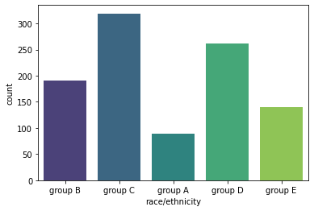
    


<b>Number of students by Race/Ethnicity </b>


```python
sns.heatmap(df.corr(),vmin=-1,annot=True)
```


    <AxesSubplot:>


    
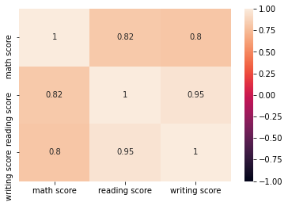
    


<b> Correlation Metric</b>


```python
import matplotlib.pyplot as plt
fig, axes = plt.subplots(1, 3, figsize=(18, 6))

sns.countplot(ax=axes[0],x='gender',data=df,palette='coolwarm')
sns.countplot(ax=axes[1],x='lunch',data=df,palette='colorblind')
sns.countplot(ax=axes[2],x='test preparation course',data=df,palette='deep')
```


    <AxesSubplot:xlabel='test preparation course', ylabel='count'>


    
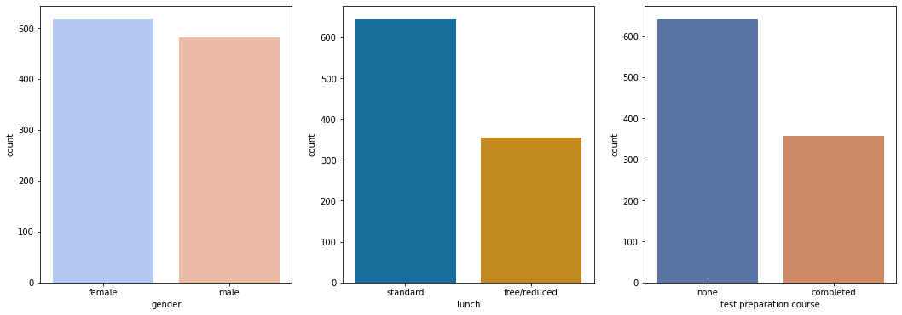
    


```python
fig, axes = plt.subplots(3, 1, figsize=(12, 10))

sns.histplot(ax=axes[0],x='math score',data=df,
             hue='test preparation course',palette=["silver",'limegreen']) 

sns.histplot(ax=axes[1],x='reading score',data=df,
             hue='test preparation course',palette=["silver",'limegreen'])

sns.histplot(ax=axes[2],x='writing score',data=df,
             hue='test preparation course',palette=["silver",'limegreen'])
```


    <AxesSubplot:xlabel='writing score', ylabel='Count'>


    
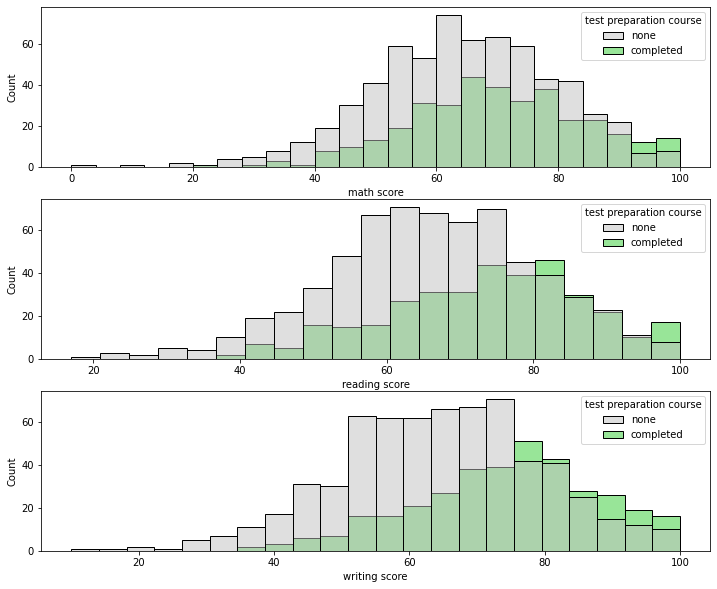
    


<b> High Preparation has Higher Score</b>


```python
fig, axes = plt.subplots(3, 1, figsize=(8, 10))

sns.scatterplot(ax=axes[0],x='math score',y='reading score',
                data=df,hue='gender', palette=["pink",'c'])

sns.scatterplot(ax=axes[1],x='math score',y='writing score',
                data=df,hue='gender', palette=["pink",'c'])

sns.scatterplot(ax=axes[2],x='reading score',y='writing score',
                data=df,hue='gender', palette=["pink",'c'])
```


    <AxesSubplot:xlabel='reading score', ylabel='writing score'>


    
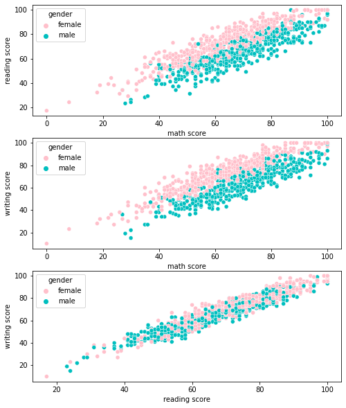
    


- Boys perform better on Math (Fig 1 & 2)
- Girls perform better on Reading and Writting (Fig 3)


```python
fig = plt.figure(figsize=(10,10))
ax = fig.add_subplot(111, projection = '3d')

x = df['math score']
y = df['reading score']
z = df['writing score']

ax.set_xlabel("math score")
ax.set_ylabel("reading score")
ax.set_zlabel("writing score")

#cmap = ListedColormap(sns.color_palette("husl", 256).as_hex())
#sc = ax.scatter(x, y, z, s=15, c=x, marker='o', cmap=cmap, alpha=1)
#plt.legend(*sc.legend_elements(), bbox_to_anchor=(1.05, 1), loc=2)

for s in df.gender.unique():
    ax.scatter(df['math score'][df.gender==s],df['writing score']
               [df.gender==s],df['reading score'][df.gender==s],label=s)

ax.legend()
```


    <matplotlib.legend.Legend at 0x20252f99400>


    
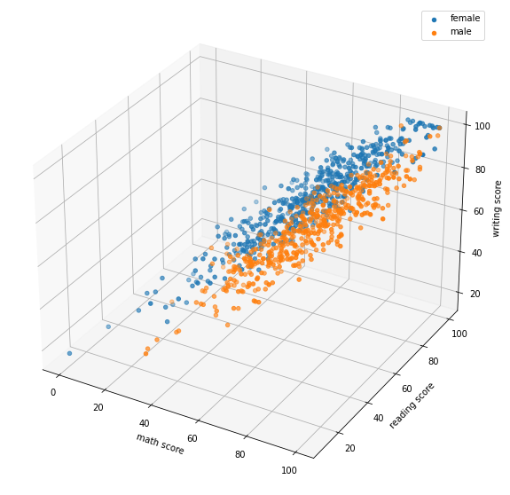
    


```python
sns.jointplot(x='math score',y='reading score',data=df,hue='lunch',palette='deep')
```


    <seaborn.axisgrid.JointGrid at 0x2025382e9d0>


    
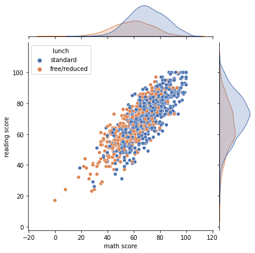
    


<b> Students with standard lunch tends to perform better</b>


```python
sns.jointplot(x='math score',y='reading score',data=df,
              hue='test preparation course',palette=['tomato','dodgerblue'])
```


    <seaborn.axisgrid.JointGrid at 0x202538d6610>


    
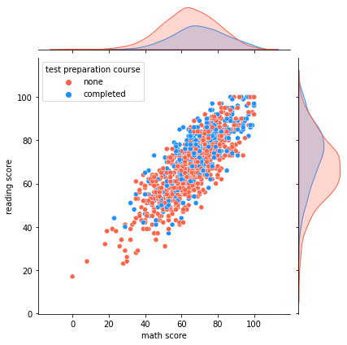
    


## Data manipulation

### Add Grade Columns


```python
def grader(x):  # a function to generate grades 
    if x>85:
        return 'A'
    elif (x>70 and x<= 85):
        return 'B'
    elif (x>55 and x<=70):
        return 'C' 
    elif (x>40 and x<=55):
        return 'D'
    else:
        return 'E'
```


```python
df['overall score'] = (df['math score'] + df['writing score'] + df['reading score'])/3

df['grade'] = df['overall score'].apply(grader) 
```


```python
sns.countplot(x='grade',data=df)
```


    <AxesSubplot:xlabel='grade', ylabel='count'>


    
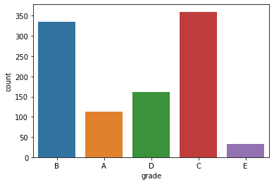
    


```python
sns.histplot(x='overall score',data =df,bins=30,kde=True,color='darkblue')
```


    <AxesSubplot:xlabel='overall score', ylabel='Count'>


    
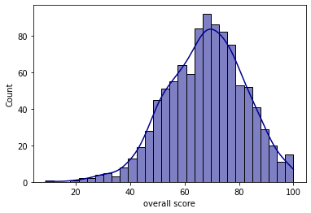
    


```python
plt.figure(figsize=(10,8))
sns.swarmplot(x='parental level of education',y='overall score',data=df)
```


    <AxesSubplot:xlabel='parental level of education', ylabel='overall score'>


    
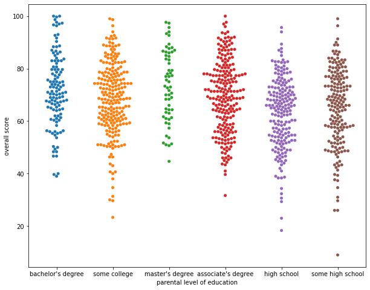
    


<b> students who have Master Degree parents perform better and relatively low variance </b>


```python
plt.figure(figsize=(10,6))
sns.countplot(x='parental level of education',data=df,palette='deep',hue='test preparation course')
```


    <AxesSubplot:xlabel='parental level of education', ylabel='count'>


    
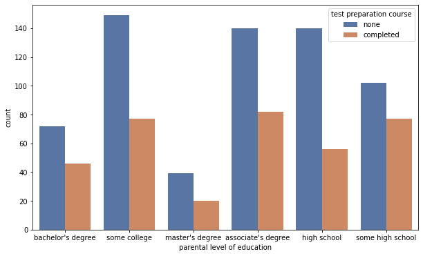
    


```python
fig, axes = plt.subplots(2, 1, figsize=(8, 10))

sns.boxplot(ax=axes[0],x='race/ethnicity',
            y='overall score',data=df)

sns.scatterplot(ax=axes[1],x='reading score',
                y='math score', hue='race/ethnicity',data=df)
```


    <AxesSubplot:xlabel='reading score', ylabel='math score'>


    
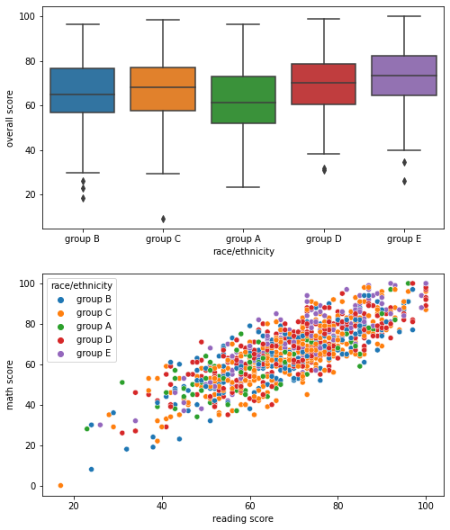
    


<b>Race/Ethnicity has no relation with the student performance</b>


```python

```
